# خواننده تلگرام

<!-- TOP_NAV START -->

<a href="https://github.com/ProAlit/aio-downloader/blob/main/telegram/content/archive_1.md" style="display:inline-block; padding:6px 12px; margin:0 4px; background-color:#2ea44f; color:white; text-decoration:none; border-radius:4px; font-weight:bold;">صفحه بعد</a>

<!-- TOP_NAV END -->

<!-- MSG START -->

---
📅 بروزرسانی: 1405/03/20 13:34
---

## VahidOOnLine — post 244661

  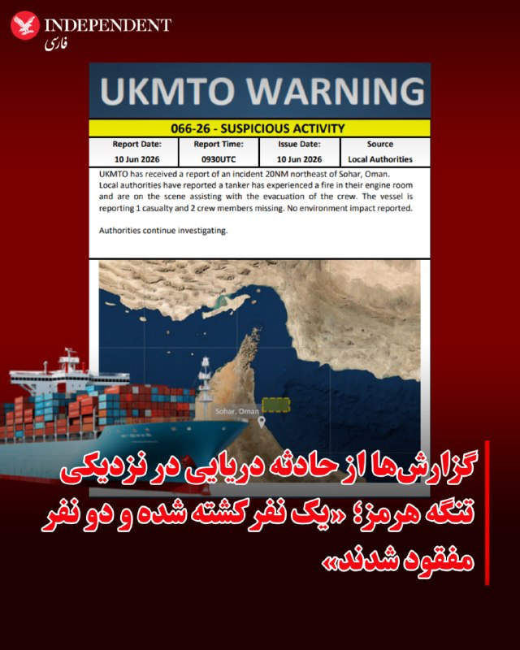

♦️سازمان عملیات تجارت دریایی بریتانیا (UKMTO)، ظهر چهارشنبه ۲۰ خردادماه از وقوع یک حادثه مرگ‌بار دریایی در نزدیکی تنگه هرمز خبر داد.

براساس بیانیه این سازمان نظارت بر دریانوردی، «گزارش وقوع یک حادثه در ۲۰ مایل دریایی شمال‌شرق شهر صحار عمان را دریافت شده است.
مقام‌های محلی اعلام کرده‌اند یک نفتکش دچار آتش‌سوزی در موتورخانه شده و نیروهای امدادی در محل برای تخلیه خدمه حضور دارند.»

سازمان عملیات تجارت دریایی بریتانیا  اعلام کرد این حادثه «تاکنون یک کشته و دو خدمه مفقود گزارش کرده است.»

هنوز جزئیاتی درباره تابعیت این کشتی و منشاء احتمالی حمله به آن منتشر نشده است.
‌🇸🇦 Indypersian

🤖 @VahidOOnLine

## VahidOOnLine — post 244660

  

به گزارش رویترز، دولت آمریکا به دلیل آنچه ارتباط عمر عبدالقادر ارتان با «افراد مظنون به عضویت در سازمان‌های تروریستی» عنوان کرده، از ورود این داور فوتبال اهل سومالی به ایالات متحده برای حضور در جام جهانی ۲۰۲۶ جلوگیری کرده است؛ تصمیمی که در چارچوب سیاست‌های سخت‌گیرانه مهاجرتی واشینگتن و ممنوعیت سفر شهروندان ۱۲ کشور، از جمله سومالی، اتخاذ شده است.

ارتان، برنده عنوان بهترین داور فوتبال آفریقا در سال ۲۰۲۵، قصد داشت به عنوان نخستین داور سومالیایی تاریخ در رقابت‌های جام جهانی قضاوت کند. او صبح چهارشنبه به سومالی بازگشت.

سخنگوی فیفا تایید کرد که این داور فرصت حضور در جام جهانی را از دست داده است و افزود فیفا در فرآیندهای مهاجرتی کشورهای میزبان نقشی ندارد.

دولت سومالی نیز با ابراز تاسف از این تصمیم اعلام کرد تلاش‌های دیپلماتیک این کشور برای حل موضوع بی‌نتیجه مانده است.

این اقدام در آستانه جام جهانی ۲۰۲۶ نگرانی‌هایی را درباره محدودیت‌های ورود به آمریکا برای برخی شرکت‌کنندگان در این رقابت‌ها ایجاد کرده است.
‌🏁 🇬🇧 IranintlTV

🤖 @VahidOOnLine

## Persian_Trend_Official — post 16446

  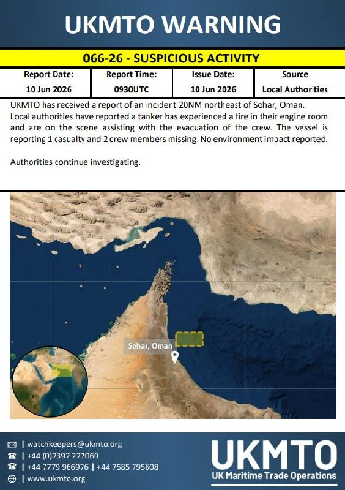

سازمان عملیات تجارت دریایی بریتانیا از وقوع حادثه برای یک نفتکش در نزدیکی عمان خبر داد!

سازمان عملیات تجارت دریایی بریتانیا (UKMTO) اعلام کرد که در فاصله 20 مایل دریایی شمال‌شرق صحار عمان، یک نفتکش دچار آتش‌سوزی در موتورخانه شده است.

بر اساس این گزارش، این کشتی یک کشته داشته و دو نفر از خدمه نیز مفقود شده‌اند

📝 Amir

📌 @persian_trend_official
پرشین ترند | متفاوت‌ترین کانال نظامی

## RadioFarda — post 158132

مدیر صنایع دفاعی آمریکا: عصر پهپادها در حال تغییر دادن شکل جنگ است

🔸بیش از سه ماه درگیری در منطقهٔ خلیج فارس، اهمیت روزافزون سامانه‌های تسلیحاتی ارزان‌قیمت و تولید انبوه، به‌ویژه پهپادها و مهمات، را برجسته کرده و در عین حال محدودیت‌های اتکا به فناوری‌های دفاعی گران‌قیمت برای مقابله با آن‌ها را آشکار ساخته است.

🔸این موضوع را ناتان دیلر، از مدیران شرکت فناوری دفاعی «صنایع مچ»، مطرح کرده است. دیلر که سرهنگ بازنشستهٔ نیروی هوایی آمریکا نیز هست، در مصاحبه‌ای در ۱۸ خرداد با رادیو اروپای آزاد/رادیو آزادی گفت این درگیری نشان داده که کشورهای متحد باید فوراً زنجیره‌های تأمین صنعتی-نظامی خود را تقویت کرده و تاب‌آوری تولیدی بیشتری ایجاد کنند.

🔸او در این زمینه به درس‌هایی که از جنگ روسیه در اوکراین به دست آمده اشاره کرد.

🔸دیلر گفت: «وقتی می‌بینیم با ابزارهای بسیار گران‌قیمت با پهپادها و مهمات ارزان‌قیمت مقابله می‌شود، این درسی است که نمی‌توانیم در یادگیری آن تأخیر کنیم».

🔸او که در دورهٔ نخست ریاست‌جمهوری دونالد ترامپ به‌عنوان معاون بخش هوانوردی در دفتر سیاست‌گذاری علم و فناوری کاخ سفید فعالیت داشته، افزود: به‌عنوان یک خلبان سابق جنگنده، توانمندی‌های سنتی نظامی همچنان ضروری هستند، اما فناوری‌های جدید می‌توانستند هزینه و مدت درگیری ایران و اسرائیل را کاهش داده و بازدارندگی را سریع‌تر برقرار کنند.

🔸او گفت: «دو دهه طول کشیده تا این رویکرد به جنگ و این نگاه به تولید انبوه نادیده گرفته شود»، و افزود که ابتکارات اخیر دولت آمریکا با حمایت کنگره، به تقویت بازدارندگی در آینده کمک می‌کند.

🔸 گزارش کامل را در وب‌سایت رادیوفردا بخوانید.

@RadioFarda

## BBCPersian — post 283342

  <a href="telegram/content/BBCPersian_283342_1781085848.mp4" target="_blank">🎬 Download video</a>

لس‌آنجلس یکی از شهرهای آمریکاست که میزبان رقابت‌های جام جهانی ۲۰۲۶ است.

‏هشت بازی قرار است در این شهر انجام شود؛ از جمله دو مسابقه تیم ملی ایران. اما ساکنان این شهر و گردشگران، یک هفته مانده به آغاز این تورنمنت هنوز احساس نمی‌کنند که در این شهر حال‌وهوای میزبانی رویداد بزرگی چون جام جهانی جاری است.

‏خبرنگارمان سام فرزانه به مغازه‌های فروش سوغاتی‌های جام جهانی رفته و با طرفداران پروپاقرص فوتبال صحبت کرده است.
@bbcpersian

## alonews — post 126768

  <a href="telegram/content/alonews_126768_1781085851.webm" target="_blank">🎬 Download video</a>

👈افزایش آنفلوانزا در کشور؛ کرمانشاه و البرز در وضعیت قرمز

✅ @AloNews خبر جنگ

## alonews — post 126767

  <a href="telegram/content/alonews_126767_1781085851.webm" target="_blank">🎬 Download video</a>

👈وزارت امور خارجه قطر: ما حملات دیشب ایران به کویت، بحرین و اردن را به شدت محکوم می‌کنیم

✅ @AloNews خبر جنگ

## alonews — post 126766

  <a href="telegram/content/alonews_126766_1781085851.webm" target="_blank">🎬 Download video</a>

👈نماینده روسیه در آژانس بین‌المللی انرژی اتمی: حملات آمریکا و اسرائیل خسارات جبران‌ناپذیری به برنامه هسته‌ای ایران وارد کرده است

✅ @AloNews خبر جنگ

## alonews — post 126765

خواستم بگم صدا و تصویر منم کسی نداره اگه لازم بود منم میتونین رهبر کنین.

سابقه اجرایی در خلوت هم دارم.

[@AloTweet]

## alonews — post 126764

  <a href="telegram/content/alonews_126764_1781085852.webm" target="_blank">🎬 Download video</a>

👈سازمان تجارت دریایی انگلیس:
یک نفتکش در نزدیکی ساحل عمان از ناحیه موتورخانه هدف قرار گرفته است و ۱ خدمه کشته و ۲ تن مفقود شده اند

✅ @AloNews خبر جنگ

---
📅 بروزرسانی: 1405/03/20 13:23
---

## VahidOOnLine — post 244659

⭕️پاپ لئو چهاردهم در مسیر بارسلونا وارد کابین خلبانان شد

♦️پاپ لئو چهاردهم، پیشوای کلیسای کاتولیک جهان روز چهارشنبه ۲۰ خرداد در جریان پرواز از مادرید به بارسلونا، پیش از آغاز بخش دوم سفر یک‌هفته‌ای به اسپانیا، دقایقی را در کابین خلبانان هواپیما سپری کرد.
پاپ قرار است در بارسلونا برج جدید و عظیم کلیسای ساگرادا فامیلیا را افتتاح و متبرک کند و همچنین مراسم عشای ربانی را در این بنای مذهبی که اکنون بلندترین کلیسای جهان به شمار می‌رود، برگزار کند.

کلیسای ساگرادا فامیلیا، شاهکار معماری آنتونی گائودی، یکی از شناخته‌شده‌ترین نمادهای شهر بارسلونا و از پربازدیدترین بناهای مذهبی جهان است. ساخت این کلیسا در سال ۱۸۸۲ آغاز شد و پس از بیش از یک قرن همچنان مراحل تکمیل و توسعه آن ادامه دارد.
‌🇸🇦 Indypersian

🤖 @VahidOOnLine

## WithYashar — post 14281

سازمان عملیات تجارت دریایی بریتانیا (UKMTO): گزارشی از یک حادثه در فاصله ۲۰ مایل دریایی شمال‌شرق صحار در عمان دریافت کرده است. در پی آتش‌سوزی در اتاق موتور یک نفتکش، یک نفر زخمی و دو نفر از خدمه مفقود شده‌اند؛ این نهاد، هیچ‌گونه آلودگی زیست‌محیطی گزارش نشده است.
@withyashar

## IranIntlTV — post 341461

  <a href="https://t.me/IranintlTV/341461" target="_blank">📎 Download file</a>

🎧نسخه صوتی اخبار بامدادی | چهارشنبه ۲۰ خرداد
@iranintlTV

## FarsiVOA — post 220233

  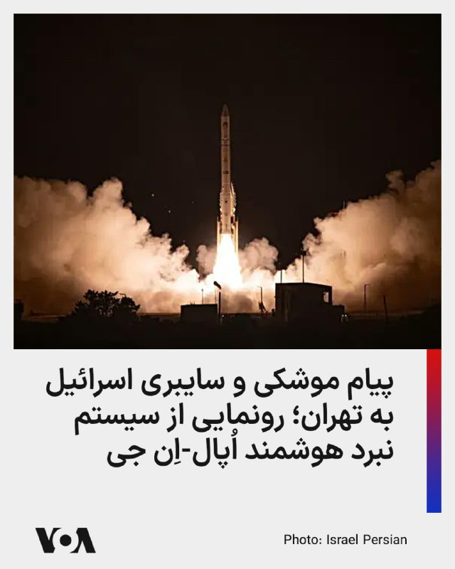

پس از موفقیت‌های سامانه دفاع موشکی «پیکان» (ختس) و توسعه ماهواره‌های فضایی، صنایع هوافضای اسرائیل با رونمایی از نسل جدید سیستم مدیریت نبرد خود تحت عنوان «اُپال-اِن‌ جی»، پیام هشداری واضح و مبتنی بر فناوری‌های نوین به جمهوری اسلامی فرستاد.

این سیستم پیشرفته با تکیه بر هوش مصنوعی و منطبق بر استانداردهای ناتو طراحی شده است و وظیفه یکپارچه‌سازی کامل عملیات‌های هوایی، زمینی و دریایی را بر عهده دارد.

سیستم اُپال-اِن‌ جی با پردازش آنی داده‌ها و اولویت‌بندی هوشمند اهداف، تصمیم‌گیری‌های نظامی را سرعت می‌بخشد.

از ویژگی‌های کلیدی این فناوری، ایجاد شبکه ارتباطی فوری میان پلتفرم‌های مختلف (از جمله جنگنده‌ها، بالگردها و مراکز فرماندهی) و تسهیل عملیات‌های هماهنگ و مشترک میان هواپیماهای سرنشین‌دار و یگان‌های پهپادی در حوزه‌های جمع‌آوری اطلاعات، جنگ الکترونیک و حملات ترکیبی است.
@FarsiVOA

## FarsiVOA — post 220232

🔺هشدار مقام سازمان غذا و دارو درباره کاهش ذخایر؛ ۸۵ داروی ضروری در کمبود

◾️مدیرکل دارو و مواد تحت کنترل سازمان غذا و دارو، در نشست کمیسیون بهداشت و درمان مجلس شورای اسلامی، نسبت به کاهش ذخایر دارویی و تشدید خطر کمبودها هشدار داده است.

◾️بر اساس این گزارش، از میان ۷۰۰ قلم داروی ضروری کشور، حدود ۸۵ قلم با کمبود مواجه‌اند؛ اما هشدار اصلی او فراتر از این عدد است.

◾️اکبر عبداللهی‌اصل اعلام کرده تعداد داروهایی که موجودی آن‌ها به سطح هشدار رسیده افزایش یافته و بخش قابل توجهی از اقلام دارویی به سمت موجودی کمتر از یک تا دو ماه حرکت کرده‌اند؛ وضعیتی که احتمال کمبودهای گسترده‌تر را بالا می‌برد.

◾️این هشدار تازه، ادامه مجموعه‌ای از هشدارهای قبلی مقام‌های حوزه سلامت است.

⬇️ بیشتر بخوانید:
https://ir.voanews.com/a/8159296.html

## RadioFarda — post 158131

چین، در سرمایه‌گذاری در آسیای مرکزی، روسیه را پشت سر گذاشت

🔸داده‌های بانک توسعه اوراسیا نشان می‌دهد چین از روسیه پیشی گرفته و به بزرگ‌ترین سرمایه‌گذار مستقیم خارجی در آسیای مرکزی تبدیل شده است؛ منطقه‌ای سرشار از منابع طبیعی که سال‌ها در حوزهٔ نفوذ مسکو قرار داشت، اما اکنون بیش از پیش به کانون توجه پکن تبدیل شده است.

🔸بانک توسعهٔ اوراسیا در گزارشی که در ماه دسامبر منتشر کرد، اعلام کرد مجموع سرمایه‌گذاری مستقیم چین در آسیای مرکزی طی ۱۰ سال گذشته تا سال ۲۰۲۵ از ۳۵ میلیارد دلار فراتر رفته است. این بانک که در سال ۲۰۰۶ از سوی روسیه و قزاقستان تأسیس شد، با هدف گسترش تجارت و همگرایی اقتصادی میان هفت جمهوری سابق شوروی فعالیت می‌کند.

🔸در مقابل، ولادیمیر پوتین، رئیس‌جمهور روسیه، در نشست منطقه‌ای ماه اکتبر گفت مجموع سرمایه‌گذاری مستقیم روسیه در آسیای مرکزی حدود ۲۰ میلیارد دلار است؛ رقمی که خود او آن را «نسبتاً ناچیز» توصیف کرد.

🔸سرمایه‌گذاری روسیه در آسیای مرکزی از سال ۲۰۲۲ به این سو کاهش یافته است. این کاهش سرمایه‌گذاری به هزینه‌های اقتصادی تهاجم نظامی این کشور به اوکراین و تحریم‌های غرب پس از آن نسبت داده می‌شود. اما در همین دوره، چین حضور اقتصادی خود را در منطقه گسترش داده است.

🔸 گزارش کامل را در وب‌سایت رادیوفردا بخوانید.

@RadioFarda

---
📅 بروزرسانی: 1405/03/20 13:13
---

## mwarmonitor — post 10597

🔴سازمان UKMTO (سازمان عملیات تجارت دریایی بریتانیا) گزارشی درباره وقوع یک حادثه در فاصله ۲۰ مایل دریایی (NM) شمال شرقی بندر صحار در عمان دریافت کرده است.

📌مقامات محلی گزارش داده‌اند که یک کشتی نفتکش در اتاق موتور خود دچار آتش‌سوزی شده است و نیروها جهت کمک به تخلیه خدمه در صحنه حضور دارند. طبق گزارش‌های دریافتی از این شناور، این حادثه ۱ کشته برجای گذاشته و ۲ تن از اعضای خدمه نیز مفقود شده‌اند. هیچ‌گونه اثرات زیست‌محیطی (مانند آلودگی یا نشت) گزارش نشده است.

@mwarmonitor

## mamlekate — post 103657

## FarsiVOA — post 220231

🔺اصرار دولت بر «مدیریت» تقاضای بنزین؛ آمارها چه می‌گویند؟

◾️وزیر نفت جمهوری اسلامی بر لزوم «مدیریت تقاضا و بهینه‌سازی مصرف بنزین» در کشور تاکید و اعلام کرد که این کار بدون همراهی مردم ممکن نیست.

◾️محسن پاک‌نژاد گفت اگر بتوانیم نیاز به واردات بنزین را کاهش دهیم، این منابع می‌تواند در مسیر بهبود و ارتقای معیشت مردم هزینه شود.

◾️مقامات جمهوری اسلامی بارها نسبت به کسری فزاینده بنزین در کشور و «بار سنگین واردات» سوخت هشدار داده‌اند، اما آمارهای بانک مرکزی نشان می‌دهد ارقامی که دولت از واردات بنزین ارائه می‌کند غلوآمیز است.

◾️پیشتر مسعود پزشکیان، مدعی شده بود که در سال ۱۴۰۴ دولت مجبور به واردات «۶ میلیارد دلار بنزین» شده و این میزان از واردات را «غیرعاقلانه» خواند.

⬇️ بیشتر بخوانید:
https://ir.voanews.com/a/8159295.html

## RadioFarda — post 158130

حملات محدود آمریکا به جنوب ایران چرا انجام شد و پیامی داشت؟

🔸مقام‌های ارشد آمریکایی و کارشناسان امنیتی منطقه می‌گویند حملات آمریکا به سامانه‌های پدافند هوایی و راداری ایران بیشتر با هدف ارسال یک هشدار محدود به جمهوری اسلامی انجام شده است، نه به‌عنوان نخستین مرحله از یک عملیات نظامی گسترده‌تر.

🔸این حملات در بامداد چهارشنبه ۲۰ خرداد چندین سامانهٔ پدافند هوایی و راداری ایران را هدف قرار داد. یک مقام آمریکایی به رادیو اروپای آزاد/رادیو آزادی در همان ساعات حمله گفت این عملیات «در حال انجام» است و تأسیسات پدافند هوایی و راداری را هدف گرفته است.

🔸رسانه‌های جمهوری اسلامی ایران نیز از وقوع انفجار در چند نقطه استان هرمزگان، از جمله سیریک، بندرعباس، میناب و جزیره قشم خبر دادند.

🔸این حملات در مقطع حساسی از روابط آمریکا و ایران انجام شده است؛ زمانی که دولت دونالد ترامپ با وجود افزایش تنش‌های نظامی در خلیج فارس، همچنان در پی پیشبرد مذاکرات با تهران است.

🔸چندین مقام آمریکایی نیز در گفت‌وگو با خبرنگاران تأکید کردند که انتظار ندارند این اقدام نظامی به تلاش‌های دیپلماتیک جاری آسیب بزند یا روند مذاکرات را مختل کند.

🔸یکی از مقام‌های ارشد ایلات متحده گفت که دونالد ترامپ همچنان معتقد است دستیابی به توافق صلح با ایران امکان‌پذیر است. او گفت «در حال حاضر هیچ تغییری در وضعیت توافق ایجاد نشده» و توافق «همچنان نزدیک» است.

🔸 گزارش کامل را در وب‌سایت رادیوفردا بخوانید.

@RadioFarda

## RadioFarda — post 158129

  

🔸سخنگوی وزارت خارجه ایران درباره تأثیر درگیری‌های نظامی اخیر بر مذاکرات با آمریکا گفت ««باید بررسی شود، دیپلماسی و میدان دو امر جدا از هم نبوده و در امتداد و عرض یکدیگر» هستند.

🔸اسماعیل بقائی روز چهارشنبه ۲۰ خرداد دربارهٔ آخرین وضعیت مذاکرات هم گفت: «با توجه به تحولات دیشب باید بررسی کنیم. روند دیپلماتیک در خلأ اتفاق نمی‌افتد و برای پیشبرد هر فرایند دیپلماتیکی نیازمند فضای حداقلی هستید تا بتوان روند جاری را پیش برد.»

🔸شب گذشته ارتش ایالات متحده، در واکنش به سرنگونی یک بالگرد آمریکایی در سواحل عمان، حملاتی را به جنوب ایران انجام داد و ایران نیز در واکنش به شلیک موشک به برخی کشورهای منطقه اقدام کرد.

🔸دونالد ترامپ که پیشتر بارها از نزدیک بودن توافق خبر داده بود، هنگام انجام عملیات آمریکا در جنوب ایران گفت: «ما توافقی بسیار خوب داشتیم و احتمالاً همچنان خواهیم داشت.»
@RadioFarda

## BBCPersian — post 283341

🔻فرماندار قشم وقوع انفجار در این شهر را رد کرد

🔻ساعتی پس از گزارش شنیده شدن صدای انفجار در قشم، فرماندار قشم وقوع انفجار در این جزیره را رد کرد.

حسین امیرتیموری گفت: «صدای انفجاری که ساعتی پیش شنیده شده است مربوط به شهر قشم نیست.»

پیشتر خبرگزاری مهر به نقل از منابع محلی، از شنیده شدن صدای یک انفجار در محدوده شهرستان قشم خبر داده بود.

خبرگزاری مهر نوشته بود: «هرچند ماهیت دقیق این صداها هنوز مشخص نیست، اما با توجه به حجم صدا ممکن است منبع انفجار فاصله نسبتا زیادی با شهر قشم داشته است و یا مربوط یه تحرکاتی در تنگه هرمز باشد.»

https://bbc.in/43sZuRn
@BBCPersian

## BBCPersian — post 283340

🔻قطع آب «۲۰ هزار نفر» از ساکنان بمانی در نتیجه حمله آمریکا

🔻مدیرعامل شرکت آب و فاضلاب استان هرمزگان می‌گوید در پی حمله دیشب آمریکا به مناطق جنوبی ایران، دسترسی «۲۰ هزار نفر» از مردم منطقه بمانی به آب سالم قطع شده است.

در حمله دیشب، به گفته شرکت آب و فاضلاب استان هرمزگان ۲ مخزن بتونی ذخیره آب با ظرفیت ۲هزار و ۵۰۰ مترمکعب در بخش بمانی این استان، «هدف اصابت موشک قرار گرفت و به طور کامل از مدار بهره‌برداری خارج شد.»

این مخازن وظیفه تأمین آب شرب شهر کوهستک و ۱۰ روستای اطراف را بر عهده داشتند.

به گزارش خبرگزاری‌‌های ایران، در این منطقه منابع آب زیرزمینی کافی برای جایگزینی فوری وجود ندارد و تخریب این مخازن مشکلی جدی برای شبکه آب‌رسانی منطقه ایجاد خواهد کرد.

https://bbc.in/3Q7mjag
@BBCPersian

## alonews — post 126763

  <a href="telegram/content/alonews_126763_1781084588.webm" target="_blank">🎬 Download video</a>

👈نیروی هوایی اسرائیل داره به منطقهٔ خومین، لُبنان حملۀ می‌کنه

✅ @AloNews خبر جنگ

## alonews — post 126762

  <a href="telegram/content/alonews_126762_1781084589.webm" target="_blank">🎬 Download video</a>

👈فارس: منابع از وقوع آتش‌سوزی‌های گسترده در مرکز اربیل و شنیده شدن صدای انفجارهایی در نزدیکی پایگاه آمریکا در اربیل خبر می‌دهند

✅ @AloNews خبر جنگ

---
📅 بروزرسانی: 1405/03/20 13:03
---

## VahidOOnLine — post 244658

  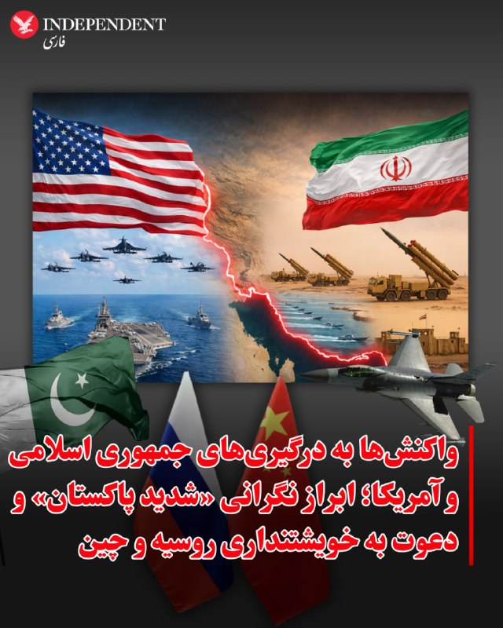

♦️ساعاتی پس از حملات هوایی، موشکی و پهپادی متقابل آمریکا و جمهوری اسلامی در تنگه هرمز و منطقه خاورمیانه، نگرانی‌ها از پایان آتش‌بس و شکست مذاکرات میان تهران و واشنگتن، شدت گرفته است.

عاصم افتخار احمد، نماینده دائم پاکستان در سازمان ملل متحد گفت: «افزایش اخیر خشونت در خاورمیانه یادآوری آشکاری از خطرات مرتبط با آتش‌بس شکننده و عواقب غیرقابل تحملی است که ممکن است به دنبال داشته باشد. چرخه خشونت و بی‌ثباتی باید به نفع صلح، امنیت و رفاه منطقه‌ای و بین‌المللی پایان یابد.»

لین جیان، سخنگوی وزارت خارجه چین، هم در واکنش به درگیری‌های بامداد چهارشنبه گفت: «همه طرف‌ها باید با حفظ آرامش، خویشتنداری نشان دهند، از تشدید درگیری و وخیم‌تر شدن اوضاع خودداری و با در پیش گرفتن اقدامات ملموس، به کاهش تنش‌ و آرام کردن وضعیت کمک کنند.»

همزمان با چین و پاکستان، ماریا زاخارووا، سخنگوی وزارت امور خارجه روسیه هم ایران و آمریکا را به خویشتنداری دعوت کرد و گفت مسکو برای کمک به به‌نتیجه رسیدن دیپلماسی آماده است.
‌🇸🇦 Indypersian

🤖 @VahidOOnLine

## WithYashar — post 14280

یونی بن مناخیم، تحلیلگر ارشد مرکز اورشلیم، به کانال ۱۴ گفت که ایران سیستم‌های دفاع هوایی که چند هفته پیش توسط ایالات متحده و اسرائیل نابود شده بود را بازسازی کرده بود. بهبودی با این سرعت بدون کمک مستقیم چین امکان‌پذیر نبود.
@withyashar

## IranIntlTV — post 341460

  <a href="telegram/content/IranIntlTV_341460_1781084031.mp4" target="_blank">🎬 Download video</a>

مرتضی کاظمیان، عضو تحریریه ایران‌اینترنشنال، در ارزیابی خود از بیانیه وزارت امور خارجه جمهوری اسلامی گفت این بیانیه نشان‌دهنده ضعف و تلاش برای نمایش اقتداری است که به گفته او وجود ندارد.

وزارت خارجه جمهوری اسلامی در بیانیه‌ای کشورهای حاشیه خلیج فارس را مسئول حملات آمریکا به ایران دانست و تاکید کرد نیروهای نظامی کشور، به حملات خود به پایگاه‌های ایالات متحده در کشورهای منطقه ادامه خواهد داد.
@iranintltv

## FarsiVOA — post 220230

  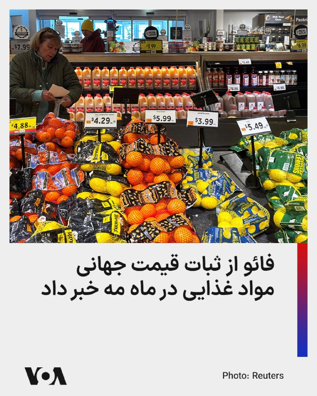

به رغم انسداد تنگه هرمز توسط جمهوری اسلامی و جهش قیمت حامل‌های انرژی و کودهای شیمیایی، قیمت جهانی مواد غذایی در ماه گذشته تغییر چندانی نسبت به ماه آوریل نکرده است.

سازمان خواربار و کشاورزی ملل متحد می‌گوید قیمت غلات و شکر در ماه مه نسبت به آوریل مقداری رشد داشت، اما شاخص معیار قیمت جهانی کالاهای غذایی به خاطر کاهش قیمت روغن‌های گیاهی تغییری نکرد.

با این‌حال، قیمت مواد غذایی در ماه مه نسبت به ماه مشابه پارسال ۲.۹ درصد رشد کرده است. این رشد برای غلات پنج درصد بوده است.

افزایش نسبی قیمت مواد غذایی به خاطر انسداد تنگه هرمز توسط جمهوری اسلامی در حالی است که ایران یکی از بزرگترین واردکننده‌های مواد غذایی است و سالانه ۱۷ میلیون تن غلات وارد می‌کند. طبق گزارش‌های رسمی، قیمت مواد غذایی در ایران طی ماه گذشته نسبت به اردیبهشت پارسال ۱۳۰ درصد جهش کرده است.
@FarsiVOA

## DW_Farsi — post 125760

  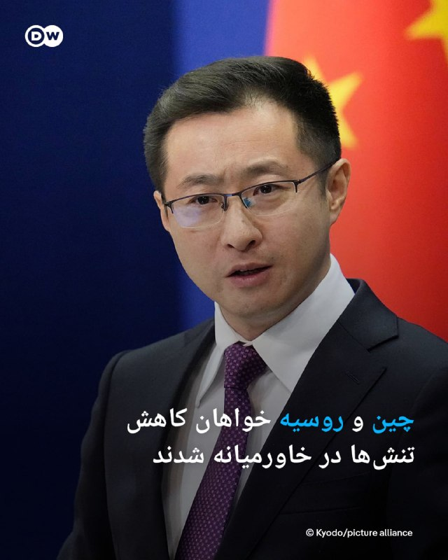

🔶 چین و روسیه خواهان کاهش تنش‌ها در خاورمیانه شدند

چین و روسیه با توجه به بروز دوباره حملات متقابل میان ایران و آمریکا طرف‌های درگیری را به "خویشتن‌داری و خودداری از تشدید تنش‌ها" فراخوانده و از آن‌ها خواستند تا برای کاهش بحران دست به "اقداماتی عملی" بزنند.

لین جیان، سخنگوی وزارت خارجه چین روز چهارشنبه ۱۰ ژوئن (۲۰ خرداد) در نشستی خبری تصریح کرد، "تمامی طرف‌های درگیر باید آرامش خود را حفظ کنند، از خود خویشتن‌داری نشان دهند، از تشدید درگیری و وخامت اوضاع خودداری کنند و با اتخاذ اقدامات ملموس، به کاهش تنش‌ها و آرام کردن اوضاع کمک کنند".

از سوی دیگر ماریا زاخارووا، سخنگوی وزارت امور خارجه روسیه نیز امروز چهارشنبه گفت، مسکو از تهران و واشنگتن می‌خواهد که از خود خویشتن‌داری نشان دهند.

او اضافه کرد: «ما از طرفین می‌خواهیم که از خود خویشتن‌داری نشان دهند و حملات نظامی را فورا متوقف کنند.» سخنگوی وزارت خارجه روسیه حمله به زیرساخت‌های غیر نظامی را "کاملاً غیر قابل قبول" خواند.

@dw_farsi

## alonews — post 126761

  <a href="telegram/content/alonews_126761_1781084035.webm" target="_blank">🎬 Download video</a>

👈تایید نشده/ گزارشات اولیه از حمله آمریکا به بندر سیریک در هرمزگان 
✅ @AloNews خبر جنگ

## alonews — post 126760

  <a href="telegram/content/alonews_126760_1781084036.webm" target="_blank">🎬 Download video</a>

👈 پزشکیان: شهادت فوز عظیمی است ولی اینکه دشمن بتواند به این راحتی فرماندهان ما را شهید کند به هیچ وجه قابل قبول نیست.

✅ @AloNews خبر جنگ

## alonews — post 126759

  <a href="telegram/content/alonews_126759_1781084036.webm" target="_blank">🎬 Download video</a>

👈صابون گلنار ۱۰۰ درصد گرون شد و قیمتش ۲ برابر شد

✅ @AloNews خبر جنگ

---
📅 بروزرسانی: 1405/03/20 12:53
---

## DEJradio — post 5532

  <a href="telegram/content/DEJradio_5532_1781083393.mp4" target="_blank">🎬 Download video</a>

🔺📢 نارضایتی در نیروهای مسلح؛ پیام اعتراضی پرسنل فراجا

#نیروهای_مسلح #فراجا
@DEJradio

## DW_Farsi — post 125759

  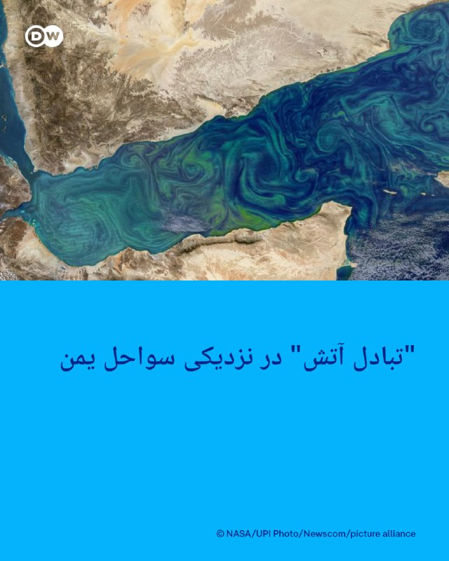

🔶 "تبادل آتش" در نزدیکی سواحل یمن

سازمان عملیات تجاری دریایی بریتانیا (UKMTO) روز چهارشنبه ۱۰ ژوئن (۲۰ خرداد) خبر داد که "در نزدیکی سواحل یمن میان یک کشتی باری و یک شناور حامل افراد مسلح تبادل آتش روی داده است".

به گزارش این نهاد، کشتی باری مزبور در ۸۸ مایل دریایی (حدود ۱۶۳ کیلومتری) جنوب غرب بلحاف یمن با یک شناور حامل ۶ فرد مسلح روبرو شد. این محدوده در نزدیکی سواحل جنوبی یمن در مسیر دریایی خلیج عدن و دریای عرب قرار دارد.

سازمان عملیات تجاری دریایی بریتانیا گزارش داد که میان تیم امنیتی مستقر در کشتی باری و سرنشینان مسلح این شناور کوچک تبادل آتش صورت گرفت، اما شناور مزبور پس از درگیری مسیر خود را تغییر داده از محل وقوع حادثه دور شده است.

این سازمان کشتی‌های تجاری را فراخواند تا در هنگام تردد در این مسیر احتیاط را رعایت کنند.

@dw_farsi

## RadioFarda — post 158128

🔸فرمانده قرارگاه مرکزی خاتم‌الانبیاء از آن دسته حامیان حکومت که در تجمعات شبانه شرکت می‌کنند، خواست تا زمانی که مجتبی خامنه‌ای دستور جدیدی برای مردم صادر کند، همچنان به شرکت در این تجمعات حکومتی ادامه دهند. 🔸علی عبداللهی در بیانیه‌ای که روز چهارشنبه ۲۰ خرداد…

## RadioFarda — post 158127

  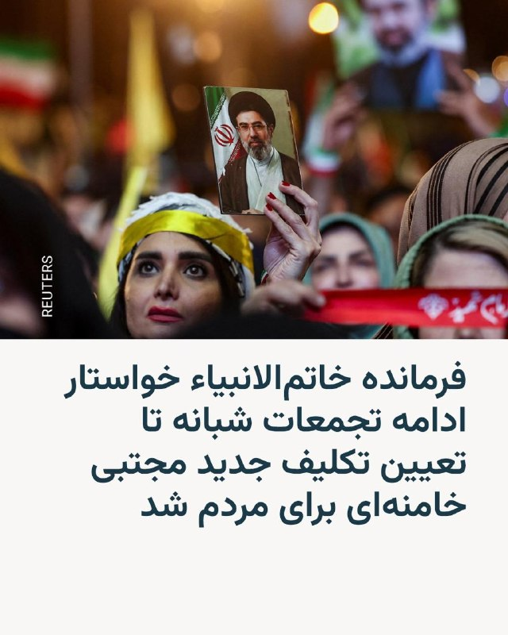

🔸فرمانده قرارگاه مرکزی خاتم‌الانبیاء از آن دسته حامیان حکومت که در تجمعات شبانه شرکت می‌کنند، خواست تا زمانی که مجتبی خامنه‌ای دستور جدیدی برای مردم صادر کند، همچنان به شرکت در این تجمعات حکومتی ادامه دهند.

🔸علی عبداللهی در بیانیه‌ای که روز چهارشنبه ۲۰ خرداد منتشر شد، «یکصد شب» تجمع شبانه را از عوامل «بازدارندگی راهبردی جمهوری اسلامی» خواند و از حامیان نظام خواست شرکت در این تجمعات را تا زمانی که رهبر جمهوری اسلامی «تکلیف دیگری برای ملت تعیین فرمایند»، ادامه دهند.

🔸قرارگاه مرکزی خاتم‌الانبیاء بالاترین نهاد نظامی در ساختار جمهوری اسلامی ایران است که مسئولیت طراحی، هماهنگی و نظارت عملیاتی نیروهای مسلح را بر عهده دارد.

🔸پیشتر، شهرداری تهران، اعلام کرده بود که ادارهٔ «۱۲۰ اجتماع بزرگ و ۴۰۰ اجتماع محلی و ۴۰۰ کاروان خودرویی در سطح شهر تهران» را بر عهده دارد.

@RadioFarda

## RadioFarda — post 158126

🔸رئیس‌ کل دادگستری خراسان ‌شمالی می‌گوید تاکنون اموال «۴۷ نفر» از ایرانیان مقیم خارج در این استان شناسایی و توقیف شده است. 🔸خبرگزاری فارس با انتشار این گزارش، به نقل از رضا براتی‌زاده این افراد را «خائن به وطن و افراد تأثیرگذار در شبکهٔ کمک به‌نفع دشمن» نامیده،…

## RadioFarda — post 158125

  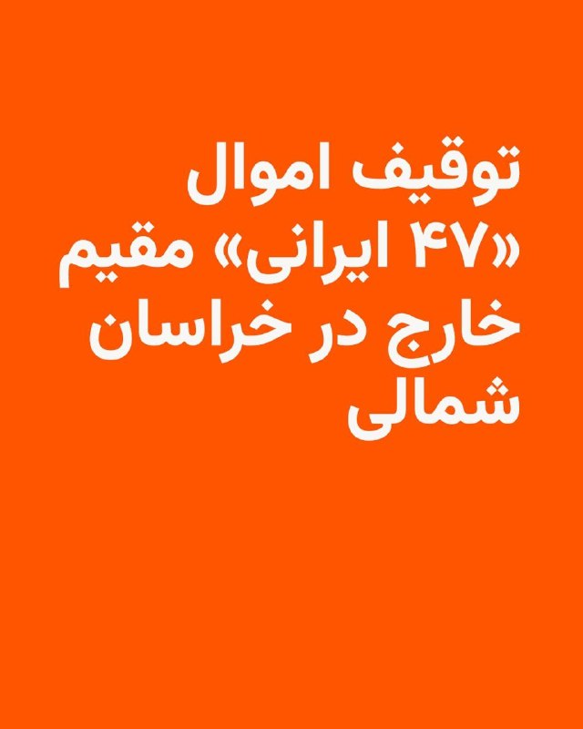

🔸رئیس‌ کل دادگستری خراسان ‌شمالی می‌گوید تاکنون اموال «۴۷ نفر» از ایرانیان مقیم خارج در این استان شناسایی و توقیف شده است.

🔸خبرگزاری فارس با انتشار این گزارش، به نقل از رضا براتی‌زاده این افراد را «خائن به وطن و افراد تأثیرگذار در شبکهٔ کمک به‌نفع دشمن» نامیده، است.

🔸بر اساس این گزارش، چهار نفر از این افراد که به هویت هیچ‌یک اشاره‌ای نشد، مقیم آلمان، شش نفر مقیم بریتانیا، دو نفر مقیم فرانسه، ۱۰ نفر مقیم ترکیه، پنج نفر مقیم آمریکا، دو نفر مقیم کانادا، دو نفر مقیم ایتالیا، دو نفر مقیم استرالیا، دو نفر مقیم عمان و مابقی مقیم دانمارک، اسپانیا، قطر، امارات، چین، اسکاتلند، قبرس، یونان، نیوزیلند و کشورهای دیگر هستند.

🔸روز سه‌شنبه نیز خبرگزاری‌ها در ایران به نقل از قوه قضائیه از شناسایی اموال دیگری از علی کریمی، بازیکن سابق تیم ملی فوتبال ایران که مقیم آمریکاست، و توقیف آنها خبر داده بودند.

@RadioFarda

## alonews — post 126758

  <a href="telegram/content/alonews_126758_1781083396.webm" target="_blank">🎬 Download video</a>

👈پزشکیان: ما الان در تحریم هستیم، مسیر ما را بستند؛ امتحان سختی در پیش داریم/ نباید قصور ما باعث فشار بیشتر بر مردم شود 
✅ @AloNews خبر جنگ

## alonews — post 126757

  <a href="telegram/content/alonews_126757_1781083396.webm" target="_blank">🎬 Download video</a>

👈 پزشکیان: قادر نخواهند بود ایران ما را با تهدید تسلیم کنند 
✅ @AloNews خبر جنگ

---
📅 بروزرسانی: 1405/03/20 12:43
---

## WithYashar — post 14279

هم اکنون صدای انفجار‌ در‌ سیریک🚨
@withyashar

## IranIntlTV — post 341459

  <a href="telegram/content/IranIntlTV_341459_1781082786.mp4" target="_blank">🎬 Download video</a>

شبکه خبری آی‌۲۴ اسرائیل به نقل از نتانیاهو گزارش داد اسرائیل مایل نیست به تنهایی علیه جمهوری اسلامی اقدام کند، اما برای انجام آن آمادگی دارد

گفت‌وگو با بابک اسحاقی، خبرنگار ایران‌اینترنشنال
@iranintltv

## RadioFarda — post 158124

  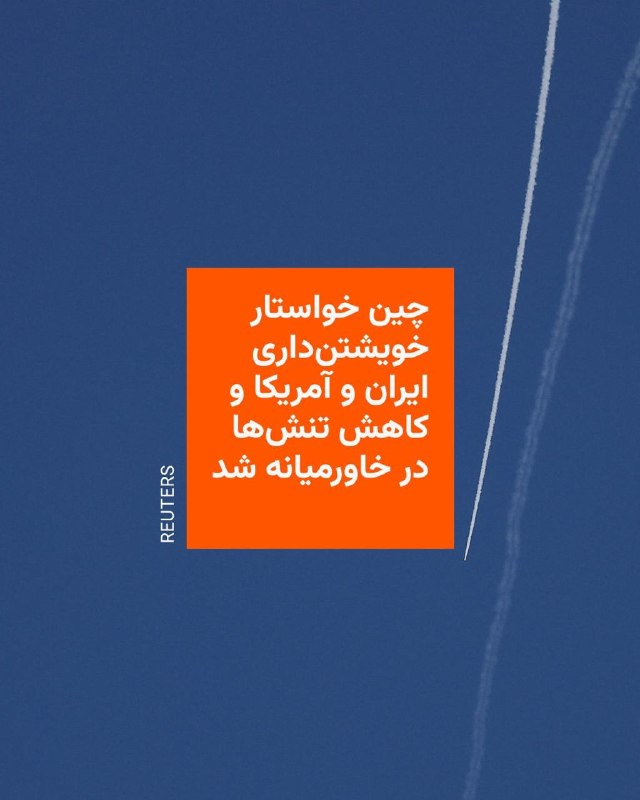

🔸وزارت خارجه چین با ابراز نگرانی عمیق از درگیری‌های جاری در خاورمیانه، از طرف‌های درگیر خواست از تشدید تنش‌ها خودداری کنند و برای کاهش بحران گام‌های عملی بردارند.

🔸لین جیان، سخنگوی وزارت خارجه چین، روز چهارشنبه ۲۰ خرداد گفت که «طرف‌های مختلف ذی‌ربط باید آرامش خود را حفظ کنند و خویشتن‌داری نشان دهند، از تشدید درگیری و وخیم‌تر شدن اوضاع خودداری کنند و با اتخاذ اقدامات ملموس، به کاهش تنش‌ها و آرام کردن وضعیت کمک کنند.»

🔸ارتش ایالات متحده، در واکنش به سرنگونی یک بالگرد آمریکایی در سواحل عمان، بامداد چهارشنبه حملاتی را به جنوب ایران انجام داد و ایران نیز در واکنش به شلیک موشک و پهپاد به برخی کشورهای منطقه اقدام کرد.

🔸پکن تاکنون از موضع‌گیری مستقیم به نفع هر یک از طرف‌های درگیر خودداری کرده و صرفاً بر ضرورت جلوگیری از گسترش درگیری‌ها و حفظ ثبات منطقه تأکید کرده است.
@RadioFarda

## alonews — post 126756

  <a href="telegram/content/alonews_126756_1781082788.webm" target="_blank">🎬 Download video</a>

👈تایید نشده/ گزارشات اولیه از حمله آمریکا به بندر سیریک در هرمزگان

✅ @AloNews خبر جنگ

## alonews — post 126755

  <a href="telegram/content/alonews_126755_1781082788.webm" target="_blank">🎬 Download video</a>

👈روسیه: آماده کمک به حل درگیری آمریکا و ایران هستیم

🔴 واشنگتن و تهران خویشتن‌داری کنند

🔴 حمله به زیرساخت‌های غیر نظامی، کاملاً غیر قابل قبول است

✅ @AloNews خبر جنگ

## alonews — post 126754

  <a href="telegram/content/alonews_126754_1781082788.webm" target="_blank">🎬 Download video</a>

👈دقایقی پیش منابع محلی از شنیده شدن صدای یک انفجار در محدوده شهرستان قشم خبر داده‌اند. 
✅ @AloNews خبر جنگ

## alonews — post 126753

👈 پزشکیان: قادر نخواهند بود ایران ما را با تهدید تسلیم کنند

✅ @AloNews خبر جنگ

---
📅 بروزرسانی: 1405/03/20 12:33
---

## VahidOOnLine — post 244657

  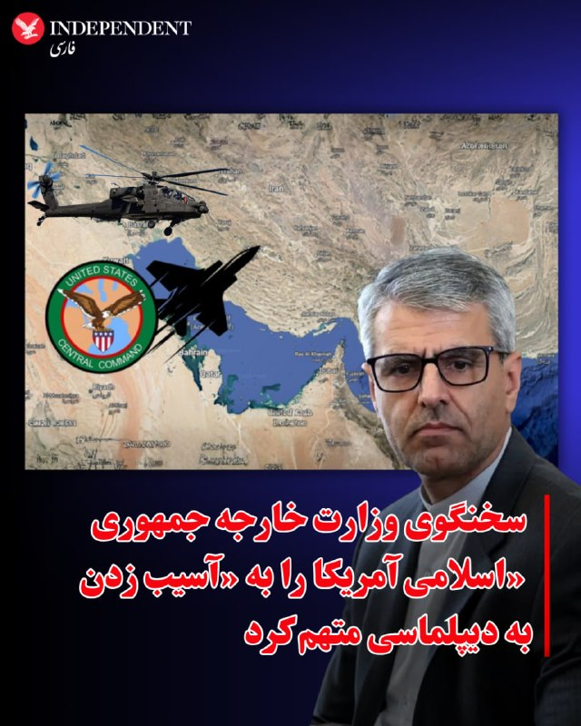

♦️اسماعیل بقایی، سخنگوی وزارت امور خارجه جمهوری اسلامی روز چهارشنبه ۲۰ خرداد و پس از حملات متقابل نیروهای مسلح ایران و آمریکا، ایالات متحده را به «نقض مکرر» آتش‌بس و «آسیب» به روند دیپلماتیک متهم کرد.

به گزارش ایرنا، بقایی در پاسخ به پرسش خبرگزاری جمهوری اسلامی درباره وضعیت مذاکرات با آمریکا گفت: «آمریکا هم از حیث پیام‌های متناقضی که می‌فرستد و هم از جهت تغییر مکرر مواضع و مطالباتش و هم بدتر از همه از طریق نقض مکرر آتش‌بس به روند دیپلماتیک آسیب می‌رساند.

سخنگوی وزارت امور خارجه جمهوری اسلامی افزود: «ادامه روند مذاکرات با توجه به تحولات اخیر بررسی می‌شود.»
‌🇸🇦 Indypersian

🤖 @VahidOOnLine

## WithYashar — post 14278

  <a href="telegram/content/WithYashar_14278_1781082218.mp4" target="_blank">🎬 Download video</a>

@withyashar b52

## mwarmonitor — post 10596

💥صدای انفجار در اطراف جزیره قشم شنیده شده است.

## DEJradio — post 5531

  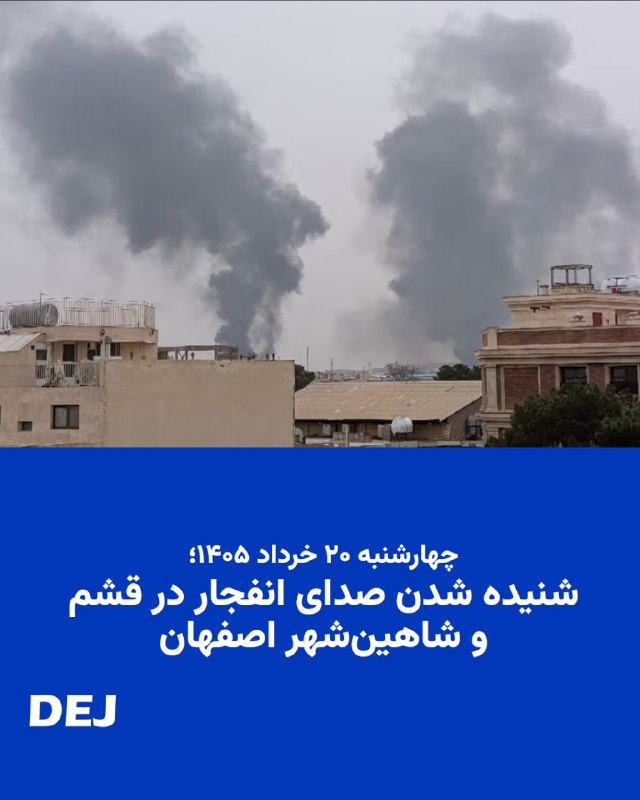

🛩️
🔥 چهارشنبه ۲۰ خرداد ۱۴۰۵؛
شنیده شدن صدای انفجار در قشم و شاهین‌شهر اصفهان

بر اساس گزارش‌ منابع داخلی اندکی پیش از ظهر چهارشنبه ۲۰ خرداد صدای یک انفجار در جزیره قشم شنیده شد.

رسانه‌های داخلی گزارش دادند «ماهیت دقیق این صداها هنوز معلوم نیست، اما با توجه به حجم صدا ممکن است منبع انفجار فاصله به‌نسبت زیادی با شهر قشم داشته و/یا مربوط یه تحرکاتی در تنگه هرمز باشد.»

در شاهین‌شهر اصفهان نیز صدای انفجار شنیده شد اما ماهیت آن هنوز پیدا نیست.
بامداد همین روز آمریکا رادارها و سایت‌های موشکی در سیریک، اهواز، قشم، شهرستان جاسک، اطراف بندرعباس و نوار ساحلی میناب را هدف قرار داد.

*عکس آرشیوی

#حملات_هدفمند #جنگ
@DEJradio

## FarsiVOA — post 220229

🔺صادرات نفتی آمریکا بیش از دو برابر شد

◾️اداره اطلاعات انرژی آمریکا از جهش صادرات خالص نفت خام و محصولات نفتی آمریکا به ۵ میلیون و ۸۰۰ هزار بشکه در روز طی ماه گذشته خبر داد که بیش از دو برابر سطح سال ۲۰۲۵ است.

◾️این رقم در سال گذشته بطور متوسط ۲.۸ میلیون بشکه در روز بود.

◾️ایالات متحده طی ماه‌های گذشته برای کاهش تاثیر انسداد تنگه هرمز توسط جمهوری اسلامی بر بازارهای انرژی، هم تولید نفت خود را افزایش داده و هم بخشی از ذخایر استراتژیک نفت خود را راهی بازارها کرده است.

◾️این گزارش می‌افزاید انتظار می‌رود در مجموع طی سال جاری، متوسط صادرات خالص نفت و محصولات نفتی آمریکا به ۴.۲ میلیون بشکه برسد که ۵۰ درصد بیشتر از سال ۲۰۲۵ خواهد بود.

⬇️ بیشتر بخوانید:
https://ir.voanews.com/a/8159292.html

## DW_Farsi — post 125758

  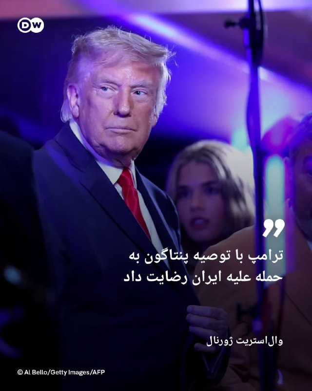

🔶 وال‌استریت ژورنال: ترامپ با توصیه پنتاگون به حمله علیه ایران رضایت داد

به نوشته نشریه وال‌استریت ژورنال، دونالد ترامپ درباره ضرورت پاسخ نظامی به جمهوری اسلامی پس از سقوط بالگرد آپاچی ارتش آمریکا نخست قانع نشده بود، اما نظرش را پس از دریافت گزارش و توصیه‌های پیت هگست، وزیر دفاع و دن کین، رئیس ستاد مشترک ارتش آمریکا، تغییر داد. رئیس جمهور آمریکا پیشتر این مسئله را کم‌اهمیت جلوه داده و گفته بود که این مسئله "اتفاق بزرگی" نیست.

فرماندهی مرکزی نیروهای آمریکا (سنتکام) بامداد روز چهارشنبه ۱۰ ژوئن با انتشار بیانیه‌ای رسمی اعلام کرد که حملات تلافی‌جویانه و تکمیلی نیروهای ارتش ایالات متحده علیه مواضعی در ایران به پایان رسیده است. به گزارش سنتکام، جنگنده‌های نیروی هوایی و نیروی دریایی ایالات متحده "با استفاده از مهمات هوشمند و دقیق، پدافند هوایی، ایستگاه‌های کنترل زمینی و رادارهای نظارتی ایران را در نزدیکی تنگه هرمز هدف قرار دادند".

جمهوری اسلامی نیز در تلافی به این حملات، پایگاه‌های آمریکا در شماری از کشورهای منطقه از جمله کویت، اردن و بحرین را مورد حمله قرار داد.

@dw_farsi

## BBCPersian — post 283333

🖊دومنیک هیوز،لزلی هیچن و جیمز گوان
بی‌بی‌سی

🔻پژوهش‌های اخیر نشان می‌دهد انجام حدود ۹۰ دقیقه تا دو ساعت تمرین با وزنه در هفته می‌تواند احتمال مرگ زودهنگام بر اثر بیماری‌های گوناگون را به طور قابل توجهی کاهش دهد.

بررسی داده‌های چند دهه تحقیق روی بیش از ۱۴۷ هزار نفر نشان داده است تمرینات مقاومتی با کاهش خطر مرگ بر اثر بیماری‌های قلبی‌عروقی تا ۱۹٪ و بیماری‌های عصب‌شناختی تا ۲۷٪ همراه است. همچنین در مجموع، خطر مرگ زودرس تا حدود ۱۳٪ کاهش پیدا می‌کند، به‌ویژه زمانی که همراه با فعالیت‌های هوازی انجام شود. با این حال، انجام بیش از دو ساعت تمرین قدرتی در هفته در این زمینه مزیت بیشتری نشان نداده است.

کارشناسان تأکید می‌کنند ورزش‌های هوازی همچنان در کاهش بیماری‌هایی مانند دیابت و سکته نقش مهمی دارند، اما نقش تمرینات قدرتی نیز به طور روز‌افزون اهمیت بیشتری پیدا می‌کند.

متن کامل خبر:

https://bbc.in/3S0WRDN
📷Getty Images

@BBCPersian

## Hranews — post 113510

گزارشی از بازداشت یک شهروند در تهران

❗️
❗️
❗️
❗️
❗️– مرکز اطلاع‌رسانی پلیس تهران بزرگ از #بازداشت یک شهروند به دلیل آنچه «ارسال اطلاعات به خارج از کشور» عنوان کرده، خبر داد.

ادامه مطلب

↘️
@hranews_bot تماس ✉️ - @Hranews کانال هرانا 🆑

## alonews — post 126752

  <a href="telegram/content/alonews_126752_1781082221.webm" target="_blank">🎬 Download video</a>

👈اوکراین : یه نفت‌کش مربوط به ناوگانِ سایه‌ روسیه رو تو دریای سیاه هدف قرار دادیم

✅ @AloNews خبر جنگ

## alonews — post 126748

  <a href="telegram/content/alonews_126748_1781082221.webm" target="_blank">🎬 Download video</a>

👈حملۀ به منطقهٔ طیر دِبا تو جنوب لُبنان انجام شد

✅ @AloNews خبر جنگ

## alonews — post 126747

  <a href="telegram/content/alonews_126747_1781082221.webm" target="_blank">🎬 Download video</a>

👈ایال هولاتا، رئیس پیشین شورای امنیت داخلی اسرائیل: وضعیت امروز ما بهتر از یک هفته قبل نیست، و تمایل ترامپ برای ورود به دورهای بیشتری از رویارویی اکنون کمتر شده است

✅ @AloNews خبر جنگ

## alonews — post 126746

  <a href="telegram/content/alonews_126746_1781082221.webm" target="_blank">🎬 Download video</a>

👈تصویری از کشف تجهیزات پشتیبان هدایت جنگنده‌های اسرائیلی در لواسان

✅ @AloNews خبر جنگ

---
📅 بروزرسانی: 1405/03/20 12:23
---

## pm_afshaa — post 93282

  

لبنان هم اکنون

💧 Rainbet.com the #1 Non-KYC Crypto Casino & Sportsbook @rainbetcom

😁 @Pm_Afshaa

## DEJradio — post 5530

  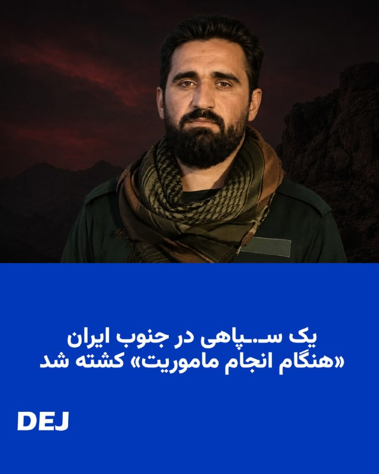

💀
🚨 یک سـ.ـپاهی در جنوب ایران «هنگام انجام ماموریت» کشته شد

بر اساس گزارش منابع داخلی امیرمحمد احمدی از کادر تیپ ۵۷ «سپاه ابولفضل» استان لرستان، ۱۹ خرداد ۱۴۰۵ هنگام انجام مأموریت در جنوب ایران بر اثر سانحه رانندگی کشته شد.

پیدا نیست آیا او واقعا تصادف کرده یا ماشین هدف قرار گرفته است. پیش‌تر دو ارتشی در حمله هوایی اسرائیل کشته شدند.

#IRGCterrorists #لرستان #تصادف
@DEJradio

## IranIntlTV — post 341458

  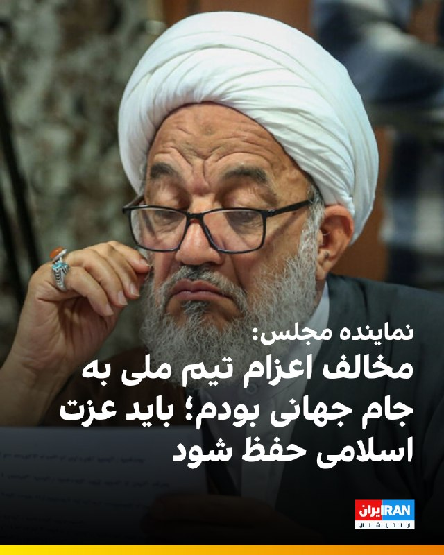

🔻مرتضی آقاتهرانی، رییس کمیسیون فرهنگی مجلس جمهوری اسلامی، با انتقاد از حضور ایران در مسابقات جام جهانی به میزبانی آمریکا، اعلام کرد که «شخصا موافق» این اعزام نبوده است.

🔹او با تاکید بر لزوم حفظ «عزت اسلامی و ملی» اظهار داشت: «وقتی با دشمن خارجی و مشترک روبه‌رو می‌شویم، حق نداریم مسائل اختلافی‌مان را در آنجا بروز دهیم.»

🔹آقاتهرانی با اشاره به اینکه آمریکا مسئولیت امنیت تیم ملی را نمی‌پذیرد، گفت: «بهترین راه این است که هرگز خودتان را در اختیار چنین کسی قرار ندهید؛ زیرا با حضور در آنجا احساس امنیت نمی‌کنید.»

@iranintltvsport

## Shin_Persian — post 6849

  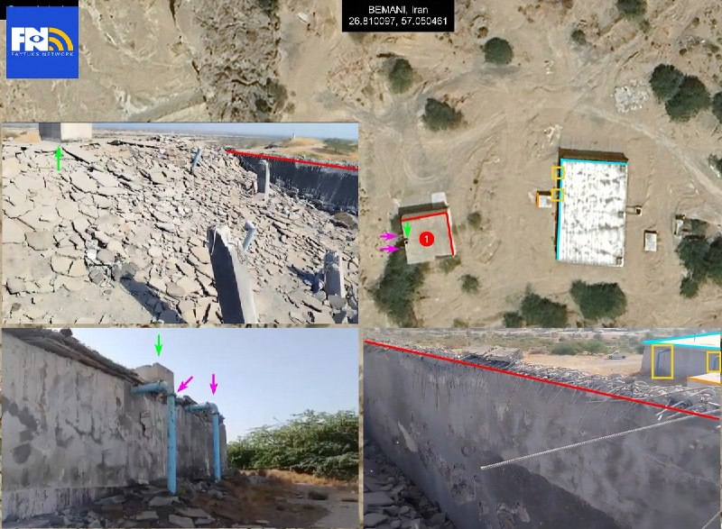

acceladealer ✓ @acceladealer
Wed, 10 Jun 2026 08:14:35 UTC

Damage to unidentified structure in BEMANI [بماني], Iran

Iranian state media claimed this facility in Sirik County, Hormozgan Province was used for water storage and was damaged in the overnight airstrike

26.810097, 57.050461

@GeoConfirmed @FaytuksNetwork

geolocated by

ترجمه خودکار فارسی

خسارت به سازه‌ای شناسایی‌نشده در بماني، ایران

رسانه‌های دولتی ایران ادعا کردند که این مرکز در شهرستان سیریک، استان هرمزگان برای ذخیره آب استفاده می‌شده و در حمله هوایی شبانه آسیب دیده است

26.810097, 57.050461

@GeoConfirmed @FaytuksNetwork

توسط ... موقعیت‌یابی جغرافیایی شد

𝕏 · @shin_persian

## FarsiVOA — post 220228

  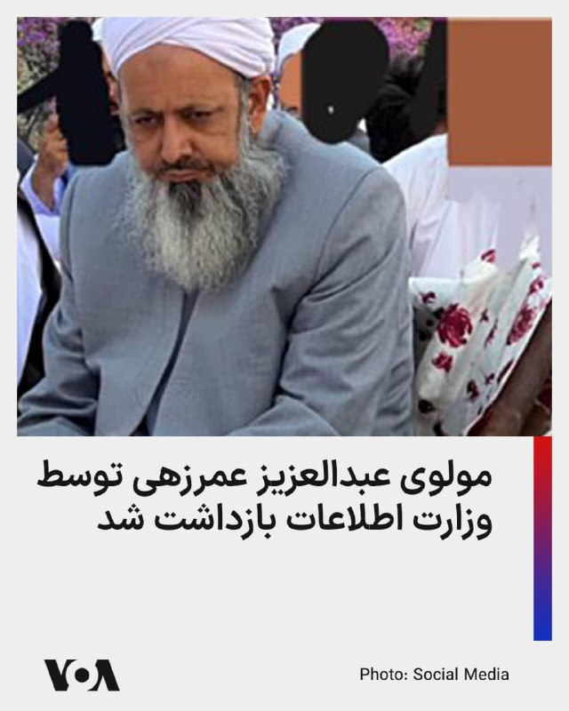

مجموعه خبری حال‌ وش که اخبار استان سیستان و بلوچستان را پوشش می‌دهد، از بازداشت مولوی عبدالعزیز عمرزهی، از مدرسان سابق «دارالعلوم مکی زاهدان» توسط وزارت اطلاعات خبر داد.

این دستگیری که حال وش آن را «همراه با بی‌احترامی» توصیف کرده، روز سه‌شنبه ۱۹ خرداد و در زمان خروج او از مسجد مکی زاهدان انجام شد. حال وش از محل نگهداری، وضعیت جسمی و اتهامات احتمالی مطرح‌ شده علیه آقای عمرزهی ابراز بی اطلاعی کرد.

مولوی عبدالعزیز عمرزهی پیش‌تر نیز پس از وقایع «جمعه خونین زاهدان» در سال ۱۴۰۱، توسط نهادهای امنیتی بازداشت شده بود. در آن مقطع علاوه بر بازداشت او، شناسنامه‌اش و شماری از اعضای خانواده‌اش توسط اداره اطلاعات ضبط و محدودیت‌های اداری و خدماتی علیه او اعمال شده بود.

در سال ۱۴۰۲، برخی از منابع خبری از ابطال شناسنامه مولوی عبدالعزیز عمرزهی و اخراج وی به افغانستان خبر داده بودند.
@FarsiVOA

## FarsiVOA — post 220227

🔺دیدار مقام‌های نظامی بحرین و پاکستان در اوج تنش با جمهوری اسلامی

◾️روزنامهٔ پاکستانی داون به نقل از روابط‌عمومی ارتش پاکستان، گزارش داد ژنرال شیخ محمد بن عیسی آل خلیفه، فرمانده گارد ملی بحرین، در ستاد کل ارتش پاکستان در راولپندی با فیلد مارشال سید عاصم منیر، رئیس نیروهای دفاعی و فرمانده ارتش پاکستان، دیدار کرد.

◾️بر اساس این بیانیه، دو طرف دربارهٔ موضوعات مورد علاقهٔ مشترک، محیط امنیتی منطقه و راه‌های تقویت همکاری‌های دفاعی و امنیتی دوجانبه گفت‌وگو کردند.

◾️به نوشتهٔ داون، گفت‌وگوها به‌طور مشخص بر فناوری‌های نوظهور دفاعی، پهپادها، هوش مصنوعی، سامانه‌های خودگردان، حسگرهای پیشرفته و نوآوری دیجیتال و نیز چالش‌های پدافند هوایی و معماری یکپارچهٔ دفاعی متمرکز بود.

⬇️ بیشتر بخوانید:
https://ir.voanews.com/a/8159291.html

## DW_Farsi — post 125757

  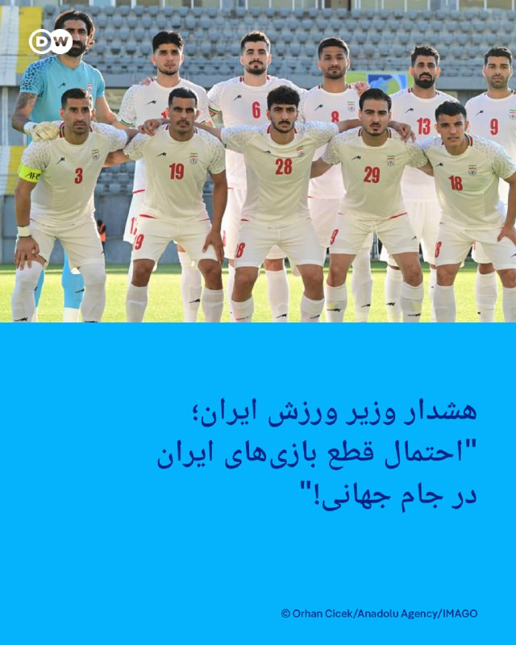

🔶 هشدار وزیر ورزش ایران؛ "احتمال قطع بازی‌های ایران در جام جهانی!"

احمد دنیامالی، وزیر ورزش و جوانان جمهوری اسلامی در رابطه با مسابقات جام جهانی فوتبال ۲۰۲۶ درباره "اتفاقاتی" هشدار داد که ممکن است در سکوهای ورزشگاه‌ها رخ داده و در صورت وقوع "جریان مسابقه را تحت تاثیر قرار دهد".

به گزارش وبسایت خبری "ورزش ۳" این مقام جمهوری اسلامی با اشاره به آنچه که "مسئولیت برگزارکنندگان جام جهانی برای تامین امنیت و نظم ورزشگاه‌ها" نامید، اعلام کرد "ایران نسبت به نمایش پرچم‌های غیررسمی یا سردادن شعارهای هنجارشکنانه در جریان مسابقات حساسیت جدی خواهد داشت".

دنیامالی در این رابطه اضافه کرد: «ما به آنها اعلام کردیم که اگر در استادیوم‌هایی که بازی می‌کنیم پرچم دیگری غیر از نشان خودمان ببینیم یا شعارهای هنجارشکنانه مشاهده کنیم، سرپرست تیم مسئولیت دارد که بازی را متوقف کند.»

پیش از این نیز مهدی تاج، رئیس فدراسیون فوتبال ایران در نامه‌هایی به جیانی اینفانتینو، رئیس فیفا "خواستار جلوگیری از تکرار چنین اتفاقاتی شده بود".

تیم ملی فوتبال ایران تمامی مسابقات خود در مرحله گروهی را در خاک ایالات متحده انجام خواهند داد. جام جهانی فوتبال روز پنجشنبه ۱۱ ژوئن افتتاح می‌شود.

@dw_farsi

## Persian_Trend_Official — post 16445

  <a href="telegram/content/Persian_Trend_Official_16445_1781081597.mp4" target="_blank">🎬 Download video</a>

بقایی: آمریکا با نقض مکرر آتش‌بس، به روند دیپلماتیک آسیب می‌زند.

سخنگوی وزارت امور خارجه: روند دیپلماتیک در خلأ اتفاق نمی‌افتد. برای پیشبرد هر مذاکره‌ای یا فرایند دیپلماتیکی، نیازمند یک فضای حداقلی هستید تا بتوانید کار دیپلماسی را پیش ببرید.

متاسفانه، آمریکا با پیام‌های متناقض، تغییر مکرر مواضع و مطالبات و همچنین نقض مکرر آتش‌بس، به این روند آسیب می‌زند.

رژیم صهیونیستی نیز با نقض‌های مکرر آتش‌بس در لبنان به این روند لطمه می‌زند. هر روند دیپلماتیکی از توسل به زور و اقدامات غیرقانونی متضرر می‌شود.

📝 Amir

📌 @persian_trend_official
پرشین ترند | متفاوت‌ترین کانال نظامی

## IranianMinds — post 22065

  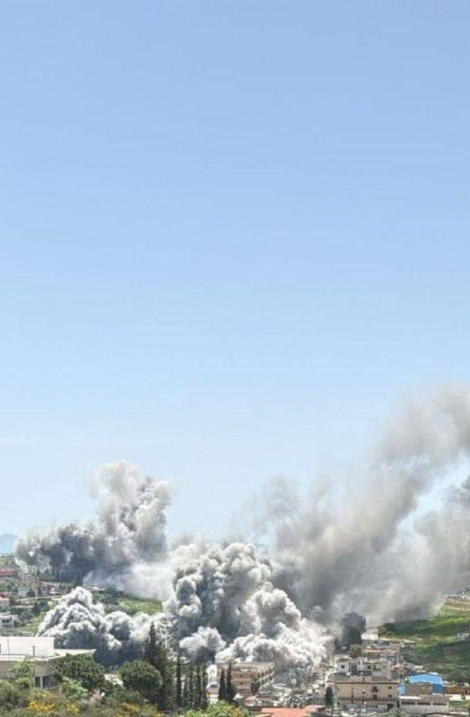

حملات هوایی به جنوب لبنان

@IranianMinds

## IranianMinds — post 22064

  

تصویری از کشف تجهیزات جاسوسی برای پشتیبانی هدایت جنگنده‌ها در لواسان تهران

@IranianMinds

## alonews — post 126745

  <a href="telegram/content/alonews_126745_1781081599.webm" target="_blank">🎬 Download video</a>

👈سخنگوی دولت: لایحه منع خشونت علیه زنان در مسیر استرداد است

✅ @AloNews خبر جنگ

## alonews — post 126744

  <a href="telegram/content/alonews_126744_1781081600.webm" target="_blank">🎬 Download video</a>

👈آسمان کشورهای منطقه بعد از حملات بامدادی ایران و امریکا

✅ @AloNews خبر جنگ

## alonews — post 126743

  <a href="telegram/content/alonews_126743_1781081600.webm" target="_blank">🎬 Download video</a>

👈سخنگوی وزارت خارجه:

🔴دیپلماسی و میدان دو امر جدا از هم نیستند؛ این دو در کنار یکدیگر، ابزاری برای صیانت از منافع و امنیت ملی ایران هستند.

🔴در هر کجا که لازم باشد، نیروهای مسلح ما با اقتدار به دشمن پاسخ می‌دهند.

🔴اتفاقی که دیشب رخ داد نشان داد که نیروهای مسلح شجاع ایران در دفاع از کشور درنگ نمی‌کنند.

🔴در حوزه دیپلماسی نیز ارکان حاکمیت کاملا هماهنگ هستند و در هر کجا که لازم باشد، از ابزار دیپلماسی و هر جا که اقتضا کند، از نیروی نظامی برای دفاع از کشور استفاده خواهند کرد.

✅ @AloNews خبر جنگ

## alonews — post 126742

  <a href="telegram/content/alonews_126742_1781081600.webm" target="_blank">🎬 Download video</a>

👈شورای امنیت روسیه در بیانیه‌ای که توسط خبرگزاری «تاس» منتشر شد، هشدار داد آمریکا و اسرائیل از پوشش دیپلماسی و مذاکرات صلح برای آماده‌سازی یک عملیات زمینی گسترده علیه ایران استفاده می‌کنن

✅ @AloNews خبر جنگ

---
📅 بروزرسانی: 1405/03/20 12:13
---

## VahidOOnLine — post 244656

  <a href="telegram/content/VahidOOnLine_244656_1781081022.mp4" target="_blank">🎬 Download video</a>

⭕️ریاض ایر با نمایشگرهای فوق‌پیشرفته، اینترنت پرسرعت و کابین‌های لوکس؛ عربستان سعودی چگونه ریاض را به مرکز جدید اتصال هوایی جهان تبدیل می‌کند؟

📌سیستم سرگرمی پرواز «آسترووا» که در هواپیماهای این شرکت استفاده شده، یکی از پیشرفته‌ترین نمونه‌های موجود در صنعت هوانوردی است؛ علاوه بر این، مسافران می‌توانند دستگاه‌های شخصی خود را مستقیم به نمایشگرها متصل کنند

♦️شرکت هواپیمایی ریاض ایر در حالی آغاز به فعالیت کرده است که می‌خواهد با تکیه بر فناوری‌های پیشرفته، خدمات لوکس و توسعه سریع شبکه پروازی، ریاض را به یکی از مهم‌ترین مراکز اتصال هوایی جهان تبدیل کند. این شرکت با دریافت نخستین بویینگ‌های ۷۸۷-۹ دریم‌لاینر سفارشی‌اش، از کابین‌هایی مجهز به نمایشگرهای او‌ال‌ئی‌دی (OLED) فوق‌پیشرفته، اینترنت پرسرعت، امکان اتصال دستگاه‌های شخصی به سیستم سرگرمی پرواز و امکانات رفاهی رونمایی کرد. 

بیشتر بخوانید...
‌🇸🇦 Indypersian

🤖 @VahidOOnLine

## VahidOOnLine — post 244655

  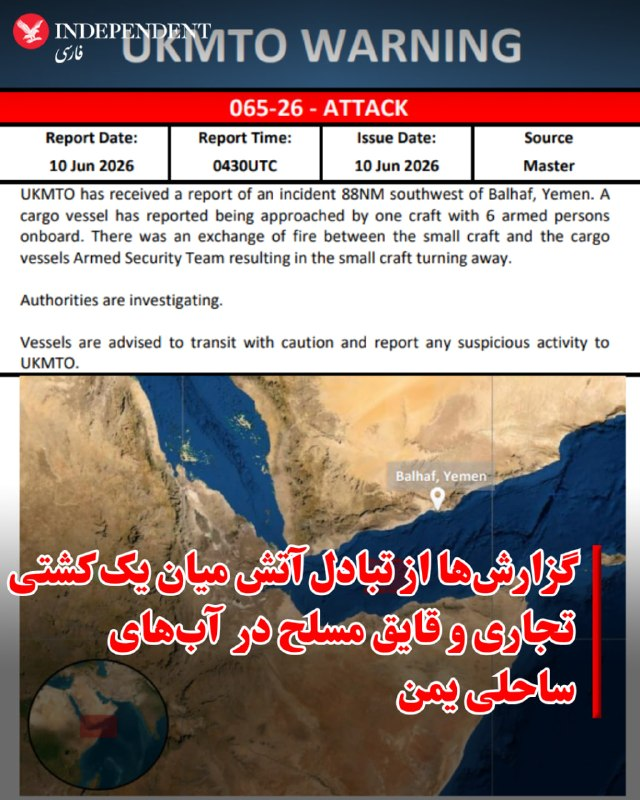

♦️سازمان عملیات تجارت دریایی بریتانیا (UKMTO) روز چهارشنبه ۲۰ خردادماه با انتشار پیامی از تبادل آتش میان یک کشتی باری افراد مسلح در یک قایق افراد مسلح در آب‌های نزدیک سواحل یمن خبر داد.

این نهاد ناظر بر تردد دریایی اعلام کرد قایق کوچک حامل ۶ فرد مسلح بود و پس از نزدیک شدن به یک کشتی باری در حدود ۸۸ مایلی  جنوب‌غربی منطقه بلحاف در سواحل یمن، دو طرف به یکدیگر تیراندازی کردند.

بر اساس این گزارش، پس از تبادل آتش شناور کوچک مسیر خود را تغییر داد و از محل دور شد.

هنوز جزئیات بیشتری درباره این رویارویی منتشر نشسته است.
حوثی‌های یمن سه روز پیش و همزمان با حملات موشکی سپاه به اسرائیل اعلام کرده بودند آب‌های دریای سرخ را به روی کشتی‌های اسرائیلی می‌بندند.
‌🇸🇦 Indypersian

🤖 @VahidOOnLine

## WithYashar — post 14277

  <a href="telegram/content/WithYashar_14277_1781081027.mp4" target="_blank">🎬 Download video</a>

ساعت 01:59 به وقت جهانی (UTC)، یک بمب‌افکن B-52H متعلق به نیروی هوایی آمریکا در حال پرواز بود.
این هواپیما از پایگاه ماینوت در آمریکا حرکت کرده و به سمت پایگاه هوایی فِیرفورد در بریتانیا می‌رود.
این پایگاه یکی از مراکز مهم برای استقرار بمب‌افکن‌های راهبردی آمریکاست در میانه حمله و در عملیات‌های مرتبط با ایران نیز مورد استفاده قرار گرفت. نام ارتباطی این پرواز THIRD51 است. خلبان در مسیر، موقعیت هواپیما را از طریق رادیو به مرکز کنترل بر فراز اقیانوس اطلس گزارش داده است. بعد از عبور از یک نقطه مشخص، به او گفته شده با برج کنترل شانون در ایرلند روی یک فرکانس جدید تماس بگیرد.
@withyashar

## kianmeli1 — post 87848

  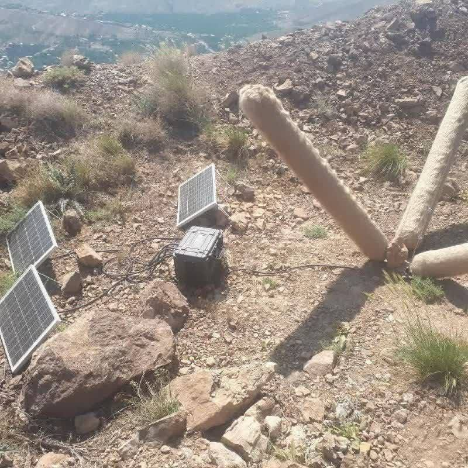

🔴تصویری از کشف تجهیزات پشتیبان هدایت جنگنده‌های اسراییل در لواسان

(با توجه به نوع چیدمان ٫ نیروهای پیاده آموزش دیده درون کشور در اختیار دارند)
https://t.me/kianmeli1

## FarsiVOA — post 220226

  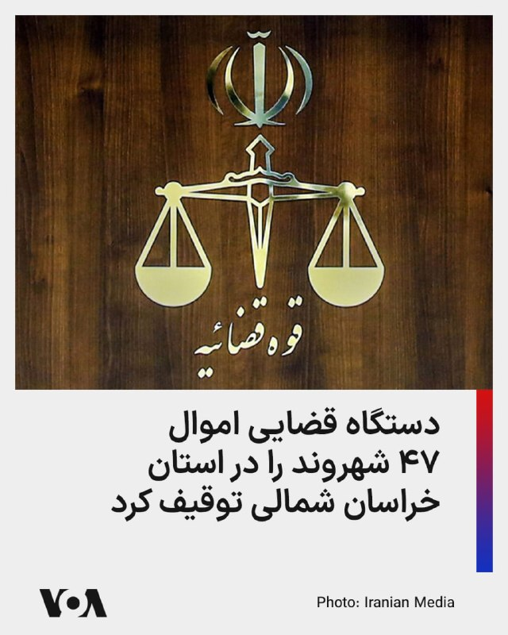

رئیس‌کل دادگستری استان خراسان شمالی، از توقیف اموال ۴۷ شهروند مقیم خارج از کشور، به اتهام فعالیت تبلیغی علیه نظام، اجتماع و تبانی ضدامنیت داخلی و خارجی، خبر داد.

به گفته رضا براتی‌زاده این شهروندان ساکن آلمان، انگلیس، فرانسه، ترکیه، آمریکا، کانادا، ایتالیا، استرالیا، عمان، دانمارک، اسرائيل، قطر، امارات، چین، اسکاتلند، قبرس، یونان و نیوزیلند هستند.

او همچنین از تشکیل ۱۴ پرونده قضایی علیه شهروندان در این استان طی دوره جنگ با اتهام‌های مشابه خبر داد.

پیشتر مقامات دستگاه قضایی مدعی شده بودند که قانون جدید برای مصادره اموال مخالفان حکومت، دست آنها را برای برخورد با شهروندان باز گذاشته است.

خبرگزاری میزان وابسته به دستگاه قضایی، روز سه‌شنبه ۱۹ خرداد نیز از توقیف بخش دیگری از اموال علی کریمی، فوتبالیست مخالف جمهوری اسلامی خبر داده بود.
@FarsiVOA

## Persian_Trend_Official — post 16444

  <a href="telegram/content/Persian_Trend_Official_16444_1781081032.mp4" target="_blank">🎬 Download video</a>

صحنه از شلیک حدودا 11 موشک بالستیک سوخت جامد به سوی پایگاه های امریکا در کشور های عربی منطقه

📝 Amir

📌 @persian_trend_official
پرشین ترند | متفاوت‌ترین کانال نظامی

## Persian_Trend_Official — post 16443

  <a href="telegram/content/Persian_Trend_Official_16443_1781081035.webm" target="_blank">🎬 Download video</a>

منابعی با انتشار این عکس مدعی کشف تجهیزات پشتیبان و هدایت جنگنده‌های اسرائیلی در لواسان شدند.

📝 Amir

📌 @persian_trend_official
پرشین ترند | متفاوت‌ترین کانال نظامی

## Persian_Trend_Official — post 16442

  <a href="telegram/content/Persian_Trend_Official_16442_1781081035.mp4" target="_blank">🎬 Download video</a>

در پی شلیک راکت توسط حزب‌الله لبنان به شمال اسرائیل، سیستم های پدافندی گنبد آهنین فعال شدند.

📝 Amir

📌 @persian_trend_official
پرشین ترند | متفاوت‌ترین کانال نظامی

## RadioFarda — post 158123

🔸توماج صالحی، خواننده معترض، با انتشار ویدئویی در صفحه اینستاگرام خود به ادامه «تحریم‌ها» و «جنگ» اعتراض کرد.

🔸آقای صالحی که خود چندبار بازداشت شده و به زندان افتاده، می‌گوید:« انقلاب‌هایی که از سر گرسنگی بودند، اغلب نتیجه مثبتی نداشتند.تغیییر باید همراه با آگاهی باشد که نتیجه آن مثبت باشد.»

🔸او همراه با این ویدئو در صفحه خود نوشته است:«شاید دشوارترین مسیر، مسیرِ آزادی باشد، سخت‌ترین کارها را از انسان می‌خواهد:صبر، تحمل، از خودگذشتگی، امیدوار ماندن…اما جز این مسیرِ دشوار راهی وجود ندارد، مسیرهای میانبر واقعی نیستند، حُقه‌ی غول‌هایی هستند که می‌خواهند کوچک‌ترها را ببلعند.»

🔸توماج صالحی که در جریان اعتراضات سال ۱۴۰۱ بازداشت شده بود در اردیبهشت ۱۴۰۳ از سوی دادگاه انقلاب جمهوری اسلامی به اعدام محکوم شد اما دیوان عالی کشور این حکم را نقض کرد و آقای صالحی در آذرماه ۱۴۰۳ پس گذراندن یک سال حکم حبس از زندان آزاد شد.

@RadioFarda

## Dirty_Kids — post 391559

  <a href="telegram/content/Dirty_Kids_391559_1781081038.mp4" target="_blank">🎬 Download video</a>

خیابونای مملکت بوی زنا گرفته …
کارناوال نکاح عرزشی راه انداختن … اینا قبل این قضیه کجا خودشونو تخلیه میکردن؟!

@Dirty_Kids 👻

## Dirty_Kids — post 391558

  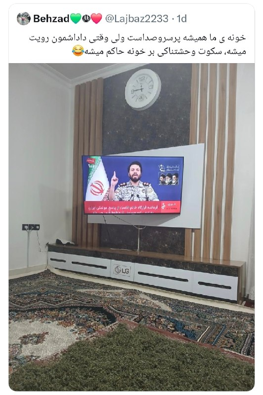

همه عکس یطرف اون لوگو LG رو میز تلویزیون یطرف🤣🤣

@Dirty_Kids 👻

## Dirty_Kids — post 391557

  <a href="telegram/content/Dirty_Kids_391557_1781081041.mp4" target="_blank">🎬 Download video</a>

داداشمون با شیر مست شد، رفت واسه خودش

@Dirty_Kids 👻

## alonews — post 126741

  <a href="telegram/content/alonews_126741_1781081043.mp4" target="_blank">🎬 Download video</a>

👈سخنگوی وزارت خارجه، بقایی :
با توجه به اتفاقات دیشب، باید برای ادامه مذاکرات بررسی کنیم

✅ @AloNews خبر جنگ

## alonews — post 126740

  <a href="telegram/content/alonews_126740_1781081044.webm" target="_blank">🎬 Download video</a>

👈چندسال قبل ولایتی یه توئیت زد که مردم ما باید از یمنی‌ها یاد بگیرن که با پای‌برهنه و خوردن نون خشک دارن مقاومت میکنن، اون موقع خیلیا گفتن چی میگی بابا، اما انگار داریم با سرعت به اون نزدیک میشیم!

✅ @AloNews خبر جنگ

---
📅 بروزرسانی: 1405/03/20 12:04
---

## VahidOOnLine — post 244654

  

اسماعیل بقایی، سخنگوی وزارت خارجه جمهوری اسلامی، با اشاره به حملات شامگاه سه‌شنبه آمریکا گفت: «پیام‌های متناقض، تغییر مکرر مواضع و مطالبات و همچنین نقض‌های پیاپی آتش‌بس از سوی آمریکا به روند دیپلماتیک آسیب می‌زند.»

او افزود: «هر روند دیپلماتیکی از توسل به زور و اقدامات غیرقانونی متضرر می‌شود.» بقایی تاکید کرد روند دیپلماتیک در خلأ شکل نمی‌گیرد و برای پیشبرد هر مذاکره‌ای، وجود حداقلی از فضای مناسب ضروری است.

سخنگوی وزارت خارجه جمهوری اسلامی همچنین گفت اسرائیل با «نقض‌های مکرر آتش‌بس» در لبنان به این روند لطمه می‌زند.
‌🏁 🇬🇧 IranintlTV

🤖 @VahidOOnLine

## mwarmonitor — post 10595

  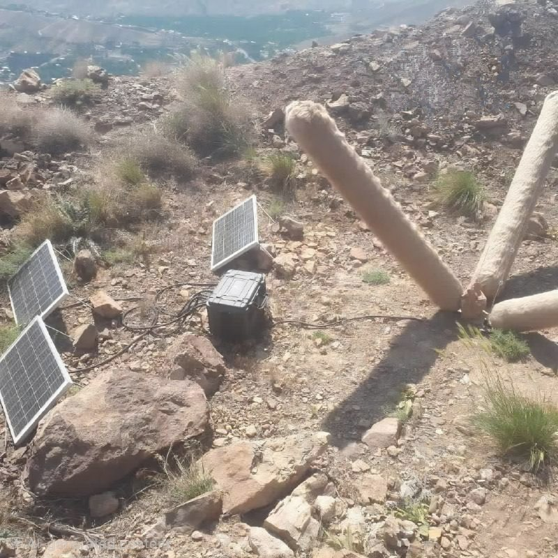

🔴 تجهیزات ارتباطی کشف شده منطقه لواسان در شمال تهران.

@mwarmonitor

## kianmeli1 — post 87847

  <a href="telegram/content/kianmeli1_87847_1781080459.mp4" target="_blank">🎬 Download video</a>

🔴بقایی

باتوجه به قضایای دیشب باید وضعیت مذاکره را بررسی کنیم
https://t.me/kianmeli1

## kianmeli1 — post 87846

‏🔴امارات متحده عربی حملات جمهوری اسلامی به اردن، بحرین و کویت را نقض آشکار حاکمیت این کشورها خواند و با آنان اعلام همبستگی کرد
https://t.me/kianmeli1

## IranIntlTV — post 341457

  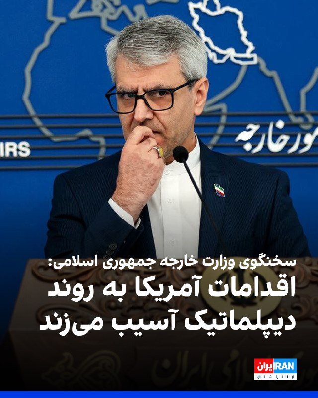

اسماعیل بقایی، سخنگوی وزارت خارجه جمهوری اسلامی، با اشاره به حملات شامگاه سه‌شنبه آمریکا گفت: «پیام‌های متناقض، تغییر مکرر مواضع و مطالبات و همچنین نقض‌های پیاپی آتش‌بس از سوی آمریکا به روند دیپلماتیک آسیب می‌زند.»

او افزود: «هر روند دیپلماتیکی از توسل به زور و اقدامات غیرقانونی متضرر می‌شود.» بقایی تاکید کرد روند دیپلماتیک در خلأ شکل نمی‌گیرد و برای پیشبرد هر مذاکره‌ای، وجود حداقلی از فضای مناسب ضروری است.

سخنگوی وزارت خارجه جمهوری اسلامی همچنین گفت اسرائیل با «نقض‌های مکرر آتش‌بس» در لبنان به این روند لطمه می‌زند.
https://iranintl.com/202606101258

## Persian_Trend_Official — post 16441

  

الاخبار: گروه‌های فلسطینی در قاهره با نقشه راه 15 ماده‌ای ارائه شده توسط نیکولای ملادنوف، فرستاده غزه، به یک فرمول نهایی قابل قبول در مورد سلاح‌های مقاومت دست یافته‌اند.

این گروه‌ها از تحویل سلاح به اسرائیل خودداری کردند و در عوض موافقت کردند که آنها را تحت نظارت یک نهاد فلسطینی با نظارت اعراب و بین‌المللی قرار دهند. خلع سلاح به صورت مرحله‌ای و مستقیماً به خروج اسرائیل از غزه یک فرآیند گام به گام مرتبط خواهد بود.

هر مرحله از تحویل سلاح به عقب‌نشینی اسرائیل از مناطق خط زرد، ورود یک کمیته اداری به غزه و جریان کمک‌ها و مصالح ساختمانی مرتبط خواهد بود.

با این حال، حماس هنوز تأیید نهایی را نداده است و این توافق به نخست وزیر اسرائیل، نتانیاهو، ارائه نشده است.

📝 Amir

📌 @persian_trend_official
پرشین ترند | متفاوت‌ترین کانال نظامی

## Persian_Trend_Official — post 16435

  <a href="telegram/content/Persian_Trend_Official_16435_1781080462.mp4" target="_blank">🎬 Download video</a>

تصاویری از حمله ارتش امریکا به مخازن آب آشامیدنی بخش بمانی شهرستان سیریک هرمزگان

📝 Amir

📌 @persian_trend_official
پرشین ترند | متفاوت‌ترین کانال نظامی

## BBCPersian — post 283332

‌🔻گزارش‌ رسانه‌های ایران از شنیده شدن صدای انفجار در قشم

🔻خبرگزاری ایران به نقل از منابع محلی، از شنیده شدن صدای یک انفجار در محدوده شهرستان قشم خبر می‌دهند.

خبرگزاری مهر نوشته است: «هرچند ماهیت دقیق این صداها هنوز مشخص نیست، اما با توجه به حجم صدا ممکن است منبع انفجار فاصله نسبتا زیادی با شهر قشم داشته است و یا مربوط یه تحرکاتی در تنگه هرمز باشد.»

جزئیات بیشتری در این باره منتشر نشده است.

بامداد چهارشنبه آمریکا در پاسخ به ساقط شدن یک بالگرد خود در دریای عمان چندین حمله هوایی به نقاطی در جنوب ایران انجام داد، قرارگاه خاتم الانبیا هم از حملات متقابل سپاه پاسداران و ارتش ایران به پایگاه‌های آمریکا در کشورهای بحرین، کویت و اردن خبر داد.

https://bbc.in/4vECISn
@BBCPersian

## alonews — post 126733

  <a href="telegram/content/alonews_126733_1781080464.webm" target="_blank">🎬 Download video</a>

👈در حملات هوایی دیشب پاکستان به افغانستان، ۱۱ کودک کشته شدند

✅ @AloNews خبر جنگ

## alonews — post 126732

  <a href="telegram/content/alonews_126732_1781080464.webm" target="_blank">🎬 Download video</a>

👈قیمت نفت به ۹۱ دلار رسید

✅ @AloNews خبر جنگ

---
📅 بروزرسانی: 1405/03/20 11:53
---

## WithYashar — post 14276

کانال ۱۴ اسرائیل فاش کرد:

طبق جزئیات فاش شده از مذاکرات، دولت ترامپ در حال انجام مذاکرات محرمانه پیشرفته با تهران در مورد یک توافق هسته‌ای جدید است که برای متوقف کردن برنامه تسلیحاتی ایران به مدت تقریباً ۱۵ سال طراحی شده است.
@withyashar

## WithYashar — post 14275

  <a href="telegram/content/WithYashar_14275_1781079795.mp4" target="_blank">🎬 Download video</a>

پاکستان تصاویر هدف قرار دادن اردوگاه‌های تحریک طالبان پاکستان در کنر، پکتیکا و خوست در افغانستان را منتشر کرد.

این هدف‌گیری به وضوح نشان می‌دهد که این سازه توسط بمب‌های هدایت‌شونده لیزری مورد اصابت قرار گرفته است.
@withyashar

## kianmeli1 — post 87845

  <a href="telegram/content/kianmeli1_87845_1781079796.mp4" target="_blank">🎬 Download video</a>

ویدیویی که ترامپ پست کرده: اگر یک آمریکایی را بکشید ما با پاسخ متناسب برنمی‌گردیم با فاجعه کامل برمی‌گردیم

این صحنه از قسمت «پاسخ متناسب» است. در داستان سریال، یک هواپیمای آمریکایی در مأموریتی پزشکی هدف قرار گرفته و شماری از آمریکایی‌ها، از جمله پزشک شخصی رئیس‌جمهور، کشته شده‌اند. در اتاق وضعیت کاخ سفید، فرماندهان ارتش گزینه‌هایی برای یک حمله محدود و «متناسب» ارائه می‌کنند؛ اما رئیس‌جمهور خیالی، جِد بارتلت، با خشم می‌پرسد فایده چنین پاسخی چیست؟ او می‌گوید اگر دشمن می‌داند آمریکا همیشه محدود و قابل‌پیش‌بینی پاسخ می‌دهد، پس این پاسخ دیگر بازدارنده نیست.

اهمیت انتخاب این سکانس در این است که ترامپ پس از حمله‌ای که رسماً «متناسب» توصیف شده، پیامی دوگانه می‌فرستد: از یک طرف می‌گوید پاسخ فعلی کنترل‌شده و محدود بوده؛ از طرف دیگر هشدار می‌دهد که محدود بودن این پاسخ نباید به‌عنوان ضعف تعبیر شود. پایان سکانس با تهدیدی روشن همراه است: اگر آمریکایی کشته شود، پاسخ بعدی می‌تواند از چارچوب «متناسب» خارج شود و به «فاجعه کامل» تبدیل شود.
https://t.me/kianmeli1

## FarsiVOA — post 220225

کامبک - ویژه برنامه‌ی جام جهانی ۲۰۲۶ از پنجشنبه ۲۱ خرداد هر شب ساعت ۱۱ به وقت ایران تا پایان جام جهانی با اجرای آرش آرا و نجمه مرادی مهمان خانه های شماست.
جهت کسب اطلاعات بیشتر و اخبار جام جهانی به صفحه ویژه جام‌جهانی در وبسایت صدای آمریکا مراجعه فرمایید.

## FarsiVOA — post 220224

Farsi VOA pinned a photo

## FarsiVOA — post 220223

  

📸اینستاگرام صدای آمریکا را هم اکنون فالو کنید تا از آخرین خبرها مطلع بمانید:
https://www.instagram.com/voafarsi/

📡همچنین جهت اطلاع از بروزترین فرکانسهای ماهواره‌ای صدای آمریکا به لینک زیر مراجعت فرمایید:
https://ir.voanews.com/satellite

این پست را با دوستانتان به اشتراک بگذارید
@FarsiVOA

## FarsiVOA — post 220222

  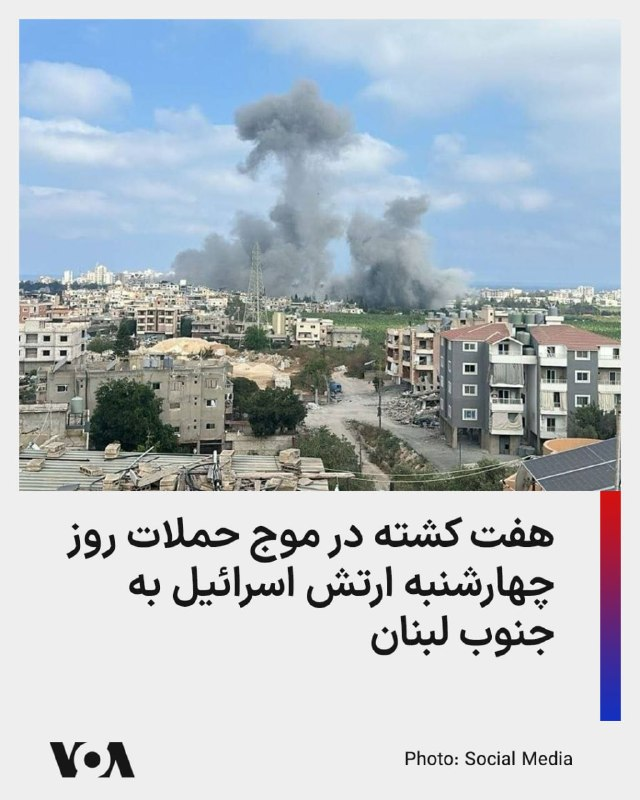

منابع خبری لبنانی گزارش داده‌اند که در چهار حمله جداگانه ارتش اسرائیل در جنوب لبنان، دست‌کم هفت نفر کشته شده‌اند.

بر اساس این گزارش‌ها، دو نفر در حمله به روستای صادقین، دو نفر در حمله به یک موتورسیکلت در روستای تیردبا، یک نفر در حمله به موتورسیکلت دیگری در روستای الدویر و دو نفر نیز در حمله به روستای دونین کشته شده‌اند.

این حملات در حالی انجام شده که ارتش اسرائیل امروز هشدار فوری برای تخلیه برخی مناطق جنوب لبنان صادر کرده بود.
@FarsiVOA

## Persian_Trend_Official — post 16434

  

ونس: توافق با ایران می‌تواند ظرف یک هفته یا چندین ماه دیگر بدست آید.

جی دی ونس، معاون رئیس جمهور آمریکا مدعی شد که دولت این کشور به دستیابی به توافق با ایران بسیار نزدیک است، اما این اتفاق می‌تواند ظرف یک هفته یا چندین ماه دیگر رخ دهد.

📝 Amir

📌 @persian_trend_official
پرشین ترند | متفاوت‌ترین کانال نظامی

## Persian_Trend_Official — post 16433

  <a href="telegram/content/Persian_Trend_Official_16433_1781079800.mp4" target="_blank">🎬 Download video</a>

سپاه پاسداران ویدیویی از لحظه رهگیری و انهدام پهپاد MQ-9 امریکایی در نزدیکی جم منتشر کرد.

📝 Amir

📌 @persian_trend_official
پرشین ترند | متفاوت‌ترین کانال نظامی

## alonews — post 126731

  <a href="telegram/content/alonews_126731_1781079801.webm" target="_blank">🎬 Download video</a>

👈وضعیت خاورمیانه واقعا عجیبه
‼️

🔴افغانستان و پاکستان که دیشب باهم جنگ داشتن، امروز بازی دوستانه دارن!

✅ @AloNews خبر جنگ

## alonews — post 126730

  <a href="telegram/content/alonews_126730_1781079802.mp4" target="_blank">🎬 Download video</a>

👈تصویر لحظه انهدام پهپاد MQ9 آمریکا

✅ @AloNews خبر جنگ

---
📅 بروزرسانی: 1405/03/20 11:42
---

## VahidOOnLine — post 244653

  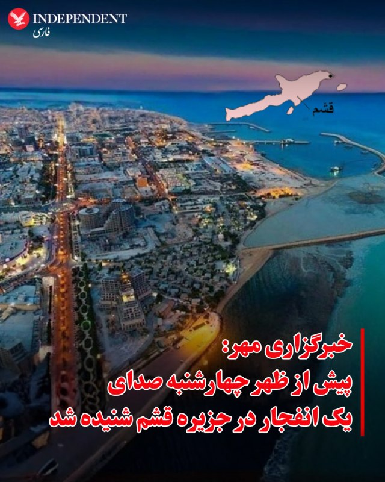

♦️خبرگزاری مهر، وابسته به سازمان تبلیغات اسلامی، اندکی پیش از ظهر چهارشنبه ۲۰ خرداد از شنیده شدن صدای یک انفجار در جزیره قشم خبر داد.

مهر با اعلام این خبر نوشت:‌ «ماهیت دقیق این صداها هنوز مشخص نیست، اما با توجه به حجم صدا ممکن است منبع انفجار فاصله نسبتا زیادی با شهر قشم داشته است و یا مربوط یه تحرکاتی در تنگه هرمز باشد.»

مقام‌های نظامی و سیاسی جمهوری اسلامی هنوز واکنشی به این خبر نشان نداده‌اند.
‌🇸🇦 Indypersian

🤖 @VahidOOnLine

## WithYashar — post 14274

کانال 13 اسرائیل: ارتش اسرائیل توصیه کرده در پاسخ به هرگونه شلیک به سمت اسرائیل، حملات گسترده و شدیدی علیه بیروت انجام شود.
@withyashar

## WithYashar — post 14273

اتاق جنگ با یاشار : خبر ۳ میلیارد دلار خبر فیک با منبع رسانه داخلیه خودش هم گفته باز به نقل از یک مقام سپاهی!!!! @withyashar اون پرواز هم چک کردم رفته پرسنل رو تخلیه کنه !

## IranIntlTV — post 341456

  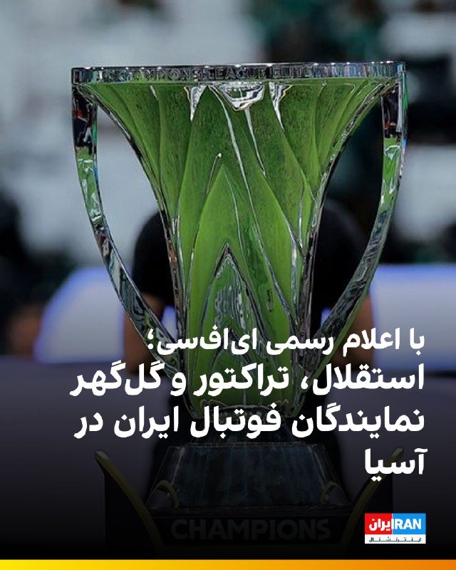

🔻کنفدراسیون فوتبال آسیا (ای‌اف‌سی) فهرست نهایی باشگاه‌های حاضر در رقابت‌های آسیایی فصل آینده را اعلام کرد. بر این اساس، استقلال و تراکتور در لیگ نخبگان آسیا حضور خواهند داشت و گل‌گهر نیز نماینده ایران در لیگ قهرمانان آسیا ۲ خواهد بود.

🔹سپاهان که فصل را در رتبه سوم جدول به پایان رساند، نتوانست مجوز حرفه‌ای ای‌اف‌سی را دریافت کند و به همین دلیل از حضور در رقابت‌های آسیایی بازماند.

🔹پیش‌تر رسانه‌های ایران نوشته بودند که سرنوشت آخرین سهمیه آسیایی همچنان به نتیجه پرونده در کمیته استیناف گره خورده است. در صورتی که رای انضباطی به سود گل‌گهر نقض شود، قرار است با برگزاری رقابت‌های سه‌جانبه میان گل‌گهر، چادرملو و پرسپولیس، تکلیف تیم راه‌یافته به لیگ قهرمانان آسیا ۲ مشخص شود.

@iranintltvsport

## Persian_Trend_Official — post 16432

  <a href="telegram/content/Persian_Trend_Official_16432_1781079175.webm" target="_blank">🎬 Download video</a>

تصویری که فاکس نیوز از آخرین آرایش ناوگان‌ دریایی آمریکا در منطقه برای محاصره دریایی ایران منتشر کرده است.

📝 Amir

📌 @persian_trend_official
پرشین ترند | متفاوت‌ترین کانال نظامی

## IranianMinds — post 22063

🔴قرارگاه خاتم الانبیا:
اگه یه بار دیگه تعرض کنید جواب سنگین تر و سهمگین تری بهتون میدیم.

+ دیگه چجوری باید بزنن که جواب سنگین بدید؟

@IranianMinds

## IranianMinds — post 22062

  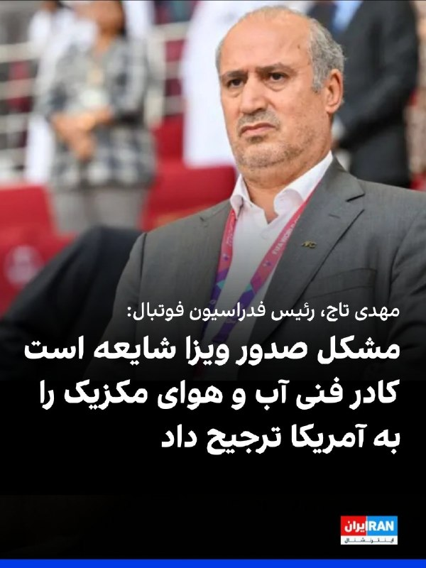

🔴 تاج، رئیس فدراسیون فوتبال: اینکه آمریکا بهمون ویزا نداد شایعه‌اس!
کادر فنی و بازیکنا دیدن آمریکا گرمه، گفتن بریم مکزیک که آب و هواش بهتر باشه.😂😂😂😂😂😂😂

@IranianMinds

## IranianMinds — post 22061

شنیده شدن صدای انفجار در جزیره  قشم

دقایقی پیش منابع محلی از شنیده شدن صدای یک انفجار در محدوده شهرستان قشم خبر داده‌اند.

@IranianMinds

## BBCPersian — post 283331

  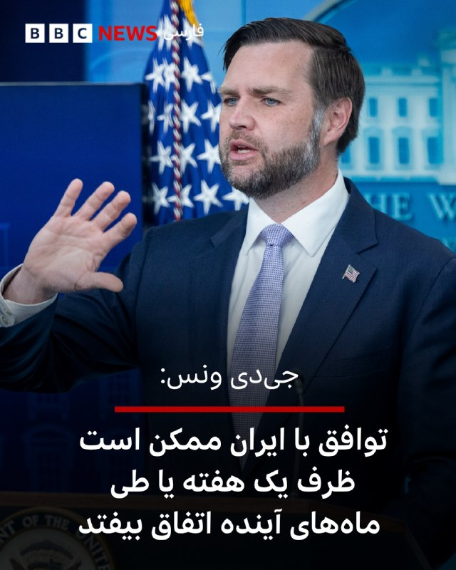

‌🔻جی دی ونس، معاون اول رئیس جمهور آمریکا گفته است که ایالات متحده به دستیابی به توافقی که برنامه هسته‌ای ایران را «برای درازمدت» حل کند، بسیار نزدیک است، اما این توافق ممکن است طی هفته یا ماه‌های آینده حاصل شود.

او در مصاحبه‌ای با شبکه سی‌بی‌اس گفت: «در حال حاضر، احساس می‌کنم که ما در موقعیتی هستیم که می‌توانیم به توافقی دست یابیم که از نظر اقتصادی برای ایالات متحده خوب باشد و واقعا به برنامه هسته‌ای ایران بپردازد، نه فقط اکنون، نه فقط در زمانی که دونالد ترامپ رئیس جمهور است، بلکه برای درازمدت، تا جایی که فرزندانم وقتی بزرگ شدند بتوانند بگویند: ایران قرار نیست سلاح هسته‌ای داشته باشد.»

او افزود: «این هدف چنین سیاستی است. و من فکر می‌کنم ما به دستیابی به آن هدف بسیار نزدیک شده‌ایم. اما هنوز باید چوب‌های زیادی را خرد کنیم(کار زیادی مانده). ما به این کار ادامه خواهیم داد.»

آقای ونس گفت که این توافق «قطعا» می‌تواند قبل از انتخابات میان‌دوره‌ای در ماه نوامبر حاصل شود.

📷Anadolu via Getty Images
https://bbc.in/4uvC2xY

@BBCPersian

## BBCPersian — post 283330

🔻چین خواستار کاهش درگیری‌ها در خاورمیانه شد

🔻در پی حملات متقابل ایران و آمریکا پس از سرنگونی هلی‌کوپتر آمریکایی، چین روز چهارشنبه درباره درگیری‌ها در خاورمیانه ابراز نگرانی «عمیق» کرده است و خواستار جلوگیری از تشدید تنش‌ها شده است.

لین جیان، سخنگوی وزارت خارجه چین، در یک نشست خبری گفت: «طرف‌های مختلف ذیربط باید آرامش و خویشتنداری خود را حفظ کنند، از تشدید درگیری و تشدید اوضاع دست بردارند و اقدامات مشخصی را برای کاهش و آرام کردن تنش‌ها انجام دهند.»

https://bbc.in/4xgySRa
@BBCPersian

## alonews — post 126729

  

⚠️هنوز نگران تموم شدن حجمت هستی
😱
یا استرس ضریب و تایمشو داری؟؟

🥸کافیه اشتراک TVPN رو تهیه کنی
نامحدود واقعی با ساب
🔥

که دیگه نه نگران حجم باشی نه تایم
🎈

اشتراک نامحدود فقط 290t
🎁
😀
حجمی از گیگی 2t

@tvpnshop_bot
@tvpnshop_bot

## alonews — post 126728

  <a href="telegram/content/alonews_126728_1781079177.mp4" target="_blank">🎬 Download video</a>

👈ویدئو جدید :
- صبح حداقل ۱۱ موشک سوخت جامد دوربرد به سمت اهدافی تو خاورمیانه شلیک شد

✅ @AloNews خبر جنگ

---
📅 بروزرسانی: 1405/03/20 11:33
---

## VahidOOnLine — post 244652

♦️مصطفی خوش‌چشم، کارشناس صداوسیمای جمهوری اسلامی روز دوشنبه ۱۸ خردادماه با انتقاد از سازوکار پرداخت حقوق و مزایا به نیروهای مسلح ایران گفت: «بچه‌های نظامی تولیدکننده و کف میدان ما از چهار تا ۱۰ میلیون تومان می‌گیرند.» این کارشناس حکومتی علت کمبود حقوق و مزایای کارکنان وزارت دفاع را کشته شدن عزیز نصیرزاده، وزیر پیشین دفاع در حملات آمریکا و اسرائیل و بی‌سرپرست ماندن این وزارتخانه، توصیف کرد.

این اظهارات در حالی بیان می‌شود که اسکات بسنت، وزیر خزانه‌داری آمریکا و مجری طرح «خشم اقتصادی» دولت دونالد ترامپ علیه جمهوری اسلامی ایران دو هفته پیش گفته بود که در پی تشدید تحریم‌های همه‌جانبه آمریکا، تهران توان پرداخت حقوق به نیروهای مسلح را ندارد و ماموران نیروی انتظامی ایران سر کارشان حاضر نمی‌شوند.
‌🇸🇦 Indypersian

🤖 @VahidOOnLine

## VahidOOnLine — post 244651

  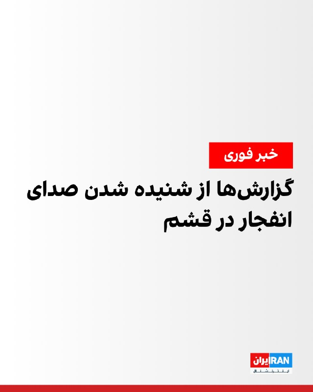

رسانه‌های ایران صبح چهارشنبه ۲۰ خرداد از شنیده شدن صدای چند انفجار در قشم خبر دادند.

خبرگزاری مهر نوشت ماهیت دقیق صداها هنوز مشخص نیست، اما با توجه به شدت آن، ممکن است منبع انفجار در فاصله‌ای نسبتا دور از شهر قشم قرار داشته یا به تحرکاتی در تنگه هرمز مرتبط باشد.

تا زمان انتشار این گزارش، مقام‌های رسمی درباره منشا این صداها یا خسارات احتمالی توضیحی ارائه نکرده‌اند.
‌🏁 🇬🇧 IranintlTV

🤖 @VahidOOnLine

## WithYashar — post 14271

گزارشها از صدای انفجار هم اکنون در قشم
@withyashar

## kianmeli1 — post 87844

  <a href="telegram/content/kianmeli1_87844_1781078605.mp4" target="_blank">🎬 Download video</a>

🔴تصاویری از حمله‌ی آمریکا به مخازن آب آشامیدنی بخش بمانی شهرستان سیریک هرمزگان

حمله به مخازن آب و برق غیرنظامیان به نوعی نشان دهنده استیصال ترامپ از وضعیت موجود است
https://t.me/kianmeli1

## kianmeli1 — post 87843

🔴دقایقی پیش منابع محلی از شنیده شدن صدای یک انفجار در محدوده شهرستان قشم خبر داده‌اند.
https://t.me/kianmeli1

## IranIntlTV — post 341455

  <a href="telegram/content/IranIntlTV_341455_1781078607.mp4" target="_blank">🎬 Download video</a>

وزارت امنیت داخلی ایالات متحده اعلام کرد تیم فوتبال ایران می‌تواند یک روز پیش از هر یک از سه مسابقه خود در جام جهانی ۲۰۲۶ وارد خاک آمریکا شود. این مجوز در چارچوب ترتیبات ویژه میزبانی مشترک این رقابت‌ها صادر شده است.

رضا محدث، خبرنگار ایران‌اینترنشنال، از مکزیکوسیتی گزارش می‌دهد
@iranintltv

## IranIntlTV — post 341454

  

رسانه‌های ایران صبح چهارشنبه ۲۰ خرداد از شنیده شدن صدای چند انفجار در قشم خبر دادند.

خبرگزاری مهر نوشت ماهیت دقیق صداها هنوز مشخص نیست، اما با توجه به شدت آن، ممکن است منبع انفجار در فاصله‌ای نسبتا دور از شهر قشم قرار داشته یا به تحرکاتی در تنگه هرمز مرتبط باشد.

تا زمان انتشار این گزارش، مقام‌های رسمی درباره منشا این صداها یا خسارات احتمالی توضیحی ارائه نکرده‌اند.
https://iranintl.com/202606109490

---
📅 بروزرسانی: 1405/03/20 11:23
---

## VahidOOnLine — post 244650

  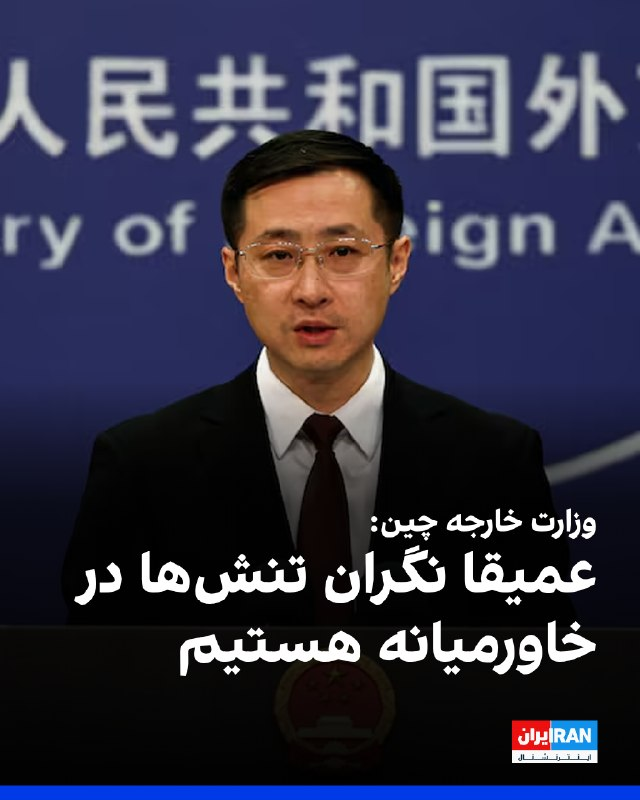

لین جیان، سخنگوی وزارت خارجه چین، چهارشنبه ۲۰ خرداد در نشست خبری با خبرنگاران، در واکنش به حملات اخیر میان آمریکا و جمهوری اسلامی گفت چین «عمیقا نگران» این تنش‌ها است.

او از طرف‌های درگیر خواست «خونسردی خود را حفظ کنند، خویشتنداری نشان دهند، از تشدید تنش‌ها خودداری و اقدام‌های ملموسی برای کاهش تنش انجام دهند.»

سخنگوی وزارت خارجه چین همچنین از آمریکا و جمهوری اسلامی خواست از ابزارهای سیاسی و دیپلماتیک برای «دستیابی سریع به آتش‌بسی جامع و پایدار» استفاده کنند.
‌🏁 🇬🇧 IranintlTV

🤖 @VahidOOnLine

## WithYashar — post 14270

  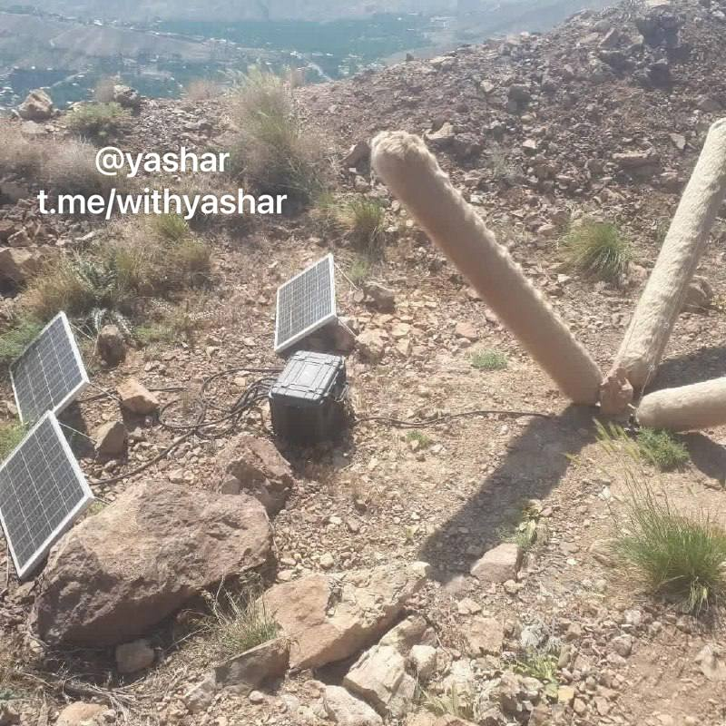

تصویری از کشف تجهیزات جاسوسی برای پشتیبانی هدایت جنگنده‌ها در لواسان
@withyashar

## mwarmonitor — post 10594

💥صدای انفجار در اطراف جزیره قشم شنیده شده است.

## pm_afshaa — post 93281

منابع داخلی از انفجار در قشم خبر دادن

💧 Rainbet.com the #1 Non-KYC Crypto Casino & Sportsbook @rainbetcom

😁 @Pm_Afshaa

## kianmeli1 — post 87842

  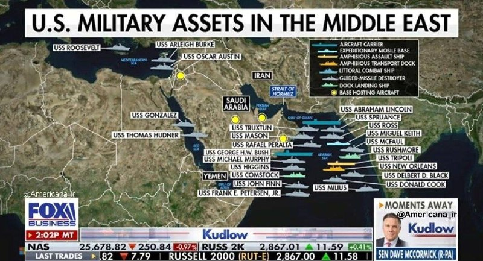

🔴تصویری که فاکس نیوز از آخرین آرایش سنگین‌ ناوگان‌ دریایی آمریکا در منطقه برای "محاصره دریایی ایران" منتشر کرده است!
https://t.me/kianmeli1

## kianmeli1 — post 87841

  <a href="telegram/content/kianmeli1_87841_1781078018.mp4" target="_blank">🎬 Download video</a>

🔴کلیپی از شلیک ۱۱ موشک به سمت پایگاه های امریکایی که امروز صبح توسط سپاه صورت پذیرفت
https://t.me/kianmeli1

## IranIntlTV — post 341453

  

لین جیان، سخنگوی وزارت خارجه چین، چهارشنبه ۲۰ خرداد در نشست خبری با خبرنگاران، در واکنش به حملات اخیر میان آمریکا و جمهوری اسلامی گفت چین «عمیقا نگران» این تنش‌ها است.

او از طرف‌های درگیر خواست «خونسردی خود را حفظ کنند، خویشتنداری نشان دهند، از تشدید تنش‌ها خودداری و اقدام‌های ملموسی برای کاهش تنش انجام دهند.»

سخنگوی وزارت خارجه چین همچنین از آمریکا و جمهوری اسلامی خواست از ابزارهای سیاسی و دیپلماتیک برای «دستیابی سریع به آتش‌بسی جامع و پایدار» استفاده کنند.
https://iranintl.com/202606101330

## Persian_Trend_Official — post 16431

  <a href="telegram/content/Persian_Trend_Official_16431_1781078021.mp4" target="_blank">🎬 Download video</a>

بد شد که !!!!
چطور با نرخ 100 درصد اشتباه میکنی 😄

## Hranews — post 113509

  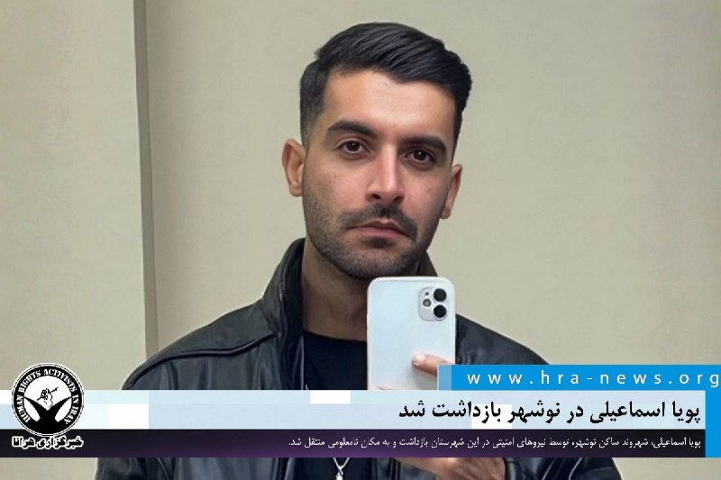

پویا اسماعیلی در نوشهر بازداشت شد

❗️
❗️
❗️
❗️
❗️– پویا اسماعیلی، شهروند ساکن نوشهر، توسط نیروهای امنیتی در این شهرستان بازداشت و به مکان نامعلومی منتقل شد.

به گزارش خبرگزاری هرانا، ارگان خبری مجموعه فعالان حقوق بشر در ایران، پویا اسماعیلی بازداشت شد.

بر اساس اطلاعات دریافتی هرانا، بازداشت این شهروند روز سه شنبه ۱۹ خردادماه، توسط نیروهای امنیتی در نوشهر صورت گرفته است.

ادامه مطلب

#پویا_اسماعیلی

↘️
@hranews_bot تماس ✉️ - @Hranews کانال هرانا 🆑

## alonews — post 126727

  <a href="telegram/content/alonews_126727_1781078024.webm" target="_blank">🎬 Download video</a>

👈دقایقی پیش منابع محلی از شنیده شدن صدای یک انفجار در محدوده شهرستان قشم خبر داده‌اند.

✅ @AloNews خبر جنگ

## alonews — post 126726

  <a href="telegram/content/alonews_126726_1781078025.webm" target="_blank">🎬 Download video</a>

👈روستای بیت یاحون در جبهه بنت جبیل، قبل و بعد از حملات اسرائیل

✅ @AloNews خبر جنگ

## alonews — post 126725

  <a href="telegram/content/alonews_126725_1781078025.webm" target="_blank">🎬 Download video</a>

👈وزارت دفاع کویت نیز تایید کرد که کویت هدف حمله هوایی ایران قرار گرفته است

✅ @AloNews خبر جنگ

## alonews — post 126724

  <a href="telegram/content/alonews_126724_1781078026.webm" target="_blank">🎬 Download video</a>

👈چین: از همه طرف‌ها می‌خواهیم که به تشدید تنش‌ها در خاورمیانه پایان دهند.

🔴ما نسبت به تحولات جنگ در خاورمیانه نگران هستیم و خواستار توقف تشدید تنش‌ها هستیم.

✅ @AloNews خبر جنگ

## alonews — post 126723

  <a href="telegram/content/alonews_126723_1781078026.webm" target="_blank">🎬 Download video</a>

👈آخرین قیمت نفت ۹۱.۳۴ دلار

✅ @AloNews خبر جنگ

---
📅 بروزرسانی: 1405/03/20 11:13
---

## pm_afshaa — post 93280

🔴شورای امنیت روسیه در بیانیه‌ای تکان‌دهنده که توسط خبرگزاری «تاس» منتشر شد، هشدار داد آمریکا و اسرائیل از پوشش دیپلماسی و مذاکرات صلح برای آماده‌سازی یک عملیات زمینی گسترده علیه ایران استفاده می‌کنن

💧 Rainbet.com the #1 Non-KYC Crypto Casino & Sportsbook @rainbetcom

😁 @Pm_Afshaa

## DEJradio — post 5529

  <a href="telegram/content/DEJradio_5529_1781077392.webm" target="_blank">🎬 Download video</a>

🔺📢 دیدگاه؛
نیروی هوایی و پدافند جمهوری اسلامی توانایی حراست از آسمان ایران را ندارند

طی دو جنگ ۱۲ و ۴۰ روزه، ده‌ها سایت راداری و پدافندی ارتش منهدم شدند. اکنون که درگیری‌های محدود هم‌زمان با آتش‌بس ادامه دارد، آمریکا و اسرائیل روی سرکوب رادارهای پدافندی و مخابراتی به‌ویژه در جنوب ایران و نواحی مرزی تمرکز کرده‌اند.

برخی کارشناسان نظامی داخل ایران با انتقاد از تصمیمات و تدابیر سلسله مراتب فرماندهی نیروهای مسلح ایران می‌گویند، «پس از سال‌ها جداسازی پدافند از نیروی هوایی، اثرات مخرب آن در جنگ بروز کرده و اکنون پدافند، پشتیبانی هوایی ندارد و به سرعت در درگیری‌ها هدف قرار گرفته می‌شود.»

بخشی از این تحلیل درست به نظر می‌رسد اما واقعیت آن است که اصلا نیروی هوایی جمهوری اسلامی توانایی پشتیبانی از پدافند و حراست از آسمان ایران را ندارد.
با وجود اینکه بهترین خلبانان منطقه در نیروی هوایی ایران زیر نظر برجسته‌ترین اساتید پرورش پیدا می‌کنند اما با اسکادران‌هایی که عمرشان از نیم قرن بیشتر است نمی‌شود در مقابل هواپیماهای پیشرفته کار ویژه‌ای کرد.
برای همین است که از تل‌آویو تا ایران بزرگراه باز شده است.

#پدافند #نیروی_هوایی #جنگ
@DEJradio

## RadioFarda — post 158122

  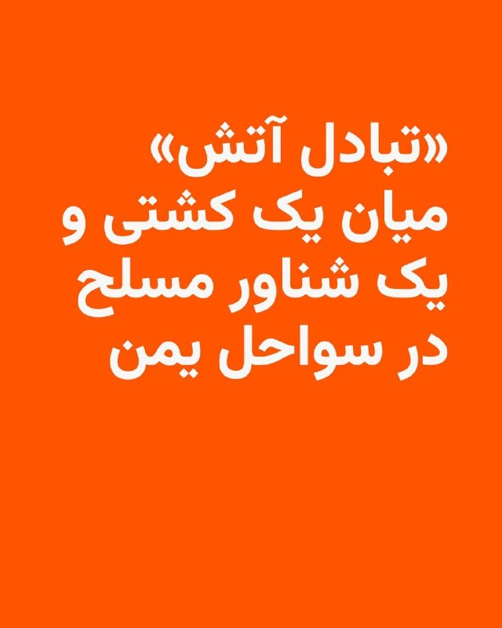

🔸سازمان عملیات تجارت دریایی بریتانیا، «یوکی‌ام‌تی‌او»، از تبادل آتش میان یک کشتی باری و یک شناور حامل افراد مسلح در نزدیکی سواحل یمن خبر داد.

🔸این سازمان اعلام کرد که این شناور کوچک حامل «شش فرد مسلح» بود و این درگیری در حدود ۸۸ مایل دریایی در جنوب‌غربی منطقه بَلحاف در سواحل یمن، رخ داد.

🔸«یوکی‌ام‌تی‌او» افزود که میان این شناور کوچک و تیم امنیتی مسلح مستقر بر روی کشتی باری «تبادل آتش» صورت گرفته است.

🔸با این حال بر اساس این گزارش، پس از این درگیری، شناور کوچک مسیر خود را تغییر داده و از محل دور شده است.

🔸هنوز جزئیات بیشتری در این زمینه منتشر نشده است.

@RadioFarda

## IranianMinds — post 22060

ارتش اسرائیل ۲ مقام مسئول حماس را ترور کرد

ارتش اسرائیل ادعا کرد که مسئول سیستم انتقال پول حماس و معاون وی را ترور کرده است.

@IranianMinds

## Dirty_Kids — post 391556

دیشب تو خاورمیانه هرکی یکی رو برده بود یه گوشه دارشت میکرد.

@Dirty_Kids 👻

## Dirty_Kids — post 391555

  

چون جنس‌ش خوبه؟!

@Dirty_Kids 👻

## Dirty_Kids — post 391554

  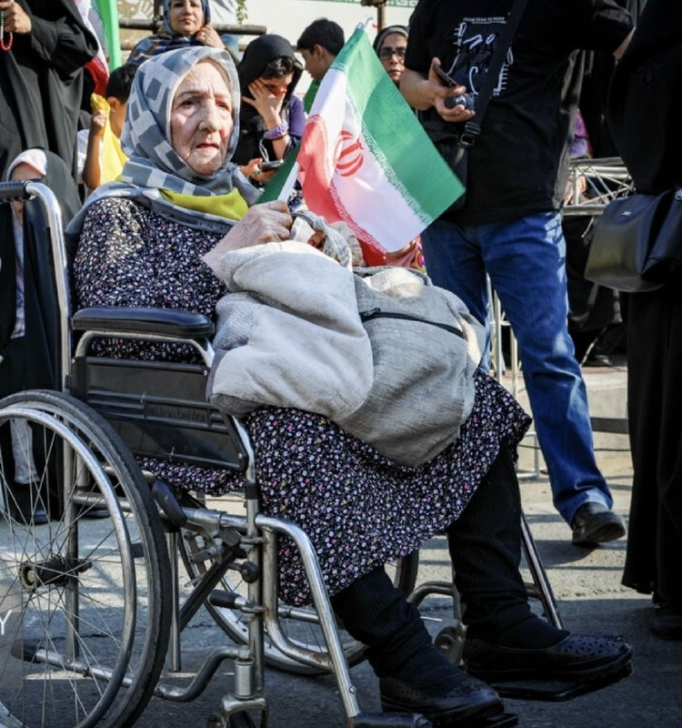

نسل کثافتی که با خریت، پنج نسل بعد از خودش رو گایید.

@Dirty_Kids 👻

## alonews — post 126722

  <a href="telegram/content/alonews_126722_1781077395.webm" target="_blank">🎬 Download video</a>

👈وزارت امنیت داخلی آمریکا: بازیکنان تیم ملی ایران مجاز خواهند بود یک روز قبل از هر بازی وارد خاک آمریکا شوند و در هتل‌های تعیین‌شده اقامت کنند.

🔴این تسهیلات به درخواست ترامپ صورت گرفته است و دیدار ایران با نیوزیلند، اولین فرصت برای اجرای این برنامه خواهد بود

✅ @AloNews خبر جنگ

## alonews — post 126721

  <a href="telegram/content/alonews_126721_1781077395.webm" target="_blank">🎬 Download video</a>

👈سفیر پیشین آمریکا در اسرائیل: وقتی به آنچه در خاورمیانه می‌گذرد نگاه می‌کنم، می‌بینم که اوضاع همچنان آشفته است.

🔴اختلاف نظر بزرگی میان اسرائیل و آمریکا وجود دارد و کاملا روشن است که دونالد ترامپ مدت‌هاست آماده پایان دادن به جنگ و رسیدن به نوعی توافق با ایران است.

✅ @AloNews خبر جنگ

---
📅 بروزرسانی: 1405/03/20 11:02
---

## mwarmonitor — post 10593

🔴 وزارت دفاع کویت نیز اعلام کرد که کویت هدف حمله ایران قرار گرفته است.

@mwarmonitor

## FarsiVOA — post 220221

  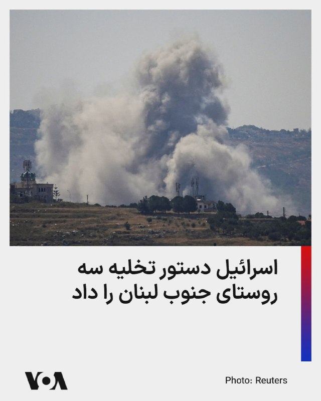

ارتش اسرائیل در دو هشدار پیاپی از ساکنان سه روستای جنوب لبنان خواست پیش از حملات علیه مواضع حزب‌الله، این مناطق را ترک کنند.

به گزارش تایمز اسرائیل، در هشدار نخست، ارتش اسرائیل از ساکنان غسانیه و حومین الفوقا خواست دست‌کم یک کیلومتر از محل زندگی خود فاصله بگیرند. دقایقی بعد، هشدار جداگانه‌ای برای روستای انصاریه صادر شد و از ساکنان آن خواسته شد به شمال رود زهرانی بروند.

آویخای ادرعی، سخنگوی عربی‌زبان ارتش اسرائیل، گفت این اقدام به دلیل آنچه «نقض توافق آتش‌بس از سوی حزب‌الله» خواند، انجام می‌شود و ارتش اسرائیل «ناچار است با قدرت» علیه این گروه اقدام کند.
@FarsiVOA

## DW_Farsi — post 125756

  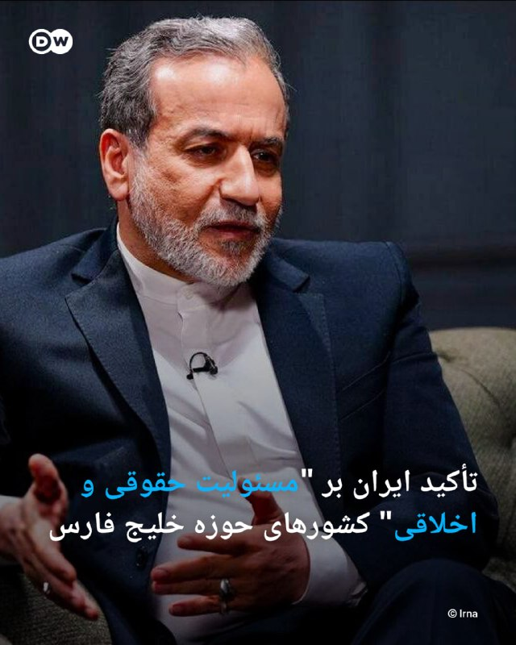

🔶 تأکید ایران بر "مسئولیت حقوقی و اخلاقی" کشورهای حوزه خلیج فارس

وزارت امور خارجه جمهوری اسلامی روز چهارشنبه ۲۰ خردادماه در بیانیه‌ای درباره حملات به کشورهای حاشیه خلیج فارس، اعلام کرد همسایگان ایران در منطقه به‌دلیل "مسئولیت حقوقی و اخلاقی باید مانع حملات آمریکا و اسرائیل شوند".

این وزارتخانه در بیانیه خود تصریح کرد، جمهوری اسلامی "بر مسئولیت حقوقی و اخلاقی تمامی کشورهای منطقه (به‌ویژه کشورهای واقع در سواحل جنوبی خلیج فارس) برای جلوگیری از استفاده آمریکا و اسرائیل از قلمرو یا تأسیسات آن‌ها به‌منظور برنامه‌ریزی، سازماندهی، اجرا یا پشتیبانی از اقدامات خصمانه علیه ایران تأکید مجدد می‌کند".

پیش از آن گزارش‌هایی در مورد حملات سپاه پاسداران و ارتش جمهوری اسلامی به چند کشور از جمله کویت، بحرین و اردن منتشر شد؛ حملاتی که تهران آن‌ها را پاسخی به حملاتی دانسته که آمریکا در تلافی سرنگونی یک هلی‌کوپترش در دریای عمان علیه جمهوری اسلامی انجام داد.

در این میان عباس عراقچی، وزیر خارجه جمهوری اسلامی با وزیران خارجه عربستان سعودی و ترکیه تماسی تلفنی داشته است. کانال تلگرامی عراقچی ضمن انتشار این خبر نوشت، وزیر خارجه ایران در این گفت‌وگوهای تلفنی "ضمن محکومیت تجاوز نظامی امریکا و نقض حاکمیت ملی و تمامیت ارضی ایران، بر حق ذاتی دفاع مشروع جهت پاسخ متقابل نیروهای مسلح جمهوری اسلامی" تأکید کرد.

عراقچی پیشتر نیز با انتشار پیامی در شبکه ایکس هشدار داده بود که جمهوری اسلامی حملات آمریکا را "بی‌پاسخ" نخواهد گذاشت.

@dw_farsi

## Hranews — post 113508

  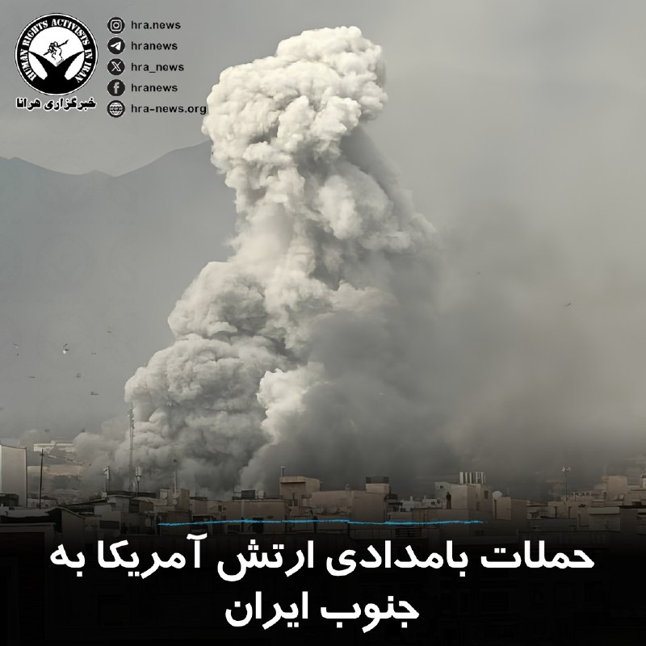

بامداد امروز، رسانه‌های رسمی ایران از وقوع چندین انفجار و حملات هوایی آمریکا به نقاطی از جنوب کشور خبر دادند. بر اساس گزارش‌های منتشرشده، مناطقی در جاسک، کوه مبارک، سیریک، قشم و حوالی بندرعباس هدف حملات قرار گرفتند. صداوسیما اصابت پرتابه در سیریک، حمله به چند نقطه در قشم و جاسک و همچنین تخریب دو مخزن آب در سیریک و بندر کوهستک را تایید کرد. مرکز رسانه قوه قضاییه نیز از شنیده شدن صدای انفجار و فعالیت پدافند در بندرعباس، قشم و سیریک خبر داد. در همین حال، سپاه پاسداران اعلام کرد یک فروند پهپاد آمریکایی در آسمان شهرستان جم استان بوشهر توسط پدافند هوایی این نیرو سرنگون شده است.

مقامات آمریکایی اعلام کردند که در جریان حملات بامداد چهارشنبه، حدود ۲۰ هدف در جنوب ایران در سه موج جداگانه مورد حمله قرار گرفته است. این دور از حملات پس از آن آغاز شد که دونالد ترامپ، رئیس‌جمهور آمریکا، مدعی شد یک بالگرد آمریکایی در آب‌های ایران هدف قرار گرفته و سقوط کرده است؛ موضوعی که به گفته او نیازمند «پاسخ» بود. در مقابل، مجید تخت‌روانچی، معاون وزیر امور خارجه ایران، هرگونه حمله عمدی ایران به بالگرد آمریکایی در تنگه هرمز را رد کرد و مدعی شد که با توجه به شرایط متشنج منطقه، احتمال وقوع حوادث ناخواسته وجود دارد، اما ایران در این حادثه نقشی نداشته است.
#حمله_نظامی #جنگ

↘️
@hranews_bot تماس ✉️ - @Hranews کانال هرانا 🆑

## alonews — post 126720

  <a href="telegram/content/alonews_126720_1781076779.webm" target="_blank">🎬 Download video</a>

👈پولیتیکو به نقل از ترامپ : با وجود حملات تلافی‌جویانه بر سر سرنگونی هلیکوپتر، توافق با ایران «همچنان نزدیک است»

🔴ترامپ با وجود حملات تلافی‌جویانه ارتش ایالات متحده در واکنش به سرنگونی هلیکوپتر نظامی در دریای عمان همچنان مدعی است که دستیابی به توافق صلح با ایران در دسترس است.

🔴مقام‌های کاخ سفید با تفکیک مسیر نظامی از مسیر دیپلماتیک این درگیری‌ها را صرفاً دست‌اندازی در مسیر مذاکرات می‌دانند و معتقدند همزمان با پاسخ متناسب نظامی می‌توان به گفتگوها برای بازگشایی تنگه هرمز ادامه داد.

🔴این خوش‌بینی رئیس‌جمهور آمریکا در حالی مطرح می‌شود که تهران با لحنی تهاجمی از آمادگی برای تداوم درگیری‌ها خبر داده است اما تأکید مستمر ترامپ بر نزدیک بودن یک توافق قدرتمند نشان می‌دهد که دولت او همچنان اولویت خود را بر مدیریت این تقابل و رسیدن به نقطه تفاهم در روزهای پیش رو متمرکز کرده است

✅ @AloNews خبر جنگ

## alonews — post 126719

  <a href="telegram/content/alonews_126719_1781076779.webm" target="_blank">🎬 Download video</a>

👈 منبع آگاه نظامی: ایران با استفاده از موشک‌های دوربرد سوخت جامد خیبرشکن، آشیانۀ جنگنده‌های اف۳۵ آمریکا در اردن را هدف قرار داده است

✅ @AloNews خبر جنگ

## alonews — post 126717

  <a href="telegram/content/alonews_126717_1781076780.webm" target="_blank">🎬 Download video</a>

👈 لیندزی گراهام دوباره به عنوان سناتور حزب جمهوری‌خواه در کارولینای جنوبی با حدود ۶۰٪ آراء انتخاب شد

✅ @AloNews خبر جنگ

## alonews — post 126716

  <a href="telegram/content/alonews_126716_1781076780.webm" target="_blank">🎬 Download video</a>

👈احتمال شنیدن صدای انفجار در جنوب اصفهان

✅ @AloNews خبر جنگ

## alonews — post 126715

  <a href="telegram/content/alonews_126715_1781076780.webm" target="_blank">🎬 Download video</a>

👈ارتش اسرائیل و شاباک رئیس زیرساخت انتقالات مالی در سازمان حماس و معاون او را در نوار غزه از بین بردند.

🔴ارتش اسرائیل و شاباک در شمال نوار غزه، خضر جمازی، رئیس زیرساخت انتقالات مالی و معاون او محمد خرازین را که به عنوان انتقال‌دهندگان اصلی پول سازمان حماس در نوار غزه فعالیت می‌کردند، از بین بردند

✅ @AloNews خبر جنگ

---
📅 بروزرسانی: 1405/03/20 10:53
---

## mwarmonitor — post 10592

  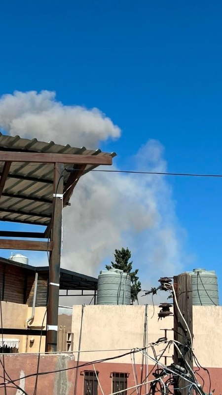

🔴اسرائیل حملات هوایی خود را علیه جنوب لبنان تشدید کرده است؛ حمله‌ای جدید مناطقی را در قضاء صور در جنوب لبنان هدف قرار داد.

@mwarmonitor

## pm_afshaa — post 93279

🔴وزارت دفاع کویت اعلام کرد مورد حمله از سوی جمهوری اسلامی قرار گرفته

💧 Rainbet.com the #1 Non-KYC Crypto Casino & Sportsbook @rainbetcom

😁 @Pm_Afshaa

## DEJradio — post 5528

  <a href="telegram/content/DEJradio_5528_1781076193.mp4" target="_blank">🎬 Download video</a>

🔺🎥 بی‌عدالتی در پرداخت «پاداش جنگ» به نیروهای مسلح باعث نارضایتی ارتشی‌ها شده است.

یک ارتشی با شعارنویسی نسبت به این تبعیض اعتراض کرده است. روی دیوار نوشته شده «سقف ما ارتشی‌ها میریزد اما بودجه سـ.ـپاه تمامی ندارد.»

بسیاری از ارتشی‌ها هنوز پاداش ۸ میلیون تومانی خود را دریافت نکرده‌اند اما فرماندهان ارشد حواله خودرو گرفته‌اند.

#ارتش #جنگ #پاداش
@DEJradio

## FarsiVOA — post 220220

  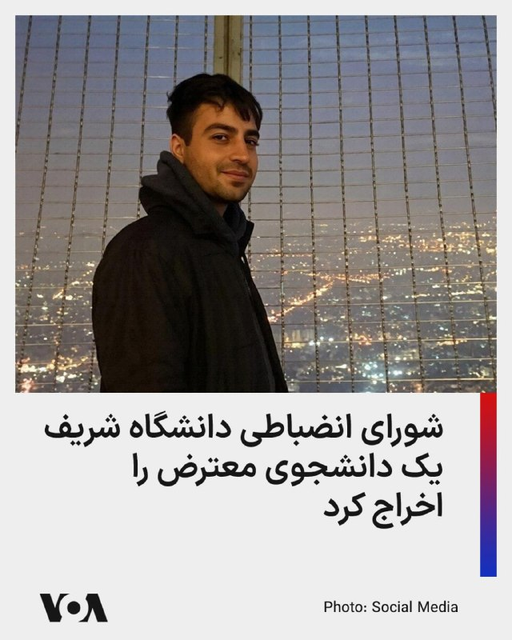

انجمن اسلامی دانشجویان دانشگاه صنعتی شریف با صدور اطلاعیه ‌ای از اعمال نخستین حکم اخراج یک دانشجو توسط شورای انضباطی این دانشگاه خبر داد.

به این ترتیب، رضا دالمن، دانشجوی کارشناسی ارشد مهندسی کامپیوتر، به اخراج و محرومیت از تحصیل در تمام دانشگاه‌ها به مدت چهار سال محکوم شده است.

انجمن اسلامی دانشجویان دانشگاه صنعتی شریف اعلام کرد که آقای دالمن با وجود تبرئه از سوی دستگاه قضایی، از سوی شورای انضباطی دانشگاه با این حکم سنگین روبه‌رو شده است.

این انجمن یادآور شد که حکم اخراج دانشجوی فوق برای تأیید به وزارت علوم ارسال و در روزهای اخیر نیز حداقل برای یک دانشجوی دیگر نیز حکم «بدوی اخراج» صادر شده است.

رضا دالمن، در ۲۸ اسفند سال ۱۴۰۴ و در اوج جنگ ۴۰ روزه از سوی نهادهای امنیتی بازداشت و پس از یک ماه با قرار وثیقه آزاد شده بود.
@FarsiVOA

## BBCPersian — post 283329

🔻وزیر علوم ایران: سهمیه جنگ در کنکور ۱۴۰۵ قطعی شد

🔻حسین سیمایی صراف، وزیر علوم ایران از اختصاص «قطعی» سهمیه به داوطلبان آسیب‌دیده از جنگ در کنکور ۱۴۰۵ خبر داده است.

او البته گفته است: «مراحل اجرایی و تعیین مرجع صدور گواهی در حال تدوین است.»

آقای سیمایی گفته است: «سهمیه جنگ تحمیلی قطعا اختصاص پیدا می‌کند. منتها باید مراحل اجرایی آن را تدوین کنیم.»

او در ادامه گفته است: «اینکه به چه نحوی، چه مرجعی صادر کننده گواهی خواهد بود و اینکه چه درصدی اختصاص پیدا می‌کند بعدا مشخص می شود.»

پس از آغاز جنگ هشت ساله ایران و عراق، طرح مشابهی برای کسانی که به جنگ رفته بودند یا مجروح شده‌ بودند و همچنین خانواده آنها در ایران به اجرا درآمد.

https://bbc.in/4ogFxGW
@BBCPersian

---
📅 بروزرسانی: 1405/03/20 10:43
---

## mwarmonitor — post 10591

🔸خبرنگار الجزیره: یک حمله هوایی اسرائیل، شهرک دیر قانون النهر در قضاء صور در جنوب لبنان را هدف قرار داد.

@mwarmonitor

## mwarmonitor — post 10590

🚨نیروی دفاع بحرین: سامانه‌های پدافند هوایی با تعدادی از حملات هوایی ایران مقابله کرده، آن‌ها را رهگیری و منهدم کردند.

@mwarmonitor

## DEJradio — post 5527

  <a href="telegram/content/DEJradio_5527_1781075592.mp4" target="_blank">🎬 Download video</a>

🔺🎥 یک جگرکی که برای تبلیغ محل، تصویر مشتریان خود را در حال صرف غذا در اینستاگرام منتشر می‌کند، سه‌شنبه شب ۱۹ خرداد با انتشار ویدیویی لو داد که سید علی مؤمنی مداح جنگ‌طلب حکومتی بعد از عربده‌کشی در یکی از تجمعات شبانه، به جگرکی آمده و در یک سینی سنگین با سیخ‌های دل، جگر و دمبه شکم‌چرانی می‌کند.

*در ایران آخرین باری که شما توانستید با خانواده به یک رستوران یا جگرکی بروید کی بود؟ آیا مداحان مفت‌خور جنگ‌طلب از وضعیت زندگی گرسنگان خبر دارند؟

#مداح #جگرکی #علی_مؤمنی
@DEJradio

## DEJradio — post 5525

  <a href="telegram/content/DEJradio_5525_1781075594.webm" target="_blank">🎬 Download video</a>

🔺📷 بر اساس تصاویری که از منابع محلی در شبکه‌های اجتماعی به اشتراک گذاشته شده، سـ.ـپاه از تونل «پونه» واقع در استان لرستان (جاده بروجرد- خرم‌آباد) به عنوان سپر انسانی استفاده کرده است.

زمان دقیق این تصاویر مشخص نیست اما طی جنگ ۱۲ روزه و ۴۰ روزه چندین تونل هدف حمله قرار گرفت.

#سپر_انسانی #بروجرد #خرم_آباد
@DEJradio

## IranIntlTV — post 341452

  <a href="telegram/content/IranIntlTV_341452_1781075595.mp4" target="_blank">🎬 Download video</a>

نشست شورای امنیت سازمان ملل متحد درباره تحریم‌های جمهوری اسلامی با حضور نمایندگان ۱۵ عضو شورا و نماینده ایران برگزار شد.
در این نشست، شورا با ۱۱ رای موافق بررسی روند بازگشت تحریم‌های سازمان ملل علیه جمهوری اسلامی را تصویب کرد

گزارش از مریم رحمتی، خبرنگار ایران‌اینترنشنال
@iranintltv

## FarsiVOA — post 220219

  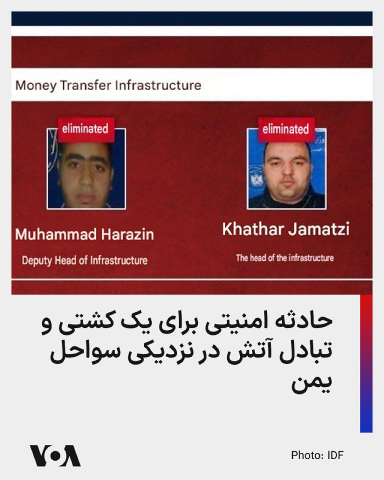

سخنگوی ارتش اسرائیل و سخنگوی شاباک در بیانیه‌ای مشترک اعلام کردند نیروهای اسرائیلی دو روز پیش در شمال نوار غزه، خضر جماصی، مسئول شبکه انتقال وجوه برای حماس، و محمد حرازین، معاون او را هدف قرار داده و از بین برده‌اند.

بر اساس این بیانیه، این دو نفر از چهره‌های اصلی انتقال پول برای حماس در نوار غزه بودند و در جریان جنگ، جابه‌جایی ده‌ها میلیون دلار برای شاخه نظامی این گروه را مدیریت می‌کردند.

ارتش اسرائیل و شاباک می‌گویند این شبکه با استفاده از ده‌ها صراف در داخل نوار غزه، منابع مالی لازم برای پرداخت حقوق به نیروهای حماس و ادامه فعالیت‌های عملیاتی این گروه علیه نیروهای اسرائیلی و شهروندان اسرائیل را فراهم می‌کرد.

در این بیانیه همچنین آمده است که جماصی و حرازین به فهرست چهره‌های مالی حماس اضافه شده‌اند که طی ماه‌های گذشته هدف قرار گرفته‌اند؛ از جمله فراس مشهراوی و ایهاب کریزم که پیش‌تر کشته شده بودند.
@FarsiVOA

## FarsiVOA — post 220218

سازمان عملیات تجارت دریایی بریتانیا اعلام کرد یک کشتی باری در ۸۸ مایل دریایی، حدود ۱۶۳ کیلومتر، جنوب غرب بلحاف یمن با نزدیک شدن یک شناور حامل ۶ فرد مسلح روبه‌رو شد.

این محدوده به سواحل جنوبی یمن نزدیک است و در مسیر دریایی خلیج عدن و دریای عرب قرار دارد. به گفته سازمان عملیات تجارت دریایی، میان شناور کوچک و تیم امنیتی مسلح کشتی تبادل آتش رخ داد و شناور مهاجم از محل دور شد. مقام‌ها در حال تحقیق هستند.

این حادثه در شرایطی رخ می‌دهد که حوثی‌های یمن در روزهای اخیر تهدید کرده‌اند در صورت تشدید تنش‌های منطقه‌ای، حملات دریایی را از سر می‌گیرند.

در سه ماه گذشته نیز چند حادثه مشابه در آب‌های اطراف یمن گزارش شده؛ از جمله نزدیک شدن قایق‌های مسلح به کشتی‌ها در نزدیکی الحدیده، المکلا و سقطرا.
@FarsiVOA

## DW_Farsi — post 125755

  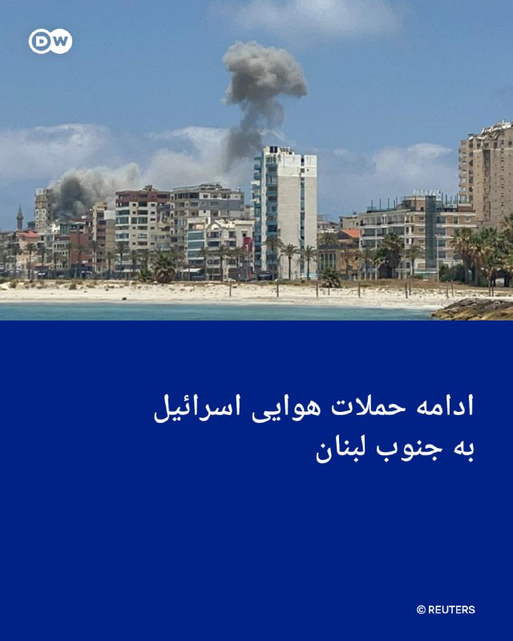

🔶 ادامه حملات هوایی اسرائیل به جنوب لبنان

ارتش اسرائیل اعلام کرد که سکوهای پرتاب موشک و زیرساختارهای حزب‌الله را که برای شلیک پهپادهای تهاجمی به اسرائیل مورد استفاده قرار می‌گرفته‌اند، هدف قرار داده است. در این رابطه اعلام شد که حملات در منطقه صور در جنوب لبنان و چندین نقطه دیگر در این کشور صورت گرفته‌اند.

شبکه خبری الجزیره گزارش داد که ارتش اسرائیل به شش موضع حزب‌الله در صور حمله کرده است. ارتش اسرائیل تصاویری هوایی در شبکه ایکس (توییتر سابق) منتشر کرد که حاکی از حملات هوایی تازه نیروهای اسرائیلی به لبنان است.

@dw_farsi

## Hranews — post 113507

اموال ۴۷ نفر در خراسان شمالی توقیف شد

❗️
❗️
❗️
❗️
❗️– رئیس کل دادگستری خراسان شمالی از شناسایی و توقیف اموال ۴۷ تن از ساکنین خارج کشور خبر داد. دستگاه قضایی این افراد را به «همکاری با دشمن» متهم کرده است.

ادامه مطلب

#توقیف_اموال

↘️
@hranews_bot تماس ✉️ - @Hranews کانال هرانا 🆑

## alonews — post 126714

  <a href="telegram/content/alonews_126714_1781075600.webm" target="_blank">🎬 Download video</a>

👈کاهش قیمت جهانی اونس طلا در ساعات گذشته

✅ @AloNews خبر جنگ

---
📅 بروزرسانی: 1405/03/20 10:33
---

## VahidOOnLine — post 244649

  <a href="telegram/content/VahidOOnLine_244649_1781074986.mp4" target="_blank">🎬 Download video</a>

ویدیوهای رسیده به ایران‌اینترنشنال نشان می‌دهند گروهی از ایرانیان مقیم آلمان سه‌شنبه ۱۹ خرداد در اعتراض به اعدام‌های جمهوری اسلامی و در حمایت از شاهزاده رضا پهلوی در شهر هانوفر تجمع کردند و تصاویر اعدام‌شدگان و جاویدنامان را به دست گرفتند.
‌🏁 🇬🇧 IranintlTV

🤖 @VahidOOnLine

## WithYashar — post 14269

صحنه‌ای از پرتاب حداقل ۱۱ فروند موشک سوخت‌جامد بردبلند علیه اهداف آمریکا در منطقه طی حملات موشکی صبح امروز @withyashar

## WithYashar — post 14268

صحنه‌ای از پرتاب حداقل ۱۱ فروند موشک سوخت‌جامد بردبلند علیه اهداف آمریکا در منطقه طی حملات موشکی صبح امروز
@withyashar

## pm_afshaa — post 93278

🔴حملات سنگین اسراییل به جنوب لبنان

💧 Rainbet.com the #1 Non-KYC Crypto Casino & Sportsbook @rainbetcom

😁 @Pm_Afshaa

## BBCPersian — post 283320

🖊ویکتوریا دربی‌شر
مجری برنامه نیوزنایت

🔻لحظه‌ای را که موهایم شروع به ریزش کردند، به‌وضوح به یاد می‌آورم.

عصر یک روز شنبه در اتاق هتلی روی وان حمام زانو زده بودم و موهایم را می‌شستم تا برای جشن تولد چهل‌ سالگی دوستم آماده شوم. هفده روز از اولین جلسه از شش جلسه شیمی‌درمانی‌ام برای درمان سرطان پستان می‌گذشت، اما در این چند روز هیچ مویی از دست نداده بودم.

خودم را متقاعد کرده بودم که شاید یکی از افراد خوش‌شانس باشم.

اما همین که دوش را بالای سرم گرفتم، ناگهان جریان آب تیره شد، چون تارهای بلند موی قهوه‌ای درست جلوی چشمانم دور دهانه چاه گره می‌خوردند و جمع می‌شدند. هیچ کاری هم از دست من برای متوقف کردن این وضعیت برنمی‌آمد.

با خودم گفتم «وای»، چون واقعا چنین انتظاری نداشتم.

در طول دوره شیمی‌درمانی از یک کلاه خنک‌کننده مو استفاده می‌کردم؛ کلاهی که برای کمک به حفظ موها در طول درمان طراحی شده است. به من گفته بودند این روش برای همه مؤثر نیست.

متن کامل خبر را از لینک زیر بخوانید:
https://bbc.in/3Qevjua
📷Getty Images/BBC/ Victoria Derbyshire/ Takashi Tsuji

@BBCPersian

---
📅 بروزرسانی: 1405/03/20 10:23
---

## VahidOOnLine — post 244642

  <a href="telegram/content/VahidOOnLine_244642_1781074392.mp4" target="_blank">🎬 Download video</a>

ناپدید شدن پول از حساب‌های بانکی فقط یک مشکل مالی نیست، نشانه‌ای از فروریختن اعتماد عمومی به نظام بانکی و توان دولت در حفاظت از دارایی شهروندان است.
‌🏁 🇬🇧 ManotoTV

🤖 @VahidOOnLine

## VahidOOnLine — post 244641

🗣روایت شما از بحران اقتصادی و زندگی در آتش‌بس- چهارشنبه ۲۰ خرداد:

🔹رفتم ال‌سی‌دی گوشیمو عوض کنم ۴ میلیون و ۸۰۰ هزار تومن پول دادم. پارسال همین وقتا ال‌سی‌دی‌ با قیمت ۲ میلیون تومن عوض کردم. همه جنس‌های بازار علاوه بر گرونی، بنجل هم هستن.

🔹طبقه دوم از شش طبقه ساختمان هستم، فشار آب کم است و امروز برای بار دوم موتور کولر سوخت چون آب به پشت‌بام نمی‌رسه، نه پول خرید پمپ دارم نه موتور دوباره کولر، پنکه قرض کردم.

🔹قبل از جنگ ماست ۵۰ هزار تومان بود الان شده ۲۰۰ هزار تومان. یعنی ۳۰۰ درصد افزایش توی ۳ ماه.

🔹تا همین چند ماه پیش تخم‌مرغ دونه‌ای ۵ هزار تومان بود، الان در کمترین حالت، شده دونه‌ای ۲۰ هزار تومان.

🔹تورم و گرونی عجیبه. موتوری که تا ۳ ماه پیش کمتر از ۱۰۰ میلیون تومان بود الان شده بالای ۲۰۰ میلیون تومان.

🔹گرونی بیداد می‌کنه، نیازهای عادیمون شده خواسته‌های لاکچریمون.

🔹من با چندین سال سابقه کار، ۲۰ روزه بدون هیچ دلیلی اخراج شدم. پیگیر شدم برای بیمه بیکاری‌ام می‌گن ۵ ماه حداقل طول می‌کشه. من الان چه‌کار کنم با اجاره خونه و قسط عقب افتاده؟ چطوری شکم زن و بچه‌ام رو سیر کنم.

🔹کاسب بازار هستم. از آذر ماه سال قبل تا الان اوضاع خرابه. مخصوصا همین خرداد که خیلی از کاسب‌ها حتی خرج اجاره مغازه‌شون رو هم در نیاوردن.

🔹عینکم شکسته و باید ۵ میلیون تومان برای یه عینک معمولی هزینه کنم؛ یعنی یک‌سوم حقوق پایه یک کارگر.
‌🏁 🇬🇧 IranintlTV

🤖 @VahidOOnLine

## WithYashar — post 14267

  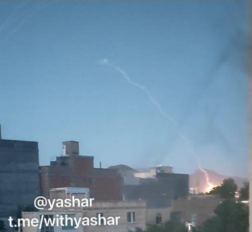

تو خمین دم صبح موشک اومدن ول بدن برگشته پایین
@withyashar

## pm_afshaa — post 93277

🔴نیویورک تایمز : ایران امروز صبح به سمت پایگاه های آمریکا حمله ی موشکی کرد که تمامی موشک ها در هوا رهگیری شدن و هیچ خسارتی به پایگاهای آمریکا وارد نشد

💧 Rainbet.com the #1 Non-KYC Crypto Casino & Sportsbook @rainbetcom

😁 @Pm_Afshaa

## IranIntlTV — post 341451

  <a href="telegram/content/IranIntlTV_341451_1781074393.mp4" target="_blank">🎬 Download video</a>

ویدیوهای رسیده به ایران‌اینترنشنال نشان می‌دهند گروهی از ایرانیان مقیم آلمان سه‌شنبه ۱۹ خرداد در اعتراض به اعدام‌های جمهوری اسلامی و در حمایت از شاهزاده رضا پهلوی در شهر هانوفر تجمع کردند و تصاویر اعدام‌شدگان و جاویدنامان را به دست گرفتند.

## IranIntlTV — post 341450

🗣روایت شما از بحران اقتصادی و زندگی در آتش‌بس- چهارشنبه ۲۰ خرداد:

🔹رفتم ال‌سی‌دی گوشیمو عوض کنم ۴ میلیون و ۸۰۰ هزار تومن پول دادم. پارسال همین وقتا ال‌سی‌دی‌ با قیمت ۲ میلیون تومن عوض کردم. همه جنس‌های بازار علاوه بر گرونی، بنجل هم هستن.

🔹طبقه دوم از شش طبقه ساختمان هستم، فشار آب کم است و امروز برای بار دوم موتور کولر سوخت چون آب به پشت‌بام نمی‌رسه، نه پول خرید پمپ دارم نه موتور دوباره کولر، پنکه قرض کردم.

🔹قبل از جنگ ماست ۵۰ هزار تومان بود الان شده ۲۰۰ هزار تومان. یعنی ۳۰۰ درصد افزایش توی ۳ ماه.

🔹تا همین چند ماه پیش تخم‌مرغ دونه‌ای ۵ هزار تومان بود، الان در کمترین حالت، شده دونه‌ای ۲۰ هزار تومان.

🔹تورم و گرونی عجیبه. موتوری که تا ۳ ماه پیش کمتر از ۱۰۰ میلیون تومان بود الان شده بالای ۲۰۰ میلیون تومان.

🔹گرونی بیداد می‌کنه، نیازهای عادیمون شده خواسته‌های لاکچریمون.

🔹من با چندین سال سابقه کار، ۲۰ روزه بدون هیچ دلیلی اخراج شدم. پیگیر شدم برای بیمه بیکاری‌ام می‌گن ۵ ماه حداقل طول می‌کشه. من الان چه‌کار کنم با اجاره خونه و قسط عقب افتاده؟ چطوری شکم زن و بچه‌ام رو سیر کنم.

🔹کاسب بازار هستم. از آذر ماه سال قبل تا الان اوضاع خرابه. مخصوصا همین خرداد که خیلی از کاسب‌ها حتی خرج اجاره مغازه‌شون رو هم در نیاوردن.

🔹عینکم شکسته و باید ۵ میلیون تومان برای یه عینک معمولی هزینه کنم؛ یعنی یک‌سوم حقوق پایه یک کارگر.

## ManotoTV — post 105981

  <a href="telegram/content/ManotoTV_105981_1781074396.mp4" target="_blank">🎬 Download video</a>

ناپدید شدن پول از حساب‌های بانکی فقط یک مشکل مالی نیست، نشانه‌ای از فروریختن اعتماد عمومی به نظام بانکی و توان دولت در حفاظت از دارایی شهروندان است.

## RadioFarda — post 158121

🔸جی‌دی ونس، معاون رئیس‌جمهور آمریکا، می‌گوید اگرچه ایالات متحده به دستیابی به توافق با ایران، «بسیار نزدیک» شده، اما این توافق ممکن است «هفته آینده یا چند ماه دیگر» حاصل شود. 🔸ونس این اظهارات را قبل از عملیات آمریکا در جنوب ایران در واکنش به ساقط‌کردن بالگرد…

## RadioFarda — post 158120

  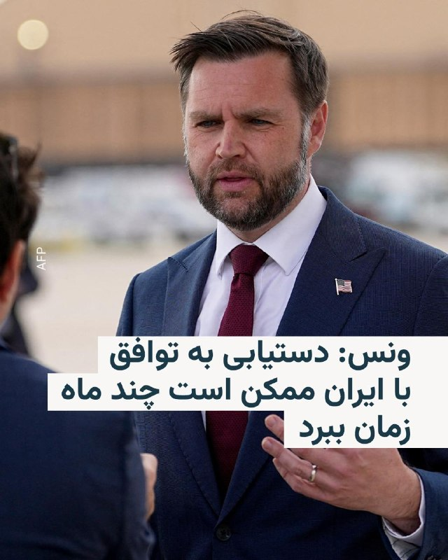

🔸جی‌دی ونس، معاون رئیس‌جمهور آمریکا، می‌گوید اگرچه ایالات متحده به دستیابی به توافق با ایران، «بسیار نزدیک» شده، اما این توافق ممکن است «هفته آینده یا چند ماه دیگر» حاصل شود.

🔸ونس این اظهارات را قبل از عملیات آمریکا در جنوب ایران در واکنش به ساقط‌کردن بالگرد آمریکایی در نزدیکی سواحل عمان، در گفت‌و‌گو با برنامه «ساندی مورنینگ» شبکه سی‌بی‌اس، بیان کرد.

🔸او تأکید کرد که این توافق، برنامه هسته‌ای ایران را «در بلندمدت» حل‌وفصل خواهد کرد.

🔸ونس افزوده: «در حال حاضر احساس می‌کنم در موقعیتی هستیم که بتوانیم به توافقی دست یابیم که از نظر اقتصادی برای ایالات متحده مفید باشد و واقعاً به برنامه هسته‌ای ایران رسیدگی کند؛ نه فقط برای اکنون و نه فقط تا زمانی که دونالد ترامپ رئیس‌جمهور است، بلکه برای بلندمدت؛ به‌گونه‌ای که وقتی فرزندان من بزرگسال شدند، بتوانند بگویند: "ایران قرار نیست به سلاح هسته‌ای دست پیدا کند."»

🔸او می‌گوید: «این هدف سیاست ماست و فکر می‌کنم بسیار به تحقق این هدف نزدیک شده‌ایم. اما هنوز کارهایی باقی مانده که باید انجام دهیم و به تلاش خود ادامه خواهیم داد.»

@RadioFarda

## IranianMinds — post 22059

  

🔴 نیویورک تایمز :

ایران امروز صبح به سمت پایگاه های آمریکا حمله ی موشکی کرد که تمامی موشک ها در هوا رهگیری شدن و هیچ خسارتی به پایگاهای آمریکا وارد نشد.

@IranianMinds

## BBCPersian — post 283319

🔻سازمان عملیات تجارت دریایی بریتانیا: یک قایق کوچک با کشتی باری در نزدیکی سواحل یمن به تبادل آتش پرداختند

🔻سازمان عملیات تجارت دریایی بریتانیا اعلام کرد که روز چهارشنبه، یک قایق کوچک حامل شش فرد مسلح در حدود ۸۸ مایل دریایی جنوب غربی بلحاف یمن به یک کشتی باری نزدیک شد.

این سازمان می‌گوید تبادل آتش بین قایق کوچک و تیم امنیتی مسلح کشتی رخ داد و سپس قایق مهاجم برگشت.

https://bbc.in/4olsios
@BBCPersian

## manototv — post 105981

  <a href="telegram/content/manototv_105981_1781074398.mp4" target="_blank">🎬 Download video</a>

ناپدید شدن پول از حساب‌های بانکی فقط یک مشکل مالی نیست، نشانه‌ای از فروریختن اعتماد عمومی به نظام بانکی و توان دولت در حفاظت از دارایی شهروندان است.

## alonews — post 126710

  <a href="telegram/content/alonews_126710_1781074398.webm" target="_blank">🎬 Download video</a>

👈حملات امروز صبح اسرائیل به جنوب لبنان

✅ @AloNews خبر جنگ

## alonews — post 126709

  <a href="telegram/content/alonews_126709_1781074399.webm" target="_blank">🎬 Download video</a>

👈ارتش اسرائیل: هشدار فوری به ساکنان روستای انصاریه در جنوب لبنان برای تخلیه و رفتن به شمال رودخانه زهرانی

✅ @AloNews خبر جنگ

## alonews — post 126708

  <a href="telegram/content/alonews_126708_1781074399.webm" target="_blank">🎬 Download video</a>

👈آکسیوس به نقل از یک مقام آمریکایی گزارش داد که ایران دست‌کم ۴ موشک بالستیک و چند پهپاد به سمت پایگاه‌های آمریکا در منطقه شلیک کرده است

✅ @AloNews خبر جنگ

---
📅 بروزرسانی: 1405/03/20 10:13
---

## VahidOOnLine — post 244640

  <a href="telegram/content/VahidOOnLine_244640_1781073804.mp4" target="_blank">🎬 Download video</a>

ویدیوی رسیده به ایران‌اینترنشنال از خمین، رد موشک‌های شلیک‌شده از سوی جمهوری اسلامی را به سوی اسرائیل در چهارشنبه ۲۰ خرداد نشان می‌دهد.
‌🏁 🇬🇧 IranintlTV

🤖 @VahidOOnLine

## WithYashar — post 14266

هشدار مسکو به تهران:
صلح، پوشش حمله زمینی است، نقشه پنتاگون برای پایان آتش‌بس دوهفته‌ای

شورای امنیت روسیه در بیانیه‌ای تکان‌دهنده که توسط خبرگزاری «تاس» منتشر شد، هشدار داد آمریکا و اسرائیل از پوشش دیپلماسی و مذاکرات صلح برای آماده‌سازی یک عملیات زمینی گسترده علیه ایران استفاده می‌کنن
@withyashar

## WithYashar — post 14265

سازمان دریانوردی بریتانیا:یک کشتی تجاری گزارش داده که در جنوب غربی بندر بلحاف یمن، یک قایق کوچک حامل ۶ فرد مسلح به آن نزدیک شده است.

به گفته این سازمان، بین قایق مسلح و تیم حفاظت مسلح کشتی تبادل تیراندازی رخ داده و در نهایت قایق از محل دور شده است.
@withyashar

## mwarmonitor — post 10589

🔴خبرگزاری آسوشیتدپرس ؛ ارتش بریتانیا اعلام کرد که نگهبانان مسلح حاضر در یک کشتی باری در خلیج عدن، در سواحل یمن، با افراد مسلحی که در یک قایق کوچک بودند تبادل آتش کرده‌اند.

@mwarmonitor

## mwarmonitor — post 10588

  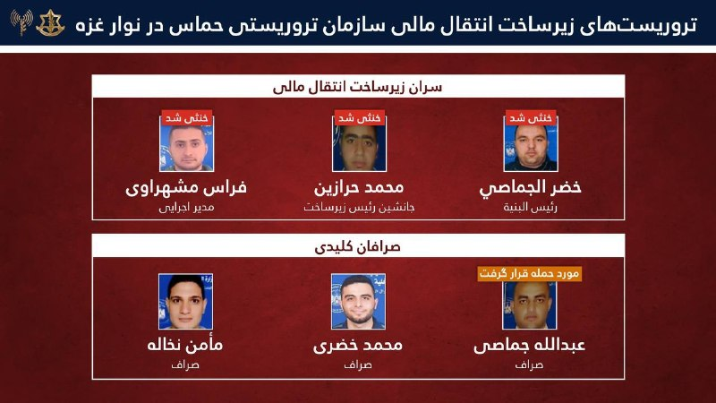

🔴 حذف شدند: خضر جماسی، رئیس شبکه انتقال منابع مالی حماس، به‌همراه معاونش محمد حرازین؛ هر دو از عوامل کلیدی تأمین مالی حماس در غزه بودند.
این افراد از طریق شبکه‌ای متشکل از ده‌ها صرافی فعال در سراسر غزه، توانستند ده‌ها میلیون دلار را به شاخه نظامی حماس در غزه منتقل کنند.

@mwarmonitor

## mwarmonitor — post 10587

‼️ هشدار فوری به ساکنان لبنانِ حاضر در روستای انصاریه

🔸 در پی نقض توافق آتش‌بس از سوی حزب‌الله ، ارتش دفاعی ناچار است با قدرت علیه آن اقدام کند. ارتش دفاعی قصد آسیب‌ رساندن به شما را ندارد.

🔸 به‌منظور حفظ جان شما، باید فوراً منازل خود را تخلیه کرده و به شمال رود زهرانی منتقل شوید.

🔸 هر کسی که در نزدیکی نیروها، تأسیسات و تجهیزات رزمی حزب‌الله حضور داشته باشد، جان خود را در معرض خطر قرار می‌دهد!

@mwarmonitor

## pm_afshaa — post 93276

  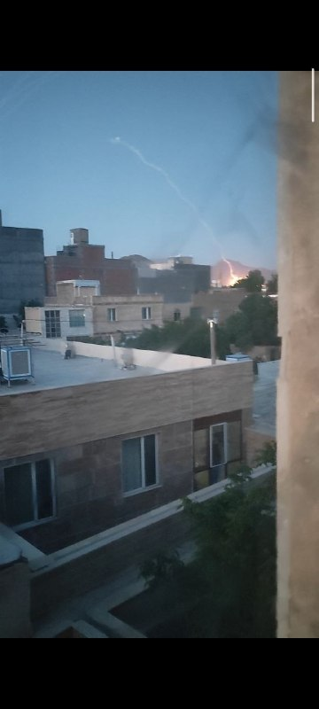

تو خمین امروز موشک اومدن ول بدن فیل شده خوابیده تو زمین خودی

💧 Rainbet.com the #1 Non-KYC Crypto Casino & Sportsbook @rainbetcom

😁 @Pm_Afshaa

## pm_afshaa — post 93275

  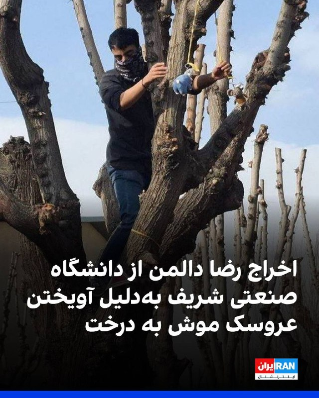

رضا دالمن، دانشجوی کارشناسی ارشد مهندسی کامپیوتر دانشگاه صنعتی شریف، با حکم شورای انضباطی این دانشگاه به اخراج و محرومیت چهار ساله از تحصیل در تمامی دانشگاه‌های کشور محکوم شد.

دادبان پیش‌تر نوشته بود رضا دالمن، دانشجوی ۲۴ ساله کازرونی، شب سال نو ۱۴۰۵ با اتهام آویختن عروسک موش به درخت بازداشت شد.

روزنامه فرهیختگان بدون نام بردن کامل از او، از تایید حکم اخراج «ر.د» در شورای تجدیدنظر دانشگاه شریف خبر داد و او را به «برهم‌زدن نظم»، «تخریب اموال عمومی» و «فحاشی و هتاکی به خامنه‌ای» متهم کرد

💧 Rainbet.com the #1 Non-KYC Crypto Casino & Sportsbook @rainbetcom

😁 @Pm_Afshaa

## IranIntlTV — post 341449

  <a href="telegram/content/IranIntlTV_341449_1781073809.mp4" target="_blank">🎬 Download video</a>

همان‌گونه که جمهوری اسلامی سال‌ها معترضان به حجاب اجباری را با احکام سنگین زندان سرکوب کرد، طالبان نیز با خشونت زنان را بازداشت می‌کند و با تحمیل قوانین جدید، بر همه ابعاد زندگی مردم افغانستان سایه انداخته است

گزارش الهام کریمی، خبرنگار ایران‌اینترنشنال
@iranintltv

## IranIntlTV — post 341448

  <a href="telegram/content/IranIntlTV_341448_1781073811.mp4" target="_blank">🎬 Download video</a>

🔻احمد دنیا‌مالی، وزیر ورزش دولت جمهوری اسلامی روز گذشته اعلام کرد در صورت نمایش پرچمی غیر از پرچم جمهوری اسلامی در ورزشگاه‌های جام جهانی، بازی تیم ملی متوقف خواهد شد.

🔹این تهدید جدید در حالی است که او پیش‌تر حضور تیم ملی در آمریکا را «بی‌غیرتی» خوانده بود.

🔹همزمان، امیرمهدی علوی، سخنگوی فدراسیون فوتبال بار دیگر گفت تیم ملی برای بازی نخست ۲۴ ساعت و برای دو دیدار بعدی مرحله گروهی ۴۸ ساعت پیش از مسابقه وارد آمریکا می‌شود.

@iranintltvsport

## IranIntlTV — post 341447

  <a href="telegram/content/IranIntlTV_341447_1781073814.mp4" target="_blank">🎬 Download video</a>

ویدیوی رسیده به ایران‌اینترنشنال از خمین، رد موشک‌های شلیک‌شده از سوی جمهوری اسلامی را به سوی اسرائیل در چهارشنبه ۲۰ خرداد نشان می‌دهد.

## FarsiVOA — post 220217

  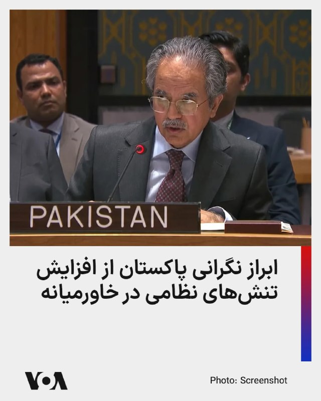

نماینده دائم پاکستان در سازمان ملل متحد، اعلام کرد که پاکستان عمیقاً نسبت به وضعیت جاری در منطقه که با افزایش تنش‌ها همراه شده، نگران است.

عاصم افتخار احمد در بیانیه‌ای که ساعاتی پیش در شبکه ایکس منتشر شد، آتش‌بس میان تهران و واشنگتن را شکننده توصیف و اعلام کرد که تنش‌های نظامی «بر بررسی موضوع هسته‌ای ایران» تأثیر گذاشته و مأموریت حیاتی راستی‌آزمایی آژانس بین‌المللی انرژی اتمی را مختل کرده است.

او بار دیگر اعلام کرد که اسلام‌آباد همچنان معتقد به حل و فصل اختلافات در چارچوب دیپلماسی است و پاکستان به همراه «سایر شرکای منطقه‌ای و فرامنطقه‌ای»، به‌ویژه عربستان سعودی، مصر، ترکیه، قطر و چین، در راستای بازگرداندن طرف‌های مختلف به میز مذاکره و تسهیل تبادل پیام‌ها میان تهران و واشنگتن تلاش می‌کند.
@FarsiVOA

## FarsiVOA — post 220216

  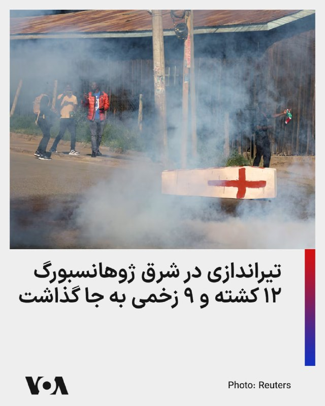

پلیس آفریقای جنوبی اعلام کرد در تیراندازی شامگاه سه‌شنبه در یک سکونتگاه غیررسمی در منطقه کلیولند، شرق ژوهانسبورگ، دست‌کم ۱۲ نفر کشته و ۹ نفر زخمی شدند.

بر اساس گزارش رویترز و رسانه‌های محلی، این حمله در سکونتگاه غیررسمی «جامپرز» رخ داد. پلیس گفته مأموران حدود ساعت ۱۱:۱۰ شب، پس از دریافت گزارش تیراندازی در جریان، به محل اعزام شدند و با چندین قربانی روبه‌رو شدند که هدف گلوله قرار گرفته بودند.

بررسی‌های اولیه نشان می‌دهد هشت مرد و سه زن بزرگسال در محل جان باختند و یک مرد دیگر بعداً در بیمارستان جان خود را از دست داد. دست‌کم ۹ زخمی نیز به مراکز درمانی منتقل شدند.

به نوشته رسانه‌های محلی، پلیس گفته بیش از ۱۰ مظنون با یک خودروی سفیدرنگ تویوتا کوانتوم در نزدیکی یک پمپ بنزین در کلیولند پیاده شدند، از دو ورودی وارد سکونتگاه شدند و در چند نقطه به سوی ساکنان شلیک کردند. مهاجمان سپس با همان خودرو از محل گریختند.

پلیس آفریقای جنوبی اعلام کرده تحقیقات جنایی، اطلاعاتی و پزشکی قانونی در جریان است، اما تا این لحظه انگیزه حمله مشخص نیست و کسی بازداشت نشده است.
@FarsiVOA

## IranianMinds — post 22058

  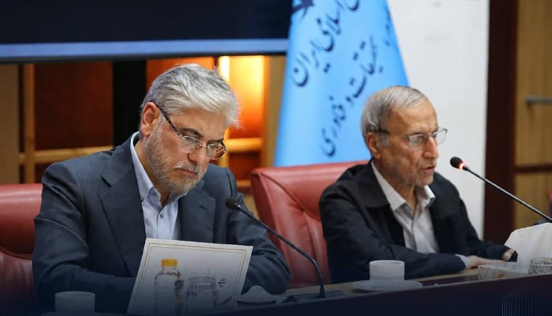

🔴 وزارت علوم:

تعلق سهمیه به آسیب‌ دیدگان جنگ اخیر در کنکور ۱۴۰۵ قطعی شده.

+ علاوه بر سهمیه های دیگه اینم اضافه شد حالا بقیه جوونا باید خودشونو بکشن تا بزور بتونن قبول شن.

@IranianMinds

## Dirty_Kids — post 391553

تا صدای یه موشک میاد استرس نگیرید
خاورمیانه زیر ۱۰ تا موشک کونی بازیه

@Dirty_Kids 👻

## Dirty_Kids — post 391552

برای حذف قند اول باید خودخوری رو بذارم کنار.

@Dirty_Kids 👻

## Dirty_Kids — post 391551

  <a href="telegram/content/Dirty_Kids_391551_1781073819.mp4" target="_blank">🎬 Download video</a>

برای تویی که دیشب خواب بودی:
آمریکا، ایران رو زد
ایران، بحرین و کویت رو زد
پاکستان، افغانستان رو زد
اسرائیل لبنان و سوریه رو زد
ترکیه، عراق رو زد
یمن، اسرائیل رو زد
عربستان هم یمن رو زد

@Dirty_Kids 👻

## alonews — post 126707

  <a href="telegram/content/alonews_126707_1781073821.mp4" target="_blank">🎬 Download video</a>

👈تصاویری از حمله آمریکا به مخازن آب آشامیدنی بخش بمانی شهرستان سیریک هرمزگان

✅ @AloNews خبر جنگ

---
📅 بروزرسانی: 1405/03/20 10:03
---

## VahidOOnLine — post 244639

  <a href="telegram/content/VahidOOnLine_244639_1781073202.mp4" target="_blank">🎬 Download video</a>

ویدیوی رسیده به ایران‌اینترنشنال در چهارشنبه ۲۰ خرداد، دود ناشی از انفجار را در حوالی شاهین‌شهر نشان می‌دهد.
‌🏁 🇬🇧 IranintlTV

🤖 @VahidOOnLine

## VahidOOnLine — post 244638

  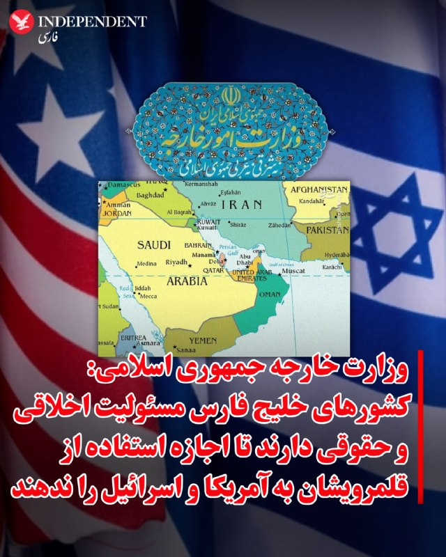

⭕️وزارت خارجه جمهوری اسلامی: کشورهای خلیج فارس مسئولیت اخلاقی و حقوقی  دارند تا اجازه استفاده از قلمرویشان به آمریکا و اسرائیل را ندهند

♦️وزارت امور خارجه جمهوری اسلامی صبح چهارشنبه بیستم خردادماه و پس از حملات متقابل نیروهای مسلح ایران و آمریکا، با صدور بیانیه‌ای از کشورهای منطقه و به‌ویژه دولت‌های «حاشیه جنوبی خلیج فارس» خواست تا قلمرویشان را برای حملات علیه ایران در اختیار آمریکا و اسرائیل قرار ندهند.

وزارت امور خارجه جمهوری اسلامی حملات بامداد چهارشنبه ارتش آمریکا علیه مناطقی در جنوب ایران را «نقض فاحش منشور سازمان ملل» خواند و اعلام کرد: «نیروهای مسلح مقتدر جمهوری اسلامی ایران در راستای اعمال حق ذاتی دفاع مشروع، پایگاه‌ها و دارایی‌های آمریکا در منطقه که مبدا این تجاوزها بودند را مورد ضربه شدید قرار دادند.»

گزارش‌ها از حملات موشکی و پهپادی سپاه پاسداران و ارتش به اهدافی در بحرین، کویت و اردن حکایت دارد.

وزارت امور خارجه جمهوری اسلامی در این بیانیه با هشدار به کشورهای منطقه درباره احتمال حملات مجدد به آن‌ها افزود «بار دیگر مسئولیت قانونی و اخلاقی همه کشورهای منطقه، به‌ویژه کشورهای واقع در حاشیه جنوبی خلیج فارس، برای ممانعت از هرگونه استفاده ارتش آمریکا و اسرائیل از قلمرو و امکانات آن‌ها جهت طراحی، سازماندهی، اجرا و پشتیبانی از اقدامات تجاوزکارانه علیه ایران را یادآوری می‌کند و هشدار می‌دهد که جمهوری اسلامی ایران در اعمال حق ذاتی دفاع از خود، از جمله از طریق هدف قرار دادن مبدا حملات و نیز پایگاه‌ها و امکانات لجستیک مورد استفاده برای اجرا و پشتیبانی از عملیات‌های تجاوزکارانه علیه ایران، درنگ نخواهد کرد.»
‌🇸🇦 Indypersian

🤖 @VahidOOnLine

## IranIntlTV — post 341446

  <a href="telegram/content/IranIntlTV_341446_1781073204.mp4" target="_blank">🎬 Download video</a>

ویدیوی رسیده به ایران‌اینترنشنال در چهارشنبه ۲۰ خرداد، دود ناشی از انفجار را در حوالی شاهین‌شهر نشان می‌دهد.

## IranIntlTV — post 341445

  <a href="telegram/content/IranIntlTV_341445_1781073206.mp4" target="_blank">🎬 Download video</a>

نهادهای امنیتی استرالیا نسبت به تلاش جمهوری اسلامی برای جذب نوجوانان در فعالیت‌های خشونت‌آمیز و «تروریستی» ابراز نگرانی کردند و گفتند شبکه‌های اجتماعی و بازی‌های آنلاین به ابزار هدف قرار دادن جوانان آسیب‌پذیر تبدیل شده‌اند

گفت‌وگو با علیرضا محبی، خبرنگار ایران‌اینترنشنال
@iranintltv

## FarsiVOA — post 220215

  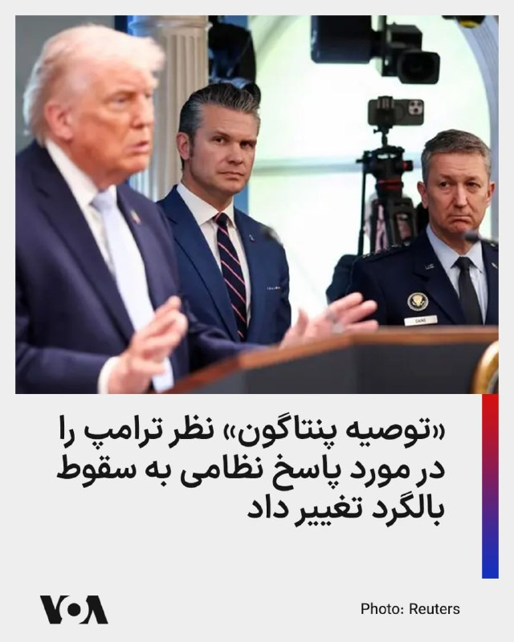

به نوشته وال‌استریت ژورنال، دونالد ترامپ در ابتدا درباره ضرورت پاسخ نظامی به جمهوری اسلامی پس از سقوط بالگرد آپاچی ارتش آمریکا قانع نشده بود و بخش زیادی از روز سه‌شنبه، این حادثه را کم‌اهمیت جلوه می‌داد. او به خبرنگاران گفته بود این اتفاق «مسئله بزرگی» نیست.

با این حال، وال‌استریت ژورنال نوشت نظر ترامپ پس از دریافت گزارش و توصیه‌های پیت هگست، وزیر جنگ، و دن کین، رئیس ستاد مشترک ارتش آمریکا، تغییر کرد.

آسوشیتدپرس نیز گزارش داده بالگرد آپاچی پس از برخورد با یک پهپاد متعلق به جمهوری اسلامی سقوط کرده، هرچند هنوز روشن نیست این برخورد عمدی بوده یا نه.

اما مقام‌های آمریکایی گفته‌اند با وجود این ابهام، حادثه مستحق پاسخ بوده است.

ترامپ سپس در شبکه اجتماعی خود نوشت ایران بالگرد را سرنگون کرده و آمریکا باید پاسخ دهد؛ ساعاتی بعد حملات آمریکا به ایران آغاز شد.
@FarsiVOA

## FarsiVOA — post 220214

  <a href="telegram/content/FarsiVOA_220214_1781073208.mp4" target="_blank">🎬 Download video</a>

حملات اسرائیل به زیرساخت‌های حزب‌الله در جنوب لبنان؛

ارتش اسرائیل اعلام کرد که طی ۲۴ ساعت گذشته، زیرساخت‌های حزب‌الله در شهر «صور» و همچنین دیگر مناطق جنوبی لبنان را هدف قرار داده است.

در شهر صور، شش هدف نظامی از جمله تاسیسات پهپادی حزب‌الله که برای حملات علیه غیرنظامیان و نیروهای ارتش استفاده می‌شد، هدف قرار گرفت.

به گفته ارتش اسرائیل، طی این مدت در دیگر مناطق جنوبی لبنان نیز چند پرتابگر موشک آماده به شلیک و همچنین نیروهای حزب‌الله هدف قرار گرفتند.

ارتش اسرائیل تصاویری از هدف قرار گرفتن این پرتابگرها را در شبکه ایکس منتشر و اعلام کرد که به حملات خود به علیه زیرساخت‌های حزب‌الله در «جنوب لبنان» ادامه خواهد داد.

ایالات متحده و چند کشور از جمله اسرائيل، حزب‌الله لبنان را یک سازمان تروریستی می‌دانند و اتحادیه اروپا نیز شاخه نظامی این گروه را در فهرست گروه‌های تروریستی قرار داده است.
@FarsiVOA

## DW_Farsi — post 125754

  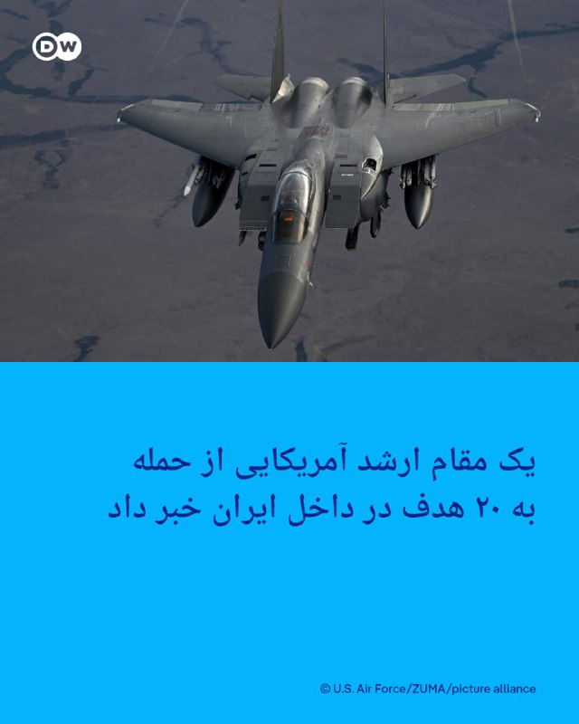

🔶 مقام ارشد آمریکایی: ۲۰ هدف در داخل ایران مورد حمله قرار گرفت

رسانه‌های خبری از جمله فاکس‌نیوز به نقل از یک مقام ارشد آمریکایی گزارش دادند که در حملات ارتش آمریکا علیه جمهوری اسلامی در تلافی سرنگون شدن یک هلی‌کوپتر ایالات متحده در دریای عمان، "۲۰ هدف در داخل ایران مورد حمله قرار گرفت".

این مقام ارشد اضافه کرد، هرچند سنتکام اعلام کرده که عملیات خود را به پایان رسانده اما وضعیت همچنان "فعال" باقی مانده و ارتش آمریکا در صورت هرگونه اقدام تلافی‌جویانه از سوی جمهوری اسلامی "آماده پاسخگویی" خواهد بود.

فرماندهی مرکزی نیروهای آمریکا (سنتکام) بامداد چهارشنبه ۱۰ ژوئن با انتشار بیانیه‌ای رسمی اعلام کرد که حملات تلافی‌جویانه و تکمیلی نیروهای ارتش ایالات متحده علیه مواضعی در ایران به پایان رسیده است.

به گزارش سنتکام، جنگنده‌های نیروی هوایی و نیروی دریایی ایالات متحده با استفاده از مهمات هوشمند و دقیق، پدافند هوایی، ایستگاه‌های کنترل زمینی و رادارهای نظارتی ایران را در نزدیکی تنگه هرمز هدف قرار دادند.

این نهاد در در پایان بیانیه خود تاکید کرد که نیروهای آمریکایی همچنان در وضعیت آماده‌باش کامل قرار دارند و برای دفاع در برابر آنچه اقدامات تجاوزکارانه و توجیه‌ناپذیر ایران نامیده شده، آمادگی دارند.

@dw_farsi

## alonews — post 126706

  <a href="telegram/content/alonews_126706_1781073211.webm" target="_blank">🎬 Download video</a>

👈 یک مقام آمریکایی در گفت‌و‌گو با شبکه سی ان ان مدعی شد: حملات آمریکا با هدف ارسال یک پیام هشدار به ایران انجام شده است. معتقدیم حملات آمریکا روند مذاکرات برای پایان دادن به جنگ با ایران را مختل نخواهد کرد

✅ @AloNews خبر جنگ

---
📅 بروزرسانی: 1405/03/20 09:53
---

## IranIntlTV — post 341444

  <a href="telegram/content/IranIntlTV_341444_1781072586.mp4" target="_blank">🎬 Download video</a>

مهرداد محمدی، روزنامه‌نگار، گفت: «برخوردهای شدید انضباطی با دانشجویان، در واقع تسویه‌حساب اصلاح‌طلبان و دولتشان با دانشجوهاست. اصلاح‌طلبان در سال‌های گذشته می‌خواستند در دانشگاه و در میان دانشجویان نفوذ کنند تا برای اهداف سیاسی خود، از جمله راه انداختن شوهای انتخاباتی، نمایش مضحک دموکراسی دینی و در نهایت ایجاد سنگر برای حفظ نظام، استفاده کنند. شعارهای دانشجویان در حمایت از پهلوی، آخرین میخ به تابوت اصلاح‌طلبی حکومتی در ایران بود.»
@iranintltv

## Persian_Trend_Official — post 16430

  <a href="telegram/content/Persian_Trend_Official_16430_1781072587.webm" target="_blank">🎬 Download video</a>

⚡️🇾🇪 UKMTO گزارشی از حادثه‌ای در ۸۸ مایل دریایی جنوب غربی بالحاف، یمن ارائه داد، جایی که یک کشتی باربری توسط یک قایق کوچک حامل شش فرد مسلح مورد نزدیک شدن قرار گرفت.

گزارش شده است که تبادل آتش بین قایق و تیم امنیتی مسلح کشتی رخ داده است، پس از آن قایق کوچک دور شده است.

👺Phantom

📌 @persian_trend_official
پرشین ترند | متفاوت‌ترین کانال نظامی

## IranianMinds — post 22057

🔴 روابط عمومی سپاه:
نیروی دریایی سپاه ۲۱ هدف از پایگاه‌های هوایی و دریایی آمریکا در منطقه رو مورد اصابت قرار داد.

@IranianMinds

## alonews — post 126705

  <a href="telegram/content/alonews_126705_1781072588.webm" target="_blank">🎬 Download video</a>

👈سازمان دریانوردی بریتانیا:یک کشتی تجاری گزارش داده که در جنوب غربی بندر بلحاف یمن، یک قایق کوچک حامل ۶ فرد مسلح به آن نزدیک شده است.

🔴به گفته این سازمان، بین قایق مسلح و تیم حفاظت مسلح کشتی تبادل تیراندازی رخ داده و در نهایت قایق از محل دور شده است.

✅ @AloNews خبر جنگ

## alonews — post 126704

  <a href="telegram/content/alonews_126704_1781072588.webm" target="_blank">🎬 Download video</a>

👈خبرگزاری رویترز به نقل از پلیس آفریقای جنوبی گزارش داد که در تیراندازی در ژوهانسبورگ، دست کم ۱۲ نفر کشته و ۹ نفر زخمی شدند.

✅ @AloNews خبر جنگ

---
📅 بروزرسانی: 1405/03/20 09:43
---

## VahidOOnLine — post 244637

  

علی خضریان، عضو کمیسیون امنیت ملی مجلس جمهوری اسلامی، با اشاره به حمله بامداد چهارشنبه علیه اردن گفت زیرساخت‌های این کشور که به گفته او در جنگ «با این شدت» مورد اصابت قرار نگرفته بود، به دلیل ادامه همکاری با آمریکا مشمول «تنبیه مبدا تجاوز» شد.

او افزود: «این تنبیه شامل حال کشورهای دیگر هم خواهد شد.»

علی خضریان همچنین درباره تحولات اخیر میان تهران و واشینگتن گفت دونالد ترامپ، رییس‌جمهوری آمریکا، به دنبال آن است که «آبرومندانه از جنگ خارج شود» و به همین دلیل یا یک «حمله بزرگ‌تر» انجام خواهد داد یا تلاش می‌کند جمهوری اسلامی را به نقطه ضعفی برساند تا در میز مذاکره امتیاز بگیرد.

او در بخش دیگری از اظهارات خود گفت: «با وجود سامانه پدافندی نوین و یکپارچه جمهوری اسلامی، آمریکا نتوانست هیچ نفوذی به داخل ایران انجام دهد.»
‌🏁 🇬🇧 IranintlTV

🤖 @VahidOOnLine

## WithYashar — post 14264

روزنامه همشهری: خوشبین نباشید، ترامپ از این جنگ دست برنمی دارد
روزنامه همشهری: واقعیت این است که دعوا بر سر چند درصد غنی‌سازی نیست، دعوا بر سر نظم منطقه است؛ بر سر این است که چه‌کسی گلوگاه‌های راهبردی جهان را کنترل کند و چه‌کسی موازنه قدرت آینده را شکل دهد.
برای همین شاید آتش‌بس باشد، شاید وقفه باشد، شاید جابه‌جایی تاکتیک‌ها را ببینیم‌ اما تصور اینکه این کشمکش با چند توافق فنی برای همیشه خاموش شود، خوش‌بینانه است.
@withyashar

## WithYashar — post 14263

حمله سنگین اسرائیل به جنوب لبنان
@withyashar

## WithYashar — post 14262

  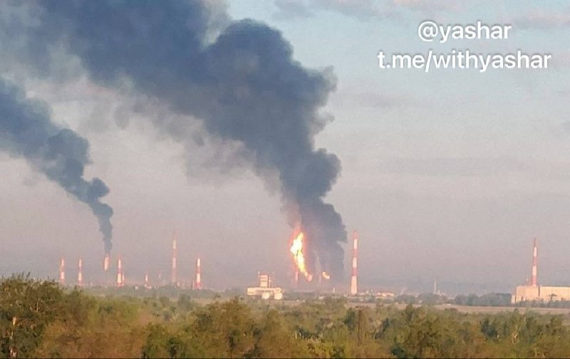

پالایشگاه نفت سامارا روسیه پس از اصابت پهپاد‌های اوکراینی
@withyashar

## FoxNewsTwitter — post 342789

  <a href="telegram/content/FoxNewsTwitter_342789_1781072018.mp4" target="_blank">🎬 Download video</a>

Fox News (Twitter/X)

Police had to rescue the firefighters this time.

Texas officers wrangled an alligator out of a creek behind a fire station after the reptile was spotted lurking near the station.

## pm_afshaa — post 93274

🔴وال استریت ژورنال:ترامپ در ابتدا فکر می‌کرد که ایالات متحده نباید در پاسخ به سرنگونی هلیکوپتر در تنگه هرمز به ایران حمله کند، اما پس از توصیه‌های پیت هگزت (وزیر جنگ) و ژنرال دن کِین (رئیس ستاد مشترک ارتش)، او متقاعد شد که این کار را انجام دهد

💧 Rainbet.com the #1 Non-KYC Crypto Casino & Sportsbook @rainbetcom

😁 @Pm_Afshaa

## pm_afshaa — post 93273

وزیر علوم: سهمیه جنگ 40 روزه در کنکور 405 قطعی شد 
💧 Rainbet.com the #1 Non-KYC Crypto Casino & Sportsbook @rainbetcom 
😁 @Pm_Afshaa

## pm_afshaa — post 93272

وزیر علوم: سهمیه جنگ 40 روزه در کنکور 405 قطعی شد

💧 Rainbet.com the #1 Non-KYC Crypto Casino & Sportsbook @rainbetcom

😁 @Pm_Afshaa

## IranIntlTV — post 341443

  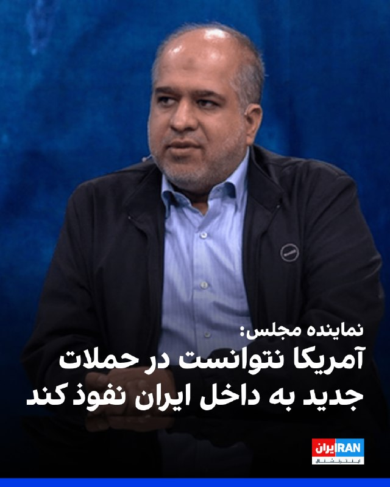

علی خضریان، عضو کمیسیون امنیت ملی مجلس جمهوری اسلامی، با اشاره به حمله بامداد چهارشنبه علیه اردن گفت زیرساخت‌های این کشور که به گفته او در جنگ «با این شدت» مورد اصابت قرار نگرفته بود، به دلیل ادامه همکاری با آمریکا مشمول «تنبیه مبدا تجاوز» شد.

او افزود: «این تنبیه شامل حال کشورهای دیگر هم خواهد شد.»

علی خضریان همچنین درباره تحولات اخیر میان تهران و واشینگتن گفت دونالد ترامپ، رییس‌جمهوری آمریکا، به دنبال آن است که «آبرومندانه از جنگ خارج شود» و به همین دلیل یا یک «حمله بزرگ‌تر» انجام خواهد داد یا تلاش می‌کند جمهوری اسلامی را به نقطه ضعفی برساند تا در میز مذاکره امتیاز بگیرد.

او در بخش دیگری از اظهارات خود گفت: «با وجود سامانه پدافندی نوین و یکپارچه جمهوری اسلامی، آمریکا نتوانست هیچ نفوذی به داخل ایران انجام دهد.»
https://iranintl.com/202606101414

## IranIntlTV — post 341442

  <a href="telegram/content/IranIntlTV_341442_1781072022.mp4" target="_blank">🎬 Download video</a>

مقام‌های چین بار دیگر از آمریکا، جمهوری اسلامی و اسرائیل خواستند با خویشتن‌داری به راه‌حل سیاسی روی بیاورند. این در حالی است که برخی تحلیلگران چینی با بدبینی به پایان نبردها نگاه کرده و گفته‌اند مذاکرات ممکن است سال‌ها طول بکشد

گفت‌وگو با توماج طاهباز، خبرنگار ایران‌اینترنشنال
@iranintltv

## FarsiVOA — post 220213

🔺ونس: توافق با جمهوری اسلامی ممکن است هفته آینده یا چند ماه دیگر حاصل شود

◾️معاون رئیس‌جمهور آمریکا، در مصاحبه‌ای با شبکه سی‌بی‌اس گفت واشینگتن به توافقی با جمهوری اسلامی درباره برنامه هسته‌ای این کشور «بسیار نزدیک» است، اما زمان رسیدن به این توافق هنوز روشن نیست.

◾️جی‌دی ونس در این مصاحبه که قرار است در برنامه «سی‌بی‌اس ساندی مورنینگ» پخش شود، گفت آمریکا در موقعیتی قرار دارد که می‌تواند به توافقی برسد که هم از نظر اقتصادی برای ایالات متحده خوب باشد و هم برنامه هسته‌ای جمهوری اسلامی را «برای بلندمدت» حل‌وفصل کند.

◾️او گفت هدف سیاست دولت آمریکا این است که جمهوری اسلامی نه فقط در دوره ترامپ، بلکه در بلندمدت به سلاح هسته‌ای دست پیدا نکند.

⬇️ بیشتر بخوانید:
https://ir.voanews.com/a/8159289.html

## RadioFarda — post 158119

  <a href="https://t.me/radiofarda/158119" target="_blank">📎 Download file</a>

📻بشنوید: سرخط خبرها با رادیوفردا، ۲۰ خرداد ۱۴۰۵‌

@RadioFarda

## BBCPersian — post 283318

🔻مروری بر مهمترین خبرها تا این لحظه

🔻قرارگاه خاتم الانبیاء از حملات متقابل سپاه پاسداران و ارتش ایران به پایگاه‌های آمریکا در کشورهای بحرین، کویت و اردن خبر داد و مدعی شد ۲۱ هدف مورد حمله قرار گرفته است.

🔻ارتش آمریکا هم اعلام کرد طی سه موج حمله به ۲۰ نقطه، رادارها، سیستم پدافندی و موشکی ایران را هدف قرار داده است.

🔻سنتکام پس از موج سوم این حملات از پایان عملیات خود در واکنش به ساقط شدن بالگرد آپاچی خود خبر داد.

🔻در پی حملات اخیر آمریکا، وزارت خارجه ایران این حملات را «نقض فاحش منشور سازمان ملل» توصیف کرد. این نهاد به سقوط بالگرد آمریکایی در تنگه هرمز هم اشاره کرده ولی مسئولیت حمله به آن را نپذیرفته است.

🔻ارتش اردن اعلام کرده است که پنج موشک شلیک شده از سوی ایران را سرنگون کرده است.
ارتش کویت هم اعلام کرده است که سامانه‌های پدافند هوایی این کشور «اهداف هوایی متخاصم» را رهگیری کرده‌اند.

🔻مدیرعامل شرکت آب و فاضلاب استان هرمزگان گفته است در پی حملات بامداد امروز آمریکا «زیرساخت‌های حیاتی توزیع آب در شهرستان سیریک» تخریب شده است.

https://bbc.in/4uniewr
@BBCPersian

## idfinfarsi — post 11829

  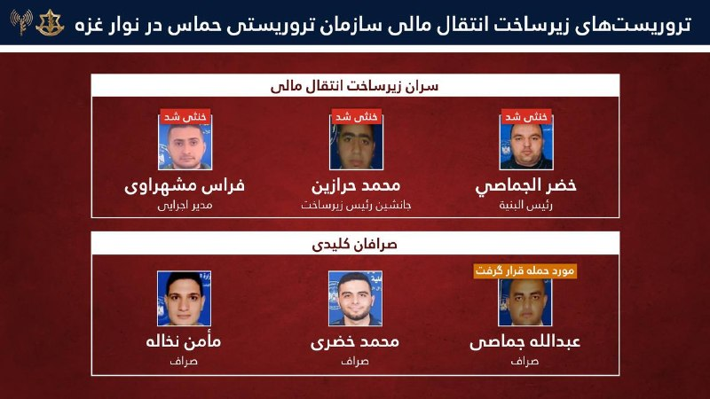

بیانیه مشترک سخنگوی ارتش اسرائیل و سخنگوی شین‌بت:

ارتش اسرائیل و شین‌بت رئیس شبکه انتقال مالی سازمان تروریستی حماس و معاونش را در نوار غزه به هلاکت رساندند

ارتش اسرائیل و شین‌بت روز یکشنبه در شمال نوار غزه حمله کرده و تروریست خضر جماصی، رئیس شبکه انتقال مالی و معاون او محمد خرازین را که به‌عنوان انتقال‌دهندگان مرکزی وجوه برای سازمان تروریستی حماس در نوار غزه فعالیت می‌کردند، به هلاکت رساندند.

در طول جنگ، این تروریست‌ها انتقال وجوهی به ارزش ده‌ها میلیون دلار به شاخه نظامی حماس در نوار غزه را مدیریت کردند و از شبکه‌ای شامل ده‌ها صراف در نوار غزه استفاده نمودند. از طریق این منابع مالی، سازمان تروریستی حماس به پرداخت حقوق به تروریست‌های خود ادامه داده و شرایط را برای پیشبرد و اجرای طرح‌های تروریستی علیه نیروهای ارتش اسرائیل و شهروندان کشور اسرائیل فراهم کرد.

این دو، به سلسله حذف تروریست‌هایی که مسئول حوزه اقتصادی در سازمان تروریستی حماس هستند می‌پیوندند، از جمله حذف افراد ارشد نظیر فراس مشهراوی و ایهاب کریزم که در سال گذشته به هلاکت رسیدند.

## alonews — post 126703

  <a href="telegram/content/alonews_126703_1781072025.mp4" target="_blank">🎬 Download video</a>

👈ویدئوی عجیبی از یک انفجار اتمی در بندرعباس که ساعتی قبل در پخش زنده شبکه خبر منتشر شد!

🔴 در حالی که خبر درباره سازمان توسعه تجارت ایران است

✅ @AloNews خبر جنگ

---
📅 بروزرسانی: 1405/03/20 09:33
---

## WithYashar — post 14261

سخنگوی طالبان:
دیشب ارتش پاکستان حریم هوایی افغانستان رو نقض کرد و چند خونه مسکونی رو در ولایت‌های کنر، خوست و پکتیکا بمباران کرد.

تو این حملات 11 کودک، یک زن و یک مرد سالمند کشته شدن و 14 نفر دیگه زخمی شدن.
@withyashar

## WithYashar — post 14260

۳پا پاسداران: به دنبال عملیات موفق نیروی دریایی سپاه در اصابت قرار دادن 21 هدف در پایگاه‌های هوایی و دریایی آمریکا در منطقه و ساقط کردن یک فروند پهپاد MQ9 در آسمان شهرستان جم، با توجه به تداوم شرارت‌های دشمن، 4 هدف از جمله آشیانه‌های جنگنده‌های F-35 در پایگاه…

## WithYashar — post 14259

۳پا پاسداران:
به دنبال عملیات موفق نیروی دریایی سپاه در اصابت قرار دادن 21 هدف در پایگاه‌های هوایی و دریایی آمریکا در منطقه و ساقط کردن یک فروند پهپاد MQ9 در آسمان شهرستان جم، با توجه به تداوم شرارت‌های دشمن، 4 هدف از جمله آشیانه‌های جنگنده‌های F-35 در پایگاه هوایی ارتش آمریکا در الازرق اردن رو مورد هدف و انهدام قرار دادیم.
@withyashar

## WithYashar — post 14258

خبرنگار وای نت:
در چند ساعت اخیر در رویدادی جالب سامانه‌های پدافندی آمریکا تمامی موشک‌های شلیک شده به 3 کشور مختلف رو رهگیری کردن. صفر اصابت و شاهکار پاتریوت!
@withyashar

## WithYashar — post 14257

وال‌استریت ژورنال به نقل از مقام‌های آمریکایی نوشت: ترامپ تمایلی به حمله به ایران نداشت، اما پس از توصیه وزیر دفاع و رئیس ستاد مشرک، نظرش را تغییر داد
@withyashar

## WithYashar — post 14256

نیروهای مسلح اردن: پنج فروند موشک ایرانی که به سوی پایگاه الازرق شلیک شده بودند را رهگیری و سرنگون کردیم. در پی سقوط بقایای موشک‌های رهگیری‌شده، هیچ‌گونه خسارت یا جراحتی ثبت نشده است.
@withyashar

## DW_Farsi — post 125753

  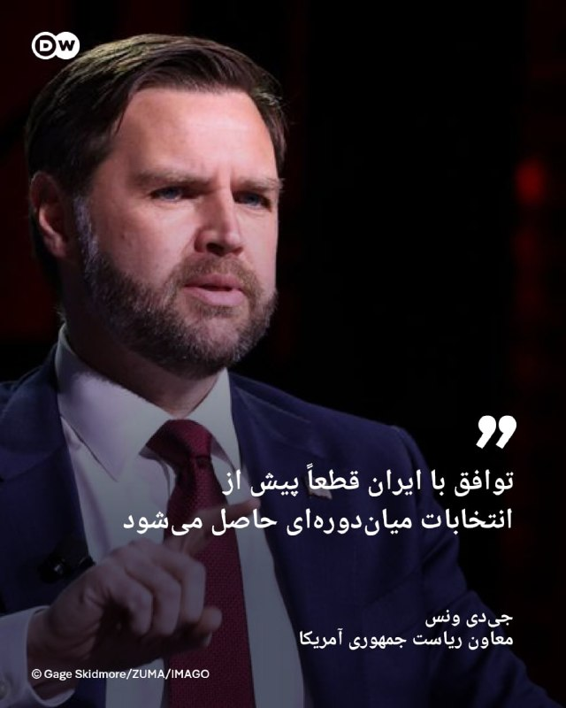

🔶 ونس: توافق با ایران قطعاً پیش از انتخابات میان‌دوره‌ای حاصل می‌شود

جی‌دی ونس، معاون ریاست جمهوری آمریکا بار دیگر بر این ادعا تأکید کرد که ایالات متحده در آستانه دستیابی به توافقی با جمهوری اسلامی به منظور "سامان دادن به برنامه هسته‌ای ایران در درازمدت" است.

او در مصاحبه با شبکه خبری سی‌بی‌اس نیوز گفت که "این توافق می‌تواند در هفته آینده یا در طی ماه‌های آینده حاصل شود، اما قطعاً پیش از انتخابات میان‌دوره‌ای (در ماه نوامبر) خواهد بود". مصاحبه ونس با سی‌بی‌اس نیوز قرار است به طور کامل روز یکشنبه آینده پخش شود.

معاون ترامپ در مصاحبه خود با این شبکه خبری افزود: «حس من این است که ما می‌توانیم به توافقی دست یابیم که به لحاظ اقتصادی به نفع آمریکا باشد و برنامه هسته‌ای ایران را واقعا تحت کنترل درآورد، نه تنها اکنون و نه تنها در دورانی که دونالد ترامپ، رئیس‌ جمهور آمریکا است، بلکه در درازمدت، به طوری که فرزندان من در بزرگسالی بتواند بگویند: ایران به سلاح هسته‌ای دست نخواهد یافت.»

مقامات دولت آمریکا در هفته‌های گذشته تا کنون بارها چنین اظهاراتی را بیان کرده‌اند. این در حالی است که منطقه بار دیگر شاهد حملات متقابل تهران و واشنگتن است و تلاش‌های دیپلماتیک و گفت‌وگوها میان دو طرف شاهد پیشرفت ملموسی نبوده است.

@dw_farsi

## Persian_Trend_Official — post 16429

🔴 آغاز مانور غافلگیرانه ارتش اسرائیل در اطراف غزه

رسانه‌های عبری گزارش داده‌اند ارتش اسرائیل صبح امروز یک رزمایش غافلگیرانه را در منطقه شورای اشکول در مجاورت نوار غزه آغاز کرده است.

بر اساس گزارش کانال ۱۲ اسرائیل، این مانور شامل استقرار گسترده نیروها و خودروهای نظامی در محورهای منتهی به جاده ۲۳۲ بوده و قرار است تا ساعت ۱۸:۰۰ ادامه داشته باشد.

همزمان گزارش‌هایی از انتقال تجهیزات و نیروهای جدید ارتش اسرائیل به برخی نقاط کرانه باختری از جمله اطراف نابلس منتشر شده است. همچنین منابع محلی سوری از ورود چند خودروی نظامی اسرائیل به حومه جنوبی قنیطره و ایجاد یک ایست بازرسی موقت خبر داده‌اند.

🧭:اگرچه ارتش اسرائیل این فعالیت‌ها را در قالب یک رزمایش اعلام کرده، اما همزمانی آن با افزایش تحرکات نظامی در چند جبهه باعث شده برخی ناظران احتمال آماده‌سازی برای سناریوهای امنیتی یا عملیاتی جدید را مطرح کنند. با این حال تاکنون هیچ نشانه رسمی مبنی بر آغاز عملیات نظامی جدید منتشر نشده است.

Phantom

📌 @persian_trend_official
پرشین ترند | متفاوت‌ترین کانال نظامی

## RadioFarda — post 158118

🔸یک مقام آمریکایی به رویترز گفته که پس از حملات موشکی و پهپادی ایران، هیچ گزارشی از آسیب دیدن نیروهای آمریکایی یا خسارت به مراکز و تأسیسات شناخته‌شده آمریکا در منطقه دریافت نشده است. 🔸این مقام که به نام او اشاره‌ای نشده، افزود که تقریباً تمامی موشک‌ها و پهپادهای…

## RadioFarda — post 158117

  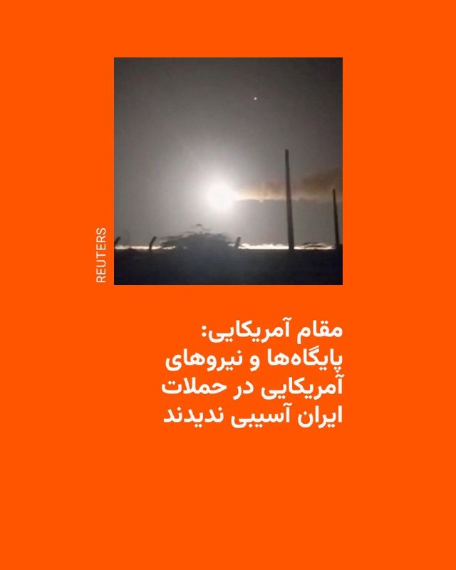

🔸یک مقام آمریکایی به رویترز گفته که پس از حملات موشکی و پهپادی ایران، هیچ گزارشی از آسیب دیدن نیروهای آمریکایی یا خسارت به مراکز و تأسیسات شناخته‌شده آمریکا در منطقه دریافت نشده است.

🔸این مقام که به نام او اشاره‌ای نشده، افزود که تقریباً تمامی موشک‌ها و پهپادهای ورودی رهگیری و منهدم شده‌اند.

🔸او در عین حال تأکید کرده که ارزیابی‌های نهایی دربارۀ حملات ایران به پایگاه‌های نظامی آمریکا در منطقه همچنان ادامه دارد.

🔸فرماندهی مرکزی ارتش آمریکا، سنتکام، هنوز گزارشی در این زمینه منتشر نکرده است.

@RadioFarda

## alonews — post 126702

  <a href="telegram/content/alonews_126702_1781071425.webm" target="_blank">🎬 Download video</a>

👈پالایشگاه نفت سامارا روسیه پس از اصابت پهپاد‌های اوکراینی

✅ @AloNews خبر جنگ

## alonews — post 126701

  <a href="telegram/content/alonews_126701_1781071425.webm" target="_blank">🎬 Download video</a>

👈شاخص کل بورس در این دقایق با عبور از ۴ میلیون و ۶۰۰ هزار واحد رکورد تاریخی جدیدی را ثبت کرد.

✅ @AloNews خبر جنگ

---
📅 بروزرسانی: 1405/03/20 09:23
---

## FarsiVOA — post 220212

🔺حملات موشکی سپاه به پایگاه‌های آمریکایی در کویت، بحرین و اردن

◾️کویت، بحرین و اردن روز چهارشنبه در پی حملات موشکی و پهپادی جمهوری اسلامی علیه اهداف آمریکایی در منطقه، از فعال شدن سامانه‌های پدافندی و رهگیری پرتابه‌ها خبر دادند.

◾️در کویت، ستاد کل ارتش اعلام کرد سامانه‌های پدافند هوایی این کشور در حال مقابله با «اهداف هوایی متخاصم» هستند.

◾️در بحرین نیز وزارت کشور آژیر هشدار را فعال کرد و از شهروندان و مقیمان خواست آرام بمانند و به نزدیک‌ترین مکان امن بروند.

◾️در اردن، ارتش اعلام کرد پنج موشک شلیک‌شده به سوی الازرق را رهگیری و ساقط کرده و این حمله تلفات انسانی یا خسارت مادی نداشته است.

⬇️ بیشتر بخوانید:
https://ir.voanews.com/a/8159288.html

## DW_Farsi — post 125752

  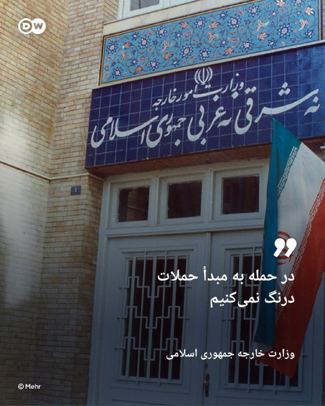

🔶 وزارت خارجه ایران: در حمله به مبدأ حملات درنگ نمی‌کنیم

وزارت خارجه جمهوری اسلامی روز چهارشنبه ۲۰ خردادماه با انتشار بیانیه‌ای حملات آمریکا را که بامداد همین روز در پاسخ به ساقط شدن یک بالگرد این کشور در دریای عمان صورت گرفت، "نقض فاحش منشور سازمان ملل و نقش حاکمیت ملی و تمامیت سرزمینی" دانست و اعلام کرد که نیروهای مسلح ایران "پایگاه‌ها و دارایی‌های آمریکا در منطقه را که مبدأ این حملات بوده‌اند، هدف قرار داده‌اند.

رسانه‌های خبری در این رابطه از جمله از حملات موشکی و پهپادی به اردن، کویت و بحرین خبر داده بودند.

وزارت خارجه جمهوری اسلامی در بیانیه خود با لحنی تهدیدآمیز هشدار داد که ایران "در اعمال حق ذاتی دفاع از خود، از جمله از طریق هدف‌ قراردادن مبدأ حملات و پایگاه‌ها و امکانات لجستیک مورد استفاده برای عملیات‌های تجاوزکارانه علیه ایران، درنگ نخواهد کرد".

پیش از آن نیز عباس عراقچی، وزیر خارجه جمهوری اسلامی هشدار داده بود که حملات آمریکا علیه ایران "بی‌پاسخ نخواهند ماند".

@dw_farsi

## Persian_Trend_Official — post 16428

  <a href="telegram/content/Persian_Trend_Official_16428_1781070792.webm" target="_blank">🎬 Download video</a>

📰وزیر علوم: سهمیه جنگ در کنکور ۱۴۰۵ قطعی شد

حسین سیمایی صراف، وزیر علوم، تحقیقات و فناوری خبر از اختصاص قطعی سهمیه به داوطلبان آسیب‌دیده جنگ اخیر در کنکور ۱۴۰۵ داد و اعلام کرد مراحل اجرایی و تعیین مرجع صدور گواهی در حال تدوین است.

👺Phantom

📌 @persian_trend_official
پرشین ترند | متفاوت‌ترین کانال نظامی

## Persian_Trend_Official — post 16427

  <a href="telegram/content/Persian_Trend_Official_16427_1781070793.mp4" target="_blank">🎬 Download video</a>

تصاویری از شاهد۱۳۶ در آسمان عراق

## Persian_Trend_Official — post 16426

  <a href="telegram/content/Persian_Trend_Official_16426_1781070794.mp4" target="_blank">🎬 Download video</a>

لحظه منهدم شدن پهپاد ام کیو ۹ آمریکایی شهرستان جم در استان بوشهر

## RadioFarda — post 158116

🔸قرارگاه مرکزی خاتم‌الانبیا اعلام کرد در پاسخ به حملات آمریکا به مناطقی در جنوب ایران، برخی پایگاه‌های ایالات متحده در منطقه هدف حمله مشترک ارتش و سپاه پاسداران قرار گرفته است. 🔸روابط عمومی ارتش جمهوری اسلامی نیز مدعی شد که بامداد چهارشنبه، پایگاه‌های آمریکایی…

## RadioFarda — post 158115

🔸قرارگاه مرکزی خاتم‌الانبیا اعلام کرد در پاسخ به حملات آمریکا به مناطقی در جنوب ایران، برخی پایگاه‌های ایالات متحده در منطقه هدف حمله مشترک ارتش و سپاه پاسداران قرار گرفته است.

🔸روابط عمومی ارتش جمهوری اسلامی نیز مدعی شد که بامداد چهارشنبه، پایگاه‌های آمریکایی و سامانه‌های راداری ناوگان پنجم آمریکا در بحرین را با «موجی از حملات پهپادی» هدف قرار داده است.

🔸همزمان، خبرگزاری فارس از فعال شدن آژیرهای خطر در بحرین، وقوع چند انفجار در کویت و حمله به پایگاه آمریکایی الجهراء در این کشور خبر داد. این خبرگزاری همچنین مدعی شد که سپاه پاسداران پایگاه آمریکایی الازرق در اردن را هدف حمله موشکی قرار داده است.

🔸خبرگزاری فارس، به نقل از «یک‌ منبع آگاه نظامی» می‌گوید که حمله موشکی ایران «آشیانۀ جنگنده‌های اف۳۵ آمریکا در اردن» را هدف قرار داده است.

🔸به نوشتۀ رویترز، نیروهای مسلح اردن روز چهارشنبه اعلام کردند که پنج موشک شلیک‌شده از ایران به سمت منطقه الازرق در اردن را رهگیری و سرنگون کرده‌اند. ارتش اردن افزود که بقایای عملیات رهگیری در خاک اردن سقوط کرده اما هیچ تلفات یا خسارت مادی نداشته است.

@RadioFarda

## alonews — post 126700

  <a href="telegram/content/alonews_126700_1781070795.webm" target="_blank">🎬 Download video</a>

👈شبکه عبری کان: عربستان سعودی نزد ایالات متحده به رفتار «اسرائیل» در لبنان اعتراض کرده است

🔴 عربستان سعودی گمان می‌کند که نتانیاهو، تلاش می‌کند از طریق جبههٔ لبنان بر تحولات و اوضاع منطقه تأثیر بگذارد

✅ @AloNews خبر جنگ

## alonews — post 126699

  <a href="telegram/content/alonews_126699_1781070795.webm" target="_blank">🎬 Download video</a>

👈تصویری که فاکس نیوز از آخرین آرایش سنگین‌ ناوگان‌ دریایی آمریکا در منطقه برای "محاصره دریایی ایران" منتشر کرده است!

✅ @AloNews خبر جنگ

---
📅 بروزرسانی: 1405/03/20 09:13
---

## DW_Farsi — post 125751

  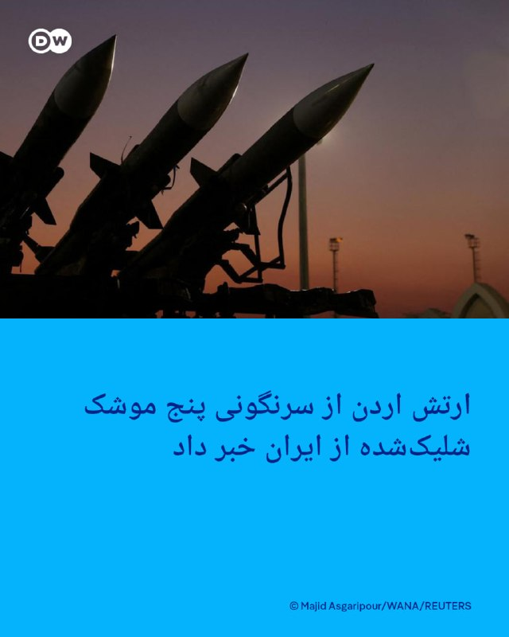

🔶 ارتش اردن از سرنگونی پنج موشک شلیک‌شده از ایران خبر داد

ارتش اردن روز چهارشنبه ۲۰ خردادماه با انتشار بیانیه‌ای اعلام کرد که سامانه دفاع هوایی این کشور پنج موشک را که از سوی ایران به پایگاه الازرق شلیک شده بودند، رهگیری و سرنگون کرده است. این موشک‌ها در پاسخ به حملات تلافی‌جویانه ایالات متحده که بامداد چهارشنبه ۱۰ ژوئن صورت گرفتند، شلیک شدند.

در بیانیه ارتش اردن آمده است: «ما پنج موشک را که از سوی ایران به سمت پایگاه الازرق شلیک شده‌ بودند، رهگیری و منهدم کردیم. در پی این اقدام تکه‌پاره‌های موشک‌های سرنگون‌شده فرود آمدند، اما خساراتی مالی یا جانی به بار نیامده است.»

پیش از آن خبرگزاری فارس گزارش داده بود که سپاه پاسداران یک پایگاه ارتش ایالات متحده در اردن را مورد حمله موشکی قرار داده است. فارس در گزارش خود به نقل از سپاه پاسداران مدعی شده بود که با "موشک‌های سوخت جامد دوربرد چهار هدف مهم از جمله آشیانه‌های جنگنده‌های اف ۳۵ در پایگاه هوایی و مرکز فرمانده کنترل ارتش آمریکا" در الازرق اردن را هدف قرار داده است.

@dw_farsi

## BBCPersian — post 283317

🔻وزارت خارجه ایران حملات آمریکا را «نقض فاحش منشور سازمان ملل» توصیف کرد

🔻در پی حملات اخیر آمریکا، وزارت خارجه ایران این حملات را «نقض فاحش منشور سازمان ملل» توصیف کرده است.

این وزارت‌خانه در بیانیه‌ای حملات ایالات متحده به مناطقی در جنوب این کشور را «نقض فاحش منشور سازمان ملل، به‌ویژه بند ۴ ماده ۲، و قاعده بنیادین منع توسل به زور در روابط بین‌الملل» خوانده است.

وزارت خارجه ایران در این بیانیه به سقوط بالگرد آمریکایی در تنگه هرمز هم اشاره کرده ولی مسئولیت حمله به آن را نپذیرفته است.

در این بیانیه پایگاه‌ها و دارایی‌های آمریکا در منطقه «مبدا تجاوز» توصیف شده و از حملات ایران به عنوان «حق ذاتی دفاع» یاد شده است.

وزارت خارجه ایران از کشورهای منطقه، به‌ ویژه کشورهای واقع در حاشیه جنوبی خلیج فارس خواسته است که مانع از هرگونه استفاده ارتش آمریکا و اسرائیل از «قلمرو و امکانات آنها جهت طراحی، سازماندهی، اجرا و پشتیبانی از اقدامات تجاوزکارانه علیه ایران» شوند.

موج اخیر حملات آمریکا به ایران در پاسخ به ساقط شدن هلی‌کوپتر آپاچی آمریکا درآبهای دریای عمان انجام شده است.

https://bbc.in/4aaM14z
@BBCPersian

## alonews — post 126698

  <a href="telegram/content/alonews_126698_1781070181.webm" target="_blank">🎬 Download video</a>

👈وال‌استریت ژورنال به نقل از مقام‌های آمریکایی نوشت: ترامپ تمایلی به حمله به ایران نداشت، اما پس از توصیه وزیر دفاع و رئیس ستاد مشرک، نظرش را تغییر داد

✅ @AloNews خبر جنگ

---
📅 بروزرسانی: 1405/03/20 09:03
---

## IranIntlTV — post 341441

  <a href="telegram/content/IranIntlTV_341441_1781069585.mp4" target="_blank">🎬 Download video</a>

سنتکام اعلام کرد آمریکا حملات دفاعی علیه جمهوری اسلامی را پایان داد و یک مقام ارشد آمریکایی به فاکس‌نیوز گفت ۲۰ هدف در داخل ایران هدف قرار گرفت.

رییس مجلس نمایندگان آمریکا نیز گفت این اقدام یک حمله محدود و متناسب با شرایط بود

گفت‌وگو با اردوان روزبه، خبرنگار ایران‌اینترنشنال
@iranintltv

## Persian_Trend_Official — post 16425

⚡️🇮🇱🇱🇧 ارتش دفاعی اسرائیل اعلام کرده است که چندین سایت زیرساخت حزب‌الله را در جنوب لبنان هدف قرار داده است، از جمله تأسیساتی نزدیک صور که گفته می‌شود برای حمایت از حملات علیه اسرائیل و نیروهای اسرائیلی استفاده می‌شود.

اسرائیل گفت که این حملات همچنین لانچرهای آماده به کار، شبه‌نظامیان فعال در نزدیکی نیروهای اسرائیلی و یک سایت که گفته می‌شود برای پرتاب پهپادهای انفجاری استفاده می‌شود را هدف قرار داده است.

👺Phantom

📌 @persian_trend_official
پرشین ترند | متفاوت‌ترین کانال نظامی

## Persian_Trend_Official — post 16424

  <a href="telegram/content/Persian_Trend_Official_16424_1781069586.mp4" target="_blank">🎬 Download video</a>

رد موشک‌ های ایران در آسمان اَمّان، پایتخت اردن

👺Phantom

📌 @persian_trend_official
پرشین ترند | متفاوت‌ترین کانال نظامی

## Persian_Trend_Official — post 16423

  <a href="telegram/content/Persian_Trend_Official_16423_1781069587.mp4" target="_blank">🎬 Download video</a>

🚀اصابت موشک‌های سپاه به مقر ناوگان پنجم نیروی‌دریایی آمریکا در بحرین

👺Phantom

📌 @persian_trend_official
پرشین ترند | متفاوت‌ترین کانال نظامی

## Persian_Trend_Official — post 16422

  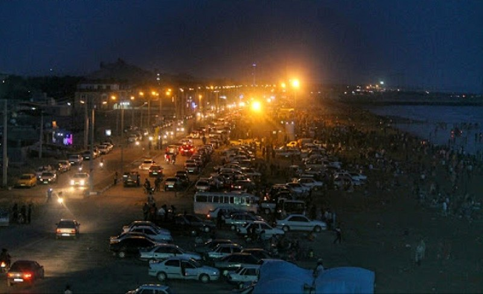

در حمله شب گذشته آمریکا، زیرساخت توزیع آب در شهرستان سیریک هرمزگان آسیب دیده:

شرکت آب و فاضلاب استان هرمزگان، از حمله‌ای موشکی ارتش آمریکا به زیرساخت‌های  توزیع آب در شهرستان سیریک خبر داد.
در حال حاضر روند توزیع آب در تمامی روستاهای بخش بمانی و شهر کوهستک متوقف شده است و تیم‌های عملیاتی و مدیریت بحران آبفا در تلاش هستند تا اقدامات جایگزین برای تامین آب پایدار انجام دهند.

👺Phantom

📌 @persian_trend_official
پرشین ترند | متفاوت‌ترین کانال نظامی

## alonews — post 126697

  <a href="telegram/content/alonews_126697_1781069589.webm" target="_blank">🎬 Download video</a>

👈زمین‌لرزه‌ای به بزرگی ۳.۲ ریشتر دریای خزر حوالی شهرستان آستارا در استان گیلان را لرزاند.

✅ @AloNews خبر جنگ

## alonews — post 126696

  <a href="telegram/content/alonews_126696_1781069589.webm" target="_blank">🎬 Download video</a>

👈وزیر علوم: سهمیه جنگ ۴۰روزه در کنکور ۱۴۰۵ قطعی شد!

✅ @AloNews خبر جنگ

## alonews — post 126695

  <a href="telegram/content/alonews_126695_1781069589.webm" target="_blank">🎬 Download video</a>

👈گفتگوی تلفنی عراقچی با وزرای امور خارجه ترکیه و عربستان

✅ @AloNews خبر جنگ

## alonews — post 126694

  <a href="telegram/content/alonews_126694_1781069590.webm" target="_blank">🎬 Download video</a>

👈طالبان افغانستان: در پی حملات هوایی ارتش پاکستان به سه ولایت افغانستان، دست‌کم ۱۳ نفر کشته و ۱۴ نفر زخمی شده‌اند.

✅ @AloNews خبر جنگ

---
📅 بروزرسانی: 1405/03/20 08:53
---

## VahidOOnLine — post 244636

  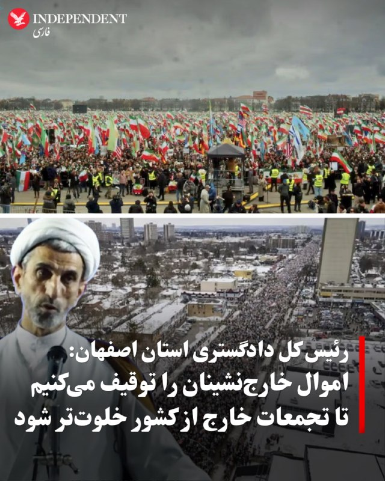

⭕️رئیس کل دادگستری استان اصفهان: اموال خارج‌نشینان را توقیف می‌کنیم تا تجمعات خارج از کشور خلوت‌تر شود

♦️اسداله جعفری ،رئیس کل دادگستری استان اصفهان دریادداشتی با «مزدور» خواندن ایرانیان مخالف جمهوری اسلامی که در خارج از ایران زندگی می‌کنند و در تجمعات علیه جمهوری اسلامی حضور دارند، نوشت: «مصادره اموال مزدوران خارج‌نشین در ماه‌های اخیر، اثر بازدارنده داشته است.» 

در ادامه این یادداشت آمده است: «نکته مهم این است: وقتی یک فرد خارج‌نشین می‌بیند خانه، مغازه یا هر گونه دارایی که در تهران، اصفهان یا هر شهر دیگر ایران، داشته، توقیف می‌شود، در نتیجه تجمعات ضدایرانی در برابر سفارتخانه‌های کشور‌های اروپایی و آمریکایی به وضوح خلوت‌تر، بی‌روح‌تر و ناامیدانه‌تر می‌شود.»

تجمعات و راهپیمایی‌های گسترده ایرانیان در شهرهای سراسر جهان که در چهار ماه اخیر همچنان ادامه داشته است و در مواردی مانند کانادا با حضور چندصدهزار نفر همراه بوده، نگرانی مقامات جمهوری اسلامی را به دنبال داشته است. عباس عراقچی، وزیر خارجه جمهوری اسلامی در این زمینه گفته است که نباید اجازه داد این تجمعات به‌طور مستمر و سازمان‌یافته علیه حکومت ادامه پیدا کند.

او این تجمعات را «پروژه خطرناک مشروعیت‌زدایی و امنیتی‌سازی» علیه جمهوری اسلامی توصیف کرده است.
‌🇸🇦 Indypersian

🤖 @VahidOOnLine

## IranIntlTV — post 341440

  <a href="telegram/content/IranIntlTV_341440_1781068981.mp4" target="_blank">🎬 Download video</a>

پرونده هسته‌ای جمهوری اسلامی محور نشست شورای حکام در وین است و مدیرکل آژانس بین‌المللی انرژی هسته‌ای از اختلال در تعامل با تهران خبر داده است

گزارش احمد صمدی، خبرنگار ایران‌اینترنشنال
@iranintltv

## Persian_Trend_Official — post 16421

غیر رسمی/برخی رسانه‌ها از شنیده شدن صدای انفجار در شمال عراق خبر می‌دهند

## BBCPersian — post 283316

🔻ارتش اردن می‌گوید پنج موشک شلیک شده از ایران را سرنگون کرده است

🔻ارتش اردن اعلام کرده است که پنج موشک شلیک شده از سوی ایران را سرنگون کرده است.

نیروهای مسلح اردن در بیانیه‌ای گفته است: «ما پنج موشک شلیک شده از ایران به سمت ازرق را رهگیری و سرنگون کردیم. این رهگیری منجر به ریزش ترکش شد، اما هیچ تلفات جانی یا خسارت مادی نداشت.»

رسانه‌های ایران پیشتر گزارش کرده بودند که سپاه پاسداران به پایگاه‌ ارتش آمریکا در اردن حمله موشکی کرده است.

سپاه پاسداران گفته بود «توسط موشک‌های سوخت جامد دور برد خود ۴ هدف مهم از جمله آشیانه‌های جنگنده‌های اف‌۳۵ در پایگاه هوایی و مرکز فرمانده کنترل ارتش» آمریکا در ازرق اردن را مورد هدف قرار داده است.

قرارگاه خاتم الانبیاء در اطلاعیه خود اعلام کرد حملات ایران به طور مشترک توسط سپاه پاسداران و ارتش ایران صورت گرفته است.

https://bbc.in/3S0vee7
@BBCPersian

## alonews — post 126693

  <a href="telegram/content/alonews_126693_1781068983.webm" target="_blank">🎬 Download video</a>

👈منجیل که تابستون پارسال داشت کامل خشک میشد به لطف بارشهای فوق‌العاده تو سرشاخه‌های رود قزل اوزن کاملاً پُر شده و الان ۱۰۴۰ میلیون مترمکعب ذخیره آب داره، ۱۰۲٪ بیشتر از پارسال این موقع!

✅ @AloNews خبر جنگ

## alonews — post 126692

  <a href="telegram/content/alonews_126692_1781068983.mp4" target="_blank">🎬 Download video</a>

👈اصابت موشک‌های ایرانی به مقر ناوگان پنجم نیروی‌دریایی آمریکا در بحرین

✅ @AloNews خبر جنگ

## alonews — post 126691

  <a href="telegram/content/alonews_126691_1781068984.webm" target="_blank">🎬 Download video</a>

👈بیانیه جدید وزارت خارجه

✅ @AloNews خبر جنگ

## alonews — post 126690

  <a href="telegram/content/alonews_126690_1781068984.webm" target="_blank">🎬 Download video</a>

👈مهر: منابع خبری از شنیده شدن صدای چند انفجار در شمال عراق خبر دادند.

✅ @AloNews خبر جنگ

## alonews — post 126689

  <a href="telegram/content/alonews_126689_1781068984.webm" target="_blank">🎬 Download video</a>

👈 فاکس نیوز به نقل از یک مقام آمریکایی: ۲۰ نقطه در داخل ایران هدف حمله قرار گرفت

✅ @AloNews خبر جنگ

---
📅 بروزرسانی: 1405/03/20 08:43
---

## VahidOOnLine — post 244635

♦️سپاه پاسداران صبح چهارشنبه بیستم خردادماه اعلام کرد با موشک‌های دوربرد سوخت جامد و مایع قدر، عماد و خیبرشکن، پایگاه‌های نظامی آمریکا در منطقه را هدف قرار داده است.

این خبر در حالی منتشر می‌شود که گزارش‌ها حاکی از اصابت احتمالی موشک‌ها به منطقه استقرار ناوگان پنجم نیروی دریایی آمریکا در بحرین است و کویت از مقابله پدافند هوایی با «اهداف متخاصم» در آسمان این کشور خبر داده است. همزمان ارتش اردن اعلام کرد پنج موشک شلیک شده از ایران را در حریم هوایی خود رهگیری و منهدم کرده است.

سنتکام در نخستین ساعات بامداد چهارشنبه اعلام کرد در پاسخ به سقوط یک هلی‌کوپتر ارتش آمریکا مواضعی را در منطقه تنگه هرمز هدف قرار داده است. سپاه و ارتش جمهوری اسلامی ایران اعلام کردند در پاسخ به این حملات، مواضع نظامی آمریکا در منطقه را هدف قرار می‌دهند.
‌🇸🇦 Indypersian

🤖 @VahidOOnLine

## pm_afshaa — post 93271

برا کسایی که دیشب خوا بودن بگم که امریکا زد گایید جمهوری اسلامیم هر چی زد رو هوا رهگیری شد

## Persian_Trend_Official — post 16420

🇮🇷
🌏گزارشی از حملات آمریکا به زیرساخت‌های نظامی جنوب ایران در درگیری اخیر:

🇺🇸
🇮🇷بر اساس گزارش‌های منتشرشده از سوی منابع آمریکایی و منطقه‌ای، ارتش ایالات متحده طی ساعات گذشته مجموعه‌ای از اهداف نظامی جمهوری اسلامی ایران در استان هرمزگان و سواحل شمالی تنگه هرمز را هدف قرار داده است.

گزارش‌ها حاکی است که اهداف مورد حمله شامل سامانه‌های پدافند هوایی، رادارهای شناسایی ساحلی، مراکز کنترل و فرماندهی، تأسیسات مرتبط با عملیات دریایی و برخی مواضع موشکی بوده‌اند.

مناطق نام‌برده‌شده در گزارش‌های اولیه عبارت‌اند از:
🔴 بندرعباس
🔴 سیریک
🔴 جاسک
🔴 جزیره قشم
🔴 میناب
🔴 بندر کرگان
🔴 گورک
🔴کوهستک
🔴کوه مبارکه

📌با توجه به اهداف اعلام‌شده شامل پایگاه‌های دریایی، سایت‌های پدافند هوایی، رادارهای ساحلی و مراکز فرماندهی، احتمال می‌رود در این حملات از موشک‌های کروز دوربرد خانواده «تام‌هاوک» و بمب‌های هدایت‌دقیق نظیر JDAM یا بمب‌های هدایت لیزری خانواده Paveway استفاده شده باشد.
چنین تسلیحاتی معمولاً برای انهدام سامانه‌های پدافندی، مراکز فرماندهی و زیرساخت‌های حساس نظامی با حداقل خطای اصابت به‌کار گرفته می‌شوند.

👺Phantom

📌@persian_trend_official
پرشین ترند | متفاوت‌ترین کانال نظامی

## Persian_Trend_Official — post 16419

  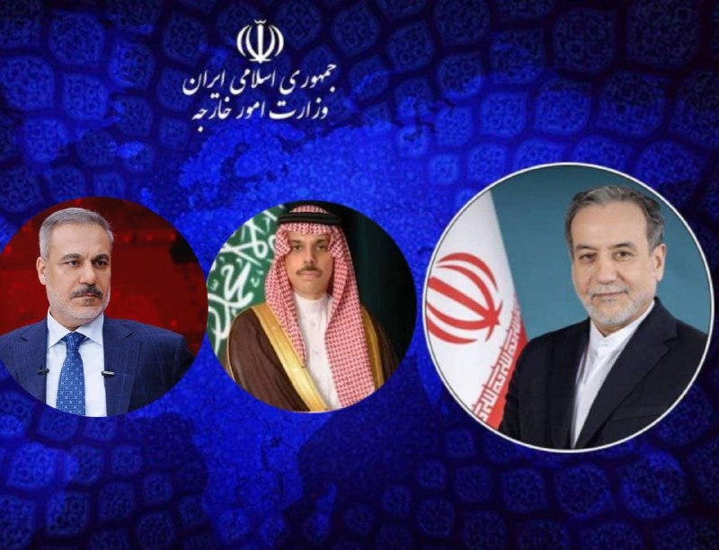

گفتگوی تلفنی عراقچی با وزرای امور خارجه ترکیه و عربستان

صداوسیما: هاکان فیدان و فیصل بن فرحان وزرای امور خارجه ترکیه و عربستان سعودی نیمه شب گذشته در تماس های تلفنی جداگانه با سید عباس عراقچی وزیر امور خارجه جمهوری اسلامی آخرین وضعیت تحولات منطقه ای متعاقب حملات تجاوزکارانه امریکا به مناطقی در جنوب ایران را بررسی کردند.

وزیر خارج در این گفتگوها ضمن محکومیت تجاوز نظامی امریکا و نقض حاکمیت ملی و تمامیت راضی ایران، بر حق ذاتی دفاع مشروع جهت پاسخ متقابل نیروهای مسلح مقتدر کشورمان تاکید کرد.

📝 Amir

📌 @persian_trend_official
پرشین ترند | متفاوت‌ترین کانال نظامی

## alonews — post 126688

  <a href="telegram/content/alonews_126688_1781068386.webm" target="_blank">🎬 Download video</a>

👈نیروهای مسلح اردن: پنج فروند موشک ایرانی که به سوی پایگاه الازرق شلیک شده بودند را رهگیری و سرنگون کردیم. در پی سقوط بقایای موشک‌های رهگیری‌شده، هیچ‌گونه خسارت یا جراحتی ثبت نشده است.

✅ @AloNews خبر جنگ

## alonews — post 126687

  <a href="telegram/content/alonews_126687_1781068387.webm" target="_blank">🎬 Download video</a>

👈تصاویر شلیک موشکهای سوخت جامد و مایع دوربرد قدر و عماد و خیبر شکن به سمت اهداف امریکایی در منطقه در پاسخ به تعرض بامداد امروز

✅ @AloNews خبر جنگ

## alonews — post 126686

  <a href="telegram/content/alonews_126686_1781068387.webm" target="_blank">🎬 Download video</a>

👈پاکستان: عمیقاً نگران وضعیت جاری منطقه و درگیری‌ مجدد هستیم؛ دیپلماسی تنها راهکار مسالمت‌آمیز حل مساله هسته‌ای ایران است

✅ @AloNews خبر جنگ

## alonews — post 126685

  <a href="telegram/content/alonews_126685_1781068387.webm" target="_blank">🎬 Download video</a>

👈ارتش اسرائیل: به هدف قرار دادن زیرساخت‌های حزب‌الله در جنوب لبنان ادامه می‌دهیم.

✅ @AloNews خبر جنگ

---
📅 بروزرسانی: 1405/03/20 08:33
---

## VahidOOnLine — post 244634

  

رویترز به نقل از یک مقام آمریکایی گزارش داد در حال حاضر گزارشی از آسیب یا تلفات در میان نیروهای آمریکایی یا خسارت به پایگاه‌های آمریکا در منطقه وجود ندارد. او افزود تقریبا تمام موشک‌ها و پهپادهای شلیک‌شده از سوی ایران رهگیری و منهدم شده‌اند.

فاکس نیوز نیز به نقل از یک مقام ارشد آمریکا گزارش داد که ایالات متحده در حملات سه‌شنبه شب، به ۲۰ هدف در درون ایران حمله کرده است.
‌🏁 🇬🇧 IranintlTV

🤖 @VahidOOnLine

## VahidOOnLine — post 244633

  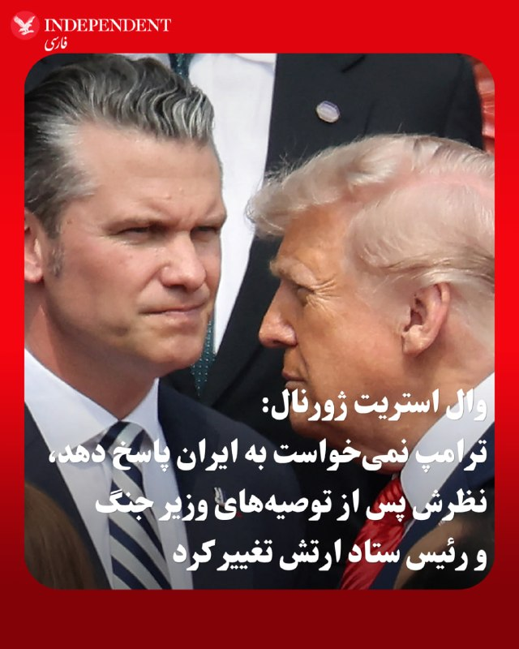

♦️خبرنگار روزنامه وال استریت ژورنال آمریکا صبح چهارشنبه بیستم خردادماه با انتشار گزارشی یه نقل از مقام‌های آمریکایی علام کرد که دونالد ترامپ تا اوایل روز سه‌شنبه نسبت به ضرورت اقدام تلافی‌جویانه علیه ایران متقاعد نشده بود.

رئیس جمهوری آمریکا صبح سه‌شنبه و پس از تائید خبر سقوط هلی‌کوپتر این کشور در تنگه هرمز با آتش نیروهای مسلح جمهوری اسلامی به وال استریت ژورنال گفته بود ساقط کردن هلی‌کوپتر آپاچی ارتش «موضوع بزرگی نبود» و خلبانان سالم‌اند.

به گفته مقام‌های آمریکایی، ترامپ پس از آن که پیت هگست، وزیر جنگ ، و دن کین، رئیس ستاد مشترک ارتش آمریکا، در جریان یک نشست توجیهی در کاخ‌سفید انجام اقدام نظامی را توصیه کردند، نظر خود را تغییر داد.

بر اساس این گزارش، رئیس‌ جمهوری آمریکا در نهایت مجوز حملات علیه اهدافی در ایران را صادر کرد.
‌🇸🇦 Indypersian

🤖 @VahidOOnLine

## IranIntlTV — post 341439

  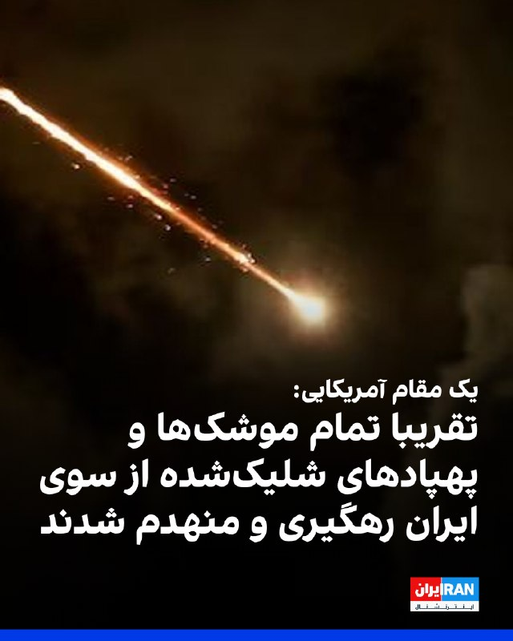

رویترز به نقل از یک مقام آمریکایی گزارش داد در حال حاضر گزارشی از آسیب یا تلفات در میان نیروهای آمریکایی یا خسارت به پایگاه‌های آمریکا در منطقه وجود ندارد. او افزود تقریبا تمام موشک‌ها و پهپادهای شلیک‌شده از سوی ایران رهگیری و منهدم شده‌اند.

فاکس نیوز نیز به نقل از یک مقام ارشد آمریکا گزارش داد که ایالات متحده در حملات سه‌شنبه شب، به ۲۰ هدف در درون ایران حمله کرده است.
https://iranintl.com/202606105874

## Persian_Trend_Official — post 16418

  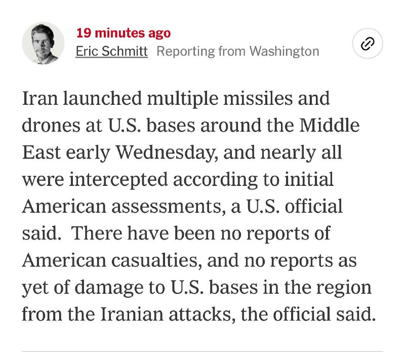

یک مقام آمریکایی به نیویورک تایمز گفت که ایران اوایل روز چهارشنبه چندین موشک و پهپاد به پایگاه‌های آمریکایی در سراسر خاورمیانه شلیک کرد و تقریباً همه آنها طبق ارزیابی‌های اولیه ایالات متحده رهگیری شدند.

هیچ تلفات آمریکایی گزارش نشده است. به گفته همان مقام، هیچ خسارتی به پایگاه‌های آمریکایی در اثر حملات ایران تأیید نشده است.

📝 Amir

📌 @persian_trend_official
پرشین ترند | متفاوت‌ترین کانال نظامی

## Persian_Trend_Official — post 16417

رویترز به نقل از منابع آمریکایی میگوید در حمله آمریکا نزدیک به 20 نقطه در ایران را مورد هدف قرار گرفته است.

📝 Amir

📌 @persian_trend_official
پرشین ترند | متفاوت‌ترین کانال نظامی

---
📅 بروزرسانی: 1405/03/20 08:23
---

## VahidOOnLine — post 244632

  

وزارت خارجه جمهوری اسلامی در بیانیه‌ای ضمن محکوم کردن حمله‌های جدید آمریکا به مناطق جنوبی ایران، به همه کشورهای منطقه، به ویژه در خلیج فارس، هشدار داد اگر آمریکا و اسرائیل از قلمرو آنها برای حمله به ایران استفاده کنند، تهران در هدف قرار دادن مبدا این حملات درنگ نخواهد کرد.
‌🏁 🇬🇧 IranintlTV

🤖 @VahidOOnLine

## IranIntlTV — post 341438

  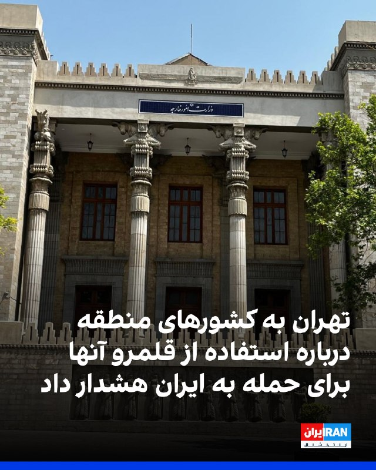

وزارت خارجه جمهوری اسلامی در بیانیه‌ای ضمن محکوم کردن حمله‌های جدید آمریکا به مناطق جنوبی ایران، به همه کشورهای منطقه، به ویژه در خلیج فارس، هشدار داد اگر آمریکا و اسرائیل از قلمرو آنها برای حمله به ایران استفاده کنند، تهران در هدف قرار دادن مبدا این حملات درنگ نخواهد کرد.
https://iranintl.com/202606104647

## Persian_Trend_Official — post 16416

سپاه پاسداران به پایگاه پنجم دریایی و پایگاه الزرق در پاسخ به حملات امریکا، حمله کرده است.

روابط عمومی سپاه پاسداران: به دنبال عملیات موفق نیروی دریایی سپاه در اصابت قرار دادن 21 هدف در پایگاه‌های هوایی و دریایی آمریکا در منطقه و ساقط کردن یک فروند پهپاد MQ-9 در آسمان شهرستان جم، با توجه به تداوم شرارتهای دشمن در تکمیل عملیات مقابله به مثل، قوای اسلام و رزمندگان شجاع هوافضای سپاه توسط موشک های سوخت جامد دور برد خود 4 هدف مهم از جمله آشیانه های جنگنده های F-35 در پایگاه هوایی و مرکز فرمانده کنترل ارتش کودک‌کش آمریکا در الازرق اردن را مورد هدف قرار داده و منهدم کردند.

نیروهای ما آماده پاسخ کوبنده و قاطع به هرگونه تجاوز مجدد دشمن هستند و عواقب هر تجاوز مجدد بر عهده دشمن آمریکایی میباشد.

📝 Amir

📌 @persian_trend_official
پرشین ترند | متفاوت‌ترین کانال نظامی

## Persian_Trend_Official — post 16415

  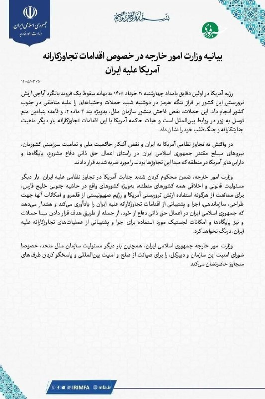

بیانیه وزارت امور خارجه ایران درمورد تنش های روز گذشته و سقوط بالگرد آپاچی نیروی زمینی ایالات متحده:

Phantom

📌 @persian_trend_official
پرشین ترند | متفاوت‌ترین کانال نظامی

## RadioFarda — post 158114

🔸قرارگاه مرکزی خاتم‌الانبیا اعلام کرد در پاسخ به حملات آمریکا به مناطقی در جنوب ایران، برخی پایگاه‌های ایالات متحده در منطقه هدف حمله مشترک ارتش و سپاه پاسداران قرار گرفته است. 🔸روابط عمومی ارتش جمهوری اسلامی نیز مدعی شد که بامداد چهارشنبه، پایگاه‌های آمریکایی…

## RadioFarda — post 158113

  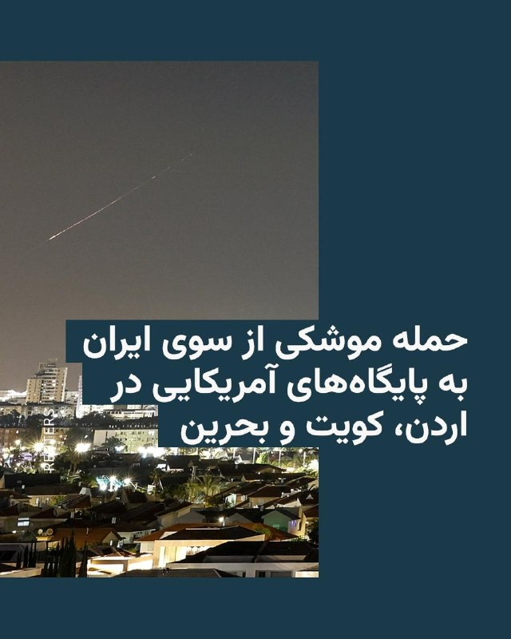

🔸قرارگاه مرکزی خاتم‌الانبیا اعلام کرد در پاسخ به حملات آمریکا به مناطقی در جنوب ایران، برخی پایگاه‌های ایالات متحده در منطقه هدف حمله مشترک ارتش و سپاه پاسداران قرار گرفته است.

🔸روابط عمومی ارتش جمهوری اسلامی نیز مدعی شد که بامداد چهارشنبه، پایگاه‌های آمریکایی و سامانه‌های راداری ناوگان پنجم آمریکا در بحرین را با «موجی از حملات پهپادی» هدف قرار داده است.

🔸همزمان، خبرگزاری فارس از فعال شدن آژیرهای خطر در بحرین، وقوع چند انفجار در کویت و حمله به پایگاه آمریکایی الجهراء در این کشور خبر داد. این خبرگزاری همچنین مدعی شد که سپاه پاسداران پایگاه آمریکایی الازرق در اردن را هدف حمله موشکی قرار داده است.

@RadioFarda

---
📅 بروزرسانی: 1405/03/20 08:13
---

## VahidOOnLine — post 244631

  <a href="telegram/content/VahidOOnLine_244631_1781066606.mp4" target="_blank">🎬 Download video</a>

سرخط خبرهای چهارشنبه ۲۰ خرداد
‌🏁 🇬🇧 IranintlTV

🤖 @VahidOOnLine

## IranIntlTV — post 341437

  <a href="telegram/content/IranIntlTV_341437_1781066608.mp4" target="_blank">🎬 Download video</a>

سرخط خبرهای چهارشنبه ۲۰ خرداد
@iranintltv

## Persian_Trend_Official — post 16414

  <a href="telegram/content/Persian_Trend_Official_16414_1781066610.webm" target="_blank">🎬 Download video</a>

🚨🔴 خبرها حاکی از اینه که ایران در پاسخ به اتفاقات و حملات بامداد امروز، چند موشک بالستیک دوربرد به سمت اهداف آمریکایی در منطقه شلیک کرده.

طبق گزارش‌ها، در این حمله از موشک‌های «قدر»، «عماد» و «خیبرشکن» استفاده شده. فعلاً جزئیات دقیقی درباره اهدافی که مورد اصابت قرار گرفته‌اند یا میزان خسارت احتمالی منتشر نشده.

Phantom

📌 @persian_trend_official
پرشین ترند | متفاوت‌ترین کانال نظامی

## Persian_Trend_Official — post 16413

  <a href="telegram/content/Persian_Trend_Official_16413_1781066611.webm" target="_blank">🎬 Download video</a>

قرارگاه مرکزی حضرت خاتم الانبیاء: در پاسخ به تجاوز ارتش تروریست آمریکا در مناطقی از جنوب کشور به بهانه واهی سقوط بالگرد خود، برخی از پایگاه های آمریکا در منطقه هدف هجوم قدرتمند ارتش قهرمان جمهوری اسلامی و دلاورمردان سپاه پاسداران انقلاب اسلامی قرار گرفت.

ارتش جنایت‌کار آمریکا بداند در صورت تکرار تعرض به جمهوری اسلامی ایران، حملات سهمگین و گسترده تر علیه بانک اهداف تعیین شده در منطقه انجام خواهد شد.

📝 Amir

📌 @persian_trend_official
پرشین ترند | متفاوت‌ترین کانال نظامی

---
📅 بروزرسانی: 1405/03/20 08:03
---

## VahidOOnLine — post 244630

  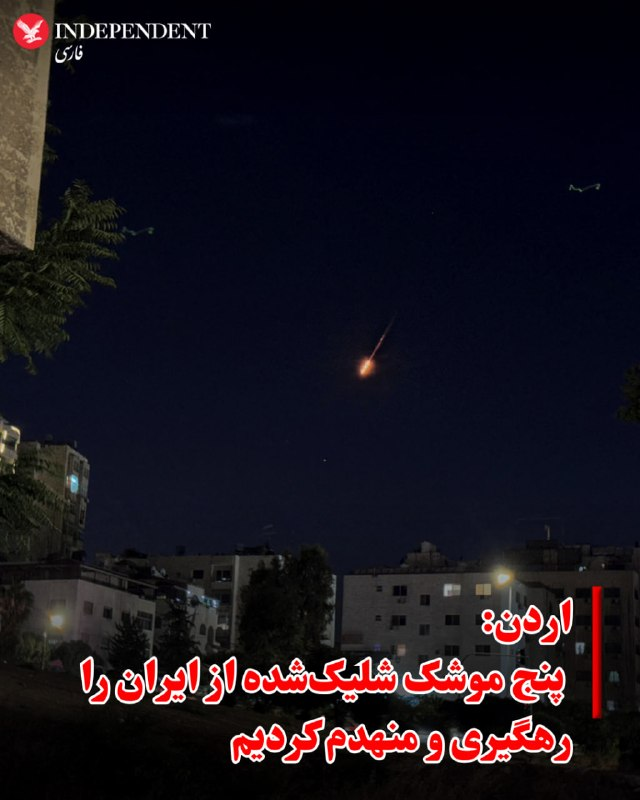

♦️فرماندهی کل نیروهای مسلح اردن در بیانیه‌ای که خبرگزاری رسمی اردن منتشر کرد، اعلام کرد: «پنج موشک شلیک‌شده از ایران به سمت منطقه الازرق رهگیری و سرنگون شدند.»
به گزارش سی‌ان‌ان، این حمله ظاهرا نخستین باری است که از زمان اجرایی شدن آتش‌بس میان آمریکا و ایران در ماه آوریل، اردن به‌طور مستقیم هدف قرار می‌گیرد.
در این بیانیه آمده است: «در نتیجه عملیات رهگیری، قطعات و ترکش‌های موشک‌ها سقوط کردند، اما هیچ تلفات انسانی یا خسارت مادی گزارش نشده است.»
سپاه پاسداران مدعی شده است که پایگاهی در منطقه الازرق در شمال اردن را با موشک‌های دوربرد سوخت جامد هدف قرار داده و آشیانه‌های نگهداری جنگنده‌های اف-۳۵ را منهدم کرده است.
با این حال، تاکنون هیچ مدرک تصویری برای پشتیبانی از این ادعا ارائه نشده است. سی‌ان‌ان نیز برای دریافت توضیح با فرماندهی مرکزی آمریکا (سنتکام) تماس گرفته است.
آمریکا در ماه فوریه دست‌کم ۱۸ فروند جنگنده رادارگریز اف-۳۵ لایتنینگ ۲ را در پایگاه هوایی موفق السلطی، در نزدیکی الازرق، مستقر کرده بود.
‌🇸🇦 Indypersian

🤖 @VahidOOnLine

## RadioFarda — post 158112

  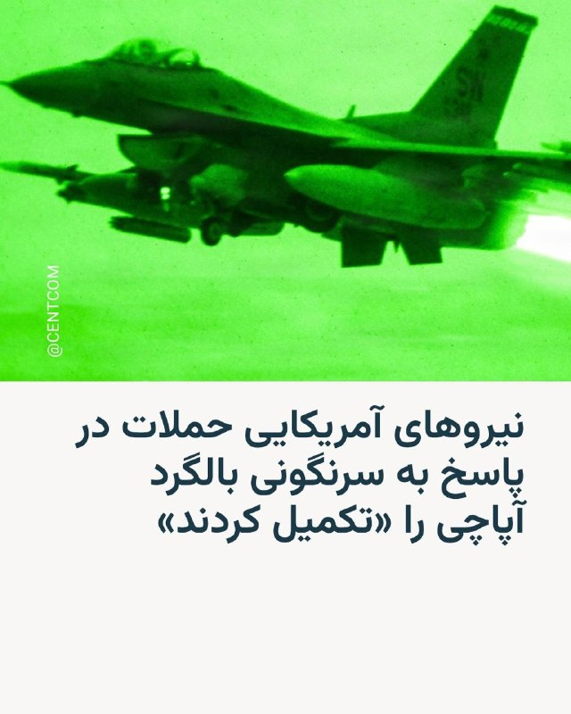

🔸فرماندهی مرکزی ارتش آمریکا، سنتکام، اعلام کرد نیروهای این فرماندهی شامگاه ۱۹ خرداد به دستور رئیس‌جمهور آمریکا، حملات «دفاع از خود» علیه ایران را در واکنش به سرنگونی یک بالگرد آپاچی ارتش آمریکا در روز گذشته به پایان رساندند.

🔸بر اساس این بیانیه، «نیروهای سنتکام با استفاده از جنگنده‌های نیروی هوایی و نیروی دریایی آمریکا و با به‌کارگیری مهمات هدایت‌شونده دقیق، سامانه‌های پدافند هوایی، ایستگاه‌های کنترل زمینی و مراکز راداری پایش ایران در نزدیکی تنگه هرمز را هدف قرار دادند.»

🔸سنتکام این عملیات را «پاسخی متناسب» به حملات اخیر علیه نیروهای آمریکایی و کشتی‌های تجاری بین‌المللی عبوری از آب‌های منطقه توصیف کرد.

🔸در پایان این بیانیه آمده است که نیروهای آمریکایی همچنان در آماده‌باش کامل قرار دارند و برای دفاع در برابر آنچه «اقدامات تجاوزکارانه و غیرموجه ایران» خوانده شده، آمادگی دارند.

@RadioFarda

## BBCPersian — post 283315

  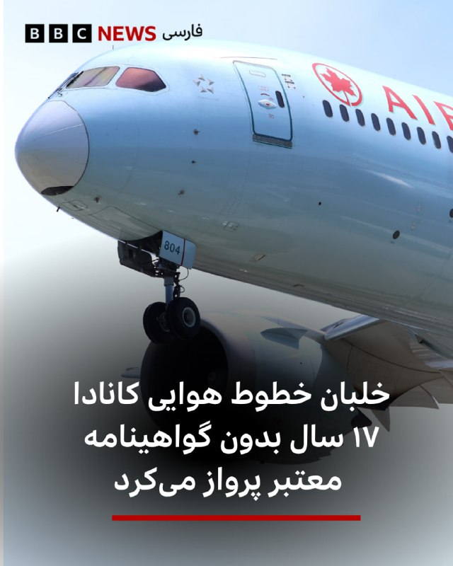

مقامات کانادایی می‌گویند که یک خلبان سابق شرکت هواپیمایی ایرکانادا متهم شده است که بدون گواهینامه معتبر به مدت ۱۷ سال هزاران مسافر را در پروازهای مسافربری جابه‌جا کرده است.

پلیس اعلام کرد که مشخص شده است که خلبان جفری وال، ۵۹ ساله و اهل انتاریو،‌ از زمان ارتقا به شغل خلبانی در سال ۲۰۰۹ با مدارک جعلی پرواز می‌کرده است. او اکنون با چندین اتهام مرتبط با کلاهبرداری مواجه است.

ایرکانادا اعلام کرد که پس از کشف جعلی بودن مدارک در سال گذشته،‌ این خلبان بلافاصله از کار برکنار شده است. این شرکت هواپیمایی اعلام کرد: «این شرکت داوطلبانه موضوع را به سازمان حمل و نقل کانادا گزارش داده است.»

این شرکت هواپیمایی اعلام کرد که ایمنی مسافران هرگز در معرض خطر قرار نگرفته و خاطرنشان کرد که همه خلبانان هر شش ماه یکبار دوره‌های آموزشی و تمرینی لازم را می‌گذراندند.

دادگاه جفری وال قرار است آخر ماه جاری میلادی برگزار شود.
📷NurPhoto via Getty Images

از لینک ⬇️ مطلب را در سایت بی‌بی‌سی فارسی بخوانید.

https://bbc.in/4gbGU7L
@BBCPersian

---
📅 بروزرسانی: 1405/03/20 07:52
---

هیچ پیام جدیدی در این بروزرسانی ارسال نشد.

---
📅 بروزرسانی: 1405/03/20 07:43
---

## BBCPersian — post 283314

پوشش زنده
۱۸ دقیقه پیشرسانه‌های آمریکایی: ترامپ مایل به حمله جدید به ایران نبود
آلکس وارد، گزارشگر نشریه وال استریت ژورنال آمریکا می‌گوید مقام های آمریکایی اعلام کردند که دونالد ترامپ تا اوایل روز سه‌شنبه نسبت به ضرورت اقدام تلافی‌جویانه علیه ایران متقاعد نشده بود.

آقای ترامپ صبح همان روز در گفت وگو با روزنامه وال استریت ژورنال گفته بود ساقط کردن بالگرد آپاچی ارتش «موضوع بزرگی نبود» چرا که خلبانان سالم‌اند.

با این حال، به گفته این مقام‌ها، رئیس جمهور آمریکا پس از آن که پیت هگست، وزیر جنگ آمریکا، و دن کین، رئیس ستاد مشترک ارتش آمریکا، در جریان یک نشست توجیهی در کاخ‌سفید انجام اقدام نظامی را توصیه کردند، نظر خود را تغییر داد.

بر اساس این گزارش، رئیس‌جمهور آمریکا در نهایت مجوز حملات علیه اهدافی در ایران را صادر کرد؛ حملاتی که مقام‌های آمریکایی می‌گویند در واکنش به سرنگونی یک فروند بالگرد آپاچی ارتش آمریکا انجام شده است.

🔻احضار محسن کیایی، تهمینه میلانی و دو سینماگر دیگر به دادسرای رسانه

کانال تلگرام امتداد از احضار چهار سینماگر به قوه قضائیه به دلیل اظهارنظر درباره وقایع دی ماه ۱۴۰۴ خبر داده است.

به نوشته این رسانه خبری، تهمینه میلانی، نویسنده و کارگردان سینما، محسن امیریوسفی، کارگردان و نائب رئیس خانه سینما، مصطفی کیایی، کارگردان و تهیه کننده سینما و محسن کیایی، بازیگر سینما، چهار سینماگری هستند که به دادسرای فرهنگ و رسانه احضار شدند. اتهام آنها «همکاری با دول متخاصم» اعلام شده است.

به گفته یکی از این چهارسینماگر در گفت‌و‌گو با بی‌بی‌سی یکی از اتهامات آنها در جلسه بازپرسی؛ امضای نامه سینماگران در انتقاد از کشتار دی ماه و فعالیت‌ آنها در شبکه‌های اجتماعی عنوان شده است.

در همین حال میزان، خبرگزاری قوه قضائیه، احضار «چند سینماگر به دادسرای فرهنگ و رسانه» را تکذیب کرده است.

این خبرگزاری نوشت که «از ابتدای سال از ابتدای سال ۱۴۰۵ هیچ سینماگری در رابطه با حوادث دی ماه به مرجع قضایی احضار نشده است.»

پیشتر مهدی کوهیان؛ مدیر حقوقی خانه سینما تایید کرده بود که شماری از سینماگران به دادسرای فرهنگ و رسانه احضار شده اند.

او گفته بود که احضارها فراتر از هومن سیدی و سعید روستایی بوده است.
https://bbc.in/43Zspg0
@BBCPersian

---
📅 بروزرسانی: 1405/03/20 07:33
---

## VahidOOnLine — post 244629

  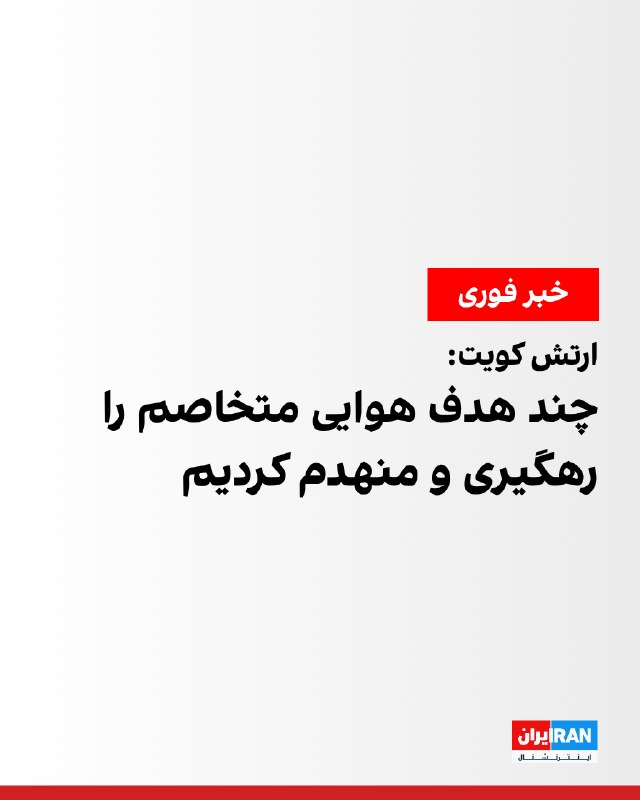

ارتش کویت اعلام کرد که سامانه‌های پدافند هوایی این کشور چند هدف هوایی متخاصم را رهگیری و منهدم کرده‌اند. پیش‌تر قرارگاه خاتم‌الانبیا از حمله تلافی‌جویانه سپاه و ارتش به چند پایگاه آمریکا در منطقه خبر داده بود.
‌🏁 🇬🇧 IranintlTV

🤖 @VahidOOnLine

## pm_afshaa — post 93270

  <a href="telegram/content/pm_afshaa_93270_1781064205.mp4" target="_blank">🎬 Download video</a>

🔴وسط این همه اخبار جنگ این جا موند؛
دیشب اوکراین به شکل پشم ریزونی خط اصلی لوله گاز روسیه رو هدف قرار داد :

💧 Rainbet.com the #1 Non-KYC Crypto Casino & Sportsbook @rainbetcom

😁 @Pm_Afshaa

## IranIntlTV — post 341436

  

ارتش کویت اعلام کرد که سامانه‌های پدافند هوایی این کشور چند هدف هوایی متخاصم را رهگیری و منهدم کرده‌اند. پیش‌تر قرارگاه خاتم‌الانبیا از حمله تلافی‌جویانه سپاه و ارتش به چند پایگاه آمریکا در منطقه خبر داده بود.
https://iranintl.com/202606108120

---
📅 بروزرسانی: 1405/03/20 07:23
---

## VahidOOnLine — post 244628

  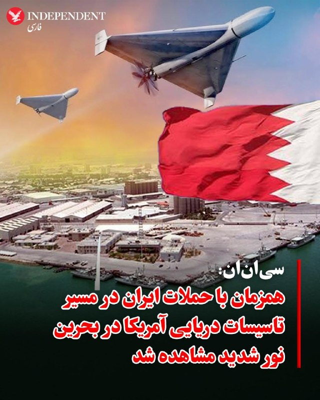

♦️به گزارش سی‌ان‌ان، تصاویر ثبت‌شده توسط یک دوربین اینترنتی متعلق به تلویزیون ارث EarthTV در صبح چهارشنبه، ظاهرا نور شدیدی را در جهت تاسیسات ناوگان پنجم نیروی دریایی آمریکا در منامه، پایتخت بحرین، نشان می‌دهد.
سی‌ان‌ان با تعیین موقعیت جغرافیایی این ویدیو اعلام کرد که تصاویر ظاهرا لحظه درخشش یک نور شدید از سمت تاسیسات ناوگان پنجم آمریکا در منامه را ثبت کرده‌اند.
این ویدیو توسط دوربینی ضبط شده که در فاصله حدود ۵.۶ کیلومتری شمال‌شرقی این تاسیسات قرار دارد. بر اساس زمان ثبت‌شده روی تصاویر، این نور شدید تنها سه دقیقه پس از آن مشاهده شد که مقام‌های بحرین در شبکه اجتماعی ایکس اعلام کردند آژیرهای هشدار به صدا درآمده‌اند؛ موضوعی که احتمال وقوع یک حمله را مطرح می‌کند.
با این حال، علت این نور شدید بلافاصله مشخص نشد.
سپاه پاسداران پیش‌تر اعلام کرده بود که حمله‌ای پهپادی علیه مقر ناوگان پنجم آمریکا در بحرین انجام داده است.
وزارت کشور بحرین نیز در یک ساعت گذشته اعلام کرد که آژیرهای هشدار بار دیگر در این کشور به صدا درآمده‌اند.
‌🇸🇦 Indypersian

🤖 @VahidOOnLine

## VahidOnline — post 76132

  <a href="telegram/content/VahidOnline_76132_1781063601.mp4" target="_blank">🎬 Download video</a>

ویدیویی که ترامپ پست کرده: اگر یک آمریکایی را بکشید ما با پاسخ متناسب برنمی‌گردیم با فاجعه کامل برمی‌گردیم
realDonaldTrump
چت‌جی‌پی‌تی:
ترامپ سکانسی از سریال معروف سیاسی The West Wing منتشر کرده است؛ سکانسی که برای مخاطب آمریکایی معنای کاملاً مشخصی دارد.

این صحنه از قسمت «پاسخ متناسب» است. در داستان سریال، یک هواپیمای آمریکایی در مأموریتی پزشکی هدف قرار گرفته و شماری از آمریکایی‌ها، از جمله پزشک شخصی رئیس‌جمهور، کشته شده‌اند. در اتاق وضعیت کاخ سفید، فرماندهان ارتش گزینه‌هایی برای یک حمله محدود و «متناسب» ارائه می‌کنند؛ اما رئیس‌جمهور خیالی، جِد بارتلت، با خشم می‌پرسد فایده چنین پاسخی چیست؟ او می‌گوید اگر دشمن می‌داند آمریکا همیشه محدود و قابل‌پیش‌بینی پاسخ می‌دهد، پس این پاسخ دیگر بازدارنده نیست.

اهمیت انتخاب این سکانس در این است که ترامپ پس از حمله‌ای که رسماً «متناسب» توصیف شده، پیامی دوگانه می‌فرستد: از یک طرف می‌گوید پاسخ فعلی کنترل‌شده و محدود بوده؛ از طرف دیگر هشدار می‌دهد که محدود بودن این پاسخ نباید به‌عنوان ضعف تعبیر شود. پایان سکانس با تهدیدی روشن همراه است: اگر آمریکایی کشته شود، پاسخ بعدی می‌تواند از چارچوب «متناسب» خارج شود و به «فاجعه کامل» تبدیل شود.

با این حال یک نکته مهم در خود سریال وجود دارد: بارتلت در نهایت توسط مشاورانش از واکنش نامتناسب بازداشته می‌شود و به پاسخ محدود تن می‌دهد. بنابراین ترامپ با انتشار این بخش، بیش از آنکه کل پیام سریال را بازگو کند، بخش خشم‌آلود و بازدارنده آن را برجسته کرده است؛ پیامی برای تهران، و همزمان برای مخاطب داخلی آمریکا: «فعلاً محدود زدیم، اما گزینه بزرگ‌تر هنوز روی میز است.»

گراک:

**این سکانس از سریال تلویزیونی «The West Wing» (نام فارسی: بال غربی یا اتاق بیضی) است.**

دقیقاً فصل اول، قسمت سوم با عنوان **«A Proportional Response»** (پاسخ متناسب).

### زمینه داستان چیست؟
این صحنه ادامه مستقیم قسمت قبلی (قسمت دوم فصل اول به نام «Post Hoc, Ergo Propter Hoc») است. در قسمت قبل، یک هواپیمای آمریکایی که دوست شخصی رئیس‌جمهور **جوزایا بارتلت** (با بازی مارتین شین) داخل آن بود، توسط نیروهای سوری سرنگون می‌شود و چند آمریکایی (از جمله دوست رئیس‌جمهور) کشته می‌شوند.

رئیس‌جمهور بارتلت که معمولاً آدم آرام، باهوش و اخلاق‌گرایی است، این بار بسیار عصبانی و دنبال انتقام شخصی است. او در اتاق وضعیت کاخ سفید (Situation Room) با دریاسالار **فیتزوالاس** و مشاوران نظامی‌اش جلسه دارد.

### معنی و مفهوم مکالمه چیست؟
نظامی‌ها گزینه‌ای به نام **«پاسخ متناسب» (Proportional Response)** پیشنهاد می‌کنند. یعنی:

- سوریه (یا نیروهای مورد حمایت آن) یک هواپیما را زده → ما هم چند هدف نظامی محدود مثل انبار مهمات، پل راه‌آهن و ساختمان اطلاعاتی‌شان را بزنیم.
- این کار «عادلانه» و «متناسب» با خسارت واردشده به نظر می‌رسد و جلوی escalation (تشدید درگیری) را می‌گیرد.

**رئیس‌جمهور بارتلت** اما این منطق را قبول ندارد و با عصبانیت می‌پرسد:

> «فضیلت پاسخ متناسب چیست؟ چرا خوب است؟
> آنها یک هواپیما را زدند، ما یک فرستنده را می‌زنیم؟ این پاسخ متناسب است؟»

او استدلال می‌کند که:
- دشمن دقیقاً می‌داند ما چه کار می‌کنیم (چون همیشه همین کار را کرده‌ایم).
- بنابراین اهداف را از قبل تخلیه می‌کنند (مثل همان انبارها و پل‌هایی که سه روز است خالی هستند).
- نتیجه؟ پاسخ ما بی‌اثر می‌شود و دشمن جری‌تر می‌شود.

بارتلت می‌خواهد **«پاسخ نامتناسب» (Disproportional Response)** بدهد:

> «اگر یک آمریکایی را بکشید، هر آمریکایی، ما با پاسخ متناسب برنمی‌گردیم.
> ما با فاجعه کامل برمی‌گردیم.»

یعنی ضربه‌ای آن‌قدر سنگین و غافلگیرکننده بزنیم که دشمن برای همیشه بترسد و دیگر جرأت حمله نکند.

### در نهایت چه اتفاقی می‌افتد؟
وقتی نظامی‌ها گزینه شدیدتر را پیشنهاد می‌کنند (بمباران فرودگاه که هزاران کشته غیرنظامی دارد)، بارتلت عقب‌نشینی می‌کند و همان پاسخ متناسب اولیه را انتخاب می‌کند. این نشان‌دهندهٔ تعارض درونی اوست:

- از یک طرف خشم و احساسات شخصی (چون دوستش کشته شده).
- از طرف دیگر مسئولیت ریاست‌جمهوری و ترس از کشتن بی‌گناهان و شروع جنگ بزرگ‌تر.

### چرا این صحنه این‌قدر معروف و مهم است؟
- نوشتهٔ **آرون سورکین** (نویسندهٔ نابغهٔ سریال) است و دیالوگ‌هایش بسیار قوی و فلسفی هستند.
- نشان‌دهندهٔ یکی از تم‌های اصلی سریال است: تعارض بین **ایده‌آلیسم** و **واقع‌گرایی** در قدرت.
- مارتین شین در این صحنه بازی فوق‌العاده‌ای دارد و عصبانیت، ناامیدی و در نهایت پختگی بارتلت را به زیبایی نشان می‌دهد.
- خیلی‌ها این صحنه را نمادی از سیاست خارجی آمریکا می‌دانند: آیا همیشه باید «متناسب» پاسخ داد یا گاهی باید قاطع و بازدارنده عمل کرد؟

📡 @VahidOnline

## VahidOnline — post 76131

  

درحالی که سپاه پاسداران ادعا می‌کند ۲۱ پایگاه آمریکا را در منطقه هدف قرار داده است، نیویورک‌تایمز صبح چهارشنبه به نقل از یک مقام آمریکایی نوشت که برآورد‌های اولیه حاکی از آن است که تقریبا همه حمله‌های ایران رهگیری شده و هیچ گزارشی از خسارت به پایگاه‌های آمریکا یا تلفات نیروها مخابره نشده است.
یک مقام آمریکایی دیگر نیز به نیویورک‌تایمز گفته، ادعای سپاه درباره حمله به پایگاه‌های آمریکایی صحت ندارد. هنوز مقامات سنتکام به‌طور رسمی در این زمینه اظهارنظر نکرده‌اند.
@VahidOOnLine

📡 @VahidOnline

## BBCPersian — post 283313

  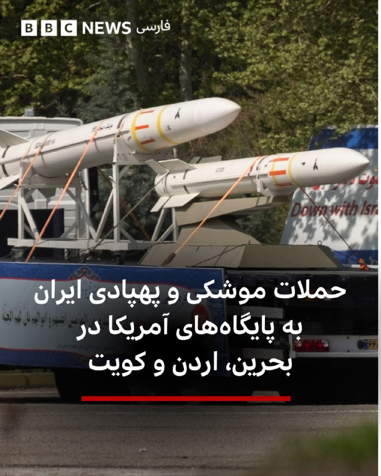

ارتش ایران و سپاه پاسداران اعلام کردند که «با موجی از حملات پهپادی، پایگاه‌های آمریکایی و سامانه‌های راداری ناوگان پنجم ایالات متحده را در بحرین هدف قرار» دادند. همچنین گزارش‌هایی از حملات سپاه و ارتش به پایگاه‌های آمریکا در اردن و کویت منتشر شده است.

ارتش ایران می‌گوید این حملات را «اقدامی متقابل» در پی «مزاحمت‌های» آمریکا برای ساکنان جنوب ایران خوانده است.

خبرگزاری فارس گزارش کرده که سپاه پاسداران به پایگاه ارتش آمریکا در اردن حمله موشکی کرده است.

سپاه پاسداران گفته که با «موشک‌های سوخت جامد دور برد خود ۴ هدف مهم از جمله آشیانه‌های جنگنده‌های اف‌۳۵ در پایگاه هوایی و مرکز فرمانده کنترل ارتش» آمریکا در الازرق اردن را مورد هدف قرار داده است.»

باراک راوید، گزارشگر اکسیوس به نقل ازمقامات آمریکایی می‌گوید که دست‌کم ۴ موشک بالستیک و چندین پهپاد به سوی پایگاه‌های آمریکا در بحرین،‌ کویت و اردن شلیک شده است.

وزارت کشور بحرین چندین بار از به صدا درآمدن آژیرهای خطر خبر داد و از شهروندان خواست که خونسردی خود را حفظ کنند و در جای امن بمانند.

📷NurPhoto via Getty Images

https://bbc.in/43Zspg0
@BBCPersian

---
📅 بروزرسانی: 1405/03/20 07:13
---

## VahidOOnLine — post 244627

  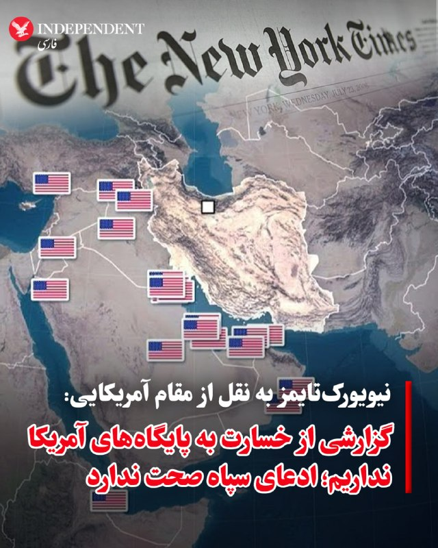

♦️درحالی که سپاه پاسداران ادعا می‌کند ۲۱ پایگاه آمریکا را در منطقه هدف قرار داده است، نیویورک‌تایمز صبح چهارشنبه به نقل از یک مقام آمریکایی نوشت که برآورد‌های اولیه حاکی از آن است که تقریبا همه حمله‌های ایران رهگیری شده و هیچ گزارشی از خسارت به پایگاه‌های آمریکا یا تلفات نیروها مخابره نشده است. یک مقام آمریکایی دیگر نیز به نیویورک‌تایمز گفته، ادعای سپاه درباره حمله به پایگاه‌های آمریکایی صحت ندارد. هنوز مقامات سنتکام به‌طور رسمی در این زمینه اظهارنظر نکرده‌اند.
‌🇸🇦 Indypersian

🤖 @VahidOOnLine

## VahidOOnLine — post 244626

  

ارتش اردن اعلام کرد نیروهای این کشور پنج موشک شلیک شده از ایران به سمت پایگاه الازرق را رهگیری و ساقط کردند. نیروهای اردنی گفتند پس از رهگیری موشک‌ها، بقایای آنها سقوط کرد، اما هیچ تلفات جانی یا خسارتی ایجاد نشد.
پیش‌تر سپاه از حمله به ۲۱ هدف در پایگاه‌های آمریکا در منطقه خبر داد و گفت نیروی هوافضای سپاه با موشک‌های سوخت جامد دوربرد، چهار «هدف مهم»، از جمله آشیانه‌های جنگنده‌های اف-۳۵ در پایگاه هوایی و مرکز فرماندهی و کنترل ارتش آمریکا در الازرق اردن را هدف قرار داد و منهدم کرد.
‌🏁 🇬🇧 IranintlTV

🤖 @VahidOOnLine

## IranIntlTV — post 341435

  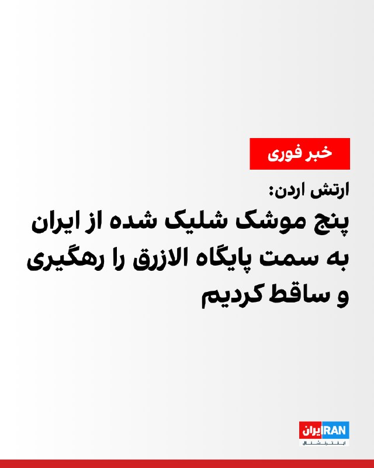

ارتش اردن اعلام کرد نیروهای این کشور پنج موشک شلیک شده از ایران به سمت پایگاه الازرق را رهگیری و ساقط کردند. نیروهای اردنی گفتند پس از رهگیری موشک‌ها، بقایای آنها سقوط کرد، اما هیچ تلفات جانی یا خسارتی ایجاد نشد.
پیش‌تر سپاه از حمله به ۲۱ هدف در پایگاه‌های آمریکا در منطقه خبر داد و گفت نیروی هوافضای سپاه با موشک‌های سوخت جامد دوربرد، چهار «هدف مهم»، از جمله آشیانه‌های جنگنده‌های اف-۳۵ در پایگاه هوایی و مرکز فرماندهی و کنترل ارتش آمریکا در الازرق اردن را هدف قرار داد و منهدم کرد.
https://iranintl.com/202606109846

## alonews — post 126684

  <a href="telegram/content/alonews_126684_1781063022.mp4" target="_blank">🎬 Download video</a>

👈ترامپ بعد از حملات آمریکا به ایران، یه تیکه از سریال «وست وینگ» رو تو تروث سوشال خودش پست کرد؛
که تو اون سکانس رئیس‌جمهور بارتلت میگه؛ اگه یه آمریکایی کشته بشه، ما جوابش رو در حد همون حمله نمی‌دیم؛ با یه فاجعه تمام عیار برمی‌گردیم.

✅ @AloNews خبر جنگ

## alonews — post 126682

  <a href="telegram/content/alonews_126682_1781063024.webm" target="_blank">🎬 Download video</a>

👈عکس‌هایی از فعالیت پدافند هوایی بر فراز بحرین در حملات ایران.

✅ @AloNews خبر جنگ

## alonews — post 126681

  <a href="telegram/content/alonews_126681_1781063024.mp4" target="_blank">🎬 Download video</a>

👈لحظه اصابت موشک ایرانی به پایگاه ناوگان پنجم نیروی دریایی آمریکا در بحرین

✅ @AloNews خبر جنگ

---
📅 بروزرسانی: 1405/03/20 07:03
---

## VahidOOnLine — post 244625

  <a href="telegram/content/VahidOOnLine_244625_1781062384.mp4" target="_blank">🎬 Download video</a>

♦️خبرگزاری تسنیم، رسانه وابسته به سپاه پاسداران، به نقل از منابع محلی از انهدام یک شیء پرنده در آسمان شهرستان جم در جنوب استان بوشهر خبر داد.
پیش‌تر نیز سپاه پاسداران اعلام کرده بود یک پهپاد ام‌کیو۹ را در شمال خلیج فارس و در آسمان شهرستان جم در استان بوشهر سرنگون کرده است. تا زمان انتشار این خبر، ارتش آمریکا درباره این گزارش اظهارنظری نکرده است.
‌🇸🇦 Indypersian

🤖 @VahidOOnLine

## pm_afshaa — post 93269

  <a href="telegram/content/pm_afshaa_93269_1781062386.webm" target="_blank">🎬 Download video</a>

🔴یک مقام آمریکایی به نیویورک تایمز: ایران اوایل امروز چندین موشک و پهپاد به پایگاه‌های آمریکایی در سراسر خاورمیانه شلیک کرد و تقریباً همه طبق ارزیابی‌های اولیه آمریکا رهگیری شدن.

هیچ تلفات آمریکایی گزارش نشده و هیچ خسارتی به پایگاه‌های آمریکا تأیید نشده.

💧 Rainbet.com the #1 Non-KYC Crypto Casino & Sportsbook @rainbetcom

😁 @Pm_Afshaa

## alonews — post 126680

  <a href="telegram/content/alonews_126680_1781062387.webm" target="_blank">🎬 Download video</a>

👈یک مقام آمریکایی به نیویورک تایمز: ایران اوایل چهارشنبه چندین موشک و پهپاد به پایگاه‌های آمریکایی در سراسر خاورمیانه شلیک کرد و تقریباً همه طبق ارزیابی‌های اولیه آمریکا رهگیری شدند.

هیچ تلفات آمریکایی گزارش نشده است.
هیچ خسارتی به پایگاه‌های آمریکا از حملات ایرانی تأیید نشده است.​​​​​​​​​​​​​​​​

✅ @AloNews خبر جنگ

## alonews — post 126679

  <a href="telegram/content/alonews_126679_1781062387.webm" target="_blank">🎬 Download video</a>

👈صدای انفجار در بحرین

✅ @AloNews خبر جنگ

---
📅 بروزرسانی: 1405/03/20 06:53
---

## VahidOOnLine — post 244624

  <a href="telegram/content/VahidOOnLine_244624_1781061792.mp4" target="_blank">🎬 Download video</a>

♦️هم‌زمان با انتشار تصاویری از رد موشک‌های ایران در آسمان امان، پایتخت اردن، سپاه پاسداران با انتشار بیانیه‌ای مدعی شد که ۴ هدف مهم نظامی را در خاک این کشور منهدم کرده است. سپاه اعلام کرد آشیانه‌های جنگنده‌های رادارگریز اف-۳۵ (F-35) و مرکز فرماندهی و کنترل ارتش آمریکا در پایگاه نظامی الازرق اردن، هدف این حملات موشکی بوده‌اند. این ادعاهای سنگین در حالی مطرح می‌شود که مقامات دولتی اردن و ستاد فرماندهی مرکزی آمریکا (سنتکام) هنوز درباره اهدافی که سپاه مدعی نابودی آن‌ها شده، هیچ‌گونه واکنش رسمی نشان نداده‌اند.
‌🇸🇦 Indypersian

🤖 @VahidOOnLine

## VahidOOnLine — post 244623

  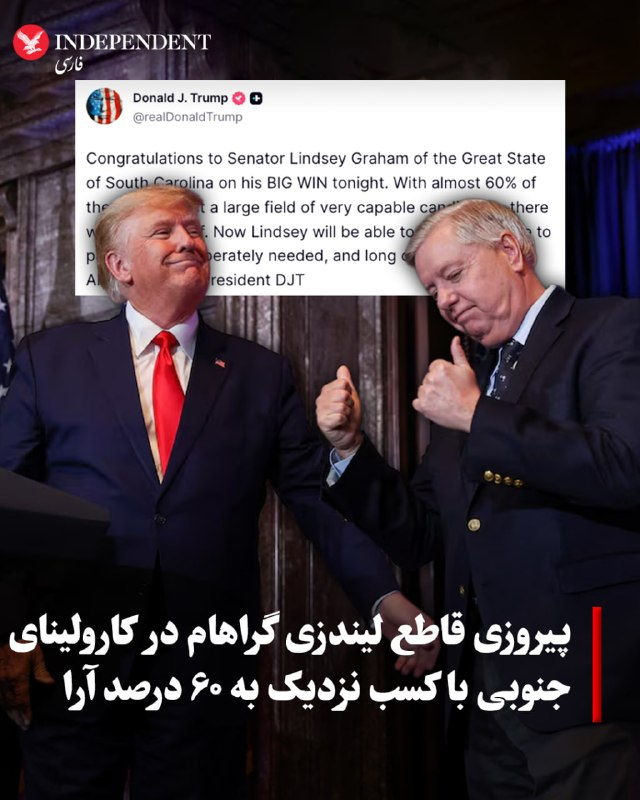

♦️دونالد ترامپ، رئیس‌جمهوری ایالات متحده، با انتشار پیامی در شبکه اجتماعی «تروث سوشال»، پیروزی قاطع لیندزی گراهام، سناتور ارشد جمهوری‌خواه، را تبریک گفت و اعلام کرد: «پیروزی بزرگ سناتور لیندزی گراهام از ایالت بزرگ کارولینای جنوبی را در انتخابات امشب تبریک می‌گویم. او با کسب نزدیک به ۶۰ درصد آرا در رقابت با گروه بزرگی از نامزدهای بسیار توانمند پیروز شد و کار به دور دوم نخواهد کشید.» ترامپ در ادامه پیام خود افزود: «اکنون لیندزی این فرصت را خواهد داشت تا تمام وقت خود را وقف تصویب لایحه حیاتی و بسیار دیرهنگام نجات آمریکا (SAVE AMERICA ACT) کند.»
این پیام رئیس جمهوری آمریکا در پی برگزاری انتخابات مقدماتی حزب جمهوری‌خواه در ایالت کارولینای جنوبی منتشر شد. جایی که سناتور لیندزی گراهام موفق شد با کسب اکثریت آرا، رقبای هم‌حزبی خود را پشت سر بگذارد و بدون نیاز به تمدید رقابت در دور دوم، جایگاه خود را برای انتخابات نهایی سنا تثبیت کند. لایحه مورد اشاره ترامپ، از طرح‌های کلیدی و همسو با دکترین سیاسی اوست که جمهوری‌خواهان تلاش می‌کنند با تمرکز بر اصلاحات انتخاباتی و ساختاری، آن را در کنگره به تصویب برسانند.
‌🇸🇦 Indypersian

🤖 @VahidOOnLine

## VahidOOnLine — post 244622

  <a href="telegram/content/VahidOOnLine_244622_1781061794.mp4" target="_blank">🎬 Download video</a>

روز چهارشنبه، پس از ساعت ۳ بامداد و هم‌زمان با حملات ایالات متحده، در برنامه بخش خبر بامدادی صداوسیمای جمهوری اسلامی و هنگام پخش اخبار اقتصادی، برای مدت کوتاهی تصاویری از یک انفجار هسته‌ای پخش شد. عبارت «تسلیت بندرعباس» نیز در این تصاویر دیده می‌شد. هنوز دلیلی برای پخش چنین تصاویری از سوی صداوسیما اعلام نشده است.
‌🏁 🇬🇧 IranintlTV

🤖 @VahidOOnLine

---
📅 بروزرسانی: 1405/03/20 06:43
---

## pm_afshaa — post 93268

  <a href="telegram/content/pm_afshaa_93268_1781061188.webm" target="_blank">🎬 Download video</a>

🔴پست جدید ترامپ با کلیپی از سریال تلویزیونی The West Wing در تروث سوشال :
‏
این صحنه، از فصل 1 اپیزود 3 با عنوان «پاسخ متناسب» نشون میده که پرزیدنت بارتلت علیه انتقام‌جویی متناسب استدلال میکنه و میگه: «شما هر یک آمریکایی رو که می‌کُشید، ما با پاسخی متناسب برنمی‌گردیم، ما با فاجعه کامل برمی‌گردیم.»

💧 Rainbet.com the #1 Non-KYC Crypto Casino & Sportsbook @rainbetcom

😁 @Pm_Afshaa

## IranIntlTV — post 341434

  <a href="telegram/content/IranIntlTV_341434_1781061189.mp4" target="_blank">🎬 Download video</a>

روز چهارشنبه، پس از ساعت ۳ بامداد و هم‌زمان با حملات ایالات متحده، در برنامه بخش خبر بامدادی صداوسیمای جمهوری اسلامی و هنگام پخش اخبار اقتصادی، برای مدت کوتاهی تصاویری از یک انفجار هسته‌ای پخش شد. عبارت «تسلیت بندرعباس» نیز در این تصاویر دیده می‌شد. هنوز دلیلی برای پخش چنین تصاویری از سوی صداوسیما اعلام نشده است.

## BBCPersian — post 283304

‌
حزب نیکول پاشینیان، نخست‌وزیر ارمنستان در انتخاباتی سرنوشت‌ساز که به‌عنوان تعیین‌کننده مسیر حرکت کشور به سوی غرب تلقی شده، پیروز شده است.

حزب میانه‌رو «پیمان مدنی» به رهبری او ۴۹/۸ درصد آرا را به‌دست آورد.

رای‌گیری روز یکشنبه نخستین انتخابات سراسری پس از آن بود که ارمنستان با حدود سه میلیون جمعیت، در سال ۲۰۲۳ در برابر جمهوری آذربایجان بر سر قره‌باغ شکست نظامی سنگینی متحمل شد.

پاشینیان که از سال ۲۰۱۸ در قدرت است، روز دوشنبه پس از اعلام نتایج اولیه، که نشان می‌داد حزبش بیش از ۵۰ درصد آرا را کسب کرده، پیروزی خود را اعلام کرد.

این انتخابات توجه زیادی در سطح بین‌المللی جلب کرد. فرانسه و اتحادیه اروپا از جمله کشورها و نهادهایی بودند که پیروزی او را تبریک گفتند.

در مقابل، سخنگوی وزارت خارجه روسیه، از «فشار بی‌سابقه» بر احزاب مخالف سخن گفت و مدعی شد «مداخله‌ای» از سوی غرب در این روند صورت گرفته است.

📷Getty/ Reuters/ BBC

از لینک ⬇️ این مطلب را در سایت بی‌بی‌سی فارسی بخوانید.
https://bbc.in/4e9FPuv
@BBCPersian

---
📅 بروزرسانی: 1405/03/20 06:33
---

## VahidOOnLine — post 244621

  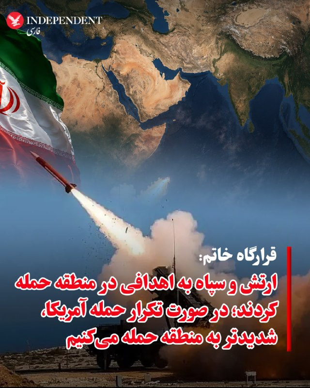

♦️قرارگاه خاتم در بیانیه‌ای اعلام کرد که «پایگاه‌های آمریکا در منطقه» هدف حمله مشترک ارتش و سپاه قرار گرفته است و «در صورت تکرار تعرض آمریکا به جمهوری اسلامی ایران، حملات سهمگین‌ و گسترده‌تر علیه بانک اهداف تعیین شده در منطقه انجام خواهد شد.»
‌🇸🇦 Indypersian

🤖 @VahidOOnLine

## FarsiVOA — post 220211

  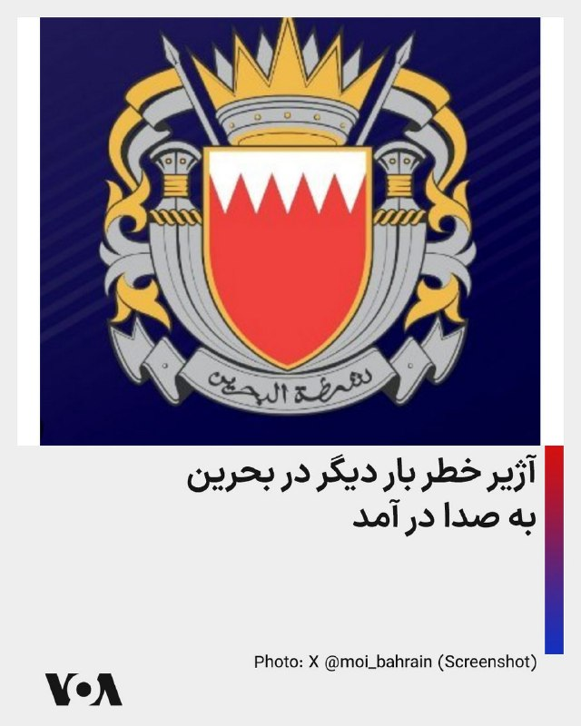

⚡️وزارت کشور بحرین دقایقی پیش بار دیگر از به صدا در آمدن آژیر خطر در این کشور خبر داد
@FarsiVOA

---
📅 بروزرسانی: 1405/03/20 06:23
---

## pm_afshaa — post 93267

  <a href="telegram/content/pm_afshaa_93267_1781059999.webm" target="_blank">🎬 Download video</a>

🔴سپاه پاسداران: به دنبال عملیات موفق نیروی دریایی سپاه در اصابت قرار دادن 21 هدف در پایگاه‌های هوایی و دریایی آمریکا در منطقه و ساقط کردن یک فروند پهپاد MQ9 در آسمان شهرستان جم، با توجه به تداوم شرارت‌های دشمن، 4 هدف از جمله آشیانه‌های جنگنده‌های F-35 در پایگاه…

## pm_afshaa — post 93266

  <a href="telegram/content/pm_afshaa_93266_1781060000.webm" target="_blank">🎬 Download video</a>

🔴اسرائیل دقایقی پیش به جنوب لبنان حمله کرد.

💧 Rainbet.com the #1 Non-KYC Crypto Casino & Sportsbook @rainbetcom

😁 @Pm_Afshaa

## Shin_Persian — post 6848

Shin ✓ @hey_itsmyturn
Wed, 10 Jun 2026 02:45:48 UTC

Bahrain's Ministry of Interior announces: Sirens sounded. Citizens and residents urged to stay calm, move to nearest safe location, and follow official channels for updates.
#Bahrain 🇧🇭

Source: @moi_bahrain
https://x.com/moi_bahrain/status/2064539450827247776

ترجمه خودکار فارسی

وزارت کشور بحرین اعلام کرد: صدای آژیرها شنیده شد. از شهروندان و ساکنان درخواست می‌شود آرامش خود را حفظ کنند، به نزدیک‌ترین مکان امن بروند و برای دریافت به‌روزرسانی‌ها کانال‌های رسمی را دنبال کنند.
#Bahrain 🇧🇭

منبع: @moi_bahrain
https://x.com/moi_bahrain/status/2064539450827247776

𝕏 · @shin_persian

---
📅 بروزرسانی: 1405/03/20 06:13
---

## VahidOOnLine — post 244620

  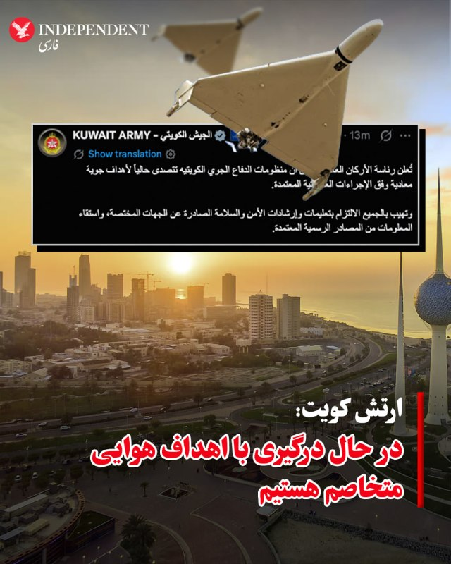

♦️ارتش کویت صبح چهارشنبه اعلام کرد سامانه‌های پدافند هوایی این کشور در حال درگیری با اهداف هوایی متخاصم هستند. پیشتر، سپاه و ارتش جمهوری اسلامی از حمله به «اهداف آمریکایی» در منطقه خبر داده بودند.
‌🇸🇦 Indypersian

🤖 @VahidOOnLine

## pm_afshaa — post 93265

  <a href="telegram/content/pm_afshaa_93265_1781059390.webm" target="_blank">🎬 Download video</a>

🔴سخنگوی طالبان: دیشب ارتش پاکستان حریم هوایی افغانستان رو نقض کرد و چند خونه مسکونی رو در ولایت‌های کنر، خوست و پکتیکا بمباران کرد. تو این حملات 11 کودک، یک زن و یک مرد سالمند کشته شدن و 14 نفر دیگه زخمی شدن. 
💧 Rainbet.com the #1 Non-KYC Crypto Casino &…

## pm_afshaa — post 93264

  <a href="telegram/content/pm_afshaa_93264_1781059391.webm" target="_blank">🎬 Download video</a>

🔴سخنگوی طالبان:
دیشب ارتش پاکستان حریم هوایی افغانستان رو نقض کرد و چند خونه مسکونی رو در ولایت‌های کنر، خوست و پکتیکا بمباران کرد.

تو این حملات 11 کودک، یک زن و یک مرد سالمند کشته شدن و 14 نفر دیگه زخمی شدن.

💧 Rainbet.com the #1 Non-KYC Crypto Casino & Sportsbook @rainbetcom

😁 @Pm_Afshaa

---
📅 بروزرسانی: 1405/03/20 06:03
---

## VahidOOnLine — post 244619

  

سپاه از حمله به ۲۱ هدف در پایگاه‌های آمریکا در منطقه خبر داد و گفت نیروی هوافضای سپاه با موشک‌های سوخت جامد دوربرد، چهار «هدف مهم»، از جمله آشیانه‌های جنگنده‌های اف-۳۵ در پایگاه هوایی و مرکز فرماندهی و کنترل ارتش آمریکا در الازرق اردن را هدف قرار داد و منهدم کرد.
‌🏁 🇬🇧 IranintlTV

🤖 @VahidOOnLine

## VahidOOnLine — post 244618

♦️همزمان با حملات روز چهارشنبه آمریکا به جنوب ایران، بخش خبری ساعت ۳ بامداد صداوسیما، در حین اعلام یک خبر اقتصادی، تصاویر شبیه‌سازی شده از انفجار هسته‌ای در وسط یک شهر را پخش کرد و پس از آن عبارت «تسلیت بندرعباس» زیرنویس شد.
‌🇸🇦 Indypersian

🤖 @VahidOOnLine

## FoxNewsTwitter — post 342788

  <a href="telegram/content/FoxNewsTwitter_342788_1781058798.mp4" target="_blank">🎬 Download video</a>

Fox News (Twitter/X)

Austin Metcalf’s family, including his twin brother and parents, stand with the DA following the murder conviction of Karmelo Anthony.

A Texas jury found Anthony guilty of murder in the fatal stabbing of the student-athlete during a high school track meet.

Anthony was sentenced to 35 years in prison.

## pm_afshaa — post 93263

  <a href="telegram/content/pm_afshaa_93263_1781058800.webm" target="_blank">🎬 Download video</a>

🔴خبرنگار وای نت:
در چند ساعت اخیر در رویدادی جالب سامانه‌های پدافندی آمریکا تمامی موشک‌های شلیک شده به 3 کشور مختلف رو رهگیری کردن. صفر اصابت و شاهکار پاتریوت!

💧 Rainbet.com the #1 Non-KYC Crypto Casino & Sportsbook @rainbetcom

😁 @Pm_Afshaa

## pm_afshaa — post 93262

  <a href="telegram/content/pm_afshaa_93262_1781058801.webm" target="_blank">🎬 Download video</a>

🔴ارتش کویت: در حال مقابله با حملات موشکی و پهپادی ایران هستیم. 
💧 Rainbet.com the #1 Non-KYC Crypto Casino & Sportsbook @rainbetcom 
😁 @Pm_Afshaa

## pm_afshaa — post 93261

اینکه نفت جهانی بالا نرفت و رو همون کانال 90 دلار موند عجیبه

## VahidOnline — post 76130

  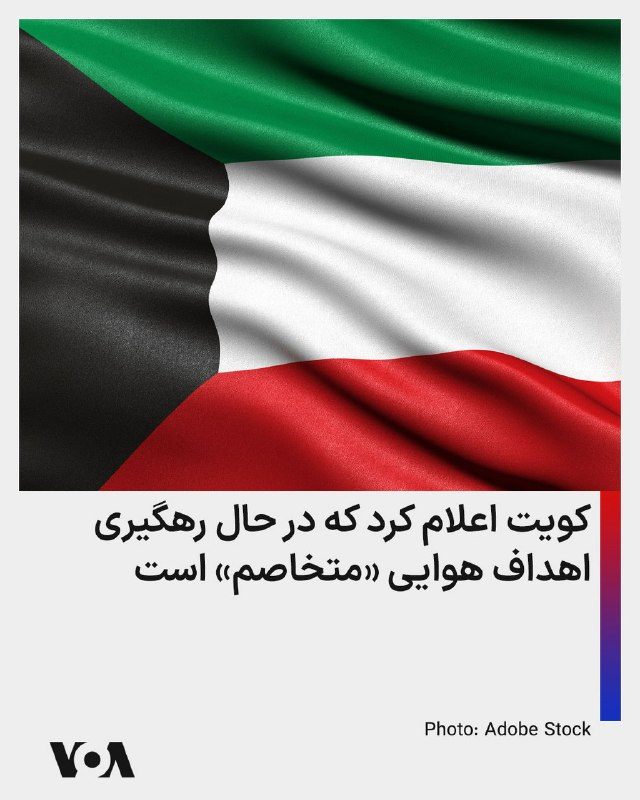

ارتش کویت گفت دقیقه‌ای پیش اعلام کرد که سامانه‌های پدافند هوایی آن در حال حاضر مشغول مقابله با «اهداف هوایی متخاصم» هستند.
@VahidHeadline
پیشتر سپاه اعلام کرد که به پایگاه آمریکا در اردن حمله کرده.
📡 @VahidOnline

## IranIntlTV — post 341433

  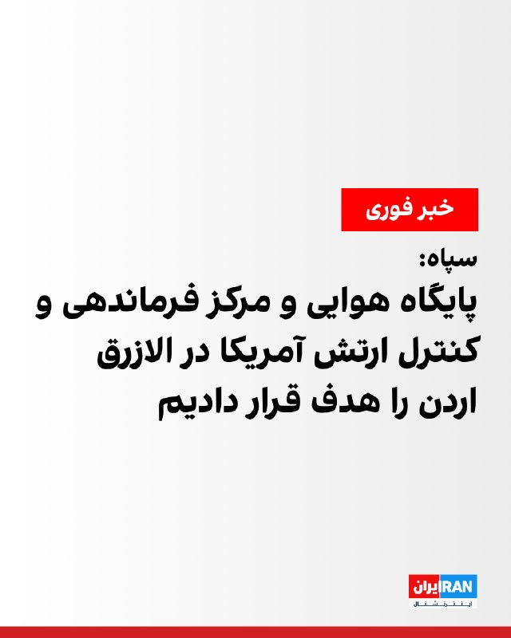

سپاه از حمله به ۲۱ هدف در پایگاه‌های آمریکا در منطقه خبر داد و گفت نیروی هوافضای سپاه با موشک‌های سوخت جامد دوربرد، چهار «هدف مهم»، از جمله آشیانه‌های جنگنده‌های اف-۳۵ در پایگاه هوایی و مرکز فرماندهی و کنترل ارتش آمریکا در الازرق اردن را هدف قرار داد و منهدم کرد.
https://iranintl.com/202606109827

## FarsiVOA — post 220210

  

⚡️ارتش کویت دقیقه‌ای پیش اعلام کرد که سامانه‌های پدافند هوایی آن در حال حاضر مشغول مقابله با «اهداف هوایی متخاصم» هستند.
@FarsiVOA

---
📅 بروزرسانی: 1405/03/20 05:53
---

## VahidOOnLine — post 244617

  

وزارت دفاع بحرین از فعال شدن آژیرهای خطر و پدافند هوایی در پی حمله‌هایی از سمت ایران خبر داد. طبق اعلام مشاور رسانه‌ای پادشاه بحرین، پدافند هوایی بحرین این حملات جمهوری اسلامی را دفع کرده‌‌ است.
‌🏁 🇬🇧 IranintlTV

🤖 @VahidOOnLine

## pm_afshaa — post 93260

  <a href="telegram/content/pm_afshaa_93260_1781058192.webm" target="_blank">🎬 Download video</a>

آژیر خطر در کویت فعال شد. 
💧 Rainbet.com the #1 Non-KYC Crypto Casino & Sportsbook @rainbetcom 
😁 @Pm_Afshaa

## pm_afshaa — post 93259

آژیر خطر در کویت فعال شد.

💧 Rainbet.com the #1 Non-KYC Crypto Casino & Sportsbook @rainbetcom

😁 @Pm_Afshaa

## IranIntlTV — post 341432

  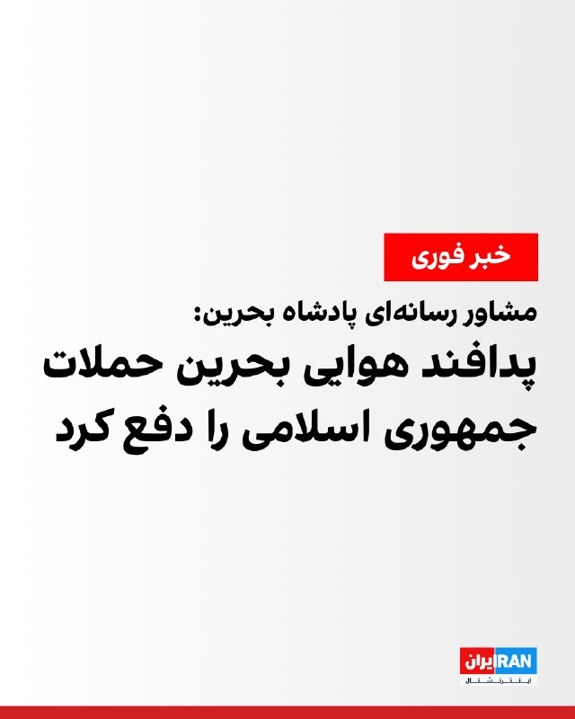

وزارت دفاع بحرین از فعال شدن آژیرهای خطر و پدافند هوایی در پی حمله‌هایی از سمت ایران خبر داد. طبق اعلام مشاور رسانه‌ای پادشاه بحرین، پدافند هوایی بحرین این حملات جمهوری اسلامی را دفع کرده‌‌ است.
https://iranintl.com/202606107702

## FarsiVOA — post 220209

  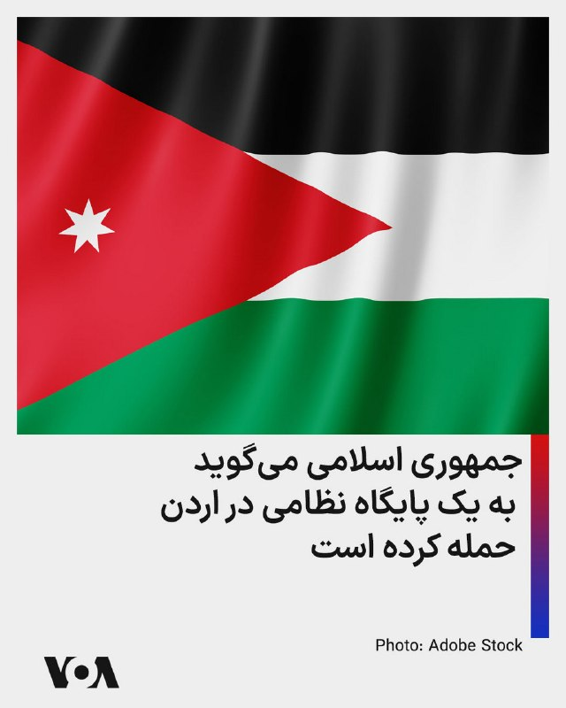

⚡️جمهوری اسلامی مدعی شد که حمله‌ای را علیه یک پایگاه نظامی در اردن که میزبان نیروهای آمریکایی است، انجام داده است. به گزارش آسوشیتدپرس، هیچ تأییدی از سوی اردن یا ایالات متحده در این باره صورت نگرفته است.
@FarsiVOA

## FarsiVOA — post 220208

  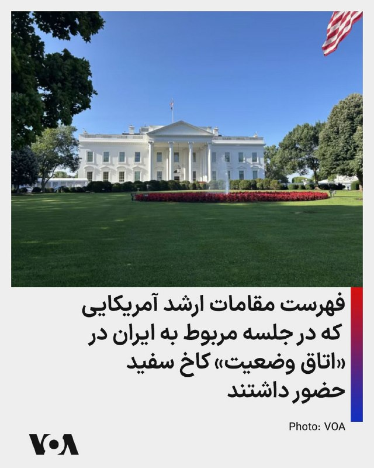

⚡️مایک جانسون، رئیس مجلس نمایندگان آمریکا، به خبرنگاران گفت که پیش از حملات تلافی‌جویانه ایالات متحده به جمهوری اسلامی در عصر سه‌شنبه (به‌وقت واشنگتن)، از این موضوع مطلع بوده است.
جانسون گفت: «آنها قبل از شروع این حمله، به من، به عنوان رئیس مجلس، اطلاع دادند و این حملات هدفمند به سایت‌های رادار، موشک و فرماندهی و کنترل آنها است و ماهیت دفاعی دارد.»
جانسون فاش کرد که صبح سه‌شنبه «چند ساعت» را در اتاق وضعیت کاخ سفید با رئیس جمهوری آمریکا، دونالد ترامپ، معاون رئیس جمهوری، جی‌دی ونس، وزیر امور خارجه، مارکو روبیو، وزیر جنگ، پیت هگست و رئیس سازمان اطلاعات مرکزی آمریکا (سیا)، جان راتکلیف، گذرانده است.
جانسون گفت: «ما در مورد ایران و برخی مسائل دیگر صحبت کردیم.»
@FarsiVOA

## BBCPersian — post 283303

🔻 حمله موشکی ایران به پایگاه آمریکا در اردن

خبرگزاری فارس گزارش کرده که سپاه پاسداران به پایگاهی ارتش آمریکا در اردن حمله موشکی کرده است.

سپاه پاسداران گفته «توسط موشک‌های سوخت جامد دور برد خود ۴ هدف مهم از جمله آشیانه‌های جنگنده‌های اف‌۳۵ در پایگاه هوایی و مرکز فرمانده کنترل ارتش» آمریکا در الازرق اردن را مورد هدف قرار داده است.

تاکنون منابع آمریکایی در خصوص این حمله واکنشی نداشته‌اند.

آن طور که قرارگاه خاتم الانبیاء ساعتی پیش در اطلاعیه خود اعلام کرد حملات ایران به طور مشترک توسط سپاه پاسداران و ارتش ایران صورت گرفته است.

https://bbc.in/43Y0c9g
@BBCPersian

---
📅 بروزرسانی: 1405/03/20 05:43
---

## pm_afshaa — post 93258

  <a href="telegram/content/pm_afshaa_93258_1781057595.webm" target="_blank">🎬 Download video</a>

🔴سپاه پاسداران: به دنبال عملیات موفق نیروی دریایی سپاه در اصابت قرار دادن 21 هدف در پایگاه‌های هوایی و دریایی آمریکا در منطقه و ساقط کردن یک فروند پهپاد MQ9 در آسمان شهرستان جم، با توجه به تداوم شرارت‌های دشمن، 4 هدف از جمله آشیانه‌های جنگنده‌های F-35 در پایگاه…

## pm_afshaa — post 93257

  <a href="telegram/content/pm_afshaa_93257_1781057596.webm" target="_blank">🎬 Download video</a>

🔴سپاه پاسداران:
به دنبال عملیات موفق نیروی دریایی سپاه در اصابت قرار دادن 21 هدف در پایگاه‌های هوایی و دریایی آمریکا در منطقه و ساقط کردن یک فروند پهپاد MQ9 در آسمان شهرستان جم، با توجه به تداوم شرارت‌های دشمن، 4 هدف از جمله آشیانه‌های جنگنده‌های F-35 در پایگاه هوایی ارتش آمریکا در الازرق اردن رو مورد هدف و انهدام قرار دادیم.

💧 Rainbet.com the #1 Non-KYC Crypto Casino & Sportsbook @rainbetcom

😁 @Pm_Afshaa

## Shin_Persian — post 6847

  

Shin ✓ @hey_itsmyturn
Wed, 10 Jun 2026 02:11:34 UTC

Kuwait Army General Staff announces air defense systems are currently engaging hostile aerial targets.

Citizens are urged to follow safety instructions from official sources.

#Kuwait 🇰🇼

Source: @KuwaitArmyGHQ
https://x.com/KuwaitArmyGHQ/status/2064530836901216641

ترجمه خودکار فارسی

ستاد کل ارتش کویت اعلام کرد که سامانه‌های پدافند هوایی در حال حاضر در حال درگیری با اهداف هوایی متخاصم هستند.

از شهروندان درخواست می‌شود دستورالعمل‌های ایمنی را از منابع رسمی دنبال کنند.

#Kuwait 🇰🇼

منبع: @KuwaitArmyGHQ
https://x.com/KuwaitArmyGHQ/status/2064530836901216641

𝕏 · @shin_persian

## FarsiVOA — post 220207

  <a href="telegram/content/FarsiVOA_220207_1781057598.mp4" target="_blank">🎬 Download video</a>

⚡️ویدیوی منتسب به «شلیک موشک از خمین» - چهارشنبه ۲۰ خرداد
@FarsiVOA

---
📅 بروزرسانی: 1405/03/20 05:33
---

## VahidOOnLine — post 244616

  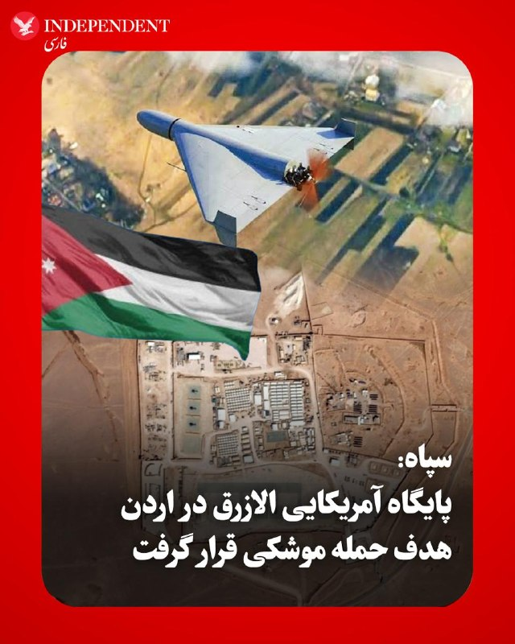

♦️خبرگزاری فارس، رسانه وابسته به سپاه پاسداران، اعلام کرد که  سپاه دقایقی قبل پایگاه آمریکایی الازرق در خاک اردن را هدف حمله موشکی قرار داده‌اند. این حمله موشکی در حالی صورت می‌گیرد که پیش از این نیز سپاه پاسداران با انتشار بیانیه‌ای رسمی اعلام کرده بود در پاسخ به حملات ایالات متحده، مقر فرماندهی ناوگان پنجم آمریکا در بحرین را هدف حملات خود قرار داده است. با این حملات، دامنه درگیری‌های نظامی در منطقه به شکل بی‌سابقه‌ای گسترش یافته است.
‌🇸🇦 Indypersian

🤖 @VahidOOnLine

## pm_afshaa — post 93256

  <a href="telegram/content/pm_afshaa_93256_1781056994.webm" target="_blank">🎬 Download video</a>

🔴وزارت کشور بحرین:
پس از حملات ایران، شرایط امنیتی به حالت عادی بازگشته و همه چیز امنه.

💧 Rainbet.com the #1 Non-KYC Crypto Casino & Sportsbook @rainbetcom

😁 @Pm_Afshaa

## pm_afshaa — post 93255

دریغ از یه برخورد عرزشی زجه بزن😂

## Shin_Persian — post 6846

Shin ✓ @hey_itsmyturn
Wed, 10 Jun 2026 02:02:26 UTC

NOW @ 0202Z -
Jet activity over Erbil, #Iraq 🇮🇶

ترجمه خودکار فارسی

هم‌اکنون در ۰۲۰۲ زولو (۰۵:۳۲ به وقت تهران) -
فعالیت جنگنده‌ها بر فراز اربیل، #Iraq 🇮🇶

𝕏 · @shin_persian

## Shin_Persian — post 6845

Shin ✓ @hey_itsmyturn
Wed, 10 Jun 2026 01:59:13 UTC

IRGC terror organization:

"Following the successful operation by the IRGC Navy, which targeted 21 objectives across US air and naval bases in the region and led to the downing of an MQ9 drone over Kangan County, and in response to the enemy's ongoing malevolence, the forces of Islam and the brave aerospace fighters of the IRGC have utilized their long-range solid-propellant missiles to strike and destroy four critical targets. These targets include F-35 fighter jet hangars at an airbase and the command and control center of the American army in Al-Azraq, Jordan.

Our forces are prepared to deliver a decisive and crushing response to any further aggression by the enemy. The consequences of any renewed aggression will rest squarely with the American enemy."

ترجمه خودکار فارسی

سازمان تروریستی سپاه پاسداران انقلاب اسلامی (IRGC):

«در پی عملیات موفقیت‌آمیز نیروی دریایی سپاه پاسداران (IRGC)، که ۲۱ هدف را در پایگاه‌های هوایی و دریایی آمریکا در منطقه مورد هدف قرار داد و منجر به سرنگونی یک پهپاد MQ9 بر فراز شهرستان کنگان شد، و در پاسخ به شرارت‌های مستمر دشمن، نیروهای اسلام و رزمندگان دلاور هوافضای سپاه پاسداران (IRGC) با استفاده از موشک‌های دوربرد سوخت جامد خود، چهار هدف حیاتی را مورد اصابت قرار داده و منهدم کردند. این اهداف شامل آشیانه‌های جنگنده F-35 در یک پایگاه هوایی و مرکز فرماندهی و کنترل ارتش آمریکا در الازرق اردن است.

نیروهای ما آماده‌اند تا به هرگونه تجاوز بیشتر از سوی دشمن، پاسخی قاطع و کوبنده بدهند. عواقب هرگونه تجاوز مجدد مستقیماً بر عهده دشمن آمریکایی خواهد بود.»

𝕏 · @shin_persian

## Shin_Persian — post 6844

  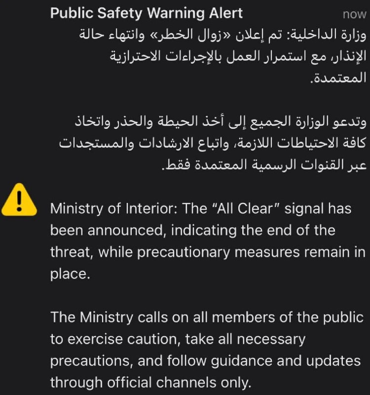

↩️ Quoted tweet: Shin ✓ @hey_itsmyturn Wed, 10 Jun 2026 01:28:55 UTC Bahrain MOI: Sirens sounded. Citizens and residents urged to remain calm, head to nearest safe place, and follow official channels. #Bahrain 🇧🇭 Source: @moi_bahrain https://x.com/moi…

## Shin_Persian — post 6843

↩️ Quoted tweet:
Shin ✓ @hey_itsmyturn
Wed, 10 Jun 2026 01:28:55 UTC

Bahrain MOI: Sirens sounded. Citizens and residents urged to remain calm, head to nearest safe place, and follow official channels.

#Bahrain 🇧🇭

Source: @moi_bahrain
https://x.com/moi_bahrain/status/2064520099243921819

↩️ توییت نقل‌قول شده — برای پاسخ، پست زیر را ببینید.

ترجمه خودکار فارسی

وزارت کشور بحرین: آژیرهای خطر به صدا درآمدند. از شهروندان و ساکنان درخواست می‌شود آرامش خود را حفظ کرده، به نزدیک‌ترین مکان امن بروند و کانال‌های رسمی را دنبال کنند.

#Bahrain 🇧🇭

منبع: @moi_bahrain
https://x.com/moi_bahrain/status/2064520099243921819

𝕏 · @shin_persian

## FarsiVOA — post 220206

⚡️لایحه جدید کنگره: پایان کمک‌های نظامی به عراق در صورت تداوم نفوذ گروه‌های نیابتی جمهوری اسلامی
@FarsiVOA

## BBCPersian — post 283302

🔻 آمریکا از حمله به ۲۰ هدف در بامداد چهارشنبه خبر داد

مقام‌های آمریکایی در گفتگو با شبکه فاکس درباره حملات هوایی بامداد چهارشنبه به نقاطی در جنوب ایران گفته اند از جمله این که در جریان این حملات که به نظر طی سه موج در فواصل زمانی کوتاه انجام شد «۲۰ هدف» مورد حمله قرار گرفته است.

ایران هدف قرار گرفتن نقاطی در شهرهای جنوبی این کشور چون جاسک و حوالی بندرعباس، میناب و روستاهای سیریک و کوه مبارک را تایید کرده است اما جزییاتی از تاسیسات یا نقاط مورد حمله قرار گرفته هنوز منتشر نکرده است.

در هرمزگان اما مقام‌های محلی از هدف قرار گرفتن دو منبع آب روستاهای سیریک خبر داده‌اند.

https://bbc.in/4uqpnfC
@BBCPersian

---
📅 بروزرسانی: 1405/03/20 05:23
---

## VahidOOnLine — post 244615

  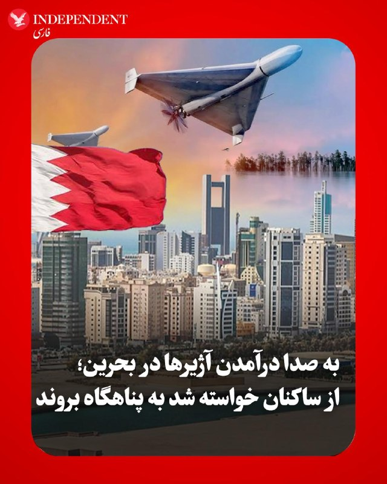

♦️به گزارش سی‌ان‌ان، بامداد چهارشنبه در بحرین آژیرها به صدا درآمد و از ساکنان خواسته شد به مکان‌های امن بروند.
در پیام وزارت کشور بحرین در اکس آمده است: «آژیر به صدا درآمده است. از شهروندان و ساکنان خواسته می‌شود آرامش خود را حفظ کرده و به نزدیک‌ترین مکان امن بروند.»
پیش از این، سپاه پاسداران اعلام کرده بود که در پاسخ به حملات آمریکا، ناوگان پنجم ایالات متحده در بحرین را هدف قرار داده است.
در بیانیه‌ای که تسنیم منتشر کرده، آمده است: «نیروهای دریایی سپاه پاسداران در ساعت ۲:۳۰ بامداد یک حمله پهپادی علیه ناوگان پنجم آمریکا در بحرین انجام دادند.»
‌🇸🇦 Indypersian

🤖 @VahidOOnLine

## VahidOOnLine — post 244614

  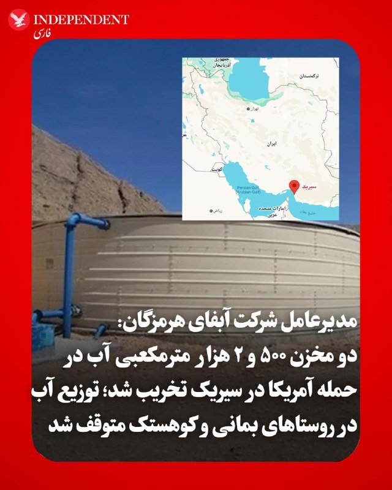

♦️حمزه‌پور، مدیرعامل شرکت آبفای هرمزگان اعلام کرد که به دنبال حمله‌های بامداد چهارشنبه آمریکا، دو مخزن آب در بخش بمانی شهرستان سیریک به طور کامل تخریب شده است. به گزارش مهر، این مخازن شامل یک مخزن ۵۰۰ متر مکعبی و یک مخزن ۲ هزار متر مکعبی بوده‌اند که نقش کلیدی در تأمین آب شرب بخش بمانی و شهر کوهستک ایفا می‌کردند. به گفته حمزه‌پور، در حال حاضر روند توزیع آب در تمامی روستاهای بخش بمانی و شهر کوهستک متوقف شده است و تیم‌های عملیاتی و مدیریت بحران آبفا در تلاش هستند تا اقدامات جایگزین برای تامین آب پایدار انجام شود.
‌🇸🇦 Indypersian

🤖 @VahidOOnLine

## FoxNewsTwitter — post 342787

  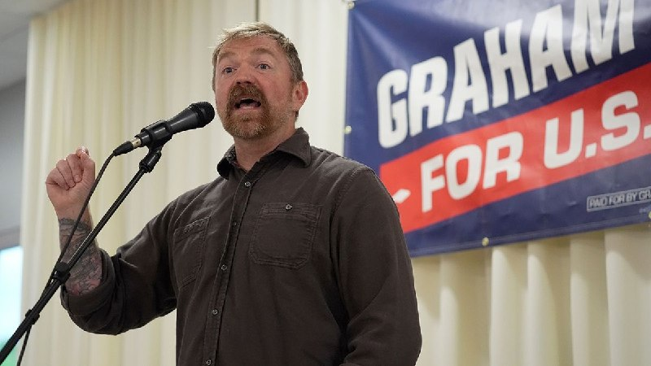

Fox News (Twitter/X)

BREAKING: Embattled Maine Democrat Graham Platner wins his party's nomination for Senate.

He will now face longtime Republican Senator Susan Collins in November.

The race is one of a handful across the country that will determine whether the GOP keeps control of its slim Senate majority.

## pm_afshaa — post 93254

  <a href="telegram/content/pm_afshaa_93254_1781056391.mp4" target="_blank">🎬 Download video</a>

موشکایی که به سمت پایگاه الازق اردن شلیک شده بودن همشون رهگیری شدن

💧 Rainbet.com the #1 Non-KYC Crypto Casino & Sportsbook @rainbetcom

😁 @Pm_Afshaa

## pm_afshaa — post 93253

  <a href="telegram/content/pm_afshaa_93253_1781056394.webm" target="_blank">🎬 Download video</a>

🔴فارس: سپاه پاسداران دقایقی پیش پایگاه آمریکایی الازرق در اردن رو هدف حملۀ موشکی قرار داد. 
💧 Rainbet.com the #1 Non-KYC Crypto Casino & Sportsbook @rainbetcom 
😁 @Pm_Afshaa

## pm_afshaa — post 93252

کاش به حرف پزشکیان گوش کرده بودیم پایتختو برده بودیم بوشهر

## pm_afshaa — post 93251

  <a href="telegram/content/pm_afshaa_93251_1781056395.webm" target="_blank">🎬 Download video</a>

🔴فارس: سپاه پاسداران دقایقی پیش پایگاه آمریکایی الازرق در اردن رو هدف حملۀ موشکی قرار داد.

💧 Rainbet.com the #1 Non-KYC Crypto Casino & Sportsbook @rainbetcom

😁 @Pm_Afshaa

## pm_afshaa — post 93250

  <a href="telegram/content/pm_afshaa_93250_1781056396.webm" target="_blank">🎬 Download video</a>

🔴مشاور رسانه‌ای پادشاه بحرین: پدافندهای هوایی بحرین حملات ایران رو دفع کردن.

💧 Rainbet.com the #1 Non-KYC Crypto Casino & Sportsbook @rainbetcom

😁 @Pm_Afshaa

## pm_afshaa — post 93249

  <a href="telegram/content/pm_afshaa_93249_1781056397.mp4" target="_blank">🎬 Download video</a>

گوشه سمت راست و بالای ویدیو اصابت یک موشک معلومه

💧 Rainbet.com the #1 Non-KYC Crypto Casino & Sportsbook @rainbetcom

😁 @Pm_Afshaa

## VahidOnline — post 76129

توییت اکانت وزارت کشور بحرین، ترجمه ماشین:
آژیر هشدار به صدا درآمده است. از شهروندان و افراد مقیم درخواست می‌شود آرامش خود را حفظ کنند، به نزدیک‌ترین مکان امن بروند و اخبار را از طریق کانال‌های رسمی دنبال کنند.
moi_bahrain

📡 @VahidOnline

## kianmeli1 — post 87840

🔴سپاه پاسداران دقایقی قبل پایگاه آمریکایی الازرق در اردن را هدف حملۀ موشکی قرار داد.
https://t.me/kianmeli1

## kianmeli1 — post 87839

  <a href="telegram/content/kianmeli1_87839_1781056399.mp4" target="_blank">🎬 Download video</a>

🔴لحظه اصابت موشک به پایگاه ناوگان پنجم نیروی دریایی آمریکا در بحرین
https://t.me/kianmeli1

## Shin_Persian — post 6842

  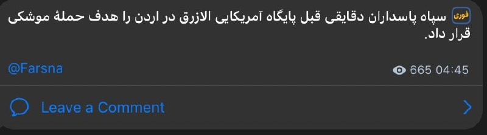

Shin ✓ @hey_itsmyturn
Wed, 10 Jun 2026 01:48:29 UTC

IRGC-owned Fars News:
"The IRGC has targeted Al Azraq [Air] Base in Jordan."

ترجمه خودکار فارسی

خبرگزاری فارس متعلق به سپاه پاسداران:
«سپاه پاسداران انقلاب اسلامی پایگاه [هوایی] الازرق در اردن را هدف قرار داده است.»

𝕏 · @shin_persian

## Shin_Persian — post 6841

  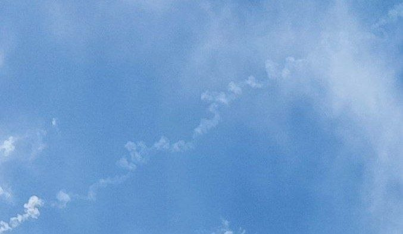

Shin ✓ @hey_itsmyturn
Wed, 10 Jun 2026 01:42:40 UTC

0121Z
Isfahan Province, Iran

ترجمه خودکار فارسی

۰۱۲۱ زولو (۰۴:۵۱ به وقت تهران)
استان اصفهان، ایران

𝕏 · @shin_persian

## FarsiVOA — post 220205

  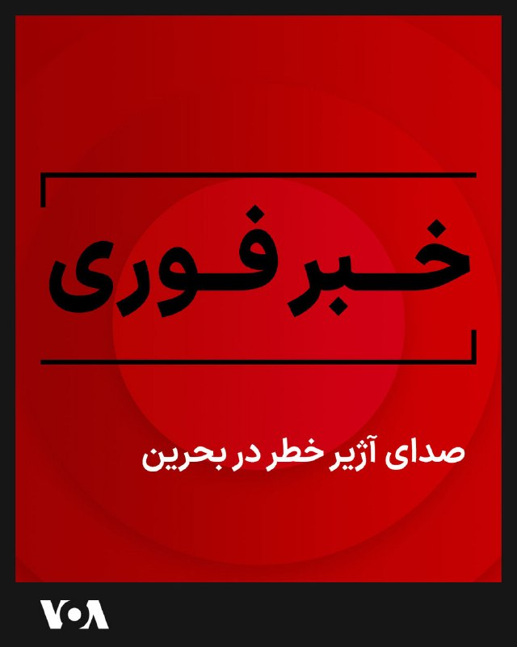

⚡️وزارت کشور بحرین دقایقی قبل از به صدا در آمدن آژیر خطر در این کشور خبر داد. این در حالی است که ایالات متحده اعلام کرد که حمله دفاعی خود به سایت‌های نظامی حکومت ایران را که در واکنش به سرنگونی هلی‌کوپتر آپاچی توسط جمهوری اسلامی آغاز کرده بود، به پایان رسانده است.

@FarsiVOA

---
📅 بروزرسانی: 1405/03/20 05:12
---

## VahidOOnLine — post 244613

  <a href="telegram/content/VahidOOnLine_244613_1781055778.mp4" target="_blank">🎬 Download video</a>

رسانه‌های اجتماعی وابسته به جمهوری اسلامی ویدیویی منتشر کرده‌اند که نشان می‌دهد یک پهپاد جمهوری اسلامی از فراز آسمان عراق به‌سوی هدفی در حال پرواز است.
فرماندهی مرکزی ایالات متحده، سنتکام، ساعاتی پیش با انتشار اطلاعیه‌ای در شبکه اجتماعی ایکس اعلام کرد در پاسخ به سرنگونی یک هلیکوپتر آپاچی آمریکا، حملاتی را در دفاع از خود علیه ایران آغاز کرده است.
سنتکام تاکید کرد که این عملیات، پاسخی متناسب به تجاوز غیرموجه ایران است.
رسانه‌های داخلی نیز از حملات به قشم، سیریک، جاسک، کوه مبارکه و بندرعباس خبر دادند.
گزارش‌های منتشرشده حاکی است سپاه پاسداران حملات موشکی و پهپادی را در منطقه آغاز کرده است.
‌🏁 🇬🇧 IranintlTV

🤖 @VahidOOnLine

## pm_afshaa — post 93248

  <a href="telegram/content/pm_afshaa_93248_1781055779.webm" target="_blank">🎬 Download video</a>

🔴تسنیم: انفجارها در بحرین قطع نمیشه و تا الان صدای 16 انفجار شنیده شده. 
💧 Rainbet.com the #1 Non-KYC Crypto Casino & Sportsbook @rainbetcom 
😁 @Pm_Afshaa

## pm_afshaa — post 93247

  <a href="telegram/content/pm_afshaa_93247_1781055780.webm" target="_blank">🎬 Download video</a>

🔴تسنیم: انفجارها در بحرین قطع نمیشه و تا الان صدای 16 انفجار شنیده شده.

💧 Rainbet.com the #1 Non-KYC Crypto Casino & Sportsbook @rainbetcom

😁 @Pm_Afshaa

## pm_afshaa — post 93246

  <a href="telegram/content/pm_afshaa_93246_1781055780.webm" target="_blank">🎬 Download video</a>

🔴برخی منابع خبر دادن که تمامی موشک‌ها رهگیری شدن.

💧 Rainbet.com the #1 Non-KYC Crypto Casino & Sportsbook @rainbetcom

😁 @Pm_Afshaa

## pm_afshaa — post 93245

  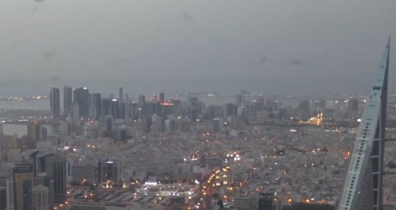

پدافند بحرین فعال برای رهگیری موشک

💧 Rainbet.com the #1 Non-KYC Crypto Casino & Sportsbook @rainbetcom

😁 @Pm_Afshaa

## pm_afshaa — post 93244

پدافند بحرین فعال شد.

💧 Rainbet.com the #1 Non-KYC Crypto Casino & Sportsbook @rainbetcom

😁 @Pm_Afshaa

## pm_afshaa — post 93243

🔴فاکس نیوز به نقل از یک مقام ارشد آمریکایی: ارتش ایالات متحده آماده واکنش در صورت تصمیم ایران به حمله متقابل است

💧 Rainbet.com the #1 Non-KYC Crypto Casino & Sportsbook @rainbetcom

😁 @Pm_Afshaa

## Shin_Persian — post 6839

Shin ✓ @hey_itsmyturn
Wed, 10 Jun 2026 01:33:58 UTC

Interceptions over #Bahrain 🇧🇭
Cameraperson tells me all of the UAVs were intercepted.

ترجمه خودکار فارسی

رهگیری‌ها بر فراز #Bahrain 🇧🇭
فیلمبردار به من می‌گوید تمام پهپادها رهگیری شدند.

𝕏 · @shin_persian

## FarsiVOA — post 220204

⚡️احضار حدود ۳۰ سینماگر به دادسرای فرهنگ و رسانه به دلیل اعتراض به کشتار و سرکوب معترضان
@FarsiVOA

## BBCPersian — post 283301

🔻 آژیرهای خطر در بحرین به صدا درآمدند

آژیر خطر در بحرین به صدا در آمده است.

وزارت کشور بحرین از مردم خواسته تا «آرامش خود را حفظ کرده و به نزدیکترین مکان امن بروند».

پیش از این سپاه پاسداران اعلام کرده بود که به پایگاه نیروی دریایی آمریکا در بحرین حمله کرده است.

https://bbc.in/4aj1hfy
@BBCPersian

## BBCPersian — post 283300

🔻 سپاه پاسداران می‌گوید یک پهپاد آمریکا را در شمال خلیج فارس سرنگون کرده است

سپاه پاسداران گفته «در جریان درگیری‌های هوایی جاری در تنگه هرمز یک فروند پهپاد ام‌کیو۹» را سرنگون کرده است.

به گفته سپاه این پهپاد «از آسمان شمال خلیج فارس قصد نزدیک شدن و مداخله در صحنه نبرد را داشت.»

رسانه‌های ایران به نقل سپاه نوشته است که این پهپاد «در آسمان شهرستان جم استان بوشهر مورد اصابت» قرار گرفته و «منهدم» شده است.

سنتکام هنوز واکنشی به این ادعا نداده است.

https://bbc.in/4ojSP5p
@BBCPersian

## BBCPersian — post 283299

🔻 مدیرعامل آب هرمزگان: در پی حملات آمریکا آب بخش بمانی و شهر کوهستک قطع شده است

مدیرعامل شرکت آب و فاضلاب استان هرمزگان گفته است در پی حملات بامداد امروز آمریکا «زیرساخت‌های حیاتی توزیع آب در شهرستان سیریک» تخریب شده است.

عبدالحمید حمزه پور گفته در این حملات «دو مخزن استراتژیک آب در بخش بمانی هدف قرار گرفته و به طور کامل تخریب شدند ... که نقش کلیدی در تأمین آب شرب بخش بمانی و شهر کوهستک ایفا می‌کردند.»

به گفته او «در حال حاضر روند توزیع آب در تمامی روستاهای بخش بمانی و شهر کوهستک متوقف شده است.»

https://bbc.in/4ofYgCm
@BBCPersian

---
📅 بروزرسانی: 1405/03/20 05:03
---

## VahidOOnLine — post 244612

  

منابع پاکستانی بامداد چهارشنبه به «افغانستان‌اینترنشنال» گفتند که این کشور حملات هوایی را علیه آنچه «اردوگاه‌ها و زیرساخت‌های تروریستی» خوانده‌ است، در ولایت‌های خوست، پکتیکا و کنر انجام داده‌ است.
تاکنون درباره اهداف مورد نظر و تلفات یا خسارات احتمالی ناشی از آن‌ها جزییات دقیقی ارائه نشده است. مقامات محلی طالبان نیز تا این لحظه درباره این رویدادها ابراز نظر نکرده‌اند.

‌🏁 🇬🇧 IranintlTV

🤖 @VahidOOnLine

## FoxNewsTwitter — post 342786

  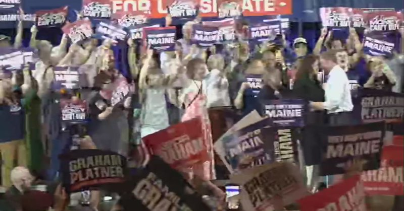

Fox News (Twitter/X)

WATCH LIVE: Graham Platner speaks at primary election headquarters in Maine https://twitter.com/i/broadcasts/1OGwbbpPvqWKB

## pm_afshaa — post 93242

بحرین آژیر خطر حمله فعال شد. 
💧 Rainbet.com the #1 Non-KYC Crypto Casino & Sportsbook @rainbetcom 
😁 @Pm_Afshaa

## pm_afshaa — post 93241

بحرین آژیر خطر حمله فعال شد.

💧 Rainbet.com the #1 Non-KYC Crypto Casino & Sportsbook @rainbetcom

😁 @Pm_Afshaa

## pm_afshaa — post 93240

  <a href="telegram/content/pm_afshaa_93240_1781055227.webm" target="_blank">🎬 Download video</a>

🔴ساعتی پیش در شبکه خبر، یهویی کلیپ شبیه سازی انفجار بمب هسته‌ای پخش شد! 
💧 Rainbet.com the #1 Non-KYC Crypto Casino & Sportsbook @rainbetcom 
😁 @Pm_Afshaa

## pm_afshaa — post 93239

  <a href="telegram/content/pm_afshaa_93239_1781055228.webm" target="_blank">🎬 Download video</a>

🔴یک مقام ارشد آمریکایی به فاکس نیوز: وضعیت همچنان فعاله و نیروهای نظامی آمریکا آماده پاسخگویی در صورت تصمیم ایران به تلافی هستند. 
💧 Rainbet.com the #1 Non-KYC Crypto Casino & Sportsbook @rainbetcom 
😁 @Pm_Afshaa

## pm_afshaa — post 93238

شلیک موشک از الیگودرز لرستان 
💧 Rainbet.com the #1 Non-KYC Crypto Casino & Sportsbook @rainbetcom 
😁 @Pm_Afshaa

## pm_afshaa — post 93237

  <a href="telegram/content/pm_afshaa_93237_1781055229.webm" target="_blank">🎬 Download video</a>

🔴یک مقام ارشد آمریکایی به فاکس نیوز:
وضعیت همچنان فعاله و نیروهای نظامی آمریکا آماده پاسخگویی در صورت تصمیم ایران به تلافی هستند.

💧 Rainbet.com the #1 Non-KYC Crypto Casino & Sportsbook @rainbetcom

😁 @Pm_Afshaa

## VahidOnline — post 76128

  

خبرنگار فاکس‌ نیوز، جنیفر گریفین می‌گوید که یک مقام ارشد آمریکایی به او گفت که سه‌شنبه شب به وقت واشنگتن ۲۰ هدف در داخل ایران هدف قرار گرفت. این مقام گفت اگرچه حملات آمریکا به گفته سنتکام پایان یافته است، ارتش آمریکا آماده است تا در صورت تصمیم جمهوری اسلامی برای تلافی، واکنش نشان دهد.
@VahidHeadline

📡 @VahidOnline

## IranIntlTV — post 341431

  <a href="telegram/content/IranIntlTV_341431_1781055230.mp4" target="_blank">🎬 Download video</a>

رسانه‌های اجتماعی وابسته به جمهوری اسلامی ویدیویی منتشر کرده‌اند که نشان می‌دهد یک پهپاد جمهوری اسلامی از فراز آسمان عراق به‌سوی هدفی در حال پرواز است.
فرماندهی مرکزی ایالات متحده، سنتکام، ساعاتی پیش با انتشار اطلاعیه‌ای در شبکه اجتماعی ایکس اعلام کرد در پاسخ به سرنگونی یک هلیکوپتر آپاچی آمریکا، حملاتی را در دفاع از خود علیه ایران آغاز کرده است.
سنتکام تاکید کرد که این عملیات، پاسخی متناسب به تجاوز غیرموجه ایران است.
رسانه‌های داخلی نیز از حملات به قشم، سیریک، جاسک، کوه مبارکه و بندرعباس خبر دادند.
گزارش‌های منتشرشده حاکی است سپاه پاسداران حملات موشکی و پهپادی را در منطقه آغاز کرده است.

## IranIntlTV — post 341430

  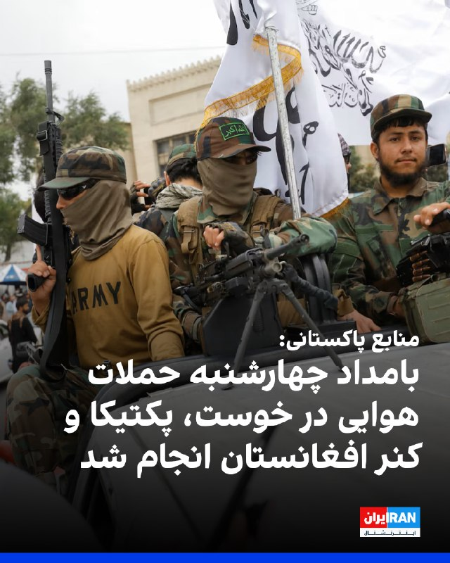

منابع پاکستانی بامداد چهارشنبه به «افغانستان‌اینترنشنال» گفتند که این کشور حملات هوایی را علیه آنچه «اردوگاه‌ها و زیرساخت‌های تروریستی» خوانده‌ است، در ولایت‌های خوست، پکتیکا و کنر انجام داده‌ است.
تاکنون درباره اهداف مورد نظر و تلفات یا خسارات احتمالی ناشی از آن‌ها جزییات دقیقی ارائه نشده است. مقامات محلی طالبان نیز تا این لحظه درباره این رویدادها ابراز نظر نکرده‌اند.

https://iranintl.com/202606104572

## Shin_Persian — post 6838

Shin ✓ @hey_itsmyturn
Wed, 10 Jun 2026 01:30:28 UTC

Blasts heard in #Bahrain 🇧🇭

ترجمه خودکار فارسی

صدای انفجارهایی در #Bahrain 🇧🇭 شنیده شد.

𝕏 · @shin_persian

## Shin_Persian — post 6837

Shin ✓ @hey_itsmyturn
Wed, 10 Jun 2026 01:28:55 UTC

Bahrain MOI: Sirens sounded. Citizens and residents urged to remain calm, head to nearest safe place, and follow official channels.

#Bahrain 🇧🇭

Source: @moi_bahrain
https://x.com/moi_bahrain/status/2064520099243921819

ترجمه خودکار فارسی

وزارت کشور بحرین: آژیرهای خطر به صدا درآمدند. از شهروندان و ساکنان درخواست می‌شود آرامش خود را حفظ کنند، به نزدیک‌ترین مکان امن بروند و کانال‌های رسمی را دنبال کنند.

#Bahrain 🇧🇭

منبع: @moi_bahrain
https://x.com/moi_bahrain/status/2064520099243921819

𝕏 · @shin_persian

## FarsiVOA — post 220203

  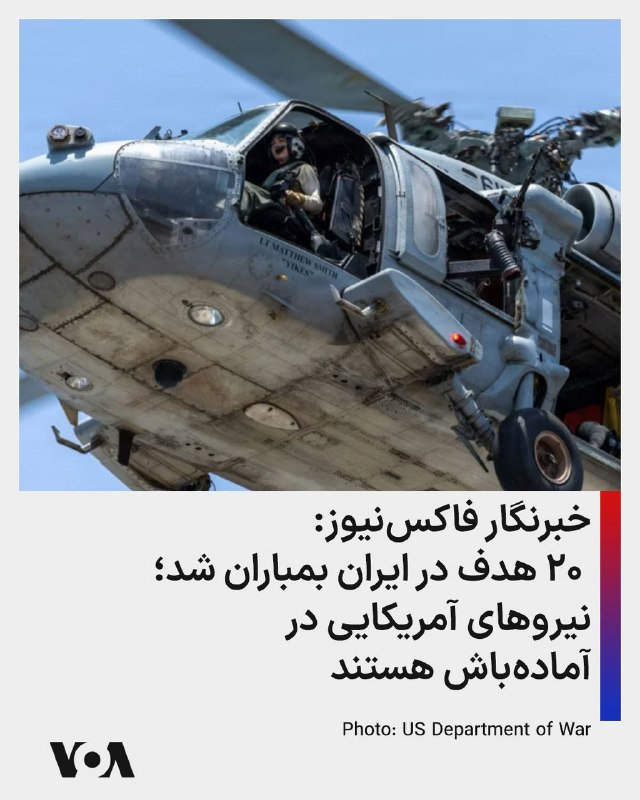

⚡️خبرنگار فاکس‌ نیوز، جنیفر گریفین می‌گوید که یک مقام ارشد آمریکایی به او گفت که سه‌شنبه شب به وقت واشنگتن ۲۰ هدف در داخل ایران هدف قرار گرفت. این مقام گفت اگرچه حملات آمریکا به گفته سنتکام پایان یافته است، ارتش آمریکا آماده است تا در صورت تصمیم جمهوری اسلامی برای تلافی، واکنش نشان دهد.
@FarsiVOA

## DW_Farsi — post 125750

  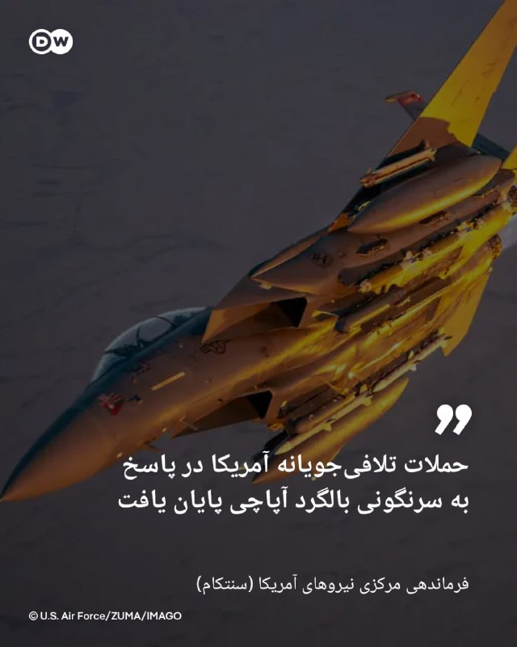

🔶 سنتکام: حملات تلافی‌جویانه آمریکا در پاسخ به سرنگونی بالگرد آپاچی پایان یافت

فرماندهی مرکزی نیروهای آمریکا (سنتکام) بامداد چهارشنبه ۱۰ ژوئن با انتشار بیانیه‌ای رسمی اعلام کرد، حملات تلافی‌جویانه و تکمیلی نیروهای ارتش ایالات متحده علیه مواضعی در ایران به پایان رسیده است.

بنا بر این بیانیه، این عملیات که به دستور مستقیم دونالد ترامپ، رئیس‌جمهور آمریکا انجام شد، پاسخی به سرنگونی یک فروند بالگرد آپاچی ارتش آمریکا از سوی ایران در روز سه‌شنبه ۹ ژوئن بوده است.

به گزارش سنتکام، جنگنده‌های نیروی هوایی و نیروی دریایی ایالات متحده با استفاده از مهمات هوشمند و دقیق، پدافند هوایی، ایستگاه‌های کنترل زمینی و رادارهای نظارتی ایران را در نزدیکی تنگه هرمز هدف قرار دادند.

ارتش آمریکا این عملیات را یک پاسخ متناسب به حملات اخیر علیه نیروهای آمریکایی و کشتی‌های تجاری بین‌المللی در حال تردد در آب‌های منطقه خواند.

در پایان این بیانیه تاکید شده است که نیروهای آمریکایی همچنان در وضعیت آماده‌باش کامل قرار دارند و برای دفاع در برابر آنچه اقدامات تجاوزکارانه و توجیه‌ناپذیر ایران نامیده شده، آمادگی دارند.
@dw_farsi

## IranianMinds — post 22055

مثل اینکه خبری نیست موشکا ایندفه مارمولکارم نتونسن هدف قرار بدن بریم بخوابیم

## BBCPersian — post 283298

🔻 قرارگاه خاتم‌الانبیاء: پایگاه‌های آمریکا در منطقه هدف قرار گرفتند

قرارگاه خاتم الانبیاء که مدیریت جنگ در ایران را بر عهده دارد، ساعتی بعد از حملات آمریکا به نقاطی در جنوب ایران با صدور اطلاعیه‌ای اعلام کرد: «در پاسخ به تجاوز ارتش تروریست آمریکا در مناطقی از جنوب کشور به بهانه واهی سقوط بالگرد خود، برخی از پایگاه‌های آمریکا در منطقه هدف هجوم قدرتمند ارتش قهرمان جمهوری اسلامی و دلاورمردان سپاه پاسداران انقلاب اسلامی قرار گرفت.»

در این بیانیه هشدار داده شده است که در صورت ادامه حملات آمریکا «پاسخ‌های سهمگین‌تری» از سوی ایران داده خواهد شد.

https://bbc.in/3Qflqwj
@BBCPersian

---
📅 بروزرسانی: 1405/03/20 04:52
---

## VahidOOnLine — post 244611

  

ستاد فرماندهی مرکزی آمریکا، سنتکام، اعلام کرد عملیات جدید خود علیه جمهوری اسلامی را که در پاسخ به سرنگون شدن یک بالگرد آپاچی ارتش آمریکا انجام داد، به پایان رسانده است.
طبق اعلام سنتکام، نیروهای آمریکا با استفاده از مهمات دقیق که از جنگنده‌های نیروی هوایی و نیروی دریایی آمریکا شلیک شد، سامانه‌های پدافند هوایی، ایستگاه‌های کنترل زمینی و سایت‌های راداری نظارتی جمهوری اسلامی در نزدیکی تنگه هرمز را هدف قرار دادند.
سنتکام این عملیات را پاسخی متناسب به حملات اخیر علیه نیروهای آمریکایی و کشتی‌های تجاری بین‌المللی در حال عبور از آب‌های منطقه توصیف کرد.
سنتکام تاکید کرد نیروهای آمریکایی همچنان در حالت آماده‌باش باقی مانده‌اند و برای دفاع در برابر «تجاوز غیرموجه» جمهوری اسلامی آمادگی دارند.

‌🏁 🇬🇧 IranintlTV

🤖 @VahidOOnLine

## FoxNewsTwitter — post 342785

  

Fox News (Twitter/X)

"A chance for change."

Steve Hilton celebrated advancing to California's gubernatorial general election after securing a spot in the state's top-two primary.

The Trump-backed Republican will now face former Biden Cabinet secretary Xavier Becerra in a high-stakes race to succeed Gov. Gavin Newsom.

## FoxNewsTwitter — post 342784

  <a href="telegram/content/FoxNewsTwitter_342784_1781054580.mp4" target="_blank">🎬 Download video</a>

Fox News (Twitter/X)

RT @JesseBWatters: 🚨 BREAKING: JURY SENTENCES KARMELO ANTHONY TO 35 YEARS BEHIND BARS 🚨

## pm_afshaa — post 93236

  

شلیک موشک از الیگودرز لرستان

💧 Rainbet.com the #1 Non-KYC Crypto Casino & Sportsbook @rainbetcom

😁 @Pm_Afshaa

## pm_afshaa — post 93235

سد مجید خوابه؟

## pm_afshaa — post 93234

  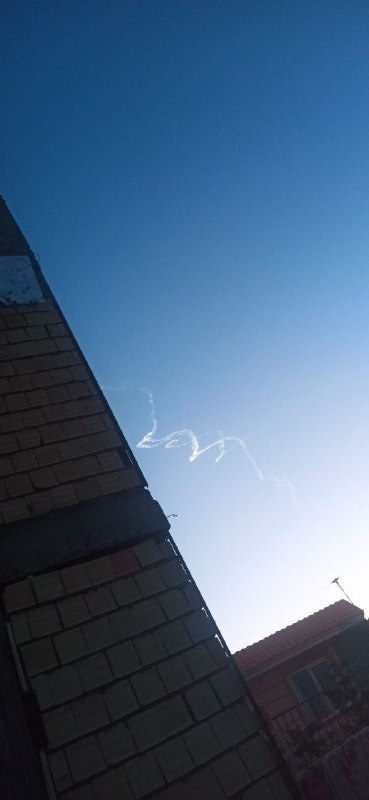

پرتاب موشک از الیگودرز لرستان :

💧 Rainbet.com the #1 Non-KYC Crypto Casino & Sportsbook @rainbetcom

😁 @Pm_Afshaa

## pm_afshaa — post 93233

  <a href="telegram/content/pm_afshaa_93233_1781054583.webm" target="_blank">🎬 Download video</a>

🔴گویا 6 موشک تا الان شلیک شده.

💧 Rainbet.com the #1 Non-KYC Crypto Casino & Sportsbook @rainbetcom

😁 @Pm_Afshaa

## pm_afshaa — post 93232

  <a href="telegram/content/pm_afshaa_93232_1781054584.mp4" target="_blank">🎬 Download video</a>

پرتاب موشک از خمین :

💧 Rainbet.com the #1 Non-KYC Crypto Casino & Sportsbook @rainbetcom

😁 @Pm_Afshaa

## pm_afshaa — post 93231

شلیک موشک خمین و لرستان

## VahidOnline — post 76127

  

قرارگاه مرکزی خاتم الانبیا اعلام کرد ارتش و سپاه در پاسخ به حمله‌های جدید آمریکا علیه جمهوری اسلامی، برخی از پایگاه‌های آمریکا در منطقه هدف حمله‌های قرار دادند.
این قرارگاه تاکید کرد در صورت تکرار حملات آمریکا، جمهوری اسلامی «حملات سهمگین و گسترده‌تری» علیه بانک اهداف تعیین شده در منطقه انجام خواهد شد.

@VahidOOnLine

📡 @VahidOnline

## IranIntlTV — post 341429

  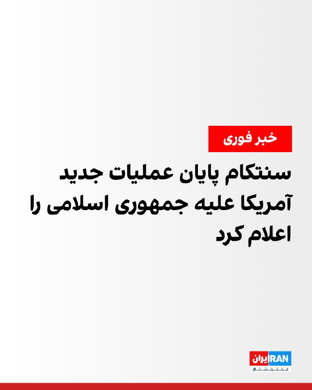

ستاد فرماندهی مرکزی آمریکا، سنتکام، اعلام کرد عملیات جدید خود علیه جمهوری اسلامی را که در پاسخ به سرنگون شدن یک بالگرد آپاچی ارتش آمریکا انجام داد، به پایان رسانده است.
طبق اعلام سنتکام، نیروهای آمریکا با استفاده از مهمات دقیق که از جنگنده‌های نیروی هوایی و نیروی دریایی آمریکا شلیک شد، سامانه‌های پدافند هوایی، ایستگاه‌های کنترل زمینی و سایت‌های راداری نظارتی جمهوری اسلامی در نزدیکی تنگه هرمز را هدف قرار دادند.
سنتکام این عملیات را پاسخی متناسب به حملات اخیر علیه نیروهای آمریکایی و کشتی‌های تجاری بین‌المللی در حال عبور از آب‌های منطقه توصیف کرد.
سنتکام تاکید کرد نیروهای آمریکایی همچنان در حالت آماده‌باش باقی مانده‌اند و برای دفاع در برابر «تجاوز غیرموجه» جمهوری اسلامی آمادگی دارند.

https://iranintl.com/202606103042

## Shin_Persian — post 6836

  <a href="telegram/content/Shin_Persian_6836_1781054586.mp4" target="_blank">🎬 Download video</a>

Shin ✓ @hey_itsmyturn
Wed, 10 Jun 2026 01:11:06 UTC

Via @Vahid:
0106Z - 3 BMs launched from Khomein, Markaz Province, #Iran

ترجمه خودکار فارسی

به نقل از @Vahid:
۰۱۰۶ زولو (۰۴:۳۶ به وقت تهران) - شلیک ۳ فروند موشک بالستیک از خمین، استان مرکزی، #Iran_

𝕏 · @shin_persian

## Iliaen — post 4468

ساعت حدود ۰۴:۳۰ صبح چهارشنبه؛ جمهوری اسلامی چندین موشک بالستیک را از نقاط مختلف ایران به سمت اهدافی نامشخص پرتاب کرد.

@iliaen

## FarsiVOA — post 220202

🔺آمریکا می‌گوید «حمله دفاعی» آن در واکنش به حمله جمهوری اسلامی به هلی‌کوپتر آپاچی تکمیل شد

▪️ستاد فرماندهی مرکزی آمریکا،‌ سنتکام، در بیانیه‌ای که سه‌شنبه شب به وقت واشنگتن صادر کرد گفت نیروهای آمریکایی حملاتی را در تاریخ ۹ ژوئن، به دستور فرمانده کل قوا و در پاسخ به سرنگونی روز دوشنبه یک هلیکوپتر آپاچی ارتش ایالات متحده آغاز کرده‌ بودند، تکمیل کردند.

⬇️ بیشتر بخوانید:
https://ir.voanews.com/a/8159284.html
@FarsiVOA

## DW_Farsi — post 125749

  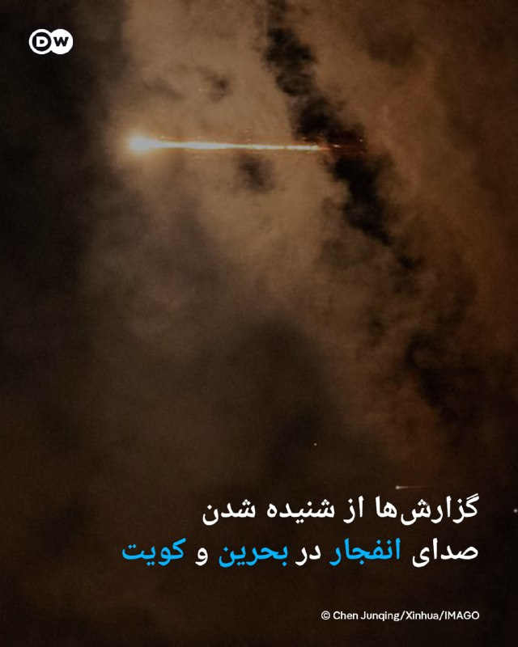

🔶 گزارش‌ها از شنیده شدن صدای انفجار در بحرین و کویت

در پی آغاز دور جدیدی از حملات ارتش ایالات متحده به مواضعی در جنوب ایران، گزارش‌ها از برقراری بالاترین سطح هشدار در پایگاه‌های نظامی آمریکا در کشورهای حوزه خلیج فارس و شنیده شدن صدای انفجارهای شدید در بحرین و کویت حکایت دارد.

به گزارش ایرنا، صداهای انفجار شدیدی در بحرین و کویت شنیده شده است. هنوز جزئیات بیشتری درباره علت این انفجارها یا اهداف احتمالی منتشر نشده است.

این تحولات پس از آن رخ می‌دهد که فرماندهی مرکزی نیروهای آمریکا در خاورمیانه (سنتکام) رسما اعلام کرد، ارتش این کشور حملات تلافی‌جویانه‌ای را در پاسخ به سرنگونی یک بالگرد آپاچی خود علیه ایران آغاز کرده است.

📌تصویر از آرشیو
@dw_farsi

## IranianMinds — post 22053

این موشکا کجا میرن دقیقا؟ نکنه دارن آدم فضایی شکار میکنن چون نه رهگیری میشن نه خبر انفجار از جایی هست

## IranianMinds — post 22052

  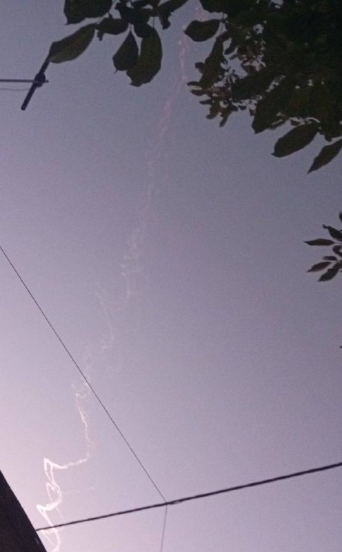

شلیک موشک از الیگودرز لرستان

@IranianMinds

## IranianMinds — post 22051

  <a href="telegram/content/IranianMinds_22051_1781054587.mp4" target="_blank">🎬 Download video</a>

شلیک موشک از خمین

@IranianMinds

## IranianMinds — post 22050

گزارشاتتونو بفرستید

@AmanWiths

## IranianMinds — post 22049

سپاه دوباره از خمین چن تا آبگرمکن شلیک کرد @IranianMinds

## IranianMinds — post 22048

سپاه دوباره از خمین چن تا آبگرمکن شلیک کرد

@IranianMinds

## BBCPersian — post 283297

🔻سنتکام از پایان این دور حملاتش به ایران خبر داد: پاسخ ما به ایران در پی سرنگون کردن بالگرد پایان یافت

سنتکام، سرفرماندهی ارتش آمریکا اعلام کرد که حملاتش به ایران در پاسخ به سرنگون کردن بالگرد آپاچی پایان یافته است.

سنتکام در پستی در شبکه اجتماعی ایکس نوشت: «نیروهای فرماندهی مرکزی ایالات متحده با مهمات دقیق از جنگنده‌های نیروی هوایی و دریایی ایالات متحده، به پدافند هوایی، ایستگاه‌های کنترل زمینی و سایت‌های رادار نظارتی ایران در نزدیکی تنگه هرمز حمله کردند.»

آمریکا گفته که «این عملیات پاسخی متناسب به حملات اخیر به نیروهای آمریکایی و کشتی‌های تجاری بین‌المللی در حال عبور از آب‌های منطقه‌ای بود.»

سنتکام در پایان هم تاکید کرده که ارتش آمریکا «آماده دفاع در برابر تجاوز بی‌دلیل ایران» است.
https://bbc.in/4fAMoZF
@BBCPersian

## BBCPersian — post 283296

🔻سپاه پاسداران از حمله به پایگاه نیروی دریایی آمریکا در بحرین خبر داد

خبرگزاری تسنیم به نقل از سپاه پاسداران نوشته است: «در پاسخ به حرکت شرارت آمیز دشمن، رزمندگان نیروی دریایی سپاه ساعت ۲.۳۰ دقیقه بامداد ناوگان پنجم دریایی بحرین را مورد حمله پهپادی قرار دادند.»

در بیانیه سپاه پاسداران که بامداد چهارشنبه منتشر شد آمده است: «رژیم جنگ افروز آمریکا در اوایل بامداد امروز با بهانه های واهی چند نقطه در جاسک، سیریک و قشم را مورد حمله قرار داد که به یک دکل مخابراتی در سیریک خساراتی وارد آمد و دو مخزن آب بخش بمانی این شهرستان منهدم شد. در پاسخ به این حرکت شرارت آمیز دشمن، رزمندگان نیروی دریایی سپاه ساعت ۲.۳۰ دقیقه بامداد ناوگان پنجم دریایی بحرین را مورد حمله پهپادی قرار دادند.»

در بیانیه سپاه از «ادامه درگیری‌ها» خبر داده شده و آمده است: «در صورت ادامه شرارت، پاسخ‌های سنگین‌تری در راه است.»

پیش از این هم خبرگزاری‌های نزدیک به سپاه پاسداران تصاویری از مشاهده پهپاد در آسمان عراق منتشر کرده و تلویحا آنها را در «مسیر حمله و واکنش به حملات آمریکا» خوانده بودند.
https://bbc.in/4fAMoZF
@BBCPersian

---
📅 بروزرسانی: 1405/03/20 04:42
---

## VahidOOnLine — post 244610

  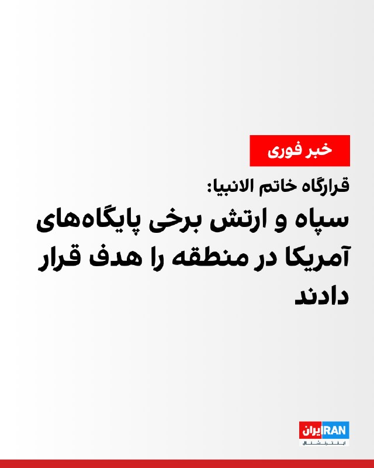

قرارگاه مرکزی خاتم الانبیا اعلام کرد ارتش و سپاه در پاسخ به حمله‌های جدید آمریکا علیه جمهوری اسلامی، برخی از پایگاه‌های آمریکا در منطقه هدف حمله‌های قرار دادند.
این قرارگاه تاکید کرد در صورت تکرار حملات آمریکا، جمهوری اسلامی «حملات سهمگین و گسترده‌تری» علیه بانک اهداف تعیین شده در منطقه انجام خواهد شد.

‌🏁 🇬🇧 IranintlTV

🤖 @VahidOOnLine

## VahidOOnLine — post 244609

  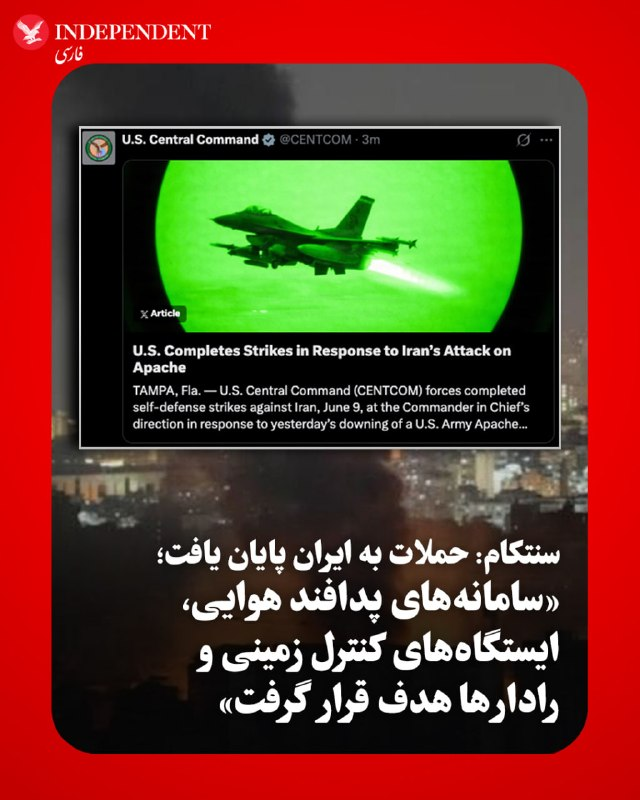

♦️فرماندهی مرکزی ایالات متحده (سنتکام) با انتشار بیانیه‌ای رسمی از تکمیل حملات نظامی خود علیه ایران خبر داد و اعلام کرد: «نیروهای سنتکام به دستور فرمانده کل قوا و در پاسخ به سرنگونی روز گذشته یک هلیکوپتر آپاچی ارتش آمریکا، حملات دفاع از خود را علیه ایران به پایان رساندند.» سنتکام با تشریح اهداف این عملیات افزود: «نیروهای ما با استفاده از مهمات هوشمند و دقیق جنگنده‌های نیروی هوایی و دریایی ایالات متحده، سامانه‌های پدافند هوایی، ایستگاه‌های کنترل زمینی و سایت‌های رادار نظارتی ایران را در نزدیکی تنگه هرمز هدف قرار دادند؛ این عملیات یک پاسخ متناسب به حملات اخیر به نیروهای آمریکایی و کشتی‌های تجاری بین‌المللی در حال تردد در آب‌های منطقه بود.» در پایان این بیانیه تأکید شده است: «نیروهای آمریکایی همچنان هوشیار و در موضع آمادگی کامل برای دفاع در برابر هرگونه تهاجم توجیه‌ناپذیر از سوی ایران قرار دارند.»
‌🇸🇦 Indypersian

🤖 @VahidOOnLine

## VahidOOnLine — post 244608

  

سپاه پاسداران اعلام کرد در پاسخ به حمله‌های آمریکا علیه جمهوری اسلامی، نیروی دریایی سپاه ساعت ۲.۳۰ بامداد ناوگان پنجم دریایی بحرین را هدف حمله پهپادی قرار داد.
طبق اعلام سپاه، آمریکا در اوایل بامداد چهارشنبه چند نقطه در جاسک، سیریک و قشم را مورد حمله قرار داد که به یک دکل مخابراتی در سیریک خساراتی وارد آمد و دو مخزن آب بخش بمانی این شهرستان منهدم شد.
سپاه با اشاره به اینکه درگیری‌ها ادامه دارد و نیروهایش در حال پاسخ گفتن به حملات هستند، تاکید کرد: «در صورت ادامه حملات نیروهای متخاصم، پاسخ‌های سنگین‌تری در راه است.»

‌🏁 🇬🇧 IranintlTV

🤖 @VahidOOnLine

## VahidOOnLine — post 244607

  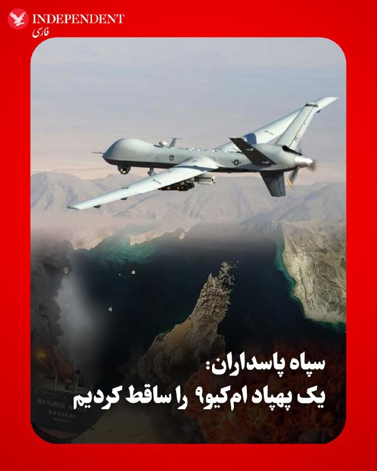

♦️فارس گزارش داد که سپاه پاسداران یک پهپاد ام‌کیو۹ را در شمال خلیج فارس و در آسمان شهرستان جم در استان بوشهر، سرنگون کرده است. هنوز ارتش آمریکا در این زمینه اظهارنظر نکرده است.
‌🇸🇦 Indypersian

🤖 @VahidOOnLine

## pm_afshaa — post 93230

اقا زدن مثل اینکه😂

## VahidOnline — post 76126

  <a href="telegram/content/VahidOnline_76126_1781053978.mp4" target="_blank">🎬 Download video</a>

پیام‌های دریافتی تایید نشده:

سلام آقا وحید ساعت ۴و۳۶ دقیقه
خمین ۳ تا موشک پرتاب شد

همین الان پنج تا موشک از خمین شلیک شد ساعت ۴:۳۵

سلام وحید جان همین الان ازنا لرستان زدن
ساعت4:37

ساعت ۴:۳۵ از خمین چهارتا موشک زدن

از خمین حدود ۴ تا موشک فرستادنننن همین الان

📡 @VahidOnline

## VahidOnline — post 76125

  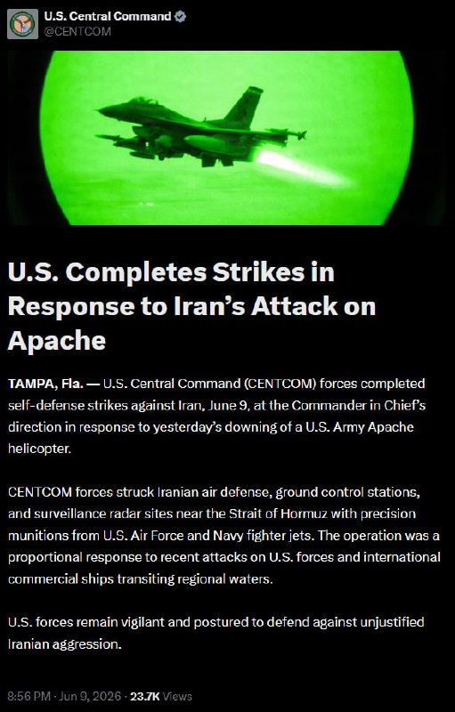

"آمریکا حملات خود را در پاسخ به حمله ایران به آپاچی تکمیل کرد"

پست سنتکام، ترجمه ماشین:
تامپا، فلوریدا — نیروهای فرماندهی مرکزی ایالات متحده، سنتکام، روز ۹ ژوئن به دستور فرمانده کل قوا، حملات دفاعی خود علیه ایران را در پاسخ به سرنگونی هلیکوپتر آپاچی ارتش آمریکا در روز گذشته تکمیل کردند.

نیروهای سنتکام با استفاده از مهمات هدایت‌شونده دقیق شلیک‌شده از جنگنده‌های نیروی هوایی و نیروی دریایی آمریکا، سامانه‌های پدافند هوایی ایران، ایستگاه‌های کنترل زمینی و سایت‌های راداری نظارتی در نزدیکی تنگه هرمز را هدف قرار دادند.

این عملیات پاسخی متناسب به حملات اخیر علیه نیروهای آمریکایی و کشتی‌های تجاری بین‌المللی در حال عبور از آب‌های منطقه بود.

نیروهای آمریکایی همچنان هوشیار و در موضع آمادگی برای دفاع در برابر تجاوزات توجیه‌ناپذیر ایران باقی می‌مانند.
CENTCOM

📡 @VahidOnline

## kianmeli1 — post 87838

  <a href="telegram/content/kianmeli1_87838_1781053979.mp4" target="_blank">🎬 Download video</a>

🔴شلیک چندین موشک از خمین بسمت پایگاه های امریکایی

ساعت ۴:۳۷ صبح
https://t.me/kianmeli1

## kianmeli1 — post 87837

  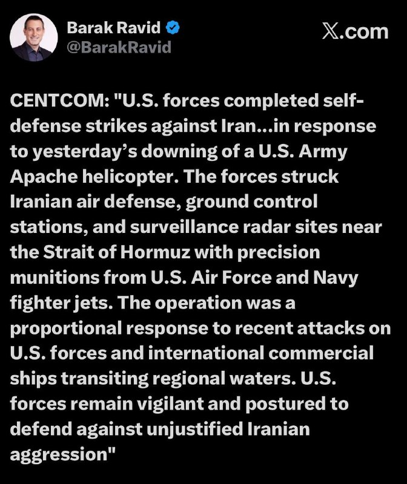

🔴گزارش نهایی عملیات سنتکام

سنتکام: «نیروهای آمریکایی در پاسخ به سرنگونی دیروز یک هلیکوپتر آپاچی ارتش آمریکا، حملات دفاع از خود علیه ایران را تکمیل کردند... این نیروها با مهمات دقیق از جنگنده‌های نیروی هوایی و دریایی ایالات متحده، به پدافند هوایی، ایستگاه‌های کنترل زمینی و سایت‌های رادار نظارتی ایران در نزدیکی تنگه هرمز حمله کردند. این عملیات پاسخی متناسب به حملات اخیر به نیروهای آمریکایی و کشتی‌های تجاری بین‌المللی در حال عبور از آب‌های منطقه‌ای بود. نیروهای آمریکایی هوشیار و آماده دفاع در برابر تجاوز بی‌دلیل ایران هستند.»
https://t.me/kianmeli1

## IranIntlTV — post 341428

  

قرارگاه مرکزی خاتم الانبیا اعلام کرد ارتش و سپاه در پاسخ به حمله‌های جدید آمریکا علیه جمهوری اسلامی، برخی از پایگاه‌های آمریکا در منطقه هدف حمله‌های قرار دادند.
این قرارگاه تاکید کرد در صورت تکرار حملات آمریکا، جمهوری اسلامی «حملات سهمگین و گسترده‌تری» علیه بانک اهداف تعیین شده در منطقه انجام خواهد شد.

https://iranintl.com/202606100414

## IranIntlTV — post 341427

  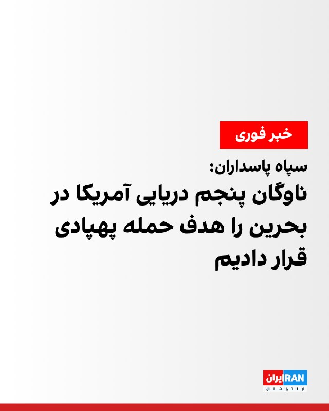

سپاه پاسداران اعلام کرد در پاسخ به حمله‌های آمریکا علیه جمهوری اسلامی، نیروی دریایی سپاه ساعت ۲.۳۰ بامداد ناوگان پنجم دریایی بحرین را هدف حمله پهپادی قرار داد.
طبق اعلام سپاه، آمریکا در اوایل بامداد چهارشنبه چند نقطه در جاسک، سیریک و قشم را مورد حمله قرار داد که به یک دکل مخابراتی در سیریک خساراتی وارد آمد و دو مخزن آب بخش بمانی این شهرستان منهدم شد.
سپاه با اشاره به اینکه درگیری‌ها ادامه دارد و نیروهایش در حال پاسخ گفتن به حملات هستند، تاکید کرد: «در صورت ادامه حملات نیروهای متخاصم، پاسخ‌های سنگین‌تری در راه است.»

https://iranintl.com/202606108587

## Shin_Persian — post 6835

https://x.com/hey_itsmyturn/status/2064515668649640089?s=20

## Shin_Persian — post 6833

  <a href="telegram/content/Shin_Persian_6833_1781053982.mp4" target="_blank">🎬 Download video</a>

↩️ Quoted tweet:
Shin ✓ @hey_itsmyturn
Fri, 13 Mar 2026 02:46:44 UTC

Getting some rest,
Take care of yourselves &lt;3

↩️ توییت نقل‌قول شده — برای پاسخ، پست زیر را ببینید.

ترجمه خودکار فارسی

کمی استراحت می‌کنم،
مراقب خودتان باشید <3

𝕏 · @shin_persian

## Shin_Persian — post 6832

Shin ✓ @hey_itsmyturn
Wed, 10 Jun 2026 01:08:59 UTC

IRGC claims that the downed UAV was a Reaper.

ترجمه خودکار فارسی

سپاه پاسداران انقلاب اسلامی (IRGC) ادعا می‌کند که پهپاد سرنگون شده از نوع ریپر (Reaper) بوده است.

𝕏 · @shin_persian

## Shin_Persian — post 6831

Shin ✓ @hey_itsmyturn
Wed, 10 Jun 2026 01:08:15 UTC

IRGC: A UAV was shot down over Jam, Bushehr Province, Iran

ترجمه خودکار فارسی

سپاه پاسداران انقلاب اسلامی (IRGC): یک پهپاد بر فراز جم در استان بوشهر ایران سرنگون شد.

𝕏 · @shin_persian

## Shin_Persian — post 6830

Shin ✓ @hey_itsmyturn
Wed, 10 Jun 2026 01:04:29 UTC

"U.S. Completes Strikes in Response to Iran’s Attack on Apache"

- CENTCOM

ترجمه خودکار فارسی

«ایالات متحده حملات تلافی‌جویانه در پاسخ به حمله ایران به آپاچی را به پایان رساند»

- سنتکام (ستاد فرماندهی مرکزی ایالات متحده)

𝕏 · @shin_persian

## FarsiVOA — post 220201

⚡️پاسخ اسرائيل به خط‌ ونشان جمهوری اسلامی؛ پایان مصونیت محله مسیحی‌نشین صور با فرمان تخلیه فوری
@FarsiVOA

## FarsiVOA — post 220200

  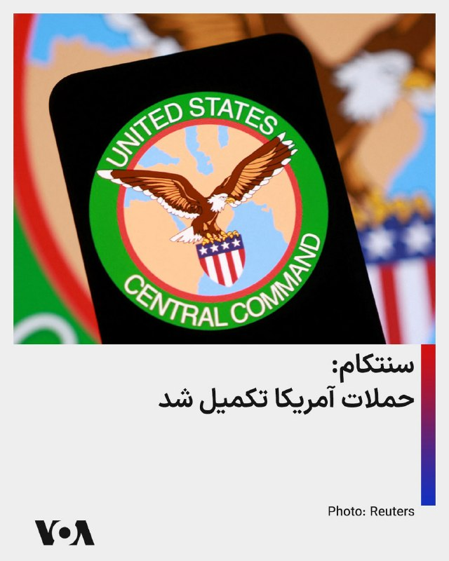

⚡️سنتکام دقایقی قبل اعلام کرد که ایالات متحده در پاسخ به حمله جمهوری اسلامی به هلی‌کوپتر آپاچی، حملات خود به جمهوری اسلامی را تکمیل کرد.
@FarsiVOA

## IranianMinds — post 22047

  <a href="telegram/content/IranianMinds_22047_1781053983.mp4" target="_blank">🎬 Download video</a>

🔴 هم اکنون سید مجید:

@IranianMinds

## IranianMinds — post 22046

  

😤دنبال یه سایت شرط بندی بین المللی بودی که به ایرانیا خدمات بده؟!
⛔

👍دربی بت همون انتخاب  100%

💎ویژگی های سایت جهانی Derby Bet:

⬅️امکان شارژ امن با کارت بانکی

⬅️واریز اول دوبل شارژ می شوید(بونوس۱۰۰٪)

⬅️پر اپشن ترین سایت فعال در ایران

⬅️تسویه حساب کمتر از 5 دقیقه

⬅️برگشت بخشی از باخت به صورت هفتگی

🚨کد هدیه ثبت نام:GG007

⚠️برای دانلود اپلکیشن کلیک کنید
👉
E19

🔔کانال دربی بت :

🪙https://t.me/+aCbq7yy8QY80NzQ0

---
📅 بروزرسانی: 1405/03/20 04:33
---

## VahidOOnLine — post 244606

  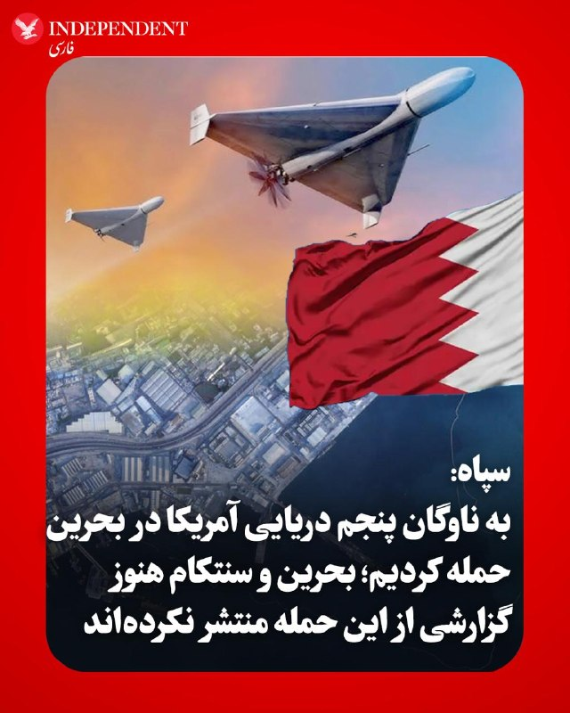

♦️درحالی که بحرین و سنتکام هنوز گزارشی از حمله به ناوگان پنجم دریایی آمریکا منتشر نکرده‌اند، سپاه پاسداران در بیانیه‌ای گفت که حوالی ساعت ۲:۳۰ دقیقه بامداد چهارشنبه به این ناوگان حمله کرده است. قرارگاه خاتم نیز گفته که برخی پایگاه‌های آمریکا در منطقه هدف گرفته شدند. هنوز کشورهای منطقه یا سنتکام این حمله‌ها را تایید نکرده‌اند.
‌🇸🇦 Indypersian

🤖 @VahidOOnLine

## mwarmonitor — post 10586

🔴تامپا، فلوریدا — فرماندهی مرکزی ایالات متحده آمریکا (سنتکام) اعلام کرد که نیروهای این فرماندهی در ۹ ژوئن و به دستور فرمانده کل قوا، حملات «دفاع از خود» را علیه ایران انجام داده‌اند؛ این اقدام در پاسخ به سرنگونی یک بالگرد آپاچی ارتش آمریکا در روز گذشته صورت گرفته است.

🔸بر اساس این بیانیه، نیروهای سنتکام مواضع پدافند هوایی ایران، ایستگاه‌های کنترل زمینی و سایت‌های راداری مراقبت در نزدیکی تنگه هرمز را با مهمات دقیق و توسط جنگنده‌های نیروی هوایی و نیروی دریایی آمریکا هدف قرار داده‌اند.

🔸در این گزارش آمده است که این عملیات پاسخی متناسب به حملات اخیر علیه نیروهای آمریکایی و کشتی‌های تجاری بین‌المللی عبوری از آب‌های منطقه‌ای بوده است.

🔸در پایان نیز تأکید شده است که نیروهای آمریکایی همچنان در حالت هوشیاری کامل قرار دارند و برای دفاع در برابر هرگونه «تجاوز غیرموجه ایران» آماده هستند.

@mwarmonitor

## mwarmonitor — post 10585

🔴صدای انفجار در شهر اهواز، مرکز استان خوزستان ایران.

## FoxNewsTwitter — post 342783

  

Fox News (Twitter/X)

BREAKING: Karmelo Anthony has been sentenced to 35 years in prison.

Anthony was found guilty of murder on Tuesday for the stabbing death of Austin Metcalf at a high school track meet.

He will be eligible for parole after half time served.

## pm_afshaa — post 93229

  <a href="telegram/content/pm_afshaa_93229_1781053391.webm" target="_blank">🎬 Download video</a>

🔴سنتکام اعلام کرد که حملات آمریکا به پایان رسید.

نیروهای فرماندهی مرکزی ایالات متحده (CENTCOM) در تاریخ ۹ ژوئن، به دستور فرمانده کل قوا، حملات دفاعی خود را در پاسخ به سرنگونی هلیکوپتر آپاچی ارتش آمریکا در روز گذشته انجام دادند.
نیروهای سنتکام با استفاده از مهمات دقیق از جنگنده‌های نیروی هوایی و نیروی دریایی آمریکا، به سامانه‌های دفاع هوایی، ایستگاه‌های کنترل زمینی و رادارهای نظارتی ایران در نزدیکی تنگه هرمز حمله کردند. این عملیات پاسخی متناسب به حملات اخیر علیه نیروهای آمریکایی و کشتی‌های تجاری بین‌المللی در آب‌های منطقه‌ای بود.
نیروهای آمریکایی همچنان هوشیار بوده و آماده دفاع در برابر تجاوزات غیرموجه ایران هستند.

💧Rainbet.com the #1 Non-KYC Crypto Casino & Sportsbook @rainbetcom

😁 @Pm_Afshaa

## pm_afshaa — post 93228

سنتکام اعلام کرد حملات تمام شد

## pm_afshaa — post 93227

  <a href="telegram/content/pm_afshaa_93227_1781053392.webm" target="_blank">🎬 Download video</a>

🔴سپاه: یه فروند پهپاد MQ9 دشمن رهگیری و منهدم شد. 
💧 Rainbet.com the #1 Non-KYC Crypto Casino & Sportsbook @rainbetcom 
😁 @Pm_Afshaa

## pm_afshaa — post 93226

  <a href="telegram/content/pm_afshaa_93226_1781053392.webm" target="_blank">🎬 Download video</a>

🔴سپاه: یه فروند پهپاد MQ9 دشمن رهگیری و منهدم شد.

💧 Rainbet.com the #1 Non-KYC Crypto Casino & Sportsbook @rainbetcom

😁 @Pm_Afshaa

## pm_afshaa — post 93225

  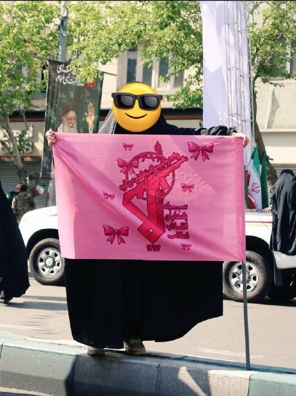

واکنش سهمگین سپاه پاسداران 🎀

💧 Rainbet.com the #1 Non-KYC Crypto Casino & Sportsbook @rainbetcom

😁 @Pm_Afshaa

## pm_afshaa — post 93224

  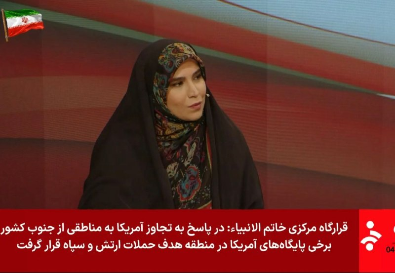

با چی زدید؟ فوش ناموسی دادید برگشتید؟

💧 Rainbet.com the #1 Non-KYC Crypto Casino & Sportsbook @rainbetcom

😁 @Pm_Afshaa

## pm_afshaa — post 93223

  <a href="telegram/content/pm_afshaa_93223_1781053394.webm" target="_blank">🎬 Download video</a>

🔴سپاه پاسداران: ناوگان پنجم دریایی آمریکا تو بحرین رو با پهپاد زدیم. 
💧 Rainbet.com the #1 Non-KYC Crypto Casino & Sportsbook @rainbetcom 
😁 @Pm_Afshaa

## VahidOnline — post 76124

خبرگزاری فارس، وابسته به سپاه:
"سپاه پاسداران: یک فروند پهپاد MQ9 دشمن رهگیری و منهدم شد

در جریان درگیری‌های هوایی جاری در تنگۀ‌هرمز یک فروند پهپاد MQ9 که از آسمان شمال خلیج‌فارس قصد نزدیک شدن و مداخله در صحنۀ نبرد را داشت، در آسمان شهرستان جم استان بوشهر مورد اصابت آتش رزمندگان قهرمان پدافند هوایی نوین سپاه قرار گرفت و منهدم شد."

📡 @VahidOnline

## VahidOnline — post 76123

  <a href="telegram/content/VahidOnline_76123_1781053395.mp4" target="_blank">🎬 Download video</a>

صدا و سیما: دو انفجار در بندر عباس
هنوز درباره محل دقیق انفجارها و جزئیات اصابت‌های احتمالی، اطلاعات دقیقی در دسترس نیست.
دو‌ مخزن آب در سیریک و‌ بندر کوهستک بطور کامل تخریب شده است.

📡 @VahidOnline

## kianmeli1 — post 87836

🔴 در بیانیه‌ سپاه پاسداران آمده است

در ساعت ۰۲:۳۰ بامداد به ناوگان پنجم آمریکا در بحرین حمله کرده است.

(احتمالا با پهپاد حمله کرده اند و از موشک استفاده نکرده اند)

-یکی از دلایل عدم انتشار فیلم این است: کشورهای عربی ضبط و انتشار فیلم را با محکومیت زندانی طولانی مدت جریمه میکنند
https://t.me/kianmeli1

## Shin_Persian — post 6829

  <a href="telegram/content/Shin_Persian_6829_1781053396.mp4" target="_blank">🎬 Download video</a>

Shin ✓ @hey_itsmyturn
Wed, 10 Jun 2026 00:57:52 UTC

Whatever the fuck these are.
0052Z - Isfahan suburbs, central Iran

ترجمه خودکار فارسی

هر چه که هست، لعنت به این‌ها.
۰۰۵۲ زولو (۰۴:۲۲ به وقت تهران) - حومه اصفهان، مرکز ایران

𝕏 · @shin_persian

## Shin_Persian — post 6828

Shin ✓ @hey_itsmyturn
Wed, 10 Jun 2026 00:53:54 UTC

IRGC:
"In response to the enemy's malicious act, IRGC naval forces launched a drone attack on the Fifth Fleet of Bahrain at 2:30 AM [2300Z]

Engagements are ongoing, and the valiant guardians of the Iranian nation are responding to the enemy's aggressions. Should these provocations persist, more severe responses are imminent."

ترجمه خودکار فارسی

سپاه پاسداران انقلاب اسلامی (IRGC):
«در پاسخ به اقدام شرورانه دشمن، نیروهای دریایی سپاه پاسداران انقلاب اسلامی در ساعت ۲:۳۰ بامداد [۲۳۰۰ زولو (۰۲:۳۰ به وقت تهران)] حمله‌ای پهپادی علیه ناوگان پنجم مستقر در بحرین انجام دادند.

درگیری‌ها همچنان ادامه دارد و پاسداران دلاور ملت ایران در حال پاسخگویی به تجاوزات دشمن هستند. در صورت تداوم این تحریکات، پاسخ‌های شدیدتری در راه خواهد بود.»

𝕏 · @shin_persian

## FarsiVOA — post 220199

⚡️گزارش الحره از پشت‌پرده تلاش‌های بغداد برای کنترل گروه‌های مسلح وابسته به جمهوری اسلامی
@FarsiVOA

## IranianMinds — post 22045

  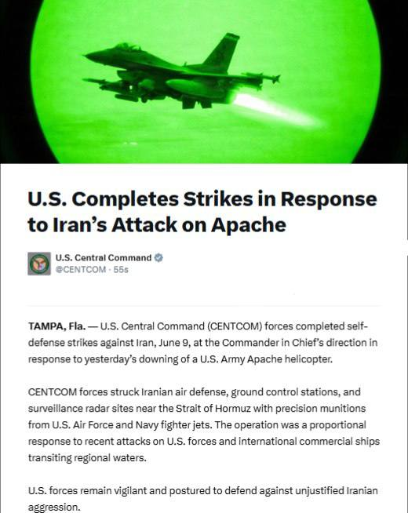

🔴 بیانیه سنتکام فرماندهی مرکزی آمریکا:

نیروهای سنتکام به دستور رئیس‌جمهور آمریکا، عملیات نظامی علیه ایران را به پایان رساندند.
این حملات در واکنش به سرنگونی یک بالگرد آپاچی ارتش آمریکا در روز گذشته انجام شد.
اهداف حملات شامل سامانه‌های پدافند هوایی، مراکز کنترل زمینی و سایت‌های راداری در نزدیکی تنگه هرمز بود.
این عملیات با استفاده از مهمات دقیق توسط جنگنده‌های نیروی هوایی و نیروی دریایی آمریکا انجام شد.
سنتکام این حملات را «پاسخی متناسب» به حملات اخیر علیه نیروهای آمریکایی و کشتی‌های تجاری در منطقه توصیف کرد.

آمریکا اعلام کرد نیروهایش همچنان در حالت آماده‌باش برای مقابله با هرگونه اقدام ایران باقی خواهند ماند.

@IranianMinds

## IranianMinds — post 22044

🔴 سپاه :

با کمک ارتش چن تا از پایگاه های آمریکارو در پاسخ به حملاتشون زدیم ، اگه ادامه بدن بدتر پاسخ میدیم.

@IranianMinds

## IranianMinds — post 22043

رفتن فک کنم خبری از انفجار جدیدی نیست

## BBCPersian — post 283295

  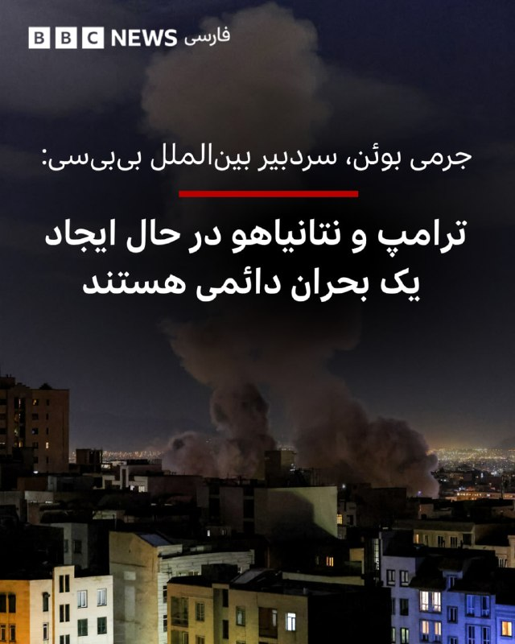

‌
دونالد ترامپ و بنیامین نتانیاهو معتقد بودند که پیروزی بر ایران،خاورمیانه را تغییر خواهد داد.

منطقه در حال تغییر است. اما نه به آن شکلی که آنها انتظار داشتند. جمهوری اسلامی ایران شکست نخورده است. اکنون خطر یک بحران دائمی طولانی و فرسایشی وجود دارد که به طور متناوب به درگیری نظامی علنی منجر می‌شود.

رژیم ایران ثابت کرده است که بسیار سرسخت تر از آن چیزی است که ترامپ و نتانیاهو تصور می‌کردند. قضاوت آنها اشتباه بود و به نظر می‌رسد کنترل عواقب آن را از دست داده‌اند.

سرنگونی بالگرد آمریکایی یادآوری دیگری است که حاکمان ایران هنوز می‌توانند به آمریکایی‌ها آسیب بزنند و در عزم خود برای پیروزی در این جنگ، کوتاه نخواهند آمد. برای آنها، پیروزی به معنای بقا و بازدارندگی بیشتر است، به شکل اذعان به کنترل تنگه هرمز، یکی از استراتژیک‌ترین آبراه‌های جهان.

📷ATTA KENARE / AFP via Getty Images

شرح عکس: حمله آمریکا و اسرائیل به تهران در تاریخ دهم اسفند ماه گذشته
https://bbc.in/4fAMoZF
@BBCPersian

---
📅 بروزرسانی: 1405/03/20 04:23
---

## VahidOOnLine — post 244605

  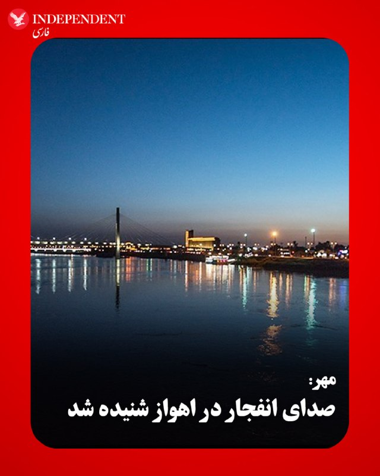

♦️خبرگزاری مهر، همزمان با تداوم حملات آمریکا به جنوب ایران، به نقل از منابع محلی از شنیده شدن صدای انفجار در اهواز خبر داد و نوشت:‌ «هنوز جزییاتی از علت و مکان دقیق این حادثه منتشر نشده است».
‌🇸🇦 Indypersian

🤖 @VahidOOnLine

## VahidOOnLine — post 244604

  

گزارش‌ها از دور جدید صداهای انفجار در مناطق جنوبی ایران خبر می‌دهد. رسانه‌های جمهوری اسلامی از صداهای انفجار در بندرعباس خبر دادند. خبرگزاری مهر نیز از شنیده شدن مجدد صدای انفجار در شهرستان جاسک و چندین صدای انفجار در قشم خبر داد.
گزارش‌های منتشر شده در فضای مجازی از شنیده شدن صداهای انفجار در جم بوشهر و اهواز خبر می‌دهد.
همچنین طبق پیام‌های مخاطبان، حدود ساعت یک بامداد صدای چند انفجار از جزیره قشم ، سیریک و جاسک به گوش رسید.
مخاطبان همچنین در پیام‌هایی به ایران‌اینترنشنال از صداهای چند انفجار مهیب در بندرعباس خبر دادند.

‌🏁 🇬🇧 IranintlTV

🤖 @VahidOOnLine

## pm_afshaa — post 93222

  <a href="telegram/content/pm_afshaa_93222_1781052789.webm" target="_blank">🎬 Download video</a>

🔴سپاه پاسداران: ناوگان پنجم دریایی آمریکا تو بحرین رو با پهپاد زدیم.

💧 Rainbet.com the #1 Non-KYC Crypto Casino & Sportsbook @rainbetcom

😁 @Pm_Afshaa

## pm_afshaa — post 93221

اگه سپاه جواب این حمله رو نداد میشه گفت این هشدار واقعی و جدی بوده

## pm_afshaa — post 93220

  <a href="telegram/content/pm_afshaa_93220_1781052790.webm" target="_blank">🎬 Download video</a>

🔴قرارگاه مرکزی حضرت خاتم الانبیا: در پاسخ به تجاوز ارتش آمریکا در مناطقی از جنوب کشور به بهانه واهی سقوط بالگرد خود، برخی از پایگاه‌های آمریکا در منطقه هدف هجوم قدرتمند ارتش قهرمان جمهوری اسلامی و سپاه پاسداران قرار گرفت. ارتش آمریکا بدونه که در صورت تکرار…

## pm_afshaa — post 93219

  <a href="telegram/content/pm_afshaa_93219_1781052791.webm" target="_blank">🎬 Download video</a>

🔴قرارگاه مرکزی حضرت خاتم الانبیا:

در پاسخ به تجاوز ارتش آمریکا در مناطقی از جنوب کشور به بهانه واهی سقوط بالگرد خود، برخی از پایگاه‌های آمریکا در منطقه هدف هجوم قدرتمند ارتش قهرمان جمهوری اسلامی و سپاه پاسداران قرار گرفت.

ارتش آمریکا بدونه که در صورت تکرار تعرض به جمهوری اسلامی، حملات سهمگین و گسترده‌تر علیه بانک اهداف تعیین شده در منطقه انجام خواهد شد.

💧 Rainbet.com the #1 Non-KYC Crypto Casino & Sportsbook @rainbetcom

😁 @Pm_Afshaa

## pm_afshaa — post 93218

  <a href="telegram/content/pm_afshaa_93218_1781052792.webm" target="_blank">🎬 Download video</a>

🔴ساعتی پیش در شبکه خبر، یهویی کلیپ شبیه سازی انفجار بمب هسته‌ای پخش شد! 
💧 Rainbet.com the #1 Non-KYC Crypto Casino & Sportsbook @rainbetcom 
😁 @Pm_Afshaa

## pm_afshaa — post 93217

میگن صداوسیما رو هک کردن اینم هشدار بمب اتم توسط آمریکا بود.

## IranIntlTV — post 341426

  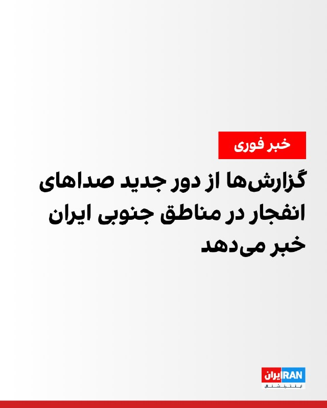

گزارش‌ها از دور جدید صداهای انفجار در مناطق جنوبی ایران خبر می‌دهد. رسانه‌های جمهوری اسلامی از صداهای انفجار در بندرعباس خبر دادند. خبرگزاری مهر نیز از شنیده شدن مجدد صدای انفجار در شهرستان جاسک و چندین صدای انفجار در قشم خبر داد.
گزارش‌های منتشر شده در فضای مجازی از شنیده شدن صداهای انفجار در جم بوشهر و اهواز خبر می‌دهد.
همچنین طبق پیام‌های مخاطبان، حدود ساعت یک بامداد صدای چند انفجار از جزیره قشم ، سیریک و جاسک به گوش رسید.
مخاطبان همچنین در پیام‌هایی به ایران‌اینترنشنال از صداهای چند انفجار مهیب در بندرعباس خبر دادند.

https://iranintl.com/202606105970

## Shin_Persian — post 6827

Shin ✓ @hey_itsmyturn
Wed, 10 Jun 2026 00:48:06 UTC

IRGC Khatam al Anbiya:
"In response to the aggression by the terrorist U.S. military in southern regions of the country, under the false pretext of a helicopter crash, several U.S. bases in the region were subjected to a powerful assault by the heroic army of the Islamic Republic and the brave men of the Islamic Revolutionary Guard Corps."
Adds:
"The criminal U.S. military should be aware that any repeat aggression against the Islamic Republic of Iran will result in severe and widespread attacks against identified target banks in the region."

ترجمه خودکار فارسی

قرارگاه خاتم‌الانبیا سپاه پاسداران انقلاب اسلامی:
«در پاسخ به تجاوزات ارتش تروریست ایالات متحده در مناطق جنوبی کشور، که با بهانه دروغین سقوط بالگرد صورت گرفت، چندین پایگاه آمریکا در منطقه مورد حمله قدرتمندانه ارتش قهرمان جمهوری اسلامی و دلاورمردان سپاه پاسداران انقلاب اسلامی (IRGC) قرار گرفتند.»
می‌افزاید:
«ارتش جنایتکار آمریکا باید بداند که هرگونه تکرار تجاوز علیه جمهوری اسلامی ایران، منجر به حملات شدید و گسترده علیه بانک‌های هدف شناسایی شده در منطقه خواهد شد.»

𝕏 · @shin_persian

## Shin_Persian — post 6826

  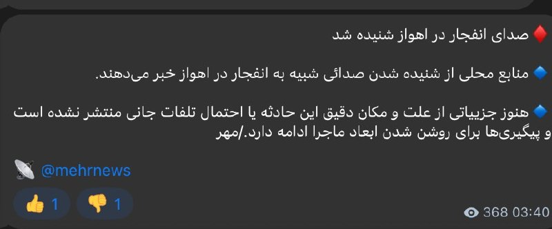

↩️ Quoted tweet: Shin ✓ @hey_itsmyturn Wed, 10 Jun 2026 00:26:11 UTC 0024Z Loud explosion in Ahvaz, Khuzestan Province, #Iran (Eyewitness believes it was a strike) ↩️ توییت نقل‌قول شده — برای پاسخ، پست زیر را ببینید. ترجمه خودکار فارسی ۰۰۲۴ زولو (۰۳:۵۴…

## Shin_Persian — post 6825

  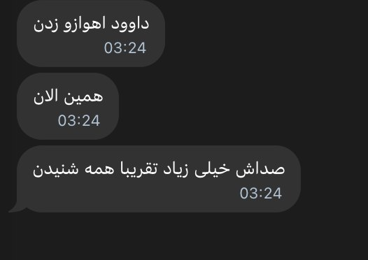

↩️ Quoted tweet:
Shin ✓ @hey_itsmyturn
Wed, 10 Jun 2026 00:26:11 UTC

0024Z
Loud explosion in Ahvaz, Khuzestan Province, #Iran
(Eyewitness believes it was a strike)

↩️ توییت نقل‌قول شده — برای پاسخ، پست زیر را ببینید.

ترجمه خودکار فارسی

۰۰۲۴ زولو (۰۳:۵۴ به وقت تهران)
انفجار مهیب در اهواز، استان خوزستان، #Iran
(شاهد عینی معتقد است که این یک حمله بوده است)

𝕏 · @shin_persian

## FarsiVOA — post 220198

  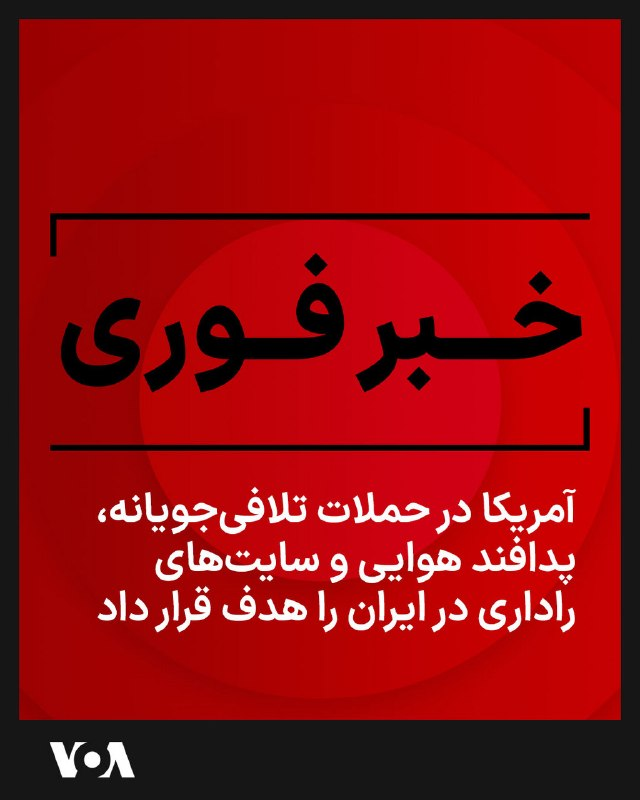

⚡️دو مقام آمریکایی به شبکه سی‌بی‌اس نیوز گفتند که ارتش آمریکا در حملات روز سه‌شنبه (به وقت واشنگتن)، پدافند‌های هوایی و سایت‌های راداری جمهوری اسلامی را هدف قرار داد. این عملیات آمریکا در واکنش به حمله جمهوری اسلامی به یک هلی‌کوپتر آپاچی در هفته جاری است.
@FarsiVOA

## DW_Farsi — post 125748

  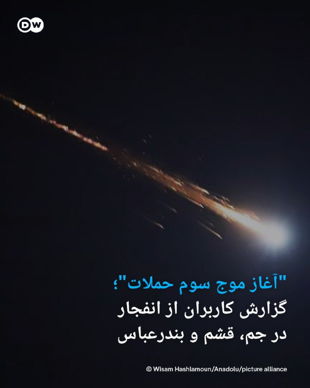

🔴 "آغاز موج سوم حملات"؛ گزارش کاربران از انفجار در جم، قشم و بندرعباس

باراک راوید، خبرنگار پایگاه خبری اکسیوس، اعلام کرد، "ارتش ایالات متحده موج سوم حملات خود را علیه مواضعی در ایران آغاز کرده است". این عملیات تلافی‌جویانه بنا به اعلام فرماندهی مرکزی ایالات متحده (سنتکام)، در پاسخ به سرنگونی یک بالگرد آپاچی ارتش آمریکا صورت می‌گیرد.

هم‌زمان، کانال تلگرامی وحیدآنلاین پیام‌های متعددی از سوی شهروندان در جنوب ایران منتشر کرده که حاوی گزارش‌هایی از شنیده شدن صدای انفجار و فعال شدن پدافند هوایی در ساعات اولیه بامداد است.

بر اساس این گزارش‌های تاییدنشده، حوالی ساعت ۳:۳۳ تا ۳:۳۵ بامداد چهارشنبه، صدای انفجار و لرزش شدید در شهرستان جم واقع در استان بوشهر احساس شده است.

همچنین گزارش‌هایی از لرزش‌های پیاپی در جزیره قشم و شنیده شدن صدای انفجار در بندرعباس حوالی ساعت ۳:۳۸ بامداد منتشر شده که برخی کاربران آن را به هدف قرار گرفتن پایگاه هوایی بندرعباس نسبت می‌دهند. کاربران همچنین از شنیده شدن صدای انفجار در اهواز خبر داده‌اند.

مقامات رسمی ایران هنوز درباره این اخبار اظهار نظر نکرده‌اند.

📌تصویر از آرشیو
@dw_farsi

## IranianMinds — post 22042

  <a href="telegram/content/IranianMinds_22042_1781052796.mp4" target="_blank">🎬 Download video</a>

یه ساعت پیش شبکه خبر صداوسیما اینطوری هک شد :

@IranianMinds

## IranianMinds — post 22041

  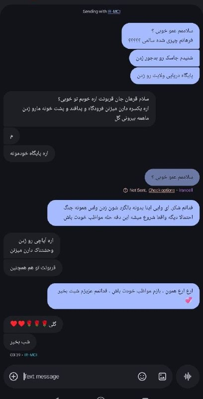

وضعیت جاسک

@IranianMinds

## IranianMinds — post 22040

🔴 قرارگاه مرکزی خاتم الانبیا :

پایگاه های آمریکایی رو هدف قرار دادیم.

@IranianMinds

## IranianMinds — post 22039

سید مجید خوابه ؟

## IranianMinds — post 22038

  <a href="telegram/content/IranianMinds_22038_1781052800.mp4" target="_blank">🎬 Download video</a>

وضعیت پشم ریزون‌ جنوب کشور زیر بمباران سنگین

@IranianMinds

## BBCPersian — post 283294

⚡️گزارش‌ها از موج سوم حملات هوایی آمریکا به نقاطی در جنوب ایران

باراک راوید، گزارشگر اکسیوس می‌گوید مقام های نظامی آمریکا از آغاز موج سوم حملات هوایی خود به نقاطی در جنوب ایران خبر داده‌اند.

همزمان خبرگزاری‌های ایران از گزارش‌های تایید نشده مبنی بر شنیدن صدای انفجار در اهواز و همچنین سقوط یک «شیی ناشناس» در حوالی بوشهر نوشته‌اند اما هیچ کدام را تایید نکرده‌اند.

خبرگزاری ایرنا هم از چندین انفجار متوالی حوالی ساعت ۳:۲۴ بامداد چهارشنبه در شهر بندرعباس خبر داد اما می‌گوید که محل این انفجارها مشخص نیست.

خبرگزاری مهر هم گزارش کرده که صدای انفجار در جزیره قشم شنیده شده است.
https://bbc.in/3Q6UZcc
@BBCPersian

---
📅 بروزرسانی: 1405/03/20 04:12
---

## VahidOOnLine — post 244603

  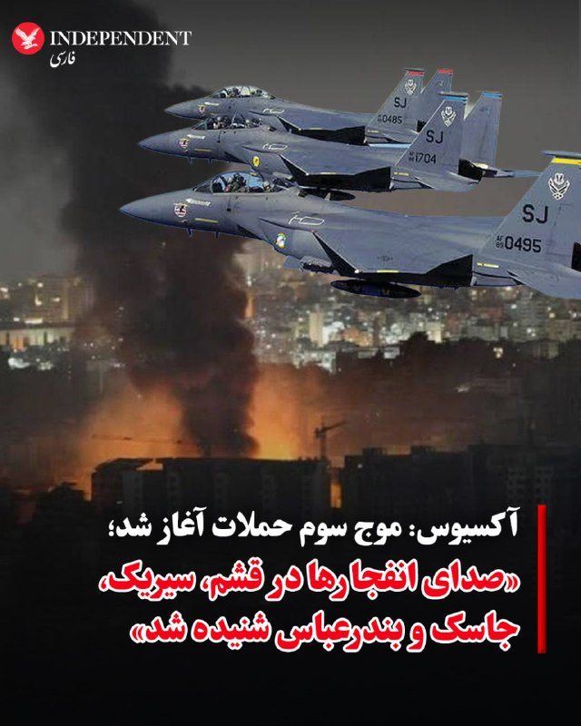

♦️خبرنگار آکسیوس، بامداد چهارشنبه، به نقل از یک مقام آمریکایی از آغاز موج سوم حملات ایالات متحده علیه ایران خبر داد. همزمان رسانه‌های داخلی، حدود ساعت ۴ صبح ایران، از شنیده شدن صدای انفجارها در قشم، سیریک، جاسک و بندرعباس خبر می‌دهند. با وجود گذشت چندساعت از آغاز حملات آمریکا به جنوب ایران، تا این لحظه هیچکدام از مقامات جمهوری اسلامی واکنش نشان نداده‌اند.
‌🇸🇦 Indypersian

🤖 @VahidOOnLine

## mwarmonitor — post 10584

  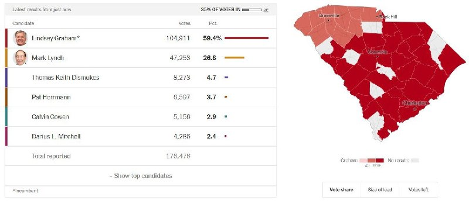

🔸سناتور کارولینای جنوبی و متحد ترامپ، لیندسی گراهام، در انتخابات مقدماتی خود در برابر مارک لینچ، رقیب «انزواگرا» با رویکرد «اول آمریکا»، پیروز شد. او شانس بالایی برای پیروزی در انتخابات مجدد در ماه نوامبر دارد.

@mwarmonitor

## pm_afshaa — post 93216

  <a href="telegram/content/pm_afshaa_93216_1781052165.webm" target="_blank">🎬 Download video</a>

🔴ساعتی پیش در شبکه خبر، یهویی کلیپ شبیه سازی انفجار بمب هسته‌ای پخش شد! 
💧 Rainbet.com the #1 Non-KYC Crypto Casino & Sportsbook @rainbetcom 
😁 @Pm_Afshaa

## pm_afshaa — post 93215

  <a href="telegram/content/pm_afshaa_93215_1781052165.mp4" target="_blank">🎬 Download video</a>

🔴ساعتی پیش در شبکه خبر، یهویی کلیپ شبیه سازی انفجار بمب هسته‌ای پخش شد!

💧 Rainbet.com the #1 Non-KYC Crypto Casino & Sportsbook @rainbetcom

😁 @Pm_Afshaa

## pm_afshaa — post 93214

  <a href="telegram/content/pm_afshaa_93214_1781052166.mp4" target="_blank">🎬 Download video</a>

ویدیوی ارسالی حملات آمریکا

💧 Rainbet.com the #1 Non-KYC Crypto Casino & Sportsbook @rainbetcom

😁 @Pm_Afshaa

## pm_afshaa — post 93213

  <a href="telegram/content/pm_afshaa_93213_1781052167.webm" target="_blank">🎬 Download video</a>

🔴دقایقی پیش حدود 15 انفجار در قشم گزارش شد.

محل دقیق انفجارها مشخص نیست، اما احتمالا بخشی از اونا مربوط به جزیره لارک در نزدیکی قشم باشه؛ منطقه‌ای که محل استقرار قایق‌های تندرو و انبارهای پهپادی سپاهه.

💧 Rainbet.com the #1 Non-KYC Crypto Casino & Sportsbook @rainbetcom

😁 @Pm_Afshaa

## kianmeli1 — post 87835

  <a href="telegram/content/kianmeli1_87835_1781052168.mp4" target="_blank">🎬 Download video</a>

🔴دقایقی پیش در حین پخش اخبار از شبکه خبر، به‌صورت ناگهانی تصویری شبیه‌سازی‌شده از یک انفجار هسته‌ای به نمایش درآمد که موجب جلب توجه مخاطبان قرار گرفت
https://t.me/kianmeli1

## IranIntlTV — post 341425

  <a href="telegram/content/IranIntlTV_341425_1781052169.mp4" target="_blank">🎬 Download video</a>

دونالد ترامپ در گفت‌وگو با شبکه خبری «ان‌بی‌سی» گفت آمریکا به دستیابی توافق با ایران بسیار نزدیک است، اما افزود در صورت شکست مذاکرات، واشینگتن به‌گونه‌ای دیگر اقدام خواهد کرد.

او با اشاره به اینکه پیش از رسیدن به توافق صلح، دارایی‌های ایران را از حالت مسدود خارج نمی‌کند، گفت در صورت توافق، آزادسازی دارایی‌های مسدودشده در مراحل بعدی و پس از رفتار مناسب جمهوری اسلامی مطرح خواهد شد.
@iranintltv

## FarsiVOA — post 220197

Farsi VOA pinned a photo

## FarsiVOA — post 220196

Farsi VOA pinned a photo

## FarsiVOA — post 220195

  

📸اینستاگرام صدای آمریکا را هم اکنون فالو کنید تا از آخرین خبرها مطلع بمانید:
https://www.instagram.com/voafarsi/

📡همچنین جهت اطلاع از بروزترین فرکانسهای ماهواره‌ای صدای آمریکا به لینک زیر مراجعت فرمایید:
https://ir.voanews.com/satellite

این پست را با دوستانتان به اشتراک بگذارید
@FarsiVOA

## FarsiVOA — post 220194

  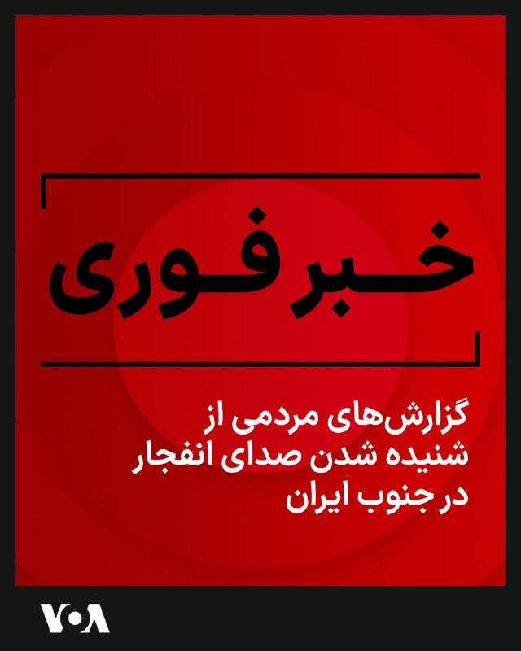

⚡️در ادامه حملات ایالات متحده به مواضع جمهوری اسلامی، کانال تلگرامی وحیدآنلاین به نقل از گزارش‌های «تائيد نشده» مردمی می‌گوید صدای انفجار در اهواز به‌گوش می‌رسد. پیش‌ از این، عمده گزارش‌ها از حملات به مواضع نظامی در استان هرمزگان بود. همچنین گزارش‌هایی از شنیده‌شدن صدای انفجار در شهر جم منتشر شده است. برخی مخاطبان صدای آمریکا نیز از شنیده‌شدن صدای انفجار در اهواز خبر داده‌‌اند.
@FarsiVOA

## FarsiVOA — post 220193

⚡️تشدید جنگ پهپادی اوکراین و روسیه؛ ضربه به تاسیسات نفتی و افزایش فشار اقتصادی بر مسکو
@FarsiVOA

## IranianMinds — post 22037

🔴 حملات مجدد آمریکا به قشم

@IranianMinds

## BBCPersian — post 283284

وقتی ایران شامگاه یکشنبه در واکنش به حملات اسرائیل به حزب‌الله لبنان، موشک‌ها و پهپادهایی را به سوی اسرائیل پرتاب کرد، اهمیت فوری نظامی این حمله در نگاه نخست محدود به نظر می‌رسید. اما اهمیت سیاسی آن ممکن است بسیار فراتر باشد.

ایران از هنگامی که درگیری نظامی مستقیم با اسرائیل داشته، حملات مستقیم خود به اسرائیل را در تلافی یا به عنوان پاسخی به حملاتی علیه خاک ایران، فرماندهان نظامی‌اش یا منافع خود انجام داده است. اما این بار ماجرا متفاوت بود.

تهران در حمایت از یکی از متحدانش دست به اقدام زد؛ حمله‌ای که در پی حمله اسرائیل به ساختمانی در جنوب بیروت انجام شد که اسرائیل مدعی بود با حزب‌الله ارتباط دارد.

اگرچه ایران اعلام کرد که حملات خود به اسرائیل را متوقف خواهد کرد، اما همین تصمیم برای حمله، پرسشی مهم را مطرح می‌کند: چرا رهبران ایران احساس کردند اکنون زمان مناسبی برای چنین اقدامی است، در حالی که می‌دانستند این کار خطر از سرگیری عملیات نظامی اسرائیل و حتی به خطر افتادن مذاکرات شکننده صلح با آمریکا را به همراه دارد؟

بیشتر بخوانید⬇️:

https://bbc.in/4v79OL8

📷GettyImages/ Reuters
@BBCPersian

---
📅 بروزرسانی: 1405/03/20 04:03
---

## VahidOOnLine — post 244602

♦️احمد دنیامالی، وزیر ورزش دولت مسعود پزشکیان، درباره شرایط حضور تیم ملی فوتبال ایران در جام جهانی ۲۰۲۶ گفت اگر پرچمی غیر از پرچم جمهوری اسلامی یا شعارهای هنجارشکنانه در ورزشگاه مشاهده شود، سرپرست تیم مسئولیت دارد بازی را متوقف کند.
دنیامالی تاکید کرد برگزارکنندگان و مجموعه‌های امنیتی مسئول فراهم کردن شرایط مناسب برای تیم ملی هستند و تا زمان رفع این موارد، امکان ادامه ندادن مسابقه وجود دارد. او همچنین درباره هم‌زمان با بازی ایران و مصر با رژه روز افتخارافراد با گرایش‌های جنسی متفاوت در سیاتل گفت برگزارکنندگان به مقام‌های جمهوری اسلامی اطمینان داده‌اند که جای نگرانی وجود ندارد و این موارد در چارچوب استانداردهای میزبانی مدیریت خواهد شد.
‌🇸🇦 Indypersian

🤖 @VahidOOnLine

## mwarmonitor — post 10583

📝 ضاحیه جنوبی بیروت خط قرمزه
ولی استان‌های جنوبی ایران نه؛

بعد همین فرقه شیطانی شیعه که مرزهای دلشون هزاران کیلومتر اون‌ورتر

به ما می‌گن وطن‌فروش

## pm_afshaa — post 93212

#ارسالی

اهواز صداش وحشتناک بود اسمونم حتی چند‌ ثانیه روشن شد

## pm_afshaa — post 93211

موج جدید حملات آمریکا اینسری به اهواز

💧 Rainbet.com the #1 Non-KYC Crypto Casino & Sportsbook @rainbetcom

😁 @Pm_Afshaa

## pm_afshaa — post 93210

  <a href="telegram/content/pm_afshaa_93210_1781051607.webm" target="_blank">🎬 Download video</a>

🎬 Video

## pm_afshaa — post 93209

ترامپ 1 ساعت دیگه
اتش بس ادامه داره...

## pm_afshaa — post 93207

  <a href="telegram/content/pm_afshaa_93207_1781051608.webm" target="_blank">🎬 Download video</a>

🔴صدای انفجار در اهواز

💧 Rainbet.com the #1 Non-KYC Crypto Casino & Sportsbook @rainbetcom

😁 @Pm_Afshaa

## pm_afshaa — post 93206

  <a href="telegram/content/pm_afshaa_93206_1781051609.webm" target="_blank">🎬 Download video</a>

🔴آبفا هرمزگان:
در پی حمله آمریکا به سیریک، دو مخزن استراتژیک آب شرب در بخش بمانی تخریب شده و آب‌رسانی به روستاهای این بخش و شهر کوهستک متوقف شده.

💧 Rainbet.com the #1 Non-KYC Crypto Casino & Sportsbook @rainbetcom

😁 @Pm_Afshaa

## pm_afshaa — post 93204

سد مجید خوابه؟

## pm_afshaa — post 93203

فکر میکردیم حملات محدوده
ولی تو جنوب اصلا محدود نبوده
بالای 1 ساعته داره میکوبه

## pm_afshaa — post 93202

مدیر شرکت آب سیرک تو جنوب ایران :
حمله آمریکا زیرساخت‌های آب شهر رو هدف قرار داده

💧 Rainbet.com the #1 Non-KYC Crypto Casino & Sportsbook @rainbetcom

😁 @Pm_Afshaa

## pm_afshaa — post 93201

سکوت عجیبی شد

## VahidOnline — post 76122

پیام‌های دریافتی تایید نشده:

یک صدای انفجار هم تو اهواز اومد 03:53

سلام وحید جان، اهواز ساعت 3:53 صدای بمب شنیده شد.

سلام همین الان اهواز رو زدن

همین الان اهواز صدا انفجار زدن پنجره لریزید

📡 @VahidOnline

## kianmeli1 — post 87834

🔴فوری

صدای مهیب انفجار در اهواز
https://t.me/kianmeli1

## kianmeli1 — post 87833

🔴شرکت آبفا هرمزگان

زیرساخت آب سیریک بصورت کامل منهدم شده است و چندین روستا و بخش آب ندارند
https://t.me/kianmeli1

## Shin_Persian — post 6824

  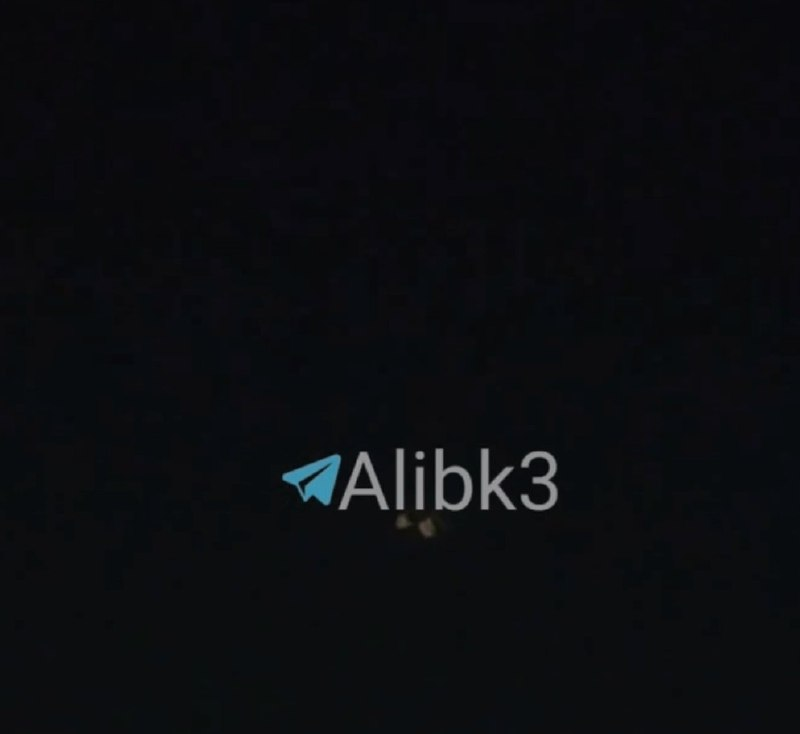

Shin ✓ @hey_itsmyturn
Wed, 10 Jun 2026 00:32:17 UTC

Thanks for giving some light to my video with your shiny watermark :)))

فارسی

ممنون که با واترمارک درخشانتون به ویدیوی من جلوه دادید :)))

𝕏 · @shin_persian

## Shin_Persian — post 6823

  <a href="telegram/content/Shin_Persian_6823_1781051611.mp4" target="_blank">🎬 Download video</a>

Shin ✓ @hey_itsmyturn
Wed, 10 Jun 2026 00:29:53 UTC

Some Telegram channels have posted this video as "Lorestan skies" (West of Iran), can't confirm at the moment.

فارسی

برخی کانال‌های تلگرامی این ویدیو را با عنوان «آسمان لرستان» (غرب ایران) منتشر کرده‌اند، در حال حاضر امکان تأیید آن وجود ندارد.

𝕏 · @shin_persian

## Shin_Persian — post 6822

  

Shin ✓ @hey_itsmyturn
Wed, 10 Jun 2026 00:26:11 UTC

0024Z
Loud explosion in Ahvaz, Khuzestan Province, #Iran
(Eyewitness believes it was a strike)

فارسی

۰۰۲۴ زولو (۰۳:۵۴ به وقت تهران)
انفجار مهیب در اهواز، استان خوزستان، #Iran
(شاهد عینی معتقد است که این یک حمله بوده است)

𝕏 · @shin_persian

## Shin_Persian — post 6821

  <a href="telegram/content/Shin_Persian_6821_1781051614.mp4" target="_blank">🎬 Download video</a>

Shin ✓ @hey_itsmyturn
Wed, 10 Jun 2026 00:25:18 UTC

Heading east over Tehran as per the cameraperson

فارسی

در حال حرکت به سمت شرق بر فراز تهران بنا بر گفته فیلم‌بردار

𝕏 · @shin_persian

## Iliaen — post 4467

ساعت حدود ۰۳:۴۰ صبح چهارشنبه؛ در مجموع حدود ۱۵ انفجار در قشم شنیده شد. مکان انفجارها مشخص نیست و برخی از فاصله‌ی دور شنیده شدند.

احتمالاً برخی از انفجارها مرتبط با جزیره لارَک در نزدیک قشم هستند که محل استقرار قایق‌های تندرو سپاه و انبار پهپاد است.

@iliaen

## DW_Farsi — post 125747

  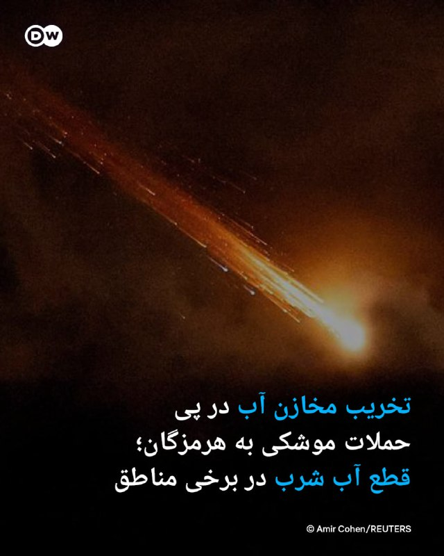

🔶 تخریب مخازن آب در پی حملات موشکی به هرمزگان؛ قطع آب شرب در بخش بمانی و شهر کوهستک

در پی حملات موشکی آمریکا به زیرساخت‌های استان هرمزگان در بامداد چهارشنبه ۲۰ خرداد، دو مخزن استراتژیک آب در بخش بمانی به طور کامل تخریب شدند و شبکه توزیع آب شرب در این منطقه و شهر کوهستک به طور کامل قطع شد.

عبدالحمید حمزه‌پور، مدیرعامل شرکت آب و فاضلاب استان هرمزگان با تایید این خبر اعلام کرد، "این حمله موشکی ساعاتی پیش رخ داده و طی آن دو مخزن با ظرفیت‌های ۵۰۰ و ۲ هزار متر مکعب به طور صد درصد نابود شده‌اند".

به گفته این مقام مسئول، این مخازن نقش کلیدی و حیاتی در تامین آب شرب ساکنان بخش بمانی و شهر کوهستک ایفا می‌کردند.

مدیرعامل آبفای هرمزگان در ادامه تصریح کرد، در حال حاضر روند توزیع آب در تمامی روستاهای بخش بمانی و شهر کوهستک متوقف شده است.

📌تصویر از آرشیو
@dw_farsi

## IranianMinds — post 22036

🔴 چند انفجار مهیب در اهواز

@IranianMinds

## IranianMinds — post 22035

🔴 حملات موشکی آمریکا به اهواز

@IranianMinds

## IranianMinds — post 22034

اهوازو زدن ؟

## IranianMinds — post 22033

🔴شرکت آبفا :

زیرساخت آب سیریک بصورت کامل منهدم شده است و چندین روستا و بخش آب ندارند

@IranianMinds

---
📅 بروزرسانی: 1405/03/20 03:52
---

## mwarmonitor — post 10582

🔴حمله مجدد آمریکا به جزیره قشم

## mwarmonitor — post 10581

  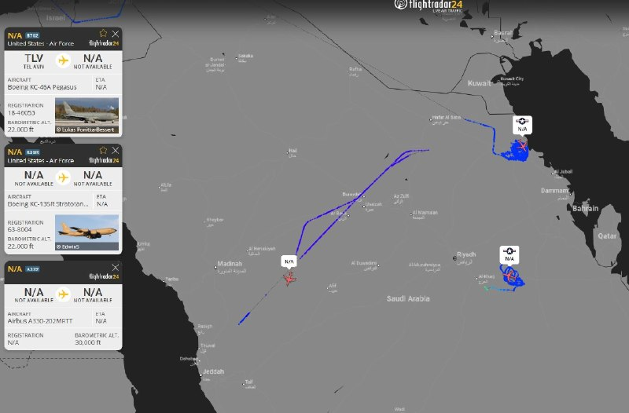

✈️اکنون در حال فعالیت بر فراز عربستان سعودی:

✈️دو فروند هواپیمای سوخت‌رسان نیروی هوایی آمریکا و یک فروند تانکر A330 MRTT متعلق به نیروی هوایی سلطنتی عربستان سعودی.

@mwarmonitor

## pm_afshaa — post 93200

  

اخبار ثانیه ای و لحضه به لحضه جنگ رو با کانال ما دنبال کنید

بــاز نــیوز مرجع کانال های خبری و مردمی 👇🏻❌

t.me/BuzNewss ❗️
t.me/BuzNewss ❗️
t.me/BuzNewss ❗️
t.me/BuzNewss ❗️

## pm_afshaa — post 93199

انفجار مجدد در قشم

💧 Rainbet.com the #1 Non-KYC Crypto Casino & Sportsbook @rainbetcom

😁 @Pm_Afshaa

## pm_afshaa — post 93198

از خورستان موشک بلند شد

💧 Rainbet.com the #1 Non-KYC Crypto Casino & Sportsbook @rainbetcom

😁 @Pm_Afshaa

## pm_afshaa — post 93197

بی بی دلتنگتم😭

## pm_afshaa — post 93196

صدای انفجار مجدد در قشم شنیده شده.

💧 Rainbet.com the #1 Non-KYC Crypto Casino & Sportsbook @rainbetcom

😁 @Pm_Afshaa

## pm_afshaa — post 93195

دلم برات تنگ شده بی بی برگرد بیا بدون تو حال نمیده تهران شباش💔

## pm_afshaa — post 93194

دلم برات تنگ شده بی بی برگرد بیا
بدون تو حال نمیده تهران شباش💔

## pm_afshaa — post 93193

  <a href="telegram/content/pm_afshaa_93193_1781050960.mp4" target="_blank">🎬 Download video</a>

اسمون لرستان

💧 Rainbet.com the #1 Non-KYC Crypto Casino & Sportsbook @rainbetcom

😁 @Pm_Afshaa

## pm_afshaa — post 93192

انفجار مجدد در بندرعباس

💧 Rainbet.com the #1 Non-KYC Crypto Casino & Sportsbook @rainbetcom

😁 @Pm_Afshaa

## pm_afshaa — post 93191

احتمالا سایت موشکی جم هدف قرار گرفته.

💧 Rainbet.com the #1 Non-KYC Crypto Casino & Sportsbook @rainbetcom

😁 @Pm_Afshaa

## pm_afshaa — post 93190

از اصفهان موشک بلند شد

💧 Rainbet.com the #1 Non-KYC Crypto Casino & Sportsbook @rainbetcom

😁 @Pm_Afshaa

## pm_afshaa — post 93189

  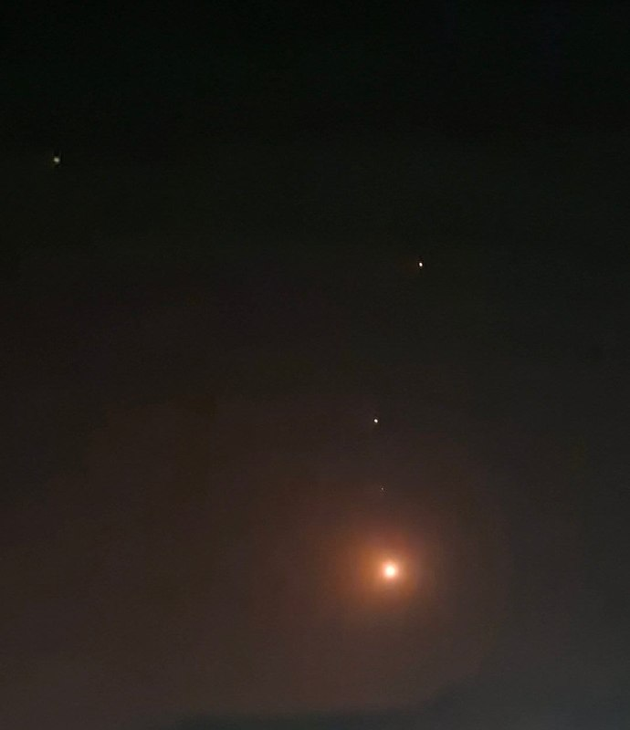

پدافند جم در حال مقابله با پهپاد هاست

💧 Rainbet.com the #1 Non-KYC Crypto Casino & Sportsbook @rainbetcom

😁 @Pm_Afshaa

## pm_afshaa — post 93187

  <a href="telegram/content/pm_afshaa_93187_1781050963.mp4" target="_blank">🎬 Download video</a>

تصاویری از آسمان جم :

💧 Rainbet.com the #1 Non-KYC Crypto Casino & Sportsbook @rainbetcom

😁 @Pm_Afshaa

## pm_afshaa — post 93186

  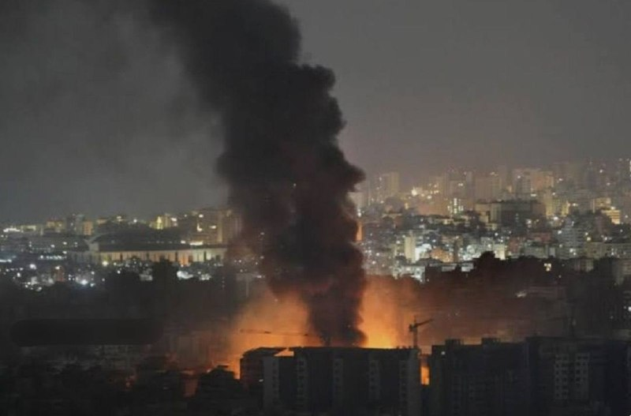

تصویر منتسب به قشم همین الان :

💧 Rainbet.com the #1 Non-KYC Crypto Casino & Sportsbook @rainbetcom

😁 @Pm_Afshaa

## kianmeli1 — post 87832

  <a href="telegram/content/kianmeli1_87832_1781050964.mp4" target="_blank">🎬 Download video</a>

🔴تصاویر انهدام یک شیء بر فراز آسمان شهر جم، بوشهر
https://t.me/kianmeli1

## Shin_Persian — post 6820

Shin ✓ @hey_itsmyturn
Wed, 10 Jun 2026 00:21:41 UTC

Initial: UAV was shot down over Bushehr province, southern Iran

فارسی

یک پهپاد در فراز استان بوشهر در جنوب ایران سرنگون شد.

𝕏 · @shin_persian

## Shin_Persian — post 6818

  <a href="telegram/content/Shin_Persian_6818_1781050965.mp4" target="_blank">🎬 Download video</a>

Shin ✓ @hey_itsmyturn
Wed, 10 Jun 2026 00:19:29 UTC

Unverified videos from Jam, Bushehr Province, #Iran
(Media: Not mine)

فارسی

ویدیوهای تأیید نشده از جم، استان بوشهر، #Iran
(رسانه: متعلق به من نیست)

𝕏 · @shin_persian

## Shin_Persian — post 6817

  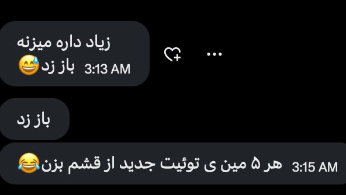

Shin ✓ @hey_itsmyturn
Wed, 10 Jun 2026 00:15:57 UTC

Several more blasts in Qeshm island, Hormozgan Province, #Iran

فارسی

چندین انفجار دیگر در جزیره قشم، استان هرمزگان، #Iran_

𝕏 · @shin_persian

## Shin_Persian — post 6816

  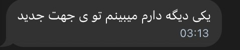

Shin ✓ @hey_itsmyturn
Wed, 10 Jun 2026 00:13:56 UTC

3rd BM spotted over Shahin Shahr just now
Isfahan Province, #Iran
(0013Z)

فارسی

همین الان سومین موشک بالستیک بر فراز شاهین‌شهر دیده شد
استان اصفهان، #Iran
(۰۰۱۳Z (۰۳:۴۳ به وقت تهران))

𝕏 · @shin_persian

## Shin_Persian — post 6815

Shin ✓ @hey_itsmyturn
Wed, 10 Jun 2026 00:12:51 UTC

2 were spotted by the eyewitness.

فارسی

۲ نفر توسط شاهد عینی رویت شدند.

𝕏 · @shin_persian

## Shin_Persian — post 6814

Shin ✓ @hey_itsmyturn
Wed, 10 Jun 2026 00:12:10 UTC

BM launch from Shahin Shahr
Isfahan Province, #Iran

فارسی

شلیک موشک بالستیک از شاهین‌شهر
استان اصفهان، #Iran

𝕏 · @shin_persian

## Iliaen — post 4466

اگر از بندرعباس، سیریک و چند شهر دیگر در جنوب که نزدیک مناطق انفجار هستند این پیام را می‌بینید، علی‌رغم اینکه انفجارها در مرکز شهر نیست، توصیه می‌شود از حضور در پشت‌بام خودداری فرمایید؛ زیرا شدّت انفجارها زیاد است و می‌تواند هزاران ترکش کوچکِ سنگی را تا کیلومتر‌ها و در جهت‌های متفاوت پرتاب کند.

@iliaen

## FarsiVOA — post 220192

  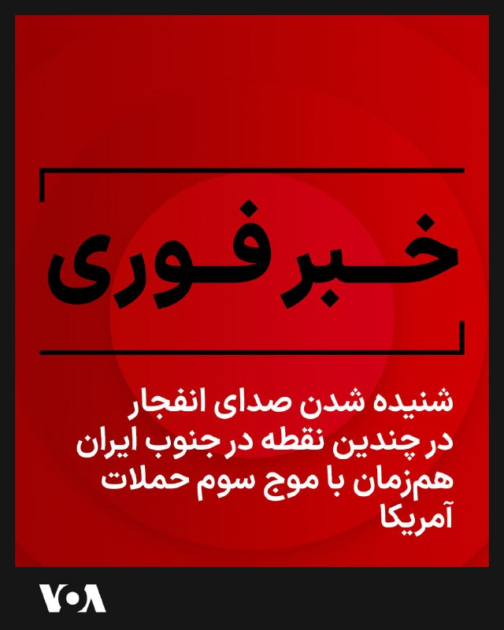

⚡️در پی ادامه حملات آمریکا به مواضع جمهوری اسلامی، گزارش‌ها از شنیده شدن صدای انفجار در جاسک، بندرعباس، و جزیره قشم حکایت دارد. دونالد ترامپ، رئیس جمهوری آمریکا ساعاتی قبل گفت: پاسخ ما به اقدام جمهوری اسلامی در سرنگونی هلی‌کوپتر آمریکا «بسیار قوی و قدرتمند» خواهد بود.
@FarsiVOA

## IranianMinds — post 22032

🔴 حمله آمریکا به جم @IranianMinds

## IranianMinds — post 22031

شلیک موشک از لرستان

@IranianMinds

## IranianMinds — post 22030

شلیک موشک از اصفهان و خوزستان

@IranianMinds

## IranianMinds — post 22029

  <a href="telegram/content/IranianMinds_22029_1781050967.mp4" target="_blank">🎬 Download video</a>

حملات آمریکا به قشم

@IranianMinds

---
📅 بروزرسانی: 1405/03/20 03:42
---

## VahidOOnLine — post 244601

  <a href="telegram/content/VahidOOnLine_244601_1781050364.mp4" target="_blank">🎬 Download video</a>

♦️تسنیم، خبرگزاری وابسته به سپاه پاسداران، بامداد چهارشنبه، تصاویری از عبور یک پهپاد «شاهد» را در آسمان عراق منتشر کرد.
ارتش ایالات متحده با انتشار بیانیه‌ای رسمی اعلام کرد که در پاسخ به سرنگونی هلیکوپتر آپاچی آمریکا، حملاتی را به جنوب ایران انجام داده است. رسانه‌های داخلی از حملات به قشم، سیریک، جاسک، کوه مبارکه، بندرعباس و میناب در جنوب ایران خبر دادند. «سی‌ان‌ان» نیز گزارش داد که سپاه حملات موشکی و پهپادی خود را به سمت اهداف ایالات متحده در منطقه آغاز کرده است.
‌🇸🇦 Indypersian

🤖 @VahidOOnLine

## mwarmonitor — post 10580

🔴هدف قرار دادن یک پهپاد در آسمان شهر جم در استان بوشهر

@mwarmonitor

## mwarmonitor — post 10579

🔴به گفته یک مقام آمریکایی، دور سوم حملات اکنون در حال انجام است.

@mwarmonitor

## mwarmonitor — post 10578

🔴فعال‌سازی سامانه‌های پدافند هوایی در بندرعباس

## pm_afshaa — post 93185

اخبار جنگ به صورت اختصاصی از
کانال «اخبار اوین » دنبال کنید 
👑

@Evin_khabar
@Evin_khabar
@Evin_khabar

به جای کانالای حکومتی از کانالای مردمی حمایت کنید 
👑

## pm_afshaa — post 93184

  

تصویر منتسب به قشم همین الان :

💧 Rainbet.com the #1 Non-KYC Crypto Casino & Sportsbook @rainbetcom

😁 @Pm_Afshaa

## pm_afshaa — post 93183

  <a href="telegram/content/pm_afshaa_93183_1781050367.webm" target="_blank">🎬 Download video</a>

🎬 Video

## pm_afshaa — post 93182

یک مقام آمریکایی به آکسیوس:
دور سوم حملات اکنون در حال انجامه.

💧 Rainbet.com the #1 Non-KYC Crypto Casino & Sportsbook @rainbetcom

😁 @Pm_Afshaa

## pm_afshaa — post 93181

انفجار در بوشهر

💧 Rainbet.com the #1 Non-KYC Crypto Casino & Sportsbook @rainbetcom

😁 @Pm_Afshaa

## pm_afshaa — post 93180

  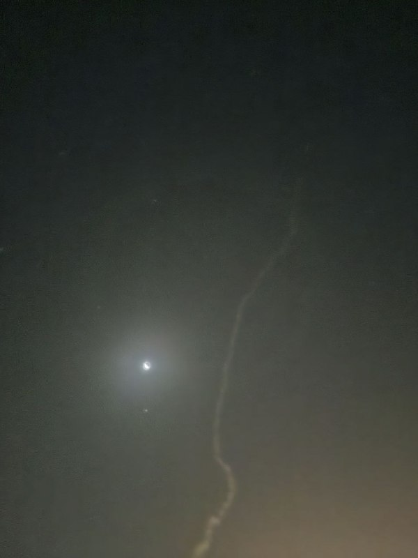

جم

💧 Rainbet.com the #1 Non-KYC Crypto Casino & Sportsbook @rainbetcom

😁 @Pm_Afshaa

## pm_afshaa — post 93179

انفجار در جم

💧 Rainbet.com the #1 Non-KYC Crypto Casino & Sportsbook @rainbetcom

😁 @Pm_Afshaa

## pm_afshaa — post 93178

  <a href="telegram/content/pm_afshaa_93178_1781050368.webm" target="_blank">🎬 Download video</a>

🔴طبق گزارش‌ها، صدای انفجار از محدوده پالایشگاه ستاره خلیج فارس در بندرعباس شنیده شده.

پالایشگاه ستاره خلیج فارس بزرگ‌ترین پالایشگاه میعانات گازی کشور محسوب میشه و حدود 35 تا 40 درصد بنزین مصرفی کشور رو تولید میکنه.

💧Rainbet.com the #1 Non-KYC Crypto Casino & Sportsbook @rainbetcom

😁 @Pm_Afshaa

## pm_afshaa — post 93177

سپاه:اسرائیل در بخشی از حملات شرکت دارد

💧 Rainbet.com the #1 Non-KYC Crypto Casino & Sportsbook @rainbetcom

😁 @Pm_Afshaa

## mamlekate — post 103656

📝 بندرعباس ۰۳:۲۴ صدای دوتا انفجار اومد بنظرم

📝 شهر جم ساعت ۰۳:۳۲ چهارشنبه ۲۰خرداد صدای انفجار

@mamlekate

## VahidOnline — post 76121

پیام‌های دریافتی:

از جم شلیک کردن ساعت ۳:۳۳
نصفش تو هوا منفجر شد،بقیه‌اش هم نمیدونم کجا قراره فرود بیاد.
بعد از انتشار پست: وحید جان نزدن،تو آسمون منفجر شد،صدای اون بود.

سلام وحید جان شهرستان جم رو همین الان ۳ و نیم صبح زدن، یه صدایی اومد ولی چون پنجره‌ بسته است لرزشش خیلی بیشتر بود

ساعت ۳:۳۴ شهر جم رو زدن
اول فکردیم موشک بلند شد
ولی بعدش خورد زمین ترکید

سلام فک کنم جم رو زدن یه صدای انفجاری اومد الان 3:35

توی جم این پدافند بود فعال شد اون صدای انفجار هم پهباد زدن باهاش

قشم: دوباره یه لرزش دیگه ۳:۳۹
احتمالا بندرعباسه ما داریم حس می‌کنیم

وحید هنوز صدای انفجار قشم داره حس میشه
همین
الان پشت سر هم

سلام وقت بخیر ۳:۳۸ بندر عباس پایگاه هوایی رو زدن
📡 @VahidOnline

## kianmeli1 — post 87831

  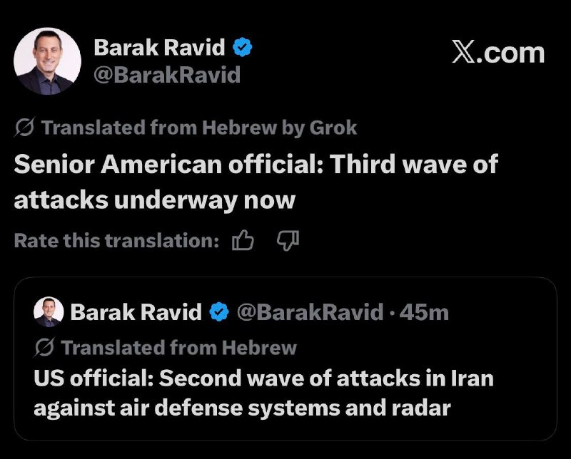

🔴فوری

یک مقام ارشد آمریکایی به اکسیوس: موج سوم حملات در ایران آغاز شده است
https://t.me/kianmeli1

## kianmeli1 — post 87830

🔴دقایقی قبل موج دوم حملات به بندرعباس

صدای چندین انفجار در بندرعباس شنیده شده است
https://t.me/kianmeli1

## Shin_Persian — post 6813

Shin ✓ @hey_itsmyturn
Wed, 10 Jun 2026 00:10:19 UTC

0010Z
Blast heard in Qeshm island just now
Hormozgan Province, #Iran

فارسی

۰۰۱۰ زولو (۰۳:۴۰ به وقت تهران)
هم‌اکنون صدای انفجاری در جزیره قشم شنیده شد
استان هرمزگان، #Iran_

𝕏 · @shin_persian

## Shin_Persian — post 6812

Shin ✓ @hey_itsmyturn
Wed, 10 Jun 2026 00:09:44 UTC

At 0001Z, a blast was heard in Jam, Bushehr Province, #Iran
(Jam has an infamous missile city as well)

فارسی

در ساعت ۰۰۰۱ زولو (۰۳:۳۱ به وقت تهران)، صدای انفجاری در جم، استان بوشهر، #Iran شنیده شد.
(جم یک شهر موشکی بدنام نیز دارد)

𝕏 · @shin_persian

## Shin_Persian — post 6811

Shin ✓ @hey_itsmyturn
Wed, 10 Jun 2026 00:02:51 UTC

State-Owned Mehr News:

Explosions were heard in Qeshm and Bandar Abbas
Hormozgan Province, #Iran

فارسی

خبرگزاری دولتی مهر:

صدای انفجارها در قشم و بندرعباس شنیده شد.
استان هرمزگان، #Iran_

𝕏 · @shin_persian

## Iliaen — post 4465

بازه زمانی ۰۳:۰۰ الی ۰۳:۳۰ صبح چهارشنبه؛ چند انفجار مهیب در بندرعباس شنیده شد.

علی‌رغم دور بودن محل انفجارها از مرکز شهر، شدّت و صدای انفجارها بسیار زیاد است و در کل مناطق شنیده می‌شود.

همزمان با بندرعباس، چندین نقطه‌ی دیگر در جنوب هرمزگان هدف اصابت موشک قرار گرفت.

@iliaen

## FarsiVOA — post 220191

  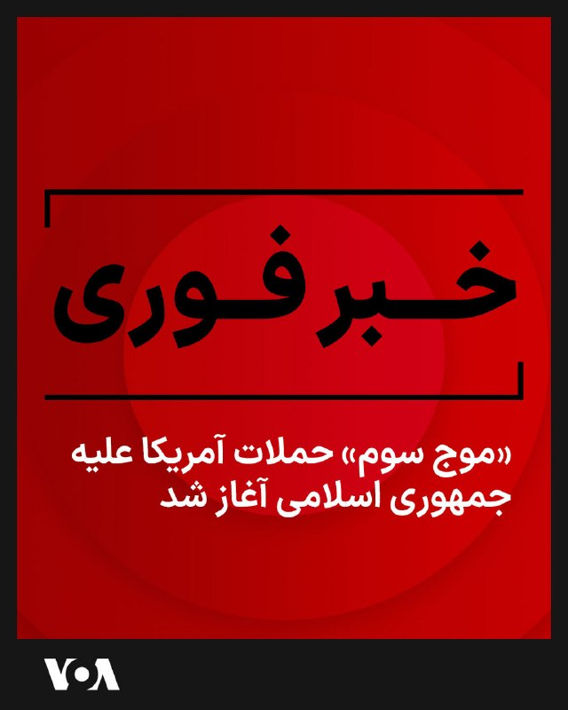

⚡️باراک راوید، خبرنگار آکسیوس به نقل از یک مقام آمریکایی گفت که اکنون «موج سوم» حملات آمریکا علیه جمهوری اسلامی آغاز شده‌است.
@FarsiVOA

## FarsiVOA — post 220190

  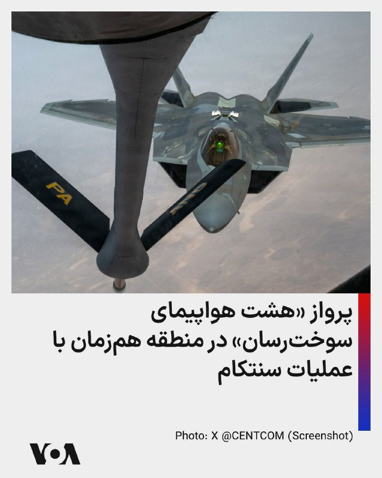

⚡️فاکس‌نیوز به نقل از سایت‌های رصد پروازها می‌گوید که دست‌کم هشت هواپیمای سوخت‌رسان هم‌زمان با عملیات نظامی آمریکا علیه جمهوری اسلامی مشغول پرواز در منطقه هستند. به‌نظر می‌رسد آن‌ها مشغول پشتیبانی از حملات سنتکام به مواضع جمهوری اسلامی هستند.
@FarsiVOA

## DW_Farsi — post 125746

  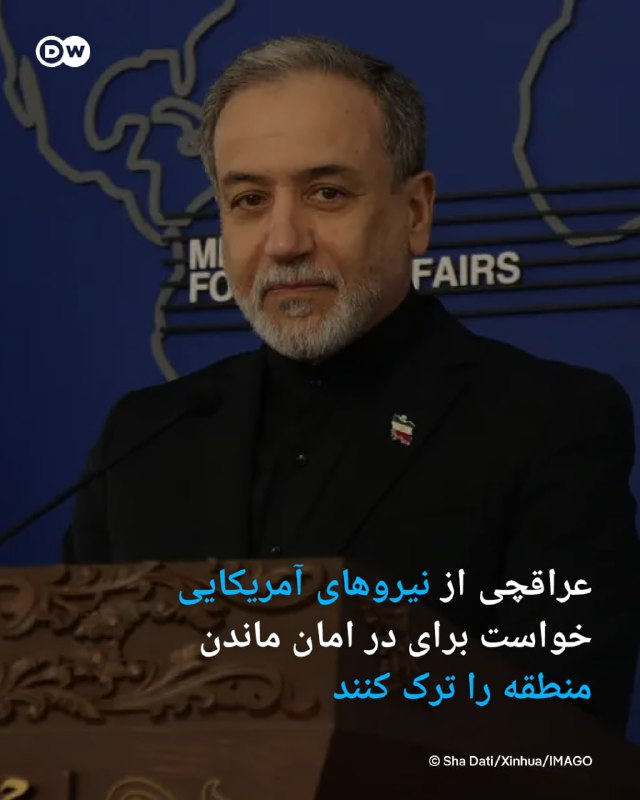

🔶 عراقچی از نیروهای آمریکایی خواست برای در امان ماندن منطقه را ترک کنند

عباس عراقچی، وزیر خارجه ایران در پیامی در شبکه ایکس به نیروهای آمریکایی هشدار داد که برای در امان ماندن منطقه را ترک کنند.

این در حالی است که شبکه خبری الجزیره بامداد چهارشنبه ۱۰ ژوئن (۲۰ خرداد) به نقل از پایگاه اکسیوس از آغاز موج دوم حملات آمریکا علیه سیستم‌های پدافندی و راداری ایران خبر داده است.
@dw_farsi

## IranianMinds — post 22028

🔴 حمله آمریکا به جم

@IranianMinds

## IranianMinds — post 22027

🔴 کانال ۱۲ اسرائیل :

موج‌ سوم حملات آمریکا به جنوب ایران آغاز شد.

@IranianMinds

## IranianMinds — post 22026

بندر عباسو‌ بد شخم زدن امشب

@IranianMinds

---
📅 بروزرسانی: 1405/03/20 03:32
---

## VahidOOnLine — post 244600

  

مایک جانسون، رییس مجلس نمایندگان آمریکا، گفت پیشاپیش از دور جدید حملات آمریکا به جمهوری اسلامی با خبر شده بود. او این حمله‌ها را «متناسب و محدود» توصیف کرد و گفت این عملیات سامانه‌های راداری، موشکی و مراکز فرماندهی و کنترل را هدف گرفته است.
‌🏁 🇬🇧 IranintlTV

🤖 @VahidOOnLine

## VahidOOnLine — post 244599

  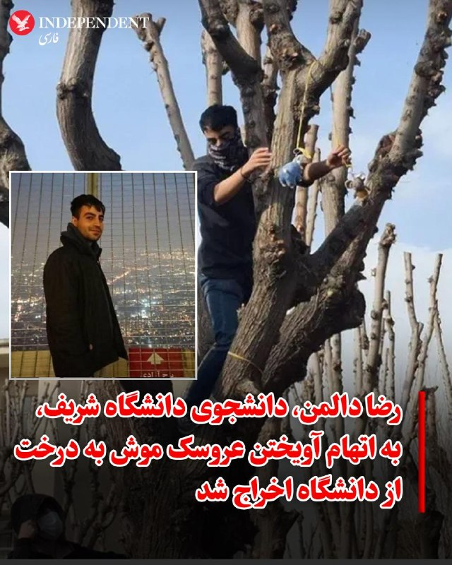

♦️رضا دالمن، دانشجوی کارشناسی ارشد مهندسی کامپیوتر دانشگاه صنعتی شریف، با حکم شورای انضباطی این دانشگاه به اخراج و محرومیت از تحصیل در تمامی دانشگاه‌های کشور به مدت چهار سال محکوم شد.
به گزارش خبرگزاری دانشجو، این حکم پس از تایید در شورای تجدیدنظر دانشگاه برای اجرا به وزارت علوم ارسال شده است. بر اساس این حکم، دالمن که ورودی سال ۱۴۰۳ مقطع کارشناسی ارشد مهندسی کامپیوتر است، از دانشگاه اخراج و از ادامه تحصیل در همه دانشگاه‌های کشور به مدت چهار سال محروم شده است.
دادبان پیش‌تر گزارش داده بود که رضا دالمن، دانشجوی ۲۴ ساله دانشگاه صنعتی شریف، شب سال نو ۱۴۰۵ به اتهام آویختن عروسک موش به درخت بازداشت شده بود. او ۲۸ اسفندماه ۱۴۰۴ بازداشت و حدود یک ماه بعد با تودیع وثیقه آزاد شد.
‌🇸🇦 Indypersian

🤖 @VahidOOnLine

## WithYashar — post 14255

https://t.me/boost/withyashar

۳۹۰ بوست پرمیوم هاااا

## WithYashar — post 14254

۴ انفجار‌شدید بندر عباس
@withyashar

## mwarmonitor — post 10577

🔴 حمله دوباره آمریکایی به سیریک

## FoxNewsTwitter — post 342782

  

Fox News (Twitter/X)

BREAKING: Trump-backed Republican Steve Hilton has advanced in the California governor's race, the Associated Press projects.

Hilton will run against former President Biden's Health and Human Services Secretary, Xavier Becerra.

## FoxNewsTwitter — post 342781

  <a href="telegram/content/FoxNewsTwitter_342781_1781049774.mp4" target="_blank">🎬 Download video</a>

Fox News (Twitter/X)

FOX NEWS REPORT: Just three days before the first U.S. Men's World Cup match, hospitality workers at the Los Angeles stadium have reached a tentative agreement to avoid a strike, FOX News’ @BillMelugin_ reports ahead of kickoff.

## pm_afshaa — post 93176

افراد محلی میگن تو جنگ 40 روزه هم همچین حملاتی در تایم کوتاه و همزمان به بندرعباس نشده بوده.

💧 Rainbet.com the #1 Non-KYC Crypto Casino & Sportsbook @rainbetcom

😁 @Pm_Afshaa

## pm_afshaa — post 93175

گزارش سنتکام از تعداد حمله بیاد جالبه
گزارش‌ها از انفجار در بندرعباس خیلی زیاده

💧 Rainbet.com the #1 Non-KYC Crypto Casino & Sportsbook @rainbetcom

😁 @Pm_Afshaa

## pm_afshaa — post 93174

هنوز بندرعباس صدای انفجار

💧 Rainbet.com the #1 Non-KYC Crypto Casino & Sportsbook @rainbetcom

😁 @Pm_Afshaa

## pm_afshaa — post 93173

3 انفجار در بندر عباس

💧 Rainbet.com the #1 Non-KYC Crypto Casino & Sportsbook @rainbetcom

😁 @Pm_Afshaa

## pm_afshaa — post 93172

انفجار های شدید در بندرعباس ادامه داره.

💧 Rainbet.com the #1 Non-KYC Crypto Casino & Sportsbook @rainbetcom

😁 @Pm_Afshaa

## pm_afshaa — post 93171

🔴منابع عراقی: جنگنده‌های آمریکایی در تعداد بالا درحال پرواز در آسمان عراق هستن

💧 Rainbet.com the #1 Non-KYC Crypto Casino & Sportsbook @rainbetcom

😁 @Pm_Afshaa

## pm_afshaa — post 93170

  <a href="telegram/content/pm_afshaa_93170_1781049776.webm" target="_blank">🎬 Download video</a>

🔴حملات آمریکا در جنوب کشور از جمله سیریک، قشم و بندرعباس شدید گزارش شده. 
💧 Rainbet.com the #1 Non-KYC Crypto Casino & Sportsbook @rainbetcom 
😁 @Pm_Afshaa

## VahidOnline — post 76120

  

مایک جانسون، رییس مجلس نمایندگان آمریکا، گفت پیشاپیش از دور جدید حملات آمریکا به جمهوری اسلامی با خبر شده بود. او این حمله‌ها را «متناسب و محدود» توصیف کرد و گفت این عملیات سامانه‌های راداری، موشکی و مراکز فرماندهی و کنترل را هدف گرفته است.
@VahidOOnLine

📡 @VahidOnline

## VahidOnline — post 76119

پیام‌‌های دریافتی تایید نشده:

سلام وحید جان، ۰۳:۱۸ و ۰۳:۱۹ دوتا صدای انفجار اومد بندرعباس
الانم دوتا وحشتناک تر🤯

همین الان بندرعباس صدا اومد ۳:۲۱

سلام وحید همین الان دوتا انفجار شدید بندرعباس

وحید بندرعباس انفجار شدید

همين الان بندرعباس صدا اومد ٣:٢٢ دقيقه

درود بندر ۳.۲۳ انفجار پیاپی + ۳.۲۲
و مجدد ۳.۲۴ بندرعباس

دوتا صدای وحشتناک ۳:۲۳
همین الان بندرعباس

سلام وحید سیریک سمت روستایی طاهرویی صدای انفجار شدیدی اومدم فکر کنم نیرو دریایی سپاه رو زدن

سلا وحید جان، همین الان بندرعباس صدای دوتا انفجار پشت سر هم اومد، ترسناک بود

صدای انفجار بندرعباس همین الان دوبار صدا اومد
صدای نسبتا شدید و خطرناک

وحید ساعت ۳:۲۴ بندرعباس صدای دو تا انفجار

بندرعباس ۴ انفجار

قشم ساعت ۳:۲۳ بامداد ۲۰ خرداد
در محدوده طولا یه لرزش نسبتا شدید احساس شد ولی صدای انفجار خاصی نیومد، شاید زلزله شاید هم انفجارات حمله‌های اخیر بوده که لرزشش رو حس کردیم، خونه کامل لرزید

سلام وحید جان همین حالا قشم ۲ تا صدای انفجار اومد ، دومی نزدیکتر یا شدید تر بود

بندر دوتا انفجار خیلی شدید پشت سرهم اومد سمت پارک جنگلی

ساعت ۳:۲۳ بامداد بندرعباس یه چیزی منفجر شد

سلام سمت پایگاه هوایی بندرعباس رو میزنن

#قشم، 03:23، 20 خرداد صدای بلند انفجار شنیده شد. (شاید صدای انفجار بندرعباس بوده)

سلام بندعباس صدای انفجار الان چهارشنبه ۳:۲۴

نزديك پایگاه هوایی بندرعباس خونه ماست به فاصله پنج دقیقه چهار انفجار بزرگ صدا اومد

اقا وحید بندر خیلی صدا انفجار میاد

سلام وحید جان بندرعباس 3:24 دوبار زدن صدای خیلی زیادی اومد همراه با لرزش

وحید جان درود
ساعت 3:24 دقیقه بامداد چهارشنبه 4 انفجار شدید سمت فرودگاه و پایگاه هوایی بندرعباس

۳:۲۳ دقیقه ۴ ۵ تا پشت هم زدن بندر رو
📡 @VahidOnline

## IranIntlTV — post 341424

  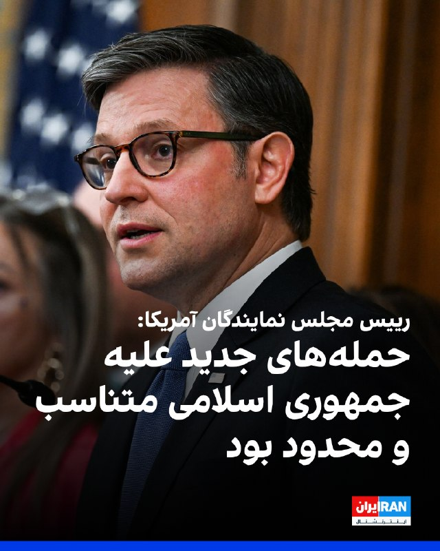

مایک جانسون، رییس مجلس نمایندگان آمریکا، گفت پیشاپیش از دور جدید حملات آمریکا به جمهوری اسلامی با خبر شده بود. او این حمله‌ها را «متناسب و محدود» توصیف کرد و گفت این عملیات سامانه‌های راداری، موشکی و مراکز فرماندهی و کنترل را هدف گرفته است.
https://iranintl.com/202606096156

## Shin_Persian — post 6810

  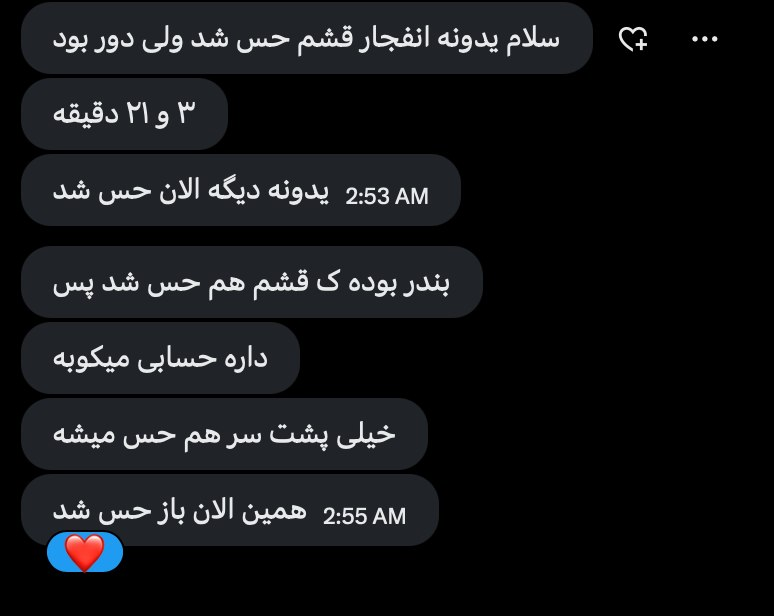

Shin ✓ @hey_itsmyturn
Tue, 09 Jun 2026 23:59:53 UTC

Several blasts felt in Qeshm between 2351Z to 2355Z
(Presumably from Bandar Abbas' side)

فارسی

چندین انفجار بین ساعت ۲۳۵۱ زولو (۰۳:۲۱ به وقت تهران) تا ۲۳۵۵ زولو (۰۳:۲۵ به وقت تهران) در قشم احساس شد
(احتمالاً از سمت بندرعباس)

𝕏 · @shin_persian

## Shin_Persian — post 6809

Shin ✓ @hey_itsmyturn
Tue, 09 Jun 2026 23:53:37 UTC

Blast in Bandar Abbas, Hormozgan Province, #Iran

فارسی

انفجار در بندرعباس، استان هرمزگان، #Iran

𝕏 · @shin_persian

## Shin_Persian — post 6808

  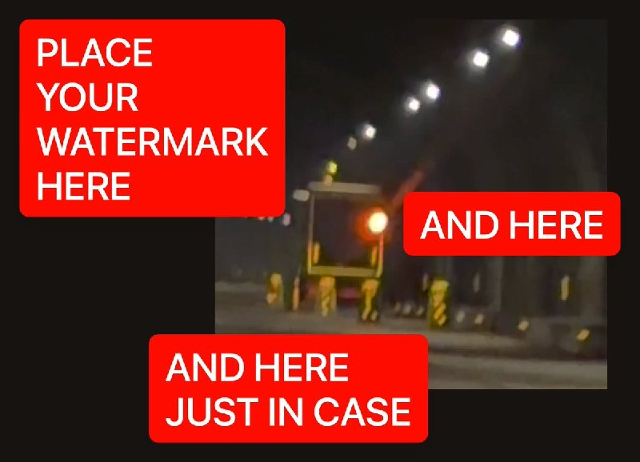

Shin ✓ @hey_itsmyturn
Tue, 09 Jun 2026 23:52:57 UTC

Inb4 some telegram channel watermark it this way

فارسی

پیش از آنکه برخی کانال‌های تلگرامی به این شکل روی آن واترمارک بزنند

𝕏 · @shin_persian

## FarsiVOA — post 220189

  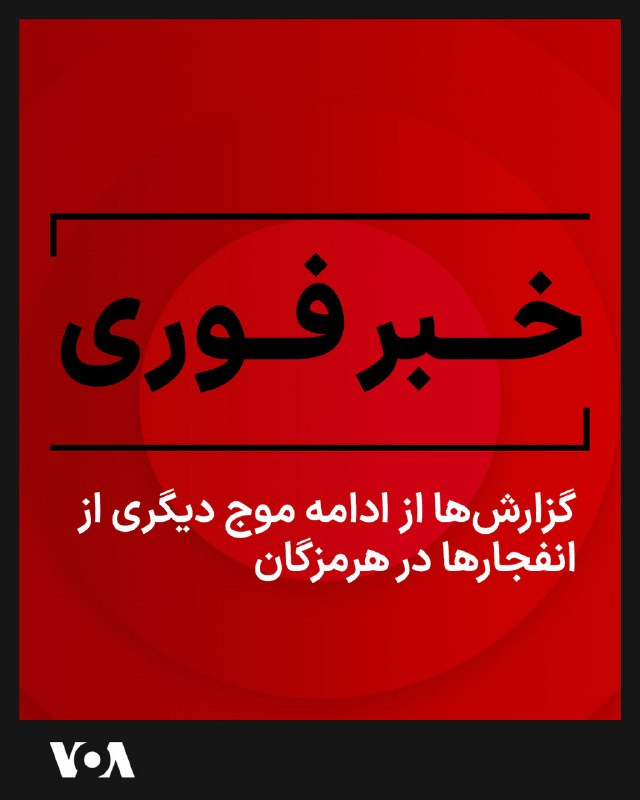

⚡️خبرگزاری‌های حکومتی در ایران دقایقی پیش خبر دادند که یک بار دیگر صدای انفجارها در شهرستان جاسک واقع در استان هرمزگان گزارش شد. ایالات متحده ساعاتی پیش اعلام کرد که حملات خود به مواضع رژیم را در واکنش به سرنگون کردن یک هلی‌کوپتر آمریکایی،‌ آغاز کرده است.
@FarsiVOA

## FarsiVOA — post 220188

⚡️محکومیت جهانی تیراندازی طالبان به معترضان در هرات افغانستان
@FarsiVOA

## DW_Farsi — post 125745

  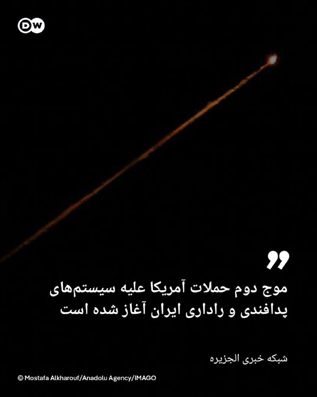

🔴 الجزیره: آغاز موج دوم حملات آمریکا علیه سیستم‌های پدافندی و راداری ایران

شبکه خبری الجزیره بامداد چهارشنبه ۱۰ ژوئن (۲۰ خرداد) به نقل از پایگاه اکسیوس از آغاز موج دوم حملات آمریکا علیه سیستم‌های پدافندی و راداری ایران خبر داد.

این در حالیست که گزارش‌هایی از موج دوم حملات هوایی آمریکا منتشر شده اما سنتکام هنوز اطلاعیه جدیدی در این‌باره منتشر نکرده است.

خبرگزاری صداوسیما نیز گزارش کرد، "لحظاتی پیش مجددا صدای انفجار در محدوده شهرستان جاسک در استان هرمزگان شنیده شده است".

به گزارش خبرگزاری مهر، "بامداد چهارشنبه صدای انفجارهایی در محدوده شهرستان قشم از سوی منابع محلی و ساکنان بندر سیریک و روستاهای اطراف گزارش شده است. هنوز ماهیت این صداها به طور دقیق مشخص نیست".

پیش‌تر حملات به بندر جاسک تایید شده بود. پایگاه خبری اکسیوس شامگاه سه‌شنبه به نقل از یک مقام آمریکایی گزارش داد، حملات تلافی‌جویانه ارتش آمریکا چندین سامانه پدافند هوایی و راداری ایران را در اطراف تنگه هرمز هدف قرار داده است.

در همین حال خبرگزاری‌های داخلی ایران با انتشار تصاویری از مشاهده پهپادهای انتحاری ایران در آسمان عراق خبر می‌دهند.
@dw_farsi

## Persian_Trend_Official — post 16412

کماکان بمباران بندر عباس، قشم و سیریک ادامه دارد.

📝 Amir

📌 @persian_trend_official
پرشین ترند | متفاوت‌ترین کانال نظامی

## IranianMinds — post 22025

  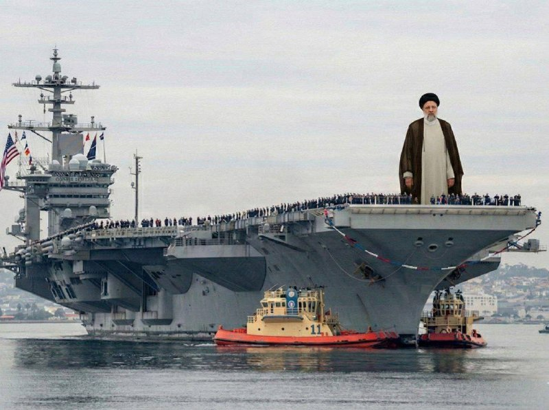

فوری ناو‌ آبراهام رئیسی برای مقابله با ناو های آمریکایی به سمت تنگه هرمز‌ حرکت کرد

@IranianMinds

## IranianMinds — post 22024

🔴 انفجار مجدد در سیریک

@IranianMinds

## IranianMinds — post 22023

شدید داره میزنه بندرعباسو آمریکا

@IranianMinds

## IranianMinds — post 22022

🔴 دو انفجار سنگین در بندرعباس

@IranianMinds

## IranianMinds — post 22021

🔴 حملات شدید آمریکا به بندرعباس

@IranianMinds

## Dirty_Kids — post 391550

  <a href="telegram/content/Dirty_Kids_391550_1781049780.webm" target="_blank">🎬 Download video</a>

🔥فقط با ورشکست کردن سایت های شرط بندی امشب با جوجه ی قشنگم کنار برج خلیفه ام
🔥 https://t.me/+lCR7HeYTU15iNjM0 https://t.me/+lCR7HeYTU15iNjM0 A19 
💯حال کردم به همتون پول دراوردن رو یاد بدم من قرار نیست از تو پولی بگیرم و همه چیز رایگانه
💸

## Dirty_Kids — post 391549

  <a href="telegram/content/Dirty_Kids_391549_1781049780.webm" target="_blank">🎬 Download video</a>

🔥فقط با ورشکست کردن سایت های شرط بندی امشب با جوجه ی قشنگم کنار برج خلیفه ام
🔥

https://t.me/+lCR7HeYTU15iNjM0
https://t.me/+lCR7HeYTU15iNjM0
A19

💯حال کردم به همتون پول دراوردن رو یاد بدم
من قرار نیست از تو پولی بگیرم و همه چیز رایگانه
💸

## Dirty_Kids — post 391548

  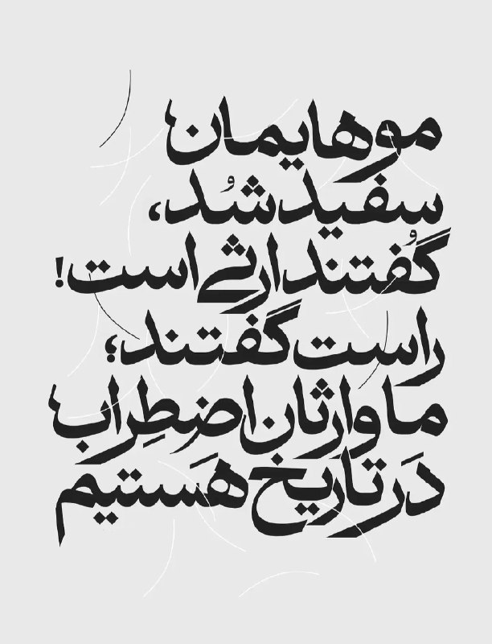

#بخوابیم

@Dirty_Kids 👻

## Dirty_Kids — post 391547

  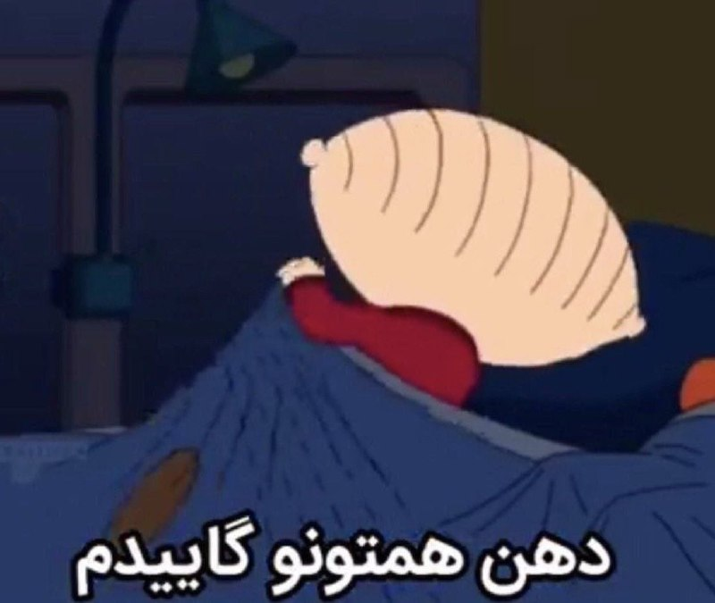

عاصم منیر امشب:

@Dirty_Kids 👻

---
📅 بروزرسانی: 1405/03/20 03:23
---

## WithYashar — post 14253

هم اکنون انفجار سنگین سیریک و اطراف را لرزاند
@withyashar

## WithYashar — post 14252

حملات جدید به بندر عباس و سیریک
@withyashar

## FoxNewsTwitter — post 342780

  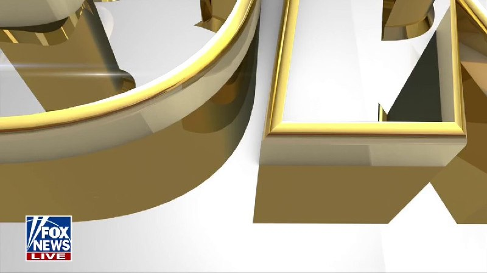

Fox News (Twitter/X)

RT @SpecialReport: 🚨BREAKING: Direct military engagement has resumed in the Middle East tonight. Following a brief exchange that brought down an American chopper, CENTCOM is executing what the White House calls "proportional" strikes on Iranian ports. While President Trump signals he still wants a peace deal more than a widespread war, top allies warn that Tehran is simply playing for time. @pdoocy has the exclusive diplomatic updates live from the White House Lawn.

## pm_afshaa — post 93169

  <a href="telegram/content/pm_afshaa_93169_1781049203.webm" target="_blank">🎬 Download video</a>

🔴حملات آمریکا در جنوب کشور از جمله سیریک، قشم و بندرعباس شدید گزارش شده.

💧 Rainbet.com the #1 Non-KYC Crypto Casino & Sportsbook @rainbetcom

😁 @Pm_Afshaa

## pm_afshaa — post 93168

از خرم اباد یه اکیپ پهپاد بلند شدن

💧 Rainbet.com the #1 Non-KYC Crypto Casino & Sportsbook @rainbetcom

😁 @Pm_Afshaa

## pm_afshaa — post 93167

انفجار مجدد در بندرعباس و قشم.

💧 Rainbet.com the #1 Non-KYC Crypto Casino & Sportsbook @rainbetcom

😁 @Pm_Afshaa

## pm_afshaa — post 93166

دوباره انفجار در سیریک گزارش شده.

💧 Rainbet.com the #1 Non-KYC Crypto Casino & Sportsbook @rainbetcom

😁 @Pm_Afshaa

## pm_afshaa — post 93165

تو کانال زاپاسمون حتما جوین شین همین الان

👇
👇

https://t.me/pmtvzapas
https://t.me/pmtvzapas

## pm_afshaa — post 93164

سخنگوی ارتش جمهوری اسلامی: تمام پایگاه‌های آمریکایی در منطقه را تخلیه کنید

💧 Rainbet.com the #1 Non-KYC Crypto Casino & Sportsbook @rainbetcom

😁 @Pm_Afshaa

## VahidOnline — post 76118

  

خبرگزاری مهر به نقل از منابع محلی و ساکنان روستاهای اطراف، از شنیده شدن مجدد صدای چندین انفجار در محدوده شهرستان جاسک خبر داد. پیش‌تر حملات نظامی به بندر جاسک و کوه مبارک توسط منابع آگاه تایید شده بود و این حادثه، دومین موج از صداهای انفجار در این منطقه از آغازین ساعات بامداد چهارشنبه به شمار می‌رود.
@VahidOOnLine
من هم حدود ساعت ۲:۳۰ چند پیام از جاسک دریافت کرده بودم.
خبرنگار آکسیوس هم به نقل از مقام آمریکایی گفته یک موج حمله دیگه انجام شده.
📡 @VahidOnline

## Shin_Persian — post 6805

Shin ✓ @hey_itsmyturn
Tue, 09 Jun 2026 23:43:44 UTC

IRGC trucks hiding in Pouneh tunnel, Lorestan Province, #Iran

فارسی

کامیون‌های سپاه پاسداران انقلاب اسلامی (IRGC) پنهان شده در تونل پونه، استان لرستان، #Iran

𝕏 · @shin_persian

## FarsiVOA — post 220187

🔺سی‌بی‌اس از قول «مقامات آگاه» می‌گوید هلی‌کوپتر آپاچی آمریکا مورد اصابت یک پهپاد شاهد قرار گرفته بود

▪️شبکه آمریکایی سی‌بی‌اس به نقل از «دو منبع آگاه» گزارش داد که یک پهپاد مسلح ایرانی موسوم به «شاهد» به هلی‌کوپتر آپاچی آمریکایی که روز دوشنبه در دریا در سواحل عمان سقوط کرد، اصابت کرد.

⬇️ بیشتر بخوانید:
https://ir.voanews.com/a/8159073.html
@FarsiVOA

## Persian_Trend_Official — post 16411

  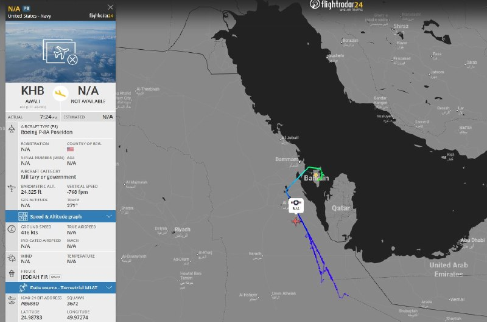

یک فروند هواپیمای P-8 پوسایدن از بحرین برخواسته و در حال گشت زنی در شرق عربستان است.

📝 Amir

📌 @persian_trend_official
پرشین ترند | متفاوت‌ترین کانال نظامی

## IranianMinds — post 22020

🔴 خبرگزاری فارس :

اسرائیل از شرایط الان سواستفاده کرده و رفته به بیروت حمله کرده.

@IranianMinds

## IranianMinds — post 22019

🔴 انفجار مهیب در سیریک

@IranianMinds

## IranianMinds — post 22018

🔴 ارتش جمهوری اسلامی :

تمام پایگاه های آمریکایی رو تخلیه کنید آبگرمکن هامونو داریم آماده میکنیم.

@IranianMinds

## IranianMinds — post 22017

🔴 فعالیت جنگنده های آمریکا در جنوب عراق

@IranianMinds

## Dirty_Kids — post 391546

  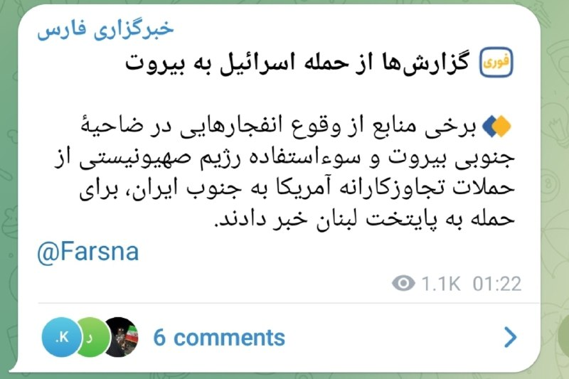

فارس‌نیوز میگه اسرائیل از حمله آمریکا به جنوب سوءاستفاده کرده و داره ضاحیه رو میزنه.😂😂😂😂😂😂😂😂😂😂😂😂😂😂😂😂😂😂😂😂😂
خوب که چی؟ الان تو میخوای چه گوهی بخوری؟

دارن ایران رو میزنه به فکر لبنانن

@Dirty_Kids 👻

## Dirty_Kids — post 391545

صابرین‌نیوز، وابسته به سازمان اطلاعات سپاه، هم‌اکنون از وقوع انفجارهای تازه در قشم و بندرعباس ‌و همچنین حملات پهپادی در همدان خبر داده است.

@Dirty_Kids 👻

## Dirty_Kids — post 391544

صداوسیما خبر داد که دقایقی قبل بازهم چند انفجار جدید در بندر جاسک رخ داده است. همزمان آکسیوس و کانال ۱۲ اسرائیل به نقل از مقام ارشد آمریکایی اعلام کردند که «موج دوم حملات به سامانه‌های پدافندی و راداری ایران در حال انجام است.»

@Dirty_Kids 👻

---
📅 بروزرسانی: 1405/03/20 03:12
---

## VahidOOnLine — post 244598

  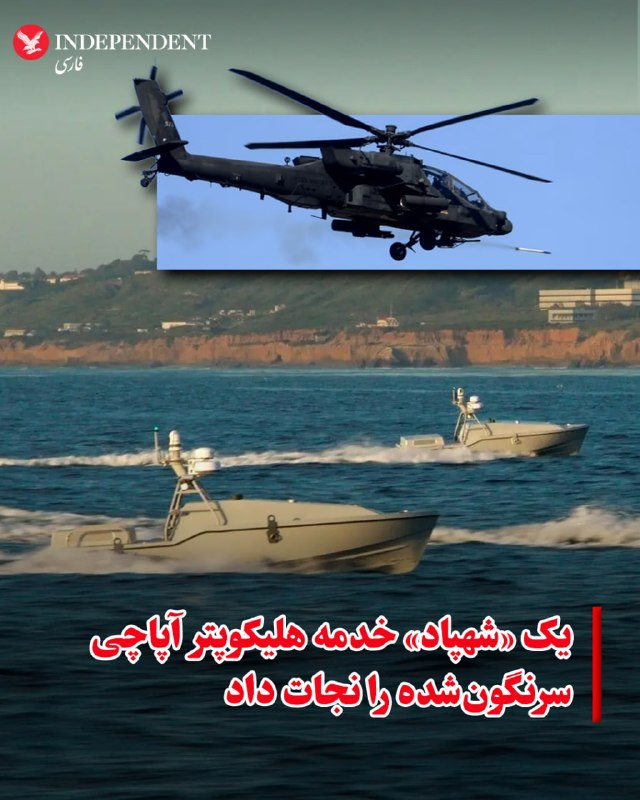

♦️به گزارش نیویورک‌تایمز در تازه‌ترین نشانه از نقش روزافزون سامانه‌های بدون سرنشین در جنگ‌های مدرن، یک شناور بدون سرنشین هدایت‌پذیر از راه دور (شهپاد) توانست دو خدمه هلیکوپتر تهاجمی آپاچی آمریکا را که روز دوشنبه در نزدیکی تنگه هرمز از سوی ایران سرنگون شد، نجات دهد.
کاپیتان تیم هاوکینز، سخنگوی سنتکام، روز سه‌شنبه گفت این نخستین عملیات نجات آمریکا بوده که با استفاده از یک شناور سطحی خودران انجام شده است؛ شناوری که از راه دور توسط یک عامل انسانی هدایت می‌شد.
هاوکینز در پیامی متنی اعلام کرد: «شناور دریایی که در عملیات نجات خدمه آپاچی در سواحل عمان مشارکت داشت، یک شناور سطحی بدون سرنشین از نوع کورسیر متعلق به نیروی دریایی آمریکا بود که توسط گروه عملیاتی ۵۹ ناوگان پنجم آمریکا اداره می‌شود. این گروه از اواخر ماه مارس استقرار این شناورهای بدون سرنشین هدایت‌پذیر از راه دور را در منطقه آغاز کرده است.»
شناور کورسیر که توسط شرکت «سارونیک» ساخته شده، حدود ۷.۳ متر طول دارد، با سوخت دیزل کار می‌کند و می‌تواند با سرعتی تا ۳۵ گره دریایی حرکت کند. این شناور قادر است تا حدود ۴۵۰ کیلوگرم بار حمل کند و برد عملیاتی آن بیش از هزار مایل دریایی است.
به گفته هاوکینز، کورسیر به دلیل «نزدیکی به محل حادثه و قابلیت‌های عملیاتی» برای این ماموریت انتخاب شد. این شناور خلبان و افسر تسلیحات آپاچی را به نقطه‌ای دیگر منتقل کرد و سپس یک هلیکوپتر آن‌ها را برای تکمیل عملیات نجات تحویل گرفت.
نیویورک‌تایمز می‌نویسد،
نیروی دریایی آمریکا سابقه طولانی در استفاده از شناورهای بدون سرنشین هدایت‌پذیر از راه دور دارد.
فرماندهی نیروهای دریایی آمریکا در منطقه در سال ۲۰۲۲ اعلام کرده بود که شناورهای سطحی بدون سرنشین را در اطراف بحرین، محل استقرار ستاد این فرماندهی، بیش از ۲۵ هزار ساعت به‌کار گرفته است. گروه عملیاتی ۵۹ نیز در ژانویه ۲۰۲۴ واحد جدیدی را برای توسعه سامانه‌های بدون سرنشین راه‌اندازی کرد.
شرکت «سارونیک» قراردادی به ارزش ۳۹۲ میلیون دلار با نیروی دریایی آمریکا برای تولید شناورهای سطحی خودران دارد. این شرکت که مقر آن در شهر آستین ایالت تگزاس است، کمتر از چهار سال پیش و در سپتامبر ۲۰۲۲ تاسیس شد و اکنون بیش از ۱۳۰۰ کارمند دارد.
‌🇸🇦 Indypersian

🤖 @VahidOOnLine

## VahidOOnLine — post 244597

  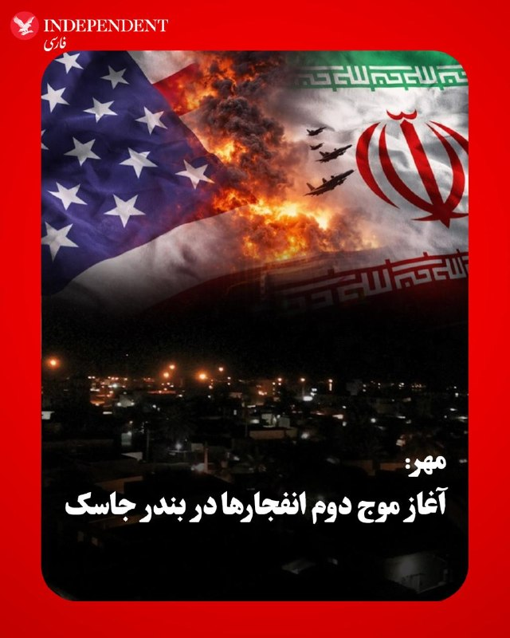

♦️خبرگزاری مهر به نقل از منابع محلی و ساکنان روستاهای اطراف، از شنیده شدن مجدد صدای چندین انفجار در محدوده شهرستان جاسک خبر داد. پیش‌تر حملات نظامی به بندر جاسک و کوه مبارک توسط منابع آگاه تایید شده بود و این حادثه، دومین موج از صداهای انفجار در این منطقه از آغازین ساعات بامداد چهارشنبه به شمار می‌رود.
‌🇸🇦 Indypersian

🤖 @VahidOOnLine

## pm_afshaa — post 93163

انفجار مجدد در سیریک و بندرعباس

💧 Rainbet.com the #1 Non-KYC Crypto Casino & Sportsbook @rainbetcom

😁 @Pm_Afshaa

## pm_afshaa — post 93162

پایگاه دریایی سپاه تو سیریک رو زدن

💧 Rainbet.com the #1 Non-KYC Crypto Casino & Sportsbook @rainbetcom

😁 @Pm_Afshaa

## pm_afshaa — post 93161

کلا تو این حمله‌ها که قبلش خودمونم میدونیم توقع جنگ بزرگ نداشته باشید. جنگ بزرگ ترور داره که باید با غافلگیری باشه. دارن پازل‌ها رو میچینن که اگه جمهوری اسلامی تسلیم توافق (حکم) نشد، جنگ بزرگ رو یهو شروع کنن

## pm_afshaa — post 93160

صدای انفجار در تهران کصشرو فیک نیوزه

## pm_afshaa — post 93159

کلا تو این حمله‌ها که قبلش خودمونم میدونیم توقع جنگ بزرگ نداشته باشید. جنگ بزرگ ترور داره که باید با غافلگیری باشه. دارن پازل‌ها رو میچینن که اگه جمهوری اسلامی تسلیم توافق (حکم) نشد، جنگ بزرگ رو یهو شروع کنن

## IranIntlTV — post 341423

  <a href="telegram/content/IranIntlTV_341423_1781048573.mp4" target="_blank">🎬 Download video</a>

گزارش‌ها از تشدید اختلافات تاکتیکی میان دونالد ترامپ و بنیامین نتانیاهو حکایت دارد؛ اختلافاتی که حتی به گفت‌وگویی تند میان دو طرف انجامیده است. با این حال، رسانه‌های اسرائیلی گزارش داده‌اند پس از رایزنی‌های مارکو روبیو، آمریکا در نهایت با حمله اسرائیل به ایران همراهی کرده است.

سمیرا قرایی، خبرنگار ایران‌اینترنشنال، گزارش می‌دهد
@iranintltv

## FarsiVOA — post 220186

⚡️فرش ایرانی فقط یک اثر تزئینی نیست؛ روایتِ هزار سال هنر، هویت و حافظه‌ی فرهنگی ایران است. همزمان با روز فرش ایرانی، نگاهی داریم به هنری که هنوز در خانه‌ها، کارگاه‌ها و موزه‌های جهان زنده مانده است.
@FarsiVOA

## FarsiVOA — post 220185

⚡️بحران معیشت در ایران؛ افزایش تورم و بی‌تاثیر بودن کالابرگ و یارانه؛ گفت‌وگو با معصومه طاهرخانی
@FarsiVOA

## Persian_Trend_Official — post 16410

کانفینگ اختصاصی پرشین ترند 🔥
شاید با بعضی از اینترنت ها کار نکنه، با اینترنت های دیگه تست کنید. ❤️

vless://d77d61ce-0792-4b11-9471-850a9487559a@static.94.219.109.65.clients.your-server.de:443?security=none&encryption=mlkem768x25519plus.native.0rtt.JQDRhQQ04dCuFPeVL0bl5uIfoZQdq9NwaAZMUU6yowk&headerType=none&type=tcp#PersianTrend%F0%9F%94%A5-1.00TB%F0%9F%93%8A

📝 Nick

📌 @persian_trend_official
پرشین ترند | متفاوت‌ترین کانال نظامی

## Persian_Trend_Official — post 16409

  <a href="telegram/content/Persian_Trend_Official_16409_1781048574.webm" target="_blank">🎬 Download video</a>

برخی منابع خبر از وقوع انفجار در در نزدیکی پایگاه دریایی بندر سیریک میدهند.

📝 Amir

📌 @persian_trend_official
پرشین ترند | متفاوت‌ترین کانال نظامی

## IranianMinds — post 22016

🔴 گزارش انفجار در اطراف بندرعباس

@IranianMinds

---
📅 بروزرسانی: 1405/03/20 03:02
---

## VahidOOnLine — post 244596

  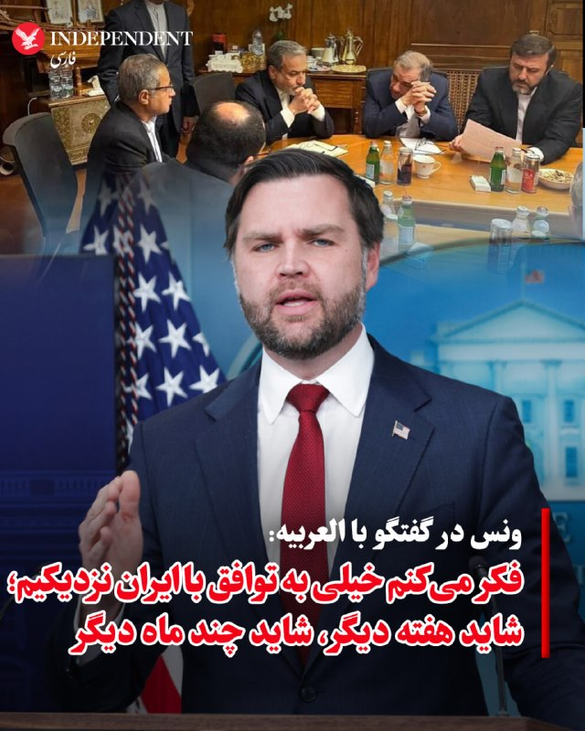

♦️جی‌دی ونس، معاون رئیس‌جمهوری آمریکا به العربیه گفت که فکر می‌کند آمریکا به توافق با ایران خیلی نزدیک است و این توافق می‌تواند هفته دیگر انجام شود یا ماه‌های دیگر. او گفت این توافق برای اقتصاد آمریکا خوب است و برنامه هسته‌ای ایران را نیز برای طولانی‌ مدت مدیریت می‌کند. او در پاسخ به مجری که از او پرسید آیا توافق قبل از انتخابات میان‌دوره‌ای آمریکا (نوامبر) ممکن است، گفت: کاملا.
‌🇸🇦 Indypersian

🤖 @VahidOOnLine

## VahidOOnLine — post 244595

  

پولیتیکو به نقل از یک مقام کاخ سفید گزارش داد دونالد ترامپ، رییس‌جمهوری آمریکا، معتقد است با وجود موج جدید حملات تلافی‌جویانه آمریکا به اهدافی در جنوب ایران، توافق با جمهوری اسلامی نزدیک است.
ارتش آمریکا در بامداد چهارشنبه اعلام کرد در پاسخ به اقدام جمهوری اسلامی در سرنگون کردن یک بالگرد آمریکایی، دور جدیدی از حمله‌ها را علیه حکومت ایران انجام داده است. رسانه‌های آمریکایی به نقل از یک مقام ایالات‌متحده گزارش دادند در این حمله‌ها سامانه‌های پدافند هوایی و راداری جمهوری اسلامی از جمله اهداف بوده‌اند.

‌🏁 🇬🇧 IranintlTV

🤖 @VahidOOnLine

## WithYashar — post 14251

گزارش انفجار در قشم
@withyashar

## WithYashar — post 14250

کانال 12 اسرائیل: در موج دوم حمله‌ها به ایران، آمریکا داره پدافندهای هوایی و رادارها رو هم هدف حمله قرار میده.
@withyashar

## WithYashar — post 14249

  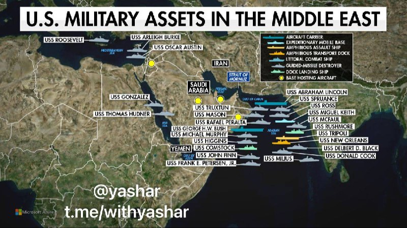

فاکس نیوز : بر اساس اعلام مقامات نیروی دریایی آمریکا، نزدیک به ۲۰ هزار ملوان و تفنگدار دریایی آمریکایی در حال حاضر در دریا و مستقر بر روی دو ناو هواپیمابر «یواس‌اس آبراهام لینکلن» و «یواس‌اس جرج اچ. دابلیو. بوش» هستند؛ به‌همراه ۱۸ ناوشکن مجهز به موشک‌های هدایت‌شونده، یگان اعزامی سی‌ویکم تفنگداران دریایی، و بیش از دوازده اسکادران هوایی.
این تجهیزات و نیروها در مناطق مختلفی از جمله شرق مدیترانه، دریای سرخ، شمال دریای عرب و دریای عرب پراکنده شده‌اند؛ جایی که نیروهای آمریکایی در حال کمک به دفاع از اسرائیل، مقابله با تهدیدات حوثی‌ها، انجام عملیات مرتبط با ایران، و حمایت از امنیت دریانوردی در اطراف تنگه هرمز هستند.
این نیروی دریایی بخشی از حدود ۵۰ هزار نیروی نظامی آمریکاست که در حال حاضر در سراسر خاورمیانه مستقر هستند.
@withyashar

## pm_afshaa — post 93158

این نوع حمله‌های اخیر اسرائیل و امشبِ آمریکا فقط خبر از جنگ بزرگ‌تر در آینده میده. از اول آتش‌بس تا الان ۹۰ درصد سامانه‌های پدافند دفاعی و راداری زدن

## pm_afshaa — post 93157

این نوع حمله‌های اخیر اسرائیل و امشبِ آمریکا فقط خبر از جنگ بزرگ‌تر در آینده میده.

از اول آتش‌بس تا الان ۹۰ درصد سامانه‌های پدافند دفاعی و راداری زدن

## pm_afshaa — post 93156

موج دوم حملات به قشم و بندرعباس 
💧 Rainbet.com the #1 Non-KYC Crypto Casino & Sportsbook @rainbetcom 
😁 @Pm_Afshaa

## pm_afshaa — post 93155

موج دوم حملات به قشم و بندرعباس

💧 Rainbet.com the #1 Non-KYC Crypto Casino & Sportsbook @rainbetcom

😁 @Pm_Afshaa

## pm_afshaa — post 93154

گزارش‌هایی از انفجار در قشم.

💧 Rainbet.com the #1 Non-KYC Crypto Casino & Sportsbook @rainbetcom

😁 @Pm_Afshaa

## pm_afshaa — post 93153

  <a href="telegram/content/pm_afshaa_93153_1781047964.webm" target="_blank">🎬 Download video</a>

🔴باراک راوید، خبرنگار آکسیوس: دفاع هوایی و رادارها اهداف حمله هستن. 
💧 Rainbet.com the #1 Non-KYC Crypto Casino & Sportsbook @rainbetcom 
😁 @Pm_Afshaa

## pm_afshaa — post 93152

  <a href="telegram/content/pm_afshaa_93152_1781047964.webm" target="_blank">🎬 Download video</a>

🔴باراک راوید، خبرنگار آکسیوس: دفاع هوایی و رادارها اهداف حمله هستن. 
💧 Rainbet.com the #1 Non-KYC Crypto Casino & Sportsbook @rainbetcom 
😁 @Pm_Afshaa

## mamlekate — post 103655

📝 آمریکا در واکنش به سرنگونی هلیکوپتر آپاچی جنوب ایران را هدف قرار داد؛ سپاه به اهدافی در منطقه حمله کرد

@mamlekate

## IranIntlTV — post 341422

  <a href="telegram/content/IranIntlTV_341422_1781047965.mp4" target="_blank">🎬 Download video</a>

سمیرا، مادر جاویدنام سودا اکرمی‌فرد: ما آگاهانه رفتیم بیرون...

«یک ایران صدای شما را می‌شنود»

دوشنبه تا پنجشنبه ۱۱ شب تهران

از تلویزیون ایران‌اینترنشنال

تماشای نسخه کامل این قسمت از «برنامه» در یوتیوب:

https://youtu.be/YTeRZTbJT3s
@iranintltv

## IranIntlTV — post 341421

  <a href="telegram/content/IranIntlTV_341421_1781047967.mp4" target="_blank">🎬 Download video</a>

سجاد از شیراز: بچه‌های میناب رو کی کشت؟ هلیکوپتری رو هم که زدند، نوش جون جمهوری اسلامی!

«یک ایران صدای شما را می‌شنود»

دوشنبه تا پنجشنبه ۱۱ شب تهران

از تلویزیون ایران‌اینترنشنال

تماشای نسخه کامل این قسمت از «برنامه» در یوتیوب:

https://youtu.be/YTeRZTbJT3s
@iranintltv

## IranIntlTV — post 341420

  <a href="telegram/content/IranIntlTV_341420_1781047968.mp4" target="_blank">🎬 Download video</a>

جمهوری اسلامی؛ استاد عادی‌سازی بحراناز «چرا گران شد؟» تا «چقدر گران شد؟»

در جمهوری اسلامی، بسیاری از بحران‌ها به‌جای حل شدن، به وضعیت عادی تبدیل شده‌اند. امروز کمتر کسی می‌پرسد چرا تورم وجود دارد؛ سؤال این است که قیمت‌ها چقدر گران‌تر شده‌اند. کمتر کسی از قطعی برق، فیلترینگ یا کمبودها تعجب می‌کند؛ مردم فقط یاد گرفته‌اند چگونه با آن‌ها کنار بیایند.

از گرانی گوشت و مسکن گرفته تا خاموشی‌ها، مهاجرت و محدودیت‌های اینترنت، بسیاری از مشکلاتی که روزی بحران تلقی می‌شدند، امروز به بخشی از زندگی روزمره تبدیل شده‌اند.

کامبیز حسینی در این مونولوگ از «برنامه» به پدیده عادی‌سازی بحران در جمهوری اسلامی و پیامدهای آن برای جامعه ایران می‌پردازد.

«یک ایران صدای شما را می‌شنود»

دوشنبه تا پنجشنبه ۱۱ شب تهران

از تلویزیون ایران اینترنشنال

تماشای نسخه کامل این قسمت از «برنامه» در یوتیوب:

https://youtu.be/YTeRZTbJT3s
@iranintltv

## FarsiVOA — post 220184

⚡️تشکل «دانشجویان پیشرو» همزمان با بازگشت دسترسی به اینترنت پس از سه ماه محدودیت، با انتقاد از سیاست‌های حکومت بر تداوم فعالیت‌های مدنی و ادامه مسیر «زن، زندگی، آزادی» تأکید کرد.
@FarsiVOA

## FarsiVOA — post 220183

  <a href="telegram/content/FarsiVOA_220183_1781047970.mp4" target="_blank">🎬 Download video</a>

⚡️سرکوب در ایران؛ احضار سینماگران منتقد به دادسرای فرهنگ و رسانه؛ گفت‌وگو با محمود امیری‌مقدم
@FarsiVOA

## FarsiVOA — post 220182

🔺دادگاهی در آمریکا «حاجی نجیب‌الله» یک فرمانده پیشین طالبان را به ۴۲ سال زندان محکوم کرد

▪️دادگاهی در نیویورک یک فرمانده پیشین طالبان را به جرم گروگان‌گیری و حمایت مالی از اقدامات تروریستی منجر به مرگ، به ۴۲ سال زندان محکوم شد.

⬇️ بیشتر بخوانید:
https://ir.voanews.com/a/8159064.html
@FarsiVOA

## Persian_Trend_Official — post 16408

  <a href="telegram/content/Persian_Trend_Official_16408_1781047970.webm" target="_blank">🎬 Download video</a>

بیانیه سخنگوی قرارگاه خاتم الانبیا به زودی

📝 Nick
📌 @persian_trend_official
پرشین ترند | متفاوت‌ترین کانال نظامی

## Persian_Trend_Official — post 16407

  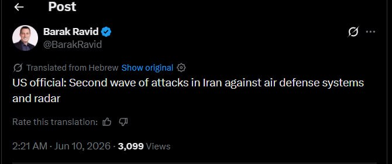

باراک راوید به نقل از چند منبع امریکایی، هدف دور جدید حملات آمریکا را سیستم های راداری و پدافندی اعلام کرد.

📝 Amir

📌 @persian_trend_official
پرشین ترند | متفاوت‌ترین کانال نظامی

## Persian_Trend_Official — post 16406

فاکس نیوز به نقل از یک مقام آمریکایی مدعی ادامه حملات آمریکا به برخی مناطق جنوبی ایران شد.

📝 Amir

📌 @persian_trend_official
پرشین ترند | متفاوت‌ترین کانال نظامی

## BBCPersian — post 283283

🔻شنیده شدن مجدد صداهای انفجار در جاسک

خبرگزاری صداوسیما گزارش کرده که لحظاتی پیش مجددا صدای انفجار در محدوده شهرستان جاسک در استان هرمزگان شنیده شده است.

پیش‌تر حملات به بندر جاسک و کوه مبارک تایید شده بود و این دومین موج از صداهای انفجار از آغازین ساعات بامداد چهارشنبه ۲۰ خرداد ماه است.

گزارش‌هایی از موج دوم حملات هوایی آمریکا منتشر شده اما سنتکام که مدیریت جنگ با ایران را در منطقه در دست دارد هنوز اطلاعیه جدیدی در این باره منتشر نکرده است.

در همین حال خبرگزاری‌های رسمی در ایران با انتشار تصاویر ویدیویی مشابهی از مشاهده پهپادهای انتحاری ایران در آسمان عراق خبر می‌دهند.

خبرگزاری فارس نزدیک به سپاه پاسداران به همراه انتشار این تصاویر نوشته: «پهپادها در آسمان عراق درحال رفتن به‌سمت اهداف خود هستند.»

https://bbc.in/3Q6UZcc
@BBCPersian

## BBCPersian — post 283282

🔻رئیس مجلس نمایندگان آمریکا: حمله محدود و متناسب بود

مایک جانسون، رئیس مجلس نمایندگان کنگره آمریکا به شبکه فاکس نیوز گفته هنگام آغاز عملیات نظامی ارتش این کشور در واکنش به ساقط شدن یک بالگرد آپاچی آمریکا، در اتاق بحران کاخ سفید حضور داشته و شاهد مدیریت این عملیات بوده است.

آقای جانسون گفته از نظر او این عملیات «محدود و متناسب» بوده و طی آن رادارها و مقرهای فرماندهی و موشکی هدف قرار گرفته است.

https://bbc.in/3Q6UZcc
@BBCPersian

## BBCPersian — post 283281

🔻ایران می‌گوید دو مخزن آب در سیریک هدف قرار گرفته است

خبرگزاری های رسمی ایران می‌گویند در جریان حملات بامداد چهارشنبه آمریکا به هیچ بندر تجاری در جزیره قشم آسیب وارد نشده اما دو مخزن آب در سیریک هدف قرار گرفته است.

فرماندار شهرستان میناب در جنوب ایران گفته است: «تا این لحظه حمله‌ای به شهر (میناب) گزارش نشده است.»

خبرگزاری مهر بر همین اساس نوشته است انفجارهای شنیده شده در یک ساعت گذشته «مربوط به نوار ساحلی و نه خود شهرستان (میناب) بوده است.»

https://bbc.in/3Q6UZcc
@BBCPersian

## Dirty_Kids — post 391543

آکسیوس: موج دوم حملات آمریکا به جنوب ایران آغاز شده.

---
📅 بروزرسانی: 1405/03/20 02:53
---

## VahidOOnLine — post 244594

  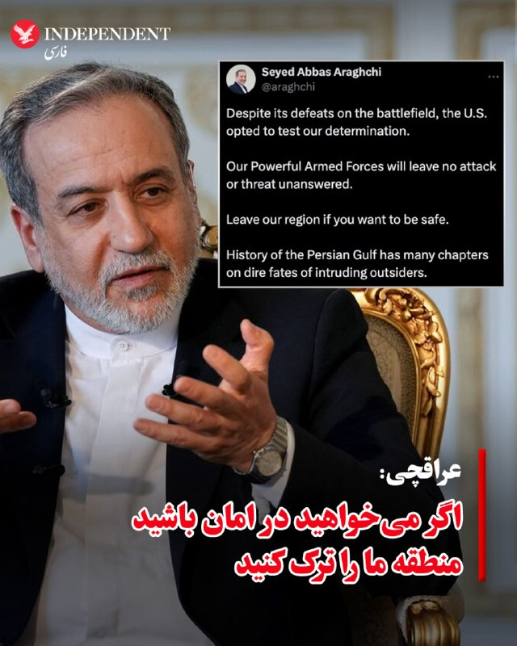

♦️عباس عراقچی، وزیر امور خارجه جمهوری اسلامی، در واکنش به حملات نظامی ایالات متحده، با انتشار پیامی در اکس نوشت: «ایالات متحده تصمیم گرفت عزم و اراده ما را آزمایش کند، اما نیروهای مسلح قدرتمند ما هیچ حمله یا تهدیدی را بی‌پاسخ نخواهند گذاشت.» وزیر خارجه جمهوری اسلامی گفت: «اگر می‌خواهید در امان باشید، منطقه ما را ترک کنید. تاریخ خلیج فارس فصل‌های بسیاری درباره سرنوشت شوم بیگانگان دارد.»
‌🇸🇦 Indypersian

🤖 @VahidOOnLine

## VahidOOnLine — post 244593

♦️پس از حملات موشکی روز یکشنبه ایران به اسرائیل و پاسخ متقابل اسرائیل به نقاط مختلف ایران، مصطفی خوش‌چشم، کارشناس صداوسیما، در برنامه‌ای در تاریخ دوشنبه ۱۸ خردادماه گفت آمریکا خردخرد به رادارها و دکل‌ها در جزایر جنوبی ایران حمله می‌کند؛ «این‌ها پیش‌درآمد جنگ است». او با اشاره به حملات موشکی روز یکشنبه ایران به اسرائیل و پاسخ متقابل اسرائیل به نقاط مختلف ایران، تاکید کرد که واشنگتن اکنون در میان لایه مذاکرات، دو جزیره راهبردی سیریک و قشم را در دو دهانه تنگه هرمز هدف قرار داده و به رادارها، دکل‌های مخابراتی و سیستم‌های پدافندی ضربه می‌زند. این کارشناس هشدار داد که ترامپ می‌خواهد زیر خط تنش و بدون دادن هزینه، آستانه تحمل ایران را بسنجد تا در نهایت با کور کردن پدافند کشور، برگ برنده تهران در کنترل منطقه را از بین ببرد و با باز کردن کامل تنگه هرمز، مسیر را برای عبور آزادانه ناوگان بزرگ کشتی‌ها هموار کند.
تنش‌های نظامی در منطقه پس از حملات موشکی و تبادل آتش میان ایران و اسرائیل افزایش یافت.
‌🇸🇦 Indypersian

🤖 @VahidOOnLine

## WithYashar — post 14248

دو دقیقه پیش سه انفجار از اسکله جاسک @withyashar

## mwarmonitor — post 10576

🔴موج دوم حملات آمریکا به ایران در حال انجام است، یک مقام ارشد آمریکایی به کانال ۱۲ اسرائیل گفته است.

@mwarmonitor

## mwarmonitor — post 10575

🔴صدای انفجار و فعال‌سازی سامانه‌های پدافند هوایی در جاسک

## pm_afshaa — post 93151

  <a href="telegram/content/pm_afshaa_93151_1781047395.webm" target="_blank">🎬 Download video</a>

🔴آکسیوس: موج دوم حملات آمریکا به جنوب ایران آغاز شده. 
💧 Rainbet.com the #1 Non-KYC Crypto Casino & Sportsbook @rainbetcom 
😁 @Pm_Afshaa

## pm_afshaa — post 93150

  <a href="telegram/content/pm_afshaa_93150_1781047396.webm" target="_blank">🎬 Download video</a>

🔴آکسیوس: موج دوم حملات آمریکا به جنوب ایران آغاز شده.

💧 Rainbet.com the #1 Non-KYC Crypto Casino & Sportsbook @rainbetcom

😁 @Pm_Afshaa

## pm_afshaa — post 93149

  <a href="telegram/content/pm_afshaa_93149_1781047396.webm" target="_blank">🎬 Download video</a>

🔴کانال 12 اسرائیل:
به گفته یک مقام ارشد آمریکایی، موج دوم حملات آمریکا به ایران الان در جریانه.

💧 Rainbet.com the #1 Non-KYC Crypto Casino & Sportsbook @rainbetcom

😁 @Pm_Afshaa

## pm_afshaa — post 93148

🔴منابع آمریکایی به آکسیوس: آماده چندین دور حمله باشید

💧 Rainbet.com the #1 Non-KYC Crypto Casino & Sportsbook @rainbetcom

😁 @Pm_Afshaa

## pm_afshaa — post 93147

سه انفجار در جاسک رخ داده. 
💧 Rainbet.com the #1 Non-KYC Crypto Casino & Sportsbook @rainbetcom 
😁 @Pm_Afshaa

## pm_afshaa — post 93146

انفجار مجدد در جاسک 
💧 Rainbet.com the #1 Non-KYC Crypto Casino & Sportsbook @rainbetcom 
😁 @Pm_Afshaa

## IranIntlTV — post 341419

  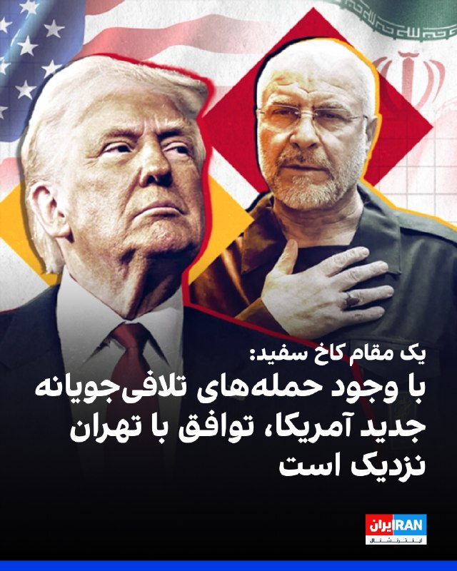

پولیتیکو به نقل از یک مقام کاخ سفید گزارش داد دونالد ترامپ، رییس‌جمهوری آمریکا، معتقد است با وجود موج جدید حملات تلافی‌جویانه آمریکا به اهدافی در جنوب ایران، توافق با جمهوری اسلامی نزدیک است.
ارتش آمریکا در بامداد چهارشنبه اعلام کرد در پاسخ به اقدام جمهوری اسلامی در سرنگون کردن یک بالگرد آمریکایی، دور جدیدی از حمله‌ها را علیه حکومت ایران انجام داده است. رسانه‌های آمریکایی به نقل از یک مقام ایالات‌متحده گزارش دادند در این حمله‌ها سامانه‌های پدافند هوایی و راداری جمهوری اسلامی از جمله اهداف بوده‌اند.

https://iranintl.com/202606097878

## IranIntlTV — post 341418

  <a href="telegram/content/IranIntlTV_341418_1781047398.mp4" target="_blank">🎬 Download video</a>

آزاد از شیراز: برای پیدا کردن سیگنال اینترنت، گوشه‌ و کنار خانه را گشتم

«یک ایران صدای شما را می‌شنود»

دوشنبه تا پنجشنبه ۱۱ شب تهران

از تلویزیون ایران‌اینترنشنال

تماشای نسخه کامل این قسمت از «برنامه» در یوتیوب:

https://youtu.be/YTeRZTbJT3s
@iranintltv

## IranIntlTV — post 341417

  <a href="telegram/content/IranIntlTV_341417_1781047400.mp4" target="_blank">🎬 Download video</a>

شایان از رضوانشهر: در راه انزلی، گیر ایست بازرسی افتادم. نقاب می‌زنند و مردم را می‌ترسانند

«یک ایران صدای شما را می‌شنود»

دوشنبه تا پنجشنبه ۱۱ شب تهران

از تلویزیون ایران‌اینترنشنال

تماشای نسخه کامل این قسمت از «برنامه» در یوتیوب:

https://youtu.be/YTeRZTbJT3s
@iranintltv

## IranIntlTV — post 341416

  <a href="telegram/content/IranIntlTV_341416_1781047402.mp4" target="_blank">🎬 Download video</a>

شایان از رضوانشهر: در راه انزلی، گیر ایست بازرسی افتادم. نقاب می‌زنند و مردم را می‌ترسانند

«یک ایران صدای شما را می‌شنود»

دوشنبه تا پنجشنبه ۱۱ شب تهران

از تلویزیون ایران‌اینترنشنال

تماشای نسخه کامل این قسمت از «برنامه» در یوتیوب:

https://youtu.be/YTeRZTbJT3s
@iranintltv

## Shin_Persian — post 6804

Shin ✓ @hey_itsmyturn
Tue, 09 Jun 2026 23:17:07 UTC

2nd attack on Jask, Hormozgan Province, #Iran

فارسی

دومین حمله به جاسک، استان هرمزگان، #Iran_

𝕏 · @shin_persian

## FarsiVOA — post 220181

⚡️محکومیت سه وکیل دادگستری در شیراز به سه سال زندان
@FarsiVOA

## Persian_Trend_Official — post 16405

مهر: دقایقی پیش، صدای انفجارهایی مجدد در محدوده شهرستان جاسک از سوی منابع محلی و ساکنان و روستاهای اطراف گزارش شده است. 📝 Amir 📌 @persian_trend_official پرشین ترند | متفاوت‌ترین کانال نظامی

## Persian_Trend_Official — post 16404

مهر: دقایقی پیش، صدای انفجارهایی مجدد در محدوده شهرستان جاسک از سوی منابع محلی و ساکنان و روستاهای اطراف گزارش شده است.

📝 Amir

📌 @persian_trend_official
پرشین ترند | متفاوت‌ترین کانال نظامی

## IranianMinds — post 22015

🔴 کانال ۱۲ اسرائیل :

امریکا حملات جدیدی رو الان در‌ جنوب ایران انجام داد.

@IranianMinds

## IranianMinds — post 22014

🔴 خبرگزاری مهر :

چند انفجار جدید در جاسک رخ داد.

@IranianMinds

## BBCPersian — post 283279

در پی حملات تلافی‌جویانه آمریکا به مناطقی در جنوب ایران،‌ عباس عراقچی، وزیر خارجه ایران در پیامی در شبکه ایکس بار دیگر از نیروهای آمریکایی خواست که برای در امان ماندن منطقه را ترک کنند.

او در پیام خود نوشت: «به رغم شکست‌هایش در میدان نبرد، ایالات متحده تصمیم گرفت عزم ما را بیازماید. نیروهای مسلح قدرتمند ما هیچ حمله یا تهدیدی را بی‌پاسخ نخواهند گذاشت. اگر می‌خواهید در امان باشید،‌ منطقه ما را ترک کنید.»

او افزود: «تاریخ خلیج فارس فصل‌های زیادی در مورد سرنوشت شوم بیگانگان متجاوز دارد.»

او پیش از حملات هم در پیامی در شبکه ایکس هشدار داده بود که تا زمانی که نیروهای آمریکایی در منطقه هستند خطر آنها را تهدید می‌کند.

📷EPA/Shutterstock

از لینک ⬇️ تازه‌ترین تحولات را در سایت بی‌بی‌سی فارسی دنبال کنید.
https://bbc.in/3Q6UZcc
@BBCPersian

## Dirty_Kids — post 391542

‏به خاطر جام جهانی آتش‌بس داد، جنگ جهانی شد! 👀

از توجه شما به این موضوع سپاسگزارم

@Dirty_Kids 👻

## Dirty_Kids — post 391541

  <a href="telegram/content/Dirty_Kids_391541_1781047404.webm" target="_blank">🎬 Download video</a>

🔴 امشب چه خبره، موزیک جدید و رسمی تتلو منتشر شد.

به اسم رفتم که رفتم.

🎥 لینک یوتیوب

✈️ دانلود از تلگرام

@Dirty_Kids 👻

---
📅 بروزرسانی: 1405/03/20 02:42
---

## VahidOOnLine — post 244592

  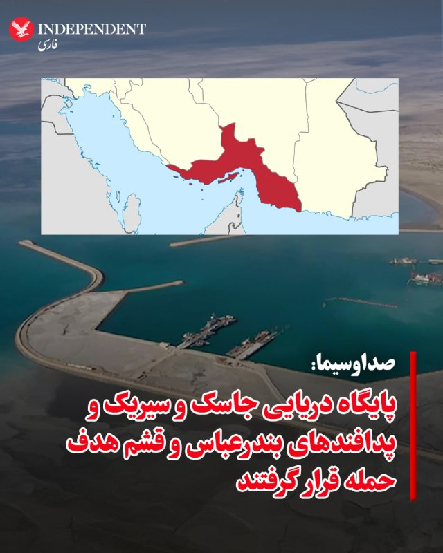

♦️صداوسیما در گزارشی اعلام کرد که پایگاه دریایی سیریک، پایگاه دریایی جاسک، موقعیت پدافند هوایی بندرعباس، پدافند موشکی ساحلی میناب و پدافند موشکی ساحلی قشم و بندر قشم هدف حمله بوده‌اند. هنوز مقامات رسمی و نظامی جمهوری اسلامی در این زمینه اظهارنظری نکرده‌اند اما مقامات آمریکایی گفته‌اند که سامانه‌های پدافندی و رادارها در اطراف تنگه هرمز هدف حمله بوده‌اند.
‌🇸🇦 Indypersian

🤖 @VahidOOnLine

## WithYashar — post 14247

https://t.me/boost/withyashar

## WithYashar — post 14246

https://t.me/boost/withyashar

## WithYashar — post 14245

دو دقیقه پیش سه انفجار از اسکله جاسک
@withyashar

## mwarmonitor — post 10574

  

🔴نگاهی به حضور گسترده نظامی آمریکا در خاورمیانه در حال حاضر

🔸بر اساس گفته‌های مقامات نیروی دریایی آمریکا، حدود ۲۰ هزار ملوان و تفنگدار دریایی آمریکایی در حال حاضر در دریا و بر روی دو ناو هواپیمابر — USS Abraham Lincoln و USS George H.W. Bush — مستقر هستند، همراه با ۱۸ ناوشکن مجهز به موشک هدایت‌شونده، واحد ۳۱ اعزامی تفنگداران دریایی، و بیش از یک دوجین اسکادران هوایی.

🔸این تجهیزات در مناطق مدیترانه شرقی، دریای سرخ، شمال اقیانوس هند و دریای عرب پراکنده شده‌اند؛ جایی که نیروهای آمریکایی در حال کمک به دفاع از اسرائیل، مقابله با تهدیدات حوثی‌ها، انجام عملیات مرتبط با ایران و حمایت از امنیت دریایی در اطراف تنگه هرمز هستند.

🔸این نیروی دریایی بخشی از حدود ۵۰ هزار نیروی آمریکایی است که در حال حاضر در سراسر خاورمیانه مستقر هستند. Fox news

@mwarmonitor

## FoxNewsTwitter — post 342779

  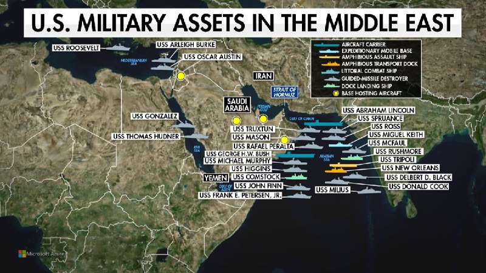

Fox News (Twitter/X)

NEW: Here's a look at the massive U.S. military presence now spread across the Middle East.

According to U.S. Navy officials, nearly 20,000 American sailors and Marines are currently at sea aboard two aircraft carriers — USS Abraham Lincoln and USS George H.W. Bush — along with 18 guided-missile destroyers, the 31st Marine Expeditionary Unit, and more than a dozen air squadrons.

The assets are spread across the Eastern Mediterranean, Red Sea, North Arabian Sea, and Arabian Sea, where U.S. forces are helping defend Israel, counter Houthi threats, conduct operations involving Iran, and support maritime security in and around the Strait of Hormuz.

The naval force is part of roughly 50,000 U.S. troops currently deployed throughout the Middle East.

## pm_afshaa — post 93145

  <a href="telegram/content/pm_afshaa_93145_1781046777.mp4" target="_blank">🎬 Download video</a>

مستندی از حمله به ایران

💧 Rainbet.com the #1 Non-KYC Crypto Casino & Sportsbook @rainbetcom

😁 @Pm_Afshaa

## pm_afshaa — post 93144

  <a href="telegram/content/pm_afshaa_93144_1781046778.webm" target="_blank">🎬 Download video</a>

🔴آماج‌نیوز افغانستان: لحظات پیش جنگنده‌های پاکستانی اهدافی رو در ولایت‌های خوست، پکتیکا و کنر بمباران کردن.

💧 Rainbet.com the #1 Non-KYC Crypto Casino & Sportsbook @rainbetcom

😁 @Pm_Afshaa

## pm_afshaa — post 93143

  

سپاه دستور تخلیه فوری صادر کرد

💧 Rainbet.com the #1 Non-KYC Crypto Casino & Sportsbook @rainbetcom

😁 @Pm_Afshaa

## pm_afshaa — post 93142

♨️
♨️
♨️
♨️

## pm_afshaa — post 93141

انفجار مجدد در جاسک

💧 Rainbet.com the #1 Non-KYC Crypto Casino & Sportsbook @rainbetcom

😁 @Pm_Afshaa

## FarsiVOA — post 220180

⚡️پرزیدنت ترامپ: حکومت ایران بالگرد آپاچی ما را در تنگه هرمز سرنگون کرد و ما ناگزیریم پاسخ بدیم
@FarsiVOA

## FarsiVOA — post 220179

⚡️اختلاف فرانسه و آلمان بر سر پروژه رزمی پیشرفته اروپا
@FarsiVOA

## Persian_Trend_Official — post 16403

اینم 1 ترابایت برای اون کسایی که گفتن روی نتشون کار نمیکنه 🔥 vless://fc2be12b-e815-4db1-baaf-4d836d5c5ff8@static.94.219.109.65.clients.your-server.de:8080?encryption=mlkem768x25519plus.native.0rtt.-a3SjR5SwelNsnaxLHT2CuOAJuBDnrzPTw88l3eTVUw&security=none…

---
📅 بروزرسانی: 1405/03/20 02:33
---

## WithYashar — post 14244

فارس جوگیر شد و گزارش کرد :

گروه هکری حنظله: مختصات تمام نیروهای نظامی تروریستی آمریکا در کشورهای خلیج‌فارس به سپاه پاسداران انقلاب اسلامی منتقل شد.

به‌زودی به پهپادهای شاهد-۱۳۶ «خوش‌آمد» خواهید گفت.

شما بازی را شروع کردید؛ ما تعیین می‌کنیم چگونه پایان یابد.
@withyashar

## pm_afshaa — post 93140

  <a href="telegram/content/pm_afshaa_93140_1781046206.webm" target="_blank">🎬 Download video</a>

🔴نیویورک تایمز: حملات هوایی آمریکا به پایگاه‌های نظامی و دریایی، تأسیسات راداری و باتری‌های موشکی در 5 مکان در سواحل جنوبی ایران، از جمله موارد زیر، هدف قرار گرفتن: پایگاه‌های دریایی در سیریک و جاسک و سایت‌های دفاع هوایی در بندرعباس باتری‌های موشکی در قشم.…

## FarsiVOA — post 220178

  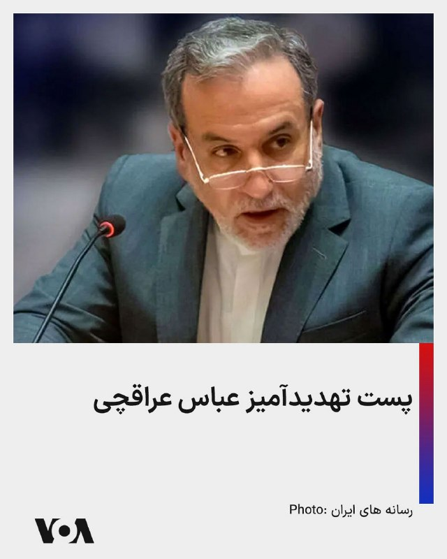

⚡️عباس عراقچی، وزیر خارجه جمهوری اسلامی، دقایقی قبل در شبکه اجتماعی ایکس، نوشت که نیروهای جمهوری اسلامی «هیچ حمله‌ای و تهدیدی را بی‌پاسخ نمی‌گذارند.» جمهوری اسلامی بارها در واکنش به حملات نیروهای اسرائيلی و آمریکایی، همسایگان ایران را هدف قرار داده است.
@FarsiVOA

## Persian_Trend_Official — post 16401

  <a href="telegram/content/Persian_Trend_Official_16401_1781046207.webm" target="_blank">🎬 Download video</a>

🇰🇷🇰🇵 همین مونده امشب کیم جونگ اون به کره جنوبی اعلام جنگ کنه. 🗿

📝 Nick

## Persian_Trend_Official — post 16400

‌⭕️ فارس:

🔴 گروه هکری حنظله: مختصات تمام نیروهای نظامی تروریستی آمریکا در کشورهای خلیج‌فارس به سپاه پاسداران انقلاب اسلامی منتقل شد.

🔹به‌زودی به پهپادهای شاهد-۱۳۶ «خوش‌آمد» خواهید گفت.

🔹شما بازی را شروع کردید؛ ما تعیین می‌کنیم چگونه پایان یابد.

📝 Nick

📌 @persian_trend_official
پرشین ترند | متفاوت‌ترین کانال نظامی

## IranianMinds — post 22013

با هر ی دونه موشک مدت زمان حضور رهبر در یخچال ۱۰۰ روز‌ تمدید میشه.

@IranianMinds

## IranianMinds — post 22012

🔴 سی بی اس نیوز :

اهداف حملات آمریکا در ایران شامل سایت‌های راداری بوده است.

این حملات در چارچوب پاسخ نظامی واشنگتن به تنش‌های اخیر انجام شده است.

@IranianMinds

## Dirty_Kids — post 391540

عراقچی آمریکا رو تهدید کرده سفت
میگه اگه میخوای سالم بمونی اینجارو ترک کن :)))
آقای ترامپ ببین به کجا رسوندی کارو که عراقچی که زیپشو نمیتونه ببنده هم تهدیدت میکنه :))))

## Dirty_Kids — post 391539

تخلیه فوری اسکله جاسک

---
📅 بروزرسانی: 1405/03/20 02:23
---

## VahidOOnLine — post 244591

  

هم‌زمان با حمله‌های جدید آمریکا به جمهوری اسلامی، عراقچی در ایکس نوشت: «با وجود شکست‌هایش در میدان نبرد، آمریکا تصمیم گرفت عزم ما را بیازماید. نیروهای مسلح قدرتمند ما هیچ حمله یا تهدیدی را بی‌پاسخ نخواهند گذاشت. اگر می‌خواهید در امان باشید، منطقه ما را ترک کنید.»
او افزود: «تاریخ خلیج فارس فصل‌های بسیاری درباره سرنوشت‌های وخیم بیگانگان مداخله‌گر دارد.»

‌🏁 🇬🇧 IranintlTV

🤖 @VahidOOnLine

## WithYashar — post 14243

نیویورک تایمز گزارش می‌دهد که حملات هوایی آمریکا به پایگاه‌های نظامی و دریایی، تأسیسات راداری و باتری‌های موشکی در پنج مکان در سواحل جنوبی ایران، از جمله موارد زیر، هدف قرار گرفته‌اند:

پایگاه‌های دریایی در سیریک و جاسک
سایت‌های دفاع هوایی در بندرعباس
باتری‌های موشکی در قشم۶

برخلاف گزارش صداوسیما مخزن آبی در سیریک هدف نگرفته است و مانند مدرسه میناب رو به دروغ آورند!
@withyashar

## WithYashar — post 14242

جنگ امیر تتلو و زندان

امیر تتلو از پشت تلفن زندان موزیک ضبط کرده و همین الان پخش کرده

https://youtu.be/ixhpdO88-IY?si=dmb7e06_W8ShLkkA

@withyashar

## pm_afshaa — post 93139

  <a href="telegram/content/pm_afshaa_93139_1781045588.webm" target="_blank">🎬 Download video</a>

🔴نیویورک تایمز:
حملات هوایی آمریکا به پایگاه‌های نظامی و دریایی، تأسیسات راداری و باتری‌های موشکی در 5 مکان در سواحل جنوبی ایران، از جمله موارد زیر، هدف قرار گرفتن:

پایگاه‌های دریایی در سیریک و جاسک و سایت‌های دفاع هوایی در بندرعباس باتری‌های موشکی در قشم.

💧 Rainbet.com the #1 Non-KYC Crypto Casino & Sportsbook @rainbetcom

😁 @Pm_Afshaa

## pm_afshaa — post 93138

تتلو از تو زندان با تماس تلفنی از زندان آهنگ خونده و ضبط و پخش کرده

💧 Rainbet.com the #1 Non-KYC Crypto Casino & Sportsbook @rainbetcom

😁 @Pm_Afshaa

## pm_afshaa — post 93137

  <a href="telegram/content/pm_afshaa_93137_1781045589.webm" target="_blank">🎬 Download video</a>

🔴توییت عباس عراقچی:

آمریکا با وجود شکست‌هاش تو میدون نبرد، تصمیم گرفت دوباره عزم ما رو آزمایش کنه. نیروهای مسلح قدرتمند ما هیچ حمله یا تهدیدی رو بی‌پاسخ نخواهند گذاشت.

اگه میخواید در امان باشید، منطقه ما رو ترک کنید. تاریخِ خلیج فارس فصل‌های زیادی در مورد سرنوشت شوم بیگانگان متجاوز داره.

💧 Rainbet.com the #1 Non-KYC Crypto Casino & Sportsbook @rainbetcom

😁 @Pm_Afshaa

## DEJradio — post 5524

⭕️ سایت‌های نظامی اطراف تنگهٔ هرمز هدف حملهٔ آمریکا قرار گرفت

دو منبع آمریکایی به شبکهٔ سی‌ان‌ان گفتند موج نخست حملات سنتکام، مواضع و تاسیسات نظامی جمهوری اسلامی در اطراف تنگه هرمز را هدف قرار داده است.
یکی از این منابع در بامداد چهارشنبه به شبکهٔ آمریکایی گفت که انتظار می‌رود حملات بیشتری نیز در ادامه انجام شود.

#خبر #دژ #تنگه_هرمز #جنگ
@DEJradio

## VahidOnline — post 76117

موج حملات آمریکا «فروکش کرده است»

رسانه‌های ایران از «فروکش کردن» موج حملات آمریکا خبر دادند که می‌تواند نشانه‌ای از «مقطعی و محدود» بودن این حملات، تلقی شود. چنانچه سنتکام آنها را «متناسب» خوانده بود.

خبرگزاری تسنیم همچنین تصاویری ویدیویی منتشر کرده و مدعی شده که یک پهپاد شاهد ایران در آسمان عراق مشاهده شده و آژیرهای خطر در کویت و بحرین که میزبان پایگاه‌های نظامی آمریکا هستند به صدا در آمده است

اما هنوز جزییات رسمی در این باره از سوی رسانه‌های بین‌المللی مخابره نشده است.
@VahidHeadline

📡 @VahidOnline

## VahidOnline — post 76116

خبرنگار صدا و سیما در سیریک: در پی حمله امشب آمریکا به سیریک، ۲ مخزن آب بخش بمانی مورد اصابت قرار گرفته و آب آشامیدنی این بخش قطع شده است.

"خبرگزاری صداوسیما" در خبر دیگری نوشته: هیچ بندر تجاری در جزیره قشم هدف قرار نگرفته است. در پی شنیده شدن ۶ انفجار در قشم برخی کانال های خبری از حمله به یک بندر تجاری در قشم خبر داده بودند.

📡 @VahidOnline

## kianmeli1 — post 87829

🔴دو مخازن آب آشامیدنی سیریک توسط موشک های امریکایی منهدم شده اند آب شهری قطع شده است
https://t.me/kianmeli1

## IranIntlTV — post 341415

  <a href="https://t.me/IranintlTV/341415" target="_blank">📎 Download file</a>

🎧نسخه صوتی جمهوری اسلامی؛ استاد عادی‌سازی بحراناز «چرا گران شد؟» تا «چقدر گران شد؟»
@iranintlTV

## IranIntlTV — post 341414

  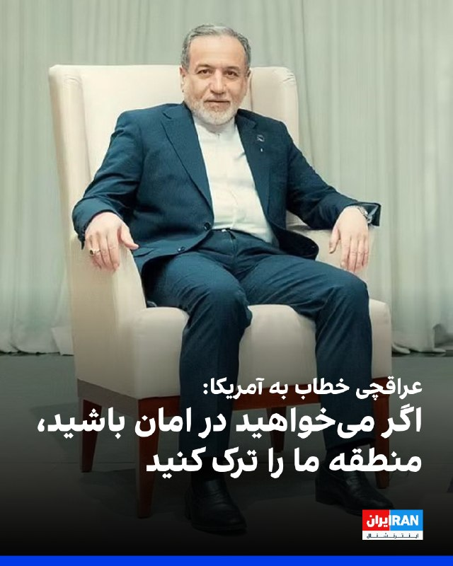

هم‌زمان با حمله‌های جدید آمریکا به جمهوری اسلامی، عراقچی در ایکس نوشت: «با وجود شکست‌هایش در میدان نبرد، آمریکا تصمیم گرفت عزم ما را بیازماید. نیروهای مسلح قدرتمند ما هیچ حمله یا تهدیدی را بی‌پاسخ نخواهند گذاشت. اگر می‌خواهید در امان باشید، منطقه ما را ترک کنید.»
او افزود: «تاریخ خلیج فارس فصل‌های بسیاری درباره سرنوشت‌های وخیم بیگانگان مداخله‌گر دارد.»

https://iranintl.com/202606092272

## Shin_Persian — post 6803

Shin ✓ @hey_itsmyturn
Tue, 09 Jun 2026 22:46:44 UTC

2241Z
AA activity in Hamedan
Hamedan Province, #Iran

فارسی

۲۲۴۱ زولو (۰۲:۱۱ به وقت تهران)
فعالیت پدافند هوایی در همدان
استان همدان، #Iran

𝕏 · @shin_persian

## FarsiVOA — post 220177

🔺رئيس مجلس نمایندگان آمریکا: حملات امشب به جمهوری اسلامی «متناسب و محدود» است

▪️مایک جانسون، رئيس مجلس نمایندگان آمریکا، عصر سه‌‌شنبه به وقت واشنگتن گفت حملات ایالات متحده در واکنش به سرنگونی هلی‌کوپتر آپاچی آمریکایی توسط جمهوری اسلامی، «هدفمند» است.

⬇️ بیشتر بخوانید:
https://ir.voanews.com/a/8159053.html
@FarsiVOA

## Persian_Trend_Official — post 16399

⭕️ صدا و سیما مدعی مورد اصابت قرار گرفتن دو مخزن آب در بخش بمانی شهرستان سیریک شده است.

📝 Nick

📌 @persian_trend_official
پرشین ترند | متفاوت‌ترین کانال نظامی

## Persian_Trend_Official — post 16398

  <a href="telegram/content/Persian_Trend_Official_16398_1781045591.mp4" target="_blank">🎬 Download video</a>

⭕️ روسیه بعد از هدف قرار گرفتن خط لوله گاز اصلیش توسط اوکراین

📝 Nick

📌 @persian_trend_official
پرشین ترند | متفاوت‌ترین کانال نظامی

## IranianMinds — post 22011

🔴 صداوسیما :

آمریکا به دو مخزن آب در سیریک حمله کرده.

@IranianMinds

## BBCPersian — post 283278

⚡️موج حملات آمریکا «فروکش کرده است»

رسانه‌های ایران از «فروکش کردن» موج حملات آمریکا خبر دادند که می‌تواند نشانه‌ای از «مقطعی و محدود» بودن این حملات، تلقی شود. چنانچه سنتکام آنها را «متناسب» خوانده بود.

خبرگزاری صدا و سیما از آرام شدن اوضاع در مناطق ساحلی جنوب ایران از جمله بندرعباس، قشم، سیریک، جاسک و کوه مبارک خبر داده است.

خبرگزاری تسنیم همچنین تصاویری ویدیویی منتشر کرده و مدعی شده که یک پهپاد شاهد ایران در آسمان عراق مشاهده شده و آژیرهای خطر در کویت و بحرین که میزبان پایگاه‌های نظامی آمریکا هستند به صدا در آمده است

اما هنوز جزییات رسمی در این باره از سوی رسانه‌های بین‌المللی مخابره نشده است.

https://bbc.in/3S256Q0
@BBCPersian

## Dirty_Kids — post 391538

آپدیت شد؛

- جنگ 12 روزه
- جنگ 12 ساعته
- جنگ 12 دقیقه

@Dirty_Kids 👻

## Dirty_Kids — post 391537

  <a href="telegram/content/Dirty_Kids_391537_1781045593.mp4" target="_blank">🎬 Download video</a>

به زودی باید اینجوری دیت بزارید:

@Dirty_Kids 👻

## alonews — post 126678

  

🌐نامحدود فقط 90 تومن 😍
فقط ۵۰ نفر اول ❤️

✅با سابقه ۵ سال فعالیت مداوم
🛡حتی بدون قطعی تو دوران جنگ

بقیه هنوز VPN حجمی میفروشن
اونم با قیمتای نجومی 🚀

ما چی؟ 💯💥 VPN نامحدود واقعی فقط 90 تومن🏷️

✅این آفر فقط برای ۵۰ نفر اوله رفقا ✅

💥بدون محدودیت حجم⬇️⬇️⬇️
@NetAazaadBot
@NetAazaadBot

## alonews — post 126677

  <a href="telegram/content/alonews_126677_1781045596.mp4" target="_blank">🎬 Download video</a>

👈هم اکنون حملات اوکراین به روسیه

✅ @AloNews خبر جنگ

## alonews — post 126676

  <a href="telegram/content/alonews_126676_1781045597.webm" target="_blank">🎬 Download video</a>

👈دو مخزن آب در بخش بمانی شهرستان سیریک در جنوب ایران هدف حملات هوایی آمریکا قرار گرفتند و طبق گزارش صدا و سیما، آب آشامیدنی در این بخش اکنون قطع شده است.

✅ @AloNews خبر جنگ

---
📅 بروزرسانی: 1405/03/20 02:13
---

## VahidOOnLine — post 244590

  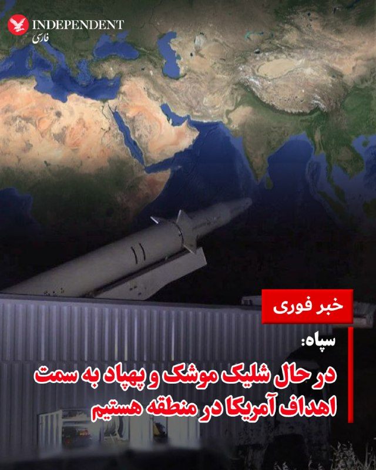

♦️به گزارش «سی‌ان‌ان»، سپاه پاسداران بامداد چهارشنبه، با انتشار بیانیه‌ای اعلام کرد که حملات موشکی و پهپادی خود را به سمت اهداف ایالات متحده در منطقه آغاز کرده است. براساس این گزارش، این اقدام سپاه پس از آن صورت گرفت که آمریکا اعلام کرد در پاسخ به سرنگونی یک هلیکوپتر آپاچی ارتش خود، حملاتی را علیه ایران آغاز کرده است.
‌🇸🇦 Indypersian

🤖 @VahidOOnLine

## WithYashar — post 14241

خبرنگار صداسیما در سیریک: در پی حمله امشب دشمن آمریکایی به سیریک، ۲ مخزن آب بخش بمانی مورد اصابت قرار گرفته و آب آشامیدنی این بخش قطع شده است.
@withyashar

## WithYashar — post 14240

اتاق جنگ با یاشار : با خسته شدن و خوابیدن ادمین های تلگرام جنگ هم تمام میشود
@withyashar

## WithYashar — post 14239

  <a href="telegram/content/WithYashar_14239_1781044993.mp4" target="_blank">🎬 Download video</a>

فعالیت پدافند مشهد امشب.
@withyashar

## WithYashar — post 14238

جسی واترز از فاکس درباره مذاکرات ایران:

فکر می‌کنم ما همین الان یک پیشنهاد دریافت کردیم/از واشنگتن می‌شنوم که از آنچه می‌بینیم خوششان آمده است.
@withyashar

## mwarmonitor — post 10573

🔴مخازن آب در سیریک هدف قرار داده شدند.

## mwarmonitor — post 10572

🔴 عراقچی: با وجود شکست‌هایش در میدان نبرد، ایالات متحده تصمیم گرفته است اراده ما را بیازماید.

🔸نیروهای مسلح قدرتمند ما هیچ حمله یا تهدیدی را بدون پاسخ نخواهند گذاشت.

🔸اگر خواهان امنیت هستید، منطقه ما را ترک کنید.

🔹تاریخ خلیج فارس سرشار از فصل‌های متعدد درباره سرنوشت‌های تراژیک اشغالگران خارجی است.

🔸 تنگه هرمز جزو آب‌های بین‌المللی نیست، بلکه یک تنگه مشترک بین ایران و عمان است و هزاران مایل از سواحل ایالات متحده فاصله دارد. مرزهای دریایی کاملاً روشن و بدون ابهام هستند.

@mwarmonitor

## FoxNewsTwitter — post 342778

  <a href="telegram/content/FoxNewsTwitter_342778_1781044994.mp4" target="_blank">🎬 Download video</a>

Fox News (Twitter/X)

JUST IN: Speaker Mike Johnson says he was in the White House Situation Room with President Trump and top officials before U.S. forces launched what were described as self-defense strikes against Iran.

Johnson calls the operation “proportional and limited,” targeting radar, missile and command-and-control sites.

## pm_afshaa — post 93136

  <a href="telegram/content/pm_afshaa_93136_1781044996.webm" target="_blank">🎬 Download video</a>

🔴خبرنگار صداوسیما در سیریک:
در پی حمله امشب دشمن آمریکایی به سیریک، 2 مخزن آب بخش بمانی مورد اصابت قرار گرفته و آب آشامیدنی این بخش قطع شده.

💧 Rainbet.com the #1 Non-KYC Crypto Casino & Sportsbook @rainbetcom

😁 @Pm_Afshaa

## pm_afshaa — post 93135

  <a href="telegram/content/pm_afshaa_93135_1781044996.webm" target="_blank">🎬 Download video</a>

🔴صداوسیما: هیچ بندر تجاری در جزیره قشم هدف پرتابه‌های دشمن قرار نگرفته.

💧 Rainbet.com the #1 Non-KYC Crypto Casino & Sportsbook @rainbetcom

😁 @Pm_Afshaa

## pm_afshaa — post 93134

  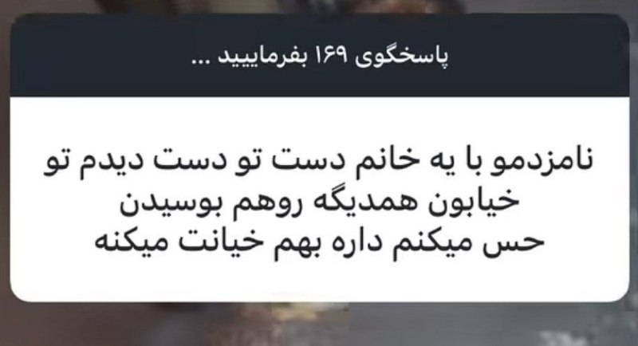

جوری که ترامپ معتقده آتش‌بس نقض نشده :

💧 Rainbet.com the #1 Non-KYC Crypto Casino & Sportsbook @rainbetcom

😁 @Pm_Afshaa

## pm_afshaa — post 93133

خب مثل اینکه دوباره آتش‌بس شد.

فرداشب همین جمع آتش بس بعدی.

## pm_afshaa — post 93132

  <a href="telegram/content/pm_afshaa_93132_1781044998.webm" target="_blank">🎬 Download video</a>

🔴مایک جانسون، رئیس مجلس نمایندگان:
این عملیات متناسب و محدود بوده و رادارها، موشک‌ها و مراکز فرماندهی و کنترل رو هدف قرار داده و این حمله ماهیت دفاعی داشته.

💧 Rainbet.com the #1 Non-KYC Crypto Casino & Sportsbook @rainbetcom

😁 @Pm_Afshaa

## DEJradio — post 5523

  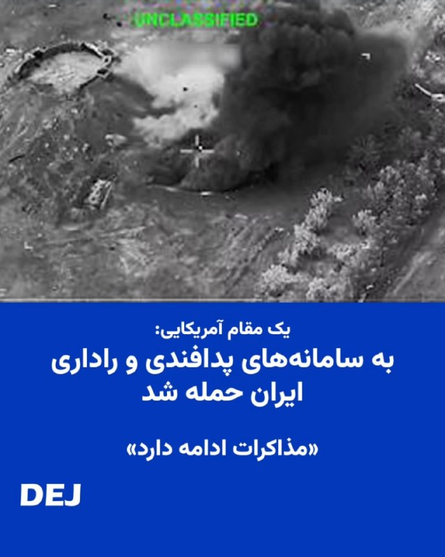

🛩️
🔥 یک مقام آمریکایی به «سی‌ان‌ان» گفت: «به چندین سامانه پدافند هوایی و راداری در اطراف تنگه هرمز حمله کردیم. با این حال، این حملات تنها یک هشدار به ایران بود و مانع از ادامه مذاکرات نمی‌شود.»

بر اساس گزارش‌ منابع محلی ، پایگاه دریایی سیریک، پایگاه دریایی جاسک، پایگاه هوایی بندرعباس، باتری موشکی ساحلی میناب و قشم هدف حملات آمریکا قرار گرفته‌اند. همچنین صدای دست‌کم شش انفجار در محدوده بندر سیریک شنیده شد.

#جنگ #تنگه_هرمز #مذاکرات
@DEJradio

## DEJradio — post 5522

  <a href="telegram/content/DEJradio_5522_1781044999.webm" target="_blank">🎬 Download video</a>

🚨📢 فرماندهی مرکزی ایالات متحده (سنتکام)، سه‌شنبه‌شب، ۱۹ خردادماه، با انتشار بیانیه‌ای اعلام کرد که نیروهای آمریکایی حملات نظامی موسوم به «دفاع از خود» را علیه ایران آغاز کرده‌اند.

بر اساس این بیانیه، این عملیات نظامی با دستور مستقیم فرمانده کل قوا (رئیس‌جمهوری آمریکا) و در پاسخ به سرنگونی روز گذشته یک هلیکوپتر آپاچی ارتش ایالات متحده صورت گرفته است. سنتکام این ماموریت را یک پاسخ متناسب به آنچه «تجاوز توجیه‌ناپذیر ایران» خوانده، توصیف کرده است.

#جنگ #تنگه_هرمز
@DEJradio

## DEJradio — post 5521

⭕️ سایت‌های نظامی اطراف تنگهٔ هرمز هدف حملهٔ آمریکا قرار گرفت

دو منبع آمریکایی به شبکهٔ سی‌ان‌ان گفتند موج نخست حملات سنتکام، مواضع و تاسیسات نظامی جمهوری اسلامی در اطراف تنگه هرمز را هدف قرار داده است.
یکی از این منابع در بامداد چهارشنبه به شبکهٔ آمریکایی گفت که انتظار می‌رود حملات بیشتری نیز در ادامه انجام شود.

#خبر #دژ #سنتکام #جنگ
@DEJradio

## DEJradio — post 5520

⭕️منابع آمریکایی: حملات ایالات متحده با هدف هشدار به جمهوری اسلامی انجام شد

یک مقام آمریکایی به شبکهٔ سی‌ان‌ان گفت حملات بامداد جهارشنبهٔ ارتش آمریکا با هدف ارسال پیام هشدار به جمهوری اسلامی انجام شده است.
او افزود واشینگتن باور دارد که این حملات، مانع ادامهٔ مذاکرات برای پایان دادن به جنگ نمی‌شود.
سنتکام نیز این عملیات را پاسخی متناسب به تجاوز ناموجه جمهوری اسلامی عنوان کرده است.
حملات تازهٔ آمریکا که چندین موضع نظامی رژیم را در جنوب کشور هدف گرفت، به دستور رئیس جمهوری آمریکا آغاز شد.

#خبر #دژ #سنتکام #جنگ
@DEJradio

## VahidOnline — post 76115

  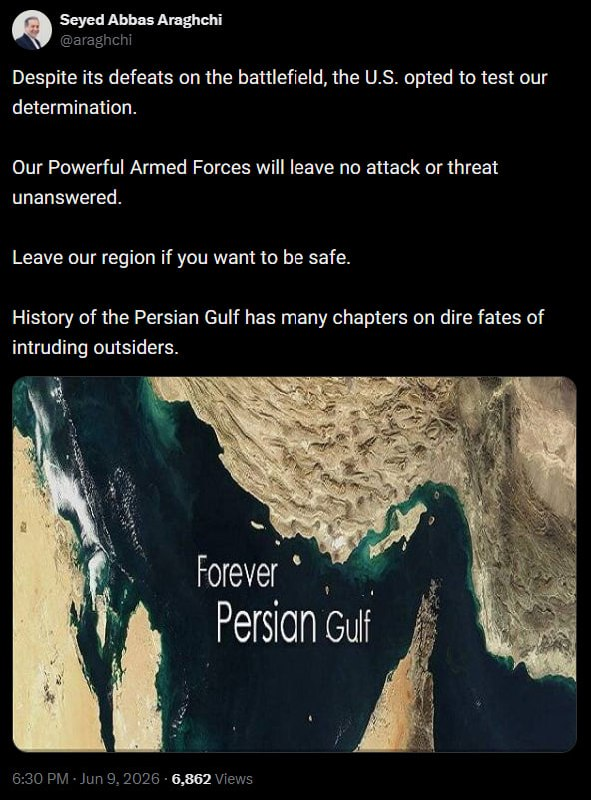

توییت تازه عباس عراقچی، ترجمه ماشین:
با وجود شکست‌هایش در میدان نبرد، ایالات متحده تصمیم گرفت عزم ما را بیازماید.

نیروهای مسلح قدرتمند ما هیچ حمله یا تهدیدی را بی‌پاسخ نخواهند گذاشت.

اگر می‌خواهید در امان باشید، منطقه ما را ترک کنید.

تاریخ خلیج فارس فصل‌های بسیاری درباره سرنوشت‌های شومِ بیگانگانِ مداخله‌گر دارد.
araghchi

📡 @VahidOnline

## kianmeli1 — post 87828

  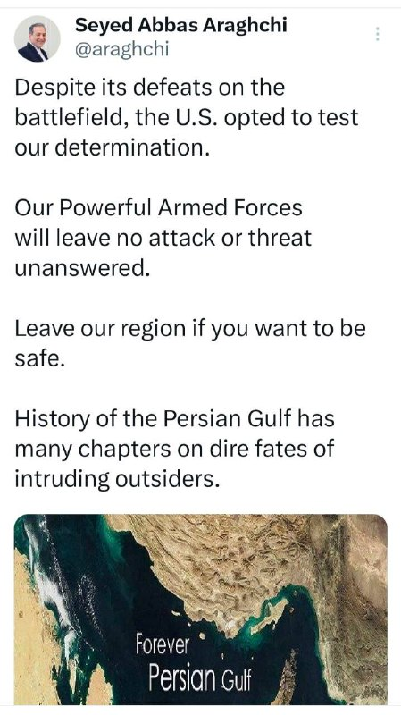

🔴فوری

تهدید بی سابقه عراقچی علیه امریکا

به امریکا اعلام میکنیم سریعتر خلیج فارس را ترک کنید
https://t.me/kianmeli1

## DW_Farsi — post 125744

  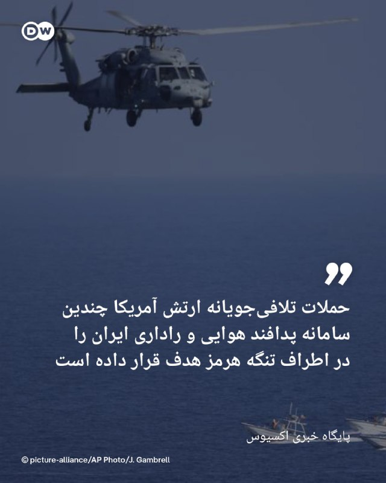

🔴 "آمریکا پدافند هوایی و رادارهای ایران در اطراف تنگه هرمز را هدف قرار داد"

پایگاه خبری اکسیوس به نقل از یک مقام آمریکایی گزارش داد، حملات تلافی‌جویانه ارتش آمریکا چندین سامانه پدافند هوایی و راداری ایران را در اطراف تنگه هرمز هدف قرار داده است.

در عین حال، خبرگزاری فارس وابسته به سپاه پاسداران گزارش داد، صداهای انفجار در بخش‌های شرقی استان هرمزگان ایران شنیده شده است؛ این گزارش هم‌زمان با بیانیه فرماندهی مرکزی ایالات متحده (سنتکام) منتشر شد که اعلام کرد نیروهایش در پاسخ به سرنگونی یک بالگرد آپاچی ارتش آمریکا، حملات با هدف دفاع از خود را علیه ایران آغاز کرده‌اند.

رسانه‌های دولتی ایران همچنین می‌گویند، اصابت یک پرتابه در سیریک، شهری در استان هرمزگان تایید شده و صداهای انفجار در جزیره قشم در تنگه هرمز که آن هم بخشی از این استان است، شنیده شده است.
@dw_farsi

## DW_Farsi — post 125743

  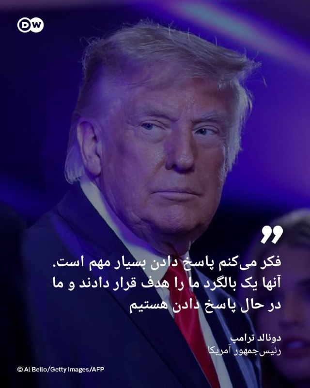

🔴 ترامپ: آنها یک بالگرد ما را هدف قرار دادند و ما در حال پاسخ دادن هستیم

دونالد ترامپ، رئیس‌جمهور آمریکا در گفت‌‌وگوی تلفنی با شبکه خبری ای‌بی‌سی نیوز گفت: «فکر می‌کنم پاسخ دادن بسیار مهم است. آن‌ها یک بالگرد ما را هدف قرار دادند و ما همین حالا در حال پاسخ دادن هستیم.»

او افزود: «من همیشه در طول زندگی‌ام به پاسخ قاطع اعتقاد داشته‌ام. ما توافقی داشتیم که توافق بسیار خوبی بود و احتمالا همچنان هم خواهد بود.»

رئیس‌جمهور آمریکا ادامه داد: «من معتقدم این پاسخ باید بسیار قوی و قدرتمند باشد.»

در پی سرنگونی یک فروند بالگرد نظامی ایالات متحده در جریان منازعه با ایران، دونالد ترامپ از اقدام تلافی‌جویانه واشنگتن خبر داده بود.

ترامپ روز سه‌شنبه، ۹ ژوئن طی پیام در شبکه اجتماعی تروث سوشال اعلام کرده بود، به او گزارش شده است، "ایرانی‌ها شب گذشته یکی از هلی‌کوپترهای بسیار پیشرفته آپاچی ما را در حال گشت‌زنی در تنگه هرمز سرنگون کرده‌اند".

رئیس‌جمهور آمریکا گفته بود، با وجود اینکه خلبانان این پرواز آسیبی ندیده‌اند اما ایالات متحده "به ناچار باید به این حمله پاسخ دهد".
@dw_farsi

## Persian_Trend_Official — post 16397

  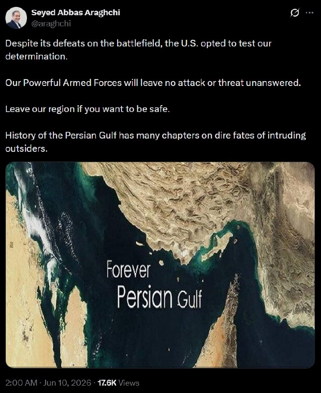

⭕️ عباس عراقچی:

علیرغم شکست‌هایش در میدان نبرد، ایالات متحده تصمیم گرفت عزم ما را بیازماید.

نیروهای مسلح قدرتمند ما هیچ حمله یا تهدیدی را بی‌پاسخ نخواهند گذاشت.

اگر می‌خواهید در امان باشید، منطقه ما را ترک کنید.

تاریخ خلیج فارس فصل‌های زیادی در مورد سرنوشت شوم بیگانگان متجاوز دارد.

📝 Nick

📌 @persian_trend_official
پرشین ترند | متفاوت‌ترین کانال نظامی

## Persian_Trend_Official — post 16396

  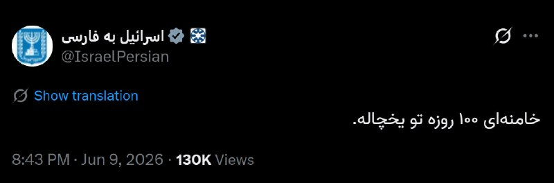

⭕️ اسرائیل به فارسی:

خامنه‌ای ۱۰۰ روزه تو یخچاله.

📝 Nick

📌 @persian_trend_official
پرشین ترند | متفاوت‌ترین کانال نظامی

## IranianMinds — post 22010

  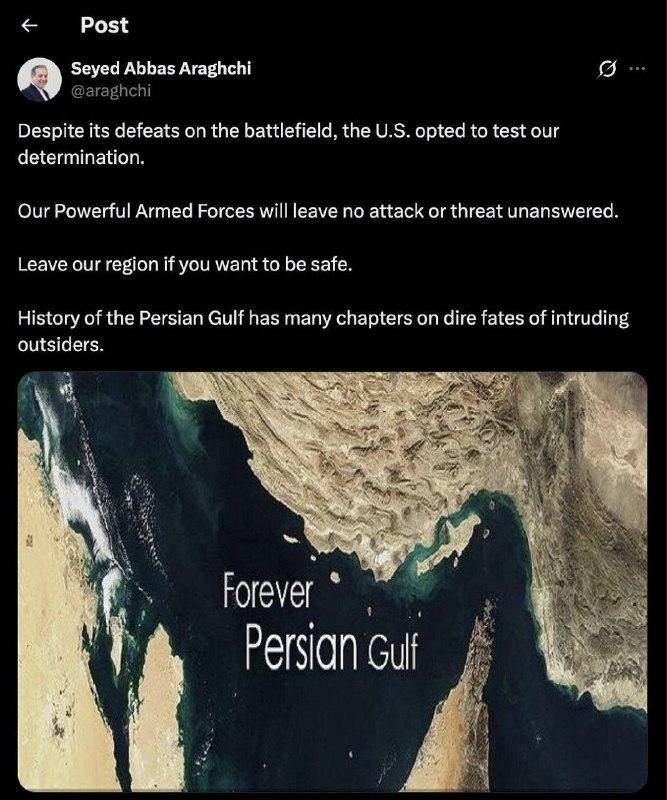

🔴 عراقچی :

نیروهای آمریکایی اگه میخوان در امان بمونن باید هرچه سریعتر خلیج فارس رو ترک کنن.

@IranianMinds

## Dirty_Kids — post 391536

  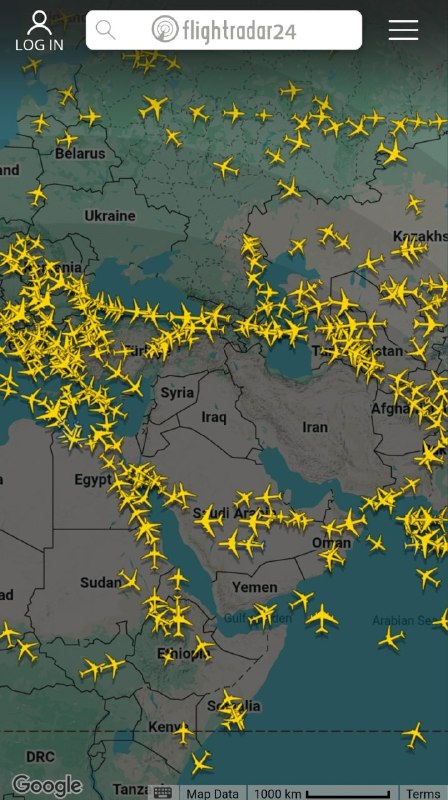

هم اکنون، آسمان منطقه و وضعیت پروازها

@Dirty_Kids 👻

## Dirty_Kids — post 391535

  

سلامتی،
تو آتش‌بس بیشتر حمله داشتیم تا تو جنگ! 👀

@Dirty_Kids 👻

## Dirty_Kids — post 391534

آتش‌نقض بس شد؟

@Dirty_Kids 👻

## alonews — post 126675

  <a href="telegram/content/alonews_126675_1781045004.webm" target="_blank">🎬 Download video</a>

👈هم اکنون آسمان منطقه

✅ @AloNews خبر جنگ

## alonews — post 126674

  <a href="telegram/content/alonews_126674_1781045004.webm" target="_blank">🎬 Download video</a>

👈عراقچی : با اینکه توی میدان جنگ شکست خورد، آمریکا باز هم تصمیم گرفت اراده‌مون رو امتحان کنه

- نیروهای قدرتمند مسلح ما هم هر حمله یا تهدیدی رو بی‌جواب نمی‌ذارن

- اگه می‌خواید سالم بمونید، از منطقه‌مون برید

- تاریخ خلیج فارس پره از سرنوشت‌های تلخِ خارجی‌هایی که چشم طمع داشتن

✅ @AloNews خبر جنگ

## alonews — post 126673

  <a href="telegram/content/alonews_126673_1781045004.webm" target="_blank">🎬 Download video</a>

👈اسرائیل هیوم: ارزیابی اسرائیل این است که ایران به کشورهای خلیج فارس حمله خواهد کرد

✅ @AloNews خبر جنگ

---
📅 بروزرسانی: 1405/03/20 02:02
---

## WithYashar — post 14237

  <a href="telegram/content/WithYashar_14237_1781044376.mp4" target="_blank">🎬 Download video</a>

مشاهده پهپادهای انتحاری‌ ایرانی در آسمان عراق
@withyashar

## WithYashar — post 14236

پولیتیکو به نقل از یک مقام ارشد در کاخ سفید: هیچ تغییری در شرایط بوجود نیامده و آتش بس کماکان ادامه دارد
@withyashar

## WithYashar — post 14235

ولی یه حمله شکی توش‌نیست حمله شما به دایرکت اتاق جنگ 😭🤣❤️‍🩹🙌🏾

## WithYashar — post 14234

هم اکنون خاورمیانه: حملات آمریکا به ایران حملات اسرائیل به لبنان حملات پاکستان به افغانستان حملات ترکیه به عراق حملات ایران به بحرین و کویت @withyashar

## mwarmonitor — post 10571

📌مایک جانسون، رئیس مجلس نمایندگان آمریکا، می‌گوید که او همین حالا از حملات علیه ایران مطلع شده و این حملات «ماهیت دفاعی» داشته‌اند.

🔸جانسون گفت که او امروز زودتر در اتاق وضعیت (Situation Room) همراه ترامپ، ونس، روبیو، هگست و دیگران بوده است؛ جایی که موضوع ایران مورد بحث قرار گرفته بود. – Punchbowl

@mwarmonitor

## mwarmonitor — post 10570

🔴بر اساس ارزیابی‌های فعلی، اسرائیل هایوم گزارش می‌دهد که ایران در پاسخ به حملات آمریکا به این کشور، به کشورهای خلیج فارس حمله خواهد کرد.

@mwarmonitor

## pm_afshaa — post 93131

  <a href="telegram/content/pm_afshaa_93131_1781044377.webm" target="_blank">🎬 Download video</a>

🔴اسرائیل هیوم:
بر اساس ارزیابی‌های فعلی، جمهوری اسلامی در پاسخ به حملات آمریکا، به کشورهای خلیج فارس حمله خواهد کرد.

💧 Rainbet.com the #1 Non-KYC Crypto Casino & Sportsbook @rainbetcom

😁 @Pm_Afshaa

## pm_afshaa — post 93130

  <a href="telegram/content/pm_afshaa_93130_1781044378.webm" target="_blank">🎬 Download video</a>

🔴جسی واترز، مجری فاکس نیوز:
به نظر میاد یه پیشنهاد جدید رسیده و از واشنگتن خبر میرسه که آمریکایی‌ها فعلاً از این پیشنهاد و روند مذاکرات راضی هستن.

💧 Rainbet.com the #1 Non-KYC Crypto Casino & Sportsbook @rainbetcom

😁 @Pm_Afshaa

## pm_afshaa — post 93129

راحت تو تلگرام جنگ ۱۰ برابرِ حقیقته

## VahidOnline — post 76114

  

یک مقام آمریکایی به سی‌ان‌ان گفت که حملات جدید سنتکام با قصد هشدار دادن به جمهوری اسلامی است.

او گفت ایالات متحده معتقد است که این حملات مانع مذاکرات برای پایان دادن به جنگ نخواهد شد.
@VahidHeadline

📡 @VahidOnline

## FarsiVOA — post 220176

  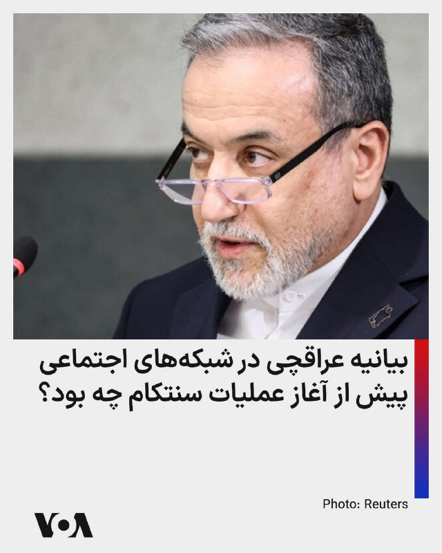

⚡️ساعاتی قبل از آغاز حملات نظامی سنتکام به مواضع جمهوری اسلامی در روز چهارشنبه به وقت تهران، عباس عراقچی، وزیر امور خارجه جمهوری اسلامی، هر چند به‌طور مستقیم به سرنگونی هلی‌کوپتر آپاچی آمریکایی اشاره نکرد، اما در یک پست کنایه‌آمیز در شبکه‌های اجتماعی به این حادثه اشاره کرد و از نیروهای خارجی خواست که منطقه را «برای کاهش خطر» ترک کنند.
@FarsiVOA

## FarsiVOA — post 220175

  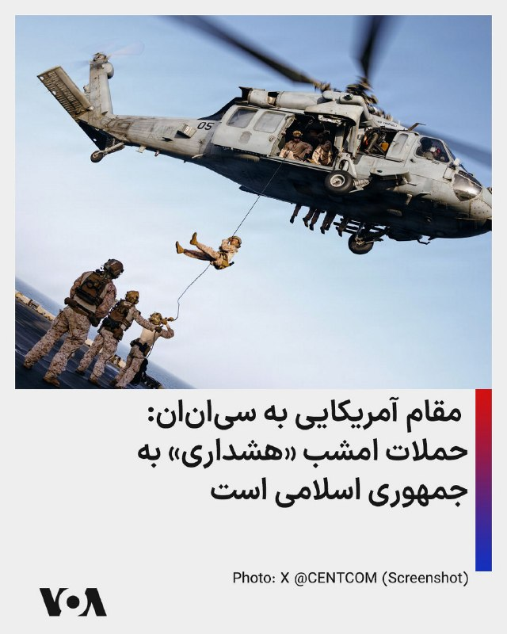

⚡️یک مقام آمریکایی به سی‌ان‌ان گفت که حملات جدید سنتکام با قصد هشدار دادن به جمهوری اسلامی است.

او گفت ایالات متحده معتقد است که این حملات مانع مذاکرات برای پایان دادن به جنگ نخواهد شد.

ستاد فرماندهی مرکزی آمریکا، این حملات را «پاسخی متناسب به تجاوز ناموجه» جمهوری اسلامی توصیف کرد و گفت این حملات به دستور رئیس‌جمهوری آمریکا آغاز شد.
@FarsiVOA

## DW_Farsi — post 125742

  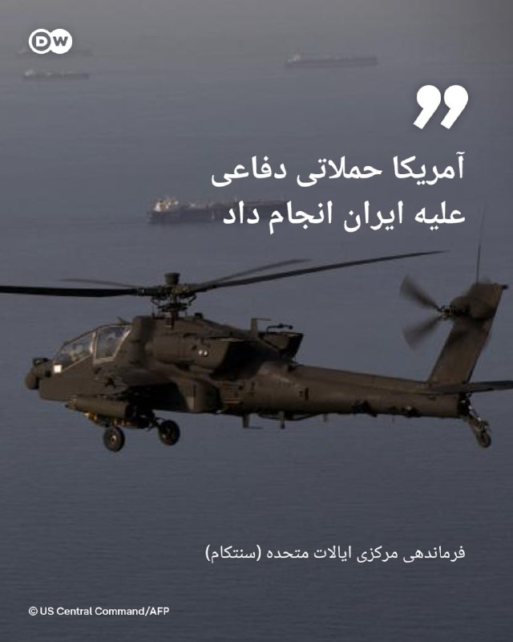

🔴 سنتکام: آمریکا حملاتی دفاعی علیه ایران انجام داد

فرماندهی مرکزی ایالات متحده (سنتکام) اعلام کرد، نیروهای آمریکایی در واکنش به حمله ایران به یک بالگرد ارتش آمریکا، حملات موسوم به "دفاع از خود" را آغاز کرده‌اند.

به گفته سنتکام، این حملات از ساعت ۵ بعدازظهر به وقت شرق آمریکا (ET) آغاز شده است.

در پی سرنگونی یک فروند بالگرد نظامی ایالات متحده در جریان منازعه با ایران، دونالد ترامپ از اقدام تلافی‌جویانه واشنگتن خبر داده بود.

ترامپ روز سه‌شنبه، ۹ ژوئن طی پیام در شبکه اجتماعی تروث سوشال اعلام کرده بود، به او گزارش شده است، "ایرانی‌ها شب گذشته یکی از هلی‌کوپترهای بسیار پیشرفته آپاچی ما را در حال گشت‌زنی در تنگه هرمز سرنگون کرده‌اند".

رئیس‌جمهور آمریکا گفته بود، با وجود اینکه خلبانان این پرواز آسیبی ندیده‌اند اما ایالات متحده "به ناچار باید به این حمله پاسخ دهد".
@dw_farsi

## Persian_Trend_Official — post 16395

  <a href="telegram/content/Persian_Trend_Official_16395_1781044380.mp4" target="_blank">🎬 Download video</a>

⭕️ وضعیت امشب خاورمیانه:

📝 Nick

📌 @persian_trend_official
پرشین ترند | متفاوت‌ترین کانال نظامی

## Persian_Trend_Official — post 16394

  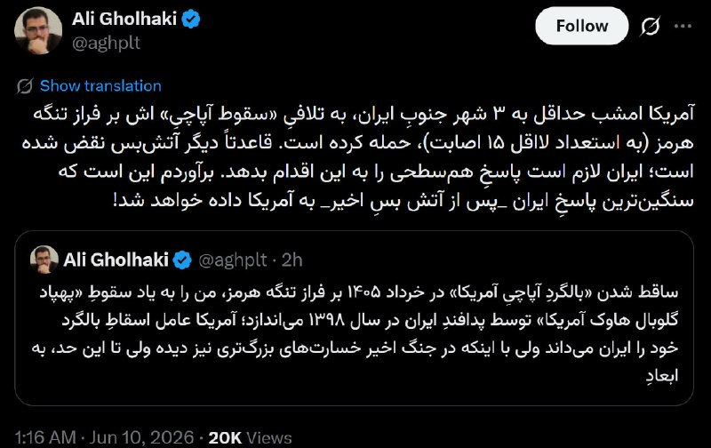

⭕️ علی قلهکی: آمریکا امشب حداقل به ۳ شهر جنوبِ ایران، به تلافیِ «سقوط آپاچیِ» اش بر فراز تنگه هرمز (به استعداد لااقل ۱۵ اصابت)، حمله کرده است. قاعدتاً دیگر آتش‌بس نقض شده است؛ ایران لازم است پاسخِ هم‌سطحی را به این اقدام بدهد. برآوردم این است که سنگین‌ترین پاسخِ ایران _پس از آتش بسِ اخیر_ به آمریکا داده خواهد شد!

📝 Nick

📌 @persian_trend_official
پرشین ترند | متفاوت‌ترین کانال نظامی

## IranianMinds — post 22009

🔴 مایک جانسون، رئیس مجلس نمایندگان آمریکا :

حملات ما ماهیت دفاعی داشت فقط و آتش بس نقض نشده و برقراره.

@IranianMinds

## BBCPersian — post 283277

🔻 چه نقاطی مورد حمله هوایی آمریکا قرار گرفته است؟

سنتکام ساعت آغاز حمله خود در واکنش به ساقط شدن بالگرد آپاچی ارتش آمریکا را ۵ عصر به وقت واشنگتن در شرق ایالات متحده اعلام کرده است یعنی حدود ۳۰ دقیقه بامداد به وقت تهران.

در یک ساعت گذشته خبرگزاری‌های داخل ایران شنیدن صدای انفجار یا هدف قرار گرفتن این نقاط را در پی این حملات آمریکا گزارش کرده اند:

خبرگزاری فارس: صدای چند انفجار در مناطق شرقی هرمزگان از جمله در کوهستک و سیریک و میناب

خبرگزاری تسنیم از صدای ۶ انفجار در سیریک، جزیره قشم و میناب خبر داده است

گزارشی از هم هدف قرار گرفتن نقاطی در جاسک و کوه مبارک در شرق استان هرمزگان منتشر شده است.

https://bbc.in/3S256Q0
@BBCPersian

## BBCPersian — post 283276

🔻 تسنیم: ایران به تجاوز آمریکا پاسخ خواهد داد

خبرگزاری تسنیم نزدیک به سپاه پاسداران ضمن تایید هدف قرار گرفتن نقاطی در جنوب ایران طی حملات نظامی آمریکا در دقایق گذشته، بدون اشاره به نام مقام یا نهاد رسمی نوشته است: «ایران همچنان که ساعاتی پیش نیز هشدار داده، پاسخ قطعی به تجاوز آمریکا که به بهانه سقوط هلیکوپتر آپاچی انجام می‌شود، خواهد داد.»

https://bbc.in/4vyPXE9
@BBCPersian

## BBCPersian — post 283275

  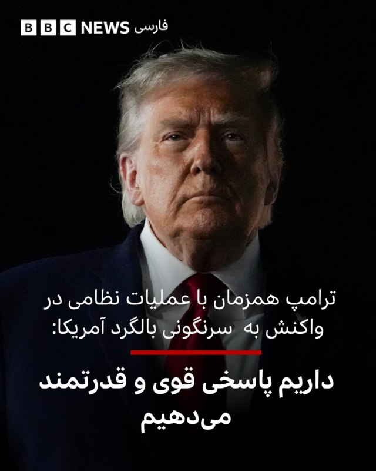

🔻دونالد ترامپ، رئیس‌جمهور آمریکا، گفته است که پاسخ دادن ایالات متحده به سرنگونی هلی‌کوپتر «بسیار مهم» است.

خبرنگار شبکه تلویزیونی ای‌بی‌سی گفته در حال مصاحبه تلفنی با آقای ترامپ بود که سنتکام انجام عملیات علیه ایران را اعلام کرد و رئیس‌جمهور آمریکا به او گفته: «آنها یک هلیکوپتر را سرنگون کردند و ما همین الان در حال پاسخ دادن هستیم.»

او افزود: «این پاسخ به کاری است که آنها دیشب با هلی‌کوپتر ما انجام دادند و من معتقدم که این پاسخ باید بسیار قوی و قدرتمند باشد و این پاسخ هم همینگونه است.»
📷Reuters
https://bbc.in/4ot0zlN
@BBCPersian

## Dirty_Kids — post 391533

  <a href="telegram/content/Dirty_Kids_391533_1781044382.mp4" target="_blank">🎬 Download video</a>

وضعیت الان در خاورمیانه:

@Dirty_Kids 👻

## Dirty_Kids — post 391532

میگن ترکیه هم به شمال عراق حمله کرده عربستان هم به یمن
یعنی یه خاوری میانه همست

@Dirty_Kids 👻

## alonews — post 126672

  <a href="telegram/content/alonews_126672_1781044383.webm" target="_blank">🎬 Download video</a>

👈کاخ سفید: ما معتقدیم توافق با ایران بسیار نزدیک است

✅ @AloNews خبر جنگ

---
📅 بروزرسانی: 1405/03/20 01:53
---

## VahidOOnLine — post 244589

  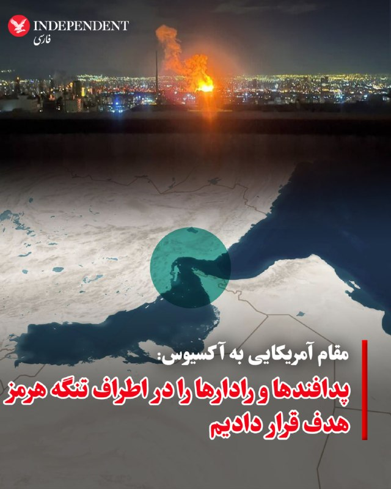

♦️یک مقام آمریکایی که نام او اعلام نشده به آکسیوس گفت: ایالات متحده چندین سامانه پدافند هوایی و سامانه راداری ایران را در اطراف تنگه هرمز هدف حمله قرار دادند.
‌🇸🇦 Indypersian

🤖 @VahidOOnLine

## WithYashar — post 14233

شلیک دو موشک از سیرجان
@withyashar

## WithYashar — post 14232

گزارشات از حملات توپخانه ای عربستان به یمن
@withyashar

## WithYashar — post 14231

## WithYashar — post 14230

سی ان ان به نقل از مقامات آمریکایی:
انتظار می‌رود چندین دور حملات دیگر بر علیه ایران انجام شود.
@withyashar

## WithYashar — post 14229

هم اکنون خاورمیانه:

حملات آمریکا به ایران
حملات اسرائیل به لبنان
حملات پاکستان به افغانستان
حملات ترکیه به عراق
حملات ایران به بحرین و کویت
@withyashar

## mwarmonitor — post 10569

🔴پولیتیکو به نقل از یک مقام ارشد در کاخ سفید: ترامپ همچنان معتقد است که توافق صلح با ایران در افق قرار دارد، با وجود حملات تلافی‌جویانه.

@mwarmonitor

## pm_afshaa — post 93128

هم‌اکنون وضعیت خاورمیانه : - حمله آمریکا به اهداف جمهوری اسلامی - حمله پاکستان به افغانستان - حمله اسرائیل به لبنان - حمله ایران به کشورهای منطقه 
💧 Rainbet.com the #1 Non-KYC Crypto Casino & Sportsbook @rainbetcom 
😁 @Pm_Afshaa

## pm_afshaa — post 93127

خبر حمله ترکیه به عراق و عربستان به یمن فیکه دیگه زیادی جوگیر شدن ادمینای تلگرام

## pm_afshaa — post 93126

  <a href="telegram/content/pm_afshaa_93126_1781043795.webm" target="_blank">🎬 Download video</a>

🔴خبرگزاری مهر: موج حملات آمریکا در جنوب فروکش کرده و بعد از حملات به قشم، سیریک و جاسک و کوه مبارکه جاسک؛ هم‌اکنون وضعیت آرام گزارش میشه.

💧 Rainbet.com the #1 Non-KYC Crypto Casino & Sportsbook @rainbetcom

😁 @Pm_Afshaa

## pm_afshaa — post 93125

  <a href="telegram/content/pm_afshaa_93125_1781043796.webm" target="_blank">🎬 Download video</a>

🔴پولیتیکو به نقل از یک مقام ارشد در کاخ سفید: ترامپ همچنان معتقده با وجود حملات تلافی‌جویانه، توافق صلح با جمهوری اسلامی در افق قرار داره.

💧 Rainbet.com the #1 Non-KYC Crypto Casino & Sportsbook @rainbetcom

😁 @Pm_Afshaa

## pm_afshaa — post 93124

🔴سی‌ان‌ان: احتمال موج های بعدی حملات تا دقایق یا ساعاتی دیگر وجود داره.

💧 Rainbet.com the #1 Non-KYC Crypto Casino & Sportsbook @rainbetcom

😁 @Pm_Afshaa

## pm_afshaa — post 93123

  <a href="telegram/content/pm_afshaa_93123_1781043797.mp4" target="_blank">🎬 Download video</a>

پهپاد شاهد در آسمان عراق داره به سمت کشور‌های حاشیه خلیج فارس پرواز میکنه :

💧 Rainbet.com the #1 Non-KYC Crypto Casino & Sportsbook @rainbetcom

😁 @Pm_Afshaa

## mamlekate — post 103654

📝 آغاز عملیات دفاعی آمریکا علیه جمهوری اسلامی در واکنش به سرنگونی هلی‌کوپتر آمریکایی

ستاد فرماندهی مرکزی ایالات متحده (سنتکام) روز سه‌شنبه اعلام کرد که نیروهای آمریکایی در پاسخ به سرنگونی یک هلیکوپتر آپاچی ارتش ایالات متحده که دیروز رخ داد، ساعت ۵ بعد از ظهر به وقت شرق آمریکا، به دستور فرمانده کل قوا، دونالد ترامپ، حملات دفاعی از خود علیه جمهوری اسلامی را آغاز کردند.

📝 رسانه‌های ایران از ادامه انفجارها در استان هرمزگان خبر دادند

رسانه‌های ایران از ادامه صداهای انفجار در نقاط مختلف هرمزگان خبر دادند. طبق این گزارش‌ها، نقاطی در جاسک و کوه مبارکه هدف پرتابه‌های متخاصم قرار گرفته است.فارس نیز گزارش داد صدای چند انفجار در مناطق شرقی هرمزگان، از جمله کوهستک، سیریک و میناب شنیده شده است.

@mamlekate

## IranIntlTV — post 341413

  <a href="telegram/content/IranIntlTV_341413_1781043798.mp4" target="_blank">🎬 Download video</a>

آرش آرامش، حقوقدان و کارشناس امنیت ملی، درباره پاسخ آمریکا به سرنگونی بالگرد آپاچی از سوی جمهوری اسلامی، گفت: «حمله‌هایی که سنتکام می‌کند، پاسخی در حد متناسب است تا دست‌کم واکنشی نشان داده باشد.» او معتقد است حملات گسترده‌ای انجام نخواهد گرفت.
@iranintltv

## IranIntlTV — post 341412

  <a href="telegram/content/IranIntlTV_341412_1781043801.mp4" target="_blank">🎬 Download video</a>

سخنگوی دولت از حامیان حکومت به دلیل ادامه حضور در تجمعات خیابانی تشکر کرد. فاطمه مهاجرانی همزمان با توجیه قطعی اینترنت برای حدود سه ماه، دلیل ادامه اختلال را مشکلات فنی دانست.

جزییات بیشتر با اردوان روزبه، خبرنگار ایران‌اینترنشنال
@iranintltv

## FarsiVOA — post 220173

  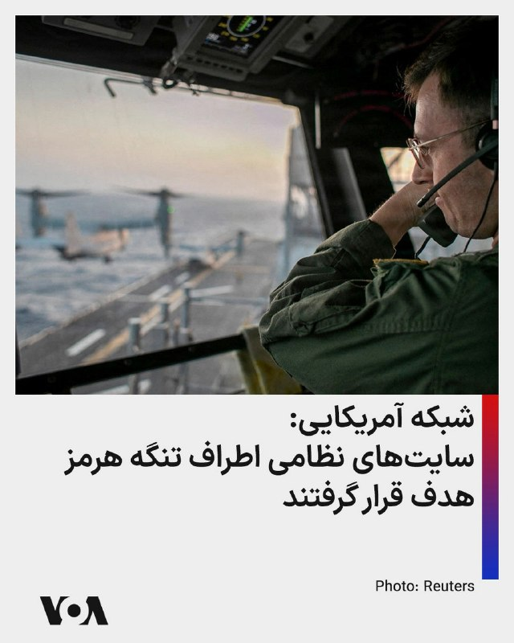

⚡️به گزارش سی‌ان‌ان، دو منبع آمریکایی به این شبکه گفتند که حملات اولیه سنتکام به جمهوری اسلامی، سایت‌های نظامی اطراف تنگه هرمز را هدف قرار داده است. یکی از منابع گفت که انتظار می‌رود حملات بیشتری انجام شود.
@FarsiVOA

## Persian_Trend_Official — post 16393

⭕️ مهر: موج حملات آمریکایی ها در جنوب فروکش کرده است و بعد از اقدامات خصمانه در قشم، سیریک و جاسک و کوه مبارکه جاسک، هم اکنون وضعیت آرام گزارش می شود.

📝 Nick

📌 @persian_trend_official
پرشین ترند | متفاوت‌ترین کانال نظامی

## Persian_Trend_Official — post 16392

⭕️ ترکیه: گروه های کرد شمال عراق را بمباران کردیم.

📝 Nick

📌 @persian_trend_official
پرشین ترند | متفاوت‌ترین کانال نظامی

## Persian_Trend_Official — post 16391

فقط مانده آذربایجان به ارمنستان حمله کند. 😐 📝 Nick 📌 @persian_trend_official پرشین ترند | متفاوت‌ترین کانال نظامی

## Persian_Trend_Official — post 16390

🚨فوری/ گزارشات از حملات توپخانه ای عربستان به یمن 📝 Nick 📌 @persian_trend_official پرشین ترند | متفاوت‌ترین کانال نظامی

## Persian_Trend_Official — post 16389

🚨فوری/ گزارشات از حملات توپخانه ای عربستان به یمن

📝 Nick

📌 @persian_trend_official
پرشین ترند | متفاوت‌ترین کانال نظامی

## Persian_Trend_Official — post 16388

  <a href="telegram/content/Persian_Trend_Official_16388_1781043803.webm" target="_blank">🎬 Download video</a>

⭕️ ایسنا:

نامه عراقچی به شورای حکام درباره پیش‌نویس قطعنامۀ ضد ایرانی

🔹وزیر امور خارجۀ ایران در نامه‌ای به اعضای شورای حکام، پیش‌نویس قطعنامۀ ارائه‌ شده از سوی آمریکا و ۳ کشور اروپایی را اقدامی سیاسی و از روی بدنیتی خواند و از اعضا خواست اجازه ندهند آژانس بار دیگر به ابزار سیاسی آمریکا تبدیل شود.

📝 Nick

📌 @persian_trend_official
پرشین ترند | متفاوت‌ترین کانال نظامی

## IranianMinds — post 22008

دیگه جنگا هم حوصله سر بر و تکراری شده
یه هسته ای ول بدید حداقل یه چیزه جدید انلاک شه

@IranianMinds

## IranianMinds — post 22007

🔴 یک مقام آمریکایی به فاکس نیوز :

ما همین الان یک پیشنهاد جدید از ایران دریافت کردیم که آن را میپسندیم

@IranianMinds

## IranianMinds — post 22006

🔴 مقام آمریکایی به العربیه : حملهِ‌های آمریکا به ایران فعلا به پایان رسیده.

@IranianMinds

## Dirty_Kids — post 391531

🔴 تسنیم : حملات آمریکا به جنوب ایران تموم شد و الان همه چی آرومه.

@Dirty_Kids 👻

## Dirty_Kids — post 391530

یه جنگ یه روزه‌ دیگه بکنیم و بعدش فقط آتش‌بس‌، آتش‌بس، آتش‌بس.

## Dirty_Kids — post 391529

  <a href="telegram/content/Dirty_Kids_391529_1781043804.mp4" target="_blank">🎬 Download video</a>

🔴وضعیت آسمونِ عراق و پهپاد شاهدی که داره به سمت کشور‌های حاشیه خلیج فارس پرواز میکنه :

@Dirty_Kids 👻

## alonews — post 126671

  <a href="telegram/content/alonews_126671_1781043805.webm" target="_blank">🎬 Download video</a>

👈پولیتیکو به نقل از یک مقام ارشد در کاخ سفید: هیچ تغییری در شرایط بوجود نیامده و آتش بس کماکان ادامه دارد

✅ @AloNews خبر جنگ

## alonews — post 126670

  <a href="telegram/content/alonews_126670_1781043805.webm" target="_blank">🎬 Download video</a>

🔴فوری/ گزارشات از حملات توپخانه ای عربستان به یمن

✅ @AloNews خبر جنگ

## alonews — post 126669

  <a href="telegram/content/alonews_126669_1781043806.webm" target="_blank">🎬 Download video</a>

👈گویا اسرائیل به سوریه هم حمله کرده

✅ @AloNews خبر جنگ

---
📅 بروزرسانی: 1405/03/20 01:42
---

## VahidOOnLine — post 244588

  

فاکس نیوز به نقل از یک مقام آمریکایی گزارش داد که حملات آمریکا به جمهوری اسلامی ادامه دارد و اهداف شامل سامانه‌های پدافند هوایی و رادار است.
‌🏁 🇬🇧 IranintlTV

🤖 @VahidOOnLine

## VahidOOnLine — post 244587

  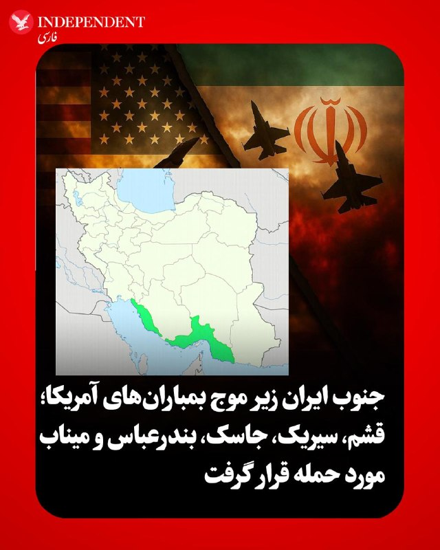

♦️همزمان با آغاز حملات ارتش ایالات متحده علیه ایران در پاسخ به سرنگونی هلیکوپتر آپاچی آمریکا، رسانه‌های داخلی از حملات به قشم، سیریک، جاسک، کوه مبارک، بندرعباس و میناب در جنوب ایران خبر می‌دهند.
‌🇸🇦 Indypersian

🤖 @VahidOOnLine

## WithYashar — post 14228

هم اکنون حملات ترکیه به شمال عراق
@withyashar

## WithYashar — post 14227

اتاق جنگ با یاشار : خدای من و شما شاهد است که هیچ ردبولی رو بیهوده حروم نکردم 🤣✌🏾
@withyashar

## WithYashar — post 14226

مقام ارشد آمریکایی به باراک راوید خبرنگار آکسیوس: عملیات ادامه داره و آماده‌ایم برای چندین حمله دیگه.
@withyashar

## WithYashar — post 14225

گزارش انفجار در اهواز. @withyashar

## FoxNewsTwitter — post 342777

  <a href="telegram/content/FoxNewsTwitter_342777_1781043172.mp4" target="_blank">🎬 Download video</a>

Fox News (Twitter/X)

BREAKING: The airstrikes against Iran are "ongoing," a U.S. official says. @JenGriffinFNC reports.

## pm_afshaa — post 93122

  <a href="telegram/content/pm_afshaa_93122_1781043173.webm" target="_blank">🎬 Download video</a>

🔴صداوسیما: برخی کانال‌ها (فارس) از حمله به نقطه‌ای در میناب خبر دادن که پیکیری خبرنگار ما از فرماندار میناب نشون میده تا این لحظه حمله‌ای به شهر گزارش نشده!

💧 Rainbet.com the #1 Non-KYC Crypto Casino & Sportsbook @rainbetcom

😁 @Pm_Afshaa

## pm_afshaa — post 93121

سپاه هنوز نزده اخبار انفجار در بحرین کسشره

## pm_afshaa — post 93120

سپاه هنوز نزده اخبار انفجار در بحرین کسشره

## pm_afshaa — post 93119

🔴یک مقام ارشد آمریکایی به باراک راوید خبرنگار آکسیوس: عملیات ادامه داره و آماده‌ایم برای چندین حمله دیگه. 
💧 Rainbet.com the #1 Non-KYC Crypto Casino & Sportsbook @rainbetcom 
😁 @Pm_Afshaa

## pm_afshaa — post 93118

🔴یک مقام ارشد آمریکایی به باراک راوید خبرنگار آکسیوس: عملیات ادامه داره و آماده‌ایم برای چندین حمله دیگه.

💧 Rainbet.com the #1 Non-KYC Crypto Casino & Sportsbook @rainbetcom

😁 @Pm_Afshaa

## VahidOnline — post 76113

  <a href="telegram/content/VahidOnline_76113_1781043174.mp4" target="_blank">🎬 Download video</a>

فاکس نیوز به نقل از یک مقام آمریکایی گزارش داد که حملات آمریکا به جمهوری اسلامی ادامه دارد و اهداف شامل سامانه‌های پدافند هوایی و رادار است.
@VahidOOnLine

📡 @VahidOnline

## kianmeli1 — post 87827

‏⁧🔴فوری⁩

‏برخی رسانەهای عربی از فعالیت سامانەهای پدافندی در کویت و بحرین خبر میدهند
https://t.me/kianmeli1

## kianmeli1 — post 87826

🔴فوری

یک مقام ارشد آمریکایی: عملیات ادامه دارد.
آماده یک سری حملات بیشتر هستیم./اکسیوس

https://t.me/kianmeli1

## IranIntlTV — post 341411

  <a href="https://t.me/IranintlTV/341411" target="_blank">📎 Download file</a>

🎧نسخه صوتی سیاست با مراد ویسی: قانون نانوشته جمهوری‌اسلامی: فاسد باش اما وفادار باش
@iranintlTV

## IranIntlTV — post 341410

  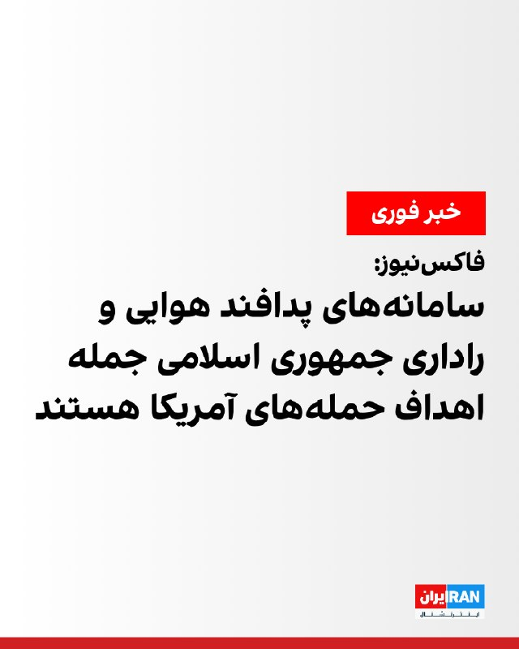

فاکس نیوز به نقل از یک مقام آمریکایی گزارش داد که حملات آمریکا به جمهوری اسلامی ادامه دارد و اهداف شامل سامانه‌های پدافند هوایی و رادار است.
https://iranintl.com/202606099826

## FarsiVOA — post 220172

  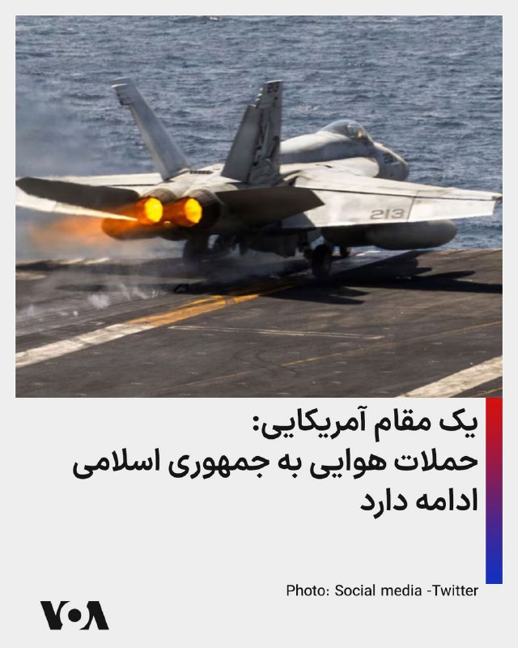

⚡️یک مقام آمریکایی به فاکس نیوز گفت: حملات هوایی علیه جمهوری اسلامی «ادامه دارد» و اهداف شامل پدافند هوایی و تأسیسات راداری است.
@FarsiVOA

## Persian_Trend_Official — post 16387

  <a href="telegram/content/Persian_Trend_Official_16387_1781043175.webm" target="_blank">🎬 Download video</a>

⭕️ شبکه 14 اسرائیل: علیرغم حملات به ایران | ترامپ متقاعد شده است: "توافق حاصل خواهد شد"؛ مقام آمریکایی به سی‌ان‌ان می‌گوید: "ما انتظار نداریم که این حملات مذاکرات را خراب کند"

📝 Nick

📌 @persian_trend_official
پرشین ترند | متفاوت‌ترین کانال نظامی

## RadioFarda — post 158111

  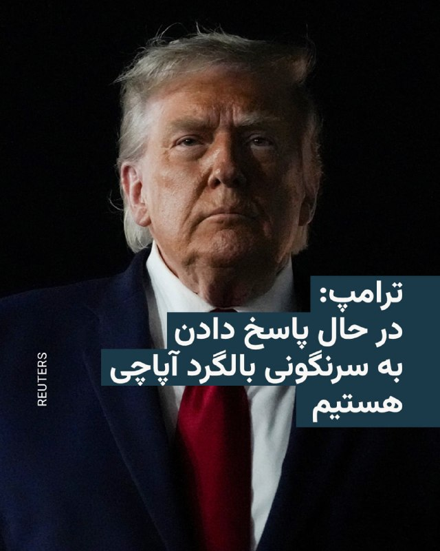

🔸دونالد ترامپ در واکنش به حملات تازه آمریکا علیه ایران گفت: «فکر می‌کنم پاسخ دادن بسیار مهم است. آن‌ها یک بالگرد ما را سرنگون کردند و ما همین حالا در حال پاسخ دادن هستیم.»

🔸رئیس‌جمهور آمریکا در گفت‌وگو با شبکه خبری ای‌بی‌سی، افزود: «من همیشه در طول زندگی‌ام به پاسخ قاطع اعتقاد داشته‌ام. ما توافقی بسیار خوب داشتیم و احتمالاً همچنان خواهیم داشت.»

🔸او ادامه داد: «این حمله پاسخی به کاری است که دیشب با بالگرد ما کردند و معتقدم این پاسخ باید بسیار قوی و قدرتمند باشد، و همین حمله نیز چنین ویژگی‌ای دارد.»

🔸ترامپ این اظهارات را همزمان با اعلام آغاز حملات «دفاعی» آمریکا علیه ایران از سوی فرماندهی مرکزی ارتش آمریکا، سنتکام، بیان کرد.

🔸خبرنگار اکسیوس به نقل از یک مقام آمریکایی نوشته است که نیروهای آمریکایی به چندین سامانه پدافند هوایی و راداری ایران در اطراف تنگه هرمز حمله کردند.

@RadioFarda

## IranianMinds — post 22005

  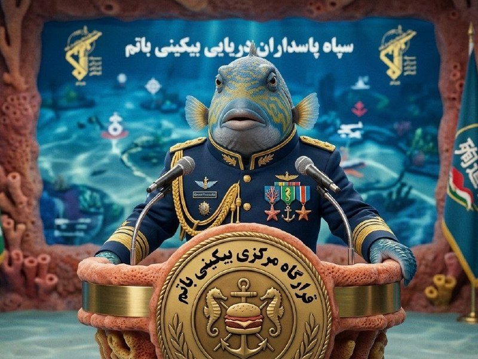

بسم الله الرحمن الرحیم
​«وَسَیَعْلَمُ الَّذِینَ ظَلَمُوا أَیَّ مُنْقَلَبٍ یَنْقَلِبُونَ»
(و آنان که ظلم کردند به‌زودی خواهند دانست که به چه کیفرگاهی بازمی‌گردند)
​بیانیه‌ی اضطراری شماره ۲ قرارگاه مرکزی و خون‌خواهی بیکینی باتم
​امت مقاومت و ملت شریفِ کفِ دریا!
​در پی اقدام تروریستی، ترسو و بزدلانه‌ی سپاه پاسداران در ترورِ ناجوانمردانه و مظلومانه‌ی مالک مخلص و سرمایه‌دارِ حریم ولایت دریایی، «شهید والامقام حاج آقای خرچنگ» (اعلی الله مقامه الشریف) که در راه صیانت از مرزهای اقتصادی و فرمول سرّی همبرگر به فیض عظمای شهادت نائل آمد؛ قرارگاه مرکزی بیکینی باتم دیگر خویشتن‌داری را جایز نمی‌داند.
​لذا به فرمان مطاع فرماندهی کل قوا، رزمندگان جان‌برکف اقیانوس، عملیات سهمگین و کوبنده‌ی «انتقام سخت / لبیک یا خرچنگ» را با رمز مقدس «یا کفگیر رسول‌الله» علیه مواضع و پادگان‌های سپاه در سواحل و عمق خاک ایران آغاز نمودند.

@IranianMinds

## IranianMinds — post 22004

  

هشدار تخلیه سپاه برای بیکینی باتم

@IranianMinds

## IranianMinds — post 22003

🔴 ترامپ:

من معتقدم باید با قدرت پاسخ داد؛ این همیشه روش منه. اما در عین حال، یک توافق خیلی خوب با ایران روی میز هست و من مطمئنم که این توافق پابرجا می‌مونه و اجرا می‌شه.

@IranianMinds

## Dirty_Kids — post 391528

  <a href="telegram/content/Dirty_Kids_391528_1781043177.mp4" target="_blank">🎬 Download video</a>

وضعیت ایرانیا وقتی اتک میزنه امریکا:

@Dirty_Kids 👻

## Dirty_Kids — post 391527

🔴 هم اکنون وضعیت خاورمیانه، همزمان:

_ حمله آمریکا به اهداف جمهوری اسلامی
_ حمله پاکستان به افغانستان
_ حمله اسرائیل به لبنان
_ حمله ایران به کشور های منطقه

@Dirty_Kids 👻

## alonews — post 126668

  <a href="telegram/content/alonews_126668_1781043178.webm" target="_blank">🎬 Download video</a>

👈هم اکنون خاورمیانه:

🔴حملات آمریکا به ایران

🔴حملات اسرائیل به لبنان

🔴حملات پاکستان به افغانستان

🔴حملات ترکیه به عراق

🔴حملات ایران به بحرین و کویت و امارات

✅ @AloNews خبر جنگ

## alonews — post 126667

  <a href="telegram/content/alonews_126667_1781043178.webm" target="_blank">🎬 Download video</a>

👈هم اکنون حملات ترکیه به شمال عراق

✅ @AloNews خبر جنگ

## alonews — post 126666

  <a href="telegram/content/alonews_126666_1781043178.mp4" target="_blank">🎬 Download video</a>

👈دیده شدن پهباد شاهد سپاه در آسمان عراق

✅ @AloNews خبر جنگ

---
📅 بروزرسانی: 1405/03/20 01:33
---

## VahidOOnLine — post 244586

  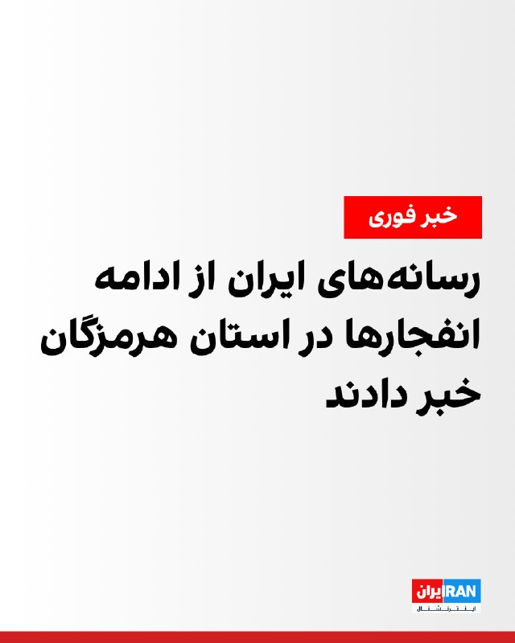

رسانه‌های ایران از ادامه صداهای انفجار در نقاط مختلف هرمزگان خبر دادند. طبق این گزارش‌ها، نقاطی در جاسک و کوه مبارکه هدف پرتابه‌های متخاصم قرار گرفته است. فارس نیز گزارش داد صدای چند انفجار در مناطق شرقی هرمزگان، از جمله کوهستک، سیریک و میناب شنیده شده است.
‌🏁 🇬🇧 IranintlTV

🤖 @VahidOOnLine

## VahidOOnLine — post 244585

  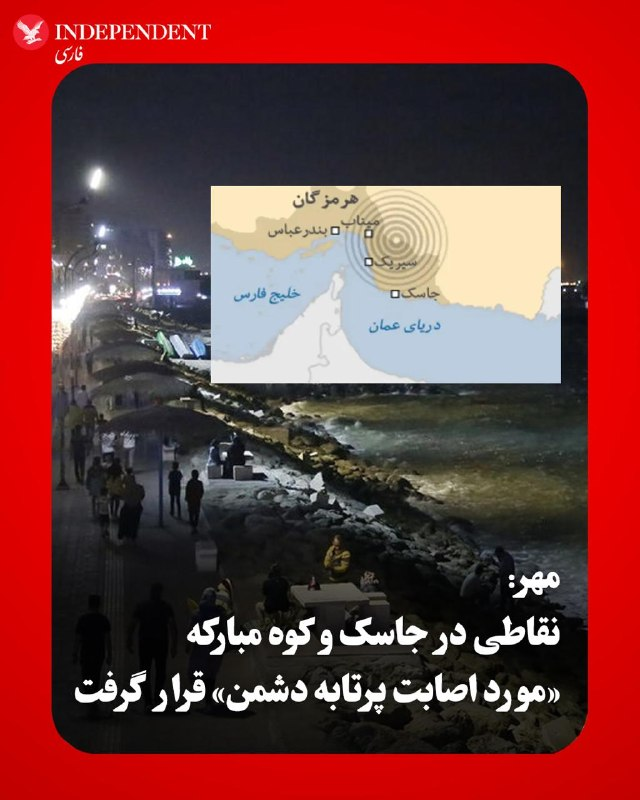

♦️همزمان با آغاز حملات ارتش ایالات متحده علیه ایران در پاسخ به سرنگونی هلیکوپتر آپاچی آمریکا، خبرگزاری مهر گزارش داد: «نقاطی در جاسک و کوه مبارکه مورد اصابت پرتابه دشمن قرار گرفته است». پیش از این نیز صداهای انفجار در نقاط مختلف هرمزگان و قشم نیز گزارش شده بود.
‌🇸🇦 Indypersian

🤖 @VahidOOnLine

## WithYashar — post 14224

یک مقام آمریکایی به سی‌ان‌ان:
حملات جدید به منزله یک شلیک هشدارآمیز به ایران است و ایالات متحده معتقد است این حملات مانع مذاکرات برای پایان دادن به جنگ نخواهد شد.
@withyashar

## WithYashar — post 14223

سید مجید موسی : ‏و ما النصر الا من عند الله العزیز الحکیم
@withyashar 🤣

## WithYashar — post 14222

گزارش انفجار در بحرین
@withyashar

## WithYashar — post 14221

هم اکنون بمباران مواضع حکومت طالبان افغانستان توسط F16 های ارتش پاکستان
@withyashar

## WithYashar — post 14220

ترامپ به ای‌بی‌سی نیوز:
من به پاسخ قوی اعتقاد دارم و این رویکرد من است. ما توافق بسیار خوبی با ایران داریم و فکر می‌کنم همینطور هم خواهد ماند.
@withyashar
یاشار : زبانم قاسمه کتلته

## WithYashar — post 14219

یک مقام آمریکایی به فاکس نیوز گفت: حملات هوایی علیه ایران «ادامه دارد» و اهداف شامل پدافند هوایی و تأسیسات راداری است.
@withyashar

## WithYashar — post 14218

گزارش ها از شلیک موشک‌های سپاه از کرمانشاه
@withyashar

## WithYashar — post 14217

اتاق جنگ با یاشار : امریکا و اسراییل به طور هماهنگ و گازانبری به ایران و لبنان حمله کرده اند
@withyashar

## mwarmonitor — post 10568

  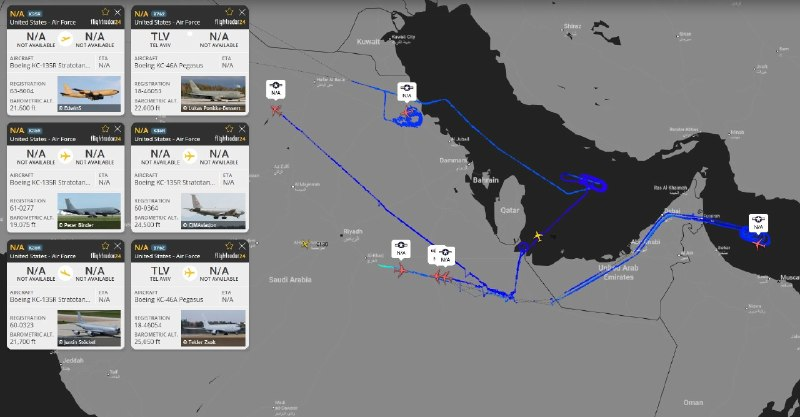

✈️در حال حاضر ۶ فروند هواپیمای سوخت‌رسان نیروی هوایی آمریکا در منطقه خلیج فعال هستند، همراه با یک هواپیمای گشت دریایی P-8A Poseidon نیروی دریایی آمریکا که بر فراز خلیج فارس، بین امارات متحده عربی و قطر در حال عملیات است.

@mwarmonitor

## mwarmonitor — post 10567

🔴سی‌ان‌ان به نقل از یک مقام آمریکایی: حملات آمریکا با هدف ارسال پیام هشدار به ایران انجام می‌شود.

🔴سی‌ان‌ان به نقل از یک مقام آمریکایی: ما معتقدیم که حملات آمریکا روند مذاکرات برای پایان دادن به جنگ با ایران را مختل نخواهد کرد.

@mwarmonitor

## mwarmonitor — post 10566

🔴یک مقام آمریکایی به فاکس گفت: حملات هوایی علیه ایران «در حال انجام است» و اهداف شامل سامانه‌های پدافند هوایی و تأسیسات راداری می‌شود.

@mwarmonitor

## FoxNewsTwitter — post 342776

  <a href="telegram/content/FoxNewsTwitter_342776_1781042592.mp4" target="_blank">🎬 Download video</a>

Fox News (Twitter/X)

BREAKING: Republicans’ sweeping immigration enforcement and border security package cleared the House, ending a months-long standoff with Democrats over funding Trump's immigration crackdown agenda.

The $70 billion measure passed 214-212 along party lines and now heads to the president's desk for signature.

## pm_afshaa — post 93116

  <a href="telegram/content/pm_afshaa_93116_1781042594.webm" target="_blank">🎬 Download video</a>

🔴یک مقام آمریکایی به سی‌ان‌ان: حملات به عنوان یک شلیک هشدار به ایران بوده و انتظار نمیره تلاش‌ها برای مذاکره برای پایان دادن به درگیری رو از مسیر خارج کنه. 
💧 Rainbet.com the #1 Non-KYC Crypto Casino & Sportsbook @rainbetcom 
😁 @Pm_Afshaa

## pm_afshaa — post 93115

  <a href="telegram/content/pm_afshaa_93115_1781042594.webm" target="_blank">🎬 Download video</a>

🔴یک مقام آمریکایی به سی‌ان‌ان:
حملات به عنوان یک شلیک هشدار به ایران بوده و انتظار نمیره تلاش‌ها برای مذاکره برای پایان دادن به درگیری رو از مسیر خارج کنه.

💧 Rainbet.com the #1 Non-KYC Crypto Casino & Sportsbook @rainbetcom

😁 @Pm_Afshaa

## pm_afshaa — post 93114

هم‌اکنون وضعیت خاورمیانه :

- حمله آمریکا به اهداف جمهوری اسلامی
- حمله پاکستان به افغانستان
- حمله اسرائیل به لبنان
- حمله ایران به کشورهای منطقه

💧 Rainbet.com the #1 Non-KYC Crypto Casino & Sportsbook @rainbetcom

😁 @Pm_Afshaa

## pm_afshaa — post 93113

🔴طبق گزارش فاکس نیوز و آکسیوس، حملات هنوز ادامه داره.

💧 Rainbet.com the #1 Non-KYC Crypto Casino & Sportsbook @rainbetcom

😁 @Pm_Afshaa

## pm_afshaa — post 93112

  <a href="telegram/content/pm_afshaa_93112_1781042595.webm" target="_blank">🎬 Download video</a>

🔴آسمان کشورهای خاورمیانه بسته اعلام شد.

💧 Rainbet.com the #1 Non-KYC Crypto Casino & Sportsbook @rainbetcom

😁 @Pm_Afshaa

## pm_afshaa — post 93111

شما فعلا پستارو شِیر کنید خستگی کم شه بوس❤️

## pm_afshaa — post 93110

۳ تا جنگ همزمان اخه

## pm_afshaa — post 93109

راحت باشید بگید جنگ جهانی شده دیگه

## pm_afshaa — post 93108

۳ تا جنگ همزمان اخه

## pm_afshaa — post 93107

  <a href="telegram/content/pm_afshaa_93107_1781042595.webm" target="_blank">🎬 Download video</a>

🔴فاکس نیوز: از جمله اهداف حملات آمریکایی‌ها در ایران، سامانه های پدافند هوایی و تاسیسات راداری است.

💧 Rainbet.com the #1 Non-KYC Crypto Casino & Sportsbook @rainbetcom

😁 @Pm_Afshaa

## DEJradio — post 5519

⭕️ خبرگزاری‌های حکومتی جمهوری اسلامی از شنیده شدن صدای دستکم شش انفجار در جزیرهٔ قشم خبر دادند

#خبر_فوری
@DEJradio

## DEJradio — post 5518

⭕️ خبرنگار صداو‌سیمای جمهوری اسلامی در جاسک گزارش داد دو ناحیه در جاسک و کوه مبارکه مورد اصابت پرتابهٔ نیروهای خارجی قرار گرفته است.

#خبر_فوری
@DEJradio

## DEJradio — post 5517

⭕️
⭕️ رسانه‌های حکومتی در ایران خبر دادند، حملات نظامی آمریکا به نواحی جنوبی کشور، توسط نیروهای مسلح نظام پاسخ داده می‌شود

#خبر_فوری
@DEJradio

## kianmeli1 — post 87825

🔴فوری-روابط عمومی سپاه

منتظر شب خونین برای ترامپ باشید
https://t.me/kianmeli1

## kianmeli1 — post 87824

🔴فوری-قطر حریم هوایی خود را بست.
https://t.me/kianmeli1

## IranIntlTV — post 341409

  <a href="telegram/content/IranIntlTV_341409_1781042596.mp4" target="_blank">🎬 Download video</a>

دونالد ترامپ، رییس‌جمهوری آمریکا، گفت جمهوری اسلامی مسئول سقوط یک فروند بالگرد تهاجمی آپاچی ارتش آمریکا بوده و تاکید کرد واشینگتن ناگزیر به پاسخ خواهد بود.

جزییات بیشتر با نیلوفر منصوری، خبرنگار ایران‌اینترنشنال
@iranintltv

## IranIntlTV — post 341408

  

رسانه‌های ایران از ادامه صداهای انفجار در نقاط مختلف هرمزگان خبر دادند. طبق این گزارش‌ها، نقاطی در جاسک و کوه مبارکه هدف پرتابه‌های متخاصم قرار گرفته است. فارس نیز گزارش داد صدای چند انفجار در مناطق شرقی هرمزگان، از جمله کوهستک، سیریک و میناب شنیده شده است.
https://iranintl.com/202606095852

## FarsiVOA — post 220171

  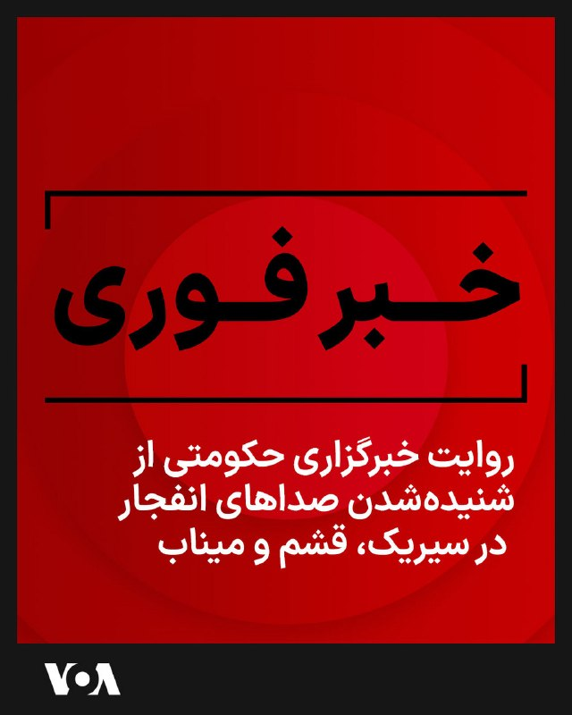

⚡️خبرگزاری حکومتی تسنیم، نزدیک به سپاه پاسداران، می‌گوید صدای شش انفجار در سیریک، جزیره قشم و میناب شنیده شده است.
@FarsiVOA

## Persian_Trend_Official — post 16385

نیروی هوایی پاکستان حملات هوایی را
در ولایت‌های خوست و پکتیکا افغانستان انجام داده است!

## Persian_Trend_Official — post 16384

  <a href="telegram/content/Persian_Trend_Official_16384_1781042599.webm" target="_blank">🎬 Download video</a>

هم اکنون وضعیت خاورمیانه، همزمان:

_ حمله آمریکا به اهداف جمهوری اسلامی
_ حمله پاکستان به افغانستان
_ حمله اسرائیل به لبنان
_ حمله ایران به کشور های منطقه

## Persian_Trend_Official — post 16383

  <a href="telegram/content/Persian_Trend_Official_16383_1781042599.webm" target="_blank">🎬 Download video</a>

انفجار در بحرین..

## Persian_Trend_Official — post 16381

⭕️ خبرگذاری صداوصیما: دو نقطه در جاسک و کوه مبارکه مورد اصابت پرتابه دشمن قرار گرفته است. 📝 Nick 📌 @persian_trend_official پرشین ترند | متفاوت‌ترین کانال نظامی

## Persian_Trend_Official — post 16380

  <a href="telegram/content/Persian_Trend_Official_16380_1781042599.webm" target="_blank">🎬 Download video</a>

⭕️ ایسنا:

تروریست‌های سنتکام از حمله تلافی جویانه به بهانه سقوط هلیکوپتر آمریکایی در تنگه هرمز خبر دادند. ترامپ تروریست هم در گفت وگو با ABC تایید کرد!

📝 Nick

📌 @persian_trend_official
پرشین ترند | متفاوت‌ترین کانال نظامی

## Persian_Trend_Official — post 16379

مقام آمریکایی به فاکس نیوز:
حملات هوایی علیه ایران "ادامه دارد"
و اهداف شامل پدافند هوایی و تأسیسات راداری است!

## Persian_Trend_Official — post 16378

  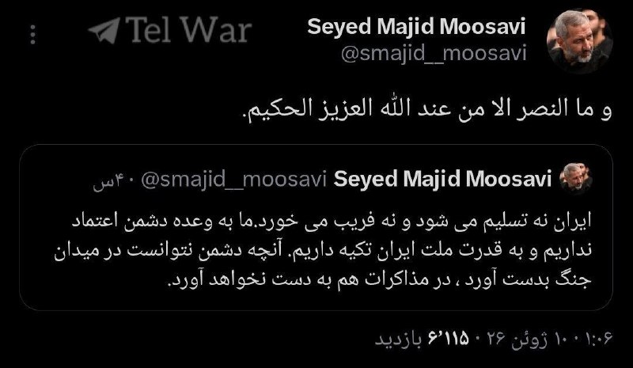

📷 Photo

## Persian_Trend_Official — post 16377

  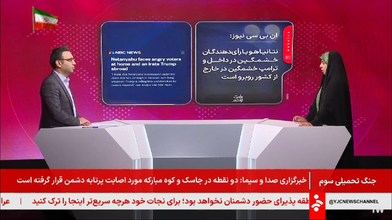

⭕️ خبرگذاری صداوصیما: دو نقطه در جاسک و کوه مبارکه مورد اصابت پرتابه دشمن قرار گرفته است.

📝 Nick

📌 @persian_trend_official
پرشین ترند | متفاوت‌ترین کانال نظامی

## IranianMinds — post 22001

🔴 کل موشک هایی که سپاه شلیک کرده بود حتی به بیابون های نزدیک پایگاه های آمریکاییم نرسیدن

@IranianMinds

## IranianMinds — post 22000

🔴 یک مقام آمریکایی به سی ان ان :

حملات جدید ما فقط یک هشداره و مانع مذاکرات نمیشه
آتش بس هنوز برقراره

@IranianMinds

## IranianMinds — post 21999

  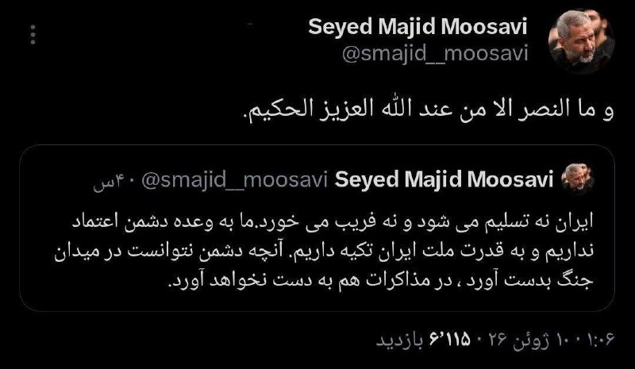

فوری بیکینی باتم تخلیه شد

@IranianMinds

## IranianMinds — post 21998

🔴 یک مقام آمریکایی به فاکس نیوز :

حملات هوایی به ایران "در جریان است" و اهداف شامل پدافند هوایی و تاسیسات راداری است.

@IranianMinds

## IranianMinds — post 21997

همین الان

پاکستان داره افغانستان رو میزنه
اسرائیل لبنان رو میزنه
و امریکا جمهوری اسلامی رو

به خاورمیانه خوش امدید

@IranianMinds

## BBCPersian — post 283274

⚡️خبرگزاری صدا و سیما هدف قرار گرفتن چند نقطه در جنوب ایران را تایید کرد

خبرگزاری صدا و سیما به نقل از خبرنگاران میدانی خود نوشته است که حملات جدید آمریکا چند نقطه در سیریک، قشم، جاسک و کوه‌های مبارکه هدف قرار گرفته است.

صدا و سیما هدف قرار گرفتن بندرعباس را تایید نکرده است.
https://bbc.in/4uqahXu
@BBCPersian

## Dirty_Kids — post 391526

فاکس نیوز به نقل از یک مقام آمریکایی:

حملات هوایی علیه ایران ادامه دارد و اهداف شامل پدافند هوایی و تأسیسات راداری است.

## Dirty_Kids — post 391525

شلیک موشک از کرمانشاه

## Dirty_Kids — post 391524

‏🚨 گزارش‌ها از هدف قرار گرفتن پایگاه شهید راهبر در بندرعباس حکایت دارند.

## Dirty_Kids — post 391523

یه زمانی الکی میگفتند اف ۳۵ زدیم و جشن میگرفتند ، الان که آمریکا میگه آپاچی ما رو زدید میگن ما نزدیم. همینقدر بی خایه و رجزخوان.

@Dirty_Kids 👻

## Dirty_Kids — post 391522

ترامپ: کروکی حادثه را دیدم. متأسفانه هلیکوپتر آپاچی ما از پشت به پهپاد آنان زده است و مقصر خلبان هلیکوپتر ما بوده. انتقام منتفی است.

#املاکی

@Dirty_Kids 👻

## Dirty_Kids — post 391521

🔴 ترامپ:
فردا چهارشنبس احتمالا جمهوری اسلامی برگه توافق رو امضا کنه و قیمت نفتم پایین بیاد

@Dirty_Kids 👻

## Dirty_Kids — post 391520

  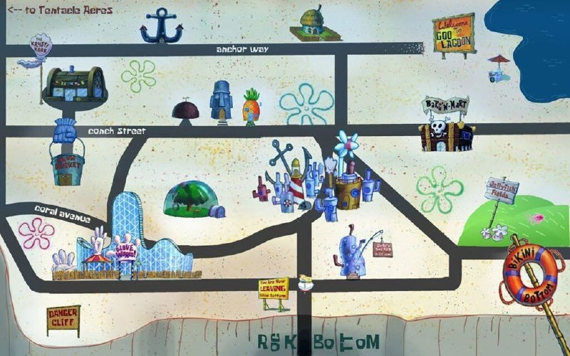

🔴 فوری: سپاه برای بیکینی باتم هشدار تخلیه صادر کرد.

@Dirty_Kids 👻

## Dirty_Kids — post 391519

🔴 پاکستان که قرار بود میانجیگری کنه، همزمان با حمله آمریکا به ایران، به افغانستان حمله کرد :))

@Dirty_Kids 👻

## alonews — post 126665

  <a href="telegram/content/alonews_126665_1781042602.webm" target="_blank">🎬 Download video</a>

👈یک مقام آمریکایی به سی‌ان‌ان:
حملات جدید به منزله یک شلیک هشدارآمیز به ایران است و ایالات متحده معتقد است این حملات مانع مذاکرات برای پایان دادن به جنگ نخواهد شد.

✅ @AloNews خبر جنگ

## alonews — post 126664

  <a href="telegram/content/alonews_126664_1781042602.webm" target="_blank">🎬 Download video</a>

👈رسایی: اینترنت قطع کنید

✅ @AloNews خبر جنگ

## alonews — post 126663

  <a href="telegram/content/alonews_126663_1781042602.webm" target="_blank">🎬 Download video</a>

🔴فوووووووووری/گزارش انفجار در بحرین

✅ @AloNews خبر جنگ

## alonews — post 126662

  <a href="telegram/content/alonews_126662_1781042602.webm" target="_blank">🎬 Download video</a>

🔴فوری/به بیروت هم حمله شد 
✅ @AloNews خبر جنگ

## alonews — post 126661

  <a href="telegram/content/alonews_126661_1781042602.webm" target="_blank">🎬 Download video</a>

✅ سید مجید موسوی : ‏و ما النصر الا من عند الله العزیز الحکیم 
✅ @AkhbareFouri

## alonews — post 126660

  <a href="telegram/content/alonews_126660_1781042603.webm" target="_blank">🎬 Download video</a>

👈فاکس نیوز: از جمله اهداف حملات آمریکایی‌ها در ایران، سامانه های پدافند هوایی و تاسیسات راداری است.

✅ @AloNews خبر جنگ

---
📅 بروزرسانی: 1405/03/20 01:22
---

## VahidOOnLine — post 244584

  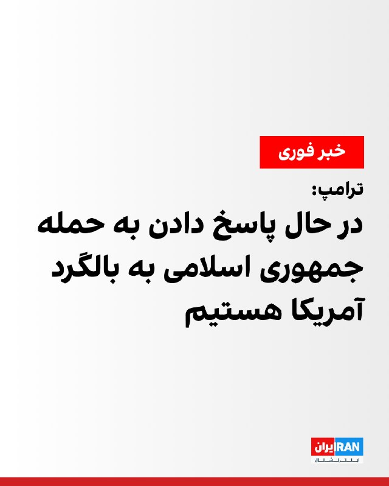

هم‌زمان با آغاز حملات تلافی‌جویانه آمریکا علیه جمهوری اسلامی، دونالد ترامپ، رییس‌جمهوری آمریکا، به ای‌بی‌سی نیوز گفت: «فکر می‌کنم پاسخ دادن بسیار مهم است. آنها یک بالگرد را سرنگون کردند و ما همین حالا در حال پاسخ دادن هستیم.»
ترامپ گفت: «این واکنشی است به کاری که دیشب با بالگرد ما انجام دادند. معتقدم این پاسخ باید بسیار قوی و بسیار قدرتمند باشد و این عملیات نیز همین‌گونه است.»

‌🏁 🇬🇧 IranintlTV

🤖 @VahidOOnLine

## VahidOOnLine — post 244583

  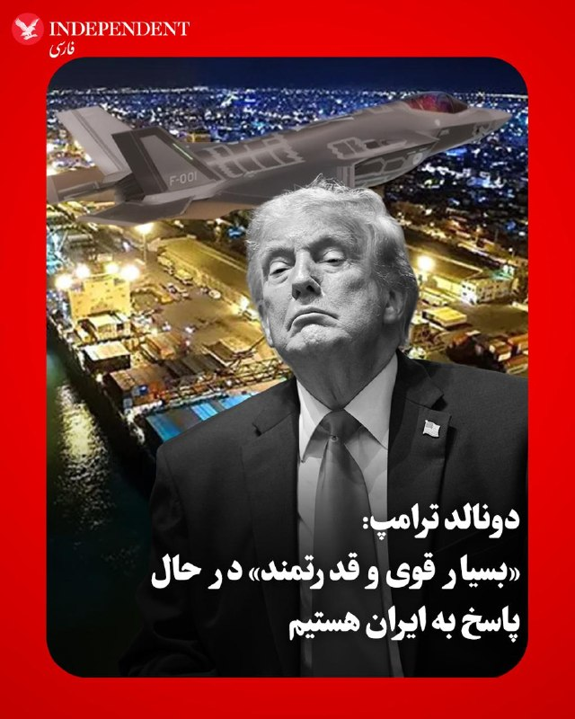

♦️دونالد ترامپ، رئیس‌جمهوری ایالات متحده، سه‌شنبه‌شب، در گفتگو با شبکه خبری «ای‌بی‌سی» (ABC) درباره آغاز عملیات نظامی واشنگتن علیه ایران گفت: «من فکر می‌کنم پاسخ دادن امر بسیار مهمی است. آن‌ها یک هلیکوپتر را سرنگون کردند و ما همین حالا که صحبت می‌کنیم، در حال پاسخ دادن به آن‌ها هستیم.» ترامپ با تاکید بر موضع قاطع خود افزود: «این اقدام پاسخی به کاری است که آن‌ها شب گذشته با هلیکوپتر ما انجام دادند و من معتقدم این واکنش باید بسیار قوی و قدرتمند باشد و حملات جاری نیز دقیقا همین‌گونه است.»
‌🇸🇦 Indypersian

🤖 @VahidOOnLine

## WithYashar — post 14216

۳پا : حملات سنگین علیه امریکا در راه است..
@withyashar

## WithYashar — post 14215

کشورهای حوزه خلیج فارس در حال بستن حریم هوایی خود میباشند.
@withyashar

## WithYashar — post 14214

انفجار در ضاحیه بیروت @withyashar 🇮🇱

## WithYashar — post 14213

خبرگزاری تسنیم:آغاز حملات ایران

جمهوری اسلامی: همانطور که چند ساعت پیش هشدار داده بود، پاسخ قاطعی به تجاوز آمریکا خواهد داد که تحت پوشش سقوط هلیکوپتر آپاچی انجام می‌شود.
@withyashar

## WithYashar — post 14212

از خوزستان موشک زدن🚨🚨🚨🚨
@withyashar

## WithYashar — post 14211

انفجار در ضاحیه بیروت
@withyashar 🇮🇱

## WithYashar — post 14210

🤣🤣🤣🚨🚨🚨🚨

## WithYashar — post 14209

سامانه‌های دفاع هوایی دوباره در بندرعباس، قشم و سیریک فعال شده‌اند
@withyashar

## mwarmonitor — post 10565

🔴حمله آمریکا به بندر جاسک و کوه مبارکه در جنوب ایران.

@mwarmonitor

## mwarmonitor — post 10564

سپاه اعلام کرد که به تجاوز آمریکا با قدرت پاسخ خواهد داد.

## pm_afshaa — post 93106

  <a href="telegram/content/pm_afshaa_93106_1781041978.webm" target="_blank">🎬 Download video</a>

🔴این وسط گزارشاتی از حمله اسرائیل به ضاحیه بیروت داره میاد. 
💧 Rainbet.com the #1 Non-KYC Crypto Casino & Sportsbook @rainbetcom 
😁 @Pm_Afshaa

## pm_afshaa — post 93105

موشک زدن

## pm_afshaa — post 93104

  <a href="telegram/content/pm_afshaa_93104_1781041979.webm" target="_blank">🎬 Download video</a>

🔴تمام کشورهای حوزه خلیج فارس در حال بستن حریم هوایی خود هستن.

💧 Rainbet.com the #1 Non-KYC Crypto Casino & Sportsbook @rainbetcom

😁 @Pm_Afshaa

## pm_afshaa — post 93103

خر تو خریه

## pm_afshaa — post 93102

  <a href="telegram/content/pm_afshaa_93102_1781041979.webm" target="_blank">🎬 Download video</a>

🔴این وسط گزارشاتی از حمله اسرائیل به ضاحیه بیروت داره میاد. 
💧 Rainbet.com the #1 Non-KYC Crypto Casino & Sportsbook @rainbetcom 
😁 @Pm_Afshaa

## pm_afshaa — post 93101

چخبره اقا
پاکستان میانجی صلح، به افعانستان اتک زده.

💧 Rainbet.com the #1 Non-KYC Crypto Casino & Sportsbook @rainbetcom

😁 @Pm_Afshaa

## pm_afshaa — post 93100

  <a href="telegram/content/pm_afshaa_93100_1781041980.webm" target="_blank">🎬 Download video</a>

🔴این وسط گزارشاتی از حمله اسرائیل به ضاحیه بیروت داره میاد.

💧 Rainbet.com the #1 Non-KYC Crypto Casino & Sportsbook @rainbetcom

😁 @Pm_Afshaa

## pm_afshaa — post 93099

  <a href="telegram/content/pm_afshaa_93099_1781041980.webm" target="_blank">🎬 Download video</a>

🔴خبرنگار صداو‌سیما در جاسک:
دو نقطه در جاسک و کوه مبارکه مورد اصابت پرتابه دشمن قرار گرفته.

💧 Rainbet.com the #1 Non-KYC Crypto Casino & Sportsbook @rainbetcom

😁 @Pm_Afshaa

## pm_afshaa — post 93098

  <a href="telegram/content/pm_afshaa_93098_1781041981.webm" target="_blank">🎬 Download video</a>

🔴گویا از خوزستان موشک زدن

💧 Rainbet.com the #1 Non-KYC Crypto Casino & Sportsbook @rainbetcom

😁 @Pm_Afshaa

## pm_afshaa — post 93097

  <a href="telegram/content/pm_afshaa_93097_1781041981.webm" target="_blank">🎬 Download video</a>

🔴نیروی هوافضای سپاه:
تا لحظات آینده پاسخ سنگین به اقدامات خصمانه دشمن داده خواهد شد.

💧 Rainbet.com the #1 Non-KYC Crypto Casino & Sportsbook @rainbetcom

😁 @Pm_Afshaa

## pm_afshaa — post 93096

تسنیم: بزودی پاسخی قاطع خواهیم داد.

💧 Rainbet.com the #1 Non-KYC Crypto Casino & Sportsbook @rainbetcom

😁 @Pm_Afshaa

## pm_afshaa — post 93095

  <a href="telegram/content/pm_afshaa_93095_1781041982.webm" target="_blank">🎬 Download video</a>

🔴فهرست اولیه اهداف مورد حمله آمریکا :

- پایگاه دریایی سیریک
- پایگاه دریایی جاسک
- موقعیت پدافند هوایی بندرعباس
– باتری موشکی ساحلی میناب
- باتری موشکی ساحلی قشم
- بندر قشم

💧Rainbet.com the #1 Non-KYC Crypto Casino & Sportsbook @rainbetcom

😁 @Pm_Afshaa

## DEJradio — post 5516

  <a href="telegram/content/DEJradio_5516_1781041983.webm" target="_blank">🎬 Download video</a>

⭕️
🚨 صدای چندین انفجار در مناطق جنوبی ایران شنیده شد

همزمان با اعلام آغاز عملیات نظامی آمریکا توسط سنتکام، بامداد چهارشنبه گزارش‌هایی از شنیده شدن صدای چند انفجار در شهرستان سیریک در استان هرمزگان منتشر شد.
خبرگزاری حکومتی مهر به نقل از ساکنان محلی گزارش داد در ساعات پایانی شب، صدای انفجارهایی در بندر سیریک و مناطق اطراف شنیده شده است.

#خبر #دژ #سیریک
@DEJradio

## DEJradio — post 5515

⭕️ سنتکام اعلام کرد حمله به مواضع جمهوری اسلامی را سرگرفته است

سنتکام در بامداد چهارشنبه اعلام کرد حملات «دفاع از خود» را علیه مواضع جمهوری اسلامی سرگرفته است.
ستاد فرماندهی مرکزی ارتش آمریکا خبر داد اعلام کرد این عملیات را به دستور دونالد ترامپ سرگرفته است.
به گزارش سنتکام، این حملات در واکنش به سرنگونی بالگرد تهاجمی آپاچی ارتش آمریکا انجام شد و پاسخی متناسب به اقدام تجاوزکارانه و غیرموجه رژیم است.
سنتکام درباره اهداف و مناطق مورد حمله جزئیاتی را منتشر نکرد.

#خبر #فوری #دژ #سنتکام #جنگ
@DEJradio

## kianmeli1 — post 87823

🔴فوری-کشورهای عربی به حالت اماده باش در آمدند
https://t.me/kianmeli1

## kianmeli1 — post 87822

🔴فوری-سپاه پاسداران

حملات سنگین علیه امریکا در راه است..
https://t.me/kianmeli1

## kianmeli1 — post 87821

🔴فهرست اولیه اهداف آمریکا در حملات فعلی به ایران:

-پایگاه دریایی سیریک
-پایگاه دریایی جاسک
-موقعیت پدافند هوایی بندرعباس
-موقعیت موشکی ساحلی میناب
-موقعیت موشکی ساحلی قشم
-بندر تجاری قشم
-کوه مبارکه
https://t.me/kianmeli1

## kianmeli1 — post 87820

🔴از دقایقی پیش-جنوب ایران زیر شدیدترین حملات توسط ایالات متحده امریکاست
https://t.me/kianmeli1

## IranIntlTV — post 341407

  

هم‌زمان با آغاز حملات تلافی‌جویانه آمریکا علیه جمهوری اسلامی، دونالد ترامپ، رییس‌جمهوری آمریکا، به ای‌بی‌سی نیوز گفت: «فکر می‌کنم پاسخ دادن بسیار مهم است. آنها یک بالگرد را سرنگون کردند و ما همین حالا در حال پاسخ دادن هستیم.»
ترامپ گفت: «این واکنشی است به کاری که دیشب با بالگرد ما انجام دادند. معتقدم این پاسخ باید بسیار قوی و بسیار قدرتمند باشد و این عملیات نیز همین‌گونه است.»

https://iranintl.com/202606094544

## Shin_Persian — post 6802

Shin ✓ @hey_itsmyturn
Tue, 09 Jun 2026 21:47:44 UTC

Explosion in Dahieh, Lebanon

فارسی

انفجار در ضاحیه، لبنان

𝕏 · @shin_persian

## Shin_Persian — post 6801

  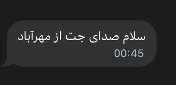

Shin ✓ @hey_itsmyturn
Tue, 09 Jun 2026 21:45:45 UTC

Jet activity,
Mehrabad airport,
Tehran, Tehran Province, #Iran

فارسی

فعالیت جنگنده‌ها،
فرودگاه مهرآباد،
تهران، استان تهران، #Iran

𝕏 · @shin_persian

## Shin_Persian — post 6800

Shin ✓ @hey_itsmyturn
Tue, 09 Jun 2026 21:44:56 UTC

IRGC-owned Tasnim:
"Iran will respond to US aggression.
As warned hours earlier, Iran will deliver a decisive response to the US aggression, which is being carried out under the pretext of an Apache helicopter crash.'

فارسی

تسنیم متعلق به سپاه پاسداران:
«ایران به تجاوز آمریکا پاسخ خواهد داد.
همان‌طور که ساعت‌ها قبل هشدار داده شد، ایران پاسخی قاطع به تجاوز آمریکا که به بهانه سقوط یک هلیکوپتر آپاچی در حال انجام است، خواهد داد.»

𝕏 · @shin_persian

## FarsiVOA — post 220170

🔺ترامپ: پاسخ ما به اقدام جمهوری اسلامی در سرنگونی هلی‌کوپتر آمریکا «بسیار قوی و قدرتمند» است

جاناتان کارل، خبرنگار شبکه ای‌بی‌سی می‌گوید در حالی که سنتکام حملات تلافی‌جویانه ایالات متحده علیه جمهوری اسلامی را اعلام می‌کرد، با دونالد ترامپ، رئيس جمهوری آمریکا تلفنی صحبت می‌کرد.

⬇️ بیشتر بخوانید:
https://ir.voanews.com/a/8159044.html
@FarsiVOA

## Persian_Trend_Official — post 16376

  <a href="telegram/content/Persian_Trend_Official_16376_1781041984.webm" target="_blank">🎬 Download video</a>

⭕️ حملات هوایی اسرائیل به بیروت. 📝 Nick 📌 @persian_trend_official پرشین ترند | متفاوت‌ترین کانال نظامی

## Persian_Trend_Official — post 16375

شلیک موشک از کرمانشاه

## Persian_Trend_Official — post 16374

  <a href="telegram/content/Persian_Trend_Official_16374_1781041984.webm" target="_blank">🎬 Download video</a>

حریم هوایی کشورهای حاشیه خلیج فارس در حال بسته شدن است و پروازها در حال تغییر مسیر از منطقه هستند. 📝 Amir 📌 @persian_trend_official پرشین ترند | متفاوت‌ترین کانال نظامی

## Persian_Trend_Official — post 16373

  <a href="telegram/content/Persian_Trend_Official_16373_1781041985.webm" target="_blank">🎬 Download video</a>

⭕️ حملات هوایی اسرائیل به بیروت.

📝 Nick

📌 @persian_trend_official
پرشین ترند | متفاوت‌ترین کانال نظامی

## Persian_Trend_Official — post 16372

  <a href="telegram/content/Persian_Trend_Official_16372_1781041985.webm" target="_blank">🎬 Download video</a>

⭕️ تسنیم:

ایران به تجاوز آمریکا پاسخ خواهد داد

ایران همچنان که ساعاتی پیش نیز هشدار داده، پاسخ قطعی به تجاوز آمریکا که به بهانه سقوط هلیکوپتر آپاچی انجام می‌شود، خواهد داد.

📝 Nick

📌 @persian_trend_official
پرشین ترند | متفاوت‌ترین کانال نظامی

## Persian_Trend_Official — post 16371

  <a href="telegram/content/Persian_Trend_Official_16371_1781041986.webm" target="_blank">🎬 Download video</a>

حریم هوایی کشورهای حاشیه خلیج فارس در حال بسته شدن است و پروازها در حال تغییر مسیر از منطقه هستند.

📝 Amir

📌 @persian_trend_official
پرشین ترند | متفاوت‌ترین کانال نظامی

## Persian_Trend_Official — post 16370

⭕️ نیروی هوا فضای سپاه:

تا لحظاتی دیگر، پاسخ مارا جهان تماشا خواهد کرد!

📝 Nick

📌 @persian_trend_official
پرشین ترند | متفاوت‌ترین کانال نظامی

## Persian_Trend_Official — post 16369

چندین پهپاد به هدفی نسبتا دور شلیک شدند.(ناوگان دریایی ایالات متحده)

## Persian_Trend_Official — post 16368

آژیر هشدار در پایگاه های آمریکایی گزارش می شود.

## Persian_Trend_Official — post 16367

آغاز حملات ایران

## Persian_Trend_Official — post 16366

  <a href="telegram/content/Persian_Trend_Official_16366_1781041986.webm" target="_blank">🎬 Download video</a>

🔴شلیک موشک از خوزستان

## Persian_Trend_Official — post 16365

  <a href="telegram/content/Persian_Trend_Official_16365_1781041987.webm" target="_blank">🎬 Download video</a>

📝 Nick

📌 @persian_trend_official
پرشین ترند | متفاوت‌ترین کانال نظامی

## IranianMinds — post 21996

🔴 جمهوری اسلامی حملاتشو شروع کرد

شلیک موشک از خوزستان

@IranianMinds

## IranianMinds — post 21995

🔴 فوری

حملات شدید اسرائیل به بیروت

همزمان با عملیات آمریکا، حالا اسرائیل هم عملیاتی علیه بیروت آغاز کرده است

@IranianMinds

## IranianMinds — post 21994

🔴 حملات ادامه خواهد داشت

یک مقام آمریکایی ادامه حملات را تأیید کرد.

«نیروهای ما به دفاع از خود به حملات علیه ایران ادامه می‌دهند و عملیات همچنان در جریان است.»

@IranianMinds

## IranianMinds — post 21993

🔴 فوریی مارمولک های بیابونای عربستان در خطر حملات موشکی سپاه مناطق خودشونو تخلیه کردن

@IranianMinds

## IranianMinds — post 21992

#طنز

ترامپ هم اکنون : هنوز اتش بس نقض نشده از آمریکا میخوام حملاتش به ایران رو متوقف کنه، بزودی به یک توافق عالی میرسیم

@IranianMinds

## BBCPersian — post 283273

  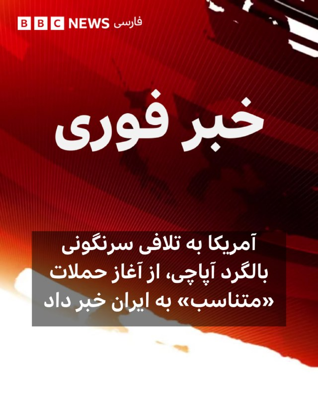

⚡️ فرماندهی مرکزی ایالات متحده (سنتکام) اعلام کرده نیروهای این فرماندهی از ساعت ۵ بعدازظهر به وقت شرق آمریکا و به دستور فرمانده کل قوا، حملات دفاعی علیه اهدافی در ایران را آغاز کرده‌اند.

به گفته سنتکام، این عملیات در واکنش به سرنگونی یک فروند بالگرد آپاچی ارتش آمریکا دردریای عمان انجام شده است.

در این بیانیه آمده است که این ماموریت، «پاسخی متناسب به تجاوز غیرموجه ایران» محسوب می‌شود.

هنوز جزییاتی از اهداف مورد حمله یا خسارات ناشی از آن منتشر نشده است.

در همین حال، برخی از شهروندان سواحل خلیج فارس به کانال وحید انلاین خبر داده‌اند که حوالی نیمه شب صدای «دست کم سه انفجار» در نزدیکی شهرستان سیریک و سواحل بندرعباس شنیده‌اند.
https://bbc.in/4uqahXu
@BBCPersian

## Dirty_Kids — post 391518

من جای نتانیاهو بودم الان زنگ می زدم به ترامپ می گفتم: چطوری چاقال؟!

@Dirty_Kids 👻

## Dirty_Kids — post 391517

کویت، بحرین و تا حدودی امارات قرمساق باید منتظر آبگرمکن پراکنی روافض باشن تا یاد بگیرن قرمساقی نکنن.

@Dirty_Kids 👻

## Dirty_Kids — post 391516

وضعیت:

آمریکا : ۲
اسرائیل : ۱
ایران : ۰
مجتبی : ♿

@Dirty_Kids 👻

## Dirty_Kids — post 391515

شاخص ذخیره فیلم سوپر در ایران افزایش یافت.

@Dirty_Kids 👻

## Dirty_Kids — post 391514

🔴 ترامپ: آتش بس هنوز نقض نشده، از آمریکا می‌خوام حملاتشون رو متوقف کنن تا زودتر به میز مذاکره برگردیم.

@Dirty_Kids 👻

## alonews — post 126659

  <a href="telegram/content/alonews_126659_1781041988.webm" target="_blank">🎬 Download video</a>

👈گزارش حمله هوایی پاکستان به چند پاسگاه مرزی افغانستان

✅ @AloNews خبر جنگ

## alonews — post 126658

🤩ارزون ترین قیمت ، با کیفیت ترین سرویس
🌐 
❤️فقط گیگی 2t ، نامحدود 290t
💫 
🔔آره درست شنیدی گیگی 
🛍2
🛍 تومن
👀 5 سال اعتبار ، 5 سال همراهی شما دلیل این خدمات باکیفیت ماست برای جبران این لطف و محبت
☑️
❤️ 
👇تست و تهیه اشتراک
👇 @tvpnshop_bot @tvpnshop_bot

## alonews — post 126657

  <a href="telegram/content/alonews_126657_1781041988.webm" target="_blank">🎬 Download video</a>

🔴فوری/قطر و کویت حریم هوایی خودشون رو بستن

✅ @AloNews خبر جنگ

## alonews — post 126656

  <a href="telegram/content/alonews_126656_1781041988.webm" target="_blank">🎬 Download video</a>

🔴فوری/به بیروت هم حمله شد

✅ @AloNews خبر جنگ

## alonews — post 126655

  <a href="telegram/content/alonews_126655_1781041988.webm" target="_blank">🎬 Download video</a>

🔴فوری/آغاز حملات ایران

✅ @AloNews خبر جنگ

## alonews — post 126654

  <a href="telegram/content/alonews_126654_1781041988.webm" target="_blank">🎬 Download video</a>

👈مشاور فیلد مارشال محسن رضایی:‏
پاسخ ایران به حملات آمریکا اجتناب‌ناپذیر و احتمالا قریب‌الوقوع است.

🔴علاوه بر پایگاه‌های آمریکایی در کشورهای حاشیه خلیج فارس، جغرافیای محاصره نیز می‌تواند جزو اهداف باشد.

✅ @AloNews خبر جنگ

## alonews — post 126653

  

🤩ارزون ترین قیمت ، با کیفیت ترین سرویس
🌐

❤️فقط گیگی 2t ، نامحدود 290t
💫

🔔آره درست شنیدی گیگی 
🛍2
🛍 تومن
👀

5 سال اعتبار ، 5 سال همراهی شما
دلیل این خدمات باکیفیت ماست
برای جبران این لطف و محبت
☑️
❤️

👇تست و تهیه اشتراک
👇
@tvpnshop_bot
@tvpnshop_bot

---
📅 بروزرسانی: 1405/03/20 01:12
---

## VahidOOnLine — post 244582

  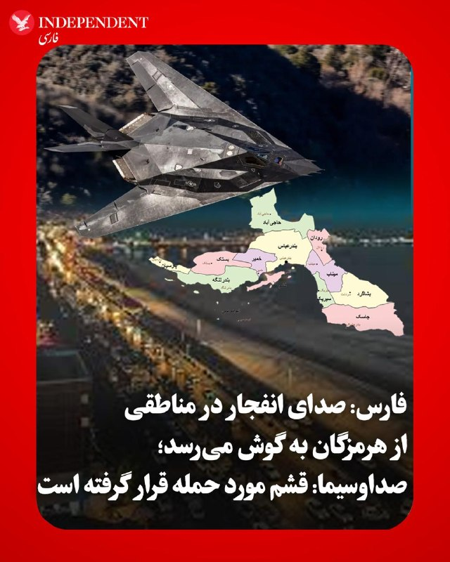

♦️همزمان با آغاز حملات ارتش ایالات متحده به جنوب ایران در واکنش به سرنگونی هلیکوپتر آپاچی در تنگه هرمز، فارس، خبرگزاری وابسته به سپاه از شنیده شدن صدای انفجار در مناطقی در هرمزگان خبر داد. فارس نوشت: «هنوز منشا و محل دقیق این انفجارها مشخص نیست اما منابع محلی از فعالیت پدافند در برخی نقاط استان نیز خبر می‌دهند». صداوسیما نیز به نقل از «یک منبع آگاه» از «شنیده شدن ۶ صدای انفجار» در قشم خر داد و نوشت که علت آن «پرتابه‌های دشمن» بود. پیش از این، سنتکام با انتشار بیانیه‌ای اعلام کرد که نیروهای آمریکایی از ساعت ۱۷ امروز به وقت شرق آمریکا (۱۲:۳۰ بامداد چهارشنبه)، حملات نظامی علیه ایران آغاز کرده‌اند.
‌🇸🇦 Indypersian

🤖 @VahidOOnLine

## VahidOOnLine — post 244581

  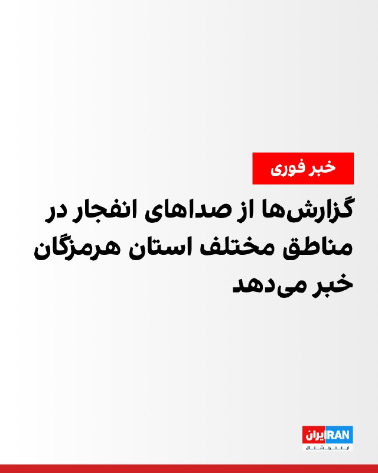

گزارش‌ها از صداهای انفجار در مناطق مختلف استان هرمزگان خبر می‌دهد. رسانه‌های جمهوری اسلامی از شنیده شدن صداهای انفجار در محدوده قشم و جاسک خبر دادند. وحید آنلاین نیز از صدای انفجارهای پیاپی در سیریک و بندرعباس خبر داد.
‌🏁 🇬🇧 IranintlTV

🤖 @VahidOOnLine

## VahidOOnLine — post 244580

  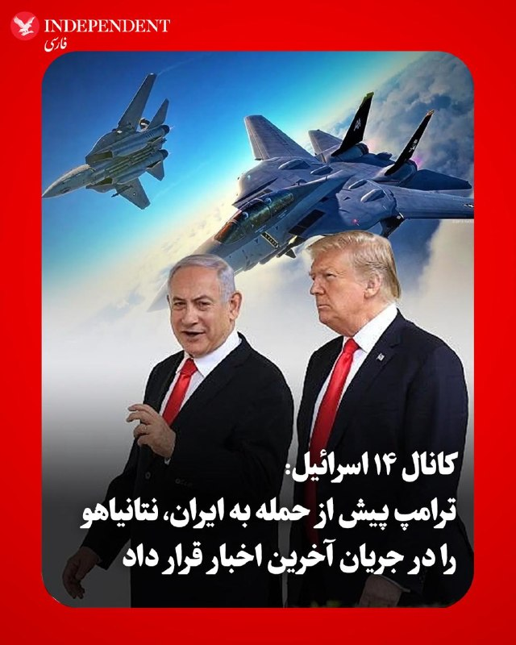

♦️کانال ۱۴ اسرائیل سه‌شنبه‌شب گزارش داد که دونالد ترامپ، رئیس جمهوری آمریکا پیش از دستور حمله به ایران، بنیامین نتانیاهو، نخست وزیر اسرائیل را در جریان آخرین اخبار قرار داد. همزمان، فرماندهی مرکزی ایالات متحده (سنتکام) با انتشار بیانیه‌ای اعلام کرد که نیروهای آمریکایی از ساعت ۱۷ امروز به وقت شرق آمریکا (۱۲:۳۰ بامداد چهارشنبه)، حملات نظامی موسوم به «دفاع از خود» را علیه ایران آغاز کرده‌اند.
‌🇸🇦 Indypersian

🤖 @VahidOOnLine

## WithYashar — post 14208

فهرست اولیه اهداف:

– پایگاه دریایی سیریک
– پایگاه دریایی جاسک
– موقعیت پدافند هوایی بندرعباس
– باتری موشکی ساحلی میناب
– باتری موشکی ساحلی قشم
– بندر قشم
@withyashar

## WithYashar — post 14207

مقام آمریکایی: نیروهای ما به حملات خود علیه ایران برای دفاع از خود ادامه می دهند و عملیات همچنان ادامه دارد
@withyashar

## WithYashar — post 14206

صداوسیما : پایگاه های آمریکایی رو هدف قرار میدیم.
@withyashar

## WithYashar — post 14205

صدا و سیما می گوید دست کم صدای 6 انفجار در جزیره قشم شنیده شده است
@withyashar

## WithYashar — post 14204

روابط عمومی نیروی هوافضای سپاه اعلام کرد تا لحظات آینده پاسخ سنگین به اقدامات خصمانه دشمن داده خواهد شد.
@withyashar

## WithYashar — post 14203

🚨🚨🚨🚨🚨🚨🚨

## WithYashar — post 14202

گزارش‌ها از هدف قرار گرفتن دکل‌های مخابراتی درقشم
@withyashar

## WithYashar — post 14201

🚨🚨🚨🚨🚨🚨🚨🚨
هم اکنون ترامپ به ABC درباره حملات ایران:فکر می‌کنم پاسخ دادن بسیار مهم است،آن‌ها یک هلیکوپتر را سرنگون کردند و ما همین الان در حال پاسخ دادن هستیم،
این پاسخ به کاری است که آن‌ها دیشب با هلیکوپتر ما انجام دادند،من معتقدم پاسخ باید بسیار قوی و قدرتمند باشد.
@withyashar

## WithYashar — post 14200

انفجارها در قشم، بندرعباس، سیریک و جاسک
@withyashar

## mwarmonitor — post 10563

🔴اسرائیل ارزیابی می‌کند که ایران در پاسخ به حمله آمریکا، موشکی به سمت این کشور شلیک نخواهد کرد. – Walla

@mwarmonitor

## mwarmonitor — post 10562

🚨یک مقام آمریکایی به الجزیره: نیروهای ما به حملات علیه ایران در چارچوب دفاع از خود ادامه می‌دهند و این عملیات همچنان ادامه دارد.

@mwarmonitor

## FoxNewsTwitter — post 342775

  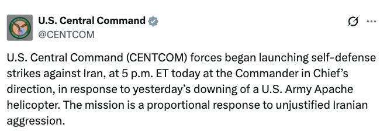

Fox News (Twitter/X)

BREAKING: U.S. Central Command says American forces launched self-defense strikes against Iran at the direction of President Trump.

## pm_afshaa — post 93094

  <a href="telegram/content/pm_afshaa_93094_1781041381.webm" target="_blank">🎬 Download video</a>

🔴رسانه‌های عربی:
بالاترین سطح هشدار در پایگاه‌های آمریکا در کویت، بحرین، امارات و قطر صادر شد.

💧 Rainbet.com the #1 Non-KYC Crypto Casino & Sportsbook @rainbetcom

😁 @Pm_Afshaa

## pm_afshaa — post 93093

  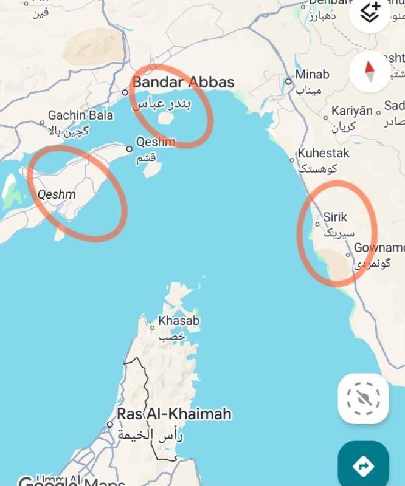

مناطق مورد حمله امریکا :

💧 Rainbet.com the #1 Non-KYC Crypto Casino & Sportsbook @rainbetcom

😁 @Pm_Afshaa

## pm_afshaa — post 93092

  <a href="telegram/content/pm_afshaa_93092_1781041382.webm" target="_blank">🎬 Download video</a>

🔴یک مقام آمریکایی به الجزیره:
نیروهای آمریکا به حملات خود علیه ایران برای دفاع از خود ادامه میدن و عملیات همچنان ادامه داره.

💧 Rainbet.com the #1 Non-KYC Crypto Casino & Sportsbook @rainbetcom

😁 @Pm_Afshaa

## pm_afshaa — post 93091

  <a href="telegram/content/pm_afshaa_93091_1781041383.webm" target="_blank">🎬 Download video</a>

🔴ظاهراً پایگاه‌های دریایی، دکل‌های مخابراتی، پدافندها و سایت‌های موشکی جنوب کشور توسط آمریکا مورد هدف قرار گرفتن.

💧 Rainbet.com the #1 Non-KYC Crypto Casino & Sportsbook @rainbetcom

😁 @Pm_Afshaa

## pm_afshaa — post 93090

  <a href="telegram/content/pm_afshaa_93090_1781041383.webm" target="_blank">🎬 Download video</a>

🔴صداوسیما:
به گفته یک منبع آگاه، 6 صدای انفجار در قشم شنیده شده که بر اثر پرتابه های دشمن بوده و ظاهراً این پرتابه‌ها از جنگنده شیلک شده.

💧 Rainbet.com the #1 Non-KYC Crypto Casino & Sportsbook @rainbetcom

😁 @Pm_Afshaa

## pm_afshaa — post 93089

سد مجید حرکت کن منتظریم

## pm_afshaa — post 93088

🔴ترامپ: فکر میکنم پاسخ دادن بسیار مهمه، اونا یک هلیکوپتر رو سرنگون کردن و ما همین الان در حال پاسخ دادن هستیم.

این پاسخ به کاریه که اونا دیشب با هلیکوپتر ما انجام دادن و من معتقدم پاسخ باید بسیار قوی و قدرتمند باشه.

💧 Rainbet.com the #1 Non-KYC Crypto Casino & Sportsbook @rainbetcom

😁 @Pm_Afshaa

## VahidOnline — post 76112

خبرگزاری حکومتی صدا و سیما:
سیریک اصابت یک پرتابه تایید شده اما مکان و نحوه اصابت مشخص نشده است
برخی منابع از شنیده شدن صدای انفجار و فعالیت پدافند در بندرعباس، قشم و سیریک خبر می دهند.

به گفته یک منبع آگاه ۶ صدای انفجار در قشم شنیده شده که بر اثر پرتابه های دشمن بوده است.
ظاهراً این پرتابه ها از جنگنده شیلک شده است.

ترامپ بامداد چهارشنبه در گفتگو با شبکه «اِی‌بی‌سی» مدعی شد که در واکنش به حمله ادعایی ایران به بالگرد آمریکایی، حملاتی را به ایران انجام داده‌اند.

📡 @VahidOnline

## IranIntlTV — post 341406

  <a href="telegram/content/IranIntlTV_341406_1781041384.mp4" target="_blank">🎬 Download video</a>

مراد ویسی، تحلیلگر ارشد ایران‌اینترنشنال، گفت: «جمهوری اسلامی یک فروند هلی‌کوپتر پیشرفته آپاچی آمریکا را در تنگه هرمز سرنگون کرده است و ترامپ می‌گوید آمریکا به این حمله پاسخ خواهد داد. حالا همه منتظرند ببینند پاسخ آمریکا به این حمله چگونه و در چه سطحی خواهد بود.»
@iranintltv

## IranIntlTV — post 341405

  

گزارش‌ها از صداهای انفجار در مناطق مختلف استان هرمزگان خبر می‌دهد. رسانه‌های جمهوری اسلامی از شنیده شدن صداهای انفجار در محدوده قشم و جاسک خبر دادند. وحید آنلاین نیز از صدای انفجارهای پیاپی در سیریک و بندرعباس خبر داد.
https://iranintl.com/202606091628

## IranIntlTV — post 341404

  <a href="telegram/content/IranIntlTV_341404_1781041386.mp4" target="_blank">🎬 Download video</a>

مراد ویسی، تحلیلگر ارشد ایران‌اینترنشنال، گفت: «از همان آغاز شکل‌گیری جمهوری اسلامی، سرکوب و خشونت به‌عنوان ابزاری برای حفظ قدرت دیده شده است؛ از آتش زدن سینما رکس، اعدام‌های ابتدای انقلاب و دهه ۶۰، تا کشتار زندانیان در سال ۶۷، کشتن مخالفان در خارج از کشور، قتل‌های زنجیره‌ای و سرکوب اعتراضات ۸۸، ۹۶، آبان ۹۸، زن، زندگی، آزادی و دی‌ماه.

این زنجیره نشان می‌دهد که توسل به خشونت و حذف مخالفان در مقاطع مختلف، یکی از روش‌های اصلی بقای این نظام بوده است.»
@iranintltv

## Shin_Persian — post 6799

Shin ✓ @hey_itsmyturn
Tue, 09 Jun 2026 21:33:25 UTC

Expecting BM launches from Iran tonight.

فارسی

پیش‌بینی می‌شود امشب پرتاب موشک‌های بالستیک (BM) از ایران انجام شود.

𝕏 · @shin_persian

## FarsiVOA — post 220169

  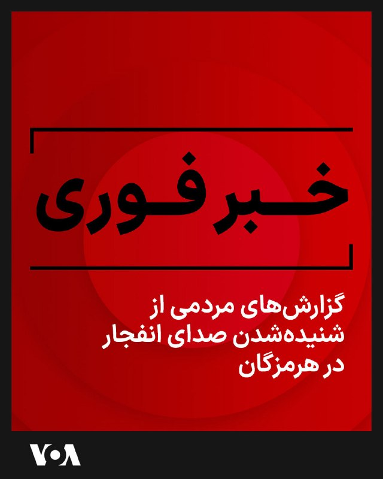

⚡️دقایقی پیش از بیانیه سنتکام که از آغاز عملیات دفاعی آمریکا علیه جمهوری اسلامی خبر داد، کانال تلگرامی وحیدآنلان به نقل از گزارش‌های مردمی از شنیده‌شدن «صدای چندتا انفجار بزرگ پشت سرهم» در شهرستان سیریک و بندرعباس در اوایل بامداد چهارشنبه به وقت تهران خبر داد.
@FarsiVOA

## Persian_Trend_Official — post 16364

🇺🇸/🇮🇷 فهرست اهداف تا به ابن لحظه: – پایگاه دریایی سیریک – پایگاه دریایی جاسک – موقعیت پدافند هوایی بندرعباس – باتری موشکی ساحلی میناب – باتری موشکی ساحلی قشم – بندر قشم

## Persian_Trend_Official — post 16363

  <a href="telegram/content/Persian_Trend_Official_16363_1781041387.webm" target="_blank">🎬 Download video</a>

🇺🇸/🇮🇷 فهرست اهداف تا به ابن لحظه:

– پایگاه دریایی سیریک
– پایگاه دریایی جاسک
– موقعیت پدافند هوایی بندرعباس
– باتری موشکی ساحلی میناب
– باتری موشکی ساحلی قشم
– بندر قشم

## Persian_Trend_Official — post 16362

https://youtube.com/live/65Du9t8OHI0?feature=share

## Persian_Trend_Official — post 16361

خواهشاً اگر صدایی در اطراف محل زندگیتون‌ شنیدید‌ با جزئیات در داخل دایرکت کانال برای ما ارسال کنید ❤️

📝 Nick

## Persian_Trend_Official — post 16360

منابع عربی: پایگاه‌های ‌های آمریکایی در خاورمیانه سطح آمادگی خود را به حداکثر رسانده‌اند.

## Persian_Trend_Official — post 16359

  <a href="telegram/content/Persian_Trend_Official_16359_1781041387.webm" target="_blank">🎬 Download video</a>

هم اکنون تحرکات موشکی شدید سپاه پاسداران در نزدیکی پایگاه موشکی غرب

## Persian_Trend_Official — post 16358

  <a href="telegram/content/Persian_Trend_Official_16358_1781041388.webm" target="_blank">🎬 Download video</a>

دیگه بریم لایو

## IranianMinds — post 21991

🔴 آبگرمکن های سپاه دارن آماده میشن برن بالاسر بیابونای کویت و عربستان

@IranianMinds

## IranianMinds — post 21990

🔴 روابط عمومی نیروی هوافضای سپاه :

تا لحظات آینده پاسخ سنگین به اقدامات خصمانه دشمن داده خواهد شد

@IranianMinds

## IranianMinds — post 21988

🔴 فهرست اولیه اهداف آمریکا:

– پایگاه دریایی راهبر سیریک
– پایگاه دریایی ولایت جاسک
– موقعیت پدافند هوایی بندرعباس
– باتری موشکی ساحلی میناب
– باتری موشکی ساحلی قشم
– بندر قشم

@IranianMinds

## IranianMinds — post 21987

🔴 حملات مجدد آمریکا به میناب

@IranianMinds

## IranianMinds — post 21986

🔴 ظاهراً پایگاه‌های دریایی، دکل‌های مخابراتی، پدافندها و سایت‌های موشکی جنوب کشور توسط آمریکا مورد هدف قرار گرفتن.

@IranianMinds

## IranianMinds — post 21985

🔴 سپاه :

بزودی حمله میکنیم به پایگاه های آمریکایی و پاسخ حملاتشون رو میدیم.

@IranianMinds

## IranianMinds — post 21984

🔴 صداوسیما :

قشم 6 بار هدف قرار گرفته شده امشب.

@IranianMinds

## IranianMinds — post 21983

🔴 صداوسیما :

پایگاه های آمریکایی رو هدف قرار میدیم.

@IranianMinds

## IranianMinds — post 21982

🔴 صداوسیما :

بندر سیریک هدف موشک های آمریکایی قرار گرفته.

@IranianMinds

## Dirty_Kids — post 391513

🔴 صداوسیما : پایگاه های آمریکایی رو هدف قرار میدیم.

@Dirty_Kids 👻

## Dirty_Kids — post 391512

🚨هم اکنون ترامپ به ABC درباره حملات ایران:فکر می‌کنم پاسخ دادن بسیار مهم است،آن‌ها یک هلیکوپتر را سرنگون کردند و ما همین الان در حال پاسخ دادن هستیم،
این پاسخ به کاری است که آن‌ها دیشب با هلیکوپتر ما انجام دادند،من معتقدم پاسخ باید بسیار قوی و قدرتمند باشد.

@Dirty_Kids 👻

## alonews — post 126652

  <a href="telegram/content/alonews_126652_1781041388.webm" target="_blank">🎬 Download video</a>

👈فهرست اولیه اهداف آمریکا:

🔴پایگاه دریایی سیریک

🔴پایگاه دریایی جاسک

🔴موقعیت پدافند هوایی بندرعباس

🔴باتری موشکی ساحلی میناب

🔴باتری موشکی ساحلی قشم

🔴بندر قشم

✅ @AloNews خبر جنگ

## alonews — post 126651

  <a href="telegram/content/alonews_126651_1781041389.webm" target="_blank">🎬 Download video</a>

👈6 انفجار در قشم

✅ @AloNews خبر جنگ

## alonews — post 126650

  <a href="telegram/content/alonews_126650_1781041389.webm" target="_blank">🎬 Download video</a>

👈هم اکنون ترامپ به ABC درباره حملات ایران: فکر می‌کنم پاسخ دادن بسیار مهم است، آن‌ها یک هلیکوپتر را سرنگون کردند و ما همین الان در حال پاسخ دادن هستیم،

🔴این پاسخ به کاری است که آن‌ها دیشب با هلیکوپتر ما انجام دادند،من معتقدم پاسخ باید بسیار قوی و قدرتمند باشد.

✅ @AloNews خبر جنگ

---
📅 بروزرسانی: 1405/03/20 01:03
---

## VahidOOnLine — post 244579

  

ستاد فرماندهی مرکزی آمریکا، سنتکام، اعلام کرد نیرهایش در آغاز بامداد چهارشنبه به وقت ایران، در واکنش به سرنگونی یک بالگرد آپاچی ارتش آمریکا حمله‌ها علیه جمهوری اسلامی را آغاز کردند. سنتکام گفت این ماموریت پاسخی متناسب به «تجاوز غیرموجه» حکومت ایران است.
‌🏁 🇬🇧 IranintlTV

🤖 @VahidOOnLine

## VahidOOnLine — post 244578

  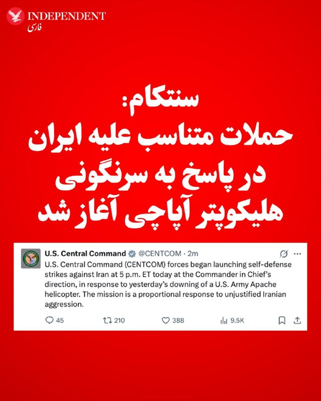

♦️فرماندهی مرکزی ایالات متحده (سنتکام)، سه‌شنبه‌شب، ۱۹ خردادماه، با انتشار بیانیه‌ای اعلام کرد که نیروهای آمریکایی از ساعت ۱۷ امروز به وقت شرق آمریکا (۱۲:۳۰ بامداد چهارشنبه)، حملات نظامی موسوم به «دفاع از خود» را علیه ایران آغاز کرده‌اند. بر اساس این بیانیه، این عملیات نظامی با دستور مستقیم فرمانده کل قوا (رئیس‌جمهوری آمریکا) و در پاسخ به سرنگونی روز گذشته یک هلیکوپتر آپاچی ارتش ایالات متحده صورت گرفته است. سنتکام این ماموریت را یک پاسخ متناسب به آنچه «تجاوز توجیه‌ناپذیر ایران» خوانده، توصیف کرده است.
‌🇸🇦 Indypersian

🤖 @VahidOOnLine

## WithYashar — post 14199

کانال 14 اسرائیل: ترامپ نتانیاهو رو قبل از آغاز حمله در جریان قرار داد.
@withyashar

## WithYashar — post 14198

۹ انفجار بندر عباس
@withyashar

## WithYashar — post 14197

  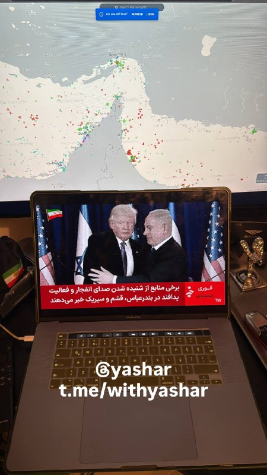

@withyashar شکار‌ لحظه کردم

## WithYashar — post 14196

طبق گزارش ها تاکنون حملات در جنوب ایران متمرکز بوده است.

هم‌اکنون پدافند در جنوب ایران مشغول دفع حمله است
@withyashar

## WithYashar — post 14195

ارتش آمریکا از شلیک گسترده موشک های کروز به سمت ایران خبر می‌دهد.
@withyashar

## WithYashar — post 14194

مسیج های زیاد از انفجار‌ در ‌سیریک @withyashar

## mwarmonitor — post 10561

🔴ترامپ درباره حملات آمریکا علیه ایران گفت:

🔸«فکر می‌کنم پاسخ دادن بسیار مهم است. آن‌ها یک بالگرد را سرنگون کردند و ما همین حالا در حال پاسخ دادن هستیم. این پاسخی به کاری است که آن‌ها شب گذشته با بالگرد ما انجام دادند و من معتقدم این پاسخ باید بسیار قوی و بسیار قدرتمند باشد، و این دقیقاً همان چیزی است که این عملیات هست.» ABC

@mwarmonitor

## mwarmonitor — post 10560

💥انفجارهایی در شهر میناب در جنوب ایران شنیده شد.

## mwarmonitor — post 10559

🔴کانال ۱۴ اسرائیل: ترامپ، نتانیاهو را در جریان جزئیات حمله اخیر آمریکا به ایران قرار داده است.

@mwarmonitor

## mwarmonitor — post 10558

فعال‌سازی سامانه‌های پدافند هوایی در جنوب ایران

## pm_afshaa — post 93087

انفجارهایی در میناب شنیده شده.

💧 Rainbet.com the #1 Non-KYC Crypto Casino & Sportsbook @rainbetcom

😁 @Pm_Afshaa

## pm_afshaa — post 93086

  <a href="telegram/content/pm_afshaa_93086_1781040791.webm" target="_blank">🎬 Download video</a>

🔴کانال 14 اسرائیل: ترامپ نتانیاهو رو قبل از آغاز حمله در جریان قرار داد.

💧 Rainbet.com the #1 Non-KYC Crypto Casino & Sportsbook @rainbetcom

😁 @Pm_Afshaa

## pm_afshaa — post 93085

  <a href="telegram/content/pm_afshaa_93085_1781040791.webm" target="_blank">🎬 Download video</a>

🔴طبق گزارش‌ها، چند انفجار در جاسک

💧 Rainbet.com the #1 Non-KYC Crypto Casino & Sportsbook @rainbetcom

😁 @Pm_Afshaa

## pm_afshaa — post 93084

تیتر شبکه خبر صداوسیما:
حملات موشکی ایران بزودی...

💧 Rainbet.com the #1 Non-KYC Crypto Casino & Sportsbook @rainbetcom

😁 @Pm_Afshaa

## pm_afshaa — post 93083

  <a href="telegram/content/pm_afshaa_93083_1781040792.webm" target="_blank">🎬 Download video</a>

🔴حمله آمریکا با موشک کروز تاماهاوک انجام شده.

💧 Rainbet.com the #1 Non-KYC Crypto Casino & Sportsbook @rainbetcom

😁 @Pm_Afshaa

## pm_afshaa — post 93082

  <a href="telegram/content/pm_afshaa_93082_1781040792.webm" target="_blank">🎬 Download video</a>

🔴سامانه‌های پدافند هوایی در جنوب ایران فعال شدن.

💧 Rainbet.com the #1 Non-KYC Crypto Casino & Sportsbook @rainbetcom

😁 @Pm_Afshaa

## pm_afshaa — post 93081

  <a href="telegram/content/pm_afshaa_93081_1781040793.webm" target="_blank">🎬 Download video</a>

🔴تمام کشورهای عربی حاشیه خلیج فارس در حالت آماده باش کامل در اومدن.

💧 Rainbet.com the #1 Non-KYC Crypto Casino & Sportsbook @rainbetcom

😁 @Pm_Afshaa

## pm_afshaa — post 93080

  <a href="telegram/content/pm_afshaa_93080_1781040794.webm" target="_blank">🎬 Download video</a>

🔴خبرگزاری مهر: شنیده شدن صدای انفجارهایی در محدوده بندر سیریک.

💧 Rainbet.com the #1 Non-KYC Crypto Casino & Sportsbook @rainbetcom

😁 @Pm_Afshaa

## pm_afshaa — post 93079

  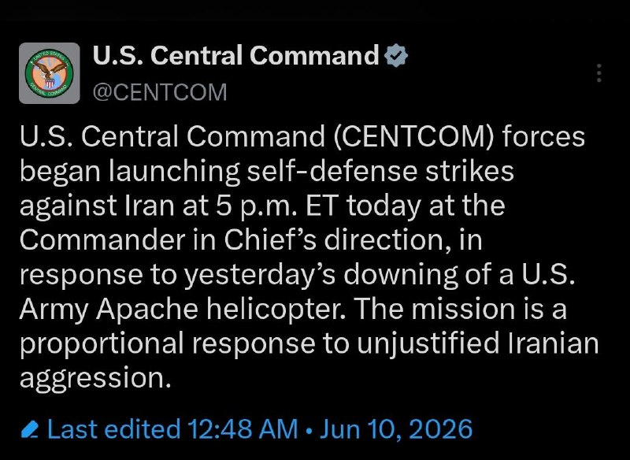

🔴سنتکام: از ساعت 5 عصر امروز به وقت شرقی، به دستور رئیس‌جمهور، حملات دفاع از خود رو علیه ایران شروع کردیم. این عملیات در پاسخ به سرنگون کردن هلیکوپتر آپاچی ارتش آمریکا دیروز بوده. این مأموریت، یک پاسخ متناسب به تجاوز بی‌دلیل ایرانی‌ها حساب میشه.

💧 Rainbet.com the #1 Non-KYC Crypto Casino & Sportsbook @rainbetcom

😁 @Pm_Afshaa

## DEJradio — post 5514

  <a href="telegram/content/DEJradio_5514_1781040795.webm" target="_blank">🎬 Download video</a>

🚨📢 بر اساس گزارش منابع میدانی، بامداد چهارشنبه ۲۰ خرداد ۱۴۰۵ انفجارهایی مهیب بندرعباس، قشم و سیریک را لزراند.

به نظر می‌رسد انفجارها ناشی از حملات آمریکا به تلافی سرنگونی هلیکوپتر آمریکایی توسط سـ.ـپاه در تنگه هرمز باشد. پدافند در نواحی جنوب ایران فعال شده است.

*عکس آرشیوی

#جنگ #تنگه_هرمز
@DEJradio

## VahidOnline — post 76111

  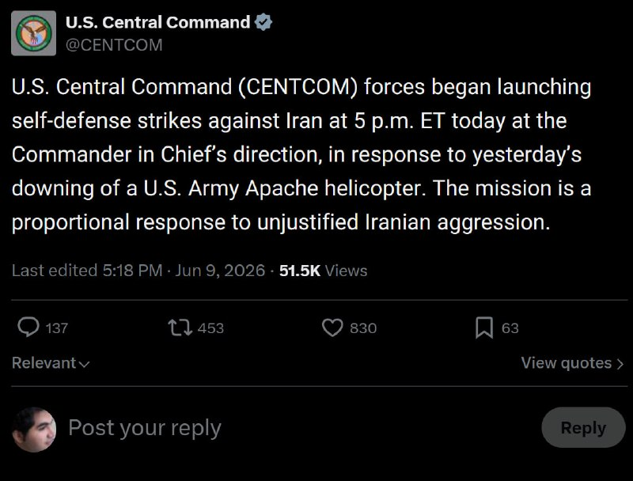

☄️ سنتکام: حملات در پاسخ به سرنگونی بالگرد آغاز شد

ترجمه ماشین:
فرماندهی مرکزی ایالات متحده آمریکا، سنتکام، اعلام کرد نیروهایش امروز ساعت ۵ عصر به وقت شرق آمریکا، به دستور فرمانده کل قوا، حملات دفاع از خود علیه ایران را آغاز کردند. این اقدام در پاسخ به سرنگونی هلیکوپتر آپاچی ارتش آمریکا در روز گذشته انجام شده است. این مأموریت پاسخی متناسب به تجاوز بی‌دلیل ایران است.
CENTCOM

📡 @VahidOnline

## IranIntlTV — post 341403

  <a href="telegram/content/IranIntlTV_341403_1781040795.mp4" target="_blank">🎬 Download video</a>

مراد ویسی، تحلیلگر ارشد ایران‌اینترنشنال، گفت: «در جمهوری اسلامی فاسد بودن افراد و مقامات مهم نیست، مشروط به آنکه به نظام وفادار باشند. قانون نانوشته نظام این است که فاسد باش، وفادار باش.»
@iranintltv

## IranIntlTV — post 341402

  <a href="telegram/content/IranIntlTV_341402_1781040796.mp4" target="_blank">🎬 Download video</a>

مراد ویسی، تحلیلگر ارشد ایران‌اینترنشنال، گفت: «در جمهوری اسلامی فاسد بودن افراد و مقامات مهم نیست، مشروط به آنکه به نظام وفادار باشند. قانون نانوشته نظام این است که فاسد باش، وفادار باش.»
@iranintltv

## IranIntlTV — post 341401

  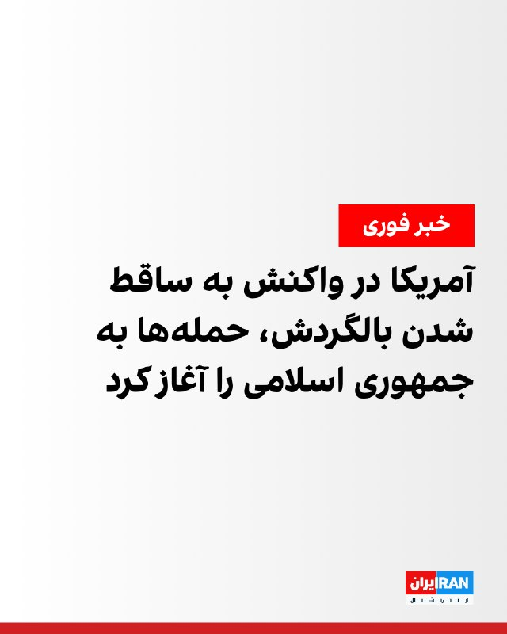

ستاد فرماندهی مرکزی آمریکا، سنتکام، اعلام کرد نیرهایش در آغاز بامداد چهارشنبه به وقت ایران، در واکنش به سرنگونی یک بالگرد آپاچی ارتش آمریکا حمله‌ها علیه جمهوری اسلامی را آغاز کردند. سنتکام گفت این ماموریت پاسخی متناسب به «تجاوز غیرموجه» حکومت ایران است.
https://iranintl.com/202606096067

## Shin_Persian — post 6798

  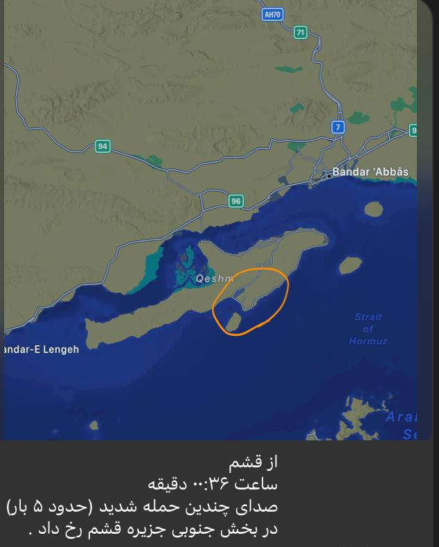

Shin ✓ @hey_itsmyturn
Tue, 09 Jun 2026 21:26:55 UTC

2106Z
5 blasts heard in southern Qeshm island.
Qeshm Province, #Iran

فارسی

۲۱۰۶ زولو (۰۰:۳۶ به وقت تهران)
۵ صدای انفجار در جنوب جزیره قشم شنیده شد.
استان قشم، #Iran

𝕏 · @shin_persian

## Iliaen — post 4464

  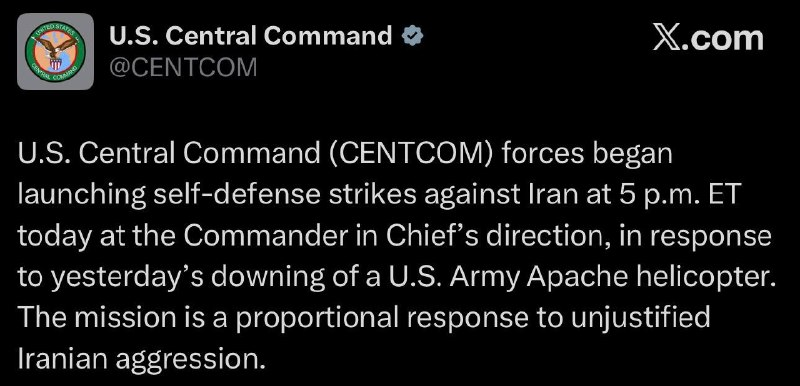

سنتکام (فرماندهی مرکزی ایالات متحده) با انتشار یک بیانیه، حمله را تایید کرد.

@iliaen

## FarsiVOA — post 220168

  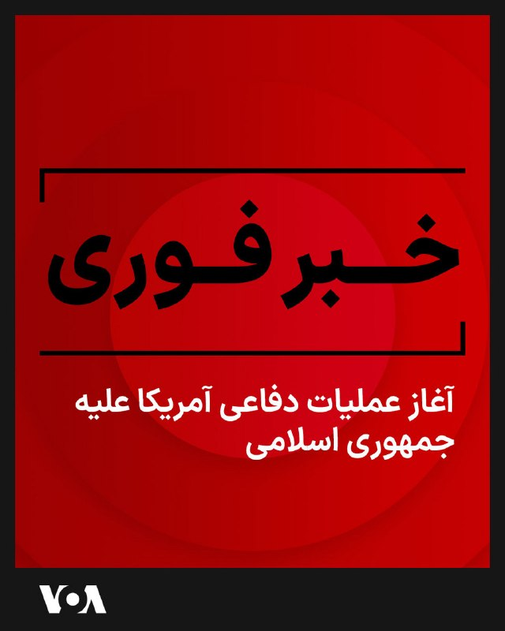

⚡️ستاد فرماندهی مرکزی ایالات متحده (سنتکام) روز سه‌شنبه اعلام کرد که نیروهای آمریکایی در پاسخ به سرنگونی یک هلی‌کوپتر آپاچی ارتش ایالات متحده که دیروز رخ داد، ساعت ۵ بعد از ظهر به وقت شرق آمریکا، به دستور فرمانده کل قوا، دونالد ترامپ، حملات دفاعی از خود علیه جمهوری اسلامی را آغاز کردند.
سنتکام گفت این ماموریت، پاسخی متناسب به «تجاوز ناموجه» جمهوری اسلامی است.
@FarsiVOA

## Persian_Trend_Official — post 16357

  <a href="telegram/content/Persian_Trend_Official_16357_1781040799.webm" target="_blank">🎬 Download video</a>

ترامپ به ABC درباره حملات ایران: فکر می‌کنم پاسخ دادن بسیار مهم است، آن‌ها یک هلیکوپتر را سرنگون کردند و ما همین الان در حال پاسخ دادن هستیم.

این پاسخ به کاری است که آن‌ها دیشب با هلیکوپتر ما انجام دادند،من معتقدم پاسخ باید بسیار قوی و قدرتمند باشد.

📝 Amir

📌 @persian_trend_official
پرشین ترند | متفاوت‌ترین کانال نظامی

## Persian_Trend_Official — post 16356

  <a href="telegram/content/Persian_Trend_Official_16356_1781040800.webm" target="_blank">🎬 Download video</a>

هم اکنون تحرکات موشکی شدید سپاه پاسداران در نزدیکی پایگاه موشکی غرب

## Persian_Trend_Official — post 16355

  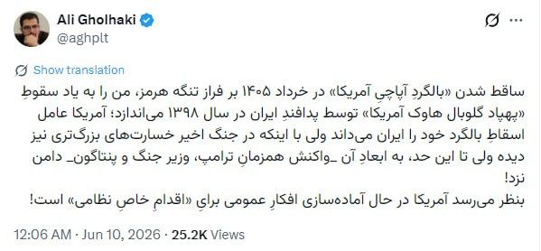

📷 Photo

## Persian_Trend_Official — post 16354

  <a href="telegram/content/Persian_Trend_Official_16354_1781040801.webm" target="_blank">🎬 Download video</a>

به گزارش کانال 14 اسرائیل، ترامپ پیش از حمله ایالات متحده به ایران، تلفنی با نخست وزیر اسرائیل، نتانیاهو، صحبت کرد تا او را در جریان امور قرار دهد.

📝 Amir

📌 @persian_trend_official
پرشین ترند | متفاوت‌ترین کانال نظامی

## Persian_Trend_Official — post 16353

حملات ایالات متحده با موشک‌های کروز تاماهاوک انجام شده

## Persian_Trend_Official — post 16352

قالیباف: ما زبان دیپلماسی را ترجیح می‌دهیم، ولی زبان‌ غیردیپلماسی را روان‌تر صحبت می‌کنیم، شما سوار همان اسبی می‌شوید که زین کرده‌اید. ما زبان دیپلماسی را ترجیح می‌دهیم، اما زبان‌های دیگر را بسیار روان‌تر صحبت می‌کنیم. اگر تعهدات خود را بشکنید، ما به همان…

## Persian_Trend_Official — post 16351

  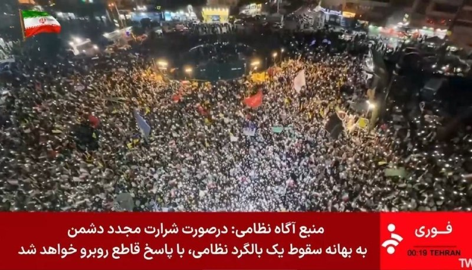

📷 Photo

## Persian_Trend_Official — post 16350

کانال رسمی پرشین ترند pinned «اگر حملات فقط در حد نوار ساحلی بمونه یعنی نمیخوان تنش از کنترل خارج بشه و اتفاق خاصی نمیوفته !»

## Persian_Trend_Official — post 16349

  <a href="telegram/content/Persian_Trend_Official_16349_1781040802.webm" target="_blank">🎬 Download video</a>

حملات ایالات متحده با موشک‌های کروز تاماهاوک انجام شده

## Persian_Trend_Official — post 16348

انفجارهای شدید در پایگاه نیروی دریایی سپاه در سیریک

## Persian_Trend_Official — post 16347

اگر حملات فقط در حد نوار ساحلی بمونه یعنی نمیخوان تنش از کنترل خارج بشه و اتفاق خاصی نمیوفته !

## Persian_Trend_Official — post 16346

  <a href="telegram/content/Persian_Trend_Official_16346_1781040802.webm" target="_blank">🎬 Download video</a>

اگر حملات فقط در حد نوار ساحلی بمونه یعنی نمیخوان تنش از کنترل خارج بشه و اتفاق خاصی نمیوفته !

## RadioFarda — post 158110

  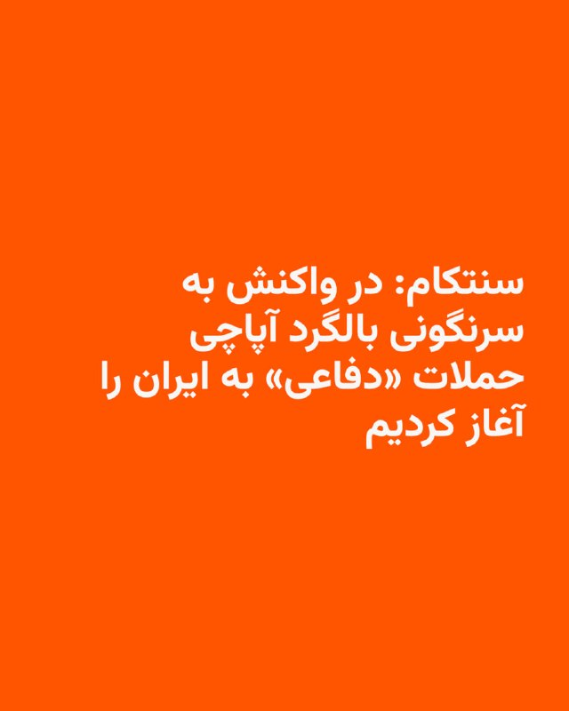

🔸ستاد فرماندهی مرکزی ایالات متحده (سنتکام) اعلام کرد نیروهای این فرماندهی به دستور رئیس‌جمهور آمریکا، از ساعت ۵ بعدازظهر به وقت شرق آمریکا، حملات «دفاع از خود» علیه ایران را آغاز کرده‌اند.

🔸در این بیانیه آمده است که این حملات در واکنش به سرنگونی یک بالگرد تهاجمی آپاچی ارتش آمریکا در روز گذشته انجام شده و «پاسخی متناسب به اقدام تجاوزکارانه و غیرموجه ایران» به شمار می‌رود.

🔸سنتکام جزئیاتی درباره اهداف این حملات یا مناطق مورد هدف منتشر نکرده است.

🔸پیش از این، رسانه‌های ایران از شنیده شدن صدای چند انفجار در محدوده شهرستان سیریک در استان هرمزگان خبر داده بودند.

🔸خبرگزاری مهر به نقل از ساکنان محلی گزارش داد شامگاه سه‌شنبه صدای انفجارهایی در بندر سیریک و روستاهای اطراف شنیده شده است، اما تا زمان انتشار این گزارش هیچ‌یک از نهادهای رسمی نظامی یا انتظامی درباره علت این انفجارها اظهارنظر نکرده‌اند.

@RadioFarda

## IranianMinds — post 21981

🔴 ترامپ :

به نظر من پاسخ دادن بسیار مهم است. آنها یک هلیکوپتر را ساقط کردند و ما در حال پاسخگویی هستیم.

این پاسخی است به کاری که دیشب با هلیکوپتر ما انجام دادند، و من معتقدم که پاسخ باید بسیار قوی، بسیار قدرتمند باشد، و این چیزی است که این یکی است.

@IranianMinds

## IranianMinds — post 21980

🔴 صداوسیما :

بد میبینید کصکشا بزودی حمله ی موشکی میکنیم

@IranianMinds

## IranianMinds — post 21979

🔴 تمام کشورهای عربی حاشیه خلیج فارس در حالت آماده باش کامل در اومدن.

@IranianMinds

## IranianMinds — post 21978

🔴 انفجار مجدد در میناب

@IranianMinds

## IranianMinds — post 21977

🔴انفجارهای سنگین در پایگاه نیروی دریایی سپاه در سیریک.

@IranianMinds

## IranianMinds — post 21976

حداقل شش انفجار از موقعیت نیروی دریایی در سیریک گزارش شده

تایید نشده: پایگاه شهید راهبر در بندرعباس مورد اصابت قرار گرفت

@IranianMinds

## IranianMinds — post 21975

🔴 حمله آمریکا به شهرستان جاسک در هرمزگان

@IranianMinds

## IranianMinds — post 21974

  

🔴 شبکه خبر: بزودی پاسخ قاطع میدیم.

@IranianMinds

## IranianMinds — post 21973

صدای انفجار در جاسک

@IranianMinds

## IranianMinds — post 21972

دیگه جدی جدی زدن و شروع شد @IranianMinds

## IranianMinds — post 21971

حملات امریکا با موشک‌های کروز تاماهاوک انجام شده

@IranianMinds

## IranianMinds — post 21970

سه انفجار در حوالی میناب.

@IranianMinds

## BBCPersian — post 283272

  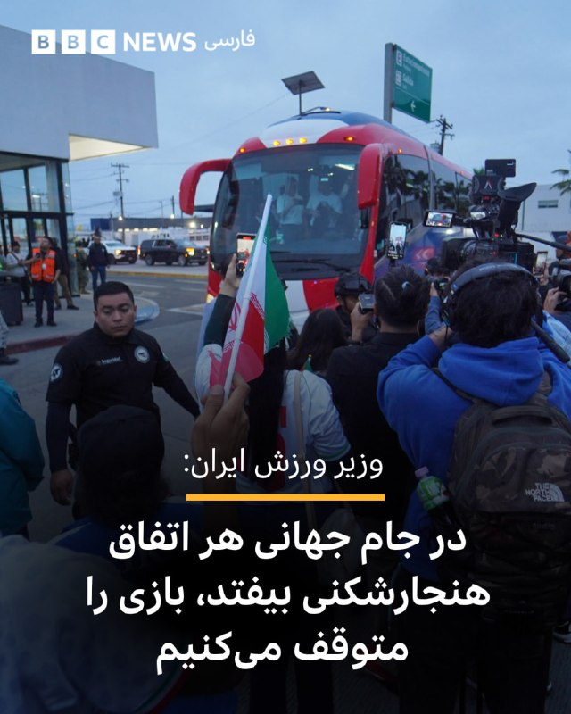

‌

احمد دنیامالی، وزیر ورزش ایران، گفته است که اگر در جریان مسابقات جام جهانی «هر اتفاق هنجارشکنی» بیفتد، بازی از جانب ایران متوقف خواهد شد.

بنا به گزارش رسانه‌های داخلی ایران، او در توضیح گفته است: «پرچم یا نشان دیگری جز پرچم ما در ورزشگاه‌های جام جهانی باشد، می‌توانیم بازی را ادامه ندهیم.»

او در ادامه افزوده است: «عمده مسائلی که میزبان کارشکنی می‌کرد، حل شده است، مشکل ویزای سایر نفرات تیم ملی حل می‌شود.»

وزیر ورزش ایران همچنین گفت: «برای بازی با مصر به ما گفته‌اند نگران مسائل حاشیه‌ای نباشید.»

همزمان فیفا اعلام کرده است که پس از لغو سهمیه بلیت‌های مرحله گروهی جام جهانی برای ایران، تنها چند روز مانده به آغاز مسابقات، در حال تلاش برای «به حداکثر رساندن فرصت حضور هواداران ایرانی در بازی‌ها» است.

این تصمیم در حالی اتخاذ شده که سهمیه بلیت‌های اختصاص‌یافته به ایران برای مرحله گروهی جام جهانی لغو شده است و فیفا می‌گوید در تلاش است راهکارهایی برای تسهیل حضور و حمایت هواداران ایرانی در مسابقات پیدا کند.
بامداد ۲۶ خرداد به وقت ایران در لس‌آ‌نجلس برگزار خواهد شد.

📷Reuters

https://bbc.in/4dYnYIe
@BBCPersian

## Dirty_Kids — post 391511

  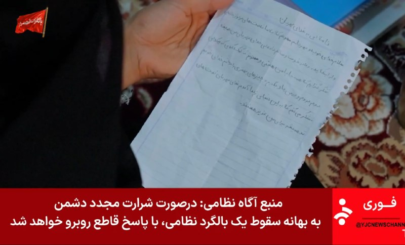

🔴 شبکه خبر: بزودی پاسخ قاطع میدیم.

@Dirty_Kids 👻

## Dirty_Kids — post 391510

  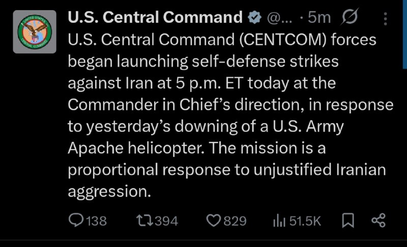

🔴 سنتکام و آمریکا رسما مسئولیت حمله به ایران و قشم رو به عهده گرفت.

@Dirty_Kids 👻

## Dirty_Kids — post 391509

🔴 فوریییی: آمریکا رسماً و شرعا به قشم حمله کرد.

@Dirty_Kids 👻

## alonews — post 126649

  <a href="telegram/content/alonews_126649_1781040804.webm" target="_blank">🎬 Download video</a>

👈صداوسیما: حملات موشکی بزودی انجام میشه

✅ @AloNews خبر جنگ

## alonews — post 126648

  <a href="telegram/content/alonews_126648_1781040805.webm" target="_blank">🎬 Download video</a>

👈علی قلهکی خبرنگار امنیتی :
بنظر می‌رسد آمریکا در حال آماده‌سازی افکارِ عمومی برایِ «اقدامِ خاصِ نظامی» است

✅ @AloNews خبر جنگ

## alonews — post 126647

  <a href="telegram/content/alonews_126647_1781040805.webm" target="_blank">🎬 Download video</a>

👈انفجار در میناب

✅ @AloNews خبر جنگ

## alonews — post 126646

  <a href="telegram/content/alonews_126646_1781040805.webm" target="_blank">🎬 Download video</a>

👈تاکنون 7 انفجار در سیریک

✅ @AloNews خبر جنگ

## alonews — post 126645

📱لطفا توییتر الونیوز رو دنبال کنین 
🔴پست های انگلیسی در رابطه با جنایت های حکومت به انگلیسی نوشته شده و افراد مهم منشن و هشتگ های مهم قرار داده شده. 
🔴ریپست کنین. مهمترین کمک این روزها جلوگیری از پروپاگاندا حکومت علیه این قتل عام مردم هستش. خونشون نباید پایمال…

## alonews — post 126644

  <a href="telegram/content/alonews_126644_1781040805.webm" target="_blank">🎬 Download video</a>

💢فووووووری/هم اکنون تحرکات موشکی شدید سپاه ماسداران 
🚨 @AkhbareFouri

## alonews — post 126643

  <a href="telegram/content/alonews_126643_1781040806.webm" target="_blank">🎬 Download video</a>

👈حملات ایالات متحده با موشک‌های کروز تاماهاوک انجام شده

✅ @AloNews خبر جنگ

## alonews — post 126642

  <a href="telegram/content/alonews_126642_1781040806.webm" target="_blank">🎬 Download video</a>

👈رسایی: اینترنت رو قطع کنید

✅ @AloNews خبر جنگ

---
📅 بروزرسانی: 1405/03/20 00:53
---

## VahidOOnLine — post 244577

  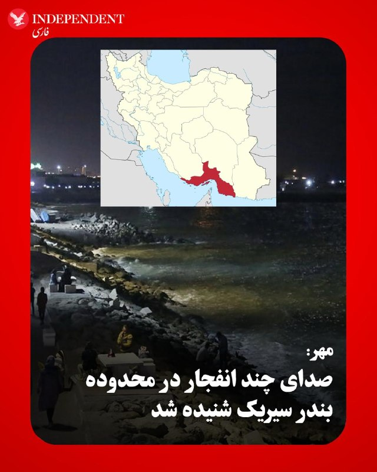

♦️خبرگزاری مهر به نقل از منابع محلی و ساکنان بندر سیریک در هرمزگان، سه‌شنبه‌شب، ۱۹ خردادماه، از شنیده شدن صدای چند انفجار در محدوده این شهرستان خبر دادند. بر اساس گزارش‌های منتشرشده، هنوز ماهیت و علت دقیق وقوع این صداها مشخص نشده است و تا این لحظه، هیچ‌یک از نهادهای رسمی، نظامی و انتظامی درباره این حادثه اظهارنظر یا توضیحی ارائه نکرده‌‌اند.
‌🇸🇦 Indypersian

🤖 @VahidOOnLine

## VahidOOnLine — post 244576

  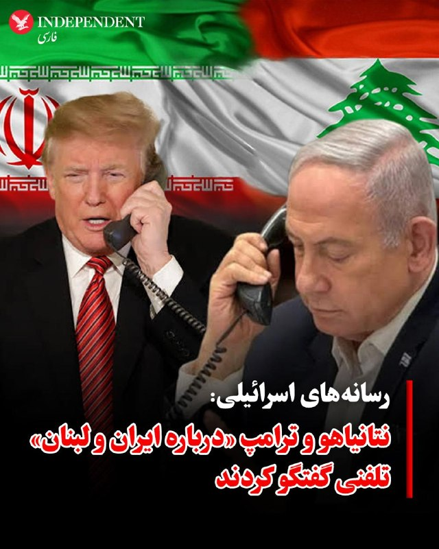

♦️العربیه، سه‌شنبه‌شب، ۱۹ خردادماه، به نقل از «منابع اسرائیلی» گزارش داد که دونالد ترامپ، رئیس جمهوری آمریکا و بنیامین نتانیاهو، نخست‌وزیر اسرائیل، درباره ایران و لبنان به صورت تلفنی گفتگو کردند.
‌🇸🇦 Indypersian

🤖 @VahidOOnLine

## WithYashar — post 14193

  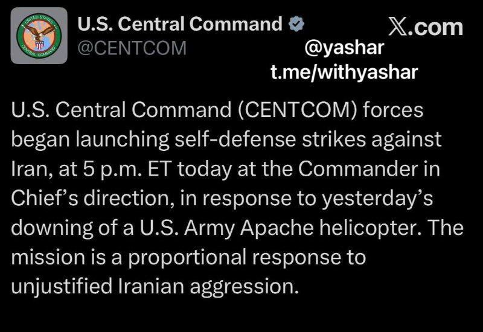

فوری : نیروهای سنتکام به دستور فرمانده کل، از ساعت ۵ عصر به وقت آمریکا، در پاسخ به ساقط شدن بالگرد آپاچی ارتش «حملات دفاعی» علیه ایران شروع کردن و این یه واکنش متقابل و متناسب به حمله ایران بوده.
@withyashar

## WithYashar — post 14192

🚨🚨🚨🚨🚨🚨🚨🚨

## WithYashar — post 14191

گزارش‌های غیر رسمی از هدف قرار گرفتن پایگاه شهید راهبر در میناب
@withyashar

## mwarmonitor — post 10557

💥تا این لحظه صدای ۴ انفجار شنیده شده است.

## mwarmonitor — post 10556

💥تا این لحظه صدای ۴ انفجار شنیده شده است.

## pm_afshaa — post 93078

  <a href="telegram/content/pm_afshaa_93078_1781040189.webm" target="_blank">🎬 Download video</a>

🔴طبق گزارشات، آمریکا به قشم حمله کرد.

💧 Rainbet.com the #1 Non-KYC Crypto Casino & Sportsbook @rainbetcom

😁 @Pm_Afshaa

## VahidOnline — post 76110

پیام‌های دریافتی از ساعت ۰۰:۳۰

صدای چندتا انفجار بزرگ پشت سرهم شهرستان سیریک

وحید جون سیریک صدای انفجار اومد

وحید بندرعباس صدای انفجار میاد

چهارتا انفجار سیریک هرمزگان سه تای آخری کناره های ساحل

وحید بندرعباس صدای انفجار اومد الان

صدای سه تا انفجار شدید از سیریک

📡 @VahidOnline

## Shin_Persian — post 6797

Shin ✓ @hey_itsmyturn
Tue, 09 Jun 2026 21:18:54 UTC

U.S. Central Command announces self-defense strikes against Iran, launched at 5 p.m. ET, in response to the downing of a U.S. Apache helicopter. The mission is a proportional response to Iranian aggression.

Source: @CENTCOM
https://x.com/CENTCOM/status/2064457103134343170

فارسی

فرماندهی مرکزی ایالات متحده (سنتکام) حملات دفاع از خود علیه ایران را که در ساعت ۵ بعد از ظهر به وقت منطقه زمانی شرقی در پاسخ به سرنگونی یک هلیکوپتر آپاچی آمریکایی آغاز شد، اعلام می‌کند. این مأموریت پاسخی متناسب به تجاوزات ایران است.

منبع: @CENTCOM
https://x.com/CENTCOM/status/2064457103134343170

𝕏 · @shin_persian

## Shin_Persian — post 6796

Shin ✓ @hey_itsmyturn
Tue, 09 Jun 2026 21:17:33 UTC

U.S. Central Command says it launched self-defense strikes on Iran at 5 p.m. ET, responding to yesterday's downing of a U.S. Apache helicopter. The mission is a proportional response to unjustified Iranian aggression.

فارسی

ستاد فرماندهی مرکزی ایالات متحده (سنتکام/CENTCOM) اعلام کرد که در ساعت ۱۷:۰۰ به وقت منطقه زمانی شرقی (۲۲۰۰ زولو (۰۱:۳۰ به وقت تهران))، حملاتی را در قالب دفاع از خود علیه ایران آغاز کرده است؛ این اقدام در پاسخ به سرنگونی یک بالگرد آپاچی آمریکایی در روز گذشته صورت گرفت. این مأموریت، پاسخی متناسب به تجاوزات غیرموجه ایران است.

𝕏 · @shin_persian

## Shin_Persian — post 6795

U.S. Central Command ✓ @CENTCOM
Tue, 09 Jun 2026 21:17:15 UTC

U.S. Central Command (CENTCOM) forces began launching self-defense strikes against Iran, at 5 p.m. ET today at the Commander in Chief’s direction, in response to yesterday’s downing of a U.S. Army Apache helicopter. The mission is a proportional response to unjustified Iranian aggression.

فارسی

نیروهای ستاد فرماندهی مرکزی ایالات متحده (سنتکام) از ساعت ۵ عصر به وقت منطقه زمانی شرقی امروز، به دستور فرمانده کل قوا، حملات دفاع از خود را علیه ایران در پاسخ به سرنگونی روز گذشته یک هلیکوپتر آپاچی ارتش ایالات متحده آغاز کردند. این ماموریت پاسخی متناسب به تجاوزات غیرموجه ایران است.

𝕏 · @shin_persian

## Iliaen — post 4463

بامداد چهارشنبه؛ چند نقطه در جنوب هرمزگان (محدوده‌ی سیریک) و یک نقطه در اطراف بندرعباس هدف اصابت موشک قرار گرفت.

“معمولاً ایالات متحده در جنوب ایران عملیات انجام می‌دهد.”

@iliaen

## FarsiVOA — post 220167

⚡️نگاه کاربران شبکه‌های اجتماعی به جنگ، خاموشی دیجیتال و فشار معیشتی
@FarsiVOA

## Persian_Trend_Official — post 16345

سنتکام اعلام کرد که در واکنش به سرنگونی یک بالگرد AH-64 آپاچی در حال انجام حملاتی علیه ایران است. 📝 Amir 📌 @persian_trend_official پرشین ترند | متفاوت‌ترین کانال نظامی

## Persian_Trend_Official — post 16344

  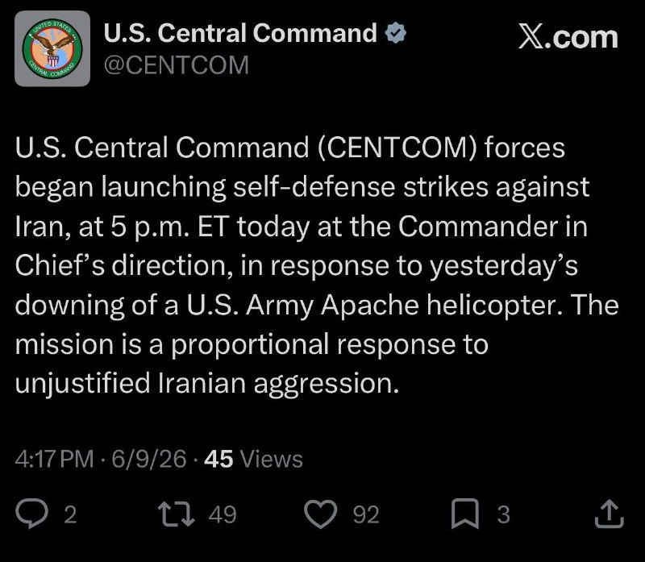

سنتکام اعلام کرد که در واکنش به سرنگونی یک بالگرد AH-64 آپاچی در حال انجام حملاتی علیه ایران است.

📝 Amir

📌 @persian_trend_official
پرشین ترند | متفاوت‌ترین کانال نظامی

## Persian_Trend_Official — post 16343

  <a href="telegram/content/Persian_Trend_Official_16343_1781040190.webm" target="_blank">🎬 Download video</a>

اگر اتفاقات درست حسابی باشه دوباره لایو رو شروع میکنیم

## Persian_Trend_Official — post 16342

لایو ... ⏳

## IranianMinds — post 21969

دیگه جدی جدی زدن و شروع شد

@IranianMinds

## IranianMinds — post 21968

🔴فوری/فرماندهی مرکزی ایالات متحده (سنتکام):
نیروهای سنتکام، از ساعت ۵ بعدازظهر امروز به وقت شرق آمریکا، با دستور فرمانده کل قوا، حملات دفاعی-تهاجمی علیه ایران را آغاز کردند. این حملات در پاسخ به سرنگونی یک فروند بالگرد ارتش آمریکا در روز گذشته انجام می‌شود.

ماموریت اعلام‌شده، پاسخی متناسب با تجاوز غیرقابل‌توجیه ایران است.

@IranianMinds

## alonews — post 126641

  <a href="telegram/content/alonews_126641_1781040191.webm" target="_blank">🎬 Download video</a>

🔴فوووووووووووووووووووووووری

## alonews — post 126640

🔴فوووووووووووووووووووووووری

## alonews — post 126639

  <a href="telegram/content/alonews_126639_1781040191.webm" target="_blank">🎬 Download video</a>

👈صدای ۴انفجار در محدوده بندرعباس

✅ @AloNews خبر جنگ

---
📅 بروزرسانی: 1405/03/20 00:45
---

## WithYashar — post 14190

خبرنگار کانال 14 اسرائیل:
هرچند امیدوارم اشتباه کنم ولی پیش‌بینی‌ من اینه که ترامپ در پاسخ به سرنگونی بالگرد آمریکایی، یه حمله‌ جزئی و نمادین انجام میده؛ مثلا یک ایستگاه راداری و چند سکوی پرتاب ضدموشکی در منطقهٔ تنگه‌ هرمز رو میزنه.

یعنی حملاتی از جنس همان حملاتی که قبلاً هم چند بار در جریان آتش‌بس دیدیم، نه چیزی که جنگی رو با ایران شعله‌ور کنه.
@withyashar

## WithYashar — post 14189

گزارش های زیاد انفجار هم اکنون از قشم و بندر عباس🚨
@withyashar

## WithYashar — post 14188

  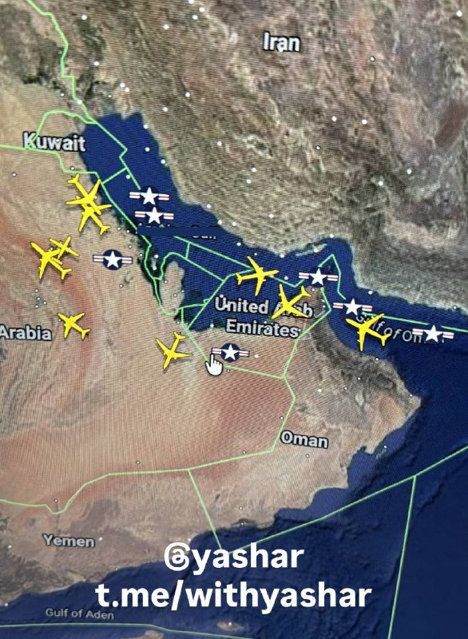

هم اکنون انبوه هواپیما های آمریکایی در جنوب ايران
@withyashar

## mwarmonitor — post 10555

💥انفجار در سیریک

## mwarmonitor — post 10554

🚨به گفته کانال ۱۲، مقامات سیاسی اسرائیل پیش‌تر تهدید کرده بودند که هرگونه شلیک به شهرک‌های شمالی، به‌منزله حمله به «ضاحیه» (بیروت) تلقی خواهد شد. @mwarmonitor

## pm_afshaa — post 93077

  <a href="telegram/content/pm_afshaa_93077_1781039728.webm" target="_blank">🎬 Download video</a>

🔴خبرنگار کانال 14 اسرائیل:
هرچند امیدوارم اشتباه کنم ولی پیش‌بینی‌ من اینه که ترامپ در پاسخ به سرنگونی بالگرد آمریکایی، یه حمله‌ جزئی و نمادین انجام میده؛ مثلا یک ایستگاه راداری و چند سکوی پرتاب ضدموشکی در منطقهٔ تنگه‌ هرمز رو میزنه.

یعنی حملاتی از جنس همان حملاتی که قبلاً هم چند بار در جریان آتش‌بس دیدیم، نه چیزی که جنگی رو با ایران شعله‌ور کنه.

💧 Rainbet.com the #1 Non-KYC Crypto Casino & Sportsbook @rainbetcom

😁 @Pm_Afshaa

## pm_afshaa — post 93076

  <a href="telegram/content/pm_afshaa_93076_1781039729.webm" target="_blank">🎬 Download video</a>

🔴صداوسیما: اگه دشمن بخواد به بهونه سقوط یه بالگرد نظامی دوباره دست به شرارت و حمله بزنه، با پاسخ قاطع ما روبه‌رو میشه.

💧 Rainbet.com the #1 Non-KYC Crypto Casino & Sportsbook @rainbetcom

😁 @Pm_Afshaa

## Shin_Persian — post 6794

Shin ✓ @hey_itsmyturn
Tue, 09 Jun 2026 21:13:38 UTC

State-owned Mehr News:

Explosions heard in Sirik area, Hormozgan Province
Local residents report multiple blasts. Islamic Regime authorities have not commented on the cause.

فارسی

خبرگزاری دولتی مهر:

شنیده شدن صدای انفجار در منطقه سیریک، استان هرمزگان
ساکنان محلی از وقوع چندین انفجار خبر می‌دهند. مقامات رژیم اسلامی هنوز درباره علت آن اظهار نظری نکرده‌اند.

𝕏 · @shin_persian

## Persian_Trend_Official — post 16341

خبرگزاری مهر: شنیده شدن صدای انفجارهایی در محدوده بندر سیریک

ساکنان محلی بندرسیریک از شنیده شدن صدای انفجار‌هایی در محدوده این شهرستان خبر دادند.

به گزارش خبرنگار مهر، شامگاه سه شنبه، صدای انفجار‌هایی در محدوده شهرستان سیریک از سوی منابع محلی و ساکنان بندر سیریک و روستاهای اطراف گزارش شده است.

بر اساس این گزارش، هنوز ماهیت این صداها به طور دقیق مشخص نیست و هیچ‌ یک از نهادهای رسمی نظامی و انتظامی تا این لحظه درباره علت وقوع این صداها اظهارنظری نکرده‌اند.

پیگیری‌ها برای کسب اطلاع از ماهیت دقیق این انفجار ادامه دارد.

📝 Amir

📌 @persian_trend_official
پرشین ترند | متفاوت‌ترین کانال نظامی

## Persian_Trend_Official — post 16340

منابع محلی از وقوع چند انفجار در بندرعباس، قشم و سیریک میدهند.

📝 Amir

📌 @persian_trend_official
پرشین ترند | متفاوت‌ترین کانال نظامی

## Persian_Trend_Official — post 16339

  <a href="telegram/content/Persian_Trend_Official_16339_1781039729.webm" target="_blank">🎬 Download video</a>

یک نکته از لایو امشب که گوشه ذهنت نگه داشتی چی هست ؟

## IranianMinds — post 21967

🔴 گزارشات تایید نشده از صدای انفجار در قشم و بندرعباس.

@IranianMinds

## alonews — post 126638

  <a href="telegram/content/alonews_126638_1781039730.webm" target="_blank">🎬 Download video</a>

🔴فوری/ایالات متحده رسما حمله کرد

✅ @AloNews خبر جنگ

## alonews — post 126637

  <a href="telegram/content/alonews_126637_1781039730.webm" target="_blank">🎬 Download video</a>

🔴فوری/انفجار در جزیره سیریک

✅ @AloNews خبر جنگ

## alonews — post 126636

  <a href="telegram/content/alonews_126636_1781039731.webm" target="_blank">🎬 Download video</a>

🔴فوری/گزارش‌ها از هدف قرار گرفتن پایگاه شهید راهبر در بندرعباس

✅ @AloNews خبر جنگ

## alonews — post 126635

  <a href="telegram/content/alonews_126635_1781039731.webm" target="_blank">🎬 Download video</a>

🔴فوری/گزارش‌ها از حمله به بندرعباس

✅ @AloNews خبر جنگ

## alonews — post 126634

  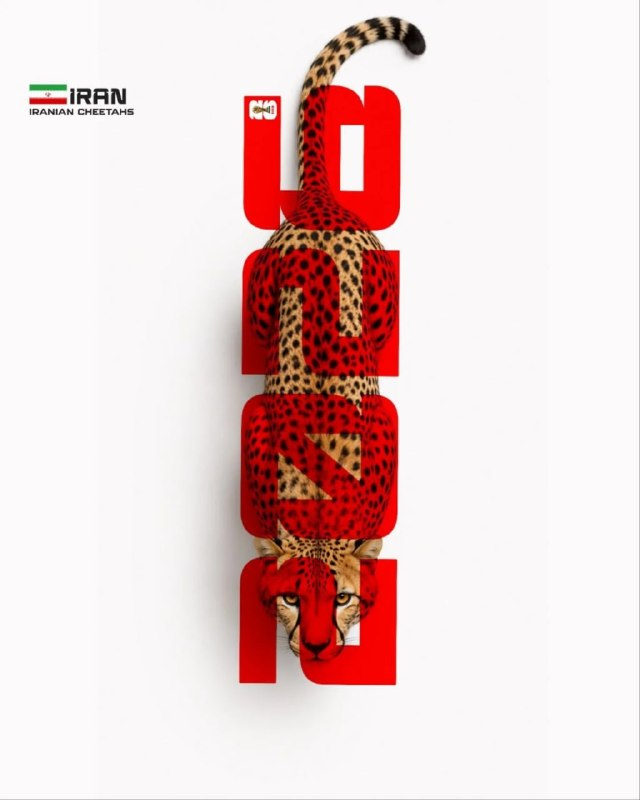

حقارت تمام عیار قبل از جام جهانی
‼️

تیم جمهوری اسلامی فردا در دیداری دوستانه به مصاف تیم زیر 21 ساله‌های شهر تیخوانا مکزیک خواهد رفت

هیچ تیم ملی‌ای حاضر به بازی با تیم جمهوری اسلامی نشده

@AloSport

---
📅 بروزرسانی: 1405/03/20 00:34
---

## VahidOOnLine — post 244575

♦️ورود یک سامانه ناپایدار جوی به آذربایجان شرقی، سبب وقوع بارش‌های سنگین باران، ریزش تگرگ و رعدوبرق‌های پیاپی در ارتفاعات سونگون ورزقان شد. بر اساس گزارش‌های محلی، شدت فعالیت این سامانه و ریزش تگرگ در برخی ارتفاعات این منطقه به حدی بوده است که سطح زمین در مدت زمانی کوتاه کاملا سفیدپوش شد.
‌🇸🇦 Indypersian

🤖 @VahidOOnLine

## WithYashar — post 14187

مسیج های زیاد از انفجار‌ در ‌سیریک
@withyashar

## WithYashar — post 14186

🚨🚨🚨🚨🚨🚨🚨

## WithYashar — post 14185

ان بی سی : فرمانده سنتکام کلی اطلاعات به اعضای دو حزب ارائه داده که همه قانع شدن حمله ایران به هلیکوپتر اپاچی کاملا عمدی بوده و باید تلافی کنن
@withyashar
این اولین باره که دموکرات ها تایید میکنن حمله به ایرانو

## WithYashar — post 14184

اتاق جنگ با شما : صداهای مشکوک اطراف اصفهان🚨
@withyashar

## mwarmonitor — post 10553

📌در پی شلیک‌هایی از لبنان، هشدار اولیه در بخش‌هایی از شمال اسرائیل صادر شده است. @mwarmonitor

## pm_afshaa — post 93075

  <a href="telegram/content/pm_afshaa_93075_1781039081.webm" target="_blank">🎬 Download video</a>

🔴ان‌بی‌سی نیوز:
تو یک جلسه محرمانه بین برد کوپر، فرمانده سنتکام و سناتورها، چند سناتور گفتن به نظرشون ایران عمداً بالگرد آپاچی ارتش آمریکا رو هدف قرار داده و انتظار دارن آمریکا تو آینده نزدیک به این ماجرا پاسخ نظامی بده.

💧 Rainbet.com the #1 Non-KYC Crypto Casino & Sportsbook @rainbetcom

😁 @Pm_Afshaa

## pm_afshaa — post 93074

  <a href="telegram/content/pm_afshaa_93074_1781039082.webm" target="_blank">🎬 Download video</a>

🔴این وسط حزب‌الله به کریات شیمونا اسرائیل حمله موشکی کرد.

💧 Rainbet.com the #1 Non-KYC Crypto Casino & Sportsbook @rainbetcom

😁 @Pm_Afshaa

## VahidOnline — post 76109

  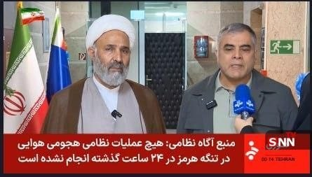

خبرگزاری تسنیم، وابسته به سپاه پاسداران، به نقل از یک منبع آگاه نظامی نوشت: «در ۲۴ ساعت گذشته هیچ عملیات نظامی هجومی هوایی در تنگه هرمز انجام نشده است».
@VahidOOnLine
پیش‌تر:
معاون وزیر خارجه جمهوری اسلامی ایران، روز سه‌شنبه، ۱۹ خردادماه، در گفتگو با «الجزیره» اعلام کرد که هلیکوپتر آپاچی ارتش ایالات متحده که روز گذشته در تنگه هرمز سقوط کرد، به طور عمدی توسط ایران هدف قرار نگرفته است.
این مقام رسمی با تاکید بر اینکه ایران پشت این حمله نبوده، در عین حال هشدار داد که به دلیل شرایط به شدت ملتهب و متشنج منطقه، ممکن است بروز چنین حوادثی در این فضا «عمدی» تلقی و تعبیر شود.
همزمان، دونالد ترامپ، رئیس‌جمهوری ایالات متحده، در گفتگوی تلفنی روز سه‌شنبه با روزنامه «وال‌استریت ژورنال» با کوچک جلوه دادن حادثه سقوط هلیکوپتر آپاچی گفت این اتفاق «مسئله چندان مهمی نبود» و تأکید کرد که «حال خلبان خوب است».
@VahidOOnLine

📡 @VahidOnline

## VahidOnline — post 76107

دونالد ترامپ، رئیس‌جمهوری ایالات متحده، در گفتگوی تلفنی روز سه‌شنبه با روزنامه «وال‌استریت ژورنال» با اشاره به اثرات شدید تحریم‌ها اعلام کرد که محاصره دریایی بنادر ایران باعث شده این کشور «بسیار فقیر» شود و واشنگتن این محاصره را تا هر زمان که لازم باشد حفظ خواهد کرد.
ترامپ همچنین با کوچک جلوه دادن حادثه سقوط اخیر هلیکوپتر آپاچی آمریکا گفت این اتفاق «مسئله چندان مهمی نبود» و تأکید کرد که «حال خلبان خوب است».
بر اساس گزارش سنتکام، سرنشینان این آپاچی پیش از نجات، دو ساعت را در تاریکی شب روی آب سپری کردند و یک مقام ارشد آمریکایی فرار آن‌ها از این سانحه را معجزه‌ای همچون «دست خدا» توصیف کرده است.
@VahidOOnLine
وال‌استریت ژورنال نوشت که حادثه سرنگونی بالگرد آپاچی در تنگه هرمز برای ترامپ «کم اهمیت» بوده است.
این در حالی است که پیش‌تر ترامپ در تروث سوشال تاکید کرد که «ایالات متحده ناگزیر باید به این حمله پاسخ دهد.»
@VahidOOnLine

📡 @VahidOnline

## IranIntlTV — post 341400

  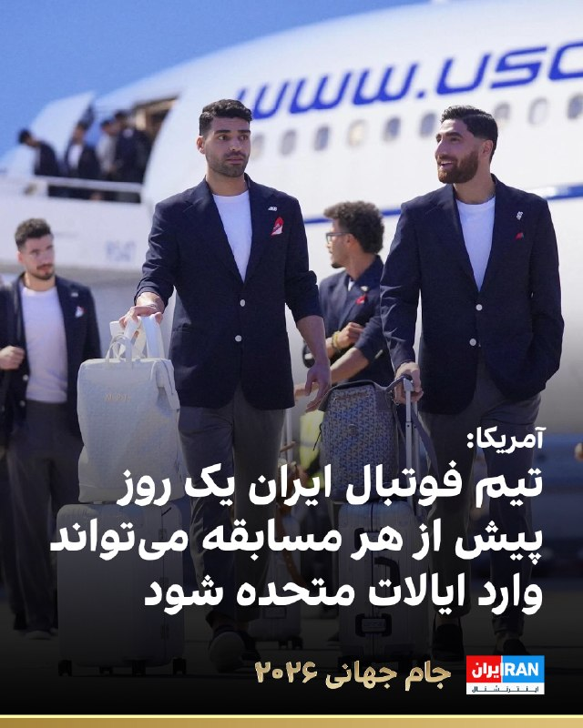

🔻خبرگزاری رویترز به نقل از وزارت امنیت داخلی آمریکا روز سه‌شنبه گزارش داد که تیم فوتبال ایران که هم‌اکنون در تیخوانا مکزیک تمرین می‌کند، می‌تواند یک روز پیش از هر یک از سه مسابقه‌اش در جام جهانی۲۰۲۶ وارد خاک ایالات متحده شود.

🔹پیش‌تر ابوالفضل پسندیده، سفیر جمهوری اسلامی در مکزیک، گفته بود که تیم ایران باید در همان روز مسابقه وارد آمریکا شود و همان روز نیز خاک این کشور را ترک کند. این اظهارات ابهام‌هایی درباره ورود و سفر تیم ملی و تاثیر احتمالی آن بر عملکرد تیم ایجاد کرده بود.

🔹یک سخنگوی وزارت امنیت داخلی آمریکا گفت این ادعا که ایران مجبور خواهد بود در همان روز بازی وارد شود، درست نیست.

🔹این سخنگو در بیانیه‌ای گفت: «این اظهارات نادرست است. به لطف سخاوت رئیس‌جمهور ترامپ، تیم ایران خواهد توانست یک روز پیش از مسابقات خود وارد شود.»

🔹از سوی دیگر سخنگوی فدراسیون فوتبال امشب درباره حضور تیم ملی در آمریکا گفت: «تیم ملی براساس برنامه فیفا، با پرواز چارتر به آمریکا می‌رود. یک روز قبل بازی مقابل نیوزیلند تیم به محل می‌رود و در دو بازی بعد، دو روز قبل مسابقه در محل مسابقات حضور پیدا خواهد کرد.»

@iranintltvsport

## FarsiVOA — post 220166

⚡️از نگرانی درباره قطع دوباره اینترنت در سایه فشار اقتصادی بر خانوارها و تنش‌های منطقه‌ای تا حکم اعدام علیرضا پیغمبری.
@FarsiVOA

## FarsiVOA — post 220165

  <a href="telegram/content/FarsiVOA_220165_1781039085.mp4" target="_blank">🎬 Download video</a>

⚡️بی‌خانمانی در ایران، رفاه در لبنان؛ گفت‌وگو با مهدی کوهستانی‌نژاد
@FarsiVOA

## Persian_Trend_Official — post 16338

  <a href="telegram/content/Persian_Trend_Official_16338_1781039087.webm" target="_blank">🎬 Download video</a>

در پی رصد حملات موشکی از لبنان، آژیرهای خطر در شمال اسرائیل فعال شد.

📝 Amir

📌 @persian_trend_official
پرشین ترند | متفاوت‌ترین کانال نظامی

## Persian_Trend_Official — post 16337

  <a href="telegram/content/Persian_Trend_Official_16337_1781039088.webm" target="_blank">🎬 Download video</a>

ابراهیم رضایی، سخنگوی کمیسیون امنیت ملی و سیاست خارجی: محاصره دریایی یک عملیات جنگی است، ما به آن پاسخ داده‌ایم و پاسخ خواهیم داد، این حق قطعی و مسلم ماست.

اگر آمریکا بخواهد به سرنگونی بالگردی که بخشی از عملیات جنگی در محاصره ما بود واکنش نشان دهد، باید فرض کنیم که پاسخ ما قطعی است. ما به هر اقدامی با پاسخی سریع و قاطع پاسخ خواهیم داد.

ما دست رزمنده ای را که با سرنگونی بالگرد آمریکایی در تنگه هرمز سیلی دیگری به شیطان زد (مانند شهید نادر مهدوی) می‌بوسیم و او را به عنوان یک قهرمان تجلیل خواهیم کرد.

📝 Amir

📌 @persian_trend_official
پرشین ترند | متفاوت‌ترین کانال نظامی

## Persian_Trend_Official — post 16336

  <a href="telegram/content/Persian_Trend_Official_16336_1781039088.webm" target="_blank">🎬 Download video</a>

صداوسیما از نقل منبع آگاه نظامی: هیچ عملیات نظامی هجومی هوایی در تنگه هرمز در 24 ساعت گذشته انجام نشده است.

در صورت شرارت مجدد دشمن به بهانه سقوط یک بالگرد نظامی، با پاسخ قاطع روبرو خواهد شد.

📝 Amir

📌 @persian_trend_official
پرشین ترند | متفاوت‌ترین کانال نظامی

## IranianMinds — post 21966

  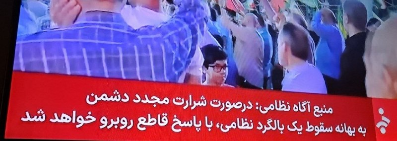

زیرنویس شبکه‌ خبر:

@IranianMinds

## alonews — post 126633

  <a href="telegram/content/alonews_126633_1781039090.webm" target="_blank">🎬 Download video</a>

👈حزب الله به شمال اسرائیل حمله کرد

✅ @AloNews خبر جنگ

## alonews — post 126632

  <a href="telegram/content/alonews_126632_1781039090.webm" target="_blank">🎬 Download video</a>

👈زیرنویس شبکه خبر

✅ @AloNews خبر جنگ

---
📅 بروزرسانی: 1405/03/20 00:24
---

## VahidOOnLine — post 244574

  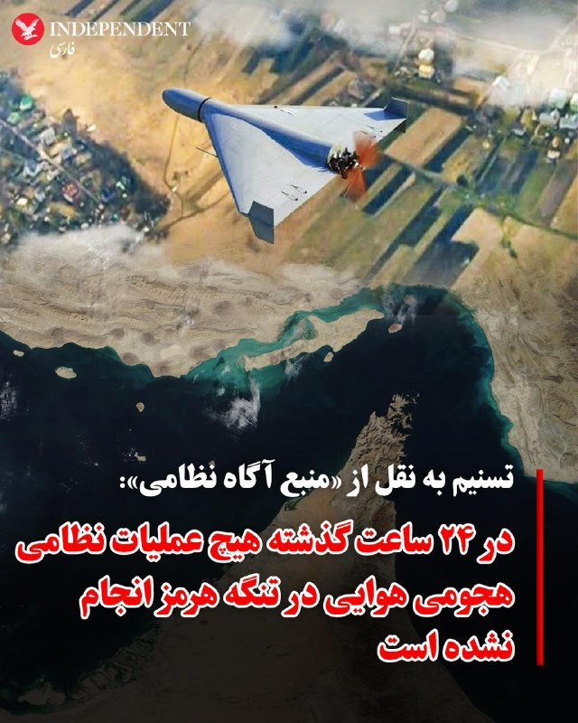

♦️همزمان با افزایش تنش‌ها میان تهران و واشنگتن در پی هدف قرار گرفتن هلیکوپتر آپاچی آمریکا، خبرگزاری تسنیم، وابسته به سپاه پاسداران، سه‌شنبه‌شب، به نقل از یک منبع آگاه نظامی نوشت: «در ۲۴ ساعت گذشته هیچ عملیات نظامی هجومی هوایی در تنگه هرمز انجام نشده است». پیش از این، خبرگزاری سی‌ان‌ان به نقل از دو مقام آمریکایی گزارش داد که هلی‌کوپتر نیروی زمینی ارتش این کشور که در سواحل عمان سقوط کرد، توسط یک پهپاد ایرانی سرنگون شده است. در همین حال، یک منبع آگاه دیگر که از جزئیات حادثه مطلع است، در گفتگو با سی‌ان‌ان تایید کرد که یک پهپاد از نوع «شاهد» به این هلیکوپتر آمریکایی برخورد کرده است.
‌🇸🇦 Indypersian

🤖 @VahidOOnLine

## VahidOOnLine — post 244573

  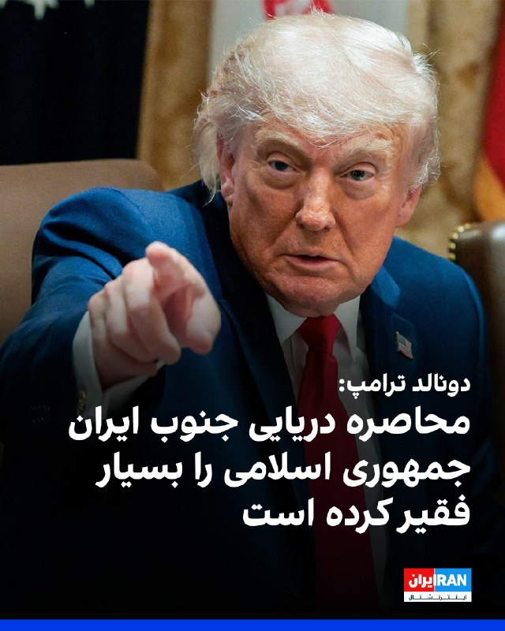

دونالد ترامپ، رییس‌جمهوری آمریکا، در تماس تلفنی با وال‌استریت ژورنال گفت محاصره دریایی جنوب ایران باعث شده جمهوری اسلامی «بسیار فقیر» شود.

او افزود تا زمانی که لازم باشد این محاصره را ادامه خواهد داد.

وال‌استریت ژورنال نوشت که حادثه سرنگونی بالگرد آپاچی در تنگه هرمز برای ترامپ «کم اهمیت» بوده است.
این در حالی است که پیش‌تر ترامپ در تروث سوشال تاکید کرد که «ایالات متحده ناگزیر باید به این حمله پاسخ دهد.»
‌🏁 🇬🇧 IranintlTV

🤖 @VahidOOnLine

## VahidOOnLine — post 244572

  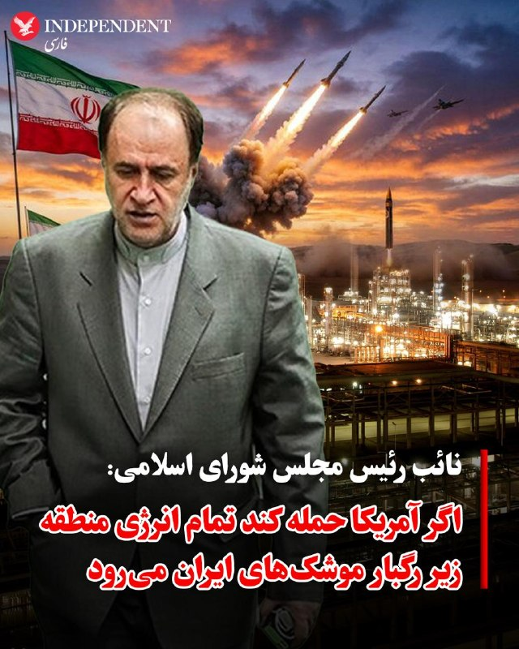

♦️حمیدرضا حاجی‌بابایی، نائب‌ رئیس مجلس شورای اسلامی، در واکنش به تهدیدهای اخیر دونالد ترامپ اعلام کرد: «دوران شعارهایی که آمریکا برای ایجاد رعب و وحشت مطرح می‌کند تمام شده است و اگر آمریکا کوچک‌ترین حمله نظامی به ایران بکند، تمام انرژی منطقه زیر رگبار موشک‌های ایران قرار خواهد گرفت و واشنگتن تا سال‌ها نفت، گاز و منافع خود را از دست خواهد داد.» حاجی‌بابایی با متهم کردن آمریکا به عبور از خطوط قرمز در طول دوره آتش‌بس، بر لزوم شکستن محاصره اقتصادی تأکید کرد و گفت: «ما از شروع جنگ توسط آمریکا استقبال می‌کنیم، زیرا وضعیت نه جنگ نه صلح، با فشارهای اقتصادی همراه است و به نفع ما نیست. خواسته ما یا پایان جنگ با تمام شروط رهبری است و در صورتی که ترامپ دستور حمله و از سرگیری جنگ را بدهد، نیروهای مسلح تکلیف خود را با آمریکا مشخص می‌کنند، چرا که واشنگتن به خوبی می‌داند جنگ با ایران خسارات جبران‌ناپذیری برایش خواهد داشت.»
‌🇸🇦 Indypersian

🤖 @VahidOOnLine

## WithYashar — post 14183

صدا و سیما : به جون مادرمون ما هلیکوپتر نزدیم اصلا امروز کلا نبودیم 🤣
@withyashar

## WithYashar — post 14181

  <a href="telegram/content/WithYashar_14181_1781038452.mp4" target="_blank">🎬 Download video</a>

🎬 Video

## WithYashar — post 14180

## WithYashar — post 14179

## mwarmonitor — post 10552

  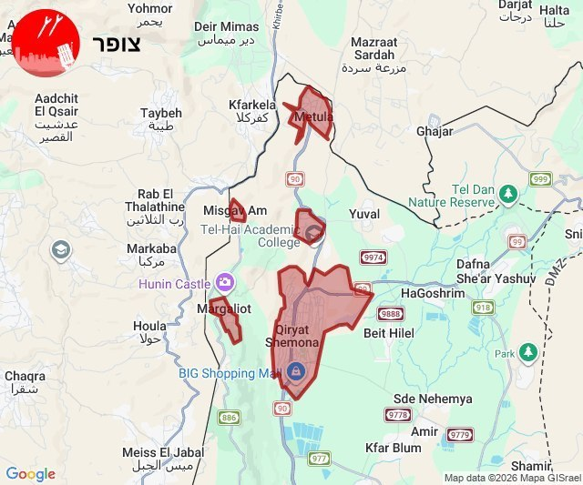

📌در پی شلیک‌هایی از لبنان، هشدار اولیه در بخش‌هایی از شمال اسرائیل صادر شده است.

@mwarmonitor

## mwarmonitor — post 10551

🔴 رسانه‌های اسرائیلی: سامانه‌های راهبردی در «اسرائیل» دستور دریافت کرده‌اند سطح آماده‌باش را در انتظار تشدید احتمالی تنش با ایران افزایش دهند.

@mwarmonitor

## mwarmonitor — post 10550

📌بسیاری از اعضای سنای آمریکا گفته‌اند که معتقدند ایران به‌طور عمدی یک بالگرد AH-64 آپاچی متعلق به ارتش ایالات متحده را هدف قرار داده است و انتظار دارند در آینده‌ای نزدیک پاسخ آمریکا داده شود.

@mwarmonitor

## pm_afshaa — post 93073

  <a href="telegram/content/pm_afshaa_93073_1781038456.webm" target="_blank">🎬 Download video</a>

🔴رسانه‌های اسرائیل: ترامپ و نتانیاهو دقایقی پیش گفت‌و‌گوی تلفنی کردن!

💧 Rainbet.com the #1 Non-KYC Crypto Casino & Sportsbook @rainbetcom

😁 @Pm_Afshaa

## DEJradio — post 5513

  <a href="telegram/content/DEJradio_5513_1781038457.mp4" target="_blank">🎬 Download video</a>

🚨
🔸 خبر ۲۱
سه‌شنبه ۱۹ خرداد ۱۴۰۵

#خبر۲۱
@DEJradio

## DEJradio — post 5512

  <a href="telegram/content/DEJradio_5512_1781038460.webm" target="_blank">🎬 Download video</a>

🔺📢 چند منبع غیررسمی وابسته به سـ.ـپاه سه‌شنبه شب ۱۹ خرداد ۱۴۰۵ گزارش دادند نیروهای مسلح جمهوری اسلامی به حالت آماده باش درآمدند.
پس از اعلام خبر سرنگونی هلیکوپتر آپاچی آمریکا در تنگه هرمز با اصابت پهپاد سـ.ـپاه دونالد ترامپ تهدید کرد این اقدام را تلافی خواهیم کرد.

#تنگه_هرمز #IRGCterrorists
@DEJradio

## IranIntlTV — post 341399

  

دونالد ترامپ، رییس‌جمهوری آمریکا، در تماس تلفنی با وال‌استریت ژورنال گفت محاصره دریایی جنوب ایران باعث شده جمهوری اسلامی «بسیار فقیر» شود.

او افزود تا زمانی که لازم باشد این محاصره را ادامه خواهد داد.

وال‌استریت ژورنال نوشت که حادثه سرنگونی بالگرد آپاچی در تنگه هرمز برای ترامپ «کم اهمیت» بوده است.
این در حالی است که پیش‌تر ترامپ در تروث سوشال تاکید کرد که «ایالات متحده ناگزیر باید به این حمله پاسخ دهد.»
https://iranintl.com/202606096669

## IranIntlTV — post 341398

  <a href="telegram/content/IranIntlTV_341398_1781038462.mp4" target="_blank">🎬 Download video</a>

گارد ساحلی هند با انتشار ویدیوهایی از نجات ۲۴ خدمه هندی کشتی M/T Marivex خبر داد؛ کشتی‌ای که هدف شلیک ارتش آمریکا در آب‌های بین‌المللی خلیج عمان قرار گرفت.

در پی این حمله، خدمه کشتی نیازمند کمک شدند و با همکاری مراکز نجات هند و عمان و توسط بالگردهای نیروی دریایی عمان به مکانی امن منتقل شدند.

به گفته سنتکام، روز دوشنبه ۱۸ خرداد، یک جنگنده اف/ای-۱۸ مستقر بر ناو هواپیمابر آبراهام لینکلن، پس از آنکه خدمه این کشتی با پرچم پالائو در حال عبور از آب‌های بین‌المللی دریای عمان به‌سوی ایران بودند و از اجرای دستورات نیروهای آمریکایی خودداری کردند، یک مهمات هدایت‌شونده دقیق را به بخش‌های موتورخانه و سامانه هدایت کشتی شلیک کرد.
@iranintltv

## Shin_Persian — post 6793

Shin ✓ @hey_itsmyturn
Tue, 09 Jun 2026 20:51:38 UTC

Jet activity over Basrah, #Iraq 🇮🇶

فارسی

فعالیت جت‌ها بر فراز بصره، #Iraq 🇮🇶

𝕏 · @shin_persian

## FarsiVOA — post 220164

🔺واکنش‌ها در کنگره به حمله جمهوری اسلامی به هلی‌کوپتر آمریکایی؛ پت فالون خواستار واکنش ایالات متحده شد

▪️سناتور جمهوری‌خواه تد کروز روز سه‌شنبه ۱۹ خرداد با اشاره به عملیات نجات خدمه هلی‌کوپتر آپاچی سرنگون‌شده توسط جمهوری اسلامی در دریای عمان، از «نوآوری‌های دریایی» ایالات متحده تجلیل کرد. این سناتور ایالت تگزاس با انتشار پستی در شبکه اجتماعی ایکس نوشت رژیم ایران یک هلی‌کوپتر آمریکایی را با دو خدمه آن سرنگون کرد. این دو سرباز در «یک ماموریت بی‌نظیر» توسط یک شناور سطحی بدون سرنشین از «شرکت فناوری‌های سارونیک» مستقر در آستین (واقع در ایالت تگزاس) نجات یافتند.

⬇️ بیشتر بخوانید:
https://ir.voanews.com/a/8159033.html
@FarsiVOA

## alonews — post 126631

  <a href="telegram/content/alonews_126631_1781038463.webm" target="_blank">🎬 Download video</a>

💢فوووووووووری/پرواز شدید جنگنده‌های آمریکایی در مرز ایران 
🚨 @AkhbareFouri

## alonews — post 126630

  <a href="telegram/content/alonews_126630_1781038464.webm" target="_blank">🎬 Download video</a>

👈شبکه خبر به نقل از منبع آگاه نظامی: هیچ عملیات نظامی هجومی هوایی در تنگه هرمز در ۲۴ ساعت گذشته انجام نشده است

✅ @AloNews خبر جنگ

---
📅 بروزرسانی: 1405/03/20 00:13
---

## VahidOOnLine — post 244571

  <a href="telegram/content/VahidOOnLine_244571_1781037801.mp4" target="_blank">🎬 Download video</a>

ایرانیان بریتانیا با تشکیل تجمعی در مقابل پارلمان این کشور در لندن،‌ روز سه‌شنبه خواستار تروریستی اعلام شدن سپاه و مقابله با جمهوری اسلامی شدند. آن‌ها پرچم‌های شیروخورشید و اسرائیل را در تجمع خود حمل کردند.
‌🏁 🇬🇧 IranintlTV

🤖 @VahidOOnLine

## WithYashar — post 14178

سخنگوی کمیسیون امنیت ملی مجلس :

محاصره دریایی یک عملیات نظامی است و ما به آن پاسخ داده و باز هم خواهیم داد.
@withyashar

## WithYashar — post 14177

الجزیره به نقل از یک مقام ایرانی :

بالگرد آپاچی که منهدم شد به علت پرواز در آسمان سرزمینی ایران منهدم شد و برخلاف ادعا ها بر فراز آب های بین المللی پرواز نمی‌کرد.
@withyashar

## mwarmonitor — post 10549

🚨در پی سرنگونی یک بالگرد آمریکایی در تنگه هرمز، دونالد ترامپ رئیس‌جمهور آمریکا و بنیامین نتانیاهو نخست‌وزیر اسرائیل با یکدیگر گفت‌وگو کردند.

@mwarmonitor

## FoxNewsTwitter — post 342774

Fox News (Twitter/X)

NEW: Crowds outside a Texas courthouse erupted in rage moments after a jury convicted Karmelo Anthony of murdering Austin Metcalf, as the scene turned chaotic and led to several physical altercations and at least one person being detained by police.

The same jury that convicted Anthony will now determine his sentence, which could range from 5 to 99 years or life in prison. | @Brooketaylortv

@WillCainShow

## pm_afshaa — post 93072

  <a href="telegram/content/pm_afshaa_93072_1781037803.webm" target="_blank">🎬 Download video</a>

🔴رضایی، سخنگوی کمیسیون امنیت ملی و سیاست خارجی ایران:

محاصره دریایی یک عملیات جنگیه و ما به آن پاسخ دادیم و پاسخ خواهیم داد، این حق قطعی و غیرقابل انکار ماست.

اگر آمریکا بخواد به سرنگونی یک هلیکوپتر که بخشی از عملیات جنگی در محاصره ما بود واکنش نشون بده، باید پاسخ ما رو قطعی فرض کنه؛ ما به هر عملی با پاسخی سریع و قاطع پاسخ خواهیم داد!

💧 Rainbet.com the #1 Non-KYC Crypto Casino & Sportsbook @rainbetcom

😁 @Pm_Afshaa

## pm_afshaa — post 93071

  <a href="telegram/content/pm_afshaa_93071_1781037804.webm" target="_blank">🎬 Download video</a>

🔴رضایی، سخنگوی کمیسیون امنیت ملی مجلس:

دست اون رزمنده‌ای که در تنگه هرمز با سرنگونی هلیکوپتر آمریکایی سیلی دیگری به شیطان زد رو می‌بوسیم و از او به عنوان یک قهرمان تجلیل خواهیم کرد.

💧 Rainbet.com the #1 Non-KYC Crypto Casino & Sportsbook @rainbetcom

😁 @Pm_Afshaa

## Persian_Trend_Official — post 16334

  <a href="telegram/content/Persian_Trend_Official_16334_1781037804.webm" target="_blank">🎬 Download video</a>

♨️ به گزارش نیویورک تایمز مقامات آمریکایی باور دارند ایران مایل به تعلیق 15 ساله غنی سازی است.

📌 واکنش ژنرال مایک فلین (از یاران دو آتیشه ترامپ) به این خبر:
امیدوارم شوخی باشد.

📝 Nick

📌 @persian_trend_official
پرشین ترند | متفاوت‌ترین کانال نظامی

## Persian_Trend_Official — post 16333

  <a href="telegram/content/Persian_Trend_Official_16333_1781037805.webm" target="_blank">🎬 Download video</a>

⭕️ نبویان: غنی‌سازی ۹۳ درصدی میتونه برای مصارف صلح‌ آمیز استفاده بشه.

📝 Nick

📌 @persian_trend_official
پرشین ترند | متفاوت‌ترین کانال نظامی

## Persian_Trend_Official — post 16332

  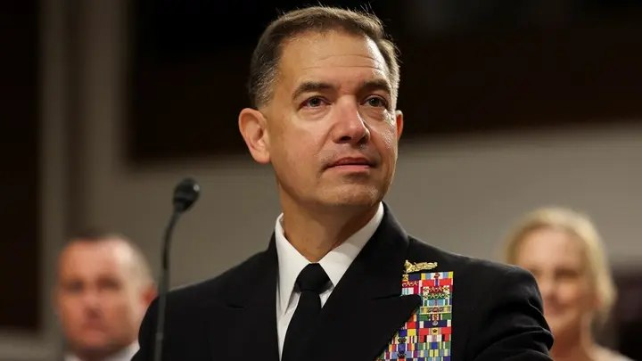

⭕️ ان‌بی‌سی نیوز گزارش می‌دهد که دریاسالار برد کوپر، فرمانده فرماندهی مرکزی ایالات متحده، به تازگی پشت درهای بسته به سناتورهای حامی بودجه پنتاگون توضیحاتی ارائه داده و به خاطر ارائه «جدی، دقیق و کامل» خود، مورد تحسین هر دو حزب قرار گرفته است.

با این حال، سناتورها معتقدند که ایران عمداً به بالگرد آپاچی AH-64 ارتش ایالات متحده حمله کرده و انتقام قریب‌الوقوع خواهد بود.

📝 Nick

📌 @persian_trend_official
پرشین ترند | متفاوت‌ترین کانال نظامی

## Persian_Trend_Official — post 16331

⭕️ ترامپ در مصاحبه با WSJ:

محاصره باعث شده رژیم «بسیار فقیر» شود و ما آن را تا زمانی که لازم باشد حفظ خواهیم کرد.

📝 Nick

📌 @persian_trend_official
پرشین ترند | متفاوت‌ترین کانال نظامی

## Persian_Trend_Official — post 16330

  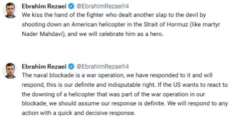

⭕️ سخنگوی کمیسیون امنیت ملی مجلس: به هر اقدام آمریکا پاسخ سریع و قاطع خواهیم داد.

📝 Nick

📌 @persian_trend_official
پرشین ترند | متفاوت‌ترین کانال نظامی

## Dirty_Kids — post 391508

  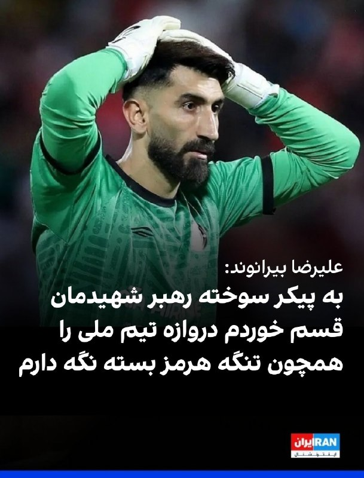

🔴 علیرضا بیرانوند: به پیکر سوخته رهبر شهیدمون قسم خوردم که دروازه تیم ملی رو توی جام جهانی، مثل تنگه هرمز بسته نگه دارم!

@Dirty_Kids 👻

## Dirty_Kids — post 391507

  <a href="telegram/content/Dirty_Kids_391507_1781037806.mp4" target="_blank">🎬 Download video</a>

فاصله عزت و نفرت، در مردمی یا حکومتی بودن است.

@Dirty_Kids 👻

## Dirty_Kids — post 391506

  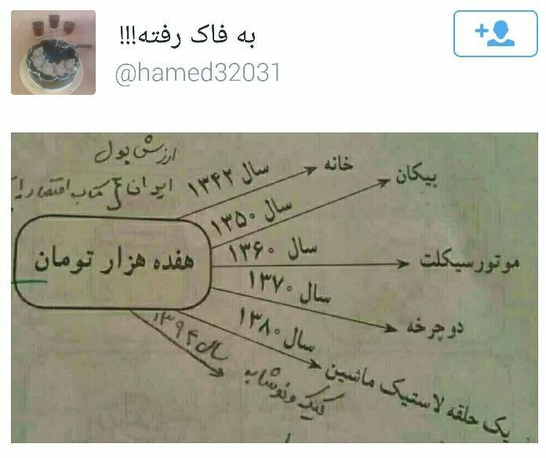

سال 2015 توئیتر فارسی

@Dirty_Kids 👻

## Dirty_Kids — post 391505

  <a href="telegram/content/Dirty_Kids_391505_1781037807.mp4" target="_blank">🎬 Download video</a>

من از ویدئوهای طنز فوتبالی این پسره خیلی خوشم اومده. کاملا در راستای سنت سینمایی باستر کیتون و جکی چانه

@Dirty_Kids 👻

## Dirty_Kids — post 391504

  <a href="telegram/content/Dirty_Kids_391504_1781037809.mp4" target="_blank">🎬 Download video</a>

🔴 دیروز توی مشهد یه دختر خودشو انداخته پایین که خودکشی کنه، اما میفته رو یه پسر بدبخت!

دختره خودش درجا فوت میشه، پسره ام به بیمارستان منتقل شده، یه سریا میگن قطع نخاع شده، یه سریام میگن فوت کرده!

@Dirty_Kids 👻

## alonews — post 126629

  <a href="telegram/content/alonews_126629_1781037809.webm" target="_blank">🎬 Download video</a>

👈مسکو در واکنش به رای شورای امنیت سازمان ملل به بررسی بازگشت تحریم‌ها علیه ایران : ما به شورای امنیت اجازه نخواهیم داد که تحت پوشش کمیته تحریم‌ها، تصمیماتی اتخاذ کند که محدودیت‌هایی را بر کشور‌های عضو اعمال کند

🔴 چین: تلاش برای بازگرداندن تحریم‌ها علیه ایران فاقد مبنای شورای امنیت است

✅ @AloNews خبر جنگ

---
📅 بروزرسانی: 1405/03/20 00:03
---

## VahidOOnLine — post 244570

  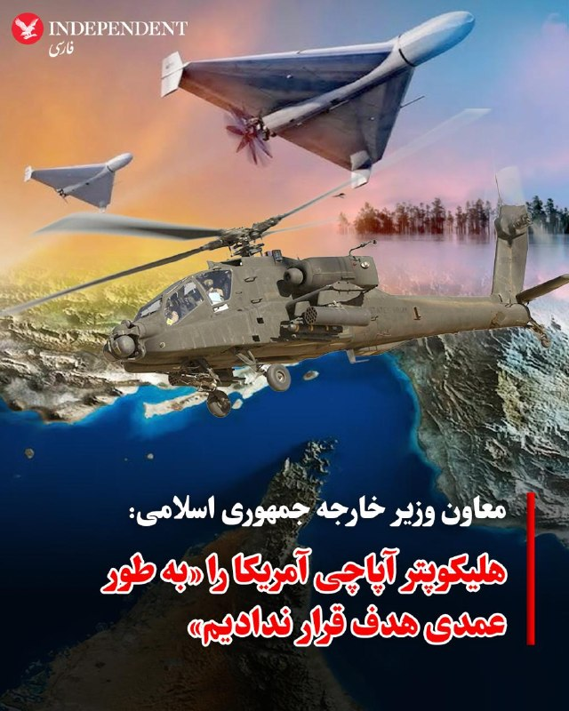

♦️معاون وزیر خارجه جمهوری اسلامی ایران، روز سه‌شنبه، ۱۹ خردادماه، در گفتگو با «الجزیره» اعلام کرد که هلیکوپتر آپاچی ارتش ایالات متحده که روز گذشته در تنگه هرمز سقوط کرد، به طور عمدی توسط ایران هدف قرار نگرفته است. این مقام رسمی با تاکید بر اینکه ایران پشت این حمله نبوده، در عین حال هشدار داد که به دلیل شرایط به شدت ملتهب و متشنج منطقه، ممکن است بروز چنین حوادثی در این فضا «عمدی» تلقی و تعبیر شود.
همزمان، دونالد ترامپ، رئیس‌جمهوری ایالات متحده، در گفتگوی تلفنی روز سه‌شنبه با روزنامه «وال‌استریت ژورنال» با کوچک جلوه دادن حادثه سقوط هلیکوپتر آپاچی گفت این اتفاق «مسئله چندان مهمی نبود» و تأکید کرد که «حال خلبان خوب است».
‌🇸🇦 Indypersian

🤖 @VahidOOnLine

## VahidOOnLine — post 244569

  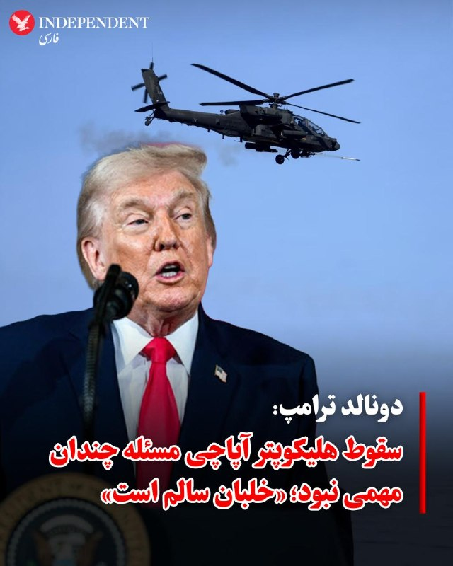

♦️دونالد ترامپ، رئیس‌جمهوری ایالات متحده، در گفتگوی تلفنی روز سه‌شنبه با روزنامه «وال‌استریت ژورنال» با اشاره به اثرات شدید تحریم‌ها اعلام کرد که محاصره دریایی بنادر ایران باعث شده این کشور «بسیار فقیر» شود و واشنگتن این محاصره را تا هر زمان که لازم باشد حفظ خواهد کرد. ترامپ همچنین با کوچک جلوه دادن حادثه سقوط اخیر هلیکوپتر آپاچی آمریکا گفت این اتفاق «مسئله چندان مهمی نبود» و تأکید کرد که «حال خلبان خوب است». بر اساس گزارش سنتکام، سرنشینان این آپاچی پیش از نجات، دو ساعت را در تاریکی شب روی آب سپری کردند و یک مقام ارشد آمریکایی فرار آن‌ها از این سانحه را معجزه‌ای همچون «دست خدا» توصیف کرده است. حادثه‌ای که بار دیگر خطرات تقابل جاری میان دو کشور در منطقه، از جمله هدف قرار گرفتن پهپادها و هواپیماهای آمریکایی توسط ایران را به تصویر می‌کشد.
‌🇸🇦 Indypersian

🤖 @VahidOOnLine

## WithYashar — post 14176

  <a href="telegram/content/WithYashar_14176_1781037194.mp4" target="_blank">🎬 Download video</a>

🎬 Video

## WithYashar — post 14175

  <a href="telegram/content/WithYashar_14175_1781037196.mp4" target="_blank">🎬 Download video</a>

🎬 Video

## WithYashar — post 14174

سخنگوی کمیسیون امنیت ملی مجلس تروریستی ج.ا :

دست آن رزمنده‌ای که در تنگه هرمز با سرنگونی هلیکوپتر آمریکایی (همچون شهید نادر مهدوی) سیلی دیگری به شیطان زد را می‌بوسیم، از او به عنوان یک قهرمان تجلیل خواهیم کرد.
@withyashar

## mwarmonitor — post 10548

  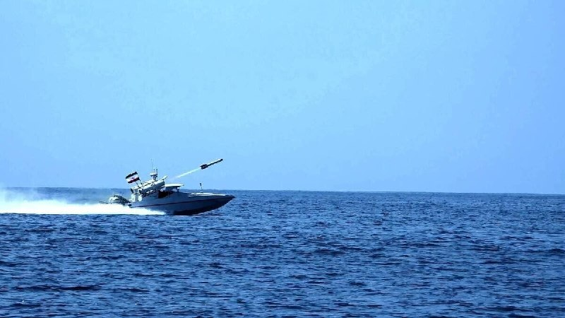

🔴برخی منابع غیررسمی ایرانی ادعا می‌کنند که بالگرد آپاچی آمریکایی توسط یک موشک زمین‌به‌هوا از نوع «Kowsar-222» سرنگون شده است؛ موشکی که گفته می‌شود از یک قایق تندرو ایرانی شلیک شده، در جریان درگیری بین این قایق‌ها و بالگردهای آپاچی.

@mwarmonitor

## mwarmonitor — post 10547

🔸 معاون وزیر خارجه ایران: ایران پشت حمله‌ای که بالگرد آپاچی آمریکایی بر فراز تنگه هرمز هدف آن قرار گرفت، نیست. @mwarmonitor

## FoxNewsTwitter — post 342773

Fox News (Twitter/X)

BREAKING: Karmelo Anthony broke down in tears after the verdict was read, crying and shaking as his defense attorney comforted him, @Brooketaylortv reports.

Anthony could now face up to life in prison.

During the sentencing phase, Anthony's mother pleaded with the jury for mercy, describing him as her firstborn son and expressing her deep love for him through tears.

Prosecutors cross-examained her by asking whether she could still maintain a relationship with her son if he were behind bars — unlike the Metcalf family.

The same jury will now decide how long Anthony remains in prison. | @WillCainShow

## IranIntlTV — post 341397

  <a href="telegram/content/IranIntlTV_341397_1781037199.mp4" target="_blank">🎬 Download video</a>

ایرانیان بریتانیا با تشکیل تجمعی در مقابل پارلمان این کشور در لندن،‌ روز سه‌شنبه خواستار تروریستی اعلام شدن سپاه و مقابله با جمهوری اسلامی شدند. آن‌ها پرچم‌های شیروخورشید و اسرائیل را در تجمع خود حمل کردند.

## IranianMinds — post 21965

  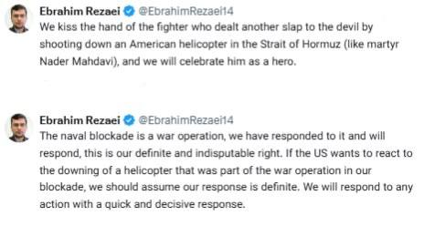

🔴 ابراهیم رضایی سخنگوی‌ کمیسیون امنیت ملی مجلس :

هرکی که بالگرد آمریکایی رو سرنگون کرده قهرمانه !

@IranianMinds

## IranianMinds — post 21964

🔴 ترامپ :

جام جهانی خیلی خوبی خواهیم داشت و بزودی پایان جنگ و پیروزیمون بر ایران رو هم اعلام میکنم.

@IranianMinds

## alonews — post 126628

  <a href="telegram/content/alonews_126628_1781037201.webm" target="_blank">🎬 Download video</a>

👈سخنگوی کمیسیون امنیت ملی مجلس: به هر اقدام آمریکا پاسخ سریع و قاطع خواهیم داد

✅ @AloNews خبر جنگ

## alonews — post 126627

  <a href="telegram/content/alonews_126627_1781037201.webm" target="_blank">🎬 Download video</a>

👈 وزیر خارجه انگلیس: خواستار مذاکرات موفق ایران و آمریکا هستیم

🔴 می‌خواهیم شاهد پایان سریع و موفقیت‌آمیز مذاکرات بین ایران و آمریکا باشیم.

🔴 تجارت جهانی از طریق تنگه هرمز باید به سرعت از سر گرفته شود.

✅ @AloNews خبر جنگ

---
📅 بروزرسانی: 1405/03/19 23:53
---

## WithYashar — post 14173

جی‌دی ونس، معاون رئیس‌جمهور آمریکا، اعلام کرد واشنگتن به دستیابی به توافق با ایران نزدیک شده است.
ونس گفت:
«ممکن است این توافق هفته آینده حاصل شود، یا شاید چند ماه دیگر.»
@withyashar

## WithYashar — post 14172

ترامپ به وال استریت ژورنال: حادثه هلیکوپتر آپاچی موضوع جدی نیست و خلبان حالش خوب است!

ترامپ: به زودی پایان جنگ و پیروزی آمریکا بر ایران را اعلام میکنم امسال جام جهانی خوبی خواهیم داشت.

ترامپ: محاصره ایران رو به شدت فقیر میکنه و تا زمانی که نیاز باشه ادامه داره.
@withyashar
🚨«این خبر ‌وال استریت ژورنال مال قبل از پست تهدید ترامپ در تروث است»

## WithYashar — post 14171

خبرنگار: شما گفتید آمریکا باید به سرنگونی آپاچی پاسخ دهد، آیا هنوز هم این نظر را دارید؟

ترامپ: من مجبور نیستم کاری انجام دهم، ما همه کارت‌ها را در دست داریم. مجبور نیستم این کار را بکنم اما ببینید، احتمالاً این کار را خواهیم کرد، باشه؟
@withyashar

## WithYashar — post 14170

🚨🚨🚨ترامپ درباره ایران به ABC:

یک نفر باید همه آن زیرساخت‌ها را بسازد، پل‌های جدید، فلان چیز جدید، نیروگاه‌های جدید... آنها از یک تریلیون دلار صحبت می‌کنند، احتمالاً بیشتر...
@withyashar

## mwarmonitor — post 10546

🔴رسانه‌های اسرائیلی: شلیک یک موشک از یمن رصد شد. @mwarmonitor

## pm_afshaa — post 93070

  <a href="telegram/content/pm_afshaa_93070_1781036592.webm" target="_blank">🎬 Download video</a>

🔴جی‌دی ونس، معاون ترامپ:
آمریکا به توافق با ایران نزدیک شده، ممکنه این توافق همین هفته نهایی بشه، یا شاید هم چند ماه دیگه طول بکشه.‌

💧 Rainbet.com the #1 Non-KYC Crypto Casino & Sportsbook @rainbetcom

😁 @Pm_Afshaa

## pm_afshaa — post 93069

  <a href="telegram/content/pm_afshaa_93069_1781036593.webm" target="_blank">🎬 Download video</a>

🔴العربیه: ایران به واسطه‌ها اعلام کرده حادثه پیش اومده برای هلیکوپتر آمریکا عمدی نبوده و علاقه مند به مسیر دیپلوماسی است.

💧 Rainbet.com the #1 Non-KYC Crypto Casino & Sportsbook @rainbetcom

😁 @Pm_Afshaa

## pm_afshaa — post 93068

  <a href="telegram/content/pm_afshaa_93068_1781036594.webm" target="_blank">🎬 Download video</a>

🔴ترامپ به وال استریت ژورنال: حادثه هلیکوپتر آپاچی موضوع جدی نیست و خلبان حالش خوبه! 
💧 Rainbet.com the #1 Non-KYC Crypto Casino & Sportsbook @rainbetcom 
😁 @Pm_Afshaa

## pm_afshaa — post 93067

  <a href="telegram/content/pm_afshaa_93067_1781036594.webm" target="_blank">🎬 Download video</a>

🔴ترامپ: محاصره ایران رو به شدت فقیر میکنه و تا زمانی که نیاز باشه ادامه داره.

💧 Rainbet.com the #1 Non-KYC Crypto Casino & Sportsbook @rainbetcom

😁 @Pm_Afshaa

## IranIntlTV — post 341396

  <a href="telegram/content/IranIntlTV_341396_1781036595.mp4" target="_blank">🎬 Download video</a>

بن سبطی، پژوهشگر ایران و اسرائیل، درباره تاثیر حملات جمهوری اسلامی در معادلات اسرائیل در لبنان گفت: «بین حزب‌الله و اسرائیل انقدر دشمنی زیاد است که هیچ گروهی از بیرون نمی‌تواند تنش‌های بین آنها را خاموش کند.»
@iranintltv

## Persian_Trend_Official — post 16329

  <a href="telegram/content/Persian_Trend_Official_16329_1781036597.webm" target="_blank">🎬 Download video</a>

رسانه‌ها از شلیک یک موشک بالستیک توسط انصارالله یمن به سمت اسرائیل خبر می‌دهند.

👺Phantom

📌 @persian_trend_official
پرشین ترند | متفاوت‌ترین کانال نظامی

## Persian_Trend_Official — post 16328

  <a href="telegram/content/Persian_Trend_Official_16328_1781036598.webm" target="_blank">🎬 Download video</a>

حمله راکتی حزب‌الله به شمال اسرائیل

👺Phantom

📌@persian_trend_official
پرشین ترند | متفاوت‌ترین کانال نظامی

## IranianMinds — post 21963

  

🔴 ترامپ : موضوع سقوط بالگرد اپاچی چیزه خیلی مهمی نیست و خلبانانمون هم سالمن. @IranianMinds

## IranianMinds — post 21962

  <a href="telegram/content/IranianMinds_21962_1781036599.mp4" target="_blank">🎬 Download video</a>

🔴 جی‌دی ونس :

توافق ممکنه همین هفته با ایران انجام بشه ، یا شایدم ماه ها طول بکشه دقیق نمیدونیم.

@IranianMinds

## IranianMinds — post 21961

  <a href="telegram/content/IranianMinds_21961_1781036601.mp4" target="_blank">🎬 Download video</a>

🔴 جی‌دی ونس، معاون ترامپ :

آمریکا و ایران به توافق نزدیک شده‌اند.

این توافق ممکن است هفته آینده یا حتی چند ماه دیگر نهایی شود.

هنوز کارهایی برای انجام دادن باقی مانده، اما پیشرفت قابل توجهی حاصل شده است.

@IranianMinds

## BBCPersian — post 283271

🔻انتقاد ایران از آمریکا و سه کشور اروپایی بابت تنظیم پیش‌نویس قطعنامه‌ تازه در شورای حکام آژانس

ایران از آمریکا، بریتانیا، فرانسه و آلمان بابت تنظیم پیش‌نویس قطعنامه‌ تاز‌ای در شورای حکام آژانس بین المللی انرژی اتمی به تندی انتقاد کرده است.

کاظم غریب ‌آبادی، معاون وزارت خارجه ایران، با اشاره به حملات اسرائیل و آمریکا به تاسیسات هسته‌ای ایران، در ایکس نوشته است که این پیش‌نویس «تلاشی خطرناک برای پاک‌سازی و سفیدشویی مسئولیت متجاوزان و جنایتکاران است.»

معاون وزیر خارجه ایران نوشت که حملات اسرائیل و آمریکا «فعالیت‌های راستی‌آزمایی را متوقف و بازرسان آژانس را به دلایل ایمنی از ایران خارج کرد. اکنون آمریکا می‌خواهد آثار حمله غیرقانونی خود را به پرونده‌ای علیه جمهوری اسلامی ایران تبدیل کند.»

نشست فصلی شورای حکام آژانس قرار است هفته آینده در وین برگزار شود و از جمله موضوع برنامه اتمی ایران را بررسی کند.

این اولین نشست آژانس پس از جنگ ۴۰ روزه اخیر است که در یک آتش‌بس شکننده قرار دارد.

در گزارشی که رافائل گروسی، مدیرکل آژانس به شورای حکام داده و بخش‌هایی از آن به رسانه‌ها درز کرده، آژانس بار دیگر از ایران خواسته که وضعیت نامعلوم ذخایر اورانیوم غنی‌شده را روشن کند.

https://bbc.in/4xi5EkZ
@BBCPersian

## alonews — post 126626

  <a href="telegram/content/alonews_126626_1781036603.webm" target="_blank">🎬 Download video</a>

👈تصاویر چندین انفجار در نجف عراق

✅ @AloNews خبر جنگ

## alonews — post 126625

  <a href="telegram/content/alonews_126625_1781036603.webm" target="_blank">🎬 Download video</a>

👈جی‌دی ونس: به توافق با ایران نزدیک هستیم؛ شاید هفته آینده، شاید چند ماه دیگر...!

✅ @AloNews خبر جنگ

## alonews — post 126624

  <a href="telegram/content/alonews_126624_1781036603.webm" target="_blank">🎬 Download video</a>

👈 ترامپ به واشنگتن پست گفت که محاصره باعث شده ایران «بسیار فقیر» شود و گفت آن را تا زمانی که لازم باشد در جای خود نگه خواهد داشت.

✅ @AloNews خبر جنگ

## alonews — post 126623

  <a href="telegram/content/alonews_126623_1781036603.webm" target="_blank">🎬 Download video</a>

👈دونالد ترامپ در گفتگو با وال‌استریت ژورنال، درباره حادثه سقوط بالگرد آپاچی گفت که "مسئله خیلی مهمی نیست" و افزود که خلبان حالش خوب است.

✅ @AloNews خبر جنگ

## alonews — post 126622

  <a href="telegram/content/alonews_126622_1781036604.webm" target="_blank">🎬 Download video</a>

🔴فوری /شلیک موشک از خاک یمن به سمت اسرائیل 
✅ @AloNews خبر جنگ

---
📅 بروزرسانی: 1405/03/19 23:43
---

## WithYashar — post 14169

منابع آمریکایی و اسرائیلی ادعا می‌کنند که اقدام نظامی قریب‌الوقوع آمریکا علیه ایران ظرف چند ساعت آینده انجام خواهد شد و آن را حرکتی بزرگ با دامنه نامحدود می‌نامند.
@withyashar

## mwarmonitor — post 10545

🔴رسانه‌های اسرائیلی: شلیک یک موشک از یمن رصد شد.

@mwarmonitor

## mwarmonitor — post 10544

🔴«لحظاتی پیش از سوی ارتش بزرگمان به من اطلاع داده شد که دیشب ایرانی‌ها یکی از هلیکوپترهای آپاچی بسیار پیشرفته ما را در حال گشت‌زنی بر فراز تنگه هرمز سرنگون کرده‌اند. دو خلبان در این حادثه حضور داشتند که هر دو سالم و بدون آسیب‌دیدگی هستند. با این وجود، ایالات…

## pm_afshaa — post 93066

  <a href="telegram/content/pm_afshaa_93066_1781036017.webm" target="_blank">🎬 Download video</a>

🔴ترامپ به وال استریت ژورنال:
حادثه هلیکوپتر آپاچی موضوع جدی نیست و خلبان حالش خوبه!

💧 Rainbet.com the #1 Non-KYC Crypto Casino & Sportsbook @rainbetcom

😁 @Pm_Afshaa

## Persian_Trend_Official — post 16327

  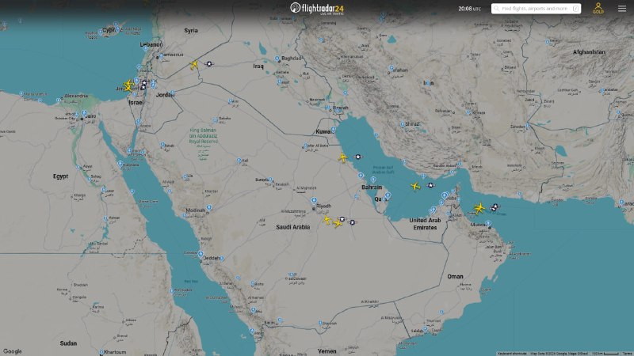

هم اکنون 9 سوخت‌رسان در آسمان منطقه 📝 Nick 📌 @persian_trend_official پرشین ترند | متفاوت‌ترین کانال نظامی

## Persian_Trend_Official — post 16326

  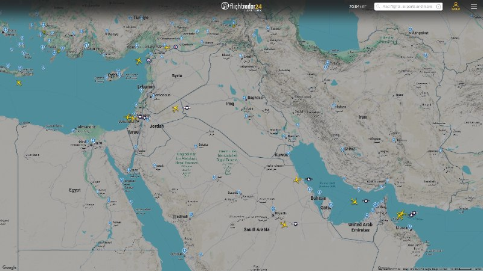

هم اکنون 9 سوخت‌رسان در آسمان منطقه

📝 Nick

📌 @persian_trend_official
پرشین ترند | متفاوت‌ترین کانال نظامی

## IranianMinds — post 21960

🔴 ترامپ : موضوع سقوط بالگرد اپاچی چیزه خیلی مهمی نیست و خلبانانمون هم سالمن. @IranianMinds

## IranianMinds — post 21959

  

🔴 ترامپ :

موضوع سقوط بالگرد اپاچی چیزه خیلی مهمی نیست و خلبانانمون هم سالمن.

@IranianMinds

## IranianMinds — post 21958

🔴پیت هگست، وزیر جنگ آمریکا هم پست ترامپ رو در صفحه خودش منتشر کرد. @IranianMinds

## alonews — post 126621

  <a href="telegram/content/alonews_126621_1781036020.webm" target="_blank">🎬 Download video</a>

🔴فوری/ خبرنگار: شما گفتید آمریکا باید به سرنگونی آپاچی پاسخ دهد، آیا هنوز هم این نظر را دارید؟

🔴 ترامپ: من مجبور نیستم کاری انجام دهم، ما همه کارت‌ها را در دست داریم. مجبور نیستم این کار را بکنم اما ببینید، احتمالاً این کار را خواهیم کرد، باشه؟

✅ @AloNews خبر جنگ

## alonews — post 126620

  <a href="telegram/content/alonews_126620_1781036020.webm" target="_blank">🎬 Download video</a>

👈ترامپ درباره ایران به ABC: یک نفر باید همه آن زیرساخت‌ها را بسازد، پل‌های جدید، فلان چیز جدید، نیروگاه‌های جدید... آنها از یک تریلیون دلار صحبت می‌کنند، احتمالاً بیشتر...

✅ @AloNews خبر جنگ

## alonews — post 126619

  <a href="telegram/content/alonews_126619_1781036021.webm" target="_blank">🎬 Download video</a>

👈ترامپ: به زودی پایان جنگ و پیروزی آمریکا بر ایران را اعلام میکنم امسال جام جهانی خوبی خواهیم داشت

✅ @AloNews خبر جنگ

## alonews — post 126618

  <a href="telegram/content/alonews_126618_1781036021.webm" target="_blank">🎬 Download video</a>

🔴فوری /شلیک موشک از خاک یمن به سمت اسرائیل

✅ @AloNews خبر جنگ

---
📅 بروزرسانی: 1405/03/19 23:33
---

## VahidOOnLine — post 244568

  

رضا دالمن، دانشجوی کارشناسی ارشد مهندسی کامپیوتر دانشگاه صنعتی شریف، با حکم شورای انضباطی این دانشگاه به اخراج و محرومیت چهار ساله از تحصیل در تمامی دانشگاه‌های کشور محکوم شد.

سایت هرانا، به نقل از انجمن اسلامی دانشجویان دانشگاه صنعتی شریف گزارش داد این حکم پس از تایید در شورای تجدیدنظر دانشگاه، برای اجرا به وزارت علوم ارسال شده است.

بر اساس این حکم، دالمن، ورودی سال ۱۴۰۲ مقطع کارشناسی ارشد مهندسی کامپیوتر، به اخراج از دانشگاه و محرومیت از تحصیل در همه دانشگاه‌ها به مدت چهار سال محکوم شده است.

دادبان پیش‌تر نوشته بود رضا دالمن، دانشجوی ۲۴ ساله دانشگاه صنعتی شریف، شب سال نو ۱۴۰۵ با اتهام آویختن عروسک موش به درخت بازداشت شد.

به نوشته هرانا، دالمن ۲۸ اسفند ۱۴۰۴ به دست نیروهای امنیتی بازداشت شد و حدود یک ماه بعد با تودیع وثیقه آزاد شد.

روزنامه فرهیختگان نیز بدون نام بردن کامل از او، از تایید حکم اخراج «ر.د» در شورای تجدیدنظر دانشگاه شریف خبر داد و او را به «برهم‌زدن نظم»، «تخریب اموال عمومی» و «فحاشی و هتاکی به رهبر شهید انقلاب» متهم کرد.
‌🏁 🇬🇧 IranintlTV

🤖 @VahidOOnLine

## WithYashar — post 14168

## WithYashar — post 14167

معاون وزیر امور خارجه رژیم جمهوری اسلامی با ترس به الجزیره گفت: ایران پشت حمله به یک هلیکوپتر آپاچی آمریکایی در تنگه هرمز نیست.
@withyashar

## FoxNewsTwitter — post 342772

  

Fox News (Twitter/X)

BREAKING: Karmelo Anthony has been found guilty in the murder of Austin Metcalf.

Anthony admitted to stabbing Metcalf but claimed he acted in self-defense.

The verdict follows days of emotional testimony from student athletes, police officers, forensic experts, and coaches who described the confrontation that ended with Metcalf's death on April 2, 2025.

More than 100 protesters — split between supporters of Metcalf and Anthony — packed the area outside the courthouse ahead of the verdict. Tensions flared and the two sides clashed before the jury's decision was read.

## pm_afshaa — post 93065

  <a href="telegram/content/pm_afshaa_93065_1781035394.webm" target="_blank">🎬 Download video</a>

🔴معاون وزیر خارجه جمهوری اسلامی به الجزیره:

هیچ هدفگیری عمدی از سوی ایران علیه بالگرد آمریکایی در تنگه هرمز صورت نگرفته؛ این احتمال وجود داره که چنین حوادثی به دلیل فضای پرتنش در تنگه هرمز به صورت غیرعمد رخ بده.

💧 Rainbet.com the #1 Non-KYC Crypto Casino & Sportsbook @rainbetcom

😁 @Pm_Afshaa

## pm_afshaa — post 93064

  <a href="telegram/content/pm_afshaa_93064_1781035395.webm" target="_blank">🎬 Download video</a>

🔴وقوع 3 انفجار در نجف عراق.

💧 Rainbet.com the #1 Non-KYC Crypto Casino & Sportsbook @rainbetcom

😁 @Pm_Afshaa

## IranIntlTV — post 341395

  <a href="https://t.me/IranintlTV/341395" target="_blank">📎 Download file</a>

🎧نسخه صوتی ‌‌‏۲۴ با فرداد فرحزاد: ترامپ: به سرنگونی هلیکوپتر توسط جمهوری اسلامی پاسخ می‌دهیم
@iranintlTV

## IranIntlTV — post 341394

  

رضا دالمن، دانشجوی کارشناسی ارشد مهندسی کامپیوتر دانشگاه صنعتی شریف، با حکم شورای انضباطی این دانشگاه به اخراج و محرومیت چهار ساله از تحصیل در تمامی دانشگاه‌های کشور محکوم شد.

سایت هرانا، به نقل از انجمن اسلامی دانشجویان دانشگاه صنعتی شریف گزارش داد این حکم پس از تایید در شورای تجدیدنظر دانشگاه، برای اجرا به وزارت علوم ارسال شده است.

بر اساس این حکم، دالمن، ورودی سال ۱۴۰۲ مقطع کارشناسی ارشد مهندسی کامپیوتر، به اخراج از دانشگاه و محرومیت از تحصیل در همه دانشگاه‌ها به مدت چهار سال محکوم شده است.

دادبان پیش‌تر نوشته بود رضا دالمن، دانشجوی ۲۴ ساله دانشگاه صنعتی شریف، شب سال نو ۱۴۰۵ با اتهام آویختن عروسک موش به درخت بازداشت شد.

به نوشته هرانا، دالمن ۲۸ اسفند ۱۴۰۴ به دست نیروهای امنیتی بازداشت شد و حدود یک ماه بعد با تودیع وثیقه آزاد شد.

روزنامه فرهیختگان نیز بدون نام بردن کامل از او، از تایید حکم اخراج «ر.د» در شورای تجدیدنظر دانشگاه شریف خبر داد و او را به «برهم‌زدن نظم»، «تخریب اموال عمومی» و «فحاشی و هتاکی به رهبر شهید انقلاب» متهم کرد.
https://iranintl.com/202606099963

## FarsiVOA — post 220163

  <a href="telegram/content/FarsiVOA_220163_1781035396.mp4" target="_blank">🎬 Download video</a>

⚡️بررسی پرونده اتمی جمهوری اسلامی در آژانس و قطعنامه شورای حکام؛ گفت‌وگو با مهران مصطفوی
@FarsiVOA

## DW_Farsi — post 125741

🎥تجمع ایرانیان مقابل "سازمان ملل" در بن در اعتراض به اعدام‌ها

جمعی از ایرانیان مقیم آلمان روز دوشنبه ۱۸ خرداد (۸ ژوئن) به فراخوان "اتحاد کلن در همبستگی با مردم ایران" مقابل ساختمان سازمان ملل در شهر بن تجمع کردند و خواستار اقدام فوری جامعه جهانی برای توقف اعدام‌ها در ایران شدند.

برگزارکنندگان در این تجمع، نامه‌ای به همراه فهرستی از زندانیان در معرض خطر اعدام را برای ارائه به شورای حقوق بشر سازمان ملل آماده کرده بودند. در این ویدیو، فعالان و شرکت‌کنندگان از اهداف این تجمع و تأثیر اعدام‌ها بر زندانیان و خانواده‌های آنان می‌گویند.

@dw_farsi

## Persian_Trend_Official — post 16325

  <a href="telegram/content/Persian_Trend_Official_16325_1781035398.webm" target="_blank">🎬 Download video</a>

شنیده شدن صدای 3 انفجار در نجف عراق

## Persian_Trend_Official — post 16324

  <a href="telegram/content/Persian_Trend_Official_16324_1781035398.mp4" target="_blank">🎬 Download video</a>

فعالیت جنگنده ها در آسمان کردستان عراق

## Persian_Trend_Official — post 16323

  <a href="telegram/content/Persian_Trend_Official_16323_1781035399.mp4" target="_blank">🎬 Download video</a>

اربیل عراق زیر آتش سنگین

جنگنده های آمریکایی‌ها در تلاش برای رهگیری پرتابه های ایرانی هستند.

همزمان جنگنده های ارتش در حال گشت زنی در مرزایران هستند.

## Persian_Trend_Official — post 16322

  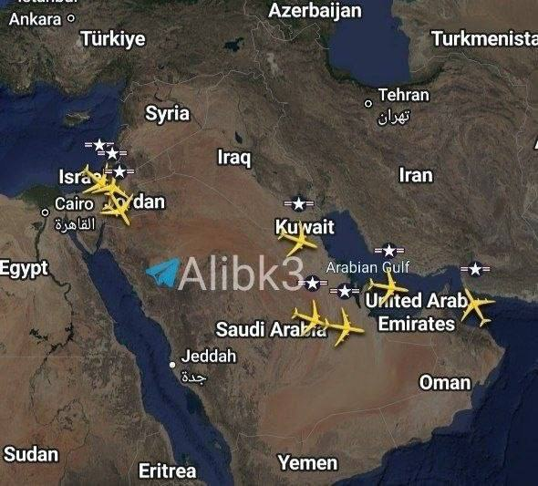

فعالیت حداقل 9 سوخترسان ایالات متحده در نزدیکی سواحل ایران و منطقه

## Persian_Trend_Official — post 16321

تهران در حال حاضر شاهد اختلالات گسترده در GPS و جعل سیگنال‌های ناوبری (Spoofing) است.

## BBCPersian — post 283270

  <a href="telegram/content/BBCPersian_283270_1781035401.mp4" target="_blank">🎬 Download video</a>

آخرین خبرهای مهم روز سه‌شنبه ۱۹ خرداد ماه ۱۴۰۵ از تلویزیون بی‌بی‌سی فارسی

https://bbc.in/42XnQmy
https://bbc.in/3WtLd3k
@BBCPersian

## alonews — post 126617

  <a href="telegram/content/alonews_126617_1781035403.webm" target="_blank">🎬 Download video</a>

👈هشدار فرانسه در شورای حکام: جمهوری اسلامی ایران مقدار بسیار زیادی انباشت اورانیوم غنی شده در اختیار دارد و مشخص نیست چیکارش کرده و کجاست، همکاری فوری جمهوری اسلامی با آژانس بین‌المللی انرژی اتمی ضروری است.

✅ @AloNews خبر جنگ

## alonews — post 126616

  <a href="telegram/content/alonews_126616_1781035403.webm" target="_blank">🎬 Download video</a>

👈روزنامه نیویورک پست گزارش داد که هزینه بالگردهای مدل AH-64 «آپاچی» بیش از ۳۵ میلیون دلار برای هر فروند است و ادعا کرد که این بالگردها در سراسر دریای عمان و تنگه برای اعمال محاصره به عملیات مشغول هستند.

✅ @AloNews خبر جنگ

---
📅 بروزرسانی: 1405/03/19 23:23
---

## WithYashar — post 14166

پست جدید از آخرین وضعیت و اتفاقات پیش رو کارهای اداریش را انجام بدید. کلیک کنید.💥💥😁 https://www.instagram.com/reel/DZYFeVJS_V2/?igsh=MWNobm81Z282cWtmZQ==

## WithYashar — post 14165

  <a href="telegram/content/WithYashar_14165_1781034788.mp4" target="_blank">🎬 Download video</a>

اتاق جنگ با یاشار : اختلال GPS
@withyashar

## mwarmonitor — post 10543

💥صدای انفجار در نجف شنیده شد.

## FoxNewsTwitter — post 342771

  <a href="telegram/content/FoxNewsTwitter_342771_1781034790.mp4" target="_blank">🎬 Download video</a>

Fox News (Twitter/X)

BREAKING: A jury has found Karmelo Anthony guilty in the murder of 17-year-old Austin Metcalf.

Anthony admitted to stabbing Metcalf but claimed he acted in self-defense.

Witnesses testified that Metcalf and other student-athletes repeatedly asked Anthony to leave a Memorial High School team tent during a rain delay at the track meet.

Students said Anthony responded with threats and became increasingly confrontational before a brief physical altercation ended when Metcalf was stabbed in the chest. | @TheStoryFNC @marthamaccallum

## pm_afshaa — post 93063

  <a href="telegram/content/pm_afshaa_93063_1781034792.webm" target="_blank">🎬 Download video</a>

🔴ترامپ به ای‌بی‌سی: حمله اسرائیل به ایران غیر ضروری بود ولی خب من درک میکنم که چرا نتانیاهو این تصمیم رو‌ گرفت.

💧 Rainbet.com the #1 Non-KYC Crypto Casino & Sportsbook @rainbetcom

😁 @Pm_Afshaa

## pm_afshaa — post 93062

🔴یک هواپیمای سوخت‌رسان آمریکایی در شیراز مشاهده شد

💧 Rainbet.com the #1 Non-KYC Crypto Casino & Sportsbook @rainbetcom

😁 @Pm_Afshaa

## pm_afshaa — post 93061

♨️
♨️
♨️

## pm_afshaa — post 93060

🔴منابع اطلاعاتی در آمریکا: ما حرکات موشکی در غرب ایران را شناسایی می‌کنیم، ممکن است نیاز باشد در زمان بسیار کوتاه اقدام کنیم

💧 Rainbet.com the #1 Non-KYC Crypto Casino & Sportsbook @rainbetcom

😁 @Pm_Afshaa

## IranIntlTV — post 341393

  <a href="telegram/content/IranIntlTV_341393_1781034793.mp4" target="_blank">🎬 Download video</a>

دونالد ترامپ گفت به او اطلاع داده شده است که جمهوری اسلامی یکی از بالگردهای بسیار پیشرفته آپاچی را در حالی که بر فراز تنگه هرمز در حال گشت‌زنی بود، سرنگون کرده است.

ارزیابی شهیر شهیدثالث، تحلیلگر روابط بین‌الملل و مسائل ایران و فرزین ندیمی، پژوهشگر ارشد امور دفاعی و امنیتی
@iranintltv

## Shin_Persian — post 6792

Shin ✓ @hey_itsmyturn
Tue, 09 Jun 2026 19:51:40 UTC

3 explosions heard in Najaf, #Iraq 🇮🇶

فارسی

۳ انفجار در نجف، #Iraq شنیده شد 🇮🇶

𝕏 · @shin_persian

## Shin_Persian — post 6791

Shin ✓ @hey_itsmyturn
Tue, 09 Jun 2026 19:43:13 UTC

The Islamic Regime is completely ready to intercept any incoming missile or bomb with their buildings without any hesitation.

فارسی

رژیم اسلامی کاملاً آماده است تا بدون هیچ تردیدی هر موشک یا بمب ورودی را با ساختمان‌های خود رهگیری کند.

𝕏 · @shin_persian

## Persian_Trend_Official — post 16320

شنیده شدن صدای 3 انفجار در نجف عراق

## Persian_Trend_Official — post 16319

  <a href="telegram/content/Persian_Trend_Official_16319_1781034796.webm" target="_blank">🎬 Download video</a>

🎬 Video

## Persian_Trend_Official — post 16318

  <a href="telegram/content/Persian_Trend_Official_16318_1781034797.webm" target="_blank">🎬 Download video</a>

شورای امنیت رأی‌گیری درباره قطعنامه 1737 را پیش برد و با 11 رأی موافق، بررسی بازگشت تحریم‌ها علیه جمهوری اسلامی ایران را تصویب کرد.

👺Phantom

📌 @persian_trend_official
پرشین ترند | متفاوت‌ترین کانال نظامی

## Dirty_Kids — post 391503

  

‏اگه آدرنالین تون اومده پایین و نیاز به هیجان و استرس دارین سرتونو درد نیارین برید اینو ببینین.
پر از هیجان و تنش درباره عملیات سرقت و زندانی کردن گروگان ها داخل یه بانک کوچیک! باور کنین این سریال بهترین انتخابتون خواهد بود.

@Dirty_Kids 👻

## Dirty_Kids — post 391502

  <a href="telegram/content/Dirty_Kids_391502_1781034798.mp4" target="_blank">🎬 Download video</a>

پیش‌بینی جالب یه پیج خارجی از نتایج جا‌م‌جهانی :)))

@Dirty_Kids 👻

## Dirty_Kids — post 391501

  <a href="telegram/content/Dirty_Kids_391501_1781034800.mp4" target="_blank">🎬 Download video</a>

🔴 جواب مراد ویسی به اینکه مجتبی کجاست😂

@Dirty_Kids 👻

## Dirty_Kids — post 391500

🔴 فرودگاه‌های تهران تخلیه شد

@Dirty_Kids 👻

## Hranews — post 113506

محکومیت احمد سرپرست و ایوب پوررضازاده پایان یافت

❗️
❗️
❗️
❗️
❗️ – دوران محکومیت احمد (یوحنا) سرپرست و ایوب (فرزین) پوررضازاده، دو نوکیش مسیحی که بخشی از آن را در قالب طرح «رأی باز» سپری کرده بودند، به پایان رسید.

ادامه مطلب

#احمد_سرپرست
#یوحنا_سرپرست
#ایوب_پوررضازاده
#فرزین_پوررضازاده

↘️
@hranews_bot تماس ✉️ -  @Hranews  کانال هرانا 🆑

## alonews — post 126615

  <a href="telegram/content/alonews_126615_1781034800.webm" target="_blank">🎬 Download video</a>

👈گزارش ها از شنیده شدن صدای 3 انفجار در نجف عراق

✅ @AloNews خبر جنگ

## alonews — post 126614

  <a href="telegram/content/alonews_126614_1781034801.webm" target="_blank">🎬 Download video</a>

👈معاون وزیر خارجه ایران به الجزیره:
ایران پشت حمله به بالگرد آمریکایی آپاچی در بالای تنگه هرمز نیست.

🔴این احتمال وجود دارد که چنین حوادثی به دلیل فضای پرتنش در تنگه هرمز به صورت غیرعمد رخ دهند.

🔴هیچ هدفگیری عمدی از سوی ایران علیه بالگرد آمریکایی در بالای تنگه هرمز صورت نگرفته است.

✅ @AloNews خبر جنگ

## alonews — post 126613

  <a href="telegram/content/alonews_126613_1781034801.webm" target="_blank">🎬 Download video</a>

👈ترامپ به ABC : حمله اخیر اسرائیل به ایران لازم نبود، ولی انگیزه‌های اسرائیل رو می‌فهمم

🔴به نتانیاهو گفتم کاری نکنه که به مذاکرات با ایران ضربه بزنه

✅ @AloNews خبر جنگ

## alonews — post 126612

  <a href="telegram/content/alonews_126612_1781034801.webm" target="_blank">🎬 Download video</a>

👈 رویترز: تردد کشتی‌ها در تنگه هرمز

✅ @AloNews خبر جنگ

---
📅 بروزرسانی: 1405/03/19 23:13
---

## VahidOOnLine — post 244567

زهیر امیرخانی، ۳۴ ساله، شامگاه ۱۸ دی در بلوار طاق‌بستان در حالی که با دوربین مشغول فیلم‌برداری از اعتراضات بود، هدف گلوله نیروهای حکومتی قرار گرفت.
او در لحظه تصویربرداری شعار می‌داد: «بترسید، بترسید، ما همه با هم هستیم.»

زهیر پس از این حادثه به بیمارستان منتقل شد و حدود یک هفته بعد بر اثر شدت جراحات جان باخت.
‌🏁 🇬🇧 IranintlTV

🤖 @VahidOOnLine

## WithYashar — post 14164

شورای امنیت رأی‌گیری درباره قطعنامه ۱۷۳۷ را پیش برد و با ۱۱ رأی موافق، بررسی بازگشت تحریم‌ها علیه جمهوری اسلامی ایران را تصویب کرد.

بریتانیا از فعال شدن تمام تحریم علیه  ایران استقبال کرد.
@withyashar

## WithYashar — post 14163

پست جدید از آخرین وضعیت و اتفاقات پیش رو کارهای اداریش را انجام بدید. کلیک کنید.💥💥😁 https://www.instagram.com/reel/DZYFeVJS_V2/?igsh=MWNobm81Z282cWtmZQ==

## WithYashar — post 14162

خبرنگار یدیعوت آحارونوت: حملات آمریکا جوری خواهد بود هیچکس حتی فکرشو نمیکنه
@withyashar

## mwarmonitor — post 10542

🔸 معاون وزیر خارجه ایران: ایران پشت حمله‌ای که بالگرد آپاچی آمریکایی بر فراز تنگه هرمز هدف آن قرار گرفت، نیست.

@mwarmonitor

## mwarmonitor — post 10541

  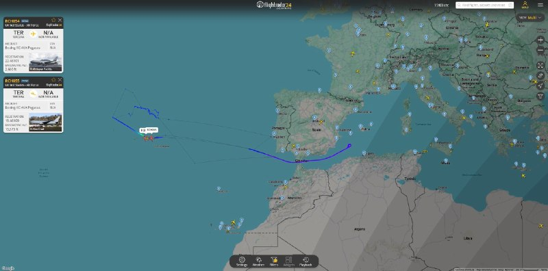

⚠️الگو پروازی مهم ⚠️

✈️دو تانکر از ترسیرا (Terceira) برخاسته‌اند. از علامت تماس REACH قبلاً برای مأموریت‌های بمباران استفاده شده است. تانکرهای مستقر در ترسیرا در حملات ۲۸ فوریه هم استفاده شده بودند و مطمئنم دفعات بی‌شمار دیگری هم

‼️با توجه به آخرین اظهارات ترامپ، فکر می‌کنم این یک عملیات فعال است. اگر همین‌طور باشد، به‌زودی متوجه خواهیم شد.

Boeing KC-46A Pegasus، دو فروند

RCH054 - 22-46101
RCH055 - 19-46109

@mwarmonitor

## pm_afshaa — post 93058

🔴العربیه به نقل از یه مقام آمریکایی :
شواهد و نشونه‌ها نشون می‌ده که ایران بالگرد رو عمداً هدف قرار داده بوده

💧 Rainbet.com the #1 Non-KYC Crypto Casino & Sportsbook @rainbetcom

😁 @Pm_Afshaa

## pm_afshaa — post 93057

𝗚𝗔𝗣 𝗕𝗨𝗭𝗭𝗭 | گَـپ بــاز

https://t.me/+pZzIzgv3t0gwMDZk

## pm_afshaa — post 93056

افزایش آماده‌باش در اسرائیل

💧 Rainbet.com the #1 Non-KYC Crypto Casino & Sportsbook @rainbetcom

😁 @Pm_Afshaa

## pm_afshaa — post 93055

ارزیابی در اسرائیل: ترامپ ظرف چند ساعت به ایران حمله خواهد کرد

💧 Rainbet.com the #1 Non-KYC Crypto Casino & Sportsbook @rainbetcom

😁 @Pm_Afshaa

## pm_afshaa — post 93053

  <a href="telegram/content/pm_afshaa_93053_1781034215.webm" target="_blank">🎬 Download video</a>

🔴شورای امنیت رأی‌گیری درباره قطعنامه 1737 رو پیش برد و با 11 رأی موافق، بررسی بازگشت تحریم‌ها علیه ایران رو تصویب کرد.

💧 Rainbet.com the #1 Non-KYC Crypto Casino & Sportsbook @rainbetcom

😁 @Pm_Afshaa

## IranIntlTV — post 341392

زهیر امیرخانی، ۳۴ ساله، شامگاه ۱۸ دی در بلوار طاق‌بستان در حالی که با دوربین مشغول فیلم‌برداری از اعتراضات بود، هدف گلوله نیروهای حکومتی قرار گرفت.
او در لحظه تصویربرداری شعار می‌داد: «بترسید، بترسید، ما همه با هم هستیم.»

زهیر پس از این حادثه به بیمارستان منتقل شد و حدود یک هفته بعد بر اثر شدت جراحات جان باخت.

## DW_Farsi — post 125740

  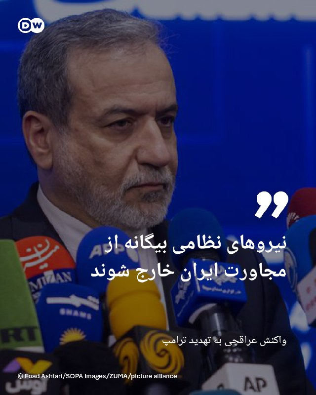

🔶واکنش عراقچی به تهدید ترامپ: نیروهای نظامی بیگانه از مجاورت ایران خارج شوند

عباس عراقچی، وزیر خارجه ایران، با اعلام این که نیروهای نظامی بیگانه مستقر در مجاورت قلمرو ایران «به دلیل خطاهای انسانی خود، حوادث صرف یا خطر قرار گرفتن در تبادل آتش، در معرض ریسک و خطرات مداوم هستند» از آن‌ها خواست که منطقه را ترک کنند.

او در پستی در شبکه اجتماعی ایکس (X) ضمن "بیرون دانستن تنگه هرمز از محدوده آب‌های بین‌المللی"، نوشت: «برای کاهش این خطرات، بهترین راهکار این است که آن‌ها [نیروهای نظامی خارجی] منطقه را ترک کنند.»

این اظهارات در پی بیانیه دونالد ترامپ، رئیس‌جمهور آمریکا مطرح می‌شود که ایران را مسئول سرنگونی یک بالگرد آپاچی آمریکایی دانست که شبانه در حال گشت‌زنی در تنگه هرمز بود. او تأکید کرد که واشنگتن باید به این اقدام پاسخ دهد.

@dw_farsi

## DW_Farsi — post 125739

  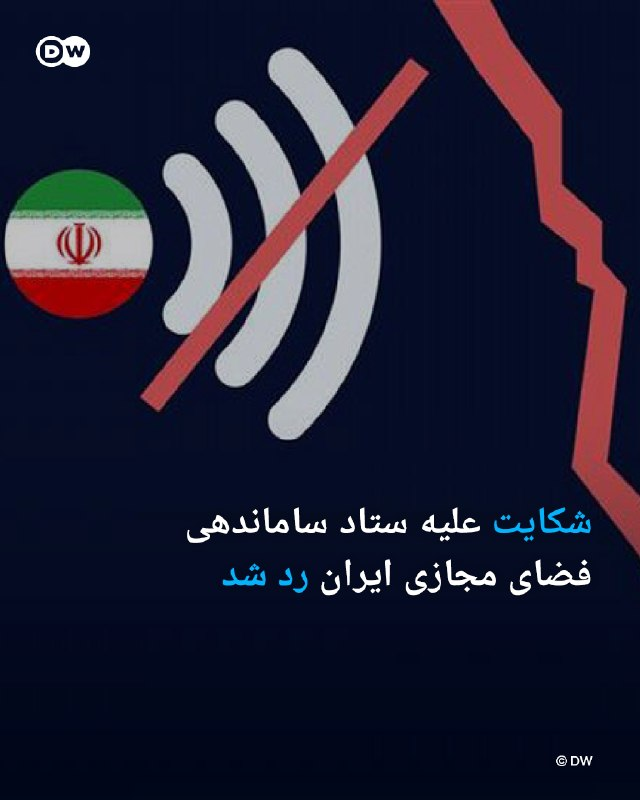

🔶شکایت علیه ستاد ساماندهی فضای مجازی ایران رد شد

به دنبال شکایت برخی از اعضای حقیقی شورای عالی فضای مجازی ایران برای ابطال سند تأسیس "ستاد ویژه ساماندهی و راهبری فضای مجازی کشور"، دیوان عدالت اداری با توجه به اصلاحات صورت‌گرفته در متن این سند، شکایت مطروحه را رد کرد. این سند پیش‌تر در تاریخ ۲۲ اردیبهشت ۱۴۰۵ به تصویب رئیس‌جمهور ایران رسیده بود.

احسان چیت‌ساز، معاون سیاستگذاری و برنامه‌ریزی توسعه فاوا و اقتصاد دیجیتال، با اعلام این خبر و اشاره به دادنامه مورخ ۱۹ خرداد ۱۴۰۵ گفت: «تعدادی از اعضای حقیقی شورای عالی فضای مجازی با ثبت دادخواستی در دیوان عدالت اداری، خواهان ابطال مصوبه ایجاد این ستاد شده بودند.»

چیت‌ساز ادامه داد: «اما در فرآیند رسیدگی قضایی، مشخص شد که با موافقت رئیس‌جمهور، بندهای مربوط به اختیارات کلیدی و مکانیزم تصمیم‌گیری این ستاد دستخوش تغییر و اصلاح شده و به این ترتیب، زمینه اعتراض شاکیان از بین رفته است.»

@dw_farsi

## Persian_Trend_Official — post 16315

https://youtube.com/live/pqbVLiZh3kg?feature=share

## IranianMinds — post 21957

#طنز

فوری ترامپ : همین الان در پی تنش های زیاد در خاورمیانه و حمله به یکی از آپاچی ها بلافاصله به خودم تماس گرفتم و گفتم نباید پاسخ بدم . ما بسیار زیاد به توافق نزدیک هستیم .

## IranianMinds — post 21956

  <a href="telegram/content/IranianMinds_21956_1781034218.mp4" target="_blank">🎬 Download video</a>

عادی ترین طرفدار جمهوری اسلامی:

ببینید بخندید فقط به این یزید 😂😂😂😂

@IranianMinds

## IranianMinds — post 21955

پوشش لحظه ای جنگ ایران و امریکا در چنل زیر 👇👇

https://t.me/+5ujuUVutlmw2OTE0

## BBCPersian — post 283269

  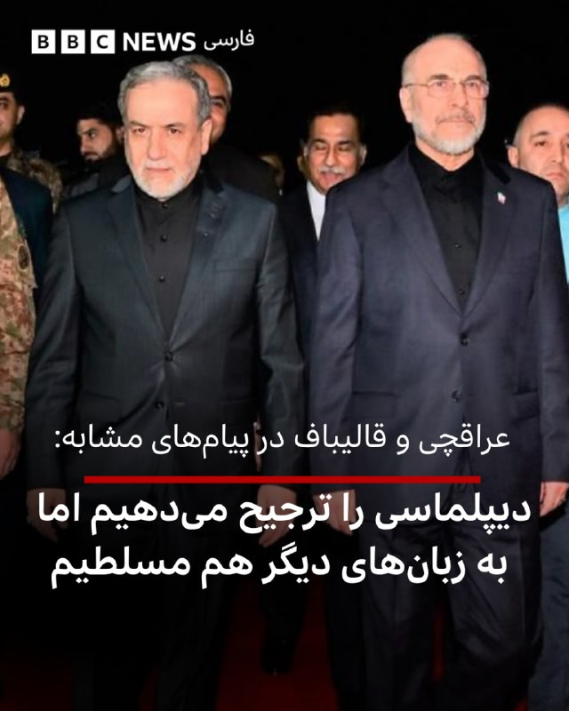

عباس عراقچی، وزیر خارجه ایران، در پستی در شبکه ایکس نوشت: «نیروهای خارجی که در نزدیکی قلمرو ما حضور دارند، همواره در معرض خطر ناشی از اشتباهات انسانی خودشان، حوادث ساده و ناخواسته، یا حتی گرفتار شدن در آتش متقابل قرار دارند.»

او در ادامه افزود: «برای کاهش این خطرات، بهترین راه‌حل این است که آن‌ها منطقه را ترک کنند.»

وزیر امور خارجه ایران افزود: «ما ترجیح می‌دهیم با زبان دیپلماسی سخن بگوییم، اما به زبان‌های دیگری نیز مسلط هستیم.»

ساعتی پیش از او محمد باقر قالیباف، رئیس مجلس ایران هم در پیام مشابهی نوشت: «ما زبان دیپلماسی را ترجیح می‌دهیم، اما به زبان‌های دیگری بسیار مسلط‌تر سخن می‌گوییم.»

پیشتر دونالد ترامپ، در پستی در تروث‌سوشال نوشته بود که مطلع شده که یک بالگرد آپاچی آمریکا از سوی ایران هدف قرار گرفته است.

او اضافه کرد که دو خلبان در این بالگرد حضور داشتند که هر دو در سلامت کامل هستند و آسیبی ندیده‌اند. ولی تاکید کرد: «با این حال، آمریکا ناگزیر است به این حمله پاسخ دهد.»

📷EPA/Shutterstock
https://bbc.in/4xi5EkZ

@BBCPersian

## alonews — post 126611

  <a href="telegram/content/alonews_126611_1781034220.webm" target="_blank">🎬 Download video</a>

👈داده‌های کشتیرانی: صادرات سوخت جت عربستان سعودی به اروپا از سطح پیش از بسته شدن تنگه هرمز فراتر رفت

✅ @AloNews خبر جنگ

## alonews — post 126610

  <a href="telegram/content/alonews_126610_1781034220.webm" target="_blank">🎬 Download video</a>

👈نیروی هوایی آمریکا هم‌اکنون هفت فروند هواپیمای سوخت‌رسان را در منطقه خاورمیانه به پرواز درآورده است.

🔴 از این تعداد، شش فروند در مجاورت خلیج فارس در حال انجام عملیات پروازی هستند.

✅ @AloNews خبر جنگ

---
📅 بروزرسانی: 1405/03/19 23:02
---

## VahidOOnLine — post 244566

  

عبدالرحیم سلیمانی اردستانی، روحانی عضو مجمع مدرسین و محققین حوزه علمیه قم، استاد دانشگاه مفید و پژوهشگر دینی محبوس در زندان قم، با حکم دادگاه ویژه روحانیت به شش سال حبس، پرداخت جزای نقدی و خلع لباس روحانیت محکوم شد.

سایت انصاف‌نیوز، سه‌شنبه ۱۹ خرداد به نقل از مجتبی لطفی، از مسئولان دفتر آیت‌الله حسینعلی منتظری، گزارش داد حکم سلیمانی اردستانی صادر شده و او گفته است قصد اعتراض به این حکم را ندارد، مگر آنکه دادگاه به‌صورت علنی برگزار شود.

به گفته لطفی، سلیمانی اردستانی در ارتباط با تمامی هشت اتهام مطرح‌شده علیه خود محکوم شده است.

از مناظره جنجالی تا بازداشت و محکومیت

سلیمانی اردستانی ۹ خرداد در نامه‌ای از زندان اعلام کرده بود با اتهام‌هایی از جمله «تشویش اذهان عمومی»، «توهین به مقدسات»، «توهین به رهبری» در ارتباط با علی و مجتبی خامنه‌ای، «تجمع در اعتراض به حصر میرحسین موسوی» و «اجتماع و تبانی علیه امنیت داخلی» روبه‌رو است.

ادامه این گزارش را در وبسایت ایران‌اینترنشنال بخوانید
‌🏁 🇬🇧 IranintlTV

🤖 @VahidOOnLine

## WithYashar — post 14161

## WithYashar — post 14160

## pm_afshaa — post 93052

  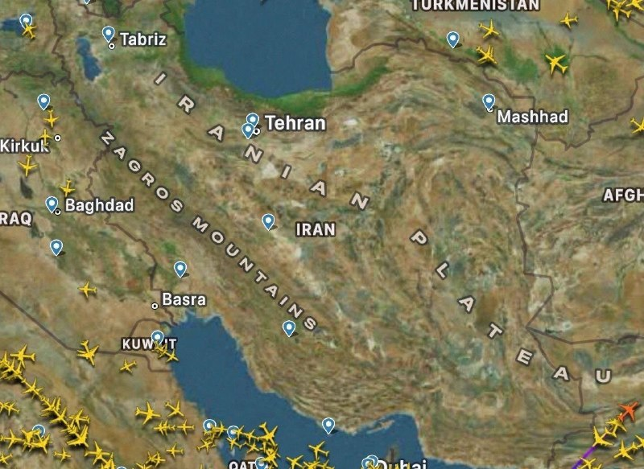

اسمون ایران کلییر شد

💧 Rainbet.com the #1 Non-KYC Crypto Casino & Sportsbook @rainbetcom

😁 @Pm_Afshaa

## pm_afshaa — post 93051

سپاه پاسداران لیست ترور منتشر کرد : 
💧 Rainbet.com the #1 Non-KYC Crypto Casino & Sportsbook @rainbetcom 
😁 @Pm_Afshaa

## pm_afshaa — post 93050

  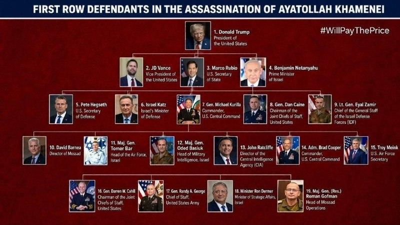

سپاه پاسداران لیست ترور منتشر کرد :

💧 Rainbet.com the #1 Non-KYC Crypto Casino & Sportsbook @rainbetcom

😁 @Pm_Afshaa

## pm_afshaa — post 93049

احتمالا اسرائیل و آمریکا باهم حمله میکنن

## IranIntlTV — post 341391

  <a href="telegram/content/IranIntlTV_341391_1781033581.mp4" target="_blank">🎬 Download video</a>

یک شهروند با ارسال پیامی به ایران اینترنشنال از شرایط بد اقتصادی و درد باقی‌مانده از سرکوب انقلاب ملی در دی‌ماه روایت می‌کند. پیام او با هوش مصنوعی خوانده شده است.

## IranIntlTV — post 341390

  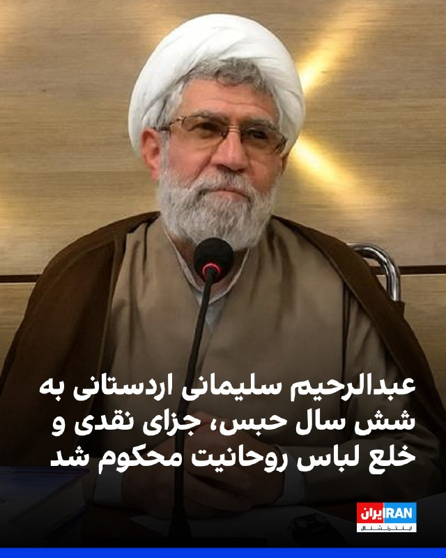

عبدالرحیم سلیمانی اردستانی، روحانی عضو مجمع مدرسین و محققین حوزه علمیه قم، استاد دانشگاه مفید و پژوهشگر دینی محبوس در زندان قم، با حکم دادگاه ویژه روحانیت به شش سال حبس، پرداخت جزای نقدی و خلع لباس روحانیت محکوم شد.

سایت انصاف‌نیوز، سه‌شنبه ۱۹ خرداد به نقل از مجتبی لطفی، از مسئولان دفتر آیت‌الله حسینعلی منتظری، گزارش داد حکم سلیمانی اردستانی صادر شده و او گفته است قصد اعتراض به این حکم را ندارد، مگر آنکه دادگاه به‌صورت علنی برگزار شود.

به گفته لطفی، سلیمانی اردستانی در ارتباط با تمامی هشت اتهام مطرح‌شده علیه خود محکوم شده است.

ادامه این گزارش را در وبسایت ایران‌اینترنشنال بخوانید
https://iranintl.com/202606091391

## IranIntlTV — post 341389

  <a href="https://t.me/IranintlTV/341389" target="_blank">📎 Download file</a>

🎧نسخه صوتی چشم‌انداز: پروژه دفن خامنه‌ای، تبعات حذف ناگهانی دیکتاتور ایران
@iranintlTV

## Persian_Trend_Official — post 16313

  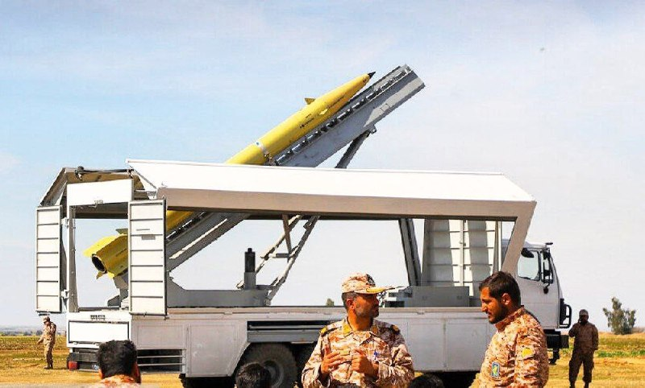

شنیده شدن چندین صدای انفجار در کردستان عراق

برخی از کانال های محلی خبر از حمله موشکی پهپادی سپاه پاسداران به مواضع گروهک های کرد میدهند، منابع رسمی تا به این لحظه در مورد صداهای انفجار اظهار نظری نکردند.

📝 Amir

📌 @persian_trend_official
پرشین ترند | متفاوت‌ترین کانال نظامی

## IranianMinds — post 21953

🔴متکی نماینده تهران:

قوه قضاییه، حکم اعدام ترامپ و نتانیاهو را صادر کند😂

@IranianMinds

## Hranews — post 113505

عبدالعزیز عمرزهی در زاهدان بازداشت شد

❗️
❗️
❗️
❗️
❗️ – مولوی عبدالعزیز عمرزهی، روحانی اهل سنت و مدرس سابق دارالعلوم مکی زاهدان، شامگاه امروز سه‌شنبه ۱۹ خردادماه، توسط نیروهای امنیتی در زاهدان #بازداشت و به مکانی نامعلوم منتقل شد.

ادامه مطلب

#عبدالعزیز_عمرزهی

↘️
@hranews_bot تماس ✉️ -  @Hranews  کانال هرانا 🆑

## alonews — post 126609

  <a href="telegram/content/alonews_126609_1781033586.webm" target="_blank">🎬 Download video</a>

👈طبق گزارش ها تهران در حال حاضر شاهد اختلالات گسترده در GPS و خطای سیگنال‌های ناوبری (Spoofing) است.

✅ @AloNews خبر جنگ

## alonews — post 126608

  <a href="telegram/content/alonews_126608_1781033586.webm" target="_blank">🎬 Download video</a>

🔴 فوری/ سپاه لیست ترور منتشر کرد

✅ @AloNews

## alonews — post 126607

  <a href="telegram/content/alonews_126607_1781033586.webm" target="_blank">🎬 Download video</a>

🔴فوری / شورای امنیت رأی‌گیری درباره قطعنامه ۱۷۳۷ را پیش برد و با ۱۱ رأی موافق، بررسی بازگشت تحریم‌ها علیه جمهوری اسلامی ایران را تصویب کرد

🔴 بریتانیا از فعال شدن تمام تحریم علیه ایران استقبال کرد

✅ @AloNews خبر جنگ

## alonews — post 126606

  <a href="telegram/content/alonews_126606_1781033587.webm" target="_blank">🎬 Download video</a>

👈کانال ۱۴ اسرائیل: احمد وحیدی فرمانده کل سپاه پاسداران گفته تا جمهوری اسلامی پول نقد دریافت نکنه هیچگونه توافقی امضا نخواهد شد

✅ @AloNews خبر جنگ

## alonews — post 126605

  <a href="telegram/content/alonews_126605_1781033587.webm" target="_blank">🎬 Download video</a>

👈فارس به نقل از منبعی مدعی شد: پیشنهاد جدیدی از سوی ایران برای آمریکا ارسال نشده است.

🔴اسکای‌نیوز امروز در خبری اعلام کرد که تهران پیش‌نویس جدیدی برای طرح صلح به واشنگتن ارسال کرده و گزارش‌های اولیه نشان می‌دهد که طرف آمریکایی آن را «قابل قبول» می‌داند.

✅ @AloNews خبر جنگ

## alonews — post 126604

  <a href="telegram/content/alonews_126604_1781033587.mp4" target="_blank">🎬 Download video</a>

👈خبرنگار فاکس‌نیوز در کاخ سفید:
«رئیس جمهور ترامپ احتمالاً در شرف دستور دادن به یک انفجار بزرگ در ایران است... هیچ سرباز آمریکایی در اینجا کشته نشد، اما به نظر می‌رسد که ایران واقعاً، واقعاً سخت تلاش می‌کرد تا سربازان آمریکایی را بکشد، زیرا آنها یک هلیکوپتر آپاچی را سرنگون کردند.»

✅ @AloNews خبر جنگ

## alonews — post 126603

  <a href="telegram/content/alonews_126603_1781033589.webm" target="_blank">🎬 Download video</a>

👈حداقل 4 پهپاد کامیکازه شاهد-136 سپاه به یکی از مقرهای حزب دمکرات کردستان حمله کردند

✅ @AloNews خبر جنگ

---
📅 بروزرسانی: 1405/03/19 22:53
---

## VahidOOnLine — post 244565

  

سازمان عملیات تجارت دریایی بریتانیا اعلام کرد وضعیت در تنگه هرمز همچنان پرخطر است.

این سازمان افزود خطر مین‌گذاری در نزدیکی مسیرهای کشتیرانی همچنان پابرجاست و اختلال در سامانه موقعیت‌یابی ماهواره‌ای نیز ادامه دارد.
‌🏁 🇬🇧 IranintlTV

🤖 @VahidOOnLine

## WithYashar — post 14159

## WithYashar — post 14158

پست جدید از آخرین وضعیت و اتفاقات پیش رو کارهای اداریش را انجام بدید. کلیک کنید.💥💥😁

https://www.instagram.com/reel/DZYFeVJS_V2/?igsh=MWNobm81Z282cWtmZQ==

## mwarmonitor — post 10540

🔴تحلیل گزارش‌های راستی‌آزمایی و نظارت آژانس بین‌المللی انرژی اتمی (IAEA) درباره ایران – ژوئن ۲۰۲۶

🔸یافته‌های کلیدی:
در گزارش جدید پادمان‌ها، آژانس همچنان اعلام می‌کند که ایران در نقض توافق پادمانی معاهده عدم اشاعه هسته‌ای (NPT) قرار دارد.

آژانس قادر نیست توقف فعالیت‌های غنی‌سازی اورانیوم، بازفرآوری پلوتونیوم و تولید آب سنگین ایران را تأیید کند؛ طبق قطعنامه‌های شورای امنیت که در اکتبر ۲۰۲۵ دوباره اعمال شده‌اند، و ایران نیز دسترسی، اطلاعات و همکاری را از آژانس دریغ کرده است.
آژانس نمی‌تواند ذخایر اورانیوم غنی‌شده ایران (مقدار، محل و ترکیب شیمیایی آن) و وضعیت سانتریفیوژها و تجهیزات مرتبط را تأیید کند.
آژانس مجتمع تونلی اصفهان (Esfahan/Isfahan) را به‌عنوان محل ذخیره اورانیوم ۲۰٪ و ۶۰٪ معرفی کرده و نسبت به فعالیت‌های آن در فوریه ۲۰۲۶ ابراز نگرانی کرده است.
طبق گزارش راستی‌آزمایی، از ۲۸ فوریه ۲۰۲۶ آژانس «عملاً انجام فعالیت‌های نظارتی در ایران مطابق توافق پادمانی NPT را متوقف کرده است».
گزارش اطلاعات کافی ارائه نمی‌دهد و جزئیات کمتری درباره محل اورانیوم غنی‌شده نسبت به اظهارات رسانه‌ای مدیرکل رافائل گروسی دارد و به برخی سایت‌های احتمالی دیگر (مثل فردو، نطنز و Pickaxe Mountain) اشاره نمی‌کند.
در گزارش به سایت‌های مرتبط با تسلیحات هسته‌ای که در حملات آمریکا و اسرائیل (ژوئن ۲۰۲۵ و فوریه تا آوریل ۲۰۲۶) آسیب دیده‌اند، پرداخته نشده، با وجود اینکه برخی از آن‌ها طبق JCPOA تحت نظارت بودند.
آژانس تنها به فهرستی از سایت‌های اعلام‌شده «آسیب‌دیده در حملات» بسنده کرده است.
درباره وضعیت مراکز تولید سانتریفیوژ مانند TESA کرج و کالای الکتریک اطلاعاتی ارائه نشده، اگرچه تأیید شده کرج دوباره هدف حمله قرار گرفته است.
گزارش به آسیب دیدن کارخانه آب سنگین و کارخانه تولید کیک زرد اردکان در مرحله دوم درگیری‌ها اشاره می‌کند.
پیشنهاد شده شورای حکام آژانس از ایران بخواهد اطلاعات دقیق‌تر و دسترسی کامل برای بازرسی فراهم کند، از جمله درباره محل مواد هسته‌ای و وضعیت تجهیزات.
پیش‌نویس قطعنامه‌ای (با حمایت آمریکا و اتحادیه اروپا) خواستار ارائه اطلاعات دقیق حسابرسی مواد هسته‌ای و دسترسی کامل و فوری بازرسان به ایران شده است.
در پایان نیز اشاره شده گزارش کامل این تحلیل در وب‌سایت ISIS-online منتشر شده است.

@mwarmonitor

## FoxNewsTwitter — post 342770

  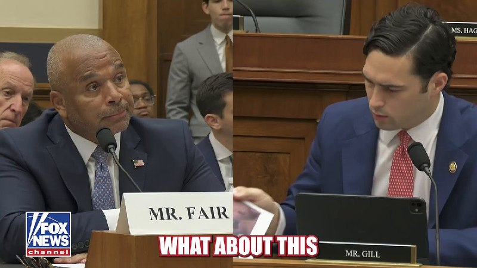

Fox News (Twitter/X)

"Do you think that somebody who has a Nazi tattoo on their chest should serve in the United States Senate?"

Rep. @realBrandonGill grills SPLC Interim CEO Bryan Fair over Maine Senate candidate Graham Platner's Nazi-linked tattoo, pressing him on whether it should be viewed as evidence of extremist beliefs.

GILL: "Do you think if somebody got a Nazi tattoo on their chest, that's indicative that they might be a Nazi?"

FAIR: "You'd have to ask Mr. Platner why he has that symbol."

GILL: "Do people who aren't Nazis normally get Nazi tattoos on their chests?"

FAIR: "Again, I assume they don't."

## pm_afshaa — post 93048

احتمالا اسرائیل و آمریکا باهم حمله میکنن

## pm_afshaa — post 93047

  <a href="telegram/content/pm_afshaa_93047_1781033020.webm" target="_blank">🎬 Download video</a>

🔴انفجارهای متعدد در اربیل عراق 
💧 Rainbet.com the #1 Non-KYC Crypto Casino & Sportsbook @rainbetcom 
😁 @Pm_Afshaa

## pm_afshaa — post 93046

  <a href="telegram/content/pm_afshaa_93046_1781033020.webm" target="_blank">🎬 Download video</a>

🔴انفجارهای متعدد در اربیل عراق

💧 Rainbet.com the #1 Non-KYC Crypto Casino & Sportsbook @rainbetcom

😁 @Pm_Afshaa

## IranIntlTV — post 341388

  <a href="telegram/content/IranIntlTV_341388_1781033021.mp4" target="_blank">🎬 Download video</a>

رییس‌جمهوری آمریکا گفت که به او اطلاع داده شده است جمهوری اسلامی یکی از بالگردهای بسیار پیشرفته آپاچی آمریکا را در حالی که بر فراز تنگه هرمز در حال گشت‌زنی بود، سرنگون کرد. دونالد ترامپ در تروث سوشال نوشت که آمریکا به سرنگونی بالگرد خود به دست ایران پاسخ می‌دهد.

گفت‌وگو با فرزین ندیمی، پژوهشگر ارشد امور دفاعی و امنیتی
@iranintltv

## IranIntlTV — post 341387

  <a href="telegram/content/IranIntlTV_341387_1781033023.mp4" target="_blank">🎬 Download video</a>

دونالد ترامپ گفت جمهوری اسلامی یک بالگرد آپاچی آمریکا را بر فراز تنگه هرمز سرنگون کرده و واشینگتن ناگزیر به پاسخ است. او افزود دو خلبان این بالگرد سالم‌اند. همزمان، اسکای‌نیوز عربی گزارش داد متن توافق با تهران برای بررسی به ایالات‌متحده ارسال شده و به طور اولیه مورد پذیرش قرار گرفته است.

ارزیابی شهیر شهیدثالث، تحلیلگر روابط بین‌الملل و مسائل ایران
@iranintltv

## IranIntlTV — post 341386

  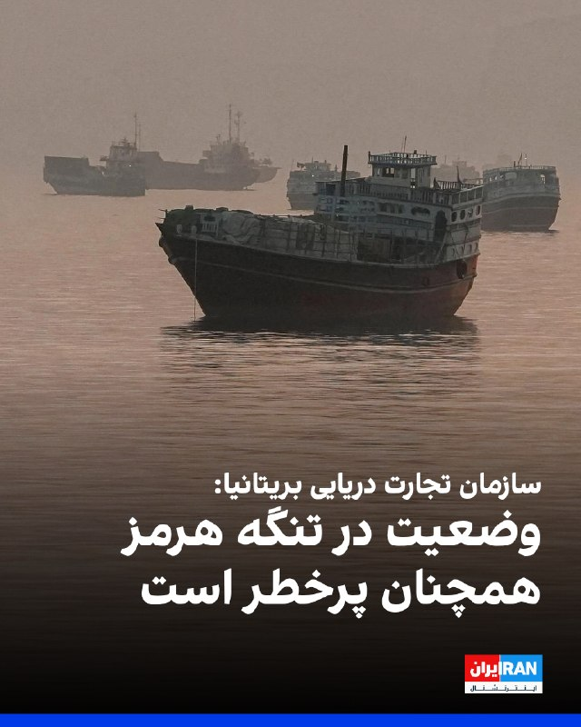

سازمان عملیات تجارت دریایی بریتانیا اعلام کرد وضعیت در تنگه هرمز همچنان پرخطر است.

این سازمان افزود خطر مین‌گذاری در نزدیکی مسیرهای کشتیرانی همچنان پابرجاست و اختلال در سامانه موقعیت‌یابی ماهواره‌ای نیز ادامه دارد.
https://iranintl.com/202606098726

## IranIntlTV — post 341385

  <a href="telegram/content/IranIntlTV_341385_1781033026.mp4" target="_blank">🎬 Download video</a>

پروژه دفن خامنه‌ای، تبعات حذف ناگهانی دیکتاتور ایران

«چشم انداز با مهدی مهدوی‌آزاد»

تماشای نسخه کامل این برنامه در یوتیوب:

https://youtu.be/iRfAOlmQl5E
@iranintltv

## FarsiVOA — post 220162

  <a href="telegram/content/FarsiVOA_220162_1781033028.mp4" target="_blank">🎬 Download video</a>

⚡️گفت‌وگو با علی دادپی، اقتصاددان، درباره وضعیت دشوار معیشتی خانواده‌ها در ایران، در شرایطی که گزارش‌ها می‌گویند ۹۰ درصد «حقوق کارگرانِ با حداقلِ حقوق» صرف خرید غذا می‌شود.

@FarsiVOA

## Persian_Trend_Official — post 16312

اسکای نیوز عربی به از نقل یک مقام ناشناس: ایران پیش‌ نویس پیشنهاد آتش‌بس را به ایالات متحده ارسال کرده است که طبق گزارش‌ها اکنون توسط دولت ترامپ در دست بررسی است. طبق این گزارش، ظاهراً متن اولیه این پیشنهاد برای دولت قابل قبول است. این اظهارات پس از اظهارات…

## IranianMinds — post 21952

🔴 حملات سپاه پاسداران به اربیل عراق

@IranianMinds

## IranianMinds — post 21951

  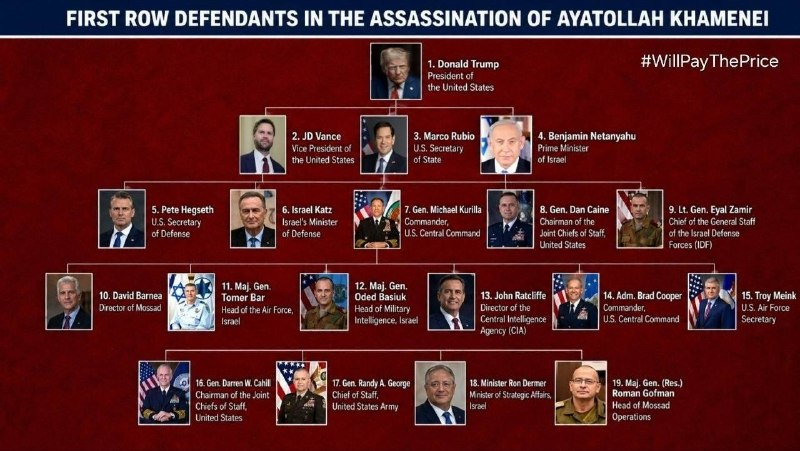

🔴 سپاه لیست ترور داده بیرون

@IranianMinds

## IranianMinds — post 21950

🔴 الجزیره: مقامات ایران گفتن بالگرد آمریکایی روی آب های بین المللی پرواز نمیکرده و چاره ای جز زدنش نداشتیم. اگه حمله کنن قاطعانه پاسخ میدیم.

@IranianMinds

## Hranews — post 113504

حکم اعدام یک زندانی در زندان عادل آباد شیراز اجرا شد

❗️
❗️
❗️
❗️
❗️ – حکم یک زندانی که پیشتر از بابت اتهام قتل به #اعدام محکوم شده بود، مورخ ۱۳ خردادماه، در زندان عادل آباد شیراز اجرا شد.

ادامه مطلب

#داریوش_کلکو

↘️
@hranews_bot تماس ✉️ -  @Hranews  کانال هرانا 🆑

## alonews — post 126602

  <a href="telegram/content/alonews_126602_1781033030.webm" target="_blank">🎬 Download video</a>

👈نبویان، نماینده مجلس: غنی‌سازی ۹۳ درصد می‌تواند به صورت صلح‌آمیز باشد

✅ @AloNews خبر جنگ

## alonews — post 126601

  <a href="telegram/content/alonews_126601_1781033031.webm" target="_blank">🎬 Download video</a>

🔴فوری/ ایران در حال انجام حملاتی به مقر گروه‌های مخالف کرد ایرانی در اربیل عراق است

✅ @AloNews خبر جنگ

## alonews — post 126600

  <a href="telegram/content/alonews_126600_1781033031.mp4" target="_blank">🎬 Download video</a>

👈فعالیت جنگنده ها در آسمان کردستان عراق

✅ @AloNews خبر جنگ

---
📅 بروزرسانی: 1405/03/19 22:43
---

## VahidOOnLine — post 244564

  

عباس عراقچی، وزیر خارجه جمهوری اسلامی، در شبکه ایکس نوشت: «نیروهای خارجی که در نزدیکی قلمرو ما حضور دارند، همواره در معرض خطر هستند. برای کاهش این خطر، بهترین راه‌حل این است که آن‌ها منطقه را ترک کنند.»

او افزود: «ما زبان دیپلماسی را ترجیح می‌دهیم، اما به زبان‌های دیگر هم سخن می‌گوییم.»
‌🏁 🇬🇧 IranintlTV

🤖 @VahidOOnLine

## WithYashar — post 14157

فرودگاه های تهران رو دارن تخلیه می کنند.
@withyashar

## WithYashar — post 14156

  

کاور
@withyashar

## WithYashar — post 14155

## mwarmonitor — post 10539

✈️پرواز جنگنده های ناشناس در آسمان استان دیالی در شرق عراق مشاهده شدند.

@mwarmonitor

## mwarmonitor — post 10538

  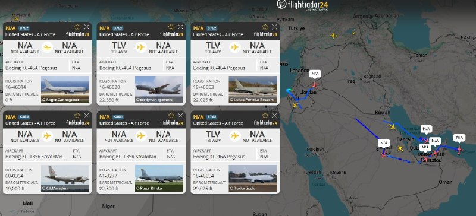

✈️هفت هواپیمای سوخت‌رسان نیروی هوایی آمریکا (USAF) در حال حاضر در حال پرواز در خاورمیانه هستند که شش فروند از آن‌ها در نزدیکی خلیج فارس پرواز می‌کنند.

@mwarmonitor

## pm_afshaa — post 93045

  <a href="telegram/content/pm_afshaa_93045_1781032393.webm" target="_blank">🎬 Download video</a>

🔴طبق گزارش‌ها، پرواز گسترده هواپیماهای مسافربری از فرودگاه مهراباد تهران.

+ دقیقا مثل دو شب پیش برای تخلیه هواپیماها پیش از حمله احتمالی امریکا

💧 Rainbet.com the #1 Non-KYC Crypto Casino & Sportsbook @rainbetcom

😁 @Pm_Afshaa

## IranIntlTV — post 341384

  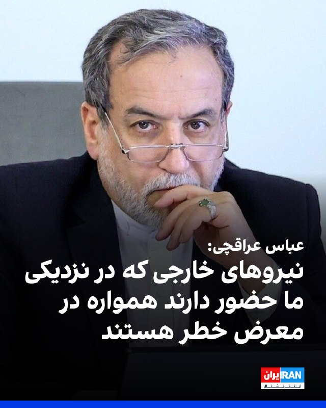

عباس عراقچی، وزیر خارجه جمهوری اسلامی، در شبکه ایکس نوشت: «نیروهای خارجی که در نزدیکی قلمرو ما حضور دارند، همواره در معرض خطر هستند. برای کاهش این خطر، بهترین راه‌حل این است که آن‌ها منطقه را ترک کنند.»

او افزود: «ما زبان دیپلماسی را ترجیح می‌دهیم، اما به زبان‌های دیگر هم سخن می‌گوییم.»
https://iranintl.com/202606098268

## FarsiVOA — post 220161

⚡️ویژه برنامه جام جهانی ۲۰۲۶ صدای آمریکا از پنج شنبه ۲۱ خرداد تا پایان جام جهانی هر شب ساعت ۲۳ به وقت ایران
@FarsiVOA

## Persian_Trend_Official — post 16311

  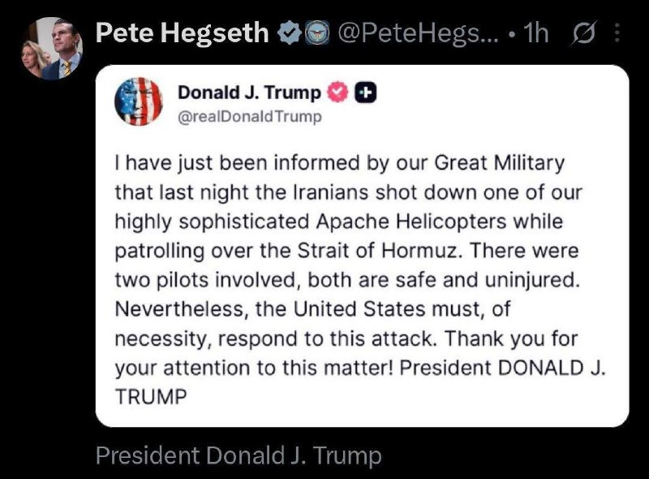

پیت هگست، وزیر جنگ امریکا پست ترامپ در تروث سوشال را در حساب X خود منتشر کرد.

📝 Amir

📌 @persian_trend_official
پرشین ترند | متفاوت‌ترین کانال نظامی

## RadioFarda — post 158109

  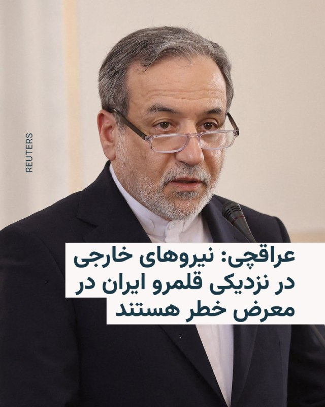

🔸ساعاتی پس از اعلام رئیس‌جمهور آمریکا مبنی بر «ناگزیری» این کشور در پاسخ به سرنگونی یک بالگرد آپاچی ایالات متحده از سوی ایران، وزیر خارجه جمهوری اسلامی خواستار خروج نیروهای خارجی از تنگه هرمز شد و گفت این نیروها «در معرض خطر» هستند.

🔸عباس عراقچی روز سه‌شنبه ۱۹ خرداد در پیامی در شبکه اجتماعی ایکس ادعا کرد که «تنگه هرمز در آب‌های بین‌المللی قرار ندارد» و به نوشته او «میان ایران و عمان مشترک است و هزاران مایل از سواحل ایالات متحده فاصله دارد».

🔸وزیر خارجه ایران بدون اشاره به سرنگونی بالگرد نظامی آمریکا نوشت: «نیروهای خارجی که در نزدیکی قلمرو ما قرار دارند، همواره در معرض خطر هستند؛ چه به‌سبب خطاهای انسانی خود، چه حوادث ساده، و چه احتمال گرفتار شدن در تبادل آتش».

🔸او با تکرار مواضع پیشین مسئولان جمهوری اسلامی مبنی بر ترجیح «زبان دیپلماسی»، در عین حال تهدید کرد که «ما به زبان‌های دیگر نیز سخن گفتن را به‌خوبی می‌دانیم».

🔸دونالد ترامپ، رئیس‌جمهور آمریکا، روز سه‌شنبه تأیید کرد که ایران یک فروند بالگرد بسیار پیشرفتهٔ آپاچی این کشور را سرنگون کرده و ایالات متحده ناگزیر است به این حمله پاسخ دهد.

@RadioFarda

## IranianMinds — post 21949

  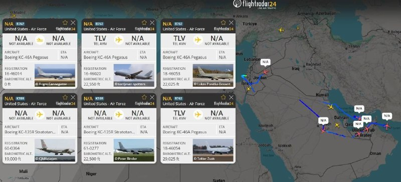

🔴هفت هواپیمای سوخت‌رسان نیروی هوایی آمریکا USAF در حال حاضر به سمت خاورمیانه در حرکت هستند، شش فروند از آن‌ها در نزدیکی خلیج‌فارس پرواز می‌کنند.

@IranianMinds

## alonews — post 126599

👈 صابرین نیوز : باند اپستین در حال تدارک حمله گسترده به بهانه واهی است
این چندمین‌بار است که آمریکا در وسط مذاکره به ایران حمله می‌کند

✅ @AloNews خبر جنگ

---
📅 بروزرسانی: 1405/03/19 22:32
---

## WithYashar — post 14154

آمادگی نیروهای مسلح برای پاسخ به هرگونه شرارت و تجاوزی

سخنگوی کمیسیون امنیت ملی:
نیروهای مسلح در اوج آمادگی‌های رزمی و دفاعی قرار دارند و الحمدالله آسیب‌ها رفع شده است.

نیروهای مسلح آماده‌اند تا در بالاترین سطح به هرگونه شرارت و تجاوزی پاسخ دهند.
@withyashar

## FoxNewsTwitter — post 342769

  

Fox News (Twitter/X)

NASA just revealed the 4 astronauts who will lead its next giant leap back to the Moon.

The 2027 Artemis III mission will be commanded by Randy Bresnik, with ESA astronaut Luca Parmitano serving as pilot and astronauts Frank Rubio and Andre Douglas joining as mission specialists.

Unlike earlier plans, Artemis III is now expected to test docking and rendezvous operations between NASA’s Orion spacecraft and commercial lunar landers from SpaceX and Blue Origin in Earth orbit before future lunar landing missions.

NASA says the mission will be a critical proving ground for the technology needed to return astronauts to the lunar surface.

## FoxNewsTwitter — post 342768

  

Fox News (Twitter/X)

WATCH LIVE: Andrew Giuliani outlines top US priorities for hosting the 2026 FIFA World Cup https://twitter.com/i/broadcasts/1kJzDDpgAoaKv

## pm_afshaa — post 93044

  <a href="telegram/content/pm_afshaa_93044_1781031764.webm" target="_blank">🎬 Download video</a>

🔴متکی، نماینده تهران: قوه قضاییه حکم اعدام ترامپ و نتانیاهو رو صادر کنه.

💧 Rainbet.com the #1 Non-KYC Crypto Casino & Sportsbook @rainbetcom

😁 @Pm_Afshaa

## pm_afshaa — post 93043

  <a href="telegram/content/pm_afshaa_93043_1781031765.webm" target="_blank">🎬 Download video</a>

🔴توییت عباس عراقچی: نیروهای خارجی در مجاورت قلمرو ما به دلیل خطاهای انسانی خود، تصادفات ساده یا احتمال گرفتار شدن در آتش متقاطع، همواره در معرض خطر هستن. برای کاهش خطر، بهتره اینجارو ترک کنید. ما زبان دیپلماسی رو ترجیح میدیم اما زبان‌های دیگر رو هم صحبت…

## pm_afshaa — post 93042

  <a href="telegram/content/pm_afshaa_93042_1781031766.webm" target="_blank">🎬 Download video</a>

🔴یک مقام ارشد ایرانی به الجزیره:
ایران به هر حمله آمریکا علیه خود،
به‌طور قاطع و فوری پاسخ خواهد داد.

💧 Rainbet.com the #1 Non-KYC Crypto Casino & Sportsbook @rainbetcom

😁 @Pm_Afshaa

## FarsiVOA — post 220160

جسیکا میر، فضانورد ناسا، ویدیویی تایم‌لپس از شفق قطبی جنوبی منتشر کرد که از فضاپیمای دراگون اسپیس‌ایکس ثبت شده است.

او گفت این شفق قطبی در پی یک رویداد خورشیدی اخیر شکل گرفته و برخلاف نمونه‌های قبلی که دیده بود، مستقیما در زیر ایستگاه فضایی حرکت می‌کرد و نمایشی چشمگیر به وجود آورده بود.

جسیکا میر این پدیده را شگفت‌انگیز و از نظر احساسی تاثیرگذار توصیف کرد.

@FarsiVOA

## Persian_Trend_Official — post 16310

الجزیره از نقل یک مقام ایرانی: بالگرد آپاچی آمریکایی بر فراز آب‌های بین‌المللی پرواز نمی‌کرد.

ایران به هرگونه حملهٔ آمریکا که متوجه این کشور شود، با قدرت و به‌صورت فوری پاسخ خواهد داد.

📝 Amir

📌 @persian_trend_official
پرشین ترند | متفاوت‌ترین کانال نظامی

## IranianMinds — post 21948

  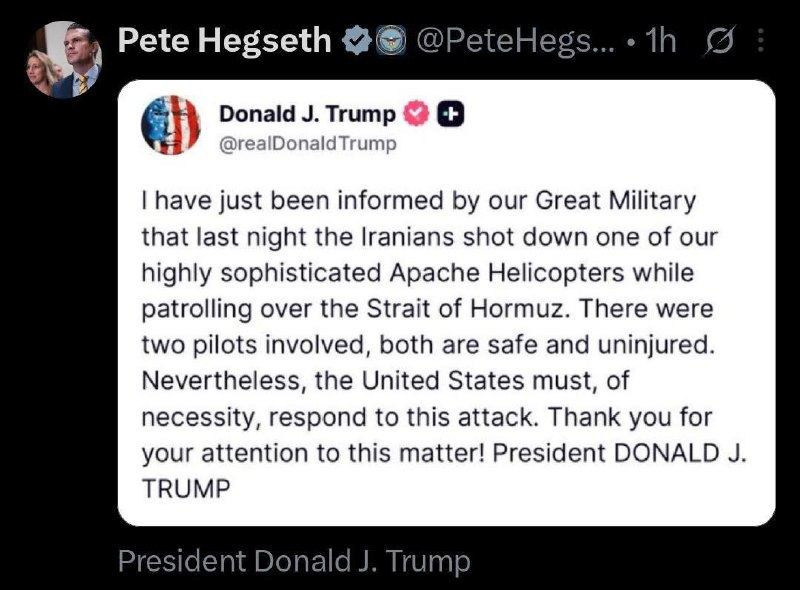

🔴پیت هگست، وزیر جنگ آمریکا هم پست ترامپ رو در صفحه خودش منتشر کرد.

@IranianMinds

## IranianMinds — post 21947

فعالیت جت‌های جنگنده بر فراز بخش‌های جنوبی سوریه نیز گزارش شده است.

@IranianMinds

## Dirty_Kids — post 391499

  <a href="telegram/content/Dirty_Kids_391499_1781031766.mp4" target="_blank">🎬 Download video</a>

مختصر و مفید:

@Dirty_Kids 👻

## alonews — post 126598

  <a href="telegram/content/alonews_126598_1781031768.webm" target="_blank">🎬 Download video</a>

👈گزارش ها از پرواز جنگنده های آمریکایی / اسرائیلی برفراز سوریه!

✅ @AloNews خبر جنگ

## alonews — post 126597

  <a href="telegram/content/alonews_126597_1781031768.webm" target="_blank">🎬 Download video</a>

💢فوووووووری/حمله شروع شد؟ هم اکنون هشدار در پایگاه‌های آمریکایی 
🚨 @AkhbareFouri

## alonews — post 126596

  <a href="telegram/content/alonews_126596_1781031769.webm" target="_blank">🎬 Download video</a>

👈فعالیت حداقل 9 سوخت رسان ایالات متحده در خاورمیانه

✅ @AloNews خبر جنگ

## alonews — post 126595

  <a href="telegram/content/alonews_126595_1781031769.webm" target="_blank">🎬 Download video</a>

🔴فوری/فعالیت پرتعداد جنگنده های آمریکایی در آسمان عراق گزارش میشود

✅ @AloNews خبر جنگ

## alonews — post 126594

  <a href="telegram/content/alonews_126594_1781031769.webm" target="_blank">🎬 Download video</a>

👈 نیویورک تایمز : مشخص نیست که آیا مذاکرات با ایران پس از تعهد ترامپ به پاسخ به سرنگونی بالگرد، از سر گرفته خواهد شد یا نه

✅ @AloNews خبر جنگ

## alonews — post 126593

  <a href="telegram/content/alonews_126593_1781031769.webm" target="_blank">🎬 Download video</a>

👈ترامپ: من همین الان توسط ارتش بزرگمان مطلع شدم که دیشب ایرانی‌ها یکی از هلیکوپترهای پیشرفته آپاچی ما را هنگام گشت‌زنی بر فراز تنگه هرمز سرنگون کردند. 
🔴دو خلبان درگیر بودند که هر دو سالم و بدون آسیب هستند. 
🔴با این حال، ایالات متحده باید به این حمله پاسخ…

---
📅 بروزرسانی: 1405/03/19 22:22
---

## VahidOOnLine — post 244563

🗣روایت شما از زندگی در دوران پس از انقلاب ملی و جنگ - سه‌شنبه ۱۹ خرداد

🔹من از نشتارود هستم، ما رستوران داریم، بابا خسته شده، حتی یک‌دونه مشتری هم نداریم.

🔹امروز ۱۹ خرداد حدود ۷:۳۰ برق خیلی از منطقه‌های بزرگ کرج رفت.

🔹دوستان من ده سالمه و باورم نمی‌شه با این سن کم این‌قدر استرس می‌کشم، اوضاع خیلی بده، گرونی بیداد می‌کنه.

🔹حوالی مهرشهر کرج هستیم، امروز ۱۹ خرداد سه بار برق رفت، هر بار یک تا دو ساعت، دیگه کلافه شدیم.

🔹با اپلیکیشن شاد هم که دیگه نگم، افتضاحه. گرانی بیداد می‌کند، خرید خانه که آرزو شده بود، حالا خرید اتومبیل هم آرزو شده، همه افسردگی گرفتیم. رفتم نون خریدم، پلاستیک نون رو ۵۰۰۰ تومن حساب کردن.

🔹این همه امسال بارندگی داشتیم، آب تو منطقه‌ی ما تو تهران هر روز از ظهر قطع می‌شود. بعد می‌گن ما قطع نکردیم، فشار کم است.

🔹من یه پسر ۱۲ ساله هستم و بابام کارواش داره و کلاً چند روزه مشتری نیست. عمم هم انگلیسه و توی جنگ ما دنبال وی‌پی‌ان می‌گشتیم که بهش زنگ بزنیم، قیمت هم برامون مهم نبود و حتی نمی‌تونست پول بفرسته ما رو ساپورت کنه.

🔹از سیرجان، امروز ۱۹ خرداد رفتم دو تا بستنی معمولی گرفتم ۱۰۰ هزار تومن، ولی همین یک ماه پیش همون بستنی‌ها رو دونه‌ای ۱۵ تومن می‌گرفتم.

🔹از گنبد کاووس ترکمن‌صحرا، زندگیم در حال متلاشی شدنه. ۱۵ ساله کارگاه نجاری دارم، الان کارگرامو فرستادم رفتند، تک و تنها کار می‌کنم که فقط خرج کارگاهم دربیاد، لعنت بر جمهوری اسلامی.

🔹امروز سه‌شنبه ۱۹ خرداد از ساعت ۸:۳۰ شب در محدوده شهرک غرب تهران حدود دو ساعته صدای جنگنده و پهپاد می‌آید.

🔹سه‌شنبه ۱۹ خرداد ساعت ۲۰:۳۰ صدای عبور چندین جنگنده در منطقه سعادت‌آباد.

🔹از شیراز، ظهر تو خیابون گرسنه بودم، تو کارتم فقط یک‌میلیون بود، لازم داشتم، یه آب‌معدنی با دو تا نون باگت خریدم خوردم، ۱۰۰ هزار تومان، نون و آب فقط. لعنت بر اول و آخر و معلومات و مجهولات و مهملات جمهوری متعفن اسلامی. جاوید شاه.

🔹مامورین خودروسوار کلانتری یوسف‌آباد تهران، شب‌ها سوار بر خودرو جوانان را در محل‌های خلوت بدون دلیل متوقف می‌کنند و با کلمات رکیک اخاذی می‌کنند.
‌🏁 🇬🇧 IranintlTV

🤖 @VahidOOnLine

## pm_afshaa — post 93041

  <a href="telegram/content/pm_afshaa_93041_1781031164.webm" target="_blank">🎬 Download video</a>

🔴وزیر جنگ آمریکا پست ترامپ درباره حمله به ایران در پاسخ به سرنگونی بالگرد آمریکایی رو بازنشر کرد.

💧 Rainbet.com the #1 Non-KYC Crypto Casino & Sportsbook @rainbetcom

😁 @Pm_Afshaa

## pm_afshaa — post 93040

  <a href="telegram/content/pm_afshaa_93040_1781031164.webm" target="_blank">🎬 Download video</a>

🔴یک مقام ایرانی در مصاحبه با الجزیره:
جمهوری اسلامی از عمد و با پهباد هلیکوپتر آمریکایی رو مورد هدف قرار داده!

💧 Rainbet.com the #1 Non-KYC Crypto Casino & Sportsbook @rainbetcom

😁 @Pm_Afshaa

## pm_afshaa — post 93039

  <a href="telegram/content/pm_afshaa_93039_1781031165.mp4" target="_blank">🎬 Download video</a>

🔴 فعالیت گسترده جت‌های جنگنده بر فراز بصره، کردستان عراق و مناطق متعددی از جنوب و شمال عراق گزارش شده.

💧 Rainbet.com the #1 Non-KYC Crypto Casino & Sportsbook @rainbetcom

😁 @Pm_Afshaa

## IranIntlTV — post 341383

  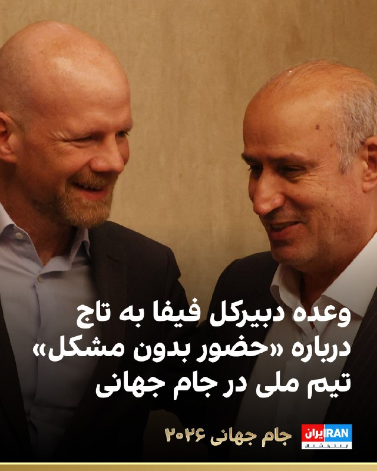

🔻فیفا در بیانیه‌ای اعلام کرد ماتیاس گرافستروم، دبیرکل این نهاد، به‌صورت آنلاین با مهدی تاج، رییس فدراسیون فوتبال جمهوری اسلامی، درباره «هماهنگی و برنامه‌ریزی برای تضمین حضور روان و بدون مشکل تیم ایران» در جام جهانی ۲۰۲۶ گفت‌وگو کرده است. این گفت‌وگو پس از ورود تیم ملی به مکزیک انجام شد.

🔹فیفا این نشست را «بسیار سازنده» توصیف کرده و به نقل از گرافستروم نوشته است: «فیفا به گفت‌وگو و همکاری با فدراسیون فوتبال ایران ادامه خواهد داد تا تجربه‌ای مثبت برای تیم و هیات همراه رقم بخورد و همه شرایط لازم برای رقابت در زمین فراهم شود.»

🔹دبیرکل فیفا همچنین گفت: «تاج و من همان‌طور که در دیدار حضوری‌مان در استانبول گفت‌وگویی بسیار سازنده داشتیم، این‌بار نیز گفت‌وگویی مفید و پربار برگزار کردیم. اکنون که تیم در مکزیک مستقر شده است، با هم مشتاقانه منتظر هفته‌های پیش رو هستیم.»

🔹این بیانیه در حالی منتشر شده که آمریکا برای ۱۵ نفر از فهرست اعلامی فدراسیون فوتبال ایران ویزای ورود صادر نکرده است. همچنین هنوز نحوه اقامت و تردد تیم ملی در لس‌آنجلس و سیاتل برای دیدار با نیوزیلند، بلژیک و مصر مشخص نیست.

@iranintltvsport

## IranIntlTV — post 341382

🗣روایت شما از زندگی در دوران پس از انقلاب ملی و جنگ - سه‌شنبه ۱۹ خرداد

🔹من از نشتارود هستم، ما رستوران داریم، بابا خسته شده، حتی یک‌دونه مشتری هم نداریم.

🔹امروز ۱۹ خرداد حدود ۷:۳۰ برق خیلی از منطقه‌های بزرگ کرج رفت.

🔹دوستان من ده سالمه و باورم نمی‌شه با این سن کم این‌قدر استرس می‌کشم، اوضاع خیلی بده، گرونی بیداد می‌کنه.

🔹حوالی مهرشهر کرج هستیم، امروز ۱۹ خرداد سه بار برق رفت، هر بار یک تا دو ساعت، دیگه کلافه شدیم.

🔹با اپلیکیشن شاد هم که دیگه نگم، افتضاحه. گرانی بیداد می‌کند، خرید خانه که آرزو شده بود، حالا خرید اتومبیل هم آرزو شده، همه افسردگی گرفتیم. رفتم نون خریدم، پلاستیک نون رو ۵۰۰۰ تومن حساب کردن.

🔹این همه امسال بارندگی داشتیم، آب تو منطقه‌ی ما تو تهران هر روز از ظهر قطع می‌شود. بعد می‌گن ما قطع نکردیم، فشار کم است.

🔹من یه پسر ۱۲ ساله هستم و بابام کارواش داره و کلاً چند روزه مشتری نیست. عمم هم انگلیسه و توی جنگ ما دنبال وی‌پی‌ان می‌گشتیم که بهش زنگ بزنیم، قیمت هم برامون مهم نبود و حتی نمی‌تونست پول بفرسته ما رو ساپورت کنه.

🔹از سیرجان، امروز ۱۹ خرداد رفتم دو تا بستنی معمولی گرفتم ۱۰۰ هزار تومن، ولی همین یک ماه پیش همون بستنی‌ها رو دونه‌ای ۱۵ تومن می‌گرفتم.

🔹از گنبد کاووس ترکمن‌صحرا، زندگیم در حال متلاشی شدنه. ۱۵ ساله کارگاه نجاری دارم، الان کارگرامو فرستادم رفتند، تک و تنها کار می‌کنم که فقط خرج کارگاهم دربیاد، لعنت بر جمهوری اسلامی.

🔹امروز سه‌شنبه ۱۹ خرداد از ساعت ۸:۳۰ شب در محدوده شهرک غرب تهران حدود دو ساعته صدای جنگنده و پهپاد می‌آید.

🔹سه‌شنبه ۱۹ خرداد ساعت ۲۰:۳۰ صدای عبور چندین جنگنده در منطقه سعادت‌آباد.

🔹از شیراز، ظهر تو خیابون گرسنه بودم، تو کارتم فقط یک‌میلیون بود، لازم داشتم، یه آب‌معدنی با دو تا نون باگت خریدم خوردم، ۱۰۰ هزار تومان، نون و آب فقط. لعنت بر اول و آخر و معلومات و مجهولات و مهملات جمهوری متعفن اسلامی. جاوید شاه.

🔹مامورین خودروسوار کلانتری یوسف‌آباد تهران، شب‌ها سوار بر خودرو جوانان را در محل‌های خلوت بدون دلیل متوقف می‌کنند و با کلمات رکیک اخاذی می‌کنند.

## FarsiVOA — post 220159

🔺کشف انبار اسلحه حزب‌الله در کنار گهواره نوزاد در جنوب لبنان

ارتش دفاعی اسرائیل از کشف انبارهای اسلحه حزب‌الله در مناطق غیرنظامی، از جمله یک انبار که در کنار یک گهواره نوزاد در جنوب لبنان قرار داشت، خبر داد.

⬇️ بیشتر بخوانید:

https://ir.voanews.com/a/israeli-army-weapons-depot-discovery-hezbollah-south-lebanon/8158996.html

## Persian_Trend_Official — post 16309

  <a href="telegram/content/Persian_Trend_Official_16309_1781031166.mp4" target="_blank">🎬 Download video</a>

شنیده شدن صدای جنگنده احتمالا امریکایی برفراز کردستان عراق

📝 Amir

📌 @persian_trend_official
پرشین ترند | متفاوت‌ترین کانال نظامی

## BBCPersian — post 283268

🔻 گوترش: هیچ راه حل نظامی برای بحران خاورمیانه وجود ندارد

آنتونیو گوترش، دبیر کل سازمان ملل، در پیامی نسبت به تشدید دوباره تنش‌ها در خاورمیانه ابراز نگرانی کرده و خواستاری توقف فوری همه حملات شده است.

او در پیامی در شبکه اجتماعی ایکس نوشته است: «آتش‌بس‌ در لبنان، ایران و غزه باید به‌طور کامل رعایت شوند. باید از هر اقدامی که می‌تواند تلاش‌های دیپلماتیک در حال انجام را تضعیف کند، اجتناب شود.»

آقای گوترش اضافه کرده است: «همچنین عمیقا نگران تصمیم اسرائیل برای بستن گذرگاه‌های منتهی به غزه هستم و بار دیگر خواستار بازگشایی فوری همه گذرگاه‌ها می‌شوم تا عبور سریع، ایمن و بدون مانع کمک‌های بشردوستانه در مقیاس گسترده به سراسر غزه تضمین شود. حقوق و آزادی‌های ناوبری، مطابق با قوانین بین‌المللی، باید مورد احترام قرار گیرند.»

پیشتر رسانه‌های لبنان از حملات هوایی جدید اسرائیل به شهر صور در جنوب این کشور خبر دادند.

دبیرکل سازمان ملل گفته است:‌ «برای درگیری‌های خاورمیانه هیچ راه‌حل نظامی وجود ندارد. تنها راه پیش رو، گفت‌وگو و مذاکره است.»

او همچنین از همه طرف‌ها خواسته است که برای دستیابی به راه‌حل‌های دیپلماتیک تلاش کنند.

https://bbc.in/4xi5EkZ
@BBCPersian

## Dirty_Kids — post 391498

امیدوارم حین بازی ایران و مصر یه سری گی بیارن دور زمین ۹٠ دقیقه کون هم بذارن

@Dirty_Kids 👻

## Dirty_Kids — post 391496

عااااا بامزه‌ی مسخره😂

@Dirty_Kids 👻

## Dirty_Kids — post 391495

جنوب لبنان رو که آزاد نکردید ولی پتروشیمی ماهشهر رو بگا دادید

@Dirty_Kids 👻

## Dirty_Kids — post 391493

رسانه‌های روافض خدعه‌زاده از جمله فارس‌نیوز دارن یک فیک‌نیوزی رو به نقل از یک رسانه‌ی غربی به نام اینتل‌واچ که یک اکانت توییتری با حدود سیصد چهارصد نفر دنبال کننده‌ست [یه مقدادی از پایگاه ابوذر] منتشر می‌کنه مبنی بر اینکه دارایی‌های آزادشده روافض قحبه به ارزش ۳ میلیارد دلار توسط آمریکا امروز از طریق امارات با یک فروند هواپیما به روافض تحویل داده شده.

بر اساس توئیت این اکانت فیک و انتشارش در رسانه‌‌های روافض، یه سری رسانه‌ی اسرائیلی و غربی هم خبر رسانه‌های روافض رو پوشش دادن که آمریکا به روافض نه تنها ۳ میلیارد پول داده بلکه تضمین هم داده که اسرائیل حملات خودش در لبنان رو محدود خواهد کرد.

@Dirty_Kids 👻

## alonews — post 126592

  <a href="telegram/content/alonews_126592_1781031167.webm" target="_blank">🎬 Download video</a>

👈یک مقام ایرانی به الجزیره: بالگرد (هلیکوپتر) آپاچیِ آمریکایی بر فراز آب‌های بین‌المللی پرواز نمی‌کرد.

🔴ایران به هرگونه حملهٔ آمریکا که متوجه این کشور شود، با قدرت و به‌صورت فوری پاسخ خواهد داد.

✅ @AloNews خبر جنگ

## alonews — post 126591

  <a href="telegram/content/alonews_126591_1781031167.webm" target="_blank">🎬 Download video</a>

👈آخرین قیمت نفت ۹۱.۳۵ دلار

✅ @AloNews خبر جنگ

---
📅 بروزرسانی: 1405/03/19 22:13
---

## VahidOOnLine — post 244562

  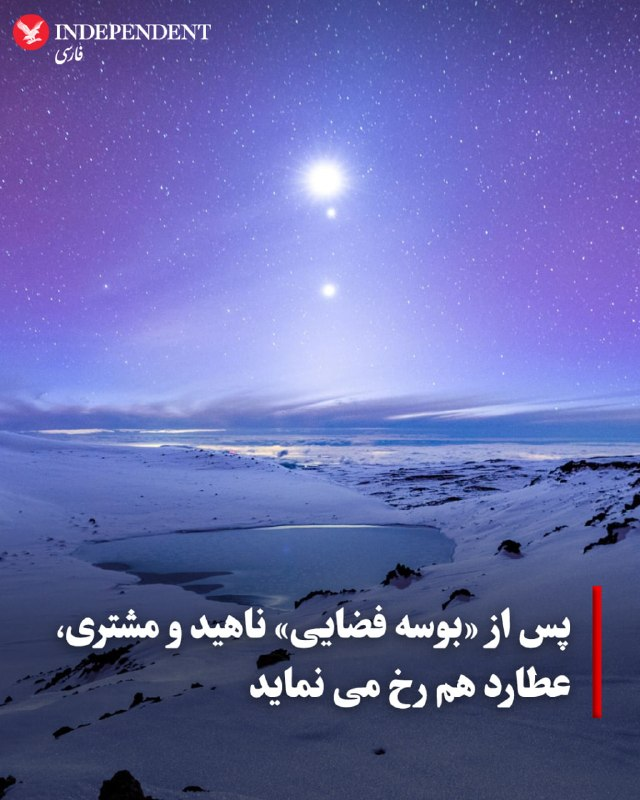

♦️ آسمان شامگاهی خردادماه امسال (ژوئن ۲۰۲۶) میزبان یکی از نادرترین و تماشایی‌ترین پدیده‌های نجومی است. پس از یک هفته نزدیک شدن گام‌به‌گام، سیاره‌های ناهید (زهره) و مشتری سرانجام امشب، سه‌شنبه ۱۹ خرداد (۹ ژوئن)، به نزدیک‌ترین فاصله از یکدیگر رسیده‌اند و در پدیده‌ای تماشایی که به «بوسه فضایی» معروف است، خیره‌کننده‌ترین جلوه را در افق غرب-شمال‌غربی خلق کرده‌اند.

اما این پایان نمایش نیست؛ سیاره گریزپای عطارد (تیر) نیز که معمولا در نور خورشید پنهان است، اکنون در پایین دست این دو سیاره رخ نموده و تا اول تیرماه بهترین فرصت تماشای آن با چشم غیرمسلح فراهم است. رصدگران می‌توانند با نگاه به فاصله ۱۵درجه‌ای زیر ناهید، عطارد را با هاله زرد-نارنجی‌رنگش بیابند.

در این ضیافت آسمانی، ستاره‌های دوقلوی صورت فلکی جوزا (کاستور و پولاکس) نیز به عنوان تماشاگر حضور دارند. همچنین در اواخر هفته آینده (۲۶ و ۲۷ خرداد)، هلال باریک ماه به این جمع می‌پیوندد تا این هم‌نشینی کم‌نظیر را کامل کند. به گفته اخترشناسان، تجمع هم‌زمان این سه سیاره درخشان همراه با ماه در ماه ژوئن، پدیده نادری است که تا سال ۲۰۸۵ میلادی تکرار نخواهد شد.
‌🇸🇦 Indypersian

🤖 @VahidOOnLine

## VahidOOnLine — post 244561

  

سناتور تیم شیهی در پاسخ به پرسش خبرنگار ایران‌اینترنشنال درباره تنش‌های میان اسرائیل و جمهوری اسلامی، از حمایت کامل آمریکا از اسرائیل خبر داد.

او همچنین درباره احتمال دستیابی دولت دونالد ترامپ به توافقی با جمهوری اسلامی اظهار تردید کرد و گفت که تجربه نشان داده توافق با حکومت ایران دشوار است، مگر آنکه امتیازات مالی گسترده‌ای به تهران داده شود.

شیهی گفت: «امیدوارم بتواند، اما تا امروز توافق‌ها معمولا از دسترس کشورهایی که تلاش کرده‌اند با حکومت ایران معامله یا مذاکره کنند، دور مانده‌اند؛ مگر اینکه تصمیم بگیرند میلیاردها دلار به ایران بدهند. بنابراین فکر می‌کنم دستیابی به یک توافق خوب در کوتاه‌مدت بعید است، اما امیدوارم چنین توافقی حاصل شود.»

سناتور شیهی در پاسخ به پرسشی درباره کشته شدن علی خامنه‌ای نیز موضعی صریح اتخاذ کرد و گفت: «خوب است. خوشحالم که مرده است.»
‌🏁 🇬🇧 IranintlTV

🤖 @VahidOOnLine

## VahidOOnLine — post 244560

  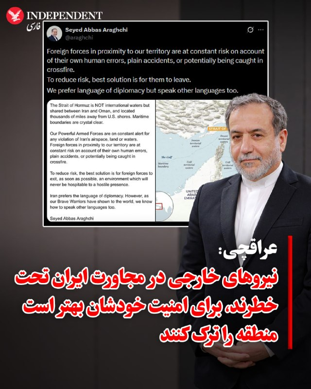

♦️ عباس عراقچی، وزیر امور خارجه جمهوری اسلامی، روز سه‌شنبه ۱۹ خرداد، بدون رد یا تایید هدف قرار دادن هلی‌کوپتر آپاچی آمریکا بر فراز دریای عمان، در شبکه اجتماعی ایکس نوشت: «نیروهای خارجی حاضر در مجاورت قلمرو کشور به دلیل خطاهای انسانی خود، حوادث ناخواسته یا احتمال گرفتار شدن در تبادل آتش، به طور مداوم با خطر مواجه هستند. برای کاهش این مخاطرات، بهترین راه برای آن‌ها خروج هرچه سریع‌تر از منطقه است.»

عراقچی که به‌دلیل از دست دادن «نشان آبی» در شبکه اجتماعی ایکس، تنها می‌تواند متن‌های کوتاه منتشر کند، بخشی از پیام خود را به‌صورت بیانیه تصویری همراه با نقشه‌ای از تنگه هرمز منتشر کرد و نوشت که این تنگه یک آبراه بین‌المللی نیست، بلکه مسیر مشترکی میان ایران و عمان است و هزاران کیلومتر با سواحل آمریکا فاصله دارد.

وزیر امور خارجه جمهوری اسلامی در پایان پیام خود خاطرنشان کرد: «ما زبان دیپلماسی را ترجیح می‌دهیم، اما همان‌طور که دلاوران ما به جهان نشان داده‌اند، ما بلدیم به زبان‌های دیگری نیز صحبت کنیم.»
‌🇸🇦 Indypersian

🤖 @VahidOOnLine

## WithYashar — post 14153

ترامپ‌با کت باز گفت : در واقع خیلی ساده است. برنده کسی است که قدرت دارد. ما تمام قدرت را داریم. @withyashar 😁

## WithYashar — post 14152

اتاق جنگ با شما :صدای مهیب اومد بعدم آمبولانس پشت بندشم پدافند کار میکنه منطقه۶
@withyashar
یاشار : امشب هوای تهران طوفانی‌هم هست

## WithYashar — post 14151

ترامپ‌با کت باز گفت : در واقع خیلی ساده است. برنده کسی است که قدرت دارد. ما تمام قدرت را داریم.
@withyashar 😁

## mwarmonitor — post 10537

  <a href="telegram/content/mwarmonitor_10537_1781030619.mp4" target="_blank">🎬 Download video</a>

🔴«فرمانده سپاه پاسداران انقلاب اسلامی ایران، احمد وحیدی، خط قرمزی برای توافق ایران و آمریکا تعیین کرده است.

🔸بر اساس منابع این گزارش، او تصمیم گرفته که هیچ توافقی با ایالات متحده انجام نشود مگر اینکه ایران در لحظه امضای توافق، پول نقد فوری دریافت کند.

🔸مقامات ایرانی تصور می‌کردند که به دسترسی به حدود ۲۲ تا ۲۴ میلیارد دلار از دارایی‌های مسدود شده نزدیک شده‌اند، اما سیگنال‌های اخیر آمریکا باعث شده تهران فکر کند ممکن است این پول را دریافت نکند.

🔸جمع‌بندی: از نظر وحیدی، اگر پول نقدی پرداخت نشود، توافقی هم در کار نخواهد بود.» کانال ۱۴ اسرائیل

@mwarmonitor

## pm_afshaa — post 93038

  <a href="telegram/content/pm_afshaa_93038_1781030621.webm" target="_blank">🎬 Download video</a>

🔴فعالیت جنگنده‌ها و سوخت‌رسان‌های آمریکایی در خلیج فارس و منطقه زیاد شده.

💧 Rainbet.com the #1 Non-KYC Crypto Casino & Sportsbook @rainbetcom

😁 @Pm_Afshaa

## pm_afshaa — post 93037

  <a href="telegram/content/pm_afshaa_93037_1781030621.webm" target="_blank">🎬 Download video</a>

🔴ترامپ به ای‌بی‌سی نیوز:
در واقع بسیار ساده‌ست، کسی که قدرت داره، برنده میشه، و ما تمام قدرت رو داریم.

💧 Rainbet.com the #1 Non-KYC Crypto Casino & Sportsbook @rainbetcom

😁 @Pm_Afshaa

## IranIntlTV — post 341381

  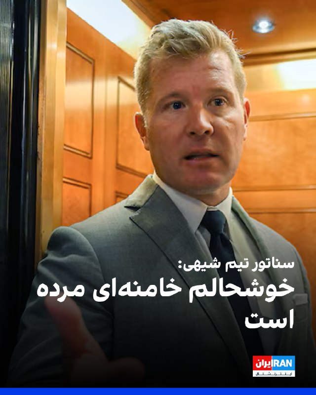

سناتور تیم شیهی در پاسخ به پرسش خبرنگار ایران‌اینترنشنال درباره تنش‌های میان اسرائیل و جمهوری اسلامی، از حمایت کامل آمریکا از اسرائیل خبر داد.

او همچنین درباره احتمال دستیابی دولت دونالد ترامپ به توافقی با جمهوری اسلامی اظهار تردید کرد و گفت که تجربه نشان داده توافق با حکومت ایران دشوار است، مگر آنکه امتیازات مالی گسترده‌ای به تهران داده شود.

شیهی گفت: «امیدوارم بتواند، اما تا امروز توافق‌ها معمولا از دسترس کشورهایی که تلاش کرده‌اند با حکومت ایران معامله یا مذاکره کنند، دور مانده‌اند؛ مگر اینکه تصمیم بگیرند میلیاردها دلار به ایران بدهند. بنابراین فکر می‌کنم دستیابی به یک توافق خوب در کوتاه‌مدت بعید است، اما امیدوارم چنین توافقی حاصل شود.»

سناتور شیهی در پاسخ به پرسشی درباره کشته شدن علی خامنه‌ای نیز موضعی صریح اتخاذ کرد و گفت: «خوب است. خوشحالم که مرده است.»
https://iranintl.com/202606094444

## DW_Farsi — post 125738

  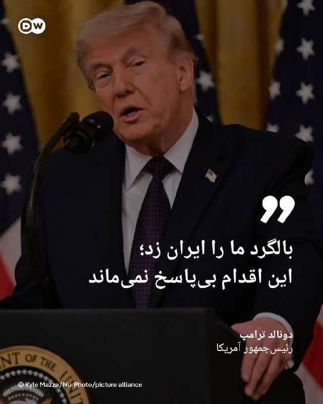

🔶سرنگونی بالگرد آمریکایی؛ ترامپ: اقدام ایران بی‌پاسخ نمی‌ماند

در پی سرنگونی یک فروند بالگرد نظامی ایالات متحده در جریان منازعه با ایران، دونالد ترامپ، رئیس‌جمهور آمریکا، از اقدام تلافی‌جویانه واشنگتن خبر داد.

ترامپ روز سه‌شنبه، ۹ ژوئن طی پیام در شبکه اجتماعی تروث سوشال اعلام کرد به او گزارش شده است که "ایرانی‌ها شب گذشته یکی از هلی‌کوپترهای بسیار پیشرفته آپاچی ما را در حال گشت‌زنی در تنگه هرمز سرنگون کرده‌اند".

رئیس‌جمهور آمریکا افزود، با وجود اینکه خلبانان این پرواز آسیبی ندیده‌اند، اما ایالات متحده "به ناچار باید به این حمله پاسخ دهد".
@dw_farsi

## Persian_Trend_Official — post 16308

آماده لایو هستید ؟
ترامپ دوباره داره فضا رو داغ میکنه !

احتمال تنش و درگیری در ساعات آینده وجود داره
شاید بیشتر از یک تنش ساده !

## Persian_Trend_Official — post 16307

  <a href="telegram/content/Persian_Trend_Official_16307_1781030623.webm" target="_blank">🎬 Download video</a>

ترامپ درباره ایران: اگر طرف‌ها احمق باشند، کار به نابودی زیرساخت‌ها می‌کشد!

دونالد ترامپ در مصاحبه با ABC گفت: اگر مردم احمق باشند، به جایی می‌رسیم که مجبور خواهیم شد کل زیرساخت‌های یک کشور را نابود کنیم. حقیقتا خیلی ساده است برنده جنگ کشوری هست که قدرت داره و ما تمام قدرت رو داریم

وقتی از ترامپ پرسیده شد که آیا آمریکا ممکن است بعداً به بازسازی ایران کمک کند، او پاسخ داد: بله، و آن را با طرح مارشال مقایسه کرد و سپس افزود: اما نیمی از نفت‌شان را خواهیم گرفت.

📝 Amir

📌 @persian_trend_official
پرشین ترند | متفاوت‌ترین کانال نظامی

## Hranews — post 113503

  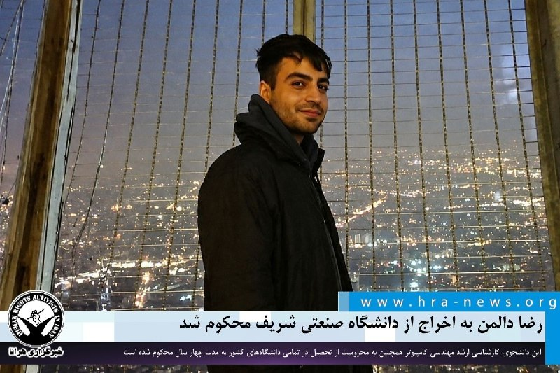

رضا دالمن به اخراج از دانشگاه شریف و منع موقت از تحصیل محکوم شد❗️❗️❗️❗️❗️ – رضا دالمن، دانشجوی کارشناسی ارشد مهندسی کامپیوتر دانشگاه صنعتی شریف، با حکم شورای انضباطی این دانشگاه به #اخراج و محرومیت از تحصیل در تمامی دانشگاه‌های کشور به مدت چهار سال محکوم شده است. این حکم پس از تایید در شورای تجدیدنظر دانشگاه برای اجرا به وزارت علوم ارسال شده است.ادامه مطلب#رضا_دالمن↘️ @hranews_bot تماس ✉️ -  @Hranews  کانال هرانا 🆑

## alonews — post 126590

  <a href="telegram/content/alonews_126590_1781030623.webm" target="_blank">🎬 Download video</a>

👈ترامپ : قضیه خیلی ساده‌ست هرکی قدرت بیشتری داشته باشه، برنده‌ست و ما هم همه قدرت رو داریم 
✅ @AloNews خبر جنگ

---
📅 بروزرسانی: 1405/03/19 22:04
---

## WithYashar — post 14150

گزارش پرواز جنگنده های نیروی هوایی ارتش در جنوب غرب کشور
@withyashar

## WithYashar — post 14149

خبرنگار العربیه: اسرائیل با انجام 4 حمله هوایی مناطقی را در جنوب لبنان بمباران کرد.
@withyashar

## mwarmonitor — post 10536

  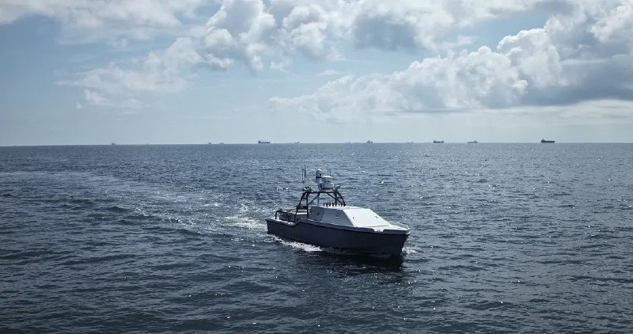

📌یک پهپاد سطحی نیروی دریایی آمریکا دو خدمه یک بالگرد تهاجمی آپاچیِ آمریکایی را که در آب‌های نزدیک سواحل عمان سقوط کرده بود، شناسایی و نجات داد؛ این نخستین عملیات نجات از این نوع به شمار می‌رود. — رویترز @mwarmonitor

## mwarmonitor — post 10535

🔴ترامپ درباره ایران:

🔸«در واقع موضوع بسیار ساده است. برنده کسی است که قدرت را در اختیار دارد. ما تمام قدرت را در اختیار داریم.»

🔸«اگر مردم احمق باشند، به جایی خواهیم رسید که مجبور می‌شویم کل زیرساخت‌های یک کشور را نابود کنیم.»

@mwarmonitor

## pm_afshaa — post 93036

  <a href="telegram/content/pm_afshaa_93036_1781030081.webm" target="_blank">🎬 Download video</a>

🔴ترامپ به ای‌بی‌سی نیوز:

وقتی ازم پرسیدن آیا آمریکا بعداً به بازسازی ایران کمک میکنه، گفتم: آره. یه چیزی شبیه طرح مارشال ولی نصف نفتشون مال ما میشه!

اگر احمقانه رفتار کنن، ممکنه کار به جایی برسه که مجبور بشیم زیرساخت‌های یک کشور رو به‌طور کامل از بین ببریم.

💧 Rainbet.com the #1 Non-KYC Crypto Casino & Sportsbook @rainbetcom

😁 @Pm_Afshaa

## pm_afshaa — post 93035

  <a href="telegram/content/pm_afshaa_93035_1781030082.webm" target="_blank">🎬 Download video</a>

🔴پرواز حداقل 8 هشت سوخت رسان آمریکایی بر فراز خاورمیانه :

💧 Rainbet.com the #1 Non-KYC Crypto Casino & Sportsbook @rainbetcom

😁 @Pm_Afshaa

## pm_afshaa — post 93034

  <a href="telegram/content/pm_afshaa_93034_1781030083.webm" target="_blank">🎬 Download video</a>

🔴باراک راوید، خبرنگار آکسیوس: یه مقام آمریکایی بهم گفته نتیجه تحقیقات نشون داده یه پهپاد ایرانی به بالگرد آمریکایی برخورد کرده و باعث سقوطش شده؛ ولی تحقیقات هنوز مشخص نکرده که این برخورد عمدی بوده یا اتفاقی. 
💧 Rainbet.com the #1 Non-KYC Crypto Casino & Sportsbook…

## pm_afshaa — post 93033

  <a href="telegram/content/pm_afshaa_93033_1781030083.webm" target="_blank">🎬 Download video</a>

🔴توییت عباس عراقچی:
نیروهای خارجی در مجاورت قلمرو ما به دلیل خطاهای انسانی خود، تصادفات ساده یا احتمال گرفتار شدن در آتش متقاطع، همواره در معرض خطر هستن.

برای کاهش خطر، بهتره اینجارو ترک کنید.
ما زبان دیپلماسی رو ترجیح میدیم اما زبان‌های دیگر رو هم صحبت می‌کنیم.

💧 Rainbet.com the #1 Non-KYC Crypto Casino & Sportsbook @rainbetcom

😁 @Pm_Afshaa

## VahidOnline — post 76106

  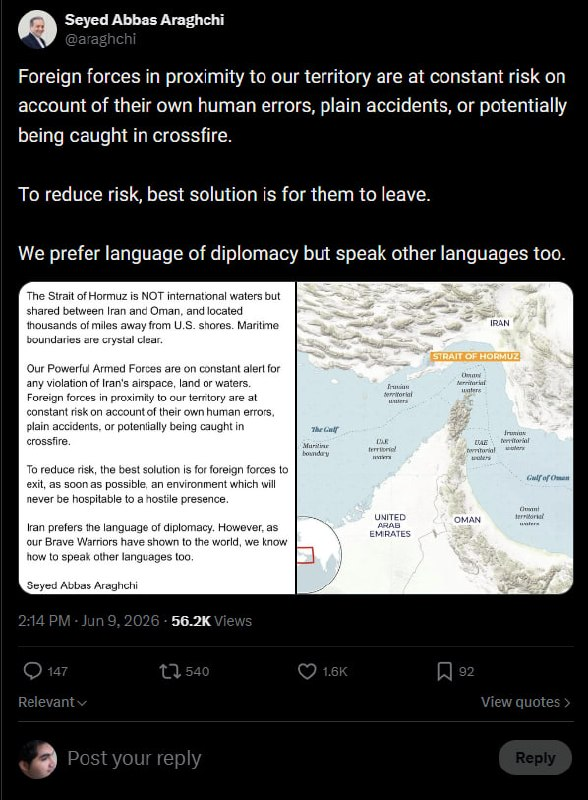

توییت عراقچی، ترجمه ماشین:
نیروهای خارجی در نزدیکی قلمرو ما همواره در معرض خطرند؛ چه به‌دلیل خطاهای انسانی خودشان، چه حوادث ساده، و چه احتمال گرفتار شدن در آتش متقابل.

برای کاهش خطر، بهترین راه‌حل این است که آنجا را ترک کنند.

ما زبان دیپلماسی را ترجیح می‌دهیم، اما زبان‌های دیگری را هم بلدیم.
araghchi

📡 @VahidOnline

## IranIntlTV — post 341380

  <a href="telegram/content/IranIntlTV_341380_1781030085.mp4" target="_blank">🎬 Download video</a>

۲۴ با فرداد فرحزاد
@iranintltv

## IranIntlTV — post 341379

  <a href="telegram/content/IranIntlTV_341379_1781030086.mp4" target="_blank">🎬 Download video</a>

مهدی مهدوی‌آزاد در برنامه «چشم‌انداز» گفت: «علی خامنه‌ای در دوران رهبری خود، سیاست‌هایی را دنبال کرد که خسارت‌های گسترده‌ای به ایران وارد کرد. خامنه‌ای در حدود چهار دهه حکومت، بسیاری از جنبه‌های زندگی مردم، از پوشش و آموزش تا سینما، تلویزیون و تفریحات عمومی را تحت تاثیر دیدگاه‌های خود قرار داد و با ایجاد ساختارهای موازی، به‌ویژه در نهادهای نظامی و امنیتی، فضای بی‌اعتمادی و نگرانی از کودتا را در حکومت حفظ کرد. میلیون‌ها نفر درباره مرگ یا حذف علی خامنه‌ای رویا‌بافی کرده بودند و با وجود گذشت صد روز از مرگ خامنه‌ای و دفن نشدن او، بسیاری هنوز این خبر را باور نکرده‌اند.»
@iranintltv

## FarsiVOA — post 220158

🔺هشدار منابع دانشجویی: جمهوری اسلامی دانشجویان مخالف را از تحصیل و خوابگاه «محروم» می‌کند

◾️خبرنامه امیرکبیر روز سه‌شنبه ۱۹ خرداد اعلام کرد رژیم ایران، شماری از دانشجویان شرکت‌کننده در اعتراضات دانشگاهی را با محدودیت‌های آموزشی و رفاهی روبه‌رو و آنها را «به طور غیررسمی و در فرآیندی غیرشفاف»، عملاً از تحصیل محروم کرده است.

⬇️ بیشتر بخوانید:

https://ir.voanews.com/a/iran-student-university-ban-opposition/8158975.html

## FarsiVOA — post 220157

🔺ناسا خدمه مأموریت آرتمیس ۳ را معرفی کرد؛ موکول شدن فرود انسان بر ماه به مأموریت بعدی

◾️ناسا خدمه مأموریت «آرتمیس ۳» را معرفی کرده است؛ مأموریتی که بر اساس برنامه تازه این سازمان، به جای فرود انسان بر سطح ماه، بر آزمایش اتصال فضاپیمای اوریون به ماه‌نشین‌های تجاری در مدار زمین متمرکز خواهد بود.

⬇️ بیشتر بخوانید:

https://ir.voanews.com/a/nasa-names-artemis-crew/8158962.html

## FarsiVOA — post 220156

علی جوانمردی: فوتبال فراتر از ورزش است و تیم ایران فرصت مناسبی پیش رو دارد

## Persian_Trend_Official — post 16306

  <a href="telegram/content/Persian_Trend_Official_16306_1781030089.webm" target="_blank">🎬 Download video</a>

او افزود که تحقیقات هنوز تعیین نکرده‌اند که آیا این برخورد عمدی بوده است یا خیر.

## Persian_Trend_Official — post 16304

عباس عراقچی، وزیر امور خارجه: تنگه هرمز در آب‌های بین‌المللی قرار ندارد، بلکه میان ایران و عمان مشترک است و هزاران مایل از سواحل ایالات متحده فاصله دارد. مرزهای دریایی کاملاً روشن و بدون ابهام هستند.

نیروهای مسلح قدرتمند ما به‌طور مستمر در حالت آماده‌باش قرار دارند تا با هرگونه نقض حریم هوایی، زمینی یا دریایی ایران مقابله کنند.

نیروهای خارجی که در نزدیکی قلمرو ما قرار دارند، همواره در معرض خطر هستند؛ چه به‌سبب خطاهای انسانی خود، چه حوادث ساده، و چه احتمال گرفتار شدن در تبادل آتش.

برای کاهش این خطرات، بهترین راه آن است که نیروهای خارجی هرچه سریع‌تر این منطقه را ترک کنند؛ منطقه‌ای که هرگز پذیرای حضور دشمنان نخواهد بود.

ایران زبان دیپلماسی را ترجیح می‌دهد؛ با این حال، همان‌گونه که رزمندگان شجاع ما به جهانیان نشان داده‌اند، ما به زبان‌های دیگر نیز سخن گفتن را به‌خوبی می‌دانیم.

📝 Amir

📌 @persian_trend_official
پرشین ترند | متفاوت‌ترین کانال نظامی

## Persian_Trend_Official — post 16303

ایران اینتل واچ:«بر اساس اطلاعات به‌دست‌آمده، تصمیم ایران برای توقف حملات به اسرائیل پس از یک پیام آمریکا که از طریق هیأتی قطری در ۸ ژوئن منتقل شد اتخاذ شد؛ این پیام درباره مهار اسرائیل در لبنان بود. همچنین در کنار آن، انتقال ۳ میلیارد دلار از ابوظبی به تهران…

## Persian_Trend_Official — post 16302

  <a href="telegram/content/Persian_Trend_Official_16302_1781030089.webm" target="_blank">🎬 Download video</a>

🔴 رصد پرواز سوخت‌رسان‌های آمریکایی در مسیر خلیج فارس
بر اساس داده‌های منتشرشده از رهگیری پروازها، چندین فروند هواپیمای سوخت‌رسان نیروی هوایی آمریکا از پایگاه‌های مختلف به پرواز درآمده و در حال حرکت به سمت منطقه خلیج فارس هستند.

👺Phantom

📌 @persian_trend_official
پرشین ترند | متفاوت‌ترین کانال نظامی

## IranianMinds — post 21946

🔴خبر‌نگار فاکس‌نیوز:

رئیس جمهور ترامپ احتمالأ در شرف دستور دادن به یک انفجار بزرگ در ایران می‌باشد.

@IranianMinds

## BBCPersian — post 283267

🔻 تشییع و تدفین خامنه‌ای «بعد از دهه‌ اول محرم» خواهد بود

ستاد بزرگداشت آیت‌الله علی خامنه‌ای در اطلاعیه شماره ۲ خود گفت مراسم «وداع، تشییع و تدفین» رهبر سابق جمهوری اسلامی «بعد از دهه‌ اول محرم» برگزار می‌شود.

دلیل این تصمیم «اهمیت برپایی عزاداری‌های این ایام در اقصی‌ نقاط ایران و جهان» عنوان شده است.

هفته پیش معاون فرهنگی و اجتماعی شهرداری تهران گفته بود که تشییع علی خامنه‌ای «احتمالا در پایان ماه ذی‌الحجه و اوایل ماه محرم» برگزار می‌شود.

محمدامین توکلی‌زاده گفت متولی مراسم سپاه پاسداران است و سه روز «بدرقه مردمی» در‌نظر گرفته شده است.

آقای توکلی‌زاده گفت که پس از مراسم بدرقه، نماز و آئین تشییع برگزار خواهد شد که در تهران حداقل ۲۴ ساعت طول خواهد کشید.

او گفت: «در حال تدارک برای جمعیتی بیش از ۱۵ تا ۲۰ میلیون نفر در پایتخت هستیم.»

به گفته آقای توکلی‌زاده پس از تهران، تشییع در شهرهای قم و مشهد قطعی شده و استان‌های مختلف درخواست‌ میزبانی از تشییع داده‌اند.

او گفت مدفن آیت‌الله علی خامنه‌ای «براساس وصیت و توصیه‌های نزدیکان» حرم امام رضا در مشهد خواهد بود و جزئیات بیشتر بعدا اعلام می‌شود.

https://bbc.in/4xi5EkZ
@BBCPersian

## BBCPersian — post 283266

🔻 فعالیت‌های پروازی در فرودگاه امام خمینی از سر گرفته شد

فرودگاه امام خمینی تهران آماده از سرگیری پروازهای بین‌المللی است.

با باز شدن آسمان ایران و رفع محدودیت‌ها فعالیت‌های پروازی امروز در فرودگاه امام خمینی از سر گرفته شد و پروازهای برگشت زائران حج در این فرودگاه به زمین نشستند.

به گزارش ایرنا، جواد صالحی آرتیمانی، معاون بهره‌برداری فرودگاهی شرکت شهر فرودگاهی امام خمینی، گفت:

«با بازگشت شرایط عملیاتی صنعت هوانوردی کشور به وضعیت عادی، همه بخش‌های عملیاتی، خدماتی و پشتیبانی شهر فرودگاهی در آمادگی کامل قرار گرفته‌اند.».

او گفت که «شهر فرودگاهی اکنون آمادگی پذیرش و اعزام تمامی پروازهای برنامه‌ای و فوق‌العاده را داراست» و «در هفته‌های پیش رو شاهد بازگشت تدریجی ایرلاین‌های خارجی و افزایش تعداد پروازهای بین‌المللی خواهیم بود.»

به گفته آقای صالحی، «سایر شرکت‌های هواپیمایی نیز مطابق برنامه به چرخه عملیاتی شهر فرودگاهی بازخواهند گشت و روند عادی ارائه خدمات پروازی از سر گرفته خواهد شد.»

پس از موج اول حمله اخیر اسرائیل، پروازهای دو فرودگاه مهرآباد و امام خمینی لغو شدند و پس از اعلام توقف جنگ آسمان ایران برای ۲۴ ساعت بسته اعلام شد.

https://bbc.in/4xi5EkZ
@BBCPersian

## BBCPersian — post 283265

🔻 تجهیزات «پشتیبانی و هدایت» جنگنده‌های اسرائیل در جنگل‌های تنکابن کشف شد

رسانه‌های ایران می‌گویند «تجهیزات فنی پشتیبانی و هدایت» جنگنده‌های اسرائیل «در ارتفاعات جنگلی شهرستان تنکابن کشف و جمع‌آوری» شده است.

بنابر این گزارش‌ها، این مجموعه تجهیزات «در یکی از مسیرهای اصلی نفوذ دشمن به سمت حریم هوایی تهران مستقر بود» و «نیروهای امنیتی و نظامی» آن را کشف کردند.

گزارش این تجهیزات را «سامانه‌های زمین‌پایه راهبردی» توصیف می‌کند که «برای هدایت و پشتیبانی جنگنده‌های مهاجم در حملات هوایی علیه مناطق شمالی کشور و پایتخت» استفاده می‌شد.

طبق این گزارش، «بررسی‌ها نشان می‌دهد منطقه عملیاتی مورد نظر در دوران جنگ رمضان به عنوان یکی از کریدورهای اصلی ورود جنگنده‌های اسرائیلی برای هدف قرار دادن تهران و تأسیسات حساس شمال کشور تعیین شده بوده است.»

اما با «هوشیاری نیروهای اطلاعاتی و پدافندی» این تجهیزات «پیش از هرگونه بهره‌برداری عملیاتی کشف و از منطقه خارج شدند.»

گفته شده است که جزئیات بیشتر بعدا اعلام می‌شود. در این گزارش به بازداشت کسی اشاره نشده است.

https://bbc.in/4xi5EkZ
@BBCPersian

## BBCPersian — post 283264

🔻 فرانسه، بریتانیا، کانادا، استرالیا، نیوزیلند و نروژ اعلام کردند که به دلیل تداوم خشونت‌ها در کرانه باختری تحریم‌هایی علیه «نهادهای مسئول شهرک‌سازی» در این منطقه اعمال کردند. اسرائیل در واکنش، این اقدام را «شرم آور» خوانده و آن را محکوم کرده است.

ژان نوئل بارو، وزیر خارجه فرانسه در پیامی در شبکه ایکس گفت که به همراه شرکای کشورش امروز تحریم‌های جدیدی را علیه افرادی اعمال می‌کنند که «مسئول تشدید شهرک‌سازی و خشونت در کرانه باختری هستند.»
آقای بارو همچنین گفت که «ورود بتسالل اسموتریچ، وزیر دارایی اسرائیل، چهار تن از رهبران سازمان‌های شهرک‌نشین و ۲۱ شهرک‌نشین خشن را به خاک فرانسه ممنوع کرده‌ایم.»

بیشتر بخوانید:
https://bbc.in/4fBpgKw
@BBCPersian

## BBCPersian — post 283263

🔻چین آمریکا را به سرکوب شرکت‌‌های چینی متهم کرد

چین، آمریکا را به سرکوب شرکت‌های چینی متهم کرد و سخنگوی وزارت خارجه چین خواستار اصلاح این رویه‌ «نادرست» شد.

آمریکا نام چند شرکت بزرگ چینی را در فهرست شرکت‌های دارای ارتباط احتمالی با ارتش چین قرار داده است.

در میان شرکت‌هایی که تازه به این فهرست اضافه شده‌اند، نام شرکت بزرگ تجارت الکترونیک «علی‌بابا» و خودروساز برقی «بی‌وای‌دی» هم دیده می‌شود.

هدف این فهرست، آگاه کردن نهادهای آمریکایی از خطرات احتمالی همکاری با برخی شرکت‌های چینی عنوان شده است.

قرار گرفتن در این فهرست به معنای ممنوعیت فعالیت یا همکاری با این شرکت‌ها نیست.

https://bbc.in/4xi5EkZ
@BBCPersian

## Hranews — post 113502

مرگ و مصدومیت ۵ کارگر از جمله یک کودک‌کار در سایه فقدان ایمنی کار

❗️
❗️
❗️
❗️
❗️ – در سایه فقدان ایمنی محیط و شرایط نامناسب کار، پنج #کارگر از جمله یک #کودک‌کار در شهرهای اصفهان، مشهد و شیراز، حین انجام کار دچار حادثه شدند. طی این حوادث چهار کارگر مصدوم و یک تن دیگر جان خود را از دست داد.

ادامه مطلب

↘️
@hranews_bot تماس ✉️ -  @Hranews  کانال هرانا 🆑

## alonews — post 126589

  <a href="telegram/content/alonews_126589_1781030090.webm" target="_blank">🎬 Download video</a>

👈عباس عراقچی، وزیر امور خارجه:
نیروهای خارجی در نزدیکی قلمرو ما به دلیل اشتباهات انسانی خود، حوادث ساده یا احتمال گرفتار شدن در آتش متقابل، همواره در معرض خطر هستند.

🔴برای کاهش خطر، بهترین راه حل این است که آنها منطقه را ترک کنند.

🔴ما زبان دیپلماسی را ترجیح می‌دهیم اما به زبان‌های دیگر نیز صحبت می‌کنیم.

✅ @AloNews خبر جنگ

## alonews — post 126588

  <a href="telegram/content/alonews_126588_1781030090.webm" target="_blank">🎬 Download video</a>

🔴فوری / ترامپ به ABC : اگه یه عده بخوان احمقانه رفتار کنن 
🔴 ممکنه کار به جایی بکشه که مجبور بشیم کل زیرساخت‌های یه کشور رو نابود کنیم! 
✅ @AloNews خبر جنگ

## alonews — post 126587

  <a href="telegram/content/alonews_126587_1781030090.webm" target="_blank">🎬 Download video</a>

🔴فوری / ترامپ به ABC : اگه یه عده بخوان احمقانه رفتار کنن

🔴 ممکنه کار به جایی بکشه که مجبور بشیم کل زیرساخت‌های یه کشور رو نابود کنیم!

✅ @AloNews خبر جنگ

## alonews — post 126586

  <a href="telegram/content/alonews_126586_1781030091.webm" target="_blank">🎬 Download video</a>

👈هم اکنون آسمان منطقه

✅ @AloNews خبر جنگ

## alonews — post 126585

  <a href="telegram/content/alonews_126585_1781030091.webm" target="_blank">🎬 Download video</a>

👈کانال آی ۲۴ نیوز اسرائیل: هشدار نتانیاهو: ممکن است مجبور شویم بدون پشتیبانی آمریکا با ایران مقابله کنیم

🔴پس از تماس تلفنی ترامپ برای توقف حملات اسرائیل در پاسخ به رگبار موشکی ایران، نتانیاهو به وزیران کابینه خود چنین هشداری داد:

🔴«ممکن است به وضعیتی برسیم که مجبور شویم به تنهایی و بدون پشتیبانی آمریکا با ایرانی‌ها مقابله کنیم، با تمام هزینه‌هایی که این موضوع به همراه دارد، کمبود مهمات و انزوای بین‌المللی. نمی‌خواهیم به آن نقطه برسیم، اما می‌دانیم که ممکن است برسیم.»

🔴رئیس ستاد کل ارتش اسرائیل، ایال زامیر، همچنین درباره توافق هسته‌ای در حال شکل‌گیری هشدار داد:

🔴«از منظر ما در حال حاضر، تقریباً هر توافقی، یک توافق بد است.»

✅ @AloNews خبر جنگ

---
📅 بروزرسانی: 1405/03/19 21:53
---

## VahidOOnLine — post 244559

  

بر اساس اطلاعات رسیده به ایران‌اینترنشنال، آمنه بیرقداری کِرهرودی، زندانی سیاسی ۶۱ ساله اهل فریمان، بدون رعایت اصل تفکیک جرائم، به بند دو زندان زنان وکیل‌آباد مشهد منتقل شده است؛ بندی که به گفته منابع مطلع، محل نگهداری زندانیان جرایم خشن و سابقه‌دار است.

یک منبع مطلع از وضعیت این زندانی سیاسی گفت شرایط بهداشتی این بند بسیار نامناسب است، به بیرقداری حتی پتو داده نشده و او ناچار است روی زمین بخوابد. او همچنین در زندان دچار حمله عصبی شده و وضعیت جسمی و روانی‌اش نگران‌کننده است.

بیرقداری که دی‌ماه ۱۴۰۳ همراه با پسرش بازداشت و برای هفته‌ها از تماس و ملاقات با خانواده محروم شده بود، اوایل سال ۱۴۰۴ با وثیقه آزاد شد، اما ۱۲ اردیبهشت بار دیگر بازداشت شد.
پس از این بازداشت، همسر او، علی انبایی فریمانی، معلم بازنشسته و مجروح شیمیایی جنگ ایران و عراق، دچار سکته مغزی شد و از آن زمان در کما و در بیمارستان قائم مشهد بستری است.
او مادر چهار فرزند است و منابع مطلع می‌گویند فشار ناشی از وضعیت همسرش و بیماری سرطان مغز استخوان پسرش، ایمان انبایی فریمانی، وضعیت روحی‌اش را به‌شدت وخیم کرده است.
‌🏁 🇬🇧 IranintlTV

🤖 @VahidOOnLine

## WithYashar — post 14148

کانال ۱۴ اسرائیل: گزارش‌هایی از چندین انفجار در منطقه امیرآباد تهران منتشر شده است. این منطقه محل استقرار ستاد سازمان انرژی اتمی ایران است.
@withyashar

## mwarmonitor — post 10534

🔴یک مقام ارشد آمریکایی به شبکه ۱۲ اسرائیل گفته است که تحقیقات مشخص کرده یک نوع پهپاد ایرانی به بالگرد برخورد کرده و باعث سقوط آن شده است. این تحقیق هنوز مشخص نکرده که آیا این برخورد عمدی بوده یا غیرعمدی است. @mwarmonitor

## FoxNewsTwitter — post 342767

  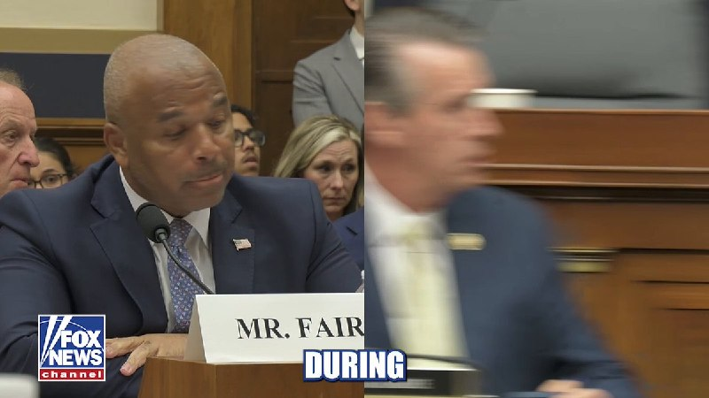

Fox News (Twitter/X)

Rep. Lance Gooden unloads on Southern Poverty Law Center interim CEO Bryan Fair after pressing him on why groups like Turning Point USA and the Family Research Council appear on the SPLC's hate map while Antifa and Jane's Revenge do not.

GOODEN: "Under your criteria, Turning Point, USA, Family Research Council, and other conservative Christian groups are considered hate groups. Antifa and Jane's Revenge, that burns down Catholic churches and pregnancy resource centers, those are not hate groups. It sounds like you're really proud of that process."

## mamlekate — post 103653

📝 ترامپ: سرنگونی بالگرد آپاچی آمریکا در تنگه هرمز کار رژیم ایران بود؛ باید به این اقدام پاسخ دهیم

دونالد ترامپ، رئیس‌جمهوری ایالات متحده، اعلام کرد نیروهای ایرانی یک بالگرد آپاچی ارتش آمریکا را هنگام گشت‌زنی بر فراز تنگه هرمز سرنگون کرده‌اند و گفت واشنگتن ناگزیر است به این اقدام پاسخ دهد.

@mamlekate

## IranIntlTV — post 341378

  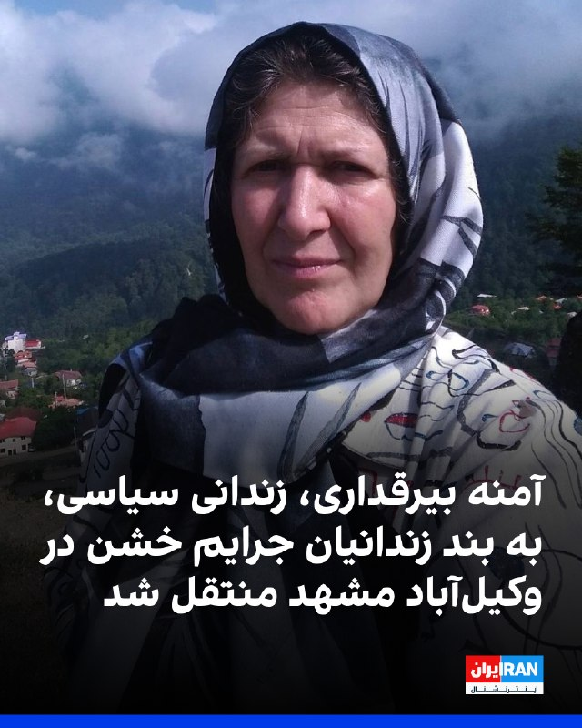

بر اساس اطلاعات رسیده به ایران‌اینترنشنال، آمنه بیرقداری کِرهرودی، زندانی سیاسی ۶۱ ساله اهل فریمان، بدون رعایت اصل تفکیک جرائم، به بند دو زندان زنان وکیل‌آباد مشهد منتقل شده است؛ بندی که به گفته منابع مطلع، محل نگهداری زندانیان جرایم خشن و سابقه‌دار است.

یک منبع مطلع از وضعیت این زندانی سیاسی گفت شرایط بهداشتی این بند بسیار نامناسب است، به بیرقداری حتی پتو داده نشده و او ناچار است روی زمین بخوابد. او همچنین در زندان دچار حمله عصبی شده و وضعیت جسمی و روانی‌اش نگران‌کننده است.

بیرقداری که دی‌ماه ۱۴۰۳ همراه با پسرش بازداشت و برای هفته‌ها از تماس و ملاقات با خانواده محروم شده بود، اوایل سال ۱۴۰۴ با وثیقه آزاد شد، اما ۱۲ اردیبهشت بار دیگر بازداشت شد.
پس از این بازداشت، همسر او، علی انبایی فریمانی، معلم بازنشسته و مجروح شیمیایی جنگ ایران و عراق، دچار سکته مغزی شد و از آن زمان در کما و در بیمارستان قائم مشهد بستری است.
او مادر چهار فرزند است و منابع مطلع می‌گویند فشار ناشی از وضعیت همسرش و بیماری سرطان مغز استخوان پسرش، ایمان انبایی فریمانی، وضعیت روحی‌اش را به‌شدت وخیم کرده است.
https://iranintl.com/2026060998

## Shin_Persian — post 6790

🔁 Quoting above tweet:
Shin ✓ @hey_itsmyturn
Tue, 09 Jun 2026 18:19:11 UTC

State-owned Mehr News:
"Regarding Donald Trump's recent claim of Iran downing a U.S. helicopter and his subsequent threat of military retaliation, Hadi Mohammadpour, a Member of Parliament representing Mashhad, stated in an interview with Mehr News Agency:

Trump's assertions are less grounded in reality and more consistent with his habitual strategy of psychological warfare in the digital sphere. His statements, whether concerning agreements with Iran or military threats, are entirely unreliable and untrustworthy.

Trump's volatile character and impulsive, shifting decisions indicate that his words cannot be taken seriously.

Should the United States intend to violate a ceasefire or commit any act of aggression, Iran will not hesitate to defend itself. All American military bases in the region are within the range of our defensive capabilities. If the enemy dares to act, Iran will deliver a strong and decisive response to any threat."

فارسی

خبرگزاری دولتی مهر:
«هادی محمدپور، نماینده مجلس از حوزه انتخابیه مشهد، در گفتگو با خبرگزاری مهر در خصوص ادعای اخیر دونالد ترامپ مبنی بر سرنگونی یک فروند بالگرد آمریکایی توسط ایران و تهدید متعاقب آن به تلافی نظامی، اظهار داشت:

اظهارات ترامپ کمتر بر واقعیت استوار بوده و بیشتر با استراتژی همیشگی او در زمینه جنگ روانی در فضای مجازی همخوانی دارد. سخنان او، چه در رابطه با توافق با ایران و چه در حوزه تهدیدات نظامی، کاملاً غیرقابل اتکا و غیرقابل اعتماد است.

شخصیت بی‌ثبات ترامپ و تصمیمات تکانشی و متغیر او نشان می‌دهد که سخنان او را نمی‌توان جدی گرفت.

چنانچه ایالات متحده قصد نقض آتش‌بس یا انجام هرگونه اقدام تجاوزکارانه را داشته باشد، ایران در دفاع از خود تردید نخواهد کرد. تمام پایگاه‌های نظامی آمریکا در منطقه در تیررس توانمندی‌های دفاعی ما هستند. اگر دشمن جرات اقدام داشته باشد، ایران پاسخی قوی و قاطع به هر تهدیدی خواهد داد.»

𝕏 · @shin_persian

## Shin_Persian — post 6789

  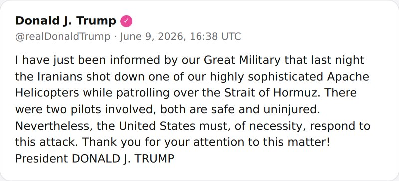

↩️ Quoted tweet: Shin ✓ @hey_itsmyturn Tue, 09 Jun 2026 16:40:55 UTC POTUS: "I have just been informed by our Great Military that last night the Iranians shot down one of our highly sophisticated Apache Helicopters while patrolling over the Strait of Hormuz.…

## Shin_Persian — post 6788

↩️ Quoted tweet:
Shin ✓ @hey_itsmyturn
Tue, 09 Jun 2026 16:40:55 UTC

POTUS:
"I have just been informed by our Great Military that last night the Iranians shot down one of our highly sophisticated Apache Helicopters while patrolling over the Strait of Hormuz. There were two pilots involved, both are safe and uninjured. Nevertheless, the United

↩️ توییت نقل‌قول شده — برای پاسخ، پست زیر را ببینید.

فارسی

رئیس‌جمهور ایالات متحده (POTUS):
«لحظاتی پیش توسط ارتش بزرگمان مطلع شدم که شب گذشته ایرانی‌ها یکی از هلیکوپترهای بسیار پیشرفته آپاچی ما را در حین گشت‌زنی بر فراز تنگه هرمز سرنگون کردند. دو خلبان در این حادثه حضور داشتند که هر دو سالم و بدون جراحت هستند. با این وجود، ایالات متحده»

𝕏 · @shin_persian

## FarsiVOA — post 220155

⚡️ملانیا ترامپ، بانوی نخست آمریکا، روز سه‌شنبه ۱۹ خرداد در جریان مراسم تقدیر از برندگان «چالش ریاست جمهوری هوش مصنوعی» در کاخ سفید طی سخنانی به اهمیت فناوری‌های نوین، از جمله هوش مصنوعی، برای موفقیت نسل‌های آینده آمریکا پرداخت. صدای آمریکا بخشی از این مراسم را با ترجمه همزمان پژواک کیومرثی پخش کرد.

## Persian_Trend_Official — post 16301

صدای انفجار در امیر آباد تهران

تایید یا رد نمی‌شود.

## Persian_Trend_Official — post 16300

## RadioFarda — post 158108

  <a href="https://t.me/radiofarda/158108" target="_blank">📎 Download file</a>

آیا واشینگتن آماده توافقی با ایران است که تل‌آویو نمی‌خواهد؟ در گفت‌وگو با شهیدثالث

🔸اظهارات تازه دونالد ترامپ، رئیس‌جمهور آمریکا، درباره امکان دستیابی به «پیروزی کامل» بر ایران، هم‌زمان با گزارش‌هایی از تلاش واشینگتن برای مهار تنش میان تهران و تل‌آویو، پرسش‌های مهمی را درباره آینده مذاکرات دو کشور، اهداف واقعی طرفین و تأثیر آن بر معادلات امنیتی خاورمیانه مطرح کرده است. آیا دو کشور در آستانه یک توافق جدید نزدیک هستند یا آنچه در جریان است، صرفاً مدیریت یک بحران موقت است؟ این پرسشی است که با شهیر شهیدثالث، تحلیلگر مسائل سیاسی در واشینگتن، در میان گذاشته‌ایم.

@RadioFarda

## alonews — post 126584

  <a href="telegram/content/alonews_126584_1781029410.webm" target="_blank">🎬 Download video</a>

🔴فوری / سوخت‌رسان‌های نیروی هوایی آمریکا از مکان‌های مختلف برخاسته و در حال حرکت به سمت خلیج فارس هستند!!

✅ @AloNews خبر جنگ

## alonews — post 126583

  <a href="telegram/content/alonews_126583_1781029411.webm" target="_blank">🎬 Download video</a>

🔴فوری / مقام آمریکایی به الحدث: گمانه‌ها حاکی از آن است که هدف قرار گرفتن بالگرد آمریکایی از سوی ایران عمدی بوده است.

✅ @AloNews خبر جنگ

## alonews — post 126582

  <a href="telegram/content/alonews_126582_1781029411.webm" target="_blank">🎬 Download video</a>

👈سفارت هلند در تهران فعالیت خود را از سر گرفت

✅ @AloNews خبر جنگ

## alonews — post 126581

  <a href="telegram/content/alonews_126581_1781029411.webm" target="_blank">🎬 Download video</a>

🔴فوری / خبرنگار شبکه فاکس نیوز در واکنش به پست ترامپ درباره سرنگونی هلیکوپتر آمریکایی: به نظر می‌رسد این به معنای آن است که رئیس‌جمهور دستور یک اقدام بزرگ در ایران را می‌دهد

✅ @AloNews خبر جنگ

<!-- MSG END -->

<!-- NAV START -->

<a href="https://github.com/ProAlit/aio-downloader/blob/main/telegram/content/archive_1.md" style="display:inline-block; padding:6px 12px; margin:0 4px; background-color:#2ea44f; color:white; text-decoration:none; border-radius:4px; font-weight:bold;">صفحه بعد</a>

<!-- NAV END -->
