# خواننده تلگرام

<!-- TOP_NAV START -->

<a href="https://github.com/ProAlit/aio-downloader/blob/main/telegram/content/archive_1.md" style="display:inline-block; padding:6px 12px; margin:0 4px; background-color:#2ea44f; color:white; text-decoration:none; border-radius:4px; font-weight:bold;">صفحه بعد</a>

<!-- TOP_NAV END -->

<!-- MSG START -->

---
📅 بروزرسانی: 1405/03/26 13:44
---

## VahidOOnLine — post 245848

  

دونالد ترامپ، رییس‌جمهوری آمریکا، در حاشیه نشست گروه هفت گفت اگر جمهوری اسلامی به سلاح هسته‌ای دست پیدا کند، «تمام جهنم بر سر آنها نازل خواهد شد» و افزود به همین دلیل اصرار کرده بندی در توافق گنجانده شود که حکومت ایران را حتی از خرید سلاح هسته‌ای منع کند.

ترامپ درباره چارچوب توافق برای پایان جنگ گفت: «تنها چیزی که واقعا برای من اهمیت دارد این است که ایران هرگز سلاح هسته‌ای نداشته باشد و این موضوع کاملا روشن و صریح در توافق آمده است.»

او افزود: «آنها قرار نیست آن را توسعه دهند. قرار نیست آن را بخرند. قرار نیست هیچ کاری در ارتباط با آن انجام دهند. و اگر چنین کنند، با پیامدهایی باورنکردنی روبه‌رو خواهند شد.»

رییس‌جمهوری آمریکا همچنین مدعی شد جلوگیری از دستیابی ایران به سلاح هسته‌ای انگیزه اصلی او برای آغاز جنگ بوده است و گفت: «به همین دلیل وارد این ماجرا شدم و به همین دلیل با امضای توافق موافقت کردم.»
‌🏁 🇬🇧 IranintlTV

🤖 @VahidOOnLine

## VahidOOnLine — post 245847

  

دونالد ترامپ، رییس‌جمهوری آمریکا، در حاشیه اجلاس گروه هفت گفت که مرحله بعدی مذاکرات با جمهوری اسلامی از دور نخست مذاکراتی که به یادداشت تفاهم اعلام‌شده اخیر منجر شد، «آسان‌تر» خواهد بود.

ترامپ در دیدار با امیر قطر در حاشیه نشست گروه هفت در فرانسه گفت: «این روند وارد مرحله دوم می‌شود که فکر می‌کنم در واقع آسان‌تر خواهد بود.»
‌🏁 🇬🇧 IranintlTV

🤖 @VahidOOnLine

## WithYashar — post 15049

ترامپ: من به تغییر رژیم اعتقاد ندارم. سال‌هاست که تغییر رژیم‌ها را دیده‌ام و هیچ‌وقت نتیجه نمی‌دهند!

فکر می‌کنم توافق با ایران عادلانه است
@withyashar

## DEJradio — post 5729

  <a href="telegram/content/DEJradio_5729_1781604864.webm" target="_blank">🎬 Download video</a>

🔺📌 برنامه هفتگی «سلامت» با اجرای دکتر نیکی سرمدی، به‌زودی از تلویزیون دژ

این برنامه به وضعیت نظام بهداشت و درمان و سلامت در جمهوری اسلامی و چشم‌انداز سلامت در ایران در دفترچه دوران گذار می‌پردازد.

#سلامت #بهداشت #جمهوری_اسلامی
@DEJradio

## IranIntlTV — post 342684

  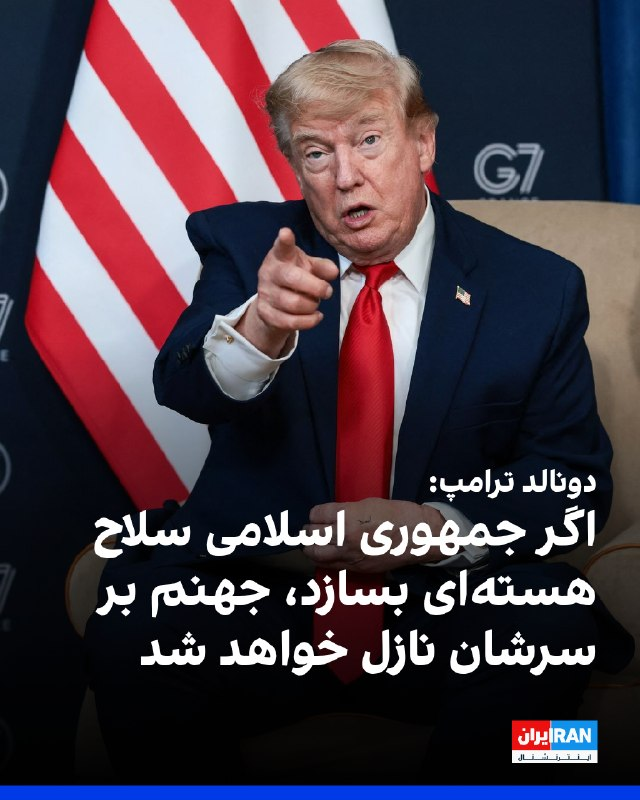

دونالد ترامپ، رییس‌جمهوری آمریکا، در حاشیه نشست گروه هفت گفت اگر جمهوری اسلامی به سلاح هسته‌ای دست پیدا کند، «تمام جهنم بر سر آنها نازل خواهد شد» و افزود به همین دلیل اصرار کرده بندی در توافق گنجانده شود که حکومت ایران را حتی از خرید سلاح هسته‌ای منع کند.

ترامپ درباره چارچوب توافق برای پایان جنگ گفت: «تنها چیزی که واقعا برای من اهمیت دارد این است که ایران هرگز سلاح هسته‌ای نداشته باشد و این موضوع کاملا روشن و صریح در توافق آمده است.»

او افزود: «آنها قرار نیست آن را توسعه دهند. قرار نیست آن را بخرند. قرار نیست هیچ کاری در ارتباط با آن انجام دهند. و اگر چنین کنند، با پیامدهایی باورنکردنی روبه‌رو خواهند شد.»

رییس‌جمهوری آمریکا همچنین مدعی شد جلوگیری از دستیابی ایران به سلاح هسته‌ای انگیزه اصلی او برای آغاز جنگ بوده است و گفت: «به همین دلیل وارد این ماجرا شدم و به همین دلیل با امضای توافق موافقت کردم.»
https://iranintl.com/202606161579

## IranIntlTV — post 342683

  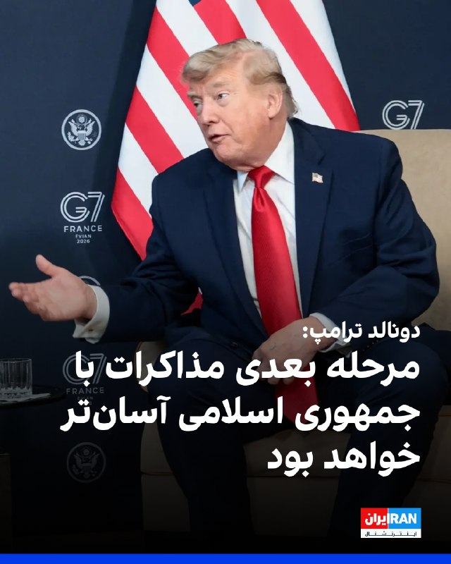

دونالد ترامپ، رییس‌جمهوری آمریکا، در حاشیه اجلاس گروه هفت گفت که مرحله بعدی مذاکرات با جمهوری اسلامی از دور نخست مذاکراتی که به یادداشت تفاهم اعلام‌شده اخیر منجر شد، «آسان‌تر» خواهد بود.

ترامپ در دیدار با امیر قطر در حاشیه نشست گروه هفت در فرانسه گفت: «این روند وارد مرحله دوم می‌شود که فکر می‌کنم در واقع آسان‌تر خواهد بود.»
https://iranintl.com/202606161415

## Iliaen — post 4491

جواد زمانی و ابوالفضل ساعدی، از بازداشت شدگان دِی ماه اعدام شدند.

جان تمام زندانیان سیاسی در خطر جدی است.

@iliaen

## FarsiVOA — post 220899

  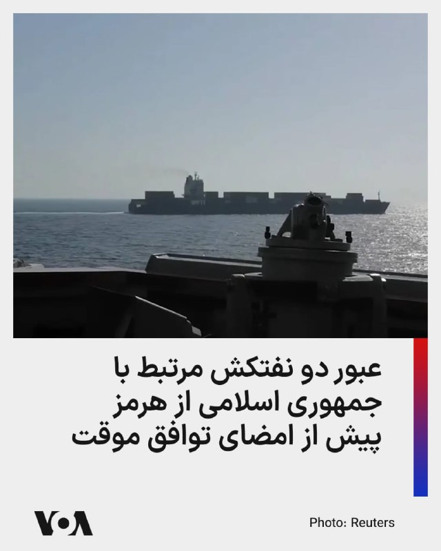

بلومبرگ گزارش داد دو نفتکش مرتبط با انتقال نفت جمهوری اسلامی، پیش از امضای توافق موقت واشنگتن و جمهوری اسلامی، با سامانه‌های شناسایی روشن از تنگه هرمز عبور کرده‌اند.

بر اساس داده‌های ردیابی کشتی‌ها، نفتکش «موزیک» روز سه‌شنبه در حال عبور از تنگه بود و «آرگو ماریس» پیش‌تر وارد دریای عمان شده، اما هنوز در محدوده خط محاصره دریایی آمریکا قرار داشت.

تصاویر ماهواره‌ای نشان می‌دهد «موزیک» در ۲۰ خرداد در بندر خمینی بارگیری کرده و «آرگو ماریس» در اواخر مه از بندرعباس خارج شده است.

اتحاد علیه ایران هسته‌ای، نهاد غیردولتی ناظر بر تحریم‌ها، هر دو کشتی را به‌دلیل حمل نفت جمهوری اسلامی در فهرست سیاه خود قرار داده، اما واشنگتن تاکنون آنها را تحریم نکرده است. مقصد بعدی این دو نفتکش هنوز روشن نیست.
@FarsiVOA

## FarsiVOA — post 220898

  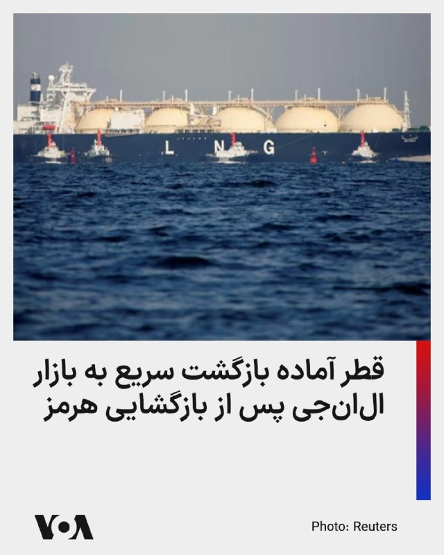

قطر آماده است پس از بازگشایی تنگه هرمز، تولید گاز طبیعی مایع را با سرعت افزایش دهد و ظرف دو ماه بخش عمده ظرفیت صادراتی خود را احیا کند.

منابع آگاه به بلومبرگ گفته‌اند قطرانرژی به خریداران اطلاع داده که یک ماه پس از بازگشت عبور ایمن از تنگه، تولید به حدود ۵۰ درصد ظرفیت و در ماه دوم به نزدیک ۸۰ درصد می‌رسد.

ظرفیت باقی‌مانده، معادل دو خط تولید، به‌دلیل آسیب ناشی از حملات موشکی جمهوری اسلامی در مارس، احتمالاً سال‌ها زمان برای ترمیم کامل نیاز دارد.

مجتمع رأس لفان، بزرگ‌ترین مرکز تولید ال‌ان‌جی جهان، پس از حمله جمهوری اسلامی در هفته نخست جنگ تعطیل شد و بیش از سه ماه عمدتاً راکد ماند، زیرا بسته‌شدن عملی مسیر هرمز صادرات گسترده گاز را دشوار کرده بود.

بازگشت قطر می‌تواند بخشی از فشار کمبود جهانی ال‌ان‌جی را کاهش دهد، هرچند قیمت‌ها همچنان بالاتر از سطح پیش از جنگ مانده‌اند.
@FarsiVOA

## Persian_Trend_Official — post 17263

  <a href="telegram/content/Persian_Trend_Official_17263_1781604868.mp4" target="_blank">🎬 Download video</a>

ترامپ: نتانیاهو به واشنگتن آمد و التماس کرد او از اوباما التماس کرد که آن معامله را با ایران انجام ندهد.

اوباما طرف ایران بود، نه اسرائیل، و او این معامله را انجام داد.

📝 Amir

📌 @persian_trend_official
پرشین ترند | متفاوت‌ترین کانال نظامی

## Persian_Trend_Official — post 17262

ترامپ: در توافق من، اگر ایران به سلاح هسته‌ای دست یابد، نابود می‌شود.

در توافق اوباما، به آنها اجازه داده شد که سلاح هسته‌ای داشته باشند.

📝 Amir

📌 @persian_trend_official
پرشین ترند | متفاوت‌ترین کانال نظامی

## Persian_Trend_Official — post 17261

  <a href="telegram/content/Persian_Trend_Official_17261_1781604872.webm" target="_blank">🎬 Download video</a>

ترامپ: نتانیاهو باید در قبال لبنان مسئولیت‌پذیرتر باشد.

📝 Amir

📌 @persian_trend_official
پرشین ترند | متفاوت‌ترین کانال نظامی

## Dirty_Kids — post 392273

جواد زمانی و ابوالفضل ساعدی، از بازداشت شدگان دِی ماه اعدام شدند.

جان تمام زندانیان سیاسی در خطر جدی است.

@Dirty_Kids 👻

## Dirty_Kids — post 392272

  <a href="telegram/content/Dirty_Kids_392272_1781604872.mp4" target="_blank">🎬 Download video</a>

فیلم وایرال شده درگیری مردم با یکی از طرفداران جمهوری اسلامی

یارو رو با مشت و لگد توی استادیوم له میکنه😂😂😂😂😂😂😂

@Dirty_Kids 👻

## Dirty_Kids — post 392271

  <a href="https://t.me/Dirty_Kids/392271" target="_blank">📎 Download file</a>

ریتزوبت تنها سایت بین المللی میباشد ، که به صورت هفتگی پرومو کد دریافت میکنید ✅

♦️ آموزش شارژ حساب با کریپتو
♦️ آموزش شارژ حساب ریالی در ریتزوبت

🔵ریتزوبت برندی با لایسنس معتبر در صنعت شرطبندی و #پیشبینی مسابقات ورزشی و کازینویی 👇

https://t.me/+LB508WZyIr8xNmY0

## Dirty_Kids — post 392270

  

🏆 مسابقات مهم امروز جام جهانی 2026 🔥

⚽️ فرانسه 
🇫🇷 - سنگال 
🇸🇳

⚽️ عراق 
🇮🇶 - نروژ 
🇳🇴

⚽️ آرژانتین 
🇦🇷 - الجزایر 
🇩🇿

⚽️ اتریش 
🇦🇹 - اردن 
🇯🇴

🚨 امشب شاهد رقابت‌های جذاب و تماشایی جام جهانی باشید و پیش‌بینی‌های خود را در ریتزوبت ثبت کنید 👇

🎯 دانلود اپلیکیشن بدون فیلتر اندروید
🎯 لینک ورود به ریتزوبت

💎 امکان شارژ حساب با کریپتو ، انواع ووچر و کارت بانکی. 
✅

🌍 ریتزوبت؛ همراه شب‌های فراموش‌نشدنی جام جهانی 2026
R26
🆔 @RitzoBet_ir

## alonews — post 128427

  <a href="telegram/content/alonews_128427_1781604877.webm" target="_blank">🎬 Download video</a>

🔴فوری / ترامپ : من به اسرائیل پیشنهاد دادم که سوریه مسئولیت حزب‌الله را بر عهده بگیرد

✅ @AloNews خبر جنگ

## alonews — post 128426

  <a href="telegram/content/alonews_128426_1781604877.webm" target="_blank">🎬 Download video</a>

👈ترامپ: جنگ لبنان مسئله فرعی است و توافق هسته‌ای با ایران می‌تواند پابرجا بماند.

🔴به اسرائیل گفتم که از حمله آنها به بیروت خوشم نیامد

✅ @AloNews خبر جنگ

---
📅 بروزرسانی: 1405/03/26 13:34
---

## VahidOOnLine — post 245846

  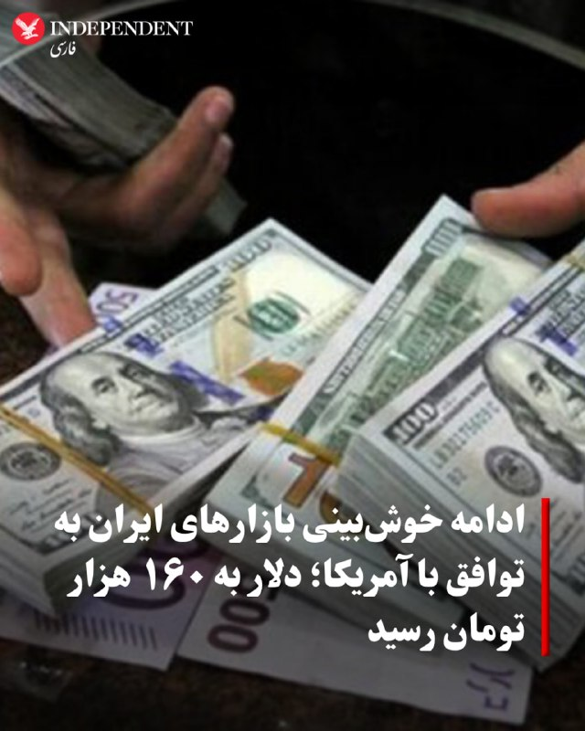

♦️خوش‌بینی بازارهای ایران به «تفاهم‌نامه» جمهوری اسلامی و ایالات متحده برای دومین روز ادامه یافت و قیمت ارزهای خارجی بار دیگر کاهش پیدا کرد.

سایت‌ها و کانال‌های اعلام قیمت ارز بعد از ظهر سه‌شنبه گزارش کردند که بهای دلار در بازار تهران با سه هزار تومان کاهش نسبت به روز گذشته به ۱۶۵ هزار تومان رسید و هر یورو در برابر ۱۸۵ هزار و ۵۰۰ تومان دادوستد شد.

همزمان خبرگزاری ایرنا گزارش کرد که در ساعت پایانی معاملات روز سه‌شنبه، «شاخص کل بورس با رشد ۱۱۹ هزار واحدی در تراز ۵ میلیون و ۱۰۰ هزار واحد تثبیت شد.»
‌🇸🇦 Indypersian

🤖 @VahidOOnLine

## WithYashar — post 15048

ترامپ: می‌خواهیم اورانیوم غنی‌شده را از ایران بگیریم
@withyashar

## WithYashar — post 15047

ترامپ: ما می‌خواستیم برای دریافت اورانیوم غنی‌شده به ایران برویم، اما این اتفاق نیفتاد.
@withyashar

## WithYashar — post 15046

ترامپ: تلاش‌هایی برای تغییر رژیم در ایران صورت گرفت، اما موفق نشدند.
چیزی که مرا به امضای این یادداشت تفاهم ترغیب کرد، اطمینان از این بود که ایران سلاح هسته‌ای نداشته باشد.
اگر ایران به دنبال دستیابی به سلاح هسته‌ای باشد، جهنمی به پا خواهد شد.
ما از نحوه مدیریت امور توسط قطر در طول بحران اخیر، احساس خوشحالی و احترام می‌کنیم.
توافق با ایران به مرحله دوم منتقل می‌شود.
@withyashar

## FarsiVOA — post 220897

  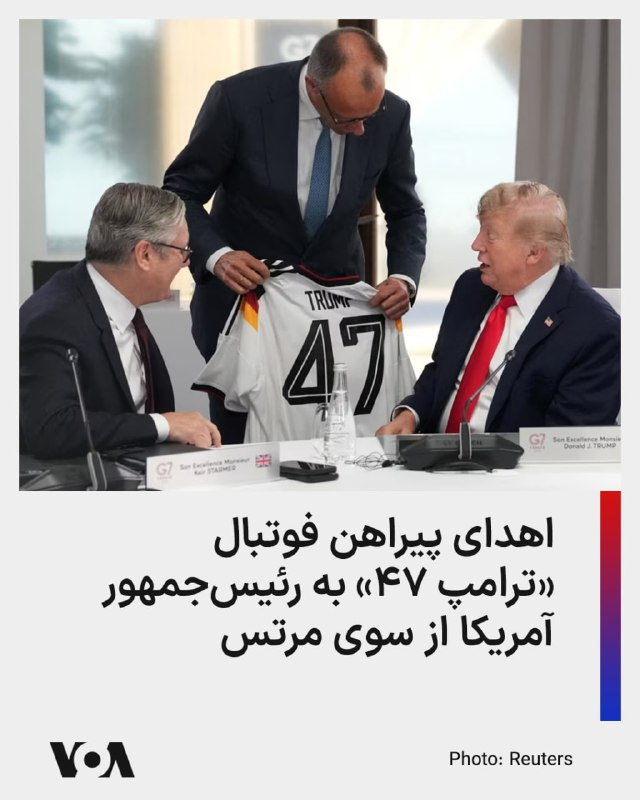

فریدریش مرتس، صدراعظم آلمان به دونالد ترامپ، رئیس‌جمهوری آمریکا یک پیراهن فوتبال با نام ترامپ و شماره ۴۷ در پشت آن هدیه داد.

مرتس زمانی که ترامپ برای یک جلسه کاری در چارچوب نشست گروه هفت پشت میز نشسته بود، با این پیراهن به سمت او رفت. ترامپ لبخند زد و آن را برای گرفتن عکس بالا گرفت.

این پیراهن سفید، طرح همان پیراهنی است که تیم ملی آلمان در جام جهانی جاری بر تن دارد.

مرتس و ترامپ در ماه‌های اخیر بر سر جنگ علیه جمهوری اسلامی اختلاف داشتند و پرزیدنت ترامپ از او انتقاد کرد.

ترامپ گفت مرتس «باید زمان بیشتری را صرف پایان دادن به جنگ روسیه در اوکراین کند» و «کشور شکست‌خورده‌اش، به‌ویژه در زمینه مهاجرت و انرژی، را اصلاح کند.»
@FarsiVOA

## FarsiVOA — post 220896

  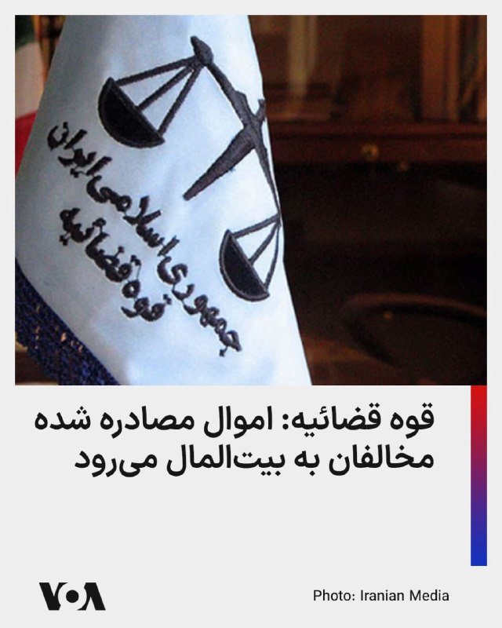

سخنگوی قوه قضائیه جمهوری اسلامی گفت همه اموال مصادره‌شده متهمان پرونده‌های اخیرِ مرتبط با همکاری با اسرائیل و آمریکا، پس از طی روند قضایی، به بیت‌المال بازگردانده می‌شود و در مسیر آنچه او «منافع عمومی» خواند هزینه خواهد شد.

اصغر جهانگیر با اشاره به اصل ۴۹ قانون اساسی گفت دولت موظف است ثروت‌های ناشی از ربا، اختلاس و جرایم مشابه را، در صورتی که صاحب مشخصی نداشته باشد، به بیت‌المال بازگرداند.

بر اساس آمار رسمی اعلام‌شده از سوی قوه قضائیه جمهوری اسلامی در ۱۷ خرداد، سه هزار و ۱۲۱ نفر مخالف جمهوری اسلامی در پرونده‌های با اتهام ادعایی همکاری با اسرائیل تحت تعقیب قرار گرفته‌اند که از میان آنها دو هزار و ۴۰۶ نفر بازداشت شده‌اند.

جهانگیر همچنین گفت تاکنون برای هزار نفر کیفرخواست صادر شده و اموال «بیش از صدها نفر» شناسایی و توقیف شده است؛ اموالی که به گفته او، پس از صدور حکم دادگاه، مصادره خواهد شد.
@FarsiVOA

## FarsiVOA — post 220895

  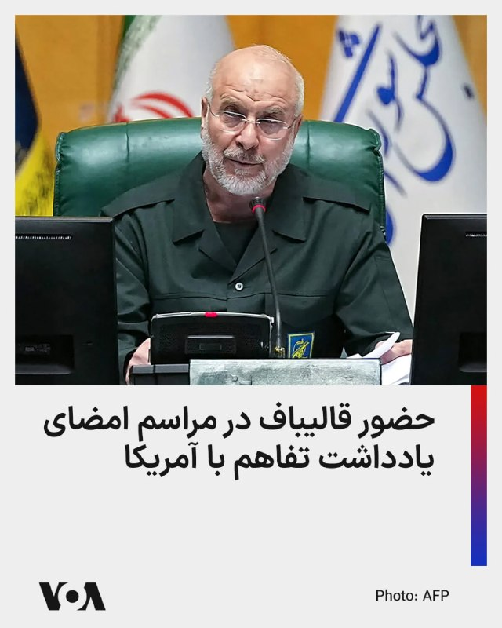

محمدباقر قالیباف، مذاکره‌کننده ارشد و رئیس مجلس شورای اسلامی، در مراسم امضای توافق موقت با آمریکا برای پایان دادن به جنگ حضور خواهد داشت.

مجید تخت‌روانچی، معاون وزیر خارجه جمهوری اسلامی، روز سه‌شنبه گفت حضور قالیباف در این مراسم قطعی است، اما هنوز روشن نیست امضای توافق دقیقاً در چه نقطه از سوئیس و با چه قالبی انجام می‌شود.

این اظهارات در حالی مطرح شده که دونالد ترامپ، رئیس‌جمهور آمریکا، روز دوشنبه اعلام کرد جی‌دی ونس، معاون او، در مراسم رسمی امضا در ژنو شرکت خواهد کرد.

وزیر امور خارجه جمهوری اسلامی نیز اعلام کرده که روز جمعه ۲۹ خرداد و همزمان با امضای رسمی یادداشت تفاهم «پایان جنگ»، مذاکرات با آمریکا برای رسیدن به توافق نهایی آغاز خواهد شد.
@FarsiVOA

## DW_Farsi — post 126048

  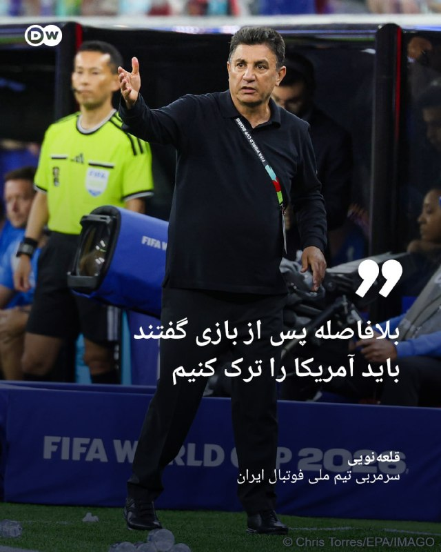

🔶 قلعه‌نویی: بلافاصله پس از بازی گفتند باید آمریکا را ترک کنیم

اولین بازی تیم ملی ایران با دردسرها و حواشی زیادی همراه بود؛ از دستور ترک فوری خاک آمریکا بلافاصله پس از پایان بازی تا انقضای ویزای مهدی ترابی و سوال و جواب از مهدی طارمی و یک بازیکن دیگر هنگام ورود و خروج به آمریکا.

امیر قلعه‌نویی، سرمربی تیم ملی فوتبال ایران پس از بازی مقابل نیوزیلند به خبرنگاران گفت: «امشب بلافاصله پس از بازی به ما اعلام کردند که باید آمریکا را ترک کنیم، در صورتی که امشب مهمترین مسأله برای بازی آینده ماست.»

مربی تیم ایران گفت: «آنقدر که روی هوا بودیم روی زمین نبودیم.»

او درباره علت ترک فوری خاک آمریکا پس از بازی هم گفت: «ما خودمان هم نمی‌دانیم و خیلی خنده‌دار است. تصمیمات برنامه‌ریزی تیم ما از جای دیگری گرفته می‌شود. ما قرار بود دو شب قبل از این بازی به لس‌آنجلس بیاییم اما اجازه ندادند. در برنامه‌مان بود امشب اینجا بمانیم و ریکاوری کنیم و فردا ظهر برگردیم که اجازه ندادند و دلیلش را هم نمی‌دانم.»

وزارت خارجه آمریکا و فیفا به پرسش خبرگزاری رویترز درباره علت ترک زودهنگام تیم ایران پاسخ نداده‌اند.

@dw_farsi

## Persian_Trend_Official — post 17260

سخنگوی ارتش: در جریان جنگ، خلبانان ما یک پهپاد دشمن را برفراز تهران در محل برگزاری یک جلسه مهم مسئولان بالارتبه با برخورد فیزیکی جنگنده با دم پهپاد ساقط کردند!

📝 Amir

📌 @persian_trend_official
پرشین ترند | متفاوت‌ترین کانال نظامی

## Persian_Trend_Official — post 17259

  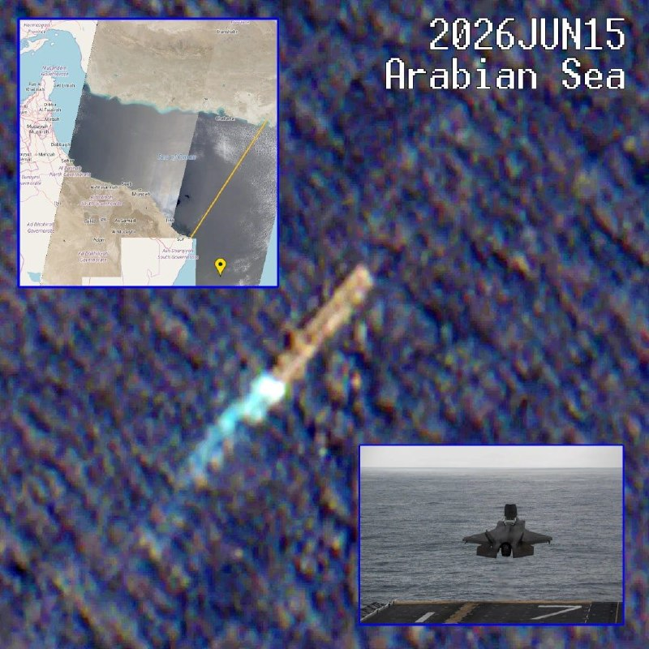

خبرگزاری CNN: ترامپ می‌گوید تنگه هرمز پس از توافق آمریکا و ایران بازگشایی شده است اما در سراسر صنعت کشتیرانی، اعتماد همچنان کم است. تهدیداتی از جمله مین، پهپاد و حملات موشکی همچنان مانع حرکت می‌شوند، در حالی که خستگی خدمه پس از ماه‌ها عدم اطمینان، ریسک عملیاتی…

## Persian_Trend_Official — post 17258

ترامپ در مورد ایران: من به تغییر رژیم اعتقادی ندارم. سال‌هاست که شاهد تغییر رژیم‌ها بوده‌ام و آنها هرگز کارساز نبوده‌اند.

این اتفاق باید بیفتد.

📝 Amir

📌 @persian_trend_official
پرشین ترند | متفاوت‌ترین کانال نظامی

## Persian_Trend_Official — post 17257

ترامپ: من هرگز به تغییر رژیم اهمیتی نمی‌دادم، اما حدس می‌زنم شما در ایران تغییر رژیم دارید.

📝 Amir

📌 @persian_trend_official
پرشین ترند | متفاوت‌ترین کانال نظامی

## Hranews — post 113645

اعتراضات دی‌ماه ۱۴۰۴؛ جواد زمانی و ابوالفضل ساعدی اعدام شدند❗️❗️❗️❗️❗️– رئیس کل دادگستری استان سمنان از اجرای حکم اعدام جواد زمانی و ابوالفضل ساعدی، از بازداشت‌شدگان اعتراضات دی‌ماه ۱۴۰۴ در شهرستان شاهرود، خبر داد. همزمان، مرکز رسانه قوه قضاییه ویدیویی از اعترافات اجباری این دو معترض را منتشر کرده است. دستگاه قضایی این افراد را از بابت اتهاماتی از جمله «محاربه» و «افساد فی‌الارض» به #اعدام محکوم کرده بود. سرانجام، احکام صادره صبح امروز به اجرا درآمد.ادامه مطلب#جواد_زمانی #ابوالفضل_ساعدی↘️ @hranews_bot تماس ✉️ -  @Hranews  کانال هرانا 🆑

## alonews — post 128425

  <a href="telegram/content/alonews_128425_1781604282.webm" target="_blank">🎬 Download video</a>

👈ترامپ: اگر من نبودم، اسرائیلی هم وجود نداشت

✅ @AloNews خبر جنگ

## alonews — post 128424

  <a href="telegram/content/alonews_128424_1781604282.webm" target="_blank">🎬 Download video</a>

👈ترامپ: من به تغییر رژیم اعتقاد ندارم. سال‌هاست که تغییر رژیم‌ها را دیده‌ام و هیچ‌وقت نتیجه نمی‌دهند!

🔴فکر می‌کنم توافق با ایران عادلانه است

✅ @AloNews خبر جنگ

## alonews — post 128423

  <a href="telegram/content/alonews_128423_1781604282.webm" target="_blank">🎬 Download video</a>

👈ترامپ : اگر ما برنامه جامع اقدام مشترک (برجام) را که اوباما با ایران منعقد کرد، لغو نمی‌کردیم، ممکن بود این کشور به سلاح هسته‌ای دست یابد

✅ @AloNews خبر جنگ

## alonews — post 128422

  <a href="telegram/content/alonews_128422_1781604283.webm" target="_blank">🎬 Download video</a>

👈ترامپ: ما می‌خواستیم برای دریافت اورانیوم غنی‌شده به ایران برویم، اما این اتفاق نیفتاد.

✅ @AloNews خبر جنگ

## alonews — post 128421

  <a href="telegram/content/alonews_128421_1781604283.mp4" target="_blank">🎬 Download video</a>

👈ترامپ خطاب به امیر قطر در مورد ایران:
شما جنگیدید و با شجاعت زیادی به ما کمک کردید.

🔴 شما همیشه دوست من خواهید بود

✅ @AloNews خبر جنگ

## alonews — post 128420

  <a href="telegram/content/alonews_128420_1781604286.webm" target="_blank">🎬 Download video</a>

👈ترامپ: قطر و ایران مرز زمینی مشترک دارند و می‌توان پیاده از یکی به دیگری رفت

✅ @AloNews خبر جنگ

## alonews — post 128419

  <a href="telegram/content/alonews_128419_1781604286.webm" target="_blank">🎬 Download video</a>

👈 ترامپ: چیزی که مرا به امضای این یادداشت تفاهم ترغیب کرد، اطمینان از این بود که ایران سلاح هسته‌ای نداشته باشد.

🔴اگر ایران به دنبال دستیابی به سلاح هسته‌ای باشد، جهنمی به پا خواهد شد.

🔴 ترامپ: ایران طبق توافق هسته‌ای به سلاح هسته‌ای دست نخواهد یافت

✅ @AloNews خبر جنگ

## alonews — post 128418

  <a href="telegram/content/alonews_128418_1781604287.webm" target="_blank">🎬 Download video</a>

👈ترامپ در مورد ایران: ضمناً ما هیچ پولی در ایران سرمایه‌گذاری نمی‌کنیم. دیروز شایعه‌ای پخش شد. مسخره بود.

🔴 ما حق داریم روزی وارد شویم و اگر بخواهم کاری انجام دهم یا کسی بخواهد کاری انجام دهد، انجام دهیم، اما ما هیچ پولی سرمایه‌گذاری نمی‌کنیم.

🔴 ما هیچ تعهدی برای سرمایه‌گذاری در ایران نداریم.

✅ @AloNews خبر جنگ

---
📅 بروزرسانی: 1405/03/26 13:23
---

## VahidOOnLine — post 245836

  <a href="telegram/content/VahidOOnLine_245836_1781603632.mp4" target="_blank">🎬 Download video</a>

خیابانی که قرار بود نمایش قدرت جمهوری اسلامی باشد، حالا به صحنه شکاف درونی آن تبدیل شده است. از پروپاگاندای جنگی تا شورش علیه تفاهم، جمهوری اسلامی با نیرویی روبه‌رو شده که سال‌ها خود پرورش داده بود.
‌🏁 🇬🇧 ManotoTV

🤖 @VahidOOnLine

## VahidOOnLine — post 245835

  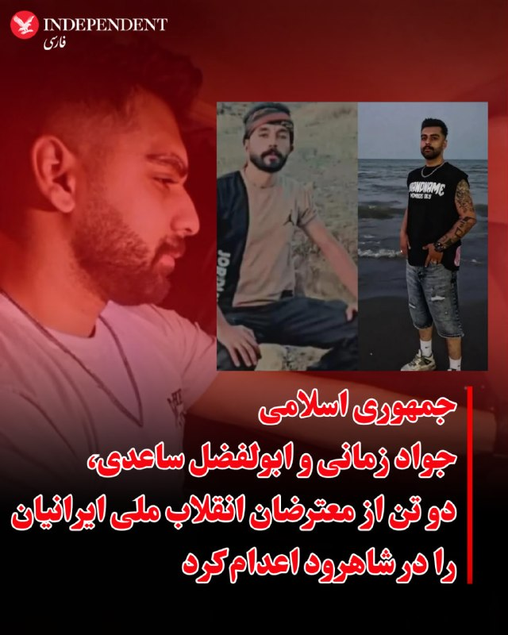

⭕️جمهوری اسلامی جواد زمانی و ابولفضل ساعدی، دو تن از معترضان انقلاب ملی ایرانیان را در شاهرود اعدام کرد

♦️میزان، خبرگزاری قوه قضائیه روز سه‌شنبه ۲۶ خردادماه از اعدام جواد زمانی و ابولفضل ساعدی، دو تن از بازداشت‌شدگان اعتراضات دی‌ماه ۱۴۰۴ «به‌جرم» محاربه و افساد فی‌الارض در شهرستان شاهرود استان سمنان خبر داد.

پیش از این یک منبع نزدیک به این دو بازداشتی به ایندیپندنت فارسی اطلاع داده بود که قوه قضائیه روز دوشنبه به خانواده‌های جواد زمانی و ابولفضل زمانی گفته بود که برای «آخرین ملاقات» با آن‌ها به زندان شاهرود مراجعه کنند.

در گزارش میزان، این دو شهروند ایرانی به‌عنوان «دو تن از لیدرهای کودتای دی‌ماه ۱۴۰۴» معرفی شده‌اند. قوه قضائیه مدعی است که این دو نفر «از طریق کشیدن سلاح گرم و سرد در شهرستان شاهرود و تخریب عمدی اموال عمومی و خصوصی» مرتکب جرم افساد فی‌الارض و محاکمه شده‌اند.

براساس گزارش شورای حقوق بشر سازمان ملل، از دی‌ماه تا کنون، دست‌کم ۲۰ نفر از معترضان به بهانه جرایم امنیتی در ایران اعدام شده‌اند.

سازمان‌های بین‌‌المللی می‌گویند متهمان و به‌ویژه متهمان «جرایم سیاسی و امنیتی» در ایران از حق داشتن وکیل و دادرسی عادلانه محرومند و اعتراف‌ آن‌ها، عمدتا از طریق شکنجه و زیر فشار و تهدید گرفته می‌شود.
‌🇸🇦 Indypersian

🤖 @VahidOOnLine

## WithYashar — post 15045

  <a href="telegram/content/WithYashar_15045_1781603634.mp4" target="_blank">🎬 Download video</a>

ترامپ درباره ایران:
ما هیچ پولی در ایران سرمایه‌گذاری نمی‌کنیم، راستی. دیروز شایعه‌ای پخش شد. مضحک بود.
ما حق داریم روزی وارد شویم و اگر من بخواهم کاری انجام دهم یا کسی بخواهد کاری انجام دهد، اما ما هیچ پولی سرمایه‌گذاری نمی‌کنیم.
ما هیچ تعهدی برای سرمایه‌گذاری پول در ایران نداریم.
@withyashar

## WithYashar — post 15044

ترامپ: ما هیچ پولی در ایران سرمایه‌گذاری نخواهیم کرد.
@withyashar

## WithYashar — post 15043

خبرگزاری میزان، رسانه قوه قضاییه جمهوری اسلامی، سه‌شنبه 26 خرداد از اجرای حکم اعدام جواد زمانی و ابوالفضل ساعدی، دو زندانی سیاسی بازداشت‌شده در اعتراضات دی‌ماه در استان سمنان خبر داد. میزان اتهام آن‌ها را «افساد فی‌الارض از طریق کشیدن سلاح گرم و سرد در شهرستان شاهرود» اعلام کرد
@withyashar

## mwarmonitor — post 11016

🔴 دونالد ترامپ، رئیس‌جمهور آمریکا، می‌گوید ایالات متحده معتقد است توافق با ایران یک توافق منصفانه است.

🔴 ترامپ می‌گوید توافق با ایران وارد مرحله دوم شده است.

🔴 رئیس‌جمهور آمریکا اضافه می‌کند که ایالات متحده هیچ‌گونه سرمایه‌گذاری مالی در ایران انجام نمی‌دهد.

🔴 ترامپ می‌گوید ایران تحت این توافق هرگز به سلاح هسته‌ای دست نخواهد یافت.

@mwarmonitor

## FoxNewsTwitter — post 343009

Fox News (Twitter/X)

WATCH LIVE: Trump holds bilateral meeting with the Emir of Qatar
https://twitter.com/i/broadcasts/1yKAPPonYzgxb

## IranIntlTV — post 342682

  <a href="telegram/content/IranIntlTV_342682_1781603636.mp4" target="_blank">🎬 Download video</a>

علی شیرازی، عضو تحریریه ایران‌اینترنشنال با اشاره به سکوت مجتبی خامنه‌ای در قبال توافق واشینگتن و تهران گفت: «جدال میان موافقان و مخالفان این توافق نشان‌دهنده جنگ قدرت در پشت پرده حکومت است.»

@iranintltv

## ManotoTV — post 106080

  <a href="telegram/content/ManotoTV_106080_1781603638.mp4" target="_blank">🎬 Download video</a>

خیابانی که قرار بود نمایش قدرت جمهوری اسلامی باشد، حالا به صحنه شکاف درونی آن تبدیل شده است. از پروپاگاندای جنگی تا شورش علیه تفاهم، جمهوری اسلامی با نیرویی روبه‌رو شده که سال‌ها خود پرورش داده بود.

## FarsiVOA — post 220894

  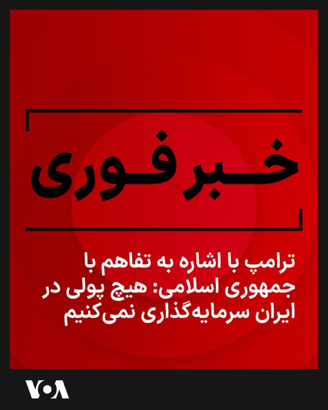

دونالد ترامپ، رئیس‌جمهوری آمریکا، در جریان برگزاری نشست گروه هفت، درباره توافق با جمهوری اسلامی گفت که آمریکا هیچ سرمایه‌گذاری در ایران نخواهد کرد.

پرزیدنت ترامپ گفت: «ما فکر می‌کنیم این یک توافق منصفانه است.»

او افزود: «توافق با ایران وارد مرحله دوم می‌شود.»
@FarsiVOA

## FarsiVOA — post 220893

  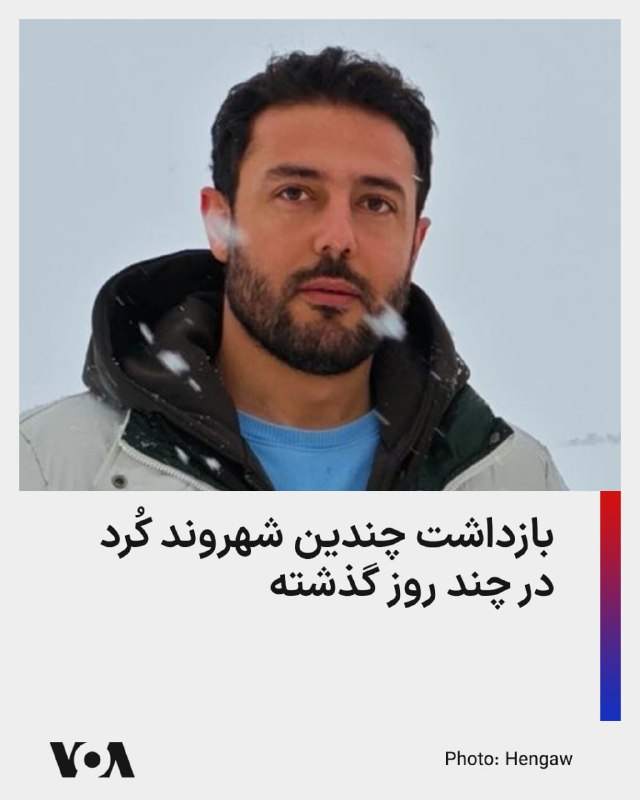

سازمان حقوق بشری هه‌نگاو اعلام کرد که اشکان آبخو، شهروند ساکن شهرستان سقز، روز دوشنبه ۲۵ خرداد، در محل کار خود توسط نیروهای اداره اطلاعات دستگیر شده است.

این دستگیری بدون ارائه حکم قضایی صورت گرفته و تا این لحظه از دلایل بازداشت، اتهامات انتسابی و محل نگهداری وی، توضیحاتی به خانواده آقای آبخو ارائه نشده است.

هه‌نگاو همچنین طی روزهای اخیر از بازداشت هیرش شریفیان، کودک اهل کامیاران، بهنام مولودی، اهل اشنویه، خالد حسن‌زاده، شهروند اهل پیرانشهر و پوریا ولی‌زاده، اهل بیجار، خبر داده بود. دلایل بازداشت و اتهامات و محل نگهداری این شهروندان نیز نامشخص است.
@FarsiVOA

## Persian_Trend_Official — post 17256

  <a href="telegram/content/Persian_Trend_Official_17256_1781603640.mp4" target="_blank">🎬 Download video</a>

محمود صادقی، نماینده وقت مجلس، درباره اعتراضات آبان ۹۸: به شمخانی گفتم دارن مردم رو در خیابان‌ها می‌کشند. اگر مردم نرفتن و ایستادن باز می‌خواید بکشید؟ گفت ولو بلغ ما بلغ. ما می‌زنیم.

👺Phantom

📌 @persian_trend_official
پرشین ترند | متفاوت‌ترین کانال نظامی

## Persian_Trend_Official — post 17255

ترامپ می‌گوید قطر و ایران مرز زمینی مشترک دارند و می‌توان پیاده از یکی به دیگری رفت!!!

📝 Amir

📌 @persian_trend_official
پرشین ترند | متفاوت‌ترین کانال نظامی

## Persian_Trend_Official — post 17254

  <a href="telegram/content/Persian_Trend_Official_17254_1781603642.webm" target="_blank">🎬 Download video</a>

ترامپ: ضمناً ما هیچ پولی در ایران سرمایه‌گذاری نمی‌کنیم. دیروز شایعه‌ای پخش شد. مسخره بود.

ما حق داریم روزی برویم و اگر بخواهم کاری انجام دهم یا کسی بخواهد کاری انجام دهد، انجام دهیم، اما ما هیچ پولی سرمایه‌گذاری نمی‌کنیم.

ما هیچ تعهدی برای سرمایه‌گذاری هیچ پولی در ایران نداریم.

📝 Amir

📌 @persian_trend_official
پرشین ترند | متفاوت‌ترین کانال نظامی

## Persian_Trend_Official — post 17253

ترامپ: ما توافق خود را با ایران انجام داده‌ایم. باید موفقیت‌آمیز باشد.

به مرحله دوم می‌رود که فکر می‌کنم آسان‌تر خواهد بود.

📝 Amir

📌 @persian_trend_official
پرشین ترند | متفاوت‌ترین کانال نظامی

## Persian_Trend_Official — post 17252

ترامپ در دیدار با امیر قطر: امیر مرد فوق‌العاده‌ای است و در سراسر جهان مورد احترام است.

نخست وزیر هم همینطور، اما ما باید اول با امیر صحبت کنیم.

📝 Amir

📌 @persian_trend_official
پرشین ترند | متفاوت‌ترین کانال نظامی

## RadioFarda — post 158376

🔸خبرگزاری رویترز در گزارشی از فضای حاکم بر مسابقه تیم‌های فوتبال ایران و نیوزیلند در جام جهانی، خبر داد که به‌رغم ممنوعیت فیفا، پرچم‌های شیروخورشید وارد ورزشگاه محل بازی شد.

🔸این خبرگزاری به واکنش‌های متفاوت و متضاد تماشاگران ایرانی حاضر در ورزشگاه سوفای شهر لس‌آنجلس اشاره کرده و نوشته که اختلافات روی سکوها، بازتابی از چالش‌های پیش روی تیم ملی ایران در خارج از زمین مسابقه بود.

🔸رویترز به اقدام همزمان دو گروه متفاوت تماشاگران هنگام پخش سرود ملی تیم ایران اشاره کرده و نوشته است سوت زدن گروهی از تماشاگران در مقابل همخوانی گروه دیگری، بازتاب‌دهنده اهمیت نمایش وفاداری سیاسی در مقابل خود فوتبال بود.

🔸به نوشته آن، از حملات و گل‌های ایران از سوی بسیاری از تماشاگران، از جمله بخشی از هوادارانی که پرچم شیر و خورشید مربوط به ایران قبل از انقلاب را حمل می‌کردند، استقبال شد. اما گروهی از تماشاگران، گل‌های تیم نیوزیلند را جشن گرفتند.

@RadioFarda

## RadioFarda — post 158375

🔸وزیر خارجه ایران روز سه‌شنبه ۲۶ خرداد گفت که از صبح دیروز جنگ رسماً در تمام جبهه‌ها تمام شده و روز جمعه دور جدید مذاکرات ایران و آمریکا در سوئیس آغاز می‌شود.

🔸عباس عراقچی که در جمع کاردارها و سفرای خارجی مقیم تهران صحبت می‌کرد، به اسرائیل هشدار داد که هرگونه حملهٔ آن به لبنان به منزله «نقض تفاهم» میان تهران و واشینگتن است.

🔸او گفت که «یک طرف این تفاهم‌نامه ایران و حزب‌الله هستند و طرف دیگر آن آمریکا و اسرائیل».

🔸وزیر خارجه ایران افزود: «خاتمهٔ جنگ مشمول خاتمهٔ اشغال است و بدون عقب‌نشینی نیروهای اسرائیلی از سرزمین‌هایی که در این جنگ اشغال کرده‌اند، خاتمهٔ جنگ کامل نشده است».

🔸عراقچی با بیان این‌که «بعد از سه ماه مذاکره توانستیم مرحله اول را نهایی کنیم»، تصریح کرد: «در مرحلهٔ اول مهم‌ترین موضوعی که اتفاق می‌افتد اعلام خاتمهٔ جنگ است و بنا به تصمیمی که گرفتیم از صبح دوشنبه به وقت تهران که این توافق نهایی شد، خاتمهٔ جنگ هم اعلام شد».

🔸او افزود: «شروع رسمی تفاهمنامه از روز جمعه خواهد بود».

@RadioFarda

## manototv — post 106080

  <a href="telegram/content/manototv_106080_1781603642.mp4" target="_blank">🎬 Download video</a>

خیابانی که قرار بود نمایش قدرت جمهوری اسلامی باشد، حالا به صحنه شکاف درونی آن تبدیل شده است. از پروپاگاندای جنگی تا شورش علیه تفاهم، جمهوری اسلامی با نیرویی روبه‌رو شده که سال‌ها خود پرورش داده بود.

---
📅 بروزرسانی: 1405/03/26 13:13
---

## VahidOOnLine — post 245834

  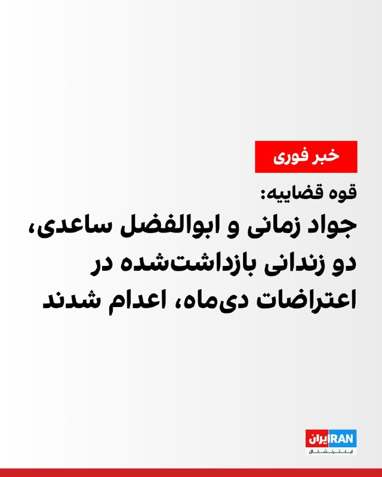

خبرگزاری میزان، رسانه قوه قضاییه جمهوری اسلامی، سه‌شنبه ۲۶ خرداد از اجرای حکم اعدام جواد زمانی و ابوالفضل ساعدی، دو زندانی سیاسی بازداشت‌شده در اعتراضات دی‌ماه در استان سمنان خبر داد.

رییس کل دادگستری استان سمنان اتهام‌های این دو زندانی را «محاربه، افساد فی‌الارض از طریق کشیدن سلاح گرم و سرد، تخریب عمدی اموال عمومی و خصوصی به قصد مقابله با نظام جمهوری اسلامی و اخلال در نظم و امنیت جامعه، اجتماع و تبانی برای ارتکاب جرم علیه امنیت داخلی کشور» اعلام کرد.

تاکنون جزییات بیشتری درباره روند رسیدگی به پرونده جواد زمانی و ابوالفضل ساعدی، و همچنین اطلاعاتی درباره وضعیت آنان پیش از اجرای حکم، منتشر نشده بود.
‌🏁 🇬🇧 IranintlTV

🤖 @VahidOOnLine

## VahidOOnLine — post 245833

♦️خبرگزاری رویترز گزارشی از ابراز احساسات متفاوت یا حتی «متناقض» ایرانیان پس از بازی اول تیم ملی در جام جهانی منتشر کرده است؛ ایرانیانی که کشور و تیمشان را دوست دارند اما پس از کشتار دی‌ماه، این تیم را نماینده خودشان نمی‌دانند.

بسیاری از ایرانیانی که به ورزشگاه رفته بودند، با وجود ممنوعیت و محدودیت‌های فیفا، پرچم‌های شیروخورشید نشان ملی را با خود برده بودند و پس از بازی، با همین پرچم‌ها در خیابان‌های لس‌آنجلس فریاد «ایران ایران» سر می‌دادند.

یکی از هواداران تیم ملی به خبرنگار رویترز گفت: «هزاران جوانی که می‌خواستند همین بازی را نگاه کنند، دیگر در میان ما نیستند و در گور خفته‌اند. من نماینده آن‌ها هستم.»
‌🇸🇦 Indypersian

🤖 @VahidOOnLine

## WithYashar — post 15042

ویس میلیارد دلاری ۲💰
@withyashar

## IranIntlTV — post 342681

  

خبرگزاری میزان، رسانه قوه قضاییه جمهوری اسلامی، سه‌شنبه ۲۶ خرداد از اجرای حکم اعدام جواد زمانی و ابوالفضل ساعدی، دو زندانی سیاسی بازداشت‌شده در اعتراضات دی‌ماه در استان سمنان خبر داد.

رییس کل دادگستری استان سمنان اتهام‌های این دو زندانی را «محاربه، افساد فی‌الارض از طریق کشیدن سلاح گرم و سرد، تخریب عمدی اموال عمومی و خصوصی به قصد مقابله با نظام جمهوری اسلامی و اخلال در نظم و امنیت جامعه، اجتماع و تبانی برای ارتکاب جرم علیه امنیت داخلی کشور» اعلام کرد.

تاکنون جزییات بیشتری درباره روند رسیدگی به پرونده جواد زمانی و ابوالفضل ساعدی، و همچنین اطلاعاتی درباره وضعیت آنان پیش از اجرای حکم، منتشر نشده بود.

## FarsiVOA — post 220892

  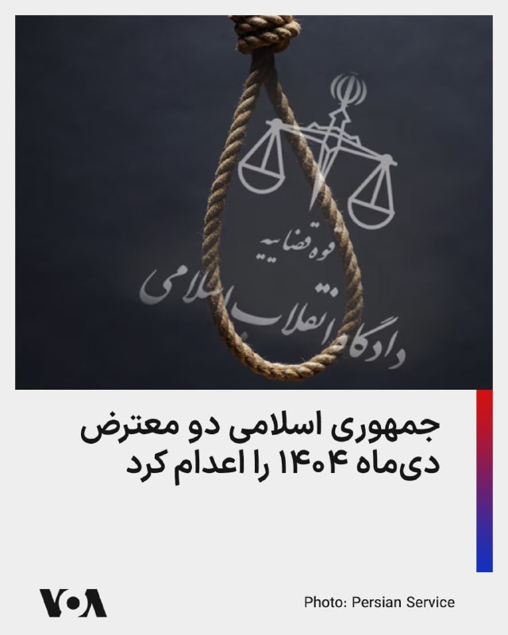

قوه قضاییه جمهوری اسلامی از اعدام جواد زمانی و ابوالفضل ساعدی، دو نفر از بازداشت‌شدگان اعتراضات دی‌ماه سال ۱۴۰۴ خبر داد.

رئیس‌کل دادگستری استان سمنان روز سه‌شنبه اعلام کرد که این دو نفر با اتهام‌هایی از جمله «محاربه»، «افساد فی‌الارض»، محاکمه شده بودند.

دادگستری استان سمنان مدعی شده پرونده این دو نفر پس از طی مراحل رسیدگی در شعب تحقیق، دادگاه بدوی و دیوان عالی کشور به اجرای حکم رسیده است.

در پرونده‌های امنیتی جمهوری اسلامی، دسترسی آزاد متهم به وکیل مستقل، روند دادرسی شفاف و امکان بررسی مستقل اتهام‌ها همواره از اصلی‌ترین نگرانی‌های حقوق بشری بوده است.
@FarsiVOA

## DW_Farsi — post 126047

  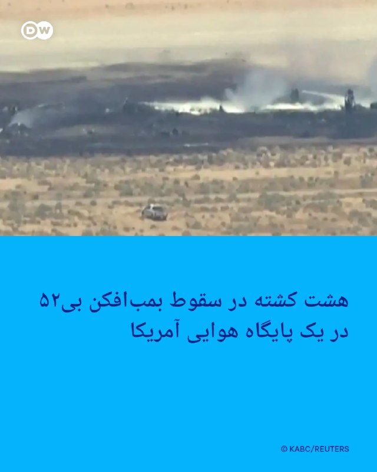

🔶 هشت کشته در سقوط بمب‌افکن بی۵۲ در یک پایگاه هوایی آمریکا

در پی سقوط یک بمب‌افکن بی۵۲ در پایگاه هوایی ادواردز در کالیفرنیا همه هشت سرنشین آن کشته شدند. علت این حادثه در دست بررسی است و هنوز مشخص نشده است. به گفته مقام‌ها این هواپیما در حال انجام یک مأموریت آزمایشی بود.

شرکت هواپیماسازی بوئینگ اعلام کرد که دو نفر از قربانیان از کارکنان این شرکت بوده‌اند.

سرهنگ جیمز هِیز، معاون فرماندهی یگان آزمایش ۴۱۲ نیروی هوایی آمریکا در پایگاه ادواردز ضمن اعلام این خبر در یک نشست خبری گفت: «امروز پایگاه هوایی ادواردز شاهد یک تراژدی وحشتناک بود و ما هشت آمریکایی بزرگ را از دست دادیم.»

او افزود روند اطلاع‌رسانی به خانواده‌های قربانیان در جریان است و جزئیات بیشتر پس از آن منتشر خواهد شد.

به گفته هیز این پرواز اواخر صبح دوشنبه ۱۵ ژوئن انجام شد و برای آزمایش یک سامانه راداری جدید برنامه‌ریزی شده بود. به گفتهٔ او، هواپیما لحظاتی پس از برخاستن سقوط کرد و آتش گرفت.

@dw_farsi

## Persian_Trend_Official — post 17250

  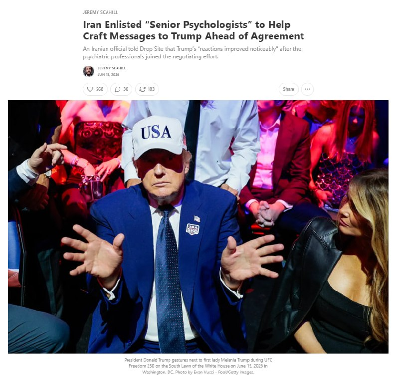

خبرگزاری دراپ سایت نیوز از نقل چند مقام ایرانی: تهران دو روانشناس ارشد را به تیم مشاوره مذاکره خود اضافه کرده است تا سبک ارتباطی رئیس جمهور ترامپ را تجزیه و تحلیل کرده و به تدوین پیام‌هایی که از طریق میانجیگران منطقه‌ای ارسال می‌شود، کمک کنند.

طبق روایت ایرانی، مشاوران یک پروفایل روانشناختی از ترامپ تهیه کردند که به گفته آنها دارای الگوی رفتاری نامنظم یا روان‌پریشانه است و پیام‌های خود را بر اساس آن تنظیم کردند.

یک مقام ایرانی ادعا کرد که پاسخ‌های ترامپ پس از اعمال توصیه‌های آنها بهبود یافته است و روند مذاکره را به طور فزاینده‌ای بالینی توصیف کرد.

این روانشناسان پس از آغاز مذاکرات غیرمستقیم در اسلام آباد در ماه آوریل، همزمان با تبادل پیشنهادهای ایران و ایالات متحده برای یک یادداشت تفاهم، به حلقه مشاوره پیوستند.

📝 Amir

📌 @persian_trend_official
پرشین ترند | متفاوت‌ترین کانال نظامی

## Persian_Trend_Official — post 17249

  <a href="telegram/content/Persian_Trend_Official_17249_1781603030.mp4" target="_blank">🎬 Download video</a>

معاون رئیس جمهور امریکا، جی دی ونس:
جالب‌ترین نکته در مورد پیشرفتی که در چند هفته گذشته داشته‌ایم این است که می‌بینید افرادی در درون نظام ایران از رهبری ارشد گرفته تا حتی مقامات سپاه پاسداران می‌گویند: می‌دانید؟ ما ممکن است مقداری خصومت و بی‌اعتمادی داشته باشیم، اما می‌دانیم که روشی که 47 سال با ایالات متحده تجارت کرده‌ایم، اشتباه بوده است. بیایید چیز دیگری را امتحان کنیم.

📝 Amir

📌 @persian_trend_official
پرشین ترند | متفاوت‌ترین کانال نظامی

## Persian_Trend_Official — post 17248

  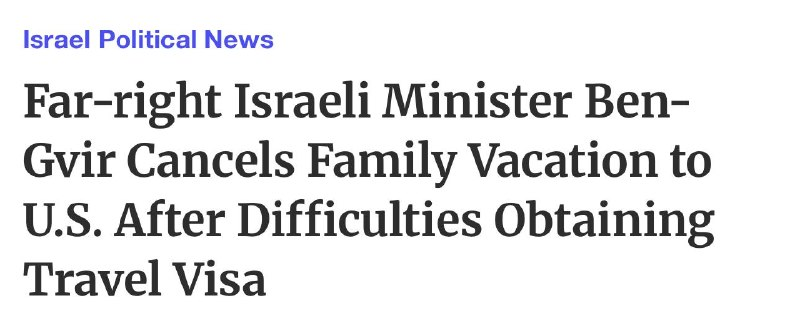

به گزارش هاآرتص، بن گویر، وزیر امنیت ملی اسرائیل، پس از مواجهه با مشکلاتی در اخذ ویزای آمریکا، سفر خانوادگی برنامه‌ریزی‌شده خود به ایالات متحده را لغو کرد.

بن گویر قصد داشت برای شرکت در عروسی دختر یک تاجر اسرائیلی به میامی سفر کند، اما این سفر در نهایت به دلیل مشکلات ویزا لغو شد.

📝 Amir

📌 @persian_trend_official
پرشین ترند | متفاوت‌ترین کانال نظامی

## RadioFarda — post 158374

  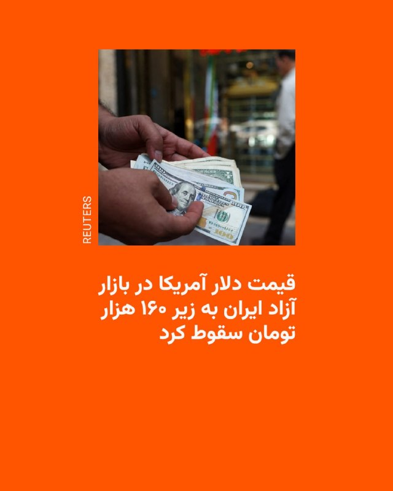

🔸 روند کاهشی قیمت ارزهای خارجی در بازار آزاد ایران روز سه‌شنبه ۲۶ خرداد هم ادامه یافت و گزارش وب‌سایت‌های اعلام نرخ ارز و طلا نشان می‌دهد که قیمت دلار آمریکا به زیر ۱۶۰ هزار تومان رسید و ظهر روز سه‌شنبه در محدودهٔ ۱۵۸ هزار تومان معامله شد.

🔸قیمت سکه طلا هم ۱۶۲ میلیون تومان گزارش شد که نشان‌دهنده کاهش دست‌کم پنج میلیون تومانی آن نسبت به روز قبل است.

🔸از زمان اعلام توافق ایران و آمریکا برای پایان جنگ، قیمت ارزهای خارجی و سکه طلا در بازار آزاد ایران شاهد کاهش قابل توجهی بوده است.

🔸قیمت ارزهای خارجی و طلا طی ماه‌های گذشته به شدت افزایش یافته بود و قیمت دلار آمریکا در مقطعی تا مرز ۱۹۰ هزار تومان هم رسیده بود.

@RadioFarda

## BBCPersian — post 284019

  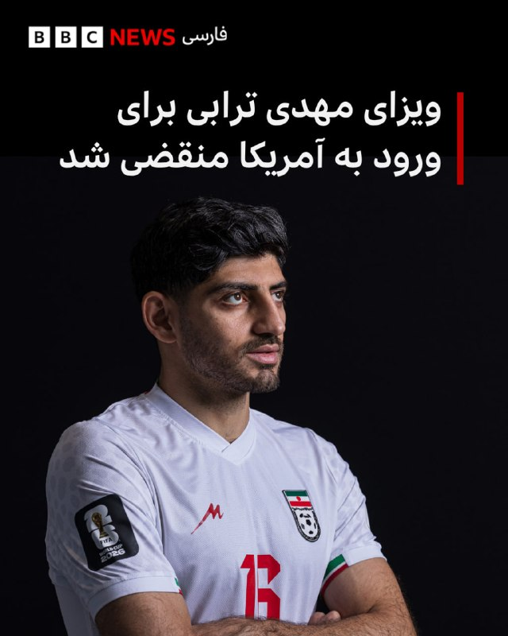

🔻ویزای مهدی ترابی بعد از بازی با نیوزیلند منقضی شد.

به گفته بخش رسانه‌ای تیم ملی فوتبال ایران، برای سفر به آمریکا روادید چند بار ورود برای بازیکنان صادر شده است اما ویزای مهدی ترابی فقط برای یک بار ورود اعتبار داشت و پس از پایان بازی با نیوزیلند، ویزای این بازیکن منقضی شده است.

بنابر این گزارش، فدراسیون فوتبال ایران دوباره برای ویزای مهدی ترابی اقدام کرده تا در بازی‌های بعد تیم ملی را همراهی کند.

گفته می‌شود به دلیل حمایت این بازیکن از جناح‌های تندرو حکومت، برایش ویزای یک بار ورود صادر شده است.

امیر قلعه‌نوعی، سرمربی تیم ملی ایران، پس از بازی نیوزیلند گفت به این تیم دستور داده شده بلافاصله آمریکا را ترک کند و به تیخوآنا برگردد درحالی‌که قصد داشتند شب را در لس‌انجلس بمانند و روز بعد ریکاوری کنند.

به گزارش پوریا ژافره از لس‌آنجلس، پرواز تیم ملی ایران هنوز فرودگاه را ترک نکرده است. او گفت کار خروج مهدی طارمی و سعید الهویی از فرودگاه طول کشید درحالی‌که بقیه بازیکنان سوار هواپیما شده بودند.

📸FIFA via Getty Images
https://bbc.in/4oFx2FB
@BBCPersian

## alonews — post 128417

  <a href="telegram/content/alonews_128417_1781603033.webm" target="_blank">🎬 Download video</a>

👈کرملین: اگر زلنسکی آماده است که به طور مسئولانه و جدی صحبت کند، همیشه می‌تواند به مسکو بیاید، جایی که از او استقبال خواهد شد

✅ @AloNews خبر جنگ

---
📅 بروزرسانی: 1405/03/26 13:04
---

## mwarmonitor — post 11015

  <a href="telegram/content/mwarmonitor_11015_1781602465.mp4" target="_blank">🎬 Download video</a>

Thousands of Iranian Lion and Sun flags were held up by Iranian Pahlavi-supporters during yesterday’s game between Iran and New Zealand in Los Angeles.

The fans had to smuggle in the flags as FIFA had banned them

🇮🇷

Subscribe Visegrád24

## pm_afshaa — post 94176

🔴خبرگزاری میزان، رسانه قوه قضاییه جمهوری اسلامی، سه‌شنبه 26 خرداد از اجرای حکم اعدام جواد زمانی و ابوالفضل ساعدی، دو زندانی سیاسی بازداشت‌شده در اعتراضات دی‌ماه در استان سمنان خبر داد. میزان اتهام آن‌ها را «افساد فی‌الارض از طریق کشیدن سلاح گرم و سرد در شهرستان شاهرود» اعلام کرد

💧 Rainbet.com the #1 Non-KYC Crypto Casino & Sportsbook @rainbetcom

😁 @Pm_Afshaa

## FarsiVOA — post 220891

🔺اتصال برق ایران و قطر؛ وعده تازه در سایه هشدار خاموشی

▪️وزیر نیرو در دولت جمهوری اسلامی می‌گوید اتصال الکتریکی ایران و قطر «به‌زودی» آغاز می‌شود، مطالعات این طرح در مرحله پایانی است و کار اجرایی آن در ابتدای مسیر قرار دارد.

▪️او همچنین گفته است که بررسی اتصال شبکه برق ایران با دیگر کشورهای حاشیه خلیج فارس نیز در جریان است.

▪️این طرح قرار است از مسیر کابل زیردریایی حدود ۲۰۰ کیلومتری اجرا شود؛ پروژه‌ای پرهزینه و زمان‌بر که به تأمین مالی، هماهنگی فنی دو شبکه، امنیت مسیر، قراردادهای پایدار خرید و فروش برق و توافق سیاسی طولانی‌مدت نیاز دارد.

▪️این در حالی است که گزارش تازه مرکز پژوهش‌های مجلس نشان می‌دهد ناترازی برق همچنان جدی است.

⬇️ بیشتر بخوانید:
https://ir.voanews.com/a/8161425.html

## DW_Farsi — post 126046

  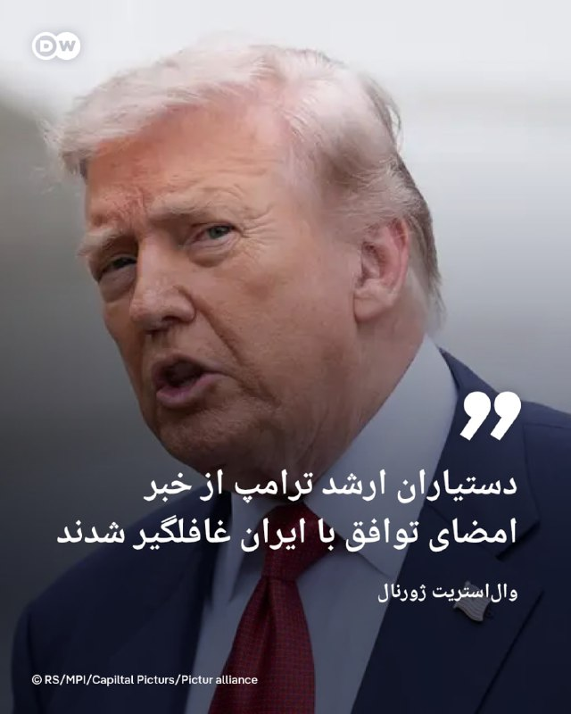

🔶 وال‌استریت ژورنال: دستیاران ارشد ترامپ از خبر امضای توافق با ایران غافلگیر شدند

وال‌استریت ژورنال گزارش داده است که دستیاران ارشد دونالد ترامپ، رئیس ‌جمهور ایالات متحده آمریکا، از خبر امضای توافق با ایران غافلگیر شدند.

بر اساس این گزارش، پست ترامپ در شبکه اجتماعی تروث سوشال در روز یکشنبه که در آن اعلام کرد "توافق با جمهوری اسلامی ایران اکنون نهایی شده است"، پس از آن منتشر شد که او اندکی بعد از ساعت ۵ بعدازظهر به وقت محلی واشنگتن این سند را به صورت دیجیتالی در کاخ سفید امضا کرده بود.

اما به نوشته این روزنامه، حتی دستیاران ارشد خود ترامپ نیز از انتشار این پیام‌ها درباره توافق پایان جنگ غافلگیر شدند، زیرا تصور می‌کردند مذاکرات همچنان در حال ادامه است.

متن این توافق که گفته می‌شود تنها یک صفحه و نیم است، هنوز به صورت عمومی منتشر نشده است. بنیامین نتانیاهو، نخست‌وزیر اسرائیل، روز گذشته در یک نشست خبری تاکید کرد که اسرائیل طرف این یادداشت تفاهم نیست و هنوز از جزئیات کامل توافق اطلاع ندارد.

@dw_farsi

## Persian_Trend_Official — post 17247

  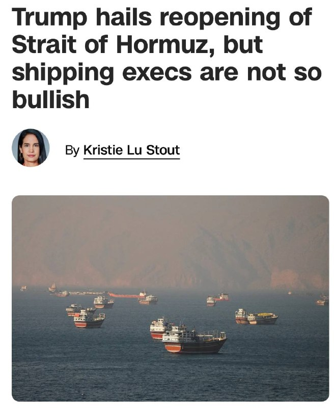

خبرگزاری CNN: ترامپ می‌گوید تنگه هرمز پس از توافق آمریکا و ایران بازگشایی شده است اما در سراسر صنعت کشتیرانی، اعتماد همچنان کم است.

تهدیداتی از جمله مین، پهپاد و حملات موشکی همچنان مانع حرکت می‌شوند، در حالی که خستگی خدمه پس از ماه‌ها عدم اطمینان، ریسک عملیاتی بیشتری را افزایش می‌دهد. داده‌های ردیابی کشتی کپلر هیچ حرکت معناداری را در بین 220 نفتکش و نزدیک به 500 کشتی که در حال حاضر در خلیج فارس لنگر انداخته‌اند، نشان نمی‌دهد.

آنگاد بانگا، مدیرعامل گروه کاراول، می‌گوید کشتی‌هایش آماده حرکت هستند اما موقعیت خود را حفظ کرده‌اند: ما تا زمانی که 30 روز ترانزیت بدون حادثه داشته باشیم، نیروی انسانی و آمادگی خود را حفظ می‌کنیم. نه سه روز بلکه سی روز.

پس از این همه شروع اشتباه، صنعت کشتیرانی محتاط خواهد بود. تیم هاکسلی، رئیس هیئت مدیره ماندارین شیپینگ، افزود که جریان‌های تجاری و زیرساخت‌های آسیب‌دیده خاورمیانه برای بازیابی به زمان قابل توجهی نیاز دارند.

📝 Amir

📌 @persian_trend_official
پرشین ترند | متفاوت‌ترین کانال نظامی

## Persian_Trend_Official — post 17244

تصاویر ماهواره ای جدید از استقرار جنگنده‌های Su-34ME الجزایری منتشر شد.

براساس تصاویر ماهواره ای جدید منتشر شده از پایگاه هوایی مولای احمد مدغری چند فروند جنگنده Su-34 در این پایگاه مشاهده می‌شود، در این تصاویر دست کم 4 فروند جنگنده Su-34ME دیده می‌شود.

📝 Amir

📌 @persian_trend_official
پرشین ترند | متفاوت‌ترین کانال نظامی

## alonews — post 128415

  <a href="telegram/content/alonews_128415_1781602470.webm" target="_blank">🎬 Download video</a>

👈نفت آمریکا ۷۸ دلار

🔴نفت برنت ۸۱ دلار

✅ @AloNews خبر جنگ

---
📅 بروزرسانی: 1405/03/26 12:53
---

## WithYashar — post 15041

ویس میلیارد دلاری 💰
@withyashar

## mwarmonitor — post 11014

🔴روزنامه هاآرتص گزارش می‌دهد که یادداشت تفاهم (MOU) میان ایالات متحده و ایران شامل بندی جداگانه درباره لبنان است که بنا بر یک منبع پاکستانی، عملاً به اسرائیل اجازه می‌دهد به عملیات نظامی خود در آنجا ادامه دهد.

📌این منبع گفته است: «در این توافق، همه طرف‌ها چیزی به دست می‌آورند و سهم اسرائیل همین است.»

📌یک منبع دوم نیز گفته این بند «به‌طور بسیار مبهمی تنظیم شده»، اما تأیید کرده که اسرائیل آن را به‌منزله اجازه برای ادامه درگیری‌ها در لبنان تفسیر می‌کند.

@mwarmonitor

## IranIntlTV — post 342680

  <a href="telegram/content/IranIntlTV_342680_1781601836.mp4" target="_blank">🎬 Download video</a>

حسین آقایی، عضو تحریریه ایران‌اینترنشنال، با اشاره به اظهارات جی‌دی ونس درباره رد پرداخت پول به جمهوری اسلامی پس از توافق، گفت شواهد موجود از ابهام‌های متعدد در متن این توافق حکایت دارد. به گفته او، همزمان نشانه‌هایی از اختلاف نظر میان اعضای کابینه دونالد ترامپ، رییس‌جمهوری آمریکا، درباره جزییات این توافق نیز دیده می‌شود.
@iranintltv

## Shin_Persian — post 7109

Shin ✓ @hey_itsmyturn
Tue, 16 Jun 2026 09:21:10 UTC

Hezbollah said "Iran is now one of the world's superpowers", and apparently they said it with a straight face.

ترجمه خودکار فارسی

حزب‌الله گفت «ایران اکنون یکی از ابرقدرت‌های جهان است» و ظاهراً آن‌ها این حرف را با جدیتی تمام بیان کردند.

𝕏 · @shin_persian

## Shin_Persian — post 7108

Open Source Intel ✓ @Osint613
Tue, 16 Jun 2026 08:09:49 UTC

Iran's FM Araqchi: A new round of US-Iran talks will start on Friday in Switzerland.

ترجمه خودکار فارسی

عراقچی، وزیر امور خارجه ایران: دور جدیدی از گفتگوهای ایران و آمریکا روز جمعه در سوئیس آغاز خواهد شد.

𝕏 · @shin_persian

## FarsiVOA — post 220890

🔺بیش از ۱۳۰ میلیارد دلار ارز صادراتی در هشت سال به اقتصاد برنگشت

▪️عضو کمیسیون اقتصادی مجلس، می‌گوید از سال ۱۳۹۷ تا پایان خرداد ۱۴۰۵ بیش از ۱۳۰ میلیارد دلار ارز صادراتی به چرخه رسمی اقتصاد کشور بازنگشته است.

▪️این رقم بار دیگر پرسش درباره نقش صادرکنندگان بزرگ غیرنفتی، شرکت‌های شبه‌دولتی و شبکه‌های نزدیک به نهادهای قدرت را برجسته می‌کند.

▪️حسین صمصامی همچنین گفته فقط در سال ۱۴۰۴ حدود ۱۶ میلیارد و ۹۰۰ میلیون دلار ارز صادراتی بازنگشته و در سه ماه نخست ۱۴۰۵ نیز حدود سه میلیارد دلار دیگر به چرخه رسمی اقتصاد وارد نشده است.

▪️خبر تازه تسنیم نام شرکت‌ها را منتشر نکرده، اما گزارش‌ها و اظهارات قبلی نشان می‌دهد ماجرا فقط به صادرکنندگان خرد یا بخش خصوصی محدود نیست.

⬇️ بیشتر بخوانید:
https://ir.voanews.com/a/8161424.html

## DW_Farsi — post 126045

  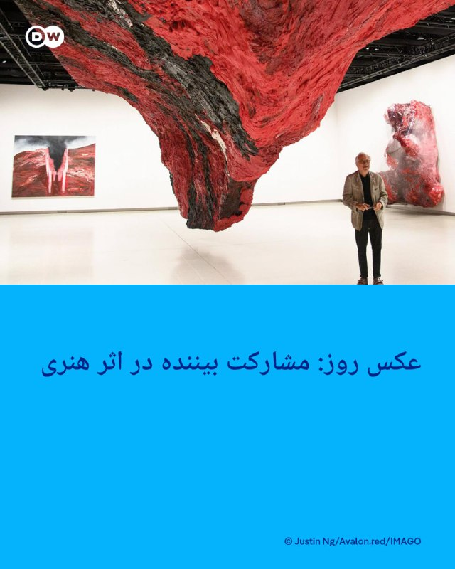

📸 عکس روز: مشارکت بیننده در اثر هنری

آنیش کاپور، هنرمند برجسته بریتانیایی هندی‌تبار، در مراسم معرفی نمایشگاه جدیدش در لندن در کنار اثر "کوه موریا در دروازه گتو" ایستاده است. آثار کاپور که در مقیاسی بزرگ ساخته‌ شده‌اند، مخاطب را به چالش می‌کشند و تجربه‌های ادراکی منحصر‌به‌فردی را با جابه‌جایی مرزهای مادیت و معنویت و جسم و خلاء خلق می‌کنند.

این نمایشگاه از ۱۶ ژوئن تا ۱۸ اکتبر، مروری گسترده بر آثار این هنرمند تأثیرگذار ارائه می‌کند.

@dw_farsi

## BBCPersian — post 284009

🖋جرمی بوئن
در بیروت

این جنگ بدترین اشتباه دونالد ترامپ، رئیس جمهور آمریکا، دست‌کم تا اینجا در سیاست خارجی بوده است.

این جنگ بازدارندگی آمریکا در برابر دشمنانش را دشوارتر می‌کند.

این جنگ به اتحاد آمریکا با حکومت‌های عربی تولیدکننده نفت در خلیج فارس آسیب زده است. کشورهایی که مدل اقتصادی‌شان بر پایه ثبات در میان آشوب خاورمیانه بنا شده و ترمیم این آسیب سال‌ها زمان خواهد برد.

مقام‌های این کشورها در محافل خصوصی از هم‌اکنون درباره متنوع کردن اتحادهای خود و ضرورت یافتن راه‌هایی برای همزیستی با ایران صحبت می‌کنند. چین نیز با دقت نظاره‌گر بوده است که آمریکا چگونه ذخایر تسلیحاتی خود که جایگزینی آن دشوار است را مصرف کرد و با محدودیت‌های قدرتش روبه‌رو شد.

این توافق، اگر در آخرین لحظات با مانعی مواجه نشود، به جنگی پایان می‌دهد که بر پایه برداشت نادرست آمریکا و اسرائیل از قدرت دشمنشان در ایران شکل گرفته بود. این امر موجب آسودگی خاطر عظیمی برای همه کسانی خواهد شد که زندگی‌شان بر اثر این جنگ زیر و رو شده است.
ادامه مطلب⬇️

📸Getty/ Reuters/ EPA
https://bbc.in/4vdxuNX
@BBCPersian

## Hranews — post 113644

پلمب چند کافه و کافه‌رستوران در گرگان و خرم‌آباد

❗️
❗️
❗️
❗️
❗️– پنج کافه‌رستوران در خرم‌آباد و چند کافه در گرگان به دلایلی از جمله آنچه «هنجارشکنی» عنوان شده، #پلمب شدند.

ادامه مطلب

↘️
@hranews_bot تماس ✉️ -  @Hranews  کانال هرانا 🆑

---
📅 بروزرسانی: 1405/03/26 12:43
---

## WithYashar — post 15040

Voice message

## WithYashar — post 15039

## mwarmonitor — post 11013

  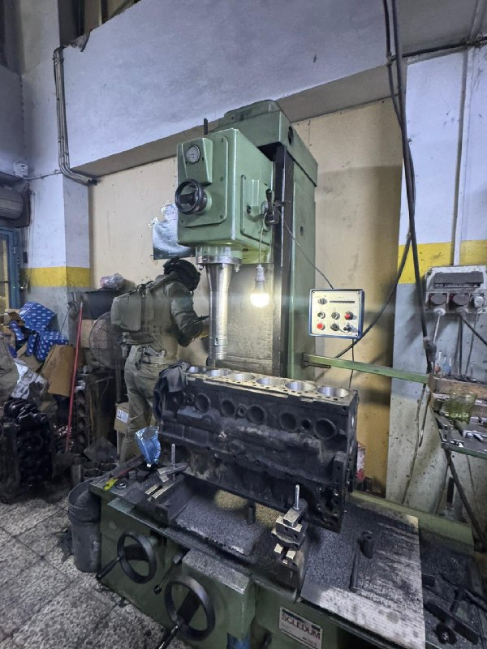

⭕️ شناسایی و منهدم شد: ماشین‌آلات تولید سلاح که برای ساخت جنگ‌افزار و مواد انفجاری به کار می‌رفت و در قلب یک منطقه غیرنظامی در نابلس کشف شده بود.

🔸در مجموع ۱۸ دستگاه ماشین‌آلات تولید سلاح منهدم شد. همچنین قطعات سلاح شناسایی و توقیف گردید.

@mwarmonitor

## mwarmonitor — post 11012

  <a href="telegram/content/mwarmonitor_11012_1781601234.mp4" target="_blank">🎬 Download video</a>

🔴زلینسکی ؛ این بار، منطقه مسکو برد توانمندی‌های دوربرد اوکراین را احساس کرد. یک پالایشگاه نفت در فاصله ۵۰۰ کیلومتری هدف قرار گرفت. من از رزمندگان سرویس امنیتی اوکراین، نیروهای سامانه‌های بدون سرنشین، نیروهای عملیات ویژه، اطلاعات دفاعی اوکراین و نیروهای موشکی بابت عملکرد مؤثرشان تشکر می‌کنم.

🔸روسیه باید وادار شود به جنگ خود علیه مردم ما پایان دهد. و سلاح‌های دوربرد اوکراین یکی از مؤلفه‌های مهم چنین فشاری هستند.

🔸این پاسخی عادلانه به حملات روسیه است — و به طولانی‌کردن جنگی که باید پایان یابد.

زنده باد اوکراین!

@mwarmonitor

## iaghapour — post 2677

⭕️ دسترسی مستقیم و بدون واسطه به اینترنت آزاد

🔹کافی است آدرس subscription را در برنامه v2rayN/v2rayNG وارد کنید:

https://raw.githubusercontent.com/patterniha/Serverless-for-Iran/refs/heads/main/Subscription/Serverless-for-Iran.json

— نکات استفاده👇🏻
۱. کانفیگ سرورلس برای اجرا نیاز به هسته Xray-core حداقل ورژن 26.6.1 دارد (حداقل v2rayNG v2.2.3)

۲. سرویسها و سایتهایی که ip آنها به طور کلی از سمت ایران بلاک شده با این روش مستقیم قابل دستیابی نیستند، همچنین از آنجایی که سرویسهای خارجی ip ایران را مشاهده میکنند، سرویسها و سایتهایی که ایران را تحریم کرده اند نیز با این روش مستقیم قابل دستیابی نیستند.

۳. در تنظیمات v2rayNG دقت کنید که Enable Hev TUN FEATURE فعال باشد و همچنین پورت پیشفرض 10808 را تغییر نداده باشید.

۴. از آپدیت بودن فایلهای جئو مطمئن شوید (قسمت Asset files در برنامه v2rayNG و قسمت Help-Check Update در برنامه v2rayN)

۵. برای تجربه بهتر پیشنهاد میشود IPv6 خود را فعال کنید (در تنظیمات v2rayNG تیک Enable IPv6 را بزنید و همچنین در صورتی که از اینترنت همراه استفاده میکنید باید IPv6 را در قسمت Access-Point گوشی خود فعال کنید)

۶. در اندروید برای عدم تداخل با (dns و sniffing) کانفیگ بهتر است Private DNS در تنظیمات اندروید و Use secure DNS در تنظیمات کروم خاموش باشد.

۷. از کانفیگها تست نگیرید، نتیجه‌ی تست ارتباطی با کار کردن یا کار نکردن این نوع کانفیگها ندارد.

⚠️ برای کارهای حساس از این روش استفاده نکنید!

🔗 اطلاعات بیشتر در گیت‌هاب پروژه

🆔 @iAghapour

## IranIntlTV — post 342679

  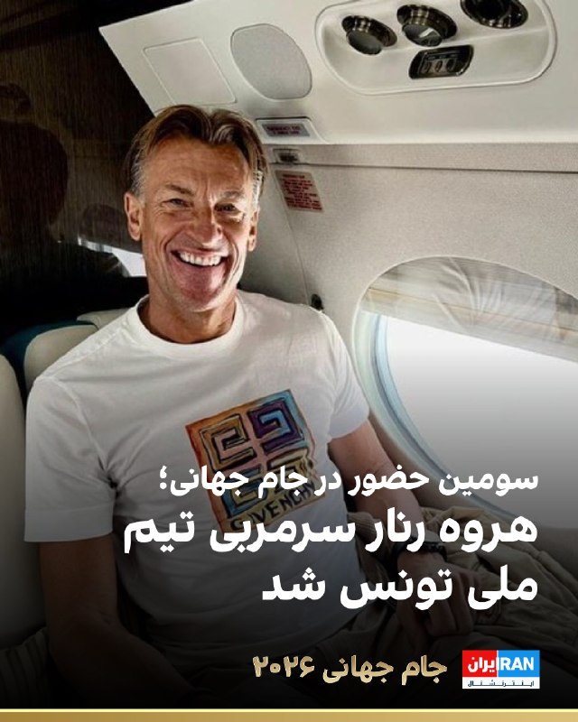

🔻فدراسیون فوتبال تونس، هروه رنار فرانسوی را به‌عنوان سرمربی جدید خود منصوب کرد. این تصمیم پس از اخراج صبری لموشی به دلیل شکست تلخ ۵–۱ برابر سوئد در نخستین بازی جام جهانی گرفته شد. رنار ۵۷ ساله که پس از جدایی از عربستان بدون تیم بود، در ادامهٔ جام جهانی هدایت تونس را بر عهده می‌گیرد.

🔹سرمربی نام‌آشنای فرانسوی با پروازی مستقیم از پاریس به مکزیک سفر می‌کند تا نخستین تمرین تیم را در کمپ مونتری رهبری کند. با این جابه‌جایی، رنار پس از مراکش (۲۰۱۸) و عربستان (۲۰۲۲)، سومین حضور خود در جام جهانی را با سه تیم مختلف تجربه خواهد کرد.

🔹او همراه با کادر فنی اختصاصی خود کارش را آغاز می‌کند و روز یکشنبه ۲۱ ژوئن در دومین بازی تونس برابر ژاپن، برای نخستین‌بار روی نیمکت این تیم خواهد نشست.
@iranintltvsport

## Persian_Trend_Official — post 17243

عراقچی: از صبح دیروز جنگ رسماً در تمام جبهه‌ها تمام شده و هر حملهٔ اسرائیل به لبنان نقض تفاهم است.

📝 Amir

📌 @persian_trend_official
پرشین ترند | متفاوت‌ترین کانال نظامی

## Persian_Trend_Official — post 17242

  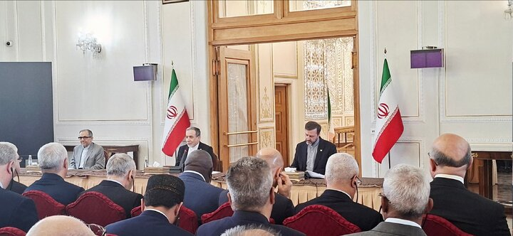

عراقچی: دور جدید مذاکرات ایران و آمریکا جمعه آغاز می‌شود.

وزیر امور خارجه در نشست با سفرا و روسای نمایندگی‌های خارجی و بین‌المللی: یادداشت تفاهم ایران و آمریکا برای خاتمه جنگ در روز جمعه به صورت رسمی امضا خواهد شد.

همان روز دور جدید مذاکرات ایران و آمریکا برای رسیدن به توافق نهایی آغاز می‌شود. بعد از امضای یادداشت تفاهم، مذاکرات بین ایران و آمریکا ادامه پیدا می‌کند.

این مذاکرات به مدت 60 روز ادامه پیدا خواهد کرد تا به یک توافق نهایی برسیم. این توافق نهایی مربوط به موضوعات هسته‌ای و لغو تحریم‌هاست.

📝 Amir

📌 @persian_trend_official
پرشین ترند | متفاوت‌ترین کانال نظامی

## RadioFarda — post 158373

  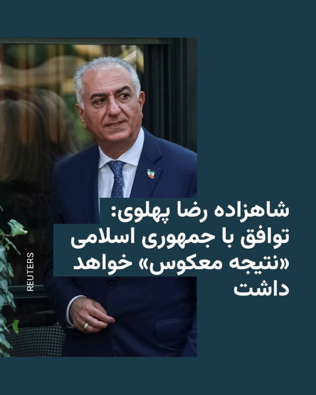

🔸شاهزاده رضا پهلوی در گفت‌وگو با مجله تایمز، با انتقاد از توافق تازه میان ایران و آمریکا، آن را از نظر اخلاقی «غلط» و از نظر راهبردی «گمراه‌کننده» توصیف کرد و گفت هر توافقی با جمهوری اسلامی در نهایت شکست خواهد خورد.

🔸او با تأکید بر این‌که نمی‌توان به جمهوری اسلامی اعتماد کرد، گفت این حکومت به سرکوب مخالفان، باج‌خواهی از جامعه جهانی و گسترش بی‌ثباتی در منطقه ادامه خواهد داد. آقای پهلوی همچنین گفت مردم ایران باید در مرکز هرگونه مذاکره و سیاست‌گذاری بین‌المللی درباره ایران قرار گیرند.

🔸رضا پهلوی در بخش دیگری از این گفت‌وگو، «تغییر رژیم» را تنها راه‌حل ممکن دانست و گفت جمهوری اسلامی به دلیل ماهیت خود «ناسازگار با جهان آزاد» است. او همچنین اظهار داشت که «حملات آمریکا و اسرائیل از سوی بسیاری از ایرانیان به‌عنوان اقدامی آزادی‌بخش تلقی شده است.»

🔸شاهزاده رضا پهلوی تأکید کرد که تعیین رهبر آینده ایران تنها بر عهده مردم ایران است و این موضوع باید از طریق صندوق رأی مشخص شود.

@RadioFarda

## BBCPersian — post 284008

🔻عراقچی: دور جدید مذاکرات ایران و آمریکا جمعه در سوئیس آغاز می شود

عباس عراقچی از آغاز دور جدید مذاکرات ایران و آمریکا در روز جمعه در سوئیس خبر داد.

وزیر خارجه ایران در نشستی با حضور سفرا و کارداران و روسای نمایندگی‌های خارجی و بین‌المللی مقیم تهران گفت: «روز جمعه دور جدید مذاکرات ایران و آمریکا برای رسیدن به توافق نهایی آغاز می‌شود. بعد از سه ماه مذاکره توانستیم مرحله اول را نهایی کنیم.»

آقای عراقچی گفت: «در مرحله اول مهمترین موضوعی که اتفاق می‌افتد اعلام خاتمه جنگ است و بنا به تصمیمی که گرفتیم از صبح روز دوشنبه به وقت تهران که این توافق نهایی شد، خاتمه جنگ هم اعلام شد. ولی شروع رسمی تفاهمنامه از روز جمعه خواهد بود.»

این تفاهمنامه روز جمعه در سوئیس با تشریفات رسمی امضا خواهد شد.

https://bbc.in/4xvdZ4H
@BBCPersian

## alonews — post 128414

  <a href="telegram/content/alonews_128414_1781601238.webm" target="_blank">🎬 Download video</a>

👈شاخص کل بورس با رشد ۱۱۹ هزار واحدی در پایان معاملات امروز به ۵ میلیون و ۲۰۰ هزار واحد رسید

✅ @AloNews خبر جنگ

## alonews — post 128413

  <a href="telegram/content/alonews_128413_1781601238.mp4" target="_blank">🎬 Download video</a>

👈حملهِ ارتش اسرائیل به تپه‌های علی‌الطاهر تو لُبنان

✅ @AloNews خبر جنگ

---
📅 بروزرسانی: 1405/03/26 12:33
---

## VahidOOnLine — post 245832

🗣روایت شما از توافق آمریکا و جمهوری اسلامی- سه‌شنبه ۲۶ خرداد:

🔹ناامیدی، سوخت دیکتاتوری‌ها و امید راه سقوط آن‌هاست؛ امیدتون رو از دست ندین.

🔹ترامپ و جی‌دی ونس به چیه این تفاهم‌نامه که حتی تهش هم مشخص نیست می‌بالند. مگه این‌که از موجودیت و اصل وجودی جمهوری اسلامی بی‌خبر باشند که چقدر این‌ها می‌تونن خطرناک باشند.

🔹اگه مجتبی زنده است و با مذاکرات موافق کرده چرا صدا و تصویرش رو نشون نمی‌دن؟

🔹مگه توافق نشد؟ حالا چرا مجتبی رو نشون نمی‌دن؟ واقعا فکر می‌کنید زنده است؟!

🔹ترامپ به مردم ایران وعده داد که کمک در راه است، ولی ظاهراً بر سر دو راهی، مسیر را اشتباه رفت و کمک را به باقی‌مانده رژیم که آخرین نفس‌هایش را می کشید رساند، آمریکا تاوان سنگینی بابت اشتباه ترامپ خواهد داد.

🔹جمهوری اسلامی سال‌ها با شعار و تهدید برای مردم نمایش قدرت اجرا کرد. همان نظامی که ادعای مقاومت داشت برگشت پای میز توافق با همان طرفی که رهبرش رو کشت. زانو زدند، امضا کردند، شکست را قبول کردند، تحقیر شدند.

🔹مطمئن باشید جمهوری اسلامی اصلا به توافق پایبند نخواهد بود.

🔹آقای ترامپ! شما با حکومتی توافق کردید که با خُدعه و نیرنگ بر سرکار آمد و با خدعه و نیرنگ ۴۷ سال بر سرکار باقی ماند. شما از سوراخی گزیده شدید که قبل از شما خیلی‌ها گزیده شده بودند. تاریخ در مورد شما بد قضاوت خواهد کرد، آنگاه که جمهوری اسلامی زهر خود را به جهانیان بریزد.

🔹ترامپ و نتانیاهو تا همین‌جا هم کمک بزرگی به مردم ایران کردند. ما نباید خودمان را دست‌کم بگیریم. دو کلمه مهم برای پیروزی «اتحاد و سازماندهی» هستند.

🔹فعلا فقط تفاهم شده که مذاکره کنند، دو حالت بیشتر نداره یا آخوند با نابودی اورانیوم و چرخه غنی‌سازی موافقت می‌کنه که قطعا به‌معنی شکست جمهوری اسلامی است یا مسیر سابق رو می‌ره که دوباره جنگ می‌شه. نگران نباشید، جمهوری اسلامی در موقعیت خیلی بدی گیر کرده.
‌🏁 🇬🇧 IranintlTV

🤖 @VahidOOnLine

## VahidOOnLine — post 245831

ویدیوهای رسیده به ایران‌اینترنشنال نشان می‌دهد اعضای خانواده جاویدنام صنم پوربابایی، در مراسم تولد او بر سر مزارش، یاد جاویدنامان را گرامی داشتند.
صنم، ۲۶ ساله و نوازنده و مدرس ویولن، ۱۸ دی‌ماه در لاهیجان با اصابت گلوله جان باخت.
‌🏁 🇬🇧 IranintlTV

🤖 @VahidOOnLine

## VahidOOnLine — post 245830

  <a href="telegram/content/VahidOOnLine_245830_1781600633.mp4" target="_blank">🎬 Download video</a>

ویدیوی رسیده به ایران‌اینترنشنال، لحظه ورورد ایرانیان را همراه با پرچم‌های شیروخورشید به ورزشگاه سوفای لس‌آنجلس برای تماشای بازی فوتبال ایران و نیوزیلند در جام جهانی نشان می‌دهد.
‌🏁 🇬🇧 IranintlTV

🤖 @VahidOOnLine

## VahidOOnLine — post 245829

  

عباس عراقچی، وزیر خارجه جمهوری اسلامی، در نشستی با سفرا و کارداران خارجی در تهران، گفت جمهوری اسلامی و حزب‌الله یک طرف تفاهم‌نامه و آمریکا و اسرائیل طرف دیگر آن هستند. او افزود گفت: «خاتمه جنگ در لبنان، بخش جدایی‌ناپذیر خاتمه کامل جنگ است و هرگونه حمله نظامی اسرائیل به لبنان و ادامه اشغال، نقض یادداشت تفاهم محسوب می‌شود.»
‌🏁 🇬🇧 IranintlTV

🤖 @VahidOOnLine

## WithYashar — post 15038

  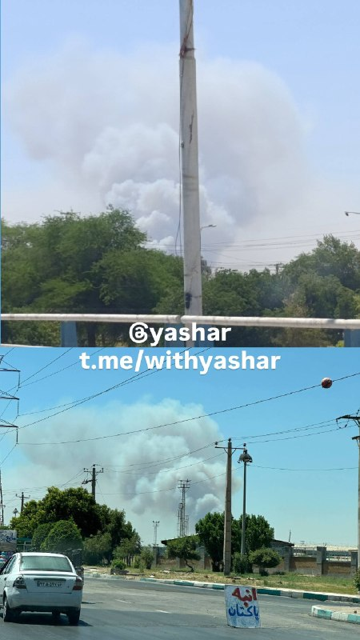

کمی پیش اهواز چیزی نیست کباب‌میزنند
@withyashar

## WithYashar — post 15037

Voice message

## WithYashar — post 15036

ارسالی

## WithYashar — post 15035

## IranIntlTV — post 342678

🗣روایت شما از توافق آمریکا و جمهوری اسلامی- سه‌شنبه ۲۶ خرداد:

🔹ناامیدی، سوخت دیکتاتوری‌ها و امید راه سقوط آن‌هاست؛ امیدتون رو از دست ندین.

🔹ترامپ و جی‌دی ونس به چیه این تفاهم‌نامه که حتی تهش هم مشخص نیست می‌بالند. مگه این‌که از موجودیت و اصل وجودی جمهوری اسلامی بی‌خبر باشند که چقدر این‌ها می‌تونن خطرناک باشند.

🔹اگه مجتبی زنده است و با مذاکرات موافق کرده چرا صدا و تصویرش رو نشون نمی‌دن؟

🔹مگه توافق نشد؟ حالا چرا مجتبی رو نشون نمی‌دن؟ واقعا فکر می‌کنید زنده است؟!

🔹ترامپ به مردم ایران وعده داد که کمک در راه است، ولی ظاهراً بر سر دو راهی، مسیر را اشتباه رفت و کمک را به باقی‌مانده رژیم که آخرین نفس‌هایش را می کشید رساند، آمریکا تاوان سنگینی بابت اشتباه ترامپ خواهد داد.

🔹جمهوری اسلامی سال‌ها با شعار و تهدید برای مردم نمایش قدرت اجرا کرد. همان نظامی که ادعای مقاومت داشت برگشت پای میز توافق با همان طرفی که رهبرش رو کشت. زانو زدند، امضا کردند، شکست را قبول کردند، تحقیر شدند.

🔹مطمئن باشید جمهوری اسلامی اصلا به توافق پایبند نخواهد بود.

🔹آقای ترامپ! شما با حکومتی توافق کردید که با خُدعه و نیرنگ بر سرکار آمد و با خدعه و نیرنگ ۴۷ سال بر سرکار باقی ماند. شما از سوراخی گزیده شدید که قبل از شما خیلی‌ها گزیده شده بودند. تاریخ در مورد شما بد قضاوت خواهد کرد، آنگاه که جمهوری اسلامی زهر خود را به جهانیان بریزد.

🔹ترامپ و نتانیاهو تا همین‌جا هم کمک بزرگی به مردم ایران کردند. ما نباید خودمان را دست‌کم بگیریم. دو کلمه مهم برای پیروزی «اتحاد و سازماندهی» هستند.

🔹فعلا فقط تفاهم شده که مذاکره کنند، دو حالت بیشتر نداره یا آخوند با نابودی اورانیوم و چرخه غنی‌سازی موافقت می‌کنه که قطعا به‌معنی شکست جمهوری اسلامی است یا مسیر سابق رو می‌ره که دوباره جنگ می‌شه. نگران نباشید، جمهوری اسلامی در موقعیت خیلی بدی گیر کرده.

## IranIntlTV — post 342677

ویدیوهای رسیده به ایران‌اینترنشنال نشان می‌دهد اعضای خانواده جاویدنام صنم پوربابایی، در مراسم تولد او بر سر مزارش، یاد جاویدنامان را گرامی داشتند.
صنم، ۲۶ ساله و نوازنده و مدرس ویولن، ۱۸ دی‌ماه در لاهیجان با اصابت گلوله جان باخت.

## IranIntlTV — post 342676

  <a href="telegram/content/IranIntlTV_342676_1781600636.mp4" target="_blank">🎬 Download video</a>

یک شهروند با ارسال ویدیویی به ایران‌اینترنشنال می‌گوید خرید مایحتاج ساده خانه برای آنها شش میلیون تومان هزینه داشته است.

## IranIntlTV — post 342675

  <a href="telegram/content/IranIntlTV_342675_1781600638.mp4" target="_blank">🎬 Download video</a>

ویدیوی رسیده به ایران‌اینترنشنال، لحظه ورورد ایرانیان را همراه با پرچم‌های شیروخورشید به ورزشگاه سوفای لس‌آنجلس برای تماشای بازی فوتبال ایران و نیوزیلند در جام جهانی نشان می‌دهد.

## IranIntlTV — post 342674

  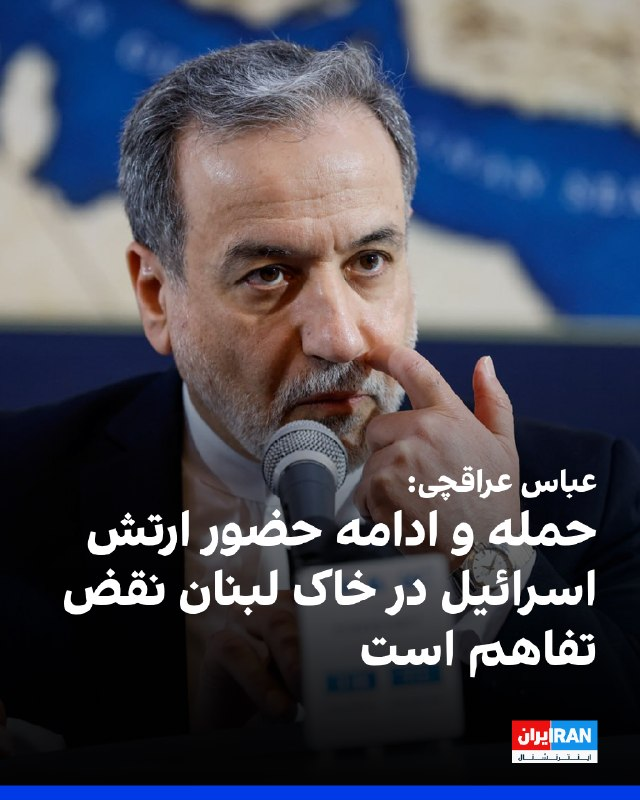

عباس عراقچی، وزیر خارجه جمهوری اسلامی، در نشستی با سفرا و کارداران خارجی در تهران، گفت جمهوری اسلامی و حزب‌الله یک طرف تفاهم‌نامه و آمریکا و اسرائیل طرف دیگر آن هستند. او افزود گفت: «خاتمه جنگ در لبنان، بخش جدایی‌ناپذیر خاتمه کامل جنگ است و هرگونه حمله نظامی اسرائیل به لبنان و ادامه اشغال، نقض یادداشت تفاهم محسوب می‌شود.»
https://iranintl.com/202606160858

## FarsiVOA — post 220889

  <a href="telegram/content/FarsiVOA_220889_1781600641.mp4" target="_blank">🎬 Download video</a>

واکنش اعتراضی تماشاگران هنگام پخش سرود ملی جمهوری اسلامی؛

شماری از حاضران در استادیوم لس‌آنجلس هنگام پخش سرود جمهوری اسلامی در آغاز دیدار تیم‌های فوتبال ایران و نیوزیلند، بازیکنان ایران و سرود را به نشانه اعتراض هو کردند.
@FarsiVOA

## RadioFarda — post 158372

  <a href="https://t.me/radiofarda/158372" target="_blank">📎 Download file</a>

🔸از «بچه‌ها متشکریم» ویگن تا «ایران، ایران» آرش؛ از سرودهای رسمی تا حجم انبوهی از ترانه‌های حماسی دهه‌های گذشته؛ تیم ملی فوتبال ایران برای حضور در جام جهانی ۲۰۲۶، مسیری پر فراز و نشیب را طی کرده است، مسیری که در احساس مشترک یکی-دو ترانهٔ فوتبالی به خاطره‌ای جمعی تبدیل شده‌اند و چه بسیار کارها که از محدودهٔ عاطفی زمان خود فراتر نرفته‌اند و به فراموشی سپرده شده‌اند.

🔸رمز ماندگاری آن‌ها و فراموشی این عدهٔ پرتعداد در چیست و چه شد که از آغاز سال ۱۴۰۰ خورشیدی تب و تاب تولید این آثار فروکش کرد، تا برسیم به جام جهانی ۲۰۲۶، سالی که تنها تک ترانه‌ای رسمی به نام «آواز باشکوه» در کنار ترانه‌ای غیر رسمی به نام «بدو-بدو» با صدای عرفان طهماسبی در سبد همراهی اجتماعی با تیم ملی فوتبال ایران دیده می‌شوند.

🔸در برنامهٔ رادیویی «پاراگراف اول»، بهرنگ قدرتی آهنگساز و کارشناس موسیقی در لندن همراه با محمد حیرانی روزنامه‌نگار و کارشناس فوتبال از فرانکفورت، رابطهٔ موسیقی، هویت جمعی، سیاست و تیم ملی فوتبال را با یادآوری نمونه‌هایی از این تولیدات به بحث گذاشته‌اند.

@RadioFarda

## RadioFarda — post 158371

  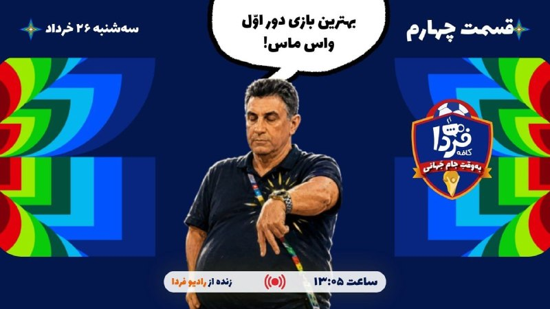

📷 Photo

---
📅 بروزرسانی: 1405/03/26 12:23
---

## VahidOOnLine — post 245828

  

روزنامه کیهان، که زیر نظر نماینده رهبر جمهوری اسلامی اداره می‌شود، نوشت که مجتبی خامنه‌ای در تمامی پیام‌های خود از زمان انتصاب به عنوان رهبر جمهوری اسلامی تاکنون هیچ اشاره‌ای به موضوع هسته‌ای نکرده و جایگاهی برای آن در چشم‌انداز پایان جنگ در نظر نگرفته است.

کیهان این رویکرد را «اقدامی معنادار» توصیف کرد و نوشت که این موضوع می‌تواند نشانه‌ای از آن باشد که از نگاه جمهوری اسلامی، پرونده مذاکرات هسته‌ای پس از حملات آمریکا و اسرائیل مختومه شده و تلاشی برای احیای آن صورت نخواهد گرفت.

این روزنامه همچنین نوشت که این رویکرد را می‌توان یکی از مهم‌ترین خطوط قرمز ترسیم‌شده از سوی رهبر جمهوری اسلامی دانست. به نوشته کیهان، هرگونه مذاکره برای تعیین شرایط پایان جنگ نباید در امتداد مذاکرات پیشین هسته‌ای و در همان چهارچوب و با همان اهداف دنبال شود.
‌🏁 🇬🇧 IranintlTV

🤖 @VahidOOnLine

## WithYashar — post 15034

چپقچی: در سوییس پس از اینکه مسئله امضا ( تفاهمنامه پاکستان) انجام شد، مذاکرات شروع خواهد.
@withyashar

## WithYashar — post 15033

  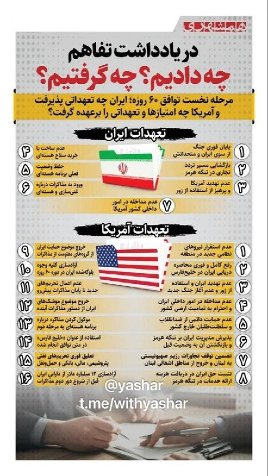

ادعای روزنامه همشهری از متن و مفاد توافق
@withyashar

## pm_afshaa — post 94175

قالیباف، در مراسم امضای توافقنامه موقت برای پایان دادن به جنگ با آمریکا شرکت خواهد کرد

💧 Rainbet.com the #1 Non-KYC Crypto Casino & Sportsbook @rainbetcom

😁 @Pm_Afshaa

## DEJradio — post 5728

  <a href="telegram/content/DEJradio_5728_1781600016.mp4" target="_blank">🎬 Download video</a>

🔺📢 دستور توقف حمله؛ ادامه روند استقرار بمب‌افکن‌ها در بریتانیا

*یوسف ریاضی‌پور، پژوهشگر نظامی

#جنگ #جمهوری_اسلامی #حمله_نظامی
@DEJradio

## mamlekate — post 103722

📝 جمهوری اسلامی و اوکراین در دستور کار اصلی نشست گروه هفت

نشست گروه ۷ در اویان فرانسه روز سه‌شنبه با محور توافق اولیه آمریکا و جمهوری اسلامی، بازگشایی تنگه هرمز و جنگ اوکراین ادامه می‌یابد. رهبران اروپایی در این نشست در تلاشند که نگرانی‌های خود درباره خطرهای توافق موقت با جمهوری اسلامی و نیز درباره مسیر پایان جنگ اوکراین را با دونالد ترامپ در میان بگذارند.

📝 امن‌ترین کشورهای جهان در سال ۲۰۲۶

تعداد درگیری‌های فعال در جهان بیش از هر زمان دیگری از پایان جنگ جهانی دوم است. چه عواملی باعث می‌شود برخی کشورها آرام و بی‌تنش باشند؟

@mamlekate

## IranIntlTV — post 342673

  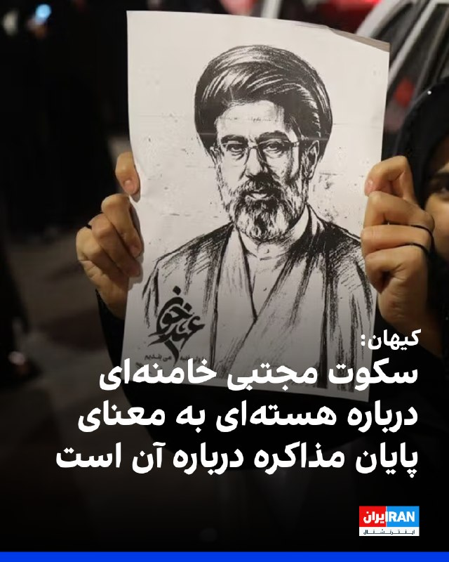

روزنامه کیهان، که زیر نظر نماینده رهبر جمهوری اسلامی اداره می‌شود، نوشت که مجتبی خامنه‌ای در تمامی پیام‌های خود از زمان انتصاب به عنوان رهبر جمهوری اسلامی تاکنون هیچ اشاره‌ای به موضوع هسته‌ای نکرده و جایگاهی برای آن در چشم‌انداز پایان جنگ در نظر نگرفته است.

کیهان این رویکرد را «اقدامی معنادار» توصیف کرد و نوشت که این موضوع می‌تواند نشانه‌ای از آن باشد که از نگاه جمهوری اسلامی، پرونده مذاکرات هسته‌ای پس از حملات آمریکا و اسرائیل مختومه شده و تلاشی برای احیای آن صورت نخواهد گرفت.

این روزنامه همچنین نوشت که این رویکرد را می‌توان یکی از مهم‌ترین خطوط قرمز ترسیم‌شده از سوی رهبر جمهوری اسلامی دانست. به نوشته کیهان، هرگونه مذاکره برای تعیین شرایط پایان جنگ نباید در امتداد مذاکرات پیشین هسته‌ای و در همان چهارچوب و با همان اهداف دنبال شود.
https://iranintl.com/202606165633

## FarsiVOA — post 220888

  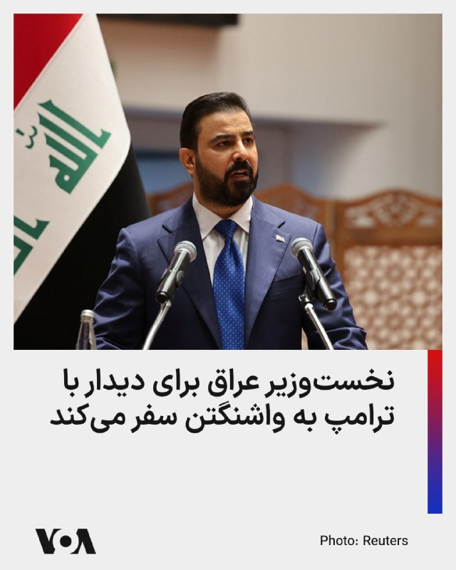

دونالد ترامپ، رئیس‌جمهور آمریکا، ماه آینده میلادی در کاخ سفید با علی الزیدی، نخست‌وزیر عراق، دیدار خواهد کرد.

دفتر نخست‌وزیر عراق و دفتر تام باراک، فرستاده ویژه دونالد ترامپ به عراق که همچنین سفیر آمریکا در ترکیه است، در بیانیه‌ای مشترک اعلام کردند که در جریان این دیدار، درباره «آینده روابط مهم» بغداد و واشنگتن گفت‌وگو خواهد شد.

این بیانیه در جریان سفر باراک به پایتخت عراق منتشر شده است؛ سفری که طی آن، او با نخست‌وزیر عراق درباره خلع سلاح و انحلال گروه‌های مسلح عراق که خارج از اختیار دولت فعالیت می‌کنند، گفت‌وگو کرد.
@FarsiVOA

## FarsiVOA — post 220887

  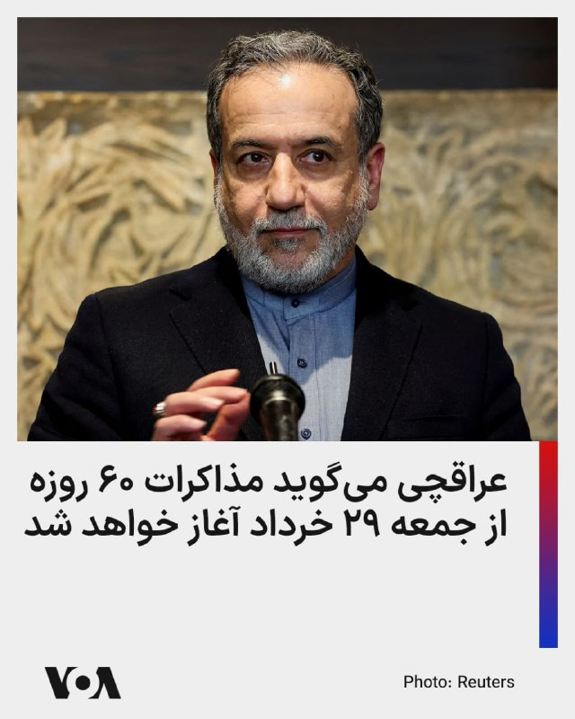

وزیر امور خارجه جمهوری اسلامی اعلام کرد که روز جمعه ۲۹ خرداد و همزمان با امضای رسمی یادداشت تفاهم «پایان جنگ»، مذاکرات با آمریکا برای رسیدن به توافق نهایی آغاز خواهد شد.

عباس عراقچی، مکان دقیق امضای تفاهم‌نامه و آغاز مذاکرات را اعلام نکرد و تنها گفت که این امر «احتمالاً روز جمعه و در محلی که مشخص خواهد شد» انجام می‌پذیرد.

او مذاکرات جدید را هم به دو محور تقسیم کرد و مدعی شد که محور نخست مربوط به اعلام خاتمه جنگ، تنگه هرمز، محاصره دریایی، آزادسازی وجوه مسدودشده جمهوری اسلامی و موضوع بازسازی است که دو طرف درباره این موضوعات پس از توافق، یک یادداشت تفاهم امضا خواهند کرد.

وزیر امور خارجه جمهوری اسلامی همچنین اعلام کرد که پس از این تفاهم، مذاکرات به مدت ۶۰ روز ادامه پیدا خواهد کرد تا دو طرف به یک توافق نهایی درباره موضوعات هسته‌ای و لغو تحریم‌ها دست یابند.

عراقچی بار دیگر موضوع جنگ را به مسائل میان لبنان و اسرائيل مرتبط دانست و اعلام کرد که از نظر جمهوری اسلامی هرگونه حمله نظامی به لبنان نقض یادداشت تفاهم است.
@FarsiVOA

## Persian_Trend_Official — post 17241

ترامپ: ایران موافقت کرده است که هرگز سلاح هسته‌ای نداشته باشد! ادعاها مبنی بر اینکه آمریکا 300 میلیون دلار به ایران پرداخت می‌کند، اخبار جعلی است و هیچ پولی به ایران داده نمی‌شود. 📝 Amir 📌 @persian_trend_official پرشین ترند | متفاوت‌ترین کانال نظامی

## Persian_Trend_Official — post 17240

  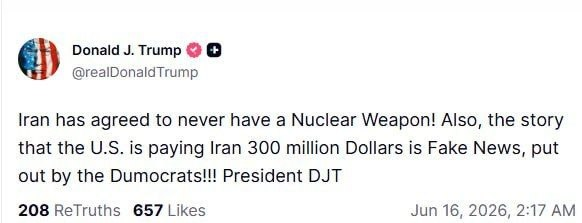

ترامپ: ایران موافقت کرده است که هرگز سلاح هسته‌ای نداشته باشد! ادعاها مبنی بر اینکه آمریکا 300 میلیون دلار به ایران پرداخت می‌کند، اخبار جعلی است و هیچ پولی به ایران داده نمی‌شود.

📝 Amir

📌 @persian_trend_official
پرشین ترند | متفاوت‌ترین کانال نظامی

## Persian_Trend_Official — post 17237

ارتش اسرائیل ادعا می‌کند که ۱۸ کارگاه ساخت بمب دست‌ساز را در شهر نابلس در کرانه باختری، واقع در اردوگاه پناهندگان بلاطه و اردوگاه پناهندگان راس‌العین، منهدم کرده است.

اگر این ادعا درست باشد، نمونه دیگری از تلاش مبارزان فلسطینی از گروه مسلح محلی عملاً منحل شده «گردان نابلس» برای احیای مجدد در پایگاه‌های قبلی خود در نابلس خواهد بود.

👺Phantom

📌 @persian_trend_official
پرشین ترند | متفاوت‌ترین کانال نظامی

## alonews — post 128412

  <a href="telegram/content/alonews_128412_1781600020.webm" target="_blank">🎬 Download video</a>

👈 سی‌ان‌ان‌: در سراسر صنعت کشتیرانی، اعتماد چندانی درباره بازگشایی تنگه هرمز وجود ندارد

🔴 مواردی مانند [احتمال] حملات موشکی و پهپادها همچنان مانع از تردد کشتی‌ها می‌شوند

🔴 حرکت قابل توجهی از ۲۲۰ تانکر و نزدیک به ۵۰۰ شناور که در خلیج فارس لنگر انداخته‌اند، صورت نگرفته

✅ @AloNews خبر جنگ

---
📅 بروزرسانی: 1405/03/26 12:14
---

## VahidOOnLine — post 245827

♦️عباس عراقچی، وزیر امور خارجه جمهوری اسلامی روز سه‌شنبه ۲۶ خردادماه گفت جنگ در تمام جبهه‌ها از روز گذشته پایان یافته است.

عراقچی گفت از نظر ما، آمریکا و اسرائیل یک طرف تفاهم‌نامه پایان جنگ و ایران و حزب‌الله طرف دیگر آن هستند. او گفت برای خاتمه جنگ، اسرائیل باید از لبنان خارج شود و در صورت حمله مجدد اسرائیل به لبنان، این مساله به‌عنوان ادامه جنگ در نظر گرفته خواهد شد.

بنیامین نتانیاهو و اسرائیل کاتز، نخست وزیر و وزیر دفاع اسرائیل روز گذشته اعلام کرده بودند طرف این تفاهم‌نامه نیستند و از لبنان خارج نمی‌شوند.
‌🇸🇦 Indypersian

🤖 @VahidOOnLine

## WithYashar — post 15032

عراقچی: هرگونه حمله نظامی اسرائیل به لبنان ، نقض یادداشت تفاهم محسوب می‌شود
@withyashar

## DEJradio — post 5727

  <a href="telegram/content/DEJradio_5727_1781599442.mp4" target="_blank">🎬 Download video</a>

🔺🎥 بر اساس ویدیویی که در شبکه‌های اجتماعی منتشر شده، یکی از هواداران جمهوری اسلامی در استادیوم «سوفای» لس‌آنجلس پس از توهین به هم‌میهنان تنبیه شد.

#فوتبال #جمهوری_اسلامی #جام_جهانی
@DEJradio

## mamlekate — post 103721

📝 وال‌استریت ژورنال: ترامپ از «تسلیم بی‌قید و شرط» به توافقی محدود با ایران رسید

در حالی که دونالد ترامپ از دستیابی به «توافقی بزرگ» با ایران سخن می‌گوید، گزارش وال‌استریت ژورنال نشان می‌دهد روزهای منتهی به اعلام این تفاهم با تلاش‌های فشرده دیپلماتیک، اختلاف نظر در دولت آمریکا و نگرانی از فروپاشی مذاکرات همراه بوده است.

قرار است مراسم رسمی امضای این توافق، جمعه ۲۹ خرداد در ژنو برگزار شود.

📝 هشت پرسش بی‌پاسخ درباره توافق ترامپ با جمهوری اسلامی ایران

مقام‌های ارشد دولت آمریکا روز دوشنبه به خبرنگاران گفتند که توافق میان آمریکا و جمهوری اسلامی ایران روز یکشنبه به‌صورت الکترونیکی به امضای دونالد ترامپ، رئیس‌جمهوری آمریکا، جی‌دی ونس، معاون او  و محمدباقر قالیباف، رئیس مجلس شورای اسلامی ایران، رسیده است.

@mamlekate

## IranIntlTV — post 342672

  <a href="telegram/content/IranIntlTV_342672_1781599446.mp4" target="_blank">🎬 Download video</a>

تفاهم به‌دست آمده میان جمهوری اسلامی و ایالات متحده آمریکا بازتاب گسترده‌ای در مطبوعات و شبکه‌های خبری این کشور داشته است.

گفت‌وگو با جواد همدانی، خبرنگار ایران‌اینترنشنال
@iranintltv

## FarsiVOA — post 220886

  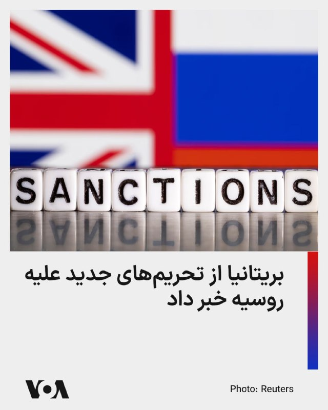

دولت بریتانیا همزمان با برگزاری نشست سران گروه هفت درباره جنگ اوکراین، از تحریم‌های جدید علیه روسیه خبر داد.

بریتانیا سه‌شنبه اعلام کرد که ۷۰ تحریم جدید این کشور «ناوگان سایه» فرسوده روسیه که زنجیره‌های تأمین نظامی و شبکه‌های مالی غیرقانونی این کشور را تشکیل می‌دهند و برای دور زدن تحریم‌ها استفاده می‌شوند، هدف گرفته است.

بریتانیا تاکید کرد که در جریان نشست گروه هفت و پس از حملات اخیر مسکو علیه اوکراین که منجر به کشته شدن غیرنظامیان و تخریب اماکن مقدس شد، فشار بر روسیه را افزایش می‌دهد.

بریتانیا به‌تنهایی صدها فرد، نهاد و کشتی را تحت رژیم تحریم‌های روسیه هدف قرار داده است.

تحریم‌های جدید یاندکس بانک و مؤسسات مالی «اِوروفایننس» و «بانک وایلدبریس» را نیز شامل می‌شود.
@FarsiVOA

## Persian_Trend_Official — post 17236

  <a href="telegram/content/Persian_Trend_Official_17236_1781599449.webm" target="_blank">🎬 Download video</a>

یک منبع آگاه به انتخاب: در پی هشدارهای جدی قالیباف و مقاومت او بر سر خطوط قرمز، ترامپ در لحظات پایانی عقب نشینی کرد و محاصره دریایی علیه ایران را که قرار بود براساس متن تفاهم در طول 30 روز بردارد، به صورت کامل و درجا لغو کرد. 📝 Amir 📌 @persian_trend_official…

## Dirty_Kids — post 392269

  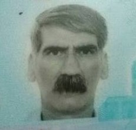

پسرم! کص مادرت با این تنگه نگه داشتنت

@Dirty_Kids 👻

## Dirty_Kids — post 392268

  <a href="telegram/content/Dirty_Kids_392268_1781599450.mp4" target="_blank">🎬 Download video</a>

ابراز محبت هموطنا به مادر بیرانوند

@Dirty_Kids 👻

## Dirty_Kids — post 392267

  

اون زمان که اینترنت نداشتیم این اقا تمام قد پشت مردم ایران واستاد

@Dirty_Kids 👻

## Hranews — post 113643

  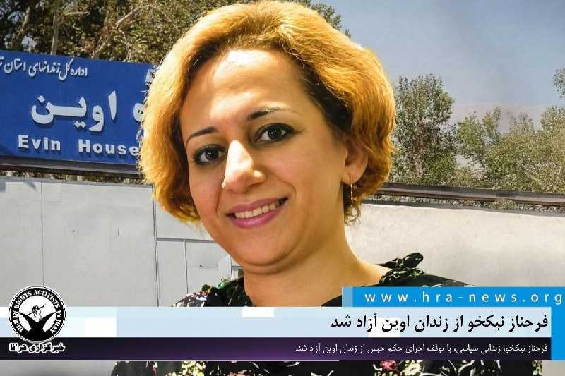

فرحناز نیکخو از زندان اوین آزاد شد

❗️
❗️
❗️
❗️
❗️– فرحناز نیکخو، زندانی سیاسی، با توقف اجرای حکم حبس روز یکشنبه ۲۴ خردادماه از #زندان_اوین آزاد شد.

به گزارش خبرگزاری هرانا، ارگان خبری مجموعه فعالان حقوق بشر در ایران، فرحناز نیکخو، آزاد شد.

بر اساس اطلاعات دریافتی هرانا، خانم نیکخو در پی صدور دستور توقف اجرای حکم حبس، ظهر روز یکشنبه ۲۴ خردادماه از زندان اوین آزاد شده است.

ادامه مطلب

#فرحناز_نیکخو

↘️
@hranews_bot تماس ✉️ -  @Hranews  کانال هرانا 🆑

## alonews — post 128411

  <a href="telegram/content/alonews_128411_1781599452.mp4" target="_blank">🎬 Download video</a>

👈ویدیدیی از یک درگیری دیگر بین موافقان و مخالفان جمهوری اسلامی در ورزشگاه

🔴پ.ن: ژاپنی‌ها بعد بازی آشغال جمع میکنن و کل دنیا میگن دمتون گرم. ایرانیا بعد بلزی دعوا میکنن و همه میخندن بهمون

✅ @AloNews خبر جنگ

## alonews — post 128410

  <a href="telegram/content/alonews_128410_1781599454.webm" target="_blank">🎬 Download video</a>

👈جمعه قالیباف و ونس امضا خواهند کرد

✅ @AloNews خبر جنگ

## alonews — post 128409

  <a href="telegram/content/alonews_128409_1781599454.webm" target="_blank">🎬 Download video</a>

👈حزب‌الله: ایران الان یکی از ابرقدرت های دنیاست

✅ @AloNews خبر جنگ

## alonews — post 128408

  <a href="telegram/content/alonews_128408_1781599454.webm" target="_blank">🎬 Download video</a>

👈تخت روانچی: در سوییس پس از اینکه مسئله امضا ( تفاهمنامه پاکستان) انجام شد، مذاکرات شروع خواهد.

🔴درباره جزئیاتی نظیر اینکه چه مدت در سوییس باشیم و چه مباحثی مطرح شوند، صحبتی نشده اما این مورد تایید دو طرف است که بعد از امضا، بحث‌ها (درباره توافق نهایی) شروع خواهد شد.

✅ @AloNews خبر جنگ

---
📅 بروزرسانی: 1405/03/26 12:04
---

## DEJradio — post 5726

  <a href="telegram/content/DEJradio_5726_1781598840.webm" target="_blank">🎬 Download video</a>

🔺📢 یک شهروند در پیامی خطاب به بازیکنان تیم‌ فوتبال جمهوری اسلامی گفت: «خاک بر سرتون، مردم رو فروختید، حریف نیوزلندم نشدید.»

#فوتبال #تیم_ملی #جام_جهانی
@DEJradio

## DEJradio — post 5725

  <a href="telegram/content/DEJradio_5725_1781598840.webm" target="_blank">🎬 Download video</a>

🚨📢 عباس عراقچی وزیر خارجه جمهوری اسلامی، در نشستی با سفرا و کارداران خارجی در تهران، گفت: «یادداشت تفاهم تهران و واشنگتن یکشنبه نهایی شد و امضای رسمی آن به‌زودی، احتمالا جمعه و در محلی که مشخص خواهد شد، انجام می‌شود.»

او اعلام کرد: «مذاکرات به دو مرحله تقسیم شده است؛ در مرحله نخست موضوع خاتمه جنگ، تنگه هرمز، محاصره دریایی، آزادسازی وجوه مسدودشده و بازسازی مطرح می‌شود و مرحله دوم طی ۶۰ روز به موضوعات هسته‌ای و لغو تحریم‌ها اختصاص دارد.»
وزیر خارجه جمهوری اسلامی افزود، همزمان دور جدید مذاکرات برای رسیدن به «توافق نهایی» آغاز خواهد شد.
عباس عراقچی با تاکید بر اینکه جمهوری اسلامی و حزب‌الله یک طرف تفاهم‌نامه و آمریکا و اسرائیل طرف دیگر آن هستند گفت: «خاتمه جنگ در لبنان، بخش جدایی‌ناپذیر خاتمه کامل جنگ است و هرگونه حمله نظامی اسرائیل به لبنان و ادامه اشغال، نقض یادداشت تفاهم محسوب می‌شود.»

#جنگ #عراقچی #توافق
@DEJradio

## DEJradio — post 5724

  <a href="telegram/content/DEJradio_5724_1781598841.mp4" target="_blank">🎬 Download video</a>

🔺🎥 ارتشی‌ها در خیابان پوسترهای اعتراضی نصب کردند. آنها می‌گویند ارتشی آه ندارد که با ناله سودا کند در صورتیکه پول‌ها صرف سپاه پاسداران و سرداران فاسد می‌شود.

#ارتش #تورم
@DEJradio

## DEJradio — post 5723

  <a href="telegram/content/DEJradio_5723_1781598844.mp4" target="_blank">🎬 Download video</a>

🔺🎥 کسبه به دلیل کرایه و مالیات‌های سنگین، مغازه‌ها را تخلیه کردند و مجبور به دستفروشی شده‌اند. آنها می‌گویند قدرت خرید مردم بسیار کم شده و در ایام جنگ و بعد از آن حتی خرج پول برق و دستمزد فروشنده نیز در نیامده است.

#تورم #مالیات
@DEJradio

## IranIntlTV — post 342671

  <a href="telegram/content/IranIntlTV_342671_1781598847.mp4" target="_blank">🎬 Download video</a>

بنیامین نتانیاهو، نخست‌وزیر اسرائیل، در نشست خبری خود گفت: «سرنگونی جمهوری اسلامی هرگز از اهداف رسمی جنگ نبوده است.»

اشکان صفایی، خبرنگار ایران‌اینترنشنال، گزارش می‌دهد
@iranintltv

## FarsiVOA — post 220885

  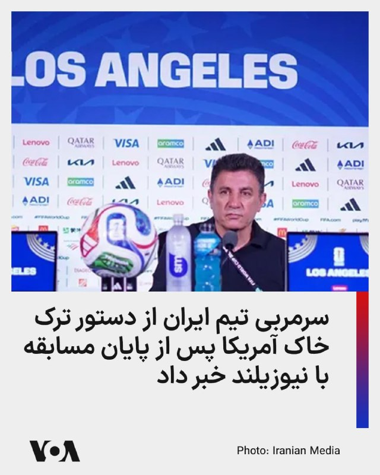

سرمربی تیم فوتبال ایران، پس از پایان دیدار تیمش با نیوزیلند اعلام کرد که « بلافاصله بعد از بازی به ما گفتند باید اینجا را ترک کنیم». امیرقلعه‌نویی جزئیاتی از نحوه دریافت این دستور را بیان نکرد.

مسئولان ورزش جمهوری اسلامی، محل استقرار تیم فوتبال ایران را از آمریکا به مکزیک منتقل کردند و همین امر مشکلات را برای اخذ روادید ورود به خاک ایالات متحده ایجاد کرده است.

از سوی دیگر بخش رسانه‌ای تیم فوتبال ایران اعلام کرد که روادید مهدی ترابی، بازیکن این تیم به پایان رسیده و او برای ورود مجدد به خاک آمریکا باید مجدداً روادید دریافت کند. روادید دیگر اعضای تیم «چند بار ورود» است.

همچنین خبرگزاری صدا و سیمای جمهوری اسلامی صبح سه‌شنبه ۲۶ خرداد و حدود سه پس از پایان مسابقه خبر داد که روند خروج مهدی طارمی، بازیکن و سعید الهویی، مربی تیم از فرودگاه لس‌آنجلس با تأخیر و مشکلاتی همراه بوده و پرواز اعضای تیم به مقصد تیخوانا با تأخیر روبه‌رو شده است.
@FarsiVOA

## DW_Farsi — post 126044

🔶ممکن است در برخی از نواحی عالم، زمان وجود نداشته باشد

«جریان زمان تحت کنترل ما نیست. ما نمی‌توانیم آن را متوقف کنیم؛ نمی‌توانیم آن را به عقب بازگردانیم؛ انگار که درمانده و مستاصل همراه آن برده می‌شویم، مانند تکه‌ای چوب که جریان یک رودخانه با خود حمل می‌کند.»

این تعبیری است که هانس رایشنباخ، در کتاب "جهت زمان" درباره سرشت زمان به کار می‌برد. قرن‌ها پیش، آگوستین، فیلسوف قرن پنجم نوشته بود: «زمان چیست؟ اگر کسی از من نپرسد، می‌دانم؛ اما اگر بخواهم آن را برای کسی که می‌پرسد توضیح دهم، نمی‌دانم.»

واقعیت این است که انسان در قرن بیست‌ویکم نیز در پاسخ به این پرسش که زمان چیست، پاسخی بهتر از آگوستین در اختیار ندارد.

ایده جالبی که اخیر در مقاله جدید فرناندس د فریتاس از دانشگاه فدرال ایتاجوبا برزیل در مجله "گرانش کلاسیک و کوانتومی" (CQG)، منتشر شده استدلال می‌کند که پدیده زمان ممکن است ذاتا به هندسه خود فضا وابسته باشد.

او در این مقاله، نوعی "ساعت هندسی" معرفی می‌کند. به عبارت دیگر، سازه‌ای ریاضی که از ویژگی‌های خمیدگی برش‌های سه‌بعدی فضا به دست می‌آید. از نگاه او، همین سازه است که تعیین می‌کند آیا زمان می‌تواند به‌عنوان یک پارامتر معنادار برای نظم‌دهی رویدادها عمل کند یا نه.

به گفته او، هنگامی که فضا به‌شدت خمیده است، مانند شرایط گیتی پس از مهبانگ، این ساعت، پایدار بوده و عالم همان‌گونه که مدل استاندارد فیزیک پیش‌بینی می‌کند تحول یافته است. اما با انبساط عالم و تخت‌تر شدن آن، خمیدگی گیتی ضعیف‌تر می‌شود و ساعت هندسی مذکور نیز همراه با آن کند می‌شود؛ به این معنا که خود زمان، به‌تدریج معنای خود را از دست می‌دهد.

@dw_farsi

## RadioFarda — post 158370

  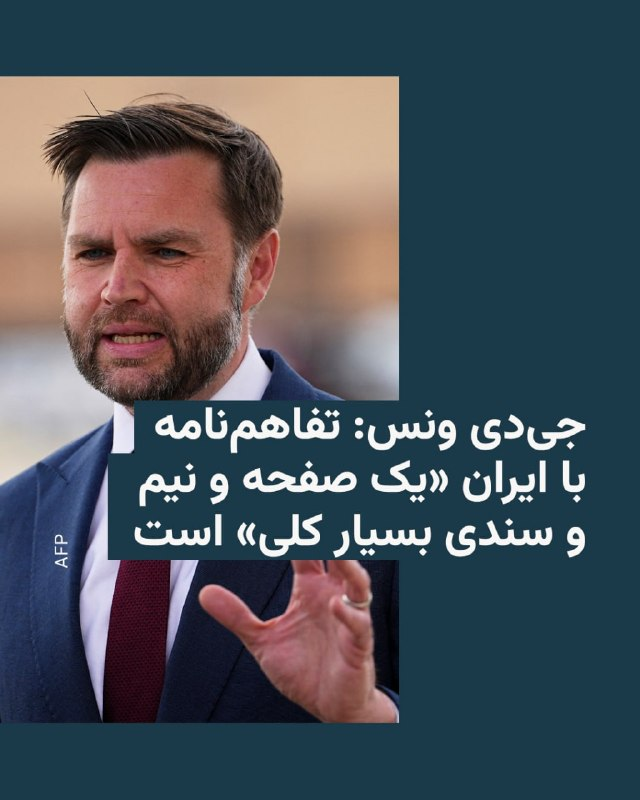

🔸جی‌دی ونس، معاون رئیس‌جمهور آمریکا، روز دوشنبه گفت تفاهم‌نامه امضاشده میان آمریکا و ایران «سندی بسیار کلی» است و جزئیات توافق باید در جریان مذاکرات بعدی مشخص شود.

🔸ونس به شبکه سی‌ان‌ان گفت: «این تفاهم‌نامه حدود یک صفحه و نیم است، بنابراین سندی بسیار کلی به شمار می‌رود. درباره شماری از مسائل، باید در مرحله مذاکرات فنی جزئیات را مشخص کنیم.»

🔸ایران و آمریکا روز یک‌شنبه، ۲۴ خردادماه، بالاخره بر سر متن یک تفاهم‌نامه توافق کردند که به گفته جی‌دی ونس در همین روز به صورت الکترونیکی امضا شده است. با این حال هر یک از طرفین از مفادی در این متن سخن می‌گویند که ظاهرا با یکدیگر تفاوت چشمگیر دارد.

🔸هر دو طرف روز دوشنبه وعده داده‌اند که متن کامل تفاهم‌نامه روز جمعه بلافاصله پس از امضای رسمی منتشر شود و روایت‌شان از متن ثابت شود.

🔸دونالد ترامپ، رئیس‌جمهور آمریکا، روز دوشنبه گفت پس از اعلام توافق میان واشینگتن و تهران برای پایان دادن به جنگ خاورمیانه، کشتی‌ها بار دیگر در تنگه هرمز در حال تردد هستند و این مسیر راهبردی انتقال نفت تا روز جمعه «کاملاً باز» خواهد شد.

@RadioFarda

## IranianMinds — post 22734

  <a href="telegram/content/IranianMinds_22734_1781598852.mp4" target="_blank">🎬 Download video</a>

🔴 عراقچی :

مهم‌ترین موضوع تفاهم‌نامه ایران و آمریکا، اعلام خاتمه فوری و دائمی جنگ در همه جبهه‌ها از جمله در لبنان است

@IranianMinds

## IranianMinds — post 22733

  <a href="telegram/content/IranianMinds_22733_1781598855.mp4" target="_blank">🎬 Download video</a>

🔴 عراقچی :

هرگونه حمله نظامی رژیم صهیونیستی به لبنان و ادامه اشغال، نقض یادداشت تفاهم محسوب می‌شود

@IranianMinds

## BBCPersian — post 284007

  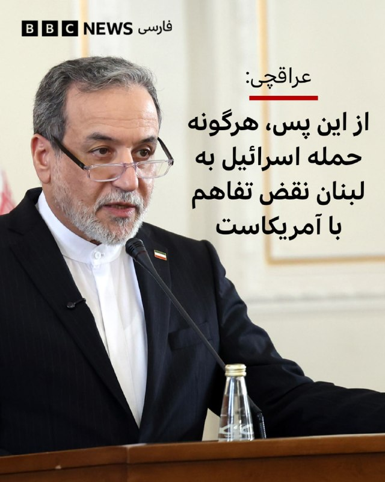

🔻ایران یک بار دیگر هشدار داد که هرگونه حمله اسرائیل به لبنان را نقض تفاهمنامه با آمریکا تلقی‌ می‌کند.

عباس عراقچی، وزیر خارجه جمهوری اسلامی، گفت که از نظر تهران، یک طرف تفاهمنامه حاصل شده، ایران و حزب‌الله و طرف دیگر آمریکا و اسرائیل است.

آقای عراقچی تاکید کرد که «خاتمه جنگ در لبنان بخش جدایی‌ناپذیر از خاتمه کامل جنگ است و خاتمه جنگ مشمول خاتمه اشغال هم می‌شود.»

او هشدار داد که هرگونه حمله اسرائیل به لبنان «از الان به بعد و ادامه اشغال سرزمین‌های لبنان از نظر ما نقض یادداشت تفاهم به حساب می‌آید.»

اظهارات آقای عراقچی در حالی است که اسرائیل می‌گوید به «تروریست‌هایی» که به سربازانش در جنوب لبنان نزدیک می‌شدند حمله کرده است.

حزب‌الله لبنان هم گفته است که در پاسخ به سمت نیروهای اسرائیلی موشک و پهپاد شلیک کرده است.

بعد از اعلام نهایی شدن تفاهم ایران و آمریکا، اسرائیل تاکید کرد که حضور نیروهایش در «مناطق امنیتی» در لبنان ادامه خواهد داشت.

طیف وسیعی از مقام‌های اسرائیلی این تفاهم را محکوم کرده‌اند.

📸EPA/Shutterstock
https://bbc.in/4epeBQC
@BBCPersian

## alonews — post 128407

  <a href="telegram/content/alonews_128407_1781598858.mp4" target="_blank">🎬 Download video</a>

👈زلنسکی، ترامپ و مکرون برای نشست گروه هفت رسیدن پاریس

✅ @AloNews خبر جنگ

## alonews — post 128406

  <a href="telegram/content/alonews_128406_1781598861.webm" target="_blank">🎬 Download video</a>

👈تخت‌روانچی: قالیباف و ونس در روز امضا حضور دارند

✅ @AloNews خبر جنگ

---
📅 بروزرسانی: 1405/03/26 11:53
---

## pm_afshaa — post 94174

عراقچی: آتش‌بس در لبنان از جمعه آغاز می‌شود

💧 Rainbet.com the #1 Non-KYC Crypto Casino & Sportsbook @rainbetcom

😁 @Pm_Afshaa

## DEJradio — post 5722

  <a href="telegram/content/DEJradio_5722_1781598217.webm" target="_blank">🎬 Download video</a>

🔺📢 “از اصفهان پیام میدم، اونایی که تو استادیوم لس‌آنجلس بودید دمتون گرم، پرچمتون بالاست، ما جز هم کسی رو نداریم، مخلص تک تک ایرانیا بجز مفت‌خورای موشعلی ، یاد جاویدنام‌مان گرامی

پیام دریافتی
#جام_جهانی #فوتبال #جمهوری_اسلامی
@DEJradio

## DEJradio — post 5721

  <a href="telegram/content/DEJradio_5721_1781598218.webm" target="_blank">🎬 Download video</a>

🚨📢 به گزارش آکسیوس، جان راتکلیف رئیس سازمان اطلاعات آمریکا (CIA)، به ترامپ و مقامات ارشد تیم امنیت ملی دولت ترامپ اعلام کرد، اطلاعات جمع‌آوری‌شده توسط سازمان‌های اطلاعاتی آمریکا، تردید جدی درباره تمایل ایران به پذیرش امتیازات هسته‌ای که واشنگتن به عنوان بخشی از توافق در یادداشت تفاهم نامه درخواست می‌کند، ایجاد کرده است.

اطلاعات نشان می‌داد که شکافی بزرگ بین نحوه صحبت مقامات ارشد ایرانی در میان خود درباره توافق و پیام‌هایی که به میانجی‌ها و آمریکا منتقل می‌کردند وجود دارد.
رتکلیف تنها فرد بدبین در تیم ترامپ نیست. به گفته دو منبع، در بحث‌های داخلی، مارکو روبیو وزیر امور خارجه و پیت هگست وزیر دفاع نیز نگرانی‌هایی را مطرح کرده و درباره تفاهم‌نامه اعلام‌شده در روز یکشنبه پرسش‌هایی مطرح کرده‌اند. در مقابل، جی‌دی ونس معاون رئیس‌جمهور و نمایندگان آمریکا استیو ویتکاف و جرد کوشنر از این توافق حمایت کرده‌اند.

#ترامپ #جمهوری_اسلامی
@DEJradio

## DEJradio — post 5720

  <a href="telegram/content/DEJradio_5720_1781598219.mp4" target="_blank">🎬 Download video</a>

⚽️
🔺 تماشای فوتبال، به یاد رشید مظاهری فوتبالیست بازداشتی

یکی از مخاطبان دژ از مالمو سوئد با ارسال ویدیویی نوشت، بازی را به یاد رشید مظاهری دروازه‌بان زندانی تماشا کردم. رشید به دلیل حمایت از مردم در خیزش ۱۴۰۳ بازداشت و اکنون در زندان ارومیه به سر می‌برد.

#رشید_مظاهری #جام_جهانی
@DEJradio

## DEJradio — post 5719

  <a href="telegram/content/DEJradio_5719_1781598221.mp4" target="_blank">🎬 Download video</a>

🔺🎥 نیمه شب دوشنبه ۲۵ خرداد ۱۴۰۵ تاسیسات نظامی‌نشین «شهرک امید» به دلایل نامعلوم دچار آتش‌سوزی شد.

بسیاری از ساکنان شهرک پرسنل ارتش هستند. علت آتش‌سوزی مشخص نیست. منابع داخلی به دژ گفته‌اند احتمال خرابکاری توسط تیم‌های امنیتی بررسی می‌شود. ساکنان این شهرک با وجود فضای امنیتی در جریان انقلاب شیرخورشید علیه نظام شعار دادند.

#أتشسوزی #شهرک_امید #انقلاب_شیروخورشید
@DEJradio

## DEJradio — post 5718

  <a href="telegram/content/DEJradio_5718_1781598223.webm" target="_blank">🎬 Download video</a>

🔺📢 تیم فوتبال جمهوری اسلامی در شرایطی که نیمه دوم مسابقه با نیوزلند از حریف عقب بود، با گل محبی از شکست گریخت.

این دیدار با نتیجه دو بر دو تمام شد. گل اول را رضاییان به ثمر رساند. در شرایطی که نیوزلند پایین‌ترین رنکینگ فیفا را بین تیم‌های حاضر در این رقابت‌ها دارد زور تیم قلعه‌نوعی به آنها نرسید.

#جمهوری_اسلامی #جام_جهانی
@DEJradio

## IranIntlTV — post 342670

  <a href="telegram/content/IranIntlTV_342670_1781598224.mp4" target="_blank">🎬 Download video</a>

رجب طیب اردوغان، رییس‌جمهوری ترکیه، توافق میان ایالات متحده و جمهوری اسلامی را «گامی مهم در مسیر پایان دادن به بحران منطقه‌ای» دانست.
@iranintltv

## IranIntlTV — post 342669

  <a href="telegram/content/IranIntlTV_342669_1781598226.mp4" target="_blank">🎬 Download video</a>

نشست سران کشورهای عضو «گروه ۷» در فرانسه آغاز شد. جنگ اوکراین و توافق میان ایالات متحده و جمهوری اسلامی از محورهای اصلی این نشست اعلام شده است.

جزییات بیشتر با احمد صمدی، خبرنگار ایران‌اینترنشنال
@iranintltv

## RadioFarda — post 158369

هراس از صحبت کردن؛ ایرانی‌ها می‌گویند فضای ترس بدتر از زمان قبل از جنگ است

🔸در طول چندین ماه جنگ و سپس آتش‌بس میان ایالات متحده و ایران، شنیدن صدای ایرانیان عادی در میان فضای رو‌به‌افزایشِ ترس، بسیار دشوارتر شده است.

🔸برخی افراد شجاع همچنان به گفت‌وگو با خبرنگاران رسانه‌های خارجی، از جمله رادیو فردا وابسته به رادیو اروپای آزاد/رادیو آزادی، ادامه داده‌اند، هرچند تقریباً همیشه بر ناشناس ماندن خود تأکید کرده‌اند. این وضعیت حتی زمانی که خبر توافق بر سر چارچوبی برای پایان جنگ بین واشینگتن و تهران اعلام شد، برقرار بود.

🔸اما در بسیاری از موارد، حتی منابعی که پیش‌تر آماده بودند درباره رویدادهای کشورشان شهادت دهند، اکنون سکوت کرده‌اند.

🔸برخی روایت کرده‌اند که مقام‌های امنیتی به آن‌ها هشدار داده‌اند به‌ویژه با رسانه‌های فارسی‌زبانِ تحت پوشش دولت آمریکا، مانند رادیو فردا، صحبت نکنند. این در حالی است که سرکوب در جریان است و مقام‌های ایرانی می‌گویند شمار بیشتری به اتهام «جاسوسی» و «همکاری با دشمن» متهم شده‌اند.

🔸در هفته‌های اخیر، ساکنان ایران بارها به ترس از بازداشت و پیگرد قضایی اشاره کرده‌اند، و نیز به احتمال بالای وقوع چنین پیامدهایی در صورت ارتباط با رادیو فردا.

🔸نسخه کامل این گزارش را در وب‌سایت رادیوفردا بخوانید.

@RadioFarda

## IranianMinds — post 22732

  <a href="telegram/content/IranianMinds_22732_1781598228.mp4" target="_blank">🎬 Download video</a>

🔴 عراقچی :
در مرحله اول، موضوع خاتمه جنگ، بحث تنگه هرمز، محاصره دریایی و آزادسازی وجوه مسدودشده ایران مطرح می‌شود

@IranianMinds

## alonews — post 128405

  <a href="telegram/content/alonews_128405_1781598230.webm" target="_blank">🎬 Download video</a>

👈در دیداری میان نخست‌وزیر عراق و فرستاده ویژه رئیس‌جمهور آمریکا، دو طرف بر اجرای طرح خلع سلاح گروه‌های مسلح خارج از چارچوب دولت و تقویت همکاری‌های اقتصادی و انرژی میان بغداد و واشنگتن تأکید کردند

✅ @AloNews خبر جنگ

---
📅 بروزرسانی: 1405/03/26 11:44
---

## WithYashar — post 15031

کیهان: معنای سکوت رهبری درباره هسته‌ای این است که دیگر مذاکره‌ای در کار نیست
@withyashar
روزنامه کیهان وابسته به اصولگرایان تندرو نزدیک به بیت رهبری است و مدیر مسئول آن مستقیماً توسط علی خامنه‌ای انتخاب شده .

## pm_afshaa — post 94173

دونالد ترامپ اعلام کرد تنگه بیرانوند بازه و عبور مرور در آن آزاد

💧 Rainbet.com the #1 Non-KYC Crypto Casino & Sportsbook @rainbetcom

😁 @Pm_Afshaa

## DEJradio — post 5713

  <a href="telegram/content/DEJradio_5713_1781597658.webm" target="_blank">🎬 Download video</a>

👑
🔺 با وجود ممنوعیتی که فیفا قائل شده بود، هزاران تن از تماشاگران مسابقه تیم‌های جمهوری اسلامی و نیوزلند با پرچم شیروخورشید به استادیوم لس‌آنجلس رفتند. اگرچه صداوسیمای حکومتی تلاش کرد تصاویر استادیوم را سانسورکند اما بارها پرچم‌ها پخش زنده نمایان شد.

احمد دنیامالی، وزیر ورزش و جوانان جمهوری اسلامی تهدید کرده بود در صورت نمایش «پرچم‌های غیرمجاز و غیررسمی» یا سر دادن شعارهایی علیه تیم ملی در ورزشگاه‌ها، مسابقات از جانب این تیم متوقف خواهد شد.

#جمهوری_اسلامی #جام_جهانی #پرچم_شیروخورشید
@DEJradio

## DEJradio — post 5712

  <a href="telegram/content/DEJradio_5712_1781597659.mp4" target="_blank">🎬 Download video</a>

⚽️
🔺 پیش از مسابقه تیم‌های فوتبال جمهوری اسلامی و نیوزلند، بامداد ۲۶ خرداد ۱۴۰۵ به‌وقت ایران، مردم در استادیوم لس‌آنجلس سرود رژیم را هو کردند.

#جمهوری_اسلامی #جام_جهانی #رژیم_جنایتکار
@DEJradio

## alonews — post 128401

  <a href="telegram/content/alonews_128401_1781597661.webm" target="_blank">🎬 Download video</a>

👈صبح زود امروز، پهپادهای اوکراینی به پالایشگاه مسکو در کاپوتنیا، روسیه حمله کردند و باعث آتش‌سوزی عظیمی در این تأسیسات شدند.

🔴 در چند ساعت گذشته حداقل ۶۰ پهپاد در منطقه مسکو رهگیری شده‌اند

✅ @AloNews خبر جنگ

## alonews — post 128400

  <a href="telegram/content/alonews_128400_1781597662.webm" target="_blank">🎬 Download video</a>

👈ارتش آمریکا برای تخلیه بخشی از هواپیماهای سوخت‌رسان مستقر در فرودگاه بن گوریون آماده می‌شود. احتمالا حدود ۲۰٪ از هواپیماهای مستقر در اسرائیل منتقل خواهند شد

✅ @AloNews خبر جنگ

---
📅 بروزرسانی: 1405/03/26 11:34
---

## VahidOOnLine — post 245826

♦️امانوئل مکرون، رئیس‌جمهوری به همراه بریژیت، بانوی فرانسه سه‌شنبه ۲۶ خردادماه  در نخستین روز نشست سران گروه هفت در شهر اویان از رهبران کشورهای عضو این گروه استقبال کرد.

 رهبران آمریکا، کانادا، فرانسه، آلمان، ایتالیا، بریتانیا و ژاپن از دوشنبه تا چهارشنبه در این نشست حضور دارند. انتظار می‌رود تحولات مربوط به ایران پس از توافق تهران و واشینگتن، جنگ اوکراین، مسائل تجاری و موضوعات مرتبط با فناوری و اقتصاد دیجیتال از مهم‌ترین محورهای این نشست باشد.

گروه هفت (G7) متشکل از هفت اقتصاد بزرگ صنعتی جهان است و هر سال نشست سران آن برای بررسی مهم‌ترین مسائل سیاسی، امنیتی و اقتصادی بین‌المللی برگزار می‌شود. این نشست از مهم‌ترین مجامع غیررسمی هماهنگی سیاست‌های کشورهای غربی به شمار می‌رود.
‌🇸🇦 Indypersian

🤖 @VahidOOnLine

## VahidOOnLine — post 245825

  

امیر حاتمی، فرمانده کل ارتش جمهوری اسلامی، سه‌شنبه ۲۶ خرداد در مراسمی در دانشگاه افسری «امام علی» با اشاره به حملات اخیر آمریکا و اسرائیل هشدار داد که هرگونه اقدام یا اشتباه جدید از سوی آمریکا و اسرائیل با واکنشی شدید مواجه خواهد شد.

او گفت: «اگر دشمن اشتباهی بکند با یک خشم انباشته مواجه خواهد شد که کار دشمن را بسیار بسیار سخت خواهد کرد.»
‌🏁 🇬🇧 IranintlTV

🤖 @VahidOOnLine

## IranIntlTV — post 342668

  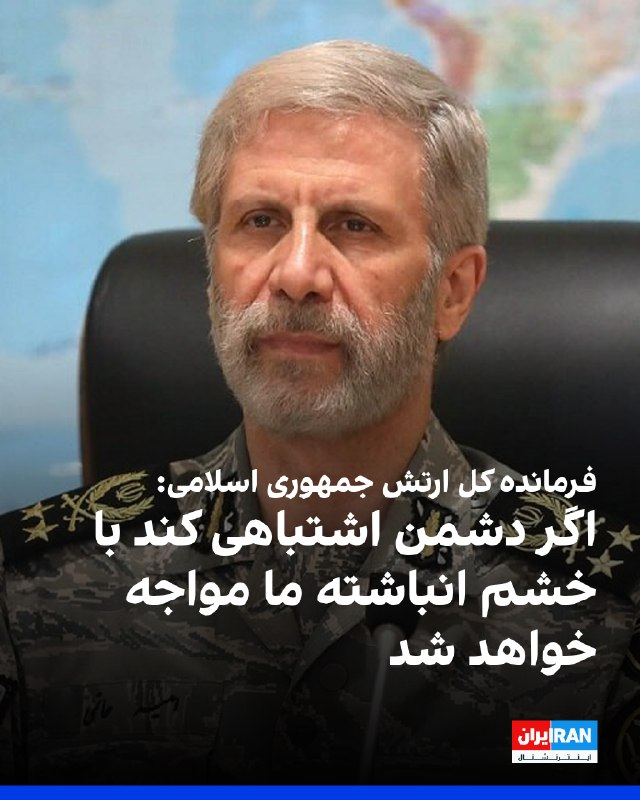

امیر حاتمی، فرمانده کل ارتش جمهوری اسلامی، سه‌شنبه ۲۶ خرداد در مراسمی در دانشگاه افسری «امام علی» با اشاره به حملات اخیر آمریکا و اسرائیل هشدار داد که هرگونه اقدام یا اشتباه جدید از سوی آمریکا و اسرائیل با واکنشی شدید مواجه خواهد شد.

او گفت: «اگر دشمن اشتباهی بکند با یک خشم انباشته مواجه خواهد شد که کار دشمن را بسیار بسیار سخت خواهد کرد.»
https://iranintl.com/202606164265

## Persian_Trend_Official — post 17235

  <a href="telegram/content/Persian_Trend_Official_17235_1781597076.mp4" target="_blank">🎬 Download video</a>

شاهکاری که استاد خوش‌چشم، تحلیل‌گر ارشد صداوسیما در زمان اعلام توافق خلق کرد؛

مجری میگه نخست وزیر پاکستان گفت توافق تایید شد
استاد میگه نه قسم میخورم ترامپ بهش گفته اینو بگه، اینا میخوان بازار نفت رو کنترل کنن ، من از پشت پرده خبر دارم که قراره اسرائیل رو بزنیم، خیالتون راحت.

👺Phantom

📌 @persian_trend_official
پرشین ترند | متفاوت‌ترین کانال نظامی

## RadioFarda — post 158368

  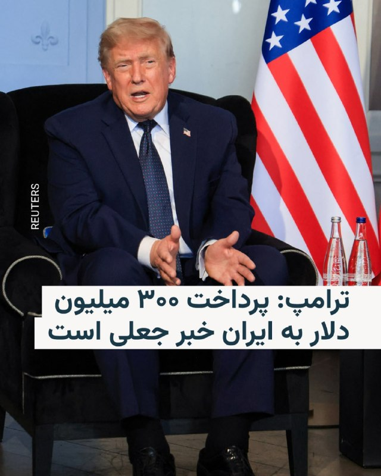

🔸دونالد ترامپ، رئیس‌جمهور آمریکا، گزارش‌هایی را که مدعی شده‌اند آمریکا ۳۰۰ میلیون دلار به ایران پرداخت خواهد کرد، «اخبار جعلی» خواند.

🔸او در پیامی در شبکه اجتماعی تروث سوشال نوشت: «ایران پذیرفته است هرگز سلاح هسته‌ای نداشته باشد! همچنین خبر پرداخت ۳۰۰ میلیون دلار از سوی آمریکا به ایران، اخبار جعلی است که دموکرات‌های نادان منتشر کرده‌اند.»

🔸پیش‌تر روزنامه فایننشال تایمز روز دوشنبه گزارش داده بود که دولت ترامپ در حال بررسی حمایت از ایجاد یک صندوق سرمایه‌گذاری ۳۰۰ میلیارد دلاری برای بازسازی ایران است. با این حال، دونالد ترامپ در پیام خود از رقم «۳۰۰ میلیون دلار» یاد کرد، نه ۳۰۰ میلیارد دلار.

🔸روزنامه فایننشال تایمز به نقل از یک «منبع آگاه» نوشته بود «صندوق ۳۰۰ میلیارد دلاری که دولت دونالد ترامپ برای ایران در نظر دارد»، از سوی شرکت‌های علاقه‌مند به سرمایه‌گذاری در ایران تأمین خواهد شد و منابع آن از دولت‌ها نخواهد بود.

@RadioFarda

## Hranews — post 113642

  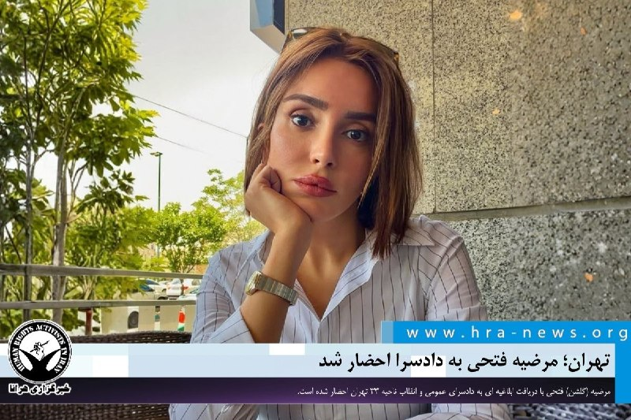

تهران؛ مرضیه فتحی به دادسرا احضار شد

❗️
❗️
❗️
❗️
❗️– مرضیه (گلشن) فتحی، با دریافت ابلاغیه ای به دادسرای عمومی و انقلاب ناحیه ۳۳ تهران احضار شده است.

به گزارش خبرگزاری هرانا، ارگان خبری مجموعه فعالان حقوق بشر در ایران، مرضیه فتحی به دادسرا احضار شد.

براساس ابلاغیه ای که در تاریخ ۲۳ خردادماه صادر شده است، از خانم فتحی خواسته شده که ظرف مدت پنج روز برای دفاع از اتهام انتسابی در شعبه ۲ بازپرسی دادسرای عمومی و انقلاب ناحیه ۳۳ تهران مستقر در زندان اوین حاضر شود.

ادامه مطلب

#مرضیه_فتحی
#گلشن_فتحی

↘️
@hranews_bot تماس ✉️ -  @Hranews  کانال هرانا 🆑

---
📅 بروزرسانی: 1405/03/26 11:24
---

## WithYashar — post 15030

  <a href="telegram/content/WithYashar_15030_1781596455.mp4" target="_blank">🎬 Download video</a>

محبی بعد از زدن گل دوم، با نشان دادن اسلحه و شلیک نمادین به تماشاگران نشون داد این تیم مزدوران حکومتیه نه مردم ایران

این نفهمی او واکنشمنفی‌ در‌
رسانه های جهان داشته
@withyashar

## pm_afshaa — post 94172

  <a href="telegram/content/pm_afshaa_94172_1781596456.mp4" target="_blank">🎬 Download video</a>

درگیری هموطنان با مزدوران ج.ا در ورزشگاه

💧 Rainbet.com the #1 Non-KYC Crypto Casino & Sportsbook @rainbetcom

😁 @Pm_Afshaa

## FarsiVOA — post 220884

🔺جمهوری اسلامی و اوکراین در دستور کار اصلی نشست گروه هفت

▪️نشست گروه هفت در اویان فرانسه روز سه‌شنبه با محور توافق اولیه آمریکا و جمهوری اسلامی، بازگشایی تنگه هرمز و جنگ اوکراین ادامه می‌یابد.

▪️این اجلاس در حالی برگزار می‌شود که واشنگتن و جمهوری اسلامی بر سر توافقی اولیه برای پایان دادن به درگیری گسترده‌تر به تفاهم رسیده‌اند و انتظار می‌رود امضای رسمی آن روز جمعه انجام شود.

▪️رویترز نوشته رهبران اروپایی به ترامپ هشدار خواهند داد که یک توافق موقت و سطحی با جمهوری اسلامی می‌تواند به جای مهار، برنامه هسته‌ای و موشک‌های بالستیک این حکومت را تثبیت یا تشدید کند.

▪️قرار است رهبران امارات متحده عربی، قطر و مصر نیز در گفت‌وگوهای مربوط به خاورمیانه شرکت کنند.

⬇️ بیشتر بخوانید:
https://ir.voanews.com/a/g7-summit-in-france/8161388.html

## DW_Farsi — post 126042

  

📸 مواجهه مستقیم با فناپذیری انسان

آنیش کاپور، هنرمند برجسته بریتانیایی هندی‌تبار، در مراسم معرفی نمایشگاه جدیدش در گالری "هی‌وارد" لندن در کنار اثر "کوه موریا در دروازه گتو" ایستاده است. آثار کاپور که در مقیاسی بزرگ ساخته‌ شده‌اند، مخاطب را به چالش می‌کشند و تجربه‌های ادراکی منحصر‌به‌فردی را با جابه‌جایی مرزهای مادیت و معنویت، بازتاب و عدم بازتاب و جسم و خلاء خلق می‌کنند. این نمایشگاه از ۱۶ ژوئن تا ۱۸ اکتبر برگزار می‌شود و مروری گسترده بر آثار این هنرمند تأثیرگذار ارائه می‌کند.

@dw_farsi

## RadioFarda — post 158367

  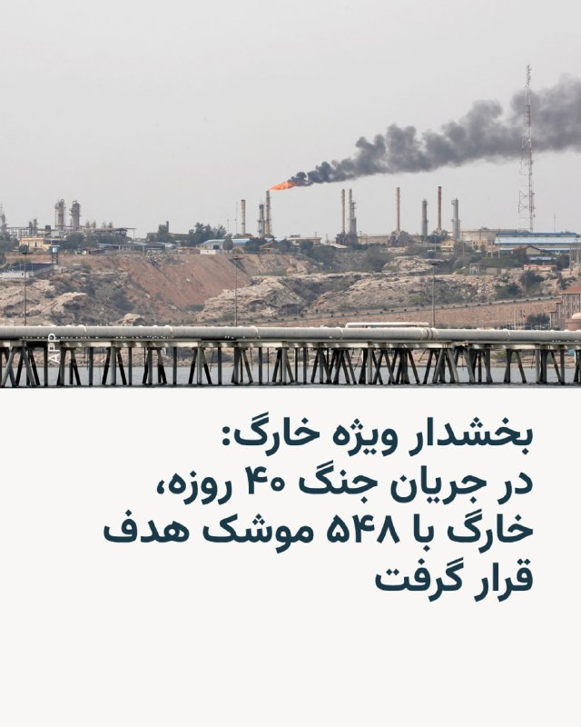

🔸بخشدار ویژه جزیره خارگ می‌گوید که در جریان جنگ ۴۰ روزه آمریکا و اسرائیل با ایران، «۵۴۸ موشک» به این جزیره اصابت کرد.

🔸نگهدار حسین‌پور این خبر را روز سه‌شنبه ۲۶ خرداد در همایش سراسری «حکمرانی هم‌افزا» با حضور مسعود پزشکیان، رئیس‌جمهور، و سایر مقام‌های جمهوری اسلامی بیان کرد.

🔸به گزارش خبرگزاری ایسنا، او گفت که در یکی از شدیدترین حملات، در روز ۲۶ اسفند، ۵۰ اصابت به این جزیره صورت گرفت. همچنین طی دو روز متوالی، شش فروند شناور مسافربری با هدف قطع ارتباط جزیره با سرزمین اصلی مورد هدف قرار گرفت.

🔸بخشدار ویژه خارگ افزوده که به‌رغم این حملات، «نه تنها صادرات بیش از ۹۰ درصد نفت کشور» از این جزیره «بدون اختلال» ادامه یافت، بلکه ارتباط جزیره با سرزمین اصلی هرگز قطع نشد.

🔸جزیره خارگ یکی از نقاط استراتژیک ایران محسوب می‌شود که دونالد ترامپ، رئیس‌جمهور ایالات متحده، بارها تهدید کرده بود که از سوی ایالات متحده اشغال خواهد شد تا ایران نتواند نفت صادر کند.

🔸ایران از دههٔ ۱۳۴۰ و پس از ساخت تأسیسات نفتی در جزیره خارگ، به‌شدت برای صادرات نفت خود به آن وابسته بوده است.

@RadioFarda

## alonews — post 128399

  <a href="telegram/content/alonews_128399_1781596459.webm" target="_blank">🎬 Download video</a>

👈عراقچی: دو طرف این تفاهم‌نامه، یک طرف آمریکا و اسرائیل و طرف دیگر ایران و حزب‌الله هستند و خاتمه جنگ در لبنان، بخش جدایی‌ناپذیر از خاتمه کامل جنگ است.

✅ @AloNews خبر جنگ

---
📅 بروزرسانی: 1405/03/26 11:14
---

## VahidOOnLine — post 245824

♦️عباس عراقچی، وزیر امور خارجه جمهوری اسلامی روز سه‌شنبه گفت دور جدید مذاکرات با آمریکا از روز جمعه ۲۹ خرداد و پس از امضای رسمی «تفاهم‌نامه پایان جنگ» آغاز خواهد شد.

عراقچی که در نشستی با حضور نمایندگان دیپلماتیک کشورهای خارجی در تهران سخن می‌گفت، افزود: «یادداشت تفاهم بین ایران و آمریکا روز یکشنبه نهایی شد و به زودی امضای رسمی آن صورت خواهد گرفت، احتمالا روز جمعه و در محلی که مشخص خواهد شد. همزمان، دور جدید مذاکرات ایران و آمریکا برای رسیدن به توافق نهایی آغاز خواهد شد.»

همزمان، خبرگزاری تسنیم گزارش کرد که مراسم امضای تفاهم‌نامه در سوئیس برگزار خواهد شد. شهباز شریف، نخست وزیر پاکستان پیش از این گفته بود که این کشور میزبان این مراسم خواهد بود.
‌🇸🇦 Indypersian

🤖 @VahidOOnLine

## DW_Farsi — post 126041

🎥 حواشی پس از بازی ایران و نیوزیلند؛ روایت ایرانیان از فضای ورزشگاه

تساوی ۲ بر ۲ ایران و نیوزیلند در جام جهانی ۲۰۲۶ با حضور شماری از ایرانیان در ورزشگاه لس‌آنجلس همراه بود. برخی از آن‌ها در گفت‌وگو با دویچه‌وله فارسی پس از پایان مسابقه، از ورود پرچم‌های شیر و خورشید به ورزشگاه و محدودیت‌های احتمالی برای نمایش آن‌ها سخن گفتند.

@dw_farsi

## Persian_Trend_Official — post 17234

  <a href="telegram/content/Persian_Trend_Official_17234_1781595859.webm" target="_blank">🎬 Download video</a>

فرمانده نیروی هوایی اسرائیل: تنها یک ساعت تا حمله گسترده به ایران مانده بود.

عومر تیشلر، فرمانده نیروی هوایی ارتش اسرائیل، اعلام کرد که ساعاتی پیش از توقف عملیات، کل نیروی هوایی به حالت کامل رزمی درآمده بود؛ هواپیماها مسلح شده، صدها هدف در عمق خاک ایران شناسایی و برنامه‌ریزی شده بود و اسکادران‌ها دقیقاً یک ساعت پیش از پرواز در حال توجیه نهایی اهداف بودند.

👺Phantom

📌 @persian_trend_official
پرشین ترند | متفاوت‌ترین کانال نظامی

## Dirty_Kids — post 392266

  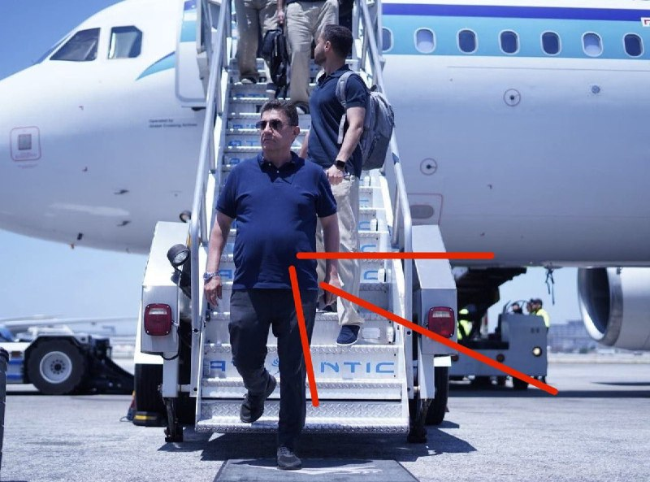

اورانیوم غنی شده به شکل جاساز تحویل آمریکا شد:

@Dirty_Kids 👻

## Dirty_Kids — post 392265

  <a href="telegram/content/Dirty_Kids_392265_1781595860.mp4" target="_blank">🎬 Download video</a>

من تو اینستاگرام فقط محتوای آموزشی و فاخر می‌بینم،
محتوای فاخری که میبینم: 👆

@Dirty_Kids 👻

## alonews — post 128398

  <a href="telegram/content/alonews_128398_1781595862.mp4" target="_blank">🎬 Download video</a>

👈درگیری موافقان و مخالفان ج.ا در ورزشگاه

✅ @AloNews خبر جنگ

## alonews — post 128397

  <a href="telegram/content/alonews_128397_1781595864.webm" target="_blank">🎬 Download video</a>

👈عراقچی: هرگونه حمله نظامی اسرائیل به لبنان ، نقض یادداشت تفاهم محسوب می‌شود

✅ @AloNews خبر جنگ

---
📅 بروزرسانی: 1405/03/26 11:04
---

## FarsiVOA — post 220883

  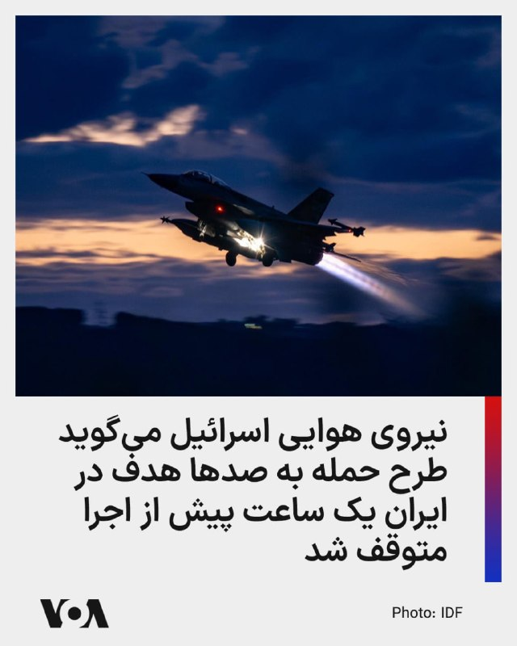

عمر تیشلر، فرمانده نیروی هوایی اسرائیل، در نامه‌ای به نیروهای تحت فرمان خود، از آمادگی کامل این نیرو در هفته گذشته برای اجرای یک حمله گسترده علیه جمهوری اسلامی خبر داد؛ عملیاتی که به گفته او، تنها یک ساعت پیش از آغاز، متوقف شد.

او نوشته است: «کل نیروی هوایی آماده پرواز برای یک عملیات حمله گسترده بود. چند ساعت پیش از دستور پرواز، با کوتاه کردن زمان آماده‌باش، انعطاف‌پذیری بی‌سابقه‌ای نشان داده شد؛ کل نیروی هوایی مسلح شد، برنامه‌ریزی انجام گرفت، آمادگی کامل برقرار بود و نیروها برای پرواز و حمله به صدها هدف در قلب ایران آماده بودند.»

تیشلر در ادامه توضیح داده است که توقف عملیات در شرایطی رخ داد که نیروها در پایگاه‌ها در حال آماده‌سازی نهایی بودند و تنها یک ساعت تا آغاز حمله فاصله داشتند.

این روایت نشان می‌دهد که حمله گسترده اسرائیل علیه جمهوری اسلامی، که بنا بر گزارش‌ها هفته گذشته برنامه‌ریزی شده بود، تا آستانه اجرا پیش رفت؛ اما با مداخله رئیس‌جمهور ایالات متحده آمریکا، دونالد ترامپ، متوقف شد.
@FarsiVOA

## DW_Farsi — post 126040

🎥 چگونه یک شهر مشکل خرس‌های مهاجم را حل کرد؟

سال‌ها خرس‌های قهوه‌ای خیابان‌های یک شهر کوچک در رومانی را به تسخیر خود درآورده بودند؛ آن‌قدر که گردشگران دیگر به شهر نمی‌آمدند اما برخلاف انتظار، راه‌حل این بحران، نه شکار بود و نه کشتار.

@dw_farsi

## RadioFarda — post 158366

  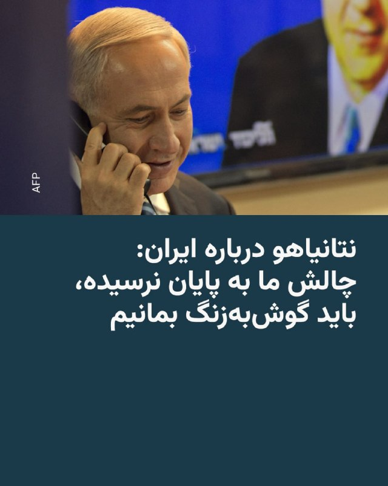

🔸بنیامین نتانیاهو، نخست وزیر اسرائیل، روز دوشنبه در یک کنفرانس خبری تأکید کرد که به‌رغم امضای تفاهم‌نامه میان ایران و آمریکا، چالش کشور اسرائیل به پایان نرسیده و «ما باید گوش به‌زنگ بمانیم و در مواقع لزوم از خود دفاع کنیم».

🔸به گفته دولت آمریکا، جمهوری اسلامی در قالب تفاهم‌نامه‌ای که روز یک‌شنبه امضا شد تعهد داده است که هرگز به دنبال سلاح هسته‌ای نرود.

🔸نخست وزیر اسرائیل در ادامه سخنان خود تأکید کرد که «با یا بدون توافق، ایران هرگز به سلاح هسته‌ای دست نخواهد یافت».

🔸بنیامین نتانیاهو همچنین گفت که این توافق «از آن ایالات متحده است، توسط رئیس جمهور ایالات متحده، و او معتقد است که هم می‌تواند بر برنامه هسته‌ای نظارت داشته باشد و هم آن را خنثی کند».

🔸او تأکید کرد که این تصمیم دونالد ترامپ است، اما نتانیاهو برای او روشن کرده که اسرائیل منافع خود را دارد.

🔸نتانیاهو در نشست خبری خود همچنین گفت که حملات مشترک در کنار آمریکا به ایران خساراتی سنگین وارد کرده و به گفته او «بعضی معتقدند که خسارت اقتصادی به ایران یک تریلیون دلار بوده است».

@RadioFarda

## alonews — post 128396

  <a href="telegram/content/alonews_128396_1781595256.mp4" target="_blank">🎬 Download video</a>

تو ترافیک گیر کردی

اون زن چادری پرچم به دست:

[@AloTweet]

---
📅 بروزرسانی: 1405/03/26 10:54
---

## VahidOOnLine — post 245823

  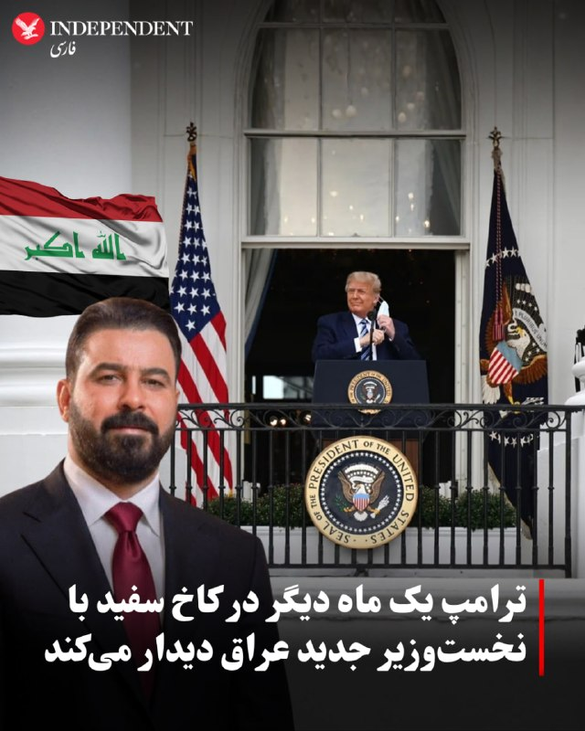

⭕️ترامپ یک ماه دیگر در کاخ سفید با نخست‌وزیر جدید عراق دیدار می‌کند

♦️دفتر نخست‌وزیر عراق و سفارت آمریکا در بغداد روز سه‌شنبه ۲۶ خرداد اعلام کردند که دونالد ترامپ، رئیس‌ جمهوری ایالات متحده، ماه آینده میزبان علی الزیدی، نخست‌وزیر عراق، در کاخ سفید خواهد بود.

به گزارش خبرگزاری فرانسه، دفتر نخست‌ وزیری عراق و تام باراک، فرستاده ویژه دونالد ترامپ در عراق در بیانیه‌ای مشترک اعلام کردند «باراک، فرستاده ویژه رئیس‌ جمهوری، ابراز امیدواری کرد که رئیس‌ جمهوری ترامپ در اواسط ماه ژوئیه از نخست‌وزیر الزیدی در کاخ سفید استقبال کند تا در مورد آینده این رابطه مهم گفتگو کنند.»

این خبر در جریان سفر تام باراک به بغداد، پایتخت عراق، منتشر می‌شود.
تام باراک در جریان این دیدار با نخست‌وزیر «فن‌سالار/تکنوکرات» عراق در مورد خلع سلاح و انحلال گروه‌های مسلح که خارج از اختیارات دولتی فعالیت می‌کنند، گفتگو کرد.
‌🇸🇦 Indypersian

🤖 @VahidOOnLine

## VahidOOnLine — post 245822

  

کارزار «سه‌شنبه‌های نه به اعدام» اعلام کرد زندانیان معترض به مجازات اعدام سه‌شنبه ۲۶ خرداد برای صدوبیست‌وپنجمین هفته در ۵۶ زندان ایران در اعتصاب غذا هستند. این کارزار اعلام کرد جمهوری اسلامی از ابتدای سال ۱۴۰۵ بیش از ۱۷۷ زندانی را اعدام کرده و صدور و اجرای احکام اعدام ادامه دارد.

این کارزار افزود علی فتاح، محمد نقی‌زاده، علی کمالی و پیمان گنجی، زندانیان سیاسی محکوم به اعدام، در زندان قزلحصار به‌سر می‌برند و هشدار داد این زندان یکی از مراکز اصلی اجرای احکام اعدام در استان تهران و از قتل‌گاه‌های حکومتی است و زندانیان محکوم به اعدام پس از انتقال به آن در معرض اعدام قرار می‌گیرند.

کارزار «سه‌شنبه‌های نه به اعدام» تاکید کرد که خواهان توقف سریع اعدام‌هاست و از همه «وجدان‌های بیدار» و فعالان سیاسی، حقوق بشری، مدنی و صنفی خواست به هر شکل ممکن اعدام‌ها را محکوم کنند و برای توقف آن دست به اقدامی جدی بزنند.

این کارزار اعلام کرد تحقق آزادی، برابری و حفظ کرامت انسانی بدون تحقق حق حیات ممکن نیست و از همه مخالفان اعدام خواست برای در هم شکستن ساختار استبدادی و چرخه سلب حیات انسانی، همبستگی و عمل متحدانه داشته باشند.
http
‌🏁 🇬🇧 IranintlTV

🤖 @VahidOOnLine

## pm_afshaa — post 94171

دیروز پشمای کل رسانه های جهان وقتی تیم مزدوران جمهوری اسلامی گل میخورد و طرفداری ایرانی خوشحالی میکردن ریخته

## IranIntlTV — post 342667

  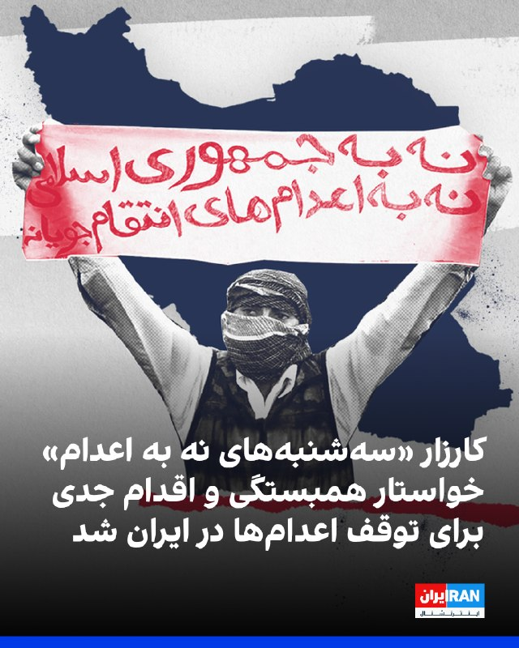

کارزار «سه‌شنبه‌های نه به اعدام» اعلام کرد زندانیان معترض به مجازات اعدام سه‌شنبه ۲۶ خرداد برای صدوبیست‌وپنجمین هفته در ۵۶ زندان ایران در اعتصاب غذا هستند. این کارزار اعلام کرد جمهوری اسلامی از ابتدای سال ۱۴۰۵ بیش از ۱۷۷ زندانی را اعدام کرده و صدور و اجرای احکام اعدام ادامه دارد.

این کارزار افزود علی فتاح، محمد نقی‌زاده، علی کمالی و پیمان گنجی، زندانیان سیاسی محکوم به اعدام، در زندان قزلحصار به‌سر می‌برند و هشدار داد این زندان یکی از مراکز اصلی اجرای احکام اعدام در استان تهران و از قتل‌گاه‌های حکومتی است و زندانیان محکوم به اعدام پس از انتقال به آن در معرض اعدام قرار می‌گیرند.

کارزار «سه‌شنبه‌های نه به اعدام» تاکید کرد که خواهان توقف سریع اعدام‌هاست و از همه «وجدان‌های بیدار» و فعالان سیاسی، حقوق بشری، مدنی و صنفی خواست به هر شکل ممکن اعدام‌ها را محکوم کنند و برای توقف آن دست به اقدامی جدی بزنند.

این کارزار اعلام کرد تحقق آزادی، برابری و حفظ کرامت انسانی بدون تحقق حق حیات ممکن نیست و از همه مخالفان اعدام خواست برای در هم شکستن ساختار استبدادی و چرخه سلب حیات انسانی، همبستگی و عمل متحدانه داشته باشند.
http

## Hranews — post 113641

آوات رستمی از زندان مهاباد آزاد شد

❗️
❗️
❗️
❗️
❗️– روز شنبه ۲۳ خردادماه، آوات رستمی، شهروند اهل شهرستان مهاباد با تودیع وثیقه از زندان این شهرستان آزاد شد.

ادامه مطلب

#آوات_رستمی

↘️
@hranews_bot تماس ✉️ -  @Hranews  کانال هرانا 🆑

## alonews — post 128395

  <a href="telegram/content/alonews_128395_1781594664.webm" target="_blank">🎬 Download video</a>

👈عراقچی: روز جمعه دور جدید مذاکرات ایران و آمریکا برای رسیدن به توافق نهایی آغاز می‌شود.

🔴 بعد از سه ماه مذاکره توانستیم مرحله اول را نهایی کنیم.

🔴در مرحله اول مهمترین موضوعی که اتفاق می‌افتد اعلام خاتمه جنگ است و بنا به تصمیمی که گرفتیم از صبح روز دوشنبه به وقت تهران که این توافق نهایی شد، خاتمه جنگ هم اعلام شد. ولی شروع رسمی تفاهمنامه از روز جمعه خواهد بود.

✅ @AloNews خبر جنگ

## alonews — post 128394

  <a href="telegram/content/alonews_128394_1781594664.webm" target="_blank">🎬 Download video</a>

👈اختلال ادامه‌دار در بانک ملی و صادرات

با وجود گذشت چند روز از شروع اختلال در خدمات بانک ملی و صادرات، سرویس‌های مختلف همچنان با اختلال همراه هستند.

✅ @AloNews خبر جنگ

## alonews — post 128393

از بین ۴۸ تیمی که در جام جهانی حضور دارند، رتبه‌ نیوزیلند در رنکینگ فیفا از همه پایینتر است؛ حتی از کیپ ورد، هائیتی و کوراسائو.

🇨🇻 کیپ ورد - ۶۷
🇨🇼 کوراسائو - ۸۲
🇭🇹 هائیتی - ۸۳
🇳🇿 نیوزیلند - ۸۵

@AloSport

---
📅 بروزرسانی: 1405/03/26 10:43
---

## VahidOOnLine — post 245821

  

علی نیکزاد، نایب‌رییس مجلس، در تجمعات شبانه در خصوص مواضع حکومت در مذاکرات و تعاملات بین‌المللی گفت: «جمهوری اسلامی هیچ‌گونه اعتمادی به آمریکا و اسرائیل ندارد و هرگونه تصمیم‌گیری در مسائل کلان کشور تحت هدایت مجتبی خامنه‌ای انجام خواهد شد.»
نایب‌رییس مجلس افزود: «آمریکا با محاسبات نادرست تصور می‌کرد می‌تواند جمهوری اسلامی را وادار به تسلیم کند، اما ملت ایران و نیروهای مسلح کشور این تصور را باطل کردند.»
‌🏁 🇬🇧 IranintlTV

🤖 @VahidOOnLine

## VahidOOnLine — post 245820

♦️خبرگزاری رویترز، شامگاه دوشنبه ۲۵ خرداد ویدیویی را از دود سیاه ناشی از سقوط بمب‌افکن بی-۵۲ ارتش آمریکا در پایگاه ادواردز در جنوب کالیفرنیا منتشر کرد.

مقامات نیروی هوایی ایالات متحده اعلام کردند که این بمب‌افکن صبح دوشنبه به‌وقت محلی هنگام برخاستن در پایگاه نیروی هوایی ادواردز در صحرای موهاوی در جنوب کالیفرنیا سقوط کرد و هر هشت خدمه آن کشته شدند. علت وقوع این حادثه هنوز اعلام نشده است.

 سرهنگ جیمز هیز، فرمانده نیروی هوایی، ساعاتی بعد در یک کنفرانس خبری گفت: «این هواپیمای هشت موتوره جت که برای حمل طیف وسیعی از بمب‌های هسته‌ای و متعارف ساخته شده بود، در حال انجام یک ماموریت آزمایشی معمول بود که درست پس از برخاستن از زمین، در باند فرودگاه ادواردز سقوط کرد.»

به گزارش رویترز، فرودگاه نظامی ادواردز، یک مرکز پرواز آزمایشی وسیع که در دهه ۱۹۳۰ در اطراف بستر یک دریاچه خشک تأسیس شد، حدود ۱۲۴۵ کیلومتر مربع از صحرای موهاوی را اشغال می‌کند و بزرگترین فرودگاه نیروی هوایی ارتش آمریکا به‌شمار می‌رود.
‌🇸🇦 Indypersian

🤖 @VahidOOnLine

## VahidOOnLine — post 245819

  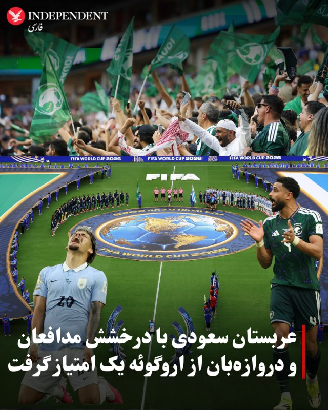

⭕️عربستان سعودی با درخشش مدافعان و دروازه‌بان از اروگوئه یک امتیاز گرفت

♦️تیم ملی فوتبال عربستان سعودی در نخستین دیدار خود در جام جهانی ۲۰۲۶ دوشنبه‌شب ۲۵ خرداد برابر اروگوئه به تساوی یک بر یک رسید و با کسب یک امتیاز ارزشمند، شروع امیدوارکننده‌ای در رقابت‌ها داشت.

سبزپوشان سعودی با گل عبدالله العمری در نیمه نخست از حریف پیش افتادند، اما اروگوئه در دقیقه ۸۰ توسط مکسی آرائوخو بازی را به تساوی کشاند. با این حال، محمد العویس، دروازه‌بان عربستان سعودی، با چندین مهار سرنوشت‌ساز به‌ویژه در دقایق پایانی، نقش کلیدی در حفظ این نتیجه ایفا کرد.

عربستان در گروه هشتم (H) جام جهانی ۲۰۲۶ با تیم‌های اروگوئه، اسپانیا و کیپ‌ورد هم‌گروه است. بسیاری این گروه را یکی از دشوارترین گروه‌های مسابقات می‌دانند و به همین دلیل کسب امتیاز برابر اروگوئه می‌تواند در ادامه مسیر صعود برای شاگردان جورجیوس دونیس اهمیت زیادی داشته باشد.
‌🇸🇦 Indypersian

🤖 @VahidOOnLine

## WithYashar — post 15029

دونالد ترامپ در گفتگو با CBS در واکنش به سفر کاروان تیم فوتبال ایران به آمریکا گفت:

"افتخار میزبانی کاروان تیم فوتبال ایران را داریم. آنها تیمی بزرگ هستند.
به قلعه نوعی گفتم اگر اینجا جایی نداری شب بمانی به منزل ما بیا. شاید قبول کرد. شاید هم نکرد. باید ببینیم چه می‌شود"
@withyashar. 😂 شوخیه

## pm_afshaa — post 94170

ویزای خایه مال اعظم ترابی باطل شد

💧 Rainbet.com the #1 Non-KYC Crypto Casino & Sportsbook @rainbetcom

😁 @Pm_Afshaa

## IranIntlTV — post 342666

  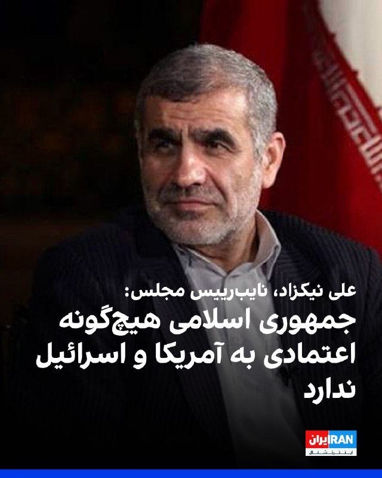

علی نیکزاد، نایب‌رییس مجلس، در تجمعات شبانه در خصوص مواضع حکومت در مذاکرات و تعاملات بین‌المللی گفت: «جمهوری اسلامی هیچ‌گونه اعتمادی به آمریکا و اسرائیل ندارد و هرگونه تصمیم‌گیری در مسائل کلان کشور تحت هدایت مجتبی خامنه‌ای انجام خواهد شد.»
نایب‌رییس مجلس افزود: «آمریکا با محاسبات نادرست تصور می‌کرد می‌تواند جمهوری اسلامی را وادار به تسلیم کند، اما ملت ایران و نیروهای مسلح کشور این تصور را باطل کردند.»
https://iranintl.com/202606166913

## DW_Farsi — post 126039

  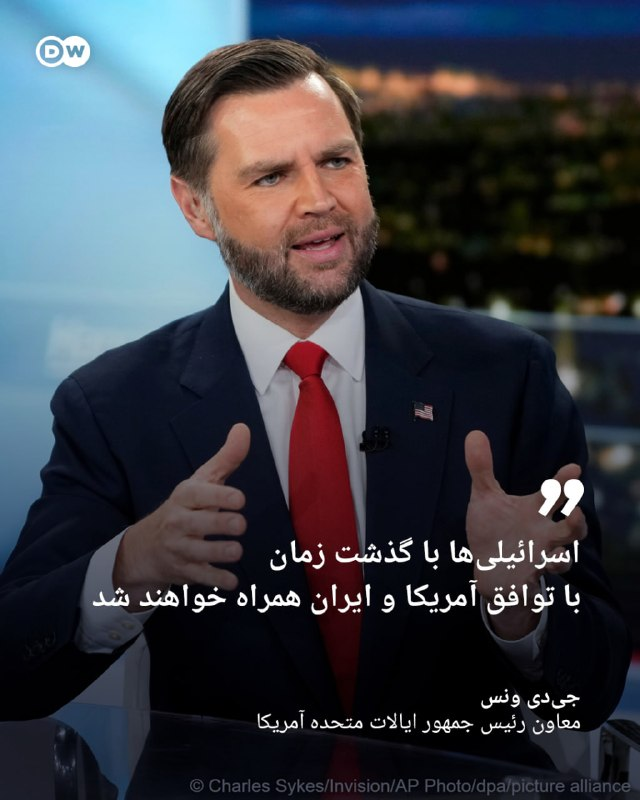

🔶ونس: اسرائیلی‌ها با گذشت زمان با توافق آمریکا و ایران همراه خواهند شد

جی‌دی ونس، معاون رئیس‌ جمهور ایالات متحده آمریکا گفت که معتقد است اسرائیل در مقطعی در آینده به توافق جاری میان ایالات متحده آمریکا و ایران برای خاتمه جنگ خواهد پیوست.

او در گفت‌وگو با شبکه ان‌بی‌سی نیوز گفت: «آنچه ما می‌دانیم این است که این توافق اسرائیل را امن‌تر خواهد کرد و کل منطقه را نیز امن‌تر خواهد کرد. آنچه من دیده‌ام حجم زیادی از اطلاعات نادرست درباره این توافق است؛ گاهی در رسانه‌های ایرانی و گاهی در رسانه‌های اسرائیلی.»

ونس افزود: «ما قویا معتقدیم که وقتی مردم اسرائیل متوجه شوند در این توافق چه مواردی وجود دارد، آن را مسیری به سوی خاورمیانه‌ای جدید و به سوی صلح و شکوفایی در آن منطقه خواهند دید. این تمام چیزی است که می‌توانیم درخواست کنیم. ما کاملا اطمینان داریم که اسرائیلی‌ها با گذشت زمان و در مراحل بعدی، با این توافق همراه خواهند شد.»

@dw_farsi

## Persian_Trend_Official — post 17232

حملات توپخانه‌ای اسرائیل به جنوب لبنان

ب گزارش شبکه المیادین توپخانه ارتش اسرائیل، ارتفاعات «جبل الرفیع» و مناطق اطراف شهرک «العیشیه» در شهرستان جزین جنوب لبنان را هدف قرار داد.

👺Phantom

📌 @persian_trend_official
پرشین ترند | متفاوت‌ترین کانال نظامی

## Hranews — post 113640

  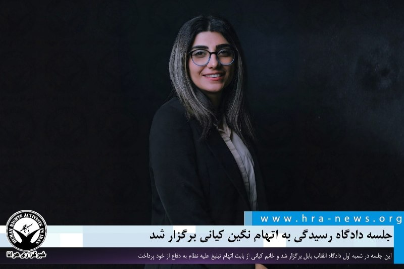

جلسه دادگاه رسیدگی به اتهام نگین کیانی برگزار شد

❗️
❗️
❗️
❗️
❗️– جلسه دادرسی به اتهام نگین کیانی، عکاس و مدرس عکاسی ساکن بابل، روز دوشنبه ۲۵ خردادماه، در شعبه اول دادگاه انقلاب این شهرستان برگزار شد.

به گزارش خبرگزاری هرانا، ارگان خبری مجموعه فعالان حقوق بشر در ایران، جلسه دادگاه رسیدگی به اتهام نگین کیانی برگزار شد.

یک منبع مطلع نزدیک به خانواده کیانی، ضمن تایید این خبر به هرانا گفت: «نگین روز گذشته در شعبه اول دادگاه انقلاب اسلامی شهرستان بابل حاضر شد. وی در این جلسه دادرسی، از بابت اتهام تبلیغ علیه نظام، به دفاع از خود پرداخت.»

ادامه مطلب

#نگین_کیانی

↘️
@hranews_bot تماس ✉️ -  @Hranews  کانال هرانا 🆑

## alonews — post 128392

  <a href="telegram/content/alonews_128392_1781594039.webm" target="_blank">🎬 Download video</a>

👈رسایی: اینترنت رو قطع کنید

✅ @AloNews خبر جنگ

## alonews — post 128391

  <a href="telegram/content/alonews_128391_1781594039.mp4" target="_blank">🎬 Download video</a>

👈خوشحالی ایرانی ها خارج از کشور(تورنتو) در لحظه گل اول ایران

🔴وی سپس در توئیتر می نویسد: دیگه دلمون با این تیم نیست، تیم ج.ا و ...😂

✅ @AloNews خبر جنگ

## alonews — post 128390

  <a href="telegram/content/alonews_128390_1781594041.webm" target="_blank">🎬 Download video</a>

👈ویزای مهدی ترابی بعد از یکبار ورود به خاک آمریکا منقضی شد

🔴فدراسیون فوتبال برای اخذ مجدد ویزای ترابی اقدام کرده

✅ @AloNews خبر جنگ

---
📅 بروزرسانی: 1405/03/26 10:34
---

## VahidOOnLine — post 245818

  <a href="telegram/content/VahidOOnLine_245818_1781593459.mp4" target="_blank">🎬 Download video</a>

ویدیوی رسیده نشان می‌دهد گروهی از ایرانیان در ونکوور کانادا، هنگام تماشای فوتبال ایران و نیوزیلند در جام‌جهانی، فریاد «جاوید شاه» سرمی‌دهند.
‌🏁 🇬🇧 IranintlTV

🤖 @VahidOOnLine

## VahidOOnLine — post 245817

  

شبکه کان اسرائیل گزارش داد عمر تیشلر، فرمانده نیروی هوایی اسرائیل، در نامه‌ای به نیروهای این یگان نوشت حمله برنامه‌ریزی‌شده به «صدها هدف» در ایران که قرار بود هفته گذشته در جریان آخرین درگیری انجام شود، تنها یک ساعت پیش از آغاز عملیات و در پی مداخله دونالد ترامپ، رییس‌جمهوری آمریکا متوقف شد.

در این گزارش به نقل فرمانده نیروی هوایی اسرائیل آمده: «تمام نیروی هوایی برای یک حمله گسترده آماده بود. تنها چند ساعت تا صدور دستور پرواز و حمله به صدها هدف در قلب ایران فاصله داشتیم، اما عملیات هنگام جلسات توجیهی اسکادران‌ها متوقف شد.»

فرمانده نیروی هوایی اسرائیل همچنین با اشاره به حملات اخیر اسرائیل به جمهوری اسلامی در این نامه نوشت: «هنوز برای ارزیابی تاثیر تحولات جهانی بر واقعیت امنیتی زود است.»

او در ادامه افزود: «ما به رهبری ایران، سامانه‌های دفاعی و تهاجمی، بخش‌های مرتبط با برنامه هسته‌ای، اقتصاد، زنجیره فرماندهی و دانش فنی، صنایع نظامی و ملی ضربات سنگینی وارد کردیم؛ به گونه‌ای که تهدید را به شکل قابل توجهی کاهش دادیم، روند بازسازی را طولانی‌تر کردیم و توانایی بازگشت و اقدام دوباره در ایران را حفظ کردیم.»
https
‌🏁 🇬🇧 IranintlTV

🤖 @VahidOOnLine

## IranIntlTV — post 342665

  <a href="telegram/content/IranIntlTV_342665_1781593462.mp4" target="_blank">🎬 Download video</a>

ویدیوی رسیده نشان می‌دهد گروهی از ایرانیان در ونکوور کانادا، هنگام تماشای فوتبال ایران و نیوزیلند در جام‌جهانی، فریاد «جاوید شاه» سرمی‌دهند.

## IranIntlTV — post 342664

بر اساس ویدیوهای رسیده به ایران‌اینترنشنال، هنگام نمایش پرچم جمهوری اسلامی قبل از بازی تیم‌های فوتبال ایران و نیوزیلند در ورزشگاه سوفای لس‌آنجلس،‌ ایرانیان حاضر در ورزشگاه این پرچم را هو کردند. عده‌ای از حامیان جمهوری اسلامی هم در این ورزشگاه حاضر بودند که پرچم رژیم را تشویق کردند.

## IranIntlTV — post 342663

  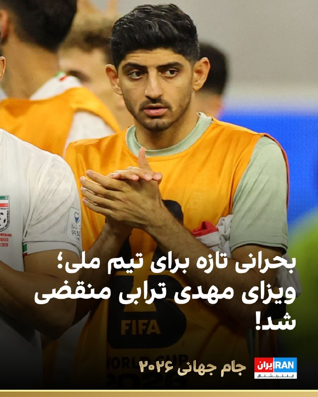

🔻ویزای مهدی ترابی، بازیکن تیم ملی فوتبال ایران، پس از یک بار ورود به خاک آمریکا منقضی شد و حضور او در دیدارهای پیش‌رو در هاله‌ای از ابهام قرار گرفت.

🔹به گزارش بخش رسانه‌ای تیم ملی فوتبال ایران، در حالی که برای سایر بازیکنان تیم ملی برای سفر به آمریکا روادید چندبارورود (Multiple) صادر شده است، ویزای مهدی ترابی به صورت تک‌ورود صادر شده بود.

🔹به همین دلیل، پس از سفر کاروان تیم ملی به لس‌آنجلس برای برگزاری دیدار برابر نیوزیلند و پایان این مسابقه، اعتبار ویزای این بازیکن رسما به پایان رسید. فدراسیون فوتبال ایران در پی دریافت مجدد ویزا برای ترابی است.

@iranintltvsport

## IranIntlTV — post 342662

  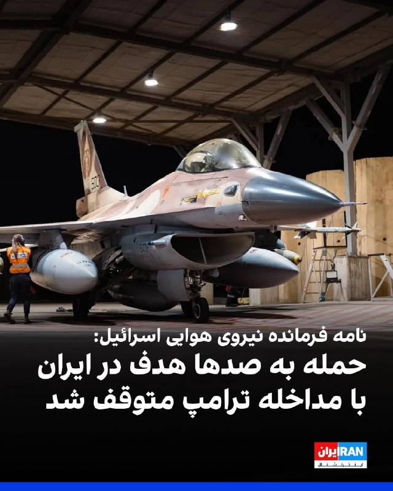

شبکه کان اسرائیل گزارش داد عمر تیشلر، فرمانده نیروی هوایی اسرائیل، در نامه‌ای به نیروهای این یگان نوشت حمله برنامه‌ریزی‌شده به «صدها هدف» در ایران که قرار بود هفته گذشته در جریان آخرین درگیری انجام شود، تنها یک ساعت پیش از آغاز عملیات و در پی مداخله دونالد ترامپ، رییس‌جمهوری آمریکا متوقف شد.

در این گزارش به نقل فرمانده نیروی هوایی اسرائیل آمده: «تمام نیروی هوایی برای یک حمله گسترده آماده بود. تنها چند ساعت تا صدور دستور پرواز و حمله به صدها هدف در قلب ایران فاصله داشتیم، اما عملیات هنگام جلسات توجیهی اسکادران‌ها متوقف شد.»

فرمانده نیروی هوایی اسرائیل همچنین با اشاره به حملات اخیر اسرائیل به جمهوری اسلامی در این نامه نوشت: «هنوز برای ارزیابی تاثیر تحولات جهانی بر واقعیت امنیتی زود است.»

او در ادامه افزود: «ما به رهبری ایران، سامانه‌های دفاعی و تهاجمی، بخش‌های مرتبط با برنامه هسته‌ای، اقتصاد، زنجیره فرماندهی و دانش فنی، صنایع نظامی و ملی ضربات سنگینی وارد کردیم؛ به گونه‌ای که تهدید را به شکل قابل توجهی کاهش دادیم، روند بازسازی را طولانی‌تر کردیم و توانایی بازگشت و اقدام دوباره در ایران را حفظ کردیم.»
https

## Persian_Trend_Official — post 17231

◾️ پزشکیان: بیش از ۹۰ درصد موافق بودند: رئیس‌جمهور ایران گفت در شورای عالی امنیت ملی بیش از ۹۰ درصد اعضا با تفاهم‌نامه موافق بودند.

◾️ پزشکیان: تفاهم افتخارآمیز خواهد بود: پزشکیان گفت اجرای درست تفاهم‌نامه می‌تواند سندی افتخارآمیز برای کشور و منطقه باشد.

◾️ عراقچی: امضا جمعه در سوئیس: وزیر خارجه گفت امضای رسمی احتمالاً جمعه در سوئیس انجام و سپس دور بعدی مذاکرات آغاز می‌شود.

◾️ اردوغان: گام مهم برای منطقه: رئیس‌جمهور ترکیه از توافق آمریکا و ایران استقبال کرد و گفت منطقه نفس راحتی کشید.

◾️ فون در لاین: اجرای توافق اولویت است: رئیس کمیسیون اروپا گفت تنگه هرمز باید بدون عوارض باز شود و توافق به مذاکرات گسترده‌تر منجر شود.

◾️ بقایی: سه بار کلمه لبنان در تفاهم: سخنگوی وزارت خارجه گفت در یادداشت تفاهم سه بار به لبنان و حاکمیت آن اشاره شده است.

◾️ امیت سگال: توقف فعالیت‌های زمینی اسرائیل: خبرنگار نظامی اسرائیل گفت تمام فعالیت‌های زمینی ارتش اسرائیل در جنوب لبنان متوقف شده است.

◾️ مرندی: امروز : مرندی با طنز به منتقدان واکنش نشان داد و گفت کسانی که احساس پیروزی ایران را دارند، کدام شرط محقق شده است.

◾️ بقایی: رفع همه تحریم‌ها: آمریکا موظف به رفع همه تحریم‌های اولیه و ثانویه به محض امضا است.

◾️ خاتمی: گام شجاعانه: سید محمد خاتمی از گام امضای تفاهم استقبال کرد و آن را آغاز راه دشوار اما لازم دانست.

◾️ حزب‌الله: دستاورد بزرگ ایران: حزب‌الله دستاورد ایران را تبریک گفت و آن را منجر به آتش‌بس در همه جبهه‌ها از جمله لبنان دانست.

◾️ فعال شدن پدافند شمال اسرائیل: شبکه ۱۲ اسرائیل از رهگیری حملات موشکی در المطله و کریات اشمونه خبر داد.

◾️ سقوط B-52 در آمریکا: یک فروند بمب‌افکن B-52H پس از برخاستن از پایگاه ادواردز سقوط کرد و ۸ سرنشین کشته شدند.

◾️ کشف سرجنگی تاماهاوک در ورامین: یگان EOD نیروی انتظامی سرجنگی موشک کروز تاماهاوک را کشف و خنثی کرد.

◾️ تماس عراقچی با جوزف عون: وزیر خارجه ایران با رئیس‌جمهور لبنان تلفنی گفت‌وگو کرد و تحولات منطقه را بررسی کردند.

◾️ هشدار پوتین به ایران: روایتی از هشدار روسیه درباره استفاده آمریکا از مذاکرات به عنوان پوشش عملیات منتشر شد.

◾️ زاکانی: روس‌ها شگفت‌زده شدند: شهردار تهران گفت روس‌ها باور نمی‌کردند ایران بتواند تنگه هرمز را این‌قدر طولانی نگه دارد.

◾️ بخشدار خارگ: ۵۴۸ اصابت موشک: بخشدار ویژه خارگ گفت جزیره ۵۴۸ بار هدف حمله قرار گرفت اما صادرات نفت متوقف نشد.

◾️ دلار ۱۶۰ هزار تومانی خریدار ندارد: با ریزش شدید قیمت ارز، حتی دلار ۱۶۰ هزار تومانی هم در بازار خریدار ندارد.

◾️ صنعت کشتیرانی: همچنان پرخطر: شرکت‌های بین‌المللی عبور از تنگه هرمز را هنوز بسیار پرخطر می‌دانند.

◾️ مقام آمریکایی: بررسی صندوق ۳۰۰ میلیارد دلاری: آمریکا در حال بررسی ایجاد صندوق بازسازی ۳۰۰ میلیارد دلاری برای ایران است.

◾️ حادثه دریایی جدید در یمن: گزارش UKMTO از شلیک آرپی‌جی به یک نفتکش توسط قایق مسلح در سواحل یمن.

👺:Phantom

📌 @persian_trend_official
پرشین ترند | متفاوت‌ترین کانال نظامی

## Persian_Trend_Official — post 17230

📍 بولتن خبری ۲۴ ساعت اخیر پرشین ترند
🗓 ۲۶ خرداد ۱۴۰۵

◾️ حملات هوایی اسرائیل به خیام و مرکبا: نیروی هوایی ارتش اسرائیل صبح امروز به مناطق خیام و مرکبا در جنوب لبنان حمله کرد. این حملات علی‌رغم تفاهم ایران-آمریکا ادامه دارد.

◾️ حمله به عیتا الجبال: ارتش اسرائیل به عیتا الجبال در جنوب لبنان حمله هوایی انجام داد که تنش‌ها در منطقه را افزایش داده است.

◾️ مقام ارشد اسرائیلی: توافق فاجعه‌بار: یک مقام بلندپایه اسرائیلی در مصاحبه با کانال ۱۳ گفت توافق آمریکا و ایران برای اسرائیل کاملاً فاجعه‌بار است و همه سطوح حاکمیت با این نظر موافقند.

◾️ ونس، ویتکاف و کوشنر موافق توافق: گزارش آکسیوس نشان می‌دهد معاون رئیس‌جمهور ونس، ویتکاف و کوشنر با تفاهم‌نامه اخیر آمریکا و ایران موافق هستند.

◾️ روبیو و هگست مخالف توافق: طبق گزارش‌ها، روبیو و پیت هگست با مفاد تفاهم‌نامه آمریکا و ایران مخالف‌اند.

◾️ سقوط F-18 در آمریکا: لحظه سقوط یک فروند جنگنده F-18 در ایالات متحده ثبت شد.

◾️ نخستین نفتکش از تنگه هرمز عبور کرد: نفتکش LNG مالت به نام Disha پس از اعلام توافق صلح، نخستین شناور بود که از تنگه هرمز با طرح تفکیک ترافیک ایران عبور کرد.

◾️ حادثه امنیتی کشتی در سواحل یمن: UKMTO از接近 قایق تندرو مسلح و تیراندازی به یک کشتی فله‌بر در جنوب عدن خبر داد. تحقیقات در جریان است.

◾️ سقوط هواپیمای آموزشی پاکستان: ارتش پاکستان اعلام کرد یک هواپیمای آموزشی سقوط کرده و هر دو خلبان جان باختند.

◾️ یسرائیل کاتز: نیروهای اسرائیلی باقی می‌مانند: وزیر دفاع اسرائیل گفت نتانیاهو و او مخالف خروج نیروها از لبنان، سوریه و غزه هستند و به ترامپ و هگست توضیح داده‌اند.

◾️ کاتز: پاسخ قاطع به ایران: اگر ایران به دلیل رویدادهای لبنان حمله کند، اسرائیل با تمام قدرت پاسخ خواهد داد.

◾️ بن گویر: توافق ترامپ ما را ملزم نمی‌کند: وزیر امنیت ملی اسرائیل تأکید کرد اسرائیل مستقل است و نباید از امنیت خود کوتاه بیاید.

◾️ بن گویر: برچیدن حزب‌الله لازم است: بن گویر گفت نباید با چیزی کمتر از برچیدن کامل حزب‌الله مصالحه کرد و عقب‌نشینی از مناطق تصرف‌شده پذیرفته نیست.

◾️ تثبیت حق ایران بر تنگه هرمز: منبع آگاه به فارس گفت نسخه نهایی تفاهم حاکمیت مشترک ایران و عمان بر تنگه هرمز را صراحتاً تأیید کرده و ایران پس از ۶۰ روز می‌تواند عوارض دریافت کند.

◾️ جوزف عون: منتظر گام‌های عملی: رئیس‌جمهور لبنان گفت مردم لبنان مشتاق پایان خشونت و آغاز بازسازی مناطق آسیب‌دیده هستند.

◾️ خرید ۱۲ فروند Su-30SM2 از روسیه: خبرگزاری روسی گزارش داد ایران قرارداد خرید ۱۲ جنگنده Su-30SM2 دست‌دوم را امضا کرده و تحویل از ۲۰۲۷ آغاز می‌شود.

◾️ مکرون: برنامه موشکی ایران بررسی شود: رئیس‌جمهور فرانسه گفت برنامه موشک‌های بالستیک ایران باید در مذاکرات آینده مطرح شود و تنگه هرمز بدون عوارض باز بماند.

◾️ ونس: متن توافق یک صفحه و نیم: معاون رئیس‌جمهور آمریکا گفت یادداشت تفاهم حدود یک صفحه و نیم است و سند عمومی محسوب می‌شود.

◾️ ونس: هیچ پول فوری آزاد نمی‌شود: ونس تأکید کرد هیچ ریالی آزاد نمی‌شود مگر پس از راستی‌آزمایی تعهدات ایران و ایران پول آمریکایی دریافت نمی‌کند.

◾️ ونس: دسترسی به صندوق ۳۰۰ میلیارد دلاری: ایران می‌تواند به صندوق بازسازی ۳۰۰ میلیارد دلاری دسترسی داشته باشد مشروط به عمل به تعهدات.

◾️ ونس: توافق عملکردمحور: همه چیز منوط به راستی‌آزمایی تعهدات ایران از جمله رقیق‌سازی ذخایر غنی‌شده است.

◾️ ترامپ: توافق کامل شده: رئیس‌جمهور آمریکا گفت توافق امضا شده، تنگه هرمز تا حدی باز است و جمعه کاملاً بازگشایی می‌شود.

◾️ ترامپ: قیمت نفت سقوط کرده: ترامپ گفت قیمت نفت در حال سقوط است و بازار سهام مثل موشک افزایش یافته.

◾️ ترامپ: ممکن است در امضا حضور داشته باشم: ترامپ گفت حضورش در مراسم امضا بستگی دارد و احتمالاً جی‌دی ونس حضور خواهد داشت.

◾️ نتانیاهو: مبارزه با هسته‌ای ادامه دارد: نخست‌وزیر اسرائیل گفت مأموریت زندگی‌اش مبارزه با برنامه هسته‌ای ایران است و با یا بدون توافق، ایران سلاح هسته‌ای نخواهد داشت.

◾️ نتانیاهو: اسرائیل در مناطق امنیتی باقی می‌ماند: نتانیاهو گفت نیروهای اسرائیلی تا هر زمان لازم در مناطق امنیتی لبنان، سوریه و غزه می‌مانند.

◾️ نتانیاهو: اختلاف با ترامپ: نتانیاهو گفت در مواردی با ترامپ اختلاف داریم اما رابطه شرکای قدیمی است.

◾️ نتانیاهو: ایران را از نابودی نجات دادیم: نتانیاهو ادعا کرد اسرائیل کشورش را از تهدید هسته‌ای ایران نجات داده است.

◾️ نتانیاهو: تصمیم توافق با ترامپ است: نتانیاهو گفت توافق تصمیم ترامپ است اما اسرائیل منافع خودش را پیگیری می‌کند.

## RadioFarda — post 158365

  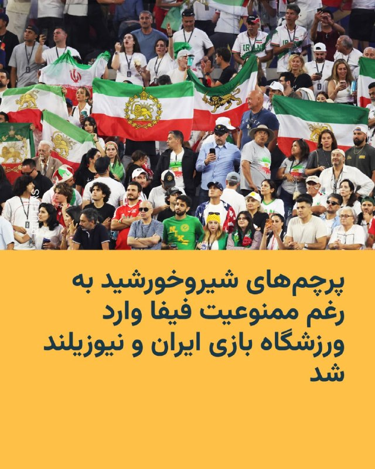

🔸خبرگزاری رویترز در گزارشی از فضای حاکم بر مسابقه تیم‌های فوتبال ایران و نیوزیلند در جام جهانی، خبر داد که به‌رغم ممنوعیت فیفا، پرچم‌های شیروخورشید وارد ورزشگاه محل بازی شد.

🔸این خبرگزاری به واکنش‌های متفاوت و متضاد تماشاگران ایرانی حاضر در ورزشگاه سوفای شهر لس‌آنجلس اشاره کرده و نوشته که اختلافات روی سکوها، بازتابی از چالش‌های پیش روی تیم ملی ایران در خارج از زمین مسابقه بود.

🔸رویترز به اقدام همزمان دو گروه متفاوت تماشاگران هنگام پخش سرود ملی تیم ایران اشاره کرده و نوشته است سوت زدن گروهی از تماشاگران در مقابل همخوانی گروه دیگری، بازتاب‌دهنده اهمیت نمایش وفاداری سیاسی در مقابل خود فوتبال بود.

🔸به نوشته آن، از حملات و گل‌های ایران از سوی بسیاری از تماشاگران، از جمله بخشی از هوادارانی که پرچم شیر و خورشید مربوط به ایران قبل از انقلاب را حمل می‌کردند، استقبال شد. اما گروهی از تماشاگران، گل‌های تیم نیوزیلند را جشن گرفتند.

@RadioFarda

## alonews — post 128389

  <a href="telegram/content/alonews_128389_1781593467.webm" target="_blank">🎬 Download video</a>

👈سخنگوی دولت طالبان: توافق ایران و آمریکا باعث چشم انداز و پیشرفت خوبی تو خاورمیانه میشه

✅ @AloNews خبر جنگ

## alonews — post 128388

  <a href="telegram/content/alonews_128388_1781593468.mp4" target="_blank">🎬 Download video</a>

👈میثاقی: پرچم شیر و خورشید، آشغاله

✅ @AloNews خبر جنگ

---
📅 بروزرسانی: 1405/03/26 10:23
---

## VahidOOnLine — post 245816

  <a href="telegram/content/VahidOOnLine_245816_1781592833.mp4" target="_blank">🎬 Download video</a>

♦️تیم ملی فوتبال ایران صبح سه‌شنبه در جریان اولین بازی خود در جام جهانی ۲۰۲۶ مقابل نیوزیلند در ورزشگاه «سوفای» لس‌آنجلس به تساوی ۲ بر ۲ رضایت داد.

تعداد زیادی از ایرانیان با برافراشتن پرچم‌های ملی شیروخورشید نشان، ممنوعیت‌های صریح فیفا را به چالش کشیدند.
این اقدام در حالی صورت گرفت که فیفا پیش‌تر در مصوبه‌ای، حمل هرگونه پارچه‌نوشته، پرچم و پوشاک با ماهیت سیاسی را ممنوع کرده بود و ماموران امنیتی ورزشگاه نیز در بدو ورود از برخی تماشاگران خواسته بودند لباس‌های خود را پشت‌ورو کنند. با این حال، جو درون استادیوم کاملا تحت تاثیر نمادهای ملی ایران قرار گرفت و تعدادی از هواداران هنگام پخش سرود جمهوری اسلامی به نشان اعتراض به زمین مسابقه پشت کردند.

بازیکنان تیم فوتبال ایران روز یکشنبه ۳۱ خرداد برابر بلژیک صف‌آرایی خواهند کرد.
‌🇸🇦 Indypersian

🤖 @VahidOOnLine

## VahidOOnLine — post 245815

بر اساس ویدیوهای رسیده به ایران‌اینترنشنال، هنگام نمایش پرچم جمهوری اسلامی قبل از بازی تیم‌های فوتبال ایران و نیوزیلند در ورزشگاه سوفای لس‌آنجلس،‌ ایرانیان حاضر در ورزشگاه این پرچم را هو کردند. عده‌ای از حامیان جمهوری اسلامی هم در این ورزشگاه حاضر بودند که پرچم رژیم را تشویق کردند.
‌🏁 🇬🇧 IranintlTV

🤖 @VahidOOnLine

## WithYashar — post 15028

ویزای مهدی ترابی باطل شد

در حالی که برای بازیکنان تیم ملی برای سفر به آمریکا روادید «چند بار ورود» صادر شده است اما ویزای مهدی ترابی تنها برای یک بار ورود اعتبار داشت و پس از سفر تیم ملی به لس آنجلس جهت دیدار برابر نیوزیلند و پایان این بازی، اکنون ویزای این بازیکن منقضی شده است.
فدراسیون فوتبال ایران برای اخذ مجدد ویزای ترابی اقدام کرده تا این بازیکن بتواند در دیدارهای آتی تیم ملی را همراهی کند.
@withyashar

## pm_afshaa — post 94169

با ضعیف ترین تیم جام جهانی با کصکشی مساوی کردن تو کونشونم عروسیه

## pm_afshaa — post 94168

محبی بعد از زدن گل دوم، با نشان دادن اسلحه و شلیک نمادین به تماشاگران نشون داد این تیم مزدوران حکومتیه نه مردم ایران فیفا باید سریع ورود کنه این حرومزاده تروریست رو دیپورت کنه و ننشو بگاد 
💧 Rainbet.com the #1 Non-KYC Crypto Casino & Sportsbook @rainbetcom…

## pm_afshaa — post 94167

  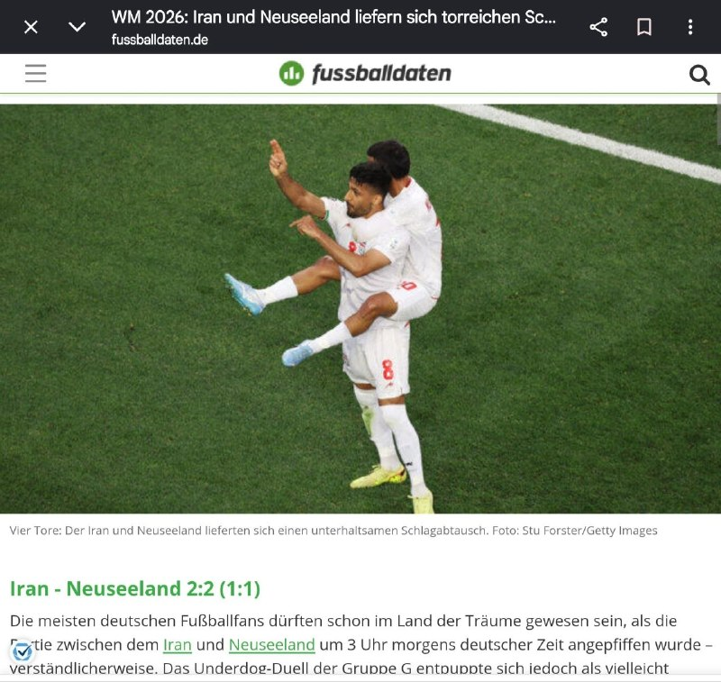

محبی بعد از زدن گل دوم، با نشان دادن اسلحه و شلیک نمادین به تماشاگران نشون داد این تیم مزدوران حکومتیه نه مردم ایران

فیفا باید سریع ورود کنه این حرومزاده تروریست رو دیپورت کنه و ننشو بگاد

💧 Rainbet.com the #1 Non-KYC Crypto Casino & Sportsbook @rainbetcom

😁 @Pm_Afshaa

## FarsiVOA — post 220882

  

📸اینستاگرام صدای آمریکا را هم اکنون فالو کنید تا از آخرین خبرها مطلع بمانید:
https://www.instagram.com/voafarsi/

📡همچنین جهت اطلاع از بروزترین فرکانسهای ماهواره‌ای صدای آمریکا به لینک زیر مراجعت فرمایید:
https://ir.voanews.com/satellite

این پست را با دوستانتان به اشتراک بگذارید
@FarsiVOA

## FarsiVOA — post 220881

Farsi VOA pinned an audio file

## FarsiVOA — post 220880

  <a href="https://t.me/farsivoa/220880" target="_blank">📎 Download file</a>

🔴📢‌ پادکست خبری دوشنبه ۲۵خرداد ۱۴۰۵

🛜در صورتی که با مشکل اینترنت مواجه هستید میتوانید اخبار صدای آمریکا را از نسخه‌های پادکست خبری ما روزانه دنبال کنید و یا اخبار را از نسخه سبک وب‌سایت ما پیگیر باشید:
https://ir.voanews.com/lite

📡بروزترین فرکانسهای ماهواره‌ای را نیز میتوانید از صفحه زیر پیگیری کنید:
https://ir.voanews.com/satellite

🔔دیگر شبکه‌های اجتماعی ما را هم دنبال کنید:
https://linktr.ee/voafarsi

ما را به اشتراک بگذارید
@farsivoa

## BBCPersian — post 284006

🔻خلاصه مهمترین خبرها تا این لحظه

🔹جی‌دی ونس، معاون اول رئیس جمهور آمریکا، در مصاحبه‌ای با شبکه خبری فاکس گفت که اگر ایران به تعهدات خود در توافق با ایالات متحده عمل کند، می‌تواند به چند میلیارد دلار دسترسی پیدا کند.

🔹اسماعیل قاآنی، فرمانده نیروی قدس سپاه پاسداران، در گفت‌و‌گویی تلویزیونی به امضای تفاهم‌نامه میان ایران و آمریکا واکنش نشان داده و آن را نتیجه آنچه «ایستادگی محور مقاومت» خوانده، دانسته است.

🔹یاسمین انصاری، نماینده ایرانی الاصل کنگره آمریکا، گفته است تفاهم‌نامه بدست آمده میان ایالات متحده و ایران، پس از آن به دست آمد که «هزینه‌های هنگفتی» را هم برای آمریکا و مردم ایران به بار آورد.

🔹یک فروند بمب افکن بی۵۲ ارتش امریکا روز دوشنبه دقایقی پس از برخاستن از باند فرودگاه نظامی در شمال لس آنجلس سقوط کرد.

🔹دونالد ترامپ، رئیس جمهور آمریکا، دوشنبه شب در پیامی در شبکه اجتماعی تروث سوشال گزارش‌هایی را که مدعی بودند آمریکا قرار است ۳۰۰ میلیون دلار به ایران پرداخت کند، رد کرد.

🔹محمدباقر قالیباف که چهره اول تیم مذاکره‌کننده ایران با آمریکاست در واکنش به امضای تفاهم‌نامه توقف مخاصمه خطاب به مردم این کشور گفت که «ایران گامی بلند به سوی پیروزی نهایی برداشت.»

https://bbc.in/4uzGueX
@BBCPersian

## BBCPersian — post 284005

  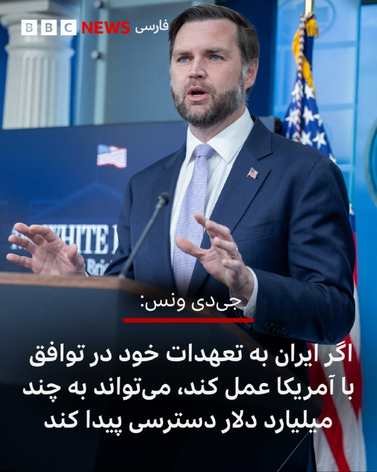

🔻جی‌دی ونس، معاون اول رئیس جمهور آمریکا، در مصاحبه‌ای با شبکه خبری فاکس گفت که تفاهم پیشنهادی ایالات متحده و ایران «روز جدیدی» را برای خاورمیانه رقم خواهد زد.

او گفت که اگر ایران به تعهدات خود در توافق با ایالات متحده عمل کند، می‌تواند به چند میلیارد دلار دسترسی پیدا کند.

آقای ونس گفت که هنوز بر سر مفاد خاص باید توافق حاصل شود و متن کامل در چند روز آینده منتشر خواهد شد.

او گفت: «این توافق‌نامه می‌گوید که آنها حتی ده سنت هم از پول آمریکا دریافت نمی‌کنند.»

«چیزی که توافق می‌گوید این است که اگر ایرانی‌ها درست رفتار کنند و اگر تحریم‌ها مشمول تحفیف شود و اگر ایرانی‌ها در اقتصاد جهانی ادغام شوند، ما از کشورهای دیگر، نه خودمان، بلکه از کشورهای دیگر دعوت می‌کنیم تا در کشورشان سرمایه‌گذاری کنند.»

تفاهم‌نامه میان ایران و ایالات متحده، قرار است روز جمعه در سوئیس امضا شود.

ادامه مطلب⬇️
Anadolu via Getty Images
https://bbc.in/4fOxsY0
@BBCPersian

## alonews — post 128387

  <a href="telegram/content/alonews_128387_1781592837.webm" target="_blank">🎬 Download video</a>

👈بیرانوند قبل بازی:
دروازه رو مثل تنگه هرمز میبندم

🔴دوتا کشتی رد شد و یکیش هم زاویه بسته

✅ @AloNews خبر جنگ

## alonews — post 128385

  <a href="telegram/content/alonews_128385_1781592837.mp4" target="_blank">🎬 Download video</a>

👈شادی گل بحث برانگیز «محمد محبی» که با اسلحه شلیک کرد سمت تماشاگرا.
خیلیا معتقدن به سمت کسایی که پرچم شیرو خورشید داشتن و عکس جانباختگان اعتراضات دی ماه رو داشتن شلیک کرده.

برخی هم معتقدن تو خاک آمریکا به آمریکایی ها تیراندازی کرده.

✅ @AloNews خبر جنگ

## alonews — post 128384

  <a href="telegram/content/alonews_128384_1781592838.webm" target="_blank">🎬 Download video</a>

👈تحقیر پشت تحقیر
‼️

🔴تیم ملی ج.ا بعد بازی بدون ریکاوری درحال خروج از آمریکا است اما طارمی و الهویی درحال بازجویی هستند

✅ @AloNews خبر جنگ

## alonews — post 128383

  <a href="telegram/content/alonews_128383_1781592838.mp4" target="_blank">🎬 Download video</a>

ویدیویی از ابراز علاقه هواداران به بیرانوند

@AloSport

## alonews — post 128382

  <a href="telegram/content/alonews_128382_1781592839.webm" target="_blank">🎬 Download video</a>

👈فرمانده نیرو هوایی اسرائیل درباره جلوگیری ترامپ از حمله به ایران: تمام نیروی هوایی آماده شروع یک سورتی پرواز رزمی عظیم بود

🔴عومر تیشلر: ساعت‌ها قبل از دستور پرواز، با کاهش زمان آمادگی، انعطاف‌پذیری استثنایی نشان داده شد و کل نیروی هوایی مسلح شد، برنامه‌ریزی، آماده‌سازی و آماده حمله به صدها هدف در قلب ایران شد.

🔴حمله در حالی متوقف شد که ما فقط یک ساعت قبل از پرواز در حال توجیه اهداف به اسکادران‌ها (گردان هوایی) بودیم

✅ @AloNews خبر جنگ

<!-- MSG END -->

<!-- NAV START -->

<a href="https://github.com/ProAlit/aio-downloader/blob/main/telegram/content/archive_1.md" style="display:inline-block; padding:6px 12px; margin:0 4px; background-color:#2ea44f; color:white; text-decoration:none; border-radius:4px; font-weight:bold;">صفحه بعد</a>

<!-- NAV END -->
