# خواننده تلگرام

<!-- TOP_NAV START -->

<!-- TOP_NAV END -->

<!-- MSG START -->

---
📅 بروزرسانی: 1405/03/21 01:32
---

## VahidOOnLine — post 244795

  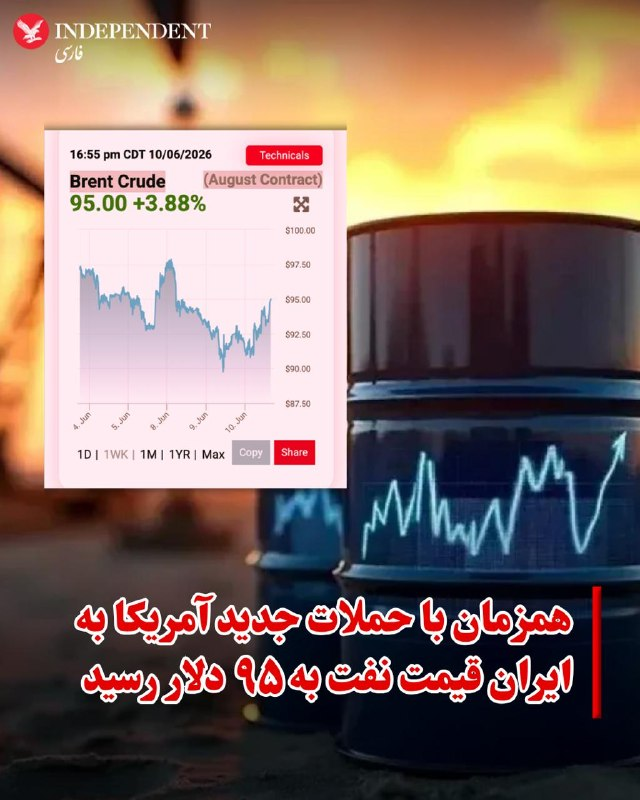

♦️بامداد پنجشنبه ۲۱ خردادماه و در پی اعلام فرماندهی مرکزی ایالات متحده (سنتکام) مبنی بر آغاز دور جدیدی از حملات علیه چندین هدف در ایران، قیمت نفت در بازارهای جهانی افزایش یافت.

بهای نفت خام برنت با رشد ۳.۸۸ درصدی به ۹۵ دلار در هر بشکه رسید. افزایش قیمت نفت در حالی رخ داده است که تشدید تنش‌های نظامی میان آمریکا و جمهوری اسلامی نگرانی‌ها درباره امنیت عرضه انرژی در منطقه را افزایش داده است.
‌🇸🇦 Indypersian

🤖 @VahidOOnLine

## VahidOOnLine — post 244794

  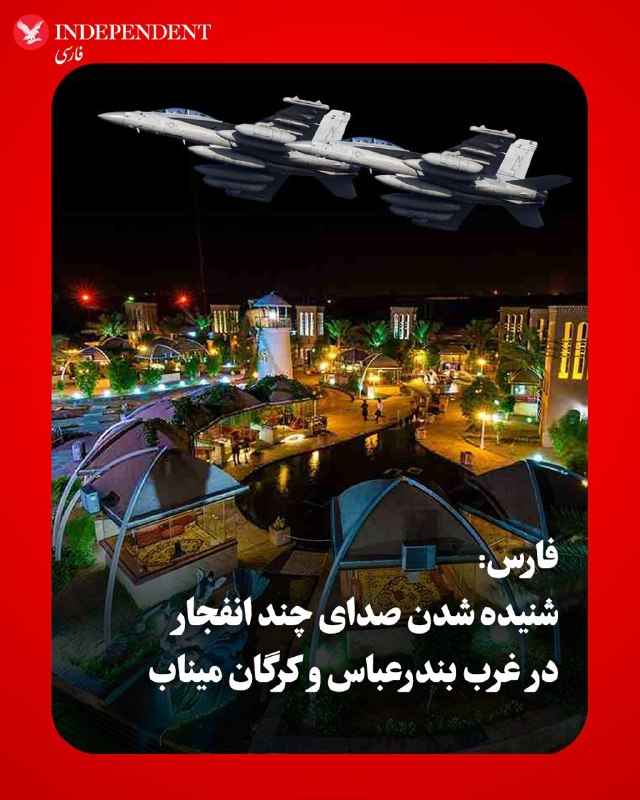

♦️خبرگزاری فارس گزارش داد دقایقی پیش صدای چند انفجار از سمت غرب بندرعباس شنیده شده است. همچنین ساکنان منطقه کرگان میناب نیز از شنیده شدن چند صدای انفجار خبر داده‌اند.
پیش از این، فرماندهی مرکزی ایالات متحده (سنتکام) اعلام کرده بود نیروهای آمریکایی از ساعت ۱۷:۱۵ به وقت شرق آمریکا حملات جدیدی را علیه چندین هدف در ایران آغاز کرده‌اند. سنتکام گفت این عملیات در پاسخ به آنچه «اقدامات تهاجمی و ادامه‌دار ایران» خوانده، انجام شده است.
‌🇸🇦 Indypersian

🤖 @VahidOOnLine

## VahidOOnLine — post 244793

  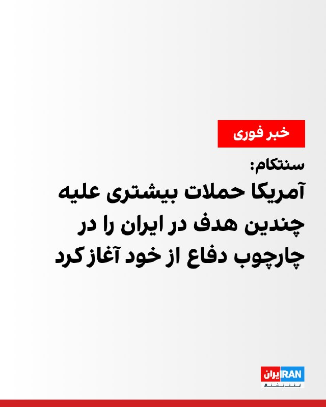

ستاد فرماندهی مرکزی آمریکا، سنتکام، اعلام کرد از ساعت ۰۰:۴۵ به وقت تهران، نیروهای آمریکا در واکنش به «تجاوز بی‌دلیل و ادامه‌دار» جمهوری اسلامی حملات بیشتری را در چارچوب دفاع از خود علیه چندین هدف در ایران آغاز کردند.
‌🏁 🇬🇧 IranintlTV

🤖 @VahidOOnLine

## WithYashar — post 14422

تا دقایقی دیگر پیام سخنگوی قرارگاه مرکزی خاتم الانبیا(میلاد مدرسه ای)
@withyashar

## WithYashar — post 14421

یک مقام آمریکایی به Axios گفت: تمام اهدافی که مورد حمله قرار گرفتند در جنوب ایران هستند و شامل سامانه‌های پدافند هوایی، رادارها و واحدهای فرماندهی و کنترل پهپادها می‌شوند.
@withyashar

## WithYashar — post 14420

پدافند سیرجان فعال
@withyashar

## WithYashar — post 14419

صدای انفجار در کنگان
@withyashar

## WithYashar — post 14418

الجزیره: اسرائیل هم امشب به ایران حمله کرده و تو عملیات حضور داره
@withyashar

## WithYashar — post 14417

## WithYashar — post 14416

  <a href="telegram/content/WithYashar_14416_1781128961.mp4" target="_blank">🎬 Download video</a>

🎬 Video

## WithYashar — post 14415

  <a href="telegram/content/WithYashar_14415_1781128964.mp4" target="_blank">🎬 Download video</a>

جنگنده های ارتش بر فراز تهران
@withyashar

## mwarmonitor — post 10673

انفجار در جزیره هنگام

## mwarmonitor — post 10672

🔴یک مقام آمریکایی گفت: تمام اهدافی که مورد حمله قرار گرفته‌اند در جنوب ایران قرار دارند و شامل سامانه‌های پدافند هوایی، رادارها و واحدهای فرماندهی و کنترل پهپادها هستند - اکسیوس.

@mwarmonitor

## mwarmonitor — post 10671

  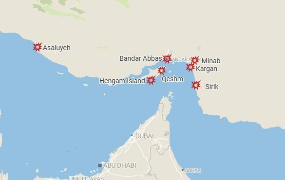

🔴شهرهای که تا کنون مورد هدف قرار گرفته‌اند‌.

@mwarmonitor

## mwarmonitor — post 10670

حمله مجدد به بندرعباس

## mwarmonitor — post 10669

🔴 وال‌استریت ژورنال به نقل از پنتاگون: این حملات نوعی اقدام از جنس «دیپلماسی اجباری» است که هدف آن وادار کردن ایران به ارائه امتیازاتی در میز مذاکره است.

@mwarmonitor

## pm_afshaa — post 93451

  

نقاطی که تا الان هدف قرار گرفته :

💧 Rainbet.com the #1 Non-KYC Crypto Casino & Sportsbook @rainbetcom

😁 @Pm_Afshaa

## pm_afshaa — post 93450

تسنیم: هم اکنون یک کارخانه پتروشیمی متعلق به مجتمع گاز پارس جنوبی در عسلویه بمباران شد

💧 Rainbet.com the #1 Non-KYC Crypto Casino & Sportsbook @rainbetcom

😁 @Pm_Afshaa

## pm_afshaa — post 93449

انفجا در جزیره هنگام

💧 Rainbet.com the #1 Non-KYC Crypto Casino & Sportsbook @rainbetcom

😁 @Pm_Afshaa

## pm_afshaa — post 93448

  <a href="telegram/content/pm_afshaa_93448_1781128967.webm" target="_blank">🎬 Download video</a>

🔴خبرگزاری دانشجو: یک کارخانه پتروشیمی متعلق به مجتمع گاز پارس جنوبی در عسلویه بمباران شد.

💧 Rainbet.com the #1 Non-KYC Crypto Casino & Sportsbook @rainbetcom

😁 @Pm_Afshaa

## pm_afshaa — post 93447

  <a href="telegram/content/pm_afshaa_93447_1781128967.webm" target="_blank">🎬 Download video</a>

بچه ها تو کانال زاپاسمون حتما جوین شین داشته باشین اتفاقی افتاد اونجا دنبالمون کنین
👇
👇
👇

https://t.me/pmtvzapas
https://t.me/pmtvzapas

## pm_afshaa — post 93446

  <a href="telegram/content/pm_afshaa_93446_1781128968.webm" target="_blank">🎬 Download video</a>

🔴مقام آمریکایی به اکسیوس:
همه اهدافی که امشب مورد حمله قرار گرفتن، تو جنوب ایران هستن که شامل سیستم‌های دفاع هوایی، رادارها و واحدهای فرماندهی و کنترل پهپادن.

💧 Rainbet.com the #1 Non-KYC Crypto Casino & Sportsbook @rainbetcom

😁 @Pm_Afshaa

## pm_afshaa — post 93444

پایگاه هوایی بندر عباسو زدن

💧 Rainbet.com the #1 Non-KYC Crypto Casino & Sportsbook @rainbetcom

😁 @Pm_Afshaa

## pm_afshaa — post 93443

تتر 180

## pm_afshaa — post 93442

  <a href="telegram/content/pm_afshaa_93442_1781128969.webm" target="_blank">🎬 Download video</a>

🔴وال‌استریت ژورنال به نقل از پنتاگون:
این حملات نوعی اقدام از جنس «دیپلماسی اجباری» است که هدف اون وادار کردن جمهوری اسلامی به ارائه امتیازاتی در میز مذاکره‌ست.

💧 Rainbet.com the #1 Non-KYC Crypto Casino & Sportsbook @rainbetcom

😁 @Pm_Afshaa

## pm_afshaa — post 93441

هر بشکه نفت 95 دلار

💧 Rainbet.com the #1 Non-KYC Crypto Casino & Sportsbook @rainbetcom

😁 @Pm_Afshaa

## pm_afshaa — post 93440

  <a href="telegram/content/pm_afshaa_93440_1781128970.webm" target="_blank">🎬 Download video</a>

🔴کانال 12 اسرائیل به نقل از مقامات آمریکایی: منتظر واکنش جمهوری اسلامی هستیم که احتمالا پایگاه‌های آمریکایی رو هدف قرار بده، همانطور که در شب سه‌شنبه رخ داد.

💧 Rainbet.com the #1 Non-KYC Crypto Casino & Sportsbook @rainbetcom

😁 @Pm_Afshaa

## pm_afshaa — post 93439

انفجار های مجدد در بندر عباس

💧 Rainbet.com the #1 Non-KYC Crypto Casino & Sportsbook @rainbetcom

😁 @Pm_Afshaa

## pm_afshaa — post 93438

اگه به حرف پزشکیان گوش کرده بودیم پایتخت رو برده بودیم بوشهر تا الان 5 بار جمهوری اسلامی سقوط کرده بود

## pm_afshaa — post 93437

اتش سوزی در پایگاه دریایی سیریک

💧 Rainbet.com the #1 Non-KYC Crypto Casino & Sportsbook @rainbetcom

😁 @Pm_Afshaa

## pm_afshaa — post 93436

  <a href="telegram/content/pm_afshaa_93436_1781128971.webm" target="_blank">🎬 Download video</a>

🔴کانال 12 اسرائیل: آماده پیوستن به حملات علیه ایران هستیم.

💧 Rainbet.com the #1 Non-KYC Crypto Casino & Sportsbook @rainbetcom

😁 @Pm_Afshaa

## VahidOnline — post 76168

پیام‌های دریافتی:

صدای سه انفجار در بندرعباس

بندر عباس سه صدای پشت سر هم ساعت 1:20

وااااایییی تو دو ثانیه سه تا انفجار شنیدم بندرعباس خیلی نزدیک بود

بندر عباس همین الان چند تا صداااا

بندرعباس سمت زندان شهرک صدای جنگنده یا انفجار طولانی اومد
همین الان یک انفجار خیلی خیلیییی سنگین بندرعباس

دوباره انفجار بندرعباس ۱:۲۲

وحید بندرعباس الان یجوری زد شهر لرزید

وحید ساعت ۱:۲۰ بندرعباس سه تا انفجار خیلی سنگین شد

دوبارهههه صدا اومد ولی خیلی دوررر بود فکر کنم سه/چهار تا بود

📡 @VahidOnline

## kianmeli1 — post 87899

🔴فوری-صداهای انفجار در بندرعباس، قشم، میناب، سیریک و جزیره هنگام
https://t.me/kianmeli1

## kianmeli1 — post 87898

🔴صدای چند انفجار در بندر کرگان نیز شنیده شده است
https://t.me/kianmeli1

## IranIntlTV — post 341590

  

ستاد فرماندهی مرکزی آمریکا، سنتکام، اعلام کرد از ساعت ۰۰:۴۵ به وقت تهران، نیروهای آمریکا در واکنش به «تجاوز بی‌دلیل و ادامه‌دار» جمهوری اسلامی حملات بیشتری را در چارچوب دفاع از خود علیه چندین هدف در ایران آغاز کردند.
https://iranintl.com/202606103787

## Shin_Persian — post 6893

Shin ✓ @hey_itsmyturn
Wed, 10 Jun 2026 22:01:37 UTC

2 stories from 2 regime news agencies:

Daneshju Agency:
A Petrochemical company in Asaluyeh was targeted.

IRIB:
A CM was downed over Asaluyeh.

ترجمه خودکار فارسی

۲ خبر از ۲ خبرگزاری رژیم:

خبرگزاری دانشجو:
یک شرکت پتروشیمی در عسلویه مورد هدف قرار گرفت.

خبرگزاری صدا و سیما (IRIB):
یک موشک کروز (CM) بر فراز عسلویه سرنگون شد.

𝕏 · @shin_persian

## Shin_Persian — post 6892

Shin ✓ @hey_itsmyturn
Wed, 10 Jun 2026 21:57:55 UTC

Initial:
Airstrike on a petrochemical site in Asaluyeh, Bushehr Province, #Iran

ترجمه خودکار فارسی

حمله هوایی به یک سایت پتروشیمی در عسلویه، استان بوشهر، #Iran

𝕏 · @shin_persian

## Shin_Persian — post 6891

Shin ✓ @hey_itsmyturn
Wed, 10 Jun 2026 21:57:11 UTC

As per regime news channels: IRGC Khatam HQ's Spox to address a statement shortly

ترجمه خودکار فارسی

بر اساس کانال‌های خبری رژیم: سخنگوی قرارگاه خاتم‌الانبیاء سپاه پاسداران (IRGC) به‌زودی بیانیه‌ای را ارائه خواهد کرد.

𝕏 · @shin_persian

## Shin_Persian — post 6890

↩️ Quoted tweet: Shin ✓ @hey_itsmyturn Wed, 10 Jun 2026 21:42:28 UTC Kangan Naval Base was the target as per a local source. Was hit 3 times. ↩️ توییت نقل‌قول شده — برای پاسخ، پست زیر را ببینید. ترجمه خودکار فارسی به گفته یک منبع محلی، پایگاه دریایی کنگان…

## Shin_Persian — post 6889

↩️ Quoted tweet:
Shin ✓ @hey_itsmyturn
Wed, 10 Jun 2026 21:42:28 UTC

Kangan Naval Base was the target as per a local source. Was hit 3 times.

↩️ توییت نقل‌قول شده — برای پاسخ، پست زیر را ببینید.

ترجمه خودکار فارسی

به گفته یک منبع محلی، پایگاه دریایی کنگان هدف قرار گرفت. این مکان ۳ بار مورد اصابت قرار گرفت.

𝕏 · @shin_persian

## Shin_Persian — post 6888

  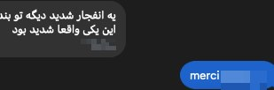

Shin ✓ @hey_itsmyturn
Wed, 10 Jun 2026 21:52:18 UTC

NOW -
Huge blast in Bandar Abbas, Hormozgan Province, #Iran

ترجمه خودکار فارسی

فوری -
انفجار مهیب در بندرعباس، استان هرمزگان، #Iran

𝕏 · @shin_persian

## FarsiVOA — post 220301

⚡️پیت هگست، وزیر جنگ آمریکا: حملات اخیر ما به جمهوری اسلامی بی‌نظیر بود؛ از آپاچی‌ها استفاده کردیم
@FarsiVOA

## Persian_Trend_Official — post 16591

⭕️ مهر:

اسپوتنیک: هدف قرار گرفتن رادار آمریکا در اربیل توسط سپاه پاسداران

🔺خبرنگار اسپوتنیک گزارش داد: سپاه پاسداران ایران یک رادار امریکایی را در اربیل هدف حملات توپخانه‌ای یا موشکی قرار داد.

📝 Nick

📌 @persian_trend_official
پرشین ترند | متفاوت‌ترین کانال نظامی

## Persian_Trend_Official — post 16589

🇺🇸 💥🇮🇷 چندین انفجار در بندر کنگان استان بوشهر شنیده شده است.

چندین انفجار نیز در کوهستک استان هرمزگان شنیده شده است.

## Persian_Trend_Official — post 16586

⭕️ مهر:

♦️تجاوز دشمن به نقاطی در استان بوشهر

🔹 دقایقی پیش نقاطی در عسلویه هدف حمله دشمن قرار گرفت.

🔹 هم‌زمان با این حادثه، ساکنان بندر کنگان نیز از شنیده شدن انفجار خبر می‌دهند.

📝 Nick

📌 @persian_trend_official
پرشین ترند | متفاوت‌ترین کانال نظامی

## RadioFarda — post 158159

  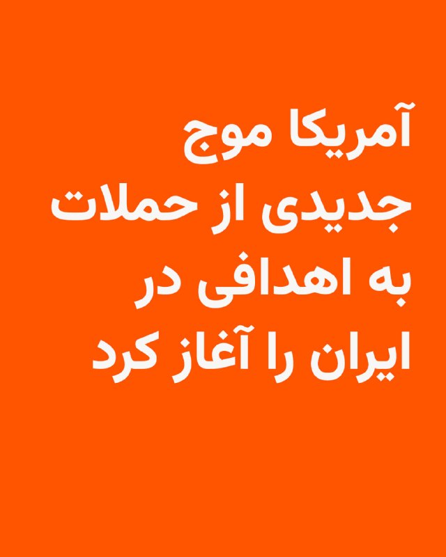

.
🔸فرماندهی مرکزی نیروهای مسلح ایالات متحده، سنتکام با انتشار مطلبی در شبکۀ ایکس، از آغاز دور جدیدی از حملات خود به ایران خبر داد.

🔸در این پیام آمده که این نیروها از ساعت ۱۷:۱۵ به وقت شرق آمریکا ( ۴۵ دقیقه بامداد پنجشنبه به وقت ایران) «به دستور فرمانده کل نیروهای مسلح [دونالد ترامپ]، حملات «تدافعی» خود را علیه چندین هدف در ایران آغاز کرده اند».

🔸خبرگزاری مهر می‌گوید پدافند هوایی در غرب تهران و بخش‌هایی از استان فارس از جمله در شهر مُهر فعال شده است.

🔸در همین حال برخی رسانه‌های داخلی هم از شنیده‌شدن صداهایی بلند از سمت جزیره کیش خبر داده‌اند.

🔸خبرگزاری مهر همچنین از شنیده‌شدن صدای انفجار در بندر سیریک واقع در جنوب میناب و در کرانۀ تنگۀ هرمز خبر می‌دهد. این خبرگزای می‌گوید در میناب هم صدای انفجار شنیده شده است.

@RadioFarda

## IranianMinds — post 22189

🔴 صداوسیما :

چندین انفجار سنگین در قشم

@IranianMinds

## IranianMinds — post 22188

🔴 سپاه به اربیل عراق حمله ی موشکی‌ کرد.

@IranianMinds

## IranianMinds — post 22187

🔴 انفجار در جزیره هنگام

@IranianMinds

## IranianMinds — post 22186

🔴 خبرگزاری مهر :

آمریکا به عسلویه حمله کرد.

@IranianMinds

## IranianMinds — post 22185

🔴 کانال ۱۲ اسرائیل :

امشب هدف آمریکا فقط جنوب ایرانه

@IranianMinds

## IranianMinds — post 22184

🔴 بندر کنگان مورد حمله قرار نگرفته، بندر کرگان هدف قرار گرفته که در میناب هست

@IranianMinds

## IranianMinds — post 22183

سپاه وقتشه نشون بدی قدرت واقعی جهان کیه و‌ ابگرمکنارو شلیک کنی

## IranianMinds — post 22182

🔴 یک مقام آمریکایی به آکسیوس :

تمام اهدافی که مورد حمله قرار گرفته اند در جنوب ایران هستند و شامل سامانه های پدافند هوایی، رادارها و واحدهای فرماندهی و کنترل پهپادها می شود.

@IranianMinds

## IranianMinds — post 22181

خدایا

الان وقتشه ها
شوخیاتو شروع کن
رعدو برقاتو بزن

@IranianMinds

## IranianMinds — post 22180

🔴مجدد یک انفجار بسیار مهیب در بندرعباس

@IranianMinds

## Dirty_Kids — post 391637

  <a href="telegram/content/Dirty_Kids_391637_1781128973.webm" target="_blank">🎬 Download video</a>

🔴سنتکام: عسلویه و بندرعباس رو هم زدیم و اینا به خاطر حمله ای بود که جمهوری‌اسلامی به هلیکوپتر ما کرد.

🔴قشم همچنان زیر انفجارهای مهیب
💥

🔴وزیر جنگ آمریکا : حملات امشب مقدمه حملاتی بزرگتر است
💥

🔴کانال ۱۲ اسرائیل: آماده پیوستن به حملات علیه ایران هستیم.🔥

🔴یک کارخانه پتروشیمی متعلق به مجتمع گاز پارس جنوبی در عسلویه بمباران شد.

## Dirty_Kids — post 391636

اکسیوس به نقل از مقام‌های آمریکایی: هدف از حملات اخیر، افزایش فشار بر رژیم تروریستی جمهوری اسلامی برای پذیرش توافق است.

مقام‌های آمریکایی به اکسیوس گفته‌اند واشینگتن امیدوار است این حملات تهران را به امضای توافق وادار کند، اما در عین حال هشدار داده‌اند که این روند می‌تواند به تشدید درگیری‌های نظامی و گسترش تنش‌ها در منطقه منجر شود.

## Dirty_Kids — post 391635

  <a href="telegram/content/Dirty_Kids_391635_1781128974.mp4" target="_blank">🎬 Download video</a>

رسانه‌های جمهوری اسلامی این ویدئو رو از پرواز قارقارک‌های خودشون بر فراز تهران منتشر کردن:

@Dirty_Kids 👻

## Dirty_Kids — post 391634

دیگه حتی پمپ‌ بنزینا هم با حرفای ترامپ شلوغ نمیشن.

@Dirty_Kids 👻

## alonews — post 127001

  <a href="telegram/content/alonews_127001_1781128975.webm" target="_blank">🎬 Download video</a>

👈یک مقام آمریکایی به Axios گفت: تمام اهدافی که مورد حمله قرار گرفتند در جنوب ایران هستند و شامل سامانه‌های پدافند هوایی، رادارها و واحدهای فرماندهی و کنترل پهپادها می‌شوند.

✅ @AloNews خبر جنگ

## alonews — post 127000

  <a href="telegram/content/alonews_127000_1781128975.webm" target="_blank">🎬 Download video</a>

👈اکسیوس به نقل از مقام‌های آمریکایی:
هدف از این حملات فشار بر تهران برای امضای توافقه، اما ممکنه به تشدید نظامی منجر بشه.

✅ @AloNews خبر جنگ

---
📅 بروزرسانی: 1405/03/21 01:22
---

## VahidOOnLine — post 244792

  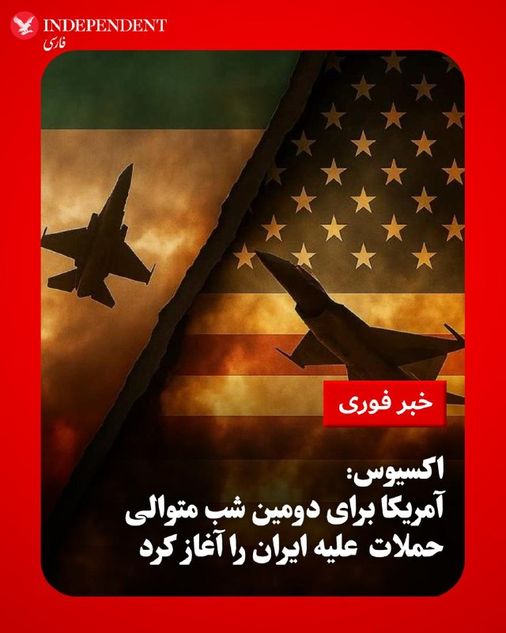

♦️اکسیوس بامداد پنجشنبه ۲۱ خردادماه به نقل از یک مقام آمریکایی گزارش داد ارتش ایالات متحده برای دومین شب متوالی حملات علیه ایران را آغاز کرده است. به گفته این مقام، هدف از این حملات افزایش فشار بر تهران برای پذیرش توافق است، اما این اقدام خطر تشدید درگیری نظامی را نیز به همراه دارد.

این گزارش پس از آن منتشر شد که پیت هگست، وزیر جنگ آمریکا، اعلام کرد فرماندهی مرکزی ایالات متحده (سنتکام) که هدایت عملیات نظامی آمریکا در خاورمیانه را بر عهده دارد، «امشب مشغول خواهد بود.» او همچنین گفت: «اگر لازم باشد با استفاده از بمب مذاکره کنیم، با استفاده از بمب مذاکره خواهیم کرد.»

اکسیوس همچنین گزارش داد مقام‌های آمریکایی انتظار دارند ایران به این حملات پاسخ دهد و احتمال دارد این پاسخ پایگاه‌های آمریکا را هدف قرار دهد. خبرگزاری تسنیم نیز به نقل از یک منبع نظامی از «پاسخ‌های سنگین» ایران خبر داده است.
‌🇸🇦 Indypersian

🤖 @VahidOOnLine

## VahidOOnLine — post 244791

  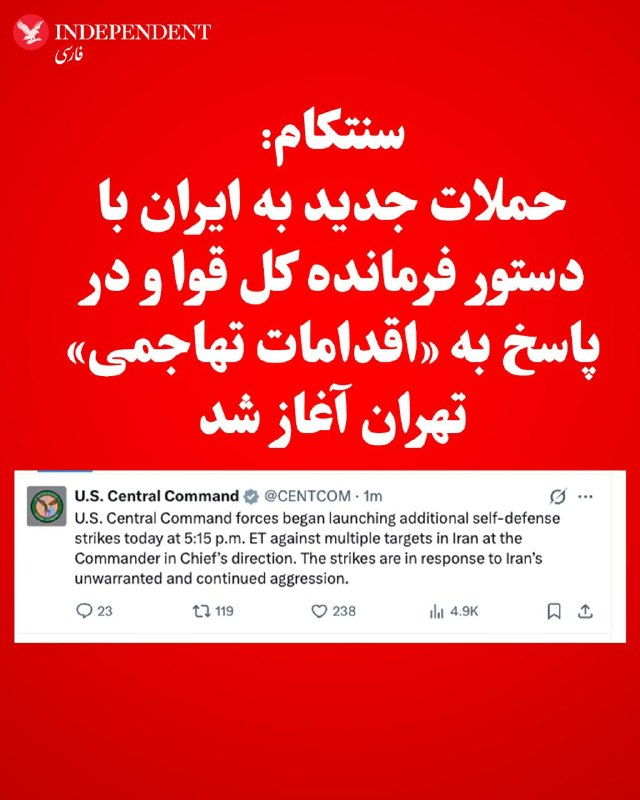

♦️فرماندهی مرکزی ایالات متحده (سنتکام)، چهارشنبه ۲۰ خردادماه، با انتشار بیانیه‌ای اعلام کرد نیروهای آمریکایی از ساعت ۱۷:۱۵ به وقت شرق آمریکا (۱۲:۴۵ بامداد پنجشنبه) حملات جدیدی را علیه چندین هدف در ایران آغاز کرده‌اند.
سنتکام اعلام کرد این عملیات با دستور فرمانده کل قوا انجام شده و در پاسخ به آنچه «اقدامات تهاجمی و ادامه‌دار ایران» خوانده، صورت گرفته است.
‌🇸🇦 Indypersian

🤖 @VahidOOnLine

## WithYashar — post 14414

## WithYashar — post 14413

منابع آمریکایی:حملات برای آماده سازی برای ورود زمینی انجام میشود
@withyashar

## WithYashar — post 14412

طبق گزارش‌ها، پایگاه نیروی دریایی کنگان برای چندمین بار هدف قرار گرفت.
@withyashar

## WithYashar — post 14411

کانال ۱۲ اسرائیل: آماده پیوستن به حملات علیه ایران هستیم.
@withyashar

## WithYashar — post 14410

منابع خبری آمریکا: عملیات امشب سنتکام در تمامی نقاط حیاتی ایران خواهد بود
@withyashar

## WithYashar — post 14409

وزیر جنگ آمریکا : حملات امشب مقدمه حملاتی بزرگتر است
@withyashar

## WithYashar — post 14408

پدافند کرمان فعال شد
@withyashar

## WithYashar — post 14407

انفجار در کارخانه پتروشیمی در عسلویه
@withyashar

## mwarmonitor — post 10668

🔴 اکسیوس به نقل از مقام‌های آمریکایی: هدف از این حملات فشار بر تهران برای امضای توافق است، اما ممکن است به تشدید نظامی منجر شود.

@mwarmonitor

## mwarmonitor — post 10667

🔸به گفته دو منبع آگاه از برنامه‌ها که برای بحث درباره این موضوع خواستار ناشناس ماندن شده‌اند، دونالد ترامپ، رئیس‌جمهور آمریکا، در نخستین مسابقه جام جهانی که در خاک ایالات متحده میان آمریکا و پاراگوئه روز جمعه در لس‌آنجلس برگزار می‌شود، حضور نخواهد داشت. — پولیتیکو

@mwarmonitor

## pm_afshaa — post 93435

  <a href="telegram/content/pm_afshaa_93435_1781128334.mp4" target="_blank">🎬 Download video</a>

جنگنده های ارتش بر فراز تهران

💧 Rainbet.com the #1 Non-KYC Crypto Casino & Sportsbook @rainbetcom

😁 @Pm_Afshaa

## pm_afshaa — post 93434

اسمون ما نمیای پر پرواز!؟

## pm_afshaa — post 93433

جنگنده‌های ارتش تو تهران درحال پروازن

💧 Rainbet.com the #1 Non-KYC Crypto Casino & Sportsbook @rainbetcom

😁 @Pm_Afshaa

## pm_afshaa — post 93432

🔴منابع آمریکایی:حملات برای آماده سازی برای ورود زمینی انجام میشود

💧 Rainbet.com the #1 Non-KYC Crypto Casino & Sportsbook @rainbetcom

😁 @Pm_Afshaa

## pm_afshaa — post 93431

انفجار در بوشهر

💧 Rainbet.com the #1 Non-KYC Crypto Casino & Sportsbook @rainbetcom

😁 @Pm_Afshaa

## pm_afshaa — post 93430

  <a href="telegram/content/pm_afshaa_93430_1781128335.webm" target="_blank">🎬 Download video</a>

🔴یک مقام آمریکایی: تمرکز حملات تو این مرحله به اطراف و دامنهٔ تنگه هرمزه و جنوبه؛ این حملات تشدید میشن و چندین هدف رو مورد حمله قرار میدیم.

💧 Rainbet.com the #1 Non-KYC Crypto Casino & Sportsbook @rainbetcom

😁 @Pm_Afshaa

## pm_afshaa — post 93429

انفجار در میناب

💧 Rainbet.com the #1 Non-KYC Crypto Casino & Sportsbook @rainbetcom

😁 @Pm_Afshaa

## pm_afshaa — post 93428

وزیر دفاع آمریکا اعلام کرد حملات امشب مقدمه حملاتی بزرگتر است

💧 Rainbet.com the #1 Non-KYC Crypto Casino & Sportsbook @rainbetcom

😁 @Pm_Afshaa

## pm_afshaa — post 93427

  <a href="telegram/content/pm_afshaa_93427_1781128335.webm" target="_blank">🎬 Download video</a>

🔴طبق گزارش‌ها، پایگاه نیروی دریایی کنگان برای چندمین بار هدف قرار گرفت.

💧 Rainbet.com the #1 Non-KYC Crypto Casino & Sportsbook @rainbetcom

😁 @Pm_Afshaa

## pm_afshaa — post 93426

  <a href="telegram/content/pm_afshaa_93426_1781128336.webm" target="_blank">🎬 Download video</a>

🔴سنتکام: نیروهای فرماندهی مرکزی ایالات متحده حملات خود را از ساعت 5:15 بعد از ظهر امروز آغاز کردند. ET علیه اهداف متعدد در ایران به دستور فرمانده کل قوا. این حملات در پاسخ به تجاوزات بی دلیل و ادامه دار ایران است. 
💧 Rainbet.com the #1 Non-KYC Crypto Casino…

## pm_afshaa — post 93425

🔴نتانیاهو دستور اماده باش فوری صادر کرده

💧 Rainbet.com the #1 Non-KYC Crypto Casino & Sportsbook @rainbetcom

😁 @Pm_Afshaa

## pm_afshaa — post 93424

  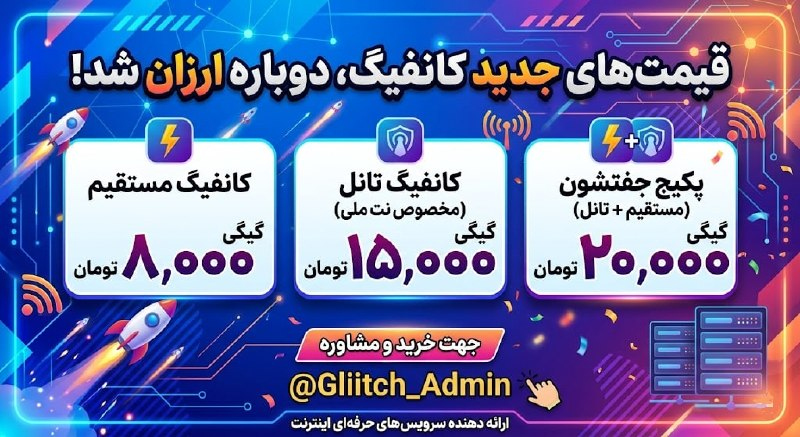

⚡️ تخفیف ویژه و بی‌سابقه Glitch Config آغاز شد
‼️ ‌

🔴 کانفیگ مستقیم: اقتصادی و پرسرعت، فقط گیگی ۸,۰۰۰ تومان

🟢 کانفیگ تانل (ویژه نت ملی): عبور بی‌دردسر از محدودیت‌ها، گیگی ۱۵,۰۰۰ تومان

🔥 پکیج ترکیبی (جفتشون): دسترسی کامل به هر دو سرویس با سرعت دو برابر، فقط گیگی ۲۰,۰۰۰ تومان

برای مشاوره و خرید همین حالا به آیدی زیر پیام دهید:

🔤 @Gliitch_Admin

🔤 @Gliitch_Admin

🔤 @Gliitch_Admin

## pm_afshaa — post 93423

بندرعباس مجدد صدای انفجار

💧 Rainbet.com the #1 Non-KYC Crypto Casino & Sportsbook @rainbetcom

😁 @Pm_Afshaa

## pm_afshaa — post 93422

اسکله با هنرو زدن

💧 Rainbet.com the #1 Non-KYC Crypto Casino & Sportsbook @rainbetcom

😁 @Pm_Afshaa

## DEJradio — post 5566

⭕️
⭕️ سنتکام در بامداد پنج‌شنبه اعلام کرد موج تازهٔ حملات علیه جمهوری اسلامی را به فرمان ریاست جمهوری آمریکا آغاز کرده است.

#خبر #دژ #سنتکام
@DEJradio

## DEJradio — post 5565

⭕️ ترامپ: هر شب میلیون‌ها بشکه نفت را از ایران خارج کردیم و نفهمیدند

دونالد ترامپ شامگاه چهارشنبه اعلام‌ کرد آمریکا در ماه‌های اخیر هر شب میلیون‌ها بشکه نفت را از ایران خارج کرده است.
رئیس جمهوری آمریکا بدون ارائه جزئیات گفت این اقدام به کاهش فشار بر بازار جهانی نفت کمک کردو مانع افزایش شدید قیمت‌ها شد.
او افزود جمهوری اسلامی تازه از این موضوع آگاه شده است.

#خبر #دژ #نفت #ترامپ #تنگه_هرمز
@DEJradio

## mamlekate — post 103667

📝 صدای پرواز هواپیما در جزیره کیش

## VahidOnline — post 76167

توییت سنتکام، ترجمه ماشین:
نیروهای فرماندهی مرکزی آمریکا امروز، به دستور فرمانده کل قوا، از ساعت ۵:۱۵ عصر به وقت شرق آمریکا، حملات دفاعیِ بیشتری را علیه چندین هدف در ایران آغاز کردند.

این حملات در پاسخ به تجاوزهای بی‌دلیل و ادامه‌دار ایران انجام می‌شود.
CENTCOM

📡 @VahidOnline

## kianmeli1 — post 87897

🔴خبرهایی از حمله به پتروشیمی عسلویه و بندر کنگان
https://t.me/kianmeli1

## IranIntlTV — post 341589

  <a href="telegram/content/IranIntlTV_341589_1781128337.mp4" target="_blank">🎬 Download video</a>

مراد ویسی، تحلیل‌گر ارشد ایران‌اینترنشنال، گفت: «همان‌طور که شاهزاده رضا پهلوی تاکید کرده، مهم‌ترین وظیفه امروز حفظ اتحاد نیروهای ملی و ایران‌دوست و پاسداری از دستاوردهای انقلاب ملی است. دو دستاورد بزرگ این انقلاب، غلبه مردم بر ترس از تغییر و باور به قدرت خیزش میلیونی خود، و همچنین تثبیت رهبری شاهزاده برای عبور از جمهوری اسلامی است.»
@iranintltv

## Shin_Persian — post 6887

  <a href="telegram/content/Shin_Persian_6887_1781128338.mp4" target="_blank">🎬 Download video</a>

Shin ✓ @hey_itsmyturn
Wed, 10 Jun 2026 21:47:49 UTC

IRIAF jets over western Tehran
#Tehran Province, #Iran

ترجمه خودکار فارسی

جنگنده‌های نیروی هوایی ارتش جمهوری اسلامی ایران (نهاجا) بر فراز غرب تهران
#Tehran Province, #Iran

𝕏 · @shin_persian

## Shin_Persian — post 6886

Shin ✓ @hey_itsmyturn
Wed, 10 Jun 2026 21:44:18 UTC

Correction: Kargan* (Not Kangan)

ترجمه خودکار فارسی

تصحیح: کارگان* (نه کنگان)

𝕏 · @shin_persian

## Shin_Persian — post 6885

↩️ Quoted tweet: Shin ✓ @hey_itsmyturn Wed, 10 Jun 2026 21:27:59 UTC 2 blasts in Sirik, Hormozgan Province, #Iran ↩️ توییت نقل‌قول شده — برای پاسخ، پست زیر را ببینید. ترجمه خودکار فارسی ۲ انفجار در سیریک، استان هرمزگان، #Iran_ 𝕏 · @shin_persian

## Shin_Persian — post 6884

↩️ Quoted tweet:
Shin ✓ @hey_itsmyturn
Wed, 10 Jun 2026 21:27:59 UTC

2 blasts in Sirik, Hormozgan Province, #Iran

↩️ توییت نقل‌قول شده — برای پاسخ، پست زیر را ببینید.

ترجمه خودکار فارسی

۲ انفجار در سیریک، استان هرمزگان، #Iran_

𝕏 · @shin_persian

## FarsiVOA — post 220300

  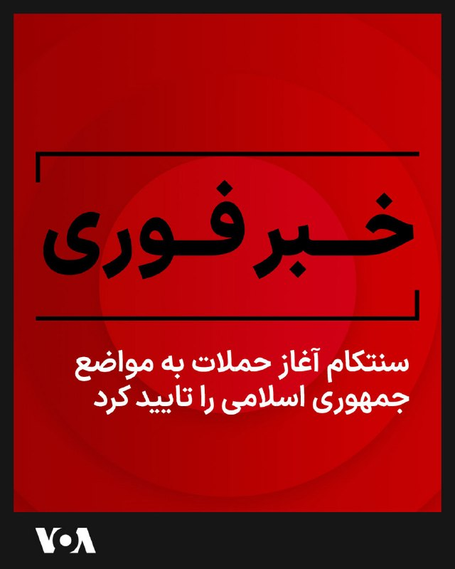

⚡️ستاد فرماندهی مرکزی آمریکا تائید کرد که نیروهای آن ساعت ۵:۱۵ بعد از ظهر چهارشنبه به وقت شرق آمریکا، به دستور فرمانده کل قوا، «حملات دفاعی» بیشتری را علیه چندین هدف در ایران آغاز کردند. سنتکام گفت این حملات در پاسخ به تجاوز بی‌اساس و مداوم رژیم ایران انجام می‌شود.
@FarsiVOA

## FarsiVOA — post 220299

  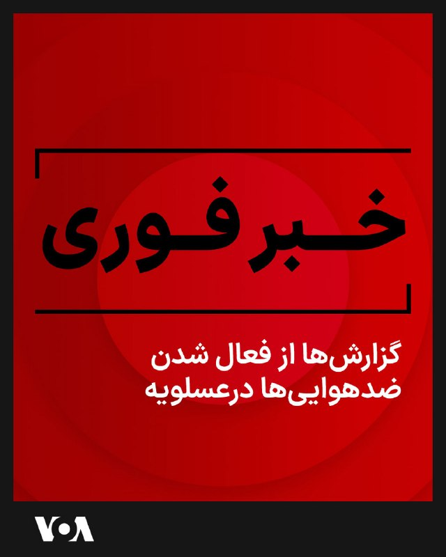

⚡️خبرگزاری حکومتی مهر می‌گوید پدافند عسلویه فعال شده است. این خبرگزاری توضیح بیشتری نداد. تاسیسات مهم انرژی در عسلویه قرار دارد.
@FarsiVOA

## FarsiVOA — post 220298

🔺گزارش‌های مردمی از صدای انفجار در چندین شهر جنوبی ایران

▪️بر اساس گزارش‌های مردمی منتشر شده در کانال وحید‌آنلاین، از ساعت ۱:۰۳ بامداد روز پنج‌شنبه ۲۱ خرداد چندین صدای انفجار شدید در بندرعباس و مناطق اطراف شنیده شده است.

⬇️ بیشتر بخوانید:
https://ir.voanews.com/a/8159454.html
@FarsiVOA

## Persian_Trend_Official — post 16585

  <a href="telegram/content/Persian_Trend_Official_16585_1781128340.mp4" target="_blank">🎬 Download video</a>

⭕️ جت‌های نیروی هوایی ارتش جمهوری اسلامی بر فراز غرب تهران

📝 Nick

📌 @persian_trend_official
پرشین ترند | متفاوت‌ترین کانال نظامی

## Persian_Trend_Official — post 16584

انفجار شدید در کنگان

## Persian_Trend_Official — post 16583

  <a href="telegram/content/Persian_Trend_Official_16583_1781128341.mp4" target="_blank">🎬 Download video</a>

جنگنده های نیروی هوایی ارتش در حال گشت زنی برفراز تهران هستند.

📝 Amir

📌 @persian_trend_official
پرشین ترند | متفاوت‌ترین کانال نظامی

## Persian_Trend_Official — post 16582

گزارش‌هایی از انفجار در عسلویه. میدان گازی پارس جنوبی در این منطقه قرار دارد.

## Persian_Trend_Official — post 16581

صدای انفجار در بوشهر

## Persian_Trend_Official — post 16580

تایید نشده/پدافند شهر قدس تهران

## Persian_Trend_Official — post 16579

انفجار در اهواز.

## Persian_Trend_Official — post 16578

گزارش‌هایی از انفجار در عسلویه.

میدان گازی پارس جنوبی در این منطقه قرار دارد.

## Persian_Trend_Official — post 16577

کانال 12 اسرائیل: ارتش آماده پیوستن به ایالات متحده در کارزار جدید علیه ایران است.

📝 Amir

📌 @persian_trend_official
پرشین ترند | متفاوت‌ترین کانال نظامی

## Persian_Trend_Official — post 16576

  <a href="telegram/content/Persian_Trend_Official_16576_1781128342.webm" target="_blank">🎬 Download video</a>

حنظله:
امشب، نیروی دریایی پنجم ارتش تروریستی آمریکا
به پنجمین قبرستان تبدیل خواهد شد…
به‌زودی متوجه خواهید شد…

فقط چند ساعت مانده است…

بیایید بازی را شروع کنیم

## Persian_Trend_Official — post 16574

  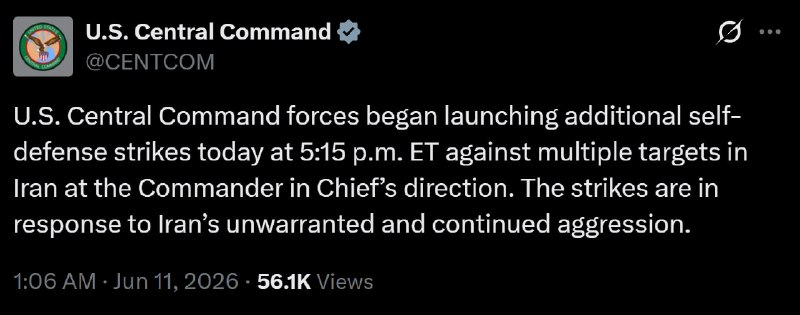

⭕️ نیروهای فرماندهی مرکزی ایالات متحده امروز ساعت ۵:۱۵ بعد از ظهر به وقت شرق آمریکا، به دستور فرمانده کل قوا، حملات دفاع شخصی بیشتری را علیه چندین هدف در ایران آغاز کردند. این حملات در پاسخ به تجاوز بی‌اساس و مداوم ایران انجام می‌شود.

📝 Nick

📌 @persian_trend_official
پرشین ترند | متفاوت‌ترین کانال نظامی

## IranianMinds — post 22179

🔴 الجزیره:
اسرائیل هم امشب به ایران حمله کرده و تو عملیات حضور داره.

@IranianMinds

## IranianMinds — post 22178

  <a href="telegram/content/IranianMinds_22178_1781128343.mp4" target="_blank">🎬 Download video</a>

جنگنده های ارتش بر فراز تهران

@IranianMinds

## IranianMinds — post 22177

🔴صدای چند انفجار در بندر کنگان شنیده شده.

@IranianMinds

## IranianMinds — post 22176

🔴 مقام آمریکایی: تمرکز حملات تو این مرحله به اطراف و دامنهٔ تنگه هرمزه. این حملات تشدید می‌شن و صدها تارگت رو مورد حمله قرار می‌دیم.

@IranianMinds

## IranianMinds — post 22175

باز مثل دیشب همه دارن میپرن به هم

حملات اسرائیل به‌ حزب‌الله لبنان

@IranianMinds

## IranianMinds — post 22174

🔴طبق گزارشات، پایگاه دریایی سپاه پاسداران در سیریک مورد حمله قرار گرفته.

@IranianMinds

## IranianMinds — post 22173

  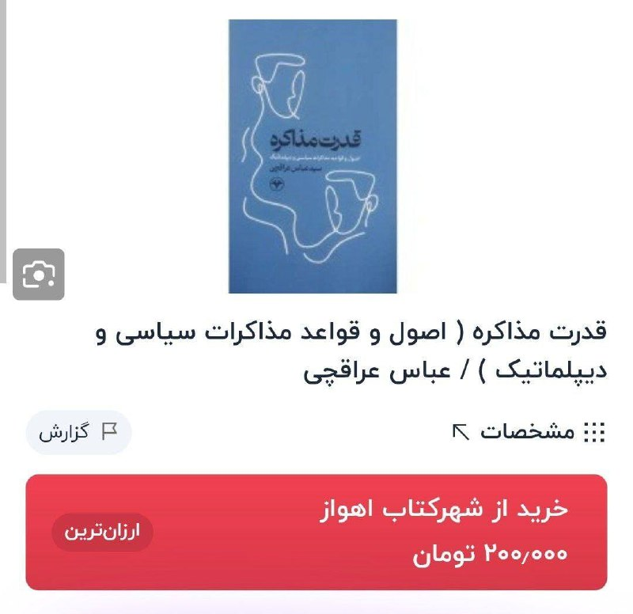

😉 حتما بخرید
رضایت مشتری رو دارید میبینید

@IranianMinds

## IranianMinds — post 22172

🔴انفجار در کارخانه پتروشیمی در عسلویه

@IranianMinds

## Dirty_Kids — post 391633

  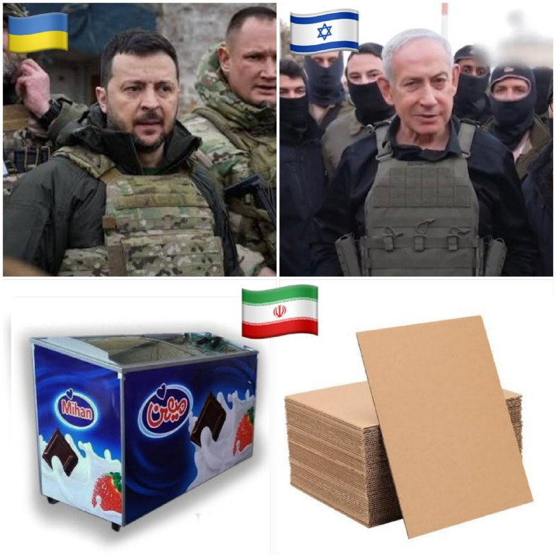

رهبران کشورهای مختلف در زمان جنگ:

@Dirty_Kids 👻

## Dirty_Kids — post 391632

  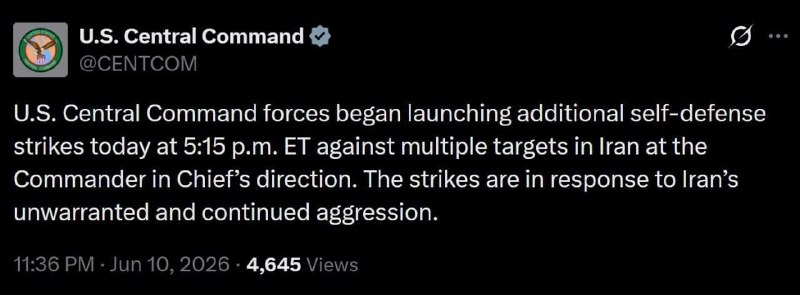

سنتکام نوشت: «نیروهای فرماندهی مرکزی ایالات متحده، امروز ساعت ۵:۱۵ بعدازظهر به وقت شرق آمریکا، به دستور فرمانده کل قوا، حملات دفاعی بیشتری را علیه چندین هدف در ایران آغاز کردند. این حملات در پاسخ به اقدامات تهاجمی بی‌دلیل و ادامه‌دار حکومت ایران انجام می‌شود.»

@Dirty_Kids 👻

## alonews — post 126999

  <a href="telegram/content/alonews_126999_1781128345.mp4" target="_blank">🎬 Download video</a>

👈قدرتنمایی جنگنده‌های ارتش جمهوری اسلامی بر فراز تهران

✅ @AloNews خبر جنگ

## alonews — post 126998

  <a href="telegram/content/alonews_126998_1781128346.webm" target="_blank">🎬 Download video</a>

👈طبق گزارش‌ها، پایگاه نیروی دریایی کنگان برای چندمین بار هدف قرار گرفت.

✅ @AloNews خبر جنگ

---
📅 بروزرسانی: 1405/03/21 01:12
---

## VahidOOnLine — post 244790

  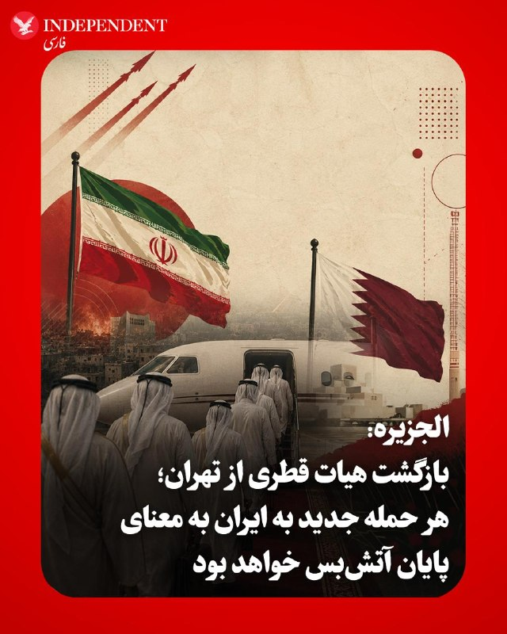

♦️منابع آگاه به الجزیره اعلام کردند هیات میانجی قطری پس از گفتگوها و رایزنی‌های خود تهران را ترک کرده است. علی هاشم، خبرنگار الجزیره، چهارشنبه ۲۰ خردادماه به نقل از این منابع گزارش داد که همچنان برخی اختلاف‌ها بر سر متن نهایی توافق و تغییرات اعمال‌شده از سوی آمریکا باقی مانده است.
این منابع همچنین هشدار دادند هرگونه حمله جدید به ایران عملا به معنای پایان اجرای آتش‌بس خواهد بود. بر اساس این گزارش، میانجی‌ها در تلاش‌اند از بروز درگیری و تنش جدید جلوگیری کنند.
‌🇸🇦 Indypersian

🤖 @VahidOOnLine

## VahidOOnLine — post 244789

  

خبرگزاری‌های داخلی گزارش دادند که صدای انفجار در شهرهای مختلف شنیده شد. در غرب تهران و عسلویه پدافند هوایی فعال شد و در سیریک و میناب صدای انفجارهایی شنیده شده است.
‌🏁 🇬🇧 IranintlTV

🤖 @VahidOOnLine

## VahidOOnLine — post 244788

  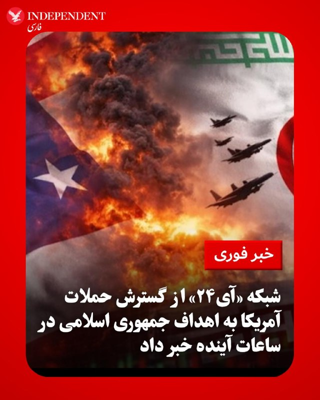

♦️شبکه «آی۲۴» بامداد پنجشنبه ۲۱ خردادماه گزارش داد نیروی هوایی ایالات متحده انتظار می‌رود در ساعات آینده حملاتی را علیه طیف گسترده‌تری از اهداف جمهوری اسلامی انجام دهد.

این گزارش پس از آن منتشر شد که پیت هگست، وزیر جنگ آمریکا، اعلام کرد فرماندهی مرکزی ایالات متحده (سنتکام) که هدایت عملیات نظامی آمریکا در خاورمیانه را بر عهده دارد، «امشب مشغول خواهد بود.» هگست همچنین گفت جمهوری اسلامی همچنان فرصت دستیابی به توافق را دارد، اما در صورت ادامه بن‌بست، حملات آمریکا ادامه خواهد یافت و افزود: «اگر لازم باشد با استفاده از بمب مذاکره کنیم، با استفاده از بمب مذاکره خواهیم کرد.»
‌🇸🇦 Indypersian

🤖 @VahidOOnLine

## WithYashar — post 14406

سنتکام: نیروهای فرماندهی مرکزی ایالات متحده امروز ساعت ۵:۱۵ بعدازظهر به وقت شرقی، به دستور فرمانده کل قوا، حملات دفاعی اضافی را علیه چندین هدف در ایران آغاز کردند. این حملات در پاسخ به تجاوزات بی‌دلیل و مداوم ایران انجام شده است.
@withyashar

## WithYashar — post 14405

العربیه: پدافند هوایی در «عسلویه» در استان بوشهر فعال شد.
@withyashar

## WithYashar — post 14404

بندرعباس زیر زارتان زورتان شدید
@withyashar

## WithYashar — post 14403

فارس تایید کرد : شنیده شدن صدای انفجار در سیریک و قشم

دقایقی پیش صدای انفجارهایی در قشم و سیریک به گوش رسید؛ همزمان پدافند هوایی در قشم شروع به فعالیت کرده است.
@withyashar

## WithYashar — post 14402

ادعای اکسیوس: حمله آمریکا به ایران آغاز شده
@withyashar

## WithYashar — post 14401

تسنیم : تاکنون صدای ۴ انفجار در سیریک شنیده شده است
@withyashar

## WithYashar — post 14400

تسنیم : تاکنون صدای ۴ انفجار در سیریک شنیده شده است
@withyashar

## WithYashar — post 14399

گزارش شلیک موشک از غرب کشور
@withyashar

## WithYashar — post 14398

🚨🚨🚨🚨🚨

وزیرجنگ آمریکا از آغاز حمله به ایران خبر داد.
@withyashar

## WithYashar — post 14397

صدای انفجار بندر عباس 🚨
@withyashar

## mwarmonitor — post 10666

🔴نیروهای فرماندهی مرکزی ایالات متحده (سنتکام) امروز ساعت ۵:۱۵ بعدازظهر به وقت شرق آمریکا، به دستور فرمانده کل قوا، اجرای حملات دفاعی اضافی علیه چندین هدف در ایران را آغاز کردند. این حملات در پاسخ به تجاوزات بی‌دلیل و مستمر ایران انجام شده است.

@mwarmonitor

## mwarmonitor — post 10665

🔴یک مقام ارشد آمریکایی تأیید می‌کند: حملات به ایران آغاز شده است.

@mwarmonitor

## mwarmonitor — post 10664

شنیده شدن دو انفجار در بندرعباس.

## mwarmonitor — post 10663

🔴فعال شدن سامانه‌های پدافند هوایی در شهر عسلویه .

@mwarmonitor

## pm_afshaa — post 93421

انفجار در کارخانه پتروشیمی در عسلویه

💧 Rainbet.com the #1 Non-KYC Crypto Casino & Sportsbook @rainbetcom

😁 @Pm_Afshaa

## pm_afshaa — post 93420

  <a href="telegram/content/pm_afshaa_93420_1781127750.webm" target="_blank">🎬 Download video</a>

🔴سنتکام:
نیروهای فرماندهی مرکزی ایالات متحده حملات خود را از ساعت 5:15 بعد از ظهر امروز آغاز کردند. ET علیه اهداف متعدد در ایران به دستور فرمانده کل قوا. این حملات در پاسخ به تجاوزات بی دلیل و ادامه دار ایران است.

💧 Rainbet.com the #1 Non-KYC Crypto Casino & Sportsbook @rainbetcom

😁 @Pm_Afshaa

## pm_afshaa — post 93419

یک مقام ارشد آمریکایی تایید کرد که حملات به ایران آغاز شده.

💧 Rainbet.com the #1 Non-KYC Crypto Casino & Sportsbook @rainbetcom

😁 @Pm_Afshaa

## pm_afshaa — post 93418

باراک راوید، خبرنگار آکسیوس:
حملات آمریکا آغاز شده.

💧 Rainbet.com the #1 Non-KYC Crypto Casino & Sportsbook @rainbetcom

😁 @Pm_Afshaa

## pm_afshaa — post 93417

پدافند عسلویه فعال

💧 Rainbet.com the #1 Non-KYC Crypto Casino & Sportsbook @rainbetcom

😁 @Pm_Afshaa

## pm_afshaa — post 93416

انفجار در بندر عباس

💧 Rainbet.com the #1 Non-KYC Crypto Casino & Sportsbook @rainbetcom

😁 @Pm_Afshaa

## pm_afshaa — post 93415

  <a href="telegram/content/pm_afshaa_93415_1781127751.webm" target="_blank">🎬 Download video</a>

🔴تسنیم: تا الان 4 صدا در سیریک شنیده شده.

💧 Rainbet.com the #1 Non-KYC Crypto Casino & Sportsbook @rainbetcom

😁 @Pm_Afshaa

## pm_afshaa — post 93414

رسانه‌های اسرائیلی از آغار حملات خبر دادن.

💧 Rainbet.com the #1 Non-KYC Crypto Casino & Sportsbook @rainbetcom

😁 @Pm_Afshaa

## pm_afshaa — post 93413

میگن از تبریز موشک شلیک شده
صبر کنید تا تایید بشه

💧 Rainbet.com the #1 Non-KYC Crypto Casino & Sportsbook @rainbetcom

😁 @Pm_Afshaa

## pm_afshaa — post 93412

  <a href="telegram/content/pm_afshaa_93412_1781127752.webm" target="_blank">🎬 Download video</a>

🔴تسنیم: براساس گزارش منابع محلی، دقایقی پیش صدای انفجار در اطراف میناب و سیریک شنیده شد.

💧 Rainbet.com the #1 Non-KYC Crypto Casino & Sportsbook @rainbetcom

😁 @Pm_Afshaa

## DEJradio — post 5564

⭕️ واشینگتن شبکهٔ چینی تأمین سلاح برای سپاه را هدف گرفت

وزارت خزانه‌داری آمریکا ۱۱ فرد و شرکت در چین و هنگ‌کنگ را به اتهام همکاری در تأمین سلاح و تجهیزات برای سپاه پاسداران و وزارت دفاع جمهوری اسلامی تحریم کرد.
واشینگتن اعلام‌‌ کرد این شبکه در انتقال پول و خرید تجهیزات نظامی برای جمهوری اسلامی نقش داشت.
به گفتهٔ وزارت خزانه‌داری آمریکا، این تحریم‌ها بخشی از کارزار فشار اقتصادی علیه حکومت جمهوری اسلامی است.

#خبر #دژ #تحریم #چین #سپاه_تروریستی_پاسداران
@DEJradio

## DEJradio — post 5563

⭕️ ترامپ گفت آمریکا با کنترل هرمز عبور بیش از ۱۰۰ میلیون بشکه نفت را تضمین کرد

دونالد ترامپ اعلام کرد نیروهای آمریکایی از ماه پیشین امنیت عبور بیش از ۱۰۰ میلیون بشکه نفت و ۲۰۰ کشتی تجاری را از تنگهٔ هرمز تأمین کردند.
رئیس جمهوری آمریکا گفت این عملیات عبور دادن کشتی‌ها بر اساس یک مأموریت محرمانه انجام شد.
او تأکید کرد به‌خلاف ادعای رژیم حاکم بر ایران، کنترل تنگهٔ هرمز در اختیار آمریکا قرار دارد و در کنترل جمهوری اسلامی نیست.

#خبر #دژ #تنگه_هرمز
@DEJradio

## DEJradio — post 5562

  <a href="telegram/content/DEJradio_5562_1781127753.webm" target="_blank">🎬 Download video</a>

🚨
⭕️ رسانه‌های وابسته به حکومت بامداد پنج‌شنبه از شنیده شدن صدای انفجار در غرب تهران و سیریک در استان هرمزگان خبر دادند.

#خبر #دژ #حمله
@DEJradio

## VahidOnline — post 76166

پیام‌های دریافتی:
ساعت ۱:۰۳ بندرعباس صدای انفجار شدید اومد

بندرکرگان شهرستان میناب، رو با موشک زد
همین الان
پاسگاه دریابانی رو زد

صدای دو انفجار در بندرعباس همین الان

سلام ساعت همین الان انفجار شدید در بندرعباس ساعت ۱:۴ دقیقه

وحید از ساعت ۱:۰۳ دقیقه بامداد
چهار تا انفجار بندرعباس

سلام وحید،صدای چند انفجار همین الان بندرعباس

سلام. همین الان صدای انفجار شدید، بندرعباس، ساعت یک و سه دقیقه شب
صدای انفجارهای ممتد میاد

صدای انفجار بندرعباس

بندر عباس فکر کنم سه تا انفجار با فاصله چند ثانیه

صدای انفجار بازم میاد میناب نوار ساحلی

انفجار دوباره

سلام،وحید جان بندرو زدننن من لرزیدمم

همین الان صدای انفجار بندرعباس دو الی سه تا صدا اومد

انفجارها داره زیاد و قوی‌تر میشه، بندرعباس ساعت یک و شش دقیقه شب

سلام‌وحید جان بندرعباس همین الان ۱:۰۵ دقیقه صدای انفجار اومد

سلام وحید جان
همین الان ۱:۰۶صدای انفجار داره میاد بندرعباس
پنجره خونمون لرزید

درود درگهان همی پنچره ها لرزید

سلام اقا وحید ۰۱:۰۶ دقیقه بندرعباس الان یه صدای بزرگ انفجار که مرکز شهر شنیده شد

📡 @VahidOnline

## kianmeli1 — post 87896

🔴فوری-بندرعباس زیر آتش
https://t.me/kianmeli1

## kianmeli1 — post 87895

  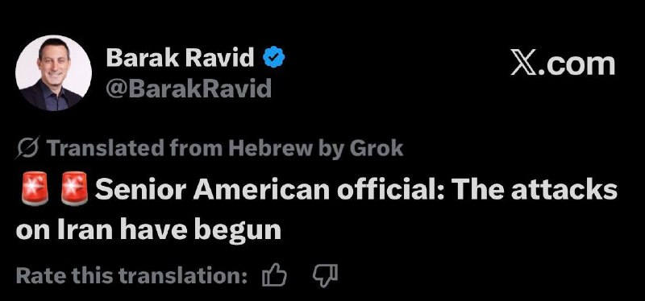

🔴فوری

شروع حمله نظامی ایالات متحده علیه اهداف درون ایران
https://t.me/kianmeli1

## IranIntlTV — post 341588

  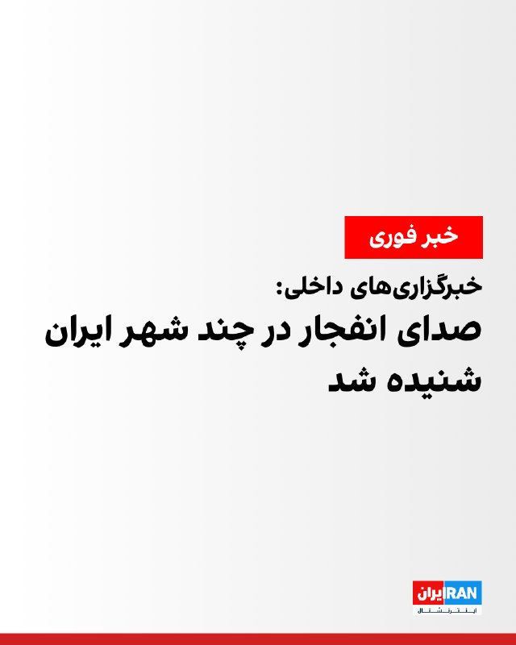

خبرگزاری‌های داخلی گزارش دادند که صدای انفجار در شهرهای مختلف شنیده شد. در غرب تهران و عسلویه پدافند هوایی فعال شد و در سیریک و میناب صدای انفجارهایی شنیده شده است.
https://iranintl.com/202606109695

## Shin_Persian — post 6883

Shin ✓ @hey_itsmyturn
Wed, 10 Jun 2026 21:41:18 UTC

AA activity in Asaluyeh, Bushehr Province, #Iran

ترجمه خودکار فارسی

فعالیت پدافند هوایی در عسلویه، استان بوشهر، #Iran

𝕏 · @shin_persian

## Shin_Persian — post 6882

Shin ✓ @hey_itsmyturn
Wed, 10 Jun 2026 21:38:07 UTC

Several blasts was heard in Bandar Abbas (presumably same blasts that were heard in Qeshm)
Hormozgan Province, #Iran

ترجمه خودکار فارسی

چندین انفجار در بندرعباس شنیده شد (احتمالاً همان انفجارهایی است که در قشم شنیده شده بود)
استان هرمزگان، #Iran_

𝕏 · @shin_persian

## Shin_Persian — post 6881

Shin ✓ @hey_itsmyturn
Wed, 10 Jun 2026 21:37:33 UTC

U.S. Central Command says it began self-defense strikes against multiple targets in Iran at 5:15 p.m. ET today, at the Commander in Chief’s direction, in response to Iran’s what it calls unwarranted and continued aggression.

ترجمه خودکار فارسی

فرماندهی مرکزی ایالات متحده (سنتکام/CENTCOM) اعلام کرد که به دستور فرمانده کل قوا و در پاسخ به آنچه تجاوزات بی‌دلیل و مداوم ایران می‌نامد، حملات دفاع از خود علیه اهداف متعددی در ایران را از ساعت ۲۲۱۵ زولو (۰۱:۴۵ بامداد به وقت تهران) امروز آغاز کرده است.

𝕏 · @shin_persian

## Shin_Persian — post 6880

Shin ✓ @hey_itsmyturn
Wed, 10 Jun 2026 21:35:26 UTC

3 Explosions just now.
Qeshm island, Hormozgan Province, #Iran

ترجمه خودکار فارسی

هم‌اکنون ۳ انفجار.
جزیره قشم، استان هرمزگان، #Iran_

𝕏 · @shin_persian

## Shin_Persian — post 6879

  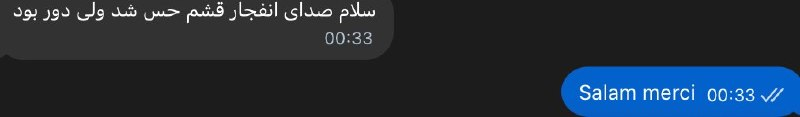

Shin ✓ @hey_itsmyturn
Wed, 10 Jun 2026 21:34:16 UTC

Distant blast was heard in Qeshm island, Hormozgan Province, #Iran

ترجمه خودکار فارسی

صدای انفجاری از دور در جزیره قشم، استان هرمزگان، #Iran شنیده شد.

𝕏 · @shin_persian

## FarsiVOA — post 220297

  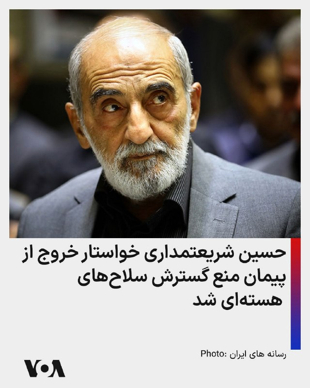

⚡️حسین شریعتمداری، نماینده رهبر جمهوری اسلامی در روزنامه کیهان در مقاله‌ای خواستار خروج حکومت ایران از «پیمان منع گسترش سلاح‌های هسته‌ای» شد. خبرگزاری فارس، وابسته به سپاه، مقاله تازه شریعتمداری را منتشر کرد. دونالد ترامپ، رئیس جمهوری آمریکا گفته است هرگز به جمهوری اسلامی اجازه دستیابی به سلاح هسته‌ای را نمی‌دهد.
@FarsiVOA

## FarsiVOA — post 220296

  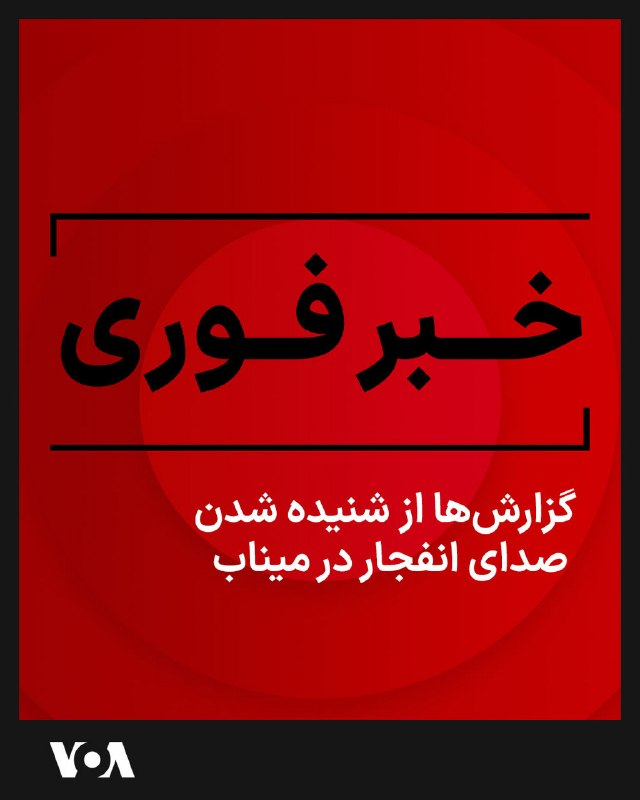

⚡️خبرگزاری مهر از شنیده شدن صدای انفجار در شهر میناب خبر داد. این خبرگزاری حکومتی توضیح بیشتری در این باره منتشر نکرد.
@FarsiVOA

## Persian_Trend_Official — post 16573

پیام ارسالی : بندرعباس صداهای بسیار مهیب اما با فاصله زیاد شنیده میشه

## Persian_Trend_Official — post 16572

  <a href="telegram/content/Persian_Trend_Official_16572_1781127756.mp4" target="_blank">🎬 Download video</a>

یک پهپاد بر فراز قزوینِ ایران در حال پروازه

## Persian_Trend_Official — post 16571

  <a href="telegram/content/Persian_Trend_Official_16571_1781127757.webm" target="_blank">🎬 Download video</a>

آغاز حملات موشکی سپاه

## Persian_Trend_Official — post 16570

  <a href="telegram/content/Persian_Trend_Official_16570_1781127758.webm" target="_blank">🎬 Download video</a>

پرتاب موشک از استان آذربایجان شرقی، شمال غرب ایران.

## Persian_Trend_Official — post 16569

یک مقام آمریکایی: تا این لحظه، کشتی‌های نیروی دریایی به طور متمرکز در پایگاه سیرک حمله می‌کنند.

## Persian_Trend_Official — post 16568

کانال ۱۲ اسرائیل: ارتش اسرائیل برای آمادگی جهت مقابله با احتمال درگیری مجدد با ایران، سطح هشدار خود را افزایش داده است.

## Persian_Trend_Official — post 16567

تایید نشده بمباران تأسیسات نفتی جنوب کشور

## IranianMinds — post 22171

🔴 طبق گزارشات اطراف اسکله باهنر در بندرعباس زدن

@IranianMinds

## IranianMinds — post 22169

سنتکام بیانیه داد این حملات دفاعیه😐😐😐😐😐 @IranianMinds

## IranianMinds — post 22168

سنتکام بیانیه داد این حملات دفاعیه😐😐😐😐😐

@IranianMinds

## IranianMinds — post 22167

🔴 ظاهرا به پاسگاه دریابانی شهرستان میناب حمله شده

@IranianMinds

## IranianMinds — post 22166

🔴 صدا و سیما:
پدافند عسلویه فعال شده است

@IranianMinds

## IranianMinds — post 22165

🔴اکسیوس:
آمریکا حملات خود را آغاز کرده است

@IranianMinds

## IranianMinds — post 22164

🔴 گزارشاتی از انفجار در بندرعباس

@IranianMinds

## IranianMinds — post 22163

🔴شلیک موشک از تبریز

@IranianMinds

## Dirty_Kids — post 391631

هم‌اکنون؛

گزارش شهروندان از وقوع انفجارهای متعدد در بندرعباس حکایت دارد.

## Dirty_Kids — post 391630

روافض از آذربایجان شرقی آبگرمکن ول دادن.

## Dirty_Kids — post 391629

🚨 وزیرجنگ آمریکا از آغاز حمله به ایران خبر داد.

@Dirty_Kids 👻

## Dirty_Kids — post 391628

  <a href="telegram/content/Dirty_Kids_391628_1781127759.webm" target="_blank">🎬 Download video</a>

🔴هم اکنون صدای انفجار در قشم و سیریک

🔴کانال ۲۴ اسرائیل: شروع شد💥

🔴فعالیت پدافند شیراز

## alonews — post 126997

  <a href="telegram/content/alonews_126997_1781127759.webm" target="_blank">🎬 Download video</a>

👈چندین انفجار در بندرعباس

✅ @AloNews خبر جنگ

## alonews — post 126996

  <a href="telegram/content/alonews_126996_1781127760.webm" target="_blank">🎬 Download video</a>

👈سنتکام:
نیروهای فرماندهی مرکزی ایالات متحده امروز ساعت ۵:۱۵ بعد از ظهر به وقت شرق آمریکا، به دستور فرمانده کل قوا، حملات دفاع شخصی بیشتری را علیه چندین هدف در ایران آغاز کردند. این حملات در پاسخ به تجاوز بی‌دلیل و مداوم ایران انجام می‌شود.

✅ @AloNews خبر جنگ

## alonews — post 126995

  <a href="telegram/content/alonews_126995_1781127760.webm" target="_blank">🎬 Download video</a>

👈کانال ۱۲ اسرائیل: ارتش آماده پیوستن به ایالات متحده در کارزار جدید علیه ایران است

✅ @AloNews خبر جنگ

## alonews — post 126994

  <a href="telegram/content/alonews_126994_1781127760.webm" target="_blank">🎬 Download video</a>

🔴فووووری و رسمی/حملات آمریکا شروع شد

✅ @AloNews خبر جنگ

## alonews — post 126993

  <a href="telegram/content/alonews_126993_1781127760.webm" target="_blank">🎬 Download video</a>

👈پدافند عسلویه فعال شد

✅ @AloNews خبر جنگ

## alonews — post 126992

  <a href="telegram/content/alonews_126992_1781127761.webm" target="_blank">🎬 Download video</a>

👈رسایی: اینترنت رو فورا قطع کنید

✅ @AloNews خبر جنگ

## alonews — post 126991

  <a href="telegram/content/alonews_126991_1781127761.webm" target="_blank">🎬 Download video</a>

🔴فوری/گزارش شلیک موشک از غرب کشور

✅ @AloNews خبر جنگ

---
📅 بروزرسانی: 1405/03/21 01:02
---

## VahidOOnLine — post 244787

  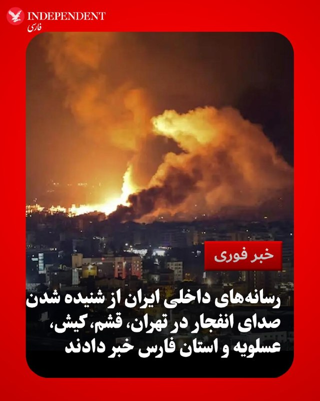

♦️رسانه‌های داخلی ایران بامداد پنجشنبه ۲۱ خردادماه از شنیده شدن صداهای انفجار و فعالیت پدافند هوایی در چند نقطه کشور خبر دادند.

خبرگزاری مهر از شنیده شدن صدای پدافند در غرب تهران و صداهای نامشخص در کیش خبر داد. همچنین گزارش‌هایی از شنیده شدن صدایی شبیه انفجار در استان فارس و مناطقی در قشم و عسلویه منتشر شده است.

تا زمان انتشار این گزارش، مقام‌های رسمی درباره منشا این صداها توضیحی ارائه نکرده‌اند.
‌🇸🇦 Indypersian

🤖 @VahidOOnLine

## WithYashar — post 14396

فعالیت پدافند شیراز 🚨
@withyashar

## WithYashar — post 14395

گزارش انفجار ‌میناب 🚨
@withyashar

## WithYashar — post 14394

کانال ۲۴ اسرائیل: شروع شد💥
@withyashar

## WithYashar — post 14393

قشم صدای انفجار 🚨
@withyashar

## WithYashar — post 14392

صدای انفجار‌ در سیریک 🚨
@withyashar

## WithYashar — post 14391

پدافند تهران فعال شد 🚨
@withyashar

## WithYashar — post 14390

  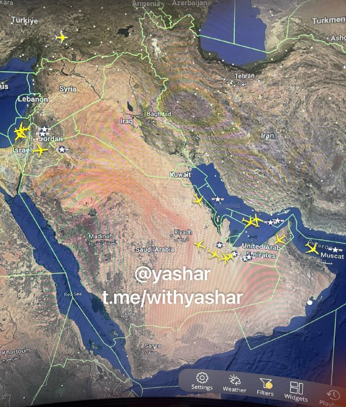

این تعداد سوخترسان فقط یعنی چندین اسکادران جنگنده و جنگ حتمی.
@withyashar

## mwarmonitor — post 10662

انفجار در میناب

## mwarmonitor — post 10661

انفجار در سیریک

## mwarmonitor — post 10660

🔴شبکه ۱۲ اسرائیل: ارتش اسرائیل سطح آماده‌باش خود را افزایش داده است تا برای احتمال ازسرگیری درگیری با ایران آماده باشد.

@mwarmonitor

## pm_afshaa — post 93411

انفجار مجدد در سیریک

💧 Rainbet.com the #1 Non-KYC Crypto Casino & Sportsbook @rainbetcom

😁 @Pm_Afshaa

## pm_afshaa — post 93410

حملات آمریکا به جنوب کشور شروع شده

💧 Rainbet.com the #1 Non-KYC Crypto Casino & Sportsbook @rainbetcom

😁 @Pm_Afshaa

## pm_afshaa — post 93409

سیریک و میناب انفجار شنیده شده

💧 Rainbet.com the #1 Non-KYC Crypto Casino & Sportsbook @rainbetcom

😁 @Pm_Afshaa

## pm_afshaa — post 93408

  <a href="telegram/content/pm_afshaa_93408_1781127147.webm" target="_blank">🎬 Download video</a>

🔴شبکه 12 اسرائیل: ارتش اسرائیل سطح آماده‌باش خودش رو افزایش داده تا برای احتمال ازسرگیری درگیری با جمهوری اسلامی آماده باشه.

💧 Rainbet.com the #1 Non-KYC Crypto Casino & Sportsbook @rainbetcom

😁 @Pm_Afshaa

## pm_afshaa — post 93407

صدای انفجار در سیریک

💧 Rainbet.com the #1 Non-KYC Crypto Casino & Sportsbook @rainbetcom

😁 @Pm_Afshaa

## pm_afshaa — post 93406

  <a href="telegram/content/pm_afshaa_93406_1781127147.webm" target="_blank">🎬 Download video</a>

🔴طبق گزارش‌ها، انفجار های دور در جنوب کشور شنیده میشه.

💧 Rainbet.com the #1 Non-KYC Crypto Casino & Sportsbook @rainbetcom

😁 @Pm_Afshaa

## pm_afshaa — post 93405

فرودگاه‌های عراق فعالیت رو متوقف کردن.

💧 Rainbet.com the #1 Non-KYC Crypto Casino & Sportsbook @rainbetcom

😁 @Pm_Afshaa

## pm_afshaa — post 93404

مهر: شنیده شدن صدای پدافند در غرب تهران

💧 Rainbet.com the #1 Non-KYC Crypto Casino & Sportsbook @rainbetcom

😁 @Pm_Afshaa

## VahidOnline — post 76165

خبرگزاری مهر، وابسته به سازمان تبلیغات اسلامی، بدون هیچ توضیح بیشتری نوشته:
شنیده شدن صدای انفجار در سیریک

خبرگزاری تسنیم وابسته به سپاه نوشته:
بررسی‌ها نشان می‌دهد که تا این لحظه اخبار مربوط به صدای انفجار در جزایر کیش و قشم صحت نداشته و صداهای شنیده شده مرتبط با درگیری در خلیج‌فارس است.

براساس گزارش منابع محلی، دقایقی پیش صدای انفجار در اطراف میناب و سیریک شنیده شد.

📡 @VahidOnline

## kianmeli1 — post 87894

🔴فوری-انفجارهای پیاپی در جنوب کشور
https://t.me/kianmeli1

## kianmeli1 — post 87893

🔴فوری-انفجار در میناب
https://t.me/kianmeli1

## kianmeli1 — post 87892

🔴فوری

انفجار در قشم و سیریک
https://t.me/kianmeli1

## kianmeli1 — post 87891

🔴فوری-یگان های موشکی سپاه به حالت آماده باش در آمده اند
https://t.me/kianmeli1

## IranIntlTV — post 341587

  <a href="telegram/content/IranIntlTV_341587_1781127148.mp4" target="_blank">🎬 Download video</a>

مراد ویسی، تحلیل‌گر ارشد ایران‌اینترنشنال، گفت: «جمهوری اسلامی منصب حکومت را بدون رضایت اکثریت مردم اشغال کرده است. پرسشی که هیچ‌یک از مقام‌های جمهوری اسلامی پاسخی برای آن ندارند این است که اگر مردم آنها را نخواهند، که نمی‌خواهند، چگونه باید این را به حکومت بگویند و حق خود را به‌عنوان صاحبان اصلی حکومت اعمال کنند.»
@iranintltv

## Shin_Persian — post 6878

Shin ✓ @hey_itsmyturn
Wed, 10 Jun 2026 21:30:18 UTC

NOW -
BM Launch from East Azerbaijan Province, #Iran

ترجمه خودکار فارسی

فوری -
شلیک موشک بالستیک از استان آذربایجان شرقی، #Iran_

𝕏 · @shin_persian

## Shin_Persian — post 6877

Shin ✓ @hey_itsmyturn
Wed, 10 Jun 2026 21:27:59 UTC

2 blasts in Sirik, Hormozgan Province, #Iran

ترجمه خودکار فارسی

۲ انفجار در سیریک، استان هرمزگان، #Iran

𝕏 · @shin_persian

## Shin_Persian — post 6876

Shin ✓ @hey_itsmyturn
Wed, 10 Jun 2026 21:24:58 UTC

Huge blast near Minab @ ~ 2118Z
Hormozgan Province, #Iran

ترجمه خودکار فارسی

انفجار مهیب نزدیکی میناب @ حدود ۲۱۱۸ زولو (۰۰:۴۸ به وقت تهران)
استان هرمزگان، #Iran

𝕏 · @shin_persian

## FarsiVOA — post 220295

  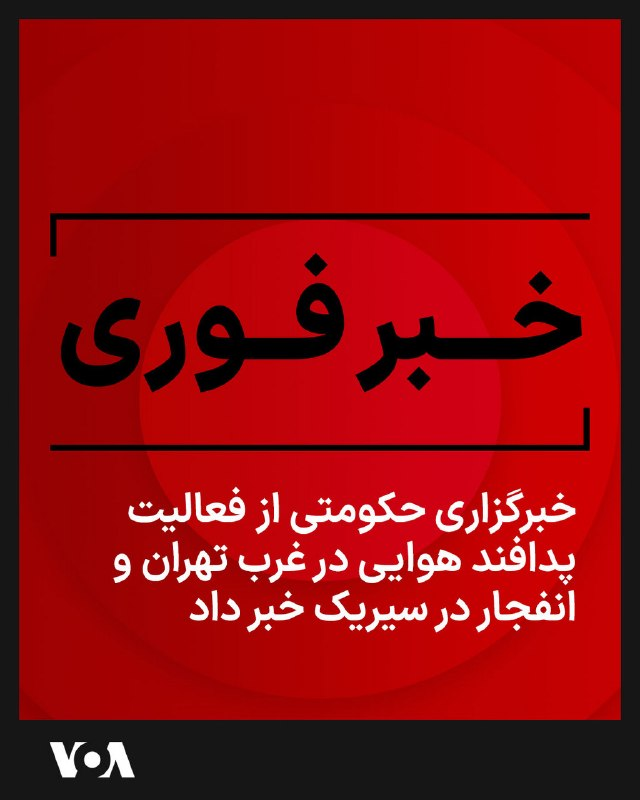

⚡️خبرگزاری حکومتی مهر از شنیده شدن صدای پدافند هوایی در غرب تهران و همچنین انفجار سیریک واقع استان هرمزگان خبر داد.
@FarsiVOA

## FarsiVOA — post 220294

⚡️منشه امیر در برنامه تفسیر خبر: روح الله خمینی با شعار مرگ بر اسرائیل آغاز گر این جنگ بود
@FarsiVOA

## Persian_Trend_Official — post 16566

  <a href="telegram/content/Persian_Trend_Official_16566_1781127150.webm" target="_blank">🎬 Download video</a>

بمباران شدید میناب و سیریک

## Persian_Trend_Official — post 16565

  <a href="telegram/content/Persian_Trend_Official_16565_1781127150.webm" target="_blank">🎬 Download video</a>

صدای انفجار در میناب نیز شنیده شده

## Persian_Trend_Official — post 16564

پدافند اطراف زیر ساخت پتروشیمی‌های عسلویه درحال فعالیت شدید

## Persian_Trend_Official — post 16563

  <a href="telegram/content/Persian_Trend_Official_16563_1781127151.webm" target="_blank">🎬 Download video</a>

پیت هگست، وزیر جنگ آمریکا: امشب شب شلوغی خواهد بود، تاسیسات ایران را بمباران می‌کنیم.

## Persian_Trend_Official — post 16562

  <a href="telegram/content/Persian_Trend_Official_16562_1781127151.webm" target="_blank">🎬 Download video</a>

صدای انفجار در سیریک نیز شنیده شده! 📝 Amir 📌 @persian_trend_official پرشین ترند | متفاوت‌ترین کانال نظامی

## Persian_Trend_Official — post 16561

تایید نشده
انفجار در تبریز

## Persian_Trend_Official — post 16560

  <a href="telegram/content/Persian_Trend_Official_16560_1781127152.webm" target="_blank">🎬 Download video</a>

فرودگاه های عراق فعالیت خود را متوقف کردند.

## Persian_Trend_Official — post 16558

## Persian_Trend_Official — post 16557

یک دسته از تانکرهای نیروی هوایی ایالات متحده از تل‌آویو و ریاض در اطراف تنگه هرمز و خلیج فارس فعال هستند، همه آن‌ها قابل مشاهده نیستند و همراه با جنگنده‌ها در حال حرکت‌اند.

## Persian_Trend_Official — post 16556

صدای انفجار در سیریک نیز شنیده شده!

📝 Amir

📌 @persian_trend_official
پرشین ترند | متفاوت‌ترین کانال نظامی

## Persian_Trend_Official — post 16555

صدای انفجار در قشم فعلا بر مبنای فعالیت پدافندی است.

## Persian_Trend_Official — post 16554

غرب تهران

## IranianMinds — post 22162

🔴 شلیک موشک‌ از اذربایجان شرقی

@IranianMinds

## IranianMinds — post 22161

🔴 مکان هایی که تا الان انفجار رخ داده

- کیش
- قشم
- سیریک
- میناب

@IranianMinds

## IranianMinds — post 22160

🔴 کانال ۱۲ اسرائیل :

آمریکا حملات خودشو‌ به ایران شروع کرده

@IranianMinds

## IranianMinds — post 22158

رسما حملات آمریکا به جنوب کشور شروع شده
باید ببینیم به پایتخت و شهر های دیگه میکشه این حملات یا چی

@IranianMinds

## IranianMinds — post 22156

🔴 گزارشاتی از حمله به میناب

@IranianMinds

## IranianMinds — post 22155

🔴 حملات مجدد آمریکا به نزدیکی‌ کیش

@IranianMinds

## IranianMinds — post 22154

۲ انفجار مهیب در سیریک رخ داده

@IranianMinds

## IranianMinds — post 22153

🔴 گزارشاتی از انفجار در قشم و سیریک @IranianMinds

## IranianMinds — post 22152

🔴 پرواز جنگنده های ارتش اسرائیل در آسمان اردن

@IranianMinds

## IranianMinds — post 22151

🔴 گزارشاتی از انفجار در قشم و سیریک

@IranianMinds

## IranianMinds — post 22150

همچنان پرواز جنگنده های آمریکا در آسمان عراق

@IranianMinds

## BBCPersian — post 283366

با افزایش دوباره تنش میان آمریکا و اسرائیل با ایران و در ابهام فرو رفتن سرنوشت آتش‌بس میان آنها، نگرانی‌ها در لبنان هم از شعله‌ورتر شدن آتش جنگ بیشتر شده است. از طرفی حملات اسرائیل بر جنوب لبنان هم شدت پیدا کرده است.

این درحالی است که قرارگاه خاتم الانبیا در بیانیه اخیرش گفته بود که ادامه حملات بر جنوب لبنان می‌تواند با پاسخ سخت ایران مواجه شود.

با همه اینها سفیر ایران در لبنان که هنوز اعتبارنامه نگرفته، در جمع خبرنگاران به بی‌بی‌سی فارسی گفت که «اوضاع را مثبت ارزیابی می‌کند».

نفیسه کوهنورد خبرنگار ارشد خاورمیانه بی‌بی‌سی فارسی از بیروت از آخرین‌ها می‌گوید:

@BBCPersian

## Dirty_Kids — post 391627

خبرگزاری مهر از شنیده شدن صدای انفجار در سیریک هرمزگان و فعالیت پدافند در غرب تهران خبر داد.

@Dirty_Kids 👻

## alonews — post 126990

🔴فوووووووری/زود بیایید اینجا
⬇️

https://t.me/+4Sqp5RRoEUE5ZGM0
https://t.me/+4Sqp5RRoEUE5ZGM0

## alonews — post 126989

  <a href="telegram/content/alonews_126989_1781127152.webm" target="_blank">🎬 Download video</a>

👈خط ساحل جنوبی ایران زیر آتش

✅ @AloNews خبر جنگ

## alonews — post 126988

  <a href="telegram/content/alonews_126988_1781127152.webm" target="_blank">🎬 Download video</a>

👈انفجار مهیب در میناب

✅ @AloNews خبر جنگ

## alonews — post 126987

  <a href="telegram/content/alonews_126987_1781127152.webm" target="_blank">🎬 Download video</a>

👈گزارشات از انفجار های گسترده در برخی از شهر های جنوبی کشور

✅ @AloNews خبر جنگ

## alonews — post 126985

  <a href="telegram/content/alonews_126985_1781127152.webm" target="_blank">🎬 Download video</a>

🔴فووووووووووووووووووووووووری

## alonews — post 126984

🔴فووووووووووووووووووووووووری

## alonews — post 126983

  <a href="telegram/content/alonews_126983_1781127153.webm" target="_blank">🎬 Download video</a>

🔴فوری/انفجار در سیریک

✅ @AloNews خبر جنگ

---
📅 بروزرسانی: 1405/03/21 00:52
---

## VahidOOnLine — post 244786

  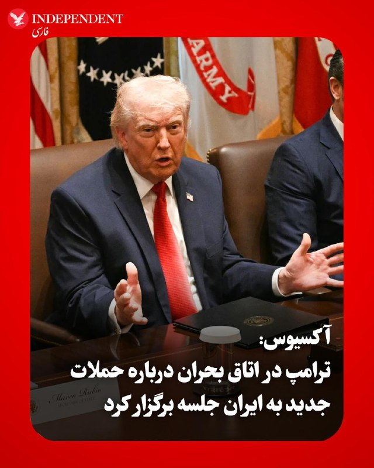

♦️آکسیوس به نقل از دو منبع آمریکایی گزارش داد دونالد ترامپ چهارشنبه شب با مشاوران ارشد خود در اتاق بحران کاخ سفید جلسه‌ای برگزار کرد تا گزینه‌های مربوط به حملات احتمالی جدید علیه ایران را بررسی کند.
این جلسه تنها چند ساعت پس از آن برگزار شد که ترامپ به خبرنگاران گفت ایالات متحده «امروز دوباره و به‌شدت» ایران را هدف قرار خواهد داد. به گفته منابع آگاه، محور اصلی این نشست بررسی گزینه‌های نظامی و حملات احتمالی تازه علیه ایران بوده است.
‌🇸🇦 Indypersian

🤖 @VahidOOnLine

## VahidOOnLine — post 244785

♦️ پیت هگست، وزیر جنگ آمریکا، چهارشنبه عصر به وقت واشینگتن گفت فرماندهی مرکزی ایالات متحده (سنتکام) که هدایت عملیات نظامی آمریکا در خاورمیانه را بر عهده دارد، «امشب مشغول خواهد بود.»

هگست در گفت‌وگو با خبرنگاران در مقر سنتکام در شهر تمپا در ایالت فلوریدا گفت جمهوری اسلامی همچنان فرصت دستیابی به توافق را دارد، اما در صورت ادامه بن‌بست، آمریکا به حملات خود ادامه خواهد داد. او افزود: «اگر لازم باشد با استفاده از بمب مذاکره کنیم، با استفاده از بمب مذاکره خواهیم کرد.»

پیش‌تر، دونالد ترامپ در مراسم امضای قانون «آمریکای امن» در کاخ سفید با اشاره به حملات ارتش آمریکا به مواضع جمهوری اسلامی پس از سرنگونی یک بالگرد آمریکایی گفت: «ما دیروز به جمهوری اسلامی ضربه زدیم، امروز هم به آنها حمله خواهیم کرد.»

رئیس‌جمهوری آمریکا همچنین گفت نیروهای جمهوری اسلامی به قصد نابود کردن این بالگرد به آن حمله کردند، اما به گفته او، خلبانان آمریکایی از این حادثه جان سالم به در بردند و «شناورهای بدون‌سرنشین پیشرفته» آمریکا در نجات آنها نقش داشتند.
‌🇸🇦 Indypersian

🤖 @VahidOOnLine

## WithYashar — post 14389

## WithYashar — post 14388

یاشار : اگه جنگی بشه هم جنگی‌ که بی بی کیک آف نکنه برای ما جنگ نمیشه !
@withyashar

## mwarmonitor — post 10659

پدافند هوایی تهران فعال شد

## mwarmonitor — post 10658

🔴آمریکا برای دومین شب متوالی ایران را بمباران می‌کند؛ هگستِث

📝نوشته: باراک راوید

🔰پیت هگستث، وزیر دفاع آمریکا، به خبرنگاران گفت که ارتش ایالات متحده برای دومین شب پیاپی حملاتی را علیه ایران انجام خواهد داد. مقامات آمریکایی هدف از این اقدام را اعمال فشار بر تهران برای امضای یک توافق اعلام کرده‌اند.

تصویر کلی
مقامات آمریکایی انتظار دارند که ایران دست به اقدام تلافی‌جویانه بزند و احتمالاً مانند سه‌شنبه شب، پایگاه‌های آمریکا را هدف قرار دهد. با این حال، دونالد ترامپ، رئیس‌جمهور آمریکا، تهران را متهم کرده که در مذاکرات «ما را ساده‌لوح فرض کرده است» و به همین دلیل تصمیم گرفت که این وضعیت باید تغییر کند.
محور اخبار
هگستث در جریان بازدید از مقر فرماندهی مرکزی آمریکا (سنتکام) در فلوریدا به خبرنگاران گفت:
«سنتکام امشب سرش شلوغ خواهد بود، چرا که ما ضربه سختی به ایران وارد خواهیم کرد.»
او در ادامه افزود:
«ایران این شانس را دارد که به یک توافق بزرگ دست یابد، اما تا کنون تمایلی به آن نشان نداده است. آن‌ها شاهد فرود پی‌درپی بمب‌های ایالات متحده بر روی تاسیسات کلیدی خود در ایران خواهند بود. هدف از این کار شروع مجدد جنگ نیست، بلکه تعیین شروط برای یک توافق است.»
هگستث همچنین اظهار داشت:
«اگر مجبور باشیم با بمب مذاکره کنیم، با بمب مذاکره خواهیم کرد. ما امشب ضربه سختی به آن‌ها می‌زنیم و امیدواریم ایران تصمیم درستی بگیرد.»
به گفته دو منبع آگاه آمریکایی، ترامپ بعدازظهر چهارشنبه، چند ساعت پس از آنکه به خبرنگاران گفت ایالات متحده «امروز دوباره ضربه سختی به آن‌ها خواهد زد»، با تیم امنیت ملی خود دیدار کرد تا گزینه‌های نظامی را بررسی کند.
موضع طرف مقابل
خبرگزاری تسنیم ایران به نقل از یک منبع نظامی، وعده «پاسخ‌های سنگین» داد.
پیش از آن در روز چهارشنبه، رئیس‌جمهور ایران مدعی شد که تهدیدهای ترامپ نشان‌دهنده قدرت نیست، بلکه نشانه «استیصال» است.
ایالات متحده سه شنبه شب در پاسخ به سرنگونی یک هلیکوپتر آمریکایی، به سایت‌های راداری و پدافند هوایی ایران حمله کرد؛ اما آن حملات به گونه‌ای تنظیم شده بود که از تلفات جانی جلوگیری شود و راه برای دستیابی به یک توافق باز بماند. ایران نیز در پاسخ، تعداد نسبتاً کمی موشک و پهپاد به سمت پایگاه‌های آمریکا شلیک کرد.
پشت صحنه
دو منبع آمریکایی اعلام کردند که ترامپ روز چهارشنبه با مقاماتی از جمله جی.دی. ونس (معاون رئیس‌جمهور)، مارکو روبیو (وزیر امور خارجه)، جان راتکلیف (رئیس سی‌آی‌ای)، ژنرال دن کین (رئیس ستاد مشترک ارتش) و استیو ویتکاف (فرستاده کاخ سفید) دیدار کرد. پیت هگستث نیز از مقر سنتکام به این جلسه پیوست.
به گفته این منابع، یکی از گزینه‌هایی که ترامپ در حال بررسی آن بود، عملیاتی با ابعاد گسترده اما مدت زمان کوتاه بود؛ با این هدف که ایران را تحت فشار بگذارد تا موضع خود را در مذاکرات تغییر دهد. این منابع به جزئیات بیشتری اشاره نکردند.
علاوه بر این، منابع آگاه فاش کردند که ترامپ به دلیل نزدیک به دو هفته انتظار برای دریافت پاسخ ایران به آخرین پیشنهادش، به شدت کلافه و ناامید شده بود

@mwarmonitor

## FoxNewsTwitter — post 342825

  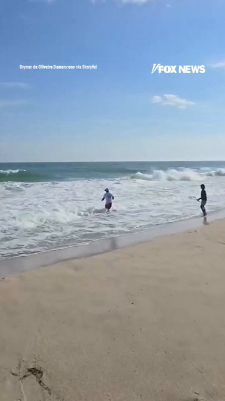

Fox News (Twitter/X)

WATCH: A fisherman reels in a great white shark off the shore of Nantucket, giving stunned beachgoers a rare front-row view of one of the ocean's most feared predators.

This footage captures just a glimpse of the roughly 40-minute battle as crowds gathered along the shoreline to see what was on the line.

Witnesses said people were amazed by the shark's size, which the fisherman later measured to be more than 8.5 feet long and around 300 pounds before he released it back into the Atlantic.

## pm_afshaa — post 93403

پرواز 15 سوخت رسان آمریکا در آسمان منطقه.

💧 Rainbet.com the #1 Non-KYC Crypto Casino & Sportsbook @rainbetcom

😁 @Pm_Afshaa

## pm_afshaa — post 93402

  <a href="telegram/content/pm_afshaa_93402_1781126548.mp4" target="_blank">🎬 Download video</a>

دقایقی پیش مشاهده یک نقطه‌ی نورانی متحرک که درحال چرخش مداوم در آسمان قزوین.

💧 Rainbet.com the #1 Non-KYC Crypto Casino & Sportsbook @rainbetcom

😁 @Pm_Afshaa

## pm_afshaa — post 93401

صدای انفجار در کیش و قشم گزارش شده

💧 Rainbet.com the #1 Non-KYC Crypto Casino & Sportsbook @rainbetcom

😁 @Pm_Afshaa

## pm_afshaa — post 93400

پستارو شِیر کنید دوستاتونو بیارید چنل که امشب خیلی کار داریم❤️

## pm_afshaa — post 93399

  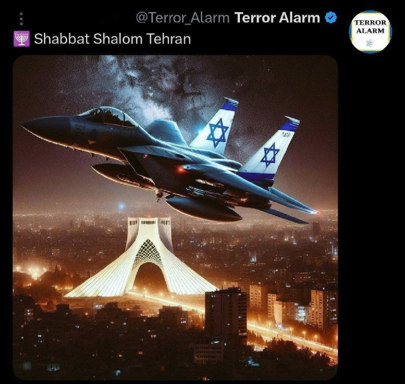

ترور آلارم: شب بخیر تهران

💧 Rainbet.com the #1 Non-KYC Crypto Casino & Sportsbook @rainbetcom

😁 @Pm_Afshaa

## pm_afshaa — post 93398

  <a href="telegram/content/pm_afshaa_93398_1781126549.webm" target="_blank">🎬 Download video</a>

🔴منابع عراقی: از فعالیت شدید جنگنده های آمریکایی در شمال عراق

💧 Rainbet.com the #1 Non-KYC Crypto Casino & Sportsbook @rainbetcom

😁 @Pm_Afshaa

## mamlekate — post 103666

📝 هشدار وزیر جنگ آمریکا به جمهوری اسلامی: «امشب ضربه محکمی به آنها خواهیم زد»

پس از آنکه پرزیدنت ترامپ گفت ایالات متحده به حمله به جمهوری اسلامی ادامه خواهد داد، پیت هگست، وزیر جنگ آمریکا چهارشنبه عصر به وقت واشنگتن اعلام کرد سنتکام امشب مشغول خواهد بود.

@mamlekate

## kianmeli1 — post 87890

🔴فوری-صدای فعالیت پدافند هوایی در غرب تهران شنیده شده است.
https://t.me/kianmeli1

## kianmeli1 — post 87889

🔴فوری-پرواز جنگنده های امریکا در آسمان عراق سنگین و پرتعداد گزارش میشود.
https://t.me/kianmeli1

## kianmeli1 — post 87888

🔴فوری-دوازده سوخت رسان برخاسته اند از اسراییل و عربستان
https://t.me/kianmeli1

## kianmeli1 — post 87887

🔴فوری

رویترز: سامانه‌های دفاع هوایی در جنوب ایران فعال شدند
https://t.me/kianmeli1

## IranIntlTV — post 341586

  <a href="telegram/content/IranIntlTV_341586_1781126549.mp4" target="_blank">🎬 Download video</a>

مراد ویسی، تحلیل‌گر ارشد ایران‌اینترنشنال، گفت: «از حرف ترامپ درباره حمله دوباره می‌توان این برداشت را داشت که یا از طولانی شدن مذاکرات با جمهوری اسلامی خسته شده و به دنبال بازگشت به زبان زور است، یا می‌خواهد با تهدید نظامی آخرین فشارها را برای وادار کردن جمهوری اسلامی به امضای توافق نهایی وارد کند.»
@iranintltv

## Shin_Persian — post 6875

Shin ✓ @hey_itsmyturn
Wed, 10 Jun 2026 21:21:08 UTC

NOW @ 2121Z -
AA activity over western Tehran, Tehran Province, #Iran

ترجمه خودکار فارسی

هم‌اکنون در ۲۱۲۱۲ زولو (۰۰:۵۱ به وقت تهران) -
فعالیت پدافند هوایی در غرب تهران، استان تهران، #Iran

𝕏 · @shin_persian

## Shin_Persian — post 6874

Shin ✓ @hey_itsmyturn
Wed, 10 Jun 2026 21:16:47 UTC

Shit's extremely heated rn

ترجمه خودکار فارسی

اوضاع در حال حاضر به شدت متشنج است

𝕏 · @shin_persian

## Shin_Persian — post 6873

Shin ✓ @hey_itsmyturn
Wed, 10 Jun 2026 21:14:15 UTC

State-owned IRNA:
IRIAF jet activity over Lorestan Province, #Iran, Western Iran

ترجمه خودکار فارسی

ایرنا (خبرگزاری رسمی دولت):
فعالیت جنگنده‌های نیروی هوایی ارتش جمهوری اسلامی ایران (نهاجا) برفراز استان لرستان، #ایران، غرب ایران

𝕏 · @shin_persian

## Iliaen — post 4470

  <a href="telegram/content/Iliaen_4470_1781126551.mp4" target="_blank">🎬 Download video</a>

ساعت حدود ۰۰:۴۰ بامداد پنجشنبه؛ مشاهده یک نقطه‌ی نورانی متحرک که درحال چرخش مداوم در آسمان قزوین است.

@iliaen

## FarsiVOA — post 220293

  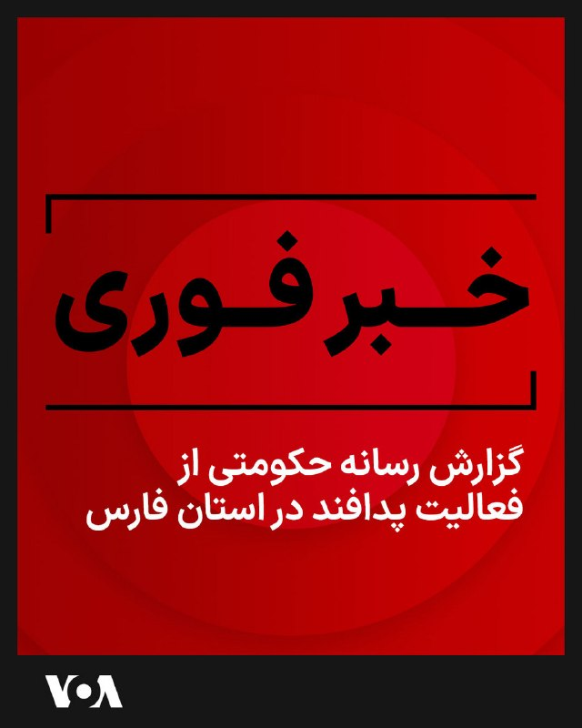

⚡️خبرگزاری مهر دقایقی قبل گزارش داد که پدافند هوایی در شهر مُهر استان فارس فعال شد.
@FarsiVOA

## FarsiVOA — post 220292

  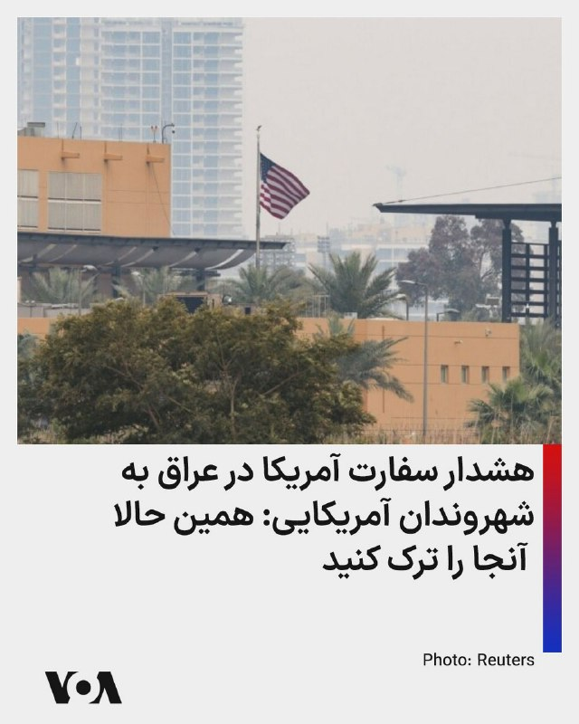

⚡️سفارت آمریکا در بغداد در هشداری به آمریکایی‌ها در عراق توصیه کرد «اختلالات سفر و بسته شدن حریم هوایی ممکن است در کوتاه‌ترین زمان ممکن رخ دهد.» سفارت آمریکا در این هشدار به شهروندان آمریکایی توصیه کرد: «به هیچ دلیلی به عراق سفر نکنید. اگر آنجا هستید، همین حالا آنجا را ترک کنید.»
@FarsiVOA

## Persian_Trend_Official — post 16553

فعالیت پدافند تهران

## Persian_Trend_Official — post 16552

منابع محلی گزارش می‌دهند که انفجارهایی از تنگه هرمز شنیده شده است که گفته می‌شود از ارتفاعات می‌آید

## Persian_Trend_Official — post 16551

  

پرواز گسترده سوخت رسان های آمریکایی در منطقه

## Persian_Trend_Official — post 16550

🔹بیش از ۱۰ سوخت رسان از مبدا عربستان سعودی، اسرائیل و اردن به پرواز در آمدند!

## Persian_Trend_Official — post 16549

  <a href="telegram/content/Persian_Trend_Official_16549_1781126553.webm" target="_blank">🎬 Download video</a>

یک دسته پروازی لحظاتی پیش از فرودگاه نظامی آمریکا در اردن برخواستند

## Persian_Trend_Official — post 16548

  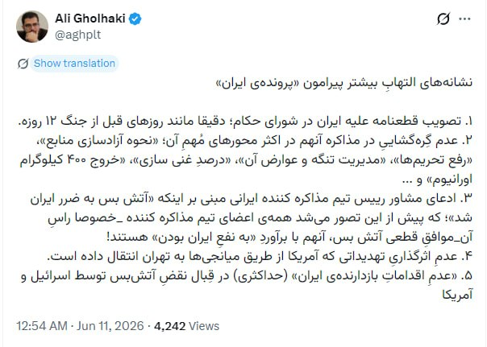

📷 Photo

## Persian_Trend_Official — post 16547

کانال رسمی پرشین ترند pinned «https://youtube.com/live/M15ba3cLWxc?feature=share»

## Persian_Trend_Official — post 16546

  <a href="telegram/content/Persian_Trend_Official_16546_1781126554.webm" target="_blank">🎬 Download video</a>

سفارت ایالات متحده در بغداد:

آمریکایی‌های حاضر در عراق باید فوراً آنجا را ترک کنند؛ به عراق سفر نکنید - سفر نکنید

## Persian_Trend_Official — post 16545

  <a href="telegram/content/Persian_Trend_Official_16545_1781126555.webm" target="_blank">🎬 Download video</a>

****پیام های مردمی

سلام از فیروزآباد فارس بهتون پیام میدم دقایقی قبل صدای تیراندازی شدید و شی های نورانی شبیه به شلیک توپ پدافندی به مدت دو دقیقه داخل شهر دیده و شنیده شد

## Persian_Trend_Official — post 16544

https://youtube.com/live/M15ba3cLWxc?feature=share

## Persian_Trend_Official — post 16543

گزارش منابع عراقی

از فعالیت شدید جنگنده های آمریکایی در شمال عراق

## Persian_Trend_Official — post 16542

  <a href="telegram/content/Persian_Trend_Official_16542_1781126555.webm" target="_blank">🎬 Download video</a>

فعالیت پدافند در شهر مُهر استان فارس!

همچنین طبق گزارشات یک پهپاد ناشناس وارد حریم هوایی عسلویه شده است!

## IranianMinds — post 22149

🔴 صداوسیما :

صداهای انفجار از نزدیکی کیش شنیده شده

@IranianMinds

## IranianMinds — post 22148

سازمان ملل الان از نگرانی سکته میکنه

@IranianMinds

## IranianMinds — post 22147

خبرگذاری مهر : پدافند تهران فعال شد

@IranianMinds

## IranianMinds — post 22146

  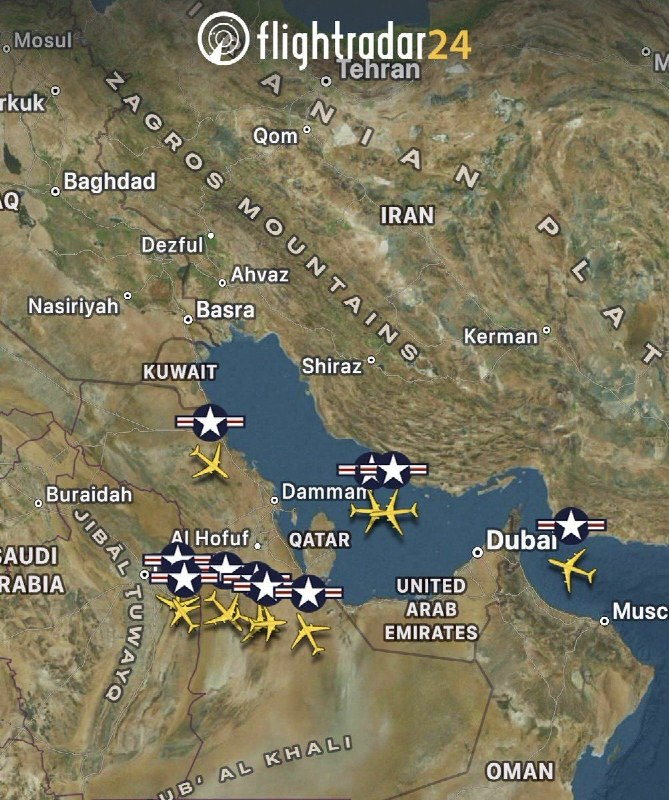

🔴 پرواز گسترده سوخت رسان های آمریکایی در منطقه

@IranianMinds

## IranianMinds — post 22145

  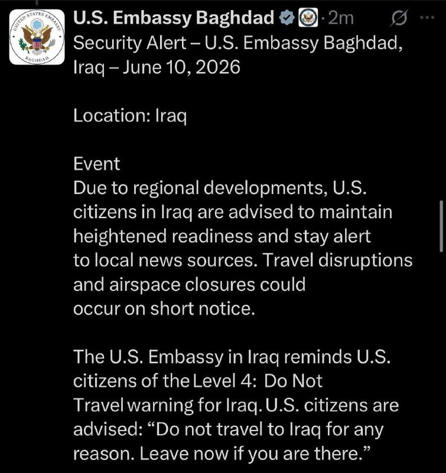

🔴 فوری

سفارت ایالات متحده در بغداد:

«به هیچ دلیلی به عراق سفر نکنید. اگر آنجا هستید، همین حالا ترک کنید.»

@IranianMinds

## IranianMinds — post 22144

🔴 صدای انفجار در حوالی قشم شنیده شد

@IranianMinds

## Dirty_Kids — post 391626

  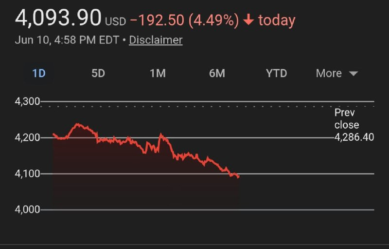

🔴 قیمت جهانی طلا به شکل پشم‌ریزونی داره سقوط میکنه.

هر اونس = 4,093 دلار

@Dirty_Kids 👻

## Dirty_Kids — post 391625

این شبا وضعیت جوریه که اگه شب رو تو تلگرام بخوابی، صبح ممکنه تو روبیکا از خواب بیدار شی :)))))

## alonews — post 126982

  <a href="telegram/content/alonews_126982_1781126558.webm" target="_blank">🎬 Download video</a>

🔴فوری/پدافند غرب تهران فعال شد

✅ @AloNews خبر جنگ

## alonews — post 126981

  <a href="telegram/content/alonews_126981_1781126558.webm" target="_blank">🎬 Download video</a>

👈جنگنده‌های آمریکایی بر فراز عراق درحال پرواز هستن

✅ @AloNews خبر جنگ

---
📅 بروزرسانی: 1405/03/21 00:42
---

## VahidOOnLine — post 244784

  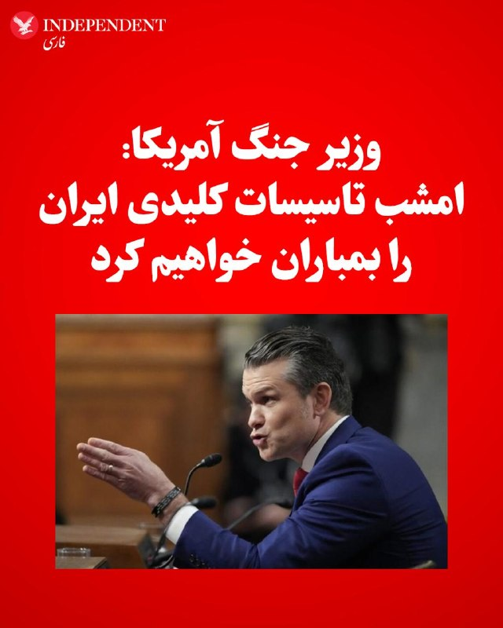

♦️پیت هگست، وزیر جنگ ایالات متحده، روز چهارشنبه ۲۰ خردادماه در مقر فرماندهی مرکزی آمریکا (سنتکام) گفت: «امشب تاسیسات کلیدی ایران را بمباران خواهیم کرد.»
او با اشاره به موضع دولت دونالد ترامپ در قبال ایران افزود: «سنتکام امشب کار زیادی خواهد داشت، چون ترامپ گفته است که ما به ایران حمله سنگینی خواهیم کرد.» هگست همچنین گفت تهران هنوز از فرصت دستیابی به توافقی که واشنگتن انتظار دارد، استفاده نکرده است.
وزیر جنگ آمریکا تاکید کرد هدف این حملات، وادار کردن ایران به پذیرش شرایط مورد نظر دولت ترامپ و جلوگیری از دستیابی تهران به سلاح هسته‌ای است.
‌🇸🇦 Indypersian

🤖 @VahidOOnLine

## WithYashar — post 14387

صدا و سیما: صداهایی از در نزدیکی جزیره کیش شنیده شده است که منبع آن در حال حاضر نامشخص است 🚨🚨
@withyashar

## WithYashar — post 14386

## mwarmonitor — post 10657

🔴جنگ‌طلبان نظامی می‌گویند هیچ میزان حمله‌ای نمی‌تواند نظر تهران را تغییر دهد. یا باید برای بی‌ثبات‌سازی و سرنگونی رژیم دست به حمله بزنید، یا فقط مسئله را به آینده موکول می‌کنید — اما این‌بار با خشونت بیشتر. نیویورک پست

@mwarmonitor

## mwarmonitor — post 10656

💥شنیده شدن صداهای انفجار نامشخص در اطراف جزیره کیش .

@mwarmonitor

## mwarmonitor — post 10655

❌ توقف و تعلیق پروازها در فرودگاه بین‌المللی اربیل در شمال عراق.

@mwarmonitor

## mwarmonitor — post 10654

🔹خبرنگار: اگر پاسخ، هدف قرار دادن پل‌ها و زیرساخت‌های برق باشد، چگونه این می‌تواند جنایت جنگی محسوب نشود؟

🔸وزیر جنگ: این دقیقاً همان نوع سؤال‌های فریبنده‌ای است که از رسانه‌ها به آن عادت کرده‌ام ـ سؤالاتی که نیت افرادی را که در کنار ما ایستاده‌اند زیر سؤال می‌برد.

@mwarmonitor

## pm_afshaa — post 93397

تقریبا میشه گفت حملات درحال آغازه.

## pm_afshaa — post 93396

  <a href="telegram/content/pm_afshaa_93396_1781125973.webm" target="_blank">🎬 Download video</a>

🔴صداوسیما: صداهایی از دور در کیش شنیده میشه.

💧 Rainbet.com the #1 Non-KYC Crypto Casino & Sportsbook @rainbetcom

😁 @Pm_Afshaa

## pm_afshaa — post 93395

  <a href="telegram/content/pm_afshaa_93395_1781125974.webm" target="_blank">🎬 Download video</a>

🔴سفارت آمریکا در بغداد:
به هیچ دلیلی به عراق سفر نکنید، اگر آنجا هستید، همین حالا ترک کنید.

💧 Rainbet.com the #1 Non-KYC Crypto Casino & Sportsbook @rainbetcom

😁 @Pm_Afshaa

## pm_afshaa — post 93394

کیش صدای انفجار یا پدافند گزارش شده

💧 Rainbet.com the #1 Non-KYC Crypto Casino & Sportsbook @rainbetcom

😁 @Pm_Afshaa

## pm_afshaa — post 93393

  <a href="telegram/content/pm_afshaa_93393_1781125975.webm" target="_blank">🎬 Download video</a>

🔴مهر: هم‌اکنون صداهایی از دور در کیش شنیده میشه که منشا اون مشخص نیست.

به نظر میرسه تحرکاتی با فاصله زیاد از کیش صورت گرفته.

💧 Rainbet.com the #1 Non-KYC Crypto Casino & Sportsbook @rainbetcom

😁 @Pm_Afshaa

## pm_afshaa — post 93392

میگن کلی پهباد جاسوسی تو آسمان کشوره
احتمالا برای تیک زدن اهداف
پدافند هم فعاله بعضی جاها

## pm_afshaa — post 93391

پستارو شِیر کنید دوستاتونو بیارید چنل که امشب خیلی کار داریم❤️

## pm_afshaa — post 93390

پستارو شِیر کنید دوستاتونو بیارید چنل که امشب خیلی کار داریم❤️

## kianmeli1 — post 87886

🔴فوری-حریم هوایی اقلیم کردستان عراق بسته شد. پروازها یکی یکی در حال لغو شدن هستند
https://t.me/kianmeli1

## kianmeli1 — post 87885

🔴فوری-خبرهایی از صدای پدافند در کیش
https://t.me/kianmeli1

## Shin_Persian — post 6872

Shin ✓ @hey_itsmyturn
Wed, 10 Jun 2026 21:08:52 UTC

IRIB: activities spotted from Kish island, Hormozgan Province, Southern #Iran

(No reports of explosions)

ترجمه خودکار فارسی

صدا و سیما: فعالیت‌هایی از جزیره کیش، استان هرمزگان، جنوب #Iran رصد شده است

(گزارشی از انفجار منتشر نشده است)

𝕏 · @shin_persian

## Shin_Persian — post 6871

Shin ✓ @hey_itsmyturn
Wed, 10 Jun 2026 21:06:03 UTC

Intense jet activity over Babil #Iraq 🇮🇶

ترجمه خودکار فارسی

فعالیت شدید جنگنده‌ها بر فراز بابل #Iraq 🇮🇶

𝕏 · @shin_persian

## Iliaen — post 4469

ساعت ۰۰:۳۴ بامداد پنجشنبه؛ یک پهپاد در آسمان عسلویه مشاهده شد، پدافند مناطق شمال عسلویه نیز فعال شدند.

@iliaen

## FarsiVOA — post 220291

⚡️بررسی دلایل افزایش تعداد کودکان کار در ایران؛ گفت‌وگو با آمنه عسگری
@FarsiVOA

## Persian_Trend_Official — post 16541

  <a href="telegram/content/Persian_Trend_Official_16541_1781125975.webm" target="_blank">🎬 Download video</a>

اسرائیل هیوم:
شرکت هواپیمایی ایر کانادا تمدید لغو پروازها به اسرائیل را تا ۲۴ اکتبر اعلام کرد.

## Persian_Trend_Official — post 16540

  <a href="telegram/content/Persian_Trend_Official_16540_1781125976.webm" target="_blank">🎬 Download video</a>

احتمالا تا دقایقی دیگه عروسی خونین داشته باشیم !

## Persian_Trend_Official — post 16539

  <a href="telegram/content/Persian_Trend_Official_16539_1781125977.webm" target="_blank">🎬 Download video</a>

صداوسیما: هم اینک صداهایی از دور در کیش شنیده می شود که منشا آن مشخص نیست

به نظر می رسد تحرکاتی با فاصله زیاد از کیش صورت گرفته است.

📝 Amir

📌 @persian_trend_official
پرشین ترند | متفاوت‌ترین کانال نظامی

## Persian_Trend_Official — post 16538

  <a href="telegram/content/Persian_Trend_Official_16538_1781125977.webm" target="_blank">🎬 Download video</a>

پیت هگست: ما از آتش‌بس برای توسعه اطلاعات و به‌روزرسانی بانک اهداف خود در ایران استفاده کردیم.

ایالات متحده به تأسیسات کلیدی ایران حمله خواهد کرد.

📝 Amir

📌 @persian_trend_official
پرشین ترند | متفاوت‌ترین کانال نظامی

## Persian_Trend_Official — post 16537

پیت هگست: حملاتی که امشب به ایران انجام خواهد شد، واضح و قوی خواهد بود. اگر فردا شب انجام شود، قوی و واضح خواهد بود. در طول این مدت، ایران فرصتی برای انجام معامله دارد. نکته همین است. این شروع دوباره جنگ نیست بلکه تعیین شرایط برای توافق است، پروژه آزادی…

## IranianMinds — post 22143

🔴 گزارشاتی از انفجار در نزدیکی کیش

@IranianMinds

## IranianMinds — post 22142

🔴تسنیم:

نیروهای مسلح جمهوری اسلامی، امشب در حالت آماده‌باش کامل هستند.

@IranianMinds

## Dirty_Kids — post 391624

ساعت ۰۰:۳۴ بامداد پنجشنبه؛ یک پهپاد در آسمان عسلویه مشاهده شد، پدافند مناطق شمال عسلویه نیز فعال شدند.

@Dirty_Kids 👻

## alonews — post 126980

  <a href="telegram/content/alonews_126980_1781125978.webm" target="_blank">🎬 Download video</a>

👈صدای انفجار در حوالی قشم شنیده شد

✅ @AloNews خبر جنگ

## alonews — post 126979

  <a href="telegram/content/alonews_126979_1781125978.webm" target="_blank">🎬 Download video</a>

👈تسنیم: ایران به ایالات متحده هشدار داده است که هرگونه اقدام نظامی جدید با پاسخ فوری و قوی روبرو خواهد شد.

✅ @AloNews خبر جنگ

## alonews — post 126978

  <a href="telegram/content/alonews_126978_1781125979.webm" target="_blank">🎬 Download video</a>

💢فوووووووری/حمله شروع شد؟ هم اکنون هشدار در پایگاه‌های آمریکایی 
🔴فعلا اقدامی نشده 
🚨 @AkhbareFouri

## alonews — post 126977

  <a href="telegram/content/alonews_126977_1781125979.webm" target="_blank">🎬 Download video</a>

👈گزارش‌ها از انفجار در کیش

✅ @AloNews خبر جنگ

---
📅 بروزرسانی: 1405/03/21 00:32
---

## VahidOOnLine — post 244783

  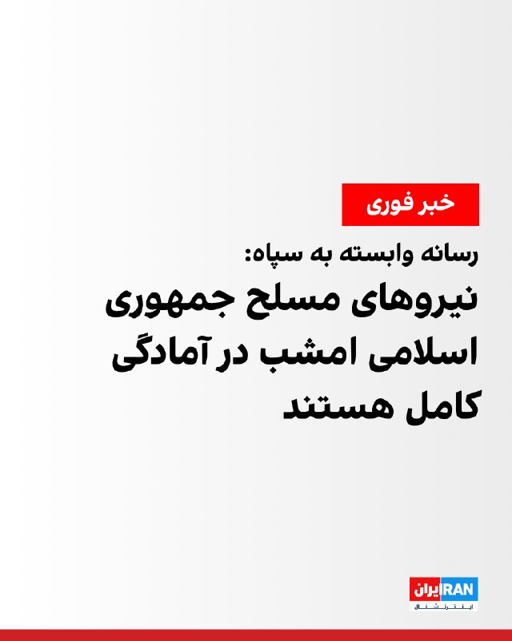

خبرگزاری تسنیم، وابسته به سپاه پاسداران، به نقل از یک منبع نظامی نوشت نیروهای مسلح جمهوری اسلامی امشب نیز در آمادگی کامل هستند و اگر آمریکایی‌ها اقدام «تجاوزگرانه‌ای» انجام دهند، بار دیگر با «پاسخ‌های سنگین» مواجه خواهند شد.

این منبع نظامی گفت جمهوری اسلامی شب گذشته به آمریکایی‌ها اثبات کرده که هرگونه «ماجراجویی و حماقت جدید» با پاسخ بدون درنگ مواجه خواهد شد و هیچ‌گونه تجاوزی را بی‌پاسخ نمی‌گذارد.

او افزود در صورت اقدام آمریکایی‌ها، نیروهای مسلح جمهوری اسلامی اهداف جدیدی از منافع آمریکا را هدف قرار خواهند داد.

این منبع نظامی همچنین گفت تصور آمریکایی‌ها درباره «تشدید کنترل‌شده» و به دست گرفتن ابتکار عمل، «احمقانه» است و جمهوری اسلامی برای «دیکته کردن محاسبات جدید» به آمریکایی‌ها تعلل نخواهد کرد.
‌🏁 🇬🇧 IranintlTV

🤖 @VahidOOnLine

## VahidOOnLine — post 244782

  

پیت هگست، وزیر جنگ آمریکا، در جمع خبرنگاران گفت حملاتی که امشب به ایران انجام خواهد شد، «قوی و روشن» خواهد بود و فرماندهی مرکزی آمریکا امشب درگیر عملیات خواهد بود.

او افزود آمریکا تاسیسات کلیدی در جمهوری اسلامی را بمباران می‌کند و امشب «ضربه سختی» وارد خواهد کرد.
‌🏁 🇬🇧 IranintlTV

🤖 @VahidOOnLine

## WithYashar — post 14385

وزیر جنگ آمریکا:

بمب هارا تق تق تق روی تاسیسات کلیدی ایران خواهیم انداخت
@withyashar

## mwarmonitor — post 10653

پدافندهای هوایی با اهداف در آسمان استان فارس مقابله می‌کنند.

## mwarmonitor — post 10652

🔴 سفارت آمریکا در بغداد:

🔸با توجه به تحولات اخیر منطقه‌ای، به شهروندان آمریکایی در عراق توصیه می‌شود بالاترین سطح هوشیاری و دقت را حفظ کنند و به‌طور مداوم منابع خبری محلی را دنبال کنند. همچنین ممکن است اختلال در سفرها یا بسته شدن ناگهانی حریم هوایی بدون اطلاع قبلی رخ دهد.

@mwarmonitor

## pm_afshaa — post 93389

  <a href="telegram/content/pm_afshaa_93389_1781125380.webm" target="_blank">🎬 Download video</a>

🔴هگست، وزیر جنگ آمریکا: تأسیسات اصلی در ایران رو بمباران خواهیم کرد. حملاتی که امشب رخ خواهد داد، شدید و آشکار خواهند بود. 
💧 Rainbet.com the #1 Non-KYC Crypto Casino & Sportsbook @rainbetcom 
😁 @Pm_Afshaa

## pm_afshaa — post 93388

  <a href="telegram/content/pm_afshaa_93388_1781125381.webm" target="_blank">🎬 Download video</a>

🔴تسنیم: نیروهای مسلح جمهوری اسلامی امشب در آمادگی کامل هستن.

💧 Rainbet.com the #1 Non-KYC Crypto Casino & Sportsbook @rainbetcom

😁 @Pm_Afshaa

## pm_afshaa — post 93387

  <a href="telegram/content/pm_afshaa_93387_1781125382.webm" target="_blank">🎬 Download video</a>

🔴پیت هگست، وزیر جنگ آمریکا: بمب‌ها رو تق تق تق روی تاسیسات کلیدی ایران خواهیم انداخت. (جدی گفت) 
💧 Rainbet.com the #1 Non-KYC Crypto Casino & Sportsbook @rainbetcom 
😁 @Pm_Afshaa

## pm_afshaa — post 93386

  <a href="telegram/content/pm_afshaa_93386_1781125382.webm" target="_blank">🎬 Download video</a>

🔴پیت هگست، وزیر جنگ آمریکا:
بمب‌ها رو تق تق تق روی تاسیسات کلیدی ایران خواهیم انداخت. (جدی گفت)

💧 Rainbet.com the #1 Non-KYC Crypto Casino & Sportsbook @rainbetcom

😁 @Pm_Afshaa

## VahidOnline — post 76164

  <a href="telegram/content/VahidOnline_76164_1781125383.mp4" target="_blank">🎬 Download video</a>

پیت هگست، وزیر جنگ آمریکا، در جمع خبرنگاران گفت حملاتی که امشب به ایران انجام خواهد شد، «قوی و روشن» خواهد بود و فرماندهی مرکزی آمریکا امشب درگیر عملیات خواهد بود.

او افزود آمریکا تاسیسات کلیدی در جمهوری اسلامی را بمباران می‌کند و امشب «ضربه سختی» وارد خواهد کرد.
@VahidOOnLine

📡 @VahidOnline

## kianmeli1 — post 87884

🔴فوری-فعالیت پدافند در شهر مُهر در استان فارس
https://t.me/kianmeli1

## kianmeli1 — post 87883

🔴فوری

هگست: تاسیسات کلیدی ایران بمباران میشوند
https://t.me/kianmeli1

## IranIntlTV — post 341585

  <a href="telegram/content/IranIntlTV_341585_1781125384.mp4" target="_blank">🎬 Download video</a>

ستاد فرماندهی مرکزی آمریکا، سنتکام، با انتشار ویدیویی در شبکه ایکس از هدف قرار دادن یک نفتکش با پرچم پالائو به نام M/T Settebello در تاریخ سه‌شنبه ۱۹ خرداد در خلیج عمان خبر داد.

سنتکام گفت این کشتی با نقض محاصره دریایی در حال انتقال نفت از ایران بود. پس از بی‌توجهی مکرر خدمه به هشدارها، یک هواپیمای آمریکایی با شلیک دقیق، موتورخانه کشتی را هدف قرار داد.

به گفته سنتکام، از زمان آغاز محاصره در ۱۳ آوریل (۲۴ فروردین)، هشت کشتی از کار افتاده، ۱۳۴ کشتی تغییر مسیر داده‌اند و به ۴۲ کشتی حامل کمک‌های بشردوستانه اجازه عبور داده شده است.
@iranintltv

## IranIntlTV — post 341584

  

خبرگزاری تسنیم، وابسته به سپاه پاسداران، به نقل از یک منبع نظامی نوشت نیروهای مسلح جمهوری اسلامی امشب نیز در آمادگی کامل هستند و اگر آمریکایی‌ها اقدام «تجاوزگرانه‌ای» انجام دهند، بار دیگر با «پاسخ‌های سنگین» مواجه خواهند شد.

این منبع نظامی گفت جمهوری اسلامی شب گذشته به آمریکایی‌ها اثبات کرده که هرگونه «ماجراجویی و حماقت جدید» با پاسخ بدون درنگ مواجه خواهد شد و هیچ‌گونه تجاوزی را بی‌پاسخ نمی‌گذارد.

او افزود در صورت اقدام آمریکایی‌ها، نیروهای مسلح جمهوری اسلامی اهداف جدیدی از منافع آمریکا را هدف قرار خواهند داد.

این منبع نظامی همچنین گفت تصور آمریکایی‌ها درباره «تشدید کنترل‌شده» و به دست گرفتن ابتکار عمل، «احمقانه» است و جمهوری اسلامی برای «دیکته کردن محاسبات جدید» به آمریکایی‌ها تعلل نخواهد کرد.
https://iranintl.com/202606106681

## Shin_Persian — post 6870

Shin ✓ @hey_itsmyturn
Wed, 10 Jun 2026 20:58:48 UTC

State-owned Mehr News:
AA activity in Mohr, Fars Province, #Iran

ترجمه خودکار فارسی

خبرگزاری دولتی مهر:
فعالیت پدافند هوایی در مُهر، استان فارس، #Iran_

𝕏 · @shin_persian

## FarsiVOA — post 220290

🔺هشدار وزیر جنگ آمریکا به جمهوری اسلامی: «امشب ضربه محکمی به آنها خواهیم زد»

▪️پس از آنکه پرزیدنت ترامپ گفت ایالات متحده به حمله به جمهوری اسلامی ادامه خواهد داد، پیت هگست، وزیر جنگ آمریکا چهارشنبه عصر به وقت واشنگتن اعلام کرد سنتکام امشب مشغول خواهد بود.

⬇️ بیشتر بخوانید:
https://ir.voanews.com/a/8159442.html
@FarsiVOA

## FarsiVOA — post 220289

  <a href="telegram/content/FarsiVOA_220289_1781125386.mp4" target="_blank">🎬 Download video</a>

⚡️نادر در بیکی در برنامه تفسیر خبر: جمهوری اسلامی به دنبال تضمین بقا است
@FarsiVOA

## IranianMinds — post 22141

🔴پیت هگست، وزیر جنگ آمریکا در میان خبرنگاران گفت:

حملاتی که امشب به ایران خواهد شد بسیار شدید و روشن خواهد بود و فرماندهی مرکزی آمریکا، امشب درگیر عملیات خواهد بود. او افزود، آمریکا تأسیسات کلیدی در ایران را بمباران خواهد کرد و ضربه سختی وارد خواهد کرد.

@IranianMinds

## Dirty_Kids — post 391623

بعد از هفته‌ها انتظار بلاخره استاد تراپی جدیدش‌رو منتشر کرد که محوریت دارد بر موضوع اپستین و آخوند شیعه‌سان

دوتا هندزفری روهم بزن 🔞🔞

@Dirty_Kids 👻

## alonews — post 126976

  <a href="telegram/content/alonews_126976_1781125387.webm" target="_blank">🎬 Download video</a>

👈وزیر دفاع آمریکا: ما از آتش‌بس برای توسعه اطلاعات و به‌روزرسانی بانک اهداف خود در ایران استفاده کردیم

🔴بانک اهداف و قابلیت‌های فعلی ما بسیار فراتر از آن چیزی است که در آغاز عملیات خشم حماسی وجود داشت.

✅ @AloNews خبر جنگ

## alonews — post 126975

  <a href="telegram/content/alonews_126975_1781125387.webm" target="_blank">🎬 Download video</a>

👈سفارت آمریکا در بغداد به تمام شهروندان آمریکایی در عراق هشدار فوری امنیتی صادر کرده است

✅ @AloNews خبر جنگ

## alonews — post 126974

  <a href="telegram/content/alonews_126974_1781125388.webm" target="_blank">🎬 Download video</a>

🔴فوری/ترور آلارم: شماره معکوس شروع شده

✅ @AloNews خبر جنگ

## alonews — post 126973

  <a href="telegram/content/alonews_126973_1781125388.mp4" target="_blank">🎬 Download video</a>

👈هگِستِ : تپ‌تپ بمب‌هایی که روی تأسیسات کلیدی ایران از طرف ایالات متحده فرود میاد

- و این به این خاطر نیست که ما بخوایم چیزی رو دوباره شروع کنیم که لازم نباشه شروعش کنیم؛

- بلکه چون وزارت جنگ آماده‌ست شرایط رو طوری تنظیم کنه که همون توافقی که رئیس‌جمهور ترامپ انتظار داره بهش برسیم

✅ @AloNews خبر جنگ

---
📅 بروزرسانی: 1405/03/21 00:22
---

## VahidOOnLine — post 244781

  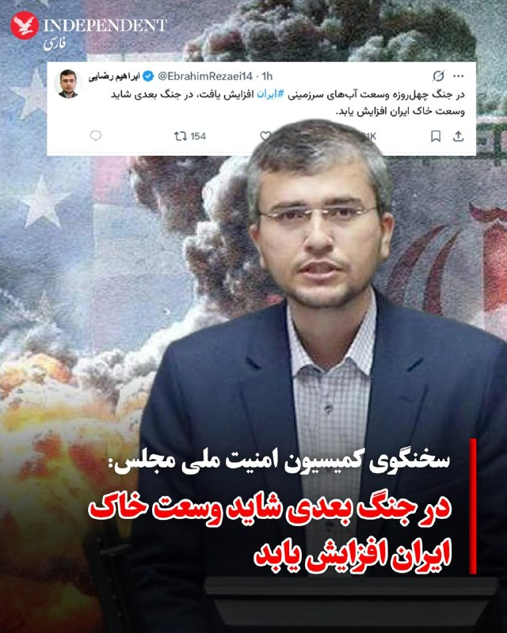

♦️ابراهیم رضایی، سخنگوی کمیسیون امنیت ملی مجلس شورای اسلامی، روز چهارشنبه ۲۰ خردادماه با انتشار پیامی در شبکه اکس نوشت: «در جنگ ۱۲ روزه وسعت آب‌های سرزمینی ایران افزایش یافت، در جنگ بعدی شاید وسعت خاک ایران افزایش یابد.»
‌🇸🇦 Indypersian

🤖 @VahidOOnLine

## WithYashar — post 14384

وزیر جنگ آمریکا درباره ایران:
فرماندهی مرکزی امشب بسیار شلوغ خواهد بود
@withyashar 💥

## WithYashar — post 14383

وزیر ارتباطات: از سرعت اینترنت راضی نیستم
@withyashar 😂

## mwarmonitor — post 10651

🔴 وزیر جنگ آمریکا درباره ایران:

🔸فرماندهی مرکزی امشب مشغول خواهد بود.

🔸ایالات متحده تأسیسات اصلی در ایران را بمباران خواهد کرد.

🔸حملاتی که امشب رخ خواهد داد، شدید و آشکار خواهند بود.

@mwarmonitor

## pm_afshaa — post 93385

  <a href="telegram/content/pm_afshaa_93385_1781124744.webm" target="_blank">🎬 Download video</a>

🔴وزیر دفاع آمریکا:
حملات امشب، موضع دیپلماتیک و منافع نظامی آمریکا رو تقویت خواهد کرد و من مطمئنم بعد از این حملات ایران نرم میشه.

💧 Rainbet.com the #1 Non-KYC Crypto Casino & Sportsbook @rainbetcom

😁 @Pm_Afshaa

## pm_afshaa — post 93384

  <a href="telegram/content/pm_afshaa_93384_1781124744.webm" target="_blank">🎬 Download video</a>

🔴هگست، وزیر جنگ آمریکا:
تأسیسات اصلی در ایران رو بمباران خواهیم کرد. حملاتی که امشب رخ خواهد داد، شدید و آشکار خواهند بود.

💧 Rainbet.com the #1 Non-KYC Crypto Casino & Sportsbook @rainbetcom

😁 @Pm_Afshaa

## pm_afshaa — post 93383

امشب جنگه اماده باشید

## pm_afshaa — post 93382

🔴پیت هگست، وزیر جنگ آمریکا:
سنتکام امشب کار زیادی خواهد داشت، چون ترامپ گفته که ما به ایران حمله سنگینی خواهیم کرد.

💧 Rainbet.com the #1 Non-KYC Crypto Casino & Sportsbook @rainbetcom

😁 @Pm_Afshaa

## pm_afshaa — post 93381

فوووری

## kianmeli1 — post 87882

🔴فوری

وزیر جنگ امریکا:حملات امشب قوی و شفاف خواهد بود
https://t.me/kianmeli1

## kianmeli1 — post 87881

  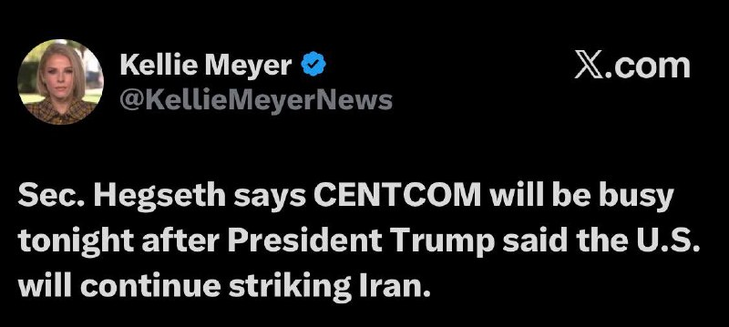

🔴فوری-خبرهایی از حمله قریب الوقوع امشب به ایران است

وزیر هگزت می‌گوید پس از آنکه پرزیدنت ترامپ گفت ایالات متحده به حمله به ایران ادامه خواهد داد، ستاد مرکزی ارتش امشب مشغول خواهد بود.
https://t.me/kianmeli1

## IranIntlTV — post 341583

  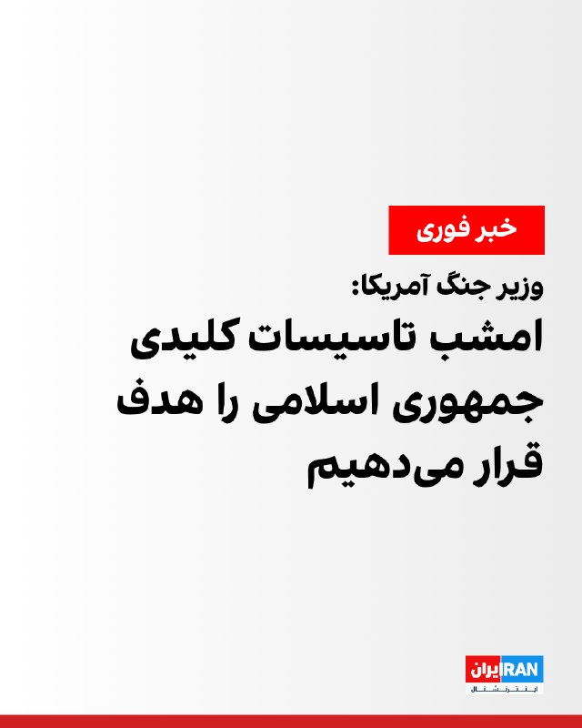

پیت هگست، وزیر جنگ آمریکا، در جمع خبرنگاران گفت حملاتی که امشب به ایران انجام خواهد شد، «قوی و روشن» خواهد بود و فرماندهی مرکزی آمریکا امشب درگیر عملیات خواهد بود.

او افزود آمریکا تاسیسات کلیدی در جمهوری اسلامی را بمباران می‌کند و امشب «ضربه سختی» وارد خواهد کرد.
https://iranintl.com/202606106813

## Shin_Persian — post 6869

Shin ✓ @hey_itsmyturn
Wed, 10 Jun 2026 20:48:35 UTC

Well,
POTUS said there will be strikes on Iran today,
Hegseth said the same thing.

Let's sit and watch.

ترجمه خودکار فارسی

خب،
رئیس‌جمهور ایالات متحده (POTUS) گفت که امروز حملاتی علیه ایران انجام خواهد شد،
هگست هم همین را گفت.

بیایید بنشینیم و تماشا کنیم.

𝕏 · @shin_persian

## FarsiVOA — post 220288

  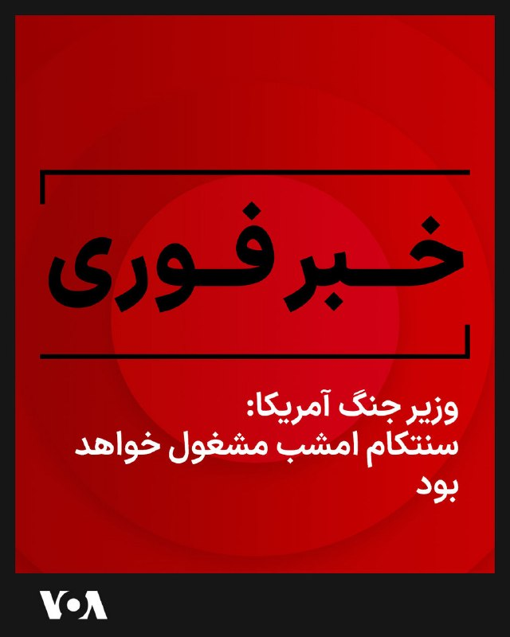

⚡️کلی میر،‌خبرنگار نیوزنیشن گزارش داد پس از آنکه پرزیدنت ترامپ گفت ایالات متحده به حمله به جمهوری اسلامی ادامه خواهد داد، پیت هگست، وزیر جنگ آمریکا اعلام کرد سنتکام امشب مشغول خواهد بود.
@FarsiVOA

## Persian_Trend_Official — post 16536

  <a href="telegram/content/Persian_Trend_Official_16536_1781124746.mp4" target="_blank">🎬 Download video</a>

پیت هگست: حملاتی که امشب به ایران انجام خواهد شد، واضح و قوی خواهد بود.

اگر فردا شب انجام شود، قوی و واضح خواهد بود. در طول این مدت، ایران فرصتی برای انجام معامله دارد. نکته همین است.

این شروع دوباره جنگ نیست بلکه تعیین شرایط برای توافق است، پروژه آزادی هیچ وقت متوقف نشد بلکه مخفیانه پیش رفت.

📝 Amir

📌 @persian_trend_official
پرشین ترند | متفاوت‌ترین کانال نظامی

## Persian_Trend_Official — post 16535

  <a href="telegram/content/Persian_Trend_Official_16535_1781124747.mp4" target="_blank">🎬 Download video</a>

پیت هگست: سنتکام امشب سر شلوغی خواهد داشت زیرا ترامپ گفته است که ما به ایران ضربه سختی خواهیم زد، و این کار را خواهیم کرد.

📝 Amir

📌 @persian_trend_official
پرشین ترند | متفاوت‌ترین کانال نظامی

## alonews — post 126972

  <a href="telegram/content/alonews_126972_1781124749.webm" target="_blank">🎬 Download video</a>

👈وزیر دفاع آمریکا: ایران طرف ضعیف‌تر است و حمله‌ای که امروز یا فردا انجام خواهیم داد، قدرتمند خواهد بود.

🔴 تأسیسات کلیدی در ایران را بمباران خواهیم کرد

✅ @AloNews خبر جنگ

---
📅 بروزرسانی: 1405/03/21 00:12
---

## VahidOOnLine — post 244780

  <a href="telegram/content/VahidOOnLine_244780_1781124149.mp4" target="_blank">🎬 Download video</a>

♦️رسانه‌های ایران چهارشنبه‌شب ۲۰ خرداد از وقوع آتش‌سوزی و برخاستن ستون‌های غلیظ دود در محدوده میدان قیام تهران خبر دادند. سخنگوی سازمان آتش‌نشانی تهران اعلام کرد یک انبار کالا در منطقه ۱۲ تهران دچار حریق شده است.

به گفته سازمان آتش‌نشانی تهران، این مجموعه شامل چند انبار و غرفه به مساحت حدود دو هزار متر مربع است و عملیات اطفای حریق با حضور نیروهای آتش‌نشانی در محل انجام شد.

معاون سازمان آتش‌نشانی تهران به خبرگزاری فارس گفت به انبار فرش محدوده میدان قیام که دچار حریق شد.

سازمان آتش‌نشانی تهران اعلام کرد که تا این لحظه گزارشی از تلفات یا مصدومیت جانی دریافت نشده است.
‌🇸🇦 Indypersian

🤖 @VahidOOnLine

## VahidOOnLine — post 244779

  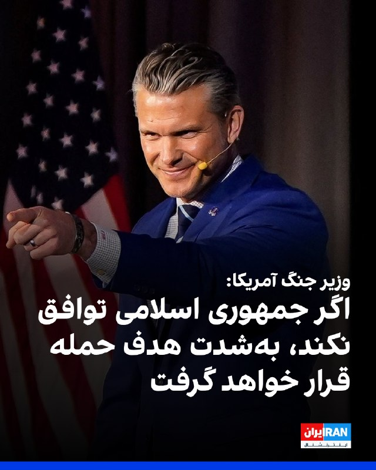

پیت هگست، وزیر دفاع آمریکا، گفت اگر جمهوری اسلامی برای پایان دادن به درگیری با آمریکا به توافق نرسد، ارتش ایالات متحده آن را «به‌شدت» هدف قرار خواهد داد.

او در سخنرانی برای کارکنان فرماندهی مرکزی آمریکا، سنتکام، در تامپای فلوریدا گفت: «همان‌طور که رییس‌جمهوری چهارشنبه گفت، اگر آن‌ها توافق نکنند، ما به‌شدت به آن‌ها حمله خواهیم کرد.»

هگست افزود دولت آمریکا بر دستیابی به نتیجه‌ای که دونالد ترامپ به نمایندگی از مردم آمریکا خواهان آن است متمرکز شده و در این مسیر «پیشرفت زیادی» داشته است.

او همچنین به اظهارات ترامپ اشاره کرد که گفته بود آمریکا حملات بیشتری علیه جمهوری اسلامی انجام خواهد داد و تهران برای مذاکره درباره توافق «بیش از حد وقت تلف کرده» و اکنون «باید بهای آن را بپردازد».
‌🏁 🇬🇧 IranintlTV

🤖 @VahidOOnLine

## pm_afshaa — post 93380

  <a href="telegram/content/pm_afshaa_93380_1781124150.webm" target="_blank">🎬 Download video</a>

🔴گروهی از تانکرهای سوخت‌رسان نیروی هوایی آمریکا از تل‌آویو و ریاض در حال فعالیت در اطراف تنگه هرمز و خلیج فارس هستن؛ طبیعتاً هواپیماهای جنگنده هم اونا رو همراهی میکنن.

💧 Rainbet.com the #1 Non-KYC Crypto Casino & Sportsbook @rainbetcom

😁 @Pm_Afshaa

## pm_afshaa — post 93379

  <a href="telegram/content/pm_afshaa_93379_1781124151.webm" target="_blank">🎬 Download video</a>

🔴منابع ایرانی به الجزیره:
حواستون باشه که هرگونه حمله منجر به پایان مذاکرات خواهد شد.

💧 Rainbet.com the #1 Non-KYC Crypto Casino & Sportsbook @rainbetcom

😁 @Pm_Afshaa

## pm_afshaa — post 93378

  <a href="telegram/content/pm_afshaa_93378_1781124151.webm" target="_blank">🎬 Download video</a>

🔴فارس به نقل از منبع اطلاعاتی: ایران کلیه تحرکات ارتش آمریکا در منطقه رو چه در زمین و چه در آسمان، با دقت کامل رصد میکنه. 
💧 Rainbet.com the #1 Non-KYC Crypto Casino & Sportsbook @rainbetcom 
😁 @Pm_Afshaa

## pm_afshaa — post 93377

  <a href="telegram/content/pm_afshaa_93377_1781124152.webm" target="_blank">🎬 Download video</a>

🔴فارس به نقل از منبع اطلاعاتی:
ایران کلیه تحرکات ارتش آمریکا در منطقه رو چه در زمین و چه در آسمان، با دقت کامل رصد میکنه.

💧 Rainbet.com the #1 Non-KYC Crypto Casino & Sportsbook @rainbetcom

😁 @Pm_Afshaa

## mamlekate — post 103665

📝 اصرار دولت بر «مدیریت» تقاضای بنزین؛ آمارها چه می‌گویند؟

مقامات جمهوری اسلامی بارها نسبت به کسری فزاینده بنزین در کشور و «بار سنگین واردات» سوخت هشدار داده‌اند، اما آمارهای بانک مرکزی نشان می‌دهد آمار و ارقامی که دولت درباره واردات بنزین ارائه می‌کند بسیار غلوآمیز است.

@mamlekate

## IranIntlTV — post 341582

  

پیت هگست، وزیر دفاع آمریکا، گفت اگر جمهوری اسلامی برای پایان دادن به درگیری با آمریکا به توافق نرسد، ارتش ایالات متحده آن را «به‌شدت» هدف قرار خواهد داد.

او در سخنرانی برای کارکنان فرماندهی مرکزی آمریکا، سنتکام، در تامپای فلوریدا گفت: «همان‌طور که رییس‌جمهوری چهارشنبه گفت، اگر آن‌ها توافق نکنند، ما به‌شدت به آن‌ها حمله خواهیم کرد.»

هگست افزود دولت آمریکا بر دستیابی به نتیجه‌ای که دونالد ترامپ به نمایندگی از مردم آمریکا خواهان آن است متمرکز شده و در این مسیر «پیشرفت زیادی» داشته است.

او همچنین به اظهارات ترامپ اشاره کرد که گفته بود آمریکا حملات بیشتری علیه جمهوری اسلامی انجام خواهد داد و تهران برای مذاکره درباره توافق «بیش از حد وقت تلف کرده» و اکنون «باید بهای آن را بپردازد».
https://iranintl.com/202606104380

## FarsiVOA — post 220287

⚡️ترامپ: اگر توافق صلح با جمهوری اسلامی نهایی نشود، ما به شدت به آن حمله می‌کنیم
@FarsiVOA

## Persian_Trend_Official — post 16534

منابع ایرانی به الجزیره گفتند: هرگونه حمله منجر به پایان مذاکرات خواهد شد. 📝 Amir 📌 @persian_trend_official پرشین ترند | متفاوت‌ترین کانال نظامی

## BBCPersian — post 283365

  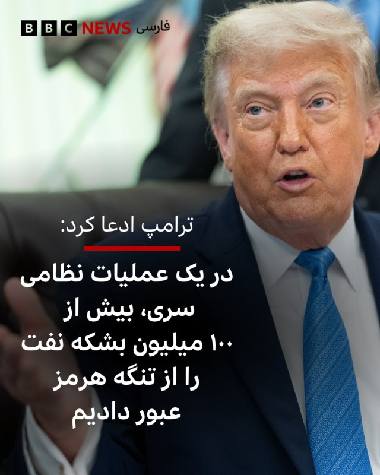

‌‌
دونالد ترامپ، رئیس جمهوری ایالات متحده، در شبکه اجتماعی‌اش، تروث سوشال، نوشت که طی ماه گذشته و به دستور او، ارتش آمریکا در یک «مأموریت مخفی برای پشتیبانی از نفتکش‌ها و سایر کشتی‌های تجاری در تنگه هرمز» موفق به عبور بیش از ۱۰۰ میلیون بشکه نفت از تنگه و ورود آن به بازار آزاد شده است.

آقای ترامپ نوشت که بیش از ۲۰۰ کشتی تجاری با آرامش از این تنگه عبور کرده‌اند اما جزییاتی از این عملیات یا کشتی‌هایی که به گفته او موفق به عبور از تنگه هرمز شده‌اند، نداد.

او همچنین بار دیگر مدعی شد که کنترل تنگه هرمز در «اختیار آمریکاست، نه ایران.»

آقای ترامپ در انتها با ادعای مجدد درباره «شکست و نابودی» ارتش ایران نوشت: «کار برای ایران تمام شده است».

این در حالی است که ارزیابی نهادهای اطلاعاتی و نظامی آمریکا در سه ماه گذشته بارها در تناقض با اظهارات کاخ سفید و آقای ترامپ بوده است.

ستاد مرکزی فرماندهی ارتش آمریکا (سنتکام) پیشتر گفته بود که یک نفتکش مرتبط با نفت ایران را در دریای عمان از کار انداخته است.
📷EPA/Shutterstock

تازه‌ترین تحولات را از صفحه زنده در سایت بی‌بی‌سی فارسی دنبال کنید.
https://bbc.in/4eeOfke
@BBCPersian

## Dirty_Kids — post 391622

  <a href="telegram/content/Dirty_Kids_391622_1781124154.mp4" target="_blank">🎬 Download video</a>

ویدیویی از گوریل Kiyomasa در باغ‌وحش ژاپن که بعد از دعوا با همسرش در فکر فرورفته است.

بعداز استرس‌ها، زن‌ها غمگین می‌شوند ولی مردها می‌میرند. 💔

@Dirty_Kids 👻

## Dirty_Kids — post 391621

🔴 آکسیوس:

هم اکنون ترامپ و تیم ارشد امنیت ملی خود در اتاق وضعیت کاخ سفید در حال برگزاری جلسه در مورد ایران می‌باشند.

@Dirty_Kids 👻

## Dirty_Kids — post 391617

  <a href="telegram/content/Dirty_Kids_391617_1781124156.mp4" target="_blank">🎬 Download video</a>

🔴 طبق گزارش‌ها؛ چندین فروند بمب‌افکن راهبردی B-52 ایالات متحده
🇺🇸برای تقویت روند توافقات وارد منطقه خاورمیانه شدن.

@Dirty_Kids 👻

## alonews — post 126971

  <a href="telegram/content/alonews_126971_1781124157.webm" target="_blank">🎬 Download video</a>

👈وزیر ارتباطات: از سرعت اینترنت راضی نیستم

✅ @AloNews خبر جنگ

## alonews — post 126970

  <a href="telegram/content/alonews_126970_1781124157.webm" target="_blank">🎬 Download video</a>

👈ادعای منبع پاکستانی به الحدث: ما امروز از امضای توافقنامه صلح، دور شده‌ایم

✅ @AloNews خبر جنگ

## alonews — post 126969

  <a href="telegram/content/alonews_126969_1781124158.mp4" target="_blank">🎬 Download video</a>

👈وزیر جنگ؛ هگِستِ : اونا قرار نیست به توافق برسن و ما هم با قدرت روشون فشار میاریم

🔴سنتکام این کار رو خیلی خوب انجام می‌ده، بهتر از هر کسی تو دنیا، و ما هم همون نتیجه‌ای رو که می‌خوایم

✅ @AloNews خبر جنگ

---
📅 بروزرسانی: 1405/03/21 00:02
---

## VahidOOnLine — post 244778

  

اکسیوس گزارش داد که دونالد ترامپ، رییس جمهوری ایالات متحده در کاخ سفید درباره حمله بیشتر به ایران جلسه برگزار کرده است.

بنا بر این گزارش، ترامپ عملیات گسترده و کوتاه علیه ایران را بررسی می‌کند.

پیش‌تر دونالد ترامپ گفته بود جمهوری اسلامی باید توافقی «معنادار و کارآمد» را امضا کند و افزود ما آن‌ها را بسیار سخت هدف قرار خواهیم داد و امروز دوباره ضربه محکمی به آن‌ها خواهیم زد.
‌🏁 🇬🇧 IranintlTV

🤖 @VahidOOnLine

## VahidOOnLine — post 244777

  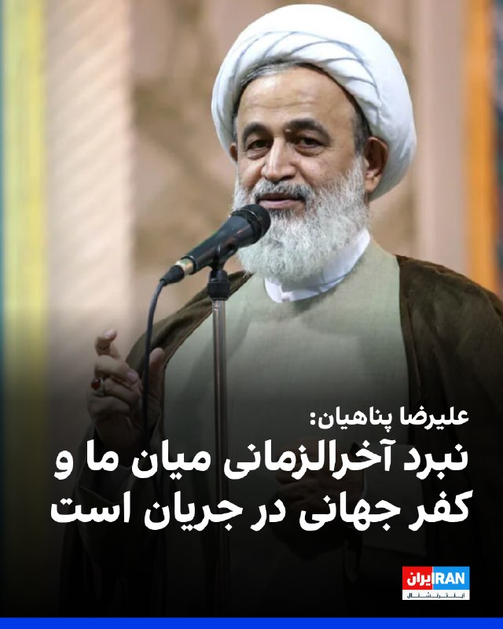

علیرضا پناهیان، سخنران دفتر خامنه‌ای، در تجمع حامیان حکومت در شاهرود گفت: «اکنون نبرد آخرالزمانی میان ما و تمام کفر جهانی در جریان است.»

او ادامه داد: «امروز نیز شاهد هستیم که راس کفر، یا همان استکبار جهانی، در برابر تمام اسلام ناب محمدی ایستاده است.»
‌🏁 🇬🇧 IranintlTV

🤖 @VahidOOnLine

## WithYashar — post 14382

منابع ایرانی (برای بار چهارصدم از صبح )به الجزیره گفتند: هرگونه حمله منجر به پایان مذاکرات خواهد شد
@withyashar

## WithYashar — post 14381

آکسیوس: یکی از گزینه‌های روی میز، یه عملیات نظامی گسترده اما کوتاه‌مدته هدفش هم اینه که ایران رو تحت فشار بذارن تا توی مذاکرات موضعش رو تغییر بده.
@withyashar

## WithYashar — post 14380

شبکه CNN: فرماندهان جدید ایران ریسک‌هایی رامی‌پذیرند که قبلی‌ها آنها از آن اجتناب می‌کردند
@withyashar

## mwarmonitor — post 10650

  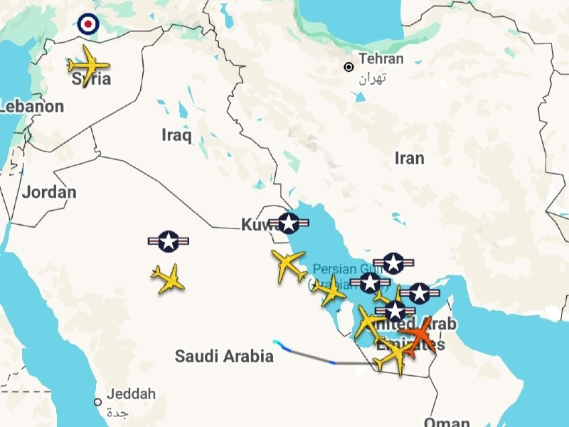

✈️گروهی از تانکرهای سوخت‌رسان نیروی هوایی آمریکا (USAF) از تل‌آویو و ریاض در حال فعالیت در اطراف تنگه هرمز و خلیج فارس هستند؛ همه آن‌ها قابل مشاهده نیستند و هواپیماهای جنگنده نیز آن‌ها را همراهی می‌کنند.

@mwarmonitor

## FoxNewsTwitter — post 342824

Fox News (Twitter/X)

RT @TheStoryFNC: BREAKING NOW: Karmelo Anthony set to appeal conviction in track meet murder of Austin Metcalf

@Brooketaylortv reports

## pm_afshaa — post 93376

  <a href="telegram/content/pm_afshaa_93376_1781123549.webm" target="_blank">🎬 Download video</a>

🔴شبکه سی‌ان‌ان:
فرماندهان جدید ایران ریسک‌هایی رو می‌پذیرن که قبلی‌ها از آن اجتناب میکردن.

💧 Rainbet.com the #1 Non-KYC Crypto Casino & Sportsbook @rainbetcom

😁 @Pm_Afshaa

## pm_afshaa — post 93375

  <a href="telegram/content/pm_afshaa_93375_1781123549.webm" target="_blank">🎬 Download video</a>

🔴وال‌استریت ژورنال:
هلیکوپتر آپاچی سقوط‌‌کرده در حال محافظت از کشتی‌ها در برابر پهپادها و موشک‌های جمهوری اسلامی بوده.

خلبانان لحظاتی قبل از غرق شدن بالگردِ در حال آتش‌سوزی، موفق شدن از کابین خارج شده و جون خودشون رو نجات بدن.

💧 Rainbet.com the #1 Non-KYC Crypto Casino & Sportsbook @rainbetcom

😁 @Pm_Afshaa

## mamlekate — post 103664

📝 قطعنامه پیشنهادی آمریکا علیه برنامه هسته‌ای جمهوری اسلامی در شورای حکام تصویب شد

شورای حکام آژانس بین‌المللی انرژی اتمی چهارشنبه ۲۰ خرداد قطعنامه‌ای را علیه برنامه هسته‌ای جمهوری اسلامی تصویب کرد و از تهران خواست هرچه زودتر ذخایر باقی‌مانده اورانیوم غنی‌شده خود را اعلام کند و به بازرسان اجازه دهد این مواد را راستی‌آزمایی کنند.

@mamlekate

## mamlekate — post 103663

  <a href="telegram/content/mamlekate_103663_1781123550.mp4" target="_blank">🎬 Download video</a>

دونالد ترامپ رئیس‌جمهور ایالات متحده درباره ایران: «دیروز ضربات سنگینی به آن‌ها وارد کردیم و امروز هم دوباره ضربات سنگینی وارد می‌کنیم... و خواهیم دید که در مورد توافق چه اتفاقی می‌افتد. ما به یک توافق بسیار نزدیک شده بودیم، اما آن‌ها مدام ما را معطل می‌کنند. آن‌ها همچنان ما را ساده‌لوح فرض می‌کنند، چون می‌دانید چیست؟ آن‌ها در گذشته با رؤسای‌جمهور بسیار احمقی طرف بوده‌اند.»
USABehFarsi

@mamlekate

## VahidOnline — post 76163

  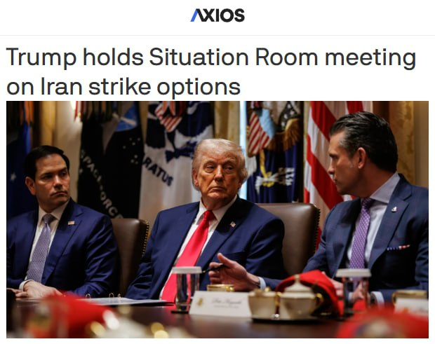

آکسیوس: ترامپ درباره گزینه‌های حمله به ایران در اتاق وضعیت جلسه برگزار کرد

ترجمه ماشین:
پرزیدنت ترامپ بعدازظهر چهارشنبه جلسه‌ای در اتاق وضعیت کاخ سفید برگزار کرد تا درباره حملات احتمالی تازه علیه ایران گفت‌وگو کند؛ این جلسه چند ساعت پس از آن برگزار شد که او به خبرنگاران گفته بود آمریکا «امروز دوباره ضربه سختی به آن‌ها خواهد زد». این را دو منبع آمریکایی اعلام کردند.

این منابع گفتند یکی از گزینه‌هایی که ترامپ در حال بررسی آن است، انجام عملیاتی است که از نظر مقیاس بزرگ اما از نظر مدت‌زمان کوتاه باشد؛ با هدف فشار آوردن به ایران برای تغییر موضعش در مذاکرات.
این منابع جزئیات بیشتری ارائه نکردند.
axios

📡 @VahidOnline

## IranIntlTV — post 341581

  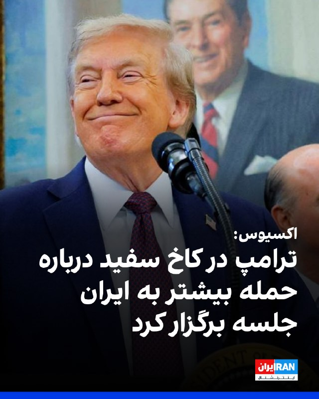

اکسیوس گزارش داد که دونالد ترامپ، رییس جمهوری ایالات متحده در کاخ سفید درباره حمله بیشتر به ایران جلسه برگزار کرده است.

بنا بر این گزارش، ترامپ عملیات گسترده و کوتاه علیه ایران را بررسی می‌کند.

پیش‌تر دونالد ترامپ گفته بود جمهوری اسلامی باید توافقی «معنادار و کارآمد» را امضا کند و افزود ما آن‌ها را بسیار سخت هدف قرار خواهیم داد و امروز دوباره ضربه محکمی به آن‌ها خواهیم زد.
https://iranintl.com/202606107504

## IranIntlTV — post 341580

  

علیرضا پناهیان، سخنران دفتر خامنه‌ای، در تجمع حامیان حکومت در شاهرود گفت: «اکنون نبرد آخرالزمانی میان ما و تمام کفر جهانی در جریان است.»

او ادامه داد: «امروز نیز شاهد هستیم که راس کفر، یا همان استکبار جهانی، در برابر تمام اسلام ناب محمدی ایستاده است.»
https://iranintl.com/202606102666

## Persian_Trend_Official — post 16533

📰 آکسیوس: ترامپ گزینه حمله محدود به ایران را بررسی می‌کند
پایگاه خبری آکسیوس به نقل از منابع آگاه گزارش داد که یکی از گزینه‌های مورد بررسی در دولت دونالد ترامپ، اجرای یک عملیات نظامی کوتاه‌مدت اما گسترده علیه ایران است.
بر اساس این گزارش، هدف از چنین عملیاتی افزایش فشار بر تهران و وادار کردن ایران به تغییر مواضع خود در مذاکرات عنوان شده است.

👺Phantom

📌 @persian_trend_official
پرشین ترند | متفاوت‌ترین کانال نظامی

## Persian_Trend_Official — post 16532

منابع ایرانی به الجزیره گفتند: هرگونه حمله منجر به پایان مذاکرات خواهد شد.

📝 Amir

📌 @persian_trend_official
پرشین ترند | متفاوت‌ترین کانال نظامی

## alonews — post 126968

  <a href="telegram/content/alonews_126968_1781123553.mp4" target="_blank">🎬 Download video</a>

👈هگِستِ خطاب به سرباز‌های سنتکام : این به مأموریت مهمی که شروع کردین و هنوز دارین ادامه‌اش می‌دین؛

🔴 تا مطمئن شین ایران هیچ‌وقت به سلاح هسته‌ای نرسه، باید خیلی افتخار کنید به خودتون

✅ @AloNews خبر جنگ

<!-- MSG END -->

<!-- NAV START -->

<!-- NAV END -->
