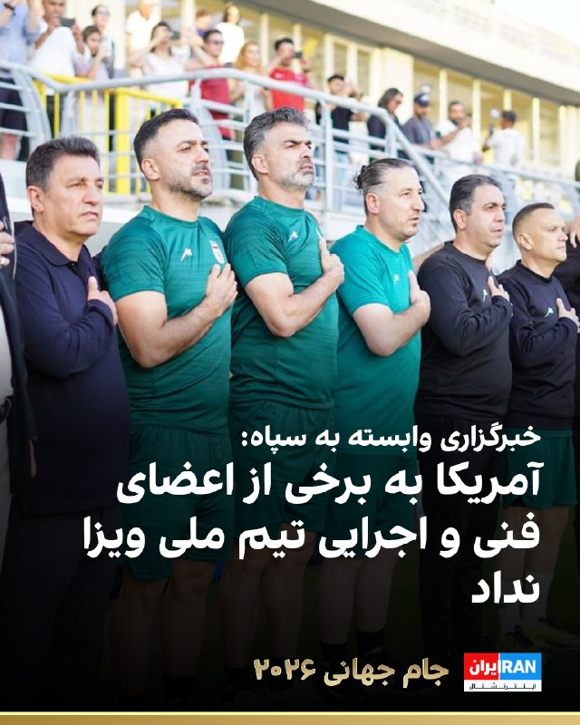

# خواننده تلگرام

<!-- TOP_NAV START -->

<a href="https://github.com/ProAlit/aio-downloader/blob/main/telegram/content/archive_1.md" style="display:inline-block; padding:6px 12px; margin:0 4px; background-color:#2ea44f; color:white; text-decoration:none; border-radius:4px; font-weight:bold;">صفحه بعد</a>

<!-- TOP_NAV END -->

<!-- MSG START -->

---
📅 بروزرسانی: 1405/03/15 23:22
---

## VahidOOnLine — post 243855

  <a href="telegram/content/VahidOOnLine_243855_1780689175.mp4" target="_blank">🎬 Download video</a>

♦️هواداران تیم ام‌سی الجر(MC Alger) پس ازدهمین قهرمانی در لیگ برتر الجزایر، خیابان‌های الجزیره را به صحنه‌ای از جشن و شادی تبدیل کردند.
ویدیوهای منتشرشده نشان می‌دهد هزاران هوادار با پرچم‌ها، شعارها و منورهای قرمز رنگ همزمان صحنه آتش‌بازی بزرگی را رقم زدند و قهرمانی تیم محبوبشان را جشن گرفته‌اند؛ طرفداران این تیم در الجزایر معروف به استفاده از منورهای قرمز در مسابقات هستند.
 تیم ام‌سی الجر با این قهرمانی بار دیگر جایگاه خود را به‌عنوان یکی از پرافتخارترین تیم‌های فوتبال الجزایر تثبیت کرد و هوادارانش را به خیابان‌ها کشاند.
‌🇸🇦 Indypersian

🤖 @VahidOOnLine

## DEJradio — post 5368

⭕️ ارتش آمریکا از توقیف یک ابرنفتکش مرتبط با جمهوری اسلامی خبر داد

فرماندهی هند-اقیانوسیهٔ ارتش ایالات متحده اعلام کرد نیروهای آمریکا در اقیانوس هند ابرنفتکش ام‌تی داوینا، را توقیف و بازرسی کردند.
ارتش آمریکا اعلام کرد این کشتی به دلیل ارتباط با تجارت نفت جمهوری اسلامی تحت تحریم بود.
رویترز گزارش داد این نفتکش می‌تواند درحدود دو میلیون بشکه نفت خام را حمل کند.
داده‌های رهگیری شرکت‌های کشتیرانی نشان می‌دهد این نفتکش در روز آدینه آخرین بار در نزدیکی سواحل جنوبی سریلانکا دیده شده است.

#خبر #دژ #محاصره_دریایی
@DEJradio

## DEJradio — post 5367

⭕️ اسرائیل در جنگ با جمهوری اسلامی شبکهٔ مخفی منطقه‌ای ایجاد کرده بود

شبکهٔ سی‌ان‌ان به نقل از چهار منبع آگاه گزارش داد اسرائیل در جریان جنگ با جمهوری اسلامی، شبکه‌ای از پایگاه‌ها و مراکز مخفی در خاورمیانه ایجاد کرده بود.
بنا بر این گزارش، بخشی واحدهای اطلاعاتی و نظامی اسرائیل در جنوب جمهوری آذربایجان، نزدیک مرز شمالی ایران، مستقر بود.
منابع سی‌ان‌ان گفتند نیروهای اسرائیلی از این مناطق عملیات اطلاعاتی و پهپادی انجام می‌دادند.
سی‌ان‌ان همچنین از وجود مراکز و پایگاه‌های پنهانی دیگر اسرائیل در عراق، امارات و سومالی‌لند خبر داد.
بر پایهٔ گزارش این شبکه، برخی از همسایگان ایران آگاهانه یا بدون اطلاع، در تسهیل عملیات علیه جمهوری اسلامی نقش داشتند.

#خبر #دژ #اسرائیل
@DEJradio

## IranIntlTV — post 340716

  

🔻درحالی که رویترز به نقل از مقامی در کاخ سفید خبر داده آمریکا برای بازیکنان تیم ملی ویزا صادر کرده است، فارس، خبرگزاری وابسته به سپاه نوشته که «ویزای برخی اعضای کادر فنی و اجرایی تیم ملی هنوز صادر نشده و سفارت آمریکا تاکنون از صدور ویزا خودداری کرده است.»

🔹پیش‌تر مهدی تاج، رییس فدراسیون فوتبال گفته بود «پاسپورت‌های اعضای تیم ملی را به سفارت آمریکا در آنکارا تحویل دادیم. به فیفا اعلام کرده‌ایم اگر ویزای برخی از اعضای تیم ملی صادر نشود، تصمیم‌های دیگری خواهیم گرفت.»

🔹ابوالفضل پسندیده، سفیر ایران در مکزیک، اواخر روز پنج‌شنبه گفته بود که تیم ملی هنوز ویزای آمریکا را دریافت نکرده است، اما مقام کاخ سفید اعلام کرد این ویزاها طی شب صادر شده‌اند.

🔹این در حالی است که تنها ۱۰ روز تا نخستین بازی ایران در جام جهانی ۲۰۲۶ باقی‌مانده است. این بازی در لس‌آنجلس و در برابر نیوزیلند برگزار خواهد شد.

@iranintltvsport

## Shin_Persian — post 6527

Shin ✓ @hey_itsmyturn
Fri, 05 Jun 2026 19:46:28 UTC

Explosions heard in Sulaimaniyah, #KRI, #Iraq 🇮🇶

فارسی

صدای انفجارها در سلیمانیه، #KRI (اقلیم کردستان عراق)، #Iraq شنیده شد 🇮🇶

𝕏 · @shin_persian

## DW_Farsi — post 125549

🎥 افزایش دارایی‌های ابرثروتمندان در آلمان

دارایی‌های مالی و ثروت در آلمان با سرعت در حال افزایش است، اما این رشد شامل همه نمی‌شود. حدود ۵ هزار ابرثروتمند در این کشور یک‌چهارم کل دارایی مالی را در اختیار دارند، در حالی که خطر فقر نیز رو به افزایش است.
@dw_farsi

## alonews — post 125399

  <a href="telegram/content/alonews_125399_1780689177.webm" target="_blank">🎬 Download video</a>

👈الحدث به نقل از یک مقام آمریکایی: دیدار ویتکاف و کوشنر با کارشناسان هسته‌ای نشانه آن است که مذاکرات در مرحله جدی قرار دارد.

✅ @AloNews خبر جنگ

## alonews — post 125398

  <a href="telegram/content/alonews_125398_1780689177.webm" target="_blank">🎬 Download video</a>

👈المیادین: در حمله به یک کشتی ماهیگیری ترکیه که در دریای سیاه در حال حرکت بود، یک ماهیگیر کشته و 4 تن دیگر زخمی شدند.

✅ @AloNews خبر جنگ

## alonews — post 125397

  <a href="telegram/content/alonews_125397_1780689177.webm" target="_blank">🎬 Download video</a>

👈امروز دو نیرو حزب الله توسط ارتش اسرائیل (IDF) در درگیری تن به تن کشته شدند

✅ @AloNews خبر جنگ

---
📅 بروزرسانی: 1405/03/15 23:12
---

## WithYashar — post 13570

  

خواستگاری جنجالی قیصر از الهام چرخنده در تجمعات حکومتی

قیصر در یکی از تجمعات حکومتی، به‌صورت علنی از الهام چرخنده، بازیگر سابق تلویزیون ایران، درخواست ازدواج کرد. این اتفاق غیرمنتظره خیلی زود در فضای مجازی و رسانه‌ای مورد توجه قرار گرفت و واکنش‌های زیادی را به دنبال داشت
@withyashar

## FarsiVOA — post 219699

⚡️از وداع با ساتراپی تا بازگشت قیصر؛ کاربران از پرسپولیس و «حلال» شدن موسیقی لس‌آنجلسی می‌گویند
@FarsiVOA

## FarsiVOA — post 219698

  <a href="telegram/content/FarsiVOA_219698_1780688572.mp4" target="_blank">🎬 Download video</a>

⚡️هشدارها درباره وضعیت نامناسب زندان‌ها در ایران؛ گفت‌وگو با شیوا محبوبی
@FarsiVOA

## FarsiVOA — post 219697

⚡️پدیدار شدن تدریجی عوارض قطع ۸۸ روزه اینترنت در ایران بر اقتصاد؛ نابودی کسب‌وکارهای دیجیتال در گفت‌وگو با رضا غیبی
@FarsiVOA

## IranianMinds — post 21445

  <a href="telegram/content/IranianMinds_21445_1780688573.mp4" target="_blank">🎬 Download video</a>

🔴عضو فاطمیون میخواد بزنه توی دهن ما، بعد به ما میگن وطن‌فروش😂

@IranianMinds

## Hranews — post 113412

  

اعتراضات ۱۴۰۴؛ گزارشی تازه از وضعیت سمیرا و مینا کوچکی در زندان اوین

❗️
❗️
❗️
❗️
❗️– سمیرا و مینا کوچکی، از بازداشت‌شدگان اعتراضات ۱۴۰۴، دوران محکومیت خود را در زندان اوین سپری می‌کنند. این افراد توسط دادگاه انقلاب به مجموعا ۱۰ سال حبس محکوم شده‌اند.

به گزارش خبرگزاری هرانا، ارگان خبری مجموعه فعالان حقوق بشر در ایران، سمیرا و مینا کوچکی، زندانیان سیاسی در حال سپری کردن دوران حبس خود در زندان اوین هستند.

یک منبع مطلع و نزدیک به خانواده کوچکی ضمن تایید این خبر به هرانا گفت: خانم‌های کوچکی که در جریان اعتراضات سراسری ۱۴۰۴ بازداشت شده‌اند، هرکدام توسط دادگاه انقلاب به پنج سال حبس محکوم شدند. این خواهران که پس از بازداشت در زندان قرچک ورامین به‌سر می‌بردند، مورخ ۲۷ بهمن ماه سال گذشته به زندان اوین منتقل شدند.

ادامه مطلب

#سمیرا_کوچکی
#مینا_کوچکی

↘️
@hranews_bot تماس ✉️ -  @Hranews  کانال هرانا 🆑

## alonews — post 125396

  <a href="telegram/content/alonews_125396_1780688575.webm" target="_blank">🎬 Download video</a>

👈خبرگزاری فارس : آمریکا هنوز به برخی از اعضای فنی و اجرایی تیم ملی ایران ویزا نداده

✅ @AloNews خبر جنگ

---
📅 بروزرسانی: 1405/03/15 23:02
---

## VahidOOnLine — post 243854

  

تامی پیگوت، سخنگوی وزارت خارجه آمریکا، با انتشار بیانیه‌ای درباره تحریم‌های تازه واشینگتن علیه جمهوری اسلامی اعلام کرد: «امروز، ایالات متحده تلاش‌های ایران برای دور زدن تحریم‌های ما و تامین مالی فعالیت‌های بی‌ثبات‌کننده‌اش را مختل می‌کند.»

او افزود: «ایالات متحده یک شبکه پیچیده که صدها میلیون دلار گاز نفتی ایران را به بازارهای جنوب و شرق آسیا قاچاق کرده است، هدف قرار داده است. این شبکه از شرکت‌های پوششی در امارات متحده عربی و چین، همراه با ناوگان سایه ایران، برای پنهان کردن منشا ایرانی سوخت و دور زدن تحریم‌های آمریکا استفاده کرده است.»

سخنگوی وزارت خارجه آمریکا ادامه داد: «ما همچنین یک صرافی ایرانی و گردانندگان آن را تحریم می‌کنیم که با سایر عوامل همکاری کرده‌اند تا بتواند میلیاردها دلار تراکنش مالی غیرقانونی را تسهیل کند. این معاملات به حکومت ایران امکان می‌دهد درآمدهای حاصل از فروش نفت را جابه‌جا کرده و هم‌زمان از نظام مالی بین‌المللی دوری کند.»

پیگوت تاکید کرد: «این تحریم‌ها بخشی از کارزار خشم اقتصادی است که با حفظ فشار حداکثری بر حکومت ایران، توانایی آن برای کسب درآمد جهت توسعه تسلیحات، حمایت از گروه‌های نیابتی تروریستی و اقدامات تهاجمی در منطقه را مختل می‌کند.»

او نوشت: «ایالات متحده همچنان اقداماتی را برای پاسخگو کردن هر فرد یا نهادی که به ایران در دور زدن تحریم‌ها کمک کند، از جمله شرکت‌ها و موسسات مالی خارجی، اتخاذ خواهد کرد. ما از جامعه بین‌المللی می‌خواهیم در اجرای این اقدامات به ما بپیوندد و مانع دسترسی جمهوری اسلامی به منابعی شود که به تروریسم، گسترش تسلیحات و بی‌ثباتی در سراسر منطقه دامن می‌زند.»
‌🏁 🇬🇧 IranintlTV

🤖 @VahidOOnLine

## FoxNewsTwitter — post 342659

  

Fox News (Twitter/X)

The reflection is finally coming back.

After weeks of construction, water is returning to the Reflecting Pool on the National Mall as part of President Trump's push to restore Washington, D.C.'s iconic landmarks.

The difference is already striking, with the Washington Monument's signature reflection beginning to reappear across the water.

## FoxNewsTwitter — post 342658

‌Fox News (Twitter/X)

When will the next Fed rate hike occur?

Our sponsor Kalshi’s prediction market shows:

— Before 2027: 51%
— Before 2028: 79%

https://www.foxbusiness.com/economy/us-jobs-report-may-2026

## IranIntlTV — post 340715

  

تامی پیگوت، سخنگوی وزارت خارجه آمریکا، با انتشار بیانیه‌ای درباره تحریم‌های تازه واشینگتن علیه جمهوری اسلامی اعلام کرد: «امروز، ایالات متحده تلاش‌های ایران برای دور زدن تحریم‌های ما و تامین مالی فعالیت‌های بی‌ثبات‌کننده‌اش را مختل می‌کند.»

او افزود: «ایالات متحده یک شبکه پیچیده که صدها میلیون دلار گاز نفتی ایران را به بازارهای جنوب و شرق آسیا قاچاق کرده است، هدف قرار داده است. این شبکه از شرکت‌های پوششی در امارات متحده عربی و چین، همراه با ناوگان سایه ایران، برای پنهان کردن منشا ایرانی سوخت و دور زدن تحریم‌های آمریکا استفاده کرده است.»

سخنگوی وزارت خارجه آمریکا ادامه داد: «ما همچنین یک صرافی ایرانی و گردانندگان آن را تحریم می‌کنیم که با سایر عوامل همکاری کرده‌اند تا بتواند میلیاردها دلار تراکنش مالی غیرقانونی را تسهیل کند. این معاملات به حکومت ایران امکان می‌دهد درآمدهای حاصل از فروش نفت را جابه‌جا کرده و هم‌زمان از نظام مالی بین‌المللی دوری کند.»

پیگوت تاکید کرد: «این تحریم‌ها بخشی از کارزار خشم اقتصادی است که با حفظ فشار حداکثری بر حکومت ایران، توانایی آن برای کسب درآمد جهت توسعه تسلیحات، حمایت از گروه‌های نیابتی تروریستی و اقدامات تهاجمی در منطقه را مختل می‌کند.»

او نوشت: «ایالات متحده همچنان اقداماتی را برای پاسخگو کردن هر فرد یا نهادی که به ایران در دور زدن تحریم‌ها کمک کند، از جمله شرکت‌ها و موسسات مالی خارجی، اتخاذ خواهد کرد. ما از جامعه بین‌المللی می‌خواهیم در اجرای این اقدامات به ما بپیوندد و مانع دسترسی جمهوری اسلامی به منابعی شود که به تروریسم، گسترش تسلیحات و بی‌ثباتی در سراسر منطقه دامن می‌زند.»

## DW_Farsi — post 125548

  

🔶 صدور روادید آمریکا برای تیم ملی فوتبال ایران

یک مقام کاخ سفید اعلام کرد که روادید ورود به ایالات متحده برای بازیکنان تیم ملی فوتبال ایران صادر شده است. این تصمیم تنها ۱۰ روز پیش از نخستین دیدار ایران در لس‌آنجلس و در بحبوحه جنگ و درگیری‌های فزاینده میان دو کشور اتخاذ شده است.

بە گزارش رویترز، بە نقل از یک مقام مطلع در کاخ سفید، روادید کاروان ایران بامداد روز جمعه ۱۵ خرداد (۵ ژوئن) صادر شد. این تحول تنها چند ساعت پس از آن رخ داد که ابوالفضل پسندیده، سفیر ایران در مکزیک، اواخر روز پنجشنبه اعلام کرده بود اعضای تیم هنوز روادید آمریکای خود را دریافت نکرده‌اند.

با وجود صدور روادید تأخیر در این روند و همچنین تقویت این رویکرد در تهران که حضور ملی‌پوشان در خاک آمریکا باید به حداقل ممکن برسد، موجب شد تا ایران در یک تصمیم‌گیری دیرهنگام محل کمپ تمرینی تیم ملی را تغییر دهد.

بر این اساس پایگاه تیم از ایالت آریزونای آمریکا به شهر مرزی تیخوانا در مکزیک منتقل شد. برنامه‌ریزی‌ها حاکی از آن است که اعضای تیم ملی ایران بامداد یکشنبه در تیخوانا فرود خواهند آمد.
@dw_farsi

## alonews — post 125395

  <a href="telegram/content/alonews_125395_1780687980.webm" target="_blank">🎬 Download video</a>

👈گزارش ایرفورس مگزین، مرکز فرماندهی آمریکا که بیش از ۲ دهه عملیات هوایی آمریکا در خاورمیانه را هدایت می‌کرد، در جریان جنگ آمریکا علیه ایران به شدت آسیب دید.

🔴چند موشک ایران در هفته‌های آغازین جنگ به مرکز عملیات هوایی ترکیبی در پایگاه هوایی «العدید» در قطر اصابت کرد و آن را از کار انداخت.

✅ @AloNews خبر جنگ

## alonews — post 125394

  <a href="telegram/content/alonews_125394_1780687980.webm" target="_blank">🎬 Download video</a>

👈هشدارهای راکتی در گالیلای علیا و نوار گالیلای شمالی، شمال اسرائیل

✅ @AloNews خبر جنگ

<!-- MSG END -->

<!-- NAV START -->

<a href="https://github.com/ProAlit/aio-downloader/blob/main/telegram/content/archive_1.md" style="display:inline-block; padding:6px 12px; margin:0 4px; background-color:#2ea44f; color:white; text-decoration:none; border-radius:4px; font-weight:bold;">صفحه بعد</a>

<!-- NAV END -->
