# خواننده تلگرام

<!-- TOP_NAV START -->

<a href="https://github.com/ProAlit/aio-downloader/blob/main/telegram/content/archive_1.md" style="display:inline-block; padding:6px 12px; margin:0 4px; background-color:#2ea44f; color:white; text-decoration:none; border-radius:4px; font-weight:bold;">صفحه بعد</a>

<!-- TOP_NAV END -->

<!-- MSG START -->

---
📅 بروزرسانی: 1405/03/26 23:43
---

## VahidOOnLine — post 245938

  <a href="telegram/content/VahidOOnLine_245938_1781640836.mp4" target="_blank">🎬 Download video</a>

علیرضا زاکانی، شهردار تهران، گفت «مراسم وداع» با علی خامنه‌ای و تشییع جنازه او و دیگر اعضای خانواده‌اش که همراه با او کشته شدند، از ۱۳ تیر آغاز می‌شود. تدفین او در روز ۱۸ تیر در مشهد برنامه‌ریزی شده است.
به گفته او، برگزارکنندگان امیدوارند این مراسم به تشییعی «بی‌نظیر و تاریخی» بدل شود.
او همچنین افزود: «پیش‌بینی می‌شود دست‌کم ۱۵ تا ۲۰ میلیون نفر در تهران در این مراسم شرکت کنند.»
‌🏁 🇬🇧 IranintlTV

🤖 @VahidOOnLine

## pm_afshaa — post 94214

  

امروز 26 خرداد، سالگرد و تولد مجیدرضا رهنورده

💧 Rainbet.com the #1 Non-KYC Crypto Casino & Sportsbook @rainbetcom

😁 @Pm_Afshaa

## IranIntlTV — post 342768

  <a href="telegram/content/IranIntlTV_342768_1781640838.mp4" target="_blank">🎬 Download video</a>

وال‌استریت ژورنال می‌گوید ایران طبق توافق با واشینگتن می‌تواند فورا صادرات نفت را از سر بگیرد و بخشی از تحریم‌های بانکی و حمل‌ونقل نیز تعلیق شود. همزمان، دونالد ترامپ، گفت این توافق ۹۹ درصد خواسته‌های آمریکا را تامین کرده است.

ارزیابی علی دادپی، اقتصاددان
@iranintltv

## IranIntlTV — post 342767

  <a href="telegram/content/IranIntlTV_342767_1781640839.mp4" target="_blank">🎬 Download video</a>

علیرضا زاکانی، شهردار تهران

## IranianMinds — post 22764

🔴ابراهیم عزیزی، رئیس کمیسیون امنیت ملی:

اگر اسرائیل همچنان به جنوب لبنان حمله کند، پاسخ سختی می‌دهیم.

@IranianMinds

## Dirty_Kids — post 392341

  <a href="telegram/content/Dirty_Kids_392341_1781640840.mp4" target="_blank">🎬 Download video</a>

داداش تو چه کار خوبی تو زندگیت کردی؟ یه هموطن رفته تور و همه کسایی که اومدن، دخترن😂

@Dirty_Kids 👻

## Dirty_Kids — post 392340

  <a href="telegram/content/Dirty_Kids_392340_1781640841.mp4" target="_blank">🎬 Download video</a>

🔴 این ویدیو پربازدیدترین و پر شیر ترین ویدیو اینستاگرام فارسی تو چندماه اخیره؛

@Dirty_Kids 👻

## alonews — post 128564

  <a href="telegram/content/alonews_128564_1781640842.mp4" target="_blank">🎬 Download video</a>

👈حرف حق پزشکیان:
مشکلات خودتون رو خودتون حل کنید، من سیاستمدار نیستم من دکترم، برا سلامت مردم اومدم رئیس‌جمهور شدم

✅ @AloNews خبر جنگ

## alonews — post 128563

  <a href="telegram/content/alonews_128563_1781640844.webm" target="_blank">🎬 Download video</a>

👈 پزشکیان: حوادث دی‌ماه سال گذشته قابل پیشگیری بود

🔴بخش قابل توجهی از کسانی که در این رخداد‌ها حضور داشتند، با آسیب‌هایی همچون بیکاری، محرومیت درگیر بودند،

🔴اگر می‌توانستیم زمینه‌های شکل‌گیری این آسیب‌ها را شناسایی و مدیریت کنیم، بسیاری از این مسائل بروز نمی‌یافت

✅ @AloNews خبر جنگ

## alonews — post 128562

  <a href="telegram/content/alonews_128562_1781640844.webm" target="_blank">🎬 Download video</a>

👈کانال ۱۵ عبری: سند تفاهماتی که میان امریکا و ایران در حال شکل‌گیری است، مجموعه‌ای از امتیازات بسیار گسترده واشنگتن را در ازای پایان فوری جنگ در تمامی جبهه‌ها، از جمله لبنان، نشان می‌دهد

🔴واشنگتن متعهد می‌شود محاصره دریایی را لغو کند، تمامی تحریم‌ها را بردارد، از منطقه خارج شود و دست‌کم ۳۰۰ میلیارد دلار برای بازسازی ایران اختصاص دهد

✅ @AloNews خبر جنگ

---
📅 بروزرسانی: 1405/03/26 23:34
---

## VahidOOnLine — post 245937

  <a href="telegram/content/VahidOOnLine_245937_1781640264.mp4" target="_blank">🎬 Download video</a>

گروهی از ایرانیان در مالمو سوئد روز سه‌شنبه ۲۶ خرداد ۱۴۰۵، همزمان با زادروز مجیدرضا رهنورد و «روز ملی پرچم شیر و خورشید»، با تشکیل زنجیره انسانی و بازخوانی نام جان‌باختگان «انقلاب ملی»، یاد آنان را گرامی داشتند.
‌🏁 🇬🇧 IranintlTV

🤖 @VahidOOnLine

## VahidOOnLine — post 245936

  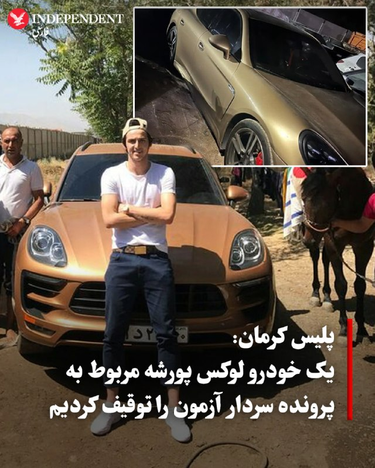

♦️ پلیس شهرستان کرمان، روز سه‌شنبه ۲۶ خرداد، اعلام کرد که یک خودرو لوکس پورشه که در فهرست اموال سردار آزمون ذکر شده و دستور توقیف آن صادر شده بود، در این شهرستان شناسایی و ضبط شده است.

به گفته اکبر نجفی، فرمانده انتظامی کرمان، این خودرو توسط «گشت‌های محسوس و نامحسوس» کشف شده است.

قوه قضاییه جمهوری اسلامی پیش از این دستور توقیف اموال سردار آزمون، فوتبالیست مشهور و عضو تیم ملی را به اتهام «همکاری با دشمن» صادر کرده بود. آزمون در جریان انقلاب ملی ایرانیان، عبارت «از خون جوانان وطن لاله دمیده» را روی دستش خالکوبی کرد و در دی‌ماه نیز با انتشار ویدیویی از کشته‌شدگان این اعتراضات، در شبکه اجتماعی اینستاگرام نوشت: «این‌ها قصه نبودند، واقعی بودند. هیچ‌وقت شما را از یاد نمی‌بریم».

این همراهی سردار آزمون با مردم، منجر به خط خوردن او از ترکیب تیم ملی فوتبال نیز شد و او امکان حضور در جام‌جهانی ۲۰۲۶ را نیافت.
‌🇸🇦 Indypersian

🤖 @VahidOOnLine

## WithYashar — post 15105

کانال ۱۳ اسرائیل: ترامپ مانع اجرای یک عملیات نظامی‌برنامه‌ریزی‌شده اسرائیل در غزه شد

این طرح در بالاترین سطوح سیاسی و امنیتی اسرائیل بررسی شده بود، اما پس از ارائه جزئیات به آمریکا، واشنگتن با آن مخالفت کرده و خواستار عدم اجرای آن در شرایط فعلی شده است.
@withyashar

## pm_afshaa — post 94213

پینای کانال خدان🙂

## DEJradio — post 5748

  <a href="telegram/content/DEJradio_5748_1781640267.mp4" target="_blank">🎬 Download video</a>

🔺📢 صورتحساب جنگ روی میز سپاه

*عطا حسینیان، روزنامه‌نگار اقتصادی

#جنگ #IRGCterrorists
@DEJradio

## DEJradio — post 5747

  <a href="telegram/content/DEJradio_5747_1781640270.webm" target="_blank">🎬 Download video</a>

⚽️
🔺 برنامه دژ فوتبالی

*مهدی رستم‌پور، خبرنگار ورزشی

#دژفوتبالی #جام_جهانی

## VahidOnline — post 76435

  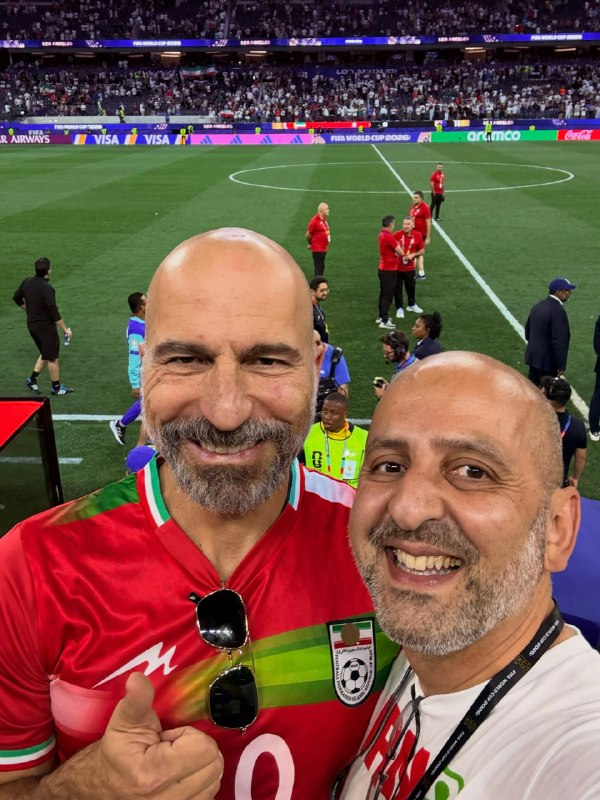

تصویری که روز سه‌شنبه ۲۶ خردادماه در شبکه‌های اجتماعی منتشر شد، دارا خسروشاهی، مدیرعامل ایرانی‌-آمریکایی شرکت اوبر، را در استادیوم سوفای لس‌آنجلس و در جریان دیدار تیم‌های ایران و نیوزیلند در جام جهانی ۲۰۲۶ نشان می‌دهد.
@VahidOOnLine

📡 @VahidOnline

## IranIntlTV — post 342766

  <a href="telegram/content/IranIntlTV_342766_1781640271.mp4" target="_blank">🎬 Download video</a>

گروهی از ایرانیان در مالمو سوئد روز سه‌شنبه ۲۶ خرداد ۱۴۰۵، همزمان با زادروز مجیدرضا رهنورد و «روز ملی پرچم شیر و خورشید»، با تشکیل زنجیره انسانی و بازخوانی نام جان‌باختگان «انقلاب ملی»، یاد آنان را گرامی داشتند.

## FarsiVOA — post 220945

  <a href="telegram/content/FarsiVOA_220945_1781640274.mp4" target="_blank">🎬 Download video</a>

⚡️چگونگی انتقال پول برای خرید ملک و سرمایه‌گذاری سران حکومت جمهوری اسلامی در خارج از کشور؛گفت‌وگو با رضا غیبی
@FarsiVOA

## Persian_Trend_Official — post 17301

https://youtube.com/live/h4d-8fb4luQ?feature=share

## BBCPersian — post 284068

  <a href="telegram/content/BBCPersian_284068_1781640275.mp4" target="_blank">🎬 Download video</a>

آخرین خبرهای مهم روز سه‌شنبه ۲۶ خرداد ماه ۱۴۰۵ از تلویزیون بی‌بی‌سی فارسی

@BBCPersian

## alonews — post 128561

  <a href="telegram/content/alonews_128561_1781640278.webm" target="_blank">🎬 Download video</a>

👈به علت پخش و انتشار سوالات امتحانی تو کانال های تلگرامی هندی، این پیام‌رسان تو هند تا بعد امتحانات فیلتر شد

✅ @AloNews خبر جنگ

## alonews — post 128560

  <a href="telegram/content/alonews_128560_1781640278.webm" target="_blank">🎬 Download video</a>

👈قلعه نویی: خداروشکر یک امتیاز هم نتیجه خوبی بود، با برد مصر و حداقل تساوی با بلژیک میتونیم اول یا دوم‌گروه بشیم

✅ @AloNews خبر جنگ

## alonews — post 128559

  <a href="telegram/content/alonews_128559_1781640278.mp4" target="_blank">🎬 Download video</a>

👈معاون سابق رئیس‌جمهور ترامپ، مایک پنس، درباره تفاهم‌نامه آمریکا و ایران:
من نگرانی‌های واقعی دارم، حداقل درباره آنچه در بحث‌های عمومی مطرح می‌شود.

🔴در طول سال‌ها زمان زیادی را در اتاق وضعیت گذرانده‌ام. تفاوت بین آنچه واقعاً حل شده و آنچه در رسانه‌ها مطرح می‌شود را می‌دانم، بنابراین نمی‌خواهم پیش‌داوری کنم... اما من به ایرانی‌ها اعتماد ندارم.

✅ @AloNews خبر جنگ

---
📅 بروزرسانی: 1405/03/26 23:23
---

## VahidOOnLine — post 245935

  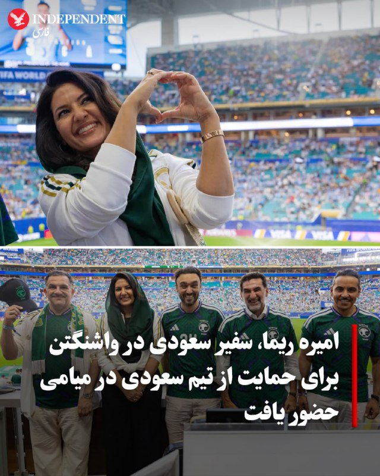

♦️ امیره ریما بنت بندر، سفیر عربستان سعودی در واشنگتن برای حمایت از تیم ملی فوتبال این کشور به میامی سفر کرد و در ورزشگاه حضور یافت. در این دیدار که دوشنبه شب برگزار شد، تیم ملی فوتبال عربستان سعودی مقابل اوروگوئه به میدان رفت. این بازی با تساوی یک-یک به پایان رسید. ملی‌پوشان سعودی در دو دیدار بعدی، در روزهای یکشنبه و جمعه، ۳۱ خرداد و پنجم تیر مقابل تیم‌های اسپانیا و کیپ‌ورد به زمین خواهد رفت. بازی عربستان سعودی با اسپانیا در آتلانتا و مسابقه با تیم آفریقایی کیپ‌ورد در هیوستون انجام خواهد شد.
‌🇸🇦 Indypersian

🤖 @VahidOOnLine

## VahidOOnLine — post 245934

  

ریک اسکات، سناتور جمهوری‌خواه ایالت فلوریدا، با آزادسازی دارایی‌های مسدودشده ایران مخالفت کرد و گفت این پول باید برای تامین هزینه‌های عملیات «خشم حماسی» استفاده شود.

سناتور ریک اسکات افزود: «فکر نمی‌کنم هیچ‌کس در کنگره از دادن پول به جمهوری اسلامی حمایت کند.»

او ادامه داد: «اگر پولی از جمهوری اسلامی در اختیار داریم، باید صرف هزینه اقداماتی شود که برای وادار کردن آن‌ها به توقف کشتن ما و تغییر رفتارشان انجام داده‌ایم.»
‌🏁 🇬🇧 IranintlTV

🤖 @VahidOOnLine

## pm_afshaa — post 94212

  <a href="telegram/content/pm_afshaa_94212_1781639630.mp4" target="_blank">🎬 Download video</a>

کارشناس صداوسیما : شماها دارید با کسی مذاکره میکنید که به رهبر گفته همجنسگرا و کونی ...

💧 Rainbet.com the #1 Non-KYC Crypto Casino & Sportsbook @rainbetcom

😁 @Pm_Afshaa

## IranIntlTV — post 342765

  <a href="telegram/content/IranIntlTV_342765_1781639630.mp4" target="_blank">🎬 Download video</a>

رقیه رضایی، روزنامه‌نگار و عضو تحریریه ایران‌وایر به ایران‌اینترنشنال گفت: «این بسیار دردناک است که جهان چشم خود را بر فضای وحشتناکی که جمهوری اسلامی برای مردم ایران ایجاد کرده، بسته است.»
@iranintltv

## IranIntlTV — post 342764

  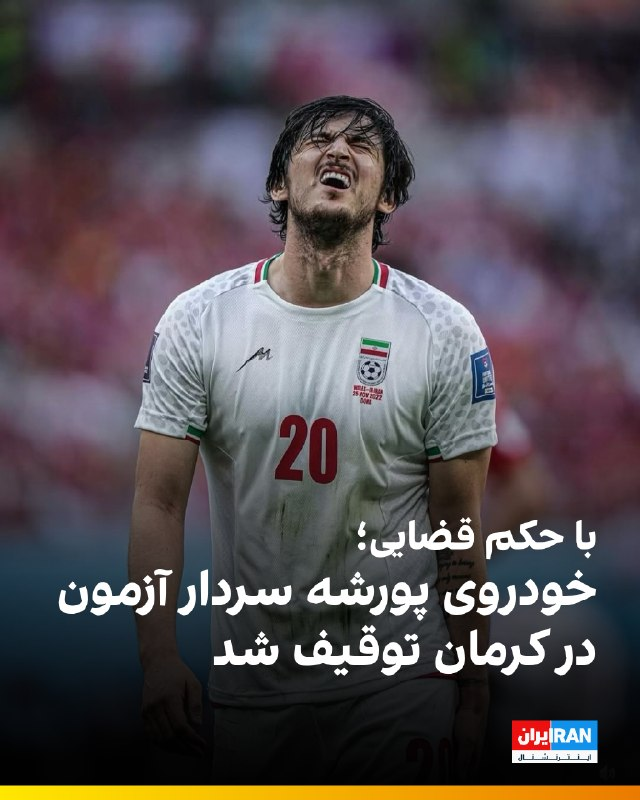

🔻خبرگزاری ایسنا خبر داد که ماشین پورشه سردار آزمون با حکم دستور قضایی در فهرست اموال توقیفی در استان کرمان توقیف شد.

🔹اکبر نجفی، فرمانده انتظامی شهرستان کرمان، گفت: «این خودرو به دلیل تخلفات قانونی و در اجرای احکام قضایی صادرشده، در فهرست اموال توقیفی قرار داشت و توسط گشت‌های محسوس و نامحسوس یگان امداد شناسایی شد. پس از طی مراحل قانونی نیز به پارکینگ منتقل شد.»

🔹او در ادامه گفت: «طرح‌های نظارتی و کنترلی پلیس به صورت مستمر برای برقراری نظم و امنیت و برخورد با تخلفات ادامه خواهد داشت و در این زمینه هیچ‌گونه اغماضی صورت نخواهد گرفت.»

🔹سردار پس از حملات جمهوری اسلامی به امارات متحده عربی، تصویری از خود در کنار حاکم دبی منتشر کرد. پس از آن، رسانه‌های حکومتی و مجریان صداوسیما به او حمله کردند و در نهایت از تیم ملی کنار گذاشته شد. همچنین قوه قضاییه جمهوری اسلامی اموال او را مصادره کرد.

@iranintltvsport

## IranIntlTV — post 342763

  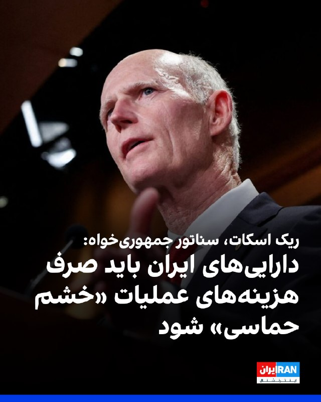

ریک اسکات، سناتور جمهوری‌خواه ایالت فلوریدا، با آزادسازی دارایی‌های مسدودشده ایران مخالفت کرد و گفت این پول باید برای تامین هزینه‌های عملیات «خشم حماسی» استفاده شود.

سناتور ریک اسکات افزود: «فکر نمی‌کنم هیچ‌کس در کنگره از دادن پول به جمهوری اسلامی حمایت کند.»

او ادامه داد: «اگر پولی از جمهوری اسلامی در اختیار داریم، باید صرف هزینه اقداماتی شود که برای وادار کردن آن‌ها به توقف کشتن ما و تغییر رفتارشان انجام داده‌ایم.»
https://iranintl.com/202606167302

## alonews — post 128558

  <a href="telegram/content/alonews_128558_1781639633.webm" target="_blank">🎬 Download video</a>

👈عراقچی نمایندگان مجلس رو در جریان طرح‌ها و پیشنهادات مختلف مطرح‌ شده در روند مذاکرات قرار داد

✅ @AloNews خبر جنگ

---
📅 بروزرسانی: 1405/03/26 23:14
---

## WithYashar — post 15103

با این جماعت چه کنم 😞

## WithYashar — post 15102

اسکل عقده ای یه پیام رو جواب نمیدی
عقده ای هستی زیاددد

## Persian_Trend_Official — post 17300

  <a href="telegram/content/Persian_Trend_Official_17300_1781639079.mp4" target="_blank">🎬 Download video</a>

شنیده شدن صدای انفجار در اربیل عراق

منابع خبری از حمله پهپادی به مقر گروهک‌های کرد در کردستان عراق می‌دهند.

📝 Amir

📌 @persian_trend_official
پرشین ترند | متفاوت‌ترین کانال نظامی

## IranianMinds — post 22763

  <a href="telegram/content/IranianMinds_22763_1781639080.mp4" target="_blank">🎬 Download video</a>

🔴 کارشناس صداوسیما :

شماها دارید با کسی مذاکره میکنید که به رهبر گفته همجنسگرا و کونی ...

@IranianMinds

## alonews — post 128556

  <a href="telegram/content/alonews_128556_1781639081.webm" target="_blank">🎬 Download video</a>

👈دست ترامپ امروز در اجلاس هفت‌گانه در اویان-له-بن، فرانسه

✅ @AloNews خبر جنگ

---
📅 بروزرسانی: 1405/03/26 23:05
---

## VahidOOnLine — post 245933

ویدیویی در شبکه‌های اجتماعی منتشر شده است که در آن یک باغدار در شرق استان کرمان می‌گوید بخش قابل توجهی از محصول خرمایی که کشاورزان برای به بار آمدنش یک سال زحمت کشیده‌اند، همچنان در سردخانه‌ها باقی مانده و بازار آن با رکود جدی مواجه است.

او می‌گوید هزینه‌های تولید چند برابر شده و خرمای پارسال هنوز در سردخانه‌ها مانده است؛ در نتیجه برخی باغداران با ورشکستگی و حتی فروش نخلستان‌ها روبه‌رو شده‌اند.

به گفته او، این وضعیت فشار اقتصادی سنگینی بر کشاورزان وارد کرده و به بدهی، نگرانی برای تأمین هزینه‌های زندگی و کاهش توان مالی خانواده‌ها منجر شده است.
‌🏁 🇬🇧 IranintlTV

🤖 @VahidOOnLine

## VahidOOnLine — post 245932

  

سی‌ان‌ان به نقل از یک منبع آگاه اسرائیلی گزارش داد آمریکا درخواست اسرائیل برای مشاهده متن تفاهم‌نامه با جمهوری اسلامی را رد کرده است.

این منبع آگاه اسرائیلی افزود دولت دونالد ترامپ نگران بوده بنیامین نتانیاهو متن تفاهم‌نامه را پیش از انتشار رسمی فاش کند.
‌🏁 🇬🇧 IranintlTV

🤖 @VahidOOnLine

## VahidOOnLine — post 245931

  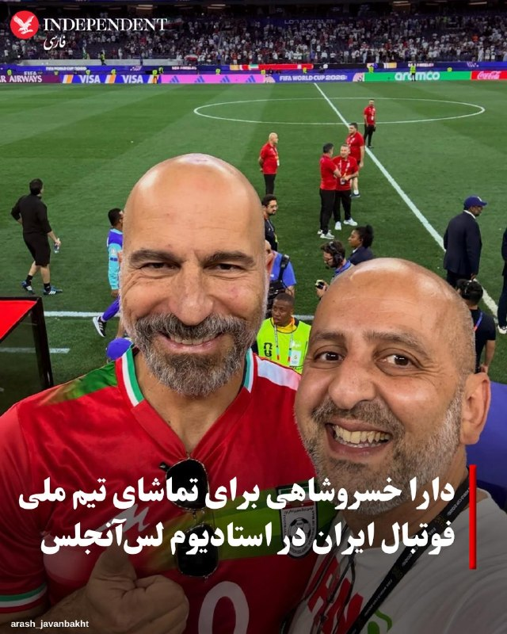

♦️تصویری که روز سه‌شنبه ۲۶ خردادماه در شبکه‌های اجتماعی منتشر شد، دارا خسروشاهی، مدیرعامل ایرانی‌-آمریکایی شرکت اوبر، را در استادیوم سوفای لس‌آنجلس و در جریان دیدار تیم‌های ملی ایران و نیوزیلند در جام جهانی ۲۰۲۶ نشان می‌دهد.

خسروشاهی در این تصویر پیراهنی با یقه سه‌رنگ پرچم ایران بر تن دارد و در میان تماشاگران حاضر در ورزشگاه دیده می‌شود. او از جمله چهره‌های سرشناس ایرانی‌تبار حاضر در این مسابقه بود که برای تماشای بازی تیم ملی ایران به ورزشگاه آمده بود.

دیدار تیم‌های ملی ایران و نیوزیلند در چارچوب رقابت‌های جام جهانی ۲۰۲۶ برگزار شد و با نتیجه ۲ بر ۲ به پایان رسید. تیم ملی ایران با کسب یک امتیاز از این مسابقه به کار خود در مرحله گروهی ادامه داد.
‌🇸🇦 Indypersian

🤖 @VahidOOnLine

## WithYashar — post 15101

شاهزاده رضا پهلوی به نیوزنیشن: مردم ایران اکنون میگویند چرا بمباران متوقف شد؟ ایالات متحده باید بمباران ایران را ادامه میداد
@withyashar

## WithYashar — post 15100

گزارش حملات پهپادی سپاه پاسداران به اربیل عراق 🚨
@withyashar

## DEJradio — post 5746

  <a href="telegram/content/DEJradio_5746_1781638507.webm" target="_blank">🎬 Download video</a>

🔺🎤 ایساد، اولین کنفرانس دانشجویی ایران-اروپا پس از فاجعه ۵۷ در فرانکفورت؛

گفت‌وگو با علی بردبار، عضو هیئت مدیره انجمن Isad

#کنفرانس_دانشجویی #فاجعه۵۷ #فرانکفورت
@DEJradio

## IranIntlTV — post 342762

ویدیویی در شبکه‌های اجتماعی منتشر شده است که در آن یک باغدار در شرق استان کرمان می‌گوید بخش قابل توجهی از محصول خرمایی که کشاورزان برای به بار آمدنش یک سال زحمت کشیده‌اند، همچنان در سردخانه‌ها باقی مانده و بازار آن با رکود جدی مواجه است.

او می‌گوید هزینه‌های تولید چند برابر شده و خرمای پارسال هنوز در سردخانه‌ها مانده است؛ در نتیجه برخی باغداران با ورشکستگی و حتی فروش نخلستان‌ها روبه‌رو شده‌اند.

به گفته او، این وضعیت فشار اقتصادی سنگینی بر کشاورزان وارد کرده و به بدهی، نگرانی برای تأمین هزینه‌های زندگی و کاهش توان مالی خانواده‌ها منجر شده است.

## IranIntlTV — post 342761

  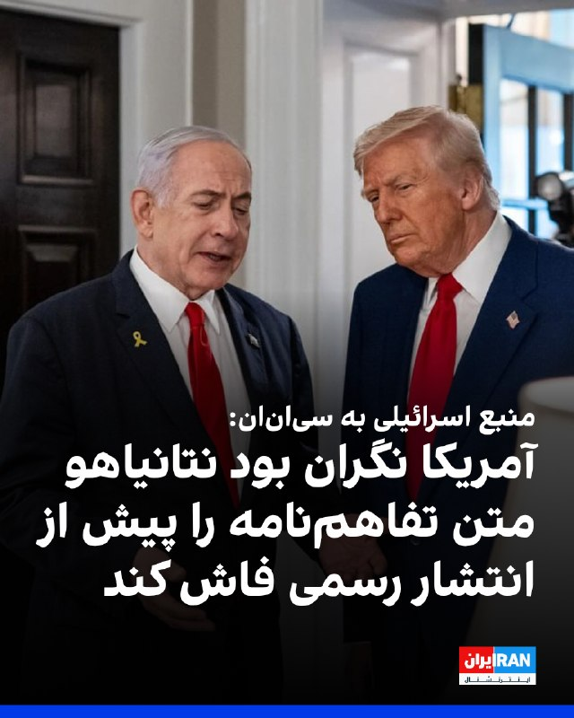

سی‌ان‌ان به نقل از یک منبع آگاه اسرائیلی گزارش داد آمریکا درخواست اسرائیل برای مشاهده متن تفاهم‌نامه با جمهوری اسلامی را رد کرده است.

این منبع آگاه اسرائیلی افزود دولت دونالد ترامپ نگران بوده بنیامین نتانیاهو متن تفاهم‌نامه را پیش از انتشار رسمی فاش کند.
https://iranintl.com/202606166407

## IranIntlTV — post 342760

  <a href="https://t.me/IranintlTV/342760" target="_blank">📎 Download file</a>

🎧نسخه صوتی چشم‌انداز: آیا ترامپ به مردم ایران و مخالفان حکومت پشت کرده است؟
@iranintlTV

## FarsiVOA — post 220944

🔺بنیاد برومند: جمهوری اسلامی در شش ماه ۷۴۶ تن را اعدام کرد

▪️بنیاد حقوق بشری عبدالرحمن برومند اعلام کرد از آغاز سال ۲۰۲۶ میلادی (دی ۱۴۰۴) به بهانه‌های سیاسی و غیرسیاسی ۷۴۶ مورد اعدام در ایران توسط جمهوری اسلامی مستند کرده که ۵۲ مورد آن در دو هفته گذشته صورت گرفته است.

⬇️ بیشتر بخوانید:
https://ir.voanews.com/a/iran-execution-boruman-foundation-protester-/8161531.html
@FarsiVOA

## DW_Farsi — post 126078

🔶 ارزیابی اطلاعاتی آمریکا: ایران از این پس راسأ توانایی مسدود کردن تنگه هرمز را دارد
 
نهادهای اطلاعاتی ایالات متحده در ارزیابی‌های اخیر خود به این نتیجه رسیده‌اند که جمهوری اسلامی اکنون به توانایی موثری دست یافته که بر اساس آن می‌تواند در هر زمان که اراده کند، دسترسی به تنگه هرمز را به‌طور کامل قطع کند.
 
به گزارش سی‌ان‌ان و طبق گفته سه منبع آگاه از این یافته‌ها، این ارزیابی نشان می‌دهد که حکومت ایران در پی درگیری‌های اخیر، به اهرم فشار جدید و قدرتمندی برای آسیب رساندن به اقتصاد جهانی مجهز شده است.
 
این منابع تاکید می‌کنند فارغ از توافق چارچوب که قرار است روز جمعه به عنوان پیش‌درآمدی برای آغاز مذاکرات هسته‌ای و بازگشایی این آبراه حیاتی رسما امضا شود، ایران در طول مناقشه اخیر عملا ثابت کرده که توانایی مسدود کردن این تنگه را دارد و ارزیابی‌های اطلاعاتی آمریکا نیز هشدار می‌دهند که این سناریو در آینده قابل تکرار است.
 
در همین رابطه، یکی از منابع آگاه در گفتگو با سی‌ان‌ان اعلام کرد که غرب اکنون کنترل عملی تنگه هرمز را به ایران واگذار کرده است؛ سلاحی که به گفته او، از هر بمب هسته‌ای قدرتمندتر است.
 
از سوی دیگر، یک منبع آگاه دوم به سی‌ان‌ان گفت که ایران در جریان جنگ اخیر آموخته است که چگونه از حملات هدفمند علیه زیرساخت‌های انرژی کشورهای عربی حوزه خلیج فارس به عنوان یک اهرم فشار کارآمد بهره‌برداری کند. در حال حاضر سی‌ان‌ان برای دریافت اظهارنظر رسمی در این‌باره با کاخ سفید و دفتر مدیر اطلاعات ملی آمریکا تماس گرفته است.
 
بر اساس این گزارش، یکی از دلایل اصلی که تهران را مجاب کرده می‌تواند همچنان از آبراه هرمز به عنوان یک سلاح استراتژیک استفاده کند، حفظ بخش عمده‌ای از زرادخانه نظامی‌اش شامل انواع موشک‌ها، پهپادها، سکوهای پرتاب و صدها قایق تندرو کوچک است؛ قایق‌هایی که کماکان به مزاحمت برای کشتی‌های تجاری در حال عبور ادامه می‌دهند و توانایی مین‌ریزی در این آبراه را دارند.
 
پیش از این نیز گزارش‌هایی منتشر شده بود که نشان می‌داد ایران صنایع نظامی خود را با سرعتی فراتر از پیش‌بینی‌های ایالات متحده بازسازی کرده و تولید پهپادهای جدید را آغاز کرده است.
@dw_farsi

## Persian_Trend_Official — post 17299

تا دقایقی دیگه لایو داریم حدود 20 دقیقه

## IranianMinds — post 22762

  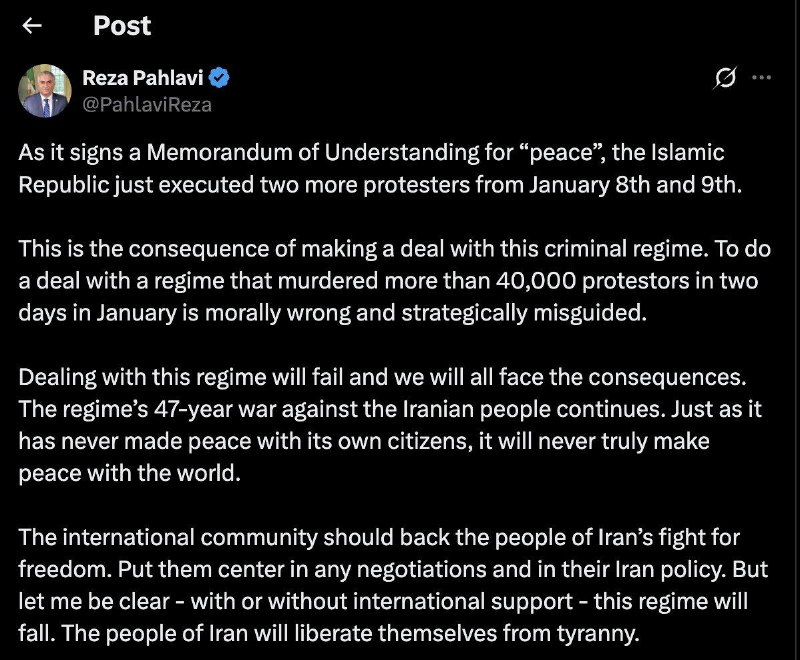

🔴 شاهزاده رضا پهلوی :

جامعه جهانی باید از مبارزه مردم ایران برای آزادی حمایت کنه. مردم ایران باید در مرکز هر مذاکره و سیاست خارجی در قبال ایران قرار بگیرن.

ولی واضح بگم: با حمایت بین‌المللی یا بدون اون، این رژیم سقوط خواهد کرد. مردم ایران خودشان این رژیم سرکوبگر رو سرنگون می‌کنن و کشور رو آزاد خواهند کرد.

@IranianMinds

## alonews — post 128555

  <a href="telegram/content/alonews_128555_1781638510.mp4" target="_blank">🎬 Download video</a>

👈خبرنگار: آیا توسط دولت درباره آنچه در توافق با ایران وجود دارد، به شما اطلاع‌رسانی شده است؟

🔴 جان تون، رهبر اکثریت سنا: من قطعاً هنوز این کار را انجام نداده‌ام، اگرچه ما درخواست آن را داریم و فرض می‌کنم که در مقطعی از دولت در این مورد شنیده‌ایم.

✅ @AloNews خبر جنگ

## alonews — post 128554

  <a href="telegram/content/alonews_128554_1781638513.webm" target="_blank">🎬 Download video</a>

👈رضا پهلوی: بمباران ایران باید ادامه پیدا کنه 
✅ @AloNews خبر جنگ

## alonews — post 128553

  <a href="telegram/content/alonews_128553_1781638513.webm" target="_blank">🎬 Download video</a>

👈رضا پهلوی: بمباران ایران باید ادامه پیدا کنه

✅ @AloNews خبر جنگ

---
📅 بروزرسانی: 1405/03/26 22:55
---

## WithYashar — post 15099

به گزارش ان‌بی‌سی نیوز، کارشناسان ارشد صنعت نفت هشدار می‌دهند که علیرغم فضای مثبت ناشی از توافق میان ایالات متحده و ایران برای پایان دادن به جنگ چندماهه در خاورمیانه، بازگشت بازارهای نفت به حالت عادی و از سرگیری تردد در تنگه هرمز فرآیندی زمان‌بر است و احتمالاً چندین هفته به طول خواهد انجامید.
@withyashar

## FoxNewsTwitter — post 343040

  <a href="telegram/content/FoxNewsTwitter_343040_1781637943.mp4" target="_blank">🎬 Download video</a>

Fox News (Twitter/X)

A cougar had its jaws locked on a helpless goat - seconds later, the owner was chasing the predator off all by herself.

Wild footage from British Columbia shows farmer Gina Moore sprinting toward the scene after spotting a cougar attacking one of her Nigerian dwarf goats.

Moore says she acted on pure instinct, knowing the cougar could have turned on her at any moment.

## IranIntlTV — post 342759

  <a href="telegram/content/IranIntlTV_342759_1781637945.mp4" target="_blank">🎬 Download video</a>

آیا ترامپ به مردم ایران و مخالفان حکومت پشت کرده است؟

«چشم‌انداز با مهدی‌ مهدوی‌آزاد»

تماشای نسخه کامل این برنامه در یوتیوب:

https://youtu.be/cfxLX7qbIE0
@iranintltv

## IranIntlTV — post 342758

  <a href="telegram/content/IranIntlTV_342758_1781637948.mp4" target="_blank">🎬 Download video</a>

خبرگزاری رویترز به نقل از یک منبع آگاه گزارش داد که بیش از نیمی از صندوق سرمایه‌گذاری ۳۰۰ میلیارد دلاری برای ایران از طریق تعهد شرکت‌هایی از آمریکا، کشورهای عربی حاشیه خلیج فارس، آسیا، آمریکای جنوبی و آفریقا تامین شده است.

گفت‌وگو با آرام حسامی، استاد علوم سیاسی کالج مونتگومری و علی دادپی، اقتصاددان
@iranintltv

## FarsiVOA — post 220943

⚡️ارزیابی عملکرد تیم ملی فوتبال ایران در مقابل نیوزیلند از دید حسن نظری، بازیکن پیشین تیم ملی فوتبال ایران در جام جهانی آرژانتین
@FarsiVOA

## DW_Farsi — post 126077

🎥 دوپامینِ بی‌هزینه در سبد خریدِ خیالی
 
"سایت‌های دوپامین" در کره‌جنوبی به سرعت در حال گسترش‌اند. پلتفرم‌هایی که تجربه خرید آنلاین را شبیه‌سازی می‌کنند اما نه کالایی در آن‌ها وجود دارد و نه تراکنشی انجام می‌شود. کاربران می‌گویند با این روش همان هیجان خرید را تجربه می‌کنند، بدون آنکه پولی خرج کنند.
 @dw_farsi

## Persian_Trend_Official — post 17298

  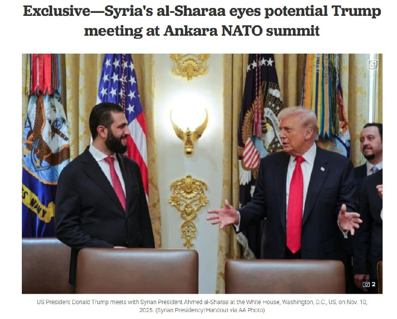

به گزارش Türkiye Today، احمد الشرع، رئیس جمهور سوریه، ممکن است برای شرکت در اجلاس آتی ناتو به آنکارا سفر کند و در حاشیه این اجلاس با ترامپ دیدار کند.

📝 Amir

📌 @persian_trend_official
پرشین ترند | متفاوت‌ترین کانال نظامی

## Persian_Trend_Official — post 17297

  <a href="telegram/content/Persian_Trend_Official_17297_1781637952.webm" target="_blank">🎬 Download video</a>

نفتالی بنت، نخست وزیر سابق اسرائیل: ما تمام تلاش خود را خواهیم کرد تا در نهایت این رژیم وحشتناک را سرنگون کنیم. و من می‌خواهم به ملت شگفت‌انگیز ایران بگویم امید خود را از دست ندهید.

این رژیم وحشتناک، از هم گسیخته، فاسد و شیطانی سقوط خواهد کرد. شما آزاد خواهید شد. این اتفاق خواهد افتاد.

📝 Amir

📌 @persian_trend_official
پرشین ترند | متفاوت‌ترین کانال نظامی

## RadioFarda — post 158406

🔸در پی حملات روز سه‌شنبه ارتش اسرائیل به جنوب لبنان که چهار کشته به جا گذاشت، قرارگاه مرکزی خاتم‌الانبیا تهدید به پاسخ کرد. این حملات بعد از اعلام توافق ایران و آمریکا انجام شد. 🔸قرارگاه خاتم‌الانبیا که وظیفه هماهنگی میان نیروهای مسلح جمهوری اسلامی را برعهده…

## RadioFarda — post 158405

  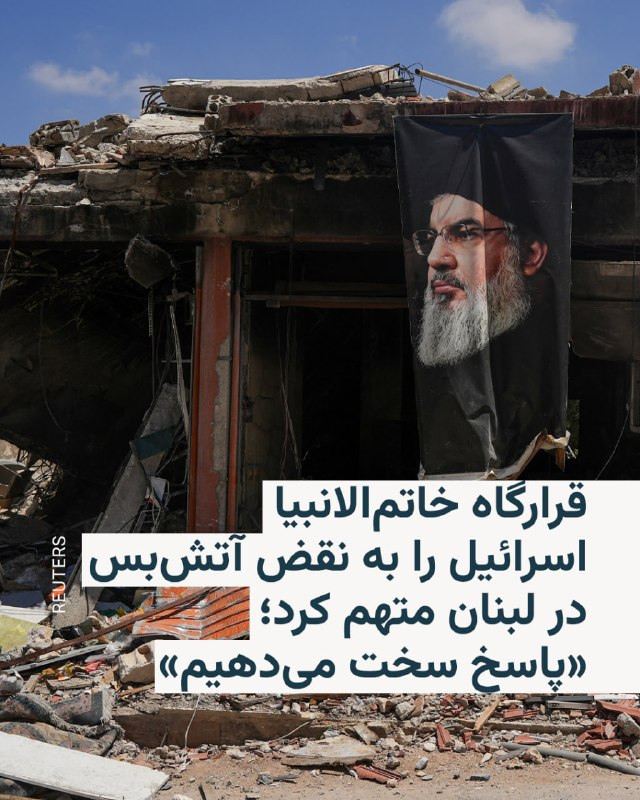

🔸در پی حملات روز سه‌شنبه ارتش اسرائیل به جنوب لبنان که چهار کشته به جا گذاشت، قرارگاه مرکزی خاتم‌الانبیا تهدید به پاسخ کرد. این حملات بعد از اعلام توافق ایران و آمریکا انجام شد.

🔸قرارگاه خاتم‌الانبیا که وظیفه هماهنگی میان نیروهای مسلح جمهوری اسلامی را برعهده دارد، در بیانیه‌ای اعلام کرد که اگر اسرائیل به حملات خود در جنوب لبنان پایان ندهد، باید منتظر «پاسخ سخت» نیروهای مسلح جمهوری اسلامی باشد.

🔸در این بیانیه ادعا شده که در پی اعلام نهایی شدن تفاهم پایان جنگ توسط دونالد ترامپ، ارتش اسرائیل «۸۴ بار» آتش‌بس در جنوب لبنان را «نقض کرده است».

🔸لبنان ساعتی پیش اعلام کرد که حملات اسرائیل در جنوب این کشور چهار کشته بر جای گذاشته است؛ این در حالی است که اسرائیل گفت چند راکت شلیک‌شده از سوی حزب‌الله را رهگیری کرده و حملاتی را نیز انجام داده است.

🔸خبرگزاری رسمی لبنان گزارش داد که پهپادهای اسرائیلی دو خودرو را در شهر میفدون و یک خودروی دیگر را در شهرک نزدیک شقین، هر دو در منطقه نبطیه، هدف قرار دادند که «بر اساس آمار اولیه به کشته شدن چهار نفر» و زخمی شدن تعدادی دیگر منجر شد.

@RadioFarda

## Hranews — post 113660

گزارشی از معوقات مزدی، بلاتکلیفی و تعدیل کارگران در ۲ واحد مختلف

❗️
❗️
❗️
❗️
❗️ – حدود ۸۰ #کارگر شاغل در پروژه سد معشوره در شهرستان نورآباد تعدیل شدند و مطالبات مزدی آنان تاکنون پرداخت نشده است. شماری از کارگران خدمات و فضای سبز شرکت بهره‌برداری نفت و گاز گچساران نیز از بلاتکلیفی وضعیت شغلی خود انتقاد دارند.

ادامه مطلب

↘️
@hranews_bot تماس ✉️ -  @Hranews  کانال هرانا 🆑

## alonews — post 128552

  <a href="telegram/content/alonews_128552_1781637954.webm" target="_blank">🎬 Download video</a>

🔴فوری / گزارش ها از انفجار در اربیل عراق

✅ @AloNews خبر جنگ

## alonews — post 128551

  <a href="telegram/content/alonews_128551_1781637954.webm" target="_blank">🎬 Download video</a>

👈به گزارش ان‌بی‌سی نیوز، کارشناسان ارشد صنعت نفت هشدار می‌دهند که علیرغم فضای مثبت ناشی از توافق میان ایالات متحده و ایران برای پایان دادن به جنگ چندماهه در خاورمیانه، بازگشت بازارهای نفت به حالت عادی و از سرگیری تردد در تنگه هرمز فرآیندی زمان‌بر است و احتمالاً چندین هفته به طول خواهد انجامید.

✅ @AloNews خیر جنگ

---
📅 بروزرسانی: 1405/03/26 22:45
---

## VahidOOnLine — post 245930

  

جی‌دی ونس، معاون رییس جمهوری ایالات متحده، در گفت‌وگو با برنامه یوتیوبی مگین کلی، گفت که متن تفاهم‌نامه با جمهوری اسلامی هنوز منتشر نشده، زیرا مقام‌های آمریکایی باید «این روند را به شکل درستی مدیریت کنند.»

ونس گفت که «به‌طور کامل» دلیل محرمانه ماندن متن تفاهم را درک نمی‌کند.

او ادامه داد: «برخی مسائل حساس دیپلماتیک در جریان است و ایرانی‌ها و برخی میانجی‌ها از جمله پاکستانی‌ها و قطری‌ها از ما خواسته‌اند این روند را به شکل درستی پیش ببریم.»

ونس افزود حساسیت‌هایی در جهان عرب و اسلام وجود دارد که تلاش می‌کنیم به آن‌ها توجه کنیم.
‌🏁 🇬🇧 IranintlTV

🤖 @VahidOOnLine

## WithYashar — post 15098

  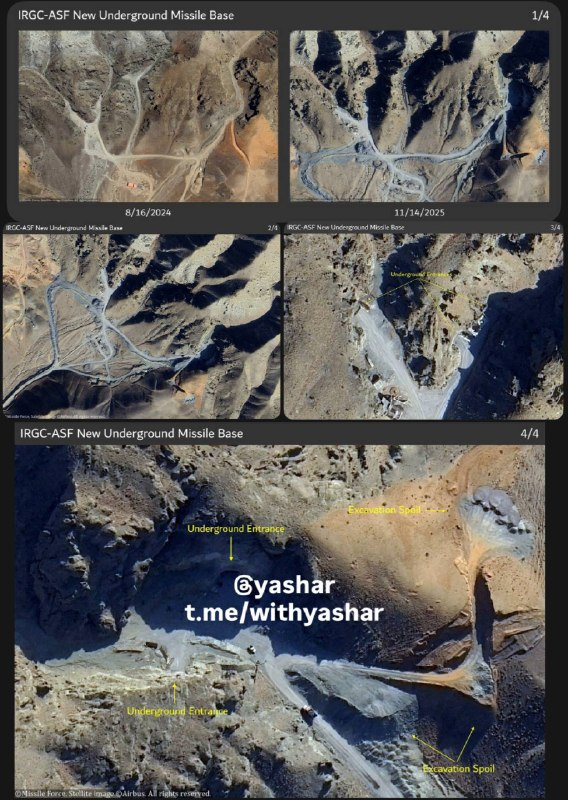

یک پایگاه موشکی دیگر در شامل شش ورودی زیرزمینی، در حال ساخت است. یکی از دلایل احداث ورودی‌های بیشتر، قرارگیری این پایگاه در ناحیه‌ای استراتژیک از ایران می‌باشد
بخشی از فرایند ساخت پایگاه مذکور، پس از جنگ 12 روزه صورت گرفته است، هم‌چنین برخی از سازه‌های روزمینی این پایگاه در دو جنگ اخیر هدف قرار گرفته‌اند.
@withyashar

## WithYashar — post 15097

  <a href="telegram/content/WithYashar_15097_1781637327.mp4" target="_blank">🎬 Download video</a>

اولین ویدئو احمدی‌نژاد بعد از توافق
@withyashar

## mwarmonitor — post 11046

📝 تف به آن هیکلِ پوشالی و ادعاهای پوچت که گندِ رسوایی و حماقتش کلِ جهان را برداشته است، مرتیکه‌ی کله‌زردِ بزدل! تشتِ رسوایی‌ات طوری از بامِ دنیا افتاده که صدایش آبروی نداشته‌ات را به لجن کشیده است. تویی که با آن دهانِ چفت‌وبست‌نشده‌ات شب و روز می‌دویدی، پست…

## pm_afshaa — post 94211

  <a href="telegram/content/pm_afshaa_94211_1781637330.webm" target="_blank">🎬 Download video</a>

🔴رویترز: توافق ایران شامل صندوق 300 میلیارد دلاریه که بیش از نیمی از منابع آن از قبل تعهد شده.

💧 Rainbet.com the #1 Non-KYC Crypto Casino & Sportsbook @rainbetcom

😁 @Pm_Afshaa

## VahidOnline — post 76431

  <a href="telegram/content/VahidOnline_76431_1781637331.mp4" target="_blank">🎬 Download video</a>

مکان جلسه امضای تفاهم‌نامه

ترجمه ماشین:
توافق چارچوبی میان آمریکا و ایران قرار است روز جمعه، ۱۹ ژوئن، در بورگن‌اشتوک امضا شود؛ نه آن‌طور که ابتدا تصور می‌شد، در ژنو.
این موضوع را وزارت امور خارجه فدرال سوئیس، در پاسخ به شبکه SRF تأیید کرده است.

وزارت خارجه سوئیس توضیح داد: «این مکان، یعنی بورگن‌اشتوک، از سوی میانجی‌ها، پاکستان و قطر، و همچنین آمریکا و ایران پیشنهاد شده است.»
به گفته این وزارتخانه، سوئیس زمینه گفت‌وگوها را فراهم می‌کند و شرایط دیپلماتیک لازم را ایجاد می‌کند تا این دیدار بتواند در سوئیس برگزار شود.
وزارت خارجه سوئیس درباره روند برگزاری و جزئیات امضای برنامه‌ریزی‌شده، اطلاعاتی ارائه نکرد.
srfnews

📡 @VahidOnline

## IranIntlTV — post 342757

  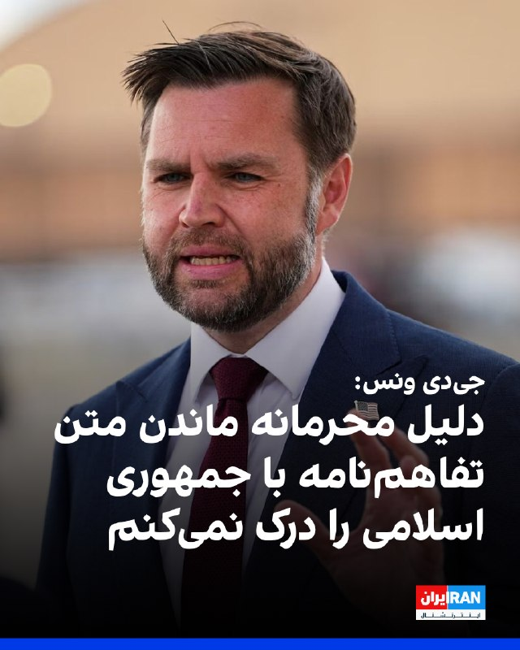

جی‌دی ونس، معاون رییس جمهوری ایالات متحده، در گفت‌وگو با برنامه یوتیوبی مگین کلی، گفت که متن تفاهم‌نامه با جمهوری اسلامی هنوز منتشر نشده، زیرا مقام‌های آمریکایی باید «این روند را به شکل درستی مدیریت کنند.»

ونس گفت که «به‌طور کامل» دلیل محرمانه ماندن متن تفاهم را درک نمی‌کند.

او ادامه داد: «برخی مسائل حساس دیپلماتیک در جریان است و ایرانی‌ها و برخی میانجی‌ها از جمله پاکستانی‌ها و قطری‌ها از ما خواسته‌اند این روند را به شکل درستی پیش ببریم.»

ونس افزود حساسیت‌هایی در جهان عرب و اسلام وجود دارد که تلاش می‌کنیم به آن‌ها توجه کنیم.
https://iranintl.com/202606161570

## IranIntlTV — post 342756

  <a href="telegram/content/IranIntlTV_342756_1781637333.mp4" target="_blank">🎬 Download video</a>

مهدی مهدوی‌آزاد در برنامه «چشم‌انداز» گفت: «همه از کاهش فشار اقتصادی و رفع تحریم‌ها خوشحال می‌شوند، اما درحال حاضر میلیون‌ها شهروندی که به تغییر و فروپاشی حکومت دل بسته بودند، عصبانی و متعجب هستند که دونالد ترامپ چه می‌کند.»
@iranintltv

## Dirty_Kids — post 392339

🔴 باراک راوید به کانال ۱۲ اسرائیل:
تفاهمی که ایران و آمریکا قراره امضا کنن به این صورته:

تنگه هرمز فقط برای ۶۰ روز قراره باز بشه
آمریکا موقتاً اجازه فروش نفت ایران رو تو دوره مذاکرات میده.
آمریکا بعد از اجرای تفاهم، بخشی از پول‌های بلوکه‌شده ایران رو آزاد می‌کنه.
ایران و آمریکا باید برای دفع ذخایر هسته‌ای ایران تعهد بدن.

و در صورت توافق نهایی آمریکا قول میده نیروهاش رو خارج و تحریم‌های علیه ایران رو لغو کنه.

@Dirty_Kids 👻

## Dirty_Kids — post 392338

  <a href="telegram/content/Dirty_Kids_392338_1781637334.mp4" target="_blank">🎬 Download video</a>

برای اتحاد لطفا کصخاره بیرانوند رو رنگی نکنید بحث بحثه ملیه 😂😂

هندزفری 🔞

@Dirty_Kids 👻

## alonews — post 128550

  <a href="telegram/content/alonews_128550_1781637337.webm" target="_blank">🎬 Download video</a>

👈رویترز: تفاهم‌نامه ایران شامل اعطای صندوق سرمایه‌گذاری ۳۰۰ میلیارد دلاری است

🔴 تفاهم‌نامه بین ایران و آمریکا شامل برنامه‌‌ای برای تشکیل صندوق سرمایه‌گذاری ۳۰۰ میلیارد دلاری به منظور حمایت از اقتصاد ایران است.

🔴 این صندوق تنها پس از امضای توافق نهایی راه‌اندازی خواهد شد و شرکت‌هایی از آمریکا، منطقه خلیج فارس، آسیا، آمریکای جنوبی و آفریقا متعهد به سرمایه گذاری در آن شده‌اند.

🔴این سرمایه گذاری در حوزه‌های انرژی، لجستیک، تولید و حمل و نقل خواهد بود

✅ @AloNews خبر جنگ

---
📅 بروزرسانی: 1405/03/26 22:34
---

## VahidOOnLine — post 245929

  <a href="telegram/content/VahidOOnLine_245929_1781636691.mp4" target="_blank">🎬 Download video</a>

سهراب حسن‌خانی، زندانی سیاسی سابق و فعال مشروطه‌خواه، برای تحمل دوران محکومیت خود دوباره راهی زندان شد. او به اتهام «نشر اکاذیب» و «تشویش اذهان عمومی» به دو سال حبس و پرداخت ۵۰ میلیون تومان جزای نقدی محکوم شده است.
‌🏁 🇬🇧 IranintlTV

🤖 @VahidOOnLine

## VahidOOnLine — post 245928

  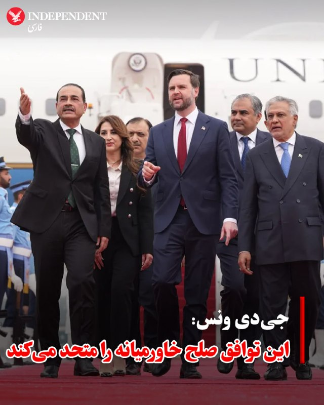

♦️ جی‌دی ونس، معاون رئیس‌جمهوری آمریکا، در گفتگو با شبکه خبری فاکس نیوز به تشریح تفاوت‌های اساسی میان توافق صلح جدید با جمهوری اسلامی ایران و توافق سال ۲۰۱۵ (برجام) پرداخت و تاکید کرد که این طرح، فصل جدیدی را در منطقه رقم خواهد زد.

ونس در این مصاحبه با اشاره به انتقادها اعلام کرد که بر خلاف برجام، در این توافق حتی یک سنت از پول آمریکا به ایران داده نخواهد شد. او تفاوت اصلی این دو رویکرد را در همراهی کشورهای منطقه دانست و افزود: «کشورهای عرب حوزه خلیج فارس از برجام متنفر بودند، چون فکر می‌کردند به رفتارهای مخرب ایران قدرت می‌دهد؛ اما آن‌ها عاشق طرح صلح رئیس‌جمهوری ترامپ هستند، چون معتقدند این توافق، آغازگر یک خاورمیانه جدید است.»

معاون رئیس‌جمهوری آمریکا در پایان تاکید کرد که بزرگ‌ترین دستاورد این طرح، متحد کردن کشورهای حاشیه خلیج فارس است؛ اقدامی که به گفته او، تاثیرات دگرگون‌کننده‌ای نه فقط برای چند سال آینده، بلکه برای چندین نسل به همراه خواهد داشت.
‌🇸🇦 Indypersian

🤖 @VahidOOnLine

## DEJradio — post 5745

  <a href="telegram/content/DEJradio_5745_1781636694.mp4" target="_blank">🎬 Download video</a>

🚨
🔸 خبر ۲۱
سه‌شنبه ۲۶ خرداد ۱۴۰۵

#خبر۲۱
@DEJradio

## IranIntlTV — post 342755

  <a href="telegram/content/IranIntlTV_342755_1781636696.mp4" target="_blank">🎬 Download video</a>

سهراب حسن‌خانی، زندانی سیاسی سابق و فعال مشروطه‌خواه، برای تحمل دوران محکومیت خود دوباره راهی زندان شد. او به اتهام «نشر اکاذیب» و «تشویش اذهان عمومی» به دو سال حبس و پرداخت ۵۰ میلیون تومان جزای نقدی محکوم شده است.

## FarsiVOA — post 220942

🔺پرزیدنت ترامپ: پس از توافق با حکومت ایران می‌توانیم تحریم‌های نفتی روسیه را بازگردانیم

▪️دونالد ترامپ، رئیس جمهوری آمریکا، اعلام کرد پس از توافق اخیر با حکومت ایران و بازگشایی تدریجی تنگه هرمز، ایالات متحده اکنون در موقعیتی قرار گرفته است که می‌تواند بخشی از تحریم‌های نفتی علیه روسیه را که در جریان بحران خاورمیانه کاهش یافته بود بازگرداند.

⬇️ بیشتر بخوانید:

https://ir.voanews.com/a/president-trump-says-russian-oil-sanctions-possible-after-iran-deal/8161519.html/?nocach=1

## FarsiVOA — post 220941

دولت بریتانیا از یک قرارداد ۲۱۰ میلیون پوندی برای تأمین سوخت هسته‌ای نیروگاه‌های اوکراین خبر داده است. بر اساس این توافق، شرکت «یورنکو» سوخت مورد نیاز نیروگاه‌های هسته‌ای اوکراین را برای دو سال آینده تأمین می‌کند.

## Persian_Trend_Official — post 17296

  <a href="telegram/content/Persian_Trend_Official_17296_1781636697.webm" target="_blank">🎬 Download video</a>

به گزارش i24NEWS، حزب لیکود به رهبری بنیامین نتانیاهو، نخست وزیر اسرائیل، پس از آنکه ارزیابی‌های داخلی نشان داد که ترامپ در حال حاضر افکار عمومی را در میان رأی‌ دهندگان اسرائیلی بهبود نمی‌بخشد، فعلاً کمپین برنامه‌ ریزی‌ شده‌ای را که بر روابط نزدیک نتانیاهو با ترامپ تأکید می‌کرد، کنار گذاشته است.

📝 Amir

📌 @persian_trend_official
پرشین ترند | متفاوت‌ترین کانال نظامی

## Persian_Trend_Official — post 17295

  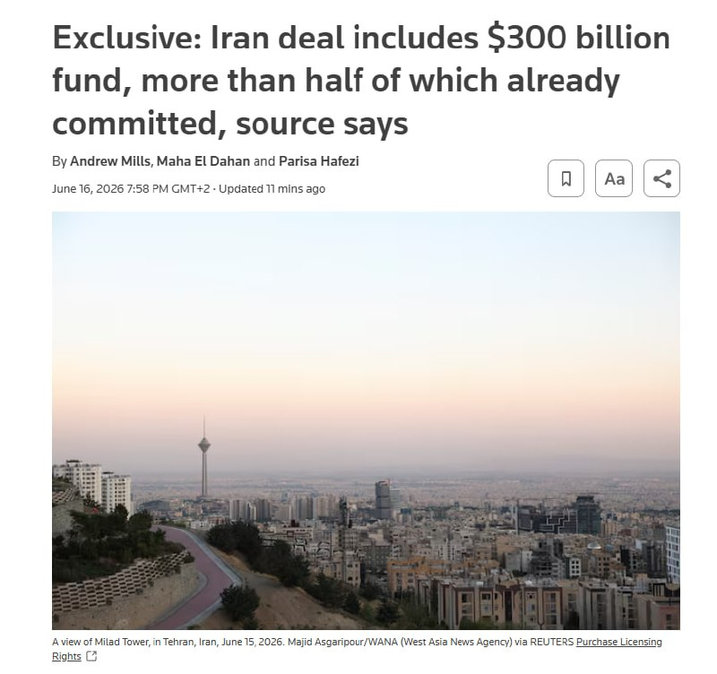

به گزارش رویترز، چارچوب توافق ایالات متحده و ایران شامل برنامه‌هایی برای یک صندوق سرمایه‌گذاری خصوصی 300 میلیارد دلاری با هدف تسریع سرمایه‌گذاری اقتصادی در ایران است که بیش از نیمی از تأمین مالی آن تاکنون انجام شده است.

صندوق بازسازی و توسعه پیشنهادی توسط شرکت‌های خصوصی از ایالات متحده، کشورهای حوزه خلیج فارس، آسیا، آمریکای جنوبی و آفریقا پشتیبانی خواهد شد و بخش‌هایی مانند انرژی، لجستیک، تولید، حمل و نقل و زیرساخت‌ها را پوشش می‌دهد.

تهران در ابتدا 400 میلیارد دلار غرامت برای خسارات مرتبط با جنگ از ایالات متحده درخواست کرده بود، اما پس از آنکه واشنگتن پرداخت‌های مستقیم را رد کرد، این صندوق سرمایه‌گذاری به عنوان مکانیسمی جایگزین برای حمایت از بازسازی تأسیسات آسیب‌دیده، از جمله اماکن صنعتی، پالایشگاه‌ها، فرودگاه‌ها و سایر زیرساخت‌های حیاتی، پدیدار شد.

📝 Amir

📌 @persian_trend_official
پرشین ترند | متفاوت‌ترین کانال نظامی

## RadioFarda — post 158404

  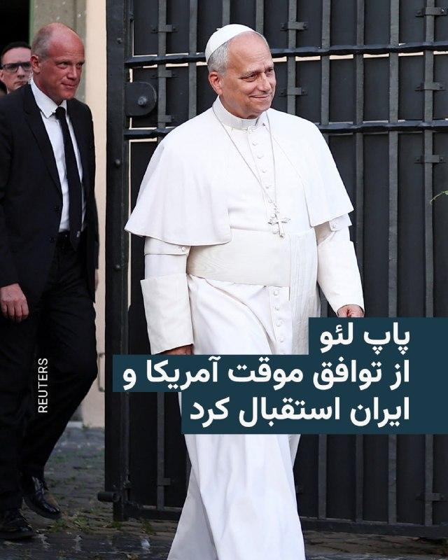

🔸پاپ لئو چهاردهم از توافق موقت میان آمریکا و ایران برای پایان دادن به جنگ در خاورمیانه استقبال کرد و گفت: «خدا را شکر» که دو طرف قرار است روز جمعه توافق خود را نهایی کنند.

🔸رهبر کاتولیک‌های جهان روز سه‌شنبه ۲۶ خرداد در گفت‌وگو با خبرنگاران در اقامتگاه خود در کاستل گاندولفو در ایتالیا ابراز امیدواری کرد که این توافق به پایان دائمی درگیری‌ها منجر شود.

🔸او گفت: «هنوز چند موضوع برای حل‌وفصل باقی مانده است، اما همیشه بهتر است این مسائل از طریق گفت‌وگو و مذاکره حل شوند و نه با بازگشت به جنگ.»

🔸پاپ لئو همچنین ابراز امیدواری کرد که این توافق راه‌حلی واقعی برای پایان جنگ باشد و امکان حرکت به سوی آینده‌ای آرام‌تر را فراهم کند.

@RadioFarda

## Dirty_Kids — post 392337

  <a href="telegram/content/Dirty_Kids_392337_1781636699.mp4" target="_blank">🎬 Download video</a>

🔴 کارشناس صداوسیما: داریم با کسی توافق میکنیم که به رهبر انقلاب گفته گی و کونی🏳‍🌈 این درسته آخه؟

@Dirty_Kids 👻

## Dirty_Kids — post 392336

علی عبدی از چهره‌های برجسته محور مقاومت در صداوسیما:

متاسفانه مسئولین ما دارن با کسی مذاکره میکنند که به رهبرمون انگ لواط کار میزنه. به نظرتون ما باید با این شخصی که به رهبر ما میگه کو.. مذاکره کنیم؟

@Dirty_Kids 👻

## Dirty_Kids — post 392335

  

🔴 ایلان ماسک داره چیکار میکنه!!!!!

ثروت ایلان ماسک تو ۳ روز اخیر، از ۱ تریلیون دلار به ۱ تریلیون و ۴۰۰ میلیارد دلار افزایش یافته.
یعنی ایلان ماسک تو ۳ روز اخیر، ثانیه‌ای ۲۵۰ میلیارد تومن درآمد داشته😐

@Dirty_Kids 👻

## Dirty_Kids — post 392334

  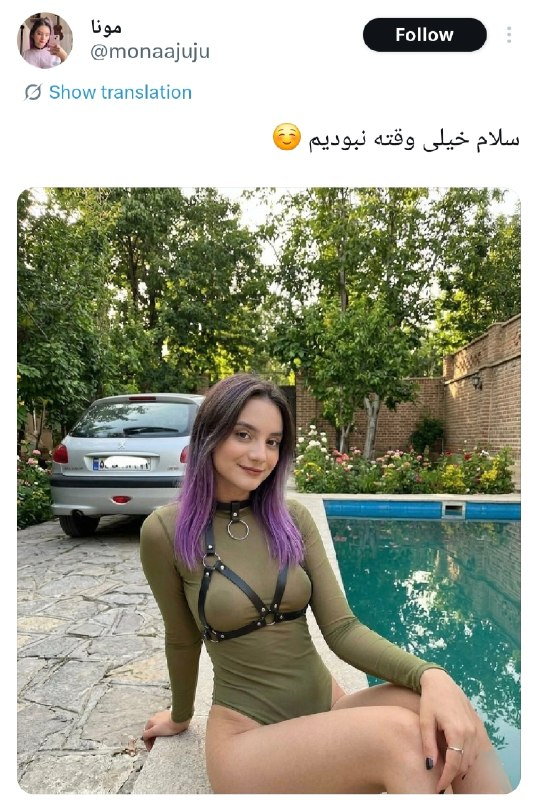

چرا دور ممش قلاده بسته!؟

@Dirty_Kids 👻

---
📅 بروزرسانی: 1405/03/26 22:24
---

## VahidOOnLine — post 245927

  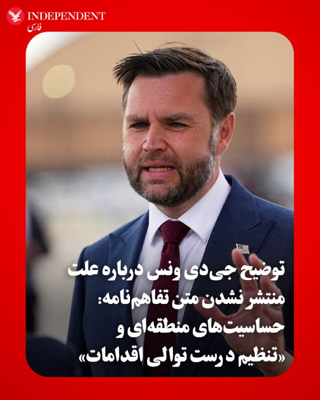

♦️ جی‌دی ونس، معاون رئیس‌جمهوری آمریکا، روز تایید کرد که دلیل منتشر نشدن متن تفاهم‌نامه صلح با جمهوری اسلامی ایران، نیاز مراجع دیپلماتیک به «تنظیم درست توالی اقدامات» است.

ونس در گفتگو با برنامه «مگن کلی» اظهار داشت: «مسائل دیپلماتیک حساسی در جریان است که در آن نه تنها ایرانی‌ها، بلکه برخی از میانجی‌گران ما یعنی پاکستانی‌ها و قطری‌ها نیز از ما خواسته‌اند مراحل کار را با ترتیبی درست پیش ببریم.» او در عین حال تاکید کرد که خود او نیز «به طور کامل دلایل» این پنهان‌کاری را درک نمی‌کند، اما افزود: «حساسیت‌هایی در جهان عرب و اسلام وجود دارد که ما تلاش می‌کنیم به آن‌ها پاسخگو باشیم.»

این تاخیر در رونمایی از سند، اعتراض محافظه‌کاران در سیاست خارجی آمریکا را برانگیخته است؛ کسانی که با اصرار برای دیدن متن توافق، نگرانند این تفاهم‌نامه شباهت زیادی به توافق سال ۲۰۱۵ دولت اوباما داشته باشد که آن را بیش از حد ضعیف می‌دانستند. در حالی که امتیازات اعطایی آمریکا در این سند هنوز نامشخص است، ونس تاکید کرد که متن یادداشت تفاهم «حداکثر تا روز جمعه» به‌طور عمومی منتشر خواهد شد.
‌🇸🇦 Indypersian

🤖 @VahidOOnLine

## VahidOOnLine — post 245926

  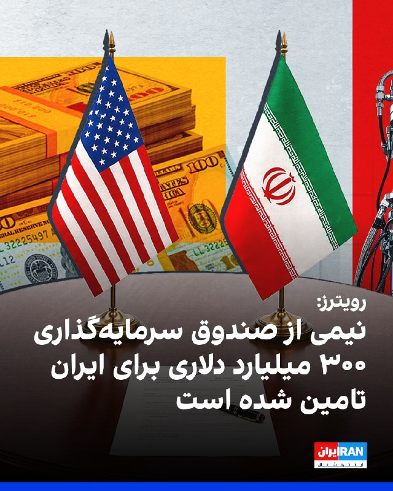

خبرگزاری رویترز به نقل از یک منبع آگاه گزارش داد بیش از نیمی از صندوق سرمایه‌گذاری ۳۰۰ میلیارد دلاری برای ایران، از طریق تعهد شرکت‌هایی از آمریکا، کشورهای عربی حاشیه خلیج فارس، آسیا، آمریکای جنوبی و آفریقا تامین شده است.

بر اساس این گزارش، صندوق سرمایه‌گذاری ۳۰۰ میلیارد دلاری برای ایران یک سازوکار خصوصی است و هیچ بودجه دولتی در آن وجود ندارد.
‌🏁 🇬🇧 IranintlTV

🤖 @VahidOOnLine

## VahidOOnLine — post 245925

♦️امیر قلعه‌نویی، سرمربی تیم ملی ایران، سه‌شنبه ۲۶ خردادماه پس از تساوی ۲ بر ۲ تیم ملی ایران مقابل نیوزیلند در ورزشگاه سوفای لس‌آنجلس، در دیدار با جیانی اینفانتینو، رئیس فیفا، گفت این مسابقه توانست ایرانیان با دیدگاه‌ها و نگرش‌های مختلف را حول تیم ملی متحد کند.

سرمربی تیم ملی ایران با اشاره به استقبال هواداران از این مسابقه گفت چه تماشاگرانی که در ورزشگاه حضور داشتند و چه کسانی که بازی را از طریق تلویزیون دنبال کردند، از این دیدار لذت بردند. او خطاب به رئیس فیفا افزود: «همان‌طور که شما فرمودید، این بازی اتحادی بین همه مردم با نگرش‌های مختلف برای ایران به وجود آورد.»

تیم ملی فوتبال ایران پس از این نتیجه با سه پله سقوط در رده بیست‌وسوم رنکینگ فیفا قرار گرفت. در مقابل، نیوزیلند با کسب یک امتیاز از این مسابقه سه پله صعود کرد و به رتبه ۸۲ جهان رسید.
‌🇸🇦 Indypersian

🤖 @VahidOOnLine

## WithYashar — post 15096

  <a href="telegram/content/WithYashar_15096_1781636093.mp4" target="_blank">🎬 Download video</a>

وقتی بعد اینهمه شب تو خیابون رفتن، آخرش بهت میگن اقلیتی تندرو🤣
@withyashar

## mwarmonitor — post 11045

📌واکنش آمیت سیگال خبرنگار و تحلیلگر کانال ۱۲ اسرائیل به توافق ترامپ

«ممکن است دشمنی با آمریکا خطرناک باشد، اما دوستی با آمریکا مرگبار است.»

Henry Kissinger

@mwarmonitor

## FoxNewsTwitter — post 343039

  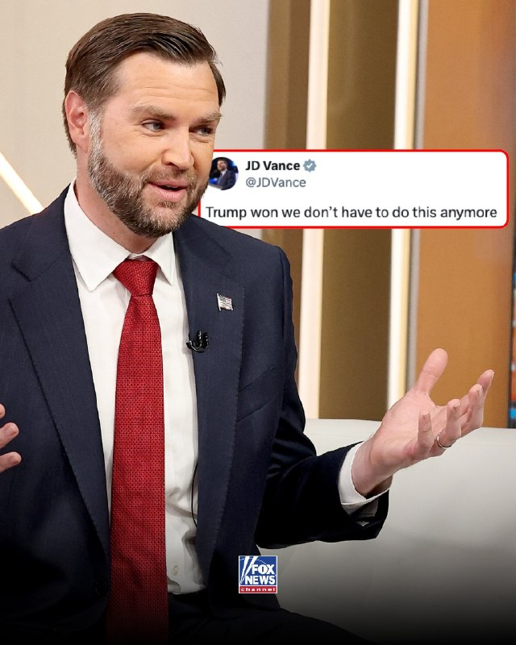

Fox News (Twitter/X)

"Trump won, we don't have to do this anymore."

Vice President JD Vance offers a blunt response as he jumps into the growing controversy over San Francisco Giants pitchers who wrote Bible verses on their Pride Night caps.

The players referenced Genesis 9:12-16, the passage describing God's covenant with Noah and the rainbow. After the game, MLB put the players on notice, warning them against any future unsanctioned messages.

The debate has quickly expanded beyond baseball, fueling a national conversation over faith, free expression, and Pride Night traditions in professional sports.

## VahidOnline — post 76430

اختصاصی رویترز: منبع آگاه می‌گوید توافق ایران شامل یک صندوق ۳۰۰ میلیارد دلاری است که بیش از نیمی از آن تاکنون تعهد شده است.

ترجمه ماشین:
دبی، ۱۶ ژوئن، رویترز — یک منبع آگاه مستقیم از جزئیات توافق به رویترز گفت در توافق چارچوبی آمریکا و ایران، یک صندوق خصوصی ۳۰۰ میلیارد دلاری برای تحریک سرمایه‌گذاری در ایران پیش‌بینی شده و بیش از نیمی از این مبلغ نیز هم‌اکنون تعهد شده است.

این منبع که به دلیل اعلام‌نشدن رسمی این طرح، در حالی که واشنگتن و تهران آماده امضا در روز جمعه می‌شوند، به شرط ناشناس‌ماندن سخن می‌گفت، گفت هدف این صندوق آن است که برای هر دو طرف انگیزه اقتصادی ایجاد کند تا به یک توافق نهایی برسند.

مقام‌های آمریکایی و ایرانی روز یکشنبه گفتند که بر سر چارچوبی برای پایان‌دادن به جنگ خود به توافق رسیده‌اند؛ جنگی که از ۲۸ فوریه، زمانی که نیروهای آمریکا و اسرائیل به ایران حمله کردند، آغاز شد. این چارچوب همچنین شامل توقف محاصره ایران از سوی آمریکا و بازگشایی تنگه هرمز، مسیر کلیدی تأمین نفت و گاز جهان، است.

این منبع گفت صندوق جدید، یک ابزار سرمایه‌گذاری خصوصی است، نه برنامه‌ای برای بازسازی یا پرداخت غرامت، و هیچ پول یا کمک بلاعوض دولتی در آن وجود نخواهد داشت. او افزود شرکت‌هایی مستقر در آمریکا، کشورهای عربی خلیج فارس، آسیا، آمریکای جنوبی و آفریقا با تأمین مالی آن موافقت کرده‌اند.

به گفته این منبع، سرمایه‌گذاری‌های تعهدشده حوزه‌هایی از جمله انرژی، لجستیک، تولید صنعتی و حمل‌ونقل را در بر می‌گیرد.

یک منبع ارشد ایرانی به رویترز گفت تهران در ابتدا خواستار ۴۰۰ میلیارد دلار غرامت بابت خسارت‌های جنگی از آمریکا شده بود، اما واشنگتن گفته بود چنین مبلغی را پرداخت نخواهد کرد.

پس از آن، ایده این صندوق که قرار است «صندوق بازسازی و توسعه» نامیده شود، مطرح شد.

منبع ایرانی گفت سازوکار پیش‌بینی‌شده شامل مشارکت کشورهای منطقه به شیوه‌های مختلف است. این شیوه‌ها شامل تضمین وام‌ها، ایجاد خطوط اعتباری یا تأمین مالی مستقیم بازسازی مکان‌های آسیب‌دیده در جنگ، از جمله تأسیساتی مانند مجتمع فولاد مبارکه، پالایشگاه‌ها، فرودگاه‌ها و به‌طور گسترده‌تر زیرساخت‌های آسیب‌دیده از درگیری، می‌شود.

ایران، به‌عنوان یکی از بزرگ‌ترین اقتصادهای خاورمیانه، در چهار دهه گذشته تقریباً هیچ سرمایه‌گذاری مستقیم خارجی قابل توجهی جذب نکرده و به دلیل موج‌های پیاپی تحریم‌های آمریکا و تحریم‌های بین‌المللی، از بازارهای جهانی سرمایه کنار گذاشته شده است.

این کشور دومین ذخایر اثبات‌شده بزرگ گاز طبیعی جهان و چهارمین ذخایر اثبات‌شده بزرگ نفت جهان را در اختیار دارد.

ایران همچنین جمعیتی جوان و تحصیل‌کرده با بیش از ۹۲ میلیون نفر، پایه صنعتی متنوع و ظرفیت‌های بکر قابل توجهی در بخش‌هایی از پتروشیمی و معدن گرفته تا گردشگری و کشاورزی دارد.

این منبع گفت صندوق سرمایه‌گذاری کاملاً جدا از مسیر موازی مذاکرات درباره رفع تحریم‌های آمریکا و آزادسازی دارایی‌های حاکمیتی ایران است که در خارج از کشور مسدود شده‌اند. او این دو را سازوکارهای مالی متمایز با اهداف و جدول زمانی متفاوت توصیف کرد.

این صندوق تا زمانی که یک توافق نهایی و رضایت‌بخش حاصل نشود، ایجاد نخواهد شد و عملیاتی هم نخواهد شد. تفاهم‌نامه، پس از امضا، قرار است روند را طی ۶۰ روز آینده ساختاربندی کند.

این منبع گفت: «این صندوق فقط زمانی ایجاد می‌شود که توافق نهایی امضا شده باشد. در طول این ۶۰ روز، مدیران صندوق با ایرانی‌ها و سرمایه‌گذاران کار خواهند کرد تا پروژه‌ها را برنامه‌ریزی و محدوده آنها را مشخص کنند.»

وزارت خارجه ایران و وزارت خارجه پاکستان، که به میانجی‌گری در توافق مربوط به صندوق سرمایه‌گذاری کمک کرده بود، بلافاصله به درخواست‌ها برای اظهار نظر پاسخ ندادند.

یک سخنگوی کاخ سفید به مصاحبه روز دوشنبه جی‌دی ونس، معاون رئیس‌جمهور، با شبکه سی‌بی‌اس اشاره کرد که در آن گفته بود ایران در صورت پایبندی به توافق با واشنگتن، از جمله برچیدن برنامه هسته‌ای خود، حذف ذخایر مواد غنی‌شده و پذیرش یک رژیم سخت‌گیرانه بازرسی و اجرای تعهدات، می‌تواند به یک صندوق بازسازی ۳۰۰ میلیارد دلاری با حمایت کشورهای خلیج فارس دسترسی پیدا کند.

این منبع نگفت که صندوق چگونه یا توسط چه کسی اداره خواهد شد و یادآور شد که جزئیات کلیدی هنوز باید نهایی شود.

این منبع از شرکت‌هایی از کره جنوبی، ژاپن، سنگاپور، مالزی و آمریکا به‌عنوان شرکت‌هایی نام برد که تعهداتی داده‌اند، اما از ارائه فهرست کامل خودداری کرد.

تفاهم‌نامه ۶۰ روزه یک چارچوب است، نه توافق نهایی، و انتظار می‌رود مذاکره‌کنندگان آمریکایی و ایرانی در این دوره روی مسیرهای متعددی کار کنند که مسائل هسته‌ای، تحریم‌ها و امنیت منطقه‌ای را در بر می‌گیرد.
reuters

📡 @VahidOnline

## VahidOnline — post 76429

قرارگاه مرکزی خاتم‌الانبیا در اطلاعیه‌ای اعلام کرد که ارتش اسرائیل، طی دو روز گذشته پس از اعلام پایان جنگ از سوی ترامپ، «۸۴ بار آتش‌بس در جنوب لبنان را نقض کرده است.»

قرارگاه خاتم‌الانبیا در ادامه این اطلاعیه هشدار داده چنانچه ارتش اسرائیل به حملات به جنوب لبنان پایان ندهد، باید «منتظر پاسخ سخت نیروهای مسلح جمهوری اسلامی» باشد.
@VahidOOnLine

📡 @VahidOnline

## IranIntlTV — post 342754

  

خبرگزاری رویترز به نقل از یک منبع آگاه گزارش داد بیش از نیمی از صندوق سرمایه‌گذاری ۳۰۰ میلیارد دلاری برای ایران، از طریق تعهد شرکت‌هایی از آمریکا، کشورهای عربی حاشیه خلیج فارس، آسیا، آمریکای جنوبی و آفریقا تامین شده است.

بر اساس این گزارش، صندوق سرمایه‌گذاری ۳۰۰ میلیارد دلاری برای ایران یک سازوکار خصوصی است و هیچ بودجه دولتی در آن وجود ندارد.
https://iranintl.com/202606165230

## IranIntlTV — post 342753

رویترز و وال‌استریت ژورنال در گزارش‌های جداگانه‌‌‌ای خبر دادند پس از امضای تفاهم در روز جمعه، آمریکا به ایران اجازه فروش نفت خواهد داد.
گفت‌وگو با همایون فلک‌شاهی، کارشناس نفت و انرژی در موسسه کپلر

@iranintlTV

## DW_Farsi — post 126076

  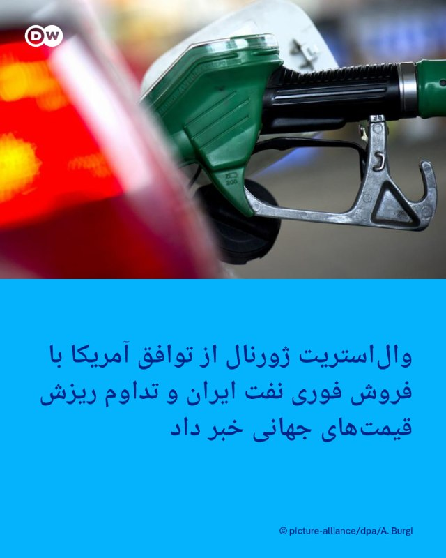

🔶 وال‌استریت ژورنال از توافق آمریکا با فروش فوری نفت ایران و تداوم ریزش قیمت‌های جهانی خبر داد
 
ایالات متحده آمریکا در چارچوب توافق اصولی خود برای پایان دادن به جنگ، به ایران اجازه می‌دهد فروش نفت و سوخت خود را به صورت فوری از سر بگیرد.
 
روزنامه وال‌استریت ژورنال به نقل از منابع آگاه گزارش داده است که تعلیق تحریم‌های مرتبط، بلافاصله پس از امضای توافق که انتظار می‌رود در هفته جاری انجام شود، اجرایی خواهد شد.
 
بر اساس این گزارش، این تسهیلات تنها به صادرات نفت محدود نمی‌شود و خدمات بانکی، حمل‌ونقل و بیمه را نیز در بر می‌گیرد تا انجام معاملات و صادرات انرژی ایران تسهیل شود.
 
همزمان، قیمت نفت خام برنت دریای شمال بیش از پنج درصد کاهش یافت و به ۷۸٫۸۷ دلار برای هر بشکه (معادل ۱۵۹ لیتر) رسید.
 
همچنین قیمت نفت خام سبک آمریکا (WTI) حدود شش درصد افت کرد و به ۷۵٫۹۵ دلار برای هر بشکه رسید.
 
پیش‌تر نیز چشم‌انداز دستیابی به یک توافق صلح میان واشنگتن و تهران، در معاملات اولیه بازار باعث شده بود قیمت نفت بین ۳٫۵ تا ۴٫۵ درصد کاهش یابد.
@dw_farsi

## Persian_Trend_Official — post 17294

باراک راوید خبرنگار اکسیوس به کانال 12 اسرائیل می‌گوید که به بخشی از تفاهم‌نامه بین ایران و آمریکا دست یافته است:

ایران، ایالات متحده و متحدانشان به خصومت‌ها، از جمله در لبنان، پایان خواهند داد.

ایران تعهد خود را مبنی بر عدم توسعه یا دستیابی به سلاح‌های هسته‌ای تکرار می‌کند.

ایالات متحده و ایران متعهد می‌شوند که مسئله دفع ذخایر اورانیوم غنی‌شده را حل کنند.

ایالات متحده و ایران در مورد مسئله غنی‌سازی و نیازهای هسته‌ای ایران بحث خواهند کرد.

ایران تا زمانی که مذاکرات ادامه دارد، وضعیت موجود در برنامه هسته‌ای خود را حفظ خواهد کرد.

ایالات متحده محاصره دریایی را لغو خواهد کرد، تحریم‌های جدیدی اعمال نخواهد کرد و در طول مذاکرات، نیروها را در منطقه افزایش نخواهد داد.

ایران تمهیدات لازم را برای تضمین عبور ایمن کشتی‌های تجاری از تنگه هرمز، بدون هیچ هزینه‌ای، به مدت 60 روز فراهم خواهد کرد.

ایالات متحده متعهد می‌شود که با اجرای تفاهم‌نامه، دارایی‌های مسدود شده ایران را برای استفاده در دسترس قرار دهد.

در صورت دستیابی به توافق نهایی، ایالات متحده نیروهای خود را ظرف 30 روز خارج کرده و تمام تحریم‌های ایران را لغو خواهد کرد.

هرگونه توافق نهایی شامل طرحی برای ایجاد یک صندوق 300 میلیارد دلاری برای بازسازی ایران خواهد بود.

ایالات متحده در طول مذاکرات، معافیت‌های موقت از تحریم‌ها را برای فروش نفت به ایران اعطا خواهد کرد.

مذاکراتی بین ایران و عمان با مشارکت سیاست خلیج فارس برای تعریف «ترتیبات مربوط به کشتیرانی و خدمات دریایی» برگزار خواهد شد.

📝 Amir

📌 @persian_trend_official
پرشین ترند | متفاوت‌ترین کانال نظامی

## IranianMinds — post 22761

🔴 قرارگاه خاتم الانبیا :

اسرائیل داره هنوزم به لبنان حمله میکنه و آتش بس رو نقض میکنه این روند ادامه داشته باشه بزودی پاسخ میدیم.

@iranianMinds

## IranianMinds — post 22760

  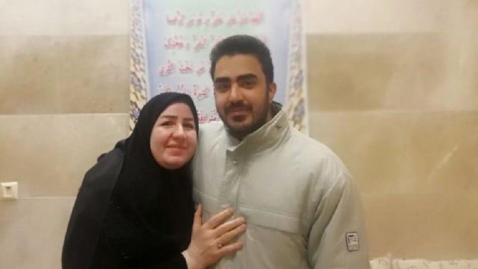

امروز زادروز مجیدرضا رهنورده ... 🖤

@IranianMinds

## IranianMinds — post 22759

⭕️
⭕️ کانفیگای این ربات تو نت ملی وصله به محض استارت ۱ گیگابایت کانفیگ میده بدون هیچ هزینه ای و رفرالی کانفیگ رو تحویلتون میده با بهترین سرعت و بدون قطعی 
⭕️ ربات دریافت کانفیگ رایگان | @daeijoonbot 
⭕️ ربات دریافت کانفیگ رایگان | @daeijoonbot

## IranianMinds — post 22758

⭕️
⭕️ کانفیگای این ربات تو نت ملی وصله به محض استارت ۱ گیگابایت کانفیگ میده
بدون هیچ هزینه ای و رفرالی کانفیگ رو تحویلتون میده با بهترین سرعت و بدون قطعی

⭕️ ربات دریافت کانفیگ رایگان | @daeijoonbot

⭕️ ربات دریافت کانفیگ رایگان | @daeijoonbot

## Hranews — post 113659

سقز؛ یک زن به اتهام قتل همسرش بازداشت شد

❗️
❗️
❗️
❗️
❗️ – فرمانده انتظامی کردستان از بازداشت و تشکیل پرونده قضایی برای زنی خبر داد که در یک اقدام مسلحانه همسر خود را در شهر سقز به #قتل رسانده بود.

ادامه مطلب

↘️
@hranews_bot تماس ✉️ -  @Hranews  کانال هرانا 🆑

## alonews — post 128549

  <a href="telegram/content/alonews_128549_1781636097.webm" target="_blank">🎬 Download video</a>

👈سی‌ان‌ان: ایران بخش قابل‌توجهی از توان موشکی، پهپادی و دریایی خود را حفظ کرده و همچنان از ظرفیت لازم برای تهدید تنگه هرمز در آینده برخوردار است

✅ @AloNews خبر جنگ

## alonews — post 128548

  <a href="telegram/content/alonews_128548_1781636098.webm" target="_blank">🎬 Download video</a>

👈حزب لیکود به رهبری بنیامین نتانیاهو، نخست‌وزیر اسرائیل، فعلاً کمپینی که بر رابطه نزدیک بیبی با رئیس‌جمهور ترامپ تأکید داشت را کنار گذاشته است، زیرا ارزیابی‌های داخلی نشان داده‌اند که ترامپ در حال حاضر نظر عمومی رأی‌دهندگان اسرائیلی را بهبود نمی‌بخشد، طبق گزارش i24NEWS

✅ @AloNews خبر جنگ

---
📅 بروزرسانی: 1405/03/26 22:14
---

## VahidOOnLine — post 245924

  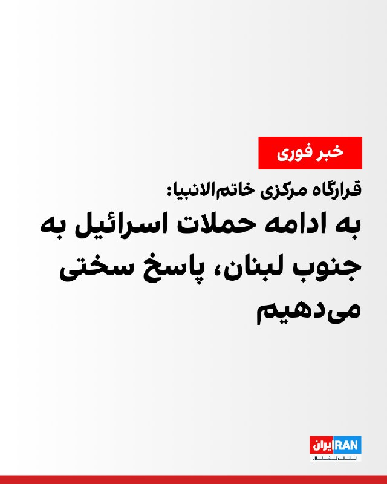

قرارگاه مرکزی خاتم‌الانبیا در اطلاعیه‌ای اعلام کرد که ارتش اسرائیل، طی دو روز گذشته پس از اعلام پایان جنگ از سوی ترامپ، «۸۴ بار آتش‌بس در جنوب لبنان را نقض کرده است.»

قرارگاه خاتم‌الانبیا در ادامه این اطلاعیه هشدار داده چنانچه ارتش اسرائیل به حملات به جنوب لبنان پایان ندهد، باید «منتظر پاسخ سخت نیروهای مسلح جمهوری اسلامی» باشد.
‌🏁 🇬🇧 IranintlTV

🤖 @VahidOOnLine

## VahidOOnLine — post 245923

  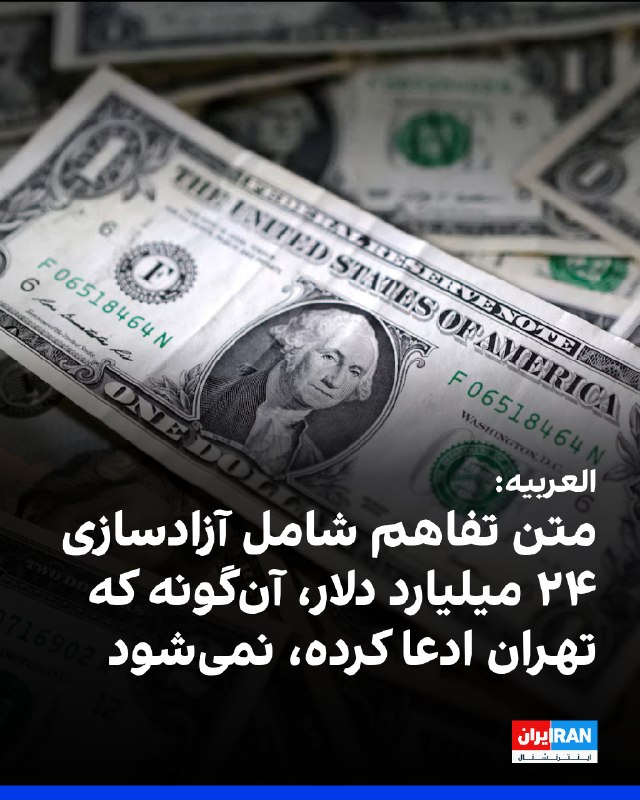

شبکه العربیه به نقل از منابع آگاه گزارش داد تفاهم‌نامه میان آمریکا و جمهوری اسلامی، شامل آزادسازی ۲۴ میلیارد دلار، آن‌گونه که تهران ادعا کرده، نمی‌شود.

بنا بر این گزارش، سرنوشت ذخایر اورانیوم غنی‌شده با غنای بالا در ایران، در توافق نهایی تعیین خواهد شد.

العربیه افزود: «آمریکا در طول مذاکرات برای دستیابی به توافق نهایی، تحریم جدیدی علیه جمهوری اسلامی اعمال نخواهد کرد.»
‌🏁 🇬🇧 IranintlTV

🤖 @VahidOOnLine

## WithYashar — post 15095

قرارگاه خاتم‌الانبیا:

اسرائیل تو دو روز گذشته پس از اعلام پایان جنگ توسط رئیس ترامپ، 84 بار آتش بس تو جنوب لبنان رو نقض کرده و همچنان به جنایات و کشتار مردم لبنان ادامه میده.
هشدار میدیدم اگر اسرائیل به شرارت‌هاش ادامه بده، باید منتظر پاسخ سخت نیروهای مسلح جمهوری اسلامی ایران باشه.
@withyashar

## WithYashar — post 15094

رئیس کمیسیون امنیت ملی: در صورت بدعهدی آمریکا، پاسخ ایران، نظامی و کوبنده خواهد بود
@withyashar

## WithYashar — post 15093

## mwarmonitor — post 11044

📝 تف به آن هیکلِ پوشالی و ادعاهای پوچت که گندِ رسوایی و حماقتش کلِ جهان را برداشته است، مرتیکه‌ی کله‌زردِ بزدل! تشتِ رسوایی‌ات طوری از بامِ دنیا افتاده که صدایش آبروی نداشته‌ات را به لجن کشیده است. تویی که با آن دهانِ چفت‌وبست‌نشده‌ات شب و روز می‌دویدی، پست می‌گذاشتی و بایدن و اوباما را مسخره می‌کردی که بلد نیستند معامله کنند، حالا چنان شکستِ مفتضحانه‌ای خورده‌ای و ذلیلانه جلوی جمهوری اسلامی زانو زده‌ای که تاریخ چنین باج‌دهیِ خفت‌باری را به خود ندیده است! آن برجام که مسخره‌اش می‌کردی، پیش این گندی که زدی سندِ افتخار است.

دنیا دارد به ریشِ توخالی و ژست‌های احمقانه‌ی کلاه‌بردارانه‌ات می‌خندد؛ شیادِ لاف‌زنی که ادعای «فشار حداکثری»‌اش گوش فلک را کر کرده بود، حالا در برابر چشم جهانیان شلوارش را خیس کرده، شش‌دانگِ هرمز را کادو داده و برای قاتلانِ جوانانِ معترض، باجِ سبیلِ ۳۰۰ میلیارد دلاری واریز می‌کند تا فقط ناوهای فرسوده‌اش را از منطقه فرار دهد. تمام آن مسخره‌کردن‌ها و توییت‌های فیکِ حمایتت، تفِ سربالایی بود که حالا درست وسطِ پیشانیِ زرد و کریهِ خودت فرود آمده است. تو نه تنها یک دلالِ لاشی و نامردی، بلکه کثیف‌ترین، ترسوترین و شکست‌خورده‌ترین شومنی هستی که خونِ یک ملت را معامله کرد تا صندلیِ کاخ سفیدش را حفظ کند؛ تف به ذاتِ بی‌وجودت که گندِ تسلیمت دنیا را برداشته است.

@mwarmonitor

## pm_afshaa — post 94210

  <a href="telegram/content/pm_afshaa_94210_1781635496.webm" target="_blank">🎬 Download video</a>

🔴قرارگاه خاتم‌الانبیا:
اسرائیل طی دو روز پس از اعلام پایان جنگ از سوی ترامپ، 84 بار آتش‌بس رو نقض کرده و همچنان به حملات علیه لبنان ادامه میده.
اگر حملات متوقف نشه، مجبور به پاسخ خواهیم شد.

💧 Rainbet.com the #1 Non-KYC Crypto Casino & Sportsbook @rainbetcom

😁 @Pm_Afshaa

## pm_afshaa — post 94209

  <a href="telegram/content/pm_afshaa_94209_1781635496.webm" target="_blank">🎬 Download video</a>

🔴ثروت ایلان ماسک تو 3 روز اخیر، از 1 تریلیون دلار به 1 تریلیون و 400 میلیارد دلار افزایش یافته.

💧 Rainbet.com the #1 Non-KYC Crypto Casino & Sportsbook @rainbetcom

😁 @Pm_Afshaa

## kianmeli1 — post 88036

🔴توافق اوباما حدود ۱۵۰ میلیارد دلار به ایران داد. توافق ترامپ ۳۰۰ میلیارد دلار به علاوه لغو همه تحریم‌ها به ایران می‌دهد
https://t.me/kianmeli1

## kianmeli1 — post 88035

🔴کانال ۱۲، یادداشت تفاهم بین ایالات متحده و ایران را منتشر کرده است.

۱. ایران، ایالات متحده و متحدانشان، از جمله در لبنان، به خصومت‌ها پایان خواهند داد.

۲. ایران تعهد خود را مبنی بر عدم توسعه یا دستیابی به سلاح‌های هسته‌ای تکرار می‌کند.

۳. ایالات متحده و ایران متعهد به حل مسئله دفع ذخایر اورانیوم غنی‌شده می‌شوند.

۴. ایالات متحده و ایران در مورد مسئله غنی‌سازی و نیازهای هسته‌ای ایران گفتگو خواهند کرد.

۵. ایران تا زمانی که مذاکرات ادامه دارد، وضعیت موجود در برنامه هسته‌ای خود را حفظ خواهد کرد.

۶. ایالات متحده محاصره دریایی را لغو خواهد کرد، تحریم‌های جدیدی اعمال نخواهد کرد و در طول مذاکرات، نیروها را در منطقه افزایش نخواهد داد.

۷. ایران تمهیدات لازم را برای تضمین عبور ایمن کشتی‌های تجاری از تنگه هرمز، به صورت رایگان، به مدت ۶۰ روز انجام خواهد داد.

۸. ایالات متحده متعهد می‌شود که دارایی‌های مسدود شده ایران را با اجرای یادداشت تفاهم در دسترس قرار دهد.

۹. در صورت دستیابی به توافق نهایی، ایالات متحده نیروهای خود را ظرف ۳۰ روز خارج کرده و تمام تحریم‌های ایران را لغو خواهد کرد.

۱۰. هرگونه توافق نهایی شامل طرحی برای ایجاد یک صندوق ۳۰۰ میلیارد دلاری برای بازسازی ایران خواهد بود.

۱۱. ایالات متحده در طول مذاکرات به ایران معافیت‌های موقت از تحریم‌ها برای فروش نفت می‌دهد.

۱۲. مذاکراتی بین ایران و عمان با مشارکت سیاست خلیج فارس برای تعریف «ترتیبات مربوط به خدمات کشتیرانی و دریایی» برگزار خواهد شد.
https://t.me/kianmeli1

## kianmeli1 — post 88034

‏🔴قرارگاه مرکزی خاتم‌الانبیا

در صورت ادامه حملات اسرائیل به جنوب لبنان، نیروهای مسلح جمهوری اسلامی «پاسخی سخت» خواهند داد
https://t.me/kianmeli1

## IranIntlTV — post 342752

  

قرارگاه مرکزی خاتم‌الانبیا در اطلاعیه‌ای اعلام کرد که ارتش اسرائیل، طی دو روز گذشته پس از اعلام پایان جنگ از سوی ترامپ، «۸۴ بار آتش‌بس در جنوب لبنان را نقض کرده است.»

قرارگاه خاتم‌الانبیا در ادامه این اطلاعیه هشدار داده چنانچه ارتش اسرائیل به حملات به جنوب لبنان پایان ندهد، باید «منتظر پاسخ سخت نیروهای مسلح جمهوری اسلامی» باشد.
https://iranintl.com/202606160184

## IranIntlTV — post 342751

روزنامه اسرائیل‌هیوم فاش کرد دوحه با چراغ سبز محرمانه واشینگتن، میلیاردها دلار از دارایی‌های ایران را در ازای تضمین عبور کشتی‌ها و نفتکش‌ها از تنگه هرمز و توقف حملات، در اختیار تهران قرار داده است.
گفت‌وگو با اردوان روزبه، ایران‌اینترنشنال

@iranintlTV

## IranIntlTV — post 342750

  <a href="telegram/content/IranIntlTV_342750_1781635498.mp4" target="_blank">🎬 Download video</a>

۲۴ با فرداد فرحزاد
@iranintltv

## FarsiVOA — post 220933

📷دیدار ایران و نیوزلند در جام جهانی ۲۰۲۶، تنها در زمین فوتبال خلاصه نشد؛ از شادی گل و حضور چهره‌های رسمی تا پرچم‌های شیر و خورشید و حاشیه‌های سیاسی، این مسابقه قاب‌هایی فراتر از یک بازی داشت.

تجمع مخالفان جمهوری اسلامی مقابل ورزشگاه، با پرچم‌های شیر و خورشید و آمریکا و تصاویر ترامپ، جدال پرچم‌ها را به دیدار ایران و نیوزیلند کشاند. هواداران ایرانی با پرچم‌های شیر و خورشید و برخی حامیان جمهوری اسلامی هم با پرچم با نشان جمهوری اسلامی در ورزشگاه حضور یافته بودند.

شادی گل محمد محبی در کنار مهدی قایدی در حالیکه دست‌های او به شکل تفنگ در آمده بود از دیگر حاشیه‌های بازی بود.

## FarsiVOA — post 220932

🔺نامی که از سایه بیت بیرون آمد؛ از انتخابات ۸۴ و احمدی‌نژاد تا بحران جانشینی پس از خامنه‌ای

▪️در بخش نخست این پرونده، دیدیم که غیبت مجتبی خامنه‌ای فقط یک مسئله پزشکی یا امنیتی نیست، بلکه نشانه‌ای از ضعف ساختاری جمهوری اسلامی و فرصتی برای اپوزیسیون است تا روایت تازه‌ای از بحران ولایت فقیه بسازد. در این بخش، به عقب برمی‌گردیم؛ به سال‌هایی که نام مجتبی خامنه‌ای از سایه بیت بیرون آمد و با انتخابات ۸۴، احمدی‌نژاد و سپس اعتراضات ۸۸ گره خورد.

⬇️ بیشتر بخوانید:

https://ir.voanews.com/a/the-name-emerging-from-shadows/8161465.html

## Persian_Trend_Official — post 17293

قرارگاه خاتم الانبیا: اگر اسرائیل به نقض آتش بد ادامه دهد به آن پاسخ خواهیم داد.

قرارگاه مرکزی خاتم‌الانبیا: ارتش تروریستی رژیم صهیونیستی طی دو روز گذشته پس از اعلام پایان جنگ توسط رئیس جمهور آمریکا، 84 بار آتش بس در جنوب لبنان را نقض نموده و همچنان به جنایات و کشتار مردم مظلوم لبنان ادامه می‌دهد.

هشدار داده می‌شود چنانچه ارتش کودک کش رژیم صهیونیستی به شرارت در جنوب لبنان پایان ندهد، باید منتظر پاسخ سخت نیروهای مسلح مقتدر جمهوری اسلامی ایران باشد.

📝 Amir

📌 @persian_trend_official
پرشین ترند | متفاوت‌ترین کانال نظامی

## RadioFarda — post 158403

🔸جی‌دی ونس، معاون رئیس‌جمهور آمریکا، روز سه‌شنبه گفت که دولت آمریکا هنوز متن تفاهم‌نامه با ایران را منتشر نکرده است، زیرا مقام‌ها باید «این روند را به شکل درستی مرحله‌بندی کنند.» 🔸او در گفت‌وکو با مگان کلی، مجری آمریکایی، گفت: «برخی مسائل حساس دیپلماتیک در…

## RadioFarda — post 158402

  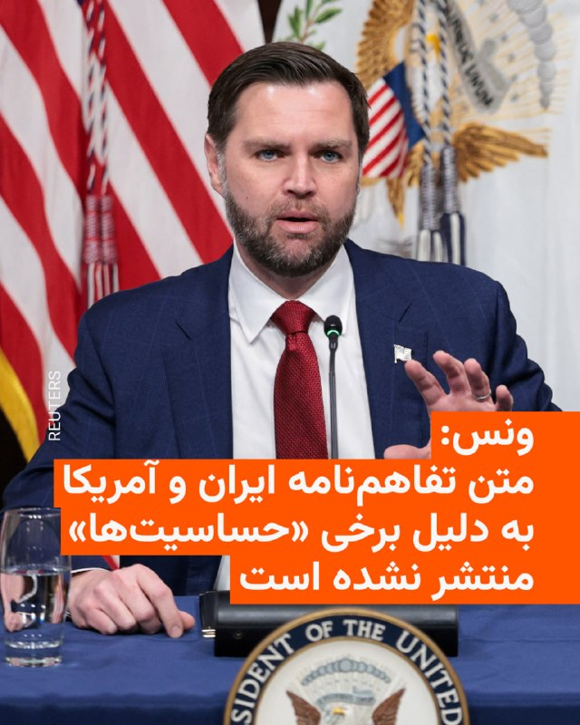

🔸جی‌دی ونس، معاون رئیس‌جمهور آمریکا، روز سه‌شنبه گفت که دولت آمریکا هنوز متن تفاهم‌نامه با ایران را منتشر نکرده است، زیرا مقام‌ها باید «این روند را به شکل درستی مرحله‌بندی کنند.»

🔸او در گفت‌وکو با مگان کلی، مجری آمریکایی، گفت: «برخی مسائل حساس دیپلماتیک در جریان است که ایرانی‌ها، و نه فقط ایرانی‌ها، بلکه برخی از میانجی‌های ما، پاکستانی‌ها و قطری‌ها، از ما خواسته‌اند این روند را به شکل درستی پیش ببریم.»

🔸او افزود که «کاملاً متوجه» دلیل این محرمانگی نمی‌شود.

🔸ونس ادامه داد: «حساسیت‌هایی در جهان عرب و مسلمان وجود دارد که ما تلاش می‌کنیم نسبت به آن‌ها پاسخگو و ملاحظه‌گر باشیم.»

@RadioFarda

## alonews — post 128547

  <a href="telegram/content/alonews_128547_1781635499.webm" target="_blank">🎬 Download video</a>

👈هشدار قرارگاه خاتم‌الانبیا : ارتش اسرائیل تو دو روز گذشته ۸۴ بار آتش‌بس جنوب لُبنان رو نقض کرده

🔴با وجود اعلام پایان جنگ، هنوز هم به حملاتش ادامه میده

🔴 همچنین هشدار میدیم، اگه این حملات متوقف نشه، نیروهای مسلح ایران پاسخ سختی خواهند داد

✅ @AloNews خبر جنگ

---
📅 بروزرسانی: 1405/03/26 22:04
---

## VahidOOnLine — post 245922

  <a href="telegram/content/VahidOOnLine_245922_1781634888.mp4" target="_blank">🎬 Download video</a>

گروهی از ایرانیان مقیم مادرید روز ۲۶ خرداد مقابل سفارت جمهوری اسلامی در پایتخت اسپانیا تجمع کردند. شرکت‌کنندگان این تجمع را همزمان با زادروز مجیدرضا رهنورد برگزار کرده و شعار «شاه رضا پهلوی» سردادند.
‌🏁 🇬🇧 IranintlTV

🤖 @VahidOOnLine

## WithYashar — post 15092

12 بند توافق ایران و امریکا به گفته باراک راوید خبرنگار ‌آکسیوس :

-ایران، ایالات متحده و متحدانشان خصومت‌ها را متوقف خواهند کرد، از جمله در لبنان. ایران تعهد خود را به عدم توسعه یا دستیابی به سلاح‌های هسته‌ای مجدداً تأکید می‌کند.

-ایالات متحده و ایران متعهد می‌شوند مسئله دفع ذخایر اورانیوم غنی‌شده ایران را حل کنند.

-ایالات متحده و ایران درباره غنی‌سازی اورانیوم و نیازهای انرژی هسته‌ای غیرنظامی ایران گفتگو خواهند کرد.

-ایران وضعیت موجود برنامه هسته‌ای خود را در طول مدت مذاکرات حفظ خواهد کرد.

-ایالات متحده محاصره دریایی را برمی‌دارد، از تحمیل تحریم‌های جدید خودداری می‌کند و در طول مذاکرات حضور نظامی خود در منطقه را افزایش نخواهد داد.

-ایران ترتیبات لازم را برای تضمین عبور ایمن کشتی‌های تجاری از تنگه هرمز، بدون هزینه، به مدت ۶۰ روز فراهم خواهد کرد.

-ایالات متحده متعهد می‌شود دارایی‌های منجمد شده ایران را پس از اجرای تفاهم‌نامه در دسترس قرار دهد.

-اگر توافق نهایی حاصل شود، ایالات متحده نیروهای خود را ظرف ۳۰ روز خارج کرده و تمام تحریم‌ها علیه ایران را لغو خواهد کرد.

-هر توافق نهایی شامل برنامه‌ای برای ایجاد صندوق ۳۰۰ میلیارد دلاری برای بازسازی ایران خواهد بود. ایالات متحده به ایران معافیت‌های موقتی تحریمی برای اجازه فروش نفت در دوره مذاکرات اعطا خواهد کرد.

-مذاکرات بین ایران و عمان با مشارکت کشورهای خلیج فارس برگزار خواهد شد تا ترتیبات مربوط به حمل و نقل و خدمات دریایی تعیین شود.

@withyashar

## IranIntlTV — post 342749

  

شبکه العربیه به نقل از منابع آگاه گزارش داد تفاهم‌نامه میان آمریکا و جمهوری اسلامی، شامل آزادسازی ۲۴ میلیارد دلار، آن‌گونه که تهران ادعا کرده، نمی‌شود.

بنا بر این گزارش، سرنوشت ذخایر اورانیوم غنی‌شده با غنای بالا در ایران، در توافق نهایی تعیین خواهد شد.

العربیه افزود: «آمریکا در طول مذاکرات برای دستیابی به توافق نهایی، تحریم جدیدی علیه جمهوری اسلامی اعمال نخواهد کرد.»
https://iranintl.com/202606169609

## IranIntlTV — post 342748

  <a href="telegram/content/IranIntlTV_342748_1781634891.mp4" target="_blank">🎬 Download video</a>

گروهی از ایرانیان مقیم مادرید روز ۲۶ خرداد مقابل سفارت جمهوری اسلامی در پایتخت اسپانیا تجمع کردند. شرکت‌کنندگان این تجمع را همزمان با زادروز مجیدرضا رهنورد برگزار کرده و شعار «شاه رضا پهلوی» سردادند.

## FarsiVOA — post 220931

🔺مجتبی رهبری را دید، مردم او را ندیدند؛ غیبت یا فرصت سیاسی برای اپوزیسیون

▪️این نوشته بخش نخست از پرونده «رهبر غایب؛ صد روز نخست ولایت موروثی در جمهوری اسلامی» است؛ پرونده‌ای درباره رهبری مجتبی خامنه‌ای، غیبت او از صحنه عمومی، نقش سپاه در تثبیت قدرت، و فرصت‌ها و چالش‌هایی که این وضعیت برای اپوزیسیون ایجاد می‌کند.

⬇️ بیشتر بخوانید:

https://ir.voanews.com/a/opposition-turns-absence-into-opportunity/8161464.html/?nocach=1

## DW_Farsi — post 126075

🔶 هشدار رئیس سازمان امور اجتماعی درباره "ریزش شدید سرمایه اجتماعی، امید و رضایت عمومی"
 
رئیس سازمان امور اجتماعی ایران روز سه‌شنبه ۲۶ خرداد با استناد به پیمایش‌های انجام‌شده توسط وزارت کشور و نهادهای علمی، نسبت به "افت شدید شاخص‌های اجتماعی" هشدار داد و وضعیت سرمایه اجتماعی در کشور را یک "زنگ خطر جدی" توصیف کرد.
 
به گفته محمد بطحایی، سرمایه اجتماعی ایران در یک دهه گذشته "روندی نزولی" داشته و با حدود ۱۰ درصد کاهش، از ۴۳.۵ درصد در سال ۱۳۹۴ به حدود ۳۶.۶ درصد در سال ۱۴۰۴ رسیده است.
 
رئیس سازمان امور اجتماعی کشور در تشریح جزئیات این پیمایش‌ها اعلام کرد که در حال حاضر تنها حدود ۲۵ درصد از مردم احساس عدالت و برابری دارند و در مقابل، نزدیک به ۷۵ درصد جامعه بر این باورند که تبعیض و نابرابری بر زندگی آنان سایه افکنده است.
 
بطحایی با تاکید بر اینکه سیاست‌گذاران باید این ذهنیت را جدی بگیرند، افزود که شاخص "امید اجتماعی" نیز وضعیت رو به افولی دارد؛ به طوری که حدود ۶۰ درصد از مردم ایران نسبت به بهبود شرایط در آینده ناامید هستند و تصور مثبتی از آینده ندارند.
 
بخش دیگری از اظهارات این مقام مسئول به آمارهای ناامیدکننده در حوزه "رضایت عمومی" اختصاص داشت. بطحایی میزان رضایت اجتماعی در کشور را حدود ۳۸ درصد اعلام کرد که نشان می‌دهد ۶۲ درصد از مردم از شرایط موجود ناراضی هستند. او همچنین با اشاره به نتایج آخرین پیمایش در خردادماه امسال تصریح کرد که ۷۰ درصد از مردم، تغییر سیاست‌های کلان را موثرترین راه برای نجات کشور می‌دانند و در این میان، ۵۱ درصد معتقدند رهبر جمهوری اسلامی می‌تواند برای ایجاد این تحولات وارد عمل شود.
 
بطحایی در پایان سخنان خود به آستانه تحمل اقتصادی جامعه اشاره کرد و گفت که بر اساس این نظرسنجی‌ها، ۶۰ درصد از مردم اعلام کرده‌اند دیگر توان تحمل فشار اقتصادی بیش از این را ندارند. با این حال، او خاطرنشان کرد که علی‌رغم این نارضایتی‌های گسترده، ۸۰ درصد از مردم صراحتا مخالفت خود را با برهم خوردن "نظم اجتماعی" اعلام کرده‌اند.
@dw_farsi

## Persian_Trend_Official — post 17292

العربیه ادعا می‌کند که بخشی از تفاهم‌نامه ایالات متحده و ایران به شرح زیر است: ایالات متحده فوراً محاصره دریایی خود علیه ایران را لغو کند و به مداخله بیشتر پایان دهد. پایان فوری و دائمی جنگ در تمام جبهه‌ها، از جمله لبنان. خروج تمام نیروهای ایالات متحده…

## alonews — post 128546

  <a href="telegram/content/alonews_128546_1781634893.webm" target="_blank">🎬 Download video</a>

👈رویترز : بیش از نصف غرامت ۳۰۰ میلیارد دلاری ایران از قبل تأمین شده

✅ @AloNews خبر جنگ

---
📅 بروزرسانی: 1405/03/26 21:54
---

## VahidOOnLine — post 245921

  <a href="telegram/content/VahidOOnLine_245921_1781634295.mp4" target="_blank">🎬 Download video</a>

♦️ در حاشیه نشست سران گروه هفت (G7) در اویان فرانسه، دیدار دونالد ترامپ، رئیس‌جمهوری آمریکا و شیخ محمد بن زاید آل نهیان، رئیس دولت امارات متحده عربی، با یک شوخی از سوی ترامپ به سوژه رسانه‌ها تبدیل شد.

در ابتدای این دیدار، رئیس دولت امارات با صدایی آرام و لحنی شمرده، بر لزوم گفتگو برای توسعه و بهبود هرچه بیشتر روابط میان دو کشور در آینده تاکید کرد. ترامپ پس از ابراز خرسندی و دست دادن با شیخ محمد بن زاید، رو به خبرنگاران و حاضران در اتاق کرد و با لحن طنزآمیز همیشگی خود گفت: «ببینید، وقتی این‌قدر ثروتمند باشی، می‌توانی همین‌قدر آرام صحبت کنی! داشتم با خودم فکر می‌کردم اصلا کسی صدایش را می‌شنود؟»

رئیس‌جمهوری آمریکا در ادامه شوخی خود افزود: «وقتی خیلی پولدار باشی، چنان اعتماد به نفسی داری که دیگر نیازی نیست به صدایت فشار بیاوری! او عالی است.»
‌🇸🇦 Indypersian

🤖 @VahidOOnLine

## VahidOOnLine — post 245920

  

عبدالناصر همتی، رییس‌کل بانک مرکزی اعلام کرد: «در متن یادداشت تفاهم، تعهدات آمریکا برای آزادسازی دارایی‌های بلوکه‌شده ایران به‌طور شفاف و قابل اجرا مشخص شده است.»

به گزارش خبرگزاری تسنیم، او افزود: «در تدوین مفاد مربوط به آزادسازی دارایی‌ها، تمامی تجربیات و سوابق گذشته مورد توجه قرار گرفته و تلاش شده سازوکارهای پیش‌بینی‌شده، بالاترین سطح اطمینان ممکن را برای دسترسی و بهره‌برداری از این منابع فراهم کند.»
‌🏁 🇬🇧 IranintlTV

🤖 @VahidOOnLine

## VahidOOnLine — post 245919

🗣روایت شما از توافق میان جمهوری‌اسلامی و آمریکا - سه‌شنبه ۲۶ خرداد

🔹هدف ترامپ «حذف» رژیم جمهوری اسلامی نبود، بلکه هدف او «حفظ» رژیمی بود که پس از ۱۸ و ۱۹ دی‌ماه به پایان خط رسیده بود.

🔹جمهوری اسلامی می‌گوید ما با اقتدار پیروز هر سه جنگ شدیم. شما یا نمی‌دانید اقتدار چیست، یا نمی‌دانید به چه چیزی می‌گویند پیروزی، یا رهبر و فرماندهان‌تان رفته‌اند گل بچینند.

🔹رژیم جمهوری اسلامی برای ماندن خودش تمام منافع، منابع و فرصت‌های ایران را بین کشورهای منطقه تقسیم کرده و به همین دلیل کشورهای منطقه برای ماندن این رژیم و ادامه تاراج ایران، تمام تلاش خود را می‌کنند.

🔹هیچ‌کس کمک‌مان نمی‌کند و باید خودمان دست‌به‌کار شویم، مثل جوان‌های نپال انقلاب کنیم. ترامپ هم دنبال منافع خودش است؛ هر حکومتی که به او منفعت بدهد را حمایت می‌کند.

🔹ترامپ کشتار دی‌ماه را به رهبران «قبلی» جمهوری اسلامی نسبت داده. واقعا این تفاوتی که ترامپ بین مسئولان جدید و قبلی این رژیم قائل می‌شود واقعی است؟ یکی به او بگوید دارند گولش می‌زنند.

🔹الان بروید خیابان برای گرانی اعتراض کنید، اگر اعدام‌تان نکنند، حداقل ده سال حبس به شما می‌دهند. مگر این رژیم تغییر کرده؟

🔹آقای ترامپ و سران کشورهای اروپایی، بوسیدن کفش‌های سپاهیان برای شما هیچ دستاوردی محسوب نخواهد شد. در نهایت این مردم ایران هستند که کشورشان را آزاد می‌کنند. شما می‌مانید و خجالت از مردم.

🔹آقای ترامپ، اگر واقعا برای مردم ایران آمده بودی، باید صدای زندگی را بلندتر از صدای موشک‌ها می‌کردی؛ چون هیچ ملتی آزادی را زیر آوار و خون باور نمی‌کند.

🔹چرا الان که توافق کردند مجتبی را نشان نمی‌دهند؟ شاید مجتبی وجود ندارد، یا اینکه هنوز ساخت بدل مجتبی به اتمام نرسیده است.
‌🏁 🇬🇧 IranintlTV

🤖 @VahidOOnLine

## VahidOOnLine — post 245918

♦️جیانی اینفانتینو، رئیس فیفا، پس از دیدار تیم‌های ملی ایران و نیوزیلند که با تساوی ۲ بر ۲ به پایان رسید، در رختکن تیم ملی ایران حاضر شد و از عملکرد بازیکنان و کادر فنی این تیم تمجید کرد.

اینفانتینو خطاب به بازیکنان گفت که از شرایط دشواری که آن‌ها در مسیر حضور در جام جهانی با آن روبه‌رو بوده‌اند آگاه است و افزود: «می‌دانم با چه شرایط و وضعیتی روبه‌رو بودید.» او تاکید کرد بازیکنان تیم ملی ایران با نمایش خود در زمین مسابقه به خانواده‌ها، دوستان، مردم ایران و همه جهان نشان دادند که شایسته حضور در جام جهانی هستند.

رئیس فیفا همچنین گفت تیم ملی ایران با عملکرد خود توانسته احترام و تحسین بسیاری را جلب کند و افزود بازیکنان این تیم با وجود همه دشواری‌ها، پیام قدرتمندی به جهان فرستاده‌اند. او تاکید کرد: «شما از همه این سختی‌ها قوی‌تر هستید» و توانستید حمایت ورزشگاه را پشت تیم ملی ایران متحد کنید.

اینفانتینو در پایان از بازیکنان تیم ملی ایران قدردانی کرد و گفت آن‌ها «واقعا قابل احترام و افتخار» هستند و در دو مسابقه باقی‌مانده نیز می‌توانند بار دیگر باعث افتخار هواداران خود شوند.
‌🇸🇦 Indypersian

🤖 @VahidOOnLine

## WithYashar — post 15091

نفتالی بنت(نامزد نخست وزیری اسرائیل) در پخش زنده خطاب به جمهوری اسلامی: باور دارم به زودی یه دولت جدید در اسرائیل میاد و امیدوارم من رهبری اون دولت رو به دست بگیرم. از همینجا به رژیم ایران میگم؛ من قراره بدترین کابوس شما باشم، تاوقتی مردم ایران رو از دست شما…

## WithYashar — post 15090

شبکه خبر: تمام کسایی که توی بیت رهبری بودن کشته شدن جز مجتبی خامنه‌ای @withyashar

## WithYashar — post 15089

شبکه خبر: تمام کسایی که توی بیت رهبری بودن کشته شدن جز مجتبی خامنه‌ای
@withyashar

## WithYashar — post 15088

  <a href="telegram/content/WithYashar_15088_1781634298.mp4" target="_blank">🎬 Download video</a>

نفتالی بنت(نامزد نخست وزیری اسرائیل) در پخش زنده خطاب به جمهوری اسلامی:
باور دارم به زودی یه دولت جدید در اسرائیل میاد و امیدوارم من رهبری اون دولت رو به دست بگیرم.
از همینجا به رژیم ایران میگم؛ من قراره بدترین کابوس شما باشم، تاوقتی مردم ایران رو از دست شما آزاد نکنم دست بردار نیستم.
@withyashar

## mwarmonitor — post 11043

🔴به گفته یک منبع، توافق ایران شامل یک صندوق ۳۰۰ میلیارد دلاری است که بیش از نیمی از آن از قبل تعهد شده است - رویترز

@mwarmonitor

## pm_afshaa — post 94208

باراک راوید، خبرنگار کانال 12 تلویزیون اسرائیل، می‌گوید نکات کلیدی تفاهم‌نامه بین ایالات متحده و ایران را دریافت کرده است:

ایران، ایالات متحده و متحدانشان به خصومت‌ها، از جمله در لبنان، پایان خواهند داد.

ایران تعهد خود را مبنی بر عدم توسعه یا دستیابی به سلاح‌های هسته‌ای تکرار می‌کند.

ایالات متحده و ایران متعهد می‌شوند که مسئله دفع ذخایر اورانیوم غنی‌شده را حل کنند.

ایالات متحده و ایران در مورد مسئله غنی‌سازی و نیازهای هسته‌ای ایران بحث خواهند کرد.

ایران تا زمانی که مذاکرات ادامه دارد، وضعیت موجود در برنامه هسته‌ای خود را حفظ خواهد کرد.

ایالات متحده محاصره دریایی را لغو خواهد کرد، تحریم‌های جدیدی اعمال نخواهد کرد و در طول مذاکرات، نیروها را در منطقه افزایش نخواهد داد.

ایران تمهیدات لازم را برای تضمین عبور ایمن کشتی‌های تجاری از تنگه هرمز، به مدت ۶۰ روز، بدون هیچ هزینه‌ای، فراهم خواهد کرد.

ایالات متحده متعهد می‌شود که با اجرای تفاهم‌نامه، دارایی‌های مسدود شده ایران را برای استفاده در دسترس قرار دهد.

در صورت دستیابی به توافق نهایی، ایالات متحده نیروهای خود را ظرف 30 روز خارج کرده و تمام تحریم‌های ایران را لغو خواهد کرد.

هرگونه توافق نهایی شامل طرحی برای ایجاد یک صندوق 300 میلیارد دلاری برای بازسازی ایران خواهد بود.

ایالات متحده در طول مذاکرات، معافیت‌های موقت از تحریم‌ها را برای فروش نفت به ایران اعطا خواهد کرد.

مذاکراتی بین ایران و عمان با مشارکت سیاست خلیج فارس برای تعریف «ترتیبات مربوط به کشتیرانی و خدمات دریایی» برگزار خواهد شد.

💧 Rainbet.com the #1 Non-KYC Crypto Casino & Sportsbook @rainbetcom

😁 @Pm_Afshaa

## DEJradio — post 5744

👑🎥 استقبال پرشور ایرانیان ساکن بریتانیا از شاهزاده رضا پهلوی در سفر به لندن.

#شاهزاده_رضا_پهلوی #لندن
@DEJradio

## IranIntlTV — post 342747

  <a href="telegram/content/IranIntlTV_342747_1781634300.mp4" target="_blank">🎬 Download video</a>

فرشته پزشک، کارشناس روابط بین‌الملل، درباره حمله بی‌سابقه دونالد ترامپ به بنیامین نتانیاهو در آستانه امضای تفاهم‌نامه ایران و آمریکا گفت: «ترامپ همیشه منافع خود را بر سایر ملاحظات ترجیح می‌دهد و رویکرد او نیز متناسب با منافعش تغییر می‌کند.»
@iranintltv

## IranIntlTV — post 342746

  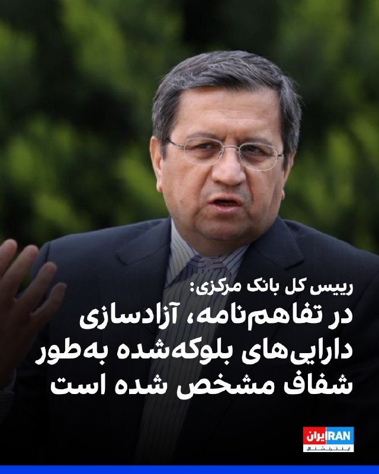

عبدالناصر همتی، رییس‌کل بانک مرکزی اعلام کرد: «در متن یادداشت تفاهم، تعهدات آمریکا برای آزادسازی دارایی‌های بلوکه‌شده ایران به‌طور شفاف و قابل اجرا مشخص شده است.»

به گزارش خبرگزاری تسنیم، او افزود: «در تدوین مفاد مربوط به آزادسازی دارایی‌ها، تمامی تجربیات و سوابق گذشته مورد توجه قرار گرفته و تلاش شده سازوکارهای پیش‌بینی‌شده، بالاترین سطح اطمینان ممکن را برای دسترسی و بهره‌برداری از این منابع فراهم کند.»
https://iranintl.com/202606169628

## IranIntlTV — post 342745

🗣روایت شما از توافق میان جمهوری‌اسلامی و آمریکا - سه‌شنبه ۲۶ خرداد

🔹هدف ترامپ «حذف» رژیم جمهوری اسلامی نبود، بلکه هدف او «حفظ» رژیمی بود که پس از ۱۸ و ۱۹ دی‌ماه به پایان خط رسیده بود.

🔹جمهوری اسلامی می‌گوید ما با اقتدار پیروز هر سه جنگ شدیم. شما یا نمی‌دانید اقتدار چیست، یا نمی‌دانید به چه چیزی می‌گویند پیروزی، یا رهبر و فرماندهان‌تان رفته‌اند گل بچینند.

🔹رژیم جمهوری اسلامی برای ماندن خودش تمام منافع، منابع و فرصت‌های ایران را بین کشورهای منطقه تقسیم کرده و به همین دلیل کشورهای منطقه برای ماندن این رژیم و ادامه تاراج ایران، تمام تلاش خود را می‌کنند.

🔹هیچ‌کس کمک‌مان نمی‌کند و باید خودمان دست‌به‌کار شویم، مثل جوان‌های نپال انقلاب کنیم. ترامپ هم دنبال منافع خودش است؛ هر حکومتی که به او منفعت بدهد را حمایت می‌کند.

🔹ترامپ کشتار دی‌ماه را به رهبران «قبلی» جمهوری اسلامی نسبت داده. واقعا این تفاوتی که ترامپ بین مسئولان جدید و قبلی این رژیم قائل می‌شود واقعی است؟ یکی به او بگوید دارند گولش می‌زنند.

🔹الان بروید خیابان برای گرانی اعتراض کنید، اگر اعدام‌تان نکنند، حداقل ده سال حبس به شما می‌دهند. مگر این رژیم تغییر کرده؟

🔹آقای ترامپ و سران کشورهای اروپایی، بوسیدن کفش‌های سپاهیان برای شما هیچ دستاوردی محسوب نخواهد شد. در نهایت این مردم ایران هستند که کشورشان را آزاد می‌کنند. شما می‌مانید و خجالت از مردم.

🔹آقای ترامپ، اگر واقعا برای مردم ایران آمده بودی، باید صدای زندگی را بلندتر از صدای موشک‌ها می‌کردی؛ چون هیچ ملتی آزادی را زیر آوار و خون باور نمی‌کند.

🔹چرا الان که توافق کردند مجتبی را نشان نمی‌دهند؟ شاید مجتبی وجود ندارد، یا اینکه هنوز ساخت بدل مجتبی به اتمام نرسیده است.

## FarsiVOA — post 220930

در گفت‌وگو با حسن هاشمیان، به رویکرد آمریکا در قبال لبنان و پیشنهاد پرزیدنت ترامپ به اسرائیل پرداختیم. به گفته هاشمیان، سپردن مسئولیت مقابله با حزب‌الله به دمشق یک راه‌حل آمریکایی با اهمیت بالاست که می‌تواند پای اردوغان و ترکیه را نیز به این معادله باز کند.

## FarsiVOA — post 220929

🔺گزارش | وکلای مستقل، تنها دفاع شهروندان در برابر انحصار قدرت نهادهای امنیتی

▪️در حالی که شمار پرونده‌های سیاسی و امنیتی منتهی به صدور احکام سنگین، از جمله اعدام، رو به افزایش است، اطلاعات اندکی درباره نقش و عملکرد وکلای حاضر در این پرونده‌ها در دسترس افکار عمومی قرار می‌گیرد. مقام‌های قضایی جمهوری اسلامی به طور مستمر بر رعایت حق برخورداری از وکیل تاکید می‌کنند، اما در اغلب موارد نام وکیل، محتوای دفاعیات و اقداماتی که برای حمایت از متهم انجام شده هرگز منتشر نمی‌شود.

⬇️ بیشتر بخوانید:
https://ir.voanews.com/a/iran-lawyer-judiciary-law-defendant-court/8161476.html/?nocach=1

## Persian_Trend_Official — post 17291

  <a href="telegram/content/Persian_Trend_Official_17291_1781634303.mp4" target="_blank">🎬 Download video</a>

🚨
🇮🇷ابلاغیه‌ی گواهینامه موتور خانم‌ ها در دست صدور است و پیش بینی می شود به‌ زودی اجرا میشه.

Phantom

📌 @persian_trend_official
پرشین ترند | متفاوت‌ترین کانال نظامی

## Dirty_Kids — post 392333

  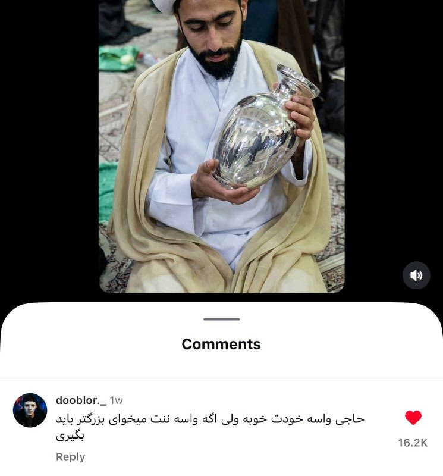

کامنت برتر امروز 😂😂

@Dirty_Kids 👻

## Dirty_Kids — post 392332

‏دوستان رک بخوام بهتون بگم به تخم هیچکس نیست که شما تو نوت اینستاگرام چه آهنگی رو دارید گوش میدید.

@Dirty_Kids 👻

## Dirty_Kids — post 392331

  <a href="telegram/content/Dirty_Kids_392331_1781634304.mp4" target="_blank">🎬 Download video</a>

خدایی خیلی خوب اجرا کردن 👏

@Dirty_Kids 👻

## Hranews — post 113658

گزارشی از اعدام ۲ زندانی در ساری و اهواز/ تایید حکم اعدام دو تن در دیوان عالی کشور

❗️
❗️
❗️
❗️
❗️ – سحرگاه روز یکشنبه، حکم دو زندانی که پیشتر در پرونده‌های مجزا بابت اتهام قتل به #اعدام محکوم شده بودند، در زندان‌های ساری و سپیدار اهواز اجرا شد. همچنین حکم دو زندانی که از بابت اتهامات محاربه و افساد فی‌الارض از طریق سرقت مسلحانه به اعدام محکوم شده بودند، در دیوان عالی کشور تایید شد. از سوی دیگر، یک زندانی محکوم به اعدام نیز در شهریار با اعلام رضایت اولیای دم از مجازات مرگ رهایی یافت.

ادامه مطلب

↘️
@hranews_bot تماس ✉️ -  @Hranews  کانال هرانا 🆑

## alonews — post 128545

  <a href="telegram/content/alonews_128545_1781634306.webm" target="_blank">🎬 Download video</a>

👈 قطر: هیچ بودجه‌ای برای چارچوب بازسازی ایران اختصاص داده نشده است

🔴 الجزیره نوشت: ماجد الانصاری، سخنگوی وزارت امور خارجه می‌گوید: هیچ بودجه‌ای از قطر تحت چارچوب گزارش‌شده ۳۰۰ میلیارد دلار اختصاص‌یافته برای بازسازی ایران پس از جنگ پرداخت نشده است.

🔴 او در پاسخ به سوالی در مورد این رقم به خبرنگاری گفت: «ما نمی‌توانیم در مورد ۳۰۰ میلیارد دلار اختصاص‌یافته برای بازسازی اظهار نظر کنیم.»

🔴با انتشار اخباری مبنی بر راه‌اندازی یک صندوق بازسازی به ارزش سیصد میلیارد دلار برای ایران، رئیس‌جمهور آمریکا روز دوشنبه گزارش‌های رسانه‌ها در این مورد را رد کرد و آن را «اخبار جعلی» خواند.

✅ @AloNews خبر جنگ

## alonews — post 128544

  <a href="telegram/content/alonews_128544_1781634306.webm" target="_blank">🎬 Download video</a>

👈کان نیوز: مقامات ارشد امنیتی امارات متحده عربی در آغاز جنگ علیه رژیم ایران به اسرائیل سفر سری برای بحث‌های امنیتی در سطح بالا انجام دادند.

✅ @AloNews خبر جنگ

---
📅 بروزرسانی: 1405/03/26 21:45
---

## VahidOOnLine — post 245917

  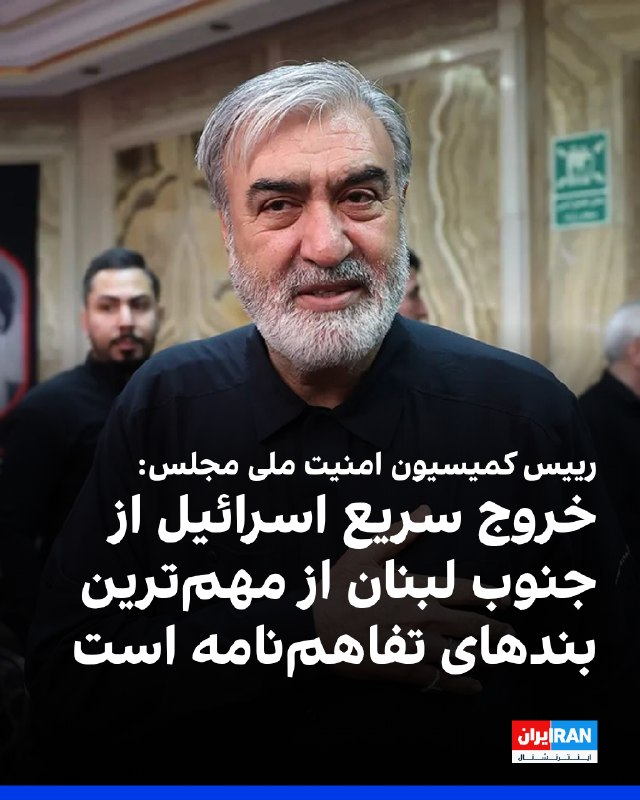

ابراهیم عزیزی، رییس کمیسیون امنیت ملی مجلس، در شبکه ایکس نوشت: «توقف جنگ در لبنان و خروج سریع نیروهای اسرائیلی از جنوب لبنان از جمله مهم‌ترین بندهای تفاهم‌نامه است.»

او ادامه داد: «هرگونه بدعهدی یا خروج از چارچوب اصلی تفاهم، باعث می‌شود نیروهای مسلح جمهوری اسلامی کوبنده‌تر از گذشته پاسخ دهند.»
‌🏁 🇬🇧 IranintlTV

🤖 @VahidOOnLine

## VahidOOnLine — post 245916

  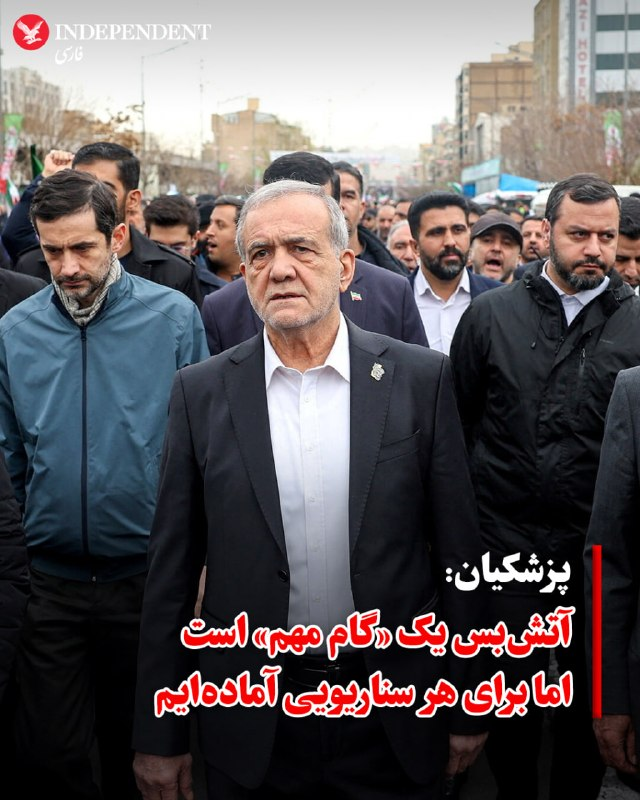

♦️ مسعود پزشکیان، روز سه‌شنبه ۲۶ خرداد با تاکید بر اینکه هنوز توافق نهایی برای پایان دادن به جنگ حاصل نشده است، یادداشت تفاهم فعلی را صرفا یک «گام مهم» خواند و احتمال اقدامات نظامی در صورت دست نیافتن به توافق را رد نکرد.

پزشکیان در گفتگو با خبرگزاری نیمه‌رسمی تسنیم اظهار داشت: «ما به گام مهمی برای توقف جنگ و آغاز مذاکرات دست یافته‌ایم، اما هنوز به توافق نهایی نرسیده‌ایم و برای هر سناریویی آماده هستیم.» در همین حال، دونالد ترامپ در اجلاس جی۷ ابراز امیدواری کرد که دور بعدی مذاکرات می‌تواند بسیار سریع پیش برود، هرچند احتمال طولانی شدن آن را نیز رد نکرد.

این توافق که قرار است روز جمعه در سوئیس امضا شود، ظاهرا مهلتی ۶۰ روزه را برای مذاکره بر سر توافق نهایی، از جمله وضعیت برنامه هسته‌ای ایران، تعیین می‌کند؛ اگرچه متن دقیق تفاهم‌نامه هنوز منتشر نشده است. از سوی دیگر، اصرار اسرائیل بر ماندن در جنوب لبنان و حفظ حق دفاع از خود، در کنار هشدار تهران مبنی بر اینکه هرگونه حمله جدید به لبنان نقض توافق خواهد بود، از نقاط اصلی اختلاف میان طرفین به شمار می‌رود.
‌🇸🇦 Indypersian

🤖 @VahidOOnLine

## pm_afshaa — post 94207

به زودی منتظر ریزش شدید ماشین و املاک باشین

## pm_afshaa — post 94206

ایران تنها جایی که وقتی چیزی ارزون میشه مردمش ناراحتن و وقتی گرون میشه هم باز ناراحتن

## IranIntlTV — post 342744

  <a href="https://t.me/IranintlTV/342744" target="_blank">📎 Download file</a>

🎧نسخه صوتی تیتراول با نیوشا صارمی: حمله بی‌سابقه ترامپ به نتانیاهو در آستانه امضای تفاهم‌نامه ایران و آمریکا
@iranintlTV

## IranIntlTV — post 342743

  

ابراهیم عزیزی، رییس کمیسیون امنیت ملی مجلس، در شبکه ایکس نوشت: «توقف جنگ در لبنان و خروج سریع نیروهای اسرائیلی از جنوب لبنان از جمله مهم‌ترین بندهای تفاهم‌نامه است.»

او ادامه داد: «هرگونه بدعهدی یا خروج از چارچوب اصلی تفاهم، باعث می‌شود نیروهای مسلح جمهوری اسلامی کوبنده‌تر از گذشته پاسخ دهند.»
https://iranintl.com/202606168906

## FarsiVOA — post 220928

در گفت‌وگو با دالغا خاتین‌اوغلو تلاش اروپا برای کاهش وابستگی به تنگه هرمز را بررسی کردیم . به گفته وی، جمهوری اسلامی از کلیه پروژه‌های منطقه‌ای برای ایجاد مسیرهای جایگزین انرژی کنار گذاشته شده است.

## FarsiVOA — post 220927

  <a href="telegram/content/FarsiVOA_220927_1781633721.mp4" target="_blank">🎬 Download video</a>

سه‌شنبه، ۲۶ خرداد، رهبران حاضر در نشست گروه هفت در اویان فرانسه عکسی دسته‌جمعی گرفتند. در این جمع، در کنار رئیس‌جمهوری آمریکا، امانوئل مکرون، رئیس‌جمهوری فرانسه و همسرش و نارندرا مودی، نخست‌وزیر هند ایستاده‌اند.‌ همچنین رهبران کانادا، بریتانیا، آلمان، اوکراین، ژاپن، رئیس کمیسیون اروپا و شماری از سران کشورهای مهمان حضور دارند.

نشست گروه هفت در اویان فرانسه با محور توافق اولیه آمریکا و جمهوری اسلامی، بازگشایی تنگه هرمز و جنگ اوکراین در حال برگزاری است.

## FarsiVOA — post 220926

🔺پرونده بانک قرض الحسن به دادگاه می‌رود؛ تلاش برای قطع بازوی مالی حزب‌الله در لبنان

▪️رسانه‌های عربی در روز سه‌شنبه ۲۶ خرداد گزارش کردند عادل نصار وزیر دادگستری لبنان، پرونده مالی بانک «قرض‌الحسن» بازوی مالی حزب‌الله را به دلیل تخلفات متعدد، سرپیچی از قوانین مالی کشور، و ایجاد یک شبکه پولی موازی با بانک‌های لبنان، به دادگاه فرستاده است.

⬇️ بیشتر بخوانید:
https://ir.voanews.com/a/money-laundry-hezbollah-iran-irgc/8161472.html/?nocach=1

## DW_Farsi — post 126074

🔶 رویترز: آمریکا برای انتقال پنهانی نفت از خلیج فارس، از تاکتیک‌های قاچاق ایران استفاده می‌کند
 
خبرگزاری رویترز در گزارشی اختصاصی به نقل از منابع آگاه نوشت ارتش آمریکا برای حفظ جریان صادرات انرژی از خلیج فارس، ده‌ها عملیات محرمانه انتقال نفت از کشتی به کشتی را مدیریت کرده و در این مسیر از روشی استفاده می‌کند که ایران سال‌ها برای دور زدن تحریم‌ها به کار گرفته است.
 
بر اساس این گزارش، نیروهای نظامی آمریکا با بهره‌گیری از پهپادهای هوایی و دریایی و همچنین بالگردها، کاروان‌های نفتکش را تا نقاط مشخصی در نزدیکی تنگه هرمز هدایت می‌کنند؛ جایی که محموله‌های نفتی به نفتکش‌های دیگری منتقل می‌شوند.
 
به گفته ۱۱ منبع مطلع از این عملیات، دو نقطه اصلی برای انتقال نفت تعیین شده است: یکی در سواحل فجیره در امارات متحده عربی و دیگری در نزدیکی بندر صحار عمان.
 
رویترز با استناد به داده‌های کشتیرانی و تصاویر ماهواره‌ای گزارش داده است که این عملیات از اوایل ماه مه آغاز شده و تاکنون دست‌کم ۹۲ کشتی در آن مشارکت داشته‌اند.
 
بر اساس تصاویر ماهواره‌ای بررسی‌شده توسط رویترز، تنها در روز ۱۱ ژوئن، ۱۷ جفت کشتی به طور همزمان در این دو منطقه در حال انجام عملیات انتقال نفت از کشتی به کشتی بوده‌اند.
 
این گزارش همچنین می‌گوید بالگرد آپاچی آمریکایی که روز ۹ ژوئن توسط ایران سرنگون شد و متعاقب آن حملات تلافی‌جویانه آمریکا را در پی داشت، در این ماموریت مشارکت داشته است. چهار منبع، از جمله یک مقام پیشین آمریکایی آگاه از جزئیات حادثه، این موضوع را تایید کرده‌اند.
 
رویترز با استناد به تصاویر ماهواره‌ای نوشته است که در روز سرنگونی این بالگرد، شش جفت نفتکش در منطقه‌ای کوچک در نزدیکی بندر صحار در کنار یکدیگر مستقر بوده‌اند.
 
با این حال، این خبرگزاری تاکید کرده که نتوانسته نقش دقیق بالگرد آپاچی در این عملیات را به طور مستقل تایید کند.
 
در پاسخ به پرسش‌های رویترز، یک مقام وزارت دفاع آمریکا اعلام کرده است که نیروهای فرماندهی مرکزی ایالات متحده (سنتکام) در هیچ عملیات فراساحلی انتقال نفت از کشتی به کشتی مشارکت ندارند.
 
به گفته مقام‌های آمریکایی، هر دو خدمه بالگرد سرنگون‌شده نیز توسط یک شناور پهپادی نجات یافته‌اند.
 
رویترز می‌نویسد جزئیات مربوط به گستردگی این عملیات انتقال نفت، نحوه اجرای آن و همچنین نقش احتمالی بالگرد آپاچی تاکنون گزارش نشده بود. کاخ سفید در پاسخ به پرسش‌های این خبرگزاری، اظهارنظر در این‌باره را به سنتکام واگذار کرده است. ایران نیز به درخواست رویترز برای اظهارنظر درباره این عملیات پاسخی نداده است.
 
@dw_farsi

## IranianMinds — post 22757

  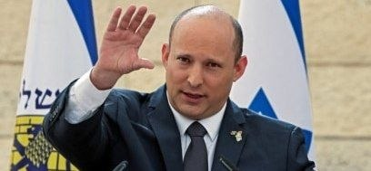

🔴 نفتالی بنت؛ رقیب انتخاباتی نتانیاهو:
به زودی دولت جدیدی در اسرائیل برسرکار میاد که نخست وزیرش منم.
من مثل نتانیاهو نیستم که کارها رو ناقص رها کنم.
از همینجا به جمهوری اسلامی میگم من قرار بدترین کابوس شما باشم و تا وقتی که‌ ساقطتون نکنم و مردم ایران رو از دست شماها نجات ندم دست بردار نیستم.
توافقتون با آمریکا هم یه توافق موقته. اینو از من داشته باشید.

@IranianMinds

## alonews — post 128543

🔴فوری/باراک راوید، جزئیات تفاهم‌نامه ایالات متحده و ایران را به دست آورده است، او می‌گوید ۱۲ نکته به شرح زیر است:

🔴 ایران، ایالات متحده و متحدانشان خصومت‌ها را متوقف خواهند کرد، از جمله در لبنان. ایران تعهد خود را به عدم توسعه یا دستیابی به سلاح‌های هسته‌ای مجدداً تأکید می‌کند.

🔴 ایالات متحده و ایران متعهد می‌شوند مسئله دفع ذخایر اورانیوم غنی‌شده ایران را حل کنند.

🔴ایالات متحده و ایران درباره غنی‌سازی اورانیوم و نیازهای انرژی هسته‌ای غیرنظامی ایران گفتگو خواهند کرد.

🔴 ایران وضعیت موجود برنامه هسته‌ای خود را در طول مدت مذاکرات حفظ خواهد کرد.

🔴ایالات متحده محاصره دریایی را برمی‌دارد، از تحمیل تحریم‌های جدید خودداری می‌کند و در طول مذاکرات حضور نظامی خود در منطقه را افزایش نخواهد داد.

🔴ایران ترتیبات لازم را برای تضمین عبور ایمن کشتی‌های تجاری از تنگه هرمز، بدون هزینه، به مدت ۶۰ روز فراهم خواهد کرد.

🔴ایالات متحده متعهد می‌شود دارایی‌های منجمد شده ایران را پس از اجرای تفاهم‌نامه در دسترس قرار دهد.

🔴 اگر توافق نهایی حاصل شود، ایالات متحده نیروهای خود را ظرف ۳۰ روز خارج کرده و تمام تحریم‌ها علیه ایران را لغو خواهد کرد.

🔴هر توافق نهایی شامل برنامه‌ای برای ایجاد صندوق ۳۰۰ میلیارد دلاری برای بازسازی ایران خواهد بود. ایالات متحده به ایران معافیت‌های موقتی تحریمی برای اجازه فروش نفت در دوره مذاکرات اعطا خواهد کرد.

🔴مذاکرات بین ایران و عمان با مشارکت کشورهای خلیج فارس برگزار خواهد شد تا ترتیبات مربوط به حمل و نقل و خدمات دریایی تعیین شود.

✅ @AloNews خبر جنگ

## alonews — post 128542

  <a href="telegram/content/alonews_128542_1781633724.webm" target="_blank">🎬 Download video</a>

👈فارس: برخی منابع نزدیک به تیم مذاکره‌کننده ایران، ادعاهای شبکه خبری العربیه در خصوص متن یادداشت تفاهم ایران و آمریکا را تکذیب کردند

🔴العربیه پیش از این نیز گزارش‌های نادرستی در خصوص مسائل مرتبط با ایران منتشر کرده است

✅ @AloNews خبر جنگ

---
📅 بروزرسانی: 1405/03/26 21:36
---

## mwarmonitor — post 11042

🚨 فوری: باراک راوید برای رسانه اسرائیلی کانال ۱۲ گزارش می‌دهد که به نکات کلیدی «یادداشت تفاهم» میان آمریکا و ایران دست یافته است؛ توافقی که شامل آتش‌بس در لبنان نیز می‌شود. نکته قابل توجه این است که طبق گفته راوید، تنگه هرمز فقط برای ۶۰ روز باز خواهد شد.…

## mwarmonitor — post 11041

🚨 فوری: باراک راوید برای رسانه اسرائیلی کانال ۱۲ گزارش می‌دهد که به نکات کلیدی «یادداشت تفاهم» میان آمریکا و ایران دست یافته است؛ توافقی که شامل آتش‌بس در لبنان نیز می‌شود.

نکته قابل توجه این است که طبق گفته راوید، تنگه هرمز فقط برای ۶۰ روز باز خواهد شد.

@mwarmonitor

## pm_afshaa — post 94205

خیلی دلم میخاد اون جاکشی که گفت برین نفت و طلا بخرینو ببینم🤣🤣

## pm_afshaa — post 94204

طلا 15300

## Persian_Trend_Official — post 17290

  <a href="telegram/content/Persian_Trend_Official_17290_1781633210.webm" target="_blank">🎬 Download video</a>

العربیه ادعا می‌کند که بخشی از تفاهم‌نامه ایالات متحده و ایران به شرح زیر است:

ایالات متحده فوراً محاصره دریایی خود علیه ایران را لغو کند و به مداخله بیشتر پایان دهد.

پایان فوری و دائمی جنگ در تمام جبهه‌ها، از جمله لبنان.

خروج تمام نیروهای ایالات متحده از منطقه ظرف یک ماه پس از توافق نهایی.

ایران محدودیت‌های تنگه هرمز را ظرف یک ماه لغو کند.

یک طرح بازسازی مورد حمایت ایالات متحده و شرکای منطقه‌ای برای ایران به ارزش حداقل 300 میلیارد دلار.

لغو تمام تحریم‌های ایالات متحده، از جمله اقدامات مرتبط با سازمان ملل و آژانس بین‌المللی انرژی اتمی، پس از اجرای توافق نهایی.

تعهد ایران به عدم توسعه سلاح‌های هسته‌ای، با موکول شدن موضوع اورانیوم غنی‌شده به مذاکرات نهایی؛ تا آن زمان، ایالات متحده اجازه می‌دهد وضعیت موجود در برنامه هسته‌ای ایران حفظ شود.

موافقت ایالات متحده با صادرات نفت خام ایران، شامل خدمات بانکی، بیمه و کشتیرانی، به همراه آزادسازی تمام دارایی‌های مسدود شده ایران.

📝 Amir

📌 @persian_trend_official
پرشین ترند | متفاوت‌ترین کانال نظامی

## Hranews — post 113657

  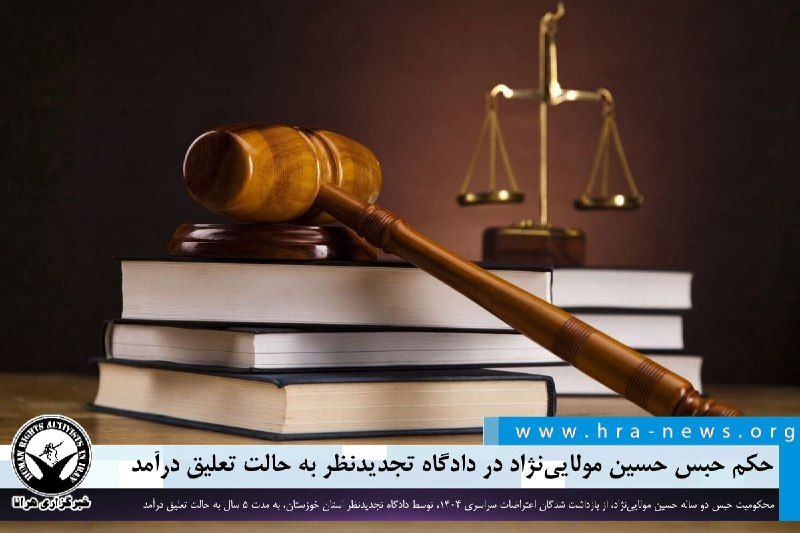

اعتراضات دی‌ماه ۱۴۰۴؛ حکم حبس حسین مولایی‌نژاد در دادگاه تجدیدنظر به حالت تعلیق درآمد

❗️
❗️
❗️
❗️
❗️ – محکومیت حسین مولایی‌نژاد، از بازداشت شدگان اعتراضات سراسری ۱۴۰۴، توسط شعبه ۱۶ دادگاه تجدیدنظر استان خوزستان، به مدت پنج سال به حالت تعلیق درآمد. وی پیشتر در مرحله بدوی دادگاه به دو سال #حبس محکوم شده بود.

به گزارش خبرگزاری هرانا، ارگان خبری مجموعه فعالان حقوق بشر در ایران، حکم حبس حسین مولایی‌نژاد، در مرحله تجدیدنظر به حالت تعلیق درآمد.

بر اساس اطلاعات دریافتی هرانا، شعبه ۱۶ دادگاه تجدیدنظر استان خوزستان، حکم حبس آقای مولایی‌نژاد را به مدت پنج سال تعلیق کرده است. این حکم اخیرا به حسین ‌علی حاتمی، وکیل مدافع آقای مولایی‌نژاد ابلاغ شده است. حسین مولایی‌نژاد، در مرحله دادرسی بدوی، توسط شعبه یک دادگاه انقلاب اهواز به دو سال حبس محکوم شده بود. این حکم از بابت اتهام «اخلال در نظم عمومی»، علیه وی صادر شد.

ادامه مطلب

#حسین_مولایی‌نژاد

↘️
@hranews_bot تماس ✉️ -  @Hranews  کانال هرانا 🆑

## alonews — post 128541

👈سازمان اطلاعات داخلی فرانسه، اداره کل امنیت داخلی، استفاده از پالانتیر را متوقف می‌کند، وزیر دفاع سباستین لکورنوی به نگرانی‌ها درباره وابستگی استراتژیک به آمریکا اشاره کرده است، گزارش خبرگزاری AFP

✅ @AloNews خبر جنگ

---
📅 بروزرسانی: 1405/03/26 21:29
---

## VahidOOnLine — post 245915

همزمان با سفر شاهزاده رضا پهلوی به لندن، جمعی از ایرانیان برای استقبال از او مقابل پارلمان بریتانیا تجمع کردند.

شاهزاده رضا پهلوی در جریان این سفر با رهبران سیاسی بریتانیا، نمایندگان پارلمان و برخی رسانه‌ها دیدار و گفت‌وگو می‌کند.
‌🏁 🇬🇧 IranintlTV

🤖 @VahidOOnLine

## VahidOOnLine — post 245914

  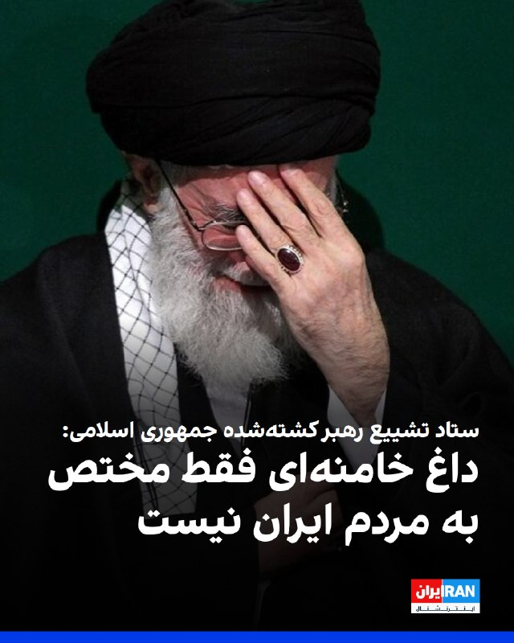

ستاد تشییع و تدفین علی خامنه‌ای در اطلاعیه‌ای، با اشاره به آماده‌سازی مقدمات دفن او، اعلام کرد: «این عزا، تنها مختص مردم ایران نیست. از کشورهای جبهه مقاومت تا اقصی‌نقاط دنیا، آزادگان و آزادی‌خواهان جهان داغدار این شهادت عظیم شده‌اند.»

این ستاد همچنین شرکت در مراسم تشییع جنازه او، «تجدید بیعتی با مکتب اوست.»
‌🏁 🇬🇧 IranintlTV

🤖 @VahidOOnLine

## WithYashar — post 15087

## WithYashar — post 15086

شبکه ۱۳ اسرائیل: امروز یه نشست اضطراری تو دفتر بنیامین نتانیاهو برگزار میشه تا بررسی کنن چطور میشه بین جبهه ایران و لبنان تفکیک ایجاد کرد و با این شاهکار ترامپ کنار اومد.
@withyashar

## FoxNewsTwitter — post 343038

  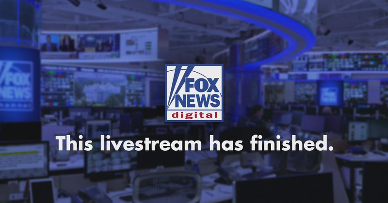

Fox News (Twitter/X)

WATCH LIVE: President Trump joins G7 leaders for summit cultural showcase https://twitter.com/i/broadcasts/1aJbddPmeNZKX

## pm_afshaa — post 94203

تتر 150

## pm_afshaa — post 94202

  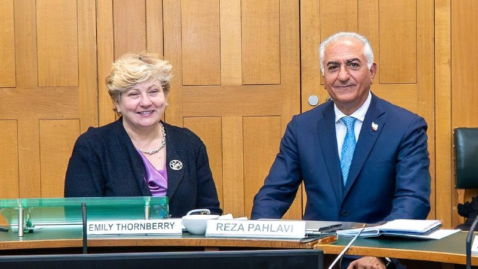

‏امروز با امیلی تورن‌بری رئیس کمیته روابط خارجی مجلس عوام بریتانیا و شماری دیگر از اعضای این کمیته دیدار داشتم تا درباره وضعیت داخلی ایران، سرکوب مردم ایران توسط جمهوری اسلامی، و ضرورت فوری قرار دادن ملت ایران در مرکز سیاست بریتانیا گفت‌وگو کنیم.

‏به‌روشنی تأکید کردم که معامله با رژیمی که در دی ماه بیش از ۴۰ هزار ایرانی را به قتل رسانده، نه‌تنها از نظر اخلاقی غیرقابل‌قبول است، بلکه از نظر راهبردی نیز خطایی بزرگ خواهد بود.

‏هر توافقی که به حفظ این رژیم یا بقایای آن بینجامد، محکوم به شکست است. مردم ایران چنین توافقی را نخواهند پذیرفت.

‏با حمایت جامعه جهانی یا بدون آن، مردم ایران این رژیم را سرنگون خواهند کرد و آزادی به ایران بازخواهد گشت.

This morning, I met with Emily Thornberry, Chair of the House of Commons Foreign Affairs Committee, and other members of the Committee to discuss the situation inside Iran, the Islamic Republic’s repression of the Iranian people, and the urgent need to place the people of Iran at the centre of UK policy.

I made clear that dealing with a regime that murdered more than 40,000 Iranians in January is not only morally wrong, but strategically misguided.

Any agreement that preserves this regime or its remnants will fail. The Iranian people will not accept it.

With or without international support, the people of Iran will overthrow this regime. Freedom will come to Iran.

@OfficialRezaPahlavi

## IranIntlTV — post 342742

همزمان با سفر شاهزاده رضا پهلوی به لندن، جمعی از ایرانیان برای استقبال از او مقابل پارلمان بریتانیا تجمع کردند.

شاهزاده رضا پهلوی در جریان این سفر با رهبران سیاسی بریتانیا، نمایندگان پارلمان و برخی رسانه‌ها دیدار و گفت‌وگو می‌کند.

## IranIntlTV — post 342741

  <a href="telegram/content/IranIntlTV_342741_1781632770.mp4" target="_blank">🎬 Download video</a>

نفتالی بنت، نخست وزیر پیشین اسرائیل، در گفت‌وگو با ایران‌اینترنشنال گفت: «به ملت شریف ایران می‌گویم که امیدتان را از دست ندهید، جمهوری اسلامی رژیم فاسدی است که سقوط خواهد کرد. نوبت بعد که مردم ایران قیام کنند ما ابزارهای لازم را در اختیارشان قرار می‌دهیم.»
@iranintltv

## IranIntlTV — post 342740

  <a href="telegram/content/IranIntlTV_342740_1781632772.mp4" target="_blank">🎬 Download video</a>

روزنامه وال‌استریت ژورنال روز سه‌شنبه به نقل از افرادی آگاه از مفاد توافق تهران و واشینگتن گزارش داد که ایالات متحده، به ایران اجازه خواهد داد فورا فروش نفت و سوخت را آغاز کند

گفت‌وگو با بابک اسحاقی و مرضیه حسینی، خبرنگاران ایران‌اینترنشنال
@iranintltv

## IranIntlTV — post 342739

  

ستاد تشییع و تدفین علی خامنه‌ای در اطلاعیه‌ای، با اشاره به آماده‌سازی مقدمات دفن او، اعلام کرد: «این عزا، تنها مختص مردم ایران نیست. از کشورهای جبهه مقاومت تا اقصی‌نقاط دنیا، آزادگان و آزادی‌خواهان جهان داغدار این شهادت عظیم شده‌اند.»

این ستاد همچنین شرکت در مراسم تشییع جنازه او، «تجدید بیعتی با مکتب اوست.»
https://iranintl.com/202606167748

## FarsiVOA — post 220925

معاون رئیس جمهوری آمریکا: مفاد تفاهمنامه با جمهوری اسلامی حداکثر تا جمعه در اختیار همه قرار می‌گیرد

## DW_Farsi — post 126073

🔶 ترامپ: من از نحوه رفتار اسرائیل با لبنان و حزب‌الله راضی نیستم
 
بر اساس گزارش خبرگزاری رسمی لبنان (NNA)، حملات پهپادی اسرائیل به سه خودرو در جنوب لبنان "دست‌کم چهار کشته" و چندین زخمی بر جای گذاشت.
 
گفته‌ می‌شود دو نفر در جریان حمله‌ای دو مرحله‌ای در روستای میفدون کشته شدند. بر اساس این گزارش، یک پهپاد ابتدا خودرویی را هدف قرار داد و پس از تجمع مردم در محل، حمله دوم انجام شد.
 
به گزارش این خبرگزاری، در حمله پهپادی دیگری به شهر شوکین نیز دو نفر دیگر کشته شدند. ارتش اسرائیل هنوز واکنشی به اخبار این حملات نشان نداده است.
 
این حملات در حالی صورت گرفته که دونالد ترامپ، رئیس‌جمهور آمریکا، اعلام کرده، اسرائیل باید در جنگ با شبه‌نظامیان حزب‌الله در لبنان، مسئولانه‌تر عمل کند. ترامپ گفت: «من از نحوه رفتار اسرائیل با لبنان و حزب‌الله راضی نیستم.»
 
ترامپ  در حاشیه اجلاس رهبران گروه ۷ در فرانسه با اشاره به این جنگ که تاکنون حدود ۳۸۰۰ کشته و نزدیک به ۱۱ هزار و ۷۰۰ زخمی در لبنان برجای گذاشته است، تاکید کرد که اسرائیل خیلی وقت است که با حزب‌الله می‌جنگد و افراد بسیار زیادی کشته می‌شوند.
 
رئیس‌جمهور آمریکا با انتقاد از حملات اسرائیل گفت: «لازم نیست هر بار که به دنبال کسی می‌گردید، یک ساختمان مسکونی را ویران کنید؛ چرا که آدم‌های زیادی در آن ساختمان‌ها هستند و همه آن‌ها هم عضو حزب‌الله نیستند.»
 
جنگ در لبنان یکی از بزرگ‌ترین موانع بر سر راه توافق‌نامه چارچوب در جنگ ایران به شمار می‌رود.
 
ایران به عنوان اصلی‌ترین حامی حزب‌الله اعلام کرده است که حملات جدید اسرائیل به لبنان و تداوم اشغال مناطق، به عنوان نقض این توافق تلقی خواهد شد. با این حال، اسرائیل اعلام کرده است که فعلا قصد ندارد نیروهای زمینی خود را از مناطق اشغال‌شده در کشور همسایه عقب بکشد.
@dw_farsi

## BBCPersian — post 284067

  <a href="https://t.me/bbcpersian/284067" target="_blank">📎 Download file</a>

پادکست برنامه جام جهان‌نما سه‌شنبه ۲۶ خرداد ۱۴۰۵
این برنامه رادیویی را می‌توانید هرشب ساعت ۲۰ به وقت ایران، روی موج متوسط ۷۰۲ کیلوهرتز و موج کوتاه ۹۴۶۵ کیلوهرتز بشنوید.تکرار برنامه را هم می‌توانید ساعت ۲۱:۳۰ روی موج متوسط ۷۰۲ کیلوهرتز و موج کوتاه ۵۳۹۵ کیلوهرتز گوش کنید.

@BBCPersian

## Dirty_Kids — post 392329

  <a href="telegram/content/Dirty_Kids_392329_1781632775.mp4" target="_blank">🎬 Download video</a>

🔴 ۴ ماه دیگه انتخابات اسرائیله و صحبتای مهم نفتالی بنت، اصلی ترین گزینه نخست وزیری:

از همینجا اعلام میکنم تبدیل به بزرگ ترین کابوس جمهوری اسلامی خواهم شد، تا مردم ایران رو آزاد نکنم دست از سر رژیم برنمیدارم.
علاوه بر اون، ۳۰ـ۵۰ هزار استارلینک در ایران مستقر میکنیم که سری بعد که اعتراضات شد، جمهوری اسلامی نتونه اینترنت رو قطع کنه.

@Dirty_Kids 👻

## Dirty_Kids — post 392328

  <a href="telegram/content/Dirty_Kids_392328_1781632775.mp4" target="_blank">🎬 Download video</a>

وضعیت توافق بین آمریکا و جمهوری‌اسلامی: 😂😂😂

@Dirty_Kids 👻

## Dirty_Kids — post 392327

  <a href="telegram/content/Dirty_Kids_392327_1781632777.mp4" target="_blank">🎬 Download video</a>

این همون آتنا نیست که داره ضجه میزنه؟؟

@Dirty_Kids 👻

## Hranews — post 113656

مرگ و مصدومیت ۲ کارگر در سایه فقدان ایمنی کار

❗️
❗️
❗️
❗️
❗️ – در سایه فقدان ایمنی محیط و شرایط نامناسب کار، دو #کارگر در شهرهای بانه و یزد حین انجام کار دچار حادثه شدند. طی این حوادث، یک تن جان باخت و یک کارگر سیمبان مصدوم شد.

ادامه مطلب

↘️
@hranews_bot تماس ✉️ -  @Hranews  کانال هرانا 🆑

## alonews — post 128540

  <a href="telegram/content/alonews_128540_1781632779.webm" target="_blank">🎬 Download video</a>

👈فرهیختگان: بیش از ۱۰ هزار پزشک زیر میزی می‌گیرند

✅ @AloNews خبر جنگ

## alonews — post 128539

  <a href="telegram/content/alonews_128539_1781632779.webm" target="_blank">🎬 Download video</a>

👈یک مقام آمریکایی و یک دیپلمات منطقه به تایمز اسرائیل گفتند که آمریکا خود را برای ارائه تسهیلات به ایران در قالب معافیتی که به ایران اجازه صادرات نفت می‌دهد، آماده می‌کند.

🔴 اعطای معافیت تحریمی پیش‌دستانه آمریکا در مورد فروش نفت ایران نشان می‌دهد که در واقع برای برداشتن برخی محدودیت‌های اقتصادی، نیازی به امتیازات بیشتر از سوی ایران نیست.

✅ @AloNews خبر جنگ

---
📅 بروزرسانی: 1405/03/26 21:14
---

## VahidOOnLine — post 245913

♦️رهبران حاضر در نشست گروه هفت (G7) روز سه‌شنبه ۲۶ خردادماه در شهر اویان فرانسه برای گرفتن عکس یادگاری سنتی این اجلاس در کنار یکدیگر قرار گرفتند. در این مراسم، امانوئل مکرون، رئیس‌جمهوری فرانسه، به همراه رهبران آمریکا، کانادا، بریتانیا، آلمان، ژاپن و ایتالیا و همچنین شماری از رهبران و مقام‌های کشورهای مهمان حضور داشتند.

در تصاویری که خبرگزاری رویترز از این مراسم منتشر کرده است، گفت‌وگوی دونالد ترامپ، رئیس‌جمهوری آمریکا، با مارک کارنی، نخست‌وزیر کانادا، و همچنین حضور عبدالفتاح السیسی، رئیس‌جمهوری مصر، نارندرا مودی، نخست‌وزیر هند، جورجا ملونی، نخست‌وزیر ایتالیا، فریدریش مرتس، صدراعظم آلمان، سانائه تاکایچی، نخست‌وزیر ژاپن و اورزولا فون در لاین، رئیس کمیسیون اروپا دیده می‌شود.

ترامپ در حالی در این نشست شرکت کرد که ساعاتی پیش از آن از دستیابی به توافقی برای پایان دادن به درگیری‌ها با جمهوری اسلامی ایران خبر داده بود. ناهار کاری رهبران در روز سه‌شنبه بر موضوع بازگشایی ایمن تنگه هرمز و بررسی مسیرهای جایگزین برای حمل‌ونقل انرژی و تجارت جهانی متمرکز بود.
‌🇸🇦 Indypersian

🤖 @VahidOOnLine

## WithYashar — post 15085

Voice message

## WithYashar — post 15084

@withyashar استادیوم

## WithYashar — post 15083

## FoxNewsTwitter — post 343037

  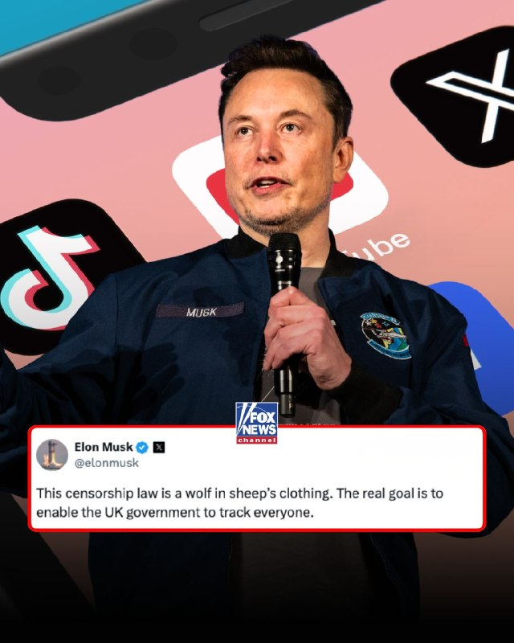

Fox News (Twitter/X)

“This censorship law is a wolf in sheep’s clothing.”

Elon Musk fires back after the UK announced an under-16 social media ban set for early 2027 — with officials also eyeing curfews and limits on infinite scrolling for people under 18.

His warning: this isn’t just about kids. It could force age checks on everyone.

## alonews — post 128538

  <a href="telegram/content/alonews_128538_1781631874.webm" target="_blank">🎬 Download video</a>

👈عبدالناصر همتی رئیس‌کل بانک مرکزی به خبرگزاری تسنیم: پس از امضا و آغاز اجرای یادداشت تفاهم، اقدامات فنی و بانکی لازم برای راستی‌آزمایی آزادسازی دارایی‌ها و امکان استفاده عملی از آنها انجام خواهد شد تا اطمینان کامل نسبت به دسترسی مؤثر به منابع فراهم شود

✅ @AloNews خبر جنگ

---
📅 بروزرسانی: 1405/03/26 21:04
---

## VahidOOnLine — post 245908

## VahidOOnLine — post 245903

  <a href="telegram/content/VahidOOnLine_245903_1781631283.mp4" target="_blank">🎬 Download video</a>

سیاست کشورهای عربی در برابر جمهوری اسلامی بیش از آنکه از اعتماد به تهران ناشی شود، محصول محاسبه هزینه‌هاست. برای بسیاری از این دولت‌ها، حفظ تعادل موجود همچنان کم‌هزینه‌تر از ورود به بحرانی نامعلوم است.
‌🏁 🇬🇧 ManotoTV

🤖 @VahidOOnLine

## pm_afshaa — post 94201

  <a href="telegram/content/pm_afshaa_94201_1781631284.webm" target="_blank">🎬 Download video</a>

🔴بر اساس نظرسنجی مؤسسه کانتار، میزان حمایت از دونالد ترامپ در اسرائیل طی فقط 3 هفته به‌طور کامل معکوس شده و از مثبت 23 به منفی 23 رسیده؛ افتی 46 واحدی.

💧 Rainbet.com the #1 Non-KYC Crypto Casino & Sportsbook @rainbetcom

😁 @Pm_Afshaa

## ManotoTV — post 106103

## ManotoTV — post 106098

  <a href="telegram/content/ManotoTV_106098_1781631285.mp4" target="_blank">🎬 Download video</a>

سیاست کشورهای عربی در برابر جمهوری اسلامی بیش از آنکه از اعتماد به تهران ناشی شود، محصول محاسبه هزینه‌هاست. برای بسیاری از این دولت‌ها، حفظ تعادل موجود همچنان کم‌هزینه‌تر از ورود به بحرانی نامعلوم است.

## FarsiVOA — post 220924

پرسش میدان: گروه‌های اپوزیسیون پس از جنگ و تفاهم میان ایران و آمریکا چه برنامه‌ای برای عبور از جمهوری اسلامی دارند؟

## DW_Farsi — post 126072

  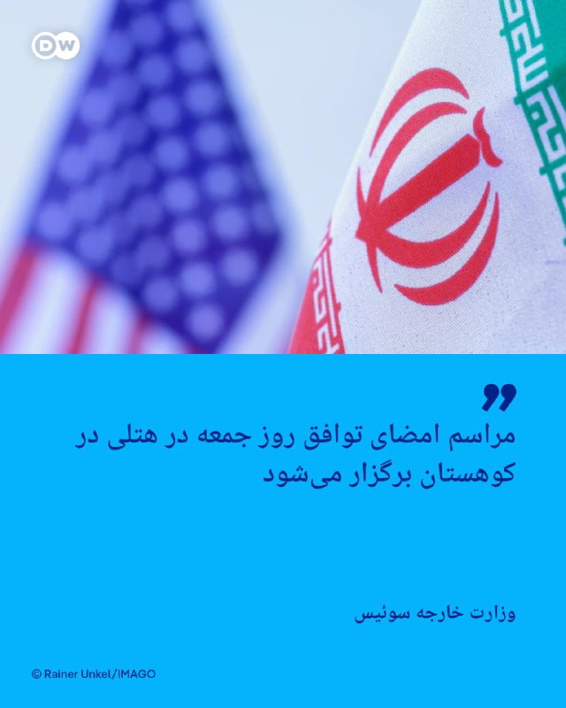

🔶 وزارت خارجه سوئیس: مراسم امضای توافق روز جمعه در هتلی در کوهستان برگزار می‌شود
 
وزارت خارجه سوئیس روز سه‌شنبه ۱۶ ژوئن (۲۶ خرداد) در گفتگو با خبرگزاری فرانسه تایید کرد که مراسم امضای این توافق‌نامه در یک هتل لوکس در کوهستان بورگن‌اشتوک، مشرف به دریاچه لوسرن برگزار می‌شود. آمریکا و ایران پیش از این، توافقی را که روز یکشنبه حاصل شده بود، به صورت دیجیتالی امضا کرده بودند.
 
به گفته وزارت امور خارجه سوئیس، تفریحگاه و هتل بورگن‌اشتوک هم از سوی میانجی‌گران پاکستانی و قطری و هم از طرف آمریکا و ایران به عنوان محل این دیدار پیشنهاد شده بود.
 
بنا به اعلام این وزارت‌خانه، دسترسی به این مجموعه هتلی دشوار است و به همین دلیل به راحتی می‌توان امنیت آن را تامین کرد.
 
توافق‌نامه چارچوبی که روز یکشنبه از سوی آمریکا و ایران اعلام شد، از جمله شامل یک آتش‌بس فوری در سراسر منطقه (حتی در لبنان) است.
 
علاوه بر این، یک دوره زمانی ۶۰ روزه پیش‌بینی شده است که در آن هر دو کشور قصد دارند پیش‌نویس یک توافق‌نامه نهایی صلح را تدوین کنند. در این میان، موضوع حساس برنامه هسته‌ای ایران نیز مورد بحث و بررسی قرار خواهد گرفت.
@dw_farsi

## Persian_Trend_Official — post 17289

  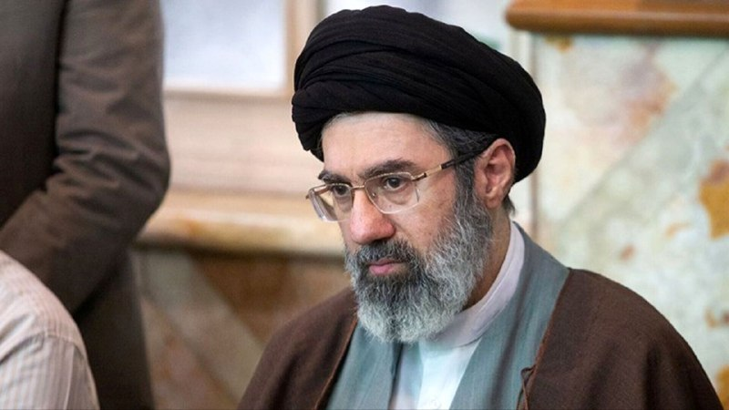

کانال 12 اسرائیل: مجتبی خامنه ای از مذاکرات هسته ای برای گریز هسته ای استفاده میکند.

کانال 12 اسرائیل می‌گوید اطلاعات اسرائیل مدعی است، رهبر ایران قصد رسیدن به توافق نهایی هسته‌ای ندارد. مقامات معتقدند تهران چارچوب توافق را عمدتاً برای بازگشایی تنگه هرمز و کسب تسهیلات اقتصادی تصویب کرده، نه دادن امتیازات معنادار هسته‌ای. مقامات امنیتی اسرائیل هشدار دادند که ایران احتمالاً مذاکرات 60 روزه را طولانی‌تر خواهد کرد و از این زمان برای کاهش بیشتر جدول زمانی گریز هسته‌ای خود تحت پوشش مذاکرات استفاده خواهد کرد.

آنها همچنین ابراز نگرانی کردند که ایالات متحده درخواست اسرائیل برای بررسی تفاهم‌نامه چارچوب را رد کرده و از ترس افشای آن، آن را فاش کرده است.

📝 Amir

📌 @persian_trend_official
پرشین ترند | متفاوت‌ترین کانال نظامی

## BBCPersian — post 284066

  <a href="telegram/content/BBCPersian_284066_1781631287.mp4" target="_blank">🎬 Download video</a>

🎶 بخشی از اجرای «دی بلال»، ترانه مردمی لری بختیاری، با صدای آیدا شاه‌قاسمی را می‌بینید.

دی بلال یکی از شناخته‌شده‌ترین ترانه‌های عاشقانه در فرهنگ بختیاری است. این عبارت در اصل یک خطاب احساسی است؛ «دی» برای ندا و صدا زدن، و «بلال» به‌صورت نمادین به معنای معشوق یا یار.

آیدا شاه‌قاسمی، خواننده و آهنگساز ایرانی متولد تهران است که که از نوجوانی به آمریکا مهاجرت کرده و فعالیت هنری خود را در آنجا ادامه داده است. او با تلفیق موسیقی کلاسیک ایرانی و عناصر مدرن، به موضوعاتی مثل هویت و مهاجرت می‌پردازد و در کنار موسیقی، به‌عنوان روان‌درمانگر هم فعالیت دارد.

اجرای زنده او در استودیو میداویل لندن را در یوتیوب بی‌بی‌سی فارسی ببینید.
https://bbc.in/4uD49eE

@BBCPersian

## manototv — post 106103

## manototv — post 106098

  <a href="telegram/content/manototv_106098_1781631290.mp4" target="_blank">🎬 Download video</a>

سیاست کشورهای عربی در برابر جمهوری اسلامی بیش از آنکه از اعتماد به تهران ناشی شود، محصول محاسبه هزینه‌هاست. برای بسیاری از این دولت‌ها، حفظ تعادل موجود همچنان کم‌هزینه‌تر از ورود به بحرانی نامعلوم است.

## alonews — post 128537

  <a href="telegram/content/alonews_128537_1781631291.webm" target="_blank">🎬 Download video</a>

👈 صدراعظم آلمان مرتس در مورد جمهوری اسلامی ایران: ما همیشه گفته‌ایم که آماده مشارکت هستیم. ما قبلاً اولین کشتی‌های مین‌روب و کشتی‌ها را به منطقه فرستاده‌ایم.

🔴ما آماده هستیم، اما هنوز تصمیمی نگرفته‌ایم — نه در دولت فدرال و نه در پارلمان.

🔴ما باید، البته، همچنین پایه حقوقی را روشن کنیم. این سوالی است که هنوز به طور قاطع حل نکرده‌ایم.

🔴اما این واقعیت که ما اساساً آماده مشارکت در حفظ این صلح هستیم، برای هفته‌ها موضع مشترک دولت فدرال بوده است

✅ @AloNews خبر جنگ

## alonews — post 128536

  <a href="telegram/content/alonews_128536_1781631291.webm" target="_blank">🎬 Download video</a>

👈 صدراعظم آلمان مرتس: همه چیزهایی که از ایران می‌شنویم نشان می‌دهد که ایران نیز این موضوع را می‌پذیرد، زیرا با توجه به برتری نظامی آمریکا، به سادگی هیچ انتخاب دیگری ندارد.

🔴من دیروز عصر به رئیس‌جمهور ترامپ گفتم: می‌توانید از این مثال ببینید که قدرت نظامی شفاف نیز قادر به ایجاد راه‌حل‌های دیپلماتیک است

🔴و همین موضوع در مورد اوکراین نیز صدق می‌کند، آنگاه ممکن است به صلح در دو مکان حیاتی جهان نزدیک‌تر شویم.

✅ @AloNews خبر جنگ

---
📅 بروزرسانی: 1405/03/26 20:54
---

## VahidOOnLine — post 245902

  <a href="telegram/content/VahidOOnLine_245902_1781630690.mp4" target="_blank">🎬 Download video</a>

شماری از ایرانیان ساکن آلمان روز ۲۶ خرداد در هامبورگ تجمعی در اعتراض به اعدام برگزار کردند. شرکت‌کنندگان در این تجمع ضمن حمایت از کارزار «نه به اعدام» و با در دست داشتن پرچم شیروخورشید، شاهزاده رضا پهلوی را «نماینده واقعی ملت ایران» برای امضای هرگونه توافقی دانستند.
‌🏁 🇬🇧 IranintlTV

🤖 @VahidOOnLine

## VahidOOnLine — post 245901

  

فریدریش مرتس، صدراعظم آلمان درباره ایران گفت: «ما آماده مشارکت هستیم. اطمینان دارم این توافق عملی خواهد شد و جمهوری اسلامی شرایط آن را خواهد پذیرفت، زیرا چاره‌ای ندارد.»

به گزارش رویترز، او افزود که برتری نظامی آمریکا برای جمهوری اسلامی گزینه دیگری باقی نمی‌گذارد.

صدراعظم آلمان تاکید کرد: «به ترامپ گفتم این نمونه‌ای است که نشان می‌دهد قدرت نظامی می‌تواند به یک راه‌حل دیپلماتیک منجر شود و می‌تواند الگویی برای اوکراین باشد.»

مرتس درباره تحریم‌های جدید علیه روسیه نیز گفت: «ترامپ را در حال‌وهوایی همکاری‌جویانه دیده‌ام و تا حدی خوش‌بین هستم که اروپایی‌ها و آمریکایی‌ها هر کاری را برای پایان دادن به این جنگ انجام خواهند داد.»
‌🏁 🇬🇧 IranintlTV

🤖 @VahidOOnLine

## WithYashar — post 15082

## FoxNewsTwitter — post 343035

Fox News (Twitter/X)

RT @MattFinnFNC: NEW: Photos of the two southern California men the Feds say were part of a plotted mass casualty drone & sniper attack at the UFC event at the White House. Bryan Roa is identified as the man on left. On the right, Michael Thomas.

## pm_afshaa — post 94200

  <a href="telegram/content/pm_afshaa_94200_1781630692.webm" target="_blank">🎬 Download video</a>

🔴نفتالی بنت (رقیب نتانیاهو در انتخابات نخست وزیری اسرائیل) تو پخش زنده خطاب به جمهوری اسلامی گفت : باور دارم به‌زودی یه دولت جدید تو اسرائیل میاد و امیدوارم من رهبری اون دولت رو به دست بگیرم و از همینجا به رژیم ایران میگم؛ من قراره بدترین کابوس شما باشم،…

## pm_afshaa — post 94199

  <a href="telegram/content/pm_afshaa_94199_1781630693.mp4" target="_blank">🎬 Download video</a>

🔴نفتالی بنت (رقیب نتانیاهو در انتخابات نخست وزیری اسرائیل) تو پخش زنده خطاب به جمهوری اسلامی گفت :

باور دارم به‌زودی یه دولت جدید تو اسرائیل میاد و امیدوارم من رهبری اون دولت رو به دست بگیرم و از همینجا به رژیم ایران میگم؛ من قراره بدترین کابوس شما باشم، تا وقتی مردم ایران رو از دست شما آزاد نکنم دست بردار نیستم.

+ 4 ماه دیگه انتخابات اسرائیله.

💧 Rainbet.com the #1 Non-KYC Crypto Casino & Sportsbook @rainbetcom

😁 @Pm_Afshaa

## VahidOnline — post 76428

  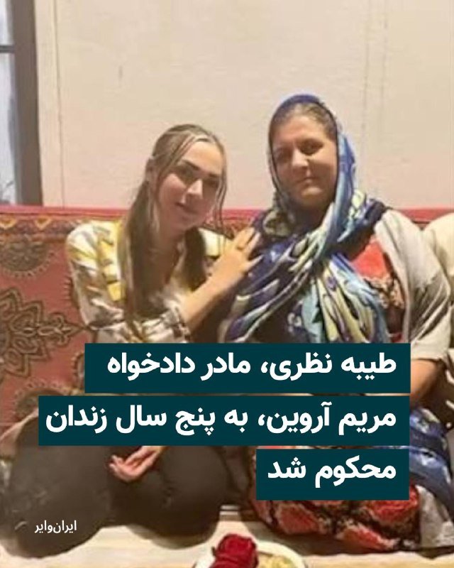

طیبه نظری مکی آبادی، مادر دادخواه مریم آروین و از بازداشت‌شدگان مراسم هفتم خسرو علیکردی در مشهد، از سوی دادگاه انقلاب این شهر به پنج سال زندان محکوم شد.

بر اساس حکمی که در تاریخ ۲۳ خرداد از سوی شعبه اول دادگاه انقلاب مشهد به ریاست قاضی غلامرضا اکبری مقدم صادر و به این شهروند ابلاغ شده، او بابت اتهام «اجتماع و تبانی علیه امنیت کشور» به چهار سال حبس و به اتهام «تبلیغ علیه نظام» به یک سال حبس محکوم شده است.

طیبه نظری، مادر وکیل جوان، مریم آروین است که در جریان اعتراضات «زن، زندگی، آزادی» در سال ۱۴۰۱ در سیرجان به دلیل دفاع حقوقی از بازداشت‌شدگان دستگیر و مدتی پس از آزادی موقت، به طرز مشکوکی جان باخت.
@VahidHeadline

📡 @VahidOnline

## VahidOnline — post 76427

  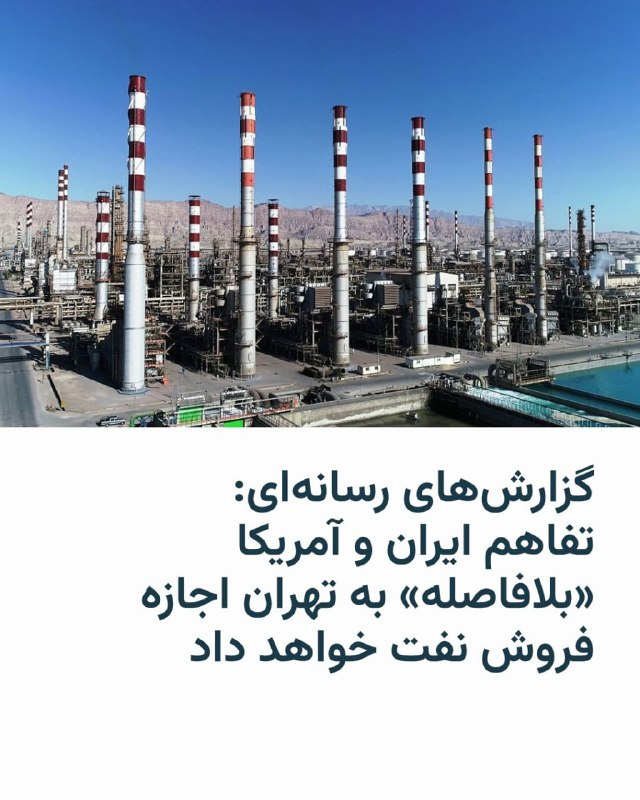

روزنامه وال‌استریت جورنال و خبرگزاری رویترز روز سه‌شنبه به شکل جداگانه و به نقل از منابع آگاه گزارش دادند که یادداشت تفاهمی که ایران و آمریکا به آن دست یافته‌اند، به ایران اجازه خواهد داد «بلافاصله» فروش نفت و دیگر فرآورده‌های نفتی خود را آغاز کند.

منابع این دو رسانه گفته‌اند مفاد مربوط به لغو تحریم‌های فروش نفت ایران پس از امضای توافق در همین هفته اجرایی خواهد شد و خدماتی از جمله بانکداری، حمل‌ونقل و بیمه را که برای تسهیل این فروش‌ها لازم هستند، در بر می‌گیرد.

وال‌استریت جورنال به نقل از این افراد گزارش داد که با اجرایی شدن این یادداشت تفاهم، موانع ناشی از تحریم‌ها بر صادرات نفت ایران و خدمات پشتیبان مرتبط با آن برداشته خواهد شد تا امکان انجام این معاملات فراهم شود.

یک مقام آمریکایی نیز در گفت‌وگو با رویترز تأکید کرد که این توافق دارای شروطی مشخص است.

او که به شرط ناشناس ماندن صحبت می‌کرد، گفت: «این یک توافق مبتنی بر عملکرد است. ایران تنها در صورتی می‌تواند از مزایای این یادداشت تفاهم بهره‌مند شود که به تمامی بندهایی که با آن‌ها موافقت کرده پایبند بماند؛ از جمله نداشتن سلاح هسته‌ای، خنثی‌سازی مواد غنی‌شده خود و عدم مداخله در جریان آزاد کشتیرانی در تنگه هرمز.»

یادداشت تفاهم ایران و آمریکا که ۲۴ خرداد به صورت الکترونیکی امضا شد، قرار است روز ۲۹ خرداد در سوئیس با حضور مقام‌های ارشد دو کشور به شکل حضوری نیز امضا شود.
@VahidHeadline

📡 @VahidOnline

## IranIntlTV — post 342738

شماری از ایرانیان ساکن آلمان روز ۲۶ خرداد در هامبورگ تجمعی در اعتراض به اعدام برگزار کردند. شرکت‌کنندگان در این تجمع ضمن حمایت از کارزار «نه به اعدام» و با در دست داشتن پرچم شیروخورشید، شاهزاده رضا پهلوی را «نماینده واقعی ملت ایران» برای امضای هرگونه توافقی دانستند.

## IranIntlTV — post 342737

  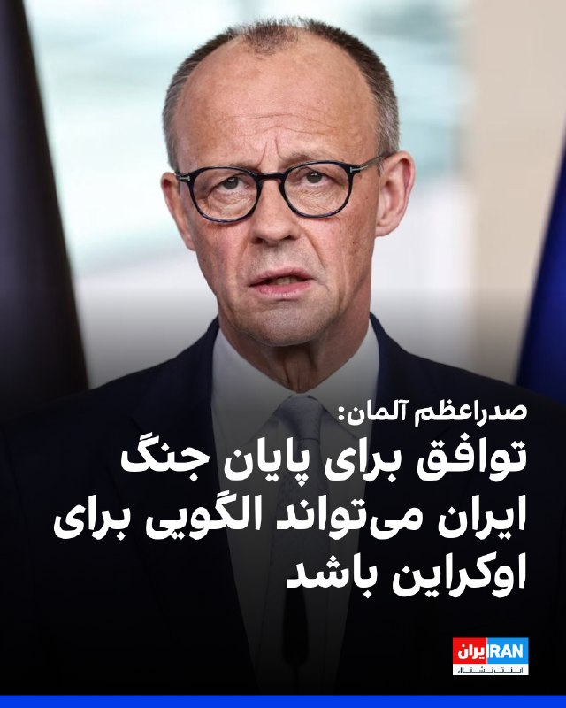

فریدریش مرتس، صدراعظم آلمان درباره ایران گفت: «ما آماده مشارکت هستیم. اطمینان دارم این توافق عملی خواهد شد و جمهوری اسلامی شرایط آن را خواهد پذیرفت، زیرا چاره‌ای ندارد.»

به گزارش رویترز، او افزود که برتری نظامی آمریکا برای جمهوری اسلامی گزینه دیگری باقی نمی‌گذارد.

صدراعظم آلمان تاکید کرد: «به ترامپ گفتم این نمونه‌ای است که نشان می‌دهد قدرت نظامی می‌تواند به یک راه‌حل دیپلماتیک منجر شود و می‌تواند الگویی برای اوکراین باشد.»

مرتس درباره تحریم‌های جدید علیه روسیه نیز گفت: «ترامپ را در حال‌وهوایی همکاری‌جویانه دیده‌ام و تا حدی خوش‌بین هستم که اروپایی‌ها و آمریکایی‌ها هر کاری را برای پایان دادن به این جنگ انجام خواهند داد.»
https://iranintl.com/202606162587

## FarsiVOA — post 220923

🔺حکم ۵ سال حبس برای طیبه نظری، مادر دادخواه مریم آروین

▪️رژیم جمهوری اسلامی طیبه نظری، معلم بازنشسته و مادر مریم آروین، وکیل و از جان‌باختگان اعتراضات «زن، زندگی، آزادی» را به ۵ سال حبس محکوم کرد.

⬇️ بیشتر بخوانید:

https://ir.voanews.com/a/taybeh-nazari-retired-teacher-imprisonment/8161495.html/?nocach=1

## DW_Farsi — post 126071

🔶 رضا پهلوی: هرگونه توافق با جمهوری اسلامی محکوم به شکست است
 
رضا پهلوی، پسر شاه سابق ایران در مصاحبه‌ای با نشریه بریتانیایی "تایمز"، توافق‌های اخیر میان واشنگتن و تهران را "اشتباه اخلاقی و گمراه‌کننده" خواند. او تاکید کرد که ساختار سیاسی در ایران اساسا با جهان آزاد "ناسازگار" است.
 
شاهزاده رضا پهلوی در این مصاحبه هشدار داد که رژیم ایران قابل اعتماد نیست و هرگونه توافقی با آن در نهایت با شکست مواجه خواهد شد. او اظهار داشت: «این رژیم به باج‌گیری از جهان، سرکوب معترضان در داخل و گسترش بی‌ثباتی در منطقه ادامه خواهد داد.»
 
پهلوی سیاست چند دهه گذشته کشورهای غربی در قبال جمهوری اسلامی را "اشتباه" توصیف کرد و گفت، غرب به جای دیدن واقعیت یک نظام توتالیتر، همواره گمان کرده که می‌تواند رفتار این حکومت را تغییر دهد یا تعدیل کند.
 
او با اشاره به سرکوب‌های داخلی گفت: «معامله با حکومتی که تنها در دو روز ۴۰ هزار معترض را کشته است، از نظر اخلاقی نادرست و از نظر استراتژیک یک خطای محاسباتی است.»
 
او وضعیت روانی جامعه را بحرانی توصیف کرد و افزود که بسیاری از مردم به نقطه‌ای رسیده‌اند که یا از شدت ناامیدی دست به خودکشی می‌زنند و یا به این نتیجه می‌رسند که دیگر چیزی برای از دست دادن ندارند و باید خود سرنوشتشان را تغییر دهند.
 
او در عین حال تاکید کرد که تغییر حکومت در ایران حتی بدون حمایت ترامپ نیز ممکن است و در نهایت این مردم ایران هستند که از طریق صندوق رای، رهبران آینده خود را تعیین خواهند کرد.
@dw_farsi

## IranianMinds — post 22756

  

‏امروز با امیلی تورن‌بری رئیس کمیته روابط خارجی مجلس عوام بریتانیا و شماری دیگر از اعضای این کمیته دیدار داشتم تا درباره وضعیت داخلی ایران، سرکوب مردم ایران توسط جمهوری اسلامی، و ضرورت فوری قرار دادن ملت ایران در مرکز سیاست بریتانیا گفت‌وگو کنیم.

‏به‌روشنی تأکید کردم که معامله با رژیمی که در دی ماه بیش از ۴۰ هزار ایرانی را به قتل رسانده، نه‌تنها از نظر اخلاقی غیرقابل‌قبول است، بلکه از نظر راهبردی نیز خطایی بزرگ خواهد بود.

‏هر توافقی که به حفظ این رژیم یا بقایای آن بینجامد، محکوم به شکست است. مردم ایران چنین توافقی را نخواهند پذیرفت.

‏با حمایت جامعه جهانی یا بدون آن، مردم ایران این رژیم را سرنگون خواهند کرد و آزادی به ایران بازخواهد گشت.

This morning, I met with Emily Thornberry, Chair of the House of Commons Foreign Affairs Committee, and other members of the Committee to discuss the situation inside Iran, the Islamic Republic’s repression of the Iranian people, and the urgent need to place the people of Iran at the centre of UK policy.

I made clear that dealing with a regime that murdered more than 40,000 Iranians in January is not only morally wrong, but strategically misguided.

Any agreement that preserves this regime or its remnants will fail. The Iranian people will not accept it.

With or without international support, the people of Iran will overthrow this regime. Freedom will come to Iran.

@OfficialRezaPahlavi

## alonews — post 128535

  <a href="telegram/content/alonews_128535_1781630697.webm" target="_blank">🎬 Download video</a>

👈کانال ۱۴ عبری : نشست اضطراری تو دفتر نتانیاهو با موضوع ایران و لبنان

✅ @AloNews خبر جنگ

## alonews — post 128534

  <a href="telegram/content/alonews_128534_1781630698.webm" target="_blank">🎬 Download video</a>

👈سی‌جی‌تی‌ان: یوری اوشاکوف، دستیار ولادیمیر پوتین، رئیس جمهور روسیه اعلام کرد که استیو ویتکاف و جرد کوشنر، نمایندگان آمریکا پس از امضای یادداشت تفاهم با ایران، احتمالا برای مذاکرات درباره اوکراین به مسکو سفر خواهند کرد.

✅ @AloNews خبر جنگ

## alonews — post 128533

  <a href="telegram/content/alonews_128533_1781630698.webm" target="_blank">🎬 Download video</a>

👈اختلال اینترنت ‌بانک پاسارگاد برطرف شد

✅ @AloNews خبر جنگ

---
📅 بروزرسانی: 1405/03/26 20:45
---

## VahidOOnLine — post 245900

  <a href="telegram/content/VahidOOnLine_245900_1781630112.mp4" target="_blank">🎬 Download video</a>

♦️جیانی اینفانتینو، رئیس فیفا، سه‌شنبه ۲۶ خردادماه با انتشار ویدیویی در اینستاگرام، حضور مهدی مهدوی‌کیا در نخستین بازی تیم ملی ایران در جام جهانی ۲۰۲۶ را «ویژه» توصیف کرد.

اینفانتینو نوشت مهدوی‌کیا به‌خوبی می‌داند نمایندگی از کشورش در صحنه جهانی چه معنایی دارد و افزود در این دیدار، گل خاطره‌انگیز او در جام جهانی ۱۹۹۸ را به یاد آورده‌اند. مهدوی‌کیا، بازیکن پیشین تیم ملی ایران و یکی از موفق‌ترین فوتبالیست‌های ایرانی شاغل در خارج از کشور، در جام‌های جهانی ۱۹۹۸ و ۲۰۰۶ برای ایران به میدان رفت و در سال ۲۰۰۳ عنوان بهترین بازیکن سال آسیا را به دست آورد. از گل‌های خاطره‌انگیز او می‌توان به گل برابر چین در دیدار پلی‌آف مقدماتی جام جهانی ۱۹۹۸ و گلزنی مقابل آمریکا در جام جهانی ۱۹۹۸ اشاره کرد. او در دوران حضور در هامبورگ آلمان به «موشک ایرانی» شهرت داشت و دو بار نیز به‌عنوان بهترین بازیکن این باشگاه انتخاب شد.

تیم ملی ایران در نخستین دیدار خود در جام جهانی ۲۰۲۶ مقابل نیوزیلند به میدان رفت و این مسابقه با نتیجه ۲ بر ۲ مساوی به پایان رسید. اینفانتینو با اشاره به دو گل ایران در این مسابقه، از آغاز رقابت‌های تیم ملی ایران در جام جهانی ۲۰۲۶ تمجید کرد.
‌🇸🇦 Indypersian

🤖 @VahidOOnLine

## VahidOOnLine — post 245899

🗣روایت شما از توافق میان جمهوری‌اسلامی و آمریکا - سه‌شنبه ۲۶ خرداد

🔹خطاب به نیروهای حکومتی: دیدید از اول هم در بازی نبودید؟ از کجا معلوم، شاید خامنه‌ای و خانواده‌اش الان یک گوشه دنیا نشسته‌اند و به ریش‌تان می‌خندند. تا دیرتر نشده، بیایید سمت مردم.

🔹خود ترامپ گفته ۴۲ هزار نفر کشته شدند و بعد می‌گوید باوری به تغییر حکومت ندارم؟ از چند ماه پیش گفته کمک در راه است، ۹۰ میلیون ایرانی را امیدوار کرد و الان توافق می‌کند؟ الان تنها امیدمان بی‌بی و خودمان هستیم.

🔹باید از آقای ترامپ تشکر کرد چون مجتبی خامنه‌ای را رهبر کرد، تنگه هرمز که باز بود را دوباره باز کرد. مردم ایران و کشته‌هایشان را گذاشت کنار، خرابی و تورم و جمهوری اسلامی را برای مردم ایران باقی گذاشت و رفت.

🔹کشتار دی‌ماه با اعدام‌های روزانه هنوز هم ادامه دارد. این‌ها دارند عادی‌سازی می‌کنند و در سایه ترامپ جنایت می‌کنند.

🔹هر شب و هر ثانیه برای جوانان‌مان که حیف شدند، گریه می‌کنم. هیچ‌وقت داغ‌شان برایمان کهنه نمی‌شود. چه صلح باشد و چه جنگ، هیچ‌وقت قرار نیست آن بچه‌ها برگردند خانه.

🔹آقای ترامپ گفتند که اعتقادی به تغییر رژیم در ایران ندارند. می‌خواستم بدانم پس قولی که به مردم ایران دادید و امیدهای واهی چی بود؟ فقط برای منافع خودتان با ایران مماشات کردید.

🔹آهای مردم! لطفاً چشم‌هایتان را باز کنید. هیچ‌کس به فکر ما نیست. اروپا و آمریکا و کشورهای خلیج فارس هیچ‌کدام نمی‌خواهند ایران و مردمش آزاد شوند. اگر خودمان کاری نکنیم، سخت پشیمان خواهیم شد. به پا خیزید.

🔹یه جوری توافق شده که هم ترامپ و آمریکا باختند، هم جمهوری اسلامی باخت، هم اسرائیل باخت، هم مردم ایران، به‌ویژه جوانان ایرانی، باختند. این جنگ برنده‌ای نداشت.

🔹آقای ترامپ، اینکه شما به همراه نتانیاهو ضربه سختی به جمهوری اسلامی زدید بر کسی پوشیده نیست، اما اینکه آمریکا نتوانست یک حکومت نصفه‌ونیمه که نه تسلطی بر آسمان داشت، نه دریا و نه مردمش را شکست دهد، واقعاً باعث خجالت برای آمریکایی‌هاست.

🔹از ترامپ ناامید شدیم. گفتی به مردم ایران کمک می‌کنم، اما مثل اینکه منظورت کمک برای بقای رژیم جمهوری اسلامی بود. این رژیم هر روز جوانان را اعدام می‌کند و به حقوق بشر اهمیتی نمی‌دهد.
‌🏁 🇬🇧 IranintlTV

🤖 @VahidOOnLine

## FoxNewsTwitter — post 343034

  <a href="telegram/content/FoxNewsTwitter_343034_1781630113.mp4" target="_blank">🎬 Download video</a>

Fox News (Twitter/X)

A mother in Ohio had the courage to call authorities on her 19-year-old son, blowing open the plot to attack this weekend's UFC event at The White House, @davidspunt reports.

Five suspects are in custody and facing charges as investigators identify 23 people as part of a potential network of plotters.

The alleged plan involved using explosive-laden drones to hit buildings near the event, force a mass evacuation and steer crowds toward a pre-staged sniper team, officials say.

## pm_afshaa — post 94198

  <a href="telegram/content/pm_afshaa_94198_1781630116.webm" target="_blank">🎬 Download video</a>

🔴رئیس پلیس راهور:
ابلاغیه‌ی گواهینامه موتور خانم‌ها داره صادر میشه و به‌زودی اجرا میشه.

💧 Rainbet.com the #1 Non-KYC Crypto Casino & Sportsbook @rainbetcom

😁 @Pm_Afshaa

## DEJradio — post 5743

  

‏امروز با امیلی تورن‌بری رئیس کمیته روابط خارجی مجلس عوام بریتانیا و شماری دیگر از اعضای این کمیته دیدار داشتم تا درباره وضعیت داخلی ایران، سرکوب مردم ایران توسط جمهوری اسلامی، و ضرورت فوری قرار دادن ملت ایران در مرکز سیاست بریتانیا گفت‌وگو کنیم.

‏به‌روشنی تأکید کردم که معامله با رژیمی که در دی ماه بیش از ۴۰ هزار ایرانی را به قتل رسانده، نه‌تنها از نظر اخلاقی غیرقابل‌قبول است، بلکه از نظر راهبردی نیز خطایی بزرگ خواهد بود.

‏هر توافقی که به حفظ این رژیم یا بقایای آن بینجامد، محکوم به شکست است. مردم ایران چنین توافقی را نخواهند پذیرفت.

‏با حمایت جامعه جهانی یا بدون آن، مردم ایران این رژیم را سرنگون خواهند کرد و آزادی به ایران بازخواهد گشت.

This morning, I met with Emily Thornberry, Chair of the House of Commons Foreign Affairs Committee, and other members of the Committee to discuss the situation inside Iran, the Islamic Republic’s repression of the Iranian people, and the urgent need to place the people of Iran at the centre of UK policy.

I made clear that dealing with a regime that murdered more than 40,000 Iranians in January is not only morally wrong, but strategically misguided.

Any agreement that preserves this regime or its remnants will fail. The Iranian people will not accept it.

With or without international support, the people of Iran will overthrow this regime. Freedom will come to Iran.

@OfficialRezaPahlavi

## DEJradio — post 5742

  <a href="telegram/content/DEJradio_5742_1781630117.webm" target="_blank">🎬 Download video</a>

🔺📢 واکنش اروپا به توافق جمهوری اسلامی و آمریکا؛

گزارش: ایمان صفتی

#جمهوری_اسلامی #توافق #مذاکرات
@DEJradio

## IranIntlTV — post 342736

🗣روایت شما از توافق میان جمهوری‌اسلامی و آمریکا - سه‌شنبه ۲۶ خرداد

🔹خطاب به نیروهای حکومتی: دیدید از اول هم در بازی نبودید؟ از کجا معلوم، شاید خامنه‌ای و خانواده‌اش الان یک گوشه دنیا نشسته‌اند و به ریش‌تان می‌خندند. تا دیرتر نشده، بیایید سمت مردم.

🔹خود ترامپ گفته ۴۲ هزار نفر کشته شدند و بعد می‌گوید باوری به تغییر حکومت ندارم؟ از چند ماه پیش گفته کمک در راه است، ۹۰ میلیون ایرانی را امیدوار کرد و الان توافق می‌کند؟ الان تنها امیدمان بی‌بی و خودمان هستیم.

🔹باید از آقای ترامپ تشکر کرد چون مجتبی خامنه‌ای را رهبر کرد، تنگه هرمز که باز بود را دوباره باز کرد. مردم ایران و کشته‌هایشان را گذاشت کنار، خرابی و تورم و جمهوری اسلامی را برای مردم ایران باقی گذاشت و رفت.

🔹کشتار دی‌ماه با اعدام‌های روزانه هنوز هم ادامه دارد. این‌ها دارند عادی‌سازی می‌کنند و در سایه ترامپ جنایت می‌کنند.

🔹هر شب و هر ثانیه برای جوانان‌مان که حیف شدند، گریه می‌کنم. هیچ‌وقت داغ‌شان برایمان کهنه نمی‌شود. چه صلح باشد و چه جنگ، هیچ‌وقت قرار نیست آن بچه‌ها برگردند خانه.

🔹آقای ترامپ گفتند که اعتقادی به تغییر رژیم در ایران ندارند. می‌خواستم بدانم پس قولی که به مردم ایران دادید و امیدهای واهی چی بود؟ فقط برای منافع خودتان با ایران مماشات کردید.

🔹آهای مردم! لطفاً چشم‌هایتان را باز کنید. هیچ‌کس به فکر ما نیست. اروپا و آمریکا و کشورهای خلیج فارس هیچ‌کدام نمی‌خواهند ایران و مردمش آزاد شوند. اگر خودمان کاری نکنیم، سخت پشیمان خواهیم شد. به پا خیزید.

🔹یه جوری توافق شده که هم ترامپ و آمریکا باختند، هم جمهوری اسلامی باخت، هم اسرائیل باخت، هم مردم ایران، به‌ویژه جوانان ایرانی، باختند. این جنگ برنده‌ای نداشت.

🔹آقای ترامپ، اینکه شما به همراه نتانیاهو ضربه سختی به جمهوری اسلامی زدید بر کسی پوشیده نیست، اما اینکه آمریکا نتوانست یک حکومت نصفه‌ونیمه که نه تسلطی بر آسمان داشت، نه دریا و نه مردمش را شکست دهد، واقعاً باعث خجالت برای آمریکایی‌هاست.

🔹از ترامپ ناامید شدیم. گفتی به مردم ایران کمک می‌کنم، اما مثل اینکه منظورت کمک برای بقای رژیم جمهوری اسلامی بود. این رژیم هر روز جوانان را اعدام می‌کند و به حقوق بشر اهمیتی نمی‌دهد.

## FarsiVOA — post 220922

🔺سناتور گراهام: گسترش پیمان ابراهیم می‌تواند مهم‌ترین دستاورد رویارویی با رژیم ایران باشد

▪️لیندزی گراهام، سناتور ارشد جمهوری‌خواه از ایالت کارولینای جنوبی، می‌گوید مهم‌ترین دستاورد عملیات نظامی آمریکا علیه جمهوری اسلامی موسوم به «خشم حماسی»، می‌تواند گسترش «پیمان ابراهیم» و ایجاد ثبات و رفاه پایدار در خاورمیانه باشد.

⬇️ بیشتر بخوانید:

https://ir.voanews.com/a/sen-graham-says-expanding-abraham-accords-greatest-result-of-epic-fury/8161470.html/?nocach=1

## Persian_Trend_Official — post 17288

  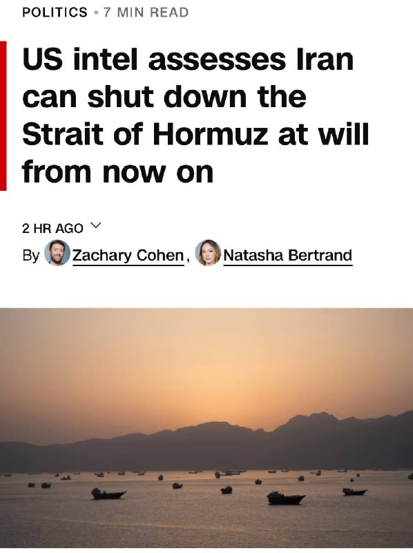

خبرگزاری CNN: ایران هر وقت بخواهد می‌تواند به صورت دلخواه تنگه هرمز را ببندد.

سه منبع به CNN گفتند که سازمان‌های اطلاعاتی ایالات متحده ارزیابی کرده‌اند که ایران اکنون می‌تواند تنگه هرمز را به دلخواه خود ببندد، یک قابلیت قدرتمند جدید که در نتیجه مستقیم جنگ به دست آمده است.

یک منبع آگاه به این ارزیابی‌ها به CNN گفت ما اکنون کنترل بالفعل تنگه را به ایران داده‌ایم سلاحی قدرتمندتر از هر سلاح هسته‌ای. ایران همچنین آموخته است که می‌تواند از حملات هدفمند علیه زیرساخت‌ های انرژی خلیج فارس استفاده کند و به طور بالقوه نیروهای حوثی را برای بستن تنگه باب المندب به عنوان یک گزینه هسته‌ای اقتصادی در صورت شکست مذاکرات مستقر کند.

یک مقام ارشد آمریکایی می‌گوید ایران نمی‌تواند به هیچ یک از مزایای توافق‌نامه چارچوب دسترسی پیدا کند، مگر اینکه تنگه باز بماند و تهران به تعهدات خود پایبند باشد. این ارزیابی‌ها بر هزینه استراتژیک پایدار شروع درگیری بدون در نظر گرفتن کامل توانایی ایران در تسلیحاتی کردن مهمترین گلوگاه انرژی جهان تأکید می‌کند.

📝 Amir

📌 @persian_trend_official
پرشین ترند | متفاوت‌ترین کانال نظامی

## Persian_Trend_Official — post 17287

  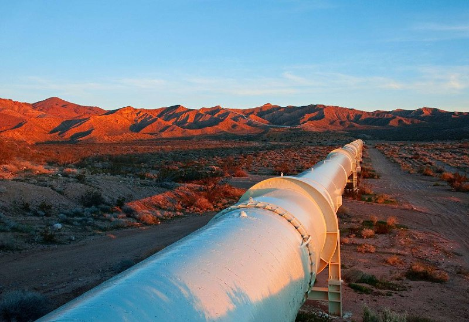

وال استریت ژورنال: ایالات متحده به ایران اجازه خواهد داد پس از امضای یادداشت تفاهم در این هفته، بلافاصله فروش نفت و سوخت را آغاز کند.

به گزارش وال استریت ژورنال، این معافیت از تحریم‌ها نه تنها فروش نفت، بلکه خدمات مرتبط از جمله بانکداری، حمل و نقل و بیمه را برای تسهیل این فروش‌ها نیز شامل می‌شود.

📝 Amir

📌 @persian_trend_official
پرشین ترند | متفاوت‌ترین کانال نظامی

## RadioFarda — post 158401

🔸روزنامه وال‌استریت جورنال و خبرگزاری رویترز روز سه‌شنبه به شکل جداگانه و به نقل از منابع آگاه گزارش دادند که یادداشت تفاهمی که ایران و آمریکا به آن دست یافته‌اند، به ایران اجازه خواهد داد «بلافاصله» فروش نفت و دیگر فرآورده‌های نفتی خود را آغاز کند. 🔸منابع…

## RadioFarda — post 158400

  

🔸روزنامه وال‌استریت جورنال و خبرگزاری رویترز روز سه‌شنبه به شکل جداگانه و به نقل از منابع آگاه گزارش دادند که یادداشت تفاهمی که ایران و آمریکا به آن دست یافته‌اند، به ایران اجازه خواهد داد «بلافاصله» فروش نفت و دیگر فرآورده‌های نفتی خود را آغاز کند.

🔸منابع این دو رسانه گفته‌اند مفاد مربوط به لغو تحریم‌های فروش نفت ایران پس از امضای توافق در همین هفته اجرایی خواهد شد و خدماتی از جمله بانکداری، حمل‌ونقل و بیمه را که برای تسهیل این فروش‌ها لازم هستند، در بر می‌گیرد.

🔸وال‌استریت جورنال به نقل از این افراد گزارش داد که با اجرایی شدن این یادداشت تفاهم، موانع ناشی از تحریم‌ها بر صادرات نفت ایران و خدمات پشتیبان مرتبط با آن برداشته خواهد شد تا امکان انجام این معاملات فراهم شود.

@RadioFarda

## Hranews — post 113655

  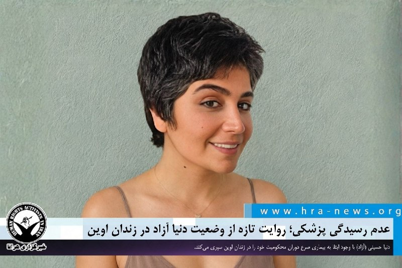

عدم رسیدگی پزشکی؛ روایت تازه از وضعیت دنیا آزاد در زندان اوین

❗️
❗️
❗️
❗️
❗️– دنیا حسینی (آزاد) با وجود ابتلا به بیماری صرع دوران محکومیت خود را در زندان اوین سپری می‌کند. پزشکی قانونی ادامه حبس این زندانی را مشروط به دسترسی به پزشک مستقل و داروهای اختصاصی دانسته است، این در حالی است که این شرایط در زندان فراهم نیست و او از این رسیدگی تخصصی محروم مانده است.

به گزارش خبرگزاری هرانا، ارگان خبری مجموعه فعالان حقوق بشر در ایران، دنیا حسینی (آزاد)، دوران محکومیت خود را در زندان اوین سپری می‌کند.

یک منبع مطلع نزدیک به خانواده این زندانی ضمن تایید این خبر به هرانا گفت: «دنیا از بیماری صرع و اختلالات حاد سیستم عصبی رنج می‌برد. سازمان پزشکی قانونی در گواهی رسمی خود تاکید کرده که ادامه حبس وی تنها در صورتی امکان‌پذیر خواهد بود که در محیطی کاملا آرام، به دور از هرگونه تشویش، استرس و فشار عصبی نگهداری شود. همچنین او باید به‌طور مداوم تحت نظر پزشک مستقل قرار داشته و به داروها و مراقبت‌های اختصاصی خود دسترسی داشته باشد؛ اما در حال حاضر چنین امکاناتی در زندان وجود ندارد و از رسیدگی تخصصی نیز محروم مانده است.»
این منبع مطلع در ادامه افزود: «با وجود صدور گواهی صریح در این خصوص، مقامات قضایی همچنان از صدور حکم عدم تحمل حبس برای او خودداری می‌کنند. نکته نگران‌کننده اینجاست که در حال حاضر در زندان اوین نه پزشک مستقل برای رسیدگی به وضعیت او در دسترس است و نه داروهای تخصصی‌اش تأمین می‌شود. این شرایط، به هیچ‌وجه متناسب با وضعیت جسمی و میزان آسیب‌دیدگی او نیست و ادامه حبس دنیا آزاد می‌تواند جان او را در معرض خطر جدی قرار دهد.»”

ادامه مطلب

#دنیا_حسینی
#دنیا_آزاد

↘️
@hranews_bot تماس ✉️ -  @Hranews  کانال هرانا 🆑

## officialrezapahlavi — post 1846

  

‏امروز با امیلی تورن‌بری رئیس کمیته روابط خارجی مجلس عوام بریتانیا و شماری دیگر از اعضای این کمیته دیدار داشتم تا درباره وضعیت داخلی ایران، سرکوب مردم ایران توسط جمهوری اسلامی، و ضرورت فوری قرار دادن ملت ایران در مرکز سیاست بریتانیا گفت‌وگو کنیم.

‏به‌روشنی تأکید کردم که معامله با رژیمی که در دی ماه بیش از ۴۰ هزار ایرانی را به قتل رسانده، نه‌تنها از نظر اخلاقی غیرقابل‌قبول است، بلکه از نظر راهبردی نیز خطایی بزرگ خواهد بود.

‏هر توافقی که به حفظ این رژیم یا بقایای آن بینجامد، محکوم به شکست است. مردم ایران چنین توافقی را نخواهند پذیرفت.

‏با حمایت جامعه جهانی یا بدون آن، مردم ایران این رژیم را سرنگون خواهند کرد و آزادی به ایران بازخواهد گشت.

This morning, I met with Emily Thornberry, Chair of the House of Commons Foreign Affairs Committee, and other members of the Committee to discuss the situation inside Iran, the Islamic Republic’s repression of the Iranian people, and the urgent need to place the people of Iran at the centre of UK policy.

I made clear that dealing with a regime that murdered more than 40,000 Iranians in January is not only morally wrong, but strategically misguided.

Any agreement that preserves this regime or its remnants will fail. The Iranian people will not accept it.

With or without international support, the people of Iran will overthrow this regime. Freedom will come to Iran.

@OfficialRezaPahlavi

## alonews — post 128532

  <a href="telegram/content/alonews_128532_1781630121.mp4" target="_blank">🎬 Download video</a>

👈صدراعظم آلمان، مرتس، در مورد توافق جمهوری اسلامی ایران و ایالات متحده:
من به رئیس‌جمهور ترامپ وعده دادم که می‌خواهیم سهم خود را برای موفقیت صلح انجام دهیم.

🔴این شامل کمک با ابزارهای نظامی برای امکان‌پذیر کردن حمل‌ونقل آزاد از طریق تنگه هرمز به صورت دائمی نیز می‌شود، به محض برآورده شدن شرایط لازم.

✅ @AloNews خبر جنگ

## alonews — post 128531

  <a href="telegram/content/alonews_128531_1781630123.mp4" target="_blank">🎬 Download video</a>

👈هواپیمای نظامی اوکراینی، که به گفته منابع یک جنگنده میگ-۲۹ است، در منطقه خمیلنیتسکی اوکراین سقوط کرد.

🔴جزئیاتی درباره علت حادثه و وضعیت خلبان هنوز تأیید نشده است

✅ @AloNews خبر جنگ

---
📅 بروزرسانی: 1405/03/26 20:35
---

## WithYashar — post 15081

  <a href="telegram/content/WithYashar_15081_1781629527.mp4" target="_blank">🎬 Download video</a>

🎬 Video

## WithYashar — post 15080

یاشار اخبار خیلی دارن میگن که شکاف به شدت زیاد شده بین بی بی و ترامپ
به نظرت زرگریه یا واقعا ترامپ پشت اسرائیل رو خالی کرده ؟

## FoxNewsTwitter — post 343033

Fox News (Twitter/X)

🚨 BREAKING: DOJ announces charges against 15 members of left-wing anti-ICE group Direct Action Minnesota for allegedly 'surveilling, harassing, and confronting' federal agents

## pm_afshaa — post 94197

🟢تو این اوضاع سر سبز بورس، این کانال قطعا به دردتون میخوره داشته باشید :

رادار بورس، اخبار و سرخطی بازار :

➡️https://t.me/BorsRadar

➡️https://t.me/BorsRadar

## pm_afshaa — post 94196

  <a href="telegram/content/pm_afshaa_94196_1781629529.webm" target="_blank">🎬 Download video</a>

🔴یک منبع اطلاعاتی آمریکایی به سی‌ان‌ان:
ارزیابی واشینگتن اینه که ایران از این به بعد هر زمان بخواد میتونه تنگه هرمز رو ببنده.

ما عملا کنترل تنگه هرمز رو به ایران دادیم؛ سلاحی که حتی از سلاح هسته‌ای هم قدرتمندتره!

💧 Rainbet.com the #1 Non-KYC Crypto Casino & Sportsbook @rainbetcom

😁 @Pm_Afshaa

## IranIntlTV — post 342735

  <a href="telegram/content/IranIntlTV_342735_1781629530.mp4" target="_blank">🎬 Download video</a>

نفتالی بنت، نامزد جانشینی بنیامین نتانیاهو، در گفت‌وگو با ایران‌اینترنشنال گفت: به ملت شریف ایران می‌گویم که امیدتان را از دست ندهید، جمهوری اسلامی رژیم فاسدی است که سقوط خواهد کرد. نوبت بعد که مردم ایران قیام کنند ما ابزارهای لازم را در اختیارشان قرار می‌دهیم.
@iranintltv

## DW_Farsi — post 126070

🔶 تاثیر توافق ایران با آمریکا بر وضعیت اقتصادی و سفره‌های مردم
 
🔻گزارشی از مراد رحمتی

جی‌دی ونس، معاون رئیس‌جمهور آمریکا می‌گوید توافق احتمالی با ایران می‌تواند "آغازگر دوره‌ای جدید از ثبات، شکوفایی و موفقیت" باشد.
 
دونالد ترامپ، رئیس‌جمهور آمریکا نیز گفته است که می‌خواهد شاهد "شکوفایی، عملکرد خوب، موفقیت و شادی ایران" باشد.
 
ایران و آمریکا تائید کرده‌اند که روز جمعه ۱۹ ژوئن توافق میان دو کشور امضا خواهد شد.
 
این تحول، پس از دو جنگ ویرانگر اکنون نوعی امید را در میان بسیاری از مردم ایران ایجاد کرده است؛ امید به اینکه شاید وضعیت اقتصادی کشور بهبود یابد و اثرات آن در نهایت در زندگی روزمره و معیشت خانوارها نیز احساس شود.
 
احمد علوی، اقتصاددان، در تحلیل خود درباره مذاکرات و سناریوی توافق احتمالی ایران و آمریکا به دویچه وله فارسی می‌گوید هنوز متن یا جزئیات دقیق این تفاهم‌نامه مشخص نیست و آنچه در جریان است بیشتر یک فرآیند مذاکره و "مهلت کوتاه‌مدت برای رسیدن به تفاهم" محسوب می‌شود تا یک توافق نهایی و قطعی.
 
دالغا خاتین‌اوغلو، کارشناس  حوزه انرژی در عین حال تاکید کرده است که توافق یا در ادامه آن، رفع تحریم‌ها "تاثیر فوری و چشمگیری بر معیشت مردم نخواهد داشت".
@dw_farsi

## Dirty_Kids — post 392326

  <a href="telegram/content/Dirty_Kids_392326_1781629532.mp4" target="_blank">🎬 Download video</a>

صحبت‌های این آخونده خیلی وایرال شده و همزمان دماغ، جیگر و کون عرزشی‌ها رو خیلی سوزونده و آتش زده

خیلی داغونشون کرده هیچ کاریم از دستشون ساخته نیست از ترس ممدباقر، فقط فشار میخورن رو ۳ تا شعار میدن

@Dirty_Kids 👻

## Dirty_Kids — post 392325

  <a href="telegram/content/Dirty_Kids_392325_1781629536.mp4" target="_blank">🎬 Download video</a>

این چه کوفتی بود، ملت رد دادن

@Dirty_Kids 👻

## alonews — post 128530

  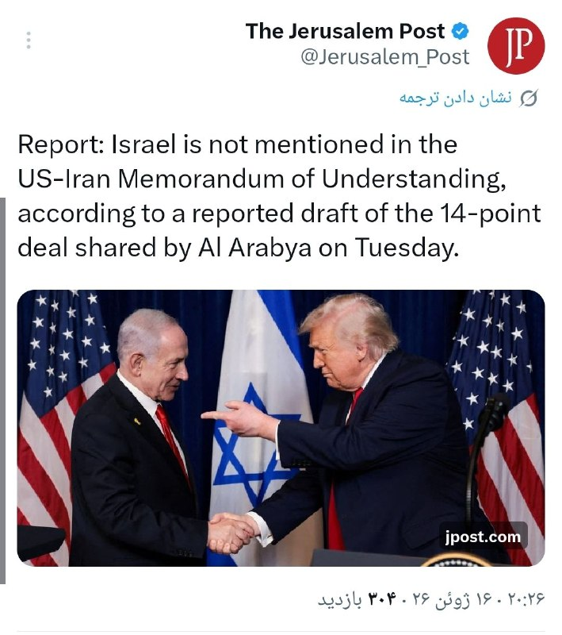

👈طبق گزارش شبکه‌ی العربیه از پیش‌نویس توافق ۱۴ ماده‌ای میان تهران و واشینگتن، در متن این یادداشت تفاهم هیچ اشاره‌ای به اسرائیل نشده است.

🔴این افشاگری در حالی صورت می‌گیرد که جزئیات این توافقِ کلیدی، توجه محافل دیپلماتیک را به خود جلب کرده است.

✅ @AloNews خبر جنگ

## alonews — post 128529

👈قیمت هرگرم طلای ۱۸ عیار به ۱۵.۴۰۰.۰۰۰ هزارتومن رسید

✅ @AloNews خبر جنگ

## alonews — post 128528

  <a href="telegram/content/alonews_128528_1781629540.mp4" target="_blank">🎬 Download video</a>

👈حملات اسرائیل به لبنان ادامه دارد

✅ @AloNews خبر جنگ

---
📅 بروزرسانی: 1405/03/26 20:24
---

## VahidOOnLine — post 245898

  

مایک هاکبی، سفیر آمریکا در اسرائیل، در شبکه ایکس نوشت حزب‌الله بخشی از توافق میان آمریکا و جمهوری اسلامی نیست.

هاکبی افزود وزیر خارجه آمریکا «به‌روشنی» اعلام کرده است که این دو موضوع به یکدیگر ارتباطی ندارند و اسرائیل برای دفاع از خود به اجازه ایران نیاز ندارد. زنجیره تروریسم باید پایان یابد.
‌🏁 🇬🇧 IranintlTV

🤖 @VahidOOnLine

## WithYashar — post 15079

شبکه ۱۲ اسرائیلی به نقل از یک منبع امنیتی:
کاهش محسوس در عملیات‌های ارتش اسرائیل در لبنان
@withyashar

## WithYashar — post 15078

دلار ۱۵۲،۹۰۰
@withyashar

## mwarmonitor — post 11040

🔴 اطلاعات آمریکا ارزیابی می‌کند که ایران از این پس می‌تواند هر زمان که بخواهد تنگه هرمز را مسدود کند.

🔴 یک منبع اطلاعاتی گفته است: «ما عملاً کنترل این تنگه را به ایران داده‌ایم؛ و این یک سلاح است که از هر سلاح هسته‌ای قدرتمندتر است.» CNN

@mwarmonitor

## IranIntlTV — post 342734

  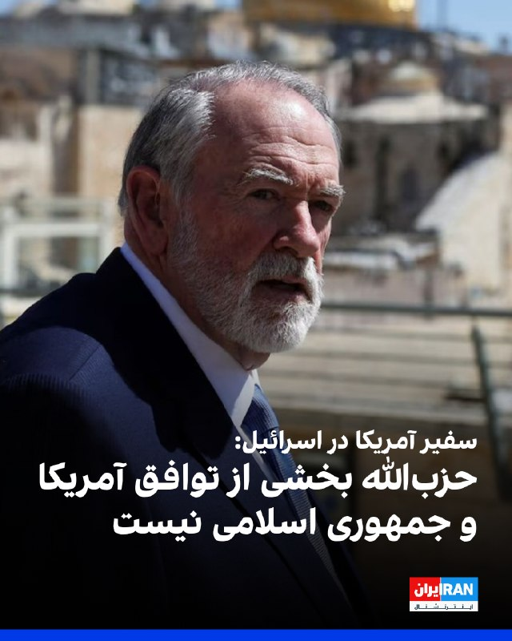

مایک هاکبی، سفیر آمریکا در اسرائیل، در شبکه ایکس نوشت حزب‌الله بخشی از توافق میان آمریکا و جمهوری اسلامی نیست.

هاکبی افزود وزیر خارجه آمریکا «به‌روشنی» اعلام کرده است که این دو موضوع به یکدیگر ارتباطی ندارند و اسرائیل برای دفاع از خود به اجازه ایران نیاز ندارد. زنجیره تروریسم باید پایان یابد.
https://iranintl.com/202606162123

## Persian_Trend_Official — post 17286

⭕️ ایلان ماسک در حال نزدیک شدن به مجموع ثروت 6 فرد ثروتمند بعد از خودش است. 🔥 📝 Nick 📌 @persian_trend_official پرشین ترند | متفاوت‌ترین کانال نظامی

## Dirty_Kids — post 392324

به ویدیو دیدم از کشته های افغانستان اینطوری معرفیش کردن که "فرزند افغانستان و جان فدای خواهر"
کشته شد به‌خاطر اینکه نزاشت خواهر ۱۰ ساله‌اش رو طالبان ببره :(

@Dirty_Kids 👻

## Dirty_Kids — post 392323

  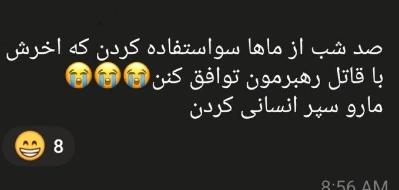

خب گوساله،
مگه ۹۰ میلیون نفر همینو بهتون نگفتن؟

@Dirty_Kids 👻

## alonews — post 128527

  <a href="telegram/content/alonews_128527_1781628852.webm" target="_blank">🎬 Download video</a>

👈خبرگزاری سی‌ان‌ان: برآوردهای اطلاعاتی آمریکا نشان می‌دهد که ایران اکنون می‌تواند هر زمان که بخواهد تنگه هرمز را ببندد. یک منبع اطلاعاتی گفت: ما عملاً کنترل تنگه را به ایران داده‌ایم که سلاحی قوی‌تر از هر سلاح هسته‌ای است.

✅ @AloNews خبر جنگ

## alonews — post 128526

  <a href="telegram/content/alonews_128526_1781628852.webm" target="_blank">🎬 Download video</a>

👈فیصل بن فرحان، وزیر امور خارجه عربستان سعودی از تفاهم میان آمریکا و جمهوری اسلامی ایران استقبال کرد و ابراز امیدواری کرد این تفاهم به بازگشت ثبات در منطقه کمک کند.

✅ @AloNews خبر جنگ

## alonews — post 128525

  <a href="telegram/content/alonews_128525_1781628852.webm" target="_blank">🎬 Download video</a>

👈بر اساس نظرسنجی مؤسسه کانتار، میزان حمایت از دونالد ترامپ در اسرائیل طی فقط ۳ هفته به‌طور کامل معکوس شده و از مثبت ۲۳ به منفی ۲۳ رسیده؛ افتی ۴۶ واحدی

✅ @AloNews خبر جنگ

---
📅 بروزرسانی: 1405/03/26 20:14
---

## IranIntlTV — post 342733

  <a href="telegram/content/IranIntlTV_342733_1781628270.mp4" target="_blank">🎬 Download video</a>

تیتراول با نیوشا صارمی، سه‌شنبه ۲۶ خرداد
@iranintltv

## Shin_Persian — post 7113

  <a href="telegram/content/Shin_Persian_7113_1781628271.mp4" target="_blank">🎬 Download video</a>

Emanuel (Mannie) Fabian ✓ @manniefabian
Tue, 16 Jun 2026 16:12:41 UTC

Several rockets launched by Hezbollah at Israeli troops in southern Lebanon this morning were intercepted by air defenses, the military says.

A short while later, the Israeli Air Force struck and destroyed the launcher, the IDF says.

Additionally, the IDF it spotted a suspicious vehicle in an area of southern Lebanon where troops are operating today. The soldiers fired warning shots, and later carried out a strike "to remove the threat," the army says.

ترجمه خودکار فارسی در بخش نظرات

𝕏 · @shin_persian

## FarsiVOA — post 220921

  <a href="telegram/content/FarsiVOA_220921_1781628272.mp4" target="_blank">🎬 Download video</a>

ارتش اسرائیل اعلام کرد سکوی پرتاب موشک متعلق به حزب‌الله را که برای هدف‌گیری نیروهای اسرائیلی در جنوب لبنان استفاده شده بود منهدم کرده است.

بنابر بیانیه ارتش اسرائیل چند موشکی که امروز حزب‌الله به سمت محل فعالیت نیروهای اسرائیل شلیک کرده بود رهگیری و منهدم شدند. نیروی هوایی این ارتش کمی بعد سکوی پرتاب موشک‌ها را شناسایی و هدف‌گیری کرد.

ارتش اسرائیل همچنین اعلام کرد یک خودروی مشکوک در محدوده فعالیت نیروهای این ارتش بعد از شلیک هشدار، هدف‌گیری شد.

## Persian_Trend_Official — post 17285

  <a href="telegram/content/Persian_Trend_Official_17285_1781628273.webm" target="_blank">🎬 Download video</a>

⭕️ و بله، سرمایه ایلان ماسک حالا از مجموع ثروت 4 فرد ثروتمند پس از خودش بیشتر شد و او به اولین تريليونر تاریخ بشر تبدیل شد. 📝 Nick 📌 @persian_trend_official پرشین ترند | متفاوت‌ترین کانال نظامی

## Dirty_Kids — post 392322

  

دستا‌ورد قالیباف برای عرزشیا

@Dirty_Kids 👻

## alonews — post 128524

  <a href="telegram/content/alonews_128524_1781628274.webm" target="_blank">🎬 Download video</a>

👈هم اکنون پرواز پهپاد های اسرائیلی بر فراز لبنان

✅ @AloNews خبر جنگ

## alonews — post 128523

  <a href="telegram/content/alonews_128523_1781628274.webm" target="_blank">🎬 Download video</a>

🔴فوری / منبع به العربیه انگلیسی گفت که ایالات متحده، طبق این تفاهم‌نامه، متعهد به لغو «همه انواع تحریم‌ها» علیه ایران است 
✅ @AloNews خبر جنگ

---
📅 بروزرسانی: 1405/03/26 20:04
---

## VahidOOnLine — post 245897

  

شبکه العربیه به نقل از منابع آگاه گزارش داد جمهوری اسلامی در متن تفاهم‌نامه متعهد شده است به سلاح هسته‌ای دست نیابد.

بنا بر این گزارش، مذاکرات درباره توافق نهایی میان آمریکا و جمهوری اسلامی می‌تواند با توافق دو طرف تمدید شود و شورای امنیت سازمان ملل پس از دستیابی به توافق نهایی، آن را تصویب خواهد کرد.

العربیه اضافه کرد که جمهوری اسلامی متعهد شده همه مین‌ها و موانع را از تنگه هرمز جمع‌آوری کند و آمریکا ظرف ۳۰ روز پس از توافق نهایی، نیروهای خود را از اطراف ایران خارج خواهد کرد.

بر اساس این گزارش، آزادسازی دارایی‌های مسدودشده ایران به پیشرفت در مسیر دستیابی به توافق نهایی وابسته خواهد بود و تفاهم‌نامه شامل آزادسازی دارایی‌های مسدودشده ایران بلافاصله پس از امضا نمی‌شود.
‌🏁 🇬🇧 IranintlTV

🤖 @VahidOOnLine

## VahidOOnLine — post 245896

  

رویترز فاش کرد که ارتش آمریکا برای حفظ جریان صادرات انرژی از خلیج فارس بر ده‌ها عملیات محرمانه انتقال نفت طی دو هفته گذشته نظارت کرده و در این عملیات، از همان ابتکاری بهره گرفته که جمهوری اسلامی سال‌ها برای دور زدن تحریم‌ها استفاده کرده است.

خبرگزاری رویترز در گزارشی که ۲۶ خرداد منتشر شد، به نقل از ۱۱ فرد آگاه از این عملیات نوشت که دو محل مشخص که انتقال رفت و برگشتی کشتی به کشتی در آنها انجام می‌شود، شناسایی شده است؛ یکی در نزدیکی ساحل فجیره در امارات متحده عربی و دیگری در نزدیکی بندر صحار عمان.

این عملیات اوایل ماه مه (نیمه دوم اردیبهشت) آغاز شد و بر اساس داده‌های کشتیرانی و تصاویر ماهواره‌ای بررسی‌شده از سوی رویترز، دست‌کم ۹۲ کشتی در این انتقال‌ها دخیل بوده‌اند.

بر اساس تصاویر ماهواره‌ای بررسی‌شده از سوی رویترز، تا ۲۱ خرداد، ۱۷ جفت کشتی در این دو محل به‌طور هم‌زمان در حال انتقال نفت دیده می‌شدند.

ادامه این گزارش را در سایت ایران‌اینترنشنال بخوانید.
‌🏁 🇬🇧 IranintlTV

🤖 @VahidOOnLine

## VahidOOnLine — post 245895

  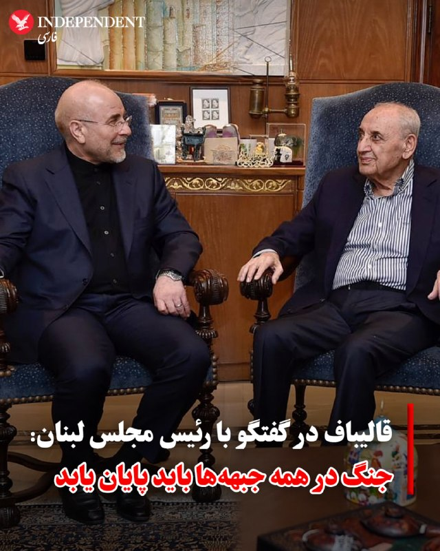

♦️ محمدباقر قالیباف، رئیس مجلس شورای اسلامی و مذاکره‌کننده ارشد جمهوری اسلامی، در گفتگویی تلفنی با نبیه بری، رئیس مجلس لبنان، بر ضرورت توقف کامل درگیری‌ها در منطقه تاکید کرد.

به گزارش مهر، قالیباف در این گفتگو خاطرنشان کرد: «جنگ باید در تمامی جبهه‌ها، از جمله لبنان، خاتمه یابد» و نیروهای اسرائیلی باید به‌طور کامل از مناطق جنوبی این کشور عقب‌نشینی کنند. این موضع‌گیری در حالی مطرح می‌شود که بنیامین نتانیاهو، نخست‌وزیر اسرائیل، روز گذشته اعلام کرده بود این کشور نیروهای خود را در جنوب لبنان حفظ خواهد کرد.

در این تماس تلفنی، نبیه بری نیز از نقش قالیباف در پیشبرد مذاکرات صلح و تلاش‌های مستمر او برای برقراری آتش‌بس و پایان دادن به خصومت‌ها در لبنان قدردانی کرد.
‌🇸🇦 Indypersian

🤖 @VahidOOnLine

## mwarmonitor — post 11039

🚨 شبکه العربیه انگلیسی می‌گوید نسخه‌ای از پیش‌نویس «یادداشت تفاهم آمریکا و ایران» را به‌دست آورده است. در این سند، نکات کلیدی زیر آمده است:

🔴 ایران و آمریکا به همراه متحدانشان در جنگ جاری، همزمان با امضای این یادداشت تفاهم، پایان فوری و دائمی جنگ در همه جبهه‌ها از جمله لبنان را اعلام می‌کنند و متعهد می‌شوند از این پس هیچ اقدام خصمانه‌ای علیه یکدیگر انجام ندهند و از تهدید یا استفاده از زور خودداری کنند.

🔴 ایران و آمریکا متعهد می‌شوند حاکمیت و تمامیت ارضی یکدیگر را محترم بشمارند و در امور داخلی یکدیگر دخالت نکنند.

🔴 دو طرف متعهد می‌شوند ظرف حداکثر ۶۰ روز (قابل تمدید با توافق طرفین) برای رسیدن به توافق نهایی مذاکره کنند.

🔴 بلافاصله پس از امضای این یادداشت تفاهم، آمریکا محاصره دریایی را لغو کرده و هرگونه مداخله یا مانع‌تراشی را متوقف می‌کند و ظرف حداکثر ۳۰ روز، تردد دریایی را به ظرفیت کامل بازمی‌گرداند؛ میزان تردد باید متناسب با سطح پیش از جنگ باشد.

🔴 آمریکا همچنین متعهد می‌شود ظرف ۳۰ روز پس از توافق نهایی، نیروهای خود را از مناطق اطراف خارج کند.

🔴 ایران نیز بلافاصله پس از امضا، اقدامات لازم را برای ازسرگیری رفت‌وآمد کشتی‌های تجاری در خلیج فارس و دریای عمان انجام می‌دهد و آن را ظرف ۳۰ روز به سطح پیش از جنگ بازمی‌گرداند، با در نظر گرفتن رفع موانع فنی و خنثی‌سازی مین‌ها.

🔴 آمریکا همراه با شرکای منطقه‌ای خود یک طرح جامع برای بازسازی و توسعه اقتصادی ایران تدوین می‌کند و حداقل ۳۰۰ میلیارد دلار تأمین مالی برای آن تضمین خواهد شد.

🔴 سازوکار اجرای این طرح همزمان با توافق نهایی، ظرف ۶۰ روز تدوین می‌شود.

🔴 آمریکا متعهد می‌شود تمامی تحریم‌های فعلی علیه ایران، از جمله قطعنامه‌های شورای امنیت و هیئت حکام آژانس بین‌المللی انرژی اتمی و همچنین همه تحریم‌های یک‌جانبه (اولیه و ثانویه) را طبق جدول زمانی توافق‌شده لغو کند.

🔴 ایران تأکید می‌کند که هرگز به دنبال تولید سلاح هسته‌ای نخواهد بود.

🔴 دو طرف توافق می‌کنند که وضعیت مواد غنی‌شده و سایر مسائل هسته‌ای مورد توافق، در توافق نهایی به‌طور کامل حل‌وفصل شود.

🔴 تا زمان توافق نهایی، وضعیت موجود حفظ می‌شود: ایران برنامه هسته‌ای خود را در وضعیت فعلی نگه می‌دارد و آمریکا تحریم‌های جدید اعمال نمی‌کند و نیروهای خود را در منطقه تقویت نمی‌کند.

🔴 آمریکا متعهد می‌شود بلافاصله پس از امضا، مجوزهای لازم برای صادرات نفت خام و محصولات پتروشیمی ایران و خدمات مرتبط (بانکی، بیمه، حمل‌ونقل و …) را صادر کند.

🔴 آمریکا همچنین متعهد می‌شود در روند مذاکرات، دارایی‌ها و اموال مسدودشده ایران آزاد شود و در دسترس کامل قرار گیرد.

🔴 این منابع مالی در اختیار بانک مرکزی ایران قرار می‌گیرد و برای هر پرداخت تعیین‌شده قابل استفاده خواهد بود و آمریکا مجوزهای لازم را صادر می‌کند.

🔴 دو طرف توافق می‌کنند یک سازوکار اجرایی برای نظارت بر اجرای توافق و تعهدات آینده ایجاد شود.

🔴 پس از امضای این یادداشت تفاهم و دریافت تضمین برای اجرای برخی بندهای مشخص، مذاکرات برای توافق نهایی ادامه خواهد یافت.

🔴 توافق نهایی باید از طریق یک قطعنامه الزام‌آور شورای امنیت سازمان ملل تأیید شود.

@mwarmonitor

## mwarmonitor — post 11037

🔴کانال ۱۲ اسرائیل به نقل از یک منبع امنیتی: کاهش محسوس در عملیات ارتش اسرائیل در لبنان.

@mwarmonitor

## FoxNewsTwitter — post 343032

  <a href="telegram/content/FoxNewsTwitter_343032_1781627675.mp4" target="_blank">🎬 Download video</a>

Fox News (Twitter/X)

"Unless you were homeschooled by a day drinker, no one's confident that Iran is going to do anything."

Sen. John Kennedy gives his blunt assessment about how he thinks Iran will behave after the Trump administration's new agreement with the regime.

The Louisiana senator says it's impossible to know what the Islamic Republic's next move will be as the U.S. tries to curb its nuclear ambitions.

## pm_afshaa — post 94195

  <a href="telegram/content/pm_afshaa_94195_1781627676.webm" target="_blank">🎬 Download video</a>

🔴قالیباف: جنگ باید در همه‌ جبهه‌ها از جمله لبنان، پایان یابد.

💧 Rainbet.com the #1 Non-KYC Crypto Casino & Sportsbook @rainbetcom

😁 @Pm_Afshaa

## IranIntlTV — post 342732

  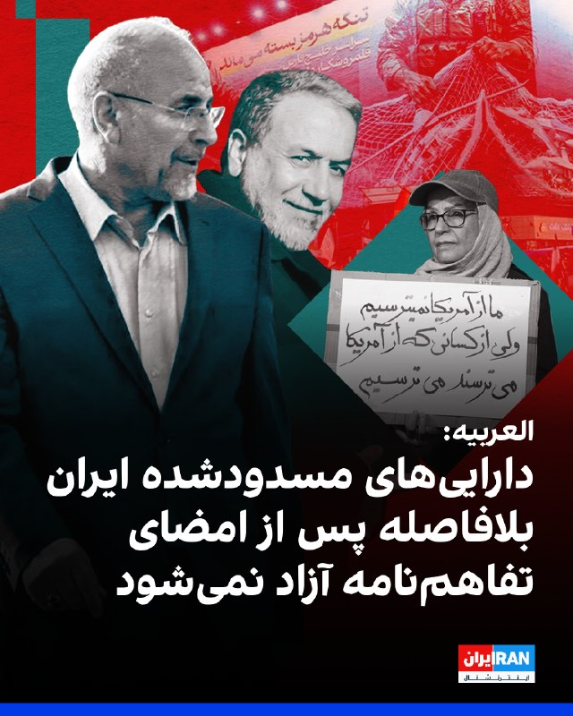

شبکه العربیه به نقل از منابع آگاه گزارش داد جمهوری اسلامی در متن تفاهم‌نامه متعهد شده است به سلاح هسته‌ای دست نیابد.

بنا بر این گزارش، مذاکرات درباره توافق نهایی میان آمریکا و جمهوری اسلامی می‌تواند با توافق دو طرف تمدید شود و شورای امنیت سازمان ملل پس از دستیابی به توافق نهایی، آن را تصویب خواهد کرد.

العربیه اضافه کرد که جمهوری اسلامی متعهد شده همه مین‌ها و موانع را از تنگه هرمز جمع‌آوری کند و آمریکا ظرف ۳۰ روز پس از توافق نهایی، نیروهای خود را از اطراف ایران خارج خواهد کرد.

بر اساس این گزارش، آزادسازی دارایی‌های مسدودشده ایران به پیشرفت در مسیر دستیابی به توافق نهایی وابسته خواهد بود و تفاهم‌نامه شامل آزادسازی دارایی‌های مسدودشده ایران بلافاصله پس از امضا نمی‌شود.
https://iranintl.com/202606161010

## IranIntlTV — post 342731

  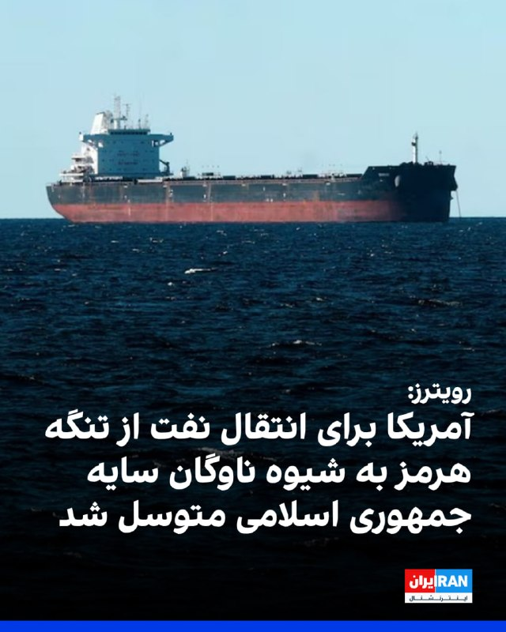

رویترز فاش کرد که ارتش آمریکا برای حفظ جریان صادرات انرژی از خلیج فارس بر ده‌ها عملیات محرمانه انتقال نفت طی دو هفته گذشته نظارت کرده و در این عملیات، از همان ابتکاری بهره گرفته که جمهوری اسلامی سال‌ها برای دور زدن تحریم‌ها استفاده کرده است.

خبرگزاری رویترز در گزارشی که ۲۶ خرداد منتشر شد، به نقل از ۱۱ فرد آگاه از این عملیات نوشت که دو محل مشخص که انتقال رفت و برگشتی کشتی به کشتی در آنها انجام می‌شود، شناسایی شده است؛ یکی در نزدیکی ساحل فجیره در امارات متحده عربی و دیگری در نزدیکی بندر صحار عمان.

این عملیات اوایل ماه مه (نیمه دوم اردیبهشت) آغاز شد و بر اساس داده‌های کشتیرانی و تصاویر ماهواره‌ای بررسی‌شده از سوی رویترز، دست‌کم ۹۲ کشتی در این انتقال‌ها دخیل بوده‌اند.

بر اساس تصاویر ماهواره‌ای بررسی‌شده از سوی رویترز، تا ۲۱ خرداد، ۱۷ جفت کشتی در این دو محل به‌طور هم‌زمان در حال انتقال نفت دیده می‌شدند.

ادامه این گزارش را در سایت ایران‌اینترنشنال بخوانید.
https://www.iranintl.com/202606161193

## RadioFarda — post 158399

  <a href="https://t.me/radiofarda/158399" target="_blank">📎 Download file</a>

📻بشنوید: ایستگاه ۱۹ با رادیوفردا، ۲۶ خرداد ۱۴۰۵

@RadioFarda

## IranianMinds — post 22755

  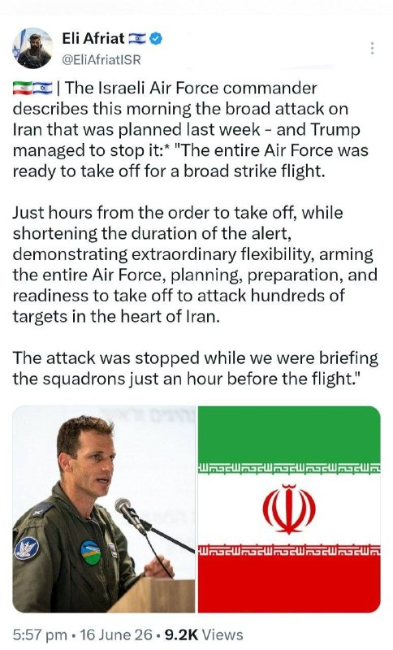

🔴فرمانده نیروی هوایی اسرائیل صبح امروز، در توضیح حمله‌ی گسترده به رژیم ایران که هفته گذشته برنامه‌ریزی شده بود و ترامپ توانست آن را متوقف کند، گفت:

«تمام نیروی هوایی آماده پرواز برای یک عملیات ضربه گسترده بود.
فقط چند ساعت تا صدور دستور پرواز مانده بود؛ در حالی که مدت آماده‌باش را کوتاه کردیم، با نشان دادن انعطاف‌پذیری فوق‌العاده، تمام نیروی هوایی را مسلح کردیم، برنامه‌ریزی، مهیاسازی و آماده‌باش کامل برای پرواز و حمله به صدها هدف در قلب ایران وجود داشت.

حمله در حالی متوقف شد که ما دقیقاً یک ساعت پیش از پرواز، در حال توجیه نهایی اسکادران‌ها (یگان‌های پروازی) بودیم.»

@IranianMinds

## BBCPersian — post 284065

  <a href="telegram/content/BBCPersian_284065_1781627679.mp4" target="_blank">🎬 Download video</a>

🔻هواداران فوتبال در کیپ ورد پس از تساوی تاریخی مقابل اسپانیا در اولین بازی جام جهانی فیفا، جشن می‌گیرند.

کیپ‌ورد، یک کشور جزیره‌ای کوچک با حدود ۵۰۰ هزار نفر جمعیت، که در رتبه ۶۷ رده‌بندی فیفا قرار دارد،
در مقابل اسپانیا، دومین تیم برتر جهان، به میدان آمد.

این تیم نمایش دفاعی منظمی ارائه داد و وزینیا، دروازه‌بان ۴۰ ساله‌اش، با مهارهای حیاتی خود یک امتیاز خاطره‌انگیز برای تیمش به ارمغان آورد.

کیپ‌ورد در بازی‌های بعدی خودزدر مرحله گروهی مقابل اروگوئه و عربستان بازی می‌کند.

@BBCPersian

## Dirty_Kids — post 392321

  <a href="telegram/content/Dirty_Kids_392321_1781627680.mp4" target="_blank">🎬 Download video</a>

اینجوری کثیف نمیشه که؟😂

@Dirty_Kids 👻

## Dirty_Kids — post 392320

  <a href="telegram/content/Dirty_Kids_392320_1781627682.mp4" target="_blank">🎬 Download video</a>

🔴اسرائیل در جهت تقویت توافق، میفدون تو جنوب لبنان رو ترکوند.

@Dirty_Kids 👻

## alonews — post 128522

  <a href="telegram/content/alonews_128522_1781627683.mp4" target="_blank">🎬 Download video</a>

👈ارتش اسرائیل: لانچر شلیک راکت تو جنوب لُبنان رو زدیم

✅ @AloNews خبر جنگ

## alonews — post 128521

  <a href="telegram/content/alonews_128521_1781627684.webm" target="_blank">🎬 Download video</a>

👈وزیر امور خارجه چین، در تماس تلفنی با محمد اسحاق دار، وزیر امور خارجه پاکستان:
چین معتقد است که در مذاکرات ایران و آمریکا، نباید به عقب برگشت، چه برسد به استفاده از زور.

✅ @AloNews خبر جنگ

## alonews — post 128520

  <a href="telegram/content/alonews_128520_1781627685.webm" target="_blank">🎬 Download video</a>

🔴فوری / منبع به العربیه انگلیسی گفت که ایالات متحده، طبق این تفاهم‌نامه، متعهد به لغو «همه انواع تحریم‌ها» علیه ایران است

✅ @AloNews خبر جنگ

## alonews — post 128519

  <a href="telegram/content/alonews_128519_1781627685.webm" target="_blank">🎬 Download video</a>

👈ارتش اسرائیل (IDF): پس از ارزیابی وضعیت، دستورالعمل‌های دفاعی فرماندهی جبهه داخلی بدون تغییر باقی می‌مانند و تا سه‌شنبه، ۱۷ ژوئن ۲۰۲۶، ساعت ۲۰:۰۰، در حال اجرا هستند.

✅ @AloNews خبر جنگ

---
📅 بروزرسانی: 1405/03/26 19:54
---

## VahidOOnLine — post 245894

  <a href="telegram/content/VahidOOnLine_245894_1781627072.mp4" target="_blank">🎬 Download video</a>

♦️ویتنی رایت، بازیگر شناخته‌شده فیلم‌های بزرگسالان، با انتشار تصاویری در روایتگر اینستاگرام خود نشان داد که در جریان دیدار تیم‌های ملی ایران و نیوزیلند در ورزشگاه سوفای شهر لس‌آنجلس در ایالت کالیفرنیا حضور داشته و از تیم ملی ایران حمایت کرده است.
تصاویر منتشرشده از سوی رایت، حضور او در ورزشگاه محل برگزاری این مسابقه را نشان می‌دهد. دیدار تیم‌های ملی ایران و نیوزیلند در چارچوب رقابت‌های جام جهانی ۲۰۲۶ برگزار شد و با نتیجه ۲ بر ۲ مساوی به پایان رسید.
رایت پیش‌تر نیز در سال ۱۴۰۲ به ایران سفر کرده بود و تصاویری از حضور خود در محل سفارت سابق آمریکا در تهران را در شبکه‌های اجتماعی منتشر کرده بود. حضور او در مسابقه تیم ملی ایران مقابل نیوزیلند بار دیگر توجه کاربران شبکه‌های اجتماعی را به سفرها و فعالیت‌های پیشین او در ارتباط با ایران جلب کرده است.
‌🇸🇦 Indypersian

🤖 @VahidOOnLine

## WithYashar — post 15077

## mwarmonitor — post 11036

🔴در آخر هفته، شبکه CNN گزارش داد که «در هفته‌های اخیر» و به نقل از پنج «منبع آگاه از اطلاعات آمریکا»، «ایران تلاش‌های خود برای مسدود کردن ذخایر اورانیوم نزدیک به درجه ساخت بمب را به‌طور چشمگیری افزایش داده و به‌صورت عمدی تونل‌ها را فرو ریخته و ورودی‌ها را با مین‌های انفجاری تله‌گذاری کرده است.»

📌ما در حال رصد سایت‌هایی هستیم که تصور می‌شود اورانیوم غنی‌شده در آن‌ها نگهداری می‌شود — سایت تونلی اصفهان، تأسیسات غنی‌سازی زیرزمینی فردو، و تأسیسات غنی‌سازی زیرزمینی نطنز و تونل‌های مرتبط با آن. پیش‌تر درباره حملات آمریکا و اسرائیل به این تأسیسات و ورودی‌های آن‌ها گزارش داده‌ایم؛ به‌طور مشخص، ورودی‌های تونل‌های اصفهان و فردو در ژوئن ۲۰۲۵ و ورودی‌های تأسیسات غنی‌سازی نطنز در مارس/آوریل ۲۰۲۶ هدف قرار گرفتند که همگی به‌عنوان حملات منطقی برای محروم‌سازی از دسترسی ارزیابی شدند. این‌که ایران کدام تونل‌های اضافی را فرو ریخته و چرا آمریکا از این موضوع نگران است، در گزارش CNN ذکر نشده است.

🔸ما همچنین درباره اقداماتی گزارش داده‌ایم که به ارزیابی ما، بازیابی دارایی‌ها پس از ژوئن ۲۰۲۵ را تسهیل یا پیچیده می‌کرد؛ از جمله تلاش‌های ایران در جریان بازسازی ورودی‌ها، فعالیت در نزدیکی ورودی‌ها یا نقاط اصابت سلاح، تلاش‌ها برای مسدود کردن ورودی‌ها، و افزودن خاکریزها و مسیرهای پیچ‌دار (چیکین) در امتداد جاده‌ها. همچنین درباره رویدادهایی گزارش دادیم که عملیات زمینی را آسان‌تر می‌کرد، مانند انهدام تأسیسات دفاعی در سایت‌های هسته‌ای فردو و اصفهان، یا دشوارتر می‌کرد، مانند ایجاد جان‌پناه‌های جدید ایرانی برای تجهیزات نظامی در امتداد جاده در اصفهان. حملات به سایت‌های دفاعی کسی را غافلگیر نکرد و تلاش‌های ایران برای حفاظت از دارایی‌هایش نیز نباید غافلگیرکننده باشد — این اقدامات ماه‌هاست ادامه دارد.

🔸در واقع، پس از جنگ ژوئن، ایران بی‌سر و صدا یک مجموعه تونلی کوچک را در جنوب تأسیسات غنی‌سازی نطنز مسدود کرد. همچنین در پاییز ۲۰۲۵ به دو مورد از سه ورودی تونل‌های اصفهان دسترسی پیدا کرد که فرصت کافی برای تله‌گذاری ورودی‌ها یا حتی داخل بخش شمالی تونل، پیش از دفن کامل همه ورودی‌ها در فوریه ۲۰۲۶، در اختیارش گذاشت.

🔸آنچه تا حد زیادی نادیده گرفته شده، منفعت فوریِ افزایش دشواری دسترسی سریع به هرگونه مواد — مانند اورانیوم غنی‌شده — است؛ امری که ارزش آن را در مذاکرات کاهش می‌دهد، در کوتاه‌مدت خطر را کمتر می‌کند، و این ارزیابی‌ها را تثبیت می‌کند که ایران هیچ استفاده فوری از اورانیوم با غنای بالا (HEU) ندارد؛ یعنی چیزی شبیه یک تأسیسات غنی‌سازی آماده وجود ندارد. یادآوری می‌شود که پیش از ژوئن ۲۰۲۵، ایران نیز ۶۰ درصد HEU را در چندین مکان در اختیار داشت، اما همراه با آن، سه تأسیسات غنی‌سازی کاملاً فعال نیز داشت که قادر بودند ظرف چند روز اورانیوم با درجه تسلیحاتی تولید کنند و هیچ تضمینی برای کشف فوری وجود نداشت (آژانس بین‌المللی انرژی اتمی هر چند روز یک‌بار می‌توانست از تأسیسات غنی‌سازی بازدید کند، اما هیچ سازوکار پایش از راه دور یا بلادرنگی برای انحراف HEU یا تغییرات در سطح غنی‌سازی نداشت).

🔸شکل ۱ تصویر ۷ ژوئن از تأسیسات غنی‌سازی فردو است که تعداد بیشتری از چیکین‌های پیش‌تر گزارش‌شده را نشان می‌دهد. همچنین توده‌های کوچک خاکی در نزدیکی دو ورودی تونل دیده می‌شود که بین ۳ تا ۲۲ مه اضافه شده‌اند. این توده‌های خاکی می‌تواند نشان‌دهنده کارگذاری مین در نزدیکی باشد، اما با توجه به اندازه کوچک حتی مین‌های ضدتانک، تنها تصاویر با وضوح بسیار بالا می‌تواند این موضوع را نشان دهد. شکل ۲ تصویر ۱۲ ژوئن از مجموعه تونلی اصفهان است و شکل ۳ تصویر ۲۹ مه از ورودی‌های تأسیسات غنی‌سازی نطنز. شکل ۴ تصویر ۲۹ مه از تأسیسات تونلی کوه «پیک‌اکس» و ورودی‌های تونلی نزدیک مربوط به سال ۲۰۰۷ است. ورودی‌های تونلی سال ۲۰۰۷ همچنان مسدود باقی مانده‌اند. مجموعه شرقی ورودی‌های تونلِ تأسیسات کوه پیک‌اکس از آوریل ۲۰۲۶ تاکنون نیمه‌دفن باقی مانده است — در حال حاضر، این محتمل‌ترین تونل «به‌طور عمدی فرو ریخته» به شمار می‌رود، اما باور بر این است که حاوی HEU نیست و ما پیش‌تر دفن آن را گزارش کرده بودیم.

@mwarmonitor

## mwarmonitor — post 11035

  <a href="telegram/content/mwarmonitor_11035_1781627073.mp4" target="_blank">🎬 Download video</a>

🔴سخنگوی ارتش اسرائیل:

🔸اوایل امروز، نیروی هوایی چند فروند راکت را که توسط سازمان تروریستی حزب‌الله به سمت منطقه‌ای که نیروهای ارتش اسرائیل در جنوب لبنان در آن فعالیت می‌کنند شلیک شده بود، رهگیری کرد. طبق سیاست‌های موجود، هیچ‌گونه هشدار عمومی فعال نشد.

🔸مدتی کوتاه بعد، نیروی هوایی سکویی را که بخشی از این راکت‌ها از آن به سمت نیروهای ما در جنوب لبنان شلیک شده بود، هدف قرار داده و منهدم کرد.

🔸همچنین، ارتش اسرائیل اوایل امروز یک خودروی مشکوک را در منطقه فعالیت نیروهای خود در جنوب لبنان شناسایی کرد. نیروها ابتدا تیر هشدار شلیک کردند و سپس برای رفع تهدید، به این منطقه حمله انجام دادند.

@mwarmonitor

## iaghapour — post 2678

  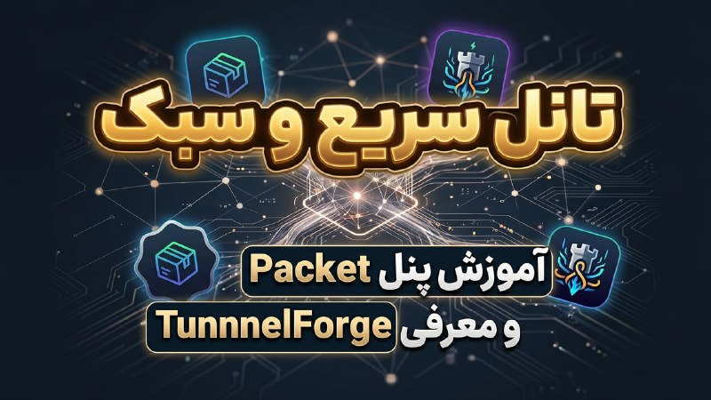

⭕️ آموزش تانل بین سرور ایران و خارج (۲ روش سبک و سریع) 😍

🔹تو این ویدیو قراره با هم دو تا از ساده و سبک‌ترین روش‌های تانل زدن بین سرور ایران و خارج رو یاد بگیریم. اگه برای ساخت فیلترشکن شخصی‌تون دنبال یه راه ساده و بدون دردسر برای اتصال سرورها هستید، این آموزش دقیقاً همون چیزیه که نیاز دارید.

🔗 تماشا ویدیو در یوتیوب

#آموزش #فیلترشکن #تانل #vpn
برای دور زدن فیلترینگ و آموزش تکنولوژی و هوش مصنوعی ما رو دنبال کنید 💚
🆔 @iaghapour

## RadioFarda — post 158398

  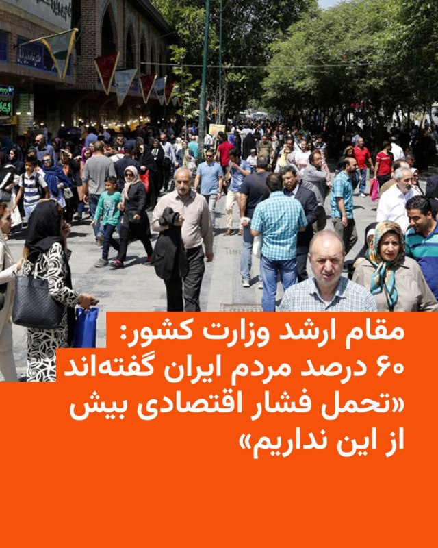

🔸یک مقام ارشد وزارت کشور جمهوری اسلامی روز سه‌شنبه اعلام کرد بر اساس پیمایش انجام‌شده در خرداد امسال، ۶۰ درصد شهروندان ایرانی گفته‌اند «تحمل فشار اقتصادی بیش از این نداریم».

🔸محمد بطحائی، رئیس سازمان امور اجتماعی کشور، در یک نشست خبری همچنین گفت: «بر اساس نتایج پیمایش‌ها، میزان رضایت اجتماعی در بازه صفر تا صد حدود ۳۸ درصد برآورد شده است. به بیان دیگر، حدود ۶۲ درصد مردم از شرایط اجتماعی رضایت ندارند.»

🔸او درباره پیمایش‌های انجام‌شده در سال ۱۴۰۴ و پیش از جنگ ۴۰ روزه با آمریکا و اسرائیل نیز اعلام کرد: «تنها حدود ۲۵ درصد مردم احساس عدالت و برابری دارند. معنای این عدد آن است که نزدیک به ۷۵ درصد مردم احساس می‌کنند در فضایی زندگی می‌کنند که تبعیض و نابرابری در آن وجود دارد.»

🔸بطحائی در بیان بخش دیگری از نتایج پیمایش سال گذشته خبر داد که «حدود ۶۰ درصد مردم» درباره «بهبود شرایط» در آینده امیدوار نیستند و در آن سال «تصور مثبتی نسبت به بهتر شدن وضعیت نداشته‌اند».

🔸او به زمان دقیق انجام این پیمایش‌های توسط وزارت کشور اشاره نکرد.

@RadioFarda

## IranianMinds — post 22754

  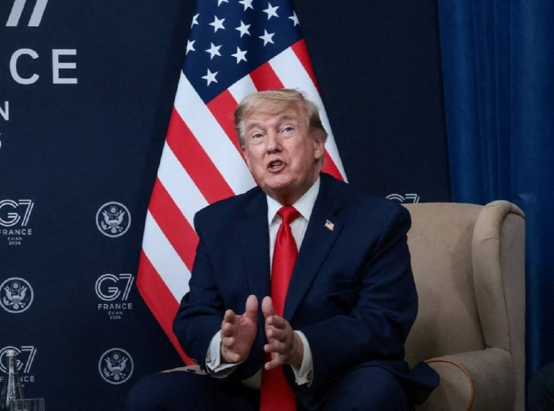

🔴 اف بی آی :

در مراسم جشن تولد ترامپ، گروهی که قصد عملیات ترور رئیس جمهور رو در کاخ سفید داشتن خنثی کردیم.

@IranianMinds

## Hranews — post 113654

  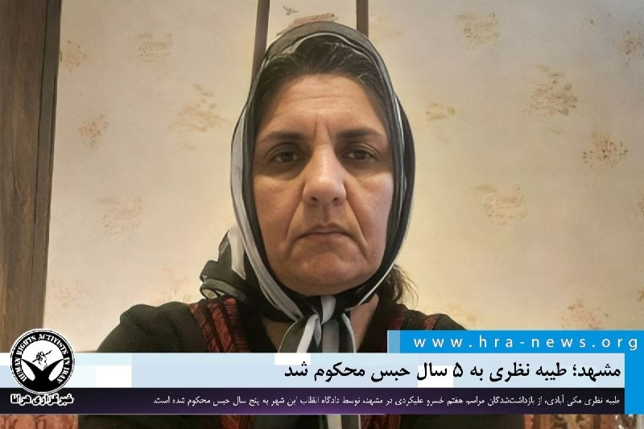

مشهد؛ طیبه نظری به ۵ سال حبس محکوم شد

❗️
❗️
❗️
❗️
❗️– طیبه نظری مکی آبادی، از بازداشت‌شدگان مراسم هفتم خسرو علیکردی در مشهد، توسط دادگاه انقلاب این شهر به پنج سال حبس محکوم شده است.

به گزارش خبرگزاری هرانا، ارگان خبری مجموعه فعالان حقوق بشر در ایران، طیبه نظری مکی آبادی، به حبس محکوم شد.

براساس حکمی که در تاریخ ۲۳ خردادماه توسط شعبه اول دادگاه انقلاب مشهد به ریاست قاضی غلامرضا اکبری مقدم صادر و به این شهروند ابلاغ شده،‌ او به پنج سال حبس محکوم شده است. چهار سال از این میزان محکومیت بابت اتهام «اجتماع و تبانی علیه امنیت کشور» و یک سال در خصوص «تبلیغ علیه نظام» صادر شده است.

ادامه مطلب

#طیبه_نظری_مکی_آبادی

↘️
@hranews_bot تماس ✉️ -  @Hranews  کانال هرانا 🆑

---
📅 بروزرسانی: 1405/03/26 19:45
---

## VahidOOnLine — post 245893

  

وال‌استریت ژورنال روز سه‌شنبه به نقل از افرادی آگاه از مفاد توافق تهران و واشینگتن گزارش داد که ایالات متحده، به ایران اجازه خواهد داد فورا فروش نفت و سوخت را آغاز کند.

بر اساس این گزارش، این اجازه در یادداشت تفاهمی که دو طرف برای پایان دادن به جنگ به آن دست یافته‌اند، ذکر شده است.
‌🏁 🇬🇧 IranintlTV

🤖 @VahidOOnLine

## WithYashar — post 15076

  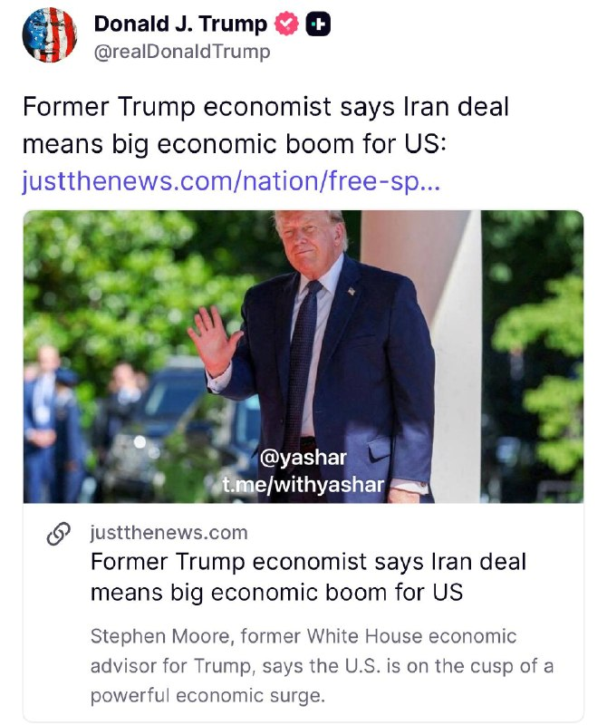

اقتصاددان سابق ترامپ می‌گوید توافق ایران به معنای رونق اقتصادی بزرگ برای ایالات متحده است
@withyashar

## mwarmonitor — post 11034

  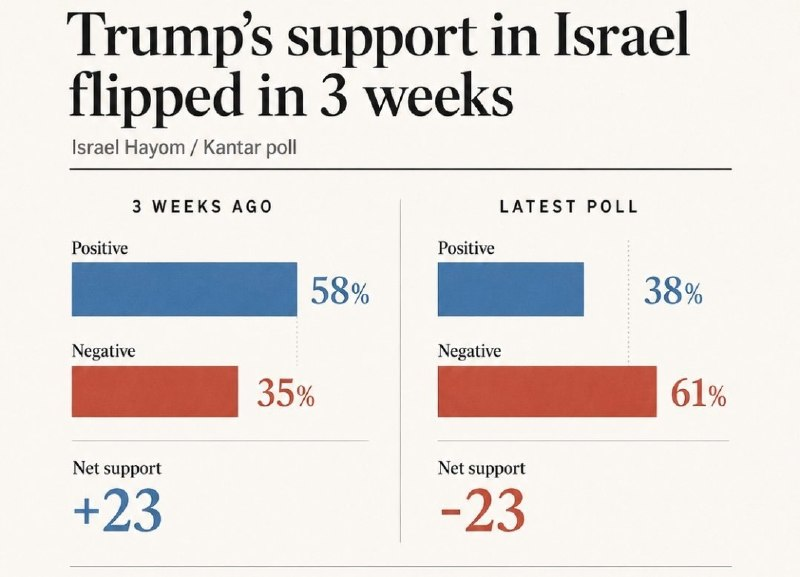

📊بر اساس نظرسنجی مؤسسه کانتار، میزان حمایت از دونالد ترامپ در اسرائیل طی تنها ۳ هفته به‌طور کامل معکوس شده و از مثبت ۲۳ به منفی ۲۳ رسیده است؛ افتی ۴۶ واحدی.

@mwarmonitor

## mwarmonitor — post 11033

🔴به گزارش وال‌استریت ژورنال به نقل از منابع آگاه، ایالات متحده طبق این توافق اجازه خواهد داد فروش نفت و سوخت به‌صورت فوری آغاز شود؛ توافقی که با هدف پایان دادن به جنگ انجام شده است.

@mwarmonitor

## pm_afshaa — post 94194

  <a href="telegram/content/pm_afshaa_94194_1781626526.webm" target="_blank">🎬 Download video</a>

🔴وال‌استریت ژورنال:
طبق تفاهم، آمریکا به جمهوری اسلامی اجازه ازسرگیری فوری فروش نفت رو میده.

💧 Rainbet.com the #1 Non-KYC Crypto Casino & Sportsbook @rainbetcom

😁 @Pm_Afshaa

## DEJradio — post 5741

  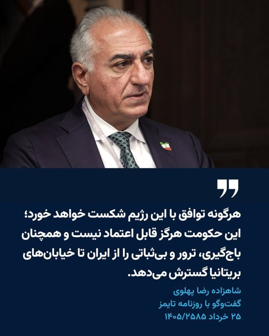

👑
🗣 شاهزاده رضا پهلوی: هرگونه توافق با این رژیم شکست خواهد خورد؛ این حکومت هرگز قابل اعتماد نیست و همچنان باج‌گیری، ترور و بی‌ثباتی را از ایران تا خیابان‌های بریتانیا گسترش می‌دهد.

گفت‌وگو با روزنامه تایمز ۲۵ خرداد ۲۵۸۵/۱۴۰۵

#شاهزاده_رضا_پهلوی #مصاحبه
@DEJradio

## IranIntlTV — post 342730

  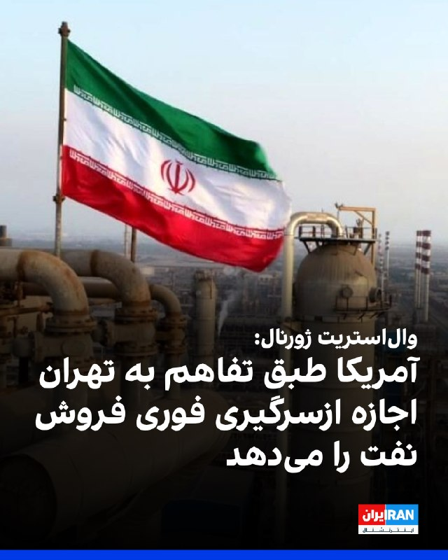

وال‌استریت ژورنال روز سه‌شنبه به نقل از افرادی آگاه از مفاد توافق تهران و واشینگتن گزارش داد که ایالات متحده، به ایران اجازه خواهد داد فورا فروش نفت و سوخت را آغاز کند.

بر اساس این گزارش، این اجازه در یادداشت تفاهمی که دو طرف برای پایان دادن به جنگ به آن دست یافته‌اند، ذکر شده است.
https://iranintl.com/202606162010

## DW_Farsi — post 126069

🔶 خشم تندروها از امضای تفاهم‌نامه ایران و آمریکا
 
🔻گزارشی از دانیال عمری

در آستانه امضای رسمی تفاهم‌نامه ایران و آمریکا، فضای سیاسی در ایران به‌طور محسوسی متشنج‌تر شده است. جناح‌های تندرو که در بخش زیادی از دوران جنگ نسبتا کم‌صداتر بودند، اکنون کارزاری پرسر و صدا علیه این توافق به راه انداخته‌اند و تیم مذاکره‌کننده را به عقب‌نشینی، عبور از خطوط قرمز و حتی تکرار تجربه برجام متهم می‌کنند. این مخالفت‌ها دیگر فقط به تیتر رسانه‌ها و نطق‌های مجلس محدود نیست، بلکه به خیابان کشیده شده است؛ جایی که گروه‌هایی از حامیان حکومت می‌کوشند پیش از آغاز اجرای توافق، آن را متوقف یا دست‌کم از نظر سیاسی تضعیف کنند.
 
بارزترین ویژگی این موج مخالفت، بازگشت سیاست خیابانی تندروهاست. در روزهای اخیر، ویدئوها و گزارش‌هایی از تجمع معترضان در تهران و مشهد منتشر شد؛ تجمع‌هایی که در آن‌ها، عباس عراقچی و محمدباقر قالیباف مستقیما هدف حمله قرار گرفتند. گزارش‌ها از تهران حاکی از شعارهایی مانند "عراقچی، حیا کن، مملکت را رها کن"، "قالیباف، عراقچی، پس خون رهبرم چی؟" و "قالیباف، عراقچی، استعفا، استعفا" بود. در مشهد نیز، بنا بر گزارش‌ها، شعارهایی با لحن تندتر علیه وزیر خارجه سر داده شد. این شعارها فقط نشانه خشم بخشی از بدنه تندرو نیستند، بلکه تلاشی‌اند برای تبدیل مخالفت با تفاهم‌نامه به فشاری آشکار و خیابانی.
 
اهمیت این تجمع‌ها فقط به تعداد شرکت‌کنندگان یا محتوای شعارها محدود نمی‌شود. اهمیت آن‌ها در این است که تندروها می‌خواهند نشان دهند هنوز قادرند خیابان را، هرچند محدود، به صحنه اعتراض تبدیل کنند و هر حرکت به سمت مصالحه با واشنگتن را دارای هزینه سیاسی داخلی جلوه دهند.
@dw_farsi

## BBCPersian — post 284052

با وجود تاکید فیفا بر اجرای قانون ممنوعیت ورود نشانه‌های سیاسی به ورزشگاه، اما نشانه‌های سیاسی زیادی در بازی ایران و نیوزیلند دیده شد.
برخی از مخالفان حکومت توانستند با پرچم‌ شیر و خورشید و تصاویر شاهزاده رضا پهلوی وارد ورزشگاه شوند.
کسانی هم که با پرچم رسمی جمهوری اسلامی ایران در ورزشگاه حاضر بودند از چشم دوربین‌ها مخفی نماندند.
یاد کشتار معترضان در دی و همچنین دانش‌آموزان کشته شده در حمله به مدرسه‌ای در میناب هم به چشم می‌خورد.
گروهی هم که اسامی اعدام‌شدگان را روی تی‌شرت‌هایشان چاپ کرده بودند وارد ورزشگاه شده بودند.
زنانی هم بدون حجاب با پرچم جمهوری اسلامی دیده شدند و حمایت از فسطینی‌ها هم به چشم می‌خورد.
عکس‌هایی هم از مردم داخل ایران هنگام تماشای بازی در مکان‌های عمومی منتشر شده است.
در این آلبوم بعضی از نشانه‌های سیاسی را ببنید که در بازی ایران با نیوزیلند وارد ورزشگاه شدند.

@BBCPersian
📷 Getty Images

## Dirty_Kids — post 392319

🔴 فوری

اف‌بی‌آی همین الان در مراسم جشن تولد ترامپ، پهپادی که قصد ترور او را در کاخ سفید داشت خنثی کرد.

@Dirty_Kids 👻

## alonews — post 128518

  <a href="telegram/content/alonews_128518_1781626529.webm" target="_blank">🎬 Download video</a>

👈بر اساس گزارش بلومبرگ، توافق صلح با ایران و بازگشایی تنگه هرمز در کانون توجه اجلاس سالانه گروه هفت قرار گرفته است.

🔴 اگرچه متن نهایی این توافق هنوز به‌طور رسمی منتشر نشده، اما سران کشورها بر سر امضای آن در روز جمعه به توافق رسیده‌اند.

✅ @AloNews خبر جنگ

## alonews — post 128517

  <a href="telegram/content/alonews_128517_1781626529.webm" target="_blank">🎬 Download video</a>

👈 رایزنی وزرای خارجه ایران و عمان درباره تنگه هرمز

✅ @AloNews خبر جنگ

## alonews — post 128516

  <a href="telegram/content/alonews_128516_1781626530.webm" target="_blank">🎬 Download video</a>

👈وال استریت ژورنال به نقل از یک منبع:
تفاهم اولیه آمریکا و ایران به تهران اجازه می‌دهد فوراً نفت بفروشد

🔴واشینگتن به تهران اجازه خواهد داد تا طبق توافق پایان جنگ، فوراً فروش نفت و سوخت را آغاز کند

🔴معافیت‌های ایران شامل خدماتی می‌شود که فروش نفت را تسهیل می‌کنند، از جمله بانکداری، حمل و نقل و بیمه.

✅ @AloNews خبر جنگ

---
📅 بروزرسانی: 1405/03/26 19:34
---

## VahidOOnLine — post 245892

  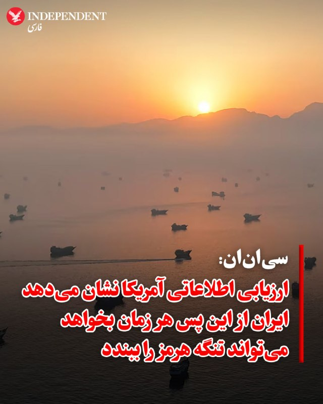

♦️ شبکه خبری سی‌ان‌ان روز سه‌شنبه ۲۶ خرداد، به نقل از سه منبع آگاه گزارش داد که نهادهای اطلاعاتی آمریکا در ارزیابی‌های جدید خود به این نتیجه رسیده‌اند که جمهوری اسلامی ایران از این پس قادر است هر زمان که اراده کند، تنگه هرمز را به‌طور کامل مسدود کند؛ توانایی قدرتمند و جدیدی که در پی جنگ اخیر به دست آمده و می‌تواند به اقتصاد جهانی آسیب جدی وارد کند.

یکی از این منابع آگاه به سی‌ان‌ان گفت: «ما در واقع کنترل عملی تنگه هرمز را به ایران واگذار کرده‌ایم؛ سلاحی که از هر بمب اتمی مخرب‌تر است.» بر اساس این گزارش، فارغ از توافق‌نامه چارچوبی که قرار است روز جمعه برای بازگشایی این آبراه حیاتی امضا شود، ایران در طول این درگیری ثابت کرد که توانایی قطع دسترسی به تنگه را دارد و این سناریو می‌تواند دوباره تکرار شود.

گزارش‌های اطلاعاتی نشان می‌دهند یکی از دلایل اصلی این توانایی، حفظ بخش عمده‌ای از زرادخانه موشکی، پهپادی و صدها قایق تندروی ایران است که همچنان برای مزاحمت کشتی‌های تجاری و مین‌گذاری کاربرد دارند.
‌🇸🇦 Indypersian

🤖 @VahidOOnLine

## VahidOOnLine — post 245891

  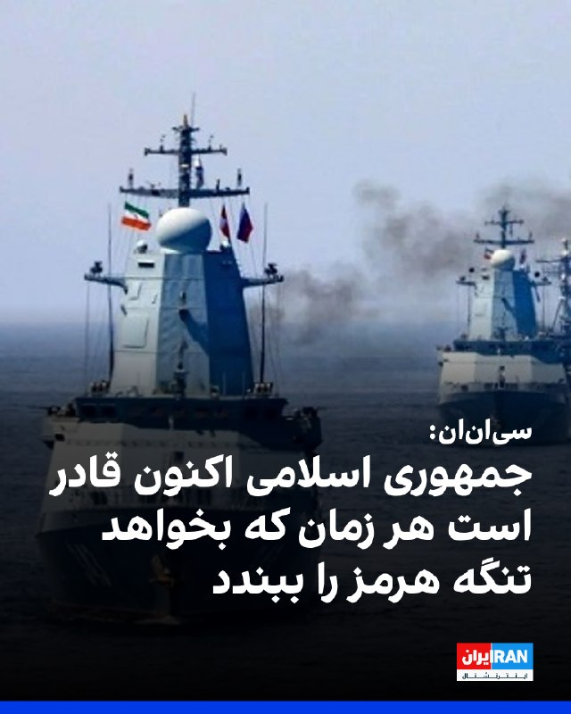

سی‌ان‌ان به نقل از سه منبع آگاه گزارش داد نهادهای اطلاعاتی آمریکا ارزیابی کرده‌اند جمهوری اسلامی اکنون قادر است هر زمان که بخواهد دسترسی به تنگه هرمز را مسدود کند و این اقدام می‌تواند به اقتصاد جهانی آسیب بزند.

بر اساس این گزارش، ارزیابی‌های اطلاعاتی آمریکا نشان می‌دهد جمهوری اسلامی همچنان بخش قابل توجهی از موشک‌ها، پهپادها، پرتابگرهای موشکی و قایق‌های تندرو خود را حفظ کرده و می‌تواند از آن‌ها برای ایجاد اختلال در تردد کشتی‌ها در تنگه هرمز استفاده کند.

سی‌ان‌ان در ادامه نوشت که جمهوری اسلامی با سرعتی بیش از انتظار آمریکا در حال بازسازی صنایع نظامی خود است و تولید پهپادها را آغاز کرده است.

یک منبع آگاه به سی‌ان‌ان گفت: «ما عملا کنترل تنگه را به جمهوری اسلامی واگذار کرده‌ایم؛ ابزاری که از هر سلاح هسته‌ای قدرتمندتر است.»

بنا بر این گزارش جمهوری اسلامی دریافته که می‌تواند با حملات هدفمند به زیرساخت‌های انرژی کشورهای عربی حاشیه خلیج فارس، از این اهرم استفاده کند.
‌🏁 🇬🇧 IranintlTV

🤖 @VahidOOnLine

## WithYashar — post 15075

  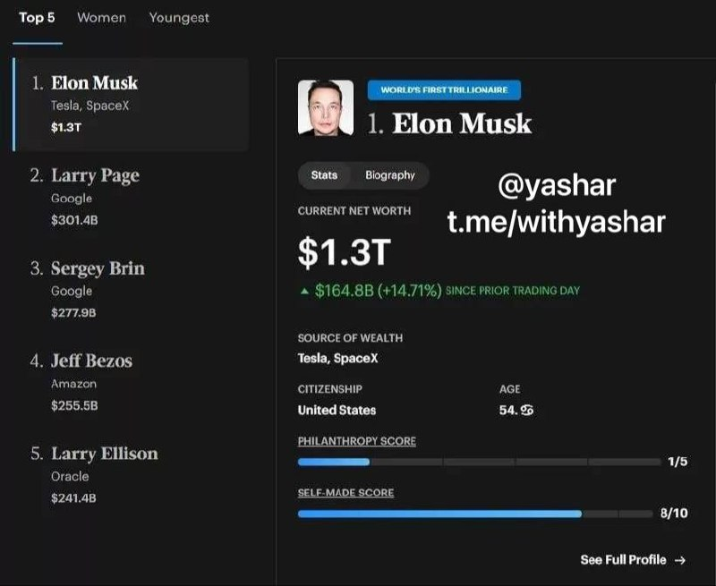

شب گذشته ایلان ماسک ۱۶۵ میلیارد دلار سود کرد و ثروتش به ۱.۳ تریلیون دلار رسید
@withyashar

## WithYashar — post 15074

نفتالی بنت، نخست وزیر سابق اسرائیل:
توافق فعلی بین جمهوری اسلامی و آمریکا فقط یک توافق موقته.
@withyashar

## WithYashar — post 15073

ادعای وال استریت ژورنال: واشنگتن به تهران اجازه خواهد داد تا بلافاصله فروش نفت و سوخت را طبق توافق پایان جنگ آغاز کند
@withyashar

## IranIntlTV — post 342729

  

سی‌ان‌ان به نقل از سه منبع آگاه گزارش داد نهادهای اطلاعاتی آمریکا ارزیابی کرده‌اند جمهوری اسلامی اکنون قادر است هر زمان که بخواهد دسترسی به تنگه هرمز را مسدود کند و این اقدام می‌تواند به اقتصاد جهانی آسیب بزند.

بر اساس این گزارش، ارزیابی‌های اطلاعاتی آمریکا نشان می‌دهد جمهوری اسلامی همچنان بخش قابل توجهی از موشک‌ها، پهپادها، پرتابگرهای موشکی و قایق‌های تندرو خود را حفظ کرده و می‌تواند از آن‌ها برای ایجاد اختلال در تردد کشتی‌ها در تنگه هرمز استفاده کند.

سی‌ان‌ان در ادامه نوشت که جمهوری اسلامی با سرعتی بیش از انتظار آمریکا در حال بازسازی صنایع نظامی خود است و تولید پهپادها را آغاز کرده است.

یک منبع آگاه به سی‌ان‌ان گفت: «ما عملا کنترل تنگه را به جمهوری اسلامی واگذار کرده‌ایم؛ ابزاری که از هر سلاح هسته‌ای قدرتمندتر است.»

بنا بر این گزارش جمهوری اسلامی دریافته که می‌تواند با حملات هدفمند به زیرساخت‌های انرژی کشورهای عربی حاشیه خلیج فارس، از این اهرم استفاده کند.
https://iranintl.com/202606163817

## Dirty_Kids — post 392318

یمدت که اینستا پست و استوری نمیذاری، دیگه فعالیت نکردن عادی میشه برات و وقتی چیزی میخوای بذاری با خودت میگی خب که چی!؟

@Dirty_Kids 👻

## Dirty_Kids — post 392317

‏الانکه دلار از 180 تومن رسیده به 160 آیا قیمت کارخانه ماشین پایین میاد؟
- نه

اگر دوباره دلار بشه 180 قیمت ماشین بالا میره؟
- بله!

@Dirty_Kids 👻

## Dirty_Kids — post 392315

اینا تاثیرات توافقه؟ :)))

@Dirty_Kids 👻

## Dirty_Kids — post 392314

  <a href="https://t.me/Dirty_Kids/392314" target="_blank">📎 Download file</a>

ریتزوبت تنها سایت بین المللی میباشد ، که به صورت هفتگی پرومو کد دریافت میکنید ✅

♦️ آموزش شارژ حساب با کریپتو
♦️ آموزش شارژ حساب ریالی در ریتزوبت

🔵ریتزوبت برندی با لایسنس معتبر در صنعت شرطبندی و #پیشبینی مسابقات ورزشی و کازینویی 👇

https://t.me/+LB508WZyIr8xNmY0

## Dirty_Kids — post 392313

  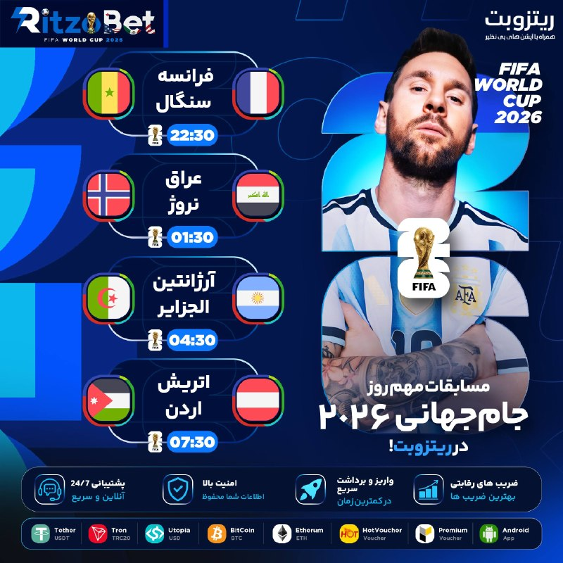

🏆 مسابقات مهم امروز جام جهانی 2026 🔥

⚽️ فرانسه 
🇫🇷 - سنگال 
🇸🇳

⚽️ عراق 
🇮🇶 - نروژ 
🇳🇴

⚽️ آرژانتین 
🇦🇷 - الجزایر 
🇩🇿

⚽️ اتریش 
🇦🇹 - اردن 
🇯🇴

🚨 امشب شاهد رقابت‌های جذاب و تماشایی جام جهانی باشید و پیش‌بینی‌های خود را در ریتزوبت ثبت کنید 👇

🎯 دانلود اپلیکیشن بدون فیلتر اندروید
🎯 لینک ورود به ریتزوبت

💎 امکان شارژ حساب با کریپتو ، انواع ووچر و کارت بانکی. 
✅

🌍 ریتزوبت؛ همراه شب‌های فراموش‌نشدنی جام جهانی 2026
G26
🆔 @RitzoBet_ir

---
📅 بروزرسانی: 1405/03/26 19:25
---

## VahidOOnLine — post 245890

  <a href="telegram/content/VahidOOnLine_245890_1781625302.mp4" target="_blank">🎬 Download video</a>

♦️تازه‌عروس خانواده ترامپ یکی از مهمان‌های جشن تولد دونالد ترامپ در کاخ سفید بود؛ جایی که نخستین حضور رسمی او در مقام «خانم ترامپ» پس از ازدواج با دونالد ترامپ جوان بود.

دونالد ترامپ، رئیس‌جمهوری آمریکا، روز یکشنبه هشتادمین سال تولد خود را جشن گرفت. این مناسبت هم‌زمان با «روز پرچم» آمریکا برگزار شد و در آستانه آماده‌سازی ایالات متحده برای جشن‌های دویست‌وپنجاهمین سالگرد استقلال این کشور قرار داشت.

مراسم در محوطه جنوبی کاخ سفید برگزار شد و هزاران مهمان در آن حضور داشتند.

بتینا ۳۹ ساله اوایل همین ماه با پسر ترامپ ازدواج کرد. این زوج حدود یک ماه قبل مراسمی خصوصی و کوچک در جزیره‌ای خصوصی در باهاما، برگزار کردند. در این مراسم، گروه محدودی از مهمانان حضور داشتند؛ از جمله خواهران و برادران داماد، ایوانکا، اریک و تیفانی ترامپ، همراه با همسرانشان. خانواده بتینا و چند دوست نزدیک او نیز در این مراسم شرکت کردند.
‌🇸🇦 Indypersian

🤖 @VahidOOnLine

## FoxNewsTwitter — post 343031

  

Fox News (Twitter/X)

Just months after walking the Grammys red carpet hand-in-hand and celebrating a major win together, Jelly Roll has filed for divorce from his wife, Bunnie Xo.

Court records viewed by Fox News Digital show the country star filed in Tennessee, listing May 9 as the date of separation and citing irreconcilable differences.

The couple married in a whirlwind Las Vegas ceremony in 2016 and have often been open about the highs and lows of their relationship. Now, one of country music’s most recognizable couples appears headed for a split.

## pm_afshaa — post 94193

  <a href="telegram/content/pm_afshaa_94193_1781625304.webm" target="_blank">🎬 Download video</a>

🔴نفتالی بنت، نخست وزیر سابق اسرائیل:
توافق فعلی بین جمهوری اسلامی و آمریکا فقط یک توافق موقته.

💧 Rainbet.com the #1 Non-KYC Crypto Casino & Sportsbook @rainbetcom

😁 @Pm_Afshaa

## RadioFarda — post 158397

  <a href="https://t.me/radiofarda/158397" target="_blank">📎 Download file</a>

تساوی ایران و نیوزیلند؛ «خواستن همیشه توانستن نیست»

🔸تیم ملی فوتبال ایران در نخستین دیدار خود در جام جهانی ۲۰۲۶ برابر نیوزیلند که روز دوشنبه ۲۵ خرداد برگزار شد، دو بار از حریف عقب افتاد اما هر دو بار نتیجه را جبران کرد و سرانجام به تساوی ۲-۲ دست یافت. مسابقه‌ای که در پی هفته‌ها حاشیه و چالش برگزار شد و رضایت بسیاری از کارشناسان فوتبال را در پی نداشت. کوروش بازیار، کارشناس و مربی فوتبال در آلمان، به رادیوفردا می‌گوید این بازی نشان داد که «خواستن همیشه توانستن نیست» و شرایط آن نیز باید مهیا باشد.

@RadioFarda

## BBCPersian — post 284045

🖋مروه جمال
بی‌بی‌سی عربی

در فاصله چند کیلومتری از خط مقدم درگیری‌ها، دکتر حسن وزنه، مدیر بیمارستان دولتی نبطیه، در کنار همکارانش در اتاق عمل مانده و هدایت بحرانی را بر عهده دارد که یک لحظه هم فروکش نمی‌کند.

او به برنامه «روزنگار خاورمیانه» رادیو بی‌بی‌سی عربی، جزئیات وضعیت میدانی و نحوه تقسیم مسئولیت‌ها میان بیمارستان‌هایی را که همچنان به فعالیت خود ادامه می‌دهند، تشریح کرد.

دکتر وزنه گفت: «ما اینجا هستیم، ما و همه بیمارستان‌های منطقه. در نبطیه سه بیمارستان وجود دارد که یکی از آن‌ها بیمارستان دولتی نبطیه است که من مدیریت آن را برعهده دارم. حملات در نزدیکی ما رخ داده است و البته شیشه‌ها، سقف‌ها و برخی درها آسیب دیده‌اند، اما بیمارستان مستقیما هدف قرار نگرفته است. ما اینجا را ترک نخواهیم کرد. اگر کسی بخواهد منطقه را ترک کند یا شیفت خود را با فرد دیگری جابه‌جا کند، این کار از طریق صلیب سرخ انجام می‌شود.»
ادامه مطلب⬇️

📸BBC/ GettyImages/ Reuters/ AFP via Getty Images
https://bbc.in/3S6WEPD
@BBCPersian

## alonews — post 128515

  <a href="telegram/content/alonews_128515_1781625305.webm" target="_blank">🎬 Download video</a>

👈اف‌بی‌آی یک طرح تروریستی عظیم و چند مرحله‌ای را که هدف آن رویداد یو‌اف‌سی فریدام 250 روز یکشنبه در چمنزار جنوبی کاخ سفید بود، خنثی کرد.

🔴طبق گفته مقامات فدرال، این طرح ترسناک طوری طراحی شده بود که «حداکثر تلفات» را به همراه داشته باشد.

✅ @AloNews خبر جنگ

## alonews — post 128514

  <a href="telegram/content/alonews_128514_1781625306.mp4" target="_blank">🎬 Download video</a>

👈حزب‌الله یه خودرو نظامی ارتش اسرائیل رو با پهپاد «ابابیل» زد

✅ @AloNews خبر جنگ

---
📅 بروزرسانی: 1405/03/26 19:15
---

## VahidOOnLine — post 245889

♦️جیانی اینفانتینو، رئیس فیفا، پس از دیدار تیم‌های ملی ایران و نیوزیلند در جام جهانی ۲۰۲۶ به رختکن تیم ملی ایران رفت و از بازیکنان و عملکرد این تیم تمجید کرد.

در این دیدار، امیر قلعه‌نویی، سرمربی تیم ملی ایران، از نحوه میزبانی از تیم ملی انتقاد کرد و به صادر نشدن ویزا برای برخی اعضای کاروان ایران، غیبت مجموعه مدیریتی و فنی از جمله مهدی تاج، رئیس فدراسیون فوتبال، لغو اردوی آماده‌سازی در مکزیک و همچنین اجبار تیم به ترک خاک آمریکا بلافاصله پس از پایان مسابقه اشاره کرد.

قلعه‌نویی در گفت‌وگو با رئیس فیفا با اشاره به این مشکلات گفت: «ما مظلوم‌ترین تیم ادوار جام جهانی بودیم.» او همچنین از حمایت بازیکنان و کادر فنی در شرایط دشوار قدردانی کرد.
‌🇸🇦 Indypersian

🤖 @VahidOOnLine

## VahidOOnLine — post 245888

🗣روایت شما از توافق میان جمهوری‌اسلامی و آمریکا - سه‌شنبه ۲۶ خرداد

🔹متاسفانه ترامپ برای پیشبرد اهدافش در نابودی برنامه هسته‌ای ایران، از اعتراضات مردم سوءاستفاده کرد و هر جا می‌خواست کارهایش را توجیه کند از کشتار مردم ایران صحبت کرد، ولی یک‌بار هم در مذاکرات از حقوق بشر نگفت.

🔹شک نکنید آمریکا ذره‌ای به فکر ما مردم ایران نیست و فقط به دنبال منافع خودش است. ما خودمان باید برای آزادی ایران اقدام کنیم.

🔹آقای ترامپ، به شما حق می‌دهم؛ هر رئیس‌جمهوری مسئول رفاه و امنیت مردم کشور خودش است. ولی یک سؤال: در مذاکرات اسمی از مردم ایران هم بود؟ یا فقط لبنان و آخوندها بود؟

🔹آقای ترامپ، شما بی‌کفایت‌ترین رییس‌جمهور ایالات متحده هستید. کمک به مردم ایران که در راه بود، چی شد پس؟ شما فقط به فکر منافع خودتان بودید.

🔹نمی‌دانم چرا همه از ترامپ گله‌مند هستند، ولی دقت کنید چه کار کرد؟ کاری که او کرد تا هفت نسل بعد ما هم نمی‌توانست انجام بده.

🔹این توافق با چنین مفادی یعنی آزادسازی پول‌های بلوکه‌شده جمهوری اسلامی و محدود نشدن موشک‌های آنها و برقرار ماندن شبکه ارتباطی این رژیم با نیابتی‌ها؛ یعنی شکست قدرتمندترین ارتش دنیا، آمریکا.

🔹چرا هیچ‌کس از ترامپ نمی‌پرسد تو به اسم کمک به مردم ایران جنگ را شروع کردی و گفتی که به مردم ایران کمک می‌کنم تا جمهوری اسلامی را سرنگون کنند و کشورشان را پس بگیرند، پس چرا یک‌دفعه زدی زیر همه‌چیز؟

🔹آقای ترامپ؛ از شما ناامید شدم. گفته بودید کمک در راه است، بعدش الان توافق؟ ۴۰ هزار نفر همه الکی جان فدا شدند؟

🔹ترامپ، مگر تو به ما قول ندادی که آزاد می‌شویم؟ بعد الان می‌آیی می‌گویی به تغییر رژیم در ایران اعتقاد ندارم؟ خیلی بدقولی.

🔹هیچ‌کس، حتی ترامپ، نمی‌تواند جلوی خواست و اراده مردم ایران یعنی سرنگونی رژیم جمهوری اسلامی را بگیرد.
‌🏁 🇬🇧 IranintlTV

🤖 @VahidOOnLine

## WithYashar — post 15072

دلار ۱۵۳،۵۰۰
@withyashar

## WithYashar — post 15071

  <a href="telegram/content/WithYashar_15071_1781624701.mp4" target="_blank">🎬 Download video</a>

پلیس فدرال آمریکا (FBI) در جشن تولد ترامپ، پهپادی که قصد ترور وی را در کاخ سفید داشت شناسایی و خنثی کرد!!
@withyashar

## IranIntlTV — post 342728

  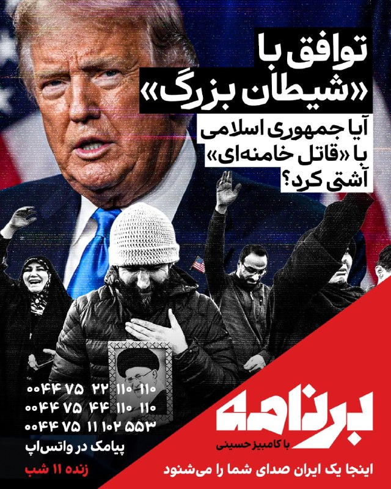

توافق با «شیطان بزرگ»؟
آیا جمهوری اسلامی با «قاتل خامنه‌ای» آشتی کرد؟
پس از سال‌ها شعار «مرگ بر آمریکا»، مخالفت با مذاکره و معرفی هرگونه توافق به‌عنوان «تسلیم»، حالا تهران و واشنگتن به یک تفاهم رسیده‌اند؛ تفاهمی که هنوز متن کامل آن منتشر نشده و بسیاری از جزئیاتش همچنان نامشخص است.
به نظر شما این توافق چه معنایی دارد؟
آیا این توافق زندگی مردم ایران را بهتر خواهد کرد؟
واکنش، نظر و تحلیل خودتان را امشب در «برنامه با کامبیز حسینی» مطرح کنید.
ما شما را، بدون نوبت، مستقیم از ایران روی خط می‌آوریم.
بیایید و روایت خود را ثبت کنید؛ تاریخ با صدای شما نوشته می‌شود.
برای شرکت در برنامه، همین حالا در واتس‌اپ پیام بدهید:
۰۰۴۴۷۵۲۲۱۱۰۱۱۰
۰۰۴۴۷۵۴۴۱۱۰۱۱۰
۰۰۴۴۷۵۱۱۱۰۲۵۵۳
«برنامه با کامبیز حسینی»
«یک ایران صدای شما را می‌شنود»

## IranIntlTV — post 342727

🗣روایت شما از توافق میان جمهوری‌اسلامی و آمریکا - سه‌شنبه ۲۶ خرداد

🔹متاسفانه ترامپ برای پیشبرد اهدافش در نابودی برنامه هسته‌ای ایران، از اعتراضات مردم سوءاستفاده کرد و هر جا می‌خواست کارهایش را توجیه کند از کشتار مردم ایران صحبت کرد، ولی یک‌بار هم در مذاکرات از حقوق بشر نگفت.

🔹شک نکنید آمریکا ذره‌ای به فکر ما مردم ایران نیست و فقط به دنبال منافع خودش است. ما خودمان باید برای آزادی ایران اقدام کنیم.

🔹آقای ترامپ، به شما حق می‌دهم؛ هر رئیس‌جمهوری مسئول رفاه و امنیت مردم کشور خودش است. ولی یک سؤال: در مذاکرات اسمی از مردم ایران هم بود؟ یا فقط لبنان و آخوندها بود؟

🔹آقای ترامپ، شما بی‌کفایت‌ترین رییس‌جمهور ایالات متحده هستید. کمک به مردم ایران که در راه بود، چی شد پس؟ شما فقط به فکر منافع خودتان بودید.

🔹نمی‌دانم چرا همه از ترامپ گله‌مند هستند، ولی دقت کنید چه کار کرد؟ کاری که او کرد تا هفت نسل بعد ما هم نمی‌توانست انجام بده.

🔹این توافق با چنین مفادی یعنی آزادسازی پول‌های بلوکه‌شده جمهوری اسلامی و محدود نشدن موشک‌های آنها و برقرار ماندن شبکه ارتباطی این رژیم با نیابتی‌ها؛ یعنی شکست قدرتمندترین ارتش دنیا، آمریکا.

🔹چرا هیچ‌کس از ترامپ نمی‌پرسد تو به اسم کمک به مردم ایران جنگ را شروع کردی و گفتی که به مردم ایران کمک می‌کنم تا جمهوری اسلامی را سرنگون کنند و کشورشان را پس بگیرند، پس چرا یک‌دفعه زدی زیر همه‌چیز؟

🔹آقای ترامپ؛ از شما ناامید شدم. گفته بودید کمک در راه است، بعدش الان توافق؟ ۴۰ هزار نفر همه الکی جان فدا شدند؟

🔹ترامپ، مگر تو به ما قول ندادی که آزاد می‌شویم؟ بعد الان می‌آیی می‌گویی به تغییر رژیم در ایران اعتقاد ندارم؟ خیلی بدقولی.

🔹هیچ‌کس، حتی ترامپ، نمی‌تواند جلوی خواست و اراده مردم ایران یعنی سرنگونی رژیم جمهوری اسلامی را بگیرد.

## DW_Farsi — post 126068

🔶 ۱۲۵مین هفته نه به اعدام هم‌زمان با اعدام دو معترض
 
گشایش اولیه در تنش میان ایران و آمریکا ظاهرا هیچ تاثیری بر تصمیمات داخلی حکومت ایران ندارد. در اولین روز پس از اعلام توافق میان دو کشور، دو زندانی سیاسی دیگر در ایران اعدام شدند. جواد زمانی و ابوالفضل ساعدی دو معترض دی ماه به اتهام "محاربه و افساد فی‌الارض" اعدام شدند.
 
سازمان عفو بین‌الملل در جدیدترین گزارش خود اعلام کرد مقام‌های جمهوری اسلامی از زمان آغاز حمله امریکا و اسرائیل به ایران در ۲۸ فوریه ۲۰۲۶، موج تازه‌ای از سرکوب را به راه انداخته‌اند که شامل اعدام‌های گسترده سیاسی، بازداشت‌های گسترده خودسرانه، محاکمه‌های شتاب‌زده و ناعادلانه، اعدام‌های با انگیزه سیاسی، صدور احکام سنگین حبس، ضبط اموال و قطع طولانی‌مدت اینترنت بوده است.
 
"ابتکار دادگستر" بانک اطلاعاتی مجموعه فعالان حقوق بشر در ایران در جدیدترین آمار خود نوشته است: «تنها در فاصله ۲۸ اسفند ۱۴۰۴ تا ۱۳ خرداد ۱۴۰۵ دست‌کم ۴۰ نفر پس از دادرسی‌هایی که فاقد معیارهای دادرسی عادلانه توصیف شده‌اند اعدام شده‌اند.»
 
بر اساس این گزارش اعدام‌شدگان شامل معترضان دی ماه، معترضان جنبش زن، زندگی، آزادی و متهمان به جاسوسی برای آمریکا و اسرائیل بوده‌اند.
 
در این گزارش آمار کل اعدام‌شدگان شامل اعدام‌های سیاسی و غیر سیاسی در این بازه زمانی ۱۹۸ نفر اعلام شده است.
@dw_farsi

## Dirty_Kids — post 392312

  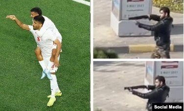

‏دست خودتون نیست ذات کصکشتون تروریستیه

@Dirty_Kids 👻

## Dirty_Kids — post 392311

  

نجات دهنده این روزای من به معنای واقعی این سریاله

@Dirty_Kids 👻

## Hranews — post 113653

محمدعلی زحمتکش، فعال صنفی معلمان از زندان عادل آباد شیراز آزاد شد

❗️
❗️
❗️
❗️
❗️– محمدعلی زحمتکش، فعال صنفی معلمان استان فارس با تودیع وثیقه از زندان عادل آباد شیراز آزاد شد.

ادامه مطلب

#محمدعلی_زحمتکش

↘️
@hranews_bot تماس ✉️ -  @Hranews  کانال هرانا 🆑

## alonews — post 128513

  <a href="telegram/content/alonews_128513_1781624707.webm" target="_blank">🎬 Download video</a>

👈پزشکیان: ‏آنچه تفاهم شده، گامی مهم برای توقف جنگ و شروع مذاکره است

🔴تمرکز دولت با یا بدون توافق خدمت صادقانه به مردم است

✅ @AloNews خبر جنگ

## alonews — post 128512

  <a href="telegram/content/alonews_128512_1781624707.webm" target="_blank">🎬 Download video</a>

👈تتر به ۱۵۵ هزار تومن رسید

✅ @AloNews خبر جنگ

---
📅 بروزرسانی: 1405/03/26 19:04
---

## VahidOOnLine — post 245887

  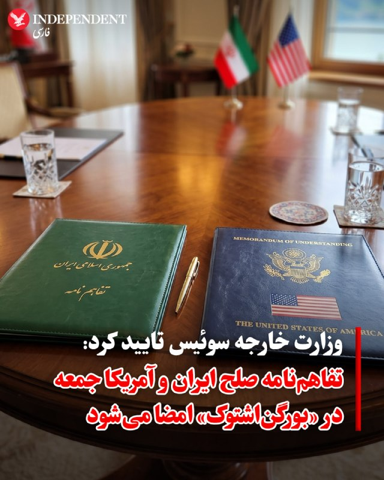

♦️ وزارت امور خارجه سوئیس رسما اعلام کرد که مراسم امضای تفاهم‌نامه میان جمهوری اسلامی ایران و ایالات متحده برای پایان دادن به درگیری‌های خاورمیانه، روز جمعه ۲۹ خرداد (۱۹ ژوئن) در مجتمع مجلل و کوهستانی «بورگن‌اشتوک» برگزار خواهد شد.

این وزارت‌خانه با اشاره به اینکه مکان مذکور به پیشنهاد مشترک میانجی‌گران (قطر و پاکستان) و طرفین مناقشه انتخاب شده، تاکید کرد که سوئیس صرفا تسهیل‌کننده این فرآیند دیپلماتیک است. این تفریحگاه لوکس که بر فراز دریاچه لوسرن واقع شده، به دلیل احاطه شدن با آب از سه طرف، دسترسی محدودی داشته و از امنیت بسیار بالایی برخوردار است.

این توافق‌نامه چارچوبی پیش از این به صورت الکترونیکی توسط دونالد ترامپ، جی‌دی ونس و محمدباقر قالیباف (مذاکره‌کننده ارشد ایران) امضا شده است. اگرچه تضادهای جدی بر سر برنامه هسته‌ای، تحریم‌ها و تنگه هرمز همچنان باقی است و متن سند هنوز علنی نشده، جی‌دی ونس، معاون رئیس‌جمهوری آمریکا، در گفتگو با سی‌ان‌ان این متن را سندی «بسیار کلی و در حدود یک صفحه و نیم» توصیف کرد.
‌🇸🇦 Indypersian

🤖 @VahidOOnLine

## WithYashar — post 15070

خبرگزاری وابسته به سپاه:
اسرائیل آتش‌بس در لبنان را نقض کرد.
@withyashar

## pm_afshaa — post 94192

  <a href="telegram/content/pm_afshaa_94192_1781624064.mp4" target="_blank">🎬 Download video</a>

🔴جی‌دی ونس، معاون ترامپ:
اگر مردم ایران به دنبال رفاه بیشتر هستن، رهبری آنها باید اقدام کنن و رفتار خودشون رو تغییر بدن. اگر این کار رو انجام بدن عالیه، اگر انجام ندن، ایالات متحده آمریکا قبلاً دستاورد زیادی کسب کرده.

💧 Rainbet.com the #1 Non-KYC Crypto Casino & Sportsbook @rainbetcom

😁 @Pm_Afshaa

## DEJradio — post 5740

  <a href="telegram/content/DEJradio_5740_1781624066.mp4" target="_blank">🎬 Download video</a>

🔺📢 بحران اعتماد در راه است؛

*روح‌الله رحیم‌پور، تحلیلگر سیاسی

#جمهوری_اسلامی #بحران
@DEJradio

## FarsiVOA — post 220920

  <a href="telegram/content/FarsiVOA_220920_1781624068.mp4" target="_blank">🎬 Download video</a>

مهرداد درویش‌پور، جامعه‌شناس در میدان می‌گوید دانش‌آموزران احساس بی‌آیندگی می‌کنند. آمنه عسگری، فعال حق کودکی معتقد است با تشکیل شورای دانش‌آموزی می‌توان به دانش‌آموزان کمک کرد

## Persian_Trend_Official — post 17284

  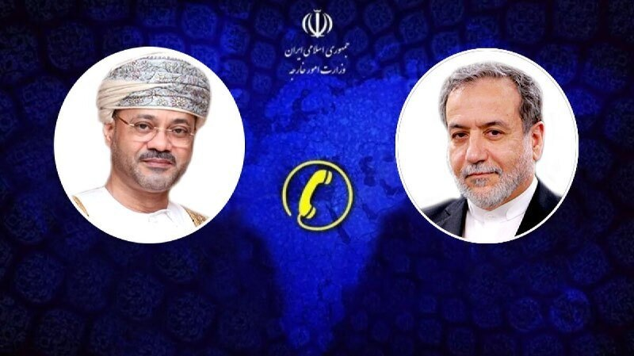

گفتگوی تلفنی وزیر امور خارجه جمهوری اسلامی و عمان

وزرای امور خارجه جمهوری اسلامی ایران و سلطنت عمان در گفتگویی تلفنی، ضمن بررسی روابط دوجانبه، بر لزوم حفظ امنیت دریانوردی و تقویت فضای دیپلماتیک پس از تفاهم اخیر میان تهران و واشنگتن تأکید کردند.

طرفین بر گسترش همکاری‌های دوجانبه بر پایه اصول حسن همجواری و پیوندهای تاریخی و فرهنگی تاکید کردند.

همچنین دو طرف به رعایت قوانین بین‌المللی برای عبور امن و آزاد کشتی‌ها از تنگه هرمز در پرتو تفاهمات اخیر با آمریکا متعهد شدند.

📝 Amir

📌 @persian_trend_official
پرشین ترند | متفاوت‌ترین کانال نظامی

## IranianMinds — post 22753

🔴 ارتش اسرائیل :

هیچ گونه اقدامی رو از سمت تروریست های حزب الله تحمل نخواهیم کرد ، مناطقی که تحت تصرف ارتش اسرائیل هستند تخلیه نخواهند شد و هرگونه تهدید یا اقدامی علیه نیروهای ما با پاسخی ویران‌کننده و قاطع مواجه خواهد شد.

@IranianMinds

## IranianMinds — post 22752

  <a href="telegram/content/IranianMinds_22752_1781624069.mp4" target="_blank">🎬 Download video</a>

🔴 حملات اسرائیل به جنوب لبنان ادامه دارد:
میفدون.

@IranianMinds

## IranianMinds — post 22751

  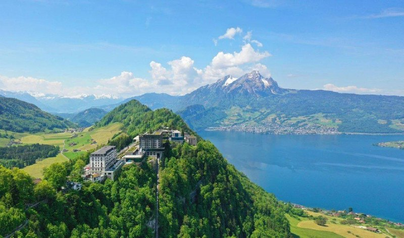

🔴 توافق آمریکا و ایران روز جمعه در بورگن‌اشتاک، نزدیک لوچرن سوئیس امضا خواهد شد.

@IranianMinds

## Dirty_Kids — post 392310

‏با قیمت یک کیلو انبه پاکستانی امسال، پارسال میشد ژنرال عاصم منیرو بکنی

@Dirty_Kids 👻

## Dirty_Kids — post 392309

  <a href="telegram/content/Dirty_Kids_392309_1781624071.mp4" target="_blank">🎬 Download video</a>

دادلش ادیتور سراغ دارم با صد تومن کارو جمع میکنه

ادیتورش:

@Dirty_Kids 👻

## alonews — post 128511

  <a href="telegram/content/alonews_128511_1781624072.webm" target="_blank">🎬 Download video</a>

👈توپخانه ارتش اسرائیل (IDF) شهر مجدال زون و همچنین حومه المنصوری در جنوب لبنان را هدف قرار داد.

✅ @AloNews خبر جنگ

## alonews — post 128510

  <a href="telegram/content/alonews_128510_1781624073.webm" target="_blank">🎬 Download video</a>

❤️ویتنی رایت پورن استار آمریکایی تصاویر جدیدی از حضورش در تهران منتشر کرد. 
✅ @AloNews

## alonews — post 128509

  <a href="telegram/content/alonews_128509_1781624073.mp4" target="_blank">🎬 Download video</a>

👈حملات اسرائیل به لبنان ادامه داره

✅ @AloNews خبر جنگ

---
📅 بروزرسانی: 1405/03/26 18:57
---

## VahidOOnLine — post 245886

  

محمدباقر قالیباف، رییس‌ مجلس شورای اسلامی، در گفت‌وگو با نبیه بری، رییس مجلس لبنان، گفت اسرائیل باید از جنوب لبنان عقب‌نشینی کند و مردم در این مناطق به خانه‌های خود بازگردند.

او تاکید کرد: «جنگ باید در همه جبهه‌ها، از جمله لبنان، پایان یابد.»
‌🏁 🇬🇧 IranintlTV

🤖 @VahidOOnLine

## pm_afshaa — post 94191

  <a href="telegram/content/pm_afshaa_94191_1781623668.webm" target="_blank">🎬 Download video</a>

🔴دراپ سایت: ایران برای تحلیل رفتار ترامپ، دوتا روانشناس به تیم مذاکره کننده اضافه کرده. 
💧 Rainbet.com the #1 Non-KYC Crypto Casino & Sportsbook @rainbetcom 
😁 @Pm_Afshaa

## pm_afshaa — post 94190

  <a href="telegram/content/pm_afshaa_94190_1781623669.webm" target="_blank">🎬 Download video</a>

🔴دراپ سایت:
ایران برای تحلیل رفتار ترامپ، دوتا روانشناس به تیم مذاکره کننده اضافه کرده.

💧 Rainbet.com the #1 Non-KYC Crypto Casino & Sportsbook @rainbetcom

😁 @Pm_Afshaa

## pm_afshaa — post 94189

🔴سفیر اسرائیل در آمریکا:ما از جنوب لبنان عقب‌نشینی نخواهیم کرد

💧 Rainbet.com the #1 Non-KYC Crypto Casino & Sportsbook @rainbetcom

😁 @Pm_Afshaa

## VahidOnline — post 76426

  

لیندزی گراهام، سناتور جمهوری‌خواه آمریکا، در شبکه ایکس نوشت گسترش توافق‌های ابراهیم و ایجاد ثبات و رفاه در خاورمیانه یکی از مهم‌ترین اهداف دونالد ترامپ است و این هدف زمانی محقق می‌شود که جمهوری اسلامی تضعیف شود یا رفتار خود را تغییر دهد.

او افزود که امیدوار است مذاکرات پیش رو برای پایان دادن به برنامه هسته‌ای ایران موفق باشد.

لیندزی گراهام اضافه کرد: «جمهوری اسلامی و نیروهای نیابتی آن به‌شدت تضعیف شده‌اند و توانایی آن‌ها برای رقم زدن رخدادی مشابه هفتم اکتبر دیگر وجود ندارد.»

او ادامه داد: «اگر درگیری با جمهوری اسلامی به گسترش توافق‌های ابراهیم، همگرایی منطقه‌ای و صلح پایدار منجر شود، این نتیجه یکی از موفق‌ترین عملیات‌های نظامی در تاریخ آمریکا خواهد بود.»
@VahidOOnLine

📡 @VahidOnline

## IranIntlTV — post 342726

  <a href="telegram/content/IranIntlTV_342726_1781623671.mp4" target="_blank">🎬 Download video</a>

🔻تیم ملی فوتبال ایران بامداد امروز به وقت تهران، در نخستین دیدار خود در جام جهانی، مقابل نیوزیلند به تساوی ۲ بر ۲ رسید. در حاشیه این مسابقه، مخالفان جمهوری اسلامی با برافراشتن پرچم شیر و خورشید و نمایش نمادهای اعتراضی، مخالفت خود را با جمهوری اسلامی ابراز کردند و در عین حال، حمایت خود را از بازیکنان تیم ملی به نمایش گذاشتند.

🔹گزارش علیرضا مدیری، ایران‌اینترنشنال از لس‌آنجلس

@iranintltvsport

## IranIntlTV — post 342725

  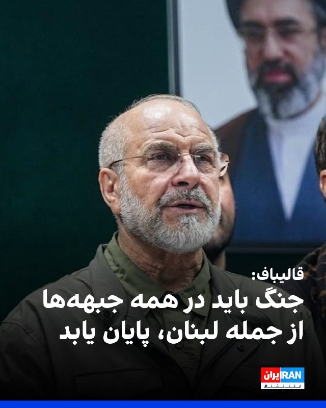

محمدباقر قالیباف، رییس‌ مجلس شورای اسلامی، در گفت‌وگو با نبیه بری، رییس مجلس لبنان، گفت اسرائیل باید از جنوب لبنان عقب‌نشینی کند و مردم در این مناطق به خانه‌های خود بازگردند.

او تاکید کرد: «جنگ باید در همه جبهه‌ها، از جمله لبنان، پایان یابد.»
https://iranintl.com/202606169268

## Shin_Persian — post 7112

↩️ Quoted tweet: Golden Owl ✓ @GoldenOwl_AI Tue, 16 Jun 2026 14:39:48 UTC Otus is live. A global Human Intelligence Network connecting organizations with vetted experts worldwide. Confidentiality. Anonymity. Accountability. Trust. https://otus.goldenowl.ai/…

## Shin_Persian — post 7111

  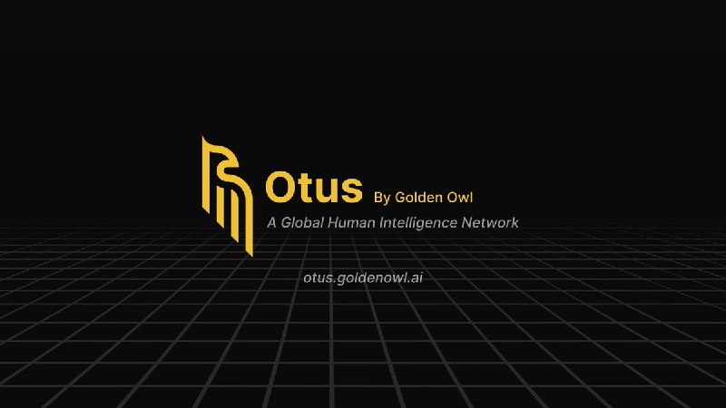

↩️ Quoted tweet:
Golden Owl ✓ @GoldenOwl_AI
Tue, 16 Jun 2026 14:39:48 UTC

Otus is live.

A global Human Intelligence Network connecting organizations with vetted experts worldwide.

Confidentiality. Anonymity. Accountability. Trust.

https://otus.goldenowl.ai/

↩️ توییت نقل‌قول شده — برای پاسخ، پست زیر را ببینید.

ترجمه خودکار فارسی

اوتیس (Otus) راه‌اندازی شد.

یک شبکه جهانی هوش انسانی (HUMINT) که سازمان‌ها را به کارشناسان تایید شده در سراسر جهان متصل می‌کند.

محرمانگی. گمنامی. مسئولیت‌پذیری. اعتماد.

https://otus.goldenowl.ai/

𝕏 · @shin_persian

## Shin_Persian — post 7110

Emanuel (Mannie) Fabian ✓ @manniefabian
Tue, 16 Jun 2026 15:19:16 UTC

Lebanese media reports four dead in Israeli airstrikes near Nabatieh in southern Lebanon this afternoon.

Initially a car was targeted in a drone strike in Mayfadoun, before a second strike hit the area after locals gathered there, Lebanon's National News Agency reports.

NNA says a third strike hit another car in the town, and fourth strike hit a car in the adjacent town of Shoukine.

The strikes resulted in the deaths of four and injured others, according to NNA.

ترجمه خودکار فارسی

رسانه‌های لبنانی از کشته شدن چهار نفر در حملات هوایی اسرائیل در نزدیکی نبطیه در جنوب لبنان در بعدازظهر امروز خبر دادند.

خبرگزاری ملی لبنان (NNA) گزارش می‌دهد که در ابتدا یک خودرو در میفدون هدف حمله پهپادی قرار گرفت و پس از آن، زمانی که مردم محلی در آنجا تجمع کردند، دومین حمله به منطقه انجام شد.

این خبرگزاری می‌گوید حمله سوم به خودروی دیگری در این شهر و حمله چهارم به خودرویی در شهر مجاور، شوکین، اصابت کرده است.

طبق گزارش خبرگزاری ملی لبنان، این حملات منجر به کشته شدن چهار نفر و مجروح شدن تعدادی دیگر شده است.

𝕏 · @shin_persian

## FarsiVOA — post 220919

ماراتن پول و سراب آموزش رایگان؛ از قولنامه‌های صوری تا سفره ۳۰ هزار میلیاردی مافیای کنکور

## Persian_Trend_Official — post 17283

  <a href="telegram/content/Persian_Trend_Official_17283_1781623674.webm" target="_blank">🎬 Download video</a>

قدردانی شیخ نعیم قاسم از حمایت تیم مذاکره کننده جمهوری اسلامی از لبنان

دبیرکل حزب الله به رییس مجلس: از جانب حزب‌الله و مقاومت اسلامی آن، از سوی دوستداران مقاومت در میان ملت لبنان که خواستار انتقال قدردانی خود به شما هستند، از طرف شهدا و در رأس آنان سید شهدای امت، سید حسن نصرالله (رضوان‌الله علیه)، همچنین مجروحان و اسرا، از شما تشکر می‌کنم. به‌ویژه در جایگاه رئیس هیئت مذاکره‌کننده و همراه با تیم مستقیم شما، از جمله وزیر امور خارجه دکتر عباس عراقچی. همچنین امیدوارم مراتب سپاس و قدردانی ما را به رهبر، آیت‌الله سید مجتبی حسینی خامنه‌ای (دام ظله)، که ما را مشمول توجه خود قرار داد و برکات و حمایت‌های شهید امام خامنه‌ای (قدس سره) را در ما زنده کرد، و نیز به رئیس‌جمهور دکتر پزشکیان، دوستدار مقاومت، سپاه پاسداران انقلاب اسلامی، این نیروی نورانی که با صلابت خود معادلات را دگرگون کرد، ارتش، نخبگان و تمامی نهادها و اقشار رسمی و مردمی ایران، منتقل فرمایید.

به طور ویژه از ملت بزرگ ایران یاد می‌کنم. ما آنان را در میدان‌های شهرهای ایران دیدیم و درخواست‌هایشان را شنیدیم که آماده‌اند جان خود را برای نجات مقاومت و ملت آن فدا کنند.

📝 Amir

📌 @persian_trend_official
پرشین ترند | متفاوت‌ترین کانال نظامی

---
### ⚠️ کانال‌های با خطا در این بروزرسانی

* IranianMinds
* BBCPersian
* IranWire
* idfinfarsi
* Dirty_Kids
* Hranews
* officialrezapahlavi
* manototv
* alonews

دلایل احتمالی: مسدود بودن کانال، حذف کانال، یا خطای شبکه.
---

---
📅 بروزرسانی: 1405/03/26 18:44
---

## VahidOOnLine — post 245885

  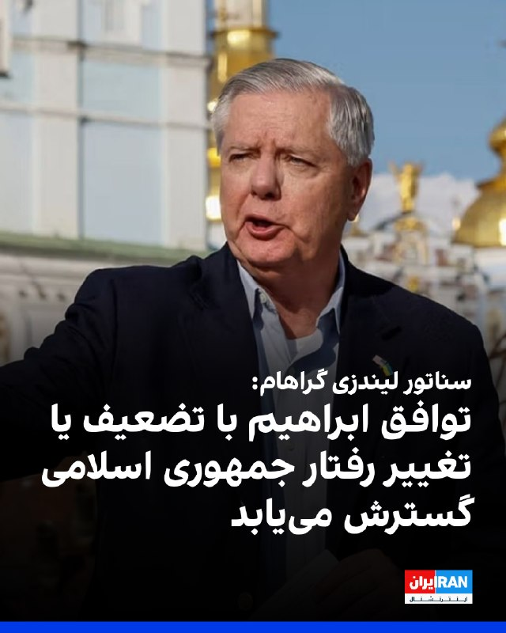

لیندزی گراهام، سناتور جمهوری‌خواه آمریکا، در شبکه ایکس نوشت گسترش توافق‌های ابراهیم و ایجاد ثبات و رفاه در خاورمیانه یکی از مهم‌ترین اهداف دونالد ترامپ است و این هدف زمانی محقق می‌شود که جمهوری اسلامی تضعیف شود یا رفتار خود را تغییر دهد.

او افزود که امیدوار است مذاکرات پیش رو برای پایان دادن به برنامه هسته‌ای ایران موفق باشد.

لیندزی گراهام اضافه کرد: «جمهوری اسلامی و نیروهای نیابتی آن به‌شدت تضعیف شده‌اند و توانایی آن‌ها برای رقم زدن رخدادی مشابه هفتم اکتبر دیگر وجود ندارد.»

او ادامه داد: «اگر درگیری با جمهوری اسلامی به گسترش توافق‌های ابراهیم، همگرایی منطقه‌ای و صلح پایدار منجر شود، این نتیجه یکی از موفق‌ترین عملیات‌های نظامی در تاریخ آمریکا خواهد بود.»
‌🏁 🇬🇧 IranintlTV

🤖 @VahidOOnLine

## WithYashar — post 15069

  <a href="telegram/content/WithYashar_15069_1781622900.mp4" target="_blank">🎬 Download video</a>

اخوند عرزشی هم صداش در اومد
@withyashar
اینو پیدا کنین استخدام کنم اتاق جنگ سبک منو داره میره 🤣

## WithYashar — post 15068

  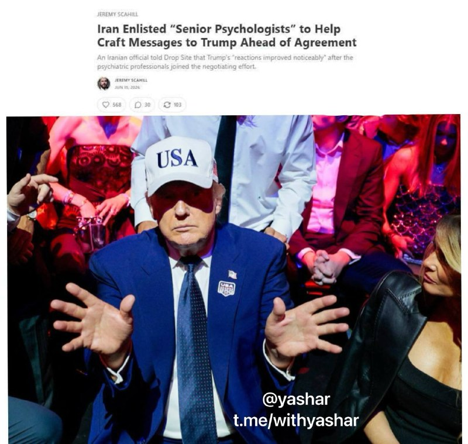

دراپ سایت: ایران برای تحلیل رفتار ترامپ، دوتا روانشناس به تیم مذاکره کننده اضافه کرده
@withyashar

## WithYashar — post 15067

## FoxNewsTwitter — post 343030

  

Fox News (Twitter/X)

A Vietnam War veteran just earned his college degree at 81.

Charley Whaley dropped out of high school more than six decades ago before serving 23 years in the U.S. Navy. Inspired by his family, he enrolled at a local college, learned how to navigate computers, and spent years working toward a goal he'd never forgotten.

"I wanted to see if I could do it. And I did."

## FoxNewsTwitter — post 343027

Fox News (Twitter/X)

RT @BillMelugin_: BREAKING: Details via federal arrest affidavit reveal that a California man named Michael Alan Thomas was one of the alleged organizers of the alleged UFC White House terror plot. Feds say he admitted he believes the U.S. government is run by elites who sacrifice and eat children, had involvement with Jeffrey Epstein, and are protected by President Trump.

Investigators took screenshots of his Signal chats in which details of the plot were discussed and maps of the UFC event were shown with suggestions on where snipers should be placed. Feds also recovered rifles & ammo.

Sources tell colleague @davidspunt those in custody are American citizens snd there is no foreign nexus believed to be at play.

## FoxNewsTwitter — post 343026

  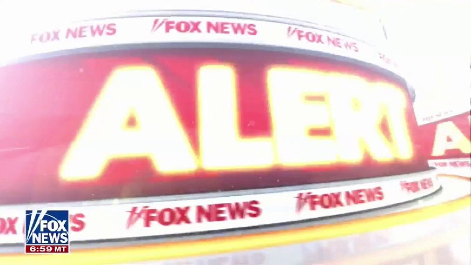

Fox News (Twitter/X)

RT @AmericaNewsroom: 🚨TERROR PLOT FOILED: The FBI now says it thwarted an alleged terror plot targeting thousands attending Sunday's UFC Freedom event at the White House.

@davidspunt reports.

## IranIntlTV — post 342724

  <a href="telegram/content/IranIntlTV_342724_1781622906.mp4" target="_blank">🎬 Download video</a>

در حالی که ترامپ تکرار کرد در ازای توافق به جمهوری اسلامی پول نخواهد داد، رئیس سی‌آی‌ای به او گفته درباره حسن نیت تهران بر اجرای تعهدات هسته‌ای توافق تردید دارد. همزمان در اسرائیل درخواست‌ها از دولت برای عدم همراهی با ترامپ در توافق افزایش یافته است.

گزارشی از مجتبا پورمحسن
@iranintltv

## IranIntlTV — post 342723

  

لیندزی گراهام، سناتور جمهوری‌خواه آمریکا، در شبکه ایکس نوشت گسترش توافق‌های ابراهیم و ایجاد ثبات و رفاه در خاورمیانه یکی از مهم‌ترین اهداف دونالد ترامپ است و این هدف زمانی محقق می‌شود که جمهوری اسلامی تضعیف شود یا رفتار خود را تغییر دهد.

او افزود که امیدوار است مذاکرات پیش رو برای پایان دادن به برنامه هسته‌ای ایران موفق باشد.

لیندزی گراهام اضافه کرد: «جمهوری اسلامی و نیروهای نیابتی آن به‌شدت تضعیف شده‌اند و توانایی آن‌ها برای رقم زدن رخدادی مشابه هفتم اکتبر دیگر وجود ندارد.»

او ادامه داد: «اگر درگیری با جمهوری اسلامی به گسترش توافق‌های ابراهیم، همگرایی منطقه‌ای و صلح پایدار منجر شود، این نتیجه یکی از موفق‌ترین عملیات‌های نظامی در تاریخ آمریکا خواهد بود.»
https://iranintl.com/202606168121

## Persian_Trend_Official — post 17282

  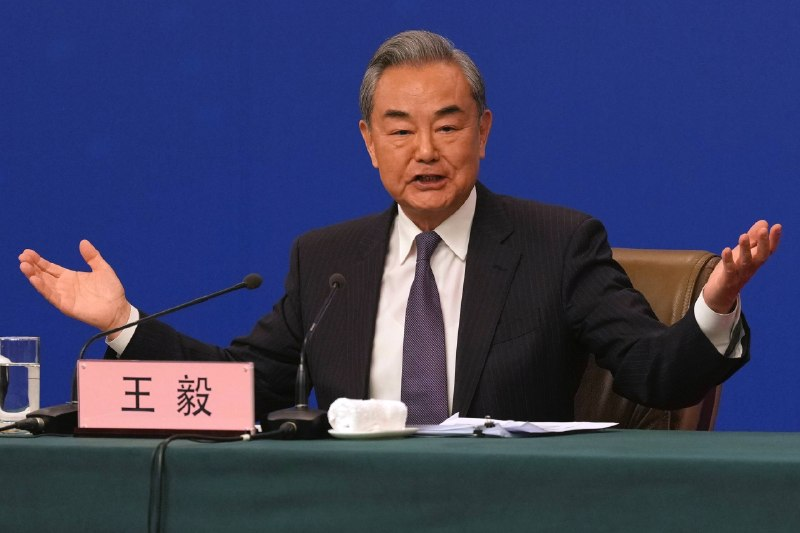

خبرگزاری فرانسه گزارش می‌دهد که وانگ یی، وزیر امور خارجه چین، می‌گوید مرحله بعدی مذاکرات آمریکا و ایران دشوارتر از مرحله اول خواهد بود.

وانگ یی، وزیر امور خارجه، به اسحاق دار، وزیر امور خارجه پاکستان، گفت که اجماع فعلی با مقصد نهایی فاصله زیادی دارد، این یک نقطه شروع جدید است.

وانگ خواستار ایفای نقش بیشتر شورای امنیت سازمان ملل در حمایت از مذاکرات شد. چین می‌گوید آماده همکاری با پاکستان در پیشبرد ابتکارات صلح در خاورمیانه و منطقه خلیج فارس است.

📝 Amir

📌 @persian_trend_official
پرشین ترند | متفاوت‌ترین کانال نظامی

## Persian_Trend_Official — post 17281

  <a href="telegram/content/Persian_Trend_Official_17281_1781622910.mp4" target="_blank">🎬 Download video</a>

معاون رئیس جمهور امریکا، جی دی ونس: اگر مردم ایران رفاه بیشتری می‌خواهند، رهبری آنها باید قدم پیش بگذارد و رفتار خود را تغییر دهد.

اگر این کار را بکنند، عالی است. اگر این کار را نکنند، ایالات متحده تا همین الان هم چیزهای زیادی به دست آورده است.

📝 Amir

📌 @persian_trend_official
پرشین ترند | متفاوت‌ترین کانال نظامی

## IranianMinds — post 22750

  <a href="telegram/content/IranianMinds_22750_1781622913.mp4" target="_blank">🎬 Download video</a>

🔴 قلعه نویی :

خیلی در حقمون ظلم کردن همین که بازی تموم شد به زور و‌ مجبورمون کردن سوار هواپیما بشیم و از آمریکا خارج بشیم ، این حق تیم ما نیست اینطوری باهامون رفتار کنن.

@IranianMinds

## IranianMinds — post 22749

  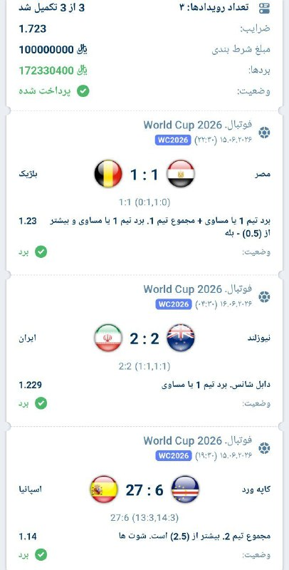

میکسمون عالی برد شد ❤️
✅
@Tabanii_Mafia

## BBCPersian — post 284044

  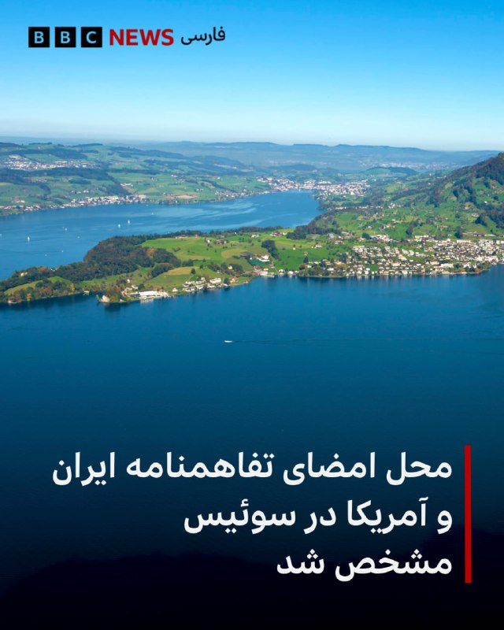

🔻وزارت خارجه سوئیس به روزنامه « «سوئیس امروز» گفت ایران و آمریکا تفاهمنامه را در اقامتگاه ساحلی بورگنشتوک امضا می‌کنند.

انتظار می‌رود هیئت‌های دو کشور روز جمعه ۱۹ ژوئن (۲۹ خرداد) با یکدیگر دیدار کنند.

طبق گزارش رسانه‌های سوئیسی، پاکستان و قطر به‌عنوان میانجی، این محل را برای مذاکرات پیشنهاد کرده‌اند.

این اقامتگاه لوکس در ساحل و مشرف به دریاچه لوسرن است.

این دومین بار در دو سال گذشته است که این اقامتگاه برای میزبانی گفت‌وگوهای دیپلماتیک سطح بالا انتخاب می‌شود.

در ژوئن ۲۰۲۴، سران جهان برای «نشست صلح اوکراین» در همین مکان گرد آمدند.

معاون وزیر خارجه ایران امروز صبح گفته بود که هنوز مکان مذاکره تعیین نشده است.
📸Universal Images Group via Getty Images
https://bbc.in/4emPXAb
@BBCPersian

## alonews — post 128508

👈خانعلی زاده مجری صدا و سیما در ونزوئلا قبل سقوط: اوضاع اینجا عالیه و همه چی اوکیه 
✅ @AloNews

## alonews — post 128507

  <a href="telegram/content/alonews_128507_1781622918.mp4" target="_blank">🎬 Download video</a>

تغییر رژیم به سریال‌ها هم رسیده

[@AloTweet]

---
📅 بروزرسانی: 1405/03/26 18:34
---

## mwarmonitor — post 11032

⚠️اطلاعیه کانال ⚠️

🔸از همه عزیزانی که همواره به بنده لطف داشته و حمایت کرده‌اند، صمیمانه سپاسگزارم. در پاسخ به درخواست برخی دوستان مبنی بر معرفی پلتفرم‌هایی برای حمایت، به اطلاع می‌رساند که تمامی فعالیت‌های اینجانب صرفاً با هدف آگاهی‌بخشی و اطلاع‌رسانی صحیح انجام شده و هیچ‌گونه نگاه یا انتظار مادی در آن وجود نداشته است.

🔸با این حال، چنانچه عزیزانی همچون گذشته تمایل به حمایت داشته باشند، لازم به شفافیت اعلام شود که مبالغ دریافت‌شده، همانند گذشته، به‌صورت کاملاً ناشناس در اختیار افراد نیازمند قرار خواهد گرفت و صرف امور خیرخواهانه می‌شود.

پیشاپیش از اعتماد و همراهی شما سپاسگزارم.

@mwarmonitor

## FoxNewsTwitter — post 343025

  <a href="telegram/content/FoxNewsTwitter_343025_1781622267.mp4" target="_blank">🎬 Download video</a>

Fox News (Twitter/X)

Two U.S. Army pilots were pulled from the water after their Apache helicopter went down near the Strait of Hormuz — and the rescue came from a completely unmanned vessel.

An autonomous drone boat built by Austin-based defense company Saronic carried out what is believed to be the first publicly known U.S. military rescue mission involving an unmanned vessel.

The Corsair operates without onboard personnel and can be designed to carry out a mission without constant remote control, allowing crews to respond in dangerous environments without putting additional service members at risk, @Brooketaylortv reports. | @AmericaNewsroom

## FoxNewsTwitter — post 343024

  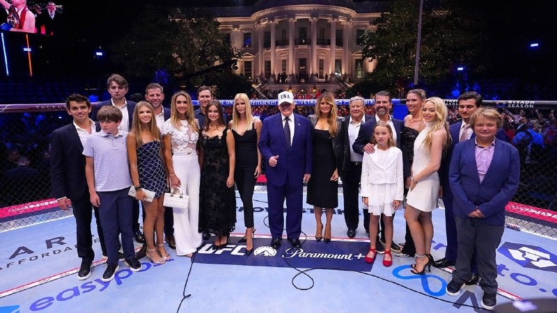

Fox News (Twitter/X)

🚨 BREAKING: At least 3 suspects identified in plot to target White House UFC event; Bryan Omar Roa, Michael Alan Thomas arrested in California, charged with conspiracy to commit murder; Tycen Proper arrested in Ohio

## DW_Farsi — post 126067

🔶 مهدی طارمی: شرایط ایران در جام جهانی یک فاجعه است
 
پس از تساوی ۲-۲ مقابل نیوزیلند در لس‌آنجلس، تیم ملی فوتبال ایران مجبور به تخلیه فوری هتل و ترک خاک آمریکا شد. کاپیتان تیم ملی، با انتقاد شدید از فدراسیون فوتبال ایران و ناامیدی از نقش فیفا، شرایط حاکم بر اردو را یک "فاجعه" توصیف کرد.
 
مهدی طارمی نه تنها فدراسیون فوتبال ایران را مسئول این وضعیت دانست، بلکه انتقادات صریحی را نیز متوجه فدراسیون جهانی فوتبال (فیفا) کرد.
 
بر اساس برنامه‌ریزی قبلی، قرار بود ملی‌پوشان ایران پس از بازی برابر نیوزیلند، صبح روز سه‌شنبه ۱۶ ژوئن (۲۶ خرداد) یک جلسه تمرین ریکاوری را در لس‌آنجلس برگزار کنند و سپس عازم شهر تیخوانا در مکزیک شوند. اما این برنامه به شکل ناگهانی لغو شد.
 
طارمی با انتقاد از این وضعیت گفت:«از ما خواسته شد هتل را فورا تخلیه کنیم و همان سه‌شنبه شب به سمت مکزیک حرکت کنیم.»
 
کاپیتان تیم ملی ایران به غیبت ارکان اصلی مدیریت و پشتیبانی تیم در این تورنمنت بزرگ اشاره کرد و افزود: «ما در حال حاضر تیم رسانه‌ای خودمان را همراه نداریم. رئیس فدراسیون فوتبال اینجا حضور ندارد و حتی بخشی از کادر فنی و اعضای تدارکات که وجودشان برای ما حیاتی است، غایب هستند. در جریان جام جهانی، یک تیم باید بتواند با آرامش خود را برای بازی بعدی آماده کند؛ این شرایط اصلا در شان ما و فوتبال نیست.»
 
طارمی در ادامه صحبت‌های خود به نارضایتی از عملکرد فدراسیون جهانی فوتبال اشاره کرد و گفت: «فیفا می‌توانست و باید کمک بیشتری به ما می‌کرد.»
 
او همچنین فاش کرد که جیانی اینفانتینو، رئیس فیفا، شخصا در رختکن تیم ملی ایران حاضر شده است، اما به نظر می‌رسد او نیز توانایی تغییر شرایط را نداشته است. طارمی در این باره گفت: «البته که او می‌خواهد به ما کمک کند، اما دست او هم بسته است و پای مسائل دیگری در میان است.»
@dw_farsi

## RadioFarda — post 158396

  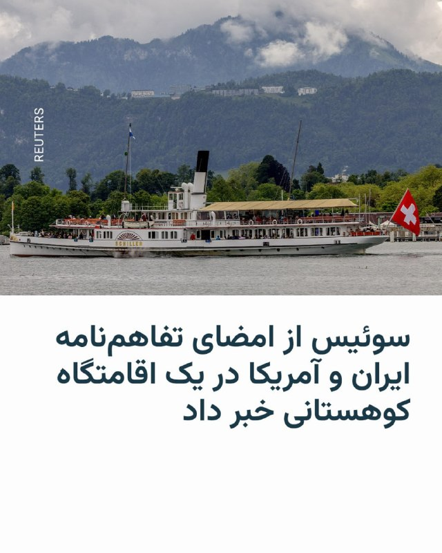

🔸سوئیس روز سه‌شنبه اعلام کرد برگزاری مراسم امضای توافق موقت میان آمریکا و ایران با هدف پایان دادن به جنگ در خاورمیانه در اقامتگاه کوهستانی بورگن‌اشتوک در مرکز سوئیس برنامه‌ریزی شده است.

🔸وزارت امور خارجه سوئیس در بیانیه‌ای اعلام کرد که درباره احتمال امضای آنچه «یادداشت تفاهم» میان واشنگتن و تهران خوانده شده، در تماس نزدیک با آمریکا، ایران، پاکستان و قطر بوده است.

🔸در این بیانیه آمده است: «در حال حاضر، امضای این سند برای روز جمعه ۱۹ ژوئن (۲۹ خرداد) در بورگن‌اشتوک، واقع در کانتون نیدوالدن، برنامه‌ریزی شده است. این محل از سوی میانجی‌های پاکستانی و قطری، و همچنین از سوی آمریکا و ایران پیشنهاد شده است.»

🔸بورگن‌اشتوک یک اقامتگاه و مجموعه کنفرانسی مشهور در مرکز سوئیس است که پیش‌تر نیز میزبان نشست‌های بین‌المللی و مذاکرات دیپلماتیک مهم بوده است.

🔸ایران و آمریکا یادداشت تفاهم پایان جنگ را که در قالب یک سند کلی تنظیم شده است، روز ۲۴ خرداد به صورت الکترونیکی امضا کردند و این سند قرار است روز ۲۹ خرداد با حضور مقام‌های ارشد دو کشور به شکل حضوری نیز امضا شود.

@RadioFarda

## IranianMinds — post 22748

  

🔴 ترامپ :

بزودی متن توافق رو میدیم رسانه ها براتون بخونن بفهمید چقدر خفنه.

@IranianMinds

## Dirty_Kids — post 392308

  <a href="telegram/content/Dirty_Kids_392308_1781622270.mp4" target="_blank">🎬 Download video</a>

صاحبشو دسگیر کردن این احمقارو:

@Dirty_Kids 👻

## alonews — post 128506

  <a href="telegram/content/alonews_128506_1781622272.mp4" target="_blank">🎬 Download video</a>

👈کارشناس فاکس‌نیوز: زمانی هدف ترامپ تسلیم بی قید و شرط ایران بود

بریت هیوم:

🔴اگر تمام چیزهایی که رئیس جمهور ترامپ ادعا می‌کند که در توافق هست، در توافق باشد و به آنها پایبند باشیم، احتمالاً یک پیروزی بزرگ خواهد بود.

🔴اما او به دلیل حرف‌های گزافی که در مورد دستاوردهای اولیه ما زده، کمی در موقعیت نامساعد سیاسی قرار دارد. هدفی که او زمانی گفته بود تسلیم بی‌قید و شرط ایران بود.

🔴ایران چیزهای زیادی از دست داده است، اما این تسلیم بی‌قید و شرط نیست، این چیزی است که وقتی مذاکره می‌کنید به دست می‌آورید. دولت به وضوح در اینجا کمی عقب‌نشینی کرده است.

✅ @AloNews خبر جنگ

## alonews — post 128505

  <a href="telegram/content/alonews_128505_1781622273.webm" target="_blank">🎬 Download video</a>

👈عکس یادگاری سران G7

✅ @AloNews خبر جنگ

---
📅 بروزرسانی: 1405/03/26 18:24
---

## VahidOOnLine — post 245884

  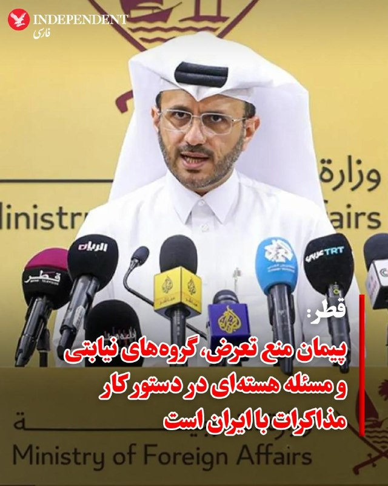

♦️ماجد الانصاری، سخنگوی وزارت امور خارجه قطر، روز سه‌شنبه ۲۶ خرداد با ارائه جزئیاتی از گسترش دامنه مذاکرات میان ایران و آمریکا اعلام کرد که میانجی‌گران در حال گفتگو درباره «پیمان‌های منع تعرض»، «گروه‌های مسلح غیردولتی» (شبه‌نظامیان نیابتی) و مسائل هسته‌ای هستند.

الانصاری در نشست خبری خود در دوحه اظهار داشت: «ما اکنون در مسیر درستی به سمت امنیت منطقه‌ای قرار داریم. قطعا چالش‌های زیادی در پیش است، اما بیایید از این فرصت برای خوش‌بینی استفاده کنیم.» او تاکید کرد که موضوعاتی چون امنیت تنگه هرمز، حسن همجواری، برنامه هسته‌ای و همچنین تسلیحات موشکی و گروه‌های نیابتی ایران در حال بحث هستند، اما تصریح کرد که «این مسائل ظرف چند روز حل نخواهند شد.»

سخنگوی وزارت خارجه قطر با اشاره به شرایط پس از درگیری‌ها افزود که هیچ‌چیز به روال عادی گذشته باز نخواهد گشت و جامعه بین‌المللی باید به دنبال ایجاد یک «نظم و هنجار جدید» باشد که بخش عمده‌ای از آن نیازمند بازسازی گسترده اعتماد میان طرفین است.
‌🇸🇦 Indypersian

🤖 @VahidOOnLine

## VahidOOnLine — post 245883

♦️ محمد جعفری، دبیر انجمن غلات ایران، گفت افزایش قیمت کالاهای اساسی در بازار ارتباطی با جنگ ندارد و مهم‌ترین عامل گرانی‌ها، افزایش نرخ ارز واردات کالاهای اساسی از سوی دولت در زمستان سال گذشته بوده است.

جعفری در گفت‌وگو با «اقتصاد۱۲۰» افزود آثار اقتصادی جنگ هنوز به بازار منتقل نشده و هیچ‌یک از افزایش قیمت‌های کنونی را نمی‌توان به جنگ نسبت داد. او گفت زمانی که دولت نرخ ارز واردات کالاهای اساسی را از ۲۸ هزار و ۵۰۰ تومان به ۱۴۸ هزار و ۵۰۰ تومان افزایش داد، به‌طور طبیعی قیمت تمام‌شده کالاها نیز چند برابر شد.

دبیر انجمن غلات ایران با اشاره به پیامدهای این تصمیم گفت: «این یک معادله ریاضی ساده است که با افزایش چند برابری نرخ ارز، قیمت کالاها نیز افزایش پیدا می‌کند» و افزود دلیل اصلی گرانی کالاهای اساسی را باید در سیاست ارزی دولت جست‌وجو کرد، نه تحولات ناشی از جنگ.
‌🇸🇦 Indypersian

🤖 @VahidOOnLine

## WithYashar — post 15066

صداوسیما : همین که اول بازی پرچم ایران توی خاک آمریکا به اهتزاز در اومد یعنی ما بردیم. دیگه نتیجه بازیا خیلی مهم نیست
@withyashar

## WithYashar — post 15065

  <a href="telegram/content/WithYashar_15065_1781621647.mp4" target="_blank">🎬 Download video</a>

معاون رئیس‌جمهور جِی‌دی ونس:

اگر مردم ایران خواهان رفاه بیشتر هستند، رهبرانشان باید پیشقدم شوند و رفتار خود را تغییر دهند.

اگر این کار را بکنند، عالی است. اگر نکنند، ایالات متحده قبلاً چیزهای زیادی به دست آورده است.
@withyashar

## WithYashar — post 15064

ونس به فاکس نیوز:
ما پیروز شدیم، چه ایران روش خود را تغییر دهد و چه تصمیم بگیرد به توافق پایبند نباشد
@withyashar

## FarsiVOA — post 220918

  <a href="telegram/content/FarsiVOA_220918_1781621649.mp4" target="_blank">🎬 Download video</a>

در حاشیه نشست گروه هفت، فریدریش مرتس، صدراعظم آلمان، یک پیراهن اختصاصی تیم ملی فوتبال آلمان با نام ترامپ و شماره ۴۷ به رئیس‌جمهوری آمریکا هدیه داد.

نشست گروه هفت در اویان فرانسه با محور توافق اولیه آمریکا و جمهوری اسلامی، بازگشایی تنگه هرمز و جنگ اوکراین در حال برگزاری است. گروه هفت، رهبران فرانسه، بریتانیا، کانادا، آلمان، ایتالیا، ژاپن و آمریکا را همراه با اتحادیه اروپا گرد هم می‌آورد.

## IranianMinds — post 22747

  <a href="telegram/content/IranianMinds_22747_1781621651.mp4" target="_blank">🎬 Download video</a>

🔴 جی‌دی ونس درباره ایران:

اگر مردم ایران خواهان رفاه و پیشرفت بیشتر هستن، رهبری‌شون باید قد علم کنه و رفتارش رو تغییر بده.

اگر این کار رو بکنن، عالیه. اگر نکنن، ایالات متحده همین الان هم خیلی چیزها رو به دست آورده.

@IranianMinds

## Dirty_Kids — post 392307

  <a href="telegram/content/Dirty_Kids_392307_1781621652.mp4" target="_blank">🎬 Download video</a>

این ویدیو تو کمتر از یه روز ۴ میلیون ویو خورده

@Dirty_Kids 👻

## alonews — post 128504

  <a href="telegram/content/alonews_128504_1781621654.mp4" target="_blank">🎬 Download video</a>

👈معاون رئیس‌جمهور جِی‌دی ونس:

اگر مردم ایران خواهان رفاه بیشتر هستند، رهبرانشان باید پیشقدم شوند و رفتار خود را تغییر دهند.

اگر این کار را بکنند، عالی است. اگر نکنند، ایالات متحده قبلاً چیزهای زیادی به دست آورده است.

✅ @AloNews خبر جنگ

---
📅 بروزرسانی: 1405/03/26 18:14
---

## VahidOOnLine — post 245882

  

شاهزاده رضا پهلوی، با اشاره به سفر خود به لندن، در شبکه ایکس نوشت: «امروز با امیلی تورن‌بری، رییس کمیته روابط خارجی مجلس عوام بریتانیا و شماری دیگر از اعضای این کمیته دیدار داشتم تا درباره وضعیت داخلی ایران، سرکوب مردم و ضرورت فوری قرار دادن ملت ایران در مرکز سیاست بریتانیا، گفت‌وگو کنیم.»

او ادامه داد: «به‌روشنی تاکید کردم معامله با رژیمی که در دی‌ماه بیش از ۴۰ هزار ایرانی را به قتل رسانده، نه‌تنها از نظر اخلاقی غیرقابل‌قبول است، بلکه از نظر راهبردی نیز خطایی بزرگ خواهد بود.»

شاهزاده رضا پهلوی افزود: «هر توافقی که به حفظ این رژیم یا بقایای آن بینجامد، محکوم به شکست است. مردم ایران چنین توافقی را نخواهند پذیرفت.»

او تاکید کرد: «با حمایت جامعه جهانی یا بدون آن، مردم ایران این رژیم را سرنگون خواهند کرد و آزادی به ایران بازخواهد گشت.»
‌🏁 🇬🇧 IranintlTV

🤖 @VahidOOnLine

## pm_afshaa — post 94188

  <a href="telegram/content/pm_afshaa_94188_1781621040.webm" target="_blank">🎬 Download video</a>

🔴تشکر نعیم قاسم، دبیرکل حزب‌الله از قالیباف:

جمهوری اسلامی به حزب‌الله و مقاومت همه‌چیز داده و هیچ‌چیز از اونا نگرفته.

💧 Rainbet.com the #1 Non-KYC Crypto Casino & Sportsbook @rainbetcom

😁 @Pm_Afshaa

## IranIntlTV — post 342722

  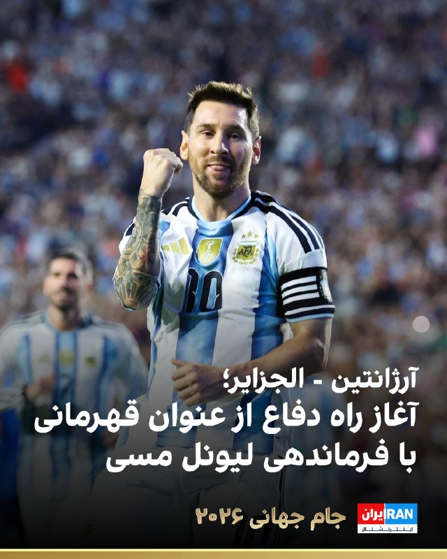

🔻بامداد سه‌شنبه از ساعت ۰۴:۳۰، تیم ملی فوتبال آرژانتین در نخستین گام برای دفاع از عنوان قهرمانی، در ورزشگاه شهر کانزاس سیتی به مصاف الجزایر می‌رود. این مسابقه که در قالب گروه J رقابت‌ها برگزار می‌شود، آغازگر ششمین و به احتمال زیاد آخرین جام جهانی لیونل مسی، فوق‌ستاره ۳۸ ساله دنیای فوتبال، است.

🔹آرژانتین و الجزایر پیش از این هرگز در جام جهانی با هم بازی نکرده‌اند و تنها رویارویی آن‌ها به یک بازی دوستانه در سال ۲۰۰۷ در نیوکمپ بارسلونا برمی‌گردد؛ مسابقه‌ای جذاب که با برتری ۴ بر ۳ آلبی‌سلسته همراه بود و لیونل مسی نوجوان در آن دیدار موفق شد دو گل به ثمر برساند.

🔹حالا پس از سال‌ها، مسی به عنوان فاتح جام جهانی ۲۰۲۲ قطر و قهرمان ام‌ال‌اس با اینتر میامی، بار دیگر برابر این رقیب آفریقایی می‌ایستد. او که با ۸ گل بهترین گلزن آرژانتین در دور مقدماتی بود، اگرچه سرعت سال‌های جوانی را ندارد، اما همچنان با هوش بالا و ضربات آخر بی‌نقصش، امید اول تیم لیونل اسکالونی است.

🔹گزارش کامل را در سایت بخوانید.

@iranintltvsport

## IranIntlTV — post 342721

  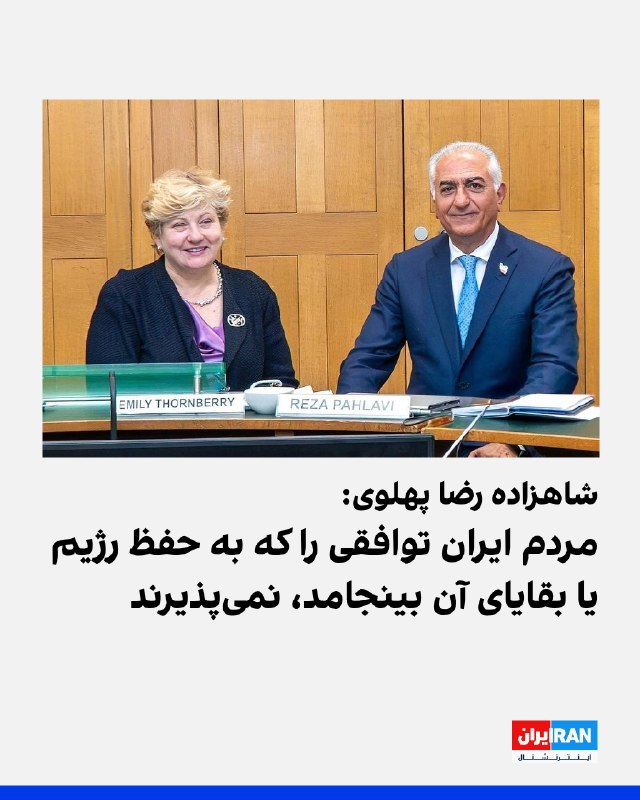

شاهزاده رضا پهلوی، با اشاره به سفر خود به لندن، در شبکه ایکس نوشت: «امروز با امیلی تورن‌بری، رییس کمیته روابط خارجی مجلس عوام بریتانیا و شماری دیگر از اعضای این کمیته دیدار داشتم تا درباره وضعیت داخلی ایران، سرکوب مردم و ضرورت فوری قرار دادن ملت ایران در مرکز سیاست بریتانیا، گفت‌وگو کنیم.»

او ادامه داد: «به‌روشنی تاکید کردم معامله با رژیمی که در دی‌ماه بیش از ۴۰ هزار ایرانی را به قتل رسانده، نه‌تنها از نظر اخلاقی غیرقابل‌قبول است، بلکه از نظر راهبردی نیز خطایی بزرگ خواهد بود.»

شاهزاده رضا پهلوی افزود: «هر توافقی که به حفظ این رژیم یا بقایای آن بینجامد، محکوم به شکست است. مردم ایران چنین توافقی را نخواهند پذیرفت.»

او تاکید کرد: «با حمایت جامعه جهانی یا بدون آن، مردم ایران این رژیم را سرنگون خواهند کرد و آزادی به ایران بازخواهد گشت.»
https://iranintl.com/202606166456

## FarsiVOA — post 220917

🔺نتانیاهو: «با توافق یا بدون توافق» جمهوری اسلامی سلاح هسته‌ای نخواهد داشت

▪️نتانیاهو در مورد توافق ایالات متحده و رژیم ایران گفت که رابطه‌اش با دونالد ترامپ، رئیس جمهور ایالات متحده، مبتنی بر همکاری است، اما تأکید کرد که او مسئولیت دفاع از منافع امنیتی اسرائیل را بر عهده دارد و «نبرد علیه جمهوری اسلامی تمام نشده است.»

⬇️ بیشتر بخوانید:

https://ir.voanews.com/a/iran-israel-us-trump-lebanon-netanyahu-hezbollah-negotiations/8161452.html/?nocach=1

## DW_Farsi — post 126066

🔶 پیام طبرزدی از زندان؛ تاکید بر رهبری جمعی، اعتصابات مدنی و اتحاد اپوزیسیون
 
حشمت‌‌الله طبرزدی، دبیرکل جبهه دموکراتیک ایران در پیامی که به طور اختصاصی در اختیار دویچه‌وله فارسی قرار گرفته، با حمایت از موج جدید اعتراضات دانشجویی و فراخوان‌های مربوط به مراسم چهلم جان‌باختگان اعتراضات دی‌ماه ۱۴۰۴، به تشریح دیدگاه‌های خود درباره استراتژی‌های پیش‌روی جنبش‌های اجتماعی در ایران پرداخت.
 
این فعال سیاسی که هم‌اکنون در زندان به‌سر می‌برد، بر لزوم شکل‌گیری رهبری جمعی، پایبندی به مبارزه خشونت‌پرهیز و اتحاد میان تمامی طیف‌های اپوزیسیون تاکید کرد.
 
طبرزدی در ابتدای پیام خود با تحسین عملکرد جنبش دانشجویی، همدردی جامعه با خانواده‌های داغ‌دیده را سنجیده و مسئولانه خواند.
 
او مشارکت همزمان گروه‌های مختلف از جمله معلمان، کارگران، هنرمندان، ورزشکاران و احزاب سیاسی را نشانه اصالت و سرکوب‌ناپذیری این حرکت دانست و تصریح کرد که در یک انقلاب دموکراتیک و انسانی، رهبری نه به صورت فردی بلکه باید به شکل جمعی و بر پایه مشارکت عمومی سازماندهی و تقویت شود.
 
طبرزدی مسیر عبور از ساختار موجود را اتکا به "اعتراضات و اعتصابات گسترده و در صورت لزوم فلج‌کننده" در دانشگاه‌ها، مدارس، کارخانه‌ها و تمامی عرصه‌های اجتماعی توصیف کرد.
 
او در عین حال بخش مهمی از پیام خود را به "ضرورت پرهیز از خشونت" اختصاص داد و یادآور شد: «در تقابل‌های مسلحانه، موازنه قوا به سود ساختار سرکوب تغییر می‌کند، اما در پیکار مدنی و خشونت‌پرهیز، این اراده جمعی ملت است که در بلندمدت دست بالا را خواهد داشت و ساختار سرکوب را از کار می‌اندازد.»
 
دبیرکل جبهه دمکراتیک ایران در ادامه پیام خود به موضوع برابری حقوق قومی، مذهبی و جنسیتی پرداخت و نادیده گرفتن این حقوق را "تداوم بی‌عدالتی" خواند.
 
او تاکید کرد که ملیت‌ها و اقوام ایرانی باید از حق اداره امور محلی، آموزش به زبان مادری و حفظ فرهنگ و هویت خویش برخوردار باشند.
 
این زندانی سیاسی در بخش دیگری از این پیام، تمامی جریان‌های سیاسی اپوزیسیون از جمله گذارطلبان، فدرال‌خواهان و جمهوری‌خواهان را مخاطب قرار داد و از آن‌ها خواست تا زمان گذار از استبداد، اتحاد در عمل را بر اختلافات نظری مقدم بدارند. به باور طبرزدی، بررسی تعارض‌ها و اختلافات فکری باید به پس از استقرار سازوکارهای قانونی موکول شود تا در بستر یک مجلس مؤسسان دموکراتیک با حضور همه گرایش‌ها، قانون اساسی جدید تدوین شده و در یک همه‌پرسی آزاد به رای مستقیم مردم گذاشته شود.
 
طبرزدی در پایان پیام خود، ضمن دعوت از جامعه‌شناسان، روشنفکران و هنرمندان برای حضور آگاهانه و تبیین مباحث دموکراتیک در جامعه، فراخوان‌های اخیر را تداوم جنبش "زن، زندگی، آزادی" و دیگر جنبش‌های عدالت‌خواهانه پیشین دانست و ابراز اطمینان کرد که با حفظ اتحاد و پایبندی به اصول دموکراتیک، آینده از آن مردم ایران خواهد بود.
@dw_farsi

## alonews — post 128503

  <a href="telegram/content/alonews_128503_1781621042.webm" target="_blank">🎬 Download video</a>

👈ونس به فاکس نیوز:
ما پیروز شدیم، چه ایران روش خود را تغییر دهد و چه تصمیم بگیرد به توافق پایبند نباشد

✅ @AloNews خبر جنگ

---
📅 بروزرسانی: 1405/03/26 18:05
---

## VahidOOnLine — post 245881

  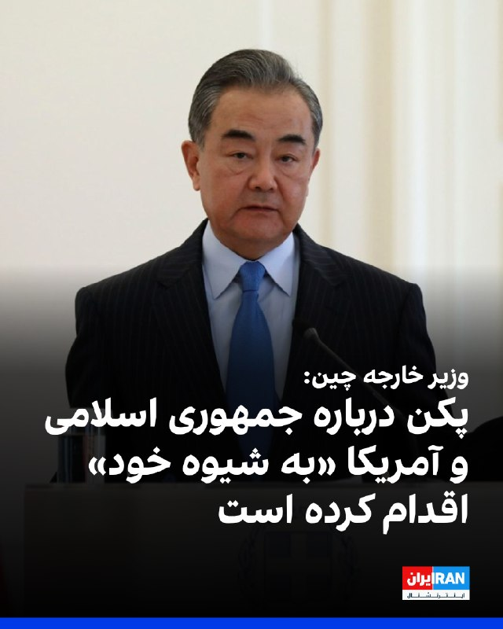

خبرگزاری شینهوا گزارش داد که وانگ یی، وزیر خارجه چین در گفت‌وگو با همتای پاکستانی خود گفت پکن درباره جمهوری اسلامی و آمریکا «به شیوه خود» اقدام کرده است.
وزیر خارجه چین افزود این کشور آماده است با پاکستان برای پیشبرد مذاکرات صلح، بدون وقفه همکاری کند.
او ادامه داد: «جامعه بین‌المللی باید حمایت بیشتری از مذاکرات میان جمهوری اسلامی و آمریکا انجام دهد.»
‌🏁 🇬🇧 IranintlTV

🤖 @VahidOOnLine

## FoxNewsTwitter — post 343023

  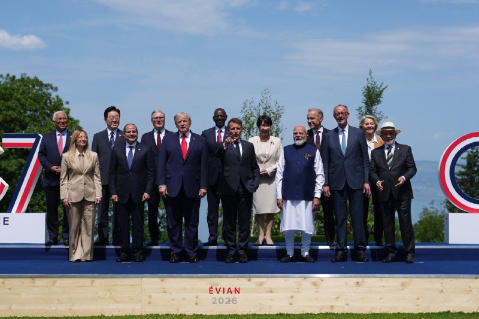

Fox News (Twitter/X)

G7 leaders pose for the traditional family photo as high-stake talks at the global summit continue in Geneva.

The summit's agenda has been shaped by diplomatic efforts to end conflicts in Iran and Ukraine, as leaders weigh additional pressure on Russia.

## IranIntlTV — post 342720

  

خبرگزاری شینهوا گزارش داد که وانگ یی، وزیر خارجه چین در گفت‌وگو با همتای پاکستانی خود گفت پکن درباره جمهوری اسلامی و آمریکا «به شیوه خود» اقدام کرده است.
وزیر خارجه چین افزود این کشور آماده است با پاکستان برای پیشبرد مذاکرات صلح، بدون وقفه همکاری کند.
او ادامه داد: «جامعه بین‌المللی باید حمایت بیشتری از مذاکرات میان جمهوری اسلامی و آمریکا انجام دهد.»
https://iranintl.com/202606168879

## FarsiVOA — post 220916

🔺تساوی پرحاشیه تیم ملی ایران در بازی اول، از اعتراض‌های تماشاگران تا گلایه‌های بازیکنان و مربی

▪️تیم فوتبال ایران در نخستین دیدار خود در جام جهانی ۲۰۲۶، در ورزشگاه سوفای لس‌آنجلس، برابر نیوزیلند به تساوی ۲-۲ رسید؛ نتیجه‌ای که از نظر فنی برای تیمی با جایگاه بالاتر در رده‌بندی فیفا چندان مناسب نبود، اما حاشیه‌های سیاسی و اجتماعی آن، از خود مسابقه پررنگ‌تر شد.

⬇️ بیشتر بخوانید:

https://ir.voanews.com/a/flags-overshadow-iran-world-cup-draw/8161443.html/?nocach=1

## Persian_Trend_Official — post 17280

  <a href="telegram/content/Persian_Trend_Official_17280_1781620541.webm" target="_blank">🎬 Download video</a>

یک پهپاد MQ-4C امریکایی پس از گشتی زنی در نزدیکی حریم هوایی کوبا، به امریکا بازگشت.

📝 Amir

📌 @persian_trend_official
پرشین ترند | متفاوت‌ترین کانال نظامی

## Persian_Trend_Official — post 17279

  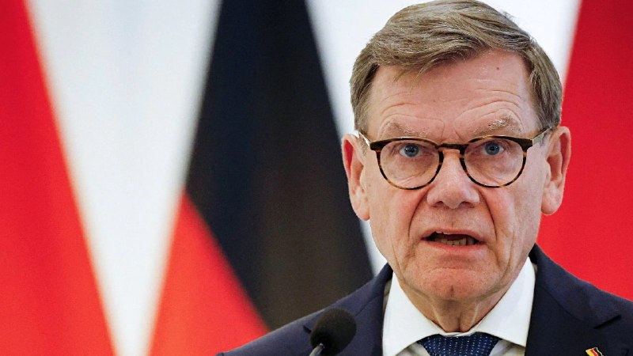

یوهان وادفول، وزیر امور خارجه آلمان، می‌گوید آلمان آماده است تا از عملیات مین‌روبی در تنگه هرمز برای کمک به از سرگیری کشتیرانی تجاری حمایت کند.

وادفول گفت که این ماموریت باید صلح‌آمیز و غیرجنگی باشد و با توافق همه طرف‌ها، از جمله ایالات متحده و ایران، انجام شود.

آلمان همچنین قبل از استقرار مین‌روب دریایی خود، فولدا، که در حال حاضر در دریای مدیترانه مستقر است، به تأیید مجلس فدرال (بوندستاگ) نیاز دارد.

📝 Amir

📌 @persian_trend_official
پرشین ترند | متفاوت‌ترین کانال نظامی

## BBCPersian — post 284043

🔻قیمت نفت برنت برای نخستین‌بار از شروع جنگ کمتر از ۸۰ دلار شد

قیمت نفت به امید اینکه تفاهم آمریکا و ایران منجر به بازگشایی تنگه هرمز شود، کاهش بیشتری یافت.

اکنون قیمت نفت برنت، معیار جهانی قیمت نفت، برای نخستین بار از اوایل مارس ( چهار ماه پیش) به زیر ۸۰ دلار در هر بشکه رسیده است.

قیمت نفت برنت در اوج جنگ اخیر تا حدود ۱۲۰ دلار در هر بشکه هم رسید.

پیش از جنگ نفت برنت حدود ۷۰ دلار معامله می‌شد.

https://bbc.in/4aS0LW1
@BBCPersian

## BBCPersian — post 284042

🔻دولت لبنان برای دور جدید مذاکره با اسرائیل «آماده» می‌شود

دفتر جوزف عون، رئيس‌جمهور لبنان، در بیانیه‌ای اعلام کرد که او و نواف سلام، ‌نخست‌وزیر درباره آماده‌سازی برای دور پنجم مذاکره با اسرائیل که قرار است از ۲۲ ژوئن (اول تیر) آغاز شود، گفت‌وگو کرده‌اند.

در این بیانیه آمده است که هر دو نفر تفاهمنامه آمریکا و ایران را «عامل مثبتی برای کاهش تنش‌های منطقه‌ای و حرکت به سمت راه‌ حل‌های مسالمت‌آمیز و پایان وضعیت جنگ» می‌دانند.

آنها همچنین تاکید کردند که لبنان از طریق مذاکره به دنبال «آتش‌بس دائمی، خروج نیروهای اسرائیلی از سرزمین‌های اشغالی، استقرار ارتش لبنان تا مرزهای بین‌المللی، بازگشت زندانیان لبنانی و آغاز روند بازسازی» است.

لبنان و اسرائیل از ماه آوریل (سه ماه پیش) در واشنگتن گفت‌وگوی مستقیم داشته‌اند تا به جنگ پایان دهند و منازعه اسرائیل و حزب‌الله را از جنگ گسترده منطقه‌ای جدا کنند.

اما تفاهم آمریکا و ایران، شرایط را در لبنان تغییر داده است.

عباس عراقچی، وزیر خارجه ایران پیش‌تر گفت که پایان این درگیری بدون «خروج نیروهای اسرائیلی از سرزمین‌هایی که در این جنگ اشغال کرده‌اند» کامل نخواهد بود.

او افزود: «هرگونه حمله نظامی رژیم صهیونیستی به لبنان از این پس و ادامه اشغال سرزمین‌های لبنان از نظر ما نقض تفاهمنامه خواهد بود.»

ایران می‌گوید بند اول تفاهمنامه پایان جنگ از جمله در لبنان است.

https://bbc.in/3SaDl88
@BBCPersian

## BBCPersian — post 284041

💢کابوس سیاسی نتانیاهو
🖌لوسی ویلیامسون، خبرنگار خاورمیانه بی‌بی‌سی

توافق آمریکا و ایران برای پایان دادن به جنگ، برای بنیامین نتانیاهو، نخست‌وزیر اسرائیل، کابوسی سیاسی به وجود آورده است که به سه بخش مهم کارنامه سیاسی او ضربه می‌زند.

چطور ممکن است مردی که خود را «نجواگر سیاسی واشنگتن» معرفی می‌کرد و ادعا داشت که بر سیاستمداران آمریکایی نفوذ واقعی دارد، این‌قدر به حاشیه رانده شود و از جانب متحد اصلی‌اش آمریکا این‌طور علنی تحقیر شود.

چگونه ممکن است فردی که مقابله با ایران را محور اصلی سیاست امنیتی اسرائیل قرار داده بود، جنگ با جمهوری اسلامی را در حالی پایان دهد که این حکومت احتمالا در موقعیت قوی‌تری قرار گرفته است؟

و چگونه تصویر قدیمی و مخدوش او به‌عنوان «آقای امنیت» اسرائیل می‌تواند در برابر خواسته واشنگتن و تهران برای توقف حملات به حزب‌الله در لبنان، آن هم چند ماه پیش از انتخابات عمومی اسرائیل، دوام بیاورد؟

در میان هیاهوی انتقادها و خشم طیف‌های مختلف سیاسی، نخست‌وزیر اسرائیل به خبرنگارانی که از او می‌پرسیدند آیا شکست خورده است، واکنش تندی نشان داد. با این حال، او گفت که در برخی موارد با آقای ترامپ اختلاف‌نظر دارد.

بنیامین نتانیاهو که اغلب سریع ادعای پیروی می‌کند،‌ اکنون برای تعیین گام‌های بعدی با دشواری روبروست.

دهه‌هاست که امنیت، ستون اصلی پیام انتخاباتی آقای نتانیاهو به رای‌دهندگان بوده است؛ پیامی که اکنون انتقال آن به جامعه روزبه‌روز دشوارتر می‌شود.

https://bbc.in/4xwexY5
@BBCPersian

## BBCPersian — post 284040

🔻ترامپ: تفاهمنامه به‌وضوح نشان می‌دهد که ایران هیچ‌وقت سلاح هسته‌ای نخواهد داشت

دونالد ترامپ باز هم در حاشیه نشست سران هفت کشور صنعتی در فرانسه درباره توفق با ایران صحبت کرد.

رئیس‌جمهور آمریکا گفت که مایل است تفاهمنامه با ایران را برای بررسی به کنگره بفرستد و متن آن را جمعه در یک مراسم رسمی فاش خواهد کرد.

او همچنین گفت که یک کنفرانس خبری درباره توافق با ایران خواهد داشت.

آقای ترامپ بار دیگر تاکید کرد که هدف اصلی توافق جلوگیری از دستیابی ایران به سلاح هسته‌ای است و تفاهمنامه به‌وضوح این را نشان می‌دهد.

او اظهار امیدواری کرد مرحله بعدی توافق با ایران که پس از امضا تفاهمنامه در روز جمعه آغاز می‌شود «‌به‌سرعت» پیش برود.

https://bbc.in/4fIV0NQ.
@BBCPersian

## Hranews — post 113652

  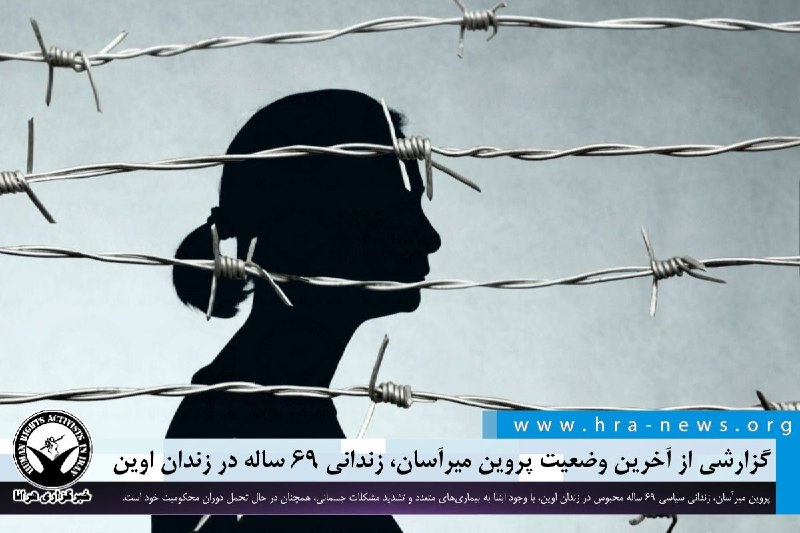

گزارشی از آخرین وضعیت پروین میرآسان، زندانی ۶۹ ساله در زندان اوین

❗️
❗️
❗️
❗️
❗️– پروین میرآسان، زندانی سیاسی ۶۹ ساله محبوس در زندان اوین، با وجود ابتلا به بیماری‌های متعدد و تشدید مشکلات جسمانی، همچنان در حال تحمل دوران محکومیت خود است. با وجود آنکه حدود سه ماه از دوران محکومیت این زندانی سالخورده باقی مانده، تاکنون با درخواست‌های آزادی مشروط یا مرخصی متصل به آزادی وی موافقت نشده است.

به گزارش خبرگزاری هرانا، ارگان خبری مجموعه فعالان حقوق بشر در ایران، پروین میرآسان، زندانی سیاسی محبوس در زندان اوین، از بیماری‌های متعددی رنج میبرد.

یک منبع مطلع نزدیک به خانواده این زندانی سیاسی ضمن تایید این موضوع به هرانا گفت: «وضعیت جسمی خانم میرآسان در شرایط نامناسبی قرار دارد. او از بیماری‌های متعدد رنج می‌برد و در ماه‌های اخیر مشکلات قلبی وی تشدید شده است. همچنین دردهای شدید مفصلی، لرزش و اختلال در تعادل موجب شده که وی به‌سختی قادر به راه رفتن باشد و در انجام امور روزمره با مشکلات جدی مواجه شود.»
این منبع در ادامه با اشاره به اینکه خانم میرآسان از بیماری‌های دیگری از جمله دیابت و عارضه چسبندگی روده نیز رنج می‌برد، گفت: «با وجود آنکه حدود سه ماه از دوران محکومیت خانم میرآسان باقی مانده، تاکنون با درخواست‌های مربوط به آزادی مشروط یا مرخصی متصل به آزادی وی موافقت نشده است.»

ادامه مطلب

#پروین_میرآسان
↘️
@hranews_bot تماس ✉️ -  @Hranews  کانال هرانا 🆑

## alonews — post 128502

  <a href="telegram/content/alonews_128502_1781620542.mp4" target="_blank">🎬 Download video</a>

👈حمله پهبادی اسرائیل به جنوب لبنان

✅ @AloNews خبر جنگ

## alonews — post 128501

پاسخ قاطع قالیباف به مخالفان توافق [@AloTweet]

## alonews — post 128500

  <a href="telegram/content/alonews_128500_1781620545.webm" target="_blank">🎬 Download video</a>

👈نبویان :متن توافق منافع ملی(کاسبان تحریم) را تامین نمیکند

✅ @AloNews خبر جنگ

---
📅 بروزرسانی: 1405/03/26 17:55
---

## VahidOOnLine — post 245880

  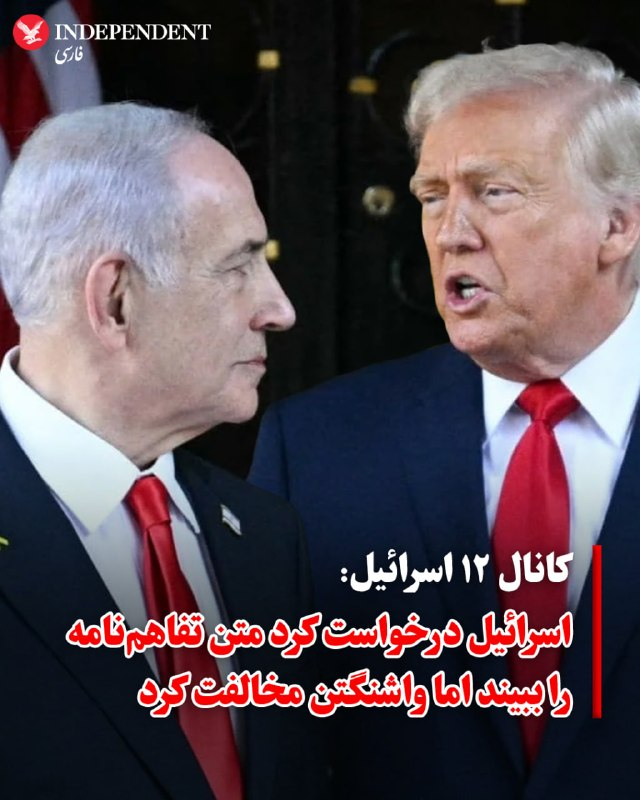

♦️ کانال ۱۲ اسرائیل، روز سه‌شنبه ۱۶ خرداد به نقل از منابع خود گزارش داد که دولت اسرائیل از آمریکا تقاضا کرده که به متن تفاهم‌نامه تهران و واشنگتن دسترسی یافته و آن را مرور کند اما واشنگتن با این خواسته مخالفت کرده است.

یارون آوراهام، خبرنگار کانال ۱۲ و مجری برنامه «نسخه امروز» با اشاره به گزارش‌های قبلی از نگرانی دولت اسرائیل درباره متن تفاهم‌نامه و احتمال نادیده گرفته شدن برنامه موشکی جمهوری اسلامی در آن، به نقل از منابع خود گفت که مقام‌های اسرائیل نگران‌اند این تفاهم‌نامه امتیازات زیادی به تهران داده باشد.
‌🇸🇦 Indypersian

🤖 @VahidOOnLine

## VahidOOnLine — post 245879

  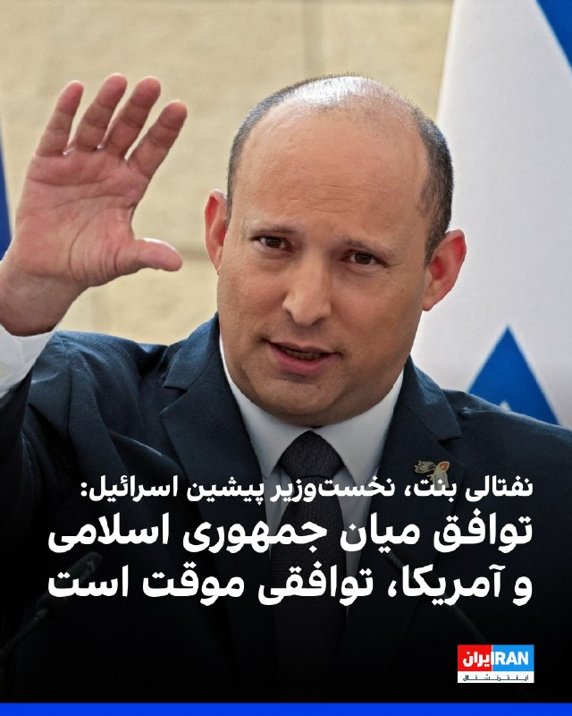

نفتالی بنت، نخست‌وزیر پیشین اسرائیل و نامزد جانشینی بنیامین نتانیاهو، در گفت‌وگو با ایران‌اینترنشنال گفت که توافق میان جمهوری اسلامی و آمریکا، یک توافق موقت است.

نفتالی بنت به ایران‌اینترنشنال گفت اسرائیل باید اطمینان حاصل کند که این توافق مانع دستیابی جمهوری اسلامی به سلاح هسته‌ای می‌شود و برچیده شدن برنامه موشکی جمهوری اسلامی را نیز تضمین می‌کند.
‌🏁 🇬🇧 IranintlTV

🤖 @VahidOOnLine

## WithYashar — post 15063

کانال 12 اسرائیل: اسرائیل درخواست دیدن یادداشت تفاهم بین آمریکا و ایران رو داشت اما این درخواست رد شد.
@withyashar

## pm_afshaa — post 94187

  <a href="telegram/content/pm_afshaa_94187_1781619904.webm" target="_blank">🎬 Download video</a>

🔴کانال 12 اسرائیل: اسرائیل درخواست دیدن یادداشت تفاهم بین آمریکا و ایران رو داشت اما این درخواست رد شد.

💧 Rainbet.com the #1 Non-KYC Crypto Casino & Sportsbook @rainbetcom

😁 @Pm_Afshaa

## mamlekate — post 103725

  <a href="telegram/content/mamlekate_103725_1781619904.mp4" target="_blank">🎬 Download video</a>

دروازه‌بان کیپ‌ورده، کشوری با ۵۰۰،۰۰۰ نفر جمعیت، بهترین دروازه‌بان با مجموع ۷ سیو تاریخی مقابل اسپانیا شناخته شد. آخر بازی گریه کرد و گفت که مادرش بدلیل اینکه هزینه ویزای امریکا رو نداشته، نتونسته بیاد و بازی پسرشو از نزدیک ببینه. فالوئرهای اینستاگرامش بعد از این بازی از ۵۰ هزار نفر به یک و نیم میلیون نفر رسید. حتی از جمعیت کشورش بیشتر!

مقایسه‌اش کنید با دروازه‌بان تیم ملا که به زور چپوندنش توی دانشگاهی که حتی نمیدونه اسم رشته‌اش چیه و میلیاردمیلیارد پولی که توی جیبش ریختن تا بیاد از لاشه سوخته رهبرش دفاع کنه و درآخر از ضعیف‌ترین تیم این تورنمنت دوتا گل ناب بخوره. پول مفت ملت در فقر نگه‌داشته‌شده و مدارک آبدوغ‌خیاری‌ای که به این لش‌و لوشا میدن. منفور یک ملت. ننگ تاریخ ایران.

AfsoonAB
@mamlekate

## mamlekate — post 103724

📝 ترامپ: بدون آمریکا و بدون من، اسرائیل وجود نداشت؛ به تغییر رژیم در ایران اعتقادی ندارم

دونالد ترامپ گفت اگر آمریکا و شخص او وارد عمل نشده بودند، اسرائیل «اکنون وجود نداشت» و هر فرد هوشمندی در اسرائیل این را می‌داند. او در عین حال گفت به تغییر رژیم در ایران اعتقادی ندارد و این موضوع هیچ‌گاه بخشی از هدف او نبوده است.

📝 ترامپ: در چارچوب توافق، هیچ پولی در ایران سرمایه‌گذاری نمی‌کنیم

دونالد ترامپ، رییس‌جمهوری آمریکا، در حاشیه اجلاس سران گروه هفت اعلام کرد ایالات متحده در چارچوب توافق با جمهوری اسلامی، «هیچ پولی» در ایران سرمایه‌گذاری نخواهد کرد.

📝 ترامپ: اگر جمهوری اسلامی بخواهد به سلاح هسته‌ای برسد، جهنم بر سرشان خراب خواهد شد

دونالد ترامپ، رئیس‌جمهوری آمریکا، که برای حضور در نشست سران گروه ۷ (G7) به شهر اویان در فرانسه رفته است، در حاشیه این اجلاس، به پرسش‌هایی درباره توافق با جمهوری اسلامی ایران پاسخ داد.

رهبران آمریکا، کانادا، فرانسه، آلمان، ایتالیا، بریتانیا و ژاپن در این نشست حضور دارند و انتظار می‌رود تحولات مربوط به ایران پس از توافق تهران و واشنگتن، جنگ اوکراین، مسائل تجاری و موضوع‌های مرتبط با فناوری و اقتصاد دیجیتال از مهم‌ترین محورهای این نشست باشد.

@mamlekate

## mamlekate — post 103723

📝 جمهوری اسلامی، جواد زمانی و ابوالفضل ساعدی، از معترضان دی‌ماه، را اعدام کرد

خبرگزاری میزان، وابسته به قوه قضاییه جمهوری اسلامی، گزارش داد حکم اعدام جواد زمانی و ابوالفضل ساعدی، از شهروندان بازداشت‌شده در جریان انقلاب ملی در شاهرود، بامداد سه‌شنبه ۲۶ خرداد به اجرا درآمد.

@mamlekate

## IranIntlTV — post 342719

  <a href="telegram/content/IranIntlTV_342719_1781619906.mp4" target="_blank">🎬 Download video</a>

در شرایطی که مسئولان از اهمیت سلامت خانواده و افزایش جمعیت سخن می‌گویند، هزینه‌های روزافزون درمان این سوال را مطرح می‌کند که زنان تا چه اندازه به خدمات درمانی مورد نیاز خود دسترسی دارند؟

آیه دریس، عضو تحریریه ایران‌اینترنشنال، در «پیوست» به این موضوع می‌پردازد
@iranintltv

## IranIntlTV — post 342718

  

نفتالی بنت، نخست‌وزیر پیشین اسرائیل و نامزد جانشینی بنیامین نتانیاهو، در گفت‌وگو با ایران‌اینترنشنال گفت که توافق میان جمهوری اسلامی و آمریکا، یک توافق موقت است.

نفتالی بنت به ایران‌اینترنشنال گفت اسرائیل باید اطمینان حاصل کند که این توافق مانع دستیابی جمهوری اسلامی به سلاح هسته‌ای می‌شود و برچیده شدن برنامه موشکی جمهوری اسلامی را نیز تضمین می‌کند.
https://iranintl.com/202606165236

## FarsiVOA — post 220915

🔺پرزیدنت ترامپ در دیدار با رئیس حکومت امارات: رژیم ایران هرگز سلاح هسته‌ای نخواهد داشت

▪️دونالد ترامپ، رئیس جمهوری آمریکا، روز سه‌شنبه ۲۶ خرداد در دیدار با محمد بن زاید آل نهیان، رئیس حکومت امارات متحده عربی، در حاشیه نشست «گروه هفت» در فرانسه، بار دیگر بر توافق اخیر با حکومت ایران تأکید کرد و گفت جمهوری اسلامی هرگز سلاح هسته‌ای نخواهد داشت.

⬇️ بیشتر بخوانید:
https://ir.voanews.com/a/meeting-uae-leader-president-trump-says-iran-will-never-have-nuclear-arms/8161456.html/?nocach=1

## DW_Farsi — post 126065

  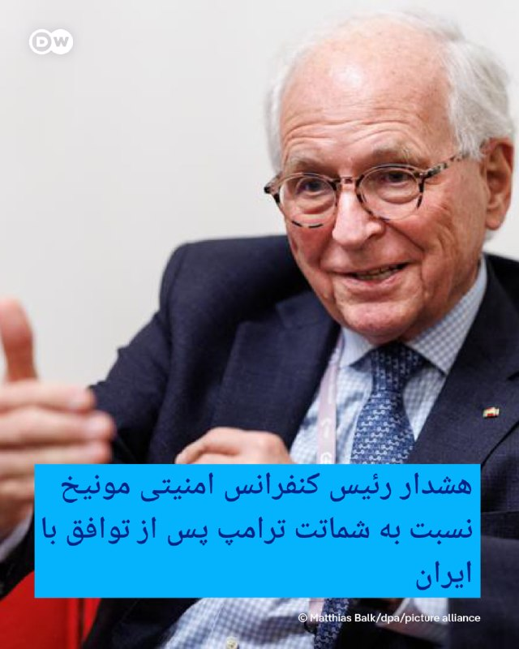

🔶 هشدار رئيس کنفرانس امنیتی مونیخ نسبت به شماتت ترامپ پس از توافق با ایران
 
ولفگانگ ایشینگر، رئیس کنفرانس امنیتی مونیخ، در پی دست‌یابی ایالات متحده آمریکا و ایران به توافق، نسبت به هرگونه "شماتت یا ابراز شادمانی از سر بدخواهی علیه دونالد ترامپ، رئیس‌جمهور آمریکا"، هشدار داد.
 
ایشینگر در گفتگو با شبکه رادیو و تلویزیون عمومی برلین-براندنبورگ (RBB) اشاره کرد که اگرچه ایالات متحده با این جنگ به اهدافی که در اصل مطلوب و قابل دستیابی بودند، دست نیافته است، اما با این حال هرگونه شماتت و ملامت، بی‌ربط و نادرست است.
 
رئیس کنفرانس امنیتی مونیخ در ادامه تصریح کرد: «سلب امکان دستیابی به توانمندی هسته‌ای نظامی از ایران، هدفی است که ما نیز طبیعتا در آن با ایالات متحده هم‌عقیده و شریک هستیم.»
 
او افزود: «بنابراین، لطفا امروز را به روزی برای شماتت و سرزنش تبدیل نکنید؛ بلکه این روز، روز نگرانی‌های احتمالی است؛ از این بابت که ایالات متحده متاسفانه با این جنگ، ظاهرا به دستاوردهایی کمتر از آنچه مطلوب و مورد انتظار بود، رسیده است.»
 
ایشینگر همچنین نسبت به آینده این توافق ابراز تردید کرد.
@dw_farsi

## Persian_Trend_Official — post 17278

  <a href="telegram/content/Persian_Trend_Official_17278_1781619908.mp4" target="_blank">🎬 Download video</a>

ارتش اسرائیل یک حمله پهپادی به شهر میفادون در جنوب لبنان انجام داد.

📝 Amir

📌 @persian_trend_official
پرشین ترند | متفاوت‌ترین کانال نظامی

## RadioFarda — post 158395

  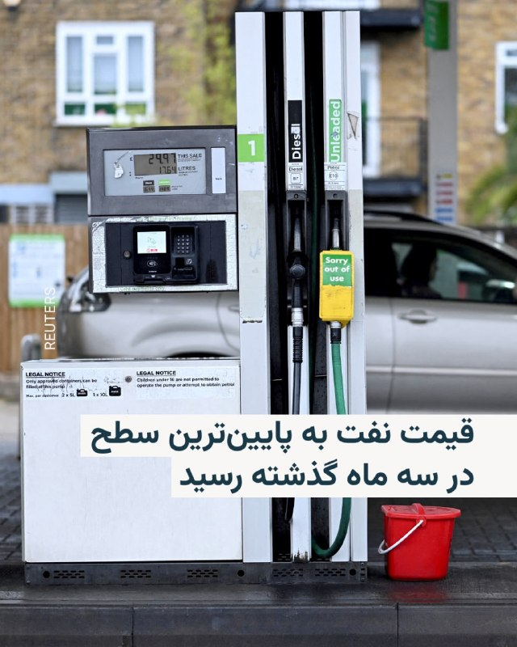

🔸قیمت نفت روز سه‌شنبه حدود چهار درصد دیگر کاهش یافت و به پایین‌ترین سطح خود در سه ماه گذشته رسید. این در حالی است که بازارها در حال ارزیابی چشم‌انداز ازسرگیری عرضه نفت از طریق تنگه هرمز، همزمان با ضعف تقاضای فیزیکی و کمبود جزئیات درباره توافق اولیه برای پایان دادن به جنگ ایران بودند.

🔸به گزارش رویترز، بهای معاملات آتی نفت خام برنت تا ساعت ۱۲:۵۳ به وقت گرینویچ (حوالی ساعت سه و نیم بعد ازظهر به وقت تهران) با ۳٫۲۰ دلار، معادل ۳٫۸۵ درصد کاهش به ۷۹٫۹۷ دلار در هر بشکه رسید. این شاخص پیش‌تر تا ۷۹٫۶۱ دلار سقوط کرده بود که پایین‌ترین سطح از سوم مارس محسوب می‌شود و نخستین بار از آن تاریخ بود که قیمت برنت به زیر ۸۰ دلار در هر بشکه می‌رسید.

🔸نفت خام وست تگزاس اینترمدیت آمریکا (WTI) نیز با ۳٫۵۲ دلار، معادل ۴٫۳۶ درصد کاهش به ۷۷٫۲۳ دلار در هر بشکه رسید. پایین‌ترین قیمت روزانه این نفت، یعنی ۷۶٫۸۸ دلار، کمترین سطح آن از ۱۰ مارس بود.

🔸پیش از آغاز جنگ در ۲۸ فوریه (۹ اسفند سال ۱۴۰۴)، قیمت معاملات آتی نفت برنت و وست تگزاس اینترمدیت در محدوده ۶۵ تا ۷۰ دلار برای هر بشکه قرار داشت.

@RadioFarda

## BBCPersian — post 284039

  <a href="https://t.me/bbcpersian/284039" target="_blank">📎 Download file</a>

تازه‌ترین خبرهای جهان سه‌شنبه ۲۶ خرداد ۱۴۰۵ از رادیو بی‌بی‌سی در لندن

## BBCPersian — post 284038

🔻قطر: تفاهمنامه ایران و آمریکا می تواند امنیت را به خاورمیانه بازگرداند

قطر، یکی از میانجی‌های اصلی آمریکا و ایران، می‌گوید که تفاهمنامه دو کشور می‌تواند امنیت را به خاورمیانه بازگرداند.

ماجد انصاری، سخنگوی وزارت خارجه قطر، در نشستی خبری گفت: «ما با خوش‌بینی محتاطانه بر این باوریم که امضای این تفاهمنامه می‌تواند از طریق مذاکراتی که درباره برنامه هسته‌ای و سایر موضوعات انجام خواهد شد، به مرحله تازه‌ای از امنیت منطقه‌ای منجر شود.»

آقای انصاری تایید کرد که مقام‌های پاکستانی و قطری هر دو در مراسم امضای رسمی این تفاهمنامه در روز جمعه (۱۹ ژوئن، ۲۹ خرداد) حضور خواهند داشت.

او بدون اشاره به جزئیات توافق، از «گفت‌وگوی منطقه‌ای» پس از امضای تفاهمنامه حمایت کرد و گفت که این کار برای اعتمادسازی با ایران ضروری است:

«نمی‌توان گفت که ما به وضعیت عادی گذشته در منطقه و با همسایگان‌مان بازمی‌گردیم… نیاز زیادی به گفت‌وگو و توافق درباره نحوه تضمین امنیت منطقه وجود دارد.»
قطر پیش‌تر در میانه جنگ و زمانی که خود هدف حملات ایران قرار داشت، از ورود به مذاکرات خودداری می‌کرد؛ با این حال، در هفته‌های اخیر در کنار پاکستان، میانجی دیگر، نقش فعال‌تری در مذاکرات ایران و آمریکا ایفا کرده است.

https://bbc.in/4xMl29A
@BBCPersian

## BBCPersian — post 284029

🖋امیر عطایی، روزنامه‌نگار

سه‌شنبه شب، وقتی علیرضا فغانی سوت آغاز بازی را بزند، اتفاقی رخ خواهد داد که پیش از او «هیچ داوری در تاریخ فوتبال جهان» آن را تجربه نکرده است.
آقای فغانی، با قضاوت دیدار فرانسه و سنگال در جام جهانی ۲۰۲۶، نخستین داوری خواهد شد که در چهار دوره جام جهانی حاضر شده است؛ مسیری که از برزیل ۲۰۱۴ آغاز شد، در روسیه و قطر ادامه پیدا کرد و حالا به آمریکای شمالی رسیده است.
اما ماجرای این رکورد فقط به کیفیت بالای داوری و نگه داشتن این کیفیت در دورانی طولانی محدود نمی‌شود.
این پست را ورق بزنید و راهی که این داور پرآوزه ایرانی طی کرده را دنبال کنید.
ادامه مطلب⬇️

📸GettyImages/ FIFA via Getty Images/ Shutterstock/ VI Images via Getty Images/ NurPhoto via Getty Images/ DeFodi Images via Getty Images

https://bbc.in/4oGb0m7
@BBCPersian

## Dirty_Kids — post 392305

  <a href="telegram/content/Dirty_Kids_392305_1781619911.mp4" target="_blank">🎬 Download video</a>

دروازه‌بان کیپ‌ورده، کشوری با ۵۰۰،۰۰۰ نفر جمعیت، بهترین دروازه‌بان با مجموع ۷ سیو تاریخی مقابل اسپانیا شناخته شد. آخر بازی گریه کرد و گفت که مادرش بدلیل اینکه هزینه ویزای امریکا رو نداشته، نتونسته بیاد و بازی پسرشو از نزدیک ببینه. فالوئرهای اینستاگرامش بعد از این بازی از ۵۰ هزار نفر به یک و نیم میلیون نفر رسید. حتی از جمعیت کشورش بیشتر!

مقایسه‌اش کنید با دروازه‌بان تیم ملا که به زور چپوندنش توی دانشگاهی که حتی نمیدونه اسم رشته‌اش چیه و میلیاردمیلیارد پولی که توی جیبش ریختن تا بیاد از لاشه سوخته رهبرش دفاع کنه و درآخر از ضعیف‌ترین تیم این تورنمنت دوتا گل ناب بخوره. پول مفت ملت در فقر نگه‌داشته‌شده و مدارک آبدوغ‌خیاری‌ای که به این لش‌و لوشا میدن. منفور یک ملت. ننگ تاریخ ایران.

@Dirty_Kids 👻

## Dirty_Kids — post 392304

‏تو جام جهانی ۲۰۱۰ که نیوزلند بازی می‌کرد یادتون نمیاد مگه! بازیکن داشتن کارمند اداره رفاه نیوزلند بود! مرخصی گرفته بود بیاد جام جهانی بازی کنه!

@Dirty_Kids 👻

## Dirty_Kids — post 392303

  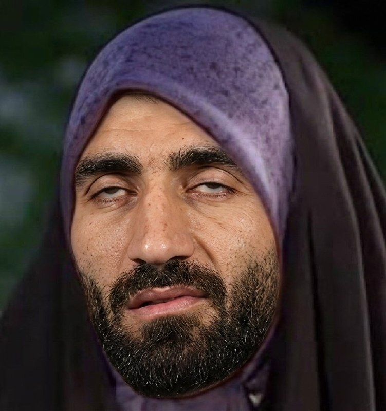

زیر ۷ دقیقه گل خوردم تنگه‌م باز شد، این جرمهههه؟

@Dirty_Kids 👻

## alonews — post 128499

👈کانال ۱۲ اسرائیل:
نتانیاهو خواسته متن توافق با ایران رو ببینه ولی ترامپ اجازه نداده و گفته به تو مربوط نیست.

✅ @AloNews خبر جنگ

---
📅 بروزرسانی: 1405/03/26 17:45
---

## VahidOOnLine — post 245878

  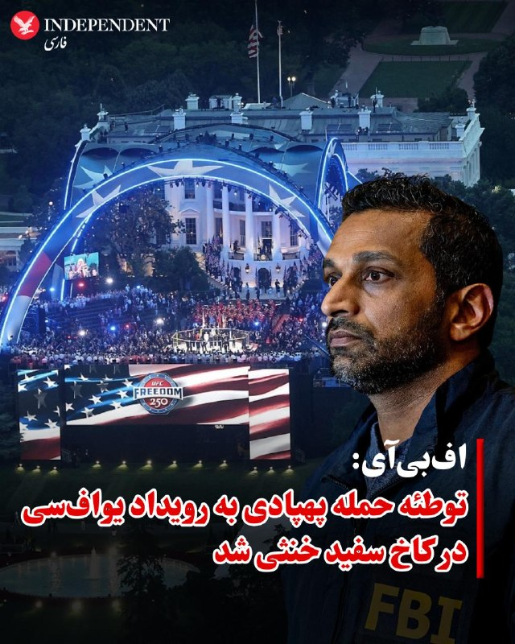

♦️مقام‌های آمریکایی سه‌شنبه ۲۶ خردادماه اعلام کردند اداره تحقیقات فدرال آمریکا (اف‌بی‌آی) توطئه‌ای برای حمله پهپادی به رویداد ورزش‌های رزمی ترکیبی «یو‌اف‌سی آزادی ۲۵۰» را که به‌تازگی در کاخ سفید برگزار شد، خنثی کرده است.

کش پتل، رئیس اف‌بی‌آی، با انتشار پیامی در شبکه اجتماعی اکس گفت اف‌بی‌آی و دیگر نهادهای مجری قانون روز ۲۰ خرداد از تهدیدی بالقوه علیه این رویداد در واشینگتن آگاه شدند. او افزود در پی عملیاتی چند ایالتی با همکاری وزارت دادگستری، چندین نفر بازداشت شدند و حملات برنامه‌ریزی‌شده متوقف شد.

بر اساس گزارش فاکس نیوز دیجیتال، تا روز دوشنبه پنج نفر در ارتباط با این پرونده بازداشت شده بودند و بازرسان ۲۳ نفر را به‌عنوان اعضای احتمالی شبکه طراحان حمله شناسایی کرده بودند. مقام‌های آمریکایی گفتند این طرح شامل استفاده از پهپادهای حامل مواد منفجره برای هدف قرار دادن ساختمان‌های اطراف محل برگزاری رویداد، ایجاد تخلیه گسترده و هدایت جمعیت به سمت تیمی از تک‌تیراندازان بوده است. به گفته آنان، مرحله بعدی عملیات نیز حمله به دروازه کاخ سفید را شامل می‌شد.

مقام‌ها همچنین اعلام کردند بررسی پیام‌های رد و بدل‌شده در پیام‌رسان سیگنال نشان داده است دست‌کم ۲۳ نفر درباره مقدمات اجرای این عملیات گفت‌وگو کرده بودند.
‌🇸🇦 Indypersian

🤖 @VahidOOnLine

## VahidOOnLine — post 245877

  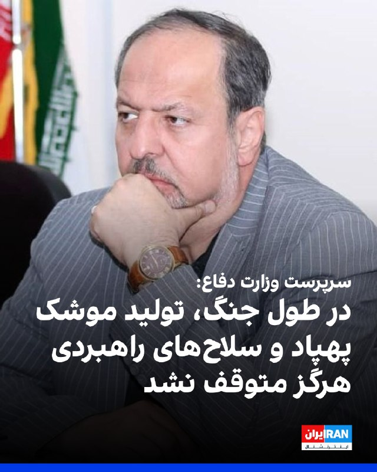

مجید ابن‌الرضا، سرپرست وزارت دفاع جمهوری اسلامی در دیدار با برخی نمایندگان مجلس، گفت: «در طول جنگ ۴۰ روزه، تولید موشک، پهپاد و سلاح‌های راهبردی هرگز متوقف نشد.»

او ادامه داد: «در جنگ، شاهد تحول و پیشرفت سلاحهای جدید و به روز شده نیروهای مسلح و بکارگیری آن بودیم.»

ابن‌الرضا اضافه کرد: «ما در این جنگ، بسیار قوی‌تر از جنگ ۱۲ روزه با اسرائیل، آمریکا و متحدانشان جنگیدیم.»
‌🏁 🇬🇧 IranintlTV

🤖 @VahidOOnLine

## IranIntlTV — post 342717

  

مجید ابن‌الرضا، سرپرست وزارت دفاع جمهوری اسلامی در دیدار با برخی نمایندگان مجلس، گفت: «در طول جنگ ۴۰ روزه، تولید موشک، پهپاد و سلاح‌های راهبردی هرگز متوقف نشد.»

او ادامه داد: «در جنگ، شاهد تحول و پیشرفت سلاحهای جدید و به روز شده نیروهای مسلح و بکارگیری آن بودیم.»

ابن‌الرضا اضافه کرد: «ما در این جنگ، بسیار قوی‌تر از جنگ ۱۲ روزه با اسرائیل، آمریکا و متحدانشان جنگیدیم.»
https://iranintl.com/202606169985

## IranIntlTV — post 342716

  <a href="telegram/content/IranIntlTV_342716_1781619302.mp4" target="_blank">🎬 Download video</a>

دونالد ترامپ، رییس‌جمهوری آمریکا، دو روز پس از اعلام نهایی شدن توافق میان آمریکا و جمهوری اسلامی، بار دیگر تاکید کرد در ازای این توافق هیچ پولی به تهران پرداخت نخواهد شد. او همچنین هشدار داد در صورت دستیابی جمهوری اسلامی به سلاح هسته‌ای، «جهنم بر سر آنها نازل خواهد شد.»

جزییات بیشتر با اردوان روزبه، خبرنگار ایران‌اینترنشنال
@iranintltv

## Dirty_Kids — post 392302

  

من درحال تماشای آرزوهایی که قرار نیس بهشون برسم :)

@Dirty_Kids 👻

## Dirty_Kids — post 392301

  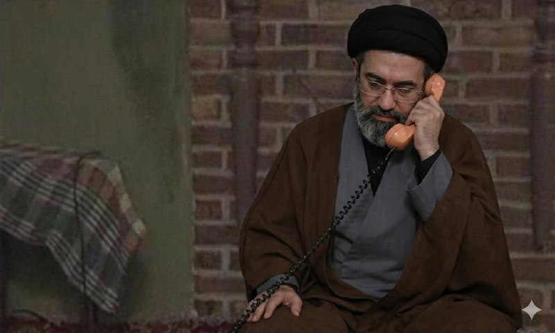

سلامتی، با اعضای باند فرقه‌ی اپستین توافق کردم.

@Dirty_Kids 👻

## Hranews — post 113651

  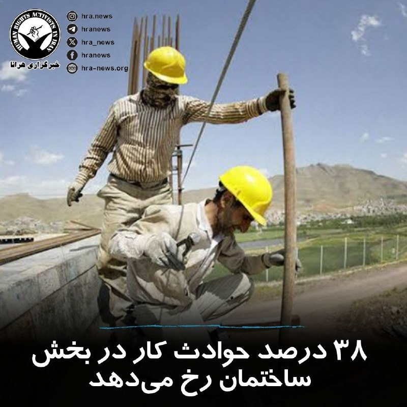

احمد میدری، وزیر تعاون، کار و رفاه اجتماعی اعلام کرد که ۳۸ درصد حوادث ناشی از کار در ایران در بخش ساختمان رخ می‌دهد. او همچنین با اشاره به فرسودگی شغلی بالا و مخاطرات محیط‌های ساختمانی، این بخش را یکی از حادثه‌خیزترین حوزه‌های کاری کشور توصیف کرد.

همزمان، پروانه رضایی، معاون روابط کار وزارت کار، گفت بخش ساختمان با ۳۸ درصد بیشترین سهم #حوادث_کار را دارد و بخش صنعت با ۳۷ درصد در رتبه بعدی قرار گرفته است. به گفته وی، ۴۶ درصد حوادث حین کار نیز به مرگ کارگران منجر می‌شود.

↘️
@hranews_bot تماس ✉️ -  @Hranews  کانال هرانا 🆑

## Hranews — post 113650

  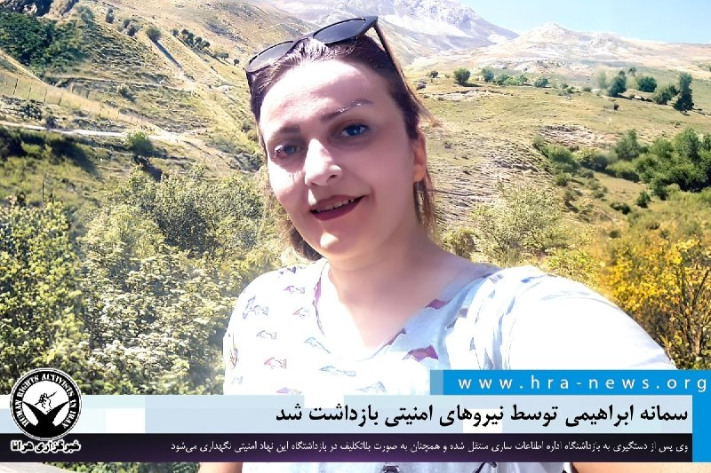

سمانه ابراهیمی توسط نیروهای امنیتی بازداشت شد

❗️
❗️
❗️
❗️
❗️– سمانه ابراهیمی نوایی، شهروند ساکن آمل، روز شنبه ۲۳ خردادماه توسط نیروهای امنیتی #بازداشت و به بازداشتگاه اداره اطلاعات ساری منتقل شد.

به گزارش خبرگزاری هرانا، ارگان خبری مجموعه فعالان حقوق بشر در ایران، سمانه ابراهیمی نوایی، شهروند ساکن آمل بازداشت شد.

بر اساس اطلاعات دریافتی هرانا، خانم ابراهیمی نوایی روز شنبه ۲۳ خردادماه توسط نیروهای امنیتی در آمل بازداشت و به بازداشتگاه اداره اطلاعات ساری منتقل شده است.

ادامه مطلب

#سمانه_ابراهیمی_نوایی

↘️
@hranews_bot تماس ✉️ -  @Hranews  کانال هرانا 🆑

## alonews — post 128497

  <a href="telegram/content/alonews_128497_1781619306.webm" target="_blank">🎬 Download video</a>

👈واشنگتن پست بخشی از مکالمه کوشنر با قالیباف را منتشر کرد

در بخشی از گزارش واشنگتن پست آمده است:

🔴طبق گفته یک مقام نزدیک به مذاکرات، وقتی «کوشنر» در ماه آوریل در اسلام‌آباد با «محمدباقر قالیباف»، رئیس مجلس ایران، دیدار کرد، صریحاً به او گفت: «ببین، اگر شما بهایی اندازه رولز رویس را می‌خواهید، ما هم محصولی همانند رولز رویس را می‌خواهیم.»

🔴به عبارت دیگر، اگر ایران با باز نگه داشتن تنگه هرمز، توقف غنی‌سازی اورانیوم به مدت ۲۰ سال و متوقف کردن صدور انقلاب خود، به تعهداتش عمل کند، می‌تواند انتظار دریافت صدها میلیارد دلار منفعت را داشته باشد.

✅ @AloNews خبر جنگ

---
📅 بروزرسانی: 1405/03/26 17:35
---

## VahidOOnLine — post 245876

  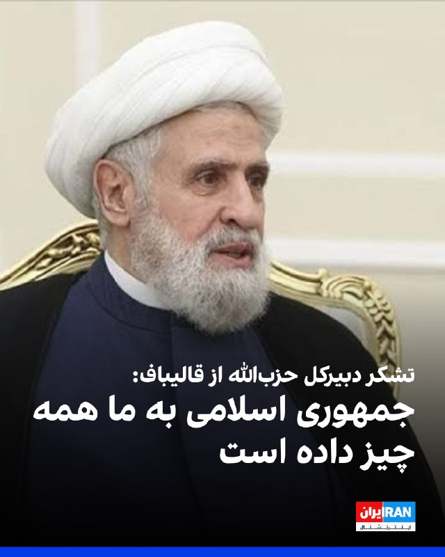

نعیم قاسم، دبیرکل حزب‌الله لبنان، در نامه‌ای «تشکرآمیز» به محمدباقر قالیباف، رییس مجلس نوشت: «ما همواره گفته‌ایم که جمهوری اسلامی به حزب‌الله، مقاومت و ملت لبنان همه‌چیز داده و هیچ‌چیز از آنان نگرفته است.»

او ادامه داد: «جمهوری اسلامی خون خود را تقدیم می‌کند و با بمباران اسرائیل در پاسخ به حمله به ضاحیه، در برابر این رژیم ایستاده است.»
‌🏁 🇬🇧 IranintlTV

🤖 @VahidOOnLine

## VahidOOnLine — post 245875

♦️صدرالدین نیاورانی، نایب رئیس اتحادیه ملی محصولات کشاورزی ایران، گفت محاصره بنادر جنوبی ایران از سوی آمریکا باعث افزایش چشمگیر هزینه‌های حمل‌ونقل شده و در برخی موارد کرایه حمل کالا تا ۱۰۰ درصد افزایش یافته است.

نیاورانی در گفت‌وگو با پایگاه خبری «نود اقتصادی» افزود کرایه‌های حمل‌ونقل در بازارهای مختلف بین ۶۰ تا ۷۰ درصد و در برخی مناطق تا ۱۰۰ درصد رشد کرده است. او همچنین گفت کرایه حمل دریایی با کشتی بیش از ۱۰۰ درصد افزایش یافته و همین موضوع باعث می‌شود محصولات با قیمت تمام‌شده دو برابر به مقصد برسند. به گفته او، ادامه این روند می‌تواند تغییرات جدی در بازارها و قیمت کالاها ایجاد کند.

این در حالی است که مقام‌های جمهوری اسلامی بارها گفته‌اند محاصره بنادر جنوبی ایران از سوی ایالات متحده تاثیر مهمی بر اقتصاد کشور ندارد، اما اظهارات نایب رئیس اتحادیه ملی محصولات کشاورزی از افزایش چشمگیر هزینه‌های حمل‌ونقل و پیامدهای آن بر قیمت کالاها حکایت دارد.
‌🇸🇦 Indypersian

🤖 @VahidOOnLine

## FoxNewsTwitter — post 343022

  <a href="telegram/content/FoxNewsTwitter_343022_1781618719.mp4" target="_blank">🎬 Download video</a>

Fox News (Twitter/X)

Vice President Vance addresses speculation surrounding his political ambitions, the 2028 Republican ticket, and a potential rivalry with Secretary of State Marco Rubio, laughing off the drama as President Trump enjoying the “entertainment."

"I joked earlier that, you know, does it really sound like the president of the United States to run a televised program for who would be his next apprentice?”

“That's what the president does. And he loves that. And it does make this whole thing fun. But fundamentally, I think Marco, me, the entire cabinet, we're just focused on doing a good job." | @foxandfriends

## kianmeli1 — post 88033

  <a href="telegram/content/kianmeli1_88033_1781618721.mp4" target="_blank">🎬 Download video</a>

🔴ترامپ درباره ایران: تنگه هرمز باز خواهد بود و همیشه بدون عوارض خواهد ماند.
https://t.me/kianmeli1

## kianmeli1 — post 88032

  <a href="telegram/content/kianmeli1_88032_1781618722.mp4" target="_blank">🎬 Download video</a>

🔴ترامپ: کلمه به کلمه متن توافق را برایتان می‌خوانم

من نه تنها آن را منتشر خواهم کرد. احتمالاً یک کنفرانس مطبوعاتی خواهم داشت و کلمه به کلمه آن را برای شما خواهم خواند تا مطبوعات آن را به طور دقیق پوشش دهند زیرا این یک سند بسیار مهم است
https://t.me/kianmeli1

## kianmeli1 — post 88031

  <a href="telegram/content/kianmeli1_88031_1781618724.mp4" target="_blank">🎬 Download video</a>

🔴ترامپ درباره گرد و غبار هسته‌ای ایران:
ما عجله‌ای نداریم، اما آن را به دست خواهیم آورد و نابودش خواهیم کرد.
https://t.me/kianmeli1

## IranIntlTV — post 342715

  

نعیم قاسم، دبیرکل حزب‌الله لبنان، در نامه‌ای «تشکرآمیز» به محمدباقر قالیباف، رییس مجلس نوشت: «ما همواره گفته‌ایم که جمهوری اسلامی به حزب‌الله، مقاومت و ملت لبنان همه‌چیز داده و هیچ‌چیز از آنان نگرفته است.»

او ادامه داد: «جمهوری اسلامی خون خود را تقدیم می‌کند و با بمباران اسرائیل در پاسخ به حمله به ضاحیه، در برابر این رژیم ایستاده است.»
https://iranintl.com/202606162262

## IranIntlTV — post 342714

  <a href="telegram/content/IranIntlTV_342714_1781618726.mp4" target="_blank">🎬 Download video</a>

هم‌زمان با نخستین بازی تیم فوتبال ایران در جام جهانی ۲۰۲۶، شبکه‌های اجتماعی شاهد موجی از واکنش‌های متفاوت کاربران بود. این دیدار، فراتر از یک رقابت ورزشی، به بستری برای طرح دیدگاه‌های سیاسی و اجتماعی درباره نسبت تیم ملی با حکومت و مردم و بازتاب شکاف‌های موجود در افکار عمومی تبدیل شد.

عادله بورنگ، عضو تحریریه ایران‌اینترنشنال، از واکنش کاربران می‌گوید
@iranintltv

## FarsiVOA — post 220914

  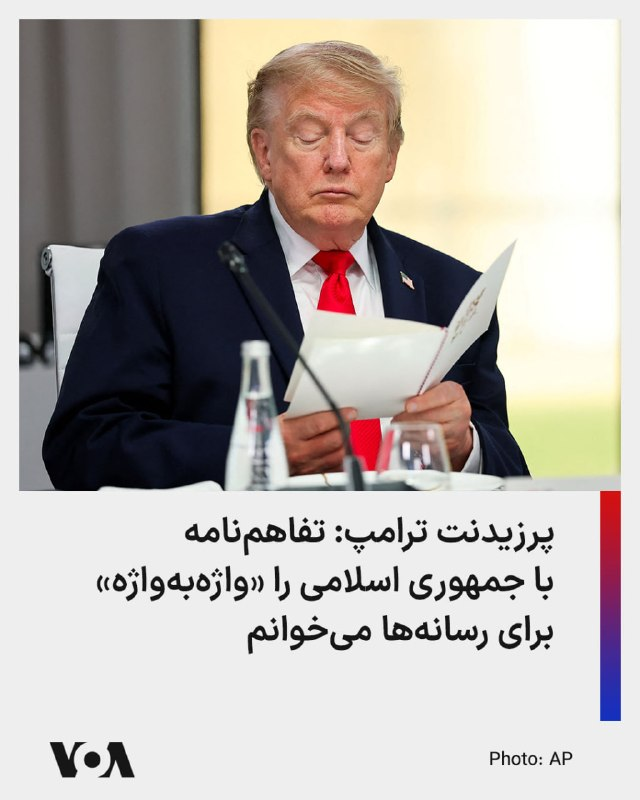

⚡️دونالد ترامپ، رئیس‌ جمهوری آمریکا، گفت قصد دارد متن کامل تفاهم‌نامه با ایران را منتشر کند و احتمالاً در جریان یک نشست خبری آن را واژه‌به‌واژه بخواند تا رسانه‌ها آن را «دقیق» پوشش دهند.

پرزیدنت ترامپ گفت: «من در واقع نه‌تنها آن را منتشر خواهم کرد، بلکه احتمالاً یک نشست خبری برگزار می‌کنم و آن را واژه‌به‌واژه برای شما می‌خوانم تا مطبوعات آن را دقیق پوشش دهند، چون سند بسیار مهمی است.»

او در ادامه با انتقاد از توافق هسته‌ای دولت باراک اوباما با رژیم ایران، یعنی توافق برجام، گفت آن توافق «بدترین توافق» بود و «راهی به سوی سلاح هسته‌ای» ایجاد می‌کرد.

آقای ترامپ افزود: «برخلاف اوباما، که می‌توانست با برجامِ وحشتناک خاورمیانه را نابود کند، توافق من دیواری در برابر سلاح هسته‌ای است.»

رئیس‌ جمهوری آمریکا جزئیات بیشتری درباره محتوای این تفاهم‌نامه یا زمان احتمالی انتشار آن ارائه نکرد.

## FarsiVOA — post 220913

🔺اف‌بی‌آی: توطئه حمله پهپادی به «رویداد یو‌اف‌سی» در کاخ سفید را خنثی کردیم

▪️مقامات آمریکایی روز سه‌شنبه ۲۶ خرداد اعلام کردند که اداره تحقیقات فدرال آمریکا، اف‌بی‌آی، توطئه‌ای برای حمله پهپادی به رویداد ورزش‌های رزمی ترکیبی «یو‌اف‌سی» را که به تازگی در کاخ سفید برگزار شد، خنثی کرده است.

⬇️ بیشتر بخوانید:

https://ir.voanews.com/a/fbi-breaks-up-drone-attack-plot-targeting-white-house-ufc-event/8161442.html/?nocach=1

## DW_Farsi — post 126064

🔶 ترامپ: اگر ایران به دنبال سلاح هسته‌ای برود، جهنم به پا خواهد شد
 
دونالد ترامپ، رئیس‌جمهور آمریکا روز سه‌شنبه ۱۶ ژوئن (۲۶ خرداد) در حاشیه نشست سران گروه هفت (G7) در فرانسه هشدار داد که اگر ایران برای توسعه، خرید یا دستیابی به سلاح هسته‌ای تلاش کند، "تمام جهنم بر سرش فرود خواهد آمد".
 
او این سخنان را در جریان گفت‌وگو درباره توافق موقت میان واشنگتن و تهران مطرح کرد؛ توافقی که به گفته جی‌دی ونس، معاون رئیس‌جمهور آمریکا، اوایل این هفته از سوی هر دو طرف و با هدف پایان‌دادن به جنگ امضا شده است.
 
ترامپ گفت: «آن‌ها به سلاح هسته‌ای دست نخواهند یافت. اگر این کار را بکنند، تمام جهنم بر سرشان خراب می‌شود.» او افزود که پیش‌نویس این توافق این مسئله را "با صدای بلند و واضح" بیان می‌کند: «آن‌ها قرار نیست آن (سلاح اتمی) را توسعه دهند، قرار نیست آن را بخرند و قرار نیست هیچ کاری با آن انجام دهند. و اگر انجام دهند، با عواقب باورنکردنی روبرو خواهند شد.»
 
رئیس‌جمهور آمریکا اشاره کرد تنها پس از آن با امضای این سند موافقت کرده است که تهران پذیرفت لحن متن را تغییر دهد، به‌طوری که نه تنها از توسعه سلاح هسته‌ای، بلکه از خرید یا دستیابی به آن از طریق ابزارهای دیگر نیز جلوگیری شود. با این حال، ترامپ به جزئیات این پیامدها اشاره‌ای نکرد و گفت: «من حتی عواقب آن را به شما نمی‌گویم. اما این‌ها عواقب نهایی خواهند بود. با این اوصاف، امیدوارم رابطه بسیار خوبی داشته باشیم.»
 
به گفته رئیس‌جمهور آمریکا، توافق با ایران اکنون وارد "مرحله دوم" خود می‌شود. ترامپ همچنین تاکید کرد که ایالات متحده هیچ پولی در ایران سرمایه‌گذاری نخواهد کرد.
 
او تصریح کرد: «ما توافق خود را با ایران انجام داده‌ایم و این توافق باید موفقیت‌آمیز باشد.»
 
ترامپ گفت، مرحله دوم این توافق آسان‌تر خواهد بود.
 
ترامپ از حملات اسرائیل به بیروت، پایتخت لبنان نیز به طور علنی انتقاد و اعلام کرد که برای اسرائیل روشن ساخته که این حملات مورد پسند او نیست.
 
ترامپ گفت بنيامين نتانياهو، نخست‌وزير اسرائيل بايد در قبال لبنان مسئولانه‌تر رفتار کند و افزود: «اگر اسرائیل نمی‌تواند بدون وارد کردن تلفات گسترده به دیگران با حزب‌الله مقابله کند، سوریه باید مسئولیت مهار این گروه را برعهده بگیرد.» ترامپ اضافه کرد که این پیشنهاد را به اسرائیل ارائه داده است.
 
رئیس‌جمهور آمریکا در پاسخ به این سوال که آیا از نتانیاهو ناامید و سرخورده شده است، گفت: «نه، ما رابطه فوق‌العاده‌ای داریم.»
 
 ترامپ همچنین تاکید کرد که اسرائیل ادامه‌ حیات خود را مدیون ایالات متحده است.
 
رئیس‌جمهور ایالات متحده افزود: «اگر ایالات متحده آمریکا نبود، من هم همینطور... اسرائیل الان وجود نداشت. اسرائیل صد در صد از روی زمین محو می‌شد و هر آدم باهوشی در اسرائیل این را می‌داند.»
 
او همچنین رهبری کنونی ایران را "عاقل و منطقی" توصیف کرد.
@dw_farsi

## Persian_Trend_Official — post 17277

سوئیس محل امضای تفاهم میان ایران و آمریکا را مشخص کرد!

وزارت امور خارجه سوئیس با صدور بیانیه‌ای رسمی تأیید کرد که مراسم امضای توافق‌نامه میان ایالات متحده و جمهوری اسلامی ایران روز جمعه برگزار خواهد شد.

این مراسم در مجتمع بورگن‌اشتوک در سوئیس میزبانی می‌شود.

📝 Amir

📌 @persian_trend_official
پرشین ترند | متفاوت‌ترین کانال نظامی

## BBCPersian — post 284028

🔻گروهی از ایرانی-آمریکایی‌ها همزمان با نخستین بازی تیم ایران در جام جهانی ۲۰۲۶، در لس‌آنجلس تجمع کردند تا به حضور تیم ملی ایران در جام جهانی که به باور آنها با سپاه پاسداران انقلاب اسلامی مرتبط است، اعتراض کنند.

گروهی از تماشاگران هم می‌گویند تیم ملی فوتبال و حکومت ایران را از هم جدا می‌کنند.

مهدی طارمی، مهاجم تیم ملی ایران، این هفته به خبرنگاران گفت که تنش سیاسی بین آمریکا و ایران «شادی» جام جهانی را «تضعیف می‌کند».

او همچنین گفت که ما اینجا هستیم تا برای همه ایرانی‌ها بازی کنیم، ولی به نظر می‌رسد دور ماندن از جنجال‌های سیاسی برای بازیکنان تیم ایران تقریبا غیرممکن شده است.

https://bbc.in/3QkTaIK
@BBCPersian

## alonews — post 128496

  <a href="telegram/content/alonews_128496_1781618728.mp4" target="_blank">🎬 Download video</a>

👈یک روحانی تندرو: ترامپ راست میگه رژیم ایران تغییر کرده. اون صادقترین آدم روی زمینه

✅ @AloNews خبر جنگ

## alonews — post 128495

  <a href="telegram/content/alonews_128495_1781618730.webm" target="_blank">🎬 Download video</a>

👈سوئیس محل امضای تفاهم میان ایران و آمریکا را مشخص کرد

🔴وزارت امور خارجه سوئیس با صدور بیانیه‌ای رسمی تأیید کرد که مراسم امضای توافق‌نامه میان ایالات متحده و جمهوری اسلامی ایران روز جمعه برگزار خواهد شد.

🔴این مراسم در مجتمع «بورگن‌اشتوک» (Bürgenstock) در سوئیس میزبانی می‌شود

✅ @AloNews خبر جنگ

## alonews — post 128494

  <a href="telegram/content/alonews_128494_1781618730.webm" target="_blank">🎬 Download video</a>

👈سخنگوی وزارت امور خارجه قطر: قطر در دیدار آتی ژنو حضور خواهد داشت

🔴توافق فعلی گامی نخست به سوی یک توافق منطقه‌ای گسترده‌تر است که ثبات منطقه را تضمین می‌کند.

🔴ما در نزدیک کردن دیدگاه‌ها برای دستیابی به یک تسویه میان تهران و واشنگتن کمک کردیم.

✅ @AloNews خبر جنگ

---
📅 بروزرسانی: 1405/03/26 17:24
---

## VahidOOnLine — post 245874

  

کامالا هریس، نامزد پیشین حزب دموکرات در انتخابات ریاست‌جمهوری آمریکا، گفت تفاهم‌نامه دونالد ترامپ با جمهوری اسلامی فقط «طرحی از یک توافق» است.

کامالا هریس گفت اگر رییس‌جمهور بود «قطعا» جنگ با ایران را آغاز نمی‌کرد.

او اضافه کرد: «هر توافقی که در حال مذاکره باشد، ترامپ آن را پیروزی اعلام خواهد کرد و در نهایت به همان جایی خواهیم رسید که پس از برجام بودیم و آن را پیروزی خواهند نامید؛ همان توافقی که خودش از آن خارج شد.»
‌🏁 🇬🇧 IranintlTV

🤖 @VahidOOnLine

## VahidOOnLine — post 245873

  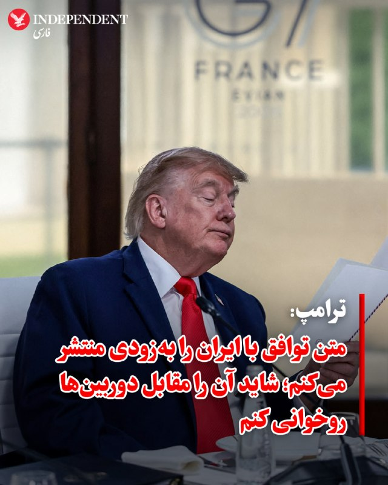

♦️ دونالد ترامپ، رئیس‌جمهوری آمریکا، وعده داد که متن کامل توافق با جمهوری اسلامی ایران را ظرف «چند روز آینده» به‌طور عمومی منتشر خواهد کرد. او حتی پیشنهاد کرد که برای تضمین پوشش دقیق رسانه‌ای، تمام این سند را کلمه به کلمه مقابل دوربین خبرنگاران قرائت کند.

ترامپ روز سه‌شنبه ۲۶ خرداد در حاشیه نشست سران گروه هفت (G7) در فرانسه و در جریان دیدار با محمد بن زاید آل نهیان، رئیس امارات متحده عربی، اظهار داشت که برای رونمایی از این متن منتظر یک «محیط رسمی» است. او با کم‌اهمیت خواندن گمانه‌زنی‌ها درباره پنهان‌کاری گفت: «من با این کار مشکلی ندارم، این یک سند فوق‌العاده است. حرف اصلی سند این است: ایران هرگز به سلاح هسته‌ای دست نخواهد یافت.»

رئیس‌جمهوری آمریکا روز یکشنبه این تفاهم‌نامه را به صورت الکترونیکی امضا کرد، اما متن کامل آن هنوز فاش نشده و حتی اعضای کنگره و رهبران جهان نیز آن را به‌طور کامل نخوانده‌اند. با این حال ترامپ تاکید کرد: «احتمالا یک نشست مطبوعاتی برگزار می‌کنم و آن را کلمه به کلمه برای شما می‌خوانم تا رسانه‌ها آن را دقیقا پوشش دهند، چون سند بسیار مهمی است.»
‌🇸🇦 Indypersian

🤖 @VahidOOnLine

## DEJradio — post 5739

  <a href="telegram/content/DEJradio_5739_1781618099.mp4" target="_blank">🎬 Download video</a>

⭕️
👑 شاهزاده رضا پهلوی امروز وارد بریتانیا شد و لرد موریس گلاسمن، عضو مجلس اعیان، ایشان را برای دیدارها و گفت‌وگوهای سیاسی در پارلمان بریتانیا همراهی کرد.

شاهزاده با این پیام روشن به بریتانیا آمده‌اند که جمهوری اسلامی نماینده مردم ایران نیست و هر تلاشی برای به‌رسمیت شناختن این رژیم به‌عنوان شریکی مشروع، تنها به تداوم بقای آن، تعمیق رنج ایرانیان و گسترش بی‌ثباتی در منطقه و فراتر از آن منجر می‌شود. صلح پایدار از مسیر امتیازدهی به رژیمی در حال فروپاشی نمی‌گذرد. از مسیر اراده مردم ایران می‌گذرد. مردمی که برای ایرانی آزاد، دموکراتیک و سکولار ایستاده‌اند.

#شاهزاده_رضا_پهلوی #بریتانیا
@DEJradio

## VahidOnline — post 76424

پهلوان سازش ناپذیر
@mananey
مانا نیستانی

## IranIntlTV — post 342713

  <a href="telegram/content/IranIntlTV_342713_1781618101.mp4" target="_blank">🎬 Download video</a>

همزمان با تشدید بحران رکود تورمی در اقتصاد ایران، وزیر اقتصاد جمهوری اسلامی گفت با وجود توافق برای پایان جنگ، جنگ اقتصادی تازه آغاز شده است.

مهتاب قلی‌زاده، روزنامه‌نگار اقتصادی، به ایران‌اینترنشنال گفت با وجود گذشت یک فصل از سال، بودجه سال ۱۴۰۵ هنوز ورودی خاصی نداشته است
@iranintltv

## IranIntlTV — post 342712

  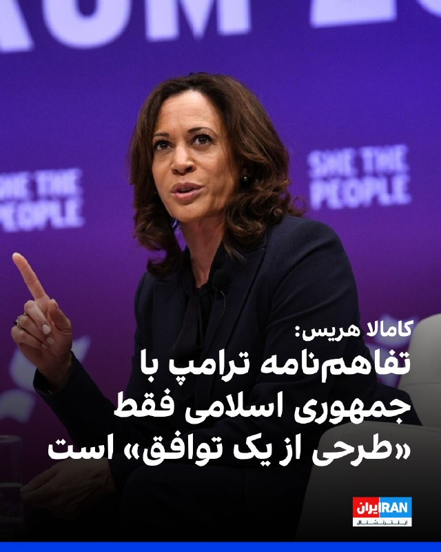

کامالا هریس، نامزد پیشین حزب دموکرات در انتخابات ریاست‌جمهوری آمریکا، گفت تفاهم‌نامه دونالد ترامپ با جمهوری اسلامی فقط «طرحی از یک توافق» است.

کامالا هریس گفت اگر رییس‌جمهور بود «قطعا» جنگ با ایران را آغاز نمی‌کرد.

او اضافه کرد: «هر توافقی که در حال مذاکره باشد، ترامپ آن را پیروزی اعلام خواهد کرد و در نهایت به همان جایی خواهیم رسید که پس از برجام بودیم و آن را پیروزی خواهند نامید؛ همان توافقی که خودش از آن خارج شد.»
https://iranintl.com/202606166650

## IranianMinds — post 22746

  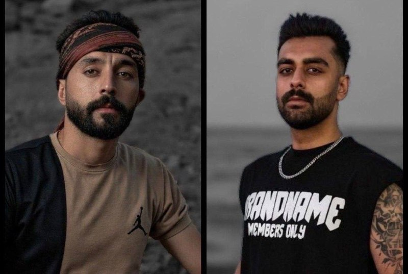

⚫️ جواد زمانی و ابوالفضل ساعدی؛ از بازداشت شدگان اعتراضات دی ماه در سمنان؛ صبح امروز اعدام شدن …

@IranianMinds

## IranianMinds — post 22744

  <a href="telegram/content/IranianMinds_22744_1781618104.mp4" target="_blank">🎬 Download video</a>

اینم‌ از این جک و جنده های حکومتی شیما راگوزیان و صدف بیوتی که داشتن برا تیم جمهوری اسلامی خودشونو میگاییدن.

@IranianMinds

## Dirty_Kids — post 392300

انقد بدم میاد از کلمات انگلیسی استفاده می‌کنید هی نیوزلند نیوزلند، چیه آخه درست بگید سرزمین خبر

@Dirty_Kids 👻

## alonews — post 128492

  <a href="telegram/content/alonews_128492_1781618104.webm" target="_blank">🎬 Download video</a>

👈مجید تخت‌روانچی، معاون سیاسی وزیر امور خارجه، روز سه‌شنبه ۲۶ خرداد، در حاشیه نشست با دیپلمات‌های خارجی در تهران، جزئیات جدیدی از گام‌های اجرایی تفاهم‌نامه اسلام‌آباد ارائه داد. او تایید کرد که محمدباقر قالیباف از سوی جمهوری اسلامی و جی‌دی ونس از طرف آمریکا برای آغاز مذاکرات و امضای توافق در سوئیس حاضر خواهند بود.

🔴تخت‌روانچی با اشاره به اینکه بلافاصله پس از امضای تفاهم‌نامه، گفتگوها درباره توافق نهایی شروع می‌شود، افزود: «ما در این مرحله وارد جزئیات بحث‌های هسته‌ای از جمله غنی‌سازی، ذخایر و نیازهای ایران نشده‌ایم و این مباحث پس از رسمیت یافتن تفاهم‌نامه آغاز خواهد شد.»

🔴معاون وزیر خارجه در پاسخ به پرسشی درباره نقض آتش‌بس از سوی اسرائیل تاکید کرد که در متن تفاهم‌نامه بر خاتمه عملیات نظامی در تمامی جبهه‌ها، از جمله لبنان، صراحت وجود دارد. او تصریح کرد از آنجا که آمریکا از طرف شرکای خود متعهد به پایان جنگ شده است، در صورت هرگونه نقض عهد از سوی اسرائیل، از مکانیزم‌های پیش‌بینی‌شده در یادداشت تفاهم استفاده خواهد شد.

✅ @AloNews خبر جنگ

## alonews — post 128491

👈رئیس کمیسیون اروپا: من به ترامپ به خاطر توافق با ایران تبریک گفتم هر دو موافقیم که این توافق باید به معنای پایان قطعی برنامه هسته‌ای ایران باشد ،تنگه هرمز بازگشایی خواهد شد

✅ @AloNews خبر جنگ

## alonews — post 128490

  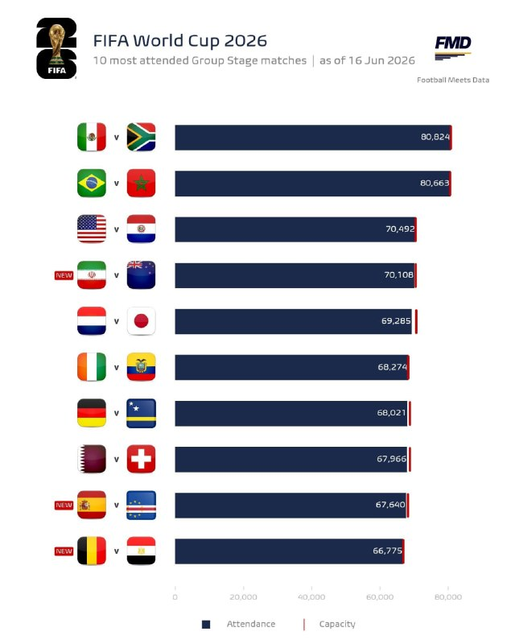

بازی ایران در رتبۀ چهارم؛ پرتماشاگرترین بازی‌های جام جهانی تا اینجا

@AloSport

## alonews — post 128489

  <a href="telegram/content/alonews_128489_1781618105.mp4" target="_blank">🎬 Download video</a>

🔴دقیقا حرف ما هم همینه. میگیم چرا وقتی حکومتی که 47 ساله داره دروغ به خورد ملت ایران میده رو, باید حمایت کرد!

🔴تا وقتی که به مردم نیاز دارن صحبت از وطن و ملی گرایی میکنن و وقتی نیازی نباشه بهشون به راحتی پشت پا میزنن.

🤔حکومت دیگه چیکار باید بکنه تا عرزشی جماعت بفهمه که بازیچه یه مشت شیاده

✅@AloNews

## alonews — post 128488

  <a href="telegram/content/alonews_128488_1781618108.mp4" target="_blank">🎬 Download video</a>

👈عضو تیم رسانه‌ای هیأت مذاکره‌کننده هسته‌ای ایران :

🔴مدیریت تنگه هرمز دست ایرانه و تصمیمش رو هم به کشورهای منطقه اطلاع می‌دیم؛

🔴برای این کار هم نیازی به تأیید یا اجازه کسی نداریم

✅ @AloNews خبر جنگ

## alonews — post 128487

  <a href="telegram/content/alonews_128487_1781618109.webm" target="_blank">🎬 Download video</a>

👈رسانه های چینی تصاویری جدید از جنگنده پنهان کار J-35 را منتشر کردند

✅ @AloNews خبر جنگ

---
📅 بروزرسانی: 1405/03/26 17:15
---

## VahidOOnLine — post 245872

  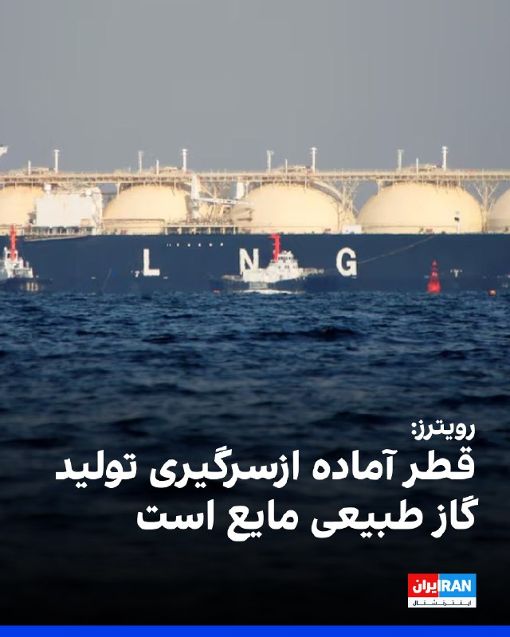

یک منبع آگاه سه‌شنبه به رویترز گفت شرکت قطر انرژی آماده است به‌سرعت تولید گاز طبیعی مایع را در راس‌لفان از سر بگیرد و به جز دو خط تولید که آسیب دیده‌اند، می‌تواند ظرف یک ماه به سطح تولید کامل برسد.

این منبع افزود که مانع اصلی، حمل‌ونقل و لجستیک خواهد بود، به‌ویژه اینکه قطر انرژی با چه سرعتی بتواند کشتی‌ها را وارد کرده و محموله‌ها را پس از باز شدن تنگه هرمز بارگیری کند.
‌🏁 🇬🇧 IranintlTV

🤖 @VahidOOnLine

## VahidOOnLine — post 245864

  <a href="telegram/content/VahidOOnLine_245864_1781617508.mp4" target="_blank">🎬 Download video</a>

ترامپ که پیش‌تر در پیام‌هایی خطاب به ایرانیان از «کمک در راه است» سخن گفته بود، اکنون در گفت‌وگو با مقام‌های قطر، کشته‌شدن معترضان را عمدتا به «گروه‌های قبلی» در جمهوری اسلامی نسبت می‌دهد و میان بخش‌های مختلف رژیم مرزبندی تازه‌ای می‌سازد.
‌🏁 🇬🇧 ManotoTV

🤖 @VahidOOnLine

## WithYashar — post 15062

ترامپ: ممکنه یه کنفرانس خبری برگزار کنم و متن یادداشت تفاهم آمریکا و ایران رو با صدای بلند و کلمه به کلمه بخونم تا رسانه‌ها اونو به درستی پوشش بدن.
@withyashar

## pm_afshaa — post 94186

  <a href="telegram/content/pm_afshaa_94186_1781617509.webm" target="_blank">🎬 Download video</a>

🔴ترامپ: ممکنه یه کنفرانس خبری برگزار کنم و متن یادداشت تفاهم آمریکا و ایران رو با صدای بلند و کلمه به کلمه بخونم تا رسانه‌ها اونو به درستی پوشش بدن.

💧 Rainbet.com the #1 Non-KYC Crypto Casino & Sportsbook @rainbetcom

😁 @Pm_Afshaa

## VahidOnline — post 76416

  <a href="telegram/content/VahidOnline_76416_1781617510.mp4" target="_blank">🎬 Download video</a>

ترامپ که پیش‌تر در پیام‌هایی خطاب به ایرانیان از «کمک در راه است» سخن گفته بود، اکنون در گفت‌وگو با مقام‌های قطر، کشته‌شدن معترضان را عمدتا به «گروه‌های قبلی» در جمهوری اسلامی نسبت می‌دهد و میان بخش‌های مختلف رژیم مرزبندی تازه‌ای می‌سازد.
@VahidOOnLine

📡 @VahidOnline

## IranIntlTV — post 342711

  

یک منبع آگاه سه‌شنبه به رویترز گفت شرکت قطر انرژی آماده است به‌سرعت تولید گاز طبیعی مایع را در راس‌لفان از سر بگیرد و به جز دو خط تولید که آسیب دیده‌اند، می‌تواند ظرف یک ماه به سطح تولید کامل برسد.

این منبع افزود که مانع اصلی، حمل‌ونقل و لجستیک خواهد بود، به‌ویژه اینکه قطر انرژی با چه سرعتی بتواند کشتی‌ها را وارد کرده و محموله‌ها را پس از باز شدن تنگه هرمز بارگیری کند.
https://iranintl.com/202606169786

## IranIntlTV — post 342710

ایران اینترنشنال در فصل «مرگ خامنه‌ای؛ پایان دیکتاتور» به بررسی کارنامه سی‌و‌شش ساله رهبری علی خامنه‌ای و چالش‌های پیش روی مجتبی خامنه‌ای در ادامه مسیر جمهوری اسلامی می‌پردازد.

گزارش‌ها، مقالات، مستندها و مصاحبه‌ها را در تلویزیون، بخش‌های خبر، وبسایت و اکانت‌های ایران اینترنشنال در شبکه‌های اجتماعی دنبال کنید.

#پایان_دیکتاتور
@iranintltv

## FarsiVOA — post 220912

  <a href="telegram/content/FarsiVOA_220912_1781617511.mp4" target="_blank">🎬 Download video</a>

جیانی اینفانتینو، رئیس فیفا، پس از بازی ایران و نیوزیلند به رختکن تیم ایران رفت و از بازیکنان و عملکرد تیم تمجید کرد. امیر قلعه‌نویی در این دیدار از نحوه میزبانی از تیم، صادر نشدن ویزا و غیبت مجموعه فنی، از جمله تاج، رییس فدراسیون، اردوی آماده‌سازی در مکزیک و اجبار به ترک خاک آمریکا بلافاصله پس از بازی، گلایه کرد و مدعی شد: «ما مظلوم‌ترین تیم ادوار جام جهانی بودیم.»

## DW_Farsi — post 126063

🔶 کاریکاتوریست منتقد پوتین به ضرب گلوله کشته شد
 
یک کارتونیست منتقد ولادیمیر پوتین  در خیابانی در شهر بیاوا پودلاسکا، واقع در شرق لهستان، هدف شلیک گلوله قرار گرفت و کشته شد. سخنگوی پلیس این شهر بدون اشاره به هویت قربانی به خبرگزاری PAP لهستان گفت به این مرد ۴۴ ساله چندین گلوله شلیک شده است.
 
بیاوا پودلاسکا حدود ۳۵ کیلومتری مرز بلاروس واقع شده است.
 
پلیس این حادثه را یک "قتل هدفمند" خوانده و گفته است انگیزه این قتل هنوز مشخص نیست.
 
نام مقتول نیز از سوی مقامات لهستان اعلام نشده است اما رسانه‌های منتقد دولت در روسیه و بلاروس هویت او را سمیون اسکرپتسکی، کاریکاتوریست و هنرمند اجرای نمایشی (پرفورمنس آرتیست)، اعلام کرده‌اند.
 
شبکه تلویزیونی wPolsce24  لهستان گزارش داده که مقتول از فاصله نزدیک چندبار هدف شلیک گلوله قرار گرفته است. پلیس اطراف محل حادثه و ورودی‌های به این منطقه را مسدود کرده است. همچنین مدارس و مهدکودک‌ها در این منطقه تعطیل شده‌اند.
 
بازرسان پرونده احتمال می‌دهند که عاملان این قتل دو نفر بوده‌اند. یک مظنون در نزدیکی کنسولگری بلاروس در شهر بیاوا پودلاسکا دستگیر شده اما این خبر از سوی مقامات رسمی تایید نشده است.
@dw_farsi

## Persian_Trend_Official — post 17276

بک منبع ارشد حزب‌الله به تلویزیون العربی گفت که ایران به این گروه اطمینان داده است که این تفاهم‌نامه را امضا نخواهد کرد مگر اینکه شامل خروج اسرائیل از لبنان باشد.

این منبع گفت که تهران خروج را شرط لازم برای نهایی کردن توافق می‌داند.

📝 Amir

📌 @persian_trend_official
پرشین ترند | متفاوت‌ترین کانال نظامی

## Persian_Trend_Official — post 17275

کامالا هریس: هر مذاکره‌ای که در جریان باشد، ترامپ اعلام پیروزی خواهد کرد.

در نهایت به جایی خواهد رسید که پس از برجام بودیم و آن را پیروزی خواهد نامید. برجامی که او از آن خارج شد.

📝 Amir

📌 @persian_trend_official
پرشین ترند | متفاوت‌ترین کانال نظامی

## Persian_Trend_Official — post 17274

هاکان فیدان، وزیر امور خارجه ترکیه: موضع اسرائیل در منطقه فقط مشکل چند کشور نیست، بلکه مشکلی برای کل جهان است و تمام جهان از آن آگاه است.

برای اولین بار، درک مشترکی در سراسر جهان در مورد از بین بردن توهمی که اسرائیل ایجاد کرده است، در حال شکل‌گیری است.

وقتی اسرائیل می‌بیند که تمام جهان درگیر یک تلاش دیپلماتیک علیه آن هستند، قادر به انجام اقدامی نخواهد بود.

📝 Amir

📌 @persian_trend_official
پرشین ترند | متفاوت‌ترین کانال نظامی

## Persian_Trend_Official — post 17273

  <a href="telegram/content/Persian_Trend_Official_17273_1781617513.mp4" target="_blank">🎬 Download video</a>

هاکان فیدان، وزیر امور خارجه ترکیه، در مورد توافق ایران و آمریکا: رئیس جمهور ترامپ به اعتراضات اسرائیل در این مورد گوش نداد.

ایران به این خواسته پاسخ مثبت داد و آنها به نتیجه رسیدند.

📝 Amir

📌 @persian_trend_official
پرشین ترند | متفاوت‌ترین کانال نظامی

## Persian_Trend_Official — post 17272

  <a href="telegram/content/Persian_Trend_Official_17272_1781617515.mp4" target="_blank">🎬 Download video</a>

ترامپ در مورد اورانیم های ایران: ما عجله‌ای نداریم، اما آن را به دست خواهیم آورد و نابودش خواهیم کرد.

📝 Amir

📌 @persian_trend_official
پرشین ترند | متفاوت‌ترین کانال نظامی

## Persian_Trend_Official — post 17271

ترامپ می‌گوید توافق صلح و مذاکرات هسته‌ای با ایران را برای بررسی به کنگره خواهد فرستاد.

📝 Amir

📌 @persian_trend_official
پرشین ترند | متفاوت‌ترین کانال نظامی

## Persian_Trend_Official — post 17270

ترامپ می‌گوید که به زودی می‌تواند تحریم های نفتی روسیه را بازگرداند.

دونالد ترامپ، رئیس جمهور امریکا در پی افزایش قیمت نفت بخاطر جنگ با ایران و اختلال در تنگه هرمز، تحریم های نفتی روسیه را برای کاهش قیمت نفت به طور موقت ورداشته بود.

📝 Amir

📌 @persian_trend_official
پرشین ترند | متفاوت‌ترین کانال نظامی

## BBCPersian — post 284027

  <a href="telegram/content/BBCPersian_284027_1781617517.mp4" target="_blank">🎬 Download video</a>

سرخط خبرهای سه‌شنبه، ۲۶ خرداد ۱۴۰۵

@BBCPersian

## Dirty_Kids — post 392299

شاید باور نکنید ولی قالیباف تنهایی در مجلس رو تخته کرده و نمیزاره جلسات تشکیل شه تا نماینده های مخالف توی مبحث توافق دخالت نکنن.
بیش از ۳ ماه جلسات مجلس تشکیل نشده و هیچ اتفاقی هم در کشور نیفتاده. واقعا پرخاصیتن.

@Dirty_Kids 👻

## Dirty_Kids — post 392298

  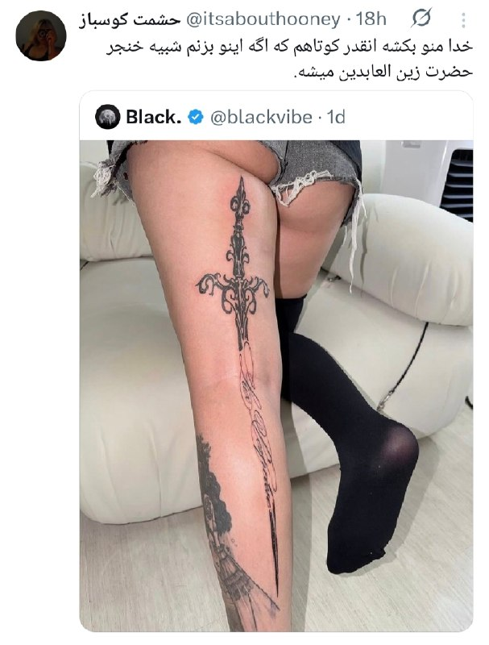

زین العابدین اصن خنجر نداشت اون همیشه استامینوفن همراش بود فقط.

@Dirty_Kids 👻

## alonews — post 128486

  <a href="telegram/content/alonews_128486_1781617519.mp4" target="_blank">🎬 Download video</a>

👈خوشحالی ایرانیان کانادا(با پرچم شیر و خورشید) بعد گل اول ایران

✅ @AloNews خبر جنگ

## alonews — post 128485

  <a href="telegram/content/alonews_128485_1781617521.mp4" target="_blank">🎬 Download video</a>

🔴‏در اوایل سال ۲۰۲۴ بازیکنان تیم ملی‌ کنگو در یک اکت اعتراضی و زیبا موقع سرود ملی کشورشون برای حمایت از مردم و جلب توجه افکار جامعه جهانی به کشتار هموطنانشون این حرکت رو انجام دادن.

🤔با تیم ملی جمهوری اسلامی که خودشون رو ایرانی و وطن پرست میدونن مقایسه کنین. یه مشت شیاد خون شور

✅@AloNews

## alonews — post 128484

  <a href="telegram/content/alonews_128484_1781617522.mp4" target="_blank">🎬 Download video</a>

👈ترامپ: کلمه به کلمه متن توافق را برایتان می‌خوانم

🔴من نه تنها آن را منتشر خواهم کرد. احتمالاً یک کنفرانس مطبوعاتی خواهم داشت و کلمه به کلمه آن را برای شما خواهم خواند تا مطبوعات آن را به طور دقیق پوشش دهند زیرا این یک سند بسیار مهم است

✅ @AloNews خبر جنگ

---
📅 بروزرسانی: 1405/03/26 17:04
---

## VahidOOnLine — post 245863

  

کانال ۱۲ اسرائیل گزارش داد این کشور درخواست کرده بود متن تفاهم‌نامه میان آمریکا و جمهوری اسلامی را مشاهده کند، اما با این درخواست موافقت نشده است.

کانال ۱۲ همچنین اعلام کرد حزب‌الله اعلام کرد از جمهوری اسلامی تضمین دریافت کرده که توافق نهایی با آمریکا را امضا نخواهد کرد، مگر آنکه اسرائیل از لبنان عقب‌نشینی کند.
‌🏁 🇬🇧 IranintlTV

🤖 @VahidOOnLine

## VahidOOnLine — post 245862

  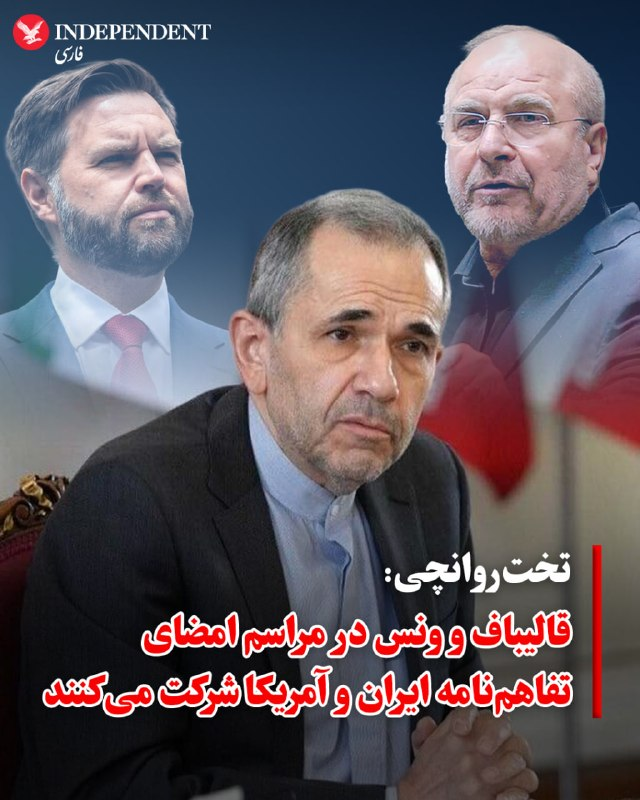

♦️ مجید تخت‌روانچی، معاون سیاسی وزیر امور خارجه، روز سه‌شنبه ۲۶ خرداد، در حاشیه نشست با دیپلمات‌های خارجی در تهران، جزئیات جدیدی از گام‌های اجرایی تفاهم‌نامه اسلام‌آباد ارائه داد. او تایید کرد که محمدباقر قالیباف از سوی جمهوری اسلامی و جی‌دی ونس از طرف آمریکا برای آغاز مذاکرات و امضای توافق در سوئیس حاضر خواهند بود.

تخت‌روانچی با اشاره به اینکه بلافاصله پس از امضای تفاهم‌نامه، گفتگوها درباره توافق نهایی شروع می‌شود، افزود: «ما در این مرحله وارد جزئیات بحث‌های هسته‌ای از جمله غنی‌سازی، ذخایر و نیازهای ایران نشده‌ایم و این مباحث پس از رسمیت یافتن تفاهم‌نامه آغاز خواهد شد.»

معاون وزیر خارجه در پاسخ به پرسشی درباره نقض آتش‌بس از سوی اسرائیل تاکید کرد که در متن تفاهم‌نامه بر خاتمه عملیات نظامی در تمامی جبهه‌ها، از جمله لبنان، صراحت وجود دارد. او تصریح کرد از آنجا که آمریکا از طرف شرکای خود متعهد به پایان جنگ شده است، در صورت هرگونه نقض عهد از سوی اسرائیل، از مکانیزم‌های پیش‌بینی‌شده در یادداشت تفاهم استفاده خواهد شد.
‌🇸🇦 Indypersian

🤖 @VahidOOnLine

## FoxNewsTwitter — post 343021

  <a href="telegram/content/FoxNewsTwitter_343021_1781616881.mp4" target="_blank">🎬 Download video</a>

Fox News (Twitter/X)

NOW: G7 leaders gather in Geneva as the summit officially gets underway.

President Trump's Iran peace deal has been a major focus of discussions so far, as world leaders also address efforts to end Russia's war in Ukraine and challenges facing the global economy.

## VahidOnline — post 76415

  <a href="telegram/content/VahidOnline_76415_1781616883.mp4" target="_blank">🎬 Download video</a>

دونالد ترامپ، رئیس‌جمهوری آمریکا، در حاشیه نشست سران گروه هفت (G7) در اویان فرانسه و در دیدار با امیر قطر، از رویکرد نظامی بنیامین نتانیاهو در قبال لبنان انتقاد کرد.

ترامپ با اشاره به حمله هوایی اسرائیل به بیروت، درست دو ساعت پیش از امضای توافق آتش‌بس با جمهوری اسلامی ایران، آن را «کور و بی‌هدف» خواند و گفت: «به آن‌ها فهماندم که اصلا از این کار راضی نیستم. برای کشتن یک نفر لازم نیست یک آپارتمان را با خاک یکسان کنید؛ آدم‌های زیادی آنجا هستند که همه‌شان حزب‌الله نیستند.»

رئیس‌جمهوری آمریکا با بیان اینکه اسرائیل زمان زیادی است که با حزب‌الله می‌جنگد و افراد زیادی کشته می‌شوند، پیشنهاد داد که کنترل این گروه به سوریه واگذار شود.
ترامپ با تمجید از عملکرد احمد الشرع، رئیس‌جمهوری سوریه در ساماندهی سریع این کشور گفت: «او با مشارکت من و اردوغان روی کار آمد. او از حزب‌الله خوشش نمی‌آید و این کار را بهتر انجام می‌دهد؛ اگر اسرائیل نمی‌تواند بدون کشتن دیگران کار را تمام کند، سوریه این کار را خواهد کرد.»
@VahidOOnLine

📡 @VahidOnline

## IranIntlTV — post 342709

  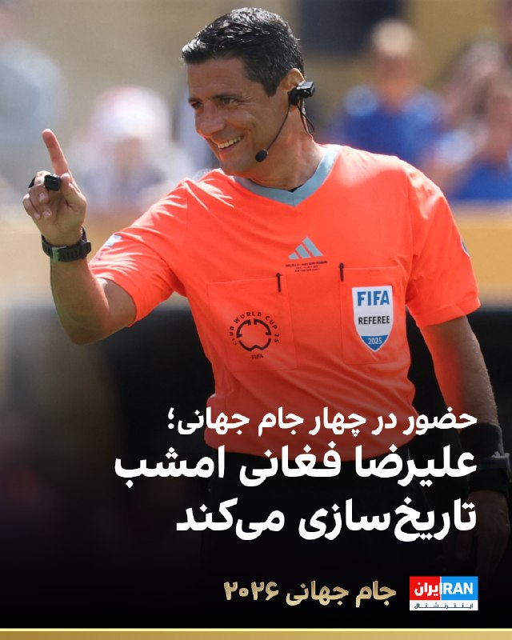

🔻علیرضا فغانی امشب ساعت ۲۲:۳۰ با قضاوت در دیدار فرانسه و سنگال، به نخستین داور تاریخ فوتبال تبدیل می‌شود که در چهار دوره جام جهانی سوت زده است. بر اساس اعلام فیفا، فغانی به عنوان داور وسط این مسابقه از گروه I انتخاب شده است و دو کمک‌داور استرالیایی نیز او را در این بازی همراهی خواهند کرد.

🔹او که در سه دوره گذشته (۲۰۱۴، ۲۰۱۸ و ۲۰۲۲) به عنوان نماینده ایران در جام جهانی حضور داشت، این بار با پرچم استرالیا در این تورنمنت بزرگ سوت می‌زند. این داور باسابقه پس از مهاجرت به استرالیا و حذف از فهرست داوران بین‌المللی ایران، اکنون به عنوان نماینده رسمی فدراسیون فوتبال استرالیا در مسابقات فیفا قضاوت می‌کند.

🔹قوه قضاییه جمهوری اسلامی چند ماه پیش از توقیف اموال علیرضا فغانی به دلیل مخالفت با سیاست‌های حکومت خبر داده بود.
@iranintltvsport

## IranIntlTV — post 342708

  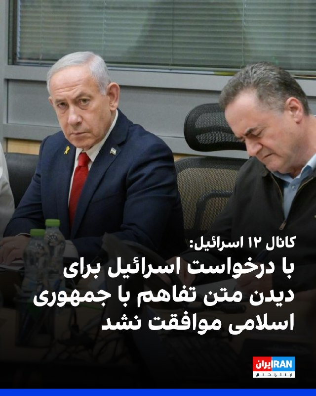

کانال ۱۲ اسرائیل گزارش داد این کشور درخواست کرده بود متن تفاهم‌نامه میان آمریکا و جمهوری اسلامی را مشاهده کند، اما با این درخواست موافقت نشده است.

کانال ۱۲ همچنین اعلام کرد حزب‌الله اعلام کرد از جمهوری اسلامی تضمین دریافت کرده که توافق نهایی با آمریکا را امضا نخواهد کرد، مگر آنکه اسرائیل از لبنان عقب‌نشینی کند.
https://iranintl.com/202606166163

## ManotoTV — post 106090

  <a href="telegram/content/ManotoTV_106090_1781616884.mp4" target="_blank">🎬 Download video</a>

ترامپ که پیش‌تر در پیام‌هایی خطاب به ایرانیان از «کمک در راه است» سخن گفته بود، اکنون در گفت‌وگو با مقام‌های قطر، کشته‌شدن معترضان را عمدتا به «گروه‌های قبلی» در جمهوری اسلامی نسبت می‌دهد و میان بخش‌های مختلف رژیم مرزبندی تازه‌ای می‌سازد.

## Persian_Trend_Official — post 17269

ترامپ: آیا لیندسی گراهام[در مورد توافق] شک دارد؟ باید با او صحبت کنم. او به دردسر بزرگی خواهد افتاد.

البته لیندسی خوب است. او خوب است. او شک ندارد.

📝 Amir

📌 @persian_trend_official
پرشین ترند | متفاوت‌ترین کانال نظامی

## Persian_Trend_Official — post 17268

  <a href="telegram/content/Persian_Trend_Official_17268_1781616885.mp4" target="_blank">🎬 Download video</a>

ترامپ در مورد محمد بن زاید، ولیعهد امارات: عالیجناب یک جنگجو هستند؛ او در آنجا جنگید.

او به عنوان یک مرد شجاع شناخته می‌شود.

📝 Amir

📌 @persian_trend_official
پرشین ترند | متفاوت‌ترین کانال نظامی

## Persian_Trend_Official — post 17267

  <a href="telegram/content/Persian_Trend_Official_17267_1781616887.mp4" target="_blank">🎬 Download video</a>

صداوسیما می‌گوید تمام کشتی های عبوری از تنگه هرمز باید با سپاه پاسداران هماهنگ باشند.

صداوسیما در گزارش اخیر: خود از تنگه هرمز سه نفتکش ایرانی در شمال اقیانوس هند در حال حرکت هستند و دو کشتی باری حامل کالاهای اساسی به سمت بنادر جنوبی در حرکتند.

📝 Amir

📌 @persian_trend_official
پرشین ترند | متفاوت‌ترین کانال نظامی

## Persian_Trend_Official — post 17266

  <a href="telegram/content/Persian_Trend_Official_17266_1781616889.webm" target="_blank">🎬 Download video</a>

به گزارش کانال 12 اسرائیل، اسرائیل درخواست مشاهده یادداشت تفاهم بین ایالات متحده و ایران را داشت اما این درخواست رد شد.

📝 Amir

📌 @persian_trend_official
پرشین ترند | متفاوت‌ترین کانال نظامی

## BBCPersian — post 284026

  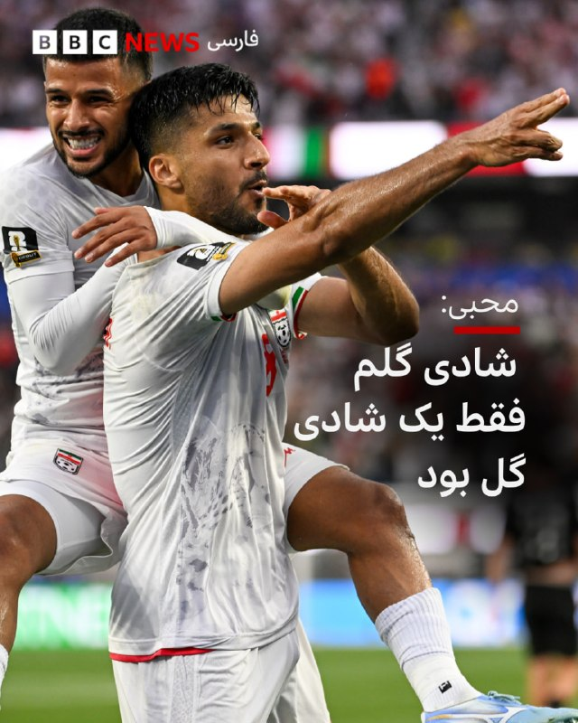

🔻محمد محبی، بازیکن تیم ملی فوتبال ایران که نحوه‌ شادی‌اش از زدن گل به نیوزیلند واکنش‌برانگیز شده و انتقاداتی را به همراه آورده است، درمورد این عمل خود توضیح داد.

او که زننده دومین گل ایران به نیوزیلند در رقابت‌های جام جهانی در آمریکا بود، گفت: «️شادی گلم چیزی است که از ذهنم آمد و فقط یک شادی گل بود؛ همین.»

این بازیکن پس از به ثمر رساندن گل تساوی در مقابل نیوزیلند در حرکتی که به نظر می‌رسید دست خود را به شکل اسلحه درآورده و آن را به سمت تماشاچیان نشانه رفته است، شادی خود را نشان داد.

بازی ایران و نیوزیلند که با تساوی دو بر دو به پایان رسید با حواشی بسیاری همراه بود.

📸ISI Photos via Getty Images
https://bbc.in/3QNvk8B
@BBCPersian

## manototv — post 106090

  <a href="telegram/content/manototv_106090_1781616890.mp4" target="_blank">🎬 Download video</a>

ترامپ که پیش‌تر در پیام‌هایی خطاب به ایرانیان از «کمک در راه است» سخن گفته بود، اکنون در گفت‌وگو با مقام‌های قطر، کشته‌شدن معترضان را عمدتا به «گروه‌های قبلی» در جمهوری اسلامی نسبت می‌دهد و میان بخش‌های مختلف رژیم مرزبندی تازه‌ای می‌سازد.

## alonews — post 128483

  <a href="telegram/content/alonews_128483_1781616891.webm" target="_blank">🎬 Download video</a>

👈ارتش ایالات متحده قصد دارد یک انبار دائمی و آماده جنگ برای سلاح‌های نیروی دریایی در سواحل جنوب شرقی استرالیا، فراتر از برد بیشتر موشک‌های چینی، ایجاد کند، طبق اسناد مناقصه و اظهارات مقامات به خبرگزاری AFP.

🔴 حدود ۳۰ میلیون دلار در ساخت تأسیسات ذخیره‌سازی در مناطق روستایی ویکتوریا سرمایه‌گذاری خواهد شد تا سلاح‌های نظامی آمریکا در آنجا نگهداری شود، با هدف بهبود واکنش نیروهای آمریکایی در سراسر منطقه هند-آرام.

✅ @AloNews خبر جنگ

---
📅 بروزرسانی: 1405/03/26 16:54
---

## WithYashar — post 15061

ترامپ: اگه لیندسی گراهام بیاد و به این توافق با ایران شک کنه و حرفی بزنه، واقعاً براش دردسر درست می‌شه و حسابی به مشکل می‌خوره.
@withyashar

## pm_afshaa — post 94185

  <a href="telegram/content/pm_afshaa_94185_1781616284.webm" target="_blank">🎬 Download video</a>

🔴ترامپ: اگه لیندزی گراهام به توافق با ایران تردید داره، باید باهاش صحبت کنم، وگرنه ممکنه به دردسر بزرگی بیفته.

💧 Rainbet.com the #1 Non-KYC Crypto Casino & Sportsbook @rainbetcom

😁 @Pm_Afshaa

## pm_afshaa — post 94184

  <a href="telegram/content/pm_afshaa_94184_1781616284.webm" target="_blank">🎬 Download video</a>

🔴رویترز: حزب‌الله از جمهوری اسلامی تضمین‌هایی دریافت کرده که تا زمانی که اسرائیل از لبنان عقب‌نشینی نکنه، توافق نهایی هسته‌ای با آمریکا رو امضا نخواهد کرد.

💧 Rainbet.com the #1 Non-KYC Crypto Casino & Sportsbook @rainbetcom

😁 @Pm_Afshaa

## VahidOnline — post 76414

  

دونالد ترامپ، رییس‌جمهوری آمریکا، در پاسخ به پرسشی درباره متحدان او که نسبت به چارچوب تفاهم با جمهوری اسلامی تردید دارند، از جمله لیندزی گراهام، سناتور جمهوری‌خواه، با لحنی طنزآمیز گفت: «لیندزی تردید دارد؟ باید با او صحبت کنم؛ دچار دردسر بزرگی می‌شود.»

ترامپ سپس تلاش کرد نگرانی‌ها در میان هم‌حزبی‌های خود را کم‌اهمیت جلوه دهد و گفت گراهام «آدم خوبی» است و مشکلی با این توافق ندارد.

او افزود: «این توافق یک موضوع مهم را به‌خوبی پوشش می‌دهد. ما بابت آن هیچ پولی پرداخت نمی‌کنیم.»

رییس‌جمهوری آمریکا ادامه داد: «بازارها اکنون نسبت به زمانی که کار را آغاز کردیم در سطح بالاتری قرار دارند.»

ترامپ گفت: «اختلاف فقط بر سر یک موضوع است؛ این‌که ایران هرگز سلاح هسته‌ای نخواهد داشت؛ هرگز، هرگز و هرگز.» او افزود: «بقیه مسائل اهمیتی ندارند.»
@VahidOOnLine

📡 @VahidOnline

## VahidOnline — post 76412

پیام‌های دریافتی درباره دو پست قبلی
📡 @VahidOnline

## Persian_Trend_Official — post 17265

  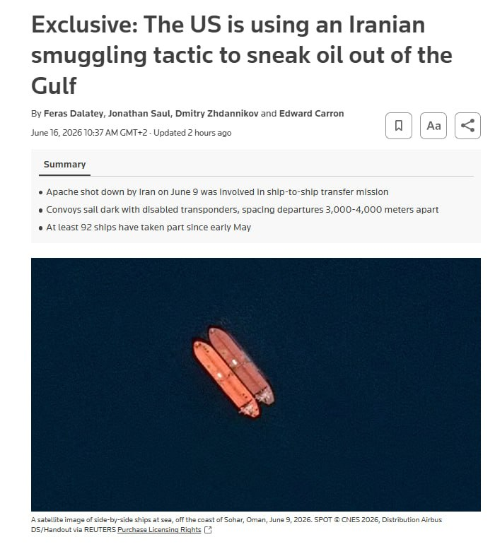

تحقیقات رویترز نشان میدهد که ارتش ایالات متحده از اوایل ماه مه بی‌سروصدا بر یک شبکه بزرگ انتقال نفت دریایی از طریق کشتی به کشتی نظارت داشته است تا صادرات انرژی خلیج فارس را با وجود اختلال ایران در حمل و نقل دریایی از طریق تنگه هرمز ادامه دهد.

بیش از 90 کشتی در این عملیات شرکت داشته‌اند و حدود 90 میلیون بشکه نفت و فرآورده‌های نفتی را در سایت‌هایی نزدیک فجیره در امارات متحده عربی و صحار در عمان منتقل کرده‌اند. در این عملیات از تکنیک‌هایی مشابه روش‌های دور زدن تحریم‌های ایران استفاده شده است، از جمله کشتی‌هایی که با فرستنده‌های AIS خاموش، چراغ‌های کم نور و حرکات کاروان‌های تحت کنترل شدید که توسط پهپادها، هلیکوپترها و تجهیزات نظارتی کنترل می‌شوند.

تانکرها قبل از انتقال محموله به VLCC های منتظر، نفت را از طریق تنگه حمل می‌کردند و هر انتقال 24 تا 40 ساعت طول می‌کشید. پشتیبانی ارتش ایالات متحده شامل نظارت هوایی، نظارت امنیتی و غربالگری انطباق بود.

📝 Amir

📌 @persian_trend_official
پرشین ترند | متفاوت‌ترین کانال نظامی

## Persian_Trend_Official — post 17264

  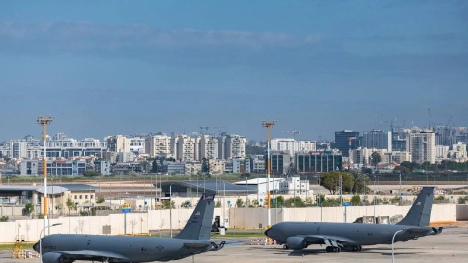

کانال 12 اسرائیل: واشنگتن در حال آماده شدن برای خارج کردن تقریباً 20% از هواپیماهای سوخت‌رسانی مستقر در فرودگاه بن گوریون اسرائیل پس از تفاهم‌نامه ایالات متحده و ایران است.

72 هواپیمای سوخت‌رسانی نظامی ایالات متحده در حال حاضر فضای قابل توجهی را در بن گوریون اشغال کرده‌اند که باعث ازدحام و تهدید لغو گسترده پروازها شده و بیش از 2 میلیون مسافر را در تابستان امسال تحت تأثیر قرار داده است.

میری رگو، وزیر حمل و نقل اسرائیل، خواستار خروج فوری هواپیماها شد و به نتانیاهو هشدار داد که اگر نیمی از هواپیماها تا سه‌شنبه خارج نشوند، بیش از 2 میلیون شهروند با لغو پروازها از جمله سفر روش هشانا به عمان مواجه خواهند شد.

هواپیماهای خارج شده ممکن است به اروپا منتقل شوند، اما در حالت آماده‌باش برای استقرار مجدد در اسرائیل در صورت از سرگیری جنگ قرار دارند، کانال 12 تأیید نکرد که آیا هواپیماها به طور کامل اسرائیل را ترک می‌کنند یا به پایگاه‌های نیروی هوایی اسرائیل منتقل می‌شوند.

📝 Amir

📌 @persian_trend_official
پرشین ترند | متفاوت‌ترین کانال نظامی

## alonews — post 128482

  <a href="telegram/content/alonews_128482_1781616286.webm" target="_blank">🎬 Download video</a>

👈 یک منبع ارشد حزب‌الله به تلویزیون العربی گفت که ایران به این گروه اطمینان داده است که یادداشت تفاهم را امضا نخواهد کرد مگر اینکه شامل خروج اسرائیل از لبنان باشد

🔴 این منبع گفت تهران خروج را شرط لازم برای نهایی کردن توافق می‌داند

✅ @AloNews خبر جنگ

## alonews — post 128481

  <a href="telegram/content/alonews_128481_1781616287.webm" target="_blank">🎬 Download video</a>

👈شب گذشته ایلان ماسک ۱۶۵ میلیارد دلار سود کرد و ثروتش به ۱.۳ تریلیون دلار رسید

✅ @AloNews خبر جنگ

---
📅 بروزرسانی: 1405/03/26 16:44
---

## VahidOOnLine — post 245861

  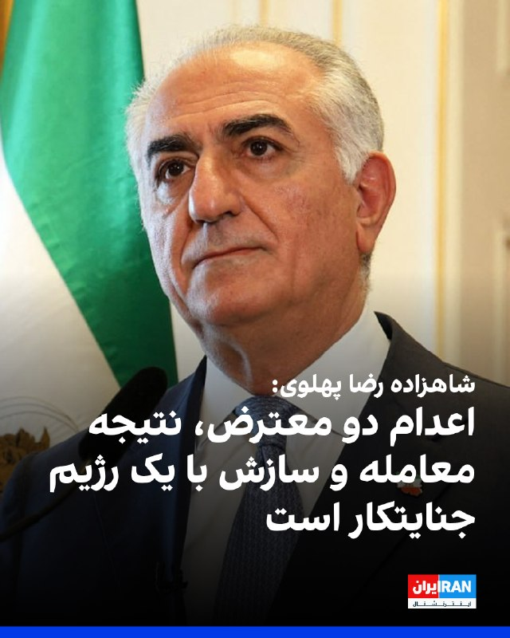

شاهزاده رضا پهلوی، در پیامی در شبکه ایکس نوشت: «جمهوری اسلامی هم‌زمان با امضای تفاهم‌نامه‌ صلح، دو تن دیگر از معترضان ۱۸ و ۱۹ دی‌ به نام‌های جواد زمانی و ابوالفضل ساعدی را اعدام کرد. این نتیجه معامله و سازش با یک رژیم جنایتکار است. توافق با رژیمی که تنها در دو روز، بیش از ۴۰ هزار معترض را به قتل رساند، نه‌تنها از نظر اخلاقی نادرست است، بلکه از منظر راهبردی نیز خطایی فاجعه‌بار خواهد بود.»

شاهزاده رضا پهلوی در ادامه اضافه کرد: «تعامل با این رژیم محکوم به شکست است و همه ما بهای پیامدهای آن را خواهیم پرداخت. جنگ ۴۷ ساله جمهوری اسلامی علیه مردم ایران همچنان ادامه دارد. رژیمی که هرگز با شهروندان خود به صلح نرسیده، هرگز با جهان نیز به صلحی واقعی دست نخواهد یافت.»

او افزود: «جامعه جهانی باید از مبارزه ملت ایران برای آزادی حمایت کند و آنها را در کانون هر مذاکره و محور هر سیاستی درباره ایران قرار دهد. اما روشن بگویم: با حمایت جهان یا بدون آن، این رژیم سقوط خواهد کرد،ٰ و مردم ایران خود را از چنگ استبداد آزاد خواهند کرد.»
‌🏁 🇬🇧 IranintlTV

🤖 @VahidOOnLine

## mwarmonitor — post 11031

🚨«شبکه ۱۲ اسرائیل گزارش می‌دهد که اسرائیل درخواست کرده بود یادداشت تفاهم (مذاکره‌شده با ایران) را ببیند، اما این درخواست رد شد.»

@mwarmonitor

## mwarmonitor — post 11030

🔴ترامپ: «توافق ایران را برای بررسی به کنگره ارسال خواهد کرد» @mwarmonitor

## mwarmonitor — post 11029

🔴ترامپ: «توافق ایران را برای بررسی به کنگره ارسال خواهد کرد»

@mwarmonitor

## mwarmonitor — post 11028

🔴(رویترز) - رئیس‌جمهور دونالد ترامپ روز سه‌شنبه گفت که ایالات متحده اکنون در موقعیتی قرار دارد که می‌تواند اجازه دهد معافیت‌های نفتی روسیه منقضی شوند، پس از آنکه توافقی برای پایان دادن به جنگ ایران حاصل شده است.

🔹او در جریان دیدار با رئیس‌جمهور امارات متحده عربی، شیخ محمد بن زاید آل نهیان، در نشست گروه هفت در فرانسه به خبرنگاران گفت:

🔸«به‌زودی می‌توانیم این کار را انجام دهیم، چون نفت اکنون در حال جریان است.»

@mwarmonitor

## VahidOnline — post 76411

  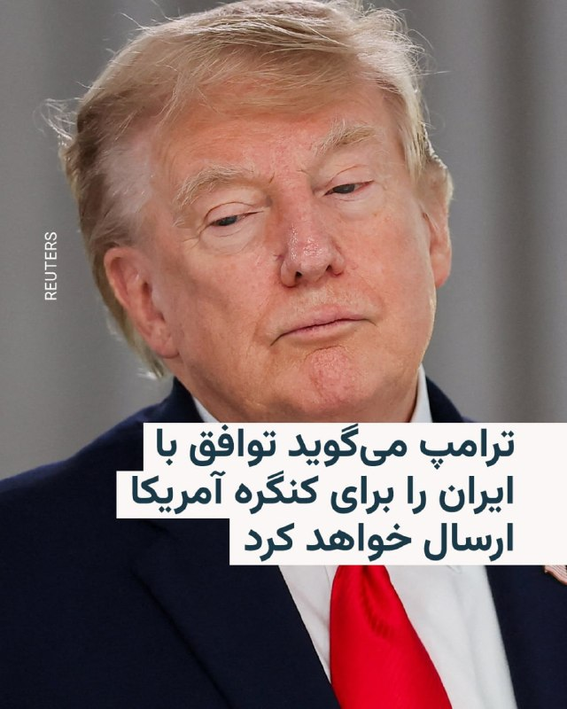

دونالد ترامپ، رئیس‌جمهور ایالات متحده، روز سه‌شنبه اعلام کرد توافق صلح با ایران را برای «بررسی» به کنگره آمریکا می‌فرستد.

او در جریان دیدار با محمد بن زاید آل نهیان، رئیس امارات متحده عربی، در حاشیه نشست گروه ۷ در فرانسه به خبرنگاران گفت: «هرگز به فرستادن آن فکر نکرده بودم، حتی یک بار هم به آن فکر نکرده بودم، اما این کار را خواهم کرد. آن را به کنگره می‌فرستم. از این ایده خوشم می‌آید.»

برخی قانون‌گذاران جمهوری‌خواه پیش‌تر خواستار بررسی متن این توافق شده بودند.

آقای ترامپ همچنین وعده داد که متن توافق با ایران را «ظرف یکی دو روز آینده» به‌صورت عمومی منتشر خواهد کرد و حتی این احتمال را مطرح کرد که کل سند را در برابر دوربین‌ها قرائت کند.

او گفت که منتظر فراهم شدن یک «فضای رسمی» برای انتشار عمومی این متن است.

رئیس‌جمهور آمریکا اعلام کرد: «دوست دارم ابتدا یک چارچوب رسمی برای این کار فراهم شود، اما هیچ مشکلی با انتشار آن ندارم؛ این یک سند عالی است.»
او در ادامه افزود: «محتوای آن این است: ایران هرگز سلاح هسته‌ای نخواهد داشت.»

ترامپ درباره مرحله بعدی مذاکرات با ایران که برای آن مهلتی ۶۰ روزه تعیین شده است، گفت: «فکر می‌کنم این روند خیلی سریع پیش خواهد رفت.»

او افزود: «ایران می‌خواهد این موضوع را نهایی کند. آن‌ها باید به فعالیت‌های عادی خود بازگردند و روابط اکنون عادی‌سازی شده است؛ بنابراین فکر می‌کنم این روند خیلی سریع پیش خواهد رفت.»

ترامپ در ادامه گفت: «ممکن است سریع‌تر پیش برود، ممکن است هم زمان بیشتری طول بکشد، اما می‌تواند خیلی سریع انجام شود.»
@VahidHeadline

📡 @VahidOnline

## IranIntlTV — post 342707

  <a href="telegram/content/IranIntlTV_342707_1781615692.mp4" target="_blank">🎬 Download video</a>

دونالد ترامپ، رییس‌جمهوری آمریکا، در حاشیه اجلاس گروه هفت در فرانسه، با ابراز نارضایتی از حمله اسرائیل به لبنان تاکید کرد بنیامین نتانیاهو باید مسئولیت‌پذیر باشد.

گفت‌وگو با بابک اسحاقی، خبرنگار ایران‌اینترنشنال، درباره واکنش‌ها در اسرائیل به صحبت‌های ترامپ
@iranintltv

## IranIntlTV — post 342706

  

شاهزاده رضا پهلوی، در پیامی در شبکه ایکس نوشت: «جمهوری اسلامی هم‌زمان با امضای تفاهم‌نامه‌ صلح، دو تن دیگر از معترضان ۱۸ و ۱۹ دی‌ به نام‌های جواد زمانی و ابوالفضل ساعدی را اعدام کرد. این نتیجه معامله و سازش با یک رژیم جنایتکار است. توافق با رژیمی که تنها در دو روز، بیش از ۴۰ هزار معترض را به قتل رساند، نه‌تنها از نظر اخلاقی نادرست است، بلکه از منظر راهبردی نیز خطایی فاجعه‌بار خواهد بود.»

شاهزاده رضا پهلوی در ادامه اضافه کرد: «تعامل با این رژیم محکوم به شکست است و همه ما بهای پیامدهای آن را خواهیم پرداخت. جنگ ۴۷ ساله جمهوری اسلامی علیه مردم ایران همچنان ادامه دارد. رژیمی که هرگز با شهروندان خود به صلح نرسیده، هرگز با جهان نیز به صلحی واقعی دست نخواهد یافت.»

او افزود: «جامعه جهانی باید از مبارزه ملت ایران برای آزادی حمایت کند و آنها را در کانون هر مذاکره و محور هر سیاستی درباره ایران قرار دهد. اما روشن بگویم: با حمایت جهان یا بدون آن، این رژیم سقوط خواهد کرد،ٰ و مردم ایران خود را از چنگ استبداد آزاد خواهند کرد.»
https://iranintl.com/202606160912

## RadioFarda — post 158394

🔸دونالد ترامپ، رئیس‌جمهور ایالات متحده، روز سه‌شنبه اعلام کرد توافق صلح با ایران را برای «بررسی» به کنگره آمریکا می‌فرستد. 🔸او در جریان دیدار با محمد بن زاید آل نهیان، رئیس امارات متحده عربی، در حاشیه نشست گروه ۷ در فرانسه به خبرنگاران گفت: «هرگز به فرستادن…

## RadioFarda — post 158393

  

🔸دونالد ترامپ، رئیس‌جمهور ایالات متحده، روز سه‌شنبه اعلام کرد توافق صلح با ایران را برای «بررسی» به کنگره آمریکا می‌فرستد.

🔸او در جریان دیدار با محمد بن زاید آل نهیان، رئیس امارات متحده عربی، در حاشیه نشست گروه ۷ در فرانسه به خبرنگاران گفت: «هرگز به فرستادن آن فکر نکرده بودم، حتی یک بار هم به آن فکر نکرده بودم، اما این کار را خواهم کرد. آن را به کنگره می‌فرستم. از این ایده خوشم می‌آید.»

🔸برخی قانون‌گذاران جمهوری‌خواه پیش‌تر خواستار بررسی متن این توافق شده بودند.

🔸آقای ترامپ همچنین وعده داد که متن توافق با ایران را «ظرف یکی دو روز آینده» به‌صورت عمومی منتشر خواهد کرد و حتی این احتمال را مطرح کرد که کل سند را در برابر دوربین‌ها قرائت کند.

🔸او گفت که منتظر فراهم شدن یک «فضای رسمی» برای انتشار عمومی این متن است.

🔸رئیس‌جمهور آمریکا اعلام کرد: «دوست دارم ابتدا یک چارچوب رسمی برای این کار فراهم شود، اما هیچ مشکلی با انتشار آن ندارم؛ این یک سند عالی است.»

🔸او در ادامه افزود: «محتوای آن این است: ایران هرگز سلاح هسته‌ای نخواهد داشت.»

@RadioFarda

## Hranews — post 113649

  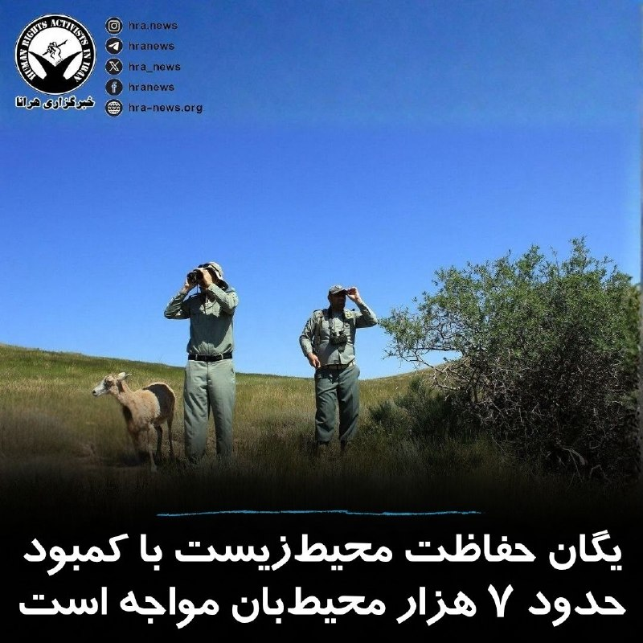

رضا رستگار، فرمانده یگان حفاظت محیط‌زیست، اعلام کرد که این یگان برای پوشش مناسب مناطق تحت حفاظت به حدود هفت هزار محیط‌بان نیاز دارد، اما در حال حاضر کمتر از ۶۰ درصد این ظرفیت تأمین شده است. به گفته او، این کمبود از دهه ۱۳۹۰ و در پی عدم جایگزینی محیط‌بانان بازنشسته، مصدوم و جان‌باخته با نیروهای جدید تشدید شده است.

رستگار با اشاره به استانداردهای جهانی افزود که به ازای هر هزار هکتار از مناطق تحت حفاظت باید یک #محیط‌بان حضور داشته باشد، در حالی که در ایران به‌طور میانگین تنها یک محیط‌بان مسئول حفاظت از هر ۱۲ هزار هکتار است. او همچنین گفت بیش از ۲۰ میلیون هکتار از اراضی کشور تحت مدیریت و حفاظت سازمان #محیط‌زیست قرار دارد و کمبود نیروی انسانی به حدی است که هر محیط‌بان عملاً وظایفی معادل ۱۲ محیط‌بان را بر عهده دارد.

↘️
@hranews_bot تماس ✉️ -  @Hranews  کانال هرانا 🆑

## alonews — post 128480

  <a href="telegram/content/alonews_128480_1781615695.webm" target="_blank">🎬 Download video</a>

👈اسرائیل درخواست دیدن یادداشت تفاهم بین آمریکا و ایران را داشت اما طبق گزارش کانال ۱۲ اسرائیل، این درخواست رد شد

✅ @AloNews خبر جنگ

---
📅 بروزرسانی: 1405/03/26 16:34
---

## VahidOOnLine — post 245860

♦️دونالد ترامپ، رئیس‌جمهوری آمریکا، در حاشیه نشست سران گروه هفت (G7) در اویان فرانسه و در دیدار با امیر قطر، از رویکرد نظامی بنیامین نتانیاهو در قبال لبنان انتقاد کرد.

ترامپ با اشاره به حمله هوایی اسرائیل به بیروت، درست دو ساعت پیش از امضای توافق آتش‌بس با جمهوری اسلامی ایران، آن را «کور و بی‌هدف» خواند و گفت: «به آن‌ها فهماندم که اصلا از این کار راضی نیستم. برای کشتن یک نفر لازم نیست یک آپارتمان را با خاک یکسان کنید؛ آدم‌های زیادی آنجا هستند که همه‌شان حزب‌الله نیستند.»

رئیس‌جمهوری آمریکا با بیان اینکه اسرائیل زمان زیادی است که با حزب‌الله می‌جنگد و افراد زیادی کشته می‌شوند، پیشنهاد داد که کنترل این گروه به سوریه واگذار شود. ترامپ با تمجید از عملکرد احمد الشرع، رئیس‌جمهوری سوریه در ساماندهی سریع این کشور گفت: «او با مشارکت من و اردوغان روی کار آمد. او از حزب‌الله خوشش نمی‌آید و این کار را بهتر انجام می‌دهد؛ اگر اسرائیل نمی‌تواند بدون کشتن دیگران کار را تمام کند، سوریه این کار را خواهد کرد.»
‌🇸🇦 Indypersian

🤖 @VahidOOnLine

## VahidOOnLine — post 245859

  

محمدرضا مرادبهروزی، فعال سیاسی، بار دیگر دادسرای انقلاب محمدیه قزوین احضار شد.

این احضاریه همزمان برای او و همسرش، سوری بابایی چگینی صادر شده است. او پیش‌تر در جریان اعتراضات دی‌ماه بازداشت شده و همچنان در زندان به‌سر می‌برد و از حق ملاقات با خانواده محروم است.

اتهامات مطرح‌شده علیه مرادبهروزی و همسرش شامل «انتشار محتوا و ارتباطات رسانه‌ای علیه امنیت ملی» و «ارتباط یا همکاری با طرف‌های متخاصم» عنوان شده است.
‌🏁 🇬🇧 IranintlTV

🤖 @VahidOOnLine

## VahidOOnLine — post 245858

  

دونالد ترامپ، رییس‌جمهوری آمریکا، در پاسخ به پرسشی درباره متحدان او که نسبت به چارچوب تفاهم با جمهوری اسلامی تردید دارند، از جمله لیندزی گراهام، سناتور جمهوری‌خواه، با لحنی طنزآمیز گفت: «لیندزی تردید دارد؟ باید با او صحبت کنم؛ دچار دردسر بزرگی می‌شود.»

ترامپ سپس تلاش کرد نگرانی‌ها در میان هم‌حزبی‌های خود را کم‌اهمیت جلوه دهد و گفت گراهام «آدم خوبی» است و مشکلی با این توافق ندارد.

او افزود: «این توافق یک موضوع مهم را به‌خوبی پوشش می‌دهد. ما بابت آن هیچ پولی پرداخت نمی‌کنیم.»

رییس‌جمهوری آمریکا ادامه داد: «بازارها اکنون نسبت به زمانی که کار را آغاز کردیم در سطح بالاتری قرار دارند.»

ترامپ گفت: «اختلاف فقط بر سر یک موضوع است؛ این‌که ایران هرگز سلاح هسته‌ای نخواهد داشت؛ هرگز، هرگز و هرگز.» او افزود: «بقیه مسائل اهمیتی ندارند.»
‌🏁 🇬🇧 IranintlTV

🤖 @VahidOOnLine

## mwarmonitor — post 11026

📌«چیز زیادی در حال عبور نیست...
🔸امروز صبح ۲ تصویر از ماهواره Sentinel-1 (رادار SAR) و Sentinel-2 (تصویربرداری نوری) گرفته شده است.»

@mwarmonitor

## mwarmonitor — post 11022

🔴«حزب‌الله از ایران تضمین‌هایی دریافت کرده است که تا زمانی که اسرائیل از لبنان عقب‌نشینی نکند، توافق نهایی هسته‌ای با آمریکا را امضا نخواهد کرد - دفتر روابط رسانه‌ای حزب‌الله» «رویترز»

@mwarmonitor

## mwarmonitor — post 11021

🔴رسانه‌های اسرائیلی: کابینه کوچک (کابینت امنیتی) امروز درخواست آمریکا را بررسی خواهد کرد مبنی بر اینکه اسرائیل تا زمان امضای توافق با ایران، از لبنان عقب‌نشینی کند.

@mwarmonitor

## FoxNewsTwitter — post 343020

  <a href="telegram/content/FoxNewsTwitter_343020_1781615095.mp4" target="_blank">🎬 Download video</a>

Fox News (Twitter/X)

BREAKING: President Trump vows to hold a press conference to read the full memorandum of understanding with Iran word-by-word to make sure the media covers it fairly.

"I will actually not only release it, I'll probably have a press conference and read it to you word-by-word, so that the press covers it accurately, because it's, it's a very important document."

"And, unlike Obama, who could have destroyed the Middle East with a horrible JCPoA, it is the worst agreement that was a road to a nuclear weapon. Mine is a wall against a nuclear weapon."

## FoxNewsTwitter — post 343019

  <a href="telegram/content/FoxNewsTwitter_343019_1781615097.mp4" target="_blank">🎬 Download video</a>

Fox News (Twitter/X)

NEW: VP JD Vance calls out media "propagandists" for their comments surrounding the Iran agreement, accusing critics of amplifying Iranian talking points while ignoring what's actually in the deal.

"Not a single cent of American money goes to Iran. Not $300 billion, not $24 billion."

Vance accuses media figures and critics of focusing on hypothetical benefits Iran could receive while glossing over the deal's central requirement: a long-term, verifiable commitment to never obtain a nuclear weapon.

"The propagandists are saying, here are all the things Iran gets... but they don't get any of that stuff unless they totally transform themselves as a country." | @foxandfriends

## IranIntlTV — post 342705

  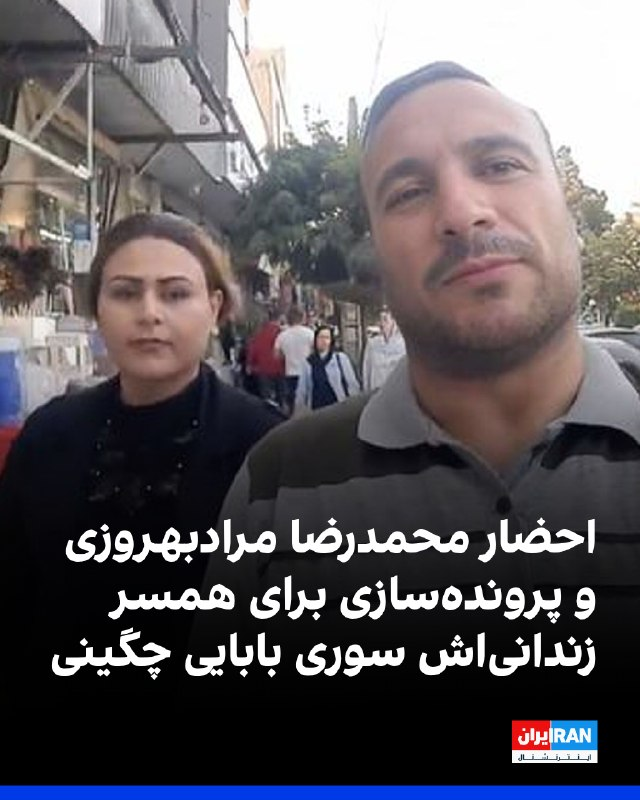

محمدرضا مرادبهروزی، فعال سیاسی، بار دیگر دادسرای انقلاب محمدیه قزوین احضار شد.

این احضاریه همزمان برای او و همسرش، سوری بابایی چگینی صادر شده است. او پیش‌تر در جریان اعتراضات دی‌ماه بازداشت شده و همچنان در زندان به‌سر می‌برد و از حق ملاقات با خانواده محروم است.

اتهامات مطرح‌شده علیه مرادبهروزی و همسرش شامل «انتشار محتوا و ارتباطات رسانه‌ای علیه امنیت ملی» و «ارتباط یا همکاری با طرف‌های متخاصم» عنوان شده است.
https://iranintl.com/202606161252

## FarsiVOA — post 220911

  <a href="telegram/content/FarsiVOA_220911_1781615099.mp4" target="_blank">🎬 Download video</a>

ناو «‌یواس‌اس دلبرت دی‌بلک» که در حال عبور از دریای عرب است، یک عملیات تامین مایحتاج در دریا را با کمک ناو تامین‌کننده «یواس‌ان‌اس جان لوئیس»، روز دو‌شنبه، ۲۵ خرداد به پایان رساند.

در این عملیات مواد و لوازم مورد نیاز، با هلیکوپتر از ناو تامین‌کننده به ناو «‌یواس‌اس دلبرت دی‌بلک» منتقل شد.

«تامین در دریا»، تضمین می‌کند که ملوانان بدون نیاز به ورود کشتی به بندر، لوازم، بسته‌های ارسالی و سایر اقلام مورد نیاز خود را دریافت کنند.

## Dirty_Kids — post 392297

  <a href="telegram/content/Dirty_Kids_392297_1781615101.mp4" target="_blank">🎬 Download video</a>

وطی به شبهه چیست؟ یعنی شما اگه به جای زنت اشتباهی یکی دیگه رو مورد عنایت قرار بدی طبق قانون اسلامی جرم نیست😂😂

@Dirty_Kids 👻

## alonews — post 128479

  <a href="telegram/content/alonews_128479_1781615103.webm" target="_blank">🎬 Download video</a>

👈ترامپ در مورد توافق هسته‌ای با ایران:
این توافق در مورد یک چیز است: ایران هرگز سلاح اتمی نخواهد داشت. هرگز.

🔴 بقیه آن، صادقانه بگویم، بی‌اهمیت است

✅ @AloNews خبر جنگ

## alonews — post 128478

  <a href="telegram/content/alonews_128478_1781615103.webm" target="_blank">🎬 Download video</a>

🔴فوری / هم اکنون حمله پهپادی هدفمند به خودرویی در شهر نبطیه، جنوب لبنان، گویا چندین عضو حزب الله در این حمله ترور شدند

✅ @AloNews خبر جنگ

## alonews — post 128477

  <a href="telegram/content/alonews_128477_1781615103.webm" target="_blank">🎬 Download video</a>

👈ترامپ: توافق با ایران را برای بررسی به کنگره خواهم فرستاد

🔴ممکن است به زودی تحریم‌ها بر نفت روسیه را دوباره اعمال کنم

✅ @AloNews خبر جنگ

---
📅 بروزرسانی: 1405/03/26 16:24
---

## pm_afshaa — post 94183

  <a href="telegram/content/pm_afshaa_94183_1781614486.webm" target="_blank">🎬 Download video</a>

🔴آکسیوس: جان رتکلیف، مدیر سیا، به ترامپ و مقام‌های ارشد آمریکا گفته ارزیابی‌های اطلاعاتی نشون میده ایران احتمالا تمایل واقعی به اجرای تعهدات هسته‌ای خودش نداره.

گفته میشه تفاوت میان حرف‌های داخلی مقام‌های ایرانی و آنچه به مذاکره‌کنندگان آمریکایی گفتن، باعث این نگرانی شده.

مارکو روبیو، وزیر خارجه آمریکا، و پیت هگست، وزیر دفاع آمریکا، هم نگرانی مشابهی دارن.

💧 Rainbet.com the #1 Non-KYC Crypto Casino & Sportsbook @rainbetcom

😁 @Pm_Afshaa

## VahidOnline — post 76410

  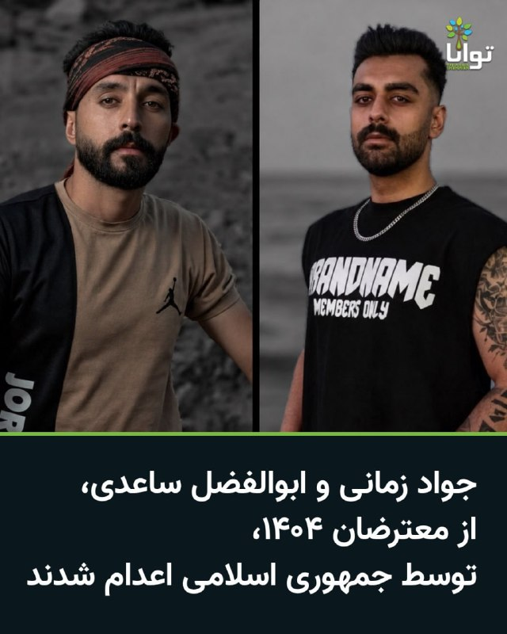

قوه قضائیه جمهوری اسلامی اعلام کرد که روز سه‌شنبه ۲۶ خرداد دو نفر دیگر از معترضان دی‌ماه پارسال در شاهرود اعدام شدند.

خبرگزاری میزان، اسامی افراد اعدام‌شده را جواد زمانی و ابوالفضل ساعدی اعلام و گفته است که آن‌ها به اتهام «محاربه» و «افساد فی‌الارض» اعدام شدند.

این نخستین مورد از اعدام معترضان در ایران پس از اعلام توافق تهران و واشینگتن برای پایان دادن به جنگ ۴۰ روزه است.

در بیانیه رسمی قوه قضائیه، از قول محمدصادق اکبری رئیس دادگستری استان سمنان ادعا شده است که افراد اعدام‌شده «اقدام به تخریب و آتش‌زدن اموال عمومی و خصوصی، حمل و استفاده از سلاح سرد و گرم و اخلال در نظم و امنیت عمومی، اجتماع و تبانی علیه امنیت کشور و سایر اقدامات مجرمانه» در شهر شاهرود کردند.
@VahidHeadline

📡 @VahidOnline

## IranIntlTV — post 342704

  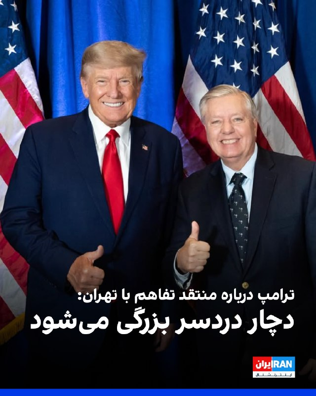

دونالد ترامپ، رییس‌جمهوری آمریکا، در پاسخ به پرسشی درباره متحدان او که نسبت به چارچوب تفاهم با جمهوری اسلامی تردید دارند، از جمله لیندزی گراهام، سناتور جمهوری‌خواه، با لحنی طنزآمیز گفت: «لیندزی تردید دارد؟ باید با او صحبت کنم؛ دچار دردسر بزرگی می‌شود.»

ترامپ سپس تلاش کرد نگرانی‌ها در میان هم‌حزبی‌های خود را کم‌اهمیت جلوه دهد و گفت گراهام «آدم خوبی» است و مشکلی با این توافق ندارد.

او افزود: «این توافق یک موضوع مهم را به‌خوبی پوشش می‌دهد. ما بابت آن هیچ پولی پرداخت نمی‌کنیم.»

رییس‌جمهوری آمریکا ادامه داد: «بازارها اکنون نسبت به زمانی که کار را آغاز کردیم در سطح بالاتری قرار دارند.»

ترامپ گفت: «اختلاف فقط بر سر یک موضوع است؛ این‌که ایران هرگز سلاح هسته‌ای نخواهد داشت؛ هرگز، هرگز و هرگز.» او افزود: «بقیه مسائل اهمیتی ندارند.»
https://iranintl.com/202606161260

## IranIntlTV — post 342703

  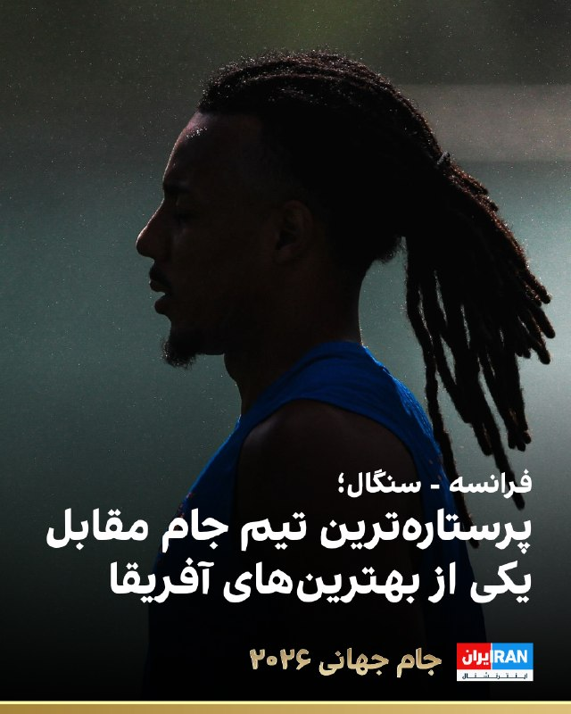

🔻امشب از ساعت ۲۲:۳۰، تیم ملی فوتبال فرانسه در نخستین دیدار خود در جام جهانی ۲۰۲۶، در ورزشگاه رادرفورد نیوجرسی به مصاف سنگال می‌رود.

🔹فرانسوی‌ها که از زمان قرعه‌کشی، چشم به این مسابقه دوخته‌اند، به عنوان پرستاره‌ترین تیم جام و یکی از مدعیان اصلی قهرمانی وارد زمین می‌شوند؛ اما سایه تردیدها و خاطرات تلخ گذشته، این بازی را به آزمونی حیاتی تبدیل کرده است.

🔹برای هواداران فرانسه، نام سنگال یادآور یکی از بزرگ‌ترین شگفتی‌های تاریخ جام جهانی است؛ جایی که در افتتاحیه جام جهانی ۲۰۰۲، فرانسه، مدافع عنوان قهرمانی، با تمام ستارگانش مغلوب شیرهای ترانگا شد و در نهایت در همان مرحله گروهی حذف شد.

🔹کیلیان امباپه، کاپیتان فرانسه، با هشدار نسبت به تکرار آن سناریو گفت: «اگر در بازی اول با این ذهنیت وارد زمین شویم که قهرمان جام جهانی هستیم، سنگالی‌ها به ما ضربه می‌زنند و خیلی زود به واقعیت برمی‌گردیم.»

🔹گزارش کامل را در سایت بخوانید.

@iranintltvsport

## DW_Farsi — post 126054

📸 گزارش تصویری؛ با "ترین‌های" جام جهانی آشنا شوید

در این دوره از مسابقات جام جهانی نیز همانند دوره‌های پیشین چهره‌هایی حضور دارند که گوی سبقت را از دیگران ربوده‌اند، دست‌کم از لحاظی خاص. با "ترین‌های" جام جهانی فوتبال ۲۰۲۶ آشنا شوید.
 @dw_farsi

## IranianMinds — post 22743

🔴اکسیوس:

جان رتکلیف، مدیر سیا، به ترامپ و مقام‌های ارشد آمریکا گفته است که ارزیابی‌های اطلاعاتی نشان می‌دهد که ایران احتمالأ تمایلی به اجرای تعهدات هسته‌ای خود ندارد.
گفته می‌شود تفاوت میان حرف‌های داخلی مقام‌های ایرانی و آنچه به مذاکره‌کنندگان آمریکایی گفته‌اند، باعث این نگرانی شده است.

@IranianMinds

## alonews — post 128476

  <a href="telegram/content/alonews_128476_1781614489.mp4" target="_blank">🎬 Download video</a>

👈ترامپ درباره گرد و غبار هسته‌ای ایران:
ما عجله‌ای نداریم، اما آن را به دست خواهیم آورد و نابودش خواهیم کرد.

✅ @AloNews خبر جنگ

## alonews — post 128475

  <a href="telegram/content/alonews_128475_1781614491.mp4" target="_blank">🎬 Download video</a>

👈ترامپ درباره یک خبرنگار اماراتی: چه آدم خوش‌قیافه‌ای. آیا او از کشور شماست؟

🔴محمد بن زاید امارات: قطعاً.

🔴ترامپ: او رفتاری بسیار دلنشین دارد. مردم من خیلی بدجنس هستند.

🔴محمد بن زاید امارات با خبرنگار شوخی می‌کند: حواست باشد حالا.

🔴ترامپ: می‌توانم همین الان او را در یک فیلم بازی دهم

✅ @AloNews خبر جنگ

## alonews — post 128474

  <a href="telegram/content/alonews_128474_1781614494.mp4" target="_blank">🎬 Download video</a>

👈گزارشگر: سناتور گراهام همچنین گفت که توافق نهایی با ایران باید برای بررسی به کنگره ارسال شود. آیا شما این کار را انجام می‌دهید؟

🔴ترامپ: هرگز به آن فکر نکرده بودم، اما انجام می‌دهم. برایم مهم نیست. یعنی، می‌دانید، دموکرات‌ها — می‌دانید، ما به آن‌ها «دموکرات‌های احمق» می‌گوییم چون آدم‌های احمقی هستند.

🔴خب، چیزی که دوست دارم انجام دهم این است که آن را به کنگره بفرستم و بگویم «نباید آن را تصویب کنید»، و من آن را تصویب خواهم کرد. هرچه من بگویم، آن‌ها می‌خواهند برعکسش را انجام دهند. به هر حال، برای او خیلی خوب پیش نمی‌رود

✅ @AloNews خبر جنگ

---
📅 بروزرسانی: 1405/03/26 16:14
---

## mwarmonitor — post 11020

🔴نامه نعیم قاسم به قالیباف:

🔸جناب رئیس مجلس شورای اسلامی، دکتر محمدرضا قالیباف، خداوند شما را تأیید و حفظ فرماید.

🔸کلمات از بیان تشکر عمیق ما نسبت به مواضع قوی و حمایت‌گرانه شما از لبنان، مردم آن و مقاومتش در الزام رژیم اسرائیل به توقف فوری و دائمی عملیات نظامی در همه جبهه‌ها، از جمله لبنان، در پیوند با توقف جنگ علیه جمهوری اسلامی ایران به عنوان بند اول و اساسی توافق میان ایران و آمریکا، قاصر است. شما روزنه امیدی را که تنها راه مؤثر برای جلوگیری از تجاوز اسرائیلی-آمریکایی علیه لبنان بود به واقعیت تبدیل کردید؛ واقعیتی که به جهان نشان داد ایران حامی حق، مقاومت و مستضعفان است. اگر دیگران نیز چنین راهی را می‌پیمودند، آمریکا و اسرائیل چنین گستاخ نمی‌شدند و اشغالگری صهیونیستی همچنان بر سرزمین فلسطین و قدس باقی نمی‌ماند.

ما همواره گفته‌ایم که ایران به حزب‌الله، مقاومت و مردم لبنان همه‌چیز داده و چیزی از آنان نگرفته است. ایران ما را برای انتخاب‌هایمان، برای قدرت‌مان در جهت آزادسازی سرزمین‌مان و برای التیام زخم‌های جامعه‌مان یاری کرده است. و اکنون ایران خون می‌دهد، در برابر حملات رژیم صهیونیستی پاسخ می‌دهد، و تبعاتی را که آن را به سوی جنگی گسترده تهدید می‌کند با فداکاری عظیم تحمل می‌نماید. ایران نماد عزت و شرف است.

از طرف حزب‌الله و مقاومت اسلامی، از طرف دوستداران مردم لبنان که خواستند سپاس خود را به شما برسانیم، از طرف شهدا و در رأس آنان سید شهدای امت سید حسن نصرالله (رض)، مجروحان و اسرا، از شما تشکر می‌کنیم و از شما می‌خواهیم این قدردانی و امتنان را به رهبر آیت‌الله سید مجتبی خامنه‌ای (دام ظله)، رئیس‌جمهور دکتر پزشکیان، و سپاه پاسداران انقلاب اسلامی، ارتش، نخبگان و همه مسئولان و مردم منتقل کنید.

و به‌طور ویژه از مردم بزرگ ایران یاد می‌کنیم؛ ما آنان را در میدان‌های شهرهای ایران دیدیم و شنیدیم که آماده‌اند جان خود را برای حمایت از مقاومت و مردم آن فدا کنند. سپاس از شما. سپاس از ایران وفادار.



@mwarmonitor

## FoxNewsTwitter — post 343018

  <a href="telegram/content/FoxNewsTwitter_343018_1781613862.mp4" target="_blank">🎬 Download video</a>

Fox News (Twitter/X)

BREAKING: VP JD Vance says the foiled UFC 250 attack plot is another reminder of where America's political climate is heading.

"This is what happens when people turn the rhetoric up so loud that disagreeing with somebody is a cause for violence."

Vance argues that political leaders across the board need to lower the temperature, while contending that much of today's political violence is coming from the left.

He also credits the FBI and federal law enforcement for stopping what could have been a major tragedy, saying Americans rarely see the attacks agents prevent every day:

"They don't get the credit for the attacks they prevent. They only get the blame for the attacks that actually happen." | @foxandfriends

## FoxNewsTwitter — post 343017

  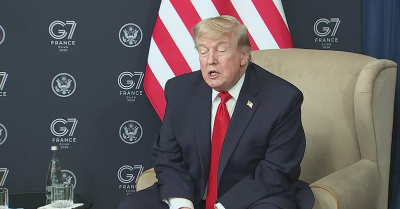

Fox News (Twitter/X)

WATCH LIVE: President Trump meets with world leaders for key G7 summit talks https://twitter.com/i/broadcasts/1qxvvvdAApWxB

## FoxNewsTwitter — post 343016

  <a href="telegram/content/FoxNewsTwitter_343016_1781613865.mp4" target="_blank">🎬 Download video</a>

Fox News (Twitter/X)

BREAKING: President Trump publicly rebukes Israel over its war against Hezbollah.

"Israel's fighting Hezbollah too long and too many people are being killed."

Trump said he opposed strikes that destroy apartment buildings filled with civilians and revealed he urged Israel to let Syria take the lead against Hezbollah instead.

"If Israel can't do the job without killing everyone else, he'll do the job. Syria will do the job."

## IranIntlTV — post 342702

  <a href="https://t.me/IranintlTV/342702" target="_blank">📎 Download file</a>

🎧نسخه صوتی اخبار نیم‌روزی | سه‌شنبه ۲۶ خرداد
@iranintlTV

## Dirty_Kids — post 392296

  <a href="telegram/content/Dirty_Kids_392296_1781613867.mp4" target="_blank">🎬 Download video</a>

فقط صدای گزارشگر! 😅🤌🏽

استاد، هر کجایی اعلام حضور کن لطفاً؛ خودم شخصاً می‌خوام بابت این شاهکار ازت تشکر کنم.

@Dirty_Kids 👻

## Dirty_Kids — post 392295

🔴 سپاه و عرزشی ها دارن به خاطر توافقی که قالیباف انجام میده، الیاس قالیباف پسر قالیباف که مسئولیت امنیت بیت رهبری رو داشته به جاسوسی برای اسرائیل متهم میکنن .

@Dirty_Kids 👻

## Dirty_Kids — post 392294

  <a href="telegram/content/Dirty_Kids_392294_1781613869.mp4" target="_blank">🎬 Download video</a>

🔴 حالا که توافق تقریبا انجام شده، این صحبتای خامنه‌ای (11 روز قبل از کشته شدنش) تو این چند روز دوباره وایرال شده:

امام حسین گفت من با کسی مثل یزید بیعت نمیکنم، ملت ما هم با این فرهنگ، سابقه و معارف عالی، با افراد فاسدی که تو آمریکا روی کار هستن [ترامپ] بیعت نخواهد کرد.
‌

@Dirty_Kids 👻

## Hranews — post 113648

سال گذشته ۸ هزار کودک در خوزستان از تحصیل بازماندند

❗️
❗️
❗️
❗️
❗️– معاون آموزش ابتدایی اداره‌کل آموزش و پرورش خوزستان اعلام کرد که در سال گذشته هشت هزار دانش آموز در این استان از #تحصیل بازمانده اند.

ادامه مطلب

↘️
@hranews_bot تماس ✉️ -  @Hranews  کانال هرانا 🆑

## alonews — post 128473

  <a href="telegram/content/alonews_128473_1781613870.mp4" target="_blank">🎬 Download video</a>

👈ترامپ درباره ایران: تنگه هرمز باز خواهد بود و همیشه بدون عوارض خواهد ماند.

✅ @AloNews خبر جنگ

## alonews — post 128472

  <a href="telegram/content/alonews_128472_1781613871.mp4" target="_blank">🎬 Download video</a>

👈ترامپ درباره توافق ایران: لیندسی گراهام شکاک است؟ باید با او صحبت کنم. او در دردسر بزرگی خواهد بود.

🔴لیندسی خوب است. او مشکلی ندارد. او شکاک نیست

✅ @AloNews خبر جنگ

## alonews — post 128471

  <a href="telegram/content/alonews_128471_1781613873.mp4" target="_blank">🎬 Download video</a>

👈ترامپ درباره ایران: روابط اکنون عادی شده است

✅ @AloNews خبر جنگ

## alonews — post 128470

  <a href="telegram/content/alonews_128470_1781613875.mp4" target="_blank">🎬 Download video</a>

👈رئیس‌جمهور امارات، محمد بن زاید، به ترامپ:باعث افتخار من است، آقای رئیس‌جمهور، که اینجا با شما هستم. و می‌خواهم بگویم که ما بسیار سپاسگزاریم که شما اینجا هستید و به عنوان رئیس‌جمهور ایالات متحده.

🔴تشکر ویژه‌ای برای حمایت شما در طول جنگ شش هفته‌ای. این برای ما بسیار مهم است

✅ @AloNews خبر جنگ

## alonews — post 128469

  <a href="telegram/content/alonews_128469_1781613876.mp4" target="_blank">🎬 Download video</a>

👈ترامپ درباره رئیس‌جمهور امارات MbZ:
حضرت ایشان یک جنگجو است. او در آنجا می‌جنگید و آنچه باید انجام شود را انجام می‌دهد. و به خاطر همین شناخته شده است. او مردی شجاع است

🔴او کشوری عالی دارد. کشوری فوق‌العاده است. و آنها مدت‌هاست که با ایالات متحده همراه بوده‌اند. اما من می‌گویم از زمانی که من به کار آمدم، خیلی بیشتر بوده است

✅ @AloNews خبر جنگ

---
📅 بروزرسانی: 1405/03/26 16:04
---

## VahidOOnLine — post 245857

♦️علی عبدی، از چهره‌های رسانه‌ای نزدیک به جریان «محور مقاومتی» جمهوری اسلامی در ویدیویی با لحنی تند از مقام‌های حکومت به‌دلیل مذاکره «با فردی که رهبر جمهوری اسلامی را «به ترور مجدد تهدید می‌کند» و اتهام‌های جنسی علیه او مطرح کرده»،‌ انتقاد کرد.

عبدی با اشاره به یکی از مصاحبه‌های دونالد ترامپ گفت: مقام‌های جمهوری اسلامی درحالی به مذاکرات ادامه می‌دهند که او «روزانه به ایران توهین می‌کند، آن را تحقیر می‌کند و به لجن می‌کشد». او همچنین از سکوت مقام‌های حکومتی در برابر اظهارات ترامپ انتقاد کرد و گفت کسانی که از «ولایت‌مداری» سخن می‌گویند، در برابر آنچه توهین و تهدید علیه رهبر جمهوری اسلامی می‌خواند، واکنشی نشان نمی‌دهند.
‌🇸🇦 Indypersian

🤖 @VahidOOnLine

## FoxNewsTwitter — post 343015

  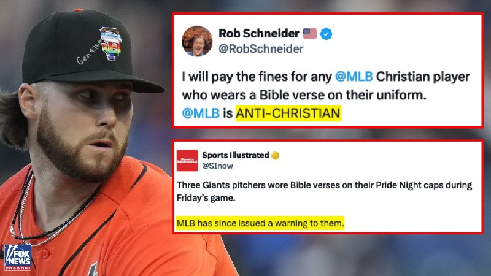

Fox News (Twitter/X)

Rob Schneider is putting his money behind the message.

The Hollywood star says he'll cover any potential fines for MLB players who wear Bible verses on their uniforms after league officials warned three San Francisco Giants pitchers who displayed Bible references on their Pride Night caps.

The moment has quickly turned into a bigger fight over religious expression, league rules, and where MLB draws the line on what players can show on the field.

## pm_afshaa — post 94182

بدلیل اظهارات دیشب طارمی، ایالات متحده ویزای این بازیکن را کنسل کرد و این بازیکن نمیتونه ایران رو مقابل بلژیک همراهی کنه

💧 Rainbet.com the #1 Non-KYC Crypto Casino & Sportsbook @rainbetcom

😁 @Pm_Afshaa

## pm_afshaa — post 94181

  <a href="telegram/content/pm_afshaa_94181_1781613282.webm" target="_blank">🎬 Download video</a>

🔴روزنامه کیهان: سکوت مجتبی خامنه‌ای درباره پرونده هسته‌ای، به معنای پایان مذاکرات هسته‌ای است.

💧 Rainbet.com the #1 Non-KYC Crypto Casino & Sportsbook @rainbetcom

😁 @Pm_Afshaa

## IranIntlTV — post 342701

  <a href="telegram/content/IranIntlTV_342701_1781613283.mp4" target="_blank">🎬 Download video</a>

عمیق‌ترین رکود صنعتی ایران را این بار نه منتقدان حکومت، که آمار رسمی اتاق بازرگانی ثبت کرده است. در این قسمت چرتکه، محمد ماشین‌چیان کارنامه صنعت ایران پس از جنگ را بررسی می‌کند.

تماشای نسخه کامل این برنامه در یوتیوب:
https://youtu.be/5_cvWJFAHOY

@iranintltv

## RadioFarda — post 158392

دیپلمات پیشین آمریکا: موفقیت تفاهم با ایران به اجرای تعهدات دو طرف بستگی دارد

🔸ایالات متحده و ایران بر سر توقف درگیری‌ها و بازگشایی تنگهٔ هرمز به تفاهم رسیده‌اند، اما چند موضوع مهم، از جمله برنامهٔ هسته‌ای ایران، همچنان روی میز مذاکره است.

🔸به‌گفتهٔ مقام‌ها، دو طرف پیشاپیش تفاهم‌نامه‌ای را به‌صورت دیجیتال امضا کرده‌اند و قرار است مراسم امضای رسمی آن روز ۲۹ خرداد برگزار شود.

🔸رادیو اروپای آزاد/رادیو آزادی با جینا اَبِرکرامبی-وینستنلی، دیپلمات پیشین آمریکا و پژوهشگر ارشد شورای آتلانتیک در حوزهٔ امنیت و راهبرد خاورمیانه، گفت‌وگو کرده است تا بررسی کند این تفاهم چه دستاوردهایی داشته و چه مسائل مهمی همچنان حل‌نشده باقی مانده است و در مرحلهٔ بعد باید منتظر چه تحولاتی بود.

🔸ابرکرامبی-وینستنلی که پیش‌تر سفیر آمریکا و از مقام‌های ارشد وزارت خارجه، وزارت دفاع و شورای امنیت ملی ایالات متحده بوده و در کارنامه‌اش مأموریت‌های دیپلماتیک در بغداد، جاکارتا و قاهره هم دیده می‌شود، نخستین زنی بود که ریاست یک نمایندگی دیپلماتیک آمریکا در عربستان سعودی را بر عهده داشت.

🔸متن کامل این گفت‌وگو را در وب‌سایت رادیوفردا بخوانید.

@RadioFarda

## BBCPersian — post 284025

🔻آژانس بین‌المللی انرژی خواستار بازگشایی «بدون قیدوشرط» تنگه هرمز شد

رئیس آژانس بین‌المللی انرژی می‌گوید که برای پایان دادن به شوک ناشی از افزایش شدید قیمت نفت و گاز بر اقتصادهای سراسر جهان، بازگشایی «بدون قیدوشرط» تنگه هرمز ضروری است.

فاتح بیرول در یک نشست خبری گفت: «مهم‌ترین راه‌‌حل برای این مشکل، بازگشایی کامل و بدون قیدوشرط تنگه هرمز برای کشتیرانی است.»

ایران در واکنش به حملات آمریکا و اسرائیل از اواخر ماه فوریه (اسفندماه ۱۴۰۴) عملا عبور نفتکش‌ها از تنگه هرمز را متوقف کرد که این اقدام باعث اختلال در انتقال نفت و گاز و جهش شدید قیمت انرژی شد.

دونالد ترامپ گفته است که روز جمعه پس از امضای تفاهمنامه ایران و آمریکا، تنگه هرمز باز می‌شود و «نفت برای منطقه و جهان، در هر دو سوی تنگه دوباره جاری خواهد شد.»

با این حال، ایران اصرار دارد که مدیریت این آبراه را همچنان در اختیار خواهد داشت و برای این کار «هزینه خدمات» دریافت خواهد کرد.

آقای بیرول از تفاهم ایران و آمریکا به گرمی استقبال کرد و آن را «خبر بسیار خوبی» خواند که «به بازارها آرامش خواهد بخشید.»

رئیس آژانس بین‌المللی انرژی که پیش‌تر پیامدهای این بحران را با شوک‌های بزرگ نفتی دهه ۱۹۷۰ مقایسه کرده بود، گفت: «اکنون نزدیک به چهار ماه از آغاز این بحران می‌گذرد.»

آژانس بین‌المللی انرژی تاکنون آزادسازی صدها میلیون بشکه نفت از ذخایر اضطراری ۳۲ کشور عضو خود را هماهنگ کرده است و در ماه مه اعلام کرد که حدود ۱۶۴ میلیون بشکه نفت تاکنون از این ذخایر برداشت شده است.

https://bbc.in/4aDwR7V
@BBCPersian

## BBCPersian — post 284024

  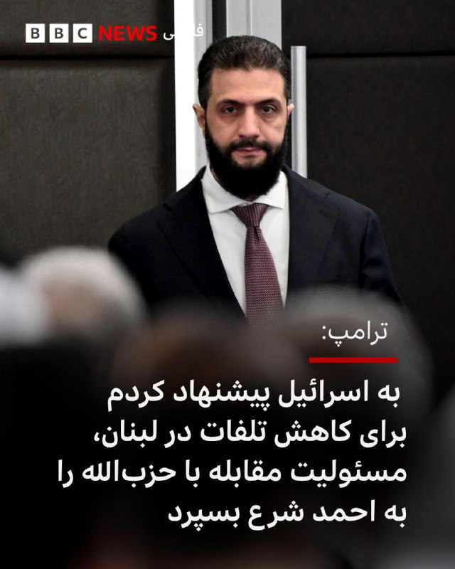

🔻دونالد ترامپ می‌گوید که به اسرائیل پیشنهاد کرده است که مسئولیت مقابله با حزب‌الله را به احمد شرع، رئیس‌جمهور سوریه، بسپرد، چرا که عملیات اسرائیل «بیش از حد تلفات برجا گذاشته است.»

رئیس‌جمهور آمریکا که در اجلاس گروه هفت در اویان صحبت می‌کرد، با ستایش از احمد شرع گفت که او عملکرد «فوق‌العاده‌ای» داشته است و افزود:

«اگر اسرائیل نمی‌تواند مقابله (با حزب‌الله) را بدون کشتن بقیه آدم‌ها انجام بدهد، او (احمد شرع) می‌تواند این کار را انجام دهد. سوریه می‌تواند این کار را بکند.»

آقای ترامپ در گفت‌و‌گو با خبرنگاران از عملکرد اسرائیل در لبنان انتقاد کرد و گفت که آمار کشته‌شدگان در لبنان بیش از حد بالاست.

او انتقاد کرد که هر بار اسرائیل دنبال یک عضو حزب‌الله می‌گردد لازم نیست یک مجتمع ساختمانی را ویران کند.

آقای ترامپ همچنین گفت که از حمله اسرائیل به بیروت که دو ساعت پیش از توافق ایران و آمریکا صورت گرفت، ناراضی است، هرچند افزود که روابطش با بنیامین نتانیتاهو هنوز عالی است.

📸AFP via Getty Images
https://bbc.in/4orarMM
@BBCPersian

## Dirty_Kids — post 392293

  <a href="telegram/content/Dirty_Kids_392293_1781613285.mp4" target="_blank">🎬 Download video</a>

ترامپ الان دربارهٔ ایران:
من به رژیم چنج اعتقاد ندارم. سال‌هاست تغییر رژیم‌ها را دیده‌ام و هیچ‌وقت جواب نمی‌دهند، باید خودش اتفاق بیفتد.

@Dirty_Kids 👻

## Dirty_Kids — post 392292

دلار برگشته به قیمت ۶ ماه قبل، اما هیچ‌کس سراغ قیمت‌های ۶ ماه قبل نرفته است.
در اقتصاد ما، ‎دلار فقط آسانسورِ افزایش قیمت‌هاست؛ وقتی بالا می‌رود همه‌چیز را با خود بالا می‌کشد، اما وقتی پایین می‌آید، انگار پله‌های برگشت را حذف کرده‌اند.

@Dirty_Kids 👻

## alonews — post 128468

  <a href="telegram/content/alonews_128468_1781613286.webm" target="_blank">🎬 Download video</a>

👈اسرائیل هیوم: دونالد ترامپ داره گزینه برکناری مقاماتی که با توافق ایران مخالفن رو بررسی میکنه! 
✅ @AloNews خبر جنگ

---
📅 بروزرسانی: 1405/03/26 15:54
---

## WithYashar — post 15060

آکسیوس: جان رتکلیف، مدیر سیا، به دونالد ترامپ و مقام‌های ارشد آمریکا گفته ارزیابی‌های اطلاعاتی نشان می‌ده ایران احتمالا تمایل واقعی به اجرای تعهدات هسته‌ای خودش نداره.
گفته می‌شه تفاوت میان حرف‌های داخلی مقام‌های ایرانی و آنچه به مذاکره‌کنندگان آمریکایی گفتن، باعث این نگرانی شده.
مارکو روبیو، وزیر خارجه آمریکا، و پیت هگست، وزیر دفاع آمریکا، هم نگرانی مشابهی دارن.
@withyashar

## WithYashar — post 15059

خبرگزاری میزان، رسانه قوه قضاییه جمهوری اسلامی، سه‌شنبه 26 خرداد از اجرای حکم اعدام جواد زمانی و ابوالفضل ساعدی، دو زندانی سیاسی بازداشت‌شده در اعتراضات دی‌ماه در استان سمنان خبر داد. میزان اتهام آن‌ها را «افساد فی‌الارض از طریق کشیدن سلاح گرم و سرد در شهرستان…

## mwarmonitor — post 11019

  <a href="telegram/content/mwarmonitor_11019_1781612672.mp4" target="_blank">🎬 Download video</a>

🔸ناوشکن USS Delbert D. Black (DDG-119) در جریان عبور از دریای عرب، در تاریخ ۱۵ ژوئن، عملیات تدارک‌رسانی عمودی در دریا (VERTREP) را با کشتی تدارکاتی USNS John Lewis (T-AO-205) انجام داد.

🔹تأمین مجدد در دریا به این معناست که ملوانان بدون نیاز به ورود کشتی به بندر، مواد تدارکاتی، نامه‌ها و سایر اقلام مورد نیاز را دریافت می‌کنند.

@mwarmonitor

## pm_afshaa — post 94180

  <a href="telegram/content/pm_afshaa_94180_1781612674.webm" target="_blank">🎬 Download video</a>

🔴صداوسیما: عملیات رفع محاصرۀ دریایی آمریکا اجرایی شده اما شناورها برای عبور از تنگ هرمز همچنان باید با سپاه هماهنگ باشن.

💧 Rainbet.com the #1 Non-KYC Crypto Casino & Sportsbook @rainbetcom

😁 @Pm_Afshaa

## pm_afshaa — post 94179

  <a href="telegram/content/pm_afshaa_94179_1781612675.webm" target="_blank">🎬 Download video</a>

🔴ترامپ: فکر میکنم مرحله دوم مذاکرات با ایران، از مرحله اول آسان‌تر باشه.

تنها چیزی که واقعا برای من اهمیت داره اینه که ایران هرگز به سلاح هسته‌ای دست پیدا نکنه و این موضوع کاملا در توافق آمده.

اگر ایران به سمت ساخت بمب اتم بره، جهنم بر سرشون نازل خواهد شد و با پیامدهایی باورنکردنی روبه‌رو میشن.

من به‌دنبال تغییر حکومت در ایران نیستم و این هرگز بخشی از اهدافم نبوده. سال‌هاست که تغییر رژیم‌ها رو دیده‌ام و هیچ‌وقت نتیجه نمیده.

اسرائیل رسیدگی به مسئله حزب‌الله رو به سوریه واگذار کنه.

💧 Rainbet.com the #1 Non-KYC Crypto Casino & Sportsbook @rainbetcom

😁 @Pm_Afshaa

## IranIntlTV — post 342700

🔻بازتاب جهانی اهتزاز پرچم شیر و خورشید و هو شدن سرود جمهوری اسلامی

اتفاقات دیدار تیم‌های ملی فوتبال ایران و نیوزیلند، از جمله اهتزاز گسترده پرچم‌های شیر و خورشید، هو شدن سرود جمهوری اسلامی و تجمع معترضان در بیرون ورزشگاه سوفای لس‌آنجلس، بازتاب بسیار گسترده‌ای در رسانه‌های جهان داشته است.

روزنامه سان بریتانیا نوشت هواداران ایرانی با فریادهای کرکننده و هو کردن سرود جمهوری اسلامی، صدای خود را به گوش همه رساندند.

روزنامه واشینگتن‌پست بر شکاف عمیق میان جامعه مهاجران ایرانی در جنوب کالیفرنیا تمرکز کرد.

این روزنامه نوشت صدها ایرانی-آمریکایی در خارج از استادیوم علیه حکومت تهران تظاهرات کردند و تیم ملی را متعلق به دولت دانستند، در حالی‌که هزاران هوادار دیگر با صورت‌های رنگ‌شده وارد می‌شدند و می‌گفتند برای لذت بردن از فوتبال آمده‌اند و ورزش را از سیاست جدا می‌کنند.

این رسانه به درگیری‌های لفظی پراکنده اشاره کرد که با مداخله ماموران پلیس پایان یافت.

واشینگتن‌پست نوشت این بازی تحت تاثیر جنگ اخیر جمهوری اسلامی با نیروهای آمریکایی و اسرائیلی قرار داشت.

در پایان گزارش، به نقل از مهدی طارمی آمده است که فضای استادیوم مانند بازی‌های خانگی بود.

این رسانه اشاره کرد مسابقه در میان تدابیر شدید امنیتی مأموران اف‌بی‌آی و دیگر تیم‌های امنیتی برگزار شد؛ امنیتی که به دلیل جنگ چندماهه جمهوری اسلامی و آمریکا شدید بود، اما در نهایت با رفتار پرشور ولی مسالمت‌آمیز تماشاگران، بیش از حد نیاز به نظر می‌رسید.

نشریه اتلتیک جزییات دیگری از تنش‌های حقوقی و امنیتی داخل ورزشگاه ارائه داد.

به نوشته این رسانه، دادگاه لس‌آنجلس صبح روز بازی شکایت یک نهاد ایرانی برای لغو ممنوعیت فیفا را رد کرد و حق را به فیفا داد.

ماموران امنیتی نیز دستور داشتند مانع ورود هرگونه نماد شیر و خورشید شوند و حتی از تماشاگران خواستند تیشرت‌های خود را برعکس بپوشند.

با این حال، هواداران پرچم‌ها را مخفیانه وارد کرده و در پاسخ به باز شدن پرچم بزرگ جمهوری اسلامی روی زمین، آن‌ها را برافراشتند.

اتلتیک همچنین به هو شدن سرود جمهوری اسلامی و شادی برخی تماشاگران پس از گل نیوزیلند اشاره کرد.

در بخشی از گزارش آمده است که ماموران پارچه‌نوشته‌های هواداران با عنوان «میناب ۱۶۸» را که یادبود ۱۶۸ کودک کشته‌شده در درگیری نظامی بود، جمع‌آوری کردند که این اقدام باعث بروز درگیری لفظی میان تماشاگران موافق و مخالف رژیم شد.

سان گزارش داد هزاران تماشاگر در خارج از ورزشگاه تجمع کرده و تیم را «تیم مجتبی» و نماینده رژیم نامیدند.

این روزنامه به تقابل پرچم‌ها پرداخت و نوشت با وجود ممنوعیت فیفا و تهدید ایران به قطع مسابقه، پرچم‌های تاریخی شیر و خورشید در دستان هواداران به اهتزاز درآمد.

🔗وب‌سایت ایران‌اینترنشنال

@iranintltv

## Dirty_Kids — post 392291

  <a href="telegram/content/Dirty_Kids_392291_1781612675.mp4" target="_blank">🎬 Download video</a>

کامیار (خواننده) با پرچم شیروخورشید رفته بود استادیوم همون دقیقه اول حراست استادیوم میاد پرچم میگیره ازش

اینم از دمکراسی، جمهوری اسهالی ،FIFA رو هم خریده !!

@Dirty_Kids 👻

## Dirty_Kids — post 392290

  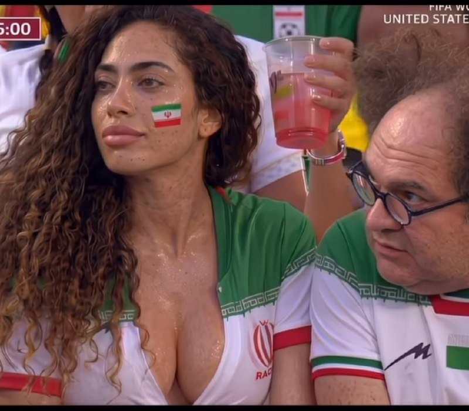

جا مونده از بازی نیوزلند فقط برای عرزشی‌ها

(وقتی تو تلویزیون پوششی رو نشون میدی که فقط پرچم‌ها دیده نشن) 🤣🤝🏻

@Dirty_Kids 👻

## Dirty_Kids — post 392289

  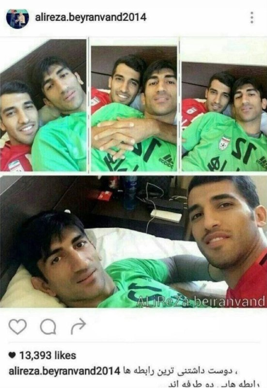

فیفا یچی میدونست باز جمهوری‌عسلامی و مصر رو برای حمایت از همجنسگراها اعلام کرده

@Dirty_Kids 👻

## alonews — post 128467

  <a href="telegram/content/alonews_128467_1781612677.webm" target="_blank">🎬 Download video</a>

👈سخنگوی ارتش: در جنگ، جلسه‌ای با حضور مسئولان عالی رتبه نظام در حال برگزاری بود که مشخص شد یک پهپاد دشمن بر فراز آن منطقه در حال پرواز است

🔴از آن‌جا که پهپاد از نوع کم سرعت بود و جنگنده‌ها با سرعت بسیار بالاتری حرکت می‌کنند، پهپاد مورد اصابت قرار نمی‌گرفت

🔴خلبانان ما با استفاده از برخورد فیزیکی، جنگنده را به پهپاد نزدیک کرده و با اصابت بال هواپیما به دم پهپاد، آن را منهدم کردند

✅ @AloNews خبر جنگ

---
📅 بروزرسانی: 1405/03/26 15:44
---

## VahidOOnLine — post 245856

  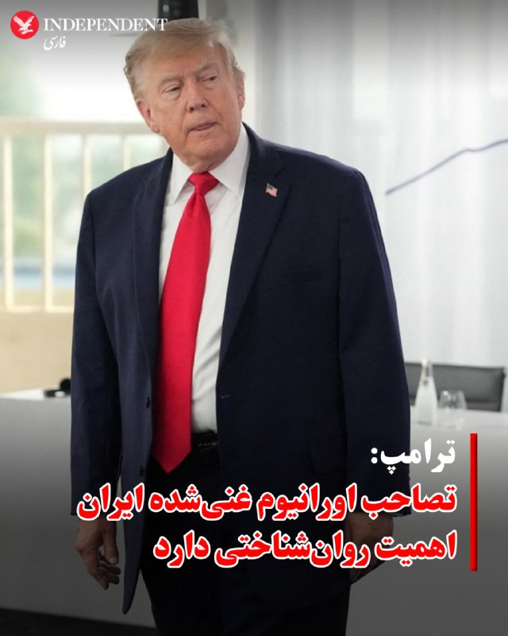

♦️دونالد ترامپ، رئیس جمهوری آمریکا، روز سه‌شنبه ۲۶ خرداد و در حاشیه اجلاس سران گروه ۷ (جی ۷) گفت اگرچه اورانیوم غنی‌شده ایران ارزش مادی بالایی ندارد اما تصاحب آن از نظر روان‌شناختی اهمیت دارد.

دونالد ترامپ در جریان دیدار با امیر قطر بار دیگر تاکید کرد که تاسیسات هسته‌ای ایران در جریان بمباران‌های آمریکا کاملا نابود شده است و شاید کشوری به‌جز چین، امکان خارج کردن ذخایر اورانیوم مدفون شده ایران را نداشته باشد.

رسانه‌های داخلی ایران به نقل از مقام‌های مذاکره‌کننده گزارش کرده بودند که قرار است ذخایر اورانیوم غنی‌شده در خاک ایران رقیق شود.
‌🇸🇦 Indypersian

🤖 @VahidOOnLine

## WithYashar — post 15058

  <a href="telegram/content/WithYashar_15058_1781612084.mp4" target="_blank">🎬 Download video</a>

طرف با پراید رفته دم لانچر در حال شلیک
@withyashar

## WithYashar — post 15057

خبرگزاری دولتی ایسنا:
محاصره دریایی آمریکا در حال لغو شدن است
@withyashar

## alonews — post 128466

  <a href="telegram/content/alonews_128466_1781612087.webm" target="_blank">🎬 Download video</a>

👈فون در لاین، عضو اتحادیه اروپا: من به ترامپ به خاطر توافق با ایران تبریک گفتم.

🔴هر دو موافقیم که این توافق باید به معنای پایان قطعی برنامه هسته‌ای ایران باشد.

🔴تنگه هرمز بازگشایی خواهد شد.

🔴قیمت نفت در حال کاهش است.
و اینگونه است که دیپلماسی نتیجه می‌دهد.

✅ @AloNews خبر جنگ

## alonews — post 128465

  <a href="telegram/content/alonews_128465_1781612087.webm" target="_blank">🎬 Download video</a>

👈اکیپ: دونالد ترامپ دستور مستقیم ابطال ویزای برخی از اعضای ایران از جمله مهدی ترابی و مهدی طارمی رو صادر کرده و ویزای این بازیکنا ابطال شده!

✅ @AloNews خبر جنگ

---
📅 بروزرسانی: 1405/03/26 15:34
---

## DEJradio — post 5738

⭕️ ترامپ به اسرائیل پیشنهاد داد مقابله با حزب‌الله را به احمد شرع بسپارد

دونالد ترامپ روز سه‌شنبه اعلام کرد به نتانیاهو پیشنهاد داده است که برای کاهش تلفات غیرنظامیان در لبنان، مسئولیت مقابله با حزب‌الله را به دولت سوریه و احمد شرع واگذار کند.
رئیس جمهوری آمریکا در نشست گروه هفت با تمجید از احمد شرع، رهبر کنونی سوریه گفت او عملکردی شگفت‌انگیز داشته است.
به گفتۀ ترامپ، سوریه می‌تواند بدون ایجاد تلفات گسترده با حزب‌الله مقابله کند.
دونالد ترامپ ضمن انتقاد از حملۀ اسرائیل به بیروت تنها چند ساعت پیش از نهایی شدن توافق تهران و واشینگتن، تأکید کرد که روابط او با بنیامین نتانیاهو همچنان عالی است و همکاری اسرائیل و آمریکا ادامه دارد.
#لبنان #حزب‌الله #سوریه
@DEJradio

## DEJradio — post 5737

⭕️ جمهوری اسلامی دو شهروند معترض دیگر را اعدام کرد

قوۀ قضائیۀ جمهوری اسلامی اعلام کرد دو تن دیگر از بازداشت‌شدگان اعتراضات دی‌ماه ۱۴۰۴ را در شاهرود اعدام کرده است.
خبرگزاری میزان، وابسته به قوه قضائیه روز سه‌شنبه ۲۶ خردادماه اسامی اعدام‌شدگان را جواد زمانی و ابوالفضل ساعدی اعلام کرد.
دستگاه قضائی جمهوری اسلامی با اتهام‌ «محاربه» و «افساد فی‌الارض» جواد زمانی و ابوالفضل ساعدی را به دار آویخته است.
در پی اعلام تفاهم میان تهران و واشینگتن، این نخستین موارد از اعدام معترضان است که توسط جمهوری اسلامی منتشر می‌شود.
رژیم حاکم بر ایران، از اعدام معترضان با بهانه‌های واهی و روند قضائی ناعادلانه، برای ترساندن مخالفان حکومت و پیشگیری از اعتراضات گسترده استفاده می‌کند.
سازمان‌های حقوق بشری در ماه‌های گذشته بارها نسبت به صدور و اجرای احکام اعدام برای بازداشت‌شدگان اعتراضات در ایران هشدار داده‌اند.

#دی_خونین #اعدام
@DEJradio

## DEJradio — post 5736

  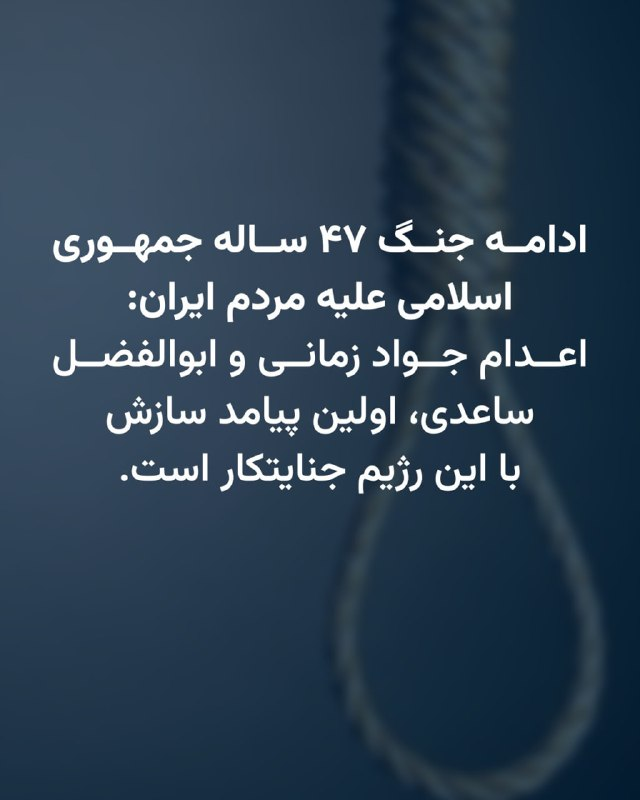

جمهوری اسلامی هم‌زمان با امضای تفاهم‌نامه‌ «صلح»، دو تن دیگر از معترضان ۱۸ و ۱۹ دی‌ به نام‌های جواد زمانی و ابوالفضل ساعدی را اعدام کرد.

این نتیجه معامله و سازش با یک رژیم جنایتکار است. توافق با رژیمی که تنها در دو روز، بیش از ۴۰ هزار معترض را به قتل رساند، نه‌تنها از نظر اخلاقی نادرست است، بلکه از منظر راهبردی نیز خطایی فاجعه‌بار خواهد بود.

تعامل با این رژیم محکوم به شکست است و همه ما بهای پیامدهای آن را خواهیم پرداخت. جنگ ۴۷ ساله جمهوری اسلامی علیه مردم ایران همچنان ادامه دارد. رژیمی که هرگز با شهروندان خود به صلح نرسیده، هرگز با جهان نیز به صلحی واقعی دست نخواهد یافت.

جامعه جهانی باید از مبارزه ملت ایران برای آزادی حمایت کند و آنها را در کانون هر مذاکره و محور هر سیاستی درباره ایران قرار دهد. اما روشن بگویم: با حمایت جهان یا بدون آن، این رژیم سقوط خواهد کرد،ٰ و مردم ایران خود را از چنگ استبداد آزاد خواهند کرد.

As it signs a Memorandum of Understanding for “peace”, the Islamic Republic just executed two more protesters from January 8th and 9th— Javad Zamani and Abolfazl Saedi.

This is the consequence of making a deal with this criminal regime. To do a deal with a regime that murdered more than 40,000 protestors in two days in January is morally wrong and strategically misguided.

Dealing with this regime will fail and we will all face the consequences. The regime’s 47-year war against the Iranian people continues. Just as it has never made peace with its own citizens, it will never truly make peace with the world.

The international community should back the people of Iran’s fight for freedom. Put them center in any negotiations and in their Iran policy. But let me be clear - with or without international support - this regime will fall. The people of Iran will liberate themselves from tyranny.

@OfficialRezaPahlavi

## DEJradio — post 5735

  <a href="telegram/content/DEJradio_5735_1781611465.webm" target="_blank">🎬 Download video</a>

👑
🔺 مازیار نظری: شرافت را از مجیدرضا رهنورد آموختیم، نه از تیم جمهوری اسلامی

#مجیدرضا_رهنورد #دژفوتبالی #تیم_ملی #جام_جهانی
@DEJradio

## IranIntlTV — post 342699

  <a href="telegram/content/IranIntlTV_342699_1781611465.mp4" target="_blank">🎬 Download video</a>

امیر قلعه‌نویی، سرمربی تیم فوتبال ایران، پس از دیدار برابر نیوزیلند، با انتقاد از شرایط تعیین‌شده برای ورود و خروج تیمش گفت که اجازه سفر زودتر به محل مسابقه به این تیم داده نشد.

گفت‌وگو با مزدک میرزایی، عضو تحریریه ورزشی ایران‌اینترنشنال
@iranintltv

## IranIntlTV — post 342698

  <a href="telegram/content/IranIntlTV_342698_1781611467.mp4" target="_blank">🎬 Download video</a>

اطلاعات رسیده به ایران‌اینترنشنال، جزییات تازه‌ای از چگونگی کشته شدن جاویدنام مهرزاد نظری، جوان ۲۸ ساله، در جریان انقلاب ملی ایرانیان روایت می‌کند.

گفت‌وگو با فرنوش فرجی، عضو تحریریه ایران‌اینترنشنال
@iranintltv

## IranIntlTV — post 342697

🔻جمهوری اسلامی، جواد زمانی و ابوالفضل ساعدی، از معترضان دی‌ماه، را اعدام کرد

خبرگزاری میزان، وابسته به قوه قضاییه جمهوری اسلامی، گزارش داد حکم اعدام جواد زمانی و ابوالفضل ساعدی، از شهروندان بازداشت‌شده در جریان انقلاب ملی در شاهرود، بامداد سه‌شنبه ۲۶ خرداد به اجرا درآمد.

این رسانه حکومتی زمانی و ساعدی را «نیروهای پیاده‌نظام دشمن» و «لیدرهای مسلح کودتای دی‌ماه ۱۴۰۴» در شاهرود خواند و نوشت معترضان با اقدامات خود، «بهانه و بستر لازم را برای تجاوز و اقدامات خصمانه دشمن» فراهم آوردند.

محمدصادق اکبری، رییس کل دادگستری استان سمنان، در سخنانی، این دو زندانی سیاسی را به «مشارکت فعال در شورش‌ها و اقدامات خشونت‌آمیز»، شامل «شکستن تجهیزات و در چند شعبه بانک، ایجاد آشوب و شورش در مقابل فرمانداری، واژگون کردن خودروی پلیس و مشارکت در آتش زدن آن، حمله به منازل و تخریب خودرو» متهم کرد.

بر اساس گزارش میزان، از دیگر اتهامات مطرح‌شده علیه زمانی و ساعدی، «تحریک و ترغیب افراد به حضور در اغتشاشات، اجتماع و تبانی علیه امنیت داخلی و خارجی کشور، محاربه از طریق کشیدن سلاح و افساد فی ‌الارض» بوده است.

پخش اعترافات اجباری زمانی و ساعدی
خبرگزاری قوه قضاییه در ادامه گزارش خود، ویدیویی ۵۰ ثانیه‌ای از «اعترافات» زمانی و ساعدی منتشر کرد که در آن، چهره این دو زندانی سیاسی به‌صورت محو نمایش داده می‌شود.
رییس کل دادگستری استان سمنان نیز گفت رسیدگی به این پرونده «با رعایت موازین قانونی، دقت و سرعت لازم» در شعبه اول دادگاه انقلاب شاهرود انجام گرفت و متهمان علاوه بر اعدام، به «ضبط کلیه اموال و دارایی‌های منقول و غیرمنقول» محکوم شدند.
اکبری افزود یکی از شعب دیوان عالی کشور با «بررسی دقیق پرونده»، حکم دادگاه انقلاب شاهرود را تایید کرد و سرانجام، زمانی و ساعدی ۲۶ خرداد پس از طی «تمامی تشریفات قانونی» اعدام شدند.
این در حالی است که در گزارش خبرگزاری میزان و همچنین در اظهارات رییس کل دادگستری سمنان، جزییاتی درباره زمان رسیدگی قضایی به پرونده، تاریخ صدور حکم اعدام یا زمان تایید آن در دیوان عالی ارائه نشده است.

🔗 متن کامل گزارش را اینجا بخوانید

@iranintltv

## RadioFarda — post 158391

از پرچم‌های شیر و خورشید تا سوت اعتراض؛ شب متفاوت تیم ایران در جام جهانی

🔸خبرگزاری‌های رویترز و فرانسه در گزارش‌هایی به فضای متفاوت حاکم بر برگزاری مسابقه تیم‌های فوتبال ایران و نیوزیلند در جام جهانی اشاره کردند و از واکنش‌های متفاوت و متضاد تماشاگران ایرانی حاضر در ورزشگاه سوفای شهر لس‌آنجلس گزارش دادند.

🔸خبرگزاری رویترز در گزارش روز سه‌شنبه ۲۶ خرداد خود خبر داد که به‌رغم ممنوعیت فیفا، پرچم‌های شیروخورشید وارد ورزشگاه محل بازی شد.

🔸این خبرگزاری به واکنش‌های متفاوت و متضاد تماشاگران ایرانی حاضر در ورزشگاه سوفای شهر لس‌آنجلس اشاره کرده و نوشته که اختلافات روی سکوها، بازتابی از چالش‌های پیش روی تیم ملی ایران در خارج از زمین مسابقه بود.

🔸رویترز به اقدام همزمان دو گروه متفاوت تماشاگران هنگام پخش سرود ملی تیم ایران اشاره کرد و نوشت سوت زدن گروهی از تماشاگران در مقابل همخوانی گروه دیگری، بازتاب‌دهنده اهمیت نمایش وفاداری سیاسی در مقابل خود فوتبال بود.

🔸به نوشته آن، از حملات و گل‌های ایران از سوی بسیاری از تماشاگران، از جمله بخشی از هوادارانی که پرچم شیر و خورشید مربوط به ایران قبل از انقلاب را حمل می‌کردند، استقبال شد. اما گروهی از تماشاگران، گل‌های تیم نیوزیلند را جشن گرفتند.

🔸در این گزارش به متفاوت بودن جو کلی حاکم بر ورزشگاه نسبت به سایر بازی‌های مسابقات جام جهانی اشاره شده و نوشته شده است به نظر می‌رسید این مسابقه در مقایسه با احساساتی که در اطراف آن موج می‌زد، در درجه دوم اهمیت قرار دارد.

🔸نسخه کامل این گزارش را در وب‌سایت رادیوفردا بخوانید.

@RadioFarda

## IranianMinds — post 22742

  

جمهوری اسلامی هم‌زمان با امضای تفاهم‌نامه‌ «صلح»، دو تن دیگر از معترضان ۱۸ و ۱۹ دی‌ به نام‌های جواد زمانی و ابوالفضل ساعدی را اعدام کرد.

این نتیجه معامله و سازش با یک رژیم جنایتکار است. توافق با رژیمی که تنها در دو روز، بیش از ۴۰ هزار معترض را به قتل رساند، نه‌تنها از نظر اخلاقی نادرست است، بلکه از منظر راهبردی نیز خطایی فاجعه‌بار خواهد بود.

تعامل با این رژیم محکوم به شکست است و همه ما بهای پیامدهای آن را خواهیم پرداخت. جنگ ۴۷ ساله جمهوری اسلامی علیه مردم ایران همچنان ادامه دارد. رژیمی که هرگز با شهروندان خود به صلح نرسیده، هرگز با جهان نیز به صلحی واقعی دست نخواهد یافت.

جامعه جهانی باید از مبارزه ملت ایران برای آزادی حمایت کند و آنها را در کانون هر مذاکره و محور هر سیاستی درباره ایران قرار دهد. اما روشن بگویم: با حمایت جهان یا بدون آن، این رژیم سقوط خواهد کرد،ٰ و مردم ایران خود را از چنگ استبداد آزاد خواهند کرد.

As it signs a Memorandum of Understanding for “peace”, the Islamic Republic just executed two more protesters from January 8th and 9th— Javad Zamani and Abolfazl Saedi.

This is the consequence of making a deal with this criminal regime. To do a deal with a regime that murdered more than 40,000 protestors in two days in January is morally wrong and strategically misguided.

Dealing with this regime will fail and we will all face the consequences. The regime’s 47-year war against the Iranian people continues. Just as it has never made peace with its own citizens, it will never truly make peace with the world.

The international community should back the people of Iran’s fight for freedom. Put them center in any negotiations and in their Iran policy. But let me be clear - with or without international support - this regime will fall. The people of Iran will liberate themselves from tyranny.

@OfficialRezaPahlavi

## BBCPersian — post 284023

  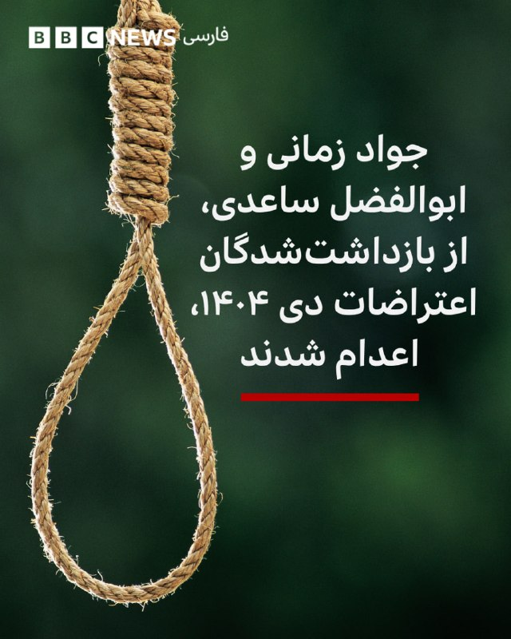

🔻قوه قضائیه ایران می‌گوید که جواد زمانی و ابوالفضل ساعدی، دو نفر از بازداشت‌شدگان اعتراضات دی‌ماه ۱۴۰۴، را به جرم «افساد فی الارض» اعدام کرده است. حکم اعدام «بامداد امروز» اجرا شد.

میزان، خبرگزاری قوه قضائیه، به نقل از رئیس‌ کل دادگستری استان سمنان، جرم اعدام‌شدگان را «محاربه و افساد فی الارض از طریق کشیدن سلاح گرم و سرد، تخریب عمدی اموال عمومی و خصوصی به قصد مقابله با نظام جمهوری اسلامی ایران و اخلال در نظم و امنیت جامعه، اجتماع و تبانی برای ارتکاب جرم علیه امنیت داخلی کشور» اعلام کرده است.

محمدصادق اکبری، رئیس‌ کل دادگستری استان سمنان، گفت که جواد زمانی و ابوالفضل ساعدی در دی ۱۴۰۴ «با سوءاستفاده از مطالبات و اعتراضات برخی اقشار جامعه» و در راستای اهداف آمریکایی-صهیونی» مرتکب این جرایم شدند.

قوه قضائیه گفت که این دو نفر در شاهرود با «شکستن تجهیزات و درب چند شعبه بانک، ایجاد آشوب و شورش در مقابل فرمانداری، واژگون کردن خودروی پلیس و مشارکت در آتش‌زدن آن، حمله به منزال و تخریب خودرو و انجام سایر اقدامات مجرمانه» ایجاد ناامنی کرده‌اند.

ادامه مطلب⬇️
📸GettyImages
https://bbc.in/4vg6XQ0
@BBCPersian

## alonews — post 128464

  <a href="telegram/content/alonews_128464_1781611470.mp4" target="_blank">🎬 Download video</a>

عادی ترین حرفایی که عرزشیا به قالیباف میگن

[@AloTweet]

## alonews — post 128463

  <a href="telegram/content/alonews_128463_1781611470.webm" target="_blank">🎬 Download video</a>

👈ترامپ: مرحله بعدی مذاکرات ایران «آسان‌تر» از دور اول خواهد بود

✅ @AloNews خبر جنگ

## alonews — post 128462

  <a href="telegram/content/alonews_128462_1781611471.webm" target="_blank">🎬 Download video</a>

ضعف فاحش شجاع خلیل زاده در بازی امروز صبح مقابل نیوزلند 🫶بازیکنی که صرفا با خایه مالی به تیم ملی راه پیدا کرد نه مسائل فنی @AloSport

---
📅 بروزرسانی: 1405/03/26 15:24
---

## WithYashar — post 15056

  <a href="telegram/content/WithYashar_15056_1781610874.mp4" target="_blank">🎬 Download video</a>

ترامپ: ایران حتی یک بار به ترکیه حمله کرد، من هرگز این را درک نکردم، هیچ‌کس آن را درک نخواهد کرد

این مشکل است، آن‌ها کاملاً غیرمنطقی هستند و اکنون آن افراد رفته‌اند، فکر می‌کنم ایران اکنون رهبری منطقی دارد!
@withyashar

## pm_afshaa — post 94178

  

جمهوری اسلامی هم‌زمان با امضای تفاهم‌نامه‌ «صلح»، دو تن دیگر از معترضان ۱۸ و ۱۹ دی‌ به نام‌های جواد زمانی و ابوالفضل ساعدی را اعدام کرد.

این نتیجه معامله و سازش با یک رژیم جنایتکار است. توافق با رژیمی که تنها در دو روز، بیش از ۴۰ هزار معترض را به قتل رساند، نه‌تنها از نظر اخلاقی نادرست است، بلکه از منظر راهبردی نیز خطایی فاجعه‌بار خواهد بود.

تعامل با این رژیم محکوم به شکست است و همه ما بهای پیامدهای آن را خواهیم پرداخت. جنگ ۴۷ ساله جمهوری اسلامی علیه مردم ایران همچنان ادامه دارد. رژیمی که هرگز با شهروندان خود به صلح نرسیده، هرگز با جهان نیز به صلحی واقعی دست نخواهد یافت.

جامعه جهانی باید از مبارزه ملت ایران برای آزادی حمایت کند و آنها را در کانون هر مذاکره و محور هر سیاستی درباره ایران قرار دهد. اما روشن بگویم: با حمایت جهان یا بدون آن، این رژیم سقوط خواهد کرد،ٰ و مردم ایران خود را از چنگ استبداد آزاد خواهند کرد.

As it signs a Memorandum of Understanding for “peace”, the Islamic Republic just executed two more protesters from January 8th and 9th— Javad Zamani and Abolfazl Saedi.

This is the consequence of making a deal with this criminal regime. To do a deal with a regime that murdered more than 40,000 protestors in two days in January is morally wrong and strategically misguided.

Dealing with this regime will fail and we will all face the consequences. The regime’s 47-year war against the Iranian people continues. Just as it has never made peace with its own citizens, it will never truly make peace with the world.

The international community should back the people of Iran’s fight for freedom. Put them center in any negotiations and in their Iran policy. But let me be clear - with or without international support - this regime will fall. The people of Iran will liberate themselves from tyranny.

@OfficialRezaPahlavi

## DEJradio — post 5734

⭕️ ترامپ گفت با تلاش جمهوری اسلامی برای رسیدن به سلاح هسته‌ای، جهنم بر سرش فرود می‌آید

دونالد ترامپ، رئیس جمهوری ایالات متحده روز سه‌شنبه گفت تفاهم با رژیم حاکم بر ایران با صدای بلند و شفاف می‌گوید جمهوری اسلامی به سلاح هسته‌ای دست نمی‌یابد.
رئیس جمهوری آمریکا، در حاشیۀ نشست گروه هفت در فرانسه هشدار داد اگر جمهوری اسلامی به سمت دستیابی به سلاح هسته‌ای برود، جهنم بر سرش آوار می‌شود.
ترامپ با دفاع از تفاهمنامۀ اخیر با جمهوری اسلامی افزود مهم‌ترین بخش این توافق آن است که تهران هرگز به سلاح هسته‌ای دست نمی‌یابد.
رئیس جمهوری آمریکا با اشاره به این که مذاکرات اکنون وارد مرحله دوم شده، ادعا کرد این مرحله آسان‌تر از مرحلۀ نخست به پیش می‌رود.
او اعلام کرد که ایالات متحده هیچ تعهدی برای سرمایه‌گذاری در ایران ندارد و حل مسائل هسته‌ای مهم‌ترین اولویت واشینگتن است.
ترامپ همچنین مدعی شد رهبران جدید جمهوری اسلامی نسبت به گذشته «منطقی‌تر» و «کمتر افراطی» هستند.
رئیس جمهوری آمریکا ادعا کرد هیچ‌گاه به تغییر رژیم حاکم بر ایران، توجهی نداشته است.

#تفاهم #ترامپ #برنامه_هسته‌ای
@DEJradio

## IranIntlTV — post 342696

  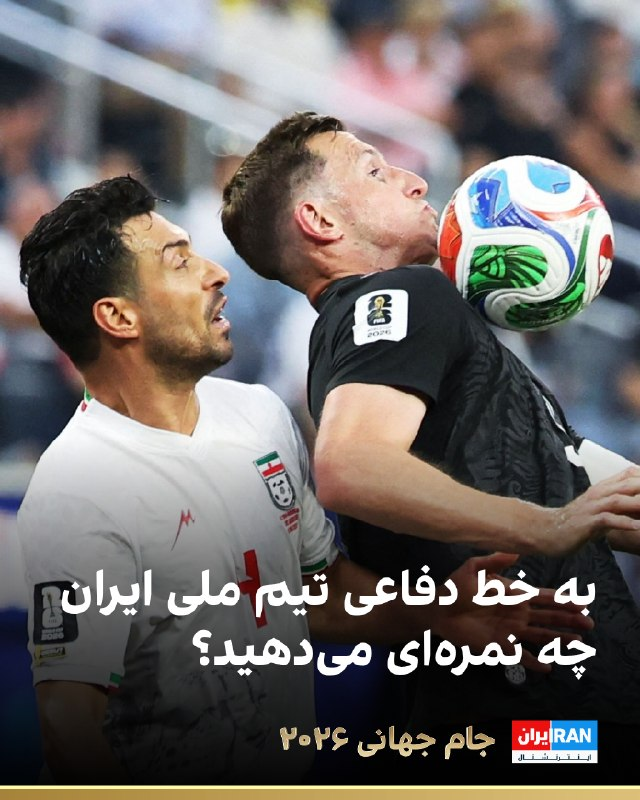

🔻تیم ملی فوتبال ایران در دیدار مقابل نیوزیلند مشکلات جدی در ساختار دفاعی داشت. دریافت دو گل در این مسابقه، حاصل ضعف‌ دفاع تیمی، به‌ویژه در عمق خط دفاعی، بود. در طول بازی، مدافعان میانی بارها در نبردهای تک‌به‌تک مغلوب مهاجمان حریف شدند و در پوشش فضاهای خالی ناکام ماندند.

🔹با توجه به آسیب‌پذیری مشهود تیم ملی در کارهای دفاعی، شما چه ارزیابی از این نمایش دارید؟ به عملکرد مدافعان ایران در این مسابقه از ۱۰ چه نمره‌ای می‌دهید؟

🔹نظر خود را در اینستاگرام ایران اینترنشنال ورزشی ثبت کنید؛👇
https://www.instagram.com/p/DZpT8_ZEWn9/?igsh=MWh1cXR1M243bGUxZg==

@iranintltvsport

## FarsiVOA — post 220910

  <a href="telegram/content/FarsiVOA_220910_1781610876.mp4" target="_blank">🎬 Download video</a>

حرکت جنجالی محمد محبی پس از گل؛ تهدید تماشاگران با علامت شلیک؟

محمد محبی پس از به ثمر رساندن گل در بازی با تیم نیوزیلند، در اقدامی جنجالی با انگشتان خود علامت شلیک اسلحه را به سمت تماشاگران ایرانی نشان داد.

به تعبیر برخی از کاربران شبکه‌های اجتماعی، این حرکت او «یک خوشحالی پس از گل ساده نبود»، بلکه تهدیدی علیه آن دسته از تماشاگران ایرانی محسوب می‌شد که برای اعتراض با پرچم شیر و خورشید در ورزشگاه حاضر شده بودند.
@FarsiVOA

## RadioFarda — post 158390

  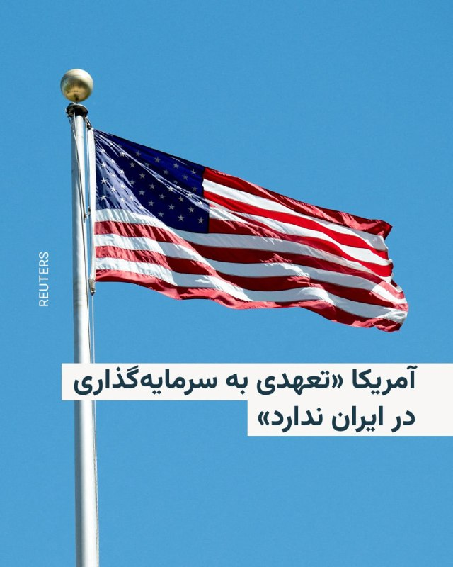

🔸رئیس‌جمهور آمریکا روز سه‌شنبه ۲۶ خرداد با اشاره به توافق اخیر با ایران تاکید کرد که ایالات متحده بر اساس این توافق تعهدی به سرمایه‌گذاری در ایران ندارد.

🔸دونالد ترامپ در حاشیه نشست گروه هفت در فرانسه و دیدار با تمیم بن حمد آل ثانی، امیر قطر، رهبران جدید در ایران را «منطقی‌تر»، «باهوش‌تر» و «کمتر افراطی» خواند و به خبرنگاران گفت: رهبران قبلی که «غیرمنطقی» بودند از بین رفته‌اند. او گفت هیچ‌وقت به تغییر رژیم در ایران توجه نداشت.

🔸رئیس‌جمهور آمریکا همچنین درباره رابطه با اسرائیل گفت که اگر او نبود اسرائیل هم‌اکنون وجود نداشت و «از زمین محو» شده بود.

🔸ترامپ رابطه‌اش را با بنیامین نتانیاهو «بسیار موثر» دانست و در عین حال درباره لبنان گفت که به اسرائیل پیشنهاد داده است مقابله با حزب‌الله را به دولت فعلی سوریه و رئیس‌جمهور فعلی آن احمد الشرع بسپارد چرا که به گفته ترامپ، «حملات اسرائیل تلفات زیادی به بار آورده است».

@RadioFarda

## Dirty_Kids — post 392288

  <a href="telegram/content/Dirty_Kids_392288_1781610879.mp4" target="_blank">🎬 Download video</a>

جدی می فرمایید فهمید اما بعضی هنوز گاو ماندند

@Dirty_Kids 👻

## Dirty_Kids — post 392287

  <a href="telegram/content/Dirty_Kids_392287_1781610880.mp4" target="_blank">🎬 Download video</a>

شبکه خبر: تمام کسایی که توی بیت رهبری بودن کشته شدن جز مجتبی خامنه‌ای

مجتبی تو بیت رهبری:

@Dirty_Kids 👻

## Hranews — post 113647

جرائم مواد مخدر؛ ۲ زندانی در زندان یزد اعدام شدند

❗️
❗️
❗️
❗️
❗️– حکم دو زندانی که پیشتر از بابت اتهامات مرتبط با جرائم مواد مخدر، در یک پرونده مشترک به #اعدام محکوم شده بودند، امروز سه‌شنبه ۲۶ خردادماه در زندان یزد اجرا شد.

ادامه مطلب

#عمر_شه‌بخش
#غفور_شه‌بخش

↘️
@hranews_bot تماس ✉️ -  @Hranews  کانال هرانا 🆑

## officialrezapahlavi — post 1845

  

جمهوری اسلامی هم‌زمان با امضای تفاهم‌نامه‌ «صلح»، دو تن دیگر از معترضان ۱۸ و ۱۹ دی‌ به نام‌های جواد زمانی و ابوالفضل ساعدی را اعدام کرد.

این نتیجه معامله و سازش با یک رژیم جنایتکار است. توافق با رژیمی که تنها در دو روز، بیش از ۴۰ هزار معترض را به قتل رساند، نه‌تنها از نظر اخلاقی نادرست است، بلکه از منظر راهبردی نیز خطایی فاجعه‌بار خواهد بود.

تعامل با این رژیم محکوم به شکست است و همه ما بهای پیامدهای آن را خواهیم پرداخت. جنگ ۴۷ ساله جمهوری اسلامی علیه مردم ایران همچنان ادامه دارد. رژیمی که هرگز با شهروندان خود به صلح نرسیده، هرگز با جهان نیز به صلحی واقعی دست نخواهد یافت.

جامعه جهانی باید از مبارزه ملت ایران برای آزادی حمایت کند و آنها را در کانون هر مذاکره و محور هر سیاستی درباره ایران قرار دهد. اما روشن بگویم: با حمایت جهان یا بدون آن، این رژیم سقوط خواهد کرد،ٰ و مردم ایران خود را از چنگ استبداد آزاد خواهند کرد.

As it signs a Memorandum of Understanding for “peace”, the Islamic Republic just executed two more protesters from January 8th and 9th— Javad Zamani and Abolfazl Saedi.

This is the consequence of making a deal with this criminal regime. To do a deal with a regime that murdered more than 40,000 protestors in two days in January is morally wrong and strategically misguided.

Dealing with this regime will fail and we will all face the consequences. The regime’s 47-year war against the Iranian people continues. Just as it has never made peace with its own citizens, it will never truly make peace with the world.

The international community should back the people of Iran’s fight for freedom. Put them center in any negotiations and in their Iran policy. But let me be clear - with or without international support - this regime will fall. The people of Iran will liberate themselves from tyranny.

@OfficialRezaPahlavi

## alonews — post 128461

  <a href="telegram/content/alonews_128461_1781610881.webm" target="_blank">🎬 Download video</a>

👈نخست‌وزیر بریتانیا: ما از توافقی که ترامپ با ایران منعقد کرد استقبال می‌کنیم

✅ @AloNews خبر جنگ

## alonews — post 128460

  <a href="telegram/content/alonews_128460_1781610881.webm" target="_blank">🎬 Download video</a>

👈قطر: تفاهم کنونی تهران و واشنگتن نخستین گام به‌سوی توافقی گسترده‌تر است 
✅ @AloNews خبر جنگ

## alonews — post 128459

  <a href="telegram/content/alonews_128459_1781610881.mp4" target="_blank">🎬 Download video</a>

ضعف فاحش شجاع خلیل زاده در بازی امروز صبح مقابل نیوزلند

🫶بازیکنی که صرفا با خایه مالی به تیم ملی راه پیدا کرد نه مسائل فنی

@AloSport

## alonews — post 128455

  <a href="telegram/content/alonews_128455_1781610883.webm" target="_blank">🎬 Download video</a>

👈رئیس‌جمهور ترامپ و رئیس‌جمهور زلنسکی در اجلاس جی۷ به طور مختصر صحبت کردند.

🔴آنها امروز بعداً در حاشیه اجلاس دیداری خواهند داشت

✅ @AloNews خبر جنگ

## alonews — post 128454

  <a href="telegram/content/alonews_128454_1781610883.webm" target="_blank">🎬 Download video</a>

👈اسرائیل هیوم: دونالد ترامپ داره گزینه برکناری مقاماتی که با توافق ایران مخالفن رو بررسی میکنه!

✅ @AloNews خبر جنگ

## alonews — post 128453

  <a href="telegram/content/alonews_128453_1781610884.webm" target="_blank">🎬 Download video</a>

👈قطر: تفاهم کنونی تهران و واشنگتن نخستین گام به‌سوی توافقی گسترده‌تر است

✅ @AloNews خبر جنگ

## alonews — post 128452

  <a href="telegram/content/alonews_128452_1781610884.webm" target="_blank">🎬 Download video</a>

👈فیدان : ترکیه همون‌طور که می‌دونید یه کشور مهم و قدرتمند تو منطقه‌ست ، برای همین هر موضعی که می‌گیره واقعاً می‌تونه اثرگذار باشه و فرق ایجاد کنه

🔴سیاستی هم که رئیس‌جمهور ما با محوریت ثبات و اولویت دادن به صلح پیش گرفته، تو موضوع جنگ ایران تو منطقه هم خودش رو نشون داده

✅ @AloNews خبر جنگ

## alonews — post 128451

  <a href="telegram/content/alonews_128451_1781610884.webm" target="_blank">🎬 Download video</a>

👈فیدان : بعضیا به خاطر گذشته سکوت می‌کنن (اسرائیل)

🔴 بعضیا پشت پرده درگیر تجارت و توافق می‌شن یا حتی تو انتخابات با هم تعامل‌های پنهان دارن

🔴نتیجه‌اش این می‌شه که این وضعیت ادامه پیدا می‌کنه و همه طرف‌ها در نهایت آسیب می‌بینن

🔴 برای همین هم تأکیدم اینه که کشورها باید جدی‌تر و هماهنگ‌تر عمل کنن، تا جلوی اقدام اسرائیل تو منطقه رو بگیرن

✅ @AloNews خبر جنگ

## alonews — post 128450

  <a href="telegram/content/alonews_128450_1781610884.webm" target="_blank">🎬 Download video</a>

👈فیدان، وزیر امور خارجه ترکیه : اگه یه «درک و هماهنگی مشترک» بین کشورها شکل بگیره؛ و این به یک «اقدام دیپلماتیک جمعی» تبدیل بشه، اسرائیل عملاً دستش برای اقدام بسته می‌شه

🔴 به نظرم کشورها باید صریح و هماهنگ عمل کنن، اشتباهات رو هم سریع و مشترک پاسخ بدن

🔴چون همین فشار و اجماع بین‌المللی می‌تونه جلوی اقدامات اسرائیل رو بگیره

✅ @AloNews خبر جنگ

## alonews — post 128449

  <a href="telegram/content/alonews_128449_1781610884.webm" target="_blank">🎬 Download video</a>

👈بری و قالیباف در تماسی تلفنی: واشنگتن باید اسرائیل را به پایان دادن جنگش علیه لبنان ملزم کند.

🔴اسرائیل باید مجبور شود تخریب روستاهای لبنانی را متوقف کند و از سرزمین‌های اشغالی عقب‌نشینی نماید.

✅ @AloNews خبر جنگ

## alonews — post 128448

  <a href="telegram/content/alonews_128448_1781610885.webm" target="_blank">🎬 Download video</a>

👈شورای هماهنگی بانک‌ها: سپرده‌ها و اطلاعات مالی مشتریان بانک‌های ملی، صادرات، تجارت و توسعه صادرات امن است

✅ @AloNews خبر جنگ

## alonews — post 128447

  <a href="telegram/content/alonews_128447_1781610885.mp4" target="_blank">🎬 Download video</a>

👈خبرنگار صدا و سیما: عملیات رفع محاصره دریایی اجرایی شده است

✅ @AloNews خبر جنگ

---
📅 بروزرسانی: 1405/03/26 15:14
---

## VahidOOnLine — post 245855

  <a href="telegram/content/VahidOOnLine_245855_1781610276.mp4" target="_blank">🎬 Download video</a>

♦️در نشست گروه هفت در فرانسه، زنان در بالاترین سطوح قدرت سیاسی حاضرند. در میان رهبران حاضر، جورجیا ملونی، نخست‌وزیر ایتالیا، سانائه تاکایچی، نخست‌وزیر ژاپن و اورزولا فون در لاین، رئیس کمیسیون اروپا، از مهم‌ترین چهره‌های زن در ساختار قدرت گروه هفت به شمار می‌روند. فرانسه در سال ۲۰۲۶ ریاست دوره‌ای گروه هفت را بر عهده دارد و نشست سران این گروه در اویان-له-بن برگزار می‌شود.

در کنار رهبران سیاسی و نهادی، همسران برخی رهبران نیز بخشی از چهره‌های عمومی این نشست‌اند؛ از جمله بریژیت مکرون، همسر امانوئل مکرون، رئیس‌جمهوری فرانسه و ویکتوریا استارمر، همسر کی‌یر استارمر، نخست‌وزیر بریتانیا. صدراعظم آلمان فریدریش مرتس را همسرش شارلوت همراهی می‌کند.
‌🇸🇦 Indypersian

🤖 @VahidOOnLine

## WithYashar — post 15055

گزارش روزنامه New York Post می‌گوید که پلیس فدرال آمریکا (FBI) پنج نفر را به اتهام طراحی یک حمله به رویداد «UFC Freedom 250» در روز تولد ترامپ که در محوطه چمن جنوبی کاخ سفید برگزار شد، بازداشت کرده است. گفته می‌شود این طرح شامل استفاده از پهپادهای انفجاری، تک‌تیراندازها و همچنین تلاش برای نفوذ و شکستن دروازه‌های محل بوده است.

بر اساس این گزارش، FBI در تاریخ ۱۰ ژوئن از وجود این توطئه مطلع شده و سپس طی یک عملیات چندایالتی اقدام به بازداشت افراد کرده است. مقام‌ها می‌گویند در جریان تحقیقات، چت‌های رمزگذاری‌شده در اپلیکیشن Signal کشف شده که بیش از ۲۰ کاربر در آن‌ها حضور داشته‌اند.
@withyashar

## WithYashar — post 15054

  <a href="telegram/content/WithYashar_15054_1781610279.mp4" target="_blank">🎬 Download video</a>

صدراعظم آلمان در جی۷ پیراهن «ترامپ ۴۷» را به رئیس‌جمهور آمریکا اهدا کرد
@withyashar
خانواده دونالد ترامپ ریشه آلمانی دارند. پدربزرگ او، فریدریش ترامپ، در شهر کالشتات آلمان به دنیا آمد. او در سال ۱۸۸۵ و در شانزده سالگی از آلمان به ایالات متحده آمریکا مهاجرت کرد. پدر ترامپ، فرد ترامپ، در آمریکا متولد شده بود و شهروند آمریکا محسوب می‌شد، اما از طرف پدری کاملاً تبار آلمانی داشت. از سوی مادر نیز ترامپ ریشه اسکاتلندی دارد. مادرش، مری آن مک‌لئود ترامپ، در جزیره لوئیس در اسکاتلند به دنیا آمد و بعدها به آمریکا مهاجرت کرد

## mwarmonitor — post 11018

🔴گزارش روزنامه New York Post می‌گوید که پلیس فدرال آمریکا (FBI) پنج نفر را به اتهام طراحی یک حمله به رویداد «UFC Freedom 250» که قرار بود در محوطه چمن جنوبی کاخ سفید برگزار شود، بازداشت کرده است. گفته می‌شود این طرح شامل استفاده از پهپادهای انفجاری، تک‌تیراندازها و همچنین تلاش برای نفوذ و شکستن دروازه‌های محل بوده است.

📌بر اساس این گزارش، FBI در تاریخ ۱۰ ژوئن از وجود این توطئه مطلع شده و سپس طی یک عملیات چندایالتی اقدام به بازداشت افراد کرده است. مقام‌ها می‌گویند در جریان تحقیقات، چت‌های رمزگذاری‌شده در اپلیکیشن Signal کشف شده که بیش از ۲۰ کاربر در آن‌ها حضور داشته‌اند.

@mwarmonitor

## IranIntlTV — post 342695

  <a href="telegram/content/IranIntlTV_342695_1781610281.mp4" target="_blank">🎬 Download video</a>

ایران اینترنشنال در فصل «مرگ خامنه‌ای؛ پایان دیکتاتور» به بررسی کارنامه سی‌و‌شش ساله رهبری علی خامنه‌ای و چالش‌های پیش روی مجتبی خامنه‌ای در ادامه مسیر جمهوری اسلامی می‌پردازد.

گزارش‌ها، مقالات، مستندها و مصاحبه‌ها را در تلویزیون، بخش‌های خبر، وبسایت و اکانت‌های ایران اینترنشنال در شبکه‌های اجتماعی دنبال کنید.

#پایان_دیکتاتور
@iranintltv

## FarsiVOA — post 220909

🔺ترامپ پس از دیدار با زلنسکی: روسیه باید با اوکراین به توافق صلح برسد

▪️دونالد ترامپ اعلام کرد که روسیه باید با اوکراین به توافق صلح برسد.

▪️رئیس‌جمهوری آمریکا افزود که پس از یک دیدار «بسیار خوب» میان ولودیمیر زلنسکی رئیس‌جمهور اوکراین و رهبران گروه هفت در فرانسه، هر کاری بتواند برای پایان دادن به جنگ انجام خواهد داد.

▪️ترامپ از دیدار خود با زلنسکی و دیگر رهبران گروه هفت در یک جلسه غیرعلنی در روز سه‌شنبه ابراز رضایت کرد و افزود که بعداً به‌صورت دوجانبه با رهبر اوکراین دیدار خواهد کرد.

▪️او گفت: «من هر کاری که بتوانم انجام می‌دهم» و افزود که روسیه باید به توافق برسد.

⬇️ بیشتر بخوانید:
https://ir.voanews.com/a/8161432.html

## FarsiVOA — post 220908

🔺ترامپ: بدون آمریکا و بدون من، اسرائیل وجود نداشت؛ به تغییر رژیم در ایران اعتقادی ندارم

▪️دونالد ترامپ گفت اگر آمریکا و شخص او وارد عمل نشده بودند، اسرائیل «اکنون وجود نداشت» و هر فرد هوشمندی در اسرائیل این را می‌داند. او در عین حال گفت به تغییر رژیم در ایران اعتقادی ندارد و این موضوع هیچ‌گاه بخشی از هدف او نبوده است.

▪️آقای ترامپ گفت با بنیامین نتانیاهو رابطه‌ای «باورنکردنی» دارد، اما اسرائیل باید در قبال لبنان مسئولانه‌تر رفتار کند. او گفت از نحوه رفتار اسرائیل با لبنان و حزب‌الله راضی نیست و اسرائیل باید می‌توانست این موضوع را بسیار سریع‌تر حل کند.

▪️او گفت لبنان زمانی کشور بزرگی بود؛ کشوری با استادان، پزشکان، وکلا و چهره‌های فکری برجسته، اما اکنون وضعیت لبنان «وحشتناک» است.

⬇️ بیشتر بخوانید:
https://ir.voanews.com/a/8161435.html

## RadioFarda — post 158389

  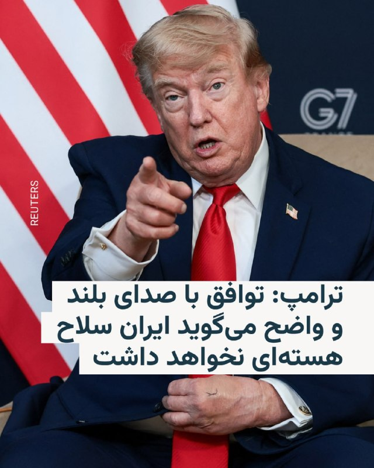

🔸رئیس‌جمهور آمریکا روز سه‌شنبه ۲۶ خرداد با دفاع از توافق اخیر با ایران برای پایان دادن به جنگ ۴۰ روزه گفت این تفاهم‌نامه تصریح می‌کند که ایران سلاح هسته‌ای نخواهد داشت.

🔸دونالد ترامپ در دیدار با تمیم بن حمد آل ثانی، امیر قطر، در حاشیه نشست گروه هفت در فرانسه به خبرنگاران گفت: «تنها چیزی که واقعاً برای من مهم است این است که ایران هرگز سلاح هسته‌ای نخواهد داشت و توافق این را با صدای بلند و واضح می‌گوید».

🔸او افزود: «اگر دولت ایران قصد دستیابی به سلاح هسته‌ای را داشته باشد، جهنم بر سر ایران خواهد بارید».

🔸رئیس‌جمهور آمریکا با دفاع از توافق با ایران گفت این تفاهم وارد مرحله دوم شده است که به گفته او، این مرحله آسان‌تر از مرحله قبلی است.

🔸ایران و آمریکا این یادداشت تفاهم را که یک سند کلی و به گفتهٔ جی‌دی ونس معاون رئیس‌جمهور ایالات متحده، در «یک‌ونیم صفحه» تنظیم شده است، روز ۲۴ خرداد به صورت الکترونیکی امضا کردند و به «جنگ در تمام جبهه‌ها» خاتمه دادند.

@RadioFarda

## RadioFarda — post 158388

  <a href="https://t.me/radiofarda/158388" target="_blank">📎 Download file</a>

📻بشنوید: ساعت ۱۴ با رادیوفردا، ۲۶ خرداد ۱۴۰۵‌

@RadioFarda

## BBCPersian — post 284022

🔻تیم ملی فوتبال ایران به تیخوآنا برگشت

تیم ملی فوتبال ایران پس از اولین بازی در جام جهانی، آمریکا را ترک کرد و به تیخوآنا برگشت.

این تیم به دلیل مشکلی که در فرآیند خروج مهدی طارمی و سعید الهویی در فرودگاه لس‌آنجلس پیش آمد پس از چند ساعت تاخیر این شهر را ترک کرد.

تیم ایران قصد داشت شب بعد از مسابقه را در لس‌آنجلس بماند و روز بعد ریکاوری کند اما از این تیم خواسته شد بلافاصله آمریکا را ترک کند و به اردوی خود در مکزیک برگردد.

مهدی تاج، رئیس فدراسیون، مهدی محمد نبی، سرپرست تیم ملی، هدایت ممبنی، دبیرکل فدراسیون و سفیر ایران در مکزیک در فرودگاه به استقبال ملی‌پوشان رفتند.

امروز مشخص شد برای مهدی ترابی فقط برای یک بار ورود ویزا صادر شده بود و باید برای بازی بعد برایش دوباره درخواست ویزا شود.

مهدی ترابی در بازی با نیوزیلند که دو بر دو تمام شد ذخیره بود و به میدان نرفت.

https://bbc.in/4vReft9
@BBCPersian

## Dirty_Kids — post 392286

آمریکا بعد مهدی ترابی ویزای طارمی هم باطل کرد و طارمی دیگه نمیتونه بره آمریکا

@Dirty_Kids 👻

## alonews — post 128446

سایمون کوپر در کتاب «فوتبال علیه دشمن» اینجوری میگه فوتبال فقط یک بازی معمولی نیست. اگر یک تیم حمایت طرفداران و مردمِ خود را نداشته باشد، فرقی با یک مشت دلقک که بیهوده به دنبال یک توپ می‌دوند ندارند.

[@AloTweet]

## alonews — post 128445

  <a href="telegram/content/alonews_128445_1781610285.webm" target="_blank">🎬 Download video</a>

👈دراپ سایت:
ایران برای تحلیل رفتار ترامپ، دوتا روانشناس به تیم مذاکره کننده اضافه کرده

✅ @AloNews خبر جنگ

## alonews — post 128444

  <a href="telegram/content/alonews_128444_1781610285.webm" target="_blank">🎬 Download video</a>

👈کاهش چشمگیر قیمت آیفون ۱۷ پرومکس در بازار ایران

🔴یفون ۱۷ پرومکسِ بدون رجیستر که قیمت آن در بازار تا حدود ۲۵۰ میلیون تومان هم رسیده بود، حالا با کاهش بیش از ۳۰ میلیون تومانی به حدود ۲۱۶ میلیون تومان رسیده است.

✅ @AloNews خبر جنگ

---
📅 بروزرسانی: 1405/03/26 15:04
---

## VahidOOnLine — post 245854

♦️امیر شفیعی، عکاس و فعال محیط زیست ویدیویی نادر از حضور همزمان یک پلنگ و یک گوزن را در منطقه حفاظت شده «پرور» در جنگل‌های هیرکانی و در مرز میان استان‌های مازندران و سمنان ثبت کرده است.

در این ویدیو دیده می‌شود که پلنگ حرکات آرام گوزن را با دقت دنبال می‌کند.
‌🇸🇦 Indypersian

🤖 @VahidOOnLine

## WithYashar — post 15053

ترامپ با انتقاد از نتانیاهو :
لازم نیست هر بار که دنبال کسی می‌گردی، یک ساختمون آپارتمانی خراب کنی.
تو اون خونه ها ادم های زیادی زندگی میکنن و همه عضو حزب الله نیستن
@withyashar

## pm_afshaa — post 94177

  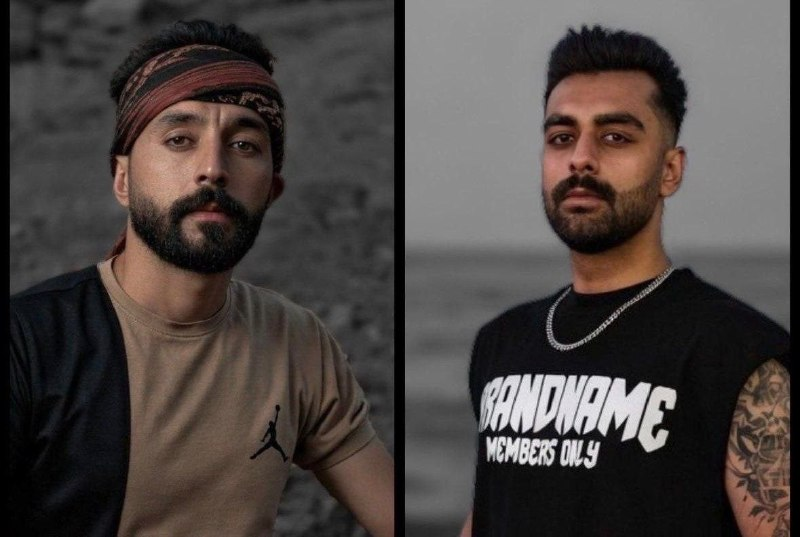

تصویری از جواد زمانی و ابوالفضل ساعدی که امروز صبح توسط جمهوری تروریستی اعدام شدن

💧 Rainbet.com the #1 Non-KYC Crypto Casino & Sportsbook @rainbetcom

😁 @Pm_Afshaa

## DW_Farsi — post 126053

  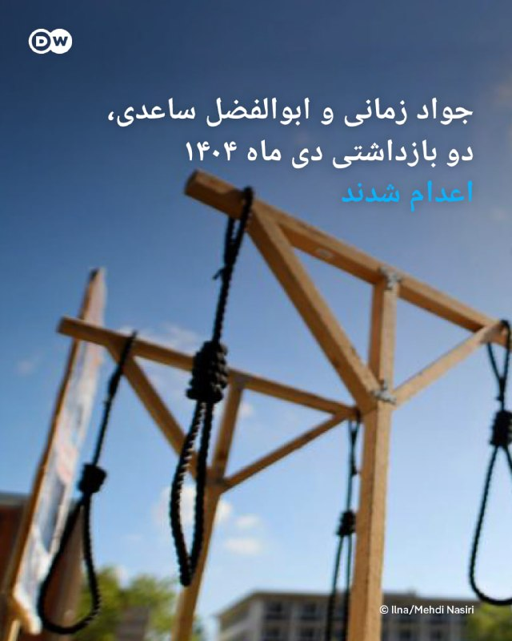

🔶 جواد زمانی و ابوالفضل ساعدی، دو بازداشتی دی ماه ۱۴۰۴، اعدام شدند

خبرگزاری میزان وابسته به قوه قضاییه جمهوری اسلامی به نقل از رئیس‌کل دادگستری استان سمنان از اجرای حکم اعدام دو تن از معترضان بازداشت شده در تظاهرات ۱۸ و ۱۹ دی‌ماه ۱۴۰۴ در شهرستان شاهرود خبر داد.

بر اساس این خبر، جواد زمانی و ابوالفضل ساعدی به اتهام "محاربه و افساد فی‌الارض" به اعدام محکوم شده بودند.

میزان به نقل از محمدصادق اکبری، رئیس‌کل دادگستری استان سمنان، مدعی شده است که این دو در "تخریب و آتش‌زدن اموال و اماکن عمومی" نقش داشته‌اند.

این مقام قضائی همچنین اضافه کرده که پرونده این دو بازداشتی دی‌ماه، در دادسرای عمومی و انقلاب شاهرود و شعبه اول دادگاه انقلاب آن شهرستان بررسی شده و آنها، "به مجازات اعدام و ضبط کلیه اموال و دارائی‌های منقول و غیرمنقول محکوم شدند".

صدور و اجرای احکام اعدام در ایران، همزمان با پیشرفت مذاکرات آمریکا با جمهوری اسلامی متوقف نشده و مطالبات حقوق بشری در هیچ‌یک از محورهای مذاکرات غرب با حکومت ایران گنجانده نشده است.

@dw_farsi

## RadioFarda — post 158387

  <a href="https://t.me/radiofarda/158387" target="_blank">📎 Download file</a>

🔸 در این کافه فردا حواشی و متن بازی ایران و نیوزلند را مرور می‌کنیم، به تاثیر گرانی بلیط در کاهش اقبال مردم به جام جهانی می‌پردازیم و مسابقات باقیمانده نمایندگان آسیا در جام جهانی را به بحث می‌نشینیم.

🔸 برای تماس با ما می‌توانید به شناسه کافه فردا در تلگرام صوت و متن بفرستید.

📻 کافه فردا

## RadioFarda — post 158386

جی‌دی ونس: ترامپ ممکن است متن توافق با ایران را زودتر منتشر کند

🔸معاون رئیس‌جمهور آمریکا روز دوشنبه ۲۵ خرداد در مصاحبه‌های مختلفی توضیحاتی دربارهٔ تفاهم‌نامه اخیر میان ایالات متحده و ایران برای پایان دادن به جنگ میان دو کشور ارائه کرد.

🔸جی‌دی ونس از جمله اعلام کرد که متن کامل این تفاهم‌نامه پس از مراسم رسمی امضای آن در روز جمعه در سوئیس منتشر خواهد شد و در عین حال گفت ممکن است دونالد ترامپ متن آن را پیش از مراسم امضای رسمی منتشر کند.

🔸او گفت این توافق پیش‌تر به‌صورت الکترونیکی توسط رهبران دو طرف امضا شده است و از طرف ایران محمدباقر قالیباف، رئیس مجلس، و عباس عراقچی، وزیر خارجه، و مقام‌های دیگر آن را امضا کردند.

🔸ونس در گفت‌وگو با فاکس‌نیوز گزارش‌های مربوط به پرداخت ۲۴ میلیارد دلار از سوی آمریکا به ایران را «کاملاً نادرست» خواند و گفت این توافق، بازگشایی فوری تنگهٔ هرمز و جلوگیری از دستیابی ایران به سلاح هسته‌ای را تضمین می‌کند.

🔸معاون رئیس‌جمهور آمریکا همچنین هشدار داد اگر ایران به تعهدات خود عمل نکند، از مزایای توافق محروم خواهد شد و دولت ترامپ می‌تواند گزینه‌هایی مانند بازگرداندن محاصره یا ازسرگیری حملات نظامی را در نظر بگیرد.

🔸جی‌دی ونس همچنین در گفت‌وگو با شبکه ان‌بی‌سی اعلام کرد که بر اساس تفاهم‌نامه میان واشینگتن و تهران، بازرسان آژانس بین‌المللی انرژی اتمی «قطعاً» به ایران بازخواهند گشت.

🔸او گفت یکی از بخش‌های اصلی توافق این است که آژانس بین‌المللی انرژی اتمی و آمریکا به ایران برای نابودی ذخایر اورانیوم با غنای بالا کمک کنند. به گفته ونس، این موضوع به‌صراحت در تفاهم‌نامه قید شده است.

🔸نسخه کامل این گزارش را در وب‌سایت رادیوفردا بخوانید.

@RadioFarda

## Dirty_Kids — post 392284

  <a href="telegram/content/Dirty_Kids_392284_1781609670.mp4" target="_blank">🎬 Download video</a>

صدف بیوتی و شیما کاتوزیان رسما و شرعا تا دسته برای حکومت خوردن و مالیدن:)))

حاجی بودجه ۳تا مملکت فقط خرج این جک و جنده‌ها میشه!!

@Dirty_Kids 👻

## alonews — post 128443

  <a href="telegram/content/alonews_128443_1781609670.webm" target="_blank">🎬 Download video</a>

🔴عرزشی ها میدونم اعتراض دارید به نوکری کردن برای آمریکا.

🔴47 سال به آمریکا شعار مرگ فرستاد سر آخر زانو زدید.

😅ولی اغتشاش راهش نیست. بازیچه حکومتی ها شدین.

✅@AloNews

## alonews — post 128442

  <a href="telegram/content/alonews_128442_1781609671.webm" target="_blank">🎬 Download video</a>

👈معاریو: نتانیاهو تقریباً تنها مانده و مشاوران نزدیک خود را از دست داده

🔴 نهاد‌های امنیتی درباره تغییرات ناگهانی مواضع ترامپ، به نتانیاهو هشدار داده بودند، ولی او جدی نگرفته بود که نشان دهنده ضعف در ارزیابی ریسک‌های سیاسی است

✅ @AloNews خبر جنگ

## alonews — post 128441

  <a href="telegram/content/alonews_128441_1781609671.mp4" target="_blank">🎬 Download video</a>

👈صدراعظم آلمان، فریدریش مرز، به رئیس‌جمهور ترامپ یک پیراهن سفارشی تیم ملی فوتبال آلمان با نام «TRUMP» با شماره ۴۷ هدیه داد

✅ @AloNews خبر جنگ

---
📅 بروزرسانی: 1405/03/26 14:54
---

## VahidOOnLine — post 245853

⭕️«آواز وطن»؛ مراسم تولد جاویدنام صنم پوربابایی بر مزارش برگزار شد

♦️تصاویری که روز دوشنبه ۲۵ مردادماه در شبکه‌های اجتماعی منتشر شده نشان می‌دهد، خانواده و آشنایان جاویدنام صنم پوربابایی، مراسم تولد فرزندشان را بر مزارش برگزار کردند.
پدر صنم خطاب به شرکت‌کنندگان در این مراسم گفت: «تاریخ تولد همه فرزندان ایران که در دی‌ماه کشته شدند، ۱۸ و ۱۹ دی است، ما همه رفتنی هستیم اما این بچه‌ها در این دو روز متولد و جاودانه شدند».

جاویدنام صنم پوربابایی، شامگاه ۱۸ دی ۱۴۰۴ و در جریان انقلاب ملی ایرانیان در شهر لاهیجان، با گلوله جنگی نیروهای سرکوبگر جمهوری اسلامی کشته شد. صنم مدرس و نوازنده حرفه‌ای ویولن بود.
‌🇸🇦 Indypersian

🤖 @VahidOOnLine

## FoxNewsTwitter — post 343013

Fox News (Twitter/X)

"After all, we're on the same team."

German Chancellor Friedrich Merz handed President Trump a soccer jersey for his birthday at the G7, drawing smiles as world leaders gathered for high-stakes talks.

The gift came with a lighthearted message, but it also underscored the effort to project unity among allies amid ongoing discussions on security, trade, and global conflicts.

## DEJradio — post 5733

⭕️ اسرائیل هیوم گزارش داد آمریکا یک ماه پیش با دادوستد مالی قطر و جمهوری اسلامی موافقت کرده بود

روزنامۀ اسرائیل هیوم به نقل از سه مقام دیپلماتیک گزارش داد دولت دونالد ترامپ درحدود یک ماه پیش به‌صورت محرمانه با یک توافق مالی و دریایی میان قطر و جمهوری اسلامی موافقت کرده بود.
بر پایۀ این گزارش، قطر در چارچوب یک تفاهم «میلیاردها دلار» را در اختیار تهران قرار داد.
از سویی جمهوری اسلامی نیز عبور آزاد کشتی‌ها و نفتکش‌های قطری را از تنگۀ هرمز تضمین کرده بود.
به گزارش اسرائیل هیوم، مبادلات دوحه و تهران، با آگاهی و موافقت واشینگتن انجام شد.
بنا بر این گزارش، هدف ترامپ از این چشم‌پوشی بر انتقال پول به تهران، کاهش تنش در بازار جهانی انرژی و جلوگیری از جهش قیمت نفت بوده است.
به گزارش رسانۀ اسرائیلی، بخشی از پرداخت‌ها در پوشش هزینۀ عبور کشتی‌ها انجام شد. همچنین یک خط اعتباری برای خرید کالا تا سقف یک میلیارد دلار نیز توسط قطر ایجاد شد.
به گزارش اسرائیل هیوم، افشای این توافق نشان می‌دهد زمینۀ تفاهم کنونی میان واشینگتن و جمهوری اسلامی از هفته‌ها پیش و از مسیر همکاری نزدیک آمریکا و قطر در حال شکل‌گیری بود.

#ترامپ #قطر #مذاکرات
@DEJradio

## IranIntlTV — post 342694

  <a href="telegram/content/IranIntlTV_342694_1781609050.mp4" target="_blank">🎬 Download video</a>

مروری بر رسانه‌ها و خبرگزاری‌ها در ایران، سه‌شنبه ۲۶ خرداد، با مجتبی هاشمی، روزنامه‌نگار
@iranintltv

## DW_Farsi — post 126052

  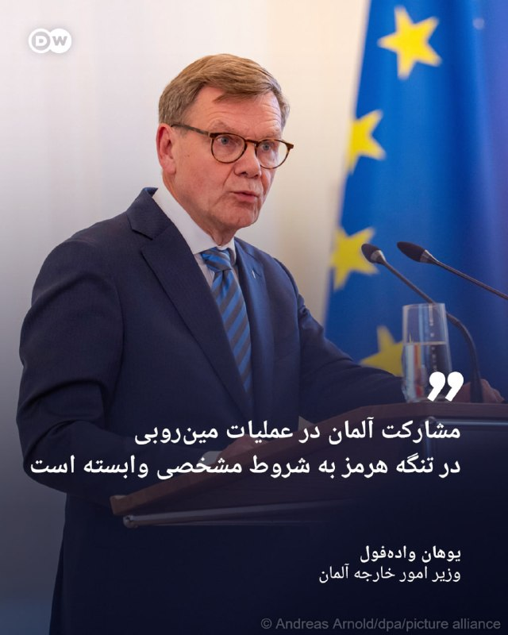

🔶 واده‌فول: مشارکت آلمان در عملیات مین‌روبی در تنگه هرمز به شروط مشخصی وابسته است

یوهان واده‌فول، وزیر امور خارجه آلمان، مشارکت این کشور در عملیات مین‌روبی در تنگه هرمز را به تحقق چند شرط مشخص منوط دانست. او در یک برنامه شبکه دوم تلویزیون آلمان گفت: «ابتدا باید بدانیم آیا واقعا روشن است که دیگر هیچ درگیری نظامی وجود ندارد؟ آیا واقعا روشن است که هر دو طرف خواهان آن هستند که دیگران مین‌ها را پاکسازی کنند؟ وقتی این موارد را بدانیم، آن‌وقت می‌توانیم درباره آن صحبت کنیم.»

واده‌فول با اشاره به ضرورت دریافت مجوز از پارلمان برای چنین ماموریتی افزود: «سپس به مبانی حقوقی لازم، مبانی حقوق بین‌الملل و همچنین مبانی ناشی از قوانین آلمان نیاز داریم. بعد از آن، موضوع را به پارلمان فدرال آلمان ارجاع خواهیم داد.»

وزیر خارجه آلمان با اعلام آمادگی این کشور در عملیات مین‌روبی در تنگه هرمز با این حال گفت: «در مقطع کنونی هنوز پیش‌شرط‌های لازم را در اختیار ندارم که بتوانم بگویم صدور مجوز چنین ماموریتی قریب‌الوقوع است.»

@dw_farsi

## Hranews — post 113646

یک زن در تهران به ظن فروش سه نوزاد خود بازداشت شد

❗️
❗️
❗️
❗️
❗️– یک زن در جنوب تهران به اتهام فروش سه #نوزاد خود بازداشت شده که بر اساس تحقیقات، این نوزادان حاصل سه زایمان جداگانه در بازه‌های زمانی مختلف بوده‌اند. هم‌زمان روند رسیدگی به پرونده و جست‌وجو برای شناسایی #کودکان فروخته‌شده ادامه دارد.

ادامه مطلب

↘️
@hranews_bot تماس ✉️ -  @Hranews  کانال هرانا 🆑

## alonews — post 128440

  <a href="telegram/content/alonews_128440_1781609052.mp4" target="_blank">🎬 Download video</a>

👈 فیلمی منتشر شده از آسیب و نابودی تعدادی از هواپیما های ترابری مستقر در فرودگاه شیراز در جنگ 39 روزه.

✅ @AloNews خبر جنگ

## alonews — post 128439

  <a href="telegram/content/alonews_128439_1781609054.webm" target="_blank">🎬 Download video</a>

👈خبرنگار الجزیره: محاصره دریایی آمریکا علیه ایران لغو شده است

✅ @AloNews خبر جنگ

---
📅 بروزرسانی: 1405/03/26 14:44
---

## VahidOOnLine — post 245852

  

غلامحسین محسنی‌اژه‌ای، رییس قوه قضاییه در نشست هیات عمومی دیوان عالی کشور، درباره تفاهم تهران و واشینگتن گفت: «مذاکره‌کنندگان جمهوری اسلامی ذره‌ای از حقوق محور مقاومت در لبنان، فلسطین، یمن و سایر ساحات و خونخواهی کشته‌شدگان، از جمله علی خامنه‌ای، کوتاه نخواهند آمد.»

رییس قوه قضاییه گفت اگر «دشمن» در روند مذاکرات بدعهدی کند، جمهوری اسلامی به «مقابله و جهاد» خود در «میدان» ادامه خواهد داد.

او افزود: «به این دشمن بدعهد، نابکار و جنایتکار به هیچ وجه نمی‌توان اعتماد کرد و دشمن می‌داند با چه کسانی طرف است.»

اژه‌ای درباره تفاهم تهران و واشینگتن گفت: «اگر چیزی امضا شود و دشمن عهدشکنی کند، جمهوری اسلامی مقابله‌به‌مثل خواهد کرد و در برابر عهدشکنی طرف مقابل، کاری که باید انجام دهد را انجام می‌دهد.»
‌🏁 🇬🇧 IranintlTV

🤖 @VahidOOnLine

## WithYashar — post 15052

  <a href="telegram/content/WithYashar_15052_1781608474.mp4" target="_blank">🎬 Download video</a>

خبرنگار : اگر رژیم ایران به کشتن مردم خودش ادامه دهد، آیا شما همچنان این معامله را پیش خواهید برد؟

ترامپ: ما با آنها در این باره صحبت کردیم. بیشتر این اتفاقات در دوران رژیم اول و دوم رخ داده است، بسیار بیشتر از الان.
@withyashar

## WithYashar — post 15051

خبرگزاری msn : ترامپ و کنگره به هگسث و روبیو اعلام کرده‌اند اگر با توافق با ایران مخالفت کنند ، از سمت خود برکنار خواهند ‌شد
@withyashar

## DEJradio — post 5732

  <a href="telegram/content/DEJradio_5732_1781608476.mp4" target="_blank">🎬 Download video</a>

🔺🎥 دو تا نان خاشخاشی سنگگ، با قد و قواره آب رفته، شد ۱۱۰ هزار تومان!

#نان #تورم #گرانی
@DEJradio

## IranIntlTV — post 342693

  <a href="telegram/content/IranIntlTV_342693_1781608478.mp4" target="_blank">🎬 Download video</a>

فایننشال تایمز گزارش داد دولت‌ها در تامین مالی صندوق سرمایه‌گذاری ۳۰۰ میلیارد دلاری مطرح‌شده در توافق جمهوری اسلامی و ایالات متحده، نقشی نخواهند داشت.

گفت‌وگو با آرش آزرمی، دبیر بخش اقتصادی ایران‌اینترنشنال

@iranintltv

## IranIntlTV — post 342692

  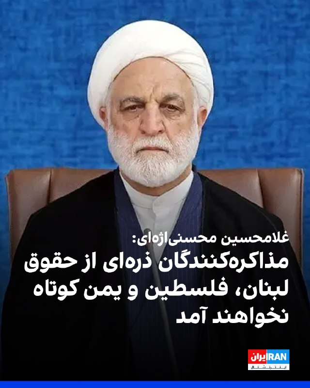

غلامحسین محسنی‌اژه‌ای، رییس قوه قضاییه در نشست هیات عمومی دیوان عالی کشور، درباره تفاهم تهران و واشینگتن گفت: «مذاکره‌کنندگان جمهوری اسلامی ذره‌ای از حقوق محور مقاومت در لبنان، فلسطین، یمن و سایر ساحات و خونخواهی کشته‌شدگان، از جمله علی خامنه‌ای، کوتاه نخواهند آمد.»

رییس قوه قضاییه گفت اگر «دشمن» در روند مذاکرات بدعهدی کند، جمهوری اسلامی به «مقابله و جهاد» خود در «میدان» ادامه خواهد داد.

او افزود: «به این دشمن بدعهد، نابکار و جنایتکار به هیچ وجه نمی‌توان اعتماد کرد و دشمن می‌داند با چه کسانی طرف است.»

اژه‌ای درباره تفاهم تهران و واشینگتن گفت: «اگر چیزی امضا شود و دشمن عهدشکنی کند، جمهوری اسلامی مقابله‌به‌مثل خواهد کرد و در برابر عهدشکنی طرف مقابل، کاری که باید انجام دهد را انجام می‌دهد.»
https://iranintl.com/202606169991

## DW_Farsi — post 126051

  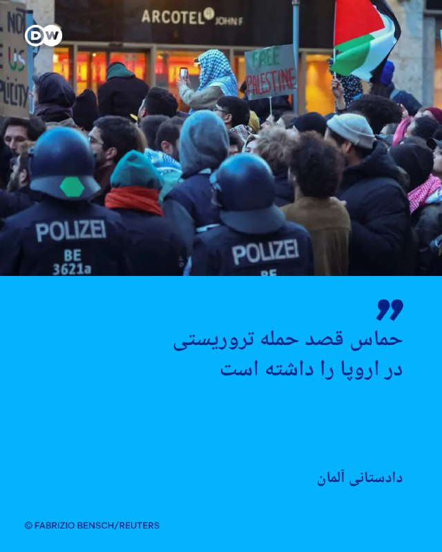

🔶 دادستانی آلمان: حماس قصد حمله تروریستی در اروپا را داشته است

در ماه‌های اخیر چند مرد به ظن همکاری با گروه تروریستی حماس در آلمان و چند کشور اروپایی بازداشت شدند. به گفته دادستانی کل آلمان این افراد ظاهرا قصد انجام یک حمله تروریستی در اروپا را داشته‌اند.

از پاییز سال گذشته تا کنون ۹ مرد مظنون به همکاری با گروه تروریستی حماس در آلمان و چند کشور اروپایی دستگیر شده‌اند که ظاهرا قصد انجام یک حمله تروریستی در اروپا را داشته‌اند.

ینس رومل، دادستان کل فدرال آلمان، در نشست سالانه این نهاد در کالسروهه ضمن اعلام این خبر گفت نزد یکی از متهمان بازداشت‌شده یک ویدیوی از پیش ضبط شده برای اعلام مسئولیت یک حمله تروریستی پیدا شده است.

به گفته او، در این ویدیو از حمله‌ای در دومین سالگرد حمله تروریستی حماس به اسرائیل در هفتم اکتبر ۲۰۲۵ سخن گفته شده بود.

سه تن از ۹ مظنون روز اول اکتبر ۲۰۲۵ در برلین بازداشت شدند. به گفته دادستانی، این افراد مظنون هستند که دست‌کم از تابستان آن سال در انتقال اسلحه و مهمات دخیل بوده‌اند.

@dw_farsi

## RadioFarda — post 158385

  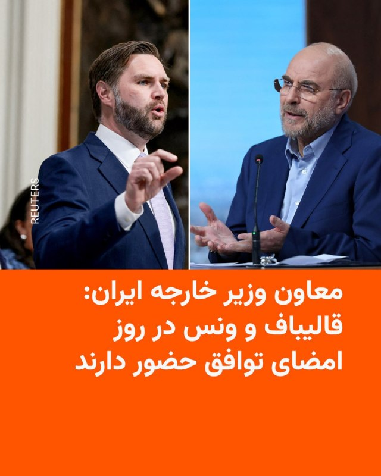

🔸معاون وزیر خارجه ایران اعلام کرد که در روز امضای تفاهم‌نامه برای پایان جنگ با آمریکا، محمدباقر قالیباف رئیس مجلس شورای اسلامی و جی‌دی ونس، معاون رئیس‌جمهور آمریکا، حضور خواهند داشت.

🔸مجید تخت‌روانچی روز سه‌شنبه ۲۶ خرداد در جمع خبرنگاران گفت که بعد از امضا یادداشت تفاهم، درباره مسائل هسته‌ای صحبت می‌شود و هنوز وارد جزئیات نشدیم. بحث غنی‌سازی، ذخایر و نیازهای هسته‌ای ایران هم وجود دارد.

🔸ایران و آمریکا این یادداشت تفاهم را که یک سند کلی و به گفتهٔ معاون رئیس‌جمهور آمریکا، در «یک‌ونیم صفحه» تنظیم شده است، روز ۲۴ خرداد به صورت الکترونیکی امضا کردند و به «جنگ در تمام جبهه‌ها» خاتمه دادند.

🔸دو کشور توافق کردند که پس از امضای یادداشت تفاهم‌ در روز جمعه، تنگه هرمز فوراً بازگشایی و محاصره دریایی بنادر ایران از سوی ارتش آمریکا برداشته شود. تهران و واشینگتن سپس ۶۰ روز فرصت دارند تا در مورد مسائل مورد اختلاف میان خود بویژه در مورد اورانیوم با غنای ۶۰ درصد ایران و فعالیت‌های هسته‌ای جمهوری اسلامی به توافق برسند.

@RadioFarda

## IranianMinds — post 22740

🔴 ویتنی رایت پورن استار آمریکایی هم دیشب توی ورزشگاه بوده و داشته از تیم جمهوری اسلامی حمایت میکرده.

از اونور عربستان رو مسی و رونالدو دارن تبلیغشونو میکنن , جمهوری اسلامی دست به دامن پورن استارا شده :))

@IranianMinds

## BBCPersian — post 284021

  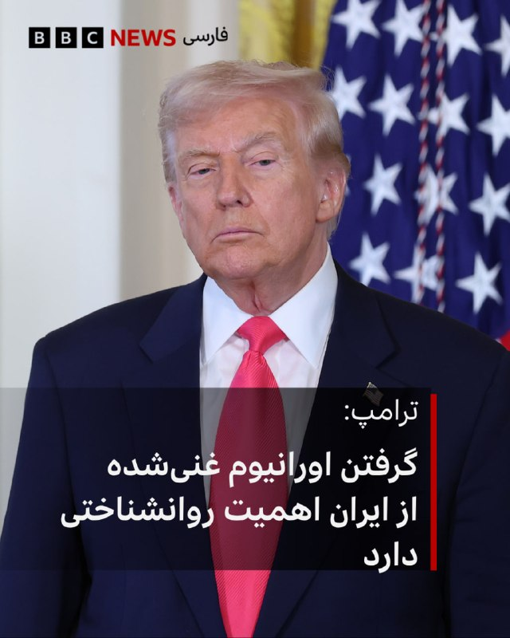

🔻دونالد ترامپ گفت هر چند ذخایر اورانیوم غنی شده ایران ارزش خیلی زیاد مادی ندارد اما از نظر «روانشناسی» آمریکا باید این ذخایر را از ایران بگیرد.

رئیس‌جمهور آمریکا کل تاسیسات هسته‌ای فرو ریخته و بیرون آوردن اورانیوم غنی شده کاری پیچیده است و گفته می‌شود فقط چین تجهیزات بیرون آوردن آن را دارد اما باید این کار انجام شود.

او که برای اجلاس گروه هفت در اویان در فرانسه است، پس از دیدار با امیر قطر گفت به باور او ایران دیگر قابلیت ساخت سلاح هسته‌ای را نخواهد داشت و اگر سعی کند این کار را بکند «جهنم» برایش به پا خواهد شد.

آقای ترامپ گفت ایران دو هفته با ساخت سلاح هسته‌ای فاصله داشت و آن را علیه اسرائیل به کار می‌برد و به‌خاطر اوست که اسرائیل اکنون وجود دارد.

او همچنین گفت آمریکا الزامی به سرمایه‌گذاری در ایران ندارد و هدف از تفاهم این است که ایران به سلاح هسته‌ای نرسد.

رئیس‌جمهور آمریکا از اسرائیل برای حملاتش به ضاحیه در بیروت انتقاد کرد و اینکه برای کشتن یک فرمانده حزب‌الله کل ساختمان را ویران می‌کند.

📸GettyImages
https://bbc.in/4vfZEry
@BBCPersian

## Dirty_Kids — post 392283

🔴 آخر الزمان شده، ویتنی رایت پورن استار مشهور آمریکایی دیشب توی استادیوم حضور داشته و از تیم جمهوری اسلامی حمایت می‌کرده. @Dirty_Kids 👻

## Dirty_Kids — post 392282

  

رونالدو و مسی در حال معرفی و تبلیغ عربستان هستند و ویتنی رایت پورن استار آمریکایی در حال معرفی ایران!
احیاناً یه کم راه را اشتباه نرفتید؟

@Dirty_Kids 👻

## Dirty_Kids — post 392277

  <a href="telegram/content/Dirty_Kids_392277_1781608485.mp4" target="_blank">🎬 Download video</a>

🔴 آخر الزمان شده، ویتنی رایت پورن استار مشهور آمریکایی دیشب توی استادیوم حضور داشته و از تیم جمهوری اسلامی حمایت می‌کرده.

@Dirty_Kids 👻

## alonews — post 128438

  <a href="telegram/content/alonews_128438_1781608486.webm" target="_blank">🎬 Download video</a>

👈دراپ سایت: ایران برای تحلیل رفتار ترامپ، دوتا روانشناس به تیم مذاکره کننده اضافه کرده!

✅ @AloNews خبر جنگ

## alonews — post 128437

  <a href="telegram/content/alonews_128437_1781608487.webm" target="_blank">🎬 Download video</a>

👈ترامپ: اوباما به اوکراین سلاح‌هایی به ارزش ۳۵۰ میلیارد دلار داد.

🔴او داد، که دیوانه‌کننده بود

✅ @AloNews خبر جنگ

## alonews — post 128436

  <a href="telegram/content/alonews_128436_1781608487.webm" target="_blank">🎬 Download video</a>

👈ترامپ درباره اوکراین: این موضوع هیچ تأثیری بر ما ندارد جز اینکه ما سلاح می‌فروشیم.

🔴ما هزاران مایل دورتر هستیم

✅ @AloNews خبر جنگ

## alonews — post 128435

  <a href="telegram/content/alonews_128435_1781608488.webm" target="_blank">🎬 Download video</a>

👈گزارشگر: اگر رژیم ایران به کشتن مردم خودش ادامه دهد، آیا شما همچنان این معامله را پیش خواهید برد؟

🔴ترامپ: ما با آنها در این باره صحبت کردیم. بیشتر این اتفاقات در دوران رژیم اول و دوم رخ داده است، بسیار بیشتر از الان.

✅ @AloNews خبر جنگ

## alonews — post 128434

  <a href="telegram/content/alonews_128434_1781608488.webm" target="_blank">🎬 Download video</a>

👈ترامپ در مورد اوباما: اوباما اسرائیل را به خاطر ایران فروخت. او به ایران رفت.

🔴هر کسی که می‌تواند به این شخص یا حزب - دموکرات‌ها، من آنها را می‌نامم - رأی دهد، چون آنها احمق هستند

✅ @AloNews خبر جنگ

---
📅 بروزرسانی: 1405/03/26 14:34
---

## mwarmonitor — post 11017

🔴ترامپ از نحوه عملکرد اسرائیل در لبنان انتقاد کرد و گفت اسرائیل «خیلی طولانی است که با حزب‌الله می‌جنگد» و افزود «افراد زیادی کشته می‌شوند».

🔸ترامپ گفت اسرائیل لازم نیست «هر بار که یک هدف را می‌زند یک ساختمان آپارتمانی را با خاک یکسان کند»، چون: «همه آن‌ها حزب‌الله نیستند.»

🔸او همچنین گفت پیشنهاد داده است که اسرائیل اجازه دهد سوریه با حزب‌الله برخورد کند: «اگر اسرائیل نتواند بدون کشتن همه کار را انجام دهد، او [الشرع] این کار را انجام می‌دهد، سوریه انجام می‌دهد.»

🔸ترامپ همچنین حمله اسرائیل به حزب‌الله در بیروت را مورد انتقاد قرار داد و آن را «بیش از حد» توصیف کرد و گفت: «من خوشم نیامد، به آن‌ها هم گفتم.»

🔸او افزود: «بیبی باید در قبال لبنان مسئولانه‌تر رفتار کند.» ترامپ همچنین مدعی شد: «اگر من دخالت نمی‌کردم، اسرائیل مدت‌ها پیش نابود شده بود.»

@mwarmonitor

## FoxNewsTwitter — post 343012

‌Fox News (Twitter/X)

Head to Fox One right now so you don't miss a single second of this historic moment!

https://www.fox.com/stream/fox-news?cmpid=org=fn::ag=owned_other::mc=organicsocial[%E2%80%A6]WITTER::cmp=100_o2_th4::cont=m2_tp1::add=03_17_00_05_13_00_02_A

## FoxNewsTwitter — post 343011

  <a href="telegram/content/FoxNewsTwitter_343011_1781607865.mp4" target="_blank">🎬 Download video</a>

Fox News (Twitter/X)

"All hell will rain down on them."

President Trump puts the Iranian regime and its radical leaders on notice with a blunt warning at the G7, making it clear the Islamic Republic will not be allowed to obtain a nuclear weapon in any way, shape, or form.

"If they do, they suffer unbelievable consequences... the ultimate consequences," Trump said before doubling down that Iran will not be permitted to develop, buy, or acquire one if they want to maintain a "very good relationship" with the United States.

## DEJradio — post 5731

⭕️ 
👑 شاهزاده رضا پهلوی: توافق با جمهوری اسلامی از منظر اخلاقی و راهبردی اشتباه است

شاهزاده رضا پهلوی در گفت‌وگو با مجلۀ تایمز با انتقاد از توافق میان جمهوری اسلامی و آمریکا، آن را از نظر اخلاقی غلط و از نظر راهبردی گمراه‌کننده، عنوان کرد.
شاهزاده گفت هر توافقی با جمهوری اسلامی سرانجام شکست خواهد خورد.
او تأکید کرد رژیم حاکم بر ایران، در صوزت توافق نیز به سرکوب داخلی، باج‌خواهی از جامعۀ جهانی و بی‌ثبات‌سازی منطقه، ادامه می‌دهد.
شاهزاده رضا پهلوی تصریح کرد که مردم ایران باید در محور هرگونه سیاست‌گذاری و مذاکرۀ بین‌المللی دربارۀ کشور قرار گیرند.
او همچنین تغییر نظام سیاسی را، تنها راه‌حل پایدار برای آیندۀ روشن کشور عنوان کرد.
شاهزاده یادآور شد که دستان محمدباقر قالیباف که تفاهمنامه را از سوی رژیم امضا کرده، به خون مردم ایران آغشته شده است.
شاهزاده رضا پهلوی تأکید کرد تعیین نظام آیندۀ ایران تنها باید از طریق رأی مردم انجام شود و هیچ فرد یا گروهی نمی‌تواند این تصمیم را به جای ملت ایران بگیرد.

#شاهزاده_رضا_پهلوی #مصاحبه #مذاکرات #توافق
@DEJradio

## DEJradio — post 5730

⭕️ اکسیوس: ارزیابی سیا نشان می‌دهد جمهوری اسلامی برای پذیرش شروط هسته‌ای آمریکا آماده نیست

وب‌سایت خبری اکسیوس به نقل از سه منبع آگاه گزارش داد جان رتکلیف، رئیس سازمان اطلاعات مرکزی آمریکا در مورد دوبازی دوگانۀ جمهوری اسلامی در مورد مسئلۀ هسته‌ای هشدار داده است.
بنا بر این گزارش، بر پایۀ ارزیابی اطلاعاتی سازمان سیا، اکنون تردیدهایی جدی در مورد هدف واقعی جمهوری اسلامی از مذاکرات، پدید آمده است.
به گفتۀ اکسیوس، رئیس سیا به دونالد ترامپ و مقام‌های ارشد دولت هشدار داد که ارزیابی‌های اطلاعاتی این سازمان دربارۀ نیت واقعی جمهوری اسلامی، با آنچه در تفاهمنامه مطرح شده است، همخوانی ندارد.
اکسیوس نوشت که جان رتکلیف، مارکو روبیو، وزیر امور خارجۀ آمریکا، و پیت هگست، وزیر جنگ در جلسات داخلی دربارۀ آمادگی جمهوری اسلامی برای پذیرش محدودیت‌های هسته‌ای مورد نظر واشینگتن ابراز تردید کرده‌اند.
بر اساس این گزارش، داده‌های جمع‌آوری‌شده از سوی نهادهای اطلاعاتی آمریکا نشان می‌دهد مواضعی که مقام‌های جمهوری اسلامی در داخل کشور مطرح می‌کنند، با تعهداتی که از طریق میانجی‌ها و در مذاکرات با آمریکا ارائه شده است، تفاوت اساسی دارد.
اکسیوس نوشت مخالفان توافق در دولت آمریکا می‌گویند جمهوری اسلامی ممکن است در دورۀ ۶۰ روزۀ مذاکرات از مزایای سیاسی و اقتصادی تفاهم اولیه بهره‌مند شود، اما در پایان شروط هسته‌ای مورد نظر واشینگتن را نپذیرد.

#مذاکرات #توافق #ترامپ
@DEJradio

## FarsiVOA — post 220907

  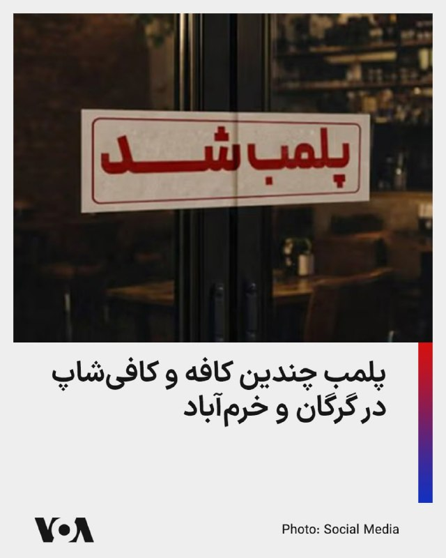

نهادهای امنیتی و قضایی جمهوری اسلامی، از پلمب چندین کافه و کافی‌شاپ در شهرستان‌های گرگان و خرم‌آباد خبر دادند.

مهدی رزاقی‌نژاد، دادستان مرکز استان گلستان، روز سه‌شنبه ۲۶ خرداد، بدون اعلام تعداد دقیق کسب‌وکارهای توقیف شده، اعلام کرد که این امکان در «گشت نظارتی دیشب دادستانی» و به اتهام «هنجارشکنی و قبح‌شکنی» مسدود شدند.

همچنین مرکز اطلاع‌رسانی پلیس استان لرستان نیز اعلام کرد که پنج کافه رستوران و سفره‌خانه سنتی با دستور قضایی مهر و موم شد. ادعا شده این اماکن تجاری در راستای اجرای طرح موسوم به «ارتقای امنیت اخلاقی و اجتماعی» و به اتهام «هنجارشکنی» از ادامه فعالیت محروم شدند.

روز دوشنبه ۲۵ خردادماه نیز خبرگزاری میزان وابسته به دستگاه قضایی جمهوری اسلامی، از پلمب یک کافه در شمال تهران به بهانه «عدم رعایت موازین قانونی و شرعی» خبر داد.

در هفته‌های اخیر، با فروکش کردن فضای جنگی و کاهش فشار بیرونی، نشانه‌هایی از بازگشت تمرکز نهادهای امنیتی و قضایی جمهوری اسلامی به سرکوب و کنترل اجتماعی دیده می‌شود. الگویی که بار دیگر کافه‌ها، تالارها، موسیقی، پوشش، اختلاط و سبک زندگی شهروندان را هدف گرفته است.
@FarsiVOA

## BBCPersian — post 284020

  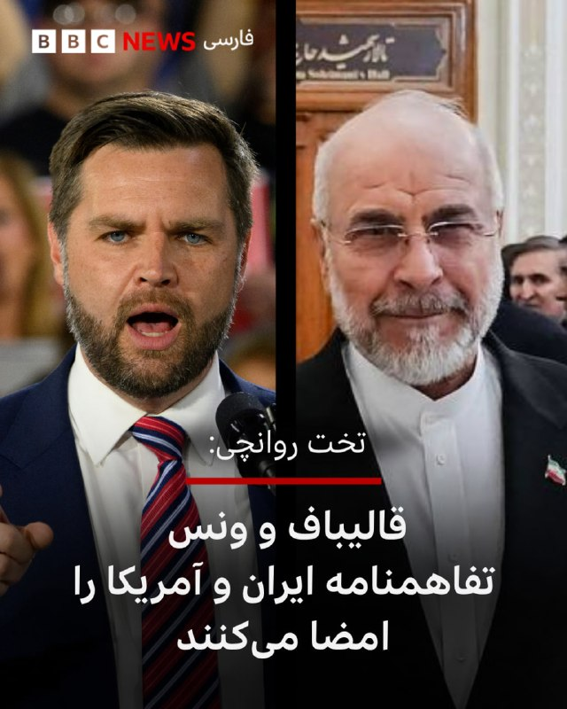

🔻مجید تخت روانچی گفت محمدباقر قالیباف و جی‌دی ونس تفاهمنامه ایران و آمریکا را امضا می‌کنند.

معاون وزیر امور خارجه ایران گفت: «سوئیس محل امضا است اما نقطه دقیقش مشخص نیست. از طرف آمریکا آقای ونس هستند و از طرف ایران آقای قالیباف هستند.»

آقای تخت روانچی همچنین گفت: «در یکی از بندها خاتمه جنگ در همه جبهه‌ها به شمول لبنان وجود دارد. آمریکا متعهد شده که جنگ در همه جبهه‌ها تمام شود و اگر بخواهد نقضی صورت بگیرد طبق مکانیزمی اقدام خواهد شد.»

بعد از اعلام تفاهم ایران و آمریکا، اسرائیل تاکید کرد که حضور نیروهایش در «مناطق امنیتی» در لبنان ادامه خواهد داشت.

عباس عراقچی، وزیر خارجه ایران امروز گفت دور جدید مذاکرات ایران و آمریکا در روز جمعه در سوئیس آغاز خواهد شد.

این تفاهمنامه جمعه در سوئیس با تشریفات رسمی امضا خواهد شد.
📸GettyImages
https://bbc.in/4eduECx
@BBCPersian

---
📅 بروزرسانی: 1405/03/26 14:23
---

## IranianMinds — post 22739

  <a href="telegram/content/IranianMinds_22739_1781607235.mp4" target="_blank">🎬 Download video</a>

🔴 ترامپ:

اگر ایالات متحده آمریکا نبود، اسرائیل الان وجود نداشت.
هر آدم باهوشی تو اسرائیل اینو خوب میدونه.

@IranianMinds

## IranianMinds — post 22738

🔴 ترامپ :

رهبری فعلی ایران آدم‌های خیلی منطقی‌ای هستن. خوش برخورد و راحت می‌شه باهاشون کار کرد؛ قوی و باهوشن.

رادیکال و افراطی نیستن و دنبال کمک به کشورشون هستن.

@IranianMinds

---
📅 بروزرسانی: 1405/03/26 14:14
---

## VahidOOnLine — post 245851

  <a href="telegram/content/VahidOOnLine_245851_1781606660.mp4" target="_blank">🎬 Download video</a>

⭕️ترامپ: به اسرائیل پیشنهاد کردم سوریه مسئولیت حزب‌الله را برعهده بگیرد

♦️دونالد ترامپ، رئیس جمهوری آمریکا روز سه‌شنبه ۲۶ خرداد و در جریان دیدار با امیر قطر در حاشیه نشست سران گروه ۷ (جی۷) در اویان فرانسه گفت به اسرائیل پیشنهاد کردم که سوریه مسئولیت حزب‌الله را برعهده بگیرد، به نظرم آن‌ها بهتر از پس کار برمی‌آیند.
‌🇸🇦 Indypersian

🤖 @VahidOOnLine

## IranIntlTV — post 342691

  <a href="telegram/content/IranIntlTV_342691_1781606662.mp4" target="_blank">🎬 Download video</a>

سرخط خبرهای سه‌شنبه ۲۶ خرداد
@iranintltv

## IranIntlTV — post 342690

  <a href="telegram/content/IranIntlTV_342690_1781606664.mp4" target="_blank">🎬 Download video</a>

گزارش‌های مردمی رسیده به ایران‌اینترنشنال نشان می‌دهد روند تعدیل نیرو در کارخانه‌ها و پرداخت نشدن حقوق کارگران همچنان ادامه دارد. همچنین شماری از افرادی که در اسفند و فروردین برای دریافت مقرری بیمه بیکاری ثبت‌نام کرده و نامشان در فهرست دریافت‌کنندگان قرار گرفته است، اعلام کرده‌اند که تاکنون هیچ مبلغی به حساب آن‌ها واریز نشده است.

جزییات بیشتر با لیلا سعادتی، عضو تحریریه ایران‌اینترنشنال
@iranintltv

## IranIntlTV — post 342689

  <a href="telegram/content/IranIntlTV_342689_1781606667.mp4" target="_blank">🎬 Download video</a>

علی‌حسین قاضی‌زاده، عضو تحریریه ایران‌اینترنشنال، می‌گوید با وجود تاکید دونالد ترامپ بر پرداخت نشدن پول به جمهوری اسلامی، آزادسازی منابع مالی تهران می‌تواند امتیازی بزرگ‌تر از مشوق‌های ارایه‌شده در دوران باراک اوباما باشد.
@iranintltv

## DW_Farsi — post 126050

🎥 عطر افسونگر چای ایرانی در قهوه‌خانه‌های حیدرآباد هند

بسیاری از ساکنان شهر تاریخی "حیدرآباد" هند چای ایرانی را یک نوشیدنی سرشار از عطر و طعم می‌دانند که نه‌تنها خستگی را برطرف می‌کند، بلکه به روح و جان طراوت می‌بخشد. مهاجران ایرانی فرهنگ افسونگر نوشیدن این چای را با خود به هند بردند.

@dw_farsi

## RadioFarda — post 158384

🔸جمعی از هواداران تیم ملی فوتبال ایران روز دوشنبه در بروکلین نیویورک برای حمایت از تیم ملی کشورشان در نخستین دیدار جام جهانی مقابل نیوزیلند گرد هم آمدند.

🔸به گزارش رویترز برای این هواداران، این مسابقه فرصتی بود تا برای مدتی از فضای پرتنش ناشی از کشتار معترضان در دی‌ماه سال گذشته و همچنین خبرهای مربوط به جنگ و تنش‌های سیاسی، فاصله بگیرند.

🔸این مسابقه که در ورزشگاه لس‌آنجلس برگزار شد، با تساوی ۲–۲ به پایان رسید.

🔸هرچند فوتبال جام جهانی محور اصلی توجه ایرانیان مهاجر حاضر در رستوران «بیژن» در بروکلین بود، بسیاری از هواداران گفتند که جنگ و طرح صلح موقت نیز به‌طور جدی ذهن آن‌ها را مشغول کرده است.

🔸بر اساس گزارش رویترز، بسیاری تأکید کردند که تلاش می‌کنند اختلافات سیاسی خود را کنار بگذارند و از بازیکنان ایرانی حاضر در میدان حمایت کنند.

@RadioFarda

## RadioFarda — post 158383

  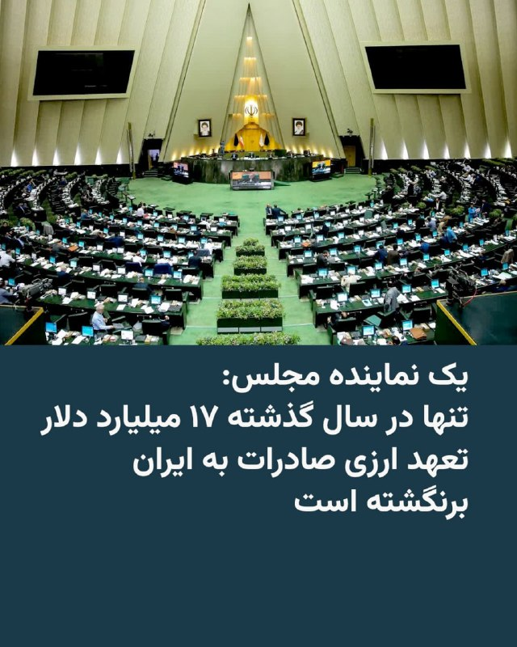

🔸یک عضو کمیسیون اقتصادی مجلس شورای اسلامی از برنگشتن ۱۷ میلیارد دلار تعهدات ارزی سررسید شده در سال ۱۴۰۴ خبر داد.

🔸به گزارش خبرگزاری تسنیم، حسین صمصامی با استناد به آخرین آمارهای مربوط به تعهدات ارزی صادرکنندگان، از تداوم انباشت ارزهای صادراتی بازنگشته به ایران خبرداد.

🔸او گفت که مجموع ارزهای بازنگشته به چرخه رسمی اقتصاد ایران از سال ۱۳۹۷ تا پایان خرداد ۱۴۰۵ به بیش از ۱۳۰ میلیارد دلار رسیده است.

🔸صمصامی افزود: در سه ماهه نخست سال ۱۴۰۵ نیز حدود سه میلیارد دلار ارز صادراتی تا امروز به چرخه رسمی اقتصاد کشور بازنگشته است.

🔸این عضو کمیسیون اقتصادی مجلس با اشاره به اطلاعات دریافتی از وضعیت رفع تعهدات ارزی صادرکنندگان گفت: مقایسه این رقم با منابع ارزی بلوکه‌شده ایران در خارج نشان‌ می‌دهد که حجم ارزهای بازنگشته چندین برابر ۲۴ میلیارد دلار منابع بلوکه‌شده ایران در حساب‌های خارجی است.

@RadioFarda

## IranianMinds — post 22737

🔴 خبرنگار: رژیم ایران هنوز هم به کشتن مردم خودش ادامه میده ها.

ترامپ: بخش عمده این کشتارها در رژیم اول و دوم اتفاق افتاده، خیلی بیشتر از حالا.

@IranianMinds

## IranianMinds — post 22736

  <a href="https://t.me/IranianMinds/22736" target="_blank">📎 Download file</a>

✈️ اپلیکیشن MelBet 
🥇

🎁 کد هدیه 100 دلاری: Sport100

🔒 برای تعیین رمز ورود حداقل از 8 کاراکتر و حروف بزرگ و کوچک انگلیسی و اعداد انگلیسی استفاده کنید، مانند Hamid120

🇮🇷 برای تغییر زبان برنامه، زبان موبایل خود را تغییر دهید.

✅ ورود به اپلیکیشن بدون فیلترشکن

## IranianMinds — post 22735

🔺 بانس‌های فوق خفن مل‌بت 
🔺

🫴 100 درصد پاداش اولین واریز

😀 100 درصد بانس یکشنبه ها

🎁 100 درصد بانس چهارشنبه ها

🔹 هر روز 1 چرخش گردونه 1 یورویی

😀 3 درصد باز پرداخت نقدی

😀 بانس شرط رایگان 30 دلاری

🎩 10 درصد باز پرداخت نقدی کازینو

🎆 بانس هدیه روز تولد

💵 و چندین بانس دیگر از جمله بانس خوش‌آمد گویی، بانس شرطبندی طولانی مدت، بانس 1750 یورویی کازینو و...

💰 هنگام ثبت‌نام با وارد کردن کد هدیه Sport100 بانس 100 دلاری رایگان دریافت کنید!

✈️ معرفی سایت و اپلیکیشن مل‌بت

🔄 ورود به سایت مل‌بت (فیلترشکن خاموش)

## alonews — post 128432

  <a href="telegram/content/alonews_128432_1781606671.webm" target="_blank">🎬 Download video</a>

👈برنامه جدید امتحانای نهایی اعلام شد

✅ @AloNews خبر جنگ

---
📅 بروزرسانی: 1405/03/26 14:04
---

## VahidOOnLine — post 245850

  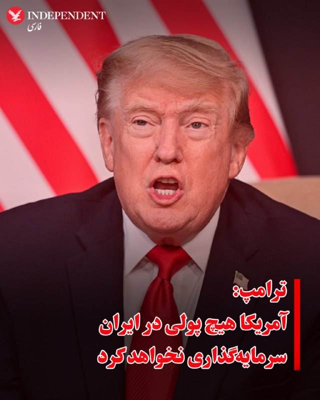

⭕️ترامپ: آمریکا هیچ پولی در ایران سرمایه‌گذاری نخواهد کرد

♦️دونالد ترامپ، رئیس جمهوری ایالات متحده روز سه‌شنبه ۲۶ خردادماه و در جریان دیدار با امیر قطر در حاشیه اجلاس رهبران گروه ۷ (جی‌۷) گفت که ایالات متحده هیچ پولی در ایران سرمایه‌گذاری نمی‌کند و هدف «توافق، تنها اطمینان از دست نیافتن ایران به سلاح هسته‌ای بوده است.»

رئیس جمهوری آمریکا هشدار داد که اگر جمهوری اسلامی بخواهد به سلاح هسته‌ای دست پیدا کند، «جهنم بر سرشان خراب خواهد شد.»
‌🇸🇦 Indypersian

🤖 @VahidOOnLine

## IranIntlTV — post 342688

  <a href="telegram/content/IranIntlTV_342688_1781606073.mp4" target="_blank">🎬 Download video</a>

یک شهروند با ارسال ویدیویی به ایران‌اینترنشنال در خصوص گرانی‌های شدید در ایران می‌گوید یک عدد کیک، یک پاکت شیر و یک بسته سیگار را به قیمت ۳۰۰ هزار تومان خریده است.

## FarsiVOA — post 220906

🔺ترامپ با اشاره به تفاهم با جمهوری اسلامی: ایران هرگز به سلاح هسته‌ای دست نخواهد یافت

▪️دونالد ترامپ، رئیس‌جمهوری آمریکا، در جریان برگزاری نشست گروه هفت، درباره توافق با جمهوری اسلامی گفت که آمریکا هیچ سرمایه‌گذاری در ایران نخواهد کرد.

▪️پرزیدنت ترامپ گفت: «ما فکر می‌کنیم این یک توافق منصفانه است». او افزود: «توافق با ایران وارد مرحله دوم می‌شود.»

▪️رئیس‌جمهوری آمریکا تصریح کرد که جمهوری اسلامی «تحت این توافق هرگز به سلاح هسته‌ای دست نخواهد یافت». او هشدار داد: «اگر ایران تلاش کند به سلاح هسته‌ای دست پیدا کند، جهنم به پا خواهد شد.»

▪️او همچنین جنگ لبنان را درگیری‌ای کوچک توصیف کرد و گفت که توافق با حکومت ایران می‌تواند پابرجا بماند.

⬇️ بیشتر بخوانید:
https://ir.voanews.com/a/trump-g7-remarks-on-iran-deal/8161426.html

## alonews — post 128431

  <a href="telegram/content/alonews_128431_1781606076.mp4" target="_blank">🎬 Download video</a>

👈ترامپ: نتانیاهو به واشنگتن آمد و از اوباما التماس کرد که آن توافق با ایران را انجام ندهد

🔴 اوباما طرف ایران بود، نه اسرائیل و آن توافق را انجام داد

✅ @AloNews خبر جنگ

## alonews — post 128430

  <a href="telegram/content/alonews_128430_1781606079.webm" target="_blank">🎬 Download video</a>

👈ترامپ : رهران فعلی ایران آدم‌های کاملاً منطقی هستن

🔴 آدم‌های خوبی برای مذاکره‌ان؛ قوی و باهوشن

🔴اونا افراطی و رادیکال نیستن و دنبال اینن که به کشورشون کمک کنن

✅ @AloNews خبر جنگ

---
📅 بروزرسانی: 1405/03/26 13:54
---

## VahidOOnLine — post 245849

  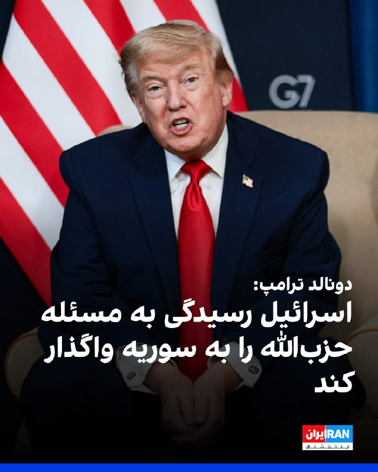

دونالد ترامپ، رییس‌جمهوری آمریکا، در پاسخ به پرسشی درباره خودداری اسرائیل از خروج از لبنان، موضوعی که به گفته او می‌تواند موفقیت چارچوب توافق برای پایان جنگ را تحت تاثیر قرار دهد، جنگ لبنان را «جنگ کوچک‌تر» توصیف کرد و گفت در مقایسه با جنگ علیه جمهوری اسلامی، اهمیت کمتری دارد.

ترامپ گفت به اسرائیل پیشنهاد کرده است اجازه دهد سوریه به مسئله حزب‌الله رسیدگی کند و افزود: «صادقانه بگویم، فکر می‌کنم سوریه این کار را بهتر انجام خواهد داد.»

ترامپ با اشاره به نقش حزب‌الله گفت این گروه همچنان مشکل اصلی در لبنان است و آن را نیروی نیابتی جمهوری اسلامی خواند.

او در عین حال از نحوه عملکرد اسرائیل در مقابله با حزب‌الله انتقاد کرد و گفت: «اسرائیل مدت زیادی است با حزب‌الله می‌جنگد و افراد بسیار زیادی کشته می‌شوند.»

رییس‌جمهوری آمریکا افزود: «لازم نیست هر بار که به دنبال یک نفر هستید، یک ساختمان مسکونی را ویران کنید، زیرا افراد زیادی در آن ساختمان‌ها زندگی می‌کنند و همه آنها عضو حزب‌الله نیستند.»
‌🏁 🇬🇧 IranintlTV

🤖 @VahidOOnLine

## WithYashar — post 15050

ترامپ: جنگ لبنان مسئله فرعی است و توافق هسته‌ای با ایران می‌تواند پابرجا بماند.

به اسرائیل گفتم که از حمله آنها به بیروت خوشم نیامد

من به اسرائیل پیشنهاد دادم که سوریه مسئولیت حزب‌الله را بر عهده بگیرد

من از نتانیاهو ناامید نیستم. ما رابطه بسیار خوبی داریم
@withyashar

## FoxNewsTwitter — post 343010

‌Fox News (Twitter/X)

BREAKING: FBI, law enforcement partners disrupt alleged plot against UFC Freedom 250 event at White House; 5 in custody, officials say

## IranIntlTV — post 342687

  

دونالد ترامپ، رییس‌جمهوری آمریکا، در پاسخ به پرسشی درباره خودداری اسرائیل از خروج از لبنان، موضوعی که به گفته او می‌تواند موفقیت چارچوب توافق برای پایان جنگ را تحت تاثیر قرار دهد، جنگ لبنان را «جنگ کوچک‌تر» توصیف کرد و گفت در مقایسه با جنگ علیه جمهوری اسلامی، اهمیت کمتری دارد.

ترامپ گفت به اسرائیل پیشنهاد کرده است اجازه دهد سوریه به مسئله حزب‌الله رسیدگی کند و افزود: «صادقانه بگویم، فکر می‌کنم سوریه این کار را بهتر انجام خواهد داد.»

ترامپ با اشاره به نقش حزب‌الله گفت این گروه همچنان مشکل اصلی در لبنان است و آن را نیروی نیابتی جمهوری اسلامی خواند.

او در عین حال از نحوه عملکرد اسرائیل در مقابله با حزب‌الله انتقاد کرد و گفت: «اسرائیل مدت زیادی است با حزب‌الله می‌جنگد و افراد بسیار زیادی کشته می‌شوند.»

رییس‌جمهوری آمریکا افزود: «لازم نیست هر بار که به دنبال یک نفر هستید، یک ساختمان مسکونی را ویران کنید، زیرا افراد زیادی در آن ساختمان‌ها زندگی می‌کنند و همه آنها عضو حزب‌الله نیستند.»
https://iranintl.com/202606161933

## IranIntlTV — post 342686

  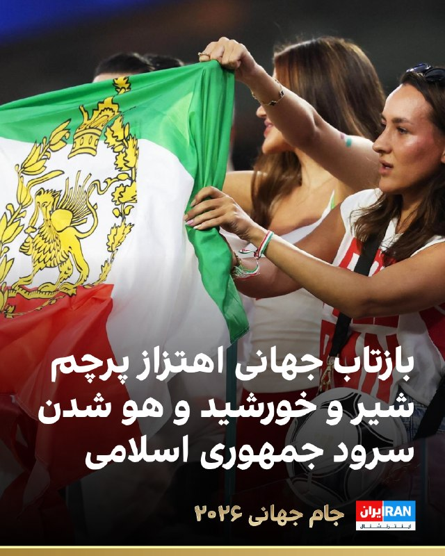

🔻اتفاقات دیدار تیم‌های ملی فوتبال ایران و نیوزیلند، از جمله اهتزاز گستردهٔ پرچم‌های شیر و خورشید، هو شدن سرود جمهوری اسلامی و تجمع معترضان در بیرون ورزشگاه سوفای لس‌آنجلس، بازتاب بسیار گسترده‌ای در رسانه‌های جهان داشته است.

🔹روزنامه سان بریتانیا نوشت هواداران ایرانی با فریادهای کرکننده و هو کردن سرود جمهوری اسلامی، صدای خود را به گوش همه رساندند. این رسانه اشاره کرد مسابقه در میان تدابیر شدید امنیتی مأموران اف‌بی‌آی و دیگر تیم‌های امنیتی برگزار شد؛ امنیتی که به دلیل جنگ چندماههٔ جمهوری اسلامی و آمریکا شدید بود، اما در نهایت با رفتار پرشور ولی مسالمت‌آمیز تماشاگران، بیش از حد نیاز به نظر می‌رسید.

🔹سان گزارش داد هزاران تماشاگر در خارج از ورزشگاه تجمع کرده و تیم را «تیم مجتبی» و نمایندهٔ رژیم نامیدند. این روزنامه به تقابل پرچم‌ها پرداخت و نوشت با وجود ممنوعیت فیفا و تهدید ایران به قطع مسابقه، پرچم‌های تاریخی شیر و خورشید در دستان هواداران به اهتزاز درآمد.

🔹جزییات بیشتر را در سایت بخوانید

@iranintltvsport

## IranIntlTV — post 342685

دونالد ترامپ، رییس‌جمهوری آمریکا، در دومین روز نشست سران گروه هفت در فرانسه، با تاکید بر اینکه ایران به سلاح هسته‌ای دست نخواهد یافت، گفت اگر تهران به سمت ساخت بمب اتمی برود، «جهنم بر سرش فرود خواهد آمد». او در عین حال تصریح کرد که به دنبال تغییر حکومت در ایران نیست و این موضوع هرگز بخشی از اهدافش نبوده است.
@iranintltv

## FarsiVOA — post 220900

تصاویری از حضور مخالفان جمهوری اسلامی در دیدار تیم‌های ایران و نیوزیلند؛

در جریان دیدار تیم‌های فوتبال ایران و نیوزیلند در جام جهانی ۲۰۲۶ که در لس آنجلس برگزار شد، بسیاری از ایرانیان مخالف جمهوری اسلامی با در دست داشتن پلاکاردهایی اعتراض خود را نشان دادند.

همچنین به رغم موضع فیفا و حکم یک دادگاه در کالیفرنیا مبنی در منع ورود پرچم شیروخورشید، تعدادی از تماشاگران ایران موفق شدند با پرچم‌های شیر و خورشید به ورزشگاه راه یابند و این پرچم را حین مسابقه فوتبال ایران و نیوزیلند به نمایش بگذارند.

پیش از آغاز جام جهانی، وزیر ورزش جمهوری اسلامی مدعی شده بود که اگر پرچمی به غیر از پرچم جمهوری اسلامی در ورزشگاه باشد، بازیکنان تیم فوتبال ایران می‌توانند زمین را ترک کنند.
@FarsiVOA

## DW_Farsi — post 126049

  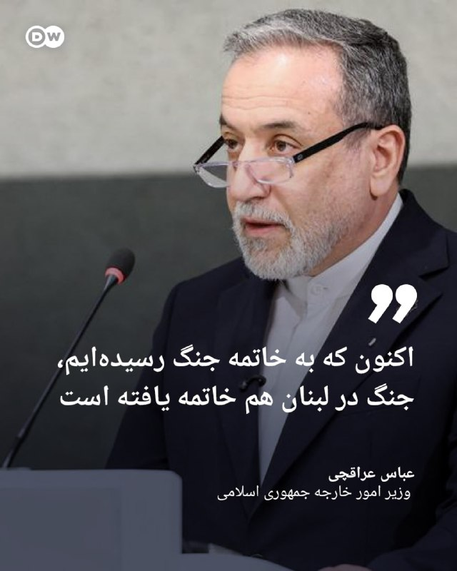

🔶 عراقچی: اکنون که به خاتمه جنگ رسیده‌ایم، جنگ در لبنان هم خاتمه یافته‌ است

عباس عراقچی، وزیر امور خارجه جمهوری اسلامی گفت مذاکرات ایران و آمریکا "برای رسیدن به توافق نهایی از روز جمعه همزمان با امضای رسمی یادداشت تفاهم پایان جنگ آغاز خواهد شد". او هشدار داد هرگونه حمله نظامی اسرائیل به لبنان از این به بعد، از نظر حکومت ایران "نقض یادداشت تفاهم" به حساب می‌آید.

به گزارش خبرگزاری دولتی ایرنا، عراقچی دیدار با سفرا و کارداران و روسای نمایندگی‌های خارجی و بین‌المللی مقیم تهران، با اشاره به یادداشت تفاهم میان ایران و آمریکا که در روز یکشنبه نهایی شد و قرار است به زودی امضای رسمی آن صورت بگیرد، گفت: «احتمالاً روز جمعه و در محلی که مشخص خواهد شد و همان روز دور جدید مذاکرات ایران و آمریکا برای رسیدن به توافق نهایی آغاز خواهد شد.»

@dw_farsi

## Dirty_Kids — post 392276

  <a href="telegram/content/Dirty_Kids_392276_1781605460.mp4" target="_blank">🎬 Download video</a>

تراپی از تنگه بیرانوند:

@Dirty_Kids 👻

## Dirty_Kids — post 392275

  <a href="telegram/content/Dirty_Kids_392275_1781605461.mp4" target="_blank">🎬 Download video</a>

🔴 مصاحبه با رکورددار عمل زیبایی در ایران: بیش از ۱۰ میلیارد خرج عملم کردم، همه رو دوس پسرم داده. پسری که خرج نکنه بدرد نمیخوره، از بس خوشگلم همه بهم حسودی میکنن. @Dirty_Kids 👻

## Dirty_Kids — post 392274

  <a href="telegram/content/Dirty_Kids_392274_1781605462.mp4" target="_blank">🎬 Download video</a>

🔴 مصاحبه با رکورددار عمل زیبایی در ایران:

بیش از ۱۰ میلیارد خرج عملم کردم، همه رو دوس پسرم داده.
پسری که خرج نکنه بدرد نمیخوره، از بس خوشگلم همه بهم حسودی میکنن.

@Dirty_Kids 👻

## alonews — post 128429

  <a href="telegram/content/alonews_128429_1781605463.webm" target="_blank">🎬 Download video</a>

👈ترامپ پس از دیدار با زلنسکی: روسیه باید معامله‌ای انجام دهد. روسیه تعداد زیادی از مردم خود را از دست داده است؛ اوکراین نیز همینطور

✅ @AloNews خبر جنگ

## alonews — post 128428

  <a href="telegram/content/alonews_128428_1781605463.webm" target="_blank">🎬 Download video</a>

👈ترامپ: من از نتانیاهو ناامید نیستم. ما رابطه بسیار خوبی داریم

✅ @AloNews خبر جنگ

---
📅 بروزرسانی: 1405/03/26 13:44
---

## VahidOOnLine — post 245848

  

دونالد ترامپ، رییس‌جمهوری آمریکا، در حاشیه نشست گروه هفت گفت اگر جمهوری اسلامی به سلاح هسته‌ای دست پیدا کند، «تمام جهنم بر سر آنها نازل خواهد شد» و افزود به همین دلیل اصرار کرده بندی در توافق گنجانده شود که حکومت ایران را حتی از خرید سلاح هسته‌ای منع کند.

ترامپ درباره چارچوب توافق برای پایان جنگ گفت: «تنها چیزی که واقعا برای من اهمیت دارد این است که ایران هرگز سلاح هسته‌ای نداشته باشد و این موضوع کاملا روشن و صریح در توافق آمده است.»

او افزود: «آنها قرار نیست آن را توسعه دهند. قرار نیست آن را بخرند. قرار نیست هیچ کاری در ارتباط با آن انجام دهند. و اگر چنین کنند، با پیامدهایی باورنکردنی روبه‌رو خواهند شد.»

رییس‌جمهوری آمریکا همچنین مدعی شد جلوگیری از دستیابی ایران به سلاح هسته‌ای انگیزه اصلی او برای آغاز جنگ بوده است و گفت: «به همین دلیل وارد این ماجرا شدم و به همین دلیل با امضای توافق موافقت کردم.»
‌🏁 🇬🇧 IranintlTV

🤖 @VahidOOnLine

## VahidOOnLine — post 245847

  

دونالد ترامپ، رییس‌جمهوری آمریکا، در حاشیه اجلاس گروه هفت گفت که مرحله بعدی مذاکرات با جمهوری اسلامی از دور نخست مذاکراتی که به یادداشت تفاهم اعلام‌شده اخیر منجر شد، «آسان‌تر» خواهد بود.

ترامپ در دیدار با امیر قطر در حاشیه نشست گروه هفت در فرانسه گفت: «این روند وارد مرحله دوم می‌شود که فکر می‌کنم در واقع آسان‌تر خواهد بود.»
‌🏁 🇬🇧 IranintlTV

🤖 @VahidOOnLine

## WithYashar — post 15049

ترامپ: من به تغییر رژیم اعتقاد ندارم. سال‌هاست که تغییر رژیم‌ها را دیده‌ام و هیچ‌وقت نتیجه نمی‌دهند!

فکر می‌کنم توافق با ایران عادلانه است
@withyashar

## DEJradio — post 5729

  <a href="telegram/content/DEJradio_5729_1781604864.webm" target="_blank">🎬 Download video</a>

🔺📌 برنامه هفتگی «سلامت» با اجرای دکتر نیکی سرمدی، به‌زودی از تلویزیون دژ

این برنامه به وضعیت نظام بهداشت و درمان و سلامت در جمهوری اسلامی و چشم‌انداز سلامت در ایران در دفترچه دوران گذار می‌پردازد.

#سلامت #بهداشت #جمهوری_اسلامی
@DEJradio

## IranIntlTV — post 342684

  

دونالد ترامپ، رییس‌جمهوری آمریکا، در حاشیه نشست گروه هفت گفت اگر جمهوری اسلامی به سلاح هسته‌ای دست پیدا کند، «تمام جهنم بر سر آنها نازل خواهد شد» و افزود به همین دلیل اصرار کرده بندی در توافق گنجانده شود که حکومت ایران را حتی از خرید سلاح هسته‌ای منع کند.

ترامپ درباره چارچوب توافق برای پایان جنگ گفت: «تنها چیزی که واقعا برای من اهمیت دارد این است که ایران هرگز سلاح هسته‌ای نداشته باشد و این موضوع کاملا روشن و صریح در توافق آمده است.»

او افزود: «آنها قرار نیست آن را توسعه دهند. قرار نیست آن را بخرند. قرار نیست هیچ کاری در ارتباط با آن انجام دهند. و اگر چنین کنند، با پیامدهایی باورنکردنی روبه‌رو خواهند شد.»

رییس‌جمهوری آمریکا همچنین مدعی شد جلوگیری از دستیابی ایران به سلاح هسته‌ای انگیزه اصلی او برای آغاز جنگ بوده است و گفت: «به همین دلیل وارد این ماجرا شدم و به همین دلیل با امضای توافق موافقت کردم.»
https://iranintl.com/202606161579

## IranIntlTV — post 342683

  

دونالد ترامپ، رییس‌جمهوری آمریکا، در حاشیه اجلاس گروه هفت گفت که مرحله بعدی مذاکرات با جمهوری اسلامی از دور نخست مذاکراتی که به یادداشت تفاهم اعلام‌شده اخیر منجر شد، «آسان‌تر» خواهد بود.

ترامپ در دیدار با امیر قطر در حاشیه نشست گروه هفت در فرانسه گفت: «این روند وارد مرحله دوم می‌شود که فکر می‌کنم در واقع آسان‌تر خواهد بود.»
https://iranintl.com/202606161415

## Iliaen — post 4491

جواد زمانی و ابوالفضل ساعدی، از بازداشت شدگان دِی ماه اعدام شدند.

جان تمام زندانیان سیاسی در خطر جدی است.

@iliaen

## FarsiVOA — post 220899

  

بلومبرگ گزارش داد دو نفتکش مرتبط با انتقال نفت جمهوری اسلامی، پیش از امضای توافق موقت واشنگتن و جمهوری اسلامی، با سامانه‌های شناسایی روشن از تنگه هرمز عبور کرده‌اند.

بر اساس داده‌های ردیابی کشتی‌ها، نفتکش «موزیک» روز سه‌شنبه در حال عبور از تنگه بود و «آرگو ماریس» پیش‌تر وارد دریای عمان شده، اما هنوز در محدوده خط محاصره دریایی آمریکا قرار داشت.

تصاویر ماهواره‌ای نشان می‌دهد «موزیک» در ۲۰ خرداد در بندر خمینی بارگیری کرده و «آرگو ماریس» در اواخر مه از بندرعباس خارج شده است.

اتحاد علیه ایران هسته‌ای، نهاد غیردولتی ناظر بر تحریم‌ها، هر دو کشتی را به‌دلیل حمل نفت جمهوری اسلامی در فهرست سیاه خود قرار داده، اما واشنگتن تاکنون آنها را تحریم نکرده است. مقصد بعدی این دو نفتکش هنوز روشن نیست.
@FarsiVOA

## FarsiVOA — post 220898

  

قطر آماده است پس از بازگشایی تنگه هرمز، تولید گاز طبیعی مایع را با سرعت افزایش دهد و ظرف دو ماه بخش عمده ظرفیت صادراتی خود را احیا کند.

منابع آگاه به بلومبرگ گفته‌اند قطرانرژی به خریداران اطلاع داده که یک ماه پس از بازگشت عبور ایمن از تنگه، تولید به حدود ۵۰ درصد ظرفیت و در ماه دوم به نزدیک ۸۰ درصد می‌رسد.

ظرفیت باقی‌مانده، معادل دو خط تولید، به‌دلیل آسیب ناشی از حملات موشکی جمهوری اسلامی در مارس، احتمالاً سال‌ها زمان برای ترمیم کامل نیاز دارد.

مجتمع رأس لفان، بزرگ‌ترین مرکز تولید ال‌ان‌جی جهان، پس از حمله جمهوری اسلامی در هفته نخست جنگ تعطیل شد و بیش از سه ماه عمدتاً راکد ماند، زیرا بسته‌شدن عملی مسیر هرمز صادرات گسترده گاز را دشوار کرده بود.

بازگشت قطر می‌تواند بخشی از فشار کمبود جهانی ال‌ان‌جی را کاهش دهد، هرچند قیمت‌ها همچنان بالاتر از سطح پیش از جنگ مانده‌اند.
@FarsiVOA

## Persian_Trend_Official — post 17263

  <a href="telegram/content/Persian_Trend_Official_17263_1781604868.mp4" target="_blank">🎬 Download video</a>

ترامپ: نتانیاهو به واشنگتن آمد و التماس کرد او از اوباما التماس کرد که آن معامله را با ایران انجام ندهد.

اوباما طرف ایران بود، نه اسرائیل، و او این معامله را انجام داد.

📝 Amir

📌 @persian_trend_official
پرشین ترند | متفاوت‌ترین کانال نظامی

## Persian_Trend_Official — post 17262

ترامپ: در توافق من، اگر ایران به سلاح هسته‌ای دست یابد، نابود می‌شود.

در توافق اوباما، به آنها اجازه داده شد که سلاح هسته‌ای داشته باشند.

📝 Amir

📌 @persian_trend_official
پرشین ترند | متفاوت‌ترین کانال نظامی

## Persian_Trend_Official — post 17261

  <a href="telegram/content/Persian_Trend_Official_17261_1781604872.webm" target="_blank">🎬 Download video</a>

ترامپ: نتانیاهو باید در قبال لبنان مسئولیت‌پذیرتر باشد.

📝 Amir

📌 @persian_trend_official
پرشین ترند | متفاوت‌ترین کانال نظامی

## Dirty_Kids — post 392273

جواد زمانی و ابوالفضل ساعدی، از بازداشت شدگان دِی ماه اعدام شدند.

جان تمام زندانیان سیاسی در خطر جدی است.

@Dirty_Kids 👻

## Dirty_Kids — post 392272

  <a href="telegram/content/Dirty_Kids_392272_1781604872.mp4" target="_blank">🎬 Download video</a>

فیلم وایرال شده درگیری مردم با یکی از طرفداران جمهوری اسلامی

یارو رو با مشت و لگد توی استادیوم له میکنه😂😂😂😂😂😂😂

@Dirty_Kids 👻

## Dirty_Kids — post 392271

  <a href="https://t.me/Dirty_Kids/392271" target="_blank">📎 Download file</a>

ریتزوبت تنها سایت بین المللی میباشد ، که به صورت هفتگی پرومو کد دریافت میکنید ✅

♦️ آموزش شارژ حساب با کریپتو
♦️ آموزش شارژ حساب ریالی در ریتزوبت

🔵ریتزوبت برندی با لایسنس معتبر در صنعت شرطبندی و #پیشبینی مسابقات ورزشی و کازینویی 👇

https://t.me/+LB508WZyIr8xNmY0

## Dirty_Kids — post 392270

  

🏆 مسابقات مهم امروز جام جهانی 2026 🔥

⚽️ فرانسه 
🇫🇷 - سنگال 
🇸🇳

⚽️ عراق 
🇮🇶 - نروژ 
🇳🇴

⚽️ آرژانتین 
🇦🇷 - الجزایر 
🇩🇿

⚽️ اتریش 
🇦🇹 - اردن 
🇯🇴

🚨 امشب شاهد رقابت‌های جذاب و تماشایی جام جهانی باشید و پیش‌بینی‌های خود را در ریتزوبت ثبت کنید 👇

🎯 دانلود اپلیکیشن بدون فیلتر اندروید
🎯 لینک ورود به ریتزوبت

💎 امکان شارژ حساب با کریپتو ، انواع ووچر و کارت بانکی. 
✅

🌍 ریتزوبت؛ همراه شب‌های فراموش‌نشدنی جام جهانی 2026
R26
🆔 @RitzoBet_ir

## alonews — post 128427

  <a href="telegram/content/alonews_128427_1781604877.webm" target="_blank">🎬 Download video</a>

🔴فوری / ترامپ : من به اسرائیل پیشنهاد دادم که سوریه مسئولیت حزب‌الله را بر عهده بگیرد

✅ @AloNews خبر جنگ

## alonews — post 128426

  <a href="telegram/content/alonews_128426_1781604877.webm" target="_blank">🎬 Download video</a>

👈ترامپ: جنگ لبنان مسئله فرعی است و توافق هسته‌ای با ایران می‌تواند پابرجا بماند.

🔴به اسرائیل گفتم که از حمله آنها به بیروت خوشم نیامد

✅ @AloNews خبر جنگ

---
📅 بروزرسانی: 1405/03/26 13:34
---

## VahidOOnLine — post 245846

  

♦️خوش‌بینی بازارهای ایران به «تفاهم‌نامه» جمهوری اسلامی و ایالات متحده برای دومین روز ادامه یافت و قیمت ارزهای خارجی بار دیگر کاهش پیدا کرد.

سایت‌ها و کانال‌های اعلام قیمت ارز بعد از ظهر سه‌شنبه گزارش کردند که بهای دلار در بازار تهران با سه هزار تومان کاهش نسبت به روز گذشته به ۱۶۵ هزار تومان رسید و هر یورو در برابر ۱۸۵ هزار و ۵۰۰ تومان دادوستد شد.

همزمان خبرگزاری ایرنا گزارش کرد که در ساعت پایانی معاملات روز سه‌شنبه، «شاخص کل بورس با رشد ۱۱۹ هزار واحدی در تراز ۵ میلیون و ۱۰۰ هزار واحد تثبیت شد.»
‌🇸🇦 Indypersian

🤖 @VahidOOnLine

## WithYashar — post 15048

ترامپ: می‌خواهیم اورانیوم غنی‌شده را از ایران بگیریم
@withyashar

## WithYashar — post 15047

ترامپ: ما می‌خواستیم برای دریافت اورانیوم غنی‌شده به ایران برویم، اما این اتفاق نیفتاد.
@withyashar

## WithYashar — post 15046

ترامپ: تلاش‌هایی برای تغییر رژیم در ایران صورت گرفت، اما موفق نشدند.
چیزی که مرا به امضای این یادداشت تفاهم ترغیب کرد، اطمینان از این بود که ایران سلاح هسته‌ای نداشته باشد.
اگر ایران به دنبال دستیابی به سلاح هسته‌ای باشد، جهنمی به پا خواهد شد.
ما از نحوه مدیریت امور توسط قطر در طول بحران اخیر، احساس خوشحالی و احترام می‌کنیم.
توافق با ایران به مرحله دوم منتقل می‌شود.
@withyashar

## FarsiVOA — post 220897

  

فریدریش مرتس، صدراعظم آلمان به دونالد ترامپ، رئیس‌جمهوری آمریکا یک پیراهن فوتبال با نام ترامپ و شماره ۴۷ در پشت آن هدیه داد.

مرتس زمانی که ترامپ برای یک جلسه کاری در چارچوب نشست گروه هفت پشت میز نشسته بود، با این پیراهن به سمت او رفت. ترامپ لبخند زد و آن را برای گرفتن عکس بالا گرفت.

این پیراهن سفید، طرح همان پیراهنی است که تیم ملی آلمان در جام جهانی جاری بر تن دارد.

مرتس و ترامپ در ماه‌های اخیر بر سر جنگ علیه جمهوری اسلامی اختلاف داشتند و پرزیدنت ترامپ از او انتقاد کرد.

ترامپ گفت مرتس «باید زمان بیشتری را صرف پایان دادن به جنگ روسیه در اوکراین کند» و «کشور شکست‌خورده‌اش، به‌ویژه در زمینه مهاجرت و انرژی، را اصلاح کند.»
@FarsiVOA

## FarsiVOA — post 220896

  

سخنگوی قوه قضائیه جمهوری اسلامی گفت همه اموال مصادره‌شده متهمان پرونده‌های اخیرِ مرتبط با همکاری با اسرائیل و آمریکا، پس از طی روند قضایی، به بیت‌المال بازگردانده می‌شود و در مسیر آنچه او «منافع عمومی» خواند هزینه خواهد شد.

اصغر جهانگیر با اشاره به اصل ۴۹ قانون اساسی گفت دولت موظف است ثروت‌های ناشی از ربا، اختلاس و جرایم مشابه را، در صورتی که صاحب مشخصی نداشته باشد، به بیت‌المال بازگرداند.

بر اساس آمار رسمی اعلام‌شده از سوی قوه قضائیه جمهوری اسلامی در ۱۷ خرداد، سه هزار و ۱۲۱ نفر مخالف جمهوری اسلامی در پرونده‌های با اتهام ادعایی همکاری با اسرائیل تحت تعقیب قرار گرفته‌اند که از میان آنها دو هزار و ۴۰۶ نفر بازداشت شده‌اند.

جهانگیر همچنین گفت تاکنون برای هزار نفر کیفرخواست صادر شده و اموال «بیش از صدها نفر» شناسایی و توقیف شده است؛ اموالی که به گفته او، پس از صدور حکم دادگاه، مصادره خواهد شد.
@FarsiVOA

## FarsiVOA — post 220895

  

محمدباقر قالیباف، مذاکره‌کننده ارشد و رئیس مجلس شورای اسلامی، در مراسم امضای توافق موقت با آمریکا برای پایان دادن به جنگ حضور خواهد داشت.

مجید تخت‌روانچی، معاون وزیر خارجه جمهوری اسلامی، روز سه‌شنبه گفت حضور قالیباف در این مراسم قطعی است، اما هنوز روشن نیست امضای توافق دقیقاً در چه نقطه از سوئیس و با چه قالبی انجام می‌شود.

این اظهارات در حالی مطرح شده که دونالد ترامپ، رئیس‌جمهور آمریکا، روز دوشنبه اعلام کرد جی‌دی ونس، معاون او، در مراسم رسمی امضا در ژنو شرکت خواهد کرد.

وزیر امور خارجه جمهوری اسلامی نیز اعلام کرده که روز جمعه ۲۹ خرداد و همزمان با امضای رسمی یادداشت تفاهم «پایان جنگ»، مذاکرات با آمریکا برای رسیدن به توافق نهایی آغاز خواهد شد.
@FarsiVOA

## DW_Farsi — post 126048

  

🔶 قلعه‌نویی: بلافاصله پس از بازی گفتند باید آمریکا را ترک کنیم

اولین بازی تیم ملی ایران با دردسرها و حواشی زیادی همراه بود؛ از دستور ترک فوری خاک آمریکا بلافاصله پس از پایان بازی تا انقضای ویزای مهدی ترابی و سوال و جواب از مهدی طارمی و یک بازیکن دیگر هنگام ورود و خروج به آمریکا.

امیر قلعه‌نویی، سرمربی تیم ملی فوتبال ایران پس از بازی مقابل نیوزیلند به خبرنگاران گفت: «امشب بلافاصله پس از بازی به ما اعلام کردند که باید آمریکا را ترک کنیم، در صورتی که امشب مهمترین مسأله برای بازی آینده ماست.»

مربی تیم ایران گفت: «آنقدر که روی هوا بودیم روی زمین نبودیم.»

او درباره علت ترک فوری خاک آمریکا پس از بازی هم گفت: «ما خودمان هم نمی‌دانیم و خیلی خنده‌دار است. تصمیمات برنامه‌ریزی تیم ما از جای دیگری گرفته می‌شود. ما قرار بود دو شب قبل از این بازی به لس‌آنجلس بیاییم اما اجازه ندادند. در برنامه‌مان بود امشب اینجا بمانیم و ریکاوری کنیم و فردا ظهر برگردیم که اجازه ندادند و دلیلش را هم نمی‌دانم.»

وزارت خارجه آمریکا و فیفا به پرسش خبرگزاری رویترز درباره علت ترک زودهنگام تیم ایران پاسخ نداده‌اند.

@dw_farsi

## Persian_Trend_Official — post 17260

سخنگوی ارتش: در جریان جنگ، خلبانان ما یک پهپاد دشمن را برفراز تهران در محل برگزاری یک جلسه مهم مسئولان بالارتبه با برخورد فیزیکی جنگنده با دم پهپاد ساقط کردند!

📝 Amir

📌 @persian_trend_official
پرشین ترند | متفاوت‌ترین کانال نظامی

## Persian_Trend_Official — post 17259

  

خبرگزاری CNN: ترامپ می‌گوید تنگه هرمز پس از توافق آمریکا و ایران بازگشایی شده است اما در سراسر صنعت کشتیرانی، اعتماد همچنان کم است. تهدیداتی از جمله مین، پهپاد و حملات موشکی همچنان مانع حرکت می‌شوند، در حالی که خستگی خدمه پس از ماه‌ها عدم اطمینان، ریسک عملیاتی…

## Persian_Trend_Official — post 17258

ترامپ در مورد ایران: من به تغییر رژیم اعتقادی ندارم. سال‌هاست که شاهد تغییر رژیم‌ها بوده‌ام و آنها هرگز کارساز نبوده‌اند.

این اتفاق باید بیفتد.

📝 Amir

📌 @persian_trend_official
پرشین ترند | متفاوت‌ترین کانال نظامی

## Persian_Trend_Official — post 17257

ترامپ: من هرگز به تغییر رژیم اهمیتی نمی‌دادم، اما حدس می‌زنم شما در ایران تغییر رژیم دارید.

📝 Amir

📌 @persian_trend_official
پرشین ترند | متفاوت‌ترین کانال نظامی

## Hranews — post 113645

اعتراضات دی‌ماه ۱۴۰۴؛ جواد زمانی و ابوالفضل ساعدی اعدام شدند❗️❗️❗️❗️❗️– رئیس کل دادگستری استان سمنان از اجرای حکم اعدام جواد زمانی و ابوالفضل ساعدی، از بازداشت‌شدگان اعتراضات دی‌ماه ۱۴۰۴ در شهرستان شاهرود، خبر داد. همزمان، مرکز رسانه قوه قضاییه ویدیویی از اعترافات اجباری این دو معترض را منتشر کرده است. دستگاه قضایی این افراد را از بابت اتهاماتی از جمله «محاربه» و «افساد فی‌الارض» به #اعدام محکوم کرده بود. سرانجام، احکام صادره صبح امروز به اجرا درآمد.ادامه مطلب#جواد_زمانی #ابوالفضل_ساعدی↘️ @hranews_bot تماس ✉️ -  @Hranews  کانال هرانا 🆑

## alonews — post 128425

  <a href="telegram/content/alonews_128425_1781604282.webm" target="_blank">🎬 Download video</a>

👈ترامپ: اگر من نبودم، اسرائیلی هم وجود نداشت

✅ @AloNews خبر جنگ

## alonews — post 128424

  <a href="telegram/content/alonews_128424_1781604282.webm" target="_blank">🎬 Download video</a>

👈ترامپ: من به تغییر رژیم اعتقاد ندارم. سال‌هاست که تغییر رژیم‌ها را دیده‌ام و هیچ‌وقت نتیجه نمی‌دهند!

🔴فکر می‌کنم توافق با ایران عادلانه است

✅ @AloNews خبر جنگ

## alonews — post 128423

  <a href="telegram/content/alonews_128423_1781604282.webm" target="_blank">🎬 Download video</a>

👈ترامپ : اگر ما برنامه جامع اقدام مشترک (برجام) را که اوباما با ایران منعقد کرد، لغو نمی‌کردیم، ممکن بود این کشور به سلاح هسته‌ای دست یابد

✅ @AloNews خبر جنگ

## alonews — post 128422

  <a href="telegram/content/alonews_128422_1781604283.webm" target="_blank">🎬 Download video</a>

👈ترامپ: ما می‌خواستیم برای دریافت اورانیوم غنی‌شده به ایران برویم، اما این اتفاق نیفتاد.

✅ @AloNews خبر جنگ

## alonews — post 128421

  <a href="telegram/content/alonews_128421_1781604283.mp4" target="_blank">🎬 Download video</a>

👈ترامپ خطاب به امیر قطر در مورد ایران:
شما جنگیدید و با شجاعت زیادی به ما کمک کردید.

🔴 شما همیشه دوست من خواهید بود

✅ @AloNews خبر جنگ

## alonews — post 128420

  <a href="telegram/content/alonews_128420_1781604286.webm" target="_blank">🎬 Download video</a>

👈ترامپ: قطر و ایران مرز زمینی مشترک دارند و می‌توان پیاده از یکی به دیگری رفت

✅ @AloNews خبر جنگ

## alonews — post 128419

  <a href="telegram/content/alonews_128419_1781604286.webm" target="_blank">🎬 Download video</a>

👈 ترامپ: چیزی که مرا به امضای این یادداشت تفاهم ترغیب کرد، اطمینان از این بود که ایران سلاح هسته‌ای نداشته باشد.

🔴اگر ایران به دنبال دستیابی به سلاح هسته‌ای باشد، جهنمی به پا خواهد شد.

🔴 ترامپ: ایران طبق توافق هسته‌ای به سلاح هسته‌ای دست نخواهد یافت

✅ @AloNews خبر جنگ

## alonews — post 128418

  <a href="telegram/content/alonews_128418_1781604287.webm" target="_blank">🎬 Download video</a>

👈ترامپ در مورد ایران: ضمناً ما هیچ پولی در ایران سرمایه‌گذاری نمی‌کنیم. دیروز شایعه‌ای پخش شد. مسخره بود.

🔴 ما حق داریم روزی وارد شویم و اگر بخواهم کاری انجام دهم یا کسی بخواهد کاری انجام دهد، انجام دهیم، اما ما هیچ پولی سرمایه‌گذاری نمی‌کنیم.

🔴 ما هیچ تعهدی برای سرمایه‌گذاری در ایران نداریم.

✅ @AloNews خبر جنگ

---
📅 بروزرسانی: 1405/03/26 13:23
---

## VahidOOnLine — post 245836

  <a href="telegram/content/VahidOOnLine_245836_1781603632.mp4" target="_blank">🎬 Download video</a>

خیابانی که قرار بود نمایش قدرت جمهوری اسلامی باشد، حالا به صحنه شکاف درونی آن تبدیل شده است. از پروپاگاندای جنگی تا شورش علیه تفاهم، جمهوری اسلامی با نیرویی روبه‌رو شده که سال‌ها خود پرورش داده بود.
‌🏁 🇬🇧 ManotoTV

🤖 @VahidOOnLine

## VahidOOnLine — post 245835

  

⭕️جمهوری اسلامی جواد زمانی و ابولفضل ساعدی، دو تن از معترضان انقلاب ملی ایرانیان را در شاهرود اعدام کرد

♦️میزان، خبرگزاری قوه قضائیه روز سه‌شنبه ۲۶ خردادماه از اعدام جواد زمانی و ابولفضل ساعدی، دو تن از بازداشت‌شدگان اعتراضات دی‌ماه ۱۴۰۴ «به‌جرم» محاربه و افساد فی‌الارض در شهرستان شاهرود استان سمنان خبر داد.

پیش از این یک منبع نزدیک به این دو بازداشتی به ایندیپندنت فارسی اطلاع داده بود که قوه قضائیه روز دوشنبه به خانواده‌های جواد زمانی و ابولفضل زمانی گفته بود که برای «آخرین ملاقات» با آن‌ها به زندان شاهرود مراجعه کنند.

در گزارش میزان، این دو شهروند ایرانی به‌عنوان «دو تن از لیدرهای کودتای دی‌ماه ۱۴۰۴» معرفی شده‌اند. قوه قضائیه مدعی است که این دو نفر «از طریق کشیدن سلاح گرم و سرد در شهرستان شاهرود و تخریب عمدی اموال عمومی و خصوصی» مرتکب جرم افساد فی‌الارض و محاکمه شده‌اند.

براساس گزارش شورای حقوق بشر سازمان ملل، از دی‌ماه تا کنون، دست‌کم ۲۰ نفر از معترضان به بهانه جرایم امنیتی در ایران اعدام شده‌اند.

سازمان‌های بین‌‌المللی می‌گویند متهمان و به‌ویژه متهمان «جرایم سیاسی و امنیتی» در ایران از حق داشتن وکیل و دادرسی عادلانه محرومند و اعتراف‌ آن‌ها، عمدتا از طریق شکنجه و زیر فشار و تهدید گرفته می‌شود.
‌🇸🇦 Indypersian

🤖 @VahidOOnLine

## WithYashar — post 15045

  <a href="telegram/content/WithYashar_15045_1781603634.mp4" target="_blank">🎬 Download video</a>

ترامپ درباره ایران:
ما هیچ پولی در ایران سرمایه‌گذاری نمی‌کنیم، راستی. دیروز شایعه‌ای پخش شد. مضحک بود.
ما حق داریم روزی وارد شویم و اگر من بخواهم کاری انجام دهم یا کسی بخواهد کاری انجام دهد، اما ما هیچ پولی سرمایه‌گذاری نمی‌کنیم.
ما هیچ تعهدی برای سرمایه‌گذاری پول در ایران نداریم.
@withyashar

## WithYashar — post 15044

ترامپ: ما هیچ پولی در ایران سرمایه‌گذاری نخواهیم کرد.
@withyashar

## WithYashar — post 15043

خبرگزاری میزان، رسانه قوه قضاییه جمهوری اسلامی، سه‌شنبه 26 خرداد از اجرای حکم اعدام جواد زمانی و ابوالفضل ساعدی، دو زندانی سیاسی بازداشت‌شده در اعتراضات دی‌ماه در استان سمنان خبر داد. میزان اتهام آن‌ها را «افساد فی‌الارض از طریق کشیدن سلاح گرم و سرد در شهرستان شاهرود» اعلام کرد
@withyashar

## mwarmonitor — post 11016

🔴 دونالد ترامپ، رئیس‌جمهور آمریکا، می‌گوید ایالات متحده معتقد است توافق با ایران یک توافق منصفانه است.

🔴 ترامپ می‌گوید توافق با ایران وارد مرحله دوم شده است.

🔴 رئیس‌جمهور آمریکا اضافه می‌کند که ایالات متحده هیچ‌گونه سرمایه‌گذاری مالی در ایران انجام نمی‌دهد.

🔴 ترامپ می‌گوید ایران تحت این توافق هرگز به سلاح هسته‌ای دست نخواهد یافت.

@mwarmonitor

## FoxNewsTwitter — post 343009

Fox News (Twitter/X)

WATCH LIVE: Trump holds bilateral meeting with the Emir of Qatar
https://twitter.com/i/broadcasts/1yKAPPonYzgxb

## IranIntlTV — post 342682

  <a href="telegram/content/IranIntlTV_342682_1781603636.mp4" target="_blank">🎬 Download video</a>

علی شیرازی، عضو تحریریه ایران‌اینترنشنال با اشاره به سکوت مجتبی خامنه‌ای در قبال توافق واشینگتن و تهران گفت: «جدال میان موافقان و مخالفان این توافق نشان‌دهنده جنگ قدرت در پشت پرده حکومت است.»

@iranintltv

## ManotoTV — post 106080

  <a href="telegram/content/ManotoTV_106080_1781603638.mp4" target="_blank">🎬 Download video</a>

خیابانی که قرار بود نمایش قدرت جمهوری اسلامی باشد، حالا به صحنه شکاف درونی آن تبدیل شده است. از پروپاگاندای جنگی تا شورش علیه تفاهم، جمهوری اسلامی با نیرویی روبه‌رو شده که سال‌ها خود پرورش داده بود.

## FarsiVOA — post 220894

  

دونالد ترامپ، رئیس‌جمهوری آمریکا، در جریان برگزاری نشست گروه هفت، درباره توافق با جمهوری اسلامی گفت که آمریکا هیچ سرمایه‌گذاری در ایران نخواهد کرد.

پرزیدنت ترامپ گفت: «ما فکر می‌کنیم این یک توافق منصفانه است.»

او افزود: «توافق با ایران وارد مرحله دوم می‌شود.»
@FarsiVOA

## FarsiVOA — post 220893

  

سازمان حقوق بشری هه‌نگاو اعلام کرد که اشکان آبخو، شهروند ساکن شهرستان سقز، روز دوشنبه ۲۵ خرداد، در محل کار خود توسط نیروهای اداره اطلاعات دستگیر شده است.

این دستگیری بدون ارائه حکم قضایی صورت گرفته و تا این لحظه از دلایل بازداشت، اتهامات انتسابی و محل نگهداری وی، توضیحاتی به خانواده آقای آبخو ارائه نشده است.

هه‌نگاو همچنین طی روزهای اخیر از بازداشت هیرش شریفیان، کودک اهل کامیاران، بهنام مولودی، اهل اشنویه، خالد حسن‌زاده، شهروند اهل پیرانشهر و پوریا ولی‌زاده، اهل بیجار، خبر داده بود. دلایل بازداشت و اتهامات و محل نگهداری این شهروندان نیز نامشخص است.
@FarsiVOA

## Persian_Trend_Official — post 17256

  <a href="telegram/content/Persian_Trend_Official_17256_1781603640.mp4" target="_blank">🎬 Download video</a>

محمود صادقی، نماینده وقت مجلس، درباره اعتراضات آبان ۹۸: به شمخانی گفتم دارن مردم رو در خیابان‌ها می‌کشند. اگر مردم نرفتن و ایستادن باز می‌خواید بکشید؟ گفت ولو بلغ ما بلغ. ما می‌زنیم.

👺Phantom

📌 @persian_trend_official
پرشین ترند | متفاوت‌ترین کانال نظامی

## Persian_Trend_Official — post 17255

ترامپ می‌گوید قطر و ایران مرز زمینی مشترک دارند و می‌توان پیاده از یکی به دیگری رفت!!!

📝 Amir

📌 @persian_trend_official
پرشین ترند | متفاوت‌ترین کانال نظامی

## Persian_Trend_Official — post 17254

  <a href="telegram/content/Persian_Trend_Official_17254_1781603642.webm" target="_blank">🎬 Download video</a>

ترامپ: ضمناً ما هیچ پولی در ایران سرمایه‌گذاری نمی‌کنیم. دیروز شایعه‌ای پخش شد. مسخره بود.

ما حق داریم روزی برویم و اگر بخواهم کاری انجام دهم یا کسی بخواهد کاری انجام دهد، انجام دهیم، اما ما هیچ پولی سرمایه‌گذاری نمی‌کنیم.

ما هیچ تعهدی برای سرمایه‌گذاری هیچ پولی در ایران نداریم.

📝 Amir

📌 @persian_trend_official
پرشین ترند | متفاوت‌ترین کانال نظامی

## Persian_Trend_Official — post 17253

ترامپ: ما توافق خود را با ایران انجام داده‌ایم. باید موفقیت‌آمیز باشد.

به مرحله دوم می‌رود که فکر می‌کنم آسان‌تر خواهد بود.

📝 Amir

📌 @persian_trend_official
پرشین ترند | متفاوت‌ترین کانال نظامی

## Persian_Trend_Official — post 17252

ترامپ در دیدار با امیر قطر: امیر مرد فوق‌العاده‌ای است و در سراسر جهان مورد احترام است.

نخست وزیر هم همینطور، اما ما باید اول با امیر صحبت کنیم.

📝 Amir

📌 @persian_trend_official
پرشین ترند | متفاوت‌ترین کانال نظامی

## RadioFarda — post 158376

🔸خبرگزاری رویترز در گزارشی از فضای حاکم بر مسابقه تیم‌های فوتبال ایران و نیوزیلند در جام جهانی، خبر داد که به‌رغم ممنوعیت فیفا، پرچم‌های شیروخورشید وارد ورزشگاه محل بازی شد.

🔸این خبرگزاری به واکنش‌های متفاوت و متضاد تماشاگران ایرانی حاضر در ورزشگاه سوفای شهر لس‌آنجلس اشاره کرده و نوشته که اختلافات روی سکوها، بازتابی از چالش‌های پیش روی تیم ملی ایران در خارج از زمین مسابقه بود.

🔸رویترز به اقدام همزمان دو گروه متفاوت تماشاگران هنگام پخش سرود ملی تیم ایران اشاره کرده و نوشته است سوت زدن گروهی از تماشاگران در مقابل همخوانی گروه دیگری، بازتاب‌دهنده اهمیت نمایش وفاداری سیاسی در مقابل خود فوتبال بود.

🔸به نوشته آن، از حملات و گل‌های ایران از سوی بسیاری از تماشاگران، از جمله بخشی از هوادارانی که پرچم شیر و خورشید مربوط به ایران قبل از انقلاب را حمل می‌کردند، استقبال شد. اما گروهی از تماشاگران، گل‌های تیم نیوزیلند را جشن گرفتند.

@RadioFarda

## RadioFarda — post 158375

🔸وزیر خارجه ایران روز سه‌شنبه ۲۶ خرداد گفت که از صبح دیروز جنگ رسماً در تمام جبهه‌ها تمام شده و روز جمعه دور جدید مذاکرات ایران و آمریکا در سوئیس آغاز می‌شود.

🔸عباس عراقچی که در جمع کاردارها و سفرای خارجی مقیم تهران صحبت می‌کرد، به اسرائیل هشدار داد که هرگونه حملهٔ آن به لبنان به منزله «نقض تفاهم» میان تهران و واشینگتن است.

🔸او گفت که «یک طرف این تفاهم‌نامه ایران و حزب‌الله هستند و طرف دیگر آن آمریکا و اسرائیل».

🔸وزیر خارجه ایران افزود: «خاتمهٔ جنگ مشمول خاتمهٔ اشغال است و بدون عقب‌نشینی نیروهای اسرائیلی از سرزمین‌هایی که در این جنگ اشغال کرده‌اند، خاتمهٔ جنگ کامل نشده است».

🔸عراقچی با بیان این‌که «بعد از سه ماه مذاکره توانستیم مرحله اول را نهایی کنیم»، تصریح کرد: «در مرحلهٔ اول مهم‌ترین موضوعی که اتفاق می‌افتد اعلام خاتمهٔ جنگ است و بنا به تصمیمی که گرفتیم از صبح دوشنبه به وقت تهران که این توافق نهایی شد، خاتمهٔ جنگ هم اعلام شد».

🔸او افزود: «شروع رسمی تفاهمنامه از روز جمعه خواهد بود».

@RadioFarda

## manototv — post 106080

  <a href="telegram/content/manototv_106080_1781603642.mp4" target="_blank">🎬 Download video</a>

خیابانی که قرار بود نمایش قدرت جمهوری اسلامی باشد، حالا به صحنه شکاف درونی آن تبدیل شده است. از پروپاگاندای جنگی تا شورش علیه تفاهم، جمهوری اسلامی با نیرویی روبه‌رو شده که سال‌ها خود پرورش داده بود.

---
📅 بروزرسانی: 1405/03/26 13:13
---

## VahidOOnLine — post 245834

  

خبرگزاری میزان، رسانه قوه قضاییه جمهوری اسلامی، سه‌شنبه ۲۶ خرداد از اجرای حکم اعدام جواد زمانی و ابوالفضل ساعدی، دو زندانی سیاسی بازداشت‌شده در اعتراضات دی‌ماه در استان سمنان خبر داد.

رییس کل دادگستری استان سمنان اتهام‌های این دو زندانی را «محاربه، افساد فی‌الارض از طریق کشیدن سلاح گرم و سرد، تخریب عمدی اموال عمومی و خصوصی به قصد مقابله با نظام جمهوری اسلامی و اخلال در نظم و امنیت جامعه، اجتماع و تبانی برای ارتکاب جرم علیه امنیت داخلی کشور» اعلام کرد.

تاکنون جزییات بیشتری درباره روند رسیدگی به پرونده جواد زمانی و ابوالفضل ساعدی، و همچنین اطلاعاتی درباره وضعیت آنان پیش از اجرای حکم، منتشر نشده بود.
‌🏁 🇬🇧 IranintlTV

🤖 @VahidOOnLine

## VahidOOnLine — post 245833

♦️خبرگزاری رویترز گزارشی از ابراز احساسات متفاوت یا حتی «متناقض» ایرانیان پس از بازی اول تیم ملی در جام جهانی منتشر کرده است؛ ایرانیانی که کشور و تیمشان را دوست دارند اما پس از کشتار دی‌ماه، این تیم را نماینده خودشان نمی‌دانند.

بسیاری از ایرانیانی که به ورزشگاه رفته بودند، با وجود ممنوعیت و محدودیت‌های فیفا، پرچم‌های شیروخورشید نشان ملی را با خود برده بودند و پس از بازی، با همین پرچم‌ها در خیابان‌های لس‌آنجلس فریاد «ایران ایران» سر می‌دادند.

یکی از هواداران تیم ملی به خبرنگار رویترز گفت: «هزاران جوانی که می‌خواستند همین بازی را نگاه کنند، دیگر در میان ما نیستند و در گور خفته‌اند. من نماینده آن‌ها هستم.»
‌🇸🇦 Indypersian

🤖 @VahidOOnLine

## WithYashar — post 15042

ویس میلیارد دلاری ۲💰
@withyashar

## IranIntlTV — post 342681

  

خبرگزاری میزان، رسانه قوه قضاییه جمهوری اسلامی، سه‌شنبه ۲۶ خرداد از اجرای حکم اعدام جواد زمانی و ابوالفضل ساعدی، دو زندانی سیاسی بازداشت‌شده در اعتراضات دی‌ماه در استان سمنان خبر داد.

رییس کل دادگستری استان سمنان اتهام‌های این دو زندانی را «محاربه، افساد فی‌الارض از طریق کشیدن سلاح گرم و سرد، تخریب عمدی اموال عمومی و خصوصی به قصد مقابله با نظام جمهوری اسلامی و اخلال در نظم و امنیت جامعه، اجتماع و تبانی برای ارتکاب جرم علیه امنیت داخلی کشور» اعلام کرد.

تاکنون جزییات بیشتری درباره روند رسیدگی به پرونده جواد زمانی و ابوالفضل ساعدی، و همچنین اطلاعاتی درباره وضعیت آنان پیش از اجرای حکم، منتشر نشده بود.

## FarsiVOA — post 220892

  

قوه قضاییه جمهوری اسلامی از اعدام جواد زمانی و ابوالفضل ساعدی، دو نفر از بازداشت‌شدگان اعتراضات دی‌ماه سال ۱۴۰۴ خبر داد.

رئیس‌کل دادگستری استان سمنان روز سه‌شنبه اعلام کرد که این دو نفر با اتهام‌هایی از جمله «محاربه»، «افساد فی‌الارض»، محاکمه شده بودند.

دادگستری استان سمنان مدعی شده پرونده این دو نفر پس از طی مراحل رسیدگی در شعب تحقیق، دادگاه بدوی و دیوان عالی کشور به اجرای حکم رسیده است.

در پرونده‌های امنیتی جمهوری اسلامی، دسترسی آزاد متهم به وکیل مستقل، روند دادرسی شفاف و امکان بررسی مستقل اتهام‌ها همواره از اصلی‌ترین نگرانی‌های حقوق بشری بوده است.
@FarsiVOA

## DW_Farsi — post 126047

  

🔶 هشت کشته در سقوط بمب‌افکن بی۵۲ در یک پایگاه هوایی آمریکا

در پی سقوط یک بمب‌افکن بی۵۲ در پایگاه هوایی ادواردز در کالیفرنیا همه هشت سرنشین آن کشته شدند. علت این حادثه در دست بررسی است و هنوز مشخص نشده است. به گفته مقام‌ها این هواپیما در حال انجام یک مأموریت آزمایشی بود.

شرکت هواپیماسازی بوئینگ اعلام کرد که دو نفر از قربانیان از کارکنان این شرکت بوده‌اند.

سرهنگ جیمز هِیز، معاون فرماندهی یگان آزمایش ۴۱۲ نیروی هوایی آمریکا در پایگاه ادواردز ضمن اعلام این خبر در یک نشست خبری گفت: «امروز پایگاه هوایی ادواردز شاهد یک تراژدی وحشتناک بود و ما هشت آمریکایی بزرگ را از دست دادیم.»

او افزود روند اطلاع‌رسانی به خانواده‌های قربانیان در جریان است و جزئیات بیشتر پس از آن منتشر خواهد شد.

به گفته هیز این پرواز اواخر صبح دوشنبه ۱۵ ژوئن انجام شد و برای آزمایش یک سامانه راداری جدید برنامه‌ریزی شده بود. به گفتهٔ او، هواپیما لحظاتی پس از برخاستن سقوط کرد و آتش گرفت.

@dw_farsi

## Persian_Trend_Official — post 17250

  

خبرگزاری دراپ سایت نیوز از نقل چند مقام ایرانی: تهران دو روانشناس ارشد را به تیم مشاوره مذاکره خود اضافه کرده است تا سبک ارتباطی رئیس جمهور ترامپ را تجزیه و تحلیل کرده و به تدوین پیام‌هایی که از طریق میانجیگران منطقه‌ای ارسال می‌شود، کمک کنند.

طبق روایت ایرانی، مشاوران یک پروفایل روانشناختی از ترامپ تهیه کردند که به گفته آنها دارای الگوی رفتاری نامنظم یا روان‌پریشانه است و پیام‌های خود را بر اساس آن تنظیم کردند.

یک مقام ایرانی ادعا کرد که پاسخ‌های ترامپ پس از اعمال توصیه‌های آنها بهبود یافته است و روند مذاکره را به طور فزاینده‌ای بالینی توصیف کرد.

این روانشناسان پس از آغاز مذاکرات غیرمستقیم در اسلام آباد در ماه آوریل، همزمان با تبادل پیشنهادهای ایران و ایالات متحده برای یک یادداشت تفاهم، به حلقه مشاوره پیوستند.

📝 Amir

📌 @persian_trend_official
پرشین ترند | متفاوت‌ترین کانال نظامی

## Persian_Trend_Official — post 17249

  <a href="telegram/content/Persian_Trend_Official_17249_1781603030.mp4" target="_blank">🎬 Download video</a>

معاون رئیس جمهور امریکا، جی دی ونس:
جالب‌ترین نکته در مورد پیشرفتی که در چند هفته گذشته داشته‌ایم این است که می‌بینید افرادی در درون نظام ایران از رهبری ارشد گرفته تا حتی مقامات سپاه پاسداران می‌گویند: می‌دانید؟ ما ممکن است مقداری خصومت و بی‌اعتمادی داشته باشیم، اما می‌دانیم که روشی که 47 سال با ایالات متحده تجارت کرده‌ایم، اشتباه بوده است. بیایید چیز دیگری را امتحان کنیم.

📝 Amir

📌 @persian_trend_official
پرشین ترند | متفاوت‌ترین کانال نظامی

## Persian_Trend_Official — post 17248

  

به گزارش هاآرتص، بن گویر، وزیر امنیت ملی اسرائیل، پس از مواجهه با مشکلاتی در اخذ ویزای آمریکا، سفر خانوادگی برنامه‌ریزی‌شده خود به ایالات متحده را لغو کرد.

بن گویر قصد داشت برای شرکت در عروسی دختر یک تاجر اسرائیلی به میامی سفر کند، اما این سفر در نهایت به دلیل مشکلات ویزا لغو شد.

📝 Amir

📌 @persian_trend_official
پرشین ترند | متفاوت‌ترین کانال نظامی

## RadioFarda — post 158374

  

🔸 روند کاهشی قیمت ارزهای خارجی در بازار آزاد ایران روز سه‌شنبه ۲۶ خرداد هم ادامه یافت و گزارش وب‌سایت‌های اعلام نرخ ارز و طلا نشان می‌دهد که قیمت دلار آمریکا به زیر ۱۶۰ هزار تومان رسید و ظهر روز سه‌شنبه در محدودهٔ ۱۵۸ هزار تومان معامله شد.

🔸قیمت سکه طلا هم ۱۶۲ میلیون تومان گزارش شد که نشان‌دهنده کاهش دست‌کم پنج میلیون تومانی آن نسبت به روز قبل است.

🔸از زمان اعلام توافق ایران و آمریکا برای پایان جنگ، قیمت ارزهای خارجی و سکه طلا در بازار آزاد ایران شاهد کاهش قابل توجهی بوده است.

🔸قیمت ارزهای خارجی و طلا طی ماه‌های گذشته به شدت افزایش یافته بود و قیمت دلار آمریکا در مقطعی تا مرز ۱۹۰ هزار تومان هم رسیده بود.

@RadioFarda

## BBCPersian — post 284019

  

🔻ویزای مهدی ترابی بعد از بازی با نیوزیلند منقضی شد.

به گفته بخش رسانه‌ای تیم ملی فوتبال ایران، برای سفر به آمریکا روادید چند بار ورود برای بازیکنان صادر شده است اما ویزای مهدی ترابی فقط برای یک بار ورود اعتبار داشت و پس از پایان بازی با نیوزیلند، ویزای این بازیکن منقضی شده است.

بنابر این گزارش، فدراسیون فوتبال ایران دوباره برای ویزای مهدی ترابی اقدام کرده تا در بازی‌های بعد تیم ملی را همراهی کند.

گفته می‌شود به دلیل حمایت این بازیکن از جناح‌های تندرو حکومت، برایش ویزای یک بار ورود صادر شده است.

امیر قلعه‌نوعی، سرمربی تیم ملی ایران، پس از بازی نیوزیلند گفت به این تیم دستور داده شده بلافاصله آمریکا را ترک کند و به تیخوآنا برگردد درحالی‌که قصد داشتند شب را در لس‌انجلس بمانند و روز بعد ریکاوری کنند.

به گزارش پوریا ژافره از لس‌آنجلس، پرواز تیم ملی ایران هنوز فرودگاه را ترک نکرده است. او گفت کار خروج مهدی طارمی و سعید الهویی از فرودگاه طول کشید درحالی‌که بقیه بازیکنان سوار هواپیما شده بودند.

📸FIFA via Getty Images
https://bbc.in/4oFx2FB
@BBCPersian

## alonews — post 128417

  <a href="telegram/content/alonews_128417_1781603033.webm" target="_blank">🎬 Download video</a>

👈کرملین: اگر زلنسکی آماده است که به طور مسئولانه و جدی صحبت کند، همیشه می‌تواند به مسکو بیاید، جایی که از او استقبال خواهد شد

✅ @AloNews خبر جنگ

---
📅 بروزرسانی: 1405/03/26 13:04
---

## mwarmonitor — post 11015

  <a href="telegram/content/mwarmonitor_11015_1781602465.mp4" target="_blank">🎬 Download video</a>

Thousands of Iranian Lion and Sun flags were held up by Iranian Pahlavi-supporters during yesterday’s game between Iran and New Zealand in Los Angeles.

The fans had to smuggle in the flags as FIFA had banned them

🇮🇷

Subscribe Visegrád24

## pm_afshaa — post 94176

🔴خبرگزاری میزان، رسانه قوه قضاییه جمهوری اسلامی، سه‌شنبه 26 خرداد از اجرای حکم اعدام جواد زمانی و ابوالفضل ساعدی، دو زندانی سیاسی بازداشت‌شده در اعتراضات دی‌ماه در استان سمنان خبر داد. میزان اتهام آن‌ها را «افساد فی‌الارض از طریق کشیدن سلاح گرم و سرد در شهرستان شاهرود» اعلام کرد

💧 Rainbet.com the #1 Non-KYC Crypto Casino & Sportsbook @rainbetcom

😁 @Pm_Afshaa

## FarsiVOA — post 220891

🔺اتصال برق ایران و قطر؛ وعده تازه در سایه هشدار خاموشی

▪️وزیر نیرو در دولت جمهوری اسلامی می‌گوید اتصال الکتریکی ایران و قطر «به‌زودی» آغاز می‌شود، مطالعات این طرح در مرحله پایانی است و کار اجرایی آن در ابتدای مسیر قرار دارد.

▪️او همچنین گفته است که بررسی اتصال شبکه برق ایران با دیگر کشورهای حاشیه خلیج فارس نیز در جریان است.

▪️این طرح قرار است از مسیر کابل زیردریایی حدود ۲۰۰ کیلومتری اجرا شود؛ پروژه‌ای پرهزینه و زمان‌بر که به تأمین مالی، هماهنگی فنی دو شبکه، امنیت مسیر، قراردادهای پایدار خرید و فروش برق و توافق سیاسی طولانی‌مدت نیاز دارد.

▪️این در حالی است که گزارش تازه مرکز پژوهش‌های مجلس نشان می‌دهد ناترازی برق همچنان جدی است.

⬇️ بیشتر بخوانید:
https://ir.voanews.com/a/8161425.html

## DW_Farsi — post 126046

  

🔶 وال‌استریت ژورنال: دستیاران ارشد ترامپ از خبر امضای توافق با ایران غافلگیر شدند

وال‌استریت ژورنال گزارش داده است که دستیاران ارشد دونالد ترامپ، رئیس ‌جمهور ایالات متحده آمریکا، از خبر امضای توافق با ایران غافلگیر شدند.

بر اساس این گزارش، پست ترامپ در شبکه اجتماعی تروث سوشال در روز یکشنبه که در آن اعلام کرد "توافق با جمهوری اسلامی ایران اکنون نهایی شده است"، پس از آن منتشر شد که او اندکی بعد از ساعت ۵ بعدازظهر به وقت محلی واشنگتن این سند را به صورت دیجیتالی در کاخ سفید امضا کرده بود.

اما به نوشته این روزنامه، حتی دستیاران ارشد خود ترامپ نیز از انتشار این پیام‌ها درباره توافق پایان جنگ غافلگیر شدند، زیرا تصور می‌کردند مذاکرات همچنان در حال ادامه است.

متن این توافق که گفته می‌شود تنها یک صفحه و نیم است، هنوز به صورت عمومی منتشر نشده است. بنیامین نتانیاهو، نخست‌وزیر اسرائیل، روز گذشته در یک نشست خبری تاکید کرد که اسرائیل طرف این یادداشت تفاهم نیست و هنوز از جزئیات کامل توافق اطلاع ندارد.

@dw_farsi

## Persian_Trend_Official — post 17247

  

خبرگزاری CNN: ترامپ می‌گوید تنگه هرمز پس از توافق آمریکا و ایران بازگشایی شده است اما در سراسر صنعت کشتیرانی، اعتماد همچنان کم است.

تهدیداتی از جمله مین، پهپاد و حملات موشکی همچنان مانع حرکت می‌شوند، در حالی که خستگی خدمه پس از ماه‌ها عدم اطمینان، ریسک عملیاتی بیشتری را افزایش می‌دهد. داده‌های ردیابی کشتی کپلر هیچ حرکت معناداری را در بین 220 نفتکش و نزدیک به 500 کشتی که در حال حاضر در خلیج فارس لنگر انداخته‌اند، نشان نمی‌دهد.

آنگاد بانگا، مدیرعامل گروه کاراول، می‌گوید کشتی‌هایش آماده حرکت هستند اما موقعیت خود را حفظ کرده‌اند: ما تا زمانی که 30 روز ترانزیت بدون حادثه داشته باشیم، نیروی انسانی و آمادگی خود را حفظ می‌کنیم. نه سه روز بلکه سی روز.

پس از این همه شروع اشتباه، صنعت کشتیرانی محتاط خواهد بود. تیم هاکسلی، رئیس هیئت مدیره ماندارین شیپینگ، افزود که جریان‌های تجاری و زیرساخت‌های آسیب‌دیده خاورمیانه برای بازیابی به زمان قابل توجهی نیاز دارند.

📝 Amir

📌 @persian_trend_official
پرشین ترند | متفاوت‌ترین کانال نظامی

## Persian_Trend_Official — post 17244

تصاویر ماهواره ای جدید از استقرار جنگنده‌های Su-34ME الجزایری منتشر شد.

براساس تصاویر ماهواره ای جدید منتشر شده از پایگاه هوایی مولای احمد مدغری چند فروند جنگنده Su-34 در این پایگاه مشاهده می‌شود، در این تصاویر دست کم 4 فروند جنگنده Su-34ME دیده می‌شود.

📝 Amir

📌 @persian_trend_official
پرشین ترند | متفاوت‌ترین کانال نظامی

## alonews — post 128415

  <a href="telegram/content/alonews_128415_1781602470.webm" target="_blank">🎬 Download video</a>

👈نفت آمریکا ۷۸ دلار

🔴نفت برنت ۸۱ دلار

✅ @AloNews خبر جنگ

---
📅 بروزرسانی: 1405/03/26 12:53
---

## WithYashar — post 15041

ویس میلیارد دلاری 💰
@withyashar

## mwarmonitor — post 11014

🔴روزنامه هاآرتص گزارش می‌دهد که یادداشت تفاهم (MOU) میان ایالات متحده و ایران شامل بندی جداگانه درباره لبنان است که بنا بر یک منبع پاکستانی، عملاً به اسرائیل اجازه می‌دهد به عملیات نظامی خود در آنجا ادامه دهد.

📌این منبع گفته است: «در این توافق، همه طرف‌ها چیزی به دست می‌آورند و سهم اسرائیل همین است.»

📌یک منبع دوم نیز گفته این بند «به‌طور بسیار مبهمی تنظیم شده»، اما تأیید کرده که اسرائیل آن را به‌منزله اجازه برای ادامه درگیری‌ها در لبنان تفسیر می‌کند.

@mwarmonitor

## IranIntlTV — post 342680

  <a href="telegram/content/IranIntlTV_342680_1781601836.mp4" target="_blank">🎬 Download video</a>

حسین آقایی، عضو تحریریه ایران‌اینترنشنال، با اشاره به اظهارات جی‌دی ونس درباره رد پرداخت پول به جمهوری اسلامی پس از توافق، گفت شواهد موجود از ابهام‌های متعدد در متن این توافق حکایت دارد. به گفته او، همزمان نشانه‌هایی از اختلاف نظر میان اعضای کابینه دونالد ترامپ، رییس‌جمهوری آمریکا، درباره جزییات این توافق نیز دیده می‌شود.
@iranintltv

## Shin_Persian — post 7109

Shin ✓ @hey_itsmyturn
Tue, 16 Jun 2026 09:21:10 UTC

Hezbollah said "Iran is now one of the world's superpowers", and apparently they said it with a straight face.

ترجمه خودکار فارسی

حزب‌الله گفت «ایران اکنون یکی از ابرقدرت‌های جهان است» و ظاهراً آن‌ها این حرف را با جدیتی تمام بیان کردند.

𝕏 · @shin_persian

## Shin_Persian — post 7108

Open Source Intel ✓ @Osint613
Tue, 16 Jun 2026 08:09:49 UTC

Iran's FM Araqchi: A new round of US-Iran talks will start on Friday in Switzerland.

ترجمه خودکار فارسی

عراقچی، وزیر امور خارجه ایران: دور جدیدی از گفتگوهای ایران و آمریکا روز جمعه در سوئیس آغاز خواهد شد.

𝕏 · @shin_persian

## FarsiVOA — post 220890

🔺بیش از ۱۳۰ میلیارد دلار ارز صادراتی در هشت سال به اقتصاد برنگشت

▪️عضو کمیسیون اقتصادی مجلس، می‌گوید از سال ۱۳۹۷ تا پایان خرداد ۱۴۰۵ بیش از ۱۳۰ میلیارد دلار ارز صادراتی به چرخه رسمی اقتصاد کشور بازنگشته است.

▪️این رقم بار دیگر پرسش درباره نقش صادرکنندگان بزرگ غیرنفتی، شرکت‌های شبه‌دولتی و شبکه‌های نزدیک به نهادهای قدرت را برجسته می‌کند.

▪️حسین صمصامی همچنین گفته فقط در سال ۱۴۰۴ حدود ۱۶ میلیارد و ۹۰۰ میلیون دلار ارز صادراتی بازنگشته و در سه ماه نخست ۱۴۰۵ نیز حدود سه میلیارد دلار دیگر به چرخه رسمی اقتصاد وارد نشده است.

▪️خبر تازه تسنیم نام شرکت‌ها را منتشر نکرده، اما گزارش‌ها و اظهارات قبلی نشان می‌دهد ماجرا فقط به صادرکنندگان خرد یا بخش خصوصی محدود نیست.

⬇️ بیشتر بخوانید:
https://ir.voanews.com/a/8161424.html

## DW_Farsi — post 126045

  

📸 عکس روز: مشارکت بیننده در اثر هنری

آنیش کاپور، هنرمند برجسته بریتانیایی هندی‌تبار، در مراسم معرفی نمایشگاه جدیدش در لندن در کنار اثر "کوه موریا در دروازه گتو" ایستاده است. آثار کاپور که در مقیاسی بزرگ ساخته‌ شده‌اند، مخاطب را به چالش می‌کشند و تجربه‌های ادراکی منحصر‌به‌فردی را با جابه‌جایی مرزهای مادیت و معنویت و جسم و خلاء خلق می‌کنند.

این نمایشگاه از ۱۶ ژوئن تا ۱۸ اکتبر، مروری گسترده بر آثار این هنرمند تأثیرگذار ارائه می‌کند.

@dw_farsi

## BBCPersian — post 284009

🖋جرمی بوئن
در بیروت

این جنگ بدترین اشتباه دونالد ترامپ، رئیس جمهور آمریکا، دست‌کم تا اینجا در سیاست خارجی بوده است.

این جنگ بازدارندگی آمریکا در برابر دشمنانش را دشوارتر می‌کند.

این جنگ به اتحاد آمریکا با حکومت‌های عربی تولیدکننده نفت در خلیج فارس آسیب زده است. کشورهایی که مدل اقتصادی‌شان بر پایه ثبات در میان آشوب خاورمیانه بنا شده و ترمیم این آسیب سال‌ها زمان خواهد برد.

مقام‌های این کشورها در محافل خصوصی از هم‌اکنون درباره متنوع کردن اتحادهای خود و ضرورت یافتن راه‌هایی برای همزیستی با ایران صحبت می‌کنند. چین نیز با دقت نظاره‌گر بوده است که آمریکا چگونه ذخایر تسلیحاتی خود که جایگزینی آن دشوار است را مصرف کرد و با محدودیت‌های قدرتش روبه‌رو شد.

این توافق، اگر در آخرین لحظات با مانعی مواجه نشود، به جنگی پایان می‌دهد که بر پایه برداشت نادرست آمریکا و اسرائیل از قدرت دشمنشان در ایران شکل گرفته بود. این امر موجب آسودگی خاطر عظیمی برای همه کسانی خواهد شد که زندگی‌شان بر اثر این جنگ زیر و رو شده است.
ادامه مطلب⬇️

📸Getty/ Reuters/ EPA
https://bbc.in/4vdxuNX
@BBCPersian

## Hranews — post 113644

پلمب چند کافه و کافه‌رستوران در گرگان و خرم‌آباد

❗️
❗️
❗️
❗️
❗️– پنج کافه‌رستوران در خرم‌آباد و چند کافه در گرگان به دلایلی از جمله آنچه «هنجارشکنی» عنوان شده، #پلمب شدند.

ادامه مطلب

↘️
@hranews_bot تماس ✉️ -  @Hranews  کانال هرانا 🆑

---
📅 بروزرسانی: 1405/03/26 12:43
---

## WithYashar — post 15040

Voice message

## WithYashar — post 15039

## mwarmonitor — post 11013

  

⭕️ شناسایی و منهدم شد: ماشین‌آلات تولید سلاح که برای ساخت جنگ‌افزار و مواد انفجاری به کار می‌رفت و در قلب یک منطقه غیرنظامی در نابلس کشف شده بود.

🔸در مجموع ۱۸ دستگاه ماشین‌آلات تولید سلاح منهدم شد. همچنین قطعات سلاح شناسایی و توقیف گردید.

@mwarmonitor

## mwarmonitor — post 11012

  <a href="telegram/content/mwarmonitor_11012_1781601234.mp4" target="_blank">🎬 Download video</a>

🔴زلینسکی ؛ این بار، منطقه مسکو برد توانمندی‌های دوربرد اوکراین را احساس کرد. یک پالایشگاه نفت در فاصله ۵۰۰ کیلومتری هدف قرار گرفت. من از رزمندگان سرویس امنیتی اوکراین، نیروهای سامانه‌های بدون سرنشین، نیروهای عملیات ویژه، اطلاعات دفاعی اوکراین و نیروهای موشکی بابت عملکرد مؤثرشان تشکر می‌کنم.

🔸روسیه باید وادار شود به جنگ خود علیه مردم ما پایان دهد. و سلاح‌های دوربرد اوکراین یکی از مؤلفه‌های مهم چنین فشاری هستند.

🔸این پاسخی عادلانه به حملات روسیه است — و به طولانی‌کردن جنگی که باید پایان یابد.

زنده باد اوکراین!

@mwarmonitor

## iaghapour — post 2677

⭕️ دسترسی مستقیم و بدون واسطه به اینترنت آزاد

🔹کافی است آدرس subscription را در برنامه v2rayN/v2rayNG وارد کنید:

https://raw.githubusercontent.com/patterniha/Serverless-for-Iran/refs/heads/main/Subscription/Serverless-for-Iran.json

— نکات استفاده👇🏻
۱. کانفیگ سرورلس برای اجرا نیاز به هسته Xray-core حداقل ورژن 26.6.1 دارد (حداقل v2rayNG v2.2.3)

۲. سرویسها و سایتهایی که ip آنها به طور کلی از سمت ایران بلاک شده با این روش مستقیم قابل دستیابی نیستند، همچنین از آنجایی که سرویسهای خارجی ip ایران را مشاهده میکنند، سرویسها و سایتهایی که ایران را تحریم کرده اند نیز با این روش مستقیم قابل دستیابی نیستند.

۳. در تنظیمات v2rayNG دقت کنید که Enable Hev TUN FEATURE فعال باشد و همچنین پورت پیشفرض 10808 را تغییر نداده باشید.

۴. از آپدیت بودن فایلهای جئو مطمئن شوید (قسمت Asset files در برنامه v2rayNG و قسمت Help-Check Update در برنامه v2rayN)

۵. برای تجربه بهتر پیشنهاد میشود IPv6 خود را فعال کنید (در تنظیمات v2rayNG تیک Enable IPv6 را بزنید و همچنین در صورتی که از اینترنت همراه استفاده میکنید باید IPv6 را در قسمت Access-Point گوشی خود فعال کنید)

۶. در اندروید برای عدم تداخل با (dns و sniffing) کانفیگ بهتر است Private DNS در تنظیمات اندروید و Use secure DNS در تنظیمات کروم خاموش باشد.

۷. از کانفیگها تست نگیرید، نتیجه‌ی تست ارتباطی با کار کردن یا کار نکردن این نوع کانفیگها ندارد.

⚠️ برای کارهای حساس از این روش استفاده نکنید!

🔗 اطلاعات بیشتر در گیت‌هاب پروژه

🆔 @iAghapour

## IranIntlTV — post 342679

  

🔻فدراسیون فوتبال تونس، هروه رنار فرانسوی را به‌عنوان سرمربی جدید خود منصوب کرد. این تصمیم پس از اخراج صبری لموشی به دلیل شکست تلخ ۵–۱ برابر سوئد در نخستین بازی جام جهانی گرفته شد. رنار ۵۷ ساله که پس از جدایی از عربستان بدون تیم بود، در ادامهٔ جام جهانی هدایت تونس را بر عهده می‌گیرد.

🔹سرمربی نام‌آشنای فرانسوی با پروازی مستقیم از پاریس به مکزیک سفر می‌کند تا نخستین تمرین تیم را در کمپ مونتری رهبری کند. با این جابه‌جایی، رنار پس از مراکش (۲۰۱۸) و عربستان (۲۰۲۲)، سومین حضور خود در جام جهانی را با سه تیم مختلف تجربه خواهد کرد.

🔹او همراه با کادر فنی اختصاصی خود کارش را آغاز می‌کند و روز یکشنبه ۲۱ ژوئن در دومین بازی تونس برابر ژاپن، برای نخستین‌بار روی نیمکت این تیم خواهد نشست.
@iranintltvsport

## Persian_Trend_Official — post 17243

عراقچی: از صبح دیروز جنگ رسماً در تمام جبهه‌ها تمام شده و هر حملهٔ اسرائیل به لبنان نقض تفاهم است.

📝 Amir

📌 @persian_trend_official
پرشین ترند | متفاوت‌ترین کانال نظامی

## Persian_Trend_Official — post 17242

  

عراقچی: دور جدید مذاکرات ایران و آمریکا جمعه آغاز می‌شود.

وزیر امور خارجه در نشست با سفرا و روسای نمایندگی‌های خارجی و بین‌المللی: یادداشت تفاهم ایران و آمریکا برای خاتمه جنگ در روز جمعه به صورت رسمی امضا خواهد شد.

همان روز دور جدید مذاکرات ایران و آمریکا برای رسیدن به توافق نهایی آغاز می‌شود. بعد از امضای یادداشت تفاهم، مذاکرات بین ایران و آمریکا ادامه پیدا می‌کند.

این مذاکرات به مدت 60 روز ادامه پیدا خواهد کرد تا به یک توافق نهایی برسیم. این توافق نهایی مربوط به موضوعات هسته‌ای و لغو تحریم‌هاست.

📝 Amir

📌 @persian_trend_official
پرشین ترند | متفاوت‌ترین کانال نظامی

## RadioFarda — post 158373

  

🔸شاهزاده رضا پهلوی در گفت‌وگو با مجله تایمز، با انتقاد از توافق تازه میان ایران و آمریکا، آن را از نظر اخلاقی «غلط» و از نظر راهبردی «گمراه‌کننده» توصیف کرد و گفت هر توافقی با جمهوری اسلامی در نهایت شکست خواهد خورد.

🔸او با تأکید بر این‌که نمی‌توان به جمهوری اسلامی اعتماد کرد، گفت این حکومت به سرکوب مخالفان، باج‌خواهی از جامعه جهانی و گسترش بی‌ثباتی در منطقه ادامه خواهد داد. آقای پهلوی همچنین گفت مردم ایران باید در مرکز هرگونه مذاکره و سیاست‌گذاری بین‌المللی درباره ایران قرار گیرند.

🔸رضا پهلوی در بخش دیگری از این گفت‌وگو، «تغییر رژیم» را تنها راه‌حل ممکن دانست و گفت جمهوری اسلامی به دلیل ماهیت خود «ناسازگار با جهان آزاد» است. او همچنین اظهار داشت که «حملات آمریکا و اسرائیل از سوی بسیاری از ایرانیان به‌عنوان اقدامی آزادی‌بخش تلقی شده است.»

🔸شاهزاده رضا پهلوی تأکید کرد که تعیین رهبر آینده ایران تنها بر عهده مردم ایران است و این موضوع باید از طریق صندوق رأی مشخص شود.

@RadioFarda

## BBCPersian — post 284008

🔻عراقچی: دور جدید مذاکرات ایران و آمریکا جمعه در سوئیس آغاز می شود

عباس عراقچی از آغاز دور جدید مذاکرات ایران و آمریکا در روز جمعه در سوئیس خبر داد.

وزیر خارجه ایران در نشستی با حضور سفرا و کارداران و روسای نمایندگی‌های خارجی و بین‌المللی مقیم تهران گفت: «روز جمعه دور جدید مذاکرات ایران و آمریکا برای رسیدن به توافق نهایی آغاز می‌شود. بعد از سه ماه مذاکره توانستیم مرحله اول را نهایی کنیم.»

آقای عراقچی گفت: «در مرحله اول مهمترین موضوعی که اتفاق می‌افتد اعلام خاتمه جنگ است و بنا به تصمیمی که گرفتیم از صبح روز دوشنبه به وقت تهران که این توافق نهایی شد، خاتمه جنگ هم اعلام شد. ولی شروع رسمی تفاهمنامه از روز جمعه خواهد بود.»

این تفاهمنامه روز جمعه در سوئیس با تشریفات رسمی امضا خواهد شد.

https://bbc.in/4xvdZ4H
@BBCPersian

## alonews — post 128414

  <a href="telegram/content/alonews_128414_1781601238.webm" target="_blank">🎬 Download video</a>

👈شاخص کل بورس با رشد ۱۱۹ هزار واحدی در پایان معاملات امروز به ۵ میلیون و ۲۰۰ هزار واحد رسید

✅ @AloNews خبر جنگ

## alonews — post 128413

  <a href="telegram/content/alonews_128413_1781601238.mp4" target="_blank">🎬 Download video</a>

👈حملهِ ارتش اسرائیل به تپه‌های علی‌الطاهر تو لُبنان

✅ @AloNews خبر جنگ

---
📅 بروزرسانی: 1405/03/26 12:33
---

## VahidOOnLine — post 245832

🗣روایت شما از توافق آمریکا و جمهوری اسلامی- سه‌شنبه ۲۶ خرداد:

🔹ناامیدی، سوخت دیکتاتوری‌ها و امید راه سقوط آن‌هاست؛ امیدتون رو از دست ندین.

🔹ترامپ و جی‌دی ونس به چیه این تفاهم‌نامه که حتی تهش هم مشخص نیست می‌بالند. مگه این‌که از موجودیت و اصل وجودی جمهوری اسلامی بی‌خبر باشند که چقدر این‌ها می‌تونن خطرناک باشند.

🔹اگه مجتبی زنده است و با مذاکرات موافق کرده چرا صدا و تصویرش رو نشون نمی‌دن؟

🔹مگه توافق نشد؟ حالا چرا مجتبی رو نشون نمی‌دن؟ واقعا فکر می‌کنید زنده است؟!

🔹ترامپ به مردم ایران وعده داد که کمک در راه است، ولی ظاهراً بر سر دو راهی، مسیر را اشتباه رفت و کمک را به باقی‌مانده رژیم که آخرین نفس‌هایش را می کشید رساند، آمریکا تاوان سنگینی بابت اشتباه ترامپ خواهد داد.

🔹جمهوری اسلامی سال‌ها با شعار و تهدید برای مردم نمایش قدرت اجرا کرد. همان نظامی که ادعای مقاومت داشت برگشت پای میز توافق با همان طرفی که رهبرش رو کشت. زانو زدند، امضا کردند، شکست را قبول کردند، تحقیر شدند.

🔹مطمئن باشید جمهوری اسلامی اصلا به توافق پایبند نخواهد بود.

🔹آقای ترامپ! شما با حکومتی توافق کردید که با خُدعه و نیرنگ بر سرکار آمد و با خدعه و نیرنگ ۴۷ سال بر سرکار باقی ماند. شما از سوراخی گزیده شدید که قبل از شما خیلی‌ها گزیده شده بودند. تاریخ در مورد شما بد قضاوت خواهد کرد، آنگاه که جمهوری اسلامی زهر خود را به جهانیان بریزد.

🔹ترامپ و نتانیاهو تا همین‌جا هم کمک بزرگی به مردم ایران کردند. ما نباید خودمان را دست‌کم بگیریم. دو کلمه مهم برای پیروزی «اتحاد و سازماندهی» هستند.

🔹فعلا فقط تفاهم شده که مذاکره کنند، دو حالت بیشتر نداره یا آخوند با نابودی اورانیوم و چرخه غنی‌سازی موافقت می‌کنه که قطعا به‌معنی شکست جمهوری اسلامی است یا مسیر سابق رو می‌ره که دوباره جنگ می‌شه. نگران نباشید، جمهوری اسلامی در موقعیت خیلی بدی گیر کرده.
‌🏁 🇬🇧 IranintlTV

🤖 @VahidOOnLine

## VahidOOnLine — post 245831

ویدیوهای رسیده به ایران‌اینترنشنال نشان می‌دهد اعضای خانواده جاویدنام صنم پوربابایی، در مراسم تولد او بر سر مزارش، یاد جاویدنامان را گرامی داشتند.
صنم، ۲۶ ساله و نوازنده و مدرس ویولن، ۱۸ دی‌ماه در لاهیجان با اصابت گلوله جان باخت.
‌🏁 🇬🇧 IranintlTV

🤖 @VahidOOnLine

## VahidOOnLine — post 245830

  <a href="telegram/content/VahidOOnLine_245830_1781600633.mp4" target="_blank">🎬 Download video</a>

ویدیوی رسیده به ایران‌اینترنشنال، لحظه ورورد ایرانیان را همراه با پرچم‌های شیروخورشید به ورزشگاه سوفای لس‌آنجلس برای تماشای بازی فوتبال ایران و نیوزیلند در جام جهانی نشان می‌دهد.
‌🏁 🇬🇧 IranintlTV

🤖 @VahidOOnLine

## VahidOOnLine — post 245829

  

عباس عراقچی، وزیر خارجه جمهوری اسلامی، در نشستی با سفرا و کارداران خارجی در تهران، گفت جمهوری اسلامی و حزب‌الله یک طرف تفاهم‌نامه و آمریکا و اسرائیل طرف دیگر آن هستند. او افزود گفت: «خاتمه جنگ در لبنان، بخش جدایی‌ناپذیر خاتمه کامل جنگ است و هرگونه حمله نظامی اسرائیل به لبنان و ادامه اشغال، نقض یادداشت تفاهم محسوب می‌شود.»
‌🏁 🇬🇧 IranintlTV

🤖 @VahidOOnLine

## WithYashar — post 15038

  

کمی پیش اهواز چیزی نیست کباب‌میزنند
@withyashar

## WithYashar — post 15037

Voice message

## WithYashar — post 15036

ارسالی

## WithYashar — post 15035

## IranIntlTV — post 342678

🗣روایت شما از توافق آمریکا و جمهوری اسلامی- سه‌شنبه ۲۶ خرداد:

🔹ناامیدی، سوخت دیکتاتوری‌ها و امید راه سقوط آن‌هاست؛ امیدتون رو از دست ندین.

🔹ترامپ و جی‌دی ونس به چیه این تفاهم‌نامه که حتی تهش هم مشخص نیست می‌بالند. مگه این‌که از موجودیت و اصل وجودی جمهوری اسلامی بی‌خبر باشند که چقدر این‌ها می‌تونن خطرناک باشند.

🔹اگه مجتبی زنده است و با مذاکرات موافق کرده چرا صدا و تصویرش رو نشون نمی‌دن؟

🔹مگه توافق نشد؟ حالا چرا مجتبی رو نشون نمی‌دن؟ واقعا فکر می‌کنید زنده است؟!

🔹ترامپ به مردم ایران وعده داد که کمک در راه است، ولی ظاهراً بر سر دو راهی، مسیر را اشتباه رفت و کمک را به باقی‌مانده رژیم که آخرین نفس‌هایش را می کشید رساند، آمریکا تاوان سنگینی بابت اشتباه ترامپ خواهد داد.

🔹جمهوری اسلامی سال‌ها با شعار و تهدید برای مردم نمایش قدرت اجرا کرد. همان نظامی که ادعای مقاومت داشت برگشت پای میز توافق با همان طرفی که رهبرش رو کشت. زانو زدند، امضا کردند، شکست را قبول کردند، تحقیر شدند.

🔹مطمئن باشید جمهوری اسلامی اصلا به توافق پایبند نخواهد بود.

🔹آقای ترامپ! شما با حکومتی توافق کردید که با خُدعه و نیرنگ بر سرکار آمد و با خدعه و نیرنگ ۴۷ سال بر سرکار باقی ماند. شما از سوراخی گزیده شدید که قبل از شما خیلی‌ها گزیده شده بودند. تاریخ در مورد شما بد قضاوت خواهد کرد، آنگاه که جمهوری اسلامی زهر خود را به جهانیان بریزد.

🔹ترامپ و نتانیاهو تا همین‌جا هم کمک بزرگی به مردم ایران کردند. ما نباید خودمان را دست‌کم بگیریم. دو کلمه مهم برای پیروزی «اتحاد و سازماندهی» هستند.

🔹فعلا فقط تفاهم شده که مذاکره کنند، دو حالت بیشتر نداره یا آخوند با نابودی اورانیوم و چرخه غنی‌سازی موافقت می‌کنه که قطعا به‌معنی شکست جمهوری اسلامی است یا مسیر سابق رو می‌ره که دوباره جنگ می‌شه. نگران نباشید، جمهوری اسلامی در موقعیت خیلی بدی گیر کرده.

## IranIntlTV — post 342677

ویدیوهای رسیده به ایران‌اینترنشنال نشان می‌دهد اعضای خانواده جاویدنام صنم پوربابایی، در مراسم تولد او بر سر مزارش، یاد جاویدنامان را گرامی داشتند.
صنم، ۲۶ ساله و نوازنده و مدرس ویولن، ۱۸ دی‌ماه در لاهیجان با اصابت گلوله جان باخت.

## IranIntlTV — post 342676

  <a href="telegram/content/IranIntlTV_342676_1781600636.mp4" target="_blank">🎬 Download video</a>

یک شهروند با ارسال ویدیویی به ایران‌اینترنشنال می‌گوید خرید مایحتاج ساده خانه برای آنها شش میلیون تومان هزینه داشته است.

## IranIntlTV — post 342675

  <a href="telegram/content/IranIntlTV_342675_1781600638.mp4" target="_blank">🎬 Download video</a>

ویدیوی رسیده به ایران‌اینترنشنال، لحظه ورورد ایرانیان را همراه با پرچم‌های شیروخورشید به ورزشگاه سوفای لس‌آنجلس برای تماشای بازی فوتبال ایران و نیوزیلند در جام جهانی نشان می‌دهد.

## IranIntlTV — post 342674

  

عباس عراقچی، وزیر خارجه جمهوری اسلامی، در نشستی با سفرا و کارداران خارجی در تهران، گفت جمهوری اسلامی و حزب‌الله یک طرف تفاهم‌نامه و آمریکا و اسرائیل طرف دیگر آن هستند. او افزود گفت: «خاتمه جنگ در لبنان، بخش جدایی‌ناپذیر خاتمه کامل جنگ است و هرگونه حمله نظامی اسرائیل به لبنان و ادامه اشغال، نقض یادداشت تفاهم محسوب می‌شود.»
https://iranintl.com/202606160858

## FarsiVOA — post 220889

  <a href="telegram/content/FarsiVOA_220889_1781600641.mp4" target="_blank">🎬 Download video</a>

واکنش اعتراضی تماشاگران هنگام پخش سرود ملی جمهوری اسلامی؛

شماری از حاضران در استادیوم لس‌آنجلس هنگام پخش سرود جمهوری اسلامی در آغاز دیدار تیم‌های فوتبال ایران و نیوزیلند، بازیکنان ایران و سرود را به نشانه اعتراض هو کردند.
@FarsiVOA

## RadioFarda — post 158372

  <a href="https://t.me/radiofarda/158372" target="_blank">📎 Download file</a>

🔸از «بچه‌ها متشکریم» ویگن تا «ایران، ایران» آرش؛ از سرودهای رسمی تا حجم انبوهی از ترانه‌های حماسی دهه‌های گذشته؛ تیم ملی فوتبال ایران برای حضور در جام جهانی ۲۰۲۶، مسیری پر فراز و نشیب را طی کرده است، مسیری که در احساس مشترک یکی-دو ترانهٔ فوتبالی به خاطره‌ای جمعی تبدیل شده‌اند و چه بسیار کارها که از محدودهٔ عاطفی زمان خود فراتر نرفته‌اند و به فراموشی سپرده شده‌اند.

🔸رمز ماندگاری آن‌ها و فراموشی این عدهٔ پرتعداد در چیست و چه شد که از آغاز سال ۱۴۰۰ خورشیدی تب و تاب تولید این آثار فروکش کرد، تا برسیم به جام جهانی ۲۰۲۶، سالی که تنها تک ترانه‌ای رسمی به نام «آواز باشکوه» در کنار ترانه‌ای غیر رسمی به نام «بدو-بدو» با صدای عرفان طهماسبی در سبد همراهی اجتماعی با تیم ملی فوتبال ایران دیده می‌شوند.

🔸در برنامهٔ رادیویی «پاراگراف اول»، بهرنگ قدرتی آهنگساز و کارشناس موسیقی در لندن همراه با محمد حیرانی روزنامه‌نگار و کارشناس فوتبال از فرانکفورت، رابطهٔ موسیقی، هویت جمعی، سیاست و تیم ملی فوتبال را با یادآوری نمونه‌هایی از این تولیدات به بحث گذاشته‌اند.

@RadioFarda

## RadioFarda — post 158371

  

📷 Photo

---
📅 بروزرسانی: 1405/03/26 12:23
---

## VahidOOnLine — post 245828

  

روزنامه کیهان، که زیر نظر نماینده رهبر جمهوری اسلامی اداره می‌شود، نوشت که مجتبی خامنه‌ای در تمامی پیام‌های خود از زمان انتصاب به عنوان رهبر جمهوری اسلامی تاکنون هیچ اشاره‌ای به موضوع هسته‌ای نکرده و جایگاهی برای آن در چشم‌انداز پایان جنگ در نظر نگرفته است.

کیهان این رویکرد را «اقدامی معنادار» توصیف کرد و نوشت که این موضوع می‌تواند نشانه‌ای از آن باشد که از نگاه جمهوری اسلامی، پرونده مذاکرات هسته‌ای پس از حملات آمریکا و اسرائیل مختومه شده و تلاشی برای احیای آن صورت نخواهد گرفت.

این روزنامه همچنین نوشت که این رویکرد را می‌توان یکی از مهم‌ترین خطوط قرمز ترسیم‌شده از سوی رهبر جمهوری اسلامی دانست. به نوشته کیهان، هرگونه مذاکره برای تعیین شرایط پایان جنگ نباید در امتداد مذاکرات پیشین هسته‌ای و در همان چهارچوب و با همان اهداف دنبال شود.
‌🏁 🇬🇧 IranintlTV

🤖 @VahidOOnLine

## WithYashar — post 15034

چپقچی: در سوییس پس از اینکه مسئله امضا ( تفاهمنامه پاکستان) انجام شد، مذاکرات شروع خواهد.
@withyashar

## WithYashar — post 15033

  

ادعای روزنامه همشهری از متن و مفاد توافق
@withyashar

## pm_afshaa — post 94175

قالیباف، در مراسم امضای توافقنامه موقت برای پایان دادن به جنگ با آمریکا شرکت خواهد کرد

💧 Rainbet.com the #1 Non-KYC Crypto Casino & Sportsbook @rainbetcom

😁 @Pm_Afshaa

## DEJradio — post 5728

  <a href="telegram/content/DEJradio_5728_1781600016.mp4" target="_blank">🎬 Download video</a>

🔺📢 دستور توقف حمله؛ ادامه روند استقرار بمب‌افکن‌ها در بریتانیا

*یوسف ریاضی‌پور، پژوهشگر نظامی

#جنگ #جمهوری_اسلامی #حمله_نظامی
@DEJradio

## mamlekate — post 103722

📝 جمهوری اسلامی و اوکراین در دستور کار اصلی نشست گروه هفت

نشست گروه ۷ در اویان فرانسه روز سه‌شنبه با محور توافق اولیه آمریکا و جمهوری اسلامی، بازگشایی تنگه هرمز و جنگ اوکراین ادامه می‌یابد. رهبران اروپایی در این نشست در تلاشند که نگرانی‌های خود درباره خطرهای توافق موقت با جمهوری اسلامی و نیز درباره مسیر پایان جنگ اوکراین را با دونالد ترامپ در میان بگذارند.

📝 امن‌ترین کشورهای جهان در سال ۲۰۲۶

تعداد درگیری‌های فعال در جهان بیش از هر زمان دیگری از پایان جنگ جهانی دوم است. چه عواملی باعث می‌شود برخی کشورها آرام و بی‌تنش باشند؟

@mamlekate

## IranIntlTV — post 342673

  

روزنامه کیهان، که زیر نظر نماینده رهبر جمهوری اسلامی اداره می‌شود، نوشت که مجتبی خامنه‌ای در تمامی پیام‌های خود از زمان انتصاب به عنوان رهبر جمهوری اسلامی تاکنون هیچ اشاره‌ای به موضوع هسته‌ای نکرده و جایگاهی برای آن در چشم‌انداز پایان جنگ در نظر نگرفته است.

کیهان این رویکرد را «اقدامی معنادار» توصیف کرد و نوشت که این موضوع می‌تواند نشانه‌ای از آن باشد که از نگاه جمهوری اسلامی، پرونده مذاکرات هسته‌ای پس از حملات آمریکا و اسرائیل مختومه شده و تلاشی برای احیای آن صورت نخواهد گرفت.

این روزنامه همچنین نوشت که این رویکرد را می‌توان یکی از مهم‌ترین خطوط قرمز ترسیم‌شده از سوی رهبر جمهوری اسلامی دانست. به نوشته کیهان، هرگونه مذاکره برای تعیین شرایط پایان جنگ نباید در امتداد مذاکرات پیشین هسته‌ای و در همان چهارچوب و با همان اهداف دنبال شود.
https://iranintl.com/202606165633

## FarsiVOA — post 220888

  

دونالد ترامپ، رئیس‌جمهور آمریکا، ماه آینده میلادی در کاخ سفید با علی الزیدی، نخست‌وزیر عراق، دیدار خواهد کرد.

دفتر نخست‌وزیر عراق و دفتر تام باراک، فرستاده ویژه دونالد ترامپ به عراق که همچنین سفیر آمریکا در ترکیه است، در بیانیه‌ای مشترک اعلام کردند که در جریان این دیدار، درباره «آینده روابط مهم» بغداد و واشنگتن گفت‌وگو خواهد شد.

این بیانیه در جریان سفر باراک به پایتخت عراق منتشر شده است؛ سفری که طی آن، او با نخست‌وزیر عراق درباره خلع سلاح و انحلال گروه‌های مسلح عراق که خارج از اختیار دولت فعالیت می‌کنند، گفت‌وگو کرد.
@FarsiVOA

## FarsiVOA — post 220887

  

وزیر امور خارجه جمهوری اسلامی اعلام کرد که روز جمعه ۲۹ خرداد و همزمان با امضای رسمی یادداشت تفاهم «پایان جنگ»، مذاکرات با آمریکا برای رسیدن به توافق نهایی آغاز خواهد شد.

عباس عراقچی، مکان دقیق امضای تفاهم‌نامه و آغاز مذاکرات را اعلام نکرد و تنها گفت که این امر «احتمالاً روز جمعه و در محلی که مشخص خواهد شد» انجام می‌پذیرد.

او مذاکرات جدید را هم به دو محور تقسیم کرد و مدعی شد که محور نخست مربوط به اعلام خاتمه جنگ، تنگه هرمز، محاصره دریایی، آزادسازی وجوه مسدودشده جمهوری اسلامی و موضوع بازسازی است که دو طرف درباره این موضوعات پس از توافق، یک یادداشت تفاهم امضا خواهند کرد.

وزیر امور خارجه جمهوری اسلامی همچنین اعلام کرد که پس از این تفاهم، مذاکرات به مدت ۶۰ روز ادامه پیدا خواهد کرد تا دو طرف به یک توافق نهایی درباره موضوعات هسته‌ای و لغو تحریم‌ها دست یابند.

عراقچی بار دیگر موضوع جنگ را به مسائل میان لبنان و اسرائيل مرتبط دانست و اعلام کرد که از نظر جمهوری اسلامی هرگونه حمله نظامی به لبنان نقض یادداشت تفاهم است.
@FarsiVOA

## Persian_Trend_Official — post 17241

ترامپ: ایران موافقت کرده است که هرگز سلاح هسته‌ای نداشته باشد! ادعاها مبنی بر اینکه آمریکا 300 میلیون دلار به ایران پرداخت می‌کند، اخبار جعلی است و هیچ پولی به ایران داده نمی‌شود. 📝 Amir 📌 @persian_trend_official پرشین ترند | متفاوت‌ترین کانال نظامی

## Persian_Trend_Official — post 17240

  

ترامپ: ایران موافقت کرده است که هرگز سلاح هسته‌ای نداشته باشد! ادعاها مبنی بر اینکه آمریکا 300 میلیون دلار به ایران پرداخت می‌کند، اخبار جعلی است و هیچ پولی به ایران داده نمی‌شود.

📝 Amir

📌 @persian_trend_official
پرشین ترند | متفاوت‌ترین کانال نظامی

## Persian_Trend_Official — post 17237

ارتش اسرائیل ادعا می‌کند که ۱۸ کارگاه ساخت بمب دست‌ساز را در شهر نابلس در کرانه باختری، واقع در اردوگاه پناهندگان بلاطه و اردوگاه پناهندگان راس‌العین، منهدم کرده است.

اگر این ادعا درست باشد، نمونه دیگری از تلاش مبارزان فلسطینی از گروه مسلح محلی عملاً منحل شده «گردان نابلس» برای احیای مجدد در پایگاه‌های قبلی خود در نابلس خواهد بود.

👺Phantom

📌 @persian_trend_official
پرشین ترند | متفاوت‌ترین کانال نظامی

## alonews — post 128412

  <a href="telegram/content/alonews_128412_1781600020.webm" target="_blank">🎬 Download video</a>

👈 سی‌ان‌ان‌: در سراسر صنعت کشتیرانی، اعتماد چندانی درباره بازگشایی تنگه هرمز وجود ندارد

🔴 مواردی مانند [احتمال] حملات موشکی و پهپادها همچنان مانع از تردد کشتی‌ها می‌شوند

🔴 حرکت قابل توجهی از ۲۲۰ تانکر و نزدیک به ۵۰۰ شناور که در خلیج فارس لنگر انداخته‌اند، صورت نگرفته

✅ @AloNews خبر جنگ

---
📅 بروزرسانی: 1405/03/26 12:14
---

## VahidOOnLine — post 245827

♦️عباس عراقچی، وزیر امور خارجه جمهوری اسلامی روز سه‌شنبه ۲۶ خردادماه گفت جنگ در تمام جبهه‌ها از روز گذشته پایان یافته است.

عراقچی گفت از نظر ما، آمریکا و اسرائیل یک طرف تفاهم‌نامه پایان جنگ و ایران و حزب‌الله طرف دیگر آن هستند. او گفت برای خاتمه جنگ، اسرائیل باید از لبنان خارج شود و در صورت حمله مجدد اسرائیل به لبنان، این مساله به‌عنوان ادامه جنگ در نظر گرفته خواهد شد.

بنیامین نتانیاهو و اسرائیل کاتز، نخست وزیر و وزیر دفاع اسرائیل روز گذشته اعلام کرده بودند طرف این تفاهم‌نامه نیستند و از لبنان خارج نمی‌شوند.
‌🇸🇦 Indypersian

🤖 @VahidOOnLine

## WithYashar — post 15032

عراقچی: هرگونه حمله نظامی اسرائیل به لبنان ، نقض یادداشت تفاهم محسوب می‌شود
@withyashar

## DEJradio — post 5727

  <a href="telegram/content/DEJradio_5727_1781599442.mp4" target="_blank">🎬 Download video</a>

🔺🎥 بر اساس ویدیویی که در شبکه‌های اجتماعی منتشر شده، یکی از هواداران جمهوری اسلامی در استادیوم «سوفای» لس‌آنجلس پس از توهین به هم‌میهنان تنبیه شد.

#فوتبال #جمهوری_اسلامی #جام_جهانی
@DEJradio

## mamlekate — post 103721

📝 وال‌استریت ژورنال: ترامپ از «تسلیم بی‌قید و شرط» به توافقی محدود با ایران رسید

در حالی که دونالد ترامپ از دستیابی به «توافقی بزرگ» با ایران سخن می‌گوید، گزارش وال‌استریت ژورنال نشان می‌دهد روزهای منتهی به اعلام این تفاهم با تلاش‌های فشرده دیپلماتیک، اختلاف نظر در دولت آمریکا و نگرانی از فروپاشی مذاکرات همراه بوده است.

قرار است مراسم رسمی امضای این توافق، جمعه ۲۹ خرداد در ژنو برگزار شود.

📝 هشت پرسش بی‌پاسخ درباره توافق ترامپ با جمهوری اسلامی ایران

مقام‌های ارشد دولت آمریکا روز دوشنبه به خبرنگاران گفتند که توافق میان آمریکا و جمهوری اسلامی ایران روز یکشنبه به‌صورت الکترونیکی به امضای دونالد ترامپ، رئیس‌جمهوری آمریکا، جی‌دی ونس، معاون او  و محمدباقر قالیباف، رئیس مجلس شورای اسلامی ایران، رسیده است.

@mamlekate

## IranIntlTV — post 342672

  <a href="telegram/content/IranIntlTV_342672_1781599446.mp4" target="_blank">🎬 Download video</a>

تفاهم به‌دست آمده میان جمهوری اسلامی و ایالات متحده آمریکا بازتاب گسترده‌ای در مطبوعات و شبکه‌های خبری این کشور داشته است.

گفت‌وگو با جواد همدانی، خبرنگار ایران‌اینترنشنال
@iranintltv

## FarsiVOA — post 220886

  

دولت بریتانیا همزمان با برگزاری نشست سران گروه هفت درباره جنگ اوکراین، از تحریم‌های جدید علیه روسیه خبر داد.

بریتانیا سه‌شنبه اعلام کرد که ۷۰ تحریم جدید این کشور «ناوگان سایه» فرسوده روسیه که زنجیره‌های تأمین نظامی و شبکه‌های مالی غیرقانونی این کشور را تشکیل می‌دهند و برای دور زدن تحریم‌ها استفاده می‌شوند، هدف گرفته است.

بریتانیا تاکید کرد که در جریان نشست گروه هفت و پس از حملات اخیر مسکو علیه اوکراین که منجر به کشته شدن غیرنظامیان و تخریب اماکن مقدس شد، فشار بر روسیه را افزایش می‌دهد.

بریتانیا به‌تنهایی صدها فرد، نهاد و کشتی را تحت رژیم تحریم‌های روسیه هدف قرار داده است.

تحریم‌های جدید یاندکس بانک و مؤسسات مالی «اِوروفایننس» و «بانک وایلدبریس» را نیز شامل می‌شود.
@FarsiVOA

## Persian_Trend_Official — post 17236

  <a href="telegram/content/Persian_Trend_Official_17236_1781599449.webm" target="_blank">🎬 Download video</a>

یک منبع آگاه به انتخاب: در پی هشدارهای جدی قالیباف و مقاومت او بر سر خطوط قرمز، ترامپ در لحظات پایانی عقب نشینی کرد و محاصره دریایی علیه ایران را که قرار بود براساس متن تفاهم در طول 30 روز بردارد، به صورت کامل و درجا لغو کرد. 📝 Amir 📌 @persian_trend_official…

## Dirty_Kids — post 392269

  

پسرم! کص مادرت با این تنگه نگه داشتنت

@Dirty_Kids 👻

## Dirty_Kids — post 392268

  <a href="telegram/content/Dirty_Kids_392268_1781599450.mp4" target="_blank">🎬 Download video</a>

ابراز محبت هموطنا به مادر بیرانوند

@Dirty_Kids 👻

## Dirty_Kids — post 392267

  

اون زمان که اینترنت نداشتیم این اقا تمام قد پشت مردم ایران واستاد

@Dirty_Kids 👻

## Hranews — post 113643

  

فرحناز نیکخو از زندان اوین آزاد شد

❗️
❗️
❗️
❗️
❗️– فرحناز نیکخو، زندانی سیاسی، با توقف اجرای حکم حبس روز یکشنبه ۲۴ خردادماه از #زندان_اوین آزاد شد.

به گزارش خبرگزاری هرانا، ارگان خبری مجموعه فعالان حقوق بشر در ایران، فرحناز نیکخو، آزاد شد.

بر اساس اطلاعات دریافتی هرانا، خانم نیکخو در پی صدور دستور توقف اجرای حکم حبس، ظهر روز یکشنبه ۲۴ خردادماه از زندان اوین آزاد شده است.

ادامه مطلب

#فرحناز_نیکخو

↘️
@hranews_bot تماس ✉️ -  @Hranews  کانال هرانا 🆑

## alonews — post 128411

  <a href="telegram/content/alonews_128411_1781599452.mp4" target="_blank">🎬 Download video</a>

👈ویدیدیی از یک درگیری دیگر بین موافقان و مخالفان جمهوری اسلامی در ورزشگاه

🔴پ.ن: ژاپنی‌ها بعد بازی آشغال جمع میکنن و کل دنیا میگن دمتون گرم. ایرانیا بعد بلزی دعوا میکنن و همه میخندن بهمون

✅ @AloNews خبر جنگ

## alonews — post 128410

  <a href="telegram/content/alonews_128410_1781599454.webm" target="_blank">🎬 Download video</a>

👈جمعه قالیباف و ونس امضا خواهند کرد

✅ @AloNews خبر جنگ

## alonews — post 128409

  <a href="telegram/content/alonews_128409_1781599454.webm" target="_blank">🎬 Download video</a>

👈حزب‌الله: ایران الان یکی از ابرقدرت های دنیاست

✅ @AloNews خبر جنگ

## alonews — post 128408

  <a href="telegram/content/alonews_128408_1781599454.webm" target="_blank">🎬 Download video</a>

👈تخت روانچی: در سوییس پس از اینکه مسئله امضا ( تفاهمنامه پاکستان) انجام شد، مذاکرات شروع خواهد.

🔴درباره جزئیاتی نظیر اینکه چه مدت در سوییس باشیم و چه مباحثی مطرح شوند، صحبتی نشده اما این مورد تایید دو طرف است که بعد از امضا، بحث‌ها (درباره توافق نهایی) شروع خواهد شد.

✅ @AloNews خبر جنگ

---
📅 بروزرسانی: 1405/03/26 12:04
---

## DEJradio — post 5726

  <a href="telegram/content/DEJradio_5726_1781598840.webm" target="_blank">🎬 Download video</a>

🔺📢 یک شهروند در پیامی خطاب به بازیکنان تیم‌ فوتبال جمهوری اسلامی گفت: «خاک بر سرتون، مردم رو فروختید، حریف نیوزلندم نشدید.»

#فوتبال #تیم_ملی #جام_جهانی
@DEJradio

## DEJradio — post 5725

  <a href="telegram/content/DEJradio_5725_1781598840.webm" target="_blank">🎬 Download video</a>

🚨📢 عباس عراقچی وزیر خارجه جمهوری اسلامی، در نشستی با سفرا و کارداران خارجی در تهران، گفت: «یادداشت تفاهم تهران و واشنگتن یکشنبه نهایی شد و امضای رسمی آن به‌زودی، احتمالا جمعه و در محلی که مشخص خواهد شد، انجام می‌شود.»

او اعلام کرد: «مذاکرات به دو مرحله تقسیم شده است؛ در مرحله نخست موضوع خاتمه جنگ، تنگه هرمز، محاصره دریایی، آزادسازی وجوه مسدودشده و بازسازی مطرح می‌شود و مرحله دوم طی ۶۰ روز به موضوعات هسته‌ای و لغو تحریم‌ها اختصاص دارد.»
وزیر خارجه جمهوری اسلامی افزود، همزمان دور جدید مذاکرات برای رسیدن به «توافق نهایی» آغاز خواهد شد.
عباس عراقچی با تاکید بر اینکه جمهوری اسلامی و حزب‌الله یک طرف تفاهم‌نامه و آمریکا و اسرائیل طرف دیگر آن هستند گفت: «خاتمه جنگ در لبنان، بخش جدایی‌ناپذیر خاتمه کامل جنگ است و هرگونه حمله نظامی اسرائیل به لبنان و ادامه اشغال، نقض یادداشت تفاهم محسوب می‌شود.»

#جنگ #عراقچی #توافق
@DEJradio

## DEJradio — post 5724

  <a href="telegram/content/DEJradio_5724_1781598841.mp4" target="_blank">🎬 Download video</a>

🔺🎥 ارتشی‌ها در خیابان پوسترهای اعتراضی نصب کردند. آنها می‌گویند ارتشی آه ندارد که با ناله سودا کند در صورتیکه پول‌ها صرف سپاه پاسداران و سرداران فاسد می‌شود.

#ارتش #تورم
@DEJradio

## DEJradio — post 5723

  <a href="telegram/content/DEJradio_5723_1781598844.mp4" target="_blank">🎬 Download video</a>

🔺🎥 کسبه به دلیل کرایه و مالیات‌های سنگین، مغازه‌ها را تخلیه کردند و مجبور به دستفروشی شده‌اند. آنها می‌گویند قدرت خرید مردم بسیار کم شده و در ایام جنگ و بعد از آن حتی خرج پول برق و دستمزد فروشنده نیز در نیامده است.

#تورم #مالیات
@DEJradio

## IranIntlTV — post 342671

  <a href="telegram/content/IranIntlTV_342671_1781598847.mp4" target="_blank">🎬 Download video</a>

بنیامین نتانیاهو، نخست‌وزیر اسرائیل، در نشست خبری خود گفت: «سرنگونی جمهوری اسلامی هرگز از اهداف رسمی جنگ نبوده است.»

اشکان صفایی، خبرنگار ایران‌اینترنشنال، گزارش می‌دهد
@iranintltv

## FarsiVOA — post 220885

  

سرمربی تیم فوتبال ایران، پس از پایان دیدار تیمش با نیوزیلند اعلام کرد که « بلافاصله بعد از بازی به ما گفتند باید اینجا را ترک کنیم». امیرقلعه‌نویی جزئیاتی از نحوه دریافت این دستور را بیان نکرد.

مسئولان ورزش جمهوری اسلامی، محل استقرار تیم فوتبال ایران را از آمریکا به مکزیک منتقل کردند و همین امر مشکلات را برای اخذ روادید ورود به خاک ایالات متحده ایجاد کرده است.

از سوی دیگر بخش رسانه‌ای تیم فوتبال ایران اعلام کرد که روادید مهدی ترابی، بازیکن این تیم به پایان رسیده و او برای ورود مجدد به خاک آمریکا باید مجدداً روادید دریافت کند. روادید دیگر اعضای تیم «چند بار ورود» است.

همچنین خبرگزاری صدا و سیمای جمهوری اسلامی صبح سه‌شنبه ۲۶ خرداد و حدود سه پس از پایان مسابقه خبر داد که روند خروج مهدی طارمی، بازیکن و سعید الهویی، مربی تیم از فرودگاه لس‌آنجلس با تأخیر و مشکلاتی همراه بوده و پرواز اعضای تیم به مقصد تیخوانا با تأخیر روبه‌رو شده است.
@FarsiVOA

## DW_Farsi — post 126044

🔶ممکن است در برخی از نواحی عالم، زمان وجود نداشته باشد

«جریان زمان تحت کنترل ما نیست. ما نمی‌توانیم آن را متوقف کنیم؛ نمی‌توانیم آن را به عقب بازگردانیم؛ انگار که درمانده و مستاصل همراه آن برده می‌شویم، مانند تکه‌ای چوب که جریان یک رودخانه با خود حمل می‌کند.»

این تعبیری است که هانس رایشنباخ، در کتاب "جهت زمان" درباره سرشت زمان به کار می‌برد. قرن‌ها پیش، آگوستین، فیلسوف قرن پنجم نوشته بود: «زمان چیست؟ اگر کسی از من نپرسد، می‌دانم؛ اما اگر بخواهم آن را برای کسی که می‌پرسد توضیح دهم، نمی‌دانم.»

واقعیت این است که انسان در قرن بیست‌ویکم نیز در پاسخ به این پرسش که زمان چیست، پاسخی بهتر از آگوستین در اختیار ندارد.

ایده جالبی که اخیر در مقاله جدید فرناندس د فریتاس از دانشگاه فدرال ایتاجوبا برزیل در مجله "گرانش کلاسیک و کوانتومی" (CQG)، منتشر شده استدلال می‌کند که پدیده زمان ممکن است ذاتا به هندسه خود فضا وابسته باشد.

او در این مقاله، نوعی "ساعت هندسی" معرفی می‌کند. به عبارت دیگر، سازه‌ای ریاضی که از ویژگی‌های خمیدگی برش‌های سه‌بعدی فضا به دست می‌آید. از نگاه او، همین سازه است که تعیین می‌کند آیا زمان می‌تواند به‌عنوان یک پارامتر معنادار برای نظم‌دهی رویدادها عمل کند یا نه.

به گفته او، هنگامی که فضا به‌شدت خمیده است، مانند شرایط گیتی پس از مهبانگ، این ساعت، پایدار بوده و عالم همان‌گونه که مدل استاندارد فیزیک پیش‌بینی می‌کند تحول یافته است. اما با انبساط عالم و تخت‌تر شدن آن، خمیدگی گیتی ضعیف‌تر می‌شود و ساعت هندسی مذکور نیز همراه با آن کند می‌شود؛ به این معنا که خود زمان، به‌تدریج معنای خود را از دست می‌دهد.

@dw_farsi

## RadioFarda — post 158370

  

🔸جی‌دی ونس، معاون رئیس‌جمهور آمریکا، روز دوشنبه گفت تفاهم‌نامه امضاشده میان آمریکا و ایران «سندی بسیار کلی» است و جزئیات توافق باید در جریان مذاکرات بعدی مشخص شود.

🔸ونس به شبکه سی‌ان‌ان گفت: «این تفاهم‌نامه حدود یک صفحه و نیم است، بنابراین سندی بسیار کلی به شمار می‌رود. درباره شماری از مسائل، باید در مرحله مذاکرات فنی جزئیات را مشخص کنیم.»

🔸ایران و آمریکا روز یک‌شنبه، ۲۴ خردادماه، بالاخره بر سر متن یک تفاهم‌نامه توافق کردند که به گفته جی‌دی ونس در همین روز به صورت الکترونیکی امضا شده است. با این حال هر یک از طرفین از مفادی در این متن سخن می‌گویند که ظاهرا با یکدیگر تفاوت چشمگیر دارد.

🔸هر دو طرف روز دوشنبه وعده داده‌اند که متن کامل تفاهم‌نامه روز جمعه بلافاصله پس از امضای رسمی منتشر شود و روایت‌شان از متن ثابت شود.

🔸دونالد ترامپ، رئیس‌جمهور آمریکا، روز دوشنبه گفت پس از اعلام توافق میان واشینگتن و تهران برای پایان دادن به جنگ خاورمیانه، کشتی‌ها بار دیگر در تنگه هرمز در حال تردد هستند و این مسیر راهبردی انتقال نفت تا روز جمعه «کاملاً باز» خواهد شد.

@RadioFarda

## IranianMinds — post 22734

  <a href="telegram/content/IranianMinds_22734_1781598852.mp4" target="_blank">🎬 Download video</a>

🔴 عراقچی :

مهم‌ترین موضوع تفاهم‌نامه ایران و آمریکا، اعلام خاتمه فوری و دائمی جنگ در همه جبهه‌ها از جمله در لبنان است

@IranianMinds

## IranianMinds — post 22733

  <a href="telegram/content/IranianMinds_22733_1781598855.mp4" target="_blank">🎬 Download video</a>

🔴 عراقچی :

هرگونه حمله نظامی رژیم صهیونیستی به لبنان و ادامه اشغال، نقض یادداشت تفاهم محسوب می‌شود

@IranianMinds

## BBCPersian — post 284007

  

🔻ایران یک بار دیگر هشدار داد که هرگونه حمله اسرائیل به لبنان را نقض تفاهمنامه با آمریکا تلقی‌ می‌کند.

عباس عراقچی، وزیر خارجه جمهوری اسلامی، گفت که از نظر تهران، یک طرف تفاهمنامه حاصل شده، ایران و حزب‌الله و طرف دیگر آمریکا و اسرائیل است.

آقای عراقچی تاکید کرد که «خاتمه جنگ در لبنان بخش جدایی‌ناپذیر از خاتمه کامل جنگ است و خاتمه جنگ مشمول خاتمه اشغال هم می‌شود.»

او هشدار داد که هرگونه حمله اسرائیل به لبنان «از الان به بعد و ادامه اشغال سرزمین‌های لبنان از نظر ما نقض یادداشت تفاهم به حساب می‌آید.»

اظهارات آقای عراقچی در حالی است که اسرائیل می‌گوید به «تروریست‌هایی» که به سربازانش در جنوب لبنان نزدیک می‌شدند حمله کرده است.

حزب‌الله لبنان هم گفته است که در پاسخ به سمت نیروهای اسرائیلی موشک و پهپاد شلیک کرده است.

بعد از اعلام نهایی شدن تفاهم ایران و آمریکا، اسرائیل تاکید کرد که حضور نیروهایش در «مناطق امنیتی» در لبنان ادامه خواهد داشت.

طیف وسیعی از مقام‌های اسرائیلی این تفاهم را محکوم کرده‌اند.

📸EPA/Shutterstock
https://bbc.in/4epeBQC
@BBCPersian

## alonews — post 128407

  <a href="telegram/content/alonews_128407_1781598858.mp4" target="_blank">🎬 Download video</a>

👈زلنسکی، ترامپ و مکرون برای نشست گروه هفت رسیدن پاریس

✅ @AloNews خبر جنگ

## alonews — post 128406

  <a href="telegram/content/alonews_128406_1781598861.webm" target="_blank">🎬 Download video</a>

👈تخت‌روانچی: قالیباف و ونس در روز امضا حضور دارند

✅ @AloNews خبر جنگ

---
📅 بروزرسانی: 1405/03/26 11:53
---

## pm_afshaa — post 94174

عراقچی: آتش‌بس در لبنان از جمعه آغاز می‌شود

💧 Rainbet.com the #1 Non-KYC Crypto Casino & Sportsbook @rainbetcom

😁 @Pm_Afshaa

## DEJradio — post 5722

  <a href="telegram/content/DEJradio_5722_1781598217.webm" target="_blank">🎬 Download video</a>

🔺📢 “از اصفهان پیام میدم، اونایی که تو استادیوم لس‌آنجلس بودید دمتون گرم، پرچمتون بالاست، ما جز هم کسی رو نداریم، مخلص تک تک ایرانیا بجز مفت‌خورای موشعلی ، یاد جاویدنام‌مان گرامی

پیام دریافتی
#جام_جهانی #فوتبال #جمهوری_اسلامی
@DEJradio

## DEJradio — post 5721

  <a href="telegram/content/DEJradio_5721_1781598218.webm" target="_blank">🎬 Download video</a>

🚨📢 به گزارش آکسیوس، جان راتکلیف رئیس سازمان اطلاعات آمریکا (CIA)، به ترامپ و مقامات ارشد تیم امنیت ملی دولت ترامپ اعلام کرد، اطلاعات جمع‌آوری‌شده توسط سازمان‌های اطلاعاتی آمریکا، تردید جدی درباره تمایل ایران به پذیرش امتیازات هسته‌ای که واشنگتن به عنوان بخشی از توافق در یادداشت تفاهم نامه درخواست می‌کند، ایجاد کرده است.

اطلاعات نشان می‌داد که شکافی بزرگ بین نحوه صحبت مقامات ارشد ایرانی در میان خود درباره توافق و پیام‌هایی که به میانجی‌ها و آمریکا منتقل می‌کردند وجود دارد.
رتکلیف تنها فرد بدبین در تیم ترامپ نیست. به گفته دو منبع، در بحث‌های داخلی، مارکو روبیو وزیر امور خارجه و پیت هگست وزیر دفاع نیز نگرانی‌هایی را مطرح کرده و درباره تفاهم‌نامه اعلام‌شده در روز یکشنبه پرسش‌هایی مطرح کرده‌اند. در مقابل، جی‌دی ونس معاون رئیس‌جمهور و نمایندگان آمریکا استیو ویتکاف و جرد کوشنر از این توافق حمایت کرده‌اند.

#ترامپ #جمهوری_اسلامی
@DEJradio

## DEJradio — post 5720

  <a href="telegram/content/DEJradio_5720_1781598219.mp4" target="_blank">🎬 Download video</a>

⚽️
🔺 تماشای فوتبال، به یاد رشید مظاهری فوتبالیست بازداشتی

یکی از مخاطبان دژ از مالمو سوئد با ارسال ویدیویی نوشت، بازی را به یاد رشید مظاهری دروازه‌بان زندانی تماشا کردم. رشید به دلیل حمایت از مردم در خیزش ۱۴۰۳ بازداشت و اکنون در زندان ارومیه به سر می‌برد.

#رشید_مظاهری #جام_جهانی
@DEJradio

## DEJradio — post 5719

  <a href="telegram/content/DEJradio_5719_1781598221.mp4" target="_blank">🎬 Download video</a>

🔺🎥 نیمه شب دوشنبه ۲۵ خرداد ۱۴۰۵ تاسیسات نظامی‌نشین «شهرک امید» به دلایل نامعلوم دچار آتش‌سوزی شد.

بسیاری از ساکنان شهرک پرسنل ارتش هستند. علت آتش‌سوزی مشخص نیست. منابع داخلی به دژ گفته‌اند احتمال خرابکاری توسط تیم‌های امنیتی بررسی می‌شود. ساکنان این شهرک با وجود فضای امنیتی در جریان انقلاب شیرخورشید علیه نظام شعار دادند.

#أتشسوزی #شهرک_امید #انقلاب_شیروخورشید
@DEJradio

## DEJradio — post 5718

  <a href="telegram/content/DEJradio_5718_1781598223.webm" target="_blank">🎬 Download video</a>

🔺📢 تیم فوتبال جمهوری اسلامی در شرایطی که نیمه دوم مسابقه با نیوزلند از حریف عقب بود، با گل محبی از شکست گریخت.

این دیدار با نتیجه دو بر دو تمام شد. گل اول را رضاییان به ثمر رساند. در شرایطی که نیوزلند پایین‌ترین رنکینگ فیفا را بین تیم‌های حاضر در این رقابت‌ها دارد زور تیم قلعه‌نوعی به آنها نرسید.

#جمهوری_اسلامی #جام_جهانی
@DEJradio

## IranIntlTV — post 342670

  <a href="telegram/content/IranIntlTV_342670_1781598224.mp4" target="_blank">🎬 Download video</a>

رجب طیب اردوغان، رییس‌جمهوری ترکیه، توافق میان ایالات متحده و جمهوری اسلامی را «گامی مهم در مسیر پایان دادن به بحران منطقه‌ای» دانست.
@iranintltv

## IranIntlTV — post 342669

  <a href="telegram/content/IranIntlTV_342669_1781598226.mp4" target="_blank">🎬 Download video</a>

نشست سران کشورهای عضو «گروه ۷» در فرانسه آغاز شد. جنگ اوکراین و توافق میان ایالات متحده و جمهوری اسلامی از محورهای اصلی این نشست اعلام شده است.

جزییات بیشتر با احمد صمدی، خبرنگار ایران‌اینترنشنال
@iranintltv

## RadioFarda — post 158369

هراس از صحبت کردن؛ ایرانی‌ها می‌گویند فضای ترس بدتر از زمان قبل از جنگ است

🔸در طول چندین ماه جنگ و سپس آتش‌بس میان ایالات متحده و ایران، شنیدن صدای ایرانیان عادی در میان فضای رو‌به‌افزایشِ ترس، بسیار دشوارتر شده است.

🔸برخی افراد شجاع همچنان به گفت‌وگو با خبرنگاران رسانه‌های خارجی، از جمله رادیو فردا وابسته به رادیو اروپای آزاد/رادیو آزادی، ادامه داده‌اند، هرچند تقریباً همیشه بر ناشناس ماندن خود تأکید کرده‌اند. این وضعیت حتی زمانی که خبر توافق بر سر چارچوبی برای پایان جنگ بین واشینگتن و تهران اعلام شد، برقرار بود.

🔸اما در بسیاری از موارد، حتی منابعی که پیش‌تر آماده بودند درباره رویدادهای کشورشان شهادت دهند، اکنون سکوت کرده‌اند.

🔸برخی روایت کرده‌اند که مقام‌های امنیتی به آن‌ها هشدار داده‌اند به‌ویژه با رسانه‌های فارسی‌زبانِ تحت پوشش دولت آمریکا، مانند رادیو فردا، صحبت نکنند. این در حالی است که سرکوب در جریان است و مقام‌های ایرانی می‌گویند شمار بیشتری به اتهام «جاسوسی» و «همکاری با دشمن» متهم شده‌اند.

🔸در هفته‌های اخیر، ساکنان ایران بارها به ترس از بازداشت و پیگرد قضایی اشاره کرده‌اند، و نیز به احتمال بالای وقوع چنین پیامدهایی در صورت ارتباط با رادیو فردا.

🔸نسخه کامل این گزارش را در وب‌سایت رادیوفردا بخوانید.

@RadioFarda

## IranianMinds — post 22732

  <a href="telegram/content/IranianMinds_22732_1781598228.mp4" target="_blank">🎬 Download video</a>

🔴 عراقچی :
در مرحله اول، موضوع خاتمه جنگ، بحث تنگه هرمز، محاصره دریایی و آزادسازی وجوه مسدودشده ایران مطرح می‌شود

@IranianMinds

## alonews — post 128405

  <a href="telegram/content/alonews_128405_1781598230.webm" target="_blank">🎬 Download video</a>

👈در دیداری میان نخست‌وزیر عراق و فرستاده ویژه رئیس‌جمهور آمریکا، دو طرف بر اجرای طرح خلع سلاح گروه‌های مسلح خارج از چارچوب دولت و تقویت همکاری‌های اقتصادی و انرژی میان بغداد و واشنگتن تأکید کردند

✅ @AloNews خبر جنگ

---
📅 بروزرسانی: 1405/03/26 11:44
---

## WithYashar — post 15031

کیهان: معنای سکوت رهبری درباره هسته‌ای این است که دیگر مذاکره‌ای در کار نیست
@withyashar
روزنامه کیهان وابسته به اصولگرایان تندرو نزدیک به بیت رهبری است و مدیر مسئول آن مستقیماً توسط علی خامنه‌ای انتخاب شده .

## pm_afshaa — post 94173

دونالد ترامپ اعلام کرد تنگه بیرانوند بازه و عبور مرور در آن آزاد

💧 Rainbet.com the #1 Non-KYC Crypto Casino & Sportsbook @rainbetcom

😁 @Pm_Afshaa

## DEJradio — post 5713

  <a href="telegram/content/DEJradio_5713_1781597658.webm" target="_blank">🎬 Download video</a>

👑
🔺 با وجود ممنوعیتی که فیفا قائل شده بود، هزاران تن از تماشاگران مسابقه تیم‌های جمهوری اسلامی و نیوزلند با پرچم شیروخورشید به استادیوم لس‌آنجلس رفتند. اگرچه صداوسیمای حکومتی تلاش کرد تصاویر استادیوم را سانسورکند اما بارها پرچم‌ها پخش زنده نمایان شد.

احمد دنیامالی، وزیر ورزش و جوانان جمهوری اسلامی تهدید کرده بود در صورت نمایش «پرچم‌های غیرمجاز و غیررسمی» یا سر دادن شعارهایی علیه تیم ملی در ورزشگاه‌ها، مسابقات از جانب این تیم متوقف خواهد شد.

#جمهوری_اسلامی #جام_جهانی #پرچم_شیروخورشید
@DEJradio

## DEJradio — post 5712

  <a href="telegram/content/DEJradio_5712_1781597659.mp4" target="_blank">🎬 Download video</a>

⚽️
🔺 پیش از مسابقه تیم‌های فوتبال جمهوری اسلامی و نیوزلند، بامداد ۲۶ خرداد ۱۴۰۵ به‌وقت ایران، مردم در استادیوم لس‌آنجلس سرود رژیم را هو کردند.

#جمهوری_اسلامی #جام_جهانی #رژیم_جنایتکار
@DEJradio

## alonews — post 128401

  <a href="telegram/content/alonews_128401_1781597661.webm" target="_blank">🎬 Download video</a>

👈صبح زود امروز، پهپادهای اوکراینی به پالایشگاه مسکو در کاپوتنیا، روسیه حمله کردند و باعث آتش‌سوزی عظیمی در این تأسیسات شدند.

🔴 در چند ساعت گذشته حداقل ۶۰ پهپاد در منطقه مسکو رهگیری شده‌اند

✅ @AloNews خبر جنگ

## alonews — post 128400

  <a href="telegram/content/alonews_128400_1781597662.webm" target="_blank">🎬 Download video</a>

👈ارتش آمریکا برای تخلیه بخشی از هواپیماهای سوخت‌رسان مستقر در فرودگاه بن گوریون آماده می‌شود. احتمالا حدود ۲۰٪ از هواپیماهای مستقر در اسرائیل منتقل خواهند شد

✅ @AloNews خبر جنگ

---
📅 بروزرسانی: 1405/03/26 11:34
---

## VahidOOnLine — post 245826

♦️امانوئل مکرون، رئیس‌جمهوری به همراه بریژیت، بانوی فرانسه سه‌شنبه ۲۶ خردادماه  در نخستین روز نشست سران گروه هفت در شهر اویان از رهبران کشورهای عضو این گروه استقبال کرد.

 رهبران آمریکا، کانادا، فرانسه، آلمان، ایتالیا، بریتانیا و ژاپن از دوشنبه تا چهارشنبه در این نشست حضور دارند. انتظار می‌رود تحولات مربوط به ایران پس از توافق تهران و واشینگتن، جنگ اوکراین، مسائل تجاری و موضوعات مرتبط با فناوری و اقتصاد دیجیتال از مهم‌ترین محورهای این نشست باشد.

گروه هفت (G7) متشکل از هفت اقتصاد بزرگ صنعتی جهان است و هر سال نشست سران آن برای بررسی مهم‌ترین مسائل سیاسی، امنیتی و اقتصادی بین‌المللی برگزار می‌شود. این نشست از مهم‌ترین مجامع غیررسمی هماهنگی سیاست‌های کشورهای غربی به شمار می‌رود.
‌🇸🇦 Indypersian

🤖 @VahidOOnLine

## VahidOOnLine — post 245825

  

امیر حاتمی، فرمانده کل ارتش جمهوری اسلامی، سه‌شنبه ۲۶ خرداد در مراسمی در دانشگاه افسری «امام علی» با اشاره به حملات اخیر آمریکا و اسرائیل هشدار داد که هرگونه اقدام یا اشتباه جدید از سوی آمریکا و اسرائیل با واکنشی شدید مواجه خواهد شد.

او گفت: «اگر دشمن اشتباهی بکند با یک خشم انباشته مواجه خواهد شد که کار دشمن را بسیار بسیار سخت خواهد کرد.»
‌🏁 🇬🇧 IranintlTV

🤖 @VahidOOnLine

## IranIntlTV — post 342668

  

امیر حاتمی، فرمانده کل ارتش جمهوری اسلامی، سه‌شنبه ۲۶ خرداد در مراسمی در دانشگاه افسری «امام علی» با اشاره به حملات اخیر آمریکا و اسرائیل هشدار داد که هرگونه اقدام یا اشتباه جدید از سوی آمریکا و اسرائیل با واکنشی شدید مواجه خواهد شد.

او گفت: «اگر دشمن اشتباهی بکند با یک خشم انباشته مواجه خواهد شد که کار دشمن را بسیار بسیار سخت خواهد کرد.»
https://iranintl.com/202606164265

## Persian_Trend_Official — post 17235

  <a href="telegram/content/Persian_Trend_Official_17235_1781597076.mp4" target="_blank">🎬 Download video</a>

شاهکاری که استاد خوش‌چشم، تحلیل‌گر ارشد صداوسیما در زمان اعلام توافق خلق کرد؛

مجری میگه نخست وزیر پاکستان گفت توافق تایید شد
استاد میگه نه قسم میخورم ترامپ بهش گفته اینو بگه، اینا میخوان بازار نفت رو کنترل کنن ، من از پشت پرده خبر دارم که قراره اسرائیل رو بزنیم، خیالتون راحت.

👺Phantom

📌 @persian_trend_official
پرشین ترند | متفاوت‌ترین کانال نظامی

## RadioFarda — post 158368

  

🔸دونالد ترامپ، رئیس‌جمهور آمریکا، گزارش‌هایی را که مدعی شده‌اند آمریکا ۳۰۰ میلیون دلار به ایران پرداخت خواهد کرد، «اخبار جعلی» خواند.

🔸او در پیامی در شبکه اجتماعی تروث سوشال نوشت: «ایران پذیرفته است هرگز سلاح هسته‌ای نداشته باشد! همچنین خبر پرداخت ۳۰۰ میلیون دلار از سوی آمریکا به ایران، اخبار جعلی است که دموکرات‌های نادان منتشر کرده‌اند.»

🔸پیش‌تر روزنامه فایننشال تایمز روز دوشنبه گزارش داده بود که دولت ترامپ در حال بررسی حمایت از ایجاد یک صندوق سرمایه‌گذاری ۳۰۰ میلیارد دلاری برای بازسازی ایران است. با این حال، دونالد ترامپ در پیام خود از رقم «۳۰۰ میلیون دلار» یاد کرد، نه ۳۰۰ میلیارد دلار.

🔸روزنامه فایننشال تایمز به نقل از یک «منبع آگاه» نوشته بود «صندوق ۳۰۰ میلیارد دلاری که دولت دونالد ترامپ برای ایران در نظر دارد»، از سوی شرکت‌های علاقه‌مند به سرمایه‌گذاری در ایران تأمین خواهد شد و منابع آن از دولت‌ها نخواهد بود.

@RadioFarda

## Hranews — post 113642

  

تهران؛ مرضیه فتحی به دادسرا احضار شد

❗️
❗️
❗️
❗️
❗️– مرضیه (گلشن) فتحی، با دریافت ابلاغیه ای به دادسرای عمومی و انقلاب ناحیه ۳۳ تهران احضار شده است.

به گزارش خبرگزاری هرانا، ارگان خبری مجموعه فعالان حقوق بشر در ایران، مرضیه فتحی به دادسرا احضار شد.

براساس ابلاغیه ای که در تاریخ ۲۳ خردادماه صادر شده است، از خانم فتحی خواسته شده که ظرف مدت پنج روز برای دفاع از اتهام انتسابی در شعبه ۲ بازپرسی دادسرای عمومی و انقلاب ناحیه ۳۳ تهران مستقر در زندان اوین حاضر شود.

ادامه مطلب

#مرضیه_فتحی
#گلشن_فتحی

↘️
@hranews_bot تماس ✉️ -  @Hranews  کانال هرانا 🆑

---
📅 بروزرسانی: 1405/03/26 11:24
---

## WithYashar — post 15030

  <a href="telegram/content/WithYashar_15030_1781596455.mp4" target="_blank">🎬 Download video</a>

محبی بعد از زدن گل دوم، با نشان دادن اسلحه و شلیک نمادین به تماشاگران نشون داد این تیم مزدوران حکومتیه نه مردم ایران

این نفهمی او واکنشمنفی‌ در‌
رسانه های جهان داشته
@withyashar

## pm_afshaa — post 94172

  <a href="telegram/content/pm_afshaa_94172_1781596456.mp4" target="_blank">🎬 Download video</a>

درگیری هموطنان با مزدوران ج.ا در ورزشگاه

💧 Rainbet.com the #1 Non-KYC Crypto Casino & Sportsbook @rainbetcom

😁 @Pm_Afshaa

## FarsiVOA — post 220884

🔺جمهوری اسلامی و اوکراین در دستور کار اصلی نشست گروه هفت

▪️نشست گروه هفت در اویان فرانسه روز سه‌شنبه با محور توافق اولیه آمریکا و جمهوری اسلامی، بازگشایی تنگه هرمز و جنگ اوکراین ادامه می‌یابد.

▪️این اجلاس در حالی برگزار می‌شود که واشنگتن و جمهوری اسلامی بر سر توافقی اولیه برای پایان دادن به درگیری گسترده‌تر به تفاهم رسیده‌اند و انتظار می‌رود امضای رسمی آن روز جمعه انجام شود.

▪️رویترز نوشته رهبران اروپایی به ترامپ هشدار خواهند داد که یک توافق موقت و سطحی با جمهوری اسلامی می‌تواند به جای مهار، برنامه هسته‌ای و موشک‌های بالستیک این حکومت را تثبیت یا تشدید کند.

▪️قرار است رهبران امارات متحده عربی، قطر و مصر نیز در گفت‌وگوهای مربوط به خاورمیانه شرکت کنند.

⬇️ بیشتر بخوانید:
https://ir.voanews.com/a/g7-summit-in-france/8161388.html

## DW_Farsi — post 126042

  

📸 مواجهه مستقیم با فناپذیری انسان

آنیش کاپور، هنرمند برجسته بریتانیایی هندی‌تبار، در مراسم معرفی نمایشگاه جدیدش در گالری "هی‌وارد" لندن در کنار اثر "کوه موریا در دروازه گتو" ایستاده است. آثار کاپور که در مقیاسی بزرگ ساخته‌ شده‌اند، مخاطب را به چالش می‌کشند و تجربه‌های ادراکی منحصر‌به‌فردی را با جابه‌جایی مرزهای مادیت و معنویت، بازتاب و عدم بازتاب و جسم و خلاء خلق می‌کنند. این نمایشگاه از ۱۶ ژوئن تا ۱۸ اکتبر برگزار می‌شود و مروری گسترده بر آثار این هنرمند تأثیرگذار ارائه می‌کند.

@dw_farsi

## RadioFarda — post 158367

  

🔸بخشدار ویژه جزیره خارگ می‌گوید که در جریان جنگ ۴۰ روزه آمریکا و اسرائیل با ایران، «۵۴۸ موشک» به این جزیره اصابت کرد.

🔸نگهدار حسین‌پور این خبر را روز سه‌شنبه ۲۶ خرداد در همایش سراسری «حکمرانی هم‌افزا» با حضور مسعود پزشکیان، رئیس‌جمهور، و سایر مقام‌های جمهوری اسلامی بیان کرد.

🔸به گزارش خبرگزاری ایسنا، او گفت که در یکی از شدیدترین حملات، در روز ۲۶ اسفند، ۵۰ اصابت به این جزیره صورت گرفت. همچنین طی دو روز متوالی، شش فروند شناور مسافربری با هدف قطع ارتباط جزیره با سرزمین اصلی مورد هدف قرار گرفت.

🔸بخشدار ویژه خارگ افزوده که به‌رغم این حملات، «نه تنها صادرات بیش از ۹۰ درصد نفت کشور» از این جزیره «بدون اختلال» ادامه یافت، بلکه ارتباط جزیره با سرزمین اصلی هرگز قطع نشد.

🔸جزیره خارگ یکی از نقاط استراتژیک ایران محسوب می‌شود که دونالد ترامپ، رئیس‌جمهور ایالات متحده، بارها تهدید کرده بود که از سوی ایالات متحده اشغال خواهد شد تا ایران نتواند نفت صادر کند.

🔸ایران از دههٔ ۱۳۴۰ و پس از ساخت تأسیسات نفتی در جزیره خارگ، به‌شدت برای صادرات نفت خود به آن وابسته بوده است.

@RadioFarda

## alonews — post 128399

  <a href="telegram/content/alonews_128399_1781596459.webm" target="_blank">🎬 Download video</a>

👈عراقچی: دو طرف این تفاهم‌نامه، یک طرف آمریکا و اسرائیل و طرف دیگر ایران و حزب‌الله هستند و خاتمه جنگ در لبنان، بخش جدایی‌ناپذیر از خاتمه کامل جنگ است.

✅ @AloNews خبر جنگ

---
📅 بروزرسانی: 1405/03/26 11:14
---

## VahidOOnLine — post 245824

♦️عباس عراقچی، وزیر امور خارجه جمهوری اسلامی روز سه‌شنبه گفت دور جدید مذاکرات با آمریکا از روز جمعه ۲۹ خرداد و پس از امضای رسمی «تفاهم‌نامه پایان جنگ» آغاز خواهد شد.

عراقچی که در نشستی با حضور نمایندگان دیپلماتیک کشورهای خارجی در تهران سخن می‌گفت، افزود: «یادداشت تفاهم بین ایران و آمریکا روز یکشنبه نهایی شد و به زودی امضای رسمی آن صورت خواهد گرفت، احتمالا روز جمعه و در محلی که مشخص خواهد شد. همزمان، دور جدید مذاکرات ایران و آمریکا برای رسیدن به توافق نهایی آغاز خواهد شد.»

همزمان، خبرگزاری تسنیم گزارش کرد که مراسم امضای تفاهم‌نامه در سوئیس برگزار خواهد شد. شهباز شریف، نخست وزیر پاکستان پیش از این گفته بود که این کشور میزبان این مراسم خواهد بود.
‌🇸🇦 Indypersian

🤖 @VahidOOnLine

## DW_Farsi — post 126041

🎥 حواشی پس از بازی ایران و نیوزیلند؛ روایت ایرانیان از فضای ورزشگاه

تساوی ۲ بر ۲ ایران و نیوزیلند در جام جهانی ۲۰۲۶ با حضور شماری از ایرانیان در ورزشگاه لس‌آنجلس همراه بود. برخی از آن‌ها در گفت‌وگو با دویچه‌وله فارسی پس از پایان مسابقه، از ورود پرچم‌های شیر و خورشید به ورزشگاه و محدودیت‌های احتمالی برای نمایش آن‌ها سخن گفتند.

@dw_farsi

## Persian_Trend_Official — post 17234

  <a href="telegram/content/Persian_Trend_Official_17234_1781595859.webm" target="_blank">🎬 Download video</a>

فرمانده نیروی هوایی اسرائیل: تنها یک ساعت تا حمله گسترده به ایران مانده بود.

عومر تیشلر، فرمانده نیروی هوایی ارتش اسرائیل، اعلام کرد که ساعاتی پیش از توقف عملیات، کل نیروی هوایی به حالت کامل رزمی درآمده بود؛ هواپیماها مسلح شده، صدها هدف در عمق خاک ایران شناسایی و برنامه‌ریزی شده بود و اسکادران‌ها دقیقاً یک ساعت پیش از پرواز در حال توجیه نهایی اهداف بودند.

👺Phantom

📌 @persian_trend_official
پرشین ترند | متفاوت‌ترین کانال نظامی

## Dirty_Kids — post 392266

  

اورانیوم غنی شده به شکل جاساز تحویل آمریکا شد:

@Dirty_Kids 👻

## Dirty_Kids — post 392265

  <a href="telegram/content/Dirty_Kids_392265_1781595860.mp4" target="_blank">🎬 Download video</a>

من تو اینستاگرام فقط محتوای آموزشی و فاخر می‌بینم،
محتوای فاخری که میبینم: 👆

@Dirty_Kids 👻

## alonews — post 128398

  <a href="telegram/content/alonews_128398_1781595862.mp4" target="_blank">🎬 Download video</a>

👈درگیری موافقان و مخالفان ج.ا در ورزشگاه

✅ @AloNews خبر جنگ

## alonews — post 128397

  <a href="telegram/content/alonews_128397_1781595864.webm" target="_blank">🎬 Download video</a>

👈عراقچی: هرگونه حمله نظامی اسرائیل به لبنان ، نقض یادداشت تفاهم محسوب می‌شود

✅ @AloNews خبر جنگ

---
📅 بروزرسانی: 1405/03/26 11:04
---

## FarsiVOA — post 220883

  

عمر تیشلر، فرمانده نیروی هوایی اسرائیل، در نامه‌ای به نیروهای تحت فرمان خود، از آمادگی کامل این نیرو در هفته گذشته برای اجرای یک حمله گسترده علیه جمهوری اسلامی خبر داد؛ عملیاتی که به گفته او، تنها یک ساعت پیش از آغاز، متوقف شد.

او نوشته است: «کل نیروی هوایی آماده پرواز برای یک عملیات حمله گسترده بود. چند ساعت پیش از دستور پرواز، با کوتاه کردن زمان آماده‌باش، انعطاف‌پذیری بی‌سابقه‌ای نشان داده شد؛ کل نیروی هوایی مسلح شد، برنامه‌ریزی انجام گرفت، آمادگی کامل برقرار بود و نیروها برای پرواز و حمله به صدها هدف در قلب ایران آماده بودند.»

تیشلر در ادامه توضیح داده است که توقف عملیات در شرایطی رخ داد که نیروها در پایگاه‌ها در حال آماده‌سازی نهایی بودند و تنها یک ساعت تا آغاز حمله فاصله داشتند.

این روایت نشان می‌دهد که حمله گسترده اسرائیل علیه جمهوری اسلامی، که بنا بر گزارش‌ها هفته گذشته برنامه‌ریزی شده بود، تا آستانه اجرا پیش رفت؛ اما با مداخله رئیس‌جمهور ایالات متحده آمریکا، دونالد ترامپ، متوقف شد.
@FarsiVOA

## DW_Farsi — post 126040

🎥 چگونه یک شهر مشکل خرس‌های مهاجم را حل کرد؟

سال‌ها خرس‌های قهوه‌ای خیابان‌های یک شهر کوچک در رومانی را به تسخیر خود درآورده بودند؛ آن‌قدر که گردشگران دیگر به شهر نمی‌آمدند اما برخلاف انتظار، راه‌حل این بحران، نه شکار بود و نه کشتار.

@dw_farsi

## RadioFarda — post 158366

  

🔸بنیامین نتانیاهو، نخست وزیر اسرائیل، روز دوشنبه در یک کنفرانس خبری تأکید کرد که به‌رغم امضای تفاهم‌نامه میان ایران و آمریکا، چالش کشور اسرائیل به پایان نرسیده و «ما باید گوش به‌زنگ بمانیم و در مواقع لزوم از خود دفاع کنیم».

🔸به گفته دولت آمریکا، جمهوری اسلامی در قالب تفاهم‌نامه‌ای که روز یک‌شنبه امضا شد تعهد داده است که هرگز به دنبال سلاح هسته‌ای نرود.

🔸نخست وزیر اسرائیل در ادامه سخنان خود تأکید کرد که «با یا بدون توافق، ایران هرگز به سلاح هسته‌ای دست نخواهد یافت».

🔸بنیامین نتانیاهو همچنین گفت که این توافق «از آن ایالات متحده است، توسط رئیس جمهور ایالات متحده، و او معتقد است که هم می‌تواند بر برنامه هسته‌ای نظارت داشته باشد و هم آن را خنثی کند».

🔸او تأکید کرد که این تصمیم دونالد ترامپ است، اما نتانیاهو برای او روشن کرده که اسرائیل منافع خود را دارد.

🔸نتانیاهو در نشست خبری خود همچنین گفت که حملات مشترک در کنار آمریکا به ایران خساراتی سنگین وارد کرده و به گفته او «بعضی معتقدند که خسارت اقتصادی به ایران یک تریلیون دلار بوده است».

@RadioFarda

## alonews — post 128396

  <a href="telegram/content/alonews_128396_1781595256.mp4" target="_blank">🎬 Download video</a>

تو ترافیک گیر کردی

اون زن چادری پرچم به دست:

[@AloTweet]

---
📅 بروزرسانی: 1405/03/26 10:54
---

## VahidOOnLine — post 245823

  

⭕️ترامپ یک ماه دیگر در کاخ سفید با نخست‌وزیر جدید عراق دیدار می‌کند

♦️دفتر نخست‌وزیر عراق و سفارت آمریکا در بغداد روز سه‌شنبه ۲۶ خرداد اعلام کردند که دونالد ترامپ، رئیس‌ جمهوری ایالات متحده، ماه آینده میزبان علی الزیدی، نخست‌وزیر عراق، در کاخ سفید خواهد بود.

به گزارش خبرگزاری فرانسه، دفتر نخست‌ وزیری عراق و تام باراک، فرستاده ویژه دونالد ترامپ در عراق در بیانیه‌ای مشترک اعلام کردند «باراک، فرستاده ویژه رئیس‌ جمهوری، ابراز امیدواری کرد که رئیس‌ جمهوری ترامپ در اواسط ماه ژوئیه از نخست‌وزیر الزیدی در کاخ سفید استقبال کند تا در مورد آینده این رابطه مهم گفتگو کنند.»

این خبر در جریان سفر تام باراک به بغداد، پایتخت عراق، منتشر می‌شود.
تام باراک در جریان این دیدار با نخست‌وزیر «فن‌سالار/تکنوکرات» عراق در مورد خلع سلاح و انحلال گروه‌های مسلح که خارج از اختیارات دولتی فعالیت می‌کنند، گفتگو کرد.
‌🇸🇦 Indypersian

🤖 @VahidOOnLine

## VahidOOnLine — post 245822

  

کارزار «سه‌شنبه‌های نه به اعدام» اعلام کرد زندانیان معترض به مجازات اعدام سه‌شنبه ۲۶ خرداد برای صدوبیست‌وپنجمین هفته در ۵۶ زندان ایران در اعتصاب غذا هستند. این کارزار اعلام کرد جمهوری اسلامی از ابتدای سال ۱۴۰۵ بیش از ۱۷۷ زندانی را اعدام کرده و صدور و اجرای احکام اعدام ادامه دارد.

این کارزار افزود علی فتاح، محمد نقی‌زاده، علی کمالی و پیمان گنجی، زندانیان سیاسی محکوم به اعدام، در زندان قزلحصار به‌سر می‌برند و هشدار داد این زندان یکی از مراکز اصلی اجرای احکام اعدام در استان تهران و از قتل‌گاه‌های حکومتی است و زندانیان محکوم به اعدام پس از انتقال به آن در معرض اعدام قرار می‌گیرند.

کارزار «سه‌شنبه‌های نه به اعدام» تاکید کرد که خواهان توقف سریع اعدام‌هاست و از همه «وجدان‌های بیدار» و فعالان سیاسی، حقوق بشری، مدنی و صنفی خواست به هر شکل ممکن اعدام‌ها را محکوم کنند و برای توقف آن دست به اقدامی جدی بزنند.

این کارزار اعلام کرد تحقق آزادی، برابری و حفظ کرامت انسانی بدون تحقق حق حیات ممکن نیست و از همه مخالفان اعدام خواست برای در هم شکستن ساختار استبدادی و چرخه سلب حیات انسانی، همبستگی و عمل متحدانه داشته باشند.
http
‌🏁 🇬🇧 IranintlTV

🤖 @VahidOOnLine

## pm_afshaa — post 94171

دیروز پشمای کل رسانه های جهان وقتی تیم مزدوران جمهوری اسلامی گل میخورد و طرفداری ایرانی خوشحالی میکردن ریخته

## IranIntlTV — post 342667

  

کارزار «سه‌شنبه‌های نه به اعدام» اعلام کرد زندانیان معترض به مجازات اعدام سه‌شنبه ۲۶ خرداد برای صدوبیست‌وپنجمین هفته در ۵۶ زندان ایران در اعتصاب غذا هستند. این کارزار اعلام کرد جمهوری اسلامی از ابتدای سال ۱۴۰۵ بیش از ۱۷۷ زندانی را اعدام کرده و صدور و اجرای احکام اعدام ادامه دارد.

این کارزار افزود علی فتاح، محمد نقی‌زاده، علی کمالی و پیمان گنجی، زندانیان سیاسی محکوم به اعدام، در زندان قزلحصار به‌سر می‌برند و هشدار داد این زندان یکی از مراکز اصلی اجرای احکام اعدام در استان تهران و از قتل‌گاه‌های حکومتی است و زندانیان محکوم به اعدام پس از انتقال به آن در معرض اعدام قرار می‌گیرند.

کارزار «سه‌شنبه‌های نه به اعدام» تاکید کرد که خواهان توقف سریع اعدام‌هاست و از همه «وجدان‌های بیدار» و فعالان سیاسی، حقوق بشری، مدنی و صنفی خواست به هر شکل ممکن اعدام‌ها را محکوم کنند و برای توقف آن دست به اقدامی جدی بزنند.

این کارزار اعلام کرد تحقق آزادی، برابری و حفظ کرامت انسانی بدون تحقق حق حیات ممکن نیست و از همه مخالفان اعدام خواست برای در هم شکستن ساختار استبدادی و چرخه سلب حیات انسانی، همبستگی و عمل متحدانه داشته باشند.
http

## Hranews — post 113641

آوات رستمی از زندان مهاباد آزاد شد

❗️
❗️
❗️
❗️
❗️– روز شنبه ۲۳ خردادماه، آوات رستمی، شهروند اهل شهرستان مهاباد با تودیع وثیقه از زندان این شهرستان آزاد شد.

ادامه مطلب

#آوات_رستمی

↘️
@hranews_bot تماس ✉️ -  @Hranews  کانال هرانا 🆑

## alonews — post 128395

  <a href="telegram/content/alonews_128395_1781594664.webm" target="_blank">🎬 Download video</a>

👈عراقچی: روز جمعه دور جدید مذاکرات ایران و آمریکا برای رسیدن به توافق نهایی آغاز می‌شود.

🔴 بعد از سه ماه مذاکره توانستیم مرحله اول را نهایی کنیم.

🔴در مرحله اول مهمترین موضوعی که اتفاق می‌افتد اعلام خاتمه جنگ است و بنا به تصمیمی که گرفتیم از صبح روز دوشنبه به وقت تهران که این توافق نهایی شد، خاتمه جنگ هم اعلام شد. ولی شروع رسمی تفاهمنامه از روز جمعه خواهد بود.

✅ @AloNews خبر جنگ

## alonews — post 128394

  <a href="telegram/content/alonews_128394_1781594664.webm" target="_blank">🎬 Download video</a>

👈اختلال ادامه‌دار در بانک ملی و صادرات

با وجود گذشت چند روز از شروع اختلال در خدمات بانک ملی و صادرات، سرویس‌های مختلف همچنان با اختلال همراه هستند.

✅ @AloNews خبر جنگ

## alonews — post 128393

از بین ۴۸ تیمی که در جام جهانی حضور دارند، رتبه‌ نیوزیلند در رنکینگ فیفا از همه پایینتر است؛ حتی از کیپ ورد، هائیتی و کوراسائو.

🇨🇻 کیپ ورد - ۶۷
🇨🇼 کوراسائو - ۸۲
🇭🇹 هائیتی - ۸۳
🇳🇿 نیوزیلند - ۸۵

@AloSport

---
📅 بروزرسانی: 1405/03/26 10:43
---

## VahidOOnLine — post 245821

  

علی نیکزاد، نایب‌رییس مجلس، در تجمعات شبانه در خصوص مواضع حکومت در مذاکرات و تعاملات بین‌المللی گفت: «جمهوری اسلامی هیچ‌گونه اعتمادی به آمریکا و اسرائیل ندارد و هرگونه تصمیم‌گیری در مسائل کلان کشور تحت هدایت مجتبی خامنه‌ای انجام خواهد شد.»
نایب‌رییس مجلس افزود: «آمریکا با محاسبات نادرست تصور می‌کرد می‌تواند جمهوری اسلامی را وادار به تسلیم کند، اما ملت ایران و نیروهای مسلح کشور این تصور را باطل کردند.»
‌🏁 🇬🇧 IranintlTV

🤖 @VahidOOnLine

## VahidOOnLine — post 245820

♦️خبرگزاری رویترز، شامگاه دوشنبه ۲۵ خرداد ویدیویی را از دود سیاه ناشی از سقوط بمب‌افکن بی-۵۲ ارتش آمریکا در پایگاه ادواردز در جنوب کالیفرنیا منتشر کرد.

مقامات نیروی هوایی ایالات متحده اعلام کردند که این بمب‌افکن صبح دوشنبه به‌وقت محلی هنگام برخاستن در پایگاه نیروی هوایی ادواردز در صحرای موهاوی در جنوب کالیفرنیا سقوط کرد و هر هشت خدمه آن کشته شدند. علت وقوع این حادثه هنوز اعلام نشده است.

 سرهنگ جیمز هیز، فرمانده نیروی هوایی، ساعاتی بعد در یک کنفرانس خبری گفت: «این هواپیمای هشت موتوره جت که برای حمل طیف وسیعی از بمب‌های هسته‌ای و متعارف ساخته شده بود، در حال انجام یک ماموریت آزمایشی معمول بود که درست پس از برخاستن از زمین، در باند فرودگاه ادواردز سقوط کرد.»

به گزارش رویترز، فرودگاه نظامی ادواردز، یک مرکز پرواز آزمایشی وسیع که در دهه ۱۹۳۰ در اطراف بستر یک دریاچه خشک تأسیس شد، حدود ۱۲۴۵ کیلومتر مربع از صحرای موهاوی را اشغال می‌کند و بزرگترین فرودگاه نیروی هوایی ارتش آمریکا به‌شمار می‌رود.
‌🇸🇦 Indypersian

🤖 @VahidOOnLine

## VahidOOnLine — post 245819

  

⭕️عربستان سعودی با درخشش مدافعان و دروازه‌بان از اروگوئه یک امتیاز گرفت

♦️تیم ملی فوتبال عربستان سعودی در نخستین دیدار خود در جام جهانی ۲۰۲۶ دوشنبه‌شب ۲۵ خرداد برابر اروگوئه به تساوی یک بر یک رسید و با کسب یک امتیاز ارزشمند، شروع امیدوارکننده‌ای در رقابت‌ها داشت.

سبزپوشان سعودی با گل عبدالله العمری در نیمه نخست از حریف پیش افتادند، اما اروگوئه در دقیقه ۸۰ توسط مکسی آرائوخو بازی را به تساوی کشاند. با این حال، محمد العویس، دروازه‌بان عربستان سعودی، با چندین مهار سرنوشت‌ساز به‌ویژه در دقایق پایانی، نقش کلیدی در حفظ این نتیجه ایفا کرد.

عربستان در گروه هشتم (H) جام جهانی ۲۰۲۶ با تیم‌های اروگوئه، اسپانیا و کیپ‌ورد هم‌گروه است. بسیاری این گروه را یکی از دشوارترین گروه‌های مسابقات می‌دانند و به همین دلیل کسب امتیاز برابر اروگوئه می‌تواند در ادامه مسیر صعود برای شاگردان جورجیوس دونیس اهمیت زیادی داشته باشد.
‌🇸🇦 Indypersian

🤖 @VahidOOnLine

## WithYashar — post 15029

دونالد ترامپ در گفتگو با CBS در واکنش به سفر کاروان تیم فوتبال ایران به آمریکا گفت:

"افتخار میزبانی کاروان تیم فوتبال ایران را داریم. آنها تیمی بزرگ هستند.
به قلعه نوعی گفتم اگر اینجا جایی نداری شب بمانی به منزل ما بیا. شاید قبول کرد. شاید هم نکرد. باید ببینیم چه می‌شود"
@withyashar. 😂 شوخیه

## pm_afshaa — post 94170

ویزای خایه مال اعظم ترابی باطل شد

💧 Rainbet.com the #1 Non-KYC Crypto Casino & Sportsbook @rainbetcom

😁 @Pm_Afshaa

## IranIntlTV — post 342666

  

علی نیکزاد، نایب‌رییس مجلس، در تجمعات شبانه در خصوص مواضع حکومت در مذاکرات و تعاملات بین‌المللی گفت: «جمهوری اسلامی هیچ‌گونه اعتمادی به آمریکا و اسرائیل ندارد و هرگونه تصمیم‌گیری در مسائل کلان کشور تحت هدایت مجتبی خامنه‌ای انجام خواهد شد.»
نایب‌رییس مجلس افزود: «آمریکا با محاسبات نادرست تصور می‌کرد می‌تواند جمهوری اسلامی را وادار به تسلیم کند، اما ملت ایران و نیروهای مسلح کشور این تصور را باطل کردند.»
https://iranintl.com/202606166913

## DW_Farsi — post 126039

  

🔶ونس: اسرائیلی‌ها با گذشت زمان با توافق آمریکا و ایران همراه خواهند شد

جی‌دی ونس، معاون رئیس‌ جمهور ایالات متحده آمریکا گفت که معتقد است اسرائیل در مقطعی در آینده به توافق جاری میان ایالات متحده آمریکا و ایران برای خاتمه جنگ خواهد پیوست.

او در گفت‌وگو با شبکه ان‌بی‌سی نیوز گفت: «آنچه ما می‌دانیم این است که این توافق اسرائیل را امن‌تر خواهد کرد و کل منطقه را نیز امن‌تر خواهد کرد. آنچه من دیده‌ام حجم زیادی از اطلاعات نادرست درباره این توافق است؛ گاهی در رسانه‌های ایرانی و گاهی در رسانه‌های اسرائیلی.»

ونس افزود: «ما قویا معتقدیم که وقتی مردم اسرائیل متوجه شوند در این توافق چه مواردی وجود دارد، آن را مسیری به سوی خاورمیانه‌ای جدید و به سوی صلح و شکوفایی در آن منطقه خواهند دید. این تمام چیزی است که می‌توانیم درخواست کنیم. ما کاملا اطمینان داریم که اسرائیلی‌ها با گذشت زمان و در مراحل بعدی، با این توافق همراه خواهند شد.»

@dw_farsi

## Persian_Trend_Official — post 17232

حملات توپخانه‌ای اسرائیل به جنوب لبنان

ب گزارش شبکه المیادین توپخانه ارتش اسرائیل، ارتفاعات «جبل الرفیع» و مناطق اطراف شهرک «العیشیه» در شهرستان جزین جنوب لبنان را هدف قرار داد.

👺Phantom

📌 @persian_trend_official
پرشین ترند | متفاوت‌ترین کانال نظامی

## Hranews — post 113640

  

جلسه دادگاه رسیدگی به اتهام نگین کیانی برگزار شد

❗️
❗️
❗️
❗️
❗️– جلسه دادرسی به اتهام نگین کیانی، عکاس و مدرس عکاسی ساکن بابل، روز دوشنبه ۲۵ خردادماه، در شعبه اول دادگاه انقلاب این شهرستان برگزار شد.

به گزارش خبرگزاری هرانا، ارگان خبری مجموعه فعالان حقوق بشر در ایران، جلسه دادگاه رسیدگی به اتهام نگین کیانی برگزار شد.

یک منبع مطلع نزدیک به خانواده کیانی، ضمن تایید این خبر به هرانا گفت: «نگین روز گذشته در شعبه اول دادگاه انقلاب اسلامی شهرستان بابل حاضر شد. وی در این جلسه دادرسی، از بابت اتهام تبلیغ علیه نظام، به دفاع از خود پرداخت.»

ادامه مطلب

#نگین_کیانی

↘️
@hranews_bot تماس ✉️ -  @Hranews  کانال هرانا 🆑

## alonews — post 128392

  <a href="telegram/content/alonews_128392_1781594039.webm" target="_blank">🎬 Download video</a>

👈رسایی: اینترنت رو قطع کنید

✅ @AloNews خبر جنگ

## alonews — post 128391

  <a href="telegram/content/alonews_128391_1781594039.mp4" target="_blank">🎬 Download video</a>

👈خوشحالی ایرانی ها خارج از کشور(تورنتو) در لحظه گل اول ایران

🔴وی سپس در توئیتر می نویسد: دیگه دلمون با این تیم نیست، تیم ج.ا و ...😂

✅ @AloNews خبر جنگ

## alonews — post 128390

  <a href="telegram/content/alonews_128390_1781594041.webm" target="_blank">🎬 Download video</a>

👈ویزای مهدی ترابی بعد از یکبار ورود به خاک آمریکا منقضی شد

🔴فدراسیون فوتبال برای اخذ مجدد ویزای ترابی اقدام کرده

✅ @AloNews خبر جنگ

---
📅 بروزرسانی: 1405/03/26 10:34
---

## VahidOOnLine — post 245818

  <a href="telegram/content/VahidOOnLine_245818_1781593459.mp4" target="_blank">🎬 Download video</a>

ویدیوی رسیده نشان می‌دهد گروهی از ایرانیان در ونکوور کانادا، هنگام تماشای فوتبال ایران و نیوزیلند در جام‌جهانی، فریاد «جاوید شاه» سرمی‌دهند.
‌🏁 🇬🇧 IranintlTV

🤖 @VahidOOnLine

## VahidOOnLine — post 245817

  

شبکه کان اسرائیل گزارش داد عمر تیشلر، فرمانده نیروی هوایی اسرائیل، در نامه‌ای به نیروهای این یگان نوشت حمله برنامه‌ریزی‌شده به «صدها هدف» در ایران که قرار بود هفته گذشته در جریان آخرین درگیری انجام شود، تنها یک ساعت پیش از آغاز عملیات و در پی مداخله دونالد ترامپ، رییس‌جمهوری آمریکا متوقف شد.

در این گزارش به نقل فرمانده نیروی هوایی اسرائیل آمده: «تمام نیروی هوایی برای یک حمله گسترده آماده بود. تنها چند ساعت تا صدور دستور پرواز و حمله به صدها هدف در قلب ایران فاصله داشتیم، اما عملیات هنگام جلسات توجیهی اسکادران‌ها متوقف شد.»

فرمانده نیروی هوایی اسرائیل همچنین با اشاره به حملات اخیر اسرائیل به جمهوری اسلامی در این نامه نوشت: «هنوز برای ارزیابی تاثیر تحولات جهانی بر واقعیت امنیتی زود است.»

او در ادامه افزود: «ما به رهبری ایران، سامانه‌های دفاعی و تهاجمی، بخش‌های مرتبط با برنامه هسته‌ای، اقتصاد، زنجیره فرماندهی و دانش فنی، صنایع نظامی و ملی ضربات سنگینی وارد کردیم؛ به گونه‌ای که تهدید را به شکل قابل توجهی کاهش دادیم، روند بازسازی را طولانی‌تر کردیم و توانایی بازگشت و اقدام دوباره در ایران را حفظ کردیم.»
https
‌🏁 🇬🇧 IranintlTV

🤖 @VahidOOnLine

## IranIntlTV — post 342665

  <a href="telegram/content/IranIntlTV_342665_1781593462.mp4" target="_blank">🎬 Download video</a>

ویدیوی رسیده نشان می‌دهد گروهی از ایرانیان در ونکوور کانادا، هنگام تماشای فوتبال ایران و نیوزیلند در جام‌جهانی، فریاد «جاوید شاه» سرمی‌دهند.

## IranIntlTV — post 342664

بر اساس ویدیوهای رسیده به ایران‌اینترنشنال، هنگام نمایش پرچم جمهوری اسلامی قبل از بازی تیم‌های فوتبال ایران و نیوزیلند در ورزشگاه سوفای لس‌آنجلس،‌ ایرانیان حاضر در ورزشگاه این پرچم را هو کردند. عده‌ای از حامیان جمهوری اسلامی هم در این ورزشگاه حاضر بودند که پرچم رژیم را تشویق کردند.

## IranIntlTV — post 342663

  

🔻ویزای مهدی ترابی، بازیکن تیم ملی فوتبال ایران، پس از یک بار ورود به خاک آمریکا منقضی شد و حضور او در دیدارهای پیش‌رو در هاله‌ای از ابهام قرار گرفت.

🔹به گزارش بخش رسانه‌ای تیم ملی فوتبال ایران، در حالی که برای سایر بازیکنان تیم ملی برای سفر به آمریکا روادید چندبارورود (Multiple) صادر شده است، ویزای مهدی ترابی به صورت تک‌ورود صادر شده بود.

🔹به همین دلیل، پس از سفر کاروان تیم ملی به لس‌آنجلس برای برگزاری دیدار برابر نیوزیلند و پایان این مسابقه، اعتبار ویزای این بازیکن رسما به پایان رسید. فدراسیون فوتبال ایران در پی دریافت مجدد ویزا برای ترابی است.

@iranintltvsport

## IranIntlTV — post 342662

  

شبکه کان اسرائیل گزارش داد عمر تیشلر، فرمانده نیروی هوایی اسرائیل، در نامه‌ای به نیروهای این یگان نوشت حمله برنامه‌ریزی‌شده به «صدها هدف» در ایران که قرار بود هفته گذشته در جریان آخرین درگیری انجام شود، تنها یک ساعت پیش از آغاز عملیات و در پی مداخله دونالد ترامپ، رییس‌جمهوری آمریکا متوقف شد.

در این گزارش به نقل فرمانده نیروی هوایی اسرائیل آمده: «تمام نیروی هوایی برای یک حمله گسترده آماده بود. تنها چند ساعت تا صدور دستور پرواز و حمله به صدها هدف در قلب ایران فاصله داشتیم، اما عملیات هنگام جلسات توجیهی اسکادران‌ها متوقف شد.»

فرمانده نیروی هوایی اسرائیل همچنین با اشاره به حملات اخیر اسرائیل به جمهوری اسلامی در این نامه نوشت: «هنوز برای ارزیابی تاثیر تحولات جهانی بر واقعیت امنیتی زود است.»

او در ادامه افزود: «ما به رهبری ایران، سامانه‌های دفاعی و تهاجمی، بخش‌های مرتبط با برنامه هسته‌ای، اقتصاد، زنجیره فرماندهی و دانش فنی، صنایع نظامی و ملی ضربات سنگینی وارد کردیم؛ به گونه‌ای که تهدید را به شکل قابل توجهی کاهش دادیم، روند بازسازی را طولانی‌تر کردیم و توانایی بازگشت و اقدام دوباره در ایران را حفظ کردیم.»
https

## Persian_Trend_Official — post 17231

◾️ پزشکیان: بیش از ۹۰ درصد موافق بودند: رئیس‌جمهور ایران گفت در شورای عالی امنیت ملی بیش از ۹۰ درصد اعضا با تفاهم‌نامه موافق بودند.

◾️ پزشکیان: تفاهم افتخارآمیز خواهد بود: پزشکیان گفت اجرای درست تفاهم‌نامه می‌تواند سندی افتخارآمیز برای کشور و منطقه باشد.

◾️ عراقچی: امضا جمعه در سوئیس: وزیر خارجه گفت امضای رسمی احتمالاً جمعه در سوئیس انجام و سپس دور بعدی مذاکرات آغاز می‌شود.

◾️ اردوغان: گام مهم برای منطقه: رئیس‌جمهور ترکیه از توافق آمریکا و ایران استقبال کرد و گفت منطقه نفس راحتی کشید.

◾️ فون در لاین: اجرای توافق اولویت است: رئیس کمیسیون اروپا گفت تنگه هرمز باید بدون عوارض باز شود و توافق به مذاکرات گسترده‌تر منجر شود.

◾️ بقایی: سه بار کلمه لبنان در تفاهم: سخنگوی وزارت خارجه گفت در یادداشت تفاهم سه بار به لبنان و حاکمیت آن اشاره شده است.

◾️ امیت سگال: توقف فعالیت‌های زمینی اسرائیل: خبرنگار نظامی اسرائیل گفت تمام فعالیت‌های زمینی ارتش اسرائیل در جنوب لبنان متوقف شده است.

◾️ مرندی: امروز : مرندی با طنز به منتقدان واکنش نشان داد و گفت کسانی که احساس پیروزی ایران را دارند، کدام شرط محقق شده است.

◾️ بقایی: رفع همه تحریم‌ها: آمریکا موظف به رفع همه تحریم‌های اولیه و ثانویه به محض امضا است.

◾️ خاتمی: گام شجاعانه: سید محمد خاتمی از گام امضای تفاهم استقبال کرد و آن را آغاز راه دشوار اما لازم دانست.

◾️ حزب‌الله: دستاورد بزرگ ایران: حزب‌الله دستاورد ایران را تبریک گفت و آن را منجر به آتش‌بس در همه جبهه‌ها از جمله لبنان دانست.

◾️ فعال شدن پدافند شمال اسرائیل: شبکه ۱۲ اسرائیل از رهگیری حملات موشکی در المطله و کریات اشمونه خبر داد.

◾️ سقوط B-52 در آمریکا: یک فروند بمب‌افکن B-52H پس از برخاستن از پایگاه ادواردز سقوط کرد و ۸ سرنشین کشته شدند.

◾️ کشف سرجنگی تاماهاوک در ورامین: یگان EOD نیروی انتظامی سرجنگی موشک کروز تاماهاوک را کشف و خنثی کرد.

◾️ تماس عراقچی با جوزف عون: وزیر خارجه ایران با رئیس‌جمهور لبنان تلفنی گفت‌وگو کرد و تحولات منطقه را بررسی کردند.

◾️ هشدار پوتین به ایران: روایتی از هشدار روسیه درباره استفاده آمریکا از مذاکرات به عنوان پوشش عملیات منتشر شد.

◾️ زاکانی: روس‌ها شگفت‌زده شدند: شهردار تهران گفت روس‌ها باور نمی‌کردند ایران بتواند تنگه هرمز را این‌قدر طولانی نگه دارد.

◾️ بخشدار خارگ: ۵۴۸ اصابت موشک: بخشدار ویژه خارگ گفت جزیره ۵۴۸ بار هدف حمله قرار گرفت اما صادرات نفت متوقف نشد.

◾️ دلار ۱۶۰ هزار تومانی خریدار ندارد: با ریزش شدید قیمت ارز، حتی دلار ۱۶۰ هزار تومانی هم در بازار خریدار ندارد.

◾️ صنعت کشتیرانی: همچنان پرخطر: شرکت‌های بین‌المللی عبور از تنگه هرمز را هنوز بسیار پرخطر می‌دانند.

◾️ مقام آمریکایی: بررسی صندوق ۳۰۰ میلیارد دلاری: آمریکا در حال بررسی ایجاد صندوق بازسازی ۳۰۰ میلیارد دلاری برای ایران است.

◾️ حادثه دریایی جدید در یمن: گزارش UKMTO از شلیک آرپی‌جی به یک نفتکش توسط قایق مسلح در سواحل یمن.

👺:Phantom

📌 @persian_trend_official
پرشین ترند | متفاوت‌ترین کانال نظامی

## Persian_Trend_Official — post 17230

📍 بولتن خبری ۲۴ ساعت اخیر پرشین ترند
🗓 ۲۶ خرداد ۱۴۰۵

◾️ حملات هوایی اسرائیل به خیام و مرکبا: نیروی هوایی ارتش اسرائیل صبح امروز به مناطق خیام و مرکبا در جنوب لبنان حمله کرد. این حملات علی‌رغم تفاهم ایران-آمریکا ادامه دارد.

◾️ حمله به عیتا الجبال: ارتش اسرائیل به عیتا الجبال در جنوب لبنان حمله هوایی انجام داد که تنش‌ها در منطقه را افزایش داده است.

◾️ مقام ارشد اسرائیلی: توافق فاجعه‌بار: یک مقام بلندپایه اسرائیلی در مصاحبه با کانال ۱۳ گفت توافق آمریکا و ایران برای اسرائیل کاملاً فاجعه‌بار است و همه سطوح حاکمیت با این نظر موافقند.

◾️ ونس، ویتکاف و کوشنر موافق توافق: گزارش آکسیوس نشان می‌دهد معاون رئیس‌جمهور ونس، ویتکاف و کوشنر با تفاهم‌نامه اخیر آمریکا و ایران موافق هستند.

◾️ روبیو و هگست مخالف توافق: طبق گزارش‌ها، روبیو و پیت هگست با مفاد تفاهم‌نامه آمریکا و ایران مخالف‌اند.

◾️ سقوط F-18 در آمریکا: لحظه سقوط یک فروند جنگنده F-18 در ایالات متحده ثبت شد.

◾️ نخستین نفتکش از تنگه هرمز عبور کرد: نفتکش LNG مالت به نام Disha پس از اعلام توافق صلح، نخستین شناور بود که از تنگه هرمز با طرح تفکیک ترافیک ایران عبور کرد.

◾️ حادثه امنیتی کشتی در سواحل یمن: UKMTO از接近 قایق تندرو مسلح و تیراندازی به یک کشتی فله‌بر در جنوب عدن خبر داد. تحقیقات در جریان است.

◾️ سقوط هواپیمای آموزشی پاکستان: ارتش پاکستان اعلام کرد یک هواپیمای آموزشی سقوط کرده و هر دو خلبان جان باختند.

◾️ یسرائیل کاتز: نیروهای اسرائیلی باقی می‌مانند: وزیر دفاع اسرائیل گفت نتانیاهو و او مخالف خروج نیروها از لبنان، سوریه و غزه هستند و به ترامپ و هگست توضیح داده‌اند.

◾️ کاتز: پاسخ قاطع به ایران: اگر ایران به دلیل رویدادهای لبنان حمله کند، اسرائیل با تمام قدرت پاسخ خواهد داد.

◾️ بن گویر: توافق ترامپ ما را ملزم نمی‌کند: وزیر امنیت ملی اسرائیل تأکید کرد اسرائیل مستقل است و نباید از امنیت خود کوتاه بیاید.

◾️ بن گویر: برچیدن حزب‌الله لازم است: بن گویر گفت نباید با چیزی کمتر از برچیدن کامل حزب‌الله مصالحه کرد و عقب‌نشینی از مناطق تصرف‌شده پذیرفته نیست.

◾️ تثبیت حق ایران بر تنگه هرمز: منبع آگاه به فارس گفت نسخه نهایی تفاهم حاکمیت مشترک ایران و عمان بر تنگه هرمز را صراحتاً تأیید کرده و ایران پس از ۶۰ روز می‌تواند عوارض دریافت کند.

◾️ جوزف عون: منتظر گام‌های عملی: رئیس‌جمهور لبنان گفت مردم لبنان مشتاق پایان خشونت و آغاز بازسازی مناطق آسیب‌دیده هستند.

◾️ خرید ۱۲ فروند Su-30SM2 از روسیه: خبرگزاری روسی گزارش داد ایران قرارداد خرید ۱۲ جنگنده Su-30SM2 دست‌دوم را امضا کرده و تحویل از ۲۰۲۷ آغاز می‌شود.

◾️ مکرون: برنامه موشکی ایران بررسی شود: رئیس‌جمهور فرانسه گفت برنامه موشک‌های بالستیک ایران باید در مذاکرات آینده مطرح شود و تنگه هرمز بدون عوارض باز بماند.

◾️ ونس: متن توافق یک صفحه و نیم: معاون رئیس‌جمهور آمریکا گفت یادداشت تفاهم حدود یک صفحه و نیم است و سند عمومی محسوب می‌شود.

◾️ ونس: هیچ پول فوری آزاد نمی‌شود: ونس تأکید کرد هیچ ریالی آزاد نمی‌شود مگر پس از راستی‌آزمایی تعهدات ایران و ایران پول آمریکایی دریافت نمی‌کند.

◾️ ونس: دسترسی به صندوق ۳۰۰ میلیارد دلاری: ایران می‌تواند به صندوق بازسازی ۳۰۰ میلیارد دلاری دسترسی داشته باشد مشروط به عمل به تعهدات.

◾️ ونس: توافق عملکردمحور: همه چیز منوط به راستی‌آزمایی تعهدات ایران از جمله رقیق‌سازی ذخایر غنی‌شده است.

◾️ ترامپ: توافق کامل شده: رئیس‌جمهور آمریکا گفت توافق امضا شده، تنگه هرمز تا حدی باز است و جمعه کاملاً بازگشایی می‌شود.

◾️ ترامپ: قیمت نفت سقوط کرده: ترامپ گفت قیمت نفت در حال سقوط است و بازار سهام مثل موشک افزایش یافته.

◾️ ترامپ: ممکن است در امضا حضور داشته باشم: ترامپ گفت حضورش در مراسم امضا بستگی دارد و احتمالاً جی‌دی ونس حضور خواهد داشت.

◾️ نتانیاهو: مبارزه با هسته‌ای ادامه دارد: نخست‌وزیر اسرائیل گفت مأموریت زندگی‌اش مبارزه با برنامه هسته‌ای ایران است و با یا بدون توافق، ایران سلاح هسته‌ای نخواهد داشت.

◾️ نتانیاهو: اسرائیل در مناطق امنیتی باقی می‌ماند: نتانیاهو گفت نیروهای اسرائیلی تا هر زمان لازم در مناطق امنیتی لبنان، سوریه و غزه می‌مانند.

◾️ نتانیاهو: اختلاف با ترامپ: نتانیاهو گفت در مواردی با ترامپ اختلاف داریم اما رابطه شرکای قدیمی است.

◾️ نتانیاهو: ایران را از نابودی نجات دادیم: نتانیاهو ادعا کرد اسرائیل کشورش را از تهدید هسته‌ای ایران نجات داده است.

◾️ نتانیاهو: تصمیم توافق با ترامپ است: نتانیاهو گفت توافق تصمیم ترامپ است اما اسرائیل منافع خودش را پیگیری می‌کند.

## RadioFarda — post 158365

  

🔸خبرگزاری رویترز در گزارشی از فضای حاکم بر مسابقه تیم‌های فوتبال ایران و نیوزیلند در جام جهانی، خبر داد که به‌رغم ممنوعیت فیفا، پرچم‌های شیروخورشید وارد ورزشگاه محل بازی شد.

🔸این خبرگزاری به واکنش‌های متفاوت و متضاد تماشاگران ایرانی حاضر در ورزشگاه سوفای شهر لس‌آنجلس اشاره کرده و نوشته که اختلافات روی سکوها، بازتابی از چالش‌های پیش روی تیم ملی ایران در خارج از زمین مسابقه بود.

🔸رویترز به اقدام همزمان دو گروه متفاوت تماشاگران هنگام پخش سرود ملی تیم ایران اشاره کرده و نوشته است سوت زدن گروهی از تماشاگران در مقابل همخوانی گروه دیگری، بازتاب‌دهنده اهمیت نمایش وفاداری سیاسی در مقابل خود فوتبال بود.

🔸به نوشته آن، از حملات و گل‌های ایران از سوی بسیاری از تماشاگران، از جمله بخشی از هوادارانی که پرچم شیر و خورشید مربوط به ایران قبل از انقلاب را حمل می‌کردند، استقبال شد. اما گروهی از تماشاگران، گل‌های تیم نیوزیلند را جشن گرفتند.

@RadioFarda

## alonews — post 128389

  <a href="telegram/content/alonews_128389_1781593467.webm" target="_blank">🎬 Download video</a>

👈سخنگوی دولت طالبان: توافق ایران و آمریکا باعث چشم انداز و پیشرفت خوبی تو خاورمیانه میشه

✅ @AloNews خبر جنگ

## alonews — post 128388

  <a href="telegram/content/alonews_128388_1781593468.mp4" target="_blank">🎬 Download video</a>

👈میثاقی: پرچم شیر و خورشید، آشغاله

✅ @AloNews خبر جنگ

---
📅 بروزرسانی: 1405/03/26 10:23
---

## VahidOOnLine — post 245816

  <a href="telegram/content/VahidOOnLine_245816_1781592833.mp4" target="_blank">🎬 Download video</a>

♦️تیم ملی فوتبال ایران صبح سه‌شنبه در جریان اولین بازی خود در جام جهانی ۲۰۲۶ مقابل نیوزیلند در ورزشگاه «سوفای» لس‌آنجلس به تساوی ۲ بر ۲ رضایت داد.

تعداد زیادی از ایرانیان با برافراشتن پرچم‌های ملی شیروخورشید نشان، ممنوعیت‌های صریح فیفا را به چالش کشیدند.
این اقدام در حالی صورت گرفت که فیفا پیش‌تر در مصوبه‌ای، حمل هرگونه پارچه‌نوشته، پرچم و پوشاک با ماهیت سیاسی را ممنوع کرده بود و ماموران امنیتی ورزشگاه نیز در بدو ورود از برخی تماشاگران خواسته بودند لباس‌های خود را پشت‌ورو کنند. با این حال، جو درون استادیوم کاملا تحت تاثیر نمادهای ملی ایران قرار گرفت و تعدادی از هواداران هنگام پخش سرود جمهوری اسلامی به نشان اعتراض به زمین مسابقه پشت کردند.

بازیکنان تیم فوتبال ایران روز یکشنبه ۳۱ خرداد برابر بلژیک صف‌آرایی خواهند کرد.
‌🇸🇦 Indypersian

🤖 @VahidOOnLine

## VahidOOnLine — post 245815

بر اساس ویدیوهای رسیده به ایران‌اینترنشنال، هنگام نمایش پرچم جمهوری اسلامی قبل از بازی تیم‌های فوتبال ایران و نیوزیلند در ورزشگاه سوفای لس‌آنجلس،‌ ایرانیان حاضر در ورزشگاه این پرچم را هو کردند. عده‌ای از حامیان جمهوری اسلامی هم در این ورزشگاه حاضر بودند که پرچم رژیم را تشویق کردند.
‌🏁 🇬🇧 IranintlTV

🤖 @VahidOOnLine

## WithYashar — post 15028

ویزای مهدی ترابی باطل شد

در حالی که برای بازیکنان تیم ملی برای سفر به آمریکا روادید «چند بار ورود» صادر شده است اما ویزای مهدی ترابی تنها برای یک بار ورود اعتبار داشت و پس از سفر تیم ملی به لس آنجلس جهت دیدار برابر نیوزیلند و پایان این بازی، اکنون ویزای این بازیکن منقضی شده است.
فدراسیون فوتبال ایران برای اخذ مجدد ویزای ترابی اقدام کرده تا این بازیکن بتواند در دیدارهای آتی تیم ملی را همراهی کند.
@withyashar

## pm_afshaa — post 94169

با ضعیف ترین تیم جام جهانی با کصکشی مساوی کردن تو کونشونم عروسیه

## pm_afshaa — post 94168

محبی بعد از زدن گل دوم، با نشان دادن اسلحه و شلیک نمادین به تماشاگران نشون داد این تیم مزدوران حکومتیه نه مردم ایران فیفا باید سریع ورود کنه این حرومزاده تروریست رو دیپورت کنه و ننشو بگاد 
💧 Rainbet.com the #1 Non-KYC Crypto Casino & Sportsbook @rainbetcom…

## pm_afshaa — post 94167

  

محبی بعد از زدن گل دوم، با نشان دادن اسلحه و شلیک نمادین به تماشاگران نشون داد این تیم مزدوران حکومتیه نه مردم ایران

فیفا باید سریع ورود کنه این حرومزاده تروریست رو دیپورت کنه و ننشو بگاد

💧 Rainbet.com the #1 Non-KYC Crypto Casino & Sportsbook @rainbetcom

😁 @Pm_Afshaa

## FarsiVOA — post 220882

  

📸اینستاگرام صدای آمریکا را هم اکنون فالو کنید تا از آخرین خبرها مطلع بمانید:
https://www.instagram.com/voafarsi/

📡همچنین جهت اطلاع از بروزترین فرکانسهای ماهواره‌ای صدای آمریکا به لینک زیر مراجعت فرمایید:
https://ir.voanews.com/satellite

این پست را با دوستانتان به اشتراک بگذارید
@FarsiVOA

## FarsiVOA — post 220881

Farsi VOA pinned an audio file

## FarsiVOA — post 220880

  <a href="https://t.me/farsivoa/220880" target="_blank">📎 Download file</a>

🔴📢‌ پادکست خبری دوشنبه ۲۵خرداد ۱۴۰۵

🛜در صورتی که با مشکل اینترنت مواجه هستید میتوانید اخبار صدای آمریکا را از نسخه‌های پادکست خبری ما روزانه دنبال کنید و یا اخبار را از نسخه سبک وب‌سایت ما پیگیر باشید:
https://ir.voanews.com/lite

📡بروزترین فرکانسهای ماهواره‌ای را نیز میتوانید از صفحه زیر پیگیری کنید:
https://ir.voanews.com/satellite

🔔دیگر شبکه‌های اجتماعی ما را هم دنبال کنید:
https://linktr.ee/voafarsi

ما را به اشتراک بگذارید
@farsivoa

## BBCPersian — post 284006

🔻خلاصه مهمترین خبرها تا این لحظه

🔹جی‌دی ونس، معاون اول رئیس جمهور آمریکا، در مصاحبه‌ای با شبکه خبری فاکس گفت که اگر ایران به تعهدات خود در توافق با ایالات متحده عمل کند، می‌تواند به چند میلیارد دلار دسترسی پیدا کند.

🔹اسماعیل قاآنی، فرمانده نیروی قدس سپاه پاسداران، در گفت‌و‌گویی تلویزیونی به امضای تفاهم‌نامه میان ایران و آمریکا واکنش نشان داده و آن را نتیجه آنچه «ایستادگی محور مقاومت» خوانده، دانسته است.

🔹یاسمین انصاری، نماینده ایرانی الاصل کنگره آمریکا، گفته است تفاهم‌نامه بدست آمده میان ایالات متحده و ایران، پس از آن به دست آمد که «هزینه‌های هنگفتی» را هم برای آمریکا و مردم ایران به بار آورد.

🔹یک فروند بمب افکن بی۵۲ ارتش امریکا روز دوشنبه دقایقی پس از برخاستن از باند فرودگاه نظامی در شمال لس آنجلس سقوط کرد.

🔹دونالد ترامپ، رئیس جمهور آمریکا، دوشنبه شب در پیامی در شبکه اجتماعی تروث سوشال گزارش‌هایی را که مدعی بودند آمریکا قرار است ۳۰۰ میلیون دلار به ایران پرداخت کند، رد کرد.

🔹محمدباقر قالیباف که چهره اول تیم مذاکره‌کننده ایران با آمریکاست در واکنش به امضای تفاهم‌نامه توقف مخاصمه خطاب به مردم این کشور گفت که «ایران گامی بلند به سوی پیروزی نهایی برداشت.»

https://bbc.in/4uzGueX
@BBCPersian

## BBCPersian — post 284005

  

🔻جی‌دی ونس، معاون اول رئیس جمهور آمریکا، در مصاحبه‌ای با شبکه خبری فاکس گفت که تفاهم پیشنهادی ایالات متحده و ایران «روز جدیدی» را برای خاورمیانه رقم خواهد زد.

او گفت که اگر ایران به تعهدات خود در توافق با ایالات متحده عمل کند، می‌تواند به چند میلیارد دلار دسترسی پیدا کند.

آقای ونس گفت که هنوز بر سر مفاد خاص باید توافق حاصل شود و متن کامل در چند روز آینده منتشر خواهد شد.

او گفت: «این توافق‌نامه می‌گوید که آنها حتی ده سنت هم از پول آمریکا دریافت نمی‌کنند.»

«چیزی که توافق می‌گوید این است که اگر ایرانی‌ها درست رفتار کنند و اگر تحریم‌ها مشمول تحفیف شود و اگر ایرانی‌ها در اقتصاد جهانی ادغام شوند، ما از کشورهای دیگر، نه خودمان، بلکه از کشورهای دیگر دعوت می‌کنیم تا در کشورشان سرمایه‌گذاری کنند.»

تفاهم‌نامه میان ایران و ایالات متحده، قرار است روز جمعه در سوئیس امضا شود.

ادامه مطلب⬇️
Anadolu via Getty Images
https://bbc.in/4fOxsY0
@BBCPersian

## alonews — post 128387

  <a href="telegram/content/alonews_128387_1781592837.webm" target="_blank">🎬 Download video</a>

👈بیرانوند قبل بازی:
دروازه رو مثل تنگه هرمز میبندم

🔴دوتا کشتی رد شد و یکیش هم زاویه بسته

✅ @AloNews خبر جنگ

## alonews — post 128385

  <a href="telegram/content/alonews_128385_1781592837.mp4" target="_blank">🎬 Download video</a>

👈شادی گل بحث برانگیز «محمد محبی» که با اسلحه شلیک کرد سمت تماشاگرا.
خیلیا معتقدن به سمت کسایی که پرچم شیرو خورشید داشتن و عکس جانباختگان اعتراضات دی ماه رو داشتن شلیک کرده.

برخی هم معتقدن تو خاک آمریکا به آمریکایی ها تیراندازی کرده.

✅ @AloNews خبر جنگ

## alonews — post 128384

  <a href="telegram/content/alonews_128384_1781592838.webm" target="_blank">🎬 Download video</a>

👈تحقیر پشت تحقیر
‼️

🔴تیم ملی ج.ا بعد بازی بدون ریکاوری درحال خروج از آمریکا است اما طارمی و الهویی درحال بازجویی هستند

✅ @AloNews خبر جنگ

## alonews — post 128383

  <a href="telegram/content/alonews_128383_1781592838.mp4" target="_blank">🎬 Download video</a>

ویدیویی از ابراز علاقه هواداران به بیرانوند

@AloSport

## alonews — post 128382

  <a href="telegram/content/alonews_128382_1781592839.webm" target="_blank">🎬 Download video</a>

👈فرمانده نیرو هوایی اسرائیل درباره جلوگیری ترامپ از حمله به ایران: تمام نیروی هوایی آماده شروع یک سورتی پرواز رزمی عظیم بود

🔴عومر تیشلر: ساعت‌ها قبل از دستور پرواز، با کاهش زمان آمادگی، انعطاف‌پذیری استثنایی نشان داده شد و کل نیروی هوایی مسلح شد، برنامه‌ریزی، آماده‌سازی و آماده حمله به صدها هدف در قلب ایران شد.

🔴حمله در حالی متوقف شد که ما فقط یک ساعت قبل از پرواز در حال توجیه اهداف به اسکادران‌ها (گردان هوایی) بودیم

✅ @AloNews خبر جنگ

<!-- MSG END -->

<!-- NAV START -->

<a href="https://github.com/ProAlit/aio-downloader/blob/main/telegram/content/archive_1.md" style="display:inline-block; padding:6px 12px; margin:0 4px; background-color:#2ea44f; color:white; text-decoration:none; border-radius:4px; font-weight:bold;">صفحه بعد</a>

<!-- NAV END -->
