# خواننده تلگرام

<!-- TOP_NAV START -->

<a href="https://github.com/ProAlit/aio-downloader/blob/main/telegram/content/archive_1.md" style="display:inline-block; padding:6px 12px; margin:0 4px; background-color:#2ea44f; color:white; text-decoration:none; border-radius:4px; font-weight:bold;">صفحه بعد</a>

<!-- TOP_NAV END -->

<!-- MSG START -->

---
📅 بروزرسانی: 1405/03/18 23:53
---

## VahidOOnLine — post 244427

  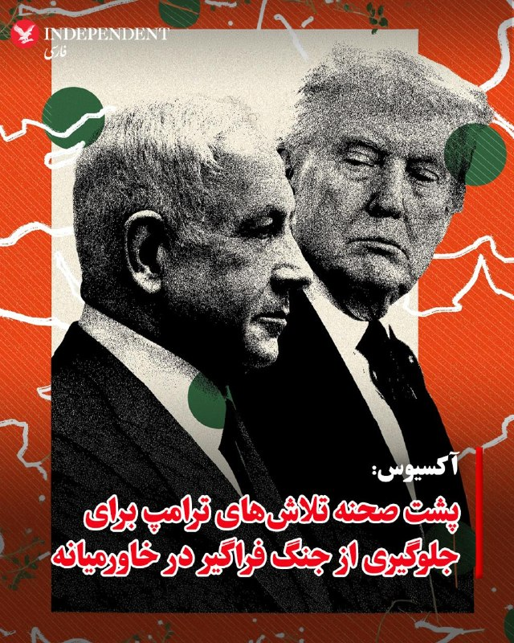

♦️به گزارش آکسیوس، رویدادهای بحرانی ۲۴ ساعت گذشته نشان داد که علیرغم تمایل شدید دونالد ترامپ برای خروج از بحران‌های خاورمیانه، خطر ورود دوباره ارتش آمریکا در یک جنگ تمام عیار بسیار جدی است. پس از حملات موشکی متقابل میان تل‌آویو و تهران که در پی بمباران حومه بیروت توسط اسرائیل آغاز شد، ترامپ در یک دوراهی سخت قرار گرفت؛ از یک سو می‌دانست نتانیاهو نمی‌تواند حملات ایران را بی‌پاسخ بگذارد و از سوی دیگر نگران فرو رفتن منطقه در یک جنگ همه‌جانبه بود. بر اساس این گزارش، ترامپ در جریان تماس‌های تلفنی متعدد و فشرده با بنیامین نتانیاهو، ضمن مخالفت با تداوم حملات تلافی‌جویانه، به او هشدار داد که در صورت ورود به جنگی بزرگ با ایران، ممکن است کاملا تنها بماند و واشنگتن از او حمایت نخواهد کرد. تلاشی که هرچند موقتا ترمز حملات بعدی اسرائیل را کشید، اما به دلیل تضاد منافع شدید میان این دو رهبر، پایداری آن مشخص نیست.
در جبهه مقابل، نتانیاهو پس از مشورت با فرماندهان نظامی خود و با این استدلال که عقب‌نشینی به معنای دست برتر ایران خواهد بود، حملات به اهداف حساس و تاسیسات پتروشیمی در ایران را کلید زد که با پاسخ مجدد تهران و شلیک موشک به سمت تل‌آویو مواجه شد. در این میان ارتش آمریکا گرچه در حملات علیه ایران مشارکت نکرد، اما به رهگیری موشک‌های ایرانی کمک کرد. ترامپ در گفتگو با آکسیوس گفت که پس از تماس چند کشور منطقه و دریافت پیامی از سوی ایرانی‌ها مبنی بر تمایل به توقف درگیری در صورت آتش‌بس متقابل، سرانجام نتانیاهو را مجبور به لغو بزرگ‌ترین موج حملات برنامه‌ریزی‌شده علیه ایران کرد. یک مقام آمریکایی در این باره به آکسیوس گفت: «نتانیاهو برای بقای سیاسی خود به ادامه جنگ نیاز دارد و ترامپ برای بقای سیاسی خود به پایان آن».
‌🇸🇦 Indypersian

🤖 @VahidOOnLine

## VahidOOnLine — post 244426

  <a href="telegram/content/VahidOOnLine_244426_1780950239.mp4" target="_blank">🎬 Download video</a>

♦️جورجینا رودریگز، نامزد کریستیانو رونالدو، ستاره پرتغالی النصر، با انتشار ویدیویی در اینستاگرام، تصاویری از تمرین رونالدو با پسرش در باغ خانه‌شان را منتشر کرد.
این ویدیو کریستیانو رونالدو را نشان می‌دهد که در حال آموزش مهارت‌های فوتبال و نحوه اجرای آن‌ها به پسرش است.
‌🇸🇦 Indypersian

🤖 @VahidOOnLine

## IranIntlTV — post 341241

  <a href="telegram/content/IranIntlTV_341241_1780950240.mp4" target="_blank">🎬 Download video</a>

یک مقام آمریکایی به سی‌ان‌ان گفت ارتش آمریکا هیچ‌یک از موشک‌های بالستیک شلیک‌شده از سوی جمهوری اسلامی به سمت اسرائیل را رهگیری نکرده است.

او در عین حال از هماهنگی نزدیک سنتکام و ارتش اسرائیل خبر داد و گفت فرمانده سنتکام در ۲۴ ساعت گذشته دو بار با رییس ستاد ارتش اسرائیل گفت‌وگو کرده است.
@iranintltv

## RadioFarda — post 158072

  <a href="https://t.me/radiofarda/158072" target="_blank">📎 Download file</a>

📻بشنوید: خبرهای ساعت ۲۱، هجدهم خرداد ۱۴۰۵‌

@RadioFarda

## IranianMinds — post 21879

  <a href="telegram/content/IranianMinds_21879_1780950242.mp4" target="_blank">🎬 Download video</a>

🔴 فیلم‌ وایرال شده از نیرو‌های ارتش جمهوری اسلامی:

عمو ترامپ با توییت که نمیشه جنگ کرد. این ارتش و ناو و جنگنده‌هاتو بفرست جلو خسته شدیم دیگه.
یه‌ذره بیا جلوتر ببین اصلا ایران چیکارست. بیا و ببین تنگه هرمز مالِ کیه و آقای منطقه کیه.

@IranianMinds

## alonews — post 126400

  <a href="telegram/content/alonews_126400_1780950243.webm" target="_blank">🎬 Download video</a>

👈ترامپ به اکسیوس: ایران می‌خواهد به توافق برسد و این اتفاق می‌تواند به زودی رخ دهد

✅ @AloNews خبر جنگ

## alonews — post 126399

  <a href="telegram/content/alonews_126399_1780950243.webm" target="_blank">🎬 Download video</a>

👈مقایسه عبور نفتکش‌ها از تنگه هرمز در سال‌های مختلف

✅ @AloNews خبر جنگ

## alonews — post 126398

  <a href="telegram/content/alonews_126398_1780950243.webm" target="_blank">🎬 Download video</a>

👈مقام ایرانی به الجزیره:
واشنگتن در پیش نویس یادداشت تفاهم تغییر ایجاد کرد و این موضوع غیرقابل قبول است

✅ @AloNews خبر جنگ

---
📅 بروزرسانی: 1405/03/18 23:45
---

## VahidOOnLine — post 244425

  <a href="telegram/content/VahidOOnLine_244425_1780949703.mp4" target="_blank">🎬 Download video</a>

حوثی‌های یمن، تحت حمایت جمهوری اسلامی، در تلگرام ویدیویی منتشر کرده‌اند که لحظه شلیک موشک به منطقه یافا در اسرائیل را در روز دوشنبه ۱۸ خرداد نشان می‌دهد.
به گزارش تایمز اسرائیل، موشک پرتاب‌شده از سوی حوثی‌های یمن با موفقیت رهگیری شده است.
‌🏁 🇬🇧 IranintlTV

🤖 @VahidOOnLine

## VahidOOnLine — post 244424

  

مقام‌های لهستان روز دوشنبه اعلام کردند بیش از یک تن هروئین با منشا ایران را در بندر گدینیا در ساحل دریای بالتیک توقیف کرده‌اند؛ این محموله در میان آجرهای تزئینی پنهان شده بود.
وزیر کشور لهستان در نشست خبری گفت: «این بزرگ‌ترین عملیات از این نوع در بیش از یک دهه گذشته است.»
به گفته مقام‌ها، ارزش این مواد مخدر حدود ۵۹.۸ میلیون دلار برآورد شده است. این محموله از امارات متحده عربی ارسال شده بود و نخستین بار از سوی ماموران گمرک بریتانیا شناسایی شد.
رییس پلیس لهستان گفت منشا این مواد مخدر ایران بوده است.
‌🏁 🇬🇧 IranintlTV

🤖 @VahidOOnLine

## WithYashar — post 14071

یک مقام آمریکایی به Axios گفت:
بی بی برای زنده ماندن سیاسی در اسرائیل نیاز دارد که جنگ ادامه یابد، و ترامپ برای زنده ماندن سیاسی در آمریکا نیاز دارد که جنگ پایان یابد.
@withyashar

## IranIntlTV — post 341240

  <a href="telegram/content/IranIntlTV_341240_1780949706.mp4" target="_blank">🎬 Download video</a>

حوثی‌های یمن، تحت حمایت جمهوری اسلامی، در تلگرام ویدیویی منتشر کرده‌اند که لحظه شلیک موشک به منطقه یافا در اسرائیل را در روز دوشنبه ۱۸ خرداد نشان می‌دهد.
به گزارش تایمز اسرائیل، موشک پرتاب‌شده از سوی حوثی‌های یمن با موفقیت رهگیری شده است.

## IranIntlTV — post 341239

  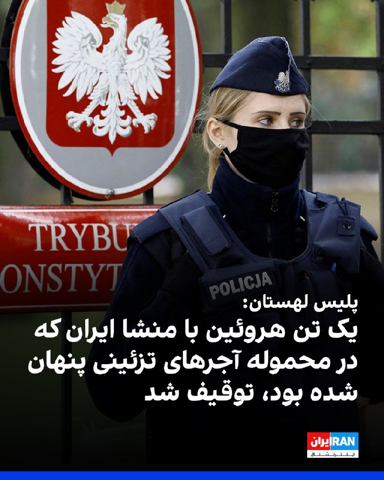

مقام‌های لهستان روز دوشنبه اعلام کردند بیش از یک تن هروئین با منشا ایران را در بندر گدینیا در ساحل دریای بالتیک توقیف کرده‌اند؛ این محموله در میان آجرهای تزئینی پنهان شده بود.
وزیر کشور لهستان در نشست خبری گفت: «این بزرگ‌ترین عملیات از این نوع در بیش از یک دهه گذشته است.»
به گفته مقام‌ها، ارزش این مواد مخدر حدود ۵۹.۸ میلیون دلار برآورد شده است. این محموله از امارات متحده عربی ارسال شده بود و نخستین بار از سوی ماموران گمرک بریتانیا شناسایی شد.
رییس پلیس لهستان گفت منشا این مواد مخدر ایران بوده است.
https://iranintl.com/202606088440

## IranIntlTV — post 341238

  <a href="https://t.me/IranintlTV/341238" target="_blank">📎 Download file</a>

🎧نسخه صوتی ۲۴ با فرداد فرحزاد: نتانیاهو: کار با جمهوری اسلامی به پایان نرسیده
@iranintlTV

## Persian_Trend_Official — post 16225

  <a href="telegram/content/Persian_Trend_Official_16225_1780949710.webm" target="_blank">🎬 Download video</a>

یک مقام آمریکایی به اکسیوس گفت: بی‌بی برای ادامه حیات سیاسی در اسرائیل به جنگ نیاز دارد و ترامپ برای حفظ حیات سیاسی در ایالات متحده به پایان جنگ نیاز دارد.

📝 Amir

📌 @persian_trend_official
پرشین ترند | متفاوت‌ترین کانال نظامی

## alonews — post 126397

  <a href="telegram/content/alonews_126397_1780949710.webm" target="_blank">🎬 Download video</a>

👈منابع خبری از شنیده شدن صدای انفجارهایی در سلیمانیه واقع در شمال عراق خبر می دهند.

✅ @AloNews خبر جنگ

---
📅 بروزرسانی: 1405/03/18 23:34
---

## VahidOOnLine — post 244423

  

♦️روزنامه نیویورک‌پست، گزارش داده است که خرما، میوه محبوب مردم خاورمیانه، به گزینه‌ای محبوب در میان مصرف‌کنندگان آمریکایی تبدیل شده و به تدریج جای تنقلات فوق‌فرآوری‌شده را می‌گیرد.
بر اساس این گزارش، فروش خرما در آمریکا در سال ۲۰۲۵ نسبت به سال قبل ۳۳ درصد افزایش یافته و پیش‌بینی می‌شود ارزش بازار این محصول تا سال ۲۰۳۴ به حدود ۱.۶ میلیارد دلار برسد.
کارشناسان تغذیه این روند را ناشی از افزایش تمایل مصرف‌کنندگان به مواد غذایی طبیعی و کمتر فرآوری‌شده می‌دانند. محبوبیت خرما همچنین با انتشار گسترده دستورهای تهیه دسرها و میان‌وعده‌های مبتنی بر این میوه در شبکه‌های اجتماعی افزایش یافته است.
نیویورک پست به نقل از متخصصان تغذیه می‌نویسد، خرما منبع خوبی از فیبر، آنتی‌اکسیدان‌ها، پتاسیم و منیزیم است و می‌تواند به سلامت دستگاه گوارش و کاهش خطر برخی بیماری‌ها کمک کند.
با این حال، کارشناسان هشدار می‌دهند که خرما حاوی مقدار قابل توجهی قند طبیعی است و بهتر است همراه با مغزها و دانه‌های خوراکی مصرف شود تا تأثیر آن بر قند خون کاهش یابد.
به گزارش نیویورک پست، برآوردها نشان می‌دهد ارزش بازار جهانی خرما از ۳۴.۵ میلیارد دلار در سال ۲۰۲۶ به بیش از ۵۵ میلیارد دلار در سال ۲۰۳۴ خواهد رسید. خاورمیانه و آفریقا همچنان بزرگ‌ترین مصرف‌کنندگان خرما در جهان به شمار می‌روند.
‌🇸🇦 Indypersian

🤖 @VahidOOnLine

## WithYashar — post 14070

@withyashar جنگ مخفی

## WithYashar — post 14069

سامانه های پدافندی آمریکا در اقلیم کردستان، عراق در حال فعالیت می‌باشند.
@withyashar

## WithYashar — post 14068

جنگنده های آمریکایی در شمال عراق به پرواز درآمدند.
@withyashar

## pm_afshaa — post 92973

  <a href="telegram/content/pm_afshaa_92973_1780949060.webm" target="_blank">🎬 Download video</a>

🔴رئیس کمیسیون امنیت ملی مجلس:
اگه آمریکا صادق باشه مشکلی با ادامه مذاکرات نداریم.

💧 Rainbet.com the #1 Non-KYC Crypto Casino & Sportsbook @rainbetcom

😁 @Pm_Afshaa

## IranIntlTV — post 341237

  <a href="telegram/content/IranIntlTV_341237_1780949060.mp4" target="_blank">🎬 Download video</a>

در واکنش به درگیری‌ها میان اسرائیل و ایران، محمدباقر ذوالقدر، دبیر شورای عالی امنیت ملی جمهوری اسلامی، هشدار داد در صورت حمله ائتلاف اسرائیل و آمریکا، منطقه برای آنها «جهنم» می‌شود. قالیباف هم گفت معادله آتش‌بس بر هم خورده و تا زمان نبود اعتمادسازی، پاسخ ایران ادامه دارد.
@iranintltv

## IranianMinds — post 21878

۵ ماه پیش
در چنین‌ روزی
هزاران نفر رفتن تو خیابونا
و دیگه هیچوقت برنگشتن 🖤

احترام به تمامشون...

@IranianMinds

## alonews — post 126396

  <a href="telegram/content/alonews_126396_1780949062.webm" target="_blank">🎬 Download video</a>

👈یک مقام آمریکایی به Axios گفت:
بیبی برای زنده ماندن سیاسی در اسرائیل نیاز دارد که جنگ ادامه یابد، و ترامپ برای زنده ماندن سیاسی در آمریکا نیاز دارد که جنگ پایان یابد.

✅ @AloNews خبر جنگ

## alonews — post 126395

  <a href="telegram/content/alonews_126395_1780949062.webm" target="_blank">🎬 Download video</a>

⚫
🏆 به دنیای هیجان‌انگیز فوتبال خوش اومدی!

⭐️اینجا قراره باهم لحظه‌به‌لحظه‌ی جام جهانی رو زندگی کنیم؛
از بازی‌های حساس و نتایج داغ گرفته تا حاشیه‌ها، کری‌خونی‌ها و اتفاقاتی که همه درباره‌ش حرف میزنن! 
🔥
🔥

✅ پوشش کامل مسابقات

💀ترول تیم‌ها و بازیکن‌ها

🎥ویدیوها و لحظه‌های فان فوتبالی

📊آمار، ترکیب‌ها و اخبار فوری

🌍حواشی جذاب از سراسر جام جهانی

📢اینجا فقط یک کانال خبری نیست؛
یک جمع فوتبالیه برای کسایی که فوتبال رو با هیجان، شوخی و احساس واقعی دنبال میکنن 
📛
💟

🆘
🔞 آماده باش چون قراره جام جهانی رو متفاوت تجربه کنیم!

⚡ @Vaarzesh_Plus

⚡ @Vaarzesh_Plus

## alonews — post 126394

  <a href="telegram/content/alonews_126394_1780949063.mp4" target="_blank">🎬 Download video</a>

👈پدافند هوایی آمریکا یه موشک بالستیک از ایران به سمت پایگاه آمریکایی تو شمال عراق رو رهگیری کرد

✅ @AloNews خبر جنگ

## alonews — post 126392

  <a href="telegram/content/alonews_126392_1780949065.mp4" target="_blank">🎬 Download video</a>

👈 یک انبار مهمات عظیم امروز صبح نزدیک بلوفسکویه در منطقه بلگورود روسیه منفجر شد.

🔴 گزارش شده که این انفجار ناشی از هیچ حمله‌ای نبوده است، اگرچه هنوز مشخص نیست چرا این اتفاق افتاده است.

✅ @AloNews خبر جنگ

## alonews — post 126391

  <a href="telegram/content/alonews_126391_1780949067.webm" target="_blank">🎬 Download video</a>

👈 آکسیوس: ترامپ صراحتاً به نتانیاهو گفته که از پاسخ به ایران حمایت نمی‌کند

✅ @AloNews خبر جنگ

---
📅 بروزرسانی: 1405/03/18 23:23
---

## VahidOOnLine — post 244422

♦️اسماعیل بقایی، سخنگوی وزارت امور خارجه جمهوری اسلامی ایران، روز دوشنبه ۱۸ خرداد، رافائل گروسی، مدیرکل آژانس بین‌المللی انرژی اتمی، را به اتخاذ رویکردی «سیاسی، جانبدارانه و غیرفنی» در قبال پرونده هسته‌ای ایران متهم کرد.
بقایی گفت مدیرکل آژانس همچنان بر «رویکرد بسیار نامناسب و غیرسازنده» خود اصرار دارد و به جای پرداختن به دلایل ایجاد وضعیت کنونی، صرفا بر پیامدهای آن تمرکز کرده است.
او افزود اگر آژانس درباره آنچه «پیوستگی دانش» در برنامه هسته‌ای ایران خوانده می‌شود ابراز نگرانی می‌کند، باید کشورهایی را مورد مؤاخذه قرار دهد که با حمله به تاسیسات هسته‌ای ایران موجب ایجاد این وضعیت شده‌اند.
سخنگوی وزارت خارجه ایران آمریکا و اسرائیل را مسئول شرایط کنونی دانست و گفت آژانس بین‌المللی انرژی اتمی تاکنون موضعی «مسئولانه» در قبال حملات به تأسیسات هسته‌ای ایران اتخاذ نکرده و این حملات را محکوم نکرده است.
بقایی همچنین مدعی شد آژانس در موارد مشابه در منطقه واکنش‌های سریع‌تر و مواضع شدیدتری اتخاذ کرده و این موضوع شائبه وجود استانداردهای دوگانه را تقویت می‌کند.
او در پایان گفت رویکرد مدیرکل آژانس باعث «بی‌اعتباری بیشتر آژانس و شخص مدیرکل» در زمینه اجرای تعهدات مرتبط با منع اشاعه هسته‌ای خواهد شد.
‌🇸🇦 Indypersian

🤖 @VahidOOnLine

## VahidOOnLine — post 244421

  

♦️شبکه خبری سی‌بی‌اس، روز دوشنبه ۱۸ خرداد ماه گزارش داد، دولت دونالد ترامپ قصد دارد روند لغو تابعیت ۱۷ شهروند آمریکایی را که به تقلب در پرونده‌های مهاجرتی یا برخی جرایم متهم هستند، آغاز کند.

بر اساس این گزارش، وزارت دادگستری آمریکا این افراد را به پنهان کردن اطلاعات مهم، ارائه اطلاعات نادرست در روند دریافت تابعیت یا ارتکاب جرایم مختلف متهم کرده است.

سی‌بی‌اس نوشت این اقدام بخشی از کارزار گسترده دولت ترامپ برای استفاده از سازوکار قانونی سلب تابعیت از افرادی است که به گفته مقام‌های آمریکایی، شهروندی این کشور را از طریق تقلب یا پنهان‌کاری به دست آورده‌اند.

در میان افرادی که هدف این اقدام قرار گرفته‌اند، نام چند نفر که به جرایمی از جمله سوءاستفاده جنسی از کودکان، کلاهبرداری مالی، پولشویی، تقلب مهاجرتی و استفاده از هویت‌های جعلی متهم یا محکوم شده‌اند، دیده می‌شود.

تاد بلانش، معاون دادستان کل آمریکا، گفت دولت در برابر سوءاستفاده از روند دریافت تابعیت «هیچ‌گونه مدارا» نخواهد داشت.
‌🇸🇦 Indypersian

🤖 @VahidOOnLine

## WithYashar — post 14067

  <a href="telegram/content/WithYashar_14067_1780948439.mp4" target="_blank">🎬 Download video</a>

ویدیو از رهگیری موشک یا پهپاد های جمهوری اسلامی توسط امریکا همکنون در عراق
@withyashar

## WithYashar — post 14066

واقعا یه خبرایی ‌هست 🚨🚨🚨🚨

## mwarmonitor — post 10494

📌رسانه‌های اسرائیلی: شلیک موشک‌های رهگیر به‌سوی یک جسم مشکوک در آسمان ایلات.

@mwarmonitor

## pm_afshaa — post 92972

  <a href="telegram/content/pm_afshaa_92972_1780948441.webm" target="_blank">🎬 Download video</a>

🔴وزارت خارجه آمریکا: آزادی اموال بلوکه شده ایران، مادامی که ایران به تعهدات خود پایبند نشه، رخ نخواهد داد.

محاصره دریایی اعمال شده علیه ایران هم تا دست‌یابی به توافق پابرجا خواهد موند.

💧 Rainbet.com the #1 Non-KYC Crypto Casino & Sportsbook @rainbetcom

😁 @Pm_Afshaa

## VahidOnline — post 76084

  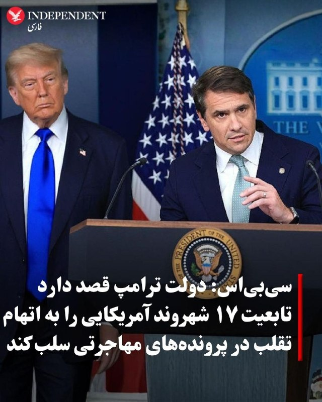

♦️شبکه خبری سی‌بی‌اس، روز دوشنبه ۱۸ خرداد ماه گزارش داد، دولت دونالد ترامپ قصد دارد روند لغو تابعیت ۱۷ شهروند آمریکایی را که به تقلب در پرونده‌های مهاجرتی یا برخی جرایم متهم هستند، آغاز کند.

بر اساس این گزارش، وزارت دادگستری آمریکا این افراد را به پنهان کردن اطلاعات مهم، ارائه اطلاعات نادرست در روند دریافت تابعیت یا ارتکاب جرایم مختلف متهم کرده است.

سی‌بی‌اس نوشت این اقدام بخشی از کارزار گسترده دولت ترامپ برای استفاده از سازوکار قانونی سلب تابعیت از افرادی است که به گفته مقام‌های آمریکایی، شهروندی این کشور را از طریق تقلب یا پنهان‌کاری به دست آورده‌اند.

در میان افرادی که هدف این اقدام قرار گرفته‌اند، نام چند نفر که به جرایمی از جمله سوءاستفاده جنسی از کودکان، کلاهبرداری مالی، پولشویی، تقلب مهاجرتی و استفاده از هویت‌های جعلی متهم یا محکوم شده‌اند، دیده می‌شود.

تاد بلانش، معاون دادستان کل آمریکا، گفت دولت در برابر سوءاستفاده از روند دریافت تابعیت «هیچ‌گونه مدارا» نخواهد داشت.
@VahidOOnLine

📡 @VahidOnline

## IranIntlTV — post 341236

  <a href="https://t.me/IranintlTV/341236" target="_blank">📎 Download file</a>

🎧نسخه صوتی چشم‌انداز: چرا حکومت ایران دوباره جنگ راه انداخت؟
@iranintlTV

## IranIntlTV — post 341235

  <a href="telegram/content/IranIntlTV_341235_1780948442.mp4" target="_blank">🎬 Download video</a>

چرا حکومت ایران دوباره جنگ راه انداخت؟

چشم‌انداز با مهدی مهدو‌ی‌آزاد

تماشای نسخه کامل این برنامه در یوتیوب:
https://youtu.be/QJ8b7MCMbFU
@iranintltv

## FarsiVOA — post 220065

🔺توقف حملات متقابل جمهوری اسلامی و اسرائیل؛ پایان درگیری یا وقفه‌ای شکننده

▪️اعلام توقف حملات از سوی جمهوری اسلامی و اسرائیل، دور تازه رویارویی مستقیم دو طرف را دست‌کم در مقطع کنونی متوقف کرده است. این تحول احتمال بازگشت به آتش‌بس را افزایش می‌دهد، اما مشروط‌بودن موضع حکومت ایران، ادامه عملیات اسرائیل در لبنان و نبود تعریف مشترک از محدوده آتش‌بس نشان می‌دهد که آرامش کنونی همچنان شکننده است.

⬇️ بیشتر بخوانید:
https://ir.voanews.com/a/iran-israel-clash-peace-or-pause-/8158546.html
@FarsiVOA

## BBCPersian — post 283212

  <a href="https://t.me/bbcpersian/283212" target="_blank">📎 Download file</a>

🔻 پادکست برنامه ۶۰ دقیقه دوشنبه ۱۸ خرداد ۱۴۰۵

این نسخه رادیویی برنامه شصت دقیقه تلویزیون فارسی بی‌بی‌سی است که هرشب بعد از پخش، با حجم کم از اپلیکیشن‌های پادگیر و صفحه تلگرام بی‌بی‌سی فارسی در دسترس است.

@BBCPersian

## Dirty_Kids — post 391415

  <a href="telegram/content/Dirty_Kids_391415_1780948444.mp4" target="_blank">🎬 Download video</a>

اگر ایران و آمریکا هر دو در گروهشان به عنوان تیم دوم صعود کنند، برای بار سوم شاهد رقابت این دو تیم در جام جهانی خواهیم بود!

@Dirty_Kids 👻

## alonews — post 126390

  <a href="telegram/content/alonews_126390_1780948445.webm" target="_blank">🎬 Download video</a>

👈آکسیوس به نقل از منبع اسرائیلی: ارتش اسرائیل پیش از حمله به بیروت، سنتکام را مطلع کرده بود، اما کاخ سفید را در جریان نگذاشته بودند.

✅ @AloNews خبر جنگ

## alonews — post 126389

  <a href="telegram/content/alonews_126389_1780948445.webm" target="_blank">🎬 Download video</a>

👈کارشناس صداوسیما: مردم ایران الان یکصدا میگن جان ما و لبنانی‌ها یکیه

✅ @AloNews خبر جنگ

---
📅 بروزرسانی: 1405/03/18 23:13
---

## WithYashar — post 14065

هم اکنون گزارش‌های تایید نشده از عراق، حاکی از حمله پهپادی گسترده ایران به پایگاه‌های آمریکا / کرد ها در شمال عراق است.🚨🚨 @withyashar

## WithYashar — post 14064

هم اکنون گزارش‌های تایید نشده از عراق، حاکی از حمله پهپادی گسترده ایران به پایگاه‌های آمریکا / کرد ها در شمال عراق است.🚨🚨
@withyashar

## WithYashar — post 14063

وزارت خارجه آمریکا: آزادی اموال بلوکه شده، مادامی که ایران به تعهدات خود پایبند نشود، رخ نخواهد داد
محاصره دریایی اعمال شده علیه ایران تا دست‌یابی به توافق پابرجا خواهد ماند
@withyashar

## mwarmonitor — post 10493

🔴پشت صحنه: چگونه اسرائیل و ایران نزدیک بود ترامپ را به ورطه جنگ بکشانند

📝نویسنده: باراک راوید AXIOS

🔰۲۴ ساعت گذشته خطر گرفتار شدن دوباره ایالات متحده در جنگ خاورمیانه را برجسته کرد. روز دوشنبه، ترامپ اسرائیل و ایران را از لبه پرتگاه عقب کشید، اما مشخص نیست این وضعیت تا چه زمانی دوام دارد.

📌 ترامپ در یک مصاحبه تلفنی به آکسیوس گفت به نتانیاهو هشدار داده که اگر با ایران وارد جنگ شود، ممکن است در این نبرد تنها بماند.

🔸جریان اخبار و پشت صحنه
این تنش‌ها صبح یکشنبه آغاز شد؛ زمانی که اسرائیل بدون اطلاع کاخ سفید، هدفی را در بیروت زد. ایران نیز در پاسخ موشک‌هایی به سمت اسرائیل شلیک کرد.

🔸ترامپ شامگاه یکشنبه با نتانیاهو تماس گرفت و از او خواست دست به تلافی نزند. او استدلال کرد که یا ظرف چند روز آینده با ایران به توافق می‌رسد یا در صورت عدم توافق، خودش فرماندهی حملات علیه ایران را بر عهده می‌گیرد. با این حال، نتانیاهو استدلال کرد که پاسخ ندادن به ایران پیام ضعف صادر می‌کند.

🔹نتانیاهو پس از جلسه با فرماندهان خود، به کاخ سفید اطلاع داد که حملات را آغاز می‌کند. ترامپ در این مصاحبه گفت اسرائیل خیلی دیر به آن‌ها اطلاع داده و جنگنده‌ها در راه بوده‌اند، اما او در نهایت حمله را محدود کرده است. مقامات اسرائیلی نیز با مارکو روبیو (وزیر خارجه آمریکا) برای هماهنگی روی اهداف گفتگو کردند.

🔸حملات متقابل و میانجی‌گری
اسرائیل یک مجتمع پتروشیمی و اهدافی را در تهران زد. ایران نیز موج جدیدی از موشک‌ها را به سمت تل‌آویو شلیک کرد. ارتش آمریکا در حملات اسرائیل مشارکتی نداشت، اما به رهگیری موشک‌های ایران کمک کرد.
ترامپ به آکسیوس گفت پنج کشور منطقه با او تماس گرفته و خواستار فشار بر نتانیاهو شدند. او همچنین مدعی شد صبح دوشنبه پیامی از ایرانی‌ها دریافت کرده که در صورت توقف اسرائیل، آن‌ها نیز مایل به توقف هستند.

🔸در حالی که اسرائیل برای بزرگترین موج حملات به ده‌ها هدف حساس در ایران آماده می‌شد، ترامپ دوباره به نتانیاهو هشدار داد: «بی‌بی، بهتر است مراقب باشی، وگرنه به زودی تنها خواهی شد.» پس از این تماس، نتانیاهو به فرماندهان خود دستور داد حملات را لغو کنند.

📌چشم‌انداز و کلام آخر
ترامپ در این مصاحبه بار دیگر ادعا کرد توافق با ایران نزدیک است و مانع دستیابی آن‌ها به سلاح هسته‌ای می‌شود. در مقابل، محمدباقر قالیباف، رئیس مجلس ایران، ادعاهای ترامپ را متناقض با توافقات دانست و گفت: «ما هیچ اعتمادی به طرف مقابل نداریم و هدف ما پایان جنگ است، نه عادی‌سازی روابط با آمریکا.»

🔸کلام آخر: به گفته منابع آمریکایی و اسرائیلی، منافع ترامپ و نتانیاهو روز به روز بیشتر از هم فاصله می‌گیرد: نتانیاهو برای بقای سیاسی خود در اسرائیل به ادامه جنگ نیاز دارد و ترامپ برای بقای سیاسی خود در آمریکا به پایان جنگ نیازمند است.

@mwarmonitor

## BBCPersian — post 283211

  <a href="telegram/content/BBCPersian_283211_1780947838.mp4" target="_blank">🎬 Download video</a>

آخرین خبرهای مهم روز دوشنبه ۱۸ خرداد ماه ۱۴۰۵ از تلویزیون بی‌بی‌سی فارسی

https://bbc.in/42XnQmy

https://bbc.in/3WtLd3k
@BBCPersian

## BBCPersian — post 283210

🔻 اسرائیل بخشی از محدودیت‌ها را در شمال این کشور لغو کرد

ارتش اسرائیل اعلام کرد بخشی از محدودیت‌های اعمال‌شده در برخی مناطق این کشور را لغو کرده است.

بر این اساس، از صبح روز سه‌شنبه چندین منطقه در شمال اسرائیل، از جمله سیفسوفا، میرون، اور هاگانوز و سده الیعزر، برخی از فعالیت‌های خود را از سر می‌گیرند.

این تصمیم به مدارس و محل‌های کار اجازه می‌دهد فعالیت خود را از سر بگیرند، مشروط بر آنکه در فضاهای سرپوشیده یا مکان‌های نزدیک به پناهگاه‌های ضدبمب مستقر باشند. همچنین تجمع حداکثر ۱۰۰ نفر در فضای باز و ۴۰۰ نفر در فضاهای سرپوشیده مجاز خواهد بود.

در سایر نقاط اسرائیل هیچ محدودیتی برقرار نیست.

این تغییر در حالی صورت می‌گیرد که ایران و اسرائیل هر دو از توقف حملات به یکدیگر خبر داده‌اند.

https://bbc.in/4uS2DpO
@BBCPersian

## BBCPersian — post 283209

🔻سنتکام: یک نفتکش را در دریای عمان از کار انداختیم

فرماندهی ارتش آمریکا در منطقه خاورمیانه، سنتکام، در بیانیه‌ای گفت نیروهایش یک نفتکش خالی را در خلیج عمان از کار انداخته‌اند.

بنابر این بیانیه، کشتی ام/تی ماریوکس با پرچم پالائو از آب‌های بین‌المللی خلیج عمان به سمت یکی از بنادر ایران در حرکت و در تلاش بود محاصره را نقض کند.

سنتکام گفت یک جنگنده اف ۱۸ پس از اینکه خدمه دستور نیروهای آمریکایی را رعایت نکردند از ناوهواپیمابر آبراهام لینکلن برخاست و موتورخانه و سامانه هدایت کشتی را هدف قرار داد و دیگر قادر به ادامه مسیر به سمت ایران نیست.

سنتکام گفت از شروع محاصره دریایی ایران، هفت کشتی متخلف را از کار انداخته‌، مسیر ۱۳۴ کشتی را تغییر داده‌ و به ۴۲ کشتی حامل کمک‌ بشردوستانه اجازه عبور داده‌ است.

https://bbc.in/4uS2DpO
@BBCPersian

## Dirty_Kids — post 391414

  <a href="telegram/content/Dirty_Kids_391414_1780947840.mp4" target="_blank">🎬 Download video</a>

توی اینستا ترکونده بود و کلی خارجی بهش کامپلیمنت دادم گفتم بیارم یه دور اینجا ذوق کنیم از دمش‌گرم. 😍😍😌👌😎

@Dirty_Kids 👻

## Dirty_Kids — post 391412

  <a href="telegram/content/Dirty_Kids_391412_1780947841.mp4" target="_blank">🎬 Download video</a>

🔴تو عراق
🇮🇶 یه رستوران به نام "کص صمد" باز شده؛

ملت همیشه در صحنه هم انقدر واسشون کامنت گذاشتن که آخر سر مديريت رستوران کص صمد مجبور شد این کامنت رو بذاره :

@Dirty_Kids 👻

## Dirty_Kids — post 391411

  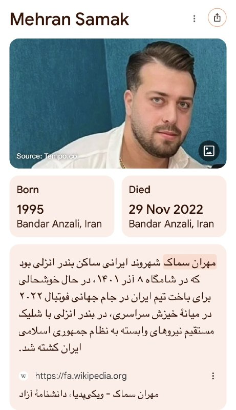

هروقت بحث فوتبال و تیم جمهوری اسلامی میشه، یاد جاویدنام ‎#مهران_سماک‌ می‌افتم!

سعید عزت اللهی بعد از مرگش یه استوری گذاشت تلویحا گفت چون به من حسودیت میشد اومدی بیرون

@Dirty_Kids 👻

## Dirty_Kids — post 391410

  <a href="telegram/content/Dirty_Kids_391410_1780947843.mp4" target="_blank">🎬 Download video</a>

🔴پدافند اوکراین پهپاد انتحاری روسیه رو تو هوا میزنه، ولی از شانس گهشون مستقیم میفته رو یه ایستگاه اتوبوس. (2 نفر کشته و 12 زخمی)

@Dirty_Kids 👻

## Dirty_Kids — post 391409

  

شما نبودید این قرمساق مجید مجیدی؛ پیشنهاد کرده به «شورای عالی بی امنیتی میلی» که یکی از شروط توافق «تحویل شاهزاده» باشه!

@Dirty_Kids 👻

## alonews — post 126388

  <a href="telegram/content/alonews_126388_1780947845.webm" target="_blank">🎬 Download video</a>

👈فیلد مارشال ، محسن رضایی:
آتش بس باید در سراسر لبنان اعمال شود.

✅ @AloNews خبر جنگ

## alonews — post 126387

  <a href="telegram/content/alonews_126387_1780947845.webm" target="_blank">🎬 Download video</a>

👈روبیکا به کانال خاله دنیا جهانبخت تیک آبی داد و رسما تاییدش کرد

✅ @AloNews خبر جنگ

## alonews — post 126386

🤩⚽️کامنت شاهزاده زیر پست فیفا : آخرین رقص🔥😉 The Last dance🇧🇷 @AloSport

---
📅 بروزرسانی: 1405/03/18 23:03
---

## VahidOOnLine — post 244420

  <a href="telegram/content/VahidOOnLine_244420_1780947238.mp4" target="_blank">🎬 Download video</a>

دنزل واشنگتن، ستاره هالیوود می‌گوید هیچ چیز ارزشمندی در زندگی بدون ریسک به‌دست نمی‌آید.

شکست خواهی خورد.
اشتباه خواهی کرد.
گاهی حتی ناامید خواهی شد.

اما هر شکست، یک قدم به موفقیت نزدیک‌ترت می‌کند.

در پایان زندگی، حسرتِ تلاش کردن را نمی‌خوریم؛
حسرت فرصت‌هایی را می‌خوریم که هرگز جرات امتحان کردنشان را نداشتیم.
‌🏁 🇬🇧 ManotoTV

🤖 @VahidOOnLine

## VahidOOnLine — post 244419

  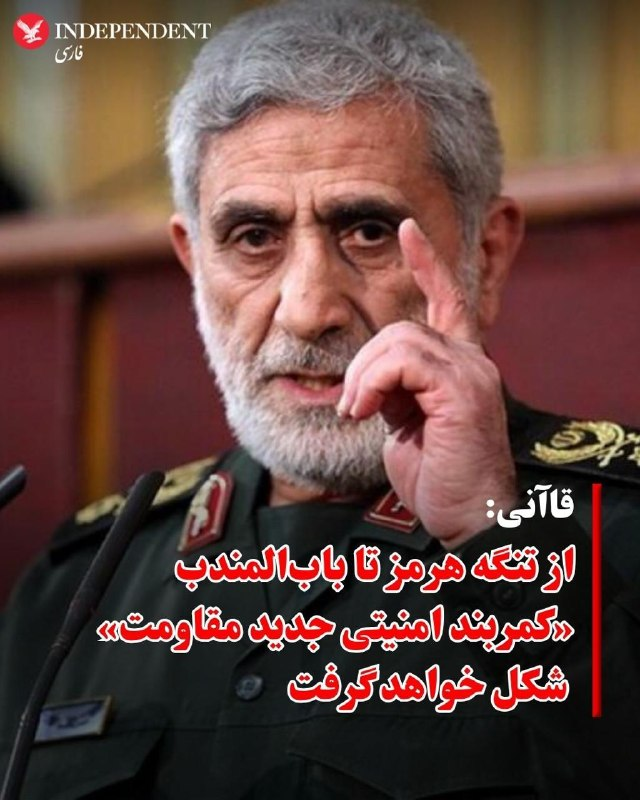

♦️اسماعیل قاآنی، فرمانده نیروی قدس سپاه پاسداران انقلاب اسلامی، روز دوشنبه ۱۸ خرداد در پیامی با اشاره به تحولات اخیر منطقه ادعا کرد پرتاب موشک از حوثی‌های یمن به سمت اسرائیل در واکنش به درگیری‌های جاری، نشانه «هوشمندی جبهه مقاومت» بوده و در صورت لزوم، سایر گروه‌های همسو با جمهوری اسلامی نیز وارد عمل خواهند شد.

قاآنی در این پیام گفت: «اقدام به‌موقع و با اقتدار یمن قهرمان نشان از هوشمندی جبهه مقاومت دارد. اگر لازم شد دیگران نیز می‌آیند.»

فرمانده نیروی قدس سپاه همچنین مدعی شد «از تنگه هرمز تا باب‌المندب و از خلیج فارس تا دریای سرخ، کمربند امنیتی جدید مقاومت» شکل خواهد گرفت.

او با اشاره به اقدامات اسرائیل و آمریکا در منطقه گفت: «شرارت‌های اسرائیل و آمریکا در این منطقه عکس‌العمل جبهه متحد مقاومت را در پی خواهد داشت.»

قاآنی در بخش دیگری از پیام خود هشدار داد: «رزمندگان بدون مرز مشرف بر گلوگاه‌های عبور شما هستند. به تعرض ادامه دهید، گلوی شما را خواهند گرفت.»

سخنگوی ارتش اسرائیل پیشتر اعلام کرده بود کشورش یک موشک شلیک شده از یمن را رصد کرده و سامانه‌های پدافندی در حال رهگیری آن هستند.
‌🇸🇦 Indypersian

🤖 @VahidOOnLine

## WithYashar — post 14062

کاور @withyashar

## IranIntlTV — post 341234

  <a href="telegram/content/IranIntlTV_341234_1780947241.mp4" target="_blank">🎬 Download video</a>

🔻تیم ملی فوتبال بامداد یکشنبه به وقت محلی وارد شهر تیخوانای مکزیک شد و نخستین جلسه تمرینی خود را در این شهر برگزار کرد. اقامت، رفت‌وآمد و تمرین‌های تیم فوتبال ایران تحت تدابیر شدید امنیتی انجام شده است.

🔹رضا محدث، خبرنگار ایران اینترنشنال، از مقابل کمپ تیم ملی در تیخوانا گزارش می‌دهد.

@iranintltvsport

## ManotoTV — post 105969

  <a href="telegram/content/ManotoTV_105969_1780947243.mp4" target="_blank">🎬 Download video</a>

دنزل واشنگتن، ستاره هالیوود می‌گوید هیچ چیز ارزشمندی در زندگی بدون ریسک به‌دست نمی‌آید.

شکست خواهی خورد.
اشتباه خواهی کرد.
گاهی حتی ناامید خواهی شد.

اما هر شکست، یک قدم به موفقیت نزدیک‌ترت می‌کند.

در پایان زندگی، حسرتِ تلاش کردن را نمی‌خوریم؛
حسرت فرصت‌هایی را می‌خوریم که هرگز جرات امتحان کردنشان را نداشتیم.

## FarsiVOA — post 220064

  <a href="telegram/content/FarsiVOA_220064_1780947246.mp4" target="_blank">🎬 Download video</a>

⚡️قوه قضائیه از بازداشت بیش از ۲۴۰۰ نفر به اتهاماتی مثل همکاری با اسرائیل خبر داد و دادستانی کل کشور هم مردم را تهدید کرد از مکان‌های جنگی فیلم منتشر نکنند
@FarsiVOA

## DW_Farsi — post 125706

  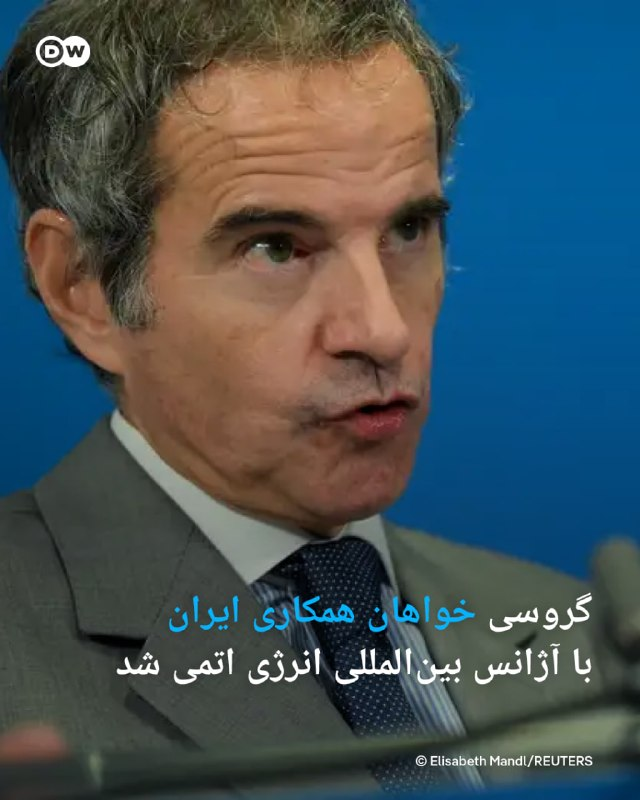

🔶 گروسی خواهان همکاری ایران با آژانس بین‌المللی انرژی اتمی شد

رافائل گروسی از ایران خواست که با آژانس تعامل کند تا بازرسی‌ها در تأسیساتی که یک سال پیش توسط آمریکا و اسرائیل بمباران شدند، از سر گرفته شوند. از سوی دیگر ایران نسبت به تصویت قطعنامه‌ای علیه این کشور هشدار داد.

رئیس آژانس بین‌المللی انرژی اتمی از ایران خواست همکاری درباره بازرسی‌های هسته‌ای را از سر بگیرد و وضعیت اورانیوم غنی‌شده را روشن کند

رافائل گروسی، روز دوشنبه از ایران خواست که "دوباره وارد تعامل" با آژانس شود تا بازرسی‌ها در تأسیساتی که یک سال پیش توسط آمریکا و اسرائیل بمباران شدند، از سر گرفته شود. این درخواست در حالی مطرح شد که آمریکا تلاش می‌کند قطعنامه‌ای را در شورای حکام آژانس به تصویب برساند که ایران را ملزم به ارائه توضیحات در این زمینه کند.

ایران هنوز به آژانس اطلاع نداده است که پس از حملات به این تأسیسات هسته‌ای چه اتفاقی برای مواد هسته‌ای موجود در آن‌ها، از جمله اورانیوم غنی‌شده نزدیک به سطح مورد نیاز برای ساخت سلاح هسته‌ای، افتاده است.

@dw_farsi

## Hranews — post 113476

  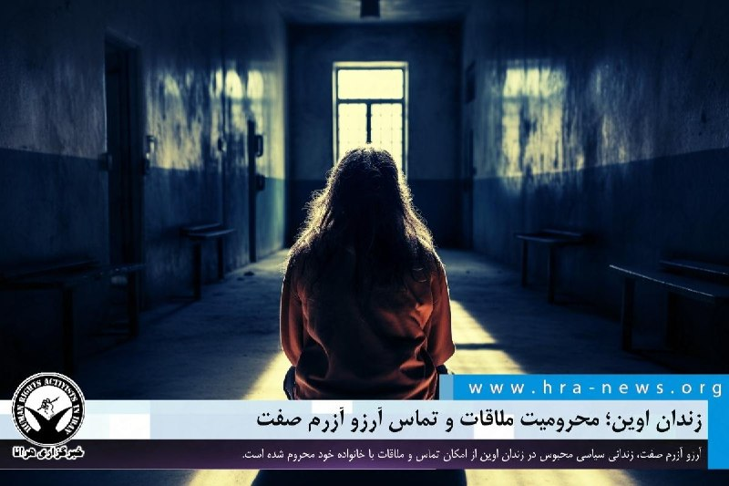

زندان اوین؛ محرومیت ملاقات و تماس آرزو آزرم صفت

❗️
❗️
❗️
❗️
❗️– آرزو آزرم‌صفت، زندانی سیاسی محبوس در زندان اوین، از روز گذشته به صورت تنبیهی از حق تماس تلفنی و ملاقات با خانواده خود محروم شده است.

به گزارش خبرگزاری هرانا، ارگان خبری مجموعه فعالان حقوق بشر در ایران، آرزو آزرم‌ صفت، زندانی سیاسی، از تماس و ملاقات با خانواده خود محروم شده است.

یک منبع نزدیک به خانواده این زندانی سیاسی ضمن تایید این خبر به هرانا گفت: “خانم آزرم صفت از روز یکشنبه ۱۷ خردادماه، از امکان ملاقات و تماس با خانواده خود محروم شده است. این محدودیت‌ها در پی سرودخوانی و سردادن شعارهای اعتراضی توسط این زندانی، علیه وی اعمال شده‌اند.”
#آرزو_آزرم‌صفت

ادامه مطلب

↘️
@hranews_bot تماس ✉️ - @Hranews کانال هرانا 🆑

## manototv — post 105969

  <a href="telegram/content/manototv_105969_1780947248.mp4" target="_blank">🎬 Download video</a>

دنزل واشنگتن، ستاره هالیوود می‌گوید هیچ چیز ارزشمندی در زندگی بدون ریسک به‌دست نمی‌آید.

شکست خواهی خورد.
اشتباه خواهی کرد.
گاهی حتی ناامید خواهی شد.

اما هر شکست، یک قدم به موفقیت نزدیک‌ترت می‌کند.

در پایان زندگی، حسرتِ تلاش کردن را نمی‌خوریم؛
حسرت فرصت‌هایی را می‌خوریم که هرگز جرات امتحان کردنشان را نداشتیم.

## alonews — post 126385

  <a href="telegram/content/alonews_126385_1780947250.webm" target="_blank">🎬 Download video</a>

👈رسایی: این عنو(اینترنت) قطع کنید

✅ @AloNews خبر جنگ

## alonews — post 126384

  <a href="telegram/content/alonews_126384_1780947250.webm" target="_blank">🎬 Download video</a>

💢فوووووووووری/پرواز شدید جنگنده‌های آمریکایی در مرز ایران 
🚨 @AkhbareFouri

## alonews — post 126383

  <a href="telegram/content/alonews_126383_1780947250.mp4" target="_blank">🎬 Download video</a>

👈محیا دهقانی، بازیگری که برا نقش رل میزنه: نصف جوونای ایرانی بیکارن ولی دائم در حال خوش گذرونین و خوب زندگی میکنن. خارج کجا اینطوریه؟ اگه برین اونجا باید صبح تا شب کار کنین فقط.

✅ @AloNews خبر جنگ

## alonews — post 126382

  <a href="telegram/content/alonews_126382_1780947252.webm" target="_blank">🎬 Download video</a>

👈اتحادیه اروپا روز دوشنبه تحریم‌هایی را علیه دو شهروند ایرانی و یک واحد از سپاه اعمال کرد.

🔴این تحریم‌ها فرماندهی استانی نیروی دریایی سپاه در هرمزگان، همچنین محمد اکبرزاده، معاون سیاسی نیروی دریایی سپاه، و حمید حسینی، نماینده اتحادیه صادرکنندگان نفت، گاز و محصولات پتروشیمی ایران را هدف قرار داده است.

✅ @AloNews خبر جنگ

---
📅 بروزرسانی: 1405/03/18 22:54
---

## VahidOOnLine — post 244418

  

ابراهیم عزیزی، رییس کمیسیون امنیت ملی و سیاست خارجی مجلس، در گفت‌وگو با سی‌ان‌ان گفت تهران در اصل «مشکلی با ادامه مذاکرات صلح با آمریکا ندارد»، مشروط بر آنکه اطمینان یابد طرف آمریکایی صادقانه و با حسن نیت مذاکره می‌کند.
عزیزی همچنین اعلام کرد آمریکا در ابتدای مذاکرات با آزادسازی دارایی‌های مسدودشده جمهوری اسلامی موافقت کرده بود، اما تاکنون نشانه‌ای از تمایل واشینگتن برای اجرای این تعهد دیده نشده است.
او همچنین تاکید کرد مذاکرات کنونی شامل موضوعات مربوط به برنامه هسته‌ای ایران نیست و در پایان گفت امکان دستیابی به توافق نهایی به رفتار آمریکا بستگی دارد.
عزیزی اضافه کرد: «اگر این رفتارها ادامه پیدا کند، پاسخ منفی است؛ ما هیچ اعتمادی به طرف مقابل نداریم»
‌🏁 🇬🇧 IranintlTV

🤖 @VahidOOnLine

## mwarmonitor — post 10492

📝 انتقاد پیشنهاد دارید دایرکت بفرمایید خوشحال میشم بشنوم

## DEJradio — post 5484

  <a href="telegram/content/DEJradio_5484_1780946642.mp4" target="_blank">🎬 Download video</a>

🔺🎥 نوبنیاد؛ ترکش چیلر رو سوراخ کرده!

#جنگ #نوبنیاد
@DEJradio

## IranIntlTV — post 341233

  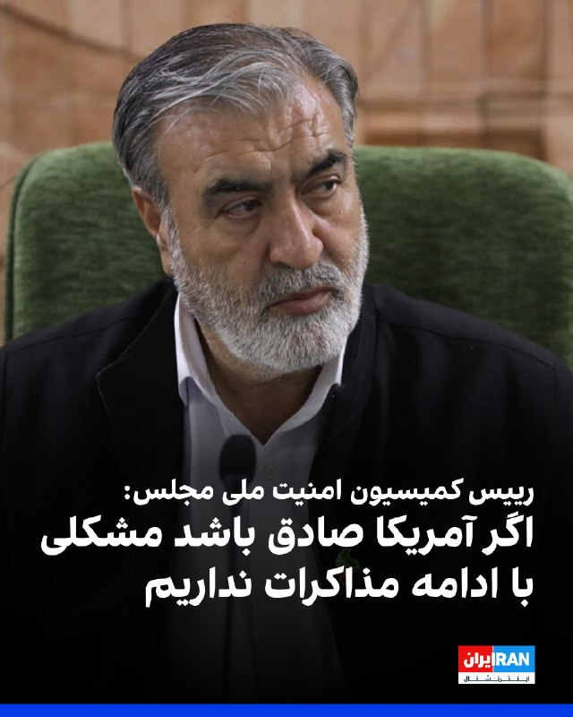

ابراهیم عزیزی، رییس کمیسیون امنیت ملی و سیاست خارجی مجلس، در گفت‌وگو با سی‌ان‌ان گفت تهران در اصل «مشکلی با ادامه مذاکرات صلح با آمریکا ندارد»، مشروط بر آنکه اطمینان یابد طرف آمریکایی صادقانه و با حسن نیت مذاکره می‌کند.
عزیزی همچنین اعلام کرد آمریکا در ابتدای مذاکرات با آزادسازی دارایی‌های مسدودشده جمهوری اسلامی موافقت کرده بود، اما تاکنون نشانه‌ای از تمایل واشینگتن برای اجرای این تعهد دیده نشده است.
او همچنین تاکید کرد مذاکرات کنونی شامل موضوعات مربوط به برنامه هسته‌ای ایران نیست و در پایان گفت امکان دستیابی به توافق نهایی به رفتار آمریکا بستگی دارد.
عزیزی اضافه کرد: «اگر این رفتارها ادامه پیدا کند، پاسخ منفی است؛ ما هیچ اعتمادی به طرف مقابل نداریم»
https://iranintl.com/202606085209

## FarsiVOA — post 220063

  <a href="telegram/content/FarsiVOA_220063_1780946644.mp4" target="_blank">🎬 Download video</a>

⚡️تهدید مردم توسط جمهوری اسلامی در مورد انتشار تصاویر مناطقی که مورد حمله واقع شده؛ گفتگو با سعید دهقان
@FarsiVOA

## DW_Farsi — post 125705

  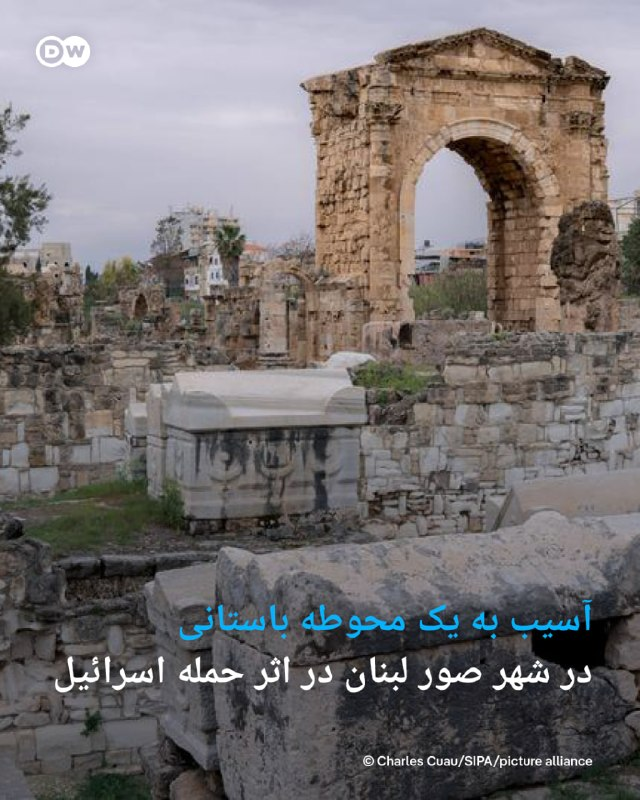

در پی حملات اسرائیل به شهر صور در لبنان، یک محوطه باستانی که در فهرست میراث جهانی یونسکو ثبت شده است نیز آسیب دید.

خبرنگاران خبرگزاری فرانسه (AFP) روز دوشنبه، ۸ ژوئن، آوار و خساراتی را در اطراف ویرانه‌های رومی صور مشاهده کردند که ناشی از حمله روز گذشته بود. غسان سلامه، وزیر فرهنگ لبنان، خواستار حفاظت از ویرانه‌های باستانی صور شد.

یونسکو پیش از این در ماه مارس و با توجه به جنگ [مرتبط با] ایران، "نگرانی عمیق" خود را در مورد وضعیت سایت‌های میراث جهانی در این منطقه ابراز کرده بود.

وزیر فرهنگ لبنان به خبرگزاری فرانسه گفت: «من خواستار آن هستم که محوطه‌های باستانی کشور هدف قرار نگیرند؛ به‌ویژه ویرانه‌های صور که به میراث مشترک بشریت تعلق دارند.» به گفته علی بدوی، مدیر منطقه‌ای محوطه‌های باستانی در وزارت فرهنگ لبنان، بمباران‌های اخیر "شدیدترین تأثیرات" را بر این محوطه تاریخی از زمان آغاز جنگ داشته است.

طبق اظهارات وی، ساختمان اداری این محوطه نیز مورد اصابت قرار گرفته است.

@dw_farsi

## RadioFarda — post 158071

ترامپ: به نتانیاهو گفتم مراقب کارهایی که می‌کنی باش؛ ممکن است در برابر ایران تنها بمانی

🔸رئیس‌جمهور آمریکا در مصاحبه با شبکه ۱۲ تلویزیون اسرائیل که دوشنبه شب پخش شد گفت که در پاسخ به درخواست پنج کشور منطقه تلاش کرده است واکنش اسرائیل به حملات تازه ایران را کنترل کند.

🔸دونالد ترامپ می‌گوید پنج کشور از او خواسته‌اند بنیامین نتانیاهو، نخست‌وزیر اسرائیل، را تحت فشار بگذارد.

🔸او گفت: «به بیبی گفتم بهتر است خیلی مراقب کارهایی که می‌کنی باشی، چون ممکن است به‌زودی در برابر ایران تنها بمانی».

🔸رئیس‌جمهور آمریکا افزود: «فکر می‌کنم ایران به امضای یک توافق علاقه‌مند است».

🔸در پی ادامه حملات اسرائیل به جنوب لبنان، ایران یکشنبه شب دست به حملاتی به خاک اسرائیل زد.

🔸بر اساس گزارش شبکه ۱۲، ترامپ در پی آغاز حملات، تلفنی با نخست‌وزیر اسرائیل تماس گرفته و از او خواسته است که به تنش دامن نزند؛ با این حال اسرائیل بدون تأییدیه دولت آمریکا به حمله ایران پاسخ داده است.

🔸در پی اعلام آمادگی ایران برای قطع حملات، ترامپ در یک تماس تلفنی دیگر به نتانیاهو گفته است: «کار خودت را کردی. حالا دیگر شلیک نکن. داریم به طرف یک توافق حرکت می‌کنیم».

🔸به گزارش شبکه ۱۲، این‌جا بود که اسرائیل در پاسخ به درخواست رئیس‌جمهور آمریکا دست از حمله برمی‌دارد.

@RadioFarda

## IranianMinds — post 21877

  

🔴 رئیس‌جمهور ترامپ از لیندزی گراهام، سناتور جمهوری خواه، حمایت کرد.

@IranianMinds

## Hranews — post 113475

پدر و نامادری دو دختر قربانی کودک آزاری در سنندج بازداشت شدند

❗️
❗️
❗️
❗️
❗️– دادستان عمومی و انقلاب مرکز استان کردستان از بازداشت پدر و نامادری دو دختر سنندجی که پیشتر این کودکان را مورد آزار و اذیت جسمی و روانی قرار داده بودند، خبر داد.

ادامه مطلب

#کودک_آزاری

↘️
@hranews_bot تماس ✉️ - @Hranews کانال هرانا 🆑

## alonews — post 126381

  <a href="telegram/content/alonews_126381_1780946646.webm" target="_blank">🎬 Download video</a>

👈وزارت خارجه آمریکا: آزادی اموال بلوکه شده، مادامی که ایران به تعهدات خود پایبند نشود، رخ نخواهد داد

🔴محاصره دریایی اعمال شده علیه ایران تا دست‌یابی به توافق پابرجا خواهد ماند

✅ @AloNews خبر جنگ

## alonews — post 126380

  <a href="telegram/content/alonews_126380_1780946646.mp4" target="_blank">🎬 Download video</a>

👈 تصاویری از حمله موشکی به مخفیگاه‌های جدایی‌طلبان در کردستان عراق

✅ @AloNews خبر جنگ

## alonews — post 126379

  <a href="telegram/content/alonews_126379_1780946647.mp4" target="_blank">🎬 Download video</a>

👈لبنان، صور

✅ @AloNews خبر جنگ

---
📅 بروزرسانی: 1405/03/18 22:43
---

## WithYashar — post 14061

برم اتاق جنگ رو پست کنم

## mwarmonitor — post 10491

💥شنیده شدن صدای انفجارها در اربیل، در شمال عراق.

## pm_afshaa — post 92971

  <a href="telegram/content/pm_afshaa_92971_1780946037.webm" target="_blank">🎬 Download video</a>

🔴عارف، معاون اول پزشکیان: اسرائیل ناچار به التماس مجدد برای پذیرش آتش‌بس از سوی ایران شد. 
💧 Rainbet.com the #1 Non-KYC Crypto Casino & Sportsbook @rainbetcom 
😁 @Pm_Afshaa

## pm_afshaa — post 92970

  <a href="telegram/content/pm_afshaa_92970_1780946038.webm" target="_blank">🎬 Download video</a>

🔴ترامپ: به درخواست جمهوری اسلامی با نتانیاهو تماس گرفتم تا حملات رو متوقف کنه. 
💧 Rainbet.com the #1 Non-KYC Crypto Casino & Sportsbook @rainbetcom 
😁 @Pm_Afshaa

## pm_afshaa — post 92969

  <a href="telegram/content/pm_afshaa_92969_1780946038.webm" target="_blank">🎬 Download video</a>

🔴قالیباف: انتخاب بین جنگ و مذاکره نیست. بلکه باید در زمان مناسب بجنگیم و در زمان مناسب مذاکره کنیم.

این گونه است که میتونیم دشمن رو شکست بدیم و این ایده رو که مذاکره ادامه مبارزه است، واقعی کنیم.

💧 Rainbet.com the #1 Non-KYC Crypto Casino & Sportsbook @rainbetcom

😁 @Pm_Afshaa

## VahidOnline — post 76083

  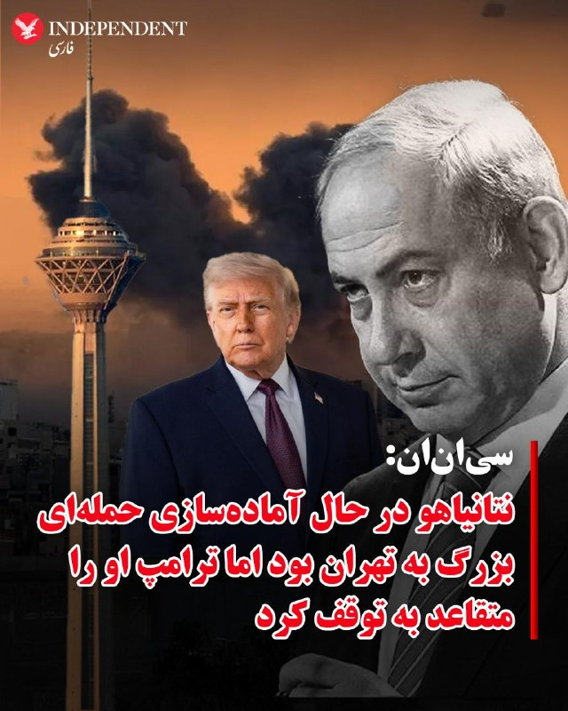

شبکه خبری سی‌ان‌ان، شامگاه دوشنبه ۱۸ خرداد ماه، به نقل از یک منبع اسرائیلی و یک مقام آمریکایی آگاه گزارش کرد اسرائیل در حال آماده شدن برای حمله‌ای گسترده به تهران بود، اما دونالد ترامپ، رئیس‌جمهوری آمریکا، در تماس تلفنی با بنیامین نتانیاهو از او خواست از انجام حملات تلافی‌جویانه بیشتر خودداری کند.

به گفته منبع اسرائیلی، ترامپ در این تماس از نتانیاهو خواست دامنه واکنش اسرائیل را محدود کند تا از تشدید تنش‌ها جلوگیری شود.

بر اساس این گزارش، نتانیاهو در نخستین تماس که شامگاه یکشنبه به وقت آمریکا انجام شد، در برابر درخواست ترامپ مقاومت کرد و اصرار داشت اسرائیل باید به حملات ایران پاسخ دهد.

با وجود اخطار ترامپ در گفتگوی یکشنبه شب، ارتش اسرائیل برخی اهداف را در ایران، از جمله یک مجتمع مهم پتروشیمی، هدف قرار داد.

این شبکه همچنین نوشت لحن گفتگوهای اخیر ترامپ و نتانیاهو به اندازه تماس‌های هفته گذشته تند نبوده است. به گزارش سی‌ان‌ان، در تماس‌های هفته گذشته تنش میان دو طرف به حدی رسیده بود که ترامپ با الفاظ تندی با نخست‌وزیر اسرائیل صحبت کرده بود.
@VahidOOnLine

📡 @VahidOnline

## VahidOnline — post 76082

  

محمدرضا عارف، معاون اول پزشکیان، درباره حملات موشکی اخیر جمهوری اسلامی به اسرائیل نوشت که دشمن در کوتاه‌ترین زمان ممکن ناچار به التماس مجدد برای پذیرش توقف آتش از سوی تهران شد.
@VahidOOnLine

📡 @VahidOnline

## FarsiVOA — post 220062

با گذشت چند ماه از کشتار معترضان در دی ماه ۱۴۰۴ هنوز ویدئوهای جدیدی از این جنایت منتشر می‌شود. در این ویدئو مردی بر بالای یک پیکر داخل کاور می‌گوید: بر باعث و بانی‌اش لعنت و در پاسخ به دعوت به احتیاط و محافظه‌کاری می‌گوید: آب از سر ما گذشته!

@FarsiVOA

## FarsiVOA — post 220061

🔺آمادگی گسترده نهادهای امنیتی آمریکا همزمان با نزدیک‌ شدن آغاز جام جهانی

◾️در آستانه آغاز جام جهانی فوتبال ۲۰۲۶، نهادهای مجری قانون در ایالات متحده از آماده‌باش گسترده امنیتی در شهرهای میزبان این کشور خبر داده‌اند؛ رویدادی که مقام‌های آمریکایی آن را از نظر وسعت، شمار تماشاگران و چالش‌های امنیتی، یکی از بزرگ‌ترین عملیات‌های حفاظتی در تاریخ ورزش آمریکا توصیف می‌کنند.

⬇️ بیشتر بخوانید:

https://ir.voanews.com/a/us-tightens-world-cup-security/8158583.html

## DW_Farsi — post 125704

  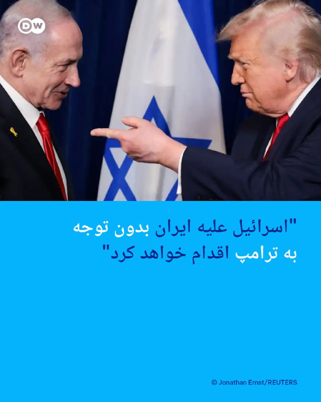

🔶 "اسرائیل علیه ایران بدون توجه به ترامپ اقدام خواهد کرد"

اسرائیل بدون توجه به درخواست ترامپ در خودداری از واکنش به حملات موشکی ایران، به‌طور مستقل دست به اقدام زد. آیا میان ترامپ و نتانیاهو در نحوه مقابله با جمهوری اسلامی اختلاف بروز کرده و اسرائیل راه دیگری را برگزیده است؟

ارتش اسرائیل صبح دوشنبه ۱۸ خرداد (هشتم ژوئن) اعلام کرد موج جدیدی از حملات موشکی ایران را شناسایی و رهگیری کرده است.

ساعاتی پس از آن اسرائیل نیز در یک حملاتی تلافی‌جویانه اهداف نظامی را در مرکز و غرب ایران هدف قرار داد. رسانه‌های ایران از شنیده شدن صدای انفجار در تهران، اصفهان، کرج و تبریز خبر دادند.

حملات جدید موشکی ایران خشم مقام‌های اسرائیل را برانگیخت. از مقام‌های دولتی گرفته تا اپوزیسیون خواستار واکنش شدید ارتش اسرائیل شدند. نفتالی بنت، نخست‌وزیر پیشین گفت "اسرائیل باید پاسخی قدرتمند و موثر به حمله موشکی بالستیک ایران بدهد."

@dw_farsi

## IranianMinds — post 21876

🔴نبویان نماینده مجلس:

ایران پیشنهاد واگذاری تنگه هرمز را داد.
بر اساس پیش‌نویس تفاهم، ایران باید ۳۰ روز ترتیباتی اتخاذ کند که رفت‌و‌آمد کشتی‌ها به حالت قبل از جنگ برگردد.
وضعیت اخذ عوارض مشخص نیست.
وظیفه مین‌روبی هم به ایران واگذار شده است.

@IranianMinds

## Hranews — post 113474

گزارشی از اجرای حکم اعدام ۶ زندانی در زندان‌های مختلف/ رهایی ۲ زندانی از مجازات مرگ

❗️
❗️
❗️
❗️
❗️– حکم شش زندانی که پیشتر از بابت اتهامات مرتبط با جرائم مواد مخدر و قتل به اعدام محکوم شده بودند، در زندان‌های خرم‌آباد، لاکان رشت و دستگرد اصفهان به اجرا درآمد. از سوی دیگر دو زندانی در اسدآباد همدان و بابل که پیشتر از بابت اتهام قتل به اعدام محکوم شده بودند، با گذشت اولیای دم از مجازات مرگ رهایی یافتند.

ادامه مطلب

#سیاوش_افراشته #نورمراد_فلاح‌نژاد #محمدقاسم_عبده‌وند #رحیم_قنبری #فرخ_امجدی #رضا_پدرام_اسیوند

↘️
@hranews_bot تماس ✉️ - @Hranews کانال هرانا 🆑

## alonews — post 126378

  <a href="telegram/content/alonews_126378_1780946041.webm" target="_blank">🎬 Download video</a>

👈شنیده شدن انفجار در اربیل عراق

✅ @AloNews خبر جنگ

## alonews — post 126376

👈تصاویر ماهواره‌ای Sentinel-2 نشان می‌دهد که به نظر می‌رسد یک موشک ایرانی به انباری در پایگاه هوایی رامات داوید در شمال اسرائیل اصابت کرده است

✅ @AloNews خبر جنگ

---
📅 بروزرسانی: 1405/03/18 22:34
---

## VahidOOnLine — post 244417

  

محمدرضا عارف، معاون اول پزشکیان، درباره حملات موشکی اخیر جمهوری اسلامی به اسرائیل نوشت که دشمن در کوتاه‌ترین زمان ممکن ناچار به التماس مجدد برای پذیرش توقف آتش از سوی تهران شد.

این در حالی است که پیش‌تر ترامپ به کانال ۱۲ اسرائیل گفت: «صبح دوشنبه ایرانی‌ها به ما گفتند دیگر حمله‌ای به اسرائیل انجام نمی‌دهند و خواستند ما به اسرائیل بگوییم حملات را متوقف کند. من با بی‌بی تماس گرفتم و او را متوقف کردم.»
‌🏁 🇬🇧 IranintlTV

🤖 @VahidOOnLine

## VahidOOnLine — post 244416

♦️شبکه خبری سی‌ان‌ان، شامگاه دوشنبه ۱۸ خرداد ماه، به نقل از یک منبع اسرائیلی و یک مقام آمریکایی آگاه گزارش کرد اسرائیل در حال آماده شدن برای حمله‌ای گسترده به تهران بود، اما دونالد ترامپ، رئیس‌جمهوری آمریکا، در تماس تلفنی با بنیامین نتانیاهو از او خواست از انجام حملات تلافی‌جویانه بیشتر خودداری کند.

به گفته منبع اسرائیلی، ترامپ در این تماس از نتانیاهو خواست دامنه واکنش اسرائیل را محدود کند تا از تشدید تنش‌ها جلوگیری شود.

بر اساس این گزارش، نتانیاهو در نخستین تماس که شامگاه یکشنبه به وقت آمریکا انجام شد، در برابر درخواست ترامپ مقاومت کرد و اصرار داشت اسرائیل باید به حملات ایران پاسخ دهد.

با وجود اخطار ترامپ در گفتگوی یکشنبه شب، ارتش اسرائیل برخی اهداف را در ایران، از جمله یک مجتمع مهم پتروشیمی، هدف قرار داد.

این شبکه همچنین نوشت لحن گفتگوهای اخیر ترامپ و نتانیاهو به اندازه تماس‌های هفته گذشته تند نبوده است. به گزارش سی‌ان‌ان، در تماس‌های هفته گذشته تنش میان دو طرف به حدی رسیده بود که ترامپ با الفاظ تندی با نخست‌وزیر اسرائیل صحبت کرده بود.
‌🇸🇦 Indypersian

🤖 @VahidOOnLine

## mwarmonitor — post 10490

🔴یک قاضی فدرال، الزام تعیین‌شده از سوی ترامپ برای پرداخت هزینه ۱۰۰ هزار دلاری درخواست ویزای H-1B را لغو کرد و حکم داد که او اختیار قانونی لازم برای اعمال این سیاست جدید را نداشته است. این برنامه توسط شرکت‌ها برای استخدام نیروهای خارجی بسیار ماهر در حوزه‌های تخصصی استفاده می‌شود. CNN

@mwarmonitor

## pm_afshaa — post 92968

  <a href="telegram/content/pm_afshaa_92968_1780945448.webm" target="_blank">🎬 Download video</a>

🔴خضریان، عضو کمیسیون امنیت ملی مجلس: خیلی عجیبه که افرادی در کشور از مذاکره دفاع میکنن در حالی که رئیس هیئت مذاکره‌کننده ایران میگه دشمن به مذاکره اعتقاد نداره.

💧 Rainbet.com the #1 Non-KYC Crypto Casino & Sportsbook @rainbetcom

😁 @Pm_Afshaa

## DEJradio — post 5483

  <a href="telegram/content/DEJradio_5483_1780945449.mp4" target="_blank">🎬 Download video</a>

🔺🎥 زنجان؛ ما از جنگ خسته شدیم
یک شهروند از استان زنجان با ارسال ویدیویی نوشت:
«این فیلم دیوارنویسی رو که دیشب تو زنجان دیدم و گرفتم رو براتون می‌فرستم شاید به‌دردتون بخوره.
این درد دل مردم ایران رو بیان می‌کنه که حکومتش قدرت دفاع از مردمشو نداره»...

#جنگ #زنجان
@DEJradio

## DEJradio — post 5482

  <a href="telegram/content/DEJradio_5482_1780945450.mp4" target="_blank">🎬 Download video</a>

🚨
🔸 خبر ۲۱
دوشنبه ۱۸ خرداد ۱۴۰۵

#خبر۲۱
@DEJradio

## IranIntlTV — post 341232

  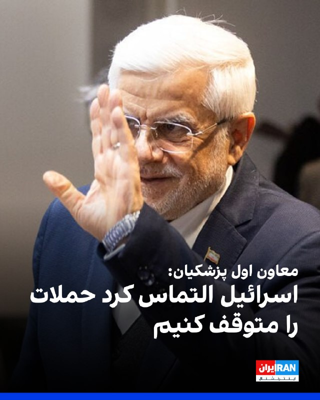

محمدرضا عارف، معاون اول پزشکیان، درباره حملات موشکی اخیر جمهوری اسلامی به اسرائیل نوشت که دشمن در کوتاه‌ترین زمان ممکن ناچار به التماس مجدد برای پذیرش توقف آتش از سوی تهران شد.

این در حالی است که پیش‌تر ترامپ به کانال ۱۲ اسرائیل گفت: «صبح دوشنبه ایرانی‌ها به ما گفتند دیگر حمله‌ای به اسرائیل انجام نمی‌دهند و خواستند ما به اسرائیل بگوییم حملات را متوقف کند. من با بی‌بی تماس گرفتم و او را متوقف کردم.»
https://iranintl.com/202606083905

## Shin_Persian — post 6765

  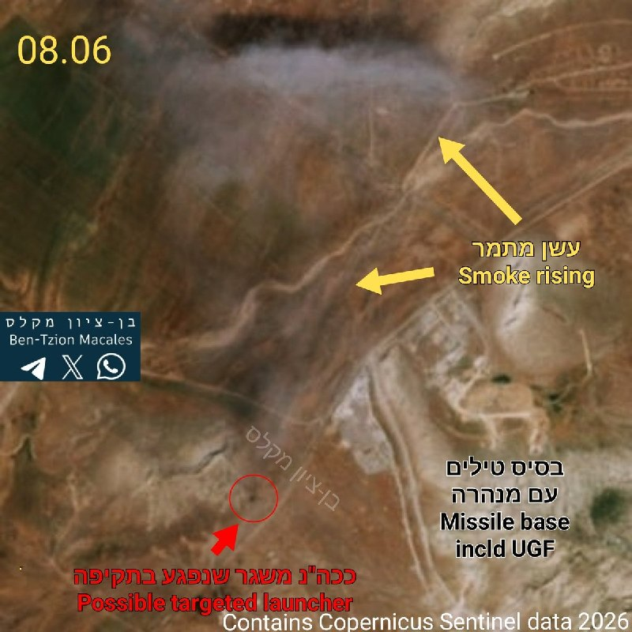

Ben Tzion Macales ✓ @BenTzionMacales Mon, 08 Jun 2026 18:37:35 UTC In a Sentinel-2 satellite imagery over western Iran, I identified a plume of smoke rising from a vehicle that caught fire following an apparent airstrike in the vicinity of the missile bases…

## Shin_Persian — post 6764

Ben Tzion Macales ✓ @BenTzionMacales
Mon, 08 Jun 2026 18:37:35 UTC

In a Sentinel-2 satellite imagery over western Iran, I identified a plume of smoke rising from a vehicle that caught fire following an apparent airstrike in the vicinity of the missile bases near Kermanshah.

At the same time, reports emerged of IAF strike waves across Iran, and the timing of the imagery aligns with reports indicating that missile-related targets were being engaged.

The proximity of the incident strongly suggests that the asset (a possible launcher) was associated with the nearby missile base. It appears that IAF aircraft struck it before it could be transferred into the underground facilities.

فارسی

در تصاویر ماهواره‌ای سنتینل-۲ (Sentinel-2) بر فراز غرب ایران، من ستونی از دود را شناسایی کردم که از خودرویی برمی‌خاست که پس از یک حمله هوایی ظاهراً در مجاورت پایگاه‌های موشکی نزدیک کرمانشاه دچار حریق شده است.

همزمان، گزارش‌هایی از موج‌های حملات نیروی هوایی اسرائیل (IAF) در سراسر ایران منتشر شد و زمان‌بندی تصاویر با گزارش‌هایی که نشان‌دهنده هدف قرار گرفتن اهداف مرتبط با موشکی بود، مطابقت دارد.

نزدیکی این حادثه به شدت نشان می‌دهد که آن دارایی (احتمالاً یک پرتابگر) با پایگاه موشکی مجاور در ارتباط بوده است. به نظر می‌رسد که هواپیماهای نیروی هوایی اسرائیل (IAF) پیش از آنکه این تجهیزات بتوانند به تاسیسات زیرزمینی منتقل شوند، آن‌ها را هدف قرار داده‌اند.

𝕏 · @shin_persian

## FarsiVOA — post 220060

🔺رسانه‌ اسرائیلی: پرزیدنت ترامپ به نتانیاهو درباره تشدید درگیری با رژیم ایران هشدار داده بود

◾️رسانه اسرائیلی «کانال ۱۲» می‌گوید دونالد ترامپ، رئیس جمهوری ایالات متحده، اعلام کرد طی روزهای اخیر به بنیامین نتانیاهو، نخست‌ وزیر اسرائیل، هشدار داده بود در صورت تشدید درگیری با جمهوری اسلامی، اسرائیل ممکن است خود را بدون حمایت کامل بین‌المللی و در شرایطی دشوارتر بیابد.

⬇️ بیشتر بخوانید:

https://ir.voanews.com/a/president-trump-warned-netanyahu-israel-left-alone-if-escalated-against-iran/8158593.html

## FarsiVOA — post 220059

علی جوانمردی: چرا پرزیدنت ترامپ جنگ ۱۶ ساعتە را متوقف کرد؟

## Persian_Trend_Official — post 16224

  <a href="telegram/content/Persian_Trend_Official_16224_1780945454.webm" target="_blank">🎬 Download video</a>

سنتکام: نفتکش Marivex را هدف قرار دادیم.

سنتکام با انتشار توییتی اعلام کرد یک جنگنده F-18 سوپر هورنت برخاسته از ناو هواپیمابر آبراهام لینکلن پس از اینکه نفتکش Marivex به هشدارها برای عدم حرکت به سمت بنادر تحت محاصره ایران توجه نکرد، هدف پرتابه قرار گرفت و از ادامه حرکت آن به سمت ایران جلوگیری شد.

📝 Amir

📌 @persian_trend_official
پرشین ترند | متفاوت‌ترین کانال نظامی

## alonews — post 126375

  <a href="telegram/content/alonews_126375_1780945454.webm" target="_blank">🎬 Download video</a>

👈خاویر بالاس ستون نویس بلومبرگ: سقوط آزاد ذخایر استراتژیک نفت آمریکا؛ در آستانه پایین‌ترین سطح ۴۰ سال گذشته

🔴 گزارش‌ها حاکی از آن است که با آزادسازی ۷.۹ میلیون بشکه دیگر از ذخایر استراتژیک نفت ایالات متحده (SPR)، حجم این ذخایر تا پنجم ژوئن به ۳۴۹.۲ میلیون بشکه افت کرده است.

🔴 این روند نزولی نشان می‌دهد که ذخایر استراتژیک آمریکا با سرعت به سمت رکورد ۳۴۶ میلیون بشکه در حرکت است؛ رقمی که پایین‌ترین سطح ثبت‌شده برای این ذخایر در ۴۰ سال اخیر (در دوران دولت بایدن) محسوب می‌شود.

✅ @AloNews خبر جنگ

## alonews — post 126374

  <a href="telegram/content/alonews_126374_1780945455.webm" target="_blank">🎬 Download video</a>

🔴فوری / نبویان، نماینده مجلس: ایران پیشنهاد واگذاری تنگه هرمز را داده

🔴بر اساس پیش‌نویس تفاهم ایران باید ظرف ۳۰ روز ترتیباتی اتخاد کند تا رفت و آمد کشتی‌ها به حالت قبل جنگ برگردد.

🔴وضعیت اخذ عوارض مشخص نیست.

🔴وظیفه مین‌روبی هم به ایران سپرده شده.

✅ @AloNews خبر جنگ

---
📅 بروزرسانی: 1405/03/18 22:24
---

## VahidOOnLine — post 244415

  <a href="telegram/content/VahidOOnLine_244415_1780944841.mp4" target="_blank">🎬 Download video</a>

♦️همزمان با حضور دونالد ترامپ، رئیس‌جمهوری آمریکا، در سومین رقابت نهایی لیگ بسکتبال حرفه‌ای آمریکا (NBA)، تدابیر امنیتی گسترده‌ای در اطراف ورزشگاه «مدیسن اسکوئر گاردن» (Madison Square Garden) در نیویورک به اجرا درآمده است.
دیدار سوم رقابت نهایی میان دو تیم نیویورک نیکس و سن‌آنتونیو اسپرز دوشنبه شب (به وقت محلی) در ورزشگاه مشهور مدیسن اسکوئر گاردن برگزار می‌شود. این نخستین بار در نزدیک به سه دهه گذشته است که نیویورک میزبان مسابقات فینال این رقابت‌ها می‌شود.
مقام‌های امنیتی آمریکا اعلام کرده‌اند محدوده‌ای امنیتی در اطراف این ورزشگاه ایجاد شده و برخی خیابان‌های اطراف آن به طور موقت بسته خواهند شد. ورود به این منطقه تنها برای تماشاگران دارای بلیت، مسافران ایستگاه مترو پن و افراد دارای مجوز امکان‌پذیر خواهد بود.
به گزارش روزنامه یو‌اس‌ای تو دی، به دلیل حضور ترامپ، برنامه تماشای عمومی مسابقه در فضای باز مقابل ورزشگاه نیز لغو شده است.
این تدابیر امنیتی پس از آن اعمال می شود که در کمتر از ۲۴ ساعت به حضور رئیس جمهوری آمریکا در ورزشگاه تاریخی نیویورک، شامگاه یکشنبه، وقوع حمله‌ای با چاقو در ایستگاه پن دست‌کم شش نفر را زخمی کرد. ایستگاه پن، یکی از شلوغ‌ترین ایستگاه‌های مترو منهتن است و دیوار به دیوار ورزشگاه مدیسن اسکوئر گاردن قرار دارد.
ترامپ در ماه‌های اخیر در چندین رویداد ورزشی مهم آمریکا از جمله مسابقات یو‌اف‌سی، سوپربول (مسابقه نهایی لیگ فوتبال آمریکایی حرفه‌ای آمریکا) و همچین رقابت پایانی جام باشگاه‌های فوتبال جهان حضور یافته است.
‌🇸🇦 Indypersian

🤖 @VahidOOnLine

## mwarmonitor — post 10489

🚨 یک رویداد امنیتی در پایگاه نظامی «فورت استوارت» در ایالت جورجیای آمریکا رخ داده است.

@mwarmonitor

## mwarmonitor — post 10488

« شهروندان عزیز اسرائیل،
یک سال پیش، ما یک حمله پیشگیرانه تاریخی را علیه برنامه ایران برای نابودی ما با بمب‌های اتمی آغاز کردیم.
ما این تهدید فوری را خنثی کردیم و همچنین دیکتاتور [آیت‌الله] خامنه‌ای را از میان برداشتیم.
اگر ما به موقع و با قدرت عمل نکرده بودیم، امروز اینجا نبودیم.
و من متعهد می‌شوم، و بار دیگر متعهد می‌شوم: ایران به سلاح هسته‌ای دست نخواهد یافت.
با همان قاطعیت، ما در برابر حزب‌الله نیز عمل کردیم. حزب‌الله برنامه داشت تا با هزاران تروریست به الجلیل (الجلیل در شمال اسرائیل) حمله کند و هم‌زمان قصد داشت با ۱۵۰ هزار راکت و موشک، شهرهای اسرائیل را نابود کند.
ما این تهدید را هم خنثی کردیم و [سید حسن] نصرالله را از میان برداشتیم.
و می‌خواهم به شما بگویم، جنگجویان قهرمان ما، چگونه بگویم؟ دارند حساب حزب‌الله را می‌رسند (تار و مارش می‌کنند).
ما به نابودی تمام زیرساخت‌های تروریستی آن‌ها در منطقه امنیتی ادامه می‌دهیم؛ از جمله تاسیسات زیرزمینی عظیمی در قلعه شقیف (بوفور) که آن‌قدر بزرگ هستند که نظیرشان را هرگز ندیده بودم.
ایران و حزب‌الله اکنون ضعیف‌تر از هر زمان دیگری هستند و ما قوی‌تر از هر زمان دیگری هستیم. اما نبرد ما با آن‌ها هنوز به پایان نرسیده است.
در ۲۴ ساعت گذشته، ایران و حزب‌الله تلاش کردند تا معادله جدیدی را به ما تحمیل کنند. این معادله از نظر من غیرقابل تحمل و غیرقابل قبول است.
آن‌ها فکر کردند که از خاک لبنان و ایران به سوی اسرائیل شلیک خواهند کرد و ما واکنشی نشان نخواهیم داد. این اتفاق نیفتاده و نخواهد افتاد؛ حداقل در دوران مسئولیت من.
همان‌طور که در طول دهه‌های گذشته انجام داده‌ام، من با قاطعیت بر حق ما برای اقدام علیه دشمنانمان ایستادگی می‌کنم.
ما اکنون نیز همین‌گونه عمل کردیم. پس از اینکه حزب‌الله به خاک اسرائیل شلیک کرد، من به ارتش اسرائیل (تزاهال) دستور دادم تا به اهداف تروریستی در بیروت حمله کند و فعالان حزب‌الله را در آنجا از بین ببرد؛ و ما این کار را انجام دادیم.
پس از اینکه ایران به اسرائیل حمله کرد، من به ارتش اسرائیل دستور دادم تا به اهداف نظامی و اقتصادی در سراسر ایران حمله کند؛ این کار را هم انجام دادیم.
در حال حاضر، آتش در این جبهه متوقف شده است؛ زیرا پس از ضربه‌ای که به رژیم تروریستی در تهران وارد کردیم، آن‌ها از حمله به ما دست کشیدند. در صورتی که این رژیم تروریستی مرتکب اشتباه شود و دوباره به ما حمله کند، ما با قدرت پاسخ خواهیم داد.
چرا که اسرائیل از حق کامل دفاع از خود برخوردار است و ما هر زمان که نیاز باشد، این حق را اعمال خواهیم کرد.
من این را به شما شهروندان عزیز اسرائیل می‌گویم، همان‌طور که این موضوع را با تقدیر و احترام در گفتگوهای خوبم با دوستم، رئیس‌جمهور ترامپ مطرح کرده‌ام.
با اتحاد، قاطعیت و خرد، از دولت اسرائیل محافظت خواهیم کرد و با هم به یاری خدا، امنیت را به شمال بازخواهیم گرداند. »

@mwarmonitor

## mwarmonitor — post 10487

  <a href="telegram/content/mwarmonitor_10487_1780944842.mp4" target="_blank">🎬 Download video</a>

🎬 Video

## pm_afshaa — post 92967

  <a href="telegram/content/pm_afshaa_92967_1780944845.webm" target="_blank">🎬 Download video</a>

🔴ترامپ: به درخواست جمهوری اسلامی با نتانیاهو تماس گرفتم تا حملات رو متوقف کنه.

💧 Rainbet.com the #1 Non-KYC Crypto Casino & Sportsbook @rainbetcom

😁 @Pm_Afshaa

## IranIntlTV — post 341231

  <a href="telegram/content/IranIntlTV_341231_1780944845.mp4" target="_blank">🎬 Download video</a>

مهدی مهدوی‌آزاد در برنامه «چشم‌انداز» گفت: «سال‌هاست این پرسش مطرح است که چرا منابع کشور، بیت‌المال و ثروت مردم ایران باید صرف گروه‌هایی در خارج از مرزها شود. اگر واقعا به حق‌الناس و بیت‌المال باور دارید، چه حقی دارید که این منابع را برای حزب‌الله لبنان یا دیگر نیروهای نیابتی هزینه کنید؟ چه حقی دارید سیاستی را دنبال کنید که بخش بزرگی از مردم با آن مخالف‌اند؟»
@iranintltv

## FarsiVOA — post 220057

⚡️همزمان با از سرگیری حملات متقابل اسرائیل و جمهوری اسلامی، تحریم‌های جدید اتحادیه اروپا اعلام شد

## Dirty_Kids — post 391408

  

قماربازه؟ جنده‌بازهه؟ قاتل آقاست؟ این ده روز رو می‌خواد امام حسینی باشه.

@Dirty_Kids 👻

## alonews — post 126373

  <a href="telegram/content/alonews_126373_1780944848.mp4" target="_blank">🎬 Download video</a>

👈خضریان، عضو کمیسیون امنیت ملی مجلس: خیلی عجیب است که افرادی در کشور از مذاکره دفاع می‌کنند در حالی که رئیس هیئت مذاکره‌کننده ایران می‌گوید دشمن به مذاکره اعتقاد ندارد

✅ @AloNews خبر جنگ

## alonews — post 126372

  <a href="telegram/content/alonews_126372_1780944851.webm" target="_blank">🎬 Download video</a>

👈میشل عون به سی‌ان‌ان: ما به دنبال رابطه خوب با ایران هستیم، اما نباید در امور ما دخالت کند و کشور ما را به خاطر منافع خود نابود کند

✅ @AloNews خبر جنگ

## alonews — post 126371

  <a href="telegram/content/alonews_126371_1780944851.webm" target="_blank">🎬 Download video</a>

👈روسیه: پیش‌نویس قطعنامه آمریکا علیه ایران شرم‌آور است

✅ @AloNews خبر جنگ

---
📅 بروزرسانی: 1405/03/18 22:13
---

## VahidOOnLine — post 244414

  

شاهزاده رضا پهلوی در واکنش به حملات یک‌شنبه و دوشنبه جمهوری اسلامی به اسرائیل نوشت جمهوری اسلامی با حمایت از حزب‌الله لبنان درگیری نظامی دیگری را آغاز کرده تا به گفته او ماهیت ناایرانی و ضدایرانی خود را آشکارتر کند و ملت ایران را به گروگان گرفته است.

او افزود در این درگیری نیز، همانند گذشته، مسئول هرگونه آسیب به زیرساخت‌های ایران و جان غیرنظامیان بی‌گناه در هر دو سو جمهوری اسلامی است.

شاهزاده رضا پهلوی تاکید کرد ملت ایران که نخستین و بزرگ‌ترین قربانی این حکومت بوده، می‌داند تا زمانی که جمهوری اسلامی بر سر کار باشد، ترور، خشونت و بی‌ثباتی بر ایران، منطقه و جهان سایه خواهد انداخت و صلح و امنیت پایدار تنها با پایان این حکومت امکان‌پذیر است.

او همچنین گفت راه‌حل، مذاکره با سپاه پاسداران و «تروریست‌های» اشغالگر ایران نیست، بلکه ایستادن در کنار ملت ایران و حمایت از مبارزه آن برای پایان دادن به جمهوری اسلامی است.
‌🏁 🇬🇧 IranintlTV

🤖 @VahidOOnLine

## IranIntlTV — post 341230

  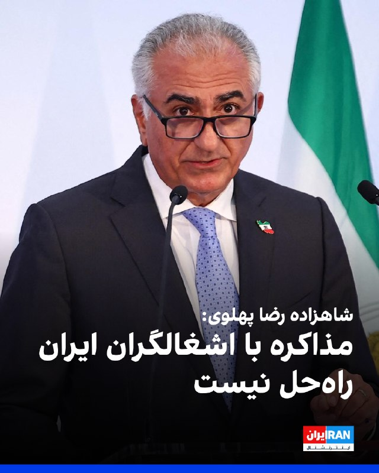

شاهزاده رضا پهلوی در واکنش به حملات یک‌شنبه و دوشنبه جمهوری اسلامی به اسرائیل نوشت جمهوری اسلامی با حمایت از حزب‌الله لبنان درگیری نظامی دیگری را آغاز کرده تا به گفته او ماهیت ناایرانی و ضدایرانی خود را آشکارتر کند و ملت ایران را به گروگان گرفته است.

او افزود در این درگیری نیز، همانند گذشته، مسئول هرگونه آسیب به زیرساخت‌های ایران و جان غیرنظامیان بی‌گناه در هر دو سو جمهوری اسلامی است.

شاهزاده رضا پهلوی تاکید کرد ملت ایران که نخستین و بزرگ‌ترین قربانی این حکومت بوده، می‌داند تا زمانی که جمهوری اسلامی بر سر کار باشد، ترور، خشونت و بی‌ثباتی بر ایران، منطقه و جهان سایه خواهد انداخت و صلح و امنیت پایدار تنها با پایان این حکومت امکان‌پذیر است.

او همچنین گفت راه‌حل، مذاکره با سپاه پاسداران و «تروریست‌های» اشغالگر ایران نیست، بلکه ایستادن در کنار ملت ایران و حمایت از مبارزه آن برای پایان دادن به جمهوری اسلامی است.
https://iranintl.com/202606083512

## IranIntlTV — post 341229

  <a href="telegram/content/IranIntlTV_341229_1780944228.mp4" target="_blank">🎬 Download video</a>

۲۴ با فرداد فرحزاد
@iranintltv

## FarsiVOA — post 220056

⚡️ترامپ: پیگیر مذاکرات نهایی برای تحقق صلحم و خواستار توقف فوری جنگ اسرائیل و جمهوری اسلامی هستم

## DW_Farsi — post 125703

  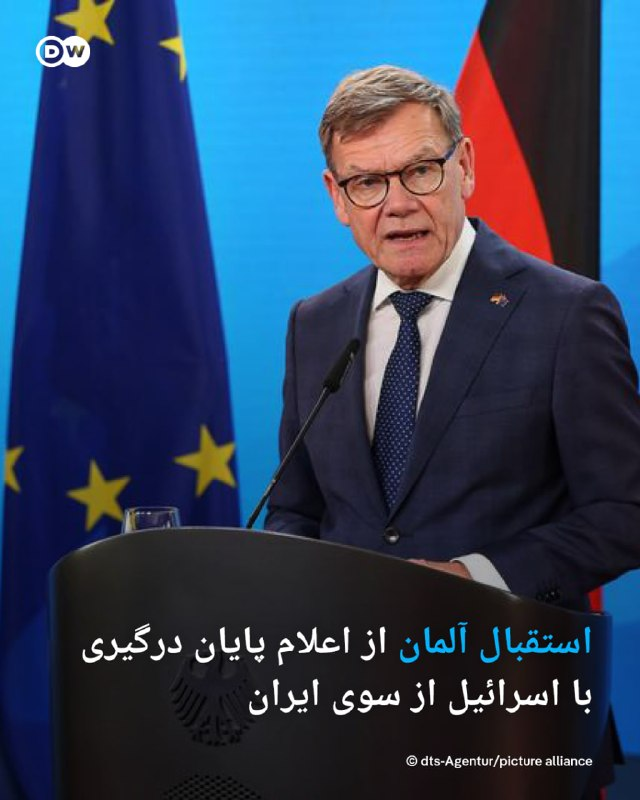

🔶 استقبال آلمان از اعلام پایان درگیری با اسرائیل از سوی ایران

یوهان واده‌فول، وزیر امور خارجه آلمان، از اعلام ایران درباره پایان حملات به اسرائیل استقبال کرد.

این سیاستمدار حزب دموکرات مسیحی آلمان (CDU) در جریان دیدار با پنی وونگ، همتای استرالیایی خود، در برلین گفت: «اعلامیه امروز ایران مبنی بر اینکه حملات پایان یافته‌اند، می‌تواند گامی در مسیر درست باشد. اکنون با دقت بررسی خواهیم کرد که این اظهارات تا چه اندازه قابل اتکا و پایدار هستند.»

او همزمان از رهبران تهران خواست نفوذ خود بر شبه‌نظامیان حزب‌الله در لبنان را افزایش دهند تا حملات این گروه به اسرائیل متوقف شود.

واده‌فول افزود: «پیش‌شرط هرگونه آرامش و صلح پایدار، آمادگی برای مذاکره است.»

وی همچنین تأکید کرد که دولت آلمان به‌صراحت از تلاش‌های ایالات متحده برای دستیابی به یک راه‌حل دیپلماتیک حمایت می‌کند.

به گفته او، آلمان از همه طرف‌های درگیر می‌خواهد که از شعله‌ور شدن دوباره درگیری‌های نظامی و جنگی جلوگیری کنند.

@dw_farsi

## DW_Farsi — post 125702

  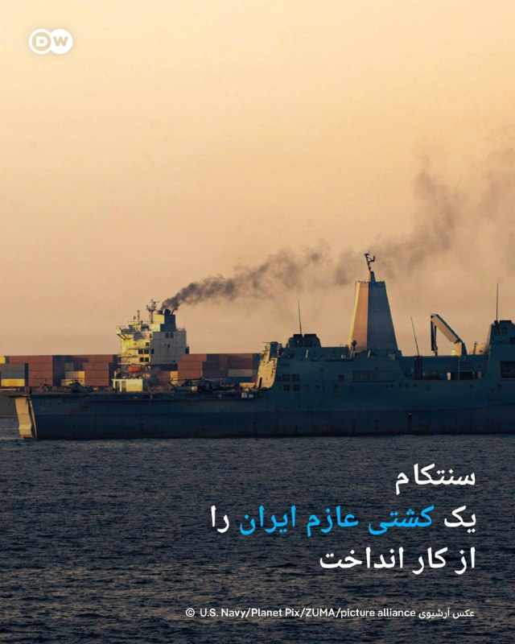

🔶سنتکام یک کشتی عازم ایران را از کار انداخت

نیروهای آمریکایی روز دوشنبه، ۸ ژوئن، یک نفت‌کش خالی (بدون بار) را در دریای عمان متوقف و از کار انداختند. به گفته نیروهای آمریکایی این نفت‌کش با تلاش برای حرکت به سمت یک بندر ایرانی، محاصره جاری علیه ایران را نقض کرد.

فرماندهی مرکزی آمریکا (سنتکام) در اطلاعیه‌ای نوشت که نفت‌کش ام/تی ماریوِکس (M/T Marivex) با پرچم پالائو را در حالی که در آب‌های بین‌المللی دریای عمان به سمت ایران در حال حرکت بود، از کار انداخت.

بنا بر این اطلاعیه پس از آنکه خدمه کشتی از دستورات نیروهای آمریکایی سرپیچی کردند، یک جنگنده اف/ای-۱۸ سوپر هورنت (F/A-18 Super Hornet) از عرشه ناو هواپیمابر یواس‌اس آبراهام لینکلن (CVN 72)، یک مهمات هدایت‌شونده دقیق را به سمت بخش مهندسی و هدایت (اتاق سکان) این کشتی شلیک کرد. نفت‌کش ماریوکس دیگر به سمت ایران حرکت نمی‌کند.

@dw_farsi

## IranianMinds — post 21875

🔴 سفارت رژیم جمهوری اسلامی در بیروت:

لبنان قلب ایران است!

@IranianMinds

## BBCPersian — post 283208

🔻رسانه‌های ایران از تبادل آتش با اسرائیل چه می‌گویند؟

رسانه‌های ایران از جمله رسانه‌های نزدیک به نهادهای نظامی و امنیتی درباره تبادل آتش با اسرائیل گزارش‌هایی را منتشر کرده‌اند.

به گفته این رسانه‌ها در حملات اول که در آخرین ساعت‌های یکشنبه به شمال اسرائیل شد از «نسل آخر خیبرشکن» و در حملات صبح دوشنبه از «موشک‌های عماد، قدر اف و خیبرشکن» استفاده شده است.

رسانه‌های ایران همچنین می‌گویند یک «پهپاد متخاصم در غرب تهران» رهگیری و منهدم شده است.

به گفته شبکه خبر ایران، جز پتروشیمی کارون ماهشهر، پنج مرکز نظامی، یک سایت پدافندی و دانشکده عاشورا هدف قرار گرفته‌اند.

دانشگاه علوم و فنون هوافضا عاشورای دانشگاه افسری وابسته به نیروی هوافضای سپاه است.

هم ایران هم اسرائیل می‌گویند کسی در حملات کشته نشده است.

https://bbc.in/4uS2DpO
@BBCPersian

## Dirty_Kids — post 391407

  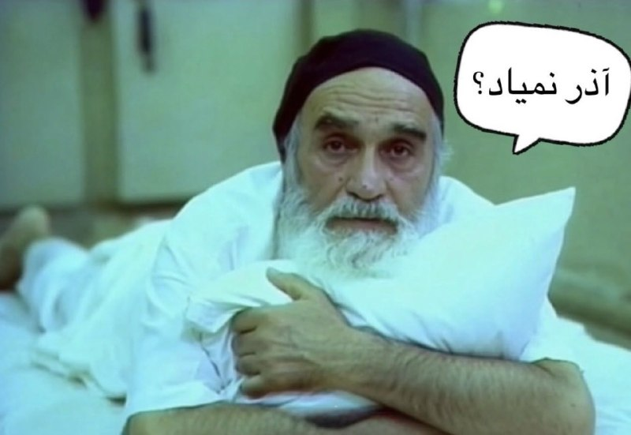

قالیباف و پزشکیان رو نزنین، آذر رو ترور کنین بیاد پیش خودم.

@Dirty_Kids 👻

## alonews — post 126370

  <a href="telegram/content/alonews_126370_1780944231.mp4" target="_blank">🎬 Download video</a>

👈 جنوب لبنان پس از حملات اسرائیل

✅ @AloNews خبر جنگ

---
📅 بروزرسانی: 1405/03/18 22:03
---

## VahidOOnLine — post 244413

  

اسماعیل قاآنی، فرمانده نیروی قدس سپاه پاسداران، در واکنش به شلیک موشک از یمن به سمت اسرائیل، در پیامی نوشت که اقدام یمن نشان از هوشمندی جبهه مقاومت دارد؛ اگر لازم شد دیگران نیز می‌آیند.
او افزود: از تنگه هرمز تا باب‌المندب و از خلیج فارس تا دریای سرخ کمربند امنیتی جدید مقاومت خواهد بود. حملات اسرائیل و آمریکا در این منطقه عکس‌العمل جبهه متحد مقاومت را در پی خواهد داشت.
‌🏁 🇬🇧 IranintlTV

🤖 @VahidOOnLine

## VahidOOnLine — post 244412

  <a href="telegram/content/VahidOOnLine_244412_1780943630.mp4" target="_blank">🎬 Download video</a>

♦️بنیامین نتانیاهو، نخست‌وزیر اسرائیل، در پیامی ویدیویی که پس از درگیری نظامی اخیر میان ایران و اسرائیل منتشر شد، گفت پس از حمله ایران، به ارتش اسرائیل دستور داده است اهداف نظامی و اقتصادی را در سراسر ایران هدف قرار دهد.
نتانیاهو گفت: «پس از اینکه ایران به اسرائیل حمله کرد، من به ارتش دستور دادم که اهداف نظامی و اقتصادی را در سراسر ایران هدف قرار دهد. این کار را هم انجام دادیم.»
او در ادامه مدعی شد حملات اسرائیل باعث توقف حملات ایران شده است و افزود: «در حال حاضر، آتش در این جبهه متوقف شده است، زیرا پس از ضربه‌ای که به رژیم در تهران وارد کردیم، او از حمله به ما دست کشید.»
نخست‌وزیر اسرائیل همچنین هشدار داد در صورت ازسرگیری حملات از سوی جمهوری اسلامی، اسرائیل با شدت بیشتری واکنش نشان خواهد داد.
او گفت: «اگر دوباره به ما حمله کنند، با قدرت پاسخ خواهیم داد؛ زیرا اسرائیل حق کامل دفاع از خود را دارد و هر زمان که لازم باشد، این حق را اعمال خواهد کرد.»
‌🇸🇦 Indypersian

🤖 @VahidOOnLine

## WithYashar — post 14060

استان یزد فردا تعطیل شد
@withyashar

## WithYashar — post 14059

ترامپ: جمهوری اسلامی از ما خواست تا اسرائیل حملاتش به ایران را متوقف کند
@withyashar
جمهوری اسلامی هم میگه آمریکا خواست 🤣

## IranIntlTV — post 341228

  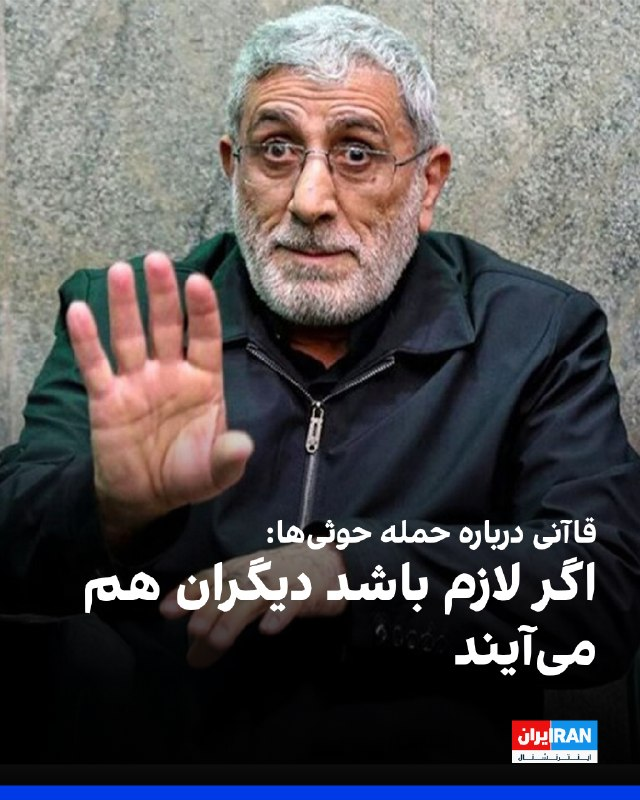

اسماعیل قاآنی، فرمانده نیروی قدس سپاه پاسداران، در واکنش به شلیک موشک از یمن به سمت اسرائیل، در پیامی نوشت که اقدام یمن نشان از هوشمندی جبهه مقاومت دارد؛ اگر لازم شد دیگران نیز می‌آیند.
او افزود: از تنگه هرمز تا باب‌المندب و از خلیج فارس تا دریای سرخ کمربند امنیتی جدید مقاومت خواهد بود. حملات اسرائیل و آمریکا در این منطقه عکس‌العمل جبهه متحد مقاومت را در پی خواهد داشت.
https://iranintl.com/202606088480

## IranIntlTV — post 341227

  <a href="telegram/content/IranIntlTV_341227_1780943632.mp4" target="_blank">🎬 Download video</a>

بنیامین نتانیاهو گفت: «در شبانه‌روز گذشته، ایران و حزب‌الله تلاش کردند معادله‌ای جدید و غیرقابل‌تحمل را به ما تحمیل کنند. آن‌ها تصور کردند می‌توانند از خاک لبنان و ایران به اسرائیل شلیک کنند و ما واکنشی نشان ندهیم. اما این اتفاق نیفتاد و هرگز هم نخواهد افتاد.»

او افزود: «ما ضربات سنگینی به حزب‌الله وارد کرده‌ایم و به نابودی تمام زیرساخت‌های تروریستی آن‌ها در منطقه امنیتی ادامه می‌دهیم. ایران و حزب‌الله امروز ضعیف‌تر از همیشه‌اند و ما قوی‌تر از همیشه، اما نبرد با آنها هنوز به پایان نرسیده است.»
@iranintltv

## IranIntlTV — post 341226

  <a href="https://t.me/IranintlTV/341226" target="_blank">📎 Download file</a>

🎧نسخه صوتی تیتراول با نیوشا صارمی: هشدار نتانیاهو به تهران: حمله به اسرائیل بی‌پاسخ نمی‌ماند؛ کار ما تمام نشده
@iranintlTV

## IranIntlTV — post 341225

  <a href="telegram/content/IranIntlTV_341225_1780943634.mp4" target="_blank">🎬 Download video</a>

نظارت بر سلامت محصولات دامی غیرخام و فرآوری‌شده در ایران از سازمان دامپزشکی به سازمان غذا و دارو منتقل می‌شود. نیما بهرامی، دامپزشک و پژوهشگر، در این باره گفت: «هدف اصلی خدمت به مردم نیست، بلکه منافع اقتصادی برخی گروه‌ها در میان است.»

او افزود: «نظام سلامت ما به جای آنکه پیشگیری‌محور باشد، درمان‌محور است، زیرا سود اقتصادی در درمان نهفته است؛ در حالی که برای جامعه، پیشگیری بسیار کم‌هزینه‌تر و موثرتر است.»
@iranintltv

## FarsiVOA — post 220055

  <a href="telegram/content/FarsiVOA_220055_1780943636.mp4" target="_blank">🎬 Download video</a>

برادر سیاوش منصوری‌نژاد، از کشته‌شدگان دی ماه ۱۴۰۴، بعد از بازگشایی محدود اینترنت در ایران، ویدیویی از سوگواری بر آرامگاه سیاوش منتشر کرده است.

سیاوش منصوری‌نژاد، ۳۰ ساله، مکانیک، ۱۹ دی ۱۴۰۴ با شلیک گلوله ماموران حکومتی به سینه‌اش در مهرشهر کرج کشته شد.

نسخه اصلی این ویدیو با موسیقی متن منتشر شده است.

## Persian_Trend_Official — post 16223

  <a href="telegram/content/Persian_Trend_Official_16223_1780943638.mp4" target="_blank">🎬 Download video</a>

تصویری واضح تر از سوله منهدم شده در پایگاه رامات دیوید

📝 Amir

📌 @persian_trend_official
پرشین ترند | متفاوت‌ترین کانال نظامی

## Dirty_Kids — post 391406

  <a href="telegram/content/Dirty_Kids_391406_1780943639.mp4" target="_blank">🎬 Download video</a>

این دخترا چشونه؟! یه دو دیقه نجنگید ببینیم تکلیف جنگ چی میشه

@Dirty_Kids 👻

## Hranews — post 113473

گزارشی از معوقات مزدی، بیمه ای و بیکاری کارگران کارخانه تولی پرس قزوین

❗️
❗️
❗️
❗️
❗️– حدود ۱۰۸ #کارگر کارخانه تولی پرس قزوین پس از تعطیلی این کارخانه در بلاتکلیفی شغلی به سر می‌برند. این کارگران از عدم پرداخت چندین ماه حق بیمه و مطالبات مزدی خود ابراز نارضایتی کرده و خواستار بازگشت به کار هستند.

ادامه مطلب

↘️
@hranews_bot تماس ✉️ - @Hranews کانال هرانا 🆑

## alonews — post 126369

  <a href="telegram/content/alonews_126369_1780943639.webm" target="_blank">🎬 Download video</a>

👈عارف: دشمن ناچار به التماس مجدد برای آتش‌بس شد

✅ @AloNews خبر جنگ

## alonews — post 126368

  <a href="telegram/content/alonews_126368_1780943639.mp4" target="_blank">🎬 Download video</a>

👈تصویر آخرالزمانی از زلزله ۷/۸ ریشتری‌ فیلیپین؛ این ۳ ساختمان متصل به هم از یکدیگر جدا شدند و آب استخر به پایین می‌ریزد

✅ @AloNews خبر جنگ

## alonews — post 126367

  <a href="telegram/content/alonews_126367_1780943641.webm" target="_blank">🎬 Download video</a>

👈استان یزد فردا تعطیل شد

✅ @AloNews خبر جنگ

---
📅 بروزرسانی: 1405/03/18 21:53
---

## VahidOOnLine — post 244411

  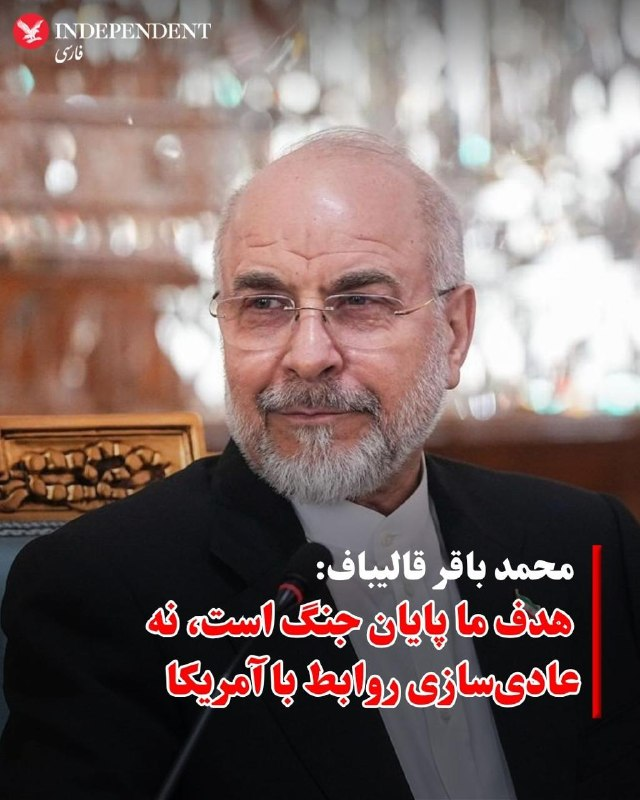

♦️محمدباقر قالیباف، رئیس مجلس شورای اسلامی و مذاکره کننده ارشد ایران در گفتگوهای پایان جنگ،، در پیام صوتی اعلام کرد هدف جمهوری اسلامی پایان جنگ و ایجاد امنیت پایدار است، نه عادی‌سازی روابط با آمریکا.

قالیباف در این پیام که روز دوشنبه ۱۸ خرداد از رسانه‌های دولتی ایران منتشر شد، گفت: «هدف ما پایان جنگ و ایجاد امنیت پایدار است و نه عادی‌سازی روابط با آمریکا و اعتمادی هم به طرف مقابل نداریم.»

او در ادامه تاکید کرد جمهوری اسلامی جنگ و مذاکره را دو مسیر متضاد نمی‌داند و افزود: «قرار نیست یا جنگ کنیم و یا مذاکره؛ بلکه قرار است به وقت خود جنگ کنیم و به وقت خود مذاکره کنیم.»

رئیس مجلس همچنین گفت «مذاکره ادامه مبارزه است» و جمهوری اسلامی تلاش می‌کند با استفاده همزمان از ظرفیت‌های نظامی و دیپلماتیک، اهداف خود را پیش ببرد.

قالیباف با رد گمانه‌زنی‌ها درباره اختلاف میان مقام‌های جمهوری اسلامی، گفت هماهنگی کامل میان مسئولان برای رسیدن به اهداف مورد نظر وجود دارد و نیروهای مسلح نیز بر اساس تصمیم‌های اتخاذشده و برنامه‌ریزی‌های انجام‌شده عمل می‌کنند.
‌🇸🇦 Indypersian

🤖 @VahidOOnLine

## WithYashar — post 14058

## IranIntlTV — post 341224

  <a href="telegram/content/IranIntlTV_341224_1780943026.mp4" target="_blank">🎬 Download video</a>

فرزین ندیمی، پژوهشگر ارشد امور دفاعی و امنیتی، درباره موفقیت جمهوری اسلامی در ایجاد موازنه جدید با حملات موشکی به اسرائیل گفت: «هدف اولیه ایران این بود که حمله به لبنان را به منزله حمله به ایران نشان دهد، اما اینکه این راهبرد در ادامه موفق باشد یا نه، به تحولات بعدی بستگی دارد.

او افزود: «به نظر می‌رسد جمهوری اسلامی با حملات موشکی اخیر دو هدف را دنبال کرده است: نخست، ایجاد بازدارندگی و جلوگیری از ادامه حملات اسرائیل به بیروت و جنوب لبنان؛ و دوم، بازسازی اعتبار خود نزد متحدانش، به‌ویژه حزب‌الله، که در ماه‌های اخیر آسیب دیده است.»
@iranintltv

## FarsiVOA — post 220054

🔺دیدار مقامات بلندپایه لبنان با سفیر آمریکا با تاکید بر ادامه مذاکرات با اسرائیل

◾️در ادامه تحرک سیاسی ایالات متحده آمریکا در لبنان و تأکید بر وضعیت مستقل این کشور از فرآیند مذاکرات ایران و آمریکا، میشل عیسی، سفیر آمریکا در لبنان، روز دوشنبه ۱۸ خرداد، به طور جداگانه با جوزف عون، رئیس‌ جمهوری، نواف سلام، نخست‌وزیر، و نبیه بری، رئیس پارلمان لبنان، دیدار و گفت‌و‌گو کرد.

⬇️ بیشتر بخوانید:

https://ir.voanews.com/a/israel-hezbollah-irgc-war-terrorism/8158552.html

## FarsiVOA — post 220053

⚡️در گفت‌وگو با مهرداد خوانساری، دیپلمات پیشین ایران در سازمان ملل، به موضوع توقف عملیات نظامی جمهوری اسلامی علیه اسرائیل پس از پیام پرزیدنت ترامپ پرداختیم.

## DW_Farsi — post 125701

  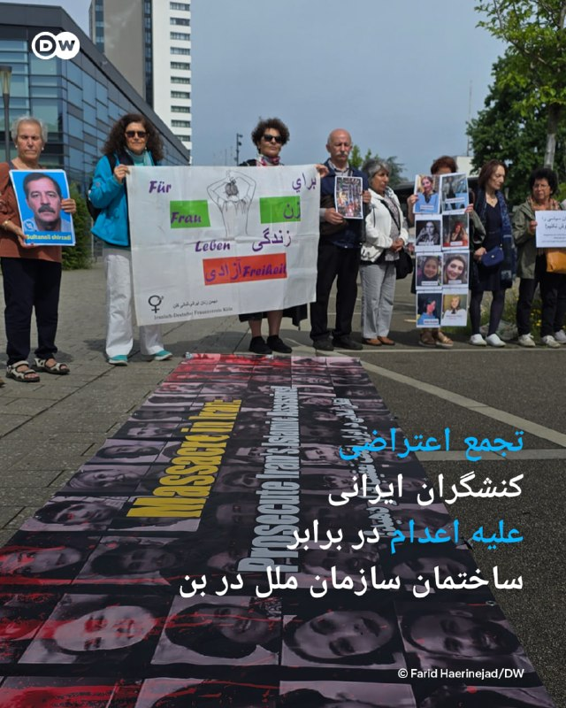

🔶 تجمع اعتراضی کنشگران ایرانی علیه اعدام در برابر ساختمان سازمان ملل در بن

حدود ۳۰ نفر از فعالان و کنشگران ایرانی روز یکشنبه ۷ ژوئن در برابر ساختمان سازمان ملل متحد در شهر بن آلمان گرد هم آمدند تا نسبت به موج اعدام‌ها و وضعیت زندانیان در معرض اعدام در ایران اعتراض کنند.

این تجمع به دعوت "اتحاد کلن برای همبستگی با مبارزات مردم در ایران" برگزار شد؛ ائتلافی متشکل از گروه‌ها و فعالان با گرایش‌های مختلف دموکرات، لیبرال، چپ و مدافع حقوق زنان.

شرکت‌کنندگان پس از سخنرانی‌هایی به زبان‌های فارسی و آلمانی، نامه‌ای خطاب به شورای حقوق بشر سازمان ملل متحد را به همراه فهرستی از زندانیان در معرض اعدام به مسئولان سازمان ملل تحویل دادند و خواستار اقدام فوری این نهاد برای توقف اعدام‌ها در ایران شدند.

در این نامه آمده است که دست‌کم ۲۱۵۹ نفر در سال ۲۰۲۵ در ایران اعدام شده‌اند و تا پایان ماه مه ۲۰۲۶ نیز دست‌کم ۷۵۷ مورد اعدام ثبت شده است. همچنین در این نامه از وجود ۳۷۱ زندانی سیاسی، از جمله ۶۶ زن، خبر داده شده که یا به اعدام محکوم شده‌اند یا در معرض خطر فوری اجرای حکم اعدام قرار دارند.

@dw_farsi

## Persian_Trend_Official — post 16222

  <a href="telegram/content/Persian_Trend_Official_16222_1780943028.webm" target="_blank">🎬 Download video</a>

سردار قاآنی: از تنگه هرمز تا باب‌المندب و از خلیج فارس تا دریای سرخ کمربند امنیتی جدید مقاومت خواهد بود.

شرارت‌های رژیم صهیونی و آمریکا در منطقه عکس‌العمل جبهه متحد مقاومت را درپی خواهد داشت.

📝 Amir

📌 @persian_trend_official
پرشین ترند | متفاوت‌ترین کانال نظامی

## Persian_Trend_Official — post 16219

  <a href="telegram/content/Persian_Trend_Official_16219_1780943028.webm" target="_blank">🎬 Download video</a>

تصاویر ماهواره ای جدید از پایگاه هوایی رامات دیوید نشان میدهد که دست کم یک موشک ایرانی طی حملات شب گذشته به یک سوله در این پایگاه اصابت کرده است.

اسرائیل ادعا داشت تمامی موشک های شلیک شده رهگیری و تعدادی به محیط باز اصابت کرده اند.

📝 Amir

📌 @persian_trend_official
پرشین ترند | متفاوت‌ترین کانال نظامی

## Dirty_Kids — post 391405

  <a href="telegram/content/Dirty_Kids_391405_1780943029.mp4" target="_blank">🎬 Download video</a>

به‌به عجب شعری

@Dirty_Kids 👻

## Dirty_Kids — post 391404

  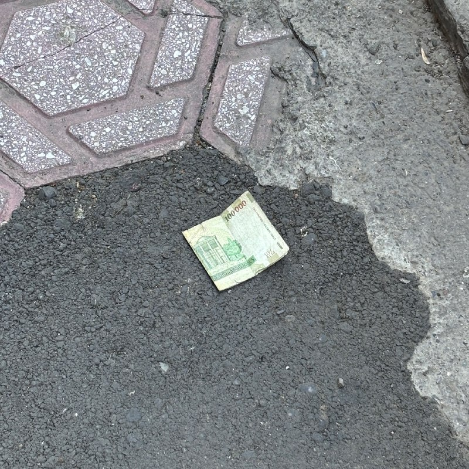

هزینه شستن دست و استهلاک کمرم بیشتر می‌شد. برای همین برنداشتمش
تحلیل اقتصادی اینطوریه

@Dirty_Kids 👻

## Dirty_Kids — post 391403

  

بانو نیکی کریمی در ۵۴ سالگی

@Dirty_Kids 👻

## alonews — post 126366

  <a href="telegram/content/alonews_126366_1780943031.mp4" target="_blank">🎬 Download video</a>

👈 لحظه حمله اسرائیل به مناطق جنوبی لبنان

✅ @AloNews خبر جنگ

---
📅 بروزرسانی: 1405/03/18 21:43
---

## WithYashar — post 14057

## WithYashar — post 14056

صدا های مشکوک به انفجار‌ همکنون تهران
@withyashar

## DEJradio — post 5481

⭕️ لهستان از کشف بیش از یک تن هروئین ارسال شده از ایران خبر داد

مقام‌های لهستان اعلام کردند بیش از یک تن هروئین را در بندر گدنیا کشف کردند که از مبدأ ایران ارسال شده بود.
به گزارش پلیس لهستان، هروئین‌ها داخل محمولۀ آجرهای تزئینی جاسازی شده بود.
ارزش این محموله بیش از ۶۰ میلیون دلار برآورد شده است.
مقام‌های لهستانی گزارش دادند سه نفر در پیوند با این پرونده بازداشت شدند و تحقیقات در مورد آن ادامه دارد.

#خبر #دژ #جمهوری_اسلامی #لهستان
@DEJradio

## DEJradio — post 5480

⭕️ وزیر دفاع اسرائیل گفت در پی هر حمله به شمال اسرائیل، ضاحیه هدف گرفته می‌شود

یسرائیل کاتس، وزیر دفاع اسرائیل گفت ارتش به عملیات علیه حزب‌الله لبنان ادامه می‌دهد.
به گفتۀ کاتز، هرگونه حمله به شهرک‌های شمالی اسرائیل با حمله به ضاحیه پاسخ داده می‌شود.
او همچنین هشدار داد هرگونه تلاش جمهوری اسلامی برای پیوند زدن تهدیداتش با مسألۀ لبنان، قاطعانه‌تر از پیش توسط اسرائیل پاسخ داده می‌شود.

#خبر #دژ #اسرائیل #ضاحیه
@DEJradio

## FarsiVOA — post 220052

🔺واکنش‌های جهانی به دور تازه درگیری اسرائیل و جمهوری اسلامی؛ درخواست برای تنش‌زدایی و خویشتن‌داری

◾️در پی تازه‌ترین دور تبادل آتش میان اسرائیل و رژیم ایران که روز یکشنبه ۱۷ خرداد آغاز شد و تا دوشنبه ادامه یافت، اتحادیه اروپا، پاکستان، بریتانیا، کشورهای منطقه، و شماری از کشورهای دیگر، خواستار کاهش تنش شده‌اند.

⬇️ بیشتر بخوانید:

https://ir.voanews.com/a/exchange-of-fire-iran-israel-missile-attacks/8158543.html

## Persian_Trend_Official — post 16218

  <a href="telegram/content/Persian_Trend_Official_16218_1780942417.webm" target="_blank">🎬 Download video</a>

اولین بازی جام جهانی 2026 پنج شنبه 21 خرداد در مکزیک 🇲🇽🏆

📝 Nick

📌 @persian_trend_official
پرشین ترند | متفاوت‌ترین کانال نظامی

## Persian_Trend_Official — post 16217

  

دونالد ترامپ، رئیس جمهور آمریکا، به کانال 12 اسرائیل گفت که در جریان گفتگوی 24 ساعت گذشته خود با بنیامین نتانیاهو به او هشدار داده است که اگر حملات اسرائیل به یک جنگ تمام عیار تبدیل شود، ممکن است خود را در برابر ایرانیان تنها ببیند!

ترامپ خاطرنشان کرد: به بی‌بی گفتم، بهتر است خیلی مراقب باشی چه کار می‌کنی، زیرا ممکن است خیلی زود در برابر ایران تنها بمانی.

📝 Amir

📌 @persian_trend_official
پرشین ترند | متفاوت‌ترین کانال نظامی

## Persian_Trend_Official — post 16216

  <a href="telegram/content/Persian_Trend_Official_16216_1780942418.webm" target="_blank">🎬 Download video</a>

رئیس‌جمهور لبنان، جوزف عون در مصاحبه با خبرگزاری CNN: راه‌حل نظامی هرگز امنیت ساکنان شمال اسرائیل را تأمین نخواهد کرد.

چاره‌ای جز مذاکره نداریم و تلاش می‌کنیم از منافع شخصی رئیس جمهور ترامپ برای پایان دادن به این درگیری استفاده کنیم.

آنچه پیشنهاد می شود یک توافق عدم تجاوز یا یک توافق امنیتی است. در مورد توافق صلح، ما بخشی از ابتکار عمل کشورهای عربی هستیم.

اگر طرف سوم [حزب الله] با تحویل سلاح یا مذاکره با دولت موافقت نکند، در مقابل مردم مسئولیت خواهد داشت. ما به دنبال رابطه خوب با ایران هستیم، اما ایران نباید در امور ما دخالت کند و کشور ما را برای منافع خود ویران کند.

📝 Amir

📌 @persian_trend_official
پرشین ترند | متفاوت‌ترین کانال نظامی

## alonews — post 126365

  <a href="telegram/content/alonews_126365_1780942418.webm" target="_blank">🎬 Download video</a>

👈رئیس سازمان انرژی اتمی: واحدهای دوم و سوم نیروگاه بوشهر با سرمایه‌گذاری ۱۰ میلیارد دلاری در حال ساخت است/ دستیابی به ۲۰ هزار مگاوات برق هسته‌ای در دستور کار قرار گرفت

✅ @AloNews خبر جنگ

## alonews — post 126364

  <a href="telegram/content/alonews_126364_1780942419.webm" target="_blank">🎬 Download video</a>

👈وزیر امور خارجه فرانسه به الحدث:
بستن تنگه هرمز هزینه بسیار زیادی بر اقتصاد جهانی تحمیل می‌کند

✅ @AloNews خبر جنگ

---
📅 بروزرسانی: 1405/03/18 21:33
---

## VahidOOnLine — post 244410

  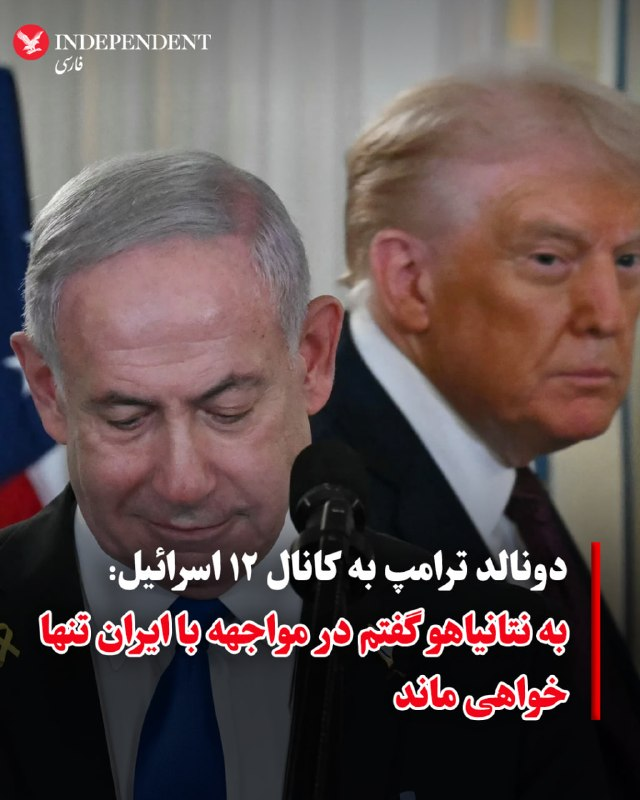

♦️دونالد ترامپ، رئیس‌جمهوری آمریکا، روز دوشنبه در گفتگو با کانال ۱۲ تلویزیون اسرائیل اعلام کرد در مورد حمله به ایران به نخست‌وزیر اسرائیل هشدار داده است: «به بی‌بی‌ گفتم مراقب باش، خودت را در برابر ایران تنها خواهی یافت.»
ترامپ همچنین افزود شماری از کشورهای منطقه از او خواسته‌اند بر نتانیاهو فشار وارد کند تا از تشدید درگیری‌ها جلوگیری شود.
ترامپ همچنین اعلام کرد نتانیاهو با تاخیر او را از تصمیم برای حمله به ایران مطلع کرده و افزود: «او با تاخیر مرا در جریان حمله به ایران قرار داد، اما من موفق شدم این حمله را کاهش دهم.»
رئیس‌جمهوری آمریکا در این گفتگو اعلام کرد  توانسته دامنه حمله اسرائیل به ایران را محدود کند و بنیامین نتانیاهو را برای کاهش تنش‌ها تحت فشار قرار داده است.
این اظهارات در حالی مطرح می‌شود که کانال ۱۲ تلویزیون اسرائیل عصر دوشنبه ۱۸ خردادماه به نقل از یک مقام رسمی دولت اسرائیل گزارش داد که اسرائیل به درخواست دونالد ترامپ حملات خود علیه ایران را متوقف کرده است.
‌🇸🇦 Indypersian

🤖 @VahidOOnLine

## WithYashar — post 14055

## WithYashar — post 14054

## WithYashar — post 14053

درود سرباز شاه پیام که برای رضا پهلوی (شاهزاده ) فرستادی پاک کنین ، دشمن دنبال همین پیام ها هستن ، همه میدونیم ادمین کسی دیگس

## pm_afshaa — post 92965

🔴نفتالی بنت نخست وزیر پیشین اسراییل:
نتانیاهو شده مضحکه آمریکا و هیچ اختیاری در هیچ جبهه ای نداره نه غزه نه لبنان نه ایران او باید جوابگو باشد

💧 Rainbet.com the #1 Non-KYC Crypto Casino & Sportsbook @rainbetcom

😁 @Pm_Afshaa

## pm_afshaa — post 92964

🔴نتانیاهو به وزرا: ممکن است چند روز دیگر به ایران برگردیم

💧 Rainbet.com the #1 Non-KYC Crypto Casino & Sportsbook @rainbetcom

😁 @Pm_Afshaa

## pm_afshaa — post 92963

🔴اسرائیل هیوم: امریکا در حمله اسرائیل به ایران نقش داشته

💧 Rainbet.com the #1 Non-KYC Crypto Casino & Sportsbook @rainbetcom

😁 @Pm_Afshaa

## pm_afshaa — post 92962

  <a href="telegram/content/pm_afshaa_92962_1780941828.webm" target="_blank">🎬 Download video</a>

🔴غریب‌آبادی، معاون عراقچی: هیچ ارزشی برای تحریم‌های اتحادیه اروپا قائل نیستیم.

💧 Rainbet.com the #1 Non-KYC Crypto Casino & Sportsbook @rainbetcom

😁 @Pm_Afshaa

## DEJradio — post 5479

  <a href="telegram/content/DEJradio_5479_1780941828.mp4" target="_blank">🎬 Download video</a>

🔺📢 اعتراض یک سرباز:
پدافند بدترین جاست!

#جنگ #پدافند #سربازی
@DEJradio

## DEJradio — post 5478

  <a href="telegram/content/DEJradio_5478_1780941830.mp4" target="_blank">🎬 Download video</a>

🔺📢 فرماندهان به ما گفتند پایگاه رو تخلیه کنید

یک بسیجی ریزشی در ویدیویی که به دژ ارسال کرده با شکایت از ترس و بزدلی فرماندهان گفت: "والله دیگه از زندگی بریدیم، واسه دفعه سوم امروز فرماندهان ما در پایگاه مقاومت بسیج به ما گفتن که پایگاه رو تخلیه کنیم."

#جنگ #ریزشی #بسیجی
@DEJradio

## DEJradio — post 5477

  <a href="telegram/content/DEJradio_5477_1780941832.mp4" target="_blank">🎬 Download video</a>

🚨
🔸 از پادشاهان باستان تا سیاستمدارهای امروز، هرجا ردی از قدرت هست، معمولاً یک صفحه شطرنج هم گوشه‌ی تصویر پیدا می‌شه ♟👑

اما چرا یک بازی ظاهراً محدود روی صفحه‌ی ۸ در ۸، این‌قدر برای صاحبان قدرت جذابه؟⚔️😉

#تمام_رخ

## IranIntlTV — post 341223

در واکنش به حمله‌های جمهوری اسلامی به اسرائیل، شبکه نیروهای نیابتی تهران هم وارد میدان شدند. حوثی‌های یمن بلافاصله حملات به اسرائیل را از سر گرفته و اعلام کردند کشتی‌های اسرائیل حق عبور از دریای سرخ را ندارند. کتائب حزب‌الله عراق هم ضمن تهدید اسرائیل، هشدار داد در صورت استفاده امریکا از خاک عراق یا ارائه‌ پشتیبانی لجستیک برای حمله به ایران، پایگاه‌های نظامی آمریکا در عراق را هدف قرار خواهند داد. همزمان حملات حزب‌الله به شمال اسرائیل هم ادامه دارد.

گفت‌وگو با علی صدرزاده، تحلیل‌گر مسایل خاورمیانه
@iranintltv

## FarsiVOA — post 220051

Farsi VOA pinned a photo

## FarsiVOA — post 220050

  

📸اینستاگرام صدای آمریکا را هم اکنون فالو کنید تا از آخرین خبرها مطلع بمانید:
https://www.instagram.com/voafarsi/

📡همچنین جهت اطلاع از بروزترین فرکانسهای ماهواره‌ای صدای آمریکا به لینک زیر مراجعت فرمایید:
https://ir.voanews.com/satellite

این پست را با دوستانتان به اشتراک بگذارید
@FarsiVOA

## Persian_Trend_Official — post 16215

  <a href="telegram/content/Persian_Trend_Official_16215_1780941834.webm" target="_blank">🎬 Download video</a>

⭕️ دقایقی پیش سفارت ایران در بیروت اعلام کرد:
لبنان قلب ایران است.

📝 Nick

📌 @persian_trend_official
پرشین ترند | متفاوت‌ترین کانال نظامی

## RadioFarda — post 158070

🔸محیط‌بانان پارک ملی گلستان در اردیبهشت‌ماه ۱۴۰۵ موفق شدند دو توله خرس قهوه‌ای را در کنار مادرشان ثبت و مشاهده کنند.

🔸جعفر پناه‌پور، محیط‌بان با انتشار این ویدئو نوشته است که همراه با همکارانش موفق به ثبت «صحنه‌ای کم‌نظیر» شده‌اند.

🔸خرس قهوه‌ای یکی از بزرگ‌ترین پستانداران ایران است و پارک ملی گلستان از مهم‌ترین زیستگاه‌های این گونه به شمار می‌رود. توله‌های خرس معمولاً تا حدود دو سال به مادر وابسته هستند و در این مدت از حمایت و آموزش او برای بقا در طبیعت بهره می‌برند.

@RadioFarda

## BBCPersian — post 283207

  <a href="https://t.me/bbcpersian/283207" target="_blank">📎 Download file</a>

📻📡 این برنامه رادیویی را می‌توانید هر شب ساعت ۲۰ به وقت ایران، روی موج متوسط ۷۰۲ کیلوهرتز و موج کوتاه ۹۴۶۵ کیلوهرتز بشنوید.
تکرار برنامه را هم می‌توانید ساعت ۲۱:۳۰ روی موج متوسط ۷۰۲ کیلوهرتز و موج کوتاه ۵۳۹۵ کیلوهرتز گوش کنید.

## alonews — post 126363

  <a href="telegram/content/alonews_126363_1780941835.webm" target="_blank">🎬 Download video</a>

👈سفارت ایران در بیروت اعلام کرده است که «لبنان قلب ایران است»

✅ @AloNews خبر جنگ

## alonews — post 126362

  <a href="telegram/content/alonews_126362_1780941835.webm" target="_blank">🎬 Download video</a>

👈در پی تداوم تنش‌ها، شرکت هواپیمایی «ایر فرانس» نیز به جمع شرکت‌هایی پیوست که پروازهای خود به مقصد اسرائیل را به حالت تعلیق درآورده‌اند.

🔴شرکت «ایر فرانس» تمامی پروازهای خود به مقصد اسرائیل را تا ۲۱ ژوئن ۲۰۲۶ لغو کرد.

✅ @AloNews خبر جنگ

---
📅 بروزرسانی: 1405/03/18 21:23
---

## VahidOOnLine — post 244409

  

دونالد ترامپ به کانال ۱۲ اسرائیل گفت توانسته دامنه حمله اسرائیل به جمهوری اسلامی را محدود کند و چند کشور منطقه‌ای در روند میانجی‌گری از او خواسته‌اند برای توقف درگیری‌ها و پیشبرد توافق، بر نتانیاهو فشار بیاورد.
او افزود: «صبح دوشنبه ایرانی‌ها به ما گفتند دیگر حمله‌ای به اسرائیل انجام نمی‌دهند و خواستند ما به اسرائیل بگوییم حملات را متوقف کند. من با بی‌بی تماس گرفتم و او را متوقف کردم.»
‌🏁 🇬🇧 IranintlTV

🤖 @VahidOOnLine

## VahidOOnLine — post 244408

  <a href="telegram/content/VahidOOnLine_244408_1780941237.mp4" target="_blank">🎬 Download video</a>

ویدیوهای دریافت‌شده نشان می‌دهد جمعی از ایرانیان ساکن آتلانتا، در جورجیای آمریکا، روز یک‌شنبه ۱۷ خرداد در حمایت از مردم ایران و شاهزاده رضا پهلوی راهپیمایی کردند و خواستار تغییر رژیم ایران شدند.
‌🏁 🇬🇧 IranintlTV

🤖 @VahidOOnLine

## VahidOOnLine — post 244407

  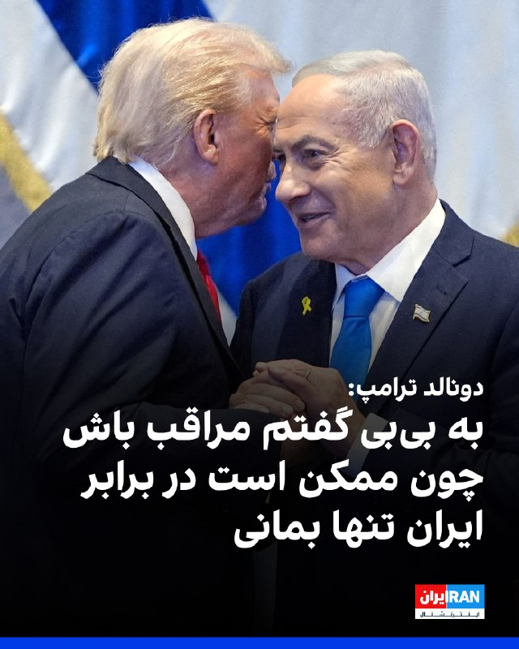

دونالد ترامپ در گفت‌وگویی با کانال ۱۲ اسرائیل اعلام کرد به بنیامین نتانیاهو هشدار داده است که اگر حملات اسرائیل به تشدید و تبدیل به جنگی تمام‌عیار با جمهوری اسلامی منجر شود، ممکن است اسرائیل در نهایت «تنها» بماند.

ترامپ گفت: «به بی‌بی گفتم خیلی مراقب باش چه کار می‌کنی، چون ممکن است خیلی زود در برابر ایران تنها بمانی».

ترامپ همچنین گفت توانسته دامنه حمله اسرائیل به جمهوری اسلامی را محدود کند و چند کشور منطقه‌ای در روند میانجی‌گری از او خواسته‌اند برای توقف درگیری‌ها و پیشبرد توافق، بر نتانیاهو فشار بیاورد.
‌🏁 🇬🇧 IranintlTV

🤖 @VahidOOnLine

## WithYashar — post 14052

## VahidOnline — post 76080

ترامپ گفت: «به بی‌بی گفتم خیلی مراقب باش چه کار می‌کنی، چون ممکن است خیلی زود در برابر ایران تنها بمانی».
@VahidOOnLine
دونالد ترامپ، رئیس‌جمهوری آمریکا، روز دوشنبه در گفتگو با کانال ۱۲ تلویزیون اسرائیل اعلام کرد توانسته دامنه حمله اسرائیل به ایران را محدود کند و بنیامین نتانیاهو را برای کاهش تنش‌ها تحت فشار قرار داده است.

ترامپ گفت: «من موفق شدم شدت حمله اسرائیل به ایران را کاهش دهم.»
او همچنین افزود شماری از کشورهای منطقه از او خواسته‌اند بر نتانیاهو فشار بیاورد تا از تشدید درگیری‌ها جلوگیری شود.

رئیس‌جمهوری آمریکا در ادامه گفت در مورد حمله به ایران به نخست‌وزیر اسرائیل هشدار داده است: «به نتانیاهو گفتم خودت را در برابر ایران تنها خواهی یافت.»

ترامپ همچنین گفت نتانیاهو «با تاخیر مرا در جریان حمله به ایران قرار داد، اما من موفق شدم این حمله را کاهش دهم.»
کانال ۱۲ تلویزیون اسرائیل عصر دوشنبه ۱۸ خردادماه به نقل از یک مقام رسمی دولت نتانیاهو اعلام کرده بود اسرائیل حملات به ایران را به درخواست دونالد ترامپ متوقف کرده است.
@VahidOOnLine

📡 @VahidOnline

## IranIntlTV — post 341222

بعد از صد روز جنگ هماهنگ و مشترک، گمانه‌زنی‌ها درباره اختلاف آمریکا و اسرائیل و شکاف میان ترامپ و نتانیاهو  بر سر ایران شدت گرفته است. ترامپ می‌گوید توافق با ایران نزدیک است و او بعد از حملات متقابل جمهوری اسلامی و اسرائیل، شخصا دو بار با نتانیاهو تماس گرفت و خواستار توقف فوری حمله‌ها شد. رئیس‌جمهور آمریکا حتی گفت نخست‌وزیر اسرائیل چاره‌ای جز پذیرش توافق با ایران ندارد. با این حال اسرائیل با وجود تاکید و در خواست ترامپ به حمله موشکی جمهوری اسلامی پاسخ داد.

گفت‌وگو با آرش آرامش، حقوق‌دان و کارشناس امنیت ملی
@iranintltv

## IranIntlTV — post 341221

  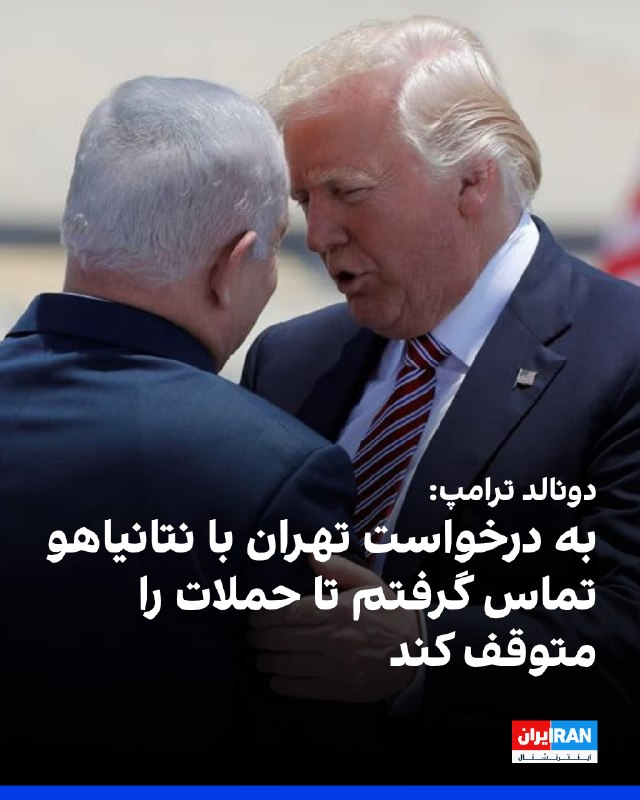

دونالد ترامپ به کانال ۱۲ اسرائیل گفت توانسته دامنه حمله اسرائیل به جمهوری اسلامی را محدود کند و چند کشور منطقه‌ای در روند میانجی‌گری از او خواسته‌اند برای توقف درگیری‌ها و پیشبرد توافق، بر نتانیاهو فشار بیاورد.
او افزود: «صبح دوشنبه ایرانی‌ها به ما گفتند دیگر حمله‌ای به اسرائیل انجام نمی‌دهند و خواستند ما به اسرائیل بگوییم حملات را متوقف کند. من با بی‌بی تماس گرفتم و او را متوقف کردم.»
https://iranintl.com/202606086649

## IranIntlTV — post 341220

  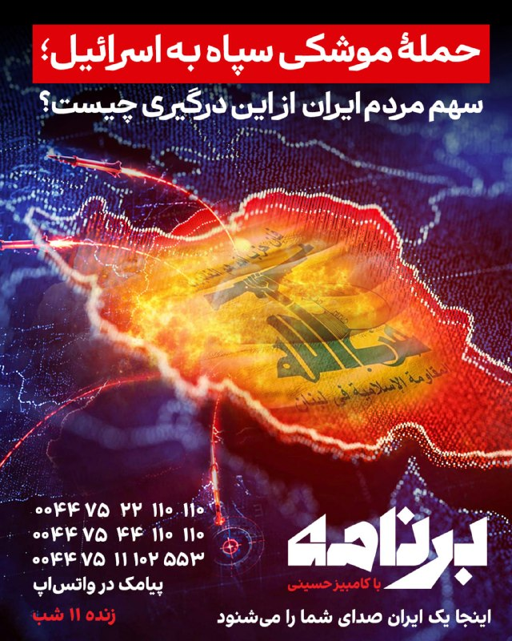

امشب در «برنامه» دربارهٔ پیامدهای حملهٔ موشکی سپاه به اسرائیل صحبت می‌کنیم. جمهوری اسلامی می‌گوید این حملات برای دفاع از منافع ایران انجام می‌شود؛ اما مردم ایران دقیقاً کجای این معادله قرار دارند؟

وقتی سپاه موشک شلیک می‌کند، چه کسی هزینهٔ آن را می‌پردازد؟

جمهوری اسلامی و حزب‌الله؛ دو روایت دارند، اما از یک الگو پیروی می‌کنند. شباهت‌های این دو چیست و مردم ایران در این میان چه می‌خواهند؟

اگر در ایران هستید و به اینترنت دسترسی دارید، از مشاهدات خود بگویید. از تأثیر جنگ بر زندگی روزمره، نگرانی‌ها، امیدها و واقعیت‌هایی بگویید که کمتر شنیده می‌شوند. اگر خارج از ایران هستید نیز به ما بگویید این تحولات را چگونه می‌بینید.

«برنامه» صدای شماست. ما شما را، بدون نوبت، مستقیم از ایران روی خط می‌آوریم. بیایید و روایت خود را ثبت کنید؛ زیرا تاریخ فقط با روایت قدرت‌ها نوشته نمی‌شود؛ تاریخ با صدای مردم نیز نوشته می‌شود.

برای شرکت در برنامه، همین حالا در واتس‌اپ پیام بدهید:

۰۰۴۴۷۵۲۲۱۱۰۱۱۰

۰۰۴۴۷۵۴۴۱۱۰۱۱۰

۰۰۴۴۷۵۱۱۱۰۲۵۵۳

«برنامه با کامبیز حسینی»

«یک ایران صدای شما را می‌شنود»
@iranintltv

## IranIntlTV — post 341219

  <a href="telegram/content/IranIntlTV_341219_1780941243.mp4" target="_blank">🎬 Download video</a>

ویدیوهای دریافت‌شده نشان می‌دهد جمعی از ایرانیان ساکن آتلانتا، در جورجیای آمریکا، روز یک‌شنبه ۱۷ خرداد در حمایت از مردم ایران و شاهزاده رضا پهلوی راهپیمایی کردند و خواستار تغییر رژیم ایران شدند.

## IranIntlTV — post 341218

  <a href="https://t.me/IranintlTV/341218" target="_blank">📎 Download file</a>

🎧نسخه صوتی اخبار شبانگاهی | دوشنبه ۱۸ خرداد
@iranintlTV

## IranIntlTV — post 341217

  <a href="telegram/content/IranIntlTV_341217_1780941245.mp4" target="_blank">🎬 Download video</a>

بنیامین نتانیاهو با تایید توقف حملات به ایران گفت جمهوری اسلامی و حزب‌الله تصور کردند می‌توانند از خاک لبنان و ایران به اسرائیل شلیک کنند و این کشور واکنشی نشان نخواهد داد.

پس از حملات موشکی جمهوری اسلامی به اسرائیل و حملات متقابل اسرائیل، درگیری‌ها با میانجی‌گری دونالد ترامپ متوقف شده است.

گفت‌وگو با مسعود کاظمی، روزنامه‌نگار و بابک اسحاقی و سمیرا قرایی، خبرنگاران ایران‌اینترنشنال
@iranintltv

## FarsiVOA — post 220046

نیروهای تفنگداران دریایی آمریکا تصاویری از تمرین فرود سریع با طناب از یک بالگرد یو‌اچ-۱ وای ونوم منتشر کردند.

به گفته نیروهای تفنگداران دریایی آمریکا، این تمرین ۱۴ خرداد در پایگاه دریایی گوانتانامو در کوبا برگزار شده است.

@FarsiVOA

## DW_Farsi — post 125700

  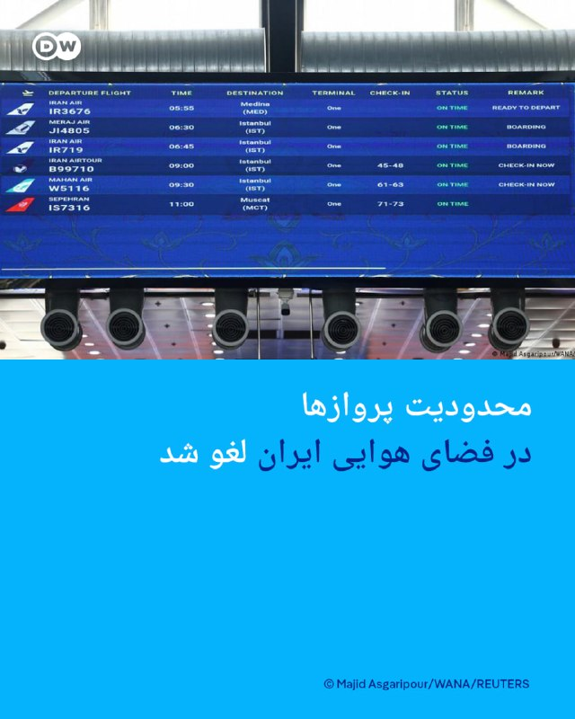

🔶محدودیت پروازها در فضای هوایی ایران لغو شد

سازمان هواپیمایی ایران اعلام کرد که "با فراهم شدن شرایط ایمن و انجام هماهنگی‌های لازم با نهادهای ذی‌ربط، محدودیت‌های پروازی رفع شده و فعالیت‌های هوانوردی کشور طبق برنامه در حال بازگشت به روال عادی است.

ابوذر شیرودی، رئیس سازمان هواپیمایی با اشاره به اعلام مراجع ذی‌ربط مبنی بر پایان عملیات نظامی و با توجه به هماهنگی‌های انجام‌شده گفت که فضای هوایی کشور به شرایط عادی بازگشته و عملیات هوانوردی مطابق با اطلاعیه‌های هوانوردی (نوتام) صادره، از سر گرفته خواهد شد.

از شب گذشته که حملات موشکی ایران به اسرائیل آغاز شد، ابتدا فضای هوایی غرب ایران بسته شد و در ساعات بعد‌ از ظهر دوشنبه، به رغم اعلام پایان درگیری‌ها از سوی ایران، مراجع ذیربط در این کشور از بسته‌شدن کل حریم هوایی خبر دادند و تنها فرودگاه مشهد برای بازگشت حجاج باز نگه داشته شد.

اعلام بازشدن کامل حریم هوایی کشور تنها چند ساعت پس از بسته‌شدن کامل آن صورت گرفت.

@dw_farsi

## BBCPersian — post 283206

  <a href="telegram/content/BBCPersian_283206_1780941249.mp4" target="_blank">🎬 Download video</a>

🔻تیم ملی فوتبال ایران بعد از پروازی ۲۰ ساعته از ترکیه، روز یکشنبه وارد شهر تیخوانا در مکزیک شد و روز دوشنبه نخستین تمرین خود را در این شهر برگزار کرد.

کمپ تیم ملی ایران در این شهر است و برای مسابقات جام جهانی باید دوبار به لس‌آنجلس و یک بار به سیاتل برود.

به گفته مهدی تاج، رئیس فدراسیون فوتبال، برای تیم ملی اجازه ورود به آمریکا فقط یک روز پیش از هر مسابقه صادر شده است و بازیکنان باید بعد از هر مسابقه باید به محل کمپ تیم ملی در تیخوانا برگردند.

نخستین بازی تیم ملی فوتبال ایران در برابر نیوزیلند روز ۱۵ ژوئن در لس‌انجلس (بامداد ۲۶ خرداد به وقت ایران) برگزار خواهد شد.   

@BBCPersian

## Dirty_Kids — post 391402

  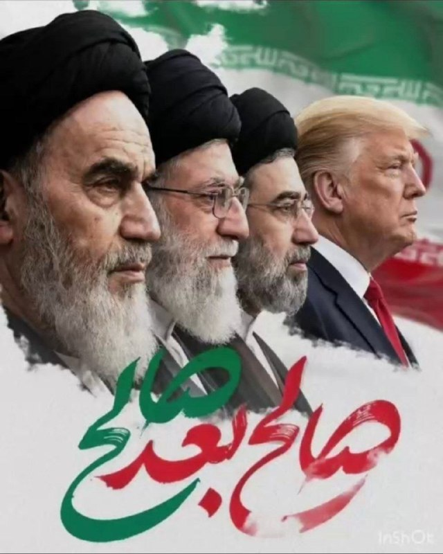

ترامپ گفت: «به بی‌بی گفتم خیلی مراقب باش چه کار می‌کنی، چون ممکن است خیلی زود در برابر ایران تنها بمانی.»

دونالد ترامپ روز دوشنبه در گفتگو با کانال ۱۲ تلویزیون اسرائیل اعلام کرد توانسته دامنه حمله اسرائیل به ایران را محدود کند و بنیامین نتانیاهو را برای کاهش تنش‌ها تحت فشار قرار داده است. ترامپ گفت: «من موفق شدم شدت حمله اسرائیل به ایران را کاهش دهم.»

ترامپ افزود شماری از کشورهای منطقه از او خواسته‌اند بر نتانیاهو فشار بیاورد تا از تشدید درگیری‌ها جلوگیری شود. رئیس‌جمهوری آمریکا در ادامه گفت در مورد حمله به ایران به نخست‌وزیر اسرائیل، او را تهدید کرده و هشدار داده است: «به نتانیاهو گفتم خودت را در برابر ایران تنها خواهی یافت. نتانیاهو با تاخیر مرا در جریان حمله به ایران قرار داد، اما من موفق شدم این حمله را کاهش دهم.»

کانال ۱۲ تلویزیون اسرائیل عصر دوشنبه ۱۸ خردادماه به نقل از یک مقام رسمی دولت نتانیاهو اعلام کرده بود اسرائیل حملات به ایران را به درخواست دونالد ترامپ متوقف کرده است.

@Dirty_Kids 👻

## Dirty_Kids — post 391401

  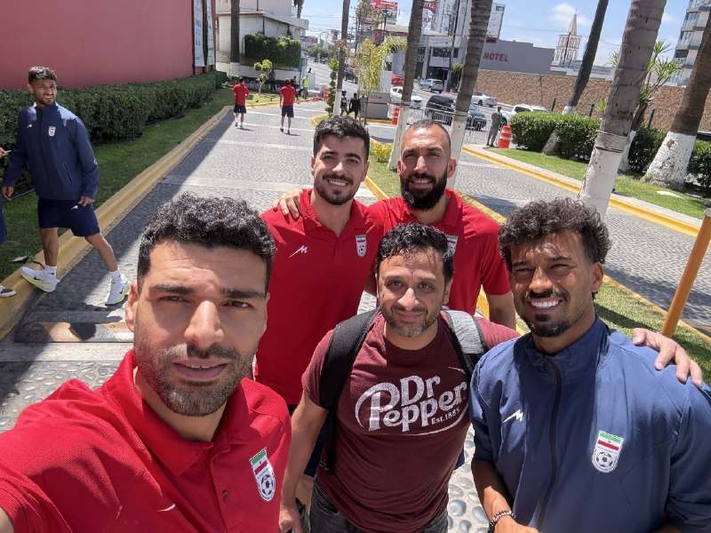

رسوایی عجیب تیم آخوند تو اردوی ترکیه؛ دست درازی یه بازیکن به دختر 14 ساله! دیلی میل| یک فوتبالیست بین‌المللی متهم شده که در یک هتل پنج‌ستاره در ترکیه تلاش کرده یک دختر ۱۴ ساله بریتانیایی را برای «بغل کردن» به پشت یک پرچین ببرد. پدر این دختر در گفت‌وگو با…

---
📅 بروزرسانی: 1405/03/18 21:13
---

## VahidOOnLine — post 244406

  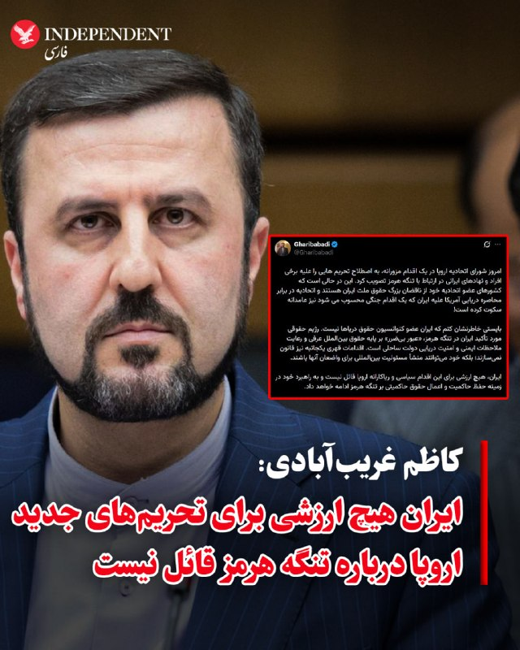

♦️کاظم غریب‌آبادی، معاون حقوقی و بین‌المللی وزارت امور خارجه جمهوری اسلامی ایران، روز دوشنبه ۱۸ خرداد با انتقاد از تصمیم اتحادیه اروپا برای اعمال تحریم‌های جدید مرتبط با تنگه هرمز، اعلام کرد تهران این اقدام را «سیاسی و ریاکارانه» می‌داند.
غریب‌آبادی در پیامی در شبکه اجتماعی ایکس کشورهای عضو اتحادیه اروپا را به نقض حقوق ملت ایران متهم کرد و افزود اتحادیه اروپا در برابر «محاصره دریایی آمریکا علیه ایران» سکوت کرده است.
معاون حقوقی و بین‌المللی وزارت امور خارجه در ادامه با اشاره به موضع جمهوری اسلامی درباره وضعیت حقوقی تنگه هرمز نوشت: «ایران عضو کنوانسیون حقوق دریاها نیست.» او افزود رژیم حقوقی مورد تاکید ایران در تنگه هرمز، «عبور بی‌ضرر» بر پایه حقوق بین‌الملل عرفی و با رعایت ملاحظات ایمنی و امنیت دریایی دولت ساحلی است.
غریب‌آبادی در پایان تاکید کرد جمهوری اسلامی «هیچ ارزشی» برای تصمیم اتحادیه اروپا قائل نیست و به راهبرد خود در زمینه حفظ حاکمیت و اعمال حقوق حاکمیتی در تنگه هرمز ادامه خواهد داد.
اتحادیه اروپا روز دوشنبه ۱۸ خردادماه اعلام کرد دو فرد ایرانی و یک واحد از سپاه پاسداران انقلاب اسلامی را به دلیل تهدید آزادی تردد دریایی در تنگه هرمز تحریم کرده است.
این اولین باری است که اتحادیه اروپا از اختیارات جدید خود برای تحریم ایران به دلیل محدود کردن آزادی دریانوردی استفاده می‌کند.
‌🇸🇦 Indypersian

🤖 @VahidOOnLine

## VahidOOnLine — post 244405

  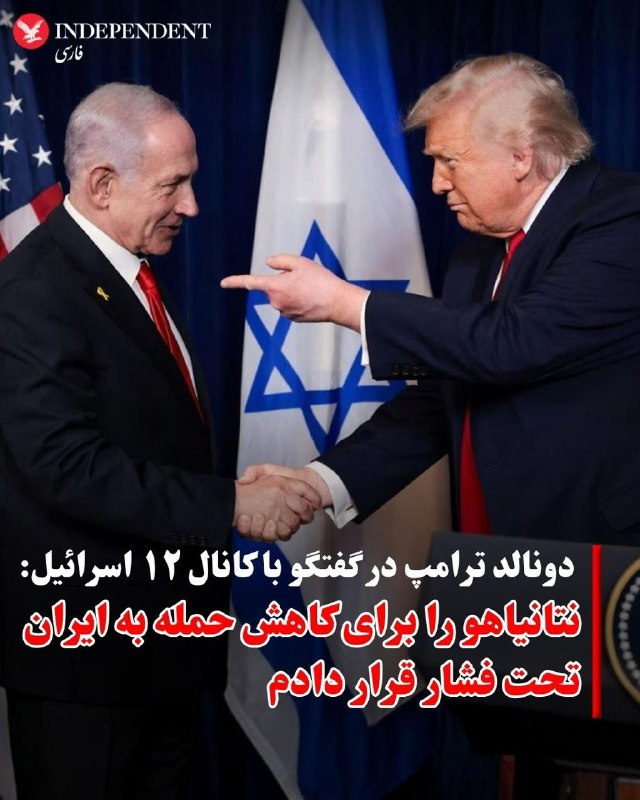

♦️دونالد ترامپ، رئیس‌جمهوری آمریکا، روز دوشنبه در گفتگو با کانال ۱۲ تلویزیون اسرائیل اعلام کرد توانسته دامنه حمله اسرائیل به ایران را محدود کند و بنیامین نتانیاهو را برای کاهش تنش‌ها تحت فشار قرار داده است.

ترامپ گفت: «من موفق شدم شدت حمله اسرائیل به ایران را کاهش دهم.»
او همچنین افزود شماری از کشورهای منطقه از او خواسته‌اند بر نتانیاهو فشار بیاورد تا از تشدید درگیری‌ها جلوگیری شود.

رئیس‌جمهوری آمریکا در ادامه گفت در مورد حمله به ایران به نخست‌وزیر اسرائیل هشدار داده است: «به نتانیاهو گفتم خودت را در برابر ایران تنها خواهی یافت.»

ترامپ همچنین اعلام کرد نتانیاهو با تاخیر او را از تصمیم برای حمله به ایران مطلع کرده و افزود: «او با تاخیر مرا در جریان حمله به ایران قرار داد، اما من موفق شدم این حمله را کاهش دهم.»

کانال ۱۲ تلویزیون اسرائیل عصر دوشنبه ۱۸ خردادماه به نقل از یک مقام رسمی دولت نتانیاهو اعلام کرده بود اسرائیل حملات به ایران را به درخواست دونالد ترامپ متوقف کرده است.
‌🇸🇦 Indypersian

🤖 @VahidOOnLine

## WithYashar — post 14051

یاشار دادا فکر کنم اون گز اجیلی که از چهارماه پیش برای روبیو و ونس بردن تازه داره دعا جادوش عمل میکنه جنس ایرانیه دووم نداره دیر کار شروع میشه زودم تموم میشه
اینا تموم شدن. اینم مثل جنگ ۱۲ روزه یه تست بود که بییین اینا چقدر داستان دارن که فهمیدن فقط بوق کرناس هیچی ندارن ✌🏻
دمتم گرم خسته نباشید ❤️

## pm_afshaa — post 92961

  <a href="telegram/content/pm_afshaa_92961_1780940606.webm" target="_blank">🎬 Download video</a>

🔴وزارت دفاع عربستان:
صبح امروز یک موشک بالستیک که از یمن شلیک شد، دچار نقص فنی شد و از مسیر برنامه‌ریزی شده منحرف شد و در نهایت در منطقه‌ای غیرمسکونی نزدیک مرز عربستان و یمن سقوط کرد.

این موشک توسط حوثی‌ها (انصارالله یمن) شلیک شده بود.

💧 Rainbet.com the #1 Non-KYC Crypto Casino & Sportsbook @rainbetcom

😁 @Pm_Afshaa

## DEJradio — post 5476

  <a href="telegram/content/DEJradio_5476_1780940607.webm" target="_blank">🎬 Download video</a>

🕐
🔺 بنیامین نتانیاهو: رویارویی ما با حـ.ـزب‌الله و جمهوری اسلامی هنوز به پایان نرسیده است بنیامین نتانیاهو نخست‌وزیر اسرائیل، ساعاتی پس از فروکش کردن درگیری‌ها با جمهوری اسلامی در جمع خبرنگاران گفت: «ما یک حمله پیش‌دستانه تاریخی علیه تلاش‌های ایران برای دستیابی…

## mamlekate — post 103645

📝 جمهوری اسلامی «توقف عملیات» را اعلام کرد، نتانیاهو از «مهار درگیری» خبر داد

جمهوری اسلامی از توقف عملیات نیروهای مسلح پس از حملات متقابل با اسرائیل خبر داد، اما همزمان تهدید کرد در صورت ادامه حملات، به‌ویژه در لبنان، پاسخ شدیدتری خواهد داد. همزمان، نخست‌وزیر اسرائیل نیز با اشاره به توقف حملات تهران از «مهار آتش درگیری در جبهه ایران» خبر داد.

@mamlekate

## IranIntlTV — post 341216

  

دونالد ترامپ در گفت‌وگویی با کانال ۱۲ اسرائیل اعلام کرد به بنیامین نتانیاهو هشدار داده است که اگر حملات اسرائیل به تشدید و تبدیل به جنگی تمام‌عیار با جمهوری اسلامی منجر شود، ممکن است اسرائیل در نهایت «تنها» بماند.

ترامپ گفت: «به بی‌بی گفتم خیلی مراقب باش چه کار می‌کنی، چون ممکن است خیلی زود در برابر ایران تنها بمانی».

ترامپ همچنین گفت توانسته دامنه حمله اسرائیل به جمهوری اسلامی را محدود کند و چند کشور منطقه‌ای در روند میانجی‌گری از او خواسته‌اند برای توقف درگیری‌ها و پیشبرد توافق، بر نتانیاهو فشار بیاورد.
https://iranintl.com/202606082776

## IranIntlTV — post 341215

  <a href="telegram/content/IranIntlTV_341215_1780940608.mp4" target="_blank">🎬 Download video</a>

مزدک میرزایی، عضو تحریریه ایران‌اینترنشنال، درباره تصمیم صداوسیما برای ممنوعیت پخش مسابقات جام جهانی از طریق پلتفرم‌های اینترنتی گفت: «در سال‌های اخیر میزان بینندگان صداوسیما به‌شدت کاهش پیدا کرده است. بسیاری از مردم پیش‌تر مسابقات فوتبال را از صداوسیما تماشا می‌کردند، اما حالا راه‌های دیگری پیدا کرده‌اند تا بازی‌ها را بدون سانسور ببینند.»
@iranintltv

## Shin_Persian — post 6762

  <a href="telegram/content/Shin_Persian_6762_1780940609.mp4" target="_blank">🎬 Download video</a>

Shin ✓ @hey_itsmyturn
Mon, 08 Jun 2026 17:39:55 UTC

Karaj, Alborz Province, #Iran

فارسی

کرج، استان البرز، #Iran_

𝕏 · @shin_persian

## Shin_Persian — post 6761

  <a href="telegram/content/Shin_Persian_6761_1780940610.mp4" target="_blank">🎬 Download video</a>

Shin ✓ @hey_itsmyturn
Mon, 08 Jun 2026 17:38:57 UTC

Jet activity over Karaj, Alborz Province, #Iran

فارسی

فعالیت جت‌ها بر فراز کرج، استان البرز، #Iran

𝕏 · @shin_persian

## FarsiVOA — post 220045

🔺سنتکام اعلام کرد: یک نفتکش متخلف را در دریای عمان از کار انداختیم

◾️ستاد مرکزی فرماندهی ایالات متحده آمریکا، سنتکام، اعلام کرد که نیروهای آمریکایی یک نفتکش متخلف را در دریای عمان از کار انداختند.

⬇️ بیشتر بخوانید:

https://ir.voanews.com/a/offending-tanker-centcom-naval-blockade/8158567.html

## FarsiVOA — post 220044

⚡️در گفت‌وگو با موسی برزین، به موج بازداشت‌ها با اتهام «همکاری با اسرائیل»، ممنوعیت فیلم‌برداری از مناطق جنگی و تشدید مجازات‌ها پرداختیم. به گفته او، ثبت تصویر از محل زندگی شهروندان ذاتاً نباید جرم تلقی شود، اما حکومت برای بقای خود، اطلاع‌رسانی را به تهدید امنیتی تبدیل کرده است.

## RadioFarda — post 158069

ادعای جاسوسی اسرائیل از آمریکا؛ شکاف در یک اتحاد راهبردی؟

🔸دهه‌هاست که اسرائیل و ایالات متحده دو شریک راهبردی با روابط ویژه توصیف شده‌اند. اما آیا چنین متحدانی در تمامی امور به یکدیگر اعتماد کامل دارند؟

🔸گزارش‌هایی که این روزها در رسانه‌های عمدهٔ آمریکا منتشر شده است، ادعا می‌کند که اسرائیل در پشت پردهٔ اتحاد نظامی با آمریکا در جنگ اخیر با ایران، از مقام‌های ارشد دولت دونالد ترامپ جاسوسی کرده است. اسرائیل این ادعا را «قاطعانه» رد کرد.

🔸گزارش‌ رسانه‌های آمریکا حول تشدید نگرانی در تشکیلات اطلاعاتی ایالات متحده نسبت به «گسترش تحرکات جاسوسی اسرائیل علیه مقامات ارشد سیاسی و نظامی آمریکا»، از جمله بر سر ایران، است.

🔸در این گزارش‌ها نام استیو ویتکاف، نمایندهٔ ویژهٔ آمریکا که هدایتگر مذاکرات کشورش با ایران بوده و هست، نیز به میان آمده است.

🔸ابتدا شبکه تلویزیونی «ان‌بی‌سی» روز ۱۶ خرداد از افزایش سطح هشدارهای ضدجاسوسی پنتاگون، وزارت دفاع آمریکا، نسبت به تحرکات اسرائیل برای استراق سمع از مقام‌های آمریکایی خبر داد.

🔸ان‌بی‌سی‌نیوز در این زمینه به سخنان دو مقام فعلی و یک مقام پیشین آمریکایی استناد کرد. آن‌ها گفته‌اند که پنتاگون سطح تهدید مرتبط با اسرائیل را که پیش از این نیز «بالا» بود، به درجهٔ «حیاتی» ارتقا داده که بالاترین سطح هشدار است.

🔸روزنامه «نیویورک‌تایمز» نیز روز ۱۶ خرداد با تکرار مطالب مشابه، جزئیات بیشتری منتشر کرد که نشان می‌دهد اِلبریج اندرو کولبی، رئیس سیاست‌گذاری پنتاگون، و معاونش در امور خاورمیانه، مایکل دیمینو، هم در سیبل اهداف جاسوسی اسرائیل بوده‌اند.

🔸بیشتر بخوانید.

@RadioFarda

## IranianMinds — post 21874

قالیباف:
نقض آتش‌بس و محاصره دریایی علت تنش‌های اخیر بود.

عرصه نظامی، عرصه دیپلماتیک، عرصه مشارکت عمومی و عرصه خدمت به مردم همه بخش‌های به هم پیوسته یک کل واحد هستند.

دیپلماسی مانع عملیات نظامی نیست و عملیات نظامی نیز مانع دیپلماسی نمی‌شود.

هدف مذاکرات پایان دادن به جنگ و ایجاد امنیت پایدار است، نه عادی‌سازی روابط با ایالات متحده.

به مردم عزیز اطمینان می‌دهم که ما به دفاع از حقوق مردم ایران با قدرت ادامه خواهیم داد.

@IranianMinds

## IranianMinds — post 21873

🔴 به گزارش رادیو ارتش اسرائیل، نخست‌وزیر اسرائیل بنیامین نتانیاهو، شبانه با رهبری آمریکا درباره اهدافی که باید در ایران حمله شوند، گفتگو کرد.

@IranianMinds

## IranianMinds — post 21872

😳 هنوزم واسه کانفیگ هزینه میکنی؟ 
🍸 با داییجون رایگان وصل شو 
🎁 کافیه فقط دوستاتو بیاری تو ربات و کانفیگتو رایگان از ما تحویل بگیری 
🌟 راستی دایی جون اگه تلگرامت پرمیوم باشه به محض استارت کردن ربات صد مگابایت کانفیگ رایگان از دایی هدیه میگیری 
🎁 @Daeijoonbot…

## IranianMinds — post 21871

  

😳 هنوزم واسه کانفیگ هزینه میکنی؟

🍸 با داییجون رایگان وصل شو

🎁 کافیه فقط دوستاتو بیاری تو ربات و کانفیگتو رایگان از ما تحویل بگیری

🌟 راستی دایی جون اگه تلگرامت پرمیوم باشه به محض استارت کردن ربات صد مگابایت کانفیگ رایگان از دایی هدیه میگیری

🎁 @Daeijoonbot | استارت کن و کانفیگ رایگان بگیر 
🌟

## BBCPersian — post 283205

  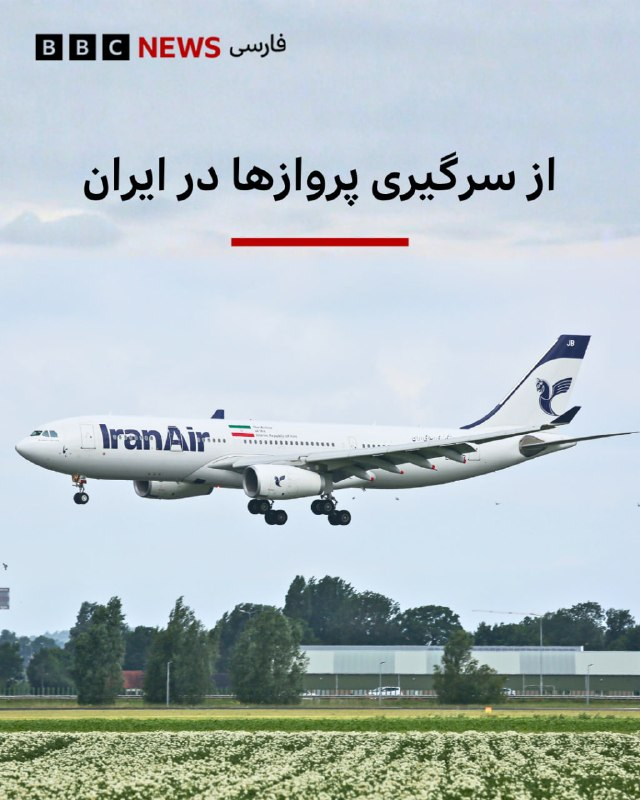

🔻در پی توقف حملات ایران و اسرائیل به یکدیگر، سازمان هواپیمایی کشوری ایران اعلام کرد که فضای هوایی کشور به حالت عادی بازگشته است.

پیشتر تمام پروازها در ایران «تا اطلاع ثانوی» لغو اعلام شده بود.

به گزارش رسانه‌های داخلی ایران ابوذر شیرودی، رئیس سازمان هواپیمایی کشوری، گفته است: «با فراهم شدن شرایط ایمن و انجام هماهنگی‌های لازم با نهادهای ذی‌ربط، محدودیت‌های پروازی رفع شده و فعالیت‌های هوانوردی کشور طبق برنامه در حال بازگشت به روال عادی است.»

این سازمان اضافه کرده است که مسافران پیش از انجام پرواز، آخرین وضعیت پروازها و اطلاعیه‌های شرکت‌های هواپیمایی و فرودگاه‌ها از مراجع رسمی پیگیری کنند.

📸Getty Images
@BBCPersian

## alonews — post 126361

  <a href="telegram/content/alonews_126361_1780940613.webm" target="_blank">🎬 Download video</a>

👈قالیباف: هدف ما پایان جنگ و ایجاد امنیت پایدار است و نه عادی سازی روابط با آمریکا و اعتمادی هم به طرف مقابل نداریم. البته روش ما احساسی عملیات کردن یا صرفا اعلام حقوق ملت ایران یا محکوم کردن جنایات دشمن نیست

✅ @AloNews خبر جنگ

## alonews — post 126360

  <a href="telegram/content/alonews_126360_1780940613.webm" target="_blank">🎬 Download video</a>

👈قالیباف: دست نیروهای مسلح برای اقدام همواره باز بوده و بر اساس تدبیر و برنامه ریزی درست و تصمیم تصویب شده عمل می کنند.

✅ @AloNews خبر جنگ

## alonews — post 126359

  <a href="telegram/content/alonews_126359_1780940613.webm" target="_blank">🎬 Download video</a>

👈قالیباف: قرار نیست یا جنگ کنیم و یا مذاکره بلکه قرار است به وقت خود جنگ کنیم و به وقت خود مذاکره کنیم و اینگونه است که می توانیم دشمن را شکست دهیم و این که می گوییم مذاکره ادامه مبارزه است عینیت پیدا کند.

🔴لازم است روی یک برداشت غلط خط بطلان بکشم، برخلاف تصور برخی که فکر می کنند بین مسئولان هماهنگی نیست، هماهنگی کامل برای رسیدن به اهداف میان مسئولان وجود دارد

✅ @AloNews خبر جنگ

## alonews — post 126358

  <a href="telegram/content/alonews_126358_1780940613.webm" target="_blank">🎬 Download video</a>

👈قالیباف: ماجرای لبنان نشان می دهد میدان دیپلماسی کنار میدان نظامی می تواند اسرائیل و دشمنان را کنار بزند.

🔴نه دیپلماسی مانع عملیات نظامی است و نه عملیات نظامی مانع دیپلماسی است.
یک بار با تهدید به حمله و قطع مذاکره جلوی حمله اسرائیل به بیروت را می گیریم و بار دیگر با حمله نشان می دهیم ترسی از قطع مذاکرات نداریم و نتیجه این می شود که آنها مجبور می شوند عقب نشینی کنند و ما حق خود را تثبیت می کنیم.

🔴تصور کنید اگر ما در میدان نظامی پیروز نشده بودیم یا در میدان دیپلماسی جلو نرفته بودیم و یا میدان های نظامی و دیپلماسی با یکدیگر به درستی پاسکاری نکرده و پشتیبانِ هم نبودند و با هم هماهنگی نداشتند، آن وقت دست ما برای حمایت از لبنان و مقابله با محاصره دریایی بسته بود.

🔴موضوع فقط لبنان نیست بلکه موضوع رسیدن به حق مردم و ایجاد امنیت باثبات برای کشور است و باید هر ۴ میدان در کنار هم و هماهنگ با یکدیگر این اهداف را تأمین کنند.

✅ @AloNews خبر جنگ

## alonews — post 126357

  <a href="telegram/content/alonews_126357_1780940613.mp4" target="_blank">🎬 Download video</a>

👈نیرو های نظامی ایران خطاب به ترامپ:
عمو ترامپ با توئیت که نمیشه جنگ کرد، این ارتش و ناو و جنگنده‌هاتو بفرست خسته شدیم دیگه

✅ @AloNews خبر جنگ

## alonews — post 126356

  <a href="telegram/content/alonews_126356_1780940615.webm" target="_blank">🎬 Download video</a>

👈کانال ۱۳ تلویزیون اسرائیل به نقل از یک منبع: نتانیاهو به وزرا اطلاع داده است که انتظار می‌رود اسرائیل به چندین دور از تشدید تنش با ایران بازگردد.

✅ @AloNews خبر جنگ

## alonews — post 126355

  <a href="telegram/content/alonews_126355_1780940615.webm" target="_blank">🎬 Download video</a>

👈عراقچی: همسایگان ما در اولویت ما هستند

🔴صمیمانه‌ترین تبریکات خود را به جناب آقای نیکول پاشینیان، نخست وزیر ارمنستان، بابت پیروزی حزبشان در انتخابات ابراز می‌داریم.

🔴خوشحالیم که فرصت خوبی برای استمرار همکاری های سازنده در راستای تقویت روند پویای حاکم بر روابط ایران و ارمنستان فراهم شده است

✅ @AloNews خبر جنگ

---
📅 بروزرسانی: 1405/03/18 21:03
---

## mwarmonitor — post 10486

🔸رئیس پارلمان لبنان، نبیه بری، انتظار می‌رود به‌صورت علنی از توافقی که در واشنگتن میان لبنان و اسرائیل حاصل شده حمایت کند، یک منبع آمریکایی به شبکه MTV لبنان گفته است.

🔸بری، یکی از چهره‌های اصلی شیعه و از متحدان قدیمی حزب‌الله، تا پیش از این نسبت به مذاکرات واشنگتن ابراز تردید و مخالفت کرده بود.

@mwarmonitor

## FarsiVOA — post 220043

🔺نتانیاهو: کارزار علیه جمهوری اسلامی و حزب‌الله پایان نیافته است؛ هر حمله‌ای با پاسخ قاطع اسرائیل روبه‌رو خواهد شد

◾️بنیامین نتانیاهو، نخست‌ وزیر اسرائیل، روز دوشنبه ۱۸ خرداد در سخنانی خطاب به مردم اسرائیل اعلام کرد که گرچه در حال حاضر حملات متقابل میان اسرائیل و جمهوری اسلامی متوقف شده است، اما کارزار اسرائیل علیه رژیم ایران و حزب‌الله همچنان ادامه دارد، و هرگونه حمله جدیدی با واکنش شدید اسرائیل مواجه خواهد شد.

⬇️ بیشتر بخوانید:

https://ir.voanews.com/a/netanyahu-says-israels-campaign-against-iran-hezbollah-not-over/8158561.html

## Dirty_Kids — post 391400

  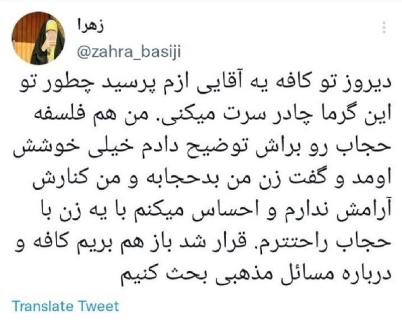

فکر نمیکنم قرار بعدی توی کافه باشه ها !!!

شما چطور؟

@Dirty_Kids 👻

## Dirty_Kids — post 391399

  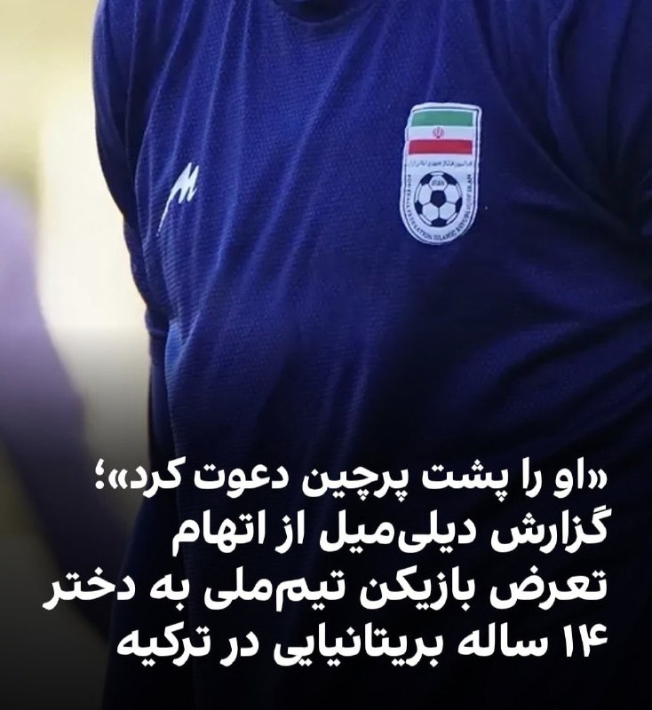

تنفر مردم ایران از فوتبالیست‌های تیم ملا فقط به خاطر حمایتشان از حکومت نیست.
آنها ویترین جمهوری اسلامی‌اند؛ ویترینی که پشت آن چیزی جز ریاکاری، رذالت، وقاحت و شرارت دیده نمی‌شود. هرکدامشان به شکلی بازتاب همان چرکی هستند که ۴۷ سال است بر ایران حکومت می‌کند.

@Dirty_Kids 👻

## Dirty_Kids — post 391398

  <a href="telegram/content/Dirty_Kids_391398_1780940027.mp4" target="_blank">🎬 Download video</a>

احتمالا امسال هم این روند ادامه داشته باشه😉

@Dirty_Kids 👻

## Hranews — post 113472

مشهد؛ مرگ ۲ کارگر در سایه فقدان ایمنی کار

❗️
❗️
❗️
❗️
❗️– در سایه فقدان ایمنی محیط و شرایط نامناسب کار، دو #کارگر در مشهد حین انجام کار طی حادثه ای جان باختند.

ادامه مطلب

↘️
@hranews_bot تماس ✉️ - @Hranews کانال هرانا 🆑

## alonews — post 126354

  <a href="telegram/content/alonews_126354_1780940028.webm" target="_blank">🎬 Download video</a>

👈قالیباف: صحبت های رئیس جمهور آمریکا درباره یادداشت تفاهم، مخالف بخش های توافق شده بود که نشان داد آنها نه دنبال آتش بس هستند و نه دنبال گفت وگو و باید برای دفاع از حقوق ملت ایران پاسخ قاطع می دادیم که به لطف الهی نیروهای مسلح ما با اقتدار به وظیفه خود عمل کردند.

✅ @AloNews خبر جنگ

## alonews — post 126353

  <a href="telegram/content/alonews_126353_1780940028.webm" target="_blank">🎬 Download video</a>

👈قالیباف: آنچه باعث تنش های اخیر شد این بود که آمریکایی ها هم با محاصره دریایی علیه ملت ایران و هم با نقض توافقی که درباره آتش بس لبنان شده بود، آتش بس را نقض فاحش کردند.

✅ @AloNews خبر جنگ

## alonews — post 126352

  <a href="telegram/content/alonews_126352_1780940029.webm" target="_blank">🎬 Download video</a>

👈دونالد ترامپ مدعی شد که پنج کشور منطقه که در میانجی‌گری میان آمریکا و ایران نقش دارند، از او خواسته‌اند تا بر بنیامین نتانیاهو، نخست‌وزیر اسرائیل فشار آورد تا حملات را متوقف کرده و به سمت توافق حرکت کند.

✅ @AloNews خبر جنگ

## alonews — post 126351

  <a href="telegram/content/alonews_126351_1780940029.webm" target="_blank">🎬 Download video</a>

👈یک مقام ارشد اسرائیلی به کانال ۱۴ گفت که: بازگشت به درگیری شدید با رژیم ایران «فقط مسئله‌ای در کوتاه‌مدت است، احتمالاً در روزهای آینده».

🔴 وضعیت هشدار بالا تا اطلاع ثانوی، هم از نظر دفاعی و هم تهاجمی، حفظ می‌شود.

✅ @AloNews خبر جنگ

## alonews — post 126350

  <a href="telegram/content/alonews_126350_1780940029.webm" target="_blank">🎬 Download video</a>

👈ترامپ: فکر میکنم ایران مایل به امضای توافق است

✅ @AloNews خبر جنگ

## alonews — post 126349

  <a href="telegram/content/alonews_126349_1780940029.webm" target="_blank">🎬 Download video</a>

👈حداقل ۳۲ نفر کشته شدند و بیش از ۱۰۰ نفر زخمی شدند در نتیجه زلزله قدرتمند با بزرگای ۷.۸ ریشتری که در سواحل مینداناو در جنوب فیلیپین رخ داد.

✅ @AloNews خبر جنگ

---
📅 بروزرسانی: 1405/03/18 20:53
---

## VahidOOnLine — post 244404

  <a href="telegram/content/VahidOOnLine_244404_1780939406.mp4" target="_blank">🎬 Download video</a>

ارتش اسرائیل با انتشار تصاویری از حملات گسترده به سامانه‌های پدافند هوایی جمهوری اسلامی در غرب و مرکز ایران در روز دوشنبه خبر داد. به گفته این ارتش، این سامانه‌ها برای بازسازی توان دفاعی ایران مستقر شده بودند و انهدام آنها برتری هوایی اسرائیل را در حریم هوایی ایران تقویت می‌کند.
‌🏁 🇬🇧 IranintlTV

🤖 @VahidOOnLine

## VahidOOnLine — post 244403

  <a href="telegram/content/VahidOOnLine_244403_1780939408.mp4" target="_blank">🎬 Download video</a>

♦️با گشایش دوباره آب در زاینده‌رود، ویدیویی از قایقرانی با پاروی یک زن جوان اصفهانی در نزدیکی پل‌ تاریخی خواجو در میان کاربران شبکه‌های اجتماعی پربازدید شده است.
پس از ۱۱ ماه خشکی، جریان رودخانه زاینده‌رود چهارشنبه‌شب ۱۳ خردادماه، بار دیگر به شهر اصفهان رسید و در بستر این رودخانه تاریخی جاری شد.
بسیاری از مردم در اصفهان با حضور بر پل‌های تاریخی این شهر و یا انجام ورزش‌ها و سرگرمی‌های آبی، بازگشایی آب در زاینده‌رود را جشن گرفتند.
‌🇸🇦 Indypersian

🤖 @VahidOOnLine

## WithYashar — post 14050

ترامپ به کانال 12 اسرائیل:
به نتانیاهو گفتم اگر جنگی تمام‌عیار علیه ایران آغاز کنه، اونو تنها خواهم گذاشت.
@withyashar

## mwarmonitor — post 10485

🔴مقام مسئول در دستگاه امنیتی اسرائیل: بازگشت به درگیری شدید با ایران فقط مسئله زمان است، و این زمان خیلی طولانی نخواهد بود؛ ممکن است در روزهای آینده اتفاق بیفتد. @mwarmonitor

## mwarmonitor — post 10484

🚨شبکه ۱۲ اسرائیل گزارش می‌دهد که ترامپ در یک تماس تلفنی پرتنش به نتانیاهو هشدار داده بود که پس از شلیک موشک‌های تهران به سمت اسرائیل، به ایران حمله نکند؛ او گفته بود نمی‌خواهد جنگ جدیدی آغاز شود و اسرائیل از «چراغ سبز» آمریکا برای تشدید تنش برخوردار نیست.

📌بر اساس این گزارش، نتانیاهو استدلال کرده بود که ایران حاکمیت اسرائیل را نقض کرده و اسرائیل باید یک خط قرمز تعیین کند. سپس اسرائیل دو موج حمله در ایران انجام داد، حدود ساعت ۳ و ۷ صبح به وقت محلی، و ایران نیز بعداً در همان صبح دوباره پاسخ داد.

📌پس از آخرین حمله، ایران طبق گزارش‌ها به دولت ترامپ اعلام کرد که آماده آتش‌بس است. در همین حال اسرائیل در حال آماده‌سازی یک حمله بزرگ‌تر دیگر در ایران بود، اما ترامپ با نتانیاهو تماس گرفت و به او گفت حمله را متوقف کند و گفت: «کاری که لازم بود انجام دادی، حالا آتش را متوقف کن، ما به سمت توافق می‌رویم.»

📌نتانیاهو به مرکز فرماندهی اسرائیل بازگشت و دستور توقف حمله را صادر کرد؛ طبق گزارش‌ها این تصمیم باعث شد برخی مقامات ارشد نظامی در حالی که هواپیماها آماده پرواز بودند، غافلگیر و تا حدی شرمنده شوند.

@mwarmonitor

## pm_afshaa — post 92960

  <a href="telegram/content/pm_afshaa_92960_1780939408.webm" target="_blank">🎬 Download video</a>

🔴ترامپ: اسرائیلی‌ها وقتی جنگنده‌هاشون تو مسیر ایران بودن، به ما خبر دادن که میخوان حمله کنن؛ من هم سریع وارد عمل شدم و تلاش کردم ابعاد حمله محدودتر بشه.

همچنین 5 کشور منطقه با من تماس گرفتن و خواستن روی نتانیاهو فشار بیارم که حمله نکنه و من هم با نتانیاهو صحبت کردم و اون در نهایت موافقت کرد.

💧 Rainbet.com the #1 Non-KYC Crypto Casino & Sportsbook @rainbetcom

😁 @Pm_Afshaa

## pm_afshaa — post 92959

  <a href="telegram/content/pm_afshaa_92959_1780939409.webm" target="_blank">🎬 Download video</a>

🔴ترامپ به کانال 12 اسرائیل:
به نتانیاهو گفتم اگر جنگی تمام‌عیار علیه ایران آغاز کنه، اونو تنها خواهم گذاشت.

💧 Rainbet.com the #1 Non-KYC Crypto Casino & Sportsbook @rainbetcom

😁 @Pm_Afshaa

## DEJradio — post 5475

  <a href="telegram/content/DEJradio_5475_1780939410.webm" target="_blank">🎬 Download video</a>

🕐
🔺 بنیامین نتانیاهو:
رویارویی ما با حـ.ـزب‌الله و جمهوری اسلامی هنوز به پایان نرسیده است

بنیامین نتانیاهو نخست‌وزیر اسرائیل، ساعاتی پس از فروکش کردن درگیری‌ها با جمهوری اسلامی در جمع خبرنگاران گفت: «ما یک حمله پیش‌دستانه تاریخی علیه تلاش‌های ایران برای دستیابی به سلاح هسته‌ای انجام دادیم. این تهدید فوری را خنثی کردیم و همچنین خامنه‌ای را از میان برداشتیم.»

او افزود: «اگر به‌موقع و با قدرت اقدام نکرده بودیم، امروز اینجا نبودیم. و بار دیگر تاکید می‌کنم که ایران هرگز به سلاح هسته‌ای دست نخواهد یافت.»

نخست‌وزیر اسرائیل گفت: «ما همچنان به نابودی تمامی زیرساخت‌های تروریستی جمهوری اسلامی و حـ.ـزب‌الله در منطقه حائل ادامه می‌دهیم؛ از جمله تاسیسات زیرزمینی عظیمی در ارتفاعات بوفور که به‌قدری بزرگ بودند که تاکنون نمونه‌ای مانند آن‌ها ندیده بودم. جمهوری اسلامی و حـ.ـزب‌الله امروز ضعیف‌تر از همیشه‌اند و ما قوی‌تر از همیشه. با این حال، رویارویی ما با آن‌ها هنوز به پایان نرسیده است.»

#جنگ #نتانیاهو
@DEJradio

## IranIntlTV — post 341214

  <a href="telegram/content/IranIntlTV_341214_1780939410.mp4" target="_blank">🎬 Download video</a>

ارتش اسرائیل با انتشار تصاویری از حملات گسترده به سامانه‌های پدافند هوایی جمهوری اسلامی در غرب و مرکز ایران در روز دوشنبه خبر داد. به گفته این ارتش، این سامانه‌ها برای بازسازی توان دفاعی ایران مستقر شده بودند و انهدام آنها برتری هوایی اسرائیل را در حریم هوایی ایران تقویت می‌کند.

## IranianMinds — post 21870

  <a href="telegram/content/IranianMinds_21870_1780939412.mp4" target="_blank">🎬 Download video</a>

🔴حملات هوایی اسرائیل دقایقی پیش:

جنوب لبنان / ملکخ

@IranianMinds

## alonews — post 126348

  <a href="telegram/content/alonews_126348_1780939415.webm" target="_blank">🎬 Download video</a>

👈ترامپ به کانال ۱۲ اسرائیل: به نتانیاهو گفتم اگر جنگی تمام‌عیار علیه ایران آغاز کند، او را تنها خواهم گذاشت

🔴من دیشب از نتانیاهو خواستم که به حملات ایران پاسخ ندهد

✅ @AloNews خبر جنگ

---
📅 بروزرسانی: 1405/03/18 20:43
---

## VahidOOnLine — post 244402

  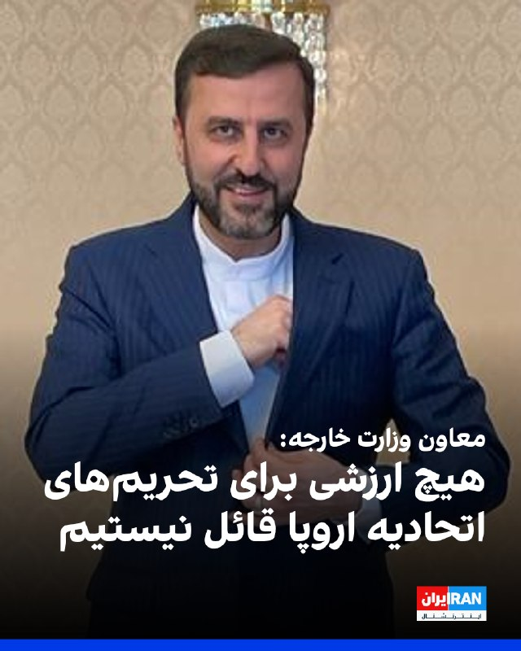

کاظم غریب‌آبادی، معاون وزارت خارجه جمهوری اسلامی، در واکنش به تحریم نهادها و مقام‌های حکومت از سوی اتحادیه اروپا، در شبکه ایکس نوشت که جمهوری اسلامی هیچ ارزشی برای تحریم‌های اتحادیه اروپا قائل نیست و به راهبرد خود در حفظ حاکمیت و اعمال حقوق حاکمیتی در تنگه هرمز ادامه خواهد داد.

غریب‌آبادی تحریم‌های اخیر اتحادیه اروپا را «اقدام سیاسی و ریاکارانه» توصیف کرد.

او افزود: «بایستی خاطرنشان کنم که ایران عضو کنوانسیون حقوق دریاها نیست. رژیم حقوقی مورد تأکید ایران در تنگه هرمز، «عبور بی‌ضرر» بر پایه حقوق بین‌الملل عرفی و رعایت ملاحظات ایمنی و امنیت دریایی دولت ساحلی است.»

معاون وزارت خارجه نوشت: «اتحادیه در برابر محاصره دریایی آمریکا علیه ایران که یک اقدام جنگی محسوب می شود نیز عامدانه سکوت کرده است.»
‌🏁 🇬🇧 IranintlTV

🤖 @VahidOOnLine

## WithYashar — post 14049

ترامپ : اسرائیلی‌ها وقتی جنگنده‌هاشون تو مسیر ایران بودن، به ما خبر دادن

من هم سریع وارد عمل شدم و تلاش کردم ابعاد حمله محدودتر بشه

همچنین پنج کشور منطقه با من تماس گرفتن و خواستن روی نتانیاهو فشار بیارم که حمله نکنه

من هم با نتانیاهو صحبت کردم و اون در نهایت موافقت کرد
@withyashar

## WithYashar — post 14048

اولین تصاویر از حمله به یک کشتی باری با پرچم پالائو با ۲۴ خدمه هندی در نزدیکی تنگه هرمز ساعتی پیش , بر اساس این گزارش‌ها، در این حمله موتورخانه کشتی هدف قرار گرفته است. @withyashar

## WithYashar — post 14047

## mwarmonitor — post 10483

🔴مقام مسئول در دستگاه امنیتی اسرائیل: بازگشت به درگیری شدید با ایران فقط مسئله زمان است، و این زمان خیلی طولانی نخواهد بود؛ ممکن است در روزهای آینده اتفاق بیفتد.

@mwarmonitor

## mwarmonitor — post 10482

🔴ترامپ:

🔸به بنیامین نتانیاهو گفتم بهتر است بسیار محتاط باشد در کاری که انجام می‌دهد، چون ممکن است خیلی زود خودش را در برابر ایران تنها ببیند.

🔸در شب یکشنبه، نتانیاهو دیر وقت دوباره با من تماس گرفت و اطلاع داد که تصمیم به حمله گرفته است.

🔸اسرائیلی‌ها به ما اطلاع دادند زمانی که هواپیماها در مسیر ایران بودند، و من اقدام کردم تا دامنه حمله را محدود کنم.

🔸پنج کشور منطقه با من تماس گرفتند و خواستند بر نتانیاهو فشار بیاورم تا حمله نکند؛ با بنیامین تماس گرفتم و او موافقت کرد.

@mwarmonitor

## IranIntlTV — post 341213

  <a href="telegram/content/IranIntlTV_341213_1780938808.mp4" target="_blank">🎬 Download video</a>

در این قسمت از برنامه، مجتبا پورمحسن در گزارش روزش، به جزئیات جنگ یک روزه جمهوری اسلامی و اسرائیل و رد درخواست ترامپ از طرف ترامپ برای خودداری از تلافی می‌ءردازد و از تلاش سپاه پاسداران برای تغییر راهبرد به حمله پیش‌دستانه می‌گوید.
@iranintltv

## IranIntlTV — post 341212

  

کاظم غریب‌آبادی، معاون وزارت خارجه جمهوری اسلامی، در واکنش به تحریم نهادها و مقام‌های حکومت از سوی اتحادیه اروپا، در شبکه ایکس نوشت که جمهوری اسلامی هیچ ارزشی برای تحریم‌های اتحادیه اروپا قائل نیست و به راهبرد خود در حفظ حاکمیت و اعمال حقوق حاکمیتی در تنگه هرمز ادامه خواهد داد.

غریب‌آبادی تحریم‌های اخیر اتحادیه اروپا را «اقدام سیاسی و ریاکارانه» توصیف کرد.

او افزود: «بایستی خاطرنشان کنم که ایران عضو کنوانسیون حقوق دریاها نیست. رژیم حقوقی مورد تأکید ایران در تنگه هرمز، «عبور بی‌ضرر» بر پایه حقوق بین‌الملل عرفی و رعایت ملاحظات ایمنی و امنیت دریایی دولت ساحلی است.»

معاون وزارت خارجه نوشت: «اتحادیه در برابر محاصره دریایی آمریکا علیه ایران که یک اقدام جنگی محسوب می شود نیز عامدانه سکوت کرده است.»
https://iranintl.com/202606089803

## FarsiVOA — post 220042

  <a href="telegram/content/FarsiVOA_220042_1780938811.mp4" target="_blank">🎬 Download video</a>

فاطمه حقیقت‌جو در برنامه میدان میگوید آقای موسوی هیچ‌ وقت ادعای رهبری جنبش سبز را نکرد. رضا علیجانی هم جنبش سبز را اولین شکاف مهم در ساختار حکومت و جامعه می‌داند.

## DW_Farsi — post 125699

  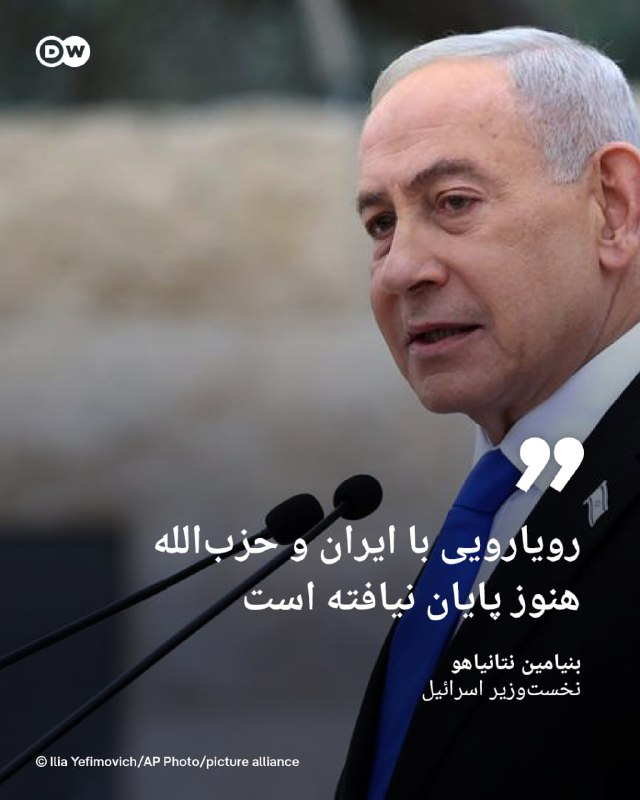

🔶نتانیاهو: رویارویی با ایران و حزب‌الله هنوز پایان نیافته است

بنیامین نتانیاهو در بیانیه‌ای گفت که اجازه نخواهد داد دشمنان اسرائیل چارچوب امنیتی این کشور را تعیین کنند. او جمهوری اسلامی و حزب‌الله را متهم کرد که می‌کوشند "معادله تازه‌ و غیرقابل‌پذیرشی" را به اسرائیل تحمیل کنند.

او با اشاره به "ضعیف‌تر بودن جمهوری اسلامی و حزب‌الله" نسبت به هر زمان دیگری، اسرائیل را قوی‌تر از همیشه توصیف کرد و افزود که رویارویی با ایران و حزبـالله هنوز پایان نیافته است.

نتانیاهو جمهوری اسلامی و حزب‌الله را متهم کرد که در ۲۴ ساعت گذشته کوشیدند "معادله تازه‌" و "غیرقابل تحمل و پذیرشی" را به اسرائیل تحمل کنند.

او در کنار اشاره به حمله موشکی ایران و با متهم کردن حزب‌الله به تلاش برای تصرف منطقه جلیل گفت که این دو در این تصور بوده‌اند که اگر از خاک لبنان و ایران به سوی اسرائیل آتش بگشایند این کشور واکنشی نشان نمی‌دهد.

@dw_farsi

## alonews — post 126347

  <a href="telegram/content/alonews_126347_1780938812.webm" target="_blank">🎬 Download video</a>

👈ترامپ : اسرائیلی‌ها وقتی جنگنده‌هاشون تو مسیر ایران بودن، به ما خبر دادن

🔴 من هم سریع وارد عمل شدم و تلاش کردم ابعاد حمله محدودتر بشه

🔴 همچنین پنج کشور منطقه با من تماس گرفتن و خواستن روی نتانیاهو فشار بیارم که حمله نکنه

🔴 من هم با نتانیاهو صحبت کردم و اون در نهایت موافقت کرد

✅ @AloNews خبر جنگ

## alonews — post 126346

  <a href="telegram/content/alonews_126346_1780938812.webm" target="_blank">🎬 Download video</a>

👈برخی کاربران مدعی شده‌اند که دارایی‌شان در چند صرافی رمزارز خارجی، به بهانه تحریم و بدون هشدار قبلی مسدود شده است.

✅ @AloNews خبر جنگ

## alonews — post 126345

  <a href="telegram/content/alonews_126345_1780938812.webm" target="_blank">🎬 Download video</a>

👈سخنگوی سیاسی جنبش حماس مدعی شد ایران به این جنبش اطلاع داده که در حال انجام تلاش‌ های فشرده برای گنجاندن غزه در چارچوب یک آتش‌ بس منطقه‌ ای میان ایران و ایالات متحده است!

✅ @AloNews خبر جنگ

---
📅 بروزرسانی: 1405/03/18 20:33
---

## VahidOOnLine — post 244401

  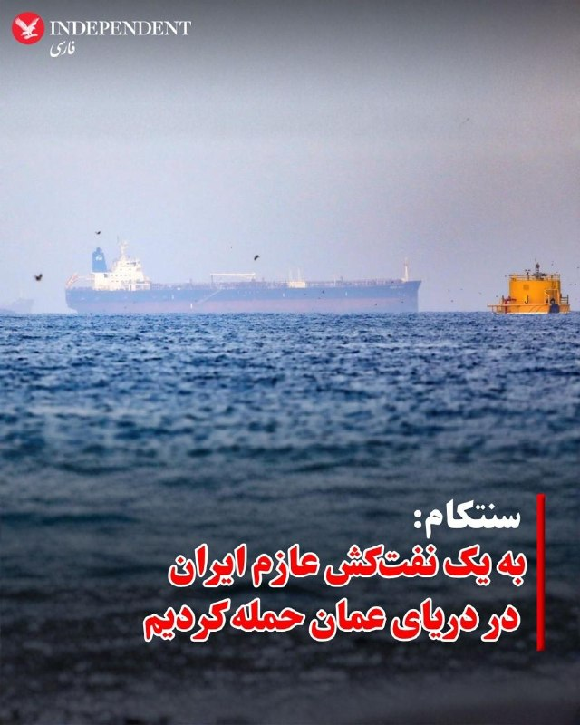

♦️ستاد فرماندهی مرکزی ایالات متحده (سنتکام) اعلام کرد نیروهای آمریکایی روز دوشنبه ۱۸ خرداد یک نفت‌کش بدون محموله را در دریای عمان از کار انداخته‌اند. به گفته این نهاد، کشتی در تلاش بود با نقض محاصره اعمال‌شده علیه ایران به یکی از بنادر این کشور برود.
سنتکام در بیانیه‌ای در شبکه‌ اجتماعی ایکس اعلام کرد نفت‌کش «ام‌تی ماریوکس» (M/T Marivex) با پرچم پالائو در حالی که در آب‌های بین‌المللی دریای عمان به سمت ایران در حرکت بود، هدف نیروهای آمریکایی قرار گرفت.
بر اساس این بیانیه، یک جنگنده اف/ای-۱۸ سوپر هورنت مستقر بر ناو هواپیمابر «یواس‌اس آبراهام لینکلن» پس از آنکه خدمه کشتی به دستورهای نیروهای آمریکایی توجه نکردند، مهمات هدایت‌شونده دقیق را به بخش‌های فنی و سامانه هدایت کشتی شلیک کرد.
سنتکام مدعی شد در نتیجه این حمله، نفت‌کش دیگر قادر به ادامه مسیر به سوی ایران نیست.
این بیانیه چند ساعت پس از گزارش مقام‌های عمانی و هندی درباره آتش‌سوزی در نفت‌کش «ام‌تی ماریوکس» و تخلیه ۲۴ ملوان هندی آن منتشر شد. در گزارش‌های اولیه، علت آتش‌سوزی اعلام نشده بود.
‌🇸🇦 Indypersian

🤖 @VahidOOnLine

## WithYashar — post 14046

## WithYashar — post 14045

https://www.instagram.com/p/DZVPTMXimwH/?carousel_share_child_media_id=3915096515448243728_1949382920&comment_id=18101525783027855 کامنت پیغاممون رو زدم زیر پست شاهزاده کار های‌ اداریش رو انجام بدید امیدمون رو از دست نمیدیم 😍✌🏾 بترکونیننن 💥😍✌🏾 هوای همدیگرو…

## FarsiVOA — post 220041

⚡️با شعله‌ور شدن دوباره درگیری‌ها؛ اقلیم کردستان در معرض دور جدید حملات

## FarsiVOA — post 220039

⚡️حواشی تیم ملی فوتبال ایران تمامی ندارد، به نوشته دیلی میل یکی از بازیکنان تیم دختر ۱۴ ساله بریتانیایی را مورد آزار و اذیت کلامی قرار داده است.

## BBCPersian — post 283198

🖊 سعید جعفری، روزنامه‌نگار

🔻بعد از چند ماه برقراری آتش‌بس شکننده که در آن تبادل آتش به صورت پراکنده بین ایران و آمریکا در جریان بود، شامگاه یکشنبه موشک‌های بالستیک ایران بار دیگر به سمت اهدافی در اسرائيل شلیک شدند.

اتفاقی که بر اساس بیانیه‌های مقام‌های نظامی در جمهوری اسلامی «در واکنش به حملات اسرائيل به ضاحیه بیروت» صورت گرفت.

هرچند مقام‌های ایرانی از ابتدای برقراری آتش‌بس مدعی شده بودند که این وضعیت جدید شامل لبنان هم می‌شود اما اسرائيل عملا هرگز به این بند پایبند نبود و در این مدت بارها اهداف مختلفی در لبنان مورد بمباران اسرائيلی‌ها قرار گرفت.

بیشتر بخوانید:
https://bbc.in/4vybn4l
📸 Wisam Hashlamoun/Anadolu via Getty Images / Hamed Malekpour - ICANA News Agency via Getty Images / Ilia YEFIMOVICH / AFP via Getty Images / FADEL itani / AFP via Getty Images / ATTA KENARE / AFP via Getty Images/ Enver Asfur/Anadolu via Getty Images
@BBCPersian

## BBCPersian — post 283197

  <a href="telegram/content/BBCPersian_283197_1780938213.mp4" target="_blank">🎬 Download video</a>

🔻دست‌کم ۱۹ نفر پس از وقوع زمین‌لرزه‌ای به بزرگی ۷/۸ در سواحل جزیره میندانائو در جنوب فیلیپین جان باختند.

مقام‌های فیلیپین گفته‌اند که این زمین‌لرزه روز دوشنبه ساعت ۰۷:۳۷ به وقت محلی (یکشنبه ۲۳:۳۷ به وقت گرینویچ) رخ داد و هشدار سونامی در فیلیپین، اندونزی، ژاپن و استرالیا را به دنبال داشت. برخی از این هشدارها چند ساعت بعد لغو شدند.

ویدیوها و تصاویر که منتشر شده‌اند، فروریختن برخی از ساختمان‌ها را نشان می‌دهد؛ از جمله ویدیویی از یک شعبه رستوران فست‌فود به نام «جولی‌بی» که به تلی از آوار تبدیل شده است.

آقای مارکوس همچنین دستور تعطیلی مدارس در مناطق آسیب‌دیده را صادر کرد. این زمین‌لرزه همزمان با نخستین روز سال تحصیلی جدید در فیلیپین رخ داد. در یکی از ویدیوهای منتشرشده توسط یک مدرسه ابتدایی در استان داوائو اوکسیدنتال، ده‌ها دانش‌آموز وحشت‌زده دیده می‌شوند که روی زمین لرزان چمباتمه زده‌اند.

به گفته یک مقام محلی، دست‌کم ۱۳۴ نفر در چندین استان از جمله کوتاباتو جنوبی، سلطان کودارات، سارانگانی و شهر جنرال سانتوس زخمی شده‌اند. این آمار هنوز از سوی سازمان ملی مدیریت بحران فیلیپین تایید نشده است.

@BBCPersian

## Dirty_Kids — post 391396

  <a href="telegram/content/Dirty_Kids_391396_1780938215.mp4" target="_blank">🎬 Download video</a>

وسط جنگ و آتش‌بس این ماهی شگفت انگیز رو هم ببینید جالبه

@Dirty_Kids 👻

## Dirty_Kids — post 391395

  <a href="telegram/content/Dirty_Kids_391395_1780938217.mp4" target="_blank">🎬 Download video</a>

گنده‌گوزی شروع شد:

عمو ترامپ، با توییت که نمیشه جنگ کرد، این ارتش و ناو و جنگنده‌هاتو بفرست خسته شدیم دیگه؛

یه‌ذره بیا جلوتر ببین اصلا ایران چیکارست، بیا و ببین آقای تنگه هرمز کیه.

+ بدون اینکه نیرو پیاده کنه بالاترین مقامات کشته:/ آسمونمون اتوبانه، هنوز بیشتر سلاح‌هاشو استفاده نکرده

@Dirty_Kids 👻

## Hranews — post 113471

دانشگاه خواجه‌نصیرالدین طوسی؛ ۴ دانشجو به منع موقت از تحصیل محکوم شدند

❗️
❗️
❗️
❗️
❗️– علیرضا جعفری‌آثار، سیدمحمد سیدعبودی، رضا صالحی و حسین محمدی، دانشجویان دانشگاه خواجه‌نصیرالدین طوسی توسط کمیته انضباطی این دانشگاه مجموعا به هفت ترم منع موقت از تحصیل محکوم شدند.

ادامه مطلب

#علیرضا_جعفری‌آثار #سیدمحمد_سیدعبودی
#رضا_صالحی #حسین_محمدی

↘️
@hranews_bot تماس ✉️ - @Hranews کانال هرانا 🆑

## alonews — post 126344

  <a href="telegram/content/alonews_126344_1780938218.webm" target="_blank">🎬 Download video</a>

👈قیمت‌های عجیب هارد اکسترنال!

✅ @AloNews خبر جنگ

## alonews — post 126343

  <a href="telegram/content/alonews_126343_1780938218.mp4" target="_blank">🎬 Download video</a>

👈حملات هوایی اسرائیل چند لحظه پیش ارتفاعات ملکخ در جنوب لبنان را هدف قرار داد.

✅ @AloNews خبر جنگ

## alonews — post 126342

  <a href="telegram/content/alonews_126342_1780938220.webm" target="_blank">🎬 Download video</a>

👈روسیه از شهروندان خود خواست به اسرائیل سفر نکنند

✅ @AloNews خبر جنگ

---
📅 بروزرسانی: 1405/03/18 20:23
---

## VahidOOnLine — post 244400

  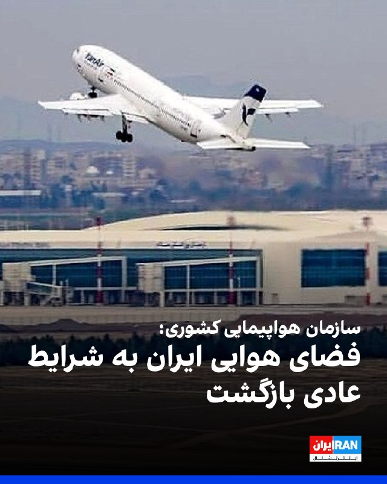

سازمان هواپیمایی کشوری ایران دوشنبه اعلام کرد فضای هوایی کشور به شرایط عادی بازگشته و عملیات هوانوردی مطابق با اطلاعیه‌های هوانوردی (نوتام)، از سر گرفته خواهد شد.

ابوذر شیرودی، رییس سازمان هواپیمایی کشوری در این باره گفت: «با فراهم شدن شرایط ایمن و انجام هماهنگی‌های لازم با نهادهای ذی‌ربط، محدودیت‌های پروازی رفع شده و فعالیت‌های هوانوردی کشور طبق برنامه در حال بازگشت به روال عادی است.»
‌🏁 🇬🇧 IranintlTV

🤖 @VahidOOnLine

## WithYashar — post 14044

https://www.instagram.com/p/DZVPTMXimwH/?carousel_share_child_media_id=3915096515448243728_1949382920&comment_id=18101525783027855

کامنت پیغاممون رو زدم زیر پست شاهزاده کار های‌ اداریش رو انجام بدید

امیدمون رو از دست نمیدیم 😍✌🏾 بترکونیننن 💥😍✌🏾

## WithYashar — post 14043

فرماندهی مرکزی آمریکا (CENTCOM) اعلام کرد نفتکش Marivex با پرچم کشور پالائو را در حالی که از آب‌های بین‌المللی دریای عمان به سمت ایران در حرکت بود، هدف قرار داده است.

پس از آنکه خدمه کشتی از اجرای دستورات نیروهای آمریکایی خودداری کردند، یک فروند جنگنده F/A-18 سوپر هورنت مستقر بر روی ناو هواپیمابر آبراهام لینکلن (CVN-72) یک مهمات هدایت‌شونده دقیق را به بخش موتورخانه و سامانه هدایت کشتی شلیک کرد
@withyashar

## pm_afshaa — post 92958

جمهوری اسلامی در حمایت از تروریست‌های حزب‌الله لبنان، درگیری نظامی دیگری را آغاز کرد تا ماهیت ناایرانی و ضدایرانی خود را آشکارتر کند. این رژیم، ملت ایران را به گروگان گرفته و جان و مال ایرانیان را ابزاری برای صدور ترور، جنگ و بی‌ثباتی می‌بیند. در این درگیری…

## IranIntlTV — post 341211

  <a href="telegram/content/IranIntlTV_341211_1780937602.mp4" target="_blank">🎬 Download video</a>

اسرائیل در حالی دوشنبه به حملات موشکی سپاه پاسخ داد که ترامپ درخواست نتانیاهو برای خودداری از حمله تلافی‌جویانه را رد کرد. پاسخی به اولین حمله پیش‌دستانه سپاه پاسداران که از تلاش جمهوری اسلامی برای تغییر راهبرد نظامی‌اش حکایت دارد.

گزارشی از مجتبا پورمحسن
@iranintltv

## IranIntlTV — post 341210

  

سازمان هواپیمایی کشوری ایران دوشنبه اعلام کرد فضای هوایی کشور به شرایط عادی بازگشته و عملیات هوانوردی مطابق با اطلاعیه‌های هوانوردی (نوتام)، از سر گرفته خواهد شد.

ابوذر شیرودی، رییس سازمان هواپیمایی کشوری در این باره گفت: «با فراهم شدن شرایط ایمن و انجام هماهنگی‌های لازم با نهادهای ذی‌ربط، محدودیت‌های پروازی رفع شده و فعالیت‌های هوانوردی کشور طبق برنامه در حال بازگشت به روال عادی است.»
https://iranintl.com/202606085214

## BBCPersian — post 283196

🔻ارتش اسرائیل از ساکنان جنوب لبنان خواست منطقه را ترک کنند

ارتش اسرائیل با صدور یک «هشدار فوری» از ساکنان جنوب لبنان، به‌ویژه در منطقه «زقوق المفدی» خواست خانه‌های خود را ترک کرده و به سمت شمال حرکت کنند.

آویخای ادرعی، سخنگوی عرب‌زبان ارتش اسرائیل، در شبکه اجتماعی ایکس نوشت: «در پی نقض توافق آتش‌بس از سوی گروه تروریستی حزب‌الله، ارتش اسرائیل ناگزیر است با قدرت اقدام کند. ارتش اسرائیل قصد آسیب رساندن به شما را ندارد.»

او همچنین هشدار داد: «هر فردی که در نزدیکی نیروهای حزب‌الله، تأسیسات آن یا تجهیزات و امکانات رزمی این گروه حضور داشته باشد، جان خود را به خطر می‌اندازد.»

این در حالیست که ایران امروز گفت عملیات جنگی علیه اسرائیل را متوقف کرده است اما هشدار داد اگر حمله به لبنان ادامه پیدا کند با شدتی بیشتر از قبل پاسخ خواهد داد.

https://bbc.in/4uS2DpO
@BBCPersian

## alonews — post 126340

  <a href="telegram/content/alonews_126340_1780937604.mp4" target="_blank">🎬 Download video</a>

👈سیستم پدافندی اوکراین پهپاد انتحاری روسیه رو مهندم میکنه، حین سقوط مستقیم میره میخوره تو یه ایستگاه اتوبوس

🔴دو کشته و ۱۲ زخمی گزارش شده!

✅ @AloNews خبر جنگ

## alonews — post 126339

  <a href="telegram/content/alonews_126339_1780937605.mp4" target="_blank">🎬 Download video</a>

👈حزب الله تصاویری را منتشر کرد که نشان می دهد جنگنده های آنها یک تانک مرکاوا را در مجاورت قلعه بوفورت در جنوب لبنان در 4 ژوئن با استفاده از یک موشک هدایت شونده هدف قرار می دهند

✅ @AloNews خبر جنگ

## alonews — post 126338

  <a href="telegram/content/alonews_126338_1780937608.webm" target="_blank">🎬 Download video</a>

👈وزارت خارجه ایالات متحده فروش احتمالی ۱.۹۸ میلیارد دلار سلاح به کویت برای سیستم‌های ضد پهپاد و تجهیزات مرتبط را تایید کرده است.

🔴این بسته شامل پلتفرم‌های ضد پهپاد رودرانر و آنویل، جعبه‌های پرتاب، سیستم‌های فرماندهی و کنترل لاتیس، برج‌های نگهبانی برد بلند و دریایی، سیستم‌های جنگ الکترونیک پالسار، مراکز عملیات تاکتیکی، به همراه خدمات پشتیبانی و آموزش مرتبط است.

✅ @AloNews خبر جنگ

---
📅 بروزرسانی: 1405/03/18 20:13
---

## VahidOOnLine — post 244399

  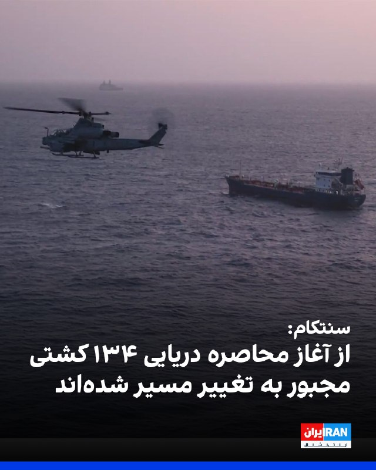

ستاد فرماندهی مرکزی آمریکا، سنتکام، اعلام کرد نیروهای آمریکا روز دوشنبه یک نفتکش بدون محموله در دریای عمان را از کار انداختند؛ پس از آن‌که این کشتی تلاش کرد محاصره دریایی را نقض کند.
سنتکام افزود: از ابتدای محاصره دریایی بنادر ایران تاکنون نیروهای آمریکایی هفت شناور متخلف را از کار انداخته‌اند، ۱۳۴ کشتی تجاری مجبور به تغییر مسیر شده و ۴۲ کشتی حامل کمک‌های بشردوستانه اجازه عبور دریافت کرده‌اند.
‌🏁 🇬🇧 IranintlTV

🤖 @VahidOOnLine

## VahidOOnLine — post 244398

  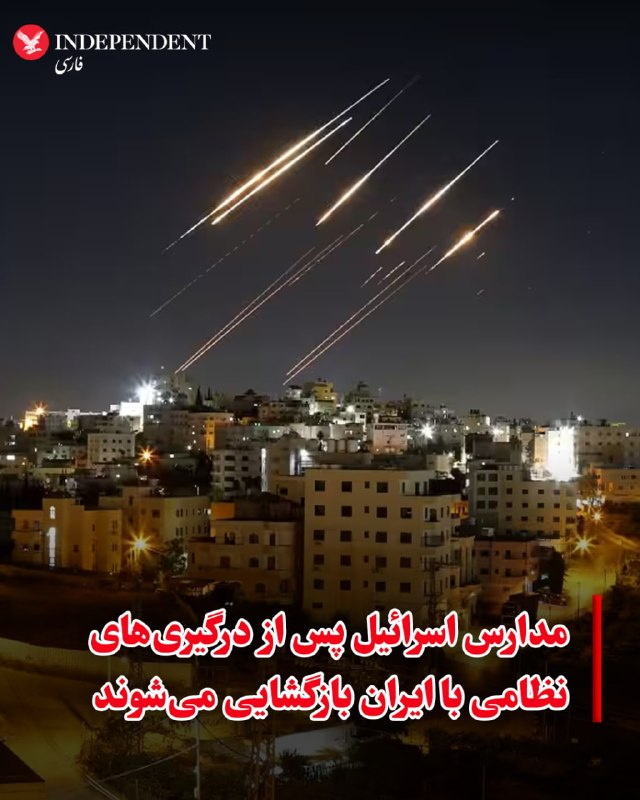

♦️وزارت آموزش اسرائیل، عصر دوشنبه اعلام کرد مدارس سراسر این کشور از روز سه‌شنبه ۱۹ خرداد فعالیت خود را از سر خواهند گرفت.
مدارس اسرائیل به دلیل حملات موشکی ایران به مدت یک روز تعطیل شده بودند.
وزارت آموزش اسرائیل روز دوشنبه در بیانیه‌ای اعلام کرد: «مطابق دستورالعمل‌های به‌روزشده فرماندهی جبهه داخلی، آموزش از فردا در تمامی موسسات آموزشی سراسر کشور از سر گرفته خواهد شد و به صورت حضوری و در چارچوب عادی آموزشی ادامه می‌یابد.»
با این حال، این وزارتخانه افزود در برخی شهرک‌ها و مناطق شمالی اسرائیل در نزدیکی مرز لبنان، برگزاری کلاس‌های درس تنها در صورتی مجاز خواهد بود که در مجاورت فضاهای محافظت‌شده و پناهگاه‌ها انجام شود.
مقام‌های اسرائیلی دلیل این محدودیت را احتمال شلیک پرتابه‌ها از سوی حزب‌الله لبنان عنوان کرده‌اند.
مدارس اسرائیل روز دوشنبه و در پی حملات موشکی ایران تعطیل شده بودند. این حملات بخشی از دور تازه درگیری‌ها میان ایران و اسرائیل بود که پس از چند ماه آتش‌بس نسبی میان دو طرف رخ داد.
‌🇸🇦 Indypersian

🤖 @VahidOOnLine

## VahidOOnLine — post 244397

  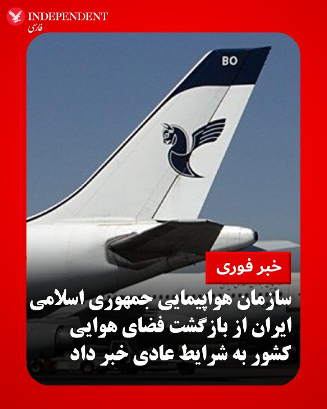

♦️ابوذر شیرودی، رئیس سازمان هواپیمایی جمهوری اسلامی ایران، بعد از ظهر دوشنبه ۱۸ خرداد ماه اعلام کرد «با پایان یافتن عملیات نظامی و انجام هماهنگی‌های لازم» فضای هوایی ایران به شرایط عادی بازگشته و محدودیت‌های پروازی رفع شده است.

در بیانیه‌ای که سازمان هواپیمایی جمهوری اسلامی ایران به نقل از ابوذر شیرودی منتشر کرده آمده است: «پیرو اعلام مراجع ذی‌ربط مبنی بر پایان عملیات نظامی و با عنایت به هماهنگی‌های انجام‌شده، فضای هوایی کشور به شرایط عادی بازگشته و عملیات هوانوردی مطابق با اطلاعیه‌های هوانوردی (نوتام) صادره از سر گرفته خواهد شد.»

به گفته رئیس سازمان هواپیمایی جمهوری اسلامی: «با فراهم شدن شرایط ایمن و انجام هماهنگی‌های لازم با نهادهای مسئول، محدودیت‌های پروازی لغو شده و فعالیت‌های هوانوردی کشور در حال بازگشت به روال عادی است.»

این اظهارات ساعاتی پس از آن مطرح می‌شود که مقام‌های هوانوردی ایران از لغو تمامی پروازهای کشور و بسته شدن بخش‌هایی از حریم هوایی در پی درگیری‌های نظامی اخیر خبر داده بودند.
‌🇸🇦 Indypersian

🤖 @VahidOOnLine

## WithYashar — post 14042

حریم هوایی ایران در حال باز‌ شدن است
@withyashar

## mwarmonitor — post 10481

🔴رسانه‌های اسرائیلی : نیروی هوایی یک پهپاد را که از یمن پرتاب شده بود، رهگیری و منهدم کرده است.

@mwarmonitor

## pm_afshaa — post 92954

جمهوری اسلامی در حمایت از تروریست‌های حزب‌الله لبنان، درگیری نظامی دیگری را آغاز کرد تا ماهیت ناایرانی و ضدایرانی خود را آشکارتر کند. این رژیم، ملت ایران را به گروگان گرفته و جان و مال ایرانیان را ابزاری برای صدور ترور، جنگ و بی‌ثباتی می‌بیند.

در این درگیری نیز، همچون همیشه، مسئول هرگونه آسیب به زیرساخت‌های ایران و جان غیرنظامیان بی‌گناه در هر دو سو، جمهوری اسلامی است.

ملت ایران، که نخستین و بزرگ‌ترین قربانی این رژیم بوده است، به‌خوبی می‌داند که تا زمانی که جمهوری اسلامی بر سر کار باشد، ترور، خشونت و بی‌ثباتی بر ایران، منطقه و جهان سایه خواهد افکند. صلح، امنیت و رونق پایدار تنها با پایان این رژیم امکان‌پذیر است.

راه‌حل، مذاکره با سپاه پاسداران و تروریست‌های اشغالگر ایران نیست؛ راه‌حل، ایستادن در کنار ملت ایران و حمایت از مبارزه آن برای پایان دادن به جمهوری اسلامی است.

@OfficialRezaPahlavi

## pm_afshaa — post 92953

  <a href="telegram/content/pm_afshaa_92953_1780936991.webm" target="_blank">🎬 Download video</a>

🔴سنتکام: نیروهای آمریکایی امروز یه نفتکش خالی با پرچم پالائو رو در خلیج عمان پس از تلاش این کشتی برای عبور از بندر ایران و نقض محاصره دریایی، با شلیک موشک از جنگنده F-18 از کار انداختنش.

💧 Rainbet.com the #1 Non-KYC Crypto Casino & Sportsbook @rainbetcom

😁 @Pm_Afshaa

## DEJradio — post 5471

جمهوری اسلامی در حمایت از تروریست‌های حزب‌الله لبنان، درگیری نظامی دیگری را آغاز کرد تا ماهیت ناایرانی و ضدایرانی خود را آشکارتر کند. این رژیم، ملت ایران را به گروگان گرفته و جان و مال ایرانیان را ابزاری برای صدور ترور، جنگ و بی‌ثباتی می‌بیند.

در این درگیری نیز، همچون همیشه، مسئول هرگونه آسیب به زیرساخت‌های ایران و جان غیرنظامیان بی‌گناه در هر دو سو، جمهوری اسلامی است.

ملت ایران، که نخستین و بزرگ‌ترین قربانی این رژیم بوده است، به‌خوبی می‌داند که تا زمانی که جمهوری اسلامی بر سر کار باشد، ترور، خشونت و بی‌ثباتی بر ایران، منطقه و جهان سایه خواهد افکند. صلح، امنیت و رونق پایدار تنها با پایان این رژیم امکان‌پذیر است.

راه‌حل، مذاکره با سپاه پاسداران و تروریست‌های اشغالگر ایران نیست؛ راه‌حل، ایستادن در کنار ملت ایران و حمایت از مبارزه آن برای پایان دادن به جمهوری اسلامی است.

@OfficialRezaPahlavi

## VahidOnline — post 76079

  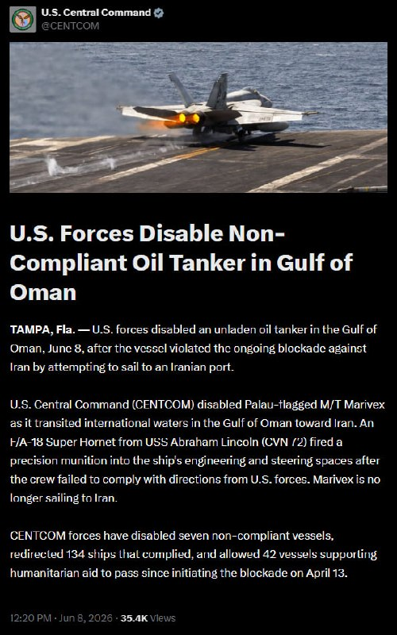

سنتکام: نیروهای آمریکا نفتکشِ متخلف را در خلیج عمان از حرکت بازداشتند

پست اکانت فرماندهی مرکزی ایالات متحده، ترجمه ماشین:
تامپا، فلوریدا — نیروهای آمریکایی روز ۸ ژوئن یک نفتکشِ بدون بار را در خلیج عمان از کار انداختند؛ پس از آن‌که این کشتی با تلاش برای حرکت به‌سوی یک بندر ایرانی، محاصره جاری علیه ایران را نقض کرد.

فرماندهی مرکزی ایالات متحده، سنتکام، نفتکش M/T Marivex با پرچم پالائو را هنگامی که در آب‌های بین‌المللی خلیج عمان به‌سوی ایران در حرکت بود، از کار انداخت. یک جنگنده F/A-18 سوپر هورنت از ناو USS Abraham Lincoln (CVN 72) پس از آن‌که خدمه کشتی از اجرای دستورهای نیروهای آمریکایی سر باز زدند، یک مهمات دقیق‌زن را به بخش‌های مهندسی و هدایت کشتی شلیک کرد. کشتی Marivex دیگر به‌سوی ایران حرکت نمی‌کند.

از زمان آغاز محاصره در ۱۳ آوریل، نیروهای سنتکام هفت کشتیِ متخلف را از کار انداخته‌اند، ۱۳۴ کشتیِ فرمان‌بردار را به مسیر دیگری هدایت کرده‌اند و اجازه عبور به ۴۲ کشتیِ حامل کمک‌های بشردوستانه داده‌اند.
CENTCOM

📡 @VahidOnline

## IranIntlTV — post 341209

  <a href="telegram/content/IranIntlTV_341209_1780936992.mp4" target="_blank">🎬 Download video</a>

تیتر اول با نیوشا صارمی، دوشنبه ۱۸ خرداد
@iranintltv

## IranIntlTV — post 341208

  

ستاد فرماندهی مرکزی آمریکا، سنتکام، اعلام کرد نیروهای آمریکا روز دوشنبه یک نفتکش بدون محموله در دریای عمان را از کار انداختند؛ پس از آن‌که این کشتی تلاش کرد محاصره دریایی را نقض کند.
سنتکام افزود: از ابتدای محاصره دریایی بنادر ایران تاکنون نیروهای آمریکایی هفت شناور متخلف را از کار انداخته‌اند، ۱۳۴ کشتی تجاری مجبور به تغییر مسیر شده و ۴۲ کشتی حامل کمک‌های بشردوستانه اجازه عبور دریافت کرده‌اند.
https://iranintl.com/202606080116

## IranianMinds — post 21866

جمهوری اسلامی در حمایت از تروریست‌های حزب‌الله لبنان، درگیری نظامی دیگری را آغاز کرد تا ماهیت ناایرانی و ضدایرانی خود را آشکارتر کند. این رژیم، ملت ایران را به گروگان گرفته و جان و مال ایرانیان را ابزاری برای صدور ترور، جنگ و بی‌ثباتی می‌بیند.

در این درگیری نیز، همچون همیشه، مسئول هرگونه آسیب به زیرساخت‌های ایران و جان غیرنظامیان بی‌گناه در هر دو سو، جمهوری اسلامی است.

ملت ایران، که نخستین و بزرگ‌ترین قربانی این رژیم بوده است، به‌خوبی می‌داند که تا زمانی که جمهوری اسلامی بر سر کار باشد، ترور، خشونت و بی‌ثباتی بر ایران، منطقه و جهان سایه خواهد افکند. صلح، امنیت و رونق پایدار تنها با پایان این رژیم امکان‌پذیر است.

راه‌حل، مذاکره با سپاه پاسداران و تروریست‌های اشغالگر ایران نیست؛ راه‌حل، ایستادن در کنار ملت ایران و حمایت از مبارزه آن برای پایان دادن به جمهوری اسلامی است.

@OfficialRezaPahlavi

## officialrezapahlavi — post 1836

جمهوری اسلامی در حمایت از تروریست‌های حزب‌الله لبنان، درگیری نظامی دیگری را آغاز کرد تا ماهیت ناایرانی و ضدایرانی خود را آشکارتر کند. این رژیم، ملت ایران را به گروگان گرفته و جان و مال ایرانیان را ابزاری برای صدور ترور، جنگ و بی‌ثباتی می‌بیند.

در این درگیری نیز، همچون همیشه، مسئول هرگونه آسیب به زیرساخت‌های ایران و جان غیرنظامیان بی‌گناه در هر دو سو، جمهوری اسلامی است.

ملت ایران، که نخستین و بزرگ‌ترین قربانی این رژیم بوده است، به‌خوبی می‌داند که تا زمانی که جمهوری اسلامی بر سر کار باشد، ترور، خشونت و بی‌ثباتی بر ایران، منطقه و جهان سایه خواهد افکند. صلح، امنیت و رونق پایدار تنها با پایان این رژیم امکان‌پذیر است.

راه‌حل، مذاکره با سپاه پاسداران و تروریست‌های اشغالگر ایران نیست؛ راه‌حل، ایستادن در کنار ملت ایران و حمایت از مبارزه آن برای پایان دادن به جمهوری اسلامی است.

@OfficialRezaPahlavi

## alonews — post 126337

  <a href="telegram/content/alonews_126337_1780936994.webm" target="_blank">🎬 Download video</a>

👈وال استریت ژورنال به نقل از یک مقام آمریکایی: نیروهای آمریکایی به رهگیری موشک‌های شلیک شده توسط ایران به اسرائیل کمک کردند

✅ @AloNews خبر جنگ

## alonews — post 126336

  <a href="telegram/content/alonews_126336_1780936994.webm" target="_blank">🎬 Download video</a>

👈گروسی در پاسخ به سوالی درباره ۱۷ حمله به تاسیسات اتمی ایران: من در این باره چیزی برای گفتن ندارم.

🔴 نماینده ایران حق دارد اعتراض کند اما من با آن‌ها موافق نیستم

✅ @AloNews خبر جنگ

## alonews — post 126335

  <a href="telegram/content/alonews_126335_1780936994.webm" target="_blank">🎬 Download video</a>

👈آی۲۴ نیوز عبری: هدف حمله اسرائیل به پتروشیمی کارون در ماهشهر، مختل کردن عملیات و توقف تولید این مجموعه بوده است

✅ @AloNews خبر جنگ

## alonews — post 126334

  <a href="telegram/content/alonews_126334_1780936994.webm" target="_blank">🎬 Download video</a>

👈 سنتکام: یک نفتکش مرتبط با ایران را متوقف کردیم

🔴فرماندهی مرکزی ایالات متحده:
نیروهای آمریکایی در ۸ ژوئن یک نفتکش خالی را در خلیج عمان، پس از آنکه این کشتی با تلاش برای حرکت به سمت یک بندر ایرانی، محاصره مداوم علیه ایران را نقض کرد، از کار انداختند.

🔴فرماندهی مرکزی ایالات متحده (CENTCOM) کشتی M/T Marivex با پرچم پالائو را هنگام عبور از آب‌های بین‌المللی در خلیج عمان به سمت ایران از کار انداخت.

🔴یک فروند جنگنده F/A-18 Super Hornet از ناو هواپیمابر USS Abraham Lincoln (CVN 72) پس از آنکه خدمه از دستورالعمل‌های نیروهای آمریکایی پیروی نکردند، یک مهمات دقیق به سمت فضای مهندسی و هدایت کشتی شلیک کرد.

✅ @AloNews خبر جنگ

---
📅 بروزرسانی: 1405/03/18 20:03
---

## VahidOOnLine — post 244396

  <a href="telegram/content/VahidOOnLine_244396_1780936404.mp4" target="_blank">🎬 Download video</a>

♦️شمار قربانیان زمین‌لرزه‌ای به بزرگی ۷.۸ که بامداد دوشنبه ۱۸ خرداد جنوب فیلیپین را لرزاند، به دست‌کم ۱۵ نفر رسیده و بیش از ۱۰۰ نفر نیز زخمی شده‌اند.
ویدئوهای منتشرشده از مدرسه ابتدایی «ماهایاهای» در شهر دیگوس در فیلیپین نشان می‌دهد دانش‌آموزان هنگام وقوع زمین‌لرزه شدید به این سو و آن سو پرتاب می‌شوند و سپس بخشی از سازه سقف مدرسه فرو می‌ریزد. کارکنان مدرسه نیز تلاش می‌کنند کودکان را آرام کرده و از ساختمان خارج کنند.
پس از وقوع این زمین‌لرزه، هشدار سونامی در فیلیپین، اندونزی و از سوی سامانه هشدار سونامی آمریکا صادر شد و از ساکنان مناطق ساحلی خواسته شد به مناطق مرتفع‌تر بروند.
سازمان لرزه‌نگاری فیلیپین همچنین از وقوع چندین پس‌لرزه خبر داد که بزرگ‌ترین آن‌ها ۶.۷ بوده است.
فیلیپین در کمربند لرزه‌خیز «حلقه آتش اقیانوس آرام» قرار دارد؛ منطقه‌ای که یکی از فعال‌ترین نواحی زمین از نظر زمین‌لرزه و فعالیت‌های آتشفشانی به شمار می‌رود.
‌🇸🇦 Indypersian

🤖 @VahidOOnLine

## mwarmonitor — post 10480

🔴نیروهای آمریکایی نفت‌کشِ سرپیچی‌کننده از دستورات را در دریای عمان از کار انداختند

🔰تمپا، فلوریدا — نیروهای آمریکایی در تاریخ ۸ ژوئن، یک نفت‌کش خالی (بدون بار) را در دریای عمان، پس از آنکه با تلاش برای حرکت به سمت یک بندر ایرانی محاصره جاری علیه ایران را نقض کرد، از کار انداختند.

🔸فرماندهی مرکزی ایالات متحده (سنتکام) نفت‌کش «ام/تی ماریوِکس» (M/T Marivex) با پرچم پالائو را در حالی که در آب‌های بین‌المللی دریای عمان به سمت ایران در حال حرکت بود، از کار انداخت. یک جنگنده اف/ای-۱۸ سوپر هورنت (F/A-18 Super Hornet) متعلق به ناو هواپیمابر یواس‌اس آبراهام لینکلن (CVN 72)، پس از آنکه خدمه کشتی از دستورات نیروهای آمریکایی سرپیچی کردند، یک مهمات هدایت‌شونده دقیق را به سمت بخش مهندسی و هدایت (سکان) کشتی شلیک کرد. ماریوکس دیگر به سمت ایران حرکت نمی‌کند.

🔸نیروهای سنتکام از زمان آغاز این محاصره در ۱۳ آوریل، ۷ شناور غیرمتعاهد را از کار انداخته، ۱۳۴ کشتی را که همکاری کردند تغییر مسیر داده و به ۴۲ شناور حامل کمک‌های بشردوستانه اجازه عبور داده‌اند.

@mwarmonitor

## pm_afshaa — post 92952

مادر هر چی رییس جمهور امریکاستو گاییدم
این از کله زرد بی خایه
اون از اون سیاه کیری اوباما
اون از اون کص مغز خر بایدن
اونم از اون مادرجنده حرومزاده 2 عالم کارتر بیناموس همتونو گاییدم

## pm_afshaa — post 92951

  <a href="telegram/content/pm_afshaa_92951_1780936404.webm" target="_blank">🎬 Download video</a>

🔴ترامپ: فکر میکنم آمریکا و ایران به یک توافق نزدیک میشن که مسیر رو برای مذاکرات بلندمدت هموار میکنه.

💧 Rainbet.com the #1 Non-KYC Crypto Casino & Sportsbook @rainbetcom

😁 @Pm_Afshaa

## pm_afshaa — post 92950

  <a href="telegram/content/pm_afshaa_92950_1780936405.webm" target="_blank">🎬 Download video</a>

🔴نیویورک تایمز به نقل از یک مقام ارشد آمریکایی و دو منبع اسرائیلی:

ترامپ در تماس تلفنی که امروز با نتانیاهو داشت، از او خواست که فعلا از حملات بیشتر به ایران خودداری کنه و کافیه.

💧 Rainbet.com the #1 Non-KYC Crypto Casino & Sportsbook @rainbetcom

😁 @Pm_Afshaa

## VahidOnline — post 76078

  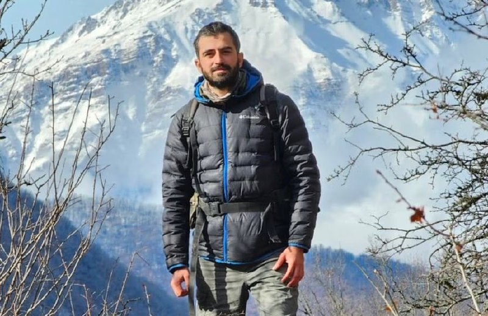

حامد تیزرویان، عکاس حیات‌وحش و فعال محیط زیست، در ساری بازداشت شده است. به گفته زینب رحیمی، روزنامه‌نگار حوزه محیط زیست، آقای تیزرویان روز ۱۴ اردیبهشت ۱۴۰۵، بازداشت شده و موبایل و دیگر وسایل الکترونیکی او ضبط شده است. اتهام مطرح‌شده علیه آقای تیزرویان «اجتماع…

## VahidOnline — post 76077

ایران وضعیت پرواز‌ها به حالت عادی برگشته است

سازمان هواپیمایی کشوری ایران عصر دوشنبه اعلام کرد که فضای هوایی کشور به شرایط عادی بازگشته و عملیات هوانوردی مطابق با اطلاعیه‌های هوانوردی (نوتام)، از سر گرفته خواهد شد.

ایران ساعاتی پیشتر گفته بود که تمام پروازها از فرودگاه‌های کشور لغو شده است.
@VahidHeadline

📡 @VahidOnline

## IranIntlTV — post 341207

  <a href="telegram/content/IranIntlTV_341207_1780936406.mp4" target="_blank">🎬 Download video</a>

در ادامه فشارهای اجتماعی و معیشتی در سایه جنگ و آتش‌بس شکننده، بسیاری از نوجوانان در پیام‌های خود به ایران‌اینترنشنال از حسرت‌ها و محرومیت‌هایی گفته‌اند که به بخشی از زندگی روزمره آنها تبدیل شده است.

جزییات بیشتر در گفت‌وگو با بهاران آزادی، عضو تحریریه ایران‌اینترنشنال
@iranintltv

## Shin_Persian — post 6760

  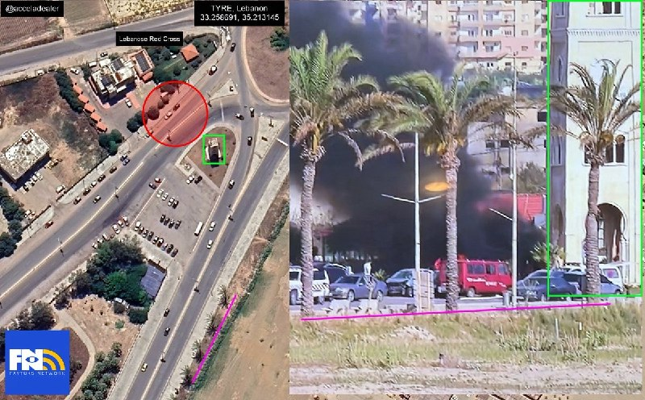

acceladealer ✓ @acceladealer
Mon, 08 Jun 2026 14:33:04 UTC

Black smoke (claimed vehicle ablaze) seen in vicinity of the Lebanese Red Cross building in TYRE, Lebanon

33.258691, 35.213145

@GeoConfirmed @FaytuksNetwork

geolocated by @acceladealer

فارسی

دود سیاه (ادعا شده ناشی از سوختن یک خودرو) در نزدیکی ساختمان صلیب سرخ لبنان در صور، لبنان مشاهده شده است.

۳۳.۲۵۸۶۹۱، ۳۵.۲۱۲۱۴۵

@GeoConfirmed @FaytuksNetwork

توسط @acceladealer_ مکان‌یابی جغرافیایی شد.

𝕏 · @shin_persian

## FarsiVOA — post 220038

⚡️جمهوری اسلامی نیروی نیابتی حزب‌الله لبنان؟ پشت‌پرده تنش تازه میان ایران و اسرائیل

## DW_Farsi — post 125698

  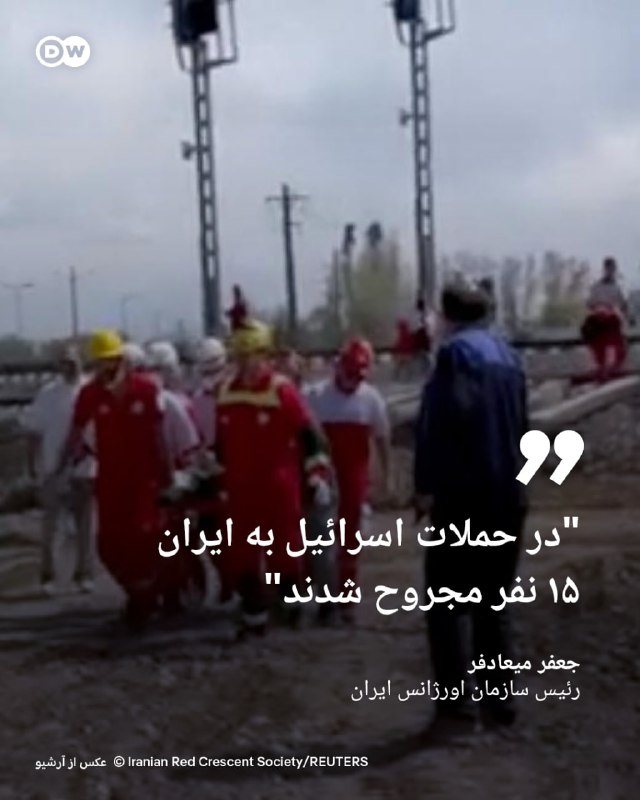

🔶 "در حملات اسرائیل به ایران ۱۵ نفر مجروح شدند"

جعفر میعادفر، رئیس سازمان اورژانس ایران با اشاره به "حملات اسرائیل به چندین نقطه از اماکن نظامی و غیرنظامی در ساعات گذشته" از مجروح‌شدن ۱۵ نفر در این حملات خبر داد.

او گفت که ۱۴ نفر از مجروحان مربوط به شهرستان ماهشهر در استان خوزستان و یک نفر نیز از شهر تهران هستند.

اسرائیل شب گذشته، پس از شروع حمله موشکی ایران به این کشور، پتروشیمی ماهشهر را را مورد هدف قرار داد. بعدتر مقام‌های اسرائیلی گفتند که در این پتروشیمی "مواد لازم برای تهیه سوخت موشک" ساخته می‌شده است.

به گفته میعادفر از مجموع مجروحان، یک نفر همچنان در بیمارستان بستری است و ۱۴ نفر پس از دریافت خدمات درمانی و اقدامات لازم، ترخیص شده‌اند. او افزود که حملات اسرائیل تاکنون تلفات جانی به همراه نداشته است.

@dw_farsi

## Persian_Trend_Official — post 16214

الخضراب ، جنوب لبنان. 👺Phantom 📌 @persian_trend_official پرشین ترند | متفاوت‌ترین کانال نظامی

## RadioFarda — post 158068

ایران وضعیت پرواز‌ها به حالت عادی برگشته است

🔸سازمان هواپیمایی کشوری ایران عصر دوشنبه اعلام کرد که فضای هوایی کشور به شرایط عادی بازگشته و عملیات هوانوردی مطابق با اطلاعیه‌های هوانوردی (نوتام)، از سر گرفته خواهد شد.

🔸ایران ساعاتی پیشتر گفته بود که تمام پروازها از فرودگاه‌های کشور لغو شده است.

@RadioFarda

## RadioFarda — post 158067

🔸نخست‌وزیر اسرائیل روز دوشنبه ۱۸ خرداد با اشاره به توقف حملات متقابل اسرائیل و ایران گفت «آتشباری متوقف شده اما اگر رژیم تروریستی (ایران) اشتباه کند، ما به شدت پاسخ خواهیم داد».

🔸بنیامین نتانیاهو در اولین پیام ویدئویی خود پس از آغاز موج تازه حملات ایران و اسرائیل، افزود: «ایران و حزب‌الله از همیشه ضعیف‌تر و ما قوی‌تر از همیشه هستیم».

🔸به گفته او، «ایران و حزب‌الله تلاش کردند معادله جدیدی را به ما تحمیل کنند که از نظر ما غیرقابل تحمل و غیرقابل قبول است. آن‌ها فکر می‌کردند که از خاک لبنان و از ایران به اسرائیل حمله می‌کنند و ما سکوت خواهیم کرد. این اتفاق نیفتاد و نخواهد افتاد، نه در زمانی که من رهبر هستم».

🔸نخست‌وزیر اسرائیل تصریح کرد: «ما حمله خواهیم کرد، با قدرت پاسخ خواهیم داد. به نابودی تمام زیرساخت‌های تروریستی آن‌ها در جنوب لبنان ادامه می‌دهیم، و امنیت را به شمال باز خواهیم گرداند. اگر به موقع و با قدرت اقدام نکرده بودیم، امروز این‌جا نبودیم».

🔸نتانیاهو همچنین گفت که ایران به سلاح هسته‌ای دست نخواهد یافت.

@RadioFarda

## RadioFarda — post 158066

  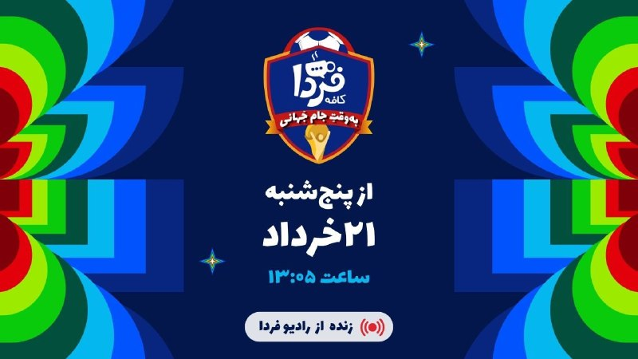

📷 Photo

## RadioFarda — post 158065

  <a href="https://t.me/radiofarda/158065" target="_blank">📎 Download file</a>

🔸پادکست #شوخی_با_تاریخ ۸۰

🔸هرمز، تنگه‌ای که بازیچه شد

🔸در اپیزود هشتادم از پادکست شوخی با تاریخ، یک وضعیت عجیب خلیج فارس و تنگه هرمز در دهه شصت شمسی را با وضعیت امروز مقایسه می‌کنیم و در بخش دوم هم اولین تلاش‌ها در اوایل سده پیشین را برای ایجاد ساز و کار هوانوردی نظامی را به مرور می‌نشینیم.

🔸#پادکست شوخی با تاریخ را می‌توانید در همه پادگیرها هم گوش کنید و اگر از شنیدنش لذت می‌برید آن را با دوستانتان هم به اشتراک بگذارید.

🔸شما می‌توانید نظرات و پیشنهادهای خود درباره این پادکست را برای ما به آدرس: fardapodcasts@rferl.org بفرستید یا از طریق @contactfardapodcast به ما پیام دهید.

فردا پادکست 🎧

## IranianMinds — post 21865

🔴 حمله هوایی شدید اسرائیل به شهر سجد در جنوب لبنان.

@IranianMinds

## IranianMinds — post 21864

🔴 فوری سنتکام :

نیروهای آمریکایی امروز نفتکش M/T Marivex با پرچم پالائو را در خلیج عمان پس از تلاش این کشتی برای عبور از بندر ایران بر خلاف محاصره جاری، از کار انداختند.

یک F/A-18 Super Hornet از USS Abraham Lincoln (CVN 72) پس از اینکه خدمه از دستورات نیروهای آمریکایی پیروی نکردند، یک مهمات دقیق را به سمت فضاهای مهندسی و فرمان کشتی شلیک کرد. این کشتی دیگر به سمت ایران نمی رود.

@IranianMinds

## IranianMinds — post 21863

  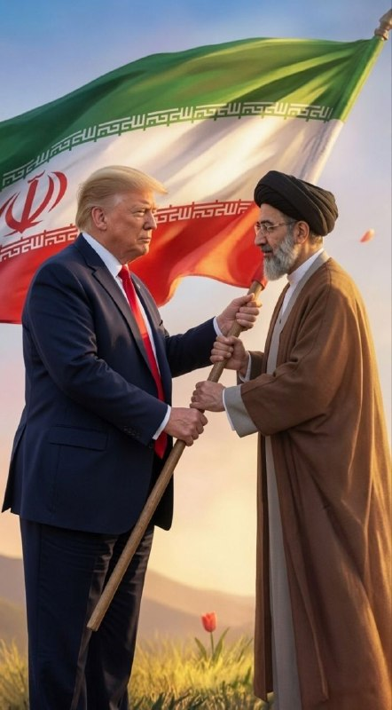

صالح بعد صالح.

@IranianMinds

## alonews — post 126333

  <a href="telegram/content/alonews_126333_1780936410.webm" target="_blank">🎬 Download video</a>

👈 رادیو اسرائیل: ارتش اسرائیل در ساعات اخیر در حال آماده‌سازی موج بزرگی از حملات هوایی علیه ایران بود، با ده‌ها جنگنده نیروی هوایی که قرار بود به اهدافی در سراسر کشور حمله کنند

🔴 با این حال، این عملیات گسترده در نهایت انجام نشد.

✅ @AloNews خبر جنگ

## alonews — post 126332

  

شوک این از جنگ هم بدتر بود

[@AloTweet]

## alonews — post 126331

  <a href="telegram/content/alonews_126331_1780936411.webm" target="_blank">🎬 Download video</a>

⚫
🏆 به دنیای هیجان‌انگیز فوتبال خوش اومدی!

⭐️اینجا قراره باهم لحظه‌به‌لحظه‌ی جام جهانی رو زندگی کنیم؛
از بازی‌های حساس و نتایج داغ گرفته تا حاشیه‌ها، کری‌خونی‌ها و اتفاقاتی که همه درباره‌ش حرف میزنن! 
🔥
🔥

✅ پوشش کامل مسابقات

💀ترول تیم‌ها و بازیکن‌ها

🎥ویدیوها و لحظه‌های فان فوتبالی

📊آمار، ترکیب‌ها و اخبار فوری

🌍حواشی جذاب از سراسر جام جهانی

📢اینجا فقط یک کانال خبری نیست؛
یک جمع فوتبالیه برای کسایی که فوتبال رو با هیجان، شوخی و احساس واقعی دنبال میکنن 
📛
💟

🆘
🔞 آماده باش چون قراره جام جهانی رو متفاوت تجربه کنیم!

⚡ @Vaarzesh_Plus

⚡ @Vaarzesh_Plus

---
📅 بروزرسانی: 1405/03/18 19:51
---

## VahidOOnLine — post 244395

  

وزارت دفاع عربستان سعودی اعلام کرد یک موشک بالستیک که از یمن شلیک شده بود، در منطقه‌ای خالی از سکنه در نزدیکی مرزهای عربستان سعودی و یمن سقوط کرد.
به گزارش رویترز، وزارت دفاع عربستان سعودی اعلام کرد این موشک به سمت یکی از کشورهای منطقه در حرکت بود.
همزمان حوثی‌های یمن، تحت حمایت جمهوری‌ اسلامی، اعلام کردند دوشنبه یک حمله موشکی به منطقه یافا در اسرائیل انجام داده‌اند.
‌🏁 🇬🇧 IranintlTV

🤖 @VahidOOnLine

## VahidOOnLine — post 244394

  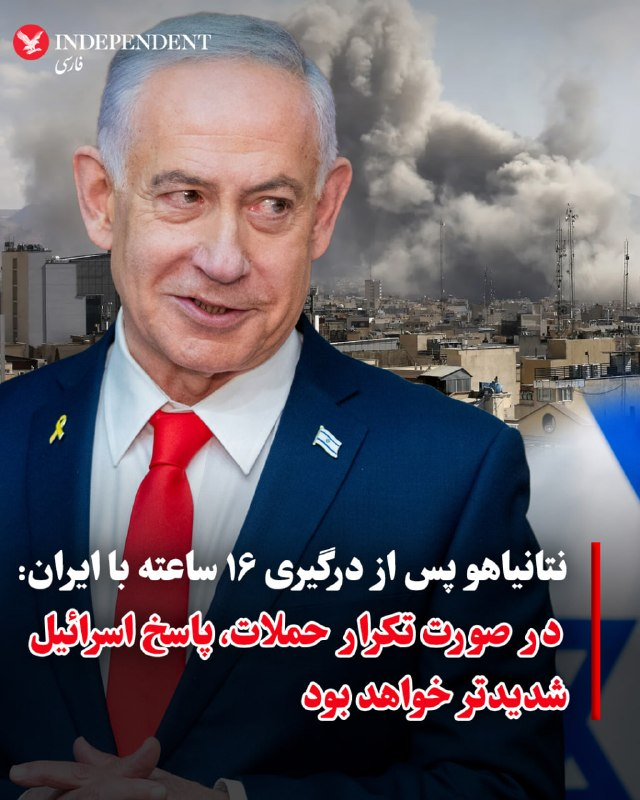

♦️بنیامین نتانیاهو، نخست‌وزیر اسرائیل، در یک پیام ویدیویی که پس از درگیری نظامی ۱۶ ساعته میان ایران و اسرائیل منتشر شد، اعلام کرد اسرائیل در صورت تکرار حملات از سوی ایران یا حزب‌الله لبنان، با قدرت بیشتری پاسخ خواهد داد.
نخست‌وزیر اسرائیل در این پیام خطاب به شهروندان اسرائیل گفت: «ما خامنه‌ای دیکتاتور را از میان برداشتیم. اگر ما به موقع و با قدرت عمل نکرده بودیم، امروز اینجا نبودیم؛ و من متعهد می‌شوم و دوباره متعهد می‌شوم: ایران سلاح هسته‌ای نخواهد داشت.»
نتانیاهو در ادامه گفت ایران و حزب‌الله اکنون در ضعیف‌ترین وضعیت خود قرار دارند و اسرائیل در موقعیتی قدرتمندتر از گذشته قرار گرفته است، هرچند به گفته او نبرد هنوز پایان نیافته است.
او با اشاره به حملات اخیر ایران و حزب‌الله افزود اسرائیل هیچ وضعیتی را که در آن از خاک ایران یا لبنان به سوی این کشور شلیک شود و پاسخی دریافت نکنند، نخواهد پذیرفت.
نخست‌وزیر اسرائیل همچنین با اشاره به درگیری‌های شبانه‌روز گذشته گفت در حال حاضر جنگ با ایران متوقف شده است: «زیرا پس از ضربه‌ای که به رژیم تروریستی در تهران وارد کردیم، او از حمله به ما دست کشید. در صورتی که رژیم تروریستی مرتکب اشتباه شود و دوباره به ما حمله کند، ما با قدرت پاسخ خواهیم داد؛ چرا که اسرائیل حق کامل دفاع از خود را دارد و ما هر زمان که نیاز باشد، این حق را اعمال می‌کنیم.»
 نتانیاهو در پایان با اشاره به گفتگوهای خود با دونالد ترامپ، رئیس‌جمهوری آمریکا، گفت مواضع اسرائیل را با او در میان گذاشته و ابراز امیدواری کرد که با «وحدت و قاطعیت»، امنیت به مناطق شمالی اسرائیل بازگردد.
‌🇸🇦 Indypersian

🤖 @VahidOOnLine

## WithYashar — post 14041

وزارت دفاع عربستان سعودی اعلام کرد که یک موشک بالستیک که صبح زود از یمن شلیک شد، دچار نقص فنی شد، از مسیر برنامه‌ریزی شده منحرف گردید و در نهایت در منطقه‌ای غیرمسکونی نزدیک مرز عربستان و یمن سقوط کرد.
این موشک توسط حوثی‌ها (انصارالله) شلیک شده بود.
@withyashar

## WithYashar — post 14040

نتانیاهو: همانطور که به دوست خودم ترامپ میگم: ما اسرائیل رو با عزم و هوشمندی دفاع خواهیم کرد و با هم امنیت رو به شمال اسرائیل بازخواهیم گرداند. @withyashar

## WithYashar — post 14039

خضریان، عضو کمیسیون امنیت ملی مجلس: حملات موشکی ما تا برقراری آتش‌بس در لبنان ادامه داره
@withyashar

## mwarmonitor — post 10479

🔴یک مقام آمریکایی: ارتش آمریکا سامانه‌های رهگیر پدافند هوایی را برای مهار جدیدترین موج موشک‌های بالستیک ایران که روز یکشنبه به سمت اسرائیل شلیک شده بودند، فعال کرد؛ در حالی که تهران تلاش می‌کند خطوط درگیری در این رویارویی متوقف‌شده را تغییر دهد و از حزب‌الله در لبنان حمایت کند.

@mwarmonitor

## mwarmonitor — post 10478

🔸ترامپ: فکر می‌کنم ایالات متحده و ایران به یک توافق نزدیک می‌شوند که مسیر را برای مذاکرات بلندمدت هموار می‌کند.

@mwarmonitor

## mwarmonitor — post 10477

🔴رسانه‌های اسرائیلی:
ارتش اسرائیل در ساعات اخیر در آستانه انجام یک پرواز تهاجمی گسترده علیه ایران بوده است؛ این عملیات شامل ده‌ها جنگنده نیروی هوایی بود که در حال آماده‌سازی برای پرواز به سمت ایران و حمله به اهدافی در سراسر این کشور بودند.

📌با این حال، این پرواز تهاجمی گسترده در نهایت انجام نشده است.

@mwarmonitor

## mwarmonitor — post 10476

📌سازمان هواپیمایی کشوری ایران:
حریم هوایی کشور به وضعیت عادی بازگشته و عملیات پروازی طبق اطلاعیه‌های هوانوردی (NOTAM) از سر گرفته خواهد شد.

🔸با فراهم شدن شرایط ایمن و هماهنگی لازم با نهادهای مربوطه، محدودیت‌های پروازی برداشته شده و فعالیت‌های هوانوردی در کشور مطابق برنامه‌ریزی از سر گرفته می‌شود.

@mwarmonitor

## pm_afshaa — post 92949

  <a href="telegram/content/pm_afshaa_92949_1780935682.webm" target="_blank">🎬 Download video</a>

🔴لغو تمام پروازهای کشور تا اطلاع ثانوی 
💧 Rainbet.com the #1 Non-KYC Crypto Casino & Sportsbook @rainbetcom 
😁 @Pm_Afshaa

## pm_afshaa — post 92948

  <a href="telegram/content/pm_afshaa_92948_1780935682.webm" target="_blank">🎬 Download video</a>

🔴رادیو ارتش اسرائیل:
ارتش اسرائیل در ساعات اخیر در حال آماده‌سازی موج بزرگی از حملات هوایی علیه ایران بود، با ده‌ها جنگنده نیروی هوایی که قرار بود به اهدافی در ایران حمله کنن، ولی لغو شد.

💧 Rainbet.com the #1 Non-KYC Crypto Casino & Sportsbook @rainbetcom

😁 @Pm_Afshaa

## pm_afshaa — post 92947

  <a href="telegram/content/pm_afshaa_92947_1780935683.webm" target="_blank">🎬 Download video</a>

🔴مدارس اسرائیل که بخاطر جنگ امروز با ایران تعطیل شده بودن، از فردا باز میشن.

💧 Rainbet.com the #1 Non-KYC Crypto Casino & Sportsbook @rainbetcom

😁 @Pm_Afshaa

## VahidOnline — post 76076

  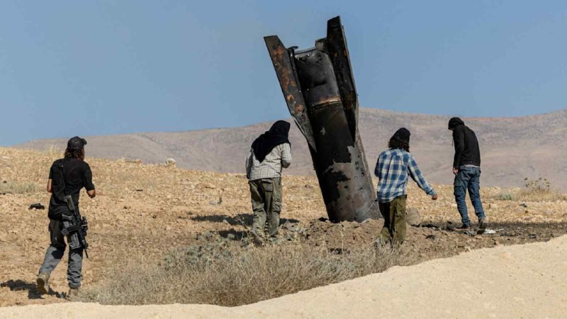

وزارت دفاع عربستان سعودی اعلام کرد یک موشک بالستیک که از یمن شلیک شده بود، در منطقه‌ای خالی از سکنه در نزدیکی مرزهای عربستان سعودی و یمن سقوط کرد.
به گزارش رویترز، وزارت دفاع عربستان سعودی اعلام کرد این موشک به سمت یکی از کشورهای منطقه در حرکت بود.
همزمان حوثی‌های یمن، تحت حمایت جمهوری‌ اسلامی، اعلام کردند دوشنبه یک حمله موشکی به منطقه یافا در اسرائیل انجام داده‌اند.
@VahidOOnLine

📡 @VahidOnline

## IranIntlTV — post 341206

  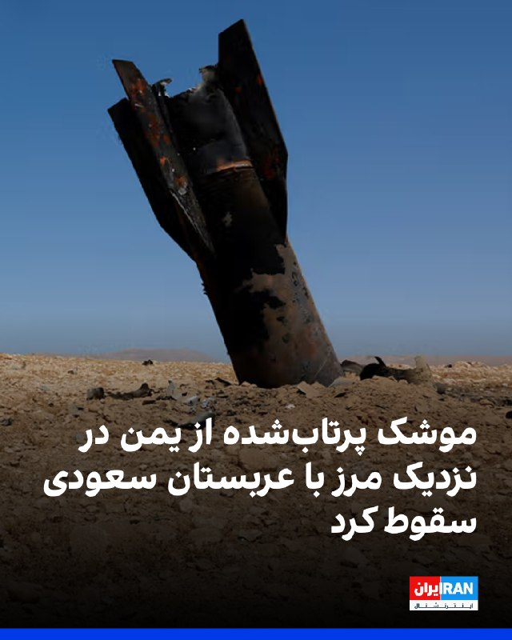

وزارت دفاع عربستان سعودی اعلام کرد یک موشک بالستیک که از یمن شلیک شده بود، در منطقه‌ای خالی از سکنه در نزدیکی مرزهای عربستان سعودی و یمن سقوط کرد.
به گزارش رویترز، وزارت دفاع عربستان سعودی اعلام کرد این موشک به سمت یکی از کشورهای منطقه در حرکت بود.
همزمان حوثی‌های یمن، تحت حمایت جمهوری‌ اسلامی، اعلام کردند دوشنبه یک حمله موشکی به منطقه یافا در اسرائیل انجام داده‌اند.
https://iranintl.com/202606084267

## FarsiVOA — post 220037

🔺آژانس با ابراز نگرانی از ادامه «قطع کانال ارتباطی»: رژیم ایران تعامل با غرب را از سر بگیرد

◾️رافائل گروسی، مدیرکل آژانس بین‌المللی انرژی اتمی، روز دوشنبه ۱۸ خرداد از رژیم ایران خواست «تعامل مجدد» با آژانس را از سر بگیرد تا بازرسی‌ها در سایت‌هایی که آمریکا و اسرائیل یک سال پیش بمباران کردند از سر گرفته شود. همزمان، ایالات متحده در نشست شورای حکام آژانس پیش‌نویس قطعنامه‌ای را در همین راستا پیگیری کرد.

⬇️ بیشتر بخوانید:

https://ir.voanews.com/a/iaea-calls-iran-reengage/8158545.html

## FarsiVOA — post 220036

🔺محکومیت سه وکیل دادگستری در شیراز به سه سال زندان و ممنوعیت خروج از کشور با ابطال گذرنامه

◾️دادگاه انقلاب اسلامی شیراز نازنین سالاری، محمود طراوت‌روی، و مسعود احمدیان، سه وکیل دادگستری، را به سه سال حبس و دو سال ممنوعیت خروج از کشور با ابطال گذرنامه محکوم کرد.

⬇️ بیشتر بخوانید:

https://ir.voanews.com/a/iranian-regime-sentenced-three-attorneys/8158544.html

## Persian_Trend_Official — post 16213

بازگشت فضای هوایی کشور به شرایط عادی سازمان هواپیمایی کشوری: فضای هوایی کشور به شرایط عادی بازگشته و عملیات هوانوردی مطابق با اطلاعیه‌های هوانوردی (نوتام) صادره، از سر گرفته خواهد شد. با فراهم شدن شرایط ایمن و انجام هماهنگی‌های لازم با نهادهای ذی‌ربط، محدودیت‌های…

## Persian_Trend_Official — post 16212

  <a href="telegram/content/Persian_Trend_Official_16212_1780935685.webm" target="_blank">🎬 Download video</a>

ترور هدفمند در صور، جنوب لبنان

👺Phantom

📌 @persian_trend_official
پرشین ترند | متفاوت‌ترین کانال نظامی

## Persian_Trend_Official — post 16211

  <a href="telegram/content/Persian_Trend_Official_16211_1780935686.webm" target="_blank">🎬 Download video</a>

بازگشت فضای هوایی کشور به شرایط عادی

سازمان هواپیمایی کشوری: فضای هوایی کشور به شرایط عادی بازگشته و عملیات هوانوردی مطابق با اطلاعیه‌های هوانوردی (نوتام) صادره، از سر گرفته خواهد شد.

با فراهم شدن شرایط ایمن و انجام هماهنگی‌های لازم با نهادهای ذی‌ربط، محدودیت‌های پروازی رفع شده و فعالیت‌های هوانوردی کشور طبق برنامه در حال بازگشت به روال عادی است.

👺Phantom

📌 @persian_trend_official
پرشین ترند | متفاوت‌ترین کانال نظامی

## Persian_Trend_Official — post 16210

  <a href="telegram/content/Persian_Trend_Official_16210_1780935686.webm" target="_blank">🎬 Download video</a>

ارتش اسرائیل (IDF) هشدار تخلیه برای محله زقاق المافدیحه در صور صادر کرده است. 
👺Phantom 
📌 @persian_trend_official پرشین ترند | متفاوت‌ترین کانال نظامی

## Persian_Trend_Official — post 16209

  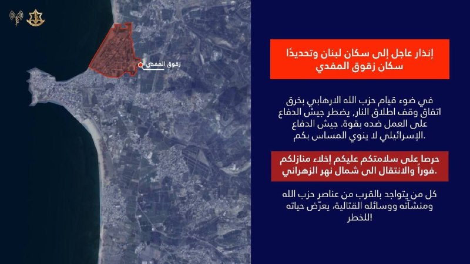

ارتش اسرائیل (IDF) هشدار تخلیه برای محله زقاق المافدیحه در صور صادر کرده است.

👺Phantom

📌 @persian_trend_official
پرشین ترند | متفاوت‌ترین کانال نظامی

## RadioFarda — post 158064

لهستان از کشف بیش از یک تن هروئین از مبدأ ایران در یکی از بنادر خود خبر داد

🔸مقام‌های لهستان روز دوشنبه ۱۸ خرداد اعلام کردند: بیش از یک تن هروئین را که در محموله‌ای از آجرهای تزئینی پنهان شده بود، در بندر گِدنیا در ساحل بالتیک کشف و ضبط کرده‌اند.

🔸به گفته رئیس پلیس لهستان، مبدأ این محموله ایران بوده است.

🔸مقام‌های لهستانی ارزش این محمولهٔ مواد مخدر را بیش از ۶۰ میلیون دلار برآورد کرده‌اند.

🔸بر پایه این گزارش، محمولهٔ یادشده در بار ارسالی از امارات متحده عربی جاسازی شده بود و نخستین بار از سوی ماموران گمرک بریتانیا شناسایی شد.

🔸مقام‌های لهستانی همچنین گفتند که ماه گذشته سه شهروند این کشور در ارتباط با این پرونده بازداشت شدند و سپس از سوی دادستانی گدانسک تحت پیگرد قرار گرفتند.

@RadioFarda

## BBCPersian — post 283195

🔻 نخست‌وزیر پاکستان: برای صلح خویشتنداری کنید، هدف نهایی در حال تحقق است

شهباز شریف، نخست‌وزیر پاکستان در پیامی در شبکه‌های اجتماعی از «همه طرف‌ها» خواست برای صلح خویشتنداری کنند، به‌ویژه وقتی‌که «هدف نهایی تقریبا در آستانه تحقق است‌.»

ایران و اسرائیل اعلام کردند که فعلا حملات متقابل را متوقف می‌کنند.

نخست‌وزیر پاکستان در ایکس نوشت: «افزایش خشونت‌های اخیر در خاورمیانه» یادآور خطرات یک آتش‌بس شکننده و «پیامدهای طاقت‌فرسای این شکنندگی» است.

«درحالی‌که ما همراه با برادران و شرکای خود با جدیت و تلاش فراوان برای یافتن یک راه‌ حل مسالمت‌آمیز و دیپلماتیک کار می‌کنیم، و به‌ویژه اکنون که هدف نهایی تقریباً در آستانه دستیابی است، صمیمانه از همه طرف‌ها می‌خواهیم خویشتنداری کنند و فرصت بیشتری به صلح بدهند.»

پاکستان میانجی‌های اصلی میان ایران و آمریکا است.

محسن نقوی، وزیر کشور پاکستان، شنبه «نامه ویژه» و «پیام مهم» شهباز شریف و عاصم منیر، فرمانده کل قوای پاکستان، به رهبر جمهوری اسلامی را تحویل ایران داد.

او هنوز مشغول مذاکره بود که اسرائیل به ضاحیه حمله کرد و بعد ایران مناطقی را در اسرائیل هدف قرار داد.

https://bbc.in/4uS2DpO
@BBCPersian

## BBCPersian — post 283194

🔻 نتانیاهو: جنگ موقتا متوقف شده است

کمی بعد از آنکه کاخ سفید گفت که دونالد ترامپ با بنیامین نتانیاهو تلفنی صحبت کرده است، نخست‌وزیر اسرائیل در پیامی گفت که ایران و حزب‌الله به‌شدت تضعیف شده‌اند اما جنگ با آنها تمام نشده است.

او در سخنانی به عبری تاکید کرد اگر ایران بار دیگر به اسرائیل حمله کند با اقتدار به آن پاسخ داده خواهد شد.

قرارگاه مرکزی خاتم‌الانبیا که مرکز فرماندهی جنگ است توقف عملیات علیه اسرائیل را ساعتی پیش اعلام کرده بود.

آقای نتانیاهو هم تایید کرد که جنگ فعلا متوقف شده است.

وزیر دفاع اسرائیل امروز تاکید کرد که حمله به حزب‌الله در لبنان ادامه خواهد داشت و «به پیوند زدن موضوع لبنان و ایران و حمله به اسرائیل، با شدت بسیار پاسخ داده خواهد شد.»

بنابر گزارش‌ها، حملات اسرائیل به جنوب لبنان از جمله در صور ادامه یافته است.

حزب‌الله امروز از حمله به سربازان اسرائیل در خاک لبنان خبر داد اما اشاره‌ای به حمله به شمال اسرائیل نکرد.

https://bbc.in/4uS2DpO
@BBCPersian

## BBCPersian — post 283193

🔻وزیر دفاع اسرائیل: حملات ما به حزب‌الله در لبنان ادامه پیدا می‌کند

اسرائیل کاتس تاکید کرد که عملیات ارتش اسرائیل در لبنان علیه حزب‌الله ادامه خواهد یافت.

وزیر دفاع اسرائیل در بیانیه‌ای گفت که در پاسخ به هر حمله به شمال اسرائیل، پایگاه حزب‌الله در ضاحیه را هدف قرار خواهد داد:

«ما قاطعانه با تهدیدات ایران برخورد می‌کنیم. هرگونه تلاش ایران برای پیوند دادن موضوع لبنان و ایران و حمله به اسرائیل، با شدت بسیار پاسخ داده خواهد شد؛ همانطور که دیروز اتفاق افتاد.»

محمدباقر قالیباف، رئیس مجلس ایران، هم در ایکس نوشت: «معادله آتش‌‌بس روی کاغذ و نقض مکرر آن در میدان را برهم زدیم. تا اراده واقعی برای اعتمادسازی نداشته باشید، پاسخ ایران همین است.»

سپاه پاسداران دیروز ساعاتی پس از حمله اسرائیل به ضاحیه، مناطقی در شمال اسرائیل و تل‌آویو را هدف حمله قرار داد.

امروز، اندکی بعد از آنکه دونالد ترامپ در شبکه‌ اجتماعی از ایران و اسرائیل خواست تبادل آتش را متوقف کنند، قرارگاه مرکزی خاتم‌الانبیا گفت که در «حمایت از مردم مظلوم لبنان، پاسخی دردناک» به اسرائیل داده است و «توقف عملیات نیروهای مسلح ایران» را اعلام کرد.

ایران اما هشدار داد که «در صورت ادامه اقدامات تجاوزکارانه و خصمانه، ازجمله در جنوب لبنان، تدابیری بسیار شدیدتر و کوبنده‌تر از گذشته» اتخاذ خواهد کرد.

در همین حال کاخ سفید خبر داد که دونالد ترامپ و بنیامین نتانیاهو تلفنی صحبت کرده‌اند.

https://bbc.in/4uS2DpO
@BBCPersian

## BBCPersian — post 283192

🔻اتحادیه اروپا نیروی دریایی سپاه هرمزگان را تحریم کرد

اتحادیه اروپا فرماندهی نیروی دریایی سپاه در استان هرمزگان را به‌دلیل «محدود کردن تردد دریایی» تحریم کرد.

در بیانیه شورای اروپا جز این نهاد دو نفر دیگر هم تحریم شده‌اند: محمد اکبرزاده، معاون سیاسی و «سخنگوی» نیروی دریایی سپاه، و حمید حسینی، سخنگوی اتحادیه صادرکنندگان نفت و گاز.

به گفته اتحادیه اروپا، این نهاد و افراد در بستن تنگه هرمز و اخذ عوارض و گزینش اینکه چه کشتی‌ای عبور کند یا نکند مسئول هستند.

کایا کالاس، مسئول سیاست خارجی اتحادیه اروپا، در ایکس نوشت: «خاورمیانه بین مذاکرات صلح و آتش‌بس‌های شکننده گیر افتاده است.»

خانم کالاس گفت که ایران «همچنان تردد دریایی در تنگه هرمز را تهدید می‌کنند» و اقداماتش «غیرقابل قبول» است.

مسئولیت عملیات آفندی و پدافندی در محدوده تنگه هرمز به عهده منطقه یکم دریایی صاحب‌الزمان، از مناطق پنج‌گانه دریایی سپاه، است.

مرکز فرماندهی این منطقه در بندرعباس است.

https://bbc.in/4uS2DpO
@BBCPersian

## Dirty_Kids — post 391394

  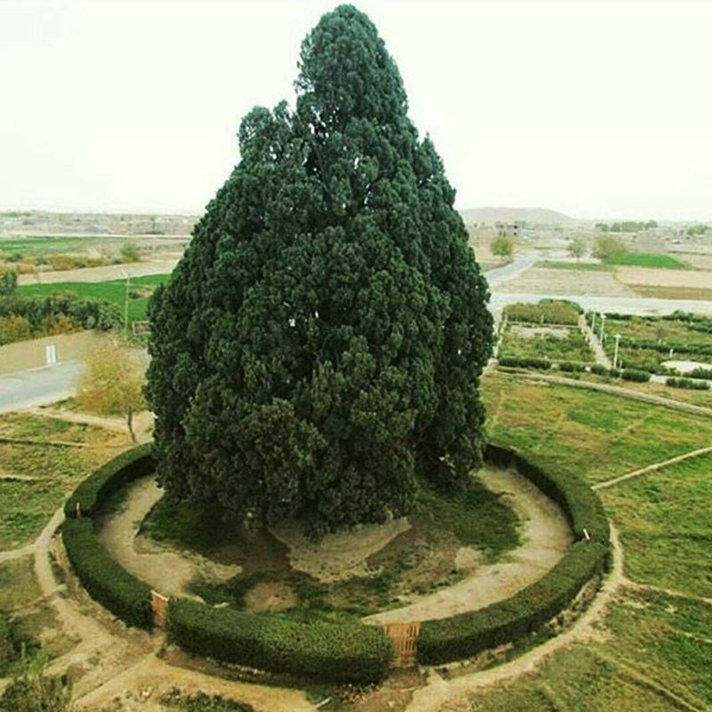

این ژانر سرو که راه افتاده به نظرم یکی از بهترین های ایکس فارسیه

سرو 4000 ساله ابرکوه یزد

@Dirty_Kids 👻

## Dirty_Kids — post 391393

  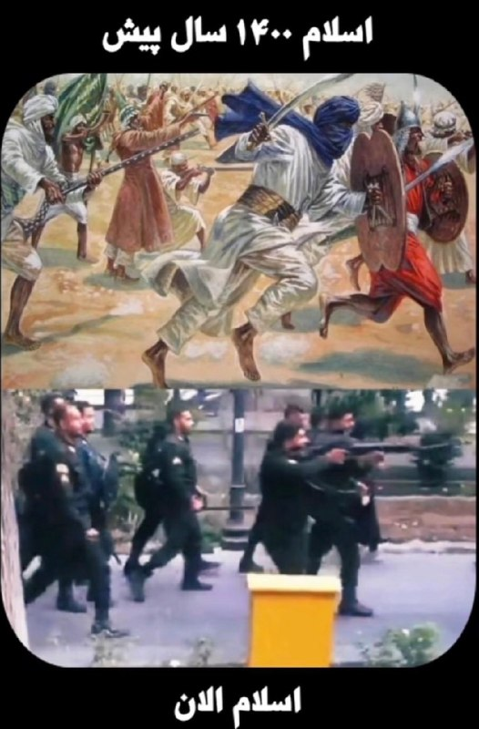

وقتی میگن ایرانیان با آغوش باز مسلمان شدند و اسلام اوردند:

@Dirty_Kids 👻

## Dirty_Kids — post 391392

  <a href="https://t.me/Dirty_Kids/391392" target="_blank">📎 Download file</a>

ریتزوبت تنها سایت بین المللی میباشد ، که به صورت هفتگی پرومو کد دریافت میکنید ✅

♦️ آموزش شارژ حساب با کریپتو
♦️ آموزش شارژ حساب ریالی در ریتزوبت

🔵ریتزوبت برندی با لایسنس معتبر در صنعت شرطبندی و پیشبینی مسابقات ورزشی و کازینویی 👇
#پیشبینی
https://t.me/+LB508WZyIr8xNmY0

## Dirty_Kids — post 391391

  <a href="telegram/content/Dirty_Kids_391391_1780935689.webm" target="_blank">🎬 Download video</a>

🎁 می‌دونستین توی ریتزوبت هرکی شرط‌بندی کنه، هر هفته بین 1.000.000 تومن تا 100.000.000 تومان پروموکد می‌گیره 
‼️

💰 باحالیش اینجاست که فرقی نداره شرطت ببره یا ببازه، تو هر صورت پروموکد بهت میدن 
🔥

🚀 وقتی شرط ‌هاتون رو توی ریتزوبت ثبت کنین ، هم شانس برد دارین و هم هفتگی کسب درآمد میکنید 
🤑

🛸 لینک ورود به سایت 👉

🌐 کانال تلگرامی 
3️⃣
2️⃣
1️⃣
G18
https://t.me/+LB508WZyIr8xNmY0

## Dirty_Kids — post 391390

  <a href="telegram/content/Dirty_Kids_391390_1780935690.mp4" target="_blank">🎬 Download video</a>

وقتی موساد یک مامور میفرسته تا از نیروی هوایی ایران عکسبرداری کنه

پ‌ن: البته بیجا نگفته چون جمهوری اسلامی اصلا نیروی هوایی نداره همش کشکه آسمونش جندس

علاءالدین با فرش پرواز میکرد

@Dirty_Kids 👻

## alonews — post 126330

  <a href="telegram/content/alonews_126330_1780935691.mp4" target="_blank">🎬 Download video</a>

👈 اردوغان با دلسی رودریگز، رئیس‌جمهور موقت ونزوئلا، در استانبول دیدار کرد.

✅ @AloNews خبر جنگ

## alonews — post 126329

  <a href="telegram/content/alonews_126329_1780935694.webm" target="_blank">🎬 Download video</a>

👈تایمز اسرائیل: اسراییل اکنون در تلاش است تا جنوب لبنان را از توافق آتش‌بس حذف کند و با تهدید موشکی علیه بیروت، حزب‌الله را به توقف حملات به شمال اسرائیل وادار سازد، معادله‌ای که با مخالفت قاطع حزب‌الله لبنان مواجه شده است.

✅ @AloNews خبر جنگ

## alonews — post 126328

  <a href="telegram/content/alonews_126328_1780935694.webm" target="_blank">🎬 Download video</a>

👈وزارت دفاع عربستان سعودی اعلام کرد که یک موشک بالستیک که صبح زود از یمن شلیک شد، دچار نقص فنی شد، از مسیر برنامه‌ریزی شده منحرف گردید و در نهایت در منطقه‌ای غیرمسکونی نزدیک مرز عربستان و یمن سقوط کرد.

🔴 این موشک توسط حوثی‌ها (انصارالله) شلیک شده بود.

✅ @AloNews خبر جنگ

## alonews — post 126327

  <a href="telegram/content/alonews_126327_1780935695.webm" target="_blank">🎬 Download video</a>

👈آی۲۴ نیوز عبری: هدف حمله اسرائیل به پتروشیمی کارون در ماهشهر، مختل کردن عملیات و توقف تولید این مجموعه بوده است

✅ @AloNews خبر جنگ

## alonews — post 126326

  <a href="telegram/content/alonews_126326_1780935695.webm" target="_blank">🎬 Download video</a>

👈دستور بازگشت فضای هوایی کشور به شرایط عادی داده شد

✅ @AloNews خبر جنگ

<!-- MSG END -->

<!-- NAV START -->

<a href="https://github.com/ProAlit/aio-downloader/blob/main/telegram/content/archive_1.md" style="display:inline-block; padding:6px 12px; margin:0 4px; background-color:#2ea44f; color:white; text-decoration:none; border-radius:4px; font-weight:bold;">صفحه بعد</a>

<!-- NAV END -->
