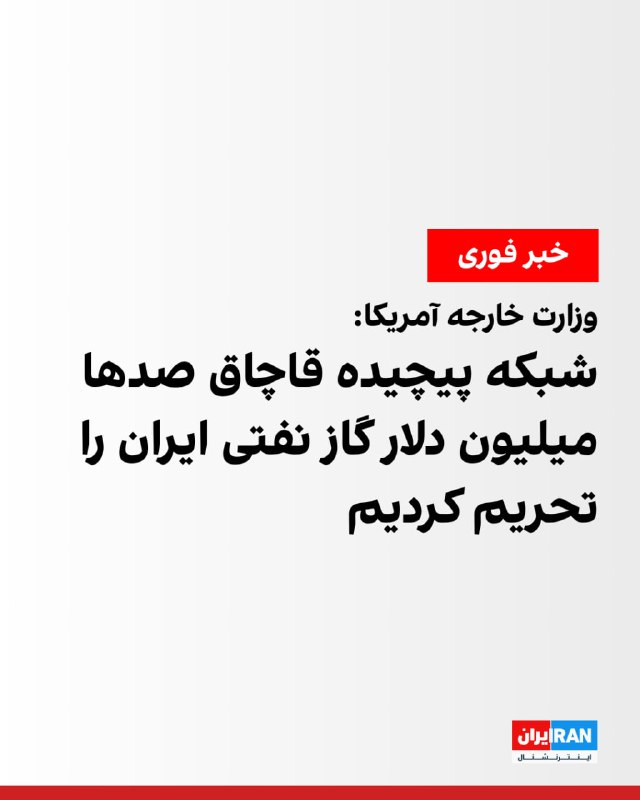
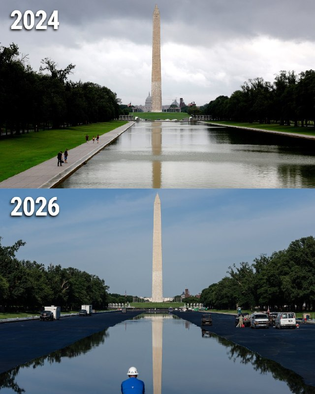
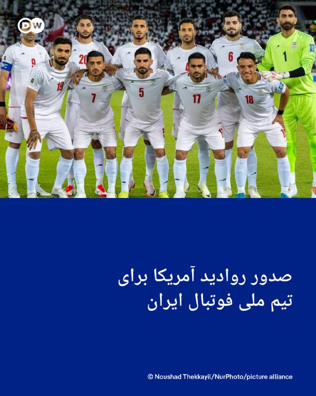

# خواننده تلگرام

<!-- TOP_NAV START -->

<a href="https://github.com/ProAlit/aio-downloader/blob/main/telegram/content/archive_1.md" style="display:inline-block; padding:6px 12px; margin:0 4px; background-color:#2ea44f; color:white; text-decoration:none; border-radius:4px; font-weight:bold;">صفحه بعد</a>

<!-- TOP_NAV END -->

<!-- MSG START -->

---
📅 بروزرسانی: 1405/03/15 23:02
---

## VahidOOnLine — post 243854

  

تامی پیگوت، سخنگوی وزارت خارجه آمریکا، با انتشار بیانیه‌ای درباره تحریم‌های تازه واشینگتن علیه جمهوری اسلامی اعلام کرد: «امروز، ایالات متحده تلاش‌های ایران برای دور زدن تحریم‌های ما و تامین مالی فعالیت‌های بی‌ثبات‌کننده‌اش را مختل می‌کند.»

او افزود: «ایالات متحده یک شبکه پیچیده که صدها میلیون دلار گاز نفتی ایران را به بازارهای جنوب و شرق آسیا قاچاق کرده است، هدف قرار داده است. این شبکه از شرکت‌های پوششی در امارات متحده عربی و چین، همراه با ناوگان سایه ایران، برای پنهان کردن منشا ایرانی سوخت و دور زدن تحریم‌های آمریکا استفاده کرده است.»

سخنگوی وزارت خارجه آمریکا ادامه داد: «ما همچنین یک صرافی ایرانی و گردانندگان آن را تحریم می‌کنیم که با سایر عوامل همکاری کرده‌اند تا بتواند میلیاردها دلار تراکنش مالی غیرقانونی را تسهیل کند. این معاملات به حکومت ایران امکان می‌دهد درآمدهای حاصل از فروش نفت را جابه‌جا کرده و هم‌زمان از نظام مالی بین‌المللی دوری کند.»

پیگوت تاکید کرد: «این تحریم‌ها بخشی از کارزار خشم اقتصادی است که با حفظ فشار حداکثری بر حکومت ایران، توانایی آن برای کسب درآمد جهت توسعه تسلیحات، حمایت از گروه‌های نیابتی تروریستی و اقدامات تهاجمی در منطقه را مختل می‌کند.»

او نوشت: «ایالات متحده همچنان اقداماتی را برای پاسخگو کردن هر فرد یا نهادی که به ایران در دور زدن تحریم‌ها کمک کند، از جمله شرکت‌ها و موسسات مالی خارجی، اتخاذ خواهد کرد. ما از جامعه بین‌المللی می‌خواهیم در اجرای این اقدامات به ما بپیوندد و مانع دسترسی جمهوری اسلامی به منابعی شود که به تروریسم، گسترش تسلیحات و بی‌ثباتی در سراسر منطقه دامن می‌زند.»
‌🏁 🇬🇧 IranintlTV

🤖 @VahidOOnLine

## FoxNewsTwitter — post 342659

  

Fox News (Twitter/X)

The reflection is finally coming back.

After weeks of construction, water is returning to the Reflecting Pool on the National Mall as part of President Trump's push to restore Washington, D.C.'s iconic landmarks.

The difference is already striking, with the Washington Monument's signature reflection beginning to reappear across the water.

## FoxNewsTwitter — post 342658

‌Fox News (Twitter/X)

When will the next Fed rate hike occur?

Our sponsor Kalshi’s prediction market shows:

— Before 2027: 51%
— Before 2028: 79%

https://www.foxbusiness.com/economy/us-jobs-report-may-2026

## IranIntlTV — post 340715

  

تامی پیگوت، سخنگوی وزارت خارجه آمریکا، با انتشار بیانیه‌ای درباره تحریم‌های تازه واشینگتن علیه جمهوری اسلامی اعلام کرد: «امروز، ایالات متحده تلاش‌های ایران برای دور زدن تحریم‌های ما و تامین مالی فعالیت‌های بی‌ثبات‌کننده‌اش را مختل می‌کند.»

او افزود: «ایالات متحده یک شبکه پیچیده که صدها میلیون دلار گاز نفتی ایران را به بازارهای جنوب و شرق آسیا قاچاق کرده است، هدف قرار داده است. این شبکه از شرکت‌های پوششی در امارات متحده عربی و چین، همراه با ناوگان سایه ایران، برای پنهان کردن منشا ایرانی سوخت و دور زدن تحریم‌های آمریکا استفاده کرده است.»

سخنگوی وزارت خارجه آمریکا ادامه داد: «ما همچنین یک صرافی ایرانی و گردانندگان آن را تحریم می‌کنیم که با سایر عوامل همکاری کرده‌اند تا بتواند میلیاردها دلار تراکنش مالی غیرقانونی را تسهیل کند. این معاملات به حکومت ایران امکان می‌دهد درآمدهای حاصل از فروش نفت را جابه‌جا کرده و هم‌زمان از نظام مالی بین‌المللی دوری کند.»

پیگوت تاکید کرد: «این تحریم‌ها بخشی از کارزار خشم اقتصادی است که با حفظ فشار حداکثری بر حکومت ایران، توانایی آن برای کسب درآمد جهت توسعه تسلیحات، حمایت از گروه‌های نیابتی تروریستی و اقدامات تهاجمی در منطقه را مختل می‌کند.»

او نوشت: «ایالات متحده همچنان اقداماتی را برای پاسخگو کردن هر فرد یا نهادی که به ایران در دور زدن تحریم‌ها کمک کند، از جمله شرکت‌ها و موسسات مالی خارجی، اتخاذ خواهد کرد. ما از جامعه بین‌المللی می‌خواهیم در اجرای این اقدامات به ما بپیوندد و مانع دسترسی جمهوری اسلامی به منابعی شود که به تروریسم، گسترش تسلیحات و بی‌ثباتی در سراسر منطقه دامن می‌زند.»

## DW_Farsi — post 125548

  

🔶 صدور روادید آمریکا برای تیم ملی فوتبال ایران

یک مقام کاخ سفید اعلام کرد که روادید ورود به ایالات متحده برای بازیکنان تیم ملی فوتبال ایران صادر شده است. این تصمیم تنها ۱۰ روز پیش از نخستین دیدار ایران در لس‌آنجلس و در بحبوحه جنگ و درگیری‌های فزاینده میان دو کشور اتخاذ شده است.

بە گزارش رویترز، بە نقل از یک مقام مطلع در کاخ سفید، روادید کاروان ایران بامداد روز جمعه ۱۵ خرداد (۵ ژوئن) صادر شد. این تحول تنها چند ساعت پس از آن رخ داد که ابوالفضل پسندیده، سفیر ایران در مکزیک، اواخر روز پنجشنبه اعلام کرده بود اعضای تیم هنوز روادید آمریکای خود را دریافت نکرده‌اند.

با وجود صدور روادید تأخیر در این روند و همچنین تقویت این رویکرد در تهران که حضور ملی‌پوشان در خاک آمریکا باید به حداقل ممکن برسد، موجب شد تا ایران در یک تصمیم‌گیری دیرهنگام محل کمپ تمرینی تیم ملی را تغییر دهد.

بر این اساس پایگاه تیم از ایالت آریزونای آمریکا به شهر مرزی تیخوانا در مکزیک منتقل شد. برنامه‌ریزی‌ها حاکی از آن است که اعضای تیم ملی ایران بامداد یکشنبه در تیخوانا فرود خواهند آمد.
@dw_farsi

## alonews — post 125395

  <a href="telegram/content/alonews_125395_1780687980.webm" target="_blank">🎬 Download video</a>

👈گزارش ایرفورس مگزین، مرکز فرماندهی آمریکا که بیش از ۲ دهه عملیات هوایی آمریکا در خاورمیانه را هدایت می‌کرد، در جریان جنگ آمریکا علیه ایران به شدت آسیب دید.

🔴چند موشک ایران در هفته‌های آغازین جنگ به مرکز عملیات هوایی ترکیبی در پایگاه هوایی «العدید» در قطر اصابت کرد و آن را از کار انداخت.

✅ @AloNews خبر جنگ

## alonews — post 125394

  <a href="telegram/content/alonews_125394_1780687980.webm" target="_blank">🎬 Download video</a>

👈هشدارهای راکتی در گالیلای علیا و نوار گالیلای شمالی، شمال اسرائیل

✅ @AloNews خبر جنگ

<!-- MSG END -->

<!-- NAV START -->

<a href="https://github.com/ProAlit/aio-downloader/blob/main/telegram/content/archive_1.md" style="display:inline-block; padding:6px 12px; margin:0 4px; background-color:#2ea44f; color:white; text-decoration:none; border-radius:4px; font-weight:bold;">صفحه بعد</a>

<!-- NAV END -->
