# خواننده تلگرام

<!-- TOP_NAV START -->

<a href="https://github.com/ProAlit/aio-downloader/blob/main/telegram/content/archive_1.md" style="display:inline-block; padding:6px 12px; margin:0 4px; background-color:#2ea44f; color:white; text-decoration:none; border-radius:4px; font-weight:bold;">صفحه بعد</a>

<!-- TOP_NAV END -->

<!-- MSG START -->

---
📅 بروزرسانی: 1405/03/27 22:14
---

## VahidOOnLine — post 246079

  

محمدباقر قالیباف در نشست همفکری نماینده ویژه در امور چین با اتاق بازرگانی ایران گفت: «تحریم کاغذپاره نیست، اما اگر معنایش این باشد که برای رفع تحریم‌ها باید تسلیم شویم، هرگز.»

او ادامه داد: «ما رشد اقتصادی صنعت را در ابتدای دهه ۸۰ دیده‌ایم و امروز، با وجود همه زحماتی که کشیده‌شده، شاهد رشد منفیِ نیم هستیم.»

رییس مجلس در همین نشست گفته بود: «باید سنگر را از بچه‌های لانچر تحویل بگیریم، مردم را از زیر فشار اقتصادی دربیاوریم و کشور را بسازیم.»
‌🏁 🇬🇧 IranintlTV

🤖 @VahidOOnLine

## WithYashar — post 15182

  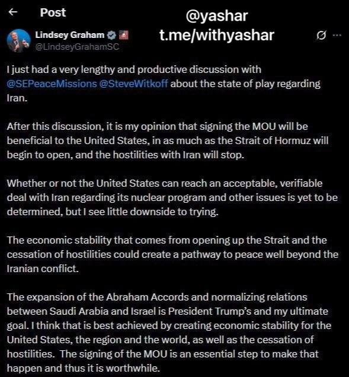

سناتور لیندسی گراهام: به نظر من امضای این تفاهم‌نامه به نفع آمریکا خواهد بود، چون تنگه هرمز شروع به بازگشایی میکنه و درگیری‌ها با ایران متوقف میشه.

اینکه آیا آمریکا میتونه با ایران بر سر برنامه هسته‌ای و سایر مسائل به توافقی قابل قبول و قابل راستی‌آزمایی برسه یا نه، هنوز مشخص نیست، اما من تلاش برای رسیدن به چنین توافقی رو کم‌هزینه می‌بینم.
@withyashar

## FoxNewsTwitter — post 343087

  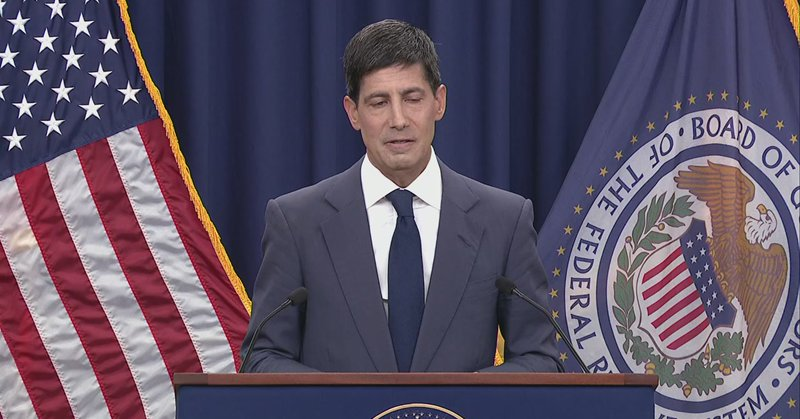

Fox News (Twitter/X)

WATCH LIVE: Fed Chair Warsh holds press conference after announcing decision on interest rates https://twitter.com/i/broadcasts/1pJdRRreZovKW

## IranIntlTV — post 342903

  <a href="telegram/content/IranIntlTV_342903_1781721873.mp4" target="_blank">🎬 Download video</a>

۲۴ با فرداد فرحزاد
@iranintltv

## IranIntlTV — post 342902

  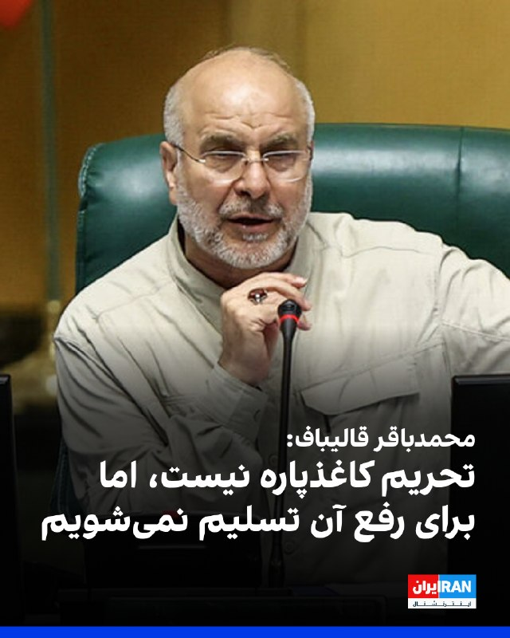

محمدباقر قالیباف در نشست همفکری نماینده ویژه در امور چین با اتاق بازرگانی ایران گفت: «تحریم کاغذپاره نیست، اما اگر معنایش این باشد که برای رفع تحریم‌ها باید تسلیم شویم، هرگز.»

او ادامه داد: «ما رشد اقتصادی صنعت را در ابتدای دهه ۸۰ دیده‌ایم و امروز، با وجود همه زحماتی که کشیده‌شده، شاهد رشد منفیِ نیم هستیم.»

رییس مجلس در همین نشست گفته بود: «باید سنگر را از بچه‌های لانچر تحویل بگیریم، مردم را از زیر فشار اقتصادی دربیاوریم و کشور را بسازیم.»
https://iranintl.com/202606174186

## alonews — post 128770

  <a href="telegram/content/alonews_128770_1781721875.mp4" target="_blank">🎬 Download video</a>

👈ترامپ با هواپیما به سمت کاخ ورسای رفت، تا مکرون شام بخوره

✅ @AloNews خبر جنگ

---
📅 بروزرسانی: 1405/03/27 22:04
---

## VahidOOnLine — post 246078

  

لیندزی گراهام، سناتور جمهوری‌خواه آمریکا، در شبکه ایکس نوشت پس از گفت‌وگویی طولانی با استیو ویتکاف به این نتیجه رسیده که امضای تفاهم‌نامه با جمهوری اسلامی به نفع آمریکا خواهد بود، زیرا به بازگشایی تنگه هرمز و توقف درگیری‌ها با ایران کمک می‌کند.

لیندزی گراهام افزود: «هنوز مشخص نیست آیا آمریکا می‌تواند به توافقی قابل راستی‌آزمایی و قابل قبول با جمهوری اسلامی درباره برنامه هسته‌ای و سایر موضوعات دست یابد یا نه، اما تلاش برای دستیابی به چنین توافقی زیان چندانی ندارد.»

او ادامه داد: «ثبات اقتصادی ناشی از بازگشایی تنگه هرمز و توقف درگیری‌ها می‌تواند مسیری برای صلحی فراتر از مناقشه کنونی با جمهوری اسلامی ایجاد کند.»

لیندزی گراهام گفت گسترش پیمان ابراهیم و عادی‌سازی روابط میان عربستان سعودی و اسرائیل هدف نهایی دونالد ترامپ و او است.

لیندزی گراهام گفت امضای تفاهم‌نامه میان آمریکا و جمهوری اسلامی گامی ضروری برای تحقق ثبات منطقه‌ای و پیشبرد روند صلح در خاورمیانه است.
‌🏁 🇬🇧 IranintlTV

🤖 @VahidOOnLine

## WithYashar — post 15181

وزارت امور خارجه ایران: ادامه اشغال جنوب لبنان توسط اسرائیل، نقض تفاهم‌نامه است و ما اقدامات لازم را انجام خواهیم داد

ایالات متحده متعهد شده است که تمام تحریم‌ها از جمله تحریم‌های شورای امنیت سازمان ملل را در یک جدول زمانی که در طول مذاکرات مورد بحث قرار خواهد گرفت، لغو کند
@withyashar

## mwarmonitor — post 11085

🔴 روزنامه «اسرائیل هیوم» به نقل از منابع: اسرائیل خواهان تسریع در برقراری تماس با لبنان و رسیدن به توافق است، پیش از آن‌که واشنگتن و تهران به یک توافق کامل دست پیدا کنند.

@mwarmonitor

## pm_afshaa — post 94291

  <a href="telegram/content/pm_afshaa_94291_1781721279.webm" target="_blank">🎬 Download video</a>

🔴سناتور لیندسی گراهام: به نظر من امضای این تفاهم‌نامه به نفع آمریکا خواهد بود، چون تنگه هرمز شروع به بازگشایی میکنه و درگیری‌ها با ایران متوقف میشه.

اینکه آیا آمریکا میتونه با ایران بر سر برنامه هسته‌ای و سایر مسائل به توافقی قابل قبول و قابل راستی‌آزمایی برسه یا نه، هنوز مشخص نیست، اما من تلاش برای رسیدن به چنین توافقی رو کم‌هزینه می‌بینم.

💧 Rainbet.com the #1 Non-KYC Crypto Casino & Sportsbook @rainbetcom

😁 @Pm_Afshaa

## iaghapour — post 2683

اکانت‌های هوش مصنوعی رو با یک‌دهم قیمت بخر 
🛍

🌐 Kiro.dev Pro
(جایگزین اقتصادی Claude)
- ایجنت برنامه‌نویسی شرکت آمازون
- پشتیبانی از تمامی مدل‌های Claude
- مناسب فقط برنامه‌نویسان
- مصرف کردیت کمتر نسبت به Claude
- ارزان، اقتصادی و با کیفیت

🏳️‍🌈 Gemini Pro:
- پلن مشابه GPT Plus از شرکت گوگل
- پشتیبانی از Antigravity
- ساخت عکس و ویدیوی فارسی
- تجزیه‌ و تحلیل و تحقیق عمیق
- فعال‌سازی روی ایمیل شما (اتوماتیک)
- کاملا اختصاصی (فمیلی نیست)

🔆 Codex 2500 Credits:
- اکانت کدکس شامل 2500 کردیت
- امکان ارسال 625 الی 3200 پیام
- مخصوص فقط برنامه نویسی
- دسترسی به GPT5.5
- کاملا اختصاصی

خرید و توضیحات بیشتر از ربات:

🤖 @ChatGPT_StoreBOT
رضایت مشتری 
💎

## DEJradio — post 5770

  <a href="telegram/content/DEJradio_5770_1781721280.webm" target="_blank">🎬 Download video</a>

👑
🔺 شاهزاده رضا پهلوی در دومین روز سفر خود به بریتانیا با اندرو میچل، نماینده پارلمان و معاون پیشین وزیر امور خارجه بریتانیا، که سال‌ها از حامیان و دوستان ملت ایران بوده است، دیدار و گفت‌وگو کرد.

در این دیدار، آخرین تحولات ایران و ضرورت حمایت از مبارزه ملت ایران برای دستیابی به دموکراسی، آزادی و آینده‌ای فراتر از جمهوری اسلامی مورد بحث و تبادل نظر قرار گرفت.

#شاهزاده_رضا_پهلوی #بریتانیا
@DEJradio

## RadioFarda — post 158444

🔸دونالد ترامپ، رئیس‌جمهور آمریکا، روز چهارشنبه در جریان کنفرانس خبری پایان نشست سران گروه ۷ در فرانسه، درباره احتمال آزادسازی دارایی‌های مسدود شده ایران گفت که این دارایی‌ها در اصل متعلق به ایران هستند. 🔸او اعلام کرد: «ما مقدار زیادی از پول آن‌ها را گرفته‌ایم.…

## RadioFarda — post 158443

  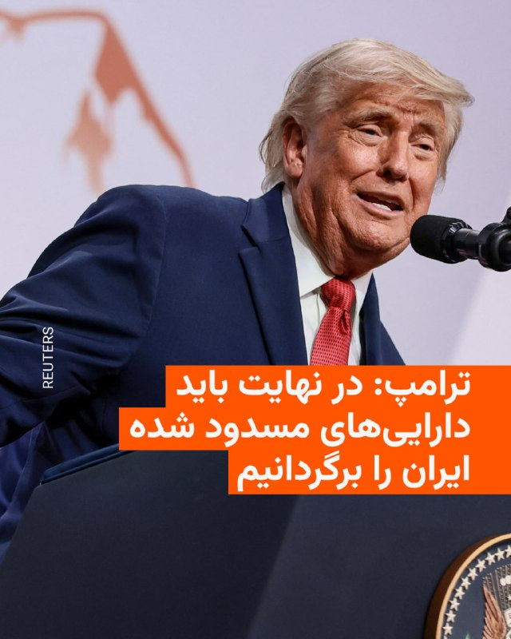

🔸دونالد ترامپ، رئیس‌جمهور آمریکا، روز چهارشنبه در جریان کنفرانس خبری پایان نشست سران گروه ۷ در فرانسه، درباره احتمال آزادسازی دارایی‌های مسدود شده ایران گفت که این دارایی‌ها در اصل متعلق به ایران هستند.

🔸او اعلام کرد: «ما مقدار زیادی از پول آن‌ها را گرفته‌ایم. ما پول آن‌ها را گرفته‌ایم؛ این پول ما نیست، پول خودشان است و ما در مقطعی آن را مسدود کردیم. فکر می‌کنم در نهایت باید آن را به آن‌ها برگردانیم.»

🔸ترامپ در مورد تحریم‌ها نیز موضعی نسبتاً انعطاف‌پذیر در قبال ایران ابراز کرد، مشروط بر اینکه ایران به مفاد توافق پایبند بماند: «در مورد تحریم‌ها، در مقطعی باید به این موضوع فکر کرد. ما تحریم‌هایی داریم که هرگز اجازه بازسازی به آن‌ها نخواهد داد. آن‌ها هیچ پولی نخواهند داشت و در فقر خواهند بود.»

@RadioFarda

## Dirty_Kids — post 392419

پسر قالیباف امروز در قطر دیده شده

@Dirty_Kids 👻

## Hranews — post 113690

  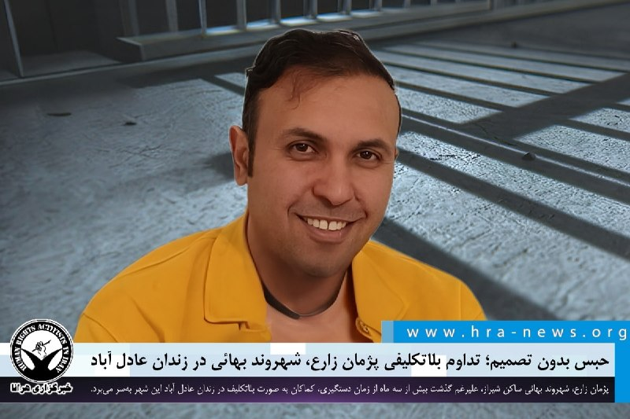

حبس بدون تصمیم؛ تداوم بلاتکلیفی پژمان زارع، شهروند بهائی در زندان عادل آباد

❗️
❗️
❗️
❗️
❗️ – پژمان زارع، شهروند بهائی ساکن شیراز، علیرغم گذشت بیش از سه ماه از زمان دستگیری، کماکان به صورت بلاتکلیف در زندان عادل آباد این شهر به‌سر می‌برد.

به گزارش هرانا، ارگان خبری مجموعه فعالان حقوق بشر در ایران، پژمان زارع کماکان در بازداشت به‌سر می‌برد.

یک منبع مطلع نزدیک به خانواده این شهروند بهائی ضمن تایید این موضوع به هرانا گفت: پژمان زارع ۹۵ روز است که به‌صورت بلاتکلیف در زندان عادل آباد شیراز نگهداری می شود. همچنین با دستور مسئولین مربوطه خانواده آقای زارع از پیگیری پرونده فرزندشان از مراجع قضایی منع شده‌اند. این در حالی است که او طی مدت زمان بازداشت از حق دسترسی به وکیل محروم مانده و تاکنون نیز رسیدگی مؤثر و نتیجه‌بخشی به پرونده این شهروند بهائی صورت نگرفته است.

ادامه مطلب

#پژمان_زارع

↘️
@hranews_bot تماس ✉️ -  @Hranews  کانال هرانا 🆑

## alonews — post 128769

  <a href="telegram/content/alonews_128769_1781721281.webm" target="_blank">🎬 Download video</a>

👈سناتور لیندسی گراهام: به نظر من امضای این تفاهم‌نامه به نفع ایالات متحده خواهد بود، زیرا تنگه هرمز شروع به بازگشایی می‌کند و درگیری‌ها با ایران متوقف می‌شود.

🔴اینکه آیا آمریکا می‌تواند با ایران بر سر برنامه هسته‌ای و سایر مسائل به توافقی قابل قبول و قابل راستی‌آزمایی برسد یا نه، هنوز مشخص نیست، اما من تلاش برای رسیدن به چنین توافقی را کم‌هزینه می‌بینم.

✅ @AloNews خبر جنگ

---
📅 بروزرسانی: 1405/03/27 21:54
---

## VahidOOnLine — post 246077

  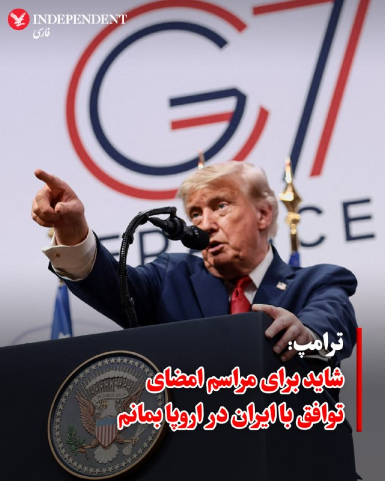

♦️ دونالد ترامپ، رئیس‌جمهوری آمریکا، روز چهارشنبه ۲۷ خرداد اشاره کرد که ممکن است سفر خود را تمدید کند و برای شرکت در مراسم روز جمعه جهت امضای یادداشت تفاهم با جمهوری اسلامی ایران، در اروپا بماند.

ترامپ در پاسخ به این پرسش که چرا برای مراسم امضای این توافق در منطقه نمی‌ماند، گفت: «شاید هم ماندم.»

با این حال، رئیس‌جمهوری آمریکا خاطرنشان کرد هرچند این یادداشت تفاهم «بسیار مهم» است، اما ممکن است از «آن دست اسنادی» نباشد که او به عنوان رئیس‌جمهوری ایالات متحده شخصا نیاز به امضای آن داشته باشد. بر اساس برنامه‌ریزی‌های انجام‌شده، انتظار می‌رود جی‌دی ونس، معاون رئیس‌جمهوری، روز جمعه در مراسم حضوری و رسمی امضای این سند شرکت کند.
‌🇸🇦 Indypersian

🤖 @VahidOOnLine

## pm_afshaa — post 94290

🔴آمریکا متن رسمی تفاهم‌نامه‌ای که با ایران بهش رسیده رو منتشر کرد :

جنگ و درگیری بین ایران، آمریکا و متحدانشون متوقف میشه و دو طرف متعهد میشن که دیگه علیه هم اقدام نظامی نکنن.
آمریکا محاصره دریایی رو برمی‌داره، تحریم‌ها رو به‌تدریج لغو میکنه و در صورت نهایی شدن توافق، نیروهای اضافی خودش رو از منطقه خارج میکنه.
فروش نفت ایران دوباره آزاد میشه، دارایی‌های بلوکه‌شده ایران در دسترس قرار میگیره و آمریکا مجوزهای لازم برای مبادلات بانکی، بیمه، حمل‌ونقل و تجارت رو صادر میکنه. قرار شده بالای 300 میلیارد دلار برای رونق دادن و سر و سامون دادن به اقتصاد ایران هزینه بشه.
ایران دوباره تأکید کرده که دنبال ساخت سلاح هسته‌ای نیست، درباره ذخایر اورانیوم غنی‌شده و آینده غنی‌سازی هم قراره تو مذاکرات بعدی تصمیم نهایی گرفته بشه.
تا زمان توافق نهایی، ایران وضعیت فعلی برنامه هسته‌ای خودش رو حفظ میکنه و آمریکا هم نه تحریم جدیدی اعمال میکنه و نه نیروی نظامی بیشتری به منطقه میفرسته.
ایران هم متعهد میشه امنیت کشتیرانی تجاری تو خلیج فارس و دریای عمان رو تأمین کنه و مسیرهای دریایی رو به حالت عادی برگردونه. دو طرف حداکثر طی 60 روز آینده باید روی توافق نهایی به نتیجه برسن و در صورت توافق، قراره این توافق با قطعنامه الزام‌آور شورای امنیت سازمان ملل تأیید بشه.

💧Rainbet.com the #1 Non-KYC Crypto Casino & Sportsbook @rainbetcom

😁 @Pm_Afshaa

## iaghapour — post 2682

💰 مدیرعامل همراه اول: قیمت فعلی اینترنت با قیمت واقعی آن هیچ سنخیتی ندارد!

مهدی اخوان، مدیرعامل همراه اول، در مجمع عمومی سالانه این اپراتور با گلایه از تعرفه‌های فعلی اعلام کرد که هزینه‌های سرمایه‌گذاری ارزی آن‌ها کاملاً مشابه اپراتورهای منطقه است، اما قیمت هر گیگابایت اینترنت در ایران بسیار پایین‌تر از آن کشورهاست.

پ.ن: جناب مدیرعامل! اتفاقاً تو این مملکت خیلی چیزها هست که هیچ سنخیتی با هم ندارن؛ از کیفیت اینترنت شما و چیزی که واقعاً به دست ما می‌رسه بگیر تا درآمد بالای مردم منطقه و حقوق‌های پایین ما! از همه مهم‌تر، بین زندگی و رفاه شما و واقعیتِ زندگی مردم هیچ سنخیتی نیست!

اگه واقعاً کار براتون نمی‌صرفه ما هم راضی به ضررتون نیستیم، کلاً درِ این اپراتورها رو تخته کنید و جرم‌انگاری استارلینک رو بردارید تا ببینیم تو یه بازار آزاد اصلاً می‌تونید باهاشون رقابت کنید یا نه! واقعیت اینه که سودهای کلان این اینترنت انحصاری (پرو) حسابی به دهنتون مزه کرده و حالا با گرون کردن‌های نجومی و پشت‌سرهم، به هر دری می‌زنید تا جیب مردم رو خالی‌تر کنید. وگرنه این چیزی که دارید به ما می‌فروشید اصلاً اسمش اینترنت نیست؛ هر وقت یه اینترنت واقعی و بدون فیلتر دست مردم دادید، اون‌وقت پولش رو هم بگیرید.

🆔 @iAghapour

## DEJradio — post 5769

  <a href="telegram/content/DEJradio_5769_1781720670.webm" target="_blank">🎬 Download video</a>

👑
🔺 شاهزاده رضا پهلوی در دومین روز سفر خود به بریتانیا با پریتی پتل، وزیر امور خارجه کابینه‌ی سایه این کشور، دیدار و گفت‌وگو کرد.

در این دیدار، دو طرف بر این موضوع تأکید کردند با وجود آنکه در جریان سرکوب‌های خونین دی ماه، بیش از ۴۰ هزار نفر از مردم ایران جان باختند، از مذاکرات و رایزنی‌های جاری جامعه بین‌المللی درباره ایران کنار گذاشته شده‌اند. شاهزاده رضا پهلوی و خانم پتل همچنین درباره راهکارهای عملی برای حمایت از مردم ایران و خواسته‌های ایرانیان گفت‌وگو کردند.
شاهزاده رضا پهلوی و پریتی پتل همچنین تهدید مستقیم جمهوری اسلامی علیه امنیت ملی بریتانیا را مورد بررسی قرار دادند و بر ضرورت قرار گرفتن سپاه پاسداران انقلاب اسلامی در فهرست سازمان‌های تروریستی تأکید کردند.

#شاهزاده_رضا_پهلوی #بریتانیا
@DEJradio

## VahidOnline — post 76457

ویدیوی کنفرانس خبری ترامپ با زیرنویس فارسی

⚠️ یک ساعت و ده دقیقه، ۱۱۰ مگابایت
(نسخه یک گیگابایتی)

📡 @VahidOnline

## IranIntlTV — post 342901

  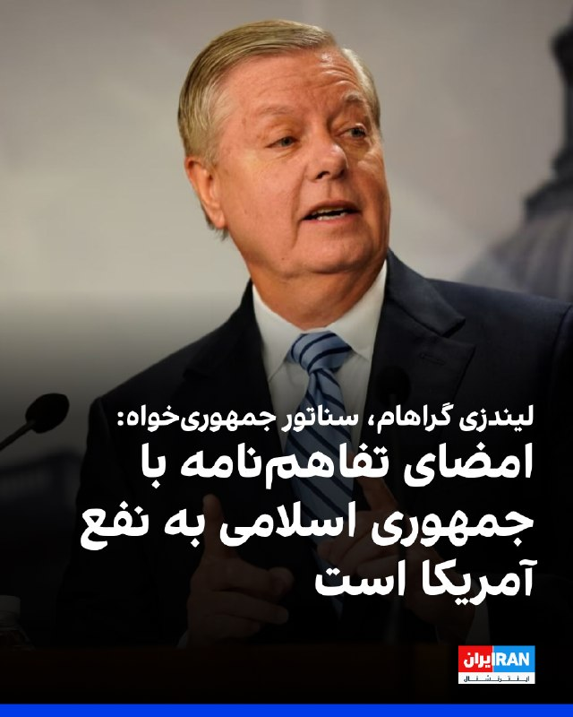

لیندزی گراهام، سناتور جمهوری‌خواه آمریکا، در شبکه ایکس نوشت پس از گفت‌وگویی طولانی با استیو ویتکاف به این نتیجه رسیده که امضای تفاهم‌نامه با جمهوری اسلامی به نفع آمریکا خواهد بود، زیرا به بازگشایی تنگه هرمز و توقف درگیری‌ها با ایران کمک می‌کند.

لیندزی گراهام افزود: «هنوز مشخص نیست آیا آمریکا می‌تواند به توافقی قابل راستی‌آزمایی و قابل قبول با جمهوری اسلامی درباره برنامه هسته‌ای و سایر موضوعات دست یابد یا نه، اما تلاش برای دستیابی به چنین توافقی زیان چندانی ندارد.»

او ادامه داد: «ثبات اقتصادی ناشی از بازگشایی تنگه هرمز و توقف درگیری‌ها می‌تواند مسیری برای صلحی فراتر از مناقشه کنونی با جمهوری اسلامی ایجاد کند.»

لیندزی گراهام گفت گسترش پیمان ابراهیم و عادی‌سازی روابط میان عربستان سعودی و اسرائیل هدف نهایی دونالد ترامپ و او است.

لیندزی گراهام گفت امضای تفاهم‌نامه میان آمریکا و جمهوری اسلامی گامی ضروری برای تحقق ثبات منطقه‌ای و پیشبرد روند صلح در خاورمیانه است.
https://iranintl.com/202606173194

## IranIntlTV — post 342900

  <a href="https://t.me/IranintlTV/342900" target="_blank">📎 Download file</a>

🎧نسخه صوتی تیتراول با نیوشا صارمی: شمارش معکوس تا امضای تفاهم‌نامه تهران و واشینگتن؛ اسراییل همچنان در حاشیه
@iranintlTV

## IranIntlTV — post 342899

  <a href="telegram/content/IranIntlTV_342899_1781720671.mp4" target="_blank">🎬 Download video</a>

مهدی مهدوی‌آزاد در برنامه «چشم‌انداز» گفت: «درخواست کشورهای منطقه برای انتشار مرحله‌ای توافق آمریکا و جمهوری اسلامی شاید نشانگر این باشد که جمهوری اسلامی امتیازهای بزرگی، از جمله به رسمیت شناختن اسرائیل، داده است. سفر محمدباقر قالیباف به پاکستان برای دیدار با جی‌دی ونس نیز نشان می‌دهد این سردار سابق سپاه پاسداران شاید برای دادن امتیازهایی تعیین‌کننده به آمریکا راهی اسلام‌آباد شده بود.»
@iranintltv

## IranIntlTV — post 342898

  <a href="telegram/content/IranIntlTV_342898_1781720673.mp4" target="_blank">🎬 Download video</a>

🔻علیرضا فغانی با قضاوت دیدار فرانسه و سنگال در جام جهانی ۲۰۲۶، به رکوردی تاریخی در داوری فوتبال جهان دست یافت. او برای چهارمین دوره متوالی در جام جهانی حاضر شد و به رکورددار حضور در ادوار جام جهانی تبدیل شد.

🔹توضیحات مزدک میرزایی، ایران‌اینترنشنال در برنامه هت‌تریک

@iranintltvsport

## FarsiVOA — post 221051

🔺سناتور گراهام: امضای یادداشت تفاهم با حکومت ایران می‌تواند راه را برای صلح گسترده‌تر در خاورمیانه هموار کند

▪️سناتور گراهام می‌گوید پس از گفت‌وگویی «طولانی و سازنده» با استیو ویتکاف، نماینده ویژه رئیس جمهوری آمریکا در امور صلح، به این نتیجه رسیده است که امضای یادداشت تفاهم میان ایالات متحده و حکومت ایران می‌تواند به سود آمریکا و در راستای گسترش صلح در خاورمیانه باشد.

⬇️ بیشتر بخوانید:
https://ir.voanews.com/a/sen-graham-says-signing-iran-mou-paves-way-to-regional-peace/8161906.html/?nocach=1

## FarsiVOA — post 221050

🔺پرزیدنت ترامپ: برای تفاهم هیچ پولی به جمهوری اسلامی نمی‌دهیم

▪️رئیس جمهوری آمریکا روز چهارشنبه ۲۷ خرداد در یک کنفرانس خبری در حاشیه اجلاس «گروه ۷» در فرانسه گفت که توافق کنونی با رژیم ایران «یک یادداشت تفاهم است که فردا یا پس‌فردا امضا می‌شود و ما هیچ پولی بابت این تفاهم به جمهوری اسلامی نمی‌دهیم.»

⬇️ بیشتر بخوانید:
https://ir.voanews.com/a/iran-us-trump-negotiations/8161904.html

## FarsiVOA — post 221049

علی جوانمردی: کدام گروه‌های مخالف جمهوری اسلامی با توافق تضعیف می‌شوند؟

## DW_Farsi — post 126116

  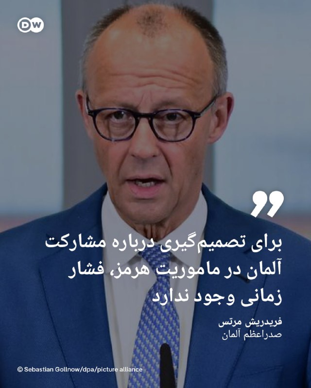

🔶 مرتس: برای تصمیم‌گیری درباره مشارکت آلمان در ماموریت هرمز، فشار زمانی وجود ندارد

فریدریش مرتس، صدراعظم آلمان، روز چهارشنبه ۱۷ ژوئن (۲۷ خرداد) در حاشیه نشست گروه هفت در اویان فرانسه گفت برای تصمیم‌گیری درباره مشارکت احتمالی ارتش آلمان در ماموریتی برای تامین امنیت تنگه هرمز، شتابی وجود ندارد.

او گفت هرگونه مشارکت آلمان به مجموعه‌ای از پیش‌شرط‌ها وابسته است که هنوز برآورده نشده‌اند و به همین دلیل، در این زمینه "هیچ فوریت مستقیمی" وجود ندارد.

مرتس گفت دولت آلمان در هفته‌های گذشته از قبل برای چنین ماموریتی یک چارچوب ماموریتی آماده کرده است.

او افزود اگر تصمیم نهایی در این‌باره گرفته شود، پارلمان آلمان می‌تواند به آن رسیدگی کند. به گفته او، این موضوع احتمالا در آخرین هفته کاری پارلمان پیش از تعطیلات تابستانی، یعنی از ۶ تا ۱۰ ژوئیه، مطرح خواهد شد.

صدراعظم آلمان با اشاره به نشست گروه هفت گفت شرکت‌کنندگان درباره هدف اصلی کاملا اتفاق نظر دارند: تنگه هرمز باید بدون هیچ محدودیتی باز بماند.
@dw_farsi

## IranianMinds — post 22820

سایت های خارجی که بازی های جام جهانیو رایگان میزارنو بفرسین
@AmirrPower

## Dirty_Kids — post 392415

  <a href="telegram/content/Dirty_Kids_392415_1781720675.mp4" target="_blank">🎬 Download video</a>

سلبریتی ولایی‌ها و فاحشه‌های روسی

جمهوری سوم!!!

@Dirty_Kids 👻

---
📅 بروزرسانی: 1405/03/27 21:44
---

## VahidOOnLine — post 246076

♦️دونالد ترامپ، روز چهارشنبه ۲۷ خرداد در حاشیه نشست سران گروه هفت (G7) در فرانسه و در پاسخ به پرسش خبرنگاران درباره تفاوت میان «پرداخت پول به ایران» و «آزادسازی دارایی‌های مسدود‌شده ایران»، تاکید کرد که منابع مالی مسدودشده متعلق به ایران است و بازگرداندن آن برای حفظ اعتبار نظام مالی آمریکا و جایگاه جهانی دلار ضروری خواهد بود.
ترامپ با بیان اینکه «ما پول آن‌ها را گرفته‌ایم، اما این پول متعلق به خودشان است، نه ما»، گفت این دارایی‌ها در مقطعی مسدود شده‌اند و احتمالا باید به ایران بازگردانده شوند. او افزود: «اگر این پول را پس ندهیم، دیگر هیچ کشوری حاضر نخواهد شد به دلار اعتماد کند یا دارایی‌هایش را در نظام مالی آمریکا نگهداری کند.»
رئیس‌جمهوری آمریکا با اشاره به گفتگوی خود با اسکات بسنت، وزیر خزانه‌داری، اظهار داشت که حتی خودش نیز درباره چرایی بازگرداندن این پول‌ها سوال کرده، اما در نهایت به این نتیجه رسیده که بسیاری از کشورها، حتی کشورهایی که با واشنگتن اختلاف دارند، دارایی‌های خود را در آمریکا نگهداری می‌کنند و مصادره یا بازنگرداندن آن‌ها می‌تواند اعتماد جهانی به دلار را خدشه‌دار کند.
‌🇸🇦 Indypersian

🤖 @VahidOOnLine

## VahidOOnLine — post 246075

  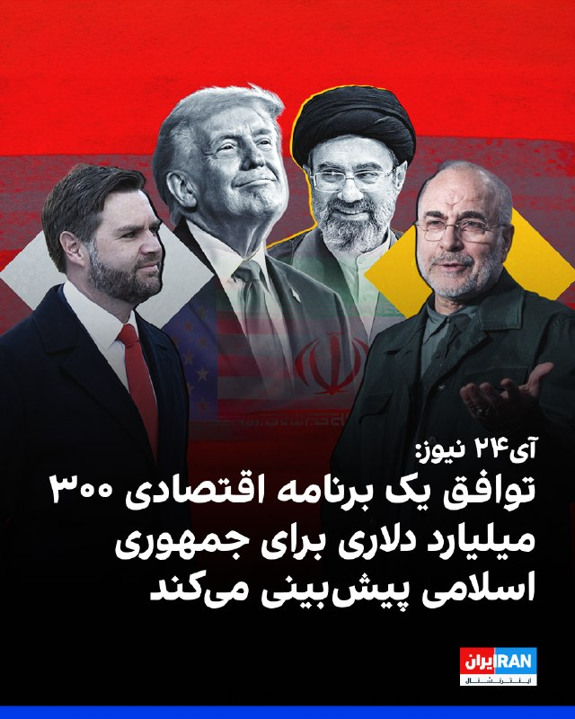

شبکه اسرائیلی آی۲۴ نیوز به نقل از یک مقام ارشد آمریکایی گزارش داد متن رسمی یادداشت تفاهم منتشر شده و بر اساس آن، همه درگیری‌ها از جمله در لبنان فورا متوقف می‌شود.

بر اساس این گزارش، این توافق همچنین یک برنامه اقتصادی ۳۰۰ میلیارد دلاری برای جمهوری اسلامی پیش‌بینی می‌کند.

آی۲۴ نیوز گزارش داد طبق متن رسمی یادداشت تفاهم، ذخایر اورانیوم با غنای بالای ایران در داخل کشور و تحت نظارت آژانس بین‌المللی انرژی اتمی رقیق خواهد شد.
‌🏁 🇬🇧 IranintlTV

🤖 @VahidOOnLine

## WithYashar — post 15180

  <a href="telegram/content/WithYashar_15180_1781720065.webm" target="_blank">🎬 Download video</a>

🔴کانالی که ترور هنیه و نصرالله رو دقیق پیشبینی کرده بود، دلار ۱۶۰ تومنی رو هم دو ماه پیش اعلام کرده بود از تاریخ و نحوه حمله ایران به اسرائیل پرده برداشت!!!

🚨نمیدونم به کجا وصله ولی از همه چی خبر داره بیا خودت ببین
👇
👇

🔴LINK - CHANNEL🔴

## FoxNewsTwitter — post 343086

  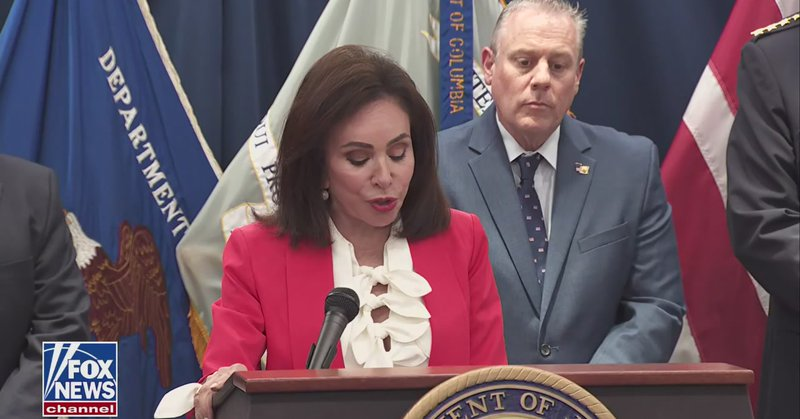

Fox News (Twitter/X)

WATCH LIVE: Pirro announces 21-count drug-trafficking indictment https://twitter.com/i/broadcasts/1dxYllvbXmZJX

## pm_afshaa — post 94289

  <a href="telegram/content/pm_afshaa_94289_1781720066.mp4" target="_blank">🎬 Download video</a>

🔴صحبت‌های جدید قالیباف که یه سریا میگن رسما با این حرفاش داره میگه من رهبرم!

میگه همه باید برای من تصمیم سازی کنن تا من تصمیم درست رو بگیرم!

💧 Rainbet.com the #1 Non-KYC Crypto Casino & Sportsbook @rainbetcom

😁 @Pm_Afshaa

## pm_afshaa — post 94288

  <a href="telegram/content/pm_afshaa_94288_1781720067.mp4" target="_blank">🎬 Download video</a>

🔴خلاصه صحبت‌های قالیباف:
من مثل خامنه‌ای نیستم که جلوی شما بایستم بگم «این کار رو بکنید، اون کار رو نکنید»

+ فقط تعداد من هایی که میگه رو بشمارید...

💧 Rainbet.com the #1 Non-KYC Crypto Casino & Sportsbook @rainbetcom

😁 @Pm_Afshaa

## IranIntlTV — post 342897

  

شبکه اسرائیلی آی۲۴ نیوز به نقل از یک مقام ارشد آمریکایی گزارش داد متن رسمی یادداشت تفاهم منتشر شده و بر اساس آن، همه درگیری‌ها از جمله در لبنان فورا متوقف می‌شود.

بر اساس این گزارش، این توافق همچنین یک برنامه اقتصادی ۳۰۰ میلیارد دلاری برای جمهوری اسلامی پیش‌بینی می‌کند.

آی۲۴ نیوز گزارش داد طبق متن رسمی یادداشت تفاهم، ذخایر اورانیوم با غنای بالای ایران در داخل کشور و تحت نظارت آژانس بین‌المللی انرژی اتمی رقیق خواهد شد.
https://iranintl.com/202606174759

## FarsiVOA — post 221048

  <a href="telegram/content/FarsiVOA_221048_1781720069.mp4" target="_blank">🎬 Download video</a>

گروهی از کشاورزان و شهروندان گرمسار و آرادان روز سه‌شنبه ۲۶ خرداد، در ابتدای جاده بنه‌کوه در اعتراض به کمبود ‌آب شرب و مشکلات تخصیص حقابه حبله‌رود، تنها رودخانه دائمی استان سمنان، تجمع کردند.

## FarsiVOA — post 221047

اختلاف اروپا بر سر چین؛ تعلل در اجماع و بررسی ابزارهای مقابله اقتصادی

## FarsiVOA — post 221046

پرزیدنت ترامپ در یک کنفرانس خبری پس از نشست گروه هفت گفت: آمریکا به جمهوری اسلامی پولی پرداخت نخواهد کرد، پول‌های مصادره شده آزاد خواهد شد به شرط این که رفتارشان درست باشد. برشی از پوشش ویژه با ترجمه همزمان پژواک کیومرثی

## alonews — post 128768

  <a href="telegram/content/alonews_128768_1781720072.webm" target="_blank">🎬 Download video</a>

👈وزارت خارجه ایران : ادامه اشغال جنوب لبنان توسط اسرائیل، یادداشت تفاهم را نقض می‌کند و ما اقدامات لازم را انجام خواهیم داد

✅ @AloNews خبر جنگ

## alonews — post 128767

  <a href="telegram/content/alonews_128767_1781720072.webm" target="_blank">🎬 Download video</a>

👈 منبع آگاه به فارس: پیشنهاد امضای الکترونیکی تفاهم‌نامه ایران و آمریکا پیش از سفر به ژنو مطرح شده است

🔴تا این لحظه جمهوری اسلامی موافقت خود را با این پیشنهاد اعلام نکرده است.

✅ @AloNews خبر جنگ

---
📅 بروزرسانی: 1405/03/27 21:34
---

## VahidOOnLine — post 246074

  

سازمان عملیات تجارت دریایی بریتانیا در بیانیه‌ای اعلام کرد یک کشتی در ۱۰۵ مایل دریایی شمال‌شرق عدن هدف تیراندازی دو قایق تندرو حامل افراد مسلح قرار گرفت.

به گزارش این سازمان تیم امنیتی کشتی به حمله پاسخ داد و مهاجمان عقب‌نشینی کردند و خدمه کشتی سالم هستند.
‌🏁 🇬🇧 IranintlTV

🤖 @VahidOOnLine

## VahidOOnLine — post 246073

♦️ دونالد ترامپ، رئیس‌جمهوری آمریکا، روز چهارشنبه ۲۷ خرداد در نشست مطبوعاتی در فرانسه، در پاسخ به سؤالی پیرامون مسئولیت پذیری دولتش در قبال حمله به مدرسه‌ای در روز اول جنگ که منجر به کشته شدن بیش از ۱۰۰ کودک شد، پاسخگویی یا برکناری هر یک از مقامات دولت خود را رد کرد.

ترامپ با عجیب خواندن طرح این پرسش در مرحله فعلی مذاکرات گفت: «هیچ‌کس این کار را عمدا انجام نداده است. در جنگ اشتباهات پیش می‌آیند و جنگ بی‌رحم و کثیف است.» او با مقایسه این رویداد با اقدامات طرف مقابل افزود: «تکلیف هزاران سربازی که با بمب‌های ایران کشته شدند چه می‌شود؟»

رئیس‌جمهوری آمریکا در نهایت با تاکید بر اینکه این حادثه در دست بررسی و تحقیق است، اعلام کرد که پیت هگست، وزیر جنگ آمریکا، مسئولیت این تحقیق را بر عهده داشته و جزئیات بیشتری می‌تواند ارائه کند.
‌🇸🇦 Indypersian

🤖 @VahidOOnLine

## mwarmonitor — post 11084

یادداشت تفاهم میان جمهوری اسلامی ایران و ایالات متحده آمریکا ۱ — جمهوری اسلامی ایران و ایالات متحده آمریکا، به همراه متحدان خود در جنگ فعلی، با امضای این یادداشت تفاهم، پایان فوری و دائمی جنگ را در تمامی جبهه‌ها از جمله لبنان اعلام می‌دارند و متعهد می‌شوند…

## pm_afshaa — post 94287

  <a href="telegram/content/pm_afshaa_94287_1781719489.webm" target="_blank">🎬 Download video</a>

🔴بقائی، سخنگوی وزارت خارجه:
امضای تفاهم‌نامه به دست روسای جمهور دو کشور درحال بررسیه.

💧 Rainbet.com the #1 Non-KYC Crypto Casino & Sportsbook @rainbetcom

😁 @Pm_Afshaa

## VahidOnline — post 76456

  

سخنگوی وزارت خارجه جمهوری اسلامی روز چهارشنبه از احتمال امضای توافق پایان جنگ توسط روسای جمهوری ایران و آمریکا خبر داد و گفت این مسئله «در حالی بررسی است».

به گزارش رسانه‌های نزدیک به حکومت ایران، اسماعیل بقائی درباره احتمال امضای یادداشت تفاهم از سوی مسعود پزشکیان و دونالد ترامپ اعلام کرد: «این ایده مطرح است و همچنان در حال بررسی است.»

پیش از این طرف‌های ایرانی و آمریکایی خبر داده بودند جی‌دی ونس، معاون رئیس‌جمهور آمریکا، و محمدباقر قالیباف، رئیس مجلس شورای اسلامی، در سوئیس این تفاهم‌نامه را امضا خواهند کرد.

دولت سوئیس تأیید کرد مراسم امضای این تفاهم در اقامتگاه کوهستانی بورگن‌اشتوک برگزار خواهد شد.
@VahidHeadline

📡 @VahidOnline

## IranIntlTV — post 342896

  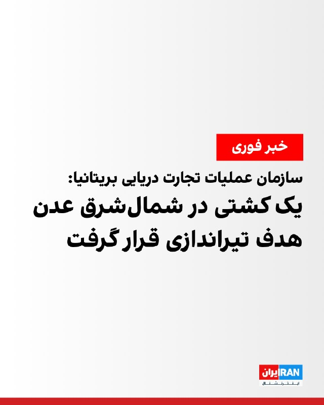

سازمان عملیات تجارت دریایی بریتانیا در بیانیه‌ای اعلام کرد یک کشتی در ۱۰۵ مایل دریایی شمال‌شرق عدن هدف تیراندازی دو قایق تندرو حامل افراد مسلح قرار گرفت.

به گزارش این سازمان تیم امنیتی کشتی به حمله پاسخ داد و مهاجمان عقب‌نشینی کردند و خدمه کشتی سالم هستند.
https://iranintl.com/202606170360

## Persian_Trend_Official — post 17387

  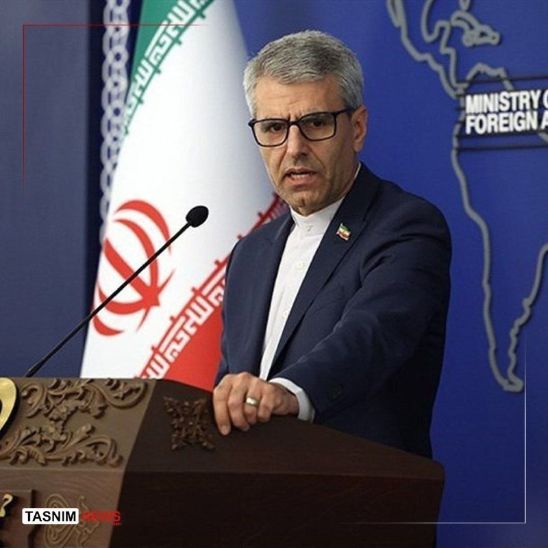

بقایی: احتمال امضای تفاهمنامه توسط روسای جمهور ایران و آمریکا مطرح است!

سخنگوی وزارت امور خارجه اعلام کرد تا این لحظه هیچ تغییری در برنامه‌های ایران برای برگزاری نشست ژنو ایجاد نشده است.

وی همچنین در خصوص احتمال امضای یادداشت تفاهم توسط رؤسای جمهور دو کشور اظهار داشت: این ایده مطرح است و همچنان در حال بررسی است.

📝 Amir

📌 @persian_trend_official
پرشین ترند | متفاوت‌ترین کانال نظامی

## RadioFarda — post 158442

  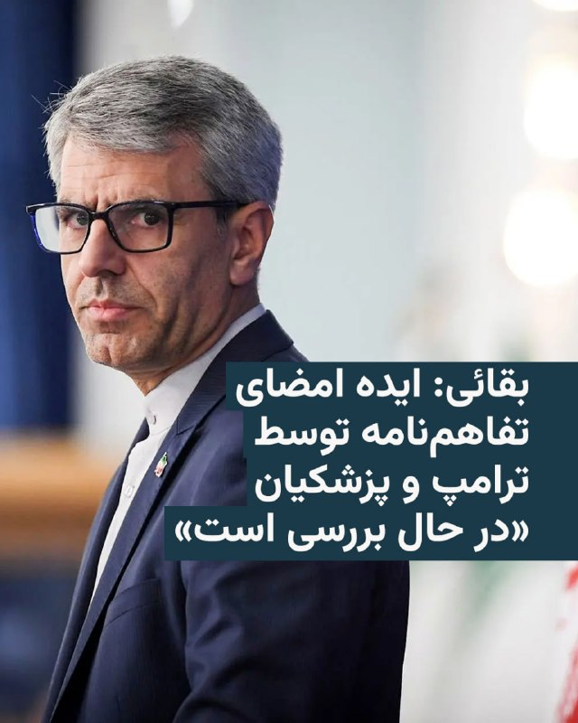

🔸سخنگوی وزارت خارجه جمهوری اسلامی روز چهارشنبه از احتمال امضای توافق پایان جنگ توسط روسای جمهوری ایران و آمریکا خبر داد و گفت این مسئله «در حالی بررسی است».

🔸به گزارش رسانه‌های نزدیک به حکومت ایران، اسماعیل بقائی درباره احتمال امضای یادداشت تفاهم از سوی مسعود پزشکیان و دونالد ترامپ اعلام کرد: «این ایده مطرح است و همچنان در حال بررسی است.»

🔸پیش از این طرف‌های ایرانی و آمریکایی خبر داده بودند جی‌دی ونس، معاون رئیس‌جمهور آمریکا، و محمدباقر قالیباف، رئیس مجلس شورای اسلامی، در سوئیس این تفاهم‌نامه را امضا خواهند کرد.

🔸دولت سوئیس تأیید کرد مراسم امضای این تفاهم در اقامتگاه کوهستانی بورگن‌اشتوک برگزار خواهد شد.

@RadioFarda

## BBCPersian — post 284168

🔸تیم ملی کرواسی، نایب‌قهرمان جام جهانی ۲۰۱۸ و تیم سوم جام جهانی ۲۰۲۲ با وجود افزایش میانگین سنی بازیکنانش، همچنان یکی از خطرناک‌ترین تیم‌های فوتبال جهان است.
زلاتکو دالیچ، موفق‌ترین سرمربی تاریخ فوتبال کرواسی است. او برای سومین جام جهانی پیاپی هدایت کرواسی را بر عهده دارد.
لوکا مودریچ ۴۰ ساله، همچنان رهبر و نماد تیم ملی کرواسی است. هافبک پرافتخار کرواسی با نزدیک به ۲۰۰ بازی ملی، سال‌هاست مغز متفکر تیم بوده و با وجود ظهور ستارگان جوان، همچنان مهم‌ترین چهره فوتبال کشورش است.
تیم ملی انگلیس با یکی از پرستاره‌ترین ترکیب‌های تاریخ خود وارد جام جهانی ۲۰۲۶ می‌شود. «سه‌شیر» این بار با هدایت توماس توخل به دنبال پایان دادن به طلسم و انتظار طولانی فتح جام جهانی از سال ۱۹۶۶هستند.
هری کین همچنان مهم‌ترین ستاره و رهبر خط حمله انگلستان است. کاپیتان انگلیس علاوه بر تمام‌کنندگی کم‌نظیر، در بازی‌سازی و خلق موقعیت هم نقش مهمی دارد و امید اصلی انگلستان برای فتح جام جهانی ۲۰۲۶ محسوب می‌شود.
ادامه مطلب⬇️

📸GettyImages
https://bbc.in/4vZGZAm

## Dirty_Kids — post 392414

  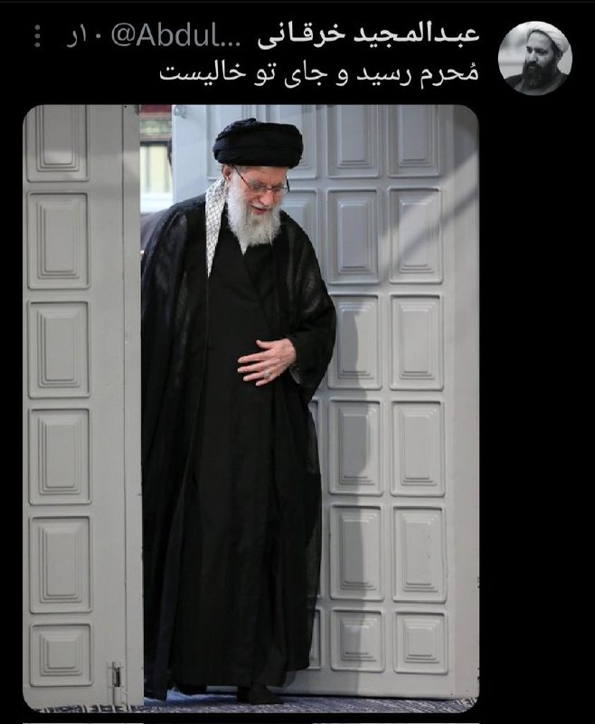

محرم آمد و کرب و بلا شد
دو لنگ رهبرت فوراً هوا شد

@Dirty_Kids 👻

## Dirty_Kids — post 392413

یکی نبود به خامنه ای بگه کشوری که شبیه گربه هست

نباید توش موش باشی ؟

@Dirty_Kids 👻

## Hranews — post 113689

برخلاف پیمان نامه حقوق کودک؛ آموزش اسلحه‌شناسی و کار با اسلحه به کودکان دیشموک

❗️
❗️
❗️
❗️
❗️– برخلاف تعهدات بین‌المللی ایران، از جمله پیمان‌نامه حقوق #کودک و الزامات مربوط به منع به‌کارگیری کودکان در امور نظامی، برنامه‌ای با عنوان «جوانان مبارز» در شهرستان دیشموک برگزار شد که در جریان آن آموزش استفاده از سلاح، از جمله سلاح‌های سنگین جنگی، آموزش مهارت‌های نظامی و همچنین در اختیار قرار دادن سلاح به این کودکان انجام شده است.

ادامه مطلب

↘️
@hranews_bot تماس ✉️ -  @Hranews  کانال هرانا 🆑

## alonews — post 128766

👈معاون وزارت ارتباطات : با اشاره به تجربه قطع اینترنت در جریان جنگ اخیر کشور به سطحی از بلوغ رسیده که حتی در شرایط بحرانی و التهاب شدید نیز میتواند بدون قطع اینترنت مدیریت شود و دیگر شاهد قطع اینترنت نخواهیم بود

✅ @AloNews خبر جنگ

---
📅 بروزرسانی: 1405/03/27 21:24
---

## FoxNewsTwitter — post 343085

  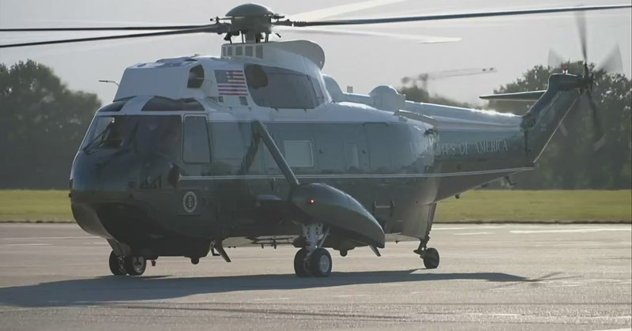

Fox News (Twitter/X)

WATCH LIVE: President Trump departs from the G7 summit after reaching Iran deal https://twitter.com/i/broadcasts/1kJzDDyQdMgKv

## FoxNewsTwitter — post 343084

  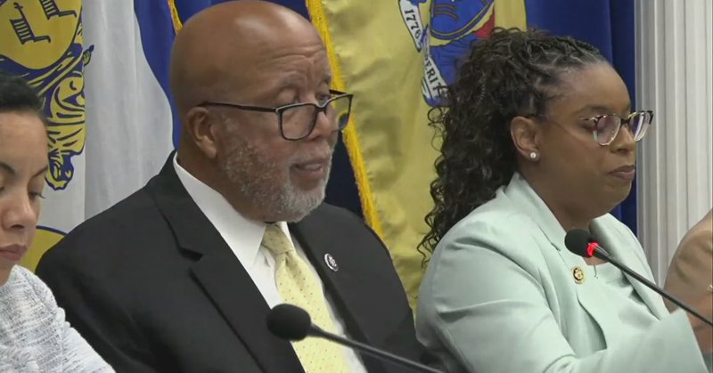

Fox News (Twitter/X)

WATCH LIVE: House Dems hold a field hearing on anti-ICE protests at Delaney Hall https://twitter.com/i/broadcasts/1AKEmmBoeBXKL

## FoxNewsTwitter — post 343083

  <a href="telegram/content/FoxNewsTwitter_343083_1781718874.mp4" target="_blank">🎬 Download video</a>

Fox News (Twitter/X)

"If it doesn't work out, I'm blaming JD!"

President Trump joked with @pdoocy that Vice President JD Vance will take the heat if the Iran peace signing goes sideways:

PETER DOOCY: "There's some element to this where you send the vice president- if it works out, great, you look like a genius for sending him. And if it doesn't work out, it's the vice president's fault."

PRESIDENT TRUMP: "I like that idea. This way, if it works out I'm going to take the credit... You better be careful, JD. He's going to turn his plane around and get the hell out of here!"

## pm_afshaa — post 94286

معاون وزارت ارتباطات : با اشاره به تجربه قطع اینترنت در جریان جنگ اخیر کشور به سطحی از بلوغ رسیده که حتی در شرایط بحرانی و التهاب شدید نیز میتواند بدون قطع اینترنت مدیریت شود و دیگر شاهد قطع اینترنت نخواهیم بود

💧 Rainbet.com the #1 Non-KYC Crypto Casino & Sportsbook @rainbetcom

😁 @Pm_Afshaa

## iaghapour — post 2681

⭕️ دسترسی مستقیم و بدون واسطه به اینترنت آزاد 🔹کافی است آدرس subscription را در برنامه v2rayN/v2rayNG وارد کنید: https://raw.githubusercontent.com/patterniha/Serverless-for-Iran/refs/heads/main/Subscription/Serverless-for-Iran.json — نکات استفاده👇🏻 ۱. کانفیگ…

## FarsiVOA — post 221045

  <a href="telegram/content/FarsiVOA_221045_1781718876.mp4" target="_blank">🎬 Download video</a>

مراسم خاکسپاری ابوالفضل ساعدی، یکی از معترضان اعدام شده، سه‌شنبه ۲۶ خرداد، در شاهرود برگزار شد. حاضران در این مراسم شعار «این گل پرپر شده، هدیه به میهن شده» و «جاویدنام روحت شاد» سردادند.

جواد زمانی و ابوالفضل ساعدی، دو نفر از بازداشت‌شدگان اعتراضات دی‌ ۱۴۰۴، بامداد سه‌شنبه اعدام شدند.

## FarsiVOA — post 221044

مخالفت چهره‌های تندروی جمهوری اسلامی با توافق با آمریکا چه‌قدر تعیین‌کننده است؟ گفت‌وگو با حامد آیینه‌وند

## FarsiVOA — post 221043

🔺حمله ماموران حکومتی به معترضان عملکرد «معدن کرومیت» در فاریاب کرمان؛ دست‌کم هفت زن مجروح شدند

▪️ماموران جمهوری اسلامی روز چهارشنبه ۲۷ خرداد با حمله به تجمع اعتراضی مردم فاریاب استان کرمان نسبت به عملکرد «معدن کرومیت پشموکی»، دست‌کم هفت زن را مجروح و شش معترض دیگر، از جمله سه زن، را «با خشونت» بازداشت کردند.

⬇️ بیشتر بخوانید:

https://ir.voanews.com/a/attack-on-protesting-women-chromite-mine-faryab-kerman-injured/8161853.html/?nocach=1

## DW_Farsi — post 126115

  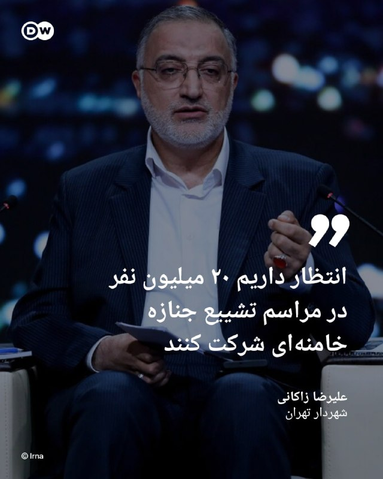

🔶 زاکانی: انتظار شرکت ۲۰ میلیون نفر در مراسم تشییع جنازه خامنه‌ای

مراسم وداع و تشییع علی خامنه‌ای، رهبر پیشین جمهوری اسلامی که در حملات آمریکا و اسرائیل در ماه فوریه کشته شد، از ۴ تا ۹ ژوئیه برگزار خواهد شد.

به گزارش رسانه‌های حکومتی، علیرضا زاکانی، شهردار تهران گفته است که بخشی از این مراسم در عراق برگزار می‌شود و پیکر او در پایان در مشهد دفن خواهد شد.

او سپس با انتشار پیامی اعلام کرد که این خبر ناقص منتشر شده است. شهردار تهران افزود: «از قرار اطلاع، پیشنهادهای متعدد و پرتکراری از طرف براداران و خواهران عزیز عراقی برای برگزاری مراسم وداع و تشییع پیکر ایشان در عراق به مسئولان ستاد برگزاری مراسم رسیده است.»

او همچنین تاکید کرد: « این پیشنهاد توسط مسئولان ذی‌ربط در حال بررسی است و تاکنون هیچ مراسمی برای این منظور قطعی نشده است.»

زاکانی همچنین گفت مقدمات برگزاری مراسم تشییع در تهران در حال انجام است و مقام‌ها انتظار دارند نزدیک به ۲۰ میلیون نفر در آن شرکت کنند.
@dw_farsi

## Persian_Trend_Official — post 17386

  <a href="telegram/content/Persian_Trend_Official_17386_1781718879.mp4" target="_blank">🎬 Download video</a>

خلبان F-5 ایرانی: زمانی که ما پایگاه را بمباران‌ میکردیم یک F-18 کویتی در آسمان بود.

زمانی که در راه برگشت بودیم یک دسته 3 فروندی از F-15 های امریکایی در راه ایران بود، پاتریوت ها و F-18 کویتی آن‌ها را به اشتباهی منهدم کردند.

به چشم لحظه منهدم شدن یک هدف در آسمان را دیدم.

📝 Amir

📌 @persian_trend_official
پرشین ترند | متفاوت‌ترین کانال نظامی

## Persian_Trend_Official — post 17385

  <a href="telegram/content/Persian_Trend_Official_17385_1781718880.mp4" target="_blank">🎬 Download video</a>

خلبان F-5 ایرانی: بمب های ما سقوط آزاد بود، یعنی باید آن‌ها را بالای سر هدف رها می‌کردیم.

موقع اصابت بمب ها با چشم میدیم بالگرد های دشمن بلند می‌شوند(انفجار ثانویه) پایگاه آسیب زیادی دید و با قدرت ضربتی بالا، هیچ رحمی به دشمن بی‌رحم نکردیم.

📝 Amir

📌 @persian_trend_official
پرشین ترند | متفاوت‌ترین کانال نظامی

## IranianMinds — post 22819

  

🔴 ترامپ :

گروه جدیدی که الان ایران رو اداره میکنن خیلی ادمای دوست داشتنی و خوبی هستن و مردم و کشورشونو دوس دارن.

@IranianMinds

---
📅 بروزرسانی: 1405/03/27 21:14
---

## VahidOOnLine — post 246072

  

اسماعیل بقائی، سخنگوی وزارت خارجه، گفت که برنامه‌های جمهوری اسلامی برای نشست ژنو تغییری نکرده است.
بقائی، سخنگوی وزارت خارجه در خصوص احتمال امضای یادداشت تفاهم توسط روسای جمهور دو کشور، گفت: «این ایده مطرح است و همچنان در حال بررسی است.»

پیش‌تر اکسیوس گزارش داده بود که آمریکا، جمهوری اسلامی و میانجی‌ها در حال بررسی برگزاری امضای یادداشت تفاهم به‌صورت الکترونیک و احتمالا در روز چهارشنبه هستند؛ اقدامی که می‌تواند جایگزین مراسم حضوری برنامه‌ریزی‌شده برای جمعه ۲۹ خرداد در سوئیس شود.
‌🏁 🇬🇧 IranintlTV

🤖 @VahidOOnLine

## WithYashar — post 15179

الجزیره به نقل از وزارت امور خارجه ایران: در حال حاضر در حال بررسی ایده امضای تفاهم‌نامه از راه دور توسط رؤسای جمهور ایران و ایالات متحده هستیم.
@withyashar

## WithYashar — post 15178

معاون وزیر ارتباطات: اینترنت دیگر در شرایط بحران قطع نخواهد شد
@withyashar

## WithYashar — post 15177

یک مقام کاخ سفید: نشست سوئیس برای مرحله بعدی بسیار مهم خواهد بود زیرا سند کنونی نیت‌های طرفین را منعکس می‌کند.
@withyashar

## mwarmonitor — post 11083

🔴ایالات متحده همین حالا متن رسمی یادداشت تفاهمی را که آخر هفته گذشته با ایران حاصل شده منتشر کرده است. 🔴یک مقام ارشد دولت آمریکا متن ۱۴ بندی این سند را قرائت کرده که در آن، سازوکارهایی برای بازگشایی تنگه هرمز، کاهش برخی محدودیت‌های مالی علیه ایران و همچنین…

## mwarmonitor — post 11082

متن کامل یادداشت تفاهم ۱۴ ماده‌ای میان ایران و آمریکا ۱ — جمهوری اسلامی ایران و ایالات متحده، به همراه متحدان خود در جنگ فعلی، با امضای این یادداشت تفاهم، پایان فوری و دائم جنگ در تمامی جبهه‌ها از جمله لبنان را اعلام می‌نمایند و متعهد می‌شوند که از این پس…

## DEJradio — post 5768

  <a href="telegram/content/DEJradio_5768_1781718273.mp4" target="_blank">🎬 Download video</a>

🚨🎥 ضرب‌وشتم زنان بی‌دفاع در فاریاب کرمان توسط نیروی انتظامی

به گزارش "حال‌ وش" روز چهارشنبه ۲۷ خردادماه ۱۴۰۵، نیروهای نظامی به تجمع اعتراضی اهالی روستای پشموکی از توابع شهرستان فاریاب در استان کرمان یورش بردند.

ماموران باتوم، مشت و لگد به سمت زنان و شهروندان معترض هجوم برده و آنان را مورد ضرب‌وشتم قرار دادند.

#سرکوب_اعتراضات #کرمان
@DEJradio

## IranIntlTV — post 342895

  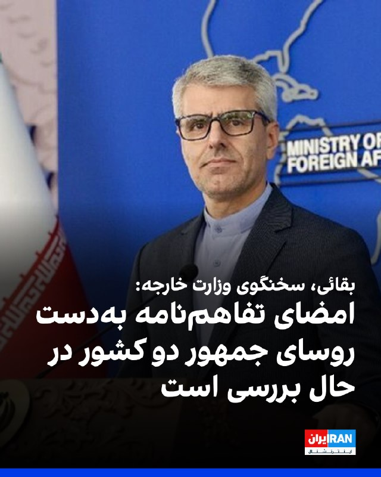

اسماعیل بقائی، سخنگوی وزارت خارجه، گفت که برنامه‌های جمهوری اسلامی برای نشست ژنو تغییری نکرده است.
بقائی، سخنگوی وزارت خارجه در خصوص احتمال امضای یادداشت تفاهم توسط روسای جمهور دو کشور، گفت: «این ایده مطرح است و همچنان در حال بررسی است.»

پیش‌تر اکسیوس گزارش داده بود که آمریکا، جمهوری اسلامی و میانجی‌ها در حال بررسی برگزاری امضای یادداشت تفاهم به‌صورت الکترونیک و احتمالا در روز چهارشنبه هستند؛ اقدامی که می‌تواند جایگزین مراسم حضوری برنامه‌ریزی‌شده برای جمعه ۲۹ خرداد در سوئیس شود.
https://iranintl.com/202606172401

## IranIntlTV — post 342894

  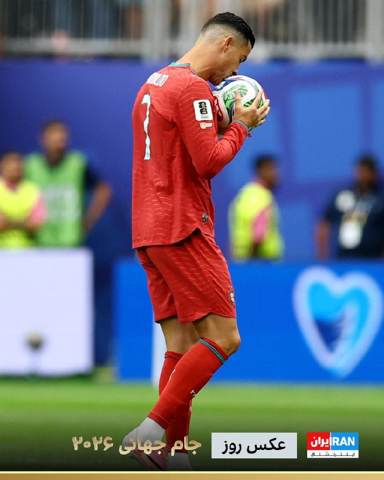

🔻کریستیانو رونالدو، فوق‌ستاره تیم ملی پرتغال، روز چهارشنبه ۲۷ خرداد رکورد دیگری را به کارنامه پرافتخار خود افزود.

🔹رونالدوی ۴۱ ساله در ترکیب اصلی پرتغال برای دیدار افتتاحیه این تیم مقابل جمهوری دموکراتیک کنگو در هیوستون به میدان رفت. این بیست‌وسومین حضور او در مسابقات جام جهانی در طول شش دوره مختلف این رقابت‌ها بود.

🔹او با حضور در جام جهانی ۲۰۲۶ در کنار لیونل مسی به تنها بازیکنان مردی تبدیل شد که در شش دوره جام جهانی به میدان رفته‌اند.

🔹همچنین رونالدو به مسن‌ترین بازیکن غیر دروازه‌بان تبدیل شد که در ترکیب اصلی یک مسابقه جام جهانی قرار گرفته است.

🔹او پیش از آغاز جام جهانی ۲۰۲۶، هشت گل و دو پاس گل در تاریخ این رقابت‌ها ثبت کرده بود.

🔹رونالدو نخستین بار در جام جهانی ۲۰۰۶ برای پرتغال بازی کرد و تیمش را به مقام چهارم رساند؛ بهترین نتیجه پرتغال از زمان کسب مقام سوم در جام جهانی ۱۹۶۶.

🔹در جام جهانی ۲۰۲۲ قطر، رونالدو نخستین بازیکن مرد تاریخ شد که در پنج دوره مختلف جام جهانی گلزنی کرده است.

@iranintltvsport

## Persian_Trend_Official — post 17384

  <a href="telegram/content/Persian_Trend_Official_17384_1781718276.mp4" target="_blank">🎬 Download video</a>

خلبان لیدر F-5 ایرانی در حمله بحرین: برای اینکه توسط پاتریوت، اواکس و F-18 های دشمن شناسایی نشویم زیر 50 پا پرواز کردیم!

عملیات در سکوت کامل رادیویی انجام شد، در بخشی از مسیر از بین دو نفتکش عبور کردیم، آنقدر پایین بودیم که از بین دو کشتی عبور کردیم و عرشه از جنگنده ها ارتفاع بیشتری داشت.

📝 Amir

📌 @persian_trend_official
پرشین ترند | متفاوت‌ترین کانال نظامی

## RadioFarda — post 158441

🔸رئیس‌جمهور آمریکا روز چهارشنبه گفت که واشینگتن «نسخه‌ای از توافق» با ایران برای پایان دادن به جنگ خاورمیانه را برای اسرائیل ارسال کرده است. 🔸این اظهارات در پی گزارش‌هایی درباره تنش میان او و بنیامین نتانیاهو، نخست‌وزیر اسرائیل، مطرح شد. 🔸دونالد ترامپ در…

## RadioFarda — post 158440

  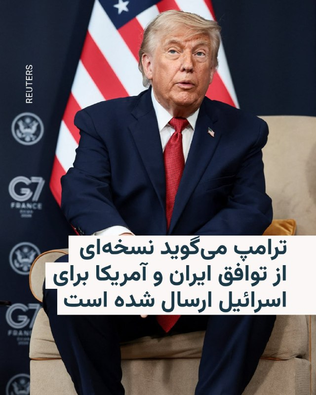

🔸رئیس‌جمهور آمریکا روز چهارشنبه گفت که واشینگتن «نسخه‌ای از توافق» با ایران برای پایان دادن به جنگ خاورمیانه را برای اسرائیل ارسال کرده است.

🔸این اظهارات در پی گزارش‌هایی درباره تنش میان او و بنیامین نتانیاهو، نخست‌وزیر اسرائیل، مطرح شد.

🔸دونالد ترامپ در کنفرانس خبری پایان اجلاس سران گروه هفت در فرانسه، در حالی که تأکید کرد همچنان رابطه خوبی با نتانیاهو دارد، بار دیگر انتقاد خود را از عملیات اسرائیل علیه حزب‌الله در لبنان تکرار کرد و گفت: «آن‌ها (اسرائیل) می‌توانند کار را خیلی بهتر انجام دهند.»

🔸رئیس‌جمهور آمریکا همچنین گفت که نتانیاهو می‌تواند در لبنان «رویکرد نرم‌تری» در پیش بگیرد.

@RadioFarda

## RadioFarda — post 158439

🔸محمدحسین خوشوقت می‌گوید کارشناسان امنیتی به مجتبی خامنه‌ای «توصیه جدی» کرده‌اند که حتی در حد نشر صدا هم خود را نشان ندهد.

🔸برادر همسر مصطفی خامنه‌ای در یک گفت‌وگوی تصویری با «انصاف نیوز» همچنین وارد آمدن آسیب جدی به صورت یا پای مجتبی خامنه‌ای را تکذیب کرد و گفت او در سلامت است.

🔸مجتبی خامنه‌ای پس از کشته شدن پدرش در حملۀ آمریکا و اسرائیل له عنوان رهبر سوم جمهوری اسلامی منصوب شد اما تا کنون از او صدا و تصویر منتشر نشده است.

@RadioFarda

## IranianMinds — post 22817

🔴 سخنگوی وزارت خارجه جمهوری اسلامی :

ایده امضای توافق حضوری بین پزشکیان و ترامپ در حال بررسی است.

@IranianMinds

## BBCPersian — post 284167

  <a href="https://t.me/bbcpersian/284167" target="_blank">📎 Download file</a>

پادکست برنامه جام جهان‌نما چهارشنبه ۲۷ خرداد ۱۴۰۵
این برنامه رادیویی را می‌توانید هرشب ساعت ۲۰ به وقت ایران، روی موج متوسط ۷۰۲ کیلوهرتز و موج کوتاه ۹۴۶۵ کیلوهرتز بشنوید.تکرار برنامه را هم می‌توانید ساعت ۲۱:۳۰ روی موج متوسط ۷۰۲ کیلوهرتز و موج کوتاه ۵۳۹۵ کیلوهرتز گوش کنید.

@BBCPersian

## Dirty_Kids — post 392412

  <a href="telegram/content/Dirty_Kids_392412_1781718278.mp4" target="_blank">🎬 Download video</a>

مجید خراطها ورژن اسلامی-محرمی

@Dirty_Kids 👻

## Dirty_Kids — post 392411

  <a href="telegram/content/Dirty_Kids_392411_1781718279.mp4" target="_blank">🎬 Download video</a>

ژل محرمی چه کثافتیهه دیگه
برا طبل زدن خوبه

@Dirty_Kids 👻

## Dirty_Kids — post 392410

🔴 ترامپ: همه کشورهای دیگه موشک دارن. چرا ایران نمیتونه داشته باشه؟ اونم حقشه داشته باشه و برای دفاع از خودشه

@Dirty_Kids 👻

## Dirty_Kids — post 392409

🔴 اینو نگی چی بگی مرتیکه حقیر😂

ترامپ آزادسازی پول‌های ایران را تایید کرد:
پولِ خودِ آنهاست و ما در یک مقطع زمانی آن را مسدود کردیم؛ ناچاریم آن را پس بدهیم
اگر آن را پس ندهیم، دیگر هیچ‌کس هرگز روی دلار سرمایه‌گذاری نخواهد کرد.

@Dirty_Kids 👻

## Hranews — post 113688

گزارشی از مطالبات مزدی کارگران ابنیه فنی تراورس

❗️
❗️
❗️
❗️
❗️ – #کارگران ابنیه فنی تراورس از عدم دریافت مابه‌التفاوت حقوق فروردین و بخشی از حقوق اردیبهشت ماه خود خبر دادند.

ادامه مطلب

↘️
@hranews_bot تماس ✉️ -  @Hranews  کانال هرانا 🆑

## alonews — post 128765

  <a href="telegram/content/alonews_128765_1781718280.webm" target="_blank">🎬 Download video</a>

👈الجزیره به نقل از مقام کاخ سفید: ایالات متحده متعهد است که بلافاصله پس از امضای یادداشت تفاهم، معافیت‌هایی برای صادرات نفت ایران صادر کند

✅ @AloNews خبر جنگ

## alonews — post 128764

  <a href="telegram/content/alonews_128764_1781718280.webm" target="_blank">🎬 Download video</a>

🔴 فوری / بقایی: احتمال امضای تفاهمنامه توسط روسای جمهور ایران و آمریکا مطرح است

🔴 برنامه‌های ایران برای نشست ژنو تغییری نکرده است

✅ @AloNews خبر جنگ

## alonews — post 128763

  <a href="telegram/content/alonews_128763_1781718281.webm" target="_blank">🎬 Download video</a>

👈آکسیوس: طبق توافق تأیید شده، ایالات متحده و جمهوری اسلامی ایران بر موارد زیر توافق دارند:

🔴آتش‌بس فوری و دائمی در تمام صحنه‌ها، از جمله لبنان، با تعهد به عدم انجام اقدامات نظامی یا تهدیدات بیشتر.

🔴احترام متقابل به حاکمیت و عدم دخالت در امور داخلی.

🔴مذاکره برای توافق نهایی ظرف ۶۰ روز (قابل تمدید با رضایت متقابل).

🔴رفع تدریجی محاصره دریایی آمریکا ظرف ۳۰ روز و عقب‌نشینی نیروها از اطراف ایران پس از توافق نهایی.

🔴بازسازی و حفاظت از مسیرهای حمل‌ونقل تجاری در منطقه خلیج فارس–خلیج عمان، با پاکسازی موانع و مین‌ها.

🔴مشورت ایران با عمان و کشورهای منطقه درباره حاکمیت آینده و ترتیبات دریایی در تنگه هرمز.

🔴تدوین طرح مشترک بازسازی اقتصادی برای ایران (حداقل ۳۰۰ میلیارد دلار).

🔴رفع کامل تمامی تحریم‌ها (سازمان ملل، مرتبط با آژانس بین‌المللی انرژی اتمی، تحریم‌های اولیه و ثانویه آمریکا) طبق جدول زمانی توافق شده.

🔴ایران تأکید می‌کند که سلاح هسته‌ای توسعه نخواهد داد؛ مسائل مربوط به مواد غنی‌شده و غنی‌سازی تحت نظارت آژانس بین‌المللی انرژی اتمی مدیریت خواهد شد.

🔴حفظ وضعیت موجود تا توافق نهایی: عدم اعمال تحریم‌های جدید یا تشدید نظامی.

🔴صدور مجوزهای آمریکا برای صادرات نفت ایران و خدمات مالی مرتبط.

🔴آزادسازی و دسترسی کامل به دارایی‌های ایران، طبق رویه‌های توافق شده مشترک.

🔴ایجاد مکانیزمی برای نظارت بر اجرای توافق.

🔴توافق نهایی در چارچوب مراحل آتش‌بس مذاکره و سپس توسط شورای امنیت سازمان ملل تصویب خواهد شد.

✅ @AloNews خبر جنگ

---
📅 بروزرسانی: 1405/03/27 21:04
---

## VahidOOnLine — post 246071

  

دونالد ترامپ، رییس‌جمهوری آمریکا، در نشست گروه هفت گفت واشینگتن از اهرم‌های قابل توجهی برای جلوگیری از نقض آتش‌بس میان اسرائیل و حزب‌الله برخوردار است.

ترامپ با اشاره به توافق اخیر با جمهوری اسلامی گفت: «تهران اکنون باید رفتار متفاوتی داشته باشد» و همین موضوع به آمریکا نفوذ بیشتری برای حفظ آتش‌بس می‌دهد.

او در ادامه درگیری میان اسرائیل و حزب‌الله را در مقایسه با جنگ اخیر «کوچک‌تر» توصیف کرد و گفت از اینکه این تنش‌ها هنوز پایان نیافته‌اند، شگفت‌زده است.

رییس‌جمهوری آمریکا همچنین به توان نظامی و ابزارهای اقتصادی واشینگتن اشاره کرد و افزود محاصره بنادر ایران از حملات هوایی تاثیرگذارتر بوده است.

ترامپ افزود آمریکا از اهرم‌های نظامی و اقتصادی قدرتمندی برخوردار است و می‌تواند از این ابزارها برای جلوگیری از نقض آتش‌بس و کاهش تنش‌ها در منطقه استفاده کند.
‌🏁 🇬🇧 IranintlTV

🤖 @VahidOOnLine

## VahidOOnLine — post 246070

ویدیوی رسیده به ایران‌اینترنشنال نشان می‌دهد مردم در مراسم خاکسپاری ابوالفضل ساعدی،‌ معترض بازداشتی اعدام‌شده در شاهرود، او را جاویدنام خواندند و تشویق کردند. آن‌ها شعار دادند «این گل پرپر شده، هدیه به میهن شده»

ابوالفضل ساعدی به همراه جواد زمانی، دو تن از بازداشت‌شدگان اعتراضات، بامداد سه‌شنبه در شاهرود اعدام شدند.
‌🏁 🇬🇧 IranintlTV

🤖 @VahidOOnLine

## mwarmonitor — post 11081

🔴خبرگزاری آسوشیتدپرس— پیش‌نویس آمریکا از توافق با ایران فقط عبور بدون عوارض از تنگه هرمز را برای ۶۰ روز تضمین می‌کند و مانع وضع هزینه‌ها یا عوارض در آینده نمی‌شود.

@mwarmonitor

## mwarmonitor — post 11080

🔴یک مقام کاخ سفید: نشست سوئیس درباره مرحله بعدی بسیار مهم خواهد بود، زیرا متن فعلی بازتاب‌دهنده نیت‌ها و قصدهای طرف‌هاست.

@mwarmonitor

## mwarmonitor — post 11079

  <a href="telegram/content/mwarmonitor_11079_1781717686.mp4" target="_blank">🎬 Download video</a>

⚠️هشدار ⚠️ حاوی صحنه خشونت آمیز @mwarmonitor

## pm_afshaa — post 94285

  <a href="telegram/content/pm_afshaa_94285_1781717687.webm" target="_blank">🎬 Download video</a>

🔴الجزیره به نقل از وزارت امور خارجه ایران: در حال حاضر در حال بررسی ایده امضای تفاهم‌نامه از راه دور توسط رؤسای جمهور ایران و ایالات متحده هستیم.

💧 Rainbet.com the #1 Non-KYC Crypto Casino & Sportsbook @rainbetcom

😁 @Pm_Afshaa

## mamlekate — post 103731

  

سلامتی، با اعضای باند فرقه‌ی اپستین توافق کردم.

Gerduo
@mamlekate

## mamlekate — post 103730

  <a href="telegram/content/mamlekate_103730_1781717688.mp4" target="_blank">🎬 Download video</a>

ترامپ در تمجید از رهبران جدید جمهوری اسلامی: فکر می‌کنم آن‌ها بسیار باهوش‌اند، بسیار کمتر افراطی هستند. آن‌ها کشورشان را دوست دارند. فکر می‌کنم رفتارشان بسیار متفاوت‌تر خواهد بود.

@mamlekate

## IranIntlTV — post 342893

  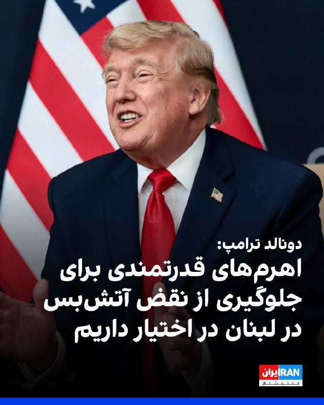

دونالد ترامپ، رییس‌جمهوری آمریکا، در نشست گروه هفت گفت واشینگتن از اهرم‌های قابل توجهی برای جلوگیری از نقض آتش‌بس میان اسرائیل و حزب‌الله برخوردار است.

ترامپ با اشاره به توافق اخیر با جمهوری اسلامی گفت: «تهران اکنون باید رفتار متفاوتی داشته باشد» و همین موضوع به آمریکا نفوذ بیشتری برای حفظ آتش‌بس می‌دهد.

او در ادامه درگیری میان اسرائیل و حزب‌الله را در مقایسه با جنگ اخیر «کوچک‌تر» توصیف کرد و گفت از اینکه این تنش‌ها هنوز پایان نیافته‌اند، شگفت‌زده است.

رییس‌جمهوری آمریکا همچنین به توان نظامی و ابزارهای اقتصادی واشینگتن اشاره کرد و افزود محاصره بنادر ایران از حملات هوایی تاثیرگذارتر بوده است.

ترامپ افزود آمریکا از اهرم‌های نظامی و اقتصادی قدرتمندی برخوردار است و می‌تواند از این ابزارها برای جلوگیری از نقض آتش‌بس و کاهش تنش‌ها در منطقه استفاده کند.
https://iranintl.com/202606179357

## IranIntlTV — post 342892

ویدیوی رسیده به ایران‌اینترنشنال نشان می‌دهد مردم در مراسم خاکسپاری ابوالفضل ساعدی،‌ معترض بازداشتی اعدام‌شده در شاهرود، او را جاویدنام خواندند و تشویق کردند. آن‌ها شعار دادند «این گل پرپر شده، هدیه به میهن شده»

ابوالفضل ساعدی به همراه جواد زمانی، دو تن از بازداشت‌شدگان اعتراضات، بامداد سه‌شنبه در شاهرود اعدام شدند.

## Shin_Persian — post 7122

  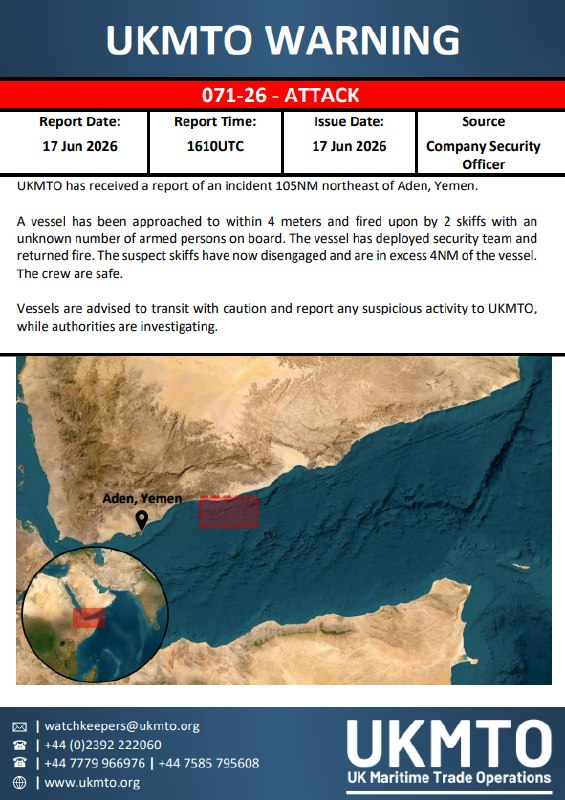

UKMTO Operations Centre @UK_MTO
Wed, 17 Jun 2026 17:30:39 UTC

UKMTO WARNING 071-26 - ATTACK

Click here to view the full warning.⤵️
https://www.ukmto.org/-/media/ukmto/products/20260617-ukmto_warning_attack-071-26-1.pdf?rev=14367a82da014116ba713d926e41e876

#MaritimeSecurity #MarSec

ترجمه خودکار فارسی

هشدار UKMTO (عملیات تجارت دریایی بریتانیا) ۰۷۱-۲۶ - حمله

برای مشاهده هشدار کامل اینجا کلیک کنید.⤵️
https://www.ukmto.org/-/media/ukmto/products/20260617-ukmto_warning_attack-071-26-1.pdf?rev=14367a82da014116ba713d926e41e876

#MaritimeSecurity #MarSec_

𝕏 · @shin_persian

## FarsiVOA — post 221042

پرزیدنت ترامپ در یک کنفرانس خبری پس از نشست گروه هفت گفت: در توافق با جمهوری اسلامی به همه آن چیزهایی که می‌خواستیم دست پیدا کردیم؛ حتی بیشتر. برشی از پوشش ویژه با ترجمه همزمان پژواک کیومرثی

## Persian_Trend_Official — post 17383

  <a href="telegram/content/Persian_Trend_Official_17383_1781717690.webm" target="_blank">🎬 Download video</a>

سازمان تجارت دریایی بریتانیا گزارش می‌دهد که یک کشتی در فاصله 105 مایل دریایی شمال شرقی عدن، یمن، اوایل امروز مورد حمله قرار گرفت.

دو قایق حامل افراد مسلح تا فاصله چهار متری به آن نزدیک شدند و به کشتی آتش گشودند. تیم امنیتی کشتی به آتش پاسخ داد و مهاجمان را وادار به قطع حمله و عقب‌نشینی از منطقه کرد. خدمه در امان هستند.

📝 Amir

📌 @persian_trend_official
پرشین ترند | متفاوت‌ترین کانال نظامی

## IranianMinds — post 22816

🔴 به گزارش کلش ریپورت متن توافق تأییدشده بین ایالات متحده و جمهوری اسلامی ایران:

• آتش‌بس فوری و دائمی در همه جبهه‌ها، از جمله لبنان، با تعهد به عدم هرگونه اقدام یا تهدید نظامی بیشتر.

• احترام متقابل به حاکمیت ملی و عدم دخالت در امور داخلی یکدیگر.
• مذاکره برای توافق نهایی ظرف ۶۰ روز (قابل تمدید با توافق).

•برداشتنتدریجیمحاصرهدریاییآمریکاظرف۳۰روزوخروجنیروهاازاطرافایرانپسازتوافقنهایی.

•بازگرداندنوحفاظتازمسیرهایتجاریکشتیرانیدرمنطقهخلیجفارسودریایعمان،همراهباپاکسازیموانعومین‌ها.

• ایران با عمان و کشورهای منطقه برای اتفاقات آینده در تنگه هرمز مشورت خواهد کرد.

• تدوین طرح مشترک بازسازی اقتصادی ایران (حداقل ۳۰۰ میلیارد دلار).

• برداشتن کامل همه تحریم‌ها (سازمان ملل، آژانس، تحریم‌های اولیه و ثانویه آمریکا) طبق زمان‌بندی توافق‌شده.

• ایران مجدداً تأیید کرد که سلاح هسته‌ای تولید نخواهد کرد. مسائل غنی‌سازی و مواد غنی‌شده تحت نظارت کامل آژانس بین‌المللی انرژی اتمی خواهد بود.

• حفظ وضعیت موجود تا توافق نهایی: عدم اعمال تحریم جدید یا تشدید نظامی.

• آمریکا مجوز صادرات نفت ایران و خدمات مالی مرتبط را صادر خواهد کرد.

• آزادسازی کامل دارایی‌های ایران و دسترسی به آن‌ها طبق رویه‌های مشترک.

• ایجاد مکانیسم نظارت بر اجرای توافق.

• توافق نهایی در چارچوب مراحل آتش‌بس مذاکره شده و سپس توسط شورای امنیت سازمان ملل تأیید خواهد شد.

@IranianMinds

## alonews — post 128762

  <a href="telegram/content/alonews_128762_1781717690.webm" target="_blank">🎬 Download video</a>

👈یک مقام کاخ سفید: نشست سوئیس برای مرحله بعدی بسیار مهم خواهد بود زیرا سند کنونی نیت‌های طرفین را منعکس می‌کند.

✅ @AloNews خبر جنگ

## alonews — post 128761

  <a href="telegram/content/alonews_128761_1781717691.webm" target="_blank">🎬 Download video</a>

👈کاخ سفید: توافق نهایی از طریق یک قطعنامه الزام‌آور از سوی شورای امنیت سازمان ملل تصویب خواهد شد.

✅ @AloNews خبر جنگ

## alonews — post 128760

  <a href="telegram/content/alonews_128760_1781717691.webm" target="_blank">🎬 Download video</a>

🔴فوری / وزارت امور خارجه : در حال حاضر در حال بررسی ایده امضای یادداشت تفاهم از راه دور توسط روسای جمهور ایران و ایالات متحده هستیم

✅ @AloNews خبر جنگ

## alonews — post 128759

  <a href="telegram/content/alonews_128759_1781717691.webm" target="_blank">🎬 Download video</a>

👈یک مقام کاخ سفید: به همان اندازه که ایران به مسائل هسته‌ای پایبند باشد، تحریم‌ها علیه آن کاهش خواهد یافت

✅ @AloNews خبر جنگ

---
📅 بروزرسانی: 1405/03/27 20:54
---

## VahidOOnLine — post 246069

♦️دونالد ترامپ، رئیس‌جمهوری آمریکا، روز چهارشنبه ۲۷ خرداد در حاشیه نشست سران گروه هفت (G7) در فرانسه و در گفتگو با خبرنگاران گفت که مذاکرات فنی درباره انتقال و خارج‌سازی ذخایر اورانیوم غنی‌شده ایران «بلافاصله» آغاز خواهد شد.
ترامپ با اشاره به محل نگهداری این مواد گفت که ذخایر اورانیوم غنی‌شده در اعماق بسیار زیاد زمین قرار دارند و دسترسی به آن‌ها امکان‌پذیر نیست، از همین رو ضرورتی برای اقدام فوری وجود ندارد. او افزود هر زمان فرصت مناسب فراهم شود، این روند با سرعت انجام خواهد شد.
رئیس‌جمهوری آمریکا همچنین تاکید کرد که بر تمامی تاسیسات هسته‌ای ایران نظارت کامل وجود دارد و گفت: «روی هر وجب آن دوربین داریم.» او در ادامه هشدار داد که در صورت هرگونه اقدام برای جابه‌جایی این مواد، آمریکا واکنش نشان خواهد داد.
ترامپ همچنین اعلام کرد گفتگوهای فنی برای خارج کردن تمامی ذخایر مواد غنی‌شده از ایران به‌زودی آغاز می‌شود و تاکید کرد این روند بدون تاخیر کلید خواهد خورد.
‌🇸🇦 Indypersian

🤖 @VahidOOnLine

## WithYashar — post 15176

خبرنگار: آیا اکنون می‌توانید بگویید که آیا کسی را در دولت خود به خاطر حمله به مدرسه‌ای که در اولین روز جنگ بیش از ۱۰۰ کودک را کشت، مسئول می‌دانید؟

پرزیدنت ترامپ:
این سوال عجیبی است که در این تاریخ پرسیده می‌شود، چون شما درباره زمانی صحبت می‌کنید که مدت زیادی گذشته است، اما کسی این کار را عمداً انجام نداد.
فکر می‌کنم باید درباره آن‌ها بگویید، چه می‌شود درباره هزاران سربازی که وقتی در ماشین خود را باز کردند منفجر شدند؟ چه می‌شود درباره هزاران نفری که توسط ایران کشته شدند؟
اشتباهات رخ می‌دهد، جنگ زشت است، می‌دانم که تحت بررسی است. از پیت هگستث این سوال را می‌پرسم زیرا آن‌ها آن را تحت بررسی دارند.
@withyashar

## FoxNewsTwitter — post 343082

  <a href="telegram/content/FoxNewsTwitter_343082_1781717081.mp4" target="_blank">🎬 Download video</a>

Fox News (Twitter/X)

BREAKING: President Trump says the strike on an Iranian school that reportedly killed over 100 children at the beginning of Operation Epic Fury wasn’t done on purpose and is being investigated by Secretary of War Pete Hegseth.

“It's such a strange question to be asked at this state because you're talking about a long time ago, but nobody did that on purpose... Mistakes are made. War is nasty. But I know it's under investigation.”

## mamlekate — post 103729

  <a href="telegram/content/mamlekate_103729_1781717083.mp4" target="_blank">🎬 Download video</a>

قالیباف میگه من مثل خامنه‌ای نیستم که جلوی شما بایستم بگم «این کار را بکنید، آن کار را نکنید»

@mamlekate

## IranIntlTV — post 342891

  <a href="telegram/content/IranIntlTV_342891_1781717085.mp4" target="_blank">🎬 Download video</a>

جمشید برزگر، روزنامه‌نگار و تحلیل‌گر سیاسی، گفت: «اگر بر اساس اطلاعات و گزارش‌های منتشرشده تاکنون قضاوت کنیم، ارزیابی غالب این است که دست‌کم در کوتاه‌مدت جمهوری اسلامی از این تفاهم فرصت تنفس و بازسازی بیشتری به دست می‌آورد.»

او افزود: «با این حال، قضاوت نهایی همچنان به جزییات توافق و نحوه اجرای آن بستگی خواهد داشت.»
@iranintltv

## FarsiVOA — post 221041

  <a href="telegram/content/FarsiVOA_221041_1781717087.mp4" target="_blank">🎬 Download video</a>

ویدیویی از شوخی رییس جمهوری آمریکا در نشست گروه هفت در شبکه‌های اجتماعی پربازدید شده است. چهارشنبه، ۲۷ خرداد، دونالد ترامپ هنگام ورود به جلسه خطاب به دیگر رهبران حاضر در نشست گفت: «من رییس هستم.»

نشست گروه هفت در اویان فرانسه با محور توافق اولیه آمریکا و جمهوری اسلامی، بازگشایی تنگه هرمز و جنگ اوکراین برگزار شد.

## Persian_Trend_Official — post 17382

  <a href="telegram/content/Persian_Trend_Official_17382_1781717089.mp4" target="_blank">🎬 Download video</a>

خبرنگار: حالا می‌توانید بگویید که آیا کسی را در دولت خود به خاطر حمله به مدرسه‌ای که در روز اول جنگ بیش از صد کودک را کشت، پاسخگو خواهید دانست یا خیر؟

ترامپ: اشتباهاتی رخ می‌دهد، جنگ زشت است، می‌دانم که در دست بررسی است.

من این سوال را از پیت هگست می‌پرسیدم چون آنها این موضوع را در دست بررسی دارند.

📝 Amir

📌 @persian_trend_official
پرشین ترند | متفاوت‌ترین کانال نظامی

## Persian_Trend_Official — post 17381

  <a href="telegram/content/Persian_Trend_Official_17381_1781717092.mp4" target="_blank">🎬 Download video</a>

خبرنگار: چرا حالا برای شما قابل قبول است که آنها بخشی از توانایی موشکی خود را حفظ کنند؟

ترامپ: آنها چه چیزی را حفظ می‌کنند؟ آنها اکنون کمتر از کشورهای دیگر توانایی موشکی دارند.

ما احتمالاً 84 تا 85 درصد از موشک‌های آنها را از کار انداخته‌ایم، بقیه آنها زیرزمینی هستند، آنها حتی نمی‌توانند آنها را بیرون بیاورند.

📝 Amir

📌 @persian_trend_official
پرشین ترند | متفاوت‌ترین کانال نظامی

## Persian_Trend_Official — post 17380

  <a href="telegram/content/Persian_Trend_Official_17380_1781717094.mp4" target="_blank">🎬 Download video</a>

ترامپ در مورد ایران: اگر آنها پرچم سفید تسلیم را بالا می‌بردند و می‌گفتند الحمدلله، دونالد ترامپ بزرگترین رئیس جمهور تاریخ است، نیویورک تایمز و سی‌ان‌ان می‌گفتند ایران پیروزی بزرگی کسب کرد.

📝 Amir

📌 @persian_trend_official
پرشین ترند | متفاوت‌ترین کانال نظامی

## Persian_Trend_Official — post 17379

  <a href="telegram/content/Persian_Trend_Official_17379_1781717096.mp4" target="_blank">🎬 Download video</a>

خبرنگار: یک مرد خردمند در ژانویه 2020 گفت: ایران هرگز در جنگی پیروز نشده، اما هرگز در مذاکره‌ای شکست نخورده است.

ترامپ: چه کسی این را گفته؟

خبرنگار: دونالد ترامپ.

ترامپ: اوه، فکر می‌کردم همین را می‌خواهی بگویی.

📝 Amir

📌 @persian_trend_official
پرشین ترند | متفاوت‌ترین کانال نظامی

## Hranews — post 113687

  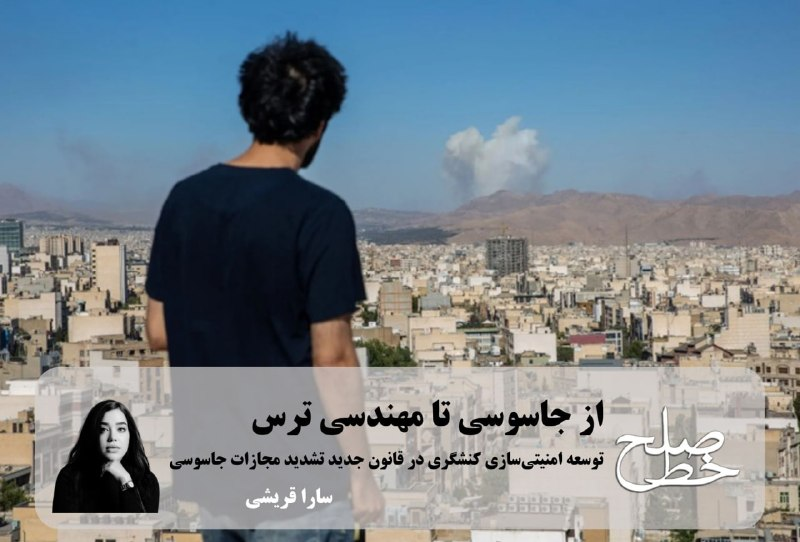

توسعه امنیتی‌سازی کنشگری در قانون جدید تشدید مجازات جاسوسی/ #سارا_قریشی

📡
📡
📡
📡
📡 – ساعت ده شب است. از پنجره آپارتمانتان صدای شعارهایی را می‌شنوید. گوشی را برمی‌دارید، چند ثانیه فیلم می‌گیرید و برای یک کانال خبری خارج از کشور آن ویدئو را ارسال می‌کنید. فردای آن روز، با احضاریه‌ای مواجه می‌شوید که عنوانش نه «انتشار تصویر» یا «اخلال در نظم عمومی»، بلکه «همکاری با رسانه‌های معاند» یا «#جاسوسی» است.

این سناریو دیگر فرضیِ محض نیست. با تصویب قانون تشدید مجازات جاسوسی و همکاری با رژیم صهیونیستی و کشورهای متخاصم علیه امنیت و منافع ملی، مرز میان ارسال یک فیلم خیابانی و «جاسوسی» به‌شدت کم‌رنگ شده است. این مقاله توضیح می‌دهد که این تغییر چگونه رخ داده، با چه اصولی در تعارض است و چه پیامدهایی در پی خواهد داشت.

ادامه مطلب

ادامه مطلب در وب‌سایت خط صلح

↘️
@hranews_bot تماس ✉️ - @Hranews کانال هرانا 🆑

## alonews — post 128758

  <a href="telegram/content/alonews_128758_1781717098.webm" target="_blank">🎬 Download video</a>

👈سازمان تجارت دریایی بریتانیا گزارش می‌دهد که یک کشتی در ۱۰۵ مایل دریایی شمال شرق عدن، یمن، امروز زودتر مورد حمله قرار گرفت پس از اینکه دو قایق کوچک حامل افراد مسلح تا فاصله چهار متری نزدیک شدند و آتش گشودند.

🔴 تیم امنیتی کشتی پاسخ آتش داد، که باعث شد مهاجمان حمله را متوقف کرده و از منطقه عقب‌نشینی کنند. خدمه در امان هستند.

✅ @AloNews خبر جنگ

## alonews — post 128757

  <a href="telegram/content/alonews_128757_1781717098.webm" target="_blank">🎬 Download video</a>

🔴فوری / تسنیم :گزارش شده قایق‌های تندرو و کوچک ناشناس، یک کشتی عبوری را در فاصله ۱۰۵ مایل دریایی شمال شرق عدن هدف قرار دادند.

✅ @AloNews خبر جنگ

## alonews — post 128756

  <a href="telegram/content/alonews_128756_1781717099.mp4" target="_blank">🎬 Download video</a>

👈گزارشگر: آیا بخشی از این موضوع این است که معاون رئیس‌جمهور را می‌فرستید؟ اگر جواب داد، عالی است؛ شما به خاطر فرستادن او نابغه به نظر می‌رسید. و اگر جواب نداد، تقصیر معاون رئیس‌جمهور است.

🔴ترامپ: این ایده را دوست دارم، حتماً. به این ترتیب، اگر جواب داد، من اعتبارش را می‌گیرم. اگر جواب نداد، تقصیر JD است. بهتر است مراقب باشی، JD. او هواپیمایش را برمی‌گرداند و از اینجا فرار می‌کند.

🔴بله، این ایده را دوست دارم. فکر می‌کنم ایده خوبی است

✅ @AloNews خبر جنگ

---
📅 بروزرسانی: 1405/03/27 20:44
---

## VahidOOnLine — post 246068

  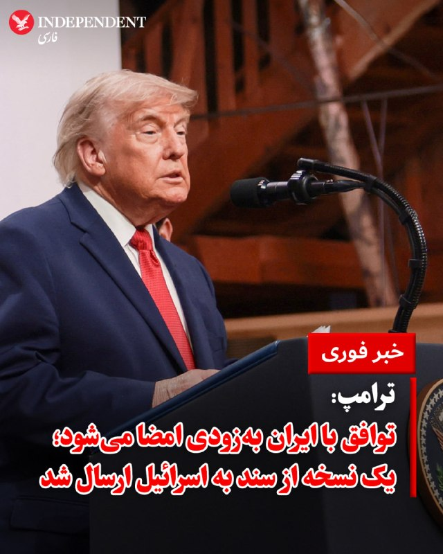

♦️ دونالد ترامپ، رئیس‌جمهوری آمریکا، روز چهارشنبه ۲۷ خرداد، درباره نهایی شدن سند صلح، اعلام کرد که این توافق احتمالا روز پنج‌شنبه یا جمعه به امضای رسمی خواهد رسید.

ترامپ با یادآوری سوابق خود در حوزه تجارت مسکن گفت: «تمام زندگی من با معامله گره خورده است و گاهی در روند معامله‌ها اتفاقات دیوانه‌واری رخ می‌دهد؛ اما به احتمال زیاد ما این توافق را امضا خواهیم کرد. ایران خواهان امضای توافق است و آن‌ها رفتاری کاملا مناسب در این مسیر داشته‌اند.»

در حال حاضر جزئیات دقیق این سند به دلیل تکذیب برخی گزارش‌های رسانه‌ای از سوی ترامپ و اعضای دولتش در هاله‌ای از ابهام قرار دارد. جی‌دی ونس، معاون ترامپ پیش از این اعلام کرده بود که علنی نشدن متن تفاهم‌نامه به خواسته میانجی‌ها و به‌دلیل حساسیت‌های منطقه‌ای و دیپلماتیک است. با این حال، رئیس‌جمهوری آمریکا تاکید کرد که متن کامل این توافق به‌طور عمومی منتشر خواهد شد و واشنگتن پیش از این، یک نسخه از آن را به اسرائیل ارسال کرده است. منابع اسرائیلی روز گذشته گزارش دادند که درخواست تل‌آویو برای اطلاع از متن تفاهم‌نامه از سوی واشنگتن رد شده است.
‌🇸🇦 Indypersian

🤖 @VahidOOnLine

## VahidOOnLine — post 246067

  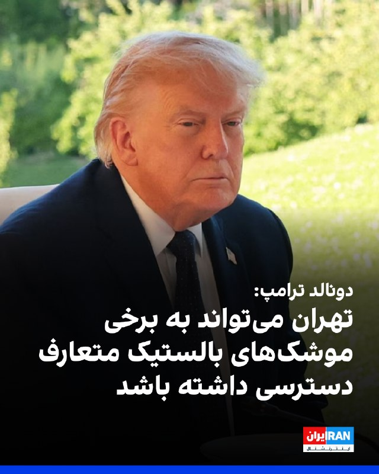

دونالد ترامپ، رییس‌جمهوری آمریکا، در نشست گروه هفت گفت از دسترسی تهران به «برخی» موشک‌های بالستیک متعارف حمایت می‌کند و این موضوع در چارچوب گفت‌وگوهای جداگانه با کشورهای عربی حاشیه خلیج فارس بررسی خواهد شد.

او افزود آمریکا و کشورهای حوزه خلیج فارس در کنار توافق هسته‌ای، روی یک مسیر موازی برای رسیدگی به موضوعات غیرهسته‌ای از جمله موشک‌های بالستیک متعارف و گروه‌های نیابتی مورد حمایت جمهوری اسلامی کار خواهند کرد.

رییس‌جمهوری آمریکا با رد این دیدگاه که جمهوری اسلامی نباید هیچ موشک بالستیکی در اختیار داشته باشد، گفت کشورهای منطقه از جمله عربستان سعودی نیز چنین تسلیحاتی دارند. او افزود: «آن‌ها باید تعدادی از این موشک‌ها را داشته باشند، چون دیگران هم دارند.»

ترامپ همچنین اهمیت تهدید موشک‌های بالستیک را کمتر از سلاح هسته‌ای دانست و گفت این موشک‌ها می‌توانند به یک منطقه محدود آسیب بزنند، اما «سیاره را نابود نمی‌کنند.»

او در پایان تاکید کرد موضوع موشک‌های بالستیک و گروه‌های نیابتی جمهوری اسلامی در گفت‌وگوهای آینده با کشورهای عربی حاشیه خلیج فارس پیگیری خواهد شد.
‌🏁 🇬🇧 IranintlTV

🤖 @VahidOOnLine

## WithYashar — post 15175

گزارش‌ها از وقوع حادثه دریایی در نزدیکی سواحل یمن

گزارش‌های امنیتی از وقوع یک حادثه دریایی جدید در آب‌های نزدیک به یمن خبر می‌دهد.
گزارش شده قایق‌های تندرو و کوچک ناشناس، یک کشتی عبوری را در فاصله ۱۰۵ مایل دریایی شمال شرق عدن هدف قرار دادند.
@withyashar

## WithYashar — post 15174

## mwarmonitor — post 11078

  <a href="telegram/content/mwarmonitor_11078_1781716463.mp4" target="_blank">🎬 Download video</a>

🔴ترامپ می‌گوید ایران به خاطر توافق هسته‌ای برجام ، باراک اوباما را «حرامزادهٔ احمق» خطاب می‌کرد و به او می‌خندید.«نیویورک پست » @mwarmonitor

## FoxNewsTwitter — post 343081

  <a href="telegram/content/FoxNewsTwitter_343081_1781716465.mp4" target="_blank">🎬 Download video</a>

Fox News (Twitter/X)

NOW: President Trump gets questioned on his 2020 warning that Iran has "never won a war, but never lost a negotiation" when @pdoocy asks how he'd convince Americans that the current deal with Tehran is a win.

Trump argued this time is different.

"If they said, 'Praise be to Allah, Donald Trump is the greatest president ever, we totally concede'... the New York Times and CNN and a couple of others. They're not all that dishonest. They'd say Iran had a great victory."

## pm_afshaa — post 94284

  <a href="telegram/content/pm_afshaa_94284_1781716466.mp4" target="_blank">🎬 Download video</a>

🔴ترامپ درباره ایران:
بهشون میگم شما سومین ذخایر بزرگ نفتی جهان رو دارید، پس وات دِ هِل برای چی به انرژی هسته‌ای نیاز دارید؟

💧 Rainbet.com the #1 Non-KYC Crypto Casino & Sportsbook @rainbetcom

😁 @Pm_Afshaa

## IranIntlTV — post 342890

  <a href="telegram/content/IranIntlTV_342890_1781716469.mp4" target="_blank">🎬 Download video</a>

میعاد ملکی، رییس پیشین دفتر هدف‌گذاری تحریم‌های وزارت خزانه‌داری آمریکا، درباره مفاد تفاهم‌نامه ایران و آمریکا گفت: «این تفاهم‌نامه حتی از برجام نیز بدتر است. لغو موقت تحریم‌ها منابع مالی قابل توجهی در اختیار جمهوری اسلامی قرار می‌دهد.»
@iranintltv

## IranIntlTV — post 342889

  

دونالد ترامپ، رییس‌جمهوری آمریکا، در نشست گروه هفت گفت از دسترسی تهران به «برخی» موشک‌های بالستیک متعارف حمایت می‌کند و این موضوع در چارچوب گفت‌وگوهای جداگانه با کشورهای عربی حاشیه خلیج فارس بررسی خواهد شد.

او افزود آمریکا و کشورهای حوزه خلیج فارس در کنار توافق هسته‌ای، روی یک مسیر موازی برای رسیدگی به موضوعات غیرهسته‌ای از جمله موشک‌های بالستیک متعارف و گروه‌های نیابتی مورد حمایت جمهوری اسلامی کار خواهند کرد.

رییس‌جمهوری آمریکا با رد این دیدگاه که جمهوری اسلامی نباید هیچ موشک بالستیکی در اختیار داشته باشد، گفت کشورهای منطقه از جمله عربستان سعودی نیز چنین تسلیحاتی دارند. او افزود: «آن‌ها باید تعدادی از این موشک‌ها را داشته باشند، چون دیگران هم دارند.»

ترامپ همچنین اهمیت تهدید موشک‌های بالستیک را کمتر از سلاح هسته‌ای دانست و گفت این موشک‌ها می‌توانند به یک منطقه محدود آسیب بزنند، اما «سیاره را نابود نمی‌کنند.»

او در پایان تاکید کرد موضوع موشک‌های بالستیک و گروه‌های نیابتی جمهوری اسلامی در گفت‌وگوهای آینده با کشورهای عربی حاشیه خلیج فارس پیگیری خواهد شد.
https://iranintl.com/202606174616

## Persian_Trend_Official — post 17378

  <a href="telegram/content/Persian_Trend_Official_17378_1781716470.mp4" target="_blank">🎬 Download video</a>

ترامپ در مورد ایران: مردم از من می‌خواهند که پل‌ها را بمباران کنم.

من قبلاً این کار را کرده‌ام، چون می‌دانید، آنها به یکی از وعده‌هایشان عمل نکردند و من بزرگترین پل آنها را بمباران کردم، معادل آن پل جورج واشنگتن ایران بود.

اما ما آن پل را بمباران کردیم، دیدید که.

📝 Amir

📌 @persian_trend_official
پرشین ترند | متفاوت‌ترین کانال نظامی

## Persian_Trend_Official — post 17377

ترامپ درباره محمد بن زاید: محمد در امارات متحده عربی یک جنگجوی باورنکردنی است. او هفته پیش بمب می‌انداخت، من گفتم کی داره این همه بمب میندازه؟ امارات متحده عربی بود. او یک جنگجوی خوب است.

📝 Amir

📌 @persian_trend_official
پرشین ترند | متفاوت‌ترین کانال نظامی

## Persian_Trend_Official — post 17376

  <a href="telegram/content/Persian_Trend_Official_17376_1781716472.mp4" target="_blank">🎬 Download video</a>

ترامپ در مورد برنامه موشکی ایران: ما روی یک تلاش موازی با کشورهای خلیج فارس برای رسیدگی به مسائل غیرهسته‌ای، مانند موشک‌های بالستیک متعارف، که در مورد آنها صحبت خواهیم کرد، و حمایت از آنها کار خواهیم کرد.

منظورم این است که آنها باید تعدادی داشته باشند، زیرا دیگران تعدادی دارند، شما باید تعدادی داشته باشید کسی این را گفت، نباید به آنها بدهید، و من افرادی دارم من برخی از این افراد را دوست دارم، اما فکر نمی‌کنم این، فکر نمی‌کنم آنها باهوش باشند.

مطمئناً، نباید به آنها اجازه دهید هیچ موشکی داشته باشند من گفتم، خب، من چه کار خواهم کرد، آیا به عربستان سعودی اجازه می‌دهم موشک داشته باشد، اما آنها نمی‌توانند آنها را داشته باشند؟ بله، آقا.

این روش کار نمی‌کند، می‌دانید، این روش کار نمی‌کند، و مشکل موشک‌ها نیستند موشک‌ها، آنها به یک مکان کوچک برخورد می‌کنند، اما کره زمین را منفجر نمی‌کنند.

📝 Amir

📌 @persian_trend_official
پرشین ترند | متفاوت‌ترین کانال نظامی

## Persian_Trend_Official — post 17375

  <a href="telegram/content/Persian_Trend_Official_17375_1781716474.mp4" target="_blank">🎬 Download video</a>

ترامپ درباره ایران: آنها از یک نظر، یک فرهنگ بدوی دارند، اما این فرهنگ بدوی، یک فرهنگ نبوغ‌آمیز نیز هست، آنها افراد بسیار باهوشی هستند، مذاکره‌کنندگان بسیار خوبی هستند.

📝 Amir

📌 @persian_trend_official
پرشین ترند | متفاوت‌ترین کانال نظامی

## Persian_Trend_Official — post 17374

  <a href="telegram/content/Persian_Trend_Official_17374_1781716476.mp4" target="_blank">🎬 Download video</a>

ترامپ: نتانیاهو به کشور آمد و از باراک حسین اوباما، رئیس جمهور، التماس کرد که برجام را امضا نکند. او گفت که این می‌تواند پایان اسرائیل باشد، و اگر من نمی‌آمدم، این اتفاق می‌افتاد.

و اوباما به حرف او گوش نداد. بی‌بی در واقع به کنگره رفت و از آنها التماس کرد، و به جایی نرسید. و آنها این توافق وحشتناک را داشتند که برای اسرائیل وحشتناک بود.

📝 Amir

📌 @persian_trend_official
پرشین ترند | متفاوت‌ترین کانال نظامی

## Persian_Trend_Official — post 17373

  <a href="telegram/content/Persian_Trend_Official_17373_1781716477.mp4" target="_blank">🎬 Download video</a>

ترامپ درباره نتانیاهو: بی‌بی نتانیاهو مرد خوبی است. او گاهی اوقات کمی هیجان‌زده می‌شود، اما اتفاقاً مرد بسیار خوبی است.

ما کمی بر سر لبنان اختلاف داشتیم من می‌گویم، بی‌بی، می‌توانی کمی ملایم‌تر برخورد کنی، لازم نیست هر بار که کسی وارد ساختمانی می‌شود، آن را خراب کنی؛ این از طرف حزب‌الله است.

📝 Amir

📌 @persian_trend_official
پرشین ترند | متفاوت‌ترین کانال نظامی

## Persian_Trend_Official — post 17372

  <a href="telegram/content/Persian_Trend_Official_17372_1781716479.mp4" target="_blank">🎬 Download video</a>

ترامپ در مورد ترور سلیمانی: این یک سرمایه‌ گذاری مشترک بود، همانطور که در تجارت املاک و مستغلات می‌گوییم. این یک سرمایه‌گذاری مشترک بین اسرائیل و ما بود.

ما یک ماه آن را بررسی کردیم. تقریباً یک ماه قبل می‌دانستیم که او با چه هواپیمایی قرار است برود. او فقط با خطوط هوایی تجاری، آن هم از نوع بزرگ، با تعداد زیادی مسافر سفر می‌کرد، زیرا می‌دانست که ما او را سرنگون نخواهیم کرد. آنها بسیار باهوش هستند.

اما ما می‌دانستیم که او قرار است با آن هواپیما باشد، او را دنبال کردیم و سپس اسرائیل به من اطلاع داد که آنها این کار را نخواهند کرد. و من باید تصمیم می‌گرفتم.

و به او گفتم: خب، اگر اسرائیل قرار نیست این کار را انجام دهد، همه ما آماده‌ایم. آیا ما این کار را انجام می‌دهیم؟ آیا دوست داری این کار را انجام دهی یا نه؟ گفتم: مطمئناً، اگر می‌خواهی این کار را انجام دهی، ما می‌توانیم آن را انجام دهیم.

📝 Amir

📌 @persian_trend_official
پرشین ترند | متفاوت‌ترین کانال نظامی

## Persian_Trend_Official — post 17371

  <a href="telegram/content/Persian_Trend_Official_17371_1781716481.mp4" target="_blank">🎬 Download video</a>

ترامپ: رهبران جدید ایران باهوش هستند، خیلی باهوش.

آنها خیلی کمتر رادیکال هستند. من فکر می‌کنم آنها واقعاً کشورشان را دوست دارند. آنها خوب هستند.

📝 Amir

📌 @persian_trend_official
پرشین ترند | متفاوت‌ترین کانال نظامی

## Persian_Trend_Official — post 17370

ترامپ: اگر من ژنرال سلیمانی را نکشته بودم، احتمالاً الان درباره این توافق صحبت نمی‌کردیم، زیرا او یک نابغه دیوانه بود.

آنها هرگز نتوانستند جایگزین او را پیدا کنند.

📝 Amir

📌 @persian_trend_official
پرشین ترند | متفاوت‌ترین کانال نظامی

## Persian_Trend_Official — post 17369

ترامپ: اگر این توافق را انجام نمی‌دادیم، می‌ توانستیم بمب‌های بیشتری را برای 2، 3 یا 4 هفته یا 2 سال دیگر پرتاب کنیم. اما تنگه هرمز هرگز باز نمی‌شد.

📝 Amir

📌 @persian_trend_official
پرشین ترند | متفاوت‌ترین کانال نظامی

## BBCPersian — post 284158

🔸تیم ملی فرانسه یکی از اصلی‌ترین مدعیان قهرمانی جام جهانی ۲۰۲۶ است که با ترکیبی از ستاره‌های باتجربه و استعدادهای نسل جدیدش وارد این رقابت‌ها می‌شود. «خروس‌ها» با هدایت دیدیه دشان، پرافتخارترین سرمربی تاریخ تیم ملی فرانسه که این جام جهانی آخرین حضورش روی نیمکت فرانسه است، به دنبال دومین قهرمانی در سه دوره اخیر جام جهانی هستند.

کیلیان امباپه همچنان بزرگ‌ترین ستاره فوتبال فرانسه و یکی از بهترین بازیکنان جهان است. او در ۱۹ سالگی قهرمان جهان شد و در ۲۳ سالگی کفش طلای جام جهانی را به دست آورد.
نروژ پس از ۲۸ سال دوری، سرانجام با نسلی طلایی پا به جام جهانی گذاشته است. بزرگ‌ترین نقطه قوت نروژ خط حمله قدرتمند آن است. اما نقطه ضعف اصلی تیم در خط دفاعی است.

ارلینگ هالند بدون تردید بزرگ‌ترین ستاره فوتبال نروژ است. مهاجم قدرتمند و گلزن منچسترسیتی در مرحله مقدماتی جام جهانی با ۱۶ گل بهترین گلزن رقابت‌ها شد. هالند با سرعت، قدرت بدنی و تمام‌کنندگی استثنایی‌اش مهم‌ترین امید نروژ برای درخشش در جام جهانی ۲۰۲۶ است.
ادامه مطلب⬇️
📸GettyImages/Reuters
https://bbc.in/4eyOXsV
@BBCPersian

## BBCPersian — post 284157

🔻دونالد ترامپ در حاشیه اجلاس گروه هفت در فرانسه گفت جنگ با ایران سه یا چهار ماه پیش شروع نشد بلکه با کشتن قاسم سلیمانی شروع شد. او بار دیگر تاکید کرد که خطر مجهز شدن ایران به سلاح هسته‌ای را از بین برده است. آقای ترامپ ساعاتی پیش درباره تفاهمنامه تهدید کرد…

## BBCPersian — post 284156

  <a href="telegram/content/BBCPersian_284156_1781716483.mp4" target="_blank">🎬 Download video</a>

🔻هما میرافشار معروف به «زن‌هزار ترانه» یا «تاج» ترانه‌های ایرانی در یکی از آرامگاه‌های شهر لس‌آنجلس در آمریکا به خاک سپرده شد.
خانم میرافشار، روزنامه‌نگار، شاعر و ترانه‌سرای تصنیف‌های عاشقانه موسیقی ایران، اوایل خرداد ۱۴۰۵ در ۸۹ سالگی درگذشت.
مرتضی برجسته، خواننده معروف موسیقی پاپ ایران در صفحه اینستاگرامش با انتشار ویدئوهایی از این مراسم نوشت: «به خواست خانواده خاکسپاری بسیار خصوصی انجام شد فقط از دوستان و اشنایان بسیار نزدیک که حدود ۲۰ نفر میشدند دعوت به عمل آمد که البته چند تن از اشخاصی که دعوت شده بودند حضور پیدا نکردند.»
از خانم میرافشار حدود هزار ترانه در موسیقی دستگاهی و پاپ ایران به یادگار مانده است. او همچنین اشعارش را در چند مجموعه مکتوب به چاپ رساند.
هما همایون در روز سوم اسفند سال ۱۳۱۵ در تهران متولد شد و پس از ازدواج با علی میرافشار که پسرعموی حمیرا، خواننده شهیر موسیقی بود، نام خانوادگی خود را به میرافشار تغییر داد.
برای آگاهی بیشتر درباره زندگی هما میرافشار اینجا را بخوانید:
https://bbc.in/4vkGTmO

https://bbc.in/43LclOW
@BBCPersian

## BBCPersian — post 284155

  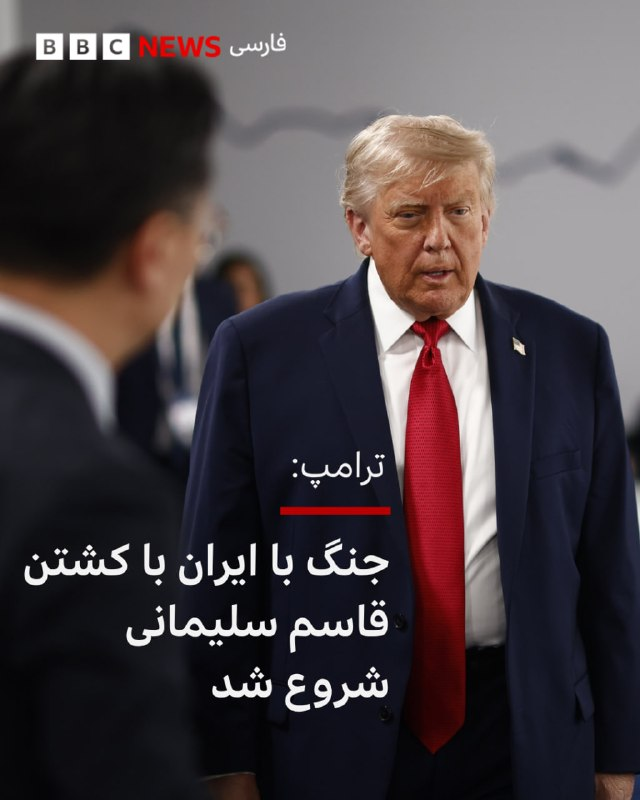

🔻دونالد ترامپ در حاشیه اجلاس گروه هفت در فرانسه گفت جنگ با ایران سه یا چهار ماه پیش شروع نشد بلکه با کشتن قاسم سلیمانی شروع شد. او بار دیگر تاکید کرد که خطر مجهز شدن ایران به سلاح هسته‌ای را از بین برده است. آقای ترامپ ساعاتی پیش درباره تفاهمنامه تهدید کرد درصورتی‌که ایران «درست رفتار نکند» و او «خوشش نیاید» بمباران را از سر خواهد گرفت.

## alonews — post 128755

  <a href="telegram/content/alonews_128755_1781716485.mp4" target="_blank">🎬 Download video</a>

👈پیتر دووسی از فاکس: برای مراسم امضای توافق صلح ایران می مانید؟

🔴ترامپ: شاید

✅ @AloNews خبر جنگ

## alonews — post 128754

  <a href="telegram/content/alonews_128754_1781716486.webm" target="_blank">🎬 Download video</a>

👈ترامپ: رئیس جمهور چین به دنبال کمک به حل و فصل اوضاع مربوط به ایران بود

✅ @AloNews خبر جنگ

## alonews — post 128753

  <a href="telegram/content/alonews_128753_1781716487.webm" target="_blank">🎬 Download video</a>

👈ترامپ: ایرانی‌ها باید تعدادی موشک داشته باشند، چون دیگران هم دارند

✅ @AloNews خبر جنگ

## alonews — post 128752

  <a href="telegram/content/alonews_128752_1781716487.webm" target="_blank">🎬 Download video</a>

👈ترامپ: به محض اینکه ایران اقدامی انجام دهد، تحریم‌ها اعمال خواهد شد.

✅ @AloNews خبر جنگ

## alonews — post 128751

  <a href="telegram/content/alonews_128751_1781716487.mp4" target="_blank">🎬 Download video</a>

👈ترامپ درباره افغانستان: ممکن است تمام تجهیزات را پس بگیرم... افغانستان دارد به ما چاپلوسی می‌کند.

✅ @AloNews خبر جنگ

---
📅 بروزرسانی: 1405/03/27 20:36
---

## VahidOOnLine — post 246066

  <a href="telegram/content/VahidOOnLine_246066_1781716016.mp4" target="_blank">🎬 Download video</a>

♦️ ترامپ با انتقاد شدید از محافظه‌کاران تندرو در آمریکا که خواهان تداوم جنگ هستند، گفت: «این مدعیان سرسخت متوجه نیستند که این توافق، نتیجه یک کار سه‌ماهه نیست؛ بلکه حاصل سال‌ها زمینه‌سازی است. اگر من سرلشکر [قاسم] سلیمانی را نکشته بودم، احتمالا الآن اصلا صحبت از این توافق نبود؛ چرا که او یک «نابغه دیوانه» بود و آن‌ها هرگز نتوانستند جایگزینی برایش پیدا کنند.»

رئیس‌جمهوری آمریکا با کنایه به رویکرد جنگ‌طلبانه مخالفان توافق صلح افزود: «خیلی از مردم این موضوع را فراموش می‌کنند؛ همین تندروهایی که با تصمیماتشان کشور را درست به ته دره سقوط می‌دهند.» او تاکید کرد که تضعیف ساختار فرماندهی و نظامی ایران در سال‌های گذشته، مسیر را برای توافق مفصل و محکم فعلی هموار کرده است.
‌🇸🇦 Indypersian

🤖 @VahidOOnLine

## WithYashar — post 15173

ترامپ : به آنها می‌گویم: شما احتمالاً سومین ذخایر بزرگ نفت در جهان را دارید، به چه دلیل به سلاح هسته‌ای نیاز دارید؟
@withyashar

## mwarmonitor — post 11077

🔴ترامپ درباره اینکه اسرائیل از توافق در حال شکل‌گیری چه به‌دست می‌آورد، گفت: «آن‌ها دچار بمب هسته‌ای در قلب اسرائیل نخواهند شد.»

🔸او افزود که به نتانیاهو گفته است: «به این فکر کن — تو مهم‌ترین چیزی را که درخواست کرده بودی به دست آوردی»، و گفت این توافق «از یک هولوکاست هسته‌ای جلوگیری کرد.»

📝دنیا به کام دونالد است؛ نابغه‌ای که با یک سناریوی دست‌چندم هالیوودی، «هیچِ مطلق» را بسته‌بندی کرد و به قیمت چند میلیارد دلار به ریش نتانیاهو و مالیات‌دهندگان نگون‌بخت آمریکایی بست تا مثلاً جلوی یک «هولوکاست هسته‌ای» خیالی را بگیرد. طفلکی بی‌بی که برای حفظ ظاهر باید این چرندیات را بشنود، لبخند بزند و دم برنیاورد؛ آن‌هم توافقی که در آن ترامپ ادعا می‌کند بمب هسته‌ایِ نداشته را از قلب اسرائیل بیرون کشیده است! خلاصه کله‌زرد قصه ما روی دست مهدی بلیغ بلند شد؛ کاخ دادگستری پیشکشش، او توهمِ سلاح هسته‌ای را چنان به واقعیت فاکتور کرد که خودِ جمهوری اسلامی هم باورش شد بمب داشته و تازه بعد از بمباران فهمید داستان چه بوده است.

@mwarmonitor

## FoxNewsTwitter — post 343080

  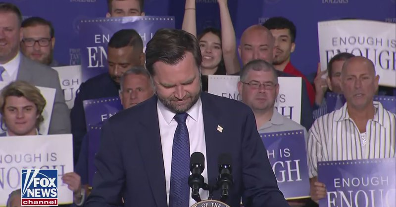

Fox News (Twitter/X)

WATCH LIVE: VP Vance outlines admin's crackdown on crime and fraud https://twitter.com/i/broadcasts/1pKdRRraXzVJW

## FoxNewsTwitter — post 343079

  <a href="telegram/content/FoxNewsTwitter_343079_1781716019.mp4" target="_blank">🎬 Download video</a>

Fox News (Twitter/X)

JUST IN: President Trump tells @pdoocy that Iran’s economic relief and rebuilding investments are strictly contingent on good behavior, noting the massive path ahead to recover from recent strikes.

"We're not putting up money. Only if they're doing things right... Remember this also when you talk about billions of dollars, they've had much more than $1 trillion worth of damage done.”

“They got a long way. They'll be 15 to 20 years to rebuild what they have right now. So, they have to behave themselves. If they're not behaving, they get hit again."

## pm_afshaa — post 94283

  <a href="telegram/content/pm_afshaa_94283_1781716036.webm" target="_blank">🎬 Download video</a>

🔴ترامپ: رهبرهای جدید ایران آدم‌های خیلی باهوشی هستن؛ به اندازه قبلی‌ها تندرو و افراطی نیستن و فکر میکنم واقعا کشورشون رو دوست دارن و آدم‌ های خوبی هستن!

💧 Rainbet.com the #1 Non-KYC Crypto Casino & Sportsbook @rainbetcom

😁 @Pm_Afshaa

## pm_afshaa — post 94282

  <a href="telegram/content/pm_afshaa_94282_1781716037.webm" target="_blank">🎬 Download video</a>

🔴ترامپ: موضوع آزاد کردن پول‌ها پاسخ دادنش ساده‌ست. ما مقدار زیادی از پول خودشون رو گرفتیم. وقتی پول مال ما نیست، پولِ خودِ آنهاست، و ما در یک مقطع زمانی مسدودش کردیم، فکر میکنم ناچاریم اونو پس بدیم، می‌دونید؟ اگر پس ندیم، دیگر هیچکس هرگز روی دلار سرمایه‌گذاری نخواهد کرد!

💧 Rainbet.com the #1 Non-KYC Crypto Casino & Sportsbook @rainbetcom

😁 @Pm_Afshaa

## DW_Farsi — post 126114

  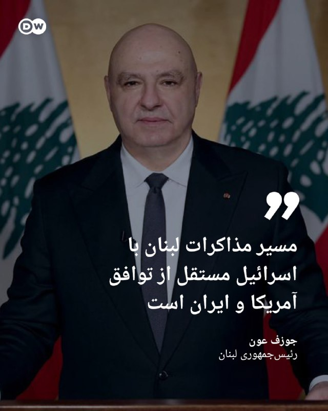

🔶 عون: مسیر مذاکرات لبنان با اسرائیل مستقل از توافق آمریکا و ایران است

جوزف عون، رئیس‌جمهوری لبنان، روز چهارشنبه ۱۷ ژوئن (۲۷ خرداد) اعلام کرد مسیر مذاکرات کشورش با اسرائیل در واشنگتن مستقل از توافق آمریکا و ایران برای پایان دادن به درگیری‌های خاورمیانه است.

او گفت تضمین‌هایی که لبنان دریافت کرده و بر آن اصرار دارد، این است که مسیر لبنان در مذاکرات مستقل بماند، هرچند بیروت از آتش‌بس و از هر کشوری که به آن کمک کند، از جمله ایران، حمایت می‌کند.

عون، بنا بر بیانیه دفترش، گفت دخالت در امور لبنان مجاز نیست.

او همچنین تاکید کرد دولت لبنان در تصمیم‌گیری‌های خود مستقل است و برای نخستین بار این خود لبنان است که مذاکرات را پیش می‌برد و هیچ‌کس به جای آن مذاکره نمی‌کند.

رئیس‌جمهوری لبنان ابراز امیدواری کرد دور پنجم مذاکرات که هفته آینده برگزار می‌شود، مثبت‌تر باشد؛ به‌ویژه با توجه به آنچه علاقه زیاد دولت آمریکا به لبنان خواند.

او گفت به مردم لبنان اطمینان می‌دهد که هیچ‌کس این کشور را به کشور دیگری گره نزده و هرگونه راه‌حل نیز از مسیر خود لبنان خواهد گذشت، نه به بهای آن.
@dw_farsi

## RadioFarda — post 158438

  <a href="https://t.me/radiofarda/158438" target="_blank">📎 Download file</a>

📻بشنوید: ایستگاه ۱۹ با رادیوفردا، ۲۷ خرداد ۱۴۰۵

@RadioFarda

## RadioFarda — post 158437

🔸دونالد ترامپ روز چهارشنبه ۲۷ خرداد در یک کنفرانس خبری در پایان نشست رهبران گروه ۷ با دفاع از توافق پایان جنگ با ایران گفت که نمی‌توان به تهران گفت موشک نداشته باشد. 🔸او گفت: «ما در کنار این توافق، با کشورهای حوزه خلیج فارس روی یک مسیر موازی نیز کار خواهیم…

## IranianMinds — post 22815

🔴 ترامپ :

افغانستان داره خایمالیمونو میکنه.

@IranianMinds

## IranianMinds — post 22814

  <a href="telegram/content/IranianMinds_22814_1781716038.mp4" target="_blank">🎬 Download video</a>

🔴 خبرنگار : آیا حالا می‌تونید بگید که آیا کسی از دولتتون رو به خاطر حمله به یک مدرسه که در روز اول جنگ بیش از صد کودک رو کشت، پاسخگو می‌کنید؟

ترامپ: در جنگ اشتباهات رخ میده، جنگ زشته و کثیفه. می‌دونم که داره بررسی می‌شه.

این سؤال رو از پیت هگزت بپرسید، چون اونا دارن بررسی می‌کنن.

@IranianMinds

## IranianMinds — post 22813

  <a href="telegram/content/IranianMinds_22813_1781716040.mp4" target="_blank">🎬 Download video</a>

🔴 خبرنگار: چرا حالا براتون قابل قبوله که ایران هنوز بخشی از توان موشکی‌ش رو نگه داشته؟

ترامپ: چی رو نگه داشتن؟ الان موشک‌هاشون خیلی کمتر از کشورهای دیگه شده.

ما احتمالاً ۸۴-۸۵ درصد موشک‌هاشون رو زدیم و نابود کردیم. بقیه‌شون هم زیر زمینن و حتی نمی‌تونن بیرون بیارنشون.

@IranianMinds

## IranianMinds — post 22812

🔴 ترامپ خطاب به جمهوری اسلامی :

بهشون می‌گم: شما احتمالاً سومین ذخایر نفتی بزرگ دنیا رو دارید، اصلاً چرا به هسته‌ای نیاز دارید؟

@IranianMinds

## IranianMinds — post 22811

  <a href="telegram/content/IranianMinds_22811_1781716042.mp4" target="_blank">🎬 Download video</a>

🔴 ترامپ درباره ایران:

آیا می‌خواید اجازه بدید ۹۱ میلیون نفر از گرسنگی بمیرن؟

@IranianMinds

## IranianMinds — post 22810

  <a href="telegram/content/IranianMinds_22810_1781716044.mp4" target="_blank">🎬 Download video</a>

🔴 ترامپ درباره پول های بلوکه شده ایران:

خب، موضوع آزاد کردن پول‌ها جوابش ساده‌ست.

ما کلی از پولشون رو گرفتیم، پول خودشون رو ازشون گرفتیم.

وقتی پول مال ما نیست، مال اونهاست و ما در یه مقطعی اون رو فریز کردیم.

فکر کنم مجبوریم برگردونیمش، مگه نه؟

اگر برنگردونیم، دیگه هیچ‌کس تو دنیا دلار سرمایه‌گذاری نمی‌کنه.

@IranianMinds

## IranianMinds — post 22808

  <a href="telegram/content/IranianMinds_22808_1781716046.mp4" target="_blank">🎬 Download video</a>

🔴 ترامپ درباره ایران:

اگر اونا پرچم سفید تسلیم رو بالا می‌بردن و می‌گفتن: الحمدلله، دونالد ترامپ بزرگ‌ترین رئیس‌جمهور تاریخه، نیویورک تایمز و سی‌ان‌ان می‌گفتن: ایران پیروزی بزرگی کسب کرد.

@IranianMinds

## Dirty_Kids — post 392408

  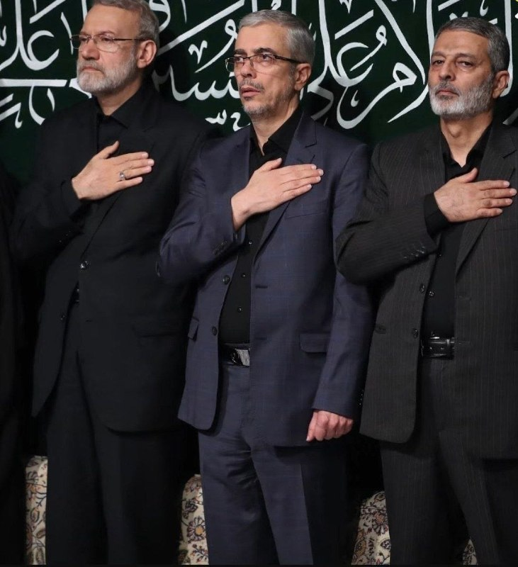

دو سال پیش محرم، این یه عکس ساده و نرمال بود 😌

@Dirty_Kids 👻

## Dirty_Kids — post 392406

گاهی فاصلهٔ میان قهرمان و بی‌شرف،
فقط به اندازهٔ جهتِ یک دست است.

@Dirty_Kids 👻

## alonews — post 128750

  <a href="telegram/content/alonews_128750_1781716048.mp4" target="_blank">🎬 Download video</a>

👈ترامپ درباره ایران: به آنها می‌گویم: شما احتمالاً سومین ذخایر بزرگ نفت در جهان را دارید، به چه دلیل به سلاح هسته‌ای نیاز دارید؟

✅ @AloNews خبر جنگ

## alonews — post 128749

  <a href="telegram/content/alonews_128749_1781716050.webm" target="_blank">🎬 Download video</a>

👈ترامپ درباره ایران: آیا اجازه می‌دهید ۹۱ میلیون نفر از گرسنگی بمیرند؟

✅ @AloNews خبر جنگ

## alonews — post 128748

  <a href="telegram/content/alonews_128748_1781716050.webm" target="_blank">🎬 Download video</a>

👈گزارشگر: چرا اکنون برای شما قابل قبول است که آنها بخشی از توان موشکی خود را حفظ کنند؟

🔴ترامپ: آنها چه چیزی را حفظ می‌کنند؟ آنها اکنون کمتر از سایر کشورها دارند.

🔴ما احتمالاً ۸۴-۸۵٪ از موشک‌هایشان را از کار انداختیم؛ بقیه زیر زمین هستند؛ حتی نمی‌توانند آنها را بیرون بیاورند

✅ @AloNews خبر جنگ

## alonews — post 128747

  <a href="telegram/content/alonews_128747_1781716051.mp4" target="_blank">🎬 Download video</a>

👈ترامپ درباره ایران: اگر آنها پرچم سفید تسلیم را بالا ببرند و بگویند، «سپاس خداوند را، دونالد ترامپ بزرگ‌ترین رئیس‌جمهور تاریخ است؛ ما کاملاً تسلیم می‌شویم؛ کاملاً دست می‌کشیم؛ این جنگ تمام شده است؛ ما شکست خورده‌ایم»، نیویورک تایمز و سی‌ان‌ان و چند رسانه دیگر خواهند گفت، «ایران پیروزی بزرگی کسب کرده است.»

✅ @AloNews خبر جنگ

## alonews — post 128746

  <a href="telegram/content/alonews_128746_1781716053.webm" target="_blank">🎬 Download video</a>

👈ترامپ : ما یه میلیارد دلار بمب روی ایران ریختیم

✅ @AloNews خبر جنگ

## alonews — post 128745

  <a href="telegram/content/alonews_128745_1781716053.webm" target="_blank">🎬 Download video</a>

👈ترامپ: حادثه مربوط به حمله به مدرسه میناب در ایران هنوز در دست بررسی است و اشتباهات در جنگ اتفاق می‌افتد

✅ @AloNews خبر جنگ

## alonews — post 128744

👈پیتر دوسی از فاکس نیوز: مرد خردمندی یک بار در ژانویه ۲۰۲۰ گفت: «ایران هرگز در جنگی پیروز نشده، اما هرگز در مذاکره‌ای شکست نخورده است.»

🔴پرزيدنت ترامپ: کی این رو گفته؟

🔴پیتر دوسی از فاکس نیوز: دونالد ترامپ.

🔴 پرزيدنت ترامپ: آها، فکر می‌کردم می‌خواهی همین را بگویی

✅ @AloNews خبر جنگ

## alonews — post 128743

  <a href="telegram/content/alonews_128743_1781716088.mp4" target="_blank">🎬 Download video</a>

👈ترامپ درباره خنثی بودن متحدان جمهوری اسلامی ایران: می‌خواهم از چین، رئیس‌جمهور شی، تشکر کنم، با او بودم و او خنثی ماند، کاملاً خنثی، و من از آن قدردانی می‌کنم.

🔴و می‌خواهم از ولادیمیر پوتین تشکر کنم، او بسیار خنثی بود

✅ @AloNews خبر جنگ

## alonews — post 128742

  <a href="telegram/content/alonews_128742_1781716090.webm" target="_blank">🎬 Download video</a>

👈ترامپ: حمله اخیر اسرائیل به بیروت خشونت‌آمیز و غیرضروری بود

🔴محاصره دریایی ایران از بمباران مؤثرتر بود

✅ @AloNews خبر جنگ

---
### ⚠️ کانال‌های با خطا در این بروزرسانی

* Persian_Trend_Official
* BBCPersian

دلایل احتمالی: مسدود بودن کانال، حذف کانال، یا خطای شبکه.
---

---
📅 بروزرسانی: 1405/03/27 20:24
---

## WithYashar — post 15172

ترامپ: ایرانی‌ها باید تعدادی موشک داشته باشند، چون دیگران هم دارند

ما روی یک تلاش موازی با کشورهای حوزه‌ی خلیج فارس کار خواهیم کرد تا به مسائل غیرهسته‌ای، مانند موشک‌های بالستیک متعارف که درباره‌شان صحبت خواهیم کرد، و حمایت‌ها بپردازیم.
کسی می‌گفت: شما نباید حتی یک موشک هم به آن‌ها بدهید برخی از این آدم‌ها را دوست دارم، اما فکر نمی‌کنم زیاد باهوش باشند.
می‌گفتند: جناب، شما نباید اجازه دهید آن‌ها هیچ موشکی داشته باشند. من گفتم: «خب، پس من باید چه کار کنم؟ آیا باید اجازه دهم عربستان سعودی موشک داشته باشد، اما آن‌ها نداشته باشند؟» گفتند: «بله جناب.»
اما نمی‌شود، کارها این‌طور پیش نمی‌رود، می‌دانید؟ این‌گونه کارساز نیست و موشک‌ها مشکل اصلی نیستند. موشک‌ها فقط به یک نقطهٔ کوچک آسیب می‌زنند، اما کرهٔ زمین را نابود نمی‌کنند.
@withyashar

## WithYashar — post 15171

ترامپ : رهبرهای جدید ایران آدم‌های باهوشین، خیلی هم باهوشن؛

به اندازه قبلی‌ها تندرو و افراطی نیستن، فکر می‌کنم واقعاً کشورشون رو دوست دارن و آدم‌های خوبی هستن.
@withyashar 🤣

## mwarmonitor — post 11076

🔴ترامپ می‌گوید ایران هم مانند دیگر کشورها نیاز دارد موشک‌های بالستیک داشته باشد.

📝ترامپ دیگه رسماً رد داده و شک نکنید چیزخورش کردن، والا این حجم از دستمال‌کشی و خودشیرینی فقط در حوزه اختیارات پایگاه بسیج مقداد است نه رئیس‌جمهور آمریکا! حتماً فردا هم با چفیه دور گردنش توی کاخ سفید قطعنامه صادر میکنه و مرگ بر آمریکا میگه تا ثابت کنه از برادران خودی هم ذوب‌تر در ولایت شده است.

@mwarmonitor

## FoxNewsTwitter — post 343078

  <a href="telegram/content/FoxNewsTwitter_343078_1781715245.mp4" target="_blank">🎬 Download video</a>

Fox News (Twitter/X)

BREAKING: @pdoocy presses President Trump on what the difference between giving Iran U.S. dollars and unfreezing U.S. dollars:

"We have taken a lot of their money... and we froze it. At a certain point in time, I guess we're going to have to give it back. You know, if we didn't give it back nobody would ever invest in the dollar again."

"If you do that, you really don't have a system."

## FoxNewsTwitter — post 343077

  <a href="telegram/content/FoxNewsTwitter_343077_1781715246.mp4" target="_blank">🎬 Download video</a>

Fox News (Twitter/X)

"When they were born, they came out with a machine gun in their hands."

President Trump expresses hope that a future peace agreement with Iran could help reshape the Middle East as a whole, acknowledging the region's long history of conflict while arguing recent developments offer reason for optimism.

"It's my hope that the peace agreement will be the beginning of a much larger deal all across the Middle East... Look at the job we've done in Gaza. Look at Hamas. Hamas has been very silent.

"We're trying to get them unarmed... That's not the easiest thing, but they've they've actually behaved pretty well considering this was not the lifestyle that they were taught to have."

## FoxNewsTwitter — post 343076

  <a href="telegram/content/FoxNewsTwitter_343076_1781715248.mp4" target="_blank">🎬 Download video</a>

Fox News (Twitter/X)

HAPPENING NOW: President Trump details the tactics used by the U.S. military to take out Iran’s leadership that refused to negotiate with the United States at the beginning of Operation Epic Fury:

“The first group is dead. One little morning having breakfast, the whole group, they thought they'd never be caught because we never bombed during breakfast, but we bombed. And they all- 88 people- and I'm not proud of that at all.

“The second group came in, and they were very unreasonable too. And they were all gone. They were all gone. And then the third group we've been dealing with them, a couple left this planet, but we've been dealing with them and again, they've been fine.”

## pm_afshaa — post 94281

  <a href="telegram/content/pm_afshaa_94281_1781715250.webm" target="_blank">🎬 Download video</a>

🔴ترامپ: بعضی‌ها میگن پل‌های ایران رو بزن، اتفاقاً وقتی زیر یکی از قول‌هاشون زدن، بزرگ‌ترین پلشون رو زدیم؛ پلی که برای ایران مثل پل جورج واشنگتن برای آمریکاست.

💧 Rainbet.com the #1 Non-KYC Crypto Casino & Sportsbook @rainbetcom

😁 @Pm_Afshaa

## pm_afshaa — post 94280

  <a href="telegram/content/pm_afshaa_94280_1781715250.webm" target="_blank">🎬 Download video</a>

🔴ترامپ: نتانیاهو مرد بسیار خوبیه و همکاری خیلی خوبی هم داریم ولی خب اون قسمت کوچک‌تر همکاریه و تصمیم اصلی رو من میگیرم!

💧 Rainbet.com the #1 Non-KYC Crypto Casino & Sportsbook @rainbetcom

😁 @Pm_Afshaa

## kianmeli1 — post 88050

  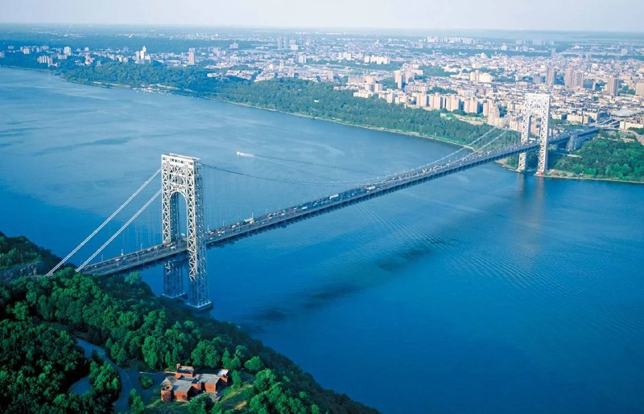

🔴ترامپ

پل B1 ایران، معادل پل جرج واشنگتن بود و ما بمبارانش کردیم

مردم از من می‌خواهند که پل‌ها را بمباران کنم. چرا بمباران نکنم؟ من پیش از این هم چنین کاری کرده‌ام؛ چون می‌دانید، آن‌ها زیر یکی از وعده‌های خود زدند و من بزرگ‌ترین پل آن‌ها را بمباران کردم.

آن پل، معادل پل جورج واشنگتن بود. اما ما آن پل را بمباران کردیم؛ شما آن را دیدید.
https://t.me/kianmeli1

## kianmeli1 — post 88049

  <a href="telegram/content/kianmeli1_88049_1781715251.mp4" target="_blank">🎬 Download video</a>

🔴ترامپ: با ایران فقط تفاهم‌نامه داریم و اگر موضوع ظرف ۶۰ روز به سرانجام نرسد، ایرادی ندارد؛ ما دوباره به بمباران برمی‌گردیم.

آن‌ها توافق کرده‌اند که سلاح هسته‌ای نسازند و شما این موضوع را به وضوح در متن توافق‌نامه خواهید دید.
https://t.me/kianmeli1

## FarsiVOA — post 221040

  <a href="telegram/content/FarsiVOA_221040_1781715252.mp4" target="_blank">🎬 Download video</a>

سه‌شنبه ۲۶ خرداد، گروهی از رانندگان و کامیون‌داران در اعتراض به قطع شدن سهمیه سوخت خودروهای سنگین و مینی‌بوس‌ها مقابل ساختمان فرمانداری شهرستان راسک در سیستان و بلوچستان تجمع کردند.

## FarsiVOA — post 221039

پرسش میدان: اپوزیسیونی که جنگ را یک فرصت برای سرنگونی جمهوری اسلامی می‌دانست چرا هیچ طرح و برنامه‌ای برای استفاده از آن نداشت؟ مصطفی دانشگر می‌گوید چپ‌ها نگذاشتند!

## FarsiVOA — post 221038

  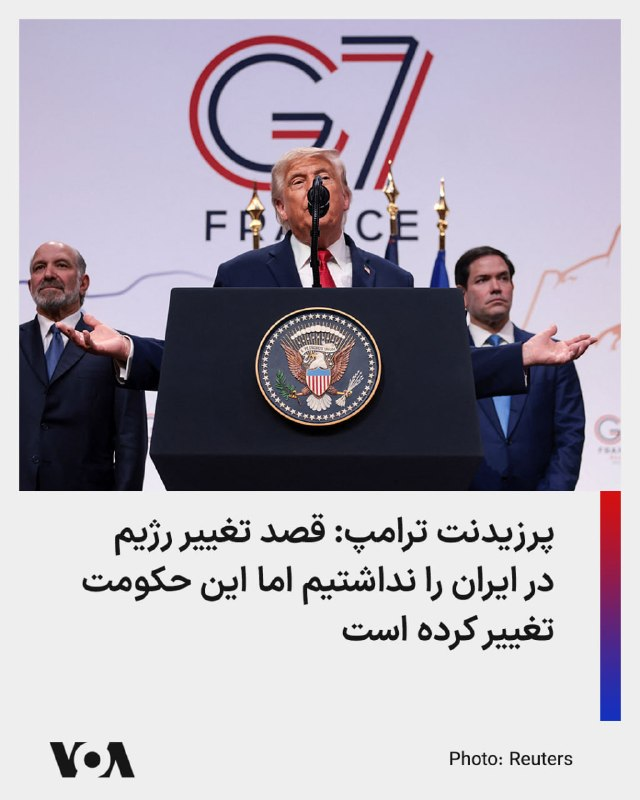

⚡️دونالد ترامپ، رئیس جمهوری آمریکا در یک کنفرانس خبری پس از نشست گروه هفت گفت که قصد عملیات نظامی علیه جمهوری اسلامی اطمینان از عدم دست‌یابی آنها به سلاح هسته‌ای بود نه تغییر رژیم، اما در نتیجه حکومت ایران تغییر کرده است.
پرزیدنت ترامپ خاطرنشان کرد مانع سرمایه‌گذاری خارجی در ایران نخواهد شد تنها به شرط این که رفتار حکومت ایران درست باشد. چرا که آنها ۱۵ تا ۲۰ هزار میلیارد دلار خسارت دیده‌اند و برای بازسازی نیاز به سرمایه‌گذاری خارجی دارند.
او افزود: آمریکا به آنها پولی پرداخت نخواهد کرد، بلکه پول‌های مصادره شده ایران آزاد خواهد شد تا برخی کشورها برای سرمایه‌گذاری در ایران تمایل داشته باشند.

## RadioFarda — post 158436

  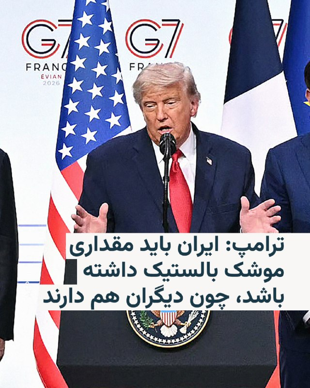

🔸دونالد ترامپ روز چهارشنبه ۲۷ خرداد در یک کنفرانس خبری در پایان نشست رهبران گروه ۷ با دفاع از توافق پایان جنگ با ایران گفت که نمی‌توان به تهران گفت موشک نداشته باشد.

🔸او گفت: «ما در کنار این توافق، با کشورهای حوزه خلیج فارس روی یک مسیر موازی نیز کار خواهیم کرد تا به موضوعات غیرهسته‌ای، از جمله موشک‌های بالستیک متعارف و همچنین مسئله حمایت‌ها بپردازیم.»

🔸او درباره ذخایر موشک‌های بالستیک ایران اظهار داشت: «آن‌ها باید تا حدی چنین توانایی‌ای داشته باشند، چون دیگران هم دارند؛ بالاخره باید مقداری از آن را داشته باشید.»

🔸ترامپ با اشاره به نظر برخی مقام‌های دولت خود درباره این که ایران نباید حتی یک موشک داشته باشد، اعلام کرد: «فکر نمی‌کنم در این مورد حرفشان هوشمندانه باشد.»

@RadioFarda

## BBCPersian — post 284154

  <a href="https://t.me/bbcpersian/284154" target="_blank">📎 Download file</a>

حضور تیم ملی ایران در جام جهانی تا به این جا در داخل و خارج زمین حاشیه کم نداشته. از جنگ و تنش سیاسی میان ایران و آمریکا گرفته تا اعتراض‌ مخالفان جمهوری اسلامی، فضای متفاوتی را در این دوره برای تیم ملی ایران رقم زد. خبرنگاران ما پوریا ژافره و سام فرزانه در لس آنجلس شهر محل بازی ایران درباره تجربه شان از دیدار اول ایران مقابل نیوزیلند گفتند و شرایط تیم در تدارک بازی دوم.

https://bbc.in/4vYUdxa
@BBCPersian

## Dirty_Kids — post 392405

حرومزاده هایی که با ماشین از روی مردم معترض رد میشدن حالا تو محرم برای تاختن اسب بر روی کشته های کربلا گریه میکنن
از دین شما بیزارم

@Dirty_Kids 👻

## Dirty_Kids — post 392404

  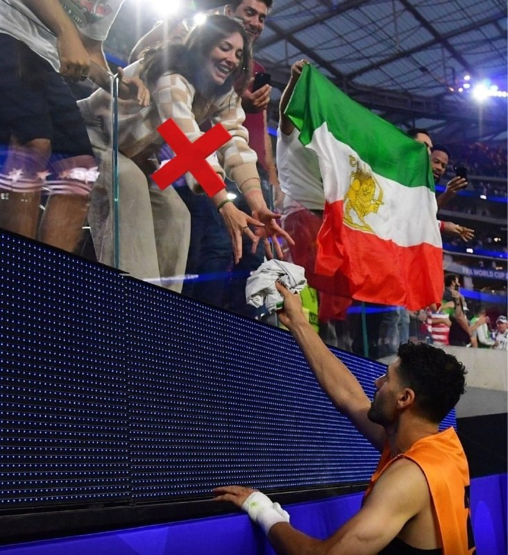

لباسِ خیس و بوی عرق خوشحالی داره؟🤢🤢🤢
ته اینارو بگیری به آخوند میخوره.

@Dirty_Kids 👻

## Hranews — post 113686

  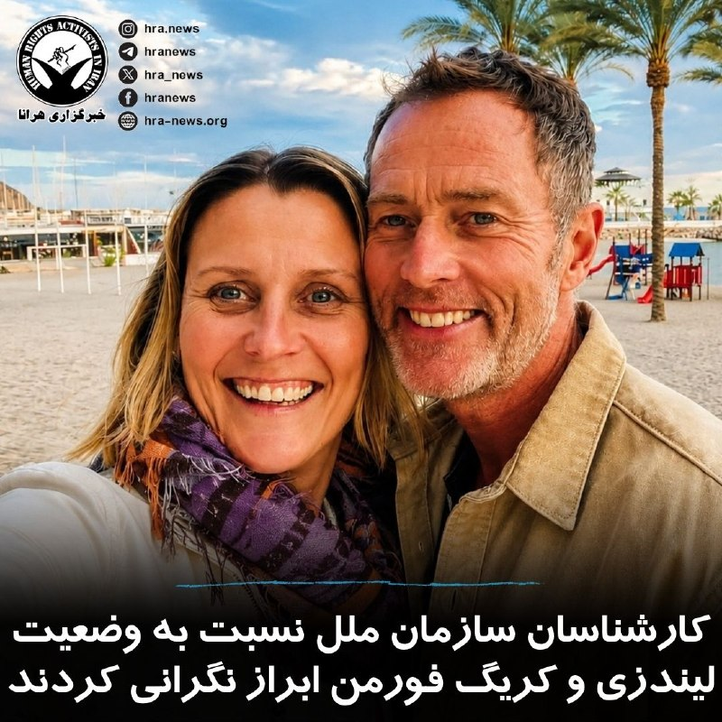

کارشناسان سازمان ملل متحد نسبت به وضعیت لیندزی و کریگ فورمن، دو شهروند بریتانیایی محبوس در زندان اوین که در اعتصاب غذا به سر می‌برند، ابراز نگرانی کرده و از مقامات ایرانی خواستند به تعهدات خود طبق قوانین بین‌المللی عمل کرده و آنان را آزاد کنند.

در بخشی از بیانیه آمده است که روند رسیدگی به اتهامات این دو شهروند بریتانیایی با «بی‌نظمی‌های جدی»، از جمله فقدان شواهد کافی، عدم دسترسی به وکیل منتخب، موانع زبانی و نبود دادرسی منصفانه همراه بوده و همچنین «ادعاهایی مبنی بر اینکه بازجویی‌ها تحت تأثیر شکنجه یا سایر بدرفتاری‌ها قرار گرفته‌اند» مطرح شده است. در ادامه این بیانیه تاکید شده است که این بازداشت‌ها می‌تواند بخشی از الگوی بازداشت خودسرانه اتباع خارجی برای اعمال فشار سیاسی یا دیپلماتیک باشد.

این زوج که با موتورسیکلت در سفر دور دنیا وارد ایران شده بودند، در دی‌ماه سال ۱۴۰۳ توسط نیروهای اطلاعات سپاه در کرمان بازداشت شدند. آنها سپس توسط شعبه ۱۵ دادگاه انقلاب تهران از بابت اتهام “جاسوسی” به ۱۰ سال حبس محکوم شدند. این زوج از اردیبهشت ماه امسال در اعتراض به شرایط نگهداری‌شان در زندان و قطع امکان برقراری تماس تلفنی با خانواده، دست به اعتصاب زده‌اند.

#لیندزی_فورمن #کریگ_فورمن

↘️
@hranews_bot تماس ✉️ - @Hranews کانال هرانا 🆑

## alonews — post 128741

  <a href="telegram/content/alonews_128741_1781715256.webm" target="_blank">🎬 Download video</a>

👈ترامپ: ما کارت‌هایی برای بازی داریم و ایران باید رفتار بهتری داشته باشد. درگیری بین اسرائیل و حزب‌الله باید پایان یابد.

✅ @AloNews خبر جنگ

## alonews — post 128740

  <a href="telegram/content/alonews_128740_1781715256.webm" target="_blank">🎬 Download video</a>

🔴فوری / ترامپ: اگر ایران درست رفتار کند، می‌تواند در بخش نفت سرمایه‌گذاری کند و ما هیچ پولی به آن پرداخت نخواهیم کرد.

🔴ایران به صندوق ۳۰۰ میلیارد دلاری دسترسی نخواهد داشت مگر اینکه رفتار مناسبی داشته باشد.

🔴آمریکا مقدار زیادی از پول ایران را توقیف کرده و در مقطعی مجبور به بازگرداندن آن خواهد شد.

🔴این توافق به کشتی‌ها اجازه می‌دهد تا از تنگه هرمز عبور و مرور کنند

✅ @AloNews خبر جنگ

## alonews — post 128739

  <a href="telegram/content/alonews_128739_1781715256.mp4" target="_blank">🎬 Download video</a>

👈ترامپ درباره محمد بن سلمان:
من چندین بار با ولیعهد عربستان سعودی صحبت کردم — آنها خیلی خوشحال هستند که هنوز... شما هم باید آنها را خوشحال نگه دارید، می‌دانید؟

🔴ما از فرودگاه‌های آنها استفاده می‌کنیم، نه اینکه اگر نمی‌خواستیم، آنها بتوانند ما را متوقف کنند.

🔴رفتم آن کوچولو را بگیرم. اما خطا کردم. از خطا کردن متنفرم

✅ @AloNews خبر جنگ

## alonews — post 128738

  <a href="telegram/content/alonews_128738_1781715259.mp4" target="_blank">🎬 Download video</a>

👈ترامپ درباره مکزیک: مکزیک کنترل کشور خود را از دست داده است. کارتل‌ها مکزیک را اداره می‌کنند؛ این ناراحت‌کننده است.

🔴رئیس‌جمهور زنی بسیار خوب است، اما زنی بسیار ترسو است

✅ @AloNews خبر جنگ

## alonews — post 128737

  <a href="telegram/content/alonews_128737_1781715261.mp4" target="_blank">🎬 Download video</a>

👈ترامپ درباره روسیه-اوکراین: هر دو تعداد زیادی سرباز از دست می‌دهند، روسیه بیشتر از دست می‌دهد، چون آن‌ها تهاجمی هستند و وقتی در جنگ تهاجمی هستید، بیشتر از دست می‌دهید، خیلی ساده است.

🔴من فکر می‌کنم هر دو (زلنسکی و پوتین) می‌خواهند کاری انجام دهند، فقط نمی‌دانند چگونه آن را انجام دهند

✅ @AloNews خبر جنگ

<!-- MSG END -->

<!-- NAV START -->

<a href="https://github.com/ProAlit/aio-downloader/blob/main/telegram/content/archive_1.md" style="display:inline-block; padding:6px 12px; margin:0 4px; background-color:#2ea44f; color:white; text-decoration:none; border-radius:4px; font-weight:bold;">صفحه بعد</a>

<!-- NAV END -->
