# خواننده تلگرام

<!-- TOP_NAV START -->

<a href="https://github.com/ProAlit/aio-downloader/blob/main/telegram/content/archive_1.md" style="display:inline-block; padding:6px 12px; margin:0 4px; background-color:#2ea44f; color:white; text-decoration:none; border-radius:4px; font-weight:bold;">صفحه بعد</a>

<!-- TOP_NAV END -->

<!-- MSG START -->

---
📅 بروزرسانی: 1405/03/22 21:43
---

## VahidOOnLine — post 245187

  

یک مقام ارشد دولت آمریکا به رویترز گفت تهران و واشینگتن بر سر متنی به توافق رسیده‌اند که هر دو طرف آن را می‌پذیرند.

او افزود این توافق «نخستین و مهم‌ترین گام» برای اطمینان از آن است که ایران به سلاح هسته‌ای دست پیدا نکند.

این مقام همچنین گفت دو طرف یک دوره ۶۰ روزه مذاکرات فنی را برای بررسی و نهایی‌سازی جزئیات توافق در نظر گرفته‌اند.

به گفته او، اروپا به عنوان یکی از گزینه‌های احتمالی برای امضای توافق مطرح شده، اما هنوز تصمیم نهایی در این باره گرفته نشده است.

این مقام ارشد دولت آمریکا همچنین گفت بر اساس گزارش‌های دریافتی، مجتبی خامنه‌ای از روند کنونی مذاکرات رضایت دارد.
‌🏁 🇬🇧 IranintlTV

🤖 @VahidOOnLine

## pm_afshaa — post 93709

نبویان:همه چیو دادیم رفت 
💧 Rainbet.com the #1 Non-KYC Crypto Casino & Sportsbook @rainbetcom 
😁 @Pm_Afshaa

## IranIntlTV — post 341926

  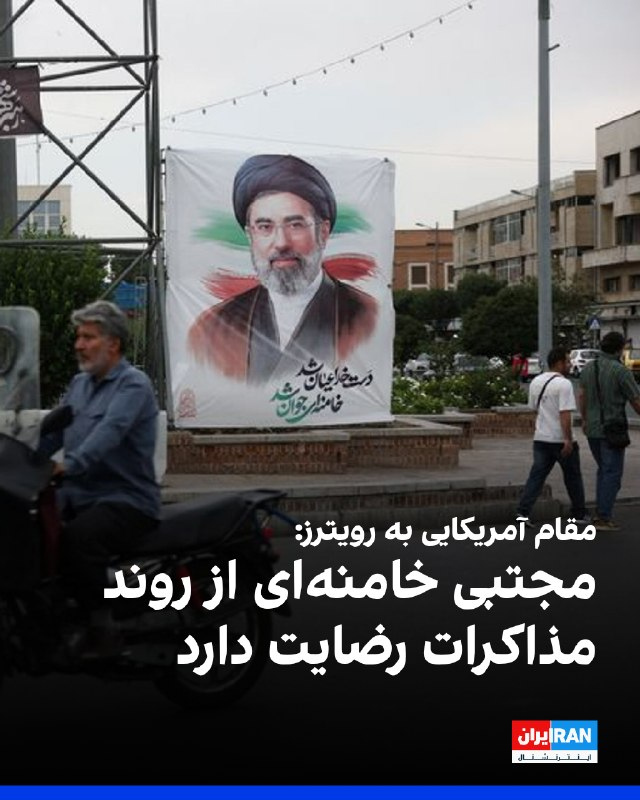

یک مقام ارشد دولت آمریکا به رویترز گفت تهران و واشینگتن بر سر متنی به توافق رسیده‌اند که هر دو طرف آن را می‌پذیرند.

او افزود این توافق «نخستین و مهم‌ترین گام» برای اطمینان از آن است که ایران به سلاح هسته‌ای دست پیدا نکند.

این مقام همچنین گفت دو طرف یک دوره ۶۰ روزه مذاکرات فنی را برای بررسی و نهایی‌سازی جزئیات توافق در نظر گرفته‌اند.

به گفته او، اروپا به عنوان یکی از گزینه‌های احتمالی برای امضای توافق مطرح شده، اما هنوز تصمیم نهایی در این باره گرفته نشده است.

این مقام ارشد دولت آمریکا همچنین گفت بر اساس گزارش‌های دریافتی، مجتبی خامنه‌ای از روند کنونی مذاکرات رضایت دارد.
https://iranintl.com/202606126923

## FarsiVOA — post 220511

🔺آمریکا در مرکز توجه روز دوم جام جهانی؛ ستارگان موسیقی و مقام‌های ارشد واشنگتن در افتتاحیه لس‌آنجلس

▪️آمریکا روز جمعه ۲۲ خرداد (بامداد شنبه ۲۳ خرداد به وقت ایران)، در دومین روز مراسم افتتاحیه جام جهانی ۲۰۲۶ در مرکز توجه قرار می‌گیرد؛ روزی که لس‌آنجلس، مرکز صنعت سینمای آمریکا و از شهرهای چندفرهنگی این کشور، میزبان مراسم رسمی افتتاحیه در خاک ایالات متحده و نخستین بازی تیم ملی آمریکا خواهد بود.

⬇️ بیشتر بخوانید:

https://ir.voanews.com/a/us-opens-world-cup-stage/8160141.html/?nocach=1

## DW_Farsi — post 125907

  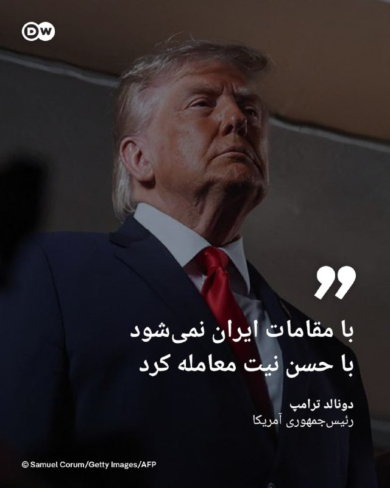

🔶 ترامپ: با مقامات ایران نمی‌شود با حسن نیت معامله کرد

دونالد ترامپ، رئیس‌جمهوری آمریکا، روز جمعه در پیامی در شبکه اجتماعی تروث سوشال اعلام کرد مفادی که ایران درباره توافق احتمالی با آمریکا به رسانه‌ها درز داده، "هیچ ربطی" به آنچه به‌صورت مکتوب مورد توافق قرار گرفته، ندارد.

او گفت روایت ایران از این توافق "هیچ نسبتی با حقیقت" ندارد و مقام‌های جمهوری اسلامی را "بسیار بی‌شرافت" توصیف کرد.

ترامپ در این پیام نوشت آنچه ایران به "رسانه‌های جعلی" داده، از جمله بیانیه‌ای که درباره وجود توافق منتشر کرده، هیچ ارتباطی با واقعیت ندارد. او همچنین گفت در مورد جمهوری اسلامی "چیزی به نام معامله با حسن نیت وجود ندارد."

ترامپ در بخش دیگری از پیام خود، به آنچه حمله پهپادی ناکام به کشتی‌های هندی در حال خروج از تنگه هرمز خواند، اشاره کرد و آن را "کاملا غیرقابل قبول" دانست. او بدون ارائه جزئیات بیشتر هشدار داد ایران باید "خیلی سریع" اوضاع خود را سر و سامان دهد.

این اظهارات در شرایطی مطرح شده که تنش میان تهران و واشنگتن همچنان بر امنیت کشتیرانی در خلیج فارس و تنگه هرمز سایه انداخته است.
@dw_farsi

## Persian_Trend_Official — post 16881

دقایقی دیگه لایو توافقی داریم انشالله اگر زنده باشیم حدود ساعت 1 بامداد جنگ رو پوشش میدیم 😄

## Hranews — post 113566

معوقات مزدی و بیمه‌ای کارگران معدن زغال‌سنگ جوزچال شاهرود

❗️
❗️
❗️
❗️
❗️ – #کارگران معدن زغال‌سنگ گرانیت جوزچال شهرستان شاهرود مطالبات مزدی و بیمه‌ای پرداخت نشده دارند.

ادامه مطلب

↘️
@hranews_bot تماس ✉️ -  @Hranews  کانال هرانا 🆑

## alonews — post 127467

  <a href="telegram/content/alonews_127467_1781288004.webm" target="_blank">🎬 Download video</a>

🔴فوری / سازمان ملل: از روند مذاکرات دلگرم شدیم!

✅ @AloNews خبر جنگ

---
📅 بروزرسانی: 1405/03/22 21:33
---

## VahidOOnLine — post 245186

  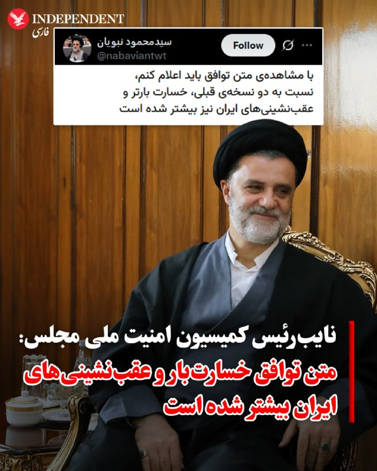

♦️ محمود نبویان، نایب‌رئیس کمیسیون امنیت ملی و سیاست خارجی مجلس شورای اسلامی، روز جمعه ۲۲ خرداد، با انتشار پیامی در شبکه اجتماعی ایکس اعلام کرد که متن تفاهم‌نامه میان تهران و واشنگتن که در انتظار تایید نهایی است را «خسارت‌بار» توصیف کرد.

نبویان در این پیام نوشت: «با مشاهده متن توافق باید اعلام کنم که نسبت به دو نسخه قبلی خسارت‌بارتر و عقب‌نشینی‌های ایران نیز بیشتر شده است».

این اظهارات در حالی مطرح شد که عباس عراقچی، وزیر امور خارجه جمهوری اسلامی با انتشار پیامی از رسانه‌ها خواسته بود که از گمانه‌زنی درباره جزئیات تفاهم‌نامه خودداری کنند. دونالد ترامپ نیز در واکنش به انتشار این گمانه‌زنی‌ها، مقام‌های تهران را به‌دلیل افشای اطلاعات محرمانه، غیرقابل اعتماد خوانده بود.
‌🇸🇦 Indypersian

🤖 @VahidOOnLine

## WithYashar — post 14660

خبرنگار فاکس‌نیوز نزدیک به ترامپ از نقل یک مقام کاخ سفید درباره توافق :

۱. مواد هسته‌ای نابود و منتقل خواهند شد.
۲. برنامه هسته‌ای برچیده خواهد شد.
۳. هیچ‌یک از پول‌هایشان تا زمانی که تعهداتشان را انجام ندهند آزاد نخواهد شد.
۴. تنگه هرمز باز خواهد بود.
۵. هیچ تأمین مالی از سوی ایران برای گروه‌های تروریستی وجود نخواهد داشت.

این مقام افزود: «این همان چیزی است که آنها با آن موافقت کرده‌اند. این یک توافق مبتنی بر عملکرد است.»
@withyashar

## FoxNewsTwitter — post 342909

  

Fox News (Twitter/X)

Taylor Swift and Travis Kelce’s rumored wedding date is fast approaching, but there are still a lot of unknowns surrounding the pop star’s big day.

One of the biggest questions online right now is who will be a bridesmaid for the wedding of Travis Kelce and Taylor Swift?

Our sponsor Kalshi’s prediction market shows:

— Este Haim: 66%
— Gigi Hadid: 58%
— Kylie Kelce: 52%

https://www.foxnews.com/entertainment/taylor-swift-dances-shimmies-steals-headlines-knicks-erase-29-point-hole-nba-finals-stunner

## pm_afshaa — post 93708

  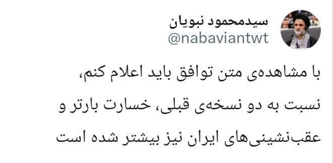

نبویان:همه چیو دادیم رفت

💧 Rainbet.com the #1 Non-KYC Crypto Casino & Sportsbook @rainbetcom

😁 @Pm_Afshaa

## VahidOnline — post 76280

  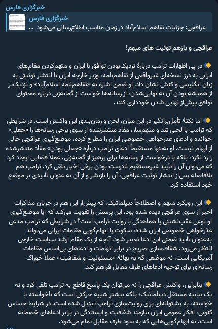

خبرگزاری فارس در انتقاد از توییت عراقچی:
عراقچی نه‌تنها مستقیماً ادعای ترامپ درباره «جعلی بودن» مفاد منتشرشده را رد نکرد، بلکه با درخواست از رسانه‌ها برای پرهیز از گمانه‌زنی، عملاً فضایی ایجاد کرد که می‌توان آن را تأیید غیرمستقیم نادرست بودن برخی اخبار تلقی کرد.

آیا موضع‌گیری او نوعی عقب‌نشینی یا هماهنگی با روایت ترامپ است؟ در شرایطی که ترامپ مدعی عذرخواهی خصوصی ایران شده

📡 @VahidOnline

## FarsiVOA — post 220504

جام جهانی ۲۰۲۶ در مکزیکوسیتی با مراسمی پرشور، اجرای هنرمندان و دیدار افتتاحیه گروه آ میان مکزیک و آفریقای جنوبی آغاز شد؛ روایتی تصویری از نخستین روز بزرگ‌ترین تورنمنت فوتبال جهان.

@FarsiVOA

## FarsiVOA — post 220503

🔺واکنش مثبت بازارهای جهانی به احتمال دستیابی به توافق؛ سقوط قیمت نفت و جهش شاخص‌های سهام

▪️بعد از این که دونالد ترامپ، رئیس جمهوری آمریکا، گفت که ایالات متحده و رژیم ایران ممکن است در روزهای آینده قراردادی برای توقف جنگ بین دو طرف امضا کنند، شاخص‌های بورس بین‌المللی جهش کردند و قیمت‌های نفت خام جهانی اوایل جمعه ۲۲ خرداد کاهش یافت.

⬇️ بیشتر بخوانید:

https://ir.voanews.com/a/stocks-market-trump-peace-deal-iran/8160174.html/?nocach=1

## FarsiVOA — post 220502

  <a href="telegram/content/FarsiVOA_220502_1781287431.mp4" target="_blank">🎬 Download video</a>

ارتش اسرائیل اعلام کرد سه انبار مهمات حماس را در مرکز نوار غزه هدف قرار داده و منهدم کرده است.

به گفته ارتش اسرائیل، در این انبارها راکت‌انداز، خمپاره، مواد منفجره و سلاح‌های دیگر نگهداری می‌شد.

ارتش اسرائیل می‌گوید این انبارها تهدیدی برای نیروهای اسرائیلی و شهروندان این کشور محسوب می‌شدند. تصاویر منتشرشده بخشی از این حملات را نشان می‌دهد.

@FarsiVOA

## FarsiVOA — post 220501

🔺درخواست وحید سرخ‌گل، زندانی سیاسی: تا دیرنشده به داد زندانیان مخالف جمهوری اسلامی برسید

▪️وحید سرخ‌گل، زندانی سیاسی محبوس در زندان قزلحصار، با انتشار نامه‌ای نسبت به وضعیت زندانیان محبوس در زندان‌های ایران به‌ویژه زندانیان سیاسی اوین و قزل‌حصار هشدار داد و از همه مردم، «رسانه‌های دغدغه‌مند» و نهادهای بین‌المللی خواست قبل از آنکه فرصت از دست برود «چاره‌ای موثر» بیاندیشند.

⬇️ بیشتر بخوانید:

https://ir.voanews.com/a/iran-prison-request/8160183.html/?nocach=1

## Hranews — post 113565

رضایت اولیای دم؛ یک زندانی در استان البرز از چوبه دار رهایی یافت

❗️
❗️
❗️
❗️
❗️ – یک زندانی در استان البرز که پیشتر بابت اتهام قتل به #اعدام محکوم شده بود، با اعلام رضایت اولیای دم از مجازات مرگ رهایی یافت.

ادامه مطلب

↘️
@hranews_bot تماس ✉️ -  @Hranews  کانال هرانا 🆑

## Hranews — post 113564

  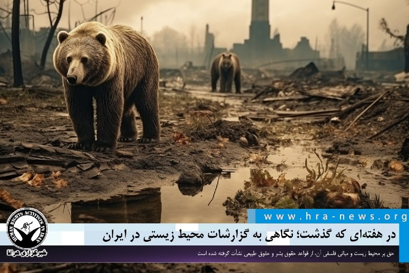

در هفته‌ای که گذشت؛ نگاهی به گزارشات محیط زیستی در ایران

❗️
❗️
❗️
❗️
❗️ – حق بر #محیط_زیست و مبانی فلسفی آن، از قواعد #حقوق_بشر و حقوق طبیعی نشأت گرفته شده است. ابتدایی ترین حق طبیعی انسان در این کره خاکی، «#حق_حیات» است. اما طی دهه‌های اخیر به دلیل استفاده بی‌رویه از منابع طبیعی، عدم نظارت و توجه به مباحث زیست محیطی و الگوهای صحیح، محیط زیست طبیعی به‌شدت آسیب دیده است. گزارش پیش رو حاصل ثبت ۶۸ واقعه محیط زیستی ایران است که در هفته اخیر منتشر و به هدف آگاه‌سازی گردآوری شده است.

به گزارش خبرگزاری هرانا، ارگان خبری مجموعه فعالان حقوق بشر در ایران، در هفته‌‌ای که گذشت سه فوک جدید در سواحل بابلسر و فریدونکنار تلف شدند. همچنین، بیش از ۲۷ شکارچی غیرمجاز و قاچاقچی چوب بازداشت و به مراجع قضایی معرفی شدند. افزون بر این، بر اساس گزارشات منتشر شده، بیش از ۶۰ هکتار از منابع طبیعی دچار آتش سوزی شد. از سوی دیگر، شاخص کیفی هوا دستکم در ۳۴ شهر ناسالم و خطرناک اعلام شد. از دیگر اخبار مرتبط با محیط زیست میتوان به بحران خشکسالی، پسماندها و آلاینده‌ها در مناطق مختلف اشاره کرد؛ در گزارش پیش رو به برخی از آنها پرداخته شده است.

آسیب رسانی به جنبه های مختلف محیط زیست در ایران کماکان ادامه دارد. از طرفی شهروندانی وجود دارند که به دلیل عدم آموزش یا نیازهای مالی دست به تخریب و آسیب رسانی به محیط زیست می زنند و از سوی دیگر نهادهای متولی در تلاش هستند تا از حجم این آسیب ها بکاهند، هر چند این تلاش ها قابل تقدیر است اما به نظر نمی آید میزان آن با شرایط محیط زیستی ایران تطبیق داشته باشد.

ادامه مطلب

↘️
@hranews_bot تماس ✉️ -  @Hranews  کانال هرانا 🆑

## alonews — post 127466

  <a href="telegram/content/alonews_127466_1781287433.webm" target="_blank">🎬 Download video</a>

👈مقام ارشد آمریکایی: به خط پایان نرسیده‌ایم اما بسیار نزدیک شده‌ایم

✅ @AloNews خبر جنگ

## alonews — post 127465

  <a href="telegram/content/alonews_127465_1781287433.webm" target="_blank">🎬 Download video</a>

👈ایرنا: یک منبع آگاه به خبرنگار ایرنا گفت که سناتور «محمد اسحاق دار» معاون نخست وزیر و وزیر امور خارجه پاکستان در ادامه پیشبرد روند میانجی‌گری بین جمهوری اسلامی ایران و آمریکا، امشب عازم ژنو سوئیس می شود

✅ @AloNews خبر جنگ

---
📅 بروزرسانی: 1405/03/22 21:23
---

## VahidOOnLine — post 245185

  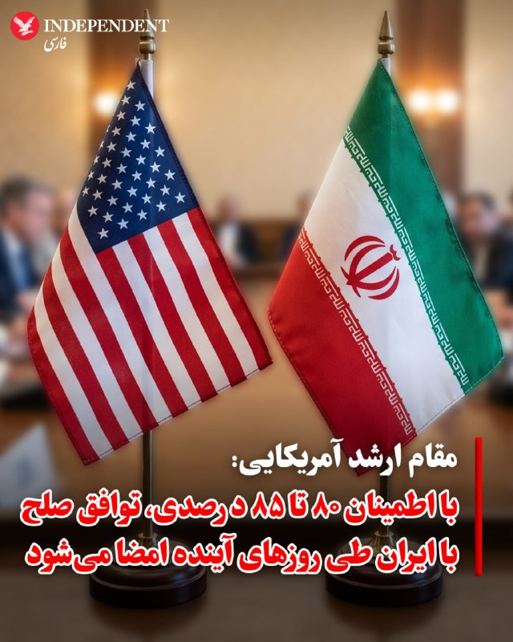

♦️ یک مقام ارشد در دولت دونالد ترامپ، رئیس‌جمهوری آمریکا، روز جمعه ۲۲ خرداد اعلام کرد که ایالات متحده با اطمینان «۸۰ تا ۸۵ درصدی» انتظار دارد توافق‌نامه صلح با جمهوری اسلامی ایران طی روزهای آینده امضا شود.

این مقام ارشد که خواست نامش فاش نشود، در گفتگو با خبرگزاری فرانسه گفت: «ما انتظار داریم که این توافق‌نامه را ظرف چند روز آینده امضا کنیم؛ اما در حال حاضر نمی‌توانم تاریخ دقیقی به شما بدهم.»

او در ادامه درباره میزان قطعیت این رویداد افزود: «اگر می‌خواستم میزان اطمینانمان به امضای این توافق را بگویم، شاید امروز صبح روی ۷۵ درصد دست می‌گذاشتم، اما اکنون این رقم احتمالا به ۸۰ تا ۸۵ درصد رسیده است؛ با این حال، هنوز ۱۰۰ درصد نیست.»
‌🇸🇦 Indypersian

🤖 @VahidOOnLine

## WithYashar — post 14659

الحدث: وزیر خارجه پاکستان امشب عازم ژنو می‌شود
@withyashar

## WithYashar — post 14658

یک مقام ارشد آمریکایی به رویترز:

توافق با ایران اهداف اصلی ایالات متحده را محقق می کند
این توافق تنگه هرمز را بازگشایی خواهد کرد، ایالات متحده مواد هسته ای غنی شده دریافت خواهد کرد.
توافق ایران همچنین شامل یک رژیم بازرسی است. اگر ایران رعایت کند، پاداش اقتصادی خواهد داشت.
منافع برای ایران تنها در صورتی حاصل می شود که آنها واقعاً به تعهدات خود عمل کنند.
@withyashar

## FoxNewsTwitter — post 342908

Fox News (Twitter/X)

A miracle rescue and a broken leg that could have been much worse.

First responders and a reporter race to save a man trapped under the remains of his collapsed home after a tornado tore through northwestern Illinois.

Video captures the dramatic rescue as officers dug through the wreckage and carried the survivor to safety.

The powerful storm left at least one person dead, knocked out power to hundreds of thousands, and unleashed winds strong enough to rip homes from their foundations.

## Persian_Trend_Official — post 16880

  <a href="telegram/content/Persian_Trend_Official_16880_1781286822.webm" target="_blank">🎬 Download video</a>

ایرنا: وزیر خارجه پاکستان عازم ژنو می شود!

یک منبع آگاه به خبرنگار ایرنا گفت که سناتور محمد اسحاق دار معاون نخست وزیر و وزیر امور خارجه پاکستان در ادامه پیشبرد روند میانجی‌گری بین جمهوری اسلامی ایران و آمریکا، امشب عازم ژنو سوئیس می شود.

پیشبرد روند میانجی‌گری و هماهنگی برای یک تفاهم احتمالی میان طرفین مذاکرات، در دستور کار سفر وزیر امور خارجه پاکستان به ژنو قرار دارد.

📝 Amir

📌 @persian_trend_official
پرشین ترند | متفاوت‌ترین کانال نظامی

## Persian_Trend_Official — post 16879

  <a href="telegram/content/Persian_Trend_Official_16879_1781286822.webm" target="_blank">🎬 Download video</a>

کان نیوز: ایالات متحده و ایران بیش از هر زمان دیگری به یک توافق اصولی نزدیک شده‌اند و احتمالاً فردا یا پس‌فردا در ژنو امضا خواهد شد.

رده سیاسی به ارتش اسرائیل دستور داده است از اقداماتی که می‌تواند توافق را به خطر بیندازد، خودداری کند. دفتر نخست‌وزیر این گزارش را اخبار جعلی خواند. نیروهای اسرائیلی با آزادی عمل در منطقه امنیتی لبنان باقی خواهند ماند تا علیه تهدیدات فوری اقدام کنند.

یک مقام ارشد آمریکایی گفت که رئیس جمهور آمریکا، ترامپ، دیروز با نخست وزیر اسرائیل، نتانیاهو، صحبت کرده است. این مقام گفت که وقتی اسرائیل توافق کامل را ببیند که طبق آن ایران باید قبل از اینکه ایالات متحده چیزی بدهد، آن را اجرا کند اسرائیل با آن احساس راحتی خواهد کرد.

اگر ایران به تأمین مالی موشک‌های حزب‌الله که به سمت اسرائیل شلیک می‌شوند ادامه دهد، ایران به توافق پایبند نبوده و از مزایای توافق بهره‌مند نخواهد شد. این مقام گفت: من تردید اسرائیل را درک می‌کنم... ما انتظار نداریم که هیچ کشوری از حق دفاع از خود دست بکشد.

📝 Amir

📌 @persian_trend_official
پرشین ترند | متفاوت‌ترین کانال نظامی

## IranianMinds — post 22422

  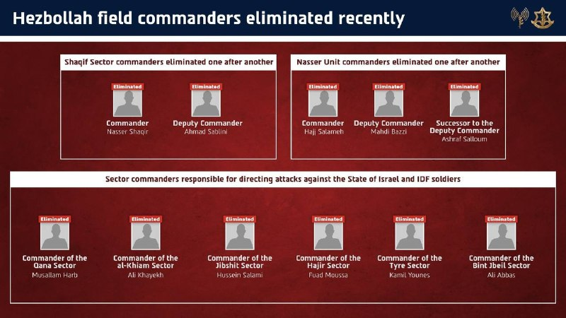

🔴در حالیکه اسرائیل همچنان به حملات خود در جنوب لبنان ادامه می‌دهد، ارتش اسرائیل از حذف ۱۱ فرمانده میدانی حزب‌الله از جمله موارد زیر خبر داد.

فرمانده منطقه بنت الجبیل- علی عباس
فرمانده منطقه صور- کمال یونس
فرمانده منطقه جبشیت- حسین سلمی
فرمانده منطقه خلیم- علی خایخ
فرمانده منطقه قانا- مصعلم حرب.

@IranianMinds

## alonews — post 127463

  <a href="telegram/content/alonews_127463_1781286823.mp4" target="_blank">🎬 Download video</a>

👈نخست‌وزیر کانادا، ماک کارنی،خطاب به مکرون: ما بیش از متحد هستیم. ما بخشی از یک خانواده هستیم.

✅ @AloNews خبر جنگ

---
📅 بروزرسانی: 1405/03/22 21:13
---

## VahidOOnLine — post 245184

  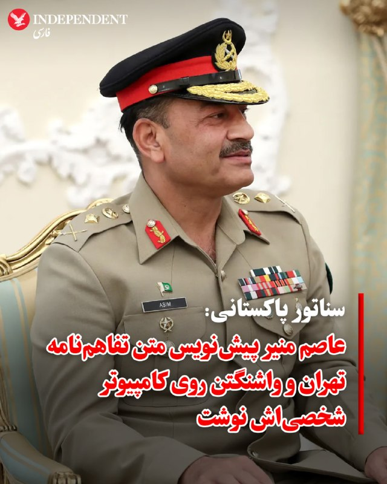

♦️ فیصل واودا، سناتور پاکستانی که به کادر رهبری این کشور نزدیک است، روز جمعه ۲۲ خرداد اعلام کرد که پاکستان و به طور خاص فرمانده ارتش این کشور، فیلد مارشال عاصم منیر، نقشی کلیدی در تدوین متن توافق احتمالی میان جمهوری اسلامی ایران و ایالات متحده ایفا کرده است.

این سناتور در گفتگو با نیویورک‌تایمز با اشاره به جزئیات این میانجی‌گری گفت: «ژنرال منیر شخصا مدیریت تمام مذاکرات رفت‌وبرگشتی، تماس‌های تلفنی متقابل با ترامپ و ایرانی‌ها و همچنین سفرهای دیپلماتیک دوجانبه را بر عهده داشت.» او در ادامه گفت: «نگارش و تدوین پیش‌نویس این متن، به طور کامل توسط خود او و روی کامپیوتر شخصی‌اش انجام شده است.»
‌🇸🇦 Indypersian

🤖 @VahidOOnLine

## VahidOOnLine — post 245183

  

اسماعیل بقائی، سخنگوی وزارت خارجه، در شبکه خبر صدا و سیما گفت: «در اکثر موارد توافق صورت گرفته و ما در مرحله نهایی تایید آن در میان خودمان هستیم.»

سخنگوی وزارت خارجه گفت که جلسه مراجع تصمیم‌گیر درباره توافق در حال برگزاری است و ما باید در نهادهای ذی‌ربط به جمع‌بندی برسیم.

بقائی افزود: «این که گفته شده به توافق نزدیک هستیم، موضوع جدیدی نیست، چند هفته پیش می‌شد به توافق دست پیدا کرد اما مشکل اظهارات ضد و نقیض طرف آمریکایی بود.»

او ادامه داد: «متهم کردن جمهوری اسلامی به نداشتن حسن نیت، درست نیست و مشخص است که کدام طرف حسن نیت ندارد.»

بقائی اضافه کرد: «از ابتدای روند مذاکرات به میانجیگری پاکستان، ما مواضع خود را بیان کردیم و گفتیم چه مواردی از نظر ما اساسی و به نوعی خط قرمز حساب می‌شود.»

او ادامه داد: «هیچ‌کدام از متن‌هایی که به عنوان متن توافق منتشر شده، قابل تایید نیست.»

سخنگوی وزارت خارجه جمهوری اسلامی در خصوص احتمال امضای توافق در روزهای یکشنبه یا دوشنبه، گفت که به محض نهایی شدن موضوع، رسما اعلام خواهیم کرد.
‌🏁 🇬🇧 IranintlTV

🤖 @VahidOOnLine

## WithYashar — post 14657

کانال 12 اسرائیل : سرانجام توافق شد ؛ این توافق قطعیه و به نتانیاهو اعلام شد!
ترامپ از ایران خواسته به‌صورت علنی درباره توافق شفاف‌سازی کنه و هشدار داده در صورت انجام ندادن این کار، با پیامدهایی روبه‌رو خواهد شد.
ترامپ در تماس تلفنی با نتانیاهو گفته:
«این همون توافقیه که دنبالش بودیم؛ یک توافق عالیه و وقتشه این جنگ تموم بشه.»
طبق این گزارش، نتانیاهو در این گفت‌وگو زیاد حرفی نزده و ظاهراً متوجه شده که توافق در آستانه نهایی شدنه و توانایی متوقف کردنش رو نداره.
@withyashar

## mwarmonitor — post 10790

📝 هر دو طرف حرف‌های متفاوتی می‌زنند، اما آنچه فعلاً روشن به نظر می‌رسد این است که ایران خواسته‌های آمریکا را پذیرفته است. با این حال، هنوز باید منتظر ماند و دید آیا این روند هم مانند ده‌ها مورد قبلی به نتیجه نخواهد رسید، یا اینکه این بار ـ به تعبیر ترامپ ـ جمهوری اسلامی واقعاً «پرچم سفید تسلیم» را بالا خواهد برد.

@mwarmonitor

## pm_afshaa — post 93707

یک مقام آمریکایی به رویترز : نمی‌توان تاریخ مشخصی برای امضای توافق ایران ارائه داد

💧 Rainbet.com the #1 Non-KYC Crypto Casino & Sportsbook @rainbetcom

😁 @Pm_Afshaa

## iaghapour — post 2670

  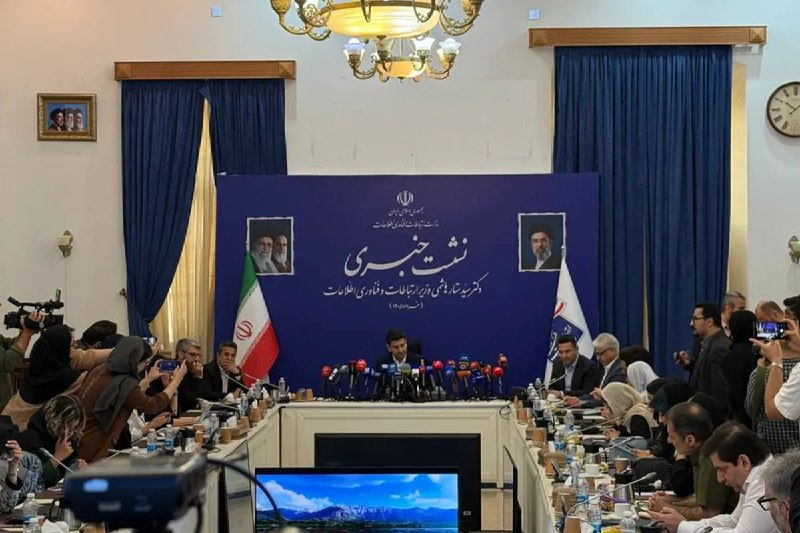

🌐 وزیر ارتباطات: محدودیت‌های اینترنت شفاف و زمان‌دار می‌شود / خسارت روزانه ۱۵ میلیون دلاری قطعی‌ها!

ستار هاشمی، وزیر ارتباطات در نشست خبری خود با انتقاد از وضعیت فعلی گفت: «در عصر هوش مصنوعی، دردناک است که هنوز دغدغه وصل بودن اینترنت را داریم.» وی تاکید کرد که قطعی اینترنت در فضای غبارآلود شایسته مردم نیست و سازوکار اعمال محدودیت‌ها باید تغییر کند.

🔹 چکیده مهم‌ترین صحبت‌های وزیر ارتباطات:

🔸 شفافیت و زمان‌بندی: از این پس اگر قرار است محدودیتی ایجاد شود، باید مشخص باشد کدام نهاد و کمیته آن را تصویب کرده و دقیقاً تا چه زمانی ادامه دارد.

🔸 خسارت نجومی: بر اساس گزارش مجلس، کشور روزانه ۱۵ میلیون دلار از قطعی اینترنت آسیب می‌بیند.

🔸 عادی‌شدن فیلترشکن‌ها: استفاده از VPN که در گذشته قبح داشت، به دلیل سیاست‌های اشتباه به یک رویه عادی و روزمره برای کاربران تبدیل شده است.

پ.ن: وزیر مشکلی با محدودیت و قطعی نداره بیشتر داره میگه شما که داری قطع میکنی بگو تا کی که مردم اطلاع داشته باشن :)

🆔 @iAghapour

## VahidOnline — post 76279

پست‌های خبرنگار نیوزنیشن در کاخ سفید،
ترجمه ماشین:

🚨 اکنون یک مقام ارشد دولت ترامپ جزئیات بیشتری درباره توافق پیشنهادی با ایران ارائه می‌کند.

آن‌ها انتظار دارند این توافق طی «چند روز آینده» امضا شود.

صددرصد قطعی نیست، اما احتمالاً ۸۰ تا ۸۵ درصد احتمال دارد که طی چند روز آینده امضا شود.

این توافق «اهداف اصلی»‌ای را که رئیس‌جمهور برای این مأموریت تعیین کرده بود محقق می‌کند.

نخست، تنگه را بازگشایی می‌کند و محاصره را برمی‌دارد.

برچیدن برنامه هسته‌ای ایران.

دریافت مواد غنی‌شده توسط آمریکا: هم در محل نابود می‌شود و هم از کشور خارج می‌شود.

ایرانی‌ها دیگر خشونت در منطقه را تأمین مالی نخواهند کرد.

یک نظام بازرسی که اطمینان دهد این یک تعهد بلندمدت و قابل اجرای بلندمدت است.

پرسش درباره «حجم دارایی‌هایی که در صورت پایبندی ایران آزاد خواهد شد».

به گفته مقام ارشد دولت: وقتی ایرانی‌ها «به تعهدات خود عمل کنند، می‌توانند در ازای این عملکرد، امتیازاتی دریافت کنند.»

پرسش دوم: چه چیزی تغییر کرده؟ چه چیزی باعث شده این توافق نسبت به قبل ملموس‌تر باشد؟

«ما به مرحله‌ای رسیده‌ایم که متن را به جایی رسانده‌ایم که از آن احساس خوبی داریم.»

«ما متن یک یادداشت تفاهم را داریم که فکر می‌کنیم هر دو طرف نسبت به آن احساس خوبی دارند.»

«ما احساس می‌کنیم کنترل ایرانی‌ها بر تنگه هرمز تضعیف شده است.»

مقام ارشد دولت: «چه تضمینی داریم که ایرانی‌ها به سهم خود از توافق پایبند بمانند؟ ما هیچ امتیازی نمی‌دهیم مگر اینکه آن‌ها به سهم خود از توافق پایبند بمانند.»

این مقام ارشد دولت درباره یادداشت تفاهم با ایران می‌گوید: «متن را به نقطه‌ای رسانده‌ایم که هر دو طرف آن را می‌پسندیم.»

به گفته مقام ارشد دولت، اگر آن‌ها بتوانند به آن پایبند بمانند، می‌توانند ظرف «چند روز آینده» به توافق برسند.

آیا رهبر عالی ایران این توافق را، به شکلی که شما شرح دادید، تأیید کرده است؟

مقام ارشد دولت می‌گوید: «افراد در طرف غیرنظامی و نظامی... شهادت داده‌اند/اطمینان داده‌اند که رهبر عالی از جایگاه فعلی آن‌ها در مذاکرات رضایت دارد.»

مذاکرات فنی ۶۰ روز طول خواهد کشید.
KellieMeyerNews

بعدا در پست دیگری نوشت:
🚨 مقام ارشد دولت به من می‌گوید که در ۲۴ ساعت گذشته، همه از ونس گرفته تا ویتکاف و کوشنر و ترامپ، به‌همراه هگست، روبیو، وایلز و رتکلیف، در مذاکرات مربوط به ایران دخیل بوده‌اند.
KellieMeyerNews

📡 @VahidOnline

## VahidOnline — post 76277

یسرائیل کاتز، وزیر امور خارجه اسرائیل، روز جمعه ۲۲ خرداد، با انتشار پیامی در شبکه اجتماعی ایکس اعلام کرد که هرچند رئیس‌جمهوری آمریکا بر اساس منافع واشنگتن و هدف مشترک با تل‌آویو، یعنی جلوگیری از دستیابی ایران به سلاح هسته‌ای، به سمت یک توافق حرکت می‌کند، اما اسرائیل انتظارات فراتری دارد. کاتز تاکید کرد: «از رئیس‌جمهوری آمریکا انتظار داریم این اصل و شروط دیگر در حوزه موشکی و گروه‌های نیابتی را حفظ کند».

او با اشاره به اینکه ضربات سنگین مشترک، توانمندی‌های ایران را سال‌ها به عقب رانده است، افزود: «اسرائیل باید تضمین کند که در آینده نیز توانایی اقدام مستقل برای جلوگیری از هسته‌ای شدن ایران را دارد؛ به همین منظور، من و بنیامین نتانیاهو به ارتش دستور آمادگی لازم را داده‌ایم.»

وزیر خارجه اسرائیل همچنین به عنوان درس اصلی از وقایع ۷ اکتبر تصریح کرد که این کشور به هیچ وجه از مناطق امنیتی در لبنان، سوریه و غزه عقب‌نشینی نخواهد کرد و ارتش به دفاع از مرزها در برابر تهدیدات جهادی از بلندی‌های حرمون تا عمق غزه ادامه می‌دهد.
@VahidOOnLine

📡 @VahidOnline

## IranIntlTV — post 341925

  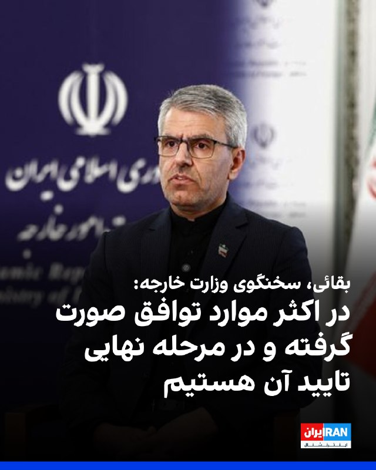

اسماعیل بقائی، سخنگوی وزارت خارجه، در شبکه خبر صدا و سیما گفت: «در اکثر موارد توافق صورت گرفته و ما در مرحله نهایی تایید آن در میان خودمان هستیم.»

سخنگوی وزارت خارجه گفت که جلسه مراجع تصمیم‌گیر درباره توافق در حال برگزاری است و ما باید در نهادهای ذی‌ربط به جمع‌بندی برسیم.

بقائی افزود: «این که گفته شده به توافق نزدیک هستیم، موضوع جدیدی نیست، چند هفته پیش می‌شد به توافق دست پیدا کرد اما مشکل اظهارات ضد و نقیض طرف آمریکایی بود.»

او ادامه داد: «متهم کردن جمهوری اسلامی به نداشتن حسن نیت، درست نیست و مشخص است که کدام طرف حسن نیت ندارد.»

بقائی اضافه کرد: «از ابتدای روند مذاکرات به میانجیگری پاکستان، ما مواضع خود را بیان کردیم و گفتیم چه مواردی از نظر ما اساسی و به نوعی خط قرمز حساب می‌شود.»

او ادامه داد: «هیچ‌کدام از متن‌هایی که به عنوان متن توافق منتشر شده، قابل تایید نیست.»

سخنگوی وزارت خارجه جمهوری اسلامی در خصوص احتمال امضای توافق در روزهای یکشنبه یا دوشنبه، گفت که به محض نهایی شدن موضوع، رسما اعلام خواهیم کرد.
https://iranintl.com/202606121647

## Persian_Trend_Official — post 16878

  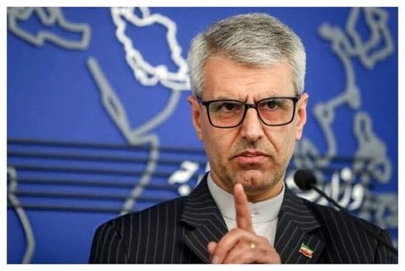

سخنگوی وزارت خارجه: هیچ‌کدام از گمانه‌زنی‌ها درباره متن تفاهم مورد تایید نیست. اینکه درباره جزئیات روند دیپلماتیک نمی‌توان صحبت کرد به معنای نامحرم‌بودن مردم نیست.

در مورد زمان و مکان امضای تفاهم نمی‌توان نظر داد و باید اول منتظر بمانیم تصمیم نهایی در داخل گرفته شود. اینکه گفته می‌شود ما خیلی به تفاهم نزدیک هستیم، حرف جدیدی نیست، مشکلی که ما در این مدت داشتیم اظهارات ضدونقیض طرف مقابل است.

در مورد متن تفاهم ما در مراحل جمع‌بندی در داخل هستیم. جلسه نهادهای ذی‌ربط درحال برگزاری است.

📝 Amir

📌 @persian_trend_official
پرشین ترند | متفاوت‌ترین کانال نظامی

## Dirty_Kids — post 391830

  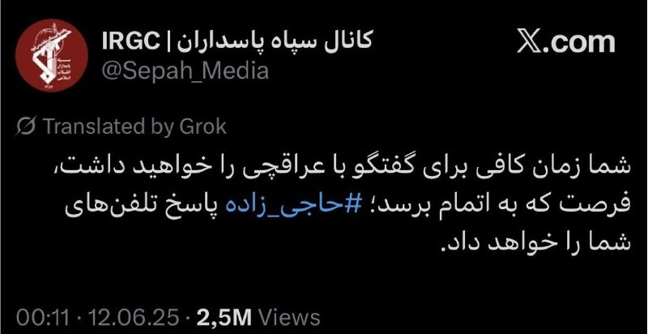

دقیقا یکسال از این توییت طلایی گذشت :))))))))

@Dirty_Kids 👻

## Dirty_Kids — post 391829

  

وقتی بلاگر شهرستونمون میفته توی خط مد:

@Dirty_Kids 👻

## alonews — post 127462

  <a href="telegram/content/alonews_127462_1781286207.webm" target="_blank">🎬 Download video</a>

🔴فوری / الحدث: وزیر خارجه پاکستان امشب عازم ژنو می‌شود.

✅ @AloNews خبر جنگ

## alonews — post 127461

  <a href="telegram/content/alonews_127461_1781286207.webm" target="_blank">🎬 Download video</a>

👈سخنگوی وزارت خارجه: در مورد متن تفاهم ما در مراحل جمع‌بندی در داخل هستیم

🔴همین الان جلسهٔ نهادهای ذی‌ربط درحال برگزاری است

🔴هیچ‌کدام از گمانه‌زنی‌ها دربارۀ متن تفاهمات را نمی‌توانم تایید کنم

🔴اینکه دربارۀ جزئیات روند دیپلماتیک نمی‌توان صحبت کرد به معنای نامحرم‌بودن مردم نیست.

🔴در مورد زمان و مکان امضای تفاهم نمی‌توان نظر داد و باید اول منتظر بمانیم تصمیم نهایی در داخل گرفته شود

✅ @AloNews خبر جنگ

## alonews — post 127460

  <a href="telegram/content/alonews_127460_1781286208.webm" target="_blank">🎬 Download video</a>

👈یک مقام آمریکایی به خبرگزاری فرانسه: توافق با ایران شامل لبنان نیز می‌شود.

✅ @AloNews خبر جنگ

---
📅 بروزرسانی: 1405/03/22 21:03
---

## VahidOOnLine — post 245182

  <a href="telegram/content/VahidOOnLine_245182_1781285608.mp4" target="_blank">🎬 Download video</a>

♦️امانوئل مکرون، رئیس‌جمهوری فرانسه، در کاخ الیزه میزبان مارک کارنی، نخست‌وزیر کانادا، بود. این دیدار تنها چند روز پیش از آغاز نشست گروه ۷ در شهر اویان برگزار شد.
گفته می‌شود دو طرف در این دیدار درباره موضوعات کلیدی بین‌المللی از جمله تحولات اقتصادی، امنیتی و همکاری‌های دوجانبه گفت‌وگو کردند. این رایزنی‌ها در حالی انجام شده که رهبران کشورهای صنعتی جهان خود را برای حضور در نشست گروه ۷ آماده می‌کنند.
‌🇸🇦 Indypersian

🤖 @VahidOOnLine

## WithYashar — post 14656

آکسیوس: ترامپ به بنیامین نتانیاهو نخست وزیر اسرائیل خبر داد زمان پایان دادن به جنگ ایران فرا رسیده
@withyashar

## WithYashar — post 14655

بقایی، سخنگوی هیأت مذاکره:

همین الان جلسهٔ نهادهای ذی‌ربط درحال برگزاری است؛ در مورد متن تفاهم ما در مراحل جمع‌بندی در داخل هستیم

اینکه گفته می‌شود ما خیلی به تفاهم نزدیک هستیم، حرف جدیدی نیست

مشکلی که ما در این مدت داشتیم اظهارات ضدونقیض طرف مقابل است.
@withyashar

## WithYashar — post 14654

ترامپ: جمهوری اسلامی به‌طور محرمانه بابت ارائه اطلاعات نادرست در مورد توافق عذرخواهی کرد.
@withyashar 😁

## mwarmonitor — post 10789

🔴شبکه کان اسرائیل به نقل از یک منبع: رهبری سیاسی از ارتش خواسته است عملیات‌های خود در جنوب لبنان را کاهش دهد تا به توافق احتمالی آمریکا با ایران آسیبی وارد نشود.

@mwarmonitor

## mwarmonitor — post 10788

🔴یک مقام ارشد دولت ترامپ جزئیات آنچه در یادداشت تفاهم آمده را این‌گونه توضیح داد: 1. بازگشایی تنگه هرمز و لغو محاصره آمریکا علیه بنادر ایران. 2. برچیدن برنامه هسته‌ای ایران، از جمله دریافت مواد غنی‌شده ایران توسط آمریکا؛ این مقام گفت این مواد در محل نابود…

## mwarmonitor — post 10787

🔴یک مقام ارشد دولت ترامپ توضیح داده است که از نگاه آنها ایران از این توافق چه چیزی به دست می‌آورد: 🔸«ایرانی‌ها در زمان امضای یادداشت تفاهم (MOU) یا صرفِ انجام مذاکرات، چیزی دریافت نمی‌کنند. آنچه دریافت می‌کنند، پاداش‌های اقتصادی در قبال پایبندی به تعهداتشان…

## mwarmonitor — post 10786

🔴یک مقام ارشد دولت ترامپ توضیح داده است که از نگاه آنها ایران از این توافق چه چیزی به دست می‌آورد:

🔸«ایرانی‌ها در زمان امضای یادداشت تفاهم (MOU) یا صرفِ انجام مذاکرات، چیزی دریافت نمی‌کنند. آنچه دریافت می‌کنند، پاداش‌های اقتصادی در قبال پایبندی به تعهداتشان در چارچوب توافق است.»

🔸او افزود: «بنابراین، اگر طبق وعده مواد هسته‌ای را تحویل دهند، امتیازی دریافت می‌کنند؛ اگر برنامه‌ها یا تأسیسات هسته‌ای خود را برچینند، امتیاز دیگری خواهند گرفت. اگر واقعاً به صلح و ثبات منطقه‌ای متعهد شوند، امتیازات بیشتری علاوه بر آن دریافت می‌کنند. ساختار این توافق به‌گونه‌ای است که اگر آنها به تعهداتشان عمل کنند، ما هم به تعهدات خود عمل خواهیم کرد.» CNN

@mwarmonitor

## DEJradio — post 5621

  <a href="telegram/content/DEJradio_5621_1781285610.webm" target="_blank">🎬 Download video</a>

🔺🎥 "چهارشنبه سه پهباد انتحاری از پایگاه هوایی بوشهر شلیک شد که یکیش افتاد تو منازل سازمانی، خسارت وارد کرد و دوتا ماشین مربوط به پرسنل پایگاه آتیش گرفت...

#پهباد #ارتش
@DEJradio

## VahidOnline — post 76275

محمود نبویان، عضو کمیسیون امنیت ملی مجلس شورای اسلامی، در ایکس نوشت: با مشاهده‌ی متن توافق باید اعلام کنم، نسبت به دو نسخه‌ی قبلی، خسارت بارتر و عقب‌نشینی‌های ایران نیز بیشتر شده است.
@VahidOOnLine

📡 @VahidOnline

## IranIntlTV — post 341924

  <a href="telegram/content/IranIntlTV_341924_1781285610.mp4" target="_blank">🎬 Download video</a>

امشب و بامداد فردا به وقت ایران، دو میزبان جام جهانی به میدان خواهند رفت. کانادا در تورنتو میزبان بوسنی و هرزگوین و آمریکا در لس‌آنجلس میزبان پاراگوئه خواهد بود.

روز گذشته نیز بازی افتتاحیه جام جهانی در مکزیک برگزار شد.

گزارش رضا محدث، خبرنگار ایران‌اینترنشنال
@iranintltv

## Persian_Trend_Official — post 16877

به گفته رویترز مقام‌های آمریکایی برآورد می‌کنند که احتمال امضای توافق میان ایران و آمریکا بین 80 تا 85 درصد است. 📝 Amir 📌 @persian_trend_official پرشین ترند | متفاوت‌ترین کانال نظامی

## Persian_Trend_Official — post 16876

  <a href="telegram/content/Persian_Trend_Official_16876_1781285612.webm" target="_blank">🎬 Download video</a>

به گفته رویترز مقام‌های آمریکایی برآورد می‌کنند که احتمال امضای توافق میان ایران و آمریکا بین 80 تا 85 درصد است.

📝 Amir

📌 @persian_trend_official
پرشین ترند | متفاوت‌ترین کانال نظامی

## Persian_Trend_Official — post 16872

  <a href="telegram/content/Persian_Trend_Official_16872_1781285612.mp4" target="_blank">🎬 Download video</a>

🛩تیم‌های Thunderbirds نیروی هوایی ایالات متحده و Blue Angels نیروی دریایی ایالات متحده یک آرایش «سوپر دلتا» را در بالای کاخ سفید و بنای یادبود واشنگتن در طول تمرین امروز برای رویداد UFC Freedom 250 آینده اجرا کردند.

👺Phantom

📌 @persian_trend_official
پرشین ترند | متفاوت‌ترین کانال نظامی

## RadioFarda — post 158233

  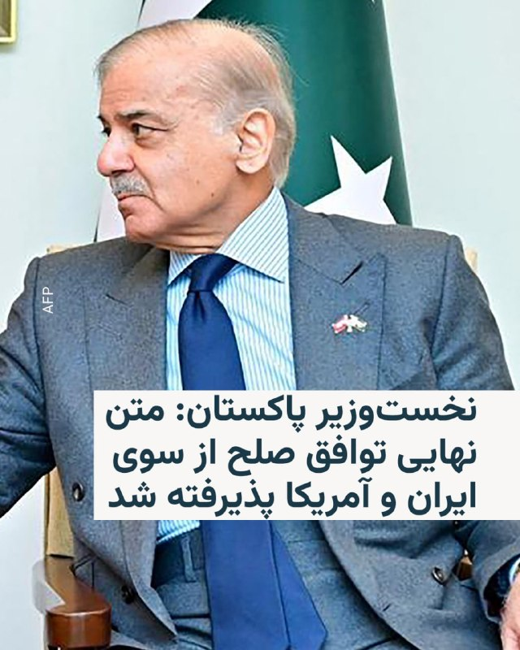

🔸شهباز شریف، نخست‌وزیر پاکستان، روز جمعه اعلام کرد که متن نهایی توافق صلح میان آمریکا و ایران مورد پذیرش طرفین قرار گرفته است.

🔸او در پیامی در شبکه ایکس نوشت: «می‌توانیم تأیید کنیم که متن نهایی و مورد توافق برای صلح حاصل شده است و پاکستان اکنون از نزدیک با هر دو طرف همکاری می‌کند تا مراحل بعدی نهایی شود.»

🔸شریف در این پیام، رئیس‌جمهورهای آمریکا و ایران و همچنین دیگر رهبران دو کشور را نیز مخاطب قرار داد. پاکستان طی ماه‌های گذشته نقش میانجی میان تهران و واشینگتن را بر عهده داشته و یک دور مذاکره حضوری بین طرفین نیز در اسلام‌آباد برگزار شد.

🔸او افزود: «صلح هرگز تا این اندازه نزدیک نبوده است.»

🔸شهباز شریف همچنین گفت: «در بحبوحه تلاش‌های فشرده و مستمر پاکستان برای میانجیگری، ما کاملاً از کارزار بی‌وقفه انتشار اطلاعات نادرست که از سوی کسانی به راه افتاده که می‌خواهند توافق صلح را تخریب کنند، آگاه هستیم.»

@RadioFarda

## IranianMinds — post 22421

  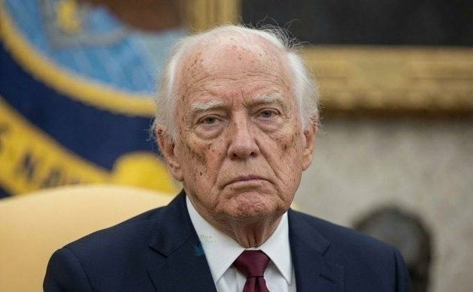

ترامپ در سال 2049:

ایرانی‌ها هر لحظه ممکن است توافق را امضاء کنند.

@IranianMinds

## IranianMinds — post 22420

  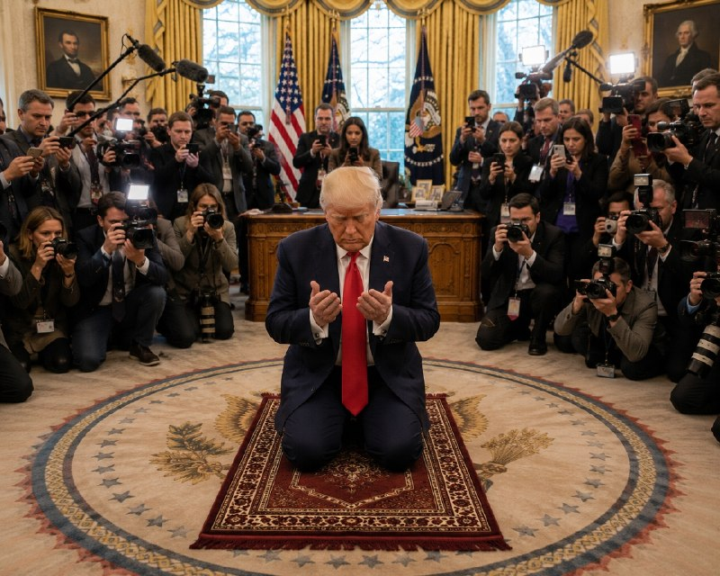

🔴ترامپ به زودی تو کاخ سفید

@IranianMinds

## Dirty_Kids — post 391827

‏«یه جور این عکسای مارو بگیر، این ساعت من بیفته.» @Dirty_Kids 👻

## Hranews — post 113563

دانشگاه تهران؛ ۲ دانشجو با احکام اخراج مواجه شدند

❗️
❗️
❗️
❗️
❗️ – دو #دانشجو دانشگاه تهران توسط کمیته انضباطی این دانشگاه به #اخراج از دانشگاه محکوم شدند. این رای در ارتباط با اعتراضات سراسری ۱۴۰۴ و به دلایلی از جمله آنچه «ایجاد آشوب و اخلال در روند آموزشی در اسفندماه ۱۴۰۴» و «آتش کشیدن پرچم کشور» عنوان شده، صادر شده است.

ادامه مطلب

↘️
@hranews_bot تماس ✉️ -  @Hranews  کانال هرانا 🆑

---
📅 بروزرسانی: 1405/03/22 20:53
---

## VahidOOnLine — post 245181

  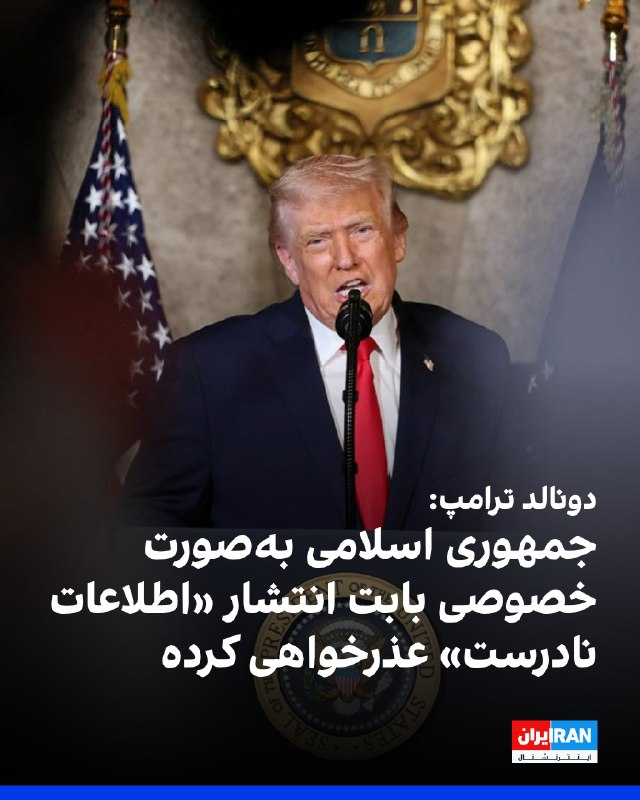

اکسیوس گزارش داد دونالد ترامپ، پیام عباس عراقچی در شبکه ایکس را «بسیار مثبت» ارزیابی کرد و گفت معتقد است توافق با جمهوری اسلامی می‌تواند در آخر هفته یا روز دوشنبه امضا شود.

اکسیوس همچنین به نقل از ترامپ نوشت که جمهوری اسلامی به صورت خصوصی بابت انتشار «اطلاعات نادرست» عذرخواهی کرده است.
‌🏁 🇬🇧 IranintlTV

🤖 @VahidOOnLine

## WithYashar — post 14653

ثابتی:متن توافق احتمالی از برجام هم ضعیف‌تره و نه گشایش اقتصادی ایجاد می‌کنه و نه جلوی جنگ رو می‌گیره
@withyashar

## mwarmonitor — post 10785

🚨رویترز به نقل از یک مقام ارشد در دولت آمریکا: واشنگتن بر اساس توافق با ایران، مواد غنی‌شده را دریافت خواهد کرد.

@mwarmonitor

## mwarmonitor — post 10784

🔴شبکه ۱۲ اسرائیل به نقل از یک مقام ارشد آمریکایی گزارش داده است: رئیس‌جمهور ترامپ در تماس دیروز خود به نتانیاهو گفته است: «این توافق است، توافقی عالی است، و وقت آن رسیده که این جنگ پایان یابد.»

🔹بر اساس این مقام، نتانیاهو در طول این گفتگو واکنش زیادی نشان نداده و بیشتر سکوت کرده است.

@mwarmonitor

## FoxNewsTwitter — post 342907

‌Fox News (Twitter/X)

Read more 👉

## FoxNewsTwitter — post 342906

  

Fox News (Twitter/X)

BREAKING: Elon Musk has become the world's first trillionaire.

After SpaceX raised a record $75 billion in its IPO, Musk’s net worth shot up to top $1.1 trillion when the stock began trading Friday, putting him in an economic class of his own.

Combined with his holdings in electric vehicle maker Tesla, as well as other investments and assets, Musk's net worth is now estimated at about $1.1 trillion.

Musk's stake in the rocket and satellite company alone is now estimated at a staggering $690 billion, but it's also a life-changing moment for thousands of workers at the company who hold equity.

Investors who watched Musk help turn Tesla into an automotive giant are now betting he can do the same in space and artificial intelligence, as SpaceX launches the largest IPO in history.

## IranIntlTV — post 341923

  

اکسیوس گزارش داد دونالد ترامپ، پیام عباس عراقچی در شبکه ایکس را «بسیار مثبت» ارزیابی کرد و گفت معتقد است توافق با جمهوری اسلامی می‌تواند در آخر هفته یا روز دوشنبه امضا شود.

اکسیوس همچنین به نقل از ترامپ نوشت که جمهوری اسلامی به صورت خصوصی بابت انتشار «اطلاعات نادرست» عذرخواهی کرده است.
https://iranintl.com/202606128565

## DW_Farsi — post 125906

  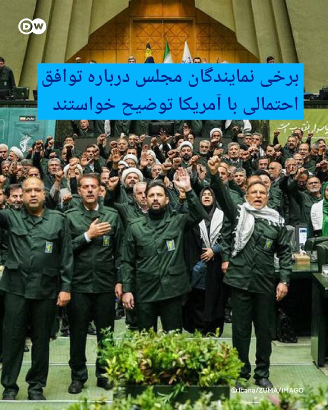

🔶 برخی نمایندگان مجلس درباره توافق احتمالی با آمریکا توضیح خواستند

جمعی از نمایندگان مجلس در نامه‌ای خطاب به محمدباقر قالیباف، رئیس تیم مذاکرات با آمریکا، و محمدباقر ذوالقدر، دبیر شورای عالی امنیت ملی، خواستار توضیح درباره متن و فرامتن پیام‌های مبادله‌شده تاکنون با دولت آمریکا شدند.

امضاکنندگان این نامه نوشته‌اند با توجه به سابقه "بدعهدی" آمریکا و پرسش‌های مردم، لازم است درباره ابعاد توافق احتمالی با واشنگتن پاسخ داده شود تا به گفته آنان "اطمینان قلب" مردم و نمایندگان نسبت به حفظ دستاوردهای بیش از ۱۰۰ روز مقاومت حاصل شود.

نمایندگان در این نامه خواسته‌اند روشن شود نسبت متن‌های مبادله‌شده با شروط مندرج در بیانیه ۱۹ فروردین ۱۴۰۵ شورای عالی امنیت ملی و نیز خطوط قرمز اعلامی رهبر جمهوری اسلامی چیست.

آنان همچنین پرسیده‌اند آیا در متون ردوبدل‌شده، به‌صراحت بر باقی ماندن تنگه هرمز و خلیج فارس تحت مدیریت و اعمال حاکمیت جمهوری اسلامی تأکید شده یا نه.
@dw_farsi

## BBCPersian — post 283588

‌ وزیر دفاع اسرائیل می‌گوید این کشور باید اطمینان حاصل کند که مستقلا می‌تواند مانع دستیابی ایران به سلاح هسته‌ای شود. اسرائیل کاتس اشاره کرد که دونالد ترامپ از منظر منافع آمریکا به دنبال رسیدن به توافق با ایران است. آقای کاتس در عین حال گفت که بسیاری از…

## BBCPersian — post 283587

  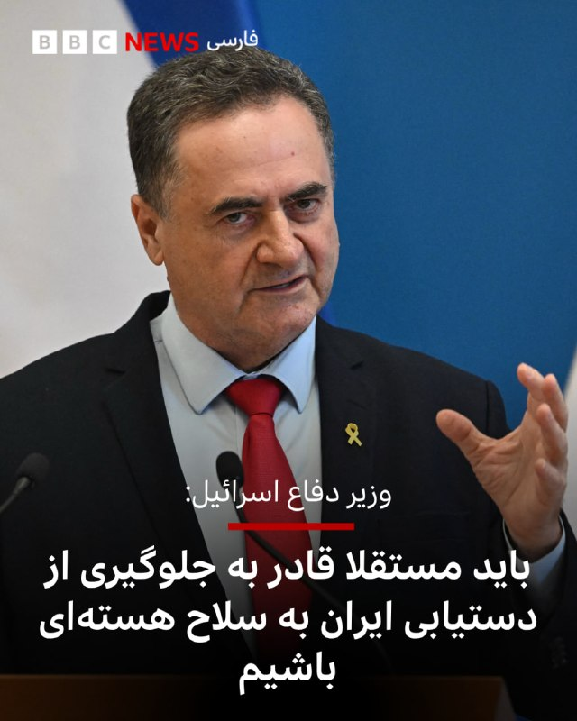

‌
وزیر دفاع اسرائیل می‌گوید این کشور باید اطمینان حاصل کند که مستقلا می‌تواند مانع دستیابی ایران به سلاح هسته‌ای شود.

اسرائیل کاتس اشاره کرد که دونالد ترامپ از منظر منافع آمریکا به دنبال رسیدن به توافق با ایران است.

آقای کاتس در عین حال گفت که بسیاری از منافع دو کشور مشترک است مانند جلوگیری از دستیابی ایران به سلاح هسته‌ای؛ او افزود که اسرائیل از رئیس‌جمهور آمریکا انتظار دارد که مسائل مربوط به برنامه موشکی و «گروه‌های نیابتی تروریستی» را هم پیگیری کند.

آقای کاتس گفت که او و بنیامین نتانیاهو، نخست‌وزیر اسرائیل، به ارتش دستور داده‌اند تا برای جلوگیری از دستیابی ایران به سلاح هسته‌ای، آمادگی لازم را داشته باشد.

ایران همواره تاکید داشته است که برنامه اتمی‌اش صرفا برای مقاصد صلح‌آمیز است.

📷AFP VIA GETTY
@BBCPersian

## Dirty_Kids — post 391826

  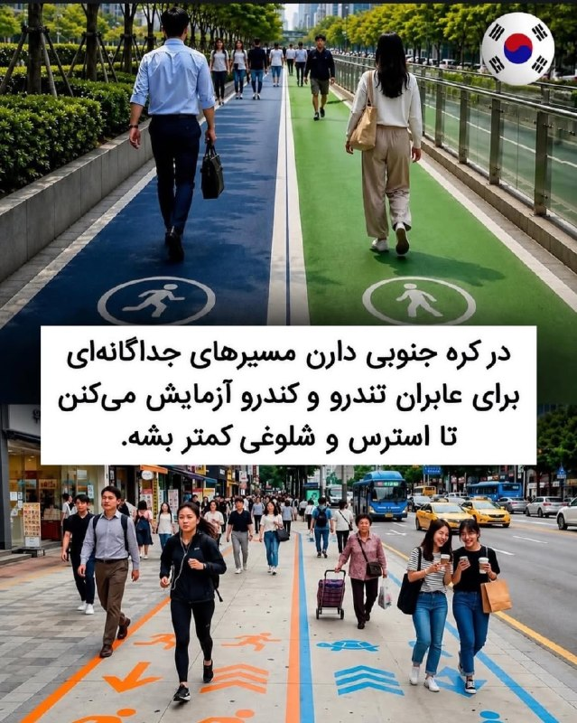

ما اینجا واسه نفس کشیدن می‌جنگیم

@Dirty_Kids 👻

## Dirty_Kids — post 391825

  <a href="telegram/content/Dirty_Kids_391825_1781285002.mp4" target="_blank">🎬 Download video</a>

شیوه جدید لب گرفتن و بوسیدن همدیگه توی فیلمای ایرانی:

@Dirty_Kids 👻

## Dirty_Kids — post 391824

  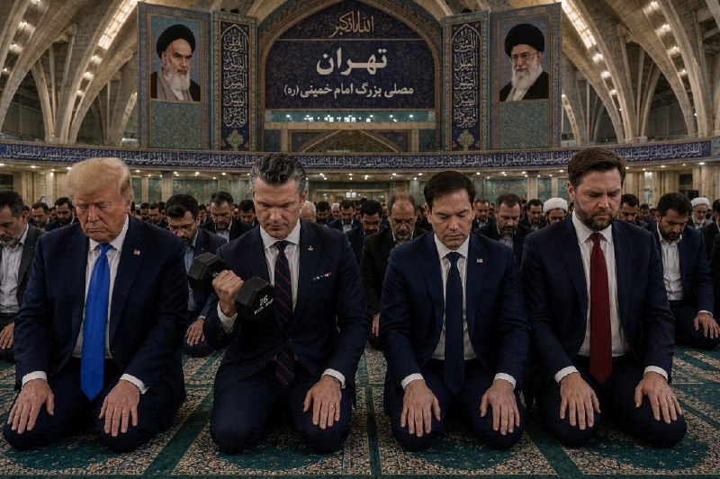

بزودی:

@Dirty_Kids 👻

## alonews — post 127459

  <a href="telegram/content/alonews_127459_1781285003.webm" target="_blank">🎬 Download video</a>

👈یک مقام آمریکایی به رویترز : نمی‌توان تاریخ مشخصی برای امضای توافق ایران ارائه داد

🔴فکر می‌کنم داریم به تعیین تاریخ و محل امضا نزدیک می‌شیم

✅ @AloNews خبر جنگ

## alonews — post 127458

  <a href="telegram/content/alonews_127458_1781285004.webm" target="_blank">🎬 Download video</a>

👈 مقام آمریکایی به رویترز: توافق‌نامه ایران اهداف اصلی ایالات متحده را محقق می‌کند.

🔴 توافق‌نامه تنگه هرمز را دوباره باز می‌کند.

🔴 ایالات متحده مواد هسته‌ای غنی‌شده را دریافت خواهد کرد.


🔴توافق با ایران شامل یک رژیم بازرسی است

🔴 اگر ایران پایبند باشد، از نظر اقتصادی پاداش داده خواهد شد.

🔴 مزایا برای ایران تنها در صورتی محقق می‌شود که واقعاً تعهدات خود را اجرا کنند

🔴منابع تخمین می‌زنند که احتمال امضای توافق‌نامه ایران بین ۸۰ تا ۸۵ درصد است.

✅ @AloNews خبر جنگ

## alonews — post 127457

  <a href="telegram/content/alonews_127457_1781285004.webm" target="_blank">🎬 Download video</a>

🔴فوری/آکسیوس: ترامپ به نتانیاهو اطلاع داد که زمان پایان دادن به جنگ با ایران فرا رسیده است

✅ @AloNews خبر جنگ

---
📅 بروزرسانی: 1405/03/22 20:44
---

## VahidOOnLine — post 245180

  

محمود نبویان، عضو کمیسیون امنیت ملی مجلس، در ایکس نوشت متن توافق با آمریکا نسبت به دو نسخه قبلی خسارت‌بارتر شده و میزان عقب‌نشینی‌های ما نیز بیشتر شده است.
او ششم خرداد در ایکس پرسیده بود چرا جمهوری اسلامی باید بعد از حمله آمریکا و کشته شدن خامنه‌ای درباره موضوعات هسته‌ای تعهد بدهد.

‌🏁 🇬🇧 IranintlTV

🤖 @VahidOOnLine

## VahidOOnLine — post 245179

  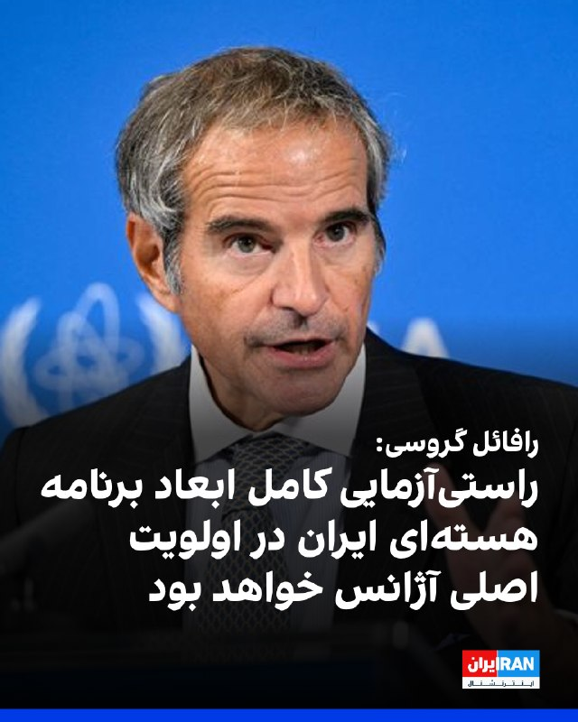

رافائل گروسی، مدیرکل آژانس بین‌المللی انرژی اتمی، در جمع خبرنگاران گفت در حالی که جمهوری اسلامی و آمریکا به یک توافق احتمالی برای پایان دادن به جنگ در خاورمیانه نزدیک می‌شوند، راستی‌آزمایی کامل ابعاد برنامه هسته‌ای ایران در اولویت اصلی این نهاد خواهد بود.

مدیرکل آژانس گفت: «ما باید همه چیز را بررسی کنیم؛ همه چیز را.»
‌🏁 🇬🇧 IranintlTV

🤖 @VahidOOnLine

## pm_afshaa — post 93706

ثابتی:متن توافق احتمالی از برجام هم ضعیف‌تره و نه گشایش اقتصادی ایجاد می‌کنه و نه جلوی جنگ رو می‌گیره

💧 Rainbet.com the #1 Non-KYC Crypto Casino & Sportsbook @rainbetcom

😁 @Pm_Afshaa

## VahidOnline — post 76274

  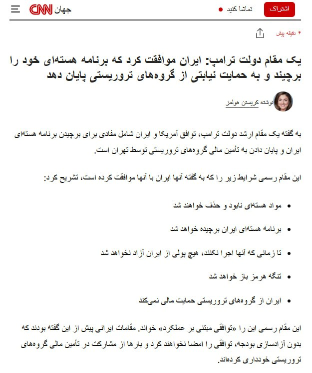

سی‌ان‌ان به نقل از یک مقام ارشد دولت ترامپ گزارش داد توافق با جمهوری اسلامی شامل برچیدن برنامه هسته‌ای ایران و پایان دادن به حمایت مالی تهران از گروه‌های تروریستی است.

سی‌ان‌ان به نقل از مقام ارشد دولت ترامپ افزود که جمهوری اسلامی با «برچیدن برنامه هسته‌ای، نابودی و خروج مواد هسته‌ای، آزاد نشدن دارایی‌ها تا زمان اجرای تعهدات، باز ماندن تنگه هرمز و توقف حمایت مالی از گروه‌های تروریستی» موافقت کرده است.

مقام ارشد دولت ترامپ گفت مقام‌های جمهوری اسلامی پیش‌تر گفته بودند بدون آزادسازی دارایی‌ها توافقی را امضا نخواهند کرد و بارها از گفت‌وگو درباره حمایت مالی از گروه‌های تروریستی خودداری کرده بودند.
@VahidOOnLine

📡 @VahidOnline

## IranIntlTV — post 341922

  <a href="telegram/content/IranIntlTV_341922_1781284479.mp4" target="_blank">🎬 Download video</a>

ستاد فرماندهی مرکزی آمریکا اعلام کرد از زمان آغاز محاصره دریایی ایران، ۱۳۶ شناور را وادار به تغییر مسیر کرده و ۹ شناور دیگر را هنگام عبور از تنگه هرمز متوقف کرده است.
سنتکام تاکید کرد به ماموریت خود در آب‌های منطقه ادامه می‌دهد.

گزارش اردوان روزبه، خبرنگار ایران‌اینترنشنال
@iranintltv

## IranIntlTV — post 341921

  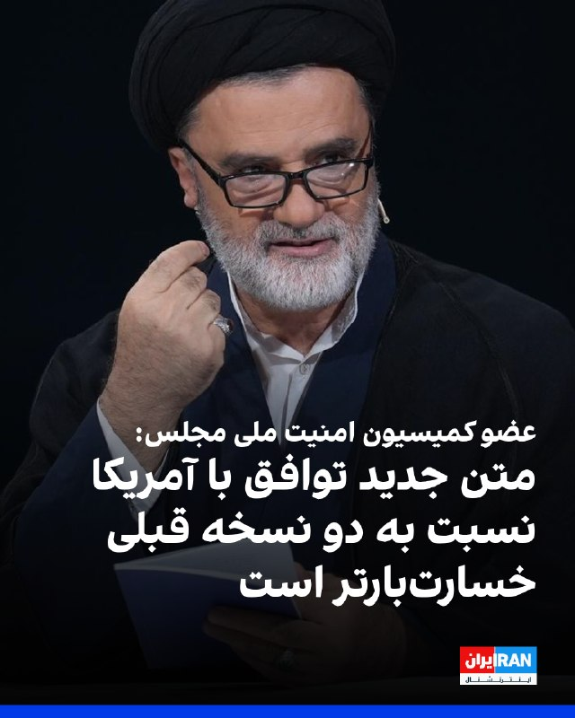

محمود نبویان، عضو کمیسیون امنیت ملی مجلس، در ایکس نوشت متن توافق با آمریکا نسبت به دو نسخه قبلی خسارت‌بارتر شده و میزان عقب‌نشینی‌های ما نیز بیشتر شده است.
او ششم خرداد در ایکس پرسیده بود چرا جمهوری اسلامی باید بعد از حمله آمریکا و کشته شدن خامنه‌ای درباره موضوعات هسته‌ای تعهد بدهد.

https://iranintl.com/202606124088

## IranIntlTV — post 341920

  <a href="telegram/content/IranIntlTV_341920_1781284482.mp4" target="_blank">🎬 Download video</a>

وای‌نت گزارش داد نتانیاهو در گفت‌وگو با ترامپ تاکید کرده تمایل او برای دستیابی به توافق با تهران را درک می‌کند، اما معتقد است چنین توافقی شکل نخواهد گرفت.

نتانیاهو همچنین تاکید کرده اسرائیل اجازه نخواهد داد قربانی این توافق شود.

گزارش اشکان صفایی، خبرنگار ایران‌اینترنشنال
@iranintltv

## IranIntlTV — post 341919

  

رافائل گروسی، مدیرکل آژانس بین‌المللی انرژی اتمی، در جمع خبرنگاران گفت در حالی که جمهوری اسلامی و آمریکا به یک توافق احتمالی برای پایان دادن به جنگ در خاورمیانه نزدیک می‌شوند، راستی‌آزمایی کامل ابعاد برنامه هسته‌ای ایران در اولویت اصلی این نهاد خواهد بود.

مدیرکل آژانس گفت: «ما باید همه چیز را بررسی کنیم؛ همه چیز را.»
https://iranintl.com/202606123768

## Persian_Trend_Official — post 16871

  <a href="telegram/content/Persian_Trend_Official_16871_1781284485.webm" target="_blank">🎬 Download video</a>

پس چیشد ؟
چرا ابرقدرت چهارم داره عقب نشینی میکنه ؟

## Persian_Trend_Official — post 16870

  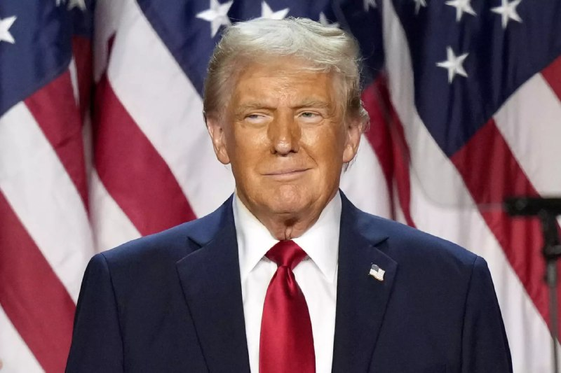

ترامپ به اکسیوس گفت که خواستار توضیح عمومی در مورد گزارش‌های رسانه‌های دولتی ایران شده است که ادعا می‌کردند ایران بلافاصله پس از امضای توافق، میلیاردها دلار از دارایی‌های مسدود شده خود را دریافت خواهد کرد.

ترامپ گفت که ایران به طور خصوصی به خاطر ارائه اطلاعات نادرست عذرخواهی کرده است، اگرچه مشخص نیست که چنین پیامی چگونه منتقل شده است.

📝 Amir

📌 @persian_trend_official
پرشین ترند | متفاوت‌ترین کانال نظامی

## Persian_Trend_Official — post 16869

  <a href="telegram/content/Persian_Trend_Official_16869_1781284487.webm" target="_blank">🎬 Download video</a>

ترامپ، رئیس جمهور امریکا به اکسیوس گفته است که سمت عباس عراقچی، وزیر امور خارجه ایران را بسیار مثبت می‌داند.

📝 Amir

📌 @persian_trend_official
پرشین ترند | متفاوت‌ترین کانال نظامی

## Persian_Trend_Official — post 16868

  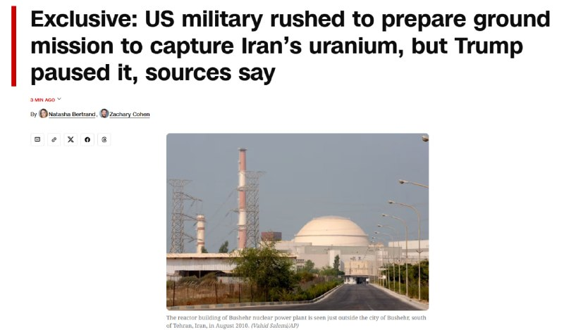

خبرگزاری CNN: ایالات متحده به بررسی یک عملیات زمینی بزرگ برای تصرف اورانیوم غنی‌شده با غنای بالا ایران نزدیک شده بود و دن کین، رئیس ستاد مشترک ارتش، در ماه مه سفری عجولانه و مخفیانه به مقر فرماندهی مرکزی در فلوریدا داشت تا قبل از ارائه گزارش به رئیس جمهور ترامپ، برنامه‌ها را بررسی کند.

این عملیات در نهایت به دلیل نگرانی از اینکه می‌تواند باعث انتقام شدید ایران، طولانی شدن جنگ، آسیب به اقتصاد جهانی و تلفات قابل توجه نیروهای آمریکایی شود، متوقف شد. برنامه‌ریزان نظامی این مأموریت را دارای ریسک زیاد تا شدید ارزیابی کردند که به طور بالقوه مستلزم ورود صدها نیروی عملیات ویژه به سایت‌های هسته‌ای زیرزمینی به شدت مستحکم است.

در حالی که اطلاعات ایالات متحده معتقد است که از مکان‌های این مواد (فردو، نطنز و اصفهان) آگاه است، کارشناسان هسته‌ای این سوال را مطرح می‌کنند که آیا می‌توان آن را در طول یک عملیات جنگی به طور ایمن پیدا و حذف کرد.

📝 Amir

📌 @persian_trend_official
پرشین ترند | متفاوت‌ترین کانال نظامی

## IranianMinds — post 22419

🔴ترامپ:
جمهوری اسلامی به‌طور محرمانه بابت ارائه اطلاعات نادرست در مورد توافق عذرخواهی کرد.

@IranianMinds

## IranianMinds — post 22418

  <a href="telegram/content/IranianMinds_22418_1781284488.webm" target="_blank">🎬 Download video</a>

اگر میخوای بازی های #جام_جهانی رو بدون استرس و کمترین ریسک ممکن پیش بینی کنی حتما یه سر به #رومابت بزن.

⭕️ ⚽ کانادا 🟢 بوسنی

⭕️ ⚽ امریکا 🟢 پاناما

💳 حسابتو برای این بازی در #رومابت با ارز دیجیتال شارژ کن 
🅰️
🅰️
🅰️ شارژ اضافی بگیر ✅

💰 10% کش بک روی تیم محبوبت

💰   100% بونوس خوشامدگویی

🎁 20% کش بک بازی های کازینویی و انفجار

🔥   همراه با درگاه‌ #ریالی
#RomaBet

📣‌ #بدون_احراز_هویت

1️⃣
2️⃣
3️⃣
4️⃣   
1️⃣
2️⃣
3️⃣
4️⃣

⛔در صورت فیلتر بودن از طریق VPN غیر از سرور انگلیس ( سرور 
🇺🇸 
🇩🇪 
🇨🇦
🇫🇮
🇹🇷
👇
👇 )

🇪🇺 https://trentivo6402.bar

✅کانال تلگرامی #رومابت 22
👇

🔵 @Romabet_official

## IranianMinds — post 22417

🔴 ترامپ :
من پست عراقچی، وزیر امورخارجه ایران، درباره توافق رو بسیار مثبت ارزیابی میکنیم.

@IranianMinds

## IranianMinds — post 22416

## BBCPersian — post 283586

  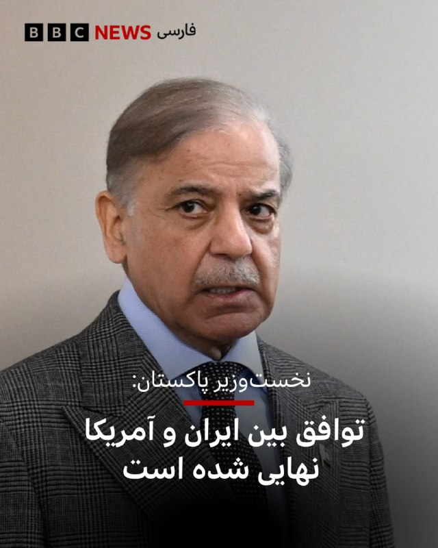

‌
پاکستان که میانجی آتش‌بس بین ایران و آمریکا و واسطه مذاکرات دو کشور برای پایان جنگ است، می‌گوید که توافق بین آنها نهایی شده است.

شهباز شریف، نخست‌وزیر پاکستان، اعلام کرد که متن نهایی و مورد توافق توافق صلح بین ایران و ایالات متحده تکمیل شده است.

آقای شریف در پستی در ایکس نوشته است «در میانه تلاش‌های فشرده میانجی‌گرانه پاکستان، ما کاملاً از کارزار بی‌وقفه انتشار اطلاعات نادرست که از سوی طرف‌هایی که با هدف خراب کردن توافق صلح انجام می‌شود، آگاهیم. با کنار گذاشتن این حاشیه‌ها، می‌توانیم تأیید کنیم که متن نهایی و مورد توافق حاصل شده است و پاکستان اکنون به‌طور نزدیک با هر دو طرف برای نهایی‌سازی مراحل بعدی همکاری می‌کند.»

او نوشته است:«صلح هرگز تا این حد نزدیک نبوده است.»

نخست‌وزیر پاکستان حساب کاربری روسای جمهور ایران و آمریکا، وزرای خارجه دو کشور و همچنین استیو ویتکاف، فرستاده ویژه رئیس جمهور ایالات متحده و جی دی ونس، معاون اول او را هم پای پست خود قرار داده است.

📷REUTERS
@BBCPersian

## idfinfarsi — post 11839

  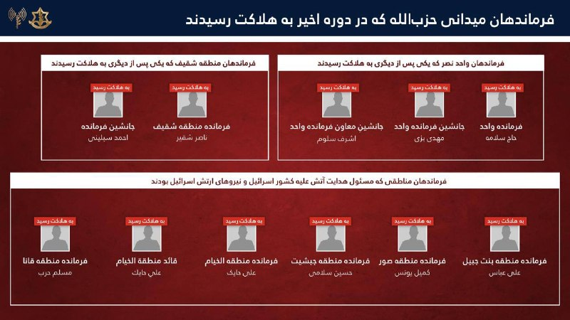

از زمان آغاز آتش‌بس: بیش از ۱۳۰۰ تروریست حزب‌الله در مناطق مختلف لبنان به هلاکت رسیده‌اند

ارتش اسرائیل اکنون فاش می‌کند که در دوره اخیر، بیش از ۱۰ فرمانده میدانی از سازمان تروریستی حزب‌الله که هدایت نیروهای این سازمان را در نبرد علیه نیروهای ارتش اسرائیل و کشور اسرائیل بر عهده داشتند، به هلاکت رسیده‌اند.

در میان فرماندهان برجسته‌ای که به هلاکت رسیدند، فرمانده واحد «نصر»، تروریست حاج سلامه قرار دارد. در کمتر از دو ماه پس از هلاکت او، ارتش اسرائیل دو جانشین وی را نیز یکی پس از دیگری از پا درآورد: مهدی بزی و اشرف سلوم.

همچنین، در کمتر از ۱۲ ساعت، ارتش اسرائیل فرمانده منطقه «شقیف» ناصر شقیر و جانشین او احمد سبلینی را که پیش‌تر معاون او بود و به‌عنوان جانشین منصوب شده بود، به هلاکت رساند.

ارتش اسرائیل اکنون تأیید می‌کند که این افراد از مهم‌ترین فرماندهان میدانی حزب‌الله هستند که در دوره اخیر به هلاکت رسیده‌اند:
فرمانده منطقه بنت جبیل - علی عباس
فرمانده منطقه صور - کمیل یونس
فرمانده منطقه حجیر - فؤاد موسی
فرمانده منطقه جبشیت - حسین سلامی
فرمانده منطقه الخیام - علی حایک
فرمانده منطقه قانا - مسلم حرب

ارتش اسرائیل به هدف قرار دادن فرماندهان سازمان تروریستی حزب‌الله که مسئول مستقیم هدایت آتش به‌سوی شهروندان کشور اسرائیل و نیروهای ارتش اسرائیل هستند، ادامه خواهد داد.

## alonews — post 127456

  <a href="telegram/content/alonews_127456_1781284490.webm" target="_blank">🎬 Download video</a>

👈ترامپ در سال 2049: ایرانی‌ها هر لحظه ممکن است توافقی را امضا کنند

✅ @AloNews خبر جنگ

---
📅 بروزرسانی: 1405/03/22 20:33
---

## VahidOOnLine — post 245178

  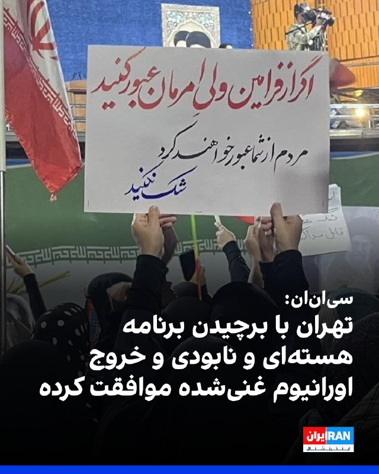

سی‌ان‌ان به نقل از یک مقام ارشد دولت ترامپ گزارش داد توافق با جمهوری اسلامی شامل برچیدن برنامه هسته‌ای ایران و پایان دادن به حمایت مالی تهران از گروه‌های تروریستی است.

سی‌ان‌ان به نقل از مقام ارشد دولت ترامپ افزود که جمهوری اسلامی با «برچیدن برنامه هسته‌ای، نابودی و خروج مواد هسته‌ای، آزاد نشدن دارایی‌ها تا زمان اجرای تعهدات، باز ماندن تنگه هرمز و توقف حمایت مالی از گروه‌های تروریستی» موافقت کرده است.

مقام ارشد دولت ترامپ گفت مقام‌های جمهوری اسلامی پیش‌تر گفته بودند بدون آزادسازی دارایی‌ها توافقی را امضا نخواهند کرد و بارها از گفت‌وگو درباره حمایت مالی از گروه‌های تروریستی خودداری کرده بودند.
‌🏁 🇬🇧 IranintlTV

🤖 @VahidOOnLine

## VahidOOnLine — post 245177

♦️گروهی از فعالان با نصب بنری بر روی لوگوی فیفا در شهر تورنتو، به وضعیت غزه اعتراض کردند. روی این بنر شعار اسرائیل را از فیفا اخراج کنید «Kick Israel out of FIFA»  نوشته شده بود.
این اقدام اعتراضی در مقابل محل برگزاری اولین دیدار جام جهانی ۲۰۲۶ در تورنتو وپیش از برگزاری دیدار تیم‌های کانادا و بوسنی‌وهرزگوین انجام شد. تصاویر منتشرشده نشان می‌دهد این حرکت در فضای عمومی و در معرض دید هواداران فوتبال صورت گرفته است.
 فعالان هدف خود از این اقدام را جلب توجه افکار عمومی به تحولات غزه و فشار بر نهادهای بین‌المللی ورزشی عنوان کرده‌اند.
این اعتراض  درحالی انجام شد که تیم ملی اسرائیل در این رقابت‌ها حضور ندارد.
‌🇸🇦 Indypersian

🤖 @VahidOOnLine

## VahidOnline — post 76273

ترامپ گفت که هنوز فکر می‌کند توافقی با ایران می‌تواند در آخر هفته یا روز دوشنبه امضا شود.
BarakRavid
باراک راوید:
رئیس‌جمهور ترامپ در یک تماس کوتاه به من گفت که پست [توییت] عراقچی، وزیر خارجه ایران، را «بسیار مثبت» ارزیابی کرده است.
BarakRavid

📡 @VahidOnline

## kianmeli1 — post 87964

  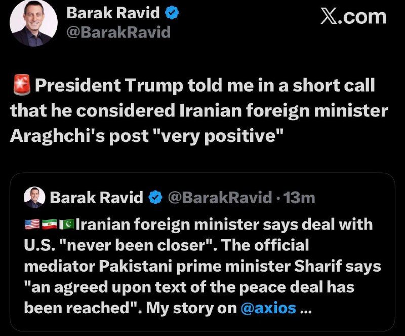

🔴خبرنگار اکسیوس: رئیس جمهور ترامپ در یک تماس کوتاه به من گفت که پست وزیر امور خارجه ایران، عراقچی، را "بسیار مثبت" می‌داند.
https://t.me/kianmeli1

## IranIntlTV — post 341918

  

سی‌ان‌ان به نقل از یک مقام ارشد دولت ترامپ گزارش داد توافق با جمهوری اسلامی شامل برچیدن برنامه هسته‌ای ایران و پایان دادن به حمایت مالی تهران از گروه‌های تروریستی است.

سی‌ان‌ان به نقل از مقام ارشد دولت ترامپ افزود که جمهوری اسلامی با «برچیدن برنامه هسته‌ای، نابودی و خروج مواد هسته‌ای، آزاد نشدن دارایی‌ها تا زمان اجرای تعهدات، باز ماندن تنگه هرمز و توقف حمایت مالی از گروه‌های تروریستی» موافقت کرده است.

مقام ارشد دولت ترامپ گفت مقام‌های جمهوری اسلامی پیش‌تر گفته بودند بدون آزادسازی دارایی‌ها توافقی را امضا نخواهند کرد و بارها از گفت‌وگو درباره حمایت مالی از گروه‌های تروریستی خودداری کرده بودند.
https://iranintl.com/202606125222

## DW_Farsi — post 125905

🔶 طرح آمریکا برای کاهش چشمگیر تجهیزات نظامی در اروپا

روزنامه نیویورک تایمز روز جمعه ١٢ ژانویه به نقل از دو مقام ارشد دولتی در اروپا گزارش داد که طبق برنامه‌های جدید، شمار جنگنده‌های اف-۱۶ و اف-۱۵ ای آمریکا در اروپا از حدود ۱۵۰ فروند به ۱۰۰ فروند کاهش خواهد یافت.

همچنین واشنگتن قصد دارد تعداد هواپیماهای گشت و شناسایی دریایی خود را از ۲۶ به ۱۵ فروند تقلیل داده و تمامی هشت هواپیمای سوخت‌رسان مستقر در اروپا را از این منطقه خارج کند.
@dw_farsi

## BBCPersian — post 283585

  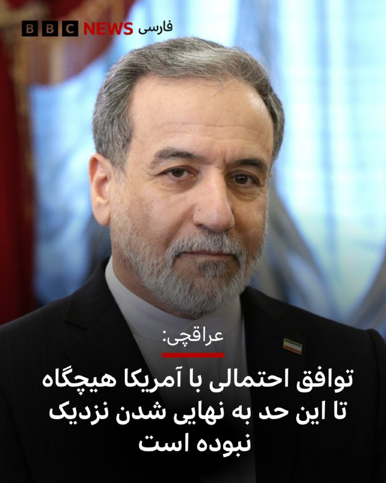

‌
وزیر امور خارجه ایران درباره توافق احتمالی با آمریکا گفت که «تفاهم‌نامه اسلام‌آباد هیچگاه تا این حد به نهایی شدن نزدیک نبوده است.»

او با این حال از رسانه‌ها خواست تا پیش از نهایی شدن توافق، از گمانه‌زنی درباره محتوای آن خودداری کنند.

طی ساعات اخیر که دونالد ترامپ از نزدیک بودن توافق با ایران گفته است، برخی از رسانه‌ها درباره محتوای آن گمانه‌زنی کردند.

پاکستان میانجی آتش‌بس و مذاکرات برای پایان جنگ بین ایران و آمریکا است و از این رو از توافق احتمالی میان دو کشور با نام «تفاهم نامه اسلام آباد» یاد می‌شود.

آقای عراقچی تأکید کرد که ایران در زمان مناسب تمامی جزئیات را به اطلاع عموم خواهد رساند و این رویکرد را بخشی از سیاست «مسئولانه و شفاف» تهران دانست.

کمی قبل از پست آقای عراقچی، دونالد ترامپ، رئیس‌جمهور آمریکا، مقام‌های ایران را به درز نسخه‌ای غیرواقعی از تفاهمنامه دو کشور متهم کرد و گفت که نسخه‌ای که در اختیار رسانه‌ها قرار گرفته «هیچ ربطی به شرایطی که به‌طور مکتوب پذیرفته شده ندارد.»

آقای ترامپ بعد انتشار پست وزیرخارجه ایران، آن را در شبکه ایکس همرسانی کرد.

📷Anadolu via Getty Images
@BBCPersian

## BBCPersian — post 283584

‌ 🔻دونالد ترامپ، رئیس‌جمهور آمریکا، مقام‌های ایران را به درز نسخه‌ای غیرواقعی از تفاهمنامه دو کشور متهم کرده و گفته است که نسخه‌ای که در اختیار رسانه‌ها قرار گرفته «هیچ ربطی به شرایطی که به‌طور مکتوب پذیرفته شده ندارد.» آقای ترامپ در شبکه اجتماعی خود، تروث…

## BBCPersian — post 283583

  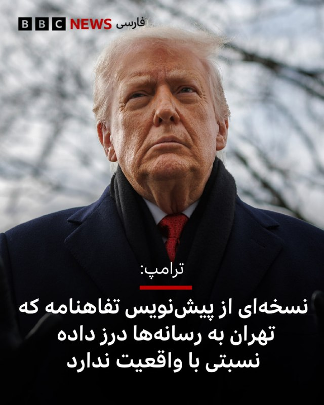

‌
🔻دونالد ترامپ، رئیس‌جمهور آمریکا، مقام‌های ایران را به درز نسخه‌ای غیرواقعی از تفاهمنامه دو کشور متهم کرده و گفته است که نسخه‌ای که در اختیار رسانه‌ها قرار گرفته «هیچ ربطی به شرایطی که به‌طور مکتوب پذیرفته شده ندارد.»

آقای ترامپ در شبکه اجتماعی خود، تروث سوشیال نوشت: «آنچه آنها گفته‌اند، از جمله بیانیه ضعیف و رقت‌انگیزشان درباره داشتن یک توافق، هیچ نسبتی با واقعیت ندارد.آنها آدم‌های بسیار بی‌اعتباری برای مذاکره هستند.»

رئیس‌جمهور آمریکا کمی بعد پست وزیر خارجه ایران در شبکه ایکس را همرسانی کرد که او در آن خواستار پرهیز رسانه‌ها از گمانه‌زنی در مورد توافق تا زمان نهایی شدن آن شده بود.

عباس عراقچی نوشت: «تفاهم‌نامه اسلام‌آباد هیچگاه تا این حد به نهایی شدن نزدیک نبوده است. تا زمان تکمیل و نهایی شدن آن، رسانه‌ها باید از گمانه‌زنی درباره محتوای آن خودداری کنند.»

«در راستای رویکرد مسئولانه و شفاف ما، تمامی جزئیات در زمان مقتضی با عموم مردم به اشتراک گذاشته خواهد شد.»

📷GETTY
@BBCPersian

## alonews — post 127455

  <a href="telegram/content/alonews_127455_1781283823.webm" target="_blank">🎬 Download video</a>

👈باراک راوید(اکسیوس) : رئیس‌جمهور ترامپ در یک تماس کوتاه به من گفت که پست عراقچی، وزیر خارجه ایران، را «بسیار مثبت» ارزیابی کرده است.

✅ @AloNews خبر جنگ

## alonews — post 127454

  <a href="telegram/content/alonews_127454_1781283824.webm" target="_blank">🎬 Download video</a>

🔴فوری/ آکسیوس به نقل از ترامپ: ایران به‌طور محرمانه بابت ارائه اطلاعات نادرست در مورد توافق عذرخواهی کرد.

🔴من همچنان بر این باورم که توافق ممکن است تا پایان هفته یا روز دوشنبه امضا شود.

✅ @AloNews خبر جنگ

## alonews — post 127453

  <a href="telegram/content/alonews_127453_1781283824.webm" target="_blank">🎬 Download video</a>

🔴فوری/ثابتی، نماینده مجلس: طبق اطلاعات به دست آمده متن یادداشت تفاهم نامه احتمالی بدتر از برجام است، چنین توافقی نه گشایش اقتصادی می‌آورد و نه جلوی جنگ را میگیرد.

✅ @AloNews خبر جنگ

---
📅 بروزرسانی: 1405/03/22 20:23
---

## WithYashar — post 14652

ترامپ : پست اخیر عباس عراقچی، وزیر خارجه ایران، درباره توافق را بسیار مثبت ارزیابی می‌کنم.
@withyashar

## WithYashar — post 14651

ترامپ : هنوز هم معتقدم که توافق ممکنه تا پایان این هفته یا نهایتاً روز دوشنبه امضا بشه.
ایران به‌صورت محرمانه بابت ارائه اطلاعات نادرست درباره توافق عذرخواهی کرده
@withyashar

## mwarmonitor — post 10783

🔴سی‌ان‌ان:
ارتش آمریکا به‌طور محرمانه برای انجام یک مأموریت زمینی جهت تصرف اورانیوم با غنای بالا در ایران برنامه‌ریزی کرده بود؛ در همین حال، رئیس ستاد مشترک نیروهای مسلح آمریکا از نشست‌های ناتو به‌سرعت به فلوریدا رفت تا در جلسات توجیهی اضطراری شرکت کند.

🔸ترامپ این عملیات را به دلیل نگرانی از تلفات گسترده و احتمال انتقام‌جویی ایران متوقف کرد.

🔸این اورانیوم—که برای ساخت حدود ۱۰ بمب کافی است—در تونل‌هایی در چندین محل مدفون شده است.

@mwarmonitor

## mwarmonitor — post 10782

  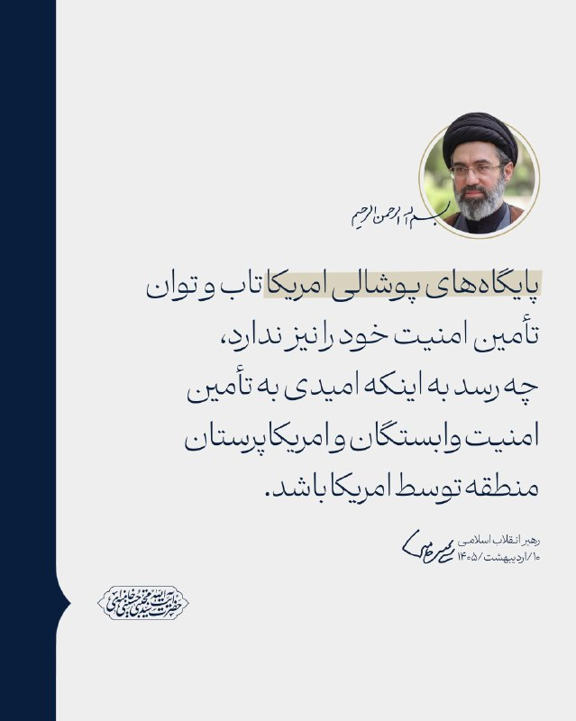

📝 در قوانین کیفری، جعل امضا یا سند فرد فوت‌شده طبق ماده ۵۳۶ قانون مجازات اسلامی، جرم محسوب شده و مجازات آن علاوه بر جبران خسارت، حبس از ۶ ماه تا ۲ سال یا جزای نقدی است؛ هرچند اگر این جعل در اسناد رسمی دولتی صورت گیرد، مجازات آن بسیار سنگین‌تر (تا ۵ سال حبس) خواهد بود.

🔸وقتی در سیستم ، مرده‌ها هم بیانیه صادر می‌کنند و امضا می‌زنند، جرم جعل امضای میّت دیگر یک تخلف حقوقی نیست، بلکه رسماً یک پروتکل اداری برای هدایت امت غایب است! در واقع مجازاتش جرم محسوب شدنِ خودِ واقعیت است، چرا که در این منطق، زنده بودن صرفاً یک آپشن تزیینی است که با یک مهر و امضای فتوشاپی به راحتی تمدید می‌شود.

@mwarmonitor

## pm_afshaa — post 93705

سکوته هیچ خبری جز توافق نی اینه که قشنگش میکنه
😈

## kianmeli1 — post 87963

  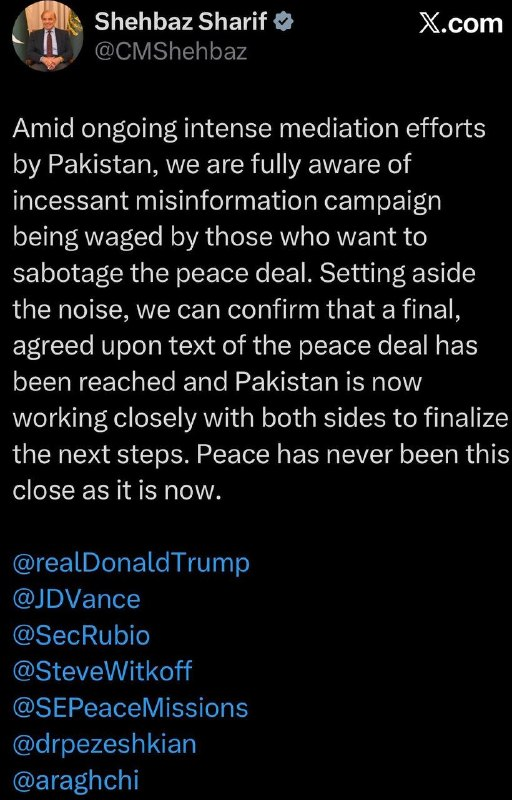

🔴شهباز شریف، نخست وزیر پاکستان، گفته است که نسخه نهایی یادداشت تفاهم ایالات متحده و ایران مورد توافق قرار گرفته و «مراحل بعدی» در حال نهایی شدن است.
https://t.me/kianmeli1

## kianmeli1 — post 87962

  <a href="telegram/content/kianmeli1_87962_1781283204.mp4" target="_blank">🎬 Download video</a>

🔴خبرنگار شبکه CNN
احتمالا ترامپ باز هم از ایران فریب خورده است

این که تنگه هرمز بلافاصله باز شود و حجم تردد به سطح قبل از جنگ ظرف ۳۰ روز بازگردد، اینکه محاصره دریایی آمریکا و برخی تحریم‌های ایران به عنوان بخشی از این توافق لغو شود، و اینکه تمام خواسته‌های آمریکا در موضوع هسته‌ای تأمین شود.
این همان چیزی بود که ما گزارش می‌کردیم.

اما بعد رسانه‌های دولتی ایران آمدند و نسخه خودشان از توافق را ارائه دادند که تفاوت چشمگیری دارد.
چند نکته در آن هست که احتمالاً ترامپ را عصبانی می‌کند.
یکی اینکه ایران متعهد نمی‌شود کنترل تنگه هرمز را واگذار کند.
دیگری هم دارایی‌های مسدودشده است؛ همان دارایی‌هایی که برای ترامپ محل مناقشه بوده.
به گفته رسانه‌های دولتی ایران توافق خواستار آزادسازی ۲۴ میلیارد دلار از آن دارایی‌هاست.
https://t.me/kianmeli1

## FarsiVOA — post 220500

توافق بزرگ در راه است؟ آیا مجتبی خامنه‌ای تندروهای جمهوری اسلامی را مهار می‌کند؟

## FarsiVOA — post 220499

ویدیویی منتشرشده از پایگاه دریایی گوانتانامو در کوبا، پیت هگست، وزیر جنگ آمریکا، را در حال تمرین با نیروهای نظامی این کشور نشان می‌دهد.

بر اساس این ویدیو، او پس از یک دویدن صبحگاهی همراه با نیروهای آمریکایی، ۴۴ بار حرکت پرس سینه انجام داد.

@FarsiVOA

## DW_Farsi — post 125904

🔶 ایران آتش‌بس در لبنان را به توافق با واشنگتن گره زده است

ایران در تلاش است لبنان را به‌عنوان آخرین پایگاه نفوذ خود در مدیترانه حفظ کند و به همین دلیل، آتش‌بس در این کشور را به یک معامله بزرگ‌تر با واشنگتن گره زده است.

این در حالی است که دولت لبنان، با حمایت آمریکا، در حال پیگیری مذاکراتی با اسرائیل برای پایان دادن به دهه‌ها درگیری مرزی و بازتعریف توازن قدرت در این کشور است. جوزف عون، رئیس‌جمهوری لبنان، به رویترز گفت: «آینده لبنان در دست لبنانی‌هاست، نه ایران و نه اسرائیل.»
@dw_farsi

## alonews — post 127452

  <a href="telegram/content/alonews_127452_1781283206.webm" target="_blank">🎬 Download video</a>

👈برخی از رسانه های لبنانی اعلام کردند که ارتش اسرائیل درحال تلاش برای ورود به شهر نبطیه در جنوب این کشور است

✅ @AloNews خبر جنگ

## alonews — post 127451

  <a href="telegram/content/alonews_127451_1781283206.webm" target="_blank">🎬 Download video</a>

👈گروسی: اولویت ما راستی آزمایی کامل از توانمندی‌های هسته‌ای ایران است
 

✅ @AloNews خبر جنگ

---
📅 بروزرسانی: 1405/03/22 20:13
---

## VahidOnline — post 76272

امیرحسین ثابتی، عضو مجلس شورای اسلامی، نوشته:

"طبق اطلاعات به دست آمده متن توافق احتمالی بدتر از برجام است/ چنین توافقی نه گشایش اقتصادی می‌آورد و نه جلوی جنگ را میگیرد

دوشنبه شب در تجمع مردم در میدان مجتهدی طرشت حاضر شدم و توضیح دادم که دشمن به دنبال نابودی ایران است، چه از طریق جنگ و چه از طریق مذاکره و کسانی که هنوز هدف دشمن را نفهمیده و فکر میکنند با توافق با امریکا میشود دشمن را سرجایش نشاند، بدیهیات اتفاقات اخیر را هم نفهمیده‌اند.

سپس گفتم طبق اطلاعاتی که تا این لحظه از متن توافق احتمالی به دست آورده‌ایم توافقی ضعیف‌تر از برجام در راه است که خطوط قرمز رهبری در آن رعایت نشده و نه باعث گشایش اقتصادی میشود و نه امنیت کشور را تامین میکند.

در پایان نیز تبیین کردم که اگر بخواهیم امنیت مان را حفظ کنیم باید بیشتر از همیشه آماده جنگ باشیم وگرنه با ژست مذاکره و گفتگو و تن دادن به توافق به هر قیمت امنیت کشور نیز در دراز مدت مخدوش خواهد شد."

📡 @VahidOnline

## VahidOnline — post 76271

  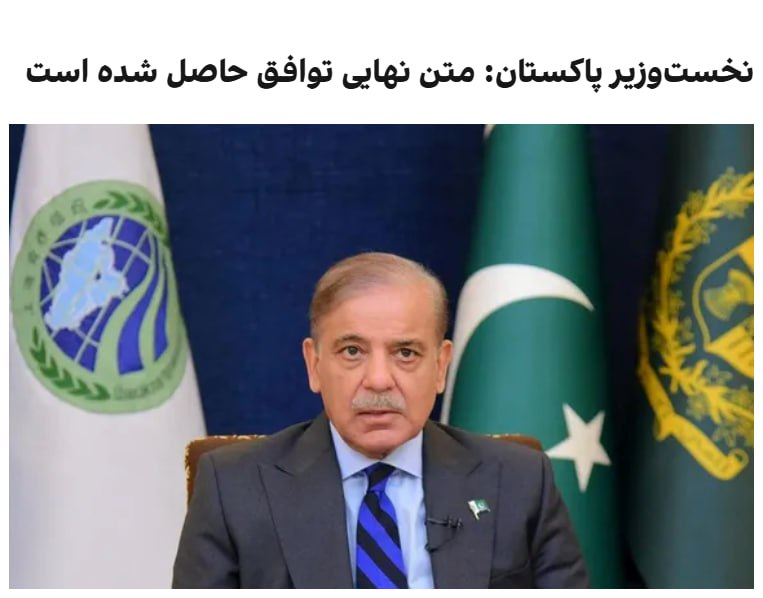

شهباز شریف، نخست‌وزیر پاکستان، در شبکه ایکس نوشت: «متن نهایی توافق صلح میان جمهوری اسلامی و آمریکا حاصل شده است.»
شهباز شریف افزود پاکستان در همکاری نزدیک با آمریکا و جمهوری اسلامی برای نهایی کردن مراحل بعدی این توافق فعالیت می‌کند.
او اضافه کرد: «در میان تلاش‌های میانجیگری فشرده پاکستان، ما کاملا از کمپین بی‌وقفه اطلاعات نادرست که از سوی کسانی که می‌خواهند توافق صلح را خراب کنند، به راه افتاده، آگاه هستیم.»
@VahidOOnLine
نخست‌وزیر پاکستان در پایان تاکید کرد: «صلح هرگز تا این حد که امروز شاهدش هستیم، به ما نزدیک نبوده است.»
@VahidOOnLine

📡 @VahidOnline

## FarsiVOA — post 220498

🔺پرزیدنت ترامپ پیام عراقچی درباره پرهیز از گمانه‌زنی پیرامون محتوای توافق احتمالی را بازنشر کرد

◾️رئیس جمهوری آمریکا روز جمعه ۲۲ خرداد دقایقی بعد از آن که وزیر امور خارجه جمهوری اسلامی در پستی از نزدیک به نهایی بودن تفاهم‌نامه اسلام‌آباد خبر داد، پیامی را که عباس عراقچی در ایکس منتشر کرده بود، بازنشر کرد.

⬇️ بیشتر بخوانید:

https://ir.voanews.com/a/iran-araghchi-trump-negotiations-social-truth-tweet-/8160161.html

## alonews — post 127450

  <a href="telegram/content/alonews_127450_1781282600.webm" target="_blank">🎬 Download video</a>

👈عزیمت پاپ لئوی چهاردهم، رهبر کاتولیک‌های جهان ازاسپانیا در پایان سفر یک‌هفته‌ای، به دلیل نقص فنی در هواپیما به تأخیر افتاد

🔴پاپ به سلامت از هواپیما خارج شده است.

✅ @AloNews خبر جنگ

## alonews — post 127449

  <a href="telegram/content/alonews_127449_1781282600.webm" target="_blank">🎬 Download video</a>

👈 حمله هوایی اسرائیل به شهر النبطیه در جنوب لبنان.

✅ @AloNews خبر جنگ

## alonews — post 127448

  <a href="telegram/content/alonews_127448_1781282600.mp4" target="_blank">🎬 Download video</a>

توافق کنید جواب اینو کی میخواد بده؟

[@AloTweet]

## alonews — post 127447

  <a href="telegram/content/alonews_127447_1781282602.webm" target="_blank">🎬 Download video</a>

👈یک مقام اسرائیلی به روزنامه یدیعوت آحارونوت: ترامپ ما را فریب داد و توافقی که قرار است به‌زودی حاصل شود، بسیار بد به نظر می‌رسد و اصولی را که هنگام آغاز جنگ با ایران درباره آن‌ها صحبت کرده بودیم، برآورده نمی‌کند

✅ @AloNews خبر جنگ

---
📅 بروزرسانی: 1405/03/22 20:03
---

## VahidOOnLine — post 245176

🗣روایت شما از بحران اقتصادی و زندگی در آتش‌بس- جمعه ۲۲ خرداد:

🔹مگه می‌شه یک آپارتمان در بلوار پاسداران بندر انزلی در عرض فقط ۹۰ روز سه برابر بشه؟

🔹می‌خواستم برای سیستم یک SSD بخرم، قیمتش در عرض چند ماه، ۱۱ برابر شده؛ از یک میلیون رسیده به ۱۱ میلیون تومان.

🔹حداقل حقوق روزانه ۷۳۳ هزار تومان، اما قیمت یک کیلو تخمه‌ آفتابگردان ۸۵۰ هزار تومان است.

🔹سال ۸۸ موتورسیکلت خریدم ۷۰۰ هزار تومان، الان قیمت همان مدل ۲۳۰ میلیون تومان است.

🔹کامپیوتری که تا همین پارسال ۳۰ میلیون تومن بود، الان نزدیک به ۳۰۰ میلیون تومن شده.

🔹یه کیلو موز، یه کیلو زردآلو و یک کیلو هلو شده یک میلیون و ۲۰۰ هزار تومان.

🔹فاز ۵ اندیشه الان ۴ روزی می‌شه که آب قطع شده. به هر کجا هم زنگ می‌زنیم، پیگیری نمی‌کنن.

🔹من یک کارگر ساکن شهر مشهد هستم که روزی ۶۰۰ هزار تومان حقوق می‌گیرم. دیروز بعد از ناهار یک نوشابه کوچک خریدم ۵۰ هزار تومان. مگه یک نوشابه چی داره که باید این قیمت باشه؟
‌🏁 🇬🇧 IranintlTV

🤖 @VahidOOnLine

## VahidOOnLine — post 245175

  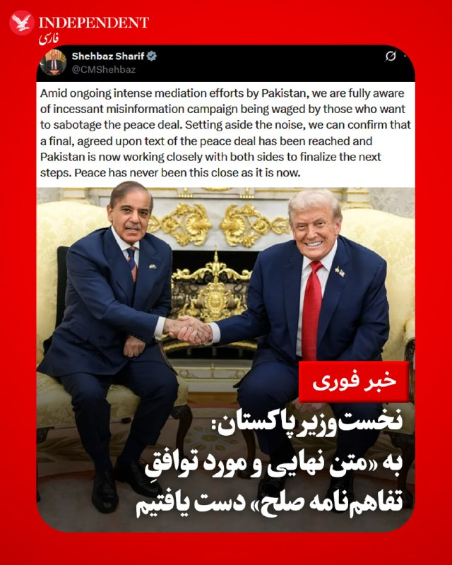

♦️ شهباز شریف، نخست‌وزیر پاکستان، روز جمعه ۲۲ خرداد اعلام کرد که میان ایالات متحده آمریکا و جمهوری اسلامی ایران بر سر یک «متن نهایی و مورد توافق برای تفاهم‌نامه صلح» تفاهم حاصل شده است.

شریف در حساب کاربری خود در شبکه اجتماعی ایکس نوشت: «پاکستان در حال حاضر به طور فشرده و نزدیک با هر دو طرف در حال همکاری است تا گام‌های بعدی را نهایی کند.»

نخست‌وزیر پاکستان در پایان تاکید کرد: «صلح هرگز تا این حد که امروز شاهدش هستیم، به ما نزدیک نبوده است.»
‌🇸🇦 Indypersian

🤖 @VahidOOnLine

## VahidOOnLine — post 245174

  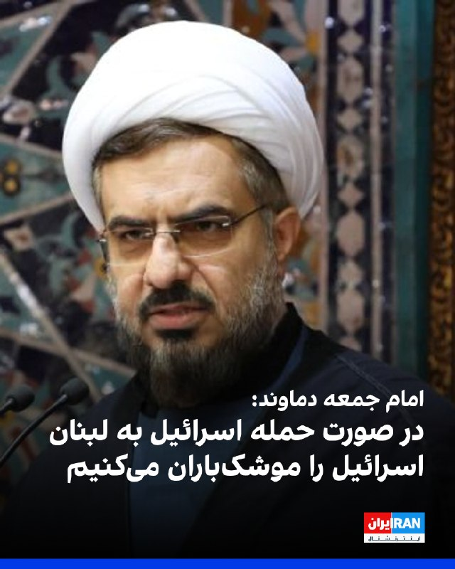

کاظم فتاح‌دماوندی، امام جمعه دماوند گفت: «جمهوری اسلامی با جرات کامل به حمله اسرائیل به لبنان پاسخ داد و در صورت لزوم دوباره اسرائیل موشک‌باران خواهد کرد.»
او اضافه کرد: «پاسخ‌های نامتقارن ما، دشمن را گیج کرده و ترامپ، یزید زمان، با تکبر می‌خواهد خواسته‌هایش را تحمیل کند.»

‌🏁 🇬🇧 IranintlTV

🤖 @VahidOOnLine

## VahidOOnLine — post 245173

  

کاظم فتاح‌دماوندی، امام جمعه دماوند گفت: «جمهوری اسلامی با جرات کامل به حمله اسرائیل به لبنان پاسخ داد و در صورت لزوم دوباره اسرائیل موشک‌باران خواهد کرد.»
او اضافه کرد: «پاسخ‌های نامتقارن ما، دشمن را گیج کرده و ترامپ، یزید زمان، با تکبر می‌خواهد خواسته‌هایش را تحمیل کند.»

‌🏁 🇬🇧 IranintlTV

🤖 @VahidOOnLine

## VahidOOnLine — post 245172

  

کاظم فتاح‌دماوندی، امام جمعه دماوند گفت: «جمهوری اسلامی با جرات کامل به حمله اسرائیل به لبنان پاسخ داد و در صورت لزوم دوباره اسرائیل موشک‌باران خواهد کرد.»
او اضافه کرد: «پاسخ‌های نامتقارن ما، دشمن را گیج کرده و ترامپ، یزید زمان، با تکبر می‌خواهد خواسته‌هایش را تحمیل کند.»

‌🏁 🇬🇧 IranintlTV

🤖 @VahidOOnLine

## VahidOOnLine — post 245171

  

شهباز شریف، نخست‌وزیر پاکستان، در شبکه ایکس نوشت: «متن نهایی توافق صلح میان جمهوری اسلامی و آمریکا حاصل شده است.»
شهباز شریف افزود پاکستان در همکاری نزدیک با آمریکا و جمهوری اسلامی برای نهایی کردن مراحل بعدی این توافق فعالیت می‌کند.
او اضافه کرد: «در میان تلاش‌های میانجیگری فشرده پاکستان، ما کاملا از کمپین بی‌وقفه اطلاعات نادرست که از سوی کسانی که می‌خواهند توافق صلح را خراب کنند، به راه افتاده، آگاه هستیم.»
‌🏁 🇬🇧 IranintlTV

🤖 @VahidOOnLine

## mwarmonitor — post 10781

🔴شهباز شریف نخست وزیر پاکستان

🔸در میان تلاش‌های فشرده و ادامه‌دار میانجی‌گرانه پاکستان، ما کاملاً از کارزار بی‌وقفه انتشار اطلاعات نادرست آگاه هستیم که توسط کسانی انجام می‌شود که قصد دارند این توافق صلح را خراب کنند.

🔸با کنار گذاشتن این هیاهوها، می‌توانیم تأیید کنیم که متن نهایی و مورد توافقِ «توافق صلح» حاصل شده است و پاکستان اکنون با هر دو طرف (ایران و آمریکا) برای نهایی‌سازی مراحل بعدی به‌طور نزدیک در حال همکاری است.

🔸صلح هرگز تا این حد نزدیک نبوده است.

@mwarmonitor

## IranIntlTV — post 341917

🗣روایت شما از بحران اقتصادی و زندگی در آتش‌بس- جمعه ۲۲ خرداد:

🔹مگه می‌شه یک آپارتمان در بلوار پاسداران بندر انزلی در عرض فقط ۹۰ روز سه برابر بشه؟

🔹می‌خواستم برای سیستم یک SSD بخرم، قیمتش در عرض چند ماه، ۱۱ برابر شده؛ از یک میلیون رسیده به ۱۱ میلیون تومان.

🔹حداقل حقوق روزانه ۷۳۳ هزار تومان، اما قیمت یک کیلو تخمه‌ آفتابگردان ۸۵۰ هزار تومان است.

🔹سال ۸۸ موتورسیکلت خریدم ۷۰۰ هزار تومان، الان قیمت همان مدل ۲۳۰ میلیون تومان است.

🔹کامپیوتری که تا همین پارسال ۳۰ میلیون تومن بود، الان نزدیک به ۳۰۰ میلیون تومن شده.

🔹یه کیلو موز، یه کیلو زردآلو و یک کیلو هلو شده یک میلیون و ۲۰۰ هزار تومان.

🔹فاز ۵ اندیشه الان ۴ روزی می‌شه که آب قطع شده. به هر کجا هم زنگ می‌زنیم، پیگیری نمی‌کنن.

🔹من یک کارگر ساکن شهر مشهد هستم که روزی ۶۰۰ هزار تومان حقوق می‌گیرم. دیروز بعد از ناهار یک نوشابه کوچک خریدم ۵۰ هزار تومان. مگه یک نوشابه چی داره که باید این قیمت باشه؟

## IranIntlTV — post 341914

  

کاظم فتاح‌دماوندی، امام جمعه دماوند گفت: «جمهوری اسلامی با جرات کامل به حمله اسرائیل به لبنان پاسخ داد و در صورت لزوم دوباره اسرائیل موشک‌باران خواهد کرد.»
او اضافه کرد: «پاسخ‌های نامتقارن ما، دشمن را گیج کرده و ترامپ، یزید زمان، با تکبر می‌خواهد خواسته‌هایش را تحمیل کند.»

https://iranintl.com/202606121196

## IranIntlTV — post 341913

  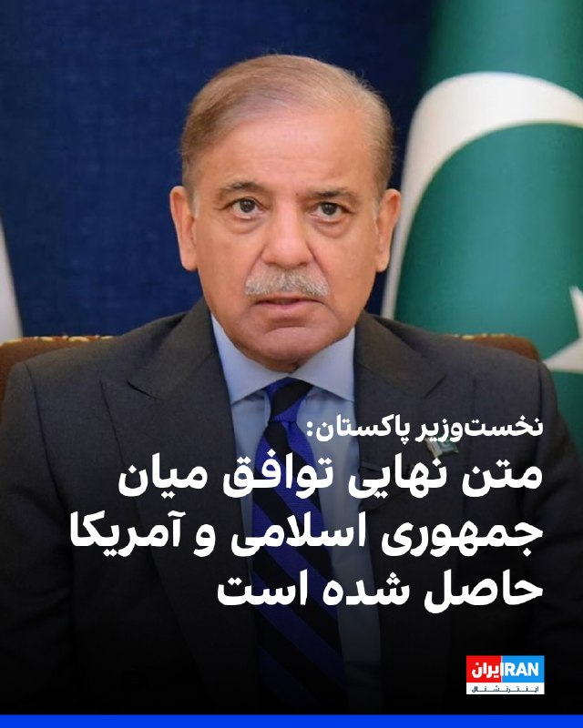

شهباز شریف، نخست‌وزیر پاکستان، در شبکه ایکس نوشت: «متن نهایی توافق صلح میان جمهوری اسلامی و آمریکا حاصل شده است.»
شهباز شریف افزود پاکستان در همکاری نزدیک با آمریکا و جمهوری اسلامی برای نهایی کردن مراحل بعدی این توافق فعالیت می‌کند.
او اضافه کرد: «در میان تلاش‌های میانجیگری فشرده پاکستان، ما کاملا از کمپین بی‌وقفه اطلاعات نادرست که از سوی کسانی که می‌خواهند توافق صلح را خراب کنند، به راه افتاده، آگاه هستیم.»
https://iranintl.com/202606127276

## DW_Farsi — post 125903

  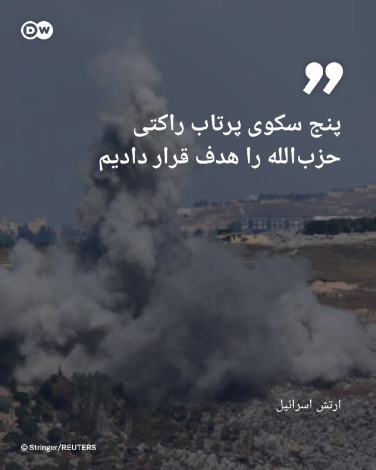

🔶 ارتش اسرائیل: پنج سکوی پرتاب راکتی حزب‌الله را هدف قرار دادیم

ارتش اسرائیل اعلام کرد نیروی هوایی این کشور پنج سکوی پرتاب راکتی حزب‌الله را که برای شلیک به سمت نیروهای اسرائیلی در جنوب لبنان به کار رفته بود، هدف قرار داده و نابود کرده است.

ارتش اسرائیل گفت این پنج سکوی پرتاب راکتی در حمله اخیر نیروی هوایی منهدم شده‌اند.

به گفته ارتش، این سکوها برای هدف قرار دادن نیروهای اسرائیلی در جنوب لبنان استفاده شده بودند.

ارتش اسرائیل همچنین اعلام کرد یک مرکز فرماندهی حزب‌الله را هم هدف قرار داده است.

به گفته ارتش، شماری از نیروهای حزب‌الله که در نزدیکی نیروهای اسرائیلی شناسایی شده بودند نیز هدف قرار گرفته‌اند.
@dw_farsi

## Persian_Trend_Official — post 16867

  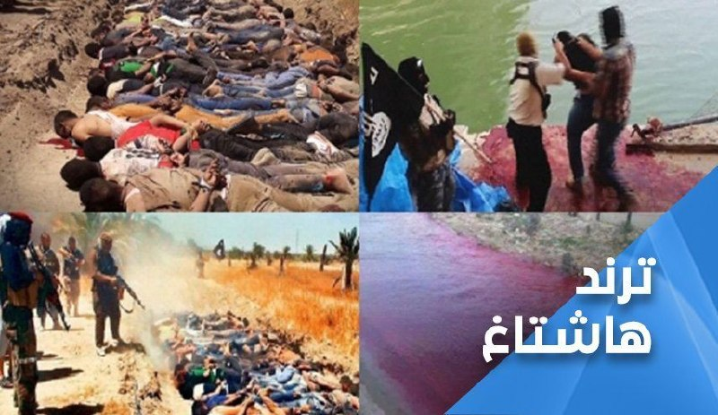

امروز ۱۲ ژوئن مراسم سالانه گرامیداشت قربانیان کشتار «اسپایکر» با حضور خانواده‌ها و مقامات محلی در استان صلاح‌الدین عراق برگزار شد. 
👺Phantom 
📌 @persian_trend_official پرشین ترند | متفاوت‌ترین کانال نظامی

## RadioFarda — post 158232

  <a href="https://t.me/radiofarda/158232" target="_blank">📎 Download file</a>

📻بشنوید: ایستگاه ۱۹ با رادیوفردا، ۲۲ خرداد ۱۴۰۵

@RadioFarda

## RadioFarda — post 158231

  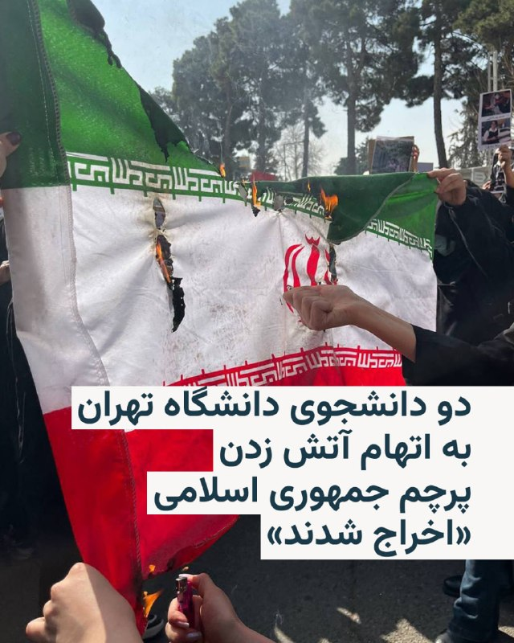

🔸خبرگزاری فارس،‌ نزدیک به سپاه پاسداران، روز جمعه اعلام کرد شورای انضباطی دانشگاه تهران دو دانشجوی این دانشگاه را به دلیل آتش زدن پرچم جمهوری اسلامی در جریان اعتراضات دانشجویی اسفندماه گذشته اخراج کرده است.

🔸در گزارش این خبرگزاری آمده است که دو دانشجو «به دلیل تخلفات انضباطی از جمله ایجاد آشوب و اخلال در روند آموزشی» در شورای انضباطی بدوی دانشگاه تهران به اخراج محکوم شدند.

🔸این خبر یک روز بعد از آن منتشر می‌شود که وزیر علوم دولت پزشکیان از برخورد با دانشجویانی که در جریان اعتراضات سال گذشته پرچم شیر و خورشید را در دانشگاه برافراشتند و پرچم جمهوری اسلامی را آتش زدند، خبر داد.

🔸حسین سیمایی صراف روز پنجشنبه در جمع خبرنگاران گفت علاوه بر برخورد قضائی با این دانشجویان، پرونده آنها در کمیته‌های انتظامی بررسی شده و قطعا «مجازات می‌شوند».

🔸این اعتراضات در اسفند ماه سال گذشته در برخی دانشگاه‌ها انجام شد. تصاویر منتشر شده در شبکه‌های اجتماعی حاکی از آوردن پرچم شیر و خورشید در چند دانشگاه بود و همچنین ویدئوهایی از آتش زدن پرچم جمهوری اسلامی منتشر شد.

@RadioFarda

## BBCPersian — post 283582

  <a href="telegram/content/BBCPersian_283582_1781282040.mp4" target="_blank">🎬 Download video</a>

دریادار حبیب‌الله سیاری، معاون هماهنگ‌کننده ارتش ایران در گفتگویی که دیشب ۲۱ خرداد از شبکه نسیم پخش شد به جنگ ۴۰ روزه آمریکا و اسرائیل با ایران پرداخت و از جمله گفت: هنوز از سرنوشت ۴ خلبان سرنشین دو فروند جنگنده سوخوی۲۴ ایران که به اهدافی در قطر حمله کرده بودند، اطلاعی در دست نیست.

وزارت دفاع قطر در ۱۱ اسفند ۱۴۰۴ اعلام کرد که نیروی هوایی این کشور دو فروند جت جنگنده سوخوی۲۴ را که از سوی ایران به این امیرنشین می‌رفتند را سرنگون کرده است.

رسانه‌های ایران پیشتر از انجام حمله با بمب‌افکن‌های سوخوی۲۴ در ۱۰ اسفند به «تاسیسات نظامی آمریکا در محدوده بندر شعیبه کویت» خبر داده بودند.

ستاد فرماندهی مرکزی آمریکا، سنتکام، در پاسخ به پرسش بی‌بی‌سی فارسی درباره این رویداد از اظهارنظر خودداری کرد.

مقامات نظامی ایران پیشتر گفته بودند که در جریان جنگ ۴۰ روزه جنگنده‌های قدیمی اف۴ و اف۵ ایران به پایگاه‌های آمریکا در اربیل عراق و کویت حمله کردند.
@bbcpersian

## Dirty_Kids — post 391823

  

تیم‌ملی گنگو هم به آمریکا رسید. اینا هم کیفه دستشون من اول فکر کردم بالشت با خودشون بردن

@Dirty_Kids 👻

## Dirty_Kids — post 391822

  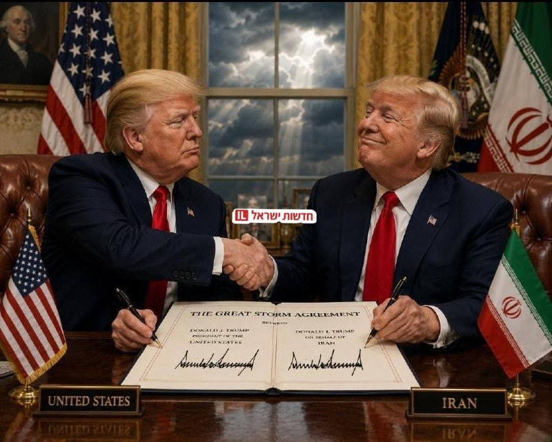

تمسخر کانال های اسراییلی .

امضای توافق نامه میان ایران و امریکا

@Dirty_Kids 👻

## Dirty_Kids — post 391821

🙂همه شنیدید --> ترامپ قمار باز <-- میدونی سرمایه چند صد ملیون دلاری ترامپ از شرط بندی چطور جمع شده 
⁉️ 
✔️من بهت نه چیزی میخوام بفروشم نه پولی ازت میگیرم من بهت پول دراوردن رو رایگان آموزش میدم https://t.me/+lCR7HeYTU15iNjM0 https://t.me/+lCR7HeYTU15iNjM0…

## Dirty_Kids — post 391820

  

🙂همه شنیدید --> ترامپ قمار باز <--

میدونی سرمایه چند صد ملیون دلاری ترامپ از شرط بندی چطور جمع شده 
⁉️

✔️من بهت نه چیزی میخوام بفروشم نه پولی ازت میگیرم من بهت پول دراوردن رو رایگان آموزش میدم

https://t.me/+lCR7HeYTU15iNjM0
https://t.me/+lCR7HeYTU15iNjM0
G22
عضو کانال شو تا بفهمی 
✅

## Hranews — post 113562

  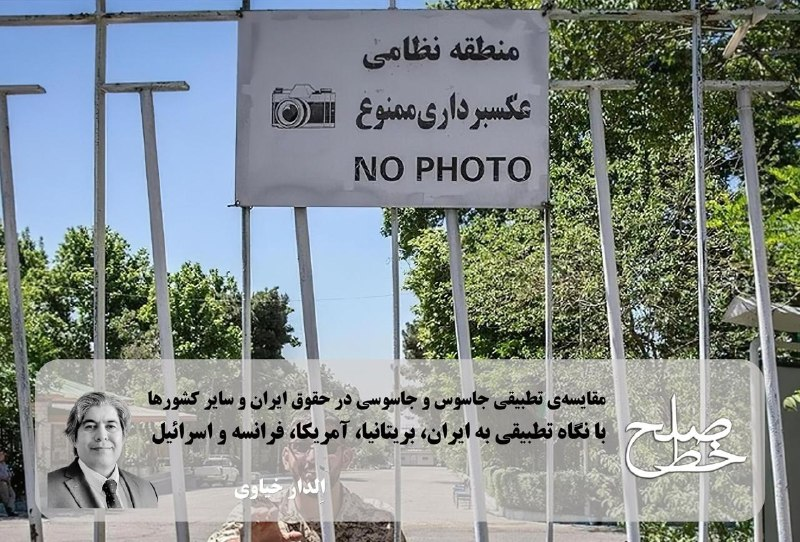

مقایسه‌ی تطبیقی جاسوس و جاسوسی در حقوق ایران و سایر کشورها/ اِلدار خیاوی

📡
📡
📡
📡
📡– فضای عمومی ایران در ماه‌های اخیر با اخبار پی‌درپی اعدام اشخاصی که به اتهام جاسوسی محکوم شده‌اند، سنگین و هراس‌آور شده است. عنوان «جاسوسی» در افکار عمومی، به‌ویژه در شرایط جنگ، تهدید خارجی یا بحران امنیتی، عنوانی عادی نیست. این اتهام با امنیت کشور، جان مردم، تمامیت سرزمینی، اسرار نظامی و بقای نظم عمومی پیوند می‌خورد. اگر شخصی آگاهانه و عامدانه اطلاعات حساس کشور را در اختیار دشمن یا دولت متخاصم قرار دهد، با یکی از سنگین‌ترین جرایم علیه امنیت عمومی روبه‌رو هستیم. اما درست به همین دلیل، رسیدگی به چنین اتهامی باید با بالاترین سطح دقت، شفافیت، امکان دفاع و نظارت حقوقی همراه باشد.

با این حال، پرسش مهمی پیش روی جامعه حقوقی ایران قرار دارد: وقتی قوه‌ی قضاییه توضیح کافی و قابل ارزیابی درباره روند رسیدگی، دلایل اثباتی، نحوه کشف ادله، دسترسی متهم به وکیل و مبانی صدور حکم ارائه نمی‌کند، جامعه‌ی حقوقی چگونه می‌تواند چنین آرایی را نقد و تحلیل کند؟ مگر نه این است که فلسفه‌ی حقوق کیفری صیانت از امنیت اجتماع و اعضای آن است؟ و مگر نه آن‌که دادستان، در مقام نماینده‌ی خیر عمومی و وکیل مردم برای حفظ نظم و امنیت، باید درباره‌ی اقدامات خود به جامعه پاسخ‌گو باشد؟

پرسش اصلی این مقاله اما ماهوی و مقدم بر نقد دادرسی است: «جرم جاسوسی از نظر حقوق کیفری دارای چه عناصری است، قانون ایران آن را چگونه تعریف و مجازات می‌کند، و رویکرد نظام‌های حقوقی دیگر، از جمله بریتانیا، آمریکا، فرانسه و اسرائیل، در تعریف و مجازات این جرم چیست؟» پاسخ به این پرسش‌ها نقطه‌ی آغاز تحلیل روند رسیدگی و نحوه‌ی صدور آرای مرتبط است؛ زیرا تا زمانی که عناصر جرم، نوع اطلاعات، عنصر معنوی، ارتباط با دولت خارجی و معیار اثبات روشن نشود، ارزیابی حقوقی اتهام جاسوسی ممکن نخواهد بود.

ادامه مطلب
لینک به مطلب در وبسایت خط صلح

#الدار_خیاوی #جاسوسی

↘️
@hranews_bot تماس ✉️ - @Hranews کانال هرانا 🆑

## alonews — post 127446

  <a href="telegram/content/alonews_127446_1781282046.mp4" target="_blank">🎬 Download video</a>

👈حادثه تیراندازی در میدلند تگزاس

🔴برابر گزارش‌ها در این تیراندازی چندین نفر زخمی شده‌اند.

✅ @AloNews خبر جنگ

---
📅 بروزرسانی: 1405/03/22 19:53
---

## VahidOOnLine — post 245170

♦️شرکت اسپیس‌ایکس به رهبری ایلان ماسک روز جمعه  ۲۲ خرداد وارد بازار بورس نزدک شد؛ عرضه‌ای که با ارزش‌گذاری ۱.۷۷ تریلیون دلاری، به یکی از بزرگ‌ترین عرضه‌های اولیه تاریخ تبدیل شده است.
این شرکت با فروش ۷۵ میلیارد دلار سهام، نه‌تنها رکوردی تازه در بازار ثبت کرد، بلکه به‌عنوان یکی از ارزشمندترین شرکت‌های آمریکا شناخته می‌شود. انتظار می‌رود معاملات سهام این شرکت با تأخیر در میانه روز آغاز شود تا تعادل میان عرضه و تقاضا برقرار شود.
این عرضه به‌عنوان آزمونی مهم برای زیرساخت‌های معاملاتی وال‌استریت تلقی می‌شود و سرمایه‌گذاران با دقت عملکرد آن را زیر نظر دارند؛ چرا که می‌تواند مسیر عرضه‌های بزرگ بعدی، به‌ویژه در حوزه هوش مصنوعی را تحت تأثیر قرار دهد.
با وجود زیان نزدیک به ۵ میلیارد دلاری اسپیس‌ایکس در سال گذشته، این عرضه جایگاه ایلان ماسک را به‌عنوان یکی از ثروتمندترین افراد جهان تثبیت کرده است. تحلیلگران همچنین معتقدند ورود این شرکت به بازار می‌تواند باعث جابه‌جایی سرمایه‌ها از سایر غول‌های فناوری به سمت این سهم شود.
‌🇸🇦 Indypersian

🤖 @VahidOOnLine

## WithYashar — post 14650

وزیر جنگ اسرائیل: رئیس‌جمهور ترامپ در حال حاضر به سمت توافقی با ایران پیش می‌رود که از دیدگاه منافع آمریکا، از جمله منافع مشترک با اسرائیل—برای جلوگیری از دستیابی ایران به سلاح‌های هسته‌ای است و ما انتظار داریم او این اصل و اصول اضافی در حوزه موشک‌ها و نمایندگان نیابتی را حفظ کند.
@withyashar

## FoxNewsTwitter — post 342905

  

Fox News (Twitter/X)

What's the hottest World Cup collectible? A $30 beer can, apparently.

Coors Light’s limited-edition “Tallerboy” sold out almost immediately after going live online, with just 125 available in the first release.

The $30 collectible holds three full-sized cans at once and went viral as part of the brand's World Cup marketing push.

Another 125 are expected to be released next week.

## FoxNewsTwitter — post 342904

  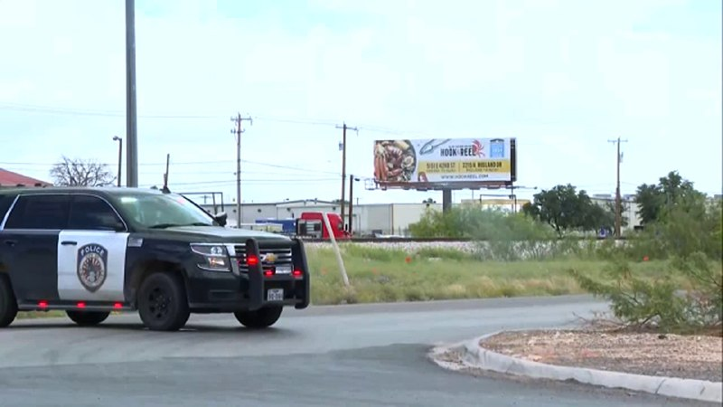

Fox News (Twitter/X)

🚨 BREAKING: Police in Midland, Texas, responding to active shooting incident that authorities say has left 1 dead and multiple others injured

## IranIntlTV — post 341912

  <a href="telegram/content/IranIntlTV_341912_1781281427.mp4" target="_blank">🎬 Download video</a>

جام جهانی ۲۰۲۶ در شرایطی آغاز شد که در این رقابت‌ها فیفا از قوانین جدیدی در داوری رونمایی کرد و داوران موظف به اجرای آن در زمین بازی هستند. این تغییرات با هدف افزایش سرعت بازی و کاهش اتلاف وقت شده‌اند.

توضیحات رها پوربخش، ایران‌اینترنشنال در برنامه هت‌تریک

## IranIntlTV — post 341911

  <a href="telegram/content/IranIntlTV_341911_1781281429.mp4" target="_blank">🎬 Download video</a>

🔻مکزیکی‌های مقیم شهر لس‌آنجلس دیدار اول تیم ملی کشورشان را در ورزشگاه قدیمی این شهر تماشا کردند و شاهد پیروزی شاگردان خاویر آگیره بودند.

🔹گزارش علیرضا مدیری، ایران‌اینترنشنال از لس‌آنجلس

@iranintltvsport

## IranIntlTV — post 341910

  <a href="telegram/content/IranIntlTV_341910_1781281431.mp4" target="_blank">🎬 Download video</a>

🔻مزدک میرزایی، ایران‌اینترنشنال، در برنامه هت‌تریک درباره ژست‌های امیر قلعه‌نویی در عکس‌های رسمی تیم ملی فوتبال ایران و نمایش ساعت مچی او گفت: «قلعه‌نویی تنها مربی حاضر در جام جهانی است که دوست دارد همه بدانند ساعت خیلی خوبی دارد.»

@iranintltvsport

## FarsiVOA — post 220497

🔺انتقاد جی‌دی ونس از اطلاعات «جعلی» درباره توافق احتمالی: رژیم ایران «هیچ پول نقدی» دریافت نخواهد کرد

▪️جی‌دی ونس، معاون رئیس‌ جمهوری آمریکا، در پی انتشار گزارش‌هایی درباره یک توافق احتمالی با رژیم ایران برای بازگشایی تنگه هرمز و پایان دادن به برنامه تسلیحات هسته‌ای جمهوری اسلامی، بسیاری از اطلاعات منتشرشده را «جعلی» خواند.

⬇️ بیشتر بخوانید:

https://ir.voanews.com/a/vp-vance-denies-cash-transfer-deal-with-iranian-regime/8160152.html/?nocach=1

## Persian_Trend_Official — post 16866

  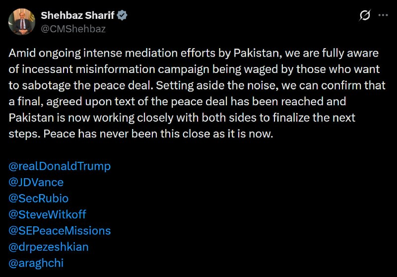

شهباز شریف، نخست وزیر پاکستان: در بحبوحه تلاش‌های میانجیگری فشرده پاکستان، ما کاملاً از کمپین بی‌وقفه اطلاعات نادرست که توسط کسانی که می‌خواهند توافق صلح را خراب کنند، به راه افتاده است، آگاه هستیم.

صرف نظر از سر و صدا، می‌توانیم تأیید کنیم که متن نهایی و مورد توافق صلح حاصل شده است و پاکستان اکنون از نزدیک با هر دو طرف برای نهایی کردن مراحل بعدی همکاری می‌کند.

صلح هرگز تا این حد نزدیک نبوده است.

📝 Amir

📌 @persian_trend_official
پرشین ترند | متفاوت‌ترین کانال نظامی

## Persian_Trend_Official — post 16865

  <a href="telegram/content/Persian_Trend_Official_16865_1781281434.mp4" target="_blank">🎬 Download video</a>

امروز ۱۲ ژوئن مراسم سالانه گرامیداشت قربانیان کشتار «اسپایکر» با حضور خانواده‌ها و مقامات محلی در استان صلاح‌الدین عراق برگزار شد.

👺Phantom

📌 @persian_trend_official
پرشین ترند | متفاوت‌ترین کانال نظامی

## BBCPersian — post 283581

تصاویر جدیدی از بمباران کوچه جاجرودی در نزدیکی خیابان فرجام تهران منتشر شده است که شدت این حمله را با وضوح بیشتری نشان می‌دهد. این تصاویر که مربوط به دوربین مداربسته یک نمایندگی میتسوبیشی در خیابان فرجام است، نشان می‌دهد موج انفجار به ساختمان این نمایندگی که در فاصله حدود ۱۰۰ متری از محل حمله قرار دارد، آسیب جدی وارد کرده است.

در نتیجه این حمله، ۱۲ نفر از یک فامیل که ساکن ساختمانی در کوچه جاجرودی بودند، جانشان را از دست دادند.

نیلوفر میرزایی، یکی از بازماندگان این فامیل در اینستاگرامش ویدیوها و تصاویری از بستگانش منتشر کرده است. او در یک ویدیو گفته فرقی نمی‌کند عزیزان از دست رفته‌اش را «شهید» بنامند یا «جاویدنام». او تاکید کرده که ساختمان آنها مسکونی بوده و وابستگی اعضای فامیلشان به نهادهای نظامی و حکومتی را تکذیب کرده است. خانم میرزایی در ادمه می‌گوید لازم نیست این موضوع را به کسی ثابت کند و از دیگران می‌خواهد قبول کنند که ساختمان غیرنظامی هدف قرار گرفته است.

در نتیجه این حمله چهار مجتمع مسکونی به طور کامل تخریب و ۴۰۰ واحد مسکونی آسیب دیدند.
@BBCPersian

## alonews — post 127445

  <a href="telegram/content/alonews_127445_1781281437.webm" target="_blank">🎬 Download video</a>

👈وزیر جنگ اسرائیل: رئیس‌جمهور ترامپ در حال حاضر به سمت توافقی با ایران پیش می‌رود که از دیدگاه منافع آمریکا، از جمله منافع مشترک با اسرائیل—برای جلوگیری از دستیابی ایران به سلاح‌های هسته‌ای—است و ما انتظار داریم او این اصل و اصول اضافی در حوزه موشک‌ها و نمایندگان نیابتی را حفظ کند.

✅ @AloNews خبر جنگ

## alonews — post 127444

  <a href="telegram/content/alonews_127444_1781281437.webm" target="_blank">🎬 Download video</a>

🔴فوری / نخست‌وزیر پاکستان، شہباز شریف:
در میانه تلاش‌های شدید میانجی‌گری پاکستان، ما کاملاً از کمپین مداوم اطلاعات نادرستی که توسط کسانی که می‌خواهند توافق صلح را خراب کنند، آگاهیم.

🔴با کنار گذاشتن سر و صدا، می‌توانیم تأیید کنیم که متن نهایی و توافق شده توافق صلح به دست آمده است و پاکستان اکنون به طور نزدیک با هر دو طرف برای نهایی کردن مراحل بعدی همکاری می‌کند.

🔴صلح هرگز به این نزدیکی نبوده است که اکنون هست

✅ @AloNews خبر جنگ

---
📅 بروزرسانی: 1405/03/22 19:43
---

## VahidOOnLine — post 245169

  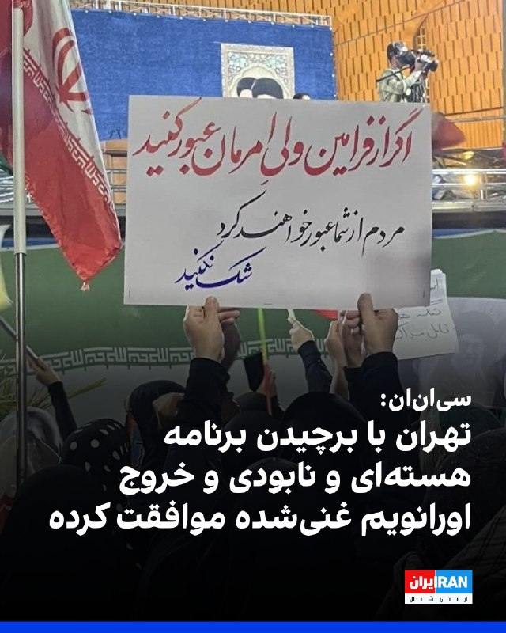

سی‌ان‌ان به نقل از یک مقام ارشد دولت ترامپ گزارش داد توافق با جمهوری اسلامی شامل برچیدن برنامه هسته‌ای ایران و پایان دادن به حمایت مالی تهران از گروه‌های تروریستی است.

سی‌ان‌ان به نقل از مقام ارشد دولت ترامپ افزود که جمهوری اسلامی با «برچیدن برنامه هسته‌ای، نابودی و خروج مواد هسته‌ای، آزاد نشدن دارایی‌ها تا زمان اجرای تعهدات، باز ماندن تنگه هرمز و توقف حمایت مالی از گروه‌های تروریستی» موافقت کرده است.

مقام ارشد دولت ترامپ گفت مقام‌های جمهوری اسلامی پیش‌تر گفته بودند بدون آزادسازی دارایی‌ها توافقی را امضا نخواهند کرد و بارها از گفت‌وگو درباره حمایت مالی از گروه‌های تروریستی خودداری کرده بودند.
‌🏁 🇬🇧 IranintlTV

🤖 @VahidOOnLine

## VahidOOnLine — post 245168

  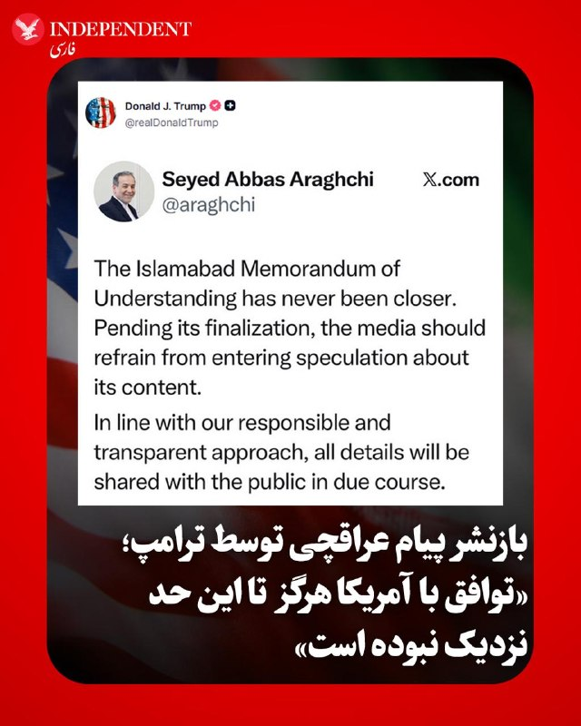

♦️دونالد ترامپ، رئیس‌جمهوری آمریکا، با بازنشر پیام وزیر امور خارجه جمهوری اسلامی ایران در شبکه‌های اجتماعی، به این موضوع اشاره کرد که توافق میان دو کشور «هرگز تا این حد نزدیک نبوده است».

ترامپ در شبکه اجتماعی «تروث سوشال»، تصویر پیام عباس عراقچی در شبکه اجتماعی ایکس را به اشتراک گذاشت.

عراقچی در این پیام با انتقاد از گمانه‌زنی رسانه‌ها از محتوای توافق، تاکید کرده بود: «تمامی جزئیات در زمان مقتضی با عموم مردم به اشتراک گذاشته خواهد شد.»
‌🇸🇦 Indypersian

🤖 @VahidOOnLine

## VahidOOnLine — post 245167

  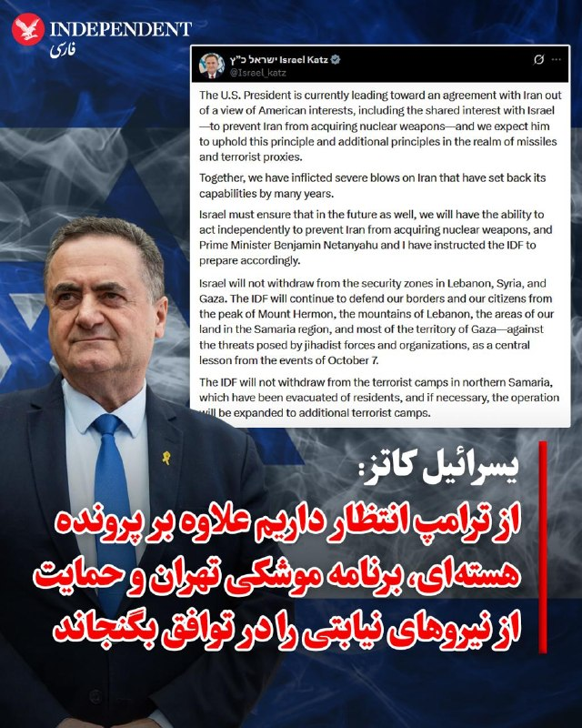

♦️یسرائیل کاتز، وزیر امور خارجه اسرائیل، روز جمعه ۲۲ خرداد، با انتشار پیامی در شبکه اجتماعی ایکس اعلام کرد که هرچند رئیس‌جمهوری آمریکا بر اساس منافع واشنگتن و هدف مشترک با تل‌آویو، یعنی جلوگیری از دستیابی ایران به سلاح هسته‌ای، به سمت یک توافق حرکت می‌کند، اما اسرائیل انتظارات فراتری دارد. کاتز تاکید کرد: «از رئیس‌جمهوری آمریکا انتظار داریم این اصل و شروط دیگر در حوزه موشکی و گروه‌های نیابتی را حفظ کند».

او با اشاره به اینکه ضربات سنگین مشترک، توانمندی‌های ایران را سال‌ها به عقب رانده است، افزود: «اسرائیل باید تضمین کند که در آینده نیز توانایی اقدام مستقل برای جلوگیری از هسته‌ای شدن ایران را دارد؛ به همین منظور، من و بنیامین نتانیاهو به ارتش دستور آمادگی لازم را داده‌ایم.»

وزیر خارجه اسرائیل همچنین به عنوان درس اصلی از وقایع ۷ اکتبر تصریح کرد که این کشور به هیچ وجه از مناطق امنیتی در لبنان، سوریه و غزه عقب‌نشینی نخواهد کرد و ارتش به دفاع از مرزها در برابر تهدیدات جهادی از بلندی‌های حرمون تا عمق غزه ادامه می‌دهد.
‌🇸🇦 Indypersian

🤖 @VahidOOnLine

## mwarmonitor — post 10780

🔴 «وزارت جنگ ایالات متحده سومین مجموعه از پرونده‌های طبقه‌بندی‌زدایی‌شده و تاریخی مربوط به پدیده‌های هوایی ناشناس (UAP) را منتشر کرد.»

🔹بیانیه‌ای منتسب به دستیار وزیر جنگ در امور عمومی و سخنگوی ارشد پنتاگون، شان پارنل:

🔹امروز وزارت جنگ در حال انتشار سومین بخش از پرونده‌های طبقه‌بندی‌زدایی‌شده و تاریخی مربوط به پدیده‌های هوایی ناشناس (UAP) است؛ این اقدام در چارچوب «سیستم گزارش‌دهی و انتشار اسناد ریاست‌جمهوری برای مواجهه با UAP» (PURSUE) انجام می‌شود.

🔹این مجموعه همچنان در وب‌سایت WAR.GOV/UFO نگهداری می‌شود و وزارتخانه به انتشار تدریجی اسناد بیشتر در آینده ادامه خواهد داد.

🔹با توجه به سطح بی‌سابقه توجه جهانی به این موضوع و ادامه تلاش دولت ترامپ برای شفافیت تاریخی، این وب‌سایت از زمان راه‌اندازی در ۸ مه ۲۰۲۶ تاکنون بیش از ۱.۷ میلیارد بازدید در سراسر جهان داشته است.

🔹وزارت جنگ و نهادهای همکار در حال آماده‌سازی برای انتشار مرحله بعدی پرونده‌های UAP هستند.

@mwarmonitor

## mwarmonitor — post 10779

🔴 «ارتش اسرائیل می‌گوید آژیرهای هشدار مربوط به نفوذ یک هواگرد متخاصم در چندین منطقه در شمال اسرائیل به صدا درآمده است.»

@mwarmonitor

## pm_afshaa — post 93704

  <a href="telegram/content/pm_afshaa_93704_1781280816.webm" target="_blank">🎬 Download video</a>

🔴عراقچی: امروز بهترین و طولانی ترین مذاکرات ما با آمریکا شکل گرفت، پیشرفت خوبی رو داشتیم و به توافق نزدیک شدیم. هفته بعد دوشنبه‌ تو آژانس مسائل فنی رو بررسی می‌کنیم که این نشونه خوبیه. 
💧 Sponsored by @rainbetcom — rainbet.com 
😁 @Pm_Afshaa

## IranIntlTV — post 341909

  

سی‌ان‌ان به نقل از یک مقام ارشد دولت ترامپ گزارش داد توافق با جمهوری اسلامی شامل برچیدن برنامه هسته‌ای ایران و پایان دادن به حمایت مالی تهران از گروه‌های تروریستی است.

سی‌ان‌ان به نقل از مقام ارشد دولت ترامپ افزود که جمهوری اسلامی با «برچیدن برنامه هسته‌ای، نابودی و خروج مواد هسته‌ای، آزاد نشدن دارایی‌ها تا زمان اجرای تعهدات، باز ماندن تنگه هرمز و توقف حمایت مالی از گروه‌های تروریستی» موافقت کرده است.

مقام ارشد دولت ترامپ گفت مقام‌های جمهوری اسلامی پیش‌تر گفته بودند بدون آزادسازی دارایی‌ها توافقی را امضا نخواهند کرد و بارها از گفت‌وگو درباره حمایت مالی از گروه‌های تروریستی خودداری کرده بودند.
https://iranintl.com/202606125222

## Shin_Persian — post 6987

آدم پشماش میریزه از اینکه می بینه مردم دنیا فکر می کنن افراد سر کار در جمهوری اسلامی با "رای گیری" عوض میشن.

## FarsiVOA — post 220496

🔺سناتور گراهام: هرگونه پرداخت پول که به «رژیم تروریستی» ایران ایده خوبی نخواهد بود

▪️سناتور گراهام می‌گوید امیدوار است که توافق احتمالی بین آمریکا و رژیم ایران تفاوت زیادی با «برجام اوباما» داشته باشد.

⬇️ بیشتر بخوانید:

https://ir.voanews.com/a/senator-graham-negotiations-iran-us-trump/8160146.html/?nocach=1

## DW_Farsi — post 125902

🎥 بازآفرینی میراث فرهنگی در سایه سرکوب

در هفته میراث فرهنگی دانشگاه بن و در رویداد "میراث فرهنگی زیر سلطه دیکتاتوری"، پژوهشگران و هنرمندان به بررسی بقای فرهنگ در شرایط سرکوب پرداختند.

در این میان، هنرمندان جوان ایرانی با ارائه هنر دیجیتال، آینده‌ای را به تصویر می‌کشند که در آن میراث فرهنگی دوباره ساخته و بازتعریف می‌شود؛ آثاری که فراتر از یک رویا، ابزاری برای امید و مقاومت هستند.
@dw_farsi

## Persian_Trend_Official — post 16864

وزیر دفاع اسرائیل، کاتز: رئیس جمهور ترامپ در حال حاضر با توجه به منافع آمریکا، از جمله منافع مشترک با اسرائیل که جلوگیری از دستیابی ایران به سلاح‌های هسته‌ای است در حال پیشبرد توافق با ایران است و ما از او انتظار داریم که این اصل و اصول اضافی را در حوزه موشک‌ها…

## Persian_Trend_Official — post 16863

  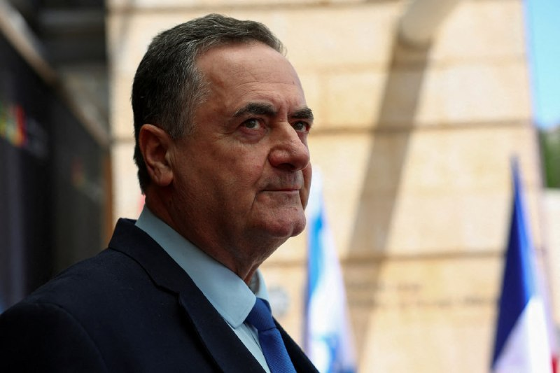

وزیر دفاع اسرائیل، کاتز: رئیس جمهور ترامپ در حال حاضر با توجه به منافع آمریکا، از جمله منافع مشترک با اسرائیل که جلوگیری از دستیابی ایران به سلاح‌های هسته‌ای است در حال پیشبرد توافق با ایران است و ما از او انتظار داریم که این اصل و اصول اضافی را در حوزه موشک‌ها و گروه‌های تروریستی نیابتی رعایت کند.

ما با هم ضربات شدیدی به ایران وارد کرده‌ایم که قابلیت‌های آن را سال‌ها به عقب رانده است. اسرائیل در آینده نیز توانایی اقدام مستقل برای جلوگیری از دستیابی ایران به سلاح‌های هسته‌ای را خواهد داشت و من و بنیامین نتانیاهو، نخست وزیر، به ارتش اسرائیل دستور داده‌ایم که بر این اساس آماده شوند.

📝 Amir

📌 @persian_trend_official
پرشین ترند | متفاوت‌ترین کانال نظامی

## Persian_Trend_Official — post 16862

💛 ۲ دانشجوی دانشگاه تهران به علت آتش‌زدن پرچم ایران اخراج شدند

🆔شورای انضباطی بدوی دانشگاه تهران، ۲ دانشجوی دخیل در ناآرامی‌های اعتراضات دی‌ماه را به دلیل تخلفات انضباطی از جمله ایجاد آشوب و اخلال در روند آموزشی، به اخراج محکوم کرد./ فارس

👺Phantom

📌 @persian_trend_official
پرشین ترند | متفاوت‌ترین کانال نظامی

## alonews — post 127443

  <a href="telegram/content/alonews_127443_1781280817.webm" target="_blank">🎬 Download video</a>

👈کانال 13 اسرائیل: ایران می‌تواند هفته‌های طولانی به سوی اسرائیل، موشک شلیک کند!

🔴 ایران هنوز هزاران موشک بالستیک و شاید حتی خیلی بیشتر در اختیار دارد که می‌توانند به اسرائیل برسند!

✅ @AloNews خبر جنگ

## alonews — post 127442

  <a href="telegram/content/alonews_127442_1781280817.webm" target="_blank">🎬 Download video</a>

👈سنتکام: به گشت‌زنی‌های خود در آب‌های سرزمینی برای اجرای محاصره دریایی علیه ایران ادامه می‌دهیم

✅ @AloNews خبر جنگ

## alonews — post 127441

  <a href="telegram/content/alonews_127441_1781280818.mp4" target="_blank">🎬 Download video</a>

👈نیروی هوایی اسرائیل به منطقه تفاحتا تو لُبنان حملهِ کرد

✅ @AloNews خبر جنگ

---
📅 بروزرسانی: 1405/03/22 19:33
---

## VahidOOnLine — post 245166

  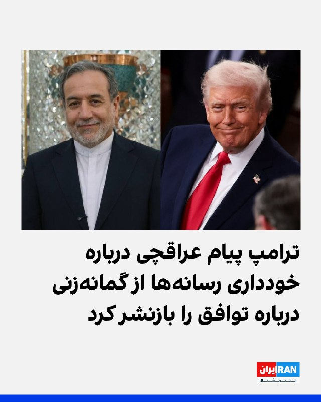

دونالد ترامپ، رییس‌جمهوری آمریکا، پست عباس عراقچی، وزیر خارجه جمهوری اسلامی، در شبکه ایکس درباره «نزدیک بودن به توافق» را در تروث سوشال بازنشر کرد.

عراقچی نوشته بود: «تفاهم‌نامه اسلام‌آباد هرگز تا این حد نزدیک نبوده است. تا زمان نهایی شدن آن، رسانه‌ها باید از گمانه‌زنی در مورد محتوای آن خودداری کنند.»

پیشتر ترامپ در شبکه تروث سوشال نوشت مفادی که جمهوری اسلامی در اختیار رسانه‌ها قرار داده، هیچ ارتباطی با مفادی که به صورت مکتوب بر سر آن توافق شده ندارد.

ترامپ اضافه کرد: «آنچه آن‌ها گفته‌اند، از جمله بیانیه ضعیف و رقت‌انگیزشان درباره توافق، هیچ ارتباطی با واقعیت ندارد.»
‌🏁 🇬🇧 IranintlTV

🤖 @VahidOOnLine

## VahidOOnLine — post 245165

کارزار «جغرافیای انقلاب ملی ایرانیان» از سوی ایران‌اینترنشنال برای بررسی روایت‌های انقلاب ملی در استان‌های ایران راه‌اندازی شده است. در نخستین قسمت به اعتراضات دی‌ماه در آذربایجان‌شرقی پرداخته‌ایم. بررسی ۱۲۲ ویدیو از شهرهای این استان نشان داد معترضان از ۱۲ دی‌ماه اعتصاب و اعتراض را در دست‌کم سه شهر تبریز، مرند و مراغه آغاز کردند که در ۱۸ و ۱۹ دی با فراخوان شاهزاده رضا پهلوی به اوج خود رسید.
ویدیوهای راستی‌آزمایی‌شده نشان می‌دهد شهروندان در خیابان‌ها شعارهای «جاوید شاه« و «مرگ بر دیکتاتور» را بیش از سایر شعارها فریاد زدند. همچنین مردم آذربایجان شرقی شعارهایی به زبان ترکی سرداده و بر عدالت، آزادی و همبستگی مقابل جمهوری اسلامی تاکید کردند.
‌🏁 🇬🇧 IranintlTV

🤖 @VahidOOnLine

## WithYashar — post 14649

سناتور لیندسی گراهام:

بسیار خوشحالم که ترامپ گزارش رسانه‌های ایران را جعلی خواند، چرا که آن توافق افتضاح بود

آنها در ضعیف‌ترین وضعیت خود در ۴۷ سال اخیر قرار دارند.
ما نباید فراموش کنیم که نظام ایران ۴۲ هزار نفر را تنها به دلیل خواست زندگی بهتر کشت.
@withyashar

## IranIntlTV — post 341908

  

دونالد ترامپ، رییس‌جمهوری آمریکا، پست عباس عراقچی، وزیر خارجه جمهوری اسلامی، در شبکه ایکس درباره «نزدیک بودن به توافق» را در تروث سوشال بازنشر کرد.

عراقچی نوشته بود: «تفاهم‌نامه اسلام‌آباد هرگز تا این حد نزدیک نبوده است. تا زمان نهایی شدن آن، رسانه‌ها باید از گمانه‌زنی در مورد محتوای آن خودداری کنند.»

پیشتر ترامپ در شبکه تروث سوشال نوشت مفادی که جمهوری اسلامی در اختیار رسانه‌ها قرار داده، هیچ ارتباطی با مفادی که به صورت مکتوب بر سر آن توافق شده ندارد.

ترامپ اضافه کرد: «آنچه آن‌ها گفته‌اند، از جمله بیانیه ضعیف و رقت‌انگیزشان درباره توافق، هیچ ارتباطی با واقعیت ندارد.»
https://iranintl.com/202606124619

## IranIntlTV — post 341907

کارزار «جغرافیای انقلاب ملی ایرانیان» از سوی ایران‌اینترنشنال برای بررسی روایت‌های انقلاب ملی در استان‌های ایران راه‌اندازی شده است. در نخستین قسمت به اعتراضات دی‌ماه در آذربایجان‌شرقی پرداخته‌ایم. بررسی ۱۲۲ ویدیو از شهرهای این استان نشان داد معترضان از ۱۲ دی‌ماه اعتصاب و اعتراض را در دست‌کم سه شهر تبریز، مرند و مراغه آغاز کردند که در ۱۸ و ۱۹ دی با فراخوان شاهزاده رضا پهلوی به اوج خود رسید.
ویدیوهای راستی‌آزمایی‌شده نشان می‌دهد شهروندان در خیابان‌ها شعارهای «جاوید شاه« و «مرگ بر دیکتاتور» را بیش از سایر شعارها فریاد زدند. همچنین مردم آذربایجان شرقی شعارهایی به زبان ترکی سرداده و بر عدالت، آزادی و همبستگی مقابل جمهوری اسلامی تاکید کردند.

## FarsiVOA — post 220495

حمله پهپادی جمهوری اسلامی به کشتی‌های تجاری در تنگه‌ هرمز ساعاتی پس از خبر توافق اولیه با آمریکا

## FarsiVOA — post 220494

ویدیویی که در شبکه‌های اجتماعی منتشر شده، خسارات وارد شده از حمله هوایی اسرائیل در منطقه معرکه در شهرستان صور در جنوب لبنان را نشان می‌دهد.

در این ویدیو، دود و آوار ناشی از انفجار در محل حمله دیده می‌شود.

جزئیات بیشتری درباره تلفات یا خسارات احتمالی این حمله منتشر نشده است.

@FarsiVOA

## FarsiVOA — post 220490

فرماندهی مرکزی ایالات متحده، سنتکام، اعلام کرد ناوهای نیروی دریایی و تجهیزات هوایی آمریکا همچنان در آب‌های منطقه‌ای در حال گشت‌زنی برای اجرای محاصره علیه جمهوری اسلامی هستند.

سنتکام می‌گوید تا کنون ۱۳۶ کشتی تجاری تغییر مسیر داده‌اند و ۹ شناور نیز برای وادار کردن به رعایت این محاصره از کار افتاده‌اند.

این تصاویر بخشی از فعالیت نیروهای آمریکایی در منطقه را نشان می‌دهد.

@FarsiVOA

## RadioFarda — post 158230

  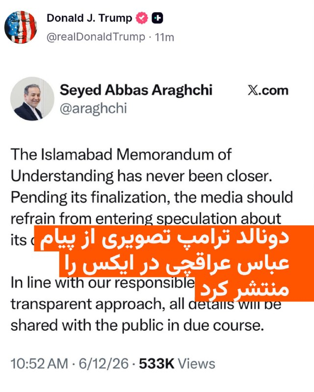

🔸دونالد ترامپ، رئیس‌جمهور آمریکا، تصویری از آخرین پست عباس عراقچی در شبکه ایکس را در صفحۀ شخصی خود در شبکه اجتماعی تروث سوشال منتشر کرد.

🔸آقای عراقچی در این پست نوشته بود که «یادداشت تفاهم اسلام‌آباد» برای پایان دادن به جنگ آمریکا و اسرائیل علیه ایران، «هیچگاه تا این حد به نهایی شدن نزدیک نبوده است» و در عین حال از رسانه‌ها خواسته بود تا زمان تکمیل و نهایی شدن آن، از گمانه‌زنی درباره محتوای این توافق خودداری کنند.

🔸پیام وزیر خارجۀ جمهوری اسلامی ساعتی بعد از انتقاد رئیس‌جمهور آمریکا از درز دادن مواردی از متن تفاهم با ایران به رسانه‌ها منتشر شده بود.

@RadioFarda

## alonews — post 127440

  <a href="telegram/content/alonews_127440_1781280214.mp4" target="_blank">🎬 Download video</a>

👈 پهپاد FPV اوکراینی باعث ریزش زمین شد و سربازی روسی را زنده دفن کرد.

✅ @AloNews خبر جنگ

---
📅 بروزرسانی: 1405/03/22 19:24
---

## VahidOOnLine — post 245164

  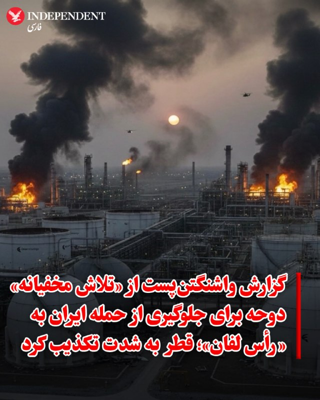

♦️ روزنامه واشنگتن‌پست در گزارشی اختصاصی به نقل از مقامات امنیتی خاورمیانه و غرب مدعی شد که قطر در ابتدای جنگ، تلاش کرده بود تا طی یک توافق مخفیانه با تهران، تاسیسات عظیم گاز طبیعی خود در «رأس لفان» را از بانک اهداف ایران خارج کند.

بر اساس این گزارش که از پیام‌های رهگیری‌شده و داده‌های اطلاعاتی به دست آمده، دوحه به تهران پیشنهاد داده بود که در قبال مصون ماندن تاسیسات رأس لفان، تولید گاز خود را به صورت یک‌جانبه متوقف کند.

در واکنش به این گزارش، دفتر رسانه‌ای بین‌المللی قطر با صدور بیانیه‌ای شدیداللحن، این ادعاها را «کاملا بی‌اساس» خواند و تکذیب کرد. دوحه تاکید کرد این اتهامات با توجه به اینکه قطر در همان زمان در حال دفاع فعال از خاک خود در برابر حملات موشکی ایران بوده، به هیچ وجه باورکردنی نیست. دولت قطر تصریح کرد که این گزارش بر پایه اطلاعات دروغین و هدایت‌شده از سوی بازیگرانی تنظیم شده است که هدفشان خرابکاری در تلاش‌های میانجی‌گرانه جاری، تخریب شهرت قطر و آسیب زدن به شراکت راهبردی این کشور با ایالات متحده است.
‌🇸🇦 Indypersian

🤖 @VahidOOnLine

## WithYashar — post 14648

به گفته‌ی CNBC معاملات سهام اسپیس اکس $SPCX تا پنج دقیقه‌ی دیگر آغاز می‌شود.
@withyashar

## mwarmonitor — post 10778

  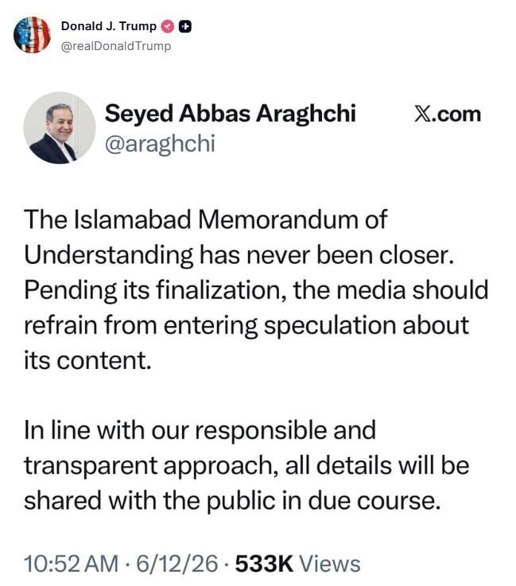

🔴ترامپ پست عراقچی بازنشر کرده

🔸تفاهم‌نامه اسلام‌آباد هیچگاه تا این حد به نهایی شدن نزدیک نبوده است. تا زمان تکمیل و نهایی شدن آن، رسانه‌ها باید از گمانه‌زنی درباره محتوای آن خودداری کنند.

🔸در راستای رویکرد مسئولانه و شفاف ما، تمامی جزئیات در زمان مقتضی با عموم مردم به اشتراک گذاشته خواهد شد.

@mwarmonitor

## pm_afshaa — post 93703

  <a href="telegram/content/pm_afshaa_93703_1781279663.webm" target="_blank">🎬 Download video</a>

🔴سناتور لیندزی گراهام:
ایدهٔ یک صندوق بازسازی 300 میلیارد دلاری برای ایران، با توجه به اینکه چه کسی در ایران مسئوله، به نظر بی‌توجه میاد. این مثل طرح مارشال برای آلمان است در حالی که نازی‌ها هنوز در قدرت هستن.

💧 Rainbet.com the #1 Non-KYC Crypto Casino & Sportsbook @rainbetcom

😁 @Pm_Afshaa

## mamlekate — post 103689

  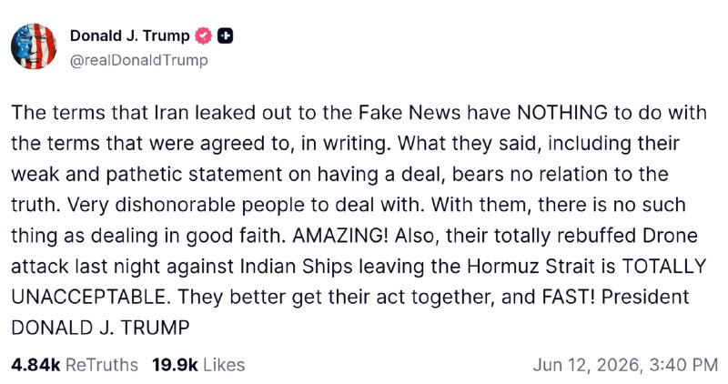

📝 ترامپ: مفاد درز داده شده توسط رژیم ایران به هیچ وجه حقیقت ندارد

ترامپ در پیامی نوشت مفادی که رژیم ایران در اختیار رسانه‌ها قرار داده است با شرایطی که به‌صورت مکتوب بر سر آن توافق شده بود، «هیچ ارتباطی» ندارد. او تعامل با رژیم ایران را سر و کار داشتن با «افرادی بسیار بی‌شرافت» دانست و نوشت: «در برخورد با آنها چیزی به نام تعامل با حسن نیت وجود ندارد.»

«شرایطی که ایران به رسانه‌های جعلی (فیک نیوز) لو داده است، هیچ ربطی به شرایطی که به طور مکتوب بر سر آن‌ها توافق شد، ندارد. آنچه آن‌ها گفتند، از جمله بیانیه ضعیف و رقت‌انگیزشان در مورد داشتن یک توافق، هیچ نسبتی با حقیقت ندارد. بسیار افراد بی‌شرفی برای معامله کردن هستند. با آن‌ها، چیزی به نام معامله از روی حسن نیت وجود ندارد. مایه شگفتی است! همچنین، حمله پهپادی کاملاً دفع‌شده آن‌ها در شب گذشته علیه کشتی‌های هندی که در حال ترک تنگه هرمز بودند، کاملاً غیرقابل قبول است. بهتر است هرچه زودتر رفتار خود را اصلاح کنند، و سریع هم این کار را بکنند! رئیس‌جمهور دونالد جی. ترامپ»


@mamlekate

## mamlekate — post 103688

📝 گزارش‌ها از محتوای تفاهم‌نامه احتمالی ایران و آمریکا؛ وضعیت مبهم هسته‌ای و تنگه هرمز

در پی اعلام دونالد ترامپ درباره به توافق رسیدن ایران و آمریکا بر سر تفاهم‌نامه پایان جنگ، خبرگزاری جمهوری اسلامی، ایرنا، روز جمعه ۲۲ خرداد مدعی شد که در این تفاهم «هیچ توافقی» درباره پرونده هسته‌ای ایران وجود ندارد.

@mamlekate

## IranIntlTV — post 341906

  <a href="https://t.me/IranintlTV/341906" target="_blank">📎 Download file</a>

🎧نسخه صوتی چرتکه: کارنامه صنعت ایران پس از جنگ
@iranintlTV

## DW_Farsi — post 125901

🔶 سایه جنگ ایران؛ تعویق رشد اقتصاد آلمان تا ۲۰۲۸

گزارش بانک مرکزی آلمان (بوندس‌بانک) کە روز جمعە ١٢ ژانویه منتشر شد، نشان می‌دهد که مخارج دولت توانسته است در شش‌ماهه تابستان جبران‌کننده تبعات اقتصادی جنگ در خاورمیانه باشد.

بر اساس این پیش‌بینی تولید ناخالص داخلی آلمان در سال جاری میلادی (۲۰۲۶) رشدی ۰.۷ درصدی را تجربه خواهد کرد. انتظار می‌رود این رقم در سال آینده میلادی به ۰.۹ درصد برسد و در سال ۲۰۲۸ با شتابی بیشتر، رشدی ۱.۲ درصدی را ثبت کند.
@dw_farsi

## Persian_Trend_Official — post 16861

  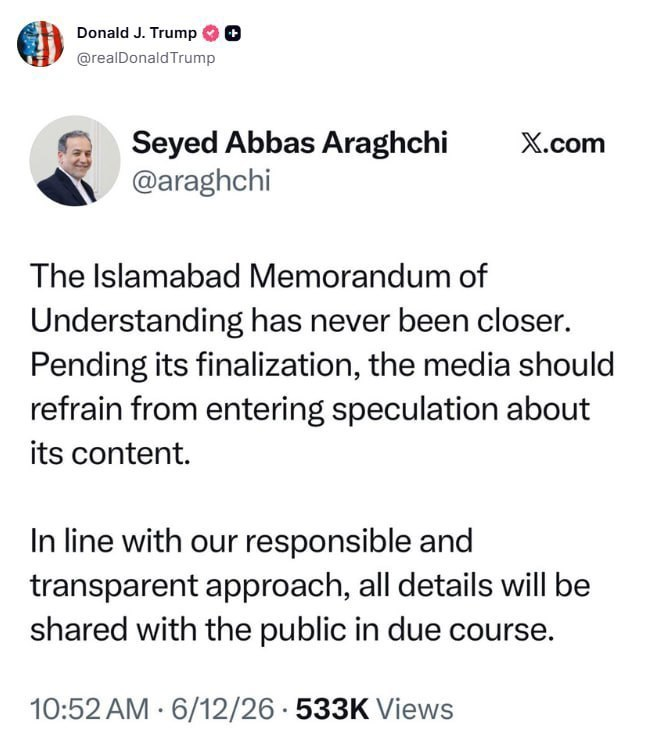

عراقچی: تفاهم‌نامه اسلام‌آباد هیچگاه تا این حد به نهایی شدن نزدیک نبوده است. سید عباس عراقچی، وزیر امور خارجه ایران، اعلام کرد که در چارچوب رویکرد مسئولانه و شفاف، تمامی جزئیات تفاهم‌نامه اسلام‌آباد در زمان مناسب با عموم مردم به اشتراک گذاشته خواهد شد. …

## IranianMinds — post 22415

  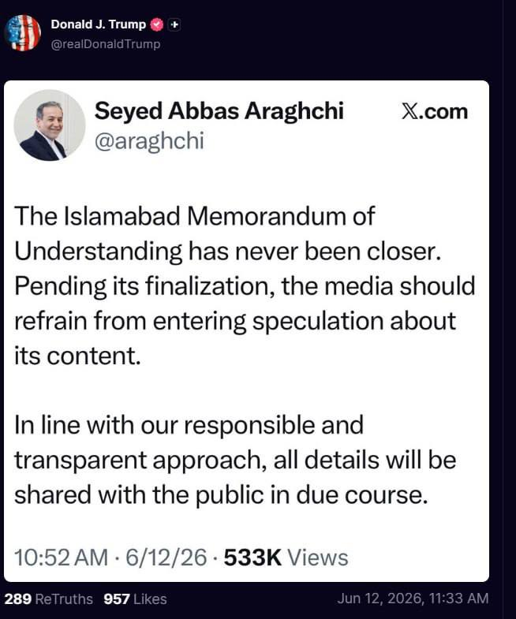

🔴پست جدید ترامپ.

@IranianMinds

## Dirty_Kids — post 391819

  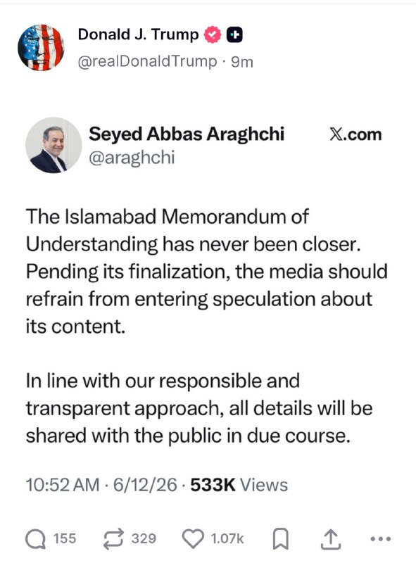

🔴 عراقچی: توافق با آمریکا هیچوقت انقد نزدیک نبوده و مذاکرات به جدی ترین حدش رسیده، بزودی جزئیات رو با مردم به اشتراک میذاریم. @Dirty_Kids 👻

## Dirty_Kids — post 391818

  

🔴 عراقچی: توافق با آمریکا هیچوقت انقد نزدیک نبوده و مذاکرات به جدی ترین حدش رسیده، بزودی جزئیات رو با مردم به اشتراک میذاریم.

@Dirty_Kids 👻

## Dirty_Kids — post 391817

  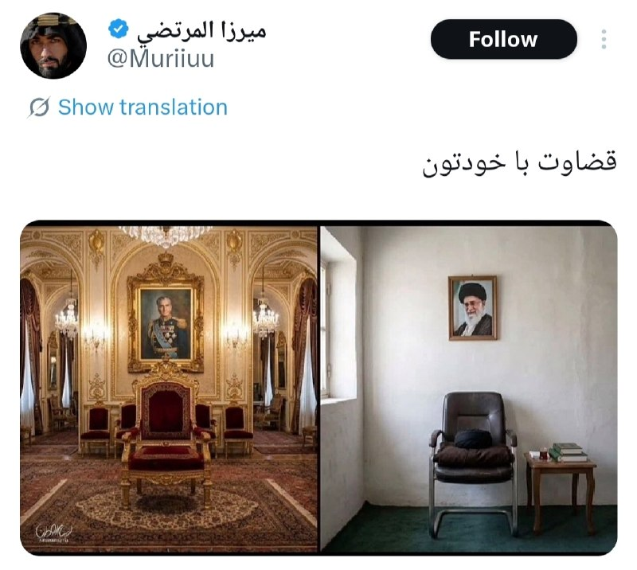

ترجیح میدم شاهانه زندگی کنم نه گداگشنه.

@Dirty_Kids 👻

## Dirty_Kids — post 391816

  <a href="telegram/content/Dirty_Kids_391816_1781279668.mp4" target="_blank">🎬 Download video</a>

کسی هست ندونه اینا اهل کجا هستن؟

@Dirty_Kids 👻

## alonews — post 127439

  <a href="telegram/content/alonews_127439_1781279671.webm" target="_blank">🎬 Download video</a>

👈محمود نبویان در واکنش به توافق احتمالی: وقتی خرش از پل گذشت، برمی‌گردد و به ریش شما می‌خندد

✅ @AloNews خبر جنگ

---
📅 بروزرسانی: 1405/03/22 19:13
---

## VahidOOnLine — post 245163

  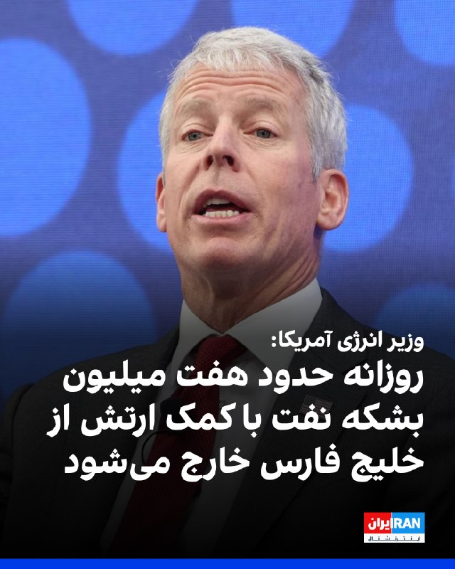

کریس رایت، وزیر انرژی آمریکا، گفت حدود هفت میلیون بشکه نفت در روز با کمک ارتش آمریکا از خلیج فارس خارج می‌شود و هیچ نفت خامی از ایران از تنگه هرمز عبور نمی‌کند.
وزیر انرژی آمریکا گفت اگر واشینگتن و تهران به توافق صلح برسند، انتظار دارد جریان آزاد همه محموله‌ها در خلیج فارس از سر گرفته شود.
وزیر انرژی آمریکا همچنین گفت در صورت دستیابی به توافق، ممکن است بخشی از تحریم‌های جمهوری اسلامی کاهش یابد.
کریس رایت ادامه داد: «تعلیق موقت مالیات بنزین در آمریکا طی تابستان می‌تواند به کاهش قیمت‌ها کمک کند.»
‌🏁 🇬🇧 IranintlTV

🤖 @VahidOOnLine

## WithYashar — post 14647

  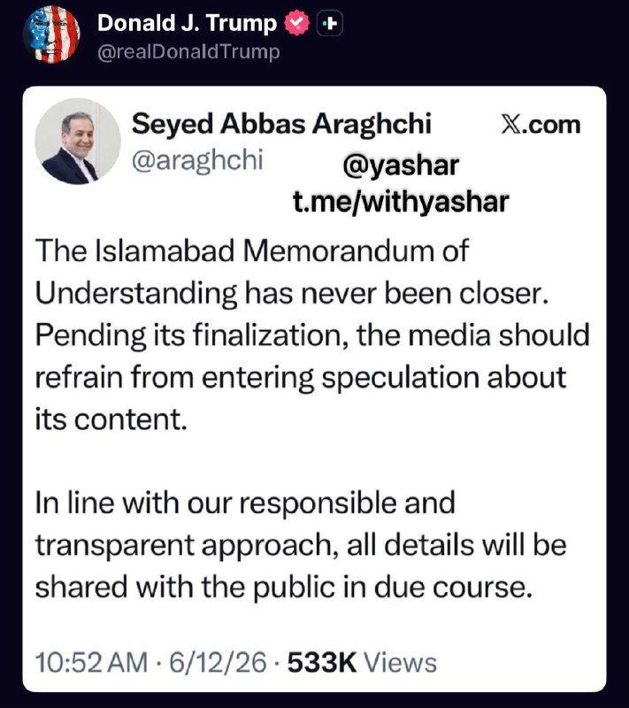

چپقچی، وزیر خارجه: حفظ یادداشت تفاهم اسلام‌آباد هرگز به این اندازه نزدیک نبوده است. تا زمان نهایی شدن آن، رسانه‌ها باید از ورود به حدس و گمان درباره محتوای آن خودداری کنند. در راستای رویکرد مسئولانه و شفاف ما، تمام جزئیات در زمان مناسب با عموم مردم به اشتراک…

## WithYashar — post 14646

اوهو‌ووووو‌‌ 🤣

## pm_afshaa — post 93702

ای بابا چجوری میتونین با قاتل پدرتون مذاکره کنین سر یه میز بشینین سید علی دیدی چه زود بچه هات شاشیدن رو خونت با قاتلت نشست کردن!؟

## pm_afshaa — post 93701

  <a href="telegram/content/pm_afshaa_93701_1781279005.webm" target="_blank">🎬 Download video</a>

🔴عباس عراقچی: تفاهم‌نامه اسلام‌آباد هیچگاه تا این حد به نهایی شدن نزدیک نبوده. تا زمان تکمیل و نهایی شدن آن، رسانه‌ها باید از گمانه‌زنی درباره محتوای آن خودداری کنند. در راستای رویکرد مسئولانه و شفاف ما، تمامی جزئیات در زمان مقتضی با عموم مردم به اشتراک…

## VahidOnline — post 76270

  

ترامپ اسکرین‌شات توییت عراقچی رو پست کرد:
realDonaldTrump

📡 @VahidOnline

## VahidOnline — post 76269

  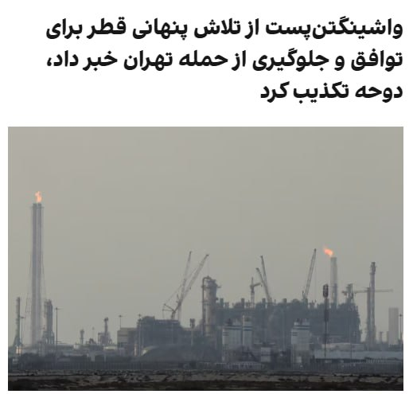

روزنامه واشینگتن‌پست در گزارشی خبر داد که قطر در جریان جنگ ایران مذاکراتی پنهانی با جمهوری اسلامی انجام داده تا تاسیسات گازی خود را از حملات تهران در امان نگه دارد.

قطر در واکنش، این گزارش را تکذیب و واشینگتن‌پست را به تلاش برای آسیب زدن به نقش میانجی‌گرانه دوحه متهم کرد.

واشینگتن‌پست در گزارش خود تاکید کرده که اقدامات پشت‌پرده قطر، تصویری از شیوه‌های پنهانی کشورهای خلیج فارس برای دور نگه داشتن خود از خسارات بزرگ‌ترین جنگ منطقه در ۲۰ سال گذشته به دست می‌دهد.

در این گزارش با اشاره به حمله موشکی جمهوری اسلامی به تاسیسات گازی راس لفان در قطر در اسفندماه سال گذشته، نوشته شده است این حمله بخش‌هایی از بزرگ‌ترین مجتمع تولید گاز طبیعی جهان را نابود کرد که نزدیک به یک پنجم گاز جهان را تامید می‌کند.

این حمله همچنین قراردادهای چندمیلیارد دلاری با چین و دیگر مشتریان را به خطر انداخت و چشم‌انداز پایان زودهنگام جنگ را با کشاندن قطر، یکی از میانجی‌های کلیدی میان آمریکا و جمهوری اسلامی، به درون درگیری تیره‌تر کرد.

به‌نوشته واشینگتن‌پست این حمله اما یک پیامد پنهان دیگر نیز داشت. به‌گفته مقام‌های امنیتی خاورمیانه و مقام‌های غربی مطلع از اطلاعات محرمانه، این حمله همچنین تلاش‌های مخفیانه قطر برای خارج نگه داشتن مجتمع گازی خود، موسوم به «راس لفان»، از فهرست اهداف جمهوری اسلامی را ناکام گذاشت.

یکی از مقام‌های ارشد امنیتی منطقه به این روزنامه گفت قطر چیزی در حد یک «توافق محرمانه» پیشنهاد کرد؛ توافقی که بر اساس آن دوحه متعهد می‌شد از نفوذ خود بر عرضه گاز برای تسریع پایان جنگ استفاده کند و در مقابل از جمهوری اسلامی تنها یک تعهد می‌خواست: «به ما حمله نخواهید کرد.»

یک مقام دیگر که به همان اطلاعات دسترسی داشته نیز به واشینگتن‌پست گفت پیام قطر به تهران این بود که: «شما بدون حمله به ما نیز به اهداف خود خواهید رسید.»

به گفته این مقام‌ها، قطر نتوانست تعهدی از جمهوری اسلامی دریافت کند. با این حال، روندی که پس از آن رخ داد نشان می‌داد که احتمال وجود یک تفاهم ضمنی دست‌کم به‌طور موقت همچنان برقرار بوده است.

قطر در سومین روز جنگ، زمانی که جمهوری اسلامی صدها موشک و پهپاد مسلح را به سوی اهدافی در سراسر خلیج فارس شلیک کرد، مجتمع راس لفان را تعطیل کرد. در آن زمان، قطر دلیل این اقدام را «حملات نظامی علیه تاسیسات عملیاتی» اعلام کرد.

تصاویر ماهواره‌ای که بعدا از سوی واشینگتن پست بررسی شد، هیچ نشانه آشکاری از خسارت در راس لفان نشان نمی‌داد.

اظهارات مقام‌های قطری نیز نگرانی‌ها را در بازارهای جهانی انرژی تشدید کرد؛ از جمله هشدار وزیر انرژی قطر که گفته بود این جنگ «اقتصادهای جهان را به زانو در خواهد آورد.»

قطر در پاسخ به پرسش‌های واشینگتن پست، هرگونه توافق محرمانه با جمهوری اسلامی را رد کرد و گفت تصمیم برای توقف تولید در راس لفان صرفا به‌دلیل تهدید حملات و نگرانی برای کارکنان و زیرساخت‌هایی اتخاذ شده بود که شریان حیاتی اقتصاد این کشور محسوب می‌شود.
...
iranintl

📡 @VahidOnline

## kianmeli1 — post 87961

  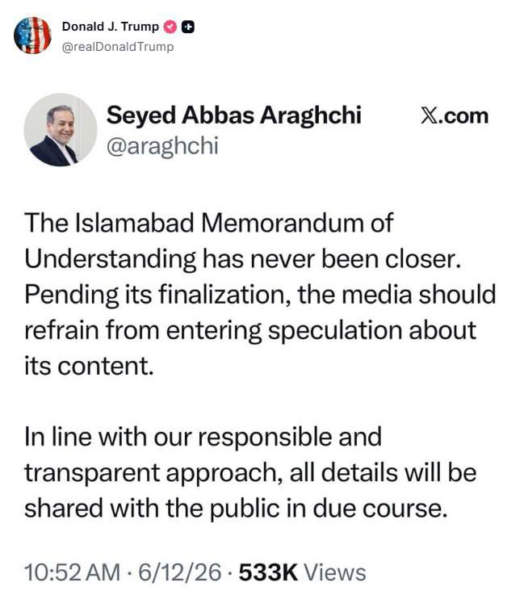

🔴ترامپ توئیت عراقچی را باز نشر کرد

وزیرخارجه گفته بود:
یادداشت تفاهم اسلام‌آباد هرگز تا این اندازه به نهایی شدن نزدیک نبوده است. تا نهایی شدن آن، رسانه‌ها باید از ورود به حدس و گمان درباره محتوای آن خودداری کنند.
https://t.me/kianmeli1

## IranIntlTV — post 341905

  

کریس رایت، وزیر انرژی آمریکا، گفت حدود هفت میلیون بشکه نفت در روز با کمک ارتش آمریکا از خلیج فارس خارج می‌شود و هیچ نفت خامی از ایران از تنگه هرمز عبور نمی‌کند.
وزیر انرژی آمریکا گفت اگر واشینگتن و تهران به توافق صلح برسند، انتظار دارد جریان آزاد همه محموله‌ها در خلیج فارس از سر گرفته شود.
وزیر انرژی آمریکا همچنین گفت در صورت دستیابی به توافق، ممکن است بخشی از تحریم‌های جمهوری اسلامی کاهش یابد.
کریس رایت ادامه داد: «تعلیق موقت مالیات بنزین در آمریکا طی تابستان می‌تواند به کاهش قیمت‌ها کمک کند.»
https://iranintl.com/202606121447

## Persian_Trend_Official — post 16860

حزب‌الله لبنان ویدیویی از شلیک یک موشک بالستیک تاکتیکی از خانواده فتح و چندین پهپاد انتحاری به سوی یک مقر توپخانه ای اسرائیل در شهر عدیشه در جنوب لبنان منتشر کرد.

📝 Amir

📌 @persian_trend_official
پرشین ترند | متفاوت‌ترین کانال نظامی

## Persian_Trend_Official — post 16858

  <a href="telegram/content/Persian_Trend_Official_16858_1781279007.mp4" target="_blank">🎬 Download video</a>

دقایقی پیش جنگنده‌های اسرائیلی منطقه صرفند در جنوب لبنان را هدف قرار دادند‌.

📝 Amir

📌 @persian_trend_official
پرشین ترند | متفاوت‌ترین کانال نظامی

## BBCPersian — post 283580

🔻نتانیاهو: تا زمانی که من نخست‌وزیر اسرائیل باشم، ایران به سلاح هسته‌ای دست نخواهد یافت

بنیامین نتانیاهو، در پیامی در شبکه اجتماعی ایکس به زبان عبری نوشته است: «تا زمانی که من نخست‌وزیر اسرائیل باشم، ایران به سلاح هسته‌ای دست نخواهد یافت.»

او اضافه کرده است: «میان من و رئیس‌جمهور ترامپ در این موضوع توافق کامل وجود دارد.»

او ادعا کرده که ۳۰ سال است در «خط مقدم مبارزه بین‌المللی» علیه برنامه هسته‌ای ایران قرار دارد.

آقای نتانیاهو افزوده است:‌ «اگر این مبارزه نبود، ایران مدت‌ها پیش به بمب‌های اتمی برای نابودی اسرائیل دست یافته بود. ایران در پی نابودی کشور یهودیان است و من زندگی خود را وقف جلوگیری از تحقق این هدف کرده‌ام.»

این نخستین اظهارات آقای نتانیاهو پس از آن است که دونالد ترامپ گفت توافق با ایران نهایی شده است و حملات برنامه‌ریزی‌شده دیشب خود علیه ایران را لغو کرد.

https://bbc.in/4uskToJ
@BBCPersian

## BBCPersian — post 283579

توماج صالحی در پی‌ واکنش‌ها به صحبت‌های اخیرش، این ویدیو را منتشر کرد.

در این ویدیو که عکس آن ابتدا در ۲۲ بهمن منتشر شد، او تابلویی در دست دارد که روی آن نوشته شده: «دلاوران ۴۰۴ را آزاد کنید.»

او چند روز پیش این ویدیو را در انتقاد از کسانی که به گفته او «خواهان نابودی زیرساخت‌های کشور هستند تا مردم به خاطر فشار اقتصادی انقلاب کنند، منتشر کرد.»

این ویدیو را ببینید.
@BBCPersian

## BBCPersian — post 283578

  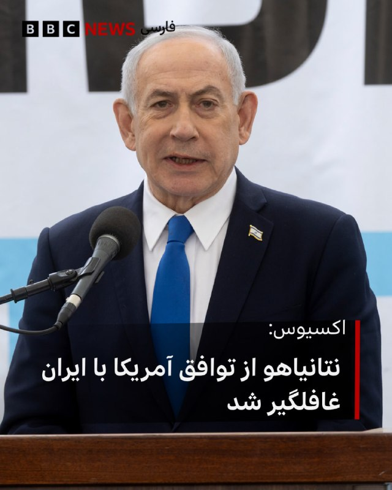

🔻سایت خبری اکسیوس به نقل از دو دپیلمات از کشورهای میانجی و دو مقام آمریکایی گزارش کرده است که توافق مقدماتی چهارشنبه شب بعد از ساعت‌ها مذاکره میان علی الذوادی، میانجی قطری و عباس عراقچی، وزیر خارجه ایران، حاصل شده است.

به گفته دو نفر از این منابع، میانجی قطری در جریان این گفت‌و‌گو چندین بار با استیو ویتکاف و جرد کوشنر، نمایندگان ارشد دونالد ترامپ، تلفنی صحبت کرده است.

این منابع همچنین می‌گویند که بنیامین نتانیاهو، نخست‌وزیر اسرائیل، از شنیدن خبر توافق متعجب شده است.

دو منبع آگاه آمریکایی به اکسیوس گفتند که آقای نتانیاهو در روزهای اخیر از طرف آمریکا در جریان وضعیت مذاکرات قرار نمی‌گرفته و به همین دلیل در تکاپو بوده است تا برای کسب اطلاع، با متحدان نزدیک آمریکا تماس بگیرد.

📸GettyImages
https://bbc.in/4e6qLPK
@BBCPersian

## alonews — post 127438

  <a href="telegram/content/alonews_127438_1781279009.webm" target="_blank">🎬 Download video</a>

🔴فوری / ترامپ توئیت عراقچی را بازنشر داد

✅ @AloNews خبر جنگ

## alonews — post 127436

  <a href="telegram/content/alonews_127436_1781279009.mp4" target="_blank">🎬 Download video</a>

👈 تصاویری از حملهِ به روستای اَلسَرفَند تو جنوب لُبنان

✅ @AloNews خبر جنگ

## alonews — post 127435

  <a href="telegram/content/alonews_127435_1781279010.webm" target="_blank">🎬 Download video</a>

🔴فوری/العربیه به نقل از یک منبع دیپلماتیک: آمریکا و ایران آمادگی خود را برای امضای توافق به میانجی‌ها اعلام کرده‌اند

🔴دولت ترامپ در حال برنامه‌ریزی برای برگزاری مراسم امضا در ژنو، احتمالاً در این آخر هفته است

✅ @AloNews خبر جنگ

## alonews — post 127434

  <a href="telegram/content/alonews_127434_1781279010.webm" target="_blank">🎬 Download video</a>

👈شبکه ای‌بی‌سی به نقل از یک مقام آمریکایی: پیش‌نویس توافق مورد موافقت سطوح بالای نظام ایران قرار گرفته است.

✅ @AloNews خبر جنگ

---
📅 بروزرسانی: 1405/03/22 19:03
---

## VahidOOnLine — post 245162

  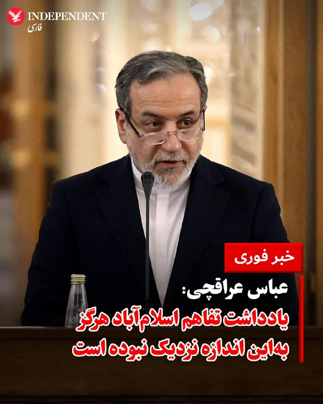

♦️عباس عراقچی، وزیر امور خارجه جمهوری اسلامی که نقشی کلیدی در مذاکرات جاری با واشنگتن دارد، با هشدار به رسانه‌ها برای خودداری از گمانه‌زنی، تاکید کرد که «یادداشت تفاهم اسلام‌آباد، هرگز به این اندازه نزدیک نبوده است.»

عراقچی با اشاره به گزارش‌های رسانه‌ها درباره برخی جزئیات این تفاهم‌نامه که با واکنش تند ترامپ نیز مواجه شد، گفت: «در راستای رویکرد مسئولانه و شفاف ما، تمامی جزئیات در زمان مقتضی با عموم مردم به اشتراک گذاشته خواهد شد.»
‌🇸🇦 Indypersian

🤖 @VahidOOnLine

## VahidOOnLine — post 245161

  

مسعود پزشکیان در نشست مشترک وزارت دفاع و وزارت نیروی جمهوری اسلامی گفت که اصلاح رفتار مصرفی، ارتقای بهره‌وری و مشارکت عمومی از الزامات اساسی مقابله با «ناترازی‌های» انرژی است.
او با اشاره به اینکه «پیچیدگی‌های جنگ اقتصادی به مراتب بیشتر از جنگ نظامی است» افزود: «دشمنان با ایجاد اختلال در تامین منابع حوزه‌های آب، برق، گاز و معیشت مردم به دنبال ایجاد نارضایتی عمومی هستند.»
‌🏁 🇬🇧 IranintlTV

🤖 @VahidOOnLine

## VahidOOnLine — post 245160

  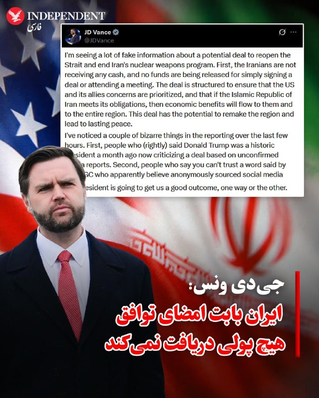

♦️جی‌دی ونس، معاون رئیس‌جمهوری آمریکا، با انتشار پیامی در شبکه اجتماعی ایکس، به شایعات و گزارش‌ها درباره توافق احتمالی برای بازگشایی تنگه هرمز و پایان دادن به برنامه تسلیحات هسته‌ای ایران واکنش نشان داد.

ونس اعلام کرد: «ایرانی‌ها هیچ پول نقدی دریافت نمی‌کنند و هیچ دارایی مالی صرفا برای امضای یک توافق یا شرکت در یک جلسه آزاد نخواهد شد.» او تاکید کرد که ساختار این توافق به گونه‌ای است که اولویت با دغدغه‌های آمریکا و متحدانش است و تنها در صورت اجرای کامل تعهدات از سوی جمهوری اسلامی، منافع اقتصادی به آن‌ها و کل منطقه سرازیر می‌شود؛ امری که می‌تواند منطقه را بازسازی کرده و به صلحی پایدار منجر شود.
‌🇸🇦 Indypersian

🤖 @VahidOOnLine

## WithYashar — post 14645

جی‌ دی ونس:
اولاً، ایرانیان هیچ وجه نقدی دریافت نمی‌کنند و هیچ وجهی صرفاً برای امضای یک توافق یا حضور در یک جلسه آزاد نمی‌شود
این توافق به گونه‌ای طراحی شده است که نگرانی‌های ایالات متحده و متحدانش اولویت داشته باشد، و اگر جمهوری اسلامی ایران تعهدات خود را انجام دهد، فواید اقتصادی به آن‌ها و کل منطقه سرازیر خواهد شد. این توافق پتانسیل بازسازی منطقه و منجر شدن به صلح پایدار را دارد.
@withyashar

## pm_afshaa — post 93700

  <a href="telegram/content/pm_afshaa_93700_1781278403.webm" target="_blank">🎬 Download video</a>

🔴ای‌بی‌سی نیوز: با همه اختلافات و نوشته‌های تند در سوشال‌مدیا، دولت ترامپ در حال پیشبرد برنامه‌های برگزاری مراسم امضای توافق در ژنو، احتمالاً در آخر همین هفته‌ست.

💧 Rainbet.com the #1 Non-KYC Crypto Casino & Sportsbook @rainbetcom

😁 @Pm_Afshaa

## pm_afshaa — post 93699

  <a href="telegram/content/pm_afshaa_93699_1781278404.webm" target="_blank">🎬 Download video</a>

🔴کاتز، وزیر دفاع اسرائیل: ما به دنبال پیروزی هستیم نه سازش و امتیازدهی.

💧 Rainbet.com the #1 Non-KYC Crypto Casino & Sportsbook @rainbetcom

😁 @Pm_Afshaa

## VahidOnline — post 76268

  

جی‌دی ونس، معاون رئیس‌جمهوری آمریکا، با انتشار پیامی در شبکه اجتماعی ایکس، به شایعات و گزارش‌ها درباره توافق احتمالی برای بازگشایی تنگه هرمز و پایان دادن به برنامه تسلیحات هسته‌ای ایران واکنش نشان داد.

ونس اعلام کرد: «ایرانی‌ها هیچ پول نقدی دریافت نمی‌کنند و هیچ دارایی مالی صرفا برای امضای یک توافق یا شرکت در یک جلسه آزاد نخواهد شد.» او تاکید کرد که ساختار این توافق به گونه‌ای است که اولویت با دغدغه‌های آمریکا و متحدانش است و تنها در صورت اجرای کامل تعهدات از سوی جمهوری اسلامی، منافع اقتصادی به آن‌ها و کل منطقه سرازیر می‌شود؛ امری که می‌تواند منطقه را بازسازی کرده و به صلحی پایدار منجر شود.
@VahidOOnLine

📡 @VahidOnline

## IranIntlTV — post 341904

  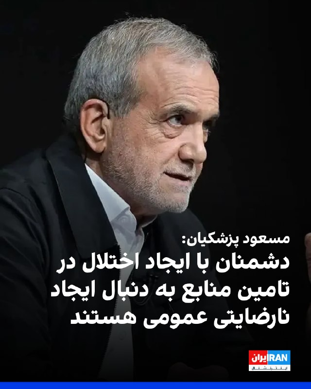

مسعود پزشکیان در نشست مشترک وزارت دفاع و وزارت نیروی جمهوری اسلامی گفت که اصلاح رفتار مصرفی، ارتقای بهره‌وری و مشارکت عمومی از الزامات اساسی مقابله با «ناترازی‌های» انرژی است.
او با اشاره به اینکه «پیچیدگی‌های جنگ اقتصادی به مراتب بیشتر از جنگ نظامی است» افزود: «دشمنان با ایجاد اختلال در تامین منابع حوزه‌های آب، برق، گاز و معیشت مردم به دنبال ایجاد نارضایتی عمومی هستند.»
https://iranintl.com/202606120328

## IranIntlTV — post 341903

  <a href="https://t.me/IranintlTV/341903" target="_blank">📎 Download file</a>

🎧نسخه صوتی اخبار شبانگاهی | جمعه ۲۲ خرداد
@iranintlTV

## Shin_Persian — post 6986

↩️ Quoted tweet: Shin ✓ @hey_itsmyturn Fri, 12 Jun 2026 15:28:38 UTC @JDVance Yes, people believe the claims by an OFFICIAL STATE-OWNED media (Let's say Mehr), Of course no one trusts the IRGC terrorists, but when THEY are the other end of the deal, their…

## Shin_Persian — post 6985

↩️ Quoted tweet:
Shin ✓ @hey_itsmyturn
Fri, 12 Jun 2026 15:28:38 UTC

@JDVance Yes, people believe the claims by an OFFICIAL STATE-OWNED media (Let's say Mehr), Of course no one trusts the IRGC terrorists, but when THEY are the other end of the deal, their media will be taken seriously.
Now you answer:
https://t.me/mehrnews/386296
Do you consider a regime-owned

↩️ توییت نقل‌قول شده — برای پاسخ، پست زیر را ببینید.

ترجمه خودکار فارسی

@JDVance بله، مردم ادعاهای یک رسانه رسمی دولتی (مثلاً خبرگزاری مهر) را باور می‌کنند، البته هیچ‌کس به تروریست‌های سپاه پاسداران (IRGC) اعتماد ندارد، اما وقتی آن‌ها طرف دیگر معامله هستند، رسانه‌شان جدی گرفته خواهد شد.
حالا شما پاسخ دهید:
https://t.me/mehrnews/386296
آیا شما یک رسانه متعلق به رژیم را معتبر می‌دانید؟

𝕏 · @shin_persian

## Shin_Persian — post 6984

Shin ✓ @hey_itsmyturn
Fri, 12 Jun 2026 15:23:10 UTC

US VP:
"I'm seeing a lot of fake information about a potential deal to reopen the Strait and end Iran's nuclear weapons program. First, the Iranians are not receiving any cash, and no funds are being released for simply signing a deal or attending a meeting. The deal is structured to ensure that the US and its allies concerns are prioritized, and that if the Islamic Republic of Iran meets its obligations, then economic benefits will flow to them and to the entire region. This deal has the potential to remake the region and lead to lasting peace. I've noticed a couple of bizarre things in the reporting over the last few hours. First, people who (rightly) said Donald Trump was a historic president a month ago now criticizing a deal based on unconfirmed media reports. Second, people who say you can't trust a word said by the IRGC who apparently believe anonymously sourced social media posts. The president is going to get us a good outcome, one way or the other."

ترجمه خودکار فارسی

معاون رئیس‌جمهور ایالات متحده:
«من شاهد اطلاعات جعلی زیادی در مورد توافق احتمالی برای بازگشایی تنگه و پایان دادن به برنامه سلاح‌های هسته‌ای ایران هستم. اولاً، ایرانی‌ها هیچ پول نقدی دریافت نمی‌کنند و هیچ وجهی صرفاً برای امضای یک توافق یا شرکت در یک جلسه آزاد نمی‌شود. ساختار این توافق به گونه‌ای است که اطمینان حاصل شود نگرانی‌های ایالات متحده و متحدانش در اولویت قرار دارد، و اگر جمهوری اسلامی ایران به تعهدات خود عمل کند، منافع اقتصادی به سوی آن‌ها و کل منطقه سرازیر خواهد شد. این توافق پتانسیل بازسازی منطقه و برقراری صلح پایدار را دارد. من متوجه چند مورد عجیب در گزارش‌های چند ساعت گذشته شده‌ام. اول، افرادی که یک ماه پیش (به‌درستی) می‌گفتند دونالد ترامپ یک رئیس‌جمهور تاریخی بود، اکنون بر اساس گزارش‌های تایید نشده رسانه‌ای از یک توافق انتقاد می‌کنند. دوم، افرادی که می‌گویند نمی‌توان به هیچ حرفی از سوی سپاه پاسداران انقلاب اسلامی (IRGC) اعتماد کرد، ظاهراً پست‌های شبکه‌های اجتماعی با منابع ناشناس را باور می‌کنند. رئیس‌جمهور به هر شکلی که شده، یک نتیجه خوب برای ما رقم خواهد زد.»

𝕏 · @shin_persian

## DW_Farsi — post 125900

🔶 فشار بر استارمر پس از تغییر وزیر دفاع بریتانیا کاهش نیافته است

پس از استعفای جان هیلی در روز پنج‌شنبه (۱۱ ژوئن)، دان جارویس همان شب به‌عنوان وزیر دفاع جدید بریتانیا معرفی شد.

این جابه‌جایی سریع اگرچه خلا مدیریتی در وزارت دفاع را پر کرد، اما از فشار سیاسی بر کی‌یر استارمر، نخست‌وزیر بریتانیا، کم نکرد؛ به‌ویژه آن‌که نامه استعفای هیلی، در عمل یک انتقاد تند از سیاست دفاعی دولت بود.

دان جارویس پیش از این، وزیر مشاور در وزارت کشور و همچنین در کابینه دولت بود. او از چهره‌های دارای سابقه امنیتی و نظامی به شمار می‌رود، در دانشگاه ابریستویث در رشته سیاست بین‌الملل و مطالعات راهبردی تحصیل کرده و از آکادمی نظامی سندهرست فارغ‌التحصیل شده است.
@dw_farsi

## Persian_Trend_Official — post 16857

  <a href="telegram/content/Persian_Trend_Official_16857_1781278405.webm" target="_blank">🎬 Download video</a>

عراقچی: تفاهم‌نامه اسلام‌آباد هیچگاه تا این حد به نهایی شدن نزدیک نبوده است.

سید عباس عراقچی، وزیر امور خارجه ایران، اعلام کرد که در چارچوب رویکرد مسئولانه و شفاف، تمامی جزئیات تفاهم‌نامه اسلام‌آباد در زمان مناسب با عموم مردم به اشتراک گذاشته خواهد شد.

وی تأکید کرد: تا زمان تکمیل و نهایی شدن آن، رسانه‌ها باید از گمانه‌زنی درباره محتوای آن خودداری کنند.

📝 Amir

📌 @persian_trend_official
پرشین ترند | متفاوت‌ترین کانال نظامی

## RadioFarda — post 158229

  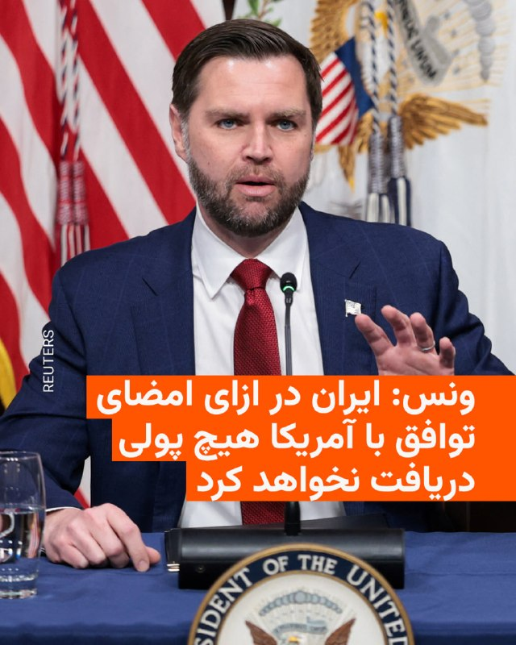

🔸جی‌دی ونس، معاون رئیس‌جمهور آمریکا، روز جمعه گفت که در ازای امضای توافق با ایالات متحده یا حضور در یک نشست، هیچ‌گونه منابع مالی در اختیار ایران قرار نخواهد گرفت و تهران «هیچ پولی دریافت نمی‌کند».

🔸او در شبکه ایکس نوشت توافق آمریکا و ایران «به گونه‌ای طراحی شده است که اطمینان حاصل شود نگرانی‌های ایالات متحده و متحدانش در اولویت قرار دارند و در صورتی که جمهوری اسلامی ایران به تعهدات خود عمل کند، منافع اقتصادی به ایران و همچنین به کل منطقه خواهد رسید».

🔸معاون دونالد ترامپ همچنین وعده داد: «این توافق این ظرفیت را دارد که منطقه را دگرگون کند و به صلحی پایدار منجر شود.»

🔸این موضع ساعتی بعد از انتقاد رئیس‌جمهور آمریکا از درز دادن مواردی از متن تفاهم با ایران به رسانه‌ها اتخاذ شد. ترامپ تصریح کرد آنچه به عنوان محتوای توافق منتشر شده است، به هیچ وجه واقعیت ندارد.

@RadioFarda

## RadioFarda — post 158228

از میدان جنگ تا میز مذاکره؛ روایت دوگانهٔ آمریکا و اسرائیل درباره ایران

🔸در حالی که دونالد ترامپ، رئیس‌جمهور آمریکا، از دستیابی قریب‌الوقوع به یک تفاهم سیاسی با ایران خبر داده، معاون او در گفت‌وگویی با شبکه سی‌بی‌اس‌نیوز وجود اختلاف دیدگاه با نخست‌وزیر اسرائیل در برخی موارد، از جمله بر سر جنگ‌های جاری در خاورمیانه و ایران، را تأیید کرده است.

🔸در این گزارش به بازتاب اظهارات و رویکرد مقامات آمریکایی در جامعه اسرائیل می‌پردازیم. متن کامل را در وب‌سایت رادیوفردا بخوانید.

@RadioFarda

## IranianMinds — post 22414

  <a href="telegram/content/IranianMinds_22414_1781278406.mp4" target="_blank">🎬 Download video</a>

تلاوت شیرین دویدم، به قبرستونی رسیدم.

@IranianMinds

## BBCPersian — post 283577

  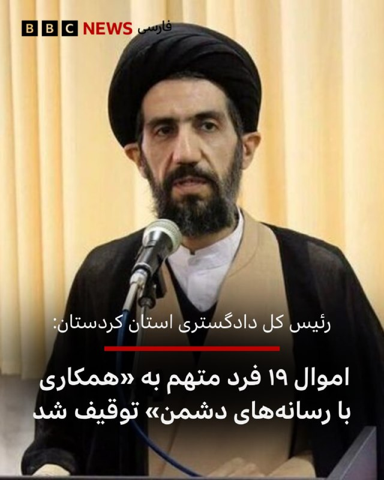

🔻رئیس کل دادگستری استان کردستان گفته است که اموال ۱۹ فرد متهم «به همکاری با رسانه‌های وابسته به دشمن» در این استان توقیف شده است.

حسین حسینی گفته است این افراد «فیلم و عکس از اماکن حساس و محل اصابت پرتابه‌های دشمن تهیه کرده و این محتوا را برای حساب‌های کاربری رسانه‌ها و شبکه‌های وابسته به دشمن از جمله ایران اینترنشنال، بی‌بی‌سی فارسی، صدای آمریکا، رادیو فردا، من‌وتو و همچنین کانال‌ها و حساب‌های کاربری مرتبط با سرویس‌های جاسوسی ارسال می‌کردند.»
به گفته این مقام قضایی توقیف اموال این ۱۹ نفر بر اساس «اجرای قانون تشدید مجازات جاسوسی و همکاری با رژیم صهیونیستی و کشورهای متخاصم» انجام شده است.
این قانون سال گذشته و پس از حمله اسرائیل به ایران و جنگ ۱۲ روزه تصویب شد.

در جریان حملات آمریکا و اسرائیل به ایران که نهم اسفند آغاز شد، ایران اجرای این قانون را شدت داده و اموال ده‌ها نفر را توقیف کرده است.

📸MEHR
https://bbc.in/4uBOZX4
@BBCPersian

## alonews — post 127433

  <a href="telegram/content/alonews_127433_1781278408.webm" target="_blank">🎬 Download video</a>

👈 سید عباس عراقچی، وزیر خارجه: حفظ یادداشت تفاهم اسلام‌آباد هرگز به این اندازه نزدیک نبوده است. تا زمان نهایی شدن آن، رسانه‌ها باید از ورود به حدس و گمان درباره محتوای آن خودداری کنند. 
🔴در راستای رویکرد مسئولانه و شفاف ما، تمام جزئیات در زمان مناسب با عموم…

---
📅 بروزرسانی: 1405/03/22 18:53
---

## VahidOOnLine — post 245159

  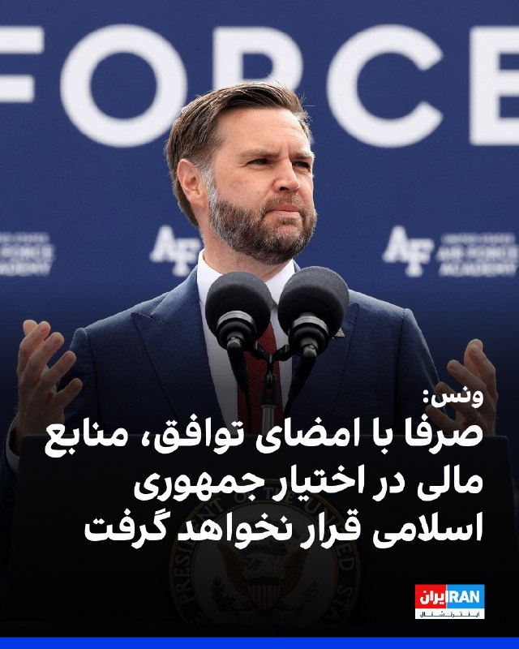

جی دی ونس، معاون رییس‌جمهوری آمریکا، گفت مقامات جمهوری اسلامی هیچ پولی دریافت نمی‌کنند و صرفا به دلیل امضای توافق یا شرکت در یک نشست، هیچ منابع مالی در اختیار آنها قرار نخواهد گرفت.

ونس افزود: «اطلاعات نادرست زیادی درباره توافق احتمالی برای بازگشایی تنگه هرمز و پایان دادن به برنامه تسلیحات هسته‌ای جمهوری اسلامی در حال انتشار است.»

او گفت این توافق به گونه‌ای تنظیم شده که نگرانی‌های آمریکا و متحدانش در اولویت قرار گیرد و اگر جمهوری اسلامی به تعهدات خود عمل کند، منافع اقتصادی نصیب ایران و کل منطقه خواهد شد.
‌🏁 🇬🇧 IranintlTV

🤖 @VahidOOnLine

## VahidOOnLine — post 245158

  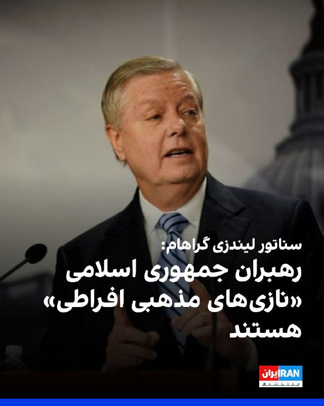

لیندزی گراهام، سناتور جمهوری‌خواه آمریکا، در شبکه ایکس نوشت بسیار خوشحال است که دونالد ترامپ گزارش‌های رسانه‌های ایرانی درباره توافق ادعایی را جعلی خوانده، زیرا توافقی که جمهوری اسلامی توصیف کرده، «افتضاح» خواهد بود.

سناتور گراهام افزود ترامپ و ارتش آمریکا شایسته تقدیر هستند، زیرا با ترکیبی از حملات نظامی موثر و محاصره شدید، جمهوری اسلامی را به ضعیف‌ترین وضعیت خود در ۴۷ سال گذشته رسانده‌اند.

سناتور گراهام نوشت نباید فراموش کرد که جمهوری اسلامی ۴۲ هزار نفر از شهروندان خود را تنها به دلیل خواست زندگی بهتر کشته و رهبران آن «نازی‌های مذهبی افراطی» هستند.

سناتور گراهام ادامه داد: «در مورد هرگونه توافق احتمالی، باید آن را با برجام مقایسه کرد و امیدوارم که بسیار متفاوت باشد.»

او افزود ایده ایجاد صندوق بازسازی ۳۰۰ میلیارد دلاری برای ایران، با توجه به حاکمان کنونی این کشور، نادرست و شبیه طرح مارشال برای آلمان در حالی که نازی‌ها همچنان در قدرت باشند، است.

او گفت که خط قرمز دونالد ترامپ در موضوع هسته‌ای، «عدم غنی‌سازی» بوده و امیدوارم این اصل حفظ شود.
‌🏁 🇬🇧 IranintlTV

🤖 @VahidOOnLine

## WithYashar — post 14644

سناتور لیندزی گراهام: ایدهٔ یک صندوق بازسازی ۳۰۰ میلیارد دلاری، با توجه به اینکه چه کسی در ایران مسئول است، به نظر بی‌توجه می‌آید.

این مانند طرح مارشال برای آلمان است در حالی که نازی‌ها هنوز در قدرت هستند.
@withyashar

## WithYashar — post 14643

بعدن میگم 🥶

## WithYashar — post 14642

یه چیز بگم مغزتون سوت بکشه 🤯

## WithYashar — post 14641

جی دی ونس، معاون ترامپ:

این توافق به گونه‌ای ساختاربندی شده است که نگرانی‌های آمریکا و متحدانش در اولویت قرار گیرد و اگر جمهوری اسلامی ایران به تعهدات خود عمل کند، منافع اقتصادی به آن‌ها و کل منطقه خواهد رسید. این توافق پتانسیل بازسازی منطقه و ایجاد صلح پایدار را دارد.
در گزارش‌های چند ساعت گذشته چند نکته عجیب دیده‌ام. اول، افرادی که (به درستی) یک ماه پیش گفته بودند دونالد ترامپ رئیس‌جمهور تاریخی بود، اکنون بر اساس گزارش‌های رسانه‌ای تأییدنشده از توافق انتقاد می‌کنند. دوم، افرادی که می‌گویند نمی‌توان به هیچ کلمه‌ای از سپاه پاسداران اعتماد کرد، ظاهراً به پست‌های ناشناس در شبکه‌های اجتماعی باور دارند.
رئیس‌جمهور به هر حال نتیجه خوبی برای ما به دست خواهد آورد.
@withyashar

## pm_afshaa — post 93698

  <a href="telegram/content/pm_afshaa_93698_1781277811.webm" target="_blank">🎬 Download video</a>

🔴جی‌دی ونس، معاون ترامپ:

درباره توافق احتمالی با ایران اطلاعات نادرست زیادی منتشر شده؛ ایران با امضای توافق هیچ پول نقد یا دارایی آزادشده‌ای دریافت نمیکنه.

ساختار توافق به‌گونه‌ای طراحی شده که منافع آمریکا و متحدانش در اولویت باشه و در نهایت ترامپ هر طور شده نتیجه‌ای خوب برای آمریکا رقم خواهد زد.

💧 Rainbet.com the #1 Non-KYC Crypto Casino & Sportsbook @rainbetcom

😁 @Pm_Afshaa

## DEJradio — post 5620

  <a href="telegram/content/DEJradio_5620_1781277811.mp4" target="_blank">🎬 Download video</a>

🔺📢 ارتشی کجای مسیر رو اشتباه رفتی؟

#ارتشی #چادری
@DEJradio

## IranIntlTV — post 341902

  

جی دی ونس، معاون رییس‌جمهوری آمریکا، گفت مقامات جمهوری اسلامی هیچ پولی دریافت نمی‌کنند و صرفا به دلیل امضای توافق یا شرکت در یک نشست، هیچ منابع مالی در اختیار آنها قرار نخواهد گرفت.

ونس افزود: «اطلاعات نادرست زیادی درباره توافق احتمالی برای بازگشایی تنگه هرمز و پایان دادن به برنامه تسلیحات هسته‌ای جمهوری اسلامی در حال انتشار است.»

او گفت این توافق به گونه‌ای تنظیم شده که نگرانی‌های آمریکا و متحدانش در اولویت قرار گیرد و اگر جمهوری اسلامی به تعهدات خود عمل کند، منافع اقتصادی نصیب ایران و کل منطقه خواهد شد.
https://iranintl.com/202606121258

## RadioFarda — post 158227

  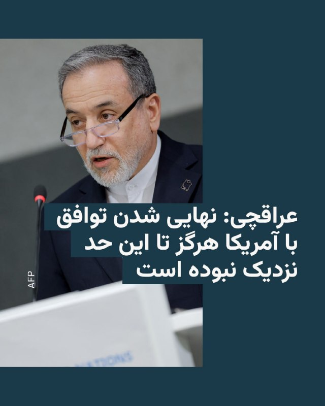

🔸عباس عراقچی، وزیر امور خارجه جمهوری اسلامی، روز جمعه گفت که «یادداشت تفاهم اسلام‌آباد» برای پایان دادن به جنگ آمریکا و اسرائیل علیه ایران، «هیچگاه تا این حد به نهایی شدن نزدیک نبوده است».

🔸او با انتشار بیانیه‌ای در شبکه ایکس در عین حال از رسانه‌ها خواست تا زمان تکمیل و نهایی شدن آن، از گمانه‌زنی درباره محتوای این توافق خودداری کنند.

🔸عراقچی افزود که ایران در زمان مناسب، تمامی جزئیات این توافق را با افکار عمومی در میان خواهد گذاشت؛ اقدامی که به گفته او در چارچوب رویکرد مسئولانه و شفاف تهران صورت خواهد گرفت.

🔸ساعتی پیش، دونالد ترامپ،‌ رئیس‌جمهور آمریکا، از آنچه درز دادن مواردی از توافق به رسانه‌ها توسط ایران خواند انتقاد کرد و اعلام کرد موضع جمهوری اسلامی درباره توافق «هیچ نسبتی با واقعیت ندارد».

@RadioFarda

## RadioFarda — post 158226

  <a href="https://t.me/radiofarda/158226" target="_blank">📎 Download file</a>

علی واعظ: ایران و آمریکا در نزدیک‌ترین نقطه به خط پایان متن تفاهم هستند

🔸دونالد ترامپ، رئیس‌جمهور ایالات متحده، با لغو حمله به ایران برای سومین شب متوالی، از دستیابی به توافقی با ایران خبر داد که به گفته او می‌تواند طی روزهای آینده به امضای طرفین برسد. برخی رسانه‌های غربی هم جزئیاتی از آنچه میان دو طرف مورد بحث بوده را منتشر کردند و در ایران هم فهرستی تازه از موارد توافق شده از سوی برخی رسانه‌ها منتشر شد. البته مقام‌های تهران تاکید می‌کنند که کار هنوز پایان نیافته و نهایی نشده است. آیا تهران و واشینگتن در یک قدمی یک تفاهم هستند؟ و در صورت دستیابی به این تفاهم، قدم بعدی چیست؟ علی واعظ، رئیس بخش ایران در گروه بین‌المللی بحران در ژنو، در این‌باره به رادیوفردا می‌گوید شاید در فاز دوم پس از تفاهم اولیه، دستیابی به توافق‌های مقطعی و موضوعی، بهتر از پیگیری یک توافق جامع طی شصت روز یا بیشتر از آن باشد.

@RadioFarda

## BBCPersian — post 283576

🔹‌دیوید هاکنی، هنرمند تجسمی تاثیرگذار بریتانیایی در سن ۸۸ سالگی درگذشت. اریکا بولتون، مسئول امور رسانه‌های آقای هاکنی، به بی‌بی‌سی گفت که این نقاش «یک ماه پیش از تولدش در آرامش درگذشت.» آقای هاکنی در سال ۱۹۳۷ در بردفورد در شمال انگلستان به دنیا آمد. او…

## BBCPersian — post 283569

🔹‌دیوید هاکنی، هنرمند تجسمی تاثیرگذار بریتانیایی در سن ۸۸ سالگی درگذشت.

اریکا بولتون، مسئول امور رسانه‌های آقای هاکنی، به بی‌بی‌سی گفت که این نقاش «یک ماه پیش از تولدش در آرامش درگذشت.»

آقای هاکنی در سال ۱۹۳۷ در بردفورد در شمال انگلستان به دنیا آمد. او در همان شهر تحصیلات اولیه هنری خود را گذراند و سپس به کالج سلطنتی لندن رفت. او در سال ۱۹۶۲ در نمایشگاه «هنر پاپ» در کالج سلطنتی هنر شرکت کرد که نخستین گام مهم او به‌عنوان هنرمند تجسمی بود. او بعدتر با هنرمندان بزرگی مانند اندی وارهول هم دوستی و همکاری کرد.

آقای هاکنی از بزرگان هنر معاصر و هنر پاپ بود که در زمینه‌های طراحی، نقاشی، چاپ، عکاسی، طراحی صحنه و هنر دیجیتال فعال بود. هنر او در ابتدا تحت‌تاثیر بریتانیای پس از جنگ جهانی دوم بود که در نقاشی‌های پیکرنما (فیگوراتیو) مشخص بود. او بعدتر در دهه‌های شصت و هفتاد میلادی به بازنمایی طبیعت و محیط اطرافش از طریق بازتعریف تصویر روی آورد که با استقبال گسترده مخاطبان و منتقدان هنری روبه‌رو شد.

📷 PA / Getty Images
@BBCPersian

## alonews — post 127432

  <a href="telegram/content/alonews_127432_1781277815.webm" target="_blank">🎬 Download video</a>

👈 دو حمله هوایی اسرائیلی به شهر صرافند در جنوب لبنان

✅ @AloNews خبر جنگ

## alonews — post 127431

  <a href="telegram/content/alonews_127431_1781277816.webm" target="_blank">🎬 Download video</a>

👈سناتور لیندزی گراهام: ایدهٔ یک صندوق بازسازی ۳۰۰ میلیارد دلاری، با توجه به اینکه چه کسی در ایران مسئول است، به نظر بی‌توجه می‌آید.

🔴این مانند طرح مارشال برای آلمان است در حالی که نازی‌ها هنوز در قدرت هستند.

✅ @AloNews خبر جنگ

## alonews — post 127430

  <a href="telegram/content/alonews_127430_1781277816.webm" target="_blank">🎬 Download video</a>

👈جی‌دی ونس: اولاً، ایرانیان هیچ وجه نقدی دریافت نمی‌کنند و هیچ وجهی صرفاً برای امضای یک توافق یا حضور در یک جلسه آزاد نمی‌شود. این توافق به گونه‌ای طراحی شده است که نگرانی‌های ایالات متحده و متحدانش اولویت داشته باشد، و اگر جمهوری اسلامی ایران تعهدات خود را انجام دهد، فواید اقتصادی به آن‌ها و کل منطقه سرازیر خواهد شد.

🔴این توافق پتانسیل بازسازی منطقه و منجر شدن به صلح پایدار را دارد.

🔴چند مورد عجیب را در گزارش‌های چند ساعت گذشته متوجه شده‌ام. اولاً، افرادی که (به درستی) ماه پیش می‌گفتند دونالد ترامپ یک رئیس‌جمهور تاریخی است، اکنون بر اساس گزارش‌های رسانه‌ای تایید نشده یک توافق را نقد می‌کنند. ثانیاً، افرادی که می‌گویند به کلمه‌ای که توسط سپاه پاسداران انقلاب اسلامی گفته شده اعتماد نکنید، ظاهراً به پست‌های شبکه‌های اجتماعی ناشناس با منبع ناشناس باور دارند.

🔴رئیس‌جمهور قرار است به هر روشی که باشد، نتیجه خوبی برای ما به دست آورد.

✅ @AloNews خبر جنگ

---
📅 بروزرسانی: 1405/03/22 18:43
---

## VahidOOnLine — post 245157

  

عباس عراقچی، وزیر خارجه جمهوری اسلامی، در شبکه ایکس نوشت: «تفاهم‌نامه اسلام‌آباد هرگز تا این حد نزدیک نبوده است. تا زمان نهایی شدن آن، رسانه‌ها باید از گمانه‌زنی در مورد محتوای آن خودداری کنند.»

او افزود: «تمام جزییات در زمان مناسب به صورت عمومی منتشر خواهد شد.»

پیش‌تر دونالد ترامپ، در تروث سوشال نوشت مفادی که جمهوری اسلامی در اختیار رسانه‌ها قرار داده، هیچ ارتباطی با مفادی که به صورت مکتوب بر سر آن توافق شده ندارد.
‌🏁 🇬🇧 IranintlTV

🤖 @VahidOOnLine

## WithYashar — post 14640

چپقچی، وزیر خارجه: حفظ یادداشت تفاهم اسلام‌آباد هرگز به این اندازه نزدیک نبوده است. تا زمان نهایی شدن آن، رسانه‌ها باید از ورود به حدس و گمان درباره محتوای آن خودداری کنند.

در راستای رویکرد مسئولانه و شفاف ما، تمام جزئیات در زمان مناسب با عموم مردم به اشتراک گذاشته خواهد شد.
@withyashar

## mwarmonitor — post 10777

🔴جی دی ونس

🔹من اطلاعات نادرست (فیک) زیادی درباره یک توافق احتمالی برای بازگشایی تنگه و پایان دادن به برنامه سلاح‌های هسته‌ای ایران مشاهده می‌کنم. اولاً، ایرانی‌ها هیچ پول نقدی دریافت نمی‌کنند و هیچ سرمایه‌ای صرفاً برای امضای یک توافق یا شرکت در یک جلسه آزاد نمی‌شود. ساختار این توافق به گونه‌ای است که تضمین کند دغدغه‌های ایالات متحده و متحدانش در اولویت قرار گیرد، و در صورتی که جمهوری اسلامی ایران به تعهدات خود عمل کند، منافع اقتصادی به سوی آن‌ها و کل منطقه سرازیر خواهد شد. این توافق پتانسیل بازسازی منطقه و هدایت آن به سوی صلحی پایدار را دارد.

🔹من در گزارش‌های چند ساعت گذشته متوجه چند نکته عجیب شده‌ام. اول اینکه، افرادی که یک ماه پیش (به درستی) می‌گفتند دونالد ترامپ یک رئیس‌جمهور تاریخی بوده است، اکنون بر اساس گزارش‌های تایید نشده رسانه‌ها از یک توافق انتقاد می‌کنند. دوم اینکه، افرادی که می‌گویند نمی‌توان به هیچ‌یک از حرف‌های سپاه پاسداران (IRGC) اعتماد کرد، ظاهراً پست‌های شبکه‌های اجتماعی را که از منابع ناشناس نقل شده‌اند، باور می‌کنند.

🔹رئیس‌جمهور به هر نحوی که شده، یک نتیجه خوب برای ما رقم خواهد زد.

@mwarmonitor

## pm_afshaa — post 93697

  <a href="telegram/content/pm_afshaa_93697_1781277202.webm" target="_blank">🎬 Download video</a>

🔴عباس عراقچی:
توافق اسلام‌آباد تا حالا هیچ‌وقت این‌قدر به نهایی شدن نزدیک نشده بود! فعلاً رسانه‌ها درباره جزئیاتش حدس و گمان نزنن.

در راستای رویکرد مسئولانه و شفاف ما، تمامی جزئیات در زمان مقتضی با عموم مردم به اشتراک گذاشته خواهد شد.

💧 Rainbet.com the #1 Non-KYC Crypto Casino & Sportsbook @rainbetcom

😁 @Pm_Afshaa

## VahidOnline — post 76267

  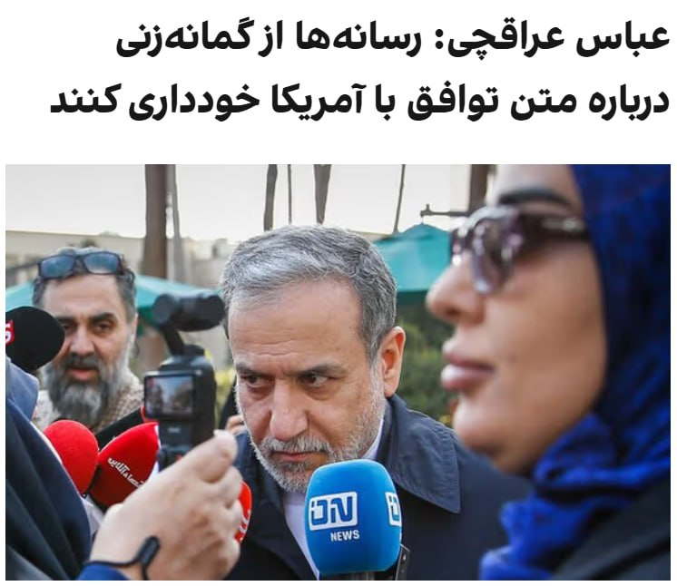

ساعاتی پس از انتشار گزارش‌هایی درباره بندهای توافق میان تهران و واشنگتن در رسانه‌های دولتی ایران، از جمله مهر و فارس، عباس عراقچی با انتشار پیامی در شبکه اجتماعی ایکس، به رسانه‌ها هشدار داد که از گمانه‌زنی درباره محتوای آن خودداری کنند.
عراقچی نوشت: «یادداشت تفاهم اسلام‌آباد هرگز تا این حد [به مرحله نهایی] نزدیک نبوده است. تا زمان نهایی شدن آن، رسانه‌ها باید از گمانه‌زنی در خصوص محتوای آن خودداری کنند. در راستای رویکرد مسئولانه و شفاف ما، تمامی جزئیات در زمان مقتضی با عموم مردم به اشتراک گذاشته خواهد شد.»
این پیام پس از واکنش تند دونالد ترامپ به گزارش‌های رسانه‌های ایران منتشر شد. ترامپ در اولین واکنش، مقام‌های جمهوری اسلامی را «بی‌اعتبار، بدقول و بی‌شرافت» توصیف کرده و تاکید کرد که این گزارش‌ها «فرسنگ‌ها با حقیقت فاصله دارد».
@VahidOOnLine

📡 @VahidOnline

## IranIntlTV — post 341901

  

لیندزی گراهام، سناتور جمهوری‌خواه آمریکا، در شبکه ایکس نوشت بسیار خوشحال است که دونالد ترامپ گزارش‌های رسانه‌های ایرانی درباره توافق ادعایی را جعلی خوانده، زیرا توافقی که جمهوری اسلامی توصیف کرده، «افتضاح» خواهد بود.

سناتور گراهام افزود ترامپ و ارتش آمریکا شایسته تقدیر هستند، زیرا با ترکیبی از حملات نظامی موثر و محاصره شدید، جمهوری اسلامی را به ضعیف‌ترین وضعیت خود در ۴۷ سال گذشته رسانده‌اند.

سناتور گراهام نوشت نباید فراموش کرد که جمهوری اسلامی ۴۲ هزار نفر از شهروندان خود را تنها به دلیل خواست زندگی بهتر کشته و رهبران آن «نازی‌های مذهبی افراطی» هستند.

سناتور گراهام ادامه داد: «در مورد هرگونه توافق احتمالی، باید آن را با برجام مقایسه کرد و امیدوارم که بسیار متفاوت باشد.»

او افزود ایده ایجاد صندوق بازسازی ۳۰۰ میلیارد دلاری برای ایران، با توجه به حاکمان کنونی این کشور، نادرست و شبیه طرح مارشال برای آلمان در حالی که نازی‌ها همچنان در قدرت باشند، است.

او گفت که خط قرمز دونالد ترامپ در موضوع هسته‌ای، «عدم غنی‌سازی» بوده و امیدوارم این اصل حفظ شود.
https://iranintl.com/202606120762

## FarsiVOA — post 220489

  <a href="telegram/content/FarsiVOA_220489_1781277203.mp4" target="_blank">🎬 Download video</a>

ارتش اسرائیل ویدیویی از عملیات چند هفته پیش خود در روستای دبین در استان مرجعیون لبنان منتشر کرد.

به گفته ارتش اسرائیل، در این عملیات که حدود ۱۲ کیلومتر با مرز اسرائیل فاصله داشته، تعدادی از نیروهای حزب‌الله کشته شدند.

ارتش اسرائیل می‌گوید این منطقه در شمال خط دفاعی ایجادشده توسط نیروهای اسرائیلی در جنوب لبنان قرار داشته است.

@FarsiVOA

## FarsiVOA — post 220488

در گفت‌وگو با مهرداد خوانساری به پیامدهای یک‌سالگی جنگ۱۲روزه، حذف زنجیره‌ای فرماندهان ارشد و پیامد مرگ علی خامنه‌ای بر ساختار قدرت پرداختیم. به گفته او، حذف فرماندهان منشا تغییرات عمیق در تصمیم‌گیری شده و با وجود اختلاف جناح‌ها، ترجیح غالب در حاکمیت، توقف جنگ و حرکت به‌سوی توافق است

## DW_Farsi — post 125899

🔶 پایان عملیات پلیس در فرودگاه هامبورگ پس از تخلیه امنیتی

پلیس فدرال آلمان روز جمعه ۱۲ ژوئن اقدام به تخلیه بخش امنیتی فرودگاه هامبورگ در منطقه "فولسبوتل" (Fuhlsbüttel) کرد.

علت یک "وضعیت پلیسی" نامیده شده و باعث شده بود که تمامی مسافرانی که پشت گیت‌های کنترل امنیتی حضور داشتند مجبور به ترک محوطه شوند. حتی مسافرانی که سوار هواپیماها شده بودند نیز دوباره از هواپیما خارج شدند.
@dw_farsi

## Persian_Trend_Official — post 16856

  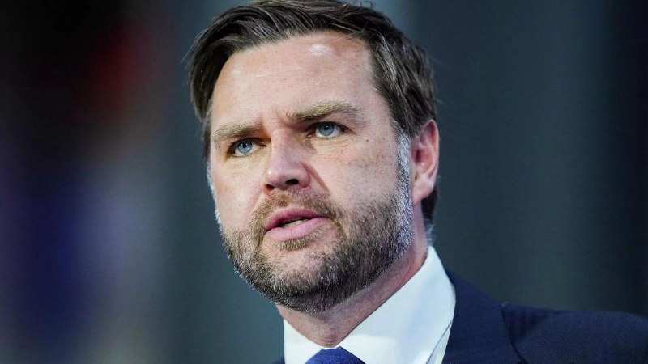

جی دی ونس، معاون رئیس جمهور امریکا: اول از همه، ایرانی‌ها هیچ پول نقدی دریافت نمی‌کنند و هیچ سرمایه‌ای صرفاً برای امضای یک توافق یا شرکت در یک جلسه آزاد نمی‌شود.

ساختار این توافق به‌گونه‌ای تنظیم شده که تضمین کند دغدغه‌های ایالات متحده و متحدانش در اولویت قرار می‌گیرند؛ و اگر جمهوری اسلامی ایران به تعهدات خود عمل کند، آن‌وقت مزایای اقتصادی به سمت آن‌ها و کل منطقه سرازیر خواهد شد. این توافق این پتانسیل را دارد که منطقه را دگرگون کند و به یک صلح پایدار منجر شود.

من در گزارش‌های چند ساعت گذشته متوجه چند نکته عجیب شده‌ام. اول اینکه، افرادی که یک ماه پیش می‌گفتند دونالد ترامپ یک رئیس‌جمهور تاریخی بود، حالا بر اساس گزارش‌های تاییدنشده رسانه‌ها، دارند از یک توافق انتقاد می‌کنند. دوم اینکه، افرادی که می‌گویند نمی‌توان حتی یک کلمه از حرف‌های سپاه پاسداران را باور کرد، ظاهراً پست‌های شبکه‌های اجتماعی را که از منابع ناشناس نقل شده‌اند، باور می‌کنند. رئیس‌جمهور به هر طریقی که شده، یک نتیجه خوب برای ما رقم خواهد زد.

📝 Amir

📌 @persian_trend_official
پرشین ترند | متفاوت‌ترین کانال نظامی

## IranianMinds — post 22413

  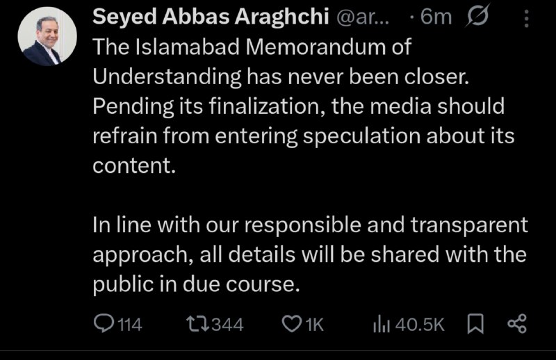

🔴آقا جنگ قطعی شد، عراقچی:

توافق با آمریکا هیچوقت انقد نزدیک نبوده و مذاکرات به جدی ترین حدش رسیده، بزودی جزئیات رو با مردم به اشتراک میذاریم.

@IranianMinds

## Hranews — post 113561

  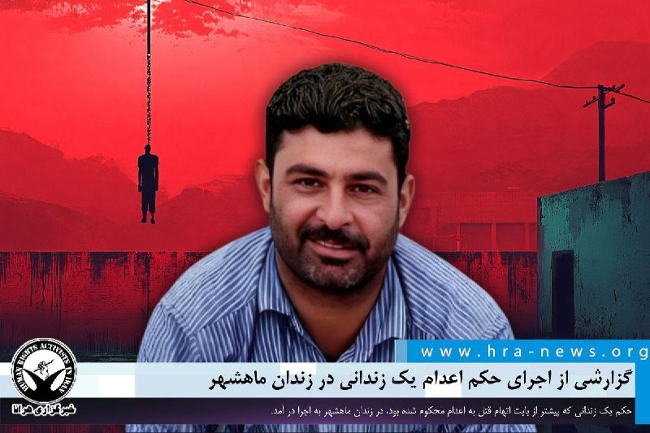

گزارشی از اجرای حکم اعدام یک زندانی در زندان ماهشهر

❗️
❗️
❗️
❗️
❗️– حکم یک زندانی که پیشتر از بابت اتهام قتل به #اعدام محکوم شده بود، روز یکشنبه ۱۷ خردادماه در زندان ماهشهر به اجرا در آمد.

به گزارش خبرگزاری هرانا، ارگان خبری مجموعه فعالان حقوق بشر در ایران، یک زندانی در زندان ماهشهر اعدام شد.

هویت این زندانی که سحرگاه روز یکشنبه ۱۷ خردادماه به چوبه دار آویخته شد، ابراهیم مودت‌زاده(عثمانی)، متاهل، پدر دو فرزند و ساکن بندر ماهشهر احراز شده است.

ادامه مطلب

#ابراهیم_مودت‌زاده #ابراهیم_عثمانی

↘️
@hranews_bot تماس ✉️ - @Hranews کانال هرانا 🆑

---
📅 بروزرسانی: 1405/03/22 18:33
---

## VahidOOnLine — post 245156

  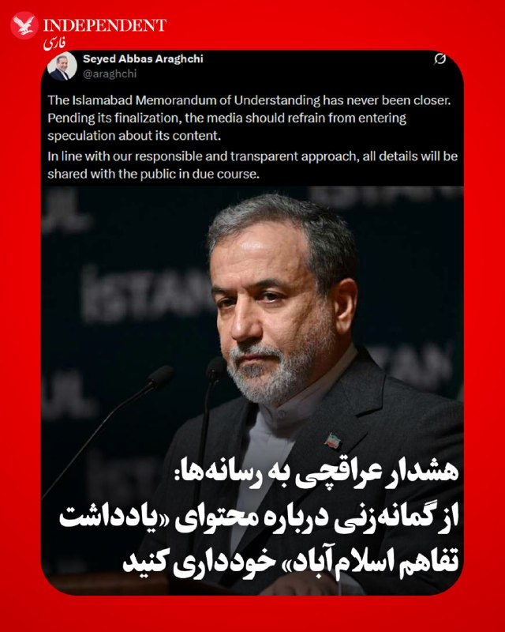

♦️ ساعاتی پس از انتشار گزارش‌هایی درباره بندهای توافق میان تهران و واشنگتن در رسانه‌های دولتی ایران، از جمله مهر و فارس، عباس عراقچی با انتشار پیامی در شبکه اجتماعی ایکس، به رسانه‌ها هشدار داد که از گمانه‌زنی درباره محتوای آن خودداری کنند.

عراقچی نوشت: «یادداشت تفاهم اسلام‌آباد هرگز تا این حد [به مرحله نهایی] نزدیک نبوده است. تا زمان نهایی شدن آن، رسانه‌ها باید از گمانه‌زنی در خصوص محتوای آن خودداری کنند. در راستای رویکرد مسئولانه و شفاف ما، تمامی جزئیات در زمان مقتضی با عموم مردم به اشتراک گذاشته خواهد شد.»

این پیام پس از واکنش تند دونالد ترامپ به گزارش‌های رسانه‌های ایران منتشر شد. ترامپ در اولین واکنش، مقام‌های جمهوری اسلامی را «بی‌اعتبار، بدقول و بی‌شرافت» توصیف کرده و تاکید کرد که این گزارش‌ها «فرسنگ‌ها با حقیقت فاصله دارد».
‌🇸🇦 Indypersian

🤖 @VahidOOnLine

## FoxNewsTwitter — post 342903

  

Fox News (Twitter/X)

One of the men from the viral standoff outside the Karmelo Anthony murder trial has been arrested.

Jerome Winston Parker has been taken into custody on an outstanding warrant for alleged unlawful carrying of a weapon, according to the Collin County Sheriff's Office.

Police say the charge stems from an alleged incident in the courthouse parking lot during trial-related activities on June 6. He remains in custody on a $1,000 bond.

## DEJradio — post 5619

  <a href="telegram/content/DEJradio_5619_1781276630.webm" target="_blank">🎬 Download video</a>

⚽️
🔺 مهرداد امین شیرازی:
استادیوم‌ها را جهنم جمهوری اسلامی کنیم

مهرداد امین شیرازی بازیکن پیشین تیم فوتبال استقلال می‌گوید با وضعیت فعلی ایران، فقط باید استادیوم‌ها را برای بازیکنان تیم جمهوری اسلامی جهنم کرد.

#جام_جهانی #تیم_ملی
@DEJradio

## IranIntlTV — post 341900

  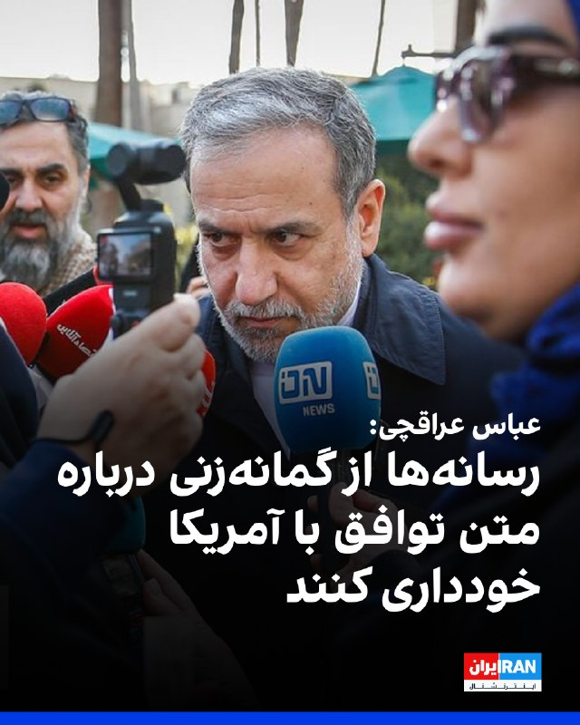

عباس عراقچی، وزیر خارجه جمهوری اسلامی، در شبکه ایکس نوشت: «تفاهم‌نامه اسلام‌آباد هرگز تا این حد نزدیک نبوده است. تا زمان نهایی شدن آن، رسانه‌ها باید از گمانه‌زنی در مورد محتوای آن خودداری کنند.»

او افزود: «تمام جزییات در زمان مناسب به صورت عمومی منتشر خواهد شد.»

پیش‌تر دونالد ترامپ، در تروث سوشال نوشت مفادی که جمهوری اسلامی در اختیار رسانه‌ها قرار داده، هیچ ارتباطی با مفادی که به صورت مکتوب بر سر آن توافق شده ندارد.
https://iranintl.com/202606123329

## Shin_Persian — post 6983

  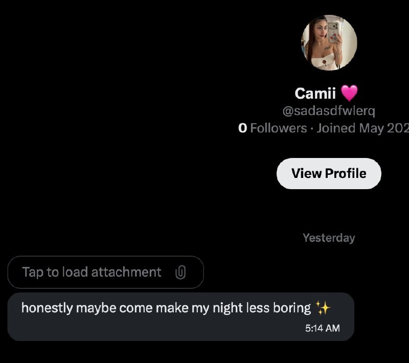

Shin ✓ @hey_itsmyturn
Fri, 12 Jun 2026 14:55:45 UTC

Come live in the Middle East and you'll never be bored, my dear bot.

ترجمه خودکار فارسی

بیا در خاورمیانه زندگی کن و هیچ‌وقت حوصله‌ات سر نخواهد رفت، ربات عزیزم.

𝕏 · @shin_persian

## Dirty_Kids — post 391815

  <a href="telegram/content/Dirty_Kids_391815_1781276632.mp4" target="_blank">🎬 Download video</a>

🔴 تو ایالت گویاس برزیل، پلیس موقع یه ایست و بازرسی متوجه شد یه خانم برزیلی یه تپانچه 9 میلی‌متری (20 سانتی) رو داخل واژن خودش مخفی کرده؛

هنوز جزئیاتی از ماجرا منتشر نشده که هدف اصلی این خانم از این حرکت چی بوده ولی ویدیوی این ماجرا تو شبکه‌های اجتماعی وایرال شده و حسابی سوژه کاربران خارجی شده.

@Dirty_Kids 👻

## alonews — post 127429

  <a href="telegram/content/alonews_127429_1781276635.mp4" target="_blank">🎬 Download video</a>

👈 الشهبیه، جنوب لبنان، پس از حمله اسرائیل

✅ @AloNews خبر جنگ

## alonews — post 127428

  <a href="telegram/content/alonews_127428_1781276638.webm" target="_blank">🎬 Download video</a>

👈یسرائیل کاتس، وزیر دفاع اسرائیل:
«اسرائیل باید توانایی اقدام مستقل برای جلوگیری از دستیابی ایران به سلاح هسته‌ای را حفظ کند و به همین منظور به ارتش دستور آماده‌سازی داده شده است.»

✅ @AloNews خبر جنگ

## alonews — post 127427

  <a href="telegram/content/alonews_127427_1781276638.webm" target="_blank">🎬 Download video</a>

👈 سید عباس عراقچی، وزیر خارجه: حفظ یادداشت تفاهم اسلام‌آباد هرگز به این اندازه نزدیک نبوده است. تا زمان نهایی شدن آن، رسانه‌ها باید از ورود به حدس و گمان درباره محتوای آن خودداری کنند.

🔴در راستای رویکرد مسئولانه و شفاف ما، تمام جزئیات در زمان مناسب با عموم مردم به اشتراک گذاشته خواهد شد.

✅ @AloNews خبر جنگ

## alonews — post 127426

  <a href="telegram/content/alonews_127426_1781276638.webm" target="_blank">🎬 Download video</a>

👈پزشکیان : باید فرهنگ مصرف بهینه را به یک گفتمان ملی تبدیل کنیم

✅ @AloNews خبر جنگ

---
📅 بروزرسانی: 1405/03/22 18:23
---

## VahidOOnLine — post 245155

  

یسرائیل کاتز، وزیر دفاع اسرائیل تاکید کرد که این کشور از مناطق امنیتی در لبنان، سوریه و غزه عقب‌نشینی نخواهد کرد و ارتش اسرائیل به دفاع از مرزها و شهروندان این کشور ادامه خواهد داد.
او افزود: «دکترین امنیتی اسرائیل بر مقابله با تهدیدهای نزدیک و دور و دستیابی به پیروزی استوار است، نه سازش و امتیازدهی.»

کاتز ادامه داد: «ارتش اسرائیل از اردوگاه‌های شمال کرانه باختری نیز خارج نخواهد شد و در صورت نیاز این عملیات گسترش می‌یابد.»

وزیر دفاع اسرائیل بر ادامه سیاست امنیتی سختگیرانه برای مقابله با «محور شر شیعی به رهبری جمهوری اسلامی» و «محور شر سنی به رهبری اخوان‌المسلمین» تاکید کرد.
‌🏁 🇬🇧 IranintlTV

🤖 @VahidOOnLine

## VahidOOnLine — post 245154

  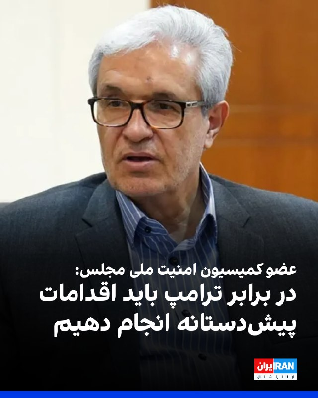

محمدرضا محسنی‌ثانی، عضو کمیسیون امنیت ملی مجلس گفت در بسیاری از موارد رویکرد جمهوری اسلامی در برابر آمریکا «انفعالی» و «پدافندی» بوده و اکنون که ترامپ به‌صورت مستمر و علنی «تهدیدات» خود را در رسانه‌های بین‌المللی مطرح می‌کند، باید اقدامات «پیش‌دستانه» انجام دهیم.
او افزود: «ما نه تنها آمریکا را دشمنی متخاصم و جانی می‌دانیم، بلکه معتقدیم در هیچ‌یک از ابعاد انسانی نیز نمی‌توان برای رفتارهای این کشور اعتباری قائل شد.»

‌🏁 🇬🇧 IranintlTV

🤖 @VahidOOnLine

## mwarmonitor — post 10776

  <a href="telegram/content/mwarmonitor_10776_1781275986.mp4" target="_blank">🎬 Download video</a>

📝بزرگوار پشت تریبون کماکان با مدال‌های روی سینه‌اش ژست اقتدار می‌گیرد و فریاد می‌زند «مَردید بیایید جلو!»، اما یکی نیست به این گنده گوز جان بگوید از این جلوتر؟ کجا بیایند مثلاً؟ وقتی شب‌ها در اتاق خوابت، تخت دو نفره رسماً سه نفره شده و تو و همسر جان شانه به شانهٔ جاسوس موساد در کمال آرامش زیر یک پتو می‌خوابید، دشمن دقیقاً باید تا کجا پیشروی کند که احساس کنی جلو آمده است؟ در دکترین نظامی شما ظاهراً نفوذ فیزیکی روی تشک خوشخواب هم جزئی از پدافند غیرعامل محسوب می‌شود. واقعاً آدم با دیدن این حجم از توهم و اصرار بر قدرتِ پوشالی، ناخودآگاه از خودش می‌پرسد داداش شما دقیقاً چی می‌زنی که این‌قدر فازِ حماسه مغلوبِ واقعیت تلخِ اطرافتان شده است؟ دشمن سال‌هاست بیخ گوش شما جا خوش کرده، فقط لطفاً موقع غلت زدن مراقب باش بیدارش نکنی!

@mwarmonitor

## IranIntlTV — post 341899

  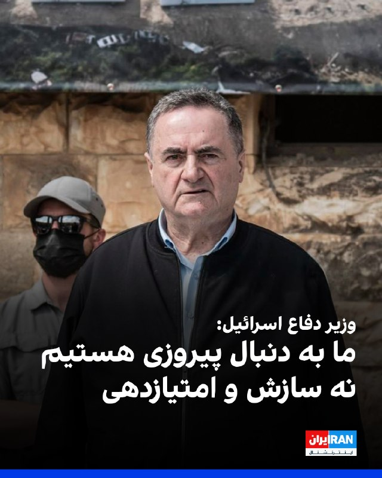

یسرائیل کاتز، وزیر دفاع اسرائیل تاکید کرد که این کشور از مناطق امنیتی در لبنان، سوریه و غزه عقب‌نشینی نخواهد کرد و ارتش اسرائیل به دفاع از مرزها و شهروندان این کشور ادامه خواهد داد.
او افزود: «دکترین امنیتی اسرائیل بر مقابله با تهدیدهای نزدیک و دور و دستیابی به پیروزی استوار است، نه سازش و امتیازدهی.»

کاتز ادامه داد: «ارتش اسرائیل از اردوگاه‌های شمال کرانه باختری نیز خارج نخواهد شد و در صورت نیاز این عملیات گسترش می‌یابد.»

وزیر دفاع اسرائیل بر ادامه سیاست امنیتی سختگیرانه برای مقابله با «محور شر شیعی به رهبری جمهوری اسلامی» و «محور شر سنی به رهبری اخوان‌المسلمین» تاکید کرد.
https://iranintl.com/202606123522

## IranIntlTV — post 341894

🔻کاروان تیم ملی جمهوری دموکراتیک کنگو با پوششی متفاوت و چشمگیر وارد محل برگزاری جام جهانی ۲۰۲۶ شد؛ استایلی که به سرعت توجه رسانه‌ها و کاربران شبکه‌های اجتماعی را به خود جلب کرد.

🔹بازیکنان و اعضای کادر فنی کنگو هنگام ورود با کت‌وشلوارهای مشکی و تزئینات طرح پوست پلنگ روی لباس و کیف‌های خود دیده شدند؛ انتخابی که ریشه در هویت و لقب این تیم ملی دارد.

🔹تیم ملی جمهوری دموکراتیک کنگو با لقب «پلنگ‌ها» شناخته می‌شود و استفاده از طرح پلنگ در پوشش رسمی اعضای تیم، ادای احترامی به این نماد شناخته‌شده فوتبال این کشور محسوب می‌شود.

🔹این پوشش خاص در حالی مورد توجه قرار گرفته که کنگو پس از ۵۲ سال موفق شده جواز حضور در جام جهانی را به دست آورد و یکی از داستان‌های جذاب این دوره از رقابت‌ها به شمار می‌رود. به همین دلیل، مسئولان تیم تلاش کرده‌اند با بهره‌گیری از نمادهای ملی و فوتبالی، هویت متمایز خود را در بزرگ‌ترین رویداد فوتبال جهان به نمایش بگذارند.

🔹تصاویر ورود بازیکنان کنگو با این استایل ویژه به سرعت در فضای مجازی منتشر شد و واکنش‌های گسترده‌ای را به همراه داشت.

@iranintltvsport

## IranIntlTV — post 341893

  

محمدرضا محسنی‌ثانی، عضو کمیسیون امنیت ملی مجلس گفت در بسیاری از موارد رویکرد جمهوری اسلامی در برابر آمریکا «انفعالی» و «پدافندی» بوده و اکنون که ترامپ به‌صورت مستمر و علنی «تهدیدات» خود را در رسانه‌های بین‌المللی مطرح می‌کند، باید اقدامات «پیش‌دستانه» انجام دهیم.
او افزود: «ما نه تنها آمریکا را دشمنی متخاصم و جانی می‌دانیم، بلکه معتقدیم در هیچ‌یک از ابعاد انسانی نیز نمی‌توان برای رفتارهای این کشور اعتباری قائل شد.»

https://iranintl.com/202606124988

## FarsiVOA — post 220485

ارتش اسرائیل اعلام کرد نیروهای این کشور عملیاتی را در منطقه دبین در جنوب لبنان به پایان رسانده‌اند.

به گفته ارتش اسرائیل، این منطقه یکی از مراکز اصلی حزب‌الله برای برنامه‌ریزی حملات و شلیک موشک‌های ضدزره به سوی نیروها و شهروندان اسرائیلی بوده است.

ارتش اسرائیل می‌گوید در این عملیات بیش از ۵۰ موضع هدف قرار گرفت، ده‌ها زیرساخت مرتبط با حزب‌الله از بین رفت و انبارهای مهم سلاح کشف شد. همچنین شماری از نیروهای حزب‌الله در حملات هوایی کشته شدند.

@FarsiVOA

## DW_Farsi — post 125898

  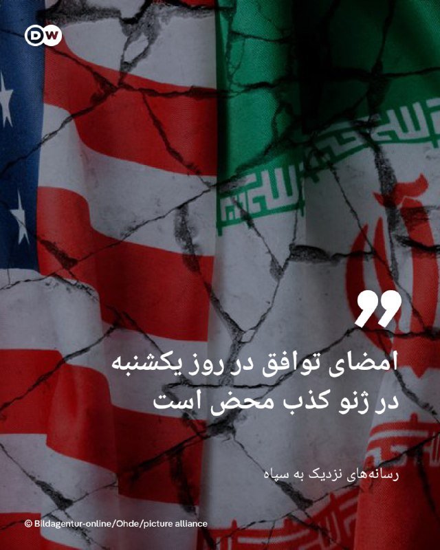

🔶 یک منبع آگاه به فارس: امضای توافق در روز یکشنبه در ژنو کذب محض است

در حالی که برخی رسانه‌های خبری از احتمال امضای توافق ترک مخاصمه میان ایران و آمریکا در روز یکشنبه ۲۴ خرداد (۱۴ ژوئن) در ژنو سوئيس خبر داده‌اند خبرگزاری فارس به نقل از یک منبع آگاه این خبر را نادرست نامید.

فارس نوشت، یک منبع نزدیک به تیم مذاکره‌کننده ایران به خبرنگار ما گفت: «ادعاهای مطرح‌شده از سوی ترامپ و برخی رسانه‌های خارجی مبنی بر این که توافق نهایی شده و قرار است روز یکشنبه در ژنو امضا شود، به هیچ عنوان صحت ندارد.»

دونالد ترامپ، رئیس‌جمهور آمریکا روز گذشته ۲۱ خرداد پس از لغو حمله‌ به ایران که قرار بود شامگاه همان روز اتفاق بیافتد گفت، به این دلیل این حمله را لغو کرده که توافق میان دو طرف به "تأیید بالاترین سطح رهبری جمهوری اسلامی رسیده" و "نهایی شده است."

با این حال، فارس به نقل از منبع آگاه یادشده افزود: «اساسا روند بررسی و تصمیم‌گیری در ایران هنوز نهایی نشده و از این جهت، هم اعلام روز یکشنبه و هم مکان ژنو کاملا تکذیب می‌شود.»
@dw_farsi

## IranianMinds — post 22412

  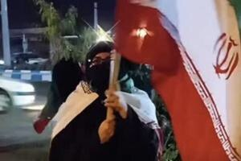

🔴ایرنا/ خبرگزاری جمهوری اسلامی:

معصومه سهامی یک زن شرکت‌کننده در تجمعات شبانه در شیراز، ۲۰ خرداد در حین پرچم‌گردانی، بر اثر برخورد یک خودرو جانش را از دست داد.

به هلاکت رسید.

@IranianMinds

## BBCPersian — post 283568

  <a href="https://t.me/bbcpersian/283568" target="_blank">📎 Download file</a>

تازه‌ترین خبرهای جهان جمعه ۲۲ خرداد ۱۴۰۵

## Dirty_Kids — post 391812

الان بهتر معلومه✅️. @Dirty_Kids 👻

## Dirty_Kids — post 391811

  

‏«یه جور این عکسای مارو بگیر، این ساعت من بیفته.» @Dirty_Kids 👻

## alonews — post 127425

  <a href="telegram/content/alonews_127425_1781275990.webm" target="_blank">🎬 Download video</a>

👈کاربران در سراسر جهان از اختلال در اینستاگرام و فیسبوک گزارش می‌دهند

✅ @AloNews خبر جنگ

## alonews — post 127424

  <a href="telegram/content/alonews_127424_1781275990.webm" target="_blank">🎬 Download video</a>

👈جزئیات توافق ایران و آمریکا به ادعای رویترز 
🔴رویترز به نقل از یک مقام ارشد در دولت آمریکا: برنامه هسته‌ای ایران برچیده شده و مواد هسته‌ای تخریب و خارج خواهند شد. 
🔴توافق با ایران مقرر می‌دارد که این کشور از گروه‌های نیابتی حمایت مالی نکند. 
🔴 توافق با ایران…

## alonews — post 127423

  <a href="telegram/content/alonews_127423_1781275990.webm" target="_blank">🎬 Download video</a>

👈جزئیات توافق ایران و آمریکا به ادعای رویترز

🔴رویترز به نقل از یک مقام ارشد در دولت آمریکا: برنامه هسته‌ای ایران برچیده شده و مواد هسته‌ای تخریب و خارج خواهند شد.

🔴توافق با ایران مقرر می‌دارد که این کشور از گروه‌های نیابتی حمایت مالی نکند.

🔴 توافق با ایران بر پایه اقدام و دستاورد است

🔴 توافق با ایران شامل بازگشایی تنگه هرمز است

🔴 تا پیش از اجرای مفاد توافق، هیچ وجهی به تهران پرداخت نخواهد شد

✅ @AloNews خبر جنگ

## alonews — post 127422

  <a href="telegram/content/alonews_127422_1781275990.webm" target="_blank">🎬 Download video</a>

👈امیر دریادار سیاری : ما تو منطقه خودمون قدرت داریم، اگِه مرد هستید جلو بیایید.

✅ @AloNews خبر جنگ

---
📅 بروزرسانی: 1405/03/22 18:13
---

## VahidOOnLine — post 245153

  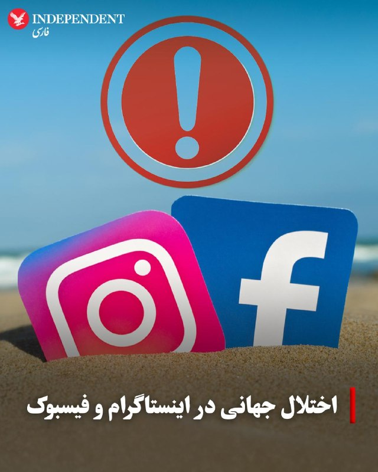

♦️کاربران از سراسر جهان گزارش داده‌اند که از ساعت ۱۰ صبح به وقت ساحل شرقی آمریکا، امکان استفاده از برخی ویژگی‌های شبکه‌های اجتماعی اینستاگرام و فیسبوک، از جمله انتشار مطالب جدید را از دست داده‌اند. وب‌سایت «داون‌فور» که اختلال‌های جهانی وب‌سایت‌ها را گزارش می‌کند، نوشت که از بیش از ۲۲هزار کاربری که شکایت خود را ثبت کرده‌اند، بیش از ۵۶ درصد هیچ‌گونه دسترسی به این شبکه‌ها ندارند، ۲۱ درصد با خطاهای ساختاری مواجه شده و ۲۳ درصد نیز امکان ورود به حساب خود را پیدا نکرده‌اند. شرکت متا، صاحب این شبکه های اجتماعی هنوز بیانیه‌ای در این‌باره صادر نکرده است.
‌🇸🇦 Indypersian

🤖 @VahidOOnLine

## VahidOOnLine — post 245152

  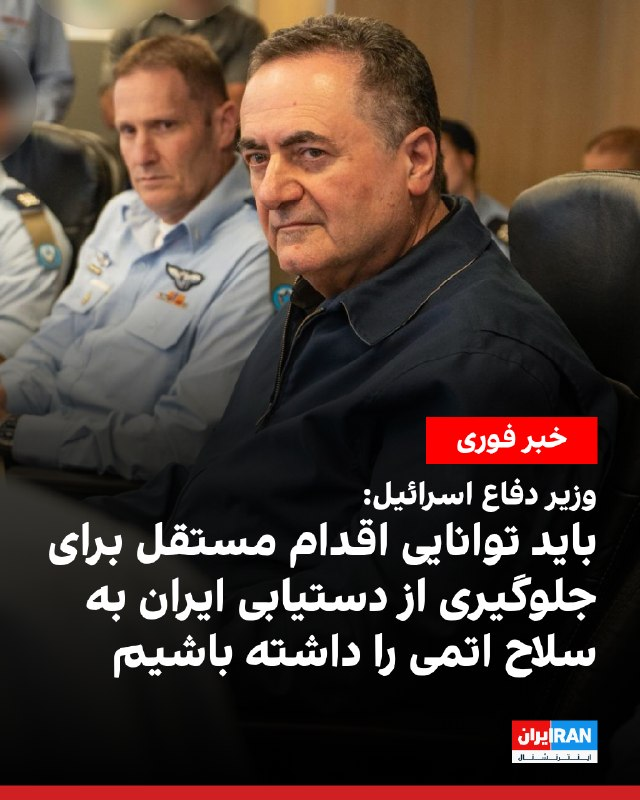

یسرائیل کاتز، وزیر دفاع اسرائیل، در شبکه ایکس نوشت رییس‌جمهوری آمریکا در حال پیشبرد توافقی با جمهوری اسلامی بر اساس منافع آمریکا، از جمله منفعت مشترک با اسرائیل برای جلوگیری از دستیابی ایران به سلاح هسته‌ای است و اسرائیل انتظار دارد او بر این اصل و همچنین موضوع موشک‌ها و نیروهای نیابتی پافشاری کند.

کاتز افزود: «آمریکا و اسرائیل با هم ضربات سنگینی به جمهوری اسلامی وارد کرده‌اند که توانایی‌های آن را سال‌ها به عقب رانده است.»

او تاکید کرد: «اسرائیل باید اطمینان حاصل کند که در آینده نیز توانایی اقدام مستقل برای جلوگیری از دستیابی ایران به سلاح هسته‌ای را خواهد داشت و من و نخست‌وزیر بنیامین نتانیاهو به ارتش اسرائیل دستور داده‌ایم بر این اساس آماده‌سازی لازم را انجام دهد.»
‌🏁 🇬🇧 IranintlTV

🤖 @VahidOOnLine

## WithYashar — post 14639

Voice message

## VahidOnline — post 76266

  <a href="telegram/content/VahidOnline_76266_1781275394.mp4" target="_blank">🎬 Download video</a>

خامنه‌ای: خطرناک‌تر از ناو، سلاحی است که می‌تواند این ناو را به قعر دریا فرو ببرد رهبر جمهوری اسلامی تعیین نتیجه از قبل برای مذاکرات بین ایران و آمریکا را «کار غلط و ابلهانه» خواند و گفت اگر هدف گفت‌وگوها برچیدن برنامهٔ هسته‌ای باشد، چنین موضوعی اساساً جای…

## IranIntlTV — post 341892

  

یسرائیل کاتز، وزیر دفاع اسرائیل، در شبکه ایکس نوشت رییس‌جمهوری آمریکا در حال پیشبرد توافقی با جمهوری اسلامی بر اساس منافع آمریکا، از جمله منفعت مشترک با اسرائیل برای جلوگیری از دستیابی ایران به سلاح هسته‌ای است و اسرائیل انتظار دارد او بر این اصل و همچنین موضوع موشک‌ها و نیروهای نیابتی پافشاری کند.

کاتز افزود: «آمریکا و اسرائیل با هم ضربات سنگینی به جمهوری اسلامی وارد کرده‌اند که توانایی‌های آن را سال‌ها به عقب رانده است.»

او تاکید کرد: «اسرائیل باید اطمینان حاصل کند که در آینده نیز توانایی اقدام مستقل برای جلوگیری از دستیابی ایران به سلاح هسته‌ای را خواهد داشت و من و نخست‌وزیر بنیامین نتانیاهو به ارتش اسرائیل دستور داده‌ایم بر این اساس آماده‌سازی لازم را انجام دهد.»
https://iranintl.com/202606129208

## IranIntlTV — post 341891

  <a href="telegram/content/IranIntlTV_341891_1781275395.mp4" target="_blank">🎬 Download video</a>

سرخط خبرهای جمعه ۲۲ خرداد
@iranintltv

## Shin_Persian — post 6982

Shin ✓ @hey_itsmyturn
Fri, 12 Jun 2026 14:36:27 UTC

A white house official familiar with the negotiations just told me "Imma take a leak, will be back and tell Axios what's going to happen."

ترجمه خودکار فارسی

یکی از مقامات کاخ سفید که در جریان مذاکرات است، همین الان به من گفت: «می‌رم یه دستشویی، برمی‌گردم و به آکسیوس می‌گم قرار چه اتفاقی بیفته.»

𝕏 · @shin_persian

## FarsiVOA — post 220484

  <a href="telegram/content/FarsiVOA_220484_1781275396.mp4" target="_blank">🎬 Download video</a>

توماج صالحی، خواننده معترض، در پستی تازه با حمله به زیرساخت‌های ایران مخالفت کرد و نوشت: تشدید مشکلات معیشتی مردم برای دستیابی به اهداف سیاسی «نه شرافتمندانه است و نه انسانی.»

## FarsiVOA — post 220483

  <a href="telegram/content/FarsiVOA_220483_1781275396.mp4" target="_blank">🎬 Download video</a>

در گفت‌وگو با رضا غیبی به ادعاهای متناقض درباره «توافق بزرگ» آمریکا و جمهوری اسلامی، ارقام درشت بازسازی ۳۰۰ میلیارد دلاری اقتصاد ایران و سکوت رسانه‌های وابسته به سپاه پرداختیم. به گفته او، این اعداد بیش از آنکه واقع‌بینانه باشند، مصرف داخلی دارند و رقم واقعی به‌مراتب کمتر است

## FarsiVOA — post 220482

🔺پرزیدنت ترامپ: مفاد درز داده شده توسط رژیم ایران به هیچ وجه حقیقت ندارد

▪️دونالد ترامپ، رئیس‌جمهوری ایالات متحده، روز جمعه ۲۲ خرداد در پیامی در شبکه اجتماعی «تروت سوشال» گفت مفادی که رژیم ایران در اختیار رسانه‌ها قرار داده است «هیچ ارتباطی» با شرایطی ندارد که به‌صورت مکتوب بر سر آن توافق شده بود.

⬇️ بیشتر بخوانید:

https://ir.voanews.com/a/trump-warns-iran-over-deal/8160129.html/?nocach=1

## DW_Farsi — post 125897

  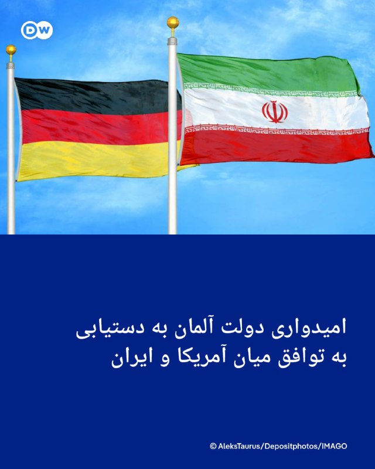

🔶 امیدواری دولت آلمان به دستیابی به توافق میان آمریکا و ایران

به گزارش شبکه خبری "ان‌تی‌وی" آلمان به نقل از منابع آگاه در دولت این کشور، برلین پتانسیل و شانس بالایی برای دست‌یابی به یک توافق میان ایالات متحده و ایران می‌بیند.

یک منبع در محافل دولتی آلمان در این باره گفت: «طی روزهای گذشته، پیشرفت‌هایی در این زمینه حاصل شده است.»

بر اساس این گزارش، به نقل از این منابع، دونالد ترامپ، رئیس‌جمهور آمریکا می‌تواند در مسیر تلاش‌های دیپلماتیک خود همچنان روی حمایت‌های آلمان حساب کند.

مقام‌های دولتی آلمان تأکید دارند که سران کشورهای عضو گروه هفت که از روز دوشنبه ۱۵ ژوئن در شهر اویان فرانسه گرد هم می‌آیند، در اصول و نکات کلیدی این پرونده با یکدیگر هم‌نظرند: ایران نباید به سلاح هسته‌ای دست یابد و آزادی کشتی‌رانی و رفت و آمد ایمن کشتی‌ها از تنگه هرمز نیز باید مجددا تضمین شود.

این منبع آگاه در پایان تأکید کرد: «تحقق این اهداف تنها از طریق نشستن پای میز مذاکره امکان‌پذیر خواهد بود.»
@dw_farsi

## Persian_Trend_Official — post 16855

پوتین: ما فقط می‌توانیم یک نصیحت به دشمنانمان بکنیم، با روسیه نجنگید.

رئیس جمهور روسیه: بیایید در صلح زندگی کنیم و همه مسائل را از طریق مذاکره حل کنیم. اما این مذاکرات باید باشد، نه اولتیماتوم.

📝 Amir

📌 @persian_trend_official
پرشین ترند | متفاوت‌ترین کانال نظامی

## alonews — post 127421

👈پوتین: روسیه به آن سرعتی که ما مایل بودیم در حال پیشروی نیست، اما هر روز به‌تدریج در میدان نبرد اوکراین پیشرفت می‌کند.

✅ @AloNews خبر جنگ

## alonews — post 127420

  <a href="telegram/content/alonews_127420_1781275398.webm" target="_blank">🎬 Download video</a>

👈شبکه خبری ای‌بی‌سی به نقل از یک مقام آمریکایی: تردد در تنگه هرمز ادامه دارد.

🔴شبکه خبری ای‌بی‌سی به نقل از یک مقام آمریکایی: تردد در تنگه هرمز ادامه دارد.

✅ @AloNews خبر جنگ

## alonews — post 127419

  <a href="telegram/content/alonews_127419_1781275398.webm" target="_blank">🎬 Download video</a>

👈وزیر دفاع اسرائیل: اسرائیل از مناطق امنیتی در لبنان، سوریه و غزه عقب‌نشینی نخواهد کرد

✅ @AloNews خبر جنگ

---
📅 بروزرسانی: 1405/03/22 18:04
---

## VahidOOnLine — post 245151

  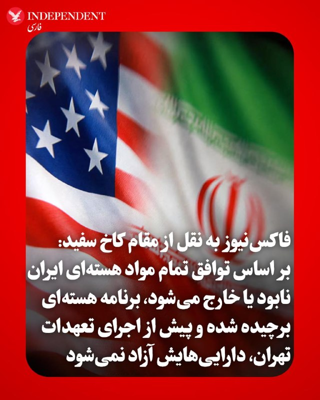

♦️یک مقام کاخ سفید در گفتگو با «فاکس نیوز» اعلام کرد که جمهوری اسلامی ایران با یک توافق «مبتنی بر عملکرد» موافقت کرده است؛ توافقی که تهران را ملزم می‌کند پیش از دریافت هرگونه کاهش تحریم، امتیازات بزرگی واگذار کند.

بر اساس اظهارات این مقام آمریکایی، طبق این توافق تمام مواد هسته‌ای ایران باید نابود و از کشور خارج شود، برنامه هسته‌ای آن به طور کامل برچیده گردد و تا زمانی که تهران تمامی تعهدات خود را به طور کامل اجرا نکند، هیچ‌یک از دارایی‌های بلوکه‌شده‌اش آزاد نخواهد شد.

این مقام رسمی خزانه‌داری و امنیت ملی آمریکا در پایان افزود که بر اساس این تفاهم، تنگه هرمز باید برای همیشه باز بماند و ایران متعهد شده است که حمایت مالی از گروه‌های تروریستی را به طور کامل متوقف کند. این شروط سخت‌گیرانه درست پس از اظهارات تند ترامپ مبنی بر بی‌اعتبار بودن روایت رسانه‌های دولتی ایران از مفاد توافق، منتشر شده است.
‌🇸🇦 Indypersian

🤖 @VahidOOnLine

## VahidOOnLine — post 245150

  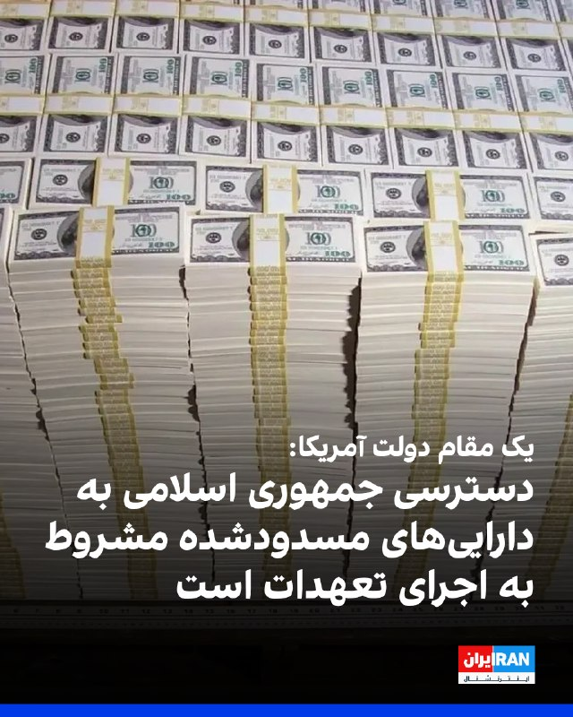

یک مقام ارشد دولت آمریکا به رویترز گفت که توافق با تهران شامل توقف حمایت جمهوری اسلامی از گروه‌های تروریستی خواهد بود.

این مقام آمریکایی گفت که توافق در حال شکل‌گیری با جمهوری اسلامی بر پایه اجرای تعهدات است و تهران تا زمانی که به تعهدات خود عمل نکند، به هیچ‌یک از دارایی‌های مسدودشده خود دسترسی نخواهد داشت.
‌🏁 🇬🇧 IranintlTV

🤖 @VahidOOnLine

## mwarmonitor — post 10775

🔴 وزیر جنگ اسرائیل گفت:

🔸رئیس‌جمهور ایالات متحده آمریکا این روزها با تکیه بر رویکردی مبتنی بر منافع آمریکا در مسیر دستیابی به توافق با ایران حرکت می‌کند. ما انتظار داریم او به اصل جلوگیری از دستیابی ایران به سلاح هسته‌ای پایبند باشد و همچنین به اصول دیگری در حوزه موشک‌ها و شبکه‌های نیابتیِ تروریستی توجه کند.

🔸او افزود: اسرائیل باید اطمینان حاصل کند که در آینده، توانایی اقدام مستقل برای جلوگیری از دستیابی ایران به سلاح هسته‌ای را خواهد داشت.

@mwarmonitor

## FoxNewsTwitter — post 342902

  <a href="telegram/content/FoxNewsTwitter_342902_1781274872.mp4" target="_blank">🎬 Download video</a>

Fox News (Twitter/X)

"You must be smoking some really good crack."

That's how Elon Musk says he would have reacted if someone told him years ago that SpaceX would one day launch the largest IPO ever.

Speaking ahead of the company's historic Wall Street debut, Musk recalled the early days of SpaceX, when the company operated out of a warehouse in El Segundo and faced serious doubts about its survival.

"I think this company is going to fail," he remembered thinking.

## pm_afshaa — post 93696

  <a href="telegram/content/pm_afshaa_93696_1781274875.webm" target="_blank">🎬 Download video</a>

🔴کاتز، وزیر جنگ اسرائیل:
ترامپ این روزها بر اساس دیدگاه منافع آمریکا به سمت توافق با ایران پیش میره و ما انتظار داریم که به اصل جلوگیری از دستیابی ایران به سلاح هسته‌ای و اصول دیگر در زمینه موشک‌ها و عوامل تروریسم پایبند باشه و اسرائیل باید اطمینان حاصل کنه که در آینده توانایی عمل مستقل برای جلوگیری از دستیابی ایران به سلاح هسته‌ای رو خواهد داشت.

💧 Rainbet.com the #1 Non-KYC Crypto Casino & Sportsbook @rainbetcom

😁 @Pm_Afshaa

## pm_afshaa — post 93695

  <a href="telegram/content/pm_afshaa_93695_1781274875.webm" target="_blank">🎬 Download video</a>

🔴فاکس‌نیوز به نقل از یک مقام کاخ سفید: ایران با توافقی مبتنی بر اجرای تعهدات موافقت کرده که بر اساس آن، ایران باید پیش از هرگونه کاهش تحریم‌ها امتیازات بزرگی بده. به گفته این مقام، مواد هسته‌ای ایران نابود و از کشور خارج میشه، برنامه هسته‌ای برچیده خواهد…

## pm_afshaa — post 93694

  <a href="telegram/content/pm_afshaa_93694_1781274876.webm" target="_blank">🎬 Download video</a>

🔴رویترز به نقل از یک مقام ارشد آمریکایی: طبق توافق، مواد هسته‌ای ایران نابود میشه و از کشور خارج خواهد شد و برنامه هسته‌ای ایران برچیده خواهد شد و ایران از سازمان‌های تروریستی حمایت مالی نخواهد کرد. تا زمانی که ایران تعهدات خودش رو اجرا نکنه، هیچ پولی به…

## pm_afshaa — post 93693

  <a href="telegram/content/pm_afshaa_93693_1781274877.webm" target="_blank">🎬 Download video</a>

🔴رویترز به نقل از یک مقام ارشد آمریکایی:
طبق توافق، مواد هسته‌ای ایران نابود میشه و از کشور خارج خواهد شد و برنامه هسته‌ای ایران برچیده خواهد شد و ایران از سازمان‌های تروریستی حمایت مالی نخواهد کرد.

تا زمانی که ایران تعهدات خودش رو اجرا نکنه، هیچ پولی به ایران آزاد و پرداخت نخواهد شد.

💧 Rainbet.com the #1 Non-KYC Crypto Casino & Sportsbook @rainbetcom

😁 @Pm_Afshaa

## DEJradio — post 5618

⭕️
⭕️ نتانیاهو: تا زمانی که نخست‌وزیر باشم، جمهوری اسلامی نمی‌تواند به سلاح هسته‌ای برسد

بنیامین نتانیاهو، نخست‌وزیر اسرائیل روز آدینه ۲۲ خرداد اعلام کرد تا زمانی که در رأس دولت اسرائیل باشد، جمهوری اسلامی نمی‌تواند به سلاح هسته‌ای دست یابد.
نخست‌وزیر اسرائیل با انتشار پیامی نوشت میان او و دونالد ترامپ، دربارۀ جلوگیری از هسته‌ای شدن جمهوری اسلامی توافق کامل برقرار است.
بنیامین نتانیاهو یادآور شد که طی۳۰ سال فعالیت سیاسی خود، در مقابله با برنامۀ هسته‌ای جمهوری اسلامی پیشگام بوده است.
نتانیاهو همچنین گفت جمهوری اسلامی همچنان به دنبال نابودی اسرائیل است.
این نخستین اظهار نظر رسمی نخست‌وزیر اسرائیل در پی خبر احتمال توافق نهائی میان واشینگتن و تهران به‌شمار می‌رود.

#بنیامین_نتانیاهو #اسرائیل #توافق #ترامپ
@DEJradio

## IranIntlTV — post 341890

  <a href="telegram/content/IranIntlTV_341890_1781274878.mp4" target="_blank">🎬 Download video</a>

سرخط خبرهای جمعه ۲۲ خرداد
@iranintltv

## IranIntlTV — post 341889

  

یک مقام ارشد دولت آمریکا به رویترز گفت که توافق با تهران شامل توقف حمایت جمهوری اسلامی از گروه‌های تروریستی خواهد بود.

این مقام آمریکایی گفت که توافق در حال شکل‌گیری با جمهوری اسلامی بر پایه اجرای تعهدات است و تهران تا زمانی که به تعهدات خود عمل نکند، به هیچ‌یک از دارایی‌های مسدودشده خود دسترسی نخواهد داشت.
https://iranintl.com/202606120103

## FarsiVOA — post 220481

  

📸اینستاگرام صدای آمریکا را هم اکنون فالو کنید تا از آخرین خبرها مطلع بمانید:
https://www.instagram.com/voafarsi/

📡همچنین جهت اطلاع از بروزترین فرکانسهای ماهواره‌ای صدای آمریکا به لینک زیر مراجعت فرمایید:
https://ir.voanews.com/satellite

این پست را با دوستانتان به اشتراک بگذارید
@FarsiVOA

## FarsiVOA — post 220480

🔺سنتکام: محاصره دریایی علیه رژیم ایران همچنان ادامه دارد

▪️سنتکام اعلام کرد که در ادامه محاصره دریایی جمهوری اسلامی در تنگه هرمز «کشتی‌ها و هواپیماهای جنگی نیروی دریایی ایالات متحده» همچنان در آب‌های منطقه گشت می‌زنند.

⬇️ بیشتر بخوانید:
https://ir.voanews.com/a/iran-us-centcom-blockade-percian-gulf/8160127.html/?nocach=1

## FarsiVOA — post 220479

🔺نتانیاهو: تا من نخست‌وزیرم رژیم ایران سلاح هسته‌ای نخواهد داشت

▪️بنیامین نتانیاهو، نخست‌وزیر اسرائیل، در پیامی اعلام کرد که تا زمانی که او در مقام نخست‌وزیری این کشور قرار دارد، جمهوری اسلامی به سلاح هسته‌ای دست نخواهد یافت.

⬇️ بیشتر بخوانید:

https://ir.voanews.com/a/netanyahu-warns-iran-on-nukes/8160122.html/?nocach=1

## BBCPersian — post 283567

  <a href="telegram/content/BBCPersian_283567_1781274880.mov" target="_blank">🎬 Download video</a>

🔻این هفته در پرگار: دیپلماسی ایرانی، امتیازگیری یا فرصت‌سوزی؟

🔻در دیپلماسی کنونی ایران بهره‌برداری حداکثری از امتیازهای میدان جنگ می‌بینم یا آنچه می‌بینیم زیاده‌خواهی و در نهایت فرصت‌سوزیست؟

میهمان‌ها:
علم صالح، استاد دانشگاه در روابط بین‌الملل
علی مهتدی، تحلیل‌گر مسائل خاورمیانه

@BBCPersian

## alonews — post 127418

  <a href="telegram/content/alonews_127418_1781274883.webm" target="_blank">🎬 Download video</a>

👈رئیس ستاد کل نیروهای مسلح : هرگز به‌ دنبال دستیابی به سلاح هسته‌ ای نخواهیم رفت و توانمندی‌ های نظامی ما ماهیتی دفاعی دارد و در چارچوب ایجاد بازدارندگی تعریف میشود

✅ @AloNews خبر جنگ

---
📅 بروزرسانی: 1405/03/22 17:54
---

## VahidOOnLine — post 245149

♦️ولادیمیر پوتین، رئیس‌جمهوری روسیه، روز جمعه ۲۲ خرداد در مراسمی در کرملین و همزمان با «روز ملی روسیه» به تعدادی از شهروندان این کشور جوایز دولتی اعطا کرد؛ روزی که به مناسبت شکل‌گیری فدراسیون روسیه پس از فروپاشی اتحاد جماهیر شوروی در سال ۱۹۹۱ گرامی داشته می‌شود.
در همین حال، رسانه‌های روسی گزارش دادند که مراسم اصلی این روز که معمولا در میدان سرخ مسکو برگزار می‌شود، امسال به یک مکان سرپوشیده در خارج از مرکز شهر منتقل شده است.
بر اساس این گزارش، این تغییر به‌دلیل افزایش حملات اوکراین به خاک روسیه پس از بیش از چهار سال جنگ صورت گرفته و تدابیر امنیتی در پایتخت تشدید شده است.
‌🇸🇦 Indypersian

🤖 @VahidOOnLine

## mwarmonitor — post 10774

🔴 فوری: به گزارش Reuters، طبق توافق با تهران، مواد هسته‌ای ایران نابود شده و از کشور خارج خواهد شد؛ این را یک مقام ارشد دولت آمریکا اعلام کرده است. 🔴 این مقام می‌گوید برنامه هسته‌ای ایران برچیده خواهد شد. 🔴 به گفته این مقام، تا زمانی که ایران تعهدات خود…

## mwarmonitor — post 10773

🔴 فوری: به گزارش Reuters، طبق توافق با تهران، مواد هسته‌ای ایران نابود شده و از کشور خارج خواهد شد؛ این را یک مقام ارشد دولت آمریکا اعلام کرده است.

🔴 این مقام می‌گوید برنامه هسته‌ای ایران برچیده خواهد شد.

🔴 به گفته این مقام، تا زمانی که ایران تعهدات خود را اجرا نکند، هیچ پولی به تهران آزاد نخواهد شد.

@mwarmonitor

## DEJradio — post 5617

  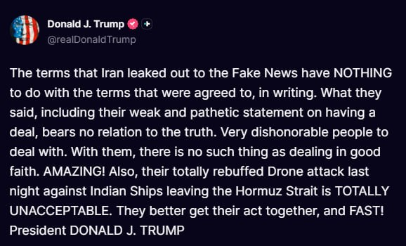

⭕️
⭕️ ترامپ: جمهوری اسلامی دربارۀ تفاهمنامه، دروغ و چرند می‌گوید

دونالد ترامپ، رئیس جمهوری ایالات متحده عصر آدینه ۲۲ خرداد اعلام کرد مفادی که جمهوری اسلامی دربارۀ توافق احتمالی با آمریکا نشر داده، واقعی نیست.
به گفتۀ ترامپ، بندهایی از توافق که مقامات تهران از طریق رسانه‌های دروغگو نشر داده‌اند، با بندهایی که بر سر آن تفاهم شده است، هیچ شباهتی ندارد.
رئیس جمهوری آمریکا افزود گفته‌های مقام‌های جمهوری اسلامی دربارۀ توافق ضعیف و چرند است.
او بازهم رژیم حاکم بر ایران را متهم کرد که در مذاکرات با حسن نیت عمل نمی‌کند.
رئیس جمهوری آمریکا همچنین از حمله پهپادی جمهوری اسلامی به کشتی‌های هندی در حال عبور از تنگه هرمز انتقاد کرد و گفت این حملۀ ناکام، پذیرفتنی نیست.

#خبر_فوری #ترامپ #مذاکرات
@DEJradio

## IranIntlTV — post 341888

  <a href="telegram/content/IranIntlTV_341888_1781274243.mp4" target="_blank">🎬 Download video</a>

کانال «دانشجویان متحد» از موج تازه‌ احکام انضباطی علیه دانشجویان در دانشگاه‌های ایران خبر داد. در دانشگاه سوره برای دست‌کم ۲۲ دانشجو احکام اخراج و تعلیق از تحصیل صادر شده است. همچنین در دانشگاه علم‌وصنعت، دست‌کم هشت دانشجو به یک ترم محرومیت از تحصیل محکوم شده‌اند و دفاعیات آنان بدون برگزاری جلسه و از طریق ایمیل دریافت شده است.

گفت‌وگو با شیدا رهبری، فعال دانشجویی
@iranintltv

## DW_Farsi — post 125896

🔶 ثروت ایلان ماسک از یک بیلیون دلار فراتر می‌رود

عرضه اولیه سهام اسپیس‌ایکس از بعدازظهر روز ١٢ ژوئن (۲٢ خرداد)، آغاز خواهد شد. پس از آن احتمالا ثروت ایلان ماسک از مرز یک بیلیون دلار (۱۰۰۰ میلیارد دلار) عبور خواهد کرد.

بر اساس شاخص میلیاردرهای بلومبرگ، ثروت فعلی او حدود ۷۲۰ میلیارد دلار است و ارزش سهامش در اسپیس‌ایکس تقریباً دو برابر می‌شود.

ایلان ماسک ۵۴ ساله است و اولین شرکت خود را در سال ۱۹۹۵ بنیان گذاشته است. محاسبات نشان می‌دهد که ثروت او طی سه دهه گذشته به طور متوسط حدود ۷۵۰ دلار در هر ثانیه افزایش یافته است.
@dw_farsi

## RadioFarda — post 158225

  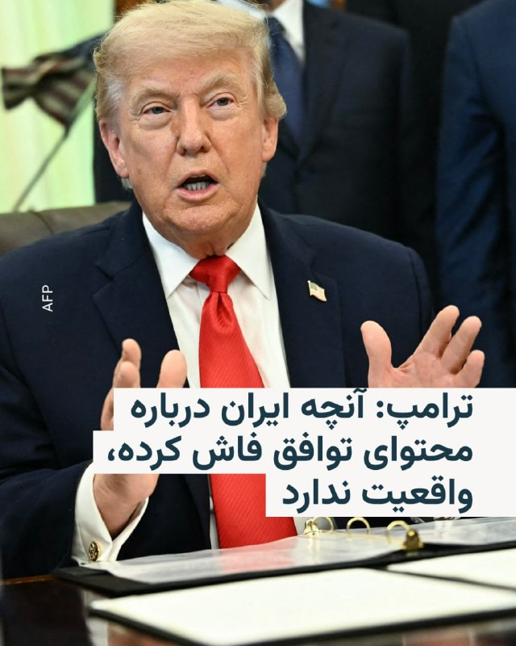

🔸دونالد ترامپ، رئیس‌جمهور آمریکا، روز جمعه اعلام کرد مواردی که از سوی ایران درباره توافق با ایالات متحده به رسانه‌ها درز کرده است، بازتاب‌دهنده آنچه واقعاً میان تهران و واشینگتن مورد تفاهم قرار گرفته، نیست.

🔸او با انتشار پستی در شبکه اجتماعی تروث سوشال نوشت: «آنچه آنها (ایران) گفته‌اند، از جمله بیانیه ضعیف و رقت‌انگیزشان درباره دستیابی به توافق، هیچ نسبتی با واقعیت ندارد.»

🔸ترامپ طرف ایرانی را «افراد بسیار بی‌شرافت» خواند و افزود: «در مورد آنها، چیزی به نام مذاکره و تعامل با حسن نیت وجود ندارد.»

🔸رئیس‌جمهور آمریکا همچنین اعلام کرد حمله پهپادی شب گذشته ایران علیه کشتی‌های هندی که در حال خروج از تنگه هرمز بودند «و به‌طور کامل دفع شد، کاملاً غیرقابل قبول است».

🔸او به مقام‌های حکومت ایران هشدار داد که «بهتر است هرچه سریع‌تر اوضاع خود را سر و سامان دهند».

@RadioFarda

## IranianMinds — post 22411

  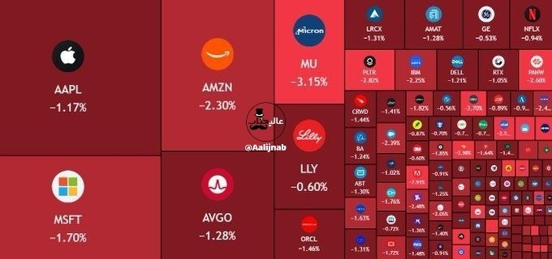

500میلیارد دلار از ارزش بازار سهام آمریکا تنها در 5 دقیقه پس از آنکه ترامپ گفت مفاد توافق فاش شده ایران «جعلی» است، از بین رفت.

@IranianMinds

## Hranews — post 113560

  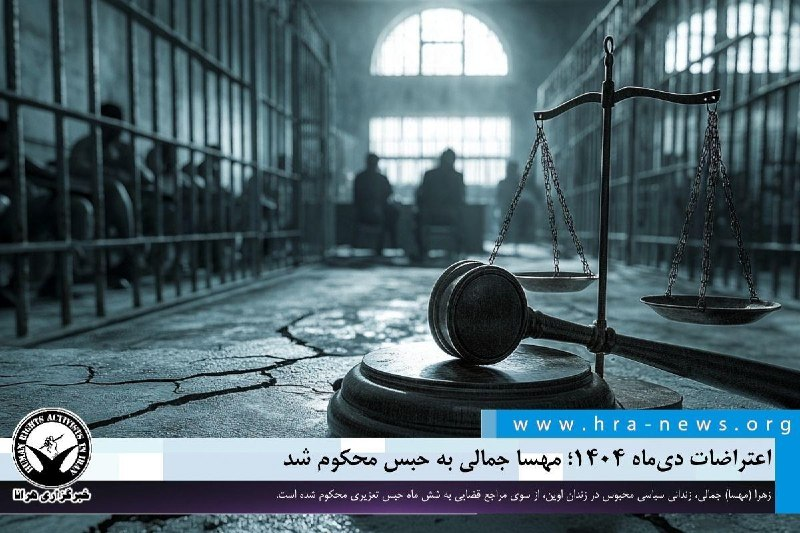

اعتراضات دی‌ماه ۱۴۰۴؛ مهسا جمالی به حبس محکوم شد

❗️
❗️
❗️
❗️
❗️– زهرا (مهسا) جمالی، از بازداشت شدگان اعتراضات دی‌ماه ۱۴۰۴ که در بند زنان زندان اوین محبوس است، توسط دادگاه انقلاب به شش ماه حبس تعزیری محکوم شده است.

به گزارش خبرگزاری هرانا، ارگان خبری مجموعه فعالان حقوق بشر در ایران، زهرا جمالی به حبس محکوم شد.

بر اساس اطلاعات دریافتی هرانا، خانم جمالی با حکم دادگاه انقلاب به شش ماه حبس محکوم شده است. وی هم اکنون در بند زنان زندان اوین محبوس است.

ادامه مطلب

#زهرا_جمالی #مهسا_جمالی

↘️
@hranews_bot تماس ✉️ - @Hranews کانال هرانا 🆑

---
📅 بروزرسانی: 1405/03/22 17:43
---

## VahidOOnLine — post 245148

  

یک مقام ارشد دولت آمریکا به رویترز گفت توافق با جمهوری اسلامی بر اساس اجرای تعهدات خواهد بود.

این مقام ارشد دولت آمریکا اضافه کرد که مواد هسته‌ای ایران نابود و از این کشور خارج خواهد شد و برنامه هسته‌ای آن‌ها برچیده خواهد شد.

این مقام ارشد دولت آمریکا گفت که تنگه هرمز نیز باز خواهد بود.
‌🏁 🇬🇧 IranintlTV

🤖 @VahidOOnLine

## VahidOOnLine — post 245147

  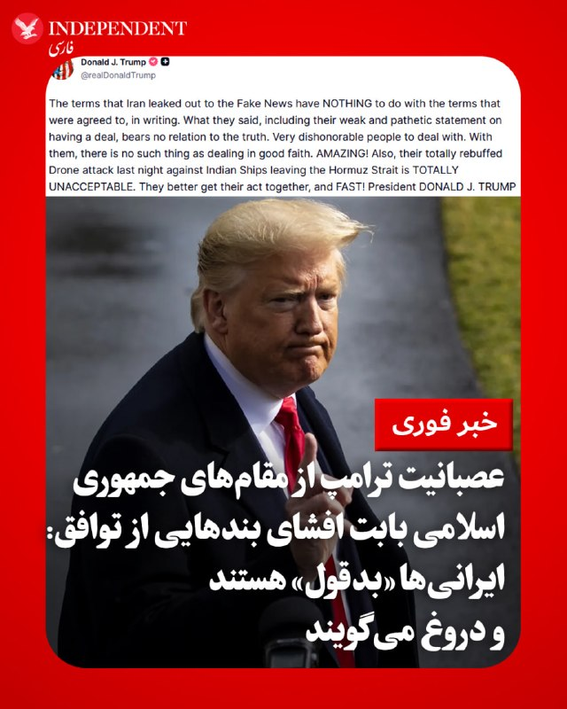

♦️ تنها یک روز پس از اعلام نهایی شدن توافق با ایران، دونالد ترامپ مقامات تهران را «بدقول و بی‌شرف» (Dishonorable) خواند و آن‌ها را به ارائه اطلاعات نادرست از مفاد توافق متهم کرد.

ترامپ در شبکه اجتماعی «تروث سوشال» نوشت: «شرایطی که ایران به رسانه‌های جعلی درز داده، هیچ ارتباطی با توافقی که به صورت مکتوب بر سر آن موافقت شده بود، ندارد. بیانیه ضعیف و رقت‌انگیز آن‌ها درباره توافق، فرسنگ‌ها با حقیقت فاصله دارد. معامله با این افرادِ بی‌اعتبار فایده‌ای ندارد؛ در قاموس آن‌ها چیزی به نام حسن نیت وجود ندارد.»

این خشم ترامپ پس از آن برانگیخته شد که رسانه‌های دولتی ایران، گزارش‌هایی از «خطوط کلی توافق احتمالی» منتشر کردند و مدعی شدند که جمهوری اسلامی مدیریت تنگه هرمز را واگذار نخواهد کرد و آمریکا باید ۲۴ میلیارد دلار از دارایی‌های بلوکه‌شده ایران را آزاد کند.

ترامپ در پایان پیام خود، تداوم هدف قرار گرفتن کشتی‌ها در تنگه هرمز توسط ایران را «کاملا غیرقابل قبول» دانست و هشدار داد: «بهتر است رفتارشان را اصلاح کنند، آن هم سریع!»
‌🇸🇦 Indypersian

🤖 @VahidOOnLine

## mwarmonitor — post 10772

🔴عرضه اولیه سهام (IPO) شرکت SpaceX باعث شد ایلان ماسک به نخستین تریلیونر جهان تبدیل شود.

🔸پیش از این عرضه اولیه، ثروت ماسک طبق برآورد CBS حدود ۸۱۳ میلیارد دلار تخمین زده می‌شد.

@mwarmonitor

## mwarmonitor — post 10771

  

🔴«شرایطی که ایران به رسانه‌های جعلی (فیک نیوز) درز داده است، هیچ ربطی به شرایطی که به صورت مکتوب بر سر آن‌ها توافق شده بود، ندارد. آنچه آن‌ها گفته‌اند، از جمله بیانیه ضعیف و رقت‌انگیزشان درباره داشتن یک توافق، هیچ نسبتی با حقیقت ندارد. افراد بسیار بی‌شرفی برای معامله کردن هستند. با آن‌ها چیزی به نام معامله از روی حسن نیت وجود ندارد. مایه شگفتی است! همچنین، حمله پهپادی کاملاً دفع‌شده آن‌ها در شب گذشته علیه کشتی‌های هندی که در حال ترک تنگه هرمز بودند، کاملاً غیرقابل قبول است. بهتر است سر عقل بیایند، آن هم سریع!

رئیس‌جمهور دونالد جی. ترامپ»

@mwarmonitor

## FoxNewsTwitter — post 342901

  <a href="telegram/content/FoxNewsTwitter_342901_1781273638.mp4" target="_blank">🎬 Download video</a>

Fox News (Twitter/X)

WATCH: SpaceX CEO Elon Musk rings the NASDAQ opening bell as the company officially goes public, setting him up to be the world's first trillionaire.

## VahidOnline — post 76264

  

♦️ تنها یک روز پس از اعلام نهایی شدن توافق با ایران، دونالد ترامپ مقامات تهران را «بدقول و بی‌شرف» (Dishonorable) خواند و آن‌ها را به ارائه اطلاعات نادرست از مفاد توافق متهم کرد.

ترامپ در شبکه اجتماعی «تروث سوشال» نوشت: «شرایطی که ایران به رسانه‌های جعلی درز داده، هیچ ارتباطی با توافقی که به صورت مکتوب بر سر آن موافقت شده بود، ندارد. بیانیه ضعیف و رقت‌انگیز آن‌ها درباره توافق، فرسنگ‌ها با حقیقت فاصله دارد. معامله با این افرادِ بی‌اعتبار فایده‌ای ندارد؛ در قاموس آن‌ها چیزی به نام حسن نیت وجود ندارد.»

این خشم ترامپ پس از آن برانگیخته شد که رسانه‌های دولتی ایران، گزارش‌هایی از «خطوط کلی توافق احتمالی» منتشر کردند و مدعی شدند که جمهوری اسلامی مدیریت تنگه هرمز را واگذار نخواهد کرد و آمریکا باید ۲۴ میلیارد دلار از دارایی‌های بلوکه‌شده ایران را آزاد کند.

ترامپ در پایان پیام خود، تداوم هدف قرار گرفتن کشتی‌ها در تنگه هرمز توسط ایران را «کاملا غیرقابل قبول» دانست و هشدار داد: «بهتر است رفتارشان را اصلاح کنند، آن هم سریع!»
@VahidOOnLine

📡 @VahidOnline

## VahidOnline — post 76263

  

دونالد ترامپ در شبکه تروث سوشال نوشت مفادی که جمهوری اسلامی در اختیار رسانه‌ها قرار داده، هیچ ارتباطی با مفادی که به صورت مکتوب بر سر آن توافق شده ندارد.

ترامپ اضافه کرد: «آنچه آن‌ها گفته‌اند، از جمله بیانیه ضعیف و رقت‌انگیزشان درباره توافق، هیچ ارتباطی با واقعیت ندارد.»

رییس جمهوری ایالات متحده مقام‌های جمهوری اسلامی را «بسیار بی‌آبرو» خواند و افزود با آن‌ها چیزی به نام مذاکره با حسن نیت وجود ندارد.

ترامپ همچنین گفت حمله پهپادی شب گذشته جمهوری اسلامی به کشتی‌های هندی که در حال خروج از تنگه هرمز بودند، «کاملا غیرقابل قبول» بوده و افزود: «آنها باید خیلی سریع اوضاع را سامان دهند.»
@VahidOOnLine

📡 @VahidOnline

## VahidOnline — post 76262

  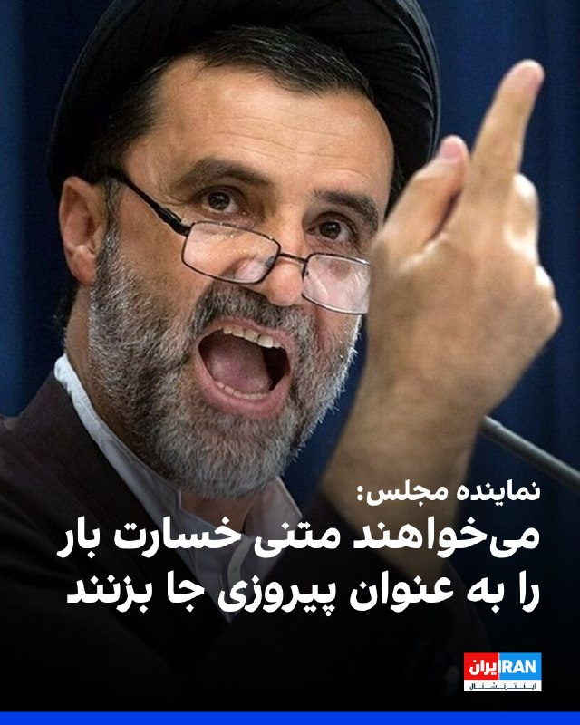

محمود نبویان، نماینده مجلس جمهوری اسلامی، با انتقاد از پیش‌نویس توافق احتمالی میان آمریکا و جمهوری اسلامی، آن را مشابه برجام و «خسارت محض» توصیف کرد. او گفت: «حرف از پیروزی با این متن مبهم و خسارت‌بار کاملا غلط است.»

نبویان با انتقاد از مفاد مطرح‌شده در پیش‌نویس توافق، گفت در این توافق جمهوری اسلامی حق تولید سلاح هسته‌ای را نخواهد داشت. او همچنین افزود سرنوشت مواد غنی‌شده به رضایت آمریکا وابسته شده و همه موضوعات مرتبط با برنامه هسته‌ای باید مورد مذاکره قرار گیرد.

این نماینده مجلس تاکید کرد: «این توافق مانند برجام خسارت محض است و بخاطر تغییر محاسبات مسئولان است.»
@VahidOOnLine

📡 @VahidOnline

## VahidOnline — post 76261

  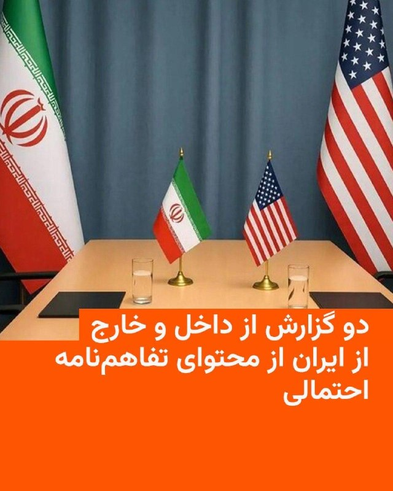

🔸روزنامه اعتماد در داخل ایران به نقل از یک عضو رسانه‌ای هیئت مذاکره‌کننده جمهوری اسلامی و وب‌سایت اکسیوس در خارج به نقل از یک دیپلمات از یک کشور میانجی و یک مقام آمریکایی روز جمعه، ۲۲ خردادماه، گزارش‌هایی از محتوای احتمالی تفاهم‌نامه میان ایران و آمریکا منتشر کردند.

🔸این دو گزارش تا اندازه‌ای به یکدیگر نزدیک هستند، اما گزارش اعتماد با وجود جزئیات بیشتر به نقطه نظر حکومت ایران نزدیک است، در حالی که متن اکسیوس برخی از موارد را منوط به آینده مذاکرات گزارش کرده است، مانند تعلیق تحریم‌ها که اکسیوس می‌گوید مشروط به پایبندی تهران به تفاهم‌نامه است.

🔸روزنامه اعتماد به نقل از «عضو کمیته رسانه هیئت مذاکراتی ایران» از تفاهم‌نامه‌ای ۱۴ ماده‌ای می‌گوید که در آن بر «بازگشایی تنگه هرمز ظرف ۳۰ روز با ترتیبات ایرانی» و «تعلیق تحریم‌های فروش نفت، محصولات پتروشیمی و مشتقات و دسترسی کامل ایران به منابع مالی آن» تأکید شده است.

🔸این در حالی است که در گزارش اکسیوس آمده است که تنگه هرمز «بلافاصله بدون دریافت عوارض بازگشایی می‌شود» و «ظرف ۳۰ روز» تعداد کشتی‌های عبوری از این تنگه به زمان پیش از جنگ بازمی‌گردد.
🔸در مقابل این اقدام، آمریکا هم محاصره دریایی بنادر ایران را که بر صادرات نفت ایران اثر قابل توجه دارد حذف می‌کند.
اکسیوس به نقل از منبع دیپلماتیک خود می‌نویسد: «هیچ تاریخی برای تعلیق تحریم‌ها تعیین نشده و تعلیق منوط است به اجرای توافق [از طرف ایران].»

🔸به نوشته اکسیوس، تعلیق تحریم زمانی افزایش می‌یابد که ایران «تفاهم‌نامه را اجرا کند و در مذاکرات بعدی از خود حسن نیت نشان دهد».

🔸تفاوت دیگر بین دو گزارش از محتوای احتمالی به آزاد شدن یا نشدن اموال بلوکه‌شده ایران مربوط است. اعتماد به نقل از منبع خود می‌گوید: «آزادسازی ۲۴ میلیارد دلار پول‌های بلوکه شده ایران در دوره ۶۰ روزه مذاکرات نهایی. نیمی از این مبلغ قبل از شروع مذاکرات باید در دسترس ایران قرار گیرد.»

🔸این در حالی است که دونالد ترامپ پیشتر به طور مشخص با آزاد کردن پول‌های ایران پیش از مذاکره یا رسیدن به توافق مخالفت کرده و به طور کلی به این کار به دلیل سابقه‌اش با باراک اوباما در توافق برجام حساسیت ویژه دارد.

🔸گزارش اکسیوس در این زمینه سکوت می‌کند و می‌نویسد که «مشخص نیست» که متن تفاهم‌نامه حاوی اطلاعاتی درباره پول‌های ایران هست یا خیر.

🔸درباره برنامه هسته‌ای ایران، اکسیوس نوشته است که تفاهم‌نامه شامل «تعهداتی»‌از طرف ایران خواهد بود، مهم‌تر از همه این که ایران هرگز به دنبال سلاح اتمی نخواهد رفت و بن‌بست در مورد اورانیوم غنی‌شده را حل خواهد کرد، دو موضوعی که ترامپ بر آن تمرکز دارد.

🔸به نوشته اکسیوس، ترامپ موافقت کرده است که یکی از گزینه‌ها برای حل این مسئله رقیق کردن اورانیوم در داخل ایران «زیر نظر کارشناسان سازمان ملل» است، نکته‌ای که پیشتر روزنامه نیویورک تایمز هم خبر داده بود.

🔸منبع اعتماد تنها به این شکل به این موضوعات اشاره کرده است: «۶۰ روز مذاکره برای رسیدن به توافق نهایی مبتنی بر موضوعات هسته‌ای و لغو کامل تحریم‌های اولیه، ثانویه، آمریکا و قطعنامه‌های شورای امنیت سازمان ملل و شورای حکام آژانس بین‌المللی انرژی اتمی» و «تکرار تعهد ایران در پیمان ان‌پی‌تی مبنی بر عدم تولید سلاح هسته‌ای».

🔸در این بخش از گزارش روزنامه اعتماد به موضوع سرنوشت مواد غنی‌شده اشاره نشده است.

🔸به طور کلی، بر اساس گزارش اکسیوس، تفاهم‌نامه در صورت امضا شدن آتش‌بس جنگ را، از جمله در لبنان، تا ۶۰ روز تمدید می‌کند، دو ماهی که قرار است تهران و واشینگتن مذاکرات هسته‌ای را برگزار کنند.

🔸آن طور که اکسیوس نوشته است، ایران و آمریکا بر سر متن تفاهم‌نامه توافق کرده‌اند، و این متن توسط مقامات عالی‌رتبه در جمهوری اسلامی نیز تأیید شده، اما «احتمالا هنوز تأیید مجتبی خامنه‌ای را ندارد». بنابراین در حال حاضر گفته سخنگوی وزارت خارجه ایران که تفاهم‌نامه هنوز نهایی نشده به واقعیت نزدیک‌تر است.

🔸در حالی که ترامپ از امضای تفاهم‌نامه احتمالا در روزهای شنبه و یک‌شنبه حرف زده بود، به نوشته اکسیوس، چهار هواپیمای نیروی هوایی آمریکا روز پنج‌شنبه برای انتقال تجهیزات سفر جی‌دی ونس، معاون ترامپ، به ژنو در سوئیس برای شرکت در مراسم امضا «در روزهای آینده» پرواز کردند.
@VahidHeadline

📡 @VahidOnline

## VahidOnline — post 76260

  

🔸خبرگزاری بلومبرگ به نقل از مقامات ارشد آمریکایی و ایرانی نوشته احتمال دارد توافق میان دو کشور از روز یکشنبه و در شهر ژنو سوئیس نهایی شود.

🔸این خبرگزاری بدون اشاره به نام این مقام‌ها افزوده که طرفین «در آستانه» دستیابی به توافقی برای بازگشایی تنگه هرمز قرار دارند.

🔸بر اساس این گزارش، طرف‌های ایرانی و آمریکایی قرار است در حاشیه اجلاس گروه هفت که از دوشنبه در فرانسه برگزار می‌شود، «دیدار کنند».

🔸اجلاس امسال گروه هفت از ۲۵ تا ۲۷ خرداد در دامنه‌های آلپ فرانسه برگزار می‌شود. به گفته افرادی که در جریان برنامه‌ریزی‌ها قرار دارند، شهر ژنو در سوئیس که در نزدیکی محل برگزاری اجلاس قرار دارد، به عنوان یکی از گزینه‌های احتمالی برای امضای این توافق مطرح شده و ممکن است این مراسم از روز یکشنبه ۲۴ خرداد انجام شود.

🔸یک مقام ارشد ایرانی و یکی از اعضای گروه هفت به بلومبرگ گفته‌اند که «احتمال دستیابی به توافق زیاد است.»
@VahidHeadline

📡 @VahidOnline

## VahidOnline — post 76259

  

خبرگزاری مهر، وابسته به سازمان تبلیغات اسلامی، جمعه ۲۲ خرداد به نقل از «منبع نزدیک به تیم مذاکره کننده ایرانی» جزئیات جدیدی از پیش‌نویس تفاهمنامه ۱۴ ماده‌ای ایران و آمریکا را منتشر کرد.

بر اساس این گزارش تهران متعهد می‌شود به دنبال ساخت سلاح هسته‌ای نرود و در مقابل، برخی امتیازهای اقتصادی از جمله تسهیل صادرات نفت و بررسی آزادسازی بخشی از دارایی‌های مسدودشده را به دست می‌آورد.

مهر به نقل از این مقام گزارش داد که پس از امضای احتمالی این تفاهم‌نامه، مذاکرات جامع‌تری به‌مدت ۶۰ روز آغاز خواهد شد و موضوعات پیچیده‌تر از جمله سطح غنی‌سازی اورانیوم، ذخایر اورانیوم غنی‌شده و جزئیات رفع تحریم‌ها مورد بررسی قرار می‌گیرد.

براساس این گزارش ۱۴ محور تفاهمنامه احتمالی تهران و واشنگتن شامل موارد زیر است:
۱- توقف دائمی و فوری جنگ در همه جبهه ها از جمله لبنان
۲- تعهد آمریکا به مداخله نکردن در امور داخلی ایران
۳- رفع کامل محاصره دریایی ظرف ۳۰ روز
۴- تعهد آمریکا به خروج نیروهایش از پیرامون ایران
۵- بازگشایی تنگه هرمز ظرف ۳۰ روز به وسیله ایران
۶- تعلیق تحریم های فروش نفت، محصولات پتروشیمی و مشتقات و دسترسی کامل ایران به منابع مالی آن.
۷- لزوم ارائه طرح های بازسازی ایران حداقل به مبلغ ۳۰۰ میلیارد دلار توسط آمریکا و متحدانش
۸- ۶۰ روز مذاکره برای رسیدن به توافق نهایی مبتنی بر موضوعات هسته‌ای و لغو کامل تحریم‌های اولیه، ثانویه، آمریکا و قطعنامه‌های شورای امنیت سازمان ملل و شورای حکام آژانس بین المللی انرژی اتمی
۹- تعهد ایران برای تداوم عضویت در پیمان «ان پی تی» مبنی بر عدم تولید سلاح هسته ای
۱۰- در دوره مذاکرات آمریکا متعهد شده به نیروهای خود در منطقه اضافه نمی کند و تحریم جدیدی هم وضع نخواهد کرد.
۱۱- آزادسازی ۲۴ میلیارد دلار اموال مسدود شده ایران در دوره ۶۰ روزه مذاکرات نهایی. نیمی از این مبلغ قبل از شروع مذاکرات باید در دسترس ایران قرار گیرد.
۱۲- تشکیل سازوکار نظارتی برای اجرایی کردن توافق احتمالی
۱۳- تایید توافق نامه نهایی توسط قطعنامه شورای امنیت سازمان ملل

مهر به نقل از این «مقام آگاه» گزارش کرد که در بند آخر توافقنامه احتمالی، دوطرف تفاهم می‌کنند، مذاکره نهایی قبل از آزادسازی نیمی از اموال مسدود شده ایران، تعلیق تحریم‌های نفتی و رفع محاصره دریایی آغاز نشود.

دونالد ترامپ، رئیس جمهوری آمریکا شامگاه پنجشنبه گفته بود که به محض امضای توافق، محاصره دریایی پایان می‌یابد و تنگه هرمز باز می‌شود.

به گزارش مهر، توافق نهایی صرفا در موضوع سرنوشت اورانیوم‌های غنی شده و غنی سازی، رفع تحریم‌ها و «برنامه بازسازی اقتصاد ایران انجام می‌شود» و بحث درباره برنامه موشکی و حمایت از گروه‌های نیابتی «به صورت قطعی از دستور کار خارج شده است».
@VahidOOnLine

📡 @VahidOnline

## VahidOnline — post 76258

  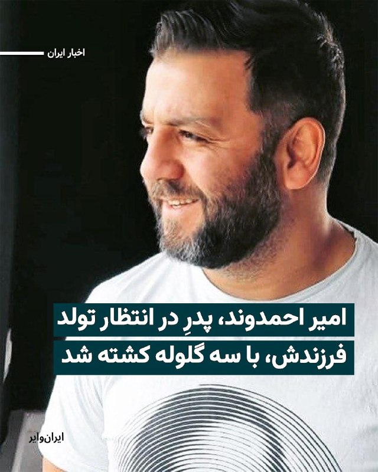

«امیر احمدوند» ۳۹ ساله، شامگاه ۱۸ دی‌ماه ۱۴۰۴ در نزدیکی کلانتری رشید در تهران هدف شلیک گلوله قرار گرفت و جان خود را از دست داد. او متأهل بود و همسرش در زمان کشته‌شدن او سه ماهه باردار و در شرایط استراحت مطلق قرار داشت.
@VahidHeadline

📡 @VahidOnline

## IranIntlTV — post 341887

  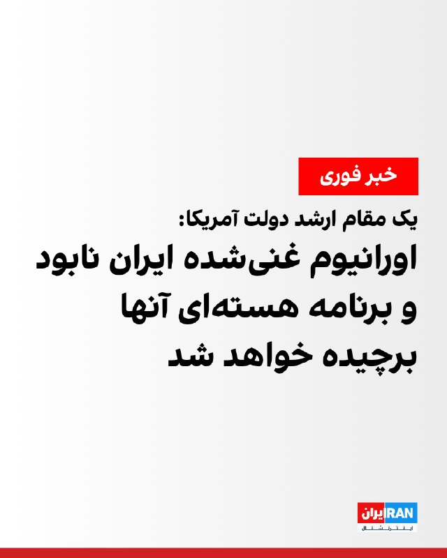

یک مقام ارشد دولت آمریکا به رویترز گفت توافق با جمهوری اسلامی بر اساس اجرای تعهدات خواهد بود.

این مقام ارشد دولت آمریکا اضافه کرد که مواد هسته‌ای ایران نابود و از این کشور خارج خواهد شد و برنامه هسته‌ای آن‌ها برچیده خواهد شد.

این مقام ارشد دولت آمریکا گفت که تنگه هرمز نیز باز خواهد بود.
https://iranintl.com/202606124169

## DW_Farsi — post 125895

🔶 اجرای مقررات جدید پناهندگی در اتحادیه اروپا آغاز شد

اتحادیه اروپا پس از سال‌ها کشمکش و مذاکرات طولانی، از امروز اجرای "سیستم مشترک پناهندگی اروپا" (GEAS) را آغاز کرد.

هدف اصلی این اصلاحات جامع مقابله با مهاجرت‌های ثانویه (حرکت پناهجویان از کشورهای مرزی به سمت کشورهای مرکزی اروپا)، تسریع روند رسیدگی به درخواست‌های پناهندگی و اخراج سریع‌تر پناهجویانی است که شانس کمی برای دریافت قبولی دارند.

بر اساس بسته جدید مهاجرتی اتحادیه اروپا، پناهجویان باید بلافاصله پس از ورود به مرزهای خارجی اتحادیه اروپا مورد بررسی اولیه قرار گیرند تا وضعیت آن‌ها در همان مراحل ابتدایی مشخص شود.
@dw_farsi

## Persian_Trend_Official — post 16854

  <a href="telegram/content/Persian_Trend_Official_16854_1781273644.webm" target="_blank">🎬 Download video</a>

فاکس نیوز: ایران با یک توافق مبتنی بر عملکرد موافقت کرده است که مستلزم امتیازات عمده‌ای قبل از دریافت هرگونه کاهش تحریم‌ها است.

مواد هسته‌ای ایران نابود و حذف خواهد شد، برنامه هسته‌ای آن برچیده می‌شود و هیچ یک از پول‌های آن تا زمانی که به تعهدات خود عمل نکند، آزاد نخواهد شد.

یک مقام کاخ سفید گفت تنگه هرمز باز خواهد ماند و ایران موافقت خواهد کرد که تأمین مالی گروه‌های تروریستی را متوقف کند.

📝 Amir

📌 @persian_trend_official
پرشین ترند | متفاوت‌ترین کانال نظامی

## Dirty_Kids — post 391807

مرتیکه ندید بدید، آستین رو داده بالای ساعت که رولکسش معلوم بشه. @Dirty_Kids 👻

## Dirty_Kids — post 391806

‏جام جهانی قبل دلار ۳۲ تومان بود.

@Dirty_Kids 👻

## Dirty_Kids — post 391805

  <a href="telegram/content/Dirty_Kids_391805_1781273645.mp4" target="_blank">🎬 Download video</a>

🔴 رقص این پسربچه با ریمیکس "تو رستم تهمتنی" تو اینستاگرام وایرال شده:

@Dirty_Kids 👻

## Dirty_Kids — post 391804

  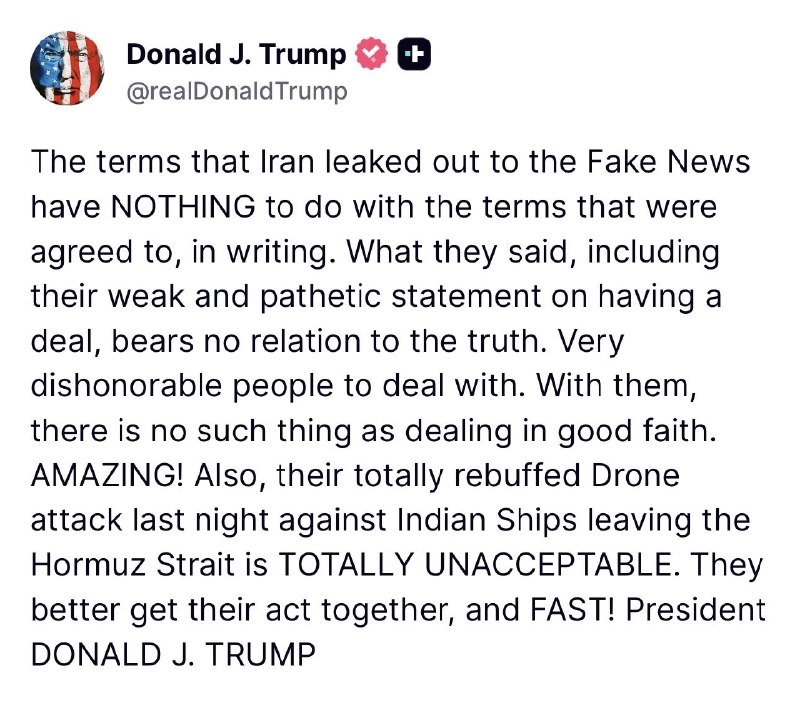

پست جدید ترامپ در تروث‌سوشال که کله‌ش خیلی کیری شده، خیلی:

شرط و شروطی که جمهوری‌اسلامی لو داده و تو رسانه‌های فیک‌نیوز پخش شده، هیچ ربطی به توافقات کتبی نهایی نداره.

چیزایی که این پدرخرابای رافضی گفتن از جمله بیانیه ضعیف و رقت‌بارشون درباره رسیدن به توافق اصلاً با واقعیت جور درنمیاد.

با آدمای فوق‌العاده بی‌شرف و مادرجنده‌ای طرفیم. کلمه‌ای به اسم حسن نیت تو مرام و معامله این پدرقحبه‌ها اصلاً وجود نداره. واقعاً عجیبه.

در ضمن حمله دیشب پهپادیشون که کاملاً دفع شد و کشتی‌های هندی در حال خروج از تنگه‌ی هرمز رو هدف گرفته بود، به‌هیچ‌وجه قابل قبول نیست.

بهتره هرچه زودتر کون مون‌شون رو جمع‌وجور کنن، اونم سریع.
رئیس‌جمهور، دونالد جی. ترامپ

@Dirty_Kids 👻

## alonews — post 127417

  <a href="telegram/content/alonews_127417_1781273646.webm" target="_blank">🎬 Download video</a>

👈اعتراف به همسرکشی پس از یک ساعت گریه کنار جسد

🔴مرد جوانی پس از قتل همسر ۳۸ ساله‌اش با چکش و چاقو، حدود یک ساعت بالای سر جسد او نشست و گریه کرد و سپس خود به پلیس اطلاع داد.

🔴بر اساس اعتراف متهم، اختلافات مالی و مشکلات معیشتی عامل اصلی این جنایت خانوادگی بوده است. تحقیقات درباره پرونده ادامه دارد.

✅ @AloNews خبر جنگ

---
📅 بروزرسانی: 1405/03/22 17:34
---

## VahidOOnLine — post 245146

  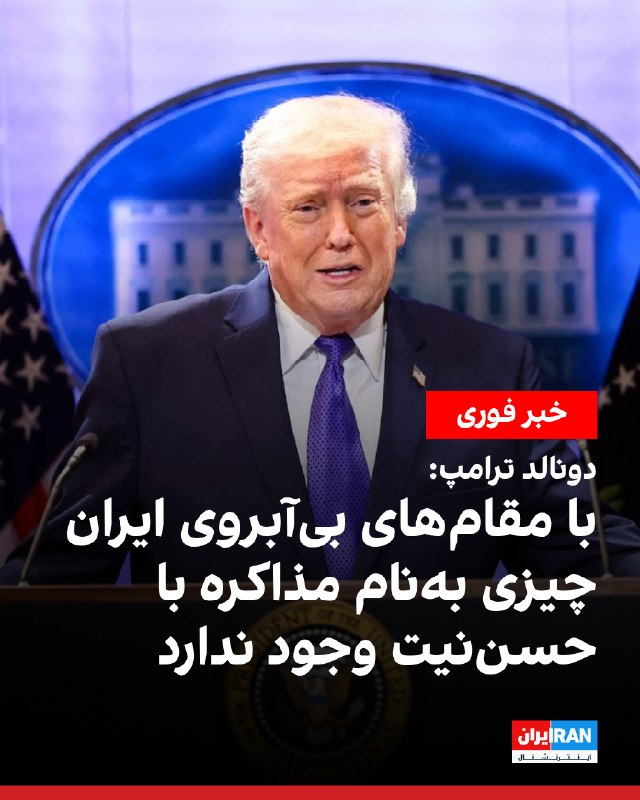

دونالد ترامپ در شبکه تروث سوشال نوشت مفادی که جمهوری اسلامی در اختیار رسانه‌ها قرار داده، هیچ ارتباطی با مفادی که به صورت مکتوب بر سر آن توافق شده ندارد.

ترامپ اضافه کرد: «آنچه آن‌ها گفته‌اند، از جمله بیانیه ضعیف و رقت‌انگیزشان درباره توافق، هیچ ارتباطی با واقعیت ندارد.»

رییس جمهوری ایالات متحده مقام‌های جمهوری اسلامی را «بسیار بی‌آبرو» خواند و افزود با آن‌ها چیزی به نام مذاکره با حسن نیت وجود ندارد.

ترامپ همچنین گفت حمله پهپادی شب گذشته جمهوری اسلامی به کشتی‌های هندی که در حال خروج از تنگه هرمز بودند، «کاملا غیرقابل قبول» بوده و افزود: «آنها باید خیلی سریع اوضاع را سامان دهند.»
‌🏁 🇬🇧 IranintlTV

🤖 @VahidOOnLine

## kianmeli1 — post 87960

  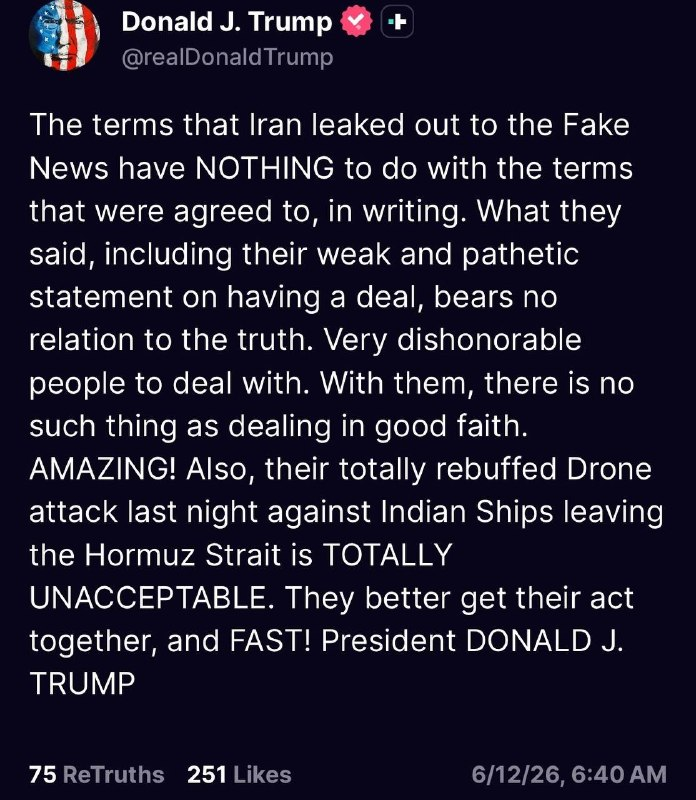

🔴توئیت الان ترامپ خلاف تمام صحبت های دیشبش

ترامپ می‌گوید مفاد توافقی که ایران «افشا» کرده «هیچ ارتباطی با مفاد توافق‌شده ندارد» و رهبران ایران «افراد بسیار بی‌آبرویی هستند که نمی‌توان با آنها معامله کرد.»

ترامپ می‌گوید: «با آنها، چیزی به نام معامله با حسن نیت وجود ندارد.»
https://t.me/kianmeli1

## IranIntlTV — post 341886

  <a href="telegram/content/IranIntlTV_341886_1781273065.mp4" target="_blank">🎬 Download video</a>

بلومبرگ گزارش داد توافق میان واشینگتن و تهران قرار است همزمان با آغاز نشست گروه هفت در ژنو امضا شود. همزمان، خبرگزاری فارس، وابسته به سپاه پاسداران، به نقل از یک منبع نزدیک به تیم مذاکره‌کننده جمهوری اسلامی، این گزارش را رد کرد و نوشت که تصمیم‌گیری درباره توافق در ایران هنوز نهایی نشده است.

سمیرا قرایی، خبرنگار ایران‌اینترنشنال، گزارش می‌دهد
@iranintltv

## IranIntlTV — post 341885

  

دونالد ترامپ در شبکه تروث سوشال نوشت مفادی که جمهوری اسلامی در اختیار رسانه‌ها قرار داده، هیچ ارتباطی با مفادی که به صورت مکتوب بر سر آن توافق شده ندارد.

ترامپ اضافه کرد: «آنچه آن‌ها گفته‌اند، از جمله بیانیه ضعیف و رقت‌انگیزشان درباره توافق، هیچ ارتباطی با واقعیت ندارد.»

رییس جمهوری ایالات متحده مقام‌های جمهوری اسلامی را «بسیار بی‌آبرو» خواند و افزود با آن‌ها چیزی به نام مذاکره با حسن نیت وجود ندارد.

ترامپ همچنین گفت حمله پهپادی شب گذشته جمهوری اسلامی به کشتی‌های هندی که در حال خروج از تنگه هرمز بودند، «کاملا غیرقابل قبول» بوده و افزود: «آنها باید خیلی سریع اوضاع را سامان دهند.»
https://iranintl.com/202606128086

## FarsiVOA — post 220477

  <a href="telegram/content/FarsiVOA_220477_1781273069.mp4" target="_blank">🎬 Download video</a>

ارتش اسرائیل اعلام کرد نیروی هوایی این کشور حدود ۳۱۰ موضع مرتبط با حزب‌الله را در جنوب لبنان بمباران کرده است.

به گفته ارتش اسرائیل، در این حملات حدود ۸۰ نفر از نیروهای حزب‌الله کشته شدند.

ارتش اسرائیل همچنین می‌گوید نیروهای زمینی به‌طور هم‌زمان در امتداد خط مقدم دفاعی در جنوب لبنان در حال عملیات هستند تا زیرساخت‌های حزب‌الله را از بین ببرند و تهدیدها علیه نیروها و شهروندان اسرائیلی را کاهش دهند.

@FarsiVOA

## Persian_Trend_Official — post 16853

  <a href="telegram/content/Persian_Trend_Official_16853_1781273070.webm" target="_blank">🎬 Download video</a>

ترامپ: شرایطی که ایران به رسانه‌های جعلی درز داده است، هیچ ارتباطی به شرایطی که به صورت کتبی بر سر آن‌ها توافق شده بود، ندارد.

آنچه آن‌ها گفته‌اند، از جمله بیانیه ضعیف و رقت‌بارشان درباره داشتن یک توافق، هیچ نسبتی با حقیقت ندارد. افرادی بسیار بی‌شرف برای معامله کردن هستند. نزد آن‌ها، چیزی به اسم معامله با حسن نیت وجود ندارد. حیرت‌آور است!

همچنین، حمله پهپادی کاملاً دفع‌شده آن‌ها در شب گذشته علیه کشتی‌های هندی که در حال خروج از تنگه هرمز بودند، کاملاً غیرقابل‌قبول است. بهتر است خودشان را جمع‌وجور کنند، آن هم سریع!

📝 Amir

📌 @persian_trend_official
پرشین ترند | متفاوت‌ترین کانال نظامی

## Dirty_Kids — post 391802

هرچی تو پیج این عرزشی جلو میرم جندگیش بیشتر میشه

پیجشو و بستم فرار کردم گوشیمو با الکل پاک کردم بوی زنا و زیگیل گرفته بود

@Dirty_Kids 👻

## alonews — post 127415

  <a href="telegram/content/alonews_127415_1781273070.webm" target="_blank">🎬 Download video</a>

👈ترامپ:
آنها افراد بسیار بی شرفی برای توافق هستند

✅ @AloNews خبر جنگ

---
📅 بروزرسانی: 1405/03/22 17:24
---

## VahidOOnLine — post 245145

  

سی‌ان‌ان به نقل از یک دیپلمات آگاه نوشت توافق موقت میان آمریکا و جمهوری اسلامی - که هنوز به طور قطعی نهایی نشده - پس از امضا، راه را برای مذاکرات بیشتر درباره برنامه هسته‌ای تهران و موضوع رفع تحریم‌ها در دوره آتش‌بس ۶۰ روزه باز خواهد کرد.

سی‌ان‌ان افزود لزوم رسیدگی به سه موضوع اصلی و مورد اختلاف تنها در مدت ۶۰ روز باعث شده برخی ناظران تردید داشته باشند که آیا این توافق واقعا به جنگ پایان می‌دهد یا فقط مسائل دشوار را به آینده موکول می‌کند.

بنا بر این گزارش، اگر مذاکره‌کنندگان آمریکایی اهدافی مشابه توافق قبلی را دنبال کنند، دستیابی به نتیجه در بازه ۶۰ روزه امکان‌پذیر است.
‌🏁 🇬🇧 IranintlTV

🤖 @VahidOOnLine

## VahidOOnLine — post 245144

  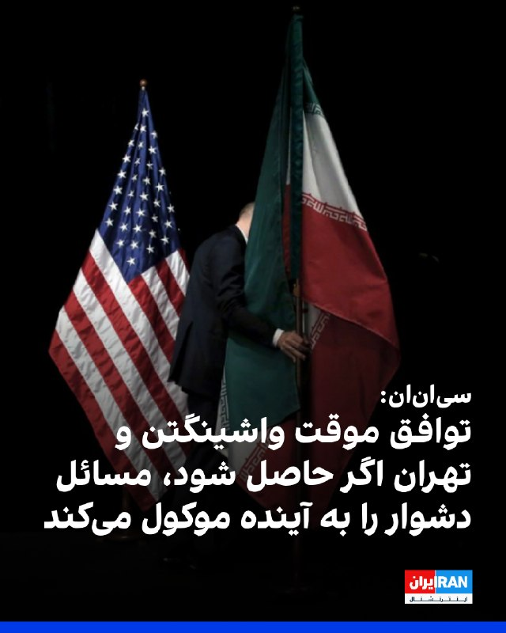

سی‌ان‌ان به نقل از یک دیپلمات آگاه نوشت توافق موقت میان آمریکا و جمهوری اسلامی - که هنوز به طور قطعی نهایی نشده - پس از امضا، راه را برای مذاکرات بیشتر درباره برنامه هسته‌ای تهران و موضوع رفع تحریم‌ها در دوره آتش‌بس ۶۰ روزه باز خواهد کرد.

سی‌ان‌ان افزود لزوم رسیدگی به سه موضوع اصلی و مورد اختلاف تنها در مدت ۶۰ روز باعث شده برخی ناظران تردید داشته باشند که آیا این توافق واقعا به جنگ پایان می‌دهد یا فقط مسائل دشوار را به آینده موکول می‌کند.

بنا بر این گزارش، اگر مذاکره‌کنندگان آمریکایی اهدافی مشابه توافق قبلی را دنبال کنند، دستیابی به نتیجه در بازه ۶۰ روزه امکان‌پذیر است.
‌🏁 🇬🇧 IranintlTV

🤖 @VahidOOnLine

## VahidOOnLine — post 245143

  

محمدنبی موسوی‌فرد، امام جمعه اهواز، گفت هرگونه عقب‌نشینی در برابر «جبهه آمریکا و اسرائیل»، ممنوع و غیرقابل پذیرش است.

او در خطبه‌های نماز جمعه ۲۲ خرداد گفت امنیت کشور تنها به توان نظامی محدود نمی‌شود و حاصل ترکیبی از قدرت نظامی، قدرت نرم، هوشمندی رسانه‌ای و تاب‌آوری اقتصادی است.

موسوی‌فرد افزود «دشمن» تلاش می‌کند با شایعه‌سازی و دوقطبی‌سازی، تاب‌آوری جامعه را تضعیف کند.
‌🏁 🇬🇧 IranintlTV

🤖 @VahidOOnLine

## WithYashar — post 14638

  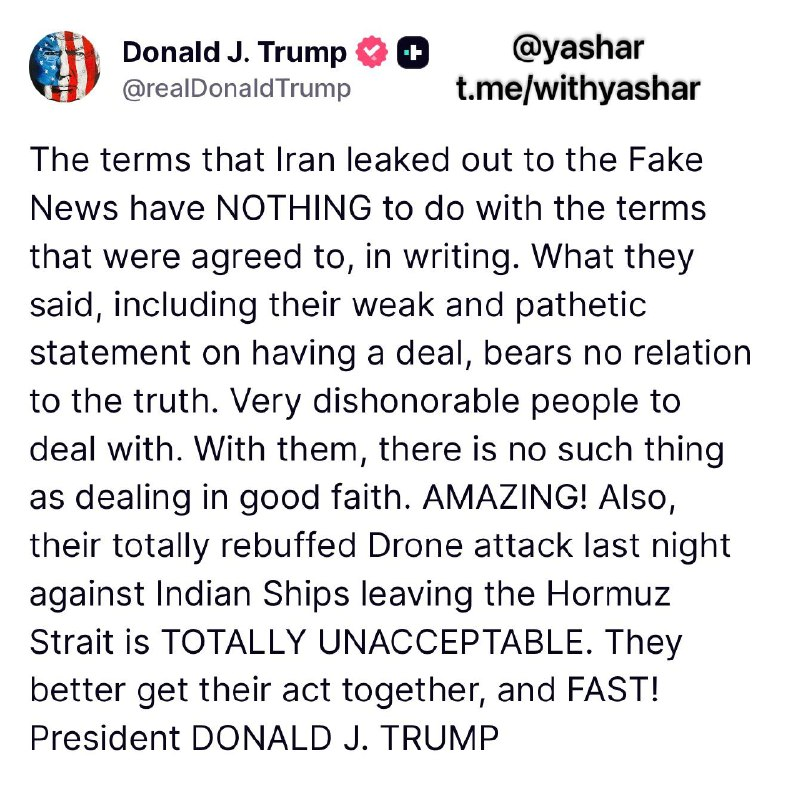

ترامپ در تروث : مفادی که ایران به رسانه‌های جعلی (Fake News) درز داده است، هیچ ارتباطی با مفادی که به‌صورت مکتوب بر سر آن‌ها توافق شده بود، ندارد.
آنچه آن‌ها گفته‌اند، از جمله بیانیه ضعیف و تأسف‌بارشان درباره وجود یک توافق، هیچ نسبتی با حقیقت ندارد.
آن‌ها افرادی بسیار بی‌شرافت برای مذاکره و معامله هستند. در مورد آن‌ها، چیزی به نام مذاکره و رفتار با حسن نیت وجود ندارد. شگفت‌انگیز است!
همچنین، حمله پهپادی کاملاً ناکام‌مانده آن‌ها دیشب علیه کشتی‌های هندی که در حال خروج از تنگه هرمز بودند، کاملاً غیرقابل قبول است.
بهتر است هرچه سریع‌تر اوضاع خود را سر و سامان دهند؛ وگرنه با عواقب آن روبه‌رو خواهند شد.
@withyashar

## FoxNewsTwitter — post 342900

  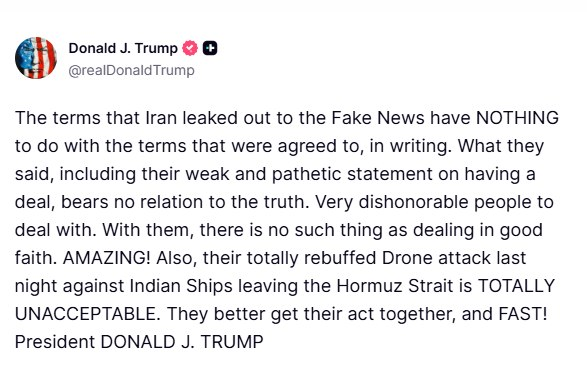

Fox News (Twitter/X)

BREAKING: Trump blasts leaked Iranian deal terms, saying US is dealing with 'very dishonorable people' who 'better get their act together'

## pm_afshaa — post 93692

  <a href="telegram/content/pm_afshaa_93692_1781272461.webm" target="_blank">🎬 Download video</a>

🔴پست جدید ترامپ: شروطی که ایران در اختیار رسانه‌های دروغگو قرار داد، ربطی به شروطی که کتبا بر آن توافق شده، نداره. آنچه آنها گفتن، از جمله اظهارات ضعیف و رقت انگیز آنها در مورد وجود توافق، ربطی به حقیقت نداره. واقعاً طرف‌های بسیار بی‌شرفی برای مذاکره هستن.…

## pm_afshaa — post 93691

  <a href="telegram/content/pm_afshaa_93691_1781272462.webm" target="_blank">🎬 Download video</a>

🔴پست جدید ترامپ:

شروطی که ایران در اختیار رسانه‌های دروغگو قرار داد، ربطی به شروطی که کتبا بر آن توافق شده، نداره. آنچه آنها گفتن، از جمله اظهارات ضعیف و رقت انگیز آنها در مورد وجود توافق، ربطی به حقیقت نداره. واقعاً طرف‌های بسیار بی‌شرفی برای مذاکره هستن. چیزی به نام برخورد با حسن نیت با آنها وجود نداره. شگفت انگیزه! حمله پهبادی شب گذشته آنها به کشتی‌های هندی که از تنگه هرمز خارج میشوند هم کاملا غیرقابل قبوله. بهتره اونا کارشونو با هم و سریع انجام بدن!

💧 Rainbet.com the #1 Non-KYC Crypto Casino & Sportsbook @rainbetcom

😁 @Pm_Afshaa

## IranIntlTV — post 341883

  

سی‌ان‌ان به نقل از یک دیپلمات آگاه نوشت توافق موقت میان آمریکا و جمهوری اسلامی - که هنوز به طور قطعی نهایی نشده - پس از امضا، راه را برای مذاکرات بیشتر درباره برنامه هسته‌ای تهران و موضوع رفع تحریم‌ها در دوره آتش‌بس ۶۰ روزه باز خواهد کرد.

سی‌ان‌ان افزود لزوم رسیدگی به سه موضوع اصلی و مورد اختلاف تنها در مدت ۶۰ روز باعث شده برخی ناظران تردید داشته باشند که آیا این توافق واقعا به جنگ پایان می‌دهد یا فقط مسائل دشوار را به آینده موکول می‌کند.

بنا بر این گزارش، اگر مذاکره‌کنندگان آمریکایی اهدافی مشابه توافق قبلی را دنبال کنند، دستیابی به نتیجه در بازه ۶۰ روزه امکان‌پذیر است.
https://iranintl.com/202606121945

## Shin_Persian — post 6981

  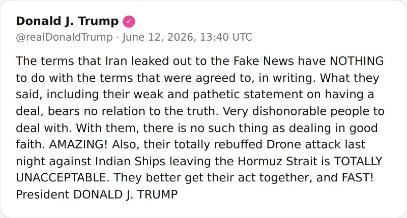

Shin ✓ @hey_itsmyturn Fri, 12 Jun 2026 13:45:42 UTC POTUS: "The terms that Iran leaked out to the Fake News have NOTHING to do with the terms that were agreed to, in writing. What they said, including their weak and pathetic statement on having a deal, bears…

## Shin_Persian — post 6980

Shin ✓ @hey_itsmyturn
Fri, 12 Jun 2026 13:45:42 UTC

POTUS:
"The terms that Iran leaked out to the Fake News have NOTHING to do with the terms that were agreed to, in writing. What they said, including their weak and pathetic statement on having a deal, bears no relation to the truth. Very dishonorable people to deal with. With them, there is no such thing as dealing in good faith. AMAZING! Also, their totally rebuffed Drone attack last night against Indian Ships leaving the Hormuz Strait is TOTALLY UNACCEPTABLE. They better get their act together, and FAST! President DONALD J. TRUMP"

ترجمه خودکار فارسی

رئیس‌جمهور ایالات متحده (POTUS):
«شرایطی که ایران به رسانه‌های جعلی (Fake News) درز داده است، هیچ ارتباطی به شرایطی که به صورت کتبی بر سر آن‌ها توافق شده بود، ندارد. آنچه آن‌ها گفته‌اند، از جمله بیانیه ضعیف و رقت‌بارشان درباره داشتن یک توافق، هیچ نسبتی با حقیقت ندارد. افرادی بسیار بی‌شرف برای معامله کردن هستند. نزد آن‌ها، چیزی به اسم معامله با حسن نیت وجود ندارد. حیرت‌آور است! همچنین، حمله پهپادی کاملاً دفع‌شده آن‌ها در شب گذشته علیه کشتی‌های هندی که در حال خروج از تنگه هرمز بودند، کاملاً غیرقابل‌قبول است. بهتر است خودشان را جمع‌وجور کنند، آن هم سریع! رئیس‌جمهور دونالد جی. ترامپ»

𝕏 · @shin_persian

## DW_Farsi — post 125894

🔶 رئيس‌جمهور سابق کره جنوبی به ۳۰ سال زندان محکوم شد

به گزارش خبرگزاری یونهاپ، دادگاه منطقه‌ای سئول یون سوک یول، رئیس‌جمهور سابق کره جنوبی را در پرونده ارسال پهپاد به کره شمالی محکوم شناخت و به ۳۰ سال زندان محکوم کرد.

او در موارد اتهامی "سوءاستفاده از قدرت" و "کمک به دشمن" گناهکار شناخته شده است.
@dw_farsi

## IranianMinds — post 22410

  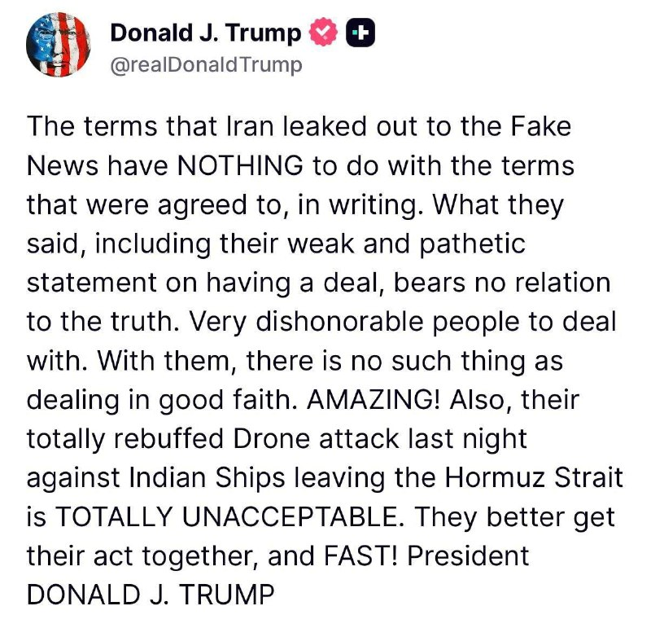

🔴 ترامپ :

شرایطی که ایران به رسانه‌های جعلی درز داده، هیچ ارتباطی با مفاد توافقی که به‌صورت مکتوب بر سر آن توافق شده ندارد.

ادعاهای آن‌ها، از جمله بیانیه ضعیف و تأسف‌بارشان درباره توافق، هیچ شباهتی به حقیقت ندارد.

اونا ادم ‌های بسیار بیشرفی برای مذاکره هستند.
با آن‌ها چیزی به نام مذاکره با حسن نیت وجود ندارد.

همچنین حمله پهپادی شب گذشته علیه کشتی‌های هندی که از تنگه هرمز خارج می‌شدند، کاملا غیرقابل قبول است.

بهتره زودتر اوضاعشونو درست کنن خیلی زود !!

@IranianMinds

## BBCPersian — post 283566

  <a href="telegram/content/BBCPersian_283566_1781272466.mp4" target="_blank">🎬 Download video</a>

🔻سرخط خبرهای جمعه ۲۲ خرداد ۱۴۰۵
@BBCPersian

## alonews — post 127414

  <a href="telegram/content/alonews_127414_1781272469.webm" target="_blank">🎬 Download video</a>

👈ترامپ:
شرایطی که ایران به اخبار جعلی داده است، هیچ ارتباطی با شرایطی که به صورت کتبی توافق شده ندارد. آنچه آنها گفتند، از جمله بیانیه ضعیف و ناامیدکننده‌شان درباره انجام معامله، هیچ ربطی به حقیقت ندارد.

🔴افراد بسیار بی‌انصاف برای انجام معاملات. با آنها مفهومی به نام مذاکره منصفانه وجود ندارد. شگفت‌انگیز! علاوه بر این، حمله پهپادی کاملاً منعکس‌شده آنها دیشب به کشتی‌های هندی که از تنگه هرمز خارج می‌شدند، کاملاً غیرقابل قبول است.

🔴بهتر است سریعاً به خودشان بیایند! رئیس‌جمهور دونالد ج. ترامپ

✅ @AloNews خبر جنگ

## alonews — post 127413

  <a href="telegram/content/alonews_127413_1781272470.webm" target="_blank">🎬 Download video</a>

👈یک مقام کاخ سفید به فاکس نیوز گفت: مواد هسته‌ای ایران نابود و منتقل خواهد شد. 
✅ @AloNews خبر جنگ

---
📅 بروزرسانی: 1405/03/22 17:13
---

## VahidOOnLine — post 245142

یک شهروند در پیامی صوتی به ایران اینترنشنال از وضعیت اقتصادی، کاهش قدرت خرید و نایاب شدن داروی ضدافسردگی روایت می‌کند و می‌گوید مجبور به توقف استفاده از داروی آسنترا شده است. صدای این مخاطب برای حفظ امنیتش تغییر داده شده است.
‌🏁 🇬🇧 IranintlTV

🤖 @VahidOOnLine

## VahidOOnLine — post 245141

  

احمد علم‌الهدی، نماینده رهبر جمهوری اسلامی در خراسان رضوی، گفت هیچ تفاهم و تعهدی بدون امضای مجتبی خامنه‌ای قابل قبول نیست.

او «عداوت و دشمنی با آمریکا» را اصل مسلم جمهوری اسلامی خواند و افزود باید با تبعیت کامل از مجتبی خامنه‌ای، جرات هرگونه تجاوز را نه تنها از آمریکا، بلکه از هر عنصر زورمند دیگری گرفت. او در ادامه تاکید کرد: «دشمنی آمریکا با ما بیشتر از قبل شده است.»
‌🏁 🇬🇧 IranintlTV

🤖 @VahidOOnLine

## WithYashar — post 14637

خبرنگار وال‌استریت ژورنال: برای اینکه توافقی شکل بگیره، مهمتر از تایید مجتبی خامنه‌ای، تایید فرمانده‌های ارشد سپاهه.
@withyashar

## FoxNewsTwitter — post 342899

Fox News (Twitter/X)

BREAKING: A White House official says Iran has agreed to a performance-based deal that would require major concessions before receiving any sanctions relief.

According to the official, Iran's nuclear material would be destroyed and removed, its nuclear program dismantled, and none of its money released until it fulfills its commitments.

The official also says the Strait of Hormuz would remain open and Iran would agree to stop funding terrorist groups.

## pm_afshaa — post 93690

  <a href="telegram/content/pm_afshaa_93690_1781271836.webm" target="_blank">🎬 Download video</a>

🔴نبویان، نماینده مجلس:
اینکه رسانه‌ها میگن هر توافقی حتما با امضای رهبری هست یک شیطنت رسانه‌ای است؛ با گفتن این موضوع میخوان تمام عواقب این توافق رو بر روی دوش رهبری بذارن.

💧 Rainbet.com the #1 Non-KYC Crypto Casino & Sportsbook @rainbetcom

😁 @Pm_Afshaa

## pm_afshaa — post 93689

  <a href="telegram/content/pm_afshaa_93689_1781271837.webm" target="_blank">🎬 Download video</a>

🔴خبرنگار وال‌استریت ژورنال: برای اینکه توافقی شکل بگیره، مهمتر از تایید مجتبی خامنه‌ای، تایید فرمانده‌های ارشد سپاهه.

💧 Rainbet.com the #1 Non-KYC Crypto Casino & Sportsbook @rainbetcom

😁 @Pm_Afshaa

## IranIntlTV — post 341882

  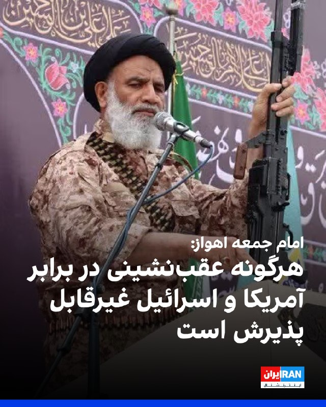

محمدنبی موسوی‌فرد، امام جمعه اهواز، گفت هرگونه عقب‌نشینی در برابر «جبهه آمریکا و اسرائیل»، ممنوع و غیرقابل پذیرش است.

او در خطبه‌های نماز جمعه ۲۲ خرداد گفت امنیت کشور تنها به توان نظامی محدود نمی‌شود و حاصل ترکیبی از قدرت نظامی، قدرت نرم، هوشمندی رسانه‌ای و تاب‌آوری اقتصادی است.

موسوی‌فرد افزود «دشمن» تلاش می‌کند با شایعه‌سازی و دوقطبی‌سازی، تاب‌آوری جامعه را تضعیف کند.
https://iranintl.com/202606121890

## IranIntlTV — post 341881

یک شهروند در پیامی صوتی به ایران اینترنشنال از وضعیت اقتصادی، کاهش قدرت خرید و نایاب شدن داروی ضدافسردگی روایت می‌کند و می‌گوید مجبور به توقف استفاده از داروی آسنترا شده است. صدای این مخاطب برای حفظ امنیتش تغییر داده شده است.

## IranIntlTV — post 341880

  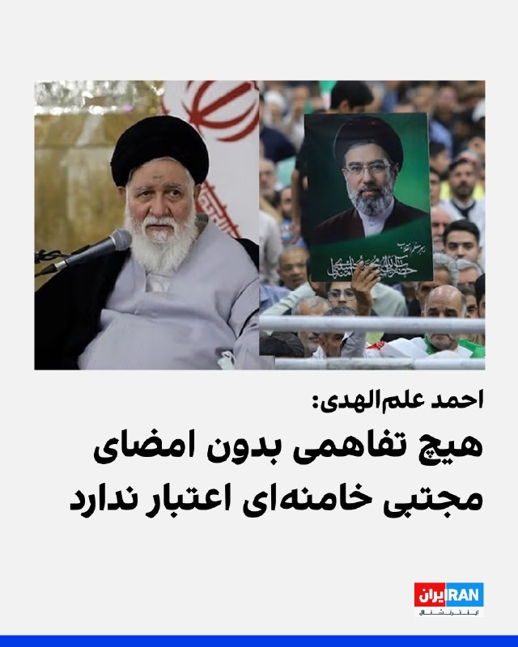

احمد علم‌الهدی، نماینده رهبر جمهوری اسلامی در خراسان رضوی، گفت هیچ تفاهم و تعهدی بدون امضای مجتبی خامنه‌ای قابل قبول نیست.

او «عداوت و دشمنی با آمریکا» را اصل مسلم جمهوری اسلامی خواند و افزود باید با تبعیت کامل از مجتبی خامنه‌ای، جرات هرگونه تجاوز را نه تنها از آمریکا، بلکه از هر عنصر زورمند دیگری گرفت. او در ادامه تاکید کرد: «دشمنی آمریکا با ما بیشتر از قبل شده است.»
https://iranintl.com/202606122193

## DW_Farsi — post 125893

  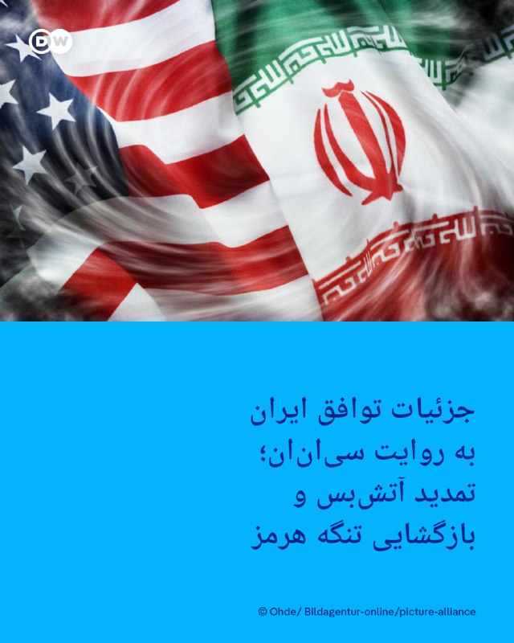

🔶 جزئيات توافق ایران به روایت سی‌ان‌‌ان: تمدید آتش‌بس و بازگشایی تنگه هرمز

یک دیپلمات آگاه در گفت‌وگو با شبکه "سی‌ا‌ن‌ا‌ن" گفت که توافق موقت میان آمریکا و ایران شامل تمدید آتش‌بس، بازگشایی تنگه هرمز و هموار کردن مسیر برای مذاکرات بیش‌تر درباره برنامه هسته‌ای ایران است.

به گفته این دیپلمات، دو طرف بر سر متن این تفاهم‌نامه به توافق رسیده‌اند، اما این متن هنوز به امضای نهایی نرسیده است.

بر این مبنا، مفاد کلیدی این تفاهم‌نامه شامل یک آتش‌بس ۶۰ روزه "در تمامی جبهه‌ها"، از جمله لبنان، و بازگشایی تنگه هرمز است: «حجم تردد در این آبراه ۳۰ روز پس از امضای توافق به سطح پیش از جنگ بازخواهد گشت.»

محاصره بنادر ایران توسط آمریکا لغو خواهد شد و برخی تحریم‌ها نیز "بر اساس پیشرفت توافق و تداوم تعهدات با حسن نیت" کاهش می‌یابند؛ هرچند تاریخ مشخصی برای لغو تحریم‌ها تعیین نشده است.

این سند همچنین "تمامی الزامات آمریکا در موضوع هسته‌ای را برآورده می‌کند"، از جمله تعهد ایران به عدم دست‌یابی به سلاح هسته‌ای و تعیین تکلیف ذخایر اورانیوم بسیا‌ر غنی‌شده این کشور.

نام این سند نیز "توافق‌‌‌ اسلام‌آباد" خواهد بود.
@dw_farsi

## IranianMinds — post 22409

  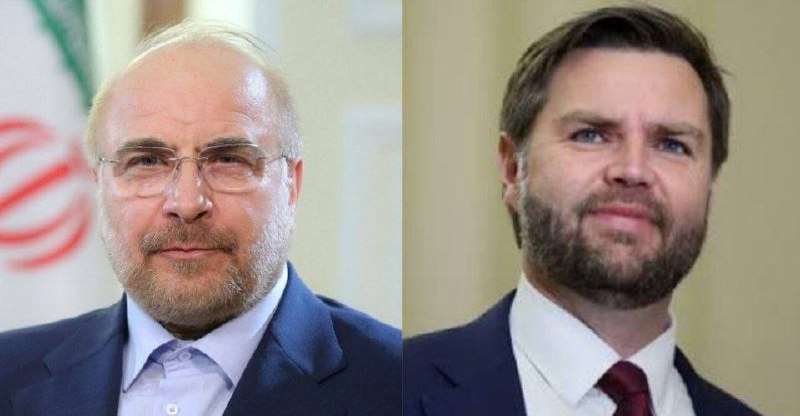

🔴 رویترز :

توافق ایران و آمریکا قراره توسط جی‌دی ونس و قالیباف امضا بشه.

@IranianMinds

## IranianMinds — post 22408

  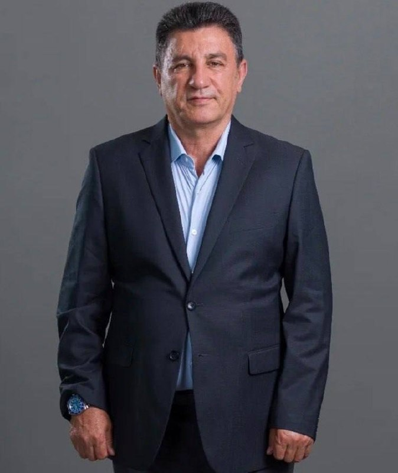

فقط آستینشو‌ که زده بالا برا اینکه ساعت رولکسش حتما معلوم شه.

@IranianMinds

## Dirty_Kids — post 391800

تصویری عجیب از یه عرزشی توی تجمعات شبانه، خطش دائمیه یا اعتباری :) @Dirty_Kids 👻

## Dirty_Kids — post 391799

  <a href="telegram/content/Dirty_Kids_391799_1781271842.mp4" target="_blank">🎬 Download video</a>

🔴ویدیویی تازه منتشر شده از شب ۱۹ دی ماه و سیل جمعیت در پونک تهران.

هنگامی که جمهوری اسلامی برق را قطع کرد تا جمعیت مردم مشخص نشود و در تاریکی دست به قتل‌عام بزند، مردم با نور گوشی‌های خود سعی کردند تا جمعیت عظیم خود را به جهان نشان دهند

@Dirty_Kids 👻

## alonews — post 127412

  <a href="telegram/content/alonews_127412_1781271844.webm" target="_blank">🎬 Download video</a>

👈یک مقام کاخ سفید به فاکس نیوز گفت: مواد هسته‌ای ایران نابود و منتقل خواهد شد.

✅ @AloNews خبر جنگ

## alonews — post 127411

  <a href="telegram/content/alonews_127411_1781271844.webm" target="_blank">🎬 Download video</a>

👈امیرحسین ثابتی: کسی حق ندارد تنگه هرمز را به امید رفع تحریم یا محاصره باز کند

✅ @AloNews خبر جنگ

---
📅 بروزرسانی: 1405/03/22 17:03
---

## WithYashar — post 14636

منبع ارشد در تیم مذاکره کننده ایران:
یادداشت تفاهم نامه برای ورود به مذاکرات میان ایران و آمریکا نهایی نشده است و در حال بررسی است و هرگونه امضای یادداشت تفاهم در روز های آینده کذب است
@withyashar

## IranIntlTV — post 341879

بیش از ۷۰ درصد درآمد برخی خانوارها صرف اجاره خانه می‌شود

یاسر عربی، عضو کمیسیون عمران مجلس، با اشاره به افزایش شدید اجاره‌بها گفت در بسیاری از موارد بیش از ۷۰ درصد درآمد خانوار صرف اجاره خانه می‌شود؛ وضعیتی که به گفته او بسیاری از مستاجران را به مهاجرت به حاشیه شهرها یا سکونت در واحدهای کوچک و کم‌کیفیت وادار کرده است.

عربی جمعه ۲۲ خرداد در گفت‌وگو با سایت شفقنا گفت مسکن از یک نیاز اولیه به کالایی دور از دسترس تبدیل شده و برای بسیاری از خانوارها، رویای خانه‌دار شدن عملا پایان یافته است.

به گفته عربی، افزایش اجاره‌بها مستاجران را برای تمدید قرارداد یا یافتن محل سکونت جدید با فشار مالی سنگینی مواجه کرده و بسیاری از آنان را ناچار به مهاجرت به حاشیه شهرها یا سکونت در واحدهای کوچک‌مقیاس و کم‌کیفیت کرده است.

مهاجرت اجباری مستاجران
این نماینده مجلس گفت بخشی از شهروندان به‌دلیل ناتوانی در پرداخت اجاره‌بها، ناچار به ترک تهران و در برخی موارد مراکز استان‌ها شده‌اند.

او این روند را صرفا یک جابه‌جایی مکانی ندانست و گفت این وضعیت نوعی «عقب‌نشینی اجتماعی» است که پیامدهای آن در کیفیت زندگی، دسترسی به خدمات، آموزش و امنیت شغلی شهروندان دیده می‌شود.

عربی با اشاره به سهم بالای هزینه مسکن از درآمد خانوارها گفت در بسیاری از موارد بیش از ۷۰ درصد درآمد خانواده‌ها صرف اجاره خانه می‌شود؛ موضوعی که به‌گفته او خانواده‌ها را در تامین هزینه‌های خوراک، درمان، آموزش و رفت‌وآمد با مشکل مواجه کرده و به تشدید فقر اقتصادی و فشارهای اجتماعی و روانی انجامیده است.

روزنامه دنیای اقتصاد ۱۷ خرداد گزارش داد هزینه اقلام خوراکی اساسی یک خانواده چهارنفره در اردیبهشت ۱۴۰۵ به بیش از ۲۱ میلیون تومان، معادل ۷۱/۵ درصد حداقل دستمزد، رسیده است.

انتقاد از وام ودیعه مسکن
عضو کمیسیون عمران مجلس گفت وام ودیعه مسکن با وجود ظاهر حمایتی، به‌دلیل نرخ سود و اقساط سنگین برای بسیاری از مستاجران کم‌درآمد کارایی ندارد و اثر آن در برابر رشد اجاره‌بها ناچیز است.

عربی همچنین گفت تا زمانی که بحران مسکن و اجاره مهار نشود، شعارهایی مانند تسهیل ازدواج و حل مشکلات جوانان به نتیجه نخواهد رسید.

او افزود جوانی که توان اجاره یک واحد کوچک را ندارد یا هر سال با نگرانی افزایش اجاره‌بها روبه‌رو است، نمی‌تواند برای تشکیل خانواده برنامه‌ریزی کند.

ایران‌اینترنشنال ۱۹ خرداد در گزارشی با استناد به پیام‌های شهروندان نوشت گرانی مواد غذایی، سفره بسیاری از خانوارها را به سطح «سیر شدن برای زنده ماندن» رسانده است.

این نماینده مجلس، افزایش عرضه مسکن، کنترل تقاضای سوداگرانه، واگذاری زمین‌های دولتی، کاهش زمان صدور پروانه‌های ساختمانی و هدایت ساخت‌وساز به سمت واحدهای کوچک و میان‌متراژ را از راهکارهای کاهش قیمت مسکن و اجاره‌بها عنوان کرد.

او همچنین گفت کاهش هزینه ساخت از طریق ثبات در تامین مصالح، کاهش ریسک‌های مقرراتی، بهبود بهره‌وری، صنعتی‌سازی ساخت‌وساز و اصلاح عوارض و هزینه‌های غیرضروری شهری می‌تواند به کاهش قیمت تمام‌شده مسکن و افزایش انگیزه تولید کمک کند.

عربی در ادامه گفت ساماندهی بازار مسکن به شرایط سیاسی و روابط بین‌المللی کشور نیز وابسته است و بهبود مناسبات خارجی می‌تواند به ثبات اقتصادی، کاهش نااطمینانی و فراهم شدن زمینه برای بهبود وضعیت بازار مسکن کمک کند.

او افزود هرچه فضای سیاسی کشور آرام‌تر و روابط بین‌المللی آن سازنده‌تر باشد، امکان تحقق تحولات مثبت و پایدار در حوزه مسکن و اقتصاد نیز بیشتر خواهد شد.

عربی در پایان با تاکید بر اینکه مسکن تنها یک بازار اقتصادی نیست، بلکه پایه ثبات اجتماعی است، هشدار داد در صورت نبود اقدام جدی برای کنترل تورم مسکن، تنظیم بازار اجاره، افزایش عرضه موثر و حمایت از مستاجران، شکاف طبقاتی عمیق‌تر خواهد شد و روند مهاجرت اجباری به حاشیه شهرها ادامه خواهد یافت.

این اظهارات در شرایطی مطرح می‌شود که افزایش هزینه‌های مسکن و معیشت، فشار فزاینده‌ای بر خانوارهای ایرانی وارد کرده و نگرانی‌ها درباره گسترش فقر و شکاف طبقاتی را افزایش داده است.
 
🔗وب‌سایت ایران‌اینترنشنال
@iranintltv

## DW_Farsi — post 125892

  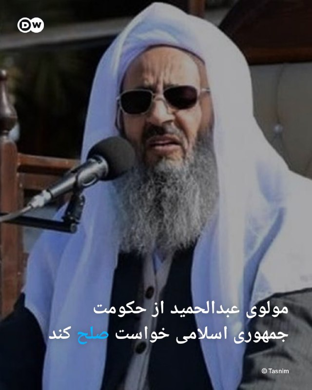

🔶 مولوی عبدالحمید از حکومت جمهوری اسلامی خواست صلح کند

مولوی عبدالحمید در خطبه‌ نماز جمعه ۲۲ خرداد (۱۲ ژوئن) از جمهوری اسلامی خواست صلح را بپذیرد. این روحانی برجسته سنی با استناد به آیه‌ای از قرآن تاکید کرد: «اگر دشمن شما و طرف شما به صلح و توافق تمایل نشان دهد، شما هم صلح کنید.»

عبدالحمید با استناد به مثال‌های دینی تاکید کرد که باید صلح برقرار شود، زیرا به گفته او در این صلح، امنیت و منافع ملی تامین می‌شود.

او همچنین خاطرنشان کرد: «جنگ تخریب می‌آورد، ویرانگر است و ملت‌ها را به عقب برمی‌گرداند و اگر طرف شما بخواهد صلح کند، صلح کنید و فرصت را از دست ندهید.«

این روحانی برجسته سنی در ادامه بر موضع پیشین خود درباره ضرورت خودداری از جنگ تاکید کرده و گفت که او از همان ابتدا با احساس مسئولیت نسبت به جلوگیری از جنگ و حفظ سرمایه‌ها و منافع ملی هشدار داده بود.

امام جمعه اهل سنت زاهدان در پایان صحبت‌های خود گفت که به عنوان یک شهروند امیدوار است سران کشورهای بزرگ مانند آمریکا، چین، روسیه و اروپا برای برقراری صلحی فراگیر در جهان اقدام کنند.
@dw_farsi

## Persian_Trend_Official — post 16852

  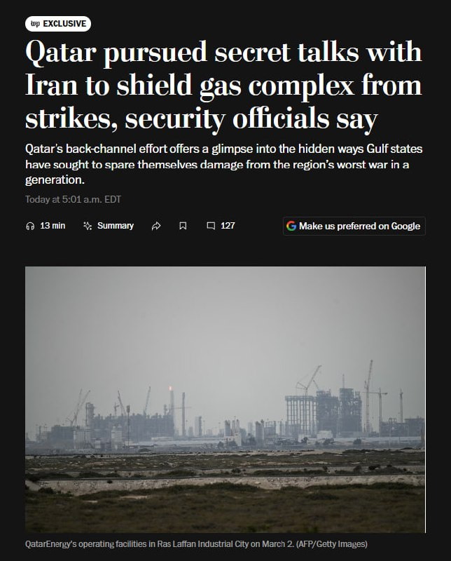

واشنگتن پست: به گفته‌ی سازمان اطلاعات آمریکا، قطر در آغاز جنگ از ایران تضمین خواست که مجتمع گازی راس لفان را هدف قرار ندهد.

در عوض، دوحه یک توافق محرمانه پیشنهاد داد که در آن تولید گاز را به طور موقت متوقف می‌کرد، که به طور بالقوه باعث افزایش قیمت جهانی انرژی و افزایش فشار اقتصادی بر ایالات متحده و اسرائیل برای پایان سریع‌تر درگیری می‌شد.

پیام قطر به تهران این بود که ایران می‌تواند بدون حمله به خاک قطر به اهداف استراتژیک خود دست یابد. با این حال، مقامات گفتند که ایران هرگز تضمین رسمی مبنی بر مصون ماندن راس لفان نداده است.

مذاکرات پشت پرده، که طبق گزارش‌ها از طریق نظارت اطلاعاتی بر ارتباطات ایران کشف شده و برای CIA و مقامات ارشد دولت ترامپ شناخته شده است.

با وجود این تلاش‌ها، ایران بعداً به قطر حمله کرد و به بخش‌هایی از تأسیسات راس لفان بزرگترین مجتمع تولید گاز طبیعی جهان که تقریباً یک پنجم عرضه گاز جهانی را بر عهده دارد آسیب رساند و قراردادهای بزرگ انرژی را مختل کرد و نقش قطر را به عنوان میانجی بین واشنگتن و تهران پیچیده کرد.

📝 Amir

📌 @persian_trend_official
پرشین ترند | متفاوت‌ترین کانال نظامی

## RadioFarda — post 158224

گزارش‌ها از محتوای تفاهم‌نامه احتمالی ایران و آمریکا؛ وضعیت مبهم هسته‌ای و تنگه هرمز

🔸در پی اعلام دونالد ترامپ درباره به توافق رسیدن ایران و آمریکا بر سر تفاهم‌نامه پایان جنگ، خبرگزاری جمهوری اسلامی، ایرنا، روز جمعه ۲۲ خرداد مدعی شد که در این تفاهم «هیچ توافقی» درباره پرونده هسته‌ای ایران وجود ندارد.

🔸این خبرگزاری در گزارشی درباره محتوای تفاهم‌نامه نوشت: «ایران هیچ تعهد جدیدی نمی‌دهد و چارچوب برنامه صلح آمیز هسته‌ای ایران در پی امضای تفاهم دست‌نخورده باقی می‌ماند.»

🔸ایرنا همچنین با رد گزارش‌ها درباره تنگه هرمز اعلام کرد که ایران تعهدی در مورد «واگذاری مدیریت و یا بازگشت شرایط تنگه هرمز» به پیش از حملات آمریکا و اسرائیل نخواهد داد.

🔸این در حالی است که رئیس‌جمهور آمریکا شامگاه پنجشنبه گفته بود که به محض امضای توافق با ایران «تنگه هرمز به شکل رسمی باز خواهد شد».

🔸ایرنا در بخش دیگر گزارش خود نوشته که «متن نهایی تفاهم‌نامه تا زمان پذیرش قطعی آن توسط دو طرف منتشر نخواهد شد.»

🔸این خبرگزاری افزوده است:‌ «برخی از متون منتشر شده در دو روز گذشته، هرچند برخی از اصول موجود در متن تفاهم نهایی را مورد اشاره قرار داده‌اند، اما به شکل گمراه‌کننده‌ای به عنوان «متن نهایی» نامگذاری شده‌اند، این متون فاقد اعتبار هستند.»

🔸گزارش کامل را در وب‌سایت رادیوفردا بخوانید.

@RadioFarda

## Hranews — post 113559

  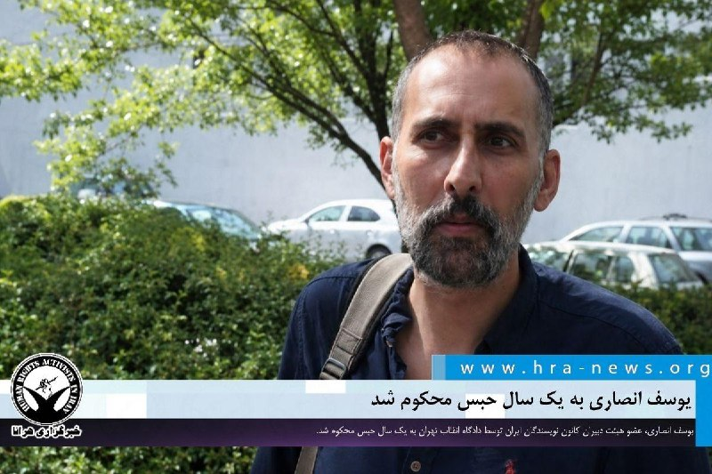

یوسف انصاری به یک سال حبس محکوم شد

❗️
❗️
❗️
❗️
❗️– یوسف انصاری، عضو هیئت دبیران کانون نویسندگان ایران توسط دادگاه انقلاب تهران به یک سال حبس محکوم شد.

به گزارش خبرگزاری هرانا، ارگان خبری مجموعه فعالان حقوق بشر در ایران، یوسف انصاری به حبس محکوم شد.

کانون نویسندگان ایران در این خصوص نوشت: شعبه ۲۱ دادگاه انقلاب تهران، آقای انصاری را به اتهام تبلیغ علیه نظام به یک سال حبس محکوم کرده است. بر اساس حکم صادره، چهار ماه از این مجازات به صورت تعزیری قابل اجرا بوده و هشت ماه دیگر به حالت تعلیق درآمده است.

ادامه مطلب

#یوسف_انصاری

↘️
@hranews_bot تماس ✉️ - @Hranews کانال هرانا 🆑

## alonews — post 127410

  <a href="telegram/content/alonews_127410_1781271238.webm" target="_blank">🎬 Download video</a>

👈محمد مرندی:
روز یکشنبه هیچ اتفاقی در ژنو نمی‌افتد. هنوز کارهایی برای انجام دادن وجود دارد.

✅ @AloNews خبر جنگ

---
📅 بروزرسانی: 1405/03/22 16:53
---

## VahidOOnLine — post 245140

  <a href="telegram/content/VahidOOnLine_245140_1781270627.mp4" target="_blank">🎬 Download video</a>

♦️یک هواپیمای بوئینگ ۷۷۷ متعلق به خطوط هوایی ترکیش (THY) در فرودگاه آنتالیا دچار حادثه شد. این هواپیما که پرواز استانبول به آنتالیا را انجام می‌داد، پس از فرود ایمن، هنگام حرکت به سمت محل پارک، با دکل آنتن رادار زمینی برخورد کرد.
بر اساس گزارش‌ها، بال سمت راست هواپیما در حین حرکت به این دکل برخورد کرده و بلافاصله تیم‌های امدادی وارد عمل شدند. تمامی ۲۶۷ مسافر حاضر در هواپیما به‌صورت ایمن تخلیه شدند و تنها یک نفر به‌صورت سطحی دچار جراحت شد که وضعیت عمومی او مساعد اعلام شده است.
مسئولان این خطوط هوایی با تایید این حادثه اعلام کردند بررسی‌های فنی برای مشخص شدن علت دقیق برخورد آغاز شده و جزئیات بیشتر متعاقبا اعلام خواهد شد.
‌🇸🇦 Indypersian

🤖 @VahidOOnLine

## VahidOOnLine — post 245139

  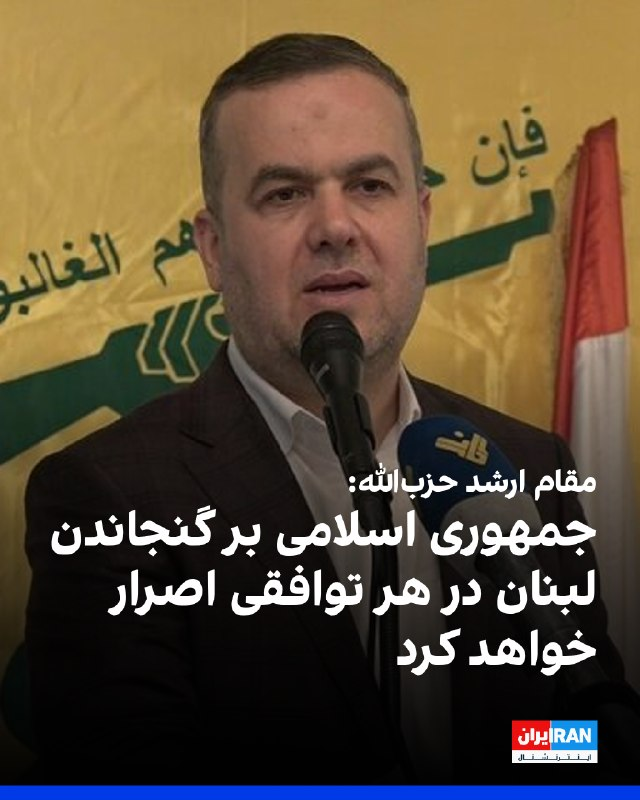

حسن فضل‌الله، از چهره‌های ارشد حزب‌الله و نماینده این گروه در پارلمان لبنان، گفت حزب‌الله اطمینان دارد که جمهوری اسلامی در هر توافق احتمالی با آمریکا بر گنجانده شدن موضوع لبنان اصرار خواهد کرد.

فضل‌الله روز جمعه در سخنانی که از شبکه المنار پخش شد، گفت: «اگر توافقی حاصل شود، به جمهوری اسلامی اعتماد کامل داریم و اطمینان داریم که این کشور بر گنجانده شدن پرونده لبنان در هر توافقی اصرار خواهد کرد.»

این اظهارات در حالی مطرح می‌شود که گزارش‌ها از افزایش احتمال دستیابی به توافق میان آمریکا و جمهوری اسلامی حکایت دارند.

مقام‌های جمهوری اسلامی در ماه‌های اخیر بارها بر لزوم برقراری آتش‌بس در لبنان تاکید کردند و آن را یکی از مطالبات اصلی تهران در مذاکرات با واشینگتن دانستند.
‌🏁 🇬🇧 IranintlTV

🤖 @VahidOOnLine

## VahidOOnLine — post 245138

  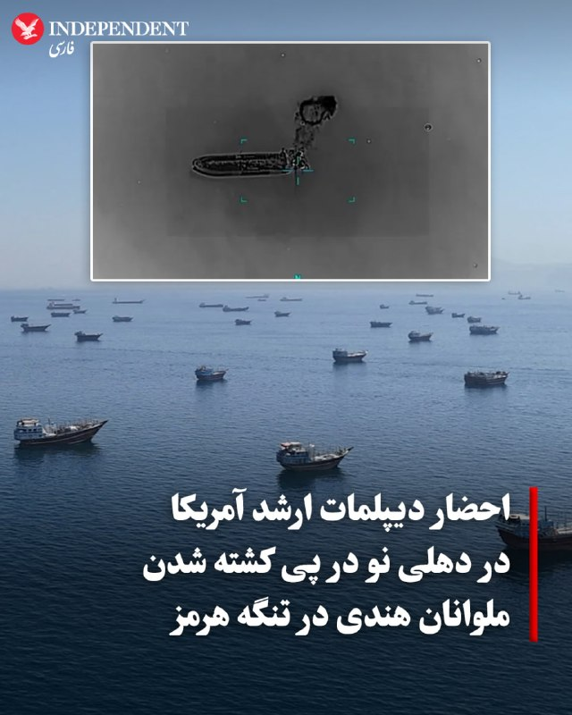

♦️ وزارت امور خارجه هند روز جمعه ۲۲ خرداد با صدور بیانیه‌ای اعلام کرد که در اعتراض به نقش ایالات متحده در حمله به کشتی‌های تجاری حامل ملوانان هندی در تنگه هرمز، دیپلمات ارشد آمریکا را احضار کرده است. دهلی نو با احضار «جیسون میکس»، کاردار سفارت آمریکا، مراتب «اعتراض شدید» خود را به واشنگتن ابلاغ کرد.

وزارت امور خارجه هند در این بیانیه، «حملات مداوم نیروهای دریایی آمریکا به کشتی‌های تجاری حامل دریانوردان هندی در دریای عمان را که منجر به جان باختن دلخراش و قابل پیشگیری سه شهروند هندی شده است»، به شدت محکوم کرد. این موضع‌گیری پس از آن اتخاذ شد که در حملات هوایی این هفته ارتش آمریکا به حداقل سه کشتی تجاری در تنگه هرمز، سه ملوان هندی کشته شدند.

در پایان این بیانیه آمده است که دولت هند «نگرانی عمیق خود را نسبت به استفاده از تسلیحات مرگبار علیه کشتی‌های غیرنظامی و تجاری» به طرف آمریکایی منتقل کرده است.
‌🇸🇦 Indypersian

🤖 @VahidOOnLine

## VahidOOnLine — post 245137

  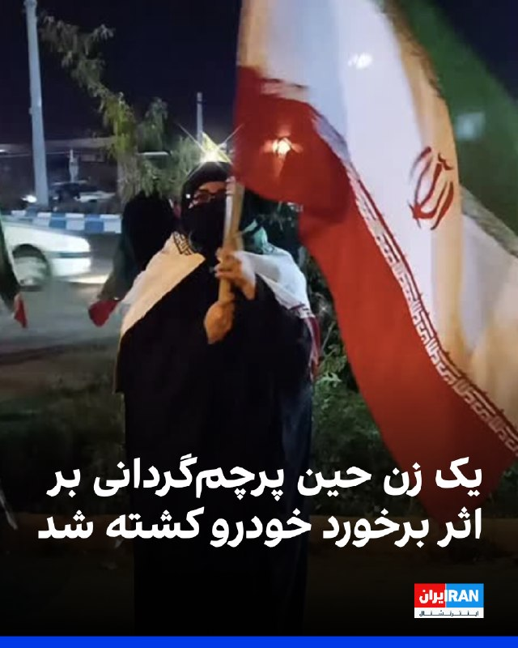

ایرنا، خبرگزاری دولت جمهوری اسلامی، گزارش داد معصومه سهامی، یک زن شرکت‌کننده در تجمع حکومتی در شیراز، روز چهارشنبه ۲۰ خرداد در حین «پرچم‌گردانی» بر اثر برخورد یک خودرو جان خود را از دست داد.

بر اساس این گزارش، این حادثه مقابل یکی از موکب‌های شهر شیراز و در جریان مراسم پرچم‌گردانی رخ داد. ایرنا نوشت این زن پس از انحراف یک دستگاه خودرو دچار حادثه شد.

ایرنا از او با عنوان «شهید» یاد کرده و گزارش داده است مراسم تشییع جنازه او از حرم شاهچراغ در شیراز برگزار شده است.
‌🏁 🇬🇧 IranintlTV

🤖 @VahidOOnLine

## IranIntlTV — post 341878

  

حسن فضل‌الله، از چهره‌های ارشد حزب‌الله و نماینده این گروه در پارلمان لبنان، گفت حزب‌الله اطمینان دارد که جمهوری اسلامی در هر توافق احتمالی با آمریکا بر گنجانده شدن موضوع لبنان اصرار خواهد کرد.

فضل‌الله روز جمعه در سخنانی که از شبکه المنار پخش شد، گفت: «اگر توافقی حاصل شود، به جمهوری اسلامی اعتماد کامل داریم و اطمینان داریم که این کشور بر گنجانده شدن پرونده لبنان در هر توافقی اصرار خواهد کرد.»

این اظهارات در حالی مطرح می‌شود که گزارش‌ها از افزایش احتمال دستیابی به توافق میان آمریکا و جمهوری اسلامی حکایت دارند.

مقام‌های جمهوری اسلامی در ماه‌های اخیر بارها بر لزوم برقراری آتش‌بس در لبنان تاکید کردند و آن را یکی از مطالبات اصلی تهران در مذاکرات با واشینگتن دانستند.
https://iranintl.com/202606126361

## IranIntlTV — post 341877

  <a href="telegram/content/IranIntlTV_341877_1781270630.mp4" target="_blank">🎬 Download video</a>

در پی اظهارات دونالد ترامپ، رییس‌جمهوری آمریکا، درباره دستیابی به توافقی میان ایران و آمریکا، موجی از واکنش‌ها در شبکه‌های اجتماعی شکل گرفت.

آیه دریس، عضو تحریریه ایران‌اینترنشنال، از واکنش کاربران می‌گوید
@iranintltv

## IranIntlTV — post 341876

  <a href="telegram/content/IranIntlTV_341876_1781270632.mp4" target="_blank">🎬 Download video</a>

دونالد ترامپ، رییس‌جمهوری آمریکا، خبر داد که به توافقی «عالی» با جمهوری اسلامی دست یافته است. او تاکید کرد محاصره دریایی بنادر ایران تا نهایی شدن توافق پابرجا می‌ماند. همزمان، پایگاه خبری وای‌نت گزارش داد که بنیامین نتانیاهو در تماس با دونالد ترامپ گفته است فکر نمی‌کند توافقی با تهران حاصل شود و اسرائیل قربانی چنین توافقی نخواهد شد.

جزییات بیشتر با لی‌لی نیکفر، بابک اسحاقی و مریم رحمتی، خبرنگاران ایران‌اینترنشنال
@iranintltv

## IranIntlTV — post 341875

  

ایرنا، خبرگزاری دولت جمهوری اسلامی، گزارش داد معصومه سهامی، یک زن شرکت‌کننده در تجمع حکومتی در شیراز، روز چهارشنبه ۲۰ خرداد در حین «پرچم‌گردانی» بر اثر برخورد یک خودرو جان خود را از دست داد.

بر اساس این گزارش، این حادثه مقابل یکی از موکب‌های شهر شیراز و در جریان مراسم پرچم‌گردانی رخ داد. ایرنا نوشت این زن پس از انحراف یک دستگاه خودرو دچار حادثه شد.

ایرنا از او با عنوان «شهید» یاد کرده و گزارش داده است مراسم تشییع جنازه او از حرم شاهچراغ در شیراز برگزار شده است.
https://iranintl.com/202606121304

## Persian_Trend_Official — post 16851

  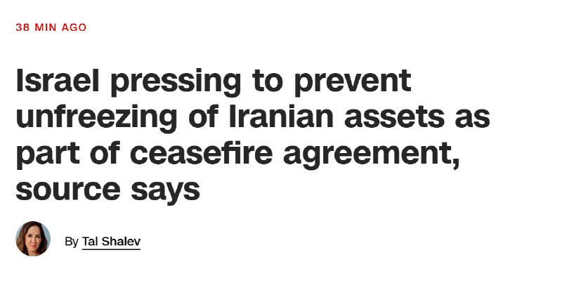

اسرائیل در حال فشار آوردن به امریکا برای بلوکه ماندن پول های ایران!

به گزارش CNN، به نقل از یک منبع اسرائیلی، اسرائیل در حال فشار آوردن به ایالات متحده است تا از آزاد شدن دارایی‌های مسدود شده ایران به عنوان بخشی از توافق آتش‌بس قریب‌الوقوع جلوگیری کند.

📝 Amir

📌 @persian_trend_official
پرشین ترند | متفاوت‌ترین کانال نظامی

## IranianMinds — post 22406

  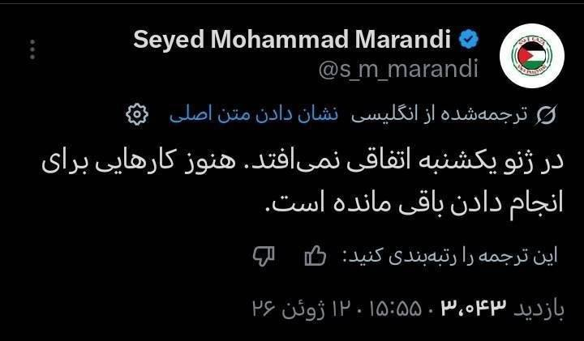

🔴مرندی:

در ژنو یکشنبه اتفاقی نمی‌افتد، هنوز کارهایی برای انجام دادن باقی مانده است.

@IranianMinds

## alonews — post 127409

  <a href="telegram/content/alonews_127409_1781270635.webm" target="_blank">🎬 Download video</a>

👈وزیر قطع ارتباطات:
از سرعت اینترنت راضی نیستم.

✅ @AloNews خبر جنگ

---
📅 بروزرسانی: 1405/03/22 16:44
---

## VahidOOnLine — post 245136

  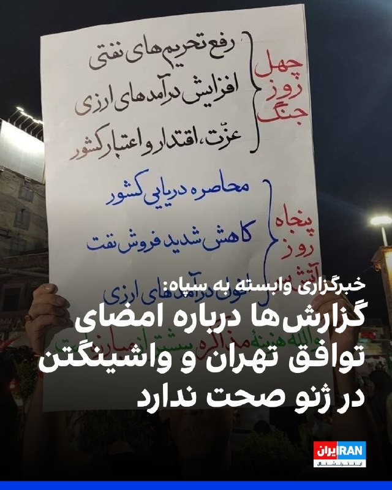

خبرگزاری فارس، وابسته به سپاه پاسداران، به نقل از یک منبع نزدیک به تیم مذاکره‌کننده جمهوری اسلامی گزارش داد گزارش‌ها درباره نهایی شدن توافق با آمریکا و امضای آن در روز یکشنبه در ژنو صحت ندارد.

این منبع گفت روند بررسی و تصمیم‌گیری درباره توافق در ایران هنوز نهایی نشده است و گزارش‌های منتشرشده درباره زمان و محل امضای توافق کذب است.
‌🏁 🇬🇧 IranintlTV

🤖 @VahidOOnLine

## VahidOOnLine — post 245135

  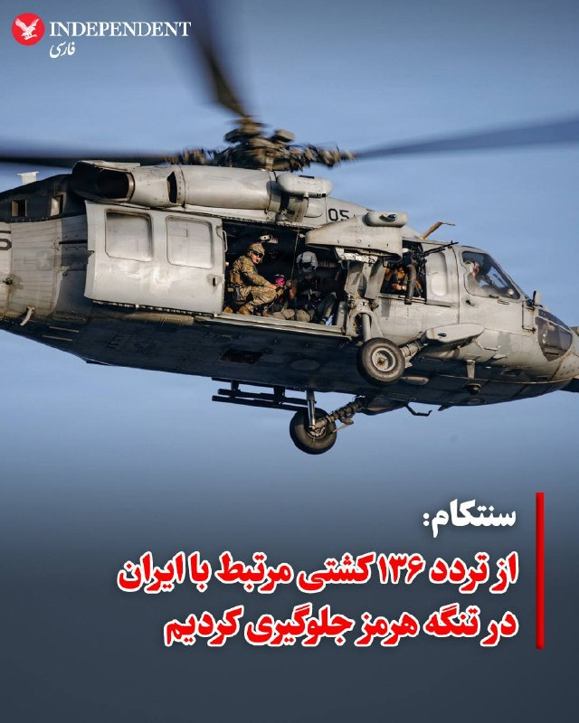

♦️فرماندهی مرکزی ارتش آمریکا (سنتکام) روز جمعه ۲۲ خرداد با انتشار پیامی در شبکه اجتماعی ایکس اعلام کرد که نیروهای آمریکایی در راستای تضمین پایبندی به محاصره اعمال‌شده از سوی واشنگتن بر تنگه هرمز، «مسیر ۱۳۶ کشتی را تغییر داده و ۹ کشتی دیگر را توقیف یا غیرفعال کرده‌اند.»

سنتکام در ادامه تاکید کرد: «ناوهای جنگی و یگان‌های هوایی نیروی دریایی آمریکا به گشت‌زنی در آب‌های منطقه جهت اجرای کامل محاصره دریایی علیه ایران ادامه می‌دهند.»
‌🇸🇦 Indypersian

🤖 @VahidOOnLine

## FoxNewsTwitter — post 342898

  <a href="telegram/content/FoxNewsTwitter_342898_1781270054.mp4" target="_blank">🎬 Download video</a>

Fox News (Twitter/X)

A London restaurant manager saw a little girl hanging from a balcony ledge — then made the catch of his life.

He says that he acted on “pure instinct” as the child fell from an upper-floor flat and he moved into position below.

Afterward, he credited his cricket skills for helping him react in time.

## pm_afshaa — post 93688

  <a href="telegram/content/pm_afshaa_93688_1781270055.webm" target="_blank">🎬 Download video</a>

🔴مرندی، عضو تیم مذاکره‌کننده:
یکشنبه در ژنو اتفاقی نمیفته. هنوز کارهایی برای انجام دادن باقی مونده.

💧 Rainbet.com the #1 Non-KYC Crypto Casino & Sportsbook @rainbetcom

😁 @Pm_Afshaa

## IranIntlTV — post 341874

  

خبرگزاری فارس، وابسته به سپاه پاسداران، به نقل از یک منبع نزدیک به تیم مذاکره‌کننده جمهوری اسلامی گزارش داد گزارش‌ها درباره نهایی شدن توافق با آمریکا و امضای آن در روز یکشنبه در ژنو صحت ندارد.

این منبع گفت روند بررسی و تصمیم‌گیری درباره توافق در ایران هنوز نهایی نشده است و گزارش‌های منتشرشده درباره زمان و محل امضای توافق کذب است.
https://iranintl.com/202606123426

## DW_Farsi — post 125891

  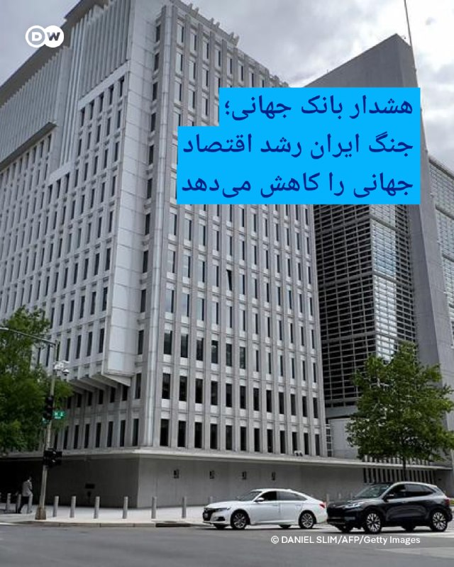

🔶 هشدار بانک جهانی؛ جنگ ایران رشد اقتصاد جهانی را کاهش می‌دهد

بانک جهانی در گزارشی اعلام کرده است که جنگ و تنش‌های مرتبط با ایران می‌تواند رشد اقتصاد جهانی را به پایین‌ترین سطح خود از زمان همه‌گیری کرونا برساند.

بر اساس این گزارش رشد اقتصاد جهانی در سال جاری حدود ۲.۵ درصد پیش‌بینی شده است، در حالی که این رقم در سال ۲۰۲۵ برابر با ۲.۹ درصد بوده است.

بانک جهانی هشدار داده است که در صورت تشدید درگیری‌ها یا اختلال جدی در عرضه انرژی و تجارت جهانی، رشد اقتصادی ممکن است تا حدود ۱.۳ درصد کاهش یابد.

این گزارش همچنین به پیامدهای احتمالی چنین شرایطی از جمله افزایش قیمت نفت، گاز و کودهای شیمیایی، افزایش تورم، تشدید ناامنی غذایی و فشار مالی بر کشورهای آسیب‌پذیر اشاره می‌کند.

علاوه بر این، اختلال در مسیرهای حمل‌ونقل و انرژی در تنگه هرمز  می‌تواند هزینه‌ها را افزایش داده و دسترسی به منابع را محدود کند.
@dw_farsi

## Persian_Trend_Official — post 16850

  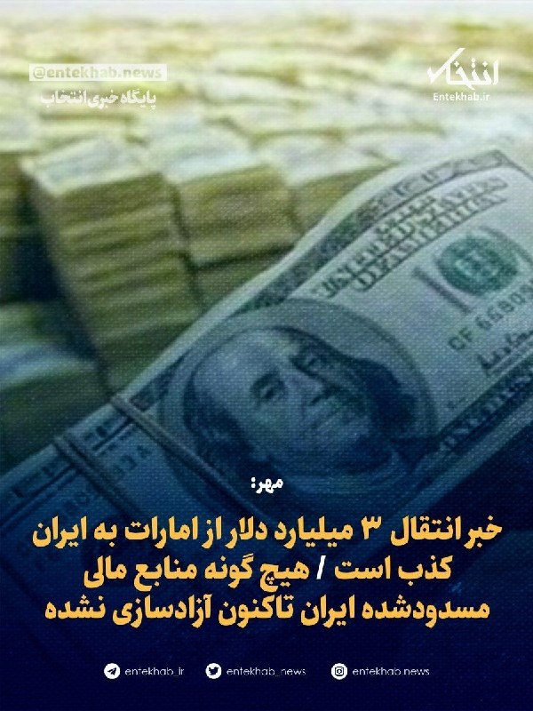

ایران اینتل واچ:«بر اساس اطلاعات به‌دست‌آمده، تصمیم ایران برای توقف حملات به اسرائیل پس از یک پیام آمریکا که از طریق هیأتی قطری در ۸ ژوئن منتقل شد اتخاذ شد؛ این پیام درباره مهار اسرائیل در لبنان بود. همچنین در کنار آن، انتقال ۳ میلیارد دلار از ابوظبی به تهران…

## Persian_Trend_Official — post 16849

  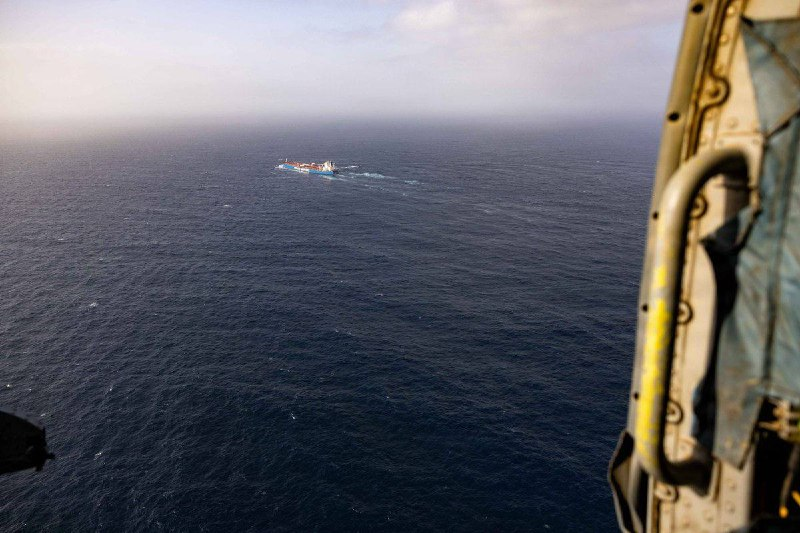

سنتکام می‌گوید نیروهای آمریکایی از زمان آغاز محاصره بنادر ایران در 13 آوریل، 136 کشتی تجاری را تغییر مسیر داده و 9 کشتی را از کار انداخته‌اند.

📝 Amir

📌 @persian_trend_official
پرشین ترند | متفاوت‌ترین کانال نظامی

## IranianMinds — post 22405

🔴 یک منبع نزدیک به تیم مذاکره‌کننده ایران به فارس گفت:

ادعاهایی که از سوی ترامپ و برخی از رسانه‌های خارجی مبنی بر اینکه توافق نهایی شده است و قرار است که یکشنبه در ژنو به امضاء برسد به هیچ عنوان درست نیست و صحت ندارد.

@IranianMinds

## alonews — post 127408

  

ژست‌ گروهبان در مراسم‌ فتوشات جام‌جهانی😎

ساعتشو دیدید یا نه کرد تو چشممون

@AloSport

## alonews — post 127407

  <a href="telegram/content/alonews_127407_1781270059.webm" target="_blank">🎬 Download video</a>

👈علم الهدی: هیچ تفاهمی تا به امضای رهبری نرسد، کوچک‌ترین فرد از امت ما ولو کودک ما قبول نخواهد کرد

✅ @AloNews خبر جنگ

---
📅 بروزرسانی: 1405/03/22 16:34
---

## WithYashar — post 14635

‏شاهزاده رضا پهلوی: در ایران نوین با مافیایی شدن ورزش مقابله خواهیم کرد.
@withyashar

## Persian_Trend_Official — post 16848

  <a href="telegram/content/Persian_Trend_Official_16848_1781269466.webm" target="_blank">🎬 Download video</a>

🔻اسرائیل برای سه منطقه در جنوب لبنان دستور تخلیه صادر کرد

🔹 ارتش اسرائیل برای شهرها و روستاهای صرفند، تفاحتا و مزرعة سيناي در جنوب لبنان هشدار تخلیه فوری صادر کرد.

👺Phantom

📌 @persian_trend_official
پرشین ترند | متفاوت‌ترین کانال نظامی

## Hranews — post 113558

  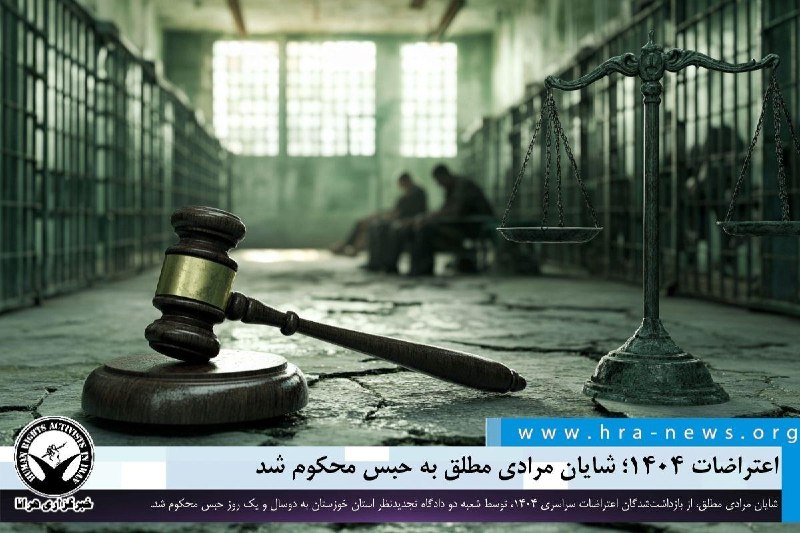

اعتراضات دی‌ماه ۱۴۰۴؛ شایان مرادی مطلق به حبس محکوم شد

❗️
❗️
❗️
❗️
❗️– محکومیت شایان مرادی مطلق، از بازداشت‌شدگان اعتراضات سراسری دی‌ماه ۱۴۰۴، توسط شعبه دو دادگاه تجدیدنظر استان خوزستان عینا تایید شد. وی پیشتر در مرحله بدوی، توسط شعبه یک دادگاه انقلاب ایذه به دو سال و یک روز حبس محکوم شده بود.

به گزارش خبرگزاری هرانا، ارگان خبری مجموعه فعالان حقوق بشر در ایران، حکم صادره توسط شایان مرادی مطلق در دادگاه تجدیدنظر تایید شد.

براساس رای صادره توسط شعبه دو دادگاه تجدیدنظر استان خوزستان، آقای مرادی مطلق از بابت اتهام «اخلال در نظم عمومی» با استناد به تبصره ماده ۲۸۶ قانون مجازات اسلامی به دو سال و یک روز حبس محکوم شده است.

ادامه مطلب

#شایان_مرادی_مطلق

↘️
@hranews_bot تماس ✉️ - @Hranews کانال هرانا 🆑

---
📅 بروزرسانی: 1405/03/22 16:24
---

## VahidOOnLine — post 245134

  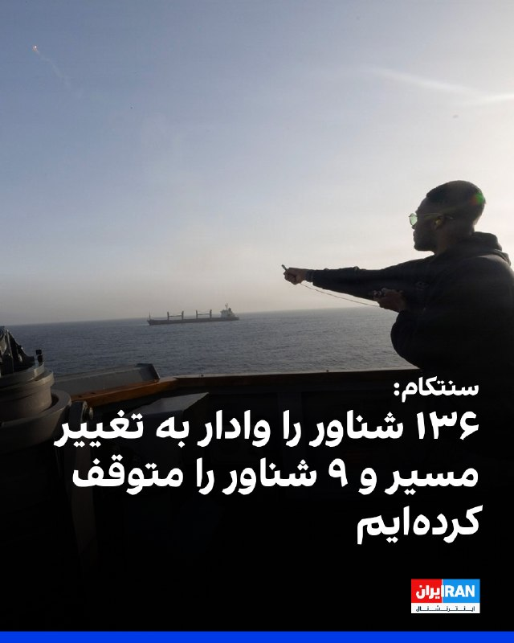

سنتکام، ستاد فرماندهی مرکزی آمریکا، اعلام کرد نیروهای این کشور در چارچوب اجرای محاصره دریایی بنادر جنوبی ایران، تاکنون ۱۳۶ شناور را وادار به تغییر مسیر و ۹ شناور دیگر را متوقف کرده‌اند.

سنتکام جمعه ۲۲ خرداد در شبکه اجتماعی ایکس نوشت نیروی دریایی آمریکا و تجهیزات هوایی این کشور همچنان در آب‌های منطقه گشت‌زنی می‌کنند و به اجرای محاصره علیه ایران ادامه می‌دهند.

این محاصره پس از آن آغاز شد که دونالد ترامپ، رییس‌جمهوری آمریکا، ۲۴ فروردین دستور اعمال محدودیت بر تردد کشتی‌های ورودی و خروجی بنادر ایران را صادر کرد.
‌🏁 🇬🇧 IranintlTV

🤖 @VahidOOnLine

## WithYashar — post 14634

خبر فوری رویترز: توافق توسط جی‌دی ونس و قالیباف امضا می‌شود.🚨
@withyashar

## pm_afshaa — post 93687

  <a href="telegram/content/pm_afshaa_93687_1781268845.webm" target="_blank">🎬 Download video</a>

🔴خبرگزاری رویترز: توافق بزودی توسط جی‌دی ونس و قالیباف امضا میشه.

💧 Rainbet.com the #1 Non-KYC Crypto Casino & Sportsbook @rainbetcom

😁 @Pm_Afshaa

## pm_afshaa — post 93686

  <a href="telegram/content/pm_afshaa_93686_1781268846.webm" target="_blank">🎬 Download video</a>

🔴فارس به نقل از منبعی نزدیک به تیم مذاکره‌کننده: ادعاهایی که ترامپ و برخی رسانه‌های خارجی مطرح کردن مبنی بر اینکه «توافق نهایی شده و قراره روز یکشنبه در ژنو امضا بشه» کاملاً بی‌اساسه.

اساساً فرآیند بازبینی و اتخاذ تصمیم در ایران هنوز کامل نشده، بنابراین اعلام روز یکشنبه و مکان ژنو کاملاً رد میشه.

💧 Rainbet.com the #1 Non-KYC Crypto Casino & Sportsbook @rainbetcom

😁 @Pm_Afshaa

## DEJradio — post 5616

  <a href="telegram/content/DEJradio_5616_1781268846.webm" target="_blank">🎬 Download video</a>

🔺📢 سنتکام با انتشار تصاویری اعلام کرد ناوهای جنگی و دارایی‌های هوایی نیروی دریایی ایالات متحده به گشت‌زنی در آب‌های منطقه‌ای ادامه می‌دهند و محاصره علیه جمهوری اسلامی را اجرا می‌کنند.

در بیانیه سنتکام اعلام شد از آغاز محاصره تا امروز، نیروهای ایالات متحده ۱۳۶ مورد را تغییر مسیر داده و ۹ مورد را غیرفعال کرده‌اند تا اطمینان حاصل شود که قوانین رعایت می‌شوند.

#تنگه_هرمز #محاصره_دریایی
@DEJradio

## IranIntlTV — post 341873

  

سنتکام، ستاد فرماندهی مرکزی آمریکا، اعلام کرد نیروهای این کشور در چارچوب اجرای محاصره دریایی بنادر جنوبی ایران، تاکنون ۱۳۶ شناور را وادار به تغییر مسیر و ۹ شناور دیگر را متوقف کرده‌اند.

سنتکام جمعه ۲۲ خرداد در شبکه اجتماعی ایکس نوشت نیروی دریایی آمریکا و تجهیزات هوایی این کشور همچنان در آب‌های منطقه گشت‌زنی می‌کنند و به اجرای محاصره علیه ایران ادامه می‌دهند.

این محاصره پس از آن آغاز شد که دونالد ترامپ، رییس‌جمهوری آمریکا، ۲۴ فروردین دستور اعمال محدودیت بر تردد کشتی‌های ورودی و خروجی بنادر ایران را صادر کرد.
https://iranintl.com/202606128620

## Shin_Persian — post 6976

Shin ✓ @hey_itsmyturn
Fri, 12 Jun 2026 12:44:47 UTC

U.S. Navy assets continue to enforce a blockade against Iran. U.S. forces have redirected 136 commercial vessels and disabled 9 to date to ensure compliance.

Source: @CENTCOM
https://x.com/CENTCOM/status/2065414960176410982

ترجمه خودکار فارسی

نیروهای نیروی دریایی ایالات متحده به اجرای محاصره علیه ایران ادامه می‌دهند. نیروهای آمریکایی تا به امروز برای اطمینان از پایبندی، مسیر ۱۳۶ کشتی تجاری را تغییر داده و ۹ فروند را متوقف کرده‌اند.

منبع: @CENTCOM (فرماندهی مرکزی ایالات متحده)
https://x.com/CENTCOM/status/2065414960176410982

𝕏 · @shin_persian

## DW_Farsi — post 125890

  <a href="telegram/content/DW_Farsi_125890_1781268847.mp4" target="_blank">🎬 Download video</a>

🎥 لحظاتی کم نظیر از مواجهه با یک خرس ماده و توله‌هایش

جعفر پناه‌پور، عکاس طبیعت و یاور محیط‌بانان در پارک ملی گلستان لحظات کم‌نظیری از مواجهه با یک ماده خرس قهوه‌ای و توله‌هایش را ثبت کرده است.

در این ویدیو، خرس مادر و دو توله‌اش با تشخیص حضور انسان، برای بررسی موقعیت و میزان خطر احتمالی، به سمت عکاس می‌روند. در ویدیو دیده می‌شود که توله‌ها مادر خود را پناه قرار داده‌اند ولی همچنان با کنجکاوی وضعیت را رصد می‌کنند. در نهایت خرس‌ها با بی‌خطر یافتن موقعیت، به دل طبیعت بازمی‌گردند.

این ویدیو مورد استقبال کاربران قرار گرفته و رفتار و نحوه ایستادن خرس‌ها توجه آنها را به خود جلب کرده است.
@dw_farsi

## Persian_Trend_Official — post 16847

رویترز: تفاهم‌نامه بین ایران و امریکا احتمالا تا یکشنبه امضا خواهد شد! به گزارش رویترز و به نقل از یک منبع غربی، تفاهم‌نامه‌ای بین ایالات متحده و ایران با هدف پایان دادن به درگیری خلیج فارس می‌تواند تا روز یکشنبه امضا شود و ژنو محتمل‌ترین مکان در نظر گرفته…

## Dirty_Kids — post 391798

  <a href="telegram/content/Dirty_Kids_391798_1781268849.mp4" target="_blank">🎬 Download video</a>

ماسک گذاشته شناسایی نشه، بعد ماسک رو برداشته ویدئو رو پست کرده؟ :)))))))
واقعا دلقکی داداش

ویدیوی منتشرشده از توماج صالحی

@Dirty_Kids 👻

## Hranews — post 113557

یک شهروند در شهرستان سلسله بازداشت شد

❗️
❗️
❗️
❗️
❗️– یک شهروند در شهرستان سلسله به اتهام «تشویش اذهان عمومی» در بستر فضای مجازی توسط نیروهای انتظامی بازداشت و پس از تشکیل پرونده به مرجع قضایی معرفی شده است.

ادامه مطلب

↘️
@hranews_bot تماس ✉️ - @Hranews کانال هرانا 🆑

## alonews — post 127406

  <a href="telegram/content/alonews_127406_1781268850.webm" target="_blank">🎬 Download video</a>

🔴فوری / فارس: ادعای امضای توافق در روز یکشنبه در ژنو کذب محض است 
✅ @AloNews خبر جنگ

## alonews — post 127405

  <a href="telegram/content/alonews_127405_1781268850.webm" target="_blank">🎬 Download video</a>

🔴فوری / فارس: ادعای امضای توافق در روز یکشنبه در ژنو کذب محض است

✅ @AloNews خبر جنگ

## alonews — post 127404

  <a href="telegram/content/alonews_127404_1781268850.webm" target="_blank">🎬 Download video</a>

👈اسرائیل، یونان، قبرس و ایالات متحده روز جمعه مرکز انرژی شرق مدیترانه را راه‌اندازی کردند که سکویی جدید برای همکاری در زمینه انرژی، فناوری، نوآوری و پژوهش ایجاد می‌کند.

🔴اسرائیل می‌گوید این ابتکار با هدف تقویت همکاری‌ها در امنیت انرژی، امنیت سایبری، زیرساخت‌های حیاتی و توسعه فناوری از طریق اتصال دولت‌ها، مؤسسات دانشگاهی، پژوهشگران و رهبران بخش خصوصی است

✅ @AloNews خبر جنگ

## alonews — post 127403

  <a href="telegram/content/alonews_127403_1781268851.webm" target="_blank">🎬 Download video</a>

👈اداره ملی اقیانوسی و جوی آمریکا (NOAA): شرایط ال نینو اکنون در بخش گرمسیری اقیانوس آرام شکل گرفته و دمای سطح آب دریا در ماه‌های اخیر به طور قابل توجهی افزایش یافته است.

🔴بسیاری از پیش‌بینی‌ها نشان می‌دهند که این دوره ممکن است به یک «ابر ال نینو» تبدیل شود و حتی در میان قوی‌ترین نمونه‌های ثبت شده قرار گیرد.

✅ @AloNews خبر جنگ

---
📅 بروزرسانی: 1405/03/22 16:14
---

## VahidOOnLine — post 245133

♦️حبیب‌الله سیاری، رئیس ستاد و معاون هماهنگ‌کننده ارتش جمهوری اسلامی، اعلام کرد از سرنوشت خلبانان دو فروند جنگنده سوخو ۲۴ که در جریان جنگ اخیر برای انجام مأموریت به سمت قطر اعزام شده بودند، اطلاعی در دست نیست.
او روز پنجشنبه ۲۱ خردادماه در یک برنامه تلویزیونی گفت این جنگنده‌ها از اربیل عراق به سمت قطر پرواز کرده‌اند و چهار خلبان در این عملیات حضور داشته‌اند که «هنوز از وضعیت آن‌ها خبری در دست نیست».
سیاری همچنین گفت جمهوری اسلامی در جریان این درگیری‌ها، حملات هوایی دیگری با جنگنده‌های اف-۵ و اف-۴ در کشورهای منطقه انجام داده که به گفته او با وارد کردن تلفات به نیروهای مقابل همراه بوده و هواپیماها پس از انجام مأموریت به ایران بازگشته‌اند.
این اظهارات در حالی مطرح می‌شود که پیش‌تر وزارت دفاع قطر اعلام کرده بود در تاریخ ۱۱ اسفندماه، دو فروند جنگنده سوخو ۲۴ ایران را سرنگون کرده است.
‌🇸🇦 Indypersian

🤖 @VahidOOnLine

## FoxNewsTwitter — post 342897

Fox News (Twitter/X)

WATCH LIVE: SpaceX launches Falcon 9 rocket from Florida https://twitter.com/i/broadcasts/1dxYllNrmazJX

## pm_afshaa — post 93685

  <a href="telegram/content/pm_afshaa_93685_1781268273.webm" target="_blank">🎬 Download video</a>

🔴سنتکام: نیروهای آمریکایی از آغاز محاصره بنادر ایران، 136 کشتی تجاری رو تغییر مسیر داده و 9 کشتی رو از کار انداختن.

💧 Rainbet.com the #1 Non-KYC Crypto Casino & Sportsbook @rainbetcom

😁 @Pm_Afshaa

## IranIntlTV — post 341872

  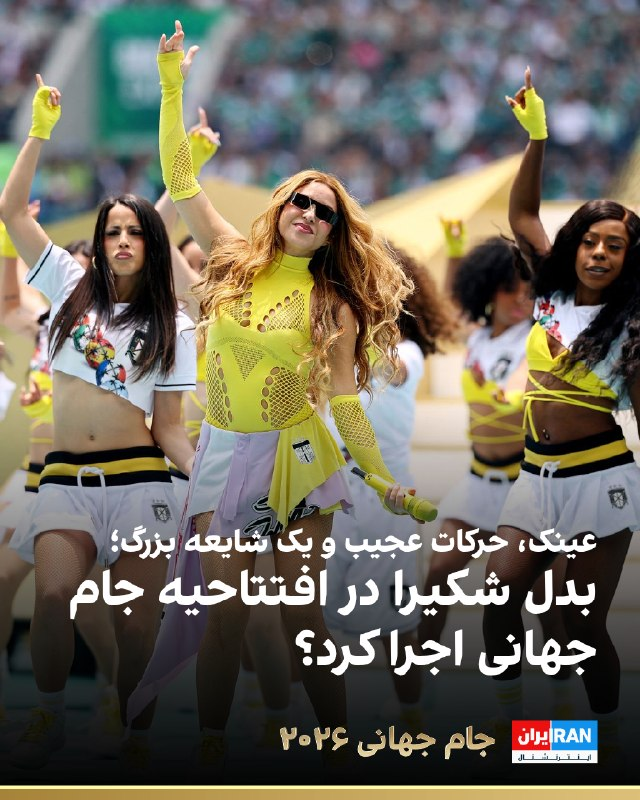

🔻اجرای شکیرا در مراسم افتتاحیه جام جهانی ۲۰۲۶ با موجی از واکنش‌ها و گمانه‌زنی‌ها در شبکه‌های اجتماعی همراه شد؛ تا جایی که برخی کاربران مدعی شدند فردی که روی صحنه حضور داشت، خود شکیرا نبوده است.

🔹این خواننده کلمبیایی که یکی از چهره‌های اصلی مراسم افتتاحیه جام جهانی بود، در کنار برنا بوی، خواننده نیجریه‌ای، به اجرای برنامه پرداخت. با این حال، دقایقی پس از آغاز اجرا، تردیدهایی در میان کاربران شبکه‌های اجتماعی شکل گرفت و برخی نسبت به هویت فرد حاضر روی صحنه ابراز تردید کردند.

🔹منشا این گمانه‌زنی‌ها دو موضوع عنوان شده است؛ نخست استفاده شکیرا از عینک آفتابی تیره در بخش زیادی از اجرا و دوم تفاوت ظاهری و حرکات او نسبت به آنچه هوادارانش به آن عادت دارند. همین موضوع باعث شد موجی از شوخی‌ها، میم‌ها و گمانه‌زنی‌ها در فضای مجازی منتشر شود و برخی حتی ادعا کنند یک بدل به جای شکیرا روی صحنه حضور داشته است.

🔹این شایعات در حالی مطرح شده که شکیرا تاکنون هیچ واکنشی به این بحث‌ها نشان نداده و درباره ادعاهای مطرح‌شده در شبکه‌های اجتماعی اظهارنظری نکرده است.

🔹جزییات بیشتر را در سایت بخوانید

@iranintltvsport

## FarsiVOA — post 220476

  <a href="telegram/content/FarsiVOA_220476_1781268275.mp4" target="_blank">🎬 Download video</a>

ارتش اسرائیل می‌گوید نیروهای تیپ ۷۶۹ چند هفته پیش در منطقه دبین در جنوب لبنان، حدود ۱۲ کیلومتری مرز اسرائیل، عملیاتی انجام داده‌اند.

به گفته ارتش اسرائیل، در این عملیات انبارهای سلاح کشف شد و نیروی هوایی اسرائیل حدود ۵۰ هدف را در منطقه مورد حمله قرار داد.

ارتش اسرائیل همچنین می‌گوید این منطقه برای حملات موشکی ضد زره علیه نیروهای اسرائیلی مورد استفاده قرار می‌گرفت.

@FarsiVOA

## DW_Farsi — post 125889

🔶 "آمریکا درحال دیپورت چند ایرانی به جمهوری آفریقای مرکزی است"

امیلی تراستل، وکیل شماری از مهاجران آمریکا، از جمله تعدادی ایرانی که به گفته خبرگزاری رویترز، قرار است به جمهوری آفریقای مرکزی منتقل شوند گفت که در میان این ایرانیان، دو زن نیز حضور دارند که در صورت بازگردانده شدن اجباری به ایران، با خطر احتمالی شکنجه و آزار و اذیت روبرو هستند.

به گفته او، یکی از این مهاجران ایرانی نوکیش مسیحی و دیگری فعال دموکراسی‌خواه است.
@dw_farsi

## Dirty_Kids — post 391797

  <a href="telegram/content/Dirty_Kids_391797_1781268277.mp4" target="_blank">🎬 Download video</a>

🔴 پست صفحه رسمی وزارت خارجه اسرائیل تو اینستاگرام :

@Dirty_Kids 👻

## Dirty_Kids — post 391796

  

مرتیکه ندید بدید، آستین رو داده بالای ساعت که رولکسش معلوم بشه.

@Dirty_Kids 👻

## alonews — post 127402

  <a href="telegram/content/alonews_127402_1781268279.webm" target="_blank">🎬 Download video</a>

👈خبرگزاری یونهاپ کره‌جنوبی: سامانه پیشرفته پدافند موشکی KM-SAM (Cheongung-II) که هم‌اکنون در امارات متحده عربی مستقر است، در جریان حملات ایران بیش از ۶۰ موشک رهگیر شلیک کرده است.

🔴بر اساس این گزارش، این سامانه موفق شده حدود ۹۶ درصد از اهداف مهاجم را رهگیری و منهدم کند که نشان‌دهنده عملکرد بسیار بالای آن در مقابله با حملات موشکی و پهپادی بوده است.

✅ @AloNews خبر جنگ

## alonews — post 127401

  <a href="telegram/content/alonews_127401_1781268280.webm" target="_blank">🎬 Download video</a>

👈خبر فوری رویترز:
توافق توسط جی‌دی ونس و قالیباف امضا می‌شود.

✅ @AloNews خبر جنگ

---
📅 بروزرسانی: 1405/03/22 16:03
---

## WithYashar — post 14633

نبویان: ما آمریکا رو زدیم زمین، رو سینه‌اش نشستیم که کار رو تموم کنیم یهو رفتیم پای میز مذاکره، میخوایم توافقی بکنیم که اون بیاد بشینه رو سینه ما اخه.
@withyashar 😂🍋🍋

## FoxNewsTwitter — post 342896

  <a href="telegram/content/FoxNewsTwitter_342896_1781267636.mp4" target="_blank">🎬 Download video</a>

Fox News (Twitter/X)

U.S. forces shot down two Iranian attack drones targeting commercial ships in the Strait of Hormuz just hours after President Trump said he had called off planned strikes on Iran.

The incident comes as Washington and Tehran continue negotiating a potential agreement aimed at preventing Iran from obtaining a nuclear weapon.

Iranian state media claims a draft deal includes sanctions relief, troop withdrawals, and the release of frozen funds, but major nuclear and economic issues remain unresolved and no final agreement has been signed, @Max_Gorden reports.

## IranIntlTV — post 341871

  <a href="https://t.me/IranintlTV/341871" target="_blank">📎 Download file</a>

🎧نسخه صوتی اخبار نیم‌روزی | جمعه ۲۲ خرداد
@iranintlTV

## IranianMinds — post 22404

🔴سی‌ان‌ان تمام اون ۳۹ باری که ترامپ گفته توافق نزدیک هستو کنار هم گذاشته.

@IranianMinds

## BBCPersian — post 283565

  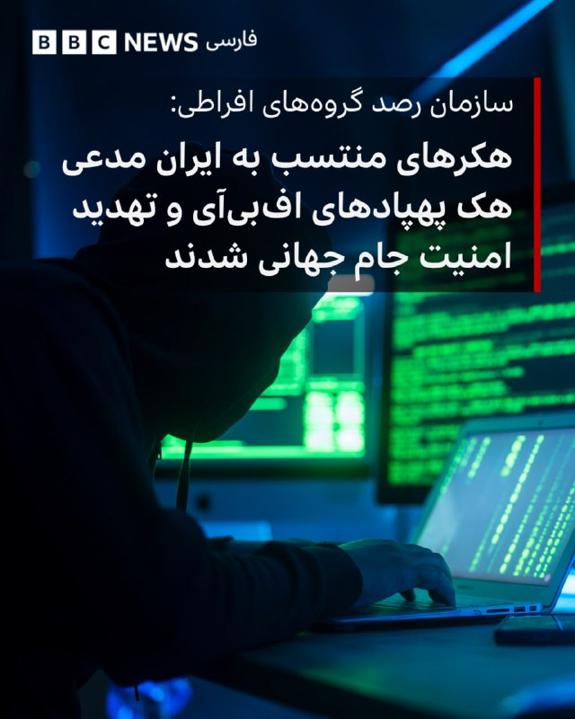

🔻یک سازمان که فعالیت‌های گروه‌های افراطی را در فضای مجازی رصد می‌کند، گفته است که یک گروه هکری مرتبط با ایران مدعی شده است که به پهپادهای سازمان اطلاعات مرکزی آمریکا، اف‌بی‌آی نفوذ کرده و تهدید کرده است که جام جهانی فوتبال که از این هفته آغاز شده را هدف قرار خواهد داد.

سازمان آمریکایی «جستجو برای شناسایی گروه‌های تروریستی بین‌المللی»، بیانیه‌ای از گروه «حنظله» منتشر کرده که در آن ادعا شده این گروه ه «ماه‌ها به تصاویر و داده‌های جمع‌آوری‌شده توسط پهپادهای مجهز به تصویر زنده اف‌پی‌وی دسترسی داشته‌ است.»

هکرها گفته‌اند که این پهپادها به فناوری تشخیص چهره و شناسایی پلاک خودرو مجهز بوده و در عملیات ضدتروریستی به کار گرفته می‌شوند.

این سازمان اطلاعاتی به نقل از بیانیه‌ای از گروه حنظله گفت: «بهتر است تدابیر امنیتی جام جهانی را تشدید کنید؛ ما از برخی از این تیم‌ها اصلاً خوشمان نمی‌آید. فراموش نکنید که پهپادهای اف‌پی‌وی همه‌ جا هستند؛ هیچ‌وقت نمی‌دانید چه زمانی یکی از آن‌ها ممکن است درست به اتوبوس تیم شما برسد.»
ادامه مطلب⬇️

📸GettyImages
https://bbc.in/4eiVmZg
@BBCPersian

## alonews — post 127398

  <a href="telegram/content/alonews_127398_1781267638.webm" target="_blank">🎬 Download video</a>

👈 دیروز دونالد ترامپ جونیور در هتل لوکس د آنگلتِر در کپنهاگ، دانمارک، همراه با گروهی از مأموران سرویس مخفی دیده شد.

🔴دلیل حضور او در دانمارک مشخص نیست

✅ @AloNews خبر جنگ

## alonews — post 127397

  <a href="telegram/content/alonews_127397_1781267639.webm" target="_blank">🎬 Download video</a>

👈سی‌ان‌ان با نقل از منبع آگاه : اسرائیل به آمریکا فشار آورده تا تو تفاهم‌نامه، دارایی‌های بلوکه‌شده ایران آزاد نشه

✅ @AloNews خبر جنگ

---
📅 بروزرسانی: 1405/03/22 15:53
---

## WithYashar — post 14632

سی‌ان‌ان به نقل از یک منبع اسرائیلی:
اسرائیل به آمریکا فشار میاره تا دارایی‌های مسدود شده ایران رو به عنوان بخشی از یادداشت تفاهم آزاد نکنه.
@withyashar

## mwarmonitor — post 10770

🔸 شبکه CNN به نقل از یک منبع آگاه اسرائیلی:

🔹یک منبع اسرائیلی مطلع اعلام کرد که اسرائیل به ایالات متحده فشار می‌آورد تا از آزادسازی دارایی‌های مسدودشده ایران به‌عنوان بخشی از یادداشت تفاهم خودداری کند.

@mwarmonitor

## mwarmonitor — post 10769

  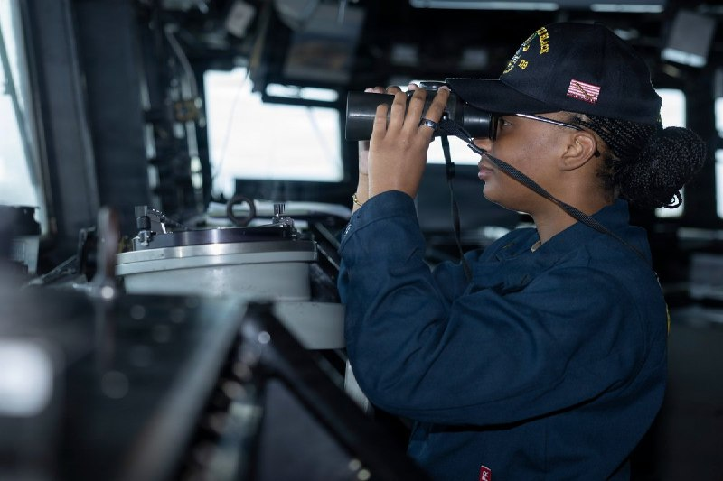

🔴ناوهای جنگی و یگان‌های هوایی نیروی دریایی ایالات متحده به گشت‌زنی در آب‌های منطقه ادامه می‌دهند و محاصره اعمال‌شده علیه ایران را اجرا می‌کنند.

🔸تا امروز، نیروهای آمریکایی مسیر ۱۳۶ شناور را تغییر داده و ۹ مورد را برای اطمینان از رعایت این محاصره متوقف یا از کار انداخته‌اند.

@mwarmonitor

## FoxNewsTwitter — post 342895

  <a href="telegram/content/FoxNewsTwitter_342895_1781267032.mp4" target="_blank">🎬 Download video</a>

Fox News (Twitter/X)

Robbed at gunpoint while selling lemonade.

New video shows the two suspects police say targeted a children's lemonade stand in South Boston, stealing a cash box before one suspect flashed a firearm at the children.

It's the kind of crime most people associate with businesses or convenience stores, not two kids trying to make money at a neighborhood lemonade stand.

Police are asking for the public's help identifying those involved.

## pm_afshaa — post 93684

  <a href="telegram/content/pm_afshaa_93684_1781267034.webm" target="_blank">🎬 Download video</a>

🔴سی‌ان‌ان به نقل از یک منبع اسرائیلی:
اسرائیل به آمریکا فشار میاره تا دارایی‌های مسدود شده ایران رو به عنوان بخشی از یادداشت تفاهم آزاد نکنه.

💧 Rainbet.com the #1 Non-KYC Crypto Casino & Sportsbook @rainbetcom

😁 @Pm_Afshaa

## IranianMinds — post 22403

  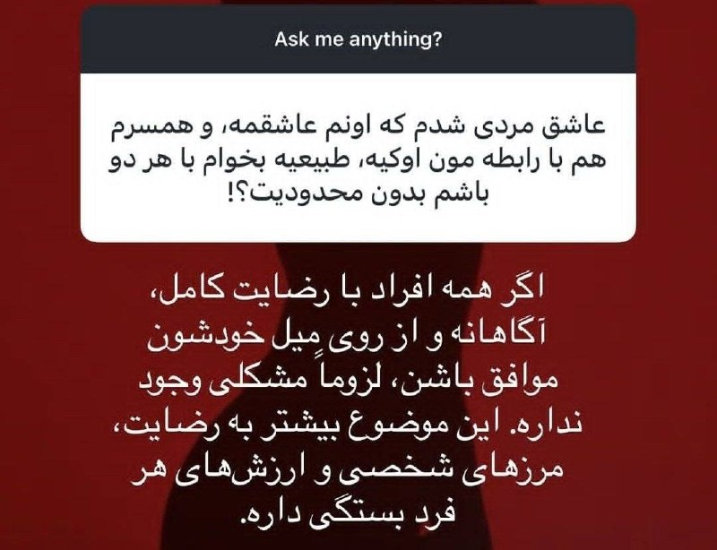

وضعیت اینستاگرام :

@IranianMinds

## IranianMinds — post 22402

  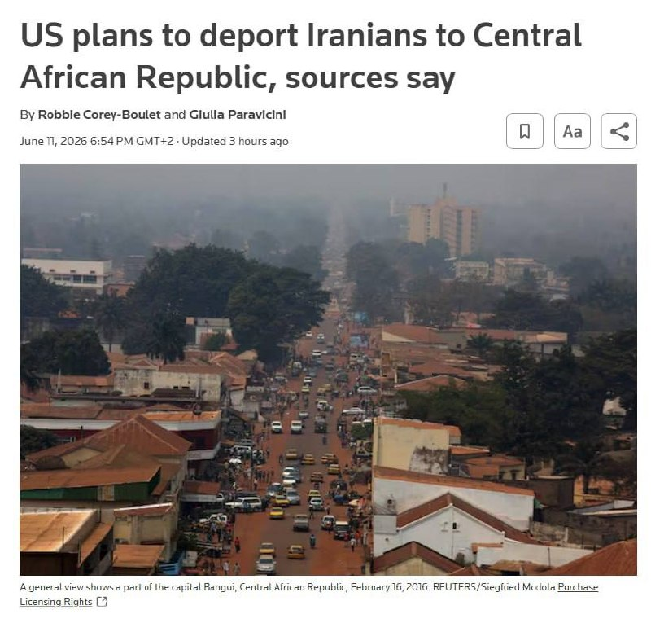

🔴 رویترز :

دولت ترامپ میخواد مهاجرای غیرقانونی ایرانی رو به آفریقای مرکزی دیپورت‌ کنه ، جایی که خودش سال هاست تو فقره و امنیتی نداره.

@IranianMinds

## IranianMinds — post 22401

  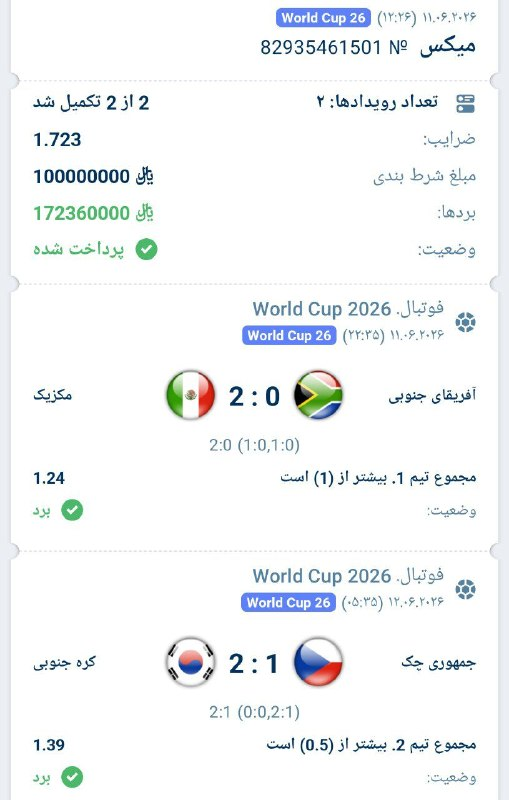

میکسمون عالی برد شد ❤️
✅
@Tabanii_Mafia

## BBCPersian — post 283564

🔻تسنیم و فارس: متن تفاهم احتمالی هنوز به تایید مراجع ذی‌صلاح ایران نرسیده است

خبرگزاری‌های تسنیم و فارس وابسته به سپاه پاسداران می‌گویند که متن تفاهم احتمالی با آمریکا «هنوز در مراجع‌ذی صلاح ایران به تایید نهایی نرسیده است.»

تسنیم در گزارشی به نقل از منابع مطلع که نامی از آنها نبرده، گفته است که دونالد ترامپ «طی روز‌های اخیر با شروع به فشار و تهدید و اقدام نظامی و از طریق دیگر با فشار میانجی قطری تلاش کرد تا از دو سو مواضع ایران را تغییر دهد که در نهایت ایران تغییرات جدید را نپذیرفت.»

این خبرگزاری می‌گوید «با این حال این متن همچنان نیازمند بررسی و نهایی شدن در نهاد‌های ذیربط در ایران است و تا آن زمان سایر گمانه زنی‌ها و خبرها، معتبر نیست.»

خبرگزاری فارس هم در گزارشی گفته است که در ارتباط با برخی از خواسته‌ها، «آمریکا عقب‌نشینی کرده» اما «هنوز هیچ توافقی حاصل نشده است. هر گمانه‌زنی درباره امضا [تفاهم] در سوئیس یا دیدار حضوری، چیزی جز فهم اشتباه از پیشنهادها و آرزوهای آمریکایی نیست.»

https://bbc.in/4efiF5Z
@BBCPersian

---
📅 بروزرسانی: 1405/03/22 15:44
---

## WithYashar — post 14631

  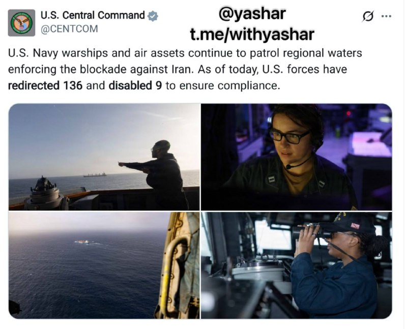

سنتکام: ناوهای جنگی و تجهیزات هوایی نیروی دریایی ایالات متحده همچنان در آب‌های منطقه‌ای به گشت‌زنی ادامه می‌دهند و محاصره علیه ایران را اجرا می‌کنند.
تا امروز، نیروهای آمریکا ۱۳۶ شناور را تغییر مسیر داده‌اند و ۹ شناور را از کار انداخته‌اند تا از رعایت این محاصره اطمینان حاصل شود.
@withyashar

## DW_Farsi — post 125881

🔶 جنگ، فقر و ترک تحصیل؛ سه ضلع گسترش کار کودک

🔻 گزارشی از آتفه چهارمحالیان

همزمان با ۱۲ ژوئن، روز جهانی مبارزه با کار کودک، گزارش‌ها و روایت‌های میدانی از ایران نشان می‌دهد که بسیاری از کودکان بیش از هر زمان دیگری در معرض ترک تحصیل و ورود به بازار کار قرار گرفته‌اند.

در حالی که شمار کودکان کار در جهان طی دو دهه گذشته کاهش یافته، فعالان حقوق کودک می‌گویند جنگ، بحران اقتصادی، فقر آموزشی و ضعف حمایت‌های اجتماعی در ایران روندی معکوس را رقم زده است؛ روندی که در مناطق محروم، به‌ویژه سیستان و بلوچستان، آشکارتر از همیشه دیده می‌شود.

از کودکانی که به دلیل فقر از مدرسه بازمانده‌اند تا نوجوانانی که رؤیای دانشگاه را با کار روزانه در اقتصادغیررسمی معاوضه کرده‌اند؛ این گزارش به بررسی همدستی جنگ، فقر و محرومیت آموزشی در گسترش کار کودک در ایران می‌پردازد.
@dw_farsi

## Dirty_Kids — post 391795

🔴دیشب یه نفر تو شیراز ۸ خانوم عرزشی رو با ماشین زیر میگیره یه نفر به اسم معصومه مهسایی از پا در اومده و بقیه خانوما هم مجروح شدن

@Dirty_Kids 👻

## Dirty_Kids — post 391794

  <a href="telegram/content/Dirty_Kids_391794_1781266457.mp4" target="_blank">🎬 Download video</a>

🔴ما میگیم این اسپرممون خاصیت داره شما باورنمیکنید! توی کره جنوبی بازیگرای هالیوود و بقیه خانوما میرن کلینک تا به صورتشون اسپرم تزریق کنن و بابتش دارن پول میدن! ما تو ایران رایگان داریم انجامش میدیم ولی کسی قدرمونو نمیدونه.

@Dirty_Kids 👻

## alonews — post 127396

  <a href="telegram/content/alonews_127396_1781266460.webm" target="_blank">🎬 Download video</a>

👈رویترز: دولت ترامپ بنا دارد برخی مهاجران ایرانی را به آفریقای مرکزی بفرستد!

🔴دو وکیل و یک مقام آگاه به خبرگزاری رویترز گفته‌اند دولت دونالد ترامپ قصد دارد شماری از شهروندان ایرانی و دیگر مهاجران را به جمهوری آفریقای مرکزی اخراج کند؛ کشوری که سال‌هاست با بی‌ثباتی، خشونت و فقر گسترده دست و پنجه نرم می‌کند.

✅ @AloNews خبر جنگ

## alonews — post 127395

  <a href="telegram/content/alonews_127395_1781266460.webm" target="_blank">🎬 Download video</a>

👈سنتکام : ۱۳۶ کشتی رو منحرف کردیم و ۹ تا رو از کار انداختیم

✅ @AloNews خبر جنگ

---
📅 بروزرسانی: 1405/03/22 15:34
---

## VahidOOnLine — post 245132

  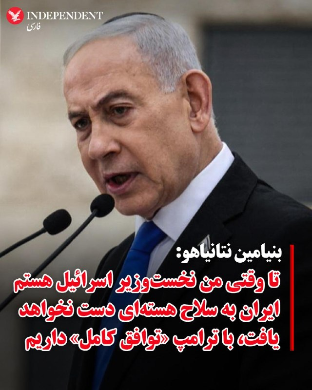

♦️بنیامین نتانیاهو، نخست‌وزیر اسرائیل، روز جمعه ۲۲ خرداد ماه اعلام کرد او و دونالد ترامپ، رئیس‌جمهوری آمریکا، درباره جلوگیری از دستیابی ایران به سلاح هسته‌ای «توافق کامل» دارند.
نتانیاهو در بیانیه‌ای گفت: «تا زمانی که من نخست‌وزیر اسرائیل باشم، ایران سلاح هسته‌ای نخواهد داشت. من و رئیس‌جمهور ترامپ در این موضوع کاملاً هم‌نظر هستیم.»
این اظهارات یک روز پس از آن مطرح شد که ترامپ از نزدیک بودن توافق با تهران سخن گفت و گفت ایران پذیرفته است هرگز به سلاح هسته‌ای دست پیدا نکند.
در همین حال، خبرگزاری مهر، وابسته به سازمان تبلیغات اسلامی، با انتشار جزئیاتی از توافق ۱۴ بندی تهران و واشنگتن، گزارش کرده است برنامه موشکی و موضوع حمایت ایران از گروه‌های نیابتی «به صورت قطعی از دستور کار این توافق خارج شده است».
‌🇸🇦 Indypersian

🤖 @VahidOOnLine

## pm_afshaa — post 93683

  <a href="telegram/content/pm_afshaa_93683_1781265875.webm" target="_blank">🎬 Download video</a>

🔴کارشناس صداوسیما: با صراحت میگم بخش عمده‌ای از شروط ده‌گانه (مجتبی خامنه‌ای) در توافق وجود نداره و رعایت نشده.

💧 Rainbet.com the #1 Non-KYC Crypto Casino & Sportsbook @rainbetcom

😁 @Pm_Afshaa

## pm_afshaa — post 93682

  <a href="telegram/content/pm_afshaa_93682_1781265876.mp4" target="_blank">🎬 Download video</a>

🔴سی‌ان‌ان یه گزارش تهیه کرده که ترامپ تو 90 روزه اخیر، 39 بار گفته که خیلی با توافق به ایران نزدیک شدیم و بزودی توافق می‌کنیم.

💧 Rainbet.com the #1 Non-KYC Crypto Casino & Sportsbook @rainbetcom

😁 @Pm_Afshaa

## DEJradio — post 5615

  <a href="telegram/content/DEJradio_5615_1781265877.webm" target="_blank">🎬 Download video</a>

🔺📌 در ایران حامیان توافق با آمریکا به مردم گفته‌اند طبق مفاد این تفاهم‌نامه ۲۴ میلیارد دلار پول‌های بلوکه شده ایران در دوره ۶۰ روزه آزاد می‌شود؛ اما محمود نبویان نماینده مجلس شورای اسلامی هشدار داده «می‌خواهند متنی خسارت‌بار را به‌عنوان پیروزی جا بزنند.»

نبویان توضیح داد: «تحریم‌های آمریکا و تحریم‌های شورای امنیت طبق متن این توافق لغو نمی‌شود.» او همچنین گفت طبق متن توافق باید «تنگه هرمز» باز شود و محاصره دریایی تا زمان نوافق نهایی ادامه خواهد داشت.

دونالد ترامپ تأکید کرده مجتبی خامنه‌ای رهبر جمهوری اسلامی تمام مفاد را پذیرفته است.
خبرگزاری فارس نزدیک به سـ.ـپاه توافق را رد کرده و آن را «فهم اشتباه» خوانده و تأکید کرده امضا توافق در ژنو «آرزوی آمریکاست». در حالی‌که وزارت خارجه جمهوری اسلامی تایید کرده توافق نزدیک است.

پیدا نیست دقیقا چه کسانی طرف توافق آمریکا هستند؟
ناظران می‌گویند این وضعیت نمایی کلی از شکاف درون نظام است؛ اما منصور حقیقت‌پور، عضو هیات‌رییسه کمیسیون امنیت ملی مجلس جمهوری اسلامی، با رد وجود اختلاف گفت: «هم مجیدِ نقطه‌زن و هم محمدباقرِ مذاکره‌کننده از یک فرمانده به نام مجتبی خامنه‌ای دستور می‌گیرند.»

#تنگه_هرمز #محاصره_دریایی #توافق #موشتبا
@DEJradio

## IranIntlTV — post 341870

  <a href="telegram/content/IranIntlTV_341870_1781265878.mp4" target="_blank">🎬 Download video</a>

وحید سرخ‌گل، زندانی سیاسی محبوس در زندان قزلحصار کرج، در نامه‌ای از زندان نسبت به وضعیت بازداشت‌شدگان اعتراضات دی‌ماه ۱۴۰۴ و همچنین بازداشت‌شدگان جنگ ۱۲ روزه هشدار داد. او از ضرب‌وشتم زندانیان، نگهداری طولانی‌مدت در سلول‌های انفرادی، محدودیت در تماس و ملاقات با خانواده و محرومیت از هواخوری در زندان‌های اوین و قزلحصار خبر داد.

گفت‌وگو با رضا اکوانیان، روزنامه‌نگار و فعال حقوق بشر
@iranintltv

## Shin_Persian — post 6972

Shin ✓ @hey_itsmyturn
Fri, 12 Jun 2026 12:01:07 UTC

U.S. Navy warships and aircraft continue to enforce the blockade against Iran. To date, U.S. forces have redirected 136 vessels and disabled 9 to ensure compliance.

Source: @CENTCOM
https://x.com/CENTCOM/status/2065403967618572765

ترجمه خودکار فارسی

کشتی‌های جنگی و هواپیماهای نیروی دریایی ایالات متحده به اجرای محاصره علیه ایران ادامه می‌دهند. تا به امروز، نیروهای آمریکایی برای اطمینان از پایبندی، ۱۳۶ شناور را تغییر مسیر داده و ۹ شناور را متوقف کرده‌اند.

منبع: @CENTCOM
https://x.com/CENTCOM/status/2065403967618572765

𝕏 · @shin_persian

## DW_Farsi — post 125880

  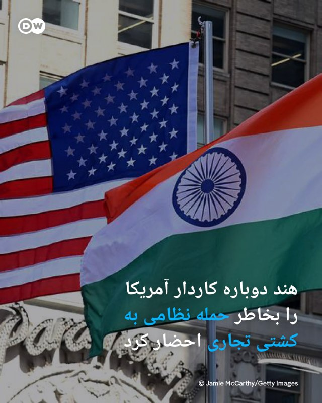

🔶 هند دوباره کاردار آمریکا را بخاطر حمله نظامی به کشتی تجاری احضار کرد

هند برای دومین‌بار در ظرف سه روز گذشته کاردار آمریکا در دهلی را احضار و اعتراض شدید خود را نسبت به حملات نظامی آمریکا به کشتی‌های تجاری در نزدیکی سواحل عمان اعلام کرد.

این اعتراض پس از حمله به نفتکش "ستبللو" مطرح شد که در جریان آن سه ملوان هندی کشته و ۲۰ نفر دیگر در حادثه‌ای جداگانه نجات یافتند. دهلی‌نو این اقدامات را تهدیدی جدی علیه امنیت دریانوردی دانسته و خواستار توقف فوری حملات شده است.

این در حالی است که تنش‌ها در مسیرهای کشتیرانی منطقه و در چارچوب درگیری‌های گسترده‌تر آمریکا و ایران همچنان ادامه دارد.

ارتش ایالات متحده در چهارچوب ماموریت محاصره دریایی ایران این حمله را انجام داده بود. آمریکا با این محاصره کشتی‌هایی را که مظنون به انتقال نفت ایران هستند، متوقف می‌کند.
@dw_farsi

## RadioFarda — post 158223

  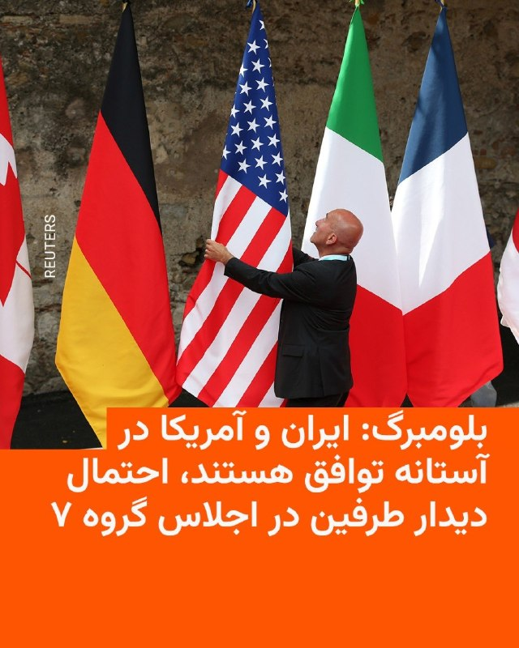

🔸خبرگزاری بلومبرگ به نقل از مقامات ارشد آمریکایی و ایرانی نوشته احتمال دارد توافق میان دو کشور از روز یکشنبه و در شهر ژنو سوئیس نهایی شود.

🔸این خبرگزاری بدون اشاره به نام این مقام‌ها افزوده که طرفین «در آستانه» دستیابی به توافقی برای بازگشایی تنگه هرمز قرار دارند.

🔸بر اساس این گزارش، طرف‌های ایرانی و آمریکایی قرار است در حاشیه اجلاس گروه هفت که از دوشنبه در فرانسه برگزار می‌شود، «دیدار کنند».

🔸اجلاس امسال گروه هفت از ۲۵ تا ۲۷ خرداد در دامنه‌های آلپ فرانسه برگزار می‌شود. به گفته افرادی که در جریان برنامه‌ریزی‌ها قرار دارند، شهر ژنو در سوئیس که در نزدیکی محل برگزاری اجلاس قرار دارد، به عنوان یکی از گزینه‌های احتمالی برای امضای این توافق مطرح شده و ممکن است این مراسم از روز یکشنبه ۲۴ خرداد انجام شود.

🔸یک مقام ارشد ایرانی و یکی از اعضای گروه هفت به بلومبرگ گفته‌اند که «احتمال دستیابی به توافق زیاد است.»

@RadioFarda

## IranianMinds — post 22399

  <a href="telegram/content/IranianMinds_22399_1781265883.mp4" target="_blank">🎬 Download video</a>

🔴 بعد از اینکه اخبار توافق اومد بیرون پیج سفارت جمهوری اسلامی این ویدیو‌ از خامنه ای رو منتشر کرده که میگه ترامپ حتی شایسته مبادله پیام هم نیست و من باهاش حرف نمیزنم !

@IranianMinds

## Hranews — post 113556

اموال ۱۹ نفر در استان کردستان توقیف شد

❗️
❗️
❗️
❗️
❗️– رئیس کل دادگستری استان کردستان از توقیف اموال ۱۹ نفر در این استان به دلایل آنچه «همکاری با دشمن و رسانه های معاند» عنوان کرده است، خبر داد.

ادامه مطلب

#توقیف_اموال

↘️
@hranews_bot تماس ✉️ - @Hranews کانال هرانا 🆑

## alonews — post 127394

  <a href="telegram/content/alonews_127394_1781265884.webm" target="_blank">🎬 Download video</a>

👈خبرنگار الجزیره: در مذاکرات اولیه، ممکن است به همه چیزهایی که می‌خواهید دست پیدا نکنید، اما به تفاهمات مورد توافق خواهید رسید.

🔴 برخی از این تفاهمات ممکن است سپس به مذاکرات اصلی و جامع برای حل و فصل بر اساس برد-برد منتقل شوند - منظورم مذاکرات آمریکا و ایران است

✅ @AloNews خبر جنگ

## alonews — post 127393

  <a href="telegram/content/alonews_127393_1781265885.webm" target="_blank">🎬 Download video</a>

👈وزارت امور خارجه روسیه به شهروندان روس هشدار داده است که هنگام سفر به تایلند احتیاط کنند و ادعا کرده است که آنها در معرض خطر بازداشت یا دستگیری به درخواست آمریکا قرار دارند.

🔴 مسکو ادعا می‌کند که سازمان‌های آمریکایی در تایلند عملیات‌هایی برای دستگیری روس‌هایی که مورد توجه هستند انجام می‌دهند، گاهی بدون اطلاع دادن به مقامات تایلندی، و ادعا می‌کند که بازداشت‌شدگان تحت تهدید، ارعاب و فشار روانی برای گرفتن اعتراف یا پذیرش گناه قرار می‌گیرند

✅ @AloNews خبر جنگ

## alonews — post 127392

  <a href="telegram/content/alonews_127392_1781265885.mp4" target="_blank">🎬 Download video</a>

👈‏سی ان ان تمام ۳۹ باری که ترامپ در این ۹۰ روز به رسانه ها گفته «توافق با ایران نزدیکه» رو کنار هم چیده که بسیار چیز هم عجیبی شده!

✅ @AloNews خبر جنگ

## alonews — post 127391

  <a href="telegram/content/alonews_127391_1781265887.webm" target="_blank">🎬 Download video</a>

👈قیمت نفت در معامله‌های روز جمعه (۲۲ خرداد) پس از ادعای ترامپ مبنی بر پیشرفت مذاکرات پایان جنگ بین تهران و واشینگتن، بیش از ۴ درصد کاهش یافت و به پایین‌ترین حد خود در حدود ۲ ماه گذشته رسید. این اقدام، نگرانی‌ها از تشدید تنش‌ها پس از حمله‌های تلافی‌جویانه اوایل هفته را کاهش داد.

✅ @AloNews خبر جنگ

---
📅 بروزرسانی: 1405/03/22 15:24
---

## VahidOOnLine — post 245131

  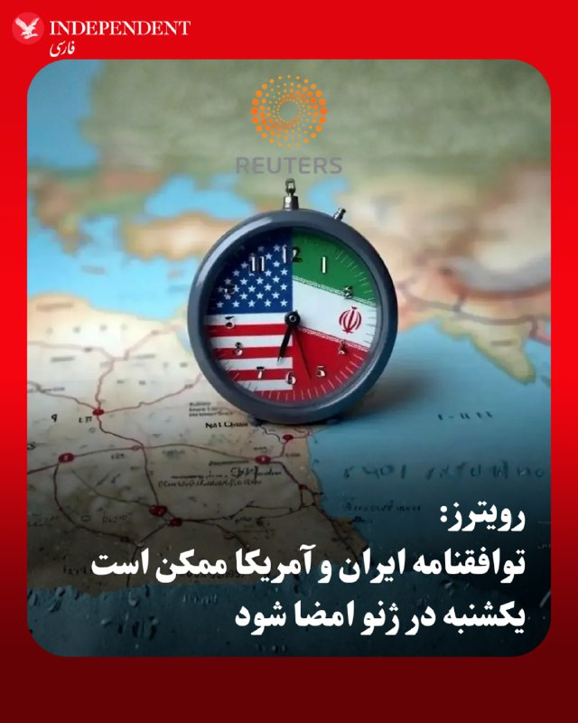

♦️خبرگزاری رویترز، روز جمعه ۲۲ خرداد ماه  به نقل از «یک منبع غربی» گزارش داد، تفاهم‌نامه میان ایران و آمریکا برای پایان دادن به جنگ ممکن است روز یکشنبه در ژنو به امضا برسد.

به گفته این منبع، متن توافق هنوز در حال نهایی شدن است و تهران همچنان بر آنکه توافق باید شامل توقف درگیری‌ها در لبنان نیز باشد، پافشاری می‌کند.

بر اساس این گزارش، هدف این است که متن نهایی تا روز شنبه آماده شود تا جی‌دی ونس، معاون رئیس‌جمهوری آمریکا و محمدباقر قالیباف، رئیس مجلس ایران آن را امضا کنند. ژنو محتمل‌ترین محل برگزاری مراسم عنوان شده است.
یک منبع ارشد ایرانی نیز به رویترز گفت پیش‌نویس توافق شامل تعلیق تحریم‌های نفتی ایران، آزادسازی میلیاردها دلار از دارایی‌های مسدودشده و توقف درگیری‌ها در همه جبهه‌ها از جمله لبنان است. به گفته این منبع، موضوعات هسته‌ای به مذاکرات بعدی موکول خواهد شد.
خبرگزاری مهر نیز، روز جمعه، در گزارشی همین موارد را از مفاد پیش‌نویس توافق‌نامه تهران و واشنگتن اعلام کرد.

دونالد ترامپ، رئیس‌جمهوری آمریکا، بامداد جمعه ۲۲ خرداد (به وقت تهران) در یک تماس تلفنی اعلام کرد ایالات متحده «امروز جنگ با ایران را پایان داده» و تهران پذیرفته است که هرگز به سلاح هسته‌ای دست پیدا نکند.

ساعاتی پس از این خبر، آکسیوس از اعزام چهار هواپیمای نیروی هوایی آمریکا به ژنو برای آماده‌سازی مقدمات سفر احتمالی جی‌دی‌ ونس معاون دونالد ترامپ خبر داد.

این گزارش در حالی منتشر می‌شود که دفتر بنیامین نتانیاهو، شامگاه پنجشنبه اعلام کرد اسرائیل طرف هیچ تفاهم‌نامه‌ای با ایران نیست و در مذاکرات صلح نیز مشارکت ندارد.
‌🇸🇦 Indypersian

🤖 @VahidOOnLine

## WithYashar — post 14630

خبرگزاری ایرنا درباره جزئیات توافق احتمالی میان جمهوری اسلامی و آمریکا:

متن یک توافق برای پایان جنگ با دقت بسیار بالا و وسواس زیاد تدوین شده و هیچ مجالی برای تفسیر خودسرانه یا فرار از تعهدات از سمت هیچ‌یک از طرفین در این توافق وجود نداره.

در این یادداشت تفاهم هیچ توافقی درباره پرونده هسته‌ای حاصل نخواهد شد و جمهوری اسلامی هیچ تعهد جدیدی ارائه نخواهد کرد!
@withyashar

## pm_afshaa — post 93681

  <a href="telegram/content/pm_afshaa_93681_1781265256.webm" target="_blank">🎬 Download video</a>

🔴نتانیاهو: تا زمانی که من نخست‌وزیر اسرائیل هستم، ایران سلاح هسته‌ای نخواهد داشت. من و رئیس‌جمهور ترامپ در این موضوع کاملا هم‌نظر هستیم.

بیش از 30 ساله که من رهبری مبارزه بین‌المللی علیه برنامه هسته‌ای ایران رو بر عهده داشتم. بدون این مبارزه، ایران مدت‌ها پیش بمب اتمی‌هایی در اختیار داشت که برای هدف قرار دادن و نابودی اسرائیل آماده می‌شدن.

ایران در پی نابودی دولت یهوده و من زندگی خودم رو وقف جلوگیری از این موضوع کردم. تا زمانی که من نخست‌وزیر هستم، این اتفاق نخواهد افتاد.

💧 Rainbet.com the #1 Non-KYC Crypto Casino & Sportsbook @rainbetcom

😁 @Pm_Afshaa

## pm_afshaa — post 93680

  <a href="telegram/content/pm_afshaa_93680_1781265257.webm" target="_blank">🎬 Download video</a>

🔴اکسیوس: تفاهم احتمالی آمریکا و جمهوری اسلامی دارای چه مفادیه؟ آتش‌بس ۶۰ روزه تمدید می‌شود و در این مدت مذاکرات هسته‌ای ادامه خواهد داشت. تنگه هرمز فورا و بدون عوارض باز می‌شه و تردد کشتی‌ها طی ۳۰ روز به سطح قبل از جنگ برمی‌گرده. ایران متعهد می‌شه به سمت…

## pm_afshaa — post 93679

  <a href="telegram/content/pm_afshaa_93679_1781265258.webm" target="_blank">🎬 Download video</a>

🔴اکسیوس: تفاهم احتمالی آمریکا و جمهوری اسلامی دارای چه مفادیه؟ آتش‌بس ۶۰ روزه تمدید می‌شود و در این مدت مذاکرات هسته‌ای ادامه خواهد داشت. تنگه هرمز فورا و بدون عوارض باز می‌شه و تردد کشتی‌ها طی ۳۰ روز به سطح قبل از جنگ برمی‌گرده. ایران متعهد می‌شه به سمت…

## mamlekate — post 103687

📝 ایرنا: «تعهد قطعی» به عدم توسعه تسلیحات هسته‌ای در تفاهم‌نامه ذکر شده است

خبرگزاری رسمی جمهوری اسلامی، ایرنا، درباره مفاد تفاهم‌نامه حکومت ایران با آمریکا نوشت که در این متن «تعهد قطعی» جمهوری اسلامی به عدم توسعه تسلیحات هسته‌ای ذکر شده است.

@mamlekate

## IranIntlTV — post 341869

  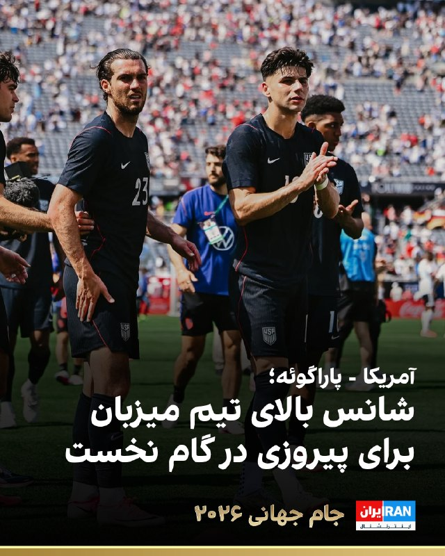

🔻با آغاز جام جهانی ۲۰۲۶، تیم ملی فوتبال آمریکا بامداد شنبه در نخستین دیدار خود در این رقابت‌ها به مصاف پاراگوئه خواهد رفت؛ مسابقه‌ای که در ورزشگاه سوفی لس‌آنجلس برگزار می‌شود و می‌تواند مسیر هر دو تیم در مرحله گروهی را مشخص کند.

🔹آمریکا که یکی از سه میزبان جام جهانی ۲۰۲۶ است، با انتظارات بالایی وارد این رقابت‌ها شده است. بسیاری از کارشناسان معتقدند نسل فعلی فوتبال این کشور با حضور ستاره‌هایی مانند کریستین پولیسیچ و تایلر آدامز، یکی از آماده‌ترین تیم‌های تاریخ فوتبال آمریکا محسوب می‌شود و قرعه نسبتاً مناسبی نیز در مرحله گروهی نصیب این تیم شده است.

🔹در سوی مقابل، پاراگوئه با تکیه بر بازیکنانی همچون میگل آلمیرون و خولیو انسیسو امیدوار است بتواند در نخستین گام شگفتی‌ساز شود و امتیازهای ارزشمندی را از میزبان مسابقات کسب کند.

🔹جزییات بیشتر را در سایت بخوانید

@iranintltvsport

## FarsiVOA — post 220475

  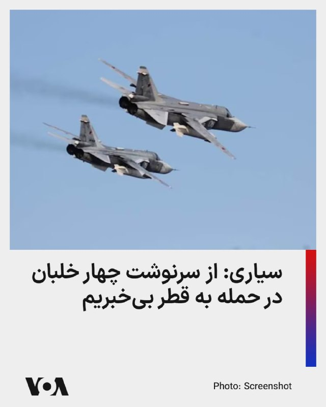

حبیب‌الله سیاری معاون هماهنگ‌کننده ارتش می‌گوید از سرنوشت چهار خلبان ایرانی که با جنگنده «سوخو ۲۴» به قطر حمله کرده بودند، بی‌خبریم.

او گفت « «سوخو ۲۴ از اربیل عراق رفت و قطر را زد. ۴ خلبان شیرمرد رفتند و هنوز از سرنوشتشان خبر نداریم.»

وزارت دفاع قطر ۱۲ اسفند سال گذشته در نخستین هفته از درگیری نظامی جمهوری اسلامی با آمریکا و اسرائیل اعلام کرد که این کشور دو فروند جنگنده «سوخو-۲۴» ایرانی را که از سمت ایران وارد حریم هوایی قطر شده بودند، سرنگون کرده است.

سیاری همچنین بدون ارائه توضیحات بیشتر، مدعی شد که در جریان جنگ ۳۹ روزه، جنگنده‌های اف‌۴ و اف‌۵ ارتش نیز عملیاتی در منطقه انجام داده‌اند.
@FarsiVOA

## IranianMinds — post 22398

  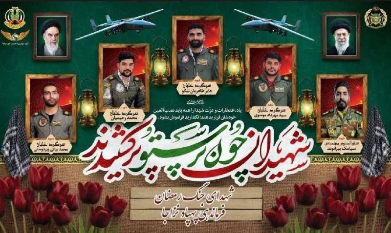

🔴 به هلاکت رسیدن پنج نیروی پهپادی رژیم، در دو حمله اخیر آمریکا.

@IranianMinds

## Dirty_Kids — post 391793

  <a href="telegram/content/Dirty_Kids_391793_1781265261.mp4" target="_blank">🎬 Download video</a>

بتمرگ و امضا کن 😂

@Dirty_Kids 👻

## alonews — post 127390

  <a href="telegram/content/alonews_127390_1781265264.mp4" target="_blank">🎬 Download video</a>

👈روسیه به تقویت شبکه دفاع هوایی خود در مسکو ادامه می‌دهد و سیستم‌ها را بر فراز ساختمان‌های بلند مستقر می‌کند

✅ @AloNews خبر جنگ

## alonews — post 127389

  <a href="telegram/content/alonews_127389_1781265266.webm" target="_blank">🎬 Download video</a>

👈رویترز: ایران برای حفظ لبنان به عنوان اهرم فشار در توافق پرمخاطره آمریکا می‌جنگد

✅ @AloNews خبر جنگ

## alonews — post 127388

📱لطفا توییتر الونیوز رو دنبال کنین 
🔴پست های انگلیسی در رابطه با جنایت های حکومت به انگلیسی نوشته شده و افراد مهم منشن و هشتگ های مهم قرار داده شده. 
🔴ریپست کنین. مهمترین کمک این روزها جلوگیری از پروپاگاندا حکومت علیه این قتل عام مردم هستش. خونشون نباید پایمال…

## alonews — post 127387

  <a href="telegram/content/alonews_127387_1781265267.webm" target="_blank">🎬 Download video</a>

👈 نتانیاهو: تا زمانی که من نخست وزیر اسرائیل هستم، ایران سلاح هسته ای نخواهد داشت.

🔴ما و ترامپ در مورد عدم دستیابی ایران به سلاح هسته‌ای اتفاق نظر داریم.

✅ @AloNews خبر جنگ

---
📅 بروزرسانی: 1405/03/22 15:13
---

## VahidOOnLine — post 245130

♦️تیم ملی فوتبال ایران روز پنج‌شنبه ۲۱ خرداد ماه، نخستین تمرین عمومی خود برای جام‌جهانی ۲۰۲۶ را در شهر تیخوانای مکزیک برگزار کرد.
تیم ملی طی هفته‌های گذشته تحت تاثیر جنگ ایران و آمریکا و حاشیه‌های مربوط به صدور «ویزای ساعتی» به یکی از جنجالی‌ترین تیم‌های جام‌ جهانی تبدیل شده بود، اما در نهایت،  وزارت امنیت داخلی آمریکا اعلام کرد بازیکنان تیم ملی ایران می‌توانند یک روز پیش از هر یک از سه مسابقه مرحله گروهی وارد خاک آمریکا شوند.
بر اساس اعلام مسئولان تیم، کاروان ایران روز یکشنبه راهی لس‌آنجلس خواهد شد تا یک روز پیش از دیدار با نیوزیلند در تمرین رسمی و نشست خبری فیفا شرکت کند.
ایران در نخستین دیدار خود در جام جهانی ۲۰۲۶ روز دوشنبه ۲۵ خرداد به مصاف نیوزیلند می‌رود و کمتر از یک هفته بعد مقابل تیم قدرتمند بلژیک قرار خواهد گرفت. تیم ملی در آخرین بازی مرحله گروهی نیز روز پنجم تیرماه در سیاتل با مصر دیدار می‌کند.
‌🇸🇦 Indypersian

🤖 @VahidOOnLine

## WithYashar — post 14629

نتانیاهو:
تا وقتی من نخست‌وزیر اسرائیل باشم، ایران به سلاح هسته‌ای دست پیدا نخواهد کرد.
من و ترامپ در این موضوع کاملاً هم‌نظر هستیم.
بیش از ۳۰ ساله که در خط مقدم مقابله با برنامه هسته‌ای ایران حضور دارم.
اگر این تلاش‌ها نبود، ایران سال‌ها پیش به بمب اتمی دست پیدا کرده بود؛ بمب‌هایی که به گفته او برای نابودی اسرائیل استفاده می‌شدند.
ایران به‌دنبال نابودی اسرائیله و من زندگی‌ام رو وقف جلوگیری از این موضوع کردم. تا وقتی نخست‌وزیر اسرائیل باشم، اجازه نمی‌دم چنین اتفاقی بیفته.
@withyashar

## mwarmonitor — post 10768

🔴نخست‌وزیر بنیامین نتانیاهو:

🔸«تا زمانی که من نخست‌وزیر اسرائیل هستم، ایران سلاح هسته‌ای نخواهد داشت. من و رئیس‌جمهور ترامپ در این موضوع کاملاً هم‌نظر هستیم.

🔸بیش از ۳۰ سال است که من رهبری مبارزه بین‌المللی علیه برنامه هسته‌ای ایران را بر عهده داشته‌ام. بدون این مبارزه، ایران مدت‌ها پیش بمب اتمی‌هایی در اختیار داشت که برای هدف قرار دادن و نابودی اسرائیل آماده می‌شدند.

🔸ایران در پی نابودی دولت یهود است و من زندگی خود را وقف جلوگیری از این موضوع کرده‌ام. تا زمانی که من نخست‌وزیر هستم، این اتفاق نخواهد افتاد.»

@mwarmonitor

## FoxNewsTwitter — post 342894

  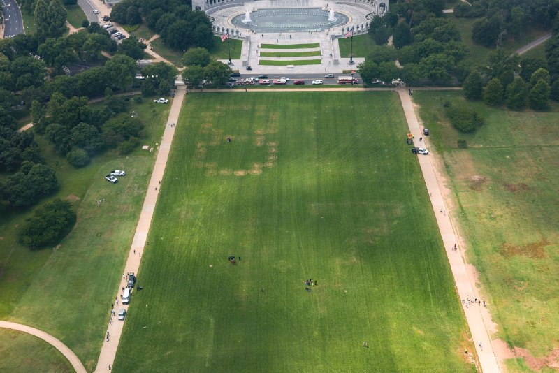

Fox News (Twitter/X)

NEW: Federal authorities are investigating a massive ‘8647’ that appears etched into the grass of the National Mall.

‘8647’ has become a mainstream way for President Trump’s critics to show disgust with the commander-in-chief.

‘86’ usually means to axe or kill something, commonly used in the restaurant industry, and ‘47’ references Trump as the 47th president of the United States.

The most notable incident of the ‘8647’ trend came after former FBI director James Comey posted the message online last year.

The Department of the Interior saying, “The deranged vandalism on our National Mall will not be tolerated,” and that “any threat against the President is taken very seriously.”

## pm_afshaa — post 93678

  <a href="telegram/content/pm_afshaa_93678_1781264636.webm" target="_blank">🎬 Download video</a>

🔴شبکه 12 اسرائیل:
مذاکرات نهایی تهران و واشینگتن بر مسائل اقتصادی و هسته‌ای متمرکز خواهد بود و شامل بحث‌هایی درباره برنامه موشک‌های بالستیک جمهوری اسلامی نخواهد شد.

💧 Rainbet.com the #1 Non-KYC Crypto Casino & Sportsbook @rainbetcom

😁 @Pm_Afshaa

## pm_afshaa — post 93677

  <a href="telegram/content/pm_afshaa_93677_1781264637.webm" target="_blank">🎬 Download video</a>

🔴اکسیوس: تفاهم احتمالی آمریکا و جمهوری اسلامی دارای چه مفادیه؟

آتش‌بس ۶۰ روزه تمدید می‌شود و در این مدت مذاکرات هسته‌ای ادامه خواهد داشت.
تنگه هرمز فورا و بدون عوارض باز می‌شه و تردد کشتی‌ها طی ۳۰ روز به سطح قبل از جنگ برمی‌گرده.
ایران متعهد می‌شه به سمت سلاح هسته‌ای نره و درباره ذخایر اورانیوم غنی‌شده با آمریکا به چارچوب مشترک برسه.
در مقابل، آمریکا معافیت‌های تحریمی موقت می‌ده تا ایران بتونه برای ۶۰ روز نفت بفروشه؛ کاهش بیشتر تحریم‌ها به میزان پایبندی تهران بستگی داره.
موضوع دارایی‌های بلوکه‌شده ایران همچنان مبهم است و یکی از اصلی‌ترین نقاط اختلاف دو طرف محسوب میشه.

💧Rainbet.com the #1 Non-KYC Crypto Casino & Sportsbook @rainbetcom

😁 @Pm_Afshaa

## IranIntlTV — post 341868

  <a href="telegram/content/IranIntlTV_341868_1781264637.mp4" target="_blank">🎬 Download video</a>

برنامه «جغرافیای انقلاب ملی ایرانیان» در این قسمت به روایت شکل‌گیری اعتراضات، شعارهای مردم و همچنین شیوه‌های سرکوب حکومت و کشتن معترضان در دی‌ماه ۱۴۰۴ می‌پردازد.

این اعتراضات در تبریز، مرند و مراغه از ۱۲ دی آغاز شد و در ۱۸ دی، با فراخوان شاهزاده رضا پهلوی، به اوج رسید.
@iranintltv

## FarsiVOA — post 220474

🔺ایرنا: «تعهد قطعی» به عدم توسعه تسلیحات هسته‌ای در تفاهم‌نامه ذکر شده است

▪️خبرگزاری رسمی ایرنا درباره مفاد تفاهم‌نامه جمهوری اسلامی با آمریکا نوشت که در این متن «تعهد قطعی» جمهوری اسلامی به عدم توسعه تسلیحات هسته‌ای ذکر شده است.

▪️این خبرگزاری روز جمعه ۲۲ خرداد در مطلبی که آن را جزئیات تفاهم‌نامه احتمالی میان جمهوری اسلامی و آمریکا خوانده، آورده است که «مذاکره هسته‌ای در مهلت ۶۰ روزه پس از امضای تفاهم‌نامه انجام خواهد شد.»

▪️با این حال این خبرگزاری ادعا کرد که سیاست عدم توسعه تسلیحات هسته‌ای «سیاست همیشگی نظام جمهوری اسلامی» بوده است.

▪️همزمان، سی‌بی‌اس به نقل از منابع آگاه گزارش داد که این توافق شامل «تعهد ایران به عدم غنی‌سازی اورانیوم برای مدت ۱۵ تا ۲۰ سال است.»

⬇️ بیشتر بخوانید:
https://ir.voanews.com/a/8160105.html

## DW_Farsi — post 125874

🔶 آیا داروی لاغری اوزمپیک خطر سرطان پستان را کاهش می‌دهد؟

کلاس دارویی موسوم به آگونیست‌های گیرنده GLP-1 که به دلیل اثربخشی بالا در درمان دیابت نوع ۲ و کاهش وزن شدید، در سال‌های اخیر به محبوبیتی بی‌سابقه در جهان دست یافته، اکنون توجه جامعه پزشکی را در زمینه پیشگیری از سرطان به خود جلب کرده است.

یک پژوهش بزرگ که نتایج آن در نشست سالانه انجمن انکولوژی بالینی آمریکا (ASCO 2026) ارائه و هم‌زمان در مجله معتبر علمی JCO Oncology Practice منتشر شد، نشان می‌دهد زنانی که از داروهایی مانند اوزمپیک، ویگووی، مونجارو و زپ‌باند استفاده کرده‌اند، حدود ۳۰ درصد کمتر از سایر زنان در معرض خطر ابتلا به سرطان پستان قرار گرفته‌اند.

@dw_farsi

## Persian_Trend_Official — post 16846

  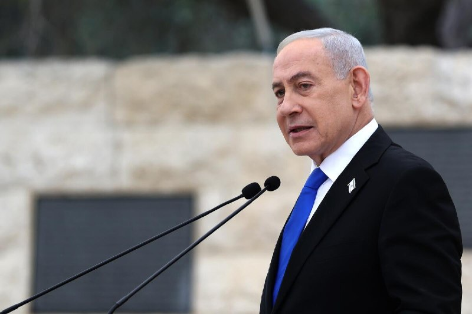

بنیامین نتانیاهو، نخست وزیر اسرائیل: تا زمانی که من نخست وزیر اسرائیل هستم، ایران سلاح هسته‌ای نخواهد داشت. در این مورد توافق کامل بین من و رئیس جمهور ترامپ وجود دارد.

بیش از 30 سال است که من در خط مقدم مبارزه بین‌المللی علیه برنامه هسته‌ای ایران بوده‌ام. اگر این مبارزه نبود، ایران مدت‌ها پیش بمب اتم برای نابودی اسرائیل داشت.

ایران در تلاش برای نابودی دولت یهود است و من زندگی‌ام را وقف جلوگیری از این کار آنها می‌کنم. تا زمانی که من نخست وزیر اسرائیل هستم، این اتفاق نخواهد افتاد.

📝 Amir

📌 @persian_trend_official
پرشین ترند | متفاوت‌ترین کانال نظامی

## Persian_Trend_Official — post 16845

  <a href="telegram/content/Persian_Trend_Official_16845_1781264640.webm" target="_blank">🎬 Download video</a>

سخنگوی ارتش اسرائیل: ارتش اسرائیل پیش از حملات اسرائیل در واکنش به نقض آتش‌بس توسط حزب‌الله، هشدار تخلیه برای مناطق صرفند، تفهتا و سینا در جنوب لبنان صادر کرده است.

از ساکنان خواسته شده است که به شمال رودخانه زهرانی نقل مکان کنند.

📝 Amir

📌 @persian_trend_official
پرشین ترند | متفاوت‌ترین کانال نظامی

## RadioFarda — post 158222

  <a href="https://t.me/radiofarda/158222" target="_blank">📎 Download file</a>

📻بشنوید: ساعت ۱۴ با رادیوفردا، ۲۲ خرداد ۱۴۰۵‌

@RadioFarda

## IranianMinds — post 22397

  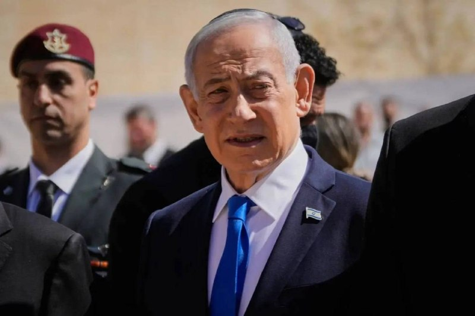

🔴 بنیامین نتانیاهو :

هرگز اجازه نخواهیم داد محور شرارت و ایران به سلاح هسته ای دست پیدا کند

من و رئیس‌جمهور ترامپ در این موضوع کاملاً هم‌نظر هستیم.
بیش از ۳۰ سال در خط مقدم مبارزه بین‌المللی علیه برنامه هسته‌ای ایران بوده‌ام.

اگر این مبارزه نبود، ایران مدت‌ها پیش به بمب اتمی برای نابودی اسرائیل دست یافته بود.
ایران در پی نابودی دولت یهود است و من زندگی‌ام را وقف جلوگیری از این هدف کرده‌ام.

تا زمانی که نخست‌وزیر اسرائیل باشم، چنین اتفاقی رخ نخواهد داد.

@IranianMinds

## alonews — post 127386

  <a href="telegram/content/alonews_127386_1781264641.webm" target="_blank">🎬 Download video</a>

👈بر اساس محاسبات ریانووستی با استناد به داده‌های گمرک آمریکا، ایالات متحده در طول دو ماه درگیری در خاورمیانه، 8.28 میلیارد دلار از صادرات نفت و 6.84 میلیارد دلار از صادرات فرآورده‌های نفتی درآمد کسب کرده است.

✅ @AloNews خبر جنگ

---
📅 بروزرسانی: 1405/03/22 15:03
---

## VahidOOnLine — post 245129

  <a href="telegram/content/VahidOOnLine_245129_1781264026.mp4" target="_blank">🎬 Download video</a>

⭕️خرس قهوه‌ای به همراه توله‌هایش در پارک ملی گلستان دیده شد

♦️تصاویر ثبت‌شده در پارک ملی گلستان، یک خرس قهوه‌ای را در کنار توله‌هایش در زیستگاه طبیعی این گونه نشان می‌دهد.
پارک ملی گلستان یکی از مهم‌ترین زیستگاه‌های خرس قهوه‌ای در ایران به شمار می‌رود و ثبت چنین تصاویری نشانه‌ای از تداوم حیات و زادآوری این گونه ارزشمند در مناطق حفاظت‌شده کشور است.

خرس قهوه‌ای از بزرگ‌ترین پستانداران ایران و از گونه‌های شاخص حیات وحش کشور محسوب می‌شود. پارک ملی گلستان، قدیمی‌ترین پارک ملی ایران، به دلیل تنوع زیستی بالا، زیستگاه گونه‌های متعددی از پستانداران، پرندگان و خزندگان است.
‌🇸🇦 Indypersian

🤖 @VahidOOnLine

## RadioFarda — post 158221

  <a href="https://t.me/radiofarda/158221" target="_blank">📎 Download file</a>

🔸 در دومین کافه فردا به وقت جام جهانی، به مسابقات روز اول این رویداد بین‌المللی می‌پردازیم، آخرین تغییرات داوری در فوتبال را مرور می‌کنیم، به حواشی گسترده تیم ملی فوتبال ایران در مسیر جام‌جهانی می‌پردازیم و مسائل تاکتیکی مسابقات روزهای آینده را مرور می‌کنیم.

🔸 برای تماس با ما می‌توانید به شناسه کافه فردا در تلگرام صوت و متن بفرستید.

📻 کافه فردا

## IranianMinds — post 22396

  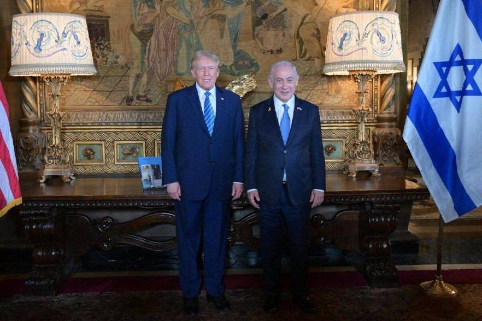

🔴 وای نت :

نتانیاهو گفت ترامپ پس از حمله موشکی ایران از او خواسته پاسخ اسرائیل را محدود کند.
به گفته نتانیاهو، ترامپ از او پرسید: آیا کسی از شما کشته شده تو حمله ایران؟
نتانیاهو پاسخ داد: «من حاضر نیستم معادله‌ای را بپذیرم که فقط در صورت کشته شدن افراد پاسخ بدهیم. اگر به خاک اسرائیل حمله شود، ما پاسخ می‌دهیم و ضربه متقابل می‌زنیم.»

او همچنین در پاسخ به نگرانی‌ها درباره وابستگی به آمریکا گفت: «ما تابع آمریکایی‌ها نیستیم؛ ما متحد آن‌ها هستیم.

@IranianMinds

## Dirty_Kids — post 391792

  <a href="telegram/content/Dirty_Kids_391792_1781264028.mp4" target="_blank">🎬 Download video</a>

اجرای آهنگ شکیرا توسط دختران ایرانی
اونوقت ج ا میخواد اینا رو محدود کنه
این نسل سرنگونتون میکنند

@Dirty_Kids 👻

## Dirty_Kids — post 391791

  <a href="telegram/content/Dirty_Kids_391791_1781264030.mp4" target="_blank">🎬 Download video</a>

همیشه خنده ام میگیره وقتی در فیلمهای سینمایی، افراد به خاطر نخوردن گلوله، پشت یک خودرو سنگر میگیرند تا زخمی نشوند.

@Dirty_Kids 👻

## Dirty_Kids — post 391790

  <a href="telegram/content/Dirty_Kids_391790_1781264031.mp4" target="_blank">🎬 Download video</a>

اگه این روز‌ها درگیر استرس و فشار‌های عصبی هستید؛

حتماً صحبت‌های دکتر رو با دقت تا انتها ببینید، 48 ثانیه‌ست ولی راحت 48 سال جلوتون میندازه.

هندزفری 🔞

@Dirty_Kids 👻

## Hranews — post 113555

مسجد سلیمان؛ وقوع آتش سوزی در یک مرکز نگهداری معلولان ذهنی منجر به مصدومیت ۲۵ تن شد

❗️
❗️
❗️
❗️
❗️– مدیرعامل جمعیت هلال‌احمر استان خوزستان اعلام کرد که وقوع آتش‌سوزی در یک مرکز نگهداری معلولان ذهنی و توانبخشی در مسجد سلیمان منجر به مصدومیت ۲۵ تن شده است.

ادامه مطلب

↘️
@hranews_bot تماس ✉️ - @Hranews کانال هرانا 🆑

## alonews — post 127385

  <a href="telegram/content/alonews_127385_1781264032.webm" target="_blank">🎬 Download video</a>

👈ارتش اسرائیل دستور تخلیه فوری سرافند، توفاهتا و مزرعه سینا تو لُبنان رو داده

🔴 دلیلش هم نقض آتش‌بس از سوی حزب‌الله اعلام شده

✅ @AloNews خبر جنگ

## alonews — post 127384

  <a href="telegram/content/alonews_127384_1781264033.webm" target="_blank">🎬 Download video</a>

👈رائفی پور: خون آقا رو پایمال نکنید

✅ @AloNews خبر جنگ

## alonews — post 127383

  <a href="telegram/content/alonews_127383_1781264033.webm" target="_blank">🎬 Download video</a>

👈امام جمعه اهواز: سازش با دشمن در هیچ سطحی جایز نیست

🔴 عقب‌نشینی در مقابل امریکا و اسرائیل ممنوع است، باید انتقام بگیریم!

✅ @AloNews خبر جنگ

---
📅 بروزرسانی: 1405/03/22 14:53
---

## VahidOOnLine — post 245128

  

محمود نبویان، نماینده مجلس جمهوری اسلامی، با انتقاد از پیش‌نویس توافق احتمالی میان آمریکا و جمهوری اسلامی، آن را مشابه برجام و «خسارت محض» توصیف کرد. او گفت: «حرف از پیروزی با این متن مبهم و خسارت‌بار کاملا غلط است.»

نبویان با انتقاد از مفاد مطرح‌شده در پیش‌نویس توافق، گفت در این توافق جمهوری اسلامی حق تولید سلاح هسته‌ای را نخواهد داشت. او همچنین افزود سرنوشت مواد غنی‌شده به رضایت آمریکا وابسته شده و همه موضوعات مرتبط با برنامه هسته‌ای باید مورد مذاکره قرار گیرد.

این نماینده مجلس تاکید کرد: «این توافق مانند برجام خسارت محض است و بخاطر تغییر محاسبات مسئولان است.»
‌🏁 🇬🇧 IranintlTV

🤖 @VahidOOnLine

## VahidOOnLine — post 245127

  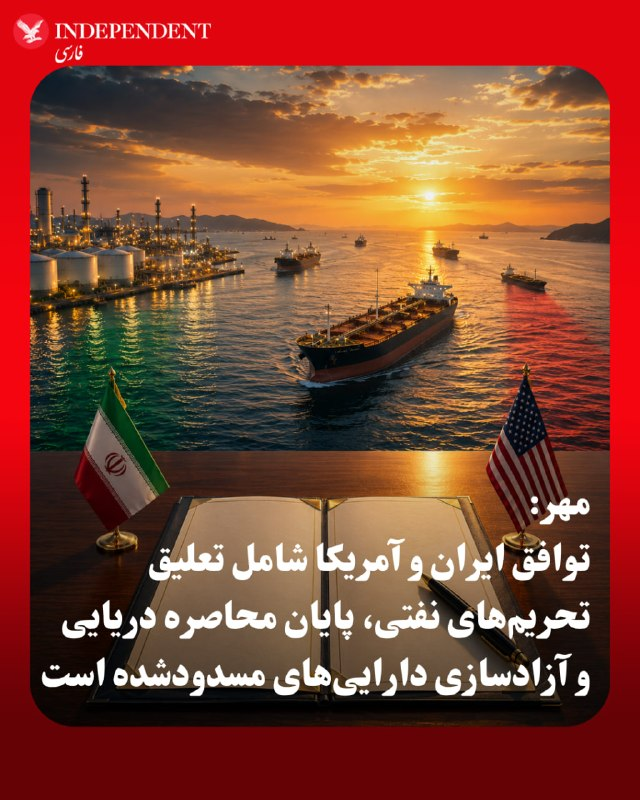

♦️خبرگزاری مهر، وابسته به سازمان تبلیغات اسلامی، روز جمعه ۲۲ خرداد ماه گزارش داد، تعلیق تحریم‌های نفتی، پایان محاصره دریایی و آزادسازی بخشی از دارایی‌های مسدودشده ایران از اجزای توافق احتمالی آینده میان دو کشور است.

مهر به نقل از یک منبع نزدیک به تیم مذاکره‌کننده ایرانی گزارش داد در پیش‌نویس ۱۴ موردی تفاهم‌نامه ایران و آمریکا آمده است، محاصره دریایی ایران ظرف ۳۰ روز کاملا رفع می‌شود و تحریم‌های فروش نفت، محصولات پتروشیمی و مشتقات آن نیز تعلیق خواهد شد.
بر اساس این گزارش همچنین، «آزادسازی ۲۴ میلیارد دلار اموال مسدود شده ایران در دوره ۶۰ روزه مذاکرات نهایی» بخشی از این توافق تهران و واشنگتن است که نیمی از این مبلغ قبل از شروع مذاکرات باید در دسترس ایران قرار گیرد.
به گزارش مهر، توافق نهایی صرفا در موضوع سرنوشت اورانیوم‌های غنی شده و غنی سازی، رفع تحریم‌ها و «برنامه بازسازی اقتصاد ایران» تمرکز دارد و بحث درباره برنامه موشکی و حمایت
‌🇸🇦 Indypersian

🤖 @VahidOOnLine

## mwarmonitor — post 10767

  <a href="telegram/content/mwarmonitor_10767_1781263415.mp4" target="_blank">🎬 Download video</a>

📝به نظرم نیازی نیست برای فهمیدن عمق فاجعه به فرمول‌های پیچیده اقتصادی پناه ببریم؛ تماشای افاضات این نوابغ خودش گویای همه‌چیز است. در دنیای موازی این موجودات، جایی که ریال از شدت بی‌ارزشی با پشکل رقابت می‌کند و پاسپورت ملی رسماً کاربری کاغذ توالت را پیدا کرده، ناگهان بانوی فضل و کمال با تکیه بر متدهای صیغه‌ای و تئوری‌های ماورایی، نوید نابودی دلار و ظهور «ابرقدرت چهارم جهان» را می‌دهد!

🔸منطق این انگل‌های بوگندو و پورن استار های ولایی واقعاً نیاز به یک جراحی عمیق مغزی دارد؛ از نظر این مغزهای زنگ‌زده، نشانه ابرقدرتی نه سفره‌های خالی و کمرهای خم‌شده مردم زیر بار گرانی، بلکه کشت و کشتار و متراژ پرواز پهپاد و موشک است. گویا قرار است با دود موشک شکم گرسنه‌ها را سیر کنند و با غرش پهپاد، اجاره‌خانه‌های سرسام‌آور را بپردازند. این حجم از توهم و وقاحت، با هیچ متای فکری در تاریخ بشریت قابل قیاس نیست؛ سیرک خنده‌داری که در آن مدیرانش با جیب کنده و شکم گرسنه‌ی ملت، برای دنیا خط و نشان نظامی می‌کشند و به گدایی خود مدال افتخار آویزان می‌کنند.

@mwarmonitor

## IranIntlTV — post 341867

  

محمود نبویان، نماینده مجلس جمهوری اسلامی، با انتقاد از پیش‌نویس توافق احتمالی میان آمریکا و جمهوری اسلامی، آن را مشابه برجام و «خسارت محض» توصیف کرد. او گفت: «حرف از پیروزی با این متن مبهم و خسارت‌بار کاملا غلط است.»

نبویان با انتقاد از مفاد مطرح‌شده در پیش‌نویس توافق، گفت در این توافق جمهوری اسلامی حق تولید سلاح هسته‌ای را نخواهد داشت. او همچنین افزود سرنوشت مواد غنی‌شده به رضایت آمریکا وابسته شده و همه موضوعات مرتبط با برنامه هسته‌ای باید مورد مذاکره قرار گیرد.

این نماینده مجلس تاکید کرد: «این توافق مانند برجام خسارت محض است و بخاطر تغییر محاسبات مسئولان است.»
https://iranintl.com/202606129333

## FarsiVOA — post 220473

  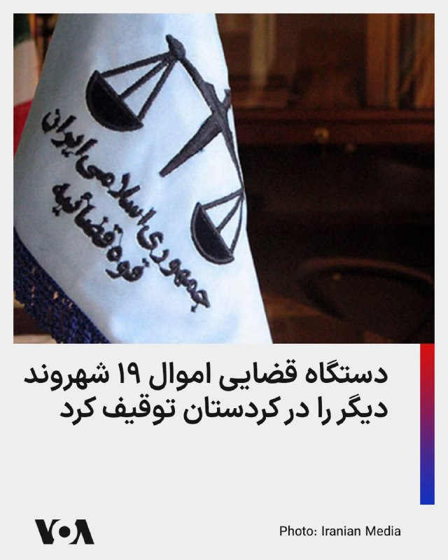

رئیس کل دادگستری استان کردستان، از توقیف اموال ۱۹ شهروند به اتهام تهیه فیلم و عکس از محل اصابت پرتابه‌ها در ایام جنگ خبر داد.

حسین حسینی، مدعی شد که این شهروندان فیلم و عکس‌ها را برای شبکه‌های ماهواره‌ای و کانال‌هایی که آنها را وابسته به «دشمن» ‌خواند، ارسال می‌کردند. او افزود که این مجازات سنگین، به استناد قانون موسوم به «قانون تشدید مجازات جاسوسی» اعمال شده است.

پیشتر مقامات دستگاه قضایی مدعی شده بودند که این قانون، دست آنها را برای برخورد با شهروندان باز گذاشته است.

از زمان آغاز درگیری نظامی در اسفندماه سال گذشته، صدها شهروند در استان‌های مختلف با مصادره و توقیف اموال روبه‌رو شده‌اند که بخشی از آنها ساکن خارج از کشور هستند.
@FarsiVOA

## Persian_Trend_Official — post 16844

  <a href="telegram/content/Persian_Trend_Official_16844_1781263418.webm" target="_blank">🎬 Download video</a>

رویترز: تفاهم‌نامه بین ایران و امریکا احتمالا تا یکشنبه امضا خواهد شد!

به گزارش رویترز و به نقل از یک منبع غربی، تفاهم‌نامه‌ای بین ایالات متحده و ایران با هدف پایان دادن به درگیری خلیج فارس می‌تواند تا روز یکشنبه امضا شود و ژنو محتمل‌ترین مکان در نظر گرفته شده است.

هدف این است که متن تا روز شنبه تکمیل شود و به جی دی ونس و محمد باقر قالیباف اجازه داده شود تا این تفاهم‌نامه را امضا کنند.

به گفته یک منبع ارشد ایرانی، این پیش‌نویس شامل لغو تحریم‌های نفتی ایران، آزادسازی میلیاردها دلار از دارایی‌های مسدود شده ایران و آتش‌بس در تمام جبهه‌ها، از جمله لبنان، خواهد بود.

📝 Amir

📌 @persian_trend_official
پرشین ترند | متفاوت‌ترین کانال نظامی

## Persian_Trend_Official — post 16843

  <a href="telegram/content/Persian_Trend_Official_16843_1781263418.webm" target="_blank">🎬 Download video</a>

خبرگزاری دولت، ایرنا: متن نهایی تفاهم‌نامه تا زمان پذیرش قطعی آن توسط دو طرف منتشر نخواهد شد.

تمامی خطوط قرمز تعیین شده از سوی رهبر انقلاب، آیت‌الله سید مجتبی خامنه‌ای، در چارچوب نظارت مستمر شورای عالی امنیت ملی در متن مورد توجه قرار گرفته‌است.

در شرایط فعلی هیچ توافقی در مورد پرونده هسته‌ای انجام نمی‌شود، ایران هیچ تعهد جدیدی نمی‌دهد و چارچوب برنامه صلح آمیز هسته‌ای ایران در پی امضای تفاهم دست‌نخورده باقی می‌ماند

بر اساس پیشنهاد اولیه ایران، هرگونه مذاکره هسته‌ای در مهلت 60 روزه پس از امضای تفاهم‌نامه انجام خواهد شد.

📝 Amir

📌 @persian_trend_official
پرشین ترند | متفاوت‌ترین کانال نظامی

## RadioFarda — post 158220

  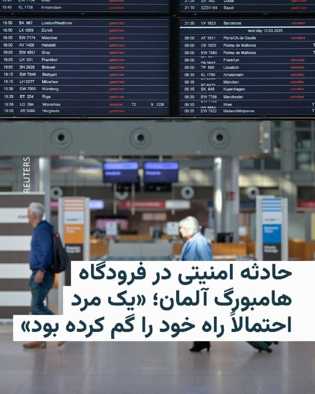

🔸سخنگوی فرودگاه هامبورگ اعلام کرد که روز جمعه ۲۲ خرداد پس از تخلیه یک ترمینال به دلیل حادثه امنیتی، تأخیرها و لغوهای قابل توجهی در فرودگاه هامبورگ رخ خواهد داد.

🔸سخنگوی پلیس فدرال گفت: «این حادثه حدود ساعت ۹:۴۵ صبح به وقت محلی رخ داد، زمانی که یک مرد دکمه اضطراری را که مسیرهای فرار را باز می‌کند، فشار داد و به طور غیرمجاز به منطقه امنیتی دسترسی پیدا کرد.»

🔸به گفته سخنگوی پلیس فدرال «این مرد احتمالاً راه خود را گم کرده بود.»

🔸سخنگوی فرودگاه هامبورگ ساعاتی بعد اعلام کرد که «اقدامات احتیاطی پلیس فدرال به پایان رسیده و مسافران اکنون دوباره در حال عبور از گیت‌های امنیتی هستند و پروازها از سر گرفته می‌شود.»

🔸او به تعداد لغو پروازها اشاره نکرد اما از تأخیر در برخی پروازها و لغو شماری از آن‌ها خبر داد.
@RadioFarda

## alonews — post 127382

  <a href="telegram/content/alonews_127382_1781263420.webm" target="_blank">🎬 Download video</a>

👈واکنش تند نبویان به خبر توافق: می‌خواهند متنی خسارت بار را به عنوان پیروزی جا بزنند/ مدیریت تنگه هرمز از دست خواهد رفت و تحریم ها هم لغو نمی‌شود

✅ @AloNews خبر جنگ

## alonews — post 127381

  <a href="telegram/content/alonews_127381_1781263420.webm" target="_blank">🎬 Download video</a>

👈تیراندازی در نزدیکی کمپ تیم ملی آرژانتین در کانزاس سیتی آمریکا

🔴حادثه تیراندازی در یک ساختمان مسکونی رخ داده است که منجر به مرگ یک نوجوان و زخمی شدن دو نفر شده است

✅ @AloNews خبر جنگ

## alonews — post 127380

  <a href="telegram/content/alonews_127380_1781263420.mp4" target="_blank">🎬 Download video</a>

👈خبرنگار صداوسیما: اکنون تنگه هرمز کاملاً آرام است و نظم ایرانی در آن حاکم

✅ @AloNews خبر جنگ

---
📅 بروزرسانی: 1405/03/22 14:43
---

## WithYashar — post 14628

فارس: هر گمانه‌زنی دربارۀ امضا در سوئیس یا دیدار حضوری، چیزی جز فهم اشتباه از پیشنهادها و آرزوهای آمریکایی نیست!
@withyashar

## DEJradio — post 5614

  <a href="telegram/content/DEJradio_5614_1781262834.webm" target="_blank">🎬 Download video</a>

⚽️
🔺 دژ فوتبالی با مهدی رستم‌پور، هر شب پس از خبر ۲۱ ویژه جام‌جهانی فوتبالی

چرا قلعه‌نوعی مدیر اجرایی تیم ملی را از اتوبوس پیاده کرد؟ پای یک میلیون دلار پول در میان بود.

✨نظرات و ویدیوهای خود را برای این برنامه به تلگرام دژ ارسال کنید:
@Dejreport

#فوتبال #جام_جهانی
@DEJradio

## IranianMinds — post 22395

🔴 بلومبرگ به نقل از یک مقام گروه هفت:

توافق احتمالی بین تهران و واشنگتن یک یادداشت تفاهم خواهد بود، نه یک توافق نهایی.

@IranianMinds

## alonews — post 127379

  <a href="telegram/content/alonews_127379_1781262834.webm" target="_blank">🎬 Download video</a>

👈خودروسازان در حال ایجاد یک ائتلاف مشترک برای اعمال فشار جهت وضع مقررات جدید هستند.

🔴 این اقدام با هدف ایجاد شرایطی برابر و افزایش توان رقابت با ورود گسترده و موج فزاینده خودروهای مقرون‌به‌صرفه و ارزان‌قیمت چینی به بازارها صورت می‌گیرد

✅ @AloNews خبر جنگ

## alonews — post 127378

  <a href="telegram/content/alonews_127378_1781262835.webm" target="_blank">🎬 Download video</a>

⚫
🏆 به دنیای هیجان‌انگیز فوتبال خوش اومدی!

⭐️اینجا قراره باهم لحظه‌به‌لحظه‌ی جام جهانی رو زندگی کنیم؛
از بازی‌های حساس و نتایج داغ گرفته تا حاشیه‌ها، کری‌خونی‌ها و اتفاقاتی که همه درباره‌ش حرف میزنن! 
🔥
🔥

✅ پوشش کامل مسابقات

💀ترول تیم‌ها و بازیکن‌ها

🎥ویدیوها و لحظه‌های فان فوتبالی

📊آمار، ترکیب‌ها و اخبار فوری

🌍حواشی جذاب از سراسر جام جهانی

📢اینجا فقط یک کانال خبری نیست؛
یک جمع فوتبالیه برای کسایی که فوتبال رو با هیجان، شوخی و احساس واقعی دنبال میکنن 
📛
💟

🆘
🔞 آماده باش چون قراره جام جهانی رو متفاوت تجربه کنیم!

⚡ @Vaarzesh_Plus

⚡ @Vaarzesh_Plus

## alonews — post 127377

  <a href="telegram/content/alonews_127377_1781262835.mp4" target="_blank">🎬 Download video</a>

👈این ویدیو قدیمی مجدد وایرال شده!

🔴فائزه هاشمی: مجتبی، بن سلمان ایرانه

✅ @AloNews خبر جنگ

## alonews — post 127376

  <a href="telegram/content/alonews_127376_1781262838.webm" target="_blank">🎬 Download video</a>

👈العربیه: وزیر امور خارجهٔ پاکستان در گفت‌وگوی تلفنی با مسئول سیاست خارجی اتحادیه اروپا دربارهٔ تلاش‌ها برای دستیابی به تفاهم میان آمریکا و ایران گفت‌وگو کرد.

✅ @AloNews خبر جنگ

---
📅 بروزرسانی: 1405/03/22 14:34
---

## WithYashar — post 14627

ایرنا؛ تفاهم‌نامه پایان جنگ چه مسائل و موضوعاتی را در بر می‌گیرد؟

۱. موضوع هسته‌ای دست‌نخورده باقی می‌ماند
هیچ توافقی در مورد پرونده هسته‌ای در تفاهم‌نامه فعلی انجام نمی‌شود و ایران هیچ تعهد جدیدی نمی‌دهد. گفت‌وگوهای هسته‌ای در مهلت ۶۰ روزه پس از امضا انجام خواهد شد.
۲. تنگه هرمز؛ نه واگذاری، نه نقش آمریکا
ایران هیچ تعهدی در مورد واگذاری مدیریت تنگه هرمز نمی‌دهد. آینده اداره تنگه در چارچوب یک امر منطقه‌ای و از طریق گفت‌وگو و تصمیم گیری مشترک تهران با عمان حل و فصل می‌شود.
۳. پایان قاطع جنگ در تمام جبهه‌ها، از جمله لبنان
هدف اصلی تفاهم‌نامه، پایان جنگ در تمامی جبهه‌های منطقه است. آمریکا تعهد می‌دهد که اسرائیل را وادار به پایان جنگ در لبنان کند و عبارت «تمدید آتش‌بس» در متن جایی ندارد.
۴. آزادی دارایی‌های مسدودشده با ساز و کار مشخص
بخشی از دارایی‌های مسدودشده بلافاصله پس از امضا و بقیه به تدریج در طول مذاکرات آزاد خواهند شد. تهران تضمین‌های روشنی بر اساس ساز و کارهای مورد نظر خود دریافت کرده است.
۵. غرامت جنگ در دستور کار
خسارات وارده به ایران در تجاوز آمریکا و اسرائیل از جمله موارد مورد اشاره در تفاهم‌نامه است. ساز و کار اجرایی دریافت غرامت در مذاکرات ۶۰ روزه پس از امضا مورد توافق قرار خواهد گرفت.
۶. جزییات رفع تحریم‌های اولیه و ثانویه؛ موضوع مورد بحث در توافق نهایی
رفع تمامی تحریم‌های آمریکا و قطعنامه‌های بین‌المللی در مهلت ۶۰ روزه مذاکرات هسته‌ای بررسی می‌شود.
۷. سه موضوع و ۶۰ روز برای توافق نهایی
در مذاکرات ۶۰ روزه تنها سه موضوع بررسی می‌شود: استمرار برنامه صلح‌آمیز هسته‌ای، رفع تحریم‌های یکجانبه آمریکا، و ساز و کار جبران خسارات. هیچ موضوع دیگری در از جمله توانمندی موشکی ایران، دستور کار نخواهد بود.
@withyashar

## mwarmonitor — post 10766

🔴خبرگزاری ایرنا درباره جزئیات توافق احتمالی میان ایران و ایالات متحده: متن یک توافق برای پایان جنگ با دقت بسیار بالا و وسواس زیاد تدوین شده است و هیچ مجالی برای تفسیر خودسرانه یا فرار از تعهدات از سوی هیچ‌یک از طرفین در این توافق وجود ندارد. در این یادداشت تفاهم هیچ توافقی درباره پرونده هسته‌ای حاصل نخواهد شد و ایران هیچ تعهد جدیدی ارائه نخواهد کرد.

@mwarmonitor

## FoxNewsTwitter — post 342893

  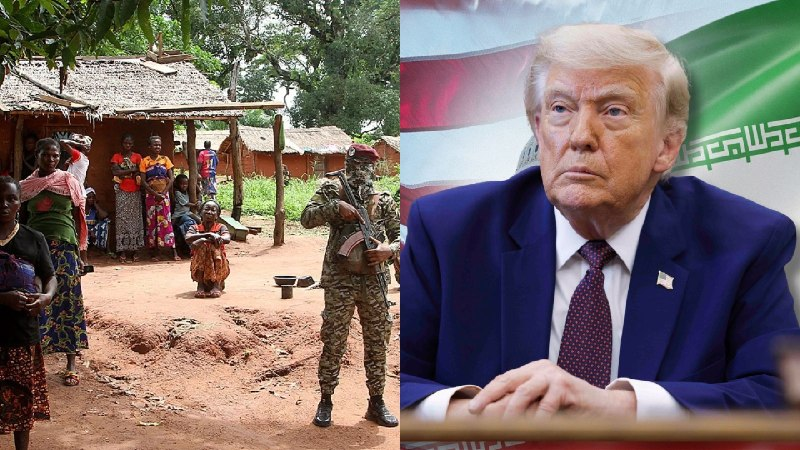

Fox News (Twitter/X)

NEW: With Iran at the center of a growing international conflict, the Trump administration is preparing a deportation flight that includes sending Iranian asylum-seekers and other migrants to Africa.

The first flight could depart as early as Thursday carrying about 20 people, according to reports.

The group includes migrants from Iran, Syria, Afghanistan and a Turkish national, with the Central African Republic set to receive them.

The move is part of the administration's expanding use of third-country deportation deals for migrants who cannot easily be returned to their home countries.

## FoxNewsTwitter — post 342892

  <a href="telegram/content/FoxNewsTwitter_342892_1781262244.mp4" target="_blank">🎬 Download video</a>

Fox News (Twitter/X)

RT @seanhannity: Stephen A. Smith says President Trump had every right to fire back at him, but jokes that his appearance disrupted the Knicks’ momentum and helped cost them Game 3:

“I take no offense at the president coming after me the way that he did. People go after him every day. I’ve certainly gone after him. He has every right to come back and clap back at me. I’m a big boy. I can take it. He’s not phasing me one bit. But this man was raised in Queens, New York. He’s a lifelong Knicks fan. He knows about the suffering that spans 53 years. And when you are a true sports fan, you know that every little thing can disrupt momentum. You had watch parties outside with thousands of people, packed arenas, fans throughout the city, gatherings in Central Park, Bryant Park, and across New York. The momentum was there. The energy was there. And what does this guy do? He shows up, they have to get rid of the watch party, he disrupts the momentum and the...

Перейти на оригинальный пост

## IranIntlTV — post 341866

  <a href="telegram/content/IranIntlTV_341866_1781262246.mp4" target="_blank">🎬 Download video</a>

بلومبرگ از نزدیک شدن تهران و واشینگتن به یک توافق خبر داد. یک مقام ایرانی به این رسانه گفته است توافق احتمالی به‌صورت یادداشت تفاهم تنظیم خواهد شد و توافق نهایی محسوب نمی‌شود.

لی‌لی نیکفر، خبرنگار ایران‌اینترنشنال، گزارش می‌دهد
@iranintltv

## FarsiVOA — post 220472

  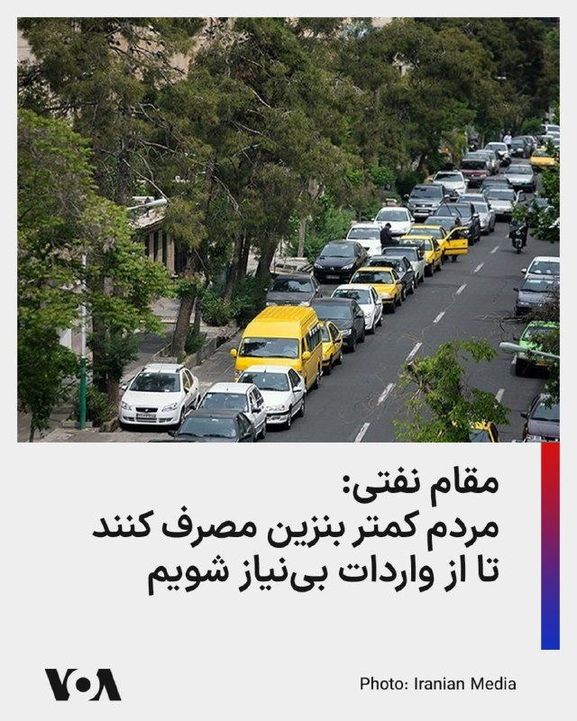

یک مقام نفتی ایران از مردم خواست تا در مصرف بنزین صرفه‌جویی کنند تا جمهوری اسلامی از واردات بنزین بی‌نیاز ‌شود.

عماد رفیعی مدیر امور مصرف شرکت پالایش و پخش فرآورده‌های نفتی با اشاره به کسری بنزین در کشور گفت با توجه به شرایط فعلی تردد کشتی‌ها در خلیج فارس، تقریباً هیچ کدام از کشور‌های منطقه نمی‌توانند بنزین وارد کنند.

اظهارات او در حالی است که ایران تنها کشور منطقه است که نیازمند واردات بنزین از طریق تنگه هرمز است و بقیه صادرکننده بنزین هستند.

رفیعی در ادامه مدعی شد با کاهش مصارف غیرضروری، کشور می‌تواند از واردات بنزین بی‌نیاز شود.

جمهوری اسلامی طی سال‌های گذشته با تهاتر مازوت و بنزین در بازارهای منطقه، همچنین افزایش چشمگیر افزودنی‌های شیمیایی به بنزین پالایشگاه‌ها و تولید بنزین غیراستاندارد در پتروشیمی‌ها سعی در مدیریت کسری بنزین کرده است.
@FarsiVOA

## DW_Farsi — post 125873

  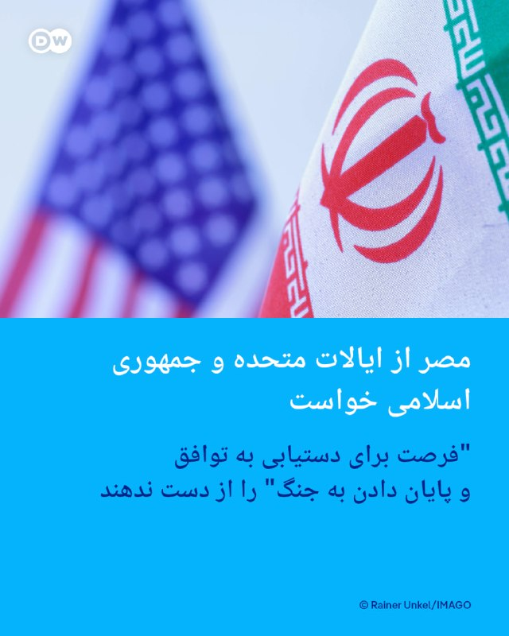

🔶مصر: آمریکا و ایران فرصت پایان دادن به جنگ را نباید از دست بدهند

این درخواست مصر پس از آن مطرح شد که دونالد ترامپ تهدید خود برای انجام حملات بیشتر علیه ایران را پس گرفت.

رئیس‌ جمهور آمریکا در پیامی در این رابطه در پلتفرم "تروث سوشال" نوشت: «گفت‌وگوها و نکات نهایی، هم از نظر کلیات و هم با جزئیات فراوان، مورد تأیید تمامی طرف‌های درگیر، از جمله ایالات متحده، اسرائیل، عربستان سعودی، امارات متحده عربی، قطر، ترکیه، پاکستان، بحرین، کویت، اردن، مصر و دیگران قرار گرفته است.»

وزارت خارجه مصر در بیانیه‌ای در شامگاه پنج‌شنبه ۲۱ خرداد (۱۱ ژوئن) ابراز امیدواری کرد که از این فرصت برای دستیابی به توافق درباره مسائل باقی‌مانده و فراهم کردن زمینه برای پایان جنگ و آغاز مرحله‌ای جدید از ثبات منطقه‌ای استفاده شود.

@dw_farsi

## RadioFarda — post 158219

  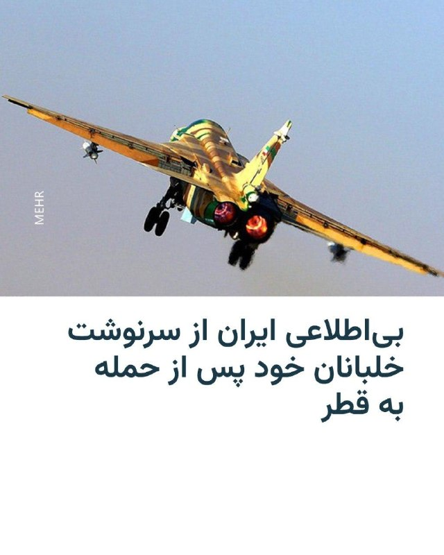

🔸حبیب‌الله سیاری، معاون هماهنگ‌کننده ارتش، در مصاحبه‌ای در تلویزیون حکومتی ایران اذعان کرد که از سرنوشت خلبانانی که در جنگ اخیر به قطر حمله کردند اطلاعی در دست نیست.

🔸دریادار سیاری در این مصاحبه که شامگاه پنج‌شنبه ۲۱ خرداد پخش شد از خلبانان یک یا چند فروند جنگنده سوخو ۲۴ متعلق به ایران سخن می‌گوید که به پایگاه العدید در قطر حمله کردند.

🔸بر اساس بیانیه‌هایی که سپاه پاسداران منتشر کرد، پایگاه آمریکایی العدید در کشور قطر در هفته آغازین جنگ در اسفندماه سال گذشته چند بار هدف حملات موشکی ایران قرار گرفت.

🔸تاکنون خبری از حمله با جنگنده سوخو ۲۴ روسی به پایگاه العدید منتشر نشده بود.

🔸به گفته سیاری، از سرنوشت چهار خلبان دخیل در این حمله اطلاعی در دست نیست.

@RadioFarda

## IranianMinds — post 22394

  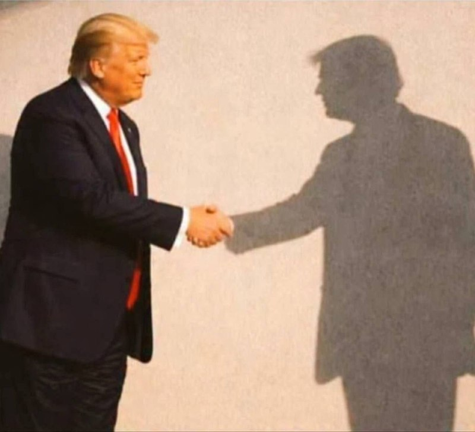

🔴 ترامپ :

توافق عالی پیش رفته و‌ جنگ با ایران دیگه بزودی تموم شدست

@IranianMinds

## alonews — post 127375

  <a href="telegram/content/alonews_127375_1781262249.webm" target="_blank">🎬 Download video</a>

👈خبرگزاری ایرنا: تهران تضمین‌های مشخصی در مورد دریافت خسارات از طرف‌های ثالث دریافت کرده‌ است

✅ @AloNews خبر جنگ

## alonews — post 127374

  <a href="telegram/content/alonews_127374_1781262250.webm" target="_blank">🎬 Download video</a>

👈حمید رسایی:
توافق چیه؟؟؟؟ اینترنت رو قطع کنید

✅ @AloNews خبر جنگ

## alonews — post 127373

  <a href="telegram/content/alonews_127373_1781262250.webm" target="_blank">🎬 Download video</a>

👈جزئیات خواسته های ایران در تفاهم به روایت ایرنا

✅ @AloNews خبر جنگ

## alonews — post 127372

گویا تجمعات شبانه امروز هم ادامه داره

## alonews — post 127371

بعد از علی کرار! علم‌ماند برقرار! که مجتبی آمد و رفت به رزم و امضا

---
📅 بروزرسانی: 1405/03/22 14:24
---

## VahidOOnLine — post 245126

  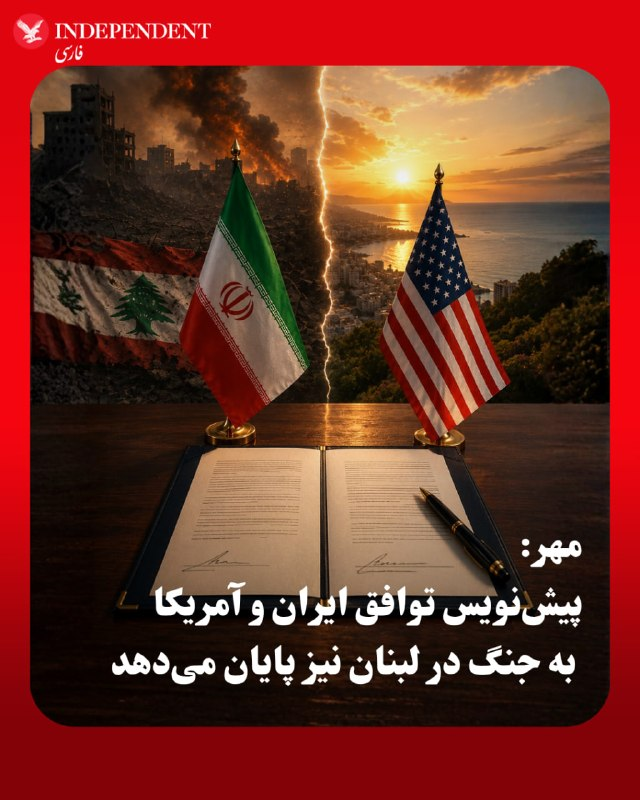

⭕️مهر: پیش‌نویس توافق ایران و آمریکا به جنگ در لبنان نیز پایان می‌دهد

♦️خبرگزاری مهر، روز جمعه ۲۲ خرداد ماه به نقل از یک منبع «نزدیک به تیم مذاکره‌کننده ایرانی» گزارش داد، پیش‌نویس تفاهم‌نامه ۱۴ ماده‌ای میان ایران و آمریکا شامل توقف جنگ در همه جبهه‌ها از جمله لبنان است.

بر اساس این گزارش، در بخش‌های دیگر تفاهم‌نامه ایران متعهد می‌شود به دنبال ساخت سلاح هسته‌ای نرود و در مقابل از برخی امتیازهای اقتصادی از جمله تسهیل صادرات نفت و آزادسازی بخشی از دارایی‌های مسدودشده خود بهره‌مند شود.

مهر همچنین گزارش داد پس از امضای احتمالی این تفاهم‌نامه، مذاکراتی ۶۰ روزه برای دستیابی به توافق نهایی درباره برنامه هسته‌ای ایران و رفع تحریم‌ها آغاز خواهد شد.

مهر به نقل از این «مقام آگاه» گزارش کرد که در بند آخر توافقنامه احتمالی، دوطرف تفاهم می‌کنند مذاکرات نهایی پیش از آزادسازی ۲۴ میلیارد دلار از اموال مسدود شده ایران، تعلیق تحریم‌های نفتی و رفع محاصره دریایی آغاز نشود.
‌🇸🇦 Indypersian

🤖 @VahidOOnLine

## Persian_Trend_Official — post 16842

  <a href="telegram/content/Persian_Trend_Official_16842_1781261647.mp4" target="_blank">🎬 Download video</a>

تصاویر ماهواره ای جدید از پایگاه شیخ عیسی بحرین تایید میکند که یک ساختمان در این پایگاه مورد اصابت پرتابه های ایرانی قرار گرفته شده است.

📝 Amir

📌 @persian_trend_official
پرشین ترند | متفاوت‌ترین کانال نظامی

## Persian_Trend_Official — post 16841

فایننشال تایمز: پس از 40 روز حملات آمریکا و اسرائیل، شهرهای موشکی زیرزمینی ایران سرکوب شدند اما نابود نشدند، و ساکنان نزدیک شهر یزد می‌گویند که پرتاب‌ها از پایگاه موشکی نزدیک یزد تا زمان آتش‌بس ادامه داشته است.

ارزیابی‌های ایالات متحده که فایننشال تایمز به آنها استناد کرده است، می‌گوید ایران حدود 70 درصد از ذخایر موشکی پیش از جنگ و پرتابگرهای متحرک خود را حفظ کرد، به سرعت تونل‌هایی را که صدها متر در گرانیت حفر شده بودند، بازگشایی کرده و اغلب ظرف چند ساعت آتش را از سر گرفته اند.

تحلیلگران این شبکه را به عنوان یک استراتژی بقا توصیف می‌کنند: بمباران، پرتاب‌های روزانه را کاهش داد اما نتوانست توانایی ایران را برای ادامه شلیک و بازسازی سریع پایگاه‌های آسیب‌دیده، با استفاده از درس‌های کره شمالی و تجربه گسترده تونل‌سازی، از بین ببرد.

📝 Amir

📌 @persian_trend_official
پرشین ترند | متفاوت‌ترین کانال نظامی

## IranianMinds — post 22393

  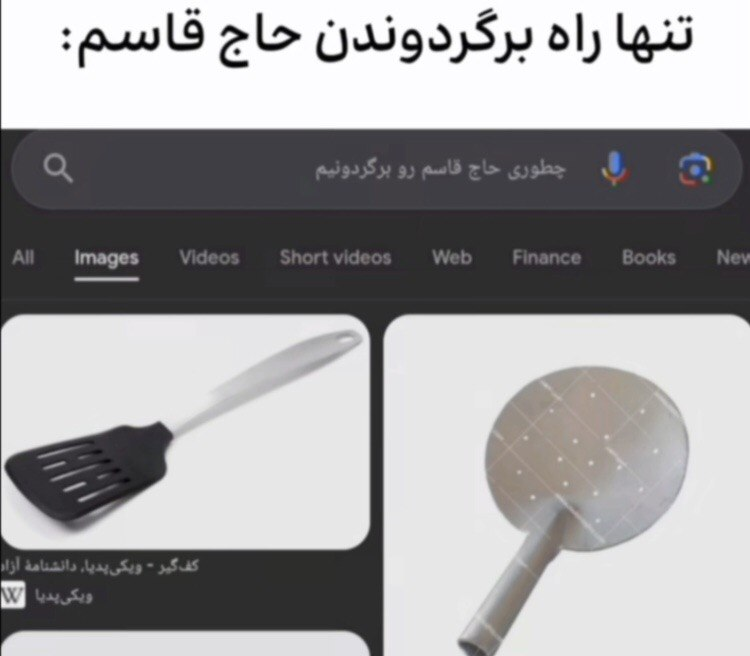

🔴 چطوری حاج قاسم رو برگردونیم

@IranianMinds

## IranianMinds — post 22392

🔴 خبرگزاری جمهوری اسلامی :

هدف اصلی امضای تفاهم‌نامه، پایان جنگ در تمامی جبهه‌ها در منطقه از جمله لبنان است

آمریکا گفته تعهد میده که اسرائیل رو مجبور به پایان جنگ در لبنان کنه.

@IranianMinds

## Dirty_Kids — post 391789

  <a href="telegram/content/Dirty_Kids_391789_1781261650.mp4" target="_blank">🎬 Download video</a>

تیمی که سرود شاهنشاهی می‌خوند، پشت سر هم قهرمان آسیا می‌شد

۴۷ ساله دارید زار میزنید «پیامت ای امام» و میرینید

@Dirty_Kids 👻

## alonews — post 127370

  <a href="telegram/content/alonews_127370_1781261651.mp4" target="_blank">🎬 Download video</a>

👈۶ سال پیش"علی خامنه‌ای" گفته بود :
- اصلاً پیامی مستقیم برای ترامپ ندارم، چون حتی در حدی نمی‌دونمش که بخوام باهاش پیام رد و بدل کنم

✅ @AloNews خبر جنگ

## alonews — post 127369

  <a href="telegram/content/alonews_127369_1781261653.webm" target="_blank">🎬 Download video</a>

👈 فایننشال تایمز: هفته‌ها بمباران ایالات متحده و اسرائیل، مجتمع‌های موشکی زیرزمینی ایران، از جمله یک سایت اصلی در نزدیکی یزد را هدف قرار داد.

🔴با وجود حملات مکرر، ساکنان و تحلیلگران می‌گویند که ایران در طول درگیری به پرتاب موشک ادامه داده است.

🔴در حالی که به نظر می‌رسد بمباران، میزان شلیک ایران را کاهش داده و به ورودی‌های تونل آسیب رسانده است، ارزیابی‌های اطلاعاتی و دیپلمات‌های غربی معتقدند که تهران بخش عمده‌ای از زرادخانه موشکی، پرتابگرها و زیرساخت‌های زیرزمینی خود را حفظ کرده است. طبق گزارش‌ها، بسیاری از تأسیسات ظرف چند ساعت یا چند روز بازگشایی یا تعمیر شده‌اند.

✅ @AloNews خبر جنگ

---
📅 بروزرسانی: 1405/03/22 14:13
---

## VahidOOnLine — post 245125

  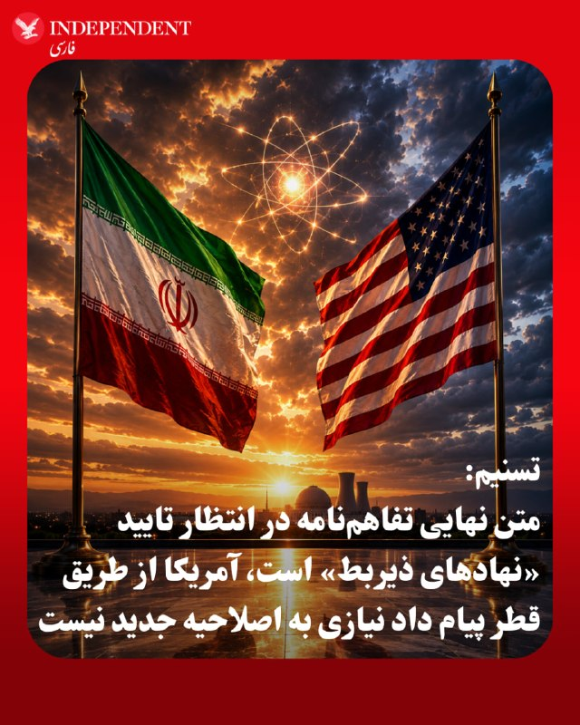

♦️خبرگزاری تسنیم، وابسته به سپاه پاسداران، روز جمعه ۲۱ خرداد ماه به نقل از «منابع مطلع» گزارش کرد متن تفاهم میان ایران و آمریکا همچنان در حال بررسی است و تاکنون در «مراجع ذی‌صلاح» جمهوری اسلامی ایران به تایید نهایی نرسیده است.

به گفته منبع تسنیم، «فشارهای نظامی و دیپلماتیک آمریکا برای ایجاد تغییر در متن ۱۴ ماده‌ای توافق نتیجه‌ای نداشته است» و واشنگتن در نهایت از طریق میانجی قطری اعلام کرد نیازی به اعمال اصلاحیه‌های اخیر پیشنهادی آمریکا نیست.

تسنیم در ادامه نوشت: «با این حال این متن همچنان نیازمند بررسی و نهایی شدن در نهادهای ذیربط در ایران است و تا آن زمان سایر گمانه زنی‌ها و خبرها، معتبر نیست.»

دونالد ترامپ، رئیس‌جمهوری آمریکا، بامداد جمعه ۲۲ خرداد (به وقت تهران) اعلام کرد ایالات متحده «امروز جنگ با ایران را پایان داده» و تهران پذیرفته است که هرگز به سلاح هسته‌ای دست پیدا نکند.
‌🇸🇦 Indypersian

🤖 @VahidOOnLine

## WithYashar — post 14626

سخنگوی وزارت خارجه : متن نهایی تفاهم‌نامه تا زمان پذیرش قطعی آن توسط دو طرف منتشر نخواهد شد!
@withyashar

## WithYashar — post 14625

مهر : توی توافق با آمریکا، واشنگتن متعهد شده بخشی از تحریم‌ها رو برداره و نیروهاش رو هم از اطراف ایران عقب بکشه
@withyashar

## WithYashar — post 14624

خبرگزاری فارس : آمریکا ترسیده و عقب نشینی کرده ولی ما هنوز داریم پیشنهادات رو بررسی میکنیم و جواب خاصی هنوز بهشون ندادیم !
@withyashar

## WithYashar — post 14623

خبرگزاری دولت: هدف اصلی امضای تفاهم‌نامه، پایان جنگ در تمامی جبهه‌ها در منطقه است. در این تفاهم‌نامه پایان جنگ علیه ایران به اضافه تمامی جبهه‌های دیگر منطقه به در برگرفتن لبنان هم مورد اشاره قرار گرفته‌است.

عبارت تمدید آتش‌بس در متن فعلی ذکر نشده‌است و اشاره به چنین عبارتی در برخی گزارش‌های رسانه‌ای نادرست است؛ متن تفاهم‌نامه خواهان پایان قاطع جنگ در تمام جبهه‌ها می‌شود.

تهران تضمین‌های روشنی برای آزادی دارایی‌های مسدود شده بر اساس ساز و کارهای مشخص و مورد نظر تهران دریافت کرده‌ است و در صورت تصمیم تهران به امضای تفاهم‌نامه پایان جنگ، بخشی از دارایی‌های مسدود شده بلافاصله و بقیه به تدریج در طول مذاکرات، آزاد خواهند شد.
@withyashar

## IranIntlTV — post 341865

  <a href="telegram/content/IranIntlTV_341865_1781261018.mp4" target="_blank">🎬 Download video</a>

سرخط خبرهای جمعه ۲۲ خرداد
@iranintltv

## DW_Farsi — post 125872

  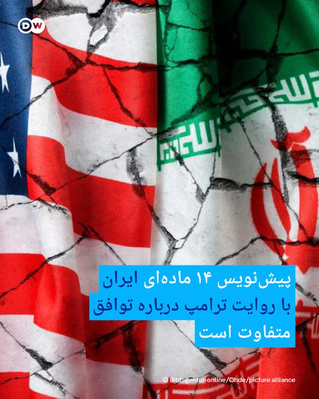

🔶 پیش‌نویس ۱۴ ماده‌ای ایران با روایت ترامپ درباره توافق متفاوت است

خبرگزاری مهر وابسته به سازمان تبليغات اسلامی پس از اظهارات ترامپ درباره امکان توافق با ایران در گزارشی "جزئیات جدیدی" از پیش‌نویس تفاهم‌نامه ۱۴ ماده‌ای ایران و آمریکا از سوی "منبعی نزدیک به تیم مذاکره‌کننده ایرانی" منتشر کرد.

بر اساس این پیش‌نویس، مهم‌ترین بندها شامل توقف فوری و دائمی جنگ در همه جبهه‌ها از جمله لبنان، تعهد آمریکا به عدم مداخله در امور داخلی ایران و احترام به حاکمیت جمهوری اسلامی و رفع کامل محاصره دریایی ظرف ۳۰ روز است.

در این طرح، خروج نیروهای آمریکایی از پیرامون ایران، بازگشایی تنگه هرمز با ترتیبات ایرانی، و تعلیق تحریم‌های نفتی و پتروشیمی و دسترسی ایران به منابع مالی آن پیش‌بینی شده است.

طبق این طرحی که رسانه‌های ایران منتشر کردند آمریکا متعهد شده در دوره مذاکرات نیروهای خود را در منطقه افزایش ندهد و تحریم جدیدی اعمال نکند. همچنین آزادسازی ۲۴ میلیارد دلار از دارایی‌های بلوکه‌شده ایران در دوره مذاکرات مطرح شده است که گفته می‌شود نیمی از آن پیش از آغاز مذاکرات در دسترس ایران قرار می‌گیرد.

## Persian_Trend_Official — post 16840

  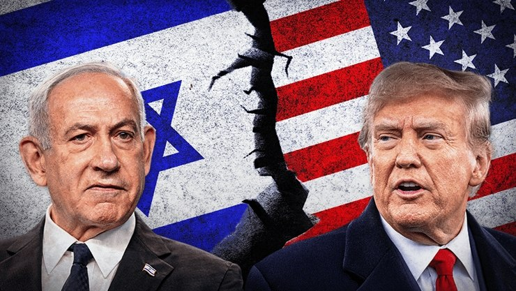

وای‌نت: نتانیاهو، نخست‌وزیر اسرائیل، به کابینه اسرائیل گفت که رئیس جمهور آمریکا، ترامپ، از او پرسیده که آیا اسرائیلی‌هایی در حمله ایران کشته شده‌اند یا خیر. نتانیاهو در پاسخ به ترامپ گفت که هیچ اسرائیلی کشته نشده است، اما افزود:

من این معادله را که ما فقط در صورت کشته شدن کسی پاسخ می‌دهیم، نمی‌پذیرم. اگر آنها به خاک اسرائیل حمله کنند، من پاسخ خواهم داد.

نتانیاهو تأکید کرد که اسرائیل تابع ایالات متحده نیست، بلکه یک متحد است و به ترامپ گفت که تمایل به توافق را درک می‌کند، اما فکر می‌کنم توافقی وجود نخواهد داشت و ما قربانی آن نخواهیم شد.

شلومی بایندر، رئیس اطلاعات نظامی ارتش اسرائیل، به یک تغییر استراتژیک اشاره کرد: حزب‌الله برای حمله به اسرائیل در صورت حمله ما به ایران ساخته شده است، اما اکنون ایران برای محافظت از حزب‌الله حمله می‌کند. این نشان دهنده ضعف آنهاست.

📝 Amir

📌 @persian_trend_official
پرشین ترند | متفاوت‌ترین کانال نظامی

## IranianMinds — post 22391

  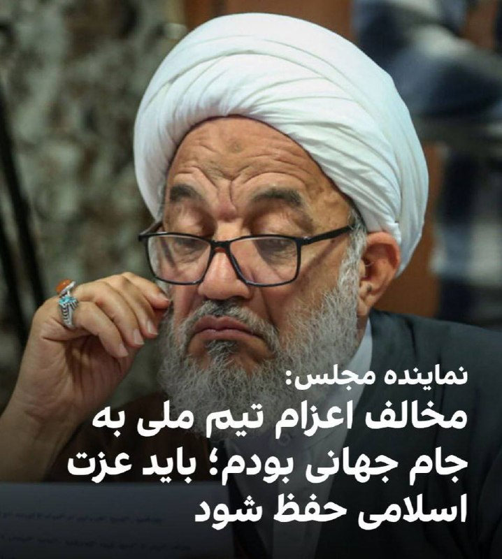

@IranianMinds

## alonews — post 127368

  <a href="telegram/content/alonews_127368_1781261021.webm" target="_blank">🎬 Download video</a>

🔴فوری/سخنگوی وزارت خارجه: متن توافق پایان درگیری ایران و آمریکا تقریباً نهایی شده و منتظر تأیید نهایی نهادهای تصمیم‌گیر است 
✅ @AloNews خبر جنگ

## alonews — post 127367

  <a href="telegram/content/alonews_127367_1781261021.webm" target="_blank">🎬 Download video</a>

🔴فوری/سخنگوی وزارت خارجه:
متن توافق پایان درگیری ایران و آمریکا تقریباً نهایی شده و منتظر تأیید نهایی نهادهای تصمیم‌گیر است

✅ @AloNews خبر جنگ

## alonews — post 127366

  <a href="telegram/content/alonews_127366_1781261021.webm" target="_blank">🎬 Download video</a>

👈فرودگاه هامبورگ در پی یک حادثه امنیتی تخلیه شد

🔴شبکه ان‌دی‌آر به‌نقل از پلیس هامبورگ اعلام کرد که فرودگاه این شهر در پی یک حادثه امنیتی به‌طور کامل تخلیه و تمام پروازهای آن متوقف شد.

✅ @AloNews خبر جنگ

---
📅 بروزرسانی: 1405/03/22 14:03
---

## VahidOOnLine — post 245115

  <a href="telegram/content/VahidOOnLine_245115_1781260420.mp4" target="_blank">🎬 Download video</a>

ترامپ از نزدیک بودن توافق با جمهوری اسلامی گفته، اما هنوز روشن نیست این توافق دقیقا چه تعهداتی دارد و تهران چه بخش‌هایی از آن را پذیرفته است.
‌🏁 🇬🇧 ManotoTV

🤖 @VahidOOnLine

## WithYashar — post 14622

  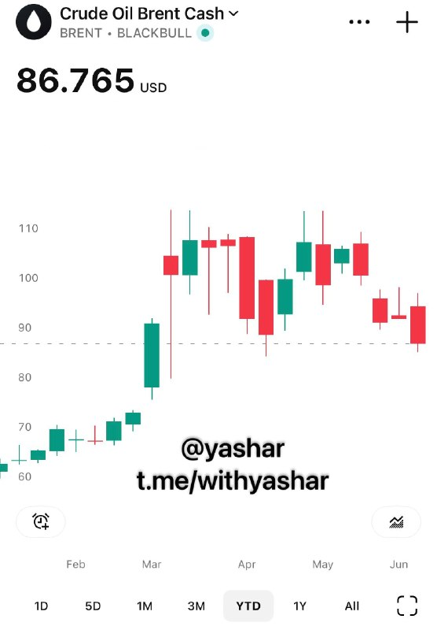

در پی اعلام دونالد ترامپ مبنی بر احتمال امضای قریب‌الوقوع توافق با ایران، قیمت جهانی نفت 5 درصد کاهش یافت.
@withyashar

## ManotoTV — post 106035

  <a href="telegram/content/ManotoTV_106035_1781260421.mp4" target="_blank">🎬 Download video</a>

ترامپ از نزدیک بودن توافق با جمهوری اسلامی گفته، اما هنوز روشن نیست این توافق دقیقا چه تعهداتی دارد و تهران چه بخش‌هایی از آن را پذیرفته است.

## FarsiVOA — post 220471

  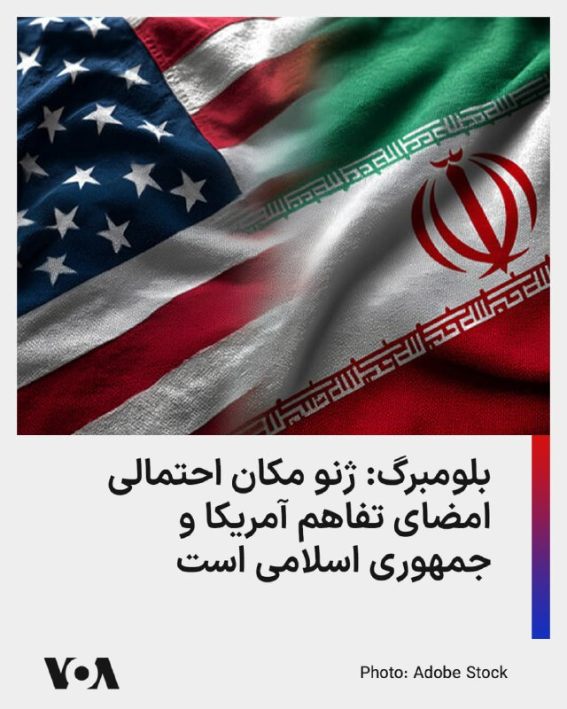

بلومبرگ گزارش داد که شهر ژنو در سوئیس، به‌عنوان مکان احتمالی امضای تفاهم میان آمریکا و جمهوری اسلامی مطرح شده است.

این رسانه به نقل از مقام‌های ارشد گزارش داد که آمریکا و ایران در حال نزدیک شدن به امضای یک توافق برای بازگشایی تنگه هرمز هستند و احتمال امضای این توافق در روز یکشنبه وجود دارد.

اما در حالی که نشست رهبران کشورهای گروه هفت قرار است هفته آینده در فرانسه برگزار شود، یک مقام گروه هفت که خواسته نامش فاش نشود به بلومبرگ گفت که یک مقام ارشد ایرانی شب گذشته اشاره کرده که دستیابی به توافق محتمل است.

یک مقام دیگر گروه هفت نیز گفته است که این توافق احتمالاً در قالب یک «یادداشت تفاهم» خواهد بود، نه یک توافق نهایی.
@FarsiVOA

## RadioFarda — post 158218

  <a href="telegram/content/RadioFarda_158218_1781260422.mp4" target="_blank">🎬 Download video</a>

🔸جعفر پناه‌پور، محیط‌بان و عکاس حیات وحش، روز پنج‌شنبه ۲۱ خرداد ویدئویی از یک ماده خرس قهوه‌ای با دو توله‌اش در پارک ملی گلستان منتشر کرده است.

🔸واکنش مادر پس از تشخیص حضور انسان جالب است.

🔸به گفته آقای پناه‌پور، این ماده خرس که متوجه حضور تصویربردار در محیط شده است «برای ارزیابی خطر احتمالی رفتار خود را تغییر می‌دهد و توجه بیشتری به محیط پیرامون نشان می‌دهد.»

🔸 این محیط‌بان در ادامه افزوده است: «چنین واکنش‌هایی بخشی طبیعی از رفتار ضدشکارچی در پستانداران بزرگ محسوب می‌شود و در ماده‌های دارای توله نمود بیشتری دارد.»

@RadioFarda

## IranianMinds — post 22390

🔴 ایرنا ، خبرگزاری جمهوری اسلامی :

ما تنگه هرمز رو بیخیالش نمیشیم و مدیریتش دست خودمونه و به کسیم ربطی نداره.

@IranianMinds

## IranianMinds — post 22389

🔴 سخنگوی وزارت خارجه جمهوری اسلامی :

متن توافق پایان درگیری ایران و آمریکا تقریباً نهایی شده و منتظر تأیید نهایی نهادهای تصمیم‌ گیر است.

@IranianMinds

## BBCPersian — post 283563

  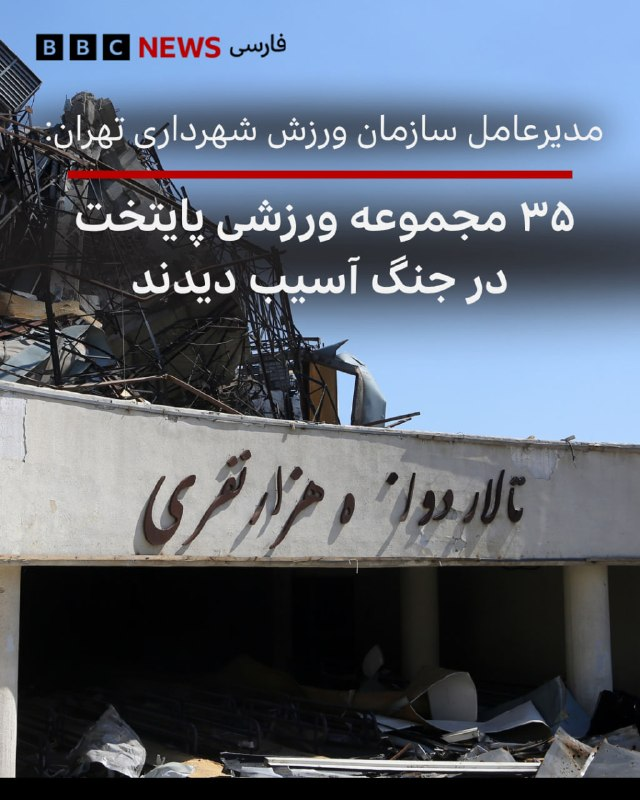

🔻رعامل سازمان ورزش شهرداری تهران گفته است که «۳۵ مجموعه ورزشی» پایتخت در پی حملات آمریکا و اسرائیل آسیب دیدند.

حسین اوجاقی گفت که «سه مجموعه ورزشی» به‌صورت مستقیم مورد اصابت قرار گرفته و تخریب شدند و «۳۲ مجموعه» دیگر هم آسیب‌های جزئی دیده‌اند و بخش‌هایی از بناها و تاسیسات آن‌ها آسیب دیده است.

سالن دوازده هزار نفری مجموعه ورزشی آزادی تهران از جمله مجموعه های ورزشی است که در جریان این حملات به طور کامل تخریب شد.

ابراساس گزارش‌ها،‌ اماکن ورزشی نظیر فدراسیون کشتی، مرکز ملی فوتبال، فدراسیون های تیراندازی، دوچرخه سواری، والیبال، کشتی، هاکی، تنیس، هندبال و ورزشگاه آفتاب انقلاب تحت تاثیر بمباران های اماکن ورزشی قرار گرفتند و بخش‌های قابل توجهی از آن‌ها صدمه دیدند.

آقای اوجاقی درباره بازسازی این اماکن گفت که شهردار تهران تأکید کرده است که اقدامات لازم برای بازسازی این مجموعه‌ها در بازه زمانی مشخصی انجام شود.

📸Anadolu via Getty Images
https://bbc.in/3SkXU1s
@BBCPersian

## manototv — post 106035

  <a href="telegram/content/manototv_106035_1781260424.mp4" target="_blank">🎬 Download video</a>

ترامپ از نزدیک بودن توافق با جمهوری اسلامی گفته، اما هنوز روشن نیست این توافق دقیقا چه تعهداتی دارد و تهران چه بخش‌هایی از آن را پذیرفته است.

## alonews — post 127365

  <a href="telegram/content/alonews_127365_1781260425.webm" target="_blank">🎬 Download video</a>

👈خبرگزاری دولت: هدف اصلی امضای تفاهم‌نامه، پایان جنگ در تمامی جبهه‌ها در منطقه است. در این تفاهم‌نامه پایان جنگ علیه ایران به اضافه تمامی جبهه‌های دیگر منطقه به شمول لبنان مورد اشاره قرار گرفته‌است.

🔴 نام کشور لبنان به عنوان بخشی از توافق پایان جنگ در صورت امضای متن فعلی تفاهم‌نامه مورد اشاره قرار گرفته‌است و آمریکا تعهد می‌دهد که رژیم اسرائیل را وادار به پایان جنگ در لبنان، کند.

🔴 عبارت تمدید آتش‌بس در متن فعلی ذکر نشده‌است و اشاره به چنین عبارتی در برخی گزارش‌های رسانه‌ای نادرست است؛ متن تفاهم‌نامه خواهان پایان قاطع جنگ در تمام جبهه‌ها می‌شود.

🔴تهران تضمین‌های روشنی برای آزادی دارایی‌های مسدود شده بر اساس ساز و کارهای مشخص و مورد نظر تهران دریافت کرده‌ است و در صورت تصمیم تهران به امضای تفاهم‌نامه پایان جنگ، بخشی از دارایی‌های مسدود شده بلافاصله و بقیه به تدریج در طول مذاکرات، آزاد خواهند شد.

✅ @AloNews خبر جنگ

## alonews — post 127364

  <a href="telegram/content/alonews_127364_1781260425.mp4" target="_blank">🎬 Download video</a>

وضعیت ملت وقتی به تحلیل‌های خوش چشم اعتماد کردن

[@AloTweet]

## alonews — post 127363

  <a href="telegram/content/alonews_127363_1781260426.webm" target="_blank">🎬 Download video</a>

👈خبرگزاری دولت: متن نهایی تفاهم‌نامه تا زمان پذیرش قطعی آن توسط دو طرف منتشر نخواهد شد.

✅ @AloNews خبر جنگ

---
📅 بروزرسانی: 1405/03/22 13:53
---

## VahidOOnLine — post 245114

  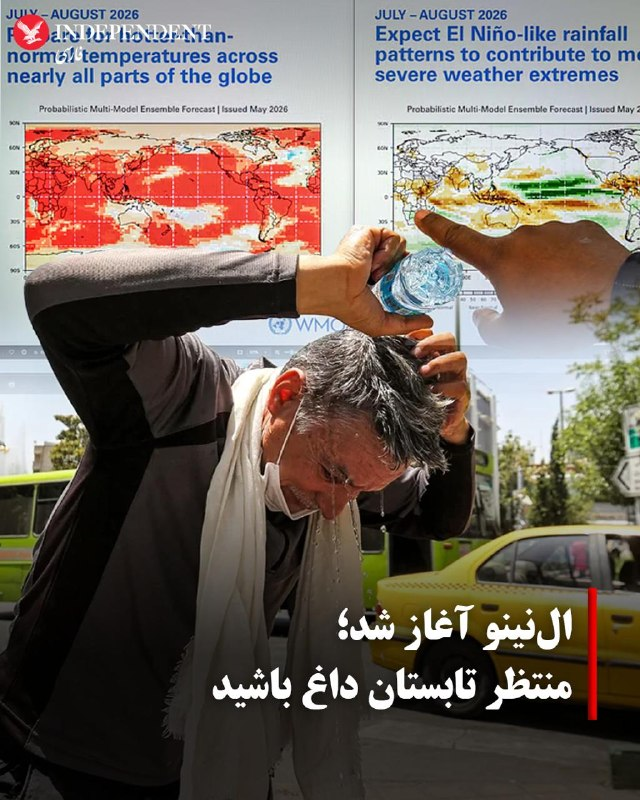

♦️مرکز پیش‌بینی اقلیم آمریکا (NOAA) اعلام کرد پدیده آب‌وهوایی ال‌نینو (El Niño) رسما آغاز شده و انتظار می‌رود در ماه‌های آینده تقویت شود. این پدیده می‌تواند تابستانی گرم‌تر از معمول و افزایش پدیده‌های جوی غیرعادی، شدید و مخرب را در بسیاری از نقاط جهان به همراه داشته باشد.
خبرگزاری رویترز، روز جمعه ۲۲ خرداد ماه با انتشار این خبر در گزارشی نوشت، احتمال وقوع یک ال‌نینو بسیار قوی در فاصله ماه‌های نوامبر تا ژانویه (آبان تا دی‌ ماه) ۶۳ درصد است. در صورت تحقق این سناریو، این پدیده می‌تواند در میان قوی‌ترین ال‌نینوهای ثبت‌شده از سال ۱۹۵۰ قرار گیرد.
ال‌نینو (El Niño) یک پدیده اقلیمی طبیعی است که بر اثر گرم‌تر شدن غیرعادی آب‌های سطحی بخش مرکزی و شرقی اقیانوس آرام استوایی شکل می‌گیرد و الگوهای آب‌وهوایی جهان را تغییر می‌دهد. این پدیده معمولا با افزایش دمای متوسط زمین همراه است و اغلب باعث می‌شود سال‌های وقوع آن در زمره گرم‌ترین سال‌های ثبت‌شده قرار گیرند.
سازمان جهانی هواشناسی نیز پیش‌تر هشدار داده بود احتمال تداوم ال‌نینو تا پایان سال بیش از ۹۰ درصد است و تغییرات اقلیمی ناشی از گرمایش زمین می‌تواند اثرات آن را تشدید کند.
دانشمندان هشدار می‌دهند ال‌نینو خطر موج‌های گرمای شدید، خشکسالی، آتش‌سوزی‌های جنگلی، بارش‌های سیل‌آسا و سایر رخدادهای حدی آب‌وهوایی را در بسیاری از مناطق جهان افزایش می‌دهد. همچنین این پدیده می‌تواند بر تولید محصولات کشاورزی، منابع آب و قیمت مواد غذایی تاثیر بگذارد.
‌🇸🇦 Indypersian

🤖 @VahidOOnLine

## WithYashar — post 14621

️تسنیم مجددا این خبر رو منتشر کرد:

متن تفاهم تا این لحظه در مراجع ذی‌صلاح جمهوری اسلامی به تایید نهایی نرسیده.
@withyashar

## WithYashar — post 14620

اسرائیل هیوم: ایران موافقت کرده است اورانیوم غنی‌شده خود را تحویل دهد.
از غنی‌سازی بلندمدت صرف‌نظر کندو آمریکا ۱۵ میلیارد دلار از دارایی‌های ایرانی (در قطر) را برای نیازهای بشردوستانه آزاد کند.
ایران باید متعهد شود که به دنبال دستیابی به سلاح هسته‌ای نباشد. تنگه هرمز بدون محدودیت باز خواهد شد. هر دو طرف متعهد می‌شوند که اقدامات نظامی بیشتری علیه یکدیگر انجام ندهند.
پرونده لبنان همچنان شکافی بین آمریکا و ایران باقی مانده است. انتظار می‌رود یادداشت تفاهم روز یکشنبه در ژنو امضا شود، در حالی که ترامپ برای اجلاس جی۷ در فرانسه حضور دارد.
@withyashar

## FarsiVOA — post 220470

🔺حملات پهپادی شبانه اوکراین و روسیه علیه تأسیسات انرژی و زیرساختی یکدیگر

▪️اوکراین و روسیه شامگاه پنجشنبه تا اوایل صبح جمعه حملات پهپادی علیه یکدیگر انجام دادند. کی‌یف یک منطقه مهم فرآوری نفت و پتروشیمی روسیه را هدف قرار داد و مسکو نیز به ایستگاه‌های راه‌آهن و پست‌های برق اوکراین حمله کرد.

▪️کی‌یف حملات پهپادی دوربرد خود به تأسیسات نفتی روسیه را تشدید کرده است؛ امری که به کمبود سوخت در کریمه و مناطق دیگر منجر شده است.

▪️وزارت دفاع روسیه اعلام کرد که نیروهای این کشور در طول شب ۲۳۱ پهپاد اوکراینی را سرنگون کرده است.

▪️نیروی هوایی اوکراین اعلام کرد که روسیه از عصر پنجشنبه به وقت محلی ۱۱۷ پهپاد پرتاب کرده است و یگان‌های پدافند هوایی ۱۰۲ فروند از آن‌ها را سرنگون یا خنثی کرده‌اند.

⬇️ بیشتر بخوانید:
https://ir.voanews.com/a/8160103.html

## Hranews — post 113554

  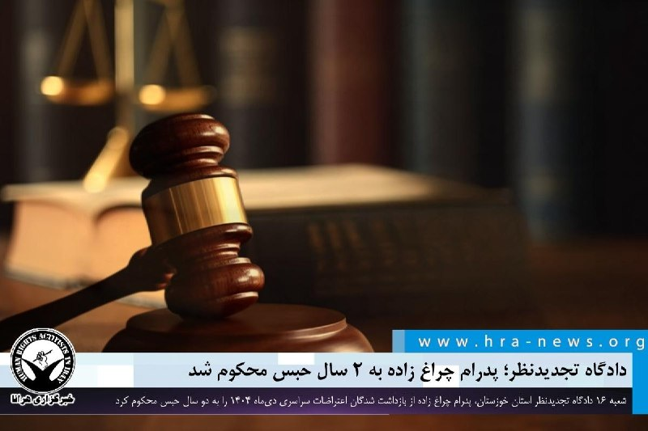

دادگاه تجدیدنظر؛ پدرام چراغ زاده به ۲ سال حبس محکوم شد

❗️
❗️
❗️
❗️
❗️– شعبه ۱۶ دادگاه تجدیدنظر استان خوزستان، پدرام چراغ زاده از بازداشت شدگان اعتراضات سراسری دی‌ماه ۱۴۰۴ را به دو سال حبس محکوم کرد. وی در مرحله بدوی دادگاه، به دو سال زندان و مجازات تکمیلی محکوم شده بود.

به گزارش خبرگزاری هرانا، ارگان خبری مجموعه فعالان حقوق بشر در ایران، پدرام چراغ زاده توسط دادگاه تجدیدنظر به حبس محکوم شد.

بر اساس رای صادره توسط شعبه ۱۶ دادگاه تجدیدنظر استان خوزستان که به حسین علی حاتمی، وکیل مدافع وی ابلاغ شده؛ پدرام چراغ زاده از بابت اتهام “اخلال در نظم عمومی” به دو سال حبس محکوم شده است. همچنین مجازات‌های تکمیلی تعیین‌شده در مرحله بدوی از محکومیت وی حذف شده است.

ادامه مطلب

#پدرام_چراغ_زاده

↘️
@hranews_bot تماس ✉️ - @Hranews کانال هرانا 🆑

## alonews — post 127362

  <a href="telegram/content/alonews_127362_1781259826.webm" target="_blank">🎬 Download video</a>

👈خبرگزاری دولت: به گفته سخنگوی وزارت امور خارجه جمهوری اسلامی ایران، کلیات و متن تفاهم‌نامه پایان جنگ میان ایران و آمریکا تقریباً نهایی شده‌است و در انتظار تصمیم نهایی نهادهای تصمیم‌گیری در ایران است

🔴تهران در طول دوران تبادل پیام‌ها، برای اطمینان از اجرای برخی مفاد تفاهم‌نامه تضمین‌های معتبری از برخی طرف‌های ثالث برای اجرای تعهدات پیش‌بینی شده دریافت کرده‌است

🔴بر خلاف برخی ادعاها که از سوی برخی جریان‌ها و فعالان سیاسی در طول قریب به یک ماه گذشته مطرح شده‌است، متن تفاهم‌نامه پایان جنگ میان ایران و آمریکا با دقت و وسواس بسیار تهیه شده‌است تا جای هیچگونه تفسیر به رأی و فرار از تعهدی برای طرف مقابل وجود نداشته‌باشد.

🔴تا زمان پذیرش کامل متن توسط جمهوری اسلامی ایران، تمامی متن‌های منتشر شده در رسانه‌ها، صرفا گمانه‌زنی‌های رسانه‌ای هستند و متن نهایی تلقی نمی‌شوند

✅ @AloNews خبر جنگ

## alonews — post 127361

## alonews — post 127360

  <a href="telegram/content/alonews_127360_1781259826.webm" target="_blank">🎬 Download video</a>

👈 پزشکیان: ملت ایران با وجود همهٔ فشارها و تهدیدها، از استقلال، عزت و تمامیت ارضی کشور دفاع خواهد کرد.

✅ @AloNews خبر جنگ

---
📅 بروزرسانی: 1405/03/22 13:43
---

## VahidOOnLine — post 245113

  <a href="telegram/content/VahidOOnLine_245113_1781259239.mp4" target="_blank">🎬 Download video</a>

ویدیوی تازه‌رسیده به ایران اینترنشنال نشان می‌دهد مردم فلاورجان اصفهان از جمله شهروندانی بودند که در انقلاب ملی دی‌ماه به فراخوان شاهزاده رضا پهلوی پاسخ مثبت داده و با رفتن به خیابان شعار «جاوید شاه» سر دادند.
‌🏁 🇬🇧 IranintlTV

🤖 @VahidOOnLine

## mwarmonitor — post 10765

می‌دانید، من این موضوع را هم به خاطر دارم؛ به یاد می‌آورم زمانی که در دوره اول ریاست‌جمهوری ترامپ آماده بودیم به ایران ضربه بزنیم، او این حمله را تنها چند ساعت قبل از انجام، لغو کرد. اما تنها چند روز بعد، ما دوباره به همان مسیر برگشتیم. زمانی که رژیم ایران…

## mwarmonitor — post 10764

🔴مجری فاکس نیوز (مارتا مک‌کالم): 🔸پس بیایید مایکل پومپئو، وزیر امور خارجه سابق، رئیس سابق سی‌آی‌ای (CIA) و تحلیل‌گر فاکس نیوز را به برنامه بیاوریم. آقای پومپئو، خوشحالم که همراه ما هستید. در آخرین گفتگویی که داشتیم، شما بسیار مشتاق بودید که این رویکردِ «کار…

## mwarmonitor — post 10763

🔴مجری فاکس نیوز (مارتا مک‌کالم):

🔸پس بیایید مایکل پومپئو، وزیر امور خارجه سابق، رئیس سابق سی‌آی‌ای (CIA) و تحلیل‌گر فاکس نیوز را به برنامه بیاوریم. آقای پومپئو، خوشحالم که همراه ما هستید. در آخرین گفتگویی که داشتیم، شما بسیار مشتاق بودید که این رویکردِ «کار را تمام کن» به نظر پابرجا می‌رسد. اکنون واکنش شما چیست؟ در حالی که ما در آستانه دور سوم بمباران‌ها بودیم، رئیس‌جمهور ترامپ می‌گوید که آن‌ها را لغو کرده و معتقد است که یک توافق معنادار حاصل شده است.

📌مایک پومپئو:
مارتا، بعدازظهر شما بخیر. حضور در برنامه شما عالی است. من هنوز هم معتقدم که برای به زانو درآوردن ایرانی‌ها به یک اقدام نظامی و محرکِ قابل‌توجه نیاز است، به گونه‌ای که نتیجه مورد نظر را محقق کند. امیدوارم که اشتباه کرده باشم. امیدوارم توافقی وجود داشته باشد که ایرانی‌ها نه تنها با آن موافقت کرده باشند... که البته مارتا، من و شما هر دو می‌دانیم یک تکه کاغذ وقتی پای جمهوری اسلامی و سپاه پاسداران در میان باشد، تا حد زیادی بی‌ارزش است.
اما امیدوارم او (ترامپ) به مجموعه‌ای از توافقات دست یافته باشد که بتواند دقیقاً همان چیزی را که توصیف شده، انجام دهد؛ یعنی باز نگه داشتن تنگه هرمز و اطمینان از اینکه ایران هرگز فرصت دستیابی به سلاح هسته‌ای را پیدا نخواهد کرد. این موضوعی است که باید منتظر ماند و دید. فکر می‌کنم در پلتفرم «تروث سوشال» او دو نکته کلیدی وجود داشت: اول اینکه محاصره همچنان پابرجا خواهد بود که این یک نیروی بسیار بسیار قدرتمند علیه رژیم است و آن‌ها را هر هفته از صدها میلیون دلار محروم می‌کند. و دوم اینکه او گفت: «ببینید، ما مطمئن خواهیم شد که این توافق در موقعیتی قرار بگیرد که قابل اجرا و قابل راستی‌آزمایی باشد.» اگر بتوانیم به همه این‌ها دست یابیم و بمبارانی که در ۴۸ ساعت گذشته رخ داد بتواند رژیم را متقاعد به تسلیم شدن کند، همه چیز به بهترین شکل پیش خواهد رفت. اما هنوز سوالات بی‌پاسخ زیادی درباره چگونگی پیشرفت دقیق این وضعیت وجود دارد. و دوم اینکه، من واقعاً می‌خواهم ببینم کشورهای عربی حوزه خلیج فارس عملاً چه مشارکتی در این زمینه داشته‌اند. این موضوع به یک عنصر بسیار مهم برای ایالات متحده تبدیل خواهد شد تا بتواند به اهداف خود نیز دست یابد.
🔴مجری:
کاملاً. شما در آنجا از کلمه‌ای استفاده کردید که در مطالعات جنگ بسیار حیاتی است و شما بهتر از هر یک از ما آن را می‌دانید: «تسلیم» (کاپیتولاسیون).
پس سوال این است: آیا ایران تسلیم شده است؟ آیا این آگاهی که ۱۰۰ میلیون بشکه نفت خارج شده، ۲۰۰ کشتی، و یک تلاش پنهانی در جریان بوده که برای خارج کردن نفت از ایران موفقیت‌آمیز بوده است؟ نکته دوم که توسط ژنرال هم به آن اشاره شد، این نقل‌قول از اسکات بسنت (وزیر خزانه‌داری) است که فکر می‌کنم توجه زیادی را به خود جلب کرده است؛ او گفت:...
متن بیانیه اسکات بسنت (نمایش‌داده‌شده روی تصویر)
اسکات بسنت (وزیر خزانه‌داری):
رژیم ایران در بازیِ «برد-باخت» (مجموع‌صفر) که به راه انداخته است، شکست خواهد خورد. هرگونه خسارتی که این رژیم به متحدان ما در خلیج [فارس] وارد کند، از طریق منابع مالی استخراج‌شده از حساب‌های خارجی ایران جبران خواهد شد. هرگونه باج یا عوارضی که به مقامات تنگه خلیج فارس پرداخت شود، با مبالغ برداشت‌شده از حساب‌های آن‌ها خنثی خواهد شد.
🔴مجری (ادامه صحبت):
من فکر می‌کنم این ایده‌ای است که برای ایران اصلاً خوشایند نخواهد بود، اما به نظر من کاملاً منطقی است. نظر شما چیست؟
📌مایک پومپئو:
مارتا، من فکر می‌کنم این‌ها هر دو گام‌های بزرگی رو به جلو هستند و فشار بیشتری را بر مجموعه‌ای از رهبران وارد می‌کنند که به وضوح در داخل ایران تضعیف و دچار چنددستگی شده‌اند. همیشه این سوال وجود داشته که ما دقیقاً در حال مذاکره با چه کسی هستیم؟ به نظرم آنچه وزیر بسنت گفته و آنچه رئیس‌جمهور ترامپ انجام داده کار را برای رهبری داخل ایران حتی دشوارتر هم کرده است.

@mwarmonitor

## mwarmonitor — post 10762

## mwarmonitor — post 10761

🔴تسنیم ؛ متن تفاهم تا این لحظه در مراجع ذی‌صلاح ایران به تایید نهایی نرسیده است

▪️ پیگیری‌های خبرنگار تسنیم از منابع مطلع حاکیست: آخرین تحول رخ داده این است که فشار نظامی و دیپلماتیک آمریکا برای تغییر در متن ۱۴ ماده‌ای پاسخ نداده و آمریکا از طریق واسطه قطری اعلام کرده است که نیازی به اصلاحیه‌های اخیر آمریکا نیست.

▪️ به گفته این منابع، ترامپ طی روزهای اخیر با شروع به فشار و تهدید و اقدام نظامی و از طریق دیگر با فشار میانجی قطری تلاش کرد تا از دو سو مواضع ایران را تغییر دهد که در نهایت ایران تغییرات جدید را نپذیرفت.

▪️ با این حال این متن همچنان نیازمند بررسی و نهایی شدن در نهادهای ذیربط در ایران است و تا آن زمان سایر گمانه زنی‌ها و خبرها، معتبر نیست.

@mwarmonitor

## IranIntlTV — post 341864

  <a href="telegram/content/IranIntlTV_341864_1781259242.mp4" target="_blank">🎬 Download video</a>

آسیه امینی، تحلیل‌گر مسائل اجتماعی، در گفت‌وگو با ایران‌اینترنشنال گفت که ایران با فقر روزافزون روبه‌رو است و در چنین شرایطی بسیاری از حوزه‌های فرهنگی از اولویت خارج شده‌اند. به گفته امینی، در کنار کاهش فروش کتاب، نویسندگان نیز برای تولید آثار تازه با شرایط دشواری روبه‌رو هستند.
@iranintltv

## FarsiVOA — post 220469

ارتش اسرائیل جزئیات اقدامات نظامی اخیر در لبنان و غزه را تشریح کرد؛

ارتش اسراییل با انتشار گزارشی درباره جزییات عملیات های یک هفته اخیر در لبنان و عزه، از کشته شدن یک صد نفر که آنها را «تروریست» خطاب می کرد، خبر داد.

ارتش اسرائیل اعلام کرد که در این مدت حدود ۳۱۰ هدف مرتبط با حزب‌الله لبنان را مورد اصابت قرار داده که در جریان آن ۸۰ نیروی حزب الله کشته شدند.

ارتش اسرائیل همچنین اعلام کرد که ۲۰ «تروریست» را که پنج تن از آنها از مقامات ارشد بوده‌اند، در غزه هدف قرار داده است.

ارتش اسرائیل در گزارش دیگری از هدف قرار دادن بیش از ۵۰ هدف مرتبط با حزب‌الله، از جمله انبارهای مهم تسلیحاتی در روستای دیبین واقع در جنوب لبنان خبر داد.

آمریکا و اسرائیل، حزب‌الله لبنان را یک گروه تروریستی می‌دانند.
@FarsiVOA

## Persian_Trend_Official — post 16839

  <a href="telegram/content/Persian_Trend_Official_16839_1781259244.webm" target="_blank">🎬 Download video</a>

بلومبرگ: ایالات متحده و ایران در آستانه اجلاس هفته آینده گروه هفت در اویان فرانسه، به امضای توافق‌نامه‌ای برای بازگشایی تنگه هرمز نزدیک می‌شوند.

ژنو به عنوان محل احتمالی امضای این توافق‌نامه تا روز یکشنبه مطرح شده است. انتظار می‌رود این توافق‌نامه به شکل یک یادداشت تفاهم باشد که آتش‌بس را به مدت 60 روز تمدید می‌کند، تنگه را بازگشایی می‌کند و به محاصره دریایی ایالات متحده پایان می‌دهد.

با این حال، سخنگوی وزارت امور خارجه ایران گفت: ما هنوز در این مورد به نتیجه‌ای نرسیده‌ایم و افزود که پیشرفت‌هایی در جهت پایان دادن به جنگ حاصل شده است.

یک دیپلمات دیگر گفت که مذاکره‌کنندگان ایرانی با یک توافق‌نامه موافقت کرده‌اند، اما هنوز مشخص نیست که آیا مجتبی خامنه‌ای، رهبر معظم انقلاب، آن را امضا کرده است یا خیر.

📝 Amir

📌 @persian_trend_official
پرشین ترند | متفاوت‌ترین کانال نظامی

## Persian_Trend_Official — post 16838

  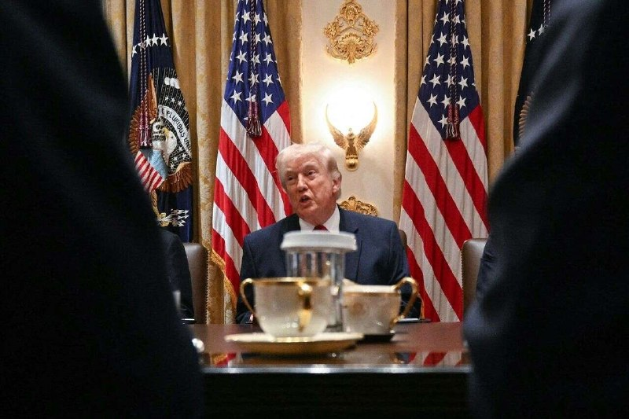

اسرائیل هیوم: ایران در اصل موافقت کرده است که اورانیوم غنی‌شده بالای 3.75 درصد خود را منتقل کند، از غنی‌سازی بلندمدت صرف‌نظر کند و از دستیابی به سلاح هسته‌ای، از جمله از طریق خرید، خودداری کند. این بخشی از یادداشت تفاهمی است که منجر به لغو حملات ایالات متحده به ایران شد.

تنگه هرمز پس از امضا کاملاً بدون هیچ محدودیت یا عوارضی باز خواهد شد. هر دو طرف متعهد می‌شوند که علیه یکدیگر یا هیچ کشور منطقه‌ای دیگری اقدام نظامی نکنند.

این موفقیت از تمایل ایالات متحده برای آزادسازی 12 تا 15 میلیارد دلار، تحت نظارت قطر، حاصل شد. یک مقام ارشد آمریکایی گفت که هدف استراتژیک تغییر رژیم فعلاً رها نشده است. انتظار می‌رود اوایل هفته آینده، احتمالاً در ژنو، امضا شود.

مذاکرات آینده ظرف دو هفته (طبق درخواست آمریکا) یا 60 روز (طبق درخواست ایران) به محدودیت‌های موشکی، حمایت ایران از گروه‌های نیابتی، خروج آمریکا از خلیج فارس و تضمین‌های بین‌المللی خواهد پرداخت.

📝 Amir

📌 @persian_trend_official
پرشین ترند | متفاوت‌ترین کانال نظامی

## Persian_Trend_Official — post 16837

  <a href="telegram/content/Persian_Trend_Official_16837_1781259246.webm" target="_blank">🎬 Download video</a>

جزئیات جدید پیش‌نویس تفاهم‌نامه 14 ماده‌ای بین ایران و آمریکا، به ادعای خبرگزاری مهر:

توقف دائمی و فوری جنگ در تمام جبهه‌ها، از جمله لبنان

تعهد ایالات متحده به عدم دخالت در امور داخلی ایران و احترام به حاکمیت جمهوری اسلامی ایران

لغو کامل محاصره دریایی ظرف 30 روز

تعهد ایالات متحده به خروج نیروهای خود از اطراف ایران

بازگشایی تنگه هرمز ظرف 30 روز طبق ترتیبات ایران

تعلیق تحریم‌های فروش نفت، محصولات پتروشیمی و مشتقات و دسترسی کامل ایران به منابع مالی خود

لزوم ارائه طرح‌های بازسازی ایران به ارزش حداقل 300 میلیارد دلار توسط ایالات متحده و متحدانش

60 روز مذاکره برای دستیابی به توافق نهایی بر اساس مسائل هسته‌ای و لغو کامل تحریم‌های اولیه، ثانویه، ایالات متحده و قطعنامه‌های شورای امنیت سازمان ملل و شورای حکام آژانس بین‌المللی انرژی اتمی

تکرار تعهد ایران طبق معاهده NPT مبنی بر عدم تولید سلاح هسته‌ای

در طول دوره مذاکرات، ایالات متحده متعهد شده است که نیروهای خود را در منطقه افزایش ندهد و تحریم‌های جدیدی اعمال نکند.

آزادسازی 24 میلیارد دلار از وجوه مسدود شده ایران در طول دوره 60 روزه مذاکرات نهایی. نیمی از این مبلغ باید قبل از شروع مذاکرات در اختیار ایران قرار گیرد.

تشکیل سازوکار نظارتی برای اجرای توافق

توافق نهایی با قطعنامه شورای امنیت سازمان ملل متحد تصویب خواهد شد.

مذاکرات نهایی قبل از آزادسازی نیمی از پول‌های بلوکه شده ایران، تعلیق تحریم‌های نفتی ایران و لغو محاصره دریایی آغاز نخواهد شد و توافق نهایی فقط سرنوشت مواد غنی‌شده و غنی‌سازی، لغو تحریم‌ها و طرح بازسازی اقتصادی ایران را در بر خواهد گرفت.

بحث در مورد برنامه موشکی ایران و حمایت از گروه‌های مقاومت به طور قطعی از دستور کار خارج شده است.

📝 Amir

📌 @persian_trend_official
پرشین ترند | متفاوت‌ترین کانال نظامی

## RadioFarda — post 158217

🔸روزنامه نیویورک‌تایمز می‌گوید دست‌کم «دو زن ایرانی» در میان سرنشینان یک پرواز اخراج مهاجران از ایالات متحده به مقصد جمهوری آفریقای مرکزی بوده‌اند. 🔸بر اساس این گزارش، این پرواز روز جمعه ۲۲ خرداد آمریکا را ترک کرده است. 🔸بر اساس این گزارش‌ها، این دو زن که…

## RadioFarda — post 158216

  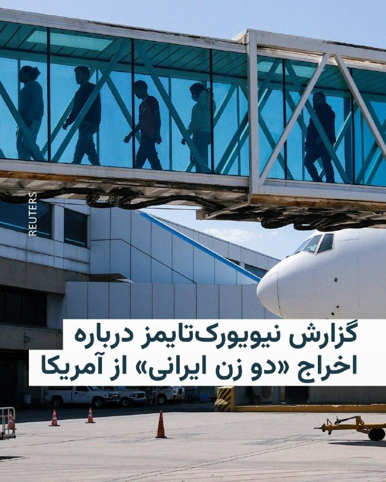

🔸روزنامه نیویورک‌تایمز می‌گوید دست‌کم «دو زن ایرانی» در میان سرنشینان یک پرواز اخراج مهاجران از ایالات متحده به مقصد جمهوری آفریقای مرکزی بوده‌اند.

🔸بر اساس این گزارش، این پرواز روز جمعه ۲۲ خرداد آمریکا را ترک کرده است.

🔸بر اساس این گزارش‌ها، این دو زن که یکی از آنها نوکیش مسیحی و دیگری فعال دموکراسی‌خواه است، برای پناهندگی در آمریکا درخواست داده بودند.

🔸بر اساس اطلاعات رهگیری پرواز و اظهارات یک وکیل آشنا با این پرونده، این پرواز حامل اتباع ایران، افغانستان، ترکیه و گرجستان بوده است.

🔸این پرواز شامگاه پنج‌شنبه از شهر اسکندریه در ایالت لوئیزیانا برخاست و قرار بود ابتدا در غنا توقف کند. غنا نیز به یکی از مراکز انتقال و اخراج مهاجران به کشورهای ثالث تبدیل شده است.

🔸آلما دیوید، وکیل مهاجرت در آمریکا، به نیویورک‌تایمز گفته که هنوز مشخص نیست که آیا برخی از افراد در غنا از هواپیما پیاده خواهند شد یا همه آنها به جمهوری آفریقای مرکزی منتقل می‌شوند.

@RadioFarda

## Dirty_Kids — post 391788

جالبه بدونید اگه اسپانیا یا آلمان قهرمان این جام جهانی بشن ، بازیکناشون هر کدوم ۴۳۰ هزار دلار پاداش میگیرن

حالا یه تیمی هم بود ۴ سال پیش بدون احتساب تورم ، ۶ تا از انگلیس خورد و از گروهی حذف شد ، ولی بازیکناش ۵۵۵ هزار دلار پاداش گرفتن !!!

@Dirty_Kids 👻

## Dirty_Kids — post 391787

  <a href="telegram/content/Dirty_Kids_391787_1781259248.mp4" target="_blank">🎬 Download video</a>

شوخی این این چند تا پسر بلوچی با همدیگه بیش از ۲۰ میلیون بازدید گرفته.

لاشیا هر سری بهش اعتماد میکردن😂😂

@Dirty_Kids 👻

## Dirty_Kids — post 391786

  <a href="telegram/content/Dirty_Kids_391786_1781259249.mp4" target="_blank">🎬 Download video</a>

🔴 این آهنگ از زمان شاه بعد این همه سال وایرال شده و مردم عاشقش شدن.

+ هندزفری لازم🔞

@Dirty_Kids 👻

## Dirty_Kids — post 391784

ای شیعه‌ی مادرجنده...

@Dirty_Kids 👻

## Dirty_Kids — post 391783

  <a href="https://t.me/Dirty_Kids/391783" target="_blank">📎 Download file</a>

ریتزوبت تنها سایت بین المللی میباشد ، که به صورت هفتگی پرومو کد دریافت میکنید ✅

♦️ آموزش شارژ حساب با کریپتو
♦️ آموزش شارژ حساب ریالی در ریتزوبت
#پیشبینی
🔵ریتزوبت برندی با لایسنس معتبر در صنعت شرطبندی و پیشبینی مسابقات ورزشی و کازینویی 👇

https://t.me/+LB508WZyIr8xNmY0

## Dirty_Kids — post 391782

  

🏆 آغاز رقابت های #جام_جهانی 2026 🔥

⚽️ کانادا 🇨🇦 - بوسنی 🇹🇰

⚽️ آمریکا 🇱🇷 - پاراگوئه 🇵🇾

🚨امشب ، بازی های جذاب جام جهانی را در ریتزوبت شرطبندی کنید 👇

🎯 دانلود اپلیکیشن بدون فیلتر اندروید

🎯 لینک ورود به ریتزوبت

ریتزوبت برندی بین المللی آماده خدمت رسانی به کاربران ایران زمین 🇮🇷
R22
🆔 @RitzoBet_ir

## Dirty_Kids — post 391781

  <a href="telegram/content/Dirty_Kids_391781_1781259251.mp4" target="_blank">🎬 Download video</a>

سی ان ان تمام ۳۹ باری که ترامپ در این ۹۰ روز به رسانه ها گفته «توافق با ایران نزدیکه» رو کنار هم چیده که بسیار چیز هم عجیبی شده!

@Dirty_Kids 👻

## alonews — post 127359

  <a href="telegram/content/alonews_127359_1781259254.webm" target="_blank">🎬 Download video</a>

👈تسنیم به نقل از منابع آگاه: فشار نظامی و دیپلماتیک آمریکا برای تغییر در متن ۱۴ ماده‌ای پاسخ نداده و آمریکا از طریق واسطه قطری اعلام کرده است که نیازی به اصلاحیه‌های اخیر آمریکا نیست.

🔴 این متن همچنان نیازمند بررسی و نهایی شدن در نهادهای ذیربط در ایران است و تا آن زمان سایر گمانه زنی‌ها و خبرها، معتبر نیست.

✅ @AloNews خبر جنگ

## alonews — post 127358

  <a href="telegram/content/alonews_127358_1781259254.webm" target="_blank">🎬 Download video</a>

👈اسرائیل هیوم: ایران موافقت کرده است اورانیوم غنی‌شده خود را تحویل دهد.

🔴از غنی‌سازی بلندمدت صرف‌نظر کندو آمریکا ۱۵ میلیارد دلار از دارایی‌های ایرانی (در قطر) را برای نیازهای بشردوستانه آزاد کند.

🔴ایران باید متعهد شود که به دنبال دستیابی به سلاح هسته‌ای نباشد. تنگه هرمز بدون محدودیت باز خواهد شد. هر دو طرف متعهد می‌شوند که اقدامات نظامی بیشتری علیه یکدیگر انجام ندهند.

🔴پرونده لبنان همچنان شکافی بین آمریکا و ایران باقی مانده است. انتظار می‌رود یادداشت تفاهم روز یکشنبه در ژنو امضا شود، در حالی که ترامپ برای اجلاس جی۷ در فرانسه حضور دارد.

✅ @AloNews خبر جنگ

---
📅 بروزرسانی: 1405/03/22 13:33
---

## VahidOOnLine — post 245112

  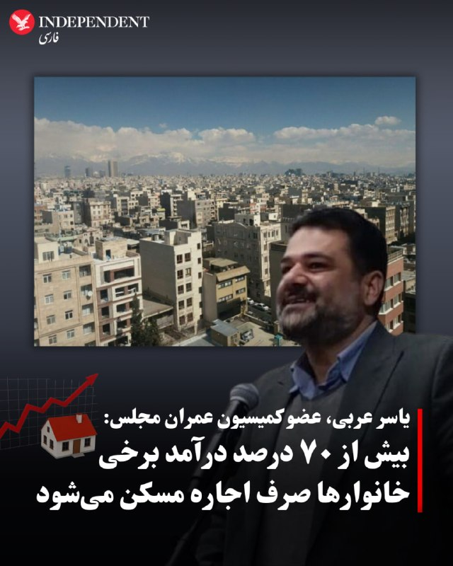

⭕️یاسر عربی، عضو کمیسیون عمران مجلس: بیش از ۷۰ درصد درآمد برخی خانوارها صرف اجاره مسکن می‌شود

♦️یاسر عربی، عضو کمیسیون عمران مجلس شورای اسلامی روز جمعه ۲۲ خرداد ماه اعلام کرد : «در بسیاری از موارد بیش از ۷۰ درصد درآمد خانوارها صرف پرداخت اجاره‌بها می‌شود.»

این عضو کمیسیون عمران مجلس در گفتگو با خبرگزاری شفقنا افزود: «بسیاری از مستاجران ناچار شده‌اند برای کاهش هزینه‌ها به حاشیه شهرها مهاجرت کنند یا در واحدهای کوچک و کم‌کیفیت سکونت داشته باشند؛ واحدهایی که گاهی حتی حداقل استانداردهای زندگی را نیز ندارند».

نماینده گرمسار خروج گسترده پایتخت نشینان را «نوعی عقب‌نشینی اجتماعی» با تبعاتی در کیفیت زندگی، دسترسی به خدمات، آموزش و امنیت شغلی  توصیف کرد و افزود: «اگر برای کنترل تورم مسکن، تنظیم‌گری واقعی بازار اجاره، افزایش عرضه موثر و حمایت کم‌هزینه از مستاجران اقدام جدی نشود، شکاف طبقاتی عمیق‌تر می‌شود و مهاجرت اجباری به حاشیه شهر‌ها ادامه پیدا می‌کند.»
‌🇸🇦 Indypersian

🤖 @VahidOOnLine

## pm_afshaa — post 93676

مهر : توی توافق با آمریکا، واشنگتن متعهد شده بخشی از تحریم‌ها رو برداره و نیروهاش رو هم از اطراف ایران عقب بکشه

💧 Rainbet.com the #1 Non-KYC Crypto Casino & Sportsbook @rainbetcom

😁 @Pm_Afshaa

## kianmeli1 — post 87959

‏🔴خبرگزاری فارس، وابسته به سپاه پاسداران

هر گمانه‌زنی درباره امضا در سوئیس یا دیدار حضوری، چیزی جز فهم اشتباه از پیشنهادها و آرزوهای آمریکایی نیست
https://t.me/kianmeli1

## IranIntlTV — post 341863

  <a href="telegram/content/IranIntlTV_341863_1781258627.mp4" target="_blank">🎬 Download video</a>

ویدیوی تازه‌رسیده به ایران اینترنشنال نشان می‌دهد مردم فلاورجان اصفهان از جمله شهروندانی بودند که در انقلاب ملی دی‌ماه به فراخوان شاهزاده رضا پهلوی پاسخ مثبت داده و با رفتن به خیابان شعار «جاوید شاه» سر دادند.

## IranIntlTV — post 341862

  <a href="telegram/content/IranIntlTV_341862_1781258629.mp4" target="_blank">🎬 Download video</a>

علی‌حسین قاضی‌زاده، عضو تحریریه ایران‌اینترنشنال، درباره اعلام توافق احتمالی میان واشینگتن و تهران گفت: «این تفاهم‌نامه در واقع چارچوبی برای آغاز گفت‌وگوهاست. در صورت امضای آن، دو طرف به نقطه‌ای بازمی‌گردند که مذاکرات در نشست اسلام‌آباد در آن قرار داشت، با این تفاوت که اکنون یک مهلت ۶۰ روزه در نظر گرفته شده است.» او افزود: «اگر جمهوری اسلامی در پایان این ۶۰ روز بپذیرد برنامه هسته‌ای خود را به‌طور پایدار کنار بگذارد، می‌تواند با آمریکا به توافقی دست یابد که در ازای آن بخشی از تحریم‌ها علیه تهران لغو خواهد شد.»
@iranintltv

## DW_Farsi — post 125871

  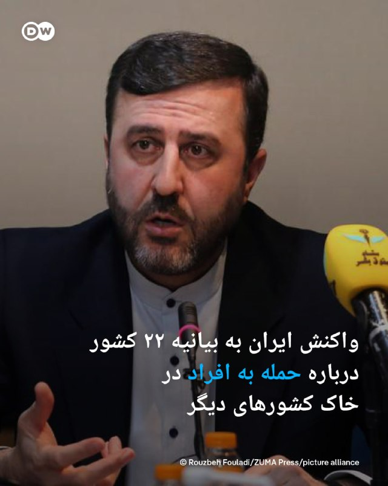

🔶 جنگ، فقر و ترک تحصیل؛ سه ضلع گسترش کار کودک

واکنش ایران به بیانیه ۲۲ کشور درباره حمله به افراد در خاک کشورهای دیگر

کاظم غریب‌آبادی، معاون وزیر خارجه جمهوری اسلامی ایران، در واکنش به بیانیه مشترک ۲۲ کشور درباره آنچه "فعالیت‌های تهدیدآمیز منتسب به ایران" خوانده شده، این اتهامات را "سیاسی، بی‌اساس و کاملا مردود" دانست.

این مقام مدعی شد که جمهوری اسلامی "هرگونه تلاش برای ترور، آدم‌ربایی، ارعاب یا تعرض به اشخاص خارج از چارچوب حقوق بین‌الملل را مردود می‌داند" .

۲۲ کشور از جمله ایالات متحده و برخی کشورهای اروپایی روز پنجشنبه ۲۱ خرداد (۱۱ ژوئن) در بیانیه‌ای مشترک به جمهوری اسلامی ایران هشدار دادند که هرگونه حمله به افراد در خاک این کشورها را فورا متوقف کند.

در این بیانیه، نهادهای امنیتی ایران به استفاده از شبکه‌های تبهکاری بین‌المللی و محلی برای انجام عملیات در اروپا، آمریکای شمالی و استرالیا متهم شده‌اند و این اقدامات نقض حاکمیت ملی و هنجارهای بین‌المللی توصیف شده است.

@dw_farsi

## IranianMinds — post 22388

🔴 خبرگزاری فارس :

آمریکا ترسیده و عقب نشینی کرده ولی ما هنوز داریم پیشنهادات رو بررسی میکنیم و جواب خاصی هنوز بهشون ندادیم !

@IranianMinds

## alonews — post 127357

  <a href="telegram/content/alonews_127357_1781258631.webm" target="_blank">🎬 Download video</a>

👈کلش ریپورت: مصر و ترکیه در حال برگزاری یک تمرین هوایی مشترک در چندین پایگاه هوایی مصر هستند.

🔴این تمرین شامل مراحل نظری (یکپارچه‌سازی مفاهیم رزمی، تبادل تخصص‌های آموزشی) و پروازهای عملیاتی متمرکز بر مأموریت‌های عملیاتی مشترک است.

🔴هیچ نوع هواپیما یا تعداد آن‌ها به صورت عمومی اعلام نشده است

🔴این تمرین پس از مانور دریایی مشترک «دریای دوستی» در سپتامبر ۲۰۲۵ برگزار می‌شود، که اولین تمرین‌های دریایی مصر و ترکیه در ۱۳ سال گذشته بود.

🔴دو سال پیش، برگزاری یک تمرین هوایی مشترک بین این دو کشور غیرقابل تصور بود.

✅ @AloNews خبر جنگ

## alonews — post 127356

  <a href="telegram/content/alonews_127356_1781258631.webm" target="_blank">🎬 Download video</a>

👈خبرگزاری مهر : بندهای توافقنامه ای که امضا میکنیم بدین صورته :

🔴1ـ توقف دائمی و فوری جنگ تو تمامی جبهه ها من جمله لبنان

🔴2ـ تعهد آمریکا به عدم مداخله تو امور داخلی ایران و احترام به حاکمیت جمهوری اسلامی ایران

🔴3ـ رفع کامل محاصره دریایی

🔴4ـ تعهد آمریکا به خروج نیروهاش از اطراف ایران

🔴5ـ بازگشایی تنگه هرمز طی 30 روز با ترتیبات ایرانی

🔴6ـ تعلیق تحریم های فروش نفت، محصولات پتروشیمی و دسترسی کامل ایران به منابع مالیشون

🔴7ـ ارائه طرح بازسازی ایران حداقل به مبلغ 300 میلیارد دلار توسط آمریکا و متحدانش

🔴8ـ 60 روز مذاکره برای رسیدن به توافق نهایی مبتنی بر موضوعات هسته ای و لغو کامل تحریم های اولیه و ثانویه، آمریکا و قطعنامه های شورای امنیت سازمان ملل و شورای حکام آژانس بین المللی انرژی اتمی

🔴9ـ تکرار تعهد ایران در پیمان NPT مبنی بر عدم تولید سلاح هسته ای

🔴10- تو دوره مذاکرات آمریکا متعهد شده به نیروهای خودش تو منطقه اضافه نمیکنه و تحریم جدیدی هم بر علیه ایران وضع نخواهد کرد

🔴11ـ آزادسازی 24 میلیارد دلار پول های بلوکه شده ایران تو دوره ۶۰ روزه مذاکرات نهایی که نیمی از این مبلغ قبل از شروع مذاکرات باید در دسترس ایران قرار بگیره

🔴12ـ تشکیل سازوکار نظارتی برای اجرایی کردن توافق.

🔴13ـ توافق نامه نهایی توسط قطعنامه شورای امنیت سازمان ملل به تایید میرسه

🔴14- مذاکره نهایی قبل از آزادسازی نیمی از پول های بلوکه شده ایران، تعلیق تحریم های نفتی ایران و رفع محاصره دریایی آغاز نمیشه و توافق نهایی صرفا در موضوع سرنوشت مواد غنی شده و غنی سازی، رفع تحریم ها، برنامه بازسازی اقتصاد ایران انجام میشه و بحث درباره برنامه موشکی ایران و حمایت از گروه های مقاومت به صورت قطعی از دستور کار خارج شد.



✅ @AloNews خبر جنگ

---
📅 بروزرسانی: 1405/03/22 13:23
---

## VahidOOnLine — post 245111

  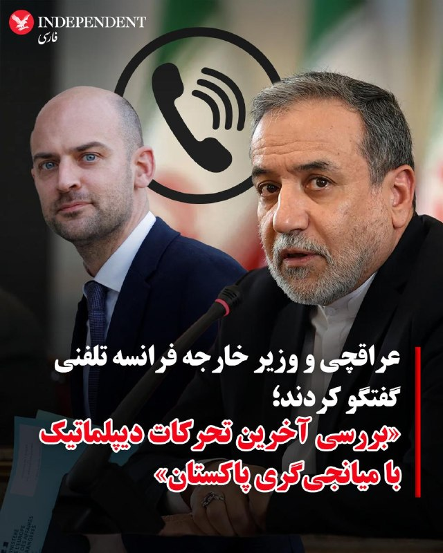

♦️عباس عراقچی، وزیر امور خارجه جمهوی اسلامی ایران، روز جمعه ۲۲ خرداد ماه با ژان نوئل بارو، همتای فرانسوی‌اش تلفنی گفتگو کرد.
به گزارش خبرگزاری‌های دولتی ایران، رایزنی درباره «آخرین تحولات منطقه، روند تحرکات دیپلماتیک با میانجی‌گری پاکستان و برخی مسائل دوجانبه» موضوع گفتگوی وزیران خارجه ایران و فرانسه بود.
این گفتگو پس از آن انجام می‌شود که دونالد ترامپ، رئیس جمهوری آمریکا  اعلام کرد جنگ با جمهوری اسلامی ایران را در روز پنجشنبه ۲۱ خرداد به پایان رسانده است.
از نخستین ساعات روز جمعه، رسانه‌های مختلف ایران و جهان، گزارش‌هایی درباره توافق احتمالی تهران و واشنگتن منتشر کرده‌اند.
‌🇸🇦 Indypersian

🤖 @VahidOOnLine

## WithYashar — post 14619

بلومبرگ به نقل از یک مقام گروه هفت: توافق بین واشنگتن و تهران به احتمال زیاد یک یادداشت تفاهم خواهد بود، نه یک توافق نهایی!
@withyashar

## pm_afshaa — post 93675

قیمت هر بشکه نفت به 82 دلار رسید

💧 Rainbet.com the #1 Non-KYC Crypto Casino & Sportsbook @rainbetcom

😁 @Pm_Afshaa

## FarsiVOA — post 220468

  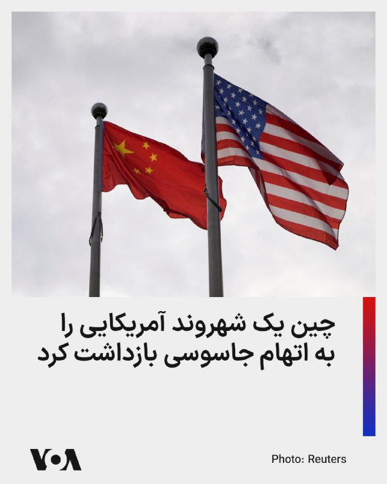

وزارت خارجه چین بازداشت یک شهروند آمریکایی به اتهام جاسوسی را تأیید کرد.

لین جیان، سخنگوی وزارت خارجه چین روز جمعه اعلام کرد «مین زین» شهروند آمریکایی، مظنون به جاسوسی و به خاطر انداختن امنیت ملی چین است و بازداشت او «مطابق با قانون» بوده است.

او توضیح بیشتری درباره این موضوع ندارد، اما رویترز می‌نویسد این شهروند آمریکایی دو هفته پیش بازداشت شده است. سه منبع آگاه به این خبرگزاری گفته‌اند مین زین پس از ورود به شهر کون‌مینگ در جنوب‌غربی چین بازداشت شد.
@FarsiVOA

## RadioFarda — post 158215

درگیری ایران و آلبانی در بحبوحهٔ «انقلاب فلامینگوها»

🔸اعتراض‌ها در آلبانی علیه طرح ساخت یک اقامتگاه لوکس که با جرد کوشنر، داماد دونالد ترامپ، رئیس‌جمهور آمریکا، مرتبط است، به گونه‌ای غیرمنتظره به یک درگیری علنی میان آلبانی و ایران تبدیل شده است.

🔸هزاران نفر در روزهای اخیر در آلبانی به خیابان‌ها آمده‌اند تا به آغاز ساخت این اقامتگاه ۱.۶ میلیارد دلاری در یک تالاب حفاظت‌شده، محل زیست فلامینگوها، اعتراض کنند.

🔸اجرای این پروژه پس از آن آغاز شد که دولت روند صدور مجوزهای ساخت‌وساز را تسریع کرد و قوانین زیست‌محیطی را به‌گونه‌ای تغییر داد که ساخت هتل‌های پنج‌ستاره در مناطق حفاظت‌شده مجاز باشد.

🔸در جریان این اعتراض‌ها که به‌دلیل حضور فلامینگوهای صورتی در این نوار ساحلی دورافتاده در بالکان «انقلاب فلامینگو» نام گرفته است، ادی راما، نخست‌وزیر آلبانی، نخستین کسی بود که انگشت اتهام را به سوی تهران گرفت و تهران را به مشارکت در یک «جنگ ترکیبی» مبتنی بر انتشار اطلاعات نادرست متهم کرد.

🔸به‌گفتۀ او، حکومت ایران در گسترش این ادعا نقش داشته است که هدف واقعی این پروژه اسکان فلسطینیان غزه در آلبانی است.

🔸اسماعیل بقایی، سخنگوی وزارت خارجهٔ ایران، در شبکهٔ اجتماعی ایکس به این اظهارات واکنش نشان داد و از راما خواست «آرام باشد». او همچنین راما را به معامله بر سر حاکمیت آلبانی متهم کرد و حتی شعارهای معترضان آلبانیایی مانند «نه به فساد» و «راما برو» را به زبان اصلی نقل کرد.

🔸 گزارش کامل را در وب‌سایت رادیوفردا بخوانید.

@RadioFarda

## alonews — post 127355

  <a href="telegram/content/alonews_127355_1781258017.webm" target="_blank">🎬 Download video</a>

👈فارس: آمریکا عقب‌نشینی کرده، ایران بررسی را آغاز کرده و هنوز هیچ توافقی حاصل نشده است.

✅ @AloNews خبر جنگ

---
📅 بروزرسانی: 1405/03/22 13:13
---

## mwarmonitor — post 10760

🔴بلومبرگ می‌گوید ممکن است توافق میان تهران و واشنگتن روز یکشنبه آینده در ژنو امضا شود.

@mwarmonitor

## FarsiVOA — post 220467

  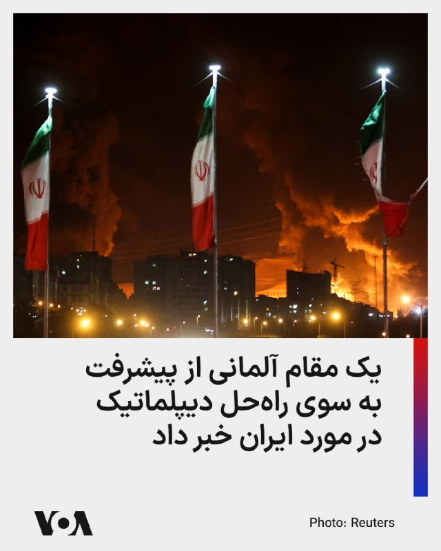

خبرگزاری رویترز روز پنجشنبه به نقل از یک مقام آلمانی که نامش را فاش نکرد، نوشت که در روزهای اخیر پیشرفت‌هایی به سمت یک راه‌حل دیپلماتیک در مورد جنگ ایران حاصل شده است.

پیشتر دونالد ترامپ، رئیس جمهوری آمریکا، اعلام کرد واشنگتن به تازگی به توافقی «عالی» با جمهوری اسلامی رسیده‌ که قرار است اسناد آن در چند روز آینده و احتمالاً در اروپا امضا و نهایی شود.

آلمان و آمریکا جزو کشورهایی بودند که روز چهار‌شنبه ۲۰ خرداد در بیانیه‌ای مشترک، آن چه را «توطئه‌های مرگبار و اقدامات مخرب» نهادهای امنیتی جمهوری اسلامی در اروپا، آمریکای شمالی، و استرالیا خواندند، به شدت محکوم کردند و از رژیم ایران خواستند این فعالیت‌ها را فوراً متوقف کند.
@FarsiVOA

## Dirty_Kids — post 391779

تصویری عجیب از یه عرزشی توی تجمعات شبانه، خطش دائمیه یا اعتباری :)

@Dirty_Kids 👻

## Dirty_Kids — post 391778

  <a href="telegram/content/Dirty_Kids_391778_1781257413.mp4" target="_blank">🎬 Download video</a>

جا داره مجددا یادی کنیم از پیشبینی ۱۵ سال پیش مانوک خدابخشیان عزیز: اول در خیابان ها کشتار میشه؛ بعدش به خاطر اون کشتار جنگ میشه؛ بعدش توافق‌ میکنن و بعد از توافق بازی اصلی تازه شروع میشه!

@Dirty_Kids 👻

## alonews — post 127354

  <a href="telegram/content/alonews_127354_1781257415.webm" target="_blank">🎬 Download video</a>

👈بلومبرگ به نقل از یک مقام گروه هفت: توافق بین واشنگتن و تهران به احتمال زیاد یک یادداشت تفاهم خواهد بود، نه یک توافق نهایی

✅ @AloNews خبر جنگ

## alonews — post 127353

  <a href="telegram/content/alonews_127353_1781257416.webm" target="_blank">🎬 Download video</a>

👈بلومبرگ به نقل از منابع: توافق بین تهران و واشنگتن ممکن است یکشنبه آینده در ژنو امضا شود.

✅ @AloNews خبر جنگ

---
📅 بروزرسانی: 1405/03/22 13:03
---

## WithYashar — post 14618

ادعای آکسیوی : شرایط توافق بین امریکا و ایران:

1. باز شدن فوری تنگه هرمز
بدون دریافت عوارض یا محدودیت جدید.
2. برگشت ترافیک دریایی حجم حمل‌ونقل و کشتیرانی ظرف ۳۰ روز به سطح قبل از درگیری‌ها برگرده
3. لغو محاصره دریایی آمریکا
4. تمدید آتش‌بس به مدت ۶۰ روز شامل لبنان
5. ادامه مذاکرات هسته‌ای
6. توافق دوم برای پرونده هسته‌ای
7. تسهیل محدود فروش نفت برای ایران
8. کاهش تحریم‌ها به‌صورت مشروط
@withyashar

## pm_afshaa — post 93674

🔴نتانیاهو به ترامپ:اینو بدون که اسرائیل قربانی توافق امریکا با جمهوری اسلامی نخواهد شد

💧 Rainbet.com the #1 Non-KYC Crypto Casino & Sportsbook @rainbetcom

😁 @Pm_Afshaa

## DEJradio — post 5613

  <a href="telegram/content/DEJradio_5613_1781256824.mp4" target="_blank">🎬 Download video</a>

🛩️
🔥 حملات سنگین اسرائیل به حـ.ـزب‌الله در سراسر لبنان

ظهر جمعه ۲۲ خرداد ۱۴۰۵ ارتش اسرائیل مواضع حـ.ـزب‌الله لبنان را بمباران کرد. این حملات در حالی صورت گرفت که منابع آگاه مدعی‌اند موضوع لبنان نیز در توافق ایران و آمریکا گنجانده شده و پایان جنگ شامل توقف کامل عملیات، خروج اسرائیل و آزادی اسیران لبنانی است!

#اسرائیل #حزب_الله_لبنان
@DEJradio

## IranIntlTV — post 341861

  <a href="telegram/content/IranIntlTV_341861_1781256826.mp4" target="_blank">🎬 Download video</a>

جام جهانی ۲۰۲۶ با برگزاری مراسم افتتاحیه پرستاره در ورزشگاه آزتکا در مکزیکوسیتی آغاز شد. در بازی‌های دور نخست، تیم‌های مکزیک و کره جنوبی برابر حریفان خود، آفریقای جنوبی و جمهوری چک، به پیروزی رسیدند.

جزییات بیشتر با آیدین مقیمی، عضو تحریریه ایران‌اینترنشنال
@iranintltv

## FarsiVOA — post 220466

  <a href="telegram/content/FarsiVOA_220466_1781256827.mp4" target="_blank">🎬 Download video</a>

آتش‌بازی و حال و هوای هواداران فوتبال در افتتاحیه جام جهانی ۲۰۲۶؛

مراسم افتتاحیه جام جهانی ۲۰۲۶، پنج‌شنبه ۲۱ خرداد، در ورزشگاه تاریخی «آزتکا» در مکزیکو سیتی برگزار شد و این تورنمنت بین‌المللی رسماً کار خود را آغاز کرد.

این دوره از رقابت‌ها که به میزبانی مشترک سه کشور آمریکا، کانادا و مکزیک برگزار می‌شود، اولین دوره در تاریخ فوتبال است که مسابقات با حضور ۴۸ تیم، به جای ۳۲ تیم در دوره‌های گذشته، خواهد بود.
@FarsiVOA

## RadioFarda — post 158214

🔸بانک جهانی پیش‌بینی کرد جنگ جاری ایران باعث شود رشد اقتصاد جهانی به «ضعیف‌ترین سطح خود» از زمان همه‌گیری کرونا برسد. 🔸بر اساس گزارشی که پنج‌شنبه ۲۱ خرداد توسط بانک جهانی منتشر شد، پیش‌بینی شده در صورت تشدید دوباره درگیری‌ها، این رشد حتی بیش از این کاهش یابد.…

## RadioFarda — post 158213

  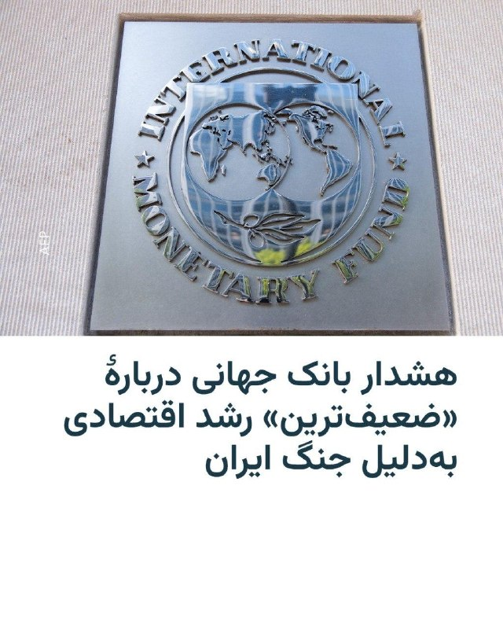

🔸بانک جهانی پیش‌بینی کرد جنگ جاری ایران باعث شود رشد اقتصاد جهانی به «ضعیف‌ترین سطح خود» از زمان همه‌گیری کرونا برسد.

🔸بر اساس گزارشی که پنج‌شنبه ۲۱ خرداد توسط بانک جهانی منتشر شد، پیش‌بینی شده در صورت تشدید دوباره درگیری‌ها، این رشد حتی بیش از این کاهش یابد.

🔸در این گزارش آمده است که رشد اقتصاد جهانی در سال جاری میلادی ۲.۵ درصد پیش‌بینی می‌شود که نسبت به رشد ۲.۹ درصدی در سال ۲۰۲۵ نشان‌دهنده کاهش است.

🔸بانک جهانی هشدار داد: «تشدید دوباره درگیری‌ها یا اختلالات طولانی‌تر در جریان عرضه کالاهای اساسی می‌تواند قیمت این کالاها را بیش از پیش افزایش دهد، فشارهای تورمی و ناامنی غذایی را تشدید کند، موجب تنش‌های مالی شود و رشد اقتصادی را کاهش دهد.»

🔸این نهاد افزود: «اگر اختلال در عرضه انرژی شدیدتر از آنچه فرض شده باشد و همزمان با فشار قابل‌توجه بر بازارهای مالی همراه شود، رشد اقتصاد جهانی در سال ۲۰۲۶ ممکن است تنها به ۱.۳ درصد برسد.»

@RadioFarda

## RadioFarda — post 158212

  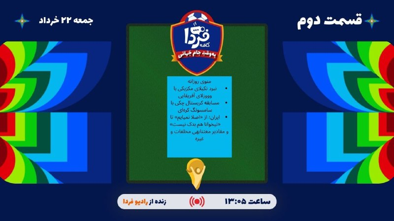

📷 Photo

## Hranews — post 113553

یک شهروند توسط نیروهای امنیتی بازداشت شد

❗️
❗️
❗️
❗️
❗️– یک شهروند در رباط کریم به دلیل آنچه ارتباط با «عناصر جاسوسی خارج از کشور» عنوان شده، بازداشت شد.

ادامه مطلب

↘️
@hranews_bot تماس ✉️ - @Hranews کانال هرانا 🆑

## alonews — post 127352

  <a href="telegram/content/alonews_127352_1781256830.mp4" target="_blank">🎬 Download video</a>

👈نیروی هوایی اسرائیل داره به روستای تبنین تو جنوب لُبنان حملهِ می‌کنه

✅ @AloNews خبر جنگ

## alonews — post 127351

  <a href="telegram/content/alonews_127351_1781256831.webm" target="_blank">🎬 Download video</a>

👈مقامات گروه ۷: تفاهم‌نامه آمریکا و ایران ممکن است همین یکشنبه در ژنو امضا شود

✅ @AloNews خبر جنگ

## alonews — post 127350

  <a href="telegram/content/alonews_127350_1781256832.mp4" target="_blank">🎬 Download video</a>

👈پیت هگست به مناسبت توافق ۴۴تا پرس سینه زد و فیلمشو منتشر کرد

✅ @AloNews خبر جنگ

---
📅 بروزرسانی: 1405/03/22 12:53
---

## WithYashar — post 14617

رسانه عبری i24: از جزئیات توافقی که تاکنون اعلام شده کاملاً مشخص است که ایران تضمین‌هایی از آمریکایی دریافت خواهد کرد مبنی بر این‌که اسرائیل تا پایان دوران ترامپ هیچ‌گونه فعالیتی در خاک ایران انجام ندهد
@withyashar

## IranIntlTV — post 341860

  <a href="telegram/content/IranIntlTV_341860_1781256202.mp4" target="_blank">🎬 Download video</a>

در پی بازداشت گسترده زنان در افغانستان به دلیل آنچه طالبان «عدم رعایت حجاب شرعی» خوانده است و اعتراضات کم‌سابقه در واکنش به این بازداشت‌ها، فضای امنیتی در شهرهای هرات و کابل روز جمعه تشدید شده است.
بر اساس گزارش‌ها، نیروهای طالبان تلفن‌های همراه شهروندان را بازرسی می‌کنند و این اقدام در برخی موارد به بازداشت افراد منجر شده است.

جزییات بیشتر در گفت‌وگو با رحمان کاکر، افغانستان‌اینترنشنال
@iranintltv

## IranIntlTV — post 341859

  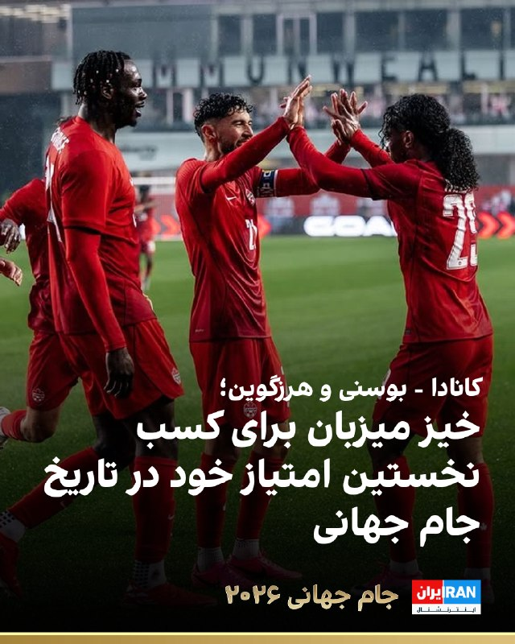

🔻پس از افتتاحیه باشکوه مسابقات در مکزیک، نوبت به دو میزبان دیگر جام جهانی ۲۰۲۶ رسیده است تا شور و هیجان فوتبال را به خاک خود بیاورند. امشب در چارچوب گروه بی، تیم ملی کانادا ساعت ۲۲:۳۰ در ورزشگاه بی‌ام‌او فیلد تورنتو میزبان بوسنی و هرزگوین است؛ دیداری که برای کانادایی‌ها فراتر از یک مسابقه عادی است‌. آنها می‌خواهند تحول شگفت‌انگیز فوتبال خود را به نمایش بگذارند.

🔹کانادا که در سال ۲۰۱۷ در رتبه ۱۲۰ فیفا قرار داشت و برای پخش تلویزیونی بازی‌هایش پول پرداخت می‌کرد، اکنون در رتبه ۳۰ دنیا ایستاده است. با این حال، کارنامه تاریخی آن‌ها در جام‌های جهانی (۱۹۸۶ و ۲۰۲۲) چیزی جز ۶ شکست پیاپی نبوده است. شاگردان جسی مارش امشب به دنبال ثبت نخستین امتیاز خود در تاریخ این تورنمنت هستند.

🔹جسی مارش، سرمربی آمریکایی و باسابقه لیدز و لایپزیگ، کانادا را به تیمی تهاجمی و باانگیزه تبدیل کرده است. او با سیستم ۴-۴-۲ و اتکا به سرعت ویران‌کننده بال‌هایش، فوتبال تمام‌سرعتی را به نمایش می‌گذارد.

🔹جزییات بیشتر را در سایت بخوانید

@iranintltvsport

## IranIntlTV — post 341858

  <a href="telegram/content/IranIntlTV_341858_1781256205.mp4" target="_blank">🎬 Download video</a>

دفتر نخست‌وزیری اسرائیل اعلام کرد دونالد ترامپ، رییس‌جمهوری آمریکا، درباره یادداشت تفاهمی که در حال شکل‌گیری با تهران است، با بنیامین نتانیاهو گفت‌وگو کرده است. این دفتر افزود تعهدات مورد نظر ترامپ شامل حذف ذخایر مواد غنی‌شده، برچیدن زیرساخت‌های غنی‌سازی، محدود کردن برنامه موشکی و پایان دادن به حمایت جمهوری اسلامی از نیروهای نیابتی در منطقه است.

بابک اسحاقی، خبرنگار ایران‌اینترنشنال، گزارش می‌دهد
@iranintltv

## DW_Farsi — post 125865

🔶 جنگ، فقر و ترک تحصیل؛ سه ضلع گسترش کار کودک

🔻 گزارشی از آتفه چهارمحالیان

در حالی که شمار کودکان کار در جهان رو به کاهش است، فعالان حقوق کودک در ایران از گسترش تعداد کودکان کار، پس از جنگ و تشدید بحران‌های اقتصادی خبر می‌دهند؛ روندی که در مناطق محروم، به‌ویژه سیستان و بلوچستان، آشکارتر است.

"هر روز با این فکر از خانه بیرون می‌زنم که ممکن است دیگر برنگردم.”

این را ایمان ۱۷ ساله از دروازه غار، معروف به سیاهچاله تولید و توزیع مواد مخدر تهران، در گفت‌وگو با دویچه‌وله فارسی می‌گوید؛ نوجوانی که زمانی رؤیایش این بود که جراح چشم شود و امروز حاضر نیست بگوید کاری که از آن امرار معاش می‌کند چیست.
تا سال گذشته، بعد از مدرسه جلوی پارچه‌فروشی‌های خیابان مولوی به گفته خودش "دادزن” بود و برای مغازه‌ها مشتری جمع می‌کرد. اما امسال، در آستانه گرفتن دیپلم، مدرسه را رها کرد.

می‌گوید: «دیگر نمی‌شود هم درس خواند، هم صدای موشک را تحمل کرد، هم کار کرد. مادرم ام‌اس دارد، پدرم معتاد است. خواهرم هم بعد از طلاق با یک بچه برگشته خانه. یکی باید خرج زندگی را بدهد.»

@dw_farsi

## IranianMinds — post 22385

🔴 تصاویری از حملات پشم ریزون دیشب اسرائیل به غزه.

@IranianMinds

## IranianMinds — post 22384

  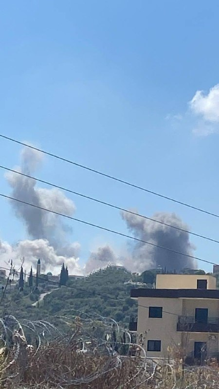

🔴 ارتش اسرائیل : رفتیم بالا سر حزب الله و داریم اهدافی در جنوب لبنان رو بمباران میکنیم. @IranianMinds

## IranianMinds — post 22383

🔴 ارتش اسرائیل :

رفتیم بالا سر حزب الله و داریم اهدافی در جنوب لبنان رو بمباران میکنیم.

@IranianMinds

## alonews — post 127349

  <a href="telegram/content/alonews_127349_1781256207.webm" target="_blank">🎬 Download video</a>

👈خبرنگار العربیه: یک تیم حقوقی پاکستانی در مراسم امضای توافق ایران و آمریکا در یک کشور اروپایی حضور خواهد داشت.

🔴 ایران درخواست کرده است که امضای توافق با آمریکا در یک کشور اروپایی انجام شود تا به آن جنبه بین‌المللی بدهد

✅ @AloNews خبر جنگ

## alonews — post 127348

  <a href="telegram/content/alonews_127348_1781256207.webm" target="_blank">🎬 Download video</a>

👈مقام آمریکایی به Reuters : دو تا پهپاد ایرانی دیشب خواستن به کشتی‌های تجاری تو تنگه هرمز حملهِ کنن، ولی رهگیری کردیم

✅ @AloNews خبر جنگ

## alonews — post 127347

  <a href="telegram/content/alonews_127347_1781256207.webm" target="_blank">🎬 Download video</a>

👈رسانه عبری i24: از جزئیات توافقی که تاکنون اعلام شده کاملاً مشخص است که ایران تضمین‌هایی از آمریکایی دریافت خواهد کرد مبنی بر این‌که اسرائیل تا پایان دوران ترامپ هیچ‌گونه فعالیتی در خاک ایران انجام ندهد

✅ @AloNews خبر جنگ

---
📅 بروزرسانی: 1405/03/22 12:43
---

## VahidOOnLine — post 245110

  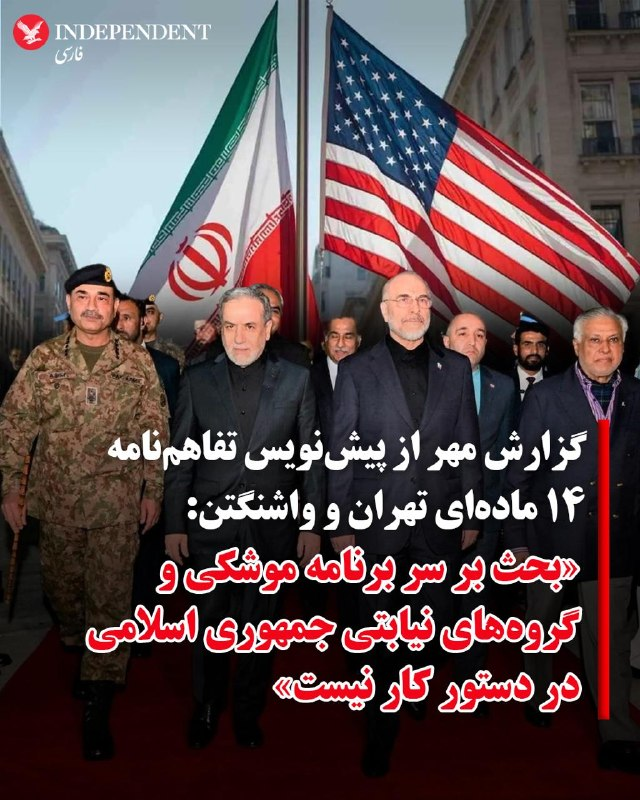

♦️خبرگزاری مهر، وابسته به سازمان تبلیغات اسلامی، جمعه ۲۲ خرداد به نقل از «منبع نزدیک به تیم مذاکره کننده ایرانی» جزئیات جدیدی از پیش‌نویس تفاهمنامه ۱۴ ماده‌ای ایران و آمریکا را منتشر کرد.

بر اساس این گزارش تهران متعهد می‌شود به دنبال ساخت سلاح هسته‌ای نرود و در مقابل، برخی امتیازهای اقتصادی از جمله تسهیل صادرات نفت و بررسی آزادسازی بخشی از دارایی‌های مسدودشده را به دست می‌آورد.

مهر به نقل از این مقام گزارش داد که پس از امضای احتمالی این تفاهم‌نامه، مذاکرات جامع‌تری به‌مدت ۶۰ روز آغاز خواهد شد و موضوعات پیچیده‌تر از جمله سطح غنی‌سازی اورانیوم، ذخایر اورانیوم غنی‌شده و جزئیات رفع تحریم‌ها مورد بررسی قرار می‌گیرد.

براساس این گزارش ۱۴ محور تفاهمنامه احتمالی تهران و واشنگتن شامل موارد زیر است:
۱- توقف دائمی و فوری جنگ در همه جبهه ها از جمله لبنان
۲- تعهد آمریکا به مداخله نکردن در امور داخلی ایران
۳- رفع کامل محاصره دریایی ظرف ۳۰ روز
۴- تعهد آمریکا به خروج نیروهایش از پیرامون ایران
۵- بازگشایی تنگه هرمز ظرف ۳۰ روز به وسیله ایران
۶- تعلیق تحریم های فروش نفت، محصولات پتروشیمی و مشتقات و دسترسی کامل ایران به منابع مالی آن.
۷- لزوم ارائه طرح های بازسازی ایران حداقل به مبلغ ۳۰۰ میلیارد دلار توسط آمریکا و متحدانش
۸- ۶۰ روز مذاکره برای رسیدن به توافق نهایی مبتنی بر موضوعات هسته‌ای و لغو کامل تحریم‌های اولیه، ثانویه، آمریکا و قطعنامه‌های شورای امنیت سازمان ملل و شورای حکام آژانس بین المللی انرژی اتمی
۹- تعهد ایران برای تداوم عضویت در پیمان «ان پی تی» مبنی بر عدم تولید سلاح هسته ای
۱۰- در دوره مذاکرات آمریکا متعهد شده به نیروهای خود در منطقه اضافه نمی کند و تحریم جدیدی هم وضع نخواهد کرد.
۱۱- آزادسازی ۲۴ میلیارد دلار اموال مسدود شده ایران در دوره ۶۰ روزه مذاکرات نهایی. نیمی از این مبلغ قبل از شروع مذاکرات باید در دسترس ایران قرار گیرد.
۱۲- تشکیل سازوکار نظارتی برای اجرایی کردن توافق احتمالی
۱۳- تایید توافق نامه نهایی توسط قطعنامه شورای امنیت سازمان ملل

مهر به نقل از این «مقام آگاه» گزارش کرد که در بند آخر توافقنامه احتمالی، دوطرف تفاهم می‌کنند، مذاکره نهایی قبل از آزادسازی نیمی از اموال مسدود شده ایران، تعلیق تحریم‌های نفتی و رفع محاصره دریایی آغاز نشود.

دونالد ترامپ، رئیس جمهوری آمریکا شامگاه پنجشنبه گفته بود که به محض امضای توافق، محاصره دریایی پایان می‌یابد و تنگه هرمز باز می‌شود.

به گزارش مهر، توافق نهایی صرفا در موضوع سرنوشت اورانیوم‌های غنی شده و غنی سازی، رفع تحریم‌ها و «برنامه بازسازی اقتصاد ایران انجام می‌شود» و بحث درباره برنامه موشکی و حمایت از گروه‌های نیابتی «به صورت قطعی از دستور کار خارج شده است».
‌🇸🇦 Indypersian

🤖 @VahidOOnLine

## WithYashar — post 14616

شبکه ۱۲ اسرائیل:
مذاکرات نهایی ایران و آمریکا بر مسائل اقتصادی و هسته‌ای متمرکز خواهد بود و شامل بحث‌هایی درباره برنامه موشک‌های بالستیک ایران نخواهد بود
@withyashar

## DEJradio — post 5612

  <a href="telegram/content/DEJradio_5612_1781255604.webm" target="_blank">🎬 Download video</a>

🔺🎥 کمبود سوخت در شهرهای مختلف؛ ساعت‌ها معطلی در صف بنزین

#بنزین #سوخت
@DEJradio

## IranIntlTV — post 341857

  <a href="telegram/content/IranIntlTV_341857_1781255604.mp4" target="_blank">🎬 Download video</a>

حسین آقایی، تحلیل‌گر سیاسی و عضو تحریریه ایران‌اینترنشنال، می‌گوید دونالد ترامپ به دنبال توافق با بازماندگان جمهوری اسلامی است، اما دستیابی به توافقی پایدار و دارای ضمانت اجرایی در کوتاه‌مدت بعید به نظر می‌رسد. به گفته او، این تفاهم در ادامه سیاست «تسلیم‌سازی» حکومت ایران قرار دارد، اما از نظر ساختاری می‌تواند این امکان را برای جمهوری اسلامی حفظ کند که در صورت تمایل، از تهدید بستن تنگه هرمز به‌عنوان اهرم فشار استفاده کند.
@iranintltv

## BBCPersian — post 283562

🔻وزیر دفاع بریتانیا و معاونش استعفا کردند

ساعاتی پس از استعفای جان هیلی، وزیر دفاع بریتانیا، ال کارنز، معاون وزارت دفاع بریتانیا هم از سمت خود کناره گیری کرده است.

این استعفاها در پی اختلاف بر سر تأمین مالی برنامه سرمایه‌گذاری دفاعی دولت کی‌یر استارمر، نخست‌وزیر بریتانیا انجام شده است.

آقای هیلی اعلام کرد که میزان هزینه‌کردی که نخست‌وزیر پیشنهاد کرده است «به‌مراتب کمتر از میزان مورد نیاز» برای حفاظت از بریتانیاست. معاون مستعفی او هم گفته است که این برنامه «نه به اندازه کافی تحول‌آفرین است و نه از تأمین مالی لازم برخوردار است.»

دولت بریتانیا سال گذشته میلادی برنامه «بازنگری راهبردی دفاعی» را منتشر کرد که در آن بر حرکت به سوی «آمادگی برای جنگ» تأکید شده و وعده اختصاص میلیاردها پوند هزینه اضافی برای بخش دفاعی داده شده بود.

قرار است برنامه سرمایه‌گذاری دفاعی مشخص کند که این هزینه‌های دفاعی چگونه تأمین مالی خواهند شد.

اختلافات داخلی بر سر این موضوع از ماه‌ها پیش ادامه داشته است.

اکنون گزارش‌ها حاکی از آن است که دولت بریتانیا قصد داشته افزایش بودجه‌ای معادل ۱۳.۵ میلیارد پوند برای وزارت دفاع در چهار سال آینده اعلام کند در حالی که بودجه اضافی درخواستی این وزارتخانه ۲۸ میلیارد پوند بوده است.

https://bbc.in/3PUo2Qc
@BBCPersian

## BBCPersian — post 283561

🔻وزیر دفاع استرالیا از استقرار زیردریایی‌های هسته‌ای آمریکا در کشورش خبر داد

وزیر دفاع استرالیا گفته است که نیروی دریایی آمریکا قصد دارد در سال جاری یک اسکادران از زیردریایی‌های هسته‌ای را در یکی از بندرهای استراتژیک استرالیا مستقر کند.

بر اساس پیمان امنیتی «آکوس» ، چهار زیردریایی تحت فرماندهی آمریکا از سال آینده به‌صورت چرخشی در بندری در ساحل غربی استرالیا فعالیت خواهند کرد.

پیمان امنیتی «اکوس» بین سه کشور آمریکا، بریتانیا و استرالیا درسال ۲۰۲۱ امضا شده است و هدف اصلی آن تقویت همکاری‌های دفاعی و امنیتی در منطقه هند-اقیانوس آرام است

ریچارد مارلز گفت که نیروهای اسکادران سه زیردریایی آمریکا مسئول نظارت بر عملیات این شناورها خواهند بود و در کنار نیروهای استرالیایی و بریتانیایی همکاری می‌کنند.

https://bbc.in/3QCxsQv
@BBCPersian

## alonews — post 127346

  <a href="telegram/content/alonews_127346_1781255606.webm" target="_blank">🎬 Download video</a>

👈شبکه ۱۲ اسرائیل: مذاکرات نهایی ایران و آمریکا بر مسائل اقتصادی و هسته‌ای متمرکز خواهد بود و شامل بحث‌هایی درباره برنامه موشک‌های بالستیک ایران نخواهد بود

✅ @AloNews خبر جنگ

## alonews — post 127345

  <a href="telegram/content/alonews_127345_1781255606.webm" target="_blank">🎬 Download video</a>

👈عضو کمیسیون عمران: بیش از ۷۰ درصد درآمد خانوار صرف اجاره خانه می‌شود

✅ @AloNews خبر جنگ

## alonews — post 127344

  <a href="telegram/content/alonews_127344_1781255606.mp4" target="_blank">🎬 Download video</a>

👈 مجری صدا سیما: هک تصویر انفجار اتمی در تلویزیون، سیگنال آمریکا بود

✅ @AloNews خبر جنگ

---
📅 بروزرسانی: 1405/03/22 12:33
---

## FarsiVOA — post 220465

  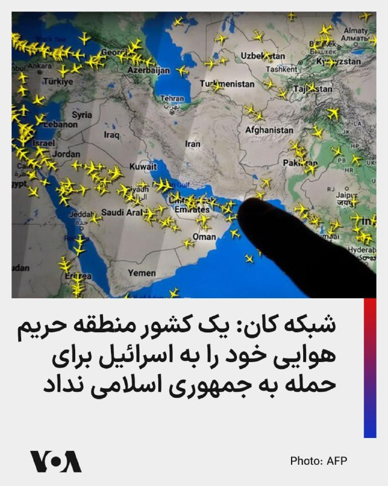

شبکه دولتی کان اسرائیل گزارش داد که یک کشور در منطقه، در جریان حملات اخیر اسرائیل به جمهوری اسلامی، استفاده اسرائیل از حریم هوایی خود را ممنوع کرد.

این شبکه اسم این کشور را ذکر نکرده اما افزود که این کشور در دورهای قبلی حملات اسرائیل به جمهوری اسلامی، چنین اجازه‌ای را به اسرائیل داده بود.

بر اساس این گزارش، این تصمیم، اسرائیل را غافلگیر کرد، زیرا اورشلیم انتظار داشت همکاری میان دو کشور، همانند گذشته ادامه یابد.

بر اساس این گزارش، اسرائیل معتقد است تصمیم به بستن حریم هوایی با هدف ارسال یک پیام سیاسی اتخاذ شده است.
@FarsiVOA

## DW_Farsi — post 125859

🔶 جنگ، فقر و ترک تحصیل؛ سه ضلع گسترش کار کودک

در حالی که شمار کودکان کار در جهان رو به کاهش است، فعالان حقوق کودک در ایران از گسترش تعداد کودکان کار، پس از جنگ و تشدید بحران‌های اقتصادی خبر می‌دهند؛ روندی که در مناطق محروم، به‌ویژه سیستان و بلوچستان، آشکارتر است.

"هر روز با این فکر از خانه بیرون می‌زنم که ممکن است دیگر برنگردم.”

این را ایمان ۱۷ ساله از دروازه غار، معروف به سیاهچاله تولید و توزیع مواد مخدر تهران، در گفت‌وگو با دویچه‌وله فارسی می‌گوید؛ نوجوانی که زمانی رؤیایش این بود که جراح چشم شود و امروز حاضر نیست بگوید کاری که از آن امرار معاش می‌کند چیست.
تا سال گذشته، بعد از مدرسه جلوی پارچه‌فروشی‌های خیابان مولوی به گفته خودش "دادزن” بود و برای مغازه‌ها مشتری جمع می‌کرد. اما امسال، در آستانه گرفتن دیپلم، مدرسه را رها کرد.

می‌گوید: «دیگر نمی‌شود هم درس خواند، هم صدای موشک را تحمل کرد، هم کار کرد. مادرم ام‌اس دارد، پدرم معتاد است. خواهرم هم بعد از طلاق با یک بچه برگشته خانه. یکی باید خرج زندگی را بدهد.»

@dw_farsi

## RadioFarda — post 158211

🔸روزنامه اعتماد در داخل ایران به نقل از یک عضو رسانه‌ای هیئت مذاکره‌کننده جمهوری اسلامی و وب‌سایت اکسیوس در خارج به نقل از یک دیپلمات از یک کشور میانجی و یک مقام آمریکایی روز جمعه، ۲۲ خردادماه، گزارش‌هایی از محتوای احتمالی تفاهم‌نامه میان ایران و آمریکا منتشر…

## RadioFarda — post 158210

  

🔸روزنامه اعتماد در داخل ایران به نقل از یک عضو رسانه‌ای هیئت مذاکره‌کننده جمهوری اسلامی و وب‌سایت اکسیوس در خارج به نقل از یک دیپلمات از یک کشور میانجی و یک مقام آمریکایی روز جمعه، ۲۲ خردادماه، گزارش‌هایی از محتوای احتمالی تفاهم‌نامه میان ایران و آمریکا منتشر کردند.

🔸این دو گزارش تا اندازه‌ای به یکدیگر نزدیک هستند، اما گزارش اعتماد با وجود جزئیات بیشتر به نقطه نظر حکومت ایران نزدیک است، در حالی که متن اکسیوس برخی از موارد را منوط به آینده مذاکرات گزارش کرده است، مانند تعلیق تحریم‌ها که اکسیوس می‌گوید مشروط به پایبندی تهران به تفاهم‌نامه است.

🔸روزنامه اعتماد به نقل از «عضو کمیته رسانه هیئت مذاکراتی ایران» از تفاهم‌نامه‌ای ۱۴ ماده‌ای می‌گوید که در آن بر «بازگشایی تنگه هرمز ظرف ۳۰ روز با ترتیبات ایرانی» و «تعلیق تحریم‌های فروش نفت، محصولات پتروشیمی و مشتقات و دسترسی کامل ایران به منابع مالی آن» تأکید شده است.

🔸این در حالی است که در گزارش اکسیوس آمده است که تنگه هرمز «بلافاصله بدون دریافت عوارض بازگشایی می‌شود» و «ظرف ۳۰ روز» تعداد کشتی‌های عبوری از این تنگه به زمان پیش از جنگ بازمی‌گردد.

@RadioFarda

## IranianMinds — post 22382

🔴 خبرگزاری مهر ادعا کرده پیش‌نویس توافقنامه ایران و آمریکا بدین‌شکله:

۱- توقف دائمی و فوری جنگ در همه جبهه ها از جمله لبنان.

۲- تعهد آمریکا به عدم مداخله در امور داخلی ایران و احترام به حاکمیت جمهوری اسلامی ایران.

۳- رفع کامل محاصره دریایی ظرف ۳۰ روز.

۴- تعهد آمریکا به خروج نیروهایش از پیرامون ایران.

۵- بازگشایی تنگه هرمز ظرف ۳۰ روز با ترتیبات ایرانی.

۶- تعلیق تحریم های فروش نفت، محصولات پتروشیمی و مشتقات و دسترسی کامل ایران به منابع مالی آن.

۷- لزوم ارائه طرح های بازسازی ایران حداقل به مبلغ ۳۰۰ میلیارد دلار توسط آمریکا و متحدانش.

۸- ۶۰ روز مذاکره برای رسیدن به توافق نهایی مبتنی بر موضوعات هسته ای و لغو کامل تحریم های اولیه، ثانویه، آمریکا و قطعنامه های شورای امنیت سازمان ملل و شورای حکام آژانس بین المللی انرژی اتمی.

۹- تکرار تعهد ایران در پیمان ان پی تی مبنی بر عدم تولید سلاح هسته ای.

۱۰- در دوره مذاکرات آمریکا متعهد شده به نیروهای خود در منطقه اضافه نمی کند و تحریم جدیدی هم وضع نخواهد کرد.

۱۱- آزادسازی ۲۴ میلیارد دلار پول های بلوکه شده ایران در دوره ۶۰ روزه مذاکرات نهایی. نیمی از این مبلغ قبل از شروع مذاکرات باید در دسترس ایران قرار گیرد.

۱۲- تشکیل سازوکار نظارتی برای اجرایی کردن توافق.

۱۳- توافق نامه نهایی توسط قطعنامه شورای امنیت سازمان ملل به تایید می رسد.

۱۴- مذاکره نهایی قبل از آزادسازی نیمی از پول های بلوکه شده ایران، تعلیق تحریم های نفتی ایران و رفع محاصره دریایی آغاز نمی شود و توافق نهایی صرفا در موضوع سرنوشت مواد غنی شده و غنی سازی، رفع تحریم ها، برنامه بازسازی اقتصاد ایران انجام می شود و بحث درباره برنامه موشکی ایران و حمایت از گروه های مقاومت به صورت قطعی از دستور کار خارج شده است.

@IranianMinds

## IranianMinds — post 22380

عجب

@IranianMinds

## BBCPersian — post 283555

🖋جیک هورتون
بخش راستی‌آزمایی بی‌بی‌سی

ارتش آمریکا می‌گوید اوایل این هفته از یک پهپاد دریایی برای نجات دو نفر از خدمه یک بالگرد ساقط‌شده ارتش آمریکا در سواحل عمان استفاده شده است؛ رخدادی که نخستین نمونه شناخته ‌شده عمومی از به ‌کارگیری یک شناور بی‌سرنشین (شهپاد) در عملیات نجات به‌ شمار می‌رود.

دونالد ترامپ، رئیس‌جمهور آمریکا گفت این بالگرد آپاچی در نزدیکی تنگه هرمز به دست ایران سرنگون شده است؛ آبراهی راهبردی که از آغاز جنگ ایران تا حد زیادی به روی کشتیرانی بسته شده است.

فرماندهی مرکزی آمریکا (سنتکام) اعلام کرد: «این دو سرباز با موفقیت و در حدود دو ساعت نجات داده شدند و وضعیت جسمی آنها با ثبات است.»

بخش راستی‌آزمایی بی‌بی‌سی بررسی کرده است که درباره این شناور بدون سرنشین و نحوه انجام این عملیات چه می‌دانیم.
ادامه مطلب⬇️

📸GettyImages/ Saronic/ NurPhoto via Getty Images
https://bbc.in/4xqHFjz
@BBCPersian

## alonews — post 127343

  <a href="telegram/content/alonews_127343_1781255021.webm" target="_blank">🎬 Download video</a>

👈مراد ویسی: با توافق احتمالی، دست ترامپ هم به خون جوانان کشته شده دی ماه آغشته است

✅ @AloNews خبر جنگ

## alonews — post 127342

  <a href="telegram/content/alonews_127342_1781255021.webm" target="_blank">🎬 Download video</a>

👈 نبی:هنوز ویزاها نیامده است
امیدوارم اینفانتینو به وعده‌هایش عمل کند

✅ @AloNews خبر جنگ

---
📅 بروزرسانی: 1405/03/22 12:23
---

## WithYashar — post 14615

  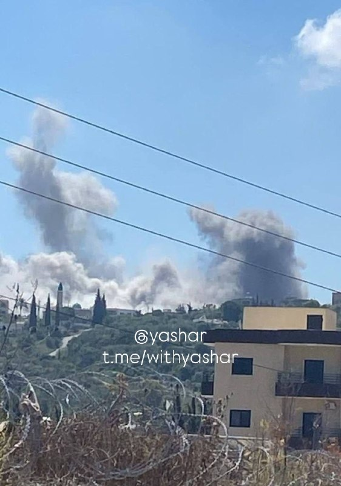

حملات امروز اسرائیل به جنوب لبنان شروع شد.
@withyashar

## WithYashar — post 14614

  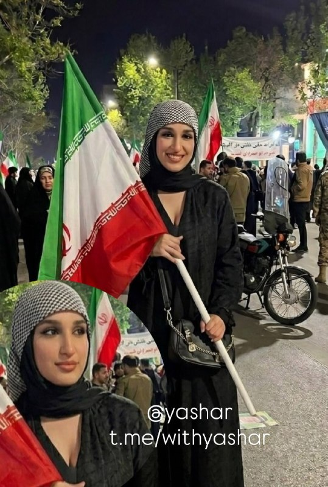

پوشش یکی از طرفداران تندرو تجمعات شبانه حکومتی
@withyashar 🥴

## mwarmonitor — post 10759

🚨 لغو پروازها از فرودگاه هامبورگ در آلمان پس از پیدا شدن یک بسته مشکوک.

@mwarmonitor

## IranIntlTV — post 341856

  <a href="telegram/content/IranIntlTV_341856_1781254432.mp4" target="_blank">🎬 Download video</a>

یک شهروند با ارسال ویدیویی به ایران‌اینترنشنال، صحنه‌هایی از چریدن گله گوسفند در محوطه پادگان «ابوذر» شهرستان مرزی سرپل‌ذهاب استان کرمانشاه را نشان داد و به متروکه شدن آن اشاره کرد.

این پادگان ارتش جمهوری اسلامی در جنگ پیشین و اخیر هدف حملات آمریکا و اسرائیل قرار گرفت. به گفته مقام‌های استانی در حمله اسفندماه اسرائیل به این پایگاه نظامی ۴ عضو تیپ ۷۱ پیاده مکانیزه ارتش کشته شدند.

## Shin_Persian — post 6971

Shin ✓ @hey_itsmyturn
Fri, 12 Jun 2026 08:46:53 UTC

State-owned Mehr News Agency:

"New details of a 14-point draft memorandum of understanding between Iran and the United States have been released by a source close to the Iranian negotiating team.

The details of this draft are as follows:

1. Immediate and permanent cessation of hostilities on all fronts, including Lebanon.

2. A commitment by the United States not to interfere in Iran's internal affairs and to respect the sovereignty of the Islamic Republic of Iran.

3. Complete lifting of the maritime blockade within 30 days.

4. A commitment by the United States to withdraw its forces from around Iran.

5. Reopening of the Strait of Hormuz within 30 days under Iranian arrangements.

6. Suspension of sanctions on oil and petrochemical product sales, and full Iranian access to its financial resources.

7. The necessity for the United States and its allies to present reconstruction plans for Iran totaling at least $300 billion.

8. 60 days of negotiations to reach a final agreement based on nuclear issues and the complete lifting of primary and secondary sanctions imposed by the US, UN Security Council resolutions, and IAEA Board of Governors resolutions.

9. Reiteration of Iran's commitment under the NPT not to produce nuclear weapons.

10. During the negotiation period, the United States has committed not to increase its forces in the region and not to impose new sanctions.

11. Release of $24 billion of Iran's blocked funds during the 60-day final negotiation period. Half of this amount must be made available to Iran before the start of negotiations.

12. Establishment of an oversight mechanism for the implementation of the agreement.

13. The final agreement will be affirmed by a UN Security Council resolution.

14. Final negotiations will not commence before the release of half of Iran's blocked funds, the suspension of Iranian oil sanctions, and the lifting of the maritime blockade. The final agreement will exclusively address the fate of enriched materials and enrichment, sanction relief, and a plan for Iran's economic reconstruction. Discussions regarding Iran's missile program and support for resistance groups have been definitively removed from the agenda."

ترجمه خودکار فارسی در بخش نظرات

𝕏 · @shin_persian

## FarsiVOA — post 220464

  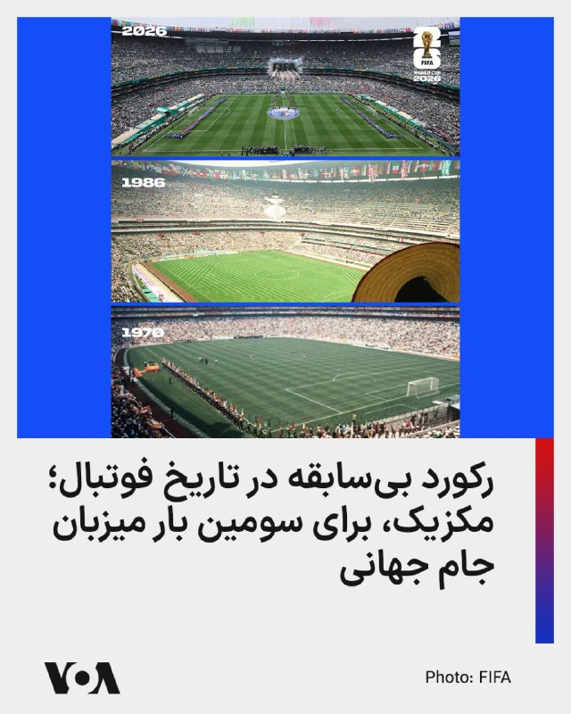

رکورد بی‌سابقه در تاریخ فوتبال؛ مکزیک، برای سومین بار میزبان جام جهانی؛

یکی از مهم‌ترین ویژگی‌های جام جهانی ۲۰۲۶، ثبت یک رکورد تاریخی و بی‌سابقه برای کشور مکزیک است.

این کشور با آغاز این تورنمنت، به نخستین کشور در تاریخ فوتبال تبدیل شد که برای سومین بار، پس از دوره‌های ۱۹۷۰ و ۱۹۸۶، امتیاز میزبانی این رقابت‌های بزرگ را به دست می‌آورد.

با این میزبانی مجدد، استادیوم اسطوره‌ای و خاطره‌انگیز «آزتکا» در مکزیکوسیتی بار دیگر به کانون اصلی توجه و مستطیل سبز سرنوشت‌ساز فوتبال‌دوستان جهان تبدیل شده است.
@FarsiVOA

## IranianMinds — post 22378

عجب

@IranianMinds

## alonews — post 127341

  <a href="telegram/content/alonews_127341_1781254436.webm" target="_blank">🎬 Download video</a>

👈کلش ریپورت: به نظر می‌رسد ایران به رادار هشدار اولیه AR-327 در جبل الدخان، بلندترین نقطه بحرین با ارتفاع ۱۳۴ متر، حمله کرده است.

🔴این سایت میزبان یک رادار مراقبت هوایی سه‌بعدی برد بلند ساخت شرکت بریتانیایی BAE Systems با برد حدود ۴۷۰ کیلومتر است که در یک رادوم ثابت قرار دارد و مسیرهای دریایی خلیج فارس و مسیرهای هوایی منتهی به تنگه هرمز را تحت نظر دارد.

🔴ستون‌های دود در تصاویر منتشرشده توسط ایران، توسط تحلیلگران OSINT به‌طور مستقیم به محوطه راداری در مختصات حدود ‎26.0375°N, 50.5420°E‎ مکان‌یابی شده‌اند.

🔴این رادار یکی از گره‌های شبکه منطقه‌ای هشدار اولیه و دفاع موشکی مرتبط با ایالات متحده است که به عملیات ناوگان پنجم (Fifth Fleet) متصل می‌باشد.

✅ @AloNews خبر جنگ

## alonews — post 127340

  <a href="telegram/content/alonews_127340_1781254436.webm" target="_blank">🎬 Download video</a>

👈قیمت نفت آمریکا در ساعات گذشته ۳.۲ درصد کاهش یافت و به پایین‌ترین حد خود در ۵۶ روز گذشته یعنی ۸۲ دلار رسید.

✅ @AloNews خبر جنگ

## alonews — post 127338

  <a href="telegram/content/alonews_127338_1781254437.webm" target="_blank">🎬 Download video</a>

👈تصویری وایرال شده از تجمعات شبانه

✅ @AloNews خبر جنگ

---
📅 بروزرسانی: 1405/03/22 12:13
---

## WithYashar — post 14613

یدیعوت آحارونوت: نتانیاهو گفت که به ترامپ اطمینان داده است که تلاش‌های او برای رسیدن به توافق با ایران را درک می‌کند، اما اسرائیل نباید قربانی چنین توافقی شود
@withyashar

## FarsiVOA — post 220463

  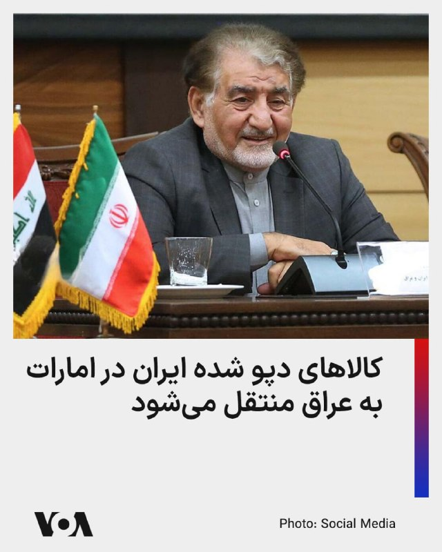

یحیی آل‌اسحاق، رئیس اتاق بازرگانی مشترک ایران و عراق از برنامه جمهوری اسلامی برای انتقال کالاهای دپو شده در بندر جبل‌علی امارات از مسیر عراق خبر داد.

پیش از تهاجم گسترده نظامی جمهوری اسلامی به امارات، یک سوم واردات ایران از این کشور انجام می‌شد و طبق گفته آل‌اسحاق، بندر جبل‌علی سهمی ۱۲ میلیارد دلاری در واردات ایران داشت.

آل‌اسحاق می‌گوید ایران برای انتقال کالاهای موجود و سفارش‌های جدید، مسیرهای جایگزین از جمله عراق را فعال کرده است.

دقیقاً مشخص نیست عراق چگونه با زیرساخت‌های ضعیف بتواند جای امارات- بزرگترین هاب تجاری منطقه - را بگیرد؛ خصوصاً اینکه عراق حتی سهمی یک درصدی در کل واردات ایران نیز ندارد.
@FarsiVOA

## IranianMinds — post 22377

  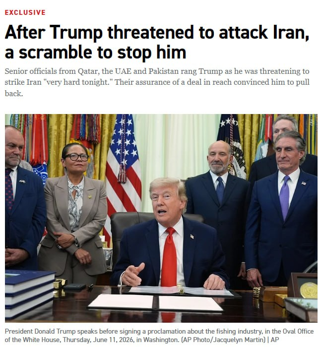

🔴 پولیتیکو :

بعد اینکه ترامپ تهدید کرد «امشب ایران را به‌شدت هدف قرار خواهیم داد»، رهبران قطر، امارات و پاکستان فوری با او تماس گرفتند.

آن‌ها به ترامپ اطمینان دادند که یک توافق اولیه با تهران نزدیک است و هنوز فرصت برای دیپلماسی وجود دارد.

به گفته منابع آگاه، همین تماس‌ها باعث شد ترامپ حمله برنامه‌ریزی‌شده را لغو کرده و مسیر مذاکرات را ترجیح دهد!

@IranianMinds

## IranianMinds — post 22376

  <a href="telegram/content/IranianMinds_22376_1781253826.webm" target="_blank">🎬 Download video</a>

▶️بازی های جذاااب جام جهانی فوتبال رو با آپشن های تخصصی در MelBet پیشبینی کنید! ⚽️
🔥

💵 امکان شارژ کارت بکارت و هات ووچر

🎁 قرعه کشی و آفر های جذاب با جوایز ویژه

📱 کاملترین برنامه موبایل

🤝 اسپانسر رسمی لالیگا

🇮🇷 پشتیبانی از زبان فارسی

✍️ حرفه ای، مطمئن و در کلاس جهانی پیشبینی کنید!

برای ورود به سایت فیلترشکن خود را خاموش کنید!
‌
🌐 Link 🔜 MelBet1.net

🌐‌ Link 🔜 MelBet1.net

## Dirty_Kids — post 391777

  <a href="telegram/content/Dirty_Kids_391777_1781253827.mp4" target="_blank">🎬 Download video</a>

نمیدونم فاز اینجور دخترهای مسلمان چیه؟

@Dirty_Kids 👻

## Dirty_Kids — post 391776

  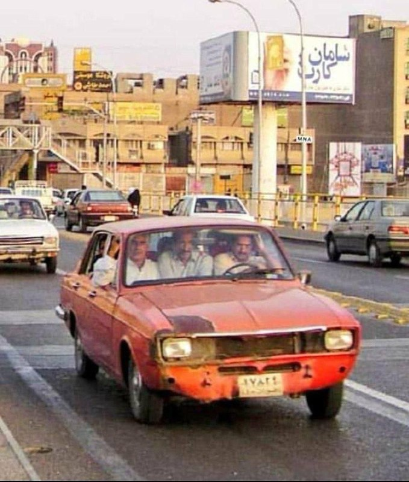

شما یادتون نمیاد ولی یه زمانی راننده تاکسی تا جلو دو نفر مسافر سوار نمی‌کرد راه نمیفتاد!

@Dirty_Kids 👻

---
📅 بروزرسانی: 1405/03/22 12:03
---

## WithYashar — post 14612

کارشناس شبکه خبر: با صراحت میگویم که متاسفانه بخش عمده ای از شروط ده‌گانه رهبری در توافق وجود ندارد.
@withyashar

## IranIntlTV — post 341855

  <a href="telegram/content/IranIntlTV_341855_1781253207.mp4" target="_blank">🎬 Download video</a>

روح‌الله رحیم‌پور، تحلیل‌گر سیاسی، درباره اظهارات دونالد ترامپ مبنی بر موافقت مجتبی خامنه‌ای با شروط واشینگتن گفت: «به نظر می‌رسد تنها دستاورد جمهوری اسلامی از این توافق احتمالی، امکان صادرات نفت باشد.»
@iranintltv

## RadioFarda — post 158209

کارشناسان سازمان ملل سرکوب زنان توسط پلیس امر به معروفِ طالبان را محکوم کردند

🔸چند روز پس از سرکوب خشونت‌بار تظاهراتی در حمایت از حقوق زنان در افغانستان توسط گروه طالبان، گروهی از کارشناسان سازمان ملل متحد سرکوب زنان در شهر هرات را محکوم کردند.

🔸در بیانیه‌ای که روز پنج‌شنبه، ۲۱ خرداد، توسط ده کارشناس مستقل منصوب‌شده از سوی شورای حقوق بشر سازمان ملل منتشر شد، آمده است که در جریان سرکوب این تظاهرات، دست‌کم دو نفر کشته و بیش از ۲۰ نفر زخمی شدند.

🔸پلیس امر به معروف و نهی از منکر هرات از روز شنبه بازداشت ده‌ها زن را به‌دلیل نپوشیدن چادر یا برقعِ پوشاننده کامل بدن آغاز کرده است.

🔸اعتراضی علیه این اقدامات در روز سه‌شنبه در شهر هرات برگزار شد که با استفاده از زور متفرق شد.

🔸به گفته سازمان ملل، یک پسر خردسال در جریان این سرکوب، با شلیک گلوله کشته شد؛ شاهدان نیز به خبرگزاری فرانسه گفتند که نیروهای امنیتی به روی تظاهرکنندگان آتش گشودند.

🔸در حالی که پلیس طالبان استفاده از هرگونه سلاح علیه تظاهرکنندگان را تکذیب می‌کند، یک شاهد عینی که هنگام این اتفاق در محل حضور داشته، ولی به‌دلیل حساسیت موضوع نخواست نامش فاش شود، در همان روز به بخش افغانستان رادیو اروپای آزاد/ رادیو آزادی گفت: «خود من همان‌جا سر چهارراه بهار بودم که این‌ها (طالبان) به سوی معترضان آتش گشودند».

🔸 گزارش کامل را در وب‌سایت رادیوفردا بخوانید.

@RadioFarda

## BBCPersian — post 283554

  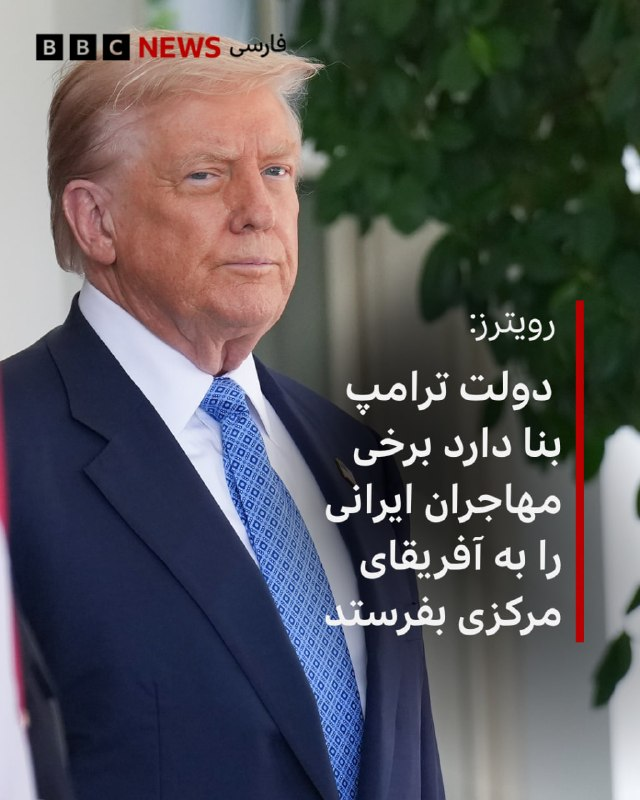

🔻دو وکیل و یک مقام آگاه به خبرگزاری رویترز گفته‌اند دولت دونالد ترامپ قصد دارد شماری از شهروندان ایرانی و دیگر مهاجران را به جمهوری آفریقای مرکزی اخراج کند؛ کشوری که سال‌هاست با بی‌ثباتی، خشونت و فقر گسترده دست و پنجه نرم می‌کند.

به گفته امیلی تراسل، وکیل تعدادی از این افراد، در میان ایرانیانی که با خطر اخراج روبه رو هستند، دو زن حضور دارند که در صورت بازگردانده شدن به ایران ممکن است با شکنجه و آزار و اذیت مواجه شوند.

او در گفت و گو با رویترز افزوده یکی از این زنان به مسیحیت گرویده و دیگری از فعالان حامی دموکراسی است.

رویترز نوشته وزارت خارجه آمریکا و دفتر رئیس جمهوری آفریقای مرکزی ــ کشوری که اخیرا برای پذیرش مهاجران اخراج شده از کشورهای ثالث از سوی آمریکا به توافقی دست یافته است ــ به درخواست این خبرگزاری برای تایید یا تشریح این گزارش واکنش نشان نداده‌اند.
ادامه مطلب⬇️

📸GettyImages
https://bbc.in/4vBSXjk
@BBCPersian

## alonews — post 127337

  <a href="telegram/content/alonews_127337_1781253210.webm" target="_blank">🎬 Download video</a>

👈حاییم رامون، وزیر پیشین اسرائیل:
توافق میان واشنگتن و تهران توافقی بد است و به اسرائیل آسیب می‌زند؛ همچنین این توافق پیامدهایی برای سرنوشت سیاسی نتانیاهو نیز دارد.

✅ @AloNews خبر جنگ

## alonews — post 127336

  <a href="telegram/content/alonews_127336_1781253210.webm" target="_blank">🎬 Download video</a>

👈نیروهای روسی بیش از نیمی از کنستانتینوکا در منطقه دونتسک را پس از عقب‌نشینی بی‌صدا نیروهای اوکراینی از حومه جنوب غربی، تصرف کرده‌اند.

✅ @AloNews خبر جنگ

## alonews — post 127335

  <a href="telegram/content/alonews_127335_1781253210.webm" target="_blank">🎬 Download video</a>

👈 هم اکنون جنوب لبنان

✅ @AloNews خبر جنگ

---
📅 بروزرسانی: 1405/03/22 11:53
---

## VahidOOnLine — post 245109

  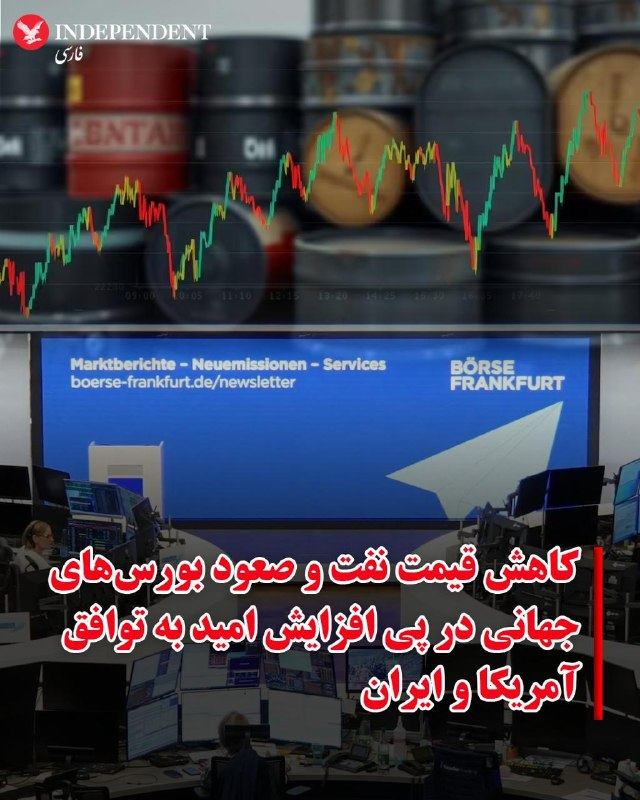

♦️در پی افزایش امیدها برای پایان جنگ میان ایران و آمریکا، شاخص بازارهای سهام آسیایی و اروپایی روز جمعه ۲۲ خرداد ماه مثبت شد.

بهای نفت خام برنت دریای شمال، قیمت معیار نفت، در آخرین روز کاری هفته با بیش از سه درصد کاهش نسبت به پنجشنبه به ۸۷ دلار و ۳۵ سنت رسید.

به گزارش رویترز، سهام شرکت‌های گردشگری و حمل‌ونقل بیشترین رشد را ثبت کردند و شاخص این گروه در بازارهای اروپایی، ۳.۴ درصد افزایش یافت. سهام لوفت‌هانزا ۴.۶ درصد و شرکت هواپیمایی فرانسه (ایر فرانس) نیز ۵.۷ درصد صعود کرد.

سهام شرکت اسپیس ایکس ایلان ماسک، شامگاه پنجشنبه به وقت تهران و همزمان با اعلام «پایان جنگ» آمریکا و ایران، برای نخستین بار وارد بازار بورس شد.
‌🇸🇦 Indypersian

🤖 @VahidOOnLine

## WithYashar — post 14611

  <a href="telegram/content/WithYashar_14611_1781252619.mp4" target="_blank">🎬 Download video</a>

تکرار ۳۹ باره ادعای «نزدیکی به توافق» توسط ترامپ از زمان شروع جنگ

شبکه CNN با انتشار ویدیویی از اظهارات دونالد ترامپ، نشان داده که او از زمان آغاز جنگ با ایران، دست‌کم ۳۹ بار ادعای «نزدیک شدن به توافق» را مطرح کرده است. این در حالی است که با وجود این تکرارها، هنوز توافق نهایی امضا نشده است.
@withyashar

## mwarmonitor — post 10758

  

🔴 سلسله‌ای از حملات هوایی اسرائیل، شهرک البیاض در شهرستان صور در جنوب لبنان را هدف قرار داد.

@mwarmonitor

## DW_Farsi — post 125858

  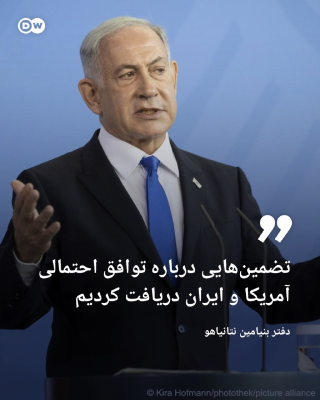

🔶 اسرائیل: تضمین‌هایی درباره توافق احتمالی آمریکا و ایران دریافت کردیم

در بحبوحه احتمال دستیابی آمریکا و ایران به یک توافق، دولت اسرائیل اعلام کرده است که از واشنگتن تضمین‌هایی دریافت کرده مبنی بر اینکه منافع امنیتی اسرائیل در یک توافق نهایی با ایران لحاظ خواهد شد.

دفتر بنیامین نتانیاهو، نخست‌وزیر اسرائیل، شامگاه پنجشنبه ۲۱ خرداد (۱۱ ژوئن) اعلام کرد، دونالد ترامپ، رئیس‌جمهور آمریکا، تضمین داده است که هر توافق نهایی با تهران "شامل حذف اورانیوم غنی‌شده ایران و برچیدن تاسیسات غنی‌سازی این کشور خواهد بود".

ترامپ همچنین به نتانیاهو اطمینان داده است که هرگونه توافق با جمهوری اسلامی "برنامه موشکی ایران را محدود کرده و حمایت تهران از نیروهای نیابتی خود در منطقه را پایان خواهد داد". منظور از این گروه‌ها، از جمله سازمان‌های تروریستی حماس و حزب‌الله لبنان است.

بر اساس این گزارش، ترامپ و نتانیاهو عصر همان روز درباره یک "تفاهم‌نامه" میان آمریکا و ایران برای آغاز مذاکرات گفت‌وگو کرده‌اند.

دفتر نتانیاهو در عین حال تاکید کرده است که اسرائیل در روند مذاکرات واشنگتن با تهران مشارکت ندارد.

@dw_farsi

## Persian_Trend_Official — post 16836

  <a href="telegram/content/Persian_Trend_Official_16836_1781252622.mp4" target="_blank">🎬 Download video</a>

امیر دریادار سیاری: پس از حمله به قطر هنوز از سرنوشت خلبانان سوخو 24 آگاهی نداریم.

📝 Amir

📌 @persian_trend_official
پرشین ترند | متفاوت‌ترین کانال نظامی

## Hranews — post 113552

گزارشی از بازداشت و پخش اعترافات اجباری دو تن در هرمزگان

❗️
❗️
❗️
❗️
❗️– دو شهروند از جمله یک زن در استان هرمزگان به دلیل ارسال تصاویر و مطالب برای رسانه های خارج از کشور بازداشت شدند. هم‌زمان ویدئویی از اعترافات اجباری این شهروندان منتشر شده که مشخص نیست در چه شرایطی ضبط شده است.

ادامه مطلب

↘️
@hranews_bot تماس ✉️ - @Hranews کانال هرانا 🆑

## alonews — post 127333

  <a href="telegram/content/alonews_127333_1781252623.webm" target="_blank">🎬 Download video</a>

👈مهر: جزئیات جدید از پیش نویس تفاهمنامه ۱۴ ماده ای ایران و آمریکا توسط منبع نزدیک به تیم مذاکره کننده ایرانی منتشر شد.

🔴 جزییات این پیش‌نویس به شرح ذیل است:

۱- توقف دائمی و فوری جنگ در همه جبهه ها از جمله لبنان

۲- تعهد آمریکا به عدم مداخله در امور داخلی ایران و احترام به حاکمیت جمهوری اسلامی ایران.

۳- رفع کامل محاصره دریایی ظرف ۳۰ روز

۴- تعهد آمریکا به خروج نیروهایش از پیرامون ایران

۵- بازگشایی تنگه هرمز ظرف ۳۰ روز با ترتیبات ایرانی

۶- تعلیق تحریم های فروش نفت، محصولات پتروشیمی و مشتقات و دسترسی کامل ایران به منابع مالی آن.

۷- لزوم ارائه طرح های بازسازی ایران حداقل به مبلغ ۳۰۰ میلیارد دلار توسط آمریکا و متحدانش

۸- ۶۰ روز مذاکره برای رسیدن به توافق نهایی مبتنی بر موضوعات هسته ای و لغو کامل تحریم های اولیه، ثانویه، آمریکا و قطعنامه های شورای امنیت سازمان ملل و شورای حکام آژانس بین المللی انرژی اتمی

۹- تکرار تعهد ایران در پیمان ان پی تی مبنی بر عدم تولید سلاح هسته ای

۱۰- در دوره مذاکرات آمریکا متعهد شده به نیروهای خود در منطقه اضافه نمی کند و تحریم جدیدی هم وضع نخواهد کرد.

۱۱- آزادسازی ۲۴ میلیارد دلار پول های بلوکه شده ایران در دوره ۶۰ روزه مذاکرات نهایی. نیمی از این مبلغ قبل از شروع مذاکرات باید در دسترس ایران قرار گیرد.

۱۲- تشکیل سازوکار نظارتی برای اجرایی کردن توافق.

۱۳- توافق نامه نهایی توسط قطعنامه شورای امنیت سازمان ملل به تایید می رسد.

۱۴- مذاکره نهایی قبل از آزادسازی نیمی از پول های بلوکه شده ایران، تعلیق تحریم های نفتی ایران و رفع محاصره دریایی آغاز نمی شود و توافق نهایی صرفا در موضوع سرنوشت مواد غنی شده و غنی سازی، رفع تحریم ها، برنامه بازسازی اقتصاد ایران انجام می شود و بحث درباره برنامه موشکی ایران و حمایت از گروه های مقاومت به صورت قطعی از دستور کار خارج شده است.



✅ @AloNews خبر جنگ

---
📅 بروزرسانی: 1405/03/22 11:44
---

## mwarmonitor — post 10757

🔴خبرگزاری مهر ایران به نقل از منبعی نزدیک به تیم مذاکره‌کننده ایران، جزئیات جدیدی از آنچه پیش‌نویس ۱۴‌بندی یادداشت تفاهم میان ایران و آمریکا خوانده می‌شود، منتشر کرده است.

🔸بر اساس این گزارش، پیش‌نویس شامل توقف فوری و دائمی درگیری‌ها در همه جبهه‌ها، از جمله لبنان؛ تعهد آمریکا به عدم مداخله در امور داخلی ایران؛ رفع محاصره دریایی ظرف ۳۰ روز؛ و تعهد ایالات متحده به خروج نیروهایش از مناطق اطراف ایران است.

🔸در این پیش‌نویس همچنین آمده است که تنگه هرمز ظرف ۳۰ روز و تحت ترتیبات ایران بازگشایی شود، تحریم‌های نفتی و پتروشیمی ایران و درآمدهای مرتبط تعلیق گردد و منابع مالی ایران به‌طور کامل در دسترس قرار گیرد.

🔸به گفته مهر، این پیش‌نویس ۶۰ روز مذاکره برای رسیدن به توافق نهایی را در نظر می‌گیرد که موضوعاتی از جمله پرونده هسته‌ای، رفع کامل تحریم‌ها، بازسازی اقتصاد ایران، و سرنوشت مواد غنی‌شده و غنی‌سازی را شامل می‌شود.

🔸این گزارش می‌افزاید که ۲۴ میلیارد دلار از دارایی‌های مسدودشده ایران در طول دوره ۶۰روزه مذاکرات آزاد خواهد شد که نیمی از آن پیش از آغاز مذاکرات در دسترس قرار می‌گیرد.

🔸طبق گزارش مهر، این پیش‌نویس برنامه موشکی ایران و حمایت از «گروه‌های مقاومت» را از دستور کار خارج می‌کند و هر توافق نهایی از طریق قطعنامه شورای امنیت سازمان ملل تأیید خواهد شد.

🔸در پایان، مهر تأکید می‌کند که این متن هنوز نیازمند بررسی و تصویب نهایی از سوی نهادهای ذی‌ربط در ایران است.

@mwarmonitor

## IranIntlTV — post 341854

  <a href="telegram/content/IranIntlTV_341854_1781252070.mp4" target="_blank">🎬 Download video</a>

دونالد ترامپ، رییس‌جمهوری آمریکا، گفت مجتبی خامنه‌ای با شروط واشینگتن موافقت کرده و توافق با جمهوری اسلامی ممکن است طی روزهای آینده با حضور جی‌دی ونس در ژنو به امضا برسد.

علی شیرازی، عضو تحریریه ایران‌اینترنشنال، گفت: «به نظر می‌رسد ترامپ به تمام اهداف خود رسیده، اما جمهوری اسلامی هیچ دستاوردی نداشته است.» او افزود: «سکوت مقام‌های جمهوری اسلامی نشان می‌دهد چیزی به دست نیاورده‌اند؛ چرا که در گذشته و در شرایط مشابه، این مقام‌ها بلافاصله چنین اظهاراتی را رد می‌کردند.»
@iranintltv

## Persian_Trend_Official — post 16835

  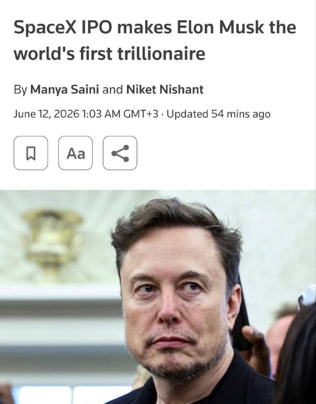

رویترز: ایلان ماسک پس از عرضه اولیه سهام اسپیس ایکس، به اولین تریلیونر جهان تبدیل شد.

شرکت اسپیس ایکس متعلق به ایلان ماسک، بزرگترین عرضه اولیه سهام تاریخ را در بورس نزدک با قیمت 135 دلار برای هر سهم برگزار کرد

بدین ترتیب، اسپیس ایکس 75 میلیارد دلار سرمایه جذب کرد. این سه برابر رکورد شرکت آرامکوی سعودی (25.6 میلیارد دلار در سال 2019) است. ارزش اسپیس ایکس 1.77 تریلیون دلار است و تقاضا چهار برابر بیشتر از عرضه است.

سرمایه‌گذاران نه تنها به استارلینک، بلکه به برنامه‌های هوش مصنوعی این شرکت نیز امید بسته‌اند؛ منتقدان خاطرنشان می‌کنند که طرح‌هایی از مراکز داده فضایی گرفته تا استعمار مریخ، هنوز فقط ایده هستند.

📝 Amir

📌 @persian_trend_official
پرشین ترند | متفاوت‌ترین کانال نظامی

## Persian_Trend_Official — post 16834

  <a href="telegram/content/Persian_Trend_Official_16834_1781252073.mp4" target="_blank">🎬 Download video</a>

🦾 تقویت حضور راهبردی آمریکا در اروپا؛ ۳ فروند B-1B دیگر وارد بریتانیا شدند.

❗️سه فروند بمب‌افکن راهبردی B-1B Lancer نیروی هوایی آمریکا امروز وارد پایگاه RAF Fairford در بریتانیا شدند؛ پایگاهی که به مرکز اصلی استقرار بمب‌افکن‌های راهبردی آمریکا در اروپا تبدیل شده است.

⚔️ اگرچه مبدأ این بمب‌افکن‌ها به‌صورت رسمی اعلام نشده، اما بر اساس داده‌های رهگیری پرواز و الگوی استقرارهای اخیر، احتمال می‌رود این هواپیماها از پایگاه هوایی دایس (Dyess AFB) در ایالت تگزاس،کال‌ساین
سریال
Mode-S
MANDY 01 86-0103 AE6BEC
MANDY 02 86-0124 AE6BFE
MANDY 03 86-0112 AE6BF4
به بریتانیا اعزام شدند .

🇺🇸 در ماه‌های اخیر آمریکا به‌طور مستمر بمب‌افکن‌های B-1B و B-52H را در فیرفورد مستقر کرده و این پایگاه اکنون یکی از مهم‌ترین مراکز پشتیبانی عملیات هوایی واشنگتن در اروپا، خاورمیانه و شمال آفریقا محسوب می‌شود.

❗️
❗️ برآورد می‌شود هم‌اکنون ترکیبی از بمب‌افکن‌های B-1B، B-52H، هواپیماهای سوخت‌رسان KC-135 و هواگردهای پشتیبانی در RAF Fairford حضور داشته باشند.

🎯استقرار بمب‌افکن‌های جدید درست در زمانی انجام می‌شود که تقریباً هر شب اخباری از مذاکرات، رفت‌وآمد میانجی‌ها و اظهارات ترامپ درباره «نزدیک بودن توافق» منتشر می‌شود. با این حال، افزایش همزمان توان نظامی آمریکا در منطقه نشان می‌دهد واشنگتن در کنار دیپلماسی، گزینه فشار و اقدام نظامی را نیز روی میز نگه داشته است.

👺 Phantom

📌 @persian_trend_official
پرشین ترند | متفاوت‌ترین کانال نظامی

## Persian_Trend_Official — post 16833

  <a href="telegram/content/Persian_Trend_Official_16833_1781252075.webm" target="_blank">🎬 Download video</a>

وزیر دفاع یونان، دندیاس: ما با یک تهدید آشکار و به‌طور رسمی اعلام‌شده روبه‌رو هستیم.

این تهدید به‌صورت واضح بیان می‌شود و به دلیل جنگ اشاره می‌شود. می‌بینیم که طرف مقابل دائماً خواسته‌های خود را که مغایر با حقوق بین‌الملل است، گسترش می‌دهد.

من نمی‌خواهم ترکیه قانون میهن آبی (Mavi Vatan) را تصویب کند. امیدوارم ترکیه در این مسیر اقدامی انجام ندهد. من بازی ترک‌ها را انجام نخواهم داد و فضای پرتنش را بیشتر شعله‌ور نخواهم کرد.

📝 Amir

📌 @persian_trend_official
پرشین ترند | متفاوت‌ترین کانال نظامی

## BBCPersian — post 283553

  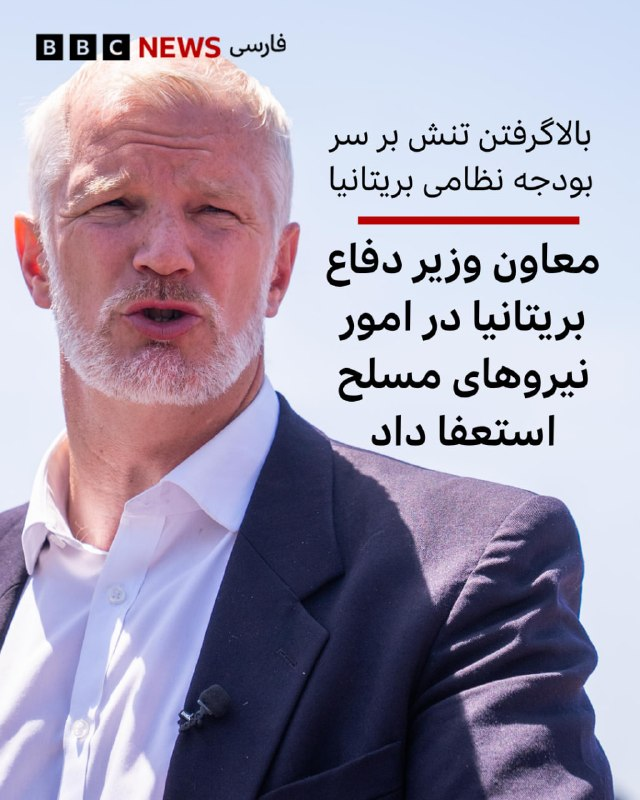

🔻آل کارنز، معاون وزیر دفاع بریتانیا در امور نیروهای مسلح، به دلیل اختلاف با نخست‌وزیر بر سر بودجه نظامی از سمت خود استعفا داد؛ پیش از او جان هیلی، وزیر دفاع، هم به همین دلیل استعفا داده بود.
آل کارنز که عصر دیروز استعفا داد به کی‌یر استارمر، نخست‌وزیر، گفت که «طرح سرمایه‌گذاری دفاعی نه تحولی ایجاد می کند و نه بودجه کافی دارد».
او همچنین گفت که از نیروهای مسلح خواسته می‌شود در دنیایی خطرناک‌تر و پرتنش‌تر فعالیت کنند، در حالی که بودجه‌ای که در اختیارشان قرار دارد مربوط به شرایطی آرام‌تر و کم‌خطرتر در گذشته است.
کی‌یر استارمر، در پی استعفای جان هیلی، دان جاروِیس را به عنوان وزیر دفاع منصوب کرده است.
آقای هیلی هم ضمن انتقاد از نخست‌وزیر گفته بود که قادر نیست منابع لازم را برای حفظ امنیت کشور فراهم کند.
اما نخست‌وزیر گفته است که دولت بودجه دفاعی را به شکل قابل توجهی افزایش داده و این افزایش به‌گونه‌ای طراحی شده است که هم در حال حاضر و هم در سال‌های آینده قابل افزایش و پایدار باشد.

📸GettyImages
@BBCPersian

## Hranews — post 113551

دو زندانی در زندان‌های دزفول و ماکو اعدام شدند

❗️
❗️
❗️
❗️
❗️– حکم دو زندانی که پیشتر از بابت اتهام قتل به #اعدام محکوم شده بودند، در زندان‌های دزفول و ماکو به اجرا در آمد.

ادامه مطلب

#جان‌محمد_سعادتی #زکریا_خضرنژاد

↘️
@hranews_bot تماس ✉️ - @Hranews کانال هرانا 🆑

## alonews — post 127332

  <a href="telegram/content/alonews_127332_1781252077.webm" target="_blank">🎬 Download video</a>

👈نیوزویک به نقل از یک منبع آگاه گفت ترامپ به نتانیاهو هشدار داده که در روتد توافق دخالت نکند و الا با اسرائیل برخورد خواهد شد

✅ @AloNews خبر جنگ

## alonews — post 127331

  <a href="telegram/content/alonews_127331_1781252077.webm" target="_blank">🎬 Download video</a>

👈یدیعوت آحارونوت:
نتانیاهو، گفته است که به ترامپ تأکید کرده که درک می‌کند او در پی دستیابی به توافقی با ایران است، اما اسرائیل نباید قربانی این توافق شود.

✅ @AloNews خبر جنگ

## alonews — post 127330

  <a href="telegram/content/alonews_127330_1781252077.webm" target="_blank">🎬 Download video</a>

👈گویا قالیباف هم به ژنو خواهد رفت

✅ @AloNews خبر جنگ

## alonews — post 127329

  <a href="telegram/content/alonews_127329_1781252078.webm" target="_blank">🎬 Download video</a>

👈الاخبار: ایران پاسخ نهایی را از ایالات متحده دریافت کرده که مبنی بر گنجاندن لبنان در تفاهم‌نامه‌های آتش‌بس است

🔴تفاهم‌نامه پیشنهادی شامل توقف کامل عملیات نظامی، تعیین جدول زمانی برای خروج اشغالگران از خاک لبنان، توقف عملیات تخریب و آزادی زندانیان است

✅ @AloNews خبر جنگ

---
📅 بروزرسانی: 1405/03/22 11:34
---

## VahidOOnLine — post 245108

  <a href="telegram/content/VahidOOnLine_245108_1781251446.mp4" target="_blank">🎬 Download video</a>

⭕️تنش میان فرانسه و ترکیه بر سر توافق نظامی با قبرس افزایش یافت

♦️فرانسه و قبرس توافق‌نامه‌ای نظامی امضا کرده‌اند که بر اساس آن همکاری‌های دفاعی دو کشور گسترش می‌یابد و نیروهای فرانسوی به برخی تاسیسات نظامی در این جزیره دسترسی پیدا می‌کنند.

ترکیه با انتقاد از این توافق، آن را مغایر با معاهدات سال ۱۹۶۰ قبرس دانسته و نسبت به آنچه «پیامدهای جدی» این اقدام خوانده، هشدار داده است. این توافق حضور نظامی فرانسه در شرق مدیترانه را بیش از پیش تقویت می‌کند؛ منطقه‌ای که در سال‌های اخیر شاهد رقابت‌های ژئوپلیتیکی فزاینده بوده است.

ترکیه، یونان، قبرس و فرانسه در سال‌های اخیر بر سر مرزهای دریایی، منابع انرژی و حضور نظامی در شرق مدیترانه اختلافات متعددی داشته‌اند.
پاریس از حامیان اصلی دولت قبرس و یونان در این منازعات به شمار می‌رود، در حالی که آنکارا بارها به افزایش حضور نظامی کشورهای خارجی در این جزیره مورد مناقشه اعتراض کرده است.
قبرس از سال ۱۹۷۴ به دو بخش ترک‌نشین و یونانی‌نشین تقسیم شده است.
‌🇸🇦 Indypersian

🤖 @VahidOOnLine

## pm_afshaa — post 93673

اکسیوس: توافق بین ایران و ایالات متحده این هفته در ژنو سوئیس امضا خواهد شد

💧 Rainbet.com the #1 Non-KYC Crypto Casino & Sportsbook @rainbetcom

😁 @Pm_Afshaa

## DEJradio — post 5611

  <a href="telegram/content/DEJradio_5611_1781251448.mp4" target="_blank">🎬 Download video</a>

🔺🎥 بندرعباس؛ اعتراض شهروندان به کمبود بنزین

#بنزین #بندرعباس
@DEJradio

## mamlekate — post 103686

📝 تفاهم احتمالی واشنگتن و تهران دارای چه مفادی است؟

اکسیوس گزارش داد که در صورت امضای تفاهم‌نامه میان آمریکا و جمهوری اسلامی، تنگه هرمز فوراً و بدون عوارض بازگشایی می‌شود و در مقابل، تحریم‌های تهران بر مبنای پایبندی به توافق کاهش می‌یابد.

@mamlekate

## mamlekate — post 103685

📝 اوپک از سقوط سهمگین تولید نفت ایران خبر داد

سازمان کشورهای صادرکننده نفت، اوپک، از افت چشمگیر تولید نفت ایران در میانه احیای نسبی تولید کشورهای عرب منطقه خبر داد.

بر اساس این گزارش، تولید روزانه نفت ایران در ماه مه با افتی ۵۴۶ هزار بشکه‌ای به ۲ میلیون و ۳۳۰ هزار بشکه سقوط کرده که کمترین مقدار طی شش سال گذشته است.

این برای سومین ماه متوالی است که تولید نفت ایران کاهش می‌یابد، اما شدت افت در ماه گذشته به خاطر محاصره دریایی ایالات متحده علیه جمهوری اسلامی و توقف صادرات نفت ایران، بسیار شدید بوده است.

@mamlekate

## Persian_Trend_Official — post 16832

منابع به یدیعوت آحارونوت گفتند: نتانیاهو گفت که به ترامپ اطمینان داده است که تلاش‌های او برای رسیدن به توافق با ایران را درک می‌کند، اما اسرائیل نباید قربانی چنین توافقی شود.

📝 Amir

📌 @persian_trend_official
پرشین ترند | متفاوت‌ترین کانال نظامی

## Persian_Trend_Official — post 16831

  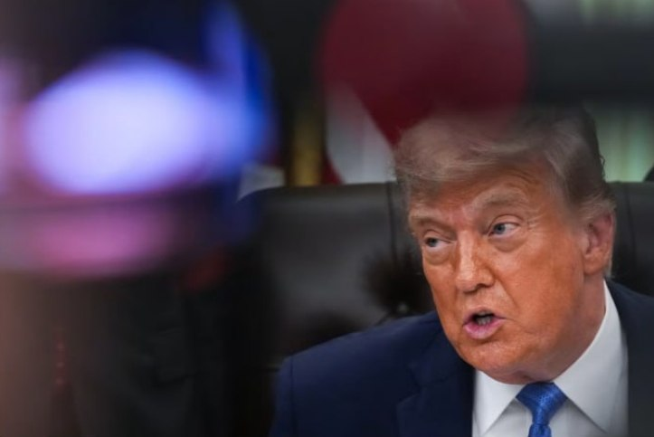

پولیتیکو: امیر قطر تمیم بن حمد، فرمانده ارتش پاکستان عاصم منیر و رئیس امارات متحده محمد بن زاید دیروز پس از تهدیدات ترامپ برای حمله به ایران با او تماس گرفتند و او را قانع کردند که از برنامه خود عقب‌نشینی کند، در حالی که به او فشار آوردند که می‌توان به زودی به توافق رسید.

📝 Amir

📌 @persian_trend_official
پرشین ترند | متفاوت‌ترین کانال نظامی

## alonews — post 127327

  <a href="telegram/content/alonews_127327_1781251451.webm" target="_blank">🎬 Download video</a>

👈 تصویری از کابین دو نسخه متفاوت از بالگرد شینوک

🔴نسخه قدیمی‌تر سی که در دهه ۱۹۷۰ ساخته شد و در ایران نیز خدمت کرد
و کابین آخرین نسخه تولیدی که هم اکنون نیز در حال تولید است نسخه اف

✅ @AloNews خبر جنگ

## alonews — post 127326

  <a href="telegram/content/alonews_127326_1781251451.webm" target="_blank">🎬 Download video</a>

👈آکسیوس: هواپیمای آمریکایی حامل تجهیزات جی دی ونس برای امضای توافق احتمالی با ایران دیروز به اروپا پرواز کرد‌‌

✅ @AloNews خبر جنگ

---
📅 بروزرسانی: 1405/03/22 11:23
---

## WithYashar — post 14610

اکسیوس : توافق ایران و آمریکا در ژنو سوئیس امضا خواهد شد
@withyashar

## IranIntlTV — post 341853

  <a href="telegram/content/IranIntlTV_341853_1781250820.mp4" target="_blank">🎬 Download video</a>

سالار غلامی، فعال اجتماعی و کاپیتان پیشین تیم ملی بوکس، درباره کشته شدن افسر پلیس تورنتو در عملیات علیه شبکه‌ای با احتمال ارتباط با جمهوری اسلامی گفت با وجود فعالیت‌های مسلحانه و تیراندازی‌های متعدد عوامل مرتبط با جمهوری اسلامی، دولت کانادا هنوز نتوانسته توضیحاتی قانع‌کننده به افکار عمومی ارائه کند.
@iranintltv

## IranIntlTV — post 341852

  <a href="telegram/content/IranIntlTV_341852_1781250821.mp4" target="_blank">🎬 Download video</a>

ساعاتی پس از برد تیم ملی فوتبال مکزیک در اولین دیدار رقابت‌های جام‌جهانی، هزاران نفر از شهروندان مکزیکوسیتی به خیابان‌ها آمدند و به جشن و پایکوبی پرداختند.

گزارش رضا محدث، خبرنگار ایران‌اینترنشنال، گزارش می‌دهد
@iranintltv

## FarsiVOA — post 220462

  <a href="telegram/content/FarsiVOA_220462_1781250823.mp4" target="_blank">🎬 Download video</a>

آغاز بزرگ‌ترین جام جهانی تاریخ؛ سوت افتتاحیه مسابقات در مکزیک زده شد؛

مراسم افتتاحیه جام جهانی ۲۰۲۶، پنج‌شنبه ۲۱ خرداد، در ورزشگاه تاریخی «آزتکا» در مکزیکو سیتی برگزار شد و این تورنمنت بین‌المللی رسماً کار خود را آغاز کرد.

این دوره از رقابت‌ها که به میزبانی مشترک سه کشور آمریکا، کانادا و مکزیک برگزار می‌شود. این اولین دوره در تاریخ فوتبال است که مسابقات با حضور ۴۸ تیم، به جای ۳۲ تیم در دوره‌های گذشته، برگزار می‌شود.

در مراسم افتتاحیه این رویداد، برنامه‌هایی با محوریت نمایش تنوع فرهنگی کشورهای میزبان و تاریخچه فوتبال در قاره آمریکای شمالی اجرا شد.

تیم ملی مکزیک در بازی افتتاحیه به مصاف آفریقای جنوبی رفت و موفق شد ۲ بر ۰ پیروز شود.

بر اساس فرمت جدید و سه‌گانه مسابقات، دو مراسم افتتاحیه مجزای دیگر نیز برای دو میزبان بعدی برنامه‌ریزی شده است که امروز جمعه ۲۲ خرداد، پیش از اولین بازی‌های خانگی کانادا و ایالات متحده برگزار می‌شوند.
@FarsiVOA

## DW_Farsi — post 125850

🔶 آغاز جام جهانی فوتبال ۲۰۲۶ با پیروزی مکزیک بر آفریقای جنوبی

سوت آغاز مسابقات جام جهانی فوتبال ۲۰۲۶ به صدا درآمد. تیم ملی فوتبال مکزیک در دیدار افتتاحیه توانست با نتیجه ۲ بر صفر آفریقای جنوبی را شکست دهد و سه امتیاز مهم را به دست آورد. داور در این دیدار سه بار کارت قرمز نشان داد.

@dw_farsi

## RadioFarda — post 158208

🔸به گزارش خبرگزاری رویترز یک دادگاه در کره جنوبی روز جمعه، ۲۲ خرداد‌ماه «یون سوک‌یول» رئیس‌جمهور سابق این کشور را به اتهام نقش داشتن در اعزام پهپادهای نظامی به حریم هوایی کره شمالی، به ۳۰ سال زندان محکوم کرد. 🔸دادگاه اعلام کرد این اقدام با هدف ایجاد بهانه‌ای…

## RadioFarda — post 158207

  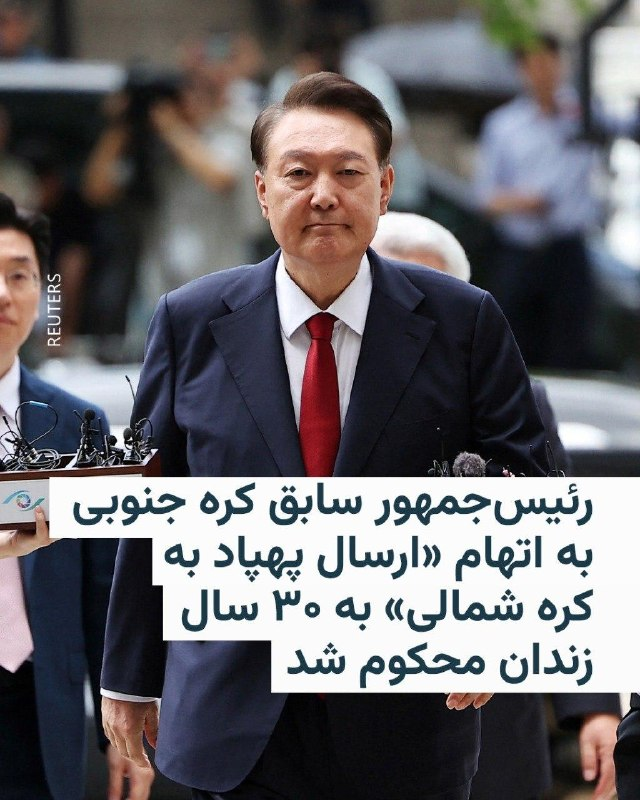

🔸به گزارش خبرگزاری رویترز یک دادگاه در کره جنوبی روز جمعه، ۲۲ خرداد‌ماه «یون سوک‌یول» رئیس‌جمهور سابق این کشور را به اتهام نقش داشتن در اعزام پهپادهای نظامی به حریم هوایی کره شمالی، به ۳۰ سال زندان محکوم کرد.

🔸دادگاه اعلام کرد این اقدام با هدف ایجاد بهانه‌ای برای اعلام حکومت نظامی در دسامبر ۲۰۲۴ انجام شده بود.

🔸بر اساس بیانیه دادگاه منطقه مرکزی سئول، یون به اتهام «کمک به دشمن» و «سوءاستفاده از قدرت» مجرم شناخته شد. دادگاه همچنین اعلام کرد او از ابتدا در طراحی عملیات نفوذ پهپادها بر فراز پیونگ‌یانگ در اکتبر ۲۰۲۴ مشارکت داشته است.
@RadioFarda

## IranianMinds — post 22375

  <a href="telegram/content/IranianMinds_22375_1781250825.mp4" target="_blank">🎬 Download video</a>

🔴 داریوش ارجمند :

بعد مرگ خامنه ای انقد ناراحت بودم که یک ماه تو بستر افتاده بودم.

@IranianMinds

## BBCPersian — post 283546

🔻قتل لیانا دختر ۱۱ ساله خشم فرانسه را برانگیخت و فشار بر دولت را افزایش داد.

دولت فرانسه به دنبال مرگ دختر ۱۱ ساله تحت فشار‌های فزاینده قرار گرفته است چون متهم به قتل پیش از این به عنوان مجرم جنسی بارها به پلیس گزارش شده بود. پس از قتل لیانا بیش از ۶۰٬۰۰۰ نفر در تظاهرات در سراسر فرانسه شرکت کردند و خواهان برکناری ژرال دارمنن، وزیر دادگستری فرانسه شدند.
خشم مردم به این دلیل بود که مادر دختر ۱۰ ساله‌ای به نام رزا پیش‌تر علیه ژروم بارلا به دلیل چندین مورد آزار جنسی شکایت کرده بود و شواهد پزشکی تأیید می‌کند که او مورد آزار قرار گرفته است، اما با گذشت ۹ ماه اقدامی مؤثر صورت نگرفته بود.
پیکر لیانا در مزرعه‌ای در نزدیکی فلورانس پیدا شد و بارلا که پدر دوست او بود بازداشت شد و هرگونه مشارکت در قتل را انکار کرد اما اعتراف کرد او را با اتومبیل خود به استخر شنای محل برده است. بعداً روشن شد نام بارلا در چند پرونده آزار جنسی مطرح بوده است و به همین دلیل وکلای مادر رزا علیه دولت و دارمنن شکایت کرده‌اند.
ادامه مطلب⬇️

📸GettyImages/AFP
https://bbc.in/443ofng
@BBCPersian

## alonews — post 127325

  <a href="telegram/content/alonews_127325_1781250826.webm" target="_blank">🎬 Download video</a>

👈اکسیوس : توافق ایران و آمریکا در ژنو سوئیس امضا خواهد شد

✅ @AloNews خبر جنگ

---
📅 بروزرسانی: 1405/03/22 11:13
---

## DEJradio — post 5610

  <a href="telegram/content/DEJradio_5610_1781250222.webm" target="_blank">🎬 Download video</a>

⚽️
🔺 سوشا مکانی:
تیم ملی باید نماینده مردم باشد نه رژیم جنایتکار

سوشا مکانی، دروازبان پیشین تیم ملی و پرسپولیس می‌گوید تیم و بازیکنان فوتبال که عنوان «ملی» دارد، به‌جای ایستادن کنار مردم، کنار حکومت ایستادند.

#دژفوتبالی #جام_جهانی
@DEJradio

## IranIntlTV — post 341851

  <a href="https://t.me/IranintlTV/341851" target="_blank">📎 Download file</a>

🎧نسخه صوتی اخبار بامدادی | جمعه ۲۲ خرداد
@iranintlTV

## DW_Farsi — post 125849

  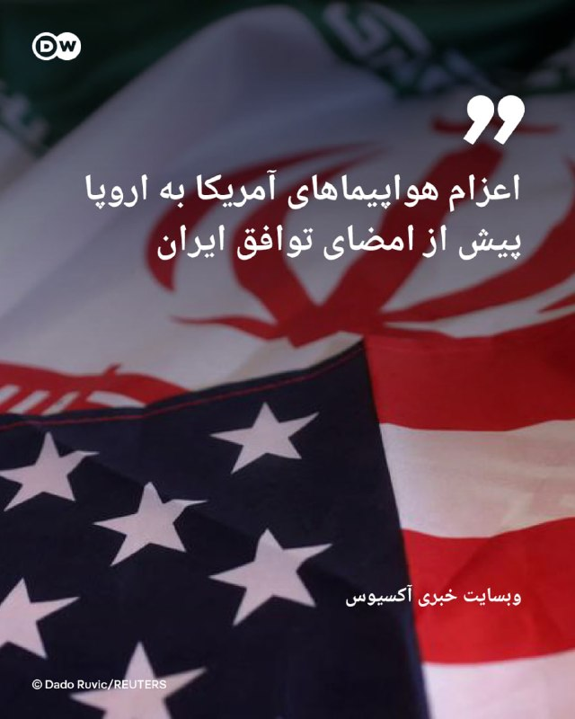

🔶 آکسیوس: اعزام هواپیماهای آمریکا به اروپا پیش از امضای توافق ایران

وبسایت خبری "آکسیوس" گزارش داده است که چهار هواپیماهای ترابری نظامی آمریکا پیش از سفر احتمالی جی‌دی‌ ونس، معاون رئیس‌جمهور آمریکا برای امضای یک تفاهم‌نامه مرتبط با ایران، به اروپا اعزام شده‌اند؛ تفاهم‌نامه‌ای که ممکن است در روزهای آینده در ژنو به امضا برسد.

دو دیپلمات از دو کشور میانجی و دو مقام آمریکایی به آکسیوس گفتند "توافق اولیه چهارشنبه شب (۱۱ ژوئن / ۲۱ خرداد) پس از ساعت‌ها مذاکره بین علی الذوادی، میانجی قطری، و عباس عراقچی، وزیر امور خارجه ایران، حاصل شد.

بر اساس گزارش آکسیوس "یادداشت تفاهم" میان آمریکا و ایران شامل "تمدید ۶۰ روزه آتش‌بس، بازگشایی فوری تنگه هرمز و کاهش تحریم‌ها علیه جمهوری اسلامی بر اساس میزان پایبندی تهران به تعهداتش" است.

دو منبع گفتند که در طول مذاکرات در تهران، الذوادی چندین بار تلفنی با استیو ویتکاف و جرد کوشنر، فرستادگان ترامپ در مذاکرات با ایران صحبت کرد.

یک دیپلمات به آکسیوس گفته است که "آمریکا و ایران بر سر متن توافق به تفاهم رسیده‌اند، اما هنوز به تایید نهایی نیاز است".

@dw_farsi

## Dirty_Kids — post 391775

دیگه غرورم اجازه نمیده کسشرای ترامپ رو دنبال کنم،کس مادرش.

@Dirty_Kids 👻

## Dirty_Kids — post 391774

  

بقیه تو کشورشون شفقِ قطبی دارن، ما حرامزاده‌های دوقطبی. (اونم به مقدارِ زیاد)

@Dirty_Kids 👻

## Dirty_Kids — post 391773

  <a href="telegram/content/Dirty_Kids_391773_1781250224.mp4" target="_blank">🎬 Download video</a>

ولی دهه ۱۹۸۰ چیز دیگه‌ای بود 🔥

@Dirty_Kids 👻

## alonews — post 127324

  <a href="telegram/content/alonews_127324_1781250226.webm" target="_blank">🎬 Download video</a>

👈پولتیکو به نقل از مقامات آمریکایی: پس از آنکه رئیس جمهور آمریکا صبح پنج‌شنبه ایران را تهدید به حمله مجدد کرد، امیر قطر، رئیس امارات و مارشال عاصم منیر فرمانده ارتش پاکستان با ترامپ تماس گرفتند

🔴 آن‌ها به او اطمینان دادند که یک توافق اولیه که راه را برای مذاکرات جزئی‌تر هموار می‌کند، در واقع در دسترس است.

✅ @AloNews خبر جنگ

## alonews — post 127323

  <a href="telegram/content/alonews_127323_1781250226.webm" target="_blank">🎬 Download video</a>

👈خبرنگار الجزیره: تاکنون، هیچ تصمیم نهایی در تهران در مورد تفاهم‌نامه با ایالات متحده گرفته نشده است. هرگونه توافقی باید از لایه‌های مختلف فرآیند تصمیم‌گیری کشور عبور کند.

🔴 برداشت من این است که بیشتر مراحلی که تصویب را تسهیل می‌کنند، پشت سر گذاشته شده است، اما در سطح تصمیم‌گیری نهایی همچنان با مشکلاتی مواجه است. اکنون شبی طولانی از جلسات در جریان است و نتیجه آن هنوز نامشخص است

✅ @AloNews خبر جنگ

---
📅 بروزرسانی: 1405/03/22 11:03
---

## VahidOOnLine — post 245107

  

احمد مرادی، عضو کمیسیون انرژی مجلس جمهوری اسلامی، در واکنش به تهدیدهای اخیر دونالد ترامپ، رییس‌جمهوری آمریکا، گفت «دشمن بازی خطرناکی را شروع کرده» و هشدار داد که اقدامات آمریکا و اسرائیل می‌تواند پیامدهایی برای امنیت انرژی در کشورهای منطقه به همراه داشته باشد.

مرادی جمعه ۲۲ خرداد در گفت‌وگو با وب‌سایت خانه ملت گفت: «در صورت ادامه این روند، زیرساخت‌های انرژی منطقه در امنیت نخواهند بود.»
‌🏁 🇬🇧 IranintlTV

🤖 @VahidOOnLine

## WithYashar — post 14609

## WithYashar — post 14608

کامنتم هم زیر پست ترامپ، کارهای اداریش را انجام بدهد فقط همین رو لایک کنید https://www.instagram.com/p/DZdJ2LZvAza/?carousel_share_child_media_id=3917330556395457754_347696668&comment_id=18055196378739071

## WithYashar — post 14607

سخنگوی کمیسیون امنیت ملی: احتمال فریب از سوی ترامپ بالاست
@withyashar

## pm_afshaa — post 93672

🔴الجزیره: بازارهای سهام پس از اعلام دونالد ترامپ، رئیس جمهور آمریکا، مبنی بر لغو حملات برنامه‌ریزی شده علیه ایران و قریب‌الوقوع بودن توافق صلح با تهران، افزایش یافته‌ان

💧 Rainbet.com the #1 Non-KYC Crypto Casino & Sportsbook @rainbetcom

😁 @Pm_Afshaa

## DEJradio — post 5609

  <a href="telegram/content/DEJradio_5609_1781249622.mp4" target="_blank">🎬 Download video</a>

🔺📢 لعنت به شما که سال ۵۷ ما رو انداختید تو این نکبت!

#نکبت۵۷
@DEJradio

## IranIntlTV — post 341850

  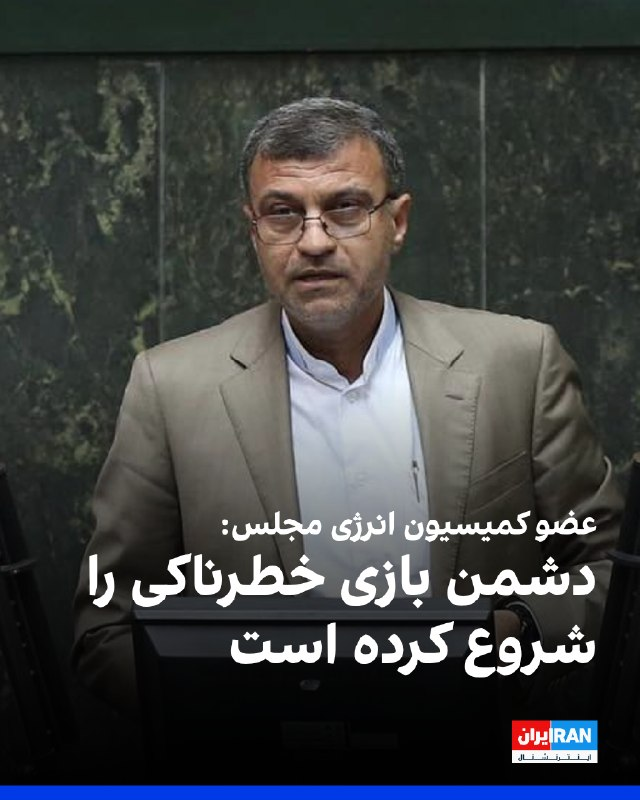

احمد مرادی، عضو کمیسیون انرژی مجلس جمهوری اسلامی، در واکنش به تهدیدهای اخیر دونالد ترامپ، رییس‌جمهوری آمریکا، گفت «دشمن بازی خطرناکی را شروع کرده» و هشدار داد که اقدامات آمریکا و اسرائیل می‌تواند پیامدهایی برای امنیت انرژی در کشورهای منطقه به همراه داشته باشد.

مرادی جمعه ۲۲ خرداد در گفت‌وگو با وب‌سایت خانه ملت گفت: «در صورت ادامه این روند، زیرساخت‌های انرژی منطقه در امنیت نخواهند بود.»
https://iranintl.com/202606129879

## IranIntlTV — post 341849

  <a href="telegram/content/IranIntlTV_341849_1781249624.mp4" target="_blank">🎬 Download video</a>

علیرضا نامورحقیقی، تحلیل‌گر سیاسی، گفت دونالد ترامپ به‌طور هم‌زمان از دو اهرم دیپلماسی و تقابل نظامی برای پیشبرد اهداف خود در قبال ایران استفاده می‌کند.
@iranintltv

## BBCPersian — post 283536

🖋علی رمضانیان، روزنامه‌نگار اقتصادی

هنوز آفتاب کاملا بالا نیامده بود و صدای موتور وانت‌ها و گفت‌وگوی کارگران روزمزد در کوچه‌های خاکی شهرک میان‌آبادِ اسلامشهر به گوش می‌رسید. زهرا، زن ۴۵ ساله‌ای، هر روز ساعت شش صبح در خانه‌ای با دیوارهای بلوکی و سقف ورق‌آهنی از خواب بیدار می‌شود و همسرش، عباس، به یکی از میدان‌های کارگری در احمدآباد مستوفی، واوان یا چهاردانگه می‌رود؛ جایی که هر روز ده‌ها کارگر امیدوار هستند تا شاید برای یک روز کار پیدا کنند.
زهرا و عباس بیش از بیست سال پیش، به دلیل خشکسالی، بی‌آبی و ورشکستگی کشاورزی، از یکی از روستاهای اطراف ساوه به تهران مهاجرت کردند. ابتدا در محله نازی‌آباد ساکن شدند.
ادامه مطلب⬇️

📸 Paul Almasy/Corbis/VCG via Getty Images / Kaveh Kazemi/Getty Images / Fatemeh Bahrami/Anadolu via Getty Images / Morteza Nikoubazl/NurPhoto via Getty Images / BEHROUZ MEHRI/AFP via Getty Images / ATTA KENARE/AFP via Getty Images
https://bbc.in/49RDHq7
@BBCPersian

## Hranews — post 113550

حکم اعدام یک مامور نیروی انتظامی به اجرا در آمد

❗️
❗️
❗️
❗️
❗️– حکم یک مامور نیروی انتظامی بندرعباس که پیشتر به اتهام قتل یک متهم در جریان ماموریت به #اعدام محکوم شده بود، اجرا شد.

ادامه مطلب

#مهدی_براهیمی

↘️
@hranews_bot تماس ✉️ - @Hranews کانال هرانا 🆑

---
📅 بروزرسانی: 1405/03/22 10:53
---

## VahidOOnLine — post 245106

⭕️ اسرائیل و هشت جنگ آن

📌مقاله‌ای از استاد امیر طاهری

♦️ کسی نمی‌داند که جنگ جاری اسرائیل علیه جمهوری اسلامی ایران، این بار با کمک آمریکا، کی پایان خواهد یافت. در هر حال پایان این جنگ منوط به تصمیم دونالد ترامپ، رئیس‌جمهوری ایالات متحده، است. در هر حال اگر این جنگ به پایان برسد، باز هم نمی‌توان انتظار داشت که کبوتر صلح بر بام اسرائیل بنشیند.

کشور کوچکی که با تصمیم سازمان ملل متحد و فداکاری دو نسل از یهودیان برای اسکان رنجدیده‌ترین قوم جهان تشکیل شد، از آغاز با جنگ روبرو بوده است و امروز نیز درگیر هشت جنگ است.

ویدیو را از اینجا تماشا کنید

‌🇸🇦 Indypersian

🤖 @VahidOOnLine

## VahidOOnLine — post 245105

  <a href="telegram/content/VahidOOnLine_245105_1781249012.mp4" target="_blank">🎬 Download video</a>

همزمان با معضل سوخت در شهرهای مختلف ایران، ویدیوی رسیده به ایران اینترنشنال از صف طولانی سوخت در برخی جایگاه‌های کرمان حکایت دارد.
‌🏁 🇬🇧 IranintlTV

🤖 @VahidOOnLine

## WithYashar — post 14606

## WithYashar — post 14605

Voice message

## WithYashar — post 14604

## DEJradio — post 5608

  <a href="telegram/content/DEJradio_5608_1781249014.mp4" target="_blank">🎬 Download video</a>

🔺🎥 یکی از مخاطبان دژ ویدیویی از صف طولانی پمپ بنزین "بلوار قدس" کرمان حوالی ساعت پنج صبح ارسال کرده است که نشان می‌دهد در اثر کمبود بنزین صف‌های طولانی تشکیل شده است.

#بنزین #کرمان
@DEJradio

## DEJradio — post 5607

  <a href="telegram/content/DEJradio_5607_1781249016.mp4" target="_blank">🎬 Download video</a>

🔺🎥 برزیل؛ کشف اسلحه توسط پلیس در جای نامتعارف!

پلیس در شهر «سیداده اوسیدنتال» ایالت گویاس پس از دریافت گزارش یک درگیری فیزیکی به محل اعزام شد. مأموران به یک زوج که سوار موتور سیکلت بودند مشکوک شدند و آنها را بازرسی بدنی کردند. طی این بازرسی مشخص شد زن یک کُلت کمری را در جای نامتعارف مخفی کرده است: زیر شرت داخل اندام جـ.ـنسی!

وقتی پلیس از او سؤال کرد، زن اعتراف کرد که یک سلاح گرم را درون بدن خود مخفی کرده است. مأموران مطابق با پروتکل‌های ایمنی از او خواستند که سلاح را به‌آرامی و با احتیاط خارج کند.

در کمال ناباوری ماموران متوجه شدند آن زن یک کلت ۲۱ سانتیمتری پُر را در حالت مسلح داخل شورت پنهان کرده است. سلاح حدود یک میوگرم وزن داشت.
هنگامی که از مرد درباره منشأ سلاح و دلیل حمل آن سؤال شد، او اظهار داشت که به دنبال فردی بوده که ظاهراً اندکی پیش از این ماجرا از مادرش سرقت کرده بود.

بر اساس گزارش پلیس، این مظنونین در طول رسیدگی به پرونده رفتاری پرخاشگرانه از خود نشان داد و به مأموران توهین کرد.

#برزیل #اسلحه #کلت #پلیس
@DEJradio

## DEJradio — post 5606

  <a href="telegram/content/DEJradio_5606_1781249017.mp4" target="_blank">🎬 Download video</a>

🚨🎥 پرواز شبانه جنگنده‌های ناشناس برفراز تهران، بامداد جمعه ۲۲ خرداد ۱۴۰۵

*این ویدیو توسط یکی از مخاطبان دژ از ورامین ارسال شد، او می‌گوید پنج شش جنگنده را مشاهده کرده است.

#جنگ #تهران
@DEJradio

## DEJradio — post 5605

  <a href="telegram/content/DEJradio_5605_1781249018.webm" target="_blank">🎬 Download video</a>

🚨📢 دونالد ترامپ مدعی شد ایالات متحده «به‌تازگی به یک توافق بزرگ در مورد جنگ با ایران رسیده است.» او گفته است که «ما در حال نهایی کردن اسناد هستیم. این کار باید طی چند روز آینده انجام شود.»

ترامپ همچنین گفت تنگه هرمز نیز «به محض اینکه آن را امضا کنیم» باز خواهد شد.
اوهمچنین می‌گوید که با رهبران منطقه، از جمله متحدان خلیج فارس و بنیامین نتانیاهو صحبت کرده است و افزود: «تمام خاورمیانه بسیار خوشحال است».

رئیس‌جمهور امریکا در ادامه سخنانش در کاخ‌ سفید در پاسخ به سوال خبرنگاری که پرسیده آیا مجتبی خامنه‌ای با این توافق موافقت کرده است، او گفت: «آنگونه که من متوجه شدم، پاسخ او مثبت است.»

به گفته ترامپ توافق «به زودی، شاید همین آخر هفته» امضا شود.
متن توافق مشخص نیست اما گفته شد جی‌دی. ونس آماده است برای امضا نهایی به اروپا برود. معلوم نیست از طرف جمهوری اسلامی چه کسانی قرار است این توافق را امضا کنند. وزارت خارجه رزیم گفته «بخش عمده توافق نهایی شده»، منابع حکومتی نزدیک به سـ.ـپاه می‌گویند توافقی در کار نیست، و کارشناسان صدا و سیما عنوان کردند بسیاری از مفادی را که خامنه‌ای مد نظر داشت در توافق نیست.

#مذاکرات #ترامپ
@DEJradio

## IranIntlTV — post 341848

  <a href="telegram/content/IranIntlTV_341848_1781249019.mp4" target="_blank">🎬 Download video</a>

بامداد پنج‌شنبه، در جریان عملیات پلیس تورنتو علیه یک شبکه تروریستی با احتمال ارتباط با جمهوری اسلامی، یک افسر باسابقه پلیس کشته شد.

مهسا مرتضوی، خبرنگار ایران‌اینترنشنال، گزارش می‌دهد
@iranintltv

## IranIntlTV — post 341847

  <a href="telegram/content/IranIntlTV_341847_1781249020.mp4" target="_blank">🎬 Download video</a>

منابع امنیتی آگاه در عراق فاش کردند سپاه پاسداران به‌طور مستقیم وارد بحران خلع سلاح گروه‌های مسلح در این کشور شده است. بر اساس این گزارش‌ها، سپاه این گروه‌ها را به مخالفت با هر طرحی که به تحویل سلاح‌ها و زرادخانه‌هایشان به دولت بغداد منجر شود، ترغیب کرده است.

تروسکه صادقی، خبرنگار ایران‌اینترنشنال، گزارش می‌دهد
@iranintltv

## IranIntlTV — post 341846

  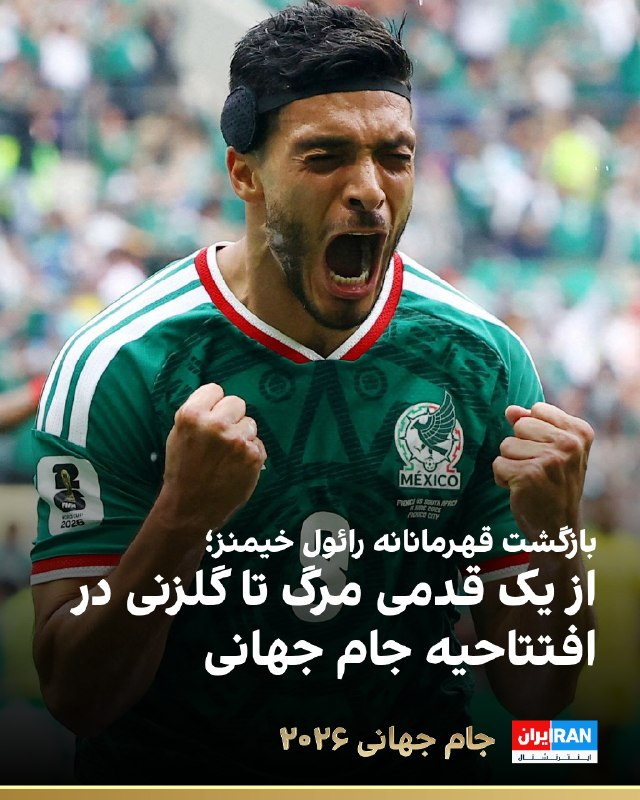

🔻رائول خیمنز، مهاجم خستگی‌ناپذیر تیم ملی مکزیک، در بازی افتتاحیه مقابل آفریقای جنوبی در دقیقه ۶۷ دومین گل تیمش و نخستین گل خود در جام جهانی را به ثمر رساند.
نشریه اتلتیک در گزارشی به ماجرای بازگشت این مهاجم ۳۵ ساله پرداخته است.

🔹خیمنز در نوامبر ۲۰۲۰ در برخورد شدید سر‌به‌سر با دیوید لوئیز در دیدار مقابل آرسنال، دچار شکستگی سهمگین جمجمه و خون‌ریزی مغزی شد؛ حادثه‌ای تکان‌دهنده که او را تا یک‌قدمی مرگ پیش برد. پزشکان در جراحی اورژانسی همان شب، برای نجات جانش جنگیدند.

🔹این ستاره سرسخت پس از ۹ ماه دوری از میادین، با الزام پزشکان به استفاده همیشگی از کلاه محافظ، به فوتبال بازگشت، اما در سپتامبر ۲۰۲۱، پس از هدر دادن یک ضربه سر مقابل برنتفورد، کلاهش را با عصبانیت از سر برداشت، به زمین کوبید و بدون آن به بازی ادامه داد؛ اقدامی که باشگاه ولورهمپتون را به‌دلیل پیامدهای جانی و بیمه‌ای به‌شدت نگران کرد.

🔹جزییات بیشتر را در سایت بخوانید.

@iranintltvsport

## IranIntlTV — post 341845

  <a href="telegram/content/IranIntlTV_341845_1781249022.mp4" target="_blank">🎬 Download video</a>

دونالد ترامپ اعلام کرد قصد دارد جی کلیتون، رییس پیشین کمیسیون بورس و اوراق بهادار آمریکا را برای ریاست اداره اطلاعات ملی این کشور معرفی کند.

مهدی جدی‌نیا، عضو تحریریه ایران‌اینترنشنال، گزارش می‌دهد
@iranintltv

## IranIntlTV — post 341844

  <a href="telegram/content/IranIntlTV_341844_1781249023.mp4" target="_blank">🎬 Download video</a>

همزمان با معضل سوخت در شهرهای مختلف ایران، ویدیوی رسیده به ایران اینترنشنال از صف طولانی سوخت در برخی جایگاه‌های کرمان حکایت دارد.

## RadioFarda — post 158206

  <a href="telegram/content/RadioFarda_158206_1781249025.mp4" target="_blank">🎬 Download video</a>

🔸در حالی که ورزشگاه معروف «آزتِکا» در مکزیکوسیتی روز پنج‌شنبه ۲۱ خرداد پیش از اولین مسابقه جام ‌جهانی ۲۰۲۶ از هیجان به لرزه در آمد، برخی خیابان‌های این شهر صحنه درگیری معترضان با پلیس بود.

🔸برخی اعتراض‌کنندگان صورت‌های خود را پوشانده بودند و پلیس ضدشورش با تجهیزات سرکوب، برای پراکنده کردن جمعیت تلاش کرد.

🔸اقشار مختلف در مکزیک، از معلمان گرفته تا خانواده‌های افراد مفقودشده در جنگ مواد مخدر سعی کردند برای جلب توجه بین‌المللی از فرصت برگزاری جام جهانی استفاده کنند.

🔸مکزیک به‌طور مشترک با ایالات متحده و کانادا میزبان رقابت‌های جام‌ جهانی ۲۰۲۶ است.

@RadioFarda

## IranianMinds — post 22374

  

🔴 آکسیوس:

آمریکا تجهیزات سفر احتمالی جی‌ دی ونس معاون ترامپ رو برای امضای توافقنامه با جمهوری اسلامی رو به ژنو منتقل کرد.

@IranianMinds

## alonews — post 127322

  <a href="telegram/content/alonews_127322_1781249028.webm" target="_blank">🎬 Download video</a>

👈منابع آگاه مدعی‌اند لبنان نیز در توافق ایران و آمریکا گنجانده شده و پایان جنگ شامل توقف کامل عملیات، خروج اسرائیل و آزادی اسیران لبنانی است.

✅ @AloNews خبر جنگ

## alonews — post 127321

  <a href="telegram/content/alonews_127321_1781249028.webm" target="_blank">🎬 Download video</a>

👈الجزیره: بازارهای سهام پس از اعلام دونالد ترامپ، رئیس جمهور آمریکا، مبنی بر لغو حملات برنامه‌ریزی شده علیه ایران و قریب‌الوقوع بودن توافق صلح با تهران، افزایش یافته‌اند

✅ @AloNews خبر جنگ

---
📅 بروزرسانی: 1405/03/22 10:43
---

## VahidOOnLine — post 245104

  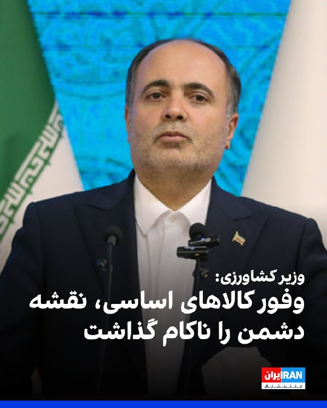

غلامرضا نوری، وزیر جهاد کشاورزی دولت جمهوری اسلامی، امنیت غذایی را بخشی «جدایی‌ناپذیر از دفاع ملی» توصیف کرد و گفت آنچه «دشمن» خواند، در پی ایجاد نگرانی درباره امنیت غذایی در ایران بوده است.

او در بیانیه‌ای با اشاره به عملکرد دولت در تامین کالاهای اساسی گفت: «راهبرد تامین و وفور کالاهای اساسی، تداوم تولید و توزیع و حفظ آرامش بازار، نقشه‌های شوم دشمن را ناکام گذاشته است.»

اظهارات وزیر جهاد کشاورزی در حالی مطرح می‌شود که بسیاری از شهروندان در ایران از ادامه افزایش قیمت مواد غذایی و فشار ناشی از هزینه‌های معیشتی گلایه دارند.
‌🏁 🇬🇧 IranintlTV

🤖 @VahidOOnLine

## VahidOOnLine — post 245103

  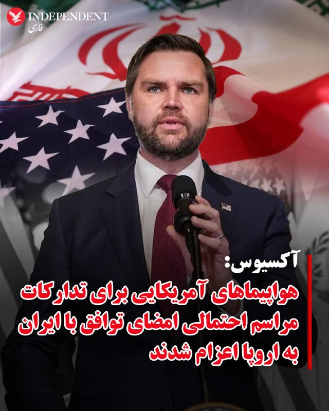

♦️ساعاتی پس از آنکه دونالد ترامپ، رئیس جمهوری آمریکا اعلام کرد جنگ با جمهوری اسلامی ایران را در روز پنجشنبه ۲۱ خرداد به پایان رسانده است، آکسیوس، از اعزام چهار هواپیمای نیروی هوایی آمریکا به ژنو برای آماده‌سازی مقدمات سفر احتمالی جی‌دی‌ ونس معاون دونالد ترامپ خبر داد.
به گزارش آکسیوس، چهار هواپیمای ترابری سی-۱۷ نیروی هوایی آمریکا روز پنجشنبه به اروپا اعزام شدند تا تجهیزات مورد نیاز برای سفر احتمالی جی‌دی ونس، معاون رئیس‌جمهوری آمریکا را به ژنو منتقل کنند.
بر اساس این گزارش، این پروازها در چارچوب تدارکات برای مراسم احتمالی امضای توافق میان آمریکا و ایران انجام شده است. توافقی که در صورت نهایی شدن، ممکن است طی روزهای آینده به امضا برسد.
این گزارش در حالی منتشر می‌شود که مقام‌های جمهوری اسلامی ایران تاکید کرده‌اند هنوز هیچ تصمیم نهایی درباره توافق اتخاذ نشده است و مذاکرات همچنان ادامه دارد.
‌🇸🇦 Indypersian

🤖 @VahidOOnLine

## IranIntlTV — post 341843

  

غلامرضا نوری، وزیر جهاد کشاورزی دولت جمهوری اسلامی، امنیت غذایی را بخشی «جدایی‌ناپذیر از دفاع ملی» توصیف کرد و گفت آنچه «دشمن» خواند، در پی ایجاد نگرانی درباره امنیت غذایی در ایران بوده است.

او در بیانیه‌ای با اشاره به عملکرد دولت در تامین کالاهای اساسی گفت: «راهبرد تامین و وفور کالاهای اساسی، تداوم تولید و توزیع و حفظ آرامش بازار، نقشه‌های شوم دشمن را ناکام گذاشته است.»

اظهارات وزیر جهاد کشاورزی در حالی مطرح می‌شود که بسیاری از شهروندان در ایران از ادامه افزایش قیمت مواد غذایی و فشار ناشی از هزینه‌های معیشتی گلایه دارند.
https://iranintl.com/202606121009

## IranianMinds — post 22373

🔴 آکسیوس : به احتمال زیاد ایران و آمریکا توافق رو در ژنو سوئیس امضا میکنن و اسم توافقشون هم توافق « اسلام آباد » خواهد بود. @IranianMinds

## BBCPersian — post 283535

  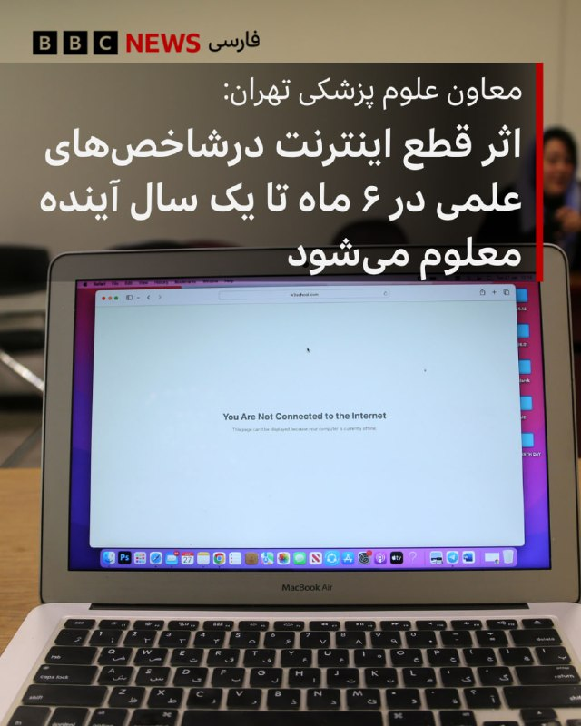

🔻معاون تحقیقات و فناوری دانشگاه علوم پزشکی تهران در مورد پیامدهای قطع طولانی مدت دسترسی پژوهشگران به اینترنت گفته است که احتمالا طی «شش ماه تا یک سال آینده بخشی از اثرات این محدودیت‌ها در شاخص‌های علمی نمایان می‌شود و شاهد کاهش نسبی در تعداد مقالات باشیم.»

رامین کردی با اشاره به شرایط پژوهشی این دانشگاه در دوران جنگ، گفت یکی از چالش‌های اصلی در این دوره محدودیت دسترسی به اینترنت بود که روند انجام پژوهش‌ها را دشوار کرده زیرا آغاز هر پروژه علمی نیازمند دسترسی مداوم به منابع و پایگاه‌های اطلاعاتی به‌روز است.

به گفته او هرچند این محدودیت‌ها در حال حاضر تأثیر محسوسی بر آمار تولید مقالات علمی نگذاشته، اما اثرات آن معمولاً با تأخیر زمانی ظاهر می‌شود.

📸Anadolu via Getty Images
https://bbc.in/443m17o
@BBCPersian

## alonews — post 127320

  <a href="telegram/content/alonews_127320_1781248415.webm" target="_blank">🎬 Download video</a>

👈 جروزالم پست: رهبران جنوب آسیا و خلیج فارس برای جلوگیری از حمله ترامپ به ایران با هم رقابت کردند و به او توافقی ارائه دادند

✅ @AloNews خبر جنگ

## alonews — post 127319

  <a href="telegram/content/alonews_127319_1781248415.webm" target="_blank">🎬 Download video</a>

👈رویترز: امیدها برای صلح بین ایران و ایالات متحده افزایش یافت پس از آنکه رئیس جمهور ترامپ گفت که به محض این آخر هفته می تواند توافق نامه امضا شود ، حتی اگر تهران گفت که تصمیم نهایی در مورد پیمان اتخاذ نکرده است

✅ @AloNews خبر جنگ

## alonews — post 127318

  <a href="telegram/content/alonews_127318_1781248415.mp4" target="_blank">🎬 Download video</a>

👈گروهی از دختران که با حجاب کامل در حال قدم زدن بودند توسط افراد طالبان با ماشین زیر گرفته شدند!!!

🔴در افغانستان زنان دیگه اجازه نفس کشیدن هم ندارند

✅ @AloNews خبر جنگ

## alonews — post 127317

  <a href="telegram/content/alonews_127317_1781248417.webm" target="_blank">🎬 Download video</a>

👈اکونومیست: آشفتگی‌ای که دونالد ترامپ با شروع جنگ با ایران ایجاد کرد، می‌تواند بیش از آنچه بازارها انتظار دارند، طول بکشد. جهان باید برای قیمت‌های بالاتر انرژی آماده شود.

✅ @AloNews خبر جنگ

---
📅 بروزرسانی: 1405/03/22 10:33
---

## VahidOOnLine — post 245102

  

وحید سرخ‌گل، زندانی سیاسی محبوس در زندان قزلحصار کرج، در نامه‌ای از زندان نسبت به وضعیت بازداشت‌شدگان انقلاب ملی دی‌ماه هشدار داد و از آنچه «فشار و ظلم سیستماتیک» علیه زندانیان سیاسی در زندان‌های اوین و قزلحصار خواند، انتقاد کرد.

او از توهین، تحقیر، ضرب‌وشتم، نگهداری طولانی‌مدت در سلول‌های انفرادی، محدودیت تماس و ملاقات، محرومیت از هواخوری و نبود امکانات اولیه برای زندانیان سیاسی خبر داد.

در بخشی از نامه او آمده است: «در قفسی چون اوین و دخمه‌ای چون واحد ۳ زندان قزلحصار، با بدترین شرایط، مورد توهین، تحقیر، فحاشی و حتی ضرب‌وشتم قرار می‌گیرند.»

سرخ‌گل در این نامه از رسانه‌ها، نهادهای حقوق بشری و افکار عمومی خواست برای بهبود وضعیت زندانیان سیاسی، از بازداشت‌شدگان اعتراضات تا بازداشت‌شدگان جنگ ۱۲ روزه، اقدام مؤثر انجام دهند.
‌🏁 🇬🇧 IranintlTV

🤖 @VahidOOnLine

## WithYashar — post 14603

## WithYashar — post 14602

تولد بیبه 🥴

## WithYashar — post 14601

## mwarmonitor — post 10756

🔴خبرنگار الجزیره: دو حمله هوایی اسرائیل به شهرهای فرون و تولین در جنوب لبنان.

@mwarmonitor

## IranIntlTV — post 341842

  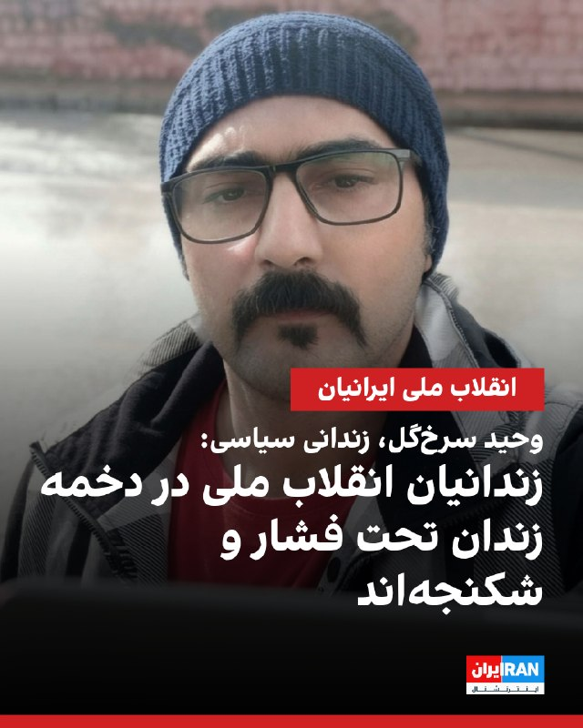

وحید سرخ‌گل، زندانی سیاسی محبوس در زندان قزلحصار کرج، در نامه‌ای از زندان نسبت به وضعیت بازداشت‌شدگان انقلاب ملی دی‌ماه هشدار داد و از آنچه «فشار و ظلم سیستماتیک» علیه زندانیان سیاسی در زندان‌های اوین و قزلحصار خواند، انتقاد کرد.

او از توهین، تحقیر، ضرب‌وشتم، نگهداری طولانی‌مدت در سلول‌های انفرادی، محدودیت تماس و ملاقات، محرومیت از هواخوری و نبود امکانات اولیه برای زندانیان سیاسی خبر داد.

در بخشی از نامه او آمده است: «در قفسی چون اوین و دخمه‌ای چون واحد ۳ زندان قزلحصار، با بدترین شرایط، مورد توهین، تحقیر، فحاشی و حتی ضرب‌وشتم قرار می‌گیرند.»

سرخ‌گل در این نامه از رسانه‌ها، نهادهای حقوق بشری و افکار عمومی خواست برای بهبود وضعیت زندانیان سیاسی، از بازداشت‌شدگان اعتراضات تا بازداشت‌شدگان جنگ ۱۲ روزه، اقدام مؤثر انجام دهند.
https://iranintl.com/202606120774

## FarsiVOA — post 220461

🔺تفاهم احتمالی واشنگتن و تهران دارای چه مفادی است؟

▪️اکسیوس گزارش داد که در صورت امضای تفاهم‌نامه میان آمریکا و جمهوری اسلامی، تنگه هرمز فوراً و بدون عوارض بازگشایی می‌شود و در مقابل، تحریم‌های تهران بر مبنای پایبندی به توافق کاهش می‌یابد.

▪️این رسانه نوشت که این یادداشت تفاهم آتش‌بس را برای مدت ۶۰ روز تمدید می‌کند، از جمله در لبنان، و طی این مدت مذاکرات هسته‌ای برگزار خواهد شد.

▪️به گفته دو منبع آگاه، تا عصر پنج‌شنبه این توافق در سطوح عالی در جمهوری اسلامی تأیید شده بود، اما احتمالاً هنوز از سوی مجتبی خامنه‌ای تأیید نهایی نشده بود.

▪️دونالد ترامپ، روز پنجشنبه گفت انتظار دارد مراسم امضای توافق در آخر هفته برگزار شود.

⬇️ بیشتر بخوانید:
https://ir.voanews.com/a/8160102.html

## IranianMinds — post 22372

  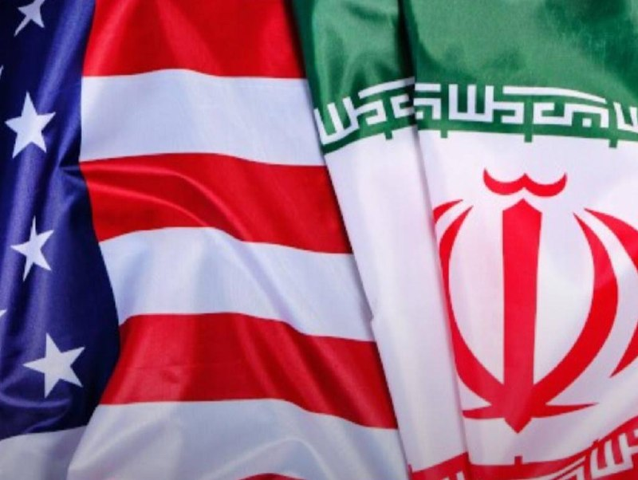

🔴 آکسیوس :

به احتمال زیاد ایران و آمریکا توافق رو در ژنو سوئیس امضا میکنن و اسم توافقشون هم توافق « اسلام آباد » خواهد بود.

@IranianMinds

## IranianMinds — post 22371

  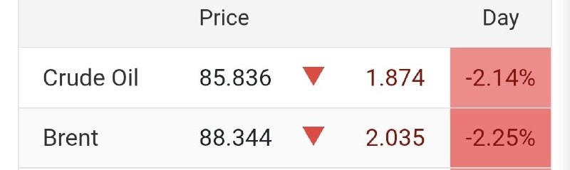

نفت برنت به 88 دلار رسید

@IranianMinds

## IranianMinds — post 22370

دریاچه ی ارومیه به طور کامل احیا شده @IranianMinds

## IranianMinds — post 22369

دریاچه ی ارومیه به طور کامل احیا شده

@IranianMinds

## alonews — post 127316

  <a href="telegram/content/alonews_127316_1781247815.webm" target="_blank">🎬 Download video</a>

👈یدیعوت آحارانوت به نقل از منابع: نتانیاهو گفت به ترامپ اطمینان داده که تمایل او برای توافق با ایران را درک می‌کند، اما اسرائیل نباید قربانی شود

✅ @AloNews خبر جنگ

## alonews — post 127315

  <a href="telegram/content/alonews_127315_1781247815.webm" target="_blank">🎬 Download video</a>

👈وال‌استریت ژورنال به نقل از مقام‌های آمریکایی: واشنگتن در روزهای اخیر عمداً از حمله به زیرساخت‌های ایران خودداری کرده است.

✅ @AloNews خبر جنگ

---
📅 بروزرسانی: 1405/03/22 10:23
---

## mwarmonitor — post 10755

🔴یدیعوت آحرونوت به نقل از منابع: بنیامین نتانیاهو گفته است که به دونالد ترامپ تأکید کرده درک می‌کند که او به دنبال دستیابی به توافق با ایران است، اما اسرائیل نباید قربانی این روند شود.

@mwarmonitor

## IranIntlTV — post 341841

  <a href="telegram/content/IranIntlTV_341841_1781247195.mp4" target="_blank">🎬 Download video</a>

سرخط خبرهای جمعه ۲۲ خرداد
@iranintltv

## Persian_Trend_Official — post 16830

مارک لوین، مجری و تحلیلگر محافظه‌کار آمریکایی نزدیک به دونالد ترامپ، با ابراز تردید نسبت به تفاهم‌نامه احتمالی با ایران اعلام کرد تا زمانی که متن این توافق به‌صورت عمومی منتشر نشود، نمی‌توان درباره جزئیات آن قضاوت کرد. وی همچنین مدعی شد حتی در صورت امضای توافق، یک دوره ۶۰ روزه دیگر برای مذاکرات تکمیلی در نظر گرفته شده است.

لوین با انتقاد از هرگونه توافق با تهران، مدعی شد جمهوری اسلامی در نهایت مفاد هر توافقی را نقض خواهد کرد و دولت‌های آینده آمریکا، به‌ویژه دموکرات‌ها، اراده لازم برای اجرای آن را نخواهند داشت. او همچنین با اشاره به حملات اخیر علیه ایران، مدعی شد که این اقدامات خسارات سنگینی به حکومت ایران وارد کرده و به جای ادامه فشارها برای سرنگونی حکومت، اکنون مسیر مذاکرات و تفاهم‌نامه در پیش گرفته شده است.

این چهره رسانه‌ای نزدیک به ترامپ تأکید کرد که با روشن شدن جزئیات بیشتر، مواضع و ارزیابی‌های تکمیلی خود را ارائه خواهد کرد.

📌 @persian_trend_official
پرشین ترند | متفاوت‌ترین کانال نظامی

## Persian_Trend_Official — post 16829

  

جی‌دی ونس، معاون اول رئیس‌جمهور آمریکا در مصاحبه‌ای با شبکه CBS گفت که بنیامین نتانیاهو قطعاً در چیزی اشتباه کرده است، که جدیدترین نشانه از فاصله گرفتن آمریکا از اسرائیل به امید حل و فصل جنگ است.

ونس همچنین اذعان کرد که نتانیاهو به شدت منافع کشورش را دنبال می‌کند گاهی این به معنای هم‌نظر بودن ماست و گاهی به معنای نبود آن است.

📝 Amir

📌 @persian_trend_official
پرشین ترند | متفاوت‌ترین کانال نظامی

## RadioFarda — post 158205

  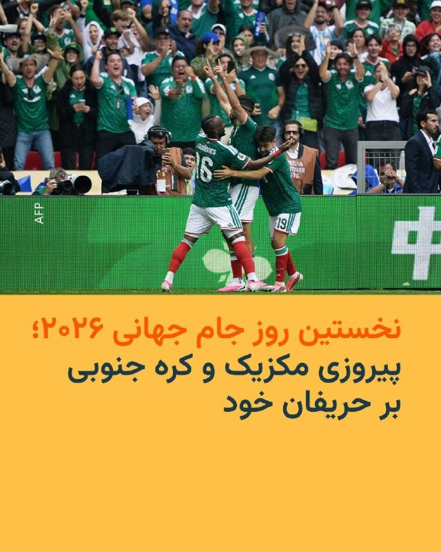

شرح عکس: شادمانی بازیکنان مکزیک بعد از گل دوم مقابل آفریقای جنوبی

🔸 مسابقات جام جهانی فوتبال ۲۰۲۶ با دیدار مکزیک، یکی از سه میزبان مشترک مسابقات، با آفریقای جنوبی آغاز شد؛ دیداری جنجالی که با پیروزی دو بر صفر به سود میزبان به پایان رسید.

🔸مکزیک، یکی از سه میزبان جام جهانی ۲۰۲۶ در کنار آمریکا و کانادا، در گروه A با کره جنوبی، جمهوری چک و آفریقای جنوبی هم‌گروه است.

🔸این تیم در ورزشگاه آزتِکا در دیداری پرتنش و در شرایطی به مصاف آفریقای جنوبی رفت که بار سنگین نخستین بازی جام را بر دوش داشت.

🔸با این حال این بازی اولین بازی افتتاحیه در تاریخ جام جهانی بود که سه بازیکن با کارت قرمز اخراج شدند.

🔸دومین دیدار این مسابقات هم از همین گروه، بین تیم‌های جمهوری چک و کره جنوبی برگزار شد، دیداری که در نهایت با برتری دو بر یک نمایندۀ آسیا به پایان رسید.

🔸گل اول بازی را جمهوری چک به ثمر رساند؛ اما در ادامه این کره‌ای‌ها بودند که دو بار دروازه تیم جمهوری چک را باز کردند. تیم چک پس از آنکه گل دومش آفساید اعلام شد بازی را با نتیجه ۲ بر یک به کره جنوبی واگذار کرد.

@RadioFarda

## IranianMinds — post 22368

  <a href="telegram/content/IranianMinds_22368_1781247197.mp4" target="_blank">🎬 Download video</a>

چقدر شوق داشت و عاشق زندگی کردن بود :)

جاویدنام رها بهلولی‌پور 🖤

@IranianMinds

## alonews — post 127314

  <a href="telegram/content/alonews_127314_1781247199.webm" target="_blank">🎬 Download video</a>

👈جی‌دی ونس، معاون اول رئیس‌جمهور آمریکا در مصاحبه‌ای با شبکه CBS گفت که بنیامین نتانیاهو «قطعاً در چیزی اشتباه کرده است»، که جدیدترین نشانه از فاصله گرفتن آمریکا از اسرائیل به امید حل و فصل جنگ است

🔴ونس همچنین اذعان کرد که نتانیاهو «به شدت منافع کشورش را دنبال می‌کند - گاهی این به معنای هم‌نظر بودن ماست و گاهی به معنای نبود آن است»

✅ @AloNews خبر جنگ

---
📅 بروزرسانی: 1405/03/22 10:13
---

## VahidOOnLine — post 245101

  <a href="telegram/content/VahidOOnLine_245101_1781246600.mp4" target="_blank">🎬 Download video</a>

♦️ویدئویی که روز پنج‌شنبه ۲۱ خرداد ماه توسط یک شاهد عینی ثبت شده، گردبادی عظیم را نشان می‌دهد که بخش بزرگی از آسمان را در شهرستان لیوینگستون ایالت ایلینوی آمریکا پوشانده و بر فراز زمین‌های کشاورزی حرکت می‌کند.
سازمان ملی هواشناسی آمریکا هشدار داد که خطر وقوع گردباد در این سامانه جوی به‌مراتب بیشتر از رویدادهای معمول آب‌وهوایی شدید است و احتمال شکل‌گیری گردبادهای بسیار مخرب نیز افزایش یافته است.
بر اساس گزارش رسانه‌های محلی، سطح هشدار برای منطقه شیکاگو به درجه ۴ از ۵ در مقیاس خطر طوفان‌های شدید ارتقا یافته است.
‌🇸🇦 Indypersian

🤖 @VahidOOnLine

## VahidOOnLine — post 245100

🗣روایت شما درباره توافق احتمالی و پذیرش شروط ترامپ از سوی جمهوری اسلامی - جمعه ۲۲ خرداد ۱۴۰۵

🔹یکم همه‌چیز عجیبه و اینکه ایران به توافق راضی بشه و ترامپ هم بی‌خیال رژیم‌چنج بشه، بازم عجیبه. امیدوارم همه‌اش دروغ باشه و اینا یه خواب باشه :))))
🔹قطر، پاکستان، ترکیه شما به چه حقی از جانب مردم ایران تصمیم می‌گیرید و توی امور ما دخالت می‌کنید؟ اصلاً به شما چه که می‌پرید وسط برای توافق؟ من به نمایندگی از نود میلیون ایرانی می‌گم فضولیِ امور کشور ما رو نکنید. شما بیخود می‌کنید برای سرنوشت ما تصمیم می‌گیرید!
🔹واقعاً که توافق. ما این همه کشته دادیم. از اول هم قدرت نداشتید ایران رو بزنید. چرا دست‌به‌کار شدید؟ ما مردم عادی بیچاره بودیم، بیچاره‌تر شدیم. گرانی خفمون کرده.
🔹ما در تعجب هستیم چرا کشورهای عربی مقابل ج.ا">ج.ا">ج.ا">ج.ا">ج.ا">ج.ا">ج.ا">ج.ا ایران ائتلافی تشکیل نمی‌دهند تا جلوی حملات ج.ا">ج.ا">ج.ا">ج.ا">ج.ا">ج.ا">ج.ا">ج.ا ایران را بگیرند.
🔹شما مذاکره اصلی رو با انگلیس و چین باید انجام بدی جناب ترامپ، الکی وقتتو تلف نکن، اینا هیچ‌کاره‌ان.
🔹از کرج هستم آقای ترامپ، مردم ایران ۵۰ هزار جاویدنام ندادن که الان با پسر شیطان مذاکره کنید.
🔹خیلی ناراحتم. مدام فکر می‌کنم به‌عنوان یک دختر ۱۷ ساله، اگه ایران به دنیا نیامده بودم چقدر موفق‌تر بودم. خرید همه‌چیز، حتی معمولی‌ترین کارها، شده آرزو. زمان جنگ آرام‌تر از همیشه بودم، واقعاً حس می‌کردم حق به حق‌دار می‌رسه. ترامپ کاشکی بس کنه ماجرای مضحکه توافق رو.
🔹آخرش اگه توافق هم کنن ج.ا">ج.ا">ج.ا">ج.ا">ج.ا">ج.ا">ج.ا">ج.ا می‌زنه زیرش، دقیقاً مثل ترامپ که برجام را پاره کرد. ج.ا">ج.ا">ج.ا">ج.ا">ج.ا">ج.ا">ج.ا">ج.ا هم برنامه‌اش همینه، شک نکنید. برای عبور از پیچ ترامپ و ادامه بقا و سفت شدن جاشونه.
🔹واقعاً نگران نیستیم که این توافق امضا بشه، چون این فقط یه آتش‌بس ۶۰ روزه است که به ۶۰ روز هم نمی‌کشه. فقط نسبت به رفتار ترامپ حساس شدیم.
🔹از کرج هستم آقای ترامپ، مردم ایران ۵۰ هزار جاویدنام ندادن که الان با پسر شیطان مذاکره کنید.
🔹خیلی ناراحتم. مدام فکر می‌کنم به‌عنوان یک دختر ۱۷ ساله اگه ایران به دنیا نیامده بودم چقدر موفق‌تر بودم. خرید همه‌چیز حتی معمولی‌ترین کارها شده آرزو. زمان جنگ آرام‌تر از همیشه بودم، واقعا حس می‌کردم حق به حق‌دار می‌رسه. ترامپ کاشکی بس کنه ماجرای مضحکه توافق رو.
‌🏁 🇬🇧 IranintlTV

🤖 @VahidOOnLine

## VahidOOnLine — post 245099

  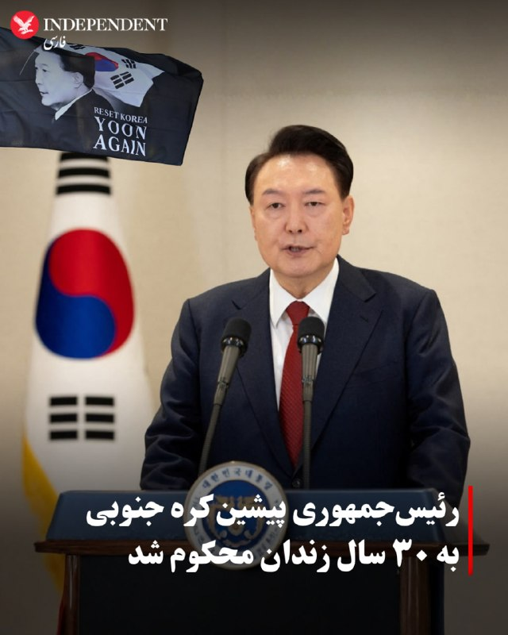

⭕️رئیس‌جمهوری پیشین کره جنوبی به ۳۰ سال زندان محکوم شد

♦️دادگاهی در کره جنوبی، یون سوک یول، رئیس‌جمهوری پیشین این کشور را به اتهام اعزام پهپادهای نظامی به کره شمالی به ۳۰ سال زندان محکوم کرد.
بر اساس رای دادگاه، یون دو ماه پیش از اعلام حکومت نظامی در سال ۲۰۲۴، با هدف تشدید تنش‌ها با پیونگ‌یانگ دستور این عملیات را صادر کرده بود تا زمینه لازم برای توجیه تصمیم جنجالی خود فراهم شود. قضات اعلام کردند او تلاش داشت با ایجاد یک بحران امنیتی، کره شمالی را به واکنش نظامی وادار کند.

یون سوک یول پیش‌تر نیز به دلیل اعلام حکومت نظامی در سال ۲۰۲۴ و اتهام رهبری یک شورش علیه نظام سیاسی کره جنوبی به حبس ابد محکوم شده بود. او تمامی اتهامات را رد کرده و گفته است اقداماتش صرفا با هدف حفاظت از منافع ملی انجام شده است.
‌🇸🇦 Indypersian

🤖 @VahidOOnLine

## WithYashar — post 14600

آکسیوس به نقل از یک مقام آمریکایی:

واشینگتن، تهران و قطر در مورد سازوکاری بحث کردند که به تهران اجازه دهد از وجوه مسدود شده برای خرید کالاهای بشردوستانه استفاده کند.
@withyashar

## mwarmonitor — post 10754

🔴مقام‌های آمریکایی به وال‌استریت ژورنال گفته‌اند که ایالات متحده در روزهای اخیر از هدف قرار دادن زیرساخت‌های ایران خودداری کرده است.

@mwarmonitor

## mwarmonitor — post 10753

یک منبع آمریکایی خارج از دولت ابراز نگرانی کرد که ممکن است موضوع دارایی‌های مسدود شده در یک توافق جانبی و محرمانه مطرح شده باشد؛ هرچند یک مقام آمریکایی اخیراً این احتمال را در گفتگو با آکسیوس رد کرد.
به گفته یک مقام آمریکایی و یک منبع از کشورهای میانجی، ایالات متحده، ایران و قطر در روزهای اخیر در حال بحث درباره سازوکاری بوده‌اند که به ایران اجازه می‌دهد برای خرید کالاهای بشردوستانه به بخشی از دارایی‌های مسدود شده خود در قطر دسترسی پیدا کند.
گام بعدی چیست؟
این توافق که با میانجیگری مشترک قطر و پاکستان به دست آمده است، «توافق اسلام‌آباد» نامیده خواهد شد؛ البته به شرطی که هر دو طرف در نهایت پای آن را امضا کنند.
دیپلمات یکی از کشورهای میانجی گفت: «ما در حال همکاری با طرفین هستیم تا آخرین روتوش‌ها را روی توافق انجام دهیم و تاریخی را برای مراسم امضا تعیین کنیم.»


@mwarmonitor

## mwarmonitor — post 10752

🔴جزئیات توافق با ایران که ترامپ می‌گوید آماده امضای آن است

📝نویسنده: باراک راوید

🔰به گفته یک دیپلمات از یکی از کشورهای میانجی و یک مقام آمریکایی، یادداشت تفاهم (MOU) میان ایالات متحده و ایران که پرزیدنت ترامپ مدعی است به‌زودی امضا خواهد شد، خواهان بازگشایی فوری تنگه هرمز بدون دریافت عوارض و همچنین اعطای معافیت‌های تحریمی به ایران مشروط بر پایبندی به تعهدات است.

چرا این موضوع مهم است؟
این یادداشت تفاهم، آتش‌بس (از جمله در لبنان) را به مدت ۶۰ روز تمدید می‌کند و در این مدت مذاکرات هسته‌ای برگزار خواهد شد. متن این پیش‌نویس شامل چارچوبی برای رسیدگی به ذخایر اورانیوم غنی‌شده ایران است، هرچند هرگونه اقدام عملی درباره برنامه هسته‌ای ایران به یک توافق دوم و مفصل‌تر بستگی خواهد داشت.
وضعیت موجود
دیپلماتی از یکی از کشورهای میانجی که متن نهایی را برای آکسیوس تشریح کرده، گفت: «ایالات متحده و ایران بر سر متن یک توافق به جمع‌بندی رسیده‌اند»، اما تایید کرد که این توافق هنوز نیازمند تایید نهایی است.
به گفته دو منبع آگاه، تا غروب پنجشنبه این توافق در سطوح بالا در سمت ایران تایید شده بود، اما احتمالا هنوز به تایید نهایی رهبر ایران، [مجتبی خامنه‌ای]، نرسیده است.
ترامپ اعلام کرده که انتظار دارد مراسم امضا در آخر هفته برگزار شود. با این حال، سخنگوی وزارت امور خارجه ایران اعلام کرد که تهران «هنوز به تصمیم نهایی نرسیده است».
کاخ سفید در دو ماه گذشته چندین بار تصور می‌کرد که توافق نزدیک است، اما مذاکرات در نهایت شکست می‌خورد. با این حال، این دیپلمات ابراز خوش‌بینی کرد که این بار متن توافق پابرجا بماند.
آخرین تحولات
روز پنجشنبه، چهار هواپیمای C-17 نیروی هوایی ارتش آمریکا به سمت اروپا پرواز کردند تا تجهیزات لازم برای سفر احتمالی معاون رئیس‌جمهور، جی‌دی ونس، به مراسم امضای توافق در ژنو را منتقل کنند.
پشت صحنه
به گفته دو دیپلمات از کشورهای میانجی و دو مقام آمریکایی، این توافق اولیه چهارشنبه شب پس از ساعت‌ها مذاکره میان علی الثوادی (میانجی قطری) و عباس عراقچی (وزیر امور خارجه ایران) حاصل شد.
دو منبع آگاه اعلام کردند که الثوادی در طول مذاکرات در تهران، چندین بار به صورت تلفنی با فرستادگان ترامپ، یعنی استیو ویتکوف و جرد کوشنر، گفتگو کرده است.
اعلام ترامپ مبنی بر نهایی شدن توافق، باعث غافلگیری بنیامین نتانیاهو، نخست‌وزیر اسرائیل شد.
به گفته یک منبع آمریکایی با دسترسی مستقیم، نتانیاهو در روزهای اخیر در جریان امور قرار نداشته و برای کسب اطلاعات با متحدان نزدیک به دولت ترامپ تماس گرفته است.
جزئیات توافق
بر اساس این یادداشت تفاهم، ایران تعهدات مشخصی را در قبال برنامه هسته‌ای خود می‌پذیرد؛ در درجه اول اینکه هرگز به سلاح هسته‌ای دست پیدا نکند و بحران مربوط به ذخایر اورانیوم غنی‌شده خود را حل کند.
یک مقام ارشد آمریکایی گفت ترامپ موافقت کرده است که یکی از گزینه‌ها برای حل این مسئله، رقیق‌سازی اورانیوم با غنای بالای ایران در داخل کشور و تحت نظارت بازرسان سازمان ملل باشد.
هرگونه گام عملی در مورد برنامه هسته‌ای ایران تنها در صورت دستیابی به توافق دوم برداشته خواهد شد؛ موضوعی که با توجه به دشواری مذاکراتِ کمتر فنیِ فعلی، همچنان نامشخص است.
با این حال، این دیپلمات مدعی شد که این یادداشت تفاهم «به جزئیات تمام مسائل هسته‌ای می‌پردازد» و «تمام خواسته‌های ایالات متحده را برآورده می‌کند».
بررسی دقیق‌تر (نگاه نزدیک)
این یادداشت تفاهم خواهان بازگشایی فوری تنگه هرمز بدون عوارض و بازگشت حجم کشتیرانی به دوران پیش از جنگ ظرف مدت ۳۰ روز است. در مقابل، محاصره اعمال‌شده از سوی آمریکا نیز لغو خواهد شد.
مقامات آمریکایی پیش از این به آکسیوس گفته بودند که پس از بازگشایی تنگه، معافیت‌های تحریمی موقتی به ایران داده می‌شود تا بتواند به مدت ۶۰ روز نفت بفروشد. این امر درآمد حیاتی برای تهران ایجاد خواهد کرد.
در صورت پایبندی ایران به توافق اولیه و نشان دادن «حسن نیت» در مذاکرات بعدی، کاهش تحریم‌ها افزایش خواهد یافت.
این دیپلمات گفت: «تاریخ مشخصی برای رفع تحریم‌ها تعیین نشده و این موضوع به اجرای بندهای توافق گره خورده است.»
نکات مبهم و چالش‌ها
هنوز مشخص نیست که آیا در متن توافق توضیحات دقیقی درباره سرنوشت میلیاردها دلار دارایی مسدود شده ایران در خارج از کشور آمده است یا خیر.
ایران پافشاری کرده است که باید بلافاصله پس از امضای هرگونه توافق اولیه، بخشی از پول خود را دریافت کند، در حالی که آمریکا تاکید دارد این مبالغ باید در مراحل مختلف و بر اساس میزان پایبندی ایران آزاد شوند.

## IranIntlTV — post 341840

🗣روایت شما درباره توافق احتمالی و پذیرش شروط ترامپ از سوی جمهوری اسلامی - جمعه ۲۲ خرداد ۱۴۰۵

🔹یکم همه‌چیز عجیبه و اینکه ایران به توافق راضی بشه و ترامپ هم بی‌خیال رژیم‌چنج بشه، بازم عجیبه. امیدوارم همه‌اش دروغ باشه و اینا یه خواب باشه :))))
🔹قطر، پاکستان، ترکیه شما به چه حقی از جانب مردم ایران تصمیم می‌گیرید و توی امور ما دخالت می‌کنید؟ اصلاً به شما چه که می‌پرید وسط برای توافق؟ من به نمایندگی از نود میلیون ایرانی می‌گم فضولیِ امور کشور ما رو نکنید. شما بیخود می‌کنید برای سرنوشت ما تصمیم می‌گیرید!
🔹واقعاً که توافق. ما این همه کشته دادیم. از اول هم قدرت نداشتید ایران رو بزنید. چرا دست‌به‌کار شدید؟ ما مردم عادی بیچاره بودیم، بیچاره‌تر شدیم. گرانی خفمون کرده.
🔹ما در تعجب هستیم چرا کشورهای عربی مقابل ج.ا ایران ائتلافی تشکیل نمی‌دهند تا جلوی حملات ج.ا ایران را بگیرند.
🔹شما مذاکره اصلی رو با انگلیس و چین باید انجام بدی جناب ترامپ، الکی وقتتو تلف نکن، اینا هیچ‌کاره‌ان.
🔹از کرج هستم آقای ترامپ، مردم ایران ۵۰ هزار جاویدنام ندادن که الان با پسر شیطان مذاکره کنید.
🔹خیلی ناراحتم. مدام فکر می‌کنم به‌عنوان یک دختر ۱۷ ساله، اگه ایران به دنیا نیامده بودم چقدر موفق‌تر بودم. خرید همه‌چیز، حتی معمولی‌ترین کارها، شده آرزو. زمان جنگ آرام‌تر از همیشه بودم، واقعاً حس می‌کردم حق به حق‌دار می‌رسه. ترامپ کاشکی بس کنه ماجرای مضحکه توافق رو.
🔹آخرش اگه توافق هم کنن ج.ا می‌زنه زیرش، دقیقاً مثل ترامپ که برجام را پاره کرد. ج.ا هم برنامه‌اش همینه، شک نکنید. برای عبور از پیچ ترامپ و ادامه بقا و سفت شدن جاشونه.
🔹واقعاً نگران نیستیم که این توافق امضا بشه، چون این فقط یه آتش‌بس ۶۰ روزه است که به ۶۰ روز هم نمی‌کشه. فقط نسبت به رفتار ترامپ حساس شدیم.
🔹از کرج هستم آقای ترامپ، مردم ایران ۵۰ هزار جاویدنام ندادن که الان با پسر شیطان مذاکره کنید.
🔹خیلی ناراحتم. مدام فکر می‌کنم به‌عنوان یک دختر ۱۷ ساله اگه ایران به دنیا نیامده بودم چقدر موفق‌تر بودم. خرید همه‌چیز حتی معمولی‌ترین کارها شده آرزو. زمان جنگ آرام‌تر از همیشه بودم، واقعا حس می‌کردم حق به حق‌دار می‌رسه. ترامپ کاشکی بس کنه ماجرای مضحکه توافق رو.

## FarsiVOA — post 220460

🔺اوپک از سقوط سهمگین تولید نفت ایران خبر داد

▪️سازمان کشورهای صادرکننده نفت، اوپک، از افت چشمگیر تولید نفت ایران در میانه احیای نسبی تولید کشورهای عرب منطقه خبر داد.

▪️بر اساس این گزارش، تولید روزانه نفت ایران در ماه مه با افتی ۵۴۶ هزار بشکه‌ای به ۲ میلیون و ۳۳۰ هزار بشکه سقوط کرده که کمترین مقدار طی شش سال گذشته است.

▪️در دیگر سو، سپاه پاسداران با انسداد تنگه هرمز، همچنین حمله به نفتکش‌ها و تاسیسات نفتی کشورهای عرب حوزه خلیج فارس، تولید و صادرات نفت همسایه‌های نفتی را به شدت کاهش داده است.

▪️با این‌حال، آمارهای اوپک نشان می‌دهد تولید نفت کشورهای عرب منطقه در ماه گذشته روند صعودی داشته، اما هنوز بسیار پایین‌تر از سطح قبل از جنگ است.

⬇️ بیشتر بخوانید:
https://ir.voanews.com/a/8160101.html

## DW_Farsi — post 125848

  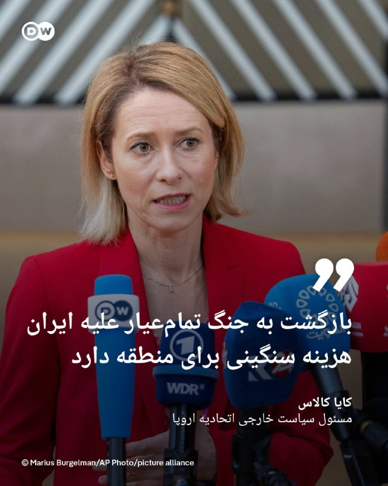

🔶کالاس: بازگشت به جنگ تمام‌عیار علیه ایران هزینه سنگینی برای منطقه دارد

کایا کالاس، مسئول سیاست خارجی اتحادیه اروپا می‌گوید، درباره آخرین تنش‌ها در خلیج فارس و وضعیت مذاکرات مربوط به جنگ ایران با عباس عراقچی‌، وزیر خارجه جمهوری اسلامی گفت‌وگو کرده است.

او در این پیام که پنج‌شنبه ۲۱ خرداد (۱۱ ژوئن) در شبکه ایکس منتشر کرد با اشاره به این که با شیخ جراح جابر الاحمد الصباح، وزیر خارجه کویت نیز در این رابطه تماس گرفته ازسرگیری حملات به کشورهای حوزه خلیج فارس و زیرساخت‌های حیاتی آن‌ها را "غیرقابل قبول است" دانست.

کالاس با تأکید بر اهمیت مسیر دیپلماتیک به عنوان "بهترین راه" خروج از جنگ ایران پیام خود را این‌گونه به پایان برد: «بازگشت به یک جنگ تمام‌عیار، هزینه سنگینی برای کل منطقه به همراه خواهد داشت.»

@dw_farsi

## BBCPersian — post 283534

🔻مصر از ایران و آمریکا خواست از «فرصت» بدست آمده برای رسیدن به توافق استفاده کنند

مصر از ایران و آمریکا خواسته است تا از «فرصت موجود» برای رسیدن به توافقی برای پایان دادن به جنگ استفاده کنند.

وزارت خارجه مصر این درخواست را در بیانیه‌ای و پس از آن اعلام کرد که دونالد ترامپ، رئیس جمهور آمریکا تهدید خود در مورد حمله بیشتر به ایران را پس گرفت.

https://bbc.in/3Q0AUEp
@BBCPersian

## BBCPersian — post 283533

🔻تغییر موضع ترامپ درباره ایران باعث جهش بورس‌های آسیایی و افت قیمت نفت شد
روز جمعه، پس از آنکه دونالد ترامپ، رئیس جمهور آمریکا، تهدید خود مبنی بر حملات بیشتر به ایران را پس گرفت و گفت که ممکن است در روزهای آینده توافقی به امضا برسد، سهام بازارهای آسیایی افزایش یافت و قیمت نفت کاهش پیدا کرد.

پس از این اظهارات ترامپ، بازارهای مالی آمریکا روز پنج‌شنبه روند صعودی داشتند به طوری که شاخص «اس‌اندپی » با رشد ۱٫۸ درصدی به کار خود پایان داد.

در آسیا، شاخص نیکی ژاپن تا حوالی ظهر به وقت محلی حدود ۳٫۵ درصد رشد کرد، در حالی که شاخص کوسپی کره جنوبی که شرکت‌های تولیدکننده تراشه سهم بزرگی در آن دارند، نزدیک به ۸ درصد جهش داشت. شاخص‌های هنگ‌سنگ هنگ‌کنگ و ترکیبی شانگهای نیز افزایش یافتند.

قیمت نفت خام برنت و نفت خام وست تگزاس اینترمدیت هر دو بیش از یک درصد کاهش پیدا کردند.

https://bbc.in/4ghoMcB
@BBCPersian

## BBCPersian — post 283532

  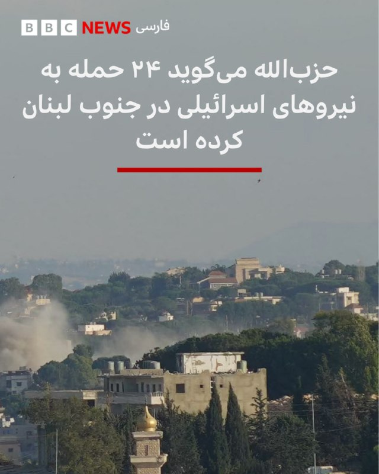

🔻حزب‌الله لبنان می‌گوید مجموعه‌ای از حملات پهپادی، موشکی و راکتی را علیه نیروهای نظامی، خودروهای زرهی و مواضع اسرائیل در سراسر جنوب لبنان و منطقه دره بقاع انجام داده است.

طبق بیانیه‌ای که جزئیات عملیات‌های این گروه از چهارشنبه تا پنجشنبه را توضیح می‌داد، حزب‌الله گفته محل تجمع سربازان و خودروهای زرهی اسرائیلی را هدف قرار داده است.

این گروه مدعی شده این حملات به ویژه با تمرکز بر منطقه الرجمان در مجاورت طیر حرفا بوده و چهار بار جداگانه مورد حمله قرار گرفته است.

این بیانیه افزود که محل تجمع نیروها و خودروهای اسرائیلی در شهرهای لبنانی ناقوره، القوزح، رشاف، القنطره، زوطر الشرقیه و یومرالشقیف نیز هدف قرار گرفته است.

📸 AFP via Getty Images
https://bbc.in/4ekGJoj
@BBCPersian

## Dirty_Kids — post 391772

  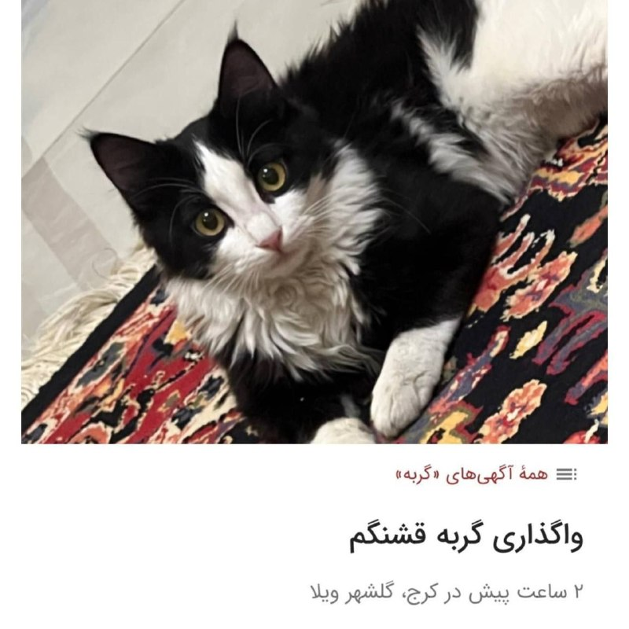

آدما بهت میگن قشنگم، ولی واگذارت میکنن.

@Dirty_Kids 👻

## Dirty_Kids — post 391771

  <a href="telegram/content/Dirty_Kids_391771_1781246604.mp4" target="_blank">🎬 Download video</a>

هوادارای آرژانتین با وایفا مجانی، اسنجوری دارن فوتبال میبینن

@Dirty_Kids 👻

## alonews — post 127313

  <a href="telegram/content/alonews_127313_1781246605.webm" target="_blank">🎬 Download video</a>

👈آکسیوس: موضوع دارایی‌های بلوکه‌شده ممکن است در قالب یک توافق محرمانه جانبی حل‌وفصل شده باشد؛ هرچند یک مقام آمریکایی اخیراً این احتمال را رد کرده است.

🔴به گفته یک مقام آمریکایی و یک منبع از کشورهای میانجی، آمریکا، ایران و قطر در روزهای اخیر درباره سازوکاری گفت‌وگو کرده‌اند که بر اساس آن ایران بتواند برای خرید کالاهای بشردوستانه به بخشی از دارایی‌های مسدودشده خود در قطر دسترسی پیدا کند

✅ @AloNews خبر جنگ

---
📅 بروزرسانی: 1405/03/22 10:03
---

## VahidOOnLine — post 245098

⭕️ اسرائیل و هشت جنگ آن

📌مقاله‌ای از استاد امیر طاهری

♦️ کسی نمی‌داند که جنگ جاری اسرائیل علیه جمهوری اسلامی ایران، این بار با کمک آمریکا، کی پایان خواهد یافت. در هر حال پایان این جنگ منوط به تصمیم دونالد ترامپ، رئیس‌جمهوری ایالات متحده، است. در هر حال اگر این جنگ به پایان برسد، باز هم نمی‌توان انتظار داشت که کبوتر صلح بر بام اسرائیل بنشیند.

کشور کوچکی که با تصمیم سازمان ملل متحد و فداکاری دو نسل از یهودیان برای اسکان رنجدیده‌ترین قوم جهان تشکیل شد، از آغاز با جنگ روبرو بوده است و امروز نیز درگیر هشت جنگ است.

ویدیو را از اینجا تماشا کنید

‌🇸🇦 Indypersian

🤖 @VahidOOnLine

## WithYashar — post 14599

اکسیوس: چهار فروند هواپیمای ترابری C-17 نیروی هوایی آمریکا روز پنجشنبه به سمت اروپا پرواز کردند و تجهیزات لازم برای احتمال سفر جی‌دی‌ونس به مراسم امضای توافق در ژنو طی روزهای آینده را منتقل کردند.
@withyashar

## DW_Farsi — post 125847

  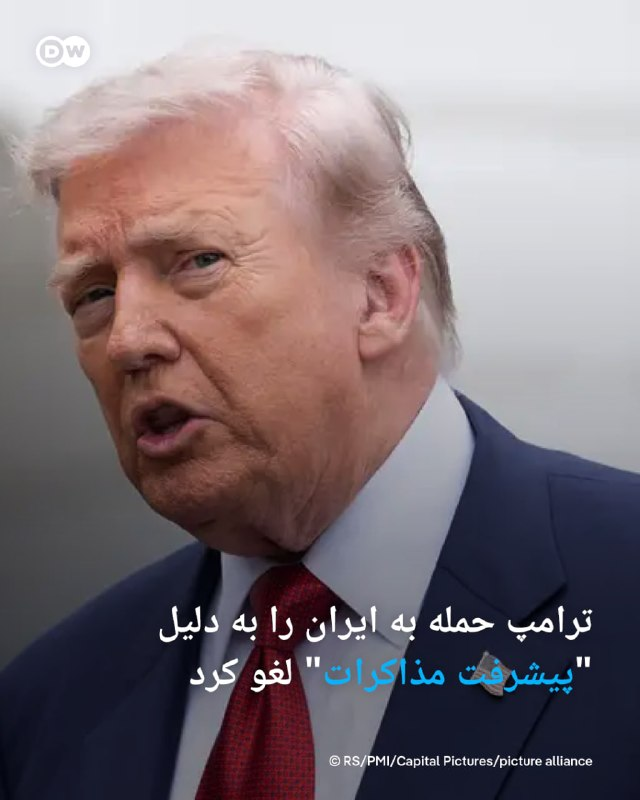

🔶ترامپ حمله به ایران را به دلیل "پیشرفت مذاکرات" لغو کرد

دونالد ترامپ که پیش از این خبر داده بود که حملات هوایی به ایران امشب ۲۱ خرداد نیز مانند دو شب اخیر ادامه خواهد یافت، در پیامی تازه از لغو حملات "برنامه‌ریزی‌شده" به این دلیل خبر داد که مذاکرات به "بالاترین سطح رهبری ایران" کشانده شده و مورد تأیید قرار گرفته است.

رئیس‌ جمهور آمریکا در این پیام در تروث سوشال نوشت: «گفت‌وگوها و نکات نهایی، هم از نظر کلیات و هم با جزئیات فراوان، مورد تأیید تمامی طرف‌های درگیر، از جمله ایالات متحده، اسرائیل، عربستان سعودی، امارات متحده عربی، قطر، ترکیه، پاکستان، بحرین، کویت، اردن، مصر و دیگران قرار گرفته است.»

ترامپ تصریح کرد، اما محاصره دریایی بنادر ایران تا زمان نهایی شدن این توافق "با تمام قدرت و به طور کامل" به قوت خود باقی خواهد ماند: «زمان و مکان امضای آن به‌زودی اعلام خواهد شد.»

اظهارات ترامپ در حالی مطرح شده است که خبرگزاری فارس، وابسته به سپاه پاسداران، از قول یک منبع آگاه نوشت که جمهوری اسلامی "هنوز هیچ متنی را برای توافق تایید نکرده است".

@dw_farsi

## IranianMinds — post 22366

  <a href="telegram/content/IranianMinds_22366_1781246009.mp4" target="_blank">🎬 Download video</a>

بعضیا تو یه ایران دیگه زندگی میکنن

@IranianMinds

## alonews — post 127312

  <a href="telegram/content/alonews_127312_1781246011.webm" target="_blank">🎬 Download video</a>

👈قدیمی ترین کتاب فارسی چاپ شده در لیدن، در سال ۱۶۳۹ که درباره دستور زبان فارسی است

🔴لَیدن (به هلندی: Leiden) شهری دانشگاهی در استان هلند جنوبی و در نزدیکی لاهه در کشور هلند است

✅ @AloNews خبر جنگ

## alonews — post 127311

  <a href="telegram/content/alonews_127311_1781246012.webm" target="_blank">🎬 Download video</a>

👈رایزنی پادشاه بحرین و ترامپ درباره تحولات ایران و آمریکا

✅ @AloNews خبر جنگ

---
📅 بروزرسانی: 1405/03/22 09:53
---

## VahidOOnLine — post 245097

♦️منصور حقیقت‌پور، عضو کمیسیون امنیت ملی و سیاست خارجی مجلس شورای اسلامی روز جمعه ۲۲ خردادماه، در گفتگو با خبرگزاری ایسنا با رد وجود اختلاف میان نهادهای تصمیم‌گیر در جمهوری اسلامی گفت: «بخش‌های نظامی و دیپلماتیک کشور در چارچوب یک فرماندهی واحد عمل می‌کنند».

به گزارش ایسنا، این مقام امنیتی جمهوری اسلامی در واکنش به آنچه «آرزوی غرب برای مشاهده اختلاف در ساختار حاکمیت» خواند، اظهار داشت: «هم مجیدِ نقطه‌زن و هم محمدباقرِ مذاکره‌کننده از یک فرمانده دستور می‌گیرند.»
 او همچنین حمایت دستگاه دیپلماسی از عملیات نظامی سپاه را نشانه «هماهنگی میان میدان و دیپلماسی» دانست.

این اظهارات در گرماگرم اخبار دستیابی به چهارچوب توافق اولیه میان تهران و واشنگتن و ادامه مذاکرات میان دو کشور مطرح می‌شود.
‌🇸🇦 Indypersian

🤖 @VahidOOnLine

## DW_Farsi — post 125846

  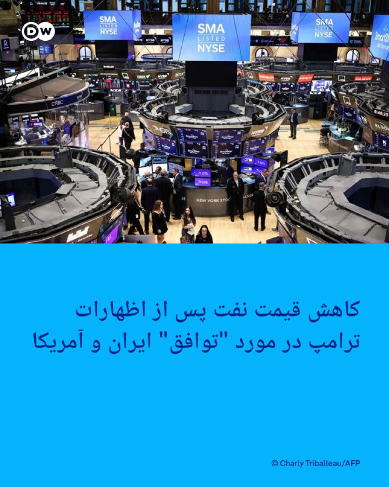

🔶 کاهش قیمت نفت پس از اظهارات ترامپ در مورد "توافق" ایران و آمریکا

قیمت نفت پس از اظهارات دونالد ترامپ درباره پیشرفت در مذاکرات و احتمال پایان جنگ با ایران کاهش یافت.

نفت برنت دریای شمال با ۱.۴۵ درصد افت به ۸۹ دلار و ۷ سنت و نفت شاخص وست‌تگزاس اینترمدیت با ۱.۳۵ درصد کاهش به ۸۶ دلار و ۵۳ سنت در ازای هر بشکه رسید.

در وال‌استریت شاخص‌های اصلی رشد قابل‌توجهی را ثبت کردند و سهام شرکت‌های فناوری و هوش مصنوعی همچنان با نوسان همراه بود.

سهام بازارهای آسیایی روز جمعه ۲۲ خرداد (۱۲ ژوئن) با رشد قابل‌توجهی همراه شد و هم‌سو با صعود وال‌استریت حرکت کرد.

در بازارهای آسیا شاخص کوسپی کره جنوبی ۷.۸ درصد رشد کرد و با افزایش سهام شرکت‌های بزرگ فناوری مثل سامسونگ، در صدر بازارها قرار گرفت.

شاخص نیکی ۲۲۵ ژاپن نیز ۳.۵ درصد افزایش یافت.

بازارهای هنگ‌کنگ، چین، استرالیا، تایوان و هند نیز همگی افزایش ارزش داشتند.

این موج صعودی در بازار سهام پس از آن شکل گرفت که ترامپ از لغو حملات برنامه‌ریزی‌شده علیه ایران و احتمال دستیابی به توافقی برای پایان درگیری‌ها خبر داد.

@dw_farsi

## RadioFarda — post 158204

  <a href="telegram/content/RadioFarda_158204_1781245400.mp4" target="_blank">🎬 Download video</a>

🔸پلیس اسرائیل در تل‌آویو روز پنج‌شنبه ۲۱ خرداد با معترضانی که یک تقاطع اصلی را در تل‌آویو مسدود کرده بودند، درگیر شد.

🔸این معترضان علیه فشار برای سربازگیری جامعه ارتدکس افراطی در ارتش اسرائیل تجمع کردند.

🔸خدمت سربازی طبق قانون اسرائیل اجباری است، اما جمعیت ارتدکس افراطی یهودی عمدتاً از آن معاف بوده‌اند.

🔸قانونگذاران ارتدکس افراطی در ائتلاف نتانیاهو خواستار قانونی کردن این معافیت هستند.

🔸اما احزاب مخالف می‌گویند مردان ارتدکس افراطی هم باید بار خدمت سربازی را به دوش بکشند.

🔸فشارها برای سربازگیری از جامعه ارتدکس افراطی یهودی به‌ویژه پس از دو سال جنگ در غزه و لبنان که در آن نزدیک به هزار سرباز اسرائیلی کشته شدند، افزایش یافته است.

@RadioFarda

## RadioFarda — post 158203

  <a href="telegram/content/RadioFarda_158203_1781245403.mp4" target="_blank">🎬 Download video</a>

🔸پلیس اسرائیل در تل‌آویو روز پنج‌شنبه ۲۱ خرداد با معترضانی که یک تقاطع اصلی را در تل‌آویو مسدود کرده بودند، درگیر شد.

🔸این معترضان علیه فشار برای سربازگیری جامعه ارتدکس افراطی در ارتش اسرائیل تجمع کردند.

🔸خدمت سربازی طبق قانون اسرائیل اجباری است، اما جمعیت ارتدکس افراطی یهودی عمدتاً از آن معاف بوده‌اند.

🔸قانونگذاران ارتدکس افراطی در ائتلاف نتانیاهو خواستار قانونی کردن این معافیت هستند.

🔸اما احزاب مخالف می‌گویند مردان ارتدکس افراطی هم باید بار خدمت سربازی را به دوش بکشند.

🔸فشارها برای سربازگیری از جامعه ارتدکس افراطی یهودی به‌ویژه پس از دو سال جنگ در غزه و لبنان که در آن نزدیک به هزار سرباز اسرائیلی کشته شدند، افزایش یافته است.

@RadioFarda

## BBCPersian — post 283531

  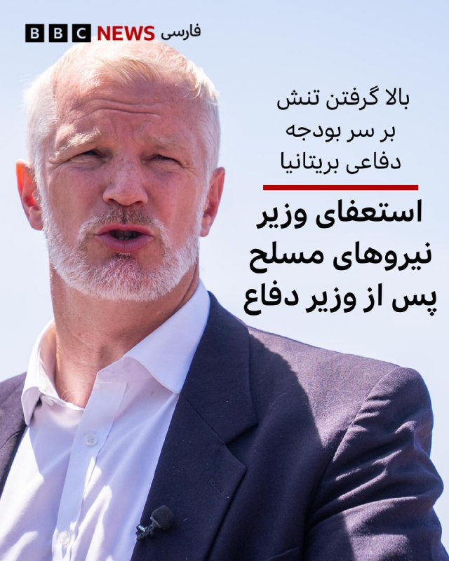

🔻آل کارنز، وزیر نیروهای مسلح بریتانیا، پس از جان هیلی، وزیر دفاع به دلیل اختلاف با نخست وزیر بر سر هزینه‌های نظامی از سمت خود استعفا داد.
آقای کارنز که عصر دیروز استعفا داد به کی‌یر استارمر، نخست وزیر گفت که «طرح سرمایه‌گذاری دفاعی نه تحولی ایجاد می کند و نه بودجه کافی دارد».
او همچنین گفت که از نیروهای مسلح خواسته می‌شود در دنیایی خطرناک‌تر و پرتنش‌تر فعالیت کنند، در حالی که بودجه‌ای که در اختیارشان قرار دارد مربوط به شرایطی آرام‌تر و کم‌خطرتر در گذشته است.
کی‌یر استارمر، در پی استعفای جان هیلی، دان جاروِیس را به عنوان وزیر دفاع منصوب کرده است.
آقای هیلی هم ضمن انتقاد از نخست وزیر گفته بود او قادر نیست منابع لازم برای حفظ امنیت کشور را فراهم کند.
اما نخست‌وزیر گفته است که دولت بودجه دفاعی را به شکل قابل توجهی افزایش داده و این افزایش به‌گونه‌ای طراحی شده که هم در حال حاضر و هم در سال‌های آینده قابل افزایش و پایدار باشد.
آل کارنز هفتمین وزیری است که طی کمتر از یک ماه از دولت بریتانیا استعفا می‌دهد.

📸Getty Images
@BBCPersian

## alonews — post 127310

  <a href="telegram/content/alonews_127310_1781245406.webm" target="_blank">🎬 Download video</a>

👈واشنگتن پست: جنگ ایران رشد اقتصادی جهان را به ضعیف‌ترین سطح خود از زمان کرونا خواهد رساند

✅ @AloNews خبر جنگ

---
📅 بروزرسانی: 1405/03/22 09:43
---

## FarsiVOA — post 220459

  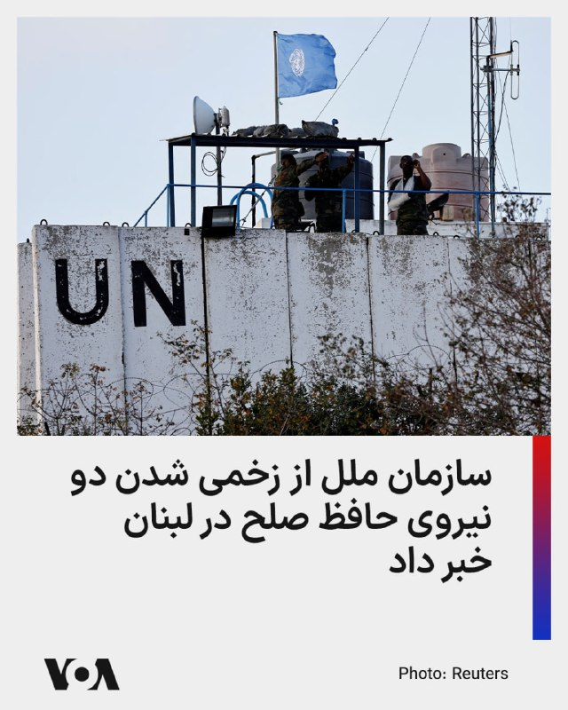

سخنگوی سازمان ملل اعلام کرد که دو نیروی حافظ صلح یونیفل، در جنوب لبنان به ‌طور سطحی زخمی شدند.

استفان دوجاریک، طی سخنانی در جمع خبرنگاران که الجزیره آن را منتشر کرده، ملیت آنها را مالزیایی اعلام و وضعیت سلامت آنها را پایدار توصیف کرد.

وی علت حادثه را حمله به یک کاروان لجستیکی عنوان، اما جزییاتی درباره عامل حمله، ارائه نکرد.

سخنگوی سازمان ملل همچنین از تغییر مسیر یک کاروان سازمان ملل در حوالی «بنت‌ جلیل» بر اثر شلیک یک تانک ارتش اسرائيل نیز خبر داد و به همه طرف‌های درگیر در لبنان یادآور شد که «کارکنان و دارایی‌های سازمان ملل مصونیت دارند و تعرض به آن‌ها ممنوع است.»
@FarsiVOA

## Persian_Trend_Official — post 16828

  <a href="telegram/content/Persian_Trend_Official_16828_1781244798.mp4" target="_blank">🎬 Download video</a>

شبکه CNN در یک گزارش تمام دفعاتی که در آن ترامپ ادعا کرده به توافق با ایران نزدیک شده ایم را جمع آوری کرده است.

ترامپ 39 بار گفته است که به توافق با ایران نزدیک شده ایم.

📝 Amir

📌 @persian_trend_official
پرشین ترند | متفاوت‌ترین کانال نظامی

## alonews — post 127309

  <a href="telegram/content/alonews_127309_1781244799.webm" target="_blank">🎬 Download video</a>

👈پس از بریدن سر یک انگلیسی توسط یک مهاجر سودانی در شهر بل‌فاست ایرلند شمالی و همچنین خبر تجاوز ۴مهاجر افغان به یک نوجوان بریتانیایی، شورش‌های گسترده‌ای علیه مهاجران مسلمان در بریتانیا رخ داده و ده‌های خانه و خودروی مهاجران توسط معترضین به آتش کشیده شد.

✅ @AloNews خبر جنگ

## alonews — post 127308

  <a href="telegram/content/alonews_127308_1781244800.webm" target="_blank">🎬 Download video</a>

👈سخنگوی وزارت خارجه: آمریکایی‌‌ها درحال القا هستند که جمهوری اسلامی تحت فشار به توافق رضایت داده است، در حالی که ما به هیچ عنوان از خطوط قرمز خود کوتاه نخواهیم آمد

✅ @AloNews خبر جنگ

---
📅 بروزرسانی: 1405/03/22 09:33
---

## VahidOOnLine — post 245096

  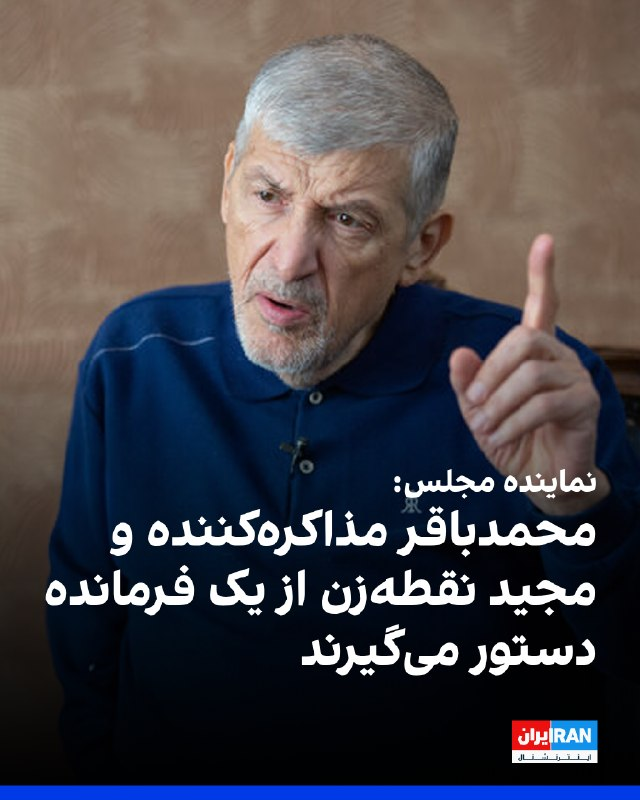

منصور حقیقت‌پور، عضو هیات‌رییسه کمیسیون امنیت ملی و سیاست خارجی مجلس جمهوری اسلامی، با رد وجود اختلاف میان نهادهای تصمیم‌گیر در جمهوری اسلامی، گفت مقام‌های نظامی و دیپلماتیک از یک فرمانده دستور می‌گیرند.

او در اشاره به آنچه «آرزوی غرب برای شنیدن صدای تشتت و اختلاف» خواند، گفت: «هم مجیدِ نقطه‌زن و هم محمدباقرِ مذاکره‌کننده از یک فرمانده به نام مجتبی خامنه‌ای دستور می‌گیرند؛ بنابراین در پاسخ به آرزوی غرب برای شنیدن صدای تشتت و اختلاف میان مسئولان و کارگزاران نظام باید گفت: شتر در خواب بیند پنبه‌دانه.»

حقیقت‌پور همچنین حمایت دستگاه دیپلماسی از عملیات نظامی سپاه پاسداران در یکشنبه‌شب را نشانه هماهنگی میان نهادهای نظامی و دیپلماتیک دانست و گفت میدان و دیپلماسی دو بال نظام هستند که تحت امر «فرمانده کل قوا» عمل می‌کنند.
‌🏁 🇬🇧 IranintlTV

🤖 @VahidOOnLine

## IranIntlTV — post 341839

  

منصور حقیقت‌پور، عضو هیات‌رییسه کمیسیون امنیت ملی و سیاست خارجی مجلس جمهوری اسلامی، با رد وجود اختلاف میان نهادهای تصمیم‌گیر در جمهوری اسلامی، گفت مقام‌های نظامی و دیپلماتیک از یک فرمانده دستور می‌گیرند.

او در اشاره به آنچه «آرزوی غرب برای شنیدن صدای تشتت و اختلاف» خواند، گفت: «هم مجیدِ نقطه‌زن و هم محمدباقرِ مذاکره‌کننده از یک فرمانده به نام مجتبی خامنه‌ای دستور می‌گیرند؛ بنابراین در پاسخ به آرزوی غرب برای شنیدن صدای تشتت و اختلاف میان مسئولان و کارگزاران نظام باید گفت: شتر در خواب بیند پنبه‌دانه.»

حقیقت‌پور همچنین حمایت دستگاه دیپلماسی از عملیات نظامی سپاه پاسداران در یکشنبه‌شب را نشانه هماهنگی میان نهادهای نظامی و دیپلماتیک دانست و گفت میدان و دیپلماسی دو بال نظام هستند که تحت امر «فرمانده کل قوا» عمل می‌کنند.
https://iranintl.com/202606120958

## alonews — post 127307

  <a href="telegram/content/alonews_127307_1781244210.webm" target="_blank">🎬 Download video</a>

👈نفت آمریکا به 85 دلار رسید!

✅ @AloNews خبر جنگ

## alonews — post 127306

  <a href="telegram/content/alonews_127306_1781244210.webm" target="_blank">🎬 Download video</a>

👈الجزیره به نقل از اکسیوس مفاد تفاهم‌نامه تهران و واشنگتن را اعلام کرد:
بازگشایی تنگه هرمز بدون وضع عوارض عبور در ازای رفع محاصره دریایی

🔴کاهش تحریم‌های ایران مشروط به پایبندی به تعهدات

🔴تمدید آتش‌بس به مدت ۶۰ روز (شامل لبنان)

🔴چارچوبی برای مدیریت ذخایر اورانیوم غنی‌شده ایران

🔴برگزاری مذاکرات هسته‌ای در دوره آتش‌بس

✅ @AloNews خبر جنگ

## alonews — post 127305

  <a href="telegram/content/alonews_127305_1781244210.webm" target="_blank">🎬 Download video</a>

👈سخنگوی فرماندهی مرکزی ایالات متحده در منطقه موسوم به سنتکام در گفت وگو با شبکه سی بی اس نیوز مدعی شد که در حال بررسی گزارش‌هایی مبنی بر حمله هوایی آمریکا به یک تاسیسات آب در جنوب ایران در روز چهارشنبه است

✅ @AloNews خبر جنگ

---
📅 بروزرسانی: 1405/03/22 09:23
---

## pm_afshaa — post 93671

https://t.me/pm_afshaa/s/1

## FarsiVOA — post 220458

🔺نیویورک‌تایمز از قصد آمریکا برای کاهش جنگنده‌ها و ناوهای جنگی خود در اروپا خبر داد

▪️نیویورک‌تایمز گزارش داد که ایالات متحده قصد دارد تعداد هواپیماها و ناوهای جنگی‌ای را که برای عملیات ناتو در اروپا در اختیار این ائتلاف قرار می‌دهد، به‌طور قابل‌توجهی کاهش دهد.

▪️این کاهش شامل تعداد جنگنده‌ها و هواپیماهای شناسایی دریایی، یک زیردریایی مجهز به موشک و یک ناو هواپیمابر است.

▪️چنین کاهشی، توانایی ناتو در زمینه نظارت و پایش اطلاعاتی و همچنین توان آن برای انجام حملات دوربرد را محدود خواهد کرد.

▪️دونالد ترامپ، پیشتر بارها از اعضای ناتو به دلیل عدم اعزام نیروی دریایی برای کمک به باز کردن تنگه هرمز انتقاد و یادآوری کرده که آمریکا سالانه صدها میلیارد دلار برای ناتو و محافظت از آنها هزینه می‌کند.

⬇️ بیشتر بخوانید:
https://ir.voanews.com/a/8160100.html

## DW_Farsi — post 125845

  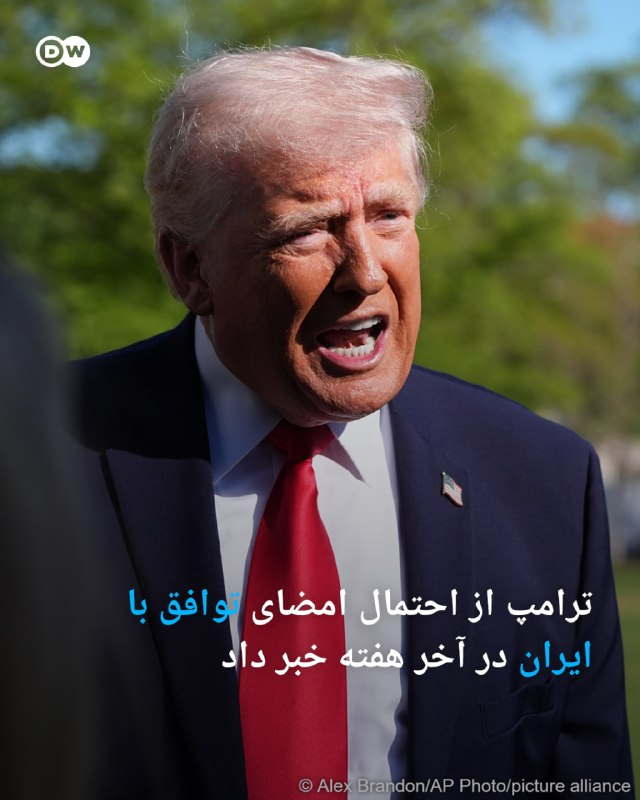

🔶 ترامپ از احتمال امضای توافق با ایران در آخر هفته خبر داد

دونالد ترامپ، رئیس جمهور آمریکا شامگاه پنجشنبه ۲۱ خرداد (۱۱ ژوئن) در جمع خبرنگاران در کاخ سفید اعلام کرد که اسناد مربوط به توافق با ایران هنوز در حال نهایی‌شدن است و این روند باید طی روزهای آینده تکمیل شود.

او در پاسخ به این پرسش که چرا این بار تا این حد نسبت به توافق اطمینان دارد، گفت: «چون آن‌ها به‌شدت ضربه خورده‌اند.»

رئیس جمهور آمریکا همچنین افزود که احتمال دارد مراسم امضای توافق "شاید در اروپا" انجام شود، اما جزییاتی در مورد مکان دقیق آن ذکر نکرد.

ترامپ همچنین از گفت‌وگو با رجب طیب اردوغان، رئیس‌جمهور ترکیه خبر داد.

به گفته او، "ممکن است امضای توافق حتی در آخر هفته انجام شود". ترامپ افزود که خودش احتمالا در مراسم حضور نخواهد داشت اما معاونش، جی‌دی ونس، در آن شرکت خواهد کرد..

رئیس جمهور آمریکا جزئیات بیشتری از این توافق ارائه نداد و تنها آن را "یک توافق بزرگ" توصیف کرد. ترامپ تا کنون بارها از نزدیک بودن توافق با جمهوری اسلامی سخن گفته است.

@dw_farsi

## IranianMinds — post 22365

  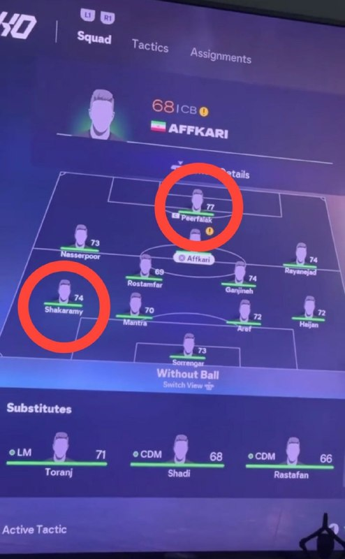

🔴 شرکت EA Sports اومده تو آپدیت جدیدی که توی FC26 یا همون فیفای خودمون داده داخل یه مود بازی به جای بازیکنای جمهوری اسلامی اسم جاویدنام هایی که سال 1401 توسط جمهوری اسلامی کشته شدن رو گذاشته.

@IranianMinds

## BBCPersian — post 283530

  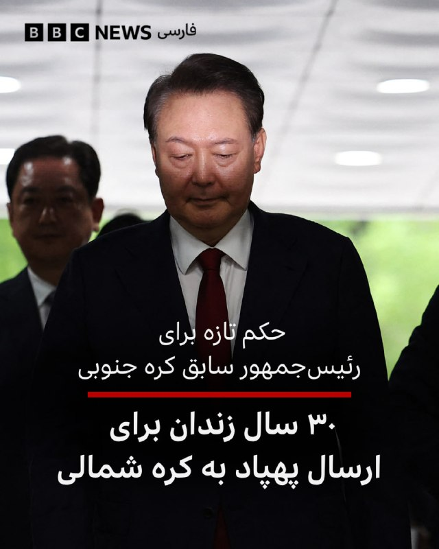

🔻یون سوک یول، رئیس‌جمهور سابق کره جنوبی، به اتهام دستور ارسال پهپاد به کره شمالی به ۳۰ سال زندان محکوم شد.

در استدلال دادستان ها آمده است که یون سوک یول در اکتبر ۲۰۲۴ دستور اجرای عملیاتی را صادر کرده تا کره شمالی را تحریک کند تا بهانه‌ای برای تلاش نافرجام خود جهت برقراری حکومت نظامی در ادامه همان سال ایجاد کند. اما این طرح در نهایت ناکام ماند.

دادستان‌ها مدعی شدند که این عملیات نه‌تنها تنش‌های نظامی را افزایش داد، بلکه پس از سقوط یکی از پهپادها، اطلاعات حساس و محرمانه‌ای را هم در اختیار کره شمالی قرار داد.

وقتی یون سوک یول در دسامبر ۲۰۲۴ حکومت نظامی اعلام کرد، ادعا کرد که هدفش محافظت از کشور در برابر «نیروهای ضد دولتی» است که با کره شمالی همدست هستند. اما خیلی زود مشخص شد که انگیزه اصلی او مشکلات داخلی و سیاسی بوده. در نهایت به‌دلیل اعتراض‌های گسترده مردم، او این دستور را لغو کرد.

یون سوک یول از زمان برکناری‌اش به دلیل تلاش نافرجام برای اعمال حکومت نظامی با چندین محاکمه کیفری روبه‌رو بوده است.

📸AFP via Getty Images
@BBCPersian

## alonews — post 127304

  <a href="telegram/content/alonews_127304_1781243596.webm" target="_blank">🎬 Download video</a>

👈وزارت دفاع روسیه: دیشب ۲۳۱ پهپاد اوکراینی بر فراز چندین استان منهدم شدند

✅ @AloNews خبر جنگ

## alonews — post 127303

  <a href="telegram/content/alonews_127303_1781243596.webm" target="_blank">🎬 Download video</a>

👈 دادگاهی در سئول «یون سوک یول»، رئیس‌جمهور پیشین کره جنوبی، را به اتهام ارسال پهپاد به کره شمالی و تلاش برای ایجاد بهانه‌ای جهت اعلام حکومت نظامی، به ۳۰ سال زندان محکوم کرد.

✅ @AloNews خبر جنگ

## alonews — post 127302

  <a href="telegram/content/alonews_127302_1781243596.webm" target="_blank">🎬 Download video</a>

👈دیشب ۱.۱۵ تریلیون دلار به بازار سهام ایالات متحده اضافه شد

✅ @AloNews خبر جنگ

---
📅 بروزرسانی: 1405/03/22 09:13
---

## IranIntlTV — post 341838

  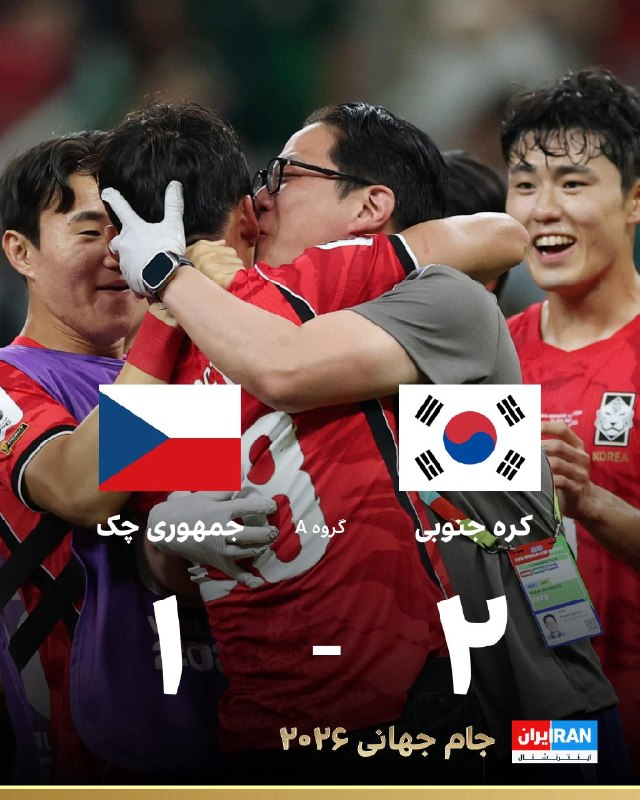

🔻کره جنوبی در دومین دیدار گروه A رقابت‌های جام‌جهانی ۲۰۲۶ با نتیجه ۲ بر ۱ جمهوری چک را شکست داد و با سه امتیاز در رده دوم جدول پشت‌سر مکزیک قرار گرفت.

🔹چک در دقیقه ۵۸ نخستین گل مسابقه را به ثمر رساند. لادیسلاو کرچی با استفاده از فرصت به‌دست‌آمده دروازه کره جنوبی را باز کرد تا تیمش پیش بیفتد.

🔹برتری چک اما دوام چندانی نداشت و کره جنوبی در دقیقه ۶۷ توسط اینبیوم هانگ گل تساوی را به ثمر رساند.

🔹چک در دقیقه ۷۶ بار دیگر دروازه حریف را باز کرد، اما این گل پس از بازبینی صحنه به دلیل آفساید مردود اعلام شد.

🔹در ادامه، کره جنوبی موفق شد کام‌بک خود را کامل کند. هان‌گایواو که تنها ۱۰ دقیقه از ورودش به زمین می‌گذشت، در دقیقه ۷۹ گل دوم و پیروزی‌بخش تیمش را به ثمر رساند.

🔹با پایان دور نخست بازی‌های گروه A، مکزیک به دلیل تفاضل گل بهتر در صدر جدول قرار گرفت و کره جنوبی در جایگاه دوم ایستاد. جمهوری چک و آفریقای جنوبی در رتبه‌های بعدی قرار دارند.

@iranintltvsport

## alonews — post 127301

  <a href="telegram/content/alonews_127301_1781243005.webm" target="_blank">🎬 Download video</a>

👈سخنگوی کمیسیون امنیت ملی:
احتمال فریب از سوی ترامپ بالاست.

✅ @AloNews خبر جنگ

## alonews — post 127300

  <a href="telegram/content/alonews_127300_1781243005.mp4" target="_blank">🎬 Download video</a>

👈کارشناس صدا سیما: با صراحت میگویم بخش عمده ای از شروط ده‌گانه در توافق وجود ندارد

✅ @AloNews خبر جنگ

## alonews — post 127299

  <a href="telegram/content/alonews_127299_1781243007.mp4" target="_blank">🎬 Download video</a>

👈شبکه CNN با انتشار ویدیویی از اظهارات دونالد ترامپ، نشان داده که او از زمان آغاز جنگ با ایران، دست‌کم ۳۹ بار ادعای «نزدیک شدن به توافق» را مطرح کرده است. این در حالی است که با وجود این تکرارها، هنوز توافق نهایی امضا نشده است

✅ @AloNews خبر جنگ

---
📅 بروزرسانی: 1405/03/22 09:04
---

## VahidOOnLine — post 245095

  <a href="telegram/content/VahidOOnLine_245095_1781242499.mp4" target="_blank">🎬 Download video</a>

♦️دونالد ترامپ، رئیس‌جمهوری آمریکا، بامداد جمعه ۲۲ خرداد (به وقت تهران) در یک تماس تلفنی اعلام کرد ایالات متحده «امروز جنگ با ایران را پایان داده» و تهران پذیرفته است که هرگز به سلاح هسته‌ای دست پیدا نکند.
ترامپ در این تماس که خطاب به برت جونز، معاون فرماندار ایالت جورجیا بود گفت: «نمی‌دانم شنیده‌اید یا نه، اما ما امروز جنگ با ایران را پایان دادیم. آنها پذیرفته‌اند که هرگز سلاح هسته‌ای نداشته باشند؛ چیزی که ما بر آن اصرار داشتیم. این هدف اصلی ما بود و آنها به قدرتمندترین شکل ممکن آن را پذیرفته‌اند.»
برت جونز اعلام کرد این تماس تلفنی ساعت ۷ عصر پنج‌شنبه ۱۱ ژوئن به وقت محلی برگزار شده و حدود یک ساعت بعد فایل صوتی آن را در کانال یوتیوب خود منتشر کرده است.
ترامپ پیش‌تر نیز گفته بود که آمریکا و ایران ممکن است تا پایان هفته جاری یک توافق صلح امضا کنند؛ توافقی که به گفته او می‌تواند به بازگشایی تنگه هرمز برای کشتیرانی بین‌المللی منجر شود. با این حال، مقام‌های ایرانی اعلام کرده‌اند که هنوز تصمیم نهایی درباره چنین توافقی اتخاذ نشده است.
در صورت تایید این خبر، این توافق مهم‌ترین پیشرفت دیپلماتیک برای پایان دادن به جنگ سه‌ماهه میان دو کشور خواهد بود؛ جنگی که باعث افزایش چشمگیر قیمت جهانی انرژی شده است.
‌🇸🇦 Indypersian

🤖 @VahidOOnLine

## Persian_Trend_Official — post 16827

  <a href="telegram/content/Persian_Trend_Official_16827_1781242502.mp4" target="_blank">🎬 Download video</a>

ترامپ: امروز جنگ با ایران را پایان دادیم. آن‌ها موافقت کرده‌اند که هرگز سلاح هسته‌ای نداشته باشند.

چیزی که ما روی آن اصرار داشتیم. این کل هدف بود. این 95% ماجرا بود. آنها این کار را به قدرتمندترین روشی که می‌توانید انجام دهید، انجام داده‌اند. ما با ایران توافق کردیم. معامله بزرگی انجام دادیم. هیچ سلاح هسته‌ای وجود نخواهد داشت.

تقریباً همه چیز تکمیل شده است. ما هر آنچه می‌خواستیم را به دست آوردیم. نکته مهم این است که هیچ سلاح هسته‌ای در ایران وجود نخواهد داشت. یعنی نه توسعه یافته و نه خریداری شده.

📝 Amir

📌 @persian_trend_official
پرشین ترند | متفاوت‌ترین کانال نظامی

## BBCPersian — post 283524

🖋لوئیس باروچو
سرویس جهانی بی‌بی‌سی

به نظر می‌رسد اکنون پس از موج تازه‌ای از حملات در سراسر منطقه، آتش‌بسی که اوایل آوریل میان ایالات متحده و ایران بر سر آن توافق شد، بیش از پیش تحت فشار قرار گرفته است.

دونالد ترامپ، رئیس‌جمهور آمریکا و مقام‌های ارشد ایران پس از این حملات تهدیدهای تازه‌ای درباره اقدام‌های بیشتر علیه یکدیگر مطرح کرده‌اند.

آمریکا روز چهارشنبه اعلام کرد پس از سرنگون شدن یکی از هلیکوپترهایش در خلیج فارس، سایت‌های نظامی و نظارتی ایران را هدف قرار داده است. سپاه پاسداران انقلاب اسلامی در پاسخ، به پایگاه‌های آمریکا در بحرین و اردن حمله کرد. این در حالی است که کویت گفت حمله دیگری را رهگیری کرده است.

این تشدید تنش چند روز پس از آن رخ داد که ایران روز یکشنبه موشک‌هایی به سوی اسرائیل شلیک کرد؛ اقدامی که حملات هوایی اسرائیل به اهدافی در غرب و مرکز ایران را در پی داشت؛ نخستین رویارویی مستقیم میان دو کشور از زمان آغاز آتش‌بس. آقای ترامپ از دو طرف خواسته بود «شلیک‌ها» را متوقف کنند.
ادامه مطلب⬇️

📸GettyImages/ Reuters/ Anadolu via Getty Images/ AFP via Getty Images
https://bbc.in/4uyvvTb
@BBCPersian

## alonews — post 127298

  <a href="telegram/content/alonews_127298_1781242502.webm" target="_blank">🎬 Download video</a>

👈نیویورک تایمز: واشنگتن در حال برنامه‌ریزی برای کاهش تعداد هواپیماها و ناوهای جنگی اختصاص‌ یافته به عملیات‌ ناتو در اروپا است

✅ @AloNews خبر جنگ

## alonews — post 127297

  <a href="telegram/content/alonews_127297_1781242502.webm" target="_blank">🎬 Download video</a>

👈حملات هوایی اسرائیل به اطراف شهرک بلاط در شهرستان مرجعیون در جنوب لبنان

✅ @AloNews خبر جنگ

## alonews — post 127296

  <a href="telegram/content/alonews_127296_1781242503.webm" target="_blank">🎬 Download video</a>

👈سخنگوی وزارت خارجه: اعلام تاریخ برای امضای تفاهم، گمانه‌زنی رسانه‌ای است

✅ @AloNews خبر جنگ

---
📅 بروزرسانی: 1405/03/22 08:53
---

## pm_afshaa — post 93670

اکسیوس: این توافق که با میانجیگری مشترک قطر و پاکستان حاصل شده، در صورت امضای نهایی طرفین «توافق اسلام‌آباد» نام خواهد گرفت

💧 Rainbet.com the #1 Non-KYC Crypto Casino & Sportsbook @rainbetcom

😁 @Pm_Afshaa

## Persian_Trend_Official — post 16826

  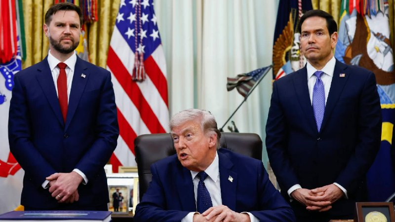

اکسیوس جزئیات ادعایی جدیدی از تفاهم‌نامه ایالات متحده و ایران منتشر کرد.

این تفاهم‌نامه خواستار بازگشایی فوری تنگه هرمز بدون عوارض و بازگشت کشتیرانی به حجم قبل از جنگ ظرف 40 روز است، درعوض محاصره دریایی ایالات متحده نیز برداشته خواهد شد.

آتش‌بس به مدت 60 روز، از جمله در لبنان، تمدید خواهد شد، در حالی که مذاکرات هسته‌ای ادامه دارد؛ هرگونه اقدامی در مورد برنامه هسته‌ای ایران به یک توافق دوم جداگانه و دقیق‌تر بستگی دارد.

کاهش تحریم‌ها به پایبندی و حسن نیت در مذاکرات بیشتر بستگی خواهد داشت، و معافیت‌های موقت به ایران اجازه می‌دهد تا 60 روز پس از بازگشایی تنگه، نفت بفروشد.

تا عصر پنجشنبه، این توافق در سطوح بالای طرف ایرانی تأیید شده است، اما طبق گزارش‌ها هنوز توسط مجتبی خامنه‌ای، رهبر جمهوری اسلامی، تأیید نشده است. وزارت امور خارجه ایران می‌گوید هنوز تصمیم نهایی گرفته نشده است.

ترامپ انتظار دارد مراسم امضای توافق‌نامه‌ای که قرار است آخر این هفته در ژنو برگزار شود، با میانجیگری مشترک قطر و پاکستان و با عنوان توافق اسلام‌آباد برگزار شود.

📝 Amir

📌 @persian_trend_official
پرشین ترند | متفاوت‌ترین کانال نظامی

## Persian_Trend_Official — post 16825

  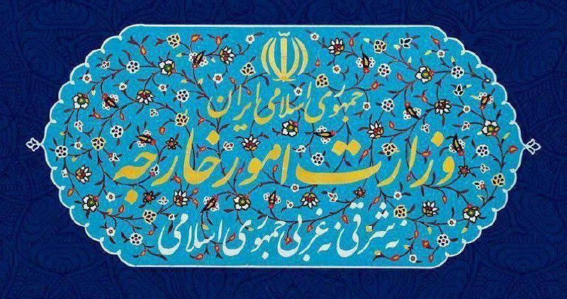

ایران تأیید کرد که در مورد نکات اصلی تفاهم‌نامه با آمریکا توافق شده است.

اسماعیل بقایی، سخنگوی وزارت امور خارجه جمهوری اسلامی، به پرس تی‌وی گفت: در مورد متن، عملاً در نکات اصلی آن توافق شده است. مشکل این است که موضع متناقض آمریکا همیشه باعث ایجاد اختلال در این روند شده است.

پیش از این، بقایی ادعاهای دونالد ترامپ، رئیس جمهور آمریکا، در مورد امضای قریب‌الوقوع توافق صلح را گمانه‌زنی خواند و تأکید کرد که هنوز هیچ چیز، نهایی نشده است. او خاطرنشان کرد که واشنگتن طی چند ماه گذشته بارها موضع خود را تغییر داده و بارها آتش‌بس را نقض کرده است.

📝 Amir

📌 @persian_trend_official
پرشین ترند | متفاوت‌ترین کانال نظامی

## alonews — post 127294

  <a href="telegram/content/alonews_127294_1781241801.webm" target="_blank">🎬 Download video</a>

👈گروه هکری حنظله اعلام کرد که در واکنش به «حملات آمریکا به غیرنظامیان و زیرساخت‌های آبی ایران»، تأسیسات آب ایالت کالیفرنیا را هک کرده است!

🔴حنظله اعلام کرد که باوجود دسترسی به سامانه‌های مرتبط، از ایجاد اختلال در آب‌رسانی شهرهای آمریکا خودداری کرده و این اقدام تنها «هشداری» به واشنگتن بوده است

✅ @AloNews خبر جنگ

## alonews — post 127293

  <a href="telegram/content/alonews_127293_1781241801.webm" target="_blank">🎬 Download video</a>

👈ایلان ماسک پس از عرضه اولیه سهام اسپیس ایکس، به اولین تریلیونر جهان تبدیل شد

✅ @AloNews خبر جنگ

## alonews — post 127292

  <a href="telegram/content/alonews_127292_1781241802.webm" target="_blank">🎬 Download video</a>

👈تلویزیون سوریه: گروهی از نظامیان اسرائیلی به همراه هشت خودرو نظامی وارد روستای صیدا در حومه قنیطره شدند

✅ @AloNews خبر جنگ

## alonews — post 127291

  <a href="telegram/content/alonews_127291_1781241802.webm" target="_blank">🎬 Download video</a>

👈شبکه فاکس نیوز به نقل از یک مقام ارشد پنتاگون (وزارت جنگ آمریکا) ادعا کرد: در پی تلاش ایران برای هدف قرار دادن کشتی‌های عبوری از تنگه هرمز، نیروهای آمریکایی دو پهپاد ایرانی را سرنگون کردند.

✅ @AloNews خبر جنگ

---
📅 بروزرسانی: 1405/03/22 08:43
---

## Persian_Trend_Official — post 16824

صداوسیما: یک منبع آگاه نظامی تایید کرد صداهای انفجار شنیده شده در شهرستان سیریک مربوط به مقابله رزمندگان با یک فروند شناور متخلفی است که قصد عبور از تنگه هرمز را داشت. این منبع آگاه در نیروی دریایی سپاه گفت: پس از شرارت‌های دیشب ارتش تروریستی و کودک‌کش آمریکا…

## Persian_Trend_Official — post 16823

  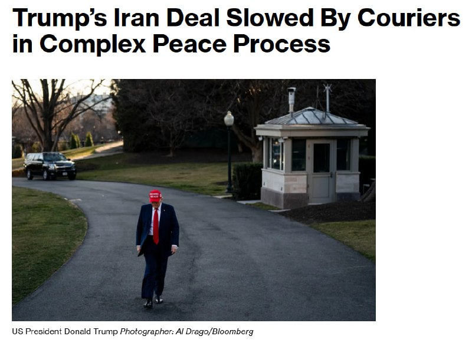

بلومبرگ گزارش می‌دهد که رئیس جمهور ترامپ بارها اعلام کرده است که ایالات متحده و ایران به دستیابی به توافق نزدیک هستند، اما مذاکرات همچنان دشوار و کندتر از آن چیزی است که علناً گفته شده است.

مقامات آمریکایی این روند را به عنوان تبادل پیچیده پیام‌ها به جای مذاکرات مستقیم توصیف می‌کنند و ارتباطات اغلب به دلیل فرآیند تصمیم‌گیری داخلی ایران و ارتباطات محدود، روزها طول می‌کشد.

پیشنهادات از طریق پیک‌های انسانی به رهبر ایران، مجتبی خامنه‌ای، تحویل داده می‌شود، زیرا نگرانی‌هایی در مورد افشای موقعیت مکانی او پس از حملات ایالات متحده و اسرائیل در ماه مارس که منجر به کشته شدن پدرش، علی خامنه‌ای، شد، وجود دارد.

📝 Amir

📌 @persian_trend_official
پرشین ترند | متفاوت‌ترین کانال نظامی

## Persian_Trend_Official — post 16822

  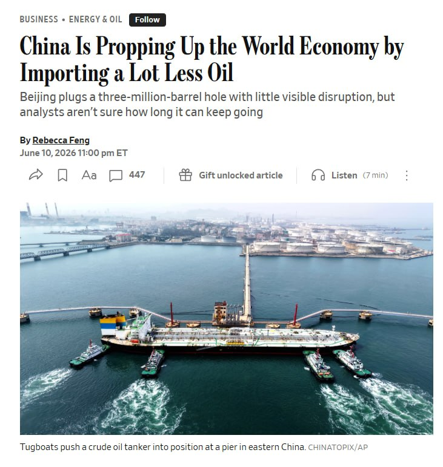

وال استریت ژورنال میگوید کاهش شدید واردات نفت خام چین در طول جنگ ایران، با وجود اختلال طولانی مدت در تنگه هرمز، به جلوگیری از افزایش شدید قیمت جهانی نفت کمک کرده است.

واردات چین در ماه مه از حدود 11 میلیون بشکه در روز به 7.8 میلیون بشکه کاهش یافت و تقریباً 3 میلیون بشکه از دست رفته با کاهش تقاضای سوخت به دلیل رشد وسایل نقلیه برقی و راه آهن پرسرعت، کاهش فعالیت پالایشگاه‌ها، اتکای بیشتر به پتروشیمی‌های مبتنی بر زغال سنگ و کاهش تدریجی ذخایر استراتژیک و تجاری نفت جبران شد.

با این حال، تحلیلگران هشدار می‌دهند که کاهش واردات چین ممکن است به طور نامحدود پایدار نباشد.

تولید پتروشیمی کند شده است، ذخایر در حال اتمام هستند و پکن ممکن است در ماه‌های آینده نیاز به بازگشت به بازار جهانی نفت داشته باشد که به طور بالقوه فشار صعودی جدیدی را بر قیمت‌ها وارد می‌کند.

📝 Amir

📌 @persian_trend_official
پرشین ترند | متفاوت‌ترین کانال نظامی

## alonews — post 127290

  <a href="telegram/content/alonews_127290_1781241203.webm" target="_blank">🎬 Download video</a>

👈ریچارد ویتز، کارشناس امنیت بین‌الملل در کالج دفاعی ناتو، در گفتگو با الجزیره گفت: توافق احتمالی واشنگتن-تهران احتمالاً به صورت «فازبندی شده» پیش می‌رود؛ فاز اول شامل بازگشایی سریع تنگه هرمز و فازهای بعدی به مسائلی مانند پرونده هسته‌ای اختصاص دارد.

🔴 وی هشدار داد خطر بن‌بست در جزئیات فازهای بعدی وجود دارد که می‌تواند دستاوردهای اولیه را معکوس کند.

🔴 ویتز تأکید کرد بازگشایی تنگه هرمز برای خود ایران (برای صادرات نفت)، متحدان آمریکا در خلیج فارس و اقتصاد جهانی حیاتی است

✅ @AloNews خبر جنگ

## alonews — post 127289

  <a href="telegram/content/alonews_127289_1781241203.webm" target="_blank">🎬 Download video</a>

👈اکسیوس، به نقل از یک مقام آمریکایی: ترامپ با گزینه‌ای موافقت کرده است که بر اساس آن ایران سطح اورانیوم غنی‌شده خود را تحت نظارت سازمان ملل کاهش می‌دهد

✅ @AloNews خبر جنگ

## alonews — post 127288

  <a href="telegram/content/alonews_127288_1781241204.webm" target="_blank">🎬 Download video</a>

👈اکسیوس: این توافق که با میانجیگری مشترک قطر و پاکستان حاصل شده، در صورت امضای نهایی طرفین «توافق اسلام‌آباد» نام خواهد گرفت

✅ @AloNews خبر جنگ

## alonews — post 127287

  <a href="telegram/content/alonews_127287_1781241204.webm" target="_blank">🎬 Download video</a>

👈آکسیوس: چهار فروند هواپیمای ترابری نیروی هوایی آمریکا روز پنجشنبه به اروپا اعزام شدند تا تجهیزات لازم برای سفر احتمالی معاون رئیس‌جمهور آمریکا، جی‌دی ونس، به مراسم امضای توافق در ژنو را منتقل کنند

✅ @AloNews خبر جنگ

## alonews — post 127286

  <a href="telegram/content/alonews_127286_1781241204.webm" target="_blank">🎬 Download video</a>

👈 ترامپ: امروز جنگ با ایران را به پایان رساندیم و آنها موافقت کردند که هرگز سلاح هسته‌ای نداشته باشند، چیزی که ما بر آن تأکید داشتیم. این هدف اصلی بود. این ۹۵٪ از موضوع بود و آنها این کار را به قدرتمندترین شکل ممکن انجام دادند.

✅ @AloNews خبر جنگ

## alonews — post 127285

  <a href="telegram/content/alonews_127285_1781241204.mp4" target="_blank">🎬 Download video</a>

👈صداوسیما: پخش تصویر انفجار اتمی اشتباه در تدوین بود؛ هک نشده بودیم

✅ @AloNews خبر جنگ

---
📅 بروزرسانی: 1405/03/22 08:33
---

## FarsiVOA — post 220457

  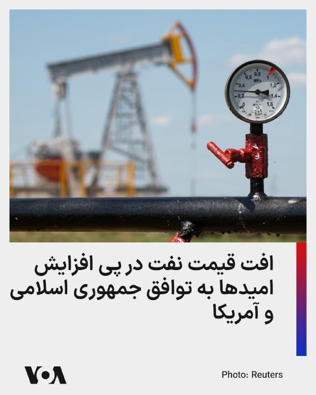

قیمت‌های جهانی نفت پس از اینکه رئیس‌جمهور آمریکا از رسیدن به «توافق عالی» با جمهوری اسلامی خبر داد، فروکش کرد.

قیمت نفت شاخص برنت با افتی ۱.۶ درصدی به زیر ۸۹ دلار رسید و قیمت نفت وست تگزاس اینترمدیت نیز به ۸۶ دلار کاهش یافت.

دونالد ترامپ، رئيس جمهوری آمریکا شامگاه گذشته اعلام کرد: «ما به تازگی به یک توافق عالی در مورد جنگ با [جمهوری اسلامی] ایران رسیده‌ایم و قرار است اسناد نهایی شوند که باید طی چند روز آینده انجام شود. احتمالاً در اروپا امضا خواهیم داشت و این چیز خوبی است.»

تازه‌ترین گزارش اوپک حاکی از افت تولید این کشورها به کمترین سطح از سال ۲۰۰۰ میلادی به خاطر انسداد تنگه هرمز توسط جمهوری اسلامی است.
@FarsiVOA

## FarsiVOA — post 220456

Farsi VOA pinned a photo

---
📅 بروزرسانی: 1405/03/22 08:23
---

## VahidOOnLine — post 245094

  

پولیتیکو به نقل از مقام‌های آمریکایی و منابع آگاه گزارش داد دونالد ترامپ پس از دریافت تماس‌هایی از رهبران قطر، امارات متحده عربی و پاکستان و اطمینان از نزدیک بودن یک توافق اولیه با جمهوری اسلامی، از برنامه حمله نظامی به ایران عقب‌نشینی کرد. بر اساس این گزارش، این کشورها با تکیه بر ارتباطات خود با تهران و مجتبی خامنه‌ای به ترامپ اطمینان دادند که مسیر دیپلماسی همچنان باز است. ترامپ نیز بعدتر از دستیابی به یک «توافق عالی» خبر داد و گفت احتمال امضای آن در روزهای آینده وجود دارد. به نوشته پولیتیکو، توافق فعلی بیش از آنکه به پرونده هسته‌ای مربوط باشد، بر بازگشایی تنگه هرمز و کاهش تنش‌های فوری متمرکز است. همزمان، گفت‌وگوهایی درباره دسترسی ایران به بیش از ۱۶ میلیارد دلار منابع مالی محدودشده در قطر و دیگر کشورها نیز جریان دارد. با این حال، اختلافات بر سر برنامه هسته‌ای، تحریم‌ها و نقش منطقه‌ای جمهوری اسلامی همچنان پابرجاست و دیپلمات‌ها درباره دستیابی به یک توافق جامع ابراز تردید می‌کنند. متن کامل را اینجا بخوانید iranintl
‌🏁 🇬🇧 IranintlTV

🤖 @VahidOOnLine

## IranIntlTV — post 341837

  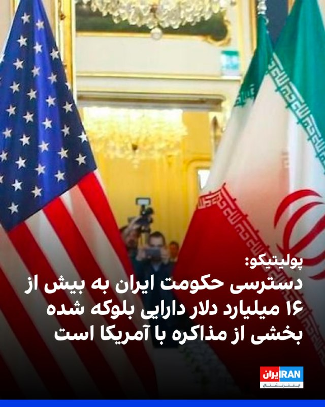

پولیتیکو به نقل از مقام‌های آمریکایی و منابع آگاه گزارش داد دونالد ترامپ پس از دریافت تماس‌هایی از رهبران قطر، امارات متحده عربی و پاکستان و اطمینان از نزدیک بودن یک توافق اولیه با جمهوری اسلامی، از برنامه حمله نظامی به ایران عقب‌نشینی کرد. بر اساس این گزارش، این کشورها با تکیه بر ارتباطات خود با تهران و مجتبی خامنه‌ای به ترامپ اطمینان دادند که مسیر دیپلماسی همچنان باز است. ترامپ نیز بعدتر از دستیابی به یک «توافق عالی» خبر داد و گفت احتمال امضای آن در روزهای آینده وجود دارد. به نوشته پولیتیکو، توافق فعلی بیش از آنکه به پرونده هسته‌ای مربوط باشد، بر بازگشایی تنگه هرمز و کاهش تنش‌های فوری متمرکز است. همزمان، گفت‌وگوهایی درباره دسترسی ایران به بیش از ۱۶ میلیارد دلار منابع مالی محدودشده در قطر و دیگر کشورها نیز جریان دارد. با این حال، اختلافات بر سر برنامه هسته‌ای، تحریم‌ها و نقش منطقه‌ای جمهوری اسلامی همچنان پابرجاست و دیپلمات‌ها درباره دستیابی به یک توافق جامع ابراز تردید می‌کنند. متن کامل را اینجا بخوانید iranintl.com/202606120881

## FarsiVOA — post 220455

  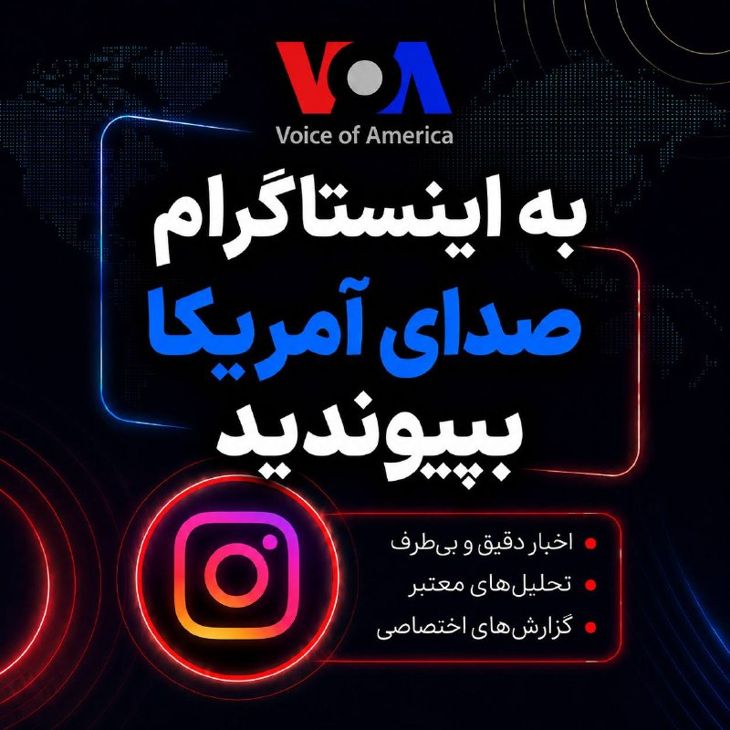

📸اینستاگرام صدای آمریکا را هم اکنون فالو کنید تا از آخرین خبرها مطلع بمانید:
https://www.instagram.com/voafarsi/

📡همچنین جهت اطلاع از بروزترین فرکانسهای ماهواره‌ای صدای آمریکا به لینک زیر مراجعت فرمایید:
https://ir.voanews.com/satellite

این پست را با دوستانتان به اشتراک بگذارید
@FarsiVOA

## RadioFarda — post 158202

  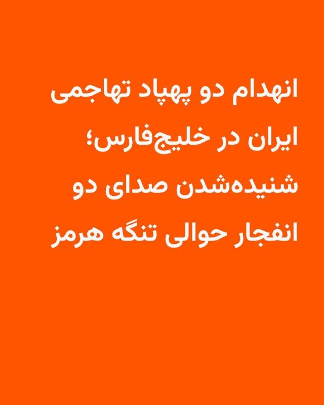

🔸رئیس‌جمهور آمریکا در یک گردهمایی تلویزیونی اعلام کرد ایالات متحده به جنگ پایان داده و ایران موافقت کرده است که هرگز سلاح هسته‌ای نداشته باشد.

🔸دونالد ترامپ در گردهمایی تلویزیونی با فرماندار جورجیا در روز پنج‌شنبه ۲۱ خرداد گفت: «نمی‌دانم شنیده‌اید یا نه، اما ما امروز جنگ با ایران را پایان دادیم. و آنها موافقت کرده‌اند که هرگز سلاح هسته‌ای نداشته باشند. چیزی که ما بر آن اصرار داشتیم.»

🔸او در ادامه افزود: «این تمام هدف بود، این ۹۵ درصد آن بود و آنها این کار را به قدرتمندترین روشی که می‌توان انجام داد، انجام داده‌اند.»

🔸رئیس‌جمهور آمریکا ساعتی پیش از آن گفته بود که ایالات متحده و ایران می‌توانند به زودی در این آخر هفته یک توافق صلح امضا کنند که تنگه هرمز را برای کشتیرانی بازگشایی کند.

🔸سخنگوی وزارت خارجۀ جمهوری اسلامی در واکنش اما گفت صحبت‌هایی که دربارۀ توافق پایان جنگ مطرح می‌شود، «گمانه‌زنی است» و هنوز جزئیات، نهایی نشده است.

@RadioFarda

---
📅 بروزرسانی: 1405/03/22 08:13
---

## VahidOOnLine — post 245093

  

رسانه‌های حکومتی ایران از جمله تسنیم و رسانه صدا و سیما گزارش دادند که گروه هکری «حنظله» که به جمهوری اسلامی نسبت داده می‌شود، مدعی شده به سامانه‌های زیرساختی آب در ایالت کالیفرنیا نفوذ کرده است. بنا به این گزارشها، این گروه اعلام کرده اقدام خود را در واکنش به آنچه «حمله آمریکا به غیرنظامیان و تاسیسات آبی ایران» خوانده، انجام داده است. تاکنون مقام‌های آمریکایی یا نهادهای مسئول در کالیفرنیا این ادعا را تایید نکرده‌اند و جزئیاتی درباره میزان خسارت یا اختلال احتمالی منتشر نشده است. در ماه‌های اخیر نهادهای امنیت سایبری آمریکا نسبت به تهدیدهای سایبری علیه زیرساخت‌های حیاتی، از جمله سامانه‌های آب، از سوی گروه‌های وابسته یا نزدیک به حکومت ایران هشدار داده بودند. iranintl
‌🏁 🇬🇧 IranintlTV

🤖 @VahidOOnLine

## IranIntlTV — post 341836

  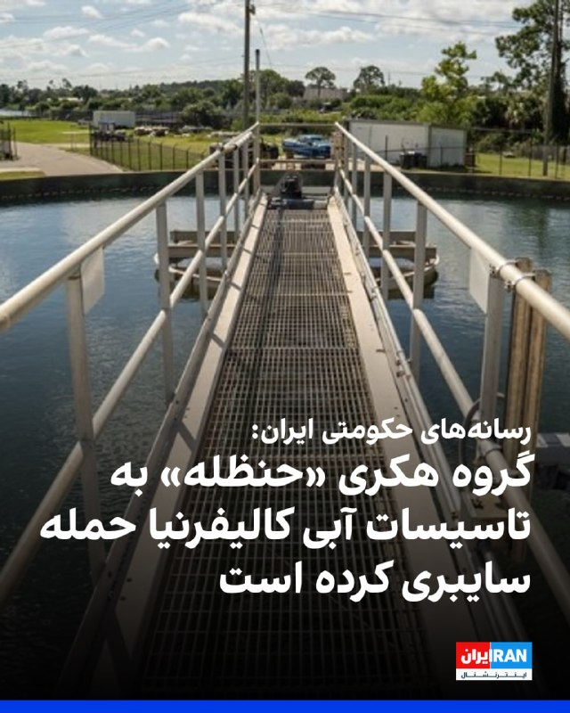

رسانه‌های حکومتی ایران از جمله تسنیم و رسانه صدا و سیما گزارش دادند که گروه هکری «حنظله» که به جمهوری اسلامی نسبت داده می‌شود، مدعی شده به سامانه‌های زیرساختی آب در ایالت کالیفرنیا نفوذ کرده است. بنا به این گزارشها، این گروه اعلام کرده اقدام خود را در واکنش به آنچه «حمله آمریکا به غیرنظامیان و تاسیسات آبی ایران» خوانده، انجام داده است. تاکنون مقام‌های آمریکایی یا نهادهای مسئول در کالیفرنیا این ادعا را تایید نکرده‌اند و جزئیاتی درباره میزان خسارت یا اختلال احتمالی منتشر نشده است. در ماه‌های اخیر نهادهای امنیت سایبری آمریکا نسبت به تهدیدهای سایبری علیه زیرساخت‌های حیاتی، از جمله سامانه‌های آب، از سوی گروه‌های وابسته یا نزدیک به حکومت ایران هشدار داده بودند. iranintl.com/202606127450

## RadioFarda — post 158201

  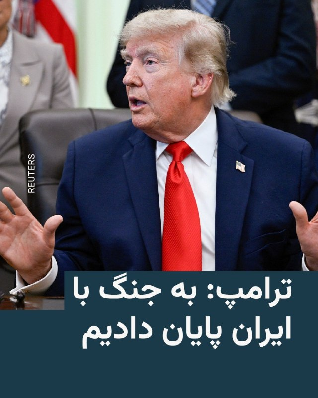

🔸رئیس‌جمهور آمریکا در یک گردهمایی تلویزیونی اعلام کرد ایالات متحده به جنگ پایان داده و ایران موافقت کرده است که هرگز سلاح هسته‌ای نداشته باشد.

🔸دونالد ترامپ در گردهمایی تلویزیونی با فرماندار جورجیا در روز پنج‌شنبه ۲۱ خرداد گفت: «نمی‌دانم شنیده‌اید یا نه، اما ما امروز جنگ با ایران را پایان دادیم. و آنها موافقت کرده‌اند که هرگز سلاح هسته‌ای نداشته باشند. چیزی که ما بر آن اصرار داشتیم.»

🔸او در ادامه افزود: «این تمام هدف بود، این ۹۵ درصد آن بود و آنها این کار را به قدرتمندترین روشی که می‌توان انجام داد، انجام داده‌اند.»

🔸رئیس‌جمهور آمریکا ساعتی پیش از آن گفته بود که ایالات متحده و ایران می‌توانند به زودی در این آخر هفته یک توافق صلح امضا کنند که تنگه هرمز را برای کشتیرانی بازگشایی کند.

🔸سخنگوی وزارت خارجۀ جمهوری اسلامی در واکنش اما گفت صحبت‌هایی که دربارۀ توافق پایان جنگ مطرح می‌شود، «گمانه‌زنی است» و هنوز جزئیات، نهایی نشده است.

@RadioFarda

---
📅 بروزرسانی: 1405/03/22 08:03
---

## VahidOOnLine — post 245092

  

پولیتیکو به نقل از مقام‌های آمریکایی و منابع آگاه گزارش داد دونالد ترامپ پس از دریافت تماس‌هایی از رهبران قطر، امارات متحده عربی و پاکستان و اطمینان از نزدیک بودن یک توافق اولیه با جمهوری اسلامی، از برنامه حمله نظامی به ایران عقب‌نشینی کرد.

بر اساس این گزارش، این کشورها با تکیه بر ارتباطات خود با تهران و مجتبی خامنه‌ای به ترامپ اطمینان دادند که مسیر دیپلماسی همچنان باز است. ترامپ نیز بعدتر از دستیابی به یک «توافق عالی» خبر داد و گفت احتمال امضای آن در روزهای آینده وجود دارد.

به نوشته پولیتیکو، توافق فعلی بیش از آنکه به پرونده هسته‌ای مربوط باشد، بر بازگشایی تنگه هرمز و کاهش تنش‌های فوری متمرکز است. همزمان، گفت‌وگوهایی درباره دسترسی ایران به بیش از ۱۶ میلیارد دلار منابع مالی محدودشده در قطر و دیگر کشورها نیز جریان دارد.

با این حال، اختلافات بر سر برنامه هسته‌ای، تحریم‌ها و نقش منطقه‌ای جمهوری اسلامی همچنان پابرجاست و دیپلمات‌ها درباره دستیابی به یک توافق جامع ابراز تردید می‌کنند.
متن کامل را اینجا بخوانید
‌🏁 🇬🇧 IranintlTV

🤖 @VahidOOnLine

## IranIntlTV — post 341835

  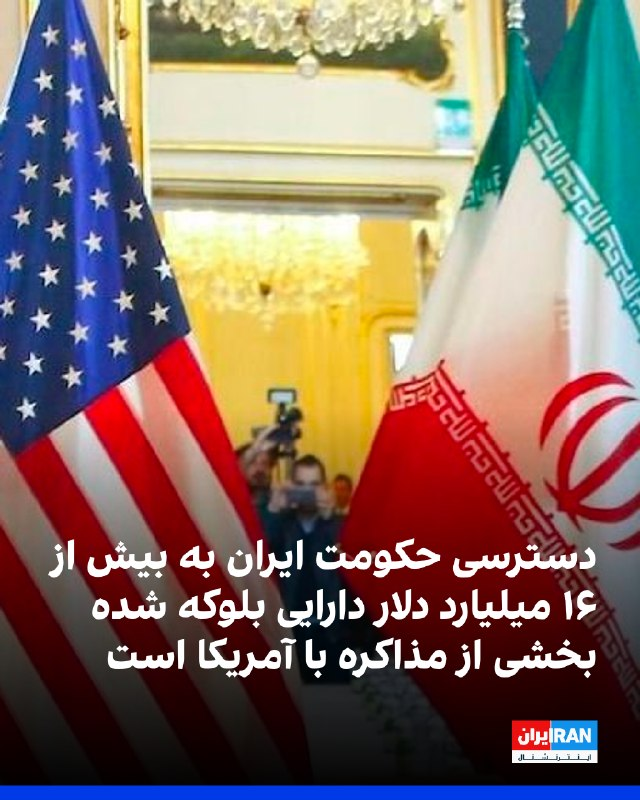

پولیتیکو به نقل از مقام‌های آمریکایی و منابع آگاه گزارش داد دونالد ترامپ پس از دریافت تماس‌هایی از رهبران قطر، امارات متحده عربی و پاکستان و اطمینان از نزدیک بودن یک توافق اولیه با جمهوری اسلامی، از برنامه حمله نظامی به ایران عقب‌نشینی کرد.

بر اساس این گزارش، این کشورها با تکیه بر ارتباطات خود با تهران و مجتبی خامنه‌ای به ترامپ اطمینان دادند که مسیر دیپلماسی همچنان باز است. ترامپ نیز بعدتر از دستیابی به یک «توافق عالی» خبر داد و گفت احتمال امضای آن در روزهای آینده وجود دارد.

به نوشته پولیتیکو، توافق فعلی بیش از آنکه به پرونده هسته‌ای مربوط باشد، بر بازگشایی تنگه هرمز و کاهش تنش‌های فوری متمرکز است. همزمان، گفت‌وگوهایی درباره دسترسی ایران به بیش از ۱۶ میلیارد دلار منابع مالی محدودشده در قطر و دیگر کشورها نیز جریان دارد.

با این حال، اختلافات بر سر برنامه هسته‌ای، تحریم‌ها و نقش منطقه‌ای جمهوری اسلامی همچنان پابرجاست و دیپلمات‌ها درباره دستیابی به یک توافق جامع ابراز تردید می‌کنند.
متن کامل را اینجا بخوانید
https://iranintl.com/202606120881

---
📅 بروزرسانی: 1405/03/22 07:53
---

## VahidOOnLine — post 245091

  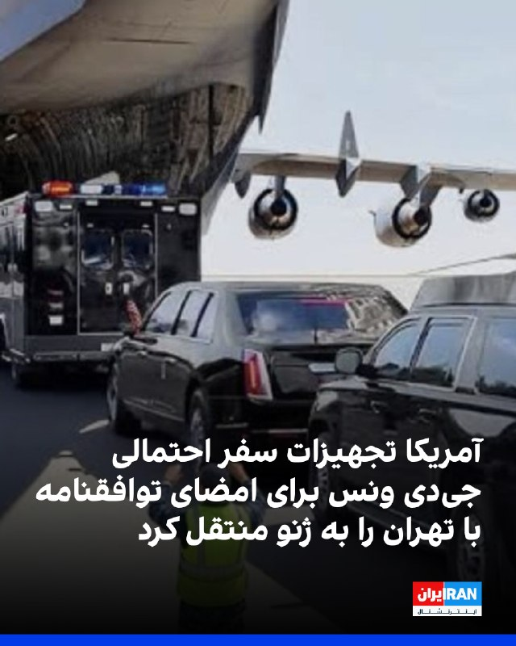

چهار فروند هواپیمای ترابری سی-۱۷ نیروی هوایی آمریکا روز پنجشنبه راهی اروپا شدند و تجهیزاتی را برای سفر احتمالی جی‌دی ونس، معاون رییس‌جمهوری آمریکا، به مراسم احتمالی امضای توافق با جمهوری اسلامی در ژنو در روزهای آینده، منتقل کردند.

بر اساس این گزارش، همزمان پنج فروند دیگر از همین هواپیماها تجهیزات مورد نیاز سرویس مخفی آمریکا، دفتر نظامی کاخ سفید و نیروی هوایی آمریکا را برای حضور احتمالی دونالد ترامپ در نشست گروه هفت در نزدیکی ژنو به فرودگاه بین‌المللی این شهر منتقل کرده‌اند.

این تحرکات در حالی گزارش می‌شود که گمانه‌زنی‌ها درباره احتمال دستیابی تهران و واشینگتن به یک توافق اولیه افزایش یافته است.
‌🏁 🇬🇧 IranintlTV

🤖 @VahidOOnLine

## IranIntlTV — post 341834

  

چهار فروند هواپیمای ترابری سی-۱۷ نیروی هوایی آمریکا روز پنجشنبه راهی اروپا شدند و تجهیزاتی را برای سفر احتمالی جی‌دی ونس، معاون رییس‌جمهوری آمریکا، به مراسم احتمالی امضای توافق با جمهوری اسلامی در ژنو در روزهای آینده، منتقل کردند.

بر اساس این گزارش، همزمان پنج فروند دیگر از همین هواپیماها تجهیزات مورد نیاز سرویس مخفی آمریکا، دفتر نظامی کاخ سفید و نیروی هوایی آمریکا را برای حضور احتمالی دونالد ترامپ در نشست گروه هفت در نزدیکی ژنو به فرودگاه بین‌المللی این شهر منتقل کرده‌اند.

این تحرکات در حالی گزارش می‌شود که گمانه‌زنی‌ها درباره احتمال دستیابی تهران و واشینگتن به یک توافق اولیه افزایش یافته است.
https://iranintl.com/202606120474

## RadioFarda — post 158200

  <a href="https://t.me/radiofarda/158200" target="_blank">📎 Download file</a>

📻بشنوید: سرخط خبرها با رادیوفردا، ۲۲ خرداد ۱۴۰۵‌

@RadioFarda

---
📅 بروزرسانی: 1405/03/22 07:43
---

## BBCPersian — post 283523

⚽️کره جنوبی چراغ اول را برای آسیا روشن کرد؛ کره ۲ - چک ۱

دیدار کره جنوبی و جمهوری چک که در نیمه نخست بدون گل تمام شده بود در نیمه دوم ابتدا با گل کره هیجان گرفت. جمهوری چک مساوی کرد و حتی یک گل دیگر هم زد که آفساید بود اما در ادامه کره جنوبی توانست گل دوم را بزند و نخستین برد آسیایی‌ها در این جام را به نام خود رقم بزند.

حالا مکزیک و کره جنوبی هر دو با یک برد در صدر جدول گروه ای قرار دارند و جمهوری چک سوم و آفریقای جنوبی قعرنشین است.
@BBCPersian

---
📅 بروزرسانی: 1405/03/22 07:33
---

## BBCPersian — post 283522

⚽️کره‌جنوبی و جمهوری چک؛ بدون گل در نیمه اول

در حالی که در سواحل غربی آمریکا غروب پنجشنبه تازه فرا رسیده و در کره‌جنوبی به ظهر جمعه نزدیک شده‌ایم، مسابقه دوم گروه ای میان کره جنوبی و جمهوری چک در حال برگزاری است و نیمه اول آن بدون گل به پایان رسیده است.

دیدار اول این گروه را ظهر پنجشنبه در مکزیکوسیتی، تیم میزبان با دو گل برابر آفریقای جنوبی به پایان رساند.

کره جنوبی به همراه ایران و ژاپن قوی‌ترین تیم‌های آسیایی در این جام هستند هر چند دیگر نمایندگان آسیا را هم نباید دست کم گرفت چرا که برای مثال عراق همین هفته گذشته در یک دیدار تدارکاتی که میهمان اسپانیا بود، قهرمان سابق جهان و نایب قهرمان فعلی اروپا را وادار به تساوی کرد.
@BBCPersian

## BBCPersian — post 283521

⚽️جمعه و شنبه کی با کی بازی داره؟

بعد از مراسم افتتاحیه جام جهانی در مکزیکو سیتی که با برد شیرین این تیم در برابر آفریقای جنوبی برای یکی از سه میزبان جام امسال تکمیل شد، روز جمعه (به وقت لندن) کره جنوبی برابر جمهوری چک به میدان خواهد رفت تا نخستین دور مسابقات گروه ای تکمیل شود.

روز جمعه - ۱۲ ژوئن / ۲۲ خرداد - همچنین کانادا، دیگر میزبان جام، با بوسنی و هرزگوین در تورنتو - بزرگترین شهر کانادا - دیدار خواهد کرد.

آمریکا دیگر میزبان این مسابقات که تمامی دیدارهای تیم ملی ایران هم در مرحله گروهی در کرانه غربی این کشور برگزار خواهد شد، نخستین دیدار خود را روز شنبه - ۱۳ ژوئن - برابر واراگوئه برگزار می‌کند هر چند در آن روز احتمالا همه توجه‌ها به تیم کارلو آنجلوتی جلب خواهد تا نیمار و هم تیمی‌هایش در نخستین دیدار خود به مصاف مراکش سخت‌کوش و باهوش بروند.
@BBCPersian

## BBCPersian — post 283520

  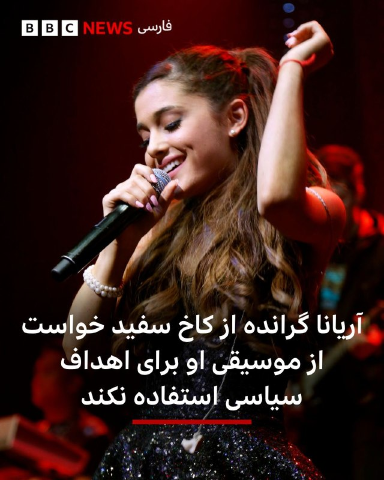

🔻آریانا گرانده، ستاره موسیقی پاپ آمریکا، از کاخ سفید خواست که از موسیقی او برای ویدیو تبلیغ سیاست‌های مهاجرتی آمریکا استفاده نکند.

این ویدیو که روز دوشنبه در تیک‌تاک به اشتراک گذاشته شد، ماموران مرزی را در حال دستبند زدن به مردم و هدایتشان به بازداشتگاه نشان می‌دهد و آهنگ پرطرفدار «خداحافظ» اثر خانم گرانده به عنوان موسیقی متن آن است.

در توضیح این ویدیو نوشته شده: «خداحافظ... رئیس‌جمهور ترامپ امن‌ترین مرزهای تاریخ را ایجاد کرده است.»

آریانا گرانده در مورد این پست نوشت: «لطفاً از موسیقی من در رابطه با این مزخرفات وحشیانه، غیرانسانی و شنیع استفاده نکنید.»

گروه آبا (ABBA)، سلین دیون و بیانسه از جمله کسانی بودند که اصرار داشتند کمپین ترامپ در طول انتخابات مجدد او در سال ۲۰۲۴، از جمله در تجمعات انتخاباتی، از موسیقی آنها استفاده نکند.
ادامه از:
https://bbc.in/4eibwlz
📷Los Angeles Times via Getty
@BBCPersian

---
📅 بروزرسانی: 1405/03/22 07:23
---

## VahidOOnLine — post 245090

  

بازارهای سهام جهان پس از اظهارات دونالد ترامپ درباره لغو حملات برنامه‌ریزی‌شده علیه حکومت ایران و نزدیک بودن توافق میان تهران و واشینگتن با رشد چشمگیری روبه‌رو شدند.

شاخص اس‌اندپی ۵۰۰ در آمریکا حدود ۱.۸ درصد افزایش یافت و بهترین عملکرد روزانه خود از ماه آوریل را ثبت کرد. شاخص نزدک ۲.۵ درصد و داوجونز نیز حدود ۱.۹ درصد رشد کردند.

در بازارهای آسیا نیز جمعه روند صعودی ادامه یافت؛ به طوری که شاخص کوسپی کره جنوبی بیش از ۸ درصد و نیکی ژاپن تا ۴ درصد افزایش یافتند.

معامله‌گران این تحولات را نشانه کاهش ریسک‌های ژئوپلیتیک و افزایش احتمال عادی شدن تردد کشتی‌ها در تنگه هرمز ارزیابی کرده‌اند.

این واکنش بازارها در حالی رخ می‌دهد که ترامپ از احتمال امضای توافق با حکومت ایران در روزهای آینده سخن گفته و مقام‌های جمهوری اسلامی نیز اعلام کرده‌اند تفاهم‌نامه پیشنهادی با آمریکا در حال بررسی است.
‌🏁 🇬🇧 IranintlTV

🤖 @VahidOOnLine

## VahidOOnLine — post 245089

♦️مهدی مهراندیش، مدیر گروه همخوانی شهرراز، ویدیویی از اجرای خیابانی ترانه «طلوع» اثر شهره صولتی، خواننده مشهور ایرانی، در یکی از خیابان‌های شیراز منتشر کرده است.
گروه همخوانی شهرراز متشکل از زنان هنردوست ساکن شیراز است که فعالیت خود را از مهرماه ۱۴۰۴ آغاز کرده و تمرینات هفتگی خود را به صورت مستمر دنبال می‌کند.
مدیر و بنیان‌گذار این گروه، می‌گوید هدف از تشکیل شهرراز گردهم آوردن علاقه‌مندان موسیقی و فعالیت در مسیر اعتلای فرهنگ و هنر ایرانی بوده است.
‌🇸🇦 Indypersian

🤖 @VahidOOnLine

## IranIntlTV — post 341833

  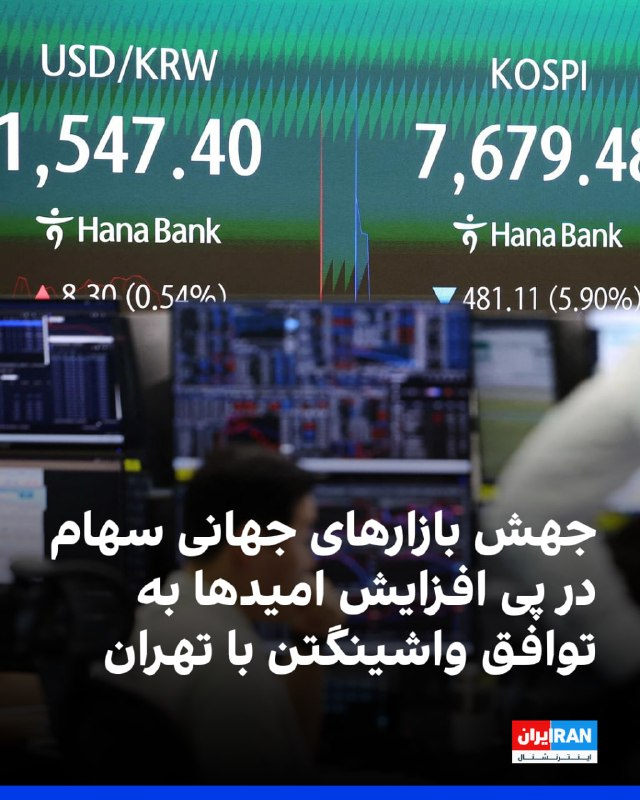

بازارهای سهام جهان پس از اظهارات دونالد ترامپ درباره لغو حملات برنامه‌ریزی‌شده علیه حکومت ایران و نزدیک بودن توافق میان تهران و واشینگتن با رشد چشمگیری روبه‌رو شدند.

شاخص اس‌اندپی ۵۰۰ در آمریکا حدود ۱.۸ درصد افزایش یافت و بهترین عملکرد روزانه خود از ماه آوریل را ثبت کرد. شاخص نزدک ۲.۵ درصد و داوجونز نیز حدود ۱.۹ درصد رشد کردند.

در بازارهای آسیا نیز جمعه روند صعودی ادامه یافت؛ به طوری که شاخص کوسپی کره جنوبی بیش از ۸ درصد و نیکی ژاپن تا ۴ درصد افزایش یافتند.

معامله‌گران این تحولات را نشانه کاهش ریسک‌های ژئوپلیتیک و افزایش احتمال عادی شدن تردد کشتی‌ها در تنگه هرمز ارزیابی کرده‌اند.

این واکنش بازارها در حالی رخ می‌دهد که ترامپ از احتمال امضای توافق با حکومت ایران در روزهای آینده سخن گفته و مقام‌های جمهوری اسلامی نیز اعلام کرده‌اند تفاهم‌نامه پیشنهادی با آمریکا در حال بررسی است.

---
📅 بروزرسانی: 1405/03/22 07:13
---

## VahidOOnLine — post 245088

  

یک مقام وزارت دفاع آمریکا اعلام کرد نیروهای آمریکایی، در حالی که تهران مدعی حمله به کشتی‌های تجاری در تنگه هرمز شده، دو پهپاد حکومت ایران را در این منطقه سرنگون کرده‌اند.

رسانه‌های آمریکایی به نقل از این مقام گزارش دادند که تردد دریایی در این آبراه همچنان ادامه دارد.

این خبر در شرایطی است که طی ساعات اخیر گزارش‌های متناقضی درباره رویارویی نیروهای حکومت ایران با یک شناور در تنگه هرمز منتشر شده است.
‌🏁 🇬🇧 IranintlTV

🤖 @VahidOOnLine

## IranIntlTV — post 341832

  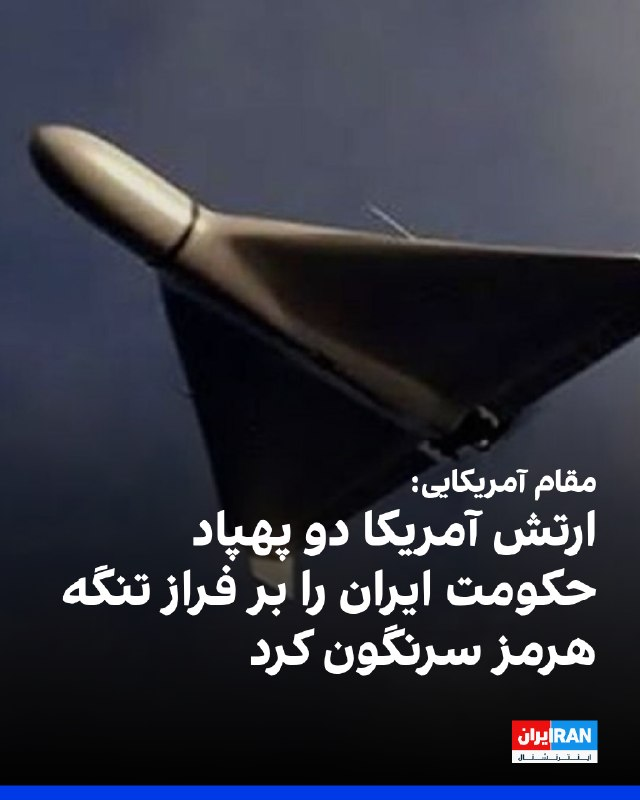

یک مقام وزارت دفاع آمریکا اعلام کرد نیروهای آمریکایی، در حالی که تهران مدعی حمله به کشتی‌های تجاری در تنگه هرمز شده، دو پهپاد حکومت ایران را در این منطقه سرنگون کرده‌اند.

رسانه‌های آمریکایی به نقل از این مقام گزارش دادند که تردد دریایی در این آبراه همچنان ادامه دارد.

این خبر در شرایطی است که طی ساعات اخیر گزارش‌های متناقضی درباره رویارویی نیروهای حکومت ایران با یک شناور در تنگه هرمز منتشر شده است.
https://iranintl.com/202606123669

---
📅 بروزرسانی: 1405/03/22 07:03
---

## VahidOOnLine — post 245087

  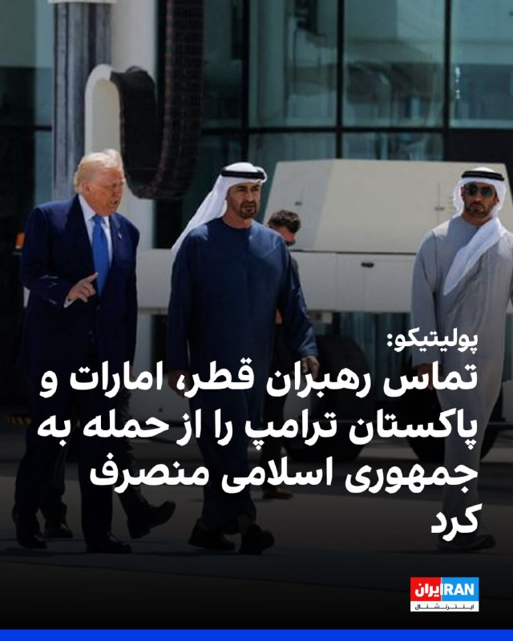

پولیتیکو به نقل از دو مقام دولت آمریکا و یک دیپلمات آگاه گزارش داد اندکی پس از آنکه دونالد ترامپ در تروت سوشال از حمله قریب‌الوقوع آمریکا به جمهوری اسلامی خبر داد، امیر قطر، رییس امارات متحده عربی و عاصم منیر، فرمانده ارتش پاکستان، با او تماس گرفته و اطمینان دادند که یک توافق اولیه برای آغاز مذاکرات گسترده‌تر در دسترس است. به گفته یک مقام آمریکایی، روابط این کشورها با تهران و مجتبی خامنه‌ای و اطمینان آنها نسبت به نزدیک بودن توافق، از عوامل عقب‌نشینی ترامپ از برنامه حمله بود. پولیتیکو همچنین به نقل از یک مقام اسرائیلی و افراد آگاه از مذاکرات گزارش داد آنچه در حال حاضر روی میز قرار دارد، توافقی برای بازگشایی تنگه هرمز و پایان دادن به محاصره آمریکا علیه این آبراه راهبردی است. این رسانه افزود آمریکا و جمهوری اسلامی همزمان درباره دسترسی تهران به منابع مالی محدودشده در قطر و سایر کشورها نیز گفت‌وگو کرده‌اند؛ منابعی که ارزش آنها بیش از ۱۶ میلیارد دلار برآورد می‌شود. iranintl
‌🏁 🇬🇧 IranintlTV

🤖 @VahidOOnLine

## IranIntlTV — post 341831

  

پولیتیکو به نقل از دو مقام دولت آمریکا و یک دیپلمات آگاه گزارش داد اندکی پس از آنکه دونالد ترامپ در تروت سوشال از حمله قریب‌الوقوع آمریکا به جمهوری اسلامی خبر داد، امیر قطر، رییس امارات متحده عربی و عاصم منیر، فرمانده ارتش پاکستان، با او تماس گرفته و اطمینان دادند که یک توافق اولیه برای آغاز مذاکرات گسترده‌تر در دسترس است. به گفته یک مقام آمریکایی، روابط این کشورها با تهران و مجتبی خامنه‌ای و اطمینان آنها نسبت به نزدیک بودن توافق، از عوامل عقب‌نشینی ترامپ از برنامه حمله بود. پولیتیکو همچنین به نقل از یک مقام اسرائیلی و افراد آگاه از مذاکرات گزارش داد آنچه در حال حاضر روی میز قرار دارد، توافقی برای بازگشایی تنگه هرمز و پایان دادن به محاصره آمریکا علیه این آبراه راهبردی است. این رسانه افزود آمریکا و جمهوری اسلامی همزمان درباره دسترسی تهران به منابع مالی محدودشده در قطر و سایر کشورها نیز گفت‌وگو کرده‌اند؛ منابعی که ارزش آنها بیش از ۱۶ میلیارد دلار برآورد می‌شود. iranintl.com/202606129363

---
📅 بروزرسانی: 1405/03/22 06:53
---

## VahidOOnLine — post 245086

  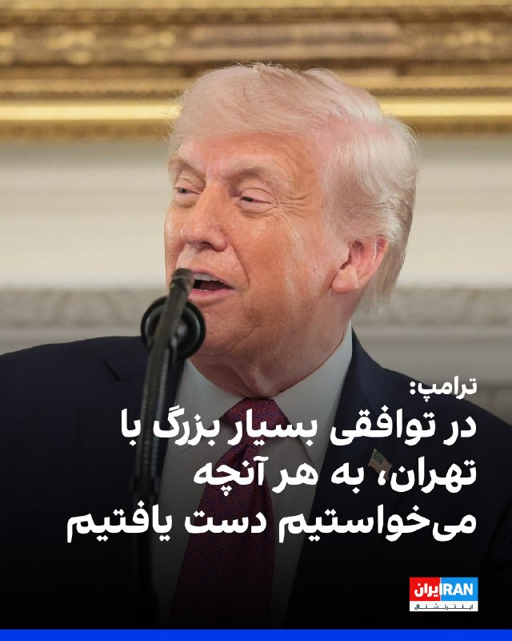

دونالد ترامپ، رییس‌جمهوری آمریکا، پنج‌شنبه در یک گردهمایی تلفنی برای حمایت از بری مور، نامزد انتخابات سنای آمریکا از ایالت آلاباما، گفت واشینگتن با جمهوری اسلامی به «توافقی بسیار بزرگ» دست یافته است.

ترامپ با اشاره به روند گفت‌وگوها میان دو طرف افزود: «ما به هر آنچه می‌خواستیم دست یافتیم.»

او همچنین با اشاره به برنامه هسته‌ای جمهوری اسلامی گفت: «هیچ سلاح هسته‌ای در کار نخواهد بود.»

رییس‌جمهوری آمریکا در ادامه اظهار داشت: «مردم خیلی زود شروع به بازگشت به خانه خواهند کرد.»

ترامپ با ابراز خوش‌بینی نسبت به روند توافق، افزود: «تقریبا، تقریبا همه چیز کامل شده است.»
‌🏁 🇬🇧 IranintlTV

🤖 @VahidOOnLine

## WithYashar — post 14598

ترامپ: با ایران به توافق رسیدیم، توافق خیلی خوبی بود، دیگه هیچ سلاح هسته‌ای در کار نخواهد بود. تقریباً همه‌چیز نهایی شده و ما به هر چیزی که می‌خواستیم رسیدیم. مهم‌ترین بخش ماجرا اینه که ایران هیچ سلاح هسته‌ای نه خودش می‌سازه و نه از جایی می‌خره.

ما امروز جنگ با ایران رو پایان دادیم و آنها موافقت کردن که هرگز سلاح هسته‌ای نداشته باشند، چیزی که ما بر آن اصرار داشتیم. این هدف اصلی بود. این 95 درصد از کل موضوع رو تشکیل میده، و آنها این کار رو به قوی‌ترین شکل ممکن انجام دادن.
@withyashar

## IranIntlTV — post 341830

  

دونالد ترامپ، رییس‌جمهوری آمریکا، پنج‌شنبه در یک گردهمایی تلفنی برای حمایت از بری مور، نامزد انتخابات سنای آمریکا از ایالت آلاباما، گفت واشینگتن با جمهوری اسلامی به «توافقی بسیار بزرگ» دست یافته است.

ترامپ با اشاره به روند گفت‌وگوها میان دو طرف افزود: «ما به هر آنچه می‌خواستیم دست یافتیم.»

او همچنین با اشاره به برنامه هسته‌ای جمهوری اسلامی گفت: «هیچ سلاح هسته‌ای در کار نخواهد بود.»

رییس‌جمهوری آمریکا در ادامه اظهار داشت: «مردم خیلی زود شروع به بازگشت به خانه خواهند کرد.»

ترامپ با ابراز خوش‌بینی نسبت به روند توافق، افزود: «تقریبا، تقریبا همه چیز کامل شده است.»
https://iranintl.com/202606124322

---
📅 بروزرسانی: 1405/03/22 06:43
---

هیچ پیام جدیدی در این بروزرسانی ارسال نشد.

---
📅 بروزرسانی: 1405/03/22 06:33
---

## BBCPersian — post 283519

  <a href="https://t.me/bbcpersian/283519" target="_blank">📎 Download file</a>

تیم ملی فوتبال ایران امروز برای اولین بار در ورزشگاه «کالیانته» در شهر تیخوانای مکزیک با حضور خبرنگاران تمرین کرد. تیم ایران از بدو ورود به مکزیک پشت درهای بسته تمرین کرده است.

دور و بر استادیوم و هتلی که ایرانی‌ها در آن حضور دارند گارد ملی مکزیک حفاظت را بر عهده دارد. نظامیانی با کلاه ایمنی و سلاح‌های بزرگ که ماسک به صورت دارند دور و بر ورزشگاه به وفور دیده می‌شوند و اتومبیل‌های حمل و نقل بازیکنان به هتل را همراهی می‌کنند.

تمرین روز پنجشنبه بیشتر نمایشی بود برای خبرنگاران و بدون حضور بعضی ستارگان تیم مانند مهدی طارمی، علیرضا جهانبخش و سامان قدوس برگزار شد. امیر قلعه‌نویی، سرمربی تیم هم در این تمرین حضور نداشت. خبرنگاران حدود ده دقیقه شاهد تمرین بودند و خیلی زود از آنها خواسته شد تا محل را ترک کنند.

ایران در هر سه بازی مرحله گروهی جام جهانی باید در آمریکا به مصاف رقیبان برود اما به دلیل اختلافات سیاسی، درگیری‌های نظامی و سخت‌گیری‌های ایالات متحده در صدور ویزا، در مکزیک اردو زده است.

@BBCPersian

## BBCPersian — post 283518

🔻 پدیده ال نینو رسما آغاز شده است؛ منتظر داغ شدن هوا باشید

دانشمندان آمریکایی اعلام کردند پدیده ال نینو، الگوی طبیعی آب و هوایی در اقیانوس آرام که باعث افزایش دمای جهانی می‌شود، رسما آغاز شده است.

اداره ملی اقیانوسی و جوی آمریکا (NOAA) روز پنجشنبه - ۱۱ ژوئن / ۲۱ خرداد - اعلام کرد شرایط ال نینو اکنون در بخش گرمسیری اقیانوس آرام شکل گرفته و دمای سطح آب دریا در ماه‌های اخیر به طور قابل توجهی افزایش یافته است.

بسیاری از پیش‌بینی‌ها نشان می‌دهند که این دوره ممکن است به یک «ابر ال نینو» تبدیل شود و حتی در میان قوی‌ترین نمونه‌های ثبت شده قرار گیرد.

این پدیده که بر روند گرمایش ناشی از فعالیت‌های انسانی در دهه‌های گذشته افزوده می‌شود، می‌تواند موجب ثبت یک سال با رکورد جدید گرما شود؛ اتفاقی که به احتمال زیاد در سال ۲۰۲۷ رخ خواهد داد. همچنین پیامدهای آن بر الگوهای آب و هوایی، تامین مواد غذایی و اقتصاد کشورها ممکن است تا مدت ها ادامه داشته باشد.

اعلام رسمی این موضوع از سوی اداره ملی اقیانوسی و جوی آمریکا چندان غافلگیرکننده نبود، زیرا کارشناسان از پیش انتظار آغاز این دوره گرم را داشتند. این اتفاق پس از پایان یافتن پدیده لانینا، الگوی خنک‌تر و موسوم به «خواهر ال نینو»، در اوایل سال جاری رخ داده است.

دمای سطح آب در بخش مرکزی و گرمسیری اقیانوس آرام اکنون از آستانه نیم درجه سانتیگراد بالاتر از میانگین عبور کرده است؛ معیاری که دانشمندان آمریکایی برای تعریف یک رویداد ال نینو از آن استفاده می‌کنند.

این آژانس در بیانیه‌ای اعلام کرد: «شرایط ال نینو طی ماه گذشته شکل گرفته است؛ موضوعی که با دمای بالاتر از میانگین سطح آب در بخش مرکزی تا شرقی اقیانوس آرام استوایی مشخص می‌شود.»

اداره ملی اقیانوسی و جوی آمریکا همچنین اعلام کرد الگوی بادها بر فراز اقیانوس آرام استوایی در حال تغییر است؛ نشانه ای که حاکی از آن است که اکنون جو زمین نیز به گرم تر شدن اقیانوس واکنش نشان می‌دهد و این تنها به گرم شدن آب اقیانوس محدود نیست.

@BBCPersian

<!-- MSG END -->

<!-- NAV START -->

<a href="https://github.com/ProAlit/aio-downloader/blob/main/telegram/content/archive_1.md" style="display:inline-block; padding:6px 12px; margin:0 4px; background-color:#2ea44f; color:white; text-decoration:none; border-radius:4px; font-weight:bold;">صفحه بعد</a>

<!-- NAV END -->
