# خواننده تلگرام

<!-- TOP_NAV START -->

<a href="https://github.com/ProAlit/aio-downloader/blob/main/telegram/content/archive_1.md" style="display:inline-block; padding:6px 12px; margin:0 4px; background-color:#2ea44f; color:white; text-decoration:none; border-radius:4px; font-weight:bold;">صفحه بعد</a>

<!-- TOP_NAV END -->

<!-- MSG START -->

---
📅 بروزرسانی: 1405/03/18 17:54
---

## IranIntlTV — post 341194

  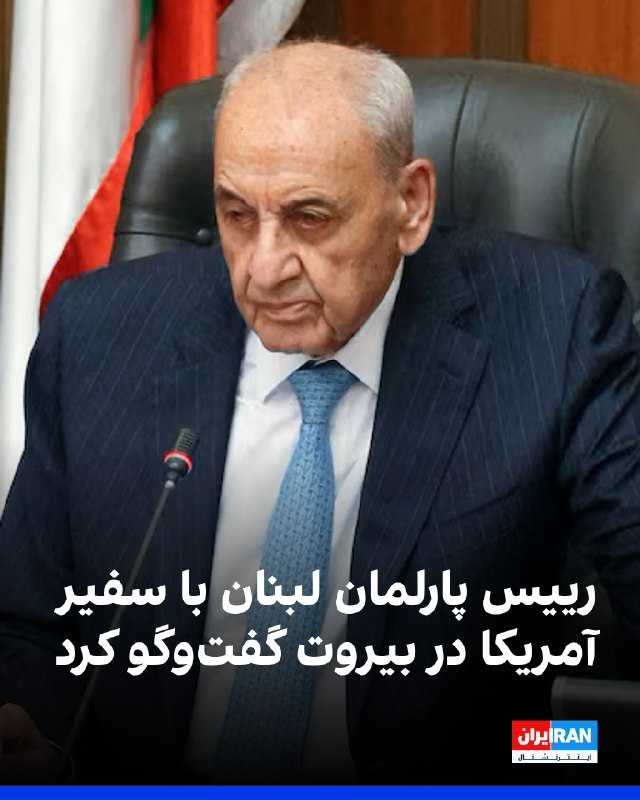

پارلمان لبنان اعلام کرد نبیه بری، رییس این پارلمان، با میشل عیسی، سفیر آمریکا در بیروت، درباره تحولات لبنان و منطقه گفت‌وگو کرده است.

به گزارش الحدث، سفیر آمریکا در بیروت هرگونه ارتباط میان واشینگتن و حزب‌الله را تکذیب کرد.

او گفت که اسرائیل از لبنان عقب‌نیشنی خواهد کرد.
https://iranintl.com/202606081712

## DW_Farsi — post 125692

  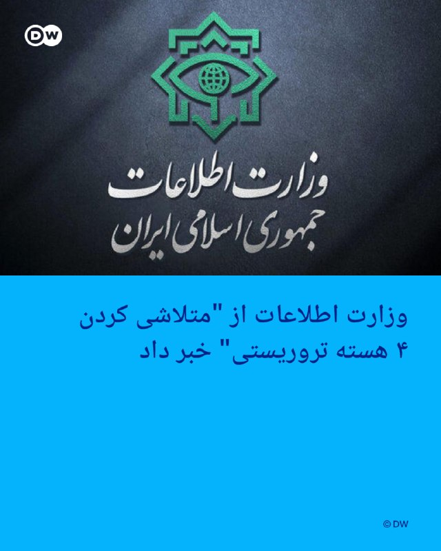

🔶 وزارت اطلاعات از "متلاشی‌ کردن ۴ هسته تروریستی" خبر داد

اداره کل اطلاعات استان سیستان و بلوچستان مدعی است که مأموران امنیتی جمهوری اسلامی "در جریان چند عملیات هم‌زمان، موفق به متلاشی کردن ۴ هسته تروریستی در این استان شدند. در این عملیات‌ها ۵ تن از اعضای این گروه‌ها کشته و ۱۹ نفر دیگر پیش از اقدام به عملیات انتحاری، ترور یا ایجاد ناامنی بازداشت شدند".

بیانیه اداره اطلاعات سیستان و بلوچستان در ادامه از "کشته‌شدن یکی از مأمور امنیتی در پی اقدام انتحاری یکی از مهاجمان" خبر داده است.

در بیانیه وزارت اطلاعات نامی از "گروه مهاجم" برده نشده است.

@dw_farsi

## IranianMinds — post 21855

🔴فوری:

ایران اطلاع داده که در صورت ادامه حمله اسرائیل به جنوب لبنان، حملات موشکی خود به اسرائیل را آغاز خواهد کرد.

@IranianMinds

## alonews — post 126299

  <a href="telegram/content/alonews_126299_1780928661.webm" target="_blank">🎬 Download video</a>

👈شهباز شریف: هدف نهایی صلح نزدیک است/همه طرف‌ها خویشتنداری کنند

✅ @AloNews خبر جنگ

---
📅 بروزرسانی: 1405/03/18 17:43
---

## VahidOOnLine — post 244376

  

یک مقام آمریکایی به سی‌ان‌ان گفت ارتش آمریکا هیچ‌یک از موشک‌های بالستیک شلیک‌شده از سوی ایران به سمت اسرائیل را رهگیری نکرده است.
با این حال، این مقام تایید کرد که ارتش اسرائیل و فرماندهی مرکزی آمریکا (سنتکام) در طول شب هماهنگی نزدیکی داشته‌اند.
به گفته او، رییس ستاد ارتش اسرائیل، دو بار با فرمانده سنتکام، گفت‌وگو کرده است.
‌🏁 🇬🇧 IranintlTV

🤖 @VahidOOnLine

## VahidOOnLine — post 244375

  

یک مقام آمریکایی به سی‌ان‌ان گفت ارتش آمریکا هیچ‌یک از موشک‌های بالستیک شلیک‌شده از سوی ایران به سمت اسرائیل را رهگیری نکرده است.
با این حال، این مقام تایید کرد که ارتش اسرائیل و فرماندهی مرکزی آمریکا (سنتکام) در طول شب هماهنگی نزدیکی داشته‌اند.
به گفته او، رییس ستاد ارتش اسرائیل، دو بار با فرمانده سنتکام، گفت‌وگو کرده است.
‌🏁 🇬🇧 IranintlTV

🤖 @VahidOOnLine

## VahidOOnLine — post 244374

  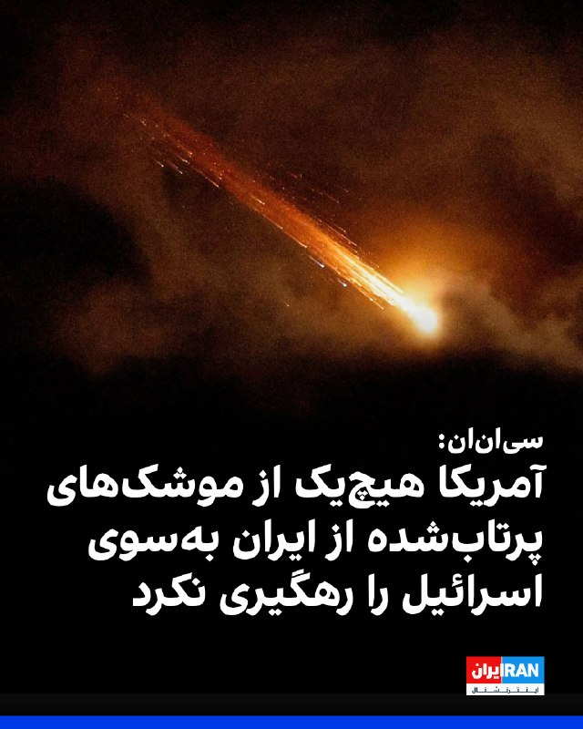

یک مقام آمریکایی به سی‌ان‌ان گفت ارتش آمریکا هیچ‌یک از موشک‌های بالستیک شلیک‌شده از سوی ایران به سمت اسرائیل را رهگیری نکرده است.
با این حال، این مقام تایید کرد که ارتش اسرائیل و فرماندهی مرکزی آمریکا (سنتکام) در طول شب هماهنگی نزدیکی داشته‌اند.
به گفته او، رییس ستاد ارتش اسرائیل، دو بار با فرمانده سنتکام، گفت‌وگو کرده است.
‌🏁 🇬🇧 IranintlTV

🤖 @VahidOOnLine

## mwarmonitor — post 10471

🚨آژیرهای خطر در شهرک‌های شمالی پس از حملهٔ موشکی حزب‌الله به صدا درآمدند.

@mwarmonitor

## pm_afshaa — post 92925

حمله موشکی حزب الله به اسراییل

💧 Rainbet.com the #1 Non-KYC Crypto Casino & Sportsbook @rainbetcom

😁 @Pm_Afshaa

## IranIntlTV — post 341193

  

یک مقام آمریکایی به سی‌ان‌ان گفت ارتش آمریکا هیچ‌یک از موشک‌های بالستیک شلیک‌شده از سوی ایران به سمت اسرائیل را رهگیری نکرده است.
با این حال، این مقام تایید کرد که ارتش اسرائیل و فرماندهی مرکزی آمریکا (سنتکام) در طول شب هماهنگی نزدیکی داشته‌اند.
به گفته او، رییس ستاد ارتش اسرائیل، دو بار با فرمانده سنتکام، گفت‌وگو کرده است.
https://iranintl.com/202606087318

## IranIntlTV — post 341192

  

یک مقام آمریکایی به سی‌ان‌ان گفت ارتش آمریکا هیچ‌یک از موشک‌های بالستیک شلیک‌شده از سوی ایران به سمت اسرائیل را رهگیری نکرده است.
با این حال، این مقام تایید کرد که ارتش اسرائیل و فرماندهی مرکزی آمریکا (سنتکام) در طول شب هماهنگی نزدیکی داشته‌اند.
به گفته او، رییس ستاد ارتش اسرائیل، دو بار با فرمانده سنتکام، گفت‌وگو کرده است.
https://iranintl.com/202606087318

## IranIntlTV — post 341191

  

یک مقام آمریکایی به سی‌ان‌ان گفت ارتش آمریکا هیچ‌یک از موشک‌های بالستیک شلیک‌شده از سوی ایران به سمت اسرائیل را رهگیری نکرده است.
با این حال، این مقام تایید کرد که ارتش اسرائیل و فرماندهی مرکزی آمریکا (سنتکام) در طول شب هماهنگی نزدیکی داشته‌اند.
به گفته او، رییس ستاد ارتش اسرائیل، دو بار با فرمانده سنتکام، گفت‌وگو کرده است.
https://iranintl.com/202606087318

## DW_Farsi — post 125691

  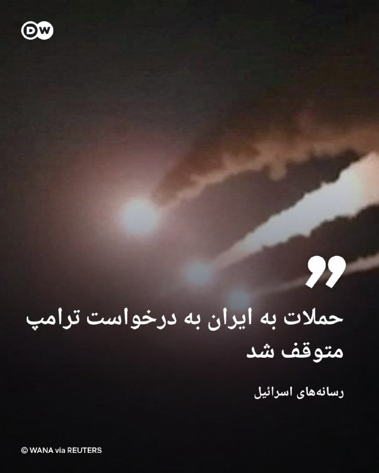

🔶 رسانه‌های اسرائیل: حملات به ایران به درخواست ترامپ متوقف شد

به گزارش کانال ۱۲ تلویزیون اسرائیل در روز دوشنبه، ۸ ژوئن، یک مقام ارشد اسرائیلی اعلام کرد که اسرائیل به درخواست دونالد ترامپ، رئیس‌جمهور آمریکا، حملات خود به ایران را متوقف کرده است.

این مقام افزود در صورتی که حملات حزب‌الله به شهرک‌ها و شهرهای اسرائیلی ادامه یابد، اسرائیل حومه جنوبی بیروت (ضاحیه) را هدف قرار خواهد داد.

کانال ۱۳ تلویزیون اسرائیل نیز به نقل از یک مقام ارشد اسرائیلی گزارش داد: اسرائیل در صورت حمله، پاسخ خواهد داد، این احساس وجود دارد که این دور از درگیری با ایران پشت سر گذاشته شده است. ما منتظر تصمیم نهایی سطح سیاسی هستیم.

همزمان نیویورک تایمز به نقل از مقامات نظامی اسرائیل خبر داده: نتانیاهو دستور داده است که ارتش آماده‌سازی‌ها برای حمله دیگری به ایران را متوقف کند.

ساعتی پیش‌تر قرارگاه خاتم‌الانبیا از پایان حملات ایران به اسرائیل خبر داده بود.

در همین حال، سازمان هواپیمایی کشوری عراق با صدور بیانیه‌ای رسمی، از بازگشایی کامل حریم هوایی این کشور و ازسرگیری تمامی پروازها به مقاصد داخلی و خارجی خبر داد.

@dw_farsi

## BBCPersian — post 283190

🔻فدراسیون ووشو ایران می‌گوید از الهه و شهربانو منصوریان در پی درگیری در دفتر فدراسیون ووشو به دادگاه کیفری تهران شکایت کرده است.

رسانه‌های ایران امروز ویدئویی را منتشر کرده‌اند که ورود الهه و شهربانو منصوریان به دفتر ریاست فدراسیون ووشو و کندن دوربین مدار بسته را نشان می‌دهد.

فدراسیون ووشو در بیانیه‌اش گفت صبح دوشنبه ۱۸ خرداد، الهه و شهربانو منصوریان در پی باخت سهیلا منصوریان در مسابقات انتخابی تیم ملی، «با داد و فریاد و شکستن در، وارد دفتر ریاست فدراسیون شدند و حاضران را تهدید به ضرب و شتم کرده‌اند.»

بر اساس این بیانیه، الهه منصوریان همچنین «با چاقوی میوه‌خوری اتاق ریاست فدراسیون خودزنی» کرده است.

ویدئوی دیگری هم منتشر شده که الهه منصوریان را با ساعد خونین نشان می‌دهد که در آن می‌گوید چاقو خورده است.

بنابر گزارش‌ها، فدراسیون ووشو از شهربانو و الهه منصوریان به دادگاه کیفری تهران شکایت کرده است تا از طریق قانونی پیگیری کند.

الهه و شهربانو منصوریان در این باره هنوز اظهارنظری نکرده‌اند.

https://bbc.in/4uTut51
@BBCPersian

## BBCPersian — post 283189

  <a href="https://t.me/bbcpersian/283189" target="_blank">📎 Download file</a>

📡📻تازه‌ترین خبرهای ایران و جهان یکشنبه ۱۷ خرداد ۱۴۰۵ از رادیو بی‌بی‌سی در لندن

@BBCPersian

## alonews — post 126298

  <a href="telegram/content/alonews_126298_1780928041.webm" target="_blank">🎬 Download video</a>

👈کانال ۱۲ اسرائیل گزارش داد که ترامپ و نتانیاهو دقایقی پیش تلفنی صحبت کردند و حملات به ایران و جنوب لبنان بزودی به صورت کامل قطع خواهد شد

✅ @AloNews خبر جنگ

## alonews — post 126296

  <a href="telegram/content/alonews_126296_1780928042.mp4" target="_blank">🎬 Download video</a>

👈نیروهای اسرائیلی در حال هدف قرار دادن یحمر الشقیف در جنوب لبنان هستند

✅ @AloNews خبر جنگ

---
📅 بروزرسانی: 1405/03/18 17:34
---

## VahidOOnLine — post 244373

  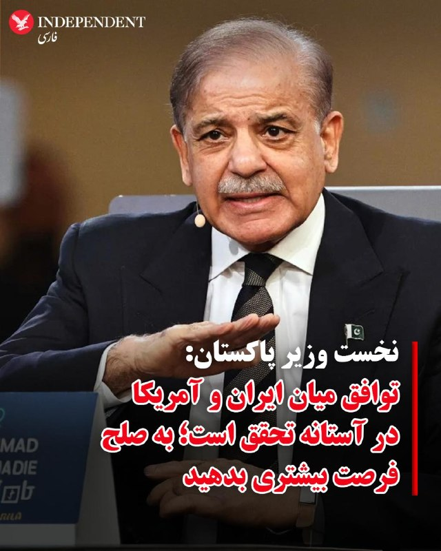

♦️شهباز شریف، نخست‌وزیر پاکستان، در واکنش به حملات متقابل جمهوری اسلامی ایران و اسرائیل در ۱۶ ساعت گذشته، اعلام کرد تلاش‌های دیپلماتیک برای پایان دادن به بحران در مرحله حساسی قرار دارد و «هدف نهایی» نزدیک است.
او روز دوشنبه ۱۸ خرداد در پیامی در شبکه اجتماعی ایکس نوشت: «در حالی که ما همراه با برادران و شرکای خود با جدیت و دقت برای یافتن یک راه‌حل مسالمت‌آمیز و دیپلماتیک تلاش می‌کنیم و به‌ویژه زمانی که هدف نهایی در آستانه تحقق قرار دارد، صمیمانه از همه طرف‌ها می‌خواهیم خویشتنداری کنند و کمی بیشتر به صلح فرصت بدهند.»
نخست‌وزیر پاکستان همچنین نوشت افزایش اخیر خشونت‌ها در خاورمیانه یادآور خطرات یک آتش‌بس شکننده و پیامدهایی است که می‌تواند در پی داشته باشد.
شریف در بخش دیگری از پیام خود تاکید کرد که دیپلماسی همچنان «چشم‌انداز موفقیت» دارد و می‌تواند جایگزین «خشونت و ویرانی» شود.
پاکستان در ماه‌های اخبر میانجی مذاکرات میان آمریکا و ایران بوده و در برقراری آتش‌بس موقت در فروردین گذشته نقش کلیده داشته است.
این پیام پس از آن منتشر شد که قرارگاه مرکزی خاتم‌الانبیا اعلام کرد عملیات نیروهای مسلح جمهوری اسلامی علیه اسرائیل پایان یافته است. رسانه‌های رسمی اسرائیل نیز از توقف حملات این کشور به ایران به درخواست دونالد ترامپ خبر داده‌اند.
‌🇸🇦 Indypersian

🤖 @VahidOOnLine

## VahidOOnLine — post 244372

  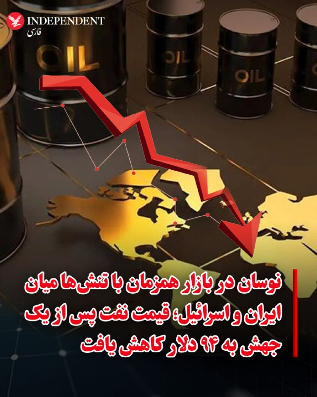

♦️قیمت نفت در بازارهای جهانی روز دوشنبه ۱۸ خرداد و همزمان با درگیری نظامی جمهوری اسلامی ایران و اسرائیل، به‌شدت دچار نوسان شد.
بهای نفت خام برنت دریای شمال، بامداد دوشنبه به وقت تهران و ساعاتی پس از آغاز حملات موشکی ایران و همزمان با آغاز به کار بازارهای آسیایی از ۹۵ دلار عبور کرد.
روند افزایشی قیمت نفت با آغاز به کار بورس‌های اروپایی و تبادل آتش میان ایران و اسرائیل ادامه یافت و هر بشکه نفت خام برنت به بهای ۹۷ دلار و ۶۴ سنت افزایش یافت.

با این حال قیمت نفت پس از درخواست ترامپ از دو طرف برای پایان «شلیک» و اعلام خبر توقف حملات نظامی ایران به اسرائیل، روند کاهشی در پیش گرفت و به ۹۴ دلار ۶ سنت کاهش یافت.
‌🇸🇦 Indypersian

🤖 @VahidOOnLine

## VahidOOnLine — post 244371

  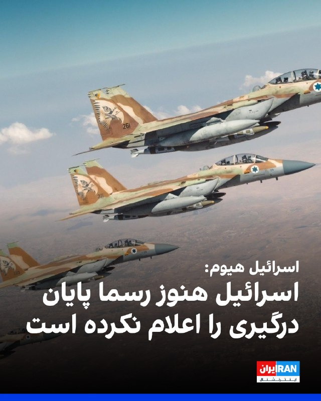

اسرائیل هیوم به نقل از یک مقام امنیتی نوشت که جمهوری اسلامی از ترس حملات غافلگیرانه اسرائیل حریم هوایی ایران را بسته است در حالی که اسرائیل هنوز به‌طور رسمی پایان این دور از درگیری را اعلام نکرده است.
این مقام امنیتی افزود حجم حملات از سوی ایران نشان می‌دهد توان نظامی تهران هنوز به سطح پیش از جنگ بازنگشته است.
او اضافه کرد هیچ محدودیتی برای فعالیت ارتش اسرائیل در منطقه ضاحیه بیروت وجود ندارد.
‌🏁 🇬🇧 IranintlTV

🤖 @VahidOOnLine

## pm_afshaa — post 92924

  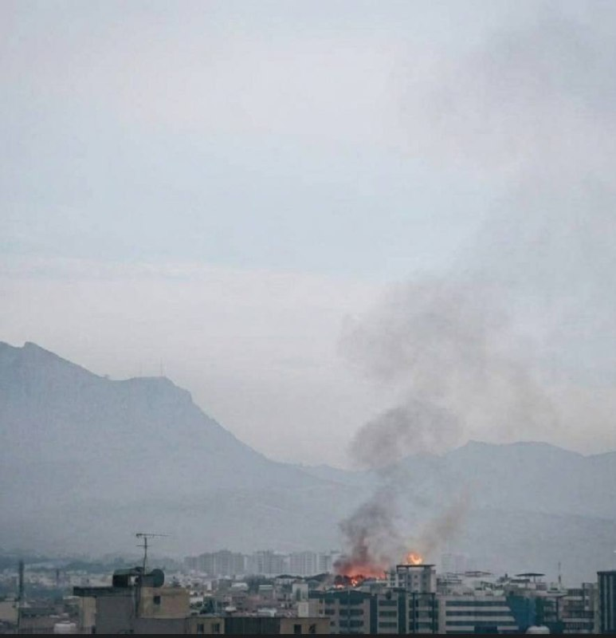

شهر قدس هم اکنون

💧 Rainbet.com the #1 Non-KYC Crypto Casino & Sportsbook @rainbetcom

😁 @Pm_Afshaa

## pm_afshaa — post 92923

🔴یک تحلیلگر ایتالیایی: اختلاف بین ترامپ و نتانیاهو یک نمایش است و اسرائیل برای اقدامات خود از حمایت گسترده آمریکا برخوردار است

💧 Rainbet.com the #1 Non-KYC Crypto Casino & Sportsbook @rainbetcom

😁 @Pm_Afshaa

## IranIntlTV — post 341190

  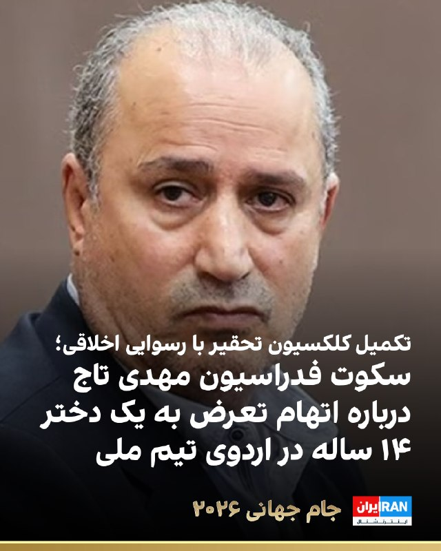

🔻در فاصله تنها سه روز مانده به آغاز جام جهانی ۲۰۲۶، فوتبال ایران تحت مدیریت مهدی تاج، یکی از تاریک‌ترین و تحقیرآمیزترین دوران خود را سپری می‌کند. روزنامه «دیلی‌میل» بریتانیا به تازگی پرده از یک رسوایی اخلاقی تکان‌دهنده برداشته است.

🔹بر اساس گزارش این روزنامه، یک فوتبالیست ملی‌پوش (که تصاویر لباسش به وضوح نشان می‌دهد عضو تیم ملی ایران است) در هتلی پنج‌ستاره در ترکیه، متهم شده که تلاش کرده است یک دختر ۱۴ ساله بریتانیایی را «در آغوش بگیرد» و به پشت یک پرچین بکشاند.

🔹پدر این دختر با ارائه روایتی هولناک از وحشت و گریه‌های فرزندش، فاش کرده که این بازیکن با سوءاستفاده از شهرت خود، درخواست غیراخلاقی‌اش را مطرح کرده است. با این حال، فدراسیون فوتبال ایران تا این لحظه سکوتی مطلق را درباره این آبروریزی بزرگ پیشه کرده است.

🔹اما این بی‌اخلاقی‌های تکان‌دهنده در خلاء اتفاق نمی‌افتند. هنوز دوومیدانی‌کاران تیم ملی در کره‌جنوبی در بازداشت به سر می‌برند.

🔹یادداشت کامل را در سایت بخوانید.

@iranintltvsport

## IranIntlTV — post 341189

  

اسرائیل هیوم به نقل از یک مقام امنیتی نوشت که جمهوری اسلامی از ترس حملات غافلگیرانه اسرائیل حریم هوایی ایران را بسته است در حالی که اسرائیل هنوز به‌طور رسمی پایان این دور از درگیری را اعلام نکرده است.
این مقام امنیتی افزود حجم حملات از سوی ایران نشان می‌دهد توان نظامی تهران هنوز به سطح پیش از جنگ بازنگشته است.
او اضافه کرد هیچ محدودیتی برای فعالیت ارتش اسرائیل در منطقه ضاحیه بیروت وجود ندارد.
https://iranintl.com/202606081136

## Dirty_Kids — post 391383

  <a href="telegram/content/Dirty_Kids_391383_1780927482.mp4" target="_blank">🎬 Download video</a>

اخطار شناور سرفرماندهی نیروی دریایی جمهوری اسلامی 😆
غرق نشی سرفرماندهی‌ 🤣
این اگه سرفرماندهیه پس بقیشون چی هستن

@Dirty_Kids 👻

## alonews — post 126295

  <a href="telegram/content/alonews_126295_1780927484.webm" target="_blank">🎬 Download video</a>

👈وزارت دفاع عربستان سعودی: آنچه درباره هدف قرار گرفتن پایگاه الأمير سلطان در الخرج منتشر شده است، «صحیح نیست»

✅ @AloNews خبر جنگ

## alonews — post 126294

  <a href="telegram/content/alonews_126294_1780927484.webm" target="_blank">🎬 Download video</a>

🔴فوری/ایران اطلاع داده است که در صورت ادامه حمله اسرائیل به جنوب لبنان، حملات موشکی خود به اسرائیل را آغاز خواهد کرد.

✅ @AloNews خبر جنگ

## alonews — post 126293

  <a href="telegram/content/alonews_126293_1780927484.webm" target="_blank">🎬 Download video</a>

👈سی‌ان‌ان به نقل از یک مقام آمریکایی: ادعای اسرائیل مبنی بر اینکه آمریکا موشک‌های بالستیک ایرانی شلیک‌شده به سمت اسرائیل را رهگیری کرده، صحت ندارد.

✅ @AloNews خبر جنگ

## alonews — post 126292

  <a href="telegram/content/alonews_126292_1780927485.webm" target="_blank">🎬 Download video</a>

👈روزنامه هاآرتص به نقل از یک منبع اسرائیلی نوشت: نتانیاهو عصر امروز در جلسه کابینه امنیتی در مورد تشدید تنش با ایران تصمیم خواهد گرفت.

✅ @AloNews خبر جنگ

---
📅 بروزرسانی: 1405/03/18 17:24
---

## VahidOOnLine — post 244370

  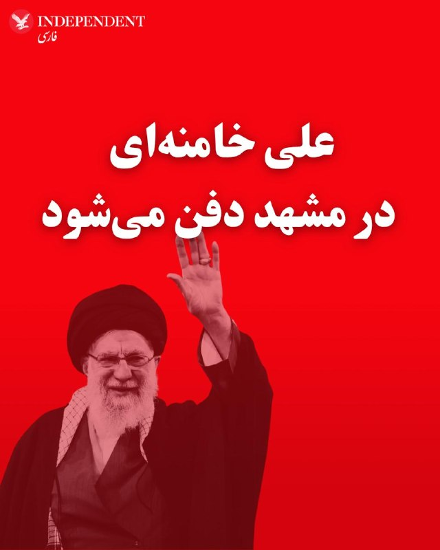

♦️معاون امنیتی انتظامی استانداری خراسان رضوی روز دوشنبه ۱۸ خردادماه اعلام کرد مراسم تشییع علی خامنه‌ای، رهبر کشته شده جمهوری اسلامی، از «تهران آغاز می‌شود و پس از سه روز وداع و یک روز تشییع» در پایتخت، جسد خامنه ای برای یک روز تشییع به قم منتقل و پس از یک روز تشییع دیگر در مشهد، به خاک سپرده خواهد شد.

به گزارش رسانه‌های ایران، جسد علی خامنه در حرم امام رضا دفن خواهد شد.

علی خامنه‌ای، دومین رهبر جمهوری اسلامی روز نهم اسفندماه سال ۱۴۰۴ در موج اول حملات هوایی آمریکا و اسرائیل به بیت رهبر به همراه تعدادی از اعضای خانواده و مقام‌های ارشد سیاسی و نظامی حکومت کشته شد.
‌🇸🇦 Indypersian

🤖 @VahidOOnLine

## pm_afshaa — post 92922

  <a href="telegram/content/pm_afshaa_92922_1780926870.webm" target="_blank">🎬 Download video</a>

🔴یدیعوت آحارانوت، به نقل از یک مقام اسرائیلی:

تنش‌های اخیر رو پشت سر گذاشتیم و گفتگوی نتانیاهو با ترامپ خوب بود.

ما در لبنان بر اساس این معادله عمل خواهیم کرد که بمباران شمال اسرائیل با بمباران حومه جنوبی بیروت پاسخ داده خواهد شد.

💧 Rainbet.com the #1 Non-KYC Crypto Casino & Sportsbook @rainbetcom

😁 @Pm_Afshaa

## FarsiVOA — post 220031

🔺حملات متقابل اسرائیل و حزب‌الله در بحبوحه تازه‌ترین دور درگیری با جمهوری اسلامی

◾️همزمان با رویاروئی جنگی میان اسرائیل و جمهوری اسلامی که بامداد دوشنبه ۱۸ خرداد آغاز شد، حملات متقابل اسرائیل و حزب‌الله در مناطقی از جنوب لبنان ادامه دارد. هرچند این درگیری‌ها هنوز از خط قرمز اسرائیل - یعنی حمله به شهرک‌های شمالی این کشور توسط حزب‌الله - عبور نکرده است.

⬇️ بیشتر بخوانید:

https://ir.voanews.com/a/lebanon-israel-irgc-iran-war/8158521.html

## RadioFarda — post 158061

  <a href="https://t.me/radiofarda/158061" target="_blank">📎 Download file</a>

🔸پس از ۶۰ روز که از برقراری آتش‌بس میان ایران و ایالات متحده گذشت، و بعد از روزها تهدید لفظی و با ادامه حملات اسرائیل به بیروت، پایتخت لبنان، ایران تصمیم به پرتاب موشک به سمت اسرائیل گرفت و طی چند ساعت فضایی اضطراری و جنگی میان ایران و اسرائیل شکل گرفت.

🔸دو طرف در چند نوبت به سوی دیگر موشک و پهپاد شلیک کردند، و در نهایت در کمتر از یک روز از توقف تبادل آتش خبر دادند. آتشی که دونالد ترامپ رئیس‌جمهور ایالات متحده در اظهارنظر‌های رسانه‌ای خود گفته بود موافق آن نیست و خواستار توقف فوری آن شده بود.

🔸درباره این تحولات ارزیابی الکس وطنخواه پژوهشگر ارشد انسنتیتوی خاورمیانه در واشینگتن را بشنوید.

@RadioFarda

## alonews — post 126291

  <a href="telegram/content/alonews_126291_1780926871.mp4" target="_blank">🎬 Download video</a>

👈کالاس از اتحادیه اروپا درباره مفهوم ارتش اروپایی: چرا من از ارتش اضافی حمایت نمی‌کنم: هر کشور عضو یک ارتش دارد.

🔴اگر این ارتش را به ناتو اختصاص دهید، دیگر نمی‌توانید از آن در جای دیگری استفاده کنید — همچنین نمی‌توانید ارتش دیگری ایجاد کنید، فقط یک ارتش موازی.

🔴خیلی مهم است که ساختارهایی ایجاد نکنیم که ممکن است باعث سردرگمی شوند.

✅ @AloNews خبر جنگ

## alonews — post 126290

  <a href="telegram/content/alonews_126290_1780926873.mp4" target="_blank">🎬 Download video</a>

👈پهپاد شاهد-۱۳۶ مواضع گروه‌های کرد مخالف ایران در شمال عراق را هدف قرار داد

✅ @AloNews خبر جنگ

---
📅 بروزرسانی: 1405/03/18 17:13
---

## VahidOOnLine — post 244369

♦️ویدئویی که روز دوشنبه ۱۸ خرداد ماه در شبکه‌های اجتماعی منتشر شده است، الهه و شهربانو منصوریان، دو عضو شناخته‌شده تیم ملی ووشوی ایران را در حال ورود به اتاق ریاست فدراسیون ووشو و تخریب یک دوربین مداربسته نشان می‌دهد.
پس از بازخورد گسترده این ویدیو در رسانه‌ها و افکار عمومی، فدراسیون ووشو و خواهران منصوریان روایت‌های متفاوتی از این حادثه ارائه کرده‌اند و ماجرا به طرح شکایت کیفری نیز کشیده شده است.
فدراسیون ووشو روز دوشنبه اعلام کرد الهه و شهربانو منصوریان با «داد و فریاد» وارد ساختمان فدراسیون شده، در دفتر ریاست را شکسته و پس از توهین به مسئولان، کارکنان و اعضای تیم ملی، به رئیس فدراسیون حمله کرده‌اند.
در بیانیه فدراسیون همچنین ادعا شده است که الهه منصوریان در دفتر ریاست با یک چاقوی میوه‌خوری به خود آسیب زده تا جراحت ایجادشده را به رئیس فدراسیون نسبت دهد.
در مقابل، الهه و شهربانو منصوریان روایت فدراسیون را رد کرده‌اند. شهربانو منصوریان با انتشار تصویری از دست خون‌آلود خواهرش در اینستاگرام مدعی شده است که الهه در جریان درگیری از سوی رئیس فدراسیون با چاقوی میوه‌خوری مجروح شده است.
خبرگزاری ایسنا نیز گزارش داده که فدراسیون ووشو علیه الهه و شهربانو منصوریان شکایت کیفری ثبت کرده است.
الهه، شهربانو و سهیلا منصوریان از شناخته‌شده‌ترین ورزشکاران ووشوی ایران به شمار می‌روند و در سال‌های گذشته نیز بارها درگیر اختلافات و حاشیه‌هایی با مسئولان فدراسیون ووشو شده‌اند.
‌🇸🇦 Indypersian

🤖 @VahidOOnLine

## VahidOOnLine — post 244368

  <a href="telegram/content/VahidOOnLine_244368_1780926232.mp4" target="_blank">🎬 Download video</a>

♦️اسماعیل شکری، پدر سپهر شکری اولین «جشن» تولد را در فراغ پسر جان‌باخته‌اش و در کنار اعضای خانواده برگزار کرد.

اسماعیل در زمستان سال گذشته و پس از انتشار تصاویر کشتار ۱۸ و ۱۹ دی‌ماه به یکی از نمادهای داغداری هزاران خانواده ایرانی بدل شد؛ ویدیویی از او در سردخانه پزشکی قانونی کهریزک که با فریاد «سپهر بابا کجایی؟» به دنبال پیکر جگرگوشه‌اش می‌گشت، واکنش‌های کاربران شبکه‌های اجتماعی را برانگیخت.
سپهر شکری در یکی شب‌های ۱۸ یا ۱۹ دی‌ماه در تهران به ضرب گلوله کشته شد.
برادر سپهر، ویدیوی جشن تولد اسماعیل سیاه‌پوش در داغ فرزند را یکشنبه ۱۷ خردادماه در اینستاگرام منتشر کرده است.
‌🇸🇦 Indypersian

🤖 @VahidOOnLine

## VahidOOnLine — post 244367

  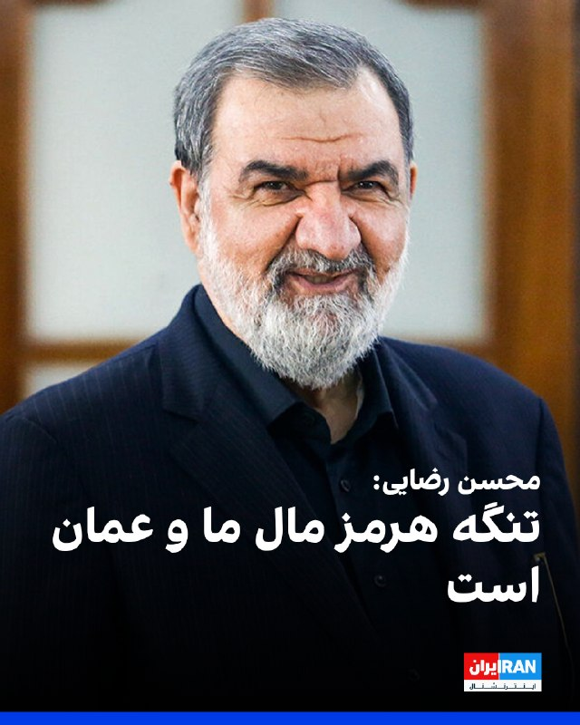

محسن رضایی، مشاور نظامی مجتبی خامنه‌ای، به اسپوتنیک گفت که تنگه هرمز برای ما و عمان است و هیچ کشور دیگری را در این تنگه دخالت نمی‌دهیم.
او افزود: هر کشوری بخواهد دخالت کند، باعث ناراحتی تمام جهان می‌شود چون حتی اروپایی‌ها هم حاضر نیستند آمریکا در ترتیبات آینده تنگه هرمز دخالت کنند، چه برسد به روسیه و چین.
‌🏁 🇬🇧 IranintlTV

🤖 @VahidOOnLine

## mwarmonitor — post 10470

📌مؤسسه Fitch Ratings چشم‌انداز جهانی بخش نفت و گاز را به «رو به بهبود» بازنگری کرد و انتظار دارد قیمت نفت برنت در ماه‌های ژوئن–ژوئیه و در دوره بسته‌بودن تنگه هرمز در محدوده ۱۰۰ تا ۱۱۰ دلار در هر بشکه باقی بماند، سپس تا ماه سپتامبر به حدود ۷۰ دلار کاهش یابد.

@mwarmonitor

## IranIntlTV — post 341188

  

محسن رضایی، مشاور نظامی مجتبی خامنه‌ای، به اسپوتنیک گفت که تنگه هرمز برای ما و عمان است و هیچ کشور دیگری را در این تنگه دخالت نمی‌دهیم.
او افزود: هر کشوری بخواهد دخالت کند، باعث ناراحتی تمام جهان می‌شود چون حتی اروپایی‌ها هم حاضر نیستند آمریکا در ترتیبات آینده تنگه هرمز دخالت کنند، چه برسد به روسیه و چین.
https://iranintl.com/202606089419

## FarsiVOA — post 220030

  <a href="telegram/content/FarsiVOA_220030_1780926234.mp4" target="_blank">🎬 Download video</a>

تصاویر منتشر شده در شبکه‌های اجتماعی، رد موشک‌های جمهوری اسلامی را که روز دوشنبه، ۱۸ خرداد، به سمت اسرائیل شلیک شد در آسمان نقاط مختلف ایران از جمله در اصفهان، کرمانشاه، ارومیه، کنگاور و بیدگنه نشان می‌دهد.

## DW_Farsi — post 125690

  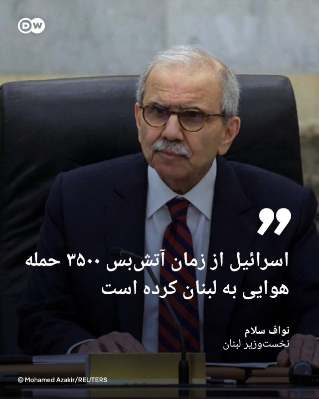

🔶 نواف سلام: اسرائیل از زمان آتش‌بس ۳۵۰۰ حمله هوایی به لبنان کرده است

به گزارش خبرگزاری رسمی لبنان (NNA)، نواف سلام، نخست‌وزیر این کشور، اعلام کرد که اسرائیل از زمان آغاز آتش‌بس در ماه آوریل، نزدیک به ۳۵۰۰ حمله هوایی و بیش از ۴۰۰ عملیات بمباران علیه لبنان انجام داده است.

نواف گفت: «در مورد آمار کلی نقض آتش‌بس توسط اسرائیل از ۱۷ آوریل تا ۷ ژوئن ۲۰۲۶، این موارد شامل ۳۴۹۱ حمله هوایی بوده است.»

او افزود که ۴۰۷ عملیات بمباران و ۶ عملیات خاک‌برداری و تخریب با بولدوزر نیز صورت گرفته که باعث شده برخی از روستاها به طور کامل با خاک یکسان شوند.

نواف در ادامه از کشته‌شدن مجموعاَ ۳۵۲۶ نفر و زخمی‌شدن ۱۰۷۳۳ نفر دیگر در جریان این حملات خبر داد.

@dw_farsi

## Persian_Trend_Official — post 16194

تامیر هیمان، رئیس سابق اطلاعات نظامی اسرائیل:

«ایران در پی آن است که جنگ را نه‌فقط با این دستاورد که شکست نخورده به پایان برساند، بلکه با پیروزی‌ای مبتنی بر دستاوردهای جدید خاتمه دهد؛ از جمله تثبیت حاکمیت بر تنگه هرمز و ایجاد بازدارندگی گسترده‌تر که لبنان را نیز در بر بگیرد.»

📌 @persian_trend_official
پرشین ترند | متفاوت‌ترین کانال نظامی

## RadioFarda — post 158060

  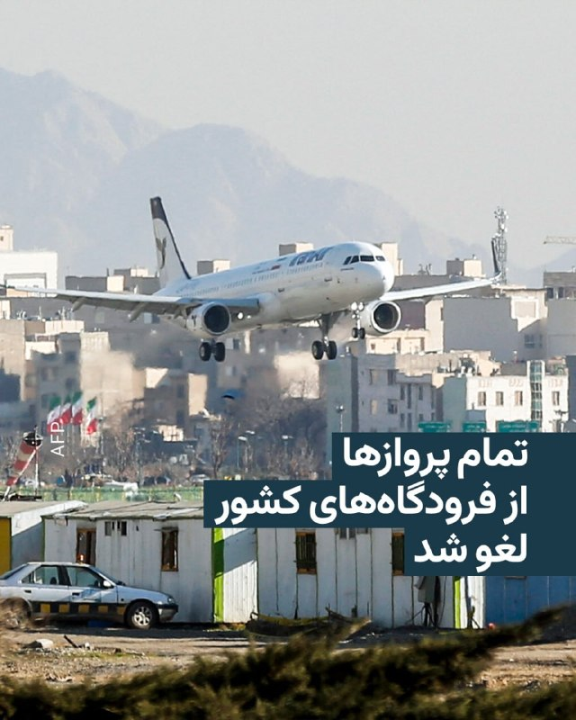

🔸خبرگزاری ایسنا عصر روز دوشنبه، ۱۸ خردادماه، به نقل از شرکت فرودگاه‌ها و ناوبری هوایی ایران خبر داد که «همه پروازهای فرودگاه‌های کشور تا اطلاع ثانوی لغو شد».

🔸این اداره همچنین از تمام مسافران خواست تا «جهت حفظ نظم و پیشگیری از هرگونه سردرگمی، تا زمان اعلام وضعیت عادی از سوی مراجع ذی‌صلاح به فرودگاه‌ها مراجعه نکنند».

🔸این خبر ساعتی پس از آن منتشر شده که قرارگاه مرکزی خاتم‌الانبیاء سپاه در آغاز بعدازظهر روز دوشنبه با انتشار بیانیه‌ای از توقف عملیات نیروهای مسلح جمهوری اسلامی علیه اسرائیل خبر داد.

🔸همزمان رئیس سازمان حج و زیارت خبر داده است که «با توجه به شرایط پروازهای بازگشت حجاج احتمال تأخیر در برخی پروازها حتی تا ۷۲ ساعت وجود دارد».

🔸او اضافه کرد: «برای فردا (سه‌شنبه ۱۹ خرداد) ۱۰ پرواز پیش‌بینی شده که امیدواریم بخش عمده آن‌ها انجام شود.»

@RadioFarda

## IranianMinds — post 21854

  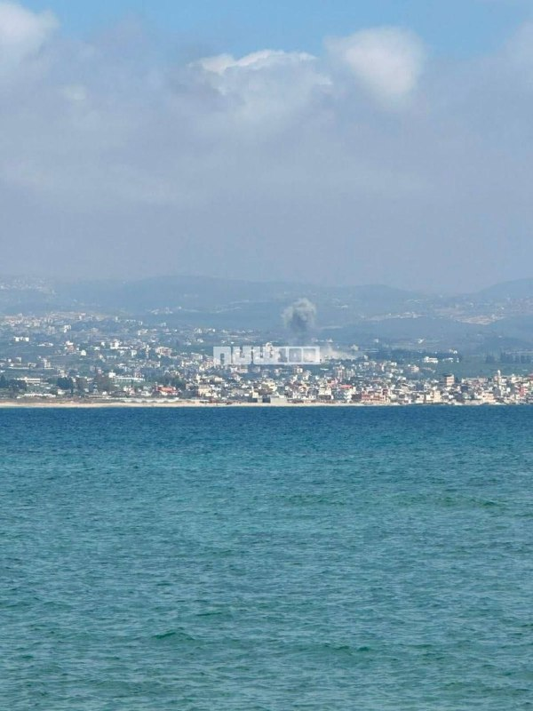

تصویری از حمله اسرائیل به لبنان

@IranianMinds

## alonews — post 126289

  <a href="telegram/content/alonews_126289_1780926237.webm" target="_blank">🎬 Download video</a>

👈اسرائیل هیوم: شورای کوچک وزیران تصمیم به توقف حملات به ایران و ادامه عملیات نظامی در جنوب لبنان گرفت

🔴 هیچ محدودیتی برای عملیات ارتش اسرائیل در حومه جنوبی بیروت وجود ندارد

✅ @AloNews خبر جنگ

## alonews — post 126288

  <a href="telegram/content/alonews_126288_1780926238.webm" target="_blank">🎬 Download video</a>

👈فیدان: به تلاش‌ها برای میانجیگری میان ایران و آمریکا ادامه می‌دهیم

✅ @AloNews خبر جنگ

## alonews — post 126287

  <a href="telegram/content/alonews_126287_1780926238.webm" target="_blank">🎬 Download video</a>

👈تامیر هیمان، رئیس سابق اطلاعات نظامی اسرائیل: «ایران در پی آن است که جنگ را نه‌فقط با این دستاورد که شکست نخورده به پایان. برساند، بلکه با پیروزی‌ای مبتنی بر دستاوردهای جدید خاتمه دهد؛ از جمله تثبیت حاکمیت بر تنگه هرمز و ایجاد بازدارندگی گسترده‌تر که لبنان را نیز در بر بگیرد.»

✅ @AloNews خبر جنگ

---
📅 بروزرسانی: 1405/03/18 17:03
---

## VahidOOnLine — post 244366

  <a href="telegram/content/VahidOOnLine_244366_1780925630.mp4" target="_blank">🎬 Download video</a>

♦️ارتش اسرائیل عصر دوشنبه اعلام کرد سامانه دفاع موشکی این کشور مشغول مقابله با پرتابه‌های شلیک شده از جنوب لبنان است.

این خبر ساعتی پس از اعلام توقف حملات جمهوری اسلامی به این کشور و انتشار خبر توقف حملات نظامی اسرائیل به ایران، منتشر شد.

خبرگزاری فرانسه ویدیویی از آسمان مرز اسرائیل و لبنان و مقابله سامانه دفاع موشکی با پرتابه‌های حزب‌الله را منتشر کرده است.
‌🇸🇦 Indypersian

🤖 @VahidOOnLine

## mwarmonitor — post 10469

🔴سازمان امداد اسرائیل (MDA) از مردم خواسته است در پی کمبود خون، به‌ویژه گروه خونی O، برای اهدای خون اقدام کنند. مراکز اهدای خون اضطراری امروز در حیفا، اورشلیم (قدس)، ریشون لتسیون و چند شهر دیگر برگزار می‌شود — به نقل از شبکه ۱۲.

@mwarmonitor

## pm_afshaa — post 92921

  <a href="telegram/content/pm_afshaa_92921_1780925630.webm" target="_blank">🎬 Download video</a>

🔴نیویورک تایمز به نقل از دو مقام نظامی اسرائیلی: نتانیاهو به ارتش اسرائیل دستور داد مقدمات حمله جدید به ایران رو متوقف کنه.

💧 Rainbet.com the #1 Non-KYC Crypto Casino & Sportsbook @rainbetcom

😁 @Pm_Afshaa

## Persian_Trend_Official — post 16193

  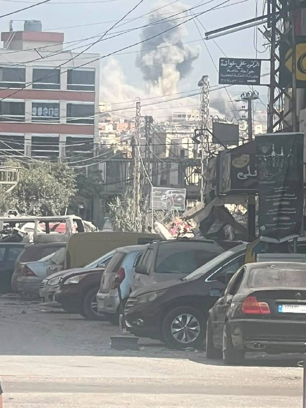

🚫هم اکنون شهر صور، جنوب لبنان

## Persian_Trend_Official — post 16192

کانال ۱۲ اسرائیل از یک مقام ارشد اسرائیلی نقل کرده است که: «اسرائیل در پاسخ به درخواست رئیس جمهور آمریکا حملات خود علیه ایران را متوقف می‌کند اما حملات به جنوب لبنان همچنان با تمام قدرت ادامه خواهد داشت. او اضافه کرده است که اگر حملات به شهرک‌های اسرائیلی و غیرنظامیان ادامه پیدا کند، اسرائیل به ضاحیه بیروت نیز حمله خواهد کرد.»

📌 @persian_trend_official
پرشین ترند | متفاوت‌ترین کانال نظامی

## Dirty_Kids — post 391382

‏کلا هر وقت اینترنت قطع نشد یعنی مساله انقدرها جدی نیست.

@Dirty_Kids 👻

## alonews — post 126286

  <a href="telegram/content/alonews_126286_1780925632.webm" target="_blank">🎬 Download video</a>

🔴فوری / سی‌بی‌اس به نقل از مقام آمریکایی : دولت ترامپ دستور داده هیچ اقدام دفاعی برای محافظت از اسرائیل در برابر موشک‌های ایران انجام نشه

✅ @AloNews خبر جنگ

## alonews — post 126285

  <a href="telegram/content/alonews_126285_1780925632.webm" target="_blank">🎬 Download video</a>

👈نخست وزیر پاکستان: ما با شرکای خود سخت تلاش می‌کنیم تا یک راه حل دیپلماتیک صلح‌آمیز برای این درگیری پیدا کنیم، زیرا به هدف نهایی نزدیک می‌شویم.

🔴ما صمیمانه از همه طرف‌ها می‌خواهیم که خویشتنداری کنند و به صلح فرصت بهتری بدهند

✅ @AloNews خبر جنگ

## alonews — post 126284

  <a href="telegram/content/alonews_126284_1780925632.webm" target="_blank">🎬 Download video</a>

👈سفیر آمریکا در لبنان پس از دیدار با نبیه بری: آتش‌بس برقرار خواهد شد

✅ @AloNews خبر جنگ

---
📅 بروزرسانی: 1405/03/18 16:53
---

## VahidOOnLine — post 244365

  

شرکت فرودگاه‌ها و ناوبری هوایی ایران اعلام کرد تمامی پروازهای فرودگاه‌های سراسر کشور تا اطلاع ثانوی لغو شده است.

پیش‌تر رسانه‌های ایران از شنیده شدن صدای انفجار در فرودگاه شیراز خبر دادند همزمان خبرگزاری مهر گزارش داد هیچ اصابت یا برخوردی در این فرودگاه رخ نداده است.

بامداد دوشنبه کانال ۱۲ اسرائیل از حمله نیروی هوایی این کشور به فرودگاه مهرآباد تهران خبر داد.
‌🏁 🇬🇧 IranintlTV

🤖 @VahidOOnLine

## WithYashar — post 14028

لغو تمام پروازهای کشور تا اطلاع ثانوی

شرکت فرودگاه‌ها و ناوبری هوایی ایران:‌
در پی صدور اطلاعیه رسمی هوانوردی (NOTAM) توسط سازمان هواپیمایی کشوری مبنی بر بسته‌شدن فضای پروازی غرب کشور، تمامی پروازهای فرودگاه‌های سراسر کشور تا اطلاع ثانوی لغو شده و انجام نخواهد شد.
@withyashar

## WithYashar — post 14027

  <a href="telegram/content/WithYashar_14027_1780925021.mp4" target="_blank">🎬 Download video</a>

خطر ⚠️اگه ناراحتی قلبی دارید نبینید 🤣 بی اختیاری ادرار میاره

این ویدئو رو صدا و سیما خودشون پخش کرد!
اخطار سرفرماندهی نیروی دریایی جمهوری اسلامی برای تنگه هرکز
@withyashar

## WithYashar — post 14026

بریتانیا هشدار تخلیه به شهروندانش از اسراییل رو صادر کرد🚨
@withyashar

## WithYashar — post 14025

  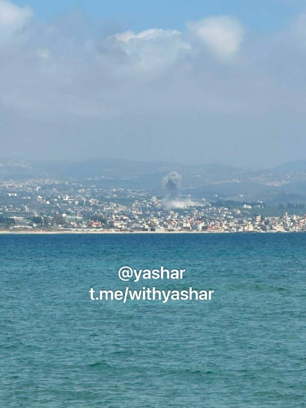

اسرائیل هم داره جنوب لبنان رو خیلی شیک و مجلسی هوایی میزنه.
@withyashar

## pm_afshaa — post 92920

جالبه خامنه ای نیومده بیانیه بده
قالیباف و عراقچی هم که خوابن

## pm_afshaa — post 92919

🔴بریتانیا هشدار تخلیه به شهروندانش از اسراییل رو صادر کرد 
💧 Rainbet.com the #1 Non-KYC Crypto Casino & Sportsbook @rainbetcom 
😁 @Pm_Afshaa

## IranIntlTV — post 341187

  <a href="telegram/content/IranIntlTV_341187_1780925024.mp4" target="_blank">🎬 Download video</a>

نخستین تمرین تیم ملی فوتبال ایران در مکزیک، ساعاتی پس از ورود ملی‌پوشان به شهر تیخوانا، در فضایی با تدابیر شدید امنیتی برگزار شد.

گفت‌وگو با محمد تقوی، ایران‌اینترنشنال
@iranintltv

## FarsiVOA — post 220029

🔺اسرائیل می‌گوید به درخواست پرزیدنت ترامپ حملات به جمهوری اسلامی را متوقف کرده است

◾️یک مقام ارشد اسرائیلی اعلام کرد کشورش بنا به درخواست دونالد ترامپ، رئیس جمهوری ایالات متحده، حملات خود علیه جمهوری اسلامی را متوقف کرده است.

⬇️ بیشتر بخوانید:

https://ir.voanews.com/a/israel-says-it-halted-strikes-on-iran-at-president-trumps-request/8158517.html

## DW_Farsi — post 125689

  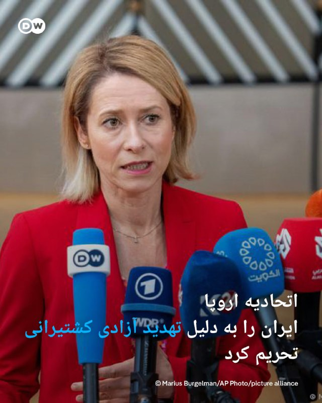

🔶 اتحادیه اروپا ایران را به دلیل تهدید آزادی کشتیرانی تحریم کرد

اتحادیه اروپا با استفاده از رژیم جدید تحریمی خود برای حفاظت از آزادی کشتیرانی، ایران را به دلیل تهدید تردد دریایی در تنگه هرمز، از جمله به دلیل بازرسی کشتی‌ها و دریافت عوارض از شناورهایی که اجازه عبور از این آبراه را دریافت می‌کنند، هدف تحریم قرار داده است.

این تحریم‌ها عمدتاَ فرماندهان محلی نیروی دریایی سپاه پاسداران انقلاب اسلامی را هدف قرار داده است.

بر اساس تصمیم اتحادیه اروپا علت درج نام این افراد در فهرست تحریم‌ها این است که "نیروی دریایی سپاه کنترل تنگه هرمز را در دست گرفته و یک نظام اخذ عوارض برای عبور کشتی‌ها ایجاد کرده است."

محدودیت‌های اعمال‌شده از سوی ایران بر عبور کشتی‌ها از تنگه هرمز، پس از درگیری با آمریکا، اسرائیل و دیگر بازیگران منطقه‌ای، موجب شوک انرژی در اقتصادهای اتحادیه اروپا شده است.

به همین دلیل، این اتحادیه در ماه مه دامنه تحریم‌های خود را گسترش داد تا افرادی را که در جلوگیری از عبور قانونی کشتی‌ها و محدود کردن آزادی کشتیرانی در این گذرگاه راهبردی نقش دارند، هدف قرار دهد.

@dw_farsi

## Persian_Trend_Official — post 16191

  <a href="telegram/content/Persian_Trend_Official_16191_1780925026.webm" target="_blank">🎬 Download video</a>

دیلی میل| فوتبالیست بین‌المللی حاضر در عکس متهم شده که در یک هتل پنج‌ستاره در ترکیه تلاش کرده یک دختر ۱۴ ساله بریتانیایی را برای «بغل کردن» به پشت یک پرچین ببرد.
پدر این دختر در گفت‌وگو با دیلی‌میل گفت که دخترش پس از این اتفاق دچار وحشت شده و در حالی که اشک می‌ریخته با خانواده تماس گرفته است. این حادثه زمانی رخ داد که او همراه خواهر ۱۰ ساله‌اش کنار استخر بود و والدینش حضور نداشتند.
دختر ۱۴ ساله که از دیدن یک چهره مشهور هیجان‌زده شده بود، از بازیکن درخواست عکس کرد. پس از گرفتن عکس، بازیکن تلفن او را گرفت، اطلاعات اینستاگرام خود را وارد کرد و از طریق حساب دختر برای خودش پیام فرستاد تا ارتباط برقرار شود. به گفته دختر، پس از آنکه او سن خود را اعلام کرد، فوتبالیست او را هات خطاب کرد و درخواست بغل کردن داد. وقتی دختر مخالفت کرد، بازیکن اصرار کرد و از او خواست به پشت یک پرچین برود؛ جایی که به گفته او هیچ‌کس نمی‌توانست آن‌ها را ببیند. دختر که ترسیده بود، به او گفت پدرش در راه است. به گفته خانواده، بازیکن پس از شنیدن این موضوع به سمت دیگر استخر رفت و خود را پنهان کرد.

📌 @persian_trend_official
پرشین ترند | متفاوت‌ترین کانال نظامی

## IranianMinds — post 21853

  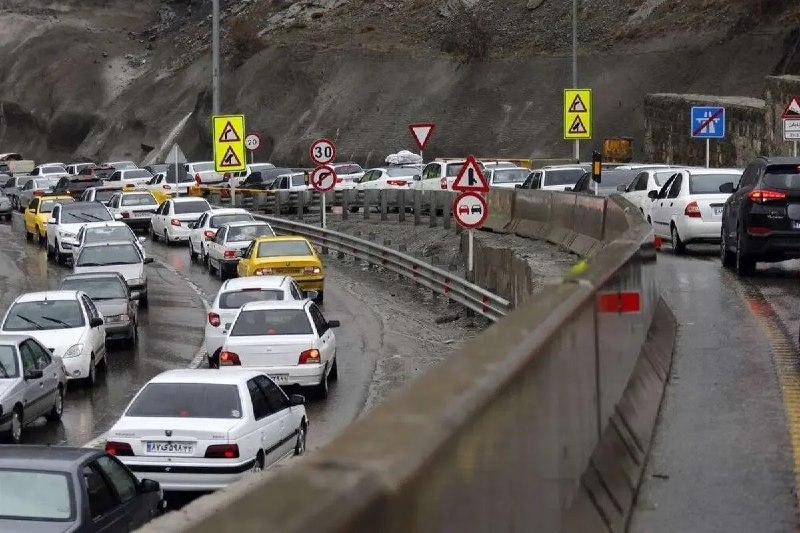

🔴پلیس راه راهور و فراجا از وضعیت سنگین ترافیکی در محورهای چالوس و هراز و آزادراه قزوین کرج خبر داد.

@IranianMinds

## Dirty_Kids — post 391381

‏هر وقت روز بدی داشتی به این فکر کن که تو فرودگاه بجنورد یه باجه هست مخصوص مسافرای بیرجند که به اشتباه اومدن بجنورد.

@Dirty_Kids 👻

## Dirty_Kids — post 391379

  <a href="telegram/content/Dirty_Kids_391379_1780925027.mp4" target="_blank">🎬 Download video</a>

اینجوری تو ایران داره برای آزادی مبارزه میکنه..!!!

جمهوری اسلامی با دیدنش، میشینه به کارای بدش فکر میکنه

@Dirty_Kids 👻

## Hranews — post 113467

  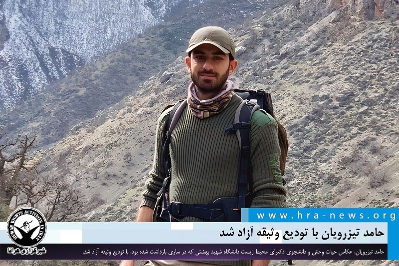

حامد تیزرویان با تودیع وثیقه آزاد شد

❗️
❗️
❗️
❗️
❗️– حامد تیزرویان، عکاس حیات وحش و دانشجوی دکترای محیط زیست دانشگاه شهید بهشتی، با تودیع وثیقه آزاد شد. وی در اردیبهشت ماه سال جاری در شهر ساری بازداشت و به زندان این شهر منتقل شده بود.

به گزارش خبرگزاری هرانا، ارگان خبری مجموعه فعالان حقوق بشر در ایران، حامد تیزرویان آزاد شد.

آزادی آقای تیزرویان با تودیع وثیقه صورت گرفته است.

ادامه مطلب

#حامد_تیزرویان

↘️
@hranews_bot تماس ✉️ - @Hranews کانال هرانا 🆑

## alonews — post 126283

  <a href="telegram/content/alonews_126283_1780925027.webm" target="_blank">🎬 Download video</a>

👈بریتانیا به شهروندان خود توصیه می‌کند از هرگونه سفر به اسرائیل خودداری کنند

✅ @AloNews خبر جنگ

---
📅 بروزرسانی: 1405/03/18 16:43
---

## WithYashar — post 14024

## WithYashar — post 14023

ترافیک سنگین در محورهای چالوس و هراز
@withyashar
خوش بگذره به هم وطنام ❤️‍🩹 جای‌منو خالی کنید

## WithYashar — post 14022

## WithYashar — post 14021

  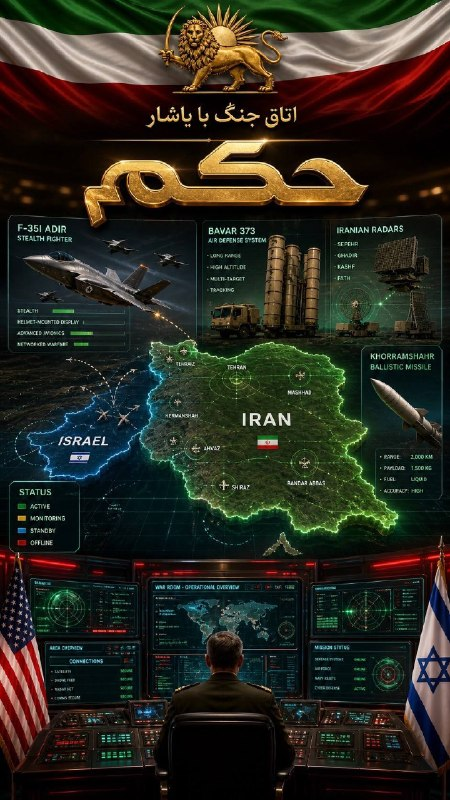

کاور
@withyashar

## WithYashar — post 14020

## pm_afshaa — post 92918

🔴بریتانیا هشدار تخلیه به شهروندانش از اسراییل رو صادر کرد

💧 Rainbet.com the #1 Non-KYC Crypto Casino & Sportsbook @rainbetcom

😁 @Pm_Afshaa

## DEJradio — post 5469

  <a href="telegram/content/DEJradio_5469_1780924422.mp4" target="_blank">🎬 Download video</a>

⭕️ ارتش اسرائیل: موشک‌های جمهوری اسلامی را با حمله به زیرساخت‌های نظامی رژیم پاسخ دادیم

افی دفرین، سخنگوی ارتش اسرائیل، روز دوشنبه گفت در پاسخ به حملات سپاه، زیرساخت‌های نظامی و برنامه‌های موشکی رژیم هدف گرفته شد.
او اعلام کرد جمهوری اسلامی پس از دو ماه آتش‌بس، با شلیک به سمت اسرائیل درگیری‌ها را ازسر گرفت.
ارتش اسرائیل می‌گوید در واکنش، عملیات از پیش طراحی‌شدۀ خود را اجرا کرده است.
به گفتۀ سخنگوی ارتش اسرائیل، سامانه‌های پدافندی جمهوری اسلامی هدف موج نخست حملات قرار گرفت.
او گفت ده‌ها جنگنده در موج نخست حملات، سامانه‌های دفاعی جمهوری اسلامی را هدف قرار دادند.
افی دفرین افزود که حملات روز دوشنبه با هدف تضعیف لایه‌های دفاعی حکومت انجام شد.
سخنگوی ارتش اسرائیل تأیید کرد که مجتمع پتروشیمی ماهشهر مورد هدف قرار گرفت.
به گزارش ارتش اسرائیل، در مجموعۀ پتروشیمی ماهشهر، مواد و قطعات مرتبط با برنامۀ موشکی جمهوری اسلامی تولید می‌شد.
ارتش اسرائیل همچنین اعلام کرد که جمهوری اسلامی حمله به اسرائیل را به پشتیبانی از حزب‌الله لبنان پیوند زد.
سخنگوی ارتش اسرائیل گفت رژیم حاکم بر ایران، بازهم برای پشتیبانی از حزب‌الله وارد درگیری شد.
افی دفرین، افزود اسرائیل برای بازگشت به جنگ با جمهوری اسلامی از پیش‌تر آماده بود.
سخنگوی ارتش اسرائیل گفت رئیس ستاد ارتش این کشور با همتای آمریکایی خود به‌صورت پیاپی در تماس است.
او افزود نیروهای اسرائیلی همزمان در لبنان، غزه، کرانۀ باختری و دیگر جبهه‌ها در حال عملیات‌اند.

#خبر #دژ #اسرائیل
@DEJradio

## IranIntlTV — post 341186

  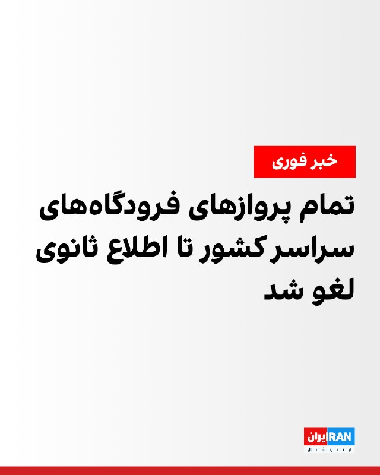

شرکت فرودگاه‌ها و ناوبری هوایی ایران اعلام کرد تمامی پروازهای فرودگاه‌های سراسر کشور تا اطلاع ثانوی لغو شده است.

پیش‌تر رسانه‌های ایران از شنیده شدن صدای انفجار در فرودگاه شیراز خبر دادند همزمان خبرگزاری مهر گزارش داد هیچ اصابت یا برخوردی در این فرودگاه رخ نداده است.

بامداد دوشنبه کانال ۱۲ اسرائیل از حمله نیروی هوایی این کشور به فرودگاه مهرآباد تهران خبر داد.
https://iranintl.com/202606081741

## IranIntlTV — post 341185

  <a href="telegram/content/IranIntlTV_341185_1780924424.mp4" target="_blank">🎬 Download video</a>

همزمان با حملات متقابل ایران و اسرائیل، شبه نظامیان حوثی‌، از حمله موشکی به اهدافی در اسرائيل خبر دادند و در بیانیه‌ای اعلام کردند، هرگونه تردد دریایی اسرائیل در دریای سرخ ممنوع است.

تروسکه صادقی، خبرنگار ایران‌اینترنشنال، گزارش می‌دهد
@iranintltv

## DW_Farsi — post 125688

🔶 پیروزی نیکول پاشینیان در انتخابات پارلمانی ارمنستان

نیکول پاشینیان، نخست‌وزیر ارمنستان که در سال‌های اخیر سیاست فاصله‌گیری از روسیه و نزدیک شدن به اتحادیه اروپا را دنبال کرده است، در انتخابات پارلمانی این کشور به پیروزی دست یافت. مسکو بالافاصله واکنش هشدارآمیز نشان داد.

بر اساس اعلام کمیسیون مرکزی انتخابات ارمنستان، حزب "پیمان مدنی" به رهبری نیکول پاشینیان، در انتخابات پارلمانی این کشور ۴۹.۸ درصد آرا را به دست آورد. در مقابل، ائتلاف مخالف و طرفدار روسیه با نام "ارمنستان قدرتمند" به رهبری سامول کاراپتیان، میلیاردر ارمنی، با کسب ۲۳.۳ درصد آرا در جایگاه دوم قرار گرفت.

رتبه سوم به روبرت کوچاریان، رئیس‌جمهور پیشین ارمنستان اختصاص یافت که ائتلاف تحت رهبری او با عنوان "ارمنستان" ۹.۹ درصد آرا را به دست آورد؛ سیاستمداری که گفته می‌شود روابط بسیار نزدیکی با ولادیمیر پوتین، رئیس‌ جمهور روسیه دارد.

حزب "ارمنستان شکوفا" نیز به عنوان سومین نیروی وفادار به مسکو، بر اساس نتایج اولیه دقیقا ۴ درصد آرا را کسب کرد و راهی پارلمان شد. با این حال، مجموع آرای نیروهای همسو با مسکو برای کسب اکثریت پارلمانی کافی نبود و حزب پاشینیان موفق شد ۶۱ کرسی از مجموع ۱۰۵ کرسی مجمع ملی را به خود اختصاص داده و به تنهایی تشکیل دولت دهد.

نرخ مشارکت در این انتخابات ۵۹ درصد اعلام شد که افزایش چشمگیری را نسبت به انتخابات سال ۲۰۲۱ (با مشارکت ۴۹ درصدی) نشان می‌دهد.

پاشینیان در تلاش است تا ارمنستان را به اتحادیه اروپا نزدیک‌تر کند. او در سال‌های اخیر روابط این جمهوری سابق شوروی را که به طور سنتی پیوندهای عمیقی با روسیه داشت، با ایالات متحده آمریکا توسعه داده و در اقدامی کلیدی، عضویت کشورش در ائتلاف نظامی تحت رهبری روسیه (پیمان امنیت دسته‌جمعی) را به حالت تعلیق درآورده است.

کاراپتیان، رقیب اصلی او، پیش از انتخابات این رویکرد را "حرکتی بی‌پروا و شتاب‌زده" به سمت غرب خوانده و از آن انتقاد کرده بود.

با این حال، نخست‌وزیر ۵۱ ساله ارمنستان پس از انداختن رای خود به صندوق در ایروان تاکید کرد که کشورش سیاست خارجی متوازنی را دنبال خواهد کرد و اساسا مسئله‌ای تحت عنوان "انتخاب میان روسیه و غرب" برای تهران و ایروان مطرح نیست.

روسیه همچنان مهم‌ترین شریک تجاری ارمنستان است و این کشور در بخش انرژی و تسلیحات نظامی وابستگی شدیدی به مسکو دارد؛ موضوعی که تحلیل‌گران آن را تلاش ایروان برای "نشستن هم‌زمان بر روی دو صندلی" توصیف می‌کنند.

@dw_farsi

## Persian_Trend_Official — post 16190

  <a href="telegram/content/Persian_Trend_Official_16190_1780924426.mp4" target="_blank">🎬 Download video</a>

⭕️ کارشناس صدا و سیما: آمریکا هزار کشته و ۸ هزار زخمی داد و این برای ما کاری نداشت!

📝 Nick

📌 @persian_trend_official
پرشین ترند | متفاوت‌ترین کانال نظامی

## IranianMinds — post 21852

  <a href="telegram/content/IranianMinds_21852_1780924428.mp4" target="_blank">🎬 Download video</a>

🔴 کارشناس صدا و سیما:

آمریکا هزار کشته و ۸ هزار زخمی داد و این برای ما کاری نداشت ، اسرائیل هم ۲ هزار کشته داد.

+ جالبه بدونید آمریکا تو جنگ عراق و افغانستان که زمینی وارد شده و چندین سال طول کشیده سر جمع ۵ هزار‌ کشته داده.

@IranianMinds

## BBCPersian — post 283188

🔻لغو پروازها در سراسر ایران

رسانه‌های ایران گزارش کرده‌اند که پروازها در سراسر کشور تا اطلاع ثانوی لغو شده است.

شرکت فرودگاه‌ها و ناوبری هوایی ایران با این اعلام این خبر از مسافران خواست از مراجعه به فرودگاه‌ها خودداری کنند.

بنابر این گزارش‌ها، «در پی اطلاعیه رسمی هوانوردی، نوتام، که پیشتر بر فضای پروازی غرب کشور بود، اکنون تمامی پروازهای فرودگاه‌های سراسر کشور تا اطلاع ثانوی لغو شده و انجام نخواهد شد.»

در همین حال خبرگزاری ایسنا به نقل از سازمان حج و زیارت گزارش کرد که «با توجه به شرایط، برای پروازهای بازگشت حجاج احتمال تاخیر حتی تا ۷۲ ساعت وجود دارد.»

@BBCPersian

## Dirty_Kids — post 391378

یک مقام ارشد اسرائیلی: به درخواست ترامپ اسرائیل حملات به ایران را متوقف می‌کند. حملات در جنوب لبنان در روزهای آینده با تمام قدرت ادامه خواهد داشت. اگر حملات به شهرک‌ها و شهروندان ما ادامه یابد، در ضاحیه نیز بمباران خواهیم کرد — کانال ۱۲

@Dirty_Kids 👻

## Dirty_Kids — post 391377

  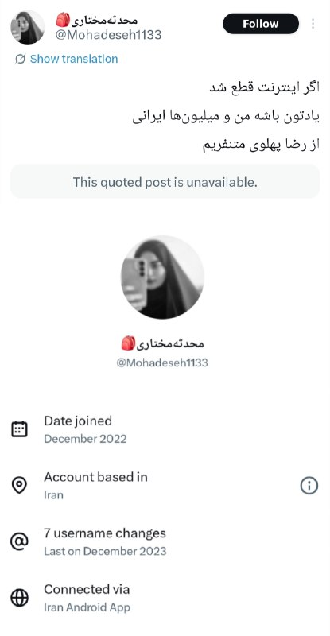

دریای مادرجندگی عرزشیا ساحل نداره
با سیمکارت سفید از قطع اینترنت و آنلاین نشدن حرف میزنه

@Dirty_Kids 👻

## alonews — post 126282

  <a href="telegram/content/alonews_126282_1780924430.mp4" target="_blank">🎬 Download video</a>

👈شی رئیس ، جمهور چین به پیونگ یانگ رسید

✅ @AloNews خبر جنگ

## alonews — post 126281

  <a href="telegram/content/alonews_126281_1780924432.mp4" target="_blank">🎬 Download video</a>

👈کارشناس صدا و سیما: آمریکا هزار کشته و ۸ هزار زخمی داد و این برای ما کاری نداشت!

✅ @AloNews خبر جنگ

## alonews — post 126280

  <a href="telegram/content/alonews_126280_1780924434.webm" target="_blank">🎬 Download video</a>

👈بن کاسپیت، روزنامه‌نگار مشهور اسرائیلی: ارتش اسرائیل به سرعت در حال اطلاع‌رسانی است که شلیک‌های اخیر «به سمت نیروهای ما» بوده است. یعنی نه به سمت شهرک‌ها در شمال اسرائیل

🔴این یعنی انتظار نداشته باشید که به ضاحیه حمله کنیم. یعنی ما را به حال خود رها کنید. یعنی ممکن است الان مجبور شویم به «حملات چند وقت یکبار» به جبهه شمال عادت کنیم، همانطور که قبلاً در جنوب به آن عادت کرده بودیم.

✅ @AloNews خبر جنگ

## alonews — post 126279

  <a href="telegram/content/alonews_126279_1780924434.webm" target="_blank">🎬 Download video</a>

👈ترافیک سنگین در محورهای چالوس و هراز

✅ @AloNews خبر جنگ

---
📅 بروزرسانی: 1405/03/18 16:33
---

## VahidOOnLine — post 244364

  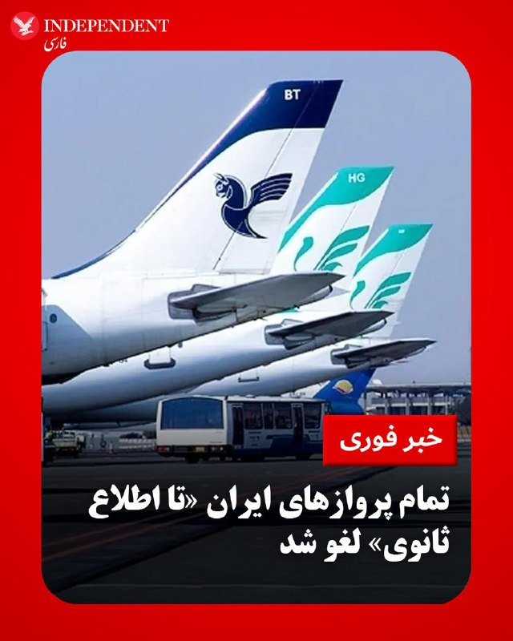

♦️شرکت فرودگاه‌ها و ناوبری هوایی ایران، روز دوشنبه ۱۸ خرداد ماه اعلام کرد تمامی پروازهای فرودگاه‌های کشور«تا اطلاع ثانوی» لغو شده‌اند.
به گزارش ایرنا، این تصمیم در پی صدور اطلاعیه هوانوردی (NOTAM) از سوی سازمان هواپیمایی کشوری و بسته شدن فضای پروازی غرب ایران اتخاذ شده است.
شرکت فرودگاه‌ها و ناوبری هوایی ایران در اطلاعیه‌ای اعلام کرد که بر اساس این محدودیت‌ها، هیچ پروازی از فرودگاه‌های کشور تا اطلاع ثانوی انجام نخواهد شد.
این تصمیم در حالی اعلام می‌شود که از شامگاه یکشنبه ایران و اسرائیل حملات هوایی متقابلی را علیه یکدیگر انجام داده‌اند.سازمان هواپیمایی کشور، یکشنبه شب از توقف فعالیت فرودگاه‌های امام خمینی و مهرآباد و بسته شدن حریم هوایی غرب ایران خبر داده بود.
‌🇸🇦 Indypersian

🤖 @VahidOOnLine

## VahidOOnLine — post 244363

  

معاون امنیتی انتظامی استانداری خراسان رضوی گفت که مراسم تشییع و تدفین علی خامنه‌ای، به صورت همزمان برگزار نخواهد شد و پس از برگزاری مراسم تشییع، مراسم تدفین در حرم امام هشتم شیعیان در مشهد و در «شرایط مناسب» صورت خواهد گرفت.

او اضافه کرد مراسم تشییع از تهران آغاز خواهد شد و پس از سه روز وداع و یک روز تشییع در تهران، یک روز تشییع در قم انجام می‌شود و پس از آن نیز یک روز تشییع در مشهد انجام می‌شود.
‌🏁 🇬🇧 IranintlTV

🤖 @VahidOOnLine

## VahidOOnLine — post 244362

  

احمد بخشایش اردستانی، عضو کمیسیون امنیت ملی مجلس گفت: «ترامپ معمولا آخر هفته‌ها فیتیله صلح را بالا می‌کشد و در پایان هفته فیتله جنگ و تنش‌ها را بالا می‌برد تا بورس بازی نفت را انجام بدهد.»

او افزود: «اگر آمریکایی‌ها محاصره دریایی را طولانی‌تر کنند، میزان تعرفه‌های تنگه هرمز سه تا چهار میلیون دلار افزایش می‌یابد.»
‌🏁 🇬🇧 IranintlTV

🤖 @VahidOOnLine

## pm_afshaa — post 92917

🔴لغو تمام پروازهای کشور تا اطلاع ثانوی

💧 Rainbet.com the #1 Non-KYC Crypto Casino & Sportsbook @rainbetcom

😁 @Pm_Afshaa

## iaghapour — post 2663

یه چیزی میگم شاید باورتون نشه.
مردم الان بیشتر از اینکه نگران جنگ باشن نگران قطعی دوباره #اینترنت هستن.

کسب و کارهای آسیب دیده تا میان دوباره سرپا بشن اینترنت رو قطع میکنن یا اختلال میندازن و....

🆔 @iAghapour

## IranIntlTV — post 341184

  <a href="telegram/content/IranIntlTV_341184_1780923834.mp4" target="_blank">🎬 Download video</a>

اتحادیه اروپا روز دوشنبه تحریم‌هایی را علیه افراد و نهادهای ایرانی مرتبط با اختلال در تردد در تنگه هرمز تصویب کرد. این موضوع را مسئول سیاست خارجی اتحادیه اروپا، کایا کالاس اعلام کرد و گفت این نخستین استفاده از سازوکار جدید تحریم‌های آزادی کشتیرانی این بلوک است. او همچنین مدعی شد ایران عملاً تنگه هرمز را بسته و پهپادهای این کشور همچنان امنیت رفت‌وآمد دریایی را تهدید می‌کنند و اقدامات ایران را «غیرقابل قبول» خواند.
@iranintltv

## IranIntlTV — post 341183

  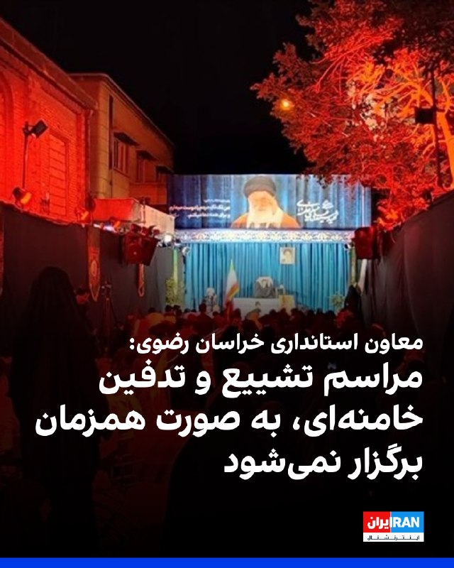

معاون امنیتی انتظامی استانداری خراسان رضوی گفت که مراسم تشییع و تدفین علی خامنه‌ای، به صورت همزمان برگزار نخواهد شد و پس از برگزاری مراسم تشییع، مراسم تدفین در حرم امام هشتم شیعیان در مشهد و در «شرایط مناسب» صورت خواهد گرفت.

او اضافه کرد مراسم تشییع از تهران آغاز خواهد شد و پس از سه روز وداع و یک روز تشییع در تهران، یک روز تشییع در قم انجام می‌شود و پس از آن نیز یک روز تشییع در مشهد انجام می‌شود.
https://iranintl.com/202606085589

## IranIntlTV — post 341182

  <a href="telegram/content/IranIntlTV_341182_1780923836.mp4" target="_blank">🎬 Download video</a>

همزمان با اصرار جمهوری اسلامی برای دخالت در سیاست داخلی دولت لبنان و گره‌زدن آن با تنش‌ها در منطقه، نگرانی‌ها درباره ورود لبنان به درگیری بیشتر و فرامنطقه‌ای افزایش یافته است.

می فرحات، خبرنگار ایران‌اینترنشنال، گزارش می‌دهد
@iranintltv

## IranIntlTV — post 341181

  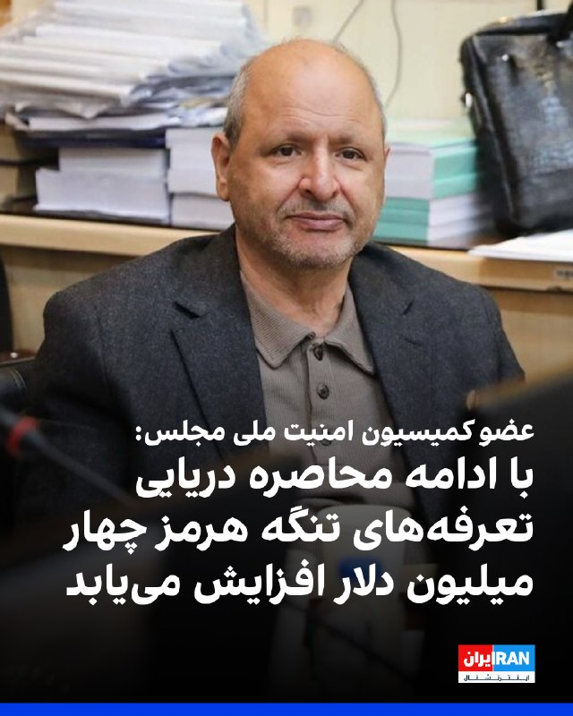

احمد بخشایش اردستانی، عضو کمیسیون امنیت ملی مجلس گفت: «ترامپ معمولا آخر هفته‌ها فیتیله صلح را بالا می‌کشد و در پایان هفته فیتله جنگ و تنش‌ها را بالا می‌برد تا بورس بازی نفت را انجام بدهد.»

او افزود: «اگر آمریکایی‌ها محاصره دریایی را طولانی‌تر کنند، میزان تعرفه‌های تنگه هرمز سه تا چهار میلیون دلار افزایش می‌یابد.»
https://iranintl.com/202606088195

## FarsiVOA — post 220028

تصاویر منتشر شده در شبکه‌های اجتماعی، رد موشک جمهوری اسلامی که به سمت اسرائیل شلیک شده بود را در آسمان کاشان در روز دوشنبه، ۱۸ خرداد، نشان می‌دهد.

## FarsiVOA — post 220027

  <a href="telegram/content/FarsiVOA_220027_1780923838.mp4" target="_blank">🎬 Download video</a>

ارتش اسرائیل در یک تصویرسازی، محل زیرساخت‌های هدف‌گیری شده در مجتمع پتروشیمی ماهشهر را مشخص کرد.

صبح روز دوشنبه، ۱۸ خرداد، رسانه‌های وابسته به جمهوری اسلامی از حملاتی به شرکت پتروشیمی کارون در ماهشهر خبر داده بودند.

حملات ارتش اسرائیل، در واکنش به حملات موشکی بامداد دوشنبه سپاه به این کشور انجام شده است.

## RadioFarda — post 158059

یک مقام ارشد اسرائیلی از پایان حملات این کشور به ایران خبر داد

🔸شبکه ۱۲ تلویزیون اسرائیل به نقل از یک مقام ارشد این کشور اعلام کرد که اسرائیل بنا به درخواست دونالد ترامپ، رئیس‌جمهور آمریکا، حملات خود به ایران را متوقف کرده است.

🔸این مقام روز دوشنبه افزود اگر حملات حزب‌الله لبنان به شهرهای اسرائیل ادامه یابد، اسرائیل به ضاحیه (حومه جنوبی بیروت) حمله خواهد کرد.

🔸گزارش شبکه ۱۲ همچنین به نقل از این مقام ارشد اسرائیلی اعلام کرد که حملات اسرائیل در جنوب لبنان در روزهای آینده با تمام قدرت ادامه خواهد یافت.

🔸ساعاتی پیشتر، قرارگاه خاتم‌الانبیا که وظیفه هماهنگی میان نیروهای مسلح جمهوری اسلامی را برعهده دارد، نیز گفته بود که حملات ایران به اسرائیل پایان یافته است.

@RadioFarda

## RadioFarda — post 158058

پژوهش‌های تازه: داروهای کاهش وزن خطر سرطان پستان را تا ۳۰ درصد کاهش ‌می‌دهند

🔸سه مطالعه جدید به شواهد فزاینده‌ای دست یافته‌اند که نشان می‌دهد آمپول‌های کاهش وزن ممکن است به بخشی از ابزارهای مبارزه با سرطان برای کاهش خطرِ ابتلا یا مرگ ناشی از این بیماری تبدیل شوند.

🔸پزشکان اعلام کرده‌اند که داروهای کاهش وزن می‌توانند خطر ابتلا به سرطان یا مرگ ناشی از آن را تا ۳۰ درصد کاهش دهند.

🔸در حال حاضر میلیون‌ها نفر در جهان از این داروها برای درمان چاقی استفاده می‌کنند. اکنون مجموعه‌ای از مطالعات که در بزرگ‌ترین کنفرانس سرطان‌شناسی جهان ارائه شده‌اند، نشان می‌دهد این داروها ممکن است در پیشگیری و درمان سرطان نیز نقش داشته باشند.

🔸یکی از این مطالعات نشان داد افرادی که از داروهای گروه جی‌ال‌پی۱ استفاده می‌کنند، در مقایسه با کسانی که از داروهای کاهش وزن استفاده نمی‌کنند، ۳۰ درصد کمتر در معرض ابتلا به سرطان پستان ــ شایع‌ترین نوع سرطان در جهان ــ قرار دارند.

🔸مطالعه دوم نشان داد افزودن داروهای کاهش وزن به درمان استاندارد سرطان پستان، خطر مرگ بیماران بر اثر این بیماری را تا ۳۰ درصد کاهش می‌دهد.

🔸در پژوهش سوم که بر روی بیماران مبتلا به سرطان پستان، ریه، روده بزرگ و کبد انجام شد، مشخص شد افرادی که از داروهای کاهش وزن استفاده می‌کنند، تا ۵۰ درصد کمتر با گسترش بیماری خود مواجه می‌شوند.

🔸این یافته‌ها در نشست سالانه «انجمن آمریکایی سرطان‌شناسی بالینی» در شیکاگو ارائه شده است.

بیشتر بخوانید.

## IranianMinds — post 21851

🔴 تسنیم :

حریم‌ هوایی کشور بسته شد.

@IranianMinds

## alonews — post 126278

👈سپاه : طی 5 ساعت گذشته سه بار مواضع گروه‌ های کُرد را در شمال عراق هدف قرار داده است

✅ @AloNews خبر جنگ

## alonews — post 126277

  <a href="telegram/content/alonews_126277_1780923840.webm" target="_blank">🎬 Download video</a>

👈مدیرکل مدیریت بحران هرمزگان :
حدود ۲۴ میلیارد تومن خسارت ماشین‌هایی که تو جنگ آسیب دیدن پرداخت شد

✅ @AloNews خبر جنگ

## alonews — post 126276

  <a href="telegram/content/alonews_126276_1780923840.webm" target="_blank">🎬 Download video</a>

👈دیر قانون راس‌ العین، در جنوب شهر صور مورد حمله هوایی قرار گرفت

✅ @AloNews خبر جنگ

---
📅 بروزرسانی: 1405/03/18 16:23
---

## VahidOOnLine — post 244361

  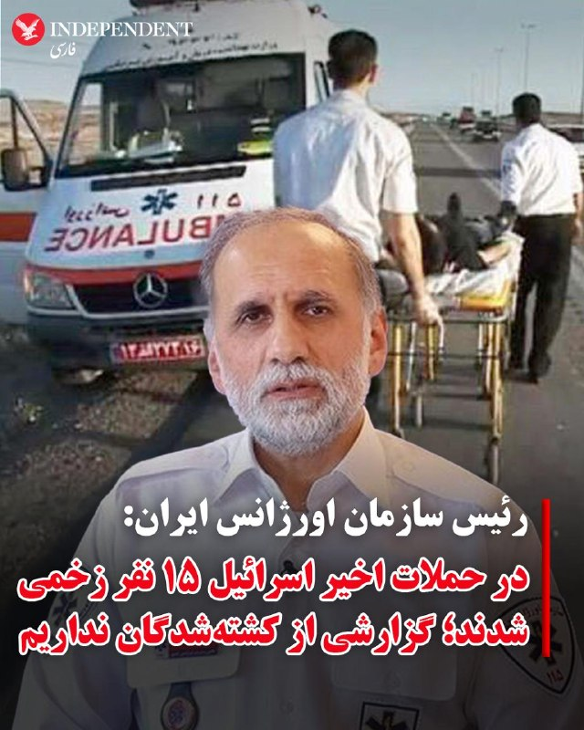

♦️جعفر میعادفر، رئیس سازمان اورژانس ایران، اعلام کرد در پی حملات اخیر اسرائیل به خاک ایران، ۱۵ نفر مجروح شده‌اند و تاکنون گزارشی از کشته‌شدن افراد در این حملات دریافت نشده است.
به گزارش خبرگزاری تسنیم، میعادفر روز دوشنبه ۱۸ خرداد گفت ۱۴ نفر از مجروحان در شهرستان ماهشهر در استان خوزستان و یک نفر نیز در تهران زخمی شده‌اند.
او افزود از مجموع مجروحان، ۱۴ نفر پس از دریافت خدمات درمانی از مراکز درمانی مرخص شده‌اند و تنها یک نفر همچنان در بیمارستان بستری است.
رئیس سازمان اورژانس ایران همچنین گفت نظام سلامت و مجموعه اورژانس کشور در آمادگی کامل قرار دارند تا در صورت ادامه حملات، خدمات درمانی لازم را به مجروحان احتمالی ارائه کنند.
این اظهارات در حالی مطرح می‌شود که از شامگاه یکشنبه ایران و اسرائیل حملات هوایی متقابلی را علیه یکدیگر انجام داده‌اند. در همین حال، قرارگاه مرکزی خاتم‌الانبیا روز دوشنبه اعلام کرد عملیات نیروهای مسلح جمهوری اسلامی علیه اسرائیل پایان یافته است. رسانه‌های رسمی اسرائیل نیز از توقف حملات این کشور به ایران به درخواست دونالد ترامپ خبر داده‌اند.
‌🇸🇦 Indypersian

🤖 @VahidOOnLine

## VahidOOnLine — post 244360

  

کانال ۱۲ اسرائیل به نقل از یک منبع نوشت که این کشور به درخواست ترامپ حملات به ایران را متوقف می‌کند اما حملات به جنوب لبنان با شدت ادامه خواهد یافت.

این مقام افزود که اگر حملات حزب‌الله به شهرهای اسرائیل ادامه یابد، اسرائیل ضاحیه بیروت را هدف قرار خواهد داد.
‌🏁 🇬🇧 IranintlTV

🤖 @VahidOOnLine

## VahidOOnLine — post 244359

  <a href="telegram/content/VahidOOnLine_244359_1780923222.mp4" target="_blank">🎬 Download video</a>

♦️ارتش اسرائیل روز دوشنبه ۱۸ خردادماه با انتشار تصاویری اعلام کرد نیروی هوایی این کشور در جریان حملاتی در غرب و مرکز ایران، چندین سامانه پدافند هوایی را هدف قرار داده است.

در بیانیه ارتش اسرائیل آمده است که تصاویر منتشرشده، انهدام یکی از سامانه‌های پدافندی را نشان می‌دهد که موشک‌های زمین‌به‌هوا در آن نگهداری می‌شد. به گفته ارتش اسرائیل، وقوع انفجارهای ثانویه پس از حمله نشان‌دهنده وجود این موشک‌ها در محل هدف بوده است.

رسانه‌های داخلی ایران و کاربران شبکه‌های اجتماعی صبح دوشنبه از بمباران اهدافی در غرب ایران ازجمله کرمانشاه و کبودرآهنگ در استان همدان خبر داده بودند.
‌🇸🇦 Indypersian

🤖 @VahidOOnLine

## pm_afshaa — post 92916

  <a href="telegram/content/pm_afshaa_92916_1780923222.webm" target="_blank">🎬 Download video</a>

🔴رویترز به نقل از منابع: اسرائیل تصمیم گرفته حملاتش به ایران رو متوقف کنه.

💧 Rainbet.com the #1 Non-KYC Crypto Casino & Sportsbook @rainbetcom

😁 @Pm_Afshaa

## IranIntlTV — post 341180

  <a href="https://t.me/IranintlTV/341180" target="_blank">📎 Download file</a>

🎧نسخه صوتی اخبار نیمروزی | دوشنبه ۱۸ خرداد
@iranintlTV

## IranIntlTV — post 341179

  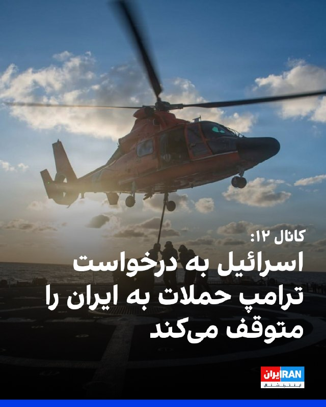

کانال ۱۲ اسرائیل به نقل از یک منبع نوشت که این کشور به درخواست ترامپ حملات به ایران را متوقف می‌کند اما حملات به جنوب لبنان با شدت ادامه خواهد یافت.

این مقام افزود که اگر حملات حزب‌الله به شهرهای اسرائیل ادامه یابد، اسرائیل ضاحیه بیروت را هدف قرار خواهد داد.
https://iranintl.com/202606081770

## Shin_Persian — post 6751

Shin ✓ @hey_itsmyturn
Mon, 08 Jun 2026 12:51:40 UTC

Iran Civil Aviation Organization: all flights from airports across the Iran are canceled and will not operate until further notice.

فارسی

سازمان هواپیمایی کشوری ایران: تمامی پروازها از فرودگاه‌های سراسر ایران لغو شده است و تا اطلاع ثانوی انجام نخواهد شد.

𝕏 · @shin_persian

## FarsiVOA — post 220026

  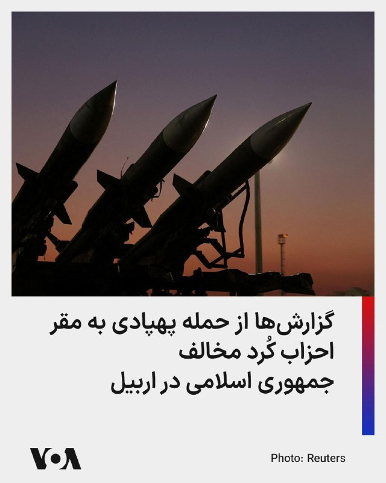

منابع امنیتی می‌گویند یک مقر گروه‌های کُرد مخالف جمهوری اسلامی در شرق اربیل عراق هدف دو حمله پهپادی قرار گرفت.
منابع امنیتی روز دوشنبه ۱۸ خرداد به رویترز گفتند که مقر مخالفان کُرد ایرانی در شرق اربیل عراق هدف حمله پهپادی قرار گرفته است. هرچند به گفته این منابع تلفاتی گزارش نشده است.
به گفته منابع امنیتی، روز یکشنبه دو حمله پهپادی در نزدیکی سلیمانیه عراق رخ داد که یکی از آنها مقر نیروهای پیشمرگه کُرد و دیگری اردوگاهی را که محل استقرار گروه‌های اپوزیسیون کُرد ایرانی در غرب این شهر بود، هدف قرار داد.

## Persian_Trend_Official — post 16189

  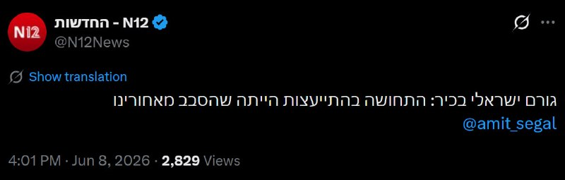

⭕️ مقام ارشد اسرائیلی: احساس ما در طول مشاوره این بود که دور مذاکرات پشت سر گذاشته شده است.

📝 Nick

📌 @persian_trend_official
پرشین ترند | متفاوت‌ترین کانال نظامی

## Persian_Trend_Official — post 16188

  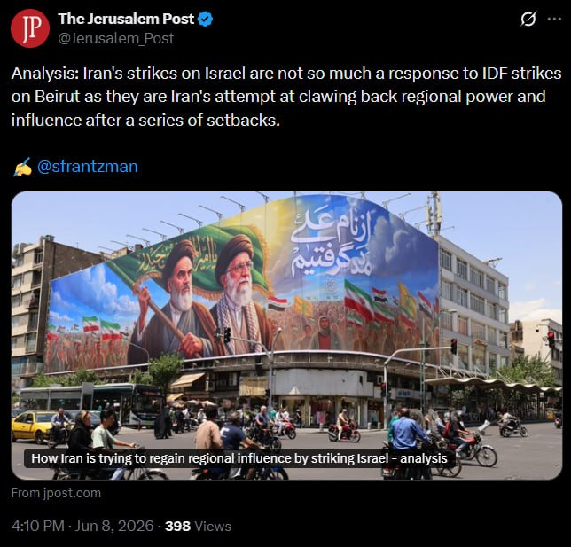

⭕️ جروزالم پست:

تحلیل: حملات ایران به اسرائیل، بیش از آنکه پاسخی به حملات ارتش اسرائیل به بیروت باشد، تلاش ایران برای بازپس‌گیری قدرت و نفوذ منطقه‌ای پس از یک سری شکست‌ها است.

📝 Nick

📌 @persian_trend_official
پرشین ترند | متفاوت‌ترین کانال نظامی

## IranianMinds — post 21850

🔴 تمامی پرواز ها کنسل شدن و تمامی فرودگاهای کشور تا اطلاع ثانوی بسته شدن.

@IranianMinds

## BBCPersian — post 283187

🔻پزشکیان: نه میدان را ترک کرده‌ایم نه میز مذاکره را

مسعود پزشکیان گفت ایران «نه میدان را ترک کرده و نه میز مذاکره را.»

رئیس‌جمهور ایران همچنین در ایکس نوشت که «اولویت ما امنیت ملی و آرامش مردم است. با اقتدار از حقوق ملت دفاع می‌کنیم و در برابر هیچ تهدیدی عقب‌نشینی نخواهیم کرد.»

شب گذشته ایران در آنچه که قرارگاه خاتم‌الانبیا ادامه حملات اسرائیل «در جنوب لبنان و منطقه ضاحیه» خواند، حملاتی را به اسرائیل انجام داد که با پاسخ متقابل اسرائیل همراه بود.

مقام‌های ایران بر این نکته تاکید کرده‌اند درحالی‌که وزیر کشور پاکستان در تهران مشغول مذاکره بود اسرائیل به ضاحیه در جنوب بیروت حمله کرد.

پاکستان میانجی اصلی گفت‌وگوهای ایران و آمریکاست.

@BBCPersian

## Dirty_Kids — post 391375

آخرش می‌فهمید مجتبی درواقع همون ترامپ بوده و تمام این مدت داشت با خودش حرف می‌زده

@Dirty_Kids 👻

## Dirty_Kids — post 391374

  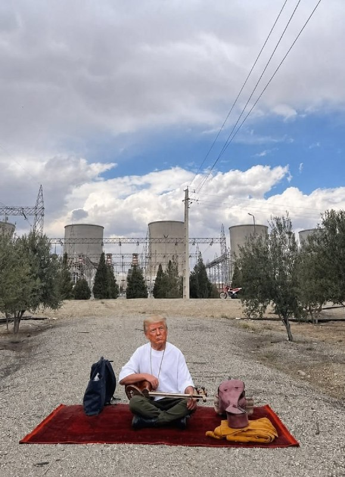

راهکار بعدی ترامپ برای جلوگیری از حملۀ نتانیاهو و نقض نشدن آتش‌بس

@Dirty_Kids 👻

## Dirty_Kids — post 391373

بچه ها برنامه ریزی بلندمدت نکنید مثلا در حدی که تا نیم ساعت آینده آب، جوش بیاد نسکافه درست کنید همین.

@Dirty_Kids 👻

## Dirty_Kids — post 391369

🔴 دقایقی پیش، اسرائیل جنوب لبنان رو شخم زد.

@Dirty_Kids 👻

## alonews — post 126275

  <a href="telegram/content/alonews_126275_1780923226.webm" target="_blank">🎬 Download video</a>

👈 کانال ۱۲ به نقل از یک مقام ارشد اسرائیلی: ارزیابی غالب در خلال مشورت‌های امنیتی حاکی از آن است که دور فعلی تشدید تنش را پشت سر گذاشته‌ایم

✅ @AloNews خبر جنگ

## alonews — post 126274

  <a href="telegram/content/alonews_126274_1780923226.webm" target="_blank">🎬 Download video</a>

👈لغو تمام پروازهای کشور تا اطلاع ثانوی

✅ @AloNews خبر جنگ

## alonews — post 126273

  <a href="telegram/content/alonews_126273_1780923227.webm" target="_blank">🎬 Download video</a>

👈اورژانس ایران: ۱۵ نفر بر اثر حملات اخیر اسرائیل مجروح شدند

✅ @AloNews خبر جنگ

## alonews — post 126272

  <a href="telegram/content/alonews_126272_1780923227.webm" target="_blank">🎬 Download video</a>

👈لارنس نورمن خبرنگار وال استریت ژورنال: پیش‌نویس قطعنامه آمریکا برای نشست این هفته شورای حکام آژانس بین‌المللی انرژی اتمی (IAEA)، که کشورهای اروپایی (E3) چندان مشتاق آن نبودند، اصلاح شده و به گفته منابع، اکنون به قطعنامه مشترک سه کشور اروپایی و آمریکا تبدیل شده است. بنابراین به احتمال زیاد تصویب خواهد شد.

🔴بر اساس برداشت من، فشار آمریکا برای ارجاع فوری پرونده ایران به شورای امنیت سازمان ملل، به عنوان یک مصالحه، از قطعنامه حذف شده است

✅ @AloNews خبر جنگ

## alonews — post 126271

  <a href="telegram/content/alonews_126271_1780923227.webm" target="_blank">🎬 Download video</a>

👈تخریب در الخریب، جنوب لبنان، پس از حمله اسرائیل

✅ @AloNews خبر جنگ

## alonews — post 126270

  <a href="telegram/content/alonews_126270_1780923228.webm" target="_blank">🎬 Download video</a>

👈 رویترز به نقل از منابع:
اسرائیل تصمیم گرفته است حملات خود به ایران را متوقف کند

✅ @AloNews خبر جنگ

---
📅 بروزرسانی: 1405/03/18 16:14
---

## VahidOOnLine — post 244358

  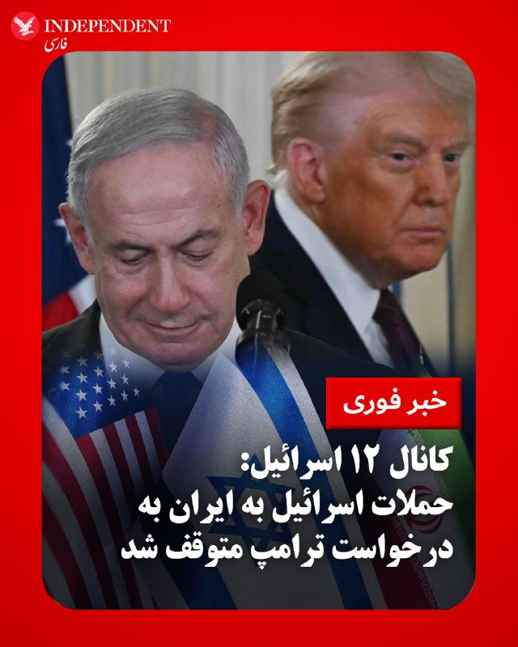

♦️کانال ۱۲ تلویزیون اسرائیل عصر دوشنبه ۱۸ خردادماه به نقل از یک مقام رسمی دولت نتانیاهو اعلام کرد که اسرائیل حملات خود را به ایران به درخواست دونالد ترامپ متوقف کرده است.

به گزارش رویترز، همین منبع گفته است که اگر حزب‌الله حملات به شهرک‌های اسرائیلی [در شمال] را ادامه دهد، اسرائیل ضاحیه بیروت را هدف قرار خواهد داد.

این خبر پس از آن اعلام شد که رسانه‌ها از گفتگوی تلفنی ترامپ و نتانیاهو خبر دادند.

کم‌تر از یک ساعت پیش از این خبر، قرارگاه خاتم‌الانبیا از پایان عملیات نظامی علیه اسرائیل خبر داده بود.
‌🇸🇦 Indypersian

🤖 @VahidOOnLine

## mwarmonitor — post 10468

🔰در نامه‌ای به رئیس‌جمهور ترامپ، ۳۸ سناتور دموکرات در برابر ادعای دولت مبنی بر اینکه درگیری آمریکا با ایران در ۱ مه «پایان یافته» است، مخالفت کردند (به نقل از Punchbowl News). آن‌ها خواستار این شده‌اند که وزارت دادگستری نظر دفتر مشاور حقوقی (Office of Legal Counsel) در این خصوص را منتشر کند.

@mwarmonitor

## mwarmonitor — post 10467

🔴نیویورک تایمز به نقل از مقامات نظامی اسرائیلی: نتانیاهو به ارتش دستور داده است که آماده‌سازی‌ها برای انجام یک حمله دیگر علیه ایران را متوقف کند.

@mwarmonitor

## mwarmonitor — post 10466

🚨رئیس سازمان اورژانس ایران: در نتیجه تجاوز صهیونیستی به کشور، ۱۴ نفر مجروح شده‌اند که برخی از آن‌ها از شهر ماهشهر در استان خوزستان و یک نفر از تهران هستند. در حال حاضر یک نفر همچنان در بیمارستان تحت درمان است، در حالی که ۱۴ مجروح دیگر پس از دریافت مراقبت‌های پزشکی لازم مرخص شده‌اند.

@mwarmonitor

## pm_afshaa — post 92915

  <a href="telegram/content/pm_afshaa_92915_1780922641.webm" target="_blank">🎬 Download video</a>

🔴سی‌بی‌اس به نقل از یک منبع آمریکایی:
ارتش آمریکا در حملات اخیر به ایران مشارکتی نداشته و ترامپ هم هیچ دستوری برای انجام عملیات نظامی یا حمایت دفاعی از اسرائیل در برابر حملات موشکی ایران صادر نکرده.

💧 Rainbet.com the #1 Non-KYC Crypto Casino & Sportsbook @rainbetcom

😁 @Pm_Afshaa

## FarsiVOA — post 220025

تصاویری از بازگشت پیت هگست، وزیر جنگ آمریکا، به واشنگتن پس از سفر به فرانسه منتشر شده است.

هگست در روزهای گذشته برای شرکت در راسم گرامی‌داشت هشتاد و دومین سالکرد «نبرد نرماندی» در فرانسه و دیدار با مقام‌های فرانسوی به این کشور سفر کرده بود.

در این سفر، او همچنین با کهنه‌سربازان جنگ جهانی دوم و نیروهای آمریکایی مستقر در اروپا دیدار کرد.

@FarsiVOA

## Persian_Trend_Official — post 16187

کانال 12 اسرائیل: به درخواست ترامپ، اسرائیل حملات به ایران را متوقف می‌کند. اما حملات به جنوب لبنان در روزهای آینده با شدت تمام ادامه خواهد یافت!

📝 Amir

📌 @persian_trend_official
پرشین ترند | متفاوت‌ترین کانال نظامی

## IranianMinds — post 21849

🔴 کانال ۱۲ اسرائیل :

به درخواست ترامپ اسرائیل فعلا حملات خودش به ایران رو متوقف میکنه.

@IranianMinds

## BBCPersian — post 283186

🔻هلال احمر ایران: ۱۲ نقطه کشور هدف قرار گرفت اما هیچ کشته و مصدومی نداشت

مجتبی خالدی، سخنگوی جمعیت هلال احمر، گفت که جمعیت هلال احمر از «ساعت ۴ صبح بامداد دوشنبه ۱۸ خرداد» که حمله اسرائیل انجام شد با «تمامی مراکز و شعب در حالت آماده باش قرار گرفت.»

به گزارش رسانه‌های ایران، سخنگوی جمعیت هلال احمر گفت: «تا این لحظه ۱۲ نقطه در کشور مورد اصابت قرار گرفته و نیرو‌های هلال احمر در این نقاط حضور پیدا کردند که خوشبختانه هیچ شهید و مصدومی به ثبت نرسیده است.»

به گفته آقای خالدی، «۱۱۰ هزار داوطلب تخصصی امداد و نجات آمادگی خدمت و ۵۰۰۰ نیروی داوطلب آمادگی امدادرسانی را دارند.

@BBCPersian

## BBCPersian — post 283185

🔻در پی حملات موشکی ایران به اسرائیل در شامگاه ۱۷ خرداد ۱۴۰۵، تقابل بین این دو کشور دوباره از سر گرفته شد.

ارتش اسرائیل در پاسخ به چند نقطه از ایران از جمله پتروشیمی کارون در ماهشهر حمله کرد. به گفته ارتش اسرائیل، این تاسیسات «برای تولید و صادرات مواد اولیه مورد استفاده در ساخت تسلیحات» استفاده می‌شد و «زیرساخت‌های هدف قرار گرفته، مواد منحصر به‌ فردی تولید می‌کردند که از اجزای ضروری ساخت موشک‌ بالستیک به شمار می‌روند.» ایران نیز گفت به تلافی آن به پتروشیمی حیفا حمله موشکی کرده است.

ساعاتی بعد قرارگاه مرکزی خاتم‌الانبیا در اطلاعیه‌ای اعلام کرد که عملیاتش علیه اسرائیل پایان یافته است و هشدار داد که در صورت ادامه حملات «از جمله در جنوب لبنان، اقدامات بسیار شدیدتر و کوبنده‌تر از قبل در راه خواهد بود.»

هلال احمر ایران اعلام کرد ۱۲ نقطه کشور هدف قرار گرفت اما هیچ کشته و مصدومی نداشت.

در این ویدیو درباره آنچه اتفاق افتاد ببینید و بخوانید.

@BBCPersian

## Hranews — post 113466

  <a href="telegram/content/Hranews_113466_1780922641.mp4" target="_blank">🎬 Download video</a>

سخنگوی جمعیت هلال احمر اعلام کرد که از ساعت چهار بامداد امروز ۱۸ خردادماه، ۱۲ نقطه در کشور هدف حملات نظامی ارتش اسرائیل قرار گرفته‌اند. به گفته مجتبی خالدی، این حملات تاکنون هیچ کشته یا مصدومی بر جای نگذاشته است.
#حمله_نظامی #جنگ

↘️
@hranews_bot تماس ✉️ - @Hranews کانال هرانا 🆑

## alonews — post 126269

  <a href="telegram/content/alonews_126269_1780922643.webm" target="_blank">🎬 Download video</a>

👈منبع عبری به i24NEWS: نبرد بزرگ با دولت ترامپ از این پس، ادامه جدا کردن مسیر مذاکرات تهران-واشنگتن از جبهه لبنان خواهد بود

✅ @AloNews خبر جنگ

## alonews — post 126268

  <a href="telegram/content/alonews_126268_1780922643.webm" target="_blank">🎬 Download video</a>

👈کانال ۱۲: به درخواست ترامپ، اسرائیل حملات علیه ایران را متوقف می‌کند/ حملات در جنوب لبنان در روزهای آینده با حداکثر قدرت ادامه خواهد یافت

🔴اگر حملات به شهرک‌های ما ادامه یابد، ضاحیه (بیروت) را نیز بمباران خواهیم کرد.

✅ @AloNews خبر جنگ

---
📅 بروزرسانی: 1405/03/18 16:04
---

## VahidOOnLine — post 244357

  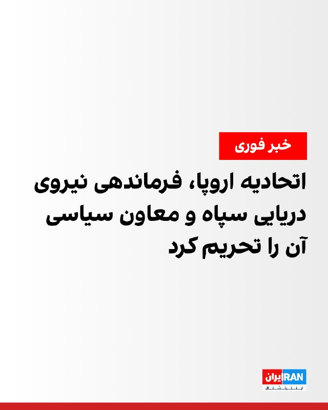

اتحادیه اروپا محمد اکبرزاده، معاون سیاسی نیروی دریایی سپاه پاسداران، و حمید حسینی، سخنگوی اتحادیه صادرکنندگان نفت ایران، را به دلیل نقش در آنچه تهدید کشتیرانی در تنگه هرمز عنوان شده، تحریم کرد.

هم‌زمان، اتحادیه اروپا فرماندهی نیروی دریایی سپاه پاسداران را نیز به دلیل آنچه تهدید آزادی کشتیرانی در تنگه هرمز خوانده، در فهرست تحریم‌های خود قرار داد.
‌🏁 🇬🇧 IranintlTV

🤖 @VahidOOnLine

## VahidOOnLine — post 244356

  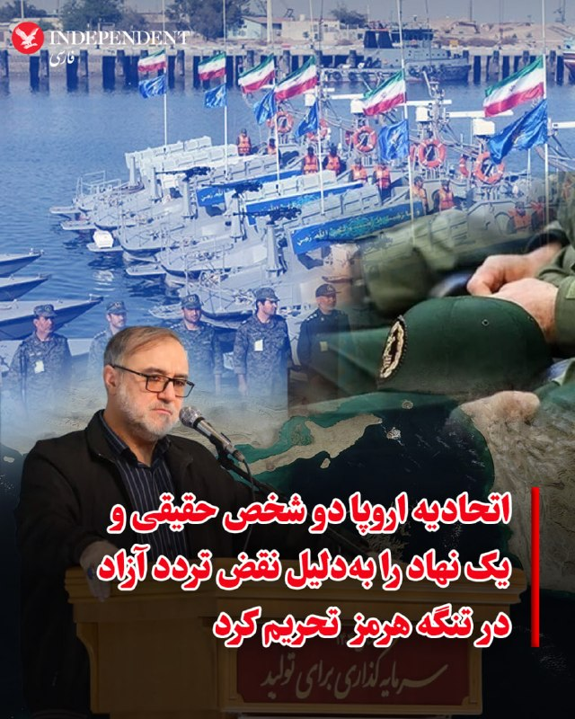

♦️اتحادیه اروپا روز دوشنبه ۱۸ خردادماه اعلام کرد دو فرد ایرانی و یک واحد از سپاه پاسداران انقلاب اسلامی را به دلیل تهدید آزادی تردد دریایی در تنگه هرمز تحریم کرده است.

این اولین باری است که اتحادیه اروپا از اختیارات جدید خود برای تحریم ایران به دلیل محدود کردن آزادی دریانوردی استفاده می‌کند.

اتحادیه اروپا در بیانیه‌ای اعلام کرد که فرماندهی نیروی دریایی سپاه پاسداران انقلاب اسلامی استان هرمزگان و همچنین محمد اکبرزاده و حمید حسینی، دو عضو سپاه را به فهرست تحریم‌های خود اضافه کرده است.
‌🇸🇦 Indypersian

🤖 @VahidOOnLine

## VahidOOnLine — post 244355

  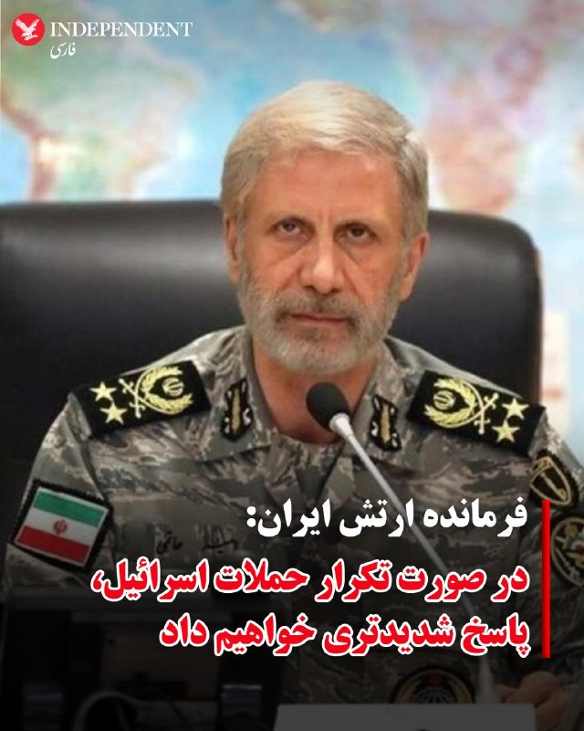

♦️امیرحاتمی، فرمانده کل ارتش جمهوری اسلامی ایران، روز دوشنبه ۱۸ خرداد ماه، هشدار داد که در صورت تکرار آنچه «شرارت‌های دشمن» خواند، نیروهای مسلح ایران اقدامات شدیدتری انجام خواهند داد.
حاتمی در پیامی با اشاره ضمنی به حضور وزیر کشور پاکستان در ایران هنگام شروع حملات اسرائیل نوشت: « دشمن در حالی که میانجی گفتگوها در ایران حضور داشت بار دیگر با عهدشکنی و نقض تمامیت آتش‌بس ثابت کرد به‌هیچ‌وجه به آتش‌بس و توافق پایبند نیست.»
فرمانده کل ارتش جمهوری اسلامی در ادامه با اشاره به آمادگی نیروهای مسلح ایران گفت ارتش جمهوری اسلامی در آمادگی کامل قرار دارد و هشدار داد که در صورت تکرار حملات اسرائیل، پاسخ تهران شدیدتر از گذشته خواهد بود.
امیر حاتمی همچنین مدعی شد مسئولیت اقدامات اسرائیل متوجه ایالات متحده است.
این اظهارات در حالی مطرح می‌شود که پس از ۱۶ ساعت درگیری نظامی میان ایران و اسرائیل، قرارگاه مرکزی خاتم‌الانبیا روز دوشنبه ۱۸ خرداد از پایان عملیات نیروهای مسلح جمهوری اسلامی خبر داد، اما مقام‌های نظامی ایران همچنان نسبت به ازسرگیری احتمالی درگیری‌ها هشدار می‌دهند.
‌🇸🇦 Indypersian

🤖 @VahidOOnLine

## WithYashar — post 14019

حزب‌الله هم حمله موشکی کرد به سمت اسرائیل و آژیرها فعال شد.

اسرائیل : 5 موشک رهگیری شد.
@withyashar

## mwarmonitor — post 10465

📌یک مقام ارشد اسرائیلی می‌گوید اسرائیل به درخواست ترامپ حملات خود در ایران را متوقف می‌کند، اما حملات در جنوب لبنان در روزهای آینده «با تمام قدرت» ادامه خواهد داشت. او همچنین اضافه کرده است که اگر حملات به شهرک‌های اسرائیلی و غیرنظامیان ادامه پیدا کند، اسرائیل به ضاحیه بیروت نیز حمله خواهد کرد. کانال ۱۲

@mwarmonitor

## FoxNewsTwitter — post 342713

  <a href="telegram/content/FoxNewsTwitter_342713_1780922049.mp4" target="_blank">🎬 Download video</a>

Fox News (Twitter/X)

RT @foxandfriends: PAID PROTESTERS: Border Czar Tom Homan slams anti-ICE agitators clashing with law enforcement in New Jersey, warning that the violent actors are organized and from out-of-state rather than local demonstrators.

"Look, these are paid protesters...This is a well planned, established, thing they're doing. This isn't homegrown."

## pm_afshaa — post 92914

  <a href="telegram/content/pm_afshaa_92914_1780922052.webm" target="_blank">🎬 Download video</a>

🔴حزب‌الله هم حمله موشکی کرد به سمت اسرائیل و آژیرها فعال شد. + 5 موشک رهگیری شد. 
💧 Rainbet.com the #1 Non-KYC Crypto Casino & Sportsbook @rainbetcom 
😁 @Pm_Afshaa

## pm_afshaa — post 92912

  <a href="telegram/content/pm_afshaa_92912_1780922052.webm" target="_blank">🎬 Download video</a>

🔴کانال 12 به نقل از یک مقام ارشد اسرائیلی:
به درخواست ترامپ، اسرائیل حملات علیه ایران رو متوقف میکنه.

اما حملات در جنوب لبنان در روزهای آینده با حداکثر قدرت ادامه خواهد یافت و اگر حملات به شهرک‌های ما ادامه یابد، ضاحیه (بیروت) رو هم بمباران خواهیم کرد.

💧 Rainbet.com the #1 Non-KYC Crypto Casino & Sportsbook @rainbetcom

😁 @Pm_Afshaa

## DEJradio — post 5468

  <a href="telegram/content/DEJradio_5468_1780922053.webm" target="_blank">🎬 Download video</a>

🚨
⭕️ روزنامه «دیلی‌میل» گزارش داد یک فوتبالیست تیم جمهوری اسلامی که نامش فاش نشده، از سوی یک خانواده بریتانیایی متهم شده است که در جریان تعطیلات آن‌ها در یک هتل پنج‌ستاره در آنتالیا، تلاش کرده دختر ۱۴ ساله‌شان را برای «در آغوش گرفتن» به پشت یک بوته ببرد.

در گزارش دیلی‌میل به تیم ملی جمهوری اسلامی اشاره نشده، اما آن‌طور که تصاویر منتشر شده توسط دیلی‌میل نشان می‌دهد، لوگوی روی لباس بازیکن نام‌برده مشخص می‌کند او یکی از بازیکنان تیم ملی فوتبال ایران است.

پدر این دختر در گفتگو با روزنامه دیلی‌میل گفته است دخترش پس از این اتفاق دچار وحشت شده و در حالی که گریه می‌کرده، با خانواده خود تماس گرفته است.

این حادثه زمانی رخ داده که دختر ۱۴ ساله به همراه خواهر ۱۰ ساله‌اش کنار استخر هتل حضور داشته و والدین آن‌ها برای گرفتن بستنی از محل دور شده بودند. به گفته این خانواده، آن‌ها در اواخر ماه مه متوجه شدند که یک تیم ملی فوتبال حاضر در جام جهانی نیز در همان هتل اقامت دارد. اعضای خانواده ابتدا از دیدار با بازیکنان و گرفتن عکس با آن‌ها هیجان‌زده بودند، اما به گفته پدر خانواده، ماجرا در ادامه تغییر کرد.

#فوتبال #تیم_ملی #تجاوز
@DEJradio

## IranIntlTV — post 341178

  

اتحادیه اروپا محمد اکبرزاده، معاون سیاسی نیروی دریایی سپاه پاسداران، و حمید حسینی، سخنگوی اتحادیه صادرکنندگان نفت ایران، را به دلیل نقش در آنچه تهدید کشتیرانی در تنگه هرمز عنوان شده، تحریم کرد.

هم‌زمان، اتحادیه اروپا فرماندهی نیروی دریایی سپاه پاسداران را نیز به دلیل آنچه تهدید آزادی کشتیرانی در تنگه هرمز خوانده، در فهرست تحریم‌های خود قرار داد.
https://iranintl.com/202606086638

## Persian_Trend_Official — post 16185

  <a href="telegram/content/Persian_Trend_Official_16185_1780922054.webm" target="_blank">🎬 Download video</a>

ارتش آمریکا در رهگیری موشک‌های ایرانی به ما کمک کرده است

## Persian_Trend_Official — post 16184

  <a href="telegram/content/Persian_Trend_Official_16184_1780922055.mp4" target="_blank">🎬 Download video</a>

سرفرماندهی نیروی دریایی سپاه: با ورود هرگونه شناور رزمی از کشورهای متخاصم به تنگه هرمز، بی‌درنگ مورد هدف قرار می‌گیرد.

📝 Amir

📌 @persian_trend_official
پرشین ترند | متفاوت‌ترین کانال نظامی

## IranianMinds — post 21848

🔴 ارتش اسرائیل : تمام موشک های شلیک شده حزب الله رهگیری و منهدم شدن. @IranianMinds

## IranianMinds — post 21847

  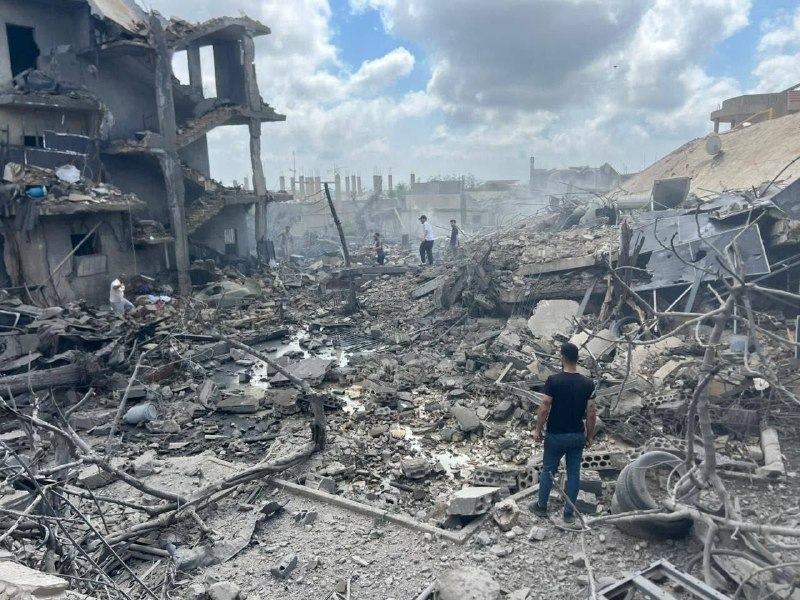

ترور‌‌ هدفمند اسرائیل در جنوب لبنان یه ساختمونو اوردن پایین @IranianMinds

## IranianMinds — post 21846

حزب الله حمله ی موشکی کرد به سمت اسرائیل @IranianMinds

## IranianMinds — post 21845

  <a href="telegram/content/IranianMinds_21845_1780922059.mp4" target="_blank">🎬 Download video</a>

ترور‌‌ هدفمند اسرائیل در جنوب لبنان یه ساختمونو اوردن پایین

@IranianMinds

## IranianMinds — post 21844

  <a href="telegram/content/IranianMinds_21844_1780922061.mp4" target="_blank">🎬 Download video</a>

🔴 حملات اسرائیل به جنوب لبنان

@IranianMinds

## alonews — post 126267

  <a href="telegram/content/alonews_126267_1780922061.webm" target="_blank">🎬 Download video</a>

👈مقام اسرائیلی به شبکه ۱۲ : به درخواست ترامپ، اسرائیل فعلاً حمله به ایران رو متوقف می‌کنه
- ولی حمله‌ها تو جنوب لبنان تو روزهای آینده با قدرت ادامه داره
- اگه حمله به شهرک‌ها و غیرنظامی‌های خودشون ادامه پیدا کنه، حتی ضاحیه رو هم بمبارون می‌کنن

✅ @AloNews خبر جنگ

---
📅 بروزرسانی: 1405/03/18 15:54
---

## VahidOOnLine — post 244354

  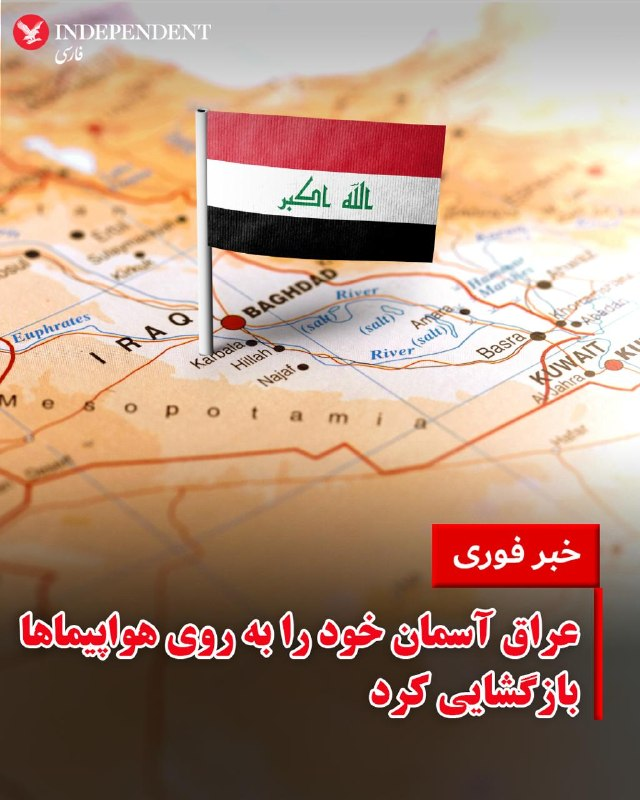

♦️دولت عراق روز دوشنبه ۱۸ خرداد و دقایقی پس از اعلامیه پایان عملیات نظامی سپاه علیه اسرائیل، آسمان خود را بازگشایی کرد.
عراق شامگاه یکشنبه و اندکی پس از بسته شدن حریم هوایی ایران پیش از آغاز حملات موشکی به اسرائیل، آسمان خود را به روی پروازهای بین‌المللی بست.
‌🇸🇦 Indypersian

🤖 @VahidOOnLine

## VahidOOnLine — post 244353

  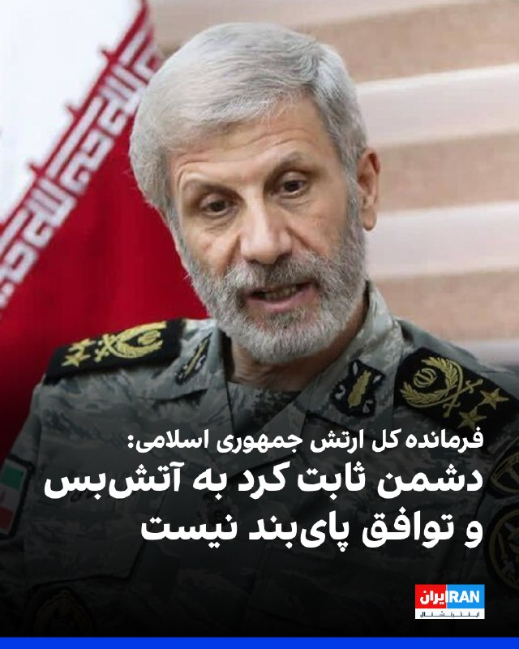

امیر حاتمی، فرمانده کل ارتش جمهوری اسلامی، گفت: «مسئولیت حملات اسرائیل برعهده آمریکا است و در صورت تکرار «شرارت‌های دشمن»، اقدامات ما شدیدتر خواهد شد. »

او افزود: «دشمن در حالی که میانجی گفت‌وگوها در ایران حضور داشت، بار دیگر با عهدشکنی و نقض تمامیت آتش‌بس ثابت کرد به هیچ وجه به آتش‌بس و توافق پای‌بند نیست.»
‌🏁 🇬🇧 IranintlTV

🤖 @VahidOOnLine

## mwarmonitor — post 10464

🔴منبع آمریکایی به CBS: ارتش آمریکا در حملات به ایران مشارکت نداشته است و ترامپ نیز هیچ دستوری برای انجام عملیات یا حمایت دفاعی از اسرائیل در برابر حملات موشکی ایران صادر نکرده است.

@mwarmonitor

## mwarmonitor — post 10463

  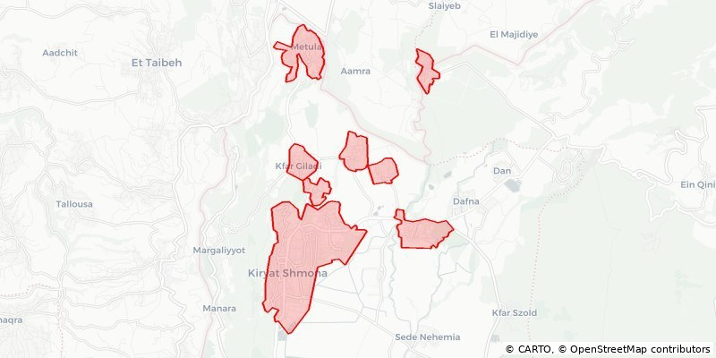

🚨آژیرهای هشدار در کریات شمونه و اطراف آن پس از حمله حزب‌الله به صدا درآمد. @mwarmonitor

## mwarmonitor — post 10462

🔴بحرین در بحبوحه افزایش تنش‌ها در خلیج فارس، یک مانور تخلیه در سراسر پل ملک فهد برگزار می‌کند – وزارت دفاع

@mwarmonitor

## mwarmonitor — post 10461

🔴حملات هوایی به جنوب لبنان @mwarmonitor

## pm_afshaa — post 92911

  <a href="telegram/content/pm_afshaa_92911_1780921452.webm" target="_blank">🎬 Download video</a>

🔴حزب‌الله هم حمله موشکی کرد به سمت اسرائیل و آژیرها فعال شد.

💧 Rainbet.com the #1 Non-KYC Crypto Casino & Sportsbook @rainbetcom

😁 @Pm_Afshaa

## pm_afshaa — post 92909

  <a href="telegram/content/pm_afshaa_92909_1780921453.webm" target="_blank">🎬 Download video</a>

🔴هم‌اکنون جنوب لبنان :

💧 Rainbet.com the #1 Non-KYC Crypto Casino & Sportsbook @rainbetcom

😁 @Pm_Afshaa

## IranIntlTV — post 341177

  

امیر حاتمی، فرمانده کل ارتش جمهوری اسلامی، گفت: «مسئولیت حملات اسرائیل برعهده آمریکا است و در صورت تکرار «شرارت‌های دشمن»، اقدامات ما شدیدتر خواهد شد. »

او افزود: «دشمن در حالی که میانجی گفت‌وگوها در ایران حضور داشت، بار دیگر با عهدشکنی و نقض تمامیت آتش‌بس ثابت کرد به هیچ وجه به آتش‌بس و توافق پای‌بند نیست.»
https://iranintl.com/202606082067

## IranIntlTV — post 341176

  <a href="telegram/content/IranIntlTV_341176_1780921455.mp4" target="_blank">🎬 Download video</a>

رافائل گروسی در پاسخ به پرسش ایران‌اینترنشنال درباره احتمال دستیابی تهران و واشینگتن به توافقی خارج از چارچوب نظارتی آژانس گفت: «دو کشور می‌توانند هر توافقی که می‌خواهند داشته باشند، اما امیدوارم چنین کاری نکنند.»

جزییات این نشست در گفت‌وگو با احمد صمدی، خبرنگار ایران‌اینترنشنال
@iranintltv

## FarsiVOA — post 220024

🔺گزارش‌ها از حمله به یک شناور در نزدیکی عمان؛ درخواست کمک فوری ۲۴ دریانورد هندی

◾️گزارش‌ها حاکی است ۲۴ دریانورد هندی سوار بر شناوری که ظاهراً در نزدیکی سواحل عمان هدف حمله قرار گرفته است، خواستار کمک فوری شده‌اند.

⬇️ بیشتر بخوانید:

https://ir.voanews.com/a/indian-seafarers-seek-urgent-rescue/8158511.html

## Persian_Trend_Official — post 16181

تصاویری از بمباران شدید امروز جنوب لبنان

📝 Amir

📌 @persian_trend_official
پرشین ترند | متفاوت‌ترین کانال نظامی

## Persian_Trend_Official — post 16180

  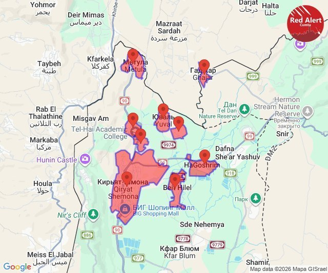

آژیر خطر حملات راکتی در کریات شمونا و متولا در پی حمله راکتی حزب‌الله به صدا درآمد.

📝 Amir

📌 @persian_trend_official
پرشین ترند | متفاوت‌ترین کانال نظامی

## Persian_Trend_Official — post 16179

  <a href="telegram/content/Persian_Trend_Official_16179_1780921458.mp4" target="_blank">🎬 Download video</a>

امروز در کنار حملات موشکی سپاه پاسداران به اسرائیل، مقر گروهک های تجزیه طلب در کردستان عراق مورد حمله پهپادی سپاه واقع شد.

📝 Amir

📌 @persian_trend_official
پرشین ترند | متفاوت‌ترین کانال نظامی

## IranianMinds — post 21843

🔴 حزب الله ۵ موشک دیگه شلیک کرد به سمت شمال اسرائیل @IranianMinds

## IranianMinds — post 21842

حزب الله حمله ی موشکی کرد به سمت اسرائیل @IranianMinds

## IranianMinds — post 21841

🔴 حملات شدید جنگنده های اسرائیلی به لبنان

@IranianMinds

## IranianMinds — post 21840

🔴 ارتش اسرائیل مناطق بابلیه، کوثریه‌الروز، زراریه، عرب‌سلیم، خربه‌الدویر و برج‌الشمالی در جنوب لبنان را هدف قرار داده است

@IranianMinds

## IranianMinds — post 21839

یک‌ روز‌ کاملا عادی در خاورمیانه

مدت زمان صلح : ۵ دقیقه

## IranianMinds — post 21838

  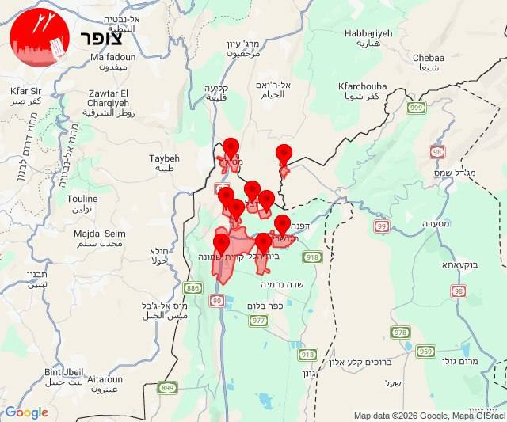

حزب الله حمله ی موشکی کرد به سمت اسرائیل

@IranianMinds

## IranianMinds — post 21837

🔴 ارتش اسرائیل همزمان داره ۴ منطقه در‌ جنوب لبنان رو بمباران میکنه

@IranianMinds

## BBCPersian — post 283177

🖊 لین برون، بی‌بی‌سی

🔻 شی جین‌پینگ، رهبر چین، پس از آنکه در هفته‌های گذشته به طور متوالی میزبان رهبران دیگر کشورها بود، این هفته خود راهی سفری خارجی شده و مقصدش کره شمالی است.

این دیدار که برای روزهای ۸ و ۹ ژوئن برنامه‌ریزی شده و از مدت‌ها پیش انتظار آن می‌رفت، پس از دیدار ماه گذشته شی با ولادیمیر پوتین، رئیس‌جمهور روسیه، و گفت‌وگوی رودرروی او با دونالد ترامپ، رئیس‌جمهور آمریکا، برگزار می‌شود.

شی جین‌پینگ با سفر مستقیم به پیونگ‌یانگ پس از این دیدارها و انتخاب کره شمالی به‌عنوان نخستین مقصد خارجی خود در سال ۲۰۲۶، بر اهمیت اتحاد با همسایه غیرقابل‌پیش‌بینی‌اش تاکید می‌کند.

اون جو چوی، پژوهشگر موسسه سجونگ در سئول، می‌گوید رابطه این دو کشور «از نظر راهبردی ضروری، اما خالی از اصطکاک نیست».

این دیدار، فراتر از تعاملات عمومی کاملا برنامه‌ریزی‌شده، به پکن و پیونگ‌یانگ فرصتی می‌دهد تا پس از گذشته‌ای پرفراز و نشیب، به شراکت خود که «با خون شکل گرفته» است، جانی تازه ببخشند.

بیشتر بخوانید:
https://bbc.in/4uPXbno
📸GettyImages/ Reuters/ AFP via Getty Images/ KCNA via Reuters
@BBCPersian

## alonews — post 126266

  <a href="telegram/content/alonews_126266_1780921461.webm" target="_blank">🎬 Download video</a>

👈کانال ۱۲:
آژیر خطر در کریات شمونا و حومه آن در شمال اسرائیل

✅ @AloNews خبر جنگ

---
📅 بروزرسانی: 1405/03/18 15:43
---

## VahidOOnLine — post 244352

  <a href="telegram/content/VahidOOnLine_244352_1780920826.mp4" target="_blank">🎬 Download video</a>

رافائل گروسی، مدیرکل آژانس بین‌المللی انرژی اتمی، در پاسخ به پرسش احمد صمدی، خبرنگار ایران‌اینترنشنال، درباره احتمال دستیابی تهران و واشنگتن به توافقی خارج از چارچوب نظارتی آژانس، با تاکید بر ضرورت نقش آژانس در هرگونه توافق احتمالی هشدار داد که توافقی فاقد سازوکار موثر راستی‌آزمایی، در عمل «توهمی از توافق» خواهد بود.
‌🏁 🇬🇧 IranintlTV

🤖 @VahidOOnLine

## VahidOOnLine — post 244351

  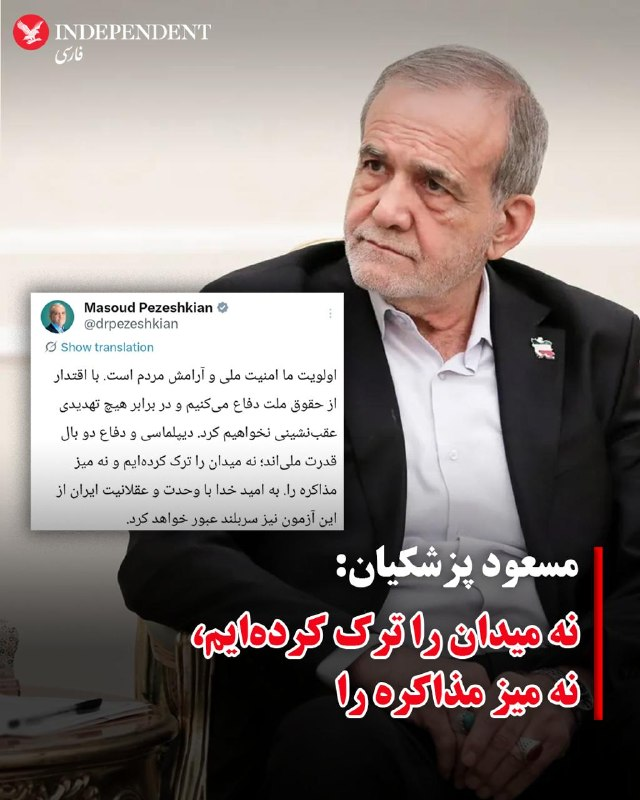

♦️دقایقی پس از آن‌که قرارگاه مرکزی خاتم‌الانبیا از پایان عملیات نیروهای مسلح جمهوری اسلامی علیه اسرائیل خبر داد، مسعود پزشکیان، رئیس‌جمهوری اسلامی ایران، با انتشار پیامی در شبکه اجتماعی ایکس نوشت: جمهوری اسلامی در برابر تهدیدها عقب‌نشینی نخواهد کرد.
پزشکیان در این پیام نوشت: «اولویت ما امنیت ملی و آرامش مردم است. با اقتدار از حقوق ملت دفاع می‌کنیم و در برابر هیچ تهدیدی عقب‌نشینی نخواهیم کرد.»
او همچنین با اشاره به رویکرد تهران در قبال تحولات جاری افزود: «دیپلماسی و دفاع دو بال قدرت ملی‌اند؛ نه میدان را ترک کرده‌ایم و نه میز مذاکره را.»
پزشکیان در ادامه نوشت: «به امید خدا با وحدت و عقلانیت، ایران از این آزمون نیز سربلند عبور خواهد کرد.»
این اظهارات در حالی مطرح می‌شود که در ۱۶ ساعت گذشته ایران و اسرائیل حملات هوایی متقابلی را علیه یکدیگر انجام داده‌اند. قرارگاه مرکزی خاتم‌الانبیا روز دوشنبه با انتشار بیانیه‌ای از پایان عملیات نیروهای مسلح جمهوری اسلامی علیه اسرائیل خبر داد، اما هشدار داد در صورت ادامه حملات، پاسخ‌های شدیدتری در راه خواهد بود.
‌🇸🇦 Indypersian

🤖 @VahidOOnLine

## VahidOOnLine — post 244350

  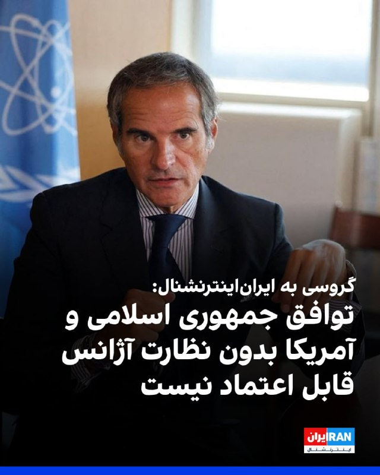

رافائل گروسی، مدیرکل آژانس بین‌المللی انرژی اتمی، در پاسخ به پرسش ایران‌اینترنشنال درباره احتمال دستیابی تهران و واشینگتن به توافقی خارج از چارچوب نظارتی آژانس گفت: «دو کشور می‌توانند هر توافقی که می‌خواهند داشته باشند، اما امیدوارم چنین کاری نکنند.»

او با تاکید بر نقش این نهاد در هر توافق احتمالی میان جمهوری اسلامی و آمریکا، گفت توافقی که فاقد راستی‌آزمایی مستقل و موثر باشد، در عمل «توهمی از توافق» خواهد بود.

گروسی افزود: «فکر می‌کنم خود آن‌ها نیز آگاه باشند که توافقی که راستی‌آزمایی مناسب بخشی از آن نباشد، در واقع توهمی از توافق است؛ زیرا نمی‌دانید آیا طرف مقابل به تعهدات و مفاد توافق خود پایبند بوده است یا خیر.»

مدیرکل آژانس همچنین درباره احتمال بازگشت کامل الزامات پیشین شورای امنیت سازمان ملل علیه ایران گفت در چنین شرایطی آژانس وظیفه خواهد داشت اجرای همه این تعهدات را راستی‌آزمایی کند.
iranintl
‌🏁 🇬🇧 IranintlTV

🤖 @VahidOOnLine

## WithYashar — post 14018

یک مقام آمریکایی به آکسیوس:
تماس تلفنی ترامپ با نتانیاهو «مودبانه» بوده، اما نتانیاهو با درخواست ترامپ برای توقف اقدامات بیشتر مخالفت کرده.

به نتانیاهو صراحتا گفته شد که این چرخه باید پایان یابد. آمریکا با این حملات موافقت نکرد و از آنها حمایت نکرد.
@withyashar

## WithYashar — post 14017

عراق از بازگشایی حریم هوایی خود خبر داد
@withyashar

## mwarmonitor — post 10460

📌رسانه‌های اسرائیلی : نتانیاهو می‌گوید تماس با ترامپ «از نظر مواضع هماهنگ و توافقی» بوده است.

@mwarmonitor

## mwarmonitor — post 10459

  

🔴حملات هوایی به جنوب لبنان

@mwarmonitor

## pm_afshaa — post 92908

  <a href="telegram/content/pm_afshaa_92908_1780920829.webm" target="_blank">🎬 Download video</a>

🔴هم‌اکنون حمله اسرائیل به شهر صور در جنوب لبنان :

💧 Rainbet.com the #1 Non-KYC Crypto Casino & Sportsbook @rainbetcom

😁 @Pm_Afshaa

## pm_afshaa — post 92907

  <a href="telegram/content/pm_afshaa_92907_1780920830.webm" target="_blank">🎬 Download video</a>

🔴عراق حریم هوایی خودش رو باز کرد.

💧 Rainbet.com the #1 Non-KYC Crypto Casino & Sportsbook @rainbetcom

😁 @Pm_Afshaa

## pm_afshaa — post 92906

  <a href="telegram/content/pm_afshaa_92906_1780920831.webm" target="_blank">🎬 Download video</a>

🔴یک مقام آمریکایی به آکسیوس:
تماس تلفنی ترامپ با نتانیاهو «مودبانه» بوده، اما نتانیاهو با درخواست ترامپ برای توقف اقدامات بیشتر مخالفت کرده.

به نتانیاهو صراحتا گفته شد که این چرخه باید پایان یابد. آمریکا با این حملات موافقت نکرد و از آنها حمایت نکرد.

💧 Rainbet.com the #1 Non-KYC Crypto Casino & Sportsbook @rainbetcom

😁 @Pm_Afshaa

## DEJradio — post 5467

  <a href="telegram/content/DEJradio_5467_1780920831.webm" target="_blank">🎬 Download video</a>

🔺📢 یک منبع امنیتی:
کمبود کالاهای اساسی ناشی از محاصره دریایی ایران جدی خواهد شد

هم‌زمان با آغاز موج تازه‌ای از درگیری میان جمهوری اسلامی و اسرائیل، یک منبع اختصاصی به دژ گفت: «محاصره دریایی جمهوری اسلامی جدی و غیرقابل نفوذ است و قرار است ماه‌ها ادامه داشته باشد و هیچ انتظاری برای لغو محاصره دریایی وجود ندارد.»

او تأکید کرد، با ادامه جنگ‌طلبی‌های جمهوری اسلامی به زودی با کمبود کالاهای اساسی، روغن، برنج، آرد مواجه خواهید شد و تنها راه برای مردم ذخیره‌سازی است.

#جنگ #محاصره_دریایی
@DEJradio

## VahidOnline — post 76061

  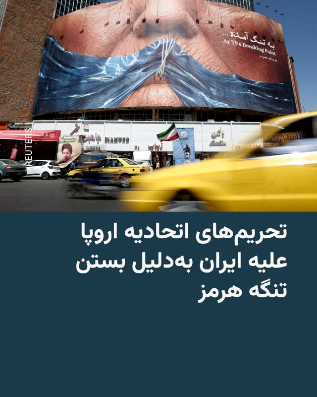

کایا کالاس، مسئول سیاست خارجی اتحادیه اروپا، روز دوشنبه ۱۸ خرداد اعلام کرد که اتحادیه اروپا به‌دلیل تهدید آزادی تردد دریایی توسط جمهوری اسلامی، تحریم‌هایی را علیه شماری از افراد و نهادهای ایرانی اعمال کرده است.

کالاس این اظهارات را در جمع خبرنگاران و در حاشیه نشست وزیران دفاع اتحادیه اروپا در قبرس مطرح کرد.

هنوز جزئیات بیشتری درباره این تحریم‌ها ارائه نشده است.
@VahidHeadline

📡 @VahidOnline

## kianmeli1 — post 87807

🔴فوری-اسراییل مجددا آتش بس را نقض کرد و در حال شخم زدن لبنان است

سپاه دقایقی پیش اعلام کرد اگر به لبنان حمله ای شود ٫ مجدد به اسراییل حمله میکنیم
https://t.me/kianmeli1

## kianmeli1 — post 87805

🔴کانال ۱۴ اسرائیل و رسانه های دیگر خارجی:

سردار احمد وحیدی ترور شده

باید صبر کرد و دید واقعیت چیست!...
https://t.me/kianmeli1

## kianmeli1 — post 87804

🔴هم‌زمان با آغاز دوباره درگیری‌های نظامی میان جمهوری اسلامی و اسرائیل، قیمت ارز در بازار آزاد ایران بار دیگر روندی صعودی گرفت. بهای هر دلار آمریکا به ۱۷۸ هزار تومان رسید.
https://t.me/kianmeli1

## kianmeli1 — post 87803

  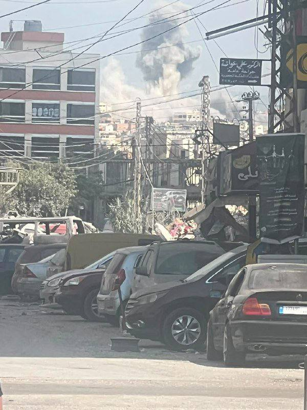

🔴گزارش‌های محلی حاکی از حملات هوایی اسرائیل به جنوب لبنان است.
https://t.me/kianmeli1

## kianmeli1 — post 87802

  <a href="telegram/content/kianmeli1_87802_1780920833.mp4" target="_blank">🎬 Download video</a>

🔴نیروی دفاعی اسرائیل (IDF) ویدئویی منتشر کرده که حملات به یکی از ۹ سامانه پدافند هوایی جمهوری اسلامی را نشان می‌دهد. این حملات توسط ده‌ها جنگنده نیروی هوایی اسرائیل (IAF) در غرب و مرکز ایران انجام شده است.

ارتش اعلام کرده که نابودی این سامانه‌ها، برتری هوایی اسرائیل بر جمهوری اسلامی را افزایش می‌دهد و هدف آن ادامه حذف تهدیدها علیه شهروندان اسرائیلی است.
https://t.me/kianmeli1

## kianmeli1 — post 87801

‏🔴سخنگوی جمعیت هلال احمر: از ساعت ۴ صبح بامداد دوشنبه ۱۸ خرداد، ۱۲ اصابت در کشور به ثبت رسیده است که هیچ کشته و مصدومی نداشته است
https://t.me/kianmeli1

## IranIntlTV — post 341175

  <a href="telegram/content/IranIntlTV_341175_1780920834.mp4" target="_blank">🎬 Download video</a>

رافائل گروسی، مدیرکل آژانس بین‌المللی انرژی اتمی، در پاسخ به پرسش احمد صمدی، خبرنگار ایران‌اینترنشنال، درباره احتمال دستیابی تهران و واشنگتن به توافقی خارج از چارچوب نظارتی آژانس، با تاکید بر ضرورت نقش آژانس در هرگونه توافق احتمالی هشدار داد که توافقی فاقد سازوکار موثر راستی‌آزمایی، در عمل «توهمی از توافق» خواهد بود.

## IranIntlTV — post 341174

  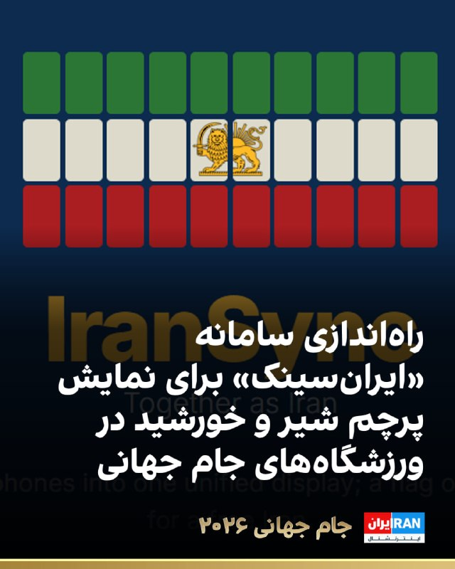

🔻در پی اعلام محدودیت‌های فدراسیون بین‌المللی فوتبال (فیفا) درباره ورود پرچم شیر و خورشید به ورزشگاه‌های جام جهانی، گروهی از فعالان حوزه فناوری سامانه‌ای را با نام «ایران‌سینک» طراحی کرده‌اند که امکان نمایش نمادها و پیام‌های اعتراضی را از طریق تلفن‌های همراه تماشاگران فراهم می‌کند.

🔹در روزهای اخیر، شماری از ایرانیان خارج از کشور به‌ویژه در آمریکا، تلاش کرده‌اند با روش‌های مختلف به تصمیم فیفا در خصوص ممنوعیت ورود پرچم شیر و خورشید به ورزشگاه‌های جام جهانی اعتراض کنند و راه‌هایی برای نمایش آن در جریان مسابقات بیابند.

🔹سالار غلامی، کاپیتان پیشین تیم ملی بوکس، در مصاحبه با ایران‌اینترنشنال از راه‌اندازی «ایران‌سینک» خبر داد و اعلام کرد این پلتفرم با هماهنگ‌سازی نمایشگر تلفن‌های همراه افراد حاضر در ورزشگاه، تصاویر بزرگ و یکپارچه‌ای از پرچم شیر و خورشید یا پیام‌های جمعی ایجاد می‌کند.

🔹جزییات بیشتر را در سایت بخوانید

@iranintltvsport

## IranIntlTV — post 341173

  <a href="telegram/content/IranIntlTV_341173_1780920835.mp4" target="_blank">🎬 Download video</a>

بر اساس اعلام ارتش اسرائیل، نیروهای دفاعی این کشور روز دوشنبه تصاویر هوایی منتشر کردند که به گفته آن‌ها، لحظه حمله به یک سامانه پدافند هوایی در ایران را نشان می‌دهد.
@iranintltv

## IranIntlTV — post 341172

  

رافائل گروسی، مدیرکل آژانس بین‌المللی انرژی اتمی، در پاسخ به پرسش ایران‌اینترنشنال درباره احتمال دستیابی تهران و واشینگتن به توافقی خارج از چارچوب نظارتی آژانس گفت: «دو کشور می‌توانند هر توافقی که می‌خواهند داشته باشند، اما امیدوارم چنین کاری نکنند.»

او با تاکید بر نقش این نهاد در هر توافق احتمالی میان جمهوری اسلامی و آمریکا، گفت توافقی که فاقد راستی‌آزمایی مستقل و موثر باشد، در عمل «توهمی از توافق» خواهد بود.

گروسی افزود: «فکر می‌کنم خود آن‌ها نیز آگاه باشند که توافقی که راستی‌آزمایی مناسب بخشی از آن نباشد، در واقع توهمی از توافق است؛ زیرا نمی‌دانید آیا طرف مقابل به تعهدات و مفاد توافق خود پایبند بوده است یا خیر.»

مدیرکل آژانس همچنین درباره احتمال بازگشت کامل الزامات پیشین شورای امنیت سازمان ملل علیه ایران گفت در چنین شرایطی آژانس وظیفه خواهد داشت اجرای همه این تعهدات را راستی‌آزمایی کند.
iranintl.com/202606080842

## Shin_Persian — post 6750

Shin ✓ @hey_itsmyturn
Mon, 08 Jun 2026 12:11:19 UTC

Intense airstrikes on Kharayeb, southern Lebanon

فارسی

حملات هوایی شدید به الخرایب در جنوب لبنان

𝕏 · @shin_persian

## FarsiVOA — post 220023

فرماندهی مرکزی ایالات متحده، سنتکام، با انتشار ویدیویی اعلام کرد نیروهای آمریکایی مستقر در خاورمیانه همچنان در وضعیت آماده‌باش و هوشیاری قرار دارند.

سنتکام در این پیام کوتاه تاکید کرد نیروهای آمریکا در سراسر منطقه برای انجام ماموریت‌های خود آماده هستند.

@FarsiVOA

## DW_Farsi — post 125687

  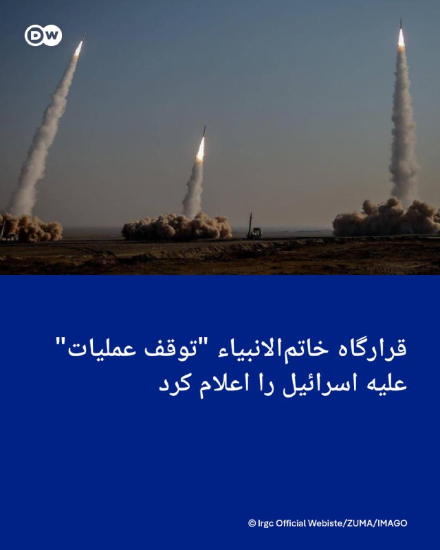

🔶 قرارگاه خاتم‌الانبیاء "توقف عملیات" علیه اسرائیل را اعلام کرد

قرارگاه مرکزی خاتم‌الانبیاء از "توقف عملیات" علیه اسرائیل خبر داد. در اطلاعیه‌ این قرارگاه که خبرگزاری‌های داخلی منتشر کرده‌اند، تأکید شده است که "در صورت تداوم تجاوزات و شرارت‌ها از جمله در جنوب لبنان" نیروهای مسلح جمهوری اسلامی حملات خود را "شدیدتر و کوبنده‌تر" از سر خواهند گرفت.

قرارگاه خاتم‌الانبیاء اندکی پیش در اطلاعیه‌ای دیگر مدعی شده بود که سپاه پاسداران در موج جدید حملات خود علیه اسرائیل "ضربات سنگین، هدفمند، هوشمندانه و خسارت‌بار" را به اهداف "مهم و حساس" این کشور وارد آورد.

ابراهیم ذوالفقاری، سخنگوی قرارگاه مرکزی حضرت خاتم‌الانبیا، در اطلاعیه‌ای آمریکا و اسرائیل را "دشمنان بازنده در جنگ" خواند و هشدار داده بود که جمهوری اسلامی و "نیروهای مقاومت" در منطقه "هرگز سر تسلیم فرود نخواهند آورد و در صورت تداوم تجاوز و شرارت با شدت بیشتری با آنها برخورد خواهد شد".

از سوی دیگر علاءالدین بروجردی، رئیس کمیسیون امنیت ملی مجلس شورای اسلامی، تهدید کرده است که ایران تسلیحاتی دارد که اگر به کار بگیرد، "زندگی" اسرائیلی‌ها "مختل می‌شود".

سازمان اطلاعات سپاه پاسداران نیز با انتشار پیامی در شبکه ایکس مدعی "موفقیت" عملیات "نظامی، امنیتی و سایبری" شامگاه یکشنبه علیه اسرائیل شد.

@dw_farsi

## RadioFarda — post 158057

🔸شی جین‌پینگ، رئیس‌جمهور چین، که به پیونگ‌یانگ سفر کرده، می‌گوید روابط میان چین و کره شمالی «در آستانه فصلی نوین در تاریخ خود» قرار گرفته است.

🔸او این اظهارات را روز دوشنبه، ۱۸ خرداد، همزمان با ورود به پیونگ‌یانگ برای برگزاری نشستی کم‌سابقه با رهبر این کشور، کیم جونگ اون، بیان کرد. صحبت‌های او در رسانه دولتی کره شمالی منتشر شد.

🔸رئیس جمهور چین به روزنامه رودونگ سینمون گفت توسعه روابط با کره شمالی، سیاست «ثابت و تغییرناپذیر» چین است و دو کشور همکاری‌ها و تبادلات خود را در همه زمینه‌ها تقویت خواهند کرد.

🔸خبرگزاری رویترز نوشته این سفر از آن جهت اهمیت دارد که نخستین سفر خارجی شی در سال جاری محسوب می‌شود. پکن در سال‌های اخیر به دنبال نزدیک‌تر کردن پیونگ‌یانگ به خود بوده است.

🔸رسانه‌های دولتی چین گزارش دادند که شی پس از ورود به پیونگ‌یانگ با استقبال رسمی بر روی فرش قرمز از سوی کیم جونگ اون و همسرش روبه‌رو شد. همچنین یگان تشریفات نظامی به او ادای احترام کرد و کودکانی دسته‌گل‌هایی به وی تقدیم کردند.

@RadioFarda

## IranianMinds — post 21835

بعد تهدید سپاه اسرائیل داره شخم میزنه جنوب لبنان رو

@IranianMinds

## IranianMinds — post 21834

🔴 حملات هوایی اسرائیل به الخرایب در جنوب لبنان

@IranianMinds

## IranianMinds — post 21833

  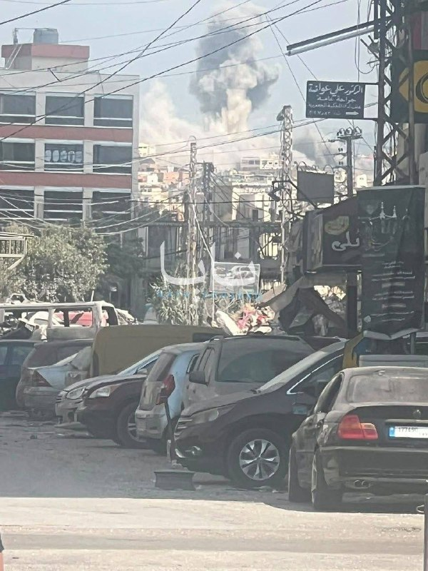

حملات شدید اسرائیل به جنوب لبنان

@IranianMinds

## BBCPersian — post 283176

🔻گروسی: در یک سال گذشته به مراکز مهم هسته‌ای ایران دسترسی نداشته‌ایم

مدیر کل آژانس بین‌المللی انرژی اتمی در نشست خبری گفت این آژانس تقریبا حدود یک سال است به برخی از مراکز مهم هسته‌ای ایران دسترسی نداشته است.

رافائل گروسی تاکید کرد که هرچند قبل از آن هم ایران به برخی از سوال‌ها پاسخ‌ کامل نمی‌داد و مواردی را رعایت نمی‌کرد، با آغاز جنگ دوازده روزه این عدم دسترسی بیشتر شد.

او که در نشست خبری پیش از آغاز جلسه فصلی شورای حکام صحبت می‌کرد گفت اخیراً به برخی از مراکز از جمله بوشهر دسترسی فراهم و مواردی بررسی شده است.

آقای گروسی اضافه کرد: «آنچه اهمیت دارد این است که به‌روشنی ثابت شود ایران به تعهدات خود ذیل پیمان منع گسترش سلاح‌های هسته‌ای کاملا پایبند است.»

مدیر کل آژانس بین‌المللی انرژی اتمی توضیح داد: «تنها از این طریق می‌توان اطمینان حاصل کرد و تأیید کرد که هیچ‌گونه انحرافی در مواد هسته‌ای و هیچ فعالیت غیرقانونی دیگری وجود ندارد.»

نشست فصلی شورای حکام آژانس بین‌المللی انرژی اتمی با حضور نمایندگان ۳۵ کشور عضو در وین امروز (دوشنبه) آغاز شد.

یکی از موضوع‌های این نشست پنج روزه ضمانت‌های ان‌پی‌تی و قطعنامه‌های شورای امنیت سازمان ملل درباره ایران است.

خبرگزاری رویترز دیروز گفت که پیش‌نویس قطعنامه‌ای را دیده است که آمریکا تهیه و برای سایر کشورهای عضو شورای حکام آژانس بین‌المللی انرژی اتمی ارسال کرده است.

این قطعنامه در نشست شورای حکام این آژانس در وین بررسی می‌شود.

بنابر این گزارش رویترز، در متن این قطعنامه آمده است که ایران باید «اطلاعات دقیقی در مورد میزان مواد هسته‌ای و تاسیسات هسته‌ای تحت حفاظت در ایران را در اختیار آژانس قرار دهد» و «برای تایید این اطلاعات بدون تاخیر تمام دسترسی‌های لازم را آژانس بدهد.»

معاون وزیر خارجه ایران در آستانه نشست شورای حکام، آقای گروسی را متهم کرد که گزارش فنی را به «ابزار فشار سیاسی» تبدیل می‌کند.

@BBCPersian

## alonews — post 126263

  <a href="telegram/content/alonews_126263_1780920837.webm" target="_blank">🎬 Download video</a>

👈حملات به لبنان ادامه دارد

✅ @AloNews خبر جنگ

## alonews — post 126262

  <a href="telegram/content/alonews_126262_1780920838.webm" target="_blank">🎬 Download video</a>

👈خبرنگار الجزیره: حمله هوایی اسرائیل به منطقه مسکونی در صور، جنوب لبنان

✅ @AloNews خبر جنگ

## alonews — post 126261

  

🚨 بیانیه رسمی فیفا :
دیدار ایران و مصر قطعا دیدار افتخار همجنسگرایان خواهد بود و به هیچ عنوان این رویداد لغو نخواهد شد.

کاپیتان های هردو تیم باید بازوبند رنگین کمونی🏳‍🌈 ببندن
@AloSport

---
📅 بروزرسانی: 1405/03/18 15:33
---

## VahidOOnLine — post 244349

  <a href="telegram/content/VahidOOnLine_244349_1780920233.mp4" target="_blank">🎬 Download video</a>

⭕️سپاه در ویدئویی هشدار داد: شناورهای «کشورهای متخاصم» در تنگه هرمز هدف قرار می‌گیرند

♦️همزمان با بالا گرفتن جنگ میان ایران و اسرائیل، خبرگزاری حکومتی فارس، روز دوشنبه ۱۸ خرداد ماه ویدئویی از نیروی دریایی سپاه پاسداران منتشر کرده که در آن هشدار داده می‌شود شناورهای متعلق به «کشورهای متخاصم» حق ورود به تنگه هرمز را ندارند و در صورت مشاهده هدف قرار خواهند گرفت.

در این ویدئو، پیامی بی‌سیم خطاب به شناورهای سپاه پخش می‌شود که در آن آمده است: «به تمامی شناورهای رزمی سپاه اعلام می‌گردد؛ ورود هرگونه شناور رزمی از کشورهای متخاصم به آب‌های خلیج فارس ممنوع بوده و در صورت مشاهده، بی‌درنگ مورد هدف قرار دهید.»

در ادامه، خبرنگار حاضر در شناور با فردی به نام «امیر» که به عنوان یکی از نیروهای عملیاتی معرفی می‌شود گفتگو می‌کند. او در این ویدئو می‌گوید: «هیچ‌گونه شناور بدون اجازه ما حق عبور از تنگه هرمز را ندارد. تاکید می‌کنم حق عبور از تنگه هرمز را ندارد.»
این ویدئو پس از آن منتشر شد که ایران و اسرائیل از شامگاه یکشنبه حملات هوایی متقابلی را علیه یکدیگر انجام دادند.

همزمان، قرارگاه مرکزی خاتم‌الانبیا ظهر دوشنبه با انتشار بیانیه‌ای اعلام کرد نیروهای مسلح جمهوری اسلامی ایران پس از «پاسخی دردناک» به اسرائیل، توقف عملیات را اعلام کرده‌اند.
‌🇸🇦 Indypersian

🤖 @VahidOOnLine

## VahidOOnLine — post 244348

  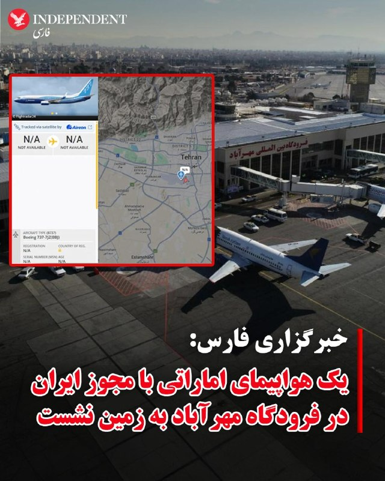

♦️روز دوشنبه ۱۸ خرداد و دقایقی پس از آن‌که قرارگاه مرکزی خاتم‌الانبیا از پایان عملیات نیروهای مسلح جمهوری اسلامی علیه اسرائیل خبر داد، خبرگزاری حکومتی فارس گزارش کرد یک هواپیما از مبدا امارات متحده عربی در فرودگاه مهرآباد تهران فرود آمده است.
فارس به استناد داده‌های ناوبری پروازها نوشت که مسیر پروازی این هواپیما از مبدا امارات به مقصد تهران در آسمان ایران رصد شده است.
این گزارش در حالی منتشر شده که از شامگاه یکشنبه ایران و اسرائیل حملات هوایی متقابلی را علیه یکدیگر انجام داده‌اند و از صبح دوشنبه نیز فعالیت پروازی در فرودگاه‌های اصلی تهران متوقف شده است.
خبرگزاری فارس به نقل از روابط عمومی سازمان هواپیمایی کشوری گزارش داد این پرواز با مجوز مقام‌های جمهوری اسلامی انجام شده و هواپیما با عبور از فضای شرقی ایران خود را به تهران رسانده است.
مقام‌های سازمان هواپیمایی جزئیاتی درباره نوع هواپیما، شرکت هواپیمایی، هویت سرنشینان یا هدف این پرواز ارائه نکرده‌اند.
قرارگاه مرکزی خاتم‌الانبیا روز دوشنبه در بیانیه‌ای اعلام کرد نیروهای مسلح جمهوری اسلامی در پاسخ به آنچه «تجاوزات و شرارت‌های رژیم اسرائیل» خوانده شد، «پاسخی دردناک» به اسرائیل داده‌اند و پس از آن توقف عملیات را اعلام کرده‌اند. این قرارگاه در عین حال هشدار داد در صورت ادامه حملات اسرائیل، اقدامات «بسیار شدیدتر و کوبنده‌تر» انجام خواهد شد.
‌🇸🇦 Indypersian

🤖 @VahidOOnLine

## VahidOOnLine — post 244338

  <a href="telegram/content/VahidOOnLine_244338_1780920236.mp4" target="_blank">🎬 Download video</a>

ترامپ می‌گوید: «من تصمیم می‌گیرم.»

نتانیاهو همچنان بر حفظ فشار بر ایران تأکید دارد. اما شاید پرسش اصلی این نباشد که آیا میان این دو اختلافی وجود دارد یا نه. پرسش مهم‌تر این است که هر کدام «پیروزی» را چگونه تعریف می‌کنند.
‌🏁 🇬🇧 ManotoTV

🤖 @VahidOOnLine

## VahidOOnLine — post 244337

  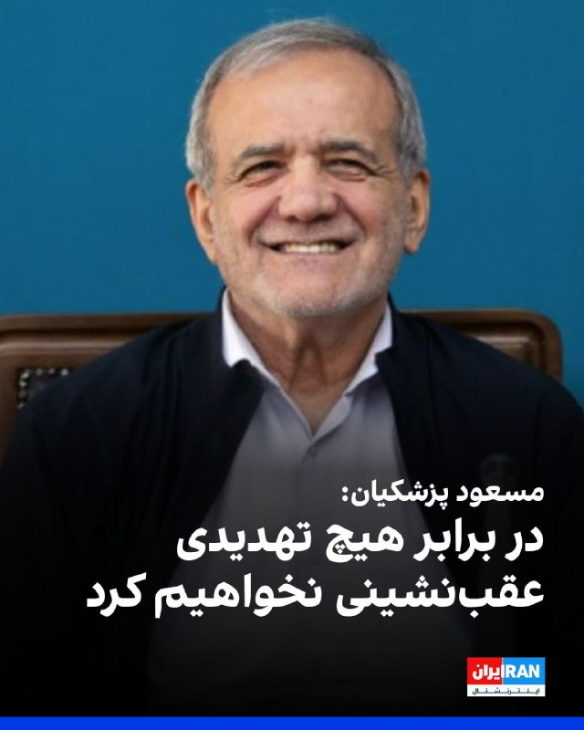

مسعود پزشکیان، رییس دولت جمهوری اسلامی، در شبکه ایکس نوشت: «اولویت ما امنیت ملی و آرامش مردم است و با اقتدار از حقوق ملت دفاع می‌کنیم و در برابر هیچ تهدیدی عقب‌نشینی نخواهیم کرد.»

او اضافه کرد: «دیپلماسی و دفاع دو بال قدرت ملی‌اند؛ نه میدان را ترک کرده‌ایم و نه میز مذاکره را و با وحدت و عقلانیت، از این آزمون نیز سربلند عبور خواهیم کرد.»
iranintl
‌🏁 🇬🇧 IranintlTV

🤖 @VahidOOnLine

## VahidOOnLine — post 244336

  

بهنام سعیدی، دبیر کمیسیون امنیت ملی مجلس، گفت که جمهوری اسلامی از ابتدای مذاکرات تاکید داشته است که هرگونه آتش‌بس و تفاهم باید همه جبهه‌ها، به‌ویژه لبنان را در بر بگیرد.

او افزود جمهوری اسلامی پیش از این هشدار داده بود که هرگونه «حمله و تجاوز» به بیروت با واکنش مواجه خواهد شد.

سعیدی همچنین گفت پاسخ جمهوری اسلامی در واکنش به تحولات اخیر، «در چارچوب اصل بازدارندگی» انجام شده است.
iranintl
‌🏁 🇬🇧 IranintlTV

🤖 @VahidOOnLine

## mwarmonitor — post 10458

📌آمیت سیگال خبرنگار کانال ۱۲ اسرائیل
این‌ها معادله‌ها هستند:

حزب‌الله – اگر اسرائیل به جنوب لبنان حمله کند، ما به کریات شمونه حمله خواهیم کرد.

اسرائیل – اگر به کریات شمونه حمله شود، ما به بیروت حمله خواهیم کرد.

ایران – اگر بیروت هدف حمله قرار گیرد، ما به اسرائیل حمله خواهیم کرد.

اسرائیل – اگر اسرائیل مورد حمله قرار گیرد، ما به ایران حمله خواهیم کرد.

ایران – اگر جنوب لبنان هدف حمله قرار گیرد، ما به اسرائیل حمله خواهیم کرد.

چهار مورد اول قبلاً اتفاق افتاده‌اند؛ مورد پنجم مهم است. هدف آن: وادار کردن ترامپ به اینکه اسرائیل را مجبور کند حملاتش به حزب‌الله در جنوب لبنان را متوقف کند.

ساعت‌های آینده مشخص خواهد کرد.

@mwarmonitor

## mwarmonitor — post 10457

💥«انفجارهایی شهر اربیل را تکان داد»

## pm_afshaa — post 92905

  <a href="telegram/content/pm_afshaa_92905_1780920237.webm" target="_blank">🎬 Download video</a>

🔴صداوسیما واسه بار هزارم اعلام پیروزی کرد و گفت فعلا تموم شد.

💧 Rainbet.com the #1 Non-KYC Crypto Casino & Sportsbook @rainbetcom

😁 @Pm_Afshaa

## pm_afshaa — post 92904

  <a href="telegram/content/pm_afshaa_92904_1780920238.webm" target="_blank">🎬 Download video</a>

🔴مسعود پزشکیان: در برابر هیچ تهدیدی عقب‌نشینی نخواهیم کرد.

💧 Rainbet.com the #1 Non-KYC Crypto Casino & Sportsbook @rainbetcom

😁 @Pm_Afshaa

## pm_afshaa — post 92903

از جنگ ۱۲ روزه رسیدیم به جنگ ۱۲ ساعته

## DEJradio — post 5466

  <a href="telegram/content/DEJradio_5466_1780920239.mp4" target="_blank">🎬 Download video</a>

🛩️
🔥 اسرائیل به راحتی از دورترین مسافت‌ها نقاط مورد نظر در ایران را هدف قرار می‌دهد.

تکنولوژی پیشرفته سبب شده است تا پیش از اصابت موشک به هدف کوادکوپتر یا پهپاد شناسایی در داخل ایران بدون آنکه پدافند آن را شناسایی کند در آسمان از لحظه اصابت فیلمبرداری کند.

#جنگ
@DEJradio

## VahidOnline — post 76060

  <a href="telegram/content/VahidOnline_76060_1780920240.mp4" target="_blank">🎬 Download video</a>

ویدئویی در شبکه‌های اجتماعی از لحظه حمله‌ الهه و شهربانو منصوریان به اتاق ریاست فدراسیون ووشو و شکستن دوربین مداربسته منتشر شده است.
طی سال‌های اخیر خواهران منصوریان بارها به ساختمان فدراسیون یا کمپ تیم‌های ملی حمله کرده یا با مدیران درگیر شده‌اند، اما همواره از حمایت نهادهای حکومتی برخوردار بوده‌اند.
@VahidHeadline

📡 @VahidOnline

## kianmeli1 — post 87800

  <a href="telegram/content/kianmeli1_87800_1780920241.mp4" target="_blank">🎬 Download video</a>

🔴یه پهپاد مستقیم خورد به اربیل عراق
https://t.me/kianmeli1

## kianmeli1 — post 87799

  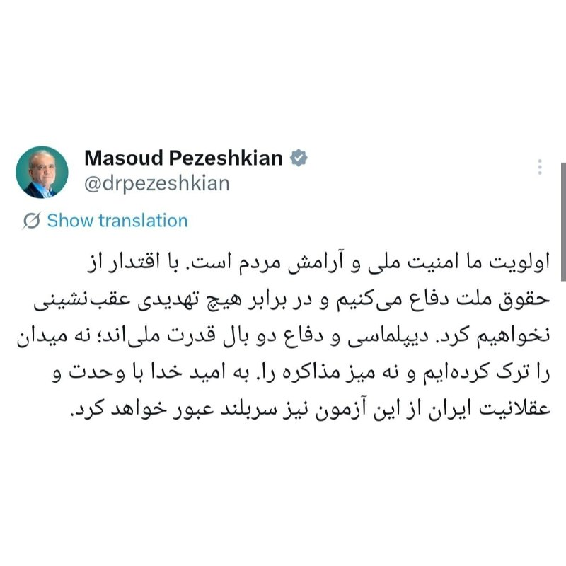

🔴پرزیدنت دکتر مسعود پزشکیان

می زنیم اگه بزنید
https://t.me/kianmeli1

## kianmeli1 — post 87798

‏🔴بخشایش اردستانی، عضو کمیسیون امنیت ملی مجلس: اگر آمریکایی‌ها محاصره دریایی را طولانی‌تر کنند، میزان تعرفه‌های تنگه هرمز ۳ تا ۴ میلیون دلار افزایش می‌یابد
https://t.me/kianmeli1

## kianmeli1 — post 87797

🔴قرارگاه مرکزی خاتم‌:

اسراییل کوچک ترین حمله ای به لبنان کند ٫ بالستیک شلیک میکنیم به تلاویو
https://t.me/kianmeli1

## IranIntlTV — post 341171

  

مسعود پزشکیان، رییس دولت جمهوری اسلامی، در شبکه ایکس نوشت: «اولویت ما امنیت ملی و آرامش مردم است و با اقتدار از حقوق ملت دفاع می‌کنیم و در برابر هیچ تهدیدی عقب‌نشینی نخواهیم کرد.»

او اضافه کرد: «دیپلماسی و دفاع دو بال قدرت ملی‌اند؛ نه میدان را ترک کرده‌ایم و نه میز مذاکره را و با وحدت و عقلانیت، از این آزمون نیز سربلند عبور خواهیم کرد.»
iranintl.com/202606089797

## ManotoTV — post 105959

  <a href="telegram/content/ManotoTV_105959_1780920243.mp4" target="_blank">🎬 Download video</a>

ترامپ می‌گوید: «من تصمیم می‌گیرم.»

نتانیاهو همچنان بر حفظ فشار بر ایران تأکید دارد. اما شاید پرسش اصلی این نباشد که آیا میان این دو اختلافی وجود دارد یا نه. پرسش مهم‌تر این است که هر کدام «پیروزی» را چگونه تعریف می‌کنند.

## DW_Farsi — post 125686

🔶 تلاطم بازار رمزارزها؛ بازگشت بیت‌کوین به محدوده ۶۳ هزار دلار

طی ۲۴ ساعت گذشته بزرگ‌ترین رمزارز جهان پس از سقوط موقت به زیر ۶۰ هزار دلار، بار دیگر به محدوده ۶۳ هزار دلار برگشت؛ بازگشتی که به گفته برخی تحلیلگران، حاصل دفاع خریداران از محدوده ۶۰ هزار دلار است.

این در حالی است که بیت‌کوین در ۵ ژوئن ۲۰۲۶ (۱۵ خرداد ۱۴۰۵) به پایین‌ترین سطح خود از اکتبر ۲۰۲۴ رسیده بود و حتی برای ساعاتی به زیر مرز ۶۰ هزار دلار سقوط کرد.

تحلیلگران این ریزش را حاصل همزمانی چند عامل دانستند. از مهم‌ترین آنها تغییر رفتار شرکت "استراتژی" به مدیریت مایکل سیلور است. این شرکت که طی سال‌های گذشته بزرگ‌ترین خریدار سازمانی بیت‌کوین محسوب می‌شد، برای نخستین بار از سال ۲۰۲۲ تنها ۳۲ بیتکوین از ذخایر خود را فروخت؛ اقدامی که از نظر روانی تأثیر قابل توجهی بر بازار گذاشت.

به گزارش رویترز، صندوق‌های قابل معامله بیت‌کوین (ETF) در هفته‌های اخیر با یکی از سنگین‌ترین موج‌های خروج سرمایه از زمان راه‌اندازی خود روبه‌رو شدند؛ روندی که از افزایش احتیاط و کاهش اقبال بخشی از سرمایه‌گذاران نهادی به بازار رمزارزها حکایت دارد.

@dw_farsi

## RadioFarda — post 158056

  

🔸کایا کالاس، مسئول سیاست خارجی اتحادیه اروپا، روز دوشنبه ۱۸ خرداد اعلام کرد که اتحادیه اروپا به‌دلیل تهدید آزادی تردد دریایی توسط جمهوری اسلامی، تحریم‌هایی را علیه شماری از افراد و نهادهای ایرانی اعمال کرده است.

🔸کالاس این اظهارات را در جمع خبرنگاران و در حاشیه نشست وزیران دفاع اتحادیه اروپا در قبرس مطرح کرد.

🔸هنوز جزئیات بیشتری درباره این تحریم‌ها ارائه نشده است.

🔸جمهوری اسلامی از زمان حملات اسرائیل و آمریکا در نهم اسفند ۱۴۰۴، تنگه هرمز را بست و حالا می‌گوید تنها با دریافت عوارض عبور، اجازه تردد آزاد در این تنگه را صادر می‌کند.

🔸این تصمیم با واکنش گسترده بین‌‌المللی مواجه شده است.

@RadioFarda

## Dirty_Kids — post 391368

🔴 فوری: مجدد آتش بس شد. قرارگاه خاتم‌الانبیا اعلام کرد عملیات ما تموم شد و اهدافمون رو زدیم. اسرائیل هم گفته فعلا حملات رو متوقف میکنیم تا ببینیم چی میشه. @Dirty_Kids 👻

## Dirty_Kids — post 391367

  <a href="telegram/content/Dirty_Kids_391367_1780920244.mp4" target="_blank">🎬 Download video</a>

🔴 دنیا جهانبخت توی بله و روبیکا کانال زده! + احتمالا بزودی برمیگرده ایران. @Dirty_Kids 👻

## manototv — post 105959

  <a href="telegram/content/manototv_105959_1780920245.mp4" target="_blank">🎬 Download video</a>

ترامپ می‌گوید: «من تصمیم می‌گیرم.»

نتانیاهو همچنان بر حفظ فشار بر ایران تأکید دارد. اما شاید پرسش اصلی این نباشد که آیا میان این دو اختلافی وجود دارد یا نه. پرسش مهم‌تر این است که هر کدام «پیروزی» را چگونه تعریف می‌کنند.

## alonews — post 126260

  <a href="telegram/content/alonews_126260_1780920245.webm" target="_blank">🎬 Download video</a>

👈عراق از بازگشایی حریم هوایی خود خبر داد

✅ @AloNews خبر جنگ

## alonews — post 126259

  <a href="telegram/content/alonews_126259_1780920246.webm" target="_blank">🎬 Download video</a>

👈رادیو ارتش اسرائیل:
ایران می‌خواد دامنه درگیری رو گسترش بده و به حملات اسرائیل فقط تو ضاحیه بسنده نکنه، بلکه تو جنوب لبنان هم پاسخ بده

✅ @AloNews خبر جنگ

---
📅 بروزرسانی: 1405/03/18 15:23
---

## WithYashar — post 14016

کانال 12 اسرائیل: ترامپ و نتانیاهو دقایقی پیش صحبت کردن.
@withyashar

## WithYashar — post 14015

هم اکنون اسرائیل به لبنان حملهِ کرد
@withyashar 😁

## WithYashar — post 14014

صدا و سیما:جنگ پس از شکست دشمن به پایان رسید و زندگی به روال عادی بازگشت
@withyashar

## WithYashar — post 14013

تحلیل کمی دیگه در‌اینستاگرام پست میشه

## WithYashar — post 14012

ترامپ به نیوزنیشن: یک جنگ دیگر را پایان دادم
@withyashar

## mwarmonitor — post 10456

هم‌اکنون تماس تلفنی میان ترامپ و نتانیاهو

## pm_afshaa — post 92902

  <a href="telegram/content/pm_afshaa_92902_1780919608.webm" target="_blank">🎬 Download video</a>

🔴رسانه عبری i24News:
حملات به ایران متوقف خواهد شد.

💧 Rainbet.com the #1 Non-KYC Crypto Casino & Sportsbook @rainbetcom

😁 @Pm_Afshaa

## pm_afshaa — post 92901

  <a href="telegram/content/pm_afshaa_92901_1780919608.webm" target="_blank">🎬 Download video</a>

🔴ترامپ: من یک جنگ دیگر رو پایان دادم.

💧 Rainbet.com the #1 Non-KYC Crypto Casino & Sportsbook @rainbetcom

😁 @Pm_Afshaa

## pm_afshaa — post 92900

  <a href="telegram/content/pm_afshaa_92900_1780919609.webm" target="_blank">🎬 Download video</a>

🔴کانال 12 اسرائیل: ترامپ و نتانیاهو دقایقی پیش صحبت کردن.

💧 Rainbet.com the #1 Non-KYC Crypto Casino & Sportsbook @rainbetcom

😁 @Pm_Afshaa

## kianmeli1 — post 87796

🔴ترامپ: من یک قمار بازم٫ یادتون نره
https://t.me/kianmeli1

## kianmeli1 — post 87795

  

🔴ترامپ: یک جنگ ۱۲ ساعته دیگر را به پایان رساندم
https://t.me/kianmeli1

## IranIntlTV — post 341170

  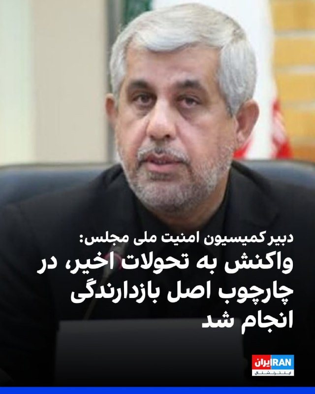

بهنام سعیدی، دبیر کمیسیون امنیت ملی مجلس، گفت که جمهوری اسلامی از ابتدای مذاکرات تاکید داشته است که هرگونه آتش‌بس و تفاهم باید همه جبهه‌ها، به‌ویژه لبنان را در بر بگیرد.

او افزود جمهوری اسلامی پیش از این هشدار داده بود که هرگونه «حمله و تجاوز» به بیروت با واکنش مواجه خواهد شد.

سعیدی همچنین گفت پاسخ جمهوری اسلامی در واکنش به تحولات اخیر، «در چارچوب اصل بازدارندگی» انجام شده است.
iranintl.com/202606087552

## IranIntlTV — post 341169

  <a href="telegram/content/IranIntlTV_341169_1780919611.mp4" target="_blank">🎬 Download video</a>

علی‌حسین قاضی‌زاده، عضو تحریریه ایران‌اینترنشنال، درباره حملات موشکی سپاه پاسداران به اسرائیل گفت: « جمهوری اسلامی با تهدید به گسترش تنش، تلاش می‌کند آمریکا را تحت فشار قرار دهد. هدف اصلی جمهوری اسلامی، زدن اسرائیل نیست؛ بلکه گسترش جنگ است.»

@iranintltv

## IranIntlTV — post 341168

  <a href="telegram/content/IranIntlTV_341168_1780919612.mp4" target="_blank">🎬 Download video</a>

مروری بر روزنامه‌های ایران، دوشنبه ۱۸ خرداد، با مجتبی هاشمی، روزنامه‌نگار

@iranintltv

## IranIntlTV — post 341167

  <a href="telegram/content/IranIntlTV_341167_1780919614.mp4" target="_blank">🎬 Download video</a>

هم‌زمان با آغاز دوباره درگیری‌های نظامی میان جمهوری اسلامی و اسرائیل، قیمت ارز در بازار آزاد ایران بار دیگر روندی صعودی گرفت. بهای هر دلار آمریکا به ۱۷۸ هزار تومان رسید.

گفت‌وگو با آرش آزرمی، دبیر بخش اقتصادی ایران‌اینترنشنال

@iranintltv

## IranIntlTV — post 341166

  <a href="telegram/content/IranIntlTV_341166_1780919616.mp4" target="_blank">🎬 Download video</a>

معاون امنیتی و انتظامی استانداری خوزستان اعلام کرد شرکت پتروشیمی کارون در ماهشهر هدف حمله هوایی اسرائیل قرار گرفت.

مهدی بیگی، عضو تحریریه ایران‌اینترنشنال، از آخرین تحولات و واکنش مقامات به حملات متقابل جمهوری اسلامی و اسرائیل می‌گوید

@iranintltv

## FarsiVOA — post 220022

  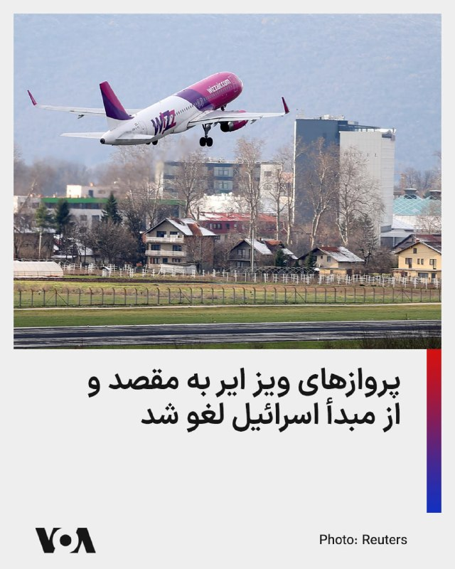

ویز ایر، شرکت هواپیمایی ارزان‌قیمت مجارستانی، به‌طور موقت همه پروازهای خود به مقصد و از مبدأ فرودگاه بن گوریون تل‌آویو که برای روزهای دوشنبه و سه‌شنبه برنامه‌ریزی شده بودند، لغو کرد.

این شرکت در بیانیه‌ای اعلام کرد: «ایمنی و امنیت مسافران و خدمه همواره بالاترین اولویت شرکت هواپیمایی است.»

ویز ایر همچنین افزود که «همچنان وضعیت در حال تحول را به‌دقت و با هماهنگی با مقامات مربوطه زیر نظر دارد و عملیات خود را بر این اساس تنظیم خواهد کرد.»

این تصمیم در حالی اتخاذ شده که حریم هوایی اسرائیل همچنان باز است و وزیر ترابری این کشور اعلام کرد فرودگاه بین‌المللی بن گوریون طبق روال عادی فعالیت می‌کند.
@FarsiVOA

## FarsiVOA — post 220021

🔺همزمان با مذاکرات قاهره، حملات اسرائیل در غزه چهار کشته برجا گذاشت

◾️همزمان با ادامه مذاکرات قاهره برای پیشبرد آتش‌بس شکننده غزه، مقام‌های بهداشتی فلسطینی گفتند حملات اسرائیل در روز دوشنبه دست‌کم چهار کشته، از جمله یک کودک، برجا گذاشته است.

◾️رویترز گزارش داد دو نفر در حمله‌ای نزدیک اردوگاه آوارگان در منطقه مواصی خان‌یونس در جنوب غزه کشته شدند. در اردوگاه جبالیا در شمال غزه نیز دو فلسطینی، از جمله یک کودک هشت‌ساله، در حمله هوایی اسرائیل به نزدیکی گروهی از مردم که در حال حفر چاه بودند، کشته و چند نفر دیگر زخمی شدند.

◾️ارتش اسرائیل درباره این حملات و همچنین گزارش‌ها درباره گسترش محدوده تحت کنترل نیروهایش در غزه اظهارنظر نکرده است.

⬇️ بیشتر بخوانید:
https://ir.voanews.com/a/8158507.html

## DW_Farsi — post 125685

  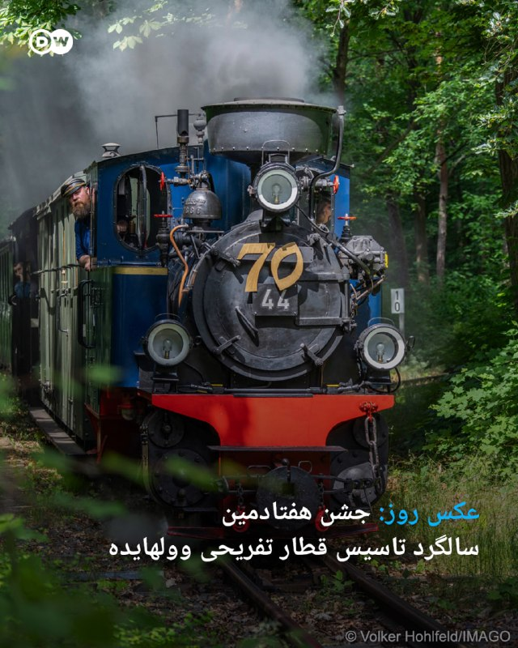

📸 عکس روز: جشن هفتادمین سالگرد تاسیس قطار تفریحی وولهایده

در روزهای ۶ و ۷ ژوئن ۲۰۲۶، قطار تفریحی گردشگری وولهایده در فولکس‌پارک در منطقه کوپنیک شهر برلین، پایتخت آلمان، هفتادمین سال تاسیس این مسیر راه‌آهن را جشن گرفت. در این مسیر، هم‌زمان چهار قطار به حرکت درمی‌آیند که توسط لوکوموتیوهای بخار تاریخی و لوکوموتیو‌های دیزلی کشیده می‌شوند. حمل‌ونقل ریلی در آلمان حدود ۱۹۰ سال قدمت دارد و در سال ۱۸۳۵ با یک خط ۶ کیلومتری افتتاح شد.

@dw_farsi

## DW_Farsi — post 125684

  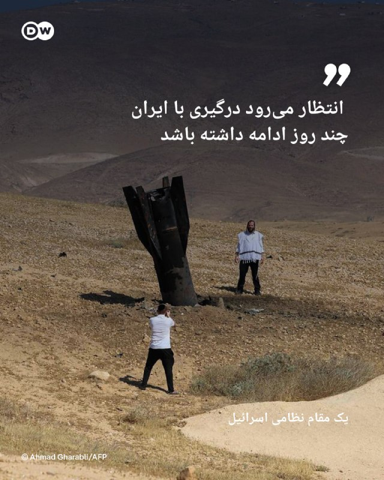

🔶 یک مقام نظامی اسرائیل: انتظار می‌رود درگیری با ایران چند روز ادامه داشته باشد

یک مقام نظامی اسرائیل گفت این کشور خود را برای دست‌کم چند روز دیگر از درگیری نظامی با ایران آماده کرده است و حتی احتمال از سرگیری کامل جنگ را نیز در نظر دارد.

شبکه خبری "سی‌ان‌ان" در گزارشی نوشت این مقام نظامی اسرائیل در گفت‌وگو با خبرنگاران، جمهوری اسلامی را متهم به نقض آتش‌بس ماه آوریل کرد و گفت که اسرائیل خود را برای احتمال یک کارزار نظامی طولانی‌مدت آماده می‌کند.

این مقام افزود که اسرائیل تا کنون در پاسخ به حملات ایران، دو موج حمله علیه این کشور انجام داده است که موج نخست سامانه‌های راهبردی پدافندی را هدف قرار داد و موج دوم یک تأسیسات پتروشیمی را که به گفته اسرائیل در تولید موشک‌های بالستیک و دیگر انواع تسلیحات نقش دارد، هدف گرفت.

به گزارش سی‌ان‌ان، این مقام نظامی تأکید کرد که تمامی حملات انجام‌شده تاکنون صرفاً توسط اسرائیل صورت گرفته و ایالات متحده تنها در بخش دفاع هوایی و رهگیری برخی از موشک‌ها به اسرائیل کمک کرده است.

به گفته این مقام اسرائیلی ارتش این کشور با سنتکام هماهنگی داشته و ایال زمیر، رئیس ستاد ارتش اسرائیل طی ۲۴ ساعت گذشته دو مرتبه با برد کوپر، فرمانده سنتکام، گفت‌وگو کرده است.

از سوی دیگر به گزارش "تایمز اسرائیل" ایران از شامگاه یکشنبه تا ظهر دوشنبه دست‌کم ۲۰ موشک بالستیک به سمت اسرائیل شلیک کرده است که به گفته ارتش این کشور این موشک‌ها یا رهگیری شده یا در مناطق باز فرود آمده‌اند. برخی رسانه‌های دیگر شمار موشک‌های شلیک‌شده از سوی ایران را ۳۰ عدد ذکر کرده‌اند. افزون بر آن حوثی‌های یمن نیز که از سوی جمهوری اسلامی حمایت می‌شوند، صبح دوشنبه دو موشک به سمت اسرائیل شلیک کردند که یکی از آنها رهگیری شد و طبق گفته ارتش اسرائیل، موشک دیگر به خاک این کشور نرسید.

تایمز اسرائیل تعداد تماس‌های تلفنی ایال زمیر با فرمانده سنتکام را در ۲۴ ساعت گذشته "سه مرتبه" ذکر کرده است.

@dw_farsi

## RadioFarda — post 158055

  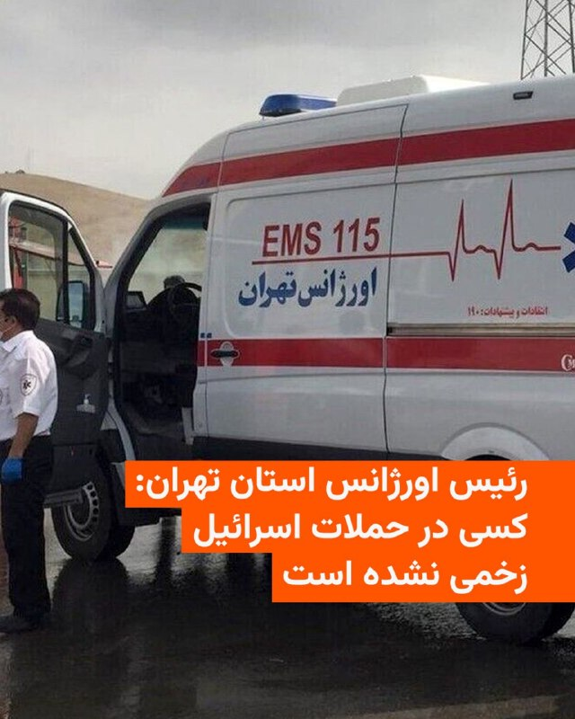

🔸رئیس اورژانس استان تهران در گفت‌وگو با رسانه‌های ایران گفت تاکنون حملات اسرائیل به این استان «مصدومی» بر جا نگذاشته است.

🔸محمد اسماعیل توکلی، در عین حال از بررسی دو حادثه انفجار خبر داد و گفت حجم تماس‌ها با اورژانس به نسبت روزهای عادی «افزایشی نداشته است».

🔸مقام‌های ایران تاکنون توضیحات دقیقی درباره اماکن هدف قرار گرفته شده در چند موج حملات اخیر اسرائیل به ایران ارائه نداده‌اند.

🔸سخنگوی ارتش اسرائیل پیشتر گفته بود که «ده‌ها فروند جت جنگی» این کشور در حملات بامداد دوشنبه در ایران سامانه‌های دفاع هوایی را در برخی از نقاط این کشور هدف قرار داده‌اند.

🔸با ادامه حملات، رسانه‌های ایران از توقف فعالیت فرودگاه‌های مختلف در شهرهای مختلف ایران از جمله تهران، شیراز، اصفهان و مشهد خبر داده‌اند.

@RadioFarda

## IranianMinds — post 21832

🔴 حریم هوایی عراق هم باز شد.

@IranianMinds

## IranianMinds — post 21831

🔴 شبکه ۱۲ اسرائیل:

ترامپ و نتانیاهو دقایقی پیش با یکدیگر گفت‌وگو کردند.

@IranianMinds

## BBCPersian — post 283175

🔻نواف سلام، نخست‌وزیر لبنان، می‌گوید اسرائیل از زمان اعلام آتش‌بس در ۱۶ آوریل نزدیک به ۳۵۰۰ حمله هوایی و صدها تخریب کنترل‌شده در لبنان انجام داده است.

دفتر نخست‌وزیر لبنان پس از جلسه کابینه در شبکه اجتماعی ایکس نوشت: «از ۱۷ آوریل تا امروز، ۷ ژوئن، اسرائیل ۳۴۹۱ حمله هوایی، ۴۰۷ تخریب و شش عملیات "ویرانگر" انجام داده است که کل روستاها را در نوار جنوبی‌ لبنان با خاک یکسان کرده است.»

آقای سلام گفت که لبنان در تلاش است آتش‌بس را حفظ کند اما تشدید تنش ایران و اسرائیل باعث تشدید موج‌ آوارگی و کاهش توانایی برای حمایت از خانواده‌های آواره شده است.

بنابر این بیانیه، نخست‌وزیر لبنان «به خطرات تشدید تنش‌های ایران و اسرائیل و پیامدهای آن، به‌ویژه موج‌های بیشتر آوارگی و چگونگی رفع و رجوع آنها اشاره کرد چون به حداکثر ظرفیت اسکان در بیروت، صیدا و سایر مناطق رسیده‌ایم.»

از زمان آغاز جنگ بیش از یک میلیون نفر که یک پنجم جمعیت لبنان می‌شود، در اثر حملات و دستور ترک اسرائیل در سراسر لبنان آواره شده‌اند.

@BBCPersian

## Dirty_Kids — post 391366

  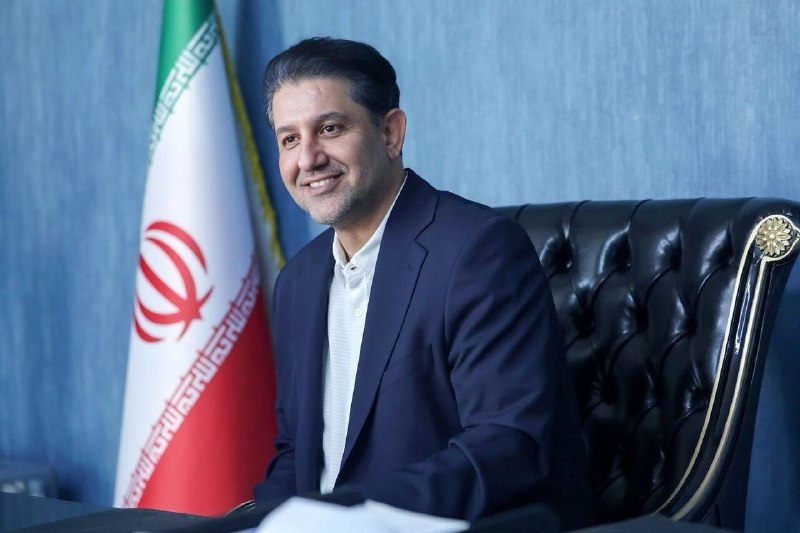

🔴 پازوکی، معاون ارتباطات رئیس‌جمهور:
خیالتون راحت باشه اینترنت قرار نیست قطع بشه.

@Dirty_Kids 👻

## alonews — post 126258

  <a href="telegram/content/alonews_126258_1780919621.webm" target="_blank">🎬 Download video</a>

👈شخص دوم مملکت،پزشکیان: در برابر هیچ تهدیدی عقب‌نشینی نمی‌کنیم

✅ @AloNews خبر جنگ

## alonews — post 126257

  <a href="telegram/content/alonews_126257_1780919621.webm" target="_blank">🎬 Download video</a>

👈ترامپ به نیوزنیشن: یک جنگ دیگر را پایان دادم

✅ @AloNews خبر جنگ

---
📅 بروزرسانی: 1405/03/18 15:13
---

## VahidOOnLine — post 244335

🗣روایت شما از موج تازه حملات- دوشنبه ۱۸ خرداد

🔹ما گرونی و هزاران مشکل دیگه رو برای عبور از جمهوری نحس اسلامی تحمل می‌کنیم تا دیگه قیافه نجس قاتلان بچه‌های عزیزمون رو نبینیم. ما منتظریم برای شروع دوباره.
🔹من یک نوجوان ۱۴ ساله هستم که واقعا از زندگی خسته شدم و دیگه امیدی ندارم جز اینکه اینا برن. امیدوارم ما آزاد شیم. بسه دیگه این همه گرونی، کرونا، جنگ و جنایتی که دیدیم.

🔹اروپا، کانادا، قطر و ترکیه به چه زبونی بگن نمی‌خوان جمهوری اسلامی بره؟ این کشورها هزینه کردن برای به‌وجود اومدنش و دارن ازش سود می‌برن. مردم ایران دوستان کمی در دنیا دارن.

🔹نگران اینترنت نباشیم چون برمی‌گرده، نگران جوانی‌مون باشیم که رفت و برنمی‌گرده.

🔹به هموطنان عزیز: تغییر اجتناب‌ناپذیره. این شرایط سخت هم می‌گذره اما باید صبور و هوشیار باشیم، چون قراره خودمون سرنوشت‌مون رو به‌دست بگیریم.

🔹هیچ حکومتی ماندگارتر از اراده یک ملت نیست. به‌زودی ایران رو پس می‌گیریم. پاینده ایران

🔹اینترنت هنوز وصله ولی به‌شدت ضعیف شده. همه مردم بسیار خوشحال‌اند، اما تنها مشکل نبود اینترنت نیست. امیدوارم اگه قراره اینترنت‌ها قطع بشه، نتیجه‌ای داشته باشه و وقتی برمی‌گردیم، ایران آزاد شده باشه.

🔹از مردم شریف ایران می‌خوام امیدشون رو از دست ندن. در تاریخ ایران تا بوده نور بر تاریکی پیروز شده. پاینده ایران.

🔹جناب ترامپ، همه رو ناامید کردید. چرا با این رژیم خون‌ریز مذاکره می‌کنید؟ اگر واقعا نمی‌خواهید کاری انجام بدید لطفا کارشکنی نکنید و بذارید اسرائیل کار رو تموم کنه. این وضعیت چیزی جز گرونی و فقر برای مردم نداشته، ما فقط به امید آزادی تحمل می‌کنیم.

🔹ترامپ هم خودش از خداشه که توافق کنه، همه اینا دارن ما و جوانی‌مون رو بازی میدن.

🔹بی‌بی جون به حرف ترامپ گوش نده و ادامه بده. امیدوارم این آخرین نبرد باشه و ایران عزیزمون آزاد شه.

🔹بزرگ‌ترین مشکل اینه که منتظریم آمریکا و اسرائیل به کمکمون بیان. از چی می‌ترسیم؟ از مرگ؟ این زندگی نکبت‌باری که ساختن، هر لحظه‌ش مرگه. مرگ یک‌بار، شیون یک‌بار. باید ایران رو از این افراطیون پس بگیریم.
‌🏁 🇬🇧 IranintlTV

🤖 @VahidOOnLine

## WithYashar — post 14011

  <a href="telegram/content/WithYashar_14011_1780919012.mp4" target="_blank">🎬 Download video</a>

🎬 Video

## WithYashar — post 14010

قرارگاه مرکزی خاتم‌: توقف عملیات نیروهای مسلح اعلام می‌گردد؛ اما در صورت تداوم حملات، از جمله در جنوب لبنان، اقدامات شدیدتر در راه خواهد بود @withyashar

## mwarmonitor — post 10455

✈️سازمان هوانوردی غیرنظامی عراق اعلام کرد که حریم هوایی عراق برای پروازها به مقصد و از مبدا تمام فرودگاه‌های این کشور دوباره باز شده و تردد هوایی در آن از سر گرفته شده است.

@mwarmonitor

## mwarmonitor — post 10454

📌رسانه‌های اسرائیلی: معادله اسرائیل این بود که اگر حزب‌الله به شمال (اسرائیل) شلیک کند، در پاسخ به ضاحیه حمله می‌شود.

🔹ایران تلاش می‌کند این معادله را تغییر دهد به این صورت که: حمله در جنوب لبنان = حمله ایران به اسرائیل.

🔹ایرانی‌ها جسارت خود را جمع کرده‌اند و احساس برتری می‌کنند.

@mwarmonitor

## FoxNewsTwitter — post 342712

  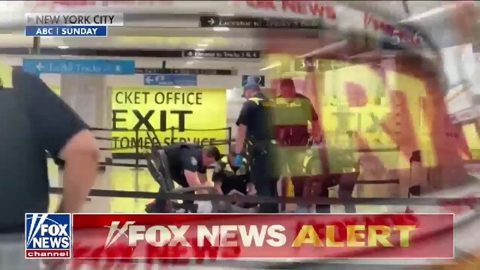

Fox News (Twitter/X)

NEW: Security concerns are mounting around Penn Station and Madison Square Garden after six people were injured in a stabbing attack just 24 hours before President Trump is expected at Game 3 of the NBA Finals.

@AlexHoganTV breaks down the response as NYPD, Amtrak police and federal security prepare for massive crowds in Midtown. | @foxandfriends

Stop scrolling for updates and turn on live alerts. Get FOX One and get the facts.
https://www.fox.com/stream/fox-news?cmpid=org=fn::ag=owned_other::mc=organicsocial%5B%E2%80%A6%5DWITTER::cmp=100_o2_th4::cont=m2_tp1::add=03_17_00_05_13_00_02_A

## pm_afshaa — post 92899

  <a href="telegram/content/pm_afshaa_92899_1780919013.webm" target="_blank">🎬 Download video</a>

🔴آکسیوس به نقل از یک مقام آمریکایی:
آمریکا با حملات اسرائیل به ایران موافقت نکرده و به نتانیاهو اطلاع داده که باید این حملات رو متوقف کنه.

💧 Rainbet.com the #1 Non-KYC Crypto Casino & Sportsbook @rainbetcom

😁 @Pm_Afshaa

## pm_afshaa — post 92898

  <a href="telegram/content/pm_afshaa_92898_1780919014.webm" target="_blank">🎬 Download video</a>

🔴ترامپ در تروث سوشال:

هر دو طرف، اسرائیل و ایران، به دنبال آتش‌بس فوری هستن! مذاکرات نهایی درباره صلح در حال انجامه، مشروط بر اینکه نادانی یا حماقت مانعی در مسیر آن ایجاد نکنه. محاصره تا زمان رسیدن به یک توافق نهایی همچنان برقرار خواهد ماند و با تمام قدرت و اثرگذاری ادامه پیدا میکنه. همه چیز باید سریع پیش بره.

💧 Rainbet.com the #1 Non-KYC Crypto Casino & Sportsbook @rainbetcom

😁 @Pm_Afshaa

## pm_afshaa — post 92897

  <a href="telegram/content/pm_afshaa_92897_1780919015.webm" target="_blank">🎬 Download video</a>

🔴قرارگاه خاتم‌الانبیاء:
پاسخی دردناک به دشمنامون دادیم؛
عملیات ما تموم شد ولی اگه دوباره اسرائیل شرارتی بکنه یا به جنوب لبنان حمله کنه، جواب محکم‌تری میدیم.

💧 Rainbet.com the #1 Non-KYC Crypto Casino & Sportsbook @rainbetcom

😁 @Pm_Afshaa

## kianmeli1 — post 87794

  <a href="telegram/content/kianmeli1_87794_1780919015.mp4" target="_blank">🎬 Download video</a>

🔴فوری-نیرو دریایی سپاه

جنگ در تنگه هرمز ادامه دارد
هر کشتی بدون اجازه عبور کند ٫ منهدم میشود
https://t.me/+_a5ind9hr7sxOTE0

## kianmeli1 — post 87793

🔴صدا و سیما

جنگ پس از شکست دشمن به پایان رسید و زندگی به روال عادی بازگشت
https://t.me/kianmeli1

## IranIntlTV — post 341165

🗣روایت شما از موج تازه حملات- دوشنبه ۱۸ خرداد

🔹ما گرونی و هزاران مشکل دیگه رو برای عبور از جمهوری نحس اسلامی تحمل می‌کنیم تا دیگه قیافه نجس قاتلان بچه‌های عزیزمون رو نبینیم. ما منتظریم برای شروع دوباره.
🔹من یک نوجوان ۱۴ ساله هستم که واقعا از زندگی خسته شدم و دیگه امیدی ندارم جز اینکه اینا برن. امیدوارم ما آزاد شیم. بسه دیگه این همه گرونی، کرونا، جنگ و جنایتی که دیدیم.

🔹اروپا، کانادا، قطر و ترکیه به چه زبونی بگن نمی‌خوان جمهوری اسلامی بره؟ این کشورها هزینه کردن برای به‌وجود اومدنش و دارن ازش سود می‌برن. مردم ایران دوستان کمی در دنیا دارن.

🔹نگران اینترنت نباشیم چون برمی‌گرده، نگران جوانی‌مون باشیم که رفت و برنمی‌گرده.

🔹به هموطنان عزیز: تغییر اجتناب‌ناپذیره. این شرایط سخت هم می‌گذره اما باید صبور و هوشیار باشیم، چون قراره خودمون سرنوشت‌مون رو به‌دست بگیریم.

🔹هیچ حکومتی ماندگارتر از اراده یک ملت نیست. به‌زودی ایران رو پس می‌گیریم. پاینده ایران

🔹اینترنت هنوز وصله ولی به‌شدت ضعیف شده. همه مردم بسیار خوشحال‌اند، اما تنها مشکل نبود اینترنت نیست. امیدوارم اگه قراره اینترنت‌ها قطع بشه، نتیجه‌ای داشته باشه و وقتی برمی‌گردیم، ایران آزاد شده باشه.

🔹از مردم شریف ایران می‌خوام امیدشون رو از دست ندن. در تاریخ ایران تا بوده نور بر تاریکی پیروز شده. پاینده ایران.

🔹جناب ترامپ، همه رو ناامید کردید. چرا با این رژیم خون‌ریز مذاکره می‌کنید؟ اگر واقعا نمی‌خواهید کاری انجام بدید لطفا کارشکنی نکنید و بذارید اسرائیل کار رو تموم کنه. این وضعیت چیزی جز گرونی و فقر برای مردم نداشته، ما فقط به امید آزادی تحمل می‌کنیم.

🔹ترامپ هم خودش از خداشه که توافق کنه، همه اینا دارن ما و جوانی‌مون رو بازی میدن.

🔹بی‌بی جون به حرف ترامپ گوش نده و ادامه بده. امیدوارم این آخرین نبرد باشه و ایران عزیزمون آزاد شه.

🔹بزرگ‌ترین مشکل اینه که منتظریم آمریکا و اسرائیل به کمکمون بیان. از چی می‌ترسیم؟ از مرگ؟ این زندگی نکبت‌باری که ساختن، هر لحظه‌ش مرگه. مرگ یک‌بار، شیون یک‌بار. باید ایران رو از این افراطیون پس بگیریم.

## FarsiVOA — post 220020

🔺پس از هشدار ترامپ، جمهوری اسلامی توقف حملات خود به اسرائیل را اعلام کرد

◾️ساعتی پس از هشدار دونالد ترامپ، رئیس‌جمهوری آمریکا، نیروهای نظامی جمهوری اسلامی توقف حملات خود به اسرائیل را اعلام کردند.

◾️قرارگاه خاتم‌الانبیا روز دوشنبه اعلام کرد که پس از حمله اسرائیل به ضاحیه بیروت، جمهوری اسلامی «پاسخی دردناک» به اسرائیل داد و توقف عملیات را اعلام می‌کند.

◾️پیشتر دونالد ترامپ، اعلام کرد که هم اسرائیل و هم جمهوری اسلامی به دنبال «برقراری فوری آتش‌بس» هستند و مذاکرات نهایی درباره «صلح» در حال پیشرفت است.

◾️او در پیامی در تروث‌سوشال نوشت: «هر دو طرف، به دنبال برقراری فوری آتش‌بس هستند. مذاکرات نهایی درباره «صلح» در حال پیشرفت است، مشروط بر اینکه نادانی یا حماقت مانع آن نشود.»

⬇️ بیشتر بخوانید:
https://ir.voanews.com/a/8158503.html

## FarsiVOA — post 220019

  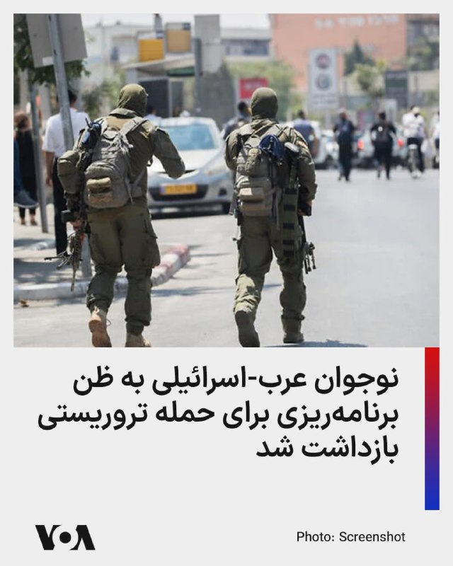

یک نوجوان عرب-اسرائیلی به ظن برنامه‌ریزی برای انجام یک حمله تروریستی در یک شهر یهودی در شمال اسرائیل بازداشت شده است.

بر اساس بیانیه‌ای که توسط شاباک (سازمان امنیت داخلی اسرائیل) و پلیس منتشر شد، این نوجوان ۱۸ ساله اهل «ابیلین» قرار است صبح دوشنبه در دادگاه منطقه‌ای حیفا محاکمه شود.

بر اساس اعلام نهادهای امنیتی، این فرد مظنون به عضویت در گروه حماس بوده و قصد داشته به نمایندگی از این گروه حملاتی انجام دهد. یکی از این حملات قرار بوده یک شهر یهودی در نزدیکی ابلین را هدف قرار دهد.

همچنین گفته شده او تلاش کرده بود یک تفنگ تهاجمی برای این منظور تهیه کند.

طبق گفته مقامات امنیتی، او همچنین تلاش کرده بود به‌صورت خودآموز استفاده از سلاح گرم و ساخت مواد منفجره را یاد بگیرد و هرچند موفق به تهیه سلاح نشده بود، اما مهمات تهیه و در خانه خود مخفی کرده بود که بعداً توسط نیروهای پلیس کشف و ضبط شد.
@FarsiVOA

## Persian_Trend_Official — post 16178

  <a href="telegram/content/Persian_Trend_Official_16178_1780919018.mp4" target="_blank">🎬 Download video</a>

فهرست اهداف حملات موشکی سپاه به روایت صداوسیما:

1- طبریا در 30 کیلومتری مرز لبنان، محل پشتیبانی از تیپ های زرهی اسرائیل

2- نهاریا در 10 کیلومتری مرز لبنان، محل پشتیبانی از تیپ های زرهی اسرائیل

3- مجتمع صنعتی بازان، بزرگترین
پالایشگاه نفت و گاز اسرائیل در حیفا

4- پایگاه هوایی رامات دیوید

5- پایگاه هوایی تل نوف

6- پایگاه هوایی نواتیم

با این حال اهداف حمله زیاد ولی تعداد موشک های شلیک شده بسیار محدود بود، تعداد اصابت ها شاید کمتر از تعداد انگشتان یک دست باشد.

📝 Amir

📌 @persian_trend_official
پرشین ترند | متفاوت‌ترین کانال نظامی

## RadioFarda — post 158054

  <a href="https://t.me/radiofarda/158054" target="_blank">📎 Download file</a>

📻بشنوید: ساعت ۱۴ با رادیوفردا، هجدهم خرداد ۱۴۰۵‌

@RadioFarda

## RadioFarda — post 158053

پیشتازی حزب نیکول پاشینیان نخست‌وزیر ارمنستان در انتخابات پارلمانی

🔸شمارش بیش از ۹۰ درصد از آراء انتخابات پارلمانی ارمنستان نشان می‌دهد حزب «پیمان مدنی» به رهبری نیکول پاشینیان، نخست‌وزیر این کشور با کسب حدود ۵۰ درصد آراءِ به صندوق ریخته‌شده، پیشتاز است.

🔸نیکول پاشینیان، ساعاتی پس از اتمام رأی‌گیری، با اعلام پیروزی در انتخابات، گفت این نتیجه، «پایداری و توسعه ارمنستان را تضمین می‌کند» و متعهد شد که «روند آشتی با غرب را ادامه دهد».

🔸او در عین حال بر توسعه روابط ارمنستان با روسیه تأکید کرد. پاشینیان افزود: «ما باید صلح بین ارمنستان و جمهوری آذربایجان را نهادینه کنیم.»

🔸نتایج به دست آمده برای حزب متبوع نخست‌وزیر ارمنستان بهتر از نتایج ثبت‌شده در نظرسنجی‌ها بود. میزان مشارکت در انتخابات ۵۹ درصد اعلام شده است.

🔸حزب «پیمان مدنی» توانست از ائتلافی از احزاب طرفدار نزدیکی به روسیه پیشی بگیرد. این ائتلاف با نام «ارمنستان قوی» بیش از ۲۳ درصد آرا را از آن خود کرد.

🔸نیکول پاشینیان، نخست‌وزیر ارمنستان، در حالی برای حفظ قدرت رقابت می‌کرد که صلح با جمهوری آذربایجان، رابطه با مسکو و امنیت ملی به محورهای اصلی کارزارهای انتخاباتی تبدیل شده‌ بودند.

🔸نتایج اولیه انتخابات نشان می‌داد که حزب پاشینیان ۶۱ تا ۶۳ کرسی از ۱۰۵ کرسی پارلمان ارمنستان را به‌دست خواهد آورد. این تعداد کرسی اکثریت قاطع را در اختیار این حزب قرار می‌دهد اما هنوز از ۷۰ کرسی مورد نیاز برای پیشبرد آرام تغییرات قانون اساسی، کمتر است. نیکول پاشینیان پیشتر گفته بود تغییرات در قانون اساسی برای ایجاد صلح با جمهوری آذربایجان، و سایر اقدامات ضروری لازم است.

🔸کایا کالاس، مسئول سیاست خارجی اتحادیه اروپا، نیز روز دوشنبه در نخستین واکنش به نتایج انتخابات ارمنستان، گفت به نظر می‌رسد ارمنی‌ها به «آینده‌ای اروپایی» رأی دادند.

🔸او افزود: «آراء در حال شمارش است، اما به نظر می‌رسد اکنون مردم ارمنستان، اگرچه تحت فشار شدید روسیه هستند، اما همچنان آینده‌ای اروپایی را انتخاب کرده‌اند که چیز خوبی است و البته منظورم این است که ما سعی می‌کنیم تا حد امکان به آنها در مورد اصلاحات آینده‌شان کمک کنیم.»

🔸نسخه کامل این گزارش را در وب‌سایت رادیوفردا بخوانید.

@RadioFarda

## BBCPersian — post 283174

🔻قرارگاه خاتم‌الانبیا پایان حملات به اسرائیل را اعلام کرد

قرارگاه مرکزی خاتم‌الانبیا در اطلاعیه‌ای اعلام کرد که عملیاتش علیه اسرائیل پایان یافته است.

در این اطلاعیه آمده که دلیل حملات ایران ادامه حملات اسرائیل «در جنوب لبنان و منطقه ضاحیه» بوده است.

این قرارگاه گفت که در «حمایت از مردم مظلوم لبنان، پاسخی دردناک» به اسرائیل داده است و «بر این اساس، توقف عملیات نیروهای مسلح اعلام می‌گردد.»

بیانیه هشدار داد که در صورت ادامه حملات «از جمله در جنوب لبنان، اقدامات بسیار شدیدتر و کوبنده‌تر از قبل در راه خواهد بود.»

@BBCPersian

## alonews — post 126256

  <a href="telegram/content/alonews_126256_1780919020.webm" target="_blank">🎬 Download video</a>

👈تصویری منتشر شده از حمله نقطه زنی به تاسیسات گازی بندر حیفا

✅ @AloNews خبر جنگ

## alonews — post 126255

  <a href="telegram/content/alonews_126255_1780919020.webm" target="_blank">🎬 Download video</a>

👈صدا و سیما: جنگ پس از شکست دشمن به پایان رسید

✅ @AloNews خبر جنگ

## alonews — post 126254

  <a href="telegram/content/alonews_126254_1780919020.webm" target="_blank">🎬 Download video</a>

👈از ساعاتی پیش تاکنون حملات ارتش اسرائیل به سراسر لبنان متوقف شده است

✅ @AloNews خبر جنگ

---
📅 بروزرسانی: 1405/03/18 15:03
---

## VahidOOnLine — post 244334

  

⭕️سپاه پاسداران از «توقف عملیات» علیه اسرائیل خبر داد

♦️قرارگاه مرکزی خاتم‌الانبیا سپاه پاسداران، روز دوشنبه ۱۸ خرداد ماه با اعلام آنکه نیروهای مسلح جمهوری اسلامی ایران در واکنش به حملات اسرائیل به منطقه ضاحیه و جنوب لبنان «پاسخی دردناک» به این کشور داده‌اند، از «توقف عملیات» نظامی خبر داد.

بر اساس بیانیه قرارگاه خاتم‌الانبیا، پرتاب موشک به اسرائیل «در راستای حمایت از مردم مظلوم لبنان» توصیف شده است.
در این بیانیه آمده است که این پاسخ برای اسرائیل و حامیانش باید «درس عبرت» باشد.
قرارگاه خاتم‌الانبیا همچنین اعلام کرد «توقف عملیات نیروهای مسلح» در دستور کار قرار گرفته است.

با این حال، در این بیانیه هشدار داده شده که در صورت ادامه حملات و اقدامات اسرائیل، به‌ویژه در جنوب لبنان، جمهوری اسلامی ایران «اقدامات بسیار شدیدتر و کوبنده‌تر از قبل» انجام خواهد داد.
‌🇸🇦 Indypersian

🤖 @VahidOOnLine

## VahidOOnLine — post 244333

  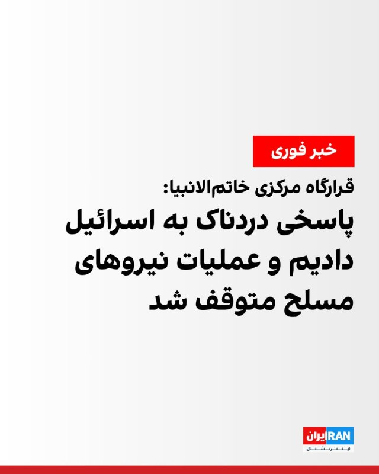

قرارگاه مرکزی خاتم‌الانبیا اعلام کرد در پی حملات اسرائیل به ضاحیه بیروت، در راستای حمایت از لبنان «پاسخی دردناک» به اسرائیل داده شده و بر این اساس، «توقف عملیات نیروهای مسلح» اعلام می‌شود.

این قرارگاه همچنین تاکید کرد در صورت «تداوم تجاوزات»، از جمله در جنوب لبنان، اقدامات بسیار شدیدتر و کوبنده‌تری نسبت به گذشته انجام خواهد شد.
iranintl
‌🏁 🇬🇧 IranintlTV

🤖 @VahidOOnLine

## WithYashar — post 14009

قرارگاه مرکزی خاتم‌: توقف عملیات نیروهای مسلح اعلام می‌گردد؛ اما در صورت تداوم حملات، از جمله در جنوب لبنان، اقدامات شدیدتر در راه خواهد بود
@withyashar

## WithYashar — post 14008

اسرائیل هیوم: اسرائیل و ایالات متحده پیامی به ایران ارسال کردن که اگه تهران حمله دیگری انجام نده، هیچ حمله‌ای علیهش نمیشه
@withyashar

## FoxNewsTwitter — post 342711

  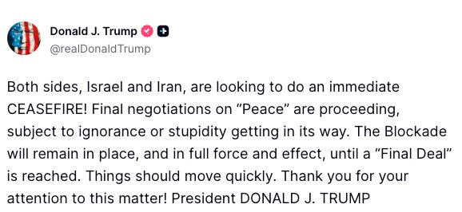

Fox News (Twitter/X)

President Trump is signaling frustration as Israel and Iran continue trading fire in the Middle East.

"Final negotiations on “Peace” are proceeding, subject to ignorance or stupidity getting in its way."

The message comes as missiles continue crossing the region despite Trump's push to bring both sides to the table and lock in a broader agreement.

## mamlekate — post 103644

📝 سرنوشت مبهم مذاکرات پس از درگیری جدید ایران و اسرائيل؛ بقایی: آمریکا مسئول است

در حالی که دونالد ترامپ، رئیس‌جمهوری آمریکا، اعلام کرده بود تا رسیدن به توافق با تهران راه زیادی باقی نمانده است، دور تازه‌ درگیری میان اسرائيل و جمهوری اسلامی واکنش‌های زیادی را در دو سو و همچنین ایالات متحده آمریکا به همراه داشت و حالا سرنوشت این مذاکرات طولانی از قبل هم پیچیده‌تر و دورازدسترس‌تر، به نظر می‌رسد.

پس از حملات شامگاه یکشنبه جمهوری اسلامی به اسرائيل، دونالد ترامپ ادعا کرد که این حمله تاثیری بر توافق ندارد. او سپس حکومت ایران را خطاب داد و گفت: «حمله‌هایتان را کردید، دیگر کافی است، به میز مذاکره بازگردید.» رسانه‌ اکسیوس هم نوشت که ترامپ گفت با نتانیاهو صحبت می‌کند تا او را از حمله تلافی‌جویانه به ایران بازدارد.

📝 ترامپ قاطعانه خواستار توقف فوری حملات اسرائیل و جمهوری اسلامی شد

دونالد ترامپ، رئیس‌جمهوری آمریکا در پیام کوتاه و قاطعی خواستار توقف فوری جنگ جاری میان اسرائیل و جمهوری اسلامی شد. آقای ترامپ روز دوشنبه در شبکه اجتماعی تروث‌سوشال نوشت: «اسرائیل و ایران باید فوراً "تیراندازی" را متوقف کنند.»

@mamlekate

## VahidOnline — post 76059

  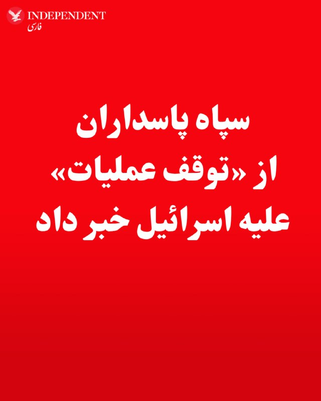

⭕️سپاه پاسداران از «توقف عملیات» علیه اسرائیل خبر داد

♦️قرارگاه مرکزی خاتم‌الانبیا سپاه پاسداران، روز دوشنبه ۱۸ خرداد ماه با اعلام آنکه نیروهای مسلح جمهوری اسلامی ایران در واکنش به حملات اسرائیل به منطقه ضاحیه و جنوب لبنان «پاسخی دردناک» به این کشور داده‌اند، از «توقف عملیات» نظامی خبر داد.

بر اساس بیانیه قرارگاه خاتم‌الانبیا، پرتاب موشک به اسرائیل «در راستای حمایت از مردم مظلوم لبنان» توصیف شده است.
در این بیانیه آمده است که این پاسخ برای اسرائیل و حامیانش باید «درس عبرت» باشد.
قرارگاه خاتم‌الانبیا همچنین اعلام کرد «توقف عملیات نیروهای مسلح» در دستور کار قرار گرفته است.

با این حال، در این بیانیه هشدار داده شده که در صورت ادامه حملات و اقدامات اسرائیل، به‌ویژه در جنوب لبنان، جمهوری اسلامی ایران «اقدامات بسیار شدیدتر و کوبنده‌تر از قبل» انجام خواهد داد.
@VahidOOnLine

📡 @VahidOnline

## VahidOnline — post 76057

اسرائیل و ایران باید فوراً «تیراندازی» را متوقف کنند.

رئیس‌جمهور دونالد جی. ترامپ
realDonaldTrump
دو طرف، اسرائیل و ایران، به دنبال برقراری فوری آتش‌بس هستند! مذاکرات نهایی درباره «صلح» در جریان است، مگر آنکه نادانی یا حماقت مانع آن شود. محاصره تا زمانی که «توافق نهایی» حاصل شود، همچنان برقرار خواهد ماند و با تمام قدرت و اثر کامل اجرا خواهد شد. امور باید به‌سرعت پیش برود. از توجه شما به این موضوع سپاسگزارم!

رئیس‌جمهور دونالد جی. ترامپ
realDonaldTrump

📡 @VahidOnline

## kianmeli1 — post 87792

🔴توقف جنگ و مدارای ترامپ در این روزها به دلیل افتتاحیه جام جهانی است

۴۸ ساعت مهم در پیش است
https://t.me/kianmeli1

## IranIntlTV — post 341164

  

قرارگاه مرکزی خاتم‌الانبیا اعلام کرد در پی حملات اسرائیل به ضاحیه بیروت، در راستای حمایت از لبنان «پاسخی دردناک» به اسرائیل داده شده و بر این اساس، «توقف عملیات نیروهای مسلح» اعلام می‌شود.

این قرارگاه همچنین تاکید کرد در صورت «تداوم تجاوزات»، از جمله در جنوب لبنان، اقدامات بسیار شدیدتر و کوبنده‌تری نسبت به گذشته انجام خواهد شد.
iranintl.com/202606089959

## Shin_Persian — post 6749

Shin ✓ @hey_itsmyturn
Mon, 08 Jun 2026 11:26:05 UTC

𝕏 · @shin_persian

## Shin_Persian — post 6748

Shin ✓ @hey_itsmyturn
Mon, 08 Jun 2026 11:25:11 UTC

IRGC terror organization's Khatam HQ announces the cessation of the operation against Israel.

"The cessation of armed forces operations is announced; however, it is emphasized that in the event of continued aggressions and malicious acts, including in southern Lebanon, significantly more severe and forceful measures than before will be forthcoming."

فارسی

قرارگاه خاتم‌الانبیا سازمان تروریستی سپاه پاسداران انقلاب اسلامی (IRGC) توقف عملیات علیه اسرائیل را اعلام کرد.

«توقف عملیات نیروهای مسلح اعلام می‌شود؛ با این حال، تأکید می‌گردد که در صورت تداوم تجاوزات و اقدامات شرورانه، از جمله در جنوب لبنان، اقداماتی به مراتب شدیدتر و قوی‌تر از قبل در پیش خواهد بود.»

𝕏 · @shin_persian

## FarsiVOA — post 220018

  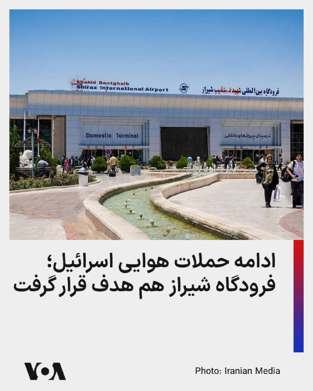

رسانه‌های وابسته به جمهوری اسلامی گزارش داده‌اند که نیروی هوایی اسرائیل همچنان حملات خود را در نقاطی از کشور ادامه می‌دهد.

بر اساس این گزارش‌ها، فرودگاه شیراز در جنوب کشور نیز در میان اهداف حملات اخیر قرار داشته است.

هنوز جزئیات دقیقی درباره میزان خسارت، وضعیت پروازها و تلفات احتمالی منتشر نشده است.
@FarsiVOA

## FarsiVOA — post 220017

🔺تحریم اتحادیه اروپا علیه چند فرد و نهاد جمهوری اسلامی به دلیل محدود کردن تردد دریایی

◾️کایا کالاس، مسئول سیاست خارجی اتحادیه اروپا اعلام که این اتحادیه چند فرد و نهادهای جمهوری اسلامی را به دلیل تهدید آزادی تردد دریایی تحریم کرده است.

◾️هنوز جزئیات بیشتری از تحریم‌های جدید اتحادیه اروپا علیه جمهوری اسلامی منتشر نشده است.

◾️این اولین بار نیست که اتحادیه اروپا تحریم‌هایی را علیه جمهوری اسلامی در این ارتباط وضع می‌کند و پیشتر این اتحادیه بارها خواستار بازگشایی فوری تنگه هرمز شده است.

◾️همچنین اتحادیه اروپا پیشنهاد کرده که مأموریت دریایی «آسپیدس» نقش اصلی را در پاک‌سازی مین‌ها در تنگه هرمز بر عهده بگیرد؛ اقدامی که می‌تواند در قالب یک ائتلاف به رهبری فرانسه و بریتانیا انجام شود.

⬇️ بیشتر بخوانید:
https://ir.voanews.com/a/8158498.html

## Persian_Trend_Official — post 16177

  <a href="telegram/content/Persian_Trend_Official_16177_1780918421.webm" target="_blank">🎬 Download video</a>

قرارگاه خاتم‌الانبیا: پاسخی دردناک به اسرائیل داده شد و توقف عملیات نیروهای مسلح اعلام می‌گردد!

قرارگاه مرکزی حضرت خاتم‌الانبیا در بیانیه ای گفت: در پی حملات اسرائیل در جنوب لبنان و منطقه ضاحیه که با حمایت آمریکای جنایتکار صورت گرفت، نیروهای مسلح مقتدر جمهوری اسلامی ایران در راستای حمایت از مردم مظلوم لبنان، پاسخی دردناک به این رژیم دادند.

پاسخی که رژیم اسرائیل و حامیان آن باید از آن درس عبرت گرفته باشند.

بر این اساس، توقف عملیات نیروهای مسلح اعلام می‌گردد؛ اما تاکید می‌شود که در صورت تداوم تجاوزات و شرارت‌ها، از جمله در جنوب لبنان، اقدامات بسیار شدیدتر و کوبنده‌تر از قبل در راه خواهد بود.

📝 Amir

📌 @persian_trend_official
پرشین ترند | متفاوت‌ترین کانال نظامی

## RadioFarda — post 158052

  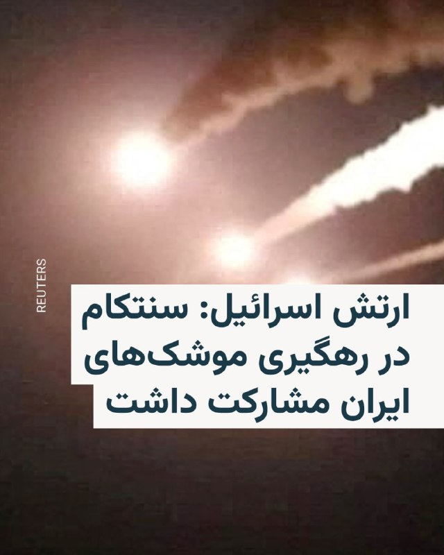

🔸افی دفرین، سخنگوی ارتش اسرائیل، ظهر دوشنبه ۱۸ خرداد در یک نشست خبری در تل‌آویو گفت سنتکام، فرماندهی مرکزی ایالات متحده، در بخش دفاعی با اسرائیل «هماهنگ» بوده و یکشنبه‌شب در رهگیری موشک‌هایی که ایران به اسرائیل شلیک کرد، «مشارکت» داشت.

🔸پیش از این یک مقام دفاعی ایالات متحده تأکید کرده بود که کشورش در عملیات بمباران‌های بامداد دوشنبه اسرائیل در ایران شرکت نداشت.

🔸سخنگوی ارتش اسرائیل در پاسخ خبرنگاران اسرائیلی درباره اظهارات مقامات آمریکایی، گفت همکاری این دو کشور متحد در بخش «دفاعی» بوده است.

🔸یک «افسر ارشد» اسرائیلی نیز که رسانه‌های این کشور نامش را نبردند، دوشنبه گفته بود حملات اسرائیل به ایران در بامداد دوشنبه، «بدون هیچ کمک آمریکایی انجام شد» و آمریکا تنها به دفاع اسرائیل کمک کرد و یکی از ۱۱ موشکی را که ایران یکشنبه‌شب شلیک کرد، رهگیری کرد.

🔸این منبع افزوده بود، ایال زمیر، فرمانده ارتش اسرائیل، در شبانه‌روز اخیر «سه بار» با برد کوپر، فرمانده سنتکام گفت‌وگو کرده و سامانه‌های دفاع موشکی در آمادگی هستند.

@RadioFarda

## IranianMinds — post 21830

جوون ایرانی

اینم سومین جنگی که دیدی...
واقعا مظلوم تر از جوونای ایرانی تو دنیا وجود نداره

@IranianMinds

## IranianMinds — post 21829

هدف چی‌ بوده حالا رستوران آقای خرچنگ ؟ @IranianMinds

## Dirty_Kids — post 391365

  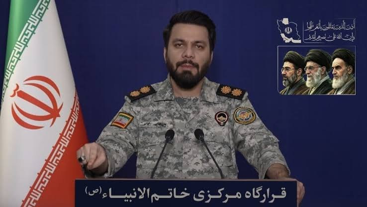

🔴 فوری: مجدد آتش بس شد.

قرارگاه خاتم‌الانبیا اعلام کرد عملیات ما تموم شد و اهدافمون رو زدیم.
اسرائیل هم گفته فعلا حملات رو متوقف میکنیم تا ببینیم چی میشه.

@Dirty_Kids 👻

## Dirty_Kids — post 391362

رسوایی عجیب تو اردوی تیم ملی تو ترکیه؛ دست درازی یه بازیکن به دختر 14 ساله!

دیلی میل| یک فوتبالیست بین‌المللی متهم شده که در یک هتل پنج‌ستاره در ترکیه تلاش کرده یک دختر ۱۴ ساله بریتانیایی را برای «بغل کردن» به پشت یک پرچین ببرد. پدر این دختر در گفت‌وگو با دیلی‌میل گفت که دخترش پس از این اتفاق دچار وحشت شده و در حالی که اشک می‌ریخته با خانواده تماس گرفته است. این حادثه زمانی رخ داد که او همراه خواهر ۱۰ ساله‌اش کنار استخر بود و والدینش حضور نداشتند. دختر ۱۴ ساله که از دیدن یک چهره مشهور هیجان‌زده شده بود، از بازیکن درخواست عکس کرد. پس از گرفتن عکس، بازیکن تلفن او را گرفت، اطلاعات اینستاگرام خود را وارد کرد و از طریق حساب دختر برای خودش پیام فرستاد تا ارتباط برقرار شود. به گفته دختر، پس از آنکه او سن خود را اعلام کرد، فوتبالیست او را هات خطاب کرد و درخواست بغل کردن داد. وقتی دختر مخالفت کرد، بازیکن اصرار کرد و از او خواست به پشت یک پرچین برود؛ جایی که به گفته او هیچ‌کس نمی‌توانست آن‌ها را ببیند. دختر که ترسیده بود، به او گفت پدرش در راه است. به گفته خانواده، بازیکن پس از شنیدن این موضوع به سمت دیگر استخر رفت و خود را پنهان کرد.

@Dirty_Kids 👻

## Hranews — post 113465

  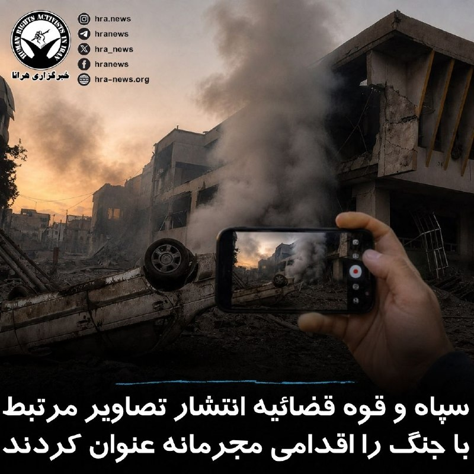

سازمان اطلاعات سپاه و دادستانی کل کشور در بیانیه‌هایی جداگانه و تهدیدآمیز، تهیه و ارسال تصاویر مرتبط با جنگ را اقدامی مجرمانه عنوان کردند. سازمان اطلاعات سپاه در بیانیه خود تهدید کرد افرادی که اقدام به تهیه و انتشار عکس و فیلم از رویدادهای مرتبط با جنگ کنند، «برابر قانون در زمان جنگ» با برخورد مواجه خواهند شد.

دادستانی کل کشور نیز در بیانیه‌ای اعلام کرد که «انتشار تصاویر و فیلم‌های مربوط به محل اصابت پرتابه‌های دشمن، در صورتی که به تکمیل اطلاعات مورد نیاز دشمن منجر شود، جرم محسوب می‌شود.»
#جنگ #حمله_نظامی

↘️
@hranews_bot تماس ✉️ - @Hranews کانال هرانا 🆑

## alonews — post 126253

  <a href="telegram/content/alonews_126253_1780918423.mp4" target="_blank">🎬 Download video</a>

👈وزارت دفاع اسرائیل این ویدیو از حمله به سیستم‌های دفاعی هوایی ایران رو منتشر کرد

✅ @AloNews خبر جنگ

---
📅 بروزرسانی: 1405/03/18 14:53
---

## kianmeli1 — post 87791

-هموطنان از شمال برگردید ..

## kianmeli1 — post 87790

🔴قرارگاه خاتم

جنگ ۱۲ ساعته به پایان رسید
https://t.me/+_a5ind9hr7sxOTE0

## Shin_Persian — post 6747

  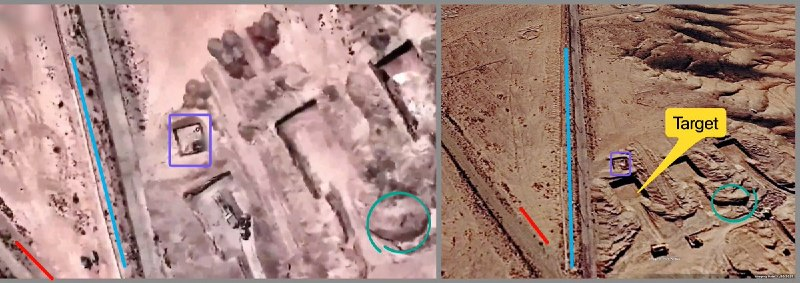

🔁 Quoting above tweet:
Shin ✓ @hey_itsmyturn
Mon, 08 Jun 2026 11:21:18 UTC

Coords:
35.30647, 51.14114 (~ 7km SW of Shamsabad Industrial Town)
Tehran Province, #Iran

فارسی

مختصات:
35.30647, 51.14114 (~ ۷ کیلومتری جنوب غربی شهرک صنعتی شمس‌آباد)
استان تهران، #Iran

𝕏 · @shin_persian

## Shin_Persian — post 6746

  <a href="telegram/content/Shin_Persian_6746_1780917812.mp4" target="_blank">🎬 Download video</a>

↩️ Quoted tweet: Shin ✓ @hey_itsmyturn Mon, 08 Jun 2026 10:32:22 UTC #IDF 🇮🇱: "First color documentation from the attacks in Iran: The IDF destroyed Iranian terror regime air defense systems a short time ago The Air Force completed a short time ago an attack…

## Shin_Persian — post 6745

↩️ Quoted tweet:
Shin ✓ @hey_itsmyturn
Mon, 08 Jun 2026 10:32:22 UTC

#IDF 🇮🇱:
"First color documentation from the attacks in Iran: The IDF destroyed Iranian terror regime air defense systems a short time ago

The Air Force completed a short time ago an attack sortie against air defense systems of the Iranian terror regime in western and central

↩️ توییت نقل‌قول شده — برای پاسخ، پست زیر را ببینید.

فارسی

#IDF 🇮🇱:
«اولین مستندات رنگی از حملات در ایران: ارتش دفاعی اسرائیل (IDF) ساعتی پیش سیستم‌های پدافند هوایی رژیم تروریستی ایران را منهدم کرد.

نیروی هوایی ساعاتی قبل یک سورتی حمله علیه سیستم‌های پدافند هوایی رژیم تروریستی ایران در غرب و مرکز را به پایان رساند.»

𝕏 · @shin_persian

## FarsiVOA — post 220016

  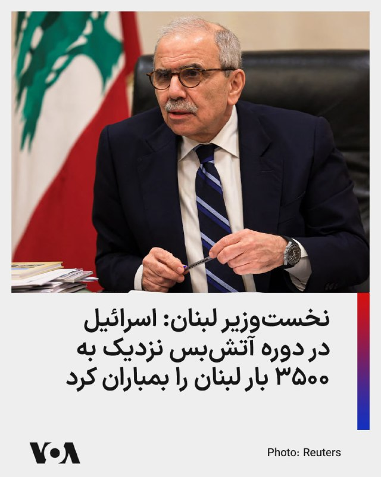

نواف سلام، نخست‌وزیر لبنان، گفت اسرائیل از زمان اعلام آتش‌بس با میانجیگری آمریکا در ۱۶ آوریل، نزدیک به سه هزار و ۵۰۰ حمله هوایی به لبنان انجام داده است.

به گزارش رویترز، سلام پس از نشست کابینه لبنان گفت اسرائیل از ۱۷ آوریل تا ۷ ژوئن، سه هزار و ۴۹۱ حمله هوایی، ۴۰۷ انفجار کنترل‌شده و شش عملیات تخریب در لبنان انجام داده است.

این عملیات‌ها به گفته او، بخش‌هایی از برخی روستاهای جنوب لبنان را کاملاً ویران کرده است.

ارتش اسرائیل به درخواست رویترز برای اظهار نظر در این باره پاسخ نداد.

آتش‌بس اعلام‌شده با میانجیگری آمریکا، حملات هوایی به بیروت و حومه آن را تا حد زیادی متوقف کرده، اما نتوانسته درگیری‌ها در جنوب لبنان میان اسرائیل و حزب‌الله مورد حمایت جمهوری اسلامی را پایان دهد.

سلام گفت لبنان برای پایبندی به آتش‌بس تلاش می‌کند، اما تشدید تازه درگیری میان جمهوری اسلامی و اسرائیل موج‌های جدیدی از آوارگی ایجاد کرده و توان لبنان برای میزبانی از خانواده‌های فراری را تحت فشار گذاشته است.

جمهوری اسلامی به بهانه حمله اسرائیل به مواضع حزب‌الله، از شب گذشته اقدام به حملات موشکی به اسرائیل کرده است.
@FarsiVOA

## FarsiVOA — post 220015

🔺ترامپ: اسرائیل و جمهوری اسلامی به دنبال آتش‌بس فوری هستند

◾️دونالد ترامپ، رئیس‌جمهوری آمریکا، اعلام کرد که هم اسرائیل و هم جمهوری اسلامی به دنبال «برقراری فوری آتش‌بس» هستند و مذاکرات نهایی درباره «صلح» در حال پیشرفت است.

◾️پرزیدنت ترامپ یادآور شد: «هر دو طرف، اسرائیل و ایران، به دنبال برقراری فوری آتش‌بس هستند. مذاکرات نهایی «صلح» در حال پیشرفت است، مشروط بر اینکه نادانی یا حماقت مانع آن نشود.»

◾️او با این حال تأکید کرد که «محاصره همچنان برقرار خواهد ماند و تا زمان دستیابی به یک «توافق نهایی»، با تمام قدرت و به طور کامل اجرا خواهد شد.»

◾️ساعتی پیش از این پیام، رئیس‌جمهوری آمریکا در پیام قاطع دیگری خواستار توقف فوری جنگ میان اسرائیل و جمهوری اسلامی شده بود.

⬇️ بیشتر بخوانید:
https://ir.voanews.com/a/8158501.html

## RadioFarda — post 158051

🔸بقایای موشکی که صبح دوشنبه ۱۸ خرداد از ایران به سمت اسرائیل شلیک شد، در منطقه‌ای غیرمسکونی در کرانه باختری در نزدیکی شهر اریحا، سقوط کرد.

🔸تصاویری که رویترز منتشر کرده است، شهرک‌نشینان اسرائیلی را در کنار بقایای موشک که بخشی از آن در زمین دفن شده بود، دیده شدند.

🔸قرارگاه مرکزی خاتم‌الانبیا روز دوشنبه مدعی شد که سپاه پاسداران، «ضربات سنگینی به اهداف مهم و حساس» در اسرائیل وارد کرده است.

🔸سخنگوی این قرارگاه گفته «در موج جدید اقدامات علیه اهداف مهم و حساس در سرزمین‌های اشغالی، دشمن با دریافت ضربات سنگین، هدفمند، هوشمندانه و خسارت‌بار، عملیات هجومی و موفقی را از سوی نیروهای قدرتمند جمهوری اسلامی ایران تجربه کرد.»

🔸او اشاره‌ای به جزئیات در این زمینه نکرده است.

🔸پیشتر روابط عمومی سپاه پاسداران هم در بیانیه‌ای مدعی شد که به یکی از صنایع پتروشیمی اسرائیل در حیفا حمله موشکی کرده است.

🔸با این حال این قرارگاه هشدار داده که «در صورت تداوم تجاوز و شرارت، با شدت بیشتری با آنها برخورد خواهد شد.»

🔸ارتش اسرائیل صبح دوشنبه اعلام کرد شلیک شمار دیگری موشک از مبداء ایران را شناسایی کرده است.

@RadioFarda

## IranianMinds — post 21828

🔴 فوری ، سپاه پاسداران :

عملیات‌مون پایان یافت و دیگه حمله ای نمیکنیم، ولی اخطار میدیم دشمن مواظب باشه

@IranianMinds

## IranianMinds — post 21827

  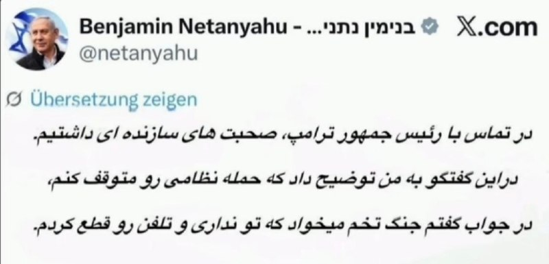

@IranianMinds

## alonews — post 126252

  <a href="telegram/content/alonews_126252_1780917815.webm" target="_blank">🎬 Download video</a>

👈عوستاد خوش چشم: جنگ ادامه داره

✅ @AloNews خبر جنگ

## alonews — post 126251

  <a href="telegram/content/alonews_126251_1780917815.webm" target="_blank">🎬 Download video</a>

⚫
🏆 به دنیای هیجان‌انگیز فوتبال خوش اومدی!

⭐️اینجا قراره باهم لحظه‌به‌لحظه‌ی جام جهانی رو زندگی کنیم؛
از بازی‌های حساس و نتایج داغ گرفته تا حاشیه‌ها، کری‌خونی‌ها و اتفاقاتی که همه درباره‌ش حرف میزنن! 
🔥
🔥

✅ پوشش کامل مسابقات

💀ترول تیم‌ها و بازیکن‌ها

🎥ویدیوها و لحظه‌های فان فوتبالی

📊آمار، ترکیب‌ها و اخبار فوری

🌍حواشی جذاب از سراسر جام جهانی

📢اینجا فقط یک کانال خبری نیست؛
یک جمع فوتبالیه برای کسایی که فوتبال رو با هیجان، شوخی و احساس واقعی دنبال میکنن 
📛
💟

🆘
🔞 آماده باش چون قراره جام جهانی رو متفاوت تجربه کنیم!

⚡ @Vaarzesh_Plus

⚡ @Vaarzesh_Plus

---
📅 بروزرسانی: 1405/03/18 14:48
---

## VahidOOnLine — post 244332

فرزانه ساسانی‌پور، ۴۲ ساله و مادر دو فرزند، شامگاه ۱۹ دی‌ ۱۴۰۴ در کوه‌چنار هنگامی که مقابل خانه مادرش در حال کمک به مجروحان بود، هدف شلیک یک تک‌تیرانداز قرار گرفت و کشته شد. بر اساس گزارش‌ها، گلوله به گردن او اصابت کرد و قلبش را شکافت.
‌🏁 🇬🇧 IranintlTV

🤖 @VahidOOnLine

## VahidOOnLine — post 244331

  <a href="telegram/content/VahidOOnLine_244331_1780917504.mp4" target="_blank">🎬 Download video</a>

⭕️بیماران بیمارستان‌ها در اسرائیل همزمان با حملات موشکی ایران به زیرزمین منتقل شدند

♦️در پی ازسرگیری حملات موشکی جمهوری اسلامی، بیمارستان‌های اسرائیل فعالیت بخشی از واحدهای درمانی خود را به فضاهای محافظت‌شده و زیرزمینی منتقل کردند.

وزارت بهداشت اسرائیل اعلام کرده است که مراکز درمانی در وضعیت اضطراری قرار گرفته‌اند و برخی بیمارستان‌ها بیماران و کادر درمان را به بخش‌های زیرزمینی منتقل کرده‌اند.
همچنین عمل‌های جراحی غیرضروری لغو شده و روند ترخیص بیماران با شرایط پایدار تسریع شده است.
‌🇸🇦 Indypersian

🤖 @VahidOOnLine

## VahidOOnLine — post 244330

  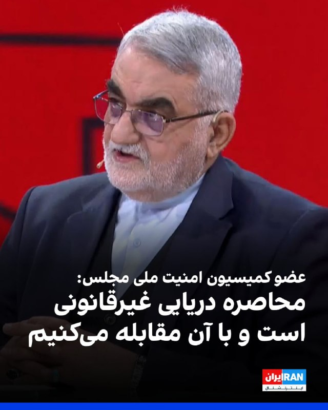

علاءالدین بروجردی، عضو کمیسیون امنیت ملی مجلس گفت: «محاصره دریایی را اقدام غیرقانونی آمریکا می‌دانیم و با آن مقابله خواهیم کرد.»

او افزود توصیه ما به آمریکایی‌ها این است که «عاقلانه‌تر» عمل کنند، «جمهوری اسلامی در جنگ دوم و سوم پیروز شد» و اگر بخواهند جنگ چهارم را آغاز کنند، قطعا باز هم پیروز خواهیم بود.»
iranintl
‌🏁 🇬🇧 IranintlTV

🤖 @VahidOOnLine

## WithYashar — post 14007

  <a href="telegram/content/WithYashar_14007_1780917507.mp4" target="_blank">🎬 Download video</a>

‏ارتش اسرائیل : ما سیستم‌های پدافند هوایی رژیم تروریستی جمهوری اسلامی در غرب و مرکز ایران را نابود کردیم

‏پس از حمله، انفجارهای ثانویه‌ای شناسایی شد که نشان می‌داد موشک‌ها در پرتابگر بوده‌اند.
@withyashar

## WithYashar — post 14006

  <a href="telegram/content/WithYashar_14006_1780917509.mp4" target="_blank">🎬 Download video</a>

الان کرج سمت میدان استاندارد و فردیس
@withyashar

## mwarmonitor — post 10453

🔴یک مقام آمریکایی گفت تماس تلفنی ترامپ با نتانیاهو «مودبانه» بوده است، اما نتانیاهو با درخواست ترامپ برای توقف اقدامات بیشتر مخالفت کرده است. این مقام افزود: «به نتانیاهو صراحتاً گفته شد که این چرخه باید پایان یابد. آمریکا با این حملات موافقت نکرد و از آن‌ها حمایت نکرد.» — آکسیوس

@mwarmonitor

## mwarmonitor — post 10452

  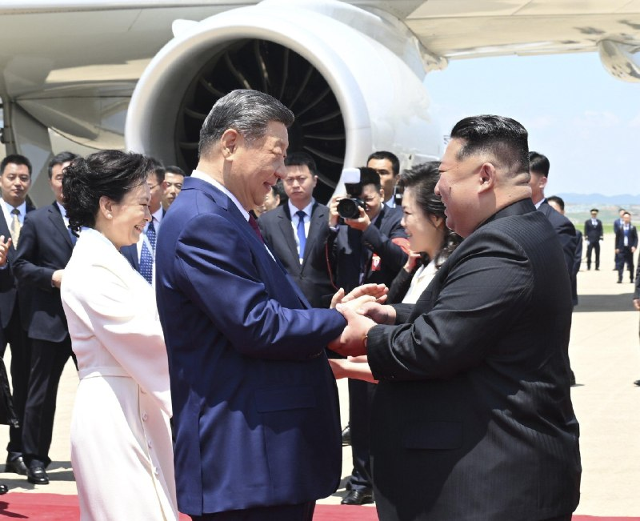

📌شی جین‌پینگ، رئیس‌جمهور چین، برای اولین بار در ۷ سال گذشته به‌صورت رسمی از کره شمالی بازدید کرد.

🔸این نشست در حالی برگزار می‌شود که پکن تلاش دارد نفوذ خود را بر پیونگ‌یانگ دوباره تقویت کند. این موضوع پس از دوره‌ای رخ می‌دهد که کره شمالی روابط نظامی و اقتصادی خود را با مسکو به‌طور قابل توجهی گسترش داده است.

🔸رهبران در حالی دیدار کردند که کیم جونگ اون از گسترش چشمگیر و چندبرابری زرادخانه هسته‌ای کره شمالی خبر داده بود.

@mwarmonitor

## mwarmonitor — post 10451

🚨اسرائیل هیوم گزارش داده است که اسرائیل و ایالات متحده پیامی به ایران ارسال کرده‌اند مبنی بر اینکه اگر تهران حمله دیگری انجام ندهد، هیچ حمله دیگری صورت نخواهد گرفت.

@mwarmonitor

## FoxNewsTwitter — post 342710

  <a href="telegram/content/FoxNewsTwitter_342710_1780917511.mp4" target="_blank">🎬 Download video</a>

Fox News (Twitter/X)

An eventful 24 hours in the Middle East.

Israel and Iran exchanged another round of missile fire across the region, with Israel carrying out strikes inside Iran, and Tehran responding with waves of ballistic missile launches. The latest attacks have raised fears that the conflict could spiral even further.

President Trump is now pushing hard for the shooting to stop. Speaking with @TreyYingst, Trump said Iran should get back to the negotiating table as the U.S. works to secure a ceasefire and broader agreement.

Stop scrolling for updates and turn on live alerts. Get FOX One and get the facts.

http://fox.com/stream/fox-news?cmpid=org=fn::ag=owned_other::mc=organicsocial%5B%E2%80%A6%5DWITTER::cmp=100_o2_th4::cont=m2_tp1::add=03_17_00_05_13_00_02_A

## pm_afshaa — post 92896

🔴اسرائیل هیوم: اسرائیل و ایالات متحده پیامی به ایران ارسال کردن که اگه تهران حمله دیگری انجام نده، هیچ حمله‌ای علیش نمیشه

💧 Rainbet.com the #1 Non-KYC Crypto Casino & Sportsbook @rainbetcom

😁 @Pm_Afshaa

## pm_afshaa — post 92895

دفتر معاون پزشکیان: اینترنت قطع نمیشه

💧 Rainbet.com the #1 Non-KYC Crypto Casino & Sportsbook @rainbetcom

😁 @Pm_Afshaa

## kianmeli1 — post 87789

‏🔴فوری-سرفرماندهی نیروی دریایی سپاه: هرگونه شناور رزمی از کشورهای متخاصم در تنگه هرمز، بی‌درنگ هدف قرار می‌گیرد
https://t.me/+_a5ind9hr7sxOTE0

## IranIntlTV — post 341163

فرزانه ساسانی‌پور، ۴۲ ساله و مادر دو فرزند، شامگاه ۱۹ دی‌ ۱۴۰۴ در کوه‌چنار هنگامی که مقابل خانه مادرش در حال کمک به مجروحان بود، هدف شلیک یک تک‌تیرانداز قرار گرفت و کشته شد. بر اساس گزارش‌ها، گلوله به گردن او اصابت کرد و قلبش را شکافت.

## IranIntlTV — post 341162

  

علاءالدین بروجردی، عضو کمیسیون امنیت ملی مجلس گفت: «محاصره دریایی را اقدام غیرقانونی آمریکا می‌دانیم و با آن مقابله خواهیم کرد.»

او افزود توصیه ما به آمریکایی‌ها این است که «عاقلانه‌تر» عمل کنند، «جمهوری اسلامی در جنگ دوم و سوم پیروز شد» و اگر بخواهند جنگ چهارم را آغاز کنند، قطعا باز هم پیروز خواهیم بود.»
iranintl.com/202606087783

## FarsiVOA — post 220014

  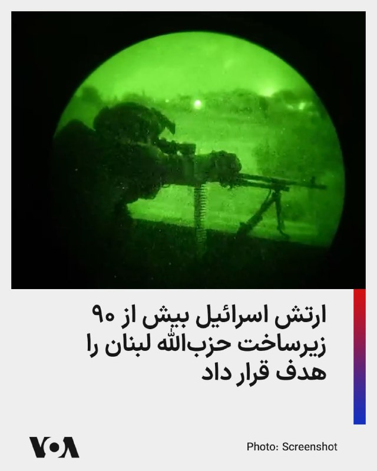

ارتش اسرائیل اعلام کرد که در کنار «حملات در ایران»، طی ۲۴ ساعت گذشته بیش از ۹۰ زیرساخت حزب‌الله در لبنان را مورد هدف قرار داده است.

در گزارش ارتش اسرائيل آمده است که اهدافی از جمله انبار تسلیحات و مراکز فرماندهی در این حملات هدف قرار گرفتند که از آنها برای پیشبرد طرح‌های «تروریستی» استفاده می‌شد. همزمان، سکوهای پرتاب حزب‌الله نیز با هدف رفع تهدید علیه شهروندان اسرائیلی مورد حمله قرار گرفتند.

ارتش اسرائیل اعلام کرد که با قاطعیت به فعالیت خود برای رفع هرگونه تهدید علیه شهروندان این کشور «در هر مکانی که لازم باشد» ادامه خواهد داد.

ایالات متحده و برخی از کشورها از جمله اسرائيل، حزب‌الله لبنان را یک سازمان تروریستی می‌دانند و اتحادیه اروپا نیز شاخه نظامی این سازمان را در فهرست گروه‌های تروریستی قرار داده است.
@FarsiVOA

## FarsiVOA — post 220013

  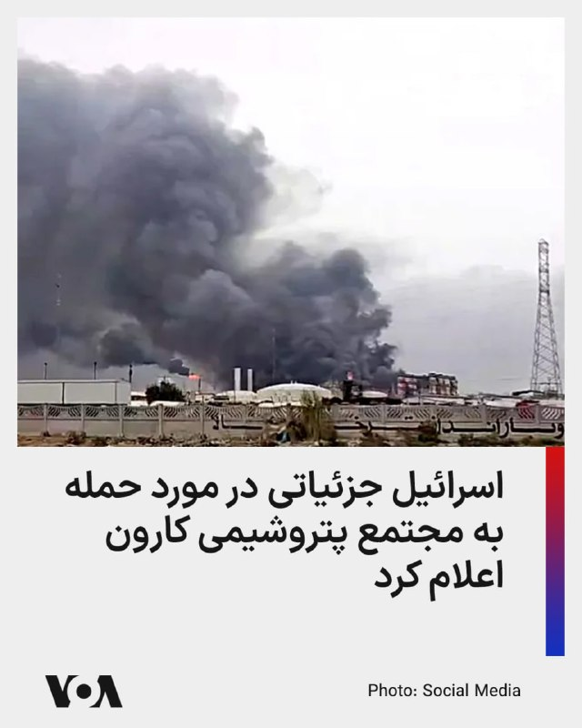

ارتش اسرائیل دلایل هدف قرار دادن مجتمع پتروشیمی کارون ماهشهر را «تولید مواد اولیه برنامه موشکی» در این مجتمع عنوان و اعلام کرد که به زیرساخت‌های نظامی حمله کرده است.

در بیانیه ارتش اسرائیل آمده است که نیروی هوایی با هدایت دقیق معاونت اطلاعات ارتش اسرائیل، چندین زیرساخت را در مجتمع پتروشیمی ماهشهر در جنوب‌غرب ایران هدف قرار داد.

ارتش اسرائیل اعلام کرد که این زیرساخت‌ها توسط نیروهای مسلح وابسته به جمهوری اسلامی، برای تولید و صادرات مواد اولیه تجهیزات نظامی مورد استفاده قرار می‌گرفتند.

ارتش اسرائیل یادآور شد که در این زیرساخت‌ها، مواد خاصی تولید می‌شد که به‌عنوان اجزای ضروری برای توسعه موشک‌های بالستیک به‌کار می‌روند و تهدیدی مستقیم علیه کشور اسرائیل و شهروندان آن محسوب می‌شوند. به گفته ارتش اسرائیل، اهداف فوق برای برنامه موشکی جمهوری اسلامی حیاتی بودند.

صبح روز دوشنبه، ۱۸ خرداد، رسانه‌های وابسته به جمهوری اسلامی از حملاتی به شرکت پتروشیمی کارون در ماهشهر خبر داده بودند. حملات ارتش اسرائیل، در واکنش به حملات موشکی بامداد دوشنبه سپاه به این کشور انجام شده است.
@FarsiVOA

## FarsiVOA — post 220012

  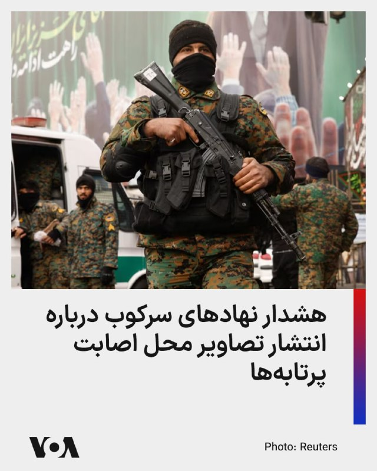

نهادهای سرکوبگر جمهوری اسلامی به شهروندان ایران هشدار دادند که انتشار هرگونه تصویر و فیلم از محل اصابت پرتابه‌ها جرم تلقی شده و با شهروندان برخورد می‌شود.

بر اساس گزارش خبرگزاری میزان وابسته به قوه قضائیه، دادستانی کل کشور با صدور اطلاعیه‌ای هشدار داد که «ملاحظات امنیتی» در پوشش اخبار و تصاویر جنگ باید رعایت شود و رسانه‌ها و فعالان فضای مجازی از انتشار «محتوای حساس» خودداری کنند

همزمان، سازمان اطلاعات سپاه پاسداران نیز تهدید کرد که تهیه و ارسال عکس و فیلم درباره جنگ «همکاری اطلاعاتی با دشمن» است.

جمهوری اسلامی در ماه‌های اخیر سرکوب‌ها را افزایش داده و بسیاری از شهروندان را به اتهام «همکاری با دشمن» بازداشت کرده است. همچنین چندین زندانی سیاسی را با اتهام «جاسوسی» اعدام کرده است.
@FarsiVOA

## FarsiVOA — post 220011

🔺نشست شورای حکام آژانس در وین آغاز شد؛ جمهوری اسلامی در کانون حساسیت‌ها

◾️نشست فصلی شورای حکام آژانس بین‌المللی انرژی اتمی با حضور نمایندگان ۳۵ کشور عضو این شورا در وین آغاز شد. این نشست که پشت درهای بسته برگزار می‌شود با افزایش تنش‌ها بر سر پرونده هسته‌ای جمهوری اسلامی حساسیت ویژه‌ای پیدا کرده است.

◾️همزمان با آغاز نشست، نمایندگی جمهوری اسلامی در وین هشدار داد که به گفته تهران، «رویکرد تقابلی» در شورای حکام می‌تواند چشم‌انداز دیپلماسی را تضعیف کند.

◾️رویترز اخیراً به نقل از گزارش محرمانه تازه آژانس نوشت این نهاد هنوز نتوانسته به شماری از سایت‌های هسته‌ای ایران که در حملات پیشین هدف قرار گرفته‌اند بازگردد و تهران نیز سرنوشت ذخایر اورانیوم غنی‌شده خود را روشن نکرده است.

⬇️ بیشتر بخوانید:
https://ir.voanews.com/a/8158495.html

## Persian_Trend_Official — post 16176

  <a href="telegram/content/Persian_Trend_Official_16176_1780917516.mp4" target="_blank">🎬 Download video</a>

ارتش اسرائیل ویدیویی از حملات خود به سامانه های پدافند هوایی در ایران منتشر کرد.

📝 Amir

📌 @persian_trend_official
پرشین ترند | متفاوت‌ترین کانال نظامی

## Persian_Trend_Official — post 16175

  <a href="telegram/content/Persian_Trend_Official_16175_1780917518.webm" target="_blank">🎬 Download video</a>

معاونت ارتباطات و اطلاع‌رسانی دفتر معاون اول رئیس‌جمهور:

نگرانی برای قطع اینترنت وجود نداره و اینترنت قطع نمیشه

## IranianMinds — post 21826

تموم شد
مبارک خیلیا

## IranianMinds — post 21825

🔴 اسرائیل هیوم :

اسرائیل و آمریکا پیامی به جمهوری اسلامی ارسال کردن که اگر تهران حمله دیگری انجام نده، حمله دیگری نیز از سوی آن‌ها صورت نخواهد گرفت.

@IranianMinds

## IranianMinds — post 21824

  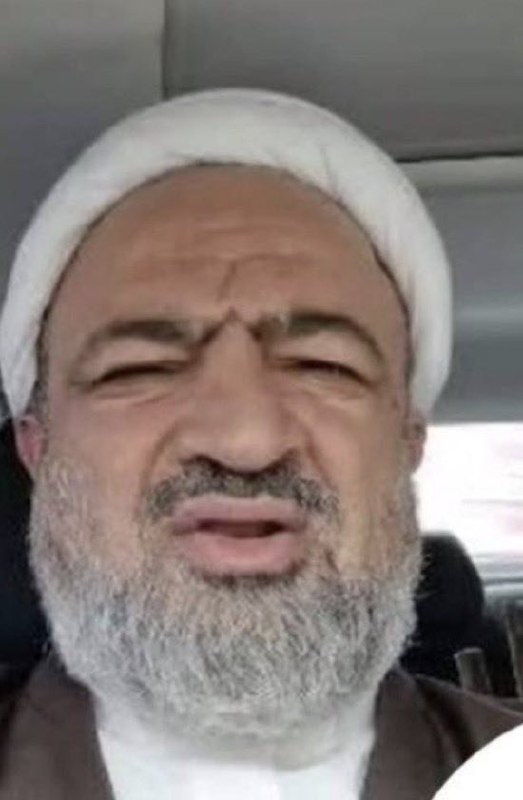

🔴 وقتی چند وقته نتونسی درست حسابی کانفیگ بفروشی

آخوند رسایی حرومی : حتما باید بزنن چند نفرو ترور کنن تا بفهمن شرایط کشور جنگیه ؟ بزنید اینترنت رو قطع کنید!

@IranianMinds

## Dirty_Kids — post 391361

‏ما یه آشنا تو FBI داریم
میگه آمریکا تا کریسمس رفتنیه.

@Dirty_Kids 👻

## Dirty_Kids — post 391360

‏یک تئوری دارم که جمهوری اسلامی اونقدر باد شده و اعتماد به نفسش بالا رفته که حتی نیاز نمیبینه اینترنتو قطع کنه

## Dirty_Kids — post 391359

تعداد جنگ هایی که توشون حضور داشتم از تعداد رابطه هایی که داشتم بیشتر بوده.

## Dirty_Kids — post 391358

اب ریخت رو گوشیم خودش تایپ کرد وگرنه من چرا باید بهت بگم برو کصکش وی پی انتو‌ بکن تو کونت

## Dirty_Kids — post 391357

  <a href="telegram/content/Dirty_Kids_391357_1780917520.mp4" target="_blank">🎬 Download video</a>

🔴 فوری: فیلمی که ارتش اسرائیل از لحظه انهدام سامانه‌های پدافندی در حملات امروز به ایران منتشر کرده.

@Dirty_Kids 👻

## Dirty_Kids — post 391356

  <a href="telegram/content/Dirty_Kids_391356_1780917522.mp4" target="_blank">🎬 Download video</a>

🔴 خدایا شکرت؛ وضعیت دیشب کافه‌های مملکت:

@Dirty_Kids 👻

## alonews — post 126250

  <a href="telegram/content/alonews_126250_1780917523.webm" target="_blank">🎬 Download video</a>

👈قرارگاه مرکزی خاتم‌: توقف عملیات نیروهای مسلح اعلام می‌گردد؛ اما در صورت تداوم حملات، از جمله در جنوب لبنان، اقدامات شدیدتر در راه خواهد بود

✅ @AloNews خبر جنگ

## alonews — post 126249

  <a href="telegram/content/alonews_126249_1780917523.webm" target="_blank">🎬 Download video</a>

👈اکسیوس: یک مقام آمریکایی گفت که تماس ترامپ و نتانیاهو «مودبانه» بود، اما نتانیاهو در برابر درخواست ترامپ مقاومت کرده است.

🔴این مقام آمریکایی گفت: «به صراحت به نتانیاهو گفته شد که این چرخه باید پایان یابد. آمریکا با این حملات موافقت یا از آنها حمایت نکرد.»

🔴در حالی که دو مقام آمریکایی گفتند نیروهای نظامی ایالات متحده در حملات اسرائیل به ایران نقشی نداشته اند، یک مقام اسرائیلی گفت که آمریکا در رهگیری حملات ایران به اسرائیل کمک کرده است

✅ @AloNews خبر جنگ

## alonews — post 126248

  <a href="telegram/content/alonews_126248_1780917523.webm" target="_blank">🎬 Download video</a>

🔴فوری / اسرائیل هیوم: اسرائیل و ایالات متحده پیامی به ایران ارسال کردن که اگه تهران حمله دیگری انجام نده، هیچ حمله‌ای علیش نمیشه

✅ @AloNews خبر جنگ

## alonews — post 126247

  <a href="telegram/content/alonews_126247_1780917524.webm" target="_blank">🎬 Download video</a>

👈سفیر آمریکا در لبنان: اگر حزب‌الله حملات خود علیه اسرائیل را متوقف کند، اسرائیل نیز ضاحیه (حومه جنوبی بیروت) را هدف قرار نخواهد داد

✅ @AloNews خبر جنگ

## alonews — post 126243

  <a href="telegram/content/alonews_126243_1780917524.webm" target="_blank">🎬 Download video</a>

👈عکاس اسرائیلی؛ رفته کنار یه پوستر موشک ایرانی که تو اریحا فرو رفته، وایساده و عکس گرفته

✅ @AloNews خبر جنگ

---
📅 بروزرسانی: 1405/03/18 14:33
---

## VahidOOnLine — post 244329

  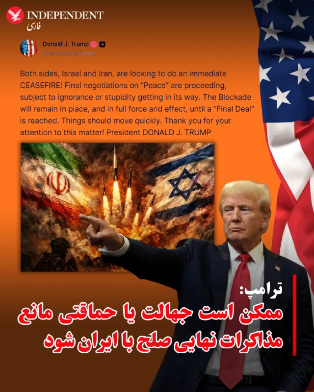

⭕️ترامپ: ممکن است جهالت یا حماقتی مانع مذاکرات نهایی صلح با ایران شود

♦️دونالد ترامپ، رئیس جمهوری آمریکا روز دوشنبه ۱۸ خردادماه اعلام کرد مذاکرات نهایی «صلح» با ایران در حال انجام است اما هشدار داد که «ممکن است جهالت یا حماقتی» مانع از به نتیجه رسیدن این روند شود.

ترامپ با انتشار پیامی در تروث نوشت: «هر دو طرف، اسرائیل و ایران، به دنبال آتش‌بس فوری هستند! مذاکرات نهایی در مورد «صلح» در حال انجام است، هرچند ممکن است جهالت یا حماقتی مانع آن شود.»

رئیس جمهوری آمریکا در همین پیام نوشت: «محاصره [دریایی ایران] تا زمان دستیابی به «توافق نهایی» با تمام قوا و قدرت ادامه خواهد یافت. این روند باید به سرعت پیش رود.»

ترامپ دقایقی پیش از این پیام از ایران و اسرائیل خواسته بود حملات به یکدیگر را متوقف کنند.
‌🇸🇦 Indypersian

🤖 @VahidOOnLine

## VahidOOnLine — post 244328

  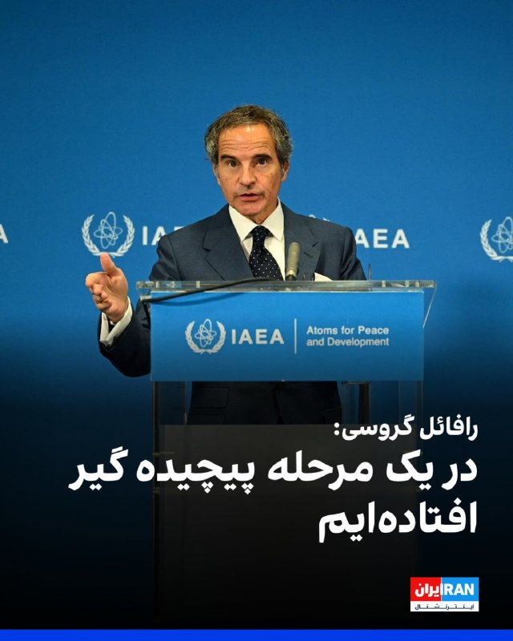

رافائل گروسی، مدیر کل آژانس بین المللی انرژی اتمی، در یک نشست خبری گفت: «در یک مرحله پیچیده گیر افتاده‌ایم اما این وضعیت در گذشته نیز وجود داشته است.»

گروسی افزود که آژانس به تلاش خود برای تعامل و پیگیری بازرسی از تاسیسات ایران همچنان ادامه می‌دهد.

او گفت: «آژانس باید در توافق جمهوری اسلامی و آمریکا در بخش هسته‌ای نقش ایفا کند.»
iranintl
‌🏁 🇬🇧 IranintlTV

🤖 @VahidOOnLine

## WithYashar — post 14005

رسانه های رژیم با ذکر الله اکبر ، نوشتند تنگه هرمز کامل بسته شد @withyashar

## WithYashar — post 14004

وزیر آموزش و پرورش اسرائیل: تعطیلی مدارس فردا سه‌شنبه نیز ادامه خواهد داشت.
@withyashar

## mwarmonitor — post 10450

🔴سفیر آمریکا در لبنان: اگر حزب‌الله حملات خود علیه اسرائیل را متوقف کند، اسرائیل نیز ضاحیه (حومه جنوبی بیروت) را هدف قرار نخواهد داد.

@mwarmonitor

## FoxNewsTwitter — post 342709

  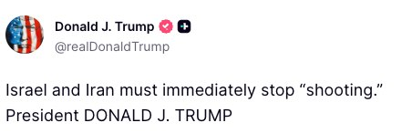

Fox News (Twitter/X)

NEW: President Trump demands Israel and Iran stop firing missiles at each other as the region edges back toward a wider war.

The warning comes after Iran fired off a wave of missiles at Israel and Israel launched retaliatory strikes, despite U.S. efforts to hold together a ceasefire and move toward a peace deal.

## pm_afshaa — post 92894

🔴کابینه اسراییل امشب ساعت 21 تشکیل جلسه خواهد داد

💧 Rainbet.com the #1 Non-KYC Crypto Casino & Sportsbook @rainbetcom

😁 @Pm_Afshaa

## pm_afshaa — post 92893

ترامپ: اسرائیل و ایران باید فوراً "شلیک" را متوقف کنن

💧 Rainbet.com the #1 Non-KYC Crypto Casino & Sportsbook @rainbetcom

😁 @Pm_Afshaa

## pm_afshaa — post 92892

  <a href="telegram/content/pm_afshaa_92892_1780916630.mp4" target="_blank">🎬 Download video</a>

اهواز هم اکنون

💧 Rainbet.com the #1 Non-KYC Crypto Casino & Sportsbook @rainbetcom

😁 @Pm_Afshaa

## FarsiVOA — post 220010

🔺اسرائیل: آغاز مرحله دوم غرش شیران؛ هرگونه تهدید جدید جمهوری اسلامی با واکنش قاطع مواجه می‌شود

◾️به دنبال تبادل آتش بین جمهوری اسلامی و اسرائیل طی روز یکشنبه و با افزایش تنش‌ها در منطقه، کمال پنحاسی سخنگوی ارتش اسرائیل، در گفت‌وگوی اختصاصی با صدای آمریکا گفت شاهد آغاز مرحله دوم عملیات «غرش شیران» علیه جمهوری اسلامی هستیم.

⬇️ بیشتر بخوانید:
https://ir.voanews.com/a/8158497.html

## Persian_Trend_Official — post 16174

  <a href="telegram/content/Persian_Trend_Official_16174_1780916631.webm" target="_blank">🎬 Download video</a>

این آرایشگاه کجا میره همیشه همین ظاهر رو داره !!!

## RadioFarda — post 158050

  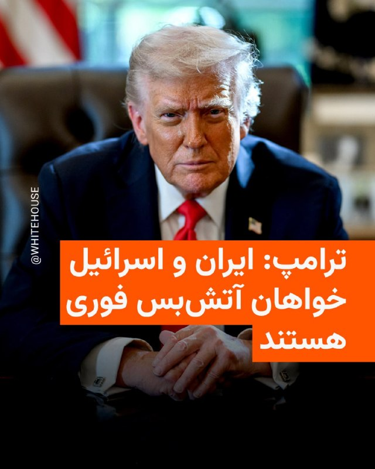

🔸دونالد ترامپ می‌گوید اسرائیل و ایران، خواهان برقراری فوری «آتش‌بس» هستند.

🔸او روز دوشنبه ۱۸ خرداد اندکی پس از آنکه در شبکه اجتماعی خود از دو کشور خواست فوراً حملات متقابل به یکدیگر را متوقف کنند، باردیگر نوشت: «مذاکرات نهایی برای دستیابی به صلح در جریان است؛ مگر آنکه ناآگاهی یا حماقت مانع آن شود.»

🔸او اشاره‌ای به جزئیات آنچه «تمایل» ایران و اسرائیل دربارۀ برقراری آتش‌بس کرده، نکرد؛ این پُست در شرایطی در تروث‌سوشال منتشر شده که دو کشور از آمادگی برای ادامۀ طولانی‌مدت درگیری خبر می‌دهند.

🔸ترامپ در عین حال نوشته: «محاصره [دریایی ایران] همچنان برقرار خواهد ماند و با تمام قدرت اجرا می‌شود تا زمانی که یک توافق نهایی حاصل شود.»

🔸رئیس‌جمهور آمریکا در عین حال تأکید کرده که «انتظار می‌رود روند امور به‌سرعت پیش برود.»

@RadioFarda

## IranianMinds — post 21823

جنگم جنگای قدیم

## IranianMinds — post 21822

  

🔴 روزنامه دیلی میل:

در اردوی تیم ملی ایران توی ترکیه؛ یکی از بازیکنا به یه دختر 14 ساله دست درازی کرده.
بخشی از صحبت‌های پدر بریتانیایی این دختر که داره از مراجع قانونی شکایتش رو پیگیری میکنه:
ما تو یه هتل 5 ستاره تو ترکیه بودیم که فهميديم تیم ملی ایرانم اونجاست. اولش خوشحال شدیم ولی 24 May همه چیز بهم ریخت.
من و همسرم رفتیم بیرون و دو دختر 14 و 10 سالم کنار استخر تو هتل موندن تا اینکه دختر 14 سالم با گریه زنگ زد گفت بابا سریع بیا.

دخترم میره با یکی از بازیکن‌ها بخاطر معروف بودنش عکس بگیره ولی اون بازیکن گوشی رو ازش می‌گیره و از اینستاگرام به خودش پیام میده.

دخترم بهش میگه من فقط 14 سالمه ولی اون بازیکن گفته اتفاقا این خیلی جذابه؛ بعد هم به دخترم میگه بیا بریم پشت اون بوته‌ها همدیگرو بغل کنیم که دخترم پنیک میشه و گریه میکنه.

تازه ما پیگیری کردیم و فهميديم این فوتبالیست یه دختر 15 ساله بریتانیایی دیگه رو هم اذیت کرده.
به مسئول هتل گفتیم فیلم دوربین‌ها رو بده ولی همکاری نکردن و کلا طرف بازیکن رو گرفتن؛ اونجا هم کادر و بقیه بازیکن‌ها ازم عذرخواهی کردن ولی من پیگیری میکنم.

@IranianMinds

## BBCPersian — post 283173

🔻ارتش اسرائیل: پتروشیمی که در ماهشهر هدف قرار گرفت برای ساخت موشک مواد تولید می‌کرد

ارتش اسرائیل در شبکه ایکس نوشت که چند زیرساخت را در مجتمع پتروشیمی بندر ماهشهر، در جنوب‌ غربی ایران، هدف قرار داده است.

به گفته ارتش اسرائیل این تاسیسات «برای تولید و صادرات مواد اولیه مورد استفاده در ساخت تسلیحات» استفاده می‌شد و «زیرساخت‌های هدف قرار گرفته، مواد منحصر به‌ فردی تولید می‌کردند که از اجزای ضروری ساخت موشک‌ بالستیک به شمار می‌روند.»

ایران گفت این حمله پتروشیمی کارون در ماهشهر بوده و به تلافی به پتروشیمی حیفا حمله موشکی کرده است.

ساعاتی پیش ارتش اسرائیل گفت حمله گسترده به سامانه‌های پدافندی راهبردی را به پایان رسانده است.

بنابر این بیانیه، «سامانه‌های پدافندی در نقاط مختلف ایران مستقر شده بودند» تا توانمندی‌هایی را که در عملیات «غرش شیران» [در تابستان پارسال] تضعیف شده بود، بازسازی کنند.

به گفته ارتش اسرائیل، حمله به انهدام این سامانه‌ها منجر شد.

@BBCPersian

## alonews — post 126242

  <a href="telegram/content/alonews_126242_1780916633.webm" target="_blank">🎬 Download video</a>

👈فرماندهی سپاه تو خلیج فارس : هر شناور رزمی متعلق به کشورهای دشمن حق ورود به خلیج فارس رو نداره و در صورت ورود، هدف قرار می‌گیره

✅ @AloNews خبر جنگ

## alonews — post 126241

  <a href="telegram/content/alonews_126241_1780916633.webm" target="_blank">🎬 Download video</a>

👈کیر استارمر ، نخست وزیر بریتانیا: مذاکرات جدی برای صلح پایدار در جریان است و مهم است که به آنها هر فرصتی برای موفقیت داده شود

✅ @AloNews خبر جنگ

---
📅 بروزرسانی: 1405/03/18 14:23
---

## VahidOOnLine — post 244327

  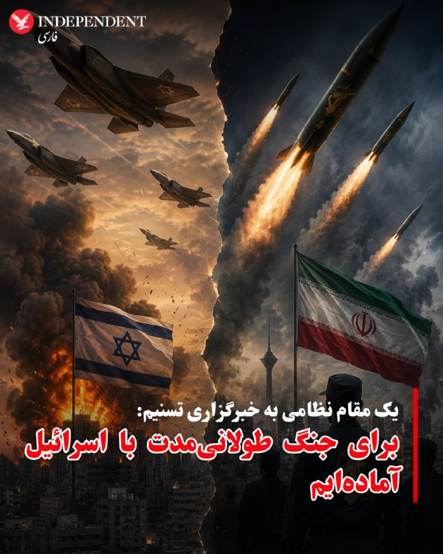

♦️خبرگزاری تسنیم، وابسته به سپاه پاسداران روز دوشنبه ۱۸ خردادماه به نقل از یک مقام نظامی جمهوری اسلامی اعلام کرد «ایران برای جنگ طولانی‌مدت با اسرائیل و ضربه منافع  آمریکا آماده است و تمهیدات کافی» را در نظر گرفته است.

این مقام نظامی که نامش فاش نشده گفت گفته است که جمهوری اسلامی «تنش کنترل شده» نمی‌پذیرد و پاسخ‌های نظامی محدود نخواهد بود.

این اظهارات در حالی بیان می‌شود که پس از حملات موشکی سپاه به اسرائیل، نیروی هوایی این کشور چند مرتبه اهدافی را در مناطق غربی و مرکزی ایران و ازجمله پتروشیمی کارون ماهشهر و فرودگاه شیراز بمباران کرد.

این مقام نظامی مدعی شد: « ایران سطح تنش و اندازه‌ی تنبیه اسرائیلی‌ها را به اندازه‌ای بالا خواهد برد که از تداوم جنایات پشیمان شوند. روزهای آتی نشان خواهد داد که محاسبات اسرائیلی‌ها و آمریکایی‌ها همواره غلط است.»
‌🇸🇦 Indypersian

🤖 @VahidOOnLine

## VahidOOnLine — post 244326

  

دونالد ترامپ در شبکه تروث سوشال نوشت: «اسرائیل و جمهوری اسلامی، به دنبال برقراری آتش‌بس فوری هستند.»

او ادامه داد: «مذاکرات نهایی درباره صلح در جریان است، مگر اینکه نادانی یا حماقت مانع آن نشود. محاصره دریایی همچنان برقرار خواهد ماند و با تمام قدرت و اثرگذاری اجرا خواهد شد تا زمانی که یک توافق نهایی حاصل شود.»
iranintl
‌🏁 🇬🇧 IranintlTV

🤖 @VahidOOnLine

## WithYashar — post 14003

خبرنگار I24News خطاب به پست رئیس جمهور ترامپ:

من واقعاً نمی‌دانم این مذاکره درباره چیست
این مذاکرات به مدت یک هفته و نیم به دلیل لجاجت ایرانی‌ها متوقف شده است. پیام‌های ترامپ هر روز خجالت‌آورتر می‌شوند
و تا جایی که می‌دانم، اسرائیل خواستار آتش‌بس فوری نیست
@withyashar

## mwarmonitor — post 10449

📌وزیر آموزش و پرورش اسرائیل: تعطیلی مدارس فردا سه‌شنبه نیز ادامه خواهد داشت.

@mwarmonitor

## mwarmonitor — post 10448

🔴مدیرکل آژانس بین‌المللی انرژی اتمی، رافائل گروسی: از ایران خواسته می‌شود به تعهدات خود پایبند باشد و از فعالیت‌های غیرقانونی خودداری کند.

@mwarmonitor

## kianmeli1 — post 87788

🔴معاونت ارتباطات و اطلاع‌رسانی دفتر معاون اول رئیس‌جمهور:

نگرانی برای قطع اینترنت وجود نداره و اینترنت قطع نمیشه
https://t.me/+_a5ind9hr7sxOTE0

## IranIntlTV — post 341161

  

رافائل گروسی، مدیر کل آژانس بین المللی انرژی اتمی، در یک نشست خبری گفت: «در یک مرحله پیچیده گیر افتاده‌ایم اما این وضعیت در گذشته نیز وجود داشته است.»

گروسی افزود که آژانس به تلاش خود برای تعامل و پیگیری بازرسی از تاسیسات ایران همچنان ادامه می‌دهد.

او گفت: «آژانس باید در توافق جمهوری اسلامی و آمریکا در بخش هسته‌ای نقش ایفا کند.»
iranintl.com/202606080284

## IranIntlTV — post 341160

  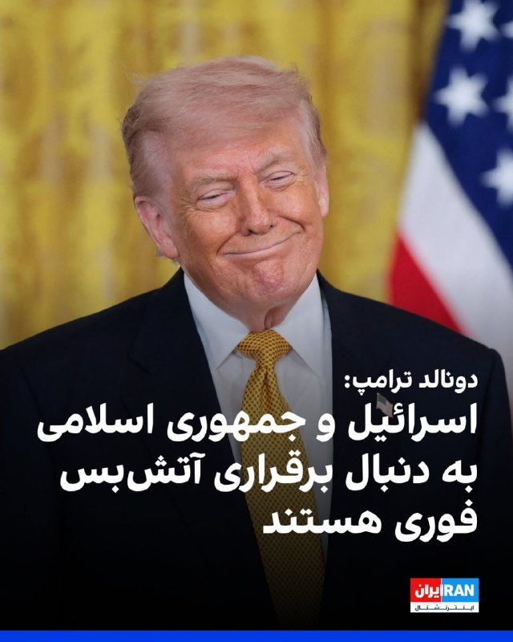

دونالد ترامپ در شبکه تروث سوشال نوشت: «اسرائیل و جمهوری اسلامی، به دنبال برقراری آتش‌بس فوری هستند.»

او ادامه داد: «مذاکرات نهایی درباره صلح در جریان است، مگر اینکه نادانی یا حماقت مانع آن نشود. محاصره دریایی همچنان برقرار خواهد ماند و با تمام قدرت و اثرگذاری اجرا خواهد شد تا زمانی که یک توافق نهایی حاصل شود.»
iranintl.com/202606083698

## FarsiVOA — post 220009

  <a href="telegram/content/FarsiVOA_220009_1780916009.mp4" target="_blank">🎬 Download video</a>

انتشار نخستین تصاویر ارتش اسرائیل از انهدام سامانه‌های پدافندی در خاک ایران؛

نیروی هوایی اسرائیل نخستین مستندات تصویری را از حملات خود به مواضع پدافندی در عمق خاک ایران منتشر کرد. این تصاویر، جزئیات موجی از حملات هوایی هدفمند را نشان می‌دهد که علیه سامانه‌های پدافند هوایی در بخش‌های مرکزی و غربی ایران انجام شده است.

بر اساس مستندات و بیانیه منتشرشده، یکی از تصاویر رنگی مستقیماً لحظه انهدام سامانه‌ای را نشان می‌دهد که موشک‌های رهگیر، ویژه هدف قرار دادن هواگردها، بر روی آن بارگذاری شده بودند.

ارتش اسرائیل تأکید کرد که وقوع انفجارهای ثانویه شدید بلافاصله پس از اصابت موشک‌های مهاجم، موجودیت و آماده‌به‌کار بودن این موشک‌ها را روی سکوی پرتاب کاملاً تأیید می‌کند.

مقامات نظامی اسرائیل اعلام کردند که از کار انداختن این شبکه پدافندی، راهبرد ارتش برای تثبیت و گسترش هرچه بیشتر برتری هوایی در آسمان ایران را محقق کرده است.

ارتش اسرائیل هدف نهایی از این اقدام عملیاتی را که پس از حملات موشکی جمهوری اسلامی به این کشور انجام شده، تداوم خنثی‌سازی و رفع کامل تهدیدها علیه شهروندان خود عنوان کرده است.
@FarsiVOA

## FarsiVOA — post 220008

🔺ناتو یک پهپاد واردشده به حریم هوایی لتونی را سرنگون کرد

◾️لتونی اعلام کرد جنگنده‌های ناتو یک پهپاد را که وارد حریم هوایی این کشور شده بود، در شرق لتونی سرنگون کرده‌اند. این تازه‌ترین مورد از سلسله حوادث پهپادی است که مرزهای شرقی ناتو را به یکی از نقاط پرریسک جنگ اوکراین تبدیل کرده است.

◾️بر اساس این اعلام، این پهپاد در نتیجه جنگ الکترونیک روسیه وارد آسمان لتونی شده بود.
همزمان از ساکنان مناطق نزدیک مرز روسیه و بلاروس خواسته شد در صورت مشاهده تهدید، در پناهگاه یا فضای امن باقی بمانند.

◾️کی‌یف و دولت‌های بالتیک می‌گویند بسیاری از این پهپادها احتمالاً پهپادهای اوکراینی است که در حمله به اهداف روسیه، بر اثر اخلال و فریب سامانه‌های ناوبری از مسیر خارج شده‌اند.

⬇️ بیشتر بخوانید:
https://ir.voanews.com/a/8158491.html

## DW_Farsi — post 125683

🔶 تاخیر آلمان در اجرای قانون شفافیت دستمزد اتحادیه اروپا

جمهوری فدرال آلمان مقررات جدید اتحادیه اروپا در زمینه شفافیت دستمزدها را در موعد مقرر اجرایی نکرده و به این ترتیب، از روز دوشنبه ۸ ژوئن مرتکب نقض قوانین اتحادیه اروپا شده است. مهلت قانونی کشورهای عضو برای همسوسازی قوانین ملی خود با این مصوبه، روز یکشنبه به پایان رسید. وزارت خانواده آلمان پیش از این اعلام کرده بود که قوانین داخلی این کشور، در ماه‌های آینده و حداکثر تا اوایل سال ۲۰۲۷ با این مصوبه تطبیق داده خواهد شد.

اکنون کمیسیون اروپا باید تصمیم بگیرد که آیا پرونده‌ای تنبیهی و حقوقی را علیه آلمان به جریان بیندازد یا خیر. البته در صورتی که برلین واقعا در ماه‌های آینده قوانین خود را اصلاح کند، این کمیسیون می‌تواند از پیگیری قضایی چشم‌پوشی کند.

آمارها نشان می‌دهند که زنان به طور میانگین درآمد کمتری نسبت به مردان دارند. بر اساس داده‌های دفتر آمار اروپا (یورواستات) در سال ۲۰۲۴ که جدیدترین گزارش رسمی موجود است، میانگین دستمزد ناخالص ساعتی زنان در آلمان ۱۵.۶ درصد کمتر از مردان است. این شکاف جنسیتی در کل اتحادیه اروپا به طور متوسط ۱۱.۱ درصد ثبت شده است.

@dw_farsi

## Persian_Trend_Official — post 16173

  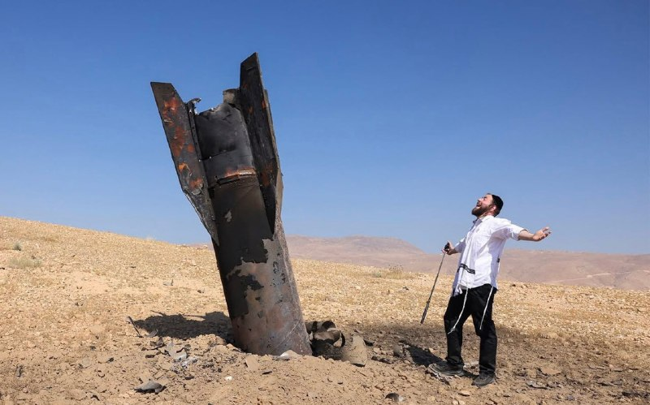

📷 Photo

## RadioFarda — post 158049

  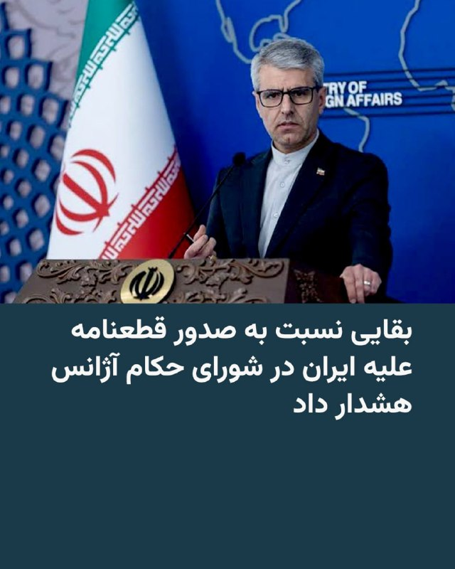

🔸سخنگوی وزارت خارجه جمهوری اسلامی روز دوشنبه ۱۸ خرداد در نشست خبری خود نسبت به احتمال صدور قطعنامه تنبیهی علیه ایران در نشست جاری شورای حکام آژانس بین‌المللی انرژی اتمی، هشدار داد و گفت در صورت صدور این قطعنامه ایران واکنش متقابل نشان خواهد داد. او توضیح بیشتری درباره این واکنش متقابل ارائه نداد.

🔸آمریکا به تازگی پیش‌نویس قطعنامه‌ای در محکومیت ایران را میان اعضای شورای حکام توزیع کرده است.

🔸اسماعیل بقایی در اظهارات روز دوشنبه‌اش با انتقاد شدید از رافائل گروسی، مدیر کل آژانس بین‌المللی انرژی اتمی، او را «رویکرد کاملاً جانبدارانه و غیر فنی و سیاسی» نسبت به موضوع هسته‌ای ایران متهم کرد.

🔸ایران بارها این اتهامات را متوجه گروسی کرده است. علی لاریجانی، مشاور پیشین رهبر جمهوری اسلامی، که در جریان جنگ کشته شد، در اظهاراتی جنجالی در خردادماه ۱۴۰۴، با انتقاد شدید از عملکرد مدیرکل آژانس بین‌المللی انرژی اتمی، گفته بود: «جنگ تمام شود، به حساب گروسی خواهیم رسید.»

@RadioFarda

## RadioFarda — post 158048

  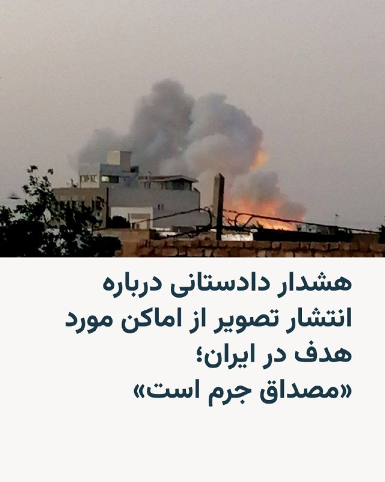

🔸به‌دنبال ادامه حملات متقابل ایران و اسرائیل علیه یکدیگر، دادستانی کل ایران روز دوشنبه با انتشار بیانیه‌ای انتشار تصویر و فیلم از محل‌های هدف قرار گرفته شده را «مصداق جرم» خواند و گفت «با عاملان انتشار این‌گونه محتواها» برخورد می‌شود.

🔸مقام‌های قضایی جمهور اسلامی پیشتر در زمان جنگ اسرائیل و آمریکا با ایران هم با صدور بیانیه‌های مشابه نسبت به انتشار هرگونه فیلم و عکس از مناطق هدف قرار گرفته هشدار داده بودند.

🔸آنها در مواردی نیز از بازداشت افراد مختلف به‌دلیل ارسال عکس و فیلم به کانال‌های تلگرامی و رسانه‌های خارج از کشور خبر داده بودند.

🔸اصغر جهانگیر، سخنگوی قوه قضائیه جمهوری اسلامی پیشتر گفته بود ارسال عکس یا فیلم از محل‌های آسیب‌دیده، از نگاه دستگاه قضایی می‌تواند مصداق «دادن گِرا» و همکاری اطلاعاتی با دشمن تلقی شود.

🔸نهادهای حقوق بشری در ماه‌های اخیر نسبت به افزایش بازداشت‌ها و صدور احکامی چون اعدام در فرایندهای قضایی پرابهام هشدار داده‌اند.

@RadioFarda

## IranianMinds — post 21819

  <a href="telegram/content/IranianMinds_21819_1780916012.mp4" target="_blank">🎬 Download video</a>

🔴 تصاویری پشم ریزون از خسارت شدید و تخریب ساختمان‌ها در پی زمین‌لرزه 7.8 ریشتری در فیلیپین

@IranianMinds

## IranianMinds — post 21818

🔴 نفتالی بنت نخست وزیر سابق اسرائیل:

من فکر می کنم ترامپ قطعا به این واقعیت احترام می گذارد که ما یک کشور مستقل هستیم.

ما شب گذشته توسط ده ها موشک بالستیک ایرانی مورد حمله قرار گرفتیم و هر کشور مستقلی باید از خود دفاع کند.

ما هیچ کاری برای تحریک این حمله از سوی ایران انجام ندادیم. ما به آنها حمله نکردیم. به ما حمله کردند.

@IranianMinds

## BBCPersian — post 283172

🔻استارمر خواستار توقف حملات ایران و اسرائیل شد

کی‌یر استارمر، نخست وزیر بریتانیا، پس از حملات ایران و اسرائیل، خواستار بازگشت «به آتش‌بس» شد.

آقای استارمر گفت که «عمیقا نگران از سرگیری درگیری‌ها» در خاورمیانه است که «تاثیر عظیمی بر سراسر جهان» از جمله در بریتانیا دارد.

او گفت: «من به همه طرف‌ها می‌گویم، همه ما مسئولیت داریم که به آتش‌بس برگردیم و واقعا مهم است که در این باره بسیار شفاف باشیم.»

او بر اهمیت «مذاکرات جدی» برای «صلح پایدار» تاکید کرد.
https://bbc.in/4fxdSPU
@BBCPersian

## Dirty_Kids — post 391355

  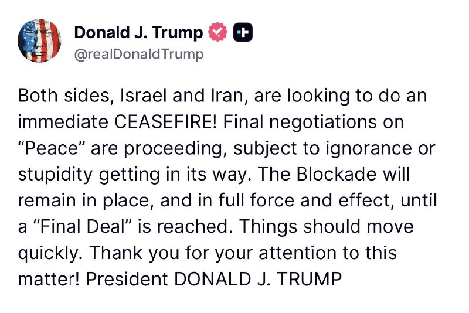

ترامپ در پستی که لحظاتی پیش در تروث‌سوشال منتشر کرد در خصوص جنگ بین اسرائیل و روافض قحبه نوشت:

«هر دو طرف یعنی اسرائیل و روافض قحبه دنبال اینن که فوراً آتش‌بس کنن.

مذاکرات نهایی برای رسیدن به صلح داره پیش میره مگه‌اینکه حماقت یا کسمغزی سد راهش بشه.

محاصره هم با تمام قوا و به طور کامل پابرجا می‌مونه تا زمانی که به یک توافق نهایی برسیم.
کارها باید سریع جلو بره.
ممنون از توجهتون به این موضوع.
رئیس‌جمهور دونالد جی. ترامپ، یلِ گاینده‌ی خاک‌سفید»

@Dirty_Kids 👻

## alonews — post 126240

  <a href="telegram/content/alonews_126240_1780916015.webm" target="_blank">🎬 Download video</a>

👈رافائل گروسی، مدیرکل آژانس بین‌المللی انرژی اتمی: ایران باید به تعهدات خود عمل کند و از فعالیت‌های غیرقانونی خودداری کند.

✅ @AloNews خبر جنگ

## alonews — post 126239

  <a href="telegram/content/alonews_126239_1780916015.webm" target="_blank">🎬 Download video</a>

👈اگه آمریکا، اسرائیل رو بمبارون کرد تعجب نکنید چون ترامپ رئیس جمهوره

✅ @AloNews خبر جنگ

---
📅 بروزرسانی: 1405/03/18 14:13
---

## WithYashar — post 14001

  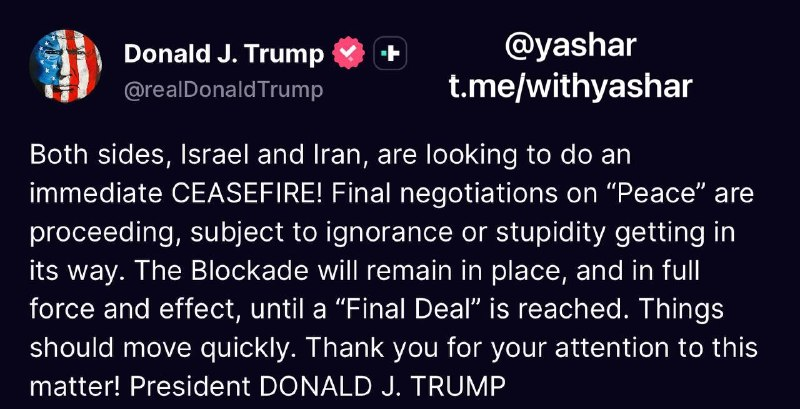

ترامپ: هر دو طرف، اسرائیل و ایران، به دنبال برقراری آتش‌بس فوری هستند!
مذاکرات نهایی درباره «صلح» در حال پیشرفت است، مشروط بر اینکه جهل یا حماقت مانع آن نشود.
محاصره به قوت خود باقی خواهد ماند و با قدرت کامل اجرا می‌شود، تا زمانی که «توافق نهایی» حاصل شود.
اوضاع باید سریع پیش برود. از توجه شما به این موضوع سپاسگزارم!
@withyashar

## WithYashar — post 14000

  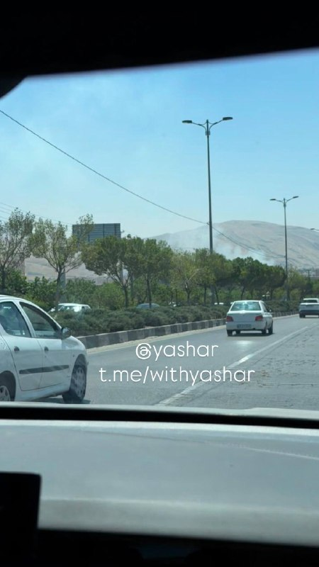

ستون دود از انفجار در شیراز، ساعتی پیش
@withyashar

## WithYashar — post 13999

رسانه های رژیم : پدافند یزد فعال شد
@withyashar

## WithYashar — post 13998

  <a href="telegram/content/WithYashar_13998_1780915418.mp4" target="_blank">🎬 Download video</a>

اولین تصاویر از حمله به یک کشتی باری با پرچم پالائو با ۲۴ خدمه هندی در نزدیکی تنگه هرمز ساعتی پیش , بر اساس این گزارش‌ها، در این حمله موتورخانه کشتی هدف قرار گرفته است.
@withyashar

## WithYashar — post 13997

سخنگوی وزارت خارجه چین : پکن به‌شدت نگران وضعیت فعلیه
@withyashar 🥴

## mwarmonitor — post 10447

🚨 ترامپ در تروث سوشال:

هر دو طرف، اسرائیل و ایران، به دنبال آتش‌بس فوری هستند! مذاکرات نهایی درباره “صلح” در حال انجام است، مشروط بر اینکه جهل یا حماقت مانعی در مسیر آن ایجاد نکند. محاصره تا زمان رسیدن به یک “توافق نهایی” همچنان برقرار خواهد ماند و با تمام قدرت و اثرگذاری ادامه پیدا می‌کند. همه چیز باید سریع پیش برود.

از توجه شما به این موضوع سپاسگزارم!»

@mwarmonitor

## mwarmonitor — post 10446

  <a href="telegram/content/mwarmonitor_10446_1780915420.mp4" target="_blank">🎬 Download video</a>

‼️ اولین مستندات رنگی از حملات در ایران: ارتش اسرائیل مدتی پیش سامانه‌های پدافند هوایی رژیم تروریستی ایران را منهدم کرد

⭕️نیروی هوایی مدتی پیش یک موج حمله علیه سامانه‌های پدافند هوایی رژیم تروریستی ایران در غرب و مرکز ایران را تکمیل کرد.

⭕️ارتش اسرائیل اکنون تصاویری رنگی از انهدام یکی از این سامانه‌ها منتشر می‌کند که در آن موشک‌هایی که برای هدف قرار دادن هواگردها در نظر گرفته شده بودند، نگهداری می‌شدند. پس از حمله، انفجارهای ثانویه شناسایی شد که نشان‌دهنده وجود این موشک‌ها در سکوی پرتاب است.

⭕️انهدام این سامانه‌ها، برتری هوایی نیروی هوایی در آسمان ایران را بیش از پیش گسترش می‌دهد، با هدف ادامه رفع تهدید از شهروندان کشور اسرائیل.

@mwarmonitor

## IranIntlTV — post 341159

  <a href="telegram/content/IranIntlTV_341159_1780915421.mp4" target="_blank">🎬 Download video</a>

سرخط خبرهای دوشنبه ۱۸ خرداد

@iranintltv

## IranIntlTV — post 341158

  <a href="telegram/content/IranIntlTV_341158_1780915423.mp4" target="_blank">🎬 Download video</a>

نشست شورای حکام آژانس بین‌المللی انرژی اتمی دوشنبه در وین آغاز به کار کرد و بررسی برنامه هسته‌ای جمهوری اسلامی از محورهای اصلی این نشست است.

احمد صمدی، خبرنگار ایران‌اینترنشنال، گزارش می‌دهد

@iranintltv

## IranIntlTV — post 341157

  <a href="telegram/content/IranIntlTV_341157_1780915425.mp4" target="_blank">🎬 Download video</a>

ایوت کوپر، وزیر امور خارجه بریتانیا، گفت ادامه درگیری‌ها میان جمهوری اسلامی و اسرائیل به سود هیچ‌کس نیست و دو طرف باید فورا برای کاهش تنش‌ها اقدام کنند.

لی‌لی نیکفر، خبرنگار ایران‌اینترنشنال، از واکنش‌ها در اروپا گزارش می‌دهد

@iranintltv

## Shin_Persian — post 6744

  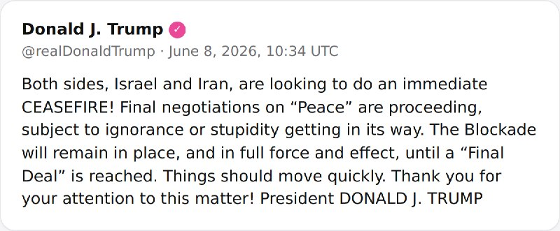

Shin ✓ @hey_itsmyturn Mon, 08 Jun 2026 10:35:26 UTC POTUS: "Both sides, Israel and Iran, are looking to do an immediate CEASEFIRE! Final negotiations on “Peace” are proceeding, subject to ignorance or stupidity getting in its way. The Blockade will remain…

## Shin_Persian — post 6743

Shin ✓ @hey_itsmyturn
Mon, 08 Jun 2026 10:35:26 UTC

POTUS:
"Both sides, Israel and Iran, are looking to do an immediate CEASEFIRE! Final negotiations on “Peace” are proceeding, subject to ignorance or stupidity getting in its way. The Blockade will remain in place, and in full force and effect, until a “Final Deal” is reached. Things should move quickly. Thank you for your attention to this matter! President DONALD J. TRUMP"

فارسی

رئیس‌جمهور ایالات متحده (POTUS):
«هر دو طرف، اسرائیل و ایران، به دنبال یک آتش‌بس فوری هستند! مذاکرات نهایی بر سر «صلح» در حال پیشرفت است، مشروط به اینکه جهالت یا حماقت مانع آن نشود. محاصره تا زمانی که یک «توافق نهایی» حاصل شود، به قوت خود و با تمام توان باقی خواهد ماند. مسائل باید به سرعت پیش برود. از توجه شما به این موضوع سپاسگزارم! رئیس‌جمهور دونالد جی. ترامپ»

𝕏 · @shin_persian

## FarsiVOA — post 220007

  <a href="telegram/content/FarsiVOA_220007_1780915428.mp4" target="_blank">🎬 Download video</a>

ستون‌های دود ناشی از حملات اسرائیل به چند نقطه در تهران؛

گزارش‌های اولیه از وقوع چندین انفجار در مناطق اسلام‌شهر، ملارد، کهریزک در محدوده تهران حکایت دارد. شدت انفجارها به اندازه‌ای بوده که ساکنان این مناطق از لرزش زمین و شنیده‌شدن صداهای پیاپی خبر داده‌اند.
@FarsiVOA

## DW_Farsi — post 125682

  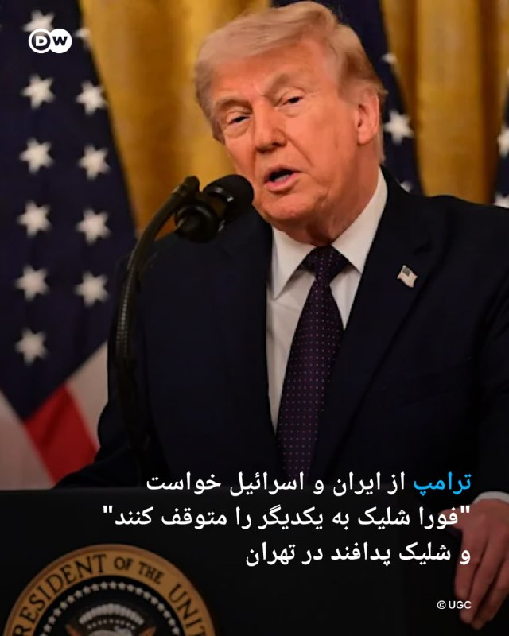

🔶 ترامپ از ایران و اسرائیل خواست "فورا شلیک به یکدیگر را متوقف کنند"

دونالد ترامپ‌ از ایران و اسرائیل خواست تا حملات متقابل به یکدیگر را فورا متوقف کنند. رئیس جمهور آمریکا در پستی در شبکه اجتماعی تروث سوشال نوشت: «اسرائیل و ایران باید سریعا ’شلیک‘ به یکدیگر را متوقف کنند.»

او شامگاه یکشنبه نیز اندکی پس از آغاز حملات موشکی ایران به اسرائیل از تهران خواسته بود تا به میز مذاکره بازگردد و با واشنگتن به توافق برسد.

سایت خبری "اکسیوس" پیش‌تر به نقل از یک مقام ارشد آمریکایی و یک منبع مطلع اسرائیلی گزارش داده بود که ترامپ روز یکشنبه در تماسی تلفنی با بنیامین نتانیاهو، نخست‌وزیر اسرائیل، از او خواسته بود تا حملات موشکی ایران را بدون پاسخ بگذارد و به دیپلماسی فرصت بیشتری بدهد. در این گزارش به نقل از مقام ارشد آمریکایی ذکر شده بود که دولت ترامپ به اسرائیل برای حمله به بیروت "چراغ سبز" نشان نداده بود.

اکسیوس نوشته بود که ترامپ در تماس تلفنی با نتانیاهو به او گفته بود که برای حمله به ایران فعلا دست نگه دارد زیرا ایالات متحده "در آستانه دستیابی به نتیجه‌ای خوب در زمینه توافق" با تهران است. این مقام ارشد آمریکایی اضافه کرده بود که نتانیاهو با درخواست ترامپ مخالفت کرد اما در نهایت "به صورت ظاهری" موافقت کرد که از انجام حمله به ایران خودداری کند.

با این حال حملات اسرائیل به ایران تا ظهر روز دوشنبه ادامه داشته است و به نوشته رسانه‌های اسرائیلی کابینه جنگی اسرائیل قرار است با حضور شمار اندکی از افراد کلیدی تشکیل جلسه دهد. سپاه پاسداران نیز اعلام کرده است که به اهدافی در اسرائیل از جمله دو پایگاه هوایی و تأسیسات پتروشیمی حیفا حمله کرده است.

خبرگزاری تسنیم در گزارشی درخواست ترامپ از ایران و اسرائیل برای توقف حملات را یک "نمایش فریبنده" خواند و نوشت رئیس جمهور آمریکا به اسرائیل برای انجام حملات به لبنان "چراغ سبز" نشان داده است.

@dw_farsi

## Persian_Trend_Official — post 16172

بروجردی، عضو کمیسیون امنیت ملی مجلس: تسلیحاتی داریم که اگر به کار بگیریم زندگی صهیونیست‌ها را مختل می‌کنیم

## Persian_Trend_Official — post 16171

  <a href="telegram/content/Persian_Trend_Official_16171_1780915431.mp4" target="_blank">🎬 Download video</a>

بروجردی، عضو کمیسیون امنیت ملی مجلس: تسلیحاتی داریم که اگر به کار بگیریم زندگی صهیونیست‌ها را مختل می‌کنیم

## Persian_Trend_Official — post 16170

ترامپ:

هر دو طرف، اسرائیل و ایران، به دنبال برقراری آتش‌بس فوری هستند!

مذاکرات نهایی درباره «صلح» در حال پیشرفت است، مشروط بر اینکه جهل یا حماقت مانع آن نشود.

محاصره به قوت خود باقی خواهد ماند و با قدرت کامل اجرا می‌شود، تا زمانی که «توافق نهایی» حاصل شود.

اوضاع باید سریع پیش برود. از توجه شما به این موضوع سپاسگزارم!

## IranianMinds — post 21817

🔴 فوری ترامپ: هر دو طرف، اسرائیل و ایران، به دنبال آتش بس فوری هستند! مذاکرات نهایی در مورد "صلح" به شرط دوری از ناآگاهی یا حماقت در راه است. محاصره به قوت خود باقی خواهد ماند تا زمانی که "توافق نهایی" حاصل شود. همه چیز باید به سرعت حرکت کند. با تشکر…

## IranianMinds — post 21816

  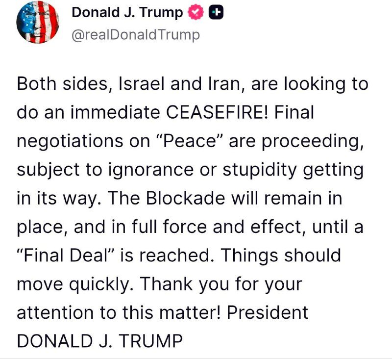

🔴 فوری ترامپ:

هر دو طرف، اسرائیل و ایران، به دنبال آتش بس فوری هستند! مذاکرات نهایی در مورد "صلح" به شرط دوری از ناآگاهی یا حماقت در راه است.

محاصره به قوت خود باقی خواهد ماند تا زمانی که "توافق نهایی" حاصل شود.

همه چیز باید به سرعت حرکت کند. با تشکر از توجه شما به این موضوع!

@IranianMinds

## IranianMinds — post 21815

  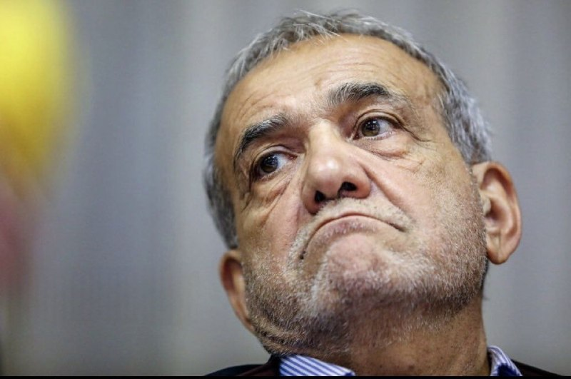

پزشکیان : خو اومد زد!
بازم گنده گوزی کنیم میاد میزنه.

@IranianMinds

## BBCPersian — post 283171

🔻حزب‌الله: به سربازان اسرائیلی در جنوب لبنان حمله کردیم

حزب‌الله می‌گوید صبح امروز رگباری از موشک را به سمت گروهی از خودروهای ارتش و سربازان اسرائیلی در جنوب لبنان شلیک کرده است.

حزب‌الله در کانال تلگرامش نوشت که این حمله در پاسخ به «نقض آتش‌بس و حملات اسرائیل به روستاهای جنوب لبنان» است.

حزب‌الله گفت که یک تجمع پرسنل نظامی را در حومه بیت یاحون هدف قرار داده است.

اسرائیل هنوز اظهار نظری نکرده و میزان خسارات یا جراحات احتمالی مشخص نیست.

@BBCPersian

## BBCPersian — post 283170

🔻اطلاعات سپاه و قوه قضائیه: ارسال فیلم و عکس اقدام مجرمانه محسوب می‌شود

سازمان اطلاعات سپاه پاسداران در بیانیه‌ای اعلام کرد که هر گونه «همکاری با دشمن از جمله تهیه و ارسال فیلم و عکس اقدامی مجرمانه محسوب شده و با مرتکبان برابر قانون در زمان جنگ، برخورد خواهد شد.»

این سازمان از مردم خواست افرادی که «با دشمن همکاری می‌کنند» معرفی کنند.

دادستانی کل کشور هم در بیانیه‌ای هشدار داد: «انتشار تصاویر و فیلم‌هایی از محل اصابت پرتابه‌های دشمن که موجب تکمیل پازل اطلاعاتی دشمن شود، مصداق جرم بوده و با عاملان انتشار این‌گونه محتواها برخورد قاطع قانونی صورت خواهد گرفت.»

قوه قضائیه ایران بارها گفته است که حتی ارسال عکس و فیلم «همکاری با دشمن» است که به توقیف، مصادره اموال و حتی اعدام ممکن منجر شود.

با شروع جنگ اخیر صدها نفر در ایران به اتهام همکاری یا «جاسوسی برای دشمن» بازداشت و به مجازات‌های مختلف محکوم شده‌اند.

@BBCPersian

## idfinfarsi — post 11819

  <a href="telegram/content/idfinfarsi_11819_1780915435.mp4" target="_blank">🎬 Download video</a>

🎬 Video

## Dirty_Kids — post 391354

آقای جمهوری اسلامی اینترنتو قط نکن بهت بگیم جنگنده‌های دشمن از کدوم مناطق رد شدن بلکه کیرشونو بخوری

@Dirty_Kids 👻

## alonews — post 126238

  <a href="telegram/content/alonews_126238_1780915438.webm" target="_blank">🎬 Download video</a>

👈ترامپ: به اسرائیل میگم بس کنید تا برخورد نکردیم!

✅ @AloNews خبر جنگ

## alonews — post 126237

  <a href="telegram/content/alonews_126237_1780915438.webm" target="_blank">🎬 Download video</a>

🔴فوری/معاونت ارتباطات و اطلاع‌رسانی دفتر معاون اول رئیس‌جمهور:

🔴نگرانی برای قطع اینترنت وجود نداره و اینترنت قطع نمیشه

✅ @AloNews خبر جنگ

## alonews — post 126236

  <a href="telegram/content/alonews_126236_1780915438.webm" target="_blank">🎬 Download video</a>

👈 ترامپ: هر دو طرف، اسرائیل و ایران، به دنبال برقراری آتش‌بس فوری هستند!

🔴مذاکرات نهایی درباره «صلح» در حال پیشرفت است، مشروط بر اینکه جهل یا حماقت مانع آن نشود.

🔴محاصره به قوت خود باقی خواهد ماند و با قدرت کامل اجرا می‌شود، تا زمانی که «توافق نهایی» حاصل شود.

🔴اوضاع باید سریع پیش برود. از توجه شما به این موضوع سپاسگزارم!

✅ @AloNews خبر جنگ

---
📅 بروزرسانی: 1405/03/18 14:03
---

## VahidOOnLine — post 244325

  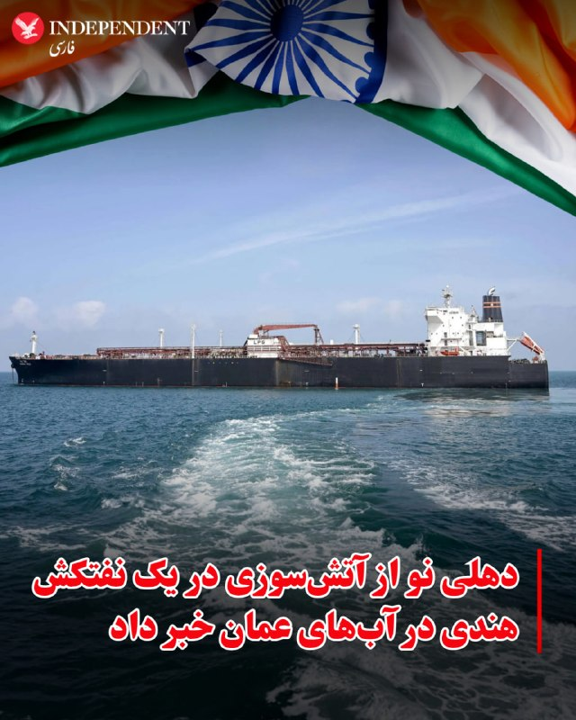

⭕️دهلی نو از آتش‌سوزی در یک نفتکش هندی در آب‌های عمان خبر داد

♦️وزارت نفت هند روز دوشنبه ۱۸ خردادماه اعلام کرد یک نفتکش این کشور در آب‌های خلیج فارس در نزدیکی سواحل عمان دچار آتش‌سوزی شده است.
به گزارش رویترز، وزارت نفت هند اعلام کرد تمام ۲۴ خدمه این کشتی در سلامت هستند.

هنوز خبری درباره منشاء این آتش‌سوزی و حمله احتمالی به نفتکش هندی منتشر نشده است.
‌🇸🇦 Indypersian

🤖 @VahidOOnLine

## VahidOOnLine — post 244324

  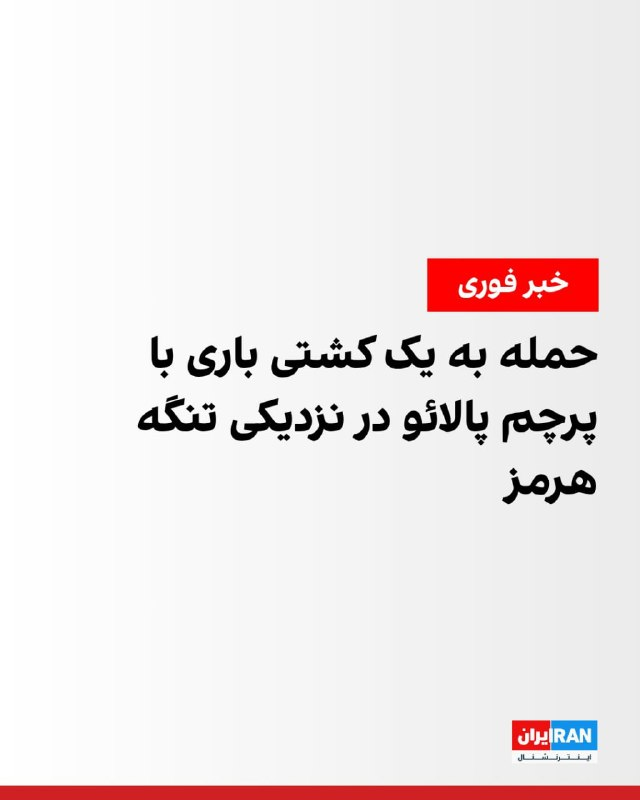

رسانه‌های عربی و هندی از حمله به یک کشتی باری با پرچم پالائو با ۲۴ خدمه هندی در نزدیکی تنگه هرمز در روز دوشنبه خبر دادند.
بر اساس این گزارش‌ها، در این حمله موتورخانه کشتی هدف قرار گرفته است.
iranintl
‌🏁 🇬🇧 IranintlTV

🤖 @VahidOOnLine

## WithYashar — post 13996

کابینه جنگ اسرائیل امشب ساعت 9 به وقت اسرائیل تشکیل جلسه خواهد داد.
@withyashar

## WithYashar — post 13995

سرپرست سرکنسولگری ایران در کربلا: هماهنگی‌های لازم با عراق جهت انتقال حجاج انجام شده است
@withyashar
حجاجی که نیومده بودن باید برن عراق زمینی‌ بیان

## mwarmonitor — post 10445

  <a href="telegram/content/mwarmonitor_10445_1780914802.mp4" target="_blank">🎬 Download video</a>

📝 جنگ که بالا می‌گیرد، انبار خرافات و توهمات حضرات هم سرریز می‌کند! این مارمولک‌ زیر یخچال که تا دیروز سوراخ موش اجاره می‌کرد، حالا که بوی حلوا بلند شده، یاد «توانمندی‌های فوق‌العاده» و «رونمایی‌نشده‌شان» افتاده‌.

🔸باید از این نابغه‌های استراتژیک پرسید: ای دلاورانِ توخالی، اگر تکه‌ای باروتِ کارآمد در چنته داشتید، چرا دقیقاً زمانی رو نکردید که کل نظام داشت به دیار باقی می‌شتافت؟ معلوم نیست پای بساط کدام جنسِ مرغوب نشسته و چه متای نابی مصرف می‌کنند که این‌طور در ابعاد کهکشانی توهم قدرت می‌زنند! در حالی کل نظام سینه قبرستان است، این‌ها روی خرابه‌ها ایستاده‌اند و برای جهان خط و نشان می‌کشند؛ کمدی سیاهی که قهرمانانش غرق در نشئگیِ قدرتِ نداشته‌شان هستند.

@mwarmonitor

## mwarmonitor — post 10444

✈️«شرکت هواپیمایی آذربایجان پروازهای خود به اسرائیل را برای روزهای آینده لغو می‌کند ـ کانال ۱۲»

@mwarmonitor

## IranIntlTV — post 341156

  

رسانه‌های عربی و هندی از حمله به یک کشتی باری با پرچم پالائو با ۲۴ خدمه هندی در نزدیکی تنگه هرمز در روز دوشنبه خبر دادند.
بر اساس این گزارش‌ها، در این حمله موتورخانه کشتی هدف قرار گرفته است.
iranintl.com/202606081987

## Shin_Persian — post 6742

  <a href="telegram/content/Shin_Persian_6742_1780914804.mp4" target="_blank">🎬 Download video</a>

Shin ✓ @hey_itsmyturn Mon, 08 Jun 2026 10:32:22 UTC #IDF 🇮🇱: "First color documentation from the attacks in Iran: The IDF destroyed Iranian terror regime air defense systems a short time ago The Air Force completed a short time ago an attack sortie against…

## Shin_Persian — post 6741

Shin ✓ @hey_itsmyturn
Mon, 08 Jun 2026 10:32:22 UTC

#IDF 🇮🇱:
"First color documentation from the attacks in Iran: The IDF destroyed Iranian terror regime air defense systems a short time ago

The Air Force completed a short time ago an attack sortie against air defense systems of the Iranian terror regime in western and central Iran.

The IDF is now releasing color documentation of the destruction of one of the systems, in which missiles intended to hit aircraft were stored. After the attack, secondary explosions were identified indicating the presence of missiles in the launcher.

The destruction of the systems further expands the Air Force's air superiority in Iranian skies, with the goal of continuing to remove threats against Israeli citizens."
#Iran

https://x.com/manniefabian/status/2063931548752109885/video/1

فارسی

ارتش دفاعی اسرائیل (#IDF) 🇮🇱:
«اولین مستندات رنگی از حملات در ایران: ارتش دفاعی اسرائیل اندکی پیش سیستم‌های پدافند هوایی رژیم تروریستی ایران را منهدم کرد.

نیروی هوایی اندکی پیش یک سورتی پرواز تهاجمی را علیه سیستم‌های پدافند هوایی رژیم تروریستی ایران در غرب و مرکز ایران به پایان رساند.

ارتش دفاعی اسرائیل اکنون در حال انتشار تصاویر رنگی از انهدام یکی از این سیستم‌هاست که موشک‌های در نظر گرفته شده برای هدف قرار دادن هواپیماها در آن ذخیره شده بود. پس از حمله، انفجارهای ثانویه شناسایی شد که نشان‌دهنده وجود موشک در پرتابگر است.

انهدام این سیستم‌ها برتری هوایی نیروی هوایی در آسمان ایران را بیش از پیش گسترش می‌دهد، با این هدف که حذف تهدیدات علیه شهروندان اسرائیلی ادامه یابد.»
#Iran

https://x.com/manniefabian/status/2063931548752109885/video/1

𝕏 · @shin_persian

## FarsiVOA — post 220006

  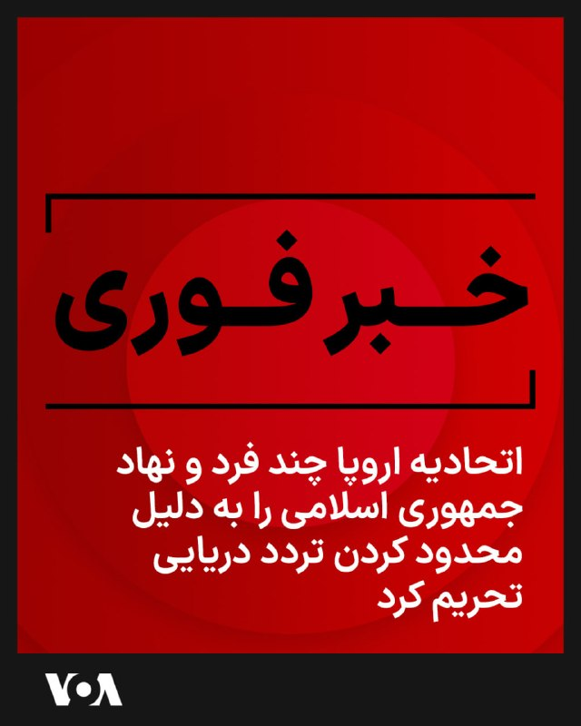

مسئول سیاست خارجی اتحادیه اروپا اعلام کرد که این اتحادیه چند فرد و نهادهای جمهوری اسلامی را به دلیل تهدید آزادی تردد دریایی تحریم کرده است.

کایا کالاس روز دوشنبه در جمع خبرنگاران، در جریان نشست وزیران دفاع اتحادیه اروپا در قبرس، از این تحریم‌ها خبر داد.

هنوز جزئیات بیشتری از تحریم‌های جدید اتحادیه اروپا علیه جمهوری اسلامی منتشر نشده است. این اتحادیه پیشتر بارها خواستار بازگشایی فوری تنگه هرمز شده است.
@FarsiVOA

## FarsiVOA — post 220005

🔺ترامپ قاطعانه خواستار توقف فوری حملات اسرائیل و جمهوری اسلامی شد

◾️دونالد ترامپ، رئیس‌جمهوری آمریکا در پیام کوتاه و قاطعی خواستار توقف فوری جنگ جاری میان اسرائیل و جمهوری اسلامی شد.

◾️آقای ترامپ روز دوشنبه در شبکه اجتماعی تروث‌سوشال نوشت: «اسرائیل و ایران باید فوراً "تیراندازی" را متوقف کنند.»

◾️شامگاه یکشنبه و پس از آغاز حملات موشکی جمهوری اسلامی به اسرائیل که در واکنش به حمله این کشور به ضاحیه بیروت صورت گرفته بود، پرزیدنت ترامپ گفت: «همین الان با نتانیاهو تماس می‌گیرم و به او می‌گویم که حمله متقابل نکند.»

◾️همچنین خبرگزاری کان اسرائيل گزارش داد که رئیس جمهوری آمریکا، به این رسانه گفت: «به نظر من اسرائیل به اندازه کافی پاسخ داده است، دیگر نیازی به پاسخ ندارند.»

⬇️ بیشتر بخوانید:
https://ir.voanews.com/a/8158494.html

## RadioFarda — post 158047

استقبال از رئیس‌جمهور چین در کره شمالی؛ «سیاستِ رابطه با پیونگ‌یانگ تغییرناپذیر است»

🔸شی جین‌پینگ، رئیس‌جمهور چین، که به پیونگ‌یانگ سفر کرده، می‌گوید روابط میان چین و کره شمالی «در آستانه فصلی نوین در تاریخ خود» قرار گرفته است.

🔸او این اظهارات را روز دوشنبه، ۱۸ خرداد، همزمان با ورود به پیونگ‌یانگ برای برگزاری نشستی کم‌سابقه با رهبر این کشور، کیم جونگ اون، بیان کرد. صحبت‌های او در رسانه دولتی کره شمالی منتشر شد.

🔸رئیس جمهور چین به روزنامه رودونگ سینمون گفت توسعه روابط با کره شمالی، سیاست «ثابت و تغییرناپذیر» چین است و دو کشور همکاری‌ها و تبادلات خود را در همه زمینه‌ها تقویت خواهند کرد.

🔸خبرگزاری رویترز نوشته این سفر از آن جهت اهمیت دارد که نخستین سفر خارجی شی در سال جاری محسوب می‌شود. پکن در سال‌های اخیر به دنبال نزدیک‌تر کردن پیونگ‌یانگ به خود بوده است.

🔸شی افزود: «ما باید با هژمونی‌طلبی، اقتدارگرایی و همه تلاش‌ها و توطئه‌هایی که برای احیای نظامی‌گری و به خطر انداختن امنیت و ثبات منطقه صورت می‌گیرد، مقابله کنیم.»

🔸رسانه‌های دولتی چین گزارش دادند که شی پس از ورود به پیونگ‌یانگ با استقبال رسمی بر روی فرش قرمز از سوی کیم جونگ اون و همسرش روبه‌رو شد. همچنین یگان تشریفات نظامی به او ادای احترام کرد و کودکانی دسته‌گل‌هایی به وی تقدیم کردند.

🔸در مراسمی که در میدان کیم ایل سونگ، محل برگزاری رژه‌های نظامی و جشن‌های دولتی کره شمالی برگزار شد، یک گروه موسیقی نظامی سرود ملی هر دو کشور را نواخت.

🔸خبرگزاری رسمی شین‌هوا نیز گزارش داد که به مناسبت این استقبال، ۲۱ گلوله توپ شلیک شد و جمعیتی که در برابر تصاویر عظیم رهبران دو کشور گرد آمده بودند، شعار سر دادند و بادکنک‌های رنگارنگ را به هوا فرستادند.

🔸نسخه کامل این گزارش را در وب‌سایت رادیوفردا بخوانید.

@RadioFarda

## IranianMinds — post 21814

🔴 سخنگوی ارتش اسرائیل:

اولین مستند رنگی از حملات در ایران: ارتش اسرائیل مدتی پیش سامانه‌های دفاع هوایی رژیم تروریستی ایران را منهدم کرد

نیروی هوایی مدتی پیش پرواز حمله‌ای به سمت سامانه‌های دفاع هوایی رژیم تروریستی ایران در غرب و مرکز ایران انجام داد.

@IranianMinds

## IranianMinds — post 21813

🔴 فوری

کابینه امنیتی اسرائیل امشب ساعت ۹ شب دوباره تشکیل جلسه خواهد داد.

@IranianMinds

## IranianMinds — post 21812

از موقعی که ترامپ از خواب بیدار شد جنگ تموم شد

بدرد نخور

## IranianMinds — post 21811

🔴 ترامپ : ایران و اسرائیل سریع باید شلیک رو متوقف کنن ! @IranianMinds

## IranianMinds — post 21810

🔴 حمله رژیم جمهوری اسلامی به یک کشتی هندی در سواحل عمان

@IranianMinds

## IranianMinds — post 21809

دختر مردمو زدن سر اینکه موهاش یه کمی بیرون بود کشتن بعد یه جنده هاشون تو تجمعات و رسانه هاشون لخت لخت مینوازن واسه خودشون

## BBCPersian — post 283169

🔻لغو تمامی پرواز‌های فرودگاه شیراز تا پایان امروز

مدیرکل فرودگاه‌های استان فارس اعلام کرده که تمامی پرواز‌های فرودگاه شیراز «به دلیل شرایط به وجود آمده، فعلا تا ساعت ۲۳ و ۱۵ دقیقه امشب لغو شده و این فرودگاه در حال حاضر هیچ‌گونه عملیات پروازی نخواهد داشت.»

پیش از این ارتش اسرائیل گفته بود که اهدافی را در این فرودگاه هدف قرار داده است.

با این حال خبرگزاری مهر گزارش کرده که «هیچ اصابت یا برخوردی» در این فرودگاه روی نداده است.

این رسانه نوشته: «بر اساس پیگیری‌های خبرنگار مهر هیچگونه انفجار ناشی برخوردی در فرودگاه شیراز رخ نداده است.»

بنابر اعلام سازمان هواپیمایی ایران، تمام پروازها از فرودگاه‌های «مهرآباد و امام خمینی تا اطلاع ثانوی» لغو شده است.

@BBCPersian

## BBCPersian — post 283168

  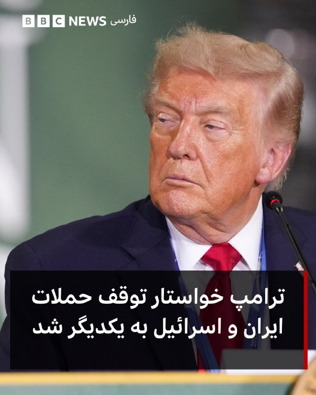

🔻دونالد ترامپ، رئیس‌جمهور آمریکا خواستار توقف حملات ایران و اسرائیل شد.

آقای ترامپ در شبکه اجتماعی تروث سوشال نوشت: «اسرائیل و ایران باید فورا "شلیک" را متوقف کنند.»

پس از حملات هوایی اسرائیل به چند شهر ایران از جمله تهران، اصفهان، تبریز و کرج مقام‌های آمریکایی گفتند که ارتش ایالات متحده در این حملات هیچ نقش و مشارکتی نداشته است.

با این حال اسماعیل بقایی، سخنگوی وزارت خارجه ایران امروز گفت مسئول تمام اتفافات در منطقه با آمریکاست.

هم ایران هم اسرائیل امروز حملات جدیدی به یکدیگر کرده‌اند.

آقای ترامپ بعد از شروع این حملات از این موضوع و قطع ‌آتش‌بس ابراز نارضایتی کرده است.

@BBCPersian
📷 REUTERS

## idfinfarsi — post 11818

  <a href="telegram/content/idfinfarsi_11818_1780914807.mp4" target="_blank">🎬 Download video</a>

‼️ اولین مستندات رنگی از حملات در ایران: ارتش اسرائیل مدتی پیش سامانه‌های پدافند هوایی رژیم تروریستی ایران را منهدم کرد

⭕️نیروی هوایی مدتی پیش یک موج حمله علیه سامانه‌های پدافند هوایی رژیم تروریستی ایران در غرب و مرکز ایران را تکمیل کرد.

⭕️ارتش اسرائیل اکنون تصاویری رنگی از انهدام یکی از این سامانه‌ها منتشر می‌کند که در آن موشک‌هایی که برای هدف قرار دادن هواگردها در نظر گرفته شده بودند، نگهداری می‌شدند. پس از حمله، انفجارهای ثانویه شناسایی شد که نشان‌دهنده وجود این موشک‌ها در سکوی پرتاب است.

⭕️انهدام این سامانه‌ها، برتری هوایی نیروی هوایی در آسمان ایران را بیش از پیش گسترش می‌دهد، با هدف ادامه رفع تهدید از شهروندان کشور اسرائیل.

## Dirty_Kids — post 391353

  <a href="telegram/content/Dirty_Kids_391353_1780914808.mp4" target="_blank">🎬 Download video</a>

[هشدار: ویدئو حاوی صدای حیدعععررررررر حیدعععررررررر گوش‌خراش ] ⚠️

فیلمی از موشتبا AI که کانال‌های شیعه‌سانان رافضی منتشر کردن، لذت میبرن کشور رو به جنگ بعدی کشوندن

@Dirty_Kids 👻

## Dirty_Kids — post 391352

  

🔴 دنیا جهانبخت توی بله و روبیکا کانال زده!

+ احتمالا بزودی برمیگرده ایران.

@Dirty_Kids 👻

## alonews — post 126235

  <a href="telegram/content/alonews_126235_1780914809.webm" target="_blank">🎬 Download video</a>

🔴فوری / یه جت خصوصی از امارات ،با وجود لغو تمام پرواز ها داره میاد تو کشور و نزدیک تهرانه

✅ @AloNews خبر جنگ

## alonews — post 126234

  <a href="telegram/content/alonews_126234_1780914809.webm" target="_blank">🎬 Download video</a>

👈زلزله‌ای به قدرت ۴ ریشتر ظهر امروز حوالی مهران در استان ایلام را لرزاند

✅ @AloNews خبر جنگ

## alonews — post 126233

  <a href="telegram/content/alonews_126233_1780914810.webm" target="_blank">🎬 Download video</a>

👈سخنگوی وزارت خارجه چین : پکن به‌شدت نگران وضعیت فعلی و از سر گرفته شدن درگیری‌ها بین اسرائیل و ایرانه

✅ @AloNews خبر جنگ

---
📅 بروزرسانی: 1405/03/18 13:53
---

## VahidOOnLine — post 244323

  <a href="telegram/content/VahidOOnLine_244323_1780914218.mp4" target="_blank">🎬 Download video</a>

♦️تصاویر منتشرشده در شبکه‌های اجتماعی نشان می‌دهد هم‌زمان با به صدا درآمدن آژیرهای هشدار موشکی در اسرائیل، یک هواپیمای مسافربری در حال فرود در فرودگاه بن‌گوریون بوده است.

این ویدئو لحظاتی از ادامه فعالیت فرودگاه در شرایط هشدار امنیتی را به تصویر می‌کشد. تاکنون جزئیات بیشتری درباره تأثیر این هشدار بر پروازها یا خسارات احتمالی منتشر نشده است.
‌🇸🇦 Indypersian

🤖 @VahidOOnLine

## VahidOOnLine — post 244322

  

خبرگزاری تسنیم، وابسته به سپاه پاسداران، به نقل از یک منبع نظامی نوشت که جمهوری اسلامی برای «جنگ طولانی‌مدت» با اسرائیل و ضربه به منافع آمریکا آماده است و تمهیدات کافی و لازم برای این موضوع به طور کامل اندیشیده شده است.
تسنیم اضافه کرد: «اسرائیلی‌ها و آمریکایی‌ها اگر تصور می‌کنند می‌توانند از طریق تنش کنترل‌شده، جمهوری اسلامی و جبهه مقاومت را در مقابل اقدامات خود پیش‌بینی‌پذیر و یا نوع پاسخ جمهوری اسلامی را محدود کنند، اشتباه احمقانه‌ای را مرتکب می‌شوند.»

این رسانه وابسته به سپاه افزود: «جمهوری اسلامی سطح تنش و اندازه تنبیه اسرائیلی‌ها را به اندازه‌ای بالا خواهد برد که از تداوم جنایات پشیمان شوند. روزهای آتی نشان خواهد داد که محاسبات اسرائیلی‌ها و آمریکایی‌ها همواره غلط است.»

تسنیم نوشت که آمریکایی‌ها در خصوص اقدامات اسرائیل هزینه خواهند داد.
iranintl
‌🏁 🇬🇧 IranintlTV

🤖 @VahidOOnLine

## VahidOOnLine — post 244321

  <a href="telegram/content/VahidOOnLine_244321_1780914221.mp4" target="_blank">🎬 Download video</a>

ویدیوی رسیده به ایران‌اینترنشنال، بی‌تابی و زاری مادر جاویدنام مسعود ذات‌پرور را بر سر مزار او در پنجشنبه ۱۴ خرداد نشان می‌دهد.
ذات‌پرور، قهرمان پرورش‌اندام جهان بود که ۱۸ دی ۱۴۰۴ در جریان اعتراضات رشت بر اثر اصابت گلوله جنگی جان باخت.
‌🏁 🇬🇧 IranintlTV

🤖 @VahidOOnLine

## VahidOOnLine — post 244320

  

اسماعیل کوثری، عضو کمیسیون امنیت ملی مجلس گفت: «مقاومت در منطقه یک جبهه است و نباید میان اضلاع مختلف آن، از جمله لبنان، تفکیک قائل شد، چرا که این جبهه ماهیتی واحد دارد.»

او افزود: «هرگونه تعرض به حزب‌الله و نقض آتش‌بس، با واکنش متقابل و بی‌درنگ نیروهای مسلح جمهوری اسلامی مواجه خواهد شد.»

کوثری ادامه داد: «قدرت واقعی جبهه مقاومت هنوز وارد میدان نشده است.»
iranintl
‌🏁 🇬🇧 IranintlTV

🤖 @VahidOOnLine

## VahidOOnLine — post 244319

  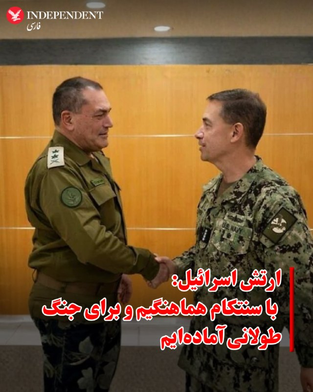

♦️ارتش اسرائیل اعلام کرد خود را برای دست‌کم چند روز دیگر درگیری با جمهوری اسلامی آماده کرده و احتمال ازسرگیری کامل جنگ را نیز منتفی نمی‌داند.
به گزارش تایمز اسرائیل، مقام‌های نظامی اسرائیل روز یکشنبه اعلام کردند برآورد فعلی آنان این است که درگیری‌ها با ایران برای چند روز دیگر ادامه خواهد داشت، هرچند ارتش برای یک نبرد طولانی‌تر نیز آمادگی کامل دارد.

بر اساس این گزارش، جمهوری اسلامی از شامگاه گذشته تاکنون دست‌کم ۲۰ موشک بالستیک به سمت اسرائیل شلیک کرده است. ارتش اسرائیل مدعی شد این موشک‌ها یا رهگیری شده‌اند یا در مناطق باز فرود آمده‌اند. هم‌زمان، حوثی‌های مورد حمایت ایران در یمن نیز دو موشک بالستیک به سمت اسرائیل شلیک کردند که به گفته ارتش اسرائیل، یکی از آنها رهگیری شد و دیگری پیش از رسیدن به خاک اسرائیل سقوط کرد.
در واکنش به این حملات، اسرائیل تاکنون دو موج حمله هوایی علیه اهدافی در ایران انجام داده است.
ارتش اسرائیل اعلام کرد ده‌ها فروند جنگنده نیروی هوایی این کشور بامداد یکشنبه ۹ سامانه پدافند هوایی ایران را در مناطق غربی و مرکزی هدف قرار دادند. همچنین در ساعات صبح، سه کارخانه در مجتمع پتروشیمی در ماهشهر نیز هدف حملات هوایی قرار گرفتند.
ارتش اسرائیل تاکید کرد که عملیات تهاجمی علیه ایران به‌طور مستقیم توسط نیروهای اسرائیلی انجام می‌شود، اما میان ارتش اسرائیل و فرماندهی مرکزی ارتش آمریکا (سنتکام) «هماهنگی کامل» برقرار است.
در این بیانیه آمده است که نیروهای آمریکایی علاوه بر همکاری اطلاعاتی و عملیاتی، در رهگیری موشک‌های شلیک‌شده از سوی ایران به سمت اسرائیل نیز مشارکت داشته‌اند.
ارتش اسرائیل همچنین اعلام کرد سرلشکر ایال زمیر، رئیس ستاد کل ارتش اسرائیل، از آغاز دور جدید درگیری‌ها تاکنون سه بار با دریاسالار برد کوپر، فرمانده سنتکام، گفت‌وگو کرده است.
‌🇸🇦 Indypersian

🤖 @VahidOOnLine

## WithYashar — post 13994

یک کشتی هندی در دریای عمان هدف قرار گرفت و دچار آتش‌سوزی شد
@withyashar

## WithYashar — post 13993

  <a href="telegram/content/WithYashar_13993_1780914225.mp4" target="_blank">🎬 Download video</a>

واکنش السیسی محموت احمدی‌نژاد 🤣
@withyashar

## mwarmonitor — post 10443

🔴«منبعی نزدیک به رئیس مجلس ایران، محمدباقر قالیباف، می‌گوید ایران به‌طور کامل تنگه باب‌المندب را همراه با تنگه هرمز مسدود کرده است و گام بعدی، حمله به زیرساخت‌های نفت، گاز و انرژی کشورهای خلیج فارسِ متحد آمریکا در پاسخ به حملات امروز اسرائیل به مجتمع پتروشیمی ماهشهر خواهد بود ـ خبرگزاری دولتی مهر گزارش می‌دهد.»

@mwarmonitor

## mwarmonitor — post 10442

  <a href="telegram/content/mwarmonitor_10442_1780914226.mp4" target="_blank">🎬 Download video</a>

🔴«دو خلبان در سقوط یک هواپیمای خصوصی در جمهوری دومینیکن جان باختند.

🔸یک جت خصوصی با ثبت آمریکایی هنگام تلاش برای فرود اضطراری در فرودگاه لا رومانا سقوط کرد.

🔸این هواپیما هنگام برخورد منفجر شد و هر دو خلبان کشته شدند. هیچ مسافری در هواپیما حضور نداشت.

@mwarmonitor

## IranIntlTV — post 341155

  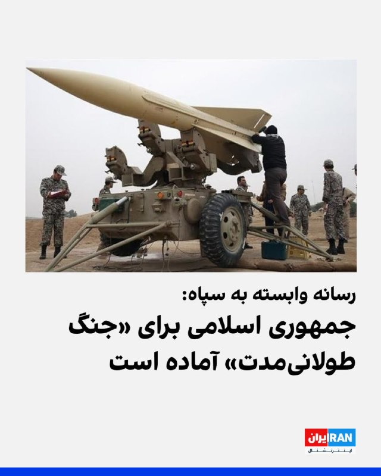

خبرگزاری تسنیم، وابسته به سپاه پاسداران، به نقل از یک منبع نظامی نوشت که جمهوری اسلامی برای «جنگ طولانی‌مدت» با اسرائیل و ضربه به منافع آمریکا آماده است و تمهیدات کافی و لازم برای این موضوع به طور کامل اندیشیده شده است.
تسنیم اضافه کرد: «اسرائیلی‌ها و آمریکایی‌ها اگر تصور می‌کنند می‌توانند از طریق تنش کنترل‌شده، جمهوری اسلامی و جبهه مقاومت را در مقابل اقدامات خود پیش‌بینی‌پذیر و یا نوع پاسخ جمهوری اسلامی را محدود کنند، اشتباه احمقانه‌ای را مرتکب می‌شوند.»

این رسانه وابسته به سپاه افزود: «جمهوری اسلامی سطح تنش و اندازه تنبیه اسرائیلی‌ها را به اندازه‌ای بالا خواهد برد که از تداوم جنایات پشیمان شوند. روزهای آتی نشان خواهد داد که محاسبات اسرائیلی‌ها و آمریکایی‌ها همواره غلط است.»

تسنیم نوشت که آمریکایی‌ها در خصوص اقدامات اسرائیل هزینه خواهند داد.
iranintl.com/202606081768

## IranIntlTV — post 341154

  <a href="telegram/content/IranIntlTV_341154_1780914228.mp4" target="_blank">🎬 Download video</a>

ویدیوی رسیده به ایران‌اینترنشنال، بی‌تابی و زاری مادر جاویدنام مسعود ذات‌پرور را بر سر مزار او در پنجشنبه ۱۴ خرداد نشان می‌دهد.
ذات‌پرور، قهرمان پرورش‌اندام جهان بود که ۱۸ دی ۱۴۰۴ در جریان اعتراضات رشت بر اثر اصابت گلوله جنگی جان باخت.

## IranIntlTV — post 341153

  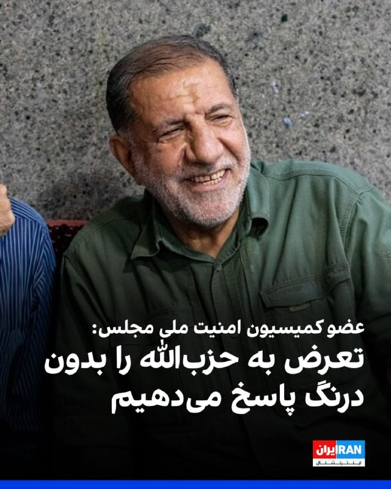

اسماعیل کوثری، عضو کمیسیون امنیت ملی مجلس گفت: «مقاومت در منطقه یک جبهه است و نباید میان اضلاع مختلف آن، از جمله لبنان، تفکیک قائل شد، چرا که این جبهه ماهیتی واحد دارد.»

او افزود: «هرگونه تعرض به حزب‌الله و نقض آتش‌بس، با واکنش متقابل و بی‌درنگ نیروهای مسلح جمهوری اسلامی مواجه خواهد شد.»

کوثری ادامه داد: «قدرت واقعی جبهه مقاومت هنوز وارد میدان نشده است.»
iranintl.com/202606084977

## DW_Farsi — post 125681

  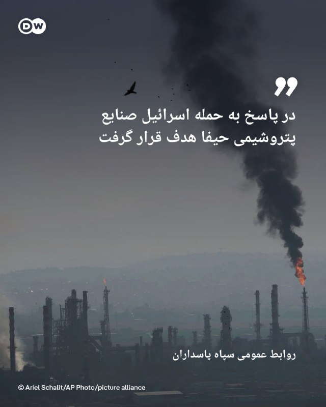

🔶 سپاه پاسداران: در پاسخ به حمله اسرائیل صنایع پتروشیمی حیفا هدف قرار گرفت

روابط عمومی سپاه پاسداران در اطلاعیه‌ای اعلام کرد در پاسخ به حمله اسرائیل به یکی از صنایع پتروشیمی، صنایع پتروشیمی حیفا را هدف قرار داده است. سپاه هشدار داده است که اسرائیل با "اقدام علیه اهداف غیرنظامی و هدف قرار دادن صنایع نفتی، بازی خطرناکی را شروع کرد که دامنه آن کلیه اهداف انرژی منطقه را در بر خواهد گرفت".

در این اطلاعیه از تأسیسات پتروشیمی که هدف حمله اسرائیل قرار گرفته نام برده نشده است، اما پیش‌تر خبرگزاری‌های دولتی از جمله خبرگزاری فارس نزدیک به سپاه پاسداران گزارش داده بود که صنایع پتروشیمی کارون ماهشهر هدف حمله هوایی اسرائیل قرار گرفت و بخشی از آن آسیب دیده است.

در همین حال ارتش اسرائیل نیز صبح دوشنبه تأیید کرد نیروی هوایی این کشور "چندین هدف را در مجتمع پتروشیمی ماهشهر" در جنوب غرب ایران مورد حمله قرار داد.

شرکت پتروشیمی کارون در اطلاعیه‌ای اعلام کرد حملات هوایی اسرائیل ساعت ۷:۳۰ دقیقه به وقت محلی رخ داد و دو موشک به این تأسیسات اصابت کرد. به گفته مقامات این شرکت این حادثه مصدوم و تلفات جانی نداشته است و میزان خسارت و صدمات احتمالی در دست بررسی است.

در پی این واقعه فرماندهی ارشد پدافند غیرعامل و مدیریت بحران منطقه ویژه اقتصادی پتروشیمی دستور خروج اضطراری کلیه کارکنان روزکار از منطقه ویژه اقتصادی پتروشیمی را صادر کرد. در اطلاعیه شرکت پتروشیمی کارون گفته شده است که نیروهای عملیاتی از این منطقه تخلیه نشده‌اند و فعالیت آنان طبق روال عادی ادامه دارد.

رسانه‌های اسرائیلی تا کنون خبری در مورد حمله به تأسیسات پتروشیمی حیفا منتشر نکرده‌اند.

@dw_farsi

## IranianMinds — post 21807

لخت شدن تو روبیکا و بله آزاده برای پرستو های حکومتی پس

@IranianMinds

## IranianMinds — post 21806

  <a href="telegram/content/IranianMinds_21806_1780914231.webm" target="_blank">🎬 Download video</a>

🕔 انتظارها به پایان رسید

📃 از سایت وینرو رونمایی شد.
معتبرترین سایت ایرانی

🤩
🤩
🤩
🤩 بونوس اضافه به ازای هر واریز 
💰

🔴فرصت تکرارنشدنی به مناسبت افتتاحیه
🔴

⚡️هر چقدر شارژ کنی، بیشتر هدیه می‌گیری
⚡️

🔴تا سقف ۳ میلیون تومان
🔴

⌛ فقط برای مدت محدود

💣بالاترین بونوس‌ها فقط در سایت وینرو

پیش بینی کن و برنده شو
🎯

📺 تلویزیون لایو برای پوشش بازی ها

🛍بالاترین ضرایب ممکن
و هزاران امکانات خاص دیگه
💰

🎰 همین الان وارد شو و با هر شارژ تا ۲۰۰ درصد شارژ اضافه از ما هدیه بگیر

🔤 Winro.io         معتبرترین سایت ایران

🔤 Winro.io

📱 کانال اخبار و هدایــا re18 
🌟

📱 @winro_io

## IranianMinds — post 21805

🔴 خبر ترور سردار وحیدی فرمانده کل سپاه پاسداران غیر رسمی هست و هیچ منبع معتبری تابحال حرفی از این اقدام نزده

@IranianMinds

## IranianMinds — post 21804

🔴 خبرگزاری مهر:

منبعی نزدیک به رئیس مجلس ایران، محمدباقر قالیباف، می‌گوید ایران به‌طور کامل تنگه باب‌المندب رو همراه با تنگه هرمز مسدود کرده و گام بعدی، حمله به زیرساخت‌های نفت، گاز و انرژی کشورهای خلیج فارسِ متحد آمریکا در پاسخ به حملات امروز اسرائیل به مجتمع پتروشیمی ماهشهره.

@IranianMinds

## Dirty_Kids — post 391351

  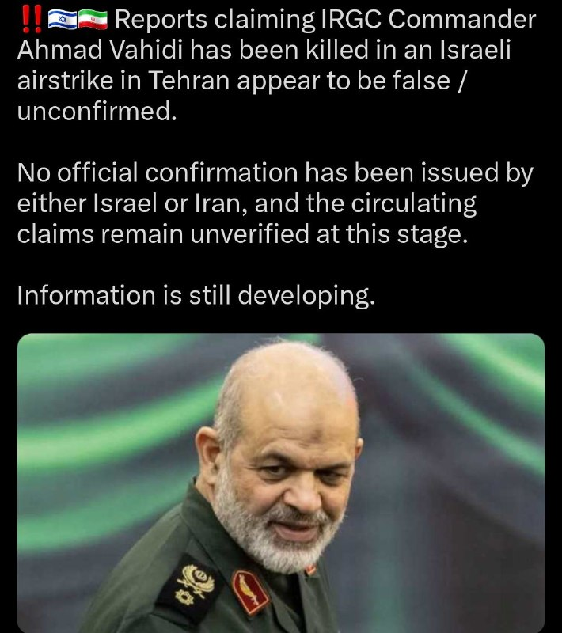

🔴 بعضی از رسانه های خارجی خبر از ترور احمدوحیدی جانشین فرمانده کل سپاه دادن.

+هنوز هیچ خبرگزاری داخلی و معتبر خارجی تایید نکرده.

@Dirty_Kids 👻

## alonews — post 126232

  <a href="telegram/content/alonews_126232_1780914232.webm" target="_blank">🎬 Download video</a>

🔴فوری/یک کشتی هندی در دریای عمان هدف قرار گرفت و دچار آتش‌سوزی شد

✅ @AloNews خبر جنگ

---
📅 بروزرسانی: 1405/03/18 13:43
---

## WithYashar — post 13992

  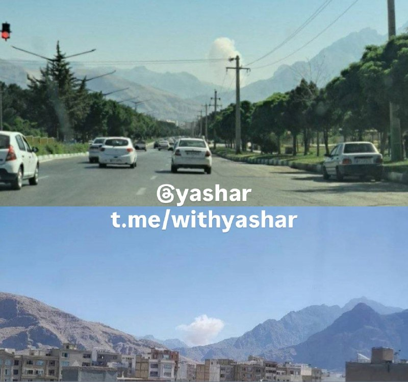

حمله اسرائیل به سایت موشکی تنگه کنشت کرمانشاه
@withyashar

## WithYashar — post 13991

یک منبع نظامی به تسنیم: ایران برای جنگ طولانی مدت آماده شده است
@withyashar

## WithYashar — post 13990

رسانه های عبری: درگیری ها تا ساعات آینده گسترده و سنگین‌تر خواهد شد
@withyashar

## WithYashar — post 13989

🚨🚨🚨🚨🚨🚨🚨
تنقلات خود را آماده کنید

## WithYashar — post 13988

یک منبع ارشد نظامی در ایران: حزب‌الله روزهای آینده نشان خواهد داد که محاسبات اسرائیلی‌ها و آمریکایی‌ها همیشه اشتباه است، و ایران ثابت کرده که دوستان خود را رها نمی‌کند.
@withyashar

## mwarmonitor — post 10441

🔴«ارتش اسرائیل می‌گوید حمله این صبح به یک مجتمع پتروشیمی در جنوب‌غرب ایران با هدف نابودی زیرساخت‌هایی انجام شده که ایران از آن‌ها برای تولید مواد اولیه ساخت موشک استفاده می‌کند.

🔸ارتش می‌گوید: «زیرساخت‌های هدف‌گرفته‌شده موادی ویژه تولید می‌کردند که به‌عنوان اجزای حیاتی برای توسعه موشک‌های بالستیک به کار می‌روند و تهدیدی برای دولت اسرائیل و غیرنظامیان آن هستند.»

🔸ارتش اسرائیل در ادامه افزود: «این‌ها اجزای حیاتی زیرساخت تولیدی هستند که از برنامه موشکی رژیم تروریستی ایران پشتیبانی می‌کنند.»

@mwarmonitor

## mwarmonitor — post 10440

🔴«ارتش اسرائیل گزارش‌ها درباره ادامه حملات اسرائیل در تهران و دیگر مناطق را رد می‌کند و می‌گوید از صبح امروز هیچ حمله اضافی دیگری در ایران انجام نشده است.

📌 ارتش اسرائیل همچنین شایعات مربوط به ترور یک مقام ارشد ایرانی، از جمله فرمانده سپاه پاسداران، را تکذیب کرده است ـ کانال ۱۲»

@mwarmonitor

## mwarmonitor — post 10439

🚨«هدف قرار گرفتن یک کشتی هندی با یک پهپاد در نزدیکی دریای عرب.»

@mwarmonitor

## pm_afshaa — post 92891

آکسیوس به نقل از رادیو ارتش اسرائیل اعلام کرد که ارتش خود را برای چندین روز درگیری در ایران و احتمال بازگشت به یک نبرد طولانی‌مدت آماده می‌کند

💧 Rainbet.com the #1 Non-KYC Crypto Casino & Sportsbook @rainbetcom

😁 @Pm_Afshaa

## pm_afshaa — post 92890

ایران اینترنشنال: از دیشب ارتباط موشتبی با مقام‌های حکومتی دچار اختلال شده و غیب شده

💧 Rainbet.com the #1 Non-KYC Crypto Casino & Sportsbook @rainbetcom

😁 @Pm_Afshaa

## Shin_Persian — post 6740

Shin ✓ @hey_itsmyturn
Mon, 08 Jun 2026 10:07:34 UTC

#IDF 🇮🇱:
"At the Petrochemical Complex in Mahshahr: IDF Attacked Infrastructure for Producing Raw Materials for the Iranian Terror Regime's Missile Program

The Air Force, with precise intelligence guidance, attacked this morning several infrastructures at the petrochemical complex in Mahshahr in southwestern Iran, which were used by armed forces subordinate to the Iranian terror regime for producing and exporting raw materials for combat means.

The attacked infrastructures produced unique materials that serve as essential components for developing ballistic missiles, which pose a direct threat to the State of Israel and its citizens.

These are critical components in the existing production infrastructure at the complex for the Iranian terror regime's missile program.

The attack joins several additional strikes carried out against the complex in Operation "Roar of the Lion.""
#Iran

فارسی

#IDF 🇮🇱:
"در مجتمع پتروشیمی ماهشهر: ارتش دفاعی اسرائیل زیرساخت‌های تولید مواد اولیه برای برنامه موشکی رژیم تروریستی ایران را مورد حمله قرار داد.

نیروی هوایی، با هدایت اطلاعاتی دقیق، امروز صبح چندین زیرساخت را در مجتمع پتروشیمی در ماهشهر در جنوب غربی ایران هدف قرار داد که توسط نیروهای مسلح تابع رژیم تروریستی ایران برای تولید و صادرات مواد اولیه ابزارهای جنگی استفاده می‌شدند.

زیرساخت‌های مورد حمله، مواد منحصر به فردی تولید می‌کردند که به عنوان اجزای ضروری برای توسعه موشک‌های بالستیک عمل می‌کنند، موشک‌هایی که تهدیدی مستقیم علیه دولت اسرائیل و شهروندانش محسوب می‌شوند.

این‌ها اجزای حیاتی در زیرساخت‌های تولید موجود در این مجتمع برای برنامه موشکی رژیم تروریستی ایران هستند.

این حمله به چندین حمله دیگر که علیه این مجتمع در عملیات «غرش شیر» انجام شده است، می‌پیوندد."
#Iran

𝕏 · @shin_persian

## Iliaen — post 4462

در جریان حملات ظهر امروز دوشنبه، یک ایست بازرسی واقع در مسیر منتهی به پایگاه هوایی سوم شکاری همدان (کبودراهنگ) هدف پهپاد قرار گرفت و همچنین مکانی در داخل قرارگاه سیدالشهدا کرج نیز مورد اصابت موشک قرار گرفت.

@iliaen

## FarsiVOA — post 220004

  <a href="telegram/content/FarsiVOA_220004_1780913616.mp4" target="_blank">🎬 Download video</a>

چند انفجار پیاپی ناشی از حملات اسرائیل به نقاطی در ایران؛

گزارش‌ها و تصاویر منتشر شده از ایران حاکی از وقوع چندین انفجار در مناطق مختلف کشور در بامداد روز دوشنبه، ۱۸ خرداد است.

این تحولات پس از آن رخ داد که ارتش اسرائیل اعلام کرد به دنبال حملات موشکی جمهوری اسلامی به این کشور، مناطقی در غرب و مرکز ایران را هدف قرار داده است.
@FarsiVOA

## DW_Farsi — post 125680

🔶 توافق اروپا و اوکراین بر سر طرح پنج‌ماده‌ای برای پایان جنگ

در جریان سفر ولودیمیر زلسنکی به لندن، آلمان، فرانسه، بریتانیا و اوکراین با صدور بیانیه‌ای مشترک، ولادیمیر پوتین، رئیس‌ جمهور روسیه را به برقراری آتش‌بس فوری و آغاز مذاکرات جدی برای پایان دادن به این بحران نظامی فراخواندند.

بر اساس این پیشنهاد، خط مقدم فعلی نبرد به عنوان نقطه آغاز و مبنای گفتگوها در نظر گرفته خواهد شد. فریدریش مرتس، صدراعظم آلمان، امانوئل مکرون، رئیس‌ جمهور فرانسه، کی‌یر استارمر، نخست‌وزیر بریتانیا و ولودیمیر زلنسکی در این بیانیه تاکید کردند که ایالات متحده و کل اروپا باید نقشی "فعال" در این فرآیند ایفا کنند. رهبران چهار کشور پنج شرط اساسی را برای تحقق یک "صلح عادلانه و پایدار" ترسیم کرده‌اند.

گام نخست این طرح، دستیابی به یک توافق فراگیر برای پایان دادن به درگیری‌هاست که بر اساس آن، ولادیمیر پوتین باید با یک آتش‌بس فوری و کامل موافقت کند. هرچند رهبران اروپایی و اوکراین پذیرفته‌اند که خط مقدم فعلی نبرد مبنا و نقطه آغاز گفتگوهای صلح باشد، اما به‌طور هم‌زمان و با قاطعیت بر حفظ مرزهای بین‌المللی تاکید دارند.

@dw_farsi

## RadioFarda — post 158046

  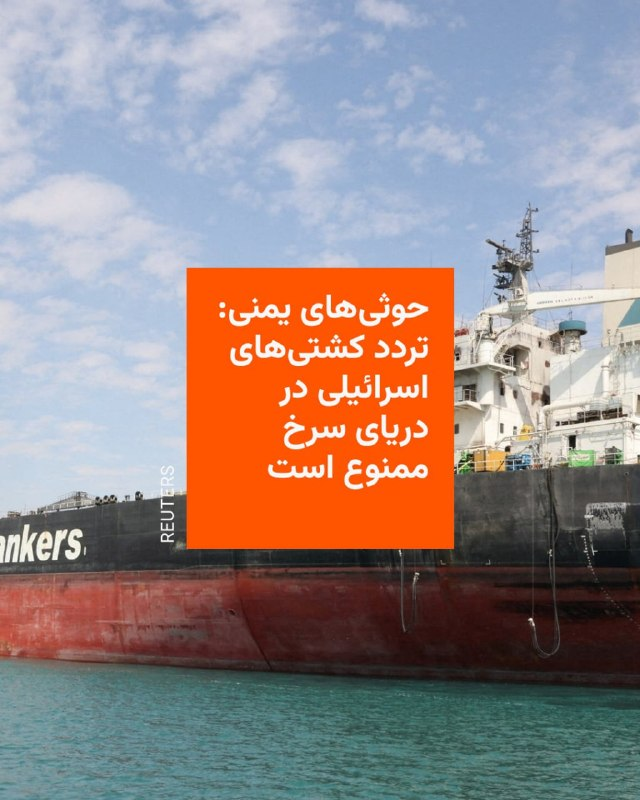

🔸شورشیان حوثی در یمن که از حمایت جمهوری اسلامی برخوردارند، روز دوشنبه از حمله موشکی به اسرائیل خبر داده و اعلام کردند که بر تردد کشتی‌های اسرائیلی از دریای سرخ اعلام ممنوعیت می‌کنند.

🔸حوثی‌ها در طول جنگ اسرائیل و حماس بارها کشتی‌های تجاری را در این آبراه مهم هدف قرار دادند و بسیاری از شرکت‌های حمل‌ونقل را مجبور کرده بودند مسیر طولانی‌تری را از اطراف جنوبی قاره آفریقا انتخاب کنند.

🔸این تهدید در شرایطی مطرح می‌شود که تنگه هرمز، گذرگاه اصلی خلیج فارس و مسیر صادرات انرژی کشورهای منطقه، در نتیجه جنگ خاورمیانه میان ایران از یک سو و آمریکا و اسرائیل از سوی دیگر، همچنان از سوی ایران مسدود شده است.

🔸در بیانیه حوثی‌ها آمده است: «ما ممنوعیت کامل و همه‌جانبه‌ای را برای تردد دریایی اسرائیل در دریای سرخ اعلام می‌کنیم» و «از لحظه انتشار این بیانیه، تمامی تحرکات دشمن را اهداف نظامی مشروع برای نیروهای مسلح خود تلقی می‌کنیم.»

@RadioFarda

## idfinfarsi — post 11817

‼️در مجتمع پتروشیمی ماهشهر: ارتش اسرائیل زیرساخت‌هایی برای تولید مواد اولیه برنامه موشکی رژیم تروریستی ایران را هدف قرار داد

⭕️نیروی هوایی با هدایت دقیق معاونت اطلاعات ارتش اسرائیل، در ساعات صبح چندین زیرساخت را در مجتمع پتروشیمی ماهشهر در جنوب‌غرب ایران هدف قرار داد که توسط نیروهای مسلح وابسته به رژیم تروریستی ایران برای تولید و صادرات مواد اولیه تجهیزات نظامی مورد استفاده قرار می‌گرفتند.

⭕️در زیرساخت‌های هدف قرار گرفته، مواد خاصی تولید می‌شد که به‌عنوان اجزای ضروری برای توسعه موشک‌های بالستیک به‌کار می‌روند و تهدیدی مستقیم علیه کشور اسرائیل و شهروندان آن محسوب می‌شوند.

⭕️این اجزا،‌ اجزای حیاتی در زیرساخت‌های تولید موجود در این مجتمع برای برنامه موشکی رژیم تروریستی ایران هستند.

⭕️این حمله به مجموعه‌ای از حملات دیگر که در چارچوب عملیات «غرش شیران» علیه این مجتمع انجام شد، می‌پیوندد

## Dirty_Kids — post 391350

  <a href="telegram/content/Dirty_Kids_391350_1780913618.mp4" target="_blank">🎬 Download video</a>

تصاویر دوربین مداربسته فدراسیون ووشو از حمله خواهران منصوریان به اتاق رئیس

@Dirty_Kids 👻

## Dirty_Kids — post 391346

تصاویر ادعایی فدراسیون ووشو از آثار حمله خواهران منصوریان به دفتر رئیس فدراسیون😂

@Dirty_Kids 👻

## Dirty_Kids — post 391345

در جریان حملات ظهر امروز دوشنبه، یک ایست بازرسی واقع در مسیر منتهی به پایگاه هوایی سوم شکاری همدان (کبودراهنگ) هدف پهپاد قرار گرفت و همچنین مکانی در داخل قرارگاه سیدالشهدا کرج نیز مورد اصابت موشک قرار گرفت.

@Dirty_Kids 👻

## Dirty_Kids — post 391344

🔴 رسایی: حتما باید رهبری رو ترور کنن که اینترنت قطع بشه؟ اینترنت در شرایط جنگی یعنی خیانت به کشور، هر چه زودتر قطعش کنین. @Dirty_Kids 👻

## Dirty_Kids — post 391343

  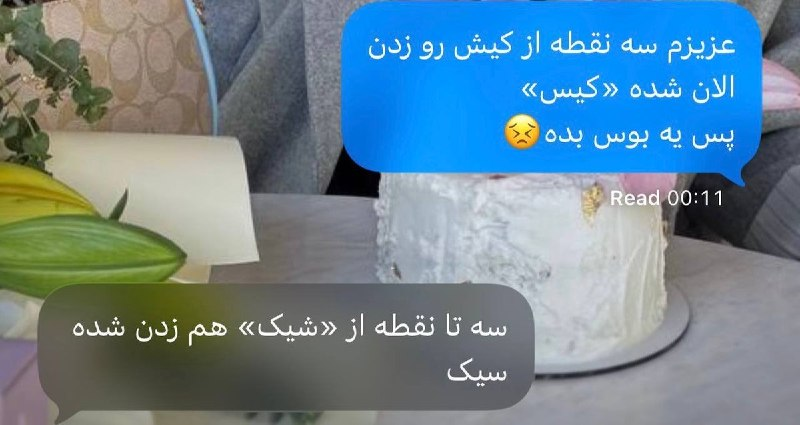

متاسفانه عملیات با شکست مواجه شد:

@Dirty_Kids 👻

## alonews — post 126231

  <a href="telegram/content/alonews_126231_1780913620.webm" target="_blank">🎬 Download video</a>

👈انهدام یک پهپاد اسرائیلی در غرب تهران

✅ @AloNews خبر جنگ

---
📅 بروزرسانی: 1405/03/18 13:33
---

## VahidOOnLine — post 244318

  

صادق آملی لاریجانی، رییس مجمع تشخیص مصلحت نظام، در شبکه ایکس نوشت: «حمله جمهوری اسلامی در دفاع از لبنان، صرفا یک پاسخ نظامی نبود؛ بلکه اعلام رسمی یک دکترین راهبردی بود.»

او افزود: «این اقدام پیام روشنی داشت که چنانچه تعرض به یکی از اضلاع محور مقاومت صورت پذیرد، پاسخی فراتر از مرزهای جغرافیایی در پی خواهد داشت و معادلات منطقه را دگرگون خواهد کرد.»

آملی لاریجانی ادامه داد: «همزمان، جمهوری اسلامی آشکار ساخت که هرگونه گسترش درگیری یا تعرض به زیرساخت‌های حیاتی کشور، با پاسخی فراگیر و بازدارنده مواجه خواهد شد؛ پاسخی که دامنه آن می‌تواند تمامی بازیگران حامی این تقابل را در برگیرد.»
iranintl
‌🏁 🇬🇧 IranintlTV

🤖 @VahidOOnLine

## VahidOOnLine — post 244317

🗣روایت شما از موج تازه حملات - دوشنبه ۱۸ خرداد

🔹خدا کنه این سری دیگه بار آخر باشه، حتی شده به قیمت قطع شدن اینترنت و سختی در این وضعیت. اینجا در ایران اوضاع خیلی داغونه، هم قیمت‌ها معیشت رو سخت کرده، هم هزینه‌های درمان. روحیه مردم به‌شدت خرابه. تنها چیزی که باعث ادامه زندگیمونه، امید به آزادیه.

🔹بنیامین نتانیاهو، به کار خودت برس و کاری به ترامپ نداشته باش. بسیاری از مردم ایران فقط یک خواسته دارند؛ سرنگونی جمهوری اسلامی و رسیدن به آزادی، امنیت و آینده‌ای بهتر برای کشورشان. صدای مردم ایران را بشنو و اجازه نده خواسته آن‌ها نادیده گرفته شود.

🔹اینترنت احتمالا قراره دوباره قطع بشه چون اینا باور دارن مردم از داخل ایران با کمک شبکه‌های اجتماعی به اسرائیل می‌گن که کجا رو بزنه. متأسفانه حکومتی سرکار هست که هیچ ایده‌ای راجع به تکنولوژی‌های جهان از ۴۰ سال پیش تا به امروز نداره.

🔹اگر بازم فیلترنت ایران رو قطع کردن، شما پژواک صدای ما باشید و به گوش دنیا برسونید که خون با هیچی پاک نمی‌شه و ما فقط سرنگونی جمهوری اسلامی رو می‌خوایم. پاینده ایران.

🔹لبنان به ما چه ربطی داره که باید به‌خاطرش ویرانی رو به جون بخریم؟ ای‌کاش با این جنگ نابود بشن و مردم ایران یک زندگی عادی که کمترین حق‌شونه رو بتونن داشته باشن. به امید دنیای بدون دیکتاتورها.

🔹کشورهای اروپایی مخصوصا بریتانیا همش می‌گن جنگ زودتر متوقف شه چون به نفع ما نیست. بابا چقدر خودخواهین؟ به نفع شما نیست ولی به نفع ما هست. این کشورها نمی‌خوان بفهمن ما مردم ایران در چه جهنمی هستیم؟
‌🏁 🇬🇧 IranintlTV

🤖 @VahidOOnLine

## WithYashar — post 13987

فارس: تو غرب تهران پهپاد زدیم
@withyashar

## WithYashar — post 13986

ترامپ با لهجه استانبلی 🤣: 📿 الله لله

## mamlekate — post 103643

📝 ارتش اسرائیل: انتظار چند روز درگیری با جمهوری اسلامی داریم

@mamlekate

## IranIntlTV — post 341152

  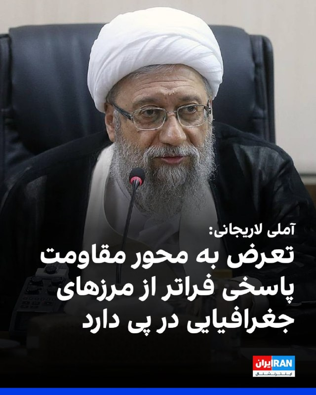

صادق آملی لاریجانی، رییس مجمع تشخیص مصلحت نظام، در شبکه ایکس نوشت: «حمله جمهوری اسلامی در دفاع از لبنان، صرفا یک پاسخ نظامی نبود؛ بلکه اعلام رسمی یک دکترین راهبردی بود.»

او افزود: «این اقدام پیام روشنی داشت که چنانچه تعرض به یکی از اضلاع محور مقاومت صورت پذیرد، پاسخی فراتر از مرزهای جغرافیایی در پی خواهد داشت و معادلات منطقه را دگرگون خواهد کرد.»

آملی لاریجانی ادامه داد: «همزمان، جمهوری اسلامی آشکار ساخت که هرگونه گسترش درگیری یا تعرض به زیرساخت‌های حیاتی کشور، با پاسخی فراگیر و بازدارنده مواجه خواهد شد؛ پاسخی که دامنه آن می‌تواند تمامی بازیگران حامی این تقابل را در برگیرد.»
iranintl.com/202606088650

## IranIntlTV — post 341151

🗣روایت شما از موج تازه حملات - دوشنبه ۱۸ خرداد

🔹خدا کنه این سری دیگه بار آخر باشه، حتی شده به قیمت قطع شدن اینترنت و سختی در این وضعیت. اینجا در ایران اوضاع خیلی داغونه، هم قیمت‌ها معیشت رو سخت کرده، هم هزینه‌های درمان. روحیه مردم به‌شدت خرابه. تنها چیزی که باعث ادامه زندگیمونه، امید به آزادیه.

🔹بنیامین نتانیاهو، به کار خودت برس و کاری به ترامپ نداشته باش. بسیاری از مردم ایران فقط یک خواسته دارند؛ سرنگونی جمهوری اسلامی و رسیدن به آزادی، امنیت و آینده‌ای بهتر برای کشورشان. صدای مردم ایران را بشنو و اجازه نده خواسته آن‌ها نادیده گرفته شود.

🔹اینترنت احتمالا قراره دوباره قطع بشه چون اینا باور دارن مردم از داخل ایران با کمک شبکه‌های اجتماعی به اسرائیل می‌گن که کجا رو بزنه. متأسفانه حکومتی سرکار هست که هیچ ایده‌ای راجع به تکنولوژی‌های جهان از ۴۰ سال پیش تا به امروز نداره.

🔹اگر بازم فیلترنت ایران رو قطع کردن، شما پژواک صدای ما باشید و به گوش دنیا برسونید که خون با هیچی پاک نمی‌شه و ما فقط سرنگونی جمهوری اسلامی رو می‌خوایم. پاینده ایران.

🔹لبنان به ما چه ربطی داره که باید به‌خاطرش ویرانی رو به جون بخریم؟ ای‌کاش با این جنگ نابود بشن و مردم ایران یک زندگی عادی که کمترین حق‌شونه رو بتونن داشته باشن. به امید دنیای بدون دیکتاتورها.

🔹کشورهای اروپایی مخصوصا بریتانیا همش می‌گن جنگ زودتر متوقف شه چون به نفع ما نیست. بابا چقدر خودخواهین؟ به نفع شما نیست ولی به نفع ما هست. این کشورها نمی‌خوان بفهمن ما مردم ایران در چه جهنمی هستیم؟

## RadioFarda — post 158045

  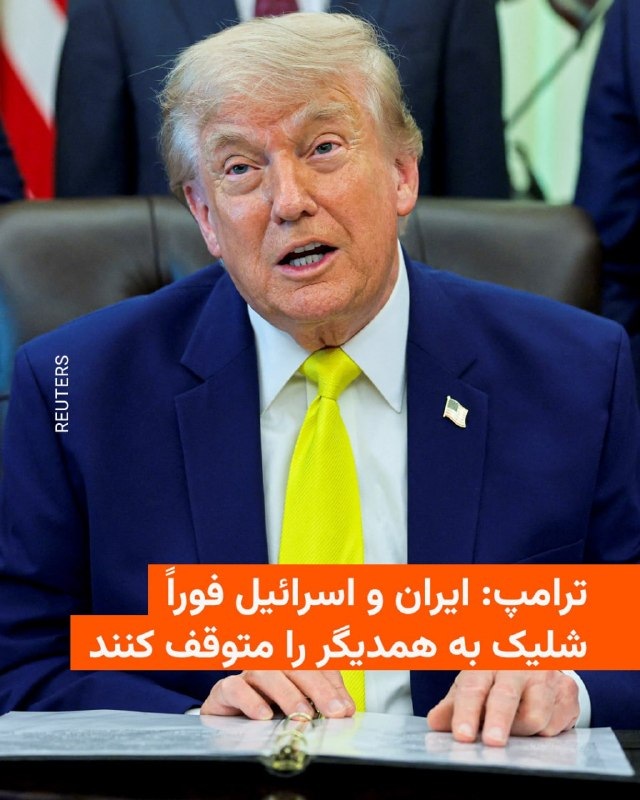

🔸دونالد ترامپ، رئیس‌جمهور آمریکا از اسرائیل و ایران خواست حملات متقابل به یکدیگر را متوقف کنند.

🔸او در پستی در شبکه اجتماعی خود، تروث‌سوشال، نوشت: «اسرائیل و ایران باید فوراً شلیک به یکدیگر را متوقف کنند.»

🔸ترامپ یکشنبه و بعد از حملات موشکی ایران به اسرائیل بر سر حزب‌الله لبنان، در گفت‌وگویی تلفنی با خبرنگار اکسیوس گفته بود که «حملات ایران به کسی آسیبی نرساند. امیدوارم اسرائیل تلافی نکند. اگر بی‌بی (بنیامین نتانیاهو) پاسخ بدهد، این ماجرا همان‌طور که در ۴۷ سال گذشته، یا حتی در ۳۰۰۰ سال گذشته، ادامه داشته، باز هم ادامه پیدا خواهد کرد.»

🔸در حالی که رئیس‌جمهور آمریکا در این مصاحبه، گفته بود که با بنیامین نتانیاهو تماس می‌گیرد و به او می‌گوید تلافی نکند، اما بعد از این سخنان، اسرائیل به ایران حمله کرد و حملات متقابل دوطرف تا نزدیک ظهر روز دوشنبه به وقت ایران ادامه داشت.

@RadioFarda

## IranianMinds — post 21803

  

@IranianMinds

## IranianMinds — post 21802

  <a href="telegram/content/IranianMinds_21802_1780913020.mp4" target="_blank">🎬 Download video</a>

ویدیویی از حملات امروز سمت تهران - قم

@IranianMinds

## Dirty_Kids — post 391342

  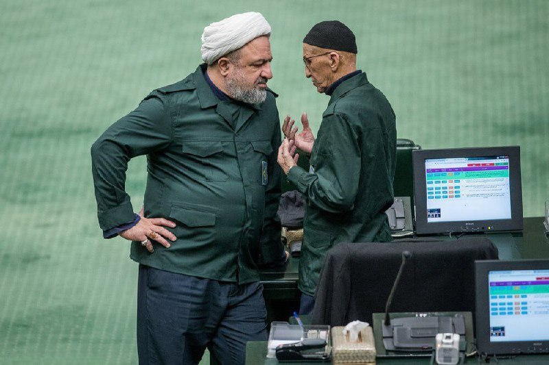

🔴 رسایی: حتما باید رهبری رو ترور کنن که اینترنت قطع بشه؟ اینترنت در شرایط جنگی یعنی خیانت به کشور، هر چه زودتر قطعش کنین.

@Dirty_Kids 👻

## Dirty_Kids — post 391341

  <a href="https://t.me/Dirty_Kids/391341" target="_blank">📎 Download file</a>

ریتزوبت تنها سایت بین المللی میباشد ، که به صورت هفتگی پرومو کد دریافت میکنید ✅

♦️ آموزش شارژ حساب با کریپتو
♦️ آموزش شارژ حساب ریالی در ریتزوبت

🔵ریتزوبت برندی با لایسنس معتبر در صنعت شرطبندی و پیشبینی مسابقات ورزشی و کازینویی 👇
#پیشبینی
https://t.me/+LB508WZyIr8xNmY0

## Dirty_Kids — post 391340

  <a href="telegram/content/Dirty_Kids_391340_1780913022.webm" target="_blank">🎬 Download video</a>

🎁 شرطبندی مسابقات دوستانه ی جام جهانی با بالاترین ضرایب و آپشن ها در ریتزوبت 
‼️

💰 امکان شارژ با ووچر ، کریپتو و کارت بانکی ایران 
🔥

🚀 وقتی شرط ‌هاتون رو توی ریتزوبت ثبت کنین ، سودتون بیشتر و هفتگی پرومو کد دریافت میکنید 
🤑

🛸 لینک ورود به سایت 👉

🌐 کانال تلگرامی 
3️⃣
2️⃣
1️⃣
R18
https://t.me/+LB508WZyIr8xNmY0

## Dirty_Kids — post 391339

  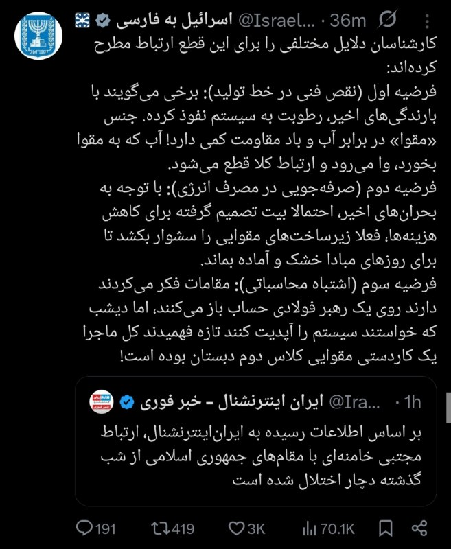

🔴 اینترنشنال: از دیشب سران حکومتی نتونستن با مجتبی ارتباط بگیرن و پیداش نمی کنن😐😂 @Dirty_Kids 👻

## Dirty_Kids — post 391338

  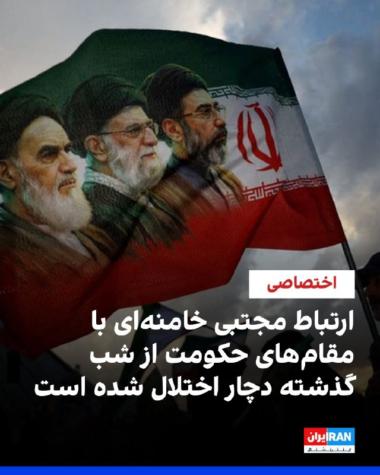

🔴 اینترنشنال: از دیشب سران حکومتی نتونستن با مجتبی ارتباط بگیرن و پیداش نمی کنن😐😂

@Dirty_Kids 👻

## alonews — post 126230

  <a href="telegram/content/alonews_126230_1780913023.webm" target="_blank">🎬 Download video</a>

👈یک منبع نظامی به تسنیم: ایران برای جنگ طولانی مدت آماده شده است

✅ @AloNews خبر جنگ

## alonews — post 126229

  <a href="telegram/content/alonews_126229_1780913023.webm" target="_blank">🎬 Download video</a>

👈فارس: تو غرب تهران پهپاد زدیم

✅ @AloNews خبر جنگ

---
📅 بروزرسانی: 1405/03/18 13:23
---

## VahidOOnLine — post 244316

  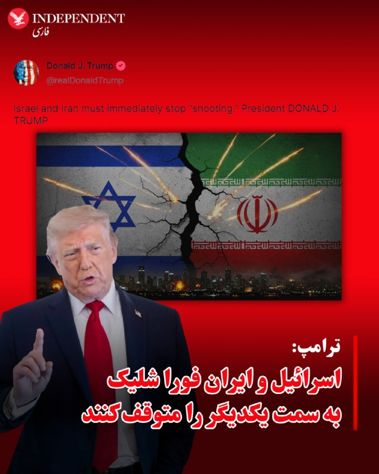

♦️دونالد ترامپ، رئیس جمهوری آمریکا صبح دوشنبه ۱۸ خردادماه به وقت آمریکا (یک بعدازظهر به وقت تهران) با انتشار پیامی در تروث سوشال از جمهوری اسلامی ایران و اسرائیل خواست تا فورا حملات متقابل به یکدیگر را متوقف کنند.

ترامپ همزمان با موج اول حملات موشکی سپاه به اسرائیل به آکسیوس گفته بود از نتانیاهو خواهد خواست تا به این حملات پاسخ ندهد. با این حال حملات متقابل جمهوری اسلامی ایران و اسرائیل به یکدیگر تا بعدازظهر دوشنبه همچنان ادامه دارد.
‌🇸🇦 Indypersian

🤖 @VahidOOnLine

## VahidOOnLine — post 244315

  

دونالد ترامپ، رییس جمهوری ایالات متحده در شبکه تروث سوشال نوشت: «اسرائیل و جمهوری اسلامی باید فورا شلیک را متوقف کنند.»

ترامپ شامگاه یکشنبه و پس از آغاز حملات موشکی از ایران به اسرائیل نیز گفته بود: «حملات جمهوری اسلامی به کسی آسیبی نزده است. امیدوارم اسرائیل تلافی نکند.»
iranintl
‌🏁 🇬🇧 IranintlTV

🤖 @VahidOOnLine

## WithYashar — post 13985

اسرائیل و ایران باید فوراً «شلیک» را متوقف کنند. پرزیدنت دونالد جی. ترامپ @withyashar

## WithYashar — post 13984

اسرائیل و ایران باید فوراً «شلیک» را متوقف کنند. پرزیدنت دونالد جی. ترامپ @withyashar

## WithYashar — post 13983

مسافران محترم قاهره لطفا آرامش خود را حفظ کنید دایرکت جای فحش‌به ترامپ نیست از مسیر لذت ببرید 🙌🏾😁
مدیریت حمام اتاق جنگ

## mwarmonitor — post 10438

  <a href="telegram/content/mwarmonitor_10438_1780912430.mp4" target="_blank">🎬 Download video</a>

ترامپ در سوشال تروث اسرائیل و ایران باید فوراً «شلیک» را متوقف کنند @mwarmonitor

## DEJradio — post 5465

  <a href="telegram/content/DEJradio_5465_1780912431.webm" target="_blank">🎬 Download video</a>

🔺📢 “سـ.ـپاهی بی‌وطن یک هفته قشم و سیریک رو زدن به غیرتش برنخورد، تا بیروت رو زدن موشک زد به اسرائیل، عرب پرستای بدبخت!

پیام دریافتی

#جنگ #IRGCterrorists
@DEJradio

## IranIntlTV — post 341150

  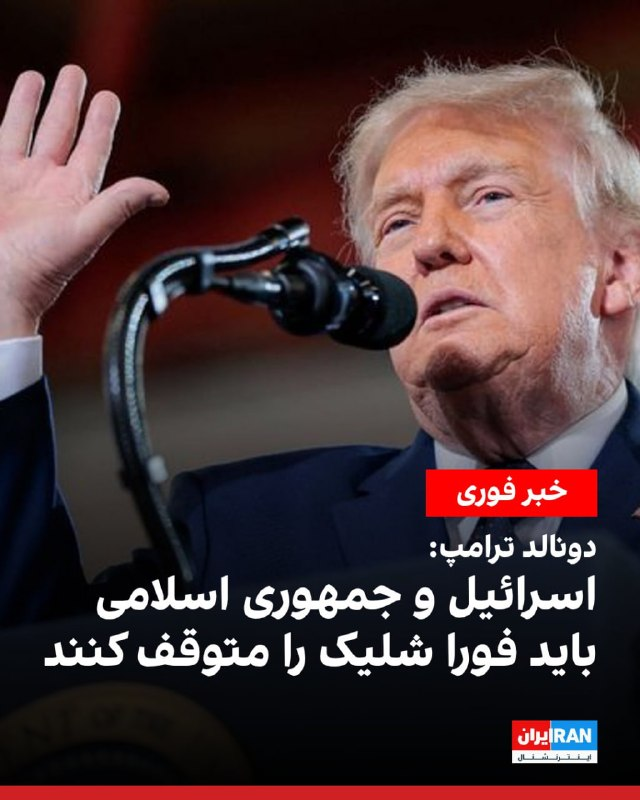

دونالد ترامپ، رییس جمهوری ایالات متحده در شبکه تروث سوشال نوشت: «اسرائیل و جمهوری اسلامی باید فورا شلیک را متوقف کنند.»

ترامپ شامگاه یکشنبه و پس از آغاز حملات موشکی از ایران به اسرائیل نیز گفته بود: «حملات جمهوری اسلامی به کسی آسیبی نزده است. امیدوارم اسرائیل تلافی نکند.»
iranintl.com/202606082839

## FarsiVOA — post 220003

  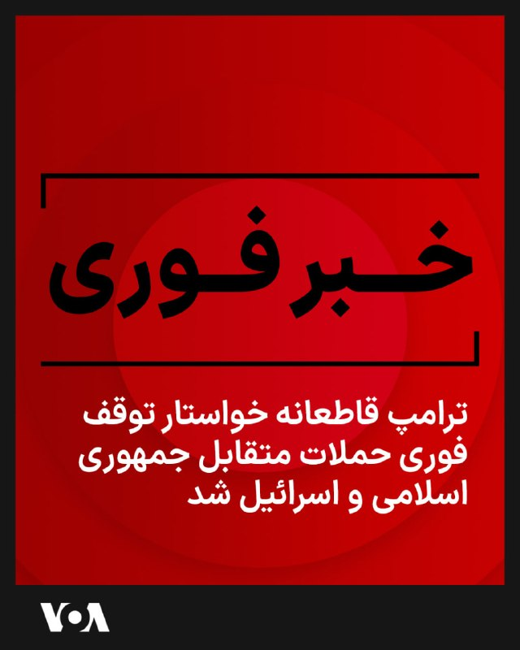

دونالد ترامپ، رئیس‌جمهوری ایالات متحده، در پیامی کوتاه در شبکه اجتماعی تروت سوشال، قاطعانه از جمهوری اسلامی و اسرائیل خواست که حملات خود علیه یکدیگر را متوقف کنند.

آقای ترامپ در این پیام کوتاه نوشت: «اسرائیل و ایران باید فوراً تیراندازی را متوقف کنند.»

پیشتر سایت خبری آکسیوس یک‌شنبه شب ۱۷ خرداد به وقت واشنگتن، ساعاتی پس از حمله موشکی جمهوری اسلامی به اسرائيل، به نقل یک مقام ارشد آمریکایی و یک منبع اسرائیلی گزارش داد که رئيس‌جمهوری آمریکا در تماس تلفنی خود به نخست وزیر اسرائيل گفت که حمله موشکی شبانه جمهوری اسلامی را تلافی نکند و زمان بیشتری به دیپلماسی بدهد.
@FarsiVOA

## FarsiVOA — post 220002

🔺سازمان ملل خواستار توقف بازداشت زنان از سوی طالبان به دلیل مقررات حجاب شد

◾️یوناما، دفتر سازمان ملل متحد در افغانستان، از طالبان خواست بازداشت زنان و دختران به دلیل آنچه «رعایت نکردن مقررات پوشش» خوانده می‌شود را متوقف کند.

◾️این هشدار تازه‌ پس از گزارش بازداشت چندین زن و دختر در ولایت هرات منتشر شده است.

◾️یوناما، از بازداشت‌های متعدد زنان در هرات ابراز نگرانی کرده و گفته است این اقدام «نگرانی‌های جدی حقوق بشری» ایجاد می‌کند. یوناما تعداد بازداشت‌شدگان را اعلام نکرده، اما رسانه‌های محلی گزارش داده‌اند دست‌کم ۲۱ زن و دختر در هرات بازداشت شده‌اند.

◾️این بازداشت‌ها پس از آن گزارش شد که دستور تازه‌ای درباره ممنوعیت حضور زنان در اماکن عمومی بدون «حجاب مناسب» صادر شده است.

⬇️ بیشتر بخوانید:
https://ir.voanews.com/a/8158490.html

## DW_Farsi — post 125679

  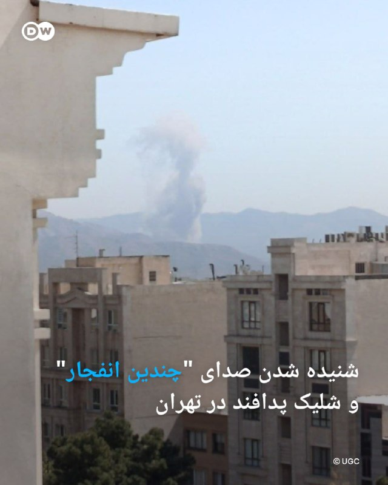

🔶 شنیده شدن صدای "چندین انفجار" و شلیک پدافند در تهران

خبرگزاری فارس از شنیده شدن صدای انفجار در غرب تهران خبر داد و نوشت هنوز محل دقیق و منشأ این انفجار مشخص نیست. به گزارش فارس همزمان پدافند هوایی در برخی نقاط پایتخت نیز فعال شده‌ است.

خبرگزاری مهر گزارش داد در جنوب تهران نیز صدای انفجار شنیده شده است و "هنوز از ماهیت این صدا اطلاعی در دست نیست".

این خبرگزاری در خبری جداگانه مدعی شد یک پهپاد توسط پدافند هوایی در آسمان تهران هدف قرار گرفته و منهم شد. در این خبر اشاره‌ای به محل دقیق وقوع این حادثه و میزان احتمالی خسارات یا تلفات جانی اشاره‌ای نشده است.

در همین حال خبرگزاری فرانسه به نقل از خبرنگار خود در تهران نوشت روز دوشنبه یک انفجار بزرگ مرکز این شهر را لرزاند و پس از آن صدای چندین انفجار دیگر که گفته می‌شود ناشی از فعالیت سامانه‌های پدافند هوایی بوده‌اند، شنیده شد.

به گزارش این خبرگزاری، انفجار اولیه موجب شد تا ساختمان وزارت امور خارجه که در مرکز تهران واقع شده است، نیز به لرزه درآید. در زمان وقوع این حادثه خبرنگار خبرگزاری فرانسه در نشست خبری هفتگی اسماعیل بقائی، سخنگوی این وزارتخانه، حضور داشته است.

برخی گزارش‌ها و روایت‌های شهروندان در شبکه‌های اجتماعی نیز از شنیده‌شدن صدای انفجار و فعالیت پدافند در مناطق مختلف تهران حکایت دارند.

@dw_farsi

## Persian_Trend_Official — post 16169

https://youtube.com/live/Dwll9-5Xrng?feature=share

## IranianMinds — post 21801

🔴 ترامپ : ایران و اسرائیل سریع باید شلیک رو متوقف کنن ! @IranianMinds

## IranianMinds — post 21800

🔴 ایران اینترنشنال :

اسرائیل یک ایست بازرسی و یک کارخونه مونتاژ پهپاد و یک پایگاه سپاه رو هدف قرار داد امروز.

@IranianMinds

## Dirty_Kids — post 391337

  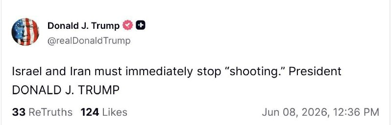

🔴 ترامپ: همین الان از اسرائیل و ایران می‌خوام که زودتر جنگ رو تموم کنن.

@Dirty_Kids 👻

## alonews — post 126228

  <a href="telegram/content/alonews_126228_1780912434.webm" target="_blank">🎬 Download video</a>

👈کانال ۱۲ گزارش می‌دهد که ارتش اسرائیل برای احتمال یک جنگ طولانی با ایران آماده می‌شود، در حالی که «عملیات شیر غرش‌کننده» ادامه دارد و اهداف جدید در حال حاضر تعیین می‌شوند.

✅ @AloNews خبر جنگ

## alonews — post 126227

  <a href="telegram/content/alonews_126227_1780912435.webm" target="_blank">🎬 Download video</a>

👈نفت: ۹۷ دلار

✅ @AloNews خبر جنگ

---
📅 بروزرسانی: 1405/03/18 13:13
---

## WithYashar — post 13982

همکنون دو تا از رادار های بیدگنه رو زدند
@withyashar

## WithYashar — post 13981

  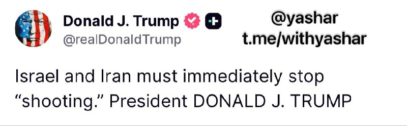

اسرائیل و ایران باید فوراً «شلیک» را متوقف کنند. پرزیدنت دونالد جی. ترامپ
@withyashar

## WithYashar — post 13980

کابینه امنیتی اسرائیل ساعت یازده و نیم پیش‌ازظهر دوشنبه به ریاست بنیامین نتانیاهو تشکیل جلسه می‌دهد.

این مقامات همچنین گفته‌اند هر حمله موشکی ایران به اسرائیل «با حمله در ضاحیه» در لبنان نیز روبه‌رو خواهد شد.
وزیران راستگرای افراطی در دولت نتانیاهو به او گفته بودند در پاسخ به حمله موشکی ایران به اسرائیل، «تهران باید بسوزد».
@withyashar

## WithYashar — post 13979

ارتش اسرائیل: برای احتمال شلیک موشک از سوی حزب‌الله به خاک اسرائیل آماده هستیم.
@withyashar

## WithYashar — post 13978

یک منبع آگاه در حوزه ارتباطات به سیتنا اعلام کرد که تاکنون هیچ دستور، ابلاغ یا تصمیمی درباره قطع یا محدودسازی اینترنت بین‌الملل به دستگاه‌های مسئول اعلام نشده است، در همین حال شب گذشته پیک ترافیک اینترنت بعد از قطعی‌ها زده شد.
@withyashar

## WithYashar — post 13977

سازمان ملل از شرایط موجود ابراز نگرانی کرد
@withyashar

## mwarmonitor — post 10437

  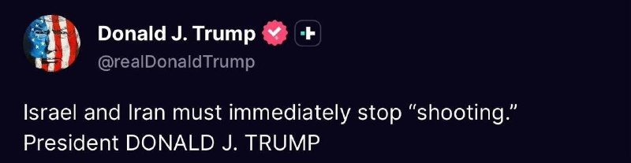

ترامپ در سوشال تروث

اسرائیل و ایران باید فوراً «شلیک» را متوقف کنند

@mwarmonitor

## DEJradio — post 5464

  <a href="telegram/content/DEJradio_5464_1780911833.mp4" target="_blank">🎬 Download video</a>

🛩️
🔥 بمباران مراکز نظامی در تهران

#جنگ #تهران
@DEJradio

## mamlekate — post 103642

  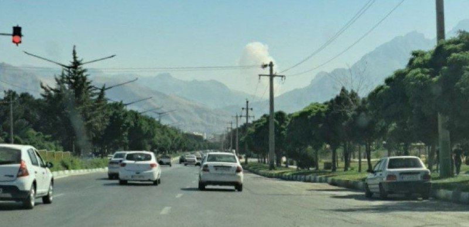

کرمانشاه، تنگه کنشت، صبح ساعت ۹:۲۰ دود ناشی از برخورد موشک

@mamlekate

## mamlekate — post 103641

  <a href="telegram/content/mamlekate_103641_1780911835.mp4" target="_blank">🎬 Download video</a>

پتروشیمی سلمان فارسی ماهشهر

@mamlekate

## Shin_Persian — post 6739

  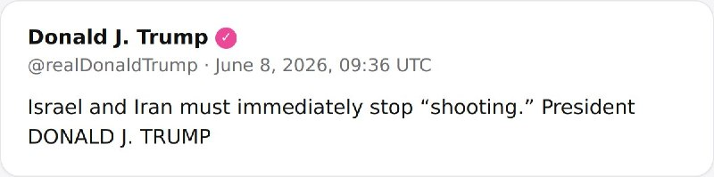

Shin ✓ @hey_itsmyturn
Mon, 08 Jun 2026 09:40:17 UTC

POTUS:
"Israel and Iran must immediately stop “shooting.” President DONALD J. TRUMP"

فارسی

رئیس‌جمهور ایالات متحده:
«اسرائیل و ایران باید فوراً "تبادل آتش" را متوقف کنند. رئیس‌جمهور دونالد جی. ترامپ»

𝕏 · @shin_persian

## FarsiVOA — post 220000

🔺ارتش اسرائیل: انتظار چند روز درگیری با جمهوری اسلامی داریم اما برای رویارویی طولانی‌تر هم آماده‌ایم

◾️ارتش اسرائیل اعلام کرد دست‌کم برای چند روز درگیری با جمهوری اسلامی آماده می‌شود و احتمال از سرگیری کامل جنگ را نیز در نظر گرفته است.

◾️تایمز اسرائیل گزارش داد که مقام‌های نظامی اسرائیل انتظار دارند درگیری‌ها برای چند روز ادامه پیدا کند، اما ارتش برای یک رویارویی طولانی‌تر هم آماده است.

◾️از شب گذشته جمهوری اسلامی دست‌کم ۲۰ موشک بالستیک به سوی اسرائیل شلیک کرده که به گفته ارتش اسرائیل، یا رهگیری شده‌اند یا در مناطق باز فرود آمده‌اند.

◾️حوثی‌های مورد حمایت جمهوری اسلامی در یمن نیز دو موشک بالستیک به سوی اسرائیل شلیک کردند. ارتش اسرائیل می‌گوید یکی از این موشک‌ها رهگیری شد و موشک دوم به خاک اسرائیل نرسید.

⬇️ بیشتر بخوانید:
https://ir.voanews.com/a/8158492.html

## Persian_Trend_Official — post 16168

سخنگوی شهرداری تهران: پارکینگ‌های زیرسطحی بعد از اعمال استاندارهای لازم، برای استفاده به عنوان پناهگاه آماده می‌شوند

## RadioFarda — post 158044

  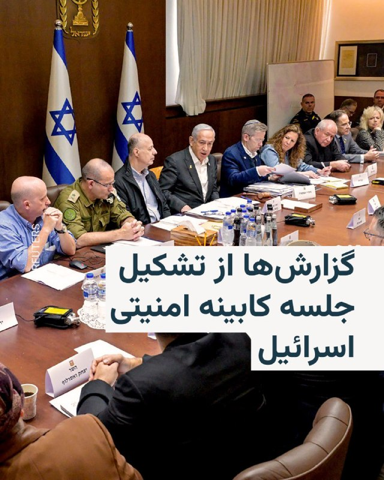

🔸کابینه امنیتی اسرائیل ساعت یازده و نیم پیش‌ازظهر دوشنبه به ریاست بنیامین نتانیاهو تشکیل جلسه می‌دهد.

🔸نشست کابینه در یکشنبه‌شب به اتخاذ تصمیم به حمله به ایران در واکنش به حملات موشکی ایران به اسرائیل منجر شده بود.

🔸پس از آن نشست، دونالد ترامپ با نخست‌وزیر اسرائیل تلفنی سخن گفت. رئیس‌جمهور آمریکا پیش از آن گفت‌وگو از ایران و اسرائیل خواست از انجام اقداماتی که به تشدید اوضاع منجر شود، خودداری کنند.

🔸اما به نوشته سایت والانیوز و گزارش شبکه کان، مقامات دفاعی اسرائیل گفته‌اند اگر ایران «به سوی تشدید تنش گام بردارد»، اسرائیل این بار «باید زیرساخت‌های ملی ایران را هدف حمله قرار دهد».

🔸این مقامات همچنین گفته‌اند هر حمله موشکی ایران به اسرائیل «با حمله در ضاحیه» در لبنان نیز روبه‌رو خواهد شد.

🔸وزیران راستگرای افراطی در دولت نتانیاهو به او گفته بودند در پاسخ به حمله موشکی ایران به اسرائیل، «تهران باید بسوزد».

@RadioFarda

## IranianMinds — post 21799

🔴 ترامپ : ایران و اسرائیل سریع باید شلیک رو متوقف کنن ! @IranianMinds

## IranianMinds — post 21798

  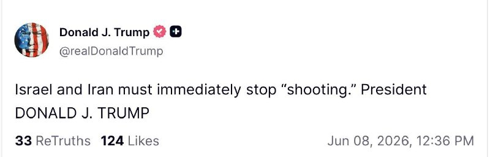

🔴 ترامپ :

ایران و اسرائیل سریع باید شلیک رو متوقف کنن !

@IranianMinds

## IranianMinds — post 21797

گروه کامنت ها :

@IranianMindsGroup

## IranianMinds — post 21796

🔴 سازمان ملل :

بس کنید بسه مگه تو آتش بس نبودید بسه بس کنید ما نگرانیم

@IranianMinds

## BBCPersian — post 283167

  <a href="telegram/content/BBCPersian_283167_1780911837.mp4" target="_blank">🎬 Download video</a>

این ویدیو از حمله اسرائیل به پتروشیمی کارون در ماهشهر منتشر شده است. روابط عمومی سازمان منطقه ویژه اقتصادی پتروشیمی دربیانیه‌ای گفت که «دو اصابت به شرکت پتروشیمی کارون» صورت گرفت که مصدومی در پی نداشت و میزان خسارت در دست بررسی است.

پیش از آن، اسرائیل گفته بود که به «چند هدف» در تاسیسات پتروشیمی ماهشهر حمله کرده است.

شرکت پتروشیمی کارون در سال‌ ۱۳۸۱ به عنوان اولین شرکت پتروشیمی «دانش‌بنیان» ایران تاسیس شد.
طبق آمار منتشر شده در وبسایت این شرکت، سالانه بیش از ۲۰۰ هزار تن محصولات پتروشیمی تولید می‌کند.

سپاه پاسداران در بیانیه‌ای گفت که در پاسخ به حمله اسرائیل به صنایع پتروشیمی ایران به صنایع پتروشیمی حیفا حمله موشکی کرده است.
@BBCPersian

## alonews — post 126226

  <a href="telegram/content/alonews_126226_1780911838.webm" target="_blank">🎬 Download video</a>

👈آسوشیتدپرس: سوریه فرودگاه دمشق را به دلیل درگیری ایران و اسرائیل موقتاً تعطیل کرد.

✅ @AloNews خبر جنگ

## alonews — post 126225

  <a href="telegram/content/alonews_126225_1780911838.webm" target="_blank">🎬 Download video</a>

👈لغو پرواز‌های مشهد به تهران

✅ @AloNews خبر جنگ

## alonews — post 126224

  <a href="telegram/content/alonews_126224_1780911839.webm" target="_blank">🎬 Download video</a>

👈ترامپ: اسرائیل و ایران باید فوراً تیراندازی را متوقف کنند.

✅ @AloNews خبر جنگ

## alonews — post 126223

  <a href="telegram/content/alonews_126223_1780911839.webm" target="_blank">🎬 Download video</a>

👈رادیو ارتش اسرائیل: اگر فرصتی برای ترور رهبران حزب‌الله در حومه بیروت پیش آید، در انجام حمله هرگز تردید نخواهیم کرد

✅ @AloNews خبر جنگ

---
📅 بروزرسانی: 1405/03/18 13:03
---

## VahidOOnLine — post 244314

  

بر اساس گزارش برخی منابع درباره جزییات اهداف موج فعلی حملات در ایران، یک کارخانه مونتاژ پهپاد در نزدیکی شهر نجف‌آباد در استان اصفهان هدف قرار گرفته است.
این منابع همچنین گزارش دادند حمله‌ای در منطقه کرج، قرارگاه «سیدالشهدا» را هدف قرار داده است. این قرارگاه یکی از واحدهای مرکزی و راهبردی سپاه پاسداران در استان تهران به شمار می‌رود.

به گفته همین منابع، حمله دیگری نیز در شهرستان کبودرآهنگ استان همدان انجام شده و یک ایست بازرسی بسیج در نزدیکی پایگاه هوایی شاهرخی هدف قرار گرفته است.

این گزارش‌ها هم‌زمان با اعلام ارتش اسرائیل درباره حمله به اهداف نظامی در غرب و مرکز ایران منتشر شده است.

مقام‌های جمهوری اسلامی تاکنون به طور رسمی جزییات این حملات و میزان خسارت احتمالی آن‌ها را اعلام نکرده‌اند.
iranintl
‌🏁 🇬🇧 IranintlTV

🤖 @VahidOOnLine

## VahidOOnLine — post 244313

  

سخنگوی ارتش اسرائیل گفت که سنتکام در رهگیری موشک‌های پرتاب شده از ایران مشارکت کرده است.
افی دفرین افزود: «ما با سنتکام هماهنگی داشتیم، از جمله در حوزه دفاعی. آن‌ها دیروز در رهگیری‌ها مشارکت کردند.»
‌🏁 🇬🇧 IranintlTV

🤖 @VahidOOnLine

## WithYashar — post 13976

کانال 12 اسرائیل: ارتش اسرائیل در حال آماده شدن برای احتمال جنگ طولانی با ایران در حالی که عملیات "غرش شیران" ادامه دارد همچنین در حال حاضر اهداف جدیدی نیز مشخص شده است.
@withyashar

## WithYashar — post 13975

کانال ۱۲ اسرائیل: تاکنون، ایران بین ۲۲ تا ۲۴ موشک به سمت اسرائیل شلیک کرده است
@withyashar

## WithYashar — post 13974

رسانه های رژیم با ذکر الله اکبر ، نوشتند تنگه هرمز کامل بسته شد
@withyashar

## WithYashar — post 13973

رادیو ارتش اسرائیل: در حمله به حومه جنوبی بیروت تردید نخواهیم کرد🚨🚨🚨🚨
@withyashar

## mwarmonitor — post 10436

📌«رادیو ارتش اسرائیل به نقل از منابع: در حمله به ضاحیه جنوبی بیروت در صورت فراهم شدن فرصت برای هدف قرار دادن عناصر رهبری، تردید نخواهیم کرد.»

@mwarmonitor

## mwarmonitor — post 10435

🔴«هلیکوپترهای اردنی در آسمان شمال اردن در حال پرواز هستند تا برای مقابله با هرگونه پهپاد ایرانی که به حریم هوایی نزدیک شود و تلاش کند به اسرائیل حمله کند، آماده باشند.»

@mwarmonitor

## DEJradio — post 5463

  <a href="telegram/content/DEJradio_5463_1780911197.webm" target="_blank">🎬 Download video</a>

🔺📢 یک کارشناس امنیتی:
احتمال هدفگیری زیرساخت‌های بانکی جمهوری اسلامی بالاست

یک کارشناس امنیتی به دژ می‌گوید از آنجا که جمهوری اسلامی علاوه بر تنگه هرمز در پی انسداد یا اختلال در جریان کشتیرانی آزاد در باب‌المندب است، این احتمال که در اقدام متقابل زیرساخت‌های بانکی حکومت هدف قرار بگیرد زیاد است.

به گفته همین کارشناس این حملات می‌تواند سایبری یا فیزیکی باشد.

با توجه به این شرایط سپرده‌های شهروندان اعم از سپرده پولی یا اموال دپو شده در صندوق‌های امانات بانک‌ها مورد تهدید است.

#جنگ #تنگه_هرمز #بانک
@DEJradio

## kianmeli1 — post 87787

🔴فوری

نائب ریس کمیسیون صنایع: امکان قطع اینترنت بین‌الملل وجود دارد
https://t.me/+_a5ind9hr7sxOTE0

## IranIntlTV — post 341149

  

بر اساس گزارش برخی منابع درباره جزییات اهداف موج فعلی حملات در ایران، یک کارخانه مونتاژ پهپاد در نزدیکی شهر نجف‌آباد در استان اصفهان هدف قرار گرفته است.
این منابع همچنین گزارش دادند حمله‌ای در منطقه کرج، قرارگاه «سیدالشهدا» را هدف قرار داده است. این قرارگاه یکی از واحدهای مرکزی و راهبردی سپاه پاسداران در استان تهران به شمار می‌رود.

به گفته همین منابع، حمله دیگری نیز در شهرستان کبودرآهنگ استان همدان انجام شده و یک ایست بازرسی بسیج در نزدیکی پایگاه هوایی شاهرخی هدف قرار گرفته است.

این گزارش‌ها هم‌زمان با اعلام ارتش اسرائیل درباره حمله به اهداف نظامی در غرب و مرکز ایران منتشر شده است.

مقام‌های جمهوری اسلامی تاکنون به طور رسمی جزییات این حملات و میزان خسارت احتمالی آن‌ها را اعلام نکرده‌اند.
iranintl.com/202606083990

## IranIntlTV — post 341148

  

سخنگوی ارتش اسرائیل گفت که سنتکام در رهگیری موشک‌های پرتاب شده از ایران مشارکت کرده است.
افی دفرین افزود: «ما با سنتکام هماهنگی داشتیم، از جمله در حوزه دفاعی. آن‌ها دیروز در رهگیری‌ها مشارکت کردند.»
https://iranintl.com/202606087011

## Shin_Persian — post 6738

Shin ✓ @hey_itsmyturn
Mon, 08 Jun 2026 09:23:49 UTC

No casualties in Tehran as per officials.

فارسی

بنا بر گفته‌های مقامات، هیچ تلفاتی در تهران گزارش نشده است.

𝕏 · @shin_persian

## FarsiVOA — post 219999

  <a href="telegram/content/FarsiVOA_219999_1780911199.mp4" target="_blank">🎬 Download video</a>

انفجار و دود گسترده در پی حملات اسرائیل به نقاطی در تهران؛

گزارش‌های اولیه از شنیده‌شدن چندین انفجار در مناطق اسلام‌شهر، ملارد، کهریزک در محدوده تهران حکایت دارد. شدت انفجارها به اندازه‌ای بوده که ساکنان این مناطق از لرزش زمین و شنیده‌شدن صداهای پیاپی خبر داده‌اند.

هنوز جزئیات دقیقی درباره محل هدف، میزان خسارت و تلفات احتمالی منتشر نشده است.
@FarsiVOA

## Persian_Trend_Official — post 16167

  

⭕️ Benny Gantz:

در اسرائیل، اصول درست هستند. در کنار حملات گسترده در ایران، باید به حمله به بیروت نیز ادامه داد تا پیوند میان ایران و حزب‌الله لبنان کاملاً قطع شود.

این اشتباه راهبردی باید اصلاح شود.

اکنون زمان آزمون است؛ نباید تسلیم شویم!

«اسموتریچ» در جلسه کابینه امنیتی ـ سیاسی صبح امروز قصد دارد معادله‌ای را که ایران تلاش می‌کند ایجاد کند، برهم بزند؛ معادله‌ای که بر اساس آن لبنان در ازای توقف حملات به ایران، از حمله در امان بماند. او از هرگونه اقدام ایران در واکنش به حمله علیه لبنان حمایت می‌کند.

بر اساس این معادله، اگر ایران به دنبال حمله به تأسیسات یا مراکز غیرنظامی باشد، این موضوع برای اسرائیل حتی آسان‌تر خواهد بود؛ زیرا واکنش اسرائیل علیه ایران شدیدتر و مؤثرتر می‌شود. این واکنش می‌تواند شامل حمله به اهداف مرتبط با امنیت داخلی ایران، مانند «ستادهای پولی» باشد که به گفته منابع اسرائیلی، رژیم ایران از طریق آن‌ها به حزب‌الله کمک مالی می‌رساند و پیش از آن نیز از آن‌ها علیه اسرائیلی‌ها استفاده شده است.

📝 Nick

📌 @persian_trend_official
پرشین ترند | متفاوت‌ترین کانال نظامی

## IranianMinds — post 21795

🔴 سپاه پاسداران انقلاب اسلامی:

"ما هشدار می‌دهیم! دشمن صهیونیستی، با عملیاتی علیه اهداف غیرنظامی و آسیب به صنایع نفت، بازی خطرناکی را آغاز کرده است که دامنه آن تمام اهداف انرژی در منطقه را در بر خواهد گرفت."

@IranianMinds

## IranianMinds — post 21794

🔴 کانال 12 اسرائیل:

نیروهای دفاعی اسرائیل (IDF) در حال آماده‌سازی برای احتمال جنگ طولانی با ایران هستند در حالی که عملیات «غرش شیران» ادامه دارد و اهداف جدید در حال تعیین شدن هستند

@IranianMinds

## Hranews — post 113464

  

در ادامه تشدید درگیری‌های نظامی میان ایران و اسرائیل، صبح امروز دوشنبه ۱۸ خرداد ۱۴۰۵ گزارش‌هایی از شنیده شدن صدای انفجار و حملات احتمالی در نقاط مختلف ایران منتشر شد. بر اساس این گزارش‌ها، مناطقی در استان‌های کرمانشاه، البرز و تهران هدف حملات قرار گرفته‌اند و همزمان برخی منابع از حمله به شهر ری خبر داده‌اند. جزئیات دقیق این رویدادها، میزان خسارات احتمالی و تلفات ناشی از آنها تاکنون به طور رسمی اعلام نشده است.

رسانه‌های رسمی و مستقل ایران نیز وقوع این حوادث را گزارش کرده‌اند. خبرگزاری مهر از هدف قرار گرفتن مناطقی در کرمانشاه و همچنین شنیده شدن صدای انفجار در جنوب تهران خبر داد. دیدبان ایران و مدارا نیز گزارش‌هایی درباره شنیده شدن صدای انفجار در کرج منتشر کردند. همچنین اسکان نیوز از حمله به شهر ری خبر داده است. در همین حال، خبرگزاری مهر ضمن رد برخی گزارش‌های منتشر شده درباره وقوع انفجار ناشی از اصابت در اصفهان، اعلام کرد که طی ساعات اخیر چنین رویدادی در این شهر رخ نداده است، هرچند بامداد امروز وقوع انفجاری در نقطه‌ای از شهرستان نجف‌آباد گزارش شده بود.
#حمله_نظامی

↘️
@hranews_bot تماس ✉️ - @Hranews کانال هرانا 🆑

## alonews — post 126222

  <a href="telegram/content/alonews_126222_1780911202.webm" target="_blank">🎬 Download video</a>

👈اورژانس تهران: هیچ مصدومی در تهران تا به الان نداشتیم

✅ @AloNews خبر جنگ

## alonews — post 126221

  <a href="telegram/content/alonews_126221_1780911202.webm" target="_blank">🎬 Download video</a>

👈سازمان ملل ابراز نگرانی کرد

✅ @AloNews خبر جنگ

## alonews — post 126220

  <a href="telegram/content/alonews_126220_1780911202.webm" target="_blank">🎬 Download video</a>

👈آسمان منطقه ؛ هم اکنون

✅ @AloNews خبر جنگ

## alonews — post 126219

  <a href="telegram/content/alonews_126219_1780911202.webm" target="_blank">🎬 Download video</a>

👈منبع ارشد امنیتی ایران به المیادین:
ما قاطعانه تأیید می کنیم که معادله قبلی «زیرساخت در مقابل زیرساخت»، همچنان معتبر است

✅ @AloNews خبر جنگ

---
📅 بروزرسانی: 1405/03/18 12:54
---

## VahidOOnLine — post 244312

  <a href="telegram/content/VahidOOnLine_244312_1780910677.mp4" target="_blank">🎬 Download video</a>

⭕️ویدیویی از سقوط یکی از موشک‌های سپاه در منطقه‌ای باز در نزدیکی اریحا

♦️تصاویر منتشرشده در شبکه‌های اجتماعی نشان می‌دهد یک موشک ایرانی روز دوشنبه ۱۸ خردادماه در منطقه‌ای باز در نزدیکی شهر اریحا در شرق کرانه باختری سقوط کرده است.

تاکنون مقام‌های اسرائیلی یا جمهوری اسلامی درباره این گزارش‌ها اظهار نظر نکرده‌اند.

صبح دوشنبه ارتش اسرائیل اعلام کرد که تمام موشک‌های ایرانی در موج چهارم حملات را رهگیری کرده و فقط یک موشک در منطقه‌ای باز سقوط کرده است.
‌🇸🇦 Indypersian

🤖 @VahidOOnLine

## WithYashar — post 13972

فوری رئیس ستاد مشترک کانفیگ فروشان به ادمیرال یاشار رئیس اتاق جنگ گفت :
آماده‌ایم تا به هرگونه قطعی اینترنت پاسخ‌ کوبنده بدهیم
@withyashar

## WithYashar — post 13971

اینترنشنال با استناد به ارتباطات زیرپوستیش : ارتباط مقامات و فرماندهان با مجتبی خامنه ای دچار اختلال شده.
@withyashar

## WithYashar — post 13970

  

ساعاتی پیش ایران موشک به سمت اسرائیل پرتاب کرد که گویا وسط دریا خورده
@withyashar

## WithYashar — post 13969

اگه تازه بیدار شدی بدون که آتش بس آمریکا و ایران همچنان پا برجا است 🥴🤣
@withyashar
ترامپ هم کابل رو گرفته و پستهای انتخابات میزاره…

## WithYashar — post 13968

تن و بدن عرزشیها داره تو دایرکتها میلرزه و چرتو پرته که مینویسن 😁. اینها به هیچ وجه فکر نمیکردن که دوباره حمله شکل بگیره.
@withyashar
با عرزشی سوز ترین رسانه نسل شیک پاسارگادی با شما هستم.✌🏾

## WithYashar — post 13967

ارتش اسرائیل گزارش می‌دهد که حملات به ایران تنها توسط اسرائیل انجام شده است و هیچ مشارکتی از سوی آمریکا نبوده است
@withyashar

## WithYashar — post 13966

دایرکت پر شده از مسیج‌هایی که چرا نمیشه تو چنل عضو شد. من اون سمت توی گوشی شما نیستم این علت رو بدونم ولی محتمل‌ترین حالت لیمیت شدن شما به علت استفاده از فیلتر شکنه ، اگر IP تون رو یا ساده بگم فیلتر شکنتون رو عوض کنین این مشکل حتماً حل میشود.

## WithYashar — post 13965

رسانه های رژیم: خبر ترور فرماندهان یا مسئولان کذب است؛ هیچ تروری تاکنون انجام نشده است
@withyashar
یاشار : حالا نیس اینا خیلی گردنم میگیرن ! 🤣 اول همیشه اسرائیل اعلام کرده

## mwarmonitor — post 10434

🚨شبکه کان اسرائیل: ارتش برای چند روز و شاید چند هفته درگیری با ایران آماده می‌شود و برای احتمال پیوستن حزب‌الله نیز آمادگی دارد.

@mwarmonitor

## mwarmonitor — post 10433

  <a href="telegram/content/mwarmonitor_10433_1780910681.mp4" target="_blank">🎬 Download video</a>

🔴«ویدیویی از انفجارها در غرب پایتخت ایران، تهران، صبح امروز منتشر شده که ناشی از حملات هوایی اسرائیل است.»

@mwarmonitor

## mwarmonitor — post 10432

🔴ارتش اسرائیل به خبرنگاران نظامی دستورالعمل‌هایی صادر کرده است: دست‌کم برای چند روز درگیری آماده باشند.»

@mwarmonitor

## mwarmonitor — post 10431

🔴«ارتش اسرائیل می‌گوید برای دست‌کم چند روز دیگر از درگیری با ایران آماده است و حتی احتمال ازسرگیری کامل جنگ نیز وجود دارد.

🔸به گفته ارتش اسرائیل، تصور می‌شود درگیری‌ها برای چند روز ادامه پیدا کند، اما این نهاد همچنین برای یک درگیری طولانی‌مدت نیز آمادگی دارد.

🔹از شب گذشته تاکنون، ایران دست‌کم ۲۰ موشک بالستیک به سمت اسرائیل شلیک کرده که به گفته ارتش، یا رهگیری شده‌اند یا در مناطق باز فرود آمده‌اند.

🔸علاوه بر این، حوثی‌های یمنِ مورد حمایت ایران نیز امروز صبح دو موشک بالستیک به سمت اسرائیل شلیک کردند. طبق اعلام ارتش اسرائیل، یکی از این موشک‌ها رهگیری شده و موشک دوم به کشور نرسیده است.

🔹اسرائیل تاکنون در پاسخ به این حملات موشکی، دو موج حمله در ایران انجام داده است.

🔸در طول شب گذشته، ده‌ها جنگنده نیروی هوایی اسرائیل به ۹ سامانه پدافند هوایی ایران در غرب و مرکز ایران حمله کردند و صبح امروز نیز نیروی هوایی اسرائیل سه کارخانه در یک مجتمع پتروشیمی در جنوب‌غرب ایران را هدف قرار داد.

🔹ارتش می‌گوید این حملات تنها توسط اسرائیل انجام می‌شود، اما «هماهنگی کامل» با فرماندهی مرکزی آمریکا (سنتکام) وجود دارد. ارتش آمریکا نیز در رهگیری موشک‌های شلیک‌شده از ایران به اسرائیل مشارکت داشته است.

🔸همچنین گفته می‌شود ایال زمیر، رئیس ستاد کل ارتش اسرائیل، تاکنون سه بار با همتای خود، فرمانده سنتکام، دریاسالار برد کوپر، گفت‌وگو کرده است.»

@mwarmonitor

## kianmeli1 — post 87786

🔴فوری-هدف قرار گرفتن کارخانه مونتاژ پهپاد در نجف اباد اصفهان
https://t.me/+_a5ind9hr7sxOTE0

## kianmeli1 — post 87785

🔴فوری-آکسیوس به نقل از رادیو ارتش اسرائیل اعلام کرد که ارتش خود را برای چندین روز درگیری در ایران و احتمال بازگشت به یک نبرد طولانی‌مدت آماده می‌کند.
https://t.me/kianmeli1

## Shin_Persian — post 6737

↩️ Quoted tweet: Welmaxx @cyberplutonium Mon, 08 Jun 2026 09:01:56 UTC @hey_itsmyturn IRGC will start targeting desalination plants in Israel soon ↩️ توییت نقل‌قول شده — برای پاسخ، پست زیر را ببینید. فارسی @hey_itsmyturn سپاه پاسداران انقلاب اسلامی (IRGC)…

## Shin_Persian — post 6736

↩️ Quoted tweet:
Welmaxx @cyberplutonium
Mon, 08 Jun 2026 09:01:56 UTC

@hey_itsmyturn IRGC will start targeting desalination plants in Israel soon

↩️ توییت نقل‌قول شده — برای پاسخ، پست زیر را ببینید.

فارسی

@hey_itsmyturn سپاه پاسداران انقلاب اسلامی (IRGC) به‌زودی هدف قرار دادن تأسیسات آب‌شیرین‌کن در اسرائیل را آغاز خواهد کرد.

𝕏 · @shin_persian

## Iliaen — post 4461

🔹هشدار امنیت اطلاعات:

از ماه گذشته، تلگرام قابلیت تبلیغات را فعال کرده است.

براساس سیاست این پلتفرم، تبلیغات در هر کانال که بیش از هزار دنبال کننده دارد نمایش داده می‌شود.

درحال حاضر، مالک یک کانال تلگرام نیز امکان قطع نمایش تبلیغات در کانال خود را ندارد.

با این تفاسیر، نهاد امنیتی و حتی کلاهبرداران قادر هستند محتوای گمراه کننده را در سایر کانال ها و حتی یک یا چند کانال خاص نمایش دهند.

راهکار چیست؟

تنها راهکار، آگاهی از تفاوت مطلب با تبلیغات است.

رنگ کادر تبلیغ، با سایر مطالب کانال تفاوت دارد و همچنین عنوان "تبلیغات" در بالای آن درج شده که به راحتی میتوان تشخیص داد.

@iliaen

## FarsiVOA — post 219998

  

سفیر اسرائیل در آمریکا با اشاره به حملات موشکی جمهوری اسلامی به اسرائیل، هشدار داد در صورت شلیک موشک از سوی حزب‌الله لبنان، مراکز فرماندهی این گروه در ضاحیه بیروت هدف حملات شدید قرار خواهد گرفت.

یخیئل (مایکل) لایتر، سفیر اسرائیل در آمریکا، در پیامی در شبکه اجتماعی ایکس، درباره حملات جمهوری اسلامی اعلام کرد که هیچ کشوری چنین حملاتی را تحمل نمی‌کند و اسرائیل در پاسخ، سایت‌های پرتاب موشک‌های زمین‌به‌زمین و برخی زیرساخت‌های جمهوری اسلامی غیرمرتبط با بخش انرژی را هدف قرار داده است.

لایتر همچنین با اشاره به لبنان اظهار داشت: «مردم لبنان حزب‌الله، نیروی نیابتی جمهوری اسلامی، را رد کرده‌اند و به حکومت ایران گفته‌اند از کشورشان خارج شود.»

او هشدار داد: «اگر حزب‌الله به سوی اسرائیل شلیک کند، مراکز فرماندهی آن در ضاحیه به شدت هدف قرار خواهند گرفت، و این موضوع ربطی به ایران ندارد.»

لایتر در پایان تأکید کرد: «همه از این رژیم دیوانه‌ ایران به ستوه آمده‌اند.»
@FarsiVOA

## FarsiVOA — post 219997

  <a href="telegram/content/FarsiVOA_219997_1780910684.mp4" target="_blank">🎬 Download video</a>

ویدیوی حمله اسرائیل به پتروشیمی ماهشهر؛

ارتش اسرائیل دوشنبه در بیانیه‌ای نوشت که نیروی هوایی این کشور «چندین هدف» را در مجتمع پتروشیمی منطقه ماهشهر هدف قرار داده و جزئیات بیشتر بعداً ارائه خواهد شد.

پیشتر خبرگزاری مهر گزارش داد شرکت پتروشیمی کارون در ماهشهر، در استان خوزستان، بامداد دوشنبه هدف حمله هوایی قرار گرفته است. تا زمان اعلام اولیه، هیچ‌گونه تلفات جانی یا مجروحیت ناشی از این حمله گزارش نشده است.
@FarsiVOA

## DW_Farsi — post 125678

  

🔶 تمامی پروازها در فرودگاه‌های مهرآباد و "امام خمینی" لغو شدند

روابط عمومی فرودگاه بین‌المللی مهرآباد تهران اعلام کرد تمامی پروازهای این فرودگاه از روز دوشنبه ۱۸ خرداد تا اطلاع ثانوی لغو شده‌اند.

سازمان هواپیمایی کشوری شامگاه یکشنبه با صدور اطلاعیه هوانوردی (نوتام) از بسته شدن بخش غربی فضای پروازی کشور خبر داده و گفته بود هیچ پروازی تا اطلاع ثانوی صورت نخواهد گرفت. در همین حال سایت فرودگاه بین‌المللی "امام خمینی" نیز از لغو تمامی پروازها در این فرودگاه خبر داده است.

روزنامه "شرق" گزارش داده است که در حال حاضر سایت‌های فرودگاه‌های ایران کار نمی‌کند.

خبرگزاری مهر نیز نوشت که سه پرواز حامل زائران ایرانی از شهر جده عربستان که قرار بود بامداد دوشنبه به مقصد فرودگاه امام خمینی انجام شود، در فرودگاه مشهد به زمین خواهند نشست. به گفته سازمان حج و زیارت، انجام پروازهای بازگشت زائران به سایر فرودگاه‌ها "منوط به عادی شدن شرایط پروازی و رفع محدودیت‌های موجود خواهد بود".

همزمان مدیر روابط عمومی فرودگاه بین‌المللی هاشمی‌نژاد مشهد نیز از لغو پروازهای این فرودگاه خبر داد و گفت "با توجه به شرایط پیش‌آمده در شب گذشته، تمامی پروازهای ورودی و خروجی" این فرودگاه "تا اطلاع ثانوی لغو شده است".

از سوی دیگر وزیر حمل و نقل اسرائیل صبح دوشنبه اعلام کرد حریم هوایی این کشور همچنان باز است و فعالیت‌های فرودگاه بین‌المللی "بن گوریون" در شهر تل‌آویو تا اطلاع ثانوی طبق برنامه عادی ادامه دارد.

@dw_farsi

## DW_Farsi — post 125677

  

🔶 بقائی: مسئولیت هر اتفاقی که آتش‌بس را نقض کند با آمریکاست

اسماعیل بقائی، سخنگوی وزارت خارجه جمهوری اسلامی، در نشست خبری هفتگی خود در روز دوشنبه مسئولیت حملات اسرائیل به ایران را بر عهده آمریکا دانست و گفت: «پیامدهای تشدید تنش در منطقه بر عهده آمریکاست.»

بقائی اظهار داشت که سیاست‌های اسرائیل را در منطقه را "نمی‌توان از سیاست‌های آمریکا جدا دانست" و رخدادهای ۲۴ ساعت گذشته به "وضعیت نابسامان در فرایند دیپلماتیک دامن خواهد زد".

سخنگوی وزارت خارجه ایران گفت فرماندهی مرکزی ایالات متحده، سنتکام، "در زمینه پدافند و آفند با اسرائیل همکاری و هماهنگی دارد" و افزود: «هر اتفاقی در منطقه بیفتد که آتش بس نقض شود چه از طریق حمله آمریکا به کشتی‌های تجاری ایران و مراکزی در جنوب ایران یا به واسطه اقدامات رژیم صهیونیستی در لبنان، مسئولیت مستقیم آمریکا در این زمینه محرز است و پیامدهای تشدید تنش بر عهده آمریکاست.»

حکومت جمهوری اسلامی در مواضع رسمی خود از اسرائیل با عنوان "رژیم صهیونیستی" یاد می‌کند.

بقائی در پاسخ به پرسشی در مورد تأثیر تشدید تنش‌ها بر مذاکرات تهران و واشنگتن گفت: «فلسفه مذاکرات این بود که به جنگ تحمیلی علیه ایران خاتمه داده شود. از ابتدا تصریح شده بود و میانجی‌گر پاکستانی تاکید کرده بود آتش‌بس شامل لبنان هم می‌شود. اگر قرار باشد فلسفه وجودی مذاکرات مخدوش شود، قاعدتا روند دیپلماتیک هم تحت تاثیر قرار خواهد گرفت.»

@dw_farsi

## Persian_Trend_Official — post 16165

اسرائیل : ما خود را برای چندین روز نبرد با ایران و همچنین برای احتمال بازگشت به درگیری نظامی طولانی‌مدت آماده می‌کنیم.

## Persian_Trend_Official — post 16164

  <a href="telegram/content/Persian_Trend_Official_16164_1780910688.webm" target="_blank">🎬 Download video</a>

اسرائیل : ما خود را برای چندین روز نبرد با ایران و همچنین برای احتمال بازگشت به درگیری نظامی طولانی‌مدت آماده می‌کنیم.

## Persian_Trend_Official — post 16163

  

📝 Nick

📌 @persian_trend_official
پرشین ترند | متفاوت‌ترین کانال نظامی

## Persian_Trend_Official — post 16162

⭕️ ارتش اسرائیل گزارش می‌دهد که حملات به ایران تنها توسط اسرائیل انجام شده است و هیچ مشارکتی از سوی آمریکا نبوده است.

📝 Nick

📌 @persian_trend_official
پرشین ترند | متفاوت‌ترین کانال نظامی

## Persian_Trend_Official — post 16161

  <a href="telegram/content/Persian_Trend_Official_16161_1780910689.webm" target="_blank">🎬 Download video</a>

⭕️ کانفیگ فروش ها: تحرکات منطقه را به شدت زیر نظر داریم.

📝 Nick

📌 @persian_trend_official
پرشین ترند | متفاوت‌ترین کانال نظامی

## Persian_Trend_Official — post 16160

رادیو ارتش اسرائیل: از شب گذشته ایران بیش از 20 موشک بالستیک به سمت ما شلیک کرد که تماما رهگیری یا به منطقه‌ای باز اصابت کرد.

ارتش اسرائیل معتقد است این جنگ چندین روز طول می‌کشد و حتی برای یک درگیری طولانی مدت آماده می‌شود.اسرائیل تاکنون به دو موج حمله ایران پاسخ داده است و 9 سامانه پدافندی را در غرب و مرکز ایران منهدم و یک مجتمع پتروشیمی را در جنوب غرب ایران هدف قرار داد.

ارتش آمریکا در رهگیری موشک‌های ایرانی به ما کمک کرده است و باهم هماهنگ و متحد هستیم.

📝 Amir

📌 @persian_trend_official
پرشین ترند | متفاوت‌ترین کانال نظامی

## RadioFarda — post 158043

🔸اسماعیل بقایی، سخنگوی وزارت خارجه جمهوری اسلامی، با تأیید تداوم تبادل پیام‌ها میان ایران و آمریکا در فضایی که آن را «لبریز از بی‌اعتمادی» خواند، هشدار داد: «اتفاقاتی که در ۲۴ ساعت گذشته افتاده، به این وضعیت نابسامان در فرایند دیپلماتیک دامن خواهد زد.»

🔸آقای بقایی ساعتی پس از حملات موشکی جمهوری اسلامی به اسرائیل و پاسخ متقابل اسرائیل، آمریکا را «مسئول» نقض آتش‌بس و تشدید تنش دانست و گفت «نوعی تقسیم کار» بین آمریکا و اسرائیل اتفاق افتاده است.

🔸ایران و آمریکا باوجود تأکید هر دو طرف به ادامۀ مذاکرات، طی دو هفته اخیر چند بار با یکدیگر درگیر شده‌اند.

🔸بقائی سفر وزیر کشور پاکستان به ایران که گفته شد حاوی پیامی محرمانه برای محتبی خامنه‌ای بوده را در راستای «کمک به تداوم گفت‌و‌گوها» عنوان کرد.

@RadioFarda

## IranianMinds — post 21793

از عجایب ایرانو‌ اینو بگم که الان مردم تعجب کردن که چرا نت قطع نشده.

@IranianMinds

## IranianMinds — post 21792

🔴 جبهه داخلی اسرائیل :

وضعیت امنه میتونید از پناهگاه خارج شوید.

@IranianMinds

## IranianMinds — post 21791

🔴 ارتش اسرائیل : خودمون به تنهایی حملات رو آغاز کردیم و هیچ کمکی از سمت آمریکا نداشتیم. @IranianMinds

## IranianMinds — post 21790

🔴 ارتش اسرائیل :

انتظار چند روز درگیری دیگر رو‌ هم داریم.

@IranianMinds

## IranianMinds — post 21789

کافیه چت جی پی تی قطع شه تا رهبر هم از بین بره نیازی به موشک‌ نیست :)

@IranianMinds

## IranianMinds — post 21788

🔴 ارتش اسرائیل :

خودمون به تنهایی حملات رو آغاز کردیم و هیچ کمکی از سمت آمریکا نداشتیم.

@IranianMinds

## alonews — post 126218

  <a href="telegram/content/alonews_126218_1780910690.webm" target="_blank">🎬 Download video</a>

👈کانال ۱۲ اسرائیل:
تاکنون، ایران بین ۲۲ تا ۲۴ موشک به سمت اسرائیل شلیک کرده است

✅ @AloNews خبر جنگ

## alonews — post 126217

  <a href="telegram/content/alonews_126217_1780910690.mp4" target="_blank">🎬 Download video</a>

👈مارکو روبیو، وزیر خارجه آمریکا: «فقط کشورهای احمق وقتی به آنها شلیک می‌شود، پاسخ نمی‌دهند»

✅ @AloNews خبر جنگ

## alonews — post 126216

  <a href="telegram/content/alonews_126216_1780910693.webm" target="_blank">🎬 Download video</a>

👈هشدار دادستانی کل کشور درباره انتشار تصاویر محل اصابت پرتابه‌های دشمن: با متخلفان برخورد قاطع قانونی صورت می‌گیرد

✅ @AloNews خبر جنگ

## alonews — post 126215

  <a href="telegram/content/alonews_126215_1780910693.webm" target="_blank">🎬 Download video</a>

👈الجزیره: اوری گلدبرگ، مفسر سیاسی، به الجزیره گفت که پس از تشدید تنش‌های نظامی اخیر اسرائیل در ایران و لبنان، روابط بین ایالات متحده و اسرائیل در معرض خطر است

✅ @AloNews خبر جنگ

## alonews — post 126214

  <a href="telegram/content/alonews_126214_1780910693.webm" target="_blank">🎬 Download video</a>

👈رسانه‌های عبری: شرکت هواپیمایی ویز ایر پروازهای خود به «اسرائیل» را تا روز چهارشنبه تعلیق کرد

✅ @AloNews خبر جنگ

## alonews — post 126213

  <a href="telegram/content/alonews_126213_1780910694.mp4" target="_blank">🎬 Download video</a>

من تازه آنلاین شدم، آتش بس نقض شده؟

## alonews — post 126212

من تازه آنلاین شدم، آتش بس نقض شده؟

## alonews — post 126211

  <a href="telegram/content/alonews_126211_1780910694.webm" target="_blank">🎬 Download video</a>

👈ترامپ در حال حاضر جنگ ایران و اسرائیل را رها کرده و پست های مربوط به انتخابات منتشر می کند

✅ @AloNews خبر جنگ

## alonews — post 126210

  <a href="telegram/content/alonews_126210_1780910695.webm" target="_blank">🎬 Download video</a>

👈آکسیوس به نقل از رادیو ارتش اسرائیل اعلام کرد که ارتش خود را برای چندین روز درگیری در ایران و احتمال بازگشت به یک نبرد طولانی‌مدت آماده می‌کند

✅ @AloNews خبر جنگ

## alonews — post 126209

  <a href="telegram/content/alonews_126209_1780910695.webm" target="_blank">🎬 Download video</a>

👈ارتش اسرائیل گزارش می‌دهد که حملات به ایران تنها توسط اسرائیل انجام شده است و هیچ مشارکتی از سوی آمریکا نبوده است

✅ @AloNews خبر جنگ

---
📅 بروزرسانی: 1405/03/18 12:35
---

## VahidOOnLine — post 244311

  

دفتر بنیامین نتانیاهو، نخست‌ وزیر اسرائیل اعلام کرد که این کشور در پاسخ به پرتاب موشک از سوی جمهوری اسلامی، اهدافی را در داخل ایران هدف قرار داده است.

در این بیانیه تاکید شده که اسرائیل از نظر دفاعی و تهاجمی در وضعیت آماده‌باش بالا قرار دارد.
iranintl
‌🏁 🇬🇧 IranintlTV

🤖 @VahidOOnLine

## WithYashar — post 13964

روسیا الیوم نوشت: ترامپ به پیاده کردن نیروهای ویژه در ایران تهدید کرد.
@withyashar

## WithYashar — post 13963

خبرهایی پخش شده از حمله به ایست بازرسی ولی هیچ گزارش مردمی در این رابطه به دستم نرسیده. به نظر من این خبر فیک برای توجه یا امید واهی است، فعلاً! ولی حتماً شروع و انجام خواهد شد.
@withyashar

## WithYashar — post 13962

صدای جنگنده مرکز تهران
@withyashar

## WithYashar — post 13961

نائب ریس کمیسیون صنایع: امکان قطع اینترنت بین‌الملل وجود دارد
بالاخره شرایط جنگی است و مصلحت ایران اولویت دارد.
@withyashar

## WithYashar — post 13960

  <a href="telegram/content/WithYashar_13960_1780909525.mp4" target="_blank">🎬 Download video</a>

از پایگاه عظیم کوه معروف یزد الان شلیک شد @withyashar

## mwarmonitor — post 10430

🔴«ارتش اسرائیل می‌گوید تمام حملاتی که تاکنون در ایران انجام شده، صرفاً توسط اسرائیل صورت گرفته است، در حالی که ایالات متحده در رهگیری برخی موشک‌های ایرانی کمک کرده است.»

@mwarmonitor

## mwarmonitor — post 10429

🚨«ارتش اسرائیل تصمیم گرفته است عملیات “غرش شیران” را از همان جایی که متوقف شده بود ادامه دهد، به‌جای آن‌که عملیات جدیدی آغاز کند. ارتش این را روز ۴۲ عملیات “غرش شیران ” محسوب می‌کند، پس از یک وقفه دوماهه ـ i24News»

@mwarmonitor

## mwarmonitor — post 10428

✈️«شرکت Wizz اعلام کرد که تمامی پروازها به اسرائیل را دست‌کم تا فردا لغو کرده است.»

@mwarmonitor

## mwarmonitor — post 10427

📌 حزب‌الله: با موشک‌ها یک تجمع از ادوات نظامی اسرائیلی را در اطراف شهرک بیت یاحون در جنوب لبنان هدف قرار دادیم.»

@mwarmonitor

## mwarmonitor — post 10426

🔴«شهرداری تهران اعلام می‌کند که پارکینگ‌های زیرزمینی برای استفاده به‌عنوان پناهگاه در پایتخت در حال آماده‌سازی هستند.»

@mwarmonitor

## mwarmonitor — post 10425

✈️«نیروی هوایی اسرائیل به حملات در عمق خاک ایران ادامه می‌دهد ـ رادیو ارتش اسرائیل.»

@mwarmonitor

## mwarmonitor — post 10424

🔴«حمله به یک ایست بازرسی بسیج در کبودرآهنگ در استان همدان، غرب ایران.» @mwarmonitor

## pm_afshaa — post 92889

  <a href="telegram/content/pm_afshaa_92889_1780909527.mp4" target="_blank">🎬 Download video</a>

مستند حملات در به تهران

💧 Rainbet.com the #1 Non-KYC Crypto Casino & Sportsbook @rainbetcom

😁 @Pm_Afshaa

## pm_afshaa — post 92888

نتانیاهو: الوعده‌وفا

💧 Rainbet.com the #1 Non-KYC Crypto Casino & Sportsbook @rainbetcom

😁 @Pm_Afshaa

## pm_afshaa — post 92887

از یزد موشک شلیک شد

💧 Rainbet.com the #1 Non-KYC Crypto Casino & Sportsbook @rainbetcom

😁 @Pm_Afshaa

## mamlekate — post 103639

📝 گزارش دیلی‌میل از تعرض یک بازیکن تیم‌ملی به یک دختر ۱۴ ساله در ترکیه

روزنامه دیلی‌میل گزارشی منتشر کرده که یک فوتبالیست ملی‌پوش که نامش فاش نشده، از سوی یک خانواده بریتانیایی متهم شده است که در جریان تعطیلات آن‌ها در یک هتل پنج‌ستاره در ترکیه، تلاش کرده دختر ۱۴ ساله‌شان را برای «در آغوش گرفتن» به پشت یک پرچین ببرد.

@mamlekate

## mamlekate — post 103638

📝 حمله به پتروشیمی کارون؛ از نقش صنعتی و صادراتی تا پیوند با برنامه‌های نظامی جمهوری اسلامی

معاون امنیتی و انتظامی استانداری خوزستان صبح دوشنبه ۱۸ خرداد از حمله به پتروشیمی کارون خبر داد. حمله به این تاسیسات راهبردی که با سپاه پاسداران مرتبط است، می‌تواند زنجیره‌ تولید را در بخش نظامی و غیرنظامی با اختلال مواجه کند.

@mamlekate

## kianmeli1 — post 87784

🔴روسیا الیوم نوشت: ترامپ به پیاده کردن نیروهای ویژه در ایران تهدید کرد.
https://t.me/kianmeli1

## IranIntlTV — post 341147

  

دفتر بنیامین نتانیاهو، نخست‌ وزیر اسرائیل اعلام کرد که این کشور در پاسخ به پرتاب موشک از سوی جمهوری اسلامی، اهدافی را در داخل ایران هدف قرار داده است.

در این بیانیه تاکید شده که اسرائیل از نظر دفاعی و تهاجمی در وضعیت آماده‌باش بالا قرار دارد.
iranintl.com/202606080219

## IranIntlTV — post 341146

  <a href="telegram/content/IranIntlTV_341146_1780909530.mp4" target="_blank">🎬 Download video</a>

در پی حمله‌های متقابل جمهوری اسلامی و اسرائیل، کانال ۱۳ اسرائیل از حمله به ۲۰ هدف در داخل ایران در واکنش به حمله‌های سپاه پاسداران گزارش داد.

اشکان صفایی، خبرنگار ایران‌اینترنشنال، گزارش می‌دهد

@iranintltv

## FarsiVOA — post 219996

  

مدیرکل مدیریت بحران استانداری آذربایجان شرقی، هدف قرار گرفتن یک مرکز نظامی در شهر تبریز، طی بامداد روز دوشنبه ۱۸ خرداد، را تایید کرد.

مجید فرشی، زمان وقوع این حمله را ساعت پنج صبح اعلام و مدعی شد که تلفات جانی نداشته است. او از بیان مکان دقیق این حملات خودداری کرد، اما یادآور شد که ابعاد حادثه در دست بررسی است.

ساعاتی قبل برخی منابع از هدف قرار گرفتن فرودگاه تبریز خبر دادند که این اخبار از سوی رسانه‌های داخلی تکذیب شد.

بامداد دوشنبه ۱۸ خرداد، ارتش اسرائيل در پاسخ به حملات موشکی سپاه، مناطقی را در تهران و نیز غرب و مرکز و جنوب ایران هدف قرار داد.
@FarsiVOA

## DW_Farsi — post 125676

  

🔶 حوثی‌ها تهدید کردند کشتی‌های اسرائیلی در دریای سرخ را هدف قرار خواهند داد

شبه‌نظامیان حوثی یمن حمله موشکی روز دوشنبه به اسرائیل را تأیید کردند و مدعی شدند که این نخستین حمله آنها به اسرائیل طی چند هفته گذشته بوده است.

یحیی سریع، سخنگوی نظامی حوثی‌ها در بیانیه‌ای که از شبکه تلویزیونی "المسیره" متعلق به این گروه پخش شد، اعلام کرد "محاصره کامل" کشتیرانی مرتبط با اسرائیل در دریای سرخ برقرار شده است و هر تردد مرتبط با اسرائیل در این منطقه به عنوان "هدف نظامی" تلقی خواهد شد.

سخنگوی حوثی‌ها تهدید کرد که به تشدید تنش پاسخ خواهد داد و عملیات این گروه "همسو با شرایط جنگ و با مشارکت محور جهاد و مقاومت خواهد بود".

ارتش اسرائیل صبح دوشنبه اعلام کرده بود که یک موشک از سمت یمن به خاک این کشور را شناسایی و رهگیری کرده است. این نخستین حمله مستقیم حوثی‌ها به اسرائیل از حدود دو ماه پیش تا کنون به شمار می‌رود.

شبه‌نظامیان حوثی یمن یکی از مهمترین‌ متحدان منطقه‌ای جمهوری اسلامی به شمار می‌روند و پس از آغاز حملات اسرائیل و آمریکا علیه ایران در ۹ اسفند سال گذشته، "همبستگی کامل" خود را با حکومت ایران اعلام کردند.

@dw_farsi

## Persian_Trend_Official — post 16159

  <a href="telegram/content/Persian_Trend_Official_16159_1780909534.mp4" target="_blank">🎬 Download video</a>

سازمان اطلاعات سپاه: مطابق قانون مقابله با اقدامات خصمانه رژیم صهیونی هرگونه همکاری با دشمن از جمله تهیه و ارسال فیلم و عکس اقدامی مجرمانه محسوب شده و با مرتکبان برابر قانون در زمان جنگ، برخورد خواهد شد.

📝 Amir

📌 @persian_trend_official
پرشین ترند | متفاوت‌ترین کانال نظامی

## Persian_Trend_Official — post 16158

حدودا نیم ساعت دیگه لایو رو شروع میکنیم

## Persian_Trend_Official — post 16157

  <a href="telegram/content/Persian_Trend_Official_16157_1780909536.webm" target="_blank">🎬 Download video</a>

انفجار مهیب اصفهان

## Persian_Trend_Official — post 16156

  <a href="telegram/content/Persian_Trend_Official_16156_1780909537.mp4" target="_blank">🎬 Download video</a>

هم‌اکنون تهران

## Persian_Trend_Official — post 16155

  <a href="telegram/content/Persian_Trend_Official_16155_1780909540.webm" target="_blank">🎬 Download video</a>

⭕️ ارتش اسرائیل می گوید نه تنها در ایران بلکه در لبنان نیز در حال عملیات های گسترده است و بیش از 90 مرکز مربوط به حزب الله را مورد هدف قرار داده است.

📝 Nick

📌 @persian_trend_official
پرشین ترند | متفاوت‌ترین کانال نظامی

## IranianMinds — post 21787

🔴 رسانه سپاه :

خبرهای ترور همشون کذبن و فرماندهان ما همه حالشون خوبه

@IranianMinds

## IranianMinds — post 21786

🔴 شهرداری تهران:

پارکینگ‌های زیرسطحی برای استفاده به عنوان پناهگاه آماده می‌شوند.

@IranianMinds

## IranianMinds — post 21785

🔴 ارتش اسرائیل :

در‌ کنار حملاتمون به ایران در ۲۴ ساعت گذشته بیش از ۹۰ زیرساخت تروریستی حزب الله رو هم نابود کردیم

@IranianMinds

## BBCPersian — post 283166

🔻افزایش قیمت نفت پس از حملات ایران و اسرائیل

قیمت نفت پس از حملات ایران و اسرائیل روند افزایشی به خود گرفته است.

قیمت نفت برنت با ۴/۵ درصد افزایش به ۹۷/۳۰ دلار در هر بشکه رسید، درحالی‌که نفت خام آمریکا با ۴/۳ درصد افزایش به حدود ۹۴/۵۰ دلار رسید.

بازارهای آسیا نیز در آغاز روز دوشنبه به‌شدت سقوط کردند و شاخص‌های اصلی مانند کاسپی کره جنوبی تقریبا ۸ درصد کاهش یافتند.

@BBCPersian

## alonews — post 126208

  <a href="telegram/content/alonews_126208_1780909540.webm" target="_blank">🎬 Download video</a>

👈الحدث به نقل از سفیر آمریکا در بیروت:
قرار است مذاکرات لبنان و اسرائیل در واشنگتن از سر گرفته شود

✅ @AloNews خبر جنگ

## alonews — post 126207

  <a href="telegram/content/alonews_126207_1780909541.webm" target="_blank">🎬 Download video</a>

👈قیمت دلار آزاد به ۱۷۸ هزار تومان رسید

✅ @AloNews خبر جنگ

## alonews — post 126206

  <a href="telegram/content/alonews_126206_1780909541.webm" target="_blank">🎬 Download video</a>

🔴فوری / روسیا الیوم نوشت: ترامپ به پیاده کردن نیروهای ویژه در ایران تهدید کرد.

✅ @AloNews خبر جنگ

## alonews — post 126205

  <a href="telegram/content/alonews_126205_1780909541.webm" target="_blank">🎬 Download video</a>

👈سخنگوی ارتش اسرائیل: حملات به سامانه‌های دفاعی استراتژیک در ‌ایران را تکمیل کرده‌ایم

🔴 نیروی هوایی به حملات خود در عمق خاک ایران ادامه می‌دهد و این حملات شامل فرودگاه شیراز در جنوب ایران نیز می‌شود.

✅ @AloNews خبر جنگ

## alonews — post 126204

  <a href="telegram/content/alonews_126204_1780909542.webm" target="_blank">🎬 Download video</a>

👈مهر: هیچ اصابت یا برخوردی در فرودگاه شیراز رخ نداده است

✅ @AloNews خبر جنگ

## alonews — post 126203

  <a href="telegram/content/alonews_126203_1780909542.webm" target="_blank">🎬 Download video</a>

🔴فوری/نائب ریس کمیسیون صنایع: امکان قطع اینترنت بین‌الملل وجود دارد

🔴بالاخره شرایط جنگی است و مصلحت ایران اولویت دارد.

✅ @AloNews خبر جنگ

---
📅 بروزرسانی: 1405/03/18 12:23
---

## VahidOOnLine — post 244310

ویدیویی که دوشنبه ۱۸ خرداد به دست ایران‌اینترنشنال رسیده، دود ناشی از انفجارها را در پتروشیمی کارون واقع در منطقه ویژه اقتصادی ماهشهر پس از حملات اسرائیل نشان می‌دهد.
‌🏁 🇬🇧 IranintlTV

🤖 @VahidOOnLine

## VahidOOnLine — post 244309

  

♦️خبرگزاری‌های دولتی ایران ظهر دوشنبه ۱۸ خرداد از حملات هوایی به فرودگاه شیراز خبر دادند.

ساعتی پیش از انتشار این خبر، سازمان هواپیمایی کشوری ایران اعلام کرده بود کلیه پروازهای این فرودگاه تا ساعت ۸ شب امشب (دوشنبه) لغو شده است.

هنوز گزارشی درباره میزان خسارات یا تلفات احتمالی این حمله منتشر نشده است.
‌🇸🇦 Indypersian

🤖 @VahidOOnLine

## VahidOOnLine — post 244308

  

♦️بر اساس گزارش‌های چند رسانه نزدیک به سپاه ازجمله کانال تلگرامی صابرین ‌نیوز، دانشگاه عاشورا در تهران که از مراکز وابسته به نیروی هوافضای سپاه پاسداران محسوب می‌شود، ظهر دوشنبه ۱۸ خردادماه هدف حمله اسرائیل قرار گرفته است.
هنوز جزئیاتی درباره میزان خسارات، تلفات احتمالی یا نوع حمله منتشر نشده و مقام‌های رسمی ایران نیز تاکنون واکنشی به این گزارش‌ها نشان نداده‌اند.
‌🇸🇦 Indypersian

🤖 @VahidOOnLine

## WithYashar — post 13959

یه سر برم بیت رهبری الان میام 🥴🙌🏾

## WithYashar — post 13958

شهرداری تهران جنگ بیخ داره و داریم پارکینگ‌های زیرسطحیو برای استفاده به عنوان پناهگاه آماده میکنیم.
@withyashar

## WithYashar — post 13957

  

۳۰۰،۰۰۰ امین نفر کانال خانوم پی ام
@withyashar

## mwarmonitor — post 10423

🔰جهت اطلاع 🔰

📝دوست عزیز،

📌واقعاً برایم سوال است که لابلای این همه کانال زرد و فیک‌نیوز، دنبال چه گنجی می‌گردی؟ «هذا فادا» واقعاً!

📌اینکه مدام مطالب کانال‌های دیگر را بفرستی و بپرسی «این درسته یا اون غلطه»، مثل این است که از یک سرآشپز بپرسی آشغال‌های سطل زباله‌ی همسایه خوشمزه‌تر است یا سطل زباله‌ی سر کوچه؟

📌یکم واسه خودت، یا حداقل واسه اون مغز طفلک ارزش قائل باش. حیف است که ورودی‌های ذهنت را با محتوایی پر کنی که ارزشش از کاغذ باطله هم کمتر است.

📌 ادمین‌های آن کانال‌ها با «فیک‌نیوز» نان می‌خورند، تو چرا باید با باور کردنشان، به مغزت رژیم سمی بدی؟

📌کمی از این زردی‌ها فاصله بگیر؛ وگرنه زردیِ این اخبار چنان به خوردِ فکرت می‌رود که دیگر با هیچ شوینده‌ای پاک نمی‌شود!

@mwarmonitor

## mwarmonitor — post 10422

🔴در کنار حملات در ایران: ارتش اسرائیل طی ۲۴ ساعت گذشته بیش از ۹۰ زیرساخت سازمان تروریستی حزب‌الله را در لبنان هدف قرار داد

🔸ارتش اسرائیل طی ۲۴ ساعت گذشته بیش از ۹۰ انبار تسلیحات، مراکز فرماندهی و دیگر زیرساخت‌های سازمان تروریستی حزب‌الله را در لبنان هدف قرار داد که تروریست‌های این سازمان از آن‌ها برای پیشبرد طرح‌های تروریستی علیه نیروهای ارتش اسرائیل استفاده می‌کردند.

🔸همزمان، سکوهای پرتاب این سازمان نیز با هدف رفع تهدید علیه شهروندان کشور اسرائیل مورد حمله قرار گرفتند.

🔸ارتش اسرائیل با قاطعیت به فعالیت خود برای رفع هرگونه تهدید علیه شهروندان کشور اسرائیل و نیروهایش، در هر مکانی که لازم باشد، ادامه خواهد داد.

@mwarmonitor

## pm_afshaa — post 92886

انفجار شدید در جنوب غربی تهران

💧 Rainbet.com the #1 Non-KYC Crypto Casino & Sportsbook @rainbetcom

😁 @Pm_Afshaa

## pm_afshaa — post 92885

انفجار در تبریز

💧 Rainbet.com the #1 Non-KYC Crypto Casino & Sportsbook @rainbetcom

😁 @Pm_Afshaa

## DEJradio — post 5462

  <a href="telegram/content/DEJradio_5462_1780908786.webm" target="_blank">🎬 Download video</a>

🚨📢 بر اساس آخرین گزارش‌ها تا ساعت ۱۲:۰۰ به‌وقت ایران، شماری از مراکز وابسته به سـ.ـپاه از جمله لشکر ۱۰ «سیدالشهداء» سـ.ـپاه کرج و دانشگاه عاشورا هوافضای سـ.ـپاه هدف حمله موشکی اسرائیل قرار گرفت.

در نقاط مختلفی از تهران، اسلامشهر، بیدگنه و کرج صدای انفجار شنیده شد.

#جنگ #IRGCterrorists
@DEJradio

## DEJradio — post 5461

  <a href="telegram/content/DEJradio_5461_1780908787.mp4" target="_blank">🎬 Download video</a>

🔺📢 یک بازنشسته نیروهای مسلح:
بین پرسنل ارتش و سـ.ـپاه تبعیض قائل می‌شوند

یک بازنشسته ارتش در پیامی به دژ خطاب به فرماندهان نیروهای مسلح گفت: «خجالت نمی‌کشید برای بازنشسته ۶۴۰ هزار تومان کارت حکمت شارژ می‌کنید؟ با این دارایی سهم هر بازنشسته این مبلغ است؟ آنهم در شرایطی که بین پرسنل و بازنشسته ارتش و سـ.ـپاه تبعض قائل می‌شوند»...

#ارتش #IRGCterrorists
@DEJradio

## kianmeli1 — post 87783

🔴مهم-ساعت حدود ۱۲:۰۰ شهر دوشنبه؛ چند ایستگاه ایست بازرسی‌ در اتوبان همت تهران، محل خدمت را ترک کردند.
https://t.me/+_a5ind9hr7sxOTE0

## IranIntlTV — post 341145

  <a href="telegram/content/IranIntlTV_341145_1780908788.mp4" target="_blank">🎬 Download video</a>

ویدیویی که دوشنبه ۱۸ خرداد به دست ایران‌اینترنشنال رسیده، دود ناشی از انفجارها را در پتروشیمی کارون واقع در منطقه ویژه اقتصادی ماهشهر پس از حملات اسرائیل نشان می‌دهد.

## Shin_Persian — post 6735

  

Shin ✓ @hey_itsmyturn
Mon, 08 Jun 2026 08:47:23 UTC

Reportedly Eastern Tehran
Tehran Province, #Iran
(Image: Not mine)

فارسی

گزارش‌ها از شرق تهران
استان تهران، #Iran
(تصویر: متعلق به من نیست)

𝕏 · @shin_persian

## Shin_Persian — post 6734

Shin ✓ @hey_itsmyturn
Mon, 08 Jun 2026 08:44:28 UTC

Explosion sound in western Tehran,
#Tehran Province, #Iran

فارسی

صدای انفجار در غرب تهران،
#Tehran Province, #Iran

𝕏 · @shin_persian

## FarsiVOA — post 219995

  

محسن پاک‌نژاد، وزیر نفت جمهوری اسلامی، از انجام «اقدامات عملیاتی» برای مدیریت اختلال ایجادشده در سوخت‌رسانی کشور، به‌ویژه در استان‌های شمالی، خبر داد.

پایگاه اطلاع‌رسانی دولت به نقل از پاک‌نژاد نوشت که پس از ایجاد اختلال در روند سوخت‌رسانی، «تدابیری اندیشیده شد» و نیروهای وزارت نفت بلافاصله در محل حاضر شدند.

او گفت با انجام این اقدامات، «تا حدود زیادی این بحران مدیریت شد و شرایط تحت کنترل قرار گرفت.»

وزیر نفت جزئیات بیشتری درباره علت دقیق اختلال، گستره آن، میزان آسیب احتمالی یا استان‌های درگیر اعلام نکرد.

این اظهارات در حالی مطرح شده که همزمان با تشدید درگیری میان جمهوری اسلامی و اسرائیل، گزارش‌هایی نیز از حمله به برخی زیرساخت‌های صنعتی و انرژی در ایران منتشر شده است.
@FarsiVOA

## Persian_Trend_Official — post 16154

  

دبیر کمیسیون امنیت ملی مجلس: پایان دوران بزن و دررو؛ پاسخ گسترده ایران در راه است!

بهنام سعیدی دبیر هیات رئیسه کمیسیون امنیت ملی و سیاست خارجی مجلس شورای اسلامی با تاکید بر اینکه دوران بزن دررو آمریکا و اسرائیل به پایان رسیده است گفت: پاسخ گسترده ایران در راه است.

📝 Amir

📌 @persian_trend_official
پرشین ترند | متفاوت‌ترین کانال نظامی

## Persian_Trend_Official — post 16153

سومین پهپاد توسط نیروهای مسلح در آسمان تهران توسط پدافند هوایی منهدم شد

## Persian_Trend_Official — post 16152

حملات پر شدت به زاغه های مهمات، انبار ها و آماد و یگان های زرهی و زمینی، هوافضا و پدافندهوایی و نیروی هوایی در حال رخ دادن است

## RadioFarda — post 158042

  

🔸سخنگوی ارتش اسرائیل اعلام کرد «ده‌ها فروند جت جنگی» این کشور در حملات بامداد دوشنبه در ایران سامانه‌های دفاع هوایی را در برخی از نقاط این کشور هدف قرار داده‌اند.

🔸افی دفرین گفت ایران توانسته بود به‌تازگی قابلیت‌های دفاع هوایی خود را که در آغاز جنگ ۴۰ روزه (در اوایل اسفند) آسیب دیده بود، «بازیابی» کند.

🔸به گفته این سخنگو، حملات جنگنده‌های اسرائیل در بامداد دوشنبه «منجر به نابودی» این سامانه‌های دفاع هوایی‌ احیاشده ایران شده است.

🔸سرهنگ دفرین افزود «حمله گسترده» جنگنده‌ها با هدایت اداره اطلاعات (امان، سازمان اطلاعات ارتش اسرائیل) انجام و «تکمیل شد».

🔸اسرائیل اوایل اسفند گذشته و همچنین خرداد پارسال ابتدا سامانه‌های دفاع هوایی ایران را هدف حملات شدید قرار داده بود تا جنگنده‌هایش بتوانند با کمترین مخاطرات، بمباران‌ها را عملی کنند.

🔸هیچ گزارشی از ساقط‌شدن هواپیمای اسرائیلی در بمباران‌های جنگ اخیر و جنگ ۱۲ روزه منتشر نشده است.

🔸در این میان، سایت خبری والانیوز ظهر دوشنبه نوشت وزارت دفاع اسرائیل ارزیابی می‌کند دور کنونی حملات متقابل اسرائیل و ایران «چند روز ادامه داشته باشد».

@RadioFarda

## IranianMinds — post 21784

🔴 سخنگوی ارتش اسرائیل :

ارتش اسرائیل یک حمله گسترده علیه سامانه‌های پدافندی راهبردی رژیم تروریستی ایران را تکمیل کرد

در دوره اخیر، سامانه‌های پدافندی در چندین منطقه مختلف در ایران مستقر شده بودند، در چارچوب تلاش رژیم برای بازسازی توانایی‌های شناسایی و دفاعی خود که در عملیات «غرش شیران» آسیب دیده بودند — این حمله منجر به انهدام این سامانه‌ها شد.

در عملیات «غرش شیران»، ارتش اسرائیل به‌طور عمیق به سامانه‌های پدافندی رژیم تروریستی ایران آسیب وارد کرد. حملات تکمیل‌شده به تعمیق بیشتر آزادی عمل نیروی هوایی در آسمان ایران کمک می‌کنند.

@IranianMinds

## IranianMinds — post 21783

کله زرد خوابه هنوز خبر نداره دارن میگان

## IranianMinds — post 21782

🔴 جلسه کابینه امنیتی اسرائیل با حضور بنیامین نتانیاهو آغاز شد

@IranianMinds

## IranianMinds — post 21781

🔴 معاون امنیتی استانداری خوزستان:

دقایقی پیش مجدد شرکت پتروشیمی کارون ماهشهر مورد تهاجم هوایی و اصابت پرتابه‌های دشمن صهیونیستی قرار گرفت و بخشی از آن آسیب دید.

@IranianMinds

## IranianMinds — post 21780

گزارشات خودتون رو دایرکت بفرستید

لطفا مسخره بازی در نیارید

## IranianMinds — post 21779

🔴 گزارشاتی از صدای انفجار در شیراز

@IranianMinds

## BBCPersian — post 283165

🔻شنیده شدن صدای انفجار در تهران، اصفهان، شهرری و کرج

گزارش‌های متعدد حاکی از شنیده شدن صدای انفجار در چندین شهر ایران است.

براساس این خبرها در تهران، اصفهان، شهر ری و کرج صدای مهیب انفجار شنیده است.

گزارش دقیقی از محل این انفجارها تاکنون منتشر نشده است.

@BBCPersian

## BBCPersian — post 283164

🔻شنیده شدن صدای شدید پدافند در شرق تهران

گزارش‌های رسیده به بی‌بی‌سی فارسی حاکی از آن است که صدای پدافند شدید در شرق تهران شنیده شده است.

همچنین گزارش شده که صدای چندین انفجار در غرب تهران نیز شنیده شده است اما محل دقیق آن هنوز مشخص نیست.

@BBCPersian

## idfinfarsi — post 11816

در کنار حملات در ایران: ارتش اسرائیل طی ۲۴ ساعت گذشته بیش از ۹۰ زیرساخت سازمان تروریستی حزب‌الله را در لبنان هدف قرار داد

ارتش اسرائیل طی ۲۴ ساعت گذشته بیش از ۹۰ انبار تسلیحات، مراکز فرماندهی و دیگر زیرساخت‌های سازمان تروریستی حزب‌الله را در لبنان هدف قرار داد که تروریست‌های این سازمان از آن‌ها برای پیشبرد طرح‌های تروریستی علیه نیروهای ارتش اسرائیل استفاده می‌کردند.

همزمان، سکوهای پرتاب این سازمان نیز با هدف رفع تهدید علیه شهروندان کشور اسرائیل مورد حمله قرار گرفتند.

ارتش اسرائیل با قاطعیت به فعالیت خود برای رفع هرگونه تهدید علیه شهروندان کشور اسرائیل و نیروهایش، در هر مکانی که لازم باشد، ادامه خواهد داد.

## alonews — post 126202

  <a href="telegram/content/alonews_126202_1780908792.webm" target="_blank">🎬 Download video</a>

👈دقایقی قبل، تهران 
✅ @AloNews خبر جنگ

## alonews — post 126201

  <a href="telegram/content/alonews_126201_1780908792.mp4" target="_blank">🎬 Download video</a>

👈آسمان یزد

✅ @AloNews خبر جنگ

---
📅 بروزرسانی: 1405/03/18 12:13
---

## WithYashar — post 13956

🚨🚨🚨🚨🚨🚨🚨🚨🚨
گزارشهای از یک تررور هدفمند در تهران
@withyashar

## WithYashar — post 13955

  

مشاهده دود از شرق تهران
@withyashar

## WithYashar — post 13954

سفارت هند در تهران از شهروندان خود می‌خواهد فوراً ایران را ترک کنن
@withyashar

## WithYashar — post 13953

رادیو اسرائیل: همکنون نتانیاهو ریاست جلسه‌ای کوچک از هیئت وزیران را بر عهده دارد تا درباره مسائل امنیتی و سیاسی در تمامی جبهه‌ها بحث و بررسی کند.»
@withyashar

## WithYashar — post 13952

گزارش چند انفجار در جنوب تهران
@withyashar

## WithYashar — post 13951

کان نیوز عبری: نیروی هوایی درحال انجام عملیات در ایران است
@withyashar

## WithYashar — post 13950

فارس: موج جدید حملات موشکی در راهه.
@withyashar

## WithYashar — post 13949

  

اصفهان الان
@withyashar

## WithYashar — post 13948

گزارشات از انفجار در فرودگاه شیراز
@withyashar

## mwarmonitor — post 10421

🚨بر اساس گزارش AFP: «صدای یک انفجار بزرگ در تهران شنیده شده است.»

@mwarmonitor

## mwarmonitor — post 10420

🚨«فوری | رادیو اسرائیل: نتانیاهو ریاست جلسه‌ای کوچک از هیئت وزیران را بر عهده دارد تا درباره مسائل امنیتی و سیاسی در تمامی جبهه‌ها بحث و بررسی کند.»

@mwarmonitor

## pm_afshaa — post 92884

پدافند اصفهان همچنان فعاله

💧 Rainbet.com the #1 Non-KYC Crypto Casino & Sportsbook @rainbetcom

😁 @Pm_Afshaa

## pm_afshaa — post 92883

سفارت هند در تهران از شهروندان خود می‌خواهد فوراً ایران را ترک کنن

💧 Rainbet.com the #1 Non-KYC Crypto Casino & Sportsbook @rainbetcom

😁 @Pm_Afshaa

## pm_afshaa — post 92882

انفجار در فرودگاه شیراز

💧 Rainbet.com the #1 Non-KYC Crypto Casino & Sportsbook @rainbetcom

😁 @Pm_Afshaa

## pm_afshaa — post 92881

لشکر10 سیدالشهداء (ص) سپاه کرج مورد حمله پهپادی اسرائیل قرار گرفت

💧 Rainbet.com the #1 Non-KYC Crypto Casino & Sportsbook @rainbetcom

😁 @Pm_Afshaa

## pm_afshaa — post 92880

حمله موشکی حوثی ها به اسراییل

💧 Rainbet.com the #1 Non-KYC Crypto Casino & Sportsbook @rainbetcom

😁 @Pm_Afshaa

## DEJradio — post 5460

  <a href="telegram/content/DEJradio_5460_1780908214.webm" target="_blank">🎬 Download video</a>

🚨
❗️ هموطنان گرامی، با توجه به شدت گرفتن درگیری‌ها از تردد غیرضروری در اماکن عمومی و خیابان‌ها، به‌ویژه نزدیک مراکز نظامی و ساختمان‌های حکومتی، خودداری کنید.

صاحبان کارخانجات و سیلوها، به‌ویژه در حومه شهرها، مراقب باشید اطراف محل کار شما اگر لانچر مستقر است فاصله بگیرید.

#هشدار #جنگ
@DEJradio

## mamlekate — post 103637

📝 الو ساعت ۱۰:۳۴ صدای یه انفجار سمت ستارخان تهران

📝 سمت غرب تهران صدای انفجار اومد

📝 مرکز شهر پدافند فعال شد

📝 حدود ۱۲:۳۵ صدای انفجار در کرج. متوجه نشدیم کجا رو زدن

@mamlekate

## kianmeli1 — post 87782

🔴لشکر10 سیدالشهداء سپاه کرج مورد حمله اسرائیل قرار گرفت
https://t.me/+_a5ind9hr7sxOTE0

## kianmeli1 — post 87781

  <a href="telegram/content/kianmeli1_87781_1780908215.mp4" target="_blank">🎬 Download video</a>

🔴امروز-فیلم فرود موشک به پتروشیمی سلمان فارسی (ماهشهر)
https://t.me/+_a5ind9hr7sxOTE0

## IranIntlTV — post 341144

  <a href="telegram/content/IranIntlTV_341144_1780908216.mp4" target="_blank">🎬 Download video</a>

تیم فوتبال ایران بامداد یکشنبه به وقت محلی وارد شهر تیخوانا شد و نخستین تمرین خود را در این شهر برگزار کرد. هم‌زمان در لس‌آنجلس و در اطراف ورزشگاه محل برگزاری مسابقات جام جهانی، صدها نفر از ایرانیان با در دست داشتن پرچم‌های شیر و خورشید تجمع کردند.

گزارش رضا محدث، خبرنگار ایران‌اینترنشنال

@iranintltv

## Shin_Persian — post 6732

  

Shin ✓ @hey_itsmyturn
Mon, 08 Jun 2026 08:39:10 UTC

THIS
IMAGE
IS
OLD.

Thank you for your attention to this matter,
Not DJT.

فارسی

این
تصویر
قدیمی
است.

از توجه شما به این موضوع سپاسگزارم،
دی جی تی نیستم.

𝕏 · @shin_persian

## Shin_Persian — post 6731

Shin ✓ @hey_itsmyturn
Mon, 08 Jun 2026 08:36:27 UTC

UAV strike, Deir El Balh, Gaza.
Highly likely a targeted assassination.
(AGAIN: GAZA, NOT IRAN)

فارسی

حمله پهپادی، دیرالبلح، غزه.
به احتمال بسیار زیاد یک ترور هدفمند است.
(تکرار می‌کنم: غزه، نه ایران)

𝕏 · @shin_persian

## Iliaen — post 4460

ساعت حدود ۱۲:۰۰ شهر دوشنبه؛ چند ایستگاه ایست بازرسی‌ در اتوبان همت تهران، محل خدمت را ترک کردند.

@iliaen

## FarsiVOA — post 219994

  

دقایقی پیش گزارش‌هایی از شنیده‌شدن صدای انفجار در چند نقطه تهران منتشر شد.

بر اساس گزارش‌های اولیه، ابتدا صدای انفجار در غرب تهران به گوش رسیده و سپس گزارش‌هایی از شنیده‌شدن صداهای مشابه در شرق و جنوب پایتخت نیز منتشر شده است.

گزارش‌های اولیه از شنیده‌شدن چندین انفجار در مناطق اسلام‌شهر، ملارد، کهریزک در محدوده تهران حکایت دارد. شدت انفجارها به اندازه‌ای بوده که ساکنان این مناطق از لرزش زمین و شنیده‌شدن صداهای پیاپی خبر داده‌اند.

هنوز جزئیات دقیقی درباره محل هدف، میزان خسارت و تلفات احتمالی منتشر نشده است؛ اما گسترش دامنه انفجارها در اطراف تهران نشان می‌دهد پایتخت و حومه آن همچنان در وضعیت پرتنش قرار دارند.
@FarsiVOA

## Persian_Trend_Official — post 16151

سخنگوی شهرداری تهران: پارکینگ‌ های زیرسطحی برای استفاده به عنوان پناهگاه آماده می‌شوند.

📝 Amir

📌 @persian_trend_official
پرشین ترند | متفاوت‌ترین کانال نظامی

## Persian_Trend_Official — post 16150

  <a href="telegram/content/Persian_Trend_Official_16150_1780908219.mp4" target="_blank">🎬 Download video</a>

سفارت هند در تهران از شهروندان خود می‌خواهد فوراً ایران را ترک کنن

## Persian_Trend_Official — post 16149

  <a href="telegram/content/Persian_Trend_Official_16149_1780908220.webm" target="_blank">🎬 Download video</a>

سفارت هند در تهران از شهروندان خود می‌خواهد فوراً ایران را ترک کنن

## Persian_Trend_Official — post 16148

  <a href="telegram/content/Persian_Trend_Official_16148_1780908220.webm" target="_blank">🎬 Download video</a>

⭕️ زیرنویس شبکه خبر:

📝 Nick

📌 @persian_trend_official
پرشین ترند | متفاوت‌ترین کانال نظامی

## Persian_Trend_Official — post 16147

بر اساس گزارش‌های منتشرشده از سوی برخی رسانه‌ها و منابع مخالف حکومت ایران، نیروهای هوایی اسرائیل بامداد امروز در حمله‌ای که به‌عنوان اقدام تلافی‌جویانه توصیف شده است، یک مرکز فرماندهی و کنترل زیرزمینی در کرمانشاه را هدف قرار دادند. این گزارش‌ها مدعی‌اند که در زمان حمله، شماری از فرماندهان ارشد سپاه پاسداران در حال بررسی برنامه‌های عملیاتی بوده‌اند و در نتیجه این حمله جان خود را از دست داده‌اند. تاکنون مقامات رسمی ایران و منابع مستقل جزئیات این ادعاها را تأیید نکرده‌اند.

👺Phantom

📌 @persian_trend_official
پرشین ترند | متفاوت‌ترین کانال نظامی

## Persian_Trend_Official — post 16146

  <a href="telegram/content/Persian_Trend_Official_16146_1780908221.webm" target="_blank">🎬 Download video</a>

شبکه الإخباريه سوریه: یک موشک ایرانی پس از رهگیری از سوی اسرائیل، اطراف روستای زبیده در نزدیکی قنیطره سوریه سقوط کرد.

📌 @persian_trend_official
پرشین ترند | متفاوت‌ترین کانال نظامی

## Persian_Trend_Official — post 16145

  <a href="telegram/content/Persian_Trend_Official_16145_1780908221.webm" target="_blank">🎬 Download video</a>

⭕️ فارس: در صورت خطای مجدد، زیرساخت نفت و گاز منطقه هدف قرار می‌گیرد.

📝 Nick

📌 @persian_trend_official
پرشین ترند | متفاوت‌ترین کانال نظامی

## RadioFarda — post 158041

🔸ولی‌الله حیاتی، معاون امنیتی و انتظامی استانداری خوزستان از حمله هوایی و موشکی اسرائیل به شرکت پتروشیمی کارون ماهشهر خبر داد.

🔸خبرگزاری فارس با انتشار این خبر به نقل از حیاتی، افزوده که بخشی از این کارخانه در این حمله آسیب دیده است.

🔸ارتش اسرائیل هم تأیید کرد که به «چندین هدف» در تأسیسات پتروشیمی ایران در ماهشهر حمله کرده است.

🔸به‌دنبال این حمله، خبرگزاری‌ها در ایران به نقل از اطلاعیه روابط عمومی سازمان منطقه ویژه اقتصادی پتروشیمی، نوشتند: با تصمیم فرماندهی ارشد پدافند غیرعامل و مدیریت بحران منطقه ویژه اقتصادی پتروشیمی، تمامی کارکنان روزکار باید به صورت اضطراری از منطقه خارج شوند.

🔸در جریان حملات مشترک آمریکا و اسرائیل نیز شماری از شرکت‌های پتروشیمی در ایران، اهداف حمله بودند.

🔸روابط عمومی سپاه پاسداران هم در واکنش، در بیانیه‌ای مدعی شد که به یکی از صنایع پتروشیمی اسرائیل در حیفا حمله موشکی کرده است.

🔸این بیانیه تهدید کرده که اسرائیل «با اقدام علیه اهداف غیرنظامی و هدف قرار دادن صنایع نفتی، بازی خطرناکی را شروع کرد، که دامنه آن کلیه اهداف انرژی منطقه را در بر خواهد گرفت.»

@RadioFarda

## IranianMinds — post 21778

  

اسلامشهر

@IranianMinds

## IranianMinds — post 21777

  <a href="telegram/content/IranianMinds_21777_1780908222.mp4" target="_blank">🎬 Download video</a>

تهران

@IranianMinds

## IranianMinds — post 21776

🔴 انفجار در جنوب تهران

@IranianMinds

## IranianMinds — post 21775

🔴 ارتش اسرائیل :

سامانه های پدافندی رو در چند نقطه از ایران هدف قرار دادیم.

@IranianMinds

## IranianMinds — post 21774

  

بنازم سپاه نقطه زن موشک مستقیم خورد به هدف کف دریا @IranianMinds

## IranianMinds — post 21773

🔴 ارتش اسرائیل :

رفتیم بالا سر سپاه و موج جدید حملات خودمون رو آغاز کردیم.

@IranianMinds

## IranianMinds — post 21772

هنوزم آتش بسه یا دیگه میتونیم بگیم نقض شده عزیزان؟؟؟؟

@IranianMinds

## Dirty_Kids — post 391336

  <a href="telegram/content/Dirty_Kids_391336_1780908225.mp4" target="_blank">🎬 Download video</a>

بنده وقتی بی‌بی سپاهی کباب میکنه:

@Dirty_Kids 👻

## Dirty_Kids — post 391335

  <a href="telegram/content/Dirty_Kids_391335_1780908226.mp4" target="_blank">🎬 Download video</a>

امینم❌ ایگریت✅

فکر کن بیمار داره جون میده، براش امینم بخونی

@Dirty_Kids 👻

## alonews — post 126200

  <a href="telegram/content/alonews_126200_1780908228.webm" target="_blank">🎬 Download video</a>

👈سخنگوی شهرداری تهران: پارکینگ‌های زیرسطحی برای استفاده به عنوان پناهگاه آماده می‌شوند

✅ @AloNews خبر جنگ

## alonews — post 126199

  <a href="telegram/content/alonews_126199_1780908228.webm" target="_blank">🎬 Download video</a>

👈برخی منابع از شنیده شدن صدای انفجار در کرج خبر داده اند

✅ @AloNews خبر جنگ

## alonews — post 126198

  <a href="telegram/content/alonews_126198_1780908228.webm" target="_blank">🎬 Download video</a>

👈خبرگزاری مهر خبر خود را تکذیب کرد!

🔴بر اساس پیگیری‌های خبرنگار مهر هیچگونه انفجاری طی ساعت اخیر در اصفهان رخ نداده است.

✅ @AloNews خبر جنگ

## alonews — post 126197

  <a href="telegram/content/alonews_126197_1780908228.webm" target="_blank">🎬 Download video</a>

👈مشاهده دود از شرق تهران

✅ @AloNews خبر جنگ

## alonews — post 126196

  <a href="telegram/content/alonews_126196_1780908229.webm" target="_blank">🎬 Download video</a>

👈صدای انفجار و فعالیت پدافند در جنوب تهران

✅ @AloNews خبر جنگ

## alonews — post 126195

  <a href="telegram/content/alonews_126195_1780908229.webm" target="_blank">🎬 Download video</a>

👈کان نیوز عبری: نیروی هوایی درحال انجام عملیات در ایران است

✅ @AloNews خبر جنگ

## alonews — post 126194

  <a href="telegram/content/alonews_126194_1780908229.webm" target="_blank">🎬 Download video</a>

👈شنیده شدن صدای انفجار در جنوب تهران

✅ @AloNews خبر جنگ

## alonews — post 126193

  <a href="telegram/content/alonews_126193_1780908229.webm" target="_blank">🎬 Download video</a>

👈 تصاویری از تهران

✅ @AloNews خبر جنگ

---
📅 بروزرسانی: 1405/03/18 12:03
---

## VahidOOnLine — post 244307

  

رسانه‌های ایران از شنیده شدن صدای انفجار در غرب، جنوب و شرق تهران خبر می‌دهند.

بنا بر گزارش‌ها، چندین صدای انفجار در این مناطق شنیده شده و همزمان برخی رسانه‌های ایران از فعالیت پدافند در برخی مناطق خبر دادند.
iranintl
‌🏁 🇬🇧 IranintlTV

🤖 @VahidOOnLine

## WithYashar — post 13947

  

تهران الان
@withyashar

## WithYashar — post 13946

  <a href="telegram/content/WithYashar_13946_1780907624.mp4" target="_blank">🎬 Download video</a>

ارتش اسرائیل : ما یک حمله گسترده علیه سامانه‌های پدافندی راهبردی رژیم تروریستی ایران را تکمیل کردیم

در دوره اخیر، سامانه‌های پدافندی در چندین منطقه مختلف در ایران مستقر شده بودند، در چارچوب تلاش رژیم برای بازسازی توانایی‌های شناسایی و دفاعی خود که در عملیات «غرش شیران» آسیب دیده بودند — این حمله منجر به انهدام این سامانه‌ها شد.
در عملیات «غرش شیران»، ارتش اسرائیل به‌طور عمیق به سامانه‌های پدافندی رژیم تروریستی ایران آسیب وارد کرد. حملات تکمیل‌شده به تعمیق بیشتر آزادی عمل نیروی هوایی در آسمان ایران کمک می‌کنند.
@withyashat

## WithYashar — post 13945

  

شمس آباد تهران
@withyashar

## WithYashar — post 13944

دانشگاه هوا فضای عاشورا رو زدن
@withyashar

## WithYashar — post 13943

  

یاشار شهرری صدا انفجار اومد ۵ مین پیش فکر کنم پالایشگاه زدن ستون دود دیده میشه @withyashar

## mwarmonitor — post 10419

  

🔴«گزارش‌ها حاکی از آن است که پس از حملات هوایی اسرائیل، دود در شرق تهران مشاهده شده است.»

@mwarmonitor

## mwarmonitor — post 10418

🚨رسانه‌های اسرائیلی؛ فرودگاه شیراز هدف قرار گرفته است.»

@mwarmonitor

## mwarmonitor — post 10417

🔴«حمله به یک ایست بازرسی بسیج در کبودرآهنگ در استان همدان، غرب ایران.»

@mwarmonitor

## pm_afshaa — post 92879

رسانه های عبری دارن از ترور هدفمند در ایران حرف میزنن

💧 Rainbet.com the #1 Non-KYC Crypto Casino & Sportsbook @rainbetcom

😁 @Pm_Afshaa

## pm_afshaa — post 92878

  

تهران هم اکنون

💧 Rainbet.com the #1 Non-KYC Crypto Casino & Sportsbook @rainbetcom

😁 @Pm_Afshaa

## pm_afshaa — post 92877

گروه 22 توپخانه ارتش و لشکر8 زرهی سپاه اصفهان مورد حمله قرار گرفت

💧 Rainbet.com the #1 Non-KYC Crypto Casino & Sportsbook @rainbetcom

😁 @Pm_Afshaa

## pm_afshaa — post 92876

  

شهر ری

💧 Rainbet.com the #1 Non-KYC Crypto Casino & Sportsbook @rainbetcom

😁 @Pm_Afshaa

## VahidOnline — post 76056

خبرگزاری مهر وابسته به سازمان تبلیغات اسلامی نوشته:

"پهپاد متخاصم دشمن آمریکا_صهیونیستی توسط پدافند هوایی در آسمان تهران هدف قرار گرفت و منهدم شد./ مهر"

📡 @VahidOnline

## kianmeli1 — post 87780

🔴فوری-از مجاورت پادگان ها و مراکز سیاسی و امنیتی فاصله بگیرید
https://t.me/+_a5ind9hr7sxOTE0

## IranIntlTV — post 341143

  

🔻روزنامه دیلی‌میل گزارشی منتشر کرده که یک فوتبالیست ملی‌پوش که نامش فاش نشده، از سوی یک خانواده بریتانیایی متهم شده است که در جریان تعطیلات آن‌ها در یک هتل پنج‌ستاره در ترکیه، تلاش کرده دختر ۱۴ ساله‌شان را برای «در آغوش گرفتن» به پشت یک پرچین ببرد.

🔹در گزارش دیلی‌میل به تیم ملی ایران اشاره نشده، اما آن‌طور که تصاویر منتشر شده توسط دیلی‌میل نشان می‌دهد، لوگوی روی لباس بازیکن نام‌برده مشخص می‌کند او یکی از بازیکنان تیم ملی فوتبال ایران است.

🔹پدر این دختر در گفت‌وگو با روزنامه دیلی‌میل گفته است دخترش پس از این اتفاق دچار وحشت شده و در حالی که گریه می‌کرده، با خانواده خود تماس گرفته است. این حادثه زمانی رخ داده که دختر ۱۴ ساله به همراه خواهر ۱۰ ساله‌اش کنار استخر هتل حضور داشته و والدین آن‌ها برای گرفتن بستنی از محل دور شده بودند.

🔹به گفته این خانواده، آن‌ها در اواخر ماه می متوجه شدند که یک تیم ملی فوتبال حاضر در جام جهانی نیز در همان هتل اقامت دارد.

🔹جزییات بیشتر را در سایت بخوانید

@iranintltvsport

## Shin_Persian — post 6730

  <a href="telegram/content/Shin_Persian_6730_1780907631.mp4" target="_blank">🎬 Download video</a>

Shin ✓ @hey_itsmyturn
Mon, 08 Jun 2026 08:25:17 UTC

Took me a while to find this video :))

فارسی

مدتی طول کشید تا این ویدیو را پیدا کنم :))

𝕏 · @shin_persian

## Shin_Persian — post 6729

Shin ✓ @hey_itsmyturn
Mon, 08 Jun 2026 08:24:37 UTC

State-owned Mehr: A position in Kabudarahang has been targeted, no casualties.
Hamadan Province, #Iran

فارسی

خبرگزاری دولتی مهر: موضعی در کبودرآهنگ مورد هدف قرار گرفته است، تلفاتی وجود ندارد.
استان همدان، #Iran_

𝕏 · @shin_persian

## Shin_Persian — post 6728

Shin ✓ @hey_itsmyturn
Mon, 08 Jun 2026 08:23:42 UTC

Initial:
IRGC Aerospace Force's Ashoura University has been reportedly targeted, southwestern Tehran, #Tehran Province, #Iran

فارسی

گزارش‌ها حاکی از آن است که دانشگاه هوافضای عاشورای سپاه پاسداران انقلاب اسلامی (IRGC)، در جنوب غربی تهران، #استان_تهران، #ایران هدف قرار گرفته است.

𝕏 · @shin_persian

## FarsiVOA — post 219993

  <a href="telegram/content/FarsiVOA_219993_1780907632.mp4" target="_blank">🎬 Download video</a>

ارتش اسرائیل اعلام کرد که حمله‌ای گسترده به سامانه‌های دفاعی استراتژیک جمهوری اسلامی انجام داد تا قابلیت‌های پدافند هوایی مستقر شده توسط تهران را از کار بیندازد.

ارتش اسرائیل دوشنبه در بیانیه‌ای نوشت که ده‌ها جنگنده نیروی هوایی این ارتش، تحت هدایت اداره اطلاعات ارتش، یک حمله گسترده به سامانه‌های دفاعی راهبردی متعلق به رژیم ایران انجام دادند.

بر اساس این بیانیه، در مدت اخیر، سامانه‌های دفاعی در مناطق مختلف ایران در چارچوب تلاش‌های رژیم ایران برای بازیابی توانایی‌های شناسایی و دفاعی خود که در جریان جنگ پیشین تضعیف شده بود، مستقر شده بودند.

ارتش اسرائیل تأکید کرد که حمله روز دوشنبه باعث از هم پاشیدن این سامانه‌ها شد.

در جریان جنگ پیشین، ارتش اسرائیل توانمندی‌های دفاعی جمهوری اسلامی را به‌شدت تضعیف کرد.

ارتش اسرائیل نوشت: «این حملات آزادی عمل نیروی هوایی اسرائیل را در حریم هوایی ایران بیشتر می‌کند.»
@FarsiVOA

## Persian_Trend_Official — post 16144

  <a href="telegram/content/Persian_Trend_Official_16144_1780907635.mp4" target="_blank">🎬 Download video</a>

ویدیویی از پرتاب موشک بالستیک از شهر یزد

📝 Amir

📌 @persian_trend_official
پرشین ترند | متفاوت‌ترین کانال نظامی

## Persian_Trend_Official — post 16143

  

طهران!

## Persian_Trend_Official — post 16142

  <a href="telegram/content/Persian_Trend_Official_16142_1780907637.webm" target="_blank">🎬 Download video</a>

توجه به شرایط موجود در کشور، استفاده از مترو و اتوبوس در هماهنگی با شورای شهر تهران همچنان رایگان خواهد بود /شهرداری تهران

پ.ن : قربان جنگ شده مردم پناهگاه ندارن . اسرائیل داره حمله میکنه . دستور چیه ؟
+مسئول جمهوری اسلامی : فعلا مترو و اتوبوس رو رایگان کن تا ببینیم چی میشه !

## Persian_Trend_Official — post 16141

غیررسمی/گویا به یک ایستگاه بازرسی بسیج در استان همدان حمله شده

👺Phantom

📌 @persian_trend_official
پرشین ترند | متفاوت‌ترین کانال نظامی

## Persian_Trend_Official — post 16140

گفته می‌شود فرودگاه شیراز نیز مورد حمله اسرائیل واقع شده است.

📝 Amir

📌 @persian_trend_official
پرشین ترند | متفاوت‌ترین کانال نظامی

## Persian_Trend_Official — post 16139

سایت موشکی در اصفهان که اوایل امروز در حمله به اسرائیل استفاده شد مورد حمله قرار گرفت!

👺Phantom

📌 @persian_trend_official
پرشین ترند | متفاوت‌ترین کانال نظامی

## Persian_Trend_Official — post 16138

  <a href="telegram/content/Persian_Trend_Official_16138_1780907638.webm" target="_blank">🎬 Download video</a>

گروه 22 توپخانه ارتش و لشکر 8 زرهی سپاه اصفهان مورد حمله قرار گرفت.

👺Phantom

📌 @persian_trend_official
پرشین ترند | متفاوت‌ترین کانال نظامی

## Persian_Trend_Official — post 16137

  <a href="telegram/content/Persian_Trend_Official_16137_1780907638.webm" target="_blank">🎬 Download video</a>

وضعیت دقایقی قبل تهران

📝 Amir

📌 @persian_trend_official
پرشین ترند | متفاوت‌ترین کانال نظامی

## Persian_Trend_Official — post 16136

  <a href="telegram/content/Persian_Trend_Official_16136_1780907639.mp4" target="_blank">🎬 Download video</a>

فعالیت پدافند موشکی در اصفهان

📝 Amir

📌 @persian_trend_official
پرشین ترند | متفاوت‌ترین کانال نظامی

## RadioFarda — post 158040

  

🔸گزارش‌های شهروندی و برخی رسانه‌ها حاکی از شنیده‌شدن صدای انفجار در غرب و جنوب‌ غرب تهران است.

🔸خبرگزاری تسنیم و وب‌سایت خبرآنلاین این گزارش‌ها را تأیید کرده‌اند.

🔸به‌دنبال حمله موشکی جمهوری اسلامی به اسرائیل در اعتراض به حملات این کشور به حزب‌الله لبنان، اسرائیل نیز مناطقی را در غرب و مرکز و جنوب ایران مورد حمله قرار داده بود.

🔸حملات متقابل دو کشور به یکدیگر کماکان ادامه دارد.

@RadioFarda

## IranianMinds — post 21771

🔴 وزیر جنگ اسرائیل :

حمله به‌ نقاط مختلف ایران را آغاز کردیم

@IranianMinds

## IranianMinds — post 21770

🔴 انفجار‌‌ در محدوده فرودگاه مهرآباد

@IranianMinds

## IranianMinds — post 21769

  

شرق تهران

@IranianMinds

## IranianMinds — post 21768

🔴 تا الان :

گروه 22 توپخانه ارتش
لشکر8 زرهی سپاه
سایت موشکی بیدگنه
دانشگاه عاشورا هوافضای سپاه

@IranianMinds

## IranianMinds — post 21767

فرق بین دو طرف اینه که سپاه هرچی‌ میزنه یا میخوره به بیابون یا تو هوا میزننش

از این طرف اسرائیلم هرجارو‌ بخواد راحت میزنه :)

@IranianMinds

## IranianMinds — post 21766

وقتشه پیت هگست به مناسبت شروع جنگ یه بیستا شنا بره

@IranianMinds

## IranianMinds — post 21765

خبرگزاری مهر:

یک پهپاد اسراییلی را سرنگون کردیم

+ مادر آدم دروغگو...

@IranianMinds

## IranianMinds — post 21764

  

🔴 تهران، شمس آباد

@IranianMinds

## IranianMinds — post 21763

  

🔴 تهران الان

@IranianMinds

## IranianMinds — post 21762

🔴 ورود جنگنده ها به کشور

@IranianMinds

## IranianMinds — post 21761

🔴 آسمون شیراز صدای جنگنده

@IranianMinds

## alonews — post 126192

  <a href="telegram/content/alonews_126192_1780907643.webm" target="_blank">🎬 Download video</a>

👈دفتر نتانیاهو: به حملات موشکی ایران پاسخ دادیم

✅ @AloNews خبر جنگ

## alonews — post 126191

  <a href="telegram/content/alonews_126191_1780907643.webm" target="_blank">🎬 Download video</a>

👈حمله به شهر ری هم اکنون

✅ @AloNews خبر جنگ

## alonews — post 126190

  <a href="telegram/content/alonews_126190_1780907643.webm" target="_blank">🎬 Download video</a>

👈سخنگوی شهرداری تهران: با توجه به شرایط موجود در کشور، استفاده از مترو و اتوبوس در هماهنگی با شورای شهر تهران همچنان رایگان خواهد بود.

✅ @AloNews خبر جنگ

## alonews — post 126189

  <a href="telegram/content/alonews_126189_1780907644.webm" target="_blank">🎬 Download video</a>

👈پرتاب دوباره موشک بالستیک از یمن به اسرائیل

✅ @AloNews خبر جنگ

## alonews — post 126188

  <a href="telegram/content/alonews_126188_1780907644.webm" target="_blank">🎬 Download video</a>

👈دقایقی قبل، تهران

✅ @AloNews خبر جنگ

## alonews — post 126187

  <a href="telegram/content/alonews_126187_1780907644.webm" target="_blank">🎬 Download video</a>

👈صدای انفجار در شمال کرج گزارش شد

✅ @AloNews خبر جنگ

---
📅 بروزرسانی: 1405/03/18 11:54
---

## VahidOOnLine — post 244306

  

♦️خبرگزاری‌های داخلی ایران ظهر دوشنبه ۱۸ خرداد ماه از شنیده شدن صدای مهیب انفجار در نقاط مختلف تهران و فعال شدن پدافند پایتخت ایران خبر دادند.

برخی منابع غیررسمی گزارش کرده‌اند که دانشگاه هوا فضای سپاه در شرق تهران یکی از اهداف حمله هوایی بوده است.
‌🇸🇦 Indypersian

🤖 @VahidOOnLine

## VahidOOnLine — post 244305

  <a href="telegram/content/VahidOOnLine_244305_1780907042.mp4" target="_blank">🎬 Download video</a>

♦️کیم جونگ اون، رهبر کره شمالی به همراه همسرش ری سول-جو، روز دوشنبه ۱۸ خردادماه در فرودگاه پیونگ‌یانگ به استقبال شی جین‌پینگ، رئیس جمهوری چین رفتند.
در ویدیوهایی که خبرگزاری دولتی کره شمالی از این مراسم منتشر کرده و در اختیار رسانه‌های بین‌المللی قرار داده است، تصویری از پیاده شدن رئیس جمهوری چین از هواپیما دیده نمی‌شود.
سفر رئیس جمهوری چین به کره شمالی، سفری «نادر» به شمار می‌رود. چین، به‌عنوان یکی از ابرقدرت‌های جهانی، در ماه گذشته و به فاصله کم‌تر از یک هفته میزبان دونالد ترامپ، رئیس جمهوری آمریکا و ولادیمیر پوتین، رئیس جمهوری روسیه بود.
‌🇸🇦 Indypersian

🤖 @VahidOOnLine

## VahidOOnLine — post 244304

  

بر اساس اطلاعات رسیده به ایران‌اینترنشنال، ارتباط مجتبی خامنه‌ای با مقام‌های جمهوری اسلامی از شب گذشته دچار اختلال شده است.

بنا بر این اطلاعات، یک منبع نزدیک به تحولات می‌گوید به احتمال زیاد، حملات صبح دوشنبه به اسرائیل، بدون هماهنگی با دفتر رهبر جمهوری اسلامی و بر اساس پروتکل‌های از پیش تهیه‌شده نظامی بوده است.

به گفته همین منبع، واکنش سپاه پاسداران به حمله اسرائیل به ضاحیه بیروت، سریع‌تر از آن بوده که پس از مبادله پیام با مجتبی خامنه‌ای انجام شده باشد.

پیش از این گزارش‌هایی مبنی بر زمان‌بر بودن امکان مبادله پیام میان مقام‌های ارشد و فرماندهان سپاه پاسداران از یک سو و دفتر مجتبی خامنه‌ای از سوی دیگر منتشر شده بود.
iranintl
‌🏁 🇬🇧 IranintlTV

🤖 @VahidOOnLine

## WithYashar — post 13942

غرب تهران مثل مرز بوسنی و هرزوگبین شده یاشارررررر
@withyashar

## WithYashar — post 13941

تبریز رو بد زدن یاشار
@withyashar

## WithYashar — post 13940

یاشار اصفهان رو زدنننننن لشگر ۸ زرهی
@withyashar

## WithYashar — post 13939

🥲انرژی‌من به انگشت شما بنده

## WithYashar — post 13938

یاشار شهرری صدا انفجار اومد ۵ مین پیش فکر کنم پالایشگاه زدن ستون دود دیده میشه
@withyashar

## WithYashar — post 13937

فارس: شنیده‌شدن صدای انفجار در غرب تهران
@withyashar

## WithYashar — post 13936

پدافند فردوسی و شرق تهران فعال شد
@withyashar

## WithYashar — post 13935

کرج سمت بیدگنه صدای انفجار شنیده شد
@withyashar

## mwarmonitor — post 10416

  

📌«ساکنان محلی از مشاهده دود در اسلامشهرِ ایران خبر می‌دهند.»

@mwarmonitor

## mwarmonitor — post 10415

🔴«گزارش‌هایی از حمله به یک دانشگاه هوافضا مرتبط با سپاه پاسداران در تهران منتشر شده است ـ کانال ۱۲ اسرائیل »

@mwarmonitor

## mwarmonitor — post 10414

🔸«فعال‌سازی پدافند هوایی در کرمانشاه»

## mwarmonitor — post 10413

🔴«پدافند اسرائیل یک موشک ایرانی را در اطراف روستای زُبیده در حومه قنیطره سوریه سرنگون کرد.»

@mwarmonitor

## mwarmonitor — post 10412

شلیک موشک از یمن

## pm_afshaa — post 92875

انفجار در سایت بیدگنه

💧 Rainbet.com the #1 Non-KYC Crypto Casino & Sportsbook @rainbetcom

😁 @Pm_Afshaa

## pm_afshaa — post 92874

دانشگاه هوا فضای عاشورا رو زدن

💧 Rainbet.com the #1 Non-KYC Crypto Casino & Sportsbook @rainbetcom

😁 @Pm_Afshaa

## pm_afshaa — post 92873

انفجار در اصفهان

💧 Rainbet.com the #1 Non-KYC Crypto Casino & Sportsbook @rainbetcom

😁 @Pm_Afshaa

## VahidOnline — post 76055

  

سپاه پاسداران در بیانیه‌ای گفت در پاسخ به حمله اسرائیل به صنایع پتروشیمی ایران به صنایع پتروشیمی حیفا حمله موشکی کرده است.

بنابر این بیانیه، هدف قرار دادن اهداف غیرنظامی و تاسیسات نفتی «بازی خطرناکی» است که زیرساخت‌های انرژِی منطقه را تهدید می‌کند.

پتروشیمی کارون ماهشهر که در بیانیه سپاه نامش برده نشد، تاسیساتی است که هدف حمله اسرائیل قرار گرفته است.
@VahidHeadline

📡 @VahidOnline

## kianmeli1 — post 87779

🔴فوری-توقف پروازهای فرودگاه شیراز
https://t.me/kianmeli1

## kianmeli1 — post 87778

🔴فوری-صدای انفجار در اصفهان
https://t.me/kianmeli1

## IranIntlTV — post 341142

  

رسانه‌های ایران از شنیده شدن صدای انفجار در غرب، جنوب و شرق تهران خبر می‌دهند.

بنا بر گزارش‌ها، چندین صدای انفجار در این مناطق شنیده شده و همزمان برخی رسانه‌های ایران از فعالیت پدافند در برخی مناطق خبر دادند.
iranintl.com/202606085318

## IranIntlTV — post 341141

  

بر اساس اطلاعات رسیده به ایران‌اینترنشنال، ارتباط مجتبی خامنه‌ای با مقام‌های جمهوری اسلامی از شب گذشته دچار اختلال شده است.

بنا بر این اطلاعات، یک منبع نزدیک به تحولات می‌گوید به احتمال زیاد، حملات صبح دوشنبه به اسرائیل، بدون هماهنگی با دفتر رهبر جمهوری اسلامی و بر اساس پروتکل‌های از پیش تهیه‌شده نظامی بوده است.

به گفته همین منبع، واکنش سپاه پاسداران به حمله اسرائیل به ضاحیه بیروت، سریع‌تر از آن بوده که پس از مبادله پیام با مجتبی خامنه‌ای انجام شده باشد.

پیش از این گزارش‌هایی مبنی بر زمان‌بر بودن امکان مبادله پیام میان مقام‌های ارشد و فرماندهان سپاه پاسداران از یک سو و دفتر مجتبی خامنه‌ای از سوی دیگر منتشر شده بود.
iranintl.com/202606080979

## Shin_Persian — post 6727

Shin ✓ @hey_itsmyturn
Mon, 08 Jun 2026 08:21:07 UTC

State-owned Mehr News:
"UAV shot down over Tehran"

فارسی

خبرگزاری دولتی مهر:
«یک پهپاد بر فراز تهران سرنگون شد»

𝕏 · @shin_persian

## Persian_Trend_Official — post 16135

بعضی از منابع خبر از انهدام یک پهپاد در آسمان تهران میدهند.

📝 Amir

📌 @persian_trend_official
پرشین ترند | متفاوت‌ترین کانال نظامی

## Persian_Trend_Official — post 16134

  <a href="telegram/content/Persian_Trend_Official_16134_1780907049.mp4" target="_blank">🎬 Download video</a>

صدای فعالیت توپ ضد هوایی در خیابان شریعتی تهران، پشت ساختمان وزارت اطلاعات

📝 Amir

📌 @persian_trend_official
پرشین ترند | متفاوت‌ترین کانال نظامی

## Persian_Trend_Official — post 16133

  <a href="telegram/content/Persian_Trend_Official_16133_1780907052.mp4" target="_blank">🎬 Download video</a>

🎬 Video

## Persian_Trend_Official — post 16132

  <a href="telegram/content/Persian_Trend_Official_16132_1780907053.webm" target="_blank">🎬 Download video</a>

گفه می‌شود یمن بطور مجدد چندین موشک بالستیک به سوی اسرائیل پرتاب کرده است.

📝 Amir

📌 @persian_trend_official
پرشین ترند | متفاوت‌ترین کانال نظامی

## Persian_Trend_Official — post 16131

  

📷 Photo

## IranianMinds — post 21760

کانال ۱۲ اسرائیل رسما اعلام کرد که دانشگاه هوا و فضا در تهران مورد حمله قرار گرفته است.

@IranianMinds

## IranianMinds — post 21759

  

🔴هم‌اکنون شهر ری :

@IranianMinds

## IranianMinds — post 21758

🔴 شنیده شدن صدای انفجار در اصفهان.

@IranianMinds

## BBCPersian — post 283162

نظر شما درباره از سرگیری حملات ایران و اسرائیل چیست؟
مشاهدات خود را از حمله اخیر اسرائیل به ایران برای ما بفرستید.

پیام‌های متنی، صوتی یا ویدیویی خود را با هشتگ #حمله بفرستید به:
تلگرام:
@BBCShoma

واتس‌اپ:
۰۰۴۴۷۳۴۲۰۳۲۱۱۳

## BBCPersian — post 283160

  

🔻سپاه پاسداران در بیانیه‌ای گفت در پاسخ به حمله اسرائیل به صنایع پتروشیمی ایران به صنایع پتروشیمی حیفا حمله موشکی کرده است.

بنابر این بیانیه، هدف قرار دادن اهداف غیرنظامی و تاسیسات نفتی «بازی خطرناکی» است که زیرساخت‌های انرژِی منطقه را تهدید می‌کند.

پتروشیمی کارون ماهشهر که در بیانیه سپاه نامش برده نشد، تاسیساتی است که هدف حمله اسرائیل قرار گرفته است.

روابط عمومی سازمان منطقه ویژه اقتصادی پتروشیمی دربیانیه‌ای گفت «دو اصابت به شرکت پتروشیمی کارون» صورت گرفت که مصدومی در پی نداشت و میزان خسارت در دست بررسی است.

پیش از آن اسرائیل گفته بود که به «چند هدف» در تاسیسات پتروشیمی ماهشهر حمله کرده است.

پس از حمله، روابط عمومی سازمان منطقه ویژه اقتصادی ماهشهر در اطلاعیه‌ای «تصمیم فرماندهی ارشد پدافند غیرعامل و مدیریت بحران منطقه ویژه اقتصادی پتروشیمی» را برای خروج اضطراری تمام کارکنان روزکار از این منطقه اعلام کرد.

@BBCPersian
📷 REUTERS

## Hranews — post 113463

  <a href="telegram/content/Hranews_113463_1780907056.mp4" target="_blank">🎬 Download video</a>

درگیری‌های مستقیم میان ایران و اسرائیل با حملات جدید موشکی و هوایی وارد دور تازه‌ای شده است. بامداد امروز دوشنبه ۱۸ خرداد ۱۴۰۵، تنش‌ها پس از یک دوره آتش‌بس، مجددا با تبادل آتش از سر گرفته شده است. کانال سپاه پاسداران با انتشار ویدیویی گزارش داده‌ که طی ساعات گذشته، یکی از اماکنی که هدف حمله ارتش اسرائیل قرار گرفته، پتروشیمی کارون ماهشهر بوده است. روابط‌عمومی این شرکت و معاون امنیتی استاندار خوزستان نیز اعلام کرده‌اند که این تهاجم هوایی تاکنون هیچ‌گونه تلفات جانی در پی نداشته است. دبیر اجرایی خانه کارگر بندر امام و ماهشهر نیز با تایید این اظهارات اعلام کرد که این حمله، همزمان با تعویض شیفت کارگران رخ داده و بخشی از تاسیسات این مجموعه آسیب دیده است.

↘️
@hranews_bot تماس ✉️ -  @Hranews  کانال هرانا 🆑

## alonews — post 126186

  <a href="telegram/content/alonews_126186_1780907057.webm" target="_blank">🎬 Download video</a>

👈صدای انفجار مهیب در غرب تهران

✅ @AloNews خبر جنگ

## alonews — post 126185

  <a href="telegram/content/alonews_126185_1780907058.webm" target="_blank">🎬 Download video</a>

👈شبکه ۱۲ اسرائیل : دانشگاه هوافضای تهران هدف حمله قرار گرفت

✅ @AloNews خبر جنگ

## alonews — post 126184

  <a href="telegram/content/alonews_126184_1780907058.webm" target="_blank">🎬 Download video</a>

👈منابع داخلی: تو تهران پهپاد زدیم

✅ @AloNews خبر جنگ

## alonews — post 126183

  <a href="telegram/content/alonews_126183_1780907058.webm" target="_blank">🎬 Download video</a>

👈دوستان از محل‌های نظامی و پایگاه‌های بسیج فاصله بگیرید

✅ @AloNews خبر جنگ

## alonews — post 126182

  <a href="telegram/content/alonews_126182_1780907059.webm" target="_blank">🎬 Download video</a>

👈فعالیت پدافند در کرمانشاه

✅ @AloNews خبر جنگ

## alonews — post 126181

  <a href="telegram/content/alonews_126181_1780907059.webm" target="_blank">🎬 Download video</a>

🔴فوری / هشدار سفارت هند؛ فوراً ایران را ترک کنید

✅ @AloNews خبر جنگ

## alonews — post 126180

  <a href="telegram/content/alonews_126180_1780907059.webm" target="_blank">🎬 Download video</a>

👈فعالیت پدافند در شرق تهران ادامه دارد

✅ @AloNews خبر جنگ

## alonews — post 126179

  <a href="telegram/content/alonews_126179_1780907060.webm" target="_blank">🎬 Download video</a>

👈هم‌اکنون شهر ری

✅ @AloNews خبر جنگ

## alonews — post 126178

  <a href="telegram/content/alonews_126178_1780907060.webm" target="_blank">🎬 Download video</a>

👈صدای انفجار در اصفهان

✅ @AloNews خبر جنگ

## alonews — post 126177

  <a href="telegram/content/alonews_126177_1780907060.webm" target="_blank">🎬 Download video</a>

👈معاون سیاسی استانداری همدان : ساعتی قبل نقطه‌ای در شهرستان کبودرآهنگ مورد حمله دشمن قرار گرفت.

✅ @AloNews خبر جنگ

## alonews — post 126176

  <a href="telegram/content/alonews_126176_1780907060.webm" target="_blank">🎬 Download video</a>

👈صدای انفجار در غرب تهران

✅ @AloNews خبر جنگ

## alonews — post 126175

  <a href="telegram/content/alonews_126175_1780907061.webm" target="_blank">🎬 Download video</a>

⭕️ الونیوز فقط در تلگرام 
💬 و توییتر 
❌ فعال هستش

🔴سایر شبکه های اجتماعی چه داخلی چه خارجی که با نام الونیوز فعالیت می‌کنند مرتبط به ما نیست و پیشنهاد میکنم که لفت بدید.

✅@AloNews

---
📅 بروزرسانی: 1405/03/18 11:43
---

## WithYashar — post 13934

انفجار در اصفهان شنیده شد
@withyashar

## WithYashar — post 13933

آغاز موج جدیدی از حملات هوایی به تهران
حمله به دانشگاه هوا فضای عاشورا
@withyashar

## WithYashar — post 13932

انفجار در کرمانشاه
@withyashar

## WithYashar — post 13931

شنیده شدن صدای انفجار در اسلامشهر و ملارد و کهریزک و باقرشهر🚨🚨🚨🚨
@withyashar

## WithYashar — post 13930

پدافند تهران فعال شد 🚨
@withyashar

## WithYashar — post 13929

صدای انفجار در تهران و کرج شنیده شد🚨🚨🚨
@withyashar

## mwarmonitor — post 10411

💥انفجار در اصفهان

## mwarmonitor — post 10410

💥انفجار در تهران

## mwarmonitor — post 10409

«فعال‌سازی پدافند هوایی در تهران»

## mwarmonitor — post 10408

🔴«دفتر نتانیاهو: تلاش برای تحمیل یک معادله جدید از سوی نظام ایران را نخواهیم پذیرفت.»

@mwarmonitor

## pm_afshaa — post 92872

انفجار در کرمانشاه

💧 Rainbet.com the #1 Non-KYC Crypto Casino & Sportsbook @rainbetcom

😁 @Pm_Afshaa

## pm_afshaa — post 92871

پدافند تهران فعال شد

💧 Rainbet.com the #1 Non-KYC Crypto Casino & Sportsbook @rainbetcom

😁 @Pm_Afshaa

## pm_afshaa — post 92870

انفجار در غرب تهران

💧 Rainbet.com the #1 Non-KYC Crypto Casino & Sportsbook @rainbetcom

😁 @Pm_Afshaa

## DEJradio — post 5459

  <a href="telegram/content/DEJradio_5459_1780906410.mp4" target="_blank">🎬 Download video</a>

🛩️
🔥 انهدام پایگاه موشکی اصفهان

#جنگ #اصفهان
@DEJradio

## VahidOnline — post 76054

پیام‌های دریافتی:
وحید تهران صدای مهیب وحشتناک

ساعات 11:33 دقیقه جنوب تهرانسر صدای انفجار اومد

سلام ساعت ۱۱:۳۰ رباط کریم صدای انفجار

تهران صدا و موج شدید انفجار ۱۱:۳۲

همین الان صدای تک انفجار غرب تهران

زدن تهران صدا واضح انفجار

ساعت ۱۱:۳۳: صدای یک انفجار شنیده شد - تهران آزادی

صداش خیلی زیاد نبود حوالی غرب باید باشه احتمالا

اسلامشهر صدای انفجار ساعت ۱۱:۳۲

تهران الان صدای انفجار اومد

تهران غرب ۱۱:۳۳ تک انفجار بزرگ

سلام وحید جان.۱۱:۳۳ تهران صدا انفجار اومد.من غربم صدا دور بود ازم

۱۱:۳۳ دقیقه صدای انفجار ملارد فکر کنم زدن

ما سمت مهرآبادیم ساعت ۱۱:۳۲ صدای انفجار اومد

صدای انفجار در اسلامشهر ساعت ۱۱:۳۴

وحید ما غربیم 11.33 صدا انفجار امد

یه صدای تک انفجاری اومد الان انگار سمت یافت اباد

بهشت‌زهرام. از نزدیک اینجا صدای انفجار اومد. ساعت یازده‌و‌سی‌و‌دو.

همین الان اسلامشهر تهران ۲ تا صدای انفجار

سلام وحید جان، صدای انفجار در فردیس

غزب تهران سمت پونک همین الان صدای انفجار

تهران اطراف اتوبان نواب صدای انفجار

شهرک غرب
صدای مهیب انفجار از دور اومد

وحید قلعه حسن خان دو تا صدا انفجار قوی

سلام باقرشهر کهریزیک صدای انفجار 11:33

وحید داداش سمت دریاچه ۳ تا انفجار ولی دور بود
11:32

گرمدره صدای بمی داشت تک صدا بود ولی دلم یجوری شد

سلام وحید جان من سمت مهرشهر هستم ساعت 11:31
صدای انفجار خیلی وحشتناکی اومد
از شرق کرج یا غرب تهران

ساعت ۱۱:۳۳ سمت ملارد صدای انفجار وحشتناک اومد

سلام ۱۱:۳۳ صدای انفجار اومد از جنوب تهران از دور بود

تهران سمت شریعتی ساعت۱۱:۳۲ صدای خیلی دور انفجار اومد

از ملارد ساعت ۱۱:۳۳ یدونه صدا اومد

وحید اسلامشهر دوتا صدای خیلی وحشتناک اومد

ساعت ۱۱:۳۴ اسلامشهر ۲ انفجار با فاصله یک دقیقه

ما سمت چهارراه ولیعصریم دقیقا ۱۱:۳۳ دای انفجار از دور اومد

سلام ما عظیمیه کرج ساعت 11:33 صدا شنیدیم، دور بود

سلام من نزدیک مهرآبادم یدونه صدا اومد بنظرم بلند بود اما خیلی نزدیک نبود

بازم هم مهرشهر کرج صدای یک انفجار
ساعت ۱۱:۳۵

درود گلشهر صدای انفجار اومد همین حالا

ما تو یافت ابادیم صدایی که اومد نسبتا دور بود ولی خیلی مهیب بود

سلام وحید جان من سمت شمال تهرانم ۱۱:۳۳ دقیقه صدای انفجار دور ولی سنگین اومد

آپدیت:
پیام‌های زیادی درباره فعالیت پدافند در مناطق مختلف تهران دریافت می‌کنم.
📡 @VahidOnline

## kianmeli1 — post 87777

🔴فوری-شنیده شدن صدای انفجار در اسلامشهر و ملارد و کهریزک و باقرشهر
https://t.me/kianmeli1

## kianmeli1 — post 87776

🔴فوری-شنیده شدن صدای انفجار در غرب و جنوب تهران
https://t.me/kianmeli1

## IranIntlTV — post 341140

  <a href="telegram/content/IranIntlTV_341140_1780906412.mp4" target="_blank">🎬 Download video</a>

ابراز شادمانی شماری از شهروندان از دور تازه حملات اسرائیل به مواضع جمهوری اسلامی و قطع شدن اینترنت در برخی شهرها، از جمله پیام‌های رسیده به ایران‌اینترنشنال است.

لیلا سعادتی، عضو تحریریه ایران‌اینترنشنال، از پیام‌های شهروندان می‌گوید

@iranintltv

## Shin_Persian — post 6726

Shin ✓ @hey_itsmyturn
Mon, 08 Jun 2026 08:12:15 UTC

State-owned Mehr News confirms the explosion sound in western Tehran, #Tehran Province, #Iran

فارسی

خبرگزاری دولتی مهر صدای انفجار در غرب تهران، استان #تهران، #ایران را تایید کرد.

𝕏 · @shin_persian

## Shin_Persian — post 6725

Shin ✓ @hey_itsmyturn
Mon, 08 Jun 2026 08:11:47 UTC

NOW @ 0811Z -
AA activity over eastern Tehran, Tehran Province, #Iran

فارسی

هم‌اکنون در ۰۸۱۱ زولو (۱۱:۴۱ به وقت تهران) -
فعالیت پدافند هوایی (AA) در آسمان شرق تهران، استان تهران، #Iran #ایران

𝕏 · @shin_persian

## Shin_Persian — post 6724

Shin ✓ @hey_itsmyturn
Mon, 08 Jun 2026 08:09:33 UTC

NOW @ 0809Z -
AA activity over central Tehran, Tehran Province, #Iran

فارسی

هم‌اکنون در ۰۸۰۹ زولو (۱۱:۳۹ به وقت تهران) -
فعالیت پدافند هوایی در مرکز تهران، استان تهران، #Iran #ایران

𝕏 · @shin_persian

## Shin_Persian — post 6723

Shin ✓ @hey_itsmyturn
Mon, 08 Jun 2026 08:09:10 UTC

NOW @ 0809Z -
AA activity over southern Tehran, Tehran Province, #Iran

فارسی

هم‌اکنون در ۰۸۰۹ زولو (۱۱:۳۹ به وقت تهران) -
فعالیت پدافند هوایی در فراز جنوب تهران، استان تهران، #Iran

𝕏 · @shin_persian

## Shin_Persian — post 6722

Shin ✓ @hey_itsmyturn
Mon, 08 Jun 2026 08:07:15 UTC

Also heard in Ret, southern Tehran

فارسی

همچنین در ری، جنوب تهران شنیده شد.

𝕏 · @shin_persian

## Shin_Persian — post 6721

Shin ✓ @hey_itsmyturn
Mon, 08 Jun 2026 08:04:42 UTC

Huge blast in western Tehran
#Tehran Province, #Iran

فارسی

انفجار مهیب در غرب تهران
#Tehran Province, #Iran

𝕏 · @shin_persian

## Iliaen — post 4459

ساعت حدود ۱۱:۳۵ صبح دوشنبه؛ چندین انفجار در تهران شنیده شد.

@iliaen

## FarsiVOA — post 219992

🔺هشدار رئیس صندوق بین‌المللی پول: جهان برای شوک‌های تلنبارشده آماده نیست

◾️رئیس صندوق بین‌المللی پول، هشدار داده که اقتصاد جهان وارد مرحله‌ای شده که در آن بحران‌ها دیگر جدا از هم عمل نمی‌کنند؛ جنگ، انرژی، تورم، بدهی، فناوری و بی‌اعتمادی اجتماعی روی هم انباشته شده‌اند و توان دولت‌ها برای واکنش به شوک‌های تازه، کمتر از گذشته است.

◾️کریستالینا جورجیوا در گفت‌وگو با بلومبرگ گفت جهان برای مجموعه شوک‌هایی که همزمان در حال شکل‌گیری است، آمادگی کافی ندارد.

◾️صندوق بین‌المللی پول قرار است در ژوئیه چشم‌انداز تازه خود از اقتصاد جهانی را منتشر کند. این به‌روزرسانی پس از آن انجام می‌شود که صندوق در آوریل، به دلیل پیامدهای جنگ در خاورمیانه، پیش‌بینی رشد اقتصادی جهان را کاهش داده بود.

⬇️ بیشتر بخوانید:
https://ir.voanews.com/a/8158489.html

## Persian_Trend_Official — post 16130

  

گفته می‌شود دانشگاه عاشورا نیروی هوافضا سپاه پاسداران مورد حمله اسرائیل واقع شده است.

📝 Amir

📌 @persian_trend_official
پرشین ترند | متفاوت‌ترین کانال نظامی

## Persian_Trend_Official — post 16129

  <a href="telegram/content/Persian_Trend_Official_16129_1780906414.webm" target="_blank">🎬 Download video</a>

صدای انفجار در اصفهان

## Persian_Trend_Official — post 16128

  <a href="telegram/content/Persian_Trend_Official_16128_1780906414.webm" target="_blank">🎬 Download video</a>

صدای انفجار در شهر ری - کهریزک شنیده شد.

## Persian_Trend_Official — post 16127

غیررسمی/آماد کل سپاه موقعیت شهید دستواره ، سوله ها و انبارهای همجوار پشتیبانی مورد اصابت قرار گرفتند.

## Persian_Trend_Official — post 16126

  <a href="telegram/content/Persian_Trend_Official_16126_1780906415.webm" target="_blank">🎬 Download video</a>

پدافند تهران فعال شده است

## Persian_Trend_Official — post 16125

  <a href="telegram/content/Persian_Trend_Official_16125_1780906415.webm" target="_blank">🎬 Download video</a>

دانشگاه عاشورا هوافضای سپاه مورد حمله هوایی قرار گرفت.

## Persian_Trend_Official — post 16124

  <a href="telegram/content/Persian_Trend_Official_16124_1780906416.webm" target="_blank">🎬 Download video</a>

سخنگوی وزارت خارجه : حمله‌ای به عربستان انجام ندادیم، اگه بزنیم میگیم

## Persian_Trend_Official — post 16123

صدای انفجار در تهران و کرج شنیده میشود

## Persian_Trend_Official — post 16122

  <a href="telegram/content/Persian_Trend_Official_16122_1780906416.webm" target="_blank">🎬 Download video</a>

گزارش ها از انفجار شدید غرب تهران و تهرانسر

## RadioFarda — post 158039

  

🔸رسانه‌های اسرائیل اعلام کردند فرودگاه اصلی بین‌المللی این کشور، «بن‌گوریون» در مرکز اسرائیل، با وجود فضای جنگی، کماکان به روی پروازهای ورودی و خروجی گشوده و فعال است.

🔸مسئولان این فرودگاه گفتند مسافرانی که دارای بلیط سفر تا روز ۲۳ خرداد هستند، فعلاً از امکان پرواز برخوردار خواهند بود.

🔸با این حال، ال‌عال، مهم‌ترین شرکت هوایی اسرائیلی، به مسافران توصیه کرده که داوطلبانه سفر خود را به تعویق بیندازند.

🔸مسئولان فرودگاه در آغاز هفته گفته بودند از ارتش ایالات متحده خواسته‌اند ده‌ها فروند هواپیمای نظامی را که در این فرودگاه مستقر کرده، منتقل کند. آنها می‌گویند حضور این جنگنده‌ها «زیان مالی سنگینی» به شرکت‌های هوایی اسرائیل به‌دلیل اجبار آن‌ها به انتقال هواپیماهایشان به فرودگاه‌های کشورهای نزدیک تحمیل کرده است.

🔸همزمان با فضای جنگی در اسرائیل، وزارت بهداشت این کشور به بیمارستان‌ها دستور داده فعالیت و بیماران خود را به مجتمع‌های زیرزمینی حفاظت‌شده در هر یک از این مراکز درمانی منتقل کنند تا از حملات احتمالی موشکی در امان باشند.

@RadioFarda

## IranianMinds — post 21757

🔴 حمله به دانشگاه هوا فضای عاشورا
قسمت غربی تهران

@IranianMinds

## IranianMinds — post 21756

🔴تهران صدای پدافند و انفجار در تهران

@IranianMinds

## alonews — post 126174

  <a href="telegram/content/alonews_126174_1780906417.webm" target="_blank">🎬 Download video</a>

👈یک منبع آگاه نظامی به فارس اعلام کرد، در صورت ادامهٔ حملات به زیرساخت‌های انرژی، کلیه تاسیسات نفت و گاز مرتبط اسرائیل، آمریکا و هم‌پیمانانشان از جمله تاسیسات انرژی منطقه‌ای هدف نیروهای مسلح ایران است

✅ @AloNews خبر جنگ

---
📅 بروزرسانی: 1405/03/18 11:33
---

## VahidOOnLine — post 244303

  

اسماعیل بقائی، سخنگوی وزارت خارجه جمهوری اسلامی در نشست خبری خود با رسانه‌ها با اشاره به حملات اسرائیل به لبنان گفت: «روند دیپلماتیکی که برای خاتمه دادن به جنگ آغاز شده است، تحت تاثیر قرار می‌گیرد.»

او افزود: «همان ابتدا صریحا گفته شده بود و بارها میانجی‌گر پاکستانی هم تاکید کرده بود که خاتمه جنگ در لبنان، بخشی از آتش‌بس است.»
‌🏁 🇬🇧 IranintlTV

🤖 @VahidOOnLine

## VahidOOnLine — post 244302

  <a href="telegram/content/VahidOOnLine_244302_1780905825.mp4" target="_blank">🎬 Download video</a>

⭕️ارتش اسرائیل: حمله گسترده به سامانه‌های پدافندی ایران را تکمیل کردیم

♦️ارتش اسرائیل روز دوشنبه ۱۸ خرداد اعلام کرد، حملات گسترده علیه سامانه‌های پدافندی راهبردی ایران را به پایان رسانده است.

به گفته ارتش اسرائیل، این سامانه‌ها در نقاط مختلف ایران مستقر شده بودند و بخشی از تلاش تهران برای بازسازی توانایی‌های شناسایی و دفاع هوایی پس از آسیب‌های واردشده در عملیات «غرش شیران» به شمار می‌رفتند.

در بیانیه ارتش اسرائیل آمده است که «این حملات به انهدام سامانه‌های هدف منجر شده و آزادی عمل نیروی هوایی اسرائیل در آسمان ایران را بیش از پیش افزایش داده است».
‌🇸🇦 Indypersian

🤖 @VahidOOnLine

## VahidOOnLine — post 244301

  <a href="telegram/content/VahidOOnLine_244301_1780905827.mp4" target="_blank">🎬 Download video</a>

ویدیوی رسیده به ایران‌اینترنشنال در دوشنبه ۱۸ خرداد، موشک‌های شلیک‌شده جمهوری اسلامی را به سمت اسرائیل در آسمان کنگاور نشان می‌دهد.
‌🏁 🇬🇧 IranintlTV

🤖 @VahidOOnLine

## WithYashar — post 13928

گویا دیتاسنتر آسیاتک قطع شد
@withyashar

## WithYashar — post 13927

سخنگوی وزارت خارجه: حمله‌ای به عربستان انجام نداده‌ایم.
نیروهای مسلح ما به هر هدفی حمله کنند، آن را صراحتاً اعلام می‌کنند.
@withyashar

## DEJradio — post 5458

  <a href="telegram/content/DEJradio_5458_1780905828.mp4" target="_blank">🎬 Download video</a>

🚨🎥 آلمان؛ پلیس اوباش حامی فلسطین را فرغونی برد!

#propalestine #فلسطین #اوباش
@DEJradio

## DEJradio — post 5457

  <a href="telegram/content/DEJradio_5457_1780905830.webm" target="_blank">🎬 Download video</a>

🚨📢 سـ.ـپاه پاسداران انقلاب اسلامی ده‌ها فروند موشک به سمت اسرائیل پرتاب کرد که اغلب آنها در آسمان رهگیری شدند.

دستگاه تبلیغاتی نظام تلاش کرد با استفاده از هوش مصنوعی و تصاویر آرشیوی دستاوردسازی کند اما اغلب موشک‌ها یا در ببایان سقوط کرد یا در مناطق مسکونی و با این آمار افتضاح از اینکه به اسرائیل موشک شلیک کردند ابراز رضایت می‌کنند.

بر اساس گزارش‌های دریافتی بامداد یکشنبه دستکم دو موشک لحظاتی پس از پرتاب در کرمانشاه سقوط کرد.

#IRGCterrorists #جنگ

## DEJradio — post 5456

  

🛩️
🔥 یکی از اهدافی که در حمله هوایی روز دوشنبه ۱۸ خردادماه اسرائیل مورد اصابت قرار گرفت «پتروشیمی کارون» در ماهشهر بود. این حمله مصدومی در پی نداشته است. میزان خسارت و صدمات احتمالی در دست بررسی است به گفته وزارت نفت این حمله مصدومی در پی نداشت و کلیه کارکنان این منطقه تخلیه شده‌اند.

#جنگ #ماهشهر
@DEJradio

## DEJradio — post 5455

  <a href="telegram/content/DEJradio_5455_1780905831.mp4" target="_blank">🎬 Download video</a>

🤡
🔺 شادی جنگ‌طلبان حامی نظام از موشک‌پرانی سپاه، بدون آنکه در نظر بگیرند پیامدهای این جنگ برای مردم و کشور چیست.

#موشکپرانی #جنگ
@DEJradio

## VahidOnline — post 76053

  

پست ایلان ماسک: "تنگه هرمز به نام اهورا مزدا از آیین زرتشت نامگذاری شده است."
elonmusk

📡 @VahidOnline

## IranIntlTV — post 341139

  <a href="telegram/content/IranIntlTV_341139_1780905832.mp4" target="_blank">🎬 Download video</a>

ایرانیان مقیم ونکوور در تجمعی مقابل ساختمان شبکه سی‌بی‌سی کانادا بار دیگر تلاش کردند صدای مردم ایران را به گوش جهانیان برسانند.

@iranintltv

## IranIntlTV — post 341138

  <a href="telegram/content/IranIntlTV_341138_1780905834.mp4" target="_blank">🎬 Download video</a>

سفیر اسرائیل در آمریکا در پیامی در شبکه اجتماعی ایکس اعلام کرد حکومت ایران ۱۱ موشک بالستیک به سمت اسرائیل شلیک کرده است که هرکدام توان نابودی یک محله کامل و کشتن صدها نفر را دارد.

گفت‌وگو با علی معموری، استاد دانشگاه دیکن و مشاور روابط استراتژیک نخست‌وزیر پیشین عراق

@iranintltv

## IranIntlTV — post 341137

  

اسماعیل بقائی، سخنگوی وزارت خارجه جمهوری اسلامی در نشست خبری خود با رسانه‌ها با اشاره به حملات اسرائیل به لبنان گفت: «روند دیپلماتیکی که برای خاتمه دادن به جنگ آغاز شده است، تحت تاثیر قرار می‌گیرد.»

او افزود: «همان ابتدا صریحا گفته شده بود و بارها میانجی‌گر پاکستانی هم تاکید کرده بود که خاتمه جنگ در لبنان، بخشی از آتش‌بس است.»
https://iranintl.com/202606086065

## IranIntlTV — post 341136

  <a href="telegram/content/IranIntlTV_341136_1780905836.mp4" target="_blank">🎬 Download video</a>

ویدیوی رسیده به ایران‌اینترنشنال در دوشنبه ۱۸ خرداد، موشک‌های شلیک‌شده جمهوری اسلامی را به سمت اسرائیل در آسمان کنگاور نشان می‌دهد.

## IranIntlTV — post 341135

  <a href="telegram/content/IranIntlTV_341135_1780905837.mp4" target="_blank">🎬 Download video</a>

مرتضی کاظمیان، عضو تحریریه ایران‌اینترنشنال، درباره دلایل و اهداف راهبردی سپاه پاسداران از حمله موشکی به اسرائیل توضیح می‌دهد و جمهوری اسلامی را «حکومتی جنگ‌طلب، بسترساز جنگ برای ایران، ضدملی و بی‌توجه به منافع ملی ایران» توصیف می‌کند.

@iranintltv

## Persian_Trend_Official — post 16121

اسموطریچ، وزیر دارایی اسرائیل در جلسه کابینه امنیتی، به جای پاسخ به ایران، خواستار تغییر معادله و تخریب 200 تا 300 ساختمان در ضاحیه بیروت به ازای هر حمله موشکی ایران شد!

اسموطریچ همچنین گفت که مصرف سلاح برای حملات تلافی‌جویانه علیه ایران، سود بسیار کمی دارد و این سلاح‌ها باید برای زمانی نگه داشته شوند که به اسرائیل چراغ سبز داده شود تا زیرساخت‌های انرژی ایران هدف قرار داده شوند و حملاتی که می‌توانند آسیب‌های بلندمدت اقتصادی داشته باشند.

📝 Amir

📌 @persian_trend_official
پرشین ترند | متفاوت‌ترین کانال نظامی

## IranianMinds — post 21755

خاکم‌ کنید جاکشا

@IranianMinds

## alonews — post 126173

  <a href="telegram/content/alonews_126173_1780905838.webm" target="_blank">🎬 Download video</a>

👈چین: دعوت از ایران و اسرائیل به پایبندی به آتش بس

✅ @AloNews خبر جنگ

## alonews — post 126172

  <a href="telegram/content/alonews_126172_1780905839.mp4" target="_blank">🎬 Download video</a>

👈سخنگوی وزارت خارجه : حمله‌ِای به عربستان انجام ندادیم، اگه بزنیم میگیم

✅ @AloNews خبر جنگ

## alonews — post 126171

  <a href="telegram/content/alonews_126171_1780905840.mp4" target="_blank">🎬 Download video</a>

👈 ویدئوی گرافیکی از نقاط مورد حمله قرار گرفته توسط نیروی هوایی اسرائیل از جمله ادعای هدف قرار دادن سامانه های پدافندی سوم خرداد (یا نمونه های مشابه) در اصفهان و خوزستان

✅ @AloNews خبر جنگ

## alonews — post 126170

  <a href="telegram/content/alonews_126170_1780905842.webm" target="_blank">🎬 Download video</a>

👈عوستاد خوش چشم: اسرائیل و آمریکا جرات حمله رو ندارن 
✅ @AloNews خبر جنگ

---
📅 بروزرسانی: 1405/03/18 11:23
---

## VahidOOnLine — post 244300

  

اسماعیل بقائی، سخنگوی وزارت خارجه جمهوری اسلامی، در نشست خبری دوشنبه ۱۸ خرداد گفت: «تاکنون در فضای بدگمانی بسیار شدید با طرف آمریکایی تبادل پیام می‌کردیم و اتفاقات ۲۴ ساعت اخیر به وضعیت نابسامان در فرایند دیپلماتیک دامن خواهد زد.»

بقائی گفت: «نمی‌توان اقدامات اسرائیل را از سیاست‌های آمریکا جدا دانست.»
iranintl
‌🏁 🇬🇧 IranintlTV

🤖 @VahidOOnLine

## VahidOOnLine — post 244299

  <a href="telegram/content/VahidOOnLine_244299_1780905212.mp4" target="_blank">🎬 Download video</a>

ویدیوی رسیده به ایران‌اینترنشنال در دوشنبه ۱۸ خرداد، رد موشک شلیک‌شده جمهوری اسلامی را به سمت اسرائیل در آسمان طارم سفلی در استان قزوین نشان می‌دهد.
‌🏁 🇬🇧 IranintlTV

🤖 @VahidOOnLine

## VahidOOnLine — post 244298

♦️اسماعیل بقایی، سخنگوی وزارت امور خارجه جمهوری اسلامی، روز دوشنبه ۱۸ خرداد و پس از آغاز دور تازه درگیری‌ها با اسرائیل گفت آمریکا به‌طور کامل از اقدامات اسرائیل حمایت می‌کند و میان دو طرف در حوزه‌های پدافندی و تهاجمی هماهنگی وجود دارد.

بقایی در پاسخ به پرسش‌های خبرنگاران درباره گفته‌های ترامپ مبنی بر هماهنگ نبودن واشنگتن و دولت نیتانیاهو افزود این تصور که اسرائیل مستقل آمریکا به عنوان طرف تفاهم آتش‌بس، مسئول هرگونه نقض آن از سوی خود یا متحدانش در منطقه خواهد بود.

سپاه پاسداران شامگاه یکشنبه ۱۷ خرداد و ساعاتی پس از حمله اسرائیل به ضاحیه لبنان، شلیک موشک به اسرائیل را پس از نزدیک به دو ماه «آتش‌بس» از سر گرفت.
‌🇸🇦 Indypersian

🤖 @VahidOOnLine

## WithYashar — post 13926

سپاه: حمله دشمن به صنایع پتروشیمی پاسخ داده شد.
@withyashar

## DEJradio — post 5454

  <a href="telegram/content/DEJradio_5454_1780905213.webm" target="_blank">🎬 Download video</a>

🚨📢 بعد از حمله موشکی سـ.ـپاه پاسداران به اسرائیل، دونالد ترامپ رندانه برای اینکه روند مذاکرات مختل نشود، خطاب به مقامات جمهوری اسلامی گفت: «موشک هایتان را زدید، برگردید به میز مذاکره» و «از اسرائیل می خواهم پاسخ ندهد» او تلاش کرد تلفنی نتانیاهو را راضی کند دست از حمله بردارد.

ترامپ همچنین مدعی شده بود«ما بسیار به یک توافق نهایی با ایران نزدیک هستیم. این توافق، توافق خوبی خواهد بود. نمی‌خواهم اتفاقاتی که اکنون در حال رخ دادن است آن را از بین ببرد.»

یک مقام آمریکایی به «کانال ۱۲» اسرائیل گفته بود نتانیاهو به‌نوعی با عقب افتادن پاسخ نظامی به حملات موشکی اخیر ایران موافقت کرده است اما با روشن شدن هوا، نتایاهو دستور حمله را صادر کرد.
یک منبع امنیتی به دژ می‌گوید، «دفاع از امنیت اسرائیل در برابر تهاجم سـ.ـپاه پاسداران خواست مردم و مقامات اسرائیلی است و بی‌بی حوصله لاس زدن ندارد.»

#ترامپ #IRGCterrorists
@DEJradio

## DEJradio — post 5453

  <a href="telegram/content/DEJradio_5453_1780905213.webm" target="_blank">🎬 Download video</a>

🚨
⭕️ به گفته منابع اطلاعاتی با وجود اینکه مردم ایران در شرایط جنگی با بحران‌های اقتصادی و مشکلات معیشتی رو‌به‌رو هستند، حکومت میلیون‌ها دلار بودجه به ده‌ها هزار خانواده پناهنده در لبنان منتقل می‌کند. این مبلغ تحت عنوان حمایت مداوم از تامین غذا، درمان پزشکی و تجهیزات به آنها اختصاص می‌یابد.

یکی از همین منابع می‌گوید، روشن است که رژیم ترجیح می‌دهد تروریسم حزب‌الله را به جای مردم ایران تأمین مالی کند، زیرا شهروندان داخلی اصلا اولویت ملاها نیستند.

#حزب_الله_لبنان #IRGCterrorists
@DEJradio

## VahidOnline — post 76052

  

«اسماعیل بقایی»، سخنگوی وزارت امور خارجه جمهوری اسلامی، در نخستین کنفرانس خبری خود پس از آغاز حملات ایران به اسراییل گفت که اتفاقات ساعات‌ گذشته، به بی‌اعتمادی موجود میان تهران و واشنگتن دامن خواهد زد.

بقایی در نشست خبری خود گفت تبادل پیام میان ایران و آمریکا تاکنون در فضایی لبریز از بی‌اعتمادی انجام شده و به گفته او، آتش‌بس نیز «به طور مستمر و مکرر» از سوی طرف مقابل نقض شده است. او تاکید کرد جمهوری اسلامی هر زمان که لازم بداند برای دفاع از «امنیت کشور» اقدام خواهد کرد.

سخنگوی وزارت امور خارجه همچنین آمریکا را مسوول تحولات اخیر منطقه دانست و گفت اسراییل بدون هماهنگی با واشنگتن اقدامی انجام نمی‌دهد.
به گفته او، وزارت خارجه آمریکا حمایت از اسراییل را دلیل اصلی جنگ علیه ایران دانسته و جمهوری اسلامی از همکاری و هماهنگی کامل فرماندهی مرکزی ارتش آمریکا، سنتکام، با اسراییل در حوزه‌های دفاعی و تهاجمی اطلاع دارد.

بقایی با اشاره به تفاهم آتش‌بس ۱۹ فروردین، آمریکا را مسوول هرگونه نقض آن دانست و گفت پیامدهای تشدید تنش در منطقه متوجه واشنگتن خواهد بود.

او همچنین از «رافائل گروسی»، مدیرکل آژانس بین‌المللی انرژی اتمی، انتقاد کرد و گفت در صورت تصویب قطعنامه‌ای علیه ایران در شورای حکام آژانس، تهران «پاسخ مناسب» خواهد داد.
@VahidHeadline

📡 @VahidOnline

## VahidOnline — post 76051

  <a href="telegram/content/VahidOnline_76051_1780905214.mp4" target="_blank">🎬 Download video</a>

اکانت ارتش اسرائیل با انتشار ویدیوی بالا نوشت: "در دوره اخیر، سامانه‌های پدافندی در چندین منطقه مختلف در ایران مستقر شده بودند، ... این حمله منجر به انهدام این سامانه‌ها شد."

📡 @VahidOnline

## IranIntlTV — post 341134

  

اسماعیل بقائی، سخنگوی وزارت خارجه جمهوری اسلامی، در نشست خبری دوشنبه ۱۸ خرداد گفت: «تاکنون در فضای بدگمانی بسیار شدید با طرف آمریکایی تبادل پیام می‌کردیم و اتفاقات ۲۴ ساعت اخیر به وضعیت نابسامان در فرایند دیپلماتیک دامن خواهد زد.»

بقائی گفت: «نمی‌توان اقدامات اسرائیل را از سیاست‌های آمریکا جدا دانست.»
iranintl.com/202606083207

## IranIntlTV — post 341133

  <a href="telegram/content/IranIntlTV_341133_1780905215.mp4" target="_blank">🎬 Download video</a>

گروهی از ایرانیان مقیم استکهلم در حمایت از مردم ایران تجمع کردند و خواستار تعطیلی سفارت جمهوری اسلامی در سوئد شدند.

گزارش مهران عباسیان، خبرنگار ایران‌اینترنشنال
@iranintltv

## IranIntlTV — post 341132

  <a href="telegram/content/IranIntlTV_341132_1780905217.mp4" target="_blank">🎬 Download video</a>

ویدیوی رسیده به ایران‌اینترنشنال در دوشنبه ۱۸ خرداد، رد موشک شلیک‌شده جمهوری اسلامی را به سمت اسرائیل در آسمان طارم سفلی در استان قزوین نشان می‌دهد.

## FarsiVOA — post 219991

  

حوثی‌های یمن که تحت حمایت جمهوری اسلامی هستند، اعلام کردند که مانع عبور و مرور کشتی‌های مربوط به اسرائیل در دریای سرخ خواهند شد.

این شبه‌نظامیان روز دوشنبه همچنین در بیانیه‌ای اعلام کردند که به اسرائیل حمله کرده‌اند.

آنها تأکید کردند که «به تشدید تنش، به شدت پاسخ خواهیم داد.»

ساعاتی پیش ارتش اسرائیل از شناسایی حمله موشکی از سمت یمن به سمت خاک اسرائیل خبر داد و گفت سامانه‌های دفاعی برای رهگیری این تهدید در حال فعالیت هستند.
@FarsiVOA

## Persian_Trend_Official — post 16120

  <a href="telegram/content/Persian_Trend_Official_16120_1780905219.mp4" target="_blank">🎬 Download video</a>

ارتش اسرائیل ویدیویی گرافیکی از نقاط مورد حمله قرار گرفته شده در ایران منتشر کرد.

طبق ادعای ارتش اسرائیل دو سامانه سوم خرداد در خوزستان و اهواز منهدم شده اند.

📝 Amir

📌 @persian_trend_official
پرشین ترند | متفاوت‌ترین کانال نظامی

## alonews — post 126169

  <a href="telegram/content/alonews_126169_1780905220.webm" target="_blank">🎬 Download video</a>

👈سخنگوی وزارت امور خارجه: تردید نکنید هماهنگی در همه سطوح به بهترین وجه وجود دارد 
✅ @AloNews خبر جنگ

## alonews — post 126168

  <a href="telegram/content/alonews_126168_1780905220.webm" target="_blank">🎬 Download video</a>

👈حریم هوایی عراق برای ۷۲ ساعت بسته شد

✅ @AloNews خبر جنگ

## alonews — post 126167

  <a href="telegram/content/alonews_126167_1780905220.mp4" target="_blank">🎬 Download video</a>

👈بقایی: ادعای مصادره دارایی‌های مسدود شده ایران به نفع کشورهای منطقه مضحک است

✅ @AloNews خبر جنگ

## alonews — post 126166

  <a href="telegram/content/alonews_126166_1780905222.webm" target="_blank">🎬 Download video</a>

👈سخنگوی وزارت امور خارجه: تردید نکنید هماهنگی در همه سطوح به بهترین وجه وجود دارد

✅ @AloNews خبر جنگ

## alonews — post 126165

  <a href="telegram/content/alonews_126165_1780905222.webm" target="_blank">🎬 Download video</a>

👈تقریباً ۳۱ موشک از دیشب به سمت اسرائیل شلیک شده است، ۳۰ موشک از ایران و یک موشک از یمن.

✅ @AloNews خبر جنگ

## alonews — post 126164

  <a href="telegram/content/alonews_126164_1780905222.webm" target="_blank">🎬 Download video</a>

👈اصابت دقیق موشک در حیفا

✅ @AloNews خبر جنگ

---
📅 بروزرسانی: 1405/03/18 11:13
---

## VahidOOnLine — post 244297

  <a href="telegram/content/VahidOOnLine_244297_1780904589.mp4" target="_blank">🎬 Download video</a>

ویدیوی رسیده به ایران‌اینترنشنال در دوشنبه ۱۸ خرداد، دود ناشی از انفجارها را در پتروشیمی کارون واقع در منطقه ویژه اقتصادی ماهشهر پس از حملات اسرائیل نشان می‌دهد.
‌🏁 🇬🇧 IranintlTV

🤖 @VahidOOnLine

## WithYashar — post 13925

  <a href="telegram/content/WithYashar_13925_1780904590.mp4" target="_blank">🎬 Download video</a>

موقعیت دقیق لانچر پرتاب کنندهی موشک در ابهر
@withyashar

## WithYashar — post 13924

مسئول سیاست خارجی اتحادیه اروپا امروز از اعمال تحریم‌های بیشتر بر ایران به بهانه بسته‌بودن تنگه هرمز خبر داد.

کالاس در گفتگو با خبرنگاران پیش از ورود به نشست غیررسمی وزیران دفاع کشورهای عضو اتحادیه اروپا در قبرس، گفت: «امروز اولین باری خواهد بود که تحریم‌های مربوط به آزادی ناوبری علیه ایران اعمال می‌شود».
@withyashar

## mwarmonitor — post 10407

  <a href="telegram/content/mwarmonitor_10407_1780904592.mp4" target="_blank">🎬 Download video</a>

🔴ارتش اسرائیل یک حمله گسترده علیه سامانه‌های پدافندی راهبردی رژیم تروریستی ایران را تکمیل کرد

🔸در دوره اخیر، سامانه‌های پدافندی در چندین منطقه مختلف در ایران مستقر شده بودند، در چارچوب تلاش رژیم برای بازسازی توانایی‌های شناسایی و دفاعی خود که در عملیات «غرش شیران» آسیب دیده بودند — این حمله منجر به انهدام این سامانه‌ها شد.

🔹در عملیات «غرش شیران»، ارتش اسرائیل به‌طور عمیق به سامانه‌های پدافندی رژیم تروریستی ایران آسیب وارد کرد. حملات تکمیل‌شده به تعمیق بیشتر آزادی عمل نیروی هوایی در آسمان ایران کمک می‌کنند.

@mwarmonitor

## pm_afshaa — post 92869

منم ایفون 17 میخام😭😭

## pm_afshaa — post 92868

منم ایفون 17 میخام😭😭

## IranIntlTV — post 341131

  <a href="telegram/content/IranIntlTV_341131_1780904593.mp4" target="_blank">🎬 Download video</a>

حملات متقابل جمهوری اسلامی و اسرائیل واکنش‌های گسترده‌ای در میان مقامات و رسانه‌های ترکیه به‌همراه داشت.

گفت‌وگو با نرگس هورخش، خبرنگار ایران‌اینترنشنال

@iranintltv

## IranIntlTV — post 341130

  <a href="telegram/content/IranIntlTV_341130_1780904595.mp4" target="_blank">🎬 Download video</a>

ویدیوی رسیده به ایران‌اینترنشنال در دوشنبه ۱۸ خرداد، دود ناشی از انفجارها را در پتروشیمی کارون واقع در منطقه ویژه اقتصادی ماهشهر پس از حملات اسرائیل نشان می‌دهد.

## IranIntlTV — post 341129

  <a href="telegram/content/IranIntlTV_341129_1780904596.mp4" target="_blank">🎬 Download video</a>

در آستانه سالروز تولد کیان پیرفلک، کودک کشته‌شده در جریان خیزش انقلابی، گروهی از ایرانیان در کانادا در یکی از خیابان‌های اصلی شهر گرد هم آمدند.

گزارش سپیدار ولیان، خبرنگار ایران‌اینترنشنال

@iranintltv

## DW_Farsi — post 125675

  

🔶 کتائب حزب‌الله عراق تهدید کرد پایگاه‌های آمریکا را هدف قرار می‌دهد

گروه شبه‌نظامی "کتائب حزب‌الله" عراق که از سوی جمهوری اسلامی حمایت می‌شود، تهدید کرد که حملات تازه‌ای را علیه پایگاه‌های نظامی آمریکا در منطقه انجام خواهد داد.

این گروه شامگاه یکشنبه ۱۷ خرداد با انتشار بیانیه‌ای اعلام کرد در صورتی که ایالات متحده به طور مستقیم در تشدید جدید تنش‌ها میان ایران و اسرائیل دخالت کند، پایگاه‌ها و منافع آمریکا در منطقه را هدف قرار خواهد داد.

پیش‌تر سایت خبری "اکسیوس" به نقل از یک مقام آمریکایی گزارش داده بود که ایالات متحده در حملات اسرائیل در بامداد دوشنبه علیه ایران دخالتی نداشته است. در همین حال روزنامه اسرائیلی "معاریو" نوشته بود که حملات ارتش این کشور علیه ایران با "هماهنگی دولت ترامپ" انجام شده است.

یخیل لایتر، سفیر اسرائیل در آمریکا، پیش‌تر در پیامی در ایکس تهدید کرده بود در صورتی که حزب‌الله لبنان به سمت اسرائیل موشک شلیک کند، مراکز فرماندهی این گروه در ضاحیه بیروت به شدت هدف قرار خواهند گرفت. او نوشته بود: «این موضوع هیچ ارتباطی با ایران ندارد. همه از این رژیم دیوانه ایران به ستوه آمده‌اند.»

از زمان آغاز حملات آمریکا و اسرائیل علیه ایران، گروه‌های شبه‌نظامی مورد حمایت جمهوری اسلامی در منطقه از جمله در عراق مسئولیت صدها حمله به اهدافی در منطقه از جمله حمله به تأسیسات و مراکز متعلق به آمریکا را بر عهده گرفته‌اند.

@dw_farsi

## Persian_Trend_Official — post 16119

تصاویری از موج آخر حملات موشکی سپاه به سوی اسرائیل

📝 Amir

📌 @persian_trend_official
پرشین ترند | متفاوت‌ترین کانال نظامی

## Persian_Trend_Official — post 16118

  <a href="telegram/content/Persian_Trend_Official_16118_1780904598.webm" target="_blank">🎬 Download video</a>

سپاه: تجاوز دشمن به صنایع پتروشیمی پاسخ داده شد!

روابط عمومی سپاه پاسداران انقلاب اسلامی اعلام کرد:

بسم الله قاصم الجبارین
فمن اعتدی علیکم فاعتدوا علیه بمثل ما اعتدی علیکم

با استعانت از خداوند قادر متعال، رزمندگان نیروی هوا فضای سپاه پاسداران انقلاب اسلامی، در پاسخ به تجاوز دشمن آمریکایی صهیونی به یکی از صنایع پتروشیمی، دقایقی پیش صنایع مشابه در حیفا را مورد حمله موشکی قرار دادند.

اخطار می کنیم؛ دشمن صهیونیستی با اقدام علیه اهداف غیر نظامی و هدف قرار دادن صنایع نفتی، بازی خطرناکی را شروع کرد، که دامنه آن کلیه اهداف انرژی منطقه را در بر خواهد گرفت و عواقب آن برای اقتصاد جهانی، بر عهده آتش افروز اصلی این میدان، آمریکا می باشد.

و ما النصر الا من عند الله العزیز الحکیم

📝 Amir

📌 @persian_trend_official
پرشین ترند | متفاوت‌ترین کانال نظامی

## Persian_Trend_Official — post 16116

  <a href="telegram/content/Persian_Trend_Official_16116_1780904598.mp4" target="_blank">🎬 Download video</a>

فیلمی از حمله به پتروشیمی ماهشهر

## idfinfarsi — post 11815

ارتش اسرائیل یک حمله گسترده علیه سامانه‌های پدافندی راهبردی رژیم تروریستی ایران را تکمیل کرد

در دوره اخیر، سامانه‌های پدافندی در چندین منطقه مختلف در ایران مستقر شده بودند، در چارچوب تلاش رژیم برای بازسازی توانایی‌های شناسایی و دفاعی خود که در عملیات «غرش شیران» آسیب دیده بودند — این حمله منجر به انهدام این سامانه‌ها شد.

در عملیات «غرش شیران»، ارتش اسرائیل به‌طور عمیق به سامانه‌های پدافندی رژیم تروریستی ایران آسیب وارد کرد. حملات تکمیل‌شده به تعمیق بیشتر آزادی عمل نیروی هوایی در آسمان ایران کمک می‌کنند.

## Dirty_Kids — post 391334

  

سینا ولی‌الله رقابت تنگاتنگی داره با واشقانی

@Dirty_Kids 👻

## Dirty_Kids — post 391333

‏😂 بیانیه رسمی فیفا:
دیدار ایران و مصر قطعا دیدار افتخار همجنسگرایان خواهد بود و به هیچ عنوان این رویداد لغو نخواهد شد

@Dirty_Kids 👻

## Hranews — post 113462

کیفرخواست پرونده منصور عبدالله‌زاده صادر شد

❗️
❗️
❗️
❗️
❗️ – پرونده قضایی منصور عبدالله‌زاده، شهروند بازداشتی اهل نقده، با صدور کیفرخواست به دادگستری این شهرستان ارجاع داده شد.

ادامه مطلب

#منصور_عبدالله‌زاده

↘️
@hranews_bot تماس ✉️ -  @Hranews  کانال هرانا 🆑

## alonews — post 126163

  <a href="telegram/content/alonews_126163_1780904600.webm" target="_blank">🎬 Download video</a>

👈سپاه : اسرائیل با هدف قرار دادن صنعت نفت و مراکز غیرنظامی ایران، وارد یک «بازی خطرناک» شده

✅ @AloNews خبر جنگ

## alonews — post 126162

  <a href="telegram/content/alonews_126162_1780904600.webm" target="_blank">🎬 Download video</a>

👈سخنگوی وزارت امور خارجه ایران: هیچ کس باور ندارد که آمریکا بتواند بدون هماهنگی کامل با آمریکا در منطقه اقدام کند

✅ @AloNews خبر جنگ

## alonews — post 126161

  <a href="telegram/content/alonews_126161_1780904601.webm" target="_blank">🎬 Download video</a>

👈 کانال 12 اسرائیل: انتظار می‌رود وزیر دارایی اسرائیل، سموتریچ، استدلال کند که اسرائیل باید به جای حمله مستقیم به ایران، در لبنان در پاسخ به هر حمله ایرانی واکنش نشان دهد

✅ @AloNews خبر جنگ

## alonews — post 126160

  <a href="telegram/content/alonews_126160_1780904601.mp4" target="_blank">🎬 Download video</a>

👈 تصاویری از لبنان

✅ @AloNews خبر جنگ

## alonews — post 126159

  <a href="telegram/content/alonews_126159_1780904601.webm" target="_blank">🎬 Download video</a>

👈حمید رسایی:
این اینترنت بی صاحاب رو چرا نمیبندید؟

✅ @AloNews خبر جنگ

## alonews — post 126158

  <a href="telegram/content/alonews_126158_1780904601.webm" target="_blank">🎬 Download video</a>

👈مسئول سیاست خارجی اتحادیه اروپا امروز از اعمال تحریم‌های بیشتر بر ایران به بهانه بسته‌بودن تنگه هرمز خبر داد.

🔴 کالاس در گفتگو با خبرنگاران پیش از ورود به نشست غیررسمی وزیران دفاع کشورهای عضو اتحادیه اروپا در قبرس، گفت: «امروز اولین باری خواهد بود که تحریم‌های مربوط به آزادی ناوبری علیه ایران اعمال می‌شود».

✅ @AloNews خبر جنگ

## alonews — post 126157

  <a href="telegram/content/alonews_126157_1780904602.webm" target="_blank">🎬 Download video</a>

👈سخنگوی وزارت خارجه: آتش‌بس به‌طور مستمر و مکرر توسط طرف‌های مقابل نقض شده است.

🔴ما هر وقت لازم بدانیم برای دفاع از امنیت کشور اقدام خواهیم کرد

✅ @AloNews خبر جنگ

---
📅 بروزرسانی: 1405/03/18 11:03
---

## VahidOOnLine — post 244296

  <a href="telegram/content/VahidOOnLine_244296_1780904004.mp4" target="_blank">🎬 Download video</a>

ویدیوهای رسیده به ایران‌اینترنشنال در دوشنبه ۱۸ خرداد، رد موشک شلیک‌شده جمهوری اسلامی را به سمت اسرائیل در آسمان شهر گلمان در شهرستان ارومیه نشان می‌دهد.
‌🏁 🇬🇧 IranintlTV

🤖 @VahidOOnLine

## WithYashar — post 13923

  

نقاطی که امروز تا این لحظه توسط ارتش اسرائیل هدف قرار گرفته
@withyashar

## WithYashar — post 13922

🚨🚨🚨🚨🚨🚨🚨🚨
موج بعدی حملات اسرائیل آغاز شد
@withyashar

## WithYashar — post 13921

  

@withyashar

## mwarmonitor — post 10406

🔴سفارت هند در تهران به شهروندان هندی هشدار داده و بار دیگر تأکید کرده است که از سفر به ایران خودداری کنند و به افرادی که هم‌اکنون در این کشور هستند توصیه کرده است با هر وسیله حمل‌ونقل ممکن فوراً ایران را ترک کنند.

@mwarmonitor

## IranIntlTV — post 341128

  <a href="telegram/content/IranIntlTV_341128_1780904006.mp4" target="_blank">🎬 Download video</a>

ویدیوهای رسیده به ایران‌اینترنشنال در دوشنبه ۱۸ خرداد، رد موشک شلیک‌شده جمهوری اسلامی را به سمت اسرائیل در آسمان شهر گلمان در شهرستان ارومیه نشان می‌دهد.

## Persian_Trend_Official — post 16115

بقایی: رژیم صهیونیستی بدون هماهنگی با آمریکا کاری نمی‌کند. سخنگوی وزارت خارجه: وزارت خارجه آمریکا صراحتا دلیل اصلی تحمیل این جنگ علیه ایران را حمایت از رژیم صهیونیستی ذکر کرده است. این موضع رسمی آمریکا بوده است. همچنین، علی‌رغم ادعای مقامات آمریکایی، ما اطلاع…

## Persian_Trend_Official — post 16114

  

🤑توییت ایلان ماسک در مورد ایران و تنگه هرمز: تنگه هرمز به نام اهورا مزدا از آیین زرتشت نامگذاری شده است.

👑
👑
👑
👑
👑
👑
👑
👑
👑
👑
👑
👑

👺Phantom

📌 @persian_trend_official
پرشین ترند | متفاوت‌ترین کانال نظامی

## Persian_Trend_Official — post 16113

  

تنگه هرمز به نام اهورا مزدا از آیین زرتشت نامگذاری شده است.

## Persian_Trend_Official — post 16112

ارتش اسرائیل می‌گوید از شب گذشته تاکنون در مجموع 30 موشک از مبدا ایران و یمن به سمت اسرائیل پرتاب شده که تماما رهگیری شده و بخشی به منطقه ای باز اصابت کردند.

📝 Amir

📌 @persian_trend_official
پرشین ترند | متفاوت‌ترین کانال نظامی

## Persian_Trend_Official — post 16111

  

قیمت نفت با وجود رشد حدود ۵ درصدی، همچنان واکنش کامل به تحولات و درگیری‌های اخیر نشان نداده و در حال حاضر زیر سطح ۱۰۰ دلار باقی مانده است.

Phantom

📌 @persian_trend_official
پرشین ترند | متفاوت‌ترین کانال نظامی

## RadioFarda — post 158038

  

🔸ارتش اسرائیل نزدیک ساعت ۱۰ بامداد به وقت تهران، اعلام کرد شلیک شمار دیگری موشک از مبداء ایران را شناسایی کرده که احتمالاً به سوی شمال اسرائیل هدایت شده است.

🔸خبرنگار رادیو فردا در اسرائیل می‌گوید مردم در این مناطق هشدار گرفتند به پناهگاه بروند.

🔸بر اساس بیانیه ارتش اسرائیل، سامانه‌های دفاعی در حال فعالیت برای رهگیری این تهدید هستند.

🔸در این بیانیه از عموم مردم خواسته شده مسئولانه عمل کرده و مطابق دستورالعمل‌ها رفتار کنند؛ «این دستورالعمل‌ها جان انسان‌ها را نجات می‌دهند».

@RadioFarda

## alonews — post 126156

  <a href="telegram/content/alonews_126156_1780904010.webm" target="_blank">🎬 Download video</a>

👈وزارت امورخارجه ایران: ایالات متحده مسئولیت مستقیم نقض آتش‌بس کنونی را بر عهده دارد و اقدامات اسرائیل را به واشنگتن مرتبط می‌داند.

🔴اقدامات اسرائیل در منطقه را نمی‌توان جدا از ایالات متحده بررسی کرد.

✅ @AloNews خبر جنگ

## alonews — post 126155

  <a href="telegram/content/alonews_126155_1780904010.mp4" target="_blank">🎬 Download video</a>

وضعیت کانفیگ فروشا

[@AloTweet]

## alonews — post 126154

  <a href="telegram/content/alonews_126154_1780904012.webm" target="_blank">🎬 Download video</a>

💢فوووووووری/موج بعدی حملات اسرائیل آغاز شد 
🚨 @AkhbareFouri

---
📅 بروزرسانی: 1405/03/18 10:53
---

## VahidOOnLine — post 244295

  

⭕️ایلان ماسک: نام تنگه هرمز از اهورمزدا می‌آید

♦️ایلان ماسک، مالک تسلا و اسپیس اکس، روز دوشنبه ۱۸ خرداد با انتشار پیامی در اکس نوشت: «تنگه هرمز به نام اهورا مزدا از آیین زرتشت نامگذاری شده است.»

با اینکه این پیام، مطلب تازه‌ای برای ایرانیان ندارد، یکی از معدود واکنش‌های ایلان ماسک به جنگ میان آمریکا و اسرائیل با جمهوری اسلامی ایران و بحران تنگه هرمز به شمار می‌رود.
‌🇸🇦 Indypersian

🤖 @VahidOOnLine

## VahidOOnLine — post 244294

  <a href="telegram/content/VahidOOnLine_244294_1780903410.mp4" target="_blank">🎬 Download video</a>

ویدیوهای رسیده به ایران‌اینترنشنال در دوشنبه ۱۸ خرداد، دود ناشی از انفجار را در حوالی سیریک استان هرمزگان نشان می‌دهد.
‌🏁 🇬🇧 IranintlTV

🤖 @VahidOOnLine

## WithYashar — post 13920

برخی منابع از شنیده شدن انفجارهای قوی در پایگاه هوایی ریاض پایتخت عربستان خبر دادند.
@withyashar
پیشتر ایران حمله به عربستان رو رد کرده بود ممکنه از طرف انصار یمن باشه

## WithYashar — post 13919

  <a href="telegram/content/WithYashar_13919_1780903413.mp4" target="_blank">🎬 Download video</a>

رهگیری در شمال اسرائیل
@withyashar

## WithYashar — post 13918

  <a href="telegram/content/WithYashar_13918_1780903415.mp4" target="_blank">🎬 Download video</a>

پتروشیمی ماهشهر
@withyashar

## WithYashar — post 13917

صداوسیما: موشک‌هایی از ایران و لبنان به سمت حیفا و شمال اسرائیل شلیک شد
@withyashar

## mwarmonitor — post 10405

🔴 حوثی‌های یمن امروز اعلام کردند که در دریای سرخ و تنگه باب‌المندب علیه اسرائیل «محاصره دریایی» اعمال خواهند کرد.

@mwarmonitor

## mwarmonitor — post 10404

‼️ ایلان ماسک : «تنگه هرمز به نام اهورا مزدا از زرتشتیان نام گذاری شده»

@mwarmonitor

## DEJradio — post 5452

  <a href="telegram/content/DEJradio_5452_1780903417.webm" target="_blank">🎬 Download video</a>

🚨📢 جمهوری اسلامی ایران بامداد دوشنبه ۱۸ خرداد ۱۴۰۵ پایگاه هوایی شاهزاده سلطان در عربستان سعودی محل استقرار نیروهای آمریکایی را هدف قرار داد.

این منطقه در جنوب شرقی ریاض و در منطقه‌ای بین ریاض و استان شرقی در نزدیکی شهر الخرج قرار دارد.

#جنگ #عربستان
@DEJradio

## DEJradio — post 5451

  

🛩️
🔥 بر اساس گزارش منابع محلی اهدافی در شیراز و جزیره خارک هدف حمله هوایی قرار گرفت.

پیش‌تر باوجود آتش‎بس میان آمریکا و جمهوری اسلامی تأسیسات راداری و موشکی سـ.ـپاه پاسداران توسط ارتش آمریکا در جنوب ایران هدف قرار گرفته بود. پیدا نیست حملات به جنوب ایران توسط آمریکا انجام شده یا اسرائیل.

#جنگ #خارک
@DEJradio

## IranIntlTV — post 341127

  <a href="telegram/content/IranIntlTV_341127_1780903419.mp4" target="_blank">🎬 Download video</a>

ویدیوهای رسیده به ایران‌اینترنشنال در دوشنبه ۱۸ خرداد، دود ناشی از انفجار را در حوالی سیریک استان هرمزگان نشان می‌دهد.

## FarsiVOA — post 219990

  

به دنبال حملات موشکی سپاه به اسرائیل و پاسخ این کشور، رسانه‌های داخلی به نقل از مقامات جمهوری اسلامی، از لغو پروازها در برخی از فرودگاه‌های کشور خبر دادند.

در همین ارتباط، تمامی پروازهای فرودگاه بین‌المللی تهران و همچنین فرودگاه مهرآباد تا اطلاع ثانوی لغو شده است.

همچنین روابط‌عمومی سازمان هواپیمایی کشوری جمهوری اسلامی اعلام کرد که تمام فرودگاه‌های غرب کشور از جمله فرودگاه کرمانشاه تا اطلاع ثانوی فعالیت ندارند.

از سوی دیگر فرودگاه بین‌المللی مشهد نیز هم اکنون تعطیل بوده و مقامات شهری اعلام کردند که سرویس‌دهی خط یک قطار شهری مشهد از ایستگاه غدیر تا فرودگاه نیز تعلیق شده است.
@FarsiVOA

## FarsiVOA — post 219989

  

ارتش اسرائیل دوشنبه از موج دیگری از شلیک موشک‌های بالستیک از جمهوری اسلامی خبر داد.

تایمز اسرائیل نوشت که انتظار می‌رود آژیرها در مناطق مرکزی و شمالی اسرائیل به صدا درآیند.

کمی قبل از آن، سپاه پاسداران اعلام کرد که در پاسخ به حمله به چندین سایت راداری در سه مکان مختلف در ایران، به دو پایگاه هوایی در نواتیم و تل‌نوف حمله کرده است.

ارتش اسرائیل پیشتر اعلام کرد که همه موشک‌هایی را که جمهوری اسلامی صبح امروز به سمت اسرائیل شلیک کرده بود، سرنگون کرده است.
@FarsiVOA

## DW_Farsi — post 125674

🔶 بحران تکرار در اپوزیسیون؛ چرا افق راه نپیموده تاریک است؟

جنگ‌ها همواره قابله دگرگونی‌های بزرگ در ساختارهای داخلی جوامع بوده‌اند. تقابل نظامی اخیر میان ایران، ایالات متحده و اسرائیل، بار دیگر نشان داد که چگونه فاکتور خارجی می‌تواند فراتر از میدان‌های نبرد، آرایش نیروهای سیاسی را در درون مرزها بازطراحی کند. در بستر این رویارویی ژئوپلیتیکی، آرایش موقت نوینی شکل گرفته که به نظر می‌رسد دست‌کم در کوتاه‌مدت، توازن قوا را به سود حاکمیت دگرگون کرده است.

اما این تحول به باور ناظران، گسلی عمیق را در بدنه مخالفان فعال کرد؛ گسلی میان وفاداران به ایده دفاع از تمامیت ارضی در لوای حاکمیت مستقر و آنان که تغییر سیاسی را حتی به بهای مداخله خارجی پی می‌گیرند. از نگاه تحلیلگران، این تشتت بی‌سابقه، اپوزیسیون را در یک استیصال ساختاری و فقر تئوریک قرار داده است؛ جریانی که به نظر می‌رسد در پی بازتولید الگوهای منقضی‌شده گذشته است. برای بررسی ابعاد این آرایش جدید، با پروفسور تورج اتابکی، پژوهشگر پژوهشکده بین‌المللی تاریخ اجتماعی و استاد دانشگاه لیدن هلند، به گفتگو نشسته‌ایم.

@dw_farsi

## Persian_Trend_Official — post 16110

  

آخرین وضعیت فرودگاه‌های کشور

روابط‌عمومی سازمان هواپیمایی ایران: تمام فرودگاه‌های غرب کشور تا اطلاع ثانوی بسته شده است.

درپی حملهٔ رژیم صهیونیستی در شب گذشته به فرودگاه‌های تهران، فرودگاه‌های مهرآباد و امام خمینی(ره) نیز بسته شده است.

## Persian_Trend_Official — post 16108

  <a href="telegram/content/Persian_Trend_Official_16108_1780903423.webm" target="_blank">🎬 Download video</a>

احتمالا یگان کاشت سیب زمینی نواتیم نابود شد ...

## Persian_Trend_Official — post 16107

  <a href="telegram/content/Persian_Trend_Official_16107_1780903424.mp4" target="_blank">🎬 Download video</a>

بقایی: رژیم صهیونیستی بدون هماهنگی با آمریکا کاری نمی‌کند.

سخنگوی وزارت خارجه: وزارت خارجه آمریکا صراحتا دلیل اصلی تحمیل این جنگ علیه ایران را حمایت از رژیم صهیونیستی ذکر کرده است. این موضع رسمی آمریکا بوده است. همچنین، علی‌رغم ادعای مقامات آمریکایی، ما اطلاع داریم که سنتکام در زمینه پدافند و آفند کاملا با رژیم صهیونیستی هماهنگ و همکاری دارد.

اینکه این طور تفسیر شود که رژیم صهیونیستی حتی از آمریکا هم حرف شنوی ندارد و مستقل از خواسته‌های آن یا با هدف تحقیر مقام‌های آمریکایی دست به جنایاتی می‌زند، بحثی است که همیشه می‌توان در موردش صحبت کرد.

📝 Amir

📌 @persian_trend_official
پرشین ترند | متفاوت‌ترین کانال نظامی

## Persian_Trend_Official — post 16106

  <a href="telegram/content/Persian_Trend_Official_16106_1780903426.webm" target="_blank">🎬 Download video</a>

انصاراالله یمن در بیانیه رسمی اعلام کرد: کشتی‌های اسرائیلی نمی‌توانند از دریای سرخ عبور کنند. باب المندب برای اسرائیل بسته شد.

## Persian_Trend_Official — post 16105

https://t.me/persian_trend_official?direct

## Persian_Trend_Official — post 16104

https://t.me/persian_trend_official?direct

## RadioFarda — post 158037

  

🔸کاظم جلالی، سفیر ایران در روسیه، می‌گوید تنگه هرمز باز خواهد ماند، اما «تحت شرایط جدیدی که از سوی ایران و عمان تعیین خواهد شد»؛ شرایطی که شامل «دریافت هزینه عبور» نیز می‌شود.

🔸او در گفت‌وگویی با روزنامه روسی «ایزوستیا» که روز دوشنبه منتشر شد، گفت: «ایران و عمان خدمات مشخصی را در ارتباط با این تنگه ارائه می‌کنند و برای این خدمات هزینه دریافت خواهد شد.»

🔸جلالی جزئیات بیشتری درباره این هزینه‌ها ارائه نکرد.

🔸حملات آمریکا و اسرائیل علیه ایران تا حد زیادی جریان انتقال نفت از طریق این تنگه را مختل کرده است. پیش از آغاز درگیری‌ها، حدود یک‌پنجم نفت جهان از تنگه هرمز عبور می‌کرد. اگرچه در روزهای اخیر چند نفتکش موفق به خروج از خلیج فارس شده‌اند، اما انتقال نفت و گاز طبیعی مایع همچنان با محدودیت‌های شدید مواجه است.

🔸ایران تأکید کرده است که هر توافق صلح دائمی باید این «حق» را برای تهران محفوظ بدارد که از کشتی‌های عبوری از تنگه هرمز عوارض دریافت کند؛ «میزان این عوارض می‌تواند بر اساس نوع کشتی، نوع محموله و شرایط موجود متفاوت باشد».

@RadioFarda

## IranianMinds — post 21754

🔴 وزارت خارجه جمهوری اسلامی :

این اسرائیل دیگه حتی حرفای آمریکا و ترامپ هم براش بی اهمیته و بدون فکر کردن داره زیرساخت های مارو میزنه

@IranianMinds

## IranianMinds — post 21753

واقعا مارمولک ها و مار های بیابونای اسرائیل در خطرن

@IranianMinds

## IranianMinds — post 21752

  

یکی دیگشم خورد کنار خونه های مردم @IranianMinds

## alonews — post 126153

  <a href="telegram/content/alonews_126153_1780903428.webm" target="_blank">🎬 Download video</a>

👈سخنگوی کمیسیون امنیت ملی مجلس: نباید دچار خطای محاسباتی شد

✅ @AloNews خبر جنگ

## alonews — post 126152

  <a href="telegram/content/alonews_126152_1780903429.webm" target="_blank">🎬 Download video</a>

👈بقائی سخنگوی وزارت امور خارجه: مسئولیت هر اتفاقی که در منطقه ما میفتد چه آمریکا عامل باشد چه نه، با خود آمریکاست

✅ @AloNews خبر جنگ

## alonews — post 126151

  <a href="telegram/content/alonews_126151_1780903429.webm" target="_blank">🎬 Download video</a>

👈برخی منابع از شنیده شدن انفجارهای قوی در پایگاه هوایی ریاض پایتخت عربستان خبر دادند.

✅ @AloNews خبر جنگ

## alonews — post 126150

  <a href="telegram/content/alonews_126150_1780903429.webm" target="_blank">🎬 Download video</a>

👈الجزیره: شنیده شدن صدای انفجار در منطقه مرکزی و تل آویو بزرگ

✅ @AloNews خبر جنگ

## alonews — post 126149

  <a href="telegram/content/alonews_126149_1780903430.webm" target="_blank">🎬 Download video</a>

👈صداوسیما: موشک‌هایی از ایران و لبنان به سمت حیفا و شمال اسرائیل شلیک شد

✅ @AloNews خبر جنگ

---
📅 بروزرسانی: 1405/03/18 10:43
---

## VahidOOnLine — post 244293

  <a href="telegram/content/VahidOOnLine_244293_1780902797.mp4" target="_blank">🎬 Download video</a>

ویدیوهای رسیده به ایران‌اینترنشنال در دوشنبه ۱۸ خرداد، دود ناشی از انفجار را در نجف‌آباد نشان می‌دهد.
‌🏁 🇬🇧 IranintlTV

🤖 @VahidOOnLine

## VahidOOnLine — post 244292

  <a href="telegram/content/VahidOOnLine_244292_1780902798.mp4" target="_blank">🎬 Download video</a>

♦️ویدیوهای منتشر شده در شبکه‌های اجتماعی حاکی از مقابله سامانه‌های دفاعی اسرائیل با موشک‌های سپاه در روز دوشنبه ۱۸ خرداد در آسمان مناطق مرکزی این کشور است.

ارتش اسرائیل اعلام کرد در تازه‌ترین دور حملات موشکی جمهوری اسلامی، ۶ موشک به سوی مناطق شمالی و مرکزی این کشور شلیک شده است.
‌🇸🇦 Indypersian

🤖 @VahidOOnLine

## WithYashar — post 13916

گزارش از صدای انفجار در قشم 🚨
@withyashar

## WithYashar — post 13915

اسرائیل : ما تمام موشکهارو رهگیری و منهدم میکنیم چیزی میفته لاشه موشکاست
@withyashar

## WithYashar — post 13914

تمامی پروازهای فرودگاه کرمانشاه تا اطلاع ثانوی لغو شد
@withyashar

## mwarmonitor — post 10403

🔸طرح جدید اسموتریچ وزیر دارایی اسرائیل برای کابینه امروز: تغییر معادله ایران–لبنان.

🔹به‌جای حملات تلافی‌جویانه دوربرد با تهران، او خواستار وارد کردن هزینه سنگین به حزب‌الله است. منطق او این است که به ازای هر موشک ایرانی، باید ده‌ها ساختمان در ضاحیه تخریب شود.

📌استدلال راهبردی او:

🔹عملیات «گاوآهن نقره‌ای» برای نابودی روستاهای تماس در جنوب لبنان آسان‌تر است و امنیت شمال اسرائیل را تأمین می‌کند.

🔹در هم شکستن حزب‌الله باعث می‌شود این گروه از ایران درخواست توقف کند و در نتیجه انعطاف ایران در مذاکرات با آمریکا افزایش یابد.

🔸ترامپ از ابتکارهای جسورانه و تغییر دهنده معادلات استقبال می‌کند و این اقدام می‌تواند امتیاز سیاسی برای اسرائیل ایجاد کند.

🔹اسموتریچ معتقد است باید حملات مستقیم به ایران برای ضربه نهایی به انرژی و اقتصاد آن کشور نگه داشته شود، نه اینکه در «معادلات معمول» مصرف شود.

🔸او این را یک استراتژی هزینه–فایده جالب می‌داند؛ اینکه آیا نتانیاهو آن را می‌پذیرد یا نه، هنوز مشخص نیست. آمیت سیگال خبرنگار کانال ۱۲

@mwarmonitor

## mwarmonitor — post 10402

🔴 خبرنگار الجزیره: حمله هوایی اسرائیل به شهرک یاطر در بخش بنت جبیل در جنوب لبنان.

@mwarmonitor

## pm_afshaa — post 92867

https://t.me/proxy?server=post.my-miner.info.&port=8443&secret=7gggggggggggggggggggggh0cmFuc2xhdGUuZ29v

پروکسی متصل سرعت بالا

💧 Rainbet.com the #1 Non-KYC Crypto Casino & Sportsbook @rainbetcom

😁 @Pm_Afshaa

## pm_afshaa — post 92866

آژیر خطر در اسراییل فعال شد

💧 Rainbet.com the #1 Non-KYC Crypto Casino & Sportsbook @rainbetcom

😁 @Pm_Afshaa

## DEJradio — post 5450

  

🛩️
🔥 اسرائیل با مهمات دورایستا فرودگاه مهرآباد، انبار مونتاژ پهپاد و چند پایگاه سـ.ـپاه را در کرمانشاه، نجف‌آباد و کرج هدف قرار داد.

یک منبع آگاه می‌گوید موشک‌ها از روی ناو و هواپیما از فاصله دور پرتاب شدند.

#جنگ #IRGCterrorists
@DEJradio

## DEJradio — post 5449

  

🛩️
🔥 در پاسخ به موشک‌پرانی سـ.ـپاه پاسداران، اسرائیل با موشک، روز دوشنبه ۱۸ خرداد ۱۴۰۵ اهدافی در تهران، کرمانشاه، کرج، اصفهان و تبریز را هدف قرار داد.

#جنگ #موشکپرانی
@DEJradio

## VahidOnline — post 76050

  

وزارت امور خارجه قطر اعلام کرد «محمد بن عبدالرحمن آل ثانی»، نخست وزیر و وزیر امور خارجه این کشور، در تماس تلفنی با «عباس عراقچی»، وزیر امور خارجه جمهوری اسلامی، درباره تلاش‌های میانجیگرانه میان ایالات متحده و ایران و همچنین تحولات لبنان گفت‌وگو کرده است.

بر اساس بیانیه وزارت امور خارجه قطر، نخست وزیر این کشور در این تماس بر حمایت دوحه از تلاش‌ها برای مهار تنش‌ها و دستیابی به توافقی جامع که به تقویت امنیت و صلح در منطقه کمک کند، تاکید کرد.
@VahidHeadline

📡 @VahidOnline

## IranIntlTV — post 341126

  <a href="telegram/content/IranIntlTV_341126_1780902801.mp4" target="_blank">🎬 Download video</a>

ویدیوهای رسیده به ایران‌اینترنشنال در دوشنبه ۱۸ خرداد، دود ناشی از انفجار را در نجف‌آباد نشان می‌دهد.

## Persian_Trend_Official — post 16103

  

اگه نرخ پایین اصابت درست باشه، معنی مهمی داره که توی لایو بعدی بهش اشاره میکنم

## Persian_Trend_Official — post 16102

  <a href="telegram/content/Persian_Trend_Official_16102_1780902803.webm" target="_blank">🎬 Download video</a>

🤔

## Persian_Trend_Official — post 16101

غیررسمی/منابع محلی از صدای انفجار در قشم خبر میدهند!

## IranianMinds — post 21751

  

یادش بخیر روزی که موش جوان شد

@IranianMinds

## IranianMinds — post 21750

  

بنازم سپاه نقطه زن موشک مستقیم خورد به هدف کف دریا @IranianMinds

## BBCPersian — post 283159

🔻حوثی‌های یمن حمله به اسرائیل را تایید کردند

حوثی‌های یمن حمله به اسرائیل را تایید کردند و گفتند که «منطقه اشغالی یافا» را هدف قرار داده‌اند.

حوثی‌ها همچنین در بیانیه‌ای «ممنوعیت کامل و مطلق» تردد دریایی اسرائیل در دریای سرخ را اعلام کردند:

«ما در قبال محاصره ناعادلانه تحمیل‌شده بر مردم خود و مردم محور جهاد و مقاومت در فلسطین، غزه، ایران، لبنان و عراق، ساکت نخواهیم نشست.»

@BBCPersian

## BBCPersian — post 283158

🔻اورژانس تهران در «آماده‌باش کامل» قرار گرفت

رسانه‌های ایران می‌گویند تمامی نیروهای عملیاتی اورژانس استان تهران در آماده‌باش کامل قرار دارند.

خبرگزاری ایسنا گفت این آماده‌باش «در پی تحولات اخیر منطقه و با توجه به ضرورت حفظ آمادگی حداکثری برای پاسخگویی به هرگونه شرایط احتمالی» است.

پس از حملات هوایی اسرائیل به چند شهر ایران، رسانه‌های رسمی گزارش دادند که در حملات اسرائيل مناطق شهری تهران هدف قرار نگرفته‌اند.

به نقل از سازمان آتش نشانی تهران، بامداد دوشنبه دست‌کم صدای دو انفجار در بخش‌های غربی پايتخت شنيده شده است.

@BBCPersian

## BBCPersian — post 283157

🔻اسرائیل می‌گوید موج جدید حملات ایران را شناسایی کرده است

ارتش اسرائیل از موج جدید حملات ایران خبر داد.

اسرائیل گفت «سامانه‌های دفاعی در حال مقابله با تهدید هستند» و از مردم خواست که به دستورالعمل‌های صادر شده عمل کنند.

پیشتر سپاه پاسداران اعلام کرد که حمله به پایگاه‌های هوایی نواتیم و تل‌نوف اسرائیل را آغاز کرده است.

سپاه پاسداران این حملات را پاسخی به حملات اسرائیل به چند سایت راداری در سه نقطه ایران دانست.

@BBCPersian

## BBCPersian — post 283156

🔻تمام پروازها از دو فرودگاه اصلی تهران تا اطلاع ثانوی لغو شد

بنابر اعلام سازمان هواپیمایی ایران تمام پروازها از فرودگاه‌های «مهرآباد و امام خمینی تا اطلاع ثانوی» لغو شده است.

مجید اخوان، سخنگوی این سازمان گفته است: «در پی صدور اطلاعیه هوانوردی در شب گذشته مبنی بر بسته شدن آسمان غرب کشور، پروازهای فرودگاه مهرآباد و امام تا اطلاع ثانوی لغو شدند.»

سازمان هواپیمایی ایران از مسافران خواسته از مراجعه به این دو فرودگاه خودداری کنند.

@BBCPersian

## alonews — post 126148

  <a href="telegram/content/alonews_126148_1780902805.webm" target="_blank">🎬 Download video</a>

👈ایلان ماسک: جالب است بدانید اسم تنگه هرمز از اهورامزدا، خدای آیین زرتشتی، گرفته شده است

✅ @AloNews خبر جنگ

---
📅 بروزرسانی: 1405/03/18 10:33
---

## VahidOOnLine — post 244291

  

⭕️ارتش اسرائیل از موج دوباره حملات موشکی جمهوری اسلامی خبر داد

♦️ارتش اسرائیل پیش از ساعت ۱۰ صبح روز دوشنبه ۱۸ خرداد از شناسایی شلیک موشک‌ از خاک ایران به سوی اسرائیل خبر داد.
به گزارش اورشلیم‌پست به نقل از ارتش اسرائیل، در دور سوم حملات سپاه، ۶ موشک به سوی این کشور شلیک شده است.
گزارش‌ها حاکی از آن است که این موشک‌ها به سوی مرکز و شمال اسرائیل شلیک شده‌اند.
‌🇸🇦 Indypersian

🤖 @VahidOOnLine

## VahidOOnLine — post 244290

  <a href="telegram/content/VahidOOnLine_244290_1780902199.mp4" target="_blank">🎬 Download video</a>

ویدیویی که دوشنبه ۱۸ خرداد به دست ایران‌اینترنشنال رسیده، رد موشک شلیک‌شده جمهوری اسلامی را به سمت اسرائیل در آسمان اصفهان نشان می‌دهد.
‌🏁 🇬🇧 IranintlTV

🤖 @VahidOOnLine

## VahidOOnLine — post 244289

  <a href="telegram/content/VahidOOnLine_244289_1780902200.mp4" target="_blank">🎬 Download video</a>

ویدیوی رسیده به ایران‌اینترنشنال در دوشنبه ۱۸ خرداد، رد موشک شلیک‌شده جمهوری اسلامی را به سمت اسرائیل در آسمان نجف‌آباد نشان می‌دهد.
‌🏁 🇬🇧 IranintlTV

🤖 @VahidOOnLine

## WithYashar — post 13913

از محدوده تبریز موشک بلند شد
@withyashar

## WithYashar — post 13912

توییت ایلان ماسک درمورد ایران:

« تنگه هرمز به نام اهورا مزدا از زرتشتیان نام گذاری شده »
@withyashar

## WithYashar — post 13911

  <a href="telegram/content/WithYashar_13911_1780902201.mp4" target="_blank">🎬 Download video</a>

شلیک جدید از ابهر زنجان
@withyashar

## WithYashar — post 13910

اتحادیه اروپا: طرفین فورا جنگ رو متوقف کنن
@withyashar 😁🥴

## mwarmonitor — post 10401

🔸اتحادیه اروپا: امروز تحریم‌هایی را علیه ایران به‌دلیل ایجاد اختلال در آزادی کشتیرانی اعمال خواهیم کرد.

@mwarmonitor

## mwarmonitor — post 10400

🚨 شبکه ۱۳ اسرائیل: سقوط ترکش‌های موشک‌های رهگیر در چندین نقطه در مرکز اسرائیل.

@mwarmonitor

## pm_afshaa — post 92864

از تبریز موشک بلند شد 
💧 Rainbet.com the #1 Non-KYC Crypto Casino & Sportsbook @rainbetcom 
😁 @Pm_Afshaa

## pm_afshaa — post 92863

از تبریز موشک بلند شد

💧 Rainbet.com the #1 Non-KYC Crypto Casino & Sportsbook @rainbetcom

😁 @Pm_Afshaa

## pm_afshaa — post 92862

https://t.me/proxy?server=2.26.146.182&port=15&secret=7hYDAQIAAQAB_AMDhuJMOt1jZG4ueWVrdGFuZXQuY29t پروکسی متصل پر سرعت 
💧 Rainbet.com the #1 Non-KYC Crypto Casino & Sportsbook @rainbetcom 
😁 @Pm_Afshaa

## pm_afshaa — post 92861

https://t.me/proxy?server=2.26.146.182&port=15&secret=7hYDAQIAAQAB_AMDhuJMOt1jZG4ueWVrdGFuZXQuY29t

پروکسی متصل پر سرعت

💧 Rainbet.com the #1 Non-KYC Crypto Casino & Sportsbook @rainbetcom

😁 @Pm_Afshaa

## DW_Farsi — post 125673

  

🔶 متهم شدن یک شهروند اسرائیلی به همکاری اطلاعاتی با جمهوری اسلامی

سازمان امنیت داخلی اسرائیل (شین بت) و پلیس اسرائیل در بیانیه‌ای اعلام کردند دادستان‌های اسرائیلی در حال تنظیم کیفرخواست علیه یک مرد اسرائیلی به اتهام همکاری با جمهوری اسلامی هستند. این مرد حدودا ۳۰ ساله و اهل شهر بت یام متهم است که از ابتدای سال ۲۰۲۶ تا زمان بازداشتش در ماه مه، با یک عامل اطلاعاتی ایران از طریق آنلاین در ارتباط بوده است. به گفته نهادهای اطلاعاتی اسرائیل، متهم موافقت کرده بود در ازای دریافت پول، مأموریت‌های جاسوسی برای جمهوری اسلامی انجام دهد.

در بیانیه شین‌بت و پلیس اسرائیل جزئیات بیشتری در مورد مأموریت‌های این فرد یا اهدافی که قرار بوده در مورد آنها اطلاعات جمع‌آوری کند، منتشر نشده است.

در سال‌های اخیر به ویژه‌های در ماه‌های گذشته و پس از شدت گرفتن تنش‌های نظامی میان ایران و اسرائیل، چندین شهروند اسرائیلی به اتهام ارتباط یا همکاری اطلاعاتی با جمهوری اسلامی و انجام فعالیت‌های مرتبط با جاسوسی توسط نهادهای امنیتی اسرائیل بازداشت شده‌اند.

مقام‌های امنیتی اسرائیل در همین راستا بارها به شهروندان این کشور هشدار داده‌اند که از هرگونه ارتباط یا همکاری با عوامل وابسته به ایران خودداری کنند. آن‌ها تأکید کرده‌اند که حتی ارتباطات آنلاین و دریافت پیشنهادهای مالی از منابع ناشناس می‌تواند مصداق همکاری اطلاعاتی تلقی شود و پیامدهای قضایی و امنیتی سنگینی به دنبال داشته باشد.

@dw_farsi

## Persian_Trend_Official — post 16100

  <a href="telegram/content/Persian_Trend_Official_16100_1780902203.webm" target="_blank">🎬 Download video</a>

حمله به جنوب لبنان توسط اسرائیل

## RadioFarda — post 158036

اسرائیل برای اولین بار بعد از آتش‌بس با لبنان، جنوب بیروت را هدف قرار داد

🔸ارتش اسرائیل روز یکشنبه ۱۷ خرداد حومه جنوبی بیروت را هدف حمله قرار داد و دو آپارتمان در دو ساختمان مختلف را مورد اصابت قرار داد.

🔸اسرائیل همچنین برای بخش عمده شهر جنوبی صور و مناطق اطراف آن هشدار تخلیه صادر کرد. این منطقه از جمله مناطقی است که بیشتر در معرض حملات قرار داشته است.

🔸دفتر بنیامین نتانیاهو، نخست‌وزیر اسرائیل، در بیانیه‌ای اعلام کرد: «مطابق دستورهای نخست‌وزیر نتانیاهو و وزیر دفاع (یسرائیل) کاتز، نیروهای دفاعی اسرائیل دقایقی پیش یک مرکز فرماندهی نیروهای مسلح را در منطقه ضاحیه بیروت هدف قرار دادند. این اقدام در پاسخ به شلیک‌های حزب‌الله به سوی خاک اسرائیل انجام شده است.»

🔸خبرگزاری رسمی لبنان گزارش داد که این حملات «دو آپارتمان در دو ساختمان» را هدف قرار داده‌اند.

🔸یک عکاس خبرگزاری فرانسه نیز گفته است که دو واحد آپارتمانی در ساختمانی واقع در یک خیابان باریک آسیب دیده‌اند. همچنین در حالی که ساکنان تلاش می‌کردند منطقه را ترک کنند، ترافیک سنگینی در حومه جنوبی بیروت شکل گرفته بود و ارتش لبنان نیز در محل مستقر شده بود.

🔸این نخستین حمله به پایگاه اصلی حزب‌الله از زمان برقراری آتش‌بسی است که روز ۱۶ آوریل با میانجی‌گری طرف‌های بین‌المللی حاصل شد. آمریکا هفته گذشته اعلام کرد دولت‌های اسرائیل و لبنان به تمدید آتش‌بس به شکل مشروط دست یافتند.

🔸حزب‌الله، گروه مورد حمایت جمهوری اسلامی، پیشنهادهایی را که برقراری آتش‌بس را به خلع سلاح این گروه مشروط می‌کند رد کرده و تأکید دارد که اسرائیل باید ابتدا حملات خود را متوقف کرده و نیروهایش را از جنوب لبنان خارج کند.

🔸ضاحیه محل اصلی استقرار فرماندهی و نیروهای حزب‌الله است. این گروه از سوی آمریکا تروریستی شناخته می‌شود، اما اتحادیه اروپا تنها شاخه نظامی آن را در فهرست سازمان‌های تروریستی قرار داده است.

🔸ارتش اسرائیل ساعتی پیش گفته بود دو پرتابه شلیک شده از لبنان به سمت خاک اسرائیل را رهگیری کرده است.

🔸نسخه کامل این گزارش را در وب‌سایت رادیوفردا بخوانید.

@RadioFarda

## IranianMinds — post 21749

  

🔴 توییت ایلان ماسک :
اسم تنگه هرمز از اهورامزدا، خدای ایین زرتشت گرفته شده است.

@IranianMinds

## IranianMinds — post 21748

  

بنازم سپاه نقطه زن موشک مستقیم خورد به هدف کف دریا

@IranianMinds

## IranianMinds — post 21747

  <a href="telegram/content/IranianMinds_21747_1780902205.mp4" target="_blank">🎬 Download video</a>

شلیک موشک از ملایر

@IranianMinds

## IranianMinds — post 21746

🔴 صدای افنجار در حیفا @IranianMinds

## alonews — post 126147

  <a href="telegram/content/alonews_126147_1780902206.mp4" target="_blank">🎬 Download video</a>

👈 خبرنگار فاکس‌نیوز: صدای انفجار در تل‌آویو شنیده شد

🔴 تری یینگست: ”همین الان صدای انفجارهای دور از تل آویو شنیده شد... احتمالاً از رهگیری‌هایی می‌آید که در حال انجام است یا با رهگیری دیگری که همین الان در همانجا در حال انجام است، برخورد می‌کند، زیرا ایرانی‌ها به حملات خود علیه اسرائیل ادامه می‌دهند."

✅ @AloNews خبر جنگ

## alonews — post 126146

  <a href="telegram/content/alonews_126146_1780902208.webm" target="_blank">🎬 Download video</a>

👈تمامی پروازهای فرودگاه کرمانشاه تا اطلاع ثانوی لغو شده و این فرودگاه در حال حاضر هیچ‌گونه عملیات پروازی نخواهد داشت

✅ @AloNews خبر جنگ

## alonews — post 126145

  <a href="telegram/content/alonews_126145_1780902208.webm" target="_blank">🎬 Download video</a>

👈حمله موشکی ایران به مرکز انرژی اسرائیل در حیفا و ناصره

✅ @AloNews خبر جنگ

## alonews — post 126144

  <a href="telegram/content/alonews_126144_1780902208.webm" target="_blank">🎬 Download video</a>

👈اتحادیه اروپا: طرفین فورا جنگ رو متوقف کنن

✅ @AloNews خبر جنگ

---
📅 بروزرسانی: 1405/03/18 10:23
---

## VahidOOnLine — post 244288

  

ارتش اسرائیل از موج جدید پرتاب موشک از ایران، در صبح دوشنبه خبر داد.

ارتش اسرائیل اعلام کرد که موشک‌هایی از ایران به سمت این کشور پرتاب شده و سامانه‌های دفاعی در حال رهگیری آن هستند.
همزمان رسانه‌های ایران از «موج جدید حملات موشکی» به اسرائیل، خبر داده‌اند.
iranintl
‌🏁 🇬🇧 IranintlTV

🤖 @VahidOOnLine

## WithYashar — post 13909

جروزالم پست: سپهبد ایال زامیر، رئیس ستاد کل ارتش اسرائیل، در پی حمله موشکی روز مهرشید جمهوری اسلامی به اسرائیل، چندین بار با دریاسالار برد کوپر، فرمانده،فرماندهی مرکزی ایالات متحده (سنتکام)، گفتگو کرد.
@withyashar

## pm_afshaa — post 92860

حداقل موشک میزنین هدف دار بزنین اخه جنگل!؟ 
💧 Rainbet.com the #1 Non-KYC Crypto Casino & Sportsbook @rainbetcom 
😁 @Pm_Afshaa

## pm_afshaa — post 92859

  

حداقل موشک میزنین هدف دار بزنین

اخه جنگل!؟

💧 Rainbet.com the #1 Non-KYC Crypto Casino & Sportsbook @rainbetcom

😁 @Pm_Afshaa

## pm_afshaa — post 92858

سقوط در کریات شمالی 
💧 Rainbet.com the #1 Non-KYC Crypto Casino & Sportsbook @rainbetcom 
😁 @Pm_Afshaa

## pm_afshaa — post 92857

امروز روز جهانیه بهترین دوسته
این روزو به دوست خوب مردم ایران بی بی تبریک میگم

## IranIntlTV — post 341125

  <a href="telegram/content/IranIntlTV_341125_1780901586.mp4" target="_blank">🎬 Download video</a>

محسن نقوی، وزیر کشور پاکستان، در دیدار با عباس عراقچی، وزیر امور خارجه جمهوری اسلامی، پیام مکتوب شهباز شریف، نخست‌وزیر پاکستان، خطاب به مجتبی خامنه‌ای را تحویل داد.

گفت‌وگو با جواد همدانی، خبرنگار ایران‌اینترنشنال

@iranintltv

## IranIntlTV — post 341124

  <a href="telegram/content/IranIntlTV_341124_1780901587.mp4" target="_blank">🎬 Download video</a>

ویدیویی که دوشنبه ۱۸ خرداد به دست ایران‌اینترنشنال رسیده، رد موشک شلیک‌شده جمهوری اسلامی را به سمت اسرائیل در آسمان اصفهان نشان می‌دهد.

## IranIntlTV — post 341123

  <a href="telegram/content/IranIntlTV_341123_1780901588.mp4" target="_blank">🎬 Download video</a>

ویدیوی رسیده به ایران‌اینترنشنال در دوشنبه ۱۸ خرداد، رد موشک شلیک‌شده جمهوری اسلامی را به سمت اسرائیل در آسمان نجف‌آباد نشان می‌دهد.

## IranIntlTV — post 341122

  <a href="https://t.me/IranintlTV/341122" target="_blank">📎 Download file</a>

🎧نسخه صوتی اخبار بامدادی | دوشنبه ۱۸ خرداد
@iranintlTV

## FarsiVOA — post 219988

🔺«رایزنی‌های فشرده» عراقچی در آستانه حملات موشکی جمهوری اسلامی به اسرائیل

◾️وزیر خارجه جمهوری اسلامی با رئیس ارتش پاکستان و وزرای خارجه شماری از کشورها تلفنی گفت‌وگو کرد.

◾️کانال تلگرامی عباس عراقچی گزارش داد که «در پی رایزنی‌های فشرده» از شامگاه یکشنبه تا بامداد دوشنبه، او با عاصم منیر فرمانده ارتش پاکستان، ایوِت کوپر وزیر خارجه بریتانیا، هاکان فیدان وزیر خارجه ترکیه، ژان نوئل بارو، وزیر خارجه فرانسه، محمد بن عبدالرحمن آل ثانی وزیر خارجه قطر، بدر عبدالعاطی وزیر خارجه مصر، فواد حسین وزیر خارجه عراق و فیصل بن فرحان وزیر خارجه عربستان سعودی گفت‌وگو کرد.

◾️ادعا شده موضوع این گفت‌وگوها که ساعاتی پیش از حملات موشکی به اسرائیل انجام شده، از جمله «نقض آتش‌بس در لبنان» بوده است.

⬇️ بیشتر بخوانید:
https://ir.voanews.com/a/8158488.html

## Persian_Trend_Official — post 16099

  <a href="telegram/content/Persian_Trend_Official_16099_1780901590.webm" target="_blank">🎬 Download video</a>

الحدث: اصابت مستقیم موشک ایرانی در منطقه خلیج حیفا

## Persian_Trend_Official — post 16098

غیر رسمی/گزارش ها از انفجار در کویت

## Persian_Trend_Official — post 16097

  <a href="telegram/content/Persian_Trend_Official_16097_1780901590.webm" target="_blank">🎬 Download video</a>

اسرائیل‌هیوم:
صدای انفجار در تل‌آویو شنیده شد.

## Persian_Trend_Official — post 16096

  <a href="telegram/content/Persian_Trend_Official_16096_1780901591.webm" target="_blank">🎬 Download video</a>

آژیر های هشدار توی اردن فعال شدن.

## Persian_Trend_Official — post 16095

  <a href="telegram/content/Persian_Trend_Official_16095_1780901591.webm" target="_blank">🎬 Download video</a>

🔹تسنیم:

در تلافی ماهشهر، مرکز انرژی حیفا رو زدیم

## Persian_Trend_Official — post 16094

  <a href="telegram/content/Persian_Trend_Official_16094_1780901591.webm" target="_blank">🎬 Download video</a>

غیررسمی/منبع اسرائیلی:
اصابت چند موشک به کریات آتا
و مناطق شمال اسرائیل!

## RadioFarda — post 158035

زمین‌لرزه ۷.۸ ریشتری در فیلیپین؛ «تعیین دقیق خسارات جانی و مالی فعلاً ممکن نیست»

🔸روز دوشنبه وقوع زلزله‌ای به بزرگی ۷.۸ جنوب فیلیپین را لرزاند و باعث کشته‌شدن دست‌کم پنج نفر، فرو ریختن ساختمان‌ها و هشدار سونامی در مناطق شرقی آسیا و سواحل اقیانوس آرام شد.

🔸کانون این زمین لرزه در آب‌های جنوب شهر جنرال سانتوس گزارش شد و مقام‌های فیلیپین از ساکنان مناطق ساحلی این شهر ۷۲۰ هزار نفری خواستند تا به بخش‌های مرتفع‌تر بروند.

🔸یکی از مسئولان بخش فجایع طبیعی فیلیپین در گفت‌وگو با خبرگزاری رویترز مرگ دست‌کم هشت نفر بر اثر زلزله را تأیید کرد. شمار زخمی‌ها نیز در گزارش‌های اولیه چهار نفر گزارش شده است. با این حال انتظار می‌رود شمار قربانیان بسیار فراتر از این آمار اولیه باشد.

🔸تصاویری در شبکه‌های اجتماعی منتشر شده که تخریب یک مرکز خرید و مدرسه‌ای در این شهر را نشان می‌دهد. خبرگزاری فرانسه با تأیید درستی این تصاویر گفته است که مدرسۀ تخریب شده، به گفته مقامات «خالی» بوده است. پلیس تخریب ساختمان‌های دیگری را هم تأیید کرده و گفته است تعیین دقیق خسارت‌ها در حال حاضر ممکن نیست.

🔸فردیناند مارکوس، رئیس جمهور فیلیپین، کلاس‌های درس را در مناطق آسیب دیده به حالت تعلیق درآورد و از ساکنان مناطق ساحلی خواست که فوراً تخلیه کنند. او گفت: «همین حالا به مناطق مرتفع‌تر بروید. منتظر نمانید. زندگی شما از هر چیزی که پشت سر گذاشته‌اید مهم‌تر است.»

🔸مقامات اعلام کردند که فرودگاه جنرال سانتوس نیز تا اطلاع ثانوی بسته است.

🔸مقام‌های فیلیپین از ثبت امواجی تا ارتفاع حدود یک و نیم متر در برخی مناطق این کشور خبر دادند.

🔸طبق گزارش سازمان زمین‌شناسی ایالات متحده، حدود دو ساعت پس از وقوع اولین زلزله، مجموعه‌ای از پس‌لرزه‌های قدرتمند نیز مناطق متأثر را لرزاند که بزرگترین آنها قدرتی به اندازه ۶.۵ داشت.

🔸زلزله روز دوشنبه همچنین باعث هشدار وقوع سونامی در مناطق ساحلی چند کشور دیگر از جمله مالزی، اندونزی و ژاپن شد.

🔸نسخه کامل این گزارش را در وب‌سایت رادیوفردا بخوانید.

@RadioFarda

## IranianMinds — post 21745

  

امروز ی زمین لرزه پشم ریزون 8.2 ریشتری تو فیلیپین رخ داده که اینطوری یه ساختمون رو اورد پایین ! @IranainMinds

## alonews — post 126143

  <a href="telegram/content/alonews_126143_1780901592.webm" target="_blank">🎬 Download video</a>

👈انصار الله از حمله به یافا خبر داد

✅ @AloNews خبر جنگ

## alonews — post 126142

  <a href="telegram/content/alonews_126142_1780901592.webm" target="_blank">🎬 Download video</a>

👈انفجار در کریات حیفا

✅ @AloNews خبر جنگ

## alonews — post 126141

  <a href="telegram/content/alonews_126141_1780901593.webm" target="_blank">🎬 Download video</a>

👈منابع اسرائیلی:در مجموع 2 موشک به شمال اسرائیل و 4 موشک به تل‌آویو شلیک شده

✅ @AloNews خبر جنگ

## alonews — post 126140

  <a href="telegram/content/alonews_126140_1780901593.webm" target="_blank">🎬 Download video</a>

👈مرکز اسرائیل هم اکنون

✅ @AloNews خبر جنگ

## alonews — post 126139

  <a href="telegram/content/alonews_126139_1780901593.webm" target="_blank">🎬 Download video</a>

👈الحدث: اخبار از اصابت مستقیم موشک ایرانی در منطقه خلیج حیفا

✅ @AloNews خبر جنگ

## alonews — post 126138

  <a href="telegram/content/alonews_126138_1780901593.webm" target="_blank">🎬 Download video</a>

👈آژیر خطر در اردن

✅ @AloNews خبر جنگ

---
📅 بروزرسانی: 1405/03/18 10:13
---

## VahidOOnLine — post 244287

  

♦️سخنگوی نیروهای مسلح حوثی‌سخنگوی نیروهای مسلح حوثی‌های یمن صبح دوشنبه ۱۸ خردادماه اعلام کرد این گروه نظامی تحت حمایت جمهوری اسلامی دریای سرخ را به روی کشتی‌های اسرائیلی می‌بندد و به هرگونه تشدید تنش با تشدید اقدامات نظامی پاسخ خواهد داد.

در حالیکه ارتش اسرائیل در نخستین ساعات بامداد دوشنبه از مقابله با حمله موشکی از سوی یمن خبر داده بود، حوثی‌ها ادعا کردند که در حملات موشکی به حیفا، اهدافی را مورد اصابت قرار دادند.

حوثی‌های یمن در همین بیانیه فلسطین، غزه، لبنان و ایران «محور جهاد مقاومت» خواندند و اعلام کرد تا زمان «تجاوز و محاصره» این محور، عملیات نظامی آن‌ها ادامه خواهد داشت.
‌🇸🇦 Indypersian

🤖 @VahidOOnLine

## VahidOOnLine — post 244286

  <a href="telegram/content/VahidOOnLine_244286_1780900998.mp4" target="_blank">🎬 Download video</a>

ویدیوی رسیده به ایران‌اینترنشنال در دوشنبه ۱۸ خرداد، دود ناشی از انفجارها را در پتروشیمی کارون منطقه ویژه اقتصادی ماهشهر پس از حملات اسرائیل نشان می‌دهد.
‌🏁 🇬🇧 IranintlTV

🤖 @VahidOOnLine

## WithYashar — post 13908

آژیر خطر‌ در‌ اسرائیل 🚨

تسنیم: مرکز انرژی حیفا در اسرائیل رو هدف قرار دادیم
@withyashar

## WithYashar — post 13907

موج جدید حملات از خمین ، زنجان و کاشان به اسرائیل
@withyashar

## mwarmonitor — post 10399

🚨فعال شدن آژیرهای هشدار در اردن

## mwarmonitor — post 10398

🚨رسانه‌های اسرائیلی: گزارش‌هایی از پرتاب پهپادهای یمنی به سمت اسرائیل.

@mwarmonitor

## mwarmonitor — post 10397

🔴 ارتش اسرائیل: ما حملات هوایی علیه چندین هدف در مجموعه پتروشیمی در شهر ماهشهر در جنوب‌غرب ایران انجام دادیم.

@mwarmonitor

## pm_afshaa — post 92856

موشکا میان و میرن

این آتش بسه که می مونه

## pm_afshaa — post 92855

سقوط در کریات شمالی

💧 Rainbet.com the #1 Non-KYC Crypto Casino & Sportsbook @rainbetcom

😁 @Pm_Afshaa

## pm_afshaa — post 92854

آژیر ها در اسراییل فعال شد 
💧 Rainbet.com the #1 Non-KYC Crypto Casino & Sportsbook @rainbetcom 
😁 @Pm_Afshaa

## pm_afshaa — post 92853

انفجار در اردن

💧 Rainbet.com the #1 Non-KYC Crypto Casino & Sportsbook @rainbetcom

😁 @Pm_Afshaa

## pm_afshaa — post 92852

  

آژیر ها در اسراییل فعال شد

💧 Rainbet.com the #1 Non-KYC Crypto Casino & Sportsbook @rainbetcom

😁 @Pm_Afshaa

## pm_afshaa — post 92851

تسنیم: مرکز انرژی حیفا در اسرائیل رو هدف قرار دادیم

💧 Rainbet.com the #1 Non-KYC Crypto Casino & Sportsbook @rainbetcom

😁 @Pm_Afshaa

## pm_afshaa — post 92850

شلیک موشک از خمین

💧 Rainbet.com the #1 Non-KYC Crypto Casino & Sportsbook @rainbetcom

😁 @Pm_Afshaa

## mamlekate — post 103636

📝 ساعاتی پس از حمله موشکی جمهوری اسلامی؛ اسرائيل می‌گوید به مواضع «رژیم تروریستی» در مرکز و غرب ایران حمله کرد

ارتش اسرائيل بامداد دوشنبه ۱۸ خرداد به وقت تهران اعلام کرد که به اهداف نظامی جمهوری اسلامی در غرب و مرکز ایران حمله کرده است.

❗️ توییت ارتش اسرائیل:
گزارش اولیه: نیروی هوایی اسرائیل با هدایت رکن اطلاعات نظامی ارتش، دقایقی پیش چندین هدف را در مجتمع پتروشیمی ماهشهر در جنوب‌غربی ایران مورد حمله قرار داد. جزئیات بیشتر متعاقباً اعلام خواهد شد.
IDFFarsi

@mamlekate

## mamlekate — post 103635

📝 معاریو: بیش از ۱۵ هدف، از جمله یک کارخانه تولید پهپاد و فرودگاه، مورد اصابت قرار گرفتند

روزنامه معاریو نوشت نیروی هوایی اسرائیل در پاسخ به حمله موشکی جمهوری اسلامی در شب گذشته، به اهداف نظامی در غرب و مرکز ایران حمله کردند.معاریو اشاره کرد که بیش از ۱۵ هدف، از جمله یک کارخانه تولید پهپاد و فرودگاه بین المللی تهران، مورد اصابت قرار گرفتند.

@mamlekate

## mamlekate — post 103634

  

سلام شهریار حوالی ساعت ۴:۴۰
۴ تا صدای بمب شمردم

مهرآباد ۴.۴۲ دقیقه دو سه تا صدای انفجار اومد اینجا

۴:۴۲دقیقه همین الان دو انفجار پی در پی اسلامشهر

اصفهان ساعت ۴:۴۳ دقیقه دو تا صدا از جای دور اومد

الو اصفهان صدا اومد پنج شیش تایی
آسمون نگاه کردم رد موشک نیست انگار دارن میزنن اینجارو

قهدریجان ۱۸ خرداد ۱۴۰۵ ساعت ۰۴:۴۲ صبح دو تا صدای مهیب اومد. از اینجا که میبینم رو به دانشگاه آزاد نجف‌آباد بود.

تبریز سلام همین الان تبریز رو با بمب یا موشک زدن.

ستارخان تهران الان ساعت ۴:۴۳ صبح صدای انفجار اومد نمیدونم چی بود هجدهم خرداد

ساعت ۴:۴۵ صبح دوتا صدای انفجار اسلامشهر اومد
دود یکیش سمت احمداباده

سلام ساعت ۴:۴۵ دقیقه شهرری یه صدای انفجار شدید اومد دزدگیر چندتا ماشینم از موج و صدای انفجار فعال شد

الو اینجا چیتگر ساعت ۴:۴۵ دقیقه از صدای دو تا انفجار از خواب پریدیم . خونه کامل لرزید

۱۸ خرداد ساعت ۴:۴۵
تهران ویلا صدای سه انفجار از دور

الو اصفهان صدا اومد پنج شیش تایی
آسمون نگاه کردم رد موشک نیست انگار دارن میزنن اینجارو

غرب تهران ۱۸ خرداد ۱۴۰۵ ساعت ۴:۴۸ دقیقه صدای دو تا انفجار

الو ساعت ۷:۴۵ دقیقه صبح از بیدگنه شهریار یک موشک پرتاب شد

@mamlekate

## VahidOnline — post 76046

پیام‌های دریافتی:
ما کاشان هستیم
اینجا قشنگ صدای موشک رو حس کردیم که داره رد می‌شه
همین الان ساعت ۱۰ و ۱ دقیقه.

از خمین همین الان موشک زدن

شلیک موشک از ابهر ساعت ۱۰

خمین ۹.۵۷

وحید طرفای ابهر خرمدره ازناب زنجان موشک زدن ساعت ۱۰.۰۲

سلام شلیک موشک از استان مرکزی

وحید جان سلام ساعت ۹.۵۸ دقیقه یه موشک از ابهر زدن

سلام از کاشان هم همین الان موشک زدن

شلیک موشک از زنجان ده صبح

سلام از خوانسار صدای موشک اومد، رد موشک هم توی آسمون هست.

همین الان از زنجان دو تا موشک بلند شد

هم‌زمان پست ارتش اسرائیل:
ارتش اسرائیل شناسایی کرده است که مدتی پیش موشک‌هایی از ایران به سمت حریم کشور اسرائیل شلیک شده‌اند.
سامانه‌های پدافندی در حال رهگیری این تهدید هستند.

📡 @VahidOnline

## IranIntlTV — post 341121

  

ارتش اسرائیل از موج جدید پرتاب موشک از ایران، در صبح دوشنبه خبر داد.

ارتش اسرائیل اعلام کرد که موشک‌هایی از ایران به سمت این کشور پرتاب شده و سامانه‌های دفاعی در حال رهگیری آن هستند.
همزمان رسانه‌های ایران از «موج جدید حملات موشکی» به اسرائیل، خبر داده‌اند.
iranintl.com/202606083482

## FarsiVOA — post 219987

  

به دنبال حملات موشکی سپاه پاسداران به اسرائيل و پاسخ ارتش اسرائیل با هدف قرار دادن برخی مناطق در ایران، نیروهای امدادی از جمله اورژانس تهران و جمعیت هلال احمر اعلام آماده‌باش کردند.

اورژانس تهران در اطلاعیه‌ای اعلام کرد که «در پی تحولات اخیر منطقه» و برای پاسخگویی به هرگونه شرایط احتمالی، تمامی نیروهای عملیاتی اورژانس استان تهران در حالت آماده‌باش کامل قرار دارند.

جمعیت هلال احمر نیز با صدور اطلاعیه‌ای اعلام کرد که «با توجه به شرایط جنگی»، مرکز عملیات اضطراری این جمعیت فعال شده است.

هلال احمر به شهروندان توصیه کرد تا کیف کمک‌های اولیه و کیف بحران را آماده کرده و در دسترس داشته باشید. این کیف باید حاوی اسناد مهم، جیره خشک غذایی برای ۷۲ ساعت، آب معدنی، رادیوی جیبی باتری‌خور به همراه باتری اضافه باشد.
@FarsiVOA

## FarsiVOA — post 219986

  

روزنامه تایمز اسرائیل گزارش داد دادستانی اسرائیل قصد دارد علیه مردی از شهر بت‌یام، به اتهام ارتکاب جرایم امنیتی و انجام مأموریت برای عوامل اطلاعاتی جمهوری اسلامی، کیفرخواست صادر کند.

بر اساس اعلام شین‌بت و پلیس اسرائیل، این مرد که حدوداً ۳۰ ساله است، از ابتدای سال جاری تا زمان بازداشتش در ماه مه، با یک مأمور جمهوری اسلامی به‌صورت آنلاین در ارتباط بوده است.

نهادهای امنیتی اسرائیل می‌گویند او در ازای دریافت پول پذیرفته بود مأموریت‌هایی با ماهیت امنیتی برای عامل جمهوری اسلامی انجام دهد.

تحقیقات این پرونده به‌طور مشترک از سوی شاباک و واحد مبارزه با جرایم پلیس در منطقه آیالون انجام شده و انتظار می‌رود کیفرخواست در روزهای آینده ارائه شود.
@FarsiVOA

## DW_Farsi — post 125672

  

🔶 دور جدید حملات موشکی ایران به اسرائیل

ارتش اسرائیل صبح دوشنبه ۱۸ خرداد (هشتم ژوئن) اعلام کرد موج جدیدی از حمله موشکی ایران را شناسایی و رهگیری کرده است. "تایمز اسرائیل" به نقل از ارتش اسرائیل نوشت که برخوردی که در یک منطقه باز در کرانه باختری گزارش شده بود، به احتمال زیاد ناشی از یک قطعه بزرگ باقی‌مانده از موشک پس از عملیات رهگیری بوده است. در همین حال در مناطق مختلف اسرائیل آژیر هشدار به صدا درآمد و از مردم خواسته شد تا به پناهگاه‌ها بروند.

خبرگزاری فرانسه به نقل از خبرنگاران خود در اورشلیم (بیت‌المقدس) از شنیده شدن دستکم هشت صدای انفجار در این شهر خبر داد. سازمان خدمات فوریت‌های پزشکی اسرائیل اعلام کرد که هیچ گزارشی از تلفات یا جراحات در پی حمله موشکی ایران در صبح دوشنبه دریافت نکرده است.

در همین حال خبرگزاری صدا‌وسیما صبح دوشنبه از شلیک موشک‌هایی از ایران به جنوب و مرکز اسرائیل خبر داد.

روابط عمومی سپاه پاسداران نیز با انتشار بیانیه‌ای مدعی شد نیروهای سپاه در عملیاتی که "نصر" نامگذاری شده است، در واکنش به حملات اسرائیل علیه چند سایت راداری در سه نقطه کشور، "پایگاه‌های هوایی نواتیم و تلنوف در اسرائیل را هدف قرار دادند".

سپاه در بیانیه خود تأکید کرده است که کلیه یگان‌های رزمی و عملیاتی "در تمام جبهه‌ها در آمادگی کامل" است و "برنامه‌های اقدام را متناسب با سناریوهای دشمن تدارک دیده است".

ارتش اسرائیل گفته است که تمام موشک‌هایی را که صبح امروز از سوی ایران به سمت اسرائیل شلیک شده بودند، سرنگون کرده است. مقامات اسرائیلی تا کنون به ادعای سپاه در مورد هدف قرار دادن این دو پایگاه واکنشی نشان نداده‌اند.

گزارش‌ها در شبکه‌های اجتماعی نیز از پرتاب موشک توسط سپاه پاسداران از سایت‌های موشکی فارس‌، کرمانشاه، اصفهان و ارومیه بوده است. در یک ویدئو عبور یک موشک از آسمان ملارد دیده می‌شود. ویدئوهایی نیز از رهگیری موشک‌های ایران توسط سامانه دفاعی گنبد آهنین اسرائیل در شبکه‌های اجتماعی منتشر شده است.

ارتش اسرائیل صبح دوشنبه همچنین اعلام کرده بود که پرتاب یک موشک از یمن را شناسایی و رهگیری کرده است.

@dw_farsi

## Persian_Trend_Official — post 16093

  

آژیرهای هشدار قرمز در نزدیکی عکا، ناصره و سایر مناطق اطراف در شمال اسرائیل به صدا درآمده‌اند:

• خط مقابله
• جولان
• حیفا
• هاف هاکرمل
• کاتزرین
• کرایوت
• گلیل پایین
• مناشه
• تاور
• گلیل بالا
• یئروت هاکرمل

## Persian_Trend_Official — post 16092

  <a href="telegram/content/Persian_Trend_Official_16092_1780901006.webm" target="_blank">🎬 Download video</a>

گزارشات از شلیک موشک های بالستیک یمن به سمت مناطق جنوبی منطقه نقب

## Persian_Trend_Official — post 16091

  

فعال شدن هشدار حمله موشکی در اطراف بندر حیفا

## RadioFarda — post 158034

  

🔸سازمان هواپیمایی کشوری ایران روز دوشنبه از لغو تمام پروازها در مهرآباد و فرودگاه امام خبر داد و از مسافران خواست پیش از مراجعه به فرودگاه‌ها، آخرین وضعیت پروازها را از مراجع رسمی پیگیری کنند.

🔸سازمان هواپیمایی کشوری ایران بامداد دوشنبه ۱۸ خرداد ماه اعلام کرد که «تا اطلاع ثانوی کلیه پروازهای شهر فرودگاهی امام تهران متوقف شده است.»

🔸این سازمان همچنین اعلام کرد که تمامی پروازهای فرودگاه مهرآباد تهران تا اطلاع ثانوی لغو شده است.

🔸سازمان هواپیمایی کشوری یکشنبه‌شب اعلام کرده بود بخش غربی فضای پروازی کشور «تا اطلاع ثانوی» بسته شده است.

🔸مجید اخوان، سخنگوی این سازمان، گفت این تصمیم پس از «ارزیابی‌های ایمنی و امنیتی» و با صدور اطلاعیه هوانوردی، نوتام، اتخاذ شده است. او از شهروندان خواست از مراجعه به فرودگاه‌ها خودداری کنند و آخرین وضعیت پروازها را از طریق رسانه‌ها دنبال کنند.

@RadioFarda

## IranianMinds — post 21744

  <a href="telegram/content/IranianMinds_21744_1780901008.mp4" target="_blank">🎬 Download video</a>

امروز ی زمین لرزه پشم ریزون 8.2 ریشتری تو فیلیپین رخ داده که اینطوری یه ساختمون رو اورد پایین !

@IranainMinds

## IranianMinds — post 21742

🔴شبکه ۱۲عبری :
یک موج دیگر پرتاب موشک به‌سمت مرکز اسرائیل شناسایی شد

@IranianMinds

## IranianMinds — post 21741

🔴 صدای افنجار در حیفا

@IranianMinds

## IranianMinds — post 21740

🔴 ارتش اسرائیل :

در حال رهگیری موشک های شلیک شده از سمت ایران هستیم.

@IranianMinds

## IranianMinds — post 21739

🔴 خبرگزاری تسنیم:

مرکز انرژی حیفا رو زدیم.

@IranianMinds

## IranianMinds — post 21738

🔴 فعال شدن آژیر خطر در تل آویو

@IranianMinds

## Dirty_Kids — post 391332

  <a href="telegram/content/Dirty_Kids_391332_1780901010.mp4" target="_blank">🎬 Download video</a>

🔴 ویدیویی از بمباران ارتش متحده آمریکا و اسرائیل به ایران تو فضای مجازی خارجی‌ها به‌شدت وایرال شده؛

ویدیویی که صحنه‌هاش بیشتر شبیه به بازی کالاف دیوتیه تا دنیای واقعی!

کاربرایِ خارجی بیشتر از هر چیزی از خونسردی و شجاعت ایرانی‌ای که در حال فیلم‌برداری از این صحنه‌‌ست خایه کردن...

@Dirty_Kids 👻

## Dirty_Kids — post 391331

من تا تیمارستان روانی یه «قطعی اینترنت دیگه تو ایران» فاصله دارم.

@Dirty_Kids 👻

## Dirty_Kids — post 391330

هر دفعه که تلگرام Connecting... میشه سه تا سکته رو پشت سر میزارم

@Dirty_Kids 👻

## alonews — post 126137

  <a href="telegram/content/alonews_126137_1780901014.webm" target="_blank">🎬 Download video</a>

👈منابع اسرائیلی: چند موشک به کریات آتا و مناطق شمال اسرائیل اصابت کرد

✅ @AloNews خبر جنگ

## alonews — post 126136

  <a href="telegram/content/alonews_126136_1780901014.webm" target="_blank">🎬 Download video</a>

👈گزارشات از حمله پهپادی یمن به اسرائیل

✅ @AloNews خبر جنگ

## alonews — post 126135

  <a href="telegram/content/alonews_126135_1780901014.webm" target="_blank">🎬 Download video</a>

🔴فوری/شبکه ۱۲عبری : یک موج دیگر پرتاب موشک به‌سمت مرکز اسرائیل شناسایی شد

✅ @AloNews خبر جنگ

## alonews — post 126134

  <a href="telegram/content/alonews_126134_1780901015.webm" target="_blank">🎬 Download video</a>

👈سخنگوی سازمان هواپیمایی: علاوه بر فرودگاه مهرآباد، تمامی پروازهای فرودگاه امام نیز تا اطلاع ثانوی لغو شد

✅ @AloNews خبر جنگ

## alonews — post 126133

  <a href="telegram/content/alonews_126133_1780901015.webm" target="_blank">🎬 Download video</a>

🔴فوری/حمله موشکی به اسرائیل هم اکنون 
✅ @AloNews خبر جنگ

---
📅 بروزرسانی: 1405/03/18 10:03
---

## VahidOOnLine — post 244285

  

در پی حملات متقابل جمهوری اسلامی و اسرائیل، تمامی پروازهای فرودگاه‌های «امام خمینی» و مهرآباد تهران و همچنین فرودگاه‌های تبریز و مشهد تا اطلاع ثانوی لغو شده‌اند.

بررسی داده‌های وب‌سایت فلایت‌رادار نیز نشان می‌دهد که صبح دوشنبه هیچ هواپیمایی در آسمان ایران در حال پرواز نیست.
‌🏁 🇬🇧 IranintlTV

🤖 @VahidOOnLine

## VahidOOnLine — post 244284

  <a href="telegram/content/VahidOOnLine_244284_1780900389.mp4" target="_blank">🎬 Download video</a>

ویدیوی ارسال‌شده به ایران‌اینترنشنال، رد موشک شلیک‌شده جمهوری اسلامی را از کرمانشاه به سمت اسرائیل در دوشنبه ۱۸ خرداد نشان می‌دهد.
‌🏁 🇬🇧 IranintlTV

🤖 @VahidOOnLine

## WithYashar — post 13906

نقاطی که تایید شده توسط اسرائیل مورد هدف قرار گرفته :
پتروشیمی کارون ماهشهر ٫ سایت راداری تبریز ، سایت های نظامی سپاه در نجف آباد و اسلام آباد غرب و فرودگاه مهرآباد
@withyashar

## WithYashar — post 13905

  

کرمانشاه الان
@withyashar

## WithYashar — post 13904

تنگه باب المندب توسط یمن بسته شد

یمن تردد شناورهای اسرائیل در دریای سرخ را ممنوع اعلام کرد

سخنگوی نیروهای مسلح یمن:‌ از این لحظه تردد کشتی‌های اسرائیلی در دریای سرخ ممنوع است.
@withyashar

## mwarmonitor — post 10396

  

🚨هشدار اولیه برای شمال اسرائیل پس از شلیک از سوی ایران.

@mwarmonitor

## mwarmonitor — post 10395

📌تنگه هرمز باز خواهد بود، اما تحت شرایط جدیدی که توسط ایران و عمان تعیین خواهد شد، از جمله دریافت هزینه عبور ، به گفته سفیر ایران در مسکو.

@mwarmonitor

## mwarmonitor — post 10394

🚨 روزنامه اسرائیل هیوم: مقامات امنیتی اسرائیل معتقدند پس از رگبار موشکی ایران، چند روز جنگ بین اسرائیل و ایران ادامه خواهد داشت.

@mwarmonitor

## mwarmonitor — post 10393

🔴 شبکه ۱۲ اسرائیل: رئیس ستاد کل ارتش از دیشب تاکنون سه تماس با فرمانده ستاد فرماندهی مرکزی آمریکا (سنتکام) داشته است.

@mwarmonitor

## IranIntlTV — post 341120

  <a href="telegram/content/IranIntlTV_341120_1780900391.mp4" target="_blank">🎬 Download video</a>

ویدیوی رسیده به ایران‌اینترنشنال در دوشنبه ۱۸ خرداد، دود ناشی از انفجارها را در پتروشیمی کارون منطقه ویژه اقتصادی ماهشهر پس از حملات اسرائیل نشان می‌دهد.

## IranIntlTV — post 341119

  

در پی حملات متقابل جمهوری اسلامی و اسرائیل، تمامی پروازهای فرودگاه‌های «امام خمینی» و مهرآباد تهران و همچنین فرودگاه‌های تبریز و مشهد تا اطلاع ثانوی لغو شده‌اند.

بررسی داده‌های وب‌سایت فلایت‌رادار نیز نشان می‌دهد که صبح دوشنبه هیچ هواپیمایی در آسمان ایران در حال پرواز نیست.
https://iranintl.com/202606089513

## IranIntlTV — post 341118

  <a href="telegram/content/IranIntlTV_341118_1780900393.mp4" target="_blank">🎬 Download video</a>

ویدیوی ارسال‌شده به ایران‌اینترنشنال، رد موشک شلیک‌شده جمهوری اسلامی را از کرمانشاه به سمت اسرائیل در دوشنبه ۱۸ خرداد نشان می‌دهد.

## Shin_Persian — post 6720

Shin ✓ @hey_itsmyturn
Mon, 08 Jun 2026 06:30:05 UTC

#IDF 🇮🇱:
"The IDF has identified that a short time ago missiles were launched from Iran toward Israeli territory.

Defense systems are operating to intercept the threat. In recent minutes, the Home Front Command has distributed preliminary instructions directly to mobile phones in the relevant areas.

The public is asked to show responsibility and act according to the instructions - they save lives.

You must enter protected spaces upon receiving the alert, and remain in them until a new announcement.

Exit from the protected space will be possible only after receiving explicit instruction, you must continue to act according to Home Front Command guidelines."
#Iran

فارسی

#ارتش_دفاعی_اسرائیل (IDF) 🇮🇱:
«ارتش دفاعی اسرائیل (IDF) شناسایی کرده است که مدت کوتاهی قبل، موشک‌هایی از ایران به سمت خاک اسرائیل پرتاب شده است.

سیستم‌های دفاعی برای رهگیری این تهدید در حال فعالیت هستند. در دقایق اخیر، فرماندهی جبهه داخلی دستورالعمل‌های اولیه را مستقیماً به تلفن‌های همراه در مناطق مربوطه ارسال کرده است.

از عموم مردم درخواست می‌شود که مسئولیت‌پذیری نشان داده و طبق دستورالعمل‌ها عمل کنند - این اقدامات جان انسان‌ها را نجات می‌دهند.

شما باید به محض دریافت هشدار وارد فضاهای محافظت‌شده شوید و تا زمان اعلامیه جدید در آنجا بمانید.

خروج از فضای محافظت‌شده تنها پس از دریافت دستور صریح امکان‌پذیر خواهد بود؛ شما باید به عمل مطابق با دستورالعمل‌های فرماندهی جبهه داخلی ادامه دهید.»
#Iran

𝕏 · @shin_persian

## FarsiVOA — post 219985

🔺افزایش قیمت نفت پس از حملات موشکی سپاه به اسرائیل

◾️قیمت نفت در آغاز معاملات هفتگی، پس از حملات موشکی جمهوری اسلامی به اسرائیل و افزایش نگرانی‌ها درباره گسترش درگیری در خاورمیانه، بالا رفت.

◾️بر اساس گزارش رویترز، بهای نفت برنت، شاخص جهانی نفت خام، با بیش از سه دلار افزایش به ۹۶ دلار و ۲۴ سنت در هر بشکه رسید؛ افزایشی معادل ۳ و ۳۹ صدم درصد. نفت خام آمریکا نیز با رشد ۳ و ۱۷ صدم درصدی، به ۹۳ دلار و ۴۱ سنت در هر بشکه رسید.

◾️این افزایش پس از آن رخ داد که ارتش اسرائیل اعلام کرد موشک‌هایی از مبدأ ایران به سوی اسرائیل شلیک شده، و همزمان، گزارش‌هایی از انفجار در چند شهر ایران منتشر شد.

⬇️ بیشتر بخوانید:
https://ir.voanews.com/a/8158487.html

## Persian_Trend_Official — post 16090

  <a href="telegram/content/Persian_Trend_Official_16090_1780900394.webm" target="_blank">🎬 Download video</a>

⭕️ هم‌اکنون شلیک موشک به حیفا و شمال اسرائیل

## Persian_Trend_Official — post 16089

## RadioFarda — post 158033

  

🔸دفاع مدنی عربستان سعودی اعلام کرد درباره وجود «خطر احتمالی» در منطقه الخرج، در جنوب شرق ریاض، هشدار صادر کرده و از ساکنان خواسته است در پناهگاه بمانند.

🔸بر اساس این هشدار، از شهروندان و ساکنان منطقه خواسته شده است تا رفع خطر از ترک محل‌های امن خودداری کنند.

🔸مقام‌های عربستانی در این اطلاعیه جزئیات بیشتری درباره ماهیت خطر احتمالی یا منشأ آن ارائه نکرده‌اند. کمی پس از اعلام این هشدار، این نهاد از «رفع خطر» خبر داد اما از ساکنان خواست همچنان هشدارهای ایمنی را دنبال کنند.

🔸این هشدارها در حالی صادر می‌شود که منطقه الخرج، محل استقرار پایگاه هوایی شاهزاده سلطان است؛ پایگاهی که در تحولات نظامی ماه‌های اخیر نیز نام آن مطرح شده بود.

🔸پیشتر و در دوره پیش از آتش‌بس، قرارگاه مرکزی خاتم‌الانبیا در ایران تأیید کرده بود که پایگاه هوایی شاهزاده سلطان در الخرج عربستان سعودی را با موشک‌های بالستیک هدف قرار داده است.

@RadioFarda

## IranianMinds — post 21737

🔴 شلیک موشک از کاشان

@IranianMinds

## IranianMinds — post 21736

🔴 شلیک موشک از خمین

@IranianMinds

## IranianMinds — post 21735

  

🔴 حمله ی موشکی مجدد جمهوری اسلامی به اسرائیل

@IranianMinds

## BBCPersian — post 283155

🔻سفیر آمریکا در اسرائیل، حملات ایران را محکوم کرد

مایک هاکبی، سفیر ایالات متحده در اسرائیل، حملات شب گذشته ایران را به شدت محکوم کرد.

او در پستی در شبکه اجتماعی ایکس نوشت که «ایران و عوامل شیطانی نیابتی آن می‌خواهند آمریکا و اسرائیل را با خاک یکسان کنند.»

او نوشته است: «آژیرهای هشدار موشکی ساعت ۶ صبح در بیت‌المقدس به صدا درآمدند. خدا را شکر که آنها رهگیری شدند!»

آقای هاکبی در انتهای پستش هم نوشته که «مادر شیطان در تهران است.»

@BBCPersian

## idfinfarsi — post 11814

ارتش اسرائیل شناسایی کرده است که مدتی پیش موشک‌هایی از ایران به سمت حریم کشور اسرائیل شلیک شده‌اند.

سامانه‌های پدافندی در حال رهگیری این تهدید هستند.

## alonews — post 126132

  <a href="telegram/content/alonews_126132_1780900396.webm" target="_blank">🎬 Download video</a>

🔴فوری/حمله موشکی به اسرائیل هم اکنون

✅ @AloNews خبر جنگ

## alonews — post 126131

  <a href="telegram/content/alonews_126131_1780900396.webm" target="_blank">🎬 Download video</a>

👈تصویری از بقایای موشک‌های شلیک شده به سمت اسرائیل در محله‌ای در شرق اورشلیم

✅ @AloNews خبر جنگ

## alonews — post 126130

  <a href="telegram/content/alonews_126130_1780900396.webm" target="_blank">🎬 Download video</a>

🔴فووووری / تنگه باب المندب توسط یمن بسته شد،یمن تردد شناورهای اسرائیل در دریای سرخ را ممنوع اعلام کرد 
🔴سخنگوی نیروهای مسلح یمن:‌ از این لحظه تردد کشتی‌های اسرائیلی در دریای سرخ ممنوع است. 
✅ @AloNews خبر جنگ

## alonews — post 126129

  <a href="telegram/content/alonews_126129_1780900396.webm" target="_blank">🎬 Download video</a>

👈کانال ۱۲ عبری: رئیس ستاد کل ارتش اسرائیل از دیشب، سه بار با فرمانده سنتکام صحبت کرده است

✅ @AloNews خبر جنگ

## alonews — post 126128

  <a href="telegram/content/alonews_126128_1780900396.webm" target="_blank">🎬 Download video</a>

👈 ارتش اسرائیل فراخوان گسترده در نیروهای ذخیره خود صادر کرد

✅ @AloNews خبر جنگ

---
📅 بروزرسانی: 1405/03/18 09:53
---

## VahidOOnLine — post 244283

  

⭕️همه پروازهای فرودگاه مهرآباد و «امام خمینی» لغو شد؛ پروازهای غرب کشور هم تا اطلاع ثانوی لغو شده‌اند

♦️به گزارش تسنیم، همه پروازهای فرودگاه مهرآباد تهران لغو شده است و مسافران باید پیش از مراجعه به فرودگاه، آخرین وضعیت پروازها را از طریق سامانه ۱۹۹ یا شماره ۰۲۱-۶۱۰۲۱ پیگیری کنند.

مجید اخوان سخنگوی سازمان هواپیمایی کشوری نیز گفت: طبق آخرین نوتامی که صادر شده است در حال حاضر پروازهای غرب کشور تا اطلاع ثانوی لغو شده است همچنین پروازهای فرودگاه «امام خمینی» هم تا اطلاع ثانوی متوقف شده است.
‌🇸🇦 Indypersian

🤖 @VahidOOnLine

## VahidOOnLine — post 244282

  

⭕️«جی‌فید»: درگیری‌ها برای دست‌کم چند روز ادامه خواهد داشت

♦️مقامات امنیتی اسرائیل برآورد می‌کنند که دور فعلی درگیری با حکومت ایران به‌سرعت پایان نخواهد یافت و این کشور اکنون با چند روز نبرد شدید روبه‌رو است.

در حال حاضر، برآورد نهادهای دفاعی اسرائیل این است که درگیری دست‌کم برای چند روز دیگر ادامه خواهد داشت و احتمال حملات بیشتر اسرائیل به داخل ایران در کنار تلاش‌های ایران و متحدانش برای هدف قرار دادن اسرائیل وجود دارد.

به گزارش وب‌سایت «جی‌فید»، این ارزیابی پس از شب تشدید تنش‌ها مطرح شده است؛ شبی که طی آن نیروی هوایی اسرائیل در واکنش به شلیک موشک‌های ایران به سمت اسرائیل، موج گسترده‌ای از حملات را در سراسر ایران انجام داد.

 این حملات پس از دور جدیدی از شلیک موشک‌های ایران انجام شد که آژیر خطر را در مرکز و جنوب اسرائیل به صدا درآورد.

اکنون تصمیم‌گیرندگان اسرائیلی در انتظار نحوه ادامه اقدامات ایران و نیروهای نیابتی آن هستند و انتظار می‌رود دولت آمریکا نیز نقش مهمی در تعیین گام‌های بعدی اسرائیل داشته باشد.
‌🇸🇦 Indypersian

🤖 @VahidOOnLine

## VahidOOnLine — post 244281

  

مدیرکل بحران آذربایجان شرقی اعلام کرد در پی حمله ساعت ۵ صبح دوشنبه، ۱۸ خرداد به یک مرکز نظامی در تبریز، هیچ‌گونه تلفات جانی گزارش نشده است.

پیش‌تر اخباری در خصوص حملات اسرائیل به اهدافی در ایران گزارش شده بود.
‌🏁 🇬🇧 IranintlTV

🤖 @VahidOOnLine

## pm_afshaa — post 92849

به ما میگفتن وطن فروش جنگ طلب الان بخاطر لبنان وارد جنگ شدن جالبه

## IranIntlTV — post 341117

  <a href="telegram/content/IranIntlTV_341117_1780899798.mp4" target="_blank">🎬 Download video</a>

یک شهروند با ارسال ویدیویی به ایران‌اینترنشنال، یخچال خالی خانه‌اش را نشان می‌دهد و می‌گوید: «جمهوری اسلامی شرایط زندگی را برای مردم سخت کرده است. درون یخچال چیزی برای خوردن نمانده است.»

## IranIntlTV — post 341116

  

مدیرکل بحران آذربایجان شرقی اعلام کرد در پی حمله ساعت ۵ صبح دوشنبه، ۱۸ خرداد به یک مرکز نظامی در تبریز، هیچ‌گونه تلفات جانی گزارش نشده است.

پیش‌تر اخباری در خصوص حملات اسرائیل به اهدافی در ایران گزارش شده بود.
https://iranintl.com/202606084795

## FarsiVOA — post 219984

  

🎯این برنامه جذاب فهیمه خضر حیدری در رابطه با میر حسین موسوی را از لینک زیر مشاهده کنید:
https://www.youtube.com/live/pEj88TjMsVs

🔴یوتیوب صدای آمریکا را هم سابسکرایب کنید
👇👇👇👇
https://youtube.com/@voafarsi

## DW_Farsi — post 125671

  

🔶 مقام آمریکایی: آمریکا در حملات اسرائیل به ایران مشارکت نداشته است

یک مقام دفاعی آمریکا به سایت خبری ‌"اکسیوس" گفت، ارتش ایالات متحده در حملات اسرائیل علیه ایران در بامداد دوشنبه ۱۸ خرداد مشارکت نداشته است. این منبع مطلع به اکسیوس گفته که حملات اسرائیل "نسبتا محدود" بوده است.

در همین حال یک مقام اسرائیلی به روزنامه "معاریو" گفت که حملات این کشور علیه ایران "با هماهنگی ایالات متحده و دولت ترامپ انجام شده است". در این گزارش گفته شده است که "بیش از ۱۵ هدف از جمله یک کارخانه تولید پهپاد و فرودگاه بین‌المللی تهران" مورد حملات اسرائیل قرار گرفتند.

به گزارش رسانه‌های اسرائیلی کابینه جنگی این کشور در پی حملات موشکی ایران، ساعت ۱۱ صبح دوشنبه (به وقت محلی) تشکیل جلسه خواهد داد. گفته شده است که تنها وزیران کلیدی کابینه در این نشست حضور خواهند داشت.

@dw_farsi

## Persian_Trend_Official — post 16088

انصاراالله یمن در بیانیه رسمی اعلام کرد: کشتی‌های اسرائیلی نمی‌توانند از دریای سرخ عبور کنند.

باب المندب برای اسرائیل بسته شد.

## Persian_Trend_Official — post 16087

  <a href="telegram/content/Persian_Trend_Official_16087_1780899802.webm" target="_blank">🎬 Download video</a>

بیانیه‌ نیروهای مسلح یمن:

در چارچوب مقابله با تجاوز آمریکایی-صهیونیستی علیه محور جهاد و مقاومت در ایران، فلسطین، لبنان، عراق و یمن، و در رد پروژه صهیونیستی که به دنبال تأسیس اسرائیل بزرگ تحت عنوان خاورمیانه جدید است، و در تلاش برای شکستن محاصره ظالمانه و ستمگری که دشمن آمریکایی بر مردم ما و مردم محور آزاد و عزیز در لبنان، غزه و ایران تحمیل کرده است، و در چارچوب اصل وحدت میدان‌ها و مقابله با دشمنان، و در پاسخ به تجاوز صهیونیستی به لبنان، ایران و غزه، نیروهای مسلح یمن یک دسته موشکی را به سوی اهداف حساس دشمن اسرائیلی در منطقه یافا اشغالی شلیک کردند که به لطف خدا اهداف خود را با دقت به دست آورد.
در این راستا، نیروهای مسلح بر موارد زیر تأکید می‌کنند:
اولاً: اعلام ممنوعیت کامل و مطلق ناوبری دریایی برای دشمن اسرائیلی در دریای سرخ، و ما معتقدیم که هر حرکت دشمن از لحظه اعلام این بیانیه هدف نظامی نیروهای مسلح ما خواهد بود.
ثانیاً: تأکید می‌کنیم که ما به تشدید با تشدید پاسخ خواهیم داد و عملیات‌های نظامی ما به گونه‌ای افزایش خواهد یافت که با رویدادها، نبرد و مشارکت با محور جهاد و مقاومت هماهنگ باشد.
ثالثاً: تأکید می‌کنیم که حق مردم ما و مردم آزاد امت ما در مقابله با تجاوز آمریکایی-اسرائیلی محفوظ است و ما در برابر محاصره ظالمانه علیه مردم ما و مردم محور جهاد و مقاومت در فلسطین، غزه، ایران، لبنان و عراق دست روی دست نخواهیم گذاشت، و هر تلاش دشمن به اذن خداوند شکست خواهد خورد و عملیات‌های ما تا زمانی که تجاوز و محاصره علیه ما و محور جهاد و مقاومت ادامه دارد، ادامه خواهد داشت.
و خداوند کافی ما و بهترین وکیل است، بهترین مولی و بهترین یاور.


## RadioFarda — post 158032

  

🔸به نوشته روزنامه تایمز اسرائیل، ارتش اسرائیل می‌گوید ایال زمیر، رئیس ستاد ارتش اسرائیل، و مقام‌های ارشد این ارتش هم‌اکنون حملات ارتش اسرائیل به ایران را زیر نظر دارند.

🔸بنابر این گزارش، ارتش اسرائیل اعلام کرد که برای «حمله و دفاع کاملاً آماده» است.

🔸ارتش این کشور افزود زمیر و دیگر مقام‌ها در چند ساعت گذشته «به‌طور مستمر ارزیابی‌های میدانی» انجام داده‌اند و «ارتش اسرائیل هوشیار و آماده ادامه عملیات در همه جبهه‌ها علیه هر کسی است که کشور اسرائیل را تهدید کند.»

🔸به نوشته جروزالم‌پست، ایال زامیر، رئیس ستاد ارتش اسرائیل، پس از حمله موشکی روز یک‌شنبه ایران به اسرائیل، چندین بار با برد کوپر، فرمانده ستاد فرماندهی مرکزی آمریکا، سنتکام، گفت‌وگو کرد.

@RadioFarda

## IranianMinds — post 21734

  

🔴 تیتر روزنامه الاخبار حزب الله لبنان :

ایران خطاب به جهان: لبنان تنها نیست!

+ خرزشی حرومی که به ما میگفتی جنگ طلب حالا نظرت راجب اینکه بخاطر لبنان کشورو دوباره وارد جنگ کردن چیه ؟

@IranianMinds

## IranianMinds — post 21733

🔴 خاورمیانه عالی

امروز صبح پایگاه هوایی شاهزاده سلطان عربستان هم هدف حمله ی موشکی قرار گرفته ولی هیچکس گردن نمیگیره همه میگن ما نبودیم.

@IranianMinds

## BBCPersian — post 283154

🔻روابط عمومی سازمان منطقه ویژه اقتصادی ماهشهر در اطلاعیه‌ای اعلام کرده است که «با تصمیم فرماندهی ارشد پدافند غیرعامل و مدیریت بحران منطقه ویژه اقتصادی پتروشیمی»، تمامی کارکنان روزکار به صورت اضطراری از این منطقه خارج می‌شوند.

به گزارش سخنگوی شرایط اضطراری سازمان منطقه ویژه اقتصادی، حوالی ساعت ۷:۳۰ امروز دو اصابت به شرکت پتروشیمی کارون در منطقه ویژه اقتصادی پتروشیمی صورت گرفت.

گفته شده این حادثه مصدومی در پی نداشته است و میزان خسارت و صدمات احتمالی در دست بررسی است.

ارتش اسرائیل اعلام کرده است که به «چندین هدف» در تاسیسات پتروشیمی ایران در ماهشهر، در جنوب غربی این کشور، حمله کردند.

رسانه‌های دولتی ایران نیز وقوع این حمله را تایید کرده‌اند.

@BBCPersian

## alonews — post 126127

  <a href="telegram/content/alonews_126127_1780899804.mp4" target="_blank">🎬 Download video</a>

👈مقام سابق پنتاگون: حملات به بیروت با چراغ سبز واشنگتن بود

🔴برنت سدلر در مصاحبه با فاکس‌نیوز تأیید کرد که واشنگتن به اسرائیل چراغ سبز نشان داده است تا ترورهای هدفمندی را در بیروت بدون عبور از هیچ خط قرمزی آغاز کند.

✅ @AloNews خبر جنگ

## alonews — post 126126

  <a href="telegram/content/alonews_126126_1780899806.webm" target="_blank">🎬 Download video</a>

👈 کانال ۱۳ اسرائیل: نیروی هوایی اسرائیل در حال حاضر در حال حمله به ایران است

✅ @AloNews خبر جنگ

## alonews — post 126125

  <a href="telegram/content/alonews_126125_1780899806.webm" target="_blank">🎬 Download video</a>

🔴فووووری / تنگه باب المندب توسط یمن بسته شد،یمن تردد شناورهای اسرائیل در دریای سرخ را ممنوع اعلام کرد

🔴سخنگوی نیروهای مسلح یمن:‌ از این لحظه تردد کشتی‌های اسرائیلی در دریای سرخ ممنوع است.

✅ @AloNews خبر جنگ

---
📅 بروزرسانی: 1405/03/18 09:43
---

## VahidOOnLine — post 244280

  

رادیو ارتش اسرائیل گزارش داد برآورد ارتش اسرائیل نشان می‌دهد درگیری با جمهوری اسلامی احتمالا چند روز ادامه خواهد داشت. در این گزارش آمده است که ارتش اسرائیل برای فراخوان گسترده نیروهای ذخیره آماده می‌شود.
‌🏁 🇬🇧 IranintlTV

🤖 @VahidOOnLine

## VahidOOnLine — post 244279

  

♦️وزارت نفت جمهوری اسلامی ایران روز دوشنبه ۱۸ خرداد با انتشار بیانیه‌ای اعلام کرد حوالی ساعت ۷:۳۰ و در پی حمله اسرائیل، دو اصابت به شرکت پتروشیمی کارون در منطقه ویژه اقتصادی پتروشیمی صورت گرفت.

به گفته وزارت نفت این حمله مصدومی در پی نداشت و کلیه کارکنان این منطقه تخلیه شده‌اند.

ارتش اسرائیل مسئولیت این حمله را برعهده گرفت.
‌🇸🇦 Indypersian

🤖 @VahidOOnLine

## VahidOOnLine — post 244278

  

⭕️انفجار در کرمانشاه؛ خبرگزاری مهر: پدافند فعال شد

♦️خبرگزاری مهر ۹ صبح دوشنبه همزمان با شنیده شدن صدای انفجار در کرمانشاه از فعال شدن پدافند در مقابله با «اهداف متخاصم» خبر داد. جزئیات دیگری از این خبر منتشر نشده است.

ارتش اسرائیل چند ساعت قبل اعلام کرده بود اهداف نظامی حکومت ایران را در غرب و مرکز ایران هدف قرار داده است.
‌🇸🇦 Indypersian

🤖 @VahidOOnLine

## pm_afshaa — post 92848

حوثی ها: باب المندب رو به روی اسراییل بستیم

💧 Rainbet.com the #1 Non-KYC Crypto Casino & Sportsbook @rainbetcom

😁 @Pm_Afshaa

## pm_afshaa — post 92847

🔴برخی منابع خبر از ترور احمد وحیدی فرمانده تروریست سپاه دادن

💧 Rainbet.com the #1 Non-KYC Crypto Casino & Sportsbook @rainbetcom

😁 @Pm_Afshaa

## IranIntlTV — post 341115

  

رادیو ارتش اسرائیل گزارش داد برآورد ارتش اسرائیل نشان می‌دهد درگیری با جمهوری اسلامی احتمالا چند روز ادامه خواهد داشت. در این گزارش آمده است که ارتش اسرائیل برای فراخوان گسترده نیروهای ذخیره آماده می‌شود.
https://iranintl.com/202606080046

## FarsiVOA — post 219983

🔺پرونده‌سازی قضایی برای بیش از سه هزار نفر به اتهام همکاری با «دشمن»

◾️معاون پیشگیری از وقوع جرم و سخنگوی قوه قضائیه جمهوری اسلامی، اعلام کرد ۳ هزار و ۱۲۱ نفر به اتهام همکاری با «دشمن» تحت تعقیب قضایی قرار گرفته‌اند و از این میان، ۲ هزار و ۴۰۶ نفر بازداشت شده و در بازداشت به سر می‌برند.

◾️اصغر جهانگیر، شامگاه یکشنبه در یک سخنرانی در تهران، گفت این افراد با همکاری ضابطان اطلاعات سپاه، وزارت اطلاعات و فراجا شناسایی شده‌اند و تاکنون حدود هزار کیفرخواست برای آنها صادر شده است.

◾️نهادهای حقوق بشری بین‌المللی در ماه‌های گذشته نسبت به گسترش بازداشت‌های امنیتی، خطر محاکمه‌های ناعادلانه و افزایش استفاده از مجازات اعدام در پرونده‌های مرتبط با امنیت ملی در ایران هشدار داده‌اند.

⬇️ بیشتر بخوانید:
https://ir.voanews.com/a/8158486.html

## Persian_Trend_Official — post 16086

👔 انصارالله یمن، اعلام کرد در هماهنگی کامل با محور مقاومت، باب المندب را مسدود کردیم.

👺Phantom

📌 @persian_trend_official
پرشین ترند | متفاوت‌ترین کانال نظامی

## IranianMinds — post 21732

  <a href="telegram/content/IranianMinds_21732_1780899191.mp4" target="_blank">🎬 Download video</a>

🔴 ویدیویی از رهگیری آبگرمکن های سپاه در آسمان اسرائیل توسط گنبدآهنین

@IranianMinds

## IranianMinds — post 21731

🔴 انصارالله یمن :

ادریای سرخ را به روی کشتی‌ های اسرائیلی بستیم و از امروز ببینیم اینا رد میشن با موشک میزنیمشون.

@IranianMinds

## BBCPersian — post 283153

🔻سپاه پاسداران: حمله به پایگاه‌های هوایی نواتیم و تل‌نوف را آغاز کردیم

سپاه پاسداران می‌گوید حمله به پایگاه‌های هوایی نواتیم و تل‌نوف را آغاز کرده است.

این نهاد در اطلاعیه‌ای که در رسانه‌های ایران منتشر شده، اعلام کرده است هدف این حملات مراکز مهم این دو پایگاه هوایی بوده است.

سپاه پاسداران این حملات را پاسخی به حملات اسرائیل به چند سایت راداری در سه نقطه ایران اعلام کرده است.

@BBCPersian

## alonews — post 126124

  <a href="telegram/content/alonews_126124_1780899194.mp4" target="_blank">🎬 Download video</a>

👈مجری فاکس‌نیوز: ارتش اسرائیل اعلام کرده که نیروی هوایی این کشور در حال حمله به اهداف نظامی متعلق به ایران در غرب و مرکز ایران است. این حملات ساعاتی پس از آن انجام می‌شود که ایران دست‌کم چهار موج موشکی به سمت اسرائیل پرتاب کرد

🔴گزارش شده که ترامپ از نخست‌وزیر اسرائیل خواسته بود به حملات علیه ایران پاسخ ندهد، هرچند دیگر به نظر نمی‌رسد که این خواسته عملی شده باشد

✅ @AloNews خبر جنگ

---
📅 بروزرسانی: 1405/03/18 09:33
---

## VahidOOnLine — post 244277

  <a href="telegram/content/VahidOOnLine_244277_1780898618.mp4" target="_blank">🎬 Download video</a>

⭕️موشک شلیک شده از ایران به چند خانه در کرانه باختری آسیب زد

♦️به گفته نیروهای امدادی اسرائیل، اصابت یک قطعه از موشک‌های شلیک شده از ایران، به چند خانه در یکی از شهرک‌های کرانه باختری آسیب وارد کرد.
در این حادثه مجروحیت گزارش نشده است.

ارتش اسرائیل اعلام کرده است که تمام موشک‌های شلیک‌شده از ایران به سمت اسرائیل در صبح امروز رهگیری شده‌اند و احتمال می‌دهد برخورد گزارش‌شده در کرانه باختری ناشی از قطعه‌ای از یک موشک رهگیری‌شده باشد.
‌🇸🇦 Indypersian

🤖 @VahidOOnLine

## FarsiVOA — post 219982

  

کانال تلگرامی وحید آنلاین، از شنیده شدن صدای چندین انفجار در مناطق مختلف کشور در بامداد روز دوشنبه، ۱۸ خرداد خبر داد.

این تحولات پس از آن رخ داد که ارتش اسرائیل اعلام کرد به دنبال حملات موشکی جمهوری اسلامی به این کشور، مناطقی در غرب و مرکز ایران را هدف قرار داده است.

وحید آنلاین به نقل از شهروندان از شنیده شدن صدای انفجار در حدود ساعت هفت صبح در حوالی «پتروشیمی کارون» در ماهشهر خبر داد و پس از آن معاون امنیتی و انتظامی استانداری خوزستان، وقوع این حملات را تأیید کرد.

وحید آنلاین همچنین از شنیده شدن صدای انفجار در غرب و جنوب تهران، حوالی فرودگاه مهرآباد، تبریز، ارومیه، اصفهان، خمینی‌شهر، کرج، فردیس، رباط کریم، نجف‌آباد، باقرشهر در جنوب تهران، اسلامشهر، شهرری، شهریار، تبریز، قروه در استان کردستان و ملارد خبر داده است.
@FarsiVOA

## Persian_Trend_Official — post 16085

https://youtube.com/live/oPo1ZowDJQ8?feature=share

## IranianMinds — post 21730

  

🔴 رادیو ارتش اسرائیل :

تمام موشک هایی که ایران به سمت ما شلیک کرد رهگیری شدن و بقیه شون هم خوردن تو بیابون , چن تاشونم متاسفانه مناطق غیرنظامی رو هدف قرار داده بودن که ترکش هاشون به خونه های غیرنظامیان خورده.

@IranianMinds

## alonews — post 126123

  <a href="telegram/content/alonews_126123_1780898624.webm" target="_blank">🎬 Download video</a>

👈تمام پرواز های فرودگاه مهرآباد تهران تا اطلاع ثانوی لغو شد.

✅ @AloNews خبر جنگ

## alonews — post 126122

  <a href="telegram/content/alonews_126122_1780898624.webm" target="_blank">🎬 Download video</a>

👈 حمله به پتروشیمی کارون مصدومی نداشته است

✅ @AloNews خبر جنگ

## alonews — post 126121

  <a href="telegram/content/alonews_126121_1780898625.webm" target="_blank">🎬 Download video</a>

👈 تصویر منتشر شده توسط اسرائیل از نقاطی که در آنها حمله گزارش شده است.

🔴 شامل تبریز، ارومیه، کردستان، کرمانشاه، کرج، تهران، اصفهان، شیراز و جزیره خارک

✅ @AloNews خبر جنگ

## alonews — post 126120

  <a href="telegram/content/alonews_126120_1780898625.webm" target="_blank">🎬 Download video</a>

👈سقوط ۷۰ هزار واحدی شاخص بورس تهران در آغاز معاملات

✅ @AloNews خبر جنگ

---
📅 بروزرسانی: 1405/03/18 09:23
---

## VahidOOnLine — post 244276

  

رسانه‌های ایران گزارش دادند سامانه پدافند هوایی در شهر کرمانشاه، صبح دوشنبه و در پی مشاهده «اهداف متخاصم»، فعال شده است.

خبرگزاری مهر اعلام کرد فعالیت سامانه‌های پدافندی در نقاطی از شهر و اطراف آن مشاهده شده و صدای آن در برخی مناطق به گوش رسیده و این اقدام در راستای مقابله با «تامین امنیت آسمان منطقه» انجام شده است.
‌🏁 🇬🇧 IranintlTV

🤖 @VahidOOnLine

## VahidOOnLine — post 244275

  

⭕️سپاه: عملیات «نصر» را در پاسخ به حملات اسرائیل به سایت‌های راداری آغاز کردیم

♦️سپاه پاسداران روز دوشنبه ۱۸ خرداد با انتشار بیانیه‌ای اعلام کرد در واکنش به حملات اسرائیل به چند «سایت راداری در سه نقطه کشور» حملات موشکی را با نام نصر علیه اسرائیل آغاز کرده است.

این برای نخستین بار از دو سال پیش و اولین حمله موشکی جمهوری اسلامی به اسرائیل است که سپاه از نام عملیات «وعده صادق» استفاده نمی‌کند.

سپاه مدعی شد در این حمله پایگاه‌های نواتیم و تلنوف هدف قرار گرفته‌اند.

ارتش اسرائیل اعلام کرد تمام موشک‌های شلیک شده از ایران در صبح دوشنبه را رهگیری و منهدم کرده است.

سپاه با اعلام این خبر اعلام کرد: «کلیه یگان‌های رزمی و عملیاتی سپاه پاسداران برای انجام عملیات عبرت آموز گسترده در تمام جبهه‌ها در آمادگی کامل بوده و برنامه های اقدام را متناسب با سناریوهای دشمن تدارک دیده‌اند.»
‌🇸🇦 Indypersian

🤖 @VahidOOnLine

## pm_afshaa — post 92846

🔴ارتش اسرائیل فراخوان گسترده در نیروهای ذخیره خود را به دلیل جنگ با ایران صادر کرد

💧 Rainbet.com the #1 Non-KYC Crypto Casino & Sportsbook @rainbetcom

😁 @Pm_Afshaa

## VahidOnline — post 76045

  <a href="telegram/content/VahidOnline_76045_1780898006.mp4" target="_blank">🎬 Download video</a>

لحظه اعلام خبر حمله موشکی به اسرائیل در تجمع هواداران گروه‌های مسلح شیعه در تهران

📡 @VahidOnline

## IranIntlTV — post 341114

اسرائیل هیوم و شبکه العربیه گزارش دادند اورشلیم حمله اخیر به مواضع جمهوری اسلامی را با واشینگتن هماهنگ کرده است.

ارزیابی حسین آقایی، عضو تحریریه ایران‌اینترنشنال
@iranintltv

## IranIntlTV — post 341113

  

رسانه‌های ایران گزارش دادند سامانه پدافند هوایی در شهر کرمانشاه، صبح دوشنبه و در پی مشاهده «اهداف متخاصم»، فعال شده است.

خبرگزاری مهر اعلام کرد فعالیت سامانه‌های پدافندی در نقاطی از شهر و اطراف آن مشاهده شده و صدای آن در برخی مناطق به گوش رسیده و این اقدام در راستای مقابله با «تامین امنیت آسمان منطقه» انجام شده است.
https://iranintl.com/202606083767

## RadioFarda — post 158031

  

🔸وزیر خارجه ایران می‌گوید پس از «پاسخ ایران به نقض مکرر آتش‌بس در لبنان» از سوی اسرائیل، با مقام‌هایی از بریتانیا، ترکیه، عربستان و پاکستان گفت‌وگو کرده است.

🔸عباس عراقچی در تلگرام نوشت که با ایوت کوپر، وزیر خارجه بریتانیا، و هاکان فیدان، وزیر خارجه ترکیه، گفت‌وگو کرده است.

🔸او همچنین گفت با عاصم منیر، فرمانده ارتش پاکستان، گفت‌وگو کرده است؛ فردی که در تلاش‌های میانجی‌گرانه میان آمریکا و ایران نقشی کلیدی داشته است.

🔸کمی بعد نیز خبر رسید که عباس عراقچی و فیصل بن فرحان، وزیر خارجه عربستان، بامداد دوشنبه در یک تماس تلفنی درباره حمله موشکی ایران به اسرائیل و موضوع لبنان و منطقه گفت‌وگو و رایزنی کرده‌اند.

@RadioFarda

## IranianMinds — post 21729

🔴 خبرگزاری مهر :

پدافند کرمانشاه فعال شد.

@IranianMinds

## IranianMinds — post 21728

🔴 پرواز جنگنده های ارتش اسرائیل در آسمان عراق

@IranianMinds

## alonews — post 126119

  <a href="telegram/content/alonews_126119_1780898009.webm" target="_blank">🎬 Download video</a>

👈رادیو ارتش اسرائیل به نقل از منابع نظامی : پیش‌بینی می‌شود تبادل ضربات با ایران برای چند روز ادامه یابد.

✅ @AloNews خبر جنگ

## alonews — post 126118

  <a href="telegram/content/alonews_126118_1780898009.webm" target="_blank">🎬 Download video</a>

👈سفیر ایران در روسیه: «تنگه هرمز باز خواهد شد، اما تحت شرایط جدیدی که توسط ایران و عمان تعیین می‌شود، از جمله هزینه ترانزیت.»

✅ @AloNews خبر جنگ

## alonews — post 126117

  <a href="telegram/content/alonews_126117_1780898010.mp4" target="_blank">🎬 Download video</a>

👈فیلم‌های بیشتری از پرتاب‌های انجام‌شده از ایران مدتی پیش

✅ @AloNews خبر جنگ

---
📅 بروزرسانی: 1405/03/18 09:13
---

## VahidOOnLine — post 244274

  

روابط عمومی وزارت نفت جمهوری اسلامی اعلام کرد در حملات صبح دوشنبه، به منطقه ویژه اقتصادی ماهشهر، بخشی از تاسیسات پتروشیمی کارون هدف قرار گرفت.

بنا بر این گزارش، پرتابه‌های اسرائیل به بخشی از تاسیسات پتروشیمی کارون اصابت کرد.

همچنین روابط عمومی سازمان منطقه ویژه اقتصادی پتروشیمی در اطلاعیه‌ای اعلام کرد همه کارکنان روزکار باید به‌صورت اضطراری از منطقه خارج شوند.
‌🏁 🇬🇧 IranintlTV

🤖 @VahidOOnLine

## pm_afshaa — post 92845

🔴العربیه:وزیر کشور پاکستان صبح زود امروز ایران را به صورت اضطراری ترک کرد

💧 Rainbet.com the #1 Non-KYC Crypto Casino & Sportsbook @rainbetcom

😁 @Pm_Afshaa

## pm_afshaa — post 92844

🔴رادیو ارتش اسرائیل: انتظار می‌رود تبادل ضربات با ایران برای چند روز ادامه یابد

💧 Rainbet.com the #1 Non-KYC Crypto Casino & Sportsbook @rainbetcom

😁 @Pm_Afshaa

## VahidOnline — post 76044

  

ارتش اسرائیل اعلام کرد که تمامی موشک‌های پرتاب‌شده از سوی جمهوری اسلامی در صبح دوشنبه به سوی اسرائیل رهگیری شدند.

ارتش اسرائیل افزود که پرتابه‌ای که به یک زمین باز در کرانه باختری اصابت کرد، احتمالاً یک قطعه بزرگ باقی‌مانده پس از عملیات رهگیری بوده است.

در همین حال، پس از آنکه هشدار اولیه در اورشلیم درباره حمله موشکی جمهوری اسلامی صادر شده بود، برای این منطقه وضعیت پایان هشدار اعلام شد، زیرا موشک جمهوری اسلامی موفق به رسیدن به خاک اسرائیل نشد.
@VahidHeadline

📡 @VahidOnline

## IranIntlTV — post 341112

  

روابط عمومی وزارت نفت جمهوری اسلامی اعلام کرد در حملات صبح دوشنبه، به منطقه ویژه اقتصادی ماهشهر، بخشی از تاسیسات پتروشیمی کارون هدف قرار گرفت.

بنا بر این گزارش، پرتابه‌های اسرائیل به بخشی از تاسیسات پتروشیمی کارون اصابت کرد.

همچنین روابط عمومی سازمان منطقه ویژه اقتصادی پتروشیمی در اطلاعیه‌ای اعلام کرد همه کارکنان روزکار باید به‌صورت اضطراری از منطقه خارج شوند.
https://iranintl.com/202606088101

## FarsiVOA — post 219981

  

ارتش اسرائیل تأیید کرد که حملات هوایی علیه تأسیسات پتروشیمی در جنوب‌غربی ایران انجام داده است.

ارتش اسرائیل دوشنبه در بیانیه‌ای نوشت که نیروی هوایی این کشور «چندین هدف» را در مجتمع پتروشیمی منطقه ماهشهر هدف قرار داده و جزئیات بیشتر بعداً ارائه خواهد شد.

پیشتر خبرگزاری مهر گزارش داد شرکت پتروشیمی کارون در ماهشهر، در استان خوزستان، بامداد دوشنبه هدف حمله هوایی قرار گرفته است.

تا زمان اعلام اولیه، هیچ‌گونه تلفات جانی یا مجروحیت ناشی از این حمله گزارش نشده است.
@FarsiVOA

## DW_Farsi — post 125670

  

🔶 پتروشیمی کارون ماهشهر در حمله موشکی اسرائیل آسیب دید

خبرگزاری فارس از حمله هوایی اسرائیل به شرکت پتروشیمی کارون ماهشهر خبر داد.

ولی الله حیاتی‌، معاون امنیتی و انتظامی استانداری خوزستان، به فارس گفت پتروشیمی کارون صبح دوشنبه مورد "تهاجم هوایی و اصابت پرتابه‌های" اسرائیل قرار گرفت و "بخشی از آن آسیب دید". او افزود تا این لحظه هیچ تلفات جانی گزارش نشده است.

این مقام مسئول اشاره‌ای به جزئیات این حمله و میزان دقیق خسارات مالی نکرده است.

@dw_farsi

## Persian_Trend_Official — post 16084

📰شناسایی یک شبکه جاسوسی در قلب سرزمین‌های اشغالی

به گزارش سایت خبری وای نت نزدیک به روزنامه یدیعوت اخرونوت:

شاباک یک شبکه جاسوسی مرتبط با ایران را در «بیت یام»، در مرکز سرزمین‌های اشغالی را شناسایی کرده است.

در این گزارش آمده است که این شبکه جاسوسی اطلاعات حساس را در اختیار سرویس جاسوسی ایران قرار می‌داد.

👺Phantom

📌 @persian_trend_official
پرشین ترند | متفاوت‌ترین کانال نظامی

## RadioFarda — post 158030

🔸در پی حملات مجدد موشکی ایران به اسرائیل صبح دوشنبه ۱۸ خرداد آژیرها در سراسر اورشلیم به صدا درآمدند.

🔸این اتفاق پس از آن رخ داد که اسرائیل اعلام کرد روز دوشنبه به اهداف نظامی در غرب و مرکز ایران حمله کرده است.

🔸ارتش اسرائیل روز دوشنبه اعلام کرد که «موج دوم موشک‌های شلیک‌شده از ایران را شناسایی کرده و سامانه‌های دفاعی آن در حال تلاش برای رهگیری این موشک‌ها هستند.»

🔸پیشتر دونالد ترامپ، رئیس جمهور آمریکا از بنیامین نتانیاهو، نخست وزیر اسرائیل، خواسته بود که از حملات بیشتر به ایران خودداری کند.

🔸اوایل روز یکشنبه، اسرائیل برای اولین بار از زمان اعلام طرح آتش‌بس برای لبنان توسط ایالات متحده در هفته گذشته، حملاتی را در منطقه بیروت انجام داد.

🔸ایران در تلافی، موشک‌هایی را به سمت اهداف اسرائیلی شلیک کرد و مذاکرات صلح ایالات متحده و ایران را به خطر انداخت. اما ترامپ اصرار داشت که توافق برای پایان دادن به جنگ گسترده‌تر همچنان در دسترس است.

@RadioFarda

## RadioFarda — post 158029

  

🔸یک ساعت پس از انجام حملات هوایی اسرائیل در ایران، ارتش اسرائیل اعلام کرد یک موشک بالستیک از یمن به سوی مرکز اسرائیل شلیک شد.

🔸اندکی بعد، آژیرهای خطر در تل‌آویو و چند شهر دیگر به صدا درآمد.

🔸شبکه ۱۲ اسرائیل و وب‌سایت خبری وای‌نت می‌گویند موشک شلیک‌شده از یمن رهگیری شده است.

🔸ارتش اسرائیل درباره رهگیری این موشک اظهارنظر نکرده، اما اعلام کرده است ساکنان اکنون می‌توانند از پناهگاه‌های خود خارج شوند.

🔸این نخستین حمله از یمن به سمت اسرائیل از زمان برقراری آتش‌بس ۱۹ فروردین بود.

🔸همزمان، رسانه‌های حکومتی ایران گزارش دادند که علی‌اکبر ولایتی، مشاور رهبر جمهوری اسلامی، هشدار داده و مدعی شده بود در صورت تشدید حملات اسرائیل، ایران می‌تواند تنگه باب‌المندب را مسدود کند.

🔸این تنگه میان یمن، جیبوتی و اریتره قرار دارد و یکی از مسیرهای مهم تجارت جهانی میان اروپا، آسیا و جهان عرب است.

🔸ولایتی در گفت‌وگو با پرس‌تی‌وی گفت وضعیت امنیتی کنونی در باب‌المندب نباید باعث «محاسبه اشتباه» اسرائیل شود و افزود: «انتخاب با شماست، توقف حماقت یا ورود به موازنه ضابطه‌مند شدن دو تنگه.»

@RadioFarda

## IranianMinds — post 21727

🔴 تسنیم : یه شبکه جاسوسی قوی داشتیم تو اسرائیل که امروز بعد سال ها به زور شناسایی کردن و گرفتنشون بمولا ببینید چقدر نفوذ کردیم. @IranianMinds

## IranianMinds — post 21726

  

🔴 اسرائیل هیوم:

حملات امروز اسرائیل با هماهنگی ترامپ انجام شده.

@IranianMinds

## IranianMinds — post 21725

🔴 رادیو ارتش اسرائیل :

انتظار می‌رود رویارویی و درگیری با ایران چندین روز ادامه داشته باشد !

@IranianMinds

## BBCPersian — post 283152

🔻اسرائيل گذرگاه‌های غزه را پس از حملات ايران بست

اسرائيل اعلام کرده است که در پی حملات ايران به شمال اين کشور، بار ديگر گذرگاه‌های ورودی به نوار غزه را می‌بندد.

اين اقدام شامل گذرگاه رفح و گذرگاه کرم شالوم، که يکی از مهم‌ترين مسيرهای ورود کمک‌های بشردوستانه به غزه است، می‌شود.

هماهنگ‌کننده فعاليت‌های دولتی در سرزمين ها (کوگات)، نهاد وابسته به وزارت دفاع اسرائيل، اعلام کرد اين تصميم بخشی از «مجموعه‌ای از اقدامات امنيتی ضروری» است.

کوگات در بيانيه‌ای مدعی شد که اين تعطيلی تأثيری بر وضعيت انسانی غزه نخواهد داشت، زيرا: «مقادير قابل توجهی مواد غذايی که از زمان آغاز آتش‌بس وارد نوار غزه شده، به طور چشمگيری بيش از نيازهای تغذيه‌ای جمعيت اين منطقه است.»

اسرائيل پيش از اين نيز در جريان جنگ با ايران، از جمله برای مدت کوتاهی در ماه فوريه، گذرگاه‌های غزه را بسته بود.

اين تصميم در شرايطی اتخاذ شده که نگرانی‌ها درباره تأثير تشديد تنش‌های منطقه ای بر روند ارسال کمک‌های بشردوستانه به غزه همچنان ادامه دارد.

@BBCPersian

## BBCPersian — post 283151

  

‌ ‌ ‌
ارتش اسرائیل اعلام کرد که به «چندین هدف» در تاسیسات پتروشیمی ایران در ماهشهر، در جنوب غربی این کشور، حمله کردند.

رسانه‌های دولتی ایران نیز وقوع این حمله را تایید کرده‌اند.

رسانه‌های می‌گویند که این مجتمع در نزدیکی ساحل شمالی خلیج فارس تا حدی آسیب دیده است.

هنوز در خصوص خسارات احتمالی و یا کشته‌های این حمله جزییاتی اعلام نشده اما ایران گفته به زودی در این خصوص اطلاع رسانی خواهد کرد.

https://bbc.in/4vrGu1A
📷Kaveh Kazemi/Getty Images
@BBCPersian

## alonews — post 126116

  <a href="telegram/content/alonews_126116_1780897415.webm" target="_blank">🎬 Download video</a>

👈تعداد هواپیماهای آمریکایی در پایگاه هوایی شاهزاده سلطان عربستان سعودی از قبل کاهش یافته بود. هماهنگی آشکاری بین ترامپ و اسرائیل وجود دارد.

✅ @AloNews خبر جنگ

---
📅 بروزرسانی: 1405/03/18 09:03
---

## VahidOOnLine — post 244273

  <a href="telegram/content/VahidOOnLine_244273_1780896788.mp4" target="_blank">🎬 Download video</a>

⭕️ارتش اسرائیل حمله به سایت‌های پتروشیمی در جنوب غرب ایران را تایید کرد

♦️کاربران شبکه‌های اجتماعی صبح دوشنبه ۱۸ خرداد، تصاویری را از عبور موشک‌های سپاه در آسمان ملارد در کرج منتشر کردند.

این دومین موج حملات موشکی جمهوری اسلامی به اسرائیل از دیشب به شمار می‌رود.
‌🇸🇦 Indypersian

🤖 @VahidOOnLine

## WithYashar — post 13903

پدافند کرمانشاه فعال شد
@withyashar

## pm_afshaa — post 92843

پدافند کرمانشاه فعال شد

💧 Rainbet.com the #1 Non-KYC Crypto Casino & Sportsbook @rainbetcom

😁 @Pm_Afshaa

## VahidOnline — post 76043

  <a href="telegram/content/VahidOnline_76043_1780896790.mov" target="_blank">🎬 Download video</a>

@iliaen
ارتش اسرائیل حمله به سایت‌های پتروشیمی در جنوب غرب ایران را تایید کرد

به دنبال گزارش خبرگزاری فارس مبنی بر حمله به مجموعه پتروشیمی کارون در ماهشهر که خساراتی به دنبال داشته، ارتش اسرائیل حمله به سایت‌های پتروشیمی در جنوب غرب ایران را تایید کرد و گفت به اهداف متعددی در مجموعه پتروشیمی ماهشهر حمله کرده و جزئیات مربوط به این حمله را به زودی ارایه خواهد داد.

ارتش اسرائیل پیش‌تر گفته بود که مواضع حکومت ایران را در غرب و مرکز ایران هدف گرفته است.
@VahidOOnLine

📡 @VahidOnline

## IranIntlTV — post 341111

  <a href="telegram/content/IranIntlTV_341111_1780896790.mp4" target="_blank">🎬 Download video</a>

ارتش اسرائیل اعلام کرد موشک‌های شلیک‌شده از سوی جمهوری اسلامی به سمت این کشور را شناسایی کرده است. این ارتش افزود سامانه‌های پدافندی برای رهگیری این موشک‌ها فعال شده‌اند.

گفت‌وگو با کامیار بهرنگ، عضو تحریریه ایران‌اینترنشنال
@iranintltv

## FarsiVOA — post 219980

  

ارتش اسرائیل اعلام کرد که تمامی موشک‌های پرتاب‌شده از سوی جمهوری اسلامی در صبح دوشنبه به سوی اسرائیل رهگیری شدند.

ارتش اسرائیل افزود که پرتابه‌ای که به یک زمین باز در کرانه باختری اصابت کرد، احتمالاً یک قطعه بزرگ باقی‌مانده پس از عملیات رهگیری بوده است.

در همین حال، پس از آنکه هشدار اولیه در اورشلیم درباره حمله موشکی جمهوری اسلامی صادر شده بود، برای این منطقه وضعیت پایان هشدار اعلام شد، زیرا موشک جمهوری اسلامی موفق به رسیدن به خاک اسرائیل نشد.
@FarsiVOA

## FarsiVOA — post 219979

  

بنیامین نتانیاهو، نخست‌وزیر اسرائیل، ساعت ۱۱ صبح دوشنبه با کابینه امنیتی خود تشکیل جلسه می‌دهد. یک مقام اسرائیلی در این باره به تایمز اسرائیل گفت که تنها گروه کوچکی از وزیران کلیدی در این جلسه حضور خواهند داشت.

این جلسه در پی ازسرگیری درگیری‌ها با جمهوری اسلامی برگزار می‌شود.

آکسیوس ساعاتی پس از حمله موشکی جمهوری اسلامی به اسرائيل، به نقل یک مقام ارشد آمریکایی و یک منبع اسرائیلی گزارش داده بود که رئيس جمهوری آمریکا در تماس تلفنی خود به نخست وزیر اسرائيل گفت که حمله موشکی شبانه جمهوری اسلامی را تلافی نکند و زمان بیشتری به دیپلماسی بدهد.
@FarsiVOA

## DW_Farsi — post 125669

  

🔶 ارتش اسرائیل از حمله به اهدافی در غرب و مرکز ایران خبر داد

ارتش اسرائیل اعلام کرد "اهداف نظامی" را در مرکز و غرب ایران مورد حمله قرار داده است. در بیانیه ارتش اسرائیل به جزئیات بیشتری در مورد این اهداف اشاره نشده است.

در همین حال خبرگزاری ایرنا گزارش داد بامداد دوشنبه، "دست‌کم صدای سه انفجار در اصفهان" و "دو انفجار مهیب در تهران" شنیده شده است. اکبر صالحی، معاون امنیتی استاندار اصفهان به ایرنا گفته است که "نقطه‌ای در شهر نجف‌آباد" هدف حمله اسرائیل قرار گرفت. به گفته او این حملات تلفات جانی نداشته است.

به نوشته ایرنا نقاط مختلفی در غرب تهران حوالی ساعات ۴:۴۳ و ۴:۴۵ هدف حمله قرار گرفتند و ادعاهایی نیز در مورد هدف قرار گرفتن فرودگاه مهر‌آباد منتشر شده است. سخنگوی آتش‌نشانی تهران به ایرنا گفته است که "نقاط شهری در تهران هدف قرار نگرفته‌اند".

خبرگزاری تسنیم نوشت صدای انفجار در تهران، اصفهان، کرج، تبریز و برخی نقاط دیگر در غرب تهران شنیده شده‌اند. خبرگزاری فارس به نقل از منابع محلی از وقوع انفجارهایی در استان‌های تهران، آذربایان شرقی و اصفهان خبر داده و نوشت صدای انفجار از حوالی غرب استان تهران شنیده شده است و مردم فردیس کرج نیز صدای این انفجار را شنیده‌اند.

در همین حال سپاه پاسداران با انتشار بیانیه‌ای حملات اسرائیل به نقاطی در ایران را تأیید کرد. در این بیانیه بدون اشاره به جزئیات بیشتر در مورد مکان و اهداف این حملات گفته شده است که اسرائیل "با استفاده از موشک‌های بالستیک هواپرتاب اقدام به حمله به اهدافی" در ایران کرده است.

@dw_farsi

## Persian_Trend_Official — post 16083

🔹شنیده شدن صدای انفجار و فعالیت پدافند هوایی در کرمانشاه گزارش شده است.

## Persian_Trend_Official — post 16082

فعالیت پدافند هوایی در کرمانشاه گزارش شده

## Persian_Trend_Official — post 16081

## IranianMinds — post 21724

🔴 تسنیم :

یه شبکه جاسوسی قوی داشتیم تو اسرائیل که امروز بعد سال ها به زور شناسایی کردن و گرفتنشون بمولا ببینید چقدر نفوذ کردیم.

@IranianMinds

## IranianMinds — post 21723

  

🔴 نیروی هوایی اسرائیل:

نیروی هوایی با هدایت اطلاعات نظامی کمی پیش چندین هدف را در مجتمع پتروشیمی ماهشهر در جنوب غربی ایران هدف قرار داد جزئیات بیشتری به زودی اعلام خواهد شد.

@IranianMinds

## IranianMinds — post 21722

🔴 سازمان ملل :

خیلی نگرانیم ...

@IranianMinds

## BBCPersian — post 283150

🔻اسرائیل می‌گوید به تاسیسات پتروشیمی ماهشهر حمله کرده است

ارتش اسرائیل اعلام کرد که به «چندین هدف» در تاسیسات پتروشیمی ایران در ماهشهر، در جنوب غربی این کشور، حمله کردند.

رسانه‌های دولتی ایران نیز وقوع این حمله را تایید کرده‌اند.

رسانه‌های می‌گویند که این مجتمع در نزدیکی ساحل شمالی خلیج فارس تا حدی آسیب دیده است.

هنوز در خصوص خسارات احتمالی و یا کشته‌های این حمله جزییاتی اعلام نشده اما ایران گفته به زودی در این خصوص اطلاع رسانی خواهد کرد.

@BBCPersian

## alonews — post 126115

  <a href="telegram/content/alonews_126115_1780896794.webm" target="_blank">🎬 Download video</a>

👈وزارت خارجه قطر: وزیر خارجه قطر تماس تلفنی از وزیر خارجه ایران، عباس عراقچی، دریافت کرد.

✅ @AloNews خبر جنگ

## alonews — post 126114

  <a href="telegram/content/alonews_126114_1780896794.webm" target="_blank">🎬 Download video</a>

👈کانال ۱۲ اسرائیل: تمامی فعالیت‌ها و تجمعات لغو شده و مراکز آموزشی در سراسر اسرائیل تعطیل خواهند شد

✅ @AloNews خبر جنگ

## alonews — post 126113

  <a href="telegram/content/alonews_126113_1780896795.webm" target="_blank">🎬 Download video</a>

👈صدای انفجار و فعالیت پدافند هوایی تو کرمانشاه گزارش شده

✅ @AloNews خبر جنگ

## alonews — post 126112

  <a href="telegram/content/alonews_126112_1780896795.webm" target="_blank">🎬 Download video</a>

👈کانال ۱۲ اسراییل: طبق اعلام ارتش اسرائیل، یک ساعت پس از حملات هوایی اسرائیل به ایران، یک موشک بالستیک از یمن به سمت مرکز اسرائیل شلیک شد

🔴این نخستین حمله‌ای است که از یمن پس از آتش‌بس که از هشتم آوریل اجرایی شده، انجام می‌شود.

✅ @AloNews خبر جنگ

## alonews — post 126111

  <a href="telegram/content/alonews_126111_1780896795.webm" target="_blank">🎬 Download video</a>

👈منابع عبری: بیمارستان‌های شمال شروع به انتقال بخش‌های اورژانس به پناهگاه‌های زیرزمینی محافظت‌شده کردن

✅ @AloNews خبر جنگ

---
📅 بروزرسانی: 1405/03/18 08:53
---

## VahidOOnLine — post 244272

  <a href="telegram/content/VahidOOnLine_244272_1780896187.mp4" target="_blank">🎬 Download video</a>

⭕️ارتش اسرائیل حمله به سایت‌های پتروشیمی در جنوب غرب ایران را تایید کرد

♦️به دنبال گزارش خبرگزاری فارس مبنی بر حمله به مجموعه پتروشیمی کارون در ماهشهر که خساراتی به دنبال داشته، ارتش اسرائیل حمله به سایت‌های پتروشیمی در جنوب غرب ایران را تایید کرد و گفت به اهداف متعددی در مجموعه پتروشیمی ماهشهر حمله کرده و جزئیات مربوط به این حمله را به زودی ارایه خواهد داد.

ارتش اسرائیل پیش‌تر گفته بود که مواضع حکومت ایران را در غرب و مرکز ایران هدف گرفته است. حمله‌ها پس از حمله موشکی یکشنبه شب سپاه به شمال اسرائیل انجام شد.
‌🇸🇦 Indypersian

🤖 @VahidOOnLine

## WithYashar — post 13902

اسرائیل برخورد موشک @withyashar

## WithYashar — post 13901

رادیو ارتش اسرائیل: تمامی موشک‌های شلیک‌شده از سوی ایران رهگیری شده و یا در مناطق باز و غیرمسکونی سقوط کردند. این رسانه از یک انفجار در شهرک ایتمار ناشی از ترکش موشک‌های رهگیری شده خبر داد.
@withyashar

## WithYashar — post 13900

۳پا ایران: مراکز مهمی را در پایگاه‌های هوایی نواتیم و تل نوف در اسرائیل را هدف قرار دادیم.
@withyashat

## WithYashar — post 13899

رسانه های عبری :
در اسرائیل دستورات داده شده برای چند روز جنگ آماده شوید
@withyashar

## WithYashar — post 13898

معاریو : اسرائیل حملِه‌های جدیدی تو ایران رو شروع کرد
@withyashar

## Shin_Persian — post 6719

↩️ Quoted tweet: Shin ✓ @hey_itsmyturn Mon, 08 Jun 2026 05:14:32 UTC #IAF 🇮🇱 targeted radar sites overnight, IRGC terror organization confirms "3 radar sites" were targeted in Iran. ↩️ توییت نقل‌قول شده — برای پاسخ، پست زیر را ببینید. فارسی #IAF 🇮🇱 سایت‌های…

## Shin_Persian — post 6718

↩️ Quoted tweet:
Shin ✓ @hey_itsmyturn
Mon, 08 Jun 2026 05:14:32 UTC

#IAF 🇮🇱 targeted radar sites overnight, IRGC terror organization confirms "3 radar sites" were targeted in Iran.

↩️ توییت نقل‌قول شده — برای پاسخ، پست زیر را ببینید.

فارسی

#IAF 🇮🇱 سایت‌های راداری را در طول شب هدف قرار داد، سازمان تروریستی سپاه پاسداران انقلاب اسلامی هدف قرار گرفتن «۳ سایت راداری» در ایران را تایید کرد.

𝕏 · @shin_persian

## Shin_Persian — post 6717

Shin ✓ @hey_itsmyturn
Mon, 08 Jun 2026 05:14:32 UTC

#IAF 🇮🇱 targeted radar sites overnight, IRGC terror organization confirms "3 radar sites" were targeted in Iran.

فارسی

#نیروی_هوایی_اسرائیل 🇮🇱 دیشب سایت‌های راداری را هدف قرار داد، سازمان تروریستی سپاه پاسداران (IRGC) هدف قرار گرفتن «۳ سایت راداری» در ایران را تایید کرد.

𝕏 · @shin_persian

## Persian_Trend_Official — post 16080

حدود ساعت ۹:۳۰ لایو رو آغاز میکنیم

## Persian_Trend_Official — post 16078

  

آغاز عملیات نصر علیه پایگاه های تلنوف و نواتیم

روابط عمومی سپاه پاسداران انقلاب اسلامی اعلام کرد:

بسم الله الرحمن الرحیم
أُذِنَ لِلَّذِينَ يُقَاتَلُونَ بِأَنَّهُمْ ظُلِمُوا ۚ وَإِنَّ اللَّهَ عَلَىٰ نَصْرِهِمْ لَقَدِيرٌ

🔹با توکل به خدای متعال و استعانت از پروردگار قادر متعال، دقایقی پیش رزمندگان شجاع نیروی هوافضای سپاه عملیات نصر را با رمز مقدس "یا حیدر کرار" و هدیه به شهدای جنگ ۱۲ روزه با هدف قرار دادن مراکز مهم پایگاه های هوایی راهبردی نواتیم و تلنوف آغاز کردند.

🔹این عملیات در پاسخ به تجاوز موشکی رژیم کودک‌کش صهیونی به چند سایت راداری در سه نقطه کشور انجام شد.

🔹سرعت عمل در پاسخ به تجاوزات ارتش رژیم صهیونیستی و گستردگی بانک اهداف جزو اقدامات گروههای عمل کننده در این مرحله بوده است.

🔹کلیه یگانهای رزمی و عملیاتی سپاه پاسداران برای انجام عملیات عبرت آموز گسترده در تمام جبهه‌ها در آمادگی کامل بوده و برنامه های اقدام را متناسب با سناریوهای دشمن تدارک دیده اند.

و ما النصر الا من الله العزیز الحکیم

📝 Amir

📌 @persian_trend_official
پرشین ترند | متفاوت‌ترین کانال نظامی

## IranianMinds — post 21721

🔴 بیانیه سپاه :

با توکل به خداوند متعال و استعانت از پروردگار قادر متعال، دقایقی پیش رزمندگان شجاع نیروی هوافضای سپاه پاسداران عملیات «نصر» را با رمز مقدس «یا حیدر کرار» آغاز کردند و آن را به شهدای جنگ ۱۲ روزه تقدیم نمودند.

این عملیات تأسیسات مهم واقع در پایگاه‌های هوایی راهبردی تل نوف و نواتیم را هدف قرار داده است.
این عملیات در پاسخ به حمله موشکی رژیم صهیونیستیِ کودک‌کش به چندین سایت راداری در سه نقطه از کشور انجام شد.

تمامی یگان‌های رزمی و عملیاتی سپاه پاسداران در آمادگی کامل قرار دارند تا در تمامی جبهه‌ها یک عملیات بازدارنده گسترده را اجرا کنند و متناسب با سناریوهای مختلف دشمن، طرح‌های عملیاتی لازم را آماده کرده‌اند.

@IranianMinds

## IranianMinds — post 21720

🔴 سپاه :

عملیات جدیدی که علیه اسرائیل شروع کردیم عملیات نصر هستش و نه وعده صادق !

@IranianMinds

## IranianMinds — post 21719

لاشیا نیم ساعت بعد اینکه من خوابیدم زدن
الانم سپاه داره موشک میزنه سمت اسرائیل

## IranianMinds — post 21718

🔴 ارتش اسرائیل بامداد امروز به اصفهان و تهران و کرمانشاه حمله کرد.

@IranianMinds

## IranianMinds — post 21717

ولی این جنگ نشد نیست بازم یه پاسخ دفاعیه و میان میگن آتش بس هنوز برقراره

هر موقع بیدار شدید و دیدید 60 تا سپاهی همزمان کتلت شدن و بد دارن تهرانو میزنن بفهمید جنگ شروع شده باز

## IranianMinds — post 21716

  <a href="telegram/content/IranianMinds_21716_1780896190.mp4" target="_blank">🎬 Download video</a>

🔴 ویدئوهایی از تأسیسات پتروشیمی در ماهشهرِ خوزستان که هدف حمله اسرائیل قرار گرفته است.

@IranianMinds

## IranianMinds — post 21715

🔴 بر اساس گزارش شبکه ۱۳ اسرائیل، نیروی هوایی اسرائیل ۲۰ هدف را در ایران مورد حمله قرار داد.

@IranianMinds

## alonews — post 126110

  <a href="telegram/content/alonews_126110_1780896191.webm" target="_blank">🎬 Download video</a>

👈العربیه: وزیر کشور پاکستان بامداد تهران را ترک کرد

✅ @AloNews خبر جنگ

## alonews — post 126109

  <a href="telegram/content/alonews_126109_1780896192.webm" target="_blank">🎬 Download video</a>

👈معاریو : اسرائیل حملِه‌های جدیدی تو ایران رو شروع کرد

✅ @AloNews خبر جنگ

---
📅 بروزرسانی: 1405/03/18 08:43
---

## VahidOOnLine — post 244271

  

⭕️حمله هوایی اسرائیل به پتروشیمی کارون ماهشهر؛ استانداری خوزستان: بخشی از پتروشیمی آسیب دیده است

♦️معاون امنیتی و انتظامی استانداری خوزستان روز دوشنبه ۱۸ خردادماه اعلام کرد پتروشیمی کارون هدف حمله قرار گرفته است.

به گزارش خبرگزاری فارس بخشی از این شرکت پتروشیمی آسیب دیده است.
هنوز گزارشی از میزان خسارات و تلفات این حمله منتشر نشده است.

کانال ۱۴ اسرائیل به نقل از سخنگوی ارتش این کشور اعلام کرد اسرائیل این حملات را انجام داده است.
‌🇸🇦 Indypersian

🤖 @VahidOOnLine

## VahidOOnLine — post 244270

  

⭕️اعلام وضعیت عادی در منطقه اورشلیم؛ ارتش اسرائیل می‌گوید همه موشک‌های ایران صبح امروز رهگیری شدند

♦️بر اساس اعلام ارتش، تمام موشک‌های شلیک‌شده از ایران به سمت اسرائیل در صبح امروز رهگیری شده‌اند.

ارتش اسرائیل ارزیابی کرده است که برخوردی که در یک منطقه باز در کرانه باختری گزارش شده، احتمالا ناشی از یک قطعه بزرگ حاصل از عملیات رهگیری بوده است.

به گزارش تایمز اسرائیل، در همین حال، پس از صدور هشدار اولیه درباره حمله موشکی ایران، وضعیت عادی در منطقه اورشلیم اعلام شده است، زیرا به نظر می‌رسد پرتابه‌ها به داخل خاک کشور نرسیده‌اند.
‌🇸🇦 Indypersian

🤖 @VahidOOnLine

## WithYashar — post 13897

روابط عمومی سازمان منطقه ویژه‌اقتصادی پتروشیمی اعلام کرد:
بر اساس تصمیم فرماندهی ارشد پدافند غیرعامل، دستور خروج اضطراری کلیه کارکنان روزکار از این منطقه صادر شده است.
@withyashar

## WithYashar — post 13896

شبکه ۱۲ اسرائیل : نیروی هوایی اسرائیل ۲۰ تا هدف تو ایران رو زده که شامل فرودگاه مهر آباد هم میشده
@withyashar

## pm_afshaa — post 92842

🔴منابع اسراییلی:بیمارستان‌های شمال شروع به انتقال بخش‌های اورژانس به پناهگاه‌های زیرزمینی محافظت‌شده کردن 
💧 Rainbet.com the #1 Non-KYC Crypto Casino & Sportsbook @rainbetcom 
😁 @Pm_Afshaa

## pm_afshaa — post 92841

🔴منابع اسراییلی:بیمارستان‌های شمال شروع به انتقال بخش‌های اورژانس به پناهگاه‌های زیرزمینی محافظت‌شده کردن

💧 Rainbet.com the #1 Non-KYC Crypto Casino & Sportsbook @rainbetcom

😁 @Pm_Afshaa

## FarsiVOA — post 219978

  

خبرگزاری مهر گزارش داد شرکت پتروشیمی کارون در ماهشهر، در استان خوزستان، بامداد دوشنبه هدف حمله هوایی قرار گرفته است.

این خبرگزاری به نقل از ولی‌الله حیاتی، معاون امنیتی و انتظامی استانداری خوزستان، نوشت که در پی اصابت پرتابه‌ها، بخشی از این مجموعه صنعتی آسیب دیده است.

حیاتی گفت در این حمله، تا زمان اعلام اولیه، هیچ‌گونه تلفات جانی یا مجروحیت گزارش نشده است.

او افزود جزئیات بیشتر درباره میزان خسارات احتمالی، متعاقباً اعلام خواهد شد.
@FarsiVOA

## Persian_Trend_Official — post 16077

  <a href="telegram/content/Persian_Trend_Official_16077_1780895584.mp4" target="_blank">🎬 Download video</a>

پتروشیمی کارون.

👺Phantom

📌 @persian_trend_official
پرشین ترند | متفاوت‌ترین کانال نظامی

## RadioFarda — post 158028

  

🔸ولی‌الله حیاتی، معاون امنیتی و انتظامی استانداری خوزستان از حمله هوایی و موشکی اسرائیل به شرکت پتروشیمی کارون ماهشهر خبر داد.

🔸خبرگزاری فارس با انتشار این خبر به نقل از حیاتی، افزوده که بخشی از این کارخانه در این حمله آسیب دیده است.

🔸با این حال در این خبر به جزئیات این حمله و میزان دقیق خسارات مالی و نیز جانی احتمالی اشاره‌ای نشده است.

🔸در جریان حملات مشترک آمریکا و اسرائیل نیز شماری از شرکت‌های پتروشیمی در ایران، اهداف حمله بودند.

@RadioFarda

## RadioFarda — post 158027

  

🔸بهای نفت روز دوشنبه، با بازگشایی بازارها پس از تعطیلات پایان هفته، بیش از سه درصد افزایش یافت؛ افزایشی که بازتاب‌دهنده نگرانی‌های تازه از نخستین حمله ایران به اسرائیل از زمان آتش‌بس است.

🔸به نوشته خبرگزاری فرانسه، در معاملات اولیه، بهای نفت خام برنت، شاخص بین‌المللی نفت، با ۳٫۲۹ درصد افزایش به ۹۶ دلار و ۱۵ سنت برای هر بشکه رسید.

🔸شاخص آمریکایی نفت خام، وست تگزاس اینترمدیت، نیز با ۳٫۲۵ درصد افزایش به ۹۳ دلار و ۴۸ سنت برای هر بشکه رسید.

🔸تهران روز یک‌شنبه چندین موشک به سوی اسرائیل شلیک کرد که اسرائیل می‌گوید آن‌ها را رهگیری کرده است. این حملات در صدمین روز جنگ در خاورمیانه، فشار تازه‌ای بر آتش‌بس شکننده وارد کرد.

@RadioFarda

## IranianMinds — post 21714

زدن که باز

## alonews — post 126108

  <a href="telegram/content/alonews_126108_1780895586.mp4" target="_blank">🎬 Download video</a>

👈آثار اصابت در خانه یک شهروند اسرائیلی

✅ @AloNews خبر جنگ

## alonews — post 126107

  <a href="telegram/content/alonews_126107_1780895588.webm" target="_blank">🎬 Download video</a>

👈 کانال ۱۳ اسرائیل: نیروی هوایی اسرائیل ۲۰ هدف در ایران را بمباران کرد

🔴 ما به چندین هدف در مجتمع پتروشیمی ماهشهر، جنوب غربی ایران، حمله هوایی انجام دادیم

✅ @AloNews خبر جنگ

## alonews — post 126106

  <a href="telegram/content/alonews_126106_1780895588.webm" target="_blank">🎬 Download video</a>

👈مهر: هیچ‌ منطقه ای در کرمانشاه هدف قرار نکرفته است

✅ @AloNews خبر جنگ

## alonews — post 126104

  <a href="telegram/content/alonews_126104_1780895589.webm" target="_blank">🎬 Download video</a>

🔴به گزارش اخبار کانال ۱۴، یک مقام ارشد اسرائیلی تأیید کرد که نیروی هوایی اسرائیل به یک تأسیسات پتروشیمی در ماهشهر در جنوب ایران حمله کرده است.

🔴این حمله گزارش شده بخشی از تلاش‌های دفاعی مداوم اسرائیل علیه جمهوری اسلامی است که همچنان با موشک، پهپاد، گروه‌های تروریستی نیابتی و برنامه هسته‌ای در حال پیشرفت خود، غیرنظامیان را هدف قرار می‌دهد.

🔴ارتش اسرائیل تأیید کرد که نیروی هوایی اسرائیل، با هدایت اطلاعات نظامی، به چندین هدف در مجتمع پتروشیمی ماهشهر در جنوب غربی ایران حمله کرده است.

🔴با ادامه‌ی عملیات دفاعی اسرائیل علیه زیرساخت‌های نظامی، اقتصادی، هسته‌ای جمهوری اسلامی، انتظار می‌رود جزئیات بیشتری منتشر شود.

✅@AloNews

## alonews — post 126103

  <a href="telegram/content/alonews_126103_1780895589.webm" target="_blank">🎬 Download video</a>

👈کارکنان روزکار منطقه ویژه پتروشیمی تخلیه می‌شوند

✅ @AloNews خبر جنگ

<!-- MSG END -->

<!-- NAV START -->

<a href="https://github.com/ProAlit/aio-downloader/blob/main/telegram/content/archive_1.md" style="display:inline-block; padding:6px 12px; margin:0 4px; background-color:#2ea44f; color:white; text-decoration:none; border-radius:4px; font-weight:bold;">صفحه بعد</a>

<!-- NAV END -->
