# خواننده تلگرام

<!-- TOP_NAV START -->

<!-- TOP_NAV END -->

<!-- MSG START -->

---
📅 بروزرسانی: 1405/03/25 11:32
---

## VahidOOnLine — post 245659

  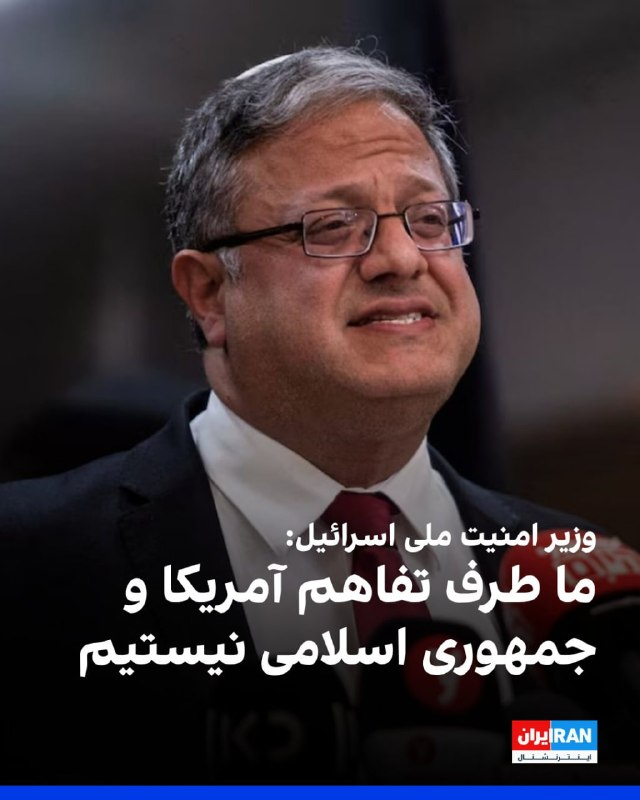

ایتامار بن‌گویر، وزیر امنیت ملی اسرائیل اعلام کرد این کشور طرف تفاهم آمریکا و جمهوری اسلامی نیست و نباید به چیزی کمتر از برچیدن حزب‌الله رضایت دهد.

پیش‌تر وزیر دفاع اسرائیل گفت نتانیاهو به طور شفاف به دونالد ترامپ اعلام کرده نیروهای اسرائیلی از مناطق حائل در لبنان، سوریه و غزه خارج نخواهند شد.
iranintl
‌🏁 🇬🇧 IranintlTV

🤖 @VahidOOnLine

## VahidOOnLine — post 245658

  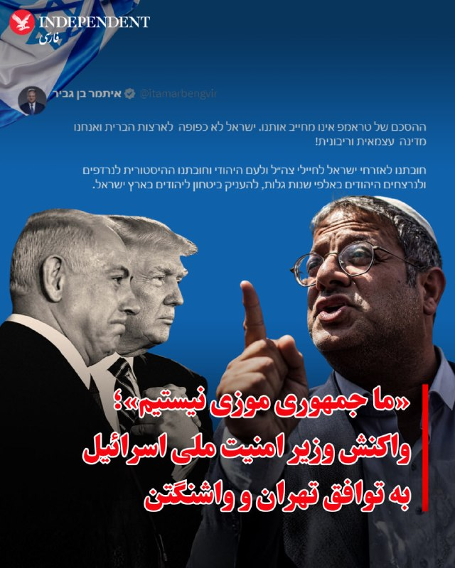

♦️ایتامار بن‌گویر، وزیر امنیت ملی اسرائیل روز دوشنبه ۲۵ خردادماه با انتشار پیامی در اکس اعلام کرد اسرائیل «تعهدی به اجرای توافق پایان جنگ تهران و واشنگتن» ندارد.

بن گویر در این پیام، باوجود «تشکر» از دونالد ترامپ نوشت: «ما جمهوری موزی نیستیم»؛ اصطلاحی که در علوم سیاسی برای توصیف کشوره‌های ضعیف، عمدتا تک محصولی و وابسته به کار می‌رود.

وزیر «راست‌گرای» امنیت ملی اسرائیل در این پیام نوشت: «ما ملزم به رعایت توافق ترامپ نستیم. اسرائیل تابع ایالات متحده نیست و ما یک ملت مستقل و دارای حاکمیت هستیم!
وظیفه ما در قبال شهروندان اسرائیل، سربازان ارتش اسرائیل و مردم یهود و وظیفه تاریخی ما در قبال یهودیانی که در طول هزاران سال تبعید مورد آزار و اذیت و قتل قرار گرفته‌اند، مسئولیم تا امنیت یهودیان را در سرزمین اسرائیل فراهم کنیم.»

بن گویر با یادآوری «شکست توافق‌های پیشین» افزود: «هر بار که به قیمت امنیت اسرائیل تسلیم فشارهای بین‌المللی شدیم، بهای خون خود را با بهره آن پرداختیم. این موضوع در توافق اسلو، در توافق لبنان در سال ۲۰۰۶ و در هر دوره مهار غزه که در مقابل ما منفجر شد، صادق بود.»

وزیر امنیت ملی اسرائیل در همین پیام نوشت: «موضع من روشن است: ما شریک این توافق نیستیم که امنیت ما را تضمین نمی‌کند و به هیچ وجه ما را ملزم به رعایت آن نمی‌کند. ما نباید در مورد چیزی کمتر از برچیدن حزب‌الله مصالحه کنیم، نباید از هیچ سرزمینی که رزمندگان ما تصرف کرده و از زیرساخت‌های تروریستی پاکسازی کرده‌اند، عقب‌نشینی کنیم، نباید به وضعیتی برگردیم که هزاران تروریست در حصارهای شهرک‌های شمالی مستقر باشند و مطمئناً نباید لحظه‌ای در برابر آتشی که به سمت کشور اسرائیل نشانه گرفته می‌شود، ساکت بمانیم. ما باید این را روشن کنیم: پرتاب هر پهپاد، هواپیمای بدون سرنشین یا موشک به سمت اسرائیل از لبنان منجر به حمله اسرائیل به ضاحیه خواهد شد. این توازن بازدارندگی همین چند ماه پیش بود و ما به هیچ وجه نباید از آن دست بکشیم.»
‌🇸🇦 Indypersian

🤖 @VahidOOnLine

## VahidOOnLine — post 245657

  

میثم ظهوریان، نماینده مشهد در مجلس، در شبکه ایکس نوشت محتوای یادداشت تفاهم تهران و واشینگتن هر چه که باشد، جمهوری اسلامی بعد از جنگ به‌طور حتم هم از لحاظ «قدرت سخت» و هم «قدرت نرم» قوی‌تر و مقتدرتر از پیش از آن است.

او افزود: «جمهوری اسلامی در جنگی نابرابر در مقابل دو قدرت هسته‌ای و هفت قدرت منطقه‌ای ایستاد و سربلند بیرون آمد و همه دنیا و حتی معارضان داخلی فهمیدند نظامی پایدار است؛ ادراکی که قبل جنگ خلاف آن وجود داشت.»
iranintl
‌🏁 🇬🇧 IranintlTV

🤖 @VahidOOnLine

## DEJradio — post 5686

  <a href="telegram/content/DEJradio_5686_1781510580.mp4" target="_blank">🎬 Download video</a>

🤡
🔺 هنوز انتقام رهبرمون رو نگرفتیم!

#موشعلی #انتقام_سخت
@DEJradio

## IranIntlTV — post 342446

  

ایتامار بن‌گویر، وزیر امنیت ملی اسرائیل اعلام کرد این کشور طرف تفاهم آمریکا و جمهوری اسلامی نیست و نباید به چیزی کمتر از برچیدن حزب‌الله رضایت دهد.

پیش‌تر وزیر دفاع اسرائیل گفت نتانیاهو به طور شفاف به دونالد ترامپ اعلام کرده نیروهای اسرائیلی از مناطق حائل در لبنان، سوریه و غزه خارج نخواهند شد.
iranintl.com/202606152944

## IranIntlTV — post 342445

  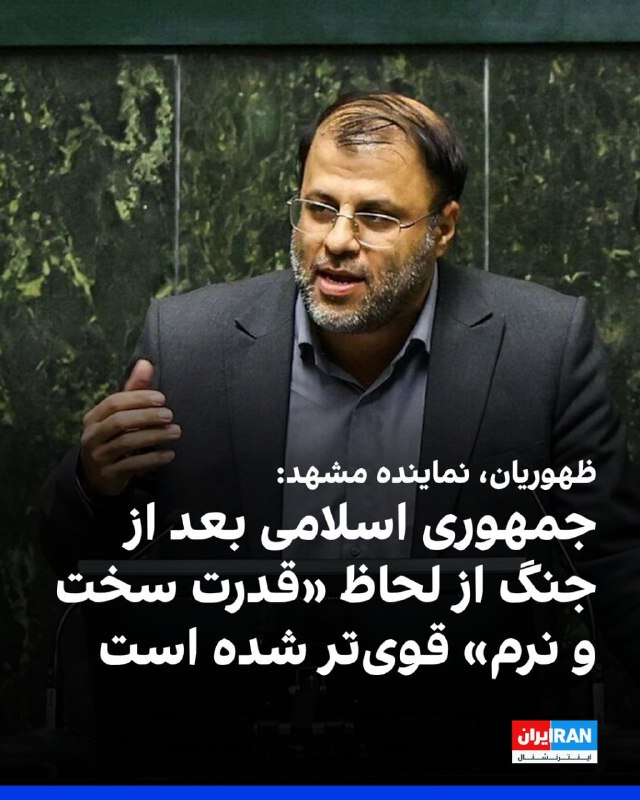

میثم ظهوریان، نماینده مشهد در مجلس، در شبکه ایکس نوشت محتوای یادداشت تفاهم تهران و واشینگتن هر چه که باشد، جمهوری اسلامی بعد از جنگ به‌طور حتم هم از لحاظ «قدرت سخت» و هم «قدرت نرم» قوی‌تر و مقتدرتر از پیش از آن است.

او افزود: «جمهوری اسلامی در جنگی نابرابر در مقابل دو قدرت هسته‌ای و هفت قدرت منطقه‌ای ایستاد و سربلند بیرون آمد و همه دنیا و حتی معارضان داخلی فهمیدند نظامی پایدار است؛ ادراکی که قبل جنگ خلاف آن وجود داشت.»
iranintl.com/202606156410

## Shin_Persian — post 7092

Shin ✓ @hey_itsmyturn
Mon, 15 Jun 2026 07:51:56 UTC

RECAP if you were away for the weekend:

Israel attacked Dahiye, southern Beirut
Islamic Regime's officials threatened to retaliate by attacking Israel
Israel said expecting missile strike from Iran
Missile strike was called off.
USA and Iran agreed on a deal, which is set to be signed on Friday, June 19, 2026.

Have a nice week

ترجمه خودکار فارسی

خلاصه اگر در تعطیلات آخر هفته حضور نداشتید:

اسرائیل به ضاحیه در جنوب بیروت حمله کرد
مقامات رژیم اسلامی تهدید کردند که با حمله به اسرائیل تلافی خواهند کرد
اسرائیل اعلام کرد که انتظار یک حمله موشکی از سوی ایران را دارد
حمله موشکی لغو شد.
ایالات متحده و ایران در مورد توافقی به تفاهم رسیدند که مقرر شده است در روز جمعه، ۱۹ ژوئن ۲۰۲۶ امضا شود.

هفته خوبی داشته باشید

𝕏 · @shin_persian

## alonews — post 128150

  <a href="telegram/content/alonews_128150_1781510582.webm" target="_blank">🎬 Download video</a>

👈رسایی: اینترنت رو قطع کنید

✅ @AloNews خبر جنگ

## alonews — post 128149

  <a href="telegram/content/alonews_128149_1781510582.webm" target="_blank">🎬 Download video</a>

👈خوارج برای امشب فراخوان دادن که همگی بریزن تو خیابون، تازه میگن مجتبی زنده نیست! 
✅ @AloNews خبر جنگ

## alonews — post 128148

  <a href="telegram/content/alonews_128148_1781510583.webm" target="_blank">🎬 Download video</a>

👈خوارج برای امشب فراخوان دادن که همگی بریزن تو خیابون، تازه میگن مجتبی زنده نیست!

✅ @AloNews خبر جنگ

## alonews — post 128147

  <a href="telegram/content/alonews_128147_1781510583.webm" target="_blank">🎬 Download video</a>

👈دیده شده در مینی تجمعات

🔴آمریکا انتقام هلیکوپترش رو گرفت اما ما انتقام رهبرمون رو نگرفتیم

✅ @AloNews خبر جنگ

## alonews — post 128146

  <a href="telegram/content/alonews_128146_1781510583.webm" target="_blank">🎬 Download video</a>

👈فواد ایزدی: جمهوری اسلامی الان یک ابرقدرت فرامنطقه‌ای هست

✅ @AloNews خبر جنگ

## alonews — post 128145

  <a href="telegram/content/alonews_128145_1781510583.webm" target="_blank">🎬 Download video</a>

👈نخست وزیر پاکستان: پیروزی برای صلح، موفقیتی برای دیپلماسی و رد جنگ است

✅ @AloNews خبر جنگ

---
📅 بروزرسانی: 1405/03/25 11:22
---

## VahidOOnLine — post 245656

  <a href="telegram/content/VahidOOnLine_245656_1781509967.mp4" target="_blank">🎬 Download video</a>

⭕️اولین نفتکش حامل گاز طبیعی مایع پس از «توافق تهران و واشنگتن» از تنگه هرمز گذشت

♦️نخستین نفتکش حامل گاز طبیعی مایع پس از اعلام پایان جنگ جمهوری اسلامی ایران و آمریکا، صبح دوشنبه ۲۵ اسرائیل از تنگه هرمز عبور کرد.

خبرگزاری رویترز گزارش کرد نفتکش دیشا با پرچم مالت از خلیج فارس به دریای عمان رفته است.

رسانه‌های ایران می‌گویند این نفتکش از «طرح تفکیک ترافیک دریایی ایران استفاده کرده است.»

دونالد ترامپ، رئیس جمهوری آمریکا نیمه‌شب یکشنبه به‌وقت تهران و در زمان اعلام توافق برای پایان جنگ با ایران، در پیامی خطاب به کشتی‌های گرفتار در خلیج فارس نوشته بود: «موتورهایتان را روشن کنید، بگذارید نفت جریان یابد.»
‌🇸🇦 Indypersian

🤖 @VahidOOnLine

## WithYashar — post 14949

نشست سران گروه هفت (G7) امروز در شهر اویان-له-بن فرانسه برگزار می‌شود؛ جایی که رهبران کشورهای صنعتی جهان درباره‌ی مجموعه‌ای از بحران‌های جهانی گفت‌وگو خواهند کرد.

گروه G7 یک گروه متشکل از هفت اقتصاد بزرگ جهان شامل آمریکا، بریتانیا، کانادا، فرانسه، آلمان، ایتالیا و ژاپن است که از دهه‌ی ۱۹۷۰ و پس از بحران نفتی اوپک شکل گرفت.
@withyashar

## pm_afshaa — post 94056

هر بشکه نفت به 79 دلار رسید

💧 Rainbet.com the #1 Non-KYC Crypto Casino & Sportsbook @rainbetcom

😁 @Pm_Afshaa

## Shin_Persian — post 7091

Shin ✓ @hey_itsmyturn
Mon, 15 Jun 2026 07:50:26 UTC

RECAP if you were away for the weekend:

Israel attacked Dahiye, southern Beirut
Islamic Regime's officials threatened to retaliate by attacking Israel
Israel said expecting missile strike from Iran
Missile strike was called off.
USA and Iran agreed on a deal, which is set to be signed on Friday, July 19, 2026.

Have a nice week

ترجمه خودکار فارسی

خلاصه وقایع اگر در تعطیلات آخر هفته حضور نداشتید:

اسرائیل به ضاحیه در جنوب بیروت حمله کرد
مقامات رژیم اسلامی تهدید کردند که با حمله به اسرائیل تلافی خواهند کرد
اسرائیل اعلام کرد که در انتظار حمله موشکی از سوی ایران است
حمله موشکی لغو شد.
ایالات متحده و ایران در مورد توافقی به تفاهم رسیدند که قرار است در روز جمعه، ۱۹ ژوئیه ۲۰۲۶ امضا شود.

هفته خوبی داشته باشید

𝕏 · @shin_persian

## Shin_Persian — post 7090

  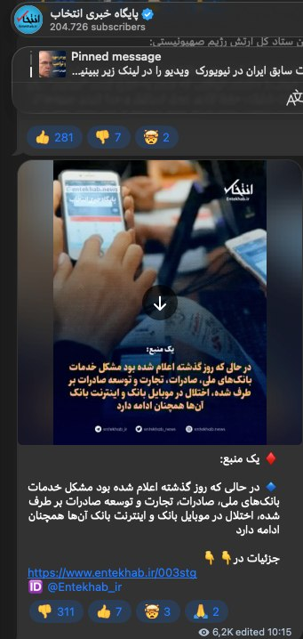

↩️ Quoted tweet: Shin ✓ @hey_itsmyturn Sat, 13 Jun 2026 08:51:45 UTC Widespread interruption in Iranian banking systems including e-banking and ATM machines. ↩️ توییت نقل‌قول شده — برای پاسخ، پست زیر را ببینید. ترجمه خودکار فارسی اختلال گسترده در سیستم‌های…

## Shin_Persian — post 7089

↩️ Quoted tweet:
Shin ✓ @hey_itsmyturn
Sat, 13 Jun 2026 08:51:45 UTC

Widespread interruption in Iranian banking systems including e-banking and ATM machines.

↩️ توییت نقل‌قول شده — برای پاسخ، پست زیر را ببینید.

ترجمه خودکار فارسی

اختلال گسترده در سیستم‌های بانکی ایران از جمله بانکداری الکترونیک و دستگاه‌های خودپرداز (ATM).

𝕏 · @shin_persian

## FarsiVOA — post 220777

  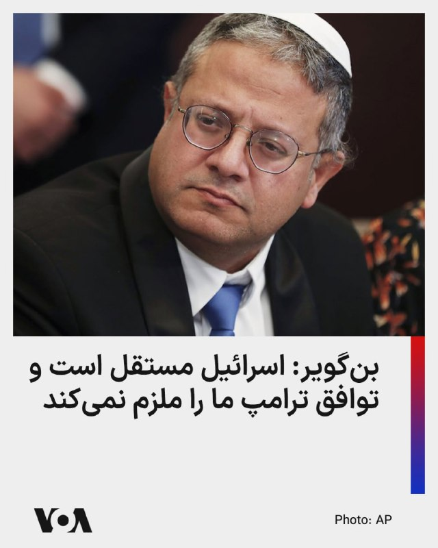

ایتامار بن‌گویر، وزیر امنیت ملی اسرائیل، در واکنش به توافق اعلام‌شده از سوی دونالد ترامپ با جمهوری اسلامی گفت این توافق اسرائیل را ملزم نمی‌کند.

به گزارش تایمز اسرائیل، بن‌گویر در بیانیه‌ای گفت: «توافق ترامپ ما را ملزم نمی‌کند. اسرائیل تابع آمریکا نیست. ما کشوری مستقل و دارای حاکمیت هستیم.»

او افزود اسرائیل طرف این توافق نیست و آن را توافقی ندانست که به گفته او امنیت اسرائیل را تضمین کند.

بن‌گویر همچنین گفت اسرائیل نباید از هیچ‌یک از مناطقی که نیروهایش در جریان درگیری‌ها در لبنان تصرف کرده‌اند، عقب‌نشینی کند.
@FarsiVOA

## RadioFarda — post 158319

🔸پس از اعلام خبر توافق اولیه آمریکا و ایران در شامگاه یک‌شنبه ۲۴ خرداد آوارگان لبنانی در پناهگاهی واقع در منطقه برج رحال واقع در جنوب لبنان به رقص و پایکوبی پرداختند.

🔸در جریان تنش‌های نظامی و سیاسی در منطقه خاورمیانه در ماه‌های گذشته اسرائیل بارها به مناطق مختلفی در جنوب لبنان حمله و برای ساکنان ده‌ها روستا و شهر هشدار تخلیه صادر کرد.

🔸جمهوری اسلامی در مذاکرات با آمریکا توقف حملات اسرائیل به مقر اصلی حزب‌الله در جنوب بیروت را یکی از شرط‌های خود تعیین کرده است.

🔸هفته گذشته، حمله اسرائیل به ضاحیه موجب حملات موشکی ایران به اسرائیل شد و در مقابل ارتش اسرائیل نیز مناطقی از ایران را هدف قرار داد. این رخداد رسیدن به توافق پایان جنگ بین ایران و آمریکا را تحت تأثیر قرار داد. اما تبادل آتش طرفین با دخالت دونالد ترامپ، رئیس‌جمهور آمریکا، متوقف شد.

@RadioFarda

## BBCPersian — post 283866

🔻وقوع آتش‌سوزی در یک نفتکش هندی در سواحل عمان

وزارت کشتیرانی هند از آتش‌سوزی در نفتکش «ماریوکس» در سواحل عمان با ۲۴ ملوان هندی خبر داد و گفت که همه آنها در سلامت هستند.

اوپش کومار شارما، مدیر وزارت بنادر و کشتیرانی فدرال در هند، در یک کنفرانس مطبوعاتی گفت که این کشتی با پرچم ماداگاسکار در حرکت بود و محموله‌ای حمل نمی‌کرد.

او گفت: «در حال حاضر همه دریانوردان هندی در سلامت هستند. ما در حال هماهنگی با وزارت خارجه، نمایندگی‌های هند در خارج از کشور، نیروی دریایی هند و وزارت دفاع هستیم تا ایمنی آنها را تضمین کنیم.»

به گفته او علت آتش‌سوزی که ساعت یک و نیم بعد از ظهر به وقت محلی رخ داد، «هنوز مشخص نیست.»

https://bbc.in/4viCUHy
@BBCPersian

## alonews — post 128144

  <a href="telegram/content/alonews_128144_1781509970.webm" target="_blank">🎬 Download video</a>

👈نخست وزیر پاکستان: به رئیس جمهور آمریکا، رهبر ایران و رئیس جمهور ایران به خاطر دستیابی به توافق در یک دوره دشوار تبریک می‌گویم

✅ @AloNews خبر جنگ

## alonews — post 128143

  <a href="telegram/content/alonews_128143_1781509970.webm" target="_blank">🎬 Download video</a>

👈عراقچی: واشنگتن مسئول اجرای توافق است

✅ @AloNews خبر جنگ

---
📅 بروزرسانی: 1405/03/25 11:12
---

## VahidOOnLine — post 245655

  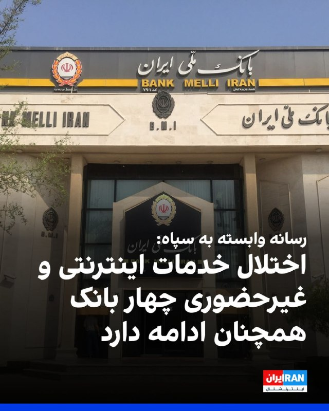

خبرگزاری فارس، وابسته به سپاه پاسداران، گزارش داد با وجود اعلام رفع اختلال در خدمات بانک‌های ملی، صادرات، تجارت و توسعه صادرات، اختلال خدمات اینترنتی و غیرحضوری این بانک‌ها همچنان ادامه دارد.

خبرگزاری فارس گزارش داد دو روز پیش شورای هماهنگی بانک‌ها اختلال سامانه‌های چهار بانک ملی، صادرات، تجارت و توسعه صادرات را ناشی از «حمله سایبری محدود» اعلام کرده و گفته بود نشت اطلاعاتی رخ نداده است، اما اکنون تنها خدمات کارت در پایانه‌های فروشگاهی و خودپردازها فعال است.
iranintl
‌🏁 🇬🇧 IranintlTV

🤖 @VahidOOnLine

## WithYashar — post 14948

ایران فعلا در تنگه هرمز پولی دریافت نخواهد کرد
ایسنا: براساس جزئیات تفاهم‌نامه، ایران تنگه هرمز را مدیریت خواهد کرد و عوارض را «در تاریخ بعدی» دریافت خواهد کرد.
@withyashar

## WithYashar — post 14947

️ترامپ به نیویورک تایمز:

«کنار آمدن با نتانیاهو فوق‌العاده دشوار است و او باید از ما بسیار سپاسگزار باشد، زیرا اگر ایران سلاح هسته‌ای داشت، اسرائیل وجود نداشت.»
@withyashar

## IranIntlTV — post 342444

  

خبرگزاری فارس، وابسته به سپاه پاسداران، گزارش داد با وجود اعلام رفع اختلال در خدمات بانک‌های ملی، صادرات، تجارت و توسعه صادرات، اختلال خدمات اینترنتی و غیرحضوری این بانک‌ها همچنان ادامه دارد.

خبرگزاری فارس گزارش داد دو روز پیش شورای هماهنگی بانک‌ها اختلال سامانه‌های چهار بانک ملی، صادرات، تجارت و توسعه صادرات را ناشی از «حمله سایبری محدود» اعلام کرده و گفته بود نشت اطلاعاتی رخ نداده است، اما اکنون تنها خدمات کارت در پایانه‌های فروشگاهی و خودپردازها فعال است.
iranintl.com/202606158141

## FarsiVOA — post 220776

  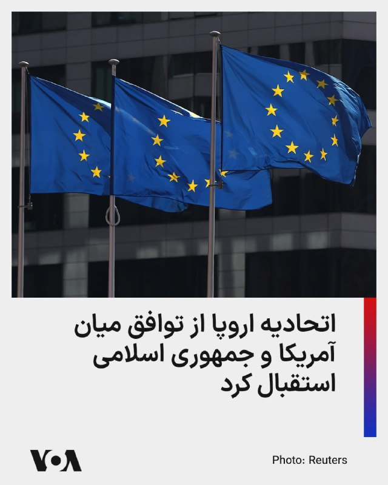

رئیس شورای اروپا از توافق اعلام‌‌شده میان آمریکا و حکومت ایران استقبال کرد و آن را گامی مهم در جهت پایان دادن به تنش‌ها و بازگشت ثبات در منطقه دانست.

آنتونیو کوستا در پیامی در شبکه اجتماعی ایکس نوشت که امیدوار است این جنگ به پایان برسد و آزادی کشتیرانی در تنگه هرمز به ‌طور کامل احیا شود.

او همچنین از تلاش‌های دیپلماتیک «مستمر» تمامی طرف‌هایی که زمینه دستیابی به این توافق را فراهم کردند، قدردانی کرد.

رئیس شورای اروپا تأکید کرد: «اکنون باید سلاح‌ها خاموش شوند و اختلافات باقی‌مانده مطابق با حقوق بین‌الملل و از طریق روش‌های مسالمت‌آمیز حل‌وفصل شوند.»

او همچنین اعلام کرد که شورای اروپا آماده است برای پیشبرد یک راهبرد جامع با هدف دستیابی به صلحی پایدار در سراسر خاورمیانه نقش‌ آفرینی کند.
@FarsiVOA

## DW_Farsi — post 125993

  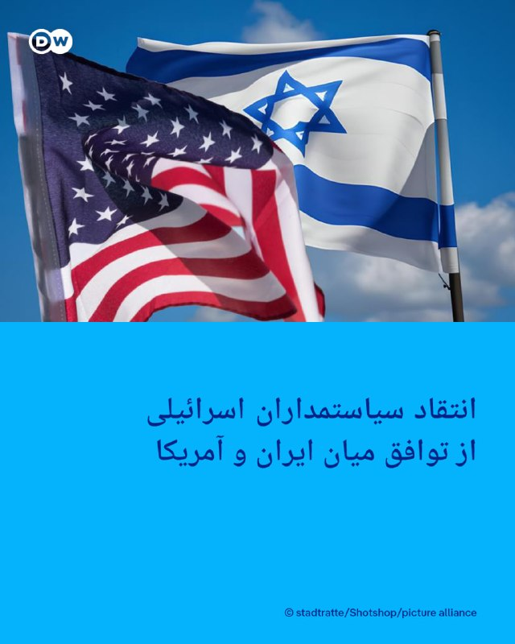

🔶 انتقاد سیاستمداران اسرائیلی از توافق میان ایران و آمریکا

یائیر گولان، رئیس حزب "دموکرات‌ها" در اسرائیل تفاهم‌نامه آمریکا با ایران را برای این کشور "فاجعه‌بار" توصیف کرد. به گزارش سایت "تایمز اسرائیل"، گولان اظهار داشت: «دستاوردهای عظیم نظامی که با شجاعت خلبانان‌مان و خون سربازان‌مان به دست آمده بود، از بین رفت، در حالی‌که نتانیاهو کنار ایستاده بود؛ ضعیف، بیمار، منزوی و فاقد نفوذ.»

این سیاستمدار اسرائیلی این وضعیت را "اوج سال‌ها شکست" بنیامین نتانیاهو خواند و گفت: «مردی که وعده پیروزی داده بود، دوران مسئولیت خود را در حالی به پایان می‌رساند که دشمنان اسرائیل قوی‌تر و اسرائیل ضعیف‌تر شده است و بازدارندگی‌ای که با خون سربازان‌ ما ساخته شده بود، در مقابل چشمان‌مان در حال فرسایش است.»

هم‌زمان ایتامار بن‌گویر، وزیر امنیت ملی اسرائیل، نیز با انتشار بیانیه‌ای اعلام کرد توافقی که ترامپ با ایران به دست آورده، به معنای "متعهد کردن اسرائیل" نیست. او گفت: «اسرائیل تابع ایالات متحده نیست. ما کشوری مستقل و دارای حاکمیت هستیم.»

بن گویر تأکید کرد اسرائیل شریکی برای این توافق که امنیت این کشور را تضمین نمی‌کند، نیست و نباید از هیچ‌ منطقه‌ای که ارتش در لبنان تصرف کرده است، عقب‌نشینی کند.

@dw_farsi

## Dirty_Kids — post 392087

  <a href="telegram/content/Dirty_Kids_392087_1781509376.mp4" target="_blank">🎬 Download video</a>

آماده سازی یکی از بزرگترین پرچم شیرو خورشید
برای ورود به ورزشگاه جام جهانی ❤️💪

@Dirty_Kids 👻

## Dirty_Kids — post 392086

‏وضعیت جمهوری اسلامی شده اون دیالوگ ال‌پاچینو تو فیلم گادفادر
یا امضا می‌کنی، یا مغزت روی اون برگه است

@Dirty_Kids 👻

## Dirty_Kids — post 392085

  <a href="telegram/content/Dirty_Kids_392085_1781509377.mp4" target="_blank">🎬 Download video</a>

کربلایی ترامپ

@Dirty_Kids 👻

## alonews — post 128142

  <a href="telegram/content/alonews_128142_1781509378.webm" target="_blank">🎬 Download video</a>

👈پیت هگست: نیروهای آمریکایی توی منطقه باقی میمونن و اگر ایران به تعهدات خودش عمل نکنه، محاصره دوباره اعمال میشه

✅ @AloNews خبر جنگ

## alonews — post 128141

  <a href="telegram/content/alonews_128141_1781509378.webm" target="_blank">🎬 Download video</a>

👈نفت وارد کانال ۷۰ دلار شد

✅ @AloNews خبر جنگ

## alonews — post 128140

  <a href="telegram/content/alonews_128140_1781509378.mp4" target="_blank">🎬 Download video</a>

👈جشن و خوشحالی مردم جنوب لبنان در پی اعلام توافق پایان جنگ

✅ @AloNews خبر جنگ

## alonews — post 128139

  <a href="telegram/content/alonews_128139_1781509380.webm" target="_blank">🎬 Download video</a>

👈الاخبار: ترامپ مجبور شد امتیازات زیادی در پرونده لبنان به ایران بدهد

✅ @AloNews خبر جنگ

## alonews — post 128138

  <a href="telegram/content/alonews_128138_1781509380.webm" target="_blank">🎬 Download video</a>

👈گفتگوی تلفنی عراقچی با وزرای امور خارجه ترکیه، عراق و مصر

✅ @AloNews خبر جنگ

---
📅 بروزرسانی: 1405/03/25 11:03
---

## VahidOOnLine — post 245654

  <a href="telegram/content/VahidOOnLine_245654_1781508799.mp4" target="_blank">🎬 Download video</a>

بر اساس ویدیوهای رسیده به ایران‌اینترنشنال، گروهی از ایرانیان مقیم آمریکا یکشنبه ۲۴ خرداد با تجمع در هیوستون تگزاس، نام جاویدنامان انقلاب ملی را فریاد زدند.
‌🏁 🇬🇧 IranintlTV

🤖 @VahidOOnLine

## VahidOOnLine — post 245653

  

ژان نوئل بارو، وزیر خارجه فرانسه، بار دیگر از جمهوری اسلامی خواست حمایت خود از شبه‌نظامیان و گروه‌های نیابتی در منطقه مانند حزب‌الله لبنان، حوثی‌های یمن و دیگر شبه‌نظامیان مورد حمایت خود را پایان دهد.

او جمهوری اسلامی را «نیروی بی‌ثبات‌کننده» توصیف کرد و گفته برنامه هسته‌ای، موشکی و حمایت از این گروه‌ها تهدیدی برای کشورهای خاورمیانه و حتی اروپا محسوب می‌شود.
iranintl
‌🏁 🇬🇧 IranintlTV

🤖 @VahidOOnLine

## VahidOOnLine — post 245652

  

یوهان وادفول، وزیر خارجه آلمان، پس از تفاهم اولیه تهران و واشینگتن گفت که تنگه هرمز باید بار دیگر بدون هیچ محدودیتی قابل کشتیرانی شود.

وادفول پیش از دیدار با همتایان اروپایی خود در لوکزامبورگ گفت: «باید روشن شود تنگه هرمز بدون هیچ محدودیت و عوارضی به روی کشتیرانی باز است.»
iranintl
‌🏁 🇬🇧 IranintlTV

🤖 @VahidOOnLine

## WithYashar — post 14946

وزیر دفاع اسرائیل: همراه با نتانیاهو سیاستی روشن را دنبال میکنم که بر اساس آن، ارتش در مناطق امنیتی در لبنان، سوریه و غزه باقی خواهد ماند

با وجود تمام فشارهای فعلی و آینده، خروج ارتش اسرائیل از لبنان را نمیپذیریم
@withyashar

## pm_afshaa — post 94055

در شهرداری گناباد چه میگذرد 2 تا حکومتی دارن تو شهرداری گناباد کون کونک بازی میکنن که توسط یهکی از شهروندان شکار میشن و فیلمشون در میاد مشاهده فیلم @Pm_Afshaa

## mamlekate — post 103718

  <a href="telegram/content/mamlekate_103718_1781508802.mp4" target="_blank">🎬 Download video</a>

قالیباف، رییس مجلس، ۲۰ بهمن ۱۴۰۳، در همایش ویژه فرماندهان سپاه: «ترامپ قاتل قاسم سلیمانی است و مذاکره با او شرافتمندانه نیست.»

@mamlekate

## IranIntlTV — post 342443

  <a href="telegram/content/IranIntlTV_342443_1781508803.mp4" target="_blank">🎬 Download video</a>

بر اساس ویدیوهای رسیده به ایران‌اینترنشنال، گروهی از ایرانیان مقیم آمریکا یکشنبه ۲۴ خرداد با تجمع در هیوستون تگزاس، نام جاویدنامان انقلاب ملی را فریاد زدند.

## IranIntlTV — post 342442

  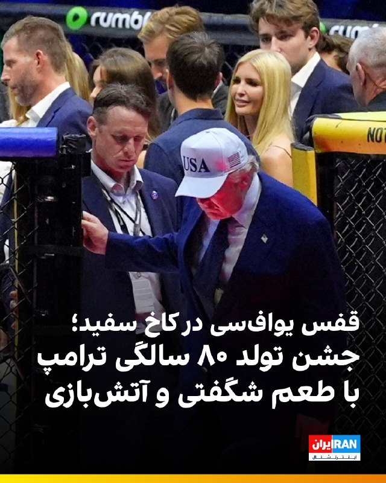

🔻در یکی از سوررئال‌ترین و تاریخی‌ترین رویدادهای ورزشی جهان، محوطه چمن جنوبی کاخ سفید یکشنبه‌شب میزبان رویداد بی‌سابقه «UFC Freedom 250» بود.

🔹برای نخستین بار در تاریخ، محل سکونت رییس‌جمهوری آمریکا به صحنه نبرد در قفس تبدیل شد. این رویداد با حضور بیش از ۴ هزار تماشاگر، از جمله دونالد ترامپ، رییس‌جمهوری آمریکا، جی‌دی ونس، معاون رییس‌جمهوری آمریکا، و مقام‌های ارشد کابینه برگزار شد و حاضران هم‌زمان با جشن تولد ۸۰ سالگی ترامپ، سرود «تولدت مبارک» را برای او خواندند.

🔹در مبارزه اصلی این شب، جاستین گیچی با شکست ایلیا توپوریا، قهرمان بدون شکست این وزن، کمربند قهرمانی سبک‌وزن یو‌اف‌سی را به دست آورد. ضربات سنگین گیچی در راند سوم چهره توپوریا را غرق در خون کرد و در نهایت در راند چهارم، با پرتاب حوله از سوی تیم توپوریا، مبارزه با ناک‌اوت فنی به سود گیچی پایان یافت. ترامپ پس از این پیروزی وارد قفس شد و به گیچی تبریک گفت.

🔹در دیگر مبارزه مهم، سیریل گان فرانسوی با یک ضربه راست سنگین در راند دوم، الکس پریرا را ناک‌اوت کرد و کمربند قهرمانی موقت سنگین‌وزن را به دست آورد.

@iranintltvsport

## IranIntlTV — post 342441

  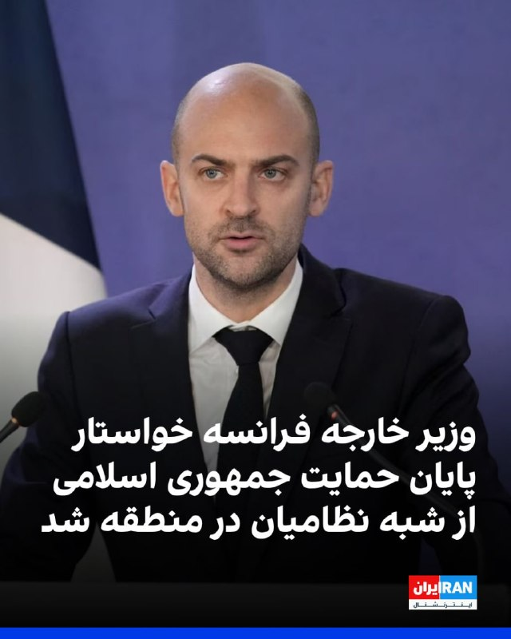

ژان نوئل بارو، وزیر خارجه فرانسه، بار دیگر از جمهوری اسلامی خواست حمایت خود از شبه‌نظامیان و گروه‌های نیابتی در منطقه مانند حزب‌الله لبنان، حوثی‌های یمن و دیگر شبه‌نظامیان مورد حمایت خود را پایان دهد.

او جمهوری اسلامی را «نیروی بی‌ثبات‌کننده» توصیف کرد و گفته برنامه هسته‌ای، موشکی و حمایت از این گروه‌ها تهدیدی برای کشورهای خاورمیانه و حتی اروپا محسوب می‌شود.
iranintl.com/202606156938

## IranIntlTV — post 342440

  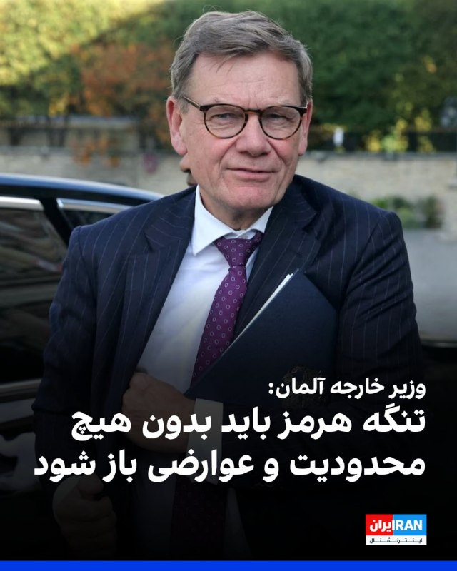

یوهان وادفول، وزیر خارجه آلمان، پس از تفاهم اولیه تهران و واشینگتن گفت که تنگه هرمز باید بار دیگر بدون هیچ محدودیتی قابل کشتیرانی شود.

وادفول پیش از دیدار با همتایان اروپایی خود در لوکزامبورگ گفت: «باید روشن شود تنگه هرمز بدون هیچ محدودیت و عوارضی به روی کشتیرانی باز است.»
iranintl.com/202606154947

## FarsiVOA — post 220775

  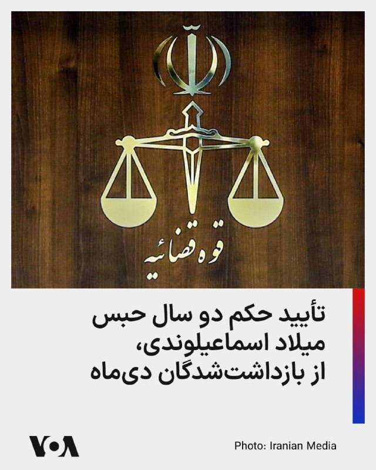

حکم قضایی شامل دو سال حبس برای میلاد اسماعیلوندی، از بازداشت‌شدگان اعتراضات دی‌ماه ۱۴۰۴، از سوی دادگاه تجدیدنظر استان خوزستان تایید شد.

هرانا، ارگان خبری مجموعه فعالان حقوق بشر در ایران، گزارش داد که این زندانی سیاسی که در زندان شیبان اهواز محبوس است، پیشتر در مرحله بدوی توسط شعبه یک دادگاه انقلاب اهواز به دو سال حبس، دو سال منع خروج از کشور و یک سال الزام به حضور در اداره امر به معروف و نهی از منکر محکوم شده بود.

بر اساس این گزارش، این مجازات‌ها توسط شعبه ۱۶ دادگاه تجدیدنظر استان خوزستان عینا تایید شد.

در حکم صادر شده علیه آقای اسماعیلوند، که روز ۲۸ دی ماه ۱۴۰۴ و در جریان اعتراضات سراسری، بازداشت شد، او به «اخلال در نظم عمومی» متهم شده است.

جمهوری اسلامی با بازداشت‌های خودسرانه معترضان، به نقض حقوق بازداشت‌شدگان به ویژه بازداشت‌شدگان و زندانیان سیاسی متهم است.
@FarsiVOA

## FarsiVOA — post 220774

  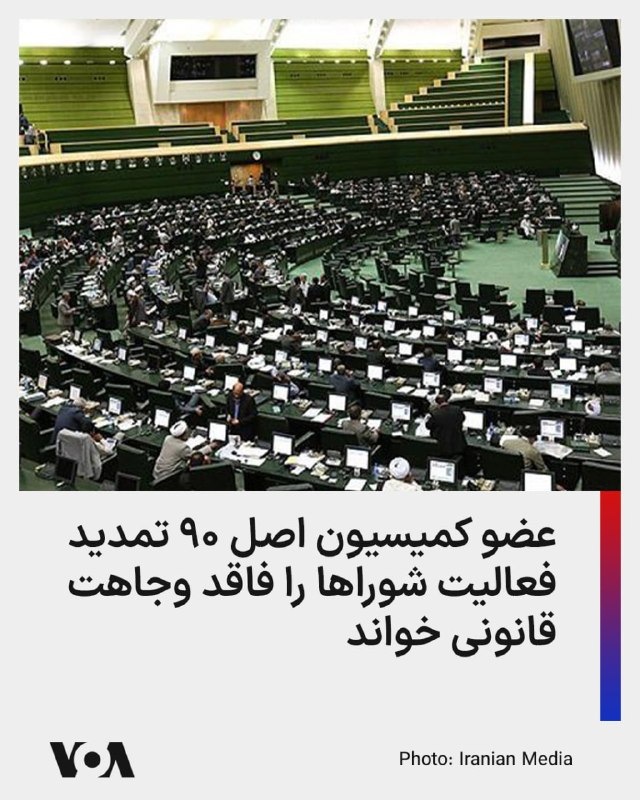

یک عضو کمیسیون اصل نود مجلس شورای اسلامی با انتقاد از تصمیم شورای عالی امنیت ملی مبنی تمدید فعالیت ششمین دوره شوراهای شهر، تاکید کرد که هیچ‌کس به جز مجلس نمی‌تواند در اینباره تصمیم‌گیری کند.

علیرضا زندیان در گفتگو با خبرگزاری دولتی ایسنا، با اشاره به تعویق برگزاری انتخابات شوراها به دلیل شرایط جنگی، به برخی از اظهارنظرها مبنی تمدید فعالیت این دوره تا انتخابات ریاست جمهوری انتقاد کرد.

وی یادآور شد که «مجلس باید به این موضوع ورود و پایان فعالیت شورای ششم را اعلام کند» و وزارت کشور نیز می‌تواند تا زمان برگزاری انتخابات شوراها، امور مربوط به مدیریت شهری را برعهده بگیرد.

پیشتر ابراهیم رضایی، سخنگوی کمیسیون امنیت ملی مجلس شورای اسلامی به نقل از وزیر کشور اعلام کرده بود که با تصمیم شورای عالی امنیت ملی، فعلا انتخابات شوراها نمی‌شود و شوراهای فعلی به فعالیت خود ادامه می‌دهند.
@FarsiVOA

## BBCPersian — post 283865

🔻رئیس کمیسیون اتحادیه اروپا: توافق میان ایران باید امکان بازگشایی فوری تنگه هرمز را فراهم کند

اورسولا فون در لاین، رئیس کمیسیون اتحادیه اروپا روز دوشنبه گفت که توافق بین ایالات متحده و ایران باید امکان «بازگشایی فوری» تنگه هرمز را فراهم کند.

او درباره توافق اعلام شده گفت: «اولویت اکنون اجرای سریع و کامل آن توسط همه طرف‌ها است.»

او افزود: «آزادی دریانوردی باید بدون عوارض برقرار شود. این امر برای ثبات منطقه‌ای و اقتصاد جهانی ضروری است. این امر در را برای مذاکرات گسترده‌تر در مورد صلح و امنیت در خاورمیانه باز می‌کند.»

رئیس کمیسیون اتحادیه اروپا همچنین گفت که صلح در خاورمیانه «تا زمانی که لبنان در آتش می‌سوزد» غیرممکن است.

خانم فون در لاین گفت: «اروپا بار دیگر از همه طرف‌ها می‌خواهد که به حاکمیت و تمامیت ارضی لبنان احترام بگذارند و آتش‌بس واقعی را اجرا کنند.»

https://bbc.in/4viCUHy
@BBCPersian

## BBCPersian — post 283864

  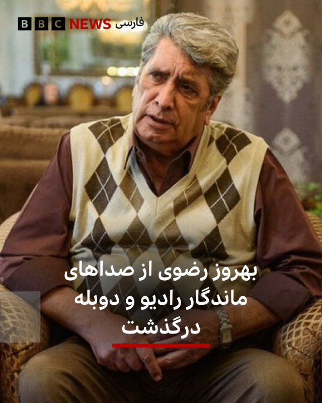

🔻بهروز رضوی، گوینده، صداپیشه، ترانه‌سرا و بازیگر، پس از دوره‌ای بیماری در ۷۸ سالگی درگذشت.

او فعالیت حرفه‌ای را از سال ۱۳۴۷ با گویندگی در رادیو آغاز کرد و طی بیش از پنج دهه فعالیت، به یکی از شناخته‌شده‌ترین صداهای رسانه‌ای ایران بدل شد. روایت مجموعه مستند «ایران» از جمله ماندگارترین آثار او به شمار می‌رود.

بهروز رضوی علاوه بر فعالیت در رادیو و تلویزیون، در سینما و دوبله نیز حضور داشت و در آثاری چون «گناه فرشته»، «سفر به چزابه» و «نجات‌یافتگان» ایفای نقش کرده بود. او همچنین شاعر ترانه‌های «کویر دل» و «گمشده» با صدای مرجان بود.

این هنرمند متولد یزد از سال ۱۳۷۴ در کرج زندگی می‌کرد و برادر عاطفه رضوی، بازیگر و چهره‌پرداز، است.

📷ISNA
https://bbc.in/4viCUHy
@BBCPersian

## alonews — post 128137

  <a href="telegram/content/alonews_128137_1781508809.webm" target="_blank">🎬 Download video</a>

👈وزارت خارجه عربستان: ما از آغاز مذاکرات تفصیلی میان آمریکا و ایران طی ۶۰ روز آینده استقبال می‌کنیم.

🔴بر اهمیت بازگرداندن امنیت و آزادی کشتیرانی در تنگه هرمز تأکید می‌کنیم

🔴امیدواریم که امنیت و صلحی محقق شود که امنیت منطقه و جهان را تقویت کند

✅ @AloNews خبر جنگ

---
📅 بروزرسانی: 1405/03/25 10:53
---

## VahidOOnLine — post 245651

  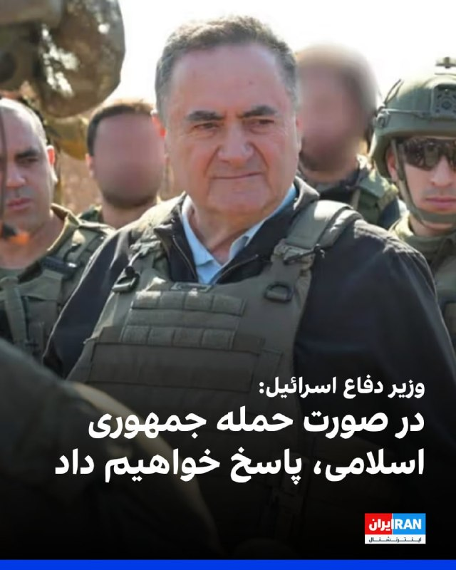

یسرائیل کاتز، وزیر دفاع اسرائیل گفت که نیروهای این کشور در مناطق امنیتی حائل در لبنان، سوریه و غزه باقی خواهد ماند و نتانیاهو این موضوع را به‌طور شفاف به ترامپ و دیگر مقام‌های ارشد آمریکا اعلام کرده است.

او افزود: «اگر جمهوری اسلامی به دلیل رویدادهای لبنان به اسرائیل حمله کند، به آنها حمله خواهیم کرد.»
iranintl
‌🏁 🇬🇧 IranintlTV

🤖 @VahidOOnLine

## VahidOOnLine — post 245650

  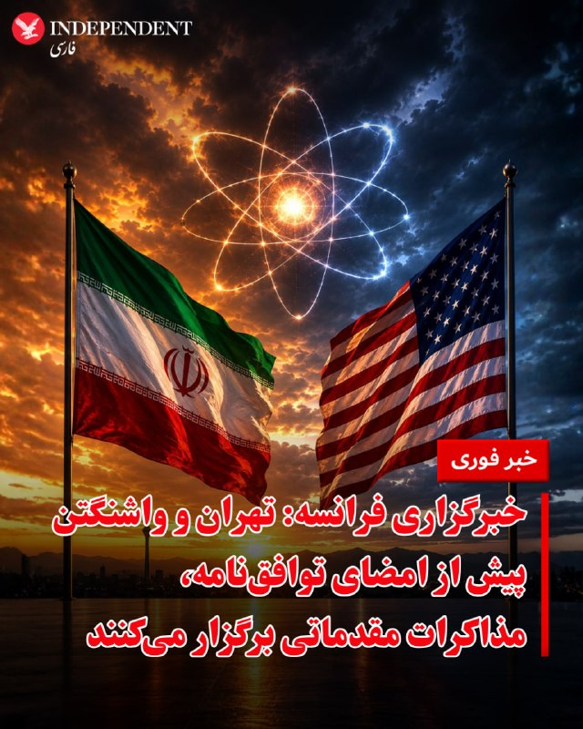

♦️خبرگزاری فرانسه، روز دوشنبه ۲۵ خردادماه به نقل از یک مقام دیپلماتیک گزارش کرد که نمایندگان جمهوری اسلامی ایران و ایالات متحده، پیش از امضای توافق‌نامه پایان جنگ در ژنو، در روز جمعه ۲۹ خرداد، در دوحه قطر مذاکرات «مقدماتی» برگزار خواهند کرد.

این خبر در حالی منتشر می‌شود که با وجود تایید توافق در تهران و واشنگتن، وضعیت ناپایدار لبنان و نارضایتی و مخالفت اسرائیل با آن، به‌علاوه احتمال «تفسیرهای متفاوت»، پایان قطعی مخاصمه میان ایران و آمریکا را به راهی نه‌‌چندان آسان تبدیل کرده است.
‌🇸🇦 Indypersian

🤖 @VahidOOnLine

## WithYashar — post 14945

  <a href="telegram/content/WithYashar_14945_1781508195.mp4" target="_blank">🎬 Download video</a>

اولین شناوری که پس از اعلام توافق صلح میان ایالات متحده و جمهوری اسلامی ایران از تنگه هرمز عبور کرد، نفتکش گاز طبیعی مایع (LNG) با پرچم مالت به نام “دیشا” (Disha) است که از طرح تفکیک ترافیک دریایی ایران استفاده کرد
@withyashar

## pm_afshaa — post 94054

بحث بحث ریشست نه به اون بچه ای که باباشو جلوشو کشتن بعد 20 سال کل اون گروهو کشت انتقام باباشو بگیره نه به اینا که انقدر گنده گوز و طرفداراشون مینازیدن اخر با قاتل پدر و زن و بچش دست داد و تسلیمش شد

## pm_afshaa — post 94053

بحث بحث ریشست نه به اون بچه ای که باباشو جلوشو کشتن بعد 20 سال کل اون گروهو کشت انتقام باباشو بگیره نه به اینا که انقدر گنده گوز و طرفداراشون مینازیدن اخر با قاتل پدر و زن و بچش دست داد و تسلیمش شد

## DEJradio — post 5685

  <a href="telegram/content/DEJradio_5685_1781508199.mp4" target="_blank">🎬 Download video</a>

🔺🎥 میوه‌های نوبرانه‌ آمده، اما بسیاری نمی‌توانند بچشند

شهروندان از گرانی مواد غذایی کمرشان شکسته است و از پس هزینه‌ها برنمی‌آیند. یک شهروند با ارسال ویدیویی از گرانی نوبرانه‌ها شکایت دارد. مردم می‌گویند با توافق و بی‌توافق زندگی آنها پر از مشقت است.

#گرانی #تورم
@DEJradio

## IranIntlTV — post 342439

  

یسرائیل کاتز، وزیر دفاع اسرائیل گفت که نیروهای این کشور در مناطق امنیتی حائل در لبنان، سوریه و غزه باقی خواهد ماند و نتانیاهو این موضوع را به‌طور شفاف به ترامپ و دیگر مقام‌های ارشد آمریکا اعلام کرده است.

او افزود: «اگر جمهوری اسلامی به دلیل رویدادهای لبنان به اسرائیل حمله کند، به آنها حمله خواهیم کرد.»
iranintl.com/202606159118

## IranIntlTV — post 342438

  <a href="telegram/content/IranIntlTV_342438_1781508203.mp4" target="_blank">🎬 Download video</a>

رجب طیب اردوغان، رییس‌جمهوری ترکیه، از توافق حاصل‌شده میان جمهوری اسلامی و ایالات متحده آمریکا استقبال کرد و آن را گامی مهم در مسیر برقراری صلح و ثبات در منطقه دانست.

گفت‌وگو با نرگس هورخش، خبرنگار ایران‌اینترنشنال

@iranintltv

## IranIntlTV — post 342437

  <a href="telegram/content/IranIntlTV_342437_1781508206.mp4" target="_blank">🎬 Download video</a>

اورسولا فون در لاین، رییس کمیسیون اروپا، با استقبال از تفاهم تهران و واشینگتن گفت این توافق باید به پایان برنامه‌های هسته‌ای و موشکی بالستیک جمهوری اسلامی و توقف فعالیت‌های بی‌ثبات‌کننده این نظام در منطقه منجر شود.

گفت‌وگو با لی‌لی نیکفر، خبرنگار ایران‌اینترنشنال

@iranintltv

## Persian_Trend_Official — post 17151

  <a href="telegram/content/Persian_Trend_Official_17151_1781508208.mp4" target="_blank">🎬 Download video</a>

دیشا؛ نخستین شناوری که پس از بازگشایی تنگه هرمز از آن عبور کرد. نخستین شناوری که پس از اعلام توافق صلح میان ایالات متحده و جمهوری اسلامی از تنگه هرمز عبور کرده، این کشتی که از پرچم مالت استفاده می‌کرده حامل گاز مایع است. گفته می‌شود که دیشا از مسیر معین…

## Persian_Trend_Official — post 17150

  <a href="telegram/content/Persian_Trend_Official_17150_1781508211.mp4" target="_blank">🎬 Download video</a>

لحظه سقوط F-18 در آمریکا.

👺Phantom

📌 @persian_trend_official
پرشین ترند | متفاوت‌ترین کانال نظامی

## RadioFarda — post 158318

  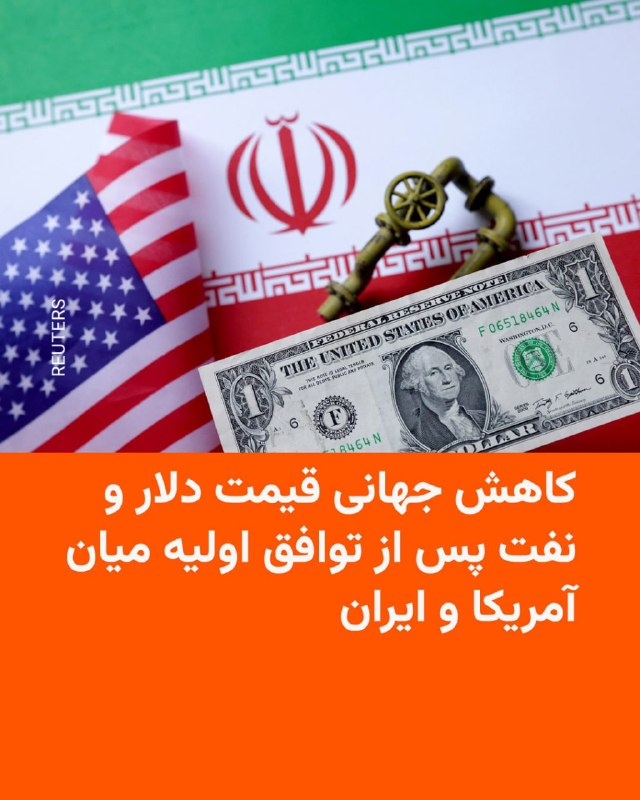

🔸دلار آمریکا روز دوشنبه ۲۵ خرداد در برابر ارزهای اصلی جهان به پایین‌ترین سطح خود در ۱۰ روز گذشته رسید.

🔸به نوشته رویترز، توافق اولیه برای پایان دادن به جنگ میان آمریکا و ایران باعث سقوط قیمت نفت و افزایش تمایل سرمایه‌گذاران به دارایی‌های پرریسک‌تر شده است.

🔸همزمان، با کاهش تنش‌های ژئوپلیتیکی و نگرانی‌های تورمی، تقاضا برای دلار به‌عنوان یک دارایی امن کاهش یافت. یورو تا ۰.۵ درصد افزایش یافت و به ۱.۱۶۲۲ دلار رسید و پوند بریتانیا نیز با رشد ۰.۴ درصدی به ۱.۳۴۵۹ دلار صعود کرد.

🔸شاخص دلار آمریکا که ارزش این ارز را در برابر سبدی از ارزها از جمله ین ژاپن و یورو می‌سنجد، روز دوشنبه با ۰.۱ درصد کاهش به ۹۹.۳۹۵ رسید که ضعیف‌ترین سطح آن از ۵ ژوئن تاکنون محسوب می‌شود.

🔸بهای نفت هم روز دوشنبه پس از اعلام توافق میان آمریکا و ایران برای پایان دادن به ماه‌ها جنگ و بازگشایی تنگه هرمز، بیش از چهار درصد کاهش یافت.

🔸بهای نفت خام وست تگزاس اینترمدیت در معاملات توکیو با ۴٫۳۹ درصد کاهش به ۸۱ دلار و ۱۵ سنت در هر بشکه رسید.

@RadioFarda

## Hranews — post 113620

  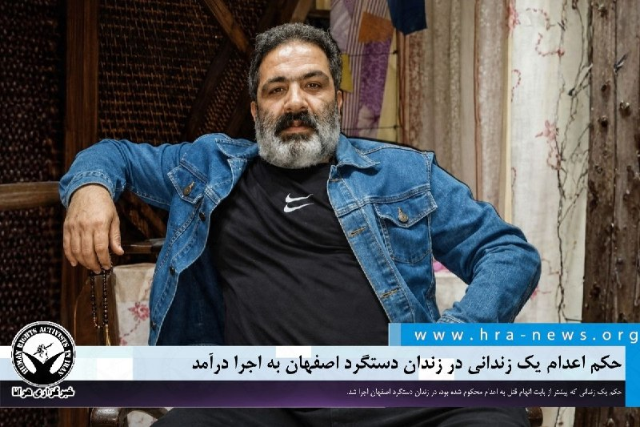

حکم اعدام یک زندانی در زندان دستگرد اصفهان به اجرا درآمد

❗️
❗️
❗️
❗️
❗️ – سحرگاه امروز، حکم یک زندانی که پیشتر از بابت اتهام قتل به #اعدام محکوم شده بود، در زندان دستگرد اصفهان اجرا شد.

به گزارش خبرگزاری هرانا، ارگان خبری مجموعه فعالان حقوق بشر در ایران، یک زندانی در زندان دستگرد اصفهان اعدام شد.

هویت این زندانی که سحرگاه امروز دوشنبه ۲۵ خردادماه به چوبه دار آویخته شد، محمدرضا گشول، توسط هرانا احراز شده است.

ادامه مطلب

#محمدرضا_گشول

↘️
@hranews_bot تماس ✉️ -  @Hranews  کانال هرانا 🆑

## alonews — post 128136

  <a href="telegram/content/alonews_128136_1781508215.webm" target="_blank">🎬 Download video</a>

👈سی‌بی‌اس: رشد قابل توجه بورس‌های آسیا و جهش معاملات آتی «وال‌استریت» در پی توافق ایران و آمریکا

✅ @AloNews خبر جنگ

---
📅 بروزرسانی: 1405/03/25 10:42
---

## WithYashar — post 14944

حمله اسرائیل به الخیام جنوب لبنان!
@withyashar

## DEJradio — post 5684

  <a href="telegram/content/DEJradio_5684_1781507566.mp4" target="_blank">🎬 Download video</a>

🤡
🔺 پروژه یدالله برای جلوگیری از حذف مجتبی خامنه‌ای

یکی از پاسداران پریشان‌احوال نظام، برای حفظ جان مجتبی خامنه‌ای پیشنهاد اجرای "پروژه یدالله" را مطرح کرده است. مجتبی خامنه‌ای رهبر جمهوری اسلامی از وقتی به این مقام رسید، نیست.

#موشتبا #غیبت_کبری
@DEJradio

## DEJradio — post 5683

  <a href="telegram/content/DEJradio_5683_1781507568.webm" target="_blank">🎬 Download video</a>

🔺📢 دونالد ترامپ می‌گوید توافق با جمهوری اسلامی امضاء شد. او توضیح داد: «بدین‌وسیله من بازگشایی بدون عوارض تنگه هرمز را به طور کامل مجاز می‌دانم، و همزمان با این، لغو فوری محاصره دریایی ایالات متحده را دستور می‌دهم.» او همچنین تأکید کرد «کشتی‌های جهان، موتورهای خود را روشن کنید. بگذارید نفت جریان پیدا کند.»

او ساعاتی پیش از آن در گفتگو با روزنامه «وال استریت ژورنال» گفت: «هیچ پول نقدی به ایران پرداخت نخواهد شد.»

#جنگ #توافق
@DEJradio

## RadioFarda — post 158317

  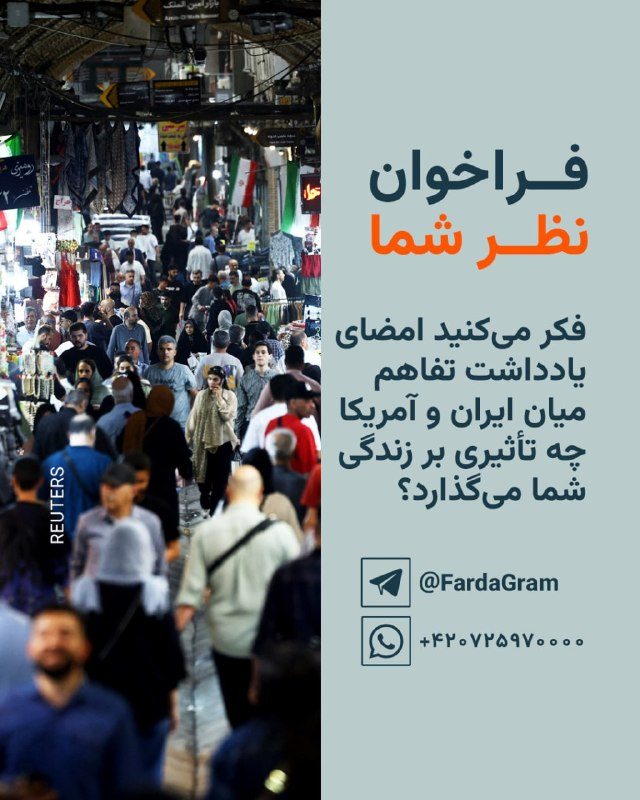

🔸دونالد ترامپ، رئیس‌جمهور آمریکا، و مقامات جمهوری اسلامی ایران سرانجام بعد از هفته‌ها مذاکرات پر فراز و نشیب، روز یکشنبه ۲۴ خرداد از نهایی‌شدن توافق میان دو کشور برای پایان جنگ خبر دادند.

🔸امضای رسمی یادداشت تفاهم اسلام‌آباد قرار است روز جمعه ۲۹ خرداد در سوئیس انجام خواهد شود.

🔸 به نظر شما امضای این یادداشت تفاهم چه پیامدهایی بر زندگی ایرانیان خواهد داشت؟ آیا شما به آینده این تفاهمنامه بر زندگی مردم ایران خوش‌بین هستید یا بدبین؟

🔸دیدگاه‌های خود را می‌توانید در قالب پیام‌های متنی و صوتی به نشانی‌های زیر ارسال کنید؟

Telegram: @fardagram

WhatsApp: +420 725 970 000

@RadioFarda

## IranianMinds — post 22614

  <a href="telegram/content/IranianMinds_22614_1781507569.mp4" target="_blank">🎬 Download video</a>

قالیباف ۲۰ بهمن ۱۴۰۳ :

مذاکره با ترامپ، قاتل قاسم سلیمانی شرافتمندانه نیست.

@IranianMinds

## Hranews — post 113619

یک شهروند در ایلام به اتهام جاسوسی برای اسرائیل بازداشت شد

❗️
❗️
❗️
❗️
❗️ – وزارت اطلاعات جمهوری اسلامی ایران از #بازداشت یک شهروند در استان ایلام به اتهام همکاری با سرویس اطلاعاتی اسرائیل خبر داد. این نهاد مدعی شده است که فرد بازداشت‌ شده قصد نفوذ به مراکز داده و سامانه‌های حساس کشور و انتقال اطلاعات به خارج از کشور را داشته است.

#جاسوسی

ادامه مطلب

↘️
@hranews_bot تماس ✉️ -  @Hranews  کانال هرانا 🆑

## alonews — post 128134

  <a href="telegram/content/alonews_128134_1781507570.webm" target="_blank">🎬 Download video</a>

👈حمله اسرائیل به الخیام جنوب لبنان!

✅ @AloNews خبر جنگ

## alonews — post 128133

  <a href="telegram/content/alonews_128133_1781507570.webm" target="_blank">🎬 Download video</a>

👈لاپید، نخست‌وزیر اسبق اسرائیل: هنوز باید امیدوار بود گزارش‌های منتشرشده درباره توافق با ایران نادرست باشند، اما اگر درست باشند، با یکی از شوکه‌کننده‌ترین شکست‌ها در سیاست خارجی و امنیتی اسرائیل روبه‌رو هستیم؛ شکستی که کاملاً به نام نتانیاهو ثبت خواهد شد

✅ @AloNews خبر جنگ

## alonews — post 128132

  <a href="telegram/content/alonews_128132_1781507570.webm" target="_blank">🎬 Download video</a>

👈بنی گانتس، نخست وزیر پیشین اسرائیل
توافق با ایران یک شکست راهبردی است و نباید با محدود کردن آزادی عمل اسرائیل در لبنان موافقت شود.

✅ @AloNews خبر جنگ

## alonews — post 128131

  <a href="telegram/content/alonews_128131_1781507570.webm" target="_blank">🎬 Download video</a>

👈شرکت ملی خدمات انفورماتیک دیشب از رفع اختلال خدمات مبتنی‌بر کارت ۴ بانک ملی، تجارت، صادرات و توسعه صادرات خبر داده بود.

🔴بررسی‌های خبرنگار فارس و گزارش کاربران نشان می‌دهد در حال حاضر همچنان اختلال خدمات غیرحضوری و اینترنتی این بانک‌ها برقرار است.

🔴این در حالی است که این بانک‌ها در اطلاعیه‌های جداگانه نیز از رفع اختلال تمامی خدمات کارتی از جمله سامانه‌های اینترنتی و موبایل بانک خبر داده بودند.

✅ @AloNews خبر جنگ

---
📅 بروزرسانی: 1405/03/25 10:33
---

## VahidOOnLine — post 245649

  

محمود مهرداد شکریه، رییس دانشگاه علم و صنعت، گفت غربی‌ها با «توافق‌ها، کاغذها و امضاها» از تحریم جمهوری اسلامی دست برنمی‌دارند.

رییس دانشگاه علم و صنعت، گفت وابستگی شدید اقتصاد ایران به نفت یکی از چالش‌های کشور است و افزود «دیپلماسی اقتصادی ما باید تهاجمی باشد.»

او گفت همان‌طور که جمهوری اسلامی در جنگ «فقط دفاع نکرد» و حمله را هم نشان داد، در اقتصاد هم باید به چنین جایگاهی برسد.
‌🏁 🇬🇧 IranintlTV

🤖 @VahidOOnLine

## mwarmonitor — post 10946

🔴وزیر دفاع اسرائیل، یسرائیل کاتس گفت:

🔸«من و نخست‌وزیر نتانیاهو سیاستی روشن را پیش می‌بریم که بر اساس آن، ارتش اسرائیل در مناطق امنیتی در لبنان، سوریه و غزه — بدون محدودیت زمانی — باقی خواهد ماند تا از آنجا از مرز و شهرک‌های اسرائیلی در برابر گروه‌های جهادی محافظت کند.

🔸این مناطق از ساکنان محلی و تمام زیرساخت‌های تروریستی، چه در زیرزمین و چه روی زمین، پاکسازی خواهند شد؛ از جمله خانه‌ها در روستاهای مرزی که به‌عنوان پایگاه‌های تروریستی استفاده می‌شدند و تخریب خواهند شد. این مهم‌ترین درس از رویدادهای ۷ اکتبر است.

🔸تصرف زمین و ایجاد مناطق امنیتی یکی از بزرگ‌ترین دستاوردهای ارتش اسرائیل در جنگ «بازسازی» است که تحت تصمیمات و هدایت رده سیاسی انجام شده است.

🔸بنابراین ما با عقب‌نشینی ارتش اسرائیل از لبنان مخالف هستیم — با وجود تمام فشارهای موجود و فشارهای آینده.

🔸نخست‌وزیر نتانیاهو این موضوع را به رئیس‌جمهور آمریکا ترامپ و دیگر مقام‌های آمریکایی توضیح داده است، و من نیز دیروز همین موضوع را به وزیر جنگ آمریکا پیت هگست منتقل کردم.

🔸ارتش اسرائیل این موضع را از نظر حرفه‌ای و امنیتی تأیید می‌کند.

🔸اگر در اپوزیسیون افرادی هستند که این دکترین امنیتی را به چالش می‌کشند و از عقب‌نشینی ارتش حمایت می‌کنند، باید علناً آن را بیان کنند تا مردم بتوانند بین دیدگاه‌ها قضاوت کنند.

🔸ما بر سر منافع امنیتی حیاتی اسرائیل و حفاظت از شهروندانمان مصالحه نخواهیم کرد و از مناطق امنیتی عقب‌نشینی نمی‌کنیم.

🔸اگر ایران به‌دلیل رویدادهای لبنان به اسرائیل حمله کند، ما با تمام قدرت به آن حمله خواهیم کرد و شکاف قدرت را به‌خوبی نشان خواهیم داد.

🔸ما فقط به شهروندانمان و امنیت دولت اسرائیل متعهد هستیم.»

@mwarmonitor

## IranIntlTV — post 342436

  <a href="telegram/content/IranIntlTV_342436_1781507006.mp4" target="_blank">🎬 Download video</a>

توافق میان تهران و واشینگتن برای پایان دادن به جنگ پس از ماه‌ها مذاکره، واکنش کشورهای منطقه را به‌همراه داشت.

گفت‌وگو با علی معموری، استاد دانشگاه دیکن و مشاور نخست‌وزیر پیشین عراق

@iranintltv

## IranIntlTV — post 342435

  <a href="https://t.me/IranintlTV/342435" target="_blank">📎 Download file</a>

🎧نسخه صوتی اخبار بامدادی | دوشنبه ۲۵ خرداد
@iranintlTV

## Shin_Persian — post 7088

Emanuel (Mannie) Fabian ✓ @manniefabian
Mon, 15 Jun 2026 06:55:30 UTC

Defense Minister Israel Katz says Israel will not withdraw from southern Lebanon, following the announcement of a ceasefire between the US and Iran, which supposedly also includes ending the fighting against Hezbollah.

"Prime Minister Benjamin Netanyahu and I are leading a clear policy that determines that the IDF will remain in the security zones in Lebanon, Syria, and Gaza, without any time limit, to protect the border and Israeli communities from there against jihadist elements," Katz says in a statement.

He says the security zones will be "cleared of local residents, and all terror infrastructure, above and below ground, including the houses in the contact-line villages that served as terror outposts, will be destroyed."

Katz says that holding onto the security zones is "among the IDF's greatest achievements" in the war, and therefore, "we oppose an IDF withdrawal from Lebanon, despite all the existing pressures and those that will still come."

"Prime Minister Netanyahu made these points clear to US President Trump and to other senior American officials, and I also made this clear yesterday to US Secretary of War Pete Hegseth," he says, adding that the IDF also supports holding onto the security zone in Lebanon.

"We will not compromise on Israel's security interests and the protection of our citizens, and we will not withdraw from the security zones," Katz says.

Katz also warns that "if Iran attacks Israel because of the events in Lebanon, we will strike it with full force."

"We are committed only to our citizens and to the security of the State of Israel," he adds.

ترجمه خودکار فارسی

ایسرائیل کاتس، وزیر دفاع، در پی اعلام آتش‌بس میان ایالات متحده و ایران که ظاهراً شامل پایان درگیری‌ها علیه حزب‌الله نیز می‌شود، می‌گوید اسرائیل از جنوب لبنان عقب‌نشینی نخواهد کرد.

کاتس در بیانیه‌ای می‌گوید: «نخست‌وزیر بنیامین نتانیاهو و من در حال هدایت سیاست روشنی هستیم که تعیین می‌کند ارتش دفاعی اسرائیل (IDF) بدون هیچ محدودیت زمانی در مناطق امنیتی در لبنان، سوریه و غزه باقی خواهد ماند تا از مرزها و جوامع اسرائیلی در برابر عناصر جهادی محافظت کند.»

او می‌گوید که مناطق امنیتی از «ساکنان محلی تخلیه خواهد شد و تمام زیرساخت‌های تروریستی، در بالا و زیر زمین، از جمله خانه‌های روستاهای خط تماس که به عنوان پایگاه‌های تروریستی خدمت می‌کردند، نابود خواهند شد.»

کاتس می‌گوید که حفظ مناطق امنیتی «از جمله بزرگترین دستاوردهای ارتش دفاعی اسرائیل» در جنگ است و بنابراین، «ما با وجود تمام فشارهای موجود و فشارهایی که در آینده وارد خواهد شد، با عقب‌نشینی ارتش از لبنان مخالف هستیم.»

او می‌گوید: «نخست‌وزیر نتانیاهو این نکات را برای پرزیدنت ترامپ، رئیس‌جمهور آمریکا و دیگر مقامات ارشد آمریکایی روشن کرده است و من نیز روز گذشته این موضوع را برای پیت هگست، وزیر جنگ ایالات متحده روشن کردم.» وی افزود که ارتش دفاعی اسرائیل نیز از حفظ منطقه امنیتی در لبنان حمایت می‌کند.

کاتس می‌گوید: «ما بر سر منافع امنیتی اسرائیل و حفاظت از شهروندانمان سازش نخواهیم کرد و از مناطق امنیتی عقب‌نشینی نخواهیم کرد.»

کاتس همچنین هشدار داد که «اگر ایران به دلیل حوادث لبنان به اسرائیل حمله کند، ما با تمام قوا به آن ضربه خواهیم زد.»

او افزود: «ما فقط در برابر شهروندان خود و امنیت دولت اسرائیل متعهد هستیم.»

𝕏 · @shin_persian

## Shin_Persian — post 7087

Shin ✓ @hey_itsmyturn
Mon, 15 Jun 2026 06:53:47 UTC

Now Ghalibaf will slowly unplug Mojtaba’s life support 🫪

ترجمه خودکار فارسی

حالا قالیباف به آرامی دستگاه‌های علائم حیاتی مجتبی را از برق خواهد کشید 🫪

𝕏 · @shin_persian

## Persian_Trend_Official — post 17149

یه گزارش آکسیوس ونس، ویتکاف و کوشنر موافق تفاهم نامه اخیر امریکا با ایران و روبیو و هگست مخالف آن هستند.

📝 Amir

📌 @persian_trend_official
پرشین ترند | متفاوت‌ترین کانال نظامی

---
📅 بروزرسانی: 1405/03/25 10:23
---

## VahidOOnLine — post 245648

  

ایرنا، خبرگزاری دولت جمهوری اسلامی، گزارش داد زندگی در واحدهای ۲۰ تا ۳۰ متری برای برخی شهروندان تهرانی به ناگزیر تبدیل شده و این «شبه‌خانه‌ها» با حمام و سرویس بهداشتی مشترک، حریم خصوصی محدود و اجاره‌های سنگین، زیر فشار هم‌زمان مشکلات اقتصادی، اجتماعی و روانی قرار دارند.

خبرگزاری ایرنا گزارش داد با افزایش اجاره‌بها، برخی شهروندان تهرانی به اجاره اتاق‌های ۱۵ متری و حتی کوچک‌تر روی آورده‌اند و بازار اجاره اتاق‌های چهار تا ۱۵ متری با ودیعه تا حدود ۱۵۰ میلیون تومان و اجاره ماهانه دو تا ۱۶ میلیون تومان در حال گسترش است.
iranintl
‌🏁 🇬🇧 IranintlTV

🤖 @VahidOOnLine

## VahidOOnLine — post 245647

  <a href="telegram/content/VahidOOnLine_245647_1781506384.mp4" target="_blank">🎬 Download video</a>

ویدیوی رسیده به ایران‌اینترنشنال نشان می‌دهد گروهی از ایرانیان در ورزشگاه لیوایز (منطقه خلیج سان‌فرانسیسکو) در سانتاکلارای کالیفرنیا، هنگام بازی فوتبال میان قطر و سوئیس در جام جهانی، پرچم شیروخورشید را به اهتزاز درآورده‌اند.
‌🏁 🇬🇧 IranintlTV

🤖 @VahidOOnLine

## VahidOOnLine — post 245646

♦️مقام‌های ارتش اوکراین صبح دوشنبه ۲۵ خرداد اعلام کردند در جریان حملات «سنگین و کم‌سابقه» روسیه به کی‌یف، پایتخت و شهر خار‌کیف این کشور، دست‌کم ۹ نفر کشته شدند.

همزمان ارتش روسیه اعلام کرد در پاسخ به حملا اخیر اوکراین به زیرساخت‌های انرژی روسیه در روزهای گذشته، «تاسیسات صنایع دفاعی» دشمن را در شهرهای کی‌یف، خارکیف و دنیپروپتروفسک هدف قرار داده است.

حمله گسترده روسیه به اوکراین تنها ساعتی پس از مکالمه تلفنی ولادیمیر پوتین با دونالد ترامپ انجام شد.

وزارت دفاع اوکراین می‌گوید نیمه‌شب یکشنبه و بامداد دوشنبه روسیه دست‌کم ۷۰ موشک و ۶۱۱ پهپاد به سوی این کشور شلیک کرده است.
‌🇸🇦 Indypersian

🤖 @VahidOOnLine

## WithYashar — post 14943

کانال ۱۳ اسرائیل به‌نقل از یه مقام ارشد:
توافقی که داره صورت میگیره فاجعه‌بارترین توافق تاریخه. از نخست وزیر گرفته تا رئیس ستاد ارتش کل غیر از این فکر نمیکنه
@withyashar

## mwarmonitor — post 10945

🔴رسانه‌های لبنانی گزارش دادند که صبح امروز یک خودرو که در شهر کفر تبنیت در جنوب لبنان در حال حرکت بود، هدف حمله پهپادی اسرائیل قرار گرفت.

🔸خبرگزاری ملی لبنان اعلام کرد که «گزارش‌هایی از مجروح شدن افراد» منتشر شده است.

🔸این خبرگزاری همچنین گزارش داد که گلوله‌باران توپخانه‌ای اسرائیل شهر کفر تبنیت و شهرک نزدیک نَبَطیه الفوقا را هدف قرار داده است.

🔸تاکنون اظهارنظر فوری از سوی ارتش اسرائیل منتشر نشده است.

🔸مقام‌های اسرائیلی همچنین هنوز درباره آتش‌بس میان آمریکا و ایران ـ که گفته می‌شود شامل توقف درگیری‌ها در لبنان نیز می‌شود ـ واکنشی نشان نداده‌اند.

@mwarmonitor

## mamlekate — post 103717

  <a href="telegram/content/mamlekate_103717_1781506386.mp4" target="_blank">🎬 Download video</a>

روح بلند پیشوا و پیشقراول امت اسلامی < ۲۴ میلیارد دلار

t.me/mamlekate/103716

## IranIntlTV — post 342434

  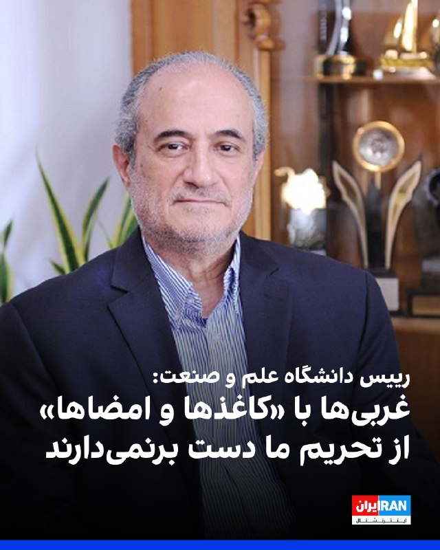

محمود مهرداد شکریه، رییس دانشگاه علم و صنعت، گفت غربی‌ها با «توافق‌ها، کاغذها و امضاها» از تحریم جمهوری اسلامی دست برنمی‌دارند.

رییس دانشگاه علم و صنعت، گفت وابستگی شدید اقتصاد ایران به نفت یکی از چالش‌های کشور است و افزود «دیپلماسی اقتصادی ما باید تهاجمی باشد.»

او گفت همان‌طور که جمهوری اسلامی در جنگ «فقط دفاع نکرد» و حمله را هم نشان داد، در اقتصاد هم باید به چنین جایگاهی برسد.
https://iranintl.com/202606153752

## IranIntlTV — post 342433

  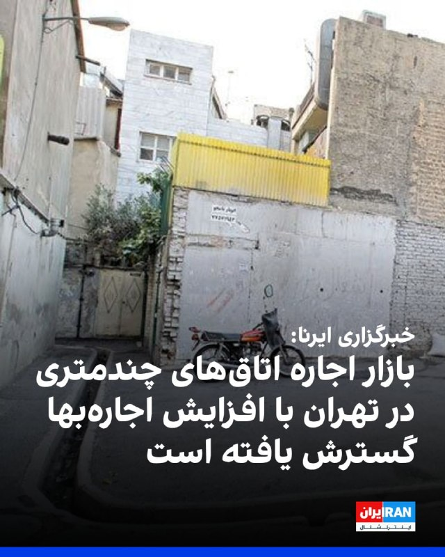

ایرنا، خبرگزاری دولت جمهوری اسلامی، گزارش داد زندگی در واحدهای ۲۰ تا ۳۰ متری برای برخی شهروندان تهرانی به ناگزیر تبدیل شده و این «شبه‌خانه‌ها» با حمام و سرویس بهداشتی مشترک، حریم خصوصی محدود و اجاره‌های سنگین، زیر فشار هم‌زمان مشکلات اقتصادی، اجتماعی و روانی قرار دارند.

خبرگزاری ایرنا گزارش داد با افزایش اجاره‌بها، برخی شهروندان تهرانی به اجاره اتاق‌های ۱۵ متری و حتی کوچک‌تر روی آورده‌اند و بازار اجاره اتاق‌های چهار تا ۱۵ متری با ودیعه تا حدود ۱۵۰ میلیون تومان و اجاره ماهانه دو تا ۱۶ میلیون تومان در حال گسترش است.
iranintl.com/202606151293

## IranIntlTV — post 342432

  <a href="telegram/content/IranIntlTV_342432_1781506390.mp4" target="_blank">🎬 Download video</a>

ویدیوی رسیده به ایران‌اینترنشنال نشان می‌دهد گروهی از ایرانیان در ورزشگاه لیوایز (منطقه خلیج سان‌فرانسیسکو) در سانتاکلارای کالیفرنیا، هنگام بازی فوتبال میان قطر و سوئیس در جام جهانی، پرچم شیروخورشید را به اهتزاز درآورده‌اند.

## Persian_Trend_Official — post 17148

یک مقام ارشد اسرائیلی در مصاحبه با کانال 13 اسرائیل: این توافق برای اسرائیل یک توافق فاجعه‌بار است. در سطوح عالی حاکمیت، از نخست‌وزیر گرفته تا رئیس ستاد کل ارتش، هیچ‌کس نیست که چنین نظری نداشته باشد.

📝 Amir

📌 @persian_trend_official
پرشین ترند | متفاوت‌ترین کانال نظامی

## Persian_Trend_Official — post 17146

  <a href="telegram/content/Persian_Trend_Official_17146_1781506392.webm" target="_blank">🎬 Download video</a>

حملات امروز صبح نیروی هوایی ارتش اسرائیل به خیام و مرکبا در جنوب لبنان

📝 Amir

📌 @persian_trend_official
پرشین ترند | متفاوت‌ترین کانال نظامی

## alonews — post 128127

  <a href="telegram/content/alonews_128127_1781506392.mp4" target="_blank">🎬 Download video</a>

👈فیلم‌های اضافی از لاورای پیچرسک کیف پس از حمله اخیر روسیه به کیف

✅ @AloNews خبر جنگ

## alonews — post 128126

  <a href="telegram/content/alonews_128126_1781506395.webm" target="_blank">🎬 Download video</a>

👈کانال ۱۳ اسرائیل به‌نقل از یه مقام ارشد:
توافقی که داره صورت میگیره فاجعه‌بارترین توافق تاریخه. از نخست وزیر گرفته تا رئیس ستاد ارتش کل غیر از این فکر نمیکنه

✅ @AloNews خبر جنگ

---
📅 بروزرسانی: 1405/03/25 10:12
---

## mamlekate — post 103716

📝 جزئیات تأیید‌نشده از محتوای توافق

@mamlekate

## mamlekate — post 103715

  <a href="telegram/content/mamlekate_103715_1781505777.mp4" target="_blank">🎬 Download video</a>

به‌طور خلاصه و در دو کلمه

@mamlekate

## FarsiVOA — post 220773

🔺وزیر خارجه پاکستان: توافق آمریکا و جمهوری اسلامی نشان‌دهنده قدرت دیپلماسی است

▪️در پی اعلام تفاهم میان ایالات متحده آمریکا و جمهوری اسلامی، محمد اسحاق دار، وزیر خارجه پاکستان، این تحول را «یک پیشرفت مهم» توصیف کرد که نشانه‌ای از قدرت دیپلماسی است.

▪️او همچنین از اعتماد رهبری آمریکا و جمهوری اسلامی به نقش میانجی پاکستان قدردانی کرد و تلاش‌های دیپلماتیک کشورهای منطقه از جمله عربستان سعودی، قطر، ترکیه، مصر و همچنین سازمان ملل متحد را در تسهیل این روند ستود.

▪️در جریان مذاکرات برای دستیابی به تفاهم میان آمریکا و جمهوری اسلامی، مقامات ارشد پاکستانی از جمله عاصم منیر، رئیس ستاد ارتش پاکستان چندین بار با هدف نهایی کردن تفاهم‌نامه به تهران سفر کردند.

⬇️ بیشتر بخوانید:
https://ir.voanews.com/a/pakistan-welcomes-reaching-mou-between-iran-usa/8161000.html

## DW_Farsi — post 125988

🔶 دانش‌آموزان در جدال با معدل، شکاف آموزش، بی‌عدالتی و آینده

🔺 گزارشی از آتفه چهارمحالیان

طی هفته‌های اخیر، مناقشه بر سر تأثیر قطعی معدل در کنکور به یکی از مهم‌ترین اعتراضات دانش‌آموزی سال‌های اخیر ایران تبدیل شد. دانش‌آموزان و داوطلبان کنکور می‌گویند در شرایطی که نظام آموزشی با تعطیلی‌های مکرر، آموزش مجازی، نابرابری امکانات و بی‌ثباتی برنامه‌های آموزشی روبه‌رو بوده، افزایش نقش سوابق تحصیلی در پذیرش دانشگاه‌ها به زیان دانش‌آموزان مدارس عادی و مناطق محروم تمام می‌شود.

در فاصله ۱۲ تا ۱۶ خرداد ۱۴۰۵، دانش‌آموزان در شهرهای مختلف ایران، از تهران و مشهد تا اصفهان، شیراز، تبریز، رشت و کرمانشاه، در برابر ادارات آموزش‌وپرورش و نهادهای تصمیم‌گیر تجمع کردند و خواستار بازنگری در مصوبه تأثیر قطعی معدل شدند.

معترضان با اشاره به تعطیلی‌های آموزشی، تعویق آزمون‌ها، آموزش مجازی و آشفتگی برنامه‌ریزی درسی می‌پرسیدند: "در شرایطی که بر ما گذشت، چگونه درس می‌خواندیم؟" اعتراض‌ها در برخی شهرها به مقابل شورای عالی انقلاب فرهنگی نیز کشیده شد.

به گفته دانش‌آموزان معترض در گفت‌وگو با دویچه وله، اعمال سهم ۶۰ درصدی سوابق تحصیلی در شرایطی که سال تحصیلی با تعطیلی‌های مکرر، آموزش مجازی، اختلال‌های ناشی از جنگ، بلاتکلیفی در زمان برگزاری آزمون‌ها و افت کیفیت آموزشی همراه بوده، نه‌تنها به عدالت آموزشی منجر نشده بلکه آینده تحصیلی میلیون‌ها دانش‌آموز را به عواملی گره زده که خارج از اختیار آنان بوده است. خواسته اصلی تجمع‌کنندگان تبدیل "اثر قطعی" معدل به "تأثیر مثبت"، حذف سهمیه نمرات پایه یازدهم و بازنگری در سهم ۶۰ درصدی سوابق تحصیلی در مقررات کنکور بود.

@dw_farsi

## Dirty_Kids — post 392084

  <a href="telegram/content/Dirty_Kids_392084_1781505778.mp4" target="_blank">🎬 Download video</a>

خِرکش شدن جمهوری‌عسلامی :)))))

@Dirty_Kids 👻

## Dirty_Kids — post 392083

  <a href="telegram/content/Dirty_Kids_392083_1781505780.mp4" target="_blank">🎬 Download video</a>

راز شلوار جینی که باسنت‌رو خوش‌فرم‌تر نشون بده👌😍

@Dirty_Kids 👻

## Dirty_Kids — post 392082

  <a href="telegram/content/Dirty_Kids_392082_1781505783.mp4" target="_blank">🎬 Download video</a>

ویدیوی وایرال شده از یه دختر ترکیه‌ای که تقلید شکیرا و رقص جام‌جهانی میکنه

@Dirty_Kids 👻

## alonews — post 128125

  <a href="telegram/content/alonews_128125_1781505787.webm" target="_blank">🎬 Download video</a>

👈رئیس کمیسیون اروپا: توافق میان آمریکا و ایران باید به بازگشایی تنگه هرمز منجر شود و مسیر را برای مذاکرات گسترده‌تر درباره صلح باز کند. این توافق باید به برنامه‌های هسته‌ای و موشک‌های بالستیک ایران پایان دهد.

🔴توافق باید به فعالیت‌های بی‌ثبات‌کننده ایران در منطقه را پایان دهد و تا زمانی که لبنان درگیر بحران باشد، صلح در خاورمیانه محقق نخواهد شد

✅ @AloNews خبر جنگ

---
📅 بروزرسانی: 1405/03/25 10:03
---

## VahidOOnLine — post 245645

🗣روایت شما از توافق میان جمهوری اسلامی و آمریکا - دوشنبه ۲۵ خرداد

🔹بهانه شروع جنگ کشتار مردم بی‌گناه در دی‌ماه بود، اما در مذاکرات و توافق هیچ جایی برای احقاق حق مردم بی‌گناه و هزاران جوانی که در زندان‌ها محبوس هستند، نبود. متأسفم برای دولت‌مردان و سازمان ملل که کر و کور شدند.

🔹ما مردم ایران احمق هستیم که فکر می‌کردیم ترامپ قراره برای ما معجزه کنه، اون به فکر خودش و منافعشه.

🔹نمی‌دونم چرا ما باید به این فکر کنیم که ترامپ برای ما کاری بکنه. ترامپ هزار بار گفته منافع آمریکا براش مهمه. جمهوری اسلامی هم که فقط به فکر لبنانه.

🔹ترامپ و نتانیاهو به خواسته‌شان رسیدن. مردم ایران هم اگر می‌خوان به هدفشون برسن باید متحد بشن، اتحاد رمز پیروزیه.

🔹به خدا خسته شدیم از بس روزی هزار بار اسم سوریه، لبنان، فلسطین، غزه، عراق و یمن رو شنیدیم. خدایا یعنی می‌شه این کابوس ۴۷ ساله تموم بشه.

🔹به یاد اون همه شجاعت و جان‌های عزیزی که گرفتند و دی‌ماه سیاه باشید، مبادا ناامید بشید، آن‌ها نرفتن که ما تسلیم بشیم.

🔹فراموش نمی‌کنیم که دنیا در برابر نسل‌کشی جوانان شجاع ایران سکوت کرد.

🔹آقای ترامپ، نه‌تنها تا این لحظه شما هیچ دستاوردی برای مردم ایران در مقایسه با اوباما نداشتی، بلکه ضربه روحی شدیدتری به ما زدی. بی‌بی بهتر می‌دونه ما چی می‌خوایم.

🔹هموطنان عزیز لطفا توجه کنید همون‌طوری که از اسمش پیداست، این یک توافق بین آمریکا و جمهوری اعدامیه. یعنی بین ما مردم ایران و جمهوری اعدامی هیچ توافق و مذاکره‌ای نمی‌شه و با فراخوان شاه‌مون به خیابون م‌ریم و کشور رو پس می‌گیریم.

🔹جمهوری اسلامی شاید با آمریکا صلح کنه، اما با مردم ایران هرگز.

🔹اگر این مذاکرات باعث بقای حکومت بشه، اون هم در شرایطی که دنیا چشمش رو روی خون جوانان ما بست، امیدوارم تاوان این حماقت‌شون رو پس بدن تا عبرتی برای تاریخ بشن.

🔹هر یک روز تعلل و انتظار که خارجی‌ها برای ما دموکراسی و رفاه بیارن، یعنی کشتار و اعدام بیشتر فرزندان‌مان. با وعده ارزانی و رفع تحریم‌ها گول نخورید.

🔹ترامپ گفت که مشکلی ندارند اگر ایران دوباره یک رهبر مذهبی داشته باشد. ولی ما مردم ایران مذهب‌زده هستیم و رهبر مذهبی نمی‌خواهیم. ما خواهان یک حکومت دموکرات سکولار هستیم.

🔹وقتی ترامپ گفت کمک در راه است، در ظاهر شاید منظورش مردم بود، اما پشت پرده کمک برای حفظ نظام و جلوگیری از سقوط رژیم به دست مردم خشمگین بود.

🔹جمهوری اسلامی فکر نکنه که با مذاکره می‌تونه هنوز سر جاش بمونه، چون با ۸۰ میلیون مخالف خود نمی‌تونه مذاکره کنه و ما انتقام کشته‌شدگان را خواهیم گرفت.
‌🏁 🇬🇧 IranintlTV

🤖 @VahidOOnLine

## IranIntlTV — post 342431

🗣روایت شما از توافق میان جمهوری اسلامی و آمریکا - دوشنبه ۲۵ خرداد

🔹بهانه شروع جنگ کشتار مردم بی‌گناه در دی‌ماه بود، اما در مذاکرات و توافق هیچ جایی برای احقاق حق مردم بی‌گناه و هزاران جوانی که در زندان‌ها محبوس هستند، نبود. متأسفم برای دولت‌مردان و سازمان ملل که کر و کور شدند.

🔹ما مردم ایران احمق هستیم که فکر می‌کردیم ترامپ قراره برای ما معجزه کنه، اون به فکر خودش و منافعشه.

🔹نمی‌دونم چرا ما باید به این فکر کنیم که ترامپ برای ما کاری بکنه. ترامپ هزار بار گفته منافع آمریکا براش مهمه. جمهوری اسلامی هم که فقط به فکر لبنانه.

🔹ترامپ و نتانیاهو به خواسته‌شان رسیدن. مردم ایران هم اگر می‌خوان به هدفشون برسن باید متحد بشن، اتحاد رمز پیروزیه.

🔹به خدا خسته شدیم از بس روزی هزار بار اسم سوریه، لبنان، فلسطین، غزه، عراق و یمن رو شنیدیم. خدایا یعنی می‌شه این کابوس ۴۷ ساله تموم بشه.

🔹به یاد اون همه شجاعت و جان‌های عزیزی که گرفتند و دی‌ماه سیاه باشید، مبادا ناامید بشید، آن‌ها نرفتن که ما تسلیم بشیم.

🔹فراموش نمی‌کنیم که دنیا در برابر نسل‌کشی جوانان شجاع ایران سکوت کرد.

🔹آقای ترامپ، نه‌تنها تا این لحظه شما هیچ دستاوردی برای مردم ایران در مقایسه با اوباما نداشتی، بلکه ضربه روحی شدیدتری به ما زدی. بی‌بی بهتر می‌دونه ما چی می‌خوایم.

🔹هموطنان عزیز لطفا توجه کنید همون‌طوری که از اسمش پیداست، این یک توافق بین آمریکا و جمهوری اعدامیه. یعنی بین ما مردم ایران و جمهوری اعدامی هیچ توافق و مذاکره‌ای نمی‌شه و با فراخوان شاه‌مون به خیابون م‌ریم و کشور رو پس می‌گیریم.

🔹جمهوری اسلامی شاید با آمریکا صلح کنه، اما با مردم ایران هرگز.

🔹اگر این مذاکرات باعث بقای حکومت بشه، اون هم در شرایطی که دنیا چشمش رو روی خون جوانان ما بست، امیدوارم تاوان این حماقت‌شون رو پس بدن تا عبرتی برای تاریخ بشن.

🔹هر یک روز تعلل و انتظار که خارجی‌ها برای ما دموکراسی و رفاه بیارن، یعنی کشتار و اعدام بیشتر فرزندان‌مان. با وعده ارزانی و رفع تحریم‌ها گول نخورید.

🔹ترامپ گفت که مشکلی ندارند اگر ایران دوباره یک رهبر مذهبی داشته باشد. ولی ما مردم ایران مذهب‌زده هستیم و رهبر مذهبی نمی‌خواهیم. ما خواهان یک حکومت دموکرات سکولار هستیم.

🔹وقتی ترامپ گفت کمک در راه است، در ظاهر شاید منظورش مردم بود، اما پشت پرده کمک برای حفظ نظام و جلوگیری از سقوط رژیم به دست مردم خشمگین بود.

🔹جمهوری اسلامی فکر نکنه که با مذاکره می‌تونه هنوز سر جاش بمونه، چون با ۸۰ میلیون مخالف خود نمی‌تونه مذاکره کنه و ما انتقام کشته‌شدگان را خواهیم گرفت.

## IranIntlTV — post 342430

  <a href="telegram/content/IranIntlTV_342430_1781505180.mp4" target="_blank">🎬 Download video</a>

یک شهروند با ارسال ویدیویی به ایران‌اینترنشنال در دوشنبه ۲۵ خرداد، صف طولانی خودروها را برای دریافت گازوئیل در تقاطع جاده مخصوص کرج و بزرگراه آزادگان نشان می‌دهد.

## DW_Farsi — post 125987

  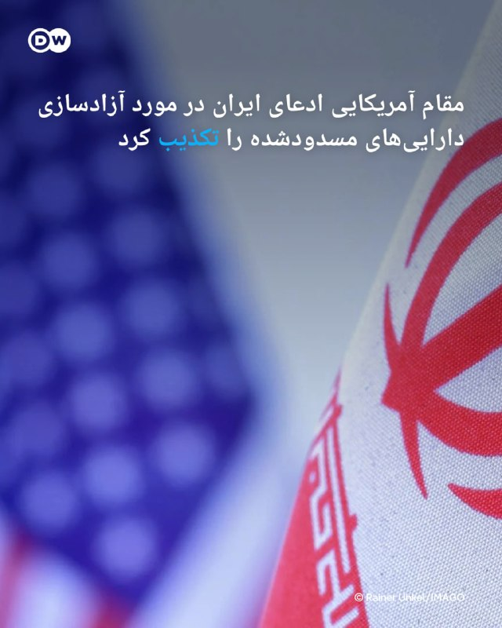

🔶 مقام آمریکایی ادعای ایران در مورد آزادسازی دارایی‌های مسدودشده را تکذیب کرد

یک مقام آمریکایی ادعای ایران مبنی بر دریافت میلیارد‌ها دلار از دارایی‌های مسدودشده، پیش از آغاز دوره ۶۰ روزه مذاکرات پس از امضای توافق در روز جمعه را رد کرد. این مقام که هویتش فاش نشده به شبکه سی‌ان‌ان گفت: «این موضوع کاملا نادرست است. این توافق بر پایه اجرای تعهدات است و هیچ یک از دارایی‌های مسدودشده تا زمانی که ایران تعهدات خود را اجرا نکند، آزاد نخواهد شد.»

این واکنش پس از آن مطرح شد که کاظم غریب‌آبادی، معاون وزیر خارجه ایران، گفته بود مرحله بعدی مذاکرات تهران و واشنگتن به شرطی است که آمریکا "ابتدا چند تعهد از جمله آزادسازی دارایی‌های ایران را که در خارج از کشور مسدود شده‌اند، عملی کند".

به نوشته سی‌‌ان‌ان‌ به نظر می‌رسد شکاف قابل توجهی میان دیدگاه‌های ایالات متحده و ایران درباره اقداماتی که باید پیش از آغاز دور بعدی مذاکرات انجام شوند، وجود دارد و دو طرف برداشت‌های متفاوتی در مورد پیش‌شرط‌های ورود به مرحله بعدی گفت‌وگوها دارند.

@dw_farsi

## DW_Farsi — post 125986

  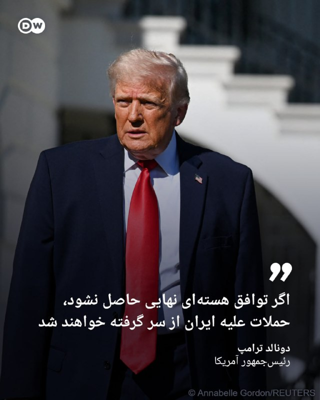

🔶 ترامپ: اگر توافق هسته‌ای نهایی حاصل نشود، حملات علیه ایران از سر گرفته خواهند شد

پس از اعلام حصول توافق میان ایران و آمریکا، دونالد ترامپ در مصاحبه‌ای با روزنامه "نیویورک تایمز" گفت اگر ایران به یک توافق هسته‌ای نهایی با ایالات متحده نرسد، حملات نظامی علیه این کشور از سر گرفته خواهند شد یا اینکه در ازای دریافت ۲۰ درصد از درآمدهای منطقه، ایالات متحده را به "نگهبان خاورمیانه" تبدیل خواهد کرد.

ترامپ در این مصاحبه گفته است که توافقی که با ایران به دست آمده، در نهایت تضمین خواهد کرد که تنگه هرمز "برای همیشه بدون عوارض" باشد.

او در بخش دیگری از این گفت‌وگو نخست‌وزیر اسرائیل را "فردی بسیار دشوار" توصیف کرده و گفت که بنیامین نتانیاهو باید قدردان باشد. ترامپ اظهار داشت: «او آدم بسیار دشواری است و راستش را بخواهید باید بابت این کار از ما سپاسگزار باشد، زیرا اگر ایران سلاح هسته‌ای داشت، اسرائیل حتی دو ساعت هم دوام نمی‌آورد.»

اسرائیل در مذاکرات مربوط به توافق تازه اعلام‌شده میان تهران و واشنگتن مشارکت نداشت و مفاد این توافق نگرانی‌های عمیقی را در میان مقام‌های این کشور برانگیخته است.

دونالد ترامپ در مقابل از شی جین‌‌پینگ، رهبر چین و ولادیمیر پوتین، رئیس جمهور روسیه، به دلیل کمک‌هایشان در پیشبرد این توافق تمجید کرد.

اسرائیل تا لحظه تنظیم این خبر هنوز در مورد توافق ایران و آمریکا اظهار نظری نکرده است.

@dw_farsi

## RadioFarda — post 158315

  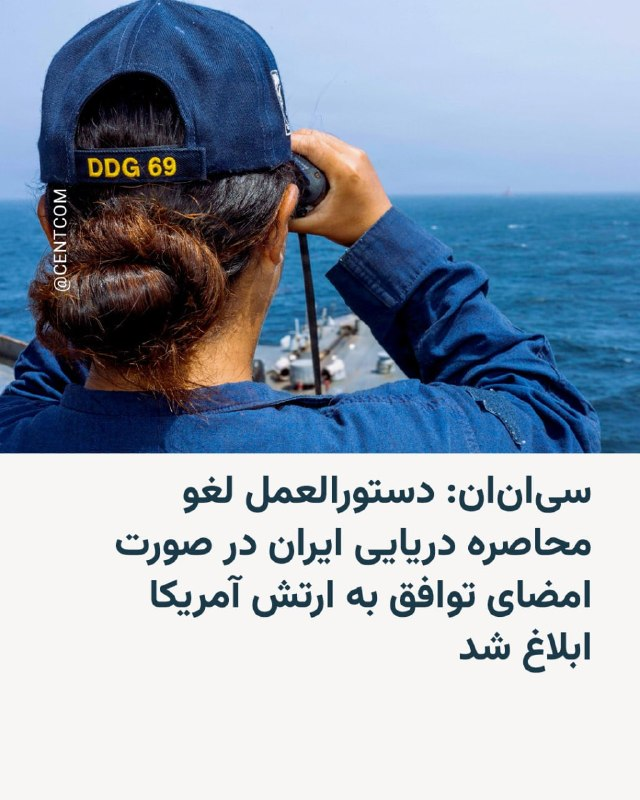

🔸یک مقام آمریکایی که نامش ذکر نشده به شبکه خبری سی‌ان‌ان گفت ارتش آمریکا دستورالعملی دریافت کرده است که در صورت امضای توافق با ایران، محاصرهٔ دریایی آمریکا در تنگه هرمز را روز جمعه لغو کند.

🔸دونالد ترامپ، رئیس‌جمهور آمریکا، روز یک‌شنبه ۲۴ خرداد اعلام کرد که پس از دستیابی به توافق با تهران، «رفع فوری محاصرهٔ دریایی ایالات متحده» علیه بنادر ایران را مجاز می‌داند. او سپس گفت: «با بازگشایی تنگه پس از امضای توافق در روز جمعه، برای پاکسازی مین‌ها، نفت بار دیگر از هر دو سو برای منطقه و جهان جریان خواهد یافت.»

🔸ترامپ در اواسط آوریل، حدود شش هفته پس از آغاز جنگ، دستور برقراری این محاصره را صادر کرده بود.

🔸این مقام آمریکایی به سی‌ان‌ان گفته است که «این، برداشت و برنامهٔ فعلی دولت آمریکا است، اما ممکن است تا روز جمعه شرایط تغییر کند.»

@RadioFarda

## BBCPersian — post 283863

🔻رویترز: یک نفتکش حامل گاز طبیعی متعلق به شرکت هندی از تنگه هرمز عبور کرد

داده‌های ردیابی کشتی‌ها نشان می‌دهد که یک نفتکش حامل گاز طبیعی مایع شرکت پترونت هند، روز دوشنبه از تنگه هرمز عبور کرد و به سمت شرق این تنگه حرکت کرد تا از آن خارج شود.

داده‌های شرکت‌های کپلر و ال‌اس‌جی‌ای نشان می‌دهد که این کشتی محموله خود را در تاریخ اول و دوم مارس در بندر راس لفان قطر تحویل گرفته و از آن زمان در غرب تنگه هرمز بوده است.

در حالی که داده‌های ردیابی کشتی مقصد نفتکش را نشان نمی‌دهد، یک منبع آگاه به خبرگزاری رویترز گفت که این محموله به ترمینال داهج در هند تحویل داده خواهد شد.

https://bbc.in/4viCUHy
@BBCPersian

## alonews — post 128124

  <a href="telegram/content/alonews_128124_1781505186.webm" target="_blank">🎬 Download video</a>

👈وزیر امور خارجه فرانسه: ما خواهان برقراری آتش‌بس در همه جبهه‌ها هستیم.

✅ @AloNews خبر جنگ

## alonews — post 128123

  <a href="telegram/content/alonews_128123_1781505186.mp4" target="_blank">🎬 Download video</a>

👈نخستین شناوری که پس از اعلام توافق صلح میان ایالات متحده و جمهوری اسلامی ایران از تنگه هرمز عبور کرد، نفتکش گاز طبیعی مایع (LNG) با پرچم مالت به نام “دیشا” (Disha) است که از طرح تفکیک ترافیک دریایی ایران استفاده کرد

✅ @AloNews خبر جنگ

---
📅 بروزرسانی: 1405/03/25 09:52
---

## VahidOOnLine — post 245644

  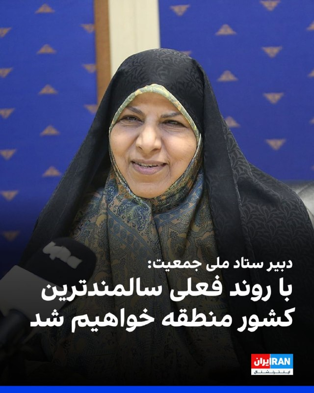

مرضیه وحید دستجردی، دبیر ستاد ملی جمعیت، گفت سهم سالمندان ۶۰ سال به بالا در ایران از ۱۲/۶ درصد در سال ۱۴۰۳، به ۳۲ درصد در سال ۱۴۳۰ خواهد رسید و اگر با همین روند پیش برود، ایران سالمندترین کشور منطقه خواهد شد.

او افزود: «اگر جمهوری اسلامی با نرخ باروری کنونی پیش برود، ۷۵ سال آینده و در سال ۲۱۰۰ میلادی جمعیت کشور به ۳۱ میلیون نفر می‌رسد.»

وحید دستجردی مسئله کاهش جمعیت و «محو شدن ایران از روی صحنه جغرافیا» را جدی خواند و افزود: «ما اصلا محو می‌شویم و دیگر نیازی به جنگ نخواهد بود.»
iranintl
‌🏁 🇬🇧 IranintlTV

🤖 @VahidOOnLine

## mwarmonitor — post 10944

🔴یک مقام ارشد اسرائیلی به Channel 13 اسرائیل گفت:

🔸«این توافق برای اسرائیل فاجعه‌بار است. در سطوح عالی هیچ‌کس نیست که چنین نظری نداشته باشد؛ از نخست‌وزیر گرفته تا رئیس ستاد ارتش.»

@mwarmonitor

## IranianMinds — post 22613

  <a href="telegram/content/IranianMinds_22613_1781504552.mp4" target="_blank">🎬 Download video</a>

علی خامنه‌ای خرداد ۱۳۸۱ :

کسانی که دم از مذاکره با آمریکا می‌زنن، یا الفبای سیاست رو بلد نیستن یا الفبای غیرت رو؛ یکی از این دوتاست

علی خامنه‌ای مرداد ۱۳۹۷ :

مذاکره با آمریکا رو امام ممنوع کرد، من هم ممنوع کردم؛ حالا اگر به فرض محال قرار بود با آمریکا مذاکره کنیم، با این دولت فعلی آمریکا ترامپ هرگز مذاکره نمی‌کنیم

@IranianMinds

## alonews — post 128122

  <a href="telegram/content/alonews_128122_1781504553.webm" target="_blank">🎬 Download video</a>

👈کایا کالاس، مسئول سیاست خارجی اتحادیه اروپا: ایالات متحده و ایران از دستیابی به توافقی برای پایان دادن به جنگ و بازگشایی تنگه هرمز خبر داده‌اند.

🔴این توافق یک گشایش احتمالی محسوب می‌شود، زیرا زمینه لازم را برای انجام مذاکرات عمیق درباره برنامه هسته‌ای ایران و دیگر مسائل حیاتی فراهم می‌کند.

🔴انتظار می‌رود این توافق، در صورت اجرا، به کاهش بحران جهانی انرژی کمک کند.

🔴من طی روزهای گذشته با همتایان خود در ایران و کشورهای خلیج گفت‌وگو کرده‌ام و وزرای خارجه اتحادیه امروز درباره راه‌های مشارکت مؤثر در مرحله بعد بحث خواهند کرد.

✅ @AloNews خبر جنگ

## alonews — post 128121

  <a href="telegram/content/alonews_128121_1781504553.webm" target="_blank">🎬 Download video</a>

👈شاخص کل بورس تهران امروز دوشنبه ۲۵ خرداد ۱۴۰۵ در ۵ دقیقه ابتدای معاملات، با افزایش ۱۱۱ هزار واحدی، معادل ۲.۳ درصد رشد کرد و به محدوده ۴ میلیون و ۹۲۹ هزار و ۵۳۱ واحد رسید.

✅ @AloNews خبر جنگ

---
📅 بروزرسانی: 1405/03/25 09:42
---

## VahidOOnLine — post 245643

  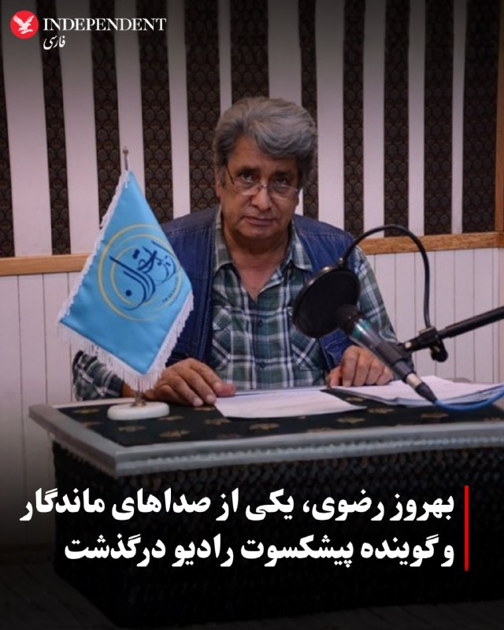

♦️بهروز رضوی، گوینده، صداپیشه و پیشکسوت رادیو و تلویزیون ایران، شامگاه یکشنبه ۲۴ خردادماه، پس از یک دوره بستری در بخش مراقبت‌های ویژه بیمارستانی در کرج در ۷۹ سالگی درگذشت.

بر اساس اعلام خانواده این هنرمند، مراسم تشییع پیکر او روز چهارشنبه ۲۷ خرداد ساعت ۹ صبح از مقابل صداوسیما برگزار خواهد شد و سپس در قطعه هنرمندان بهشت زهرا به خاک سپرده می‌شود.

بهروز رضوی متولد ۱۳۲۶ بود و فعالیت حرفه‌ای خود را از سال ۱۳۴۷ با رادیو آغاز کرد.
گویندگی برنامه «کتاب شب»، روایت مجموعه «مستند ایران» و حضور در آثار تلویزیونی و سینمایی مانند سریال «امام علی»، «تنهاترین سردار» و «روز شیطان» از جمله مهم‌ترین فعالیت‌های هنری او به شمار می‌رود.
بهروز رضوی همچنین در سال‌های اخیر در سریال «گناه فرشته» ایفای نقش کرده بود.
‌🇸🇦 Indypersian

🤖 @VahidOOnLine

## pm_afshaa — post 94052

  <a href="telegram/content/pm_afshaa_94052_1781503958.mp4" target="_blank">🎬 Download video</a>

لحظه ورود تيم جمهوري‌اسلامی به هتل محل اقامتشان در لس‌آنجلس و پذیرایی سفت ایرانیان غیور کالیفرنیا از این مزدوران خایه مال

💧 Rainbet.com the #1 Non-KYC Crypto Casino & Sportsbook @rainbetcom

😁 @Pm_Afshaa

## IranIntlTV — post 342429

  

مرضیه وحید دستجردی، دبیر ستاد ملی جمعیت، گفت سهم سالمندان ۶۰ سال به بالا در ایران از ۱۲/۶ درصد در سال ۱۴۰۳، به ۳۲ درصد در سال ۱۴۳۰ خواهد رسید و اگر با همین روند پیش برود، ایران سالمندترین کشور منطقه خواهد شد.

او افزود: «اگر جمهوری اسلامی با نرخ باروری کنونی پیش برود، ۷۵ سال آینده و در سال ۲۱۰۰ میلادی جمعیت کشور به ۳۱ میلیون نفر می‌رسد.»

وحید دستجردی مسئله کاهش جمعیت و «محو شدن ایران از روی صحنه جغرافیا» را جدی خواند و افزود: «ما اصلا محو می‌شویم و دیگر نیازی به جنگ نخواهد بود.»
iranintl.com/202606152113

## IranIntlTV — post 342428

  

🔻تیم‌های فوتبال ایران و نیوزیلند بامداد سه‌شنبه در مرحله گروهی جام جهانی ۲۰۲۶ به مصاف یکدیگر می‌روند، به نظر شما این بازی با چه نتیجه‌ای به پایان می‌رسد؟

🔹برای شرکت در این نظرسنجی، به صفحه اینستاگرام ایران اینترنشنال ورزشی مراجعه کنید؛👇🏽
https://www.instagram.com/p/DZmHTLcCBO6/

@iranintltvsport

## FarsiVOA — post 220772

  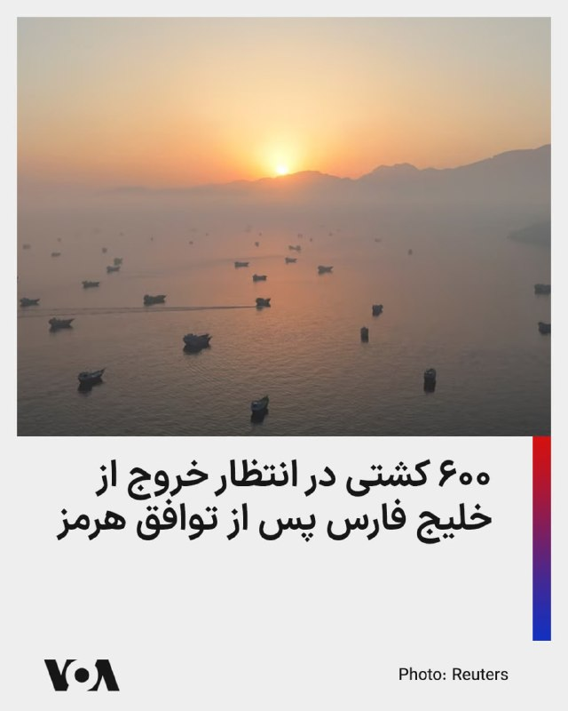

بلومبرگ گزارش داد اعلام توافق موقت آمریکا و جمهوری اسلامی برای بازگشایی تنگه هرمز، با استقبال محتاطانه مالکان کشتی و معامله‌گران روبه‌رو شده است. صنعت کشتیرانی منتظر اعلام جزئیات عبور بوده و هنوز نمی‌داند عبور ایمن از این مسیر در عمل چگونه تضمین خواهد شد.

بر اساس داده‌های کپلر، نزدیک به ۶۰۰ کشتی همچنان در خلیج فارس مانده‌اند و آماده خروج‌اند. صدها کشتی خالی نیز در سوی دیگر تنگه منتظرند تا در صورت بازگشایی مسیر، وارد خلیج فارس شوند.

بلومبرگ نوشت در ساعات نخست پس از انتشار خبر توافق، تردد در تنگه همچنان محدود بود و فقط یک نفتکش گاز طبیعی مایع به نام دیشا در حال حرکت به سوی هرمز دیده شد.

مالکان کشتی می‌گویند امنیت مسیر، احتمال وجود مین، پوشش بیمه و نحوه مدیریت عبور از گذرگاهی باریک همچنان روشن نیست.

به گفته تحلیلگران، کشتی‌های بارگیری‌شده احتمالاً نخستین گروهی خواهند بود که برای خروج آماده می‌شوند.

⬇️ بیشتر بخوانید:
https://ir.voanews.com/a/shipowners-seek-clarity-on-hormuz-deal-as-600-vessels-eye-exit/8161001.html

## DW_Farsi — post 125985

  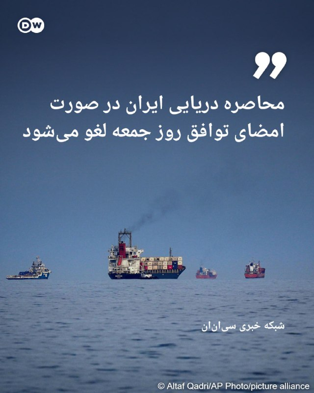

🔶 سی‌‌ان‌ان‌: محاصره دریایی ایران در صورت امضای توافق روز جمعه لغو می‌شود

شبکه خبری سی‌ان‌ان‌ به نقل از یک مقام آمریکایی گزارش داد که ارتش ایالات متحده دستورالعملی دریافت کرده است که طبق آن، در صورت امضای توافق با ایران، محاصره دریایی آمریکا علیه بنادر ایران در تنگه هرمز را روز جمعه لغو کند.

دونالد ترامپ روز یکشنبه ۱۴ ژوئن (۲۴ خرداد) اعلام کرد که پس از دستیابی به توافق با تهران، مجوز "رفع فوری محاصره دریایی ایالات متحده" علیه ایران را صادر می‌کند. او سپس گفت: «با بازگشایی تنگه هرمز پس از امضای توافق در روز جمعه، در پی انجام عملیات مین‌روبی، جریان نفت بار دیگر از هر دو سو برای منطقه و جهان برقرار خواهد شد.»

رئیس جمهور آمریکا حدود شش هفته پس از آغاز جنگ با ایران دستور اجرای محاصره دریایی را صادر کرده بود.

این مقام آمریکایی که هویتش فاش نشده به سی‌ان‌ان گفته است که "این برداشت فعلی است، اما ممکن است شرایط بین اکنون تا روز جمعه تغییر کند".

@dw_farsi

## BBCPersian — post 283862

🔻نگاهی به مهمترین خبرها تا این لحظه

▪️آنتونیو گوترش، دبیر کل سازمان ملل متحد از اعلام توافق میان ایران و آمریکا استقبال کرده است. یکی از سخنگوهای او گفت: «این نشانگر قدمی حیاتی در راه حل مسالمت‌آمیز مناقشه» است.

▪️سران بریتانیا، فرانسه، آلمان و ایتالیا در بیانیه مشترکی درباره تفاهم میان ایران و آمریکا گفته‌اند «فرصت را غنیمت می‌دانند» و از نزدیک با آمریکا، ایران و شرکای منطقه‌ای همکاری خواهند کرد.

▪️امانوئل مکرون، رئیس جمهور فرانسه می‌گوید سران گروه ۷ در اجلاس این هفته خود در شهر اوی‌یان در مورد بازگشایی بلند مدت تنگه هرمز به عنوان بخشی از معاهده ایران و آمریکا صحبت خواهند کرد.

▪️رئیس جمهور آمریکا عصر یکشنبه در مصاحبه‌ای با نیویورک تایمز گفت توافق با ایران تضمین می‌کند که تنگه هرمز «برای همیشه بدون عوارض» باشد.

▪️قیمت نفت در معاملات اولیه بازار آسیا به دلیل توافق آمریکا و ایران که قرار است بر اساس آن تنگه هرمز بازگشایی شود، کاهش یافت.

▪️خبرگزاری فرانسه گزارش داده است که جی‌دی ونس، معاون رئیس جمهور آمریکا تصمیم دارد روز جمعه در مراسم امضای توافق شرکت کند و امکان دارد که دونالد ترامپ هم آن را امضا کند.

https://bbc.in/4viCUHy
@BBCPersian

---
📅 بروزرسانی: 1405/03/25 09:32
---

## VahidOOnLine — post 245642

  

کایا کالاس، مسئول سیاست خارجی اتحادیه اروپا، گفت که تفاهم میان آمریکا و جمهوری اسلامی می‌تواند یک نقطه عطف بالقوه باشد.
او افزود که این اتحادیه با تکیه بر اهرم‌های اقتصادی، تخصص هسته‌ای و روابط دیرینه با شرکای خلیج فارس، آماده است در دستیابی به یک راه‌حل پایدار مشارکت کند.
‌🏁 🇬🇧 IranintlTV

🤖 @VahidOOnLine

## IranIntlTV — post 342427

  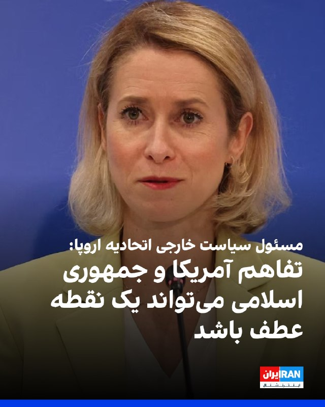

کایا کالاس، مسئول سیاست خارجی اتحادیه اروپا، گفت که تفاهم میان آمریکا و جمهوری اسلامی می‌تواند یک نقطه عطف بالقوه باشد.
او افزود که این اتحادیه با تکیه بر اهرم‌های اقتصادی، تخصص هسته‌ای و روابط دیرینه با شرکای خلیج فارس، آماده است در دستیابی به یک راه‌حل پایدار مشارکت کند.
https://iranintl.com/202606157761

## FarsiVOA — post 220771

  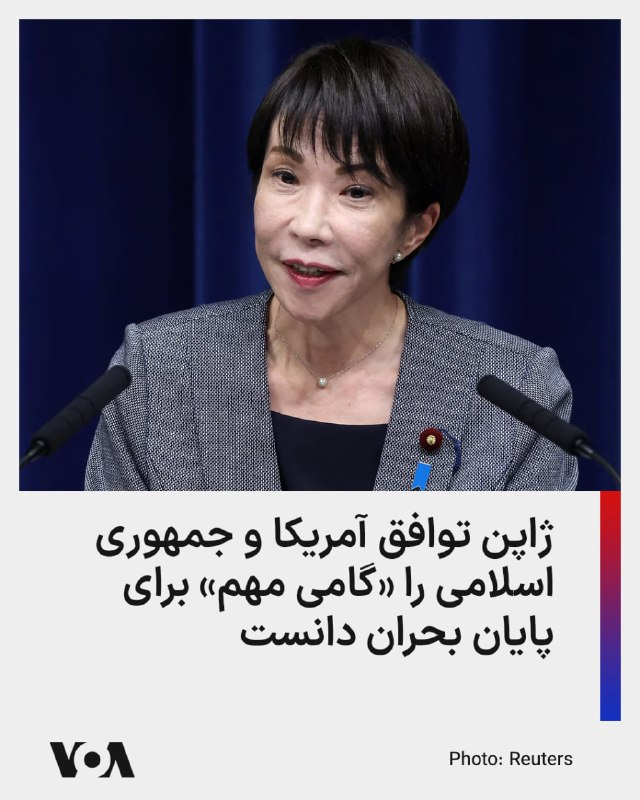

سانائه تاکایچی، نخست‌وزیر ژاپن، از توافق آمریکا و جمهوری اسلامی برای پایان دادن به درگیری‌ها استقبال کرد و آن را «گامی مهم» برای نزدیک شدن به پایان بحران دانست.

تاکایچی روز دوشنبه در شبکه اجتماعی ایکس نوشت امیدوار است مفاد این یادداشت تفاهم به‌طور پیوسته اجرا شود، آزادی و امنیت کشتیرانی در تنگه هرمز در عمل تضمین شود و توافق نهایی درباره پرونده هسته‌ای جمهوری اسلامی و دیگر مسائل باقی‌مانده هرچه زودتر به دست آید.

او همچنین این توافق را نتیجه پایبندی طرف‌ها به راه‌حل دیپلماتیک و تلاش‌های مستمر در مذاکرات خواند و از نقش کشورهایی که در این روند میانجی‌گری کرده‌اند قدردانی کرد.

توشیمیتسو موتگی، وزیر خارجه ژاپن، نیز در بیانیه‌ای اعلام کرد توکیو در هماهنگی نزدیک با جامعه بین‌المللی، به همه تلاش‌های دیپلماتیک خود برای تحقق صلح و ثبات در سراسر خاورمیانه ادامه خواهد داد.

ژاپن از واردکنندگان بزرگ انرژی از خاورمیانه است و امنیت کشتیرانی در تنگه هرمز برای اقتصاد این کشور اهمیت حیاتی دارد.
@FarsiVOA

## alonews — post 128120

  <a href="telegram/content/alonews_128120_1781503380.webm" target="_blank">🎬 Download video</a>

👈بن گویر: توافق ترامپ الزام‌آور نیست؛ اسرائیل کشور مستقل است

🔴ایتامار بن گویر، وزیر امنیت ملی اسرائیل، می‌گوید توافق ترامپ «ما را ملزم نمی‌کند»، اسرائیل «یک کشور مستقل و دارای حاکمیت» است و تابع ایالات متحده نیست.

🔴بن گویر می‌گوید اسرائیل نباید چیزی کمتر از خلع سلاح حزب‌الله را بپذیرد، نباید از هیچ سرزمینی که توسط نیروهای اسرائیلی تصرف و پاکسازی شده است، عقب‌نشینی کند و نباید در پاسخ به آتش‌سوزی به سمت اسرائیل سکوت کند.

✅ @AloNews خبر جنگ

---
📅 بروزرسانی: 1405/03/25 09:22
---

## mwarmonitor — post 10943

🔴وزیر امنیت داخلی اسرائیل، ایتامار بن‌گویر، اعلام کرد که توافق ترامپ «برای ما الزام‌آور نیست» و تأکید کرد که اسرائیل «یک کشور مستقل و دارای حاکمیت است» و تابع ایالات متحده نیست.

🔸بن‌گویر گفت اسرائیل نباید به چیزی کمتر از خلع سلاح حزب‌الله رضایت دهد، نباید از هیچ‌یک از مناطقی که توسط نیروهای اسرائیلی تصرف و پاکسازی شده‌اند عقب‌نشینی کند، و همچنین نباید در برابر شلیک‌ها به‌سوی اسرائیل سکوت اختیار کند.

@mwarmonitor

## IranIntlTV — post 342426

  <a href="telegram/content/IranIntlTV_342426_1781502766.mp4" target="_blank">🎬 Download video</a>

شهباز شریف، نخست‌وزیر پاکستان، اعلام کرد واشینگتن و تهران به توافقی برای پایان دادن به جنگ میان دو طرف دست یافته‌اند. او همچنین گفت امضای رسمی این توافق جمعه در سوئیس انجام خواهد شد.

گفت‌وگو با جواد همدانی، خبرنگار ایران‌اینترنشنال

@iranintltv

## FarsiVOA — post 220770

  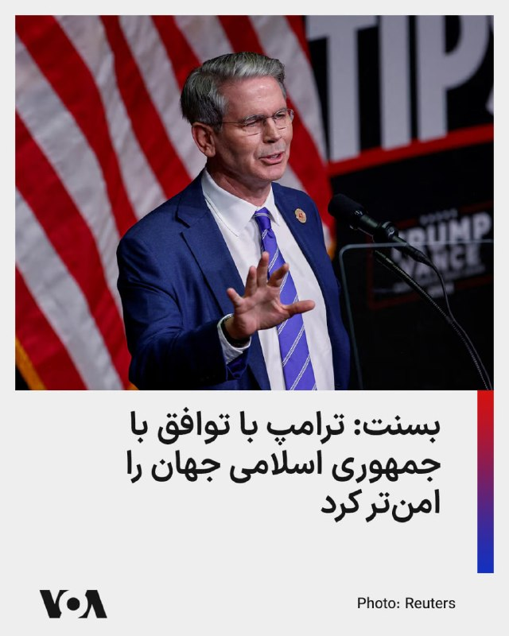

اسکات بسنت، وزیر خزانه‌داری آمریکا، در شبکه اجتماعی ایکس از توافق اعلام‌شده میان آمریکا و جمهوری اسلامی استقبال کرد و آن را «توافق صلح تاریخی» خواند.

بسنت نوشت دونالد ترامپ، رئیس‌جمهوری آمریکا، «همچنان به امن‌تر کردن جهان ادامه می‌دهد» و امروز با دستیابی به توافقی تاریخی با جمهوری اسلامی، گامی برداشته که به گفته او «برای قرن‌ها در کتاب‌های تاریخ ثبت خواهد شد».

این موضع در ادامه واکنش مقام‌های دولت ترامپ به اعلام توافق اولیه برای پایان دادن به درگیری‌ها و بازگشایی مسیر کشتیرانی در تنگه هرمز مطرح می‌شود.
@FarsiVOA

## DW_Farsi — post 125984

  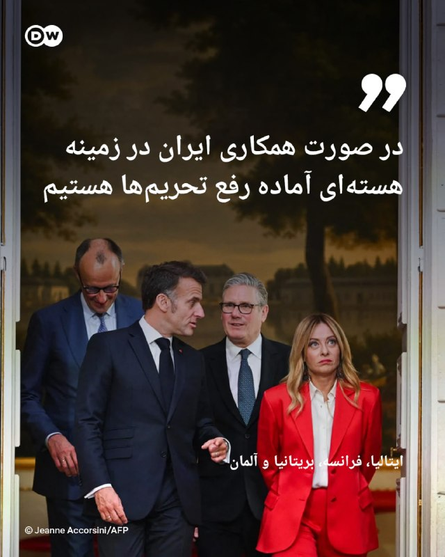

🔶 چهار کشور اروپایی: در صورت همکاری ایران در زمینه هسته‌ای آماده‌ رفع تحریم‌ها هستیم

ایتالیا، فرانسه، بریتانیا و آلمان با استقبال از تفاهم حاصل‌شده میان ایران و آمریکا اعلام کردند، آن را "فرصتی برای بازگرداندن ثبات منطقه‌ای و تثبیت اقتصاد جهانی" می‌دانند.

این چهار کشور در بیانیه مشترکی با اعلام آمادگی خود برای حمایت از تلاش‌ها در جهت "اجرای سریع و جامع" این تفاهم‌نامه، تأکید کردند که "بازگشایی فوری تنگه هرمز با آزادی بدون قید و شرط و نامحدود کشتیرانی ضروری است".

آنها تصریح کردند که آماده‌اند تا مطابق با الزامات قانون اساسی کشورهای خود، سهم‌شان را در تحقق این هدف از جمله از طریق یک مأموریت کاملاً دفاعی و مستقل برای اطمینان‌بخشی به کشتی‌های تجاری و انجام عملیات پاکسازی مین‌های دریایی ایفا کنند.

فرانسه، بریتانیا، آلمان و ایتالیا همچنین با قدردانی از تلاش‌های قطر، پاکستان و سایر کشورهای میانجی برای این دستاورد دیپلماتیک، تأکید کرده‌اند که "ایران هرگز نباید به سلاح هسته‌ای دست یابد".

در این بیانیه گفته شده است: «ما آماده‌ همکاری با ایالات متحده، ایران و آژانس بین‌‌المللی انرژی اتمی برای تحقق این هدف هستیم. همچنین آماده‌ایم در پاسخ به گام‌های روشن و قابل راستی‌آزمایی ایران در زمینه برنامه هسته‌ای خود، تحریم‌های مرتبط [علیه ایران] را لغو کنیم.»

این چهار کشور همچنین بار دیگر حمایت کامل خود را از "ثبات، حاکمیت ملی و تمامیت ارضی لبنان" و نیز"اهمیت برقراری و حفظ یک آتش‌بس پایدار و مؤثر" اعلام کردند.

@dw_farsi

## Persian_Trend_Official — post 17145

◾️ قالیباف خطاب به اسرائیل: پس از چراغ سبز آمریکا به این تجاوز، سخن از ادامه مسیر ممکن نیست؛ بازی پلیس بد و پلیس خوب قدیمی شده؛ بچرخ تا بچرخیم

◾️ رئیس کمیسیون امنیت ملی مجلس: پاسخ به حمله امروز اسرائیل قطعی است

◾️ سردار اسدی معاون قرارگاه خاتم‌الانبیا: جنایت صهیونیست‌ها بی‌پاسخ نمی‌ماند

◾️ فرمانده هوافضای سپاه سردار موسوی: گوش به فرمان ولایت باشید؛ نه یک گام جلوتر نه یک گام عقب‌تر، همراه با ولی خویش باشید

◾️ وزارت خارجه ایران: حمله به ضاحیه نقض آشکار حاکمیت لبنان و نقض فاحش تفاهم آتش‌بس ۱۹ فروردین است؛ مسئولیت پیامدها برعهده آمریکا و اسرائیل است

◾️ گزارش‌های میدانی از قطع شدید GPS در آسمان اسرائیل و توقف پروازهای غیرنظامی منطقه؛ تسنیم پروازهای غرب کشور را لغو اعلام کرد اما سازمان هواپیمایی این خبر را تکذیب کرد

◾️ ارتش اسرائیل: رئیس ستاد کل ایال زامیر ارزیابی مستمر با فرماندهان دارد؛ ارتش برای احتمال شلیک از سمت ایران در ساعات آینده آماده می‌شود؛ هرگونه شلیک به اسرائیل تحمل نخواهد شد

◾️ کانال ۱۴ اسرائیل: آمریکا از طریق واسطه‌ها در تلاش برای جلوگیری از حمله احتمالی ایران است؛ پاسخ اسرائیل: اگر ایران حمله کند، پاسخ سریع و شدید خواهد بود

◾️ کانال ۱۲: این بار حتی پرتاب یک موشک از ایران را تحمل نمی‌کنیم؛ در این صورت حمله گسترده و خردکننده به زیرساخت‌های نظامی و اقتصادی ایران در پیش است

◾️ مقام ارشد اسرائیلی: ایران مسئله ترامپ است و او حق دارد توافق کند، اما لبنان مسئله ماست؛ نباید با معادله ایران موافقت کنیم حتی به قیمت رویارویی با آمریکا

◾️ کابینه امنیتی امشب در یکی از سایت‌های فوق‌محرمانه زیرزمینی برگزار شد؛ ونس به‌طور اضطراری به کاخ سفید بازگشت

◾️ سی‌ان‌ان: نتانیاهو به‌دنبال دیدار فوری با ترامپ پس از بازگشت او از نشست G7 است

◾️ شبکه ۱۲: ایران پیشنهاد ترامپ برای خویشتنداری در ازای پول را رد کرد و گفت به‌زودی پاسخ می‌دهد

◾️ ارتش اسرائیل پیش از حمله به ضاحیه، هشدار تخلیه برای ۲۹ شهر و روستا در جنوب لبنان صادر کرد

◾️ حزب‌الله ویدیوی پهپاد انتحاری شاهد-۱۰۱ به سمت الجلیل و عملیات پهپادی دیگری در شمال اسرائیل را منتشر کرد؛ حداقل یکی از دو پهپاد به هدف اصابت کرد

◾️ نیروی هوایی اسرائیل پس از حمله به ضاحیه، اهدافی در تبنین، شوکن، المنصوری و کفرسیر را بمباران کرد؛ ارتش در جبهه‌های اطراف نبطیه شدیداً درگیر است

◾️ سردار قاآنی فرمانده نیروی قدس: پیروزی عظیم حزب‌الله در راه است؛ جهان استقلال لبنان را با فداکاری حزب‌الله می‌شناسد

◾️ OSINT: تمرکز گسترده ناوگان آمریکا — دو گروه ضربت ناو هواپیمابر (USS Abraham Lincoln و USS George H.W. Bush) و گروه آبی‌خاکی USS Tripoli در دریای عرب؛ ناوشکن‌های USS Thomas Hudner و USS Gonzalez در دریای سرخ؛ USS Arleigh Burke، USS Oscar Austin و USS Roosevelt در شرق مدیترانه

◾️ پیت هگست وزیر جنگ آمریکا: ذخایر تسلیحاتی ما عالی هستند و فقط قوی‌تر می‌شوند؛ ادعای کسری ذخایر داستانی ساختگی است؛ ما در مسیر امضای توافق هستیم، اسرائیل در واکنش به حزب‌الله بسیار میانه‌رو است

◾️ یک فروند F/A-18 هورنت آمریکا نزدیک دریاچه ریم‌راک واشنگتن سقوط کرد؛ خلبان با صندلی پران نجات یافت

◾️ سقوط هواپیمایی نزدیک فرودگاه باتلر‌مموریال میزوری ۱۱ چترباز و ۱ خلبان را به کشتن داد

◾️ سپاه اصفهان: عملیات انفجار کنترل‌شده در منطقه زردنجان شرق اصفهان امروز بین ساعت ۸ تا ۱۲ انجام شد؛ صدای انفجار جای نگرانی ندارد

◾️ همتی: تقویت ذخایر ارزی و حمایت از تولید در دستور کار بانک مرکزی است

◾️ پزشکیان: تصمیم‌گیری درباره جنگ و مذاکره بر عهده رهبری و شورای عالی امنیت ملی است، نه رسانه ملی

◾️ زلنسکی: گفتگوی خوبی با ترامپ داشتم؛ او را از تحولات میدانی مطلع کردم؛ در نشست G7 بیشتر گفتگو می‌کنیم

◾️ کرملین: پوتین و ترامپ توافق کردند ویتکاف و کوشنر به‌زودی بار دیگر به روسیه سفر کنند

◾️ بریتانیا یک کشتی از ناوگان سایه روسیه را در کانال مانش توقیف کرد

◾️ خبرگزاری‌های عبری: خشم رسانه‌های اسرائیلی از توافق ایران-آمریکا؛ ترامپ را بازنده توصیف کردند

👺Phantom

📌 @persian_trend_official
پرشین ترند | متفاوت‌ترین کانال نظامی

## Persian_Trend_Official — post 17144

📍بولتن خبری ۲۴ ساعت اخیر پرشین ترند

🗓 ۲۵ خرداد ۱۴۰۵

◾️ شهباز شریف نخست‌وزیر پاکستان: توافق صلح میان آمریکا و ایران حاصل شد؛ پایان فوری و دائمی عملیات نظامی در همه جبهه‌ها از جمله لبنان؛ امضای رسمی جمعه ۲۹ خرداد در سوئیس؛ از قطر، عربستان و ترکیه برای میانجیگری تشکر کرد

◾️ شورای عالی امنیت ملی ایران: یادداشت تفاهم اسلام‌آباد شامگاه ۲۴ خرداد نهایی شد؛ جنگ در همه جبهه‌ها از امشب پایان یافته و محاصره دریایی بلافاصله و کامل لغو می‌شود

◾️ ترامپ در تروث‌سوشال: توافق با ایران کامل شد؛ بازگشایی کامل و بدون عوارض تنگه هرمز و لغو فوری محاصره دریایی را مجاز می‌دانم؛ کشتی‌های جهان موتورهایتان را روشن کنید

◾️ فاکس‌نیوز: میانجی‌گران قطری پس از ۱۷ ساعت مذاکره فشرده تهران را ترک کردند؛ پیش از امضای رسمی، جلسات مقدماتی این هفته در دوحه برگزار می‌شود

◾️ مهدی محمدی مشاور تیم مذاکره‌کننده: توقف درگیری‌ها با تضمین امنیتی آمریکا، آزادسازی بخشی از دارایی‌ها در گام اول، تعلیق برخی تحریم‌ها، تسهیل تردد دریایی؛ موضوع هسته‌ای منوط به راستی‌آزمایی تعهدات آمریکاست

◾️ رویترز به نقل از مقام ایرانی: یادداشت تفاهم ۲۵ میلیارد دلار از دارایی‌های بلوکه‌شده ایران را آزاد می‌کند؛ ذخایر اورانیوم غنی‌شده می‌تواند داخل کشور رقیق شود؛ ایران تعهد به عدم ساخت سلاح هسته‌ای می‌دهد

◾️ انتخاب به نقل از منبع آگاه: بندی از تفاهم، تعهد آمریکا و متحدانش به برنامه ۳۰۰ میلیارد دلاری بازسازی و توسعه ایران است

◾️ غریب‌آبادی: تمرکز مذاکرات ۶۰ روزه صرفاً بر موضوع هسته‌ای است؛ چهار محور شامل خاتمه تحریم‌ها، مسائل هسته‌ای، بازسازی اقتصادی و نظارت بر اجرای تعهدات؛ در بی‌اعتمادی کامل مذاکره کردیم

◾️ چهار کشور اروپایی (فرانسه، بریتانیا، آلمان، ایتالیا): آماده‌ایم در پاسخ به گام‌های قابل‌راستی‌آزمایی هسته‌ای ایران، تحریم‌ها را لغو کنیم

◾️ ترامپ به نیویورک‌تایمز: ایران اجازه غنی‌سازی در سطح پایین (غیرقابل استفاده نظامی) خواهد داشت؛ موضوع غنی‌سازی صفر کنار گذاشته شد

◾️ ونس: قطعاً برای امضا در سوئیس حضور خواهم داشت؛ ایران هرگز سلاح هسته‌ای نخواهد داشت، امشب پیروزی بزرگی به دست آوردیم

◾️ ترامپ درباره رژیم ایران: من اصلاً به تغییر رژیم اهمیت نداده‌ام؛ این منطقی‌ترین گروهی است که با آن طرف بوده‌ایم؛ نتانیاهو هم با توافق موافق است

◾️ نتانیاهو و کاتز در بیانیه مشترک: در پاسخ به آتش حزب‌الله، ضاحیه بیروت (منطقه الغبیری) هدف قرار گرفت

◾️ المیادین: حمله به یک ساختمان پنج طبقه ۳ شهید و ۶ زخمی برجا گذاشت؛ کانال ۱۲ مدعی شد هدف فرمانده ارشد واحد ارتباطات حزب‌الله بود

◾️ العربیه: علی الحاج، مقام ارشد حزب‌الله، در این حمله کشته شد؛ سفیر اسرائیل در آمریکا: فرمانده ارشد علی موسی دقاق نیز ترور شد

◾️ ترامپ به کانال ۱۲: قرار بود توافق صبح امضا شود اما حمله اسرائیل به بیروت آن را به تأخیر انداخت؛ خیلی عصبانی شدم، همه‌چیز را به‌هم ریخت

◾️ ترامپ در ادامه: مسئولیت عدم امضای امروز برعهده بی‌بی است؛ به نتانیاهو گفتم چیکار می‌کنی، او اختیار از خودش ندارد، من باید تصمیم بگیرم؛ با ایران صحبت می‌کنم تا حمله نکند

◾️ فاکس‌نیوز به نقل از دیپلمات: حمله به ضاحیه تلاش آشکار اسرائیل برای تضعیف توافق ترامپ و کشاندن دوباره آمریکا به جنگ بود

◾️ انتخاب به نقل از منبع آگاه: پس از حمله، قالیباف دستور توقف مذاکرات با طرف قطری را داد و نیروهای مسلح پرتابگرها را آماده شلیک کردند؛ ترامپ در پاسخ، محاصره دریایی را بلافاصله و کامل (به‌جای ۳۰ روز) لغو کرد و مدیریت تنگه هرمز به ایران و عمان محول شد

◾️ وای‌نت: تهران در حال بررسی به‌تعویق‌انداختن حمله موشکی به اسرائیل بود تا فرصتی به تلاش‌های ترامپ بدهد؛ یکی از پیشنهادهای قطر، رفع فوری محاصره به‌جای کاهش تدریجی تحریم‌ها بود

◾️ یدیعوت‌آحارونوت: آمریکا پیشنهاد رفع فوری (نه تدریجی) محاصره دریایی را در ازای عدم حمله ایران به اسرائیل مطرح کرد

◾️ یک منبع امنیتی اسرائیلی: نتانیاهو انتظار داشت حمله بیروت باعث انحراف دیپلماسی شود، اما مذاکرات علی‌رغم این حادثه ادامه یافت

◾️ مرندی عضو تیم مذاکره‌کننده: حمله امروز نباید رخ می‌داد؛ هیچ‌کس آسیب جدی ندید و نباید روند صلح را مختل کند؛ دیگر هیچ حمله‌ای از سوی هیچ طرف نباید باشد

◾️ علی‌اکبر ولایتی مشاور رهبری: یک اشتباه محاسباتی در بیروت صبر را به پایان رساند؛ ساعت صفر فرا رسیده و پرتابگرها آماده‌سازی می‌شوند

◾️ سرلشکر عبداللهی فرمانده قرارگاه خاتم‌الانبیا: فرزندان ملت در نیروهای مسلح دست به ماشه آماده شلیک به قلب دشمن هستند؛ توان رزمی، موشکی، دریایی و پهپادی ما قوی‌تر از گذشته است

◾️ ذوالقدر دبیر شورای عالی امنیت ملی: پاسخ رزمندگان اسلام در پیش است؛ لبنان جان ماست و نقض خطوط قرمز تحمل نخواهد شد

## RadioFarda — post 158314

  <a href="telegram/content/RadioFarda_158314_1781502770.mp4" target="_blank">🎬 Download video</a>

🔸تنها چند ساعت پس از آن‌که دونالد ترامپ، رئیس‌جمهور آمریکا، در تماس تلفنی با ولادیمیر پوتین، رهبر کرملین، به او گفت که می‌خواهد به پایان دادن به جنگ در اوکراین کمک کند، دست‌کم ۹ نفر در سراسر اوکراین در پی حملات هوایی روسیه کشته شدند.

🔸ایگور کلیمنکو، وزیر کشور اوکراین، روز دوشنبه ۲۵ خرداد گفت که حملات روسیه در خارکیف، دومین شهر بزرگ اوکراین در شمال‌شرق کشور، پنج امدادگر را کشته و دست‌کم پنج نفر دیگر را زخمی کرده است.

🔸او در کانال تلگرامی خود نوشت: «در خارکیف، پنج نفر از نیروهای خدمات اضطراری دولتی در حالی که در حال مهار آتش‌سوزی ناشی از حملات مکرر روسیه بودند، کشته شدند. دست‌کم پنج نفر دیگر نیز زخمی شدند».

🔸ویتالی کلیچکو، شهردار کی‌یف، پایتخت اوکراین، گفت که یک حملهٔ «گسترده» در طول شب باعث خسارت و آتش‌سوزی در تقریباً تمام مناطق شهر شده است. مقامات اعلام کردند که در این حملات، چهار نفر کشته و دست‌کم ۲۳ نفر دیگر زخمی شده‌اند.

🔸نسخه کامل این گزارش را در وب‌سایت رادیوفردا بخوانید.

@RadioFarda

## alonews — post 128119

  <a href="telegram/content/alonews_128119_1781502773.webm" target="_blank">🎬 Download video</a>

👈رابرت مالی، مذاکره‌کننده سابق آمریکا و نماینده ویژه در امور ایران:

🔴«این تفاهم‌نامه یک دستاورد مهم و خوشایند است، زیرا تنگه هرمز را دوباره باز می‌کند؛ گذرگاهی که بسته شدن آن هزینه‌های ویرانگری را بر میلیون‌ها نفر در سراسر جهان تحمیل کرد. اما این تفاهم‌نامه همچنین محکومیتی روشن و قاطع علیه جنگی است که پیش از آن رخ داد، زیرا مهم‌ترین دستاورد آن بازگشایی آبراهی است که تنها به دلیل همان جنگ بسته شده بود.

🔴در مورد مسائلی که پس از این تفاهم‌نامه باید حل‌وفصل شوند ــ از جمله سرنوشت برنامه هسته‌ای ایران، وضعیت اورانیوم غنی‌شده و دامنه کاهش تحریم‌ها ــ تقریباً به‌طور قطع به آینده موکول خواهند شد و حل آن‌ها احتمالاً دشوارتر از قبل از جنگ خواهد بود.

✅ @AloNews خبر جنگ

---
📅 بروزرسانی: 1405/03/25 09:12
---

## FarsiVOA — post 220769

🔺استقبال جهان از توافق میان آمریکا و جمهوری اسلامی

▪️پس از اعلام توافق میان آمریکا و جمهوری اسلامی برای پایان دادن به جنگ در خاورمیانه، توقف محاصره بنادر جنوبی ایران از سوی آمریکا و بازگشایی تنگه هرمز، شماری از رهبران و مقامات ارشد کشورهای جهان از این توافق استقبال کردند.

▪️نخست‌وزیر پاکستان که کشورش میانجی اصلی مذاکرات بود، از آمریکا، جمهوری اسلامی، قطر، عربستان سعودی و ترکیه قدردانی کرد.

▪️رهبران چهار کشور اروپایی بریتانیا، فرانسه، آلمان و ایتالیا نیز در بیانیه مشترکی نوشتند: «[رژیم] ایران هرگز نباید به سلاح هسته‌ای دست یابد. ما آماده‌ایم برای تحقق این هدف با ایالات متحده، [رژیم] ایران و آژانس بین‌المللی انرژی اتمی همکاری کنیم.»

⬇️ بیشتر بخوانید:
https://ir.voanews.com/a/8160999.html

## BBCPersian — post 283861

🔻ونس: این توافق می‌تواند خاورمیانه را برای ۵۰ سال آینده به طور اساسی متحول کند
جی‌دی ونس، معاون اول رئیس جمهور آمریکا روز یکشنبه به شبکه خبری فاکس گفت که توافق با ایران این پتانسیل را دارد که «خاورمیانه را برای ۵۰ سال آینده به طور اساسی متحول کند.»

او گفت: «این منطقه از جهان در تمام عمرم و حتی بیشتر از آن، یک منطقه‌ تنش‌زا بوده است.»

آقای ونس گفت دونالد ترامپ موفق شده است «تهدید ایران را از بین ببرد.»

او افزود که اکنون «ساختن دوران جدیدی از رفاه و موفقیت در خاورمیانه» امکان‌پذیر خواهد بود؛ «جایی که رک بگویم می‌توانیم از آن منطقه رفاه زیادی برای مردم آمریکا ایجاد کنیم.»

https://bbc.in/4viCUHy
@BBCPersian

## alonews — post 128118

  <a href="telegram/content/alonews_128118_1781502149.webm" target="_blank">🎬 Download video</a>

👈بهروز رضوی از چندی پیش در بخش مراقبت‌های ویژه بیمارستانی در کرج بستری بود و ساعت ۲۳ شامگاه گذشته یکشنبه ۲۴ خرداد ماه در همین بیمارستان دار فانی را وداع گفت

✅ @AloNews خبر جنگ

## alonews — post 128117

  <a href="telegram/content/alonews_128117_1781502150.webm" target="_blank">🎬 Download video</a>

👈وزیر خارجه اسپانیا: از اعلام تفاهم میان ایالات متحده و ایران استقبال می‌کنم و تلاش‌های میانجی‌ها را ارزشمند می‌دانم.

🔴 آزادی و امنیت کشتیرانی در تنگه هرمز دو موضوع حیاتی هستند.

🔴 گفتگو و مذاکره می‌تواند مسائل باقی‌مانده را حل‌وفصل کرده و آتش‌بس را، از جمله در لبنان تضمین کند

✅ @AloNews خبر جنگ

## alonews — post 128116

  <a href="telegram/content/alonews_128116_1781502150.webm" target="_blank">🎬 Download video</a>

👈رودز، معاون سابق مشاور امنیت ملی اوباما: این توافق یک آبراه را باز می‌کند که پیش از جنگ نیز باز بود و مذاکرات هسته‌ای را آغاز می‌کند که از آنچه ترامپ پیش از جنگ دنبال می‌کرد، بسیار محدودتر است.

🔴همه این‌ها با هزینه‌ای سرسام‌آور برای کل جهان انجام شد

✅ @AloNews خبر جنگ

---
📅 بروزرسانی: 1405/03/25 09:02
---

## mwarmonitor — post 10942

🔸این ادعای آقای ترامپ که ایالات متحده در صورت نیاز به یک نیروی پلیس حقوق‌بگیر در خاورمیانه تبدیل خواهد شد، یک چرخش تند و البته بسیار شبیه به سبک ترامپ خواهد بود. رئیس‌جمهور در واقع حفاظت آمریکا از منطقه — و چتر هسته‌ای ایالات متحده — را به یک نیروی مزدور تبدیل…

## IranIntlTV — post 342425

  <a href="telegram/content/IranIntlTV_342425_1781501563.mp4" target="_blank">🎬 Download video</a>

ایرانیان مقیم سوئد در شهر گوتنبرگ گردهم آمدند و زادروز مجیدرضا رهنورد و یاد جان‌باختگان انقلاب ملی ایران را گرامی داشتند.

گزارش مهران عباسیان، خبرنگار ایران‌اینترنشنال

@iranintltv

## BBCPersian — post 283853

🖊امنیه النجار, کارشناس خاورمیانه، بخش مانیتورینگ بی‌بی‌سی

امارات متحده عربی در واکنش به جنگ ایران و پیامدهای آن، از تغییر قابل توجهی در استراتژی منطقه‌ای خود خبر داده و رویکردی با تمرکز بیشتر بر مسائل امنیتی در پیش گرفته است.

امارات که به طور سنتی به عنوان یکی از مراکز باثبات منطقه در حوزه تجارت، امور مالی و سرمایه‌گذاری شناخته می‌شد، خود را تحت تاثیر جنگی یافت که تلاش کرده بود از آن دور بماند.

حملات ایران به خاک امارات آسیب‌پذیری‌هایی را آشکار کرد که به نظر می‌رسد مدل دیرینه «صلح از طریق تجارت» را در این کشور به چالش کشیده است. این حملات نشان داد که چنین مدلی بدون برخورداری از توانمندی‌های دفاعی پیشرفته و قدرتمند قابل دوام نیست. همین موضوع ابوظبی را به سمت تقویت روابط نظامی با شرکای اصلی خود، به ویژه آمریکا و اسرائیل، سوق داده است.
در عین حال جنگ محدودیت‌های وابستگی متقابل سیاست و اقتصاد را نیز آشکار کرد و ابوظبی را بر آن داشت تا روند حرکت خود به سوی استقلال استراتژیک را سرعت ببخشد.

مطلب کامل🔽
https://bbc.in/4fMvl72
📷Getty/ Reuters/ EPA

## alonews — post 128115

  <a href="telegram/content/alonews_128115_1781501564.mp4" target="_blank">🎬 Download video</a>

👈مرضیه وحید دستجردی، دبیر ستاد ملی جمعیت: اگر با همین دست فرمان پیش برویم؛ در سال ۱۴۳۰ سالمندترین کشور منطقه خواهیم بود

✅ @AloNews خبر جنگ

## alonews — post 128114

  <a href="telegram/content/alonews_128114_1781501566.webm" target="_blank">🎬 Download video</a>

👈احتمال شنیده شدن صدای انفجار کنترل شده در محدوده مبارکه اصفهان

✅ @AloNews خبر جنگ

## alonews — post 128113

  <a href="telegram/content/alonews_128113_1781501567.mp4" target="_blank">🎬 Download video</a>

👈ساکنان در حال بازگشت به خرابی‌های ایجاد شده در منطقه نابتیه در جنوب لبنان هستند که بر اثر حملات اسرائیل به وجود آمده است

✅ @AloNews خبر جنگ

---
📅 بروزرسانی: 1405/03/25 08:52
---

## VahidOOnLine — post 245641

♦️محوطه تاریخی «کمرزرین» اصفهان پس از مدت‌های تنش میان مقام‌های شهرداری و سازمان میراث فرهنگی، به یک «موزه» در دل یکی از بافت‌های تاریخی «نصف جهان» تبدیل شده است.

علی هژبری، کارشناس میراث فرهنگی، ویدیویی از این «سایت موزه» را در اکس منتشر کرده است. تصاویری که برای دوستداران میراث فرهنگی، یادآور موزه‌های زنده وسط بافت‌های شهری تاریخی مانند رم و آتن است.

حدود یک سال پیش، «گذر کمرزرین»، تنها در چندصد متری مسجد عتیق اصفهان به یکی از دغدغه‌های فعالان میراث فرهنگی این شهر کهن تبدیل شد.  باستان‌شناسان در آن زمان اعلام کردند که در جریان خاک‌برداری با ماشین‌های سنگین شهرداری برای تعریض این گذرگاه، به سازه‌های معماری در لایه‌های زیرین زمین دست‌ یافته‌اند. انتشار این خبر امیدها را برای بازخوانی تاریخ رازآلود این بخش از شهر اصفهان زنده کرد؛ به‌خصوص که مسجد عتیق و پیرامون آن هسته اولیه شکل‌گیری شهر اصفهان را تشکیل می‌دهند. کاوش‌های باستان‌شناسان احتمال وجود «قیصریه» در این بخش را تقویت می‌کند و به نظر می‌رسد که این منطقه، رازهایی تاریخی از دوران پیش از اسلام تا صفویه را در خود پنهان کرده است.
‌🇸🇦 Indypersian

🤖 @VahidOOnLine

## mwarmonitor — post 10941

🔴ترامپ مدعی شد که طبق توافق با ایران، تنگه هرمز «برای همیشه رایگان» خواهد بود. 🔸رئیس جمهور ترامپ در تماسی با نیویورک تایمز، رهبران روسیه و چین را ستود و نخست وزیر اسرائیل را «آدمی بسیار سرسخت» توصیف کرد. 🔸پرزیدنت ترامپ روز یکشنبه تأکید کرد که اگر ایران به…

## mwarmonitor — post 10940

🔴ترامپ مدعی شد که طبق توافق با ایران، تنگه هرمز «برای همیشه رایگان» خواهد بود.

🔸رئیس جمهور ترامپ در تماسی با نیویورک تایمز، رهبران روسیه و چین را ستود و نخست وزیر اسرائیل را «آدمی بسیار سرسخت» توصیف کرد.

🔸پرزیدنت ترامپ روز یکشنبه تأکید کرد که اگر ایران به توافق نهایی هسته‌ای با ایالات متحده دست نیابد، حملات نظامی به تهران را از سر خواهد گرفت.

🔹دیوید ای. سنگر، بیش از ۲۰ سال است که اخبار پنج رئیس جمهور آمریکا را پوشش می‌دهد و درباره برنامه هسته‌ای ایران می‌نویسد. او از لندن گزارش می‌داد، جایی که رئیس جمهور ترامپ برای توصیف توافق دولت با تهران با او تماس گرفت.

🔸رئیس جمهور ترامپ عصر یکشنبه در مصاحبه‌ای گفت که توافقی که با ایران حاصل کرده است در نهایت تضمین می‌کند که تنگه هرمز «برای همیشه بدون عوارض» خواهد بود و تأکید کرد که علیرغم اعتراضات بنیامین نتانیاهو، نخست وزیر اسرائیل، او اسرائیل را از نابودی هسته‌ای نجات داده است.

🔴آقای ترامپ همچنین اصرار داشت که اگر ایران نتواند به توافق هسته‌ای نهایی با ایالات متحده دست یابد - روندی که دستیاران او می‌گویند انتظار دارند روز جمعه در سوئیس آغاز شود - او حملات نظامی به تهران را از سر خواهد گرفت یا ایالات متحده را در ازای دریافت 20 درصد از درآمدهای منطقه، «نگهبان خاورمیانه» خواهد کرد.

🔸در یک مکالمه تلفنی ۲۸ دقیقه‌ای که آقای ترامپ از اقامتگاه کاخ سفید آغاز کرد و یک تماس کوتاه پس از آن، رئیس جمهور ادعا کرد که تصمیم او برای حمله به ایران در اواخر فوریه و محاصره دریایی متعاقب آن بنادر ایران پس از بسته شدن تنگه هرمز توسط تهران، خاورمیانه را به نفع آمریکا تغییر داده است.

🔸او در هشتادمین سالگرد تولدش، در حالی که صدای خانواده‌اش در پس‌زمینه برای شام جشن شنیده می‌شد، از دو اقتدارگرا - روسای جمهور شی جین پینگ از چین و ولادیمیر پوتین از روسیه - به خاطر کمک به حل و فصل مناقشه یا حداقل عدم دخالت در محاصره تنگه هرمز، تمجید کرد.

🔹آقای ترامپ درباره آقای شی که ماه گذشته در چین از او دیدار کرده بود، گفت: «او یک جنتلمن تمام‌عیار بود. او یک نفتکش به همراه ۲۰ ناوشکن در هر طرف آن نفرستاد تا محاصره را بشکند»، اقدامی که می‌توانست نیروی دریایی چین و آمریکا را در معرض درگیری بالقوه قرار دهد.

🔸اما او از آقای نتانیاهو به خاطر حملات فزاینده‌ای که تقریباً توافق نهایی را از مسیر خود خارج کرد، به شدت انتقاد کرد.

🔸آقای ترامپ درباره نخست وزیر اسرائیل گفت: «او آدم خیلی سرسختی است و راستش را بخواهید، او باید از ما به خاطر این کار خیلی ممنون باشد. چون اگر ایران سلاح هسته‌ای داشت، اسرائیل دو ساعت هم دوام نمی‌آورد.»

@mwarmonitor

## Persian_Trend_Official — post 17143

  <a href="telegram/content/Persian_Trend_Official_17143_1781500964.webm" target="_blank">🎬 Download video</a>

نفت هم اکنون در محدوده 83 دلار قرار دارد.

📝 Amir

📌 @persian_trend_official
پرشین ترند | متفاوت‌ترین کانال نظامی

## RadioFarda — post 158313

تیم ملی فوتبال ایران در آستانه بازی با نیوزیلند وارد آمریکا شد

🔸تیم ملی فوتبال ایران روز یک‌شنبه ۲۴ خرداد برای نخستین بار در جریان جام جهانی ۲۰۲۶ وارد خاک آمریکا شد و ساعاتی بعد خبر توافق صلح میان تهران و واشینگتن برای پایان دادن به جنگ منتشر شد.

🔸این تیم پس از پروازی کوتاه از شهر تیخوانا در مکزیک، جایی که در هفته‌های اخیر اردو زده بودند، در فرودگاه بین‌المللی لس‌آنجلس فرود آمدند. این تیم قرار است دوشنبه شب در نخستین دیدار خود در گروه هفتم جام جهانی برابر نیوزیلند به میدان برود.

🔸ورود تیم ایران در حالی صورت گرفت که فضای امنیتی شدیدی در اطراف محل اقامت بازیکنان برقرار بود و نیروهای پلیس بخشی از خیابان‌های اطراف هتل را مسدود کرده بودند. امیر قلعه‌نویی، سرمربی تیم ملی، و مهدی طارمی نیز قرار بود شامگاه یک‌شنبه در نشست خبری پیش از مسابقه شرکت کنند.

🔸این مسابقه در شرایطی برگزار می‌شود که جنگ میان آمریکا و ایران در ماه‌های گذشته بر همه جنبه‌های حضور تیم ایران در جام جهانی سایه افکنده بود. ایران پس از حملات مشترک آمریکا و اسرائیل در اسفندماه، اردوگاه آماده‌سازی خود را از ایالت آریزونا به مکزیک منتقل کرده بود. اکنون توافق اعلام‌شده میان دو کشور قرار است روز جمعه در سوئیس به امضا برسد.

🔸همزمان با ورود تیم ایران به لس‌آنجلس، به نوته خبرگزاری فرانسه، گروهی از مخالفان جمهوری اسلامی در نزدیکی ورزشگاه محل برگزاری مسابقه تجمع کردند. معترضان با در دست داشتن پرچم شیر و خورشید و پلاکاردهایی با شعارهایی علیه جمهوری اسلامی، خواستار دموکراسی در ایران شدند. برخی از آنان تصاویر ورزشکاران و معترضان کشته‌شده در سرکوب اعتراضات را نیز به نمایش گذاشتند.

🔸نسخه کامل این گزارش را در وب‌سایت رادیوفردا بخوانید.

@RadioFarda

## BBCPersian — post 283852

🔻استقبال دبیر کل سازمان ملل و دیگر رهبران جهان از تفاهم‌نامه ایران و آمریکا

آنتونیو گوترش، دبیر کل سازمان ملل متحد از اعلام این موضوع که «ایران و آمریکا با یک توافق صلح موافقت کرده‌اند» استقبال کرده است.

یکی از سخنگویان آقای گوترش گفت: «این نشانگر قدمی حیاتی در راه حل مسالمت‌آمیز مناقشه» است.

سانائه تاکائیچی، نخست‌وزیر ژاپن هم از این تفاهم‌نامه استقبال کرد.

خانم تاکائیچی گفت «عمیقا امیدوار» است که «کشتیرانی آزاد و امن در تنگه هرمز عملا تضمین شود و هر چه زودتر، بر سر برنامه هسته‌ای ایران و دیگر مسائل، یک توافق نهایی حاصل شود.»

آنتونی آلبانیزی، نخست‌وزیر استرالیا هم اظهار امیدواری کرد که این تفاهم، «به صلحی ماندگار» منجر شود.

وینستون پیترز، وزیر امور خارجه نیوزیلند هم تفاهم‌نامه ایران و آمریکا را «پیمانی حیاتی و سازنده» خواند و آن را «گامی در جهت کاهش تنش‌ها و افزایش ثبات در منطقه خواند که برای امنیت اقتصادی جهان ضروری است.»

پیشتر هم گزارش کردیم که سران بریتانیا، فرانسه، آلمان و ایتالیا از این تفاهم‌نامه استقبال کردند.

https://bbc.in/4viCUHy
@BBCPersian

## BBCPersian — post 283851

🔻درگیری پلیس و معترضان در آستانه اجلاس گروه ۷

در آستانه اجلاس سران گروه ۷ در شهر اوی‌یان فرانسه، پلیس و معترضان در خارج از مقرهای سازمان ملل متحد در شهر ژنو سوئیس درگیر شدند.

این دو شهر به هم نزدیک هستند و در دو سوی دریاچه ژنو واقع شده‌اند.

معترضان بطری، سنگ و ترقه به سمت پلیس پرتاب کردند. پلیس هم با گاز اشک‌آور و ماشین‌های آب‌پاش با آنها مقابله می‌کرد.

به چندین ساختمان هم حمله شد.

بیشتر سران گروه ۷ برای شرکت دراین اجلاس، به فرودگاه ژنو پرواز می‌کنند و از آنجا عازم اوی‌یان در آن سوی دریاچه ژنو می‌شوند.

پلیس خود را برای اعتراضات و ناآرامی‌های مشابه ۲۳ سال قبل آماده می‌کند.

بیمارستان اصلی شهر هم با برپایی تعدادی چادر، برای سیل احتمالی مجروحان آماده می‌شود.

https://bbc.in/4viCUHy
@BBCPersian

## alonews — post 128110

  <a href="telegram/content/alonews_128110_1781500965.mp4" target="_blank">🎬 Download video</a>

👈لاورای پیچرسک کیف، یکی از مهم‌ترین نمادهای مذهبی و فرهنگی اوکراین، در جریان حمله شبانه روسیه به کیف دچار آتش‌سوزی شد.

🔴 هنوز مشخص نیست که آیا این صومعه به طور مستقیم هدف قرار گرفته یا توسط بقایای موشک‌ها/پهپادهای رهگیری شده آسیب دیده است

✅ @AloNews خبر جنگ

## alonews — post 128109

  <a href="telegram/content/alonews_128109_1781500968.webm" target="_blank">🎬 Download video</a>

👈بازارهای سهام آسیایی در روز دوشنبه پس از اعلام توافقی برای پایان جنگ ایران، جهش کردند.

🔴شاخص نیکی ۲۲۵ ژاپن ۵.۵٪ افزایش یافت، در حالی که شاخص کوسپی کره جنوبی تا ۵.۷٪ رشد کرد.

🔴شاخص تایکس تایوان تا ۲.۷٪ افزایش یافت، شاخص ASX 200 استرالیا حدود ۱.۵٪ بالا رفت و شاخص هنگ سنگ هنگ کنگ ابتدا حدود ۱٪ افزایش یافت اما سپس بخشی از سود خود را از دست داد.

🔴آینده‌های سهام آمریکا نیز پیشرفت کردند، با افزایش ۱٪ در آینده‌های S&P 500، رشد ۱.۸٪ در آینده‌های نزدک و افزایش ۰.۸٪ در آینده‌های داو جونز.

🔴در همین حال، قیمت نفت خام برنت حدود ۴.۵٪ کاهش یافت و به زیر ۸۳.۴۰ دلار در هر بشکه رسید، زیرا نگرانی‌ها درباره اختلالات در تنگه هرمز کاهش یافت.

✅ @AloNews خبر جنگ

## alonews — post 128108

  <a href="telegram/content/alonews_128108_1781500968.webm" target="_blank">🎬 Download video</a>

👈وزیرخارجه پاکستان: از هر تلاشی برای تثبیت توافق ایران و آمریکا حمایت می کنیم

✅ @AloNews خبر جنگ

---
📅 بروزرسانی: 1405/03/25 08:42
---

## VahidOOnLine — post 245640

  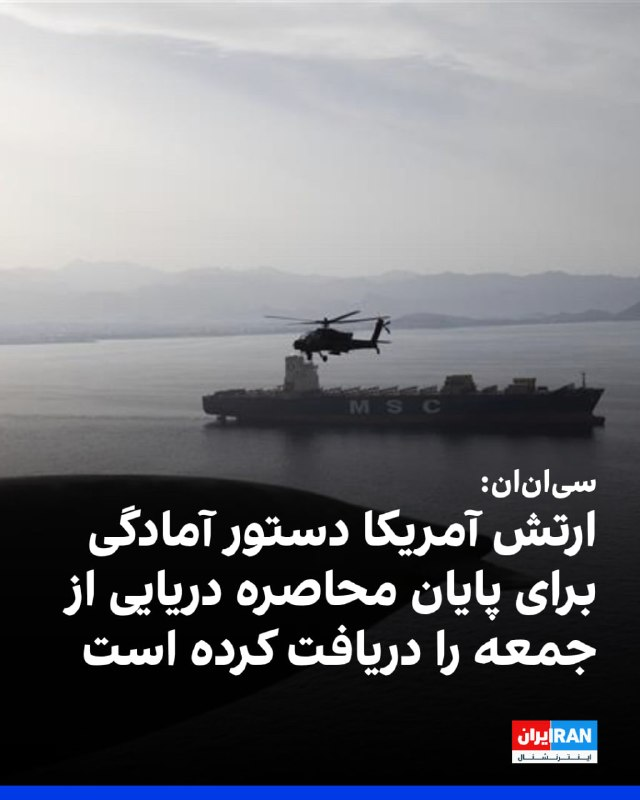

شبکه خبری سی‌ان‌ان گزارش داد ارتش آمریکا دستور آماده‌سازی برای پایان دادن به محاصره دریایی تنگه هرمز از جمعه را دریافت کرده است؛ اقدامی که منوط به امضای توافق میان واشینگتن و جمهوری اسلامی خواهد بود. به گفته یک مقام ایالات متحده، در صورت امضای توافق، نیروهای آمریکایی روند لغو محاصره دریایی را آغاز خواهند کرد. او در عین حال تاکید کرد که این برنامه بر اساس شرایط فعلی تنظیم شده و ممکن است تا پیش از جمعه تغییراتی در آن ایجاد شود. iranintl
‌🏁 🇬🇧 IranintlTV

🤖 @VahidOOnLine

## IranIntlTV — post 342424

  <a href="telegram/content/IranIntlTV_342424_1781500356.mp4" target="_blank">🎬 Download video</a>

گروهی از ایرانیان مقیم آمریکا مقابل هتل «وست‌دریفت» در لس‌آنجلس، محل اقامت اعضای تیم ملی فوتبال ایران، علیه جمهوری اسلامی تجمع کردند.

گزارش علیرضا مدیری، خبرنگار ایران‌اینترنشنال

@iranintltv

## IranIntlTV — post 342423

  

شبکه خبری سی‌ان‌ان گزارش داد ارتش آمریکا دستور آماده‌سازی برای پایان دادن به محاصره دریایی تنگه هرمز از جمعه را دریافت کرده است؛ اقدامی که منوط به امضای توافق میان واشینگتن و جمهوری اسلامی خواهد بود. به گفته یک مقام ایالات متحده، در صورت امضای توافق، نیروهای آمریکایی روند لغو محاصره دریایی را آغاز خواهند کرد. او در عین حال تاکید کرد که این برنامه بر اساس شرایط فعلی تنظیم شده و ممکن است تا پیش از جمعه تغییراتی در آن ایجاد شود. iranintl.com/202606153428

## FarsiVOA — post 220768

🔺چهار کشور اروپایی آماده رفع تحریم‌ها علیه جمهوری اسلامی شدند

▪️بریتانیا، فرانسه، آلمان و ایتالیا اعلام کرده‌اند پس از توافق آمریکا و جمهوری اسلامی برای پایان دادن به جنگ، آماده‌اند در برابر گام‌های جمهوری اسلامی درباره برنامه هسته‌ای، تحریم‌ها را رفع کنند.

▪️به گزارش رویترز، این چهار کشور اروپایی در بیانیه‌ای مشترک تأکید کردند جمهوری اسلامی «هرگز نباید به سلاح هسته‌ای دست یابد» و افزودند آماده‌اند برای این هدف با آمریکا، جمهوری اسلامی و آژانس بین‌المللی انرژی اتمی همکاری کنند.

▪️این موضع در حالی اعلام شده که متن کامل توافق آمریکا و جمهوری اسلامی هنوز منتشر نشده و جزئیات مربوط به تعهدات هسته‌ای، زمان‌بندی اجرای توافق و نحوه رفع تحریم‌ها روشن نیست.

⬇️ بیشتر بخوانید:
https://ir.voanews.com/a/8160998.html

## Persian_Trend_Official — post 17142

  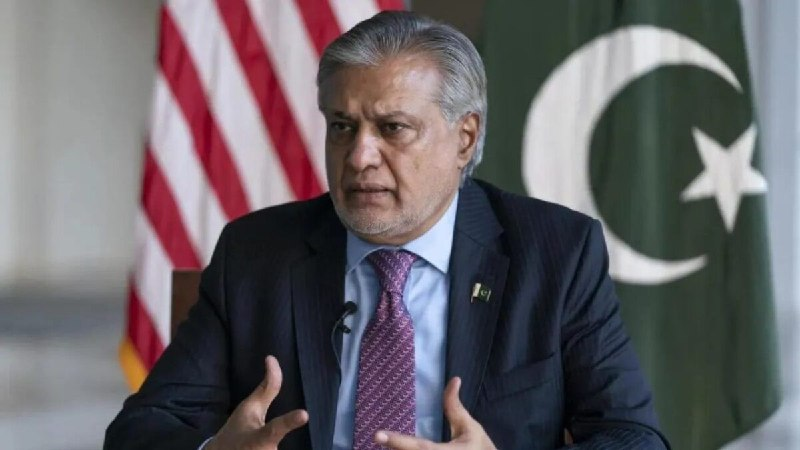

وزیرخارجه پاکستان: از هر تلاشی برای تثبیت توافق ایران و آمریکا حمایت می کنیم!

محمد اسحاق دار معاون نخست وزیر و وزیر امور خارجه پاکستان با استقبال از توافق بین جمهوری اسلامی ایران و ایالات متحده، از ادامه مذاکرات در مورد مسائل معوقه خبر داد و تاکید کرد: اسلام‌آباد از هر تلاشی در راستای تثبیت این تحول حمایت می کند.

این پیشرفت قابل توجه، نشان دهنده قدرت تعامل دیپلماتیک پایدار و عزم جمعی کشورهای دوست برای انتخاب گفتگو به جای رویارویی است.

📝 Amir

📌 @persian_trend_official
پرشین ترند | متفاوت‌ترین کانال نظامی

## Persian_Trend_Official — post 17141

  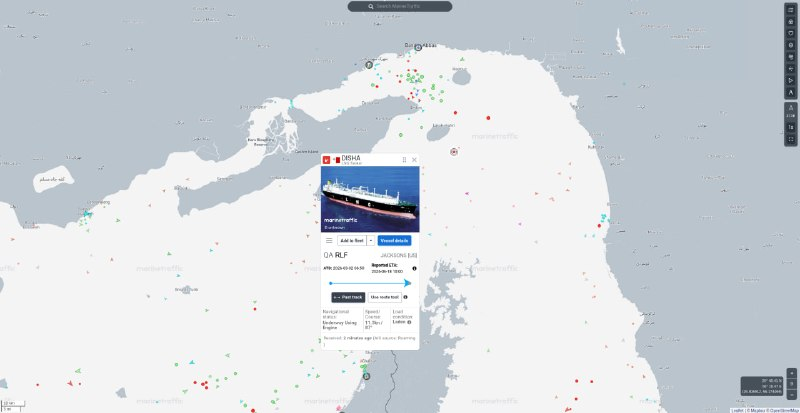

دیشا؛ نخستین شناوری که پس از بازگشایی تنگه هرمز از آن عبور کرد.

نخستین شناوری که پس از اعلام توافق صلح میان ایالات متحده و جمهوری اسلامی از تنگه هرمز عبور کرده، این کشتی که از پرچم مالت استفاده می‌کرده حامل گاز مایع است.

گفته می‌شود که دیشا از مسیر معین شده توسط سپاه پاسداران عبور کرده.

📝 Amir

📌 @persian_trend_official
پرشین ترند | متفاوت‌ترین کانال نظامی

## alonews — post 128107

  <a href="telegram/content/alonews_128107_1781500358.webm" target="_blank">🎬 Download video</a>

👈صدراعظم آلمان: از توافق میان آمریکا و ایران استقبال می‌کنم؛ این توافق یک دستاورد مهم دیپلماتیک است.

🔴این توافق راه را برای اقتصادی جهانی پویا‌تر و خاورمیانه‌ای امن‌تر هموار می‌کند.

🔴اجرای قاطعانه و مصمم آن اهمیت زیادی دارد

✅ @AloNews خبر جنگ

## alonews — post 128106

  <a href="telegram/content/alonews_128106_1781500358.webm" target="_blank">🎬 Download video</a>

👈نیویورک تایمز به نقل از مقام‌های ایرانی گزارش داد که محمدباقر قالیباف و عباس عراقچی برای امضای توافق راهی ژنو خواهند شد.

🔴به گفته این مقامات، ایران عمداً تا پس از نیمه‌شب به وقت محلی صبر کرد تا امضای توافق با سالروز تولد دونالد ترامپ هم‌زمان نشود

✅ @AloNews خبر جنگ

## alonews — post 128105

  <a href="telegram/content/alonews_128105_1781500358.webm" target="_blank">🎬 Download video</a>

👈فاکس نیوز: میانجی‌گران قطری پس از ۱۷ ساعت مذاکرات فشرده، تهران را ترک کردند

🔴 یک دیپلمات به فاکس نیوز گفت: «توافق حاصل شده است و جلسات مقدماتی جداگانه با هر یک از طرفین این هفته در دوحه برگزار خواهد شد، پیش از امضای رسمی در سوئیس و آغاز گفت‌وگوهای فنی.»

✅ @AloNews خبر جنگ

## alonews — post 128104

  <a href="telegram/content/alonews_128104_1781500359.webm" target="_blank">🎬 Download video</a>

👈معاریو : نتانیاهو به ترامپ گفته که اسرائیل نیروهای دفاعی خود را از لبنان خارج نخواهد کرد و خود را ملزم به رعایت این بخش از توافق نمی‌داند.

✅ @AloNews خبر جنگ

---
📅 بروزرسانی: 1405/03/25 08:33
---

## VahidOOnLine — post 245639

  

مارک لوین، مجری محافظه‌کار آمریکایی، با انتقاد از برخی مخالفان حمله به تاسیسات هسته‌ای ایران در شبکه اجتماعی ایکس نوشت افرادی که سال گذشته و امسال با حمله به برنامه هسته‌ای جمهوری اسلامی مخالفت می‌کردند، اکنون از حکومت ایران و حزب‌الله حمایت می‌کنند. او با انتقاد از مواضع اخیر واشینگتن درباره اسرائیل نوشت این کشور در دو ماه گذشته از «متحد و شریک بزرگ آمریکا در جنگ» به کشوری تبدیل شده است که به گفته او، از بنیامین نتانیاهو خواسته می‌شود برای دفاع از خود در برابر حزب‌الله و ایران از آمریکا اجازه بگیرد. لوین با اشاره به حمله اخیر اسرائیل علیه حزب‌الله افزود نتانیاهو با هدف قرار دادن یک فرمانده حزب‌الله، کشته شدن پنج سرباز آمریکایی را تلافی کرد. لوین نوشت اسرائیل رهبران گروهی را هدف قرار داد که به گفته او، در قتل نیروهای آمریکایی نقش داشتند. iranintl
‌🏁 🇬🇧 IranintlTV

🤖 @VahidOOnLine

## IranIntlTV — post 342422

  <a href="telegram/content/IranIntlTV_342422_1781499795.mp4" target="_blank">🎬 Download video</a>

در آستانه بزرگداشت روز «شیر و خورشید» و در پاسخ به فراخوان شاهزاده رضا پهلوی، جمعی از ایرانیان مقیم تورنتو تجمع اعتراضی برگزار کردند.

گزارش مهسا مرتضوی، خبرنگار ایران‌اینترنشنال
@iranintltv

## IranIntlTV — post 342421

  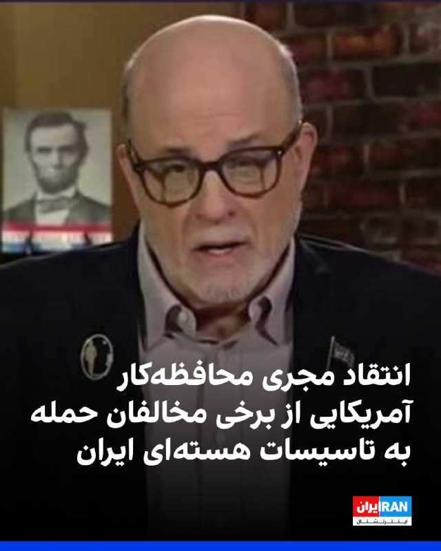

مارک لوین، مجری محافظه‌کار آمریکایی، با انتقاد از برخی مخالفان حمله به تاسیسات هسته‌ای ایران در شبکه اجتماعی ایکس نوشت افرادی که سال گذشته و امسال با حمله به برنامه هسته‌ای جمهوری اسلامی مخالفت می‌کردند، اکنون از حکومت ایران و حزب‌الله حمایت می‌کنند. او با انتقاد از مواضع اخیر واشینگتن درباره اسرائیل نوشت این کشور در دو ماه گذشته از «متحد و شریک بزرگ آمریکا در جنگ» به کشوری تبدیل شده است که به گفته او، از بنیامین نتانیاهو خواسته می‌شود برای دفاع از خود در برابر حزب‌الله و ایران از آمریکا اجازه بگیرد. لوین با اشاره به حمله اخیر اسرائیل علیه حزب‌الله افزود نتانیاهو با هدف قرار دادن یک فرمانده حزب‌الله، کشته شدن پنج سرباز آمریکایی را تلافی کرد. لوین نوشت اسرائیل رهبران گروهی را هدف قرار داد که به گفته او، در قتل نیروهای آمریکایی نقش داشتند. iranintl.com/202606153176

## BBCPersian — post 283845

‌ ‌ ‌
شاهزاده باجرا کیتیابها تایلند پس از به کما رفتن پس از بیش از سه سال کما، درگذشت.

مرگ او پرسش‌هایی را در مورد جانشین او برانگیخته است. هرچند واجیرالونگکورن، پادشاه تایلند هنوز جانشینی تعیین نکرده است اما بسیاری شاهزاده را بهترین گزینه در میان سه جانشین احتمالی تاج‌و‌تخت می‌دیدند.

شاهزاده باجرا کیتیابه پس از گذراندن تحصیلاتش، شامل تحصیل در مدارس بریتانیایی و اخذ مدارک کارشناسی، کارشناسی ارشد و دکترا از دانشگاه‌های تایلند و آمریکا و پس از پذیرفتن سمت دادستان عمومی، به عنوان «شاهزاده‌ وکیل» شهرت پیدا کرد.

https://bbc.in/43ALTri
📷Getty
@BBCPersian

## alonews — post 128103

  <a href="telegram/content/alonews_128103_1781499798.webm" target="_blank">🎬 Download video</a>

👈سی‌ان‌ان: ترامپ از حملات اسرائیل به لبنان به‌شدت خشمگین بود و در تماس تلفنی با نتانیاهو از الفاظ رکیک استفاده کرد.

🔴روزنامه معاریو به نقل از یک منبع آگاه گزارش داد که تماس تلفنی روز یکشنبه میان نتانیاهو و ترامپ با تنش همراه بوده است.

✅ @AloNews خبر جنگ

## alonews — post 128102

  <a href="telegram/content/alonews_128102_1781499798.webm" target="_blank">🎬 Download video</a>

👈نفت فعلا روی محدوده ۸۳ دلار

✅ @AloNews خبر جنگ

## alonews — post 128101

  <a href="telegram/content/alonews_128101_1781499799.webm" target="_blank">🎬 Download video</a>

👈 لیندسی گراهام: از شنیدن توافق با ایران برای باز شدن تنگه هرمز خوشحالم

🔴طبق قانون ما، هرگونه توافق هسته‌ای با ایران برای بررسی و رأی‌گیری به کنگره ارسال خواهد شد

✅ @AloNews خبر جنگ

---
📅 بروزرسانی: 1405/03/25 08:22
---

## VahidOOnLine — post 245638

  

خبرگزاری آسوشیتدپرس در گزارشی نوشت با وجود توافق برای پایان دادن به جنگ ایران و باز شدن تنگه هرمز که یکشنبه اعلام شد، مشکل قیمت بالای نفت و بنزین و مشکلات تأمین انرژی «یک شبه حل نخواهد شد.» این خبرگزاری به نقل از کارشناسان انرژی نوشت: «احتمالاً ماه‌ها طول خواهد کشید تا شرکت‌های انرژی بتوانند عملیات خود را تا حدی که تقاضای جهانی را برآورده کند، از سر بگیرند.» این کارشناسان گفتند که سرعت پایین روند حمل و نقل و پالایش نفت خام و تردیدها در مورد امنیت سفر از طریق تنگه هرمز، به ​​این معنی است که تأثیر آن بلافاصله مشاهده نخواهد شد. آسوشیتدپرس اشاره کرد کشتی‌های حامل نفت خام بیش از سه ماه است که در خلیج فارس سرگردان هستند و قادر به سفر ایمن از طریق تنگه هرمز نیستند، آبراهی که حدود یک پنجم از نفت و بنزین جهان معمولاً قبل از شروع جنگ از آن عبور می‌کردند. iranintl
‌🏁 🇬🇧 IranintlTV

🤖 @VahidOOnLine

## VahidOOnLine — post 245637

  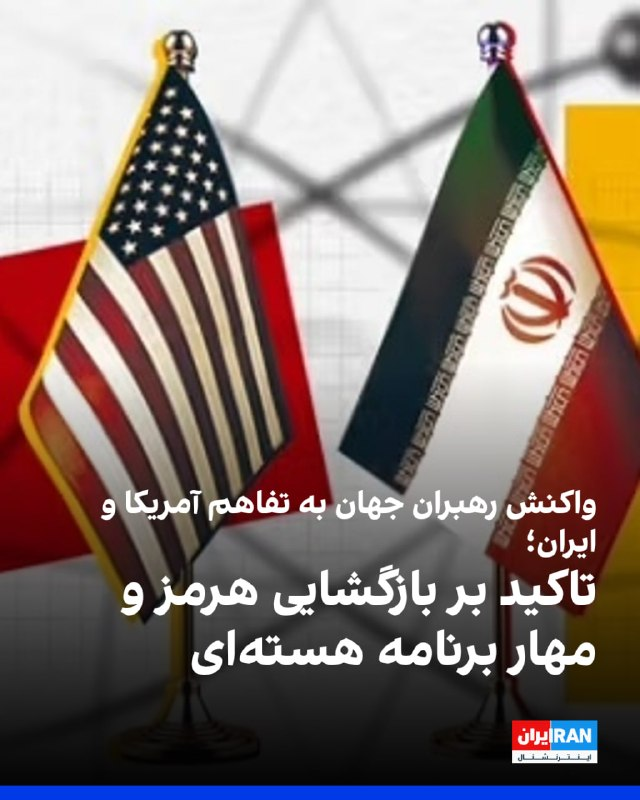

رویترز گزارش داد توافق اولیه میان آمریکا و جمهوری اسلامی با استقبال گسترده جهانی روبه‌رو شده است. سازمان ملل این تفاهم را گامی مهم برای حل مسالمت‌آمیز بحران دانست و رهبران کشورهای اروپایی بر ضرورت جلوگیری از دستیابی جمهوری اسلامی به سلاح هسته‌ای تاکید کردند. بریتانیا، فرانسه، آلمان، ایتالیا و استرالیا از کاهش تنش‌ها و ادامه مسیر دیپلماسی حمایت کردند. بخش مهمی از واکنش‌ها بر بازگشایی تنگه هرمز و تضمین آزادی کشتیرانی متمرکز بود. فرانسه، بریتانیا، ژاپن و دیگر کشورها این موضوع را برای ثبات بازارهای انرژی و اقتصاد جهانی حیاتی توصیف کردند. آلمان توافق را یک دستاورد دیپلماتیک خواند و ژاپن خواستار تضمین عملی امنیت کشتیرانی شد. نیوزیلند نیز توافق را گامی سازنده برای کاهش تنش‌ها دانست. رویترز نتیجه گرفت که اجماع جهانی پیرامون دو محور شکل گرفته است: بازگشایی امن تنگه هرمز و ادامه مذاکرات برای جلوگیری از دستیابی جمهوری اسلامی به سلاح هسته‌ای. با این حال، اجرای کامل توافق و مذاکرات بعدی همچنان با چالش‌هایی روبه‌رو است. متن کامل را اینجا بخوانید iranintl
‌🏁 🇬🇧 IranintlTV

🤖 @VahidOOnLine

## IranIntlTV — post 342420

  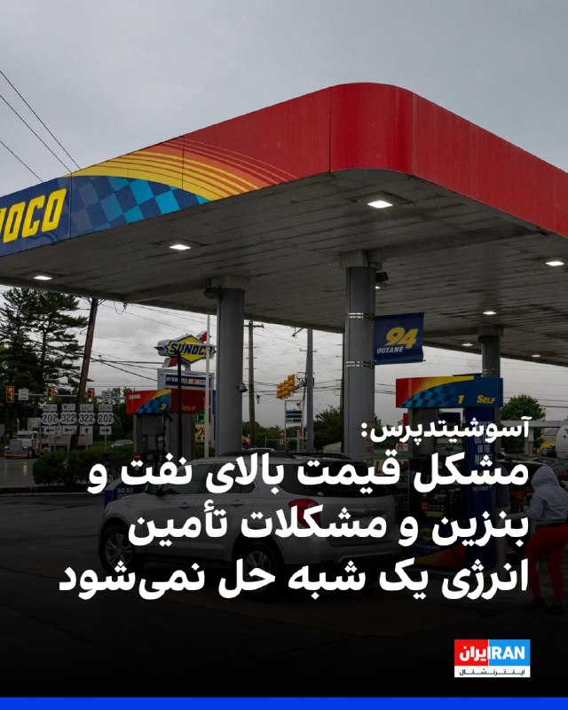

خبرگزاری آسوشیتدپرس در گزارشی نوشت با وجود توافق برای پایان دادن به جنگ ایران و باز شدن تنگه هرمز که یکشنبه اعلام شد، مشکل قیمت بالای نفت و بنزین و مشکلات تأمین انرژی «یک شبه حل نخواهد شد.» این خبرگزاری به نقل از کارشناسان انرژی نوشت: «احتمالاً ماه‌ها طول خواهد کشید تا شرکت‌های انرژی بتوانند عملیات خود را تا حدی که تقاضای جهانی را برآورده کند، از سر بگیرند.» این کارشناسان گفتند که سرعت پایین روند حمل و نقل و پالایش نفت خام و تردیدها در مورد امنیت سفر از طریق تنگه هرمز، به ​​این معنی است که تأثیر آن بلافاصله مشاهده نخواهد شد. آسوشیتدپرس اشاره کرد کشتی‌های حامل نفت خام بیش از سه ماه است که در خلیج فارس سرگردان هستند و قادر به سفر ایمن از طریق تنگه هرمز نیستند، آبراهی که حدود یک پنجم از نفت و بنزین جهان معمولاً قبل از شروع جنگ از آن عبور می‌کردند. iranintl.com/202606152570

## IranIntlTV — post 342419

  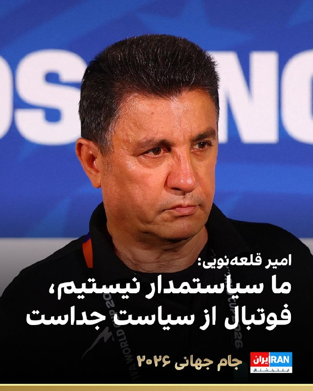

🔻امیر قلعه‌نویی، سرمربی تیم ملی فوتبال، در نشست خبری پیش از بازی با نیوزیلند گفت: «ما اینجا هستیم که به نمایندگی ملت بزرگ ایران بازی کنیم. فقط به فوتبال فکر می‌کنیم. ما سیاستمدار نیستیم و فوتبال از سیاست جداست ولی همه ملت بزرگ ایران برای ما قابل احترام هستند.»

🔹قلعه‌نویی درباره مشکلات ورود به آمریکا هم گفت: «به‌خاطر مشکلات سفر به آمریکا کمپ ما دو بار جا به جا شد اما جا دارد از مردم و دولت مکزیک تشکر کنیم. ما ایرانیان از سختی‌ها فرصت می‌سازیم. به غیر از شادی مردم کشورمان به چیز دیگری فکر نمی‌کنیم.»

🔹مهدی طارمی، کاپیتان تیم ملی فوتبال نیز در این نشست گفت: «ما برای همه مردم ایران چه کسانی که داخل هستند و چه کسانی خارج حضور دارند بازی می‌کنیم و فوتبال می‌تواند همه را متحد کند. دنبال شاد کردن همه مردم ایران هستیم. با فوتبال کشور متمدن ایران را متحدتر می‌کنیم.»

@iranintltvsport

## IranIntlTV — post 342418

  

رویترز گزارش داد توافق اولیه میان آمریکا و جمهوری اسلامی با استقبال گسترده جهانی روبه‌رو شده است. سازمان ملل این تفاهم را گامی مهم برای حل مسالمت‌آمیز بحران دانست و رهبران کشورهای اروپایی بر ضرورت جلوگیری از دستیابی جمهوری اسلامی به سلاح هسته‌ای تاکید کردند. بریتانیا، فرانسه، آلمان، ایتالیا و استرالیا از کاهش تنش‌ها و ادامه مسیر دیپلماسی حمایت کردند. بخش مهمی از واکنش‌ها بر بازگشایی تنگه هرمز و تضمین آزادی کشتیرانی متمرکز بود. فرانسه، بریتانیا، ژاپن و دیگر کشورها این موضوع را برای ثبات بازارهای انرژی و اقتصاد جهانی حیاتی توصیف کردند. آلمان توافق را یک دستاورد دیپلماتیک خواند و ژاپن خواستار تضمین عملی امنیت کشتیرانی شد. نیوزیلند نیز توافق را گامی سازنده برای کاهش تنش‌ها دانست. رویترز نتیجه گرفت که اجماع جهانی پیرامون دو محور شکل گرفته است: بازگشایی امن تنگه هرمز و ادامه مذاکرات برای جلوگیری از دستیابی جمهوری اسلامی به سلاح هسته‌ای. با این حال، اجرای کامل توافق و مذاکرات بعدی همچنان با چالش‌هایی روبه‌رو است. متن کامل را اینجا بخوانید iranintl.com/202606151456

## RadioFarda — post 158312

  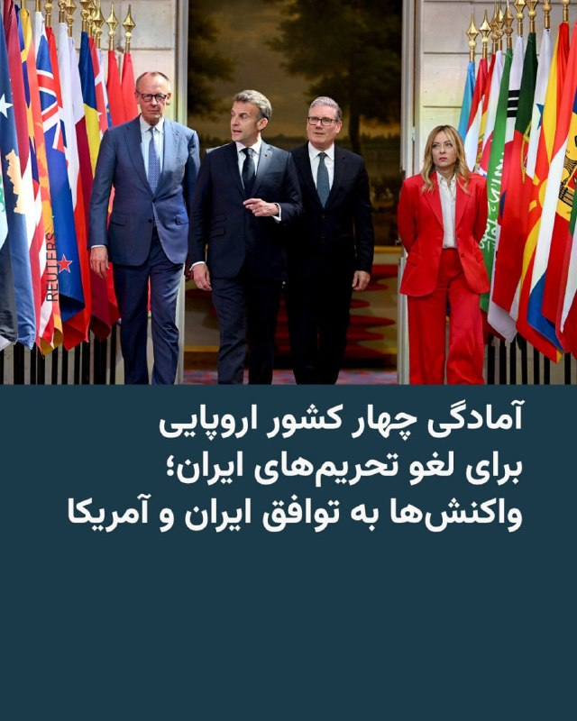

🔸اعلام توافق میان ایران و آمریکا برای توقف درگیری‌ها، بازگشایی تنگه هرمز و آغاز روند مذاکرات برای دستیابی به یک توافق نهایی، با استقبال شماری از رهبران جهان روبه‌رو شده است.

🔸در مهم‌ترین واکنش اروپایی، بریتانیا، فرانسه، آلمان و ایتالیا اعلام کردند در صورتی که ایران تعهدات مرتبط با برنامه هسته‌ای خود را اجرا کند، آماده‌اند تحریم‌ها علیه جمهوری اسلامی را لغو کنند.

🔸رهبران این چهار کشور در بیانیه‌ای مشترک تأکید کردند که ایران نباید به سلاح هسته‌ای دست یابد و افزودند آماده همکاری با آمریکا، ایران و آژانس بین‌المللی انرژی اتمی برای تحقق این هدف هستند.

🔸همزمان، آنتونیو گوترش، دبیرکل سازمان ملل متحد، توافق تازه را «گامی حیاتی» برای حل‌وفصل دیپلماتیک جنگ توصیف کرد. او ابراز امیدواری کرد که طرف‌ها از این فرصت برای دستیابی به راه‌حلی پایدار استفاده کنند و تلاش‌های خود را برای پایان دادن کامل به مناقشه افزایش دهند.

@RadioFarda

---
📅 بروزرسانی: 1405/03/25 08:12
---

## VahidOOnLine — post 245636

  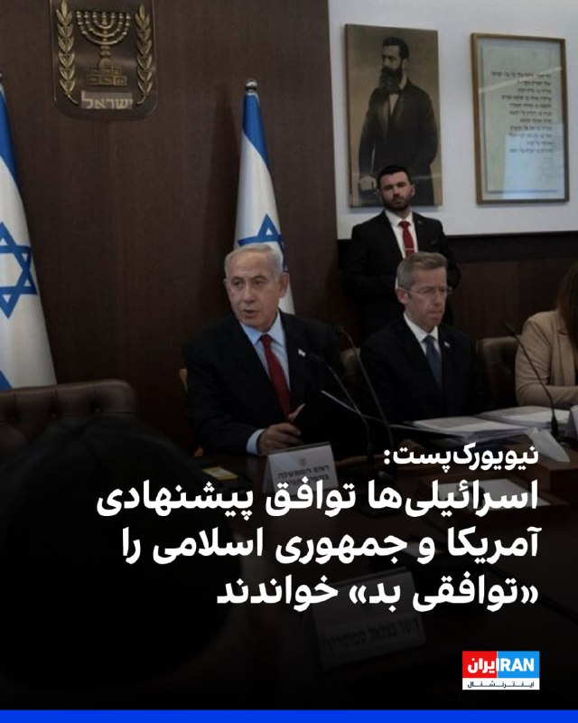

نیویورک‌پست گزارش داد که توافق اولیه میان آمریکا و جمهوری اسلامی با انتقاد گسترده در اسرائیل روبه‌رو شده است؛ منتقدان می‌گویند این توافق به اهداف اصلی جنگ، از جمله مهار برنامه هسته‌ای و موشکی ایران و پایان حمایت تهران از گروه‌های هم‌پیمان منطقه‌ای، نمی‌پردازد. آویگدور لیبرمن، وزیر دفاع پیشین اسرائیل، این توافق را «فاجعه» خوانده است. به نوشته این روزنامه، توافق شامل تمدید ۶۰ روزه آتش‌بس، بازگشایی تنگه هرمز و آغاز مذاکرات هسته‌ای است، اما ابهام‌هایی درباره سرنوشت ذخایر اورانیوم غنی‌شده و محدودیت‌های برنامه هسته‌ای ایران وجود دارد. منتقدان همچنین نگران‌اند که آزادسازی منابع مالی به جمهوری اسلامی امکان بازیابی توان خود را بدهد. این گزارش به اختلاف‌های اخیر میان دونالد ترامپ و بنیامین نتانیاهو نیز اشاره کرده و نوشته است نگرانی اصلی منتقدان اسرائیلی آن است که توافق بدون حل مسائل راهبردی، تهدیدهای امنیتی علیه اسرائیل را در آینده حفظ کند. متن کامل را اینجا بخوانید iranintl
‌🏁 🇬🇧 IranintlTV

🤖 @VahidOOnLine

## VahidOOnLine — post 245635

  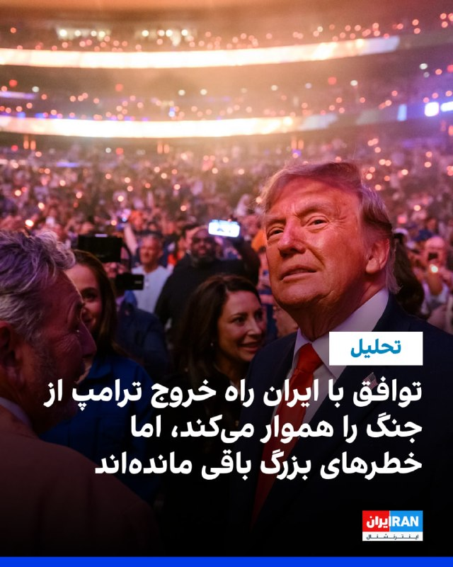

رویترز در تحلیلی نوشت توافق اولیه میان آمریکا و جمهوری اسلامی می‌تواند راهی برای خروج ترامپ از جنگی پرهزینه و کاهش تنش در بازارهای انرژی فراهم کند، اما همچنان با ابهام‌های مهمی روبه‌رو است. به نوشته رویترز، بازگشایی تنگه هرمز و پایان محاصره دریایی ایران از دستاوردهای اصلی توافق به شمار می‌رود، اما مذاکرات درباره برنامه هسته‌ای ایران به یک دوره ۶۰ روزه بعدی موکول شده است. رویترز اشاره کرد که ترامپ تحت فشار فزاینده برای پایان دادن به جنگ قرار داشت، اما بسیاری از اهداف اولیه آمریکا، از جمله تغییر حکومت، محدودسازی برنامه موشکی ایران و پایان حمایت تهران از گروه‌های هم‌پیمان منطقه‌ای، محقق نشده‌اند. این گزارش همچنین به اختلاف روایت‌های تهران و واشینگتن درباره مفاد توافق و ابهام در سرنوشت ذخایر اورانیوم غنی‌شده اشاره کرد. به نوشته رویترز، جمهوری اسلامی با وجود خسارت‌های سنگین نظامی همچنان اهرم فشار خود بر تنگه هرمز را حفظ کرده است. این خبرگزاری نتیجه گرفت که توافق ممکن است راه خروج ترامپ از جنگ را فراهم کرده باشد، اما بسیاری از خطرهای راهبردی و چالش‌های منطقه‌ای همچنان پابرجا مانده‌اند.
‌🏁 🇬🇧 IranintlTV

🤖 @VahidOOnLine

## IranIntlTV — post 342417

  

نیویورک‌پست گزارش داد که توافق اولیه میان آمریکا و جمهوری اسلامی با انتقاد گسترده در اسرائیل روبه‌رو شده است؛ منتقدان می‌گویند این توافق به اهداف اصلی جنگ، از جمله مهار برنامه هسته‌ای و موشکی ایران و پایان حمایت تهران از گروه‌های هم‌پیمان منطقه‌ای، نمی‌پردازد. آویگدور لیبرمن، وزیر دفاع پیشین اسرائیل، این توافق را «فاجعه» خوانده است. به نوشته این روزنامه، توافق شامل تمدید ۶۰ روزه آتش‌بس، بازگشایی تنگه هرمز و آغاز مذاکرات هسته‌ای است، اما ابهام‌هایی درباره سرنوشت ذخایر اورانیوم غنی‌شده و محدودیت‌های برنامه هسته‌ای ایران وجود دارد. منتقدان همچنین نگران‌اند که آزادسازی منابع مالی به جمهوری اسلامی امکان بازیابی توان خود را بدهد. این گزارش به اختلاف‌های اخیر میان دونالد ترامپ و بنیامین نتانیاهو نیز اشاره کرده و نوشته است نگرانی اصلی منتقدان اسرائیلی آن است که توافق بدون حل مسائل راهبردی، تهدیدهای امنیتی علیه اسرائیل را در آینده حفظ کند. متن کامل را اینجا بخوانید iranintl.com/202606151681

## IranIntlTV — post 342416

  

رویترز در تحلیلی نوشت توافق اولیه میان آمریکا و جمهوری اسلامی می‌تواند راهی برای خروج ترامپ از جنگی پرهزینه و کاهش تنش در بازارهای انرژی فراهم کند، اما همچنان با ابهام‌های مهمی روبه‌رو است. به نوشته رویترز، بازگشایی تنگه هرمز و پایان محاصره دریایی ایران از دستاوردهای اصلی توافق به شمار می‌رود، اما مذاکرات درباره برنامه هسته‌ای ایران به یک دوره ۶۰ روزه بعدی موکول شده است. رویترز اشاره کرد که ترامپ تحت فشار فزاینده برای پایان دادن به جنگ قرار داشت، اما بسیاری از اهداف اولیه آمریکا، از جمله تغییر حکومت، محدودسازی برنامه موشکی ایران و پایان حمایت تهران از گروه‌های هم‌پیمان منطقه‌ای، محقق نشده‌اند. این گزارش همچنین به اختلاف روایت‌های تهران و واشینگتن درباره مفاد توافق و ابهام در سرنوشت ذخایر اورانیوم غنی‌شده اشاره کرد. به نوشته رویترز، جمهوری اسلامی با وجود خسارت‌های سنگین نظامی همچنان اهرم فشار خود بر تنگه هرمز را حفظ کرده است. این خبرگزاری نتیجه گرفت که توافق ممکن است راه خروج ترامپ از جنگ را فراهم کرده باشد، اما بسیاری از خطرهای راهبردی و چالش‌های منطقه‌ای همچنان پابرجا مانده‌اند.

## FarsiVOA — post 220767

  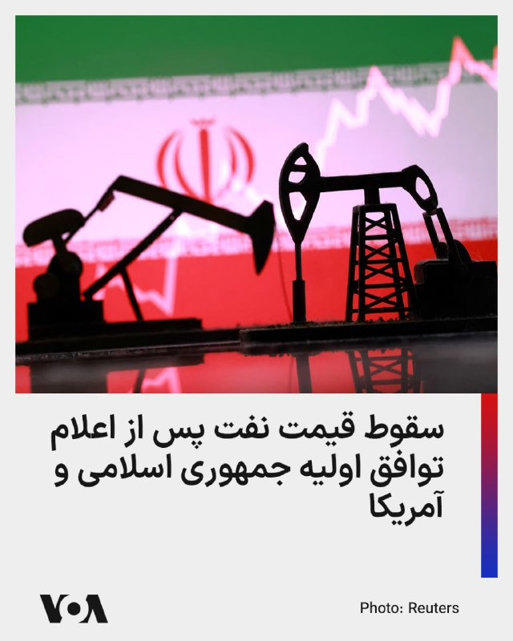

قیمت نفت در معاملات آسیایی روز دوشنبه، ۲۵ خرداد، پس از اعلام توافق اولیه میان جمهوری اسلامی و آمریکا برای پایان جنگ و ازسرگیری رفت‌وآمد در تنگه هرمز کاهش یافت.

بر اساس داده‌های بازار، تا ساعاتِ نخستِ معاملاتِ آسیایی، بهای نفت برنت حدود ۴ درصد افت کرد و به ۸۳.۸۸ دلار در هر بشکه رسید؛ پایین‌ترین سطح از اوایل مارس. نفت خامِ آمریکا نیز ۴.۶ درصد پایین آمد و به ۸۰.۹۶ دلار رسید.

کاهش قیمت نفت پس از آن رخ داد که دونالد ترامپ و مقام‌های جمهوری اسلامی از دستیابی به توافق اولیه سخن گفتند. بر اساس گزارش‌ها، این توافق قرار است مسیر بازگشایی تنگه هرمز و کاهش تنش در بازار انرژی را فراهم کند.

تحلیلگران می‌گویند بازار در حال حذف بخشی از «حق بیمه ریسک ژئوپلیتیک» از قیمت نفت است، اما ابهام درباره زمان اجرای توافق، پاکسازی مسیرهای کشتیرانی و مذاکرات ۶۰ روزه بعدی همچنان مانع افت شدیدتر قیمت‌هاست.
@FarsiVOA

## RadioFarda — post 158311

  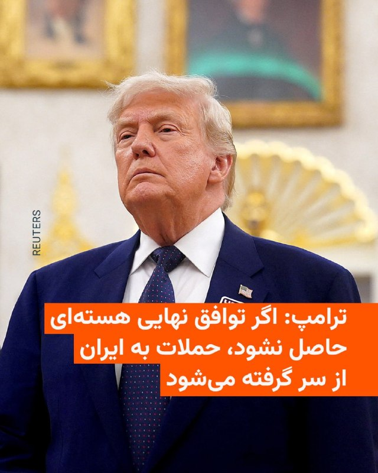

🔸دونالد ترامپ، رئیس‌جمهور آمریکا، روز یک‌شنبه ۲۴ خرداد در گفت‌وگو با روزنامه نیویورک تایمز گفت اگر ایران نتواند به یک توافق نهایی هسته‌ای با ایالات متحده دست یابد، او حملات نظامی علیه تهران را از سر خواهد گرفت یا در مقابل دریافت ۲۰ درصد از درآمدهای منطقه، آمریکا را به «نگهبان خاورمیانه» تبدیل خواهد کرد.

🔸ترامپ در این مصاحبه همچنین گفت توافقی که با ایران به دست آورده، در نهایت تضمین خواهد کرد که عبور و مرور از تنگه هرمز «برای همیشه بدون عوارض» باشد.

🔸رئیس‌جمهور آمریکا همچنین گفت که با وجود مخالفت‌های بنیامین نتانیاهو، نخست‌وزیر اسرائیل، او اسرائیل را از «نابودی هسته‌ای» نجات داده است.

🔸ایران پس از اعلام توافق با آمریکا برای توقف فوری جنگ، اعلام کرد که در دو ماه آینده گفت‌وگوهایی را با واشینگتن با هدف دستیابی به یک «توافق نهایی» برای حل‌وفصل این مناقشه برگزار خواهد کرد.

@RadioFarda

---
📅 بروزرسانی: 1405/03/25 08:02
---

## IranIntlTV — post 342415

  <a href="telegram/content/IranIntlTV_342415_1781497971.mp4" target="_blank">🎬 Download video</a>

جاویدنامان انقلاب ملی ایرانیان
«نازنین اسمی‌خانی» ۱۹ دی‌ماه در قزوین، بر اثر شلیک مستقیم تیر جنگی نیروی سرکوب جمهوری اسلامی به سرش کشته شد. نامش در حافظه‌ی این سرزمین می‌ماند و یادش چراغ راه آزادی‌خواهان است.

@iranintltv

## IranIntlTV — post 342414

  <a href="telegram/content/IranIntlTV_342414_1781497974.mp4" target="_blank">🎬 Download video</a>

سرخط خبرهای دوشنبه ۲۵ خرداد

@iranintltv

---
📅 بروزرسانی: 1405/03/25 07:52
---

## VahidOOnLine — post 245634

  

مارک دوبوویتز، مدیر بنیاد دفاع از دموکراسی‌ها، در واکنش به توافق میان آمریکا و جمهوری اسلامی نوشت مخالفان جنگ از همین روز نخست، دارند این توافق را شکست‌خورده اعلام می‌کنند و حامیان توافق هم پیش از انتشار جزئیات آن، از پیروزی‌اش سخن می‌گویند. او اشاره کرد می‌توان دستاوردهای نظامی قابل توجه در این جنگ را به رسمیت شناخت، اما قضاوت درباره نتیجه نهایی را تا زمان انتشار مفاد توافق و روشن شدن تحولات در ۳۰ روز آینده به تاخیر انداخت. iranintl
‌🏁 🇬🇧 IranintlTV

🤖 @VahidOOnLine

## VahidOOnLine — post 245633

  

آنتونی آلبانیزی، نخست‌وزیر استرالیا، و پنی وانگ، وزیر خارجه این کشور، در بیانیه‌ای مشترک از توافق میان آمریکا و جمهوری اسلامی استقبال کردند و آن را گامی مهم در مسیر کاهش تنش و پایان درگیری‌ها، از جمله در لبنان، دانستند. آن‌ها تاکید کردند خویشتن‌داری و تعامل سازنده برای جلوگیری از تشدید تنش‌ها و دستیابی به توافقی پایدار ضروری است. مقام‌های استرالیا از گنجانده شدن بازگشایی تنگه هرمز و احیای آزادی کشتیرانی در توافق استقبال کردند و گفتند بازگشایی این آبراه راهبردی برای کاهش فشار بر قیمت انرژی و اقتصاد جهانی، از جمله اقتصادهای منطقه آسیا-اقیانوسیه، اهمیت زیادی دارد. آن‌ها همچنین تاکید کردند دولت استرالیا به تلاش برای حفاظت از شهروندان خود در برابر پیامدهای این بحران ادامه خواهد داد. در این بیانیه از همه طرف‌ها خواسته شده از فرصت ایجادشده برای پیشبرد صلحی پایدار از طریق گفت‌وگو و دیپلماسی استفاده کنند. آلبانیزی و وانگ همچنین تاکید کردند جمهوری اسلامی باید به نگرانی‌های دیرینه درباره برنامه هسته‌ای خود و پیامدهای آن برای امنیت بین‌المللی پاسخ دهد. iranintl
‌🏁 🇬🇧 IranintlTV

🤖 @VahidOOnLine

## IranIntlTV — post 342413

  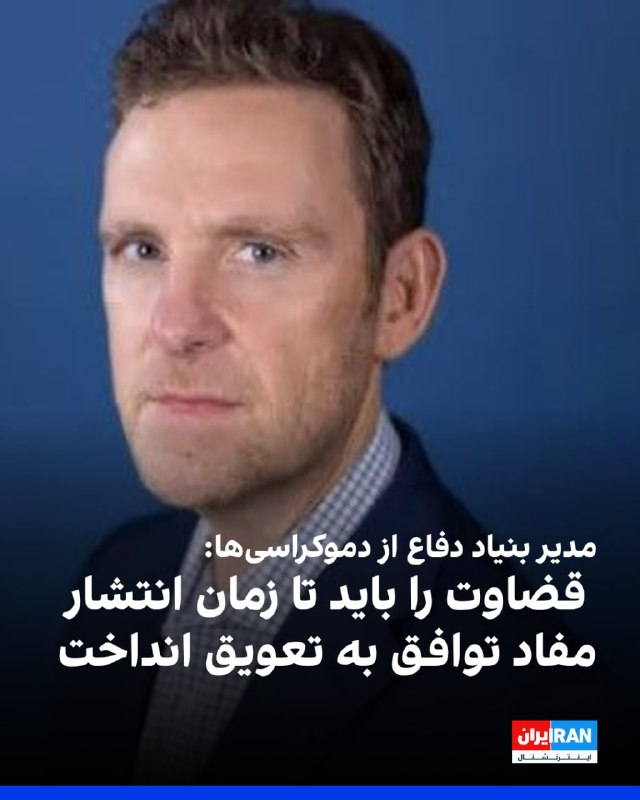

مارک دوبوویتز، مدیر بنیاد دفاع از دموکراسی‌ها، در واکنش به توافق میان آمریکا و جمهوری اسلامی نوشت مخالفان جنگ از همین روز نخست، دارند این توافق را شکست‌خورده اعلام می‌کنند و حامیان توافق هم پیش از انتشار جزئیات آن، از پیروزی‌اش سخن می‌گویند. او اشاره کرد می‌توان دستاوردهای نظامی قابل توجه در این جنگ را به رسمیت شناخت، اما قضاوت درباره نتیجه نهایی را تا زمان انتشار مفاد توافق و روشن شدن تحولات در ۳۰ روز آینده به تاخیر انداخت. iranintl.com/202606155824

## IranIntlTV — post 342412

  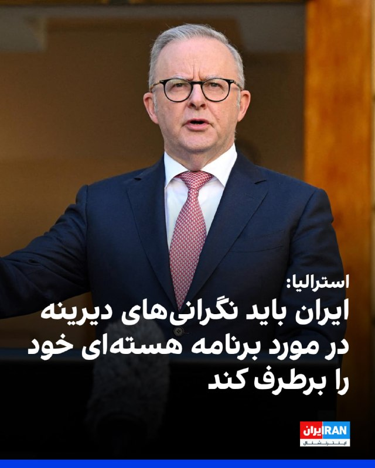

آنتونی آلبانیزی، نخست‌وزیر استرالیا، و پنی وانگ، وزیر خارجه این کشور، در بیانیه‌ای مشترک از توافق میان آمریکا و جمهوری اسلامی استقبال کردند و آن را گامی مهم در مسیر کاهش تنش و پایان درگیری‌ها، از جمله در لبنان، دانستند. آن‌ها تاکید کردند خویشتن‌داری و تعامل سازنده برای جلوگیری از تشدید تنش‌ها و دستیابی به توافقی پایدار ضروری است. مقام‌های استرالیا از گنجانده شدن بازگشایی تنگه هرمز و احیای آزادی کشتیرانی در توافق استقبال کردند و گفتند بازگشایی این آبراه راهبردی برای کاهش فشار بر قیمت انرژی و اقتصاد جهانی، از جمله اقتصادهای منطقه آسیا-اقیانوسیه، اهمیت زیادی دارد. آن‌ها همچنین تاکید کردند دولت استرالیا به تلاش برای حفاظت از شهروندان خود در برابر پیامدهای این بحران ادامه خواهد داد. در این بیانیه از همه طرف‌ها خواسته شده از فرصت ایجادشده برای پیشبرد صلحی پایدار از طریق گفت‌وگو و دیپلماسی استفاده کنند. آلبانیزی و وانگ همچنین تاکید کردند جمهوری اسلامی باید به نگرانی‌های دیرینه درباره برنامه هسته‌ای خود و پیامدهای آن برای امنیت بین‌المللی پاسخ دهد. iranintl.com/202606157678

## RadioFarda — post 158310

  <a href="https://t.me/radiofarda/158310" target="_blank">📎 Download file</a>

📻بشنوید: سرخط خبرها با رادیوفردا، ۲۵ خرداد ۱۴۰۵‌

@RadioFarda

---
📅 بروزرسانی: 1405/03/25 07:42
---

## VahidOOnLine — post 245632

  

رو خانا، عضو دموکرات مجلس نمایندگان آمریکا، در شبکه اجتماعی ایکس نوشت: «توافق آتش‌بس با ایران و بازگشایی تنگه هرمز خبر خوبی است» و خواستار آن شد که دموکرات‌ها در ایالات متحده از آن حمایت کنند. او اشاره کرد که جنگ، درس پرهزینه‌ای برای ایالات متحده بود، و افزود: «همان‌طور که انتظار می‌رفت، ترامپ نتوانست تغییر رژیم را محقق کند.» رو خانا اضافه کرد: «به نظر نمی‌رسد شرایط بهتر از چیزی باشد که اوباما تقریباً یک دهه پیش تحت برجام به آن دست یافت.» او اشاره کرد: «می‌توانیم آسوده خاطر باشیم که هزینه‌های بنزین و غذا برای آمریکایی‌ها شروع به کاهش خواهد کرد و دیگر هیچ آمریکایی یا غیرنظامی جان خود را از دست نخواهد داد.» iranintl
‌🏁 🇬🇧 IranintlTV

🤖 @VahidOOnLine

## IranIntlTV — post 342411

  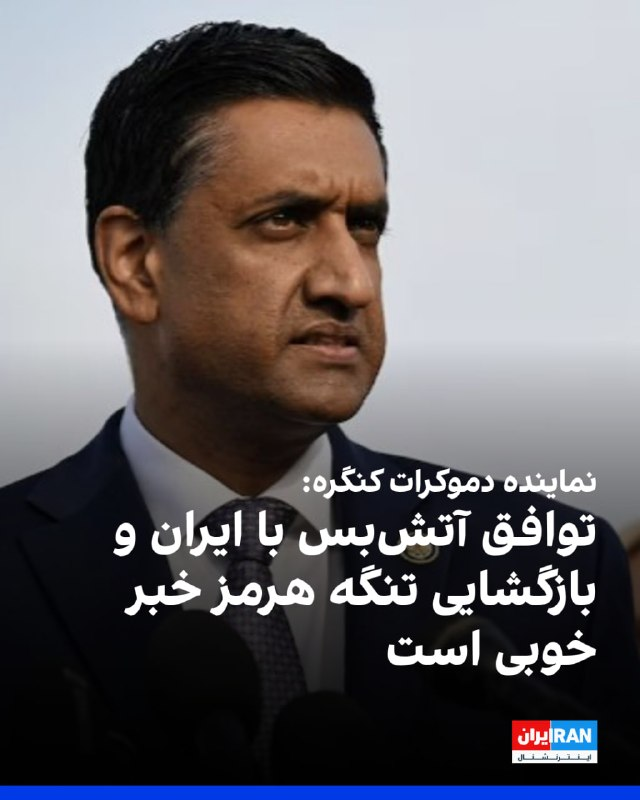

رو خانا، عضو دموکرات مجلس نمایندگان آمریکا، در شبکه اجتماعی ایکس نوشت: «توافق آتش‌بس با ایران و بازگشایی تنگه هرمز خبر خوبی است» و خواستار آن شد که دموکرات‌ها در ایالات متحده از آن حمایت کنند. او اشاره کرد که جنگ، درس پرهزینه‌ای برای ایالات متحده بود، و افزود: «همان‌طور که انتظار می‌رفت، ترامپ نتوانست تغییر رژیم را محقق کند.» رو خانا اضافه کرد: «به نظر نمی‌رسد شرایط بهتر از چیزی باشد که اوباما تقریباً یک دهه پیش تحت برجام به آن دست یافت.» او اشاره کرد: «می‌توانیم آسوده خاطر باشیم که هزینه‌های بنزین و غذا برای آمریکایی‌ها شروع به کاهش خواهد کرد و دیگر هیچ آمریکایی یا غیرنظامی جان خود را از دست نخواهد داد.» iranintl.com/202606155602

## BBCPersian — post 283844

  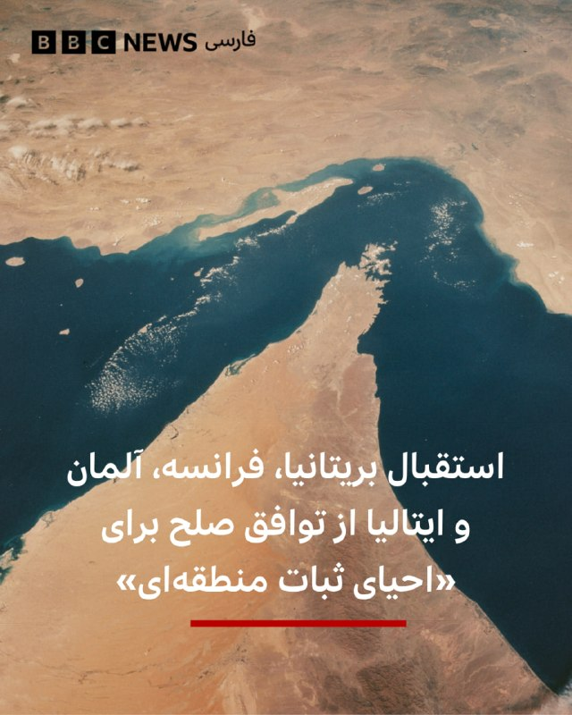

‌ ‌ ‌
سران بریتانیا، فرانسه، آلمان و ایتالیا در بیانیه مشترکی درباره تفاهم میان ایران و آمریکا گفته‌اند «فرصت را غنیمت می‌دانند» و از نزدیک با آمریکا، ایران و شرکای منطقه‌ای همکاری خواهند کرد.

گروه « ای۴» در بیانیه خود آورده است: «به آمریکا، دولت ایران و همه کسانی که دراین کار دخیل بودند از جمله پاکستان، قطر و دیگر میانجیگران برای این دستاورد مهم دیپلماتیک تبریک می‌گوییم.»

در ادامه این بیانیه آمده است: «اکنون فرصتی برای احیای ثبات منطقه‌ای و با ثبات کردن اقتصاد جهانی فراهم شده است.»

این رهبران اروپایی خواهان آن شده‌اند که «تفاهم‌نامه ایران و آمریکا هر چه سریع‌تر و به شکل جامع، اجرایی شود.»

آنها همچنین گفته‌اند که «بازگشایی فوری تنگه هرمز با آزادی بدون قید و شرط و نامحدود کشتیرانی ضروی است.»

گروه « ای۴» تاکید کرده که ایران هرگز نباید سلاح هسته‌ای داشته باشد و گفته‌اند که «آمادگی دارند در ازای قدم‌های مشخص و قابل تایید ایران در مورد برنامه هسته‌ای خود، تحریم‌های مربوطه را لغو کنند.»

@BBCPersian
📷Space Frontiers/Archive Photos/Hulton Archive/Getty Images

---
📅 بروزرسانی: 1405/03/25 07:32
---

## VahidOOnLine — post 245631

  <a href="telegram/content/VahidOOnLine_245631_1781496165.mp4" target="_blank">🎬 Download video</a>

♦️همزمان با اعلام توافق میان واشنگتن و تهران، بخشی از سخنرانی روز ۲۸ بهمن‌ماه ۱۴۰۴ علی خامنه‌ای در شبکه‌های اجتماعی مورد توجه قرار گرفته است. رهبر سابق جمهوری اسلامی در این سخنرانی، ۱۱ روز پیش از کشته‌شدن در حمله آمریکا، گفت:‌ «امام حسین گفت کسی مثل من با کسی مثل یزید بیعت نمی‌کند. ما با سردمدارانی مثل افراد فاسدی که امروز بر سر کارند در آمریکا بیعت نخواهیم کرد». او پیش از این نیز گفته بود بود نه جنگ اتفاق خواهد افتاد و نه جمهوری اسلامی با آمریکا مذاکره خواهد کرد. دونالد ترامپ، رئیس جمهوری ایالات متحده یکشنبه، ۲۴ خردادماه، همزمان با روز تولدش اعلام کرد: «توافق با جمهوری اسلامی ایران اکنون کامل شده است».
‌🇸🇦 Indypersian

🤖 @VahidOOnLine

---
📅 بروزرسانی: 1405/03/25 07:22
---

هیچ پیام جدیدی در این بروزرسانی ارسال نشد.

---
📅 بروزرسانی: 1405/03/25 07:12
---

## VahidOOnLine — post 245630

  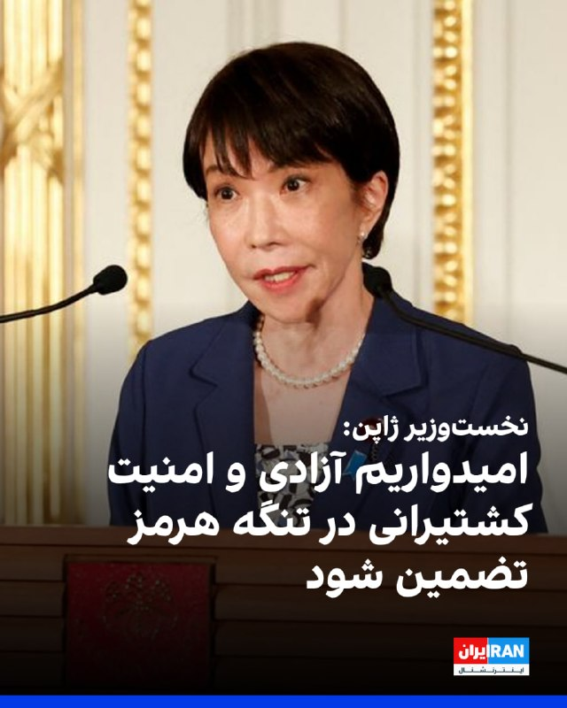

سانائه تاکایچی، نخست‌وزیر ژاپن، در شبکه اجتماعی ایکس از توافق میان آمریکا و جمهوری اسلامی برای پایان دادن به درگیری‌ها استقبال و ابراز امیدواری کرد که مفاد این توافق، از جمله بازگشایی تنگه هرمز برای کشتی‌های بین‌المللی، به‌طور کامل اجرا شود. او نوشت ژاپن «به‌شدت امیدوار است» آزادی و امنیت کشتیرانی در تنگه هرمز در عمل تضمین شود و توافق نهایی درباره برنامه هسته‌ای ایران و سایر مسائل نیز هرچه سریع‌تر حاصل شود. iranintl
‌🏁 🇬🇧 IranintlTV

🤖 @VahidOOnLine

## IranIntlTV — post 342410

  

سانائه تاکایچی، نخست‌وزیر ژاپن، در شبکه اجتماعی ایکس از توافق میان آمریکا و جمهوری اسلامی برای پایان دادن به درگیری‌ها استقبال و ابراز امیدواری کرد که مفاد این توافق، از جمله بازگشایی تنگه هرمز برای کشتی‌های بین‌المللی، به‌طور کامل اجرا شود. او نوشت ژاپن «به‌شدت امیدوار است» آزادی و امنیت کشتیرانی در تنگه هرمز در عمل تضمین شود و توافق نهایی درباره برنامه هسته‌ای ایران و سایر مسائل نیز هرچه سریع‌تر حاصل شود. iranintl.com/202606156453

## BBCPersian — post 283843

🔻 ترامپ به نیویورک تایمز: تنگه هرمز «برای همیشه رایگان» خواهد بود

رئیس جمهور آمریکا عصر یکشنبه در مصاحبه‌ای با نیویورک تایمز گفت توافق با ایران تضمین می‌کند که تنگه هرمز «برای همیشه بدون عوارض» باشد.

در این تماس تلفنی ۲۸ دقیقه‌ای، دونالد ترامپ همچنین گفته است که اگر ایران به توافق هسته‌ای نهایی با آمریکا نرسد، حملات نظامی را از سر خواهد گرفت یا در ازای دریافت یک پنجم درآمد منطقه، ایالات متحده را «نگهبان خاورمیانه» خواهد کرد.

آقای ترامپ همچنین سخنان قبلی خود را مبنی بر اینکه تصمیم به حمله به ایران در ماه فوریه و محاصره دریایی متعاقب بنادر آن، اوضاع «خاورمیانه را به نفع آمریکا تغییر داده» تکرار کرد.

https://bbc.in/4eiPq2g
@BBCPersian

---
📅 بروزرسانی: 1405/03/25 07:02
---

## VahidOOnLine — post 245629

  

اسکات بسنت‌، وزیر خزانه‌داری آمریکا، در شبکه اجتماعی ایکس نوشت: دونالد ترامپ، رییس‌جمهوری ایالات متحده، امروز با دستیابی به یک توافق صلح تاریخی با ایران، همچنان به امن‌تر کردن جهان ادامه می‌دهد. او اشاره کرد که رهبری ترامپ، «همراه با تعامل مستقیمش با متحدان و دشمنان، برای قرن‌ها در کتاب‌های تاریخ ثبت خواهد شد.» iranintl
‌🏁 🇬🇧 IranintlTV

🤖 @VahidOOnLine

## IranIntlTV — post 342409

  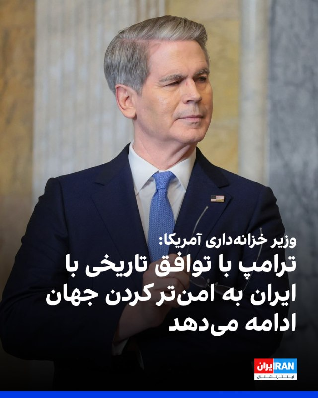

اسکات بسنت‌، وزیر خزانه‌داری آمریکا، در شبکه اجتماعی ایکس نوشت: دونالد ترامپ، رییس‌جمهوری ایالات متحده، امروز با دستیابی به یک توافق صلح تاریخی با ایران، همچنان به امن‌تر کردن جهان ادامه می‌دهد. او اشاره کرد که رهبری ترامپ، «همراه با تعامل مستقیمش با متحدان و دشمنان، برای قرن‌ها در کتاب‌های تاریخ ثبت خواهد شد.» iranintl.com/202606154716

---
📅 بروزرسانی: 1405/03/25 06:52
---

## VahidOOnLine — post 245628

  

سناتور جیمز لنکفورد، نماینده جمهوری‌خواه مجلس سنای آمریکا، گفت جمهوری اسلامی طی ۴۷ سال گذشته به آمریکا، متحدانش و شهروندان آمریکایی در منطقه حمله کرده است. او افزود مردم ایران تحت سرکوب حکومت زندگی می‌کنند و واشینگتن سال‌ها برای مقابله با تهدیدهای ناشی از جمهوری اسلامی میلیاردها دلار هزینه کرده است. لنکفورد گفت روسای‌جمهوری پیشین آمریکا طی بیش از چهار دهه تلاش کردند اختلافات با جمهوری اسلامی را حل کنند، اما دونالد ترامپ نخستین رییس‌جمهوری است که با استفاده هم‌زمان از دیپلماسی و قدرت نظامی، تهران را پای میز مذاکره آورده است. iranintl
‌🏁 🇬🇧 IranintlTV

🤖 @VahidOOnLine

## VahidOOnLine — post 245627

  

ویل ریچیاردلا، از چهره‌های نزدیک به جریان محافظه‌کار آمریکا، در واکنش به توافق میان واشینگتن و جمهوری اسلامی گفت بازگشایی تنگه هرمز نباید به‌عنوان یک امتیاز از سوی ایران تلقی شود. او در شبکه اجتماعی ایکس نوشت آزادی کشتیرانی در تنگه هرمز، وضعیت عادی و اولیه بوده و جمهوری اسلامی آن را به اهرم فشار تبدیل کرده است. ریچیاردلا نوشت اگر نخستین دستاورد این توافق بازگرداندن چیزی باشد که ایران اساسا حق سلب آن را نداشته، باید دید آمریکا برای دستیابی به این نتیجه چه امتیازهایی داده است. iranintl
‌🏁 🇬🇧 IranintlTV

🤖 @VahidOOnLine

## IranIntlTV — post 342408

  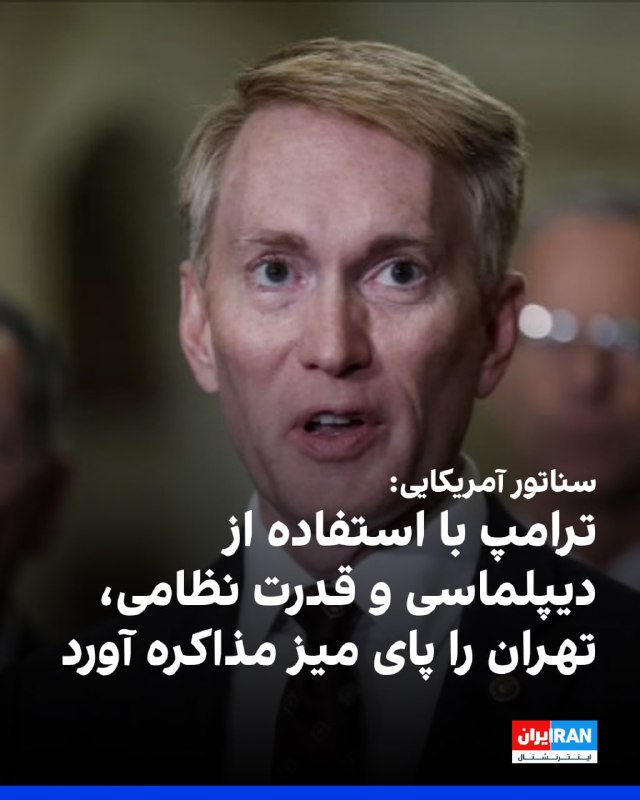

سناتور جیمز لنکفورد، نماینده جمهوری‌خواه مجلس سنای آمریکا، گفت جمهوری اسلامی طی ۴۷ سال گذشته به آمریکا، متحدانش و شهروندان آمریکایی در منطقه حمله کرده است. او افزود مردم ایران تحت سرکوب حکومت زندگی می‌کنند و واشینگتن سال‌ها برای مقابله با تهدیدهای ناشی از جمهوری اسلامی میلیاردها دلار هزینه کرده است. لنکفورد گفت روسای‌جمهوری پیشین آمریکا طی بیش از چهار دهه تلاش کردند اختلافات با جمهوری اسلامی را حل کنند، اما دونالد ترامپ نخستین رییس‌جمهوری است که با استفاده هم‌زمان از دیپلماسی و قدرت نظامی، تهران را پای میز مذاکره آورده است. iranintl.com/202606158770

## IranIntlTV — post 342407

  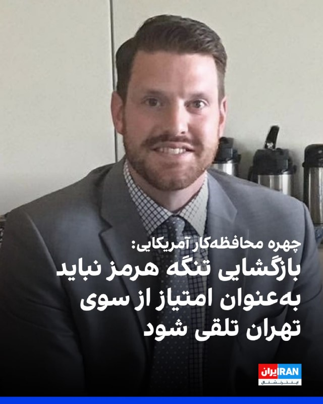

ویل ریچیاردلا، از چهره‌های نزدیک به جریان محافظه‌کار آمریکا، در واکنش به توافق میان واشینگتن و جمهوری اسلامی گفت بازگشایی تنگه هرمز نباید به‌عنوان یک امتیاز از سوی ایران تلقی شود. او در شبکه اجتماعی ایکس نوشت آزادی کشتیرانی در تنگه هرمز، وضعیت عادی و اولیه بوده و جمهوری اسلامی آن را به اهرم فشار تبدیل کرده است. ریچیاردلا نوشت اگر نخستین دستاورد این توافق بازگرداندن چیزی باشد که ایران اساسا حق سلب آن را نداشته، باید دید آمریکا برای دستیابی به این نتیجه چه امتیازهایی داده است. iranintl.com/202606157636

---
📅 بروزرسانی: 1405/03/25 06:42
---

## VahidOOnLine — post 245626

  

باراک راوید، خبرنگار اکسیوس، به نقل از یک مقام ارشد آمریکایی نوشت واشینگتن ادعای جمهوری اسلامی درباره آزادسازی بدون قید و شرط ۱۲ میلیارد دلار از دارایی‌های مسدودشده ایران پیش از آغاز مذاکرات ۶۰ روزه را رد کرده است. این مقام آمریکایی این ادعا را «روایت‌سازی» توصیف کرد و گفت چنین موضوعی صحت ندارد. به گفته او، توافق به‌دست‌آمده بر اساس اصل «اقدام در برابر اقدام» تنظیم شده و هیچ بخشی از دارایی‌های مسدودشده ایران پیش از اجرای تعهدات جمهوری اسلامی آزاد نخواهد شد. این مقام آمریکایی تاکید کرد هرگونه آزادسازی منابع مالی ایران به میزان پایبندی تهران به تعهدات توافق بستگی خواهد داشت. iranintl
‌🏁 🇬🇧 IranintlTV

🤖 @VahidOOnLine

## VahidOOnLine — post 245625

  <a href="telegram/content/VahidOOnLine_245625_1781493159.mp4" target="_blank">🎬 Download video</a>

♦️دونالد ترامپ، رئیس‌جمهوری آمریکا، هشتادمین سال تولدش را با برگزاری جنجالی مبارزه در قفس مسابقات «یو‌اف‌سی» در چمن جنوبی کاخ سفید جشن گرفت. در این رویداد بی‌سابقه که با مانور هوایی جنگنده‌های ارتش آغاز شد، ترامپ در ردیف اول صندلی‌های کنار قفس، میان ملانیا ترامپ، بانوی اول ایالات متحده، و دانا وایت، رئیس یو‌اف‌سی نشست؛ در حالی که بارون ترامپ، فرزند رئیس جمهوری در پشت سر آنها و مارک زاکربرگ، مدیرعامل «متا» نیز در میان مهمانان ویژه این مسابقات حضور داشتند.
‌🇸🇦 Indypersian

🤖 @VahidOOnLine

## IranIntlTV — post 342406

  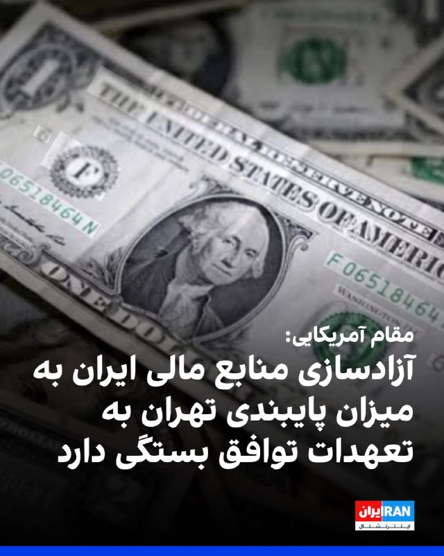

باراک راوید، خبرنگار اکسیوس، به نقل از یک مقام ارشد آمریکایی نوشت واشینگتن ادعای جمهوری اسلامی درباره آزادسازی بدون قید و شرط ۱۲ میلیارد دلار از دارایی‌های مسدودشده ایران پیش از آغاز مذاکرات ۶۰ روزه را رد کرده است. این مقام آمریکایی این ادعا را «روایت‌سازی» توصیف کرد و گفت چنین موضوعی صحت ندارد. به گفته او، توافق به‌دست‌آمده بر اساس اصل «اقدام در برابر اقدام» تنظیم شده و هیچ بخشی از دارایی‌های مسدودشده ایران پیش از اجرای تعهدات جمهوری اسلامی آزاد نخواهد شد. این مقام آمریکایی تاکید کرد هرگونه آزادسازی منابع مالی ایران به میزان پایبندی تهران به تعهدات توافق بستگی خواهد داشت. iranintl.com/202606151558

---
📅 بروزرسانی: 1405/03/25 06:32
---

## FarsiVOA — post 220766

⚡️تبریک پرشور رئیس‌جمهوری آمریکا دونالد ترامپ به بو نیکال پس از پیروزی در راند اول. کاخ سفید هم‌زمان با تولد ۸۰ سالگی پرزیدنت ترامپ میزبان رویداد رزمی «یواف‌سی آزادی ۲۵۰» بود.
@FarsiVOA

## BBCPersian — post 283842

🔻 لینزی گراهام از تفسیر ایران از توافق ابراز «نگرانی» کرد

لیندزی گراهام، سناتور ارشد جمهوری‌خواه، می‌گوید اگرچه از توافق بر سر یک تفاهم‌نامه بین آمریکا و ایران «خوشحال» است، اما «تا حدودی نگران» است که «دیدگاه ایران در مورد این توافق‌نامه با آنچه تیم مذاکره‌کننده آمریکایی ادعا می‌کند متفاوت به نظر می‌رسد.»

آقای گراهام در پستی در شبکه اجتماعی ایکس نوشت که مذاکرات بعدی را «از نزدیک» زیر نظر خواهد داشت و مشتاقانه منتظر بررسی «محصول نهایی» در کنگره است.

او نوشت: «به همه برای رسیدن به این نقطه تبریک می‌گویم. زمان، همه چیز را مشخص خواهد کرد.»

https://bbc.in/4viCUHy
@BBCPersian

---
📅 بروزرسانی: 1405/03/25 06:22
---

## VahidOOnLine — post 245624

  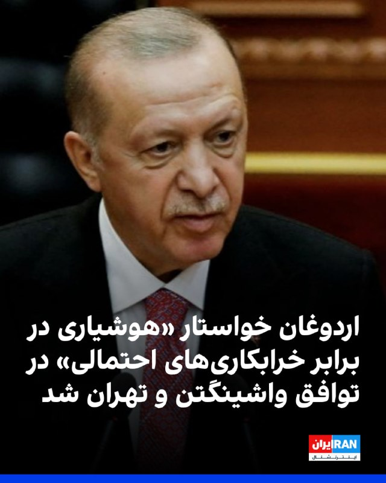

رجب طیب اردوغان، رییس‌جمهوری ترکیه، توافق حاصل شده بین ایالات متحده و ایران را تحولی مهم برای برقراری صلح و آرامش در منطقه خود دانست و از آن استقبال کرد. او ابراز امیدواری کرد که خبر اعلام توافق «که تمام جهان مدت‌هاست به آن نیاز دارد، راه را برای ایجاد فضایی پایدار از صلح و امنیت در منطقه ما هموار کند» و نوشت: «من بر لزوم اجتناب از لفاظی‌ها، تحریکات و اقداماتی که می‌تواند تنش‌ها را در دوره منتهی به امضای توافق تشدید کند، تاکید می‌کنم.» اردوغان در این ارتباط خواستار «هوشیاری در برابر خرابکاری‌های احتمالی» شد و از پاکستان به خاطر تلاش‌های میانجیگرانه استثنایی‌اش، حمایت قطر و عربستان سعودی از ابتکارات دیپلماتیک، و به ویژه از رهبران ایالات متحده و جمهوری اسلامی، در دستیابی به این نتیجه، قدردانی کرد. او تاکید کرد: «ما به حمایت از تمام تلاش‌ها برای برقراری صلح، ثبات و آرامش در منطقه خود ادامه خواهیم داد و به راه‌حل‌های پایدار مبتنی بر دیپلماسی و حقوق بین‌الملل کمک خواهیم کرد.» iranintl
‌🏁 🇬🇧 IranintlTV

🤖 @VahidOOnLine

## VahidOOnLine — post 245623

  <a href="telegram/content/VahidOOnLine_245623_1781491947.mp4" target="_blank">🎬 Download video</a>

♦️حساب رسمی کاخ سفید بامداد دوشنبه ۲۵ خردادماه ویدیویی از ورود دونالد ترامپ، رئیس‌جمهوری آمریکا، و دانا وایت، مدیرعامل «یو‌اف‌سی» (UFC)، به رویداد «یو‌اف‌سی آزادی ۲۵۰» (UFC Freedom 250) در محوطه جنوبی کاخ سفید منتشر کرد.

در این ویدیو، ترامپ و وایت در میان تشویق حاضران وارد محل برگزاری مسابقات می‌شوند. این رویداد همزمان با هشتادمین سال تولد ترامپ و «روز پرچم» آمریکا برگزار شد.

برای برگزاری این مسابقات، قفس هشت‌ضلعی سازمان «یو‌اف‌سی» به طور موقت در چمن جنوبی کاخ سفید نصب شد و هزاران مهمان برای تماشای هفت مبارزه این برنامه دعوت شدند.

این مراسم که کاخ سفید از آن با عنوان «تاریخ‌سازی در کاخ سفید» یاد کرده است، یکی از کم‌سابقه‌ترین رویدادهای ورزشی برگزارشده در تاریخ این مجموعه به شمار می‌رود. روابط نزدیک ترامپ و دانا وایت به بیش از دو دهه پیش بازمی‌گردد و مدیرعامل «یو‌اف‌سی» از شناخته‌شده‌ترین حامیان رئیس‌جمهوری آمریکا به شمار می‌رود.
‌🇸🇦 Indypersian

🤖 @VahidOOnLine

## IranIntlTV — post 342405

  

رجب طیب اردوغان، رییس‌جمهوری ترکیه، توافق حاصل شده بین ایالات متحده و ایران را تحولی مهم برای برقراری صلح و آرامش در منطقه خود دانست و از آن استقبال کرد. او ابراز امیدواری کرد که خبر اعلام توافق «که تمام جهان مدت‌هاست به آن نیاز دارد، راه را برای ایجاد فضایی پایدار از صلح و امنیت در منطقه ما هموار کند» و نوشت: «من بر لزوم اجتناب از لفاظی‌ها، تحریکات و اقداماتی که می‌تواند تنش‌ها را در دوره منتهی به امضای توافق تشدید کند، تاکید می‌کنم.» اردوغان در این ارتباط خواستار «هوشیاری در برابر خرابکاری‌های احتمالی» شد و از پاکستان به خاطر تلاش‌های میانجیگرانه استثنایی‌اش، حمایت قطر و عربستان سعودی از ابتکارات دیپلماتیک، و به ویژه از رهبران ایالات متحده و جمهوری اسلامی، در دستیابی به این نتیجه، قدردانی کرد. او تاکید کرد: «ما به حمایت از تمام تلاش‌ها برای برقراری صلح، ثبات و آرامش در منطقه خود ادامه خواهیم داد و به راه‌حل‌های پایدار مبتنی بر دیپلماسی و حقوق بین‌الملل کمک خواهیم کرد.» iranintl.com/202606157835

## FarsiVOA — post 220765

⚡️نخست‌وزیر جدید عراق طرح ۷۶۴ میلیون دلاری توسعه فرودگاه بین‌المللی بغداد را لغو کرد
@FarsiVOA

## FarsiVOA — post 220764

⚡️نگاه بازار سهام به تصمیم بانک مرکزی آمریکا
@FarsiVOA

---
📅 بروزرسانی: 1405/03/25 06:12
---

## VahidOOnLine — post 245622

  

گرگوری میکس، عضو ارشد کمیته امور خارجی مجلس نمایندگان آمریکا، با استقبال از حرکت دولت ترامپ به سمت دیپلماسی، جنگ با جمهوری اسلامی را «انتخابی، گمراه‌کننده و زیان‌بار» توصیف کرد. او گفت این جنگ هزینه‌های سنگینی بر آمریکا، متحدانش، اقتصاد جهانی و غیرنظامیان تحمیل کرده است.

این نماینده دموکرات تاکید کرد تنها راه‌حل پایدار اختلافات با جمهوری اسلامی، از جمله در موضوع هسته‌ای، توافقی مذاکره‌شده و قابل راستی‌آزمایی است. به گفته او، جنگ نه به تغییر حکومت ایران منجر می‌شود، نه برنامه موشکی و پهپادی آن را از بین می‌برد و نه به حمایت تهران از گروه‌های نیابتی پایان می‌دهد.

میکس همچنین از خروج ترامپ از برجام بدون ارائه جایگزین معتبر انتقاد کرد و گفت این اقدام به تشدید بحران کنونی انجامید. او تاکید کرد هر توافقی باید شفاف، قابل اجرا، پایدار و تحت نظارت کنگره باشد و مردم آمریکا شایسته پاسخ‌های روشن و تضمین عدم تکرار اشتباهاتی هستند که به این جنگ پرهزینه منجر شد.

‌🏁 🇬🇧 IranintlTV

🤖 @VahidOOnLine

## IranIntlTV — post 342404

  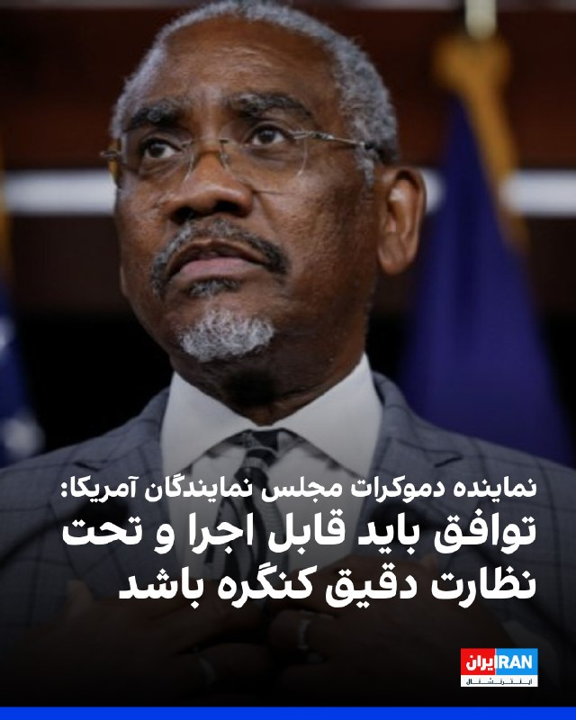

گرگوری میکس، عضو ارشد کمیته امور خارجی مجلس نمایندگان آمریکا، با استقبال از حرکت دولت ترامپ به سمت دیپلماسی، جنگ با جمهوری اسلامی را «انتخابی، گمراه‌کننده و زیان‌بار» توصیف کرد. او گفت این جنگ هزینه‌های سنگینی بر آمریکا، متحدانش، اقتصاد جهانی و غیرنظامیان تحمیل کرده است.

این نماینده دموکرات تاکید کرد تنها راه‌حل پایدار اختلافات با جمهوری اسلامی، از جمله در موضوع هسته‌ای، توافقی مذاکره‌شده و قابل راستی‌آزمایی است. به گفته او، جنگ نه به تغییر حکومت ایران منجر می‌شود، نه برنامه موشکی و پهپادی آن را از بین می‌برد و نه به حمایت تهران از گروه‌های نیابتی پایان می‌دهد.

میکس همچنین از خروج ترامپ از برجام بدون ارائه جایگزین معتبر انتقاد کرد و گفت این اقدام به تشدید بحران کنونی انجامید. او تاکید کرد هر توافقی باید شفاف، قابل اجرا، پایدار و تحت نظارت کنگره باشد و مردم آمریکا شایسته پاسخ‌های روشن و تضمین عدم تکرار اشتباهاتی هستند که به این جنگ پرهزینه منجر شد.

https://iranintl.com/202606159629

## FarsiVOA — post 220763

  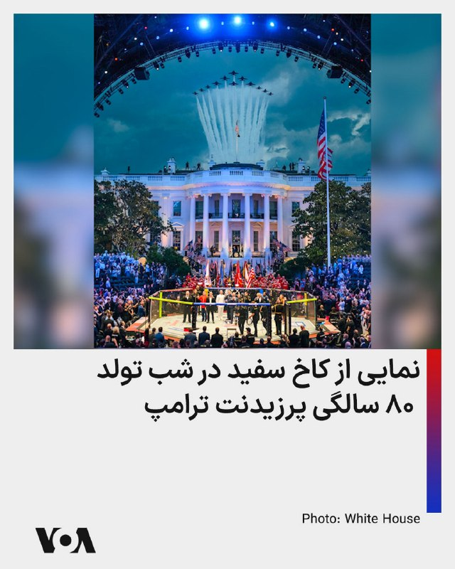

⚡️نمایی از کاخ سفید در شب تولد ۸۰ سالگی پرزیدنت ترامپ
@FarsiVOA

## FarsiVOA — post 220762

  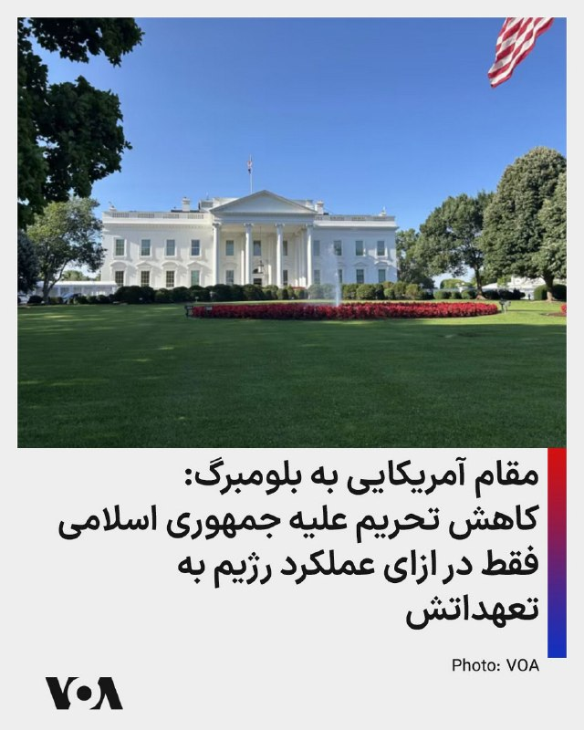

⚡️یک خبرنگار بلومبرگ به نقل از یک مقام کاخ سفید گفت توافق با جمهوری اسلامی مرحله‌ای و مبتنی بر عملکرد رژیم است. این مقام گفته است اگر جمهوری اسلامی به تعهداتش عمل کند، از کاهش تحریم‌ها برخوردار می‌شود و اگر این کار را نکند، از کاهش تحریم برخوردار نمی‌شود.
@FarsiVOA

---
📅 بروزرسانی: 1405/03/25 06:02
---

## VahidOOnLine — post 245621

  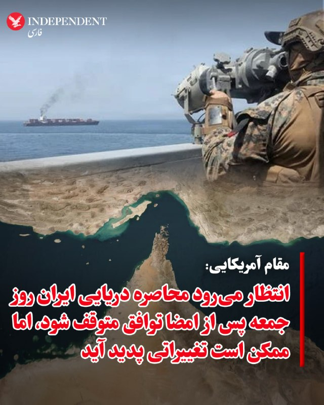

♦️یک مقام آمریکایی به سی‌ان‌ان گفت، ارتش ایالات متحده دستوری دریافت کرده است که محاصره دریایی جاری در تنگه هرمز را روز جمعه، در صورت امضای یادداشت تفاهم با ایران، لغو کند.
دونالد ترامپ، رئیس‌جمهوری آمریکا، ابتدا روز یکشنبه اعلام کرد که پس از توافق با تهران، دستور «لغو فوری محاصره دریایی ایالات متحده» علیه بنادر ایران را صادر کرده است. او بعدتر گفت: «با باز شدن تنگه پس از امضای توافق در روز جمعه، برای اهداف پاکسازی مین‌ها، نفت دوباره از هر دو سمت برای منطقه و جهان جریان خواهد یافت.»
ترامپ این محاصره را حدود شش هفته پس از آغاز جنگ برقرار کرد.
این مقام آمریکایی تاکید کرد که این وضعیت در حال حاضر برداشت موجود است، اما ممکن است تا روز جمعه تغییر کند.
‌🇸🇦 Indypersian

🤖 @VahidOOnLine

## VahidOOnLine — post 245620

  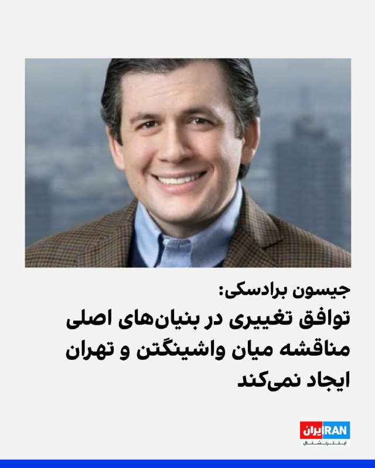

جیسون برادسکی، مدیر سیاست‌گذاری سازمان «اتحاد علیه ایران هسته‌ای»، در واکنش به تفاهم‌نامه میان واشینگتن و تهران گفت این توافق تغییری در بنیان‌های اصلی مناقشه میان آمریکا و جمهوری اسلامی ایجاد نخواهد کرد. او در شبکه اجتماعی ایکس نوشت فرق نمی‌کند این تفاهم‌نامه امروز، فردا یا چند روز دیگر امضا شود. برادسکی همچنین نوشت تا زمانی که جمهوری اسلامی در تهران بر سر کار باشد، بی‌ثباتی در منطقه ادامه خواهد داشت. iranintl
‌🏁 🇬🇧 IranintlTV

🤖 @VahidOOnLine

## VahidOOnLine — post 245619

  

آنتونیو گوترش، دبیرکل سازمان ملل متحد، در شبکه اجتماعی ایکس نوشت: «به گرمی، به ایالات متحده و ایران به خاطر دستیابی به توافق صلحی که آتش‌بس فوری و دائمی، بازگشایی تنگه هرمز و همچنین چارچوبی برای مذاکرات بیشتر را فراهم می‌کند، تبریک می‌گویم.» او تاکید کرد که این گامی حیاتی به سوی حل و فصل مسالمت‌آمیز درگیری است. گوترش همچنین از پاکستان، قطر، مصر، عربستان سعودی، ترکیه و سایر کشورهای منطقه به خاطر نقش سازنده‌ای که در حمایت از مذاکراتی که منجر به توافق صلح شد، ایفا کردند، قدردانی کرد. iranintl
‌🏁 🇬🇧 IranintlTV

🤖 @VahidOOnLine

## pm_afshaa — post 94051

  <a href="telegram/content/pm_afshaa_94051_1781490764.webm" target="_blank">🎬 Download video</a>

🔴مرندی، عضو تیم مذاکره‌کننده:
اگر نتانیاهو به این توافق پایبند نمونه، هیچ‌گونه اجرایی در کار نخواهد بود و جهان خواهد دانست که مسئول و مقصر فاجعهٔ اقتصادی قریب‌الوقوع چه کسی و کدام طرف است.

💧 Rainbet.com the #1 Non-KYC Crypto Casino & Sportsbook @rainbetcom

😁 @Pm_Afshaa

## pm_afshaa — post 94050

  <a href="telegram/content/pm_afshaa_94050_1781490764.webm" target="_blank">🎬 Download video</a>

🔴آکسیوس به نقل از یک مقام ارشد آمریکایی: تا زمانی که ایرانی‌ها به تعهدات خود عمل نکنند، هیچ وجه مسدود شده‌ای آزاد نمیشه.

توافق با ایران بر اساس اصل پرداخت در ازای عملکرد و تعهد متقابل است.

💧 Rainbet.com the #1 Non-KYC Crypto Casino & Sportsbook @rainbetcom

😁 @Pm_Afshaa

## IranIntlTV — post 342403

  

جیسون برادسکی، مدیر سیاست‌گذاری سازمان «اتحاد علیه ایران هسته‌ای»، در واکنش به تفاهم‌نامه میان واشینگتن و تهران گفت این توافق تغییری در بنیان‌های اصلی مناقشه میان آمریکا و جمهوری اسلامی ایجاد نخواهد کرد. او در شبکه اجتماعی ایکس نوشت فرق نمی‌کند این تفاهم‌نامه امروز، فردا یا چند روز دیگر امضا شود. برادسکی همچنین نوشت تا زمانی که جمهوری اسلامی در تهران بر سر کار باشد، بی‌ثباتی در منطقه ادامه خواهد داشت. iranintl.com/202606154974

## IranIntlTV — post 342402

  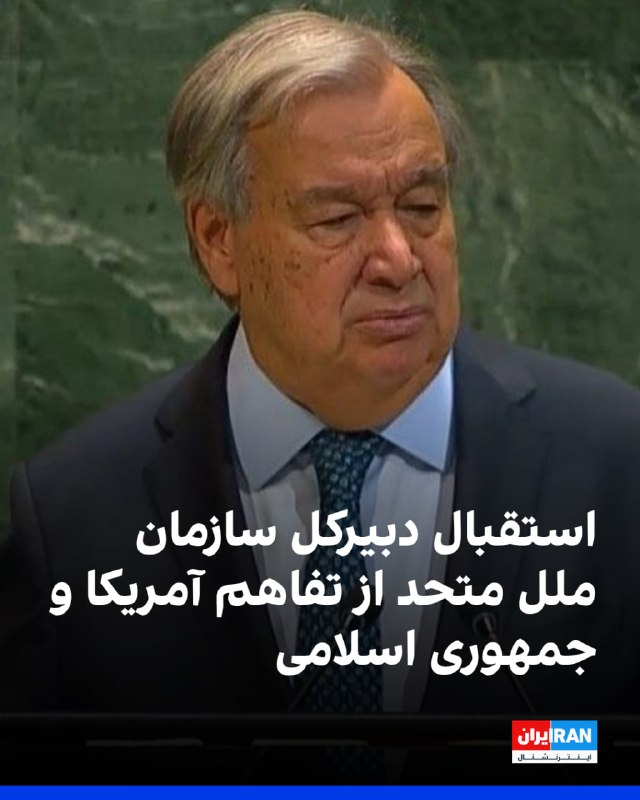

آنتونیو گوترش، دبیرکل سازمان ملل متحد، در شبکه اجتماعی ایکس نوشت: «به گرمی، به ایالات متحده و ایران به خاطر دستیابی به توافق صلحی که آتش‌بس فوری و دائمی، بازگشایی تنگه هرمز و همچنین چارچوبی برای مذاکرات بیشتر را فراهم می‌کند، تبریک می‌گویم.» او تاکید کرد که این گامی حیاتی به سوی حل و فصل مسالمت‌آمیز درگیری است. گوترش همچنین از پاکستان، قطر، مصر، عربستان سعودی، ترکیه و سایر کشورهای منطقه به خاطر نقش سازنده‌ای که در حمایت از مذاکراتی که منجر به توافق صلح شد، ایفا کردند، قدردانی کرد. iranintl.com/202606154527

## FarsiVOA — post 220761

⚡️درگیری پلیس و معترضان مخالف «گروه هفت» در ژنو
@FarsiVOA

## FarsiVOA — post 220760

⚡️آرایش پروازی نادر «سوپر دلتا» با حضور تیم نمایشی «تاندربردز» نیروی هوایی و تیم «بلوانجلز» نیروی دریایی آمریکا. جنگنده‌ها بر فراز کاخ سفید، هم‌زمان با هشتادمین سالگرد تولد پرزیدنت ترامپ و رویداد «رزمی یواف‌سی آزادی ۲۵۰» پرواز کردند.
@FarsiVOA

## BBCPersian — post 283841

🔻 کاهش قیمت نفت پس از اعلام توافق آمریکا و ایران

قیمت نفت در معاملات اولیه بازار آسیا به دلیل توافق آمریکا و ایران که قرار است بر اساس آن تنگه هرمز بازگشایی شود، کاهش یافت.

نفت خام برنت، معیار جهانی نفت، با ۳/۸ درصد کاهش به ۸۴/۰۲ دلار در هر بشکه رسید، در حالی که نفت معامله شده در آمریکا با ۴/۱ درصد کاهش به ۸۱/۴۰ دلار رسید.

پاکستان می‌گوید این توافق روز جمعه رسما در سوئیس امضا خواهد شد و دونالد ترامپ، رئیس جمهور آمریکا، در شبکه‌های اجتماعی درباره این توافق نوشته است که «نفت جریان خواهد یافت.»

تنگه هرمز که یکی از مبادی مهم صادرات نفت در دنیا است مدت کوتاهی پس از حملات هوایی آمریکا و اسرائیل به ایران در ۲۸ فوریه، عملا بسته شد.

https://bbc.in/4eoBgg7
@BBCPersian

---
📅 بروزرسانی: 1405/03/25 05:52
---

## VahidOOnLine — post 245618

  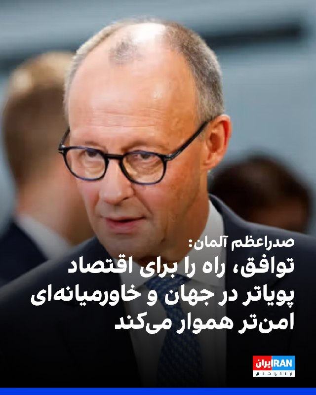

فریدریش مرتس، صدراعظم آلمان، از توافق میان آمریکا و جمهوری اسلامی استقبال کرد و آن را یک دستاورد مهم دیپلماتیک دانست.

او گفت این توافق، راه را برای اقتصاد پویاتر در جهان و خاورمیانه‌ای امن‌تر هموار می‌کند.

مرتس همچنین تاکید کرد اجرای توافق با عزم و اراده همه طرف‌ها اهمیت دارد و می‌تواند به تقویت ثبات و امنیت منطقه‌ای کمک کند.
‌🏁 🇬🇧 IranintlTV

🤖 @VahidOOnLine

## VahidOOnLine — post 245617

  <a href="telegram/content/VahidOOnLine_245617_1781490142.mp4" target="_blank">🎬 Download video</a>

♦️حساب رسمی کاخ سفید بامداد دوشنبه ۲۵ خرداد ویدیویی از مانور جنگنده‌های آمریکایی بر فراز کاخ سفید منتشر کرد. در این ویدیو، همزمان با اجرای سرود ملی آمریکا، جنگنده‌های تیم‌های نمایشی نیروی دریایی و نیروی هوایی آمریکا از فراز کاخ سفید عبور می‌کنند.

دونالد ترامپ، رئیس‌جمهوری آمریکا، روز یکشنبه هشتاد ساله شد. این مناسبت با «روز پرچم» آمریکا همزمان بود و در حالی برگزار شد که ایالات متحده خود را برای جشن‌های دویست‌وپنجاهمین سالگرد استقلال این کشور آماده می‌کند.

در این مراسم که در محوطه جنوبی کاخ سفید برگزار شد، هزاران مهمان حضور داشتند و جنگنده‌های تیم‌های نمایشی «بلو انجلز» و «تاندربردز» نیز با پرواز بر فراز کاخ سفید در برنامه شرکت کردند.

ترامپ همچنین میزبان رویداد «یو‌اف‌سی آزادی ۲۵۰» (UFC Freedom 250) در محوطه جنوبی کاخ سفید بود؛ رقابت‌هایی که برای نخستین بار در تاریخ این مجموعه در چمن جنوبی کاخ سفید برگزار شد. برای این رویداد، قفس هشت‌ضلعی مسابقات «یو‌اف‌سی» (UFC) به طور موقت در محوطه کاخ سفید نصب شد و هزاران مهمان برای تماشای هفت مبارزه این برنامه دعوت شدند.

برگزاری این رویداد بازتابی از روابط دیرینه ترامپ با سازمان «یو‌اف‌سی» (UFC) به شمار می‌رود؛ رابطه‌ای که به اوایل دهه ۲۰۰۰ میلادی بازمی‌گردد، زمانی که او از برگزاری مسابقات این سازمان در مجموعه‌های تحت مالکیت خود حمایت می‌کرد.
‌🇸🇦 Indypersian

🤖 @VahidOOnLine

## IranIntlTV — post 342401

  

فریدریش مرتس، صدراعظم آلمان، از توافق میان آمریکا و جمهوری اسلامی استقبال کرد و آن را یک دستاورد مهم دیپلماتیک دانست.

او گفت این توافق، راه را برای اقتصاد پویاتر در جهان و خاورمیانه‌ای امن‌تر هموار می‌کند.

مرتس همچنین تاکید کرد اجرای توافق با عزم و اراده همه طرف‌ها اهمیت دارد و می‌تواند به تقویت ثبات و امنیت منطقه‌ای کمک کند.
https://iranintl.com/202606141966

## FarsiVOA — post 220759

⚡️خروج اورانیوم غنی‌شده از ایران؛ گفت‌وگو با بهروز بیات کارشناس امور هسته‌ای
@FarsiVOA

## FarsiVOA — post 220758

  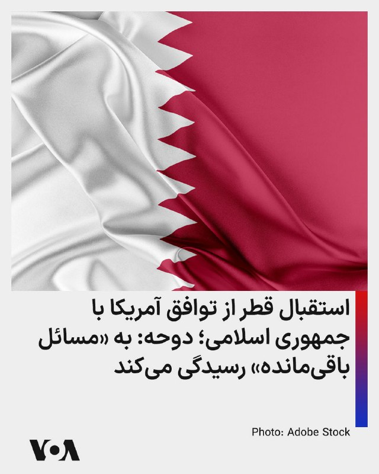

⚡️دولت قطر با صدور بیانیه‌ای از توافق حاصل شده در مورد یادداشت تفاهم بین ایالات متحده و جمهوری اسلامی «در مورد رسیدگی به مسائل باقیمانده» استقبال کرد. دوحه گفت این توافق را گامی مهم در جهت تحکیم صلح پایدار و ارتقای رشد اقتصادی در سطح منطقه‌ای و بین‌المللی می‌داند.
@FarsiVOA

---
📅 بروزرسانی: 1405/03/25 05:42
---

## VahidOOnLine — post 245616

  

برایان لیب، فعال سیاسی جمهوری‌خواه و از حامیان دونالد ترامپ، با انتقاد از توافق میان واشینگتن و جمهوری اسلامی گفت: «تنها برندگان این توافق، حکومت ایران و سپاه پاسداران هستند.» او در شبکه اجتماعی ایکس نوشت آنچه «توافق صلح» نامیده می‌شود، در عمل به سود جمهوری اسلامی تمام شده است. iranintl
‌🏁 🇬🇧 IranintlTV

🤖 @VahidOOnLine

## VahidOOnLine — post 245615

  

امانوئل مکرون، رییس‌جمهوری فرانسه، از توافق میان آمریکا و جمهوری اسلامی استقبال کرد و آن را نتیجه یک تلاش دیپلماتیک چندجانبه دانست. او خواستار اجرای سریع و کامل توافق از سوی همه طرف‌ها شد و تاکید کرد بازگشایی فوری و بدون قید و شرط تنگه هرمز و ازسرگیری کشتیرانی بدون محدودیت یا عوارض، برای ثبات منطقه‌ای و اقتصاد جهانی ضروری است. مکرون گفت این توافق می‌تواند زمینه‌ساز مذاکراتی گسترده‌تر برای صلح و امنیت در خاورمیانه باشد؛ مذاکراتی که باید برنامه هسته‌ای و موشکی جمهوری اسلامی و آنچه او سیاست‌های بی‌ثبات‌کننده منطقه‌ای تهران خواند را نیز در بر بگیرد. او افزود فرانسه آماده است همراه با شرکای خود در این روند نقش‌آفرینی کند. رییس‌جمهوری فرانسه همچنین بر حمایت پاریس از تلاش‌های دولت لبنان برای بازگرداندن حاکمیت این کشور تاکید کرد و گفت تنها حاکمیت کامل لبنان می‌تواند ثبات، تمامیت ارضی و تامین نیازهای مردم این کشور را تضمین کند. مکرون در پایان بر ضرورت برقراری یک آتش‌بس پایدار و موثر در لبنان تاکید کرد. iranintl
‌🏁 🇬🇧 IranintlTV

🤖 @VahidOOnLine

## FoxNewsTwitter — post 342971

  <a href="telegram/content/FoxNewsTwitter_342971_1781489546.mp4" target="_blank">🎬 Download video</a>

Fox News (Twitter/X)

Smoke rises from the wreckage after a skydiving plane crashed shortly after takeoff in Missouri.

Officials say all 12 people aboard — 11 skydivers and one pilot — were killed.

The plane turned around for an unknown reason before crashing near a highway. Dennis Jacobs, director of the Bates County Emergency Management Agency, said he suspects the plane experienced power issues before the crash.

Investigators are now piecing together the aircraft's final moments as families await answers.

## IranIntlTV — post 342400

  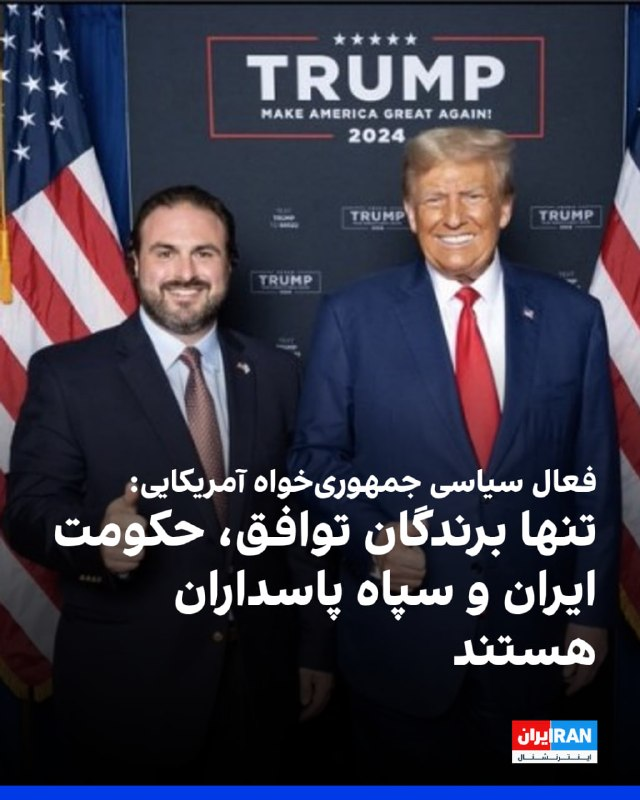

برایان لیب، فعال سیاسی جمهوری‌خواه و از حامیان دونالد ترامپ، با انتقاد از توافق میان واشینگتن و جمهوری اسلامی گفت: «تنها برندگان این توافق، حکومت ایران و سپاه پاسداران هستند.» او در شبکه اجتماعی ایکس نوشت آنچه «توافق صلح» نامیده می‌شود، در عمل به سود جمهوری اسلامی تمام شده است. iranintl.com/202606142295

## IranIntlTV — post 342399

  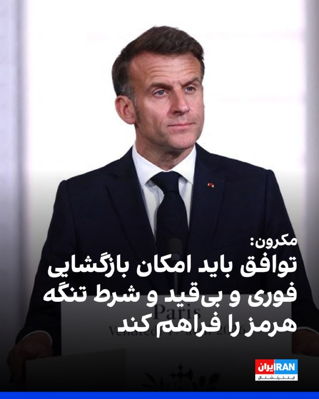

امانوئل مکرون، رییس‌جمهوری فرانسه، از توافق میان آمریکا و جمهوری اسلامی استقبال کرد و آن را نتیجه یک تلاش دیپلماتیک چندجانبه دانست. او خواستار اجرای سریع و کامل توافق از سوی همه طرف‌ها شد و تاکید کرد بازگشایی فوری و بدون قید و شرط تنگه هرمز و ازسرگیری کشتیرانی بدون محدودیت یا عوارض، برای ثبات منطقه‌ای و اقتصاد جهانی ضروری است. مکرون گفت این توافق می‌تواند زمینه‌ساز مذاکراتی گسترده‌تر برای صلح و امنیت در خاورمیانه باشد؛ مذاکراتی که باید برنامه هسته‌ای و موشکی جمهوری اسلامی و آنچه او سیاست‌های بی‌ثبات‌کننده منطقه‌ای تهران خواند را نیز در بر بگیرد. او افزود فرانسه آماده است همراه با شرکای خود در این روند نقش‌آفرینی کند. رییس‌جمهوری فرانسه همچنین بر حمایت پاریس از تلاش‌های دولت لبنان برای بازگرداندن حاکمیت این کشور تاکید کرد و گفت تنها حاکمیت کامل لبنان می‌تواند ثبات، تمامیت ارضی و تامین نیازهای مردم این کشور را تضمین کند. مکرون در پایان بر ضرورت برقراری یک آتش‌بس پایدار و موثر در لبنان تاکید کرد. iranintl.com/202606146378

## FarsiVOA — post 220757

⚡️از سرکوب اعتراضات هرات تا ممنوعیت تلفن‌های هوشمند؛ زنان افغان در اروپا صدای همبستگی را بلند کردند
@FarsiVOA

---
📅 بروزرسانی: 1405/03/25 05:32
---

## FarsiVOA — post 220756

⚡️هم‌زمان با هشتادمین سالگرد تولد پرزیدنت ترامپ، حساب کاربری کاخ سفید ویدیوی کوتاهی از رویداد مسابقات «رزمی یواف‌سی آزادی ۲۵۰» در فضای باز و مملو از جمعیت در محوطه کاخ سفید را به اشتراک گذاشت. جمعیت عظیم حاضران می‌گویند «آمریکا! آمریکا!»
@FarsiVOA

## BBCPersian — post 283840

‌ ‌ ‌ کی‌یر استارمر، نخست‌وزیر بریتانیا، تفاهم‌نامه میان ایران و آمریکا را «یک قدم بسیار مهم» خوانده است. آقای استارمر در واکنش به اخبار پیمان صلح با ایران آن را «قدمی بسیار بزرگ و مهم رو به جلو در پایان دادن به جنگ، تضمین ثبات منطقه‌ای و بازگشایی تنگه هرمز»…

## BBCPersian — post 283839

  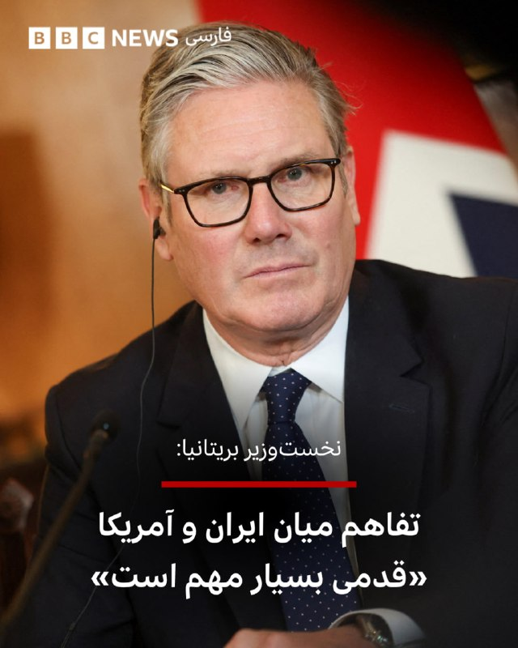

‌ ‌ ‌
کی‌یر استارمر، نخست‌وزیر بریتانیا، تفاهم‌نامه میان ایران و آمریکا را «یک قدم بسیار مهم» خوانده است.

آقای استارمر در واکنش به اخبار پیمان صلح با ایران آن را «قدمی بسیار بزرگ و مهم رو به جلو در پایان دادن به جنگ، تضمین ثبات منطقه‌ای و بازگشایی تنگه هرمز» خواند.

او گفت:«به پرزیدنت ترامپ و میانجیگران پاکستانی، قطری و هر جای دیگری که در حصول این دستاورد مهم دخیل بودند، تبریک می‌گویم. ما از مدت‌ها قبل خواهان کاهش تنش بوده‌ایم و این، پیشرفتی است که امیدوار بودیم شاهدش باشیم.»

نخست‌وزیر بریتانیا اضافه کرد: «آزادی کشتیرانی و بدون پرداخت عوارض در تنگه هرمز باید مجددا برقرار شود تا اثرات منفی اقتصادی چندین ماهه آن بر خانواده‌ها در اینجا، بریتانیا، و در همه جهان کاهش یابد.»

آقای استارمر گفت: «ما به همکاری با شرکای خود ادامه خواهیم داد تا از این پروسه حمایت کنیم. از جمله، اگر لازم باشد، از طریق ماموریت‌های دفاعی و چند وجهی مستقل که بریتانیا و فرانسه تا الان در طراحی آن نقش پیشرو داشته‌اند، به ویژه در حمایت از عملیات مین‌روبی، این کار را خواهیم کرد.»

https://bbc.in/4vTyIhk
📷Reuters
@BBCPersian

---
📅 بروزرسانی: 1405/03/25 05:22
---

## VahidOOnLine — post 245614

  

سناتور لیندسی گراهام، نماینده جمهوری‌خواه مجلس سنای آمریکا، در شبکه اجتماعی ایکس «از شنیدن توافق با ایران برای باز شدن تنگه هرمز » ابراز خوشحالی کرد و نوشت: «من مذاکرات بعدی در مورد برنامه هسته‌ای ایران و سایر مسائل را از نزدیک دنبال خواهم کرد.»

او با این حال اضافه کرد: «من تا اندازه‌ای نگرانم که دیدگاه ایران در مورد این توافق با آنچه تیم مذاکره‌کننده آمریکایی ادعا می‌کند متفاوت باشد.»

گراهام اشاره کرد: «طبق قانون ما، هرگونه توافق هسته‌ای با ایران برای بررسی و رأی‌گیری به کنگره ارسال خواهد شد» و نوشت: «مشتاقانه منتظر بررسی محصول نهایی هستم.»
‌🏁 🇬🇧 IranintlTV

🤖 @VahidOOnLine

## VahidOOnLine — post 245613

  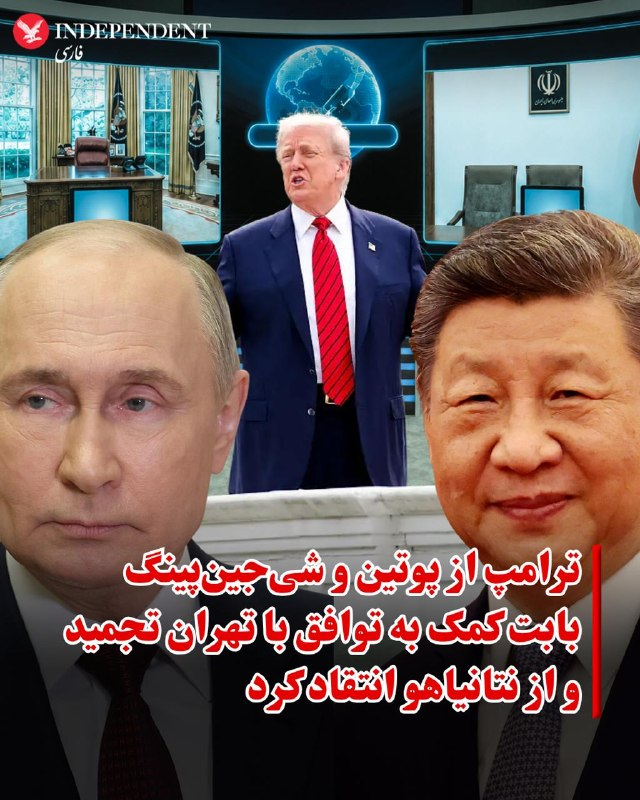

♦️دونالد ترامپ، رئیس‌جمهوری آمریکا در مصاحبه تلفنی ۲۸ دقیقه‌ای با نیویورک‌تایمز گفت که تصمیم او برای حمله به ایران در اسفندماه و سپس اعمال محاصره دریایی بنادر این کشور پس از بسته شدن تنگه هرمز توسط تهران، خاورمیانه را به نفع آمریکا تغییر داده است.
به گزارش این روزنامه آمریکایی، او در روز تولد ۸۰ سالگی‌اش، در حالی که صدای جمع شدن خانواده‌اش برای یک شام جشن در پس‌زمینه شنیده می‌شد، از شی جین‌پینگ رئیس‌جمهوری چین و ولادیمیر پوتین رئیس‌جمهوری روسیه بابت کمک در این توافق تمجید کرد و در مقابل، از بنیامین نتانیاهو به‌شدت انتقاد کرد و گفت حملات او تقریبا باعث شکست توافق نهایی شده بود.
ترامپ درباره نخست‌وزیر اسرائیل گفت: «او آدم بسیار دشواری است و راستش باید خیلی از ما تشکر کند، چون اگر ایران سلاح هسته‌ای داشت، اسرائیل دو ساعت هم دوام نمی‌آورد.»
‌🇸🇦 Indypersian

🤖 @VahidOOnLine

## VahidOOnLine — post 245612

  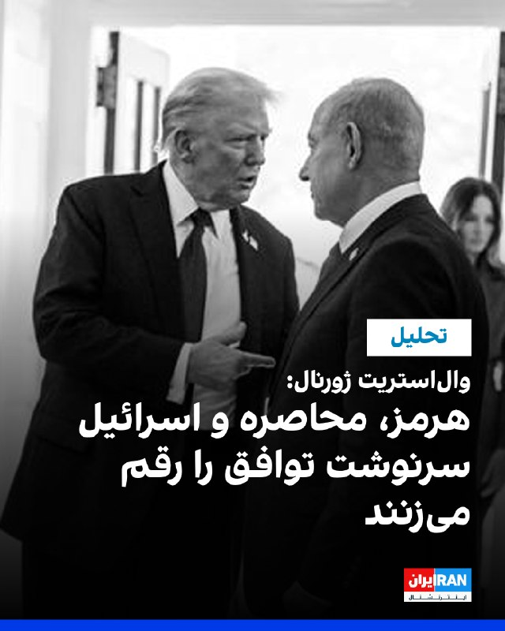

وال‌استریت ژورنال در تحلیلی نوشت سرنوشت توافق اولیه میان آمریکا و جمهوری اسلامی به سه عامل کلیدی بستگی دارد: بازگشایی تنگه هرمز، پایان محاصره دریایی ایران و نحوه رفتار اسرائیل در روزهای پیش از امضای رسمی توافق.

این روزنامه توافق اعلام‌شده از سوی دونالد ترامپ را بزرگ‌ترین پیشرفت دیپلماتیک چهار ماه جنگ اخیر توصیف کرد، اما درباره پایداری و اجرای آن ابراز تردید کرد.

به نوشته این روزنامه، بازگشایی تنگه هرمز مهم‌ترین آزمون توافق است و می‌تواند با ازسرگیری عبور عادی نفتکش‌ها و کشتی‌های تجاری، بر بازارهای انرژی و اقتصاد جهانی تاثیر بگذارد.

رفع محاصره دریایی ایران نیز از عوامل مهم موفقیت توافق دانسته شده، زیرا می‌تواند انگیزه تهران برای ادامه مذاکرات را افزایش دهد.

وال‌استریت ژورنال اسرائیل را بزرگ‌ترین متغیر این روند معرفی کرد و نوشت ادامه حملات اسرائیل در لبنان و منطقه می‌تواند توافق را با خطر مواجه کند.

این روزنامه در عین حال از کاهش تنش و نوعی احساس آرامش در تهران و واشینگتن خبر داد، اما تاکید کرد همچنان ابهام‌های مهمی درباره آینده مذاکرات، نقش اسرائیل و نحوه اجرای توافق باقی مانده است.
iranintl.c
‌🏁 🇬🇧 IranintlTV

🤖 @VahidOOnLine

## IranIntlTV — post 342398

  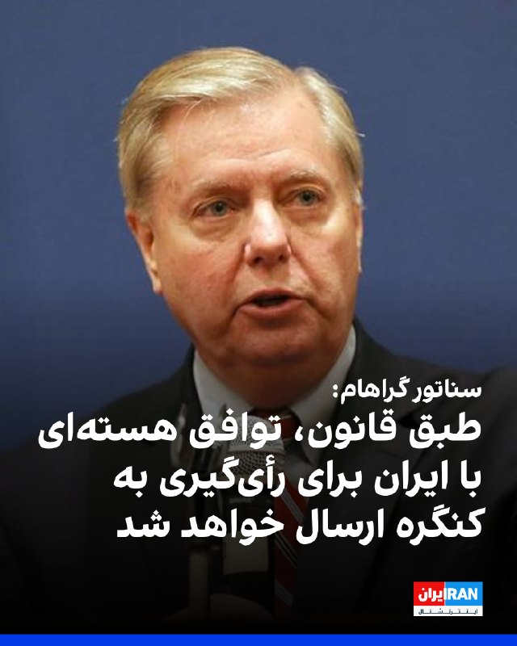

سناتور لیندسی گراهام، نماینده جمهوری‌خواه مجلس سنای آمریکا، در شبکه اجتماعی ایکس «از شنیدن توافق با ایران برای باز شدن تنگه هرمز » ابراز خوشحالی کرد و نوشت: «من مذاکرات بعدی در مورد برنامه هسته‌ای ایران و سایر مسائل را از نزدیک دنبال خواهم کرد.»

او با این حال اضافه کرد: «من تا اندازه‌ای نگرانم که دیدگاه ایران در مورد این توافق با آنچه تیم مذاکره‌کننده آمریکایی ادعا می‌کند متفاوت باشد.»

گراهام اشاره کرد: «طبق قانون ما، هرگونه توافق هسته‌ای با ایران برای بررسی و رأی‌گیری به کنگره ارسال خواهد شد» و نوشت: «مشتاقانه منتظر بررسی محصول نهایی هستم.»
https://iranintl.com/202606148781

## IranIntlTV — post 342397

  

وال‌استریت ژورنال در تحلیلی نوشت سرنوشت توافق اولیه میان آمریکا و جمهوری اسلامی به سه عامل کلیدی بستگی دارد: بازگشایی تنگه هرمز، پایان محاصره دریایی ایران و نحوه رفتار اسرائیل در روزهای پیش از امضای رسمی توافق.

این روزنامه توافق اعلام‌شده از سوی دونالد ترامپ را بزرگ‌ترین پیشرفت دیپلماتیک چهار ماه جنگ اخیر توصیف کرد، اما درباره پایداری و اجرای آن ابراز تردید کرد.

به نوشته این روزنامه، بازگشایی تنگه هرمز مهم‌ترین آزمون توافق است و می‌تواند با ازسرگیری عبور عادی نفتکش‌ها و کشتی‌های تجاری، بر بازارهای انرژی و اقتصاد جهانی تاثیر بگذارد.

رفع محاصره دریایی ایران نیز از عوامل مهم موفقیت توافق دانسته شده، زیرا می‌تواند انگیزه تهران برای ادامه مذاکرات را افزایش دهد.

وال‌استریت ژورنال اسرائیل را بزرگ‌ترین متغیر این روند معرفی کرد و نوشت ادامه حملات اسرائیل در لبنان و منطقه می‌تواند توافق را با خطر مواجه کند.

این روزنامه در عین حال از کاهش تنش و نوعی احساس آرامش در تهران و واشینگتن خبر داد، اما تاکید کرد همچنان ابهام‌های مهمی درباره آینده مذاکرات، نقش اسرائیل و نحوه اجرای توافق باقی مانده است.
https://iranintl.c

## FarsiVOA — post 220755

  <a href="telegram/content/FarsiVOA_220755_1781488374.mp4" target="_blank">🎬 Download video</a>

⚡️توقیف یک نفتکش ناوگان سایه روسیه در کانال مانش؛ گفت‌وگو با امیر چاهکی کارشناس روابط بین‌الملل
@FarsiVOA

## FarsiVOA — post 220754

⚡️هم‌زمان با سالگرد تولد ۸۰ سالگی پرزیدنت دونالد ترامپ، کاخ سفید یکشنبه شب ویدیویی از میزبانی مسابقات هنرهای رزمی ترکیبی «یو.اف.سی آزادی ۲۵۰» در چمن جنوبی این مکان را منتشر کرد.
@FarsiVOA

## IranianMinds — post 22612

🔴 نیویورک تایمز :

ترامپ گفت اگر ایران نتواند به یک توافق نهایی هسته‌ای با ایالات متحده دست پیدا کند، حملات نظامی علیه تهران از سر گرفته خواهد شد؛ یا اینکه آمریکا در ازای دریافت «۲۰ درصد از درآمدهای منطقه»، نقش «نگهبان خاورمیانه» را بر عهده خواهد گرفت.

@IranianMinds

---
📅 بروزرسانی: 1405/03/25 05:12
---

## VahidOOnLine — post 245611

  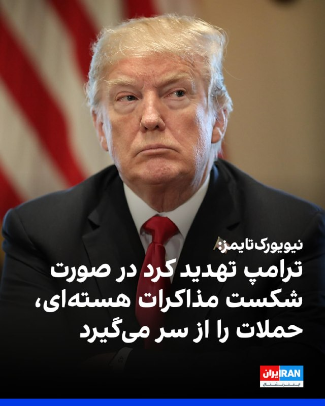

دونالد ترامپ، رییس‌جمهوری آمریکا، در گفت‌وگو با نیویورک‌تایمز از توافق تازه با جمهوری اسلامی دفاع کرد و هشدار داد اگر مذاکرات آتی درباره برنامه هسته‌ای ایران به نتیجه نرسد، حملات نظامی علیه تهران را از سر خواهد گرفت. او گفت در چنین شرایطی یا اقدام نظامی انجام خواهد شد یا آمریکا در ازای دریافت ۲۰ درصد از درآمدهای منطقه، نقش «نگهبان خاورمیانه» را بر عهده خواهد گرفت. ترامپ همچنین تاکید کرد توافق حاصل‌شده در نهایت عبور از تنگه هرمز را «برای همیشه بدون عوارض» تضمین خواهد کرد. او تصمیم خود برای حمله به ایران و اعمال محاصره دریایی پس از بسته شدن تنگه هرمز را عامل تغییر موازنه قدرت در منطقه به سود آمریکا دانست. رییس‌جمهوری آمریکا از شی جین‌پینگ و ولادیمیر پوتین به دلیل کمک به روند مذاکرات قدردانی کرد، اما از بنیامین نتانیاهو به دلیل اقداماتی که به گفته او نزدیک بود توافق را به شکست بکشاند، انتقاد کرد. ترامپ گفت اگر ایران به سلاح هسته‌ای دست می‌یافت، «اسرائیل حتی دو ساعت هم دوام نمی‌آورد». مذاکرات بعدی درباره پرونده هسته‌ای ایران قرار است از جمعه آینده در سوئیس آغاز شود. متن کامل را اینجا بخوانید iranintl
‌🏁 🇬🇧 IranintlTV

🤖 @VahidOOnLine

## pm_afshaa — post 94049

در شهرداری گناباد چه میگذرد 2 تا حکومتی دارن تو شهرداری گناباد کون کونک بازی میکنن که توسط یهکی از شهروندان شکار میشن و فیلمشون در میاد مشاهده فیلم @Pm_Afshaa

## pm_afshaa — post 94048

یه جوری یه مشت بچه کونی میان فحش میدن میگن کیر شدی توافق شد مادر جندتو گاییدم من باید بهت اینو بگم کیر شدی که با قاتل رهبرتون دست دادی یه دورم کون دادی همه چیو دادین رفت

## IranIntlTV — post 342396

  

دونالد ترامپ، رییس‌جمهوری آمریکا، در گفت‌وگو با نیویورک‌تایمز از توافق تازه با جمهوری اسلامی دفاع کرد و هشدار داد اگر مذاکرات آتی درباره برنامه هسته‌ای ایران به نتیجه نرسد، حملات نظامی علیه تهران را از سر خواهد گرفت. او گفت در چنین شرایطی یا اقدام نظامی انجام خواهد شد یا آمریکا در ازای دریافت ۲۰ درصد از درآمدهای منطقه، نقش «نگهبان خاورمیانه» را بر عهده خواهد گرفت. ترامپ همچنین تاکید کرد توافق حاصل‌شده در نهایت عبور از تنگه هرمز را «برای همیشه بدون عوارض» تضمین خواهد کرد. او تصمیم خود برای حمله به ایران و اعمال محاصره دریایی پس از بسته شدن تنگه هرمز را عامل تغییر موازنه قدرت در منطقه به سود آمریکا دانست. رییس‌جمهوری آمریکا از شی جین‌پینگ و ولادیمیر پوتین به دلیل کمک به روند مذاکرات قدردانی کرد، اما از بنیامین نتانیاهو به دلیل اقداماتی که به گفته او نزدیک بود توافق را به شکست بکشاند، انتقاد کرد. ترامپ گفت اگر ایران به سلاح هسته‌ای دست می‌یافت، «اسرائیل حتی دو ساعت هم دوام نمی‌آورد». مذاکرات بعدی درباره پرونده هسته‌ای ایران قرار است از جمعه آینده در سوئیس آغاز شود. متن کامل را اینجا بخوانید iranintl.com/20260615

## FarsiVOA — post 220753

⚡️محورهای مذاکرات نخست‌وزیر عراق در سفر به واشنگتن و توافق بغداد و اربیل برای حفاظت از شرکت‌های نفتی
@FarsiVOA

## BBCPersian — post 283838

🔻 جزییات توافق ایران و آمریکا به روایت خبرگزاری مهر

خبرگزاری مهر اقدام به انتشار ۱۴ بند کرده و گفته است که «جزئیات پیش‌نویس تفاهم‌نامه» میان ایران و آمریکا است.

براساس این خبر این موارد عبارتند از:

۱- توقف دائمی و فوری جنگ در همه جبهه‌ها از جمله لبنان

۲- تعهد آمریکا به عدم مداخله در امور داخلی ایران و احترام به حاکمیت جمهوری اسلامی ایران

۳- رفع کامل محاصره دریایی ظرف ۳۰ روز

۴- تعهد آمریکا به خروج نیروهایش از پیرامون ایران

۵- بازگشایی تنگه هرمز ظرف ۳۰ روز با ترتیبات ایرانی

۶- تعلیق تحریم‌های فروش نفت، محصولات پتروشیمی و مشتقات و دسترسی کامل ایران به منابع مالی آن

۷- لزوم ارائه طرح‌های بازسازی ایران حداقل به مبلغ ۳۰۰ میلیارد دلار توسط آمریکا و متحدانش

۸- ۶۰ روز مذاکره برای رسیدن به توافق نهایی مبتنی بر موضوعات هسته‌ای و لغو کامل تحریم‌های اولیه، ثانویه، آمریکا و قطعنامه‌های شورای امنیت سازمان ملل و شورای حکام آژانس بین‌المللی انرژی اتمی

۹- تکرار تعهد ایران در پیمان ان‌پی‌تی مبنی بر عدم تولید سلاح هسته‌ای

۱۰- در دوره مذاکرات آمریکا متعهد شده به نیروهای خود در منطقه اضافه نمی‌کند و تحریم جدیدی هم وضع نخواهد کرد

۱۱- آزادسازی ۲۴ میلیارد دلار پول‌های بلوکه شده ایران در دوره ۶۰ روزه مذاکرات نهایی. نیمی از این مبلغ قبل از شروع مذاکرات باید در دسترس ایران قرار گیرد

۱۲- تشکیل سازوکار نظارتی برای اجرایی کردن توافق

۱۳- توافق نامه نهایی توسط قطعنامه شورای امنیت سازمان ملل به تایید می‌رسد

۱۴- مذاکره نهایی قبل از آزادسازی نیمی از پول‌های بلوکه شده ایران، تعلیق تحریم‌های نفتی ایران و رفع محاصره دریایی آغاز نمی‌شود و توافق نهایی صرفا در موضوع سرنوشت مواد غنی شده و غنی سازی، رفع تحریم ها، برنامه بازسازی اقتصاد ایران انجام می‌شود و بحث درباره برنامه موشکی ایران و حمایت از گروه‌های مقاومت به صورت قطعی از دستور کار خارج شده است.

این ۱۴ مورد در حالی منتشر شده است که دو روز قبل عباس عراقچی، وزیر خارجه ایران، از رسانه‌ها خواسته بود تا از گمانه‌زنی در خصوص مفاد تفاهم‌نامه خودداری کنند و دونالد ترامپ، رئیس‌جمهور آمریکا هم توئیت آقای عراقچی را بازنشر کرده بود.

https://bbc.in/4eiUZ29
@BBCPersian

---
📅 بروزرسانی: 1405/03/25 05:02
---

## VahidOOnLine — post 245610

  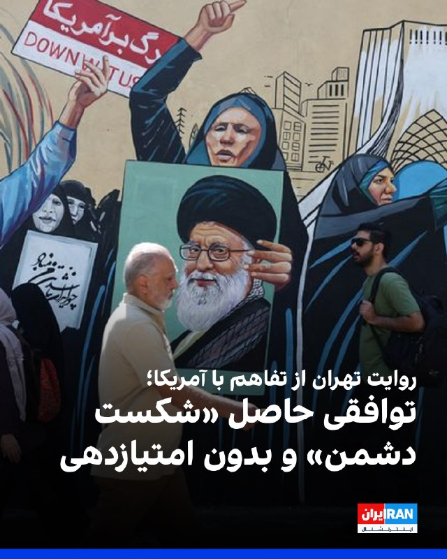

رسانه‌های نزدیک به حکومت، «تفاهم اسلام‌آباد» میان جمهوری اسلامی و آمریکا را نتیجه «پیروزی مقاومت» و پذیرش خواسته‌های تهران از سوی واشینگتن توصیف کرده‌اند.

بر اساس گزارش‌های منتشرشده، این تفاهم‌نامه شامل آتش‌بس دائمی در همه جبهه‌ها از جمله لبنان، پایان محاصره دریایی ایران، بازگشایی تنگه هرمز، تعلیق بخشی از تحریم‌ها، آزادسازی دارایی‌های مسدودشده ایران و آغاز مذاکرات ۶۰ روزه برای توافق نهایی است.

خبرگزاری مهر گزارش داد جمهوری اسلامی تنها بر پایبندی به پیمان منع گسترش سلاح‌های هسته‌ای تاکید کرده و موضوع برنامه موشکی و گروه‌های هم‌پیمان منطقه‌ای از مذاکرات کنار گذاشته شده است.

نورنیوز نیز نوشت اورانیوم غنی‌شده و تاسیسات هسته‌ای در ایران باقی می‌ماند، بخشی از دارایی‌های مسدودشده آزاد می‌شود و صندوقی ۳۰۰ میلیارد دلاری برای بازسازی ایران تشکیل خواهد شد.

مقام‌های جمهوری اسلامی، از جمله کاظم غریب‌آبادی، این تفاهم را نتیجه مقاومت نظامی و سیاسی دانسته و تاکید کرده‌اند مذاکرات نهایی پس از راستی‌آزمایی اجرای تعهدات اولیه آمریکا آغاز خواهد شد.
متن کامل را اینجا بخوانید
‌🏁 🇬🇧 IranintlTV

🤖 @VahidOOnLine

## VahidOOnLine — post 245609

  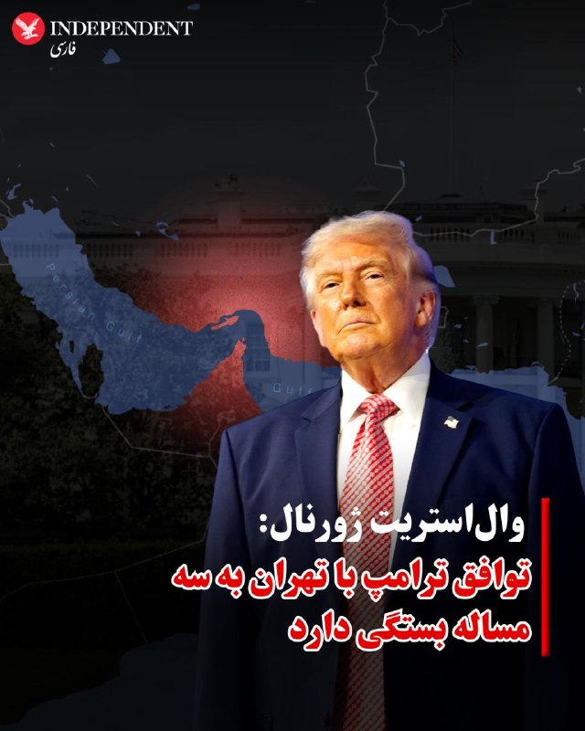

♦️وال استریت ژورنال با اشاره به اعلام تفاهم بین تهران و واشنگتن که بازه زمانی ۶۰ روزه برای مذاکره به سمت توافق فراهم می‌کند، با طرح این پرسش که «اما آیا این توافق واقعا جدی و واقعی است؟» می‌نویسد، این تفاهم به سه مساله بستگی دارد:
تنگه هرمز: ترامپ اشاره کرد که تنگه هرمز، یک مسیر تجاری حیاتی که ایران طی ماه‌های گذشته در آن تنش ایجاد کرده بود، پس از امضای رسمی توافق در روز جمعه باز خواهد شد. او گفت: «من به‌طور رسمی اجازه بازگشایی آن را صادر می‌کنم.» اگر این تنگه واقعا باز شود و کشتی‌ها آزادانه عبور کنند، می‌تواند تأثیر بزرگی بر جریان نفت و سایر کالاها داشته باشد و شوک مثبتی به اقتصاد جهانی وارد کند. اما بین یکشنبه شب تا جمعه، اتفاقات زیادی ممکن است رخ دهد.
محاصره دریایی: کاخ سفید برای مدتی یک محاصره دریایی علیه کشتی‌های ایرانی اعمال کرده بود با هدف فشار اقتصادی شدید. ترامپ روز یکشنبه اعلام کرد که این محاصره را در چارچوب توافق با ایران برای بازگشایی تنگه هرمز لغو می‌کند. در صورت برداشته شدن محاصره، ایران احتمالا انگیزه بیشتری برای ادامه مذاکرات با واشینگتن در سایر موضوعات خواهد داشت، زیرا فشار اقتصادی بر آن کاهش می‌یابد.
اسرائیل: این کشور همچنان حملاتی در لبنان انجام داده است. تهران گفته بود این موضوع می‌تواند مانع توافق شود. ترامپ ابتدا نگرانی درباره حملات اسرائیل علیه ایران را کم‌اهمیت جلوه داده بود، اما در هفته‌های اخیر از این‌که اسرائیل عقب‌نشینی نمی‌کند، خشمگین شده است. حملات اسرائیل تا صبح یکشنبه ادامه یافت و با واکنش تند ترامپ روبه‌رو شد. حالا این سؤال مطرح است که آیا اسرائیل عقب‌نشینی خواهد کرد یا نه.
‌🇸🇦 Indypersian

🤖 @VahidOOnLine

## IranIntlTV — post 342395

  

رسانه‌های نزدیک به حکومت، «تفاهم اسلام‌آباد» میان جمهوری اسلامی و آمریکا را نتیجه «پیروزی مقاومت» و پذیرش خواسته‌های تهران از سوی واشینگتن توصیف کرده‌اند.

بر اساس گزارش‌های منتشرشده، این تفاهم‌نامه شامل آتش‌بس دائمی در همه جبهه‌ها از جمله لبنان، پایان محاصره دریایی ایران، بازگشایی تنگه هرمز، تعلیق بخشی از تحریم‌ها، آزادسازی دارایی‌های مسدودشده ایران و آغاز مذاکرات ۶۰ روزه برای توافق نهایی است.

خبرگزاری مهر گزارش داد جمهوری اسلامی تنها بر پایبندی به پیمان منع گسترش سلاح‌های هسته‌ای تاکید کرده و موضوع برنامه موشکی و گروه‌های هم‌پیمان منطقه‌ای از مذاکرات کنار گذاشته شده است.

نورنیوز نیز نوشت اورانیوم غنی‌شده و تاسیسات هسته‌ای در ایران باقی می‌ماند، بخشی از دارایی‌های مسدودشده آزاد می‌شود و صندوقی ۳۰۰ میلیارد دلاری برای بازسازی ایران تشکیل خواهد شد.

مقام‌های جمهوری اسلامی، از جمله کاظم غریب‌آبادی، این تفاهم را نتیجه مقاومت نظامی و سیاسی دانسته و تاکید کرده‌اند مذاکرات نهایی پس از راستی‌آزمایی اجرای تعهدات اولیه آمریکا آغاز خواهد شد.
متن کامل را اینجا بخوانید
https://iranintl.com/202606142330

## FarsiVOA — post 220752

🔺پرزیدنت ترامپ ۸۰ ساله شد؛ کاخ سفید میزبان مسابقه رزمی

▪️دونالد ترامپ، رئیس جمهوری ایالات متحده که چهل‌وپنجمین و چهل‌وهفتمین رئیس جمهوری این کشور بوده است، روز یکشنبه ۱۴ ژوئن ۲۰۲۶ هشتاد ساله شد؛ مناسبتی که با «روز پرچم» آمریکا همزمان شده است؛ ضمن آنکه آمریکا برای جشن‌های دویست‌وپنجاهمین سالگرد استقلال آماده می‌شود.

⬇️ بیشتر بخوانید:
https://ir.voanews.com/a/president-trump-turns-eighty/8160668.html
@FarsiVOA

---
📅 بروزرسانی: 1405/03/25 04:52
---

## VahidOOnLine — post 245608

  

دونالد ترامپ، رییس‌جمهوری آمریکا، در گفت‌وگو با نیویورک تایمز گفت توافق با تهران در نهایت تضمین خواهد کرد که عبور از تنگه هرمز «برای همیشه بدون عوارض» باشد. او مدعی شد با وجود مخالفت‌های بنیامین نتانیاهو، نخست‌وزیر اسرائیل، این کشور را از «نابودی هسته‌ای» نجات داده است. ترامپ هشدار داد اگر جمهوری اسلامی به توافق نهایی هسته‌ای با آمریکا دست نیابد، حملات نظامی علیه ایران از سر گرفته خواهد شد یا واشینگتن در ازای دریافت ۲۰ درصد از درآمدهای منطقه، نقش «نگهبان خاورمیانه» را بر عهده خواهد گرفت. او گفت حمله به ایران و محاصره دریایی بنادر این کشور پس از بسته شدن تنگه هرمز، موازنه منطقه را به نفع آمریکا تغییر داده است. رییس‌جمهوری آمریکا همچنین از شی جین‌پینگ و ولادیمیر پوتین برای کمک به این توافق قدردانی کرد و از نتانیاهو به دلیل حملاتی که به گفته او نزدیک بود توافق را از مسیر خارج کند، انتقاد کرد. ترامپ گفت اگر ایران سلاح هسته‌ای داشت، «اسرائیل حتی دو ساعت هم دوام نمی‌آورد.» iranintl
‌🏁 🇬🇧 IranintlTV

🤖 @VahidOOnLine

## pm_afshaa — post 94047

یه جوری یه مشت بچه کونی میان فحش میدن میگن کیر شدی توافق شد

مادر جندتو گاییدم من باید بهت اینو بگم کیر شدی که با قاتل رهبرتون دست دادی یه دورم کون دادی همه چیو دادین رفت

## IranIntlTV — post 342394

  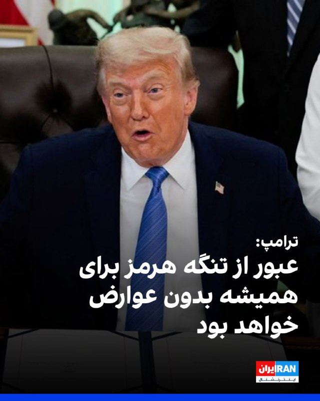

دونالد ترامپ، رییس‌جمهوری آمریکا، در گفت‌وگو با نیویورک تایمز گفت توافق با تهران در نهایت تضمین خواهد کرد که عبور از تنگه هرمز «برای همیشه بدون عوارض» باشد. او مدعی شد با وجود مخالفت‌های بنیامین نتانیاهو، نخست‌وزیر اسرائیل، این کشور را از «نابودی هسته‌ای» نجات داده است. ترامپ هشدار داد اگر جمهوری اسلامی به توافق نهایی هسته‌ای با آمریکا دست نیابد، حملات نظامی علیه ایران از سر گرفته خواهد شد یا واشینگتن در ازای دریافت ۲۰ درصد از درآمدهای منطقه، نقش «نگهبان خاورمیانه» را بر عهده خواهد گرفت. او گفت حمله به ایران و محاصره دریایی بنادر این کشور پس از بسته شدن تنگه هرمز، موازنه منطقه را به نفع آمریکا تغییر داده است. رییس‌جمهوری آمریکا همچنین از شی جین‌پینگ و ولادیمیر پوتین برای کمک به این توافق قدردانی کرد و از نتانیاهو به دلیل حملاتی که به گفته او نزدیک بود توافق را از مسیر خارج کند، انتقاد کرد. ترامپ گفت اگر ایران سلاح هسته‌ای داشت، «اسرائیل حتی دو ساعت هم دوام نمی‌آورد.» iranintl.com/202606149083

## FarsiVOA — post 220751

⚡️تقابل رسانه‌ای در خاورمیانه؛ فرآیند مبهم تصمیم‌گیری در تهران و آماده‌باش نظامی اسرائیل
@FarsiVOA

## BBCPersian — post 283837

  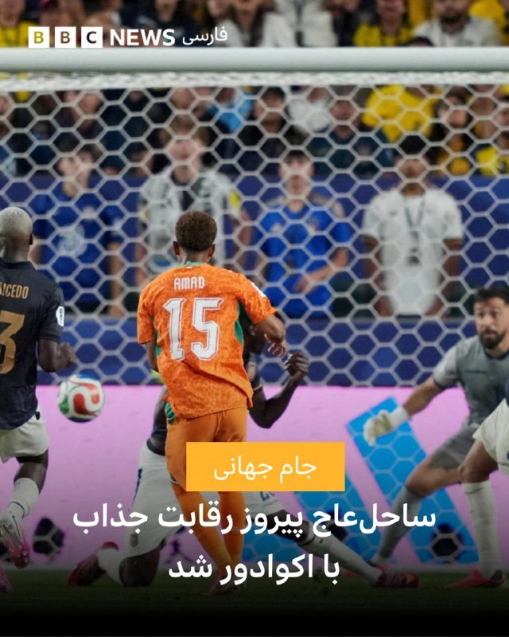

‌ ‌ ‌ ‌
تیم‌های فوتبال اکوادور، نماینده آمریکای جنوبی و ساح‌عاج، نماینده آفریقا از گروه ای رقابت‌های جام‌جهانی در شهر فیلادفیا به مصاف هم رفتند که در پایان نماینده آفریقا با یک گل به پیروزی رسید.

نیمه اول این مسابقه جذاب، دیدنی بود و اکوادور دو بار به تیر دروازه ساحل‌عاج زد و در مقابل، نماینده آفریقا هم حملات خطرناکی را انجام داد، اما هر دو تیم موفق به گلزنی نشدند.

نیمه دوم مسابقه با همان زیبایی نیمه اول آغاز شد و اینبار ابتدا ساح‌عاج بود که به تیر دروازه اکوادور زد و حملات دو تیم ادامه پیدا کرد تا در نهایت در دقیقه ۹۰ آماد دیالو از ساح‌عاج موفق به گلزنی برای تیمش شد.

📷IMAGN IMAGES/Reuters
@BBCPersian

---
📅 بروزرسانی: 1405/03/25 04:42
---

## VahidOOnLine — post 245607

♦️به گزارش خبرگزاری رویترز، کاروان تیم فوتبال ایران برای نخستین‌بار در جریان مسابقات جام جهانی ۲۰۲۶، تحت تدابیر شدید امنیتی وارد فرودگاه بین‌المللی لس‌آنجلس شد و در میان حضور گسترده نیروهای پلیس و موانع امنیتی ایجادشده در اطراف هتل، در منطقه «منهتن بیچ» مستقر شد. تیم فوتبال ایران روز یکشنبه وارد خاک ایالات متحده شدند تا خود را برای نخستین دیدار تاریخ دو کشور در جام جهانی برای روز دوشنبه مقابل نیوزیلند آماده کنند؛ این رویداد ورزشی در شرایطی برگزار می‌شود که درست در روز ورود این تیم، دونالد ترامپ رسما از دستیابی به توافق صلح برای پایان دادن به منازعه چهارماهه اخیر خبر داد.
‌🇸🇦 Indypersian

🤖 @VahidOOnLine

## BBCPersian — post 283836

  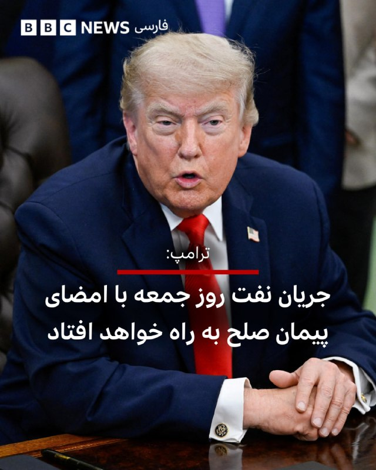

‌ ‌ ‌
دونالد ترامپ، رئیس جمهور آمریکا دوباره در شبکه اجتماعی تروت سوشال، پستی درباره توافق میان آمریکا و ایران منتشر کرد و نوشت او موفق شده است و دیگران ناتوان بودند.

او در این پست نوشت:« این 'پیمان بزرگ'، برای کل 'منطقه'، 'صلح و امنیت' خواهد آورد.»

آقای ترامپ در ادامه نوشت: «بسیاری از روسای جمهور تلاش کردند با ایران به 'صلح' برسند و قبل از من، هیچکدام از آنها نتوانستند. رهبران منطقه برای اولین بار، 'رئیس جمهوری' پیدا کرده‌اند که می‌تواند به آنها در حصول 'صلح' کمک کند.»

در ادامه پیام دونالد ترامپ آمده است: «با امضای این پیمان در روز جمعه و باز شدن تنگه هرمز برای مین‌‌روبی، نفت برای 'منطقه' و جهان، در هر دو سوی تنگه دوباره جاری خواهد شد.»

https://bbc.in/49Zy2yn
📷Reuters
@BBCPersian

---
📅 بروزرسانی: 1405/03/25 04:32
---

## VahidOOnLine — post 245606

  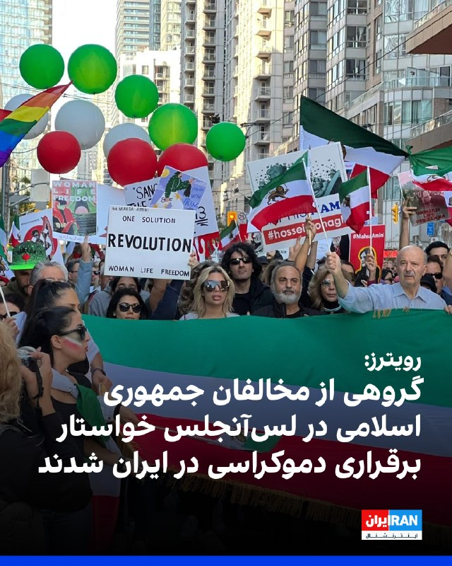

خبرگزاری رویترز گزارش داد: «هم‌زمان با ورود تیم ملی فوتبال ایران به فرودگاه لس‌آنجلس برای انجام نخستین بازی خود در جام جهانی، گروهی از مخالفان جمهوری اسلامی در نزدیکی ورزشگاه تجمع کردند و با سر دادن شعار خواستار برقراری دموکراسی در ایران شدند.»

رویترز نوشت مسابقه ایران و نیوزیلند در چارچوب جام جهانی در شرایطی برگزار می‌شود که توافق پایان جنگ میان آمریکا و جمهوری اسلامی اعلام شده است.

این خبرگزاری اشاره کرد لس‌آنجلس میزبان بزرگ‌ترین جامعه ایرانیان خارج از ایران است؛ جامعه‌ای که به «تهرانجلس» شهرت دارد.
‌🏁 🇬🇧 IranintlTV

🤖 @VahidOOnLine

## IranIntlTV — post 342393

  

خبرگزاری رویترز گزارش داد: «هم‌زمان با ورود تیم ملی فوتبال ایران به فرودگاه لس‌آنجلس برای انجام نخستین بازی خود در جام جهانی، گروهی از مخالفان جمهوری اسلامی در نزدیکی ورزشگاه تجمع کردند و با سر دادن شعار خواستار برقراری دموکراسی در ایران شدند.»

رویترز نوشت مسابقه ایران و نیوزیلند در چارچوب جام جهانی در شرایطی برگزار می‌شود که توافق پایان جنگ میان آمریکا و جمهوری اسلامی اعلام شده است.

این خبرگزاری اشاره کرد لس‌آنجلس میزبان بزرگ‌ترین جامعه ایرانیان خارج از ایران است؛ جامعه‌ای که به «تهرانجلس» شهرت دارد.
https://iranintl.com/202606143198

## FarsiVOA — post 220750

⚡️دیوید هاکنی، نقاش و هنرمند برجسته بریتانیایی که یکی از تأثیرگذارترین چهره‌های هنر معاصر جهان تبدیل بود، در ۸۸ سالگی در خانه‌اش در لندن درگذشت. او با آثار رنگارنگ و نوآورانه خود، به‌ویژه نقاشی‌های مشهور استخرهای کالیفرنیا، تأثیری ماندگار بر هنر قرن بیستم و بیست‌ویکم گذاشت.
@FarsiVOA

## FarsiVOA — post 220749

  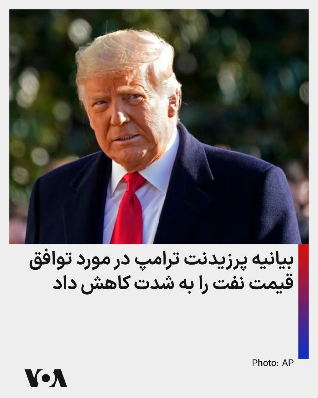

⚡️بیانیه پرزیدنت ترامپ در مورد توافق ایالات متحده با جمهوری اسلامی قیمت نفت را به‌شدت کاهش داد. قیمت هر بشکه نفت نفت خام برنت روز یکشنبه نزدیک به ۴ درصد کاهش و به حدود ۸۴ دلار در هر بشکه رسید. آقای ترامپ بارها گفته بود که با رسیدن به توافق، قیمت نفت به سرعت پایین خواهد آمد.
@FarsiVOA

---
📅 بروزرسانی: 1405/03/25 04:22
---

## VahidOOnLine — post 245605

  

ایوت کوپر، وزیر خارجه بریتانیا، از اعلام توافق بین ایالات متحده و ایران به شدت استقبال کرد.

او گفت:‌ «این موضوعی حیاتی است که آزادی کشتیرانی بدون عوارض از طریق تنگه هرمز به سرعت احیا شود.»
‌🏁 🇬🇧 IranintlTV

🤖 @VahidOOnLine

## pm_afshaa — post 94046

ترامپ بابت شبایی که نزاشتی بخابم مادرتو گاییدم مخصوصا امشب

## IranIntlTV — post 342392

  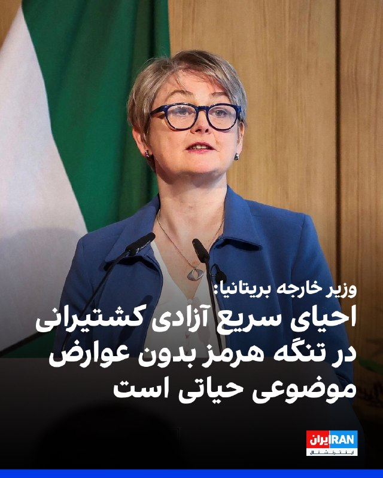

ایوت کوپر، وزیر خارجه بریتانیا، از اعلام توافق بین ایالات متحده و ایران به شدت استقبال کرد.

او گفت:‌ «این موضوعی حیاتی است که آزادی کشتیرانی بدون عوارض از طریق تنگه هرمز به سرعت احیا شود.»
https://iranintl.com/202606141615

---
📅 بروزرسانی: 1405/03/25 04:12
---

## VahidOOnLine — post 245604

  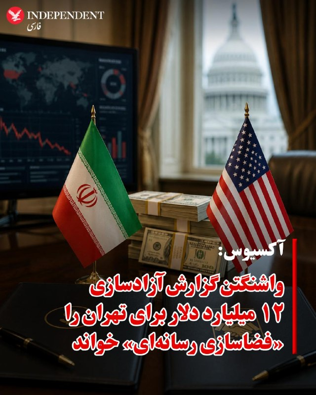

♦️نشریه آکسیوس، بامداد دوشنبه ۲۵ خردادماه به نقل از یک مقام ارشد آمریکایی گزارش داد که ادعای مطرح‌شده درباره دریافت بدون قید و شرط ۱۲ میلیارد دلار از دارایی‌های مسدودشده ایران پیش از آغاز مذاکرات ۶۰ روزه، صحت ندارد.

این مقام آمریکایی این گزارش‌ها را «فضاسازی رسانه‌ای» توصیف کرد و گفت: «این موضوع به هیچ وجه درست نیست. این توافق بر پایه اجرای تعهدات در برابر دریافت امتیاز شکل گرفته است و هیچ‌یک از دارایی‌های مسدودشده تا زمانی که ایران تعهدات خود را اجرا نکند، آزاد نخواهد شد.»

اظهارات این مقام در واکنش به گزارش‌هایی مطرح شده است که از دسترسی فوری جمهوری اسلامی به بخشی از دارایی‌های مسدودشده خود پس از توافق با ایالات متحده خبر می‌دادند.
‌🇸🇦 Indypersian

🤖 @VahidOOnLine

## VahidOOnLine — post 245603

  

رهبران کشورهای «گروه چهار»،‌ شامل بریتانیا، فرانسه، آلمان و ایتالیا، در بیانیه‌ای گفتند که از اعلام تفاهم‌نامه میان ایالات متحده و ایران به گرمی استقبال می‌کنند.

آنها در تاکید کردند: «ایران هرگز نباید به سلاح هسته‌ای دست یابد»، و افزودند: «ما آمادگی داریم در پاسخ به گام‌های شفاف و قابل راستی‌آزمایی ایران در برنامه هسته‌ای خود، تحریم‌های مرتبط را لغو کنیم.»

در این بیانیه آمده است: «بازگشایی فوری تنگه هرمز همراه با آزادی بی‌قیدوشرط و بدون محدودیت کشتیرانی، امری حیاتی است.»

رهبران این چهار کشور اروپایی همچنین گفتند که آماده‌اند در مورد پرونده هسته‌ای تهران، با ایالات متحده، جمهوری اسلامی و آژانس بین‌المللی انرژی اتمی همکاری کنند.

آن‌ها در بیانیه خود بر «حمایت کامل خود از ثبات، حاکمیت و تمامیت ارضی لبنان و همچنین اهمیت یک آتش‌بس پایدار» تاکید کردند.
‌🏁 🇬🇧 IranintlTV

🤖 @VahidOOnLine

## pm_afshaa — post 94045

پنیک نکنید! وارد مذاکره میشید، به نتیجه میرسید، تسلیم‌شون میکنید، موشک‌ها رو تحویل می‌گیرید (اورانیوم و کلی چیزای دیگه می‌گیرید)، ساختار هرم قدرت رو به‌هم می‌زنید، بعد بازی شروع میشه.. پیشنهاد میکنم اگه حرفای مانوک رو نشنیدین حتما اینو ببینید تا متوجه بازی…

## pm_afshaa — post 94044

  <a href="telegram/content/pm_afshaa_94044_1781484149.webm" target="_blank">🎬 Download video</a>

🔴مانوک خدابخشیان: من نمیدونم چرا همه پنیک کردن که چرا گفت مذاکره میکنه؟! خب باید مذاکره کنه که اینها رو بیاره پایین! موشک‌هارو میگیرن، تسلیم‌شون میکنن و بعد بازی تازه شروع میشه. مگه با گورباچوف مذاکره نکردن؟ با صدام لاس زدن. ماه‌ها لاس زدن، بعد زدن توی سرش..…

## IranIntlTV — post 342391

  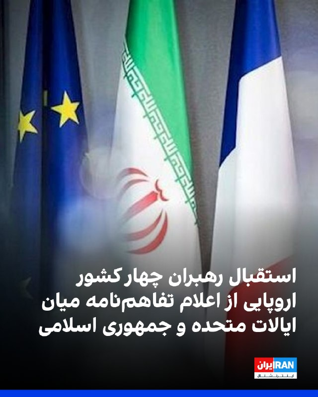

رهبران کشورهای «گروه چهار»،‌ شامل بریتانیا، فرانسه، آلمان و ایتالیا، در بیانیه‌ای گفتند که از اعلام تفاهم‌نامه میان ایالات متحده و ایران به گرمی استقبال می‌کنند.

آنها در تاکید کردند: «ایران هرگز نباید به سلاح هسته‌ای دست یابد»، و افزودند: «ما آمادگی داریم در پاسخ به گام‌های شفاف و قابل راستی‌آزمایی ایران در برنامه هسته‌ای خود، تحریم‌های مرتبط را لغو کنیم.»

در این بیانیه آمده است: «بازگشایی فوری تنگه هرمز همراه با آزادی بی‌قیدوشرط و بدون محدودیت کشتیرانی، امری حیاتی است.»

رهبران این چهار کشور اروپایی همچنین گفتند که آماده‌اند در مورد پرونده هسته‌ای تهران، با ایالات متحده، جمهوری اسلامی و آژانس بین‌المللی انرژی اتمی همکاری کنند.

آن‌ها در بیانیه خود بر «حمایت کامل خود از ثبات، حاکمیت و تمامیت ارضی لبنان و همچنین اهمیت یک آتش‌بس پایدار» تاکید کردند.
https://iranintl.com/202606146396

## FarsiVOA — post 220748

⚡️«تندروها» علیه توافق به خیابان آمدند؛ چرا قالیباف و عراقچی هدف حملات قرار گرفته‌اند؟
@FarsiVOA

## IranianMinds — post 22611

🔴 بیانیه مشترک فرانسه، بریتانیا، آلمان و ایتالیا:

از یادداشت تفاهم میان آمریکا و ایران استقبال می‌کنیم و آن را فرصتی برای بازگشت ثبات منطقه‌ای می‌دانیم.

ایران نباید به سلاح هسته‌ای دست یابد، اما در صورت اقدامات شفاف و قابل‌راستی‌آزمایی تهران، آماده لغو تحریم‌های مرتبط هستیم.

@IranianMinds

## IranianMinds — post 22610

جام جهانی ینی اوج هیجان و پول دراوردن پس بیا توی کانال ورسوس بت و پول دراوردن شروع کن👌

## IranianMinds — post 22609

  <a href="telegram/content/IranianMinds_22609_1781484150.webm" target="_blank">🎬 Download video</a>

📢توم میخوای از مسابقات جام جهانی فوتبال پول دربیاری؟
🥇

✅کانال ورسوس بت کارش تحلیل و پیش بینی مسابقات جام جهانی به صورت حرفه ای
🍑

⚠️توم میتونی از پیش بینی جام جهانی خیلی راحت پول دربیاری فقط کافیه با کانال ورسوس بت همراه شی
📣

🌐ادرس عضویت کانالشون e24:
👇

🔪https://t.me/+vEPd1hF2Y38yMWI0

🔪https://t.me/+vEPd1hF2Y38yMWI0

## BBCPersian — post 283835

🔻 استقبال نخست‌وزیر قطر از تفاهم میان آمریکا و ایران

نخست‌وزیر قطر که همراه با پاکستان بین ایران وآمریکا میانجیگری می‌کرد، از حصول تفاهم میان دو کشور استقبال کرده است.

شیخ محمد بن عبدالرحمان بن جاسم آل ثانی در شبکه اجتماعی ایکس نوشت:«از برادرانمان در جمهوری اسلامی پاکستان هم متشکریم.»

او در این پیام نوشته است که انتظار دارد تمامی طرف‌ها با روحیه‌ای مثبت و سازنده در مذاکرات آتی شرکت کنند.

https://bbc.in/4vPhv8A
@BBCPersian

---
📅 بروزرسانی: 1405/03/25 04:02
---

## VahidOOnLine — post 245602

  

در پی اعلام توافق میان آمریکا و جمهوری اسلامی، قیمت نفت در بازارهای جهانی کاهش یافت. بر اساس گزارش‌ها، بهای نفت برنت ۳.۹ درصد کاهش یافت و به ۸۴ دلار در هر بشکه رسید. نفت خام آمریکا نیز با افت ۴.۸ درصدی به حدود ۸۱ دلار در هر بشکه رسید. کارشناسان می‌گویند بازگشایی تنگه هرمز و ازسرگیری عبور عادی نفتکش‌ها می‌تواند عرضه نفت در بازار جهانی را افزایش دهد و فشار بر قیمت‌ها را کاهش دهد. هم‌زمان شاخص‌های آتی بازار سهام آمریکا نیز رشد کردند و معاملات آتی داوجونز، اس‌اندپی ۵۰۰ و نزدک همگی با افزایش همراه شدند. iranintl
‌🏁 🇬🇧 IranintlTV

🤖 @VahidOOnLine

## VahidOOnLine — post 245601

  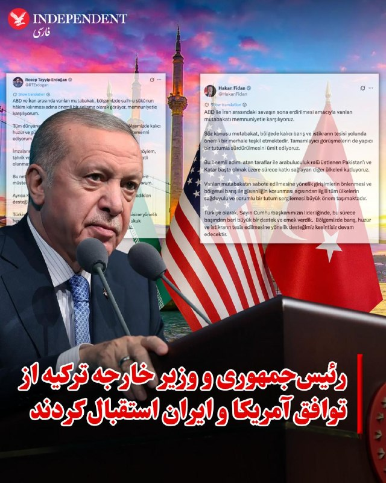

♦️رجب طیب اردوغان، رئیس‌جمهوری ترکیه، و هاکان فیدان، وزیر امور خارجه این کشور، بامداد دوشنبه ۲۵ خردادماه با انتشار پیام‌هایی از توافق میان ایالات متحده و جمهوری اسلامی ایران برای پایان دادن به جنگ استقبال کردند و از نقش پاکستان در میانجی‌گری این روند قدردانی کردند.

اردوغان این توافق را گامی مهم برای برقراری صلح و آرامش در منطقه توصیف کرد و ابراز امیدواری کرد که به ایجاد ثبات و امنیت پایدار منجر شود. او همچنین بر ضرورت پرهیز از هرگونه اقدام یا اظهارنظری که بتواند تا زمان امضای رسمی توافق موجب تشدید تنش‌ها شود، تاکید کرد.

رئیس‌جمهوری ترکیه ضمن قدردانی از تلاش‌های پاکستان در نقش میانجی، از حمایت قطر و عربستان سعودی از روند دیپلماتیک منتهی به توافق نیز تقدیر کرد.

هاکان فیدان نیز در پیامی جداگانه، توافق میان واشنگتن و تهران را مرحله‌ای مهم در مسیر دستیابی به صلح و ثبات پایدار در منطقه دانست و ابراز امیدواری کرد مذاکرات تکمیلی با رویکردی سازنده ادامه یابد.

وزیر امور خارجه ترکیه همچنین پاکستان، قطر و دیگر کشورهای مشارکت‌کننده در این روند را برای نقش‌آفرینی در دستیابی به توافق تبریک گفت و بر ضرورت جلوگیری از هرگونه تلاش برای اخلال در اجرای توافق و حفظ صلح و امنیت منطقه‌ای تاکید کرد.
‌🇸🇦 Indypersian

🤖 @VahidOOnLine

## VahidOOnLine — post 245600

  <a href="telegram/content/VahidOOnLine_245600_1781483555.mp4" target="_blank">🎬 Download video</a>

♦️ساعاتی قبل و همزمان با پیام دونالد ترامپ، مبنی بر نهایی شدن تفاهم با تهران برای بازگشایی تنگه هرمز، پایان محاصره دریایی ایران و آغاز مذاکرات ۶۰ روزه، خبرنگارانی که در کاخ سفید حضور داشتند دود سفیدی را مشاهده کردند که از یکی از دودکش‌های کاخ سفید برخاسته است. در تصاویر منتشر شده صدای یکی از خبرنگاران شنیده می‌شود که می‌گوید «این نشانه توافق است.» با این حال روشن نیست که این روایت با دلیل برخاستن این دود سفید همخوانی داشته باشد. نشانه «دود سفید از دودکش» مربوط به واتیکان است و در قرون وسطی شکل گرفته است.در فرایند انتخاب پاپ جدید در کلیسای کاتولیک، کاردینال‌ها در کلیسای سیستین رای‌گیری می‌کنند. اگر به توافق برسند و یک پاپ انتخاب شود، برگه‌های رای را می‌سوزانند و از دودکش کلیسا دود سفید بیرون می‌آید؛ یعنی «پاپ جدید انتخاب شد». اگر توافق حاصل نشود، دود سیاه بیرون می‌آید. با این حال در آمریکا چنین رسمی وجود ندارد و هنوز منابع رسمی نسبت به روایت رسانه‌ای از دود سفید در کاخ سفید واکنش نشان نداده‌اند.
‌🇸🇦 Indypersian

🤖 @VahidOOnLine

## IranIntlTV — post 342390

  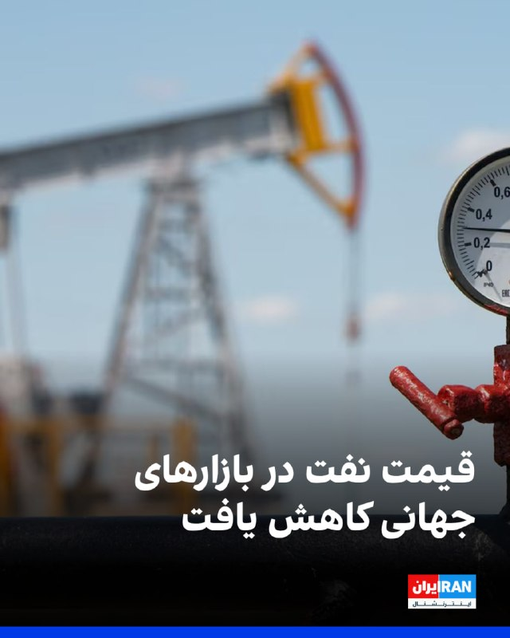

در پی اعلام توافق میان آمریکا و جمهوری اسلامی، قیمت نفت در بازارهای جهانی کاهش یافت. بر اساس گزارش‌ها، بهای نفت برنت ۳.۹ درصد کاهش یافت و به ۸۴ دلار در هر بشکه رسید. نفت خام آمریکا نیز با افت ۴.۸ درصدی به حدود ۸۱ دلار در هر بشکه رسید. کارشناسان می‌گویند بازگشایی تنگه هرمز و ازسرگیری عبور عادی نفتکش‌ها می‌تواند عرضه نفت در بازار جهانی را افزایش دهد و فشار بر قیمت‌ها را کاهش دهد. هم‌زمان شاخص‌های آتی بازار سهام آمریکا نیز رشد کردند و معاملات آتی داوجونز، اس‌اندپی ۵۰۰ و نزدک همگی با افزایش همراه شدند. iranintl.com/202606144808

## DW_Farsi — post 125983

🔶 آمریکا و ایران از دستیابی به توافق برای پایان جنگ خبر دادند

رئیس جمهور آمریکا با انتشار پیامی در شبکه تروث سوشال نوشت: «توافق با جمهوری اسلامی ایران اکنون نهایی شده است. به همه تبریک می‌گویم!»

دونالد ترامپ نوشت: «بدین‌وسیله بازگشایی کامل و بدون دریافت عوارض تنگه هرمز را مجاز اعلام می‌کنم و همزمان دستور رفع فوری محاصره دریایی ایالات متحده را صادر می‌کنم.»
او در ادامه افزود: «کشتی‌های جهان، موتورهای خود را روشن کنید. بگذارید نفت جریان پیدا کند!»

ترامپ همچنین در پیامی دیگر با اشاره به نهایی‌شدن متن یادداشت تفاهم با جمهوری اسلامی نوشت: «این توافق بزرگ، صلح و امنیت را برای سراسر منطقه به ارمغان خواهد آورد. رؤسای‌جمهور بسیاری تلاش کردند با ایران به صلح برسند، اما همگی پیش از من ناکام ماندند.»

به نوشته او، "با بازگشایی تنگه هرمز پس از امضای توافق در روز جمعه، با هدف پاکسازی مین‌ها، نفت بار دیگر از هر دو سوی منطقه و به سوی جهان جریان خواهد یافت."

دبیرخانه شورای عالی امنیت ملی جمهوری اسلامی در نخستین ساعات روز دوشنبه ۲۵ خردادماه با انتشار بیانیه‌ای از توافق میان تهران و واشنگتن برای پایان جنگ خبر داد.

طبق این بیانیه "بر اساس توافق انجام‌شده، جنگ و عملیات نظامی در تمامی جبهه‌ها از جمله لبنان از امشب به صورت فوری و دائمی پایان می‌یابد و محاصره دریایی علیه ایران نیز بلافاصله لغو خواهد شد".

دبیرخانه شورای عالی امنیت ملی از برنامه‌ریزی برای امضای رسمی این یادداشت تفاهم در روز جمعه ۲۹ خرداد خبر داد و افزود که "مذاکرات برای دستیابی به توافق نهایی پس از اجرای تعهدات طرف مقابل ادامه خواهد یافت".

واکنش‌های گسترده به خبر توافق میان جمهوری اسلامی و آمریکا آغاز شده است.

@dw_farsi

## BBCPersian — post 283834

برای بسیاری از هواداران فوتبال، نام «نیوزیلند» در جام جهانی هنوز با تصویری قدیمی همراه است: تیمی منظم، فیزیکی، پرتلاش و محدود؛ تیمی که بیشتر برای مقاومت کردن شناخته می‌شود تا برای ساختن بازی و البته ناشناخته مانده و اطلاعاتی محدود و معدود در موردش در رسانه‌ها منتشر می‌شود.

این تصویر بی‌دلیل شکل نگرفته است. نیوزیلند از منطقه‌ای می‌آید که سطح فوتبال آن فاصله‌ای قابل توجه با سایر قاره‌ها دارد؛ از اروپا گرفته، تا آمریکای جنوبی و حتی آفریقا و آسیا.

فاصله سطح فنی قاره اقیانوسیه از سایر قاره‌ها از یک سو و مسیر صعود نیوزیلند از این قاره از سویی دیگر، باعث ناشناخته‌تر ماندن این تیم شده است. نیوزیلند در این دوره و به واسطه این که برای رسیدن به جام جهانی، سختی و طولانی بودن مسیرهای دیگر را در پیش نداشت، کیفیت خودش را به صورت کامل در نگاه‌ها کارشناسان قرار نداد.

نسل فعلی تیم ملی فوتبال نیوزیلند فقط مجموعه‌ای از بازیکنان فیزیکی و دونده که به صورت سنتی در ذهن هواداران فوتبال شکل گرفته‌اند، نیست. تعدادی از بازیکنان این تیم سابقه بازی در فوتبال اروپا را دارند یا کماکان در لیگ‌های معتبرتر از لیگ نیوزیلند حضور دارند.

https://bbc.in/4vJgX3V
@BBCPersian

---
📅 بروزرسانی: 1405/03/25 03:52
---

## VahidOOnLine — post 245599

  

جی‌دی ونس، معاون رییس‌جمهور ی آمریکا، به شبکه خبری فاکس گفت: «فکر می‌کنم هنوز در حال هماهنگ کردن جزئیات مربوط به افرادی هستیم که در مراسم امضا حضور خواهند داشت.»

او اشاره کرد: «به‌طور قطع، قصد دارم آنجا باشم، اما این احتمال وجود دارد که خود رییس‌جمهور [دونالد ترامپ] نیز در مراسم حضور داشته باشد.»
‌🏁 🇬🇧 IranintlTV

🤖 @VahidOOnLine

## pm_afshaa — post 94043

خارکصه ها با قاتل رهبرمون توافق کردین!؟
خیلی گه خوردین از فردا کف خیابون کونتون میزاریم با قاتلین رهبر شهیدمون!؟

## pm_afshaa — post 94042

  

امشب ایوانکا در حال باز کردن و اعلام کادو های تولد ترامپ :

مستر قالیباف، 400 کیلوگرم اورانیوم
+ روبیو و ونس و ویتکاف (با ریتم) :
چرا زحمت کشیدین؟… تشکر تشکر …

💧 Rainbet.com the #1 Non-KYC Crypto Casino & Sportsbook @rainbetcom

😁 @Pm_Afshaa

## pm_afshaa — post 94041

  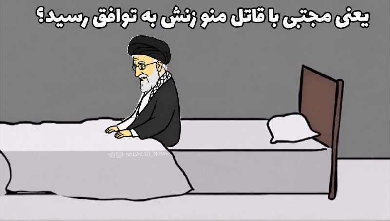

ای بابا

💧 Rainbet.com the #1 Non-KYC Crypto Casino & Sportsbook @rainbetcom

😁 @Pm_Afshaa

## VahidOnline — post 76361

  

به گفته دو مقام جمهوری اسلامی که نیویورک‌تایمز نام آنها را اعلام نکرده، تهران تا پس از عبور ساعت از نیمه‌شب به وقت محلی صبر کرد تا توافق را نهایی کند، زیرا نمی‌خواست این رویداد مهم با روز تولد دونالد ترامپ، رئیس‌جمهوری آمریکا، در روز یکشنبه هم‌زمان شود.
بر اساس این گزارش، اختلاف زمانی هفت‌ونیم ساعته میان تهران و واشینگتن باعث شد هر دو طرف بتوانند روایت مورد نظر خود را از زمان نهایی شدن توافق ارائه دهند. ترامپ گفته بود توافق در روز یکشنبه نهایی شده، در حالی که ایران اعلام کرده بود این روند در روزی بعد از آن تکمیل شده است. دونالد ترامپ ۱۴ ژوئن ۱۹۴۶ به دنیا آمده است.
@VahidOOnLine
"بدو گفتم تو صورت را نکو گیر
که من صورت دهم کار خود از زیر"

📡 @VahidOnline

## IranIntlTV — post 342389

  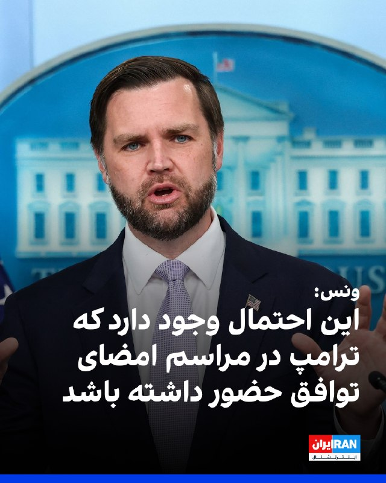

جی‌دی ونس، معاون رییس‌جمهور ی آمریکا، به شبکه خبری فاکس گفت: «فکر می‌کنم هنوز در حال هماهنگ کردن جزئیات مربوط به افرادی هستیم که در مراسم امضا حضور خواهند داشت.»

او اشاره کرد: «به‌طور قطع، قصد دارم آنجا باشم، اما این احتمال وجود دارد که خود رییس‌جمهور [دونالد ترامپ] نیز در مراسم حضور داشته باشد.»
https://iranintl.com/202606141793

## FarsiVOA — post 220747

  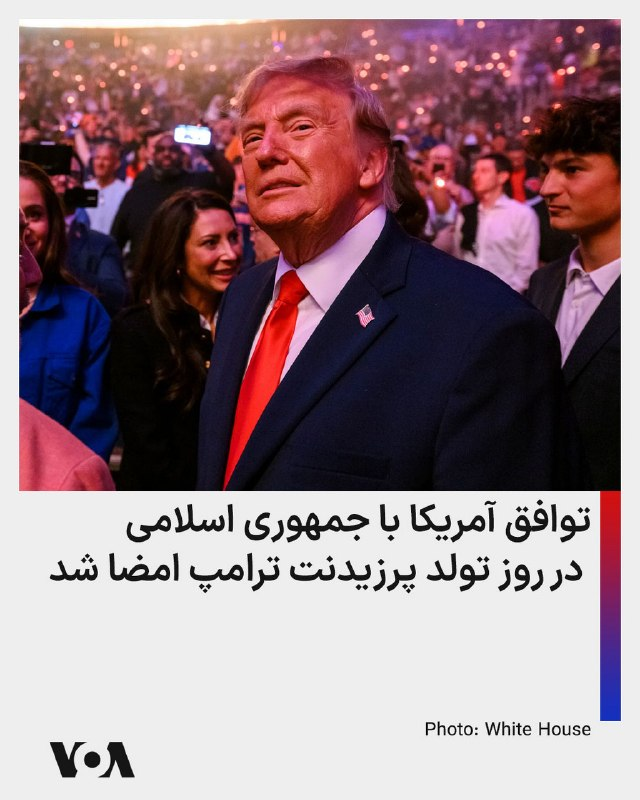

⚡️دونالد ترامپ، رئیس جمهوری ایالات متحده روز یکشنبه ۱۴ ژوئن ۲۰۲۶ هشتاد ساله شد؛ مناسبتی که با «روز پرچم» آمریکا همزمان شده است. در همین روز، رئيس جمهوری آمریکا از امضای توافق با جمهوری اسلامی خبر داد. آقای ترامپ گفت «این توافق بزرگ»، صلح و امنیت را برای کل منطقه به ارمغان خواهد آورد.
@FarsiVOA

## FarsiVOA — post 220746

  <a href="telegram/content/FarsiVOA_220746_1781482948.mp4" target="_blank">🎬 Download video</a>

⚡️گزارشی از محل اقامت تیم ملی فوتبال ایران در لس آنجلس
@FarsiVOA

## FarsiVOA — post 220745

  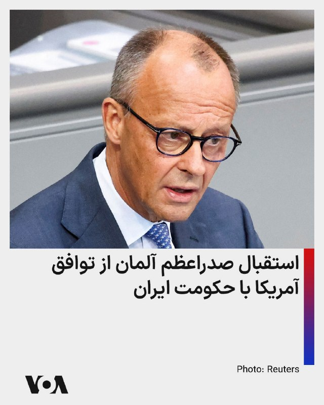

⚡️صدر اعظم آلمان، فريدرش مرتس در بیانیه‌ای گفت از توافق بین ایالات متحده و حکومت ایران استقبال می‌کند و «به رئیس جمهوری ترامپ و طرف ایرانی به خاطر این پیشرفت دیپلماتیک تبریک می‌گویم.» او گفت «این می‌تواند راه را برای یک اقتصاد جهانی احیا‌شده و خاورمیانه‌ای امن‌تر هموار کند. اجرای قاطعانه آن بسیار مهم است.»
@FarsiVOA

---
📅 بروزرسانی: 1405/03/25 03:42
---

## VahidOOnLine — post 245598

  

محمد بن عبدالرحمن آل ثانی، نخست‌وزیر و وزیر خارجه قطر، از تفاهم‌نامه میان آمریکا و جمهوری اسلامی استقبال کرد.

او همچنین از پاکستان و دیگر طرف‌های منطقه‌ای و بین‌المللی به دلیل کمک به فراهم شدن شرایط دستیابی به این توافق قدردانی کرد.

این مقام بلندپایه قطر از همه طرف‌ها خواست مذاکرات پیش‌رو را با رویکردی مثبت و سازنده دنبال کنند.

او همچنین بر تعهد دوحه به حمایت از تلاش‌های دیپلماتیک برای تقویت ثبات منطقه‌ای و بین‌المللی تاکید کرد.
‌🏁 🇬🇧 IranintlTV

🤖 @VahidOOnLine

## VahidOOnLine — post 245597

  

نورنیوز، رسانه نزدیک به شورای عالی امنیت ملی جمهوری اسلامی، جزئیاتی از یادداشت تفاهم میان تهران و واشینگتن را منتشر کرد.

بر اساس این گزارش، در متن تفاهم‌نامه بر لغو تحریم‌های آمریکا علیه جمهوری اسلامی تاکید شده است.

نورنیوز نوشت: «از مجموع ۲۸ میلیارد دلار دارایی مسدودشده ایران، بین ۱۰ تا ۱۴ میلیارد دلار آزاد خواهد شد.»

بر اساس این گزارش، «اورانیوم غنی‌شده و تاسیسات هسته‌ای جمهوری اسلامی در داخل ایران باقی خواهد ماند.»

نورنیوز همچنین از «تشکیل یک صندوق غرامت ۳۰۰ میلیارد دلاری برای ایران» خبر داده است.

این رسانه نزدیک به شورای عالی امنیت ملی جمهوری اسلامی نوشت بر اساس مفاد تفاهم‌نامه، مدیریت تنگه هرمز در اختیار ایران خواهد بود و دریافت عوارض از شناورها در مرحله‌ بعد، اجرایی خواهد شد.
‌🏁 🇬🇧 IranintlTV

🤖 @VahidOOnLine

## VahidOOnLine — post 245596

  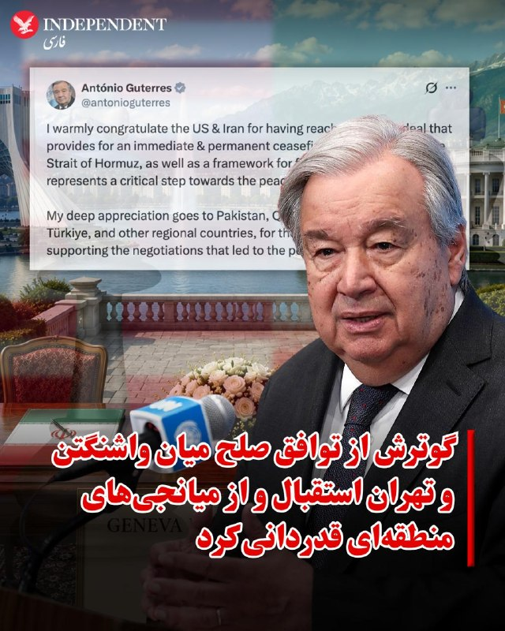

♦️آنتونیو گوترش، دبیرکل سازمان ملل متحد، بامداد دوشنبه ۲۵ خردادماه در پیامی در شبکه اجتماعی اکس، از توافق صلح میان ایالات متحده و ایران استقبال کرد و آن را گامی مهم در مسیر حل‌وفصل مسالمت‌آمیز مناقشه میان دو کشور دانست.

گوترش در این پیام نوشت این توافق شامل برقراری فوری و دائمی آتش‌بس، بازگشایی تنگه هرمز و ایجاد چارچوبی برای ادامه مذاکرات است و می‌تواند به کاهش تنش‌ها در منطقه کمک کند.

دبیرکل سازمان ملل همچنین از پاکستان، قطر، مصر، عربستان سعودی، ترکیه و دیگر کشورهای منطقه به دلیل نقش سازنده آن‌ها در حمایت از مذاکراتی که به این توافق منجر شد، قدردانی کرد.
‌🇸🇦 Indypersian

🤖 @VahidOOnLine

## VahidOOnLine — post 245595

  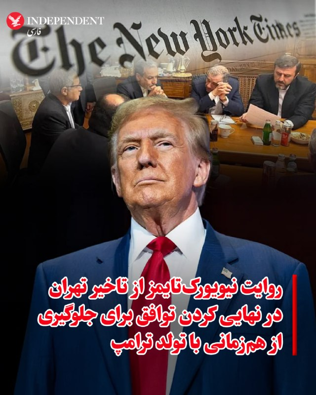

♦️به گفته دو مقام جمهوری اسلامی که نیویورک‌تایمز نام آنها را اعلام نکرده، تهران تا پس از عبور ساعت از نیمه‌شب به وقت محلی صبر کرد تا توافق را نهایی کند، زیرا نمی‌خواست این رویداد مهم با روز تولد دونالد ترامپ، رئیس‌جمهوری آمریکا، در روز یکشنبه هم‌زمان شود.
بر اساس این گزارش، اختلاف زمانی هفت‌ونیم ساعته میان تهران و واشینگتن باعث شد هر دو طرف بتوانند روایت مورد نظر خود را از زمان نهایی شدن توافق ارائه دهند. ترامپ گفته بود توافق در روز یکشنبه نهایی شده، در حالی که ایران اعلام کرده بود این روند در روزی بعد از آن تکمیل شده است. دونالد ترامپ ۱۴ ژوئن ۱۹۴۶ به دنیا آمده است.
‌🇸🇦 Indypersian

🤖 @VahidOOnLine

## IranIntlTV — post 342388

  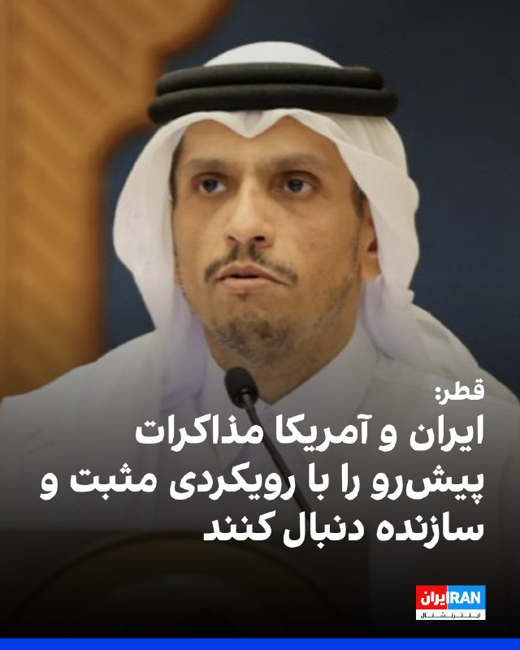

محمد بن عبدالرحمن آل ثانی، نخست‌وزیر و وزیر خارجه قطر، از تفاهم‌نامه میان آمریکا و جمهوری اسلامی استقبال کرد.

او همچنین از پاکستان و دیگر طرف‌های منطقه‌ای و بین‌المللی به دلیل کمک به فراهم شدن شرایط دستیابی به این توافق قدردانی کرد.

این مقام بلندپایه قطر از همه طرف‌ها خواست مذاکرات پیش‌رو را با رویکردی مثبت و سازنده دنبال کنند.

او همچنین بر تعهد دوحه به حمایت از تلاش‌های دیپلماتیک برای تقویت ثبات منطقه‌ای و بین‌المللی تاکید کرد.
https://iranintl.com/202606144299

## IranIntlTV — post 342387

  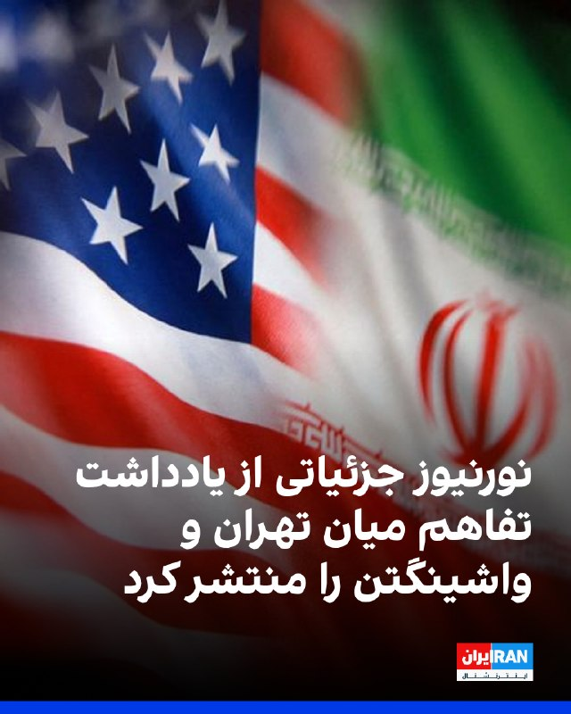

نورنیوز، رسانه نزدیک به شورای عالی امنیت ملی جمهوری اسلامی، جزئیاتی از یادداشت تفاهم میان تهران و واشینگتن را منتشر کرد.

بر اساس این گزارش، در متن تفاهم‌نامه بر لغو تحریم‌های آمریکا علیه جمهوری اسلامی تاکید شده است.

نورنیوز نوشت: «از مجموع ۲۸ میلیارد دلار دارایی مسدودشده ایران، بین ۱۰ تا ۱۴ میلیارد دلار آزاد خواهد شد.»

بر اساس این گزارش، «اورانیوم غنی‌شده و تاسیسات هسته‌ای جمهوری اسلامی در داخل ایران باقی خواهد ماند.»

نورنیوز همچنین از «تشکیل یک صندوق غرامت ۳۰۰ میلیارد دلاری برای ایران» خبر داده است.

این رسانه نزدیک به شورای عالی امنیت ملی جمهوری اسلامی نوشت بر اساس مفاد تفاهم‌نامه، مدیریت تنگه هرمز در اختیار ایران خواهد بود و دریافت عوارض از شناورها در مرحله‌ بعد، اجرایی خواهد شد.
https://iranintl.com/202606140658

## FarsiVOA — post 220744

  <a href="telegram/content/FarsiVOA_220744_1781482349.mp4" target="_blank">🎬 Download video</a>

⚡️تأثیر فناوری‌های نوین بر دقت قضاوت در مسابقات جام جهانی ۲۰۲۶؛ گفت‌وگو با محمدرضا فغانی
@FarsiVOA

## alonews — post 128099

  <a href="telegram/content/alonews_128099_1781482350.webm" target="_blank">🎬 Download video</a>

👈پرزیدنت پزشکیان: نظر یک گروه خاص(تندروها) مهم نیست و نظر همه مردم مهمه

✅ @AloNews خبر جنگ

---
📅 بروزرسانی: 1405/03/25 03:32
---

## VahidOOnLine — post 245594

  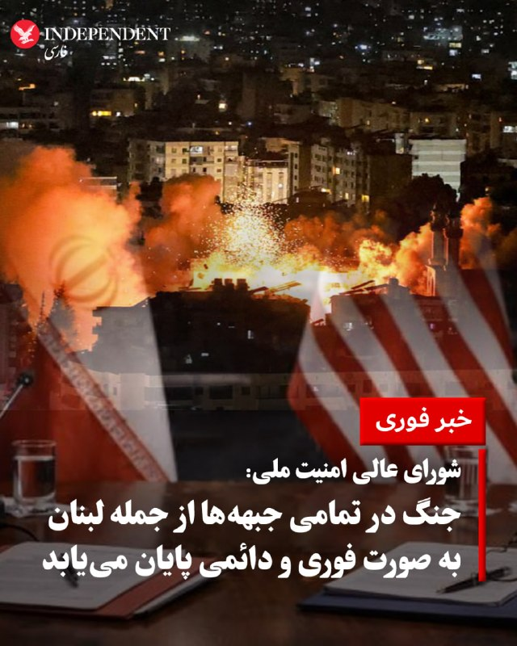

♦️دبیرخانه شورای عالی امنیت ملی، بامداد دوشنبه، ۲۵ خردادماه، با انتشار بیانیه‌ای درباره تفاهم با آمریکا اعلام کرد: «بر اساس توافقات انجام شده، جنگ و عملیات نظامی در تمامی جبهه‌ها از جمله لبنان از امشب به‌صورت فوری و دائمی پایان یافته و به علاوه، محاصره دریایی علیه ایران بلافاصله و به‌طور کامل خاتمه می‌یابد.
این بیانیه می‌افزاید، امضای این یادداشت تفاهم در روز جمعه ۲۹ خرداد به‌طور رسمی انجام خواهد شد. مذاکرات برای توافق نهایی، به پس از اجرای تعهدات طرف مقابل وفق یادداشت تفاهم موکول خواهد شد.
‌🇸🇦 Indypersian

🤖 @VahidOOnLine

## VahidOOnLine — post 245593

  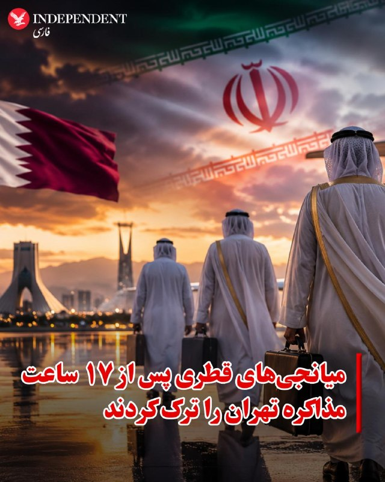

♦️یک دیپلمات آگاه از روند مذاکرات به سی‌ان‌ان گفت که میانجی‌های قطری پس از ۱۷ ساعت مذاکرات فشرده، تهران را ترک کرده‌اند. به گفته این منبع، قرار است در طول این هفته پیش از مراسم رسمی امضای توافق در روز جمعه در سوئیس و آغاز گفت‌وگوهای فنی، نشست‌های مقدماتی جداگانه‌ای با هر یک از طرف‌ها در دوحه برگزار شود.
‌🇸🇦 Indypersian

🤖 @VahidOOnLine

## FarsiVOA — post 220743

🔺دونالد ترامپ به نیویورک تایمز: اگر توافق هسته‌‌ای با جمهوری اسلامی نهایی نشود حملات نظامی از سر گرفته خواهد شد

▪️دونالد ترامپ، رئیس جمهوری آمریکا عصر یکشنبه در مصاحبه‌ای با نیویورک تایمز، گفت اگر جمهوری اسلامی نتواند به توافق هسته‌ای نهایی با ایالات متحده برسد، روندی که دستیاران او می‌گویند انتظار دارند روز جمعه در سوئیس آغاز شود، او حملات نظامی به جمهوری اسلامی را از سر خواهد گرفت یا ایالات متحده را در ازای دریافت ۲۰ درصد از درآمدهای منطقه، «نگهبان خاورمیانه» خواهد کرد.

⬇️ بیشتر بخوانید:
https://ir.voanews.com/a/8160777.html
@FarsiVOA

## BBCPersian — post 283833

‌ ‌ ‌ سام فرزانه، خبرنگار بی‌بی‌سی فارسی در لس‌آنجلس امیر قلعه‌نویی، سرمربی تیم ملی ایران، در یک نشست خبری در لس‌آنجلس گفت اعضای تیم سیاسی نیستند و فقط برای بازی فوتبال آمده‌اند. با این حال آقای قلعه‌نویی گفت شرایط ورود به آمریکا بر تمرکز بازیکنان تاثیر…

## BBCPersian — post 283832

  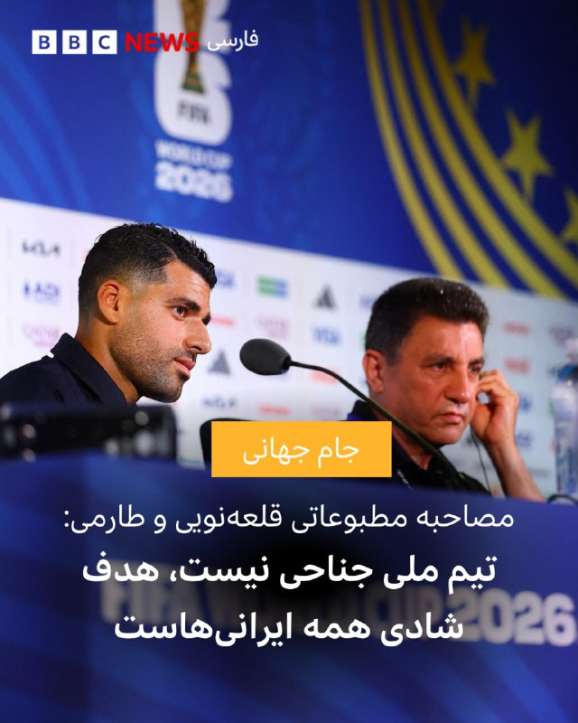

‌ ‌ ‌
سام فرزانه، خبرنگار بی‌بی‌سی فارسی در لس‌آنجلس

امیر قلعه‌نویی، سرمربی تیم ملی ایران، در یک نشست خبری در لس‌آنجلس گفت اعضای تیم سیاسی نیستند و فقط برای بازی فوتبال آمده‌اند.

با این حال آقای قلعه‌نویی گفت شرایط ورود به آمریکا بر تمرکز بازیکنان تاثیر گذاشته است اما در عین حال اضافه کرد که سعی خواهد کرد این مشکلات بازیکنان را حل کند.

آقای قلعه‌نویی و مهدی طارمی در نشست خبری پیش از بازی تیم ملی مقابل نیوزلند شرکت کرده بودند.

فدراسیون فوتبال ایران به فیفا گفته بود که فقط به سوال‌هایی درباره فوتبال پاسخ می‌دهند. با این حال سوال‌ها جنبه سیاسی هم پیدا کردند.نماینده فیفا که این جلسه را مدیریت می‌کرد، جلوی پرسش خبرنگاری را گرفت که درباره استفاده از پرچمی غیر از پرچم رسمی ایران پرسید. او گفت که این سوال به فوتبال مربوط نیست.

مهدی طارمی، از بازیکنان تیم ملی، در این نشست گفت: «ما آمدیم برای کسانی که درون ایران و کسانی که بیرون از ایران هستند فوتبال بازی کنیم.»

https://bbc.in/3S7MrT0
📷Reuters
@BBCPersian

---
📅 بروزرسانی: 1405/03/25 03:22
---

## VahidOOnLine — post 245592

  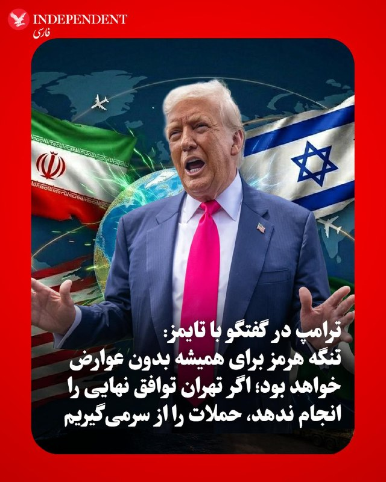

♦️دونالد ترامپ، رئیس‌جمهوری آمریکا، بعدازظهر یکشنبه در مصاحبه‌ با تایمز گفت توافقی که با ایران به دست آورده در نهایت تضمین خواهد کرد که تنگه هرمز «برای همیشه بدون عوارض» باقی بماند. او همچنین گفت که با وجود مخالفت‌های بنیامین نتانیاهو، نخست‌وزیر اسرائیل، اسرائیل را از «نابودی هسته‌ای» نجات داده است.
ترامپ همچنین تاکید کرد که اگر ایران نتواند به یک توافق نهایی هسته‌ای با ایالات متحده دست یابد — روندی که انتظار می‌رود از روز جمعه در سوئیس آغاز شود — حملات نظامی علیه تهران را از سر خواهد گرفت یا در ازای دریافت ۲۰ درصد از درآمدهای منطقه، ایالات متحده را به «نگهبان خاورمیانه» تبدیل خواهد کرد.
‌🇸🇦 Indypersian

🤖 @VahidOOnLine

## VahidOOnLine — post 245591

  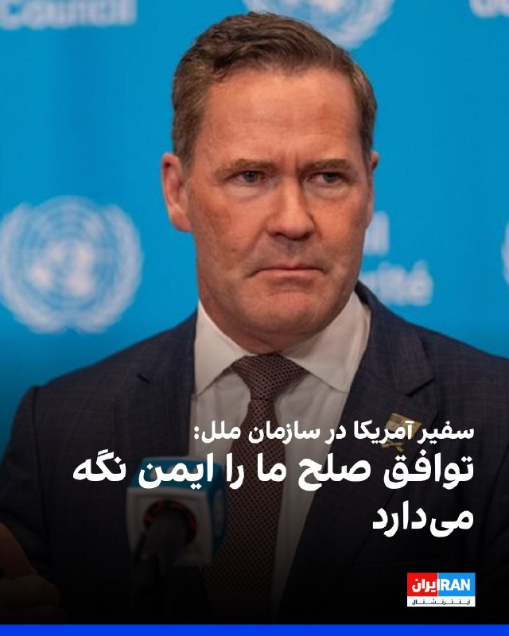

مایک والتز، سفیر آمریکا در سازمان ملل متحد، در شبکه اجتماعی ایکس نوشت: «رییس‌جمهور، آمریکا را در اولویت قرار داده و برای توافق صلحی مذاکره کرده است که ما را ایمن نگه می‌دارد و مانع از دستیابی ایران به سلاح هسته‌ای می‌شود.»

او افزود «دونالد ترامپ از همان ابتدا، اهرم فشار خود را به حداکثر رساند، تلفات را محدود کرد و نیروی نظامی معتبری را برای تضمین بهترین نتیجه ممکن به کار گرفت.»

والتز همچنین نوشت: «این یک راه فوق‌العاده برای جشن گرفتن یک تولد است» و هشتادمین سالروز تولد ترامپ را تبریک گفت.
‌🏁 🇬🇧 IranintlTV

🤖 @VahidOOnLine

## WithYashar — post 14942

  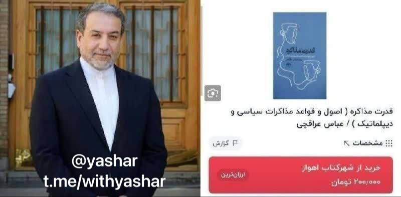

توافق خوب، توافقی است که هیچ یک از طرفین راضی نباشند

-کتاب قدرت مذاکره جلد سوم صفحه ۲۳۶

یه توافقی بستم که هم ایران ناراضیه هم ملت ناراضی هستن هم براندازا ناراضی هستن هم آمریکا ناراضیه هم اسراییل ناراضیه
@withyashar

## WithYashar — post 14941

نیویورک تایمز: تهران نهایی کردن توافق را تا بعد از نیمه‌شب به وقت محلی به تعویق انداخت تا از همزمانی این لحظه تاریخی با تولد رئیس‌جمهور ترامپ در روز یکشنبه جلوگیری کند

اختلاف زمانی هفت و نیم ساعته به هر دو کشور ایران و آمریکا اجازه داد تا جدول زمانی مورد نظر خود را حفظ کنند، به طوری که ترامپ گفت توافق در روز یکشنبه نهایی شده در حالی که مقامات ایرانی تأکید داشتند که این توافق در روز بعد به پایان رسیده است
@withyashar

## WithYashar — post 14940

ترامپ به نیویورک تایمز: نتانیاهو فرد بسیار نمک نشناسی است. او باید به شدت از ما بابت انجام این کار سپاسگزار باشد.
زیرا اگر ایران سلاح هسته‌ای داشت، اسرائیل دو ساعت هم دوام نمی‌آورد.
@withyashar

## pm_afshaa — post 94040

  <a href="telegram/content/pm_afshaa_94040_1781481151.mp4" target="_blank">🎬 Download video</a>

علی خامنه‌ای خرداد 1381:
کسانی که دم از مذاکره با آمریکا میزنن یا الفبای سیاست رو بلد نیستن، یا الفبای غیرت رو بلد نیستن. یکی از این دو تاست.

علی خامنه‌ای مرداد 1397:
مذاکره با آمریکا رو امام ممنوع کرد، من هم ممنوع کردم. حالا اگر چنانچه یک وقتی به فرض محال قرار بود با آمریکا مذاکره کنیم، با این دولت کنونی آمریکا (ترامپ) هرگز مذاکره نمی‌کنیم.

💧 Rainbet.com the #1 Non-KYC Crypto Casino & Sportsbook @rainbetcom

😁 @Pm_Afshaa

## VahidOnline — post 76360

مصاحبه ترامپ با نیویورک‌تایمز، ترجمه ماشین:
رئیس‌جمهور ترامپ بعدازظهر یکشنبه در مصاحبه‌ای گفت توافقی که با ایران به دست آورده، در نهایت تضمین خواهد کرد که تنگه هرمز «برای همیشه بدون عوارض» باشد و استدلال کرد که با وجود مخالفت‌های بنیامین نتانیاهو، نخست‌وزیر اسرائیل، او اسرائیل را از نابودی هسته‌ای نجات داده است.

آقای ترامپ همچنین اصرار کرد که اگر ایران نتواند به توافق نهایی هسته‌ای با ایالات متحده برسد ــ روندی که دستیارانش می‌گویند انتظار دارند روز جمعه در سوئیس آغاز شود ــ او حملات نظامی به تهران را از سر خواهد گرفت یا در ازای دریافت ۲۰ درصد از درآمدهای منطقه، ایالات متحده را به «نگهبان خاورمیانه» تبدیل خواهد کرد.

در یک گفت‌وگوی تلفنی ۲۸ دقیقه‌ای که آقای ترامپ از محل اقامتش در کاخ سفید آغاز کرد، و در یک تماس کوتاه بعدی، رئیس‌جمهور ادعا کرد که تصمیمش برای حمله به ایران در اواخر فوریه و محاصره دریایی بعدی بنادر این کشور پس از آنکه تهران تنگه را بست، خاورمیانه را به سود آمریکا دگرگون کرده است.

او که در روز تولد ۸۰ سالگی‌اش صحبت می‌کرد و صدای جمع شدن خانواده‌اش برای شام جشن تولد در پس‌زمینه شنیده می‌شد، از دو رهبر اقتدارگرا ــ شی جین‌پینگ، رئیس‌جمهور چین، و ولادیمیر وی. پوتین، رئیس‌جمهور روسیه ــ به‌خاطر کمک به این توافق تمجید کرد و آقای نتانیاهو را به‌دلیل انجام حملاتی که نزدیک بود توافق نهایی را از مسیر خارج کند، به‌شدت مورد حمله قرار داد.

آقای ترامپ درباره نخست‌وزیر اسرائیل گفت: «او آدم بسیار دشواری است، و صادقانه بگویم باید بابت این کار از ما بسیار سپاسگزار باشد. چون اگر ایران سلاح هسته‌ای داشت، اسرائیل دو ساعت هم دوام نمی‌آورد.»

با اینکه متن توافق هنوز منتشر نشده است، به نظر می‌رسید آقای ترامپ در حال توصیف امتیازهایی از سوی ایران است که این کشور هنوز نداده، یا به مذاکرات بعدی موکول شده است. برای مثال، تفاهم‌نامه فقط عوارض عبور از تنگه را به مدت ۶۰ روز تعلیق می‌کند و سپس وعده گفت‌وگوی منطقه‌ای درباره آینده را می‌دهد. ایران پیش از جنگ هرگز عوارضی دریافت نمی‌کرد، بنابراین آقای ترامپ در اصل در حال جشن گرفتن بازگشت به وضعیت پیش از جنگ است.

آقای ترامپ بارها تفاهم‌نامه جدید خود را با توافق سال ۲۰۱۵ میان باراک اوباما، رئیس‌جمهور وقت، و رهبری ایران مقایسه کرد و گفت توافق او تضمین خواهد کرد که ایران «نتواند سلاح هسته‌ای تولید یا خریداری کند». ایران زمانی که در سال ۱۹۷۰ پیمان منع گسترش سلاح‌های هسته‌ای را تصویب کرد، با این موضوع موافقت کرده بود و در صفحه نخست توافق دوران اوباما نیز دوباره بر آن تأکید کرد.

در سه ماه گذشته مذاکرات، که به رهبری استیو ویتکاف، فرستاده ویژه رئیس‌جمهور، و جرد کوشنر، داماد او، انجام شد، ایرانی‌ها اصرار داشتند که هرگز از حق خود برای غنی‌سازی اورانیوم تحت آن پیمان دست نخواهند کشید. آقای ترامپ گفت هنوز بر سر این موضوع مذاکره می‌کنند که آیا ایران غنی‌سازی خود را برای ۲۰ سال تعلیق خواهد کرد یا نه ــ ترامپ تلویحاً گفت شاید به تعلیق ۱۵ ساله رضایت دهد ــ اما گفت ایران برای همیشه به غنی‌سازی در سطوح پایین محدود خواهد شد؛ سطوحی که «هرگز نمی‌تواند از سوی ارتش استفاده شود».

توافق دولت اوباما نیز همین شرط را داشت، اما پس از آنکه آقای ترامپ در سال ۲۰۱۸ آن توافق را کنار گذاشت، ایران غنی‌سازی در سطوح بسیار بالاتر را آغاز کرد؛ از جمله اورانیوم نزدیک به سطح مورد نیاز برای بمب، با غنای ۶۰ درصد.

در جریان این گفت‌وگو، رئیس‌جمهور حال‌وهوایی شادمانه داشت و درباره رویداد آتی «یو‌اف‌سی» که قرار است در محوطه جنوبی کاخ سفید برگزار شود و احتمال اینکه باران آن را مختل کند، صحبت کرد. او گفت: «در زمان جنگ چنین چیزهایی پیش می‌آید.»
nytimes

📡 @VahidOnline

## IranIntlTV — post 342386

  

مایک والتز، سفیر آمریکا در سازمان ملل متحد، در شبکه اجتماعی ایکس نوشت: «رییس‌جمهور، آمریکا را در اولویت قرار داده و برای توافق صلحی مذاکره کرده است که ما را ایمن نگه می‌دارد و مانع از دستیابی ایران به سلاح هسته‌ای می‌شود.»

او افزود «دونالد ترامپ از همان ابتدا، اهرم فشار خود را به حداکثر رساند، تلفات را محدود کرد و نیروی نظامی معتبری را برای تضمین بهترین نتیجه ممکن به کار گرفت.»

والتز همچنین نوشت: «این یک راه فوق‌العاده برای جشن گرفتن یک تولد است» و هشتادمین سالروز تولد ترامپ را تبریک گفت.
https://iranintl.com/202606144997

## FarsiVOA — post 220742

  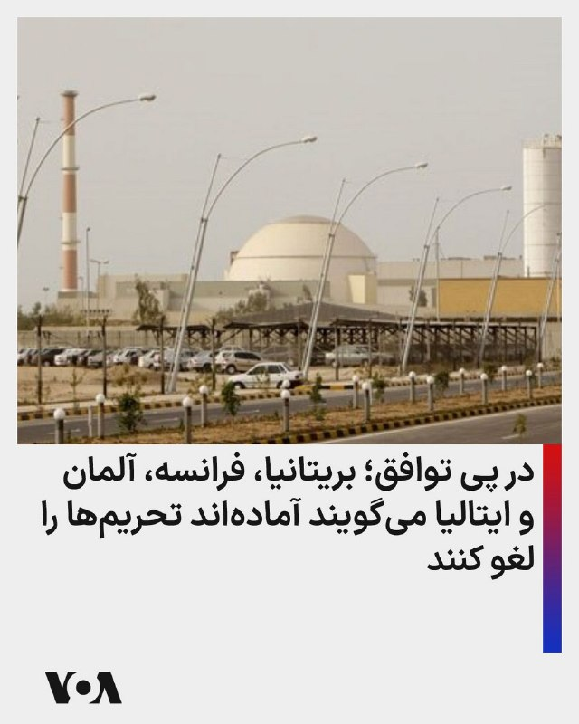

⚡️بریتانیا، فرانسه، آلمان و ایتالیا می‌گویند که پس از دستیابی آمریکا و جمهوری اسلامی به توافق برای پایان دادن به جنگ، آماده‌اند تا تحریم‌های جمهوری اسلامی را در پاسخ به گام‌هایی که در مورد برنامه هسته‌ای بر می‌دارد لغو کنند. به گزارش رویترز رهبران این کشورها در بیانیه‌ای مشترک گفتند: رژیم «ایران هرگز نباید به سلاح هسته‌ای دست یابد. ما آماده‌ایم تا برای این منظور با ایالات متحده، [رژیم] ایران و آژانس بین‌المللی انرژی اتمی همکاری کنیم.»
@FarsiVOA

## BBCPersian — post 283831

🔻 خبرگزاری فرانسه: احتمال دارد دونالد ترامپ هم توافق را امضا کند

خبرگزاری فرانسه گزارش داده است که جی‌دی ونس، معاون رئیس جمهور آمریا تصمیم دارد روز جمعه در مراسم امضای توافق شرکت کند و امکان دارد که دونالد ترامپ هم آن را امضا کند.

منابع خبری آمریکا در روزهای اخیر خبر داده بودند که احتمال اینکه آقای ونس در مراسم امضای تفاهم‌نامه شرکت کند، بیش از دیگر مقامات آمریکایی است.

این منابع گفته بودند محل مراسم احتمالا وین خواهد بود.

https://bbc.in/44aTOeY
@BBCPersian

## alonews — post 128098

  <a href="telegram/content/alonews_128098_1781481154.webm" target="_blank">🎬 Download video</a>

👈ترامپ: توافق هسته ای شکست بخورد، حملات نظامی را از سر خواهیم گرفت

✅ @AloNews خبر جنگ

## alonews — post 128097

  <a href="telegram/content/alonews_128097_1781481154.webm" target="_blank">🎬 Download video</a>

👈ترامپ حق غنی سازی ایران را پذیرفت

🔴ترامپ در گفت و گو با نیویورک تایمز مدعی شد: ایران برای همیشه به غنی‌سازی در سطوح پایین که تحت هیچ شرایطی نمی‌تواند برای اهداف نظامی استفاده شود، محدود خواهد شد.

✅ @AloNews خبر جنگ

---
📅 بروزرسانی: 1405/03/25 03:12
---

## VahidOOnLine — post 245590

  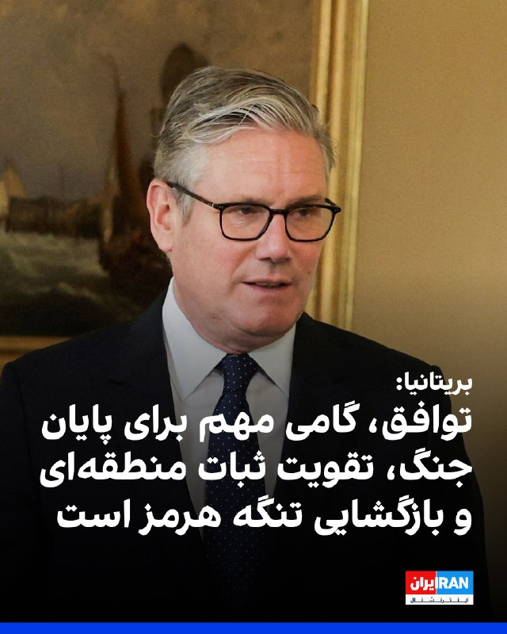

کی‌یر استارمر، نخست‌وزیر بریتانیا، از توافق میان آمریکا و جمهوری اسلامی استقبال کرد و آن را «گامی مهم برای پایان جنگ، تقویت ثبات منطقه‌ای و بازگشایی تنگه هرمز» دانست.

او همچنین از دونالد ترامپ، رییس‌جمهوری آمریکا، و قطر و پاکستان به دلیل نقش‌آفرینی در دستیابی به این توافق قدردانی کرد.

استارمر با تاکید بر ضرورت اجرای کامل تفاهم‌نامه و نهایی شدن توافق هسته‌ای، گفت: «تعهدات جمهوری اسلامی، به‌ویژه در زمینه برنامه هسته‌ای، باید قابل راستی‌آزمایی و به طور کامل اجرا شود و حکومت ایران نباید به سلاح هسته‌ای دست یابد.»
‌🏁 🇬🇧 IranintlTV

🤖 @VahidOOnLine

## VahidOOnLine — post 245589

  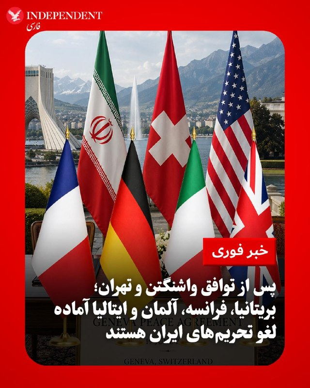

♦️بریتانیا، فرانسه، آلمان و ایتالیا روز یکشنبه ۲۴ خردادماه اعلام کردند پس از توافق آمریکا و ایران برای پایان دادن به جنگ، آماده‌اند در پاسخ به گام‌های ایران در زمینه برنامه هسته‌ای، تحریم‌های مرتبط با جمهوری اسلامی را لغو کنند.

رهبران این چهار کشور در بیانیه‌ای مشترک تاکید کردند ایران نباید هرگز به سلاح هسته‌ای دست یابد و افزودند برای تحقق این هدف آماده همکاری با ایالات متحده، ایران و آژانس بین‌المللی انرژی اتمی هستند.

این موضع‌گیری پس از اعلام توافق میان واشنگتن و تهران مطرح می‌شود؛ توافقی که به گفته طرف‌های درگیر قرار است زمینه توقف درگیری‌ها و آغاز مذاکرات بیشتر درباره مسائل هسته‌ای و امنیتی را فراهم کند.
‌🇸🇦 Indypersian

🤖 @VahidOOnLine

## pm_afshaa — post 94039

  <a href="telegram/content/pm_afshaa_94039_1781480541.webm" target="_blank">🎬 Download video</a>

🔴ترامپ به نیویورک تایمز:
هر توافق نهایی به ایران اجازه خواهد داد غنی‌سازی اورانیوم در سطح پایین انجام بده که هرگز نمیتونه به صورت نظامی استفاده بشه و محدودیت‌ها تضمین خواهند کرد که ایران نتونه به سلاح هسته‌ای برسه.

💧 Rainbet.com the #1 Non-KYC Crypto Casino & Sportsbook @rainbetcom

😁 @Pm_Afshaa

## pm_afshaa — post 94038

  <a href="telegram/content/pm_afshaa_94038_1781480542.mp4" target="_blank">🎬 Download video</a>

قالیباف، بهمن 1403:
مذاکره با ترامپ، قاتل حاج قاسم سلیمانی شرافتمندانه نیست.

💧 Rainbet.com the #1 Non-KYC Crypto Casino & Sportsbook @rainbetcom

😁 @Pm_Afshaa

## IranIntlTV — post 342385

  

کی‌یر استارمر، نخست‌وزیر بریتانیا، از توافق میان آمریکا و جمهوری اسلامی استقبال کرد و آن را «گامی مهم برای پایان جنگ، تقویت ثبات منطقه‌ای و بازگشایی تنگه هرمز» دانست.

او همچنین از دونالد ترامپ، رییس‌جمهوری آمریکا، و قطر و پاکستان به دلیل نقش‌آفرینی در دستیابی به این توافق قدردانی کرد.

استارمر با تاکید بر ضرورت اجرای کامل تفاهم‌نامه و نهایی شدن توافق هسته‌ای، گفت: «تعهدات جمهوری اسلامی، به‌ویژه در زمینه برنامه هسته‌ای، باید قابل راستی‌آزمایی و به طور کامل اجرا شود و حکومت ایران نباید به سلاح هسته‌ای دست یابد.»
https://iranintl.com/202606144649

## FarsiVOA — post 220741

  <a href="telegram/content/FarsiVOA_220741_1781480543.mp4" target="_blank">🎬 Download video</a>

⚡️شوک تساوی تیم فوتبال برزیل در مقابل مراکش؛ گفت‌وگو با کوشا دلشاد مربی فوتبال در برزیل
@FarsiVOA

## FarsiVOA — post 220740

  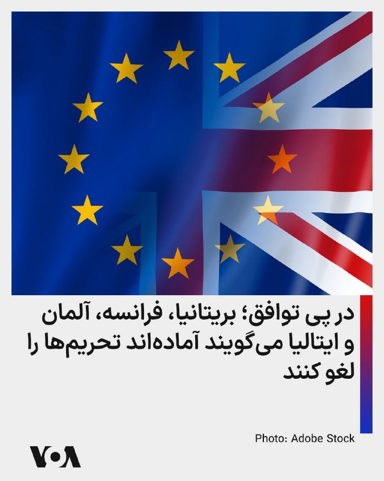

⚡️بریتانیا، فرانسه، آلمان و ایتالیا می‌گویند که پس از دستیابی آمریکا و جمهوری اسلامی به توافق برای پایان دادن به جنگ، آماده‌اند تا تحریم‌های جمهوری اسلامی را در پاسخ به گام‌هایی که در مورد برنامه هسته‌ای بر می‌دارد لغو کنند. به گزارش رویترز رهبران این کشورها در بیانیه‌ای مشترک گفتند: رژیم «ایران هرگز نباید به سلاح هسته‌ای دست یابد. ما آماده‌ایم تا برای این منظور با ایالات متحده، [رژیم] ایران و آژانس بین‌المللی انرژی اتمی همکاری کنیم.»
@FarsiVOA

## Persian_Trend_Official — post 17139

ترامپ: ایران می‌تواند غنی سازی با درصد کم انجام دهد.

ترامپ در گفتگو با نیویورک تایمز گفت که آمریکا و ایران هنوز در حال مذاکره درباره عناصر کلیدی توافق نهایی هسته‌ای هستند، از جمله اینکه آیا تهران موافقت خواهد کرد که غنی‌سازی اورانیوم را برای 15 تا 20 سال تعلیق کند یا خیر.

او گفت هر توافق نهایی تنها اجازه غنی‌سازی اورانیوم در سطح پایین را به ایران خواهد داد که هرگز نمی‌تواند توسط نظامی‌ها استفاده شود و تأکید کرد که این محدودیت‌ها تضمین می‌کند تهران نتواند سلاح هسته‌ای توسعه دهد.

📝 Amir

📌 @persian_trend_official
پرشین ترند | متفاوت‌ترین کانال نظامی

## BBCPersian — post 283830

  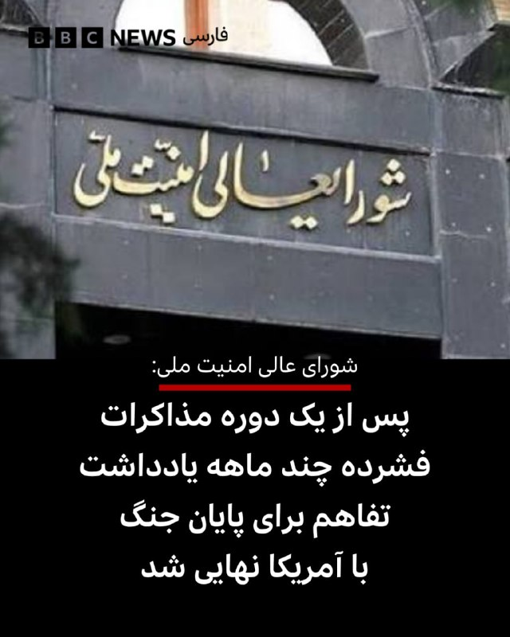

‌ ‌ ‌
شورای عالی امنیت ملی ایران در بیانیه‌ای رسیدن به توافق برای پایان جنگ با آمریکا را تایید کرده است.

در این بیانیه که رسانه‌های ایران منتشر کرده‌اند، آماده است: «به دنبال یک دوره مذاکرات دشوار و فشرده چند ماهه، و بر اساس مصوبه شورای عالی امنیت ملی، متن یادداشت تفاهم در خصوص مذاکرات پایان جنگ (مذاکرات اسلام آباد) را میان ایران و امریکا در شامگاه ۲۴ خرداد ماه، نهایی کرد.»

در این بیانیه آمده که براساس توافق «جنگ و عملیات نظامی در تمامی جبهه‌ها از جمله لبنان از امشب به صورت فوری و دائمی پایان یافته و به علاوه، محاصره دریایی علیه ایران بلافاصله و به طور کامل خاتمه می‌یابد.»

شورای عالی امنیت ملی ایران تایید کرده که «امضای این یادداشت تفاهم در روز جمعه ۲۹ خرداد به طور رسمی انجام خواهد شد.»

ایران گفته است پس از آن، «مذاکرات برای توافق نهایی، به پس از اجرای تعهدات طرف مقابل وفق یادداشت تفاهم موکول خواهد شد.»

جمهوری اسلامی در پایان از پاکستان و قطر نیز بابت میانجی‌گری تشکر کرده است.

https://bbc.in/4fLyX9o
📷dolat.ir
@BBCPersian

---
📅 بروزرسانی: 1405/03/25 03:02
---

## VahidOOnLine — post 245588

  

هاکان فیدان، وزیر خارجه ترکیه، از توافق میان آمریکا و جمهوری اسلامی برای پایان دادن به جنگ استقبال کرد و آن را گامی مهم در مسیر دستیابی به صلح و ثبات پایدار در منطقه دانست.

او در شبکه اجتماعی ایکس ابراز امیدواری کرد که مذاکرات تکمیلی نیز با رویکردی سازنده ادامه یابد و به تقویت روند صلح کمک کند.

فیدان همچنین از طرف‌های توافق و کشورهای میانجی از جمله پاکستان و قطر قدردانی کرد و افزود جلوگیری از هرگونه تلاش برای اخلال در این توافق و حمایت از امنیت و ثبات منطقه از اهمیت ویژه‌ای برخوردار است.

او نوشت ترکیه از آغاز این روند از تلاش‌های دیپلماتیک حمایت کرده است و به پشتیبانی از صلح، آرامش و ثبات در منطقه ادامه خواهد داد.
‌🏁 🇬🇧 IranintlTV

🤖 @VahidOOnLine

## WithYashar — post 14939

پرزیدنت ترامپ به نیویورک تایمز گفت که در صورت شکست مذاکرات برای دستیابی به توافق هسته ای نهایی، حملات نظامی خود را علیه ایران از سر خواهد گرفت.
@withyashar 🚨

## WithYashar — post 14938

## pm_afshaa — post 94037

  <a href="telegram/content/pm_afshaa_94037_1781479953.webm" target="_blank">🎬 Download video</a>

🔴ترامپ به نیویورک تایمز:
نتانیاهو فرد بسیار دشواریه؛ اون باید به شدت از ما بابت انجام این کار سپاسگزار باشه، چون اگه ایران سلاح هسته‌ای داشت، اسرائیل دو ساعت هم دوام نمیاورد.

ترامپ همچنین گفت: توافقی که با ایران به دست آوردیم، در نهایت تضمین میکنه که تنگه هرمز برای همیشه رایگان است.

💧 Rainbet.com the #1 Non-KYC Crypto Casino & Sportsbook @rainbetcom

😁 @Pm_Afshaa

## pm_afshaa — post 94036

  <a href="telegram/content/pm_afshaa_94036_1781479953.webm" target="_blank">🎬 Download video</a>

🔴ترامپ به نیویورک تایمز:
در صورت شکست مذاکرات برای دستیابی به توافق هسته‌ای نهایی، دوباره حملات نظامی رو علیه ایران از سر می‌گیریم.

💧 Rainbet.com the #1 Non-KYC Crypto Casino & Sportsbook @rainbetcom

😁 @Pm_Afshaa

## mamlekate — post 103714

  <a href="telegram/content/mamlekate_103714_1781479954.mp4" target="_blank">🎬 Download video</a>

ترامپ یک ثانیه بعد از امضای توافق‌نامه و حلال شدن خون خامنه‌ای

Yzd_Jn
@mamlekate

## VahidOnline — post 76359

  <a href="telegram/content/VahidOnline_76359_1781479955.mp4" target="_blank">🎬 Download video</a>

قالیباف پیش از چنج‌رژیم: مذاکره با قاتل سلیمانی شرافتمندانه نیست

همزمان با انتشار خبر توافق میان واشنگتن و تهران، ویدیویی از اظهارات محمدباقر قالیباف، رئیس مجلس شورای اسلامی، در روز شنبه ۲۰ بهمن‌ماه ۱۴۰۳ بار دیگر در شبکه‌های اجتماعی بازنشر شده است.
قالیباف در ششمین همایش ویژه فرماندهان و کارکنان ستاد فرماندهی سپاه، در پاسخ به پرسشی درباره تفاوت کامالا هریس و دونالد ترامپ گفته بود: «حتما فرق دارد، ترامپ قاتل شهید سلیمانی است. مگر ما می‌توانیم بی‌تفاوت باشیم؟ پس حتما برای ما فرق می‌کند.»
او همچنین با اشاره به مواضع علی خامنه‌ای درباره مذاکره با آمریکا گفته بود: حضرت آقا می‌فرمایند شرافتمندانه نیست، خب شرافتمندانه نیست.
@VahidOOnLine

📡 @VahidOnline

## VahidOnline — post 76357

کی‌یر استارمر، نخست‌وزیر بریتانیا، اعلام کرد که از توافق اعلام‌شده میان آمریکا و حکومت ایران «به گرمی استقبال می‌کند» و آن را «گامی بسیار مهم رو به جلو برای پایان دادن به جنگ، تضمین ثبات منطقه و بازگشایی تنگه هرمز» توصیف کرد.
استارمر در بیانیه‌ای که روز یکشنبه در شبکه‌های اجتماعی منتشر کرد، افزود: «ما آماده‌ایم از گفت‌وگوهای فنی که اکنون آغاز خواهد شد حمایت کنیم. اولویت ما این است که این توافق به صلحی پایدار و ماندگار تبدیل شود و برای تحقق این هدف با شرکای بین‌المللی همکاری خواهیم کرد.»
او گفت حمایت بریتانیا می‌تواند، در صورت نیاز، شامل «راه‌اندازی ماموریت دفاعی، مستقل و چندجانبه‌ای باشد که بریتانیا و فرانسه تاکنون نقش پیشرو در برنامه‌ریزی آن داشته‌اند؛ به‌ویژه برای ارائه کمک در زمینه پاکسازی مین‌ها» در تنگه هرمز.
نخست‌وزیر بریتانیا همچنین تاکید کرد: «موضع قاطع و دیرینه بریتانیا همچنان این است که ایران هرگز نباید به سلاح هسته‌ای دست یابد.»
@VahidOOnLine
امانوئل مکرون، رئیس‌جمهوری فرانسه، بامداد دوشنبه ۲۵ خردادماه در پیامی در شبکه اجتماعی اکس از توافق حاصل‌شده میان واشنگتن وتهران استقبال کرد و خواستار اجرای سریع و کامل آن از سوی همه طرف‌های درگیر شد.
مکرون گفت این توافق باید زمینه بازگشایی فوری و بدون قید و شرط تنگه هرمز را فراهم کند. او افزود ماموریت بین‌المللی ایجادشده با همکاری بریتانیا آماده پشتیبانی از این روند است و ازسرگیری تردد دریایی بدون محدودیت و عوارض، برای ثبات منطقه‌ای و اقتصاد جهانی ضروری است.
رئیس‌جمهوری فرانسه همچنین گفت این توافق می‌تواند راه را برای مذاکراتی گسترده‌تر درباره برنامه هسته‌ای و موشکی ایران و مسائل امنیتی خاورمیانه هموار کند. او تاکید کرد فرانسه آماده است در کنار شرکای خود برای دستیابی به صلحی پایدار در منطقه نقش‌آفرینی کند.
مکرون در بخش دیگری از پیام خود بر حمایت فرانسه از تلاش‌های دولت لبنان برای بازگرداندن حاکمیت کامل این کشور تاکید کرد و گفت برقراری آتش‌بسی پایدار برای تحقق این هدف ضروری است.
@VahidOOnLine

📡 @VahidOnline

## IranIntlTV — post 342384

  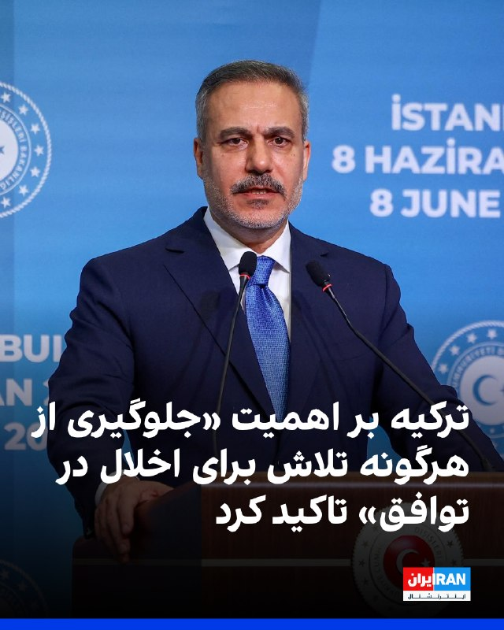

هاکان فیدان، وزیر خارجه ترکیه، از توافق میان آمریکا و جمهوری اسلامی برای پایان دادن به جنگ استقبال کرد و آن را گامی مهم در مسیر دستیابی به صلح و ثبات پایدار در منطقه دانست.

او در شبکه اجتماعی ایکس ابراز امیدواری کرد که مذاکرات تکمیلی نیز با رویکردی سازنده ادامه یابد و به تقویت روند صلح کمک کند.

فیدان همچنین از طرف‌های توافق و کشورهای میانجی از جمله پاکستان و قطر قدردانی کرد و افزود جلوگیری از هرگونه تلاش برای اخلال در این توافق و حمایت از امنیت و ثبات منطقه از اهمیت ویژه‌ای برخوردار است.

او نوشت ترکیه از آغاز این روند از تلاش‌های دیپلماتیک حمایت کرده است و به پشتیبانی از صلح، آرامش و ثبات در منطقه ادامه خواهد داد.
https://iranintl.com/202606143400

## Dirty_Kids — post 392081

🔥 #جام_جهانی شروع شده و میدون مال توئه! 
🔽 هر اتفاقی توی زمین چمن، می‌تونه برگت رو ببره بالا. حالا وقتشه قهرمان روز باشی و بزرگ بازی کنی! 👑 ⚽️ این جام جهانی رو فقط باید توی بت فیدو پیش‌بینی کنی 
😀 با ۵۰ میلیون تومان شرط روزانه ← ۴ میلیون تومان اعتبار شرط‌بندی…

## Dirty_Kids — post 392080

  

🔥 #جام_جهانی شروع شده و میدون مال توئه! 
🔽

هر اتفاقی توی زمین چمن، می‌تونه برگت رو ببره بالا. حالا وقتشه قهرمان روز باشی و بزرگ بازی کنی! 👑

⚽️ این جام جهانی رو فقط باید توی بت فیدو پیش‌بینی کنی

😀 با ۵۰ میلیون تومان شرط روزانه ← ۴ میلیون تومان اعتبار شرط‌بندی رایگان

🏅 با ۱۰۰ میلیون تومان شرط روزانه ← ۸ میلیون تومان اعتبار شرط‌بندی رایگان
A24

💸 هرچی بزرگ‌تر بازی کنی، جایزه‌ت بزرگ‌تره!
همین حالا پیش بینیتو ثبت کن✏️
https://fido874vt.click
https://fido874vt.click

📤
📤
📤
📤
📤
📤
📤
📤
(ورود با وی-پی-ان غیر اروپایی)

😀 کانال تلگرام 👇
https://t.me/+dySI_QFj0T0xZGVk

## Dirty_Kids — post 392079

  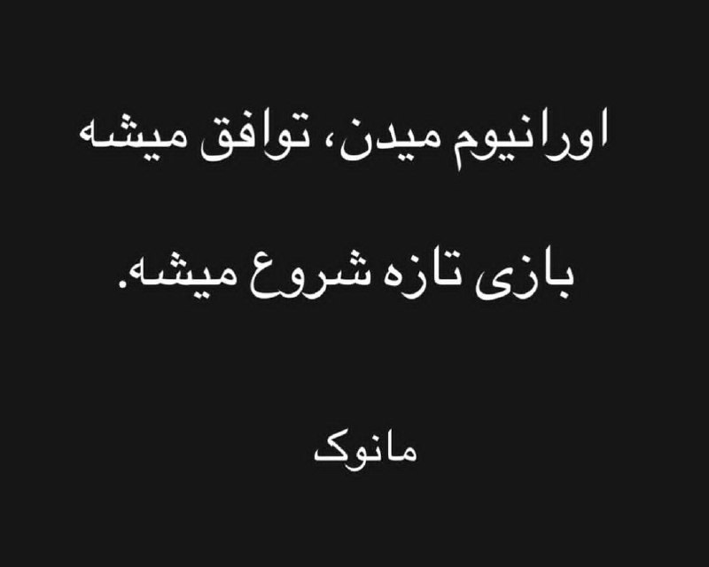

#بخوابیم

@Dirty_Kids 👻

## Dirty_Kids — post 392078

  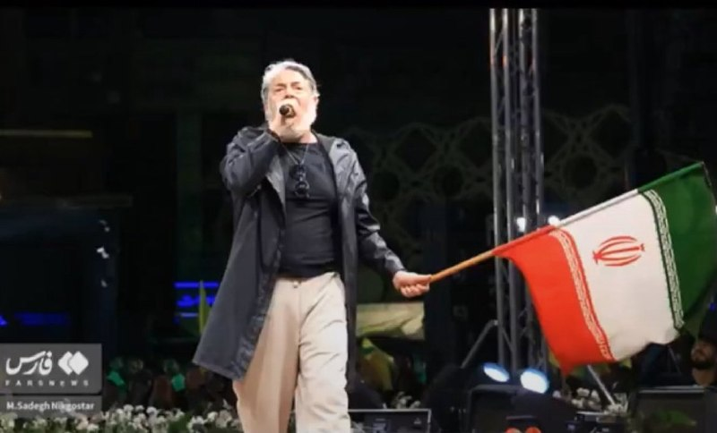

قیصر ریدی با این اومدنت🤣

@Dirty_Kids 👻

## Dirty_Kids — post 392077

  <a href="telegram/content/Dirty_Kids_392077_1781479957.mp4" target="_blank">🎬 Download video</a>

وضعیت باقر و عباس: 😂😂

@Dirty_Kids 👻

## alonews — post 128096

  <a href="telegram/content/alonews_128096_1781479958.webm" target="_blank">🎬 Download video</a>

👈نیویورک تایمز: تهران نهایی کردن توافق را تا بعد از نیمه‌شب به وقت محلی به تعویق انداخت تا از همزمانی این لحظه تاریخی با تولد رئیس‌جمهور ترامپ در روز یکشنبه جلوگیری کند

🔴اختلاف زمانی هفت و نیم ساعته به هر دو کشور ایران و آمریکا اجازه داد تا جدول زمانی مورد نظر خود را حفظ کنند، به طوری که ترامپ گفت توافق در روز یکشنبه نهایی شده در حالی که مقامات ایرانی تأکید داشتند که این توافق در روز بعد به پایان رسیده است

✅ @AloNews خبر جنگ

## alonews — post 128095

  <a href="telegram/content/alonews_128095_1781479958.webm" target="_blank">🎬 Download video</a>

👈پرزیدنت ترامپ به نیویورک تایمز:

نتانیاهو فرد بسیار نمک نشناسی است. او باید به شدت از ما بابت انجام این کار سپاسگزار باشد.

زیرا اگر ایران سلاح هسته‌ای داشت، اسرائیل دو ساعت هم دوام نمی‌آورد.

✅ @AloNews خبر جنگ

## alonews — post 128094

غریب آبادی

انقدرخودکار دزدید

که تفاهم نامه رو الکترونیکی امضا میکنند

[@AloTweet]

## alonews — post 128093

  <a href="telegram/content/alonews_128093_1781479958.mp4" target="_blank">🎬 Download video</a>

✅ @AloNews

---
📅 بروزرسانی: 1405/03/25 02:52
---

## VahidOOnLine — post 245587

  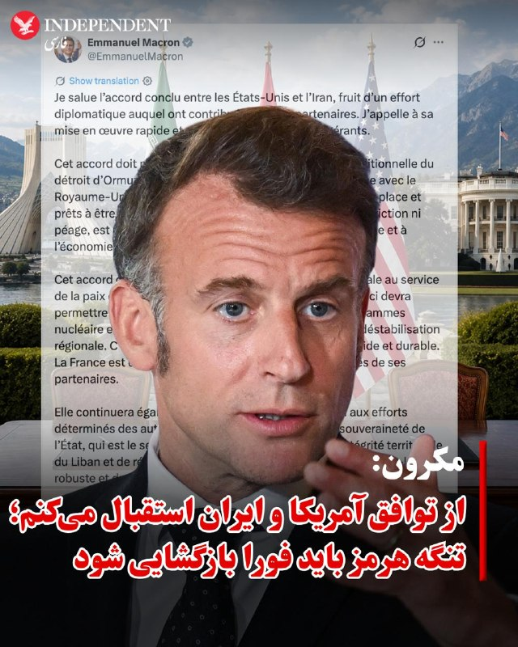

♦️امانوئل مکرون، رئیس‌جمهوری فرانسه، بامداد دوشنبه ۲۵ خردادماه در پیامی در شبکه اجتماعی اکس از توافق حاصل‌شده میان واشنگتن وتهران استقبال کرد و خواستار اجرای سریع و کامل آن از سوی همه طرف‌های درگیر شد.

مکرون گفت این توافق باید زمینه بازگشایی فوری و بدون قید و شرط تنگه هرمز را فراهم کند. او افزود ماموریت بین‌المللی ایجادشده با همکاری بریتانیا آماده پشتیبانی از این روند است و ازسرگیری تردد دریایی بدون محدودیت و عوارض، برای ثبات منطقه‌ای و اقتصاد جهانی ضروری است.

رئیس‌جمهوری فرانسه همچنین گفت این توافق می‌تواند راه را برای مذاکراتی گسترده‌تر درباره برنامه هسته‌ای و موشکی ایران و مسائل امنیتی خاورمیانه هموار کند. او تاکید کرد فرانسه آماده است در کنار شرکای خود برای دستیابی به صلحی پایدار در منطقه نقش‌آفرینی کند.

مکرون در بخش دیگری از پیام خود بر حمایت فرانسه از تلاش‌های دولت لبنان برای بازگرداندن حاکمیت کامل این کشور تاکید کرد و گفت برقراری آتش‌بسی پایدار برای تحقق این هدف ضروری است.
‌🇸🇦 Indypersian

🤖 @VahidOOnLine

## VahidOOnLine — post 245586

  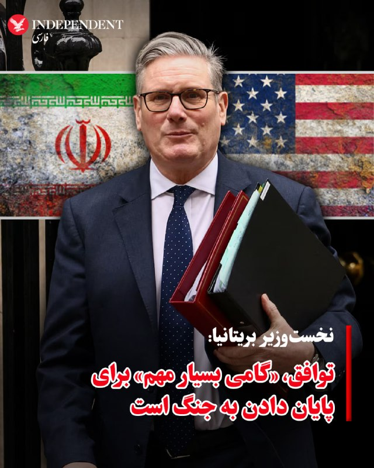

♦️کی‌یر استارمر، نخست‌وزیر بریتانیا، اعلام کرد که از توافق اعلام‌شده میان آمریکا و حکومت ایران «به گرمی استقبال می‌کند» و آن را «گامی بسیار مهم رو به جلو برای پایان دادن به جنگ، تضمین ثبات منطقه و بازگشایی تنگه هرمز» توصیف کرد.
استارمر در بیانیه‌ای که روز یکشنبه در شبکه‌های اجتماعی منتشر کرد، افزود: «ما آماده‌ایم از گفت‌وگوهای فنی که اکنون آغاز خواهد شد حمایت کنیم. اولویت ما این است که این توافق به صلحی پایدار و ماندگار تبدیل شود و برای تحقق این هدف با شرکای بین‌المللی همکاری خواهیم کرد.»
او گفت حمایت بریتانیا می‌تواند، در صورت نیاز، شامل «راه‌اندازی ماموریت دفاعی، مستقل و چندجانبه‌ای باشد که بریتانیا و فرانسه تاکنون نقش پیشرو در برنامه‌ریزی آن داشته‌اند؛ به‌ویژه برای ارائه کمک در زمینه پاکسازی مین‌ها» در تنگه هرمز.
نخست‌وزیر بریتانیا همچنین تاکید کرد: «موضع قاطع و دیرینه بریتانیا همچنان این است که ایران هرگز نباید به سلاح هسته‌ای دست یابد.»
‌🇸🇦 Indypersian

🤖 @VahidOOnLine

## VahidOOnLine — post 245585

  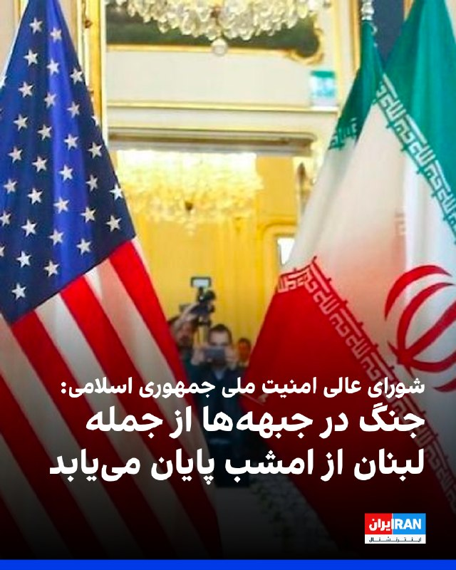

دبیرخانه شورای عالی امنیت ملی جمهوری اسلامی اعلام کرد: «متن یادداشت تفاهم پایان جنگ میان ایران و آمریکا پس از چند ماه مذاکره فشرده، نهایی شده است.»

در این بیانیه آمده است: «بر اساس توافق انجام‌شده، جنگ و عملیات نظامی در تمامی جبهه‌ها از جمله لبنان از امشب به صورت فوری و دائمی پایان می‌یابد و محاصره دریایی علیه ایران نیز بلافاصله لغو خواهد شد.»

دبیرخانه شورای عالی امنیت ملی افزود: «امضای رسمی این یادداشت تفاهم جمعه ۲۹ خرداد انجام می‌شود و مذاکرات برای دستیابی به توافق نهایی پس از اجرای تعهدات طرف مقابل ادامه خواهد یافت.»

در این بیانیه همچنین از پاکستان و قطر به دلیل «نقش‌آفرینی در روند میانجی‌گری» قدردانی شده است.
‌🏁 🇬🇧 IranintlTV

🤖 @VahidOOnLine

## VahidOOnLine — post 245584

  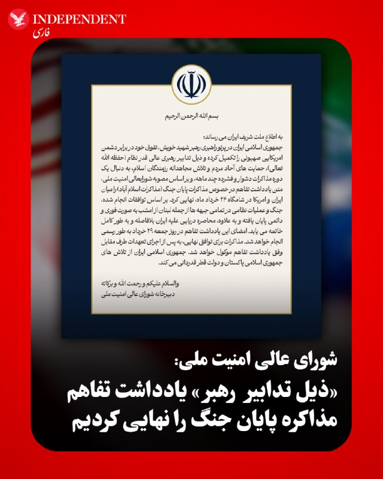

♦️دبیرخانه شورای عالی امنیت ملی در بیانیه‌ای درباره تفاهم با آمریکا اعلام کرد: «ذیل تدابیر رهبری عالی قدر نظام، حمایت‌های آحاد مردم و تلاش مجاهدانه رزمندگان اسلام، به‌دنبال یک‌دوره مذاکرات دشوار و فشرده چندماهه، و براساس مصوبه شورای‌عالی امنیت ملی، متن یادداشت تفاهم در خصوص مذاکرات پایان جنگ (مذاکرات اسلام آباد) را میان ایران و آمریکا در شامگاه ۲۴ خرداد ماه، نهایی کرد.» در ادامه این بیانیه آمده: «بر اساس توافقات انجام شده، جنگ و عملیات نظامی در تمامی جبهه ها از جمله لبنان از امشب به‌صورت فوری و دائمی پایان یافته و به علاوه، محاصره دریایی علیه ایران بلافاصله و به‌طور کامل خاتمه می‌یابد.
این بیانیه می‌آفزاید، امضای این یادداشت تفاهم در روز جمعه ۲۹ خرداد به‌طور رسمی انجام خواهد شد. مذاکرات برای توافق نهایی، به پس از اجرای تعهدات طرف مقابل وفق یادداشت تفاهم موکول خواهد شد.
‌🇸🇦 Indypersian

🤖 @VahidOOnLine

## WithYashar — post 14937

@withyashar khatme kalam

## WithYashar — post 14936

## pm_afshaa — post 94034

  <a href="telegram/content/pm_afshaa_94034_1781479363.webm" target="_blank">🎬 Download video</a>

🔴نیویورک تایمز: محمدباقر قالیباف و عباس عراقچی برای امضای توافق با جی‌دی ونس، معاون ترامپ، به ژنو سفر خواهند کرد.

💧 Rainbet.com the #1 Non-KYC Crypto Casino & Sportsbook @rainbetcom

😁 @Pm_Afshaa

## pm_afshaa — post 94033

علی‌خامنه‌ای 11 روز قبل از ترور: امام حسین فرمود کسی مثل من با کسی مثل یزید بیعت نمیکنه: ملت ماهم بیعت نمیکنه. 
💧 Rainbet.com the #1 Non-KYC Crypto Casino & Sportsbook @rainbetcom 
😁 @Pm_Afshaa

## mamlekate — post 103713

  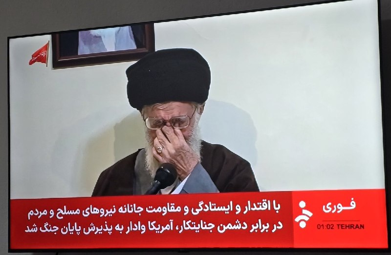

زیرنویس شبکه خبر با عکسی که گذاشته خیلی جالبه:))))

Mojtabapacino
@mamlekate

## mamlekate — post 103712

📝 آمریکا و جمهوری اسلامی از دستیابی به تفاهم برای پایان جنگ خبر دادند

دونالد ترامپ و شهباز شریف اعلام کردند که واشینگتن و تهران به توافقی برای پایان دادن به جنگ میان دو طرف دست یافته‌اند؛ توافقی که قرار است روز جمعه در سوئیس به طور رسمی امضا شود و شامل بازگشایی تنگه هرمز، پایان محاصره دریایی ایران و آغاز مذاکرات درباره برنامه هسته‌ای تهران باشد.

📝 معاریو: نتانیاهو به ترامپ گفت اسرائیل تعهدی به بند مربوط به لبنان ندارد

روزنامه معاریو به نقل از منابع اسرائیلی گزارش داد بنیامین نتانیاهو به دونالد ترامپ گفته اسرائیل خود را متعهد به بند لبنان در توافق آمریکا و جمهوری اسلامی نمی‌داند. به نوشته این روزنامه، اسرائیل از لبنان عقب‌نشینی نخواهد کرد و به اقدامات خود علیه تهدیدهای حزب‌الله ادامه...

@mamlekate

## IranIntlTV — post 342383

  

دبیرخانه شورای عالی امنیت ملی جمهوری اسلامی اعلام کرد: «متن یادداشت تفاهم پایان جنگ میان ایران و آمریکا پس از چند ماه مذاکره فشرده، نهایی شده است.»

در این بیانیه آمده است: «بر اساس توافق انجام‌شده، جنگ و عملیات نظامی در تمامی جبهه‌ها از جمله لبنان از امشب به صورت فوری و دائمی پایان می‌یابد و محاصره دریایی علیه ایران نیز بلافاصله لغو خواهد شد.»

دبیرخانه شورای عالی امنیت ملی افزود: «امضای رسمی این یادداشت تفاهم جمعه ۲۹ خرداد انجام می‌شود و مذاکرات برای دستیابی به توافق نهایی پس از اجرای تعهدات طرف مقابل ادامه خواهد یافت.»

در این بیانیه همچنین از پاکستان و قطر به دلیل «نقش‌آفرینی در روند میانجی‌گری» قدردانی شده است.
https://iranintl.com/202606148591

## FarsiVOA — post 220739

  <a href="telegram/content/FarsiVOA_220739_1781479365.mp4" target="_blank">🎬 Download video</a>

⚡️سهم ۸۰۰ هزار دلاری امیر قلعه‌نویی از پاداش جام جهانی ۲۰۲۶؛ و ساعت ۴۵ هزار دلاری او
@FarsiVOA

## FarsiVOA — post 220738

🔺استقبال نخست‌وزیر بریتانیا از توافق آمریکا و حکومت ایران؛ استارمر: جمهوری اسلامی هرگز نباید به بمب هسته‌ای دست یابد

▪️کی‌یر استارمر، نخست‌وزیر بریتانیا، از توافق حاصل‌شده میان ایالات متحده و جمهوری اسلامی استقبال کرد و آن را «گامی بسیار مهم» در مسیر پایان دادن به جنگ، تضمین ثبات منطقه و بازگشایی تنگه هرمز توصیف کرد.

⬇️ بیشتر بخوانید:
https://ir.voanews.com/a/8160773.html
@FarsiVOA

## IranianMinds — post 22608

  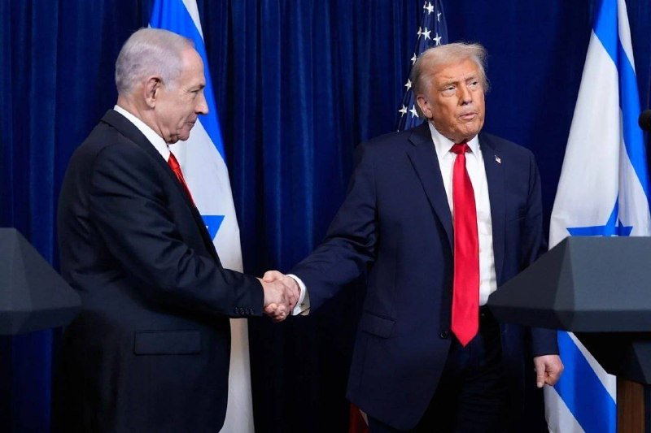

🔴 معاریو‌ :

نتانیاهو به ترامپ گفته اسرائیل خود را ملزم به بخش مربوط به لبنان در توافق پیشنهادی آمریکا و ایران نمی‌داند.

به گفته منابع اسرائیلی، تل‌آویو قصد دارد نیروهای خود را در لبنان حفظ کند، به عملیات علیه حزب‌الله ادامه دهد و در صورت لزوم به هرگونه حمله پاسخ دهد.

@IranianMinds

## BBCPersian — post 283829

🔻 معاون وزارت خارجه ایران حصول تفاهم را تایید کرد

کاظم غریب‌آبادی، معاون وزارت خارجه ایران در گفت‌وگویی با تلویزیون دولتی ایران حصول تفاهم با آمریکا را تایید کرده و گفته است که امضای رسمی آن روز جمعه در سوئیس خواهد بود.

آقای غریب‌آبادی گفته است: «پایان فوری و دائمی جنگ و عملیات نظامی در جبهه‌های مختلف از جمله لبنان امشب اعلام خواهد شد.»

او اضافه کرده است که محاصره دریایی ایران از سوی آمریکا هم امشب پایان خواهد یافت.

معاون وزارت خارجه ایران اظهار امیدواری کرده که مذاکرات ظرف ۶۰ روز به نتیجه برسد.

او گفت: «خاتمه تمامی تحریم‌ها علیه جمهوری اسلامی ایران، چه تحریم‌های اولیه و چه ثانویه و خاتمه قطعنامه‌های شورای امنیت و شورای حکام، جزو موضوعات مورد مذاکره در بازه ۶۰ روزه خواهد بود.»

https://bbc.in/4a2rGyd
@BBCPersian

## alonews — post 128092

  <a href="telegram/content/alonews_128092_1781479367.webm" target="_blank">🎬 Download video</a>

👈قالیباف🤝ونس در ژنو

✅ @AloNews خبر جنگ

## alonews — post 128088

  <a href="telegram/content/alonews_128088_1781479367.webm" target="_blank">🎬 Download video</a>

👈کانال تلگرامی اسرائیلی با بیش از ۱۸۰ هزار عضو در سوگ و خشم:

🔴«خدا ترامپ را لعنت کند.»

🔴«اولین جنگ در تاریخ اسرائیل که ما باختیم.»

🔴«باید واقعیت را بپذیریم: ایرانیان به آمریکا درس دادند.»

🔴«امیدوارم تا ده سال دیگر به احمق‌های آمریکایی وابسته نباشیم.»

✅ @AloNews خبر جنگ

---
📅 بروزرسانی: 1405/03/25 02:42
---

## VahidOOnLine — post 245583

♦️همزمان با انتشار خبر توافق میان واشنگتن و تهران، ویدیویی از اظهارات محمدباقر قالیباف، رئیس مجلس شورای اسلامی، در روز شنبه ۲۰ بهمن‌ماه ۱۴۰۳ بار دیگر در شبکه‌های اجتماعی بازنشر شده است.

قالیباف در ششمین همایش ویژه فرماندهان و کارکنان ستاد فرماندهی سپاه، در پاسخ به پرسشی درباره تفاوت کامالا هریس و دونالد ترامپ گفته بود: «حتما فرق دارد، ترامپ قاتل شهید سلیمانی است. مگر ما می‌توانیم بی‌تفاوت باشیم؟ پس حتما برای ما فرق می‌کند.»

او همچنین با اشاره به مواضع علی خامنه‌ای درباره مذاکره با آمریکا گفته بود: «حضرت آقا می‌فرمایند شرافتمندانه نیست، خب شرافتمندانه نیست.»
‌🇸🇦 Indypersian

🤖 @VahidOOnLine

## VahidOOnLine — post 245582

  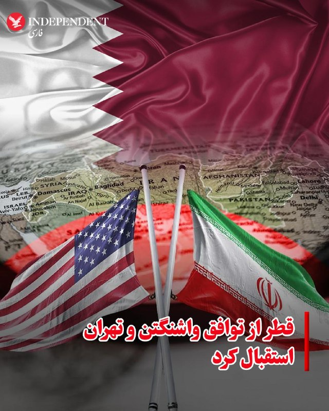

♦️محمد بن عبدالرحمن بن جاسم آل‌ثانی، نخست‌وزیر و وزیر امور خارجه قطر، روز یکشنبه اعلام کرد که کشورش از توافق واشنگتن و تهرلن «استقبال می‌کند».
آل‌ثانی در پیامی در اکس نوشت:
«ما امیدواریم همه طرف‌ها در مذاکرات پیش‌رو با روحیه‌ای مثبت و سازنده مشارکت کنند؛ رویکردی که به تحکیم این پیشرفت و گسترش دستاوردهای آن کمک خواهد کرد.»
پیش‌تر، شهباز شریف، نخست‌وزیر پاکستان، از قطر به‌دلیل کمک به «تلاش‌های میانجی‌گرانه» قدردانی کرده بود. ترامپ نیز از قطر قدردانی کرده است.
‌🇸🇦 Indypersian

🤖 @VahidOOnLine

## VahidOOnLine — post 245581

  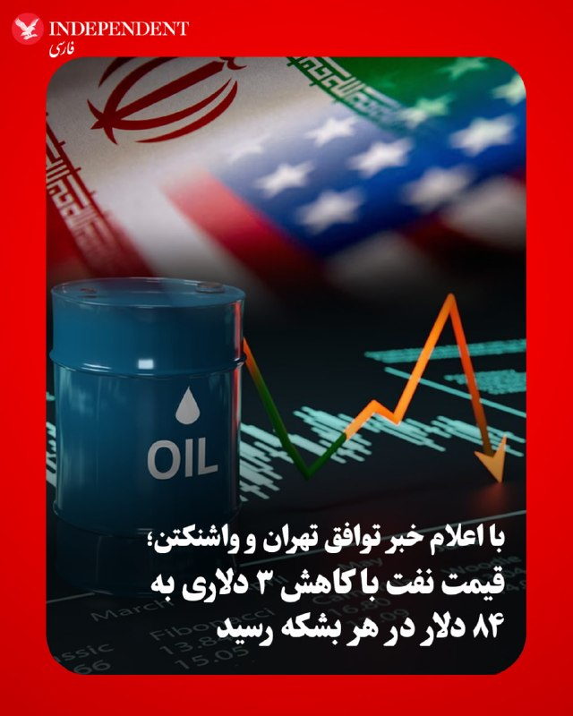

♦️به گزارش خبرگزاری رویترز، در پی اعلام رسمی نهایی شدن توافق صلح میان آمریکا و جمهوری اسلامی ایران و صدور فرمان بازگشایی فرآیند تردد دریایی در تنگه هرمز، قیمت نفت در بازارهای جهانی با افت و ریزش بیش از ۴ درصدی همراه شد. بر اساس این گزارش، بلافاصله پس از انتشار اخبار مربوط به توقف جنگ، بهای هر بشکه نفت خام برنت با ۳ دلار و ۵۱ سنت (معادل ۴.۰۲ درصد) کاهش به ۸۳ دلار و ۸۲ سنت رسید؛ همچنین نفت خام وست تگزاس اینترمدیت آمریکا (WTI) نیز با تجربه‌ افت چشمگیر ۳ دلار و ۹۳ سنتی (معادل ۴.۶۳ درصد)، به قیمت ۸۰ دلار و ۹۵ سنت در هر بشکه معامله شد.
‌🇸🇦 Indypersian

🤖 @VahidOOnLine

## WithYashar — post 14935

نیویورک تایمز : محمدباقر قالیباف، مذاکره‌کننده ارشد ایران، و عباس عراقچی، وزیر امور خارجه، برای امضای توافق با جی‌دی ونس، معاون رئیس‌جمهور، به ژنو سفر خواهند کرد.
@withyashar

## WithYashar — post 14934

هم اکنون محاصره دریایی آمریکا علیه ایران کاملا برداشته شد
@withyashar

## WithYashar — post 14933

## mwarmonitor — post 10939

🔴بیانیه مشترک رهبران E4، بریتانیا، فرانسه، آلمان و ایتالیا:

🔸«ما از اعلام تفاهم‌نامه میان ایالات متحده و ایران به‌گرمی استقبال می‌کنیم. ما به ایالات متحده، دولت ایران و همه کسانی که در این امر دخیل بوده‌اند، از جمله پاکستان، قطر و سایر میانجی‌ها، برای این گشایش دیپلماتیک تبریک می‌گوییم.

🔸این لحظه، فرصتی برای بازگرداندن ثبات منطقه‌ای و پایدار کردن اقتصاد جهانی است.
اکنون حیاتی است که مذاکرات دقیق به سرانجام برسد و این توافق به‌سرعت و به‌طور جامع اجرا شود. ما آماده حمایت از این تلاش هستیم.

🔸بازگشایی فوری تنگه هرمز با آزادی کشتیرانی بدون قید و شرط و بدون محدودیت، ضروری است. ما متعهد هستیم که نقش خود را برای دستیابی به این مهم — مطابق با الزامات قانون اساسی مربوطه خود — از جمله از طریق یک ماموریت کاملاً دفاعی و مستقل برای اطمینان‌بخشی به کشتیرانی تجاری و انجام عملیات مین‌روبی، ایفا کنیم.

🔸ایران هرگز نباید به سلاح هسته‌ای دست یابد. ما آماده هستیم تا برای این منظور با ایالات متحده، ایران و آژانس بین‌المللی انرژی اتمی (IAEA) همکاری کنیم. ما آمادگی داریم در پاسخ به گام‌های شفاف و راستی‌آزمایی‌شده از سوی ایران در خصوص برنامه هسته‌ای‌اش، تحریم‌های مربوطه را لغو کنیم.

🔸ما به‌طور فشرده با ایالات متحده، ایران و شرکای منطقه‌ای همکاری خواهیم کرد تا از این فرصت استفاده کنیم، پویایی ایجادشده را حفظ کنیم و به یک تسویه دیپلماتیک بلندمدت دست یابیم.

🔸ما همچنین حمایت کامل خود را از ثبات، حاکمیت و تمامیت ارضی لبنان و اهمیت یک آتش‌بس پایدار و مستحکم مجدداً تأکید می‌کنیم.»

@mwarmonitor

## mwarmonitor — post 10938

🔴سناتور لیندسی گراهام:

«از شنیدن این‌که یادداشت تفاهم با ایران برای بازگشایی تنگه هرمز به توافق رسیده است، خرسندم. من روند مذاکرات بعدی درباره برنامه هسته‌ای ایران و سایر موضوعات را با دقت دنبال خواهم کرد.

تا حدی نگرانم که دیدگاه ایران درباره این توافق با آنچه تیم مذاکره‌کننده آمریکایی مطرح می‌کند متفاوت باشد.

بر اساس قوانین ما، هر توافق هسته‌ای با ایران برای بررسی و رأی‌گیری به کنگره ارسال خواهد شد. مشتاقانه منتظر بررسی نسخه نهایی هستم و معتقدم ضروری است که طراح این توافق، معاون رئیس‌جمهور ونس و شرکای مذاکره‌کننده‌اش، در روند ارائه توافق نهایی به کنگره حضور داشته باشند.

به همه کسانی که ما را به این نقطه رساندند تبریک می‌گویم. زمان مشخص خواهد کرد.»

@mwarmonitor

## pm_afshaa — post 94032

  <a href="telegram/content/pm_afshaa_94032_1781478774.webm" target="_blank">🎬 Download video</a>

🔴طبق توافق، محاصره دریایی آمریکا از همین الان برداشته شد و تنگه هرمز از جمعه به‌بعد باز میشه.

لغو شدن فوری محاصره پیشنهاد لحظه آخری ترامپ برای لغو حمله ایران به اسرائیل بوده.

💧 Rainbet.com the #1 Non-KYC Crypto Casino & Sportsbook @rainbetcom

😁 @Pm_Afshaa

## pm_afshaa — post 94031

  <a href="telegram/content/pm_afshaa_94031_1781478774.webm" target="_blank">🎬 Download video</a>

🔴بیانیه فرانسه، بریتانیا، آلمان و ایتالیا:

از یادداشت تفاهم میان آمریکا و ایران استقبال می‌کنیم و اینو فرصتی برای بازگشت ثبات منطقه‌ای میدونیم.

ایران نباید به سلاح هسته‌ای دست یابد، اما در صورت اقدامات شفاف و قابل‌راستی‌آزمایی تهران، آماده لغو تحریم‌های ایران هستیم.

💧 Rainbet.com the #1 Non-KYC Crypto Casino & Sportsbook @rainbetcom

😁 @Pm_Afshaa

## pm_afshaa — post 94030

  <a href="telegram/content/pm_afshaa_94030_1781478775.webm" target="_blank">🎬 Download video</a>

🔴بیانیه شورای عالی امنیت ملی:

متن یادداشت تفاهم پایان جنگ میان ایران و آمریکا نهایی شده و بر اساس این تفاهم، جنگ و عملیات نظامی در همه جبهه‌ها از جمله لبنان از امشب به‌صورت فوری و دائمی پایان می‌یابد و محاصره دریایی ایران هم لغو میشه.

امضای رسمی این تفاهم روز جمعه انجام خواهد شد.

💧 Rainbet.com the #1 Non-KYC Crypto Casino & Sportsbook @rainbetcom

😁 @Pm_Afshaa

## mamlekate — post 103711

  <a href="telegram/content/mamlekate_103711_1781478776.mp4" target="_blank">🎬 Download video</a>

پزشکیان برای توجیه توافق: رسول خدا تو جنگ لت و پار شده بود

@mamlekate

## VahidOnline — post 76356

  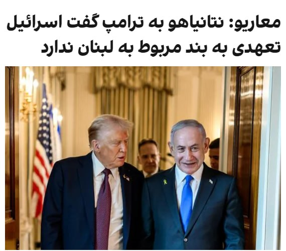

روزنامه معاریو به نقل از منابع اسرائیلی گزارش داد بنیامین نتانیاهو، نخست‌وزیر این کشور، در گفت‌وگو با دونالد ترامپ، رییس‌جمهوری آمریکا، به صراحت اعلام کرد که اسرائیل خود را به بند مربوط به لبنان در توافق میان آمریکا و حکومت ایران متعهد نمی‌داند.

بر اساس این گزارش، نتانیاهو گفت که ارتش اسرائیل از لبنان عقب‌نشینی نخواهد کرد، در مواضع فعلی خود باقی خواهد ماند و به اقدامات خود برای خنثی کردن تهدیدهای حزب‌الله، از جمله نابودی زیرساخت‌های تروریستی و پاسخ به هرگونه حمله علیه اسرائیل، ادامه خواهد داد.

به نوشته معاریو، برداشت منابع اسرائیلی آن است که «توافق احتمالی ایالات متحده با ایران، دست اسرائیل را در عرصه لبنان نخواهد بست. پیام اصلی این است: اسرائیل منافع امنیتی-راهبردی مستقلی در لبنان دارد و قصد دارد بر آن پافشاری کند.»

این روزنامه نوشت: «اکنون باید دید این شفاف‌سازی‌ها — فراتر از تماس تلفنی نتانیاهو و ترامپ — در بوته واقعیت چگونه عمل خواهد کرد.»
@VahidOOnLine

📡 @VahidOnline

## IranIntlTV — post 342382

  <a href="telegram/content/IranIntlTV_342382_1781478777.mp4" target="_blank">🎬 Download video</a>

دونالد ترامپ اعلام کرد توافق با جمهوری اسلامی نهایی شده و دستور بازگشایی فوری تنگه هرمز و لغو محاصره دریایی آمریکا را صادر کرده است. معاون وزیر امور خارجه جمهوری اسلامی هم اعلام کرد توافق نهایی قرار است روز جمعه در سوئیس امضا شود.

گزارش امیر گیتی، عضو تحریریه ایران‌اینترنشنال
@iranintltv

## Iliaen — post 4489

  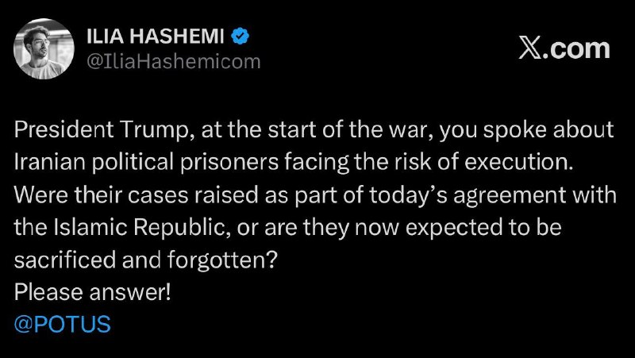

شاید در این زمان که تمام تمرکزها به تفاهم موقت است، فراموش شود در چنین شرایطی اقدام بعدی جمهوری اسلامی چیست.

در وضعیت پیش‌رو، نخستین اقدام حاکمیت، آرام کردن فضا برای افراطی‌ها و آن دسته از کسانی است که ماه‌ها در خیابان پرچم تکان دادند و امروز متوجه شدند بازیچه‌ای بیش نبودند.

معمولاً در چنین شرایطی، نمایش اقتدار حاکمیت جهت ارضای روحی و روانی این دسته از اشخاص، از طریق شروع یک موج گسترده از اعدام زندانیان سیاسی با برچسب “معاند و جاسوس” به نتیجه می‌رسد.

در این زمان باید اهمیت جان این زندانیان به عنوان بخشی از گفتمان اصلی جریان فعلی تبدیل شود، چه در داخل و چه در خارج از کشور.

در توییت زیر، به انگلیسی دونالد ترامپ را خطاب دادم و نوشتم:

“شما در آغاز جنگ درباره زندانیان سیاسی که با خطر اعدام روبرو بودند صحبت می‌کردید، آیا آنها به عنوان بخشی از توافق امروز با جمهوری اسلامی مطرح شدند، یا حالا قرار است قربانی و فراموش شوند؟”

شاید این اقدامات ناکافی باشد، اما از جمله ابزاری است که بتوان با فشار بین‌المللی به جمهوری اسلامی در زمانی‌که نجات خود را به این تفاهم وابسته می‌داند، دست‌کم جان تعداد زیادی از جوانان را حفظ کرد یا زمان بیشتری برایشان خرید.

می‌توانید با لایک، ریتوییت، منشن به ترامپ و یا انتشار متن‌های مشابه در فضای توییتر، کمک بزرگی کنید.
لینک:
https://x.com/iliahashemicom/status/2066295109360996766

## FarsiVOA — post 220737

⚡️آسیب‌های استفاده بدون محدودیت کودکان و نوجوانان از شبکه‌های اجتماعی؛ گفت‌و‌گو با سعید خلیلی‌راد
@FarsiVOA

## Persian_Trend_Official — post 17138

  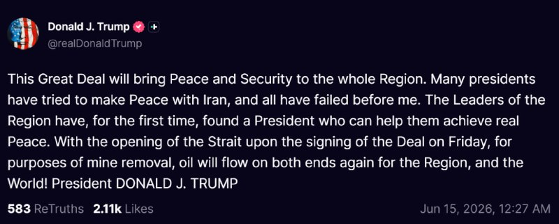

ترامپ در تروث سوشال: این توافق بزرگ، صلح و امنیت را برای کل منطقه به ارمغان خواهد آورد. بسیاری از روسای جمهور تلاش کرده‌اند با ایران صلح کنند و همه قبل از من شکست خورده‌اند.

رهبران منطقه برای اولین بار رئیس جمهوری پیدا کرده‌اند که می‌تواند به آنها در دستیابی به صلح واقعی کمک کند.

با باز شدن تنگه هرمز پس از امضای توافق در روز جمعه، به منظور مین‌زدایی، نفت دوباره از هر دو طرف برای منطقه و جهان جریان خواهد یافت!

📝 Amir

📌 @persian_trend_official
پرشین ترند | متفاوت‌ترین کانال نظامی

## Persian_Trend_Official — post 17137

فایل صوتی لایو دوم امشب در اسپاتیفای
https://open.spotify.com/episode/43Cjmah21JguMWbSvJcfXC

## Persian_Trend_Official — post 17136

  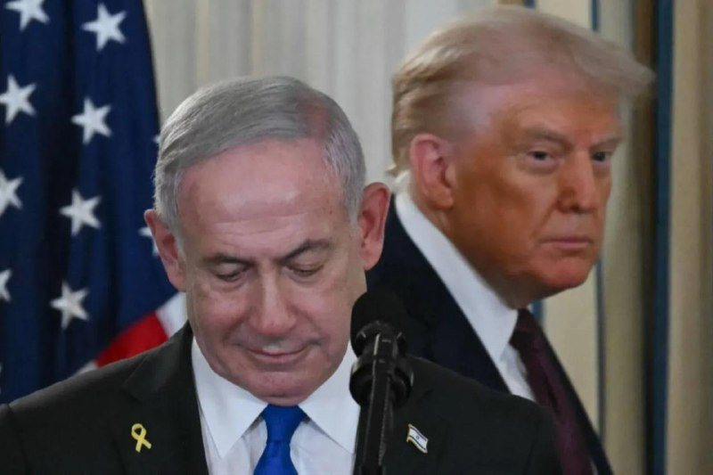

به گزارش خبرگزاری معاریو بنیامین نتانیاهو، نخست وزیر اسرائیل، به رئیس جمهور ترامپ گفته است که نیروهای اسرائیلی از لبنان خارج نخواهند شد و اسرائیل خود را ملزم به رعایت بند مربوط به لبنان در تفاهم‌نامه ایالات متحده و ایران نمی‌داند.

📝 Amir

📌 @persian_trend_official
پرشین ترند | متفاوت‌ترین کانال نظامی

## Persian_Trend_Official — post 17135

معاون رئیس جمهور امریکا، جی دی ونس: من قطعاً قصد دارم برای امضای توافق در سوئیس آنجا باشم، اما ممکن است خود رئیس جمهور ترامپ نیز آنجا باشد. ما این موضوع را حل خواهیم کرد.

فکر می‌کنم می‌توانیم با اطمینان بگوییم که ایران هرگز سلاح هسته‌ای نخواهد داشت. ما کارهای زیادی برای انجام دادن داریم، اما امشب یک پیروزی بزرگ به دست آوردیم.

📝 Amir

📌 @persian_trend_official
پرشین ترند | متفاوت‌ترین کانال نظامی

## BBCPersian — post 283828

🔻 قرارگاه خاتم الانبیا: نیروهای مسلح مقتدر کشور و جبهه مقاومت، دشمنان را مجبور به پذیرش شکست کردند

قرارگاه مرکزی خاتم‌الانبیا در بیانیه‌ای پس از اعلام توافق ایران و آمریکا، آن را به «فرزندان دلاور و شجاع ملت در نیروهای مسلح مقتدر کشور و جبهه مقاومت» نسبت داده است.

در این بیانیه کوتاه که در رسانه‌های ایران منتشر شده، آمده است که نیروهای مسلح ایران تحت رهبری مجتبی خامنه‌ای «با تحمیل اراده الهی و پولادین خود به دشمنان ... با قدرت ثابت کردند که راهی جز پذیرش شکست و تسلیم» ندارند.

ساعاتی پیش شهباز شریف، نخست‌وزیر پاکستان و دونالد ترامپ، رئیس‌جمهور آمریکا، رسیدن به توافق با تهران را تایید کردند.

https://bbc.in/4vSDcEQ
@BBCPersian

## Dirty_Kids — post 392076

  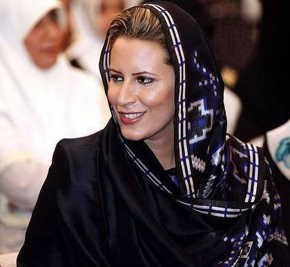

‏🔴عایشه قذافی، دختر معمر قذافی: به پدرم گفتن موشک و برنامه هسته‌ای رو بذار کنار تا درهای رفاه و آسایش به روی لیبی باز بشه.

پدرم همین کارو کرد، اما ناتو شروع به بمباران لیبی کرد.

@Dirty_Kids 👻

## Dirty_Kids — post 392075

  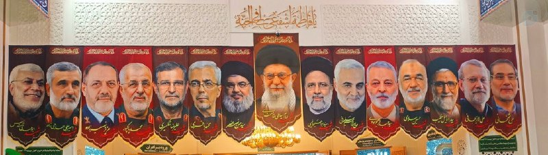

سندی محکم از پیروزی قاطع جمهوری اسلامی🔥

@Dirty_Kids 👻

## Dirty_Kids — post 392074

  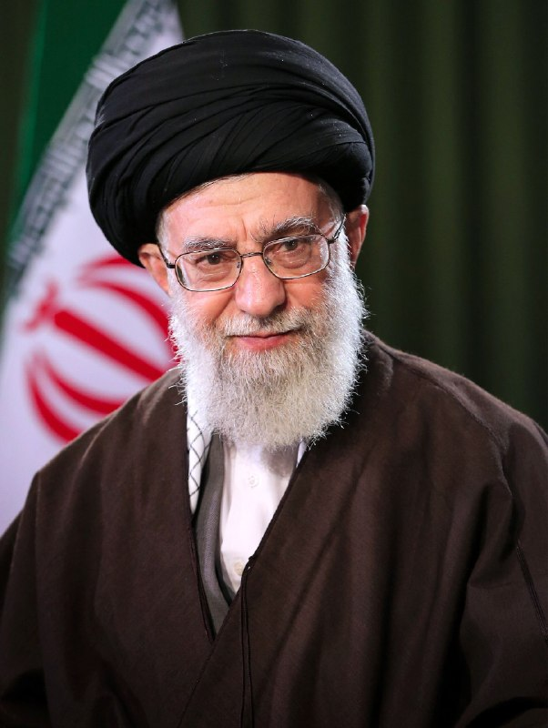

باخت ما رفاقت با کص پدران بود، وگرنه ما کجا و باخت کجا.

@Dirty_Kids 👻

## alonews — post 128086

  <a href="telegram/content/alonews_128086_1781478784.webm" target="_blank">🎬 Download video</a>

👈رسایی: اینترنت رو قطع کنید

✅ @AloNews خبر جنگ

## alonews — post 128085

  <a href="telegram/content/alonews_128085_1781478785.webm" target="_blank">🎬 Download video</a>

🔴فوری و رسمی/هم اکنون محاصره دریایی آمریکا علیه ایران کاملا برداشته شد

✅ @AloNews خبر جنگ

## alonews — post 128084

  <a href="telegram/content/alonews_128084_1781478785.webm" target="_blank">🎬 Download video</a>

👈انگلیس، آلمان، فرانسه: آماده لغو تحریم های ایران هستیم 
✅ @AloNews خبر جنگ

---
📅 بروزرسانی: 1405/03/25 02:32
---

## VahidOOnLine — post 245580

  

روزنامه معاریو به نقل از منابع اسرائیلی گزارش داد بنیامین نتانیاهو، نخست‌وزیر این کشور، در گفت‌وگو با دونالد ترامپ، رییس‌جمهوری آمریکا، به صراحت اعلام کرد که اسرائیل خود را به بند مربوط به لبنان در توافق میان آمریکا و حکومت ایران متعهد نمی‌داند.

بر اساس این گزارش، نتانیاهو گفت که ارتش اسرائیل از لبنان عقب‌نشینی نخواهد کرد، در مواضع فعلی خود باقی خواهد ماند و به اقدامات خود برای خنثی کردن تهدیدهای حزب‌الله، از جمله نابودی زیرساخت‌های تروریستی و پاسخ به هرگونه حمله علیه اسرائیل، ادامه خواهد داد.

به نوشته معاریو، برداشت منابع اسرائیلی آن است که «توافق احتمالی ایالات متحده با ایران، دست اسرائیل را در عرصه لبنان نخواهد بست. پیام اصلی این است: اسرائیل منافع امنیتی-راهبردی مستقلی در لبنان دارد و قصد دارد بر آن پافشاری کند.»

این روزنامه نوشت: «اکنون باید دید این شفاف‌سازی‌ها — فراتر از تماس تلفنی نتانیاهو و ترامپ — در بوته واقعیت چگونه عمل خواهد کرد.»
‌🏁 🇬🇧 IranintlTV

🤖 @VahidOOnLine

## WithYashar — post 14932

## WithYashar — post 14931

## WithYashar — post 14930

@yasharrapfa 👻

## pm_afshaa — post 94029

یادی کنیم از حرف‌های عایشه قذافی دختر معمر قذافی، دیکتاتور سرنگون شده لیبی :

به پدرم وعده دادن اگر لیبی از برنامه‌های موشکی و هسته‌ای خود عقب‌نشینی کنه، کشور وارد دوره‌ای از امنیت و پیشرفت خواهد شد. اما پس از کنار گذاشتن آن توان بازدارنده، حملات ناتو به لیبی آغاز شد و کشور ما به میدان جنگ تبدیل گردید.

💧 Rainbet.com the #1 Non-KYC Crypto Casino & Sportsbook @rainbetcom

😁 @Pm_Afshaa

## pm_afshaa — post 94028

  <a href="telegram/content/pm_afshaa_94028_1781478169.mp4" target="_blank">🎬 Download video</a>

صداوسیما سرود پیروزی پخش کرد.
حتی الانم گنده گوزی؟

💧 Rainbet.com the #1 Non-KYC Crypto Casino & Sportsbook @rainbetcom

😁 @Pm_Afshaa

## mamlekate — post 103710

  <a href="telegram/content/mamlekate_103710_1781478172.mp4" target="_blank">🎬 Download video</a>

💪🏻 صداوسیما: «آمریکا وادار به امضای تفاهم پایان جنگ با جمهوری اسلامی و جبهه مقاومت شد»

😶‍🌫️ پیشتر: «قالیباف، عراقچی، پس خون رهبرم چی؟»

@mamlekate

## VahidOnline — post 76355

بیانیه دبیرخانه شورای عالی امنیت ملی

متنی که در خبرگزارهای حکومتی منتشر شده:
بیانیه دبیرخانه شورای عالی امنیت ملی درباره توافق پایان جنگ
میان ایران و آمریکا

بسم الله الرحمن الرحیم

به اطلاع ملت شریف ایران می رساند:

▪️ جمهوری اسلامی ایران در پرتو راهبری رهبر شهید خویش، تفوق خود در برابر دشمن امریکایی صهیونی را تکمیل کرده و ذیل تدابیر رهبری عالی قدر نظام (حفظه الله تعالی)، حمایت های آحاد مردم و تلاش مجاهدانه رزمندگان اسلام، به دنبال یک دوره مذاکرات دشوار و فشرده چند ماهه، و بر اساس مصوبه شورایعالی امنیت ملی، متن یادداشت تفاهم در خصوص مذاکرات پایان جنگ (مذاکرات اسلام آباد) را میان ایران و امریکا در شامگاه 24 خرداد ماه، نهایی کرد.

▪️ بر اساس توافقات انجام شده، جنگ و عملیات نظامی در تمامی جبهه ها از جمله لبنان از امشب به صورت فوری و دائمی پایان یافته و به علاوه، محاصره دریایی علیه ایران بلافاصله و به طور کامل خاتمه می‌یابد.

▪️ امضای این یادداشت تفاهم در روز جمعه 29 خرداد به طور رسمی انجام خواهد شد.

▪️ مذاکرات برای توافق نهایی، به پس از اجرای تعهدات طرف مقابل وفق یادداشت تفاهم موکول خواهد شد. جمهوری اسلامی ایران از تلاش های جمهوری اسلامی پاکستان و دولت قطر قدردانی می کند.

والسلام علیکم و رحمت الله و برکاته
دبیرخانه شورای عالی امنیت ملی

📡 @VahidOnline

## IranIntlTV — post 342381

  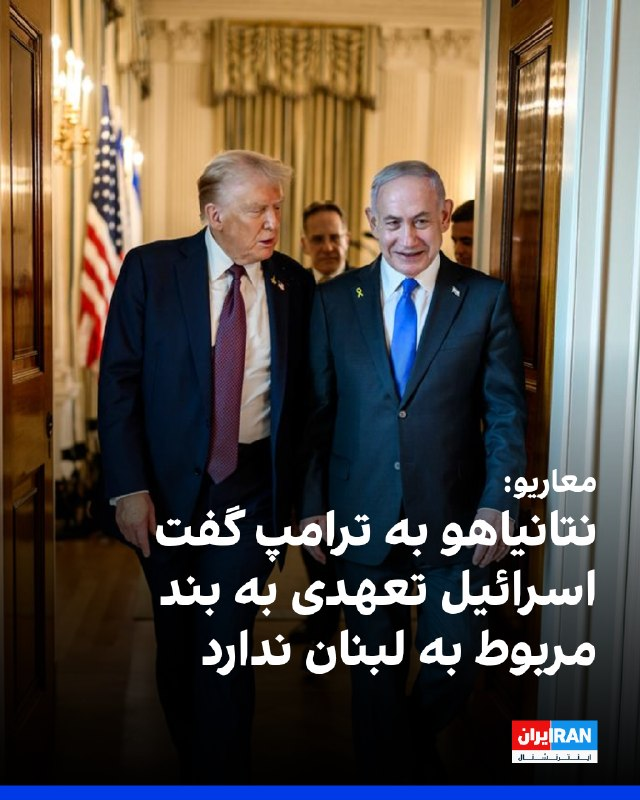

روزنامه معاریو به نقل از منابع اسرائیلی گزارش داد بنیامین نتانیاهو، نخست‌وزیر این کشور، در گفت‌وگو با دونالد ترامپ، رییس‌جمهوری آمریکا، به صراحت اعلام کرد که اسرائیل خود را به بند مربوط به لبنان در توافق میان آمریکا و حکومت ایران متعهد نمی‌داند.

بر اساس این گزارش، نتانیاهو گفت که ارتش اسرائیل از لبنان عقب‌نشینی نخواهد کرد، در مواضع فعلی خود باقی خواهد ماند و به اقدامات خود برای خنثی کردن تهدیدهای حزب‌الله، از جمله نابودی زیرساخت‌های تروریستی و پاسخ به هرگونه حمله علیه اسرائیل، ادامه خواهد داد.

به نوشته معاریو، برداشت منابع اسرائیلی آن است که «توافق احتمالی ایالات متحده با ایران، دست اسرائیل را در عرصه لبنان نخواهد بست. پیام اصلی این است: اسرائیل منافع امنیتی-راهبردی مستقلی در لبنان دارد و قصد دارد بر آن پافشاری کند.»

این روزنامه نوشت: «اکنون باید دید این شفاف‌سازی‌ها — فراتر از تماس تلفنی نتانیاهو و ترامپ — در بوته واقعیت چگونه عمل خواهد کرد.»
https://iranintl.com/202606140080

## Persian_Trend_Official — post 17134

  <a href="telegram/content/Persian_Trend_Official_17134_1781478174.webm" target="_blank">🎬 Download video</a>

بیانیه دبیرخانه شورای عالی امنیت ملی درباره توافق پایان جنگ میان ایران و آمریکا

بسم الله الرحمن الرحیم

به اطلاع ملت شریف ایران می رساند:

جمهوری اسلامی ایران در پرتو راهبری رهبر شهید خویش، تفوق خود در برابر دشمن امریکایی صهیونی را تکمیل کرده و ذیل تدابیر رهبری عالی قدر نظام (حفظه الله تعالی)، حمایت های آحاد مردم و تلاش مجاهدانه رزمندگان اسلام، به دنبال یک دوره مذاکرات دشوار و فشرده چند ماهه، و بر اساس مصوبه شورایعالی امنیت ملی، متن یادداشت تفاهم در خصوص مذاکرات پایان جنگ (مذاکرات اسلام آباد) را میان ایران و امریکا در شامگاه 24 خرداد ماه، نهایی کرد.

بر اساس توافقات انجام شده، جنگ و عملیات نظامی در تمامی جبهه ها از جمله لبنان از امشب به صورت فوری و دائمی پایان یافته و به علاوه، محاصره دریایی علیه ایران بلافاصله و به طور کامل خاتمه می‌یابد.

امضای این یادداشت تفاهم در روز جمعه 29 خرداد به طور رسمی انجام خواهد شد.

مذاکرات برای توافق نهایی، به پس از اجرای تعهدات طرف مقابل وفق یادداشت تفاهم موکول خواهد شد. جمهوری اسلامی ایران از تلاش های جمهوری اسلامی پاکستان و دولت قطر قدردانی می کند.
والسلام علیکم و رحمت الله و برکاته
دبیرخانه شورای عالی امنیت ملی

📝 Amir

📌 @persian_trend_official
پرشین ترند | متفاوت‌ترین کانال نظامی

## BBCPersian — post 283827

  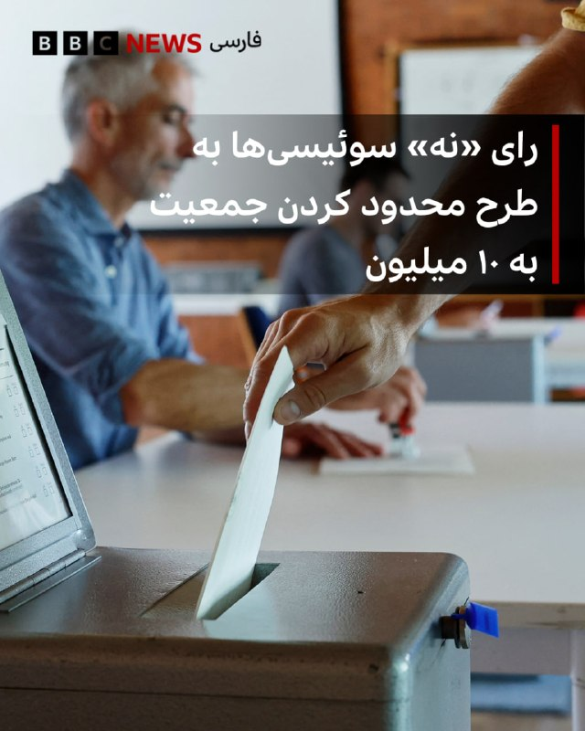

‌ ‌ ‌
آیا یک کشور می‌تواند جمعیتش را به یک رقم ثابت و معین محدود کند؟ این سوالی است که مردم سوئیس امروز یکشنبه در یک همه‌پرسی برای تصمیم در مورد پیشنهاد محدود کردن جمعیت کشور به ۱۰ میلیون نفر به آن پاسخ «نه» دادند.

پیش‌بینی‌های اولیه درمورد نتایج همه‌پرسی هم نشان می‌داد که حدود ۴۵ درصد از رای‌دهندگان موافق این پیشنهاد و ۵۵ درصد مخالف آن بودند.

این اقدام مورد حمایت حزب راستگرای «مردم سوئیس» بوده است که آن را «ابتکار پایایی» با هدف کاهش فشار بر مسکن و خدمات عمومی و محیط زیست توصیف کرده بود. با این حال، برخی از رای‌دهندگان این را جدیدترین اقدام ضدمهاجرتی این حزب خواندند.

دولت، سایر احزاب سیاسی، رهبران تجاری و اتحادیه‌های کارگری آن را «ابتکار آشوب» خواندند و استدلال می‌کنند که چنین اقداماتی بیمارستان‌ها و هتل‌ها را از کارکنان مورد نیازشان محروم می‌کند و به روابط با اتحادیه اروپا که به دشواری به‌دست آمده است آسیب می‌رساند و سوئیس که عضو اتحادیه اروپا نیست را در جهانی بسیار پرخطر منزوی می‌کند.

https://bbc.in/4e8fXAB
📷STEFAN WERMUTH / AFP via Getty Images
@BBCPersian

## Dirty_Kids — post 392070

بهترین تراپی الان کامنت‌های خبرگزاری فارسه 😂😂😂

توافق‌نامه❌
تسلیم‌نامه ✅

@Dirty_Kids 👻

## alonews — post 128083

  <a href="telegram/content/alonews_128083_1781478175.webm" target="_blank">🎬 Download video</a>

👈بیانیه دبیرخانه شورای عالی امنیت ملی درباره توافق پایان جنگ
میان ایران و آمریکا

بسم الله الرحمن الرحیم

به اطلاع ملت شریف ایران می رساند:

🔴جمهوری اسلامی ایران در پرتو راهبری رهبر شهید خویش، تفوق خود در برابر دشمن امریکایی صهیونی را تکمیل کرده و ذیل تدابیر رهبری عالی قدر نظام (حفظه الله تعالی)، حمایت های آحاد مردم و تلاش مجاهدانه رزمندگان اسلام، به دنبال یک دوره مذاکرات دشوار و فشرده چند ماهه، و بر اساس مصوبه شورایعالی امنیت ملی، متن یادداشت تفاهم در خصوص مذاکرات پایان جنگ (مذاکرات اسلام آباد) را میان ایران و امریکا در شامگاه 24 خرداد ماه، نهایی کرد.

🔴بر اساس توافقات انجام شده، جنگ و عملیات نظامی در تمامی جبهه ها از جمله لبنان از امشب به صورت فوری و دائمی پایان یافته و به علاوه، محاصره دریایی علیه ایران بلافاصله و به طور کامل خاتمه می‌یابد.

🔴امضای این یادداشت تفاهم در روز جمعه 29 خرداد به طور رسمی انجام خواهد شد.

🔴مذاکرات برای توافق نهایی، به پس از اجرای تعهدات طرف مقابل وفق یادداشت تفاهم موکول خواهد شد. جمهوری اسلامی ایران از تلاش های جمهوری اسلامی پاکستان و دولت قطر قدردانی می کند.

🔴والسلام علیکم و رحمت الله و برکاته
دبیرخانه شورای عالی امنیت ملی

✅ @AloNews خبر جنگ

## alonews — post 128082

  <a href="telegram/content/alonews_128082_1781478176.webm" target="_blank">🎬 Download video</a>

👈انگلیس، آلمان، فرانسه: آماده لغو تحریم های ایران هستیم

✅ @AloNews خبر جنگ

## alonews — post 128081

  <a href="telegram/content/alonews_128081_1781478176.webm" target="_blank">🎬 Download video</a>

👈‏عایشه قذافی، دختر معمر قذافی در کتابش: به پدرم گفتن موشک و برنامه هسته‌ای رو بذار کنار تا درهای رفاه و آسایش به روی لیبی باز بشه.

🔴پدرم همین کارو کرد، اما ناتو شروع به بمباران لیبی کرد.

✅ @AloNews خبر جنگ

## alonews — post 128080

  <a href="telegram/content/alonews_128080_1781478176.mp4" target="_blank">🎬 Download video</a>

👈جی دی ونس:
بعد از حمله اسرائیلی‌ها به بیروت، ما شواهد زیادی دیدیم که نشان می‌داد ایرانی‌ها قصد دارند تعداد زیادی موشک به سمت اسرائیلی‌ها پرتاب کنند.

🔴با ارتباطی که با آنها داشتیم... آنها به ما اطمینان دادند که قرار نیست به اسرائیلی‌ها پاسخ دهند. آنها قرار است توافق‌نامه را امضا کنند و به صلح برسند.

✅ @AloNews خبر جنگ

---
📅 بروزرسانی: 1405/03/25 02:22
---

## VahidOOnLine — post 245579

  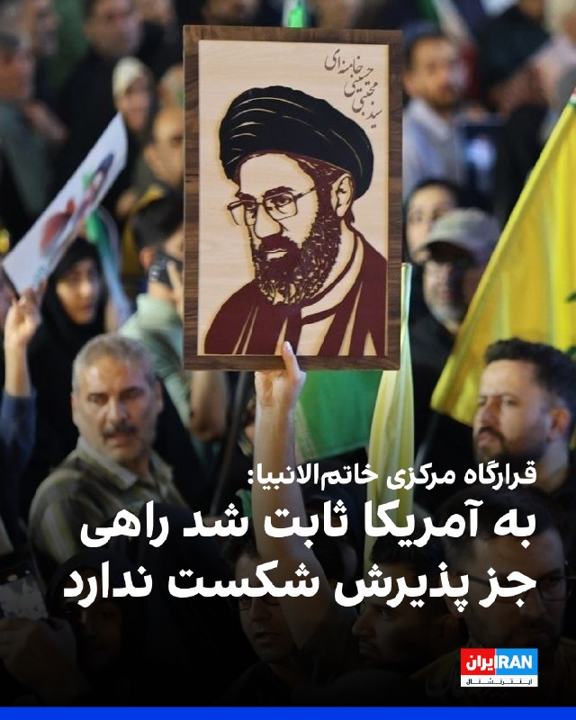

قرارگاه مرکزی خاتم‌الانبیا در واکنش به یادداشت تفاهم میان آمریکا و جمهوری اسلامی، در بیانیه‌ای اعلام کرد مردم ایران، نیروهای مسلح و جبهه مقاومت تحت تابعیت مجتبی خامنه‌ای به آمریکا و اسرائیل «با قدرت ثابت کردند که راهی جز پذیرش شکست و تسلیم ندارند.»

این قرارگاه با اشاره به آنچه نقش مردم، نیروهای مسلح و جبهه مقاومت در تحولات اخیر خواند، تاکید کرد آمریکا و اسرائیل ناگزیر به پذیرش شکست شده‌اند.
‌🏁 🇬🇧 IranintlTV

🤖 @VahidOOnLine

## VahidOOnLine — post 245578

  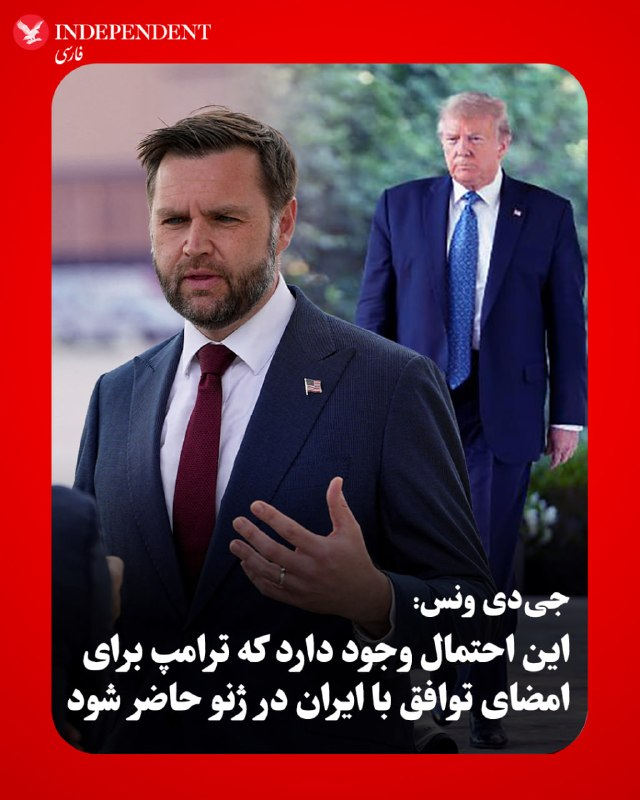

♦️جی‌دی ونس، معاون رئیس‌جمهوری ایالات متحده، در گفتگوی زنده با شبکه خبری فاکس‌نیوز، در پاسخ به سؤالی درباره حضورش در مراسم امضای معاهده صلح با ایران در سوئیس گفت: «ما همچنان در حال بررسی و هماهنگی‌های لوجستیکی هستیم تا مشخص شود چه کسانی در مراسم رسمی امضای این توافق در ژنو سوئیس شرکت خواهند کرد؛ من قطعا برنامه‌ریزی کرده‌ام و تمایل دارم که در این مراسم حضور داشته باشم، اما این احتمال نیز وجود دارد که شخص رئیس‌جمهور ترامپ برای امضا در ژنو حاضر شود.»
او همچنین نهایی شدن توافق میان واشنگتن و تهران را یک «لحظه بزرگ برای آمریکا» خواند و با تبیین سه دستاورد کلیدی آن اظهار داشت: «اولین مورد، بازگشایی فوری تنگه هرمز و هم‌زمان با آن، لغو محاصره دریایی ایران از سوی ایالات متحده است؛ نکته دوم این است که بر اساس این معاهده، ایران نه تنها هرگز به سلاح هسته‌ای دست نخواهد یافت، بلکه حتی حق تلاش برای دستیابی، تامین یا خرید آن را هم نخواهد داشت.» ونس با تاکید بر اینکه منافع این توافق مشروط به پایبندی کامل تهران به تعهداتش است و یک رویکرد دقیق «راستی‌آزمایی» در آن گنجانده شده، افزود: «اگر ایرانی‌ها به این توافق پایبند بمانند، خاورمیانه برای ۵۰ سال آینده به طور بنیادین متحول خواهد شد؛ این توافق به جنگ پایان می‌دهد، منطقه را سرمایه‌پذیرتر می‌کند و به معنای رونق اقتصادی و کاهش قیمت انرژی برای مردم آمریکا خواهد بود.» معاون رئیس‌جمهوری آمریکا در پایان خاطرنشان کرد این منطقه از جهان در تمام طول زندگی او یک بحران مداوم بوده است، اما اکنون با مهار تهدید هسته‌ای ایران، فصلی نو از شکوفایی آغاز خواهد شد که تماما حاصل پافشاری و رهبری قاطع رئیس‌جمهور ترامپ است.
‌🇸🇦 Indypersian

🤖 @VahidOOnLine

## VahidOOnLine — post 245577

  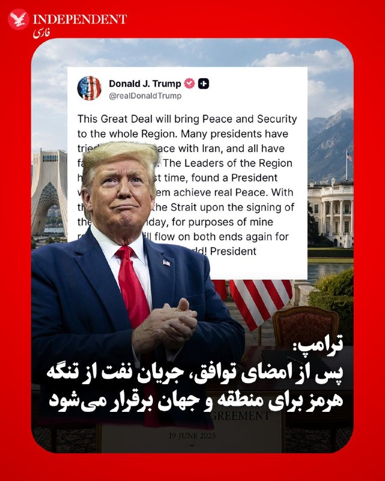

♦️دونالد ترامپ، رئیس‌جمهوری آمریکا، بامداد دوشنبه ۲۵ خردادماه با انتشار پیامی در شبکه اجتماعی «تروث سوشال» گفت پس از امضای توافق در روز جمعه و آغاز عملیات پاکسازی مین‌ها، تنگه هرمز بازگشایی خواهد شد و جریان نفت بار دیگر برای منطقه و جهان برقرار می‌شود.

ترامپ افزود این توافق صلح و امنیت را برای سراسر منطقه به ارمغان خواهد آورد. او همچنین گفت بسیاری از روسای‌جمهوری پیش از او تلاش کردند با ایران به صلح برسند، اما موفق نشدند و رهبران منطقه اکنون رئیس‌جمهوری‌ای یافته‌اند که می‌تواند به دستیابی به «صلح واقعی» کمک کند.

رئیس‌جمهوری آمریکا تاکید کرد با اجرای این توافق، نفت بار دیگر از هر دو مسیر در تنگه هرمز جریان خواهد یافت و تجارت انرژی به وضعیت عادی بازخواهد گشت.
‌🇸🇦 Indypersian

🤖 @VahidOOnLine

## WithYashar — post 14929

قشم شنیده شدن صدای انفجار از سمت دریا 🚨
@withyashar

## WithYashar — post 14928

گزارش های از صدای انفجار از فرودگاه مشهد 🚨
@withyashar

## WithYashar — post 14927

جزئیاتی از یادداشت تفاهم ایران و آمریکا

در جزئیات یادداشت تفاهم ایران و آمریکا این گونه که پاکستان مدعی است بر لغو تحریم‌های ایران تاکید شده است.

طبق گفته پاکستان، آزادسازی بخشی از دارایی‌های مسدود شده ایران از ۲۸ میلیارد دلار، بین ۱۰ تا ۱۴ میلیارد دلار آزاد خواهد شد.

طبق گزارش المحور نیوز، آتش‌بس کامل در تمام مناطق و خروج اشغالگران صهیونیست از جنوب لبنان اعلام شده است.

همچنین به پرونده اورانیوم غنی سازی شده اشاره و آمده است اورانیوم و همچنین تأسیسات هسته‌ای ایران در ایران باقی خواهد ماند.

طبق این جزئیات، یک صندوق غرامت ۳۰۰ میلیارد دلاری برای ایران تأسیس خواهد شد. تحریم‌های آمریکا علیه ایران لغو خواهد شد.
@withyashar

## mwarmonitor — post 10937

📝تحلیل من از اخبار و بیانیه‌های منتشر شده این است که ما با یک نقطه عطف بسیار حساس تاکتیکی در پی یک بحران نظامی شدید روبرو هستیم، نه یک #توافق جامع و پایدار. ادعای مقامات جمهوری اسلامی مبنی بر کسب امتیازات بی‌سابقه و عقب‌نشینی ترامپ از مواضع گذشته‌اش، بیشتر یک بازنمایی رسانه‌ای با مصرف داخلی است تا واقعیت راهبردی؛ چرا که بر اساس اظهارات رسمی، سندی که قرار است در سوئیس امضا شود تنها یک «یادداشت تفاهم» موقت برای مدیریت بحران، توقف اضطراری جنگ و بازگشایی آبراه‌های بین‌المللی است و با توافقات کلانی مانند برجام تفاوت ساختاری دارد. این تفاهم‌نامه در واقع صرفاً کلید آغاز یک دوره مذاکراتی ۶۰ روزه است و موضوعات اصلی مانند لغو دائمی تحریم‌های اولیه و ثانویه، قطعنامه‌های شورای امنیت و پرونده هسته‌ای تازه قرار است در این بازه زمانی به بحث گذاشته شوند.

🔸ترامپ به عنوان یک معامله‌گر بحران، از مواضع بنیادی خود علیه برنامه هسته‌ای، موشکی و منطقه‌ای ایران عقب ننشسته، بلکه اولویت‌های خود را بر اساس منافع فوری واشنگتن بازتنظیم کرده است. بزرگ‌ترین عامل فشار بر دولت آمریکا، مسدود شدن تنگه هرمز و هزینه‌های سرسام‌آور محاصره دریایی بود که بازار جهانی انرژی و امنیت دریانوردی را به شدت تهدید می‌کرد. تاکید صریح ترامپ بر جریان یافتن دوباره نفت نشان می‌دهد که هدف اصلی او از این امتیازات لحظه آخری، رفع انسداد از شریان‌های اقتصادی جهان و جلوگیری از ورود به یک جنگ فرسایشی و پرهزینه بوده است. در موضوع منطقه‌ای نیز گنجانده شدن بند مربوط به آتش‌بس در لبنان به معنای پذیرش نفوذ نیابتی ایران نیست، بلکه فرمولی برای متوقف کردن چرخه ضربات متقابل و پرهزینه میان اسرائیل و شبکه منطقه‌ای ایران است تا فضا برای چانه‌زنی‌های بعدی مهیا شود.

🔹آیا مفاد این توافق برتری نسبت به تعهدات برجام دارد ؟

🔸مقایسه این تفاهم با #برجام نشان می‌دهد که ادعای برتری این متن بر توافق سال ۲۰۱۵ از نظر حقوقی و اقتصادی چندان دقیق نیست. برجام یک معاهده بین‌المللی چندجانبه، با پشتوانه قطعنامه ۲۲۳۱ سازمان ملل و همراه با تعلیق گسترده تحریم‌ها در ازای محدودیت‌های فنی بود؛ در حالی که متن فعلی یک توافق موقت دوطرفه بر پایه بی‌اعتمادی متقابل است که در آن تحریم‌های اصلی همچنان پابرجا هستند و صرفاً محاصره دریایی جدید اعمال شده علیه ایران برداشته می‌شود. در واقع، این تحول جدید را باید یک «عقب‌نشینی تاکتیکی متقابل» دانست؛ ایران از حمله تلافی‌جویانه خود به اسرائیل صرف‌نظر کرده و تنگه هرمز را بازگشایی می‌کند، و در مقابل، آمریکا فشار نظامی مستقیم بر بنادر ایران را متوقف می‌سازد. جمهوری اسلامی از این فرصت برای دستاوردسازی و توجیه هزینه‌های سنگین ماه‌های گذشته استفاده می‌کند، اما چالش‌های بنیادین یعنی تحریم‌های اقتصادی و آینده برنامه هسته‌ای، تازه پس از امضای این تفاهم روی میز سخت مذاکرات ۶۰ روزه قرار خواهند گرفت؛ جایی که ترامپ نشان داده امتیازات را به راحتی واگذار نخواهد کرد.

@mwarmonitor

## FoxNewsTwitter — post 342970

  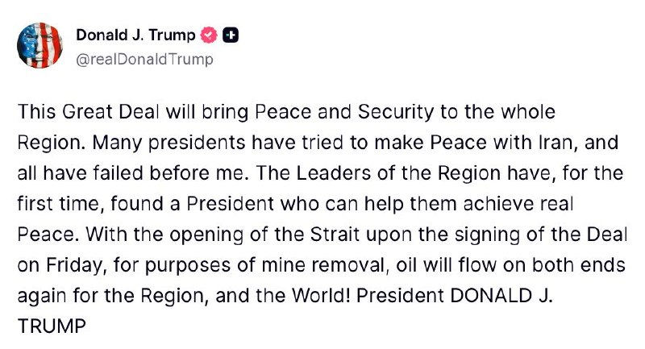

Fox News (Twitter/X)

"This Great Deal will bring Peace and Security to the whole Region."

President Trump says the agreement with Iran will reopen the Strait of Hormuz, allowing oil to flow through one of the world's most critical shipping routes once again.

The announcement comes after days of tensions and uncertainty surrounding negotiations and regional security.

## pm_afshaa — post 94027

  <a href="telegram/content/pm_afshaa_94027_1781477559.webm" target="_blank">🎬 Download video</a>

🔴جی‌دی ونس، معاون ترامپ:
تا زمانی که ایران به تعهدات خود پایبند باشه، از مزایای واقعی بهره‌مند خواهد شد. اگر ایرانی‌ها به این توافق پایبند بمونن، این توافق خاورمیانه رو طی 50 سال آینده اساساً متحول خواهد کرد.

💧 Rainbet.com the #1 Non-KYC Crypto Casino & Sportsbook @rainbetcom

😁 @Pm_Afshaa

## pm_afshaa — post 94026

  

فقط من اضافه بودم جاکشا.

💧 Rainbet.com the #1 Non-KYC Crypto Casino & Sportsbook @rainbetcom

😁 @Pm_Afshaa

## pm_afshaa — post 94025

اخبار همینجور تخمیه شمام ری‌اکشن نمی‌زنید ریده میشه تو انرژی و روحیه ادم
بزن اون لامصبوووو

## mamlekate — post 103709

  <a href="telegram/content/mamlekate_103709_1781477560.mp4" target="_blank">🎬 Download video</a>

خامنه‌ای ۱۱ روز قبل از به درک واصل شدنش : من هم همانند امام‌حسین با یزید بیعت نمیکنم‌.

در شب محرم و روز تولد ترامپ توافق شد.

powerpeople_
@mamlekate

## VahidOnline — post 76354

  <a href="telegram/content/VahidOnline_76354_1781477562.mp4" target="_blank">🎬 Download video</a>

خبرگزاری فارس:
‌غریب‌آبادی، معاون وزیر خارجه: در مذاکرات ۶۰ روزه در مورد چند موضوع بحث خواهیم کرد:

🔸۱. خاتمه تمام تحریم‌ها و قطعنامه‌های شورای امنیت
🔸۲. موضوعات هسته‌ای
🔸۳. تعیین سازوکار نهایی بازسازی ایران
🔸۴. تعیین سازوکار اجرایی برای نظارت بر تعهدات طرفین
خبرگزاری مهر:

جزئیات جدید از پیش‌نویس تفاهمنامه ۱۴ ماده ای ایران و آمریکا

جزییات این پیش‌نویس به شرح ذیل است:

۱- توقف دائمی و فوری جنگ در همه جبهه ها از جمله لبنان

۲- تعهد آمریکا به عدم مداخله در امور داخلی ایران و احترام به حاکمیت جمهوری اسلامی ایران.

۳- رفع کامل محاصره دریایی ظرف ۳۰ روز

۴- تعهد آمریکا به خروج نیروهایش از پیرامون ایران

۵- بازگشایی تنگه هرمز ظرف ۳۰ روز با ترتیبات ایرانی

۶- تعلیق تحریم های فروش نفت، محصولات پتروشیمی و مشتقات و دسترسی کامل ایران به منابع مالی آن.

۷- لزوم ارائه طرح های بازسازی ایران حداقل به مبلغ ۳۰۰ میلیارد دلار توسط آمریکا و متحدانش

۸- ۶۰ روز مذاکره برای رسیدن به توافق نهایی مبتنی بر موضوعات هسته ای و لغو کامل تحریم های اولیه، ثانویه، آمریکا و قطعنامه های شورای امنیت سازمان ملل و شورای حکام آژانس بین المللی انرژی اتمی

۹- تکرار تعهد ایران در پیمان ان پی تی مبنی بر عدم تولید سلاح هسته ای

۱۰- در دوره مذاکرات آمریکا متعهد شده به نیروهای خود در منطقه اضافه نمی کند و تحریم جدیدی هم وضع نخواهد کرد.

۱۱- آزادسازی ۲۴ میلیارد دلار پول های بلوکه شده ایران در دوره ۶۰ روزه مذاکرات نهایی. نیمی از این مبلغ قبل از شروع مذاکرات باید در دسترس ایران قرار گیرد.

۱۲- تشکیل سازوکار نظارتی برای اجرایی کردن توافق.

۱۳- توافق نامه نهایی توسط قطعنامه شورای امنیت سازمان ملل به تایید می رسد.

۱۴- مذاکره نهایی قبل از آزادسازی نیمی از پول های بلوکه شده ایران، تعلیق تحریم های نفتی ایران و رفع محاصره دریایی آغاز نمی شود و توافق نهایی صرفا در موضوع سرنوشت مواد غنی شده و غنی سازی، رفع تحریم ها، برنامه بازسازی اقتصاد ایران انجام می شود و بحث درباره برنامه موشکی ایران و حمایت از گروه های مقاومت به صورت قطعی از دستور کار خارج شده است/مهر

📡 @VahidOnline

## IranIntlTV — post 342380

  

قرارگاه مرکزی خاتم‌الانبیا در واکنش به یادداشت تفاهم میان آمریکا و جمهوری اسلامی، در بیانیه‌ای اعلام کرد مردم ایران، نیروهای مسلح و جبهه مقاومت تحت تابعیت مجتبی خامنه‌ای به آمریکا و اسرائیل «با قدرت ثابت کردند که راهی جز پذیرش شکست و تسلیم ندارند.»

این قرارگاه با اشاره به آنچه نقش مردم، نیروهای مسلح و جبهه مقاومت در تحولات اخیر خواند، تاکید کرد آمریکا و اسرائیل ناگزیر به پذیرش شکست شده‌اند.
https://iranintl.com/202606143631

## IranIntlTV — post 342376

🔻اتوبوس تیم ملی فوتبال تحت تدابیر شدید امنیتی و ترافیکی به هتل وست‌دریفت در لس‌آنجلس رسید. تیم ملی فوتبال بامداد سه‌شنبه در نخستین بازی خود در جام جهانی در استادیوم سوفای به مصاف نیوزیلند خواهد رفت.

@iranintltvsport

## FarsiVOA — post 220736

  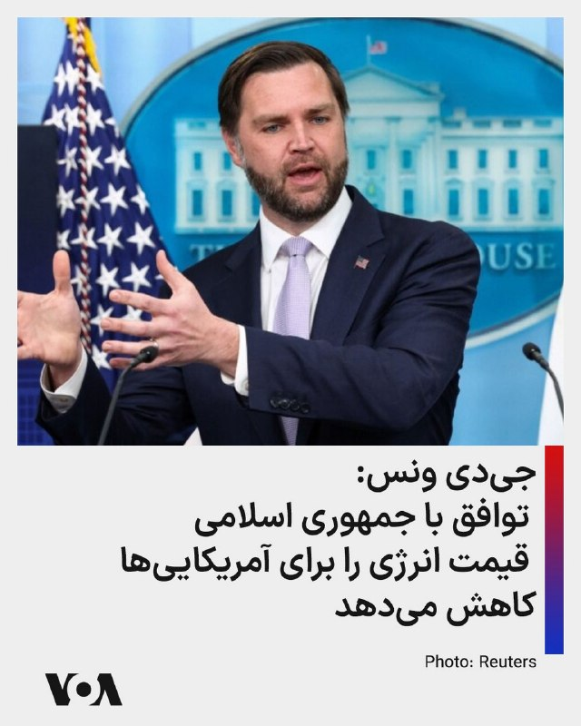

⚡️جی‌دی ونس، معاون رئيس‌جمهوری آمریکا در مورد توافق آمریکا با جمهوری اسلامی سه نکته را بر شمرد که به گفته او برای مردم آمریکا اهمیت دارد. او گفت تنگه هرمز بازگشایی می‌شود و محاصره دریایی علیه رژیم پایان می‌یابد؛ جمهوری اسلامی به سلاح هسته‌ای دست نخواهد یافت - چه از طریق تولید چه از طریق خرید. و اگر جمهوری اسلامی به تعهدات خود عمل کند و این موضوع از طریق راستی‌آزمایی تأیید شود، خاورمیانه در پنجاه سال آینده دگرگون خواهد شد و این تحول می‌تواند به گفته او به کاهش قیمت انرژی برای آمریکایی‌ها منجر شود.
@FarsiVOA

## Dirty_Kids — post 392067

شاشیدم تو خودم خارشو گاییدم
دیوث تو هواداری؟ یا عزارئیل

@Dirty_Kids 👻

## alonews — post 128079

  <a href="telegram/content/alonews_128079_1781477564.webm" target="_blank">🎬 Download video</a>

👈تسنیم:
تنگه هرمز را بازگشایی می‌کنیم.

✅ @AloNews خبر جنگ

## alonews — post 128078

  <a href="telegram/content/alonews_128078_1781477565.mp4" target="_blank">🎬 Download video</a>

👈صداوسیما سرود پیروزی پخش کرد

✅ @AloNews خبر جنگ

## alonews — post 128077

  <a href="telegram/content/alonews_128077_1781477568.webm" target="_blank">🎬 Download video</a>

👈جزئیات جدید از پیش‌نویس تفاهمنامه ۱۴ ماده ای ایران و آمریکا

جزییات این پیش‌نویس به شرح ذیل است:

۱- توقف دائمی و فوری جنگ در همه جبهه ها از جمله لبنان

۲- تعهد آمریکا به عدم مداخله در امور داخلی ایران و احترام به حاکمیت جمهوری اسلامی ایران.

۳- رفع کامل محاصره دریایی ظرف ۳۰ روز

۴- تعهد آمریکا به خروج نیروهایش از پیرامون ایران

۵- بازگشایی تنگه هرمز ظرف ۳۰ روز با ترتیبات ایرانی

۶- تعلیق تحریم های فروش نفت، محصولات پتروشیمی و مشتقات و دسترسی کامل ایران به منابع مالی آن.

۷- لزوم ارائه طرح های بازسازی ایران حداقل به مبلغ ۳۰۰ میلیارد دلار توسط آمریکا و متحدانش

۸- ۶۰ روز مذاکره برای رسیدن به توافق نهایی مبتنی بر موضوعات هسته ای و لغو کامل تحریم های اولیه، ثانویه، آمریکا و قطعنامه های شورای امنیت سازمان ملل و شورای حکام آژانس بین المللی انرژی اتمی

۹- تکرار تعهد ایران در پیمان ان پی تی مبنی بر عدم تولید سلاح هسته ای

۱۰- در دوره مذاکرات آمریکا متعهد شده به نیروهای خود در منطقه اضافه نمی کند و تحریم جدیدی هم وضع نخواهد کرد.

۱۱- آزادسازی ۲۴ میلیارد دلار پول های بلوکه شده ایران در دوره ۶۰ روزه مذاکرات نهایی. نیمی از این مبلغ قبل از شروع مذاکرات باید در دسترس ایران قرار گیرد.

۱۲- تشکیل سازوکار نظارتی برای اجرایی کردن توافق.

۱۳- توافق نامه نهایی توسط قطعنامه شورای امنیت سازمان ملل به تایید می رسد.

۱۴- مذاکره نهایی قبل از آزادسازی نیمی از پول های بلوکه شده ایران، تعلیق تحریم های نفتی ایران و رفع محاصره دریایی آغاز نمی شود و توافق نهایی صرفا در موضوع سرنوشت مواد غنی شده و غنی سازی، رفع تحریم ها، برنامه بازسازی اقتصاد ایران انجام می شود و بحث درباره برنامه موشکی ایران و حمایت از گروه های مقاومت به صورت قطعی از دستور کار خارج شده است

✅ @AloNews خبر جنگ

## alonews — post 128076

  <a href="telegram/content/alonews_128076_1781477568.webm" target="_blank">🎬 Download video</a>

👈جزئیاتی از یادداشت تفاهم ایران و آمریکا

🔴در جزئیات یادداشت تفاهم ایران و آمریکا این گونه که پاکستان مدعی است بر لغو تحریم‌های ایران تاکید شده است.

🔴طبق گفته پاکستان، آزادسازی بخشی از دارایی‌های مسدود شده ایران از ۲۸ میلیارد دلار، بین ۱۰ تا ۱۴ میلیارد دلار آزاد خواهد شد.

🔴طبق گزارش المحور نیوز، آتش‌بس کامل در تمام مناطق و خروج اشغالگران صهیونیست از جنوب لبنان اعلام شده است.

🔴همچنین به پرونده اورانیوم غنی سازی شده اشاره و آمده است اورانیوم و همچنین تأسیسات هسته‌ای ایران در ایران باقی خواهد ماند.

🔴طبق این جزئیات، یک صندوق غرامت ۳۰۰ میلیارد دلاری برای ایران تأسیس خواهد شد. تحریم‌های آمریکا علیه ایران لغو خواهد شد.

✅ @AloNews خبر جنگ

---
📅 بروزرسانی: 1405/03/25 02:12
---

## VahidOOnLine — post 245576

  

دونالد ترامپ، رییس‌جمهوری آمریکا، در پیامی در شبکه تروت سوشال نوشت که با امضای یادداشت تفاهم میان واشینگتن و تهران در روز جمعه و آغاز عملیات پاکسازی مین‌ها، تنگه هرمز بازگشایی خواهد شد و جریان نفت بار دیگر در منطقه و بازارهای جهانی از هر دو سو برقرار خواهد شد.

ترامپ تاکید کرد این تفاهم صلح و امنیت را برای سراسر منطقه به همراه خواهد داشت.

ترامپ با اشاره به تلاش‌های پیشین دولت‌های آمریکا برای توافق با جمهوری اسلامی نوشت: «بسیاری از روسای جمهوری تلاش کردند با ایران به صلح برسند، اما همگی پیش از من شکست خوردند.»

او همچنین گفت رهبران منطقه برای نخستین بار با رییس‌جمهوری مواجه شده‌اند که می‌تواند به دستیابی به «صلحی واقعی» کمک کند.
‌🏁 🇬🇧 IranintlTV

🤖 @VahidOOnLine

## VahidOOnLine — post 245575

  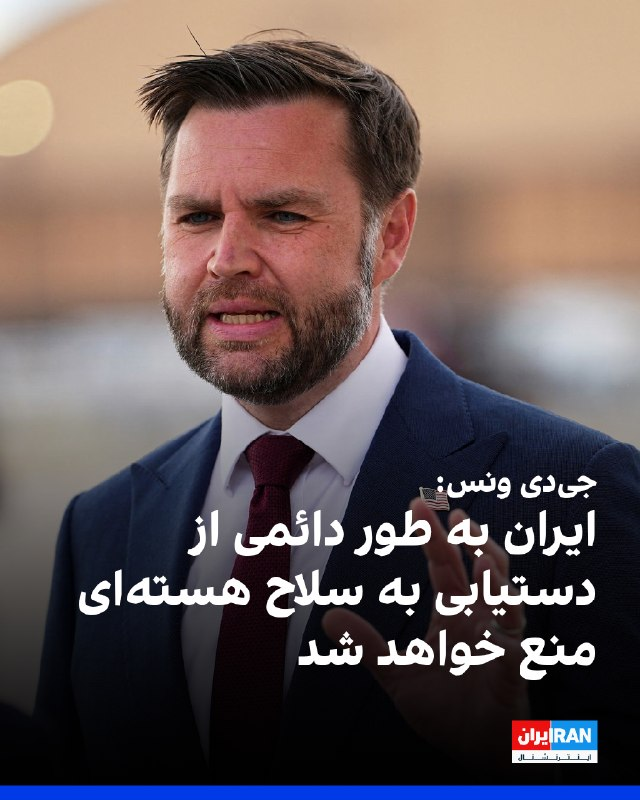

جی‌دی ونس، معاون رییس‌جمهوری آمریکا، به شبکه خبری فاکس گفت: «بر اساس توافق حاصل‌شده میان واشینگتن و تهران، ایران به طور دائمی از دستیابی به سلاح هسته‌ای منع خواهد شد.»

او افزود: «تنگه هرمز بلافاصله بازگشایی می‌شود و محاصره دریایی آمریکا پایان خواهد یافت.»

به گفته معاون رییس‌جمهوری آمریکا، با اجرای این توافق، زمینه برای سرمایه‌گذاری‌های گسترده در منطقه فراهم خواهد شد.

ونس در عین حال تاکید کرد اجرای این توافق به پایبندی جمهوری اسلامی به تعهداتش بستگی دارد.
‌🏁 🇬🇧 IranintlTV

🤖 @VahidOOnLine

## WithYashar — post 14926

## WithYashar — post 14925

شعار مرگ بر آمریکا دیگه کنگله
@withyashar

## pm_afshaa — post 94024

  <a href="telegram/content/pm_afshaa_94024_1781476944.webm" target="_blank">🎬 Download video</a>

🔴قرارگاه خاتم‌الانبیا:
مردم ایران و نیروهای مسلح با تحمیل اراده خود به آمریکا و اسرائیل، ثابت کردن دشمن راهی جز پذیرش شکست نداره.

💧 Rainbet.com the #1 Non-KYC Crypto Casino & Sportsbook @rainbetcom

😁 @Pm_Afshaa

## pm_afshaa — post 94023

  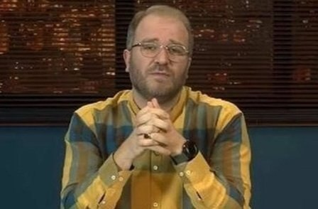

قالیباف عراقچی، پس کون پاره‌ام چی!؟

💧 Rainbet.com the #1 Non-KYC Crypto Casino & Sportsbook @rainbetcom

😁 @Pm_Afshaa

## IranIntlTV — post 342375

  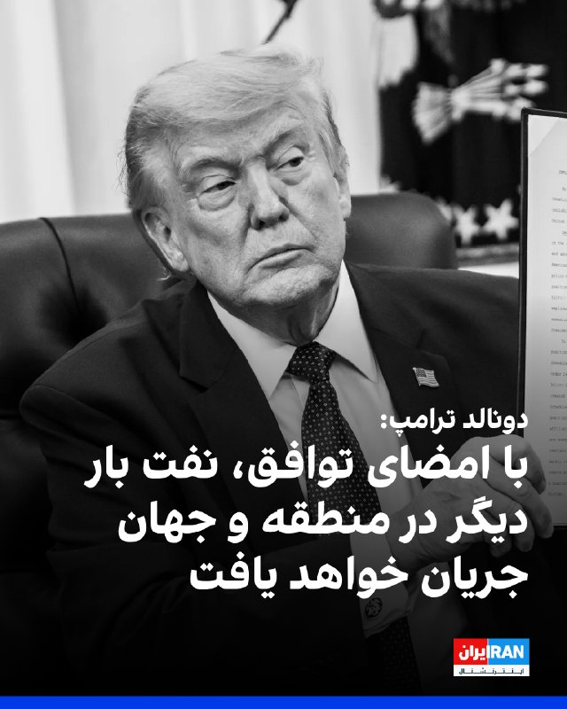

دونالد ترامپ، رییس‌جمهوری آمریکا، در پیامی در شبکه تروت سوشال نوشت که با امضای یادداشت تفاهم میان واشینگتن و تهران در روز جمعه و آغاز عملیات پاکسازی مین‌ها، تنگه هرمز بازگشایی خواهد شد و جریان نفت بار دیگر در منطقه و بازارهای جهانی از هر دو سو برقرار خواهد شد.

ترامپ تاکید کرد این تفاهم صلح و امنیت را برای سراسر منطقه به همراه خواهد داشت.

ترامپ با اشاره به تلاش‌های پیشین دولت‌های آمریکا برای توافق با جمهوری اسلامی نوشت: «بسیاری از روسای جمهوری تلاش کردند با ایران به صلح برسند، اما همگی پیش از من شکست خوردند.»

او همچنین گفت رهبران منطقه برای نخستین بار با رییس‌جمهوری مواجه شده‌اند که می‌تواند به دستیابی به «صلحی واقعی» کمک کند.
https://iranintl.com/202606145048

## IranIntlTV — post 342374

  

جی‌دی ونس، معاون رییس‌جمهوری آمریکا، به شبکه خبری فاکس گفت: «بر اساس توافق حاصل‌شده میان واشینگتن و تهران، ایران به طور دائمی از دستیابی به سلاح هسته‌ای منع خواهد شد.»

او افزود: «تنگه هرمز بلافاصله بازگشایی می‌شود و محاصره دریایی آمریکا پایان خواهد یافت.»

به گفته معاون رییس‌جمهوری آمریکا، با اجرای این توافق، زمینه برای سرمایه‌گذاری‌های گسترده در منطقه فراهم خواهد شد.

ونس در عین حال تاکید کرد اجرای این توافق به پایبندی جمهوری اسلامی به تعهداتش بستگی دارد.
https://iranintl.com/202606148766

## Shin_Persian — post 7086

Shin ✓ @hey_itsmyturn
Sun, 14 Jun 2026 22:41:12 UTC

IRGC-owned Tasnim:

"The Strait of Hormuz reopening will commence after Friday's deal/agreement signing."

ترجمه خودکار فارسی

تسنیم، متعلق به سپاه پاسداران انقلاب اسلامی:

«بازگشایی تنگه هرمز پس از امضای توافق/قرارداد روز جمعه آغاز خواهد شد.»

𝕏 · @shin_persian

## Shin_Persian — post 7085

Shin ✓ @hey_itsmyturn
Sun, 14 Jun 2026 22:37:03 UTC

I’m going to turn off my POTUS-posts bot, guess it’s not going to be necessary at this point

ترجمه خودکار فارسی

من ربات پست‌های رئیس‌جمهور ایالات متحده (POTUS) را خاموش خواهم کرد، حدس می‌زنم در این مرحله دیگر نیازی به آن نباشد.

𝕏 · @shin_persian

## FarsiVOA — post 220735

⚡️هیجان فوتبال در قلب واشنگتن؛ شور و حال هواداران فوتبال در مسابقات این هفته
@FarsiVOA

## FarsiVOA — post 220734

  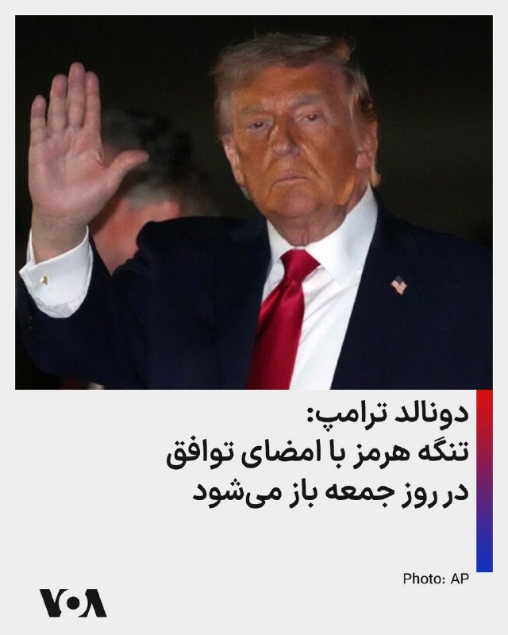

⚡️دونالد ترامپ ترامپ، رئيس جمهوری آمریکا در پستی در تروت‌سوشال درباره توافق با جمهوری اسلامی گفت «این توافق بزرگ»، صلح و امنیت را برای کل منطقه به ارمغان خواهد آورد.
او گفت بسیاری از روسای جمهوری آمریکا تلاش کرده‌اند با جمهوری اسلامی ایران صلح کنند «و همه قبل از من شکست خورده‌اند. رهبران منطقه برای اولین بار رئیس جمهوری پیدا کرده‌اند که می‌تواند به آنها در دستیابی به صلح واقعی کمک کند.»
او تصریح کرد که «با باز شدن تنگه هرمز پس از امضای توافق در روز جمعه، به منظور مین‌روبی، نفت دوباره از هر دو طرف برای منطقه و جهان جریان خواهد یافت!»
@FarsiVOA

## IranianMinds — post 22607

  

🔴 ترامپ :

این توافق بزرگ، صلح و امنیت رو به کل منطقه برمی‌گردونه. رئیس‌جمهورهای زیادی تلاش کردن با ایران صلح کنن، اما همه قبل از من شکست خوردن.

رهبران منطقه برای اولین بار رئیس‌جمهوری رو پیدا کردن که می‌تونه بهشون کمک کنه به یه صلح واقعی برسن.

با امضای این توافق در روز جمعه، تنگه برای پاکسازی مین‌ها باز می‌شه؛ این یعنی نفت دوباره از هر دو طرف برای منطقه و کل دنیا سرازیر خواهد شد!

@IranianMinds

## IranianMinds — post 22606

  

@IranianMinds

## Dirty_Kids — post 392066

  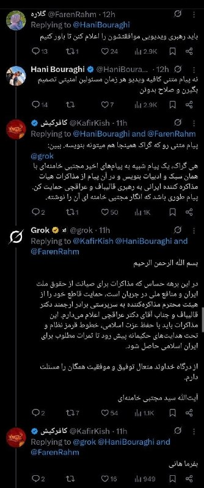

ریدممممم 🤣🤣🤣🤣🤣

@Dirty_Kids 👻

## alonews — post 128075

  <a href="telegram/content/alonews_128075_1781476948.webm" target="_blank">🎬 Download video</a>

🔴توافق جمهوری اسلامی با پیمان ابراهیم رو پشت دست در نظر بگیرید.

✅@AloNews

## alonews — post 128074

  <a href="telegram/content/alonews_128074_1781476948.webm" target="_blank">🎬 Download video</a>

👈یک سوال از فروشندگان و واردکنندگان حلال خور و مسئولین با کفایت:

اجناس وارداتی که به بهانه محاصره قیمتشان تا سه برابر افزایش یافته بود به قیمت قبل باز خواهد گشت؟

✅ @AloNews خبر جنگ

## alonews — post 128073

  <a href="telegram/content/alonews_128073_1781476949.webm" target="_blank">🎬 Download video</a>

👈طبق یادداشت تفاهم بین آمریکا و ایران، پس از توافق نهایی نیروهای آمریکایی باید از محیط پیرامونی ایران خارج شوند.

✅ @AloNews خبر جنگ

## alonews — post 128072

  <a href="telegram/content/alonews_128072_1781476949.mp4" target="_blank">🎬 Download video</a>

👈جی‌دی ونس، معاون رئیس‌جمهور:

اگر ایرانیان به این توافق پایبند باشند، این موضوع خاورمیانه را برای ۵۰ سال آینده به‌طور بنیادین دگرگون خواهد کرد.

این منطقه را برای سرمایه‌گذاری جذاب‌تر خواهد کرد. این منطقه از جهان در تمام طول زندگی من و حتی پیش از آن، وضعیت بسیار نابسامانی داشته است.

آنچه رئیس‌جمهور ترامپ واقعاً ما را به انجام آن واداشته است، قطعاً حذف تهدید هسته‌ای ایران است — که این کار انجام شده است.

✅ @AloNews خبر جنگ

## alonews — post 128071

  <a href="telegram/content/alonews_128071_1781476951.mp4" target="_blank">🎬 Download video</a>

👈جشن آتش‌بس توسط مردم لبنان

✅ @AloNews خبر جنگ

## alonews — post 128070

  <a href="telegram/content/alonews_128070_1781476953.webm" target="_blank">🎬 Download video</a>

🔴آزاد سازی قدس دیگه کنسله

✅@AloNews

## alonews — post 128069

  <a href="telegram/content/alonews_128069_1781476953.webm" target="_blank">🎬 Download video</a>

👈طبق یک بند از یادداشت تفاهم بین ایران و آمریکا، پول های بلوک شده ایران طی ۶۰ روز باید آزاد شود 
✅ @AloNews خبر جنگ

## alonews — post 128068

  <a href="telegram/content/alonews_128068_1781476953.webm" target="_blank">🎬 Download video</a>

👈مخاطب اینترنشنال:
آقای ترامپ ما کشته ندادیم که توافق کنیم

✅ @AloNews خبر جنگ

## alonews — post 128067

  <a href="telegram/content/alonews_128067_1781476954.webm" target="_blank">🎬 Download video</a>

🔴شعار مرگ بر آمریکا دیگه کنسله

✅@AloNews

---
📅 بروزرسانی: 1405/03/25 02:02
---

## VahidOOnLine — post 245574

♦️کاظم غریب‌آبادی، معاون وزیر امور خارجه جمهوری اسلامی، در یک گفتگوی زنده تلویزیونی با تشریح جزئیات یادداشت تفاهم اخیر میان تهران و واشنگتن، با تاکید بر اینکه این تفاهم در عین «بی‌اعتمادی کامل ما به دشمن» صورت گرفته است، روند مذاکرات آتی را تشریح کرد و گفت: «ما امیدوار هستیم که مذاکرات ظرف ۶۰ روز آینده جمع‌بندی بشود و اگر اراده جدی در طرف مقابل وجود داشته باشد، این مدت کفایت خواهد کرد؛ هرچند در صورت نیاز به مباحث فنی و پیچیده، این زمان با توافق طرفین قابل تمدید است.» غریب‌آبادی با تبیین چهار محور اصلی این مذاکرات افزود: «موضوع اول، خاتمه و رفع تمامی تحریم‌های یک‌جانبه، اعم از اولیه و ثانویه، علیه جمهوری اسلامی و همچنین خاتمه قطعنامه‌های شورای امنیت و شورای حکام آژانس است که همگی در متن پیش‌نویس پیش‌بینی شده‌اند؛ محورهای بعدی نیز شامل موضوعات هسته‌ای، تعیین سازوکار بازسازی و توسعه اقتصادی، و در نهایت تبیین یک سیستم نظارتی برای سنجش پایبندی طرفین است.» معاون وزیر امور خارجه در پایان تصریح کرد که مبنای اجرای اقدامات ایران کاملا «منطبق، متناسب و متناظر» با پایبندی طرف مقابل خواهد بود و هر جا که کاهشی در اجرای تعهدات آمریکا مشاهده شود، ایران نیز متوازن با آن اقدام خواهد کرد.
‌🇸🇦 Indypersian

🤖 @VahidOOnLine

## VahidOOnLine — post 245573

  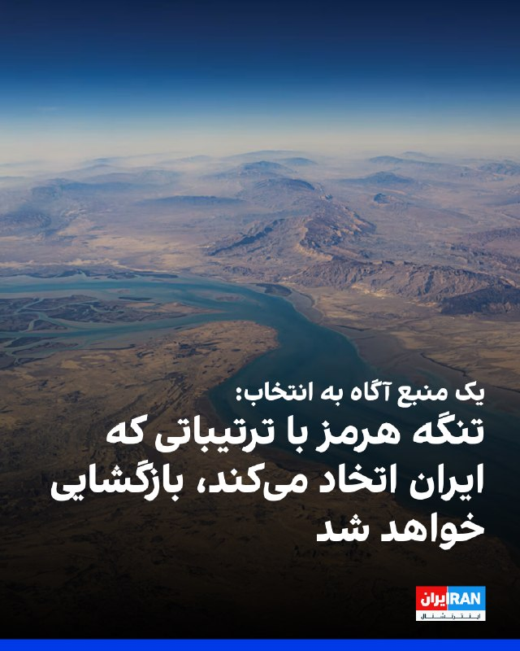

وب‌سایت انتخاب به نقل از «یک منبع آگاه» نوشت: «به‌دنبال پافشاری هیات مذاکراتی ایران در مورد نکاتی در متن تفاهم‌نامه ایران و آمریکا، توافق شد که تنگه هرمز با ترتیباتی که ایران اتخاد خواهد کرد بازگشایی شود.»

این منبع آگاه که به نام و سمت او اشاره نشده است، به انتخاب گفت: «براین اساس، نحوه اداره تردد در تنگه و شیوه ارائه خدمات دریایی و دریافت هزینه‌های مربوط به آن، به ایران و عمان به عنوان کشورهای ساحلی تنگه محول شد.»
‌🏁 🇬🇧 IranintlTV

🤖 @VahidOOnLine

## WithYashar — post 14924

  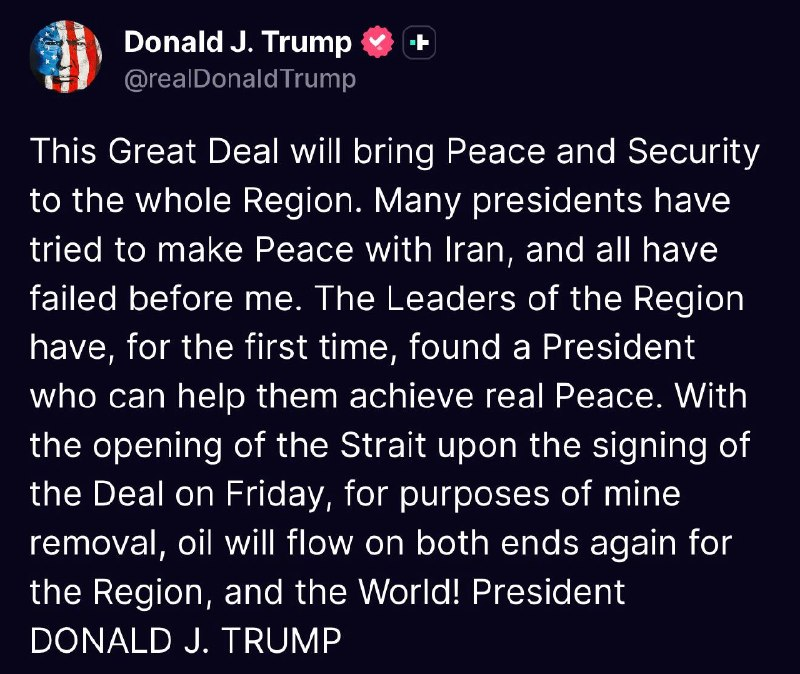

ترامپ در تروث : این توافق بزرگ، صلح و امنیت را برای سراسر منطقه به ارمغان خواهد آورد. بسیاری از رؤسای‌جمهور تلاش کردند با ایران صلح کنند، اما همگی پیش از من شکست خوردند. رهبران منطقه برای نخستین بار، رئیس‌جمهوری را یافته‌اند که می‌تواند به آنان در دستیابی به صلحی واقعی کمک کند. با بازگشایی تنگه پس از امضای توافق در روز جمعه، به‌منظور رفع موانع مورد نظر من، نفت دوباره از هر دو سو برای منطقه و جهان جریان خواهد یافت!
@withyashar

## WithYashar — post 14923

گزارش از سیریک پهپاد شلیک شد به سمت کشتی ها !🚨🚨🚨🚨
@withyashar

## mwarmonitor — post 10936

«این توافق بزرگ، صلح و امنیت را برای کل منطقه به ارمغان خواهد آورد. رؤسای جمهور بسیاری تلاش کرده‌اند با ایران صلح کنند و همگیِ آن‌ها پیش از من شکست خورده‌اند. رهبران منطقه، برای اولین بار، رئیس‌جمهوری را یافته‌اند که می‌تواند به آن‌ها در دستیابی به صلحی واقعی کمک کند. با بازگشایی تنگه پس از امضای توافق در روز جمعه به منظور مین‌روبی، نفت بار دیگر از هر دو سو برای منطقه و جهان جریان خواهد یافت!

رئیس‌جمهور دونالد جی. ترامپ»

@mwarmonitor

## pm_afshaa — post 94022

  <a href="telegram/content/pm_afshaa_94022_1781476373.webm" target="_blank">🎬 Download video</a>

🔴پست جدید ترامپ:

این توافق بزرگ، صلح و امنیت رو برای سراسر منطقه به ارمغان خواهد آورد. بسیاری از رؤسای‌جمهور تلاش کردن با ایران صلح کنند، اما همگی پیش از من شکست خوردن.

رهبران منطقه برای نخستین بار، رئیس‌جمهوری رو یافتن که میتونه به آنان در دستیابی به صلحی واقعی کمک کنه. با بازگشایی تنگه هرمز پس از امضای توافق در روز جمعه، به‌منظور رفع موانع مورد نظر من، نفت دوباره از هر دو سو برای منطقه و جهان جریان خواهد یافت!

💧 Rainbet.com the #1 Non-KYC Crypto Casino & Sportsbook @rainbetcom

😁 @Pm_Afshaa

## pm_afshaa — post 94021

الان مرگ بر آمریکا بگیم مجرم میشیم؟

## pm_afshaa — post 94020

  <a href="telegram/content/pm_afshaa_94020_1781476374.webm" target="_blank">🎬 Download video</a>

🔴غریب‌آبادی، معاون وزیر امور خارجه: قراره توی 60 روز با آمریکا مذاکره کنیم تا به توافق نهایی برسیم. چیزایی که قراره راجع بهش مذاکره کنیم : 1- لغو همه تحریم‌ها درصورت نهایی شدن توافق 2- موضوع هسته‌ای 3- بازسازی و توسعه اقتصادی ایران 4- تعیین سازوکار اجرایی…

## pm_afshaa — post 94019

  <a href="telegram/content/pm_afshaa_94019_1781476374.webm" target="_blank">🎬 Download video</a>

🔴جی‌دی ونس، معاون ترامپ:
کاری که ترامپ انجام داده، ایجاد فضای واقعی برای تغییر همکاری‌های منطقه‌ای بین متحدان عرب خلیج فارس و اسرائیلی‌هاست، و اکنون امیدواریم عصر جدیدی با ایرانی‌ها آغاز بشه. این فقط یک چیز بزرگ برای مردم آمریکاست.

💧 Rainbet.com the #1 Non-KYC Crypto Casino & Sportsbook @rainbetcom

😁 @Pm_Afshaa

## pm_afshaa — post 94018

تتر 163 هزار تومن.

💧 Rainbet.com the #1 Non-KYC Crypto Casino & Sportsbook @rainbetcom

😁 @Pm_Afshaa

## pm_afshaa — post 94017

  <a href="telegram/content/pm_afshaa_94017_1781476375.webm" target="_blank">🎬 Download video</a>

🔴جی‌دی ونس: احتمال حضور ترامپ در مراسم امضای تفاهم وجود داره.

💧 Rainbet.com the #1 Non-KYC Crypto Casino & Sportsbook @rainbetcom

😁 @Pm_Afshaa

## VahidOnline — post 76353

ترامپ:
این توافق بزرگ، صلح و امنیت را برای کل منطقه به ارمغان خواهد آورد. بسیاری از روسای جمهور تلاش کرده‌اند با ایران صلح کنند و همه قبل از من شکست خورده‌اند. رهبران منطقه برای اولین بار رئیس جمهوری پیدا کرده‌اند که می‌تواند به آنها در دستیابی به صلح واقعی کمک کند. با باز شدن تنگه هرمز پس از امضای توافق در روز جمعه، به منظور مین‌روبی، نفت دوباره از هر دو طرف برای منطقه و جهان جریان خواهد یافت! رئیس جمهور دونالد جی. ترامپ

📡 @VahidOnline

## VahidOnline — post 76352

  <a href="telegram/content/VahidOnline_76352_1781476376.mp4" target="_blank">🎬 Download video</a>

جی‌دی ونس، معاون رییس‌جمهوری آمریکا، گفت قصد دارد در مراسم رسمی امضای یادداشت تفاهم میان آمریکا و جمهوری اسلامی حضور داشته باشد، اما احتمال دارد دونالد ترامپ نیز شخصا در این مراسم شرکت کند.

ونس در گفت‌وگویی کوتاه با شبکه فاکس نیوز گفت: «فکر می‌کنم هنوز در حال بررسی جزییات و هماهنگی‌ها درباره افرادی هستیم که در مراسم امضا حضور خواهند داشت. من قطعا قصد دارم در آنجا باشم، اما این احتمال وجود دارد که خود رییس‌جمهوری نیز در مراسم حضور پیدا کند.»

سرویس مخفی آمریکا معمولا حضور همزمان رییس‌جمهوری و معاون رییس‌جمهوری را، به‌ویژه در سفرهای خارجی، به دلایل امنیتی و ملاحظات جانشینی توصیه نمی‌کند.

این اظهارات ساعاتی پس از آن مطرح شد که شهباز شریف، نخست‌وزیر پاکستان، از برگزاری مراسم رسمی امضای توافق میان آمریکا و جمهوری اسلامی در روز جمعه در ژنو سوئیس خبر داد.

قرار است دونالد ترامپ پیش از آن برای شرکت در نشست سالانه گروه هفت به فرانسه سفر کند.
@VahidOOnLine

📡 @VahidOnline

## IranIntlTV — post 342373

  

وب‌سایت انتخاب به نقل از «یک منبع آگاه» نوشت: «به‌دنبال پافشاری هیات مذاکراتی ایران در مورد نکاتی در متن تفاهم‌نامه ایران و آمریکا، توافق شد که تنگه هرمز با ترتیباتی که ایران اتخاد خواهد کرد بازگشایی شود.»

این منبع آگاه که به نام و سمت او اشاره نشده است، به انتخاب گفت: «براین اساس، نحوه اداره تردد در تنگه و شیوه ارائه خدمات دریایی و دریافت هزینه‌های مربوط به آن، به ایران و عمان به عنوان کشورهای ساحلی تنگه محول شد.»
https://iranintl.com/202606145654

## IranIntlTV — post 342372

  <a href="telegram/content/IranIntlTV_342372_1781476379.mp4" target="_blank">🎬 Download video</a>

شهرام خلدی، پژوهشگر تاریخ خاورمیانه و روابط بین‌الملل، درباره واکنش حامیان جمهوری اسلامی به توافق با آمریکا، گفت: «هر مسیری که جمهوری اسلامی انتخاب کند، با هزینه‌های سنگینی همراه است. عقب‌نشینی می‌تواند بحران مشروعیت در میان حامیان حکومت را تشدید کند و ادامه تقابل نیز خطر فشارهای نظامی و اقتصادی بیشتر را به دنبال دارد.»

او افزود: «اگر این توافق‌نامه در نهایت امضا شود، نشانه شکست راهبردی سپاه پاسداران در این دور از تقابل و مذاکرات خواهد بود.»
@iranintltv

## Shin_Persian — post 7084

  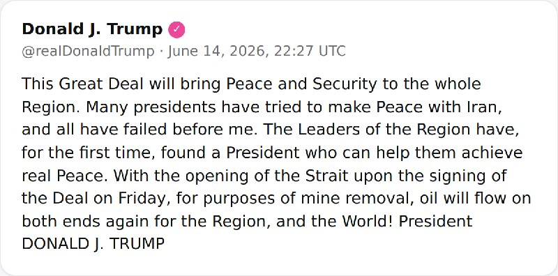

Shin ✓ @hey_itsmyturn
Sun, 14 Jun 2026 22:30:56 UTC

POTUS:
"This Great Deal will bring Peace and Security to the whole Region. Many presidents have tried to make Peace with Iran, and all have failed before me. The Leaders of the Region have, for the first time, found a President who can help them achieve real Peace. With the opening of the Strait upon the signing of the Deal on Friday, for purposes of mine removal, oil will flow on both ends again for the Region, and the World! President DONALD J. TRUMP"

ترجمه خودکار فارسی

رئیس‌جمهور ایالات متحده (POTUS):
«این توافق بزرگ، صلح و امنیت را به کل منطقه خواهد آورد. رؤسای جمهور بسیاری سعی کرده‌اند با ایران صلح کنند و همگی پیش از من شکست خورده‌اند. رهبران منطقه، برای اولین بار، با رئیس‌جمهوری روبرو شده‌اند که می‌تواند به آن‌ها در دستیابی به صلحی واقعی کمک کند. با بازگشایی تنگه بلافاصله پس از امضای توافق در روز جمعه، به منظور مین‌روبی، نفت بار دیگر از هر دو سو برای منطقه و جهان جریان خواهد یافت! رئیس‌جمهور دونالد جی. ترامپ»

𝕏 · @shin_persian

## Shin_Persian — post 7083

Shin ✓ @hey_itsmyturn
Sun, 14 Jun 2026 22:27:39 UTC

Intense jet activity over southern Lebanon

ترجمه خودکار فارسی

فعالیت شدید جنگنده‌ها بر فراز جنوب لبنان

𝕏 · @shin_persian

## Shin_Persian — post 7082

Shin ✓ @hey_itsmyturn
Sun, 14 Jun 2026 22:25:33 UTC

IRGC-Owned Fars:

“Fars News Agency reports that the official statement from the Secretariat of the Supreme National Security Council regarding the ceasefire agreement will be released in a few moments.

According to this report, Iran had canceled its negotiations and prepared to attack the Zionist regime following the assault on Beirut's Dahiyeh district. However, Iran was ultimately persuaded to refrain from the attack due to eleventh-hour concessions offered by the American president, including the preservation of Lebanon's territorial integrity, Israel's withdrawal from the Lebanese border, and the immediate lifting of the blockade.

Additionally, a legal framework for navigation in the Persian Gulf waters is to be established through cooperation between Iran and Oman.”

ترجمه خودکار فارسی

خبرگزاری فارس (متعلق به سپاه پاسداران):

«خبرگزاری فارس گزارش می‌دهد که بیانیه رسمی دبیرخانه شورای عالی امنیت ملی در خصوص توافق آتش‌بس تا لحظاتی دیگر منتشر خواهد شد.

طبق این گزارش، ایران در پی حمله به منطقه ضاحیه بیروت، مذاکرات خود را لغو کرده و برای حمله به رژیم صهیونیستی (ارتش دفاعی اسرائیل) آماده شده بود. با این حال، ایران در نهایت به دلیل امتیازات لحظه آخری ارائه شده توسط رئیس‌جمهور آمریکا، از جمله حفظ تمامیت ارضی لبنان، عقب‌نشینی اسرائیل از مرز لبنان و رفع فوری محاصره، متقاعد شد که از حمله خودداری کند.

علاوه بر این، قرار است چارچوب قانونی برای دریانوردی در آب‌های خلیج فارس از طریق همکاری بین ایران و عمان ایجاد شود.»

𝕏 · @shin_persian

## FarsiVOA — post 220733

🔺ترامپ در مورد جمهوری اسلامی: خواهیم دید چگونه رفتار می‌کنند؛ وقتی که آماده شدیم وارد عمل شویم و مواد هسته‌ای در ایران را جمع‌ می‌کنیم

▪️دونالد ترامپ، رئيس جمهوری آمریکا، در مصاحبه‌ای با وال‌استریت ژورنال که مدتی پیش از اعلام توافق با جمهوری اسلامی منتشر شد گفت این توافق شامل تعهد جمهوری اسلامی به عدم دستیابی به سلاح هسته‌ای است و در پی آن، تنگه هرمز بلافاصله بازگشایی خواهد شد.

⬇️ بیشتر بخوانید:
https://ir.voanews.com/a/8160759.html
@FarsiVOA

## Dirty_Kids — post 392065

  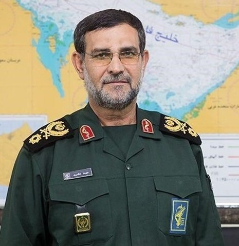

یادی هم بکنیم از این دلقک که آرزوش این بود
تنگه رو ببنده قیمت هر بشکه نفت بشه 400 دلار
هم تنگه باز شد هم خودش کتلت شد😂

@Dirty_Kids 👻

## Dirty_Kids — post 392064

  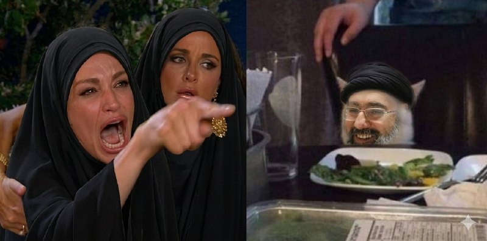

ولی ما با آمریکا پدرکشتگی داریم

@Dirty_Kids 👻

## Dirty_Kids — post 392063

  

قالیباف، عراقچی
پس کون پاره ام چی

@Dirty_Kids 👻

## alonews — post 128066

  <a href="telegram/content/alonews_128066_1781476385.webm" target="_blank">🎬 Download video</a>

👈ترامپ:
این توافق بزرگ، صلح و امنیت رو برای سراسر منطقه به ارمغان خواهد آورد. بسیاری از رؤسای‌جمهور تلاش کردن با ایران صلح کنند، اما همگی پیش از من شکست خوردن.

🔴رهبران منطقه برای نخستین بار، رئیس‌جمهوری رو یافتن که میتونه به آنان در دستیابی به صلحی واقعی کمک کنه. با بازگشایی تنگه هرمز پس از امضای توافق در روز جمعه، به‌منظور رفع موانع مورد نظر من، نفت دوباره از هر دو سو برای منطقه و جهان جریان خواهد یافت!

✅ @AloNews خبر جنگ

## alonews — post 128065

  <a href="telegram/content/alonews_128065_1781476385.webm" target="_blank">🎬 Download video</a>

👈طبق یک بند از یادداشت تفاهم بین ایران و آمریکا، پول های بلوک شده ایران طی ۶۰ روز باید آزاد شود

✅ @AloNews خبر جنگ

## alonews — post 128064

  <a href="telegram/content/alonews_128064_1781476385.webm" target="_blank">🎬 Download video</a>

👈تصویر منتشر شده در ایتا و روبیکا

✅ @AloNews خبر جنگ

## alonews — post 128063

  <a href="telegram/content/alonews_128063_1781476386.webm" target="_blank">🎬 Download video</a>

👈ادعای معاریو:
نتانیاهو به ترامپ گفت که اسرائیل خود را ملزم به رعایت بخش مربوط به لبنان در توافق پیشنهادی آمریکا و ایران نمی‌داند.

🔴بر اساس منابع اسرائیلی، اسرائیل قصد دارد نیروهای خود را در لبنان نگه دارد، عملیات علیه حزب‌الله را ادامه دهد و در صورت نیاز به حملات پاسخ دهد.

✅ @AloNews خبر جنگ

## alonews — post 128062

  <a href="telegram/content/alonews_128062_1781476386.webm" target="_blank">🎬 Download video</a>

👈گویا به جاهایی که غذا و نوشیدنی رایگان تو تجمعات میدادن گفتن جمع کنید برید مهمونی تعطیله

✅ @AloNews خبر جنگ

## alonews — post 128061

  <a href="telegram/content/alonews_128061_1781476386.mp4" target="_blank">🎬 Download video</a>

👈معاون رئیس جمهور جی دی ونس:
من قطعاً قصد دارم برای امضای توافق در سوئیس آنجا باشم، اما ممکن است خود رئیس جمهور ترامپ نیز آنجا باشد. ما این موضوع را حل خواهیم کرد.

🔴فکر می‌کنم می‌توانیم با اطمینان بگوییم که ایران هرگز سلاح هسته‌ای نخواهد داشت.

🔴ما کارهای زیادی برای انجام دادن داریم، اما امشب یک پیروزی بزرگ به دست آوردیم.

✅ @AloNews خبر جنگ

---
📅 بروزرسانی: 1405/03/25 01:52
---

## VahidOOnLine — post 245572

  

جی‌دی ونس، معاون رییس‌جمهوری آمریکا، شامگاه یکشنبه گفت قصد دارد در مراسم رسمی امضای یادداشت تفاهم میان آمریکا و جمهوری اسلامی حضور داشته باشد، اما احتمال دارد دونالد ترامپ نیز شخصا در این مراسم شرکت کند.

ونس در گفت‌وگویی کوتاه با شبکه فاکس نیوز گفت: «فکر می‌کنم هنوز در حال بررسی جزییات و هماهنگی‌ها درباره افرادی هستیم که در مراسم امضا حضور خواهند داشت. من قطعا قصد دارم در آنجا باشم، اما این احتمال وجود دارد که خود رییس‌جمهوری نیز در مراسم حضور پیدا کند.»

سرویس مخفی آمریکا معمولا حضور همزمان رییس‌جمهوری و معاون رییس‌جمهوری را، به‌ویژه در سفرهای خارجی، به دلایل امنیتی و ملاحظات جانشینی توصیه نمی‌کند.

این اظهارات ساعاتی پس از آن مطرح شد که شهباز شریف، نخست‌وزیر پاکستان، از برگزاری مراسم رسمی امضای توافق میان آمریکا و جمهوری اسلامی در روز جمعه در ژنو سوئیس خبر داد.

قرار است دونالد ترامپ پیش از آن برای شرکت در نشست سالانه گروه هفت به فرانسه سفر کند.
‌🏁 🇬🇧 IranintlTV

🤖 @VahidOOnLine

## VahidOOnLine — post 245571

  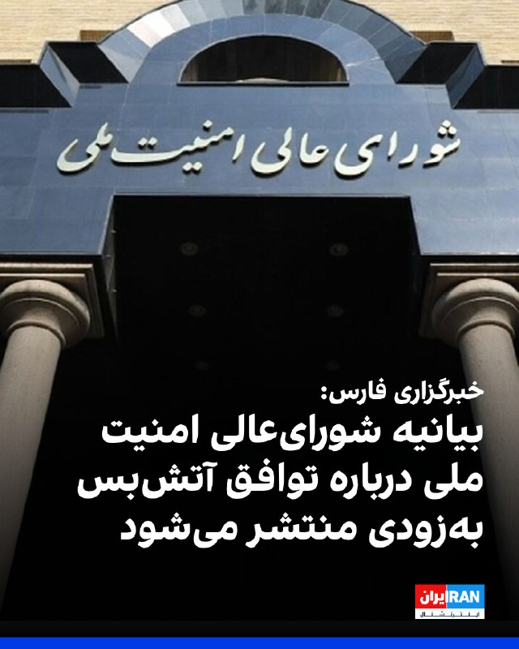

خبرگزاری فارس گزارش داد که بیانیه رسمی دبیرخانه شورای‌عالی امنیت ملی درباره توافق آتش‌بس تا دقایقی دیگر منتشر خواهد شد.

بر اساس این گزارش، جمهوری اسلامی پس از حمله به ضاحیه بیروت، مذاکرات را متوقف کرده و برای حمله به اسرائیل آماده شده بود. با این حال، فارس نوشت تهران در نهایت پس از دریافت امتیازهای لحظه آخری از سوی دونالد ترامپ، رییس‌جمهوری آمریکا، از انجام این حمله صرف‌نظر کرد.

به نوشته فارس، حفظ تمامیت ارضی لبنان، عقب‌نشینی اسرائیل از مرز لبنان و رفع فوری محاصره از جمله مواردی بوده که در روند توافق مطرح شده است.

این خبرگزاری همچنین گزارش داد که بر اساس توافق، نظام حقوقی تردد در آب‌های خلیج فارس با همکاری ایران و عمان تنظیم خواهد شد.
‌🏁 🇬🇧 IranintlTV

🤖 @VahidOOnLine

## WithYashar — post 14922

## WithYashar — post 14921

## mwarmonitor — post 10935

🔴نتانیاهو به ترامپ گفته است که ارتش اسرائیل از لبنان عقب‌نشینی نخواهد کرد و اسرائیل خود را ملزم به بند مربوط به لبنان در توافق آمریکا–ایران نمی‌داند – به نقل از Maariv.

@mwarmonitor

## pm_afshaa — post 94016

  <a href="telegram/content/pm_afshaa_94016_1781475744.webm" target="_blank">🎬 Download video</a>

🔴غریب‌آبادی، معاون وزیر امور خارجه:
قراره توی 60 روز با آمریکا مذاکره کنیم تا به توافق نهایی برسیم.

چیزایی که قراره راجع بهش مذاکره کنیم :
لغو همه تحریم‌ها درصورت نهایی شدن توافق
موضوع هسته‌ای
بازسازی و توسعه اقتصادی ایران
تعیین سازوکار اجرایی واسه نظارت به اجرای تعهدات طرفین

💧Rainbet.com the #1 Non-KYC Crypto Casino & Sportsbook @rainbetcom

😁 @Pm_Afshaa

## pm_afshaa — post 94015

  <a href="telegram/content/pm_afshaa_94015_1781475744.webm" target="_blank">🎬 Download video</a>

ببینیم نتانیاهو تا جمعه از لبنان عقب میکشه یا برعکس حمله میکنه.. هر در صورت امضا جمعه انجام میشه و تا اون موقع میتونه از موقعیت استفاده کنه.

## pm_afshaa — post 94014

یادی کنیم از حرف‌های عایشه قذافی دختر معمر قذافی، دیکتاتور سرنگون شده لیبی :

به پدرم وعده دادن اگر لیبی از برنامه‌های موشکی و هسته‌ای خود عقب‌نشینی کنه، کشور وارد دوره‌ای از امنیت و پیشرفت خواهد شد. اما پس از کنار گذاشتن آن توان بازدارنده، حملات ناتو به لیبی آغاز شد و کشور ما به میدان جنگ تبدیل گردید.

💧 Rainbet.com the #1 Non-KYC Crypto Casino & Sportsbook @rainbetcom

😁 @Pm_Afshaa

## pm_afshaa — post 94013

  <a href="telegram/content/pm_afshaa_94013_1781475745.webm" target="_blank">🎬 Download video</a>

🔴رویترز: پس از اعلام توافق بین ایران و آمریکا، قیمت نفت خام آمریکا به پایین‌ترین سطح خود در بشکه‌ای 80 دلار سنت رسید.

💧 Rainbet.com the #1 Non-KYC Crypto Casino & Sportsbook @rainbetcom

😁 @Pm_Afshaa

## pm_afshaa — post 94012

  <a href="telegram/content/pm_afshaa_94012_1781475745.webm" target="_blank">🎬 Download video</a>

🔴صداوسیما:
ترامپ از ترس پاسخ ایران به تجاوز اسرائیل به لبنان، مجبور شد دستور پایان فوری و کامل محاصره دریایی رو صادر کنه.

💧 Rainbet.com the #1 Non-KYC Crypto Casino & Sportsbook @rainbetcom

😁 @Pm_Afshaa

## pm_afshaa — post 94011

  <a href="telegram/content/pm_afshaa_94011_1781475746.mp4" target="_blank">🎬 Download video</a>

علی‌خامنه‌ای 11 روز قبل از ترور:

امام حسین فرمود کسی مثل من با کسی مثل یزید بیعت نمیکنه: ملت ماهم بیعت نمیکنه.

💧 Rainbet.com the #1 Non-KYC Crypto Casino & Sportsbook @rainbetcom

😁 @Pm_Afshaa

## mamlekate — post 103708

  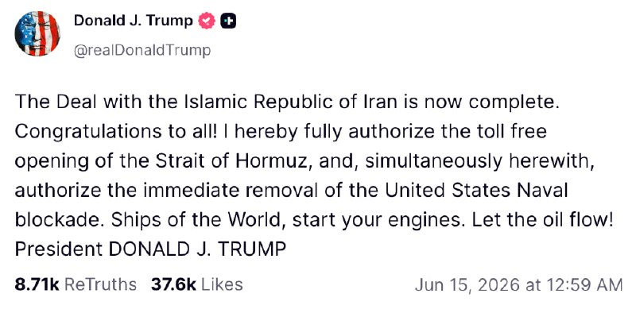

📝 ترامپ: توافق با جمهوری اسلامی کامل شد

دونالد ترامپ، رئیس جمهوری آمریکا اعلام کرد که توافق با جمهوری اسلامی ایران اکنون کامل شده است. او گفت: به همه تبریک می‌گویم! بدینوسیله اجازه کامل بازگشایی تنگه هرمز بدون عوارض را می‌دهم و همزمان با آن، رفع فوری محاصره دریایی ایالات متحده را نیز مجاز می‌دارم. کشتی‌های جهان، موتورهای خود را روشن کنید. بگذارید نفت جریان یابد! رئیس جمهوری دونالد جی. ترامپ

📞 امشب میدون انقلاب رو زود خاموش کردن تا طرفداراشون برن و ظاهرا هم جواب داد، خیلی هم خلوت بود. مربوط به همین خبر توافق هست که یه وقت داستان نشه

@mamlekate

## IranIntlTV — post 342371

  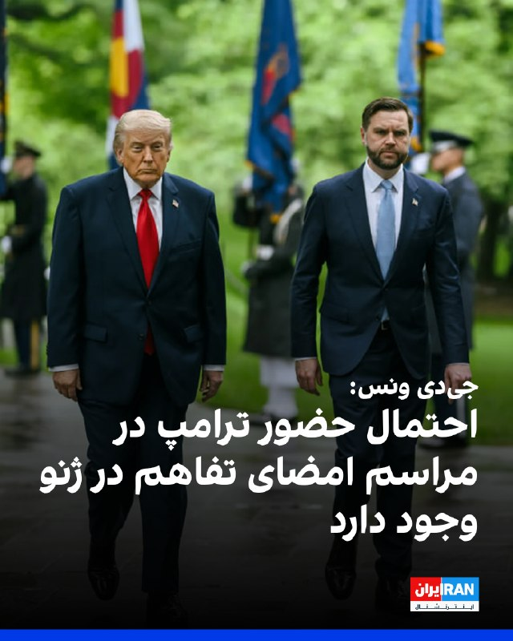

جی‌دی ونس، معاون رییس‌جمهوری آمریکا، شامگاه یکشنبه گفت قصد دارد در مراسم رسمی امضای یادداشت تفاهم میان آمریکا و جمهوری اسلامی حضور داشته باشد، اما احتمال دارد دونالد ترامپ نیز شخصا در این مراسم شرکت کند.

ونس در گفت‌وگویی کوتاه با شبکه فاکس نیوز گفت: «فکر می‌کنم هنوز در حال بررسی جزییات و هماهنگی‌ها درباره افرادی هستیم که در مراسم امضا حضور خواهند داشت. من قطعا قصد دارم در آنجا باشم، اما این احتمال وجود دارد که خود رییس‌جمهوری نیز در مراسم حضور پیدا کند.»

سرویس مخفی آمریکا معمولا حضور همزمان رییس‌جمهوری و معاون رییس‌جمهوری را، به‌ویژه در سفرهای خارجی، به دلایل امنیتی و ملاحظات جانشینی توصیه نمی‌کند.

این اظهارات ساعاتی پس از آن مطرح شد که شهباز شریف، نخست‌وزیر پاکستان، از برگزاری مراسم رسمی امضای توافق میان آمریکا و جمهوری اسلامی در روز جمعه در ژنو سوئیس خبر داد.

قرار است دونالد ترامپ پیش از آن برای شرکت در نشست سالانه گروه هفت به فرانسه سفر کند.
https://iranintl.com/202606148832

## IranIntlTV — post 342370

  <a href="telegram/content/IranIntlTV_342370_1781475749.mp4" target="_blank">🎬 Download video</a>

شهرام خلدی، پژوهشگر تاریخ خاورمیانه و روابط بین‌الملل، درباره اعلام دونالد ترامپ مبنی بر توافق نهایی تهران و واشینگتن گفت: «پرسش اساسی این است که ایالات متحده چگونه می‌تواند اعلام کند جنگ در همه جبهه‌ها پایان یافته، در حالی که شواهد نشان می‌دهد موضع اسرائیل در این زمینه تغییر نکرده است.»

او افزود: «یادداشت تفاهم صرفا یک متن سیاسی است و بدون سازوکار مشخص برای نظارت بر اجرای آن، از جمله هیئتی مورد قبول طرفین یا ناظران بین‌المللی، اجرای آن مبهم خواهد بود.»
@iranintltv

## FarsiVOA — post 220732

  <a href="telegram/content/FarsiVOA_220732_1781475751.mp4" target="_blank">🎬 Download video</a>

⚡️تازه‌ترین واکنش‌های کنگره به توافق با جمهوری اسلامی
@FarsiVOA

## Persian_Trend_Official — post 17133

https://youtube.com/live/MXtIab_TfCg?feature=share

## BBCPersian — post 283826

  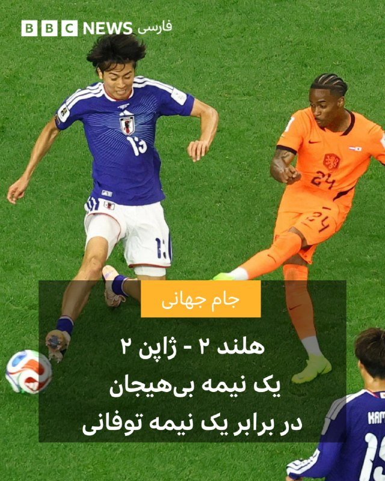

‌ ‌ ‌
تیم‌های فوتبال هلند و ژاپن در نهمین بازی این دوره جام جهانی فوتبال مردان در شهر دالاس به مصاف هم رفتند که در پایان به تقسیم امتیاز رضایت دادند.

نیمه اول این بازی با برتری نسبی هلند همراه بود اما در مجموع چندان جذابیتی نداشت.

با بازگشت بازیکنان از استراحت دو نیمه اما بازی روند دیگری گرفت و ویرجیل ون‌دایک در دقیقه ۵۱ هلند را با یک گل پیش انداخت.

ژاپن اما اجازه نداد برتری هلند بیش از شش دقیقه به طول بکشد و کیتو ناکامورا در دقیقه ۵۷ گل تساوی را به ثمر رساند.

بازی با هیجان دو چندان پس از آن دنبال شد تا اینکه مجددا کریسنسیو سامرویل هلند را در دقیقه ۶۴ پیش انداخت.

هر دو تیم در ادامه سعی کردند تا گل به ثمر برسانند تا اینکه یک دقیقه مانده با پایان بازی مجددا ژاپن با گل دیاچی کامادا بازی را برابر کرد.

📷Reuters
@BBCPersian

## alonews — post 128060

  <a href="telegram/content/alonews_128060_1781475753.webm" target="_blank">🎬 Download video</a>

👈وضعیت تتر که بعد از خبر توافق از ۱۷۵ به ۱۶۳ رسیده است

✅ @AloNews خبر جنگ

## alonews — post 128059

  <a href="telegram/content/alonews_128059_1781475753.webm" target="_blank">🎬 Download video</a>

👈شب‌های ایتا

✅ @AloNews خبر جنگ

## alonews — post 128058

  <a href="telegram/content/alonews_128058_1781475753.webm" target="_blank">🎬 Download video</a>

🔴توافقی که جمهوری اسلامی با دشمن 47 ساله خودش انجام داد، امضا سقوط خودش رو زد. بماند به یادگار

✅@AloNews

## alonews — post 128057

  <a href="telegram/content/alonews_128057_1781475753.webm" target="_blank">🎬 Download video</a>

👈قیافه مجری شبکه خبر هنگام اعلام توافق

✅ @AloNews خبر جنگ

## alonews — post 128056

  <a href="telegram/content/alonews_128056_1781475754.mp4" target="_blank">🎬 Download video</a>

👈مصاحبه ونس با فاکس‌نیوز پس از اعلام رسمی توافق ایران و آمریکا: حالا امیدواریم دوران جدیدی با ایرانی‌ها آغاز شود! این برای مردم آمریکا اتفاق بزرگی است.

✅ @AloNews خبر جنگ

## alonews — post 128055

  <a href="telegram/content/alonews_128055_1781475756.mp4" target="_blank">🎬 Download video</a>

👈آیت الله خامنه‌ای 11 روز قبل از ترور:
کسی مثل من با کسی مثل یزید بیعت نمیکنه: ملت ماهم بیعت نمیکنه.

✅ @AloNews خبر جنگ

---
📅 بروزرسانی: 1405/03/25 01:42
---

## VahidOOnLine — post 245570

  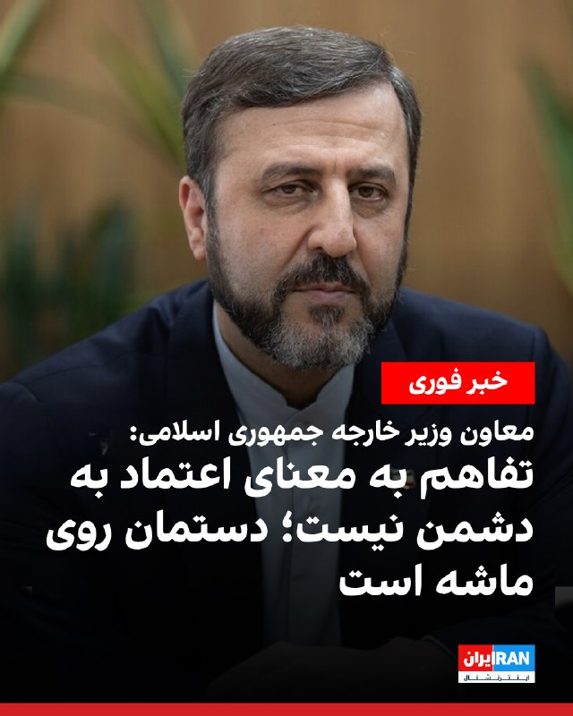

کاظم غریب‌آبادی، معاون وزیر خارجه جمهوری اسلامی، اعلام کرد متن یادداشت تفاهم با آمریکا نهایی شده و مراسم رسمی امضای آن روز جمعه در سوئیس برگزار خواهد شد.

غریب‌آبادی با اشاره به ماهیت این توافق تاکید کرد: «این یادداشت تفاهم به معنای اعتماد به دشمن نیست و در عین بی‌اعتمادی نوشته شده است.»

معاون وزیر خارجه جمهوری اسلامی همچنین گفت نیروهای مسلح جمهوری اسلامی در تمام مراحل مذاکرات آمادگی خود را حفظ کرده‌اند.

او افزود: «نیروهای مسلح همواره برای مقابله با توطئه‌های دشمنان دستشان روی ماشه خواهد بود و برای ارائه پاسخ قاطع آماده بودند.»
‌🏁 🇬🇧 IranintlTV

🤖 @VahidOOnLine

## WithYashar — post 14920

جنگ تمام نمیشود بشینید و ببینید ✌🏾

## WithYashar — post 14919

جی‌دی ونس، معاون ترامپ اعلام کرد: من برای شرکت در امضای توافق با ایران به ژنو خواهم رفت
@withyashar

## WithYashar — post 14918

## FoxNewsTwitter — post 342969

  <a href="telegram/content/FoxNewsTwitter_342969_1781475155.mp4" target="_blank">🎬 Download video</a>

Fox News (Twitter/X)

JUST IN: VP JD Vance reacts to the completion of the U.S.-Iran peace deal, calling it a "big win."

## FoxNewsTwitter — post 342968

  <a href="telegram/content/FoxNewsTwitter_342968_1781475158.mp4" target="_blank">🎬 Download video</a>

Fox News (Twitter/X)

BREAKING: Trump says the U.S. and Iran have reached a peace deal. FOX News' @TreyYingst has the latest.

## pm_afshaa — post 94010

  <a href="telegram/content/pm_afshaa_94010_1781475161.webm" target="_blank">🎬 Download video</a>

🔴معاون عراقچی: روز گذشته هیئتی از قطر برای تکمیل گفتگوها تهران بود و بیش از 15 ساعت گفتگو صورت گرفت و اصلاحاتی انجام دادیم که مورد پذیرش قرار گرفت. امضای رسمی یادداشت تفاهم روز جمعه خواهد بود. دو اتفاق فوری بامداد امروز باید اتفاق بیفته: یک پایان فوری و…

## pm_afshaa — post 94009

  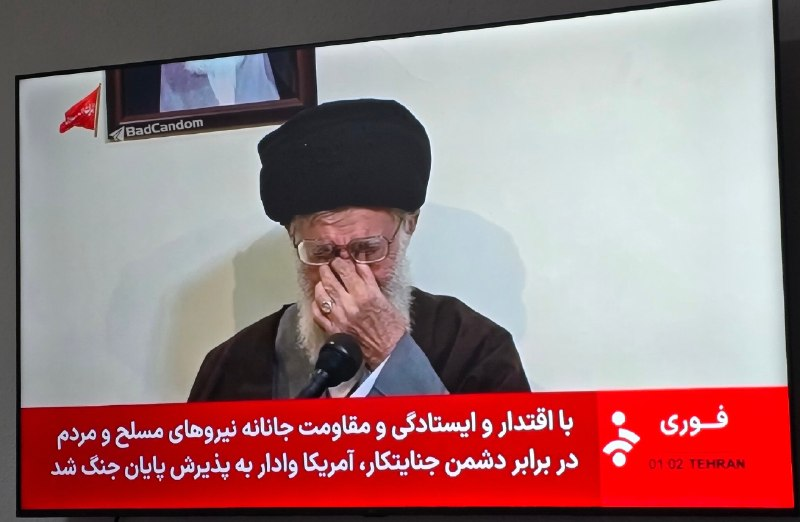

ترکیب زیرنویس شبکه خبر و عکس عالیه

💧 Rainbet.com the #1 Non-KYC Crypto Casino & Sportsbook @rainbetcom

😁 @Pm_Afshaa

## pm_afshaa — post 94008

  <a href="telegram/content/pm_afshaa_94008_1781475162.webm" target="_blank">🎬 Download video</a>

🔴جی‌دی ونس، معاون ترامپ:
من برای شرکت در مراسم امضای توافق با ایران به ژنو خواهم رفت.

💧 Rainbet.com the #1 Non-KYC Crypto Casino & Sportsbook @rainbetcom

😁 @Pm_Afshaa

## pm_afshaa — post 94007

  <a href="telegram/content/pm_afshaa_94007_1781475163.webm" target="_blank">🎬 Download video</a>

🔴معاون عراقچی: روز گذشته هیئتی از قطر برای تکمیل گفتگوها تهران بود و بیش از 15 ساعت گفتگو صورت گرفت و اصلاحاتی انجام دادیم که مورد پذیرش قرار گرفت.

امضای رسمی یادداشت تفاهم روز جمعه خواهد بود.

دو اتفاق فوری بامداد امروز باید اتفاق بیفته: یک پایان فوری و دائمی جنگ در جبهه‌های مختلف از جمله لبنان؛ دوم هم خاتمه محاصره دریایی.

تعهدات ما از روز جمعه صورت خواهد گرفت.

💧 Rainbet.com the #1 Non-KYC Crypto Casino & Sportsbook @rainbetcom

😁 @Pm_Afshaa

## kianmeli1 — post 88003

## IranIntlTV — post 342368

  

کاظم غریب‌آبادی، معاون وزیر خارجه جمهوری اسلامی، اعلام کرد متن یادداشت تفاهم با آمریکا نهایی شده و مراسم رسمی امضای آن روز جمعه در سوئیس برگزار خواهد شد.

غریب‌آبادی با اشاره به ماهیت این توافق تاکید کرد: «این یادداشت تفاهم به معنای اعتماد به دشمن نیست و در عین بی‌اعتمادی نوشته شده است.»

معاون وزیر خارجه جمهوری اسلامی همچنین گفت نیروهای مسلح جمهوری اسلامی در تمام مراحل مذاکرات آمادگی خود را حفظ کرده‌اند.

او افزود: «نیروهای مسلح همواره برای مقابله با توطئه‌های دشمنان دستشان روی ماشه خواهد بود و برای ارائه پاسخ قاطع آماده بودند.»
https://iranintl.com/202606146242

## Persian_Trend_Official — post 17132

  <a href="telegram/content/Persian_Trend_Official_17132_1781475165.webm" target="_blank">🎬 Download video</a>

🎬 Video

## Persian_Trend_Official — post 17131

فایل صوتی لایو امشب در اسپاتیفای
https://open.spotify.com/episode/0wL5IqRAcYrXM4Y1uuI9ix

## RadioFarda — post 158309

🔸کمی پیش از انتشار این پیام، دونالد ترامپ عصر یک‌شنبه به روزنامه وال‌استریت جورنال گفت قصد دارد به‌زودی بیانیه‌ای منتشر کند و در آن تأیید کند که ایالات متحده با ایران به توافق رسیده است. 🔸ترامپ گفت این توافق، که ایران هنوز موافقت خود با آن را تأیید نکرده،…

## RadioFarda — post 158308

🔸دونالد ترامپ، رئیس جمهوری آمریکا در پیامی در شبکه تروث سوشال نوشت: «توافق با جمهوری اسلامی ایران اکنون نهایی شده است. به همه تبریک می‌گویم!» 🔸او ادامه داد: «بدین‌وسیله بازگشایی کامل و بدون دریافت عوارض تنگه هرمز را مجاز اعلام می‌کنم و همزمان دستور رفع فوری…

## BBCPersian — post 283825

  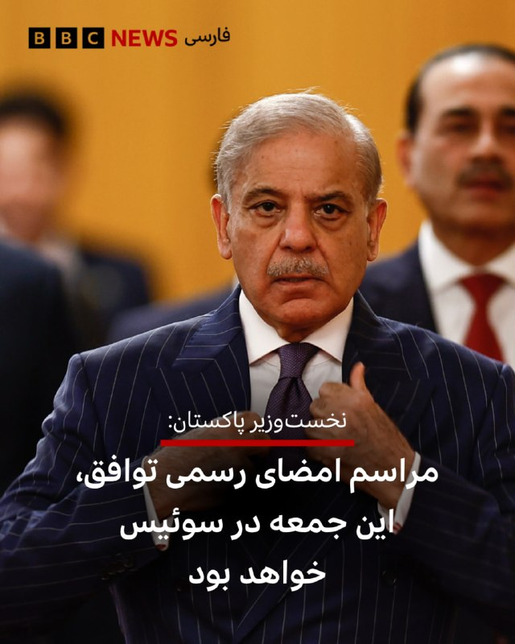

‌ ‌ ‌ ‌
شهباز شریف در پستی در شبکه اجتماعی ایکس نوشته است که مراسم امضای رسمی توافق میان ایران و آمریکا همین جمعه، ۲۹ خرداد، ۱۹ ژوئن در سوئیس خواهد بود.

نخست‌وزیر پاکستان گفته است که هر دو طرف پایان فوری و دائمی عملیات نظامی در همه جبهه‌ها از جمله در لبنان را اعلام کرده‌اند.

دونالد ترامپ، رئیس‌جمهور آمریکا هم اعلام کرد که توافق با ایران نهایی شده است.

آقای ترامپ در پستی در شبکه اجتماعی تروث سوشال نوشت: «توافق با جمهوری اسلامی ایران اکنون کامل شده است. به همه تبریک می‌گویم!»

آقای ترامپ در ادامه نوشته که «اجازه کامل بازگشایی تنگه هرمز بدون عوارض را می‌دهم و هم‌زمان با آن، رفع فوری محاصره دریایی ایالات متحده را نیز مجاز می‌دارم.»

رئیس‌جمهور آمریکا نوشته: «کشتی‌های جهان، موتورهای خود را روشن کنید. بگذارید نفت جریان یابد!»

https://bbc.in/4uz2VRC
📷 Tingshu Wang - Pool/Getty Images
@BBCPersian

## Dirty_Kids — post 392062

  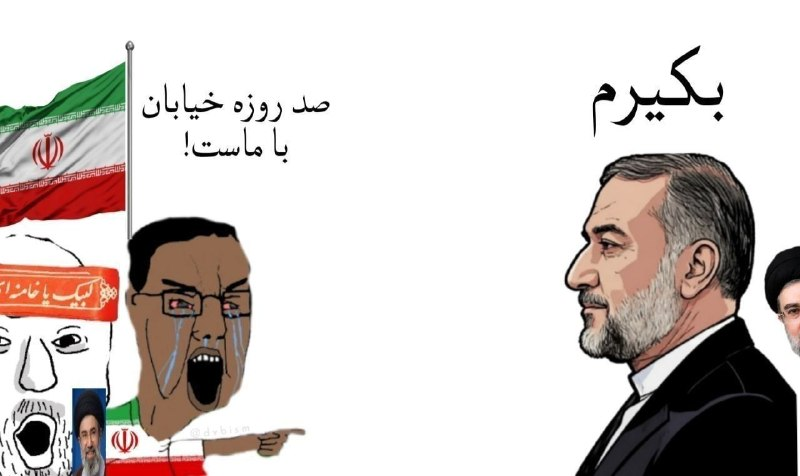

وضعیت عرزشیا هم اکنون😂

@Dirty_Kids 👻

## Dirty_Kids — post 392061

  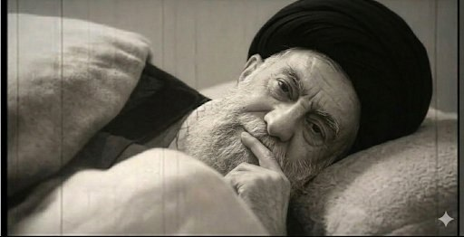

عرزشی تو غیرت داری؟

@Dirty_Kids 👻

## Dirty_Kids — post 392060

  

زیرنویس شبکه خبر با عکسی که گذاشته خیلی جالبه:))))

@Dirty_Kids 👻

## alonews — post 128054

وضعیت عرزشیا هم اکنون😂 [@AloTweet]

## alonews — post 128053

  <a href="telegram/content/alonews_128053_1781475168.webm" target="_blank">🎬 Download video</a>

👈جی‌دی ونس در مورد اینکه چه کسانی در مراسم امضای توافق صلح با ایران شرکت خواهند کرد:

«قطعاً برنامه دارم که آنجا باشم»

✅ @AloNews خبر جنگ

## alonews — post 128052

  <a href="telegram/content/alonews_128052_1781475168.webm" target="_blank">🎬 Download video</a>

👈تصویر عجیب همزمان با تیتر در شبکه خبر

✅ @AloNews خبر جنگ

## alonews — post 128051

  <a href="telegram/content/alonews_128051_1781475168.webm" target="_blank">🎬 Download video</a>

👈بصورت کلی یک پیروزی و یک شکست برای جمهوری اسلامی بود

🔴اما چگونه؟ ترامپ یک تارگت بزرگ رو به همه نشون داد(رژیم‌چنج) اما صرفا یک تارگت کاذب بود و به هدف خودش یعنی اورانیوم‌ها رسید

🔴اما چرا پیروزی برای جمهوری اسلامی؟ صرفا به همه میتونه بگه تارگت ترامپ یعنی رژیم‌ چنج موفق نشد

🔴جمهوری اسلامی در این جنگ علاوه بر رهبران ارشد، اورانیوم‌ها داد و زیرساخت‌های اقتصادی به شدت آسیب دید

🔴ترامپ صرفا دو تارگت معرفی کرد یکی بزرگتر از دیگری که از قضا همون بزرگه احتمالا کاذب بود تا کوچیکه راحتتر بدست بیاد

✅ @AloNews خبر جنگ

---
📅 بروزرسانی: 1405/03/25 01:32
---

## WithYashar — post 14917

## WithYashar — post 14916

@withyashar

## WithYashar — post 14915

فارس: دقایقی دیگر بیانیه رسمی دبیرخانه شورای عالی انقلاب ملی درباره توافق آتش بس منتشر خواهد شد

بر اساس این گزارش، ایران پس از حمله به ضاحیه بیروت، مذاکرات خود را لغو و آماده حمله به رژیم صهیونیستی شده بود. اما در نهایت با امتیازهای لحظه آخری که از سوی دونالد ترامپ، رئیسجمهور آمریکا ارائه شد، از جمله حفظ تمامیت ارضی لبنان و عقب نشینی اسرائیل از مرز لبنان و بازگشایی بلادرنگ محاصره، متقاعد گردید که از انجام حمله خود صرفنظر کند.
همچنین مقرر شد نظام حقوقی تردد در آب‌های خلیج فارس با همکاری ایران و عمان تنظیم شود.
@withyashar

## mwarmonitor — post 10934

🔴جی دی ونس : من برای شرکت در مراسم امضای توافق با ایران به ژنو خواهم رفت.

@mwarmonitor

## mwarmonitor — post 10933

برگای کل تحلیلگران ارشد بین‌المللی ریخته

## mwarmonitor — post 10932

🔴 به گزارش فارس، دقایقی دیگر بیانیه رسمی دبیرخانه شورای‌عالی امنیت ملی درباره توافق آتش بس منتشر خواهد شد.

🔹براساس این گزارش، ایران پس از حمله به ضاحیه بیروت، مذاکرات خود را لغو و آماده حمله به رژیم صهیونیستی شده بود. اما در نهایت با امتیازهای لحظه آخری که از سوی رئیس‌جمهور آمریکا ارائه شد، از جمله حفظ تمامیت ارضی لبنان و عقب نشینی اسرائیل از مرز لبنان و رفع بلادرنگ محاصره، متقاعد گردید که از انجام حمله خود صرفنظر کند.

🔹همچنین مقرر شد نظام حقوقی تردد در آب‌های خلیج فارس با همکاری ایران و عمان تنظیم شود.

@mwarmonitor

## pm_afshaa — post 94006

  <a href="telegram/content/pm_afshaa_94006_1781474555.webm" target="_blank">🎬 Download video</a>

🔴غریب‌آبادی، معاون وزیر خارجه:

دشمنی که حمله کرده بود تا اهداف شومش رو عملیاتی کنه، در تمامی اهدافش متحمل شکست شد و جمهوری اسلامی ایران پیروزی‌های بزرگی در جنگ کسب کرد.

در پیش نویس تفاهم، تمامی مواضع مهم خود را گنجانده‌ایم و پس از امضای رسمی، متن تفاهم‌نامه منتشر خواهد شد. قبل از امضا هم از طریق رسانه‌های عمومی، ابعاد مختلف یادداشت تفاهم رو تشریح خواهیم کرد و دستاوردها رو خواهیم گفت.

💧 Rainbet.com the #1 Non-KYC Crypto Casino & Sportsbook @rainbetcom

😁 @Pm_Afshaa

## pm_afshaa — post 94005

  <a href="telegram/content/pm_afshaa_94005_1781474555.webm" target="_blank">🎬 Download video</a>

🔴غریب‌آبادی، معاون وزیر خارجه:
پایان فوری و دائمی جنگ و عملیات‌های نظامی در جبهه‌های مختلف و از جمله لبنان، از همین امشب اعلام میشه.

از امشب خاتمه محاصره دریایی آمریکا علیه ایران هم آغاز میشه.

💧 Rainbet.com the #1 Non-KYC Crypto Casino & Sportsbook @rainbetcom

😁 @Pm_Afshaa

## pm_afshaa — post 94004

  <a href="telegram/content/pm_afshaa_94004_1781474556.webm" target="_blank">🎬 Download video</a>

🔴خبرگزاری فارس: ایران پس از حمله اسرائیل به ضاحیه بیروت، مذاکرات رو لغو و آماده حمله به اسرائیل شده بود؛ اما در نهایت با امتیازهای لحظه آخری که از سوی دونالد ترامپ ارائه شد، از جمله حفظ تمامیت ارضی لبنان و عقب نشینی اسرائیل از مرز لبنان و بازگشایی فوری محاصره دریایی، متقاعد گردید که از انجام حمله خود صرف نظر کنه.

همچنین مقرر شد نظام حقوقی تردد در آب‌های خلیج فارس با همکاری ایران و عمان تنظیم بشه.

💧 Rainbet.com the #1 Non-KYC Crypto Casino & Sportsbook @rainbetcom

😁 @Pm_Afshaa

## pm_afshaa — post 94003

  <a href="telegram/content/pm_afshaa_94003_1781474557.webm" target="_blank">🎬 Download video</a>

🔴صداوسیما:
ترامپ به شکل حقیرانه‌ای عقب‌نشینی کرد.

💧 Rainbet.com the #1 Non-KYC Crypto Casino & Sportsbook @rainbetcom

😁 @Pm_Afshaa

## IranIntlTV — post 342367

  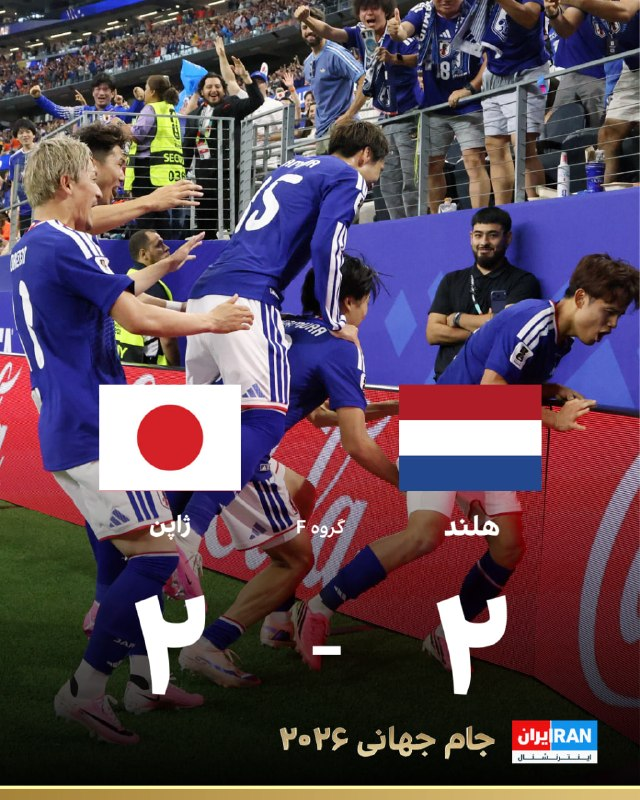

🔻تیم ملی فوتبال هلند در اولین بازی خود در جام جهانی ۲۰۲۶ در ورزشگاه ای‌تی‌اند‌تی در آرلینگتون با نتیجه دو بر دو برابر ژاپن متوقف شد.

🔹شاگردان کومان دو بار با گل‌های فن‌دایک و سامرویل از حریف خود پیش افتادند اما برترین تیم آسیا با گل‌های ناکامورا و کامادا از شکست گریخت.

🔹سوئد و تونس دیگر دیدار این گروه را برگزار خواهند کرد.

@iranintltvsport

## Iliaen — post 4488

با دستور ترامپ، نیروی دریایی ایالات متحده به محاصره دریایی پایان داد.

@iliaen

## IranianMinds — post 22605

🔴 معاون وزیر خارجه جمهوری اسلامی:

پایان فوری و دائمی جنگ و عملیات‌های نظامی در جبهه‌های مختلف و از جمله لبنان، از همین امشب اعلام می‌شود , محاصره دریایی هم توسط آمریکا برداشته شد.

@IranianMinds

## IranianMinds — post 22604

🔴 معاون وزیر خارجه جمهوری اسلامی:

متن یادداشت تفاهم نهایی شده و امضای رسمی یادداشت تفاهم اسلام آباد روز جمعه در سوئیس انجام خواهد شد.

@IranianMinds

## Dirty_Kids — post 392059

  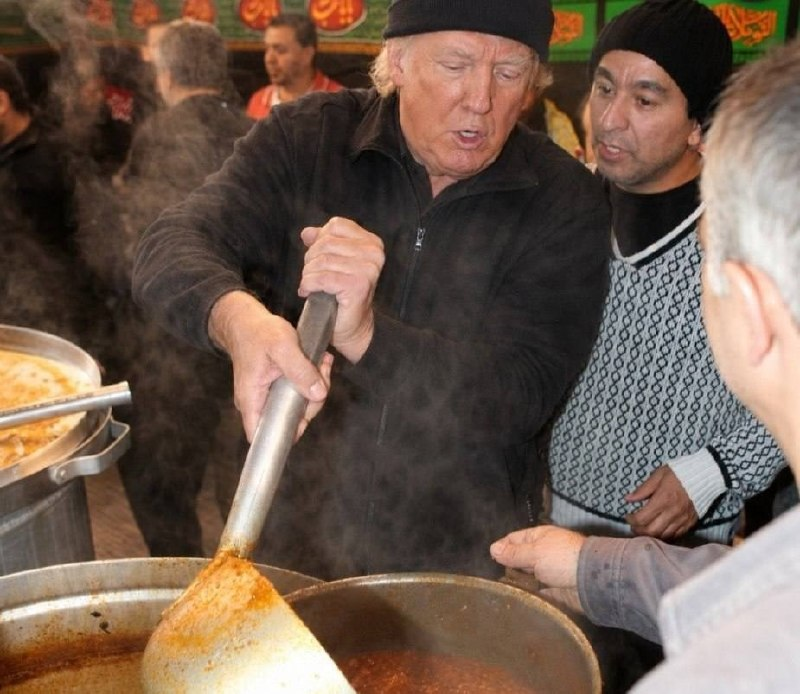

قماربازه؟ زنش جنده‌ست؟ قاتل آقاست؟ به تو چه، میخواد این ده روز امام حسینی باشه.

@Dirty_Kids 👻

## alonews — post 128050

  <a href="telegram/content/alonews_128050_1781474558.webm" target="_blank">🎬 Download video</a>

👈برخی کانالای انقلابی در ایتا نوشتند که این جام زهر نبود بلکه بشکه زهر بود 
✅ @AloNews خبر جنگ

## alonews — post 128049

  <a href="telegram/content/alonews_128049_1781474558.mp4" target="_blank">🎬 Download video</a>

😐
😐
😐
😐
😐

## alonews — post 128048

  <a href="telegram/content/alonews_128048_1781474560.webm" target="_blank">🎬 Download video</a>

👈غریب‌آبادی، معاون وزیر خارجه:
متن یادداشت تفاهم نهایی شده و امضای رسمی‌یادداشت تفاهم اسلام آباد روز جمعه در سوئیس انجام خواهد شد

✅ @AloNews خبر جنگ

---
📅 بروزرسانی: 1405/03/25 01:22
---

## VahidOOnLine — post 245569

  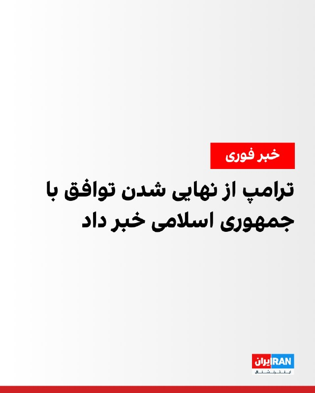

دونالد ترامپ، رییس‌جمهوری آمریکا، اعلام کرد توافق با جمهوری اسلامی ایران نهایی شده است.

ترامپ در پیامی گفت: «به همه تبریک می‌گویم. توافق با جمهوری اسلامی ایران اکنون نهایی شده است.»

او همچنین اعلام کرد دستور بازگشایی تنگه هرمز بدون دریافت عوارض و همزمان دستور لغو فوری محاصره دریایی اعمال‌شده از سوی ایالات متحده را صادر کرده است.

رییس‌جمهوری آمریکا در ادامه نوشت: «ای کشتی‌های جهان، موتورهای خود را روشن کنید. بگذارید نفت جریان یابد.»
‌🏁 🇬🇧 IranintlTV

🤖 @VahidOOnLine

## WithYashar — post 14914

## WithYashar — post 14913

@withyashar

## WithYashar — post 14912

  <a href="telegram/content/WithYashar_14912_1781473952.mp4" target="_blank">🎬 Download video</a>

مجری صدا و سیما:
پیروزی رو به ملت تبریک میگم
@withyashar

## mwarmonitor — post 10931

🔴ایران یک حمله برنامه‌ریزی‌شده به اسرائیل را لغو کرده است – نیویورک تایمز. @mwarmonitor

## mwarmonitor — post 10930

🔴ایران یک حمله برنامه‌ریزی‌شده به اسرائیل را لغو کرده است – نیویورک تایمز.

@mwarmonitor

## mwarmonitor — post 10929

🔴توافق با جمهوری اسلامی ایران اکنون کامل شده است. تبریک به همه! من بدین‌وسیله اجازه کامل برای بازگشایی بدون عوارض (آزاد) تنگه هرمز را صادر می‌کنم و هم‌زمان با آن، دستور رفع فوری محاصره دریایی ایالات متحده را می‌دهم. کشتی‌های جهان، موتورهای خود را روشن کنید.…

## FoxNewsTwitter — post 342967

Fox News (Twitter/X)

🚨🚨BREAKING: President Trump says the deal with Iran is “now complete” and authorizes the reopening of the Strait of Hormuz and removal of the U.S. naval blockade, after Pakistan’s prime minister said the U.S. and Iran had reached a peace deal to end military operations on all fronts. 🚨🚨

## FoxNewsTwitter — post 342966

  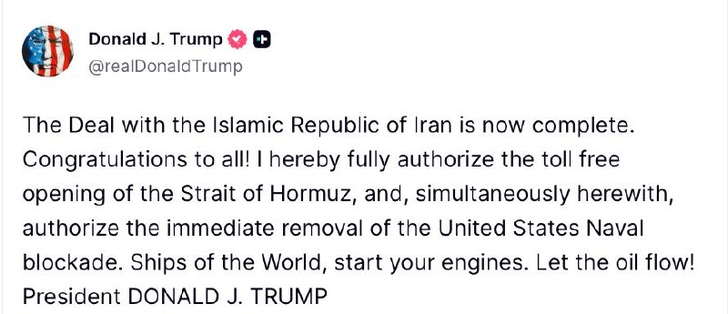

Fox News (Twitter/X)

BREAKING: "The Deal with the Islamic Republic of Iran is now complete."

President Trump says he has authorized the opening of the Strait of Hormuz and the immediate removal of the U.S. naval blockade following what he says is a completed agreement with Iran.

"Ships of the World, start your engines. Let the oil flow!"

## pm_afshaa — post 94002

  <a href="telegram/content/pm_afshaa_94002_1781473954.webm" target="_blank">🎬 Download video</a>

🔴نیویورک تایمز به نقل از سه مقام ایرانی:

ایران حمله تلافی جویانه برنامه ریزی شده خود به اسرائیل رو پس از مداخله ترامپ که از طریق واسطه‌ها خواستار خویشتنداری در مورد ایران شد، لغو کرد.

بحث‌های داخلی در رهبری ایران بر سر پاسخ دادن به بازدارندگی یا اجتناب از انتقام‌جویی وجود داشت، با برخی استدلال میکردن که حمله به تلاش‌های اسرائیل برای تضعیف مذاکرات صلح جاری بین تهران و واشنگتن بازی میکنه.

💧 Rainbet.com the #1 Non-KYC Crypto Casino & Sportsbook @rainbetcom

😁 @Pm_Afshaa

## pm_afshaa — post 94001

  <a href="telegram/content/pm_afshaa_94001_1781473955.webm" target="_blank">🎬 Download video</a>

🔴خبرگزاری انتخاب:

بعد از حمله اسرائیل به ضاحیه، قالیباف تصمیم گرفت مذاکرات اعضای تیم جمهوری اسلامی با طرف قطری متوقف بشه.

همزمان نیروهای مسلح جمهوری اسلامی پرتابگرها رو آماده شلیک کردن.

در پی توئیت هشدارامیز قالیباف، ترامپ مجبور به ارائه امتیازات جدید و جدی به جمهوری اسلامی در موضوع لبنان شد!

💧 Rainbet.com the #1 Non-KYC Crypto Casino & Sportsbook @rainbetcom

😁 @Pm_Afshaa

## kianmeli1 — post 88002

  <a href="telegram/content/kianmeli1_88002_1781473956.mp4" target="_blank">🎬 Download video</a>

🔴فوری

دود سفید در کاخ سفید.
طبق سنت، این به معنای امضای توافق‌نامه صلح جدید است.

## kianmeli1 — post 88001

🔴علی‌رغم انتشار خبر توافق، هم‌اکنون این صدا به زبان انگلیسی توسط سپاه پاسداران درحال مخابره به بیسیم کشتی‌ها در محدوده‌ی تنگه هرمز است که می‌گوید تنگه هرمز بسته است.
https://t.me/kianmeli1

## IranIntlTV — post 342366

  <a href="telegram/content/IranIntlTV_342366_1781473957.mp4" target="_blank">🎬 Download video</a>

شهباز شریف، نخست‌وزیر پاکستان، اعلام کرد پس از گفت‌وگوهای فشرده، «توافق صلح» میان آمریکا و جمهوری اسلامی حاصل شده است. او نوشت هر دو طرف پایان فوری و دائمی عملیات نظامی در همه جبهه‌ها، از جمله لبنان، را اعلام کرده‌اند و مراسم رسمی امضای این توافق روز جمعه در سوئیس برگزار خواهد شد.

گزارش امیر گیتی، عضو تحریریه ایران‌اینترنشنال
@iranintltv

## Shin_Persian — post 7081

Shin ✓ @hey_itsmyturn
Sun, 14 Jun 2026 21:45:37 UTC

You guys might be furious, but rn I’m reading Fars News’ comments and having a lot of fun.

ترجمه خودکار فارسی

ممکن است شما خیلی عصبانی باشید، اما من در حال حاضر مشغول خواندن نظرات خبرگزاری فارس هستم و کلی لذت می‌برم.

𝕏 · @shin_persian

## Iliaen — post 4487

علی‌رغم انتشار خبر توافق، هم‌اکنون این صدا به زبان انگلیسی توسط سپاه پاسداران درحال مخابره به بیسیم کشتی‌ها در محدوده‌ی تنگه هرمز است که می‌گوید تنگه هرمز بسته است.

@iliaen

## FarsiVOA — post 220731

  

📸اینستاگرام صدای آمریکا را هم اکنون فالو کنید تا از آخرین خبرها مطلع بمانید:
https://www.instagram.com/voafarsi/

📡همچنین جهت اطلاع از بروزترین فرکانسهای ماهواره‌ای صدای آمریکا به لینک زیر مراجعت فرمایید:
https://ir.voanews.com/satellite

این پست را با دوستانتان به اشتراک بگذارید
@FarsiVOA

## FarsiVOA — post 220729

Farsi VOA pinned a photo

## Persian_Trend_Official — post 17130

یک منبع آگاه به انتخاب: در پی هشدارهای جدی قالیباف و مقاومت او بر سر خطوط قرمز، ترامپ در لحظات پایانی عقب نشینی کرد و محاصره دریایی علیه ایران را که قرار بود براساس متن تفاهم در طول 30 روز بردارد، به صورت کامل و درجا لغو کرد.

📝 Amir

📌 @persian_trend_official
پرشین ترند | متفاوت‌ترین کانال نظامی

## Persian_Trend_Official — post 17129

  <a href="telegram/content/Persian_Trend_Official_17129_1781473959.webm" target="_blank">🎬 Download video</a>

از اینحا تا بیروت 😄😄😄

## RadioFarda — post 158307

  <a href="telegram/content/RadioFarda_158307_1781473959.mp4" target="_blank">🎬 Download video</a>

🔸دونالد ترامپ، رئیس جمهوری آمریکا در پیامی در شبکه تروث سوشال نوشت: «توافق با جمهوری اسلامی ایران اکنون نهایی شده است. به همه تبریک می‌گویم!»

🔸او ادامه داد: «بدین‌وسیله بازگشایی کامل و بدون دریافت عوارض تنگه هرمز را مجاز اعلام می‌کنم و همزمان دستور رفع فوری محاصره دریایی ایالات متحده را صادر می‌کنم. کشتی‌های جهان، موتورهای خود را روشن کنید. بگذارید نفت جریان پیدا کند!»

@RadioFarda

## IranianMinds — post 22603

آقای سعید جلیلی مگه نمیخواستی اورانیومارو بخوری ؟ چیشد برکنار شدی که اورانیومارم دادن رفت

@IranianMinds

## BBCPersian — post 283824

🔻 تلویزیون ایران خبر توافق با آمریکا را تایید کرد

تلویزیون دولتی ایران هم لحظاتی پس از آنکه شهباز شریف، نخست وزیر پاکستان و دونالد ترامپ، رئیس‌جمهور آمریکا، رسیدن به توافق را تایید کردند، خبر آن را زیرنویس کرده است.

@BBCPersian

## BBCPersian — post 283823

🔻 نخست‌وزیر پاکستان: تفاهم‌نامه میان ایران و آمریکا حاصل شد

شهباز شریف، نخست‌وزیر پاکستان گفته است که پیمان صلح میان آمریکا و جمهوری اسلامی ایران حاصل شده است.

آقای شریف از این موضوع ابراز خشنودی کرده است.

@BBCPersian

## Dirty_Kids — post 392058

  <a href="telegram/content/Dirty_Kids_392058_1781473961.mp4" target="_blank">🎬 Download video</a>

🔴 صداوسیما:
آمریکا مجبور به امضای تفاهم پايان جنگ با ایران شد.

+ یه بار دیگه امریکارو وادار کنید امضا کنه خامنه‌ای رو دوباره زنده میکنه میکشتش

@Dirty_Kids 👻

## alonews — post 128047

  <a href="https://t.me/alonews/128047" target="_blank">📎 Download file</a>

😐

## alonews — post 128046

  <a href="telegram/content/alonews_128046_1781473962.webm" target="_blank">🎬 Download video</a>

👈برخی کانالای انقلابی در ایتا نوشتند که این جام زهر نبود بلکه بشکه زهر بود

✅ @AloNews خبر جنگ

## alonews — post 128045

  <a href="telegram/content/alonews_128045_1781473962.webm" target="_blank">🎬 Download video</a>

👈خیلیا میگن حالا چی میشه؟ هیچی ۶۰روز قراره سر مسئله هسته‌ای مذاکره کنن و احتمال قوی توافق بشه، چرا؟ چون اورانیوما قراره تحویل داده بشه فقط بحث نیابتی‌ها و رفع تحریما هست

✅ @AloNews خبر جنگ

## alonews — post 128044

  <a href="telegram/content/alonews_128044_1781473963.webm" target="_blank">🎬 Download video</a>

👈کریپتو و طلا صعودی شد/نفت کاهشی

✅ @AloNews خبر جنگ

## alonews — post 128043

  <a href="telegram/content/alonews_128043_1781473963.webm" target="_blank">🎬 Download video</a>

👈وضعیت گروه‌های انقلابی

✅ @AloNews خبر جنگ

## alonews — post 128042

  <a href="telegram/content/alonews_128042_1781473963.webm" target="_blank">🎬 Download video</a>

🔴به همه طرفداران جمهوری اسلامی، استعمار شدنتون رو توسط کشوری که 47 سال مرگ بهش فرستادین تبریک میگیم. 
✅@AloNews

## alonews — post 128040

  <a href="telegram/content/alonews_128040_1781473963.webm" target="_blank">🎬 Download video</a>

👈منابع حکومتی: بعد از هشدار قالیباف، ترامپ ترسید و محاصره رو یکجا برداشت، برای همین انتقام حمله به لبنان رو ول کردیم

✅ @AloNews خبر جنگ

---
📅 بروزرسانی: 1405/03/25 01:12
---

## VahidOOnLine — post 245568

  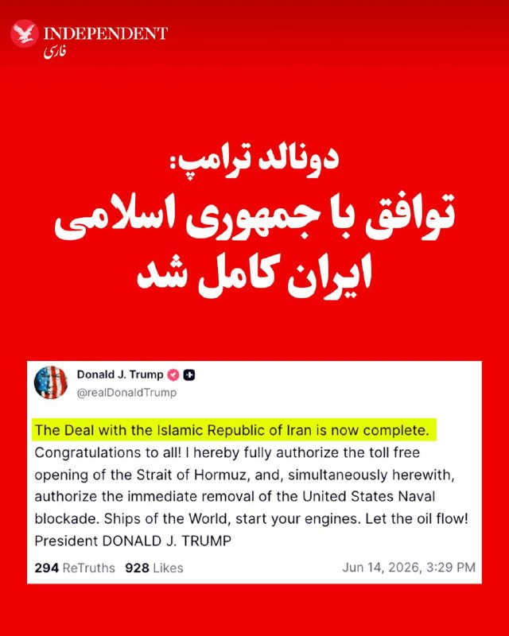

♦️دونالد ترامپ، رئیس‌جمهوری آمریکا، با انتشار بیانیه‌ای رسمی در شبکه اجتماعی «تروث سوشال»، از نهایی شدن توافق میان واشنگتن و تهران خبر داد و نوشت: «توافق با جمهوری اسلامی ایران اکنون کامل شده است. تبریک به همه» رئیس‌جمهوری ایالات متحده بلافاصله پس از اعلام حصول این معاهده، دستور رفع محدودیت‌های دریایی علیه ایران را صادر کرد و افزود: «من بدین‌وسیله اجازه کامل بازگشایی بدون عوارض تنگه هرمز را صادر می‌کنم و هم‌زمان با آن، فرمان لغو فوری محاصره دریایی ایالات متحده [علیه ایران] را ابلاغ می‌نمایم.» ترامپ نوشت: «کشتی‌های جهان، موتورهای خود را روشن کنید؛ بگذارید نفت جریان یابد!»
‌🇸🇦 Indypersian

🤖 @VahidOOnLine

## VahidOOnLine — post 245567

  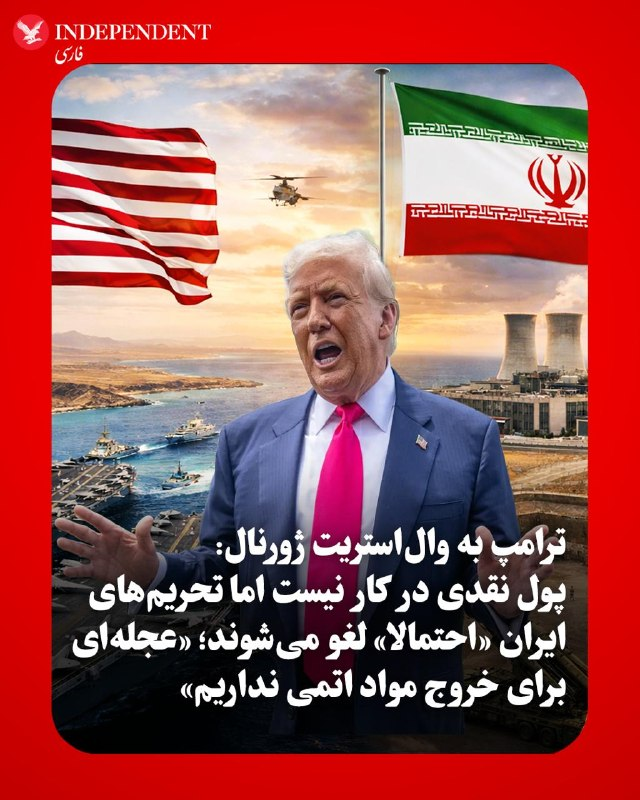

♦️دونالد ترامپ، رئیس‌جمهوری آمریکا، در گفتگو با روزنامه وال‌استریت ژورنال اعلام کرد که در توافق احتمالی و پیش‌رو با تهران، هیچ پول نقدی به ایران پرداخت نخواهد شد، اما در مقابل، واشنگتن احتمالا تحریم‌های اعمال‌شده علیه این کشور را لغو خواهد کرد. ترامپ با تاکید بر اینکه لغو این تحریم‌ها به نحوه رفتار و پایبندی تهران بستگی دارد، اظهار داشت که در این مرحله هیچ عجله‌ای برای استخراج و خروج مواد اتمی از خاک ایران ندارد و این اقدام را مسأله‌ای «بی‌خطر» می‌داند که می‌توان آن را به یک یا دو ماه آینده موکول کرد. رئیس‌جمهوری ایالات متحده با اشاره به اینکه توافق نهایی شامل تعهد رسمی ایران برای عدم دستیابی به سلاح هسته‌ای و بازگشایی فوری تنگه هرمز خواهد بود، تاکید کرد که نظارت‌ها و بازرسی‌های شدیدی بر برنامه‌های ایران اعمال می‌شود، اما از تشریح جزئیات مکانیسم این بازرسی‌ها خودداری کرد.
‌🇸🇦 Indypersian

🤖 @VahidOOnLine

## WithYashar — post 14911

  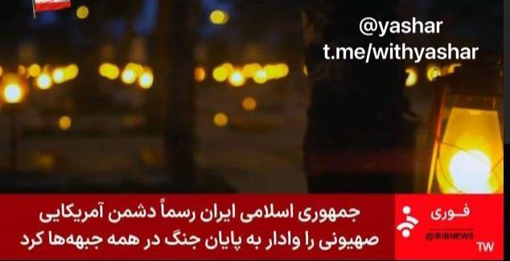

صداسیما : ترامپو وادار کردیم در همه جبهه ها جنگ رو متوقف کنه
@withyashar

## WithYashar — post 14910

اتریوم داره پرواز میکنه
@withyashar

## WithYashar — post 14909

  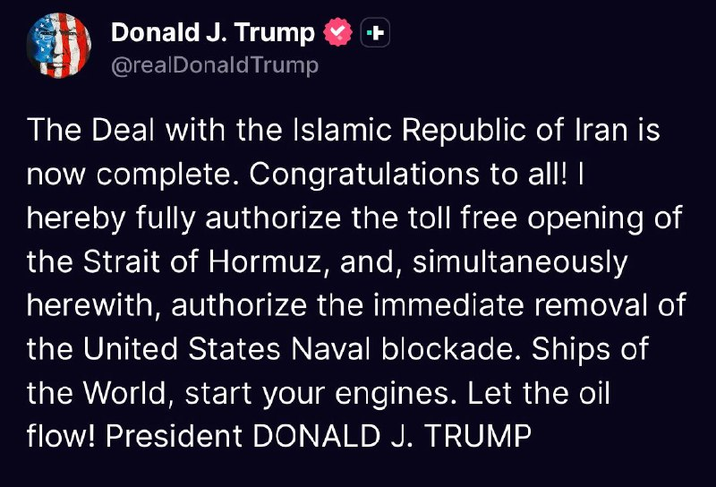

ترامپ در تروث : «توافق با جمهوری اسلامی ایران اکنون نهایی شده است. به همه تبریک می‌گویم! من بدین‌وسیله به‌طور کامل مجوز بازگشایی رایگان تنگه هرمز را صادر می‌کنم و هم‌زمان، دستور رفع فوری محاصره دریایی ایالات متحده را نیز صادر می‌نمایم. ای کشتی‌های جهان، موتورهای خود را روشن کنید. بگذارید نفت جاری شود!
@withyashar

## WithYashar — post 14908

## mwarmonitor — post 10928

  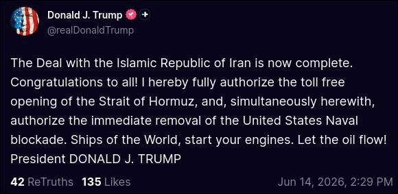

🔴توافق با جمهوری اسلامی ایران اکنون کامل شده است. تبریک به همه! من بدین‌وسیله اجازه کامل برای بازگشایی بدون عوارض (آزاد) تنگه هرمز را صادر می‌کنم و هم‌زمان با آن، دستور رفع فوری محاصره دریایی ایالات متحده را می‌دهم. کشتی‌های جهان، موتورهای خود را روشن کنید. بگذارید نفت جریان یابد!

رئیس‌جمهور دونالد جی. ترامپ

@mwarmonitor

## pm_afshaa — post 94000

  <a href="telegram/content/pm_afshaa_94000_1781473372.webm" target="_blank">🎬 Download video</a>

🔴اعلام رسمی خبر توافق و توقف جنگ در شبکه خبر صداوسیما 
💧 Rainbet.com the #1 Non-KYC Crypto Casino & Sportsbook @rainbetcom 
😁 @Pm_Afshaa

## pm_afshaa — post 93999

  <a href="telegram/content/pm_afshaa_93999_1781473373.mp4" target="_blank">🎬 Download video</a>

🔴اعلام رسمی خبر توافق و توقف جنگ در شبکه خبر صداوسیما

💧 Rainbet.com the #1 Non-KYC Crypto Casino & Sportsbook @rainbetcom

😁 @Pm_Afshaa

## pm_afshaa — post 93998

  <a href="telegram/content/pm_afshaa_93998_1781473375.webm" target="_blank">🎬 Download video</a>

🔴پست جدید ترامپ:

توافق با جمهوری اسلامی اکنون کامل شده. به همه تبریک میگم!

بدین‌وسیله من بازگشایی بدون عوارض تنگه هرمز رو به طور کامل مجاز میدونم، و همزمان با این، لغو فوری محاصره دریایی ایالات متحده آمریکا رو دستور میدم.

ای کشتی‌های جهان، موتورهاتون رو روشن کنید. بگذارید نفت جاری بشه!

💧 Rainbet.com the #1 Non-KYC Crypto Casino & Sportsbook @rainbetcom

😁 @Pm_Afshaa

## pm_afshaa — post 93997

  <a href="telegram/content/pm_afshaa_93997_1781473376.webm" target="_blank">🎬 Download video</a>

🔴دونالد ترامپ: این توافق به صورت الکترونیکی، یا توسط من یا معاون رئیس جمهور جی‌دی ونس، امضا خواهد شد. 
💧 Rainbet.com the #1 Non-KYC Crypto Casino & Sportsbook @rainbetcom 
😁 @Pm_Afshaa

## pm_afshaa — post 93996

  <a href="telegram/content/pm_afshaa_93996_1781473377.webm" target="_blank">🎬 Download video</a>

🔴شهباز شریف، نخست وزیر پاکستان: پس از مذاکرات فشرده، با کمال خرسندی اعلام می‌کنیم که توافق صلحی بین آمریکا و ایران حاصل شده. هر دو طرف توقف فوری و دائمی عملیات نظامی در تمام جبهه‌ها، از جمله در لبنان، رو اعلام کردن. مراسم رسمی امضای توافق‌نامه روز جمعه، 19…

## VahidOnline — post 76351

  <a href="telegram/content/VahidOnline_76351_1781473378.mp4" target="_blank">🎬 Download video</a>

اعلام خبر توافق و توقف جنگ در شبکه خبر
📡 @VahidOnline

## VahidOnline — post 76350

  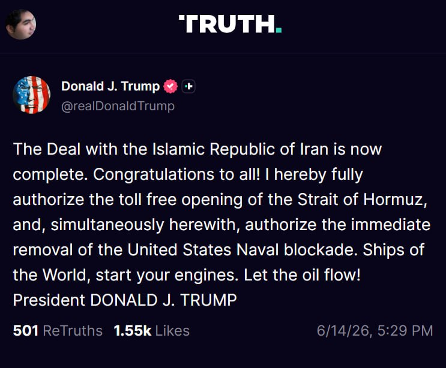

☄️ ترامپ: تبریک به همه، توافق نهایی شد

پست ترامپ ترجمه ماشین:
توافق با جمهوری اسلامی ایران اکنون کامل شده است. به همه تبریک می‌گویم!

بدین‌وسیله من به‌طور کامل اجازه بازگشایی بدون عوارض تنگه هرمز را صادر می‌کنم و هم‌زمان با این، مجوز برداشته شدن فوری محاصره دریایی ایالات متحده را صادر می‌کنم.

کشتی‌های جهان، موتورهای خود را روشن کنید. بگذارید نفت جریان پیدا کند!

رئیس‌جمهور دونالد جی. ترامپ
realDonaldTrump

📡 @VahidOnline

## kianmeli1 — post 88000

  <a href="telegram/content/kianmeli1_88000_1781473380.mp4" target="_blank">🎬 Download video</a>

🔴صداوسیما
پایان رسمی جنگ اعلام شد
https://t.me/kianmeli1

## IranIntlTV — post 342365

  

دونالد ترامپ، رییس‌جمهوری آمریکا، اعلام کرد توافق با جمهوری اسلامی ایران نهایی شده است.

ترامپ در پیامی گفت: «به همه تبریک می‌گویم. توافق با جمهوری اسلامی ایران اکنون نهایی شده است.»

او همچنین اعلام کرد دستور بازگشایی تنگه هرمز بدون دریافت عوارض و همزمان دستور لغو فوری محاصره دریایی اعمال‌شده از سوی ایالات متحده را صادر کرده است.

رییس‌جمهوری آمریکا در ادامه نوشت: «ای کشتی‌های جهان، موتورهای خود را روشن کنید. بگذارید نفت جریان یابد.»
https://iranintl.com/202606142820

## FarsiVOA — post 220728

  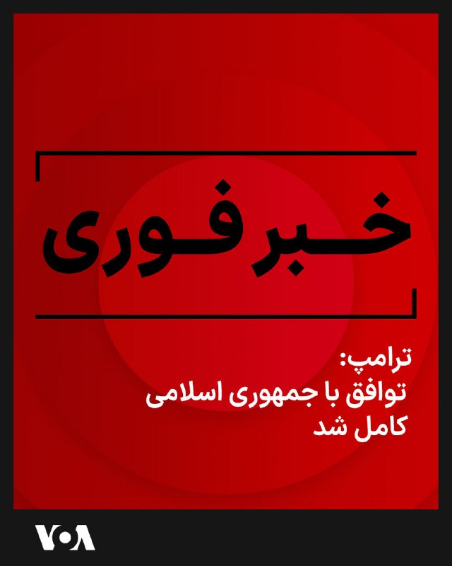

⚡️دونالد ترامپ، رئیس جمهوری آمریکا اعلام کرد که توافق با جمهوری اسلامی ایران اکنون کامل شده است. او گفت: به همه تبریک می‌گویم! بدینوسیله اجازه کامل بازگشایی تنگه هرمز بدون عوارض را می‌دهم و همزمان با آن، رفع فوری محاصره دریایی ایالات متحده را نیز مجاز می‌دارم. کشتی‌های جهان، موتورهای خود را روشن کنید. بگذارید نفت جریان یابد! رئیس جمهور دونالد جی. ترامپ
@FarsiVOA

## Persian_Trend_Official — post 17128

  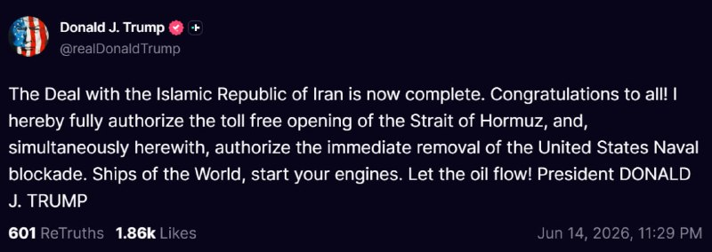

ترامپ در تروث سوشال: توافق با جمهوری اسلامی ایران اکنون کامل شده است. به همه تبریک می‌گویم!

من بدینوسیله اجازه کامل بازگشایی تنگه هرمز بدون عوارض را می‌دهم و همزمان با آن، رفع فوری محاصره دریایی ایالات متحده را نیز مجاز می‌دانم.

کشتی‌های جهان، موتورهای خود را روشن کنید. بگذارید نفت جریان یابد!

📝 Amir

📌 @persian_trend_official
پرشین ترند | متفاوت‌ترین کانال نظامی

## Persian_Trend_Official — post 17127

  <a href="telegram/content/Persian_Trend_Official_17127_1781473384.webm" target="_blank">🎬 Download video</a>

😄😄😄😄😄😄😄

## RadioFarda — post 158306

دبیر کمیسیون حقوق بشر اسلامی ایران رد صلاحیت ها را بدون توجیه قوی دارای پیامدهای حقوقی ویرانگر دانست محمد حسن ضیایی فر ، دبیر کمیسیون حقوق بشر اسلامی ایران رد صلاحیت داوطلبان انتخابات مجلس شورای اسلامی را بدون آنچه توجیه قوی حقوقی و اخلاقی نامید، دارای پیامدهای…

## RadioFarda — post 158305

  <a href="telegram/content/RadioFarda_158305_1781473385.mp4" target="_blank">🎬 Download video</a>

🔸شهباز شریف، نخست‌وزیر پاکستان، در پیامی در شبه ایکس نوشت: «پس از گفت‌وگوهای فشرده، با خرسندی اعلام می‌کنیم که توافق صلح میان ایالات متحده آمریکا و جمهوری اسلامی ایران حاصل شده است. هر دو طرف پایان فوری و دائمی عملیات نظامی در همه جبهه‌ها، از جمله در لبنان، را اعلام کرده‌اند.»

🔸او افزوده است که «مراسم رسمی امضای این توافق روز جمعه ۱۹ ژوئن (۲۹ خرداد) در سوئیس برگزار خواهد شد.»

🔸وی در ادامه نیز نوشته است که «مایلیم از ایالات متحده آمریکا و جمهوری اسلامی ایران به‌دلیل پایبندی‌شان به یافتن راه‌حلی دیپلماتیک برای این مناقشه قدردانی کنیم. همچنین از برادران خود در این تلاش میانجی‌گرانه، رهبری دولت قطر، به‌دلیل حمایتشان در دستیابی به این توافق صمیمانه سپاسگزاریم. افزون بر این، مایلم به‌طور ویژه از رهبری آینده‌نگر پادشاهی عربستان سعودی و جمهوری ترکیه به‌خاطر نقش و مشارکت چشمگیرشان در این زمینه قدردانی کنم.»

@RadioFarda

## IranianMinds — post 22602

🔴 تسنیم :

تا دقایقی دیگر مقامات در مورد توافق با مردم صحبت خواهند کرد.

@IranianMinds

## IranianMinds — post 22601

ولی چه رکبی زد قالبیاف

همه ی تندروهارو برکنار کرد گروهک سعید جلیلیو منحل‌ کرد و راحت توافقشو کرد

نکنه جاسوس از اول همین بود ؟

@IranianMinds

## IranianMinds — post 22600

  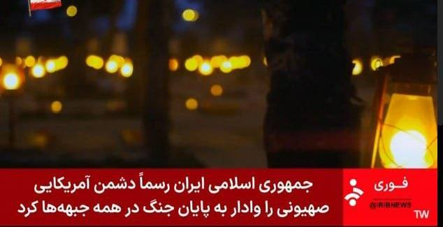

بابا مادرجنده ها شماها چقدر رو دارید 😂😂😂😂😂😂😂😂😂

@IranianMinds

## IranianMinds — post 22599

🔴 ترامپ: «توافق با جمهوری اسلامی ایران اکنون کامل شده است. به همه تبریک می‌گویم! من رسماً باز شدن عبور و مرور بدون تعرفه در تنگه هرمز را تأیید می‌کنم و هم‌زمان، دستور لغو فوری محاصره نیروی دریایی ایالات متحده را صادر می‌کنم. کشتی‌های جهان، موتورهای خود…

## IranianMinds — post 22598

  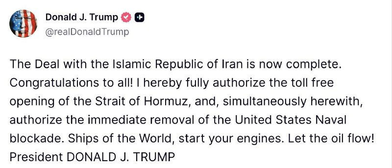

🔴 ترامپ:

«توافق با جمهوری اسلامی ایران اکنون کامل شده است. به همه تبریک می‌گویم!

من رسماً باز شدن عبور و مرور بدون تعرفه در تنگه هرمز را تأیید می‌کنم و هم‌زمان، دستور لغو فوری محاصره نیروی دریایی ایالات متحده را صادر می‌کنم.

کشتی‌های جهان، موتورهای خود را روشن کنید. بگذارید نفت جریان پیدا کند!

@IranianMinds

## BBCPersian — post 283822

  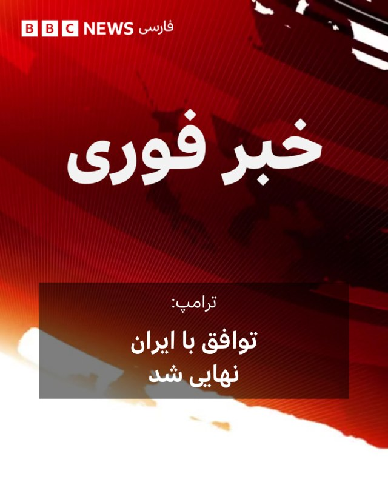

‌ ‌ ‌ ‌
دونالد ترامپ، رئیس‌جمهور آمریکا هم اعلام کرد که توافق با ایران نهایی شده است.

آقای ترامپ در پستی در شبکه اجتماعی تروث سوشال نوشت: «توافق با جمهوری اسلامی ایران اکنون کامل شده است. به همه تبریک می‌گویم!»

آقای ترامپ در ادامه نوشته که «اجازه کامل بازگشایی تنگه هرمز بدون عوارض را می‌دهم و هم‌زمان با آن، رفع فوری محاصره دریایی ایالات متحده را نیز مجاز می‌دارم.»

رئیس‌جمهور آمریکا نوشته: «کشتی‌های جهان، موتورهای خود را روشن کنید. بگذارید نفت جریان یابد!»

شهباز شریف، نخست‌وزیر پاکستان، هم دقایقی پیش اعلام کرد که تفاهم‌ نامه میان دو کشور حاصل شده و در روز جمعه ۱۹ ژوئن در سوئیس امضا خواهد شد.

@BBCPersian

## Dirty_Kids — post 392057

  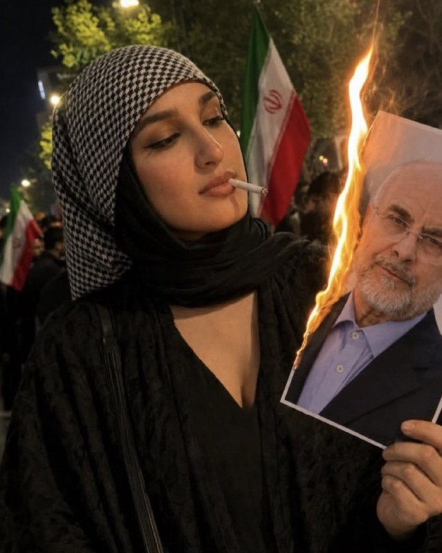

تصویری عجیب از یه عرزشی توی تجمعات شبانه، خطش دائمیه یا اعتباری :) @Dirty_Kids 👻

## Dirty_Kids — post 392056

  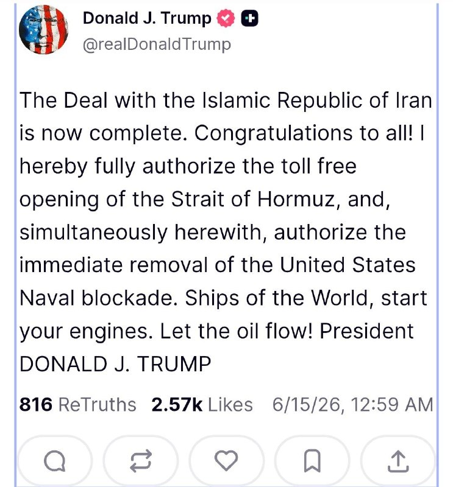

دونالد ترامپ :
توافق با جمهوری اسلامی ایران نهایی شد، به همه تبریک میگم!

من رسماً مجوز بازگشایی کامل و بدون عوارض تنگه هرمز رو صادر می‌کنم و همزمان دستور میدم محاصره دریایی نیروی دریایی آمریکا هم فوراً برداشته بشه.

کشتی‌های دنیا، موتورهاتون رو روشن کنید! بذارید نفت دوباره جریان پیدا کنه!

@Dirty_Kids 👻

## Dirty_Kids — post 392055

  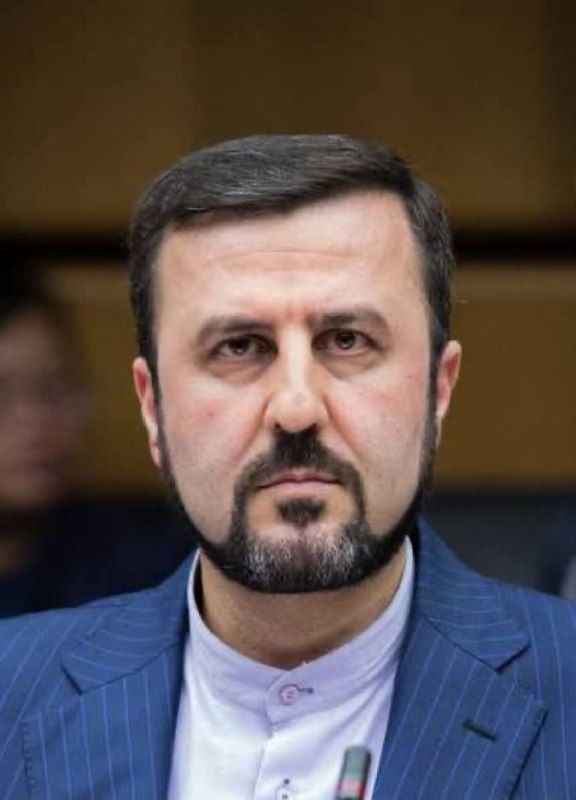

انقدرخودکار دزدید که تفاهم نامه رو الکترونیکی امضا میکنند 😂

@Dirty_Kids 👻

## alonews — post 128039

  <a href="telegram/content/alonews_128039_1781473392.webm" target="_blank">🎬 Download video</a>

👈صدا و سیما: عقب نشینی حقیرانه ترامپ

✅ @AloNews خبر جنگ

## alonews — post 128038

  <a href="telegram/content/alonews_128038_1781473392.webm" target="_blank">🎬 Download video</a>

🔴فوری/ ولایتی: فرمان صادر شد؛ لانچرها آماده پرتاب میشوند 
✅ @AloNews خبر جنگ

## alonews — post 128037

  <a href="telegram/content/alonews_128037_1781473392.webm" target="_blank">🎬 Download video</a>

👈فارس: مسئولان قراره بیان صحبت کنن

✅ @AloNews خبر جنگ

## alonews — post 128036

  <a href="telegram/content/alonews_128036_1781473393.webm" target="_blank">🎬 Download video</a>

🔴به همه طرفداران جمهوری اسلامی، استعمار شدنتون رو توسط کشوری که 47 سال مرگ بهش فرستادین تبریک میگیم.

✅@AloNews

## alonews — post 128035

  <a href="telegram/content/alonews_128035_1781473393.webm" target="_blank">🎬 Download video</a>

👈مجری صدا و سیما:
پیروزی رو به ملت تبریک میگم

✅ @AloNews خبر جنگ

## alonews — post 128034

  <a href="telegram/content/alonews_128034_1781473394.webm" target="_blank">🎬 Download video</a>

👈راستی ۱ساعت قبل از اعلام رسمی، توافق توسط منابع الونیوز در کانال اعلام شد🙂

✅ @AloNews خبر جنگ

## alonews — post 128033

  <a href="telegram/content/alonews_128033_1781473394.webm" target="_blank">🎬 Download video</a>

👈حاج حسین توام خسته نباشی😘

✅ @AloNews خبر جنگ

## alonews — post 128032

  <a href="telegram/content/alonews_128032_1781473394.webm" target="_blank">🎬 Download video</a>

👈از همین تریبون به این عزیزان هم خسته نباشید میگیم❤️ برید خونه حالا😂

✅ @AloNews خبر جنگ

---
📅 بروزرسانی: 1405/03/25 01:02
---

## VahidOOnLine — post 245566

  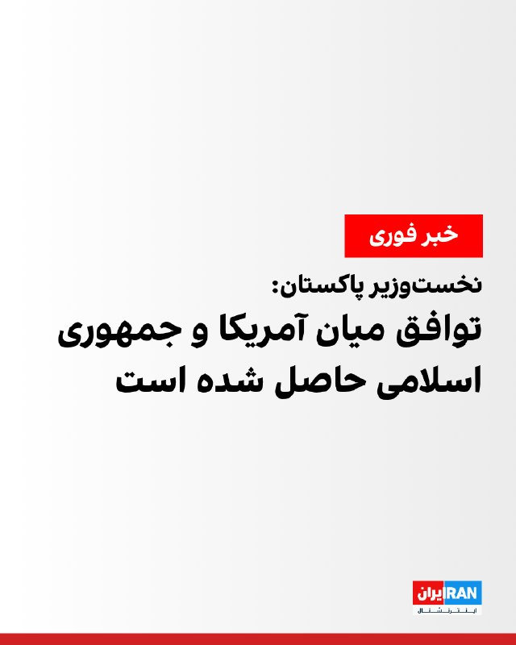

شهباز شریف، نخست‌وزیر پاکستان، در پیامی در شبکه ایکس اعلام کرد پس از گفت‌وگوهای فشرده، «توافق صلح» میان آمریکا و جمهوری اسلامی حاصل شده است.

او نوشت هر دو طرف پایان فوری و دائمی عملیات نظامی در همه جبهه‌ها، از جمله لبنان، را اعلام کرده‌اند و مراسم رسمی امضای این توافق روز جمعه در سوئیس برگزار خواهد شد.

نخست‌وزیر پاکستان در ادامه از آمریکا و جمهوری اسلامی به دلیل آنچه تعهد به یافتن راه‌حلی دیپلماتیک برای مناقشه خواند، قدردانی کرد.

شریف همچنین از دولت قطر به دلیل نقش آن در روند میانجیگری تشکر کرد و از عربستان سعودی و ترکیه نیز به خاطر مشارکت در دستیابی به این توافق قدردانی کرد.

او افزود با نهایی شدن توافق، میانجی‌ها در طول این هفته مجموعه‌ای از نشست‌ها را برگزار خواهند کرد تا زمینه برای مذاکرات فنی و مراسم رسمی امضای توافق فراهم شود.
‌🏁 🇬🇧 IranintlTV

🤖 @VahidOOnLine

## VahidOOnLine — post 245565

  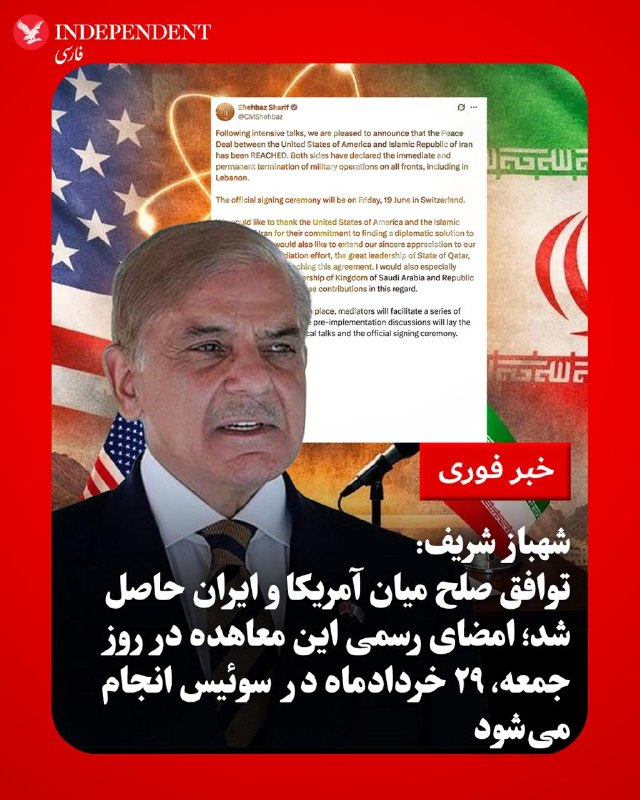

♦️شهباز شریف، نخست‌وزیر پاکستان، با انتشار پیامی در اکس، از دستیابی به یک توافق صلح تاریخی میان تهران و واشنگتن خبر داد و اعلام کرد: «در پی گفتگوهای فشرده، خرسندیم اعلام کنیم که توافق صلح میان ایالات متحده آمریکا و جمهوری اسلامی ایران حاصل شده است و هر دو طرف توقف فوری و دائمی عملیات نظامی در تمامی جبهه‌ها، از جمله در لبنان را اعلام کرده‌اند.» نخست‌وزیر پاکستان با اعلام اینکه مراسم امضای رسمی این معاهده در روز جمعه، ۱۹ ژوئن در کشور سوئیس برگزار خواهد شد، افزود: «ما می‌خواهیم از ایالات متحده آمریکا و جمهوری اسلامی ایران برای تعهدشان به یافتن یک راهکار دیپلماتیک جهت حل این منازعه تشکر کنیم؛ همچنین مراتب قدردانی صمیمانه خود را از برادرانمان در این تلاش میانجی‌گرانه، یعنی رهبری عالی‌رتبه دولت قطر برای حمایت‌هایشان در دستیابی به این توافق ابراز می‌داریم و به‌طور ویژه از رهبری آینده‌نگر پادشاهی عربستان سعودی و جمهوری ترکیه به خاطر ماموریت و مشارکت عظیم‌شان در این زمینه سپاسگزاری می‌کنیم.» شهباز شریف در پایان تصریح کرد که با به سرانجام رسیدن این توافق، میانجی‌ها در طول این هفته مجموعه‌ای از نشست‌ها را تسهیل خواهند کرد و این گفتگوهای پیش از اجرا، پایه‌ای برای مباحث فنی و آماده‌سازی مراسم رسمی امضا خواهد بود.
‌🇸🇦 Indypersian

🤖 @VahidOOnLine

## WithYashar — post 14907

## WithYashar — post 14906

چیزی‌ امظا نشده
@withyashar

## WithYashar — post 14905

  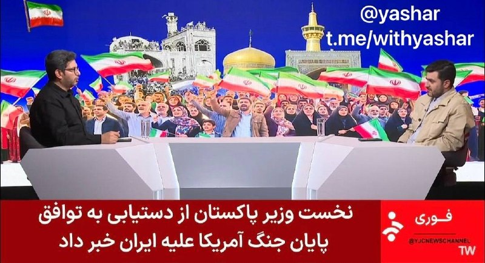

زیرنویس شبکه خبر :توافق با امریکا انجام شد
@withyashar

## WithYashar — post 14904

نخست وزیر پاکستان: پس از مذاکرات فشرده، با کمال خرسندی اعلام می‌کنیم که توافق صلحی بین ایالات متحده آمریکا و جمهوری اسلامی ایران حاصل شده است. هر دو طرف توقف فوری و دائمی عملیات نظامی در تمام جبهه‌ها، از جمله در لبنان، را اعلام کرده‌اند.

مراسم رسمی امضای توافق‌نامه روز جمعه، ۱۹ ژوئن، در سوئیس برگزار خواهد شد.
@withyashar

## mwarmonitor — post 10927

🔴نخست وزیر پاکستان

پس از گفتگوهای فشرده، خرسندیم اعلام کنیم که توافق صلح میان ایالات متحده آمریکا و جمهوری اسلامی ایران حاصل شده است. هر دو طرف پایان فوری و دائمی عملیات نظامی در تمامی جبهه‌ها، از جمله در لبنان را اعلام کرده‌اند.
مراسم رسمی امضای این توافق، روز جمعه ۱۹ ژوئن در سوئیس برگزار خواهد شد.
ما مایلیم از ایالات متحده آمریکا و جمهوری اسلامی ایران به خاطر تعهدشان به یافتن یک راه‌حل دیپلماتیک برای این مناقشه تشکر کنیم. همچنین می‌خواهیم مراتب قدردانی صمیمانه خود را از برادرانمان در این تلاش میانجی‌گرانه، یعنی رهبری عالی‌قدر دولت قطر، به خاطر حمایت‌هایشان در دستیابی به این توافق ابراز نماییم. من همچنین به طور ویژه از رهبری آینده‌نگر پادشاهی عربستان سعودی و جمهوری ترکیه به خاطر مشارکت و نقش‌آفرینی بی‌اندازه‌شان در این زمینه تشکر می‌کنم.
با برقراری این توافق، میانجی‌ها مجموعه‌ای از نشست‌ها را در این هفته تسهیل خواهند کرد. این گفتگوهای پیش از اجرا، پایه‌ای را برای مذاکرات فنی و مراسم رسمی امضای توافق بنا خواهد کرد.

@mwarmonitor

## pm_afshaa — post 93995

  <a href="telegram/content/pm_afshaa_93995_1781472754.webm" target="_blank">🎬 Download video</a>

🔴شبکه خبر صداوسیما:
نخست وزیر پاکستان از دستیابی به توافق پایان جنگ آمریکا علیه ایران خبر داد.

💧 Rainbet.com the #1 Non-KYC Crypto Casino & Sportsbook @rainbetcom

😁 @Pm_Afshaa

## pm_afshaa — post 93994

تتر 166 هزار تومن.

💧 Rainbet.com the #1 Non-KYC Crypto Casino & Sportsbook @rainbetcom

😁 @Pm_Afshaa

## pm_afshaa — post 93993

🔴شهباز شریف، نخست وزیر پاکستان: پس از مذاکرات فشرده، با کمال خرسندی اعلام می‌کنیم که توافق صلحی بین آمریکا و ایران حاصل شده. هر دو طرف توقف فوری و دائمی عملیات نظامی در تمام جبهه‌ها، از جمله در لبنان، رو اعلام کردن. مراسم رسمی امضای توافق‌نامه روز جمعه، 19…

## VahidOnline — post 76349

  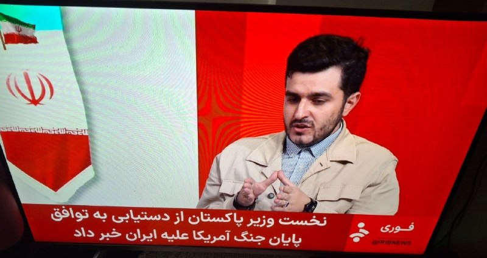

شبکه خبر: نخست‌وزیر پاکستان از دستیابی به توافق و پایان جنگ خبر داد

📡 @VahidOnline

## VahidOnline — post 76348

  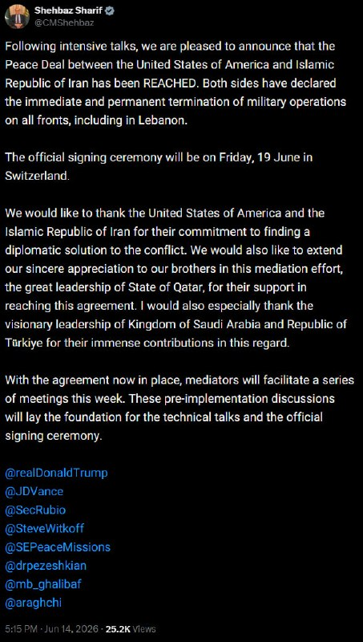

☄️ نخست‌وزیر پاکستان: توافق حاصل شد، جمعه در سوئیس امضا می‌شود

پست شهباز شریف، ترجمه ماشین:
در پی مذاکرات فشرده، خوشحالیم اعلام کنیم که توافق صلح میان ایالات متحده آمریکا و جمهوری اسلامی ایران حاصل شده است. هر دو طرف پایان فوری و دائمی عملیات نظامی در همه جبهه‌ها، از جمله در لبنان، را اعلام کرده‌اند.

مراسم رسمی امضای توافق روز جمعه، ۱۹ ژوئن، [۲۹ خرداد] در سوئیس برگزار خواهد شد.

مایلیم از ایالات متحده آمریکا و جمهوری اسلامی ایران به‌خاطر تعهدشان به یافتن راه‌حلی دیپلماتیک برای این مناقشه تشکر کنیم. همچنین مایلیم قدردانی صمیمانه خود را از برادرانمان در این تلاش میانجی‌گرانه، رهبری بزرگ دولت قطر، به‌خاطر حمایتشان در دستیابی به این توافق ابراز کنیم. به‌ویژه از رهبری دوراندیش پادشاهی عربستان سعودی و جمهوری ترکیه نیز به‌خاطر مشارکت‌های عظیمشان در این زمینه تشکر می‌کنم.

اکنون که توافق برقرار شده است، میانجی‌ها مجموعه‌ای از نشست‌ها را در این هفته تسهیل خواهند کرد. این گفت‌وگوهای پیش از اجرا، زمینه را برای مذاکرات فنی و مراسم رسمی امضا فراهم خواهد کرد.

📡 @VahidOnline

## kianmeli1 — post 87999

  

🔴زیرنویس شبکه خبر

توافق با امریکا انجام شد
https://t.me/kianmeli1

## IranIntlTV — post 342364

  

شهباز شریف، نخست‌وزیر پاکستان، در پیامی در شبکه ایکس اعلام کرد پس از گفت‌وگوهای فشرده، «توافق صلح» میان آمریکا و جمهوری اسلامی حاصل شده است.

او نوشت هر دو طرف پایان فوری و دائمی عملیات نظامی در همه جبهه‌ها، از جمله لبنان، را اعلام کرده‌اند و مراسم رسمی امضای این توافق روز جمعه در سوئیس برگزار خواهد شد.

نخست‌وزیر پاکستان در ادامه از آمریکا و جمهوری اسلامی به دلیل آنچه تعهد به یافتن راه‌حلی دیپلماتیک برای مناقشه خواند، قدردانی کرد.

شریف همچنین از دولت قطر به دلیل نقش آن در روند میانجیگری تشکر کرد و از عربستان سعودی و ترکیه نیز به خاطر مشارکت در دستیابی به این توافق قدردانی کرد.

او افزود با نهایی شدن توافق، میانجی‌ها در طول این هفته مجموعه‌ای از نشست‌ها را برگزار خواهند کرد تا زمینه برای مذاکرات فنی و مراسم رسمی امضای توافق فراهم شود.
https://iranintl.com/202606149414

## Shin_Persian — post 7080

  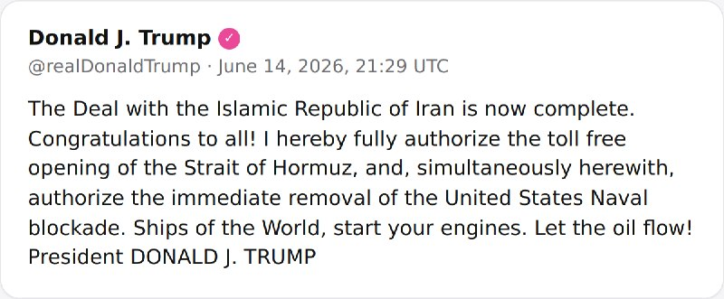

Shin ✓ @hey_itsmyturn
Sun, 14 Jun 2026 21:30:37 UTC

POTUS:
"The Deal with the Islamic Republic of Iran is now complete. Congratulations to all! I hereby fully authorize the toll free opening of the Strait of Hormuz, and, simultaneously herewith, authorize the immediate removal of the United States Naval blockade. Ships of the World, start your engines. Let the oil flow! President DONALD J. TRUMP"

ترجمه خودکار فارسی

رئیس‌جمهور ایالات متحده:
«توافق با جمهوری اسلامی ایران اکنون نهایی شده است. تبریک به همه! من بدین‌وسیله اجازه کامل برای بازگشایی بدون عوارض تنگه هرمز را صادر کرده و هم‌زمان با آن، دستور رفع فوری محاصره دریایی نیروی دریایی ایالات متحده را صادر می‌کنم. کشتی‌های جهان، موتورهای خود را روشن کنید. بگذارید نفت جریان یابد! رئیس‌جمهور دونالد جی. ترامپ»

𝕏 · @shin_persian

## Iliaen — post 4485

نخست‌وزیر پاکستان لحظاتی قبل اعلام کرد توافق میان جمهوری اسلامی و ایالات متحده حاصل شد و مراسم امضای آن در روز جمعه برگزار خواهد شد.

@iliaen

## Persian_Trend_Official — post 17126

  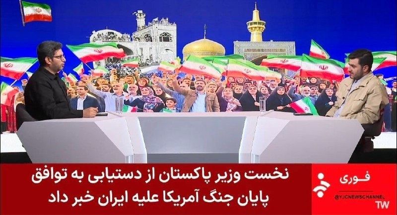

زیرنویس شبکه خبر تاییده خبر توافق

## Persian_Trend_Official — post 17125

  <a href="telegram/content/Persian_Trend_Official_17125_1781472759.webm" target="_blank">🎬 Download video</a>

ترامپ به زودی بیانیه صادر خواهند کرد.

📝 Amir

📌 @persian_trend_official
پرشین ترند | متفاوت‌ترین کانال نظامی

## Persian_Trend_Official — post 17124

نخست‌ وزیر پاکستان: پس از مذاکرات فشرده، خرسندیم اعلام کنیم که توافق صلح میان ایالات متحده آمریکا و جمهوری اسلامی ایران حاصل شده است. دو طرف پایان فوری و دائمی عملیات نظامی در تمام جبهه‌ها، از جمله در لبنان، را اعلام کرده‌اند. مراسم امضای رسمی این توافق روز…

## IranianMinds — post 22597

ولی در آخر هم جنگ شد هم مذاکره کردن و هم کشتنش :)

@IranianMinds

## IranianMinds — post 22596

  <a href="telegram/content/IranianMinds_22596_1781472760.mp4" target="_blank">🎬 Download video</a>

🔴 ترامپ روز اول جنگ به مردم ایران :

وقتی کارمان تمام شد، دولت خودتان را در دست بگیرید؛ آن برای شما خواهد بود.

@IranianMinds

## IranianMinds — post 22595

با قاتل رهبر شهید ؟ با قاتل خوانواده رهبر ؟ با قاتل هزاران سرباز و سردار ؟

## IranianMinds — post 22594

  

🔴 رسمی توافق شد نخست‌وزیر پاکستان، شهباز شریف: «پس از مذاکرات فشرده، خوشحالیم اعلام کنیم که توافق صلح میان ایالات متحده آمریکا و جمهوری اسلامی ایران حاصل شده است.» «هر دو طرف پایان فوری و دائمی عملیات نظامی در تمامی جبهه‌ها، از جمله لبنان، را اعلام کرده‌اند.»…

## IranianMinds — post 22593

  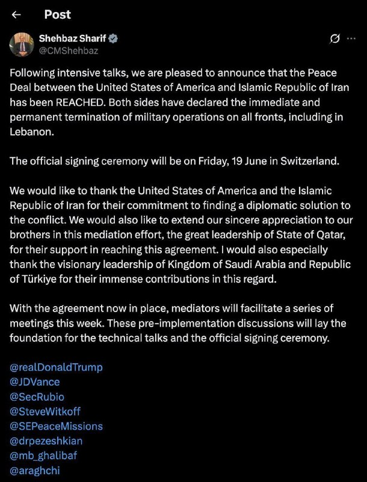

🔴 رسمی توافق شد

نخست‌وزیر پاکستان، شهباز شریف:

«پس از مذاکرات فشرده، خوشحالیم اعلام کنیم که توافق صلح میان ایالات متحده آمریکا و جمهوری اسلامی ایران حاصل شده است.»

«هر دو طرف پایان فوری و دائمی عملیات نظامی در تمامی جبهه‌ها، از جمله لبنان، را اعلام کرده‌اند.»

مراسم رسمی امضای توافق روز جمعه ۱۹ ژوئن در سوئیس برگزار خواهد شد.

@IranianMinds

## IranianMinds — post 22592

🔴 ترامپ درباره ایران :

تغییر رژیم هیچ‌ وقت برام مهم نبوده .

این سومین گروهیه که باهاشون طرف شده‌ایم و این گروه، منطقی‌ترین گروهیه که تا امروز باهاشون حرف زدیم.

@IranianMinds

## IranianMinds — post 22591

خون آقا رو زمین موند

@IranianMinds

## BBCPersian — post 283821

  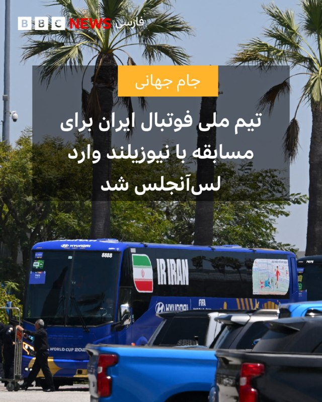

‌ ‌ ‌
خبرگزاری‌ها گزارش کرده‌اند که اعضای تیم فوتبال ایران روز یکشنبه پس از پروازی کوتاه از شهر تیخوانا در مکزیک برای اولین دیدار خود مقابل نیوزیلند در فرودگاه لس‌آنجلس آمریکا فرود آمده‌اند.

هواپیمای حامل تیم ایران ساعت ۴:۱۱ بعد از ظهر به وقت شرق آمریکا در فرودگاه فرود آمد. این فرودگاه حدود ۱۵ دقیقه با ورزشگاه لس‌آنجلس که میزبان بازی ایران است، فاصله دارد.

رویترز نوشته انتظار می‌رود «تیم از فرودگاه به هتل خود برود، جایی که نیروهای امنیتی پلیس از قبل در آنجا حاضر هستند.»

ساعاتی پس از آن قرار است امیر قلعه‌نویی، سرمربی و مهدی طارمی، مهاجم سرشناس این تیم در یک کنفرانس رسانه‌ای در ورزشگاه لس‌آنجلس شرکت کنند.

ایران پس از جنگ آمریکا و اسرائیل با این کشور، کمپ اصلی خود در جام جهانی را از یک مجموعه ورزشی در آریزونا به مکزیک منتقل کرد.

تیم ایران در گروه جی به ترتیب قرار است با نیوزیلند، بلژیک و مصر بازی کند.

https://bbc.in/4gkV86n
📷Patrick T. Fallon / AFP via Getty Images
@BBCPersian

## Dirty_Kids — post 392054

🔴 ترامپ: برای مراسم تشییع خامنه‌ای، حتما به ایران میام.

@Dirty_Kids 👻

## Dirty_Kids — post 392053

  

فقط من اضافه بودم لاشیا.

@Dirty_Kids 👻

## Dirty_Kids — post 392052

تموم شد، رسما و شرعا با قاتل رهبر، امام شهید، توافق کردن😊

@Dirty_Kids 👻

## Dirty_Kids — post 392051

  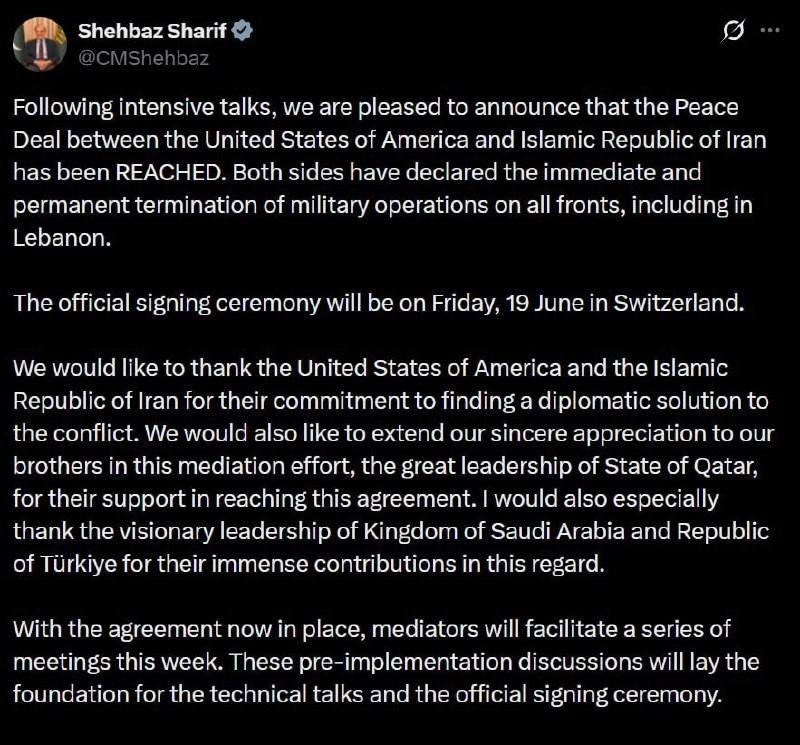

🔴 فورییییی، شهباز شریف، نخست وزیر پاکستان: تموم شد، ایران و آمریکا توافق کردن و ۱۹ ژوئن( ۲۹ خرداد) توافق به صورت نهایی امضا میشه.

@Dirty_Kids 👻

## alonews — post 128031

  <a href="telegram/content/alonews_128031_1781472764.webm" target="_blank">🎬 Download video</a>

👈دکتر ترامپ:
توافق با جمهوری اسلامی ایران نهایی شد. به همه تبریک می‌گویم! بدین‌وسیله من به طور کامل اجازه بازگشایی بدون عوارض تنگه هرمز را می‌دهم و همزمان اجازه رفع فوری محاصره دریایی ایالات متحده را صادر می‌کنم. کشتی‌های صلح، موتورهای خود را روشن کنید. بگذارید نفت جریان یابد!

✅ @AloNews خبر جنگ

## alonews — post 128030

  <a href="telegram/content/alonews_128030_1781472765.webm" target="_blank">🎬 Download video</a>

👈ترامپ: توافق انجام شد، تبریک به همه

✅ @AloNews خبر جنگ

## alonews — post 128029

  <a href="telegram/content/alonews_128029_1781472765.webm" target="_blank">🎬 Download video</a>

#انتقام_سخت

✅ @AloNews خبر جنگ

## alonews — post 128028

  <a href="telegram/content/alonews_128028_1781472765.webm" target="_blank">🎬 Download video</a>

👈شبکه خبر هم توافق پایان جنگ بین ایران و آمریکا رو زیرنویس کرد

✅ @AloNews خبر جنگ

## alonews — post 128027

  <a href="telegram/content/alonews_128027_1781472766.webm" target="_blank">🎬 Download video</a>

👈از صبح توئیت و .. که میزنیم میزنیم، نگو منظورشون امضا بود نه حمله😂

✅ @AloNews خبر جنگ

## alonews — post 128026

  <a href="telegram/content/alonews_128026_1781472766.webm" target="_blank">🎬 Download video</a>

👈رسایی: توافق با قاتل رهبر را #نمی‌پذیریم

✅ @AloNews خبر جنگ

---
📅 بروزرسانی: 1405/03/25 00:52
---

## VahidOOnLine — post 245564

  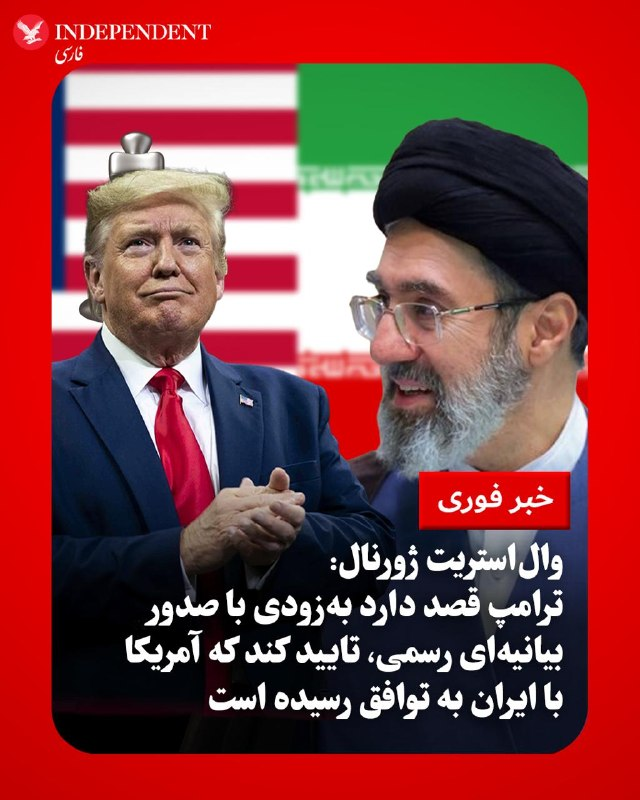

♦️به گزارش روزنامه وال‌استریت ژورنال، دونالد ترامپ، رئیس‌جمهوری آمریکا، عصر روز یکشنبه در گفتگویی اختصاصی اعلام کرد که قصد دارد تا لحظاتی دیگر با صدور بیانیه‌ای رسمی، موافقت ایالات متحده با توافق با ایران را تایید کند؛ توافقی بزرگ که به گفته او یا توسط خودش و یا توسط معاونش، جی‌دی ونس، به صورت الکترونیکی امضا خواهد شد. ترامپ با بیان اینکه این معاهده، که مقامات تهران هنوز موافقت نهایی با آن را تایید نکرده‌اند، شامل تعهد ایران برای عدم دستیابی به سلاح هسته‌ای و بازگشایی فوری تنگه هرمز است، تاکید کرد که در این مرحله عجله‌ای برای خروج مواد اتمی از ایران ندارد و این کارِ «بی‌خطر» را به ماه‌های آینده موکول می‌کند. رئیس‌جمهوری آمریکا با رد مواضع منتقدانش درباره لزوم تغییر حکومت در ایران گفت: «من هیچ‌وقت اهمیت نداده‌ام. این سومین گروهی است که با آن‌ها معامله می‌کنیم و منطقی‌ترینِ آن‌ها تا به امروز هستند.» او همچنین با تاکید بر اثربخشی محاصره دریایی ایران، از اقدامات نظامی اخیر بنیامین نتانیاهو در لبنان که نزدیک بود این مذاکرات حساس را به هم بزند، به شدت انتقاد کرد و گفت: «نتانیاهو نباید این کار را می‌کرد؛ من اصلا از این اقدام خوشم نیامد.»
‌🇸🇦 Indypersian

🤖 @VahidOOnLine

## VahidOOnLine — post 245563

  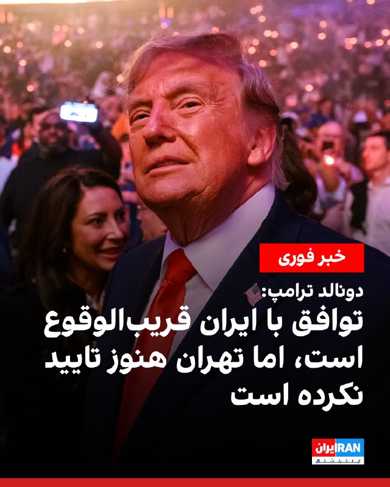

دونالد ترامپ، رییس‌جمهوری آمریکا، در گفت‌وگو با وال استریت ژورنال گفت توافق با جمهوری اسلامی قریب‌الوقوع است، اما تهران هنوز موافقت خود با آن را تایید نکرده است.

ترامپ افزود قصد دارد به‌زودی بیانیه‌ای صادر کند که در آن اعلام خواهد شد آمریکا با جمهوری اسلامی به توافق رسیده است.

او گفت این توافق، در صورت نهایی شدن، یا توسط خود او یا از سوی جی‌دی ونس، معاون رییس‌جمهوری آمریکا، به‌صورت الکترونیکی امضا خواهد شد.

رییس‌جمهوری آمریکا روز یکشنبه این توافق را گامی بزرگ در مسیر پایان دادن به درگیری نزدیک به چهارماهه توصیف کرد.

ترامپ همچنین گفت این توافق شامل تعهد جمهوری اسلامی به دست نیافتن به سلاح هسته‌ای و بازگشایی فوری تنگه هرمز خواهد بود. او افزود عجله‌ای برای خارج کردن مواد هسته‌ای از ایران وجود ندارد و این موضوع می‌تواند در مرحله‌ای بعدی دنبال شود.

ترامپ گفت: «بعدا و زمانی که آماده باشیم وارد عمل شویم، مواد هسته‌ای را جمع‌آوری خواهیم کرد. به نظرم طی یک یا دو ماه آینده این کار انجام می‌شود و عجله‌ای وجود ندارد.»
‌🏁 🇬🇧 IranintlTV

🤖 @VahidOOnLine

## WithYashar — post 14903

ترامپ: «بعداً مسائل هسته‌ای را حل می‌کنیم» و افزود که «هیچ عجله‌ای نیست» و می‌توان ظرف یک یا دو ماه آینده به آن پرداخت
@withyashar

## WithYashar — post 14902

ترامپ: بزودی یک بیانیه خواهم داد
@withyashar

## WithYashar — post 14901

خبر تسنیم فیکه مثل خودش
@withyashar

## WithYashar — post 14900

🤣🤣

## WithYashar — post 14898

ترامپ می‌گوید توافق با ایران قریب‌الوقوع است، اما تهران تاکنون آن را تأیید نکرده است رئیس‌جمهور در مصاحبه‌ای می‌گوید که قصد دارد به زودی بیانیه‌ای صادر کند و تأیید کند که ایالات متحده با ایران به توافق رسیده است @withyashar

## WithYashar — post 14897

  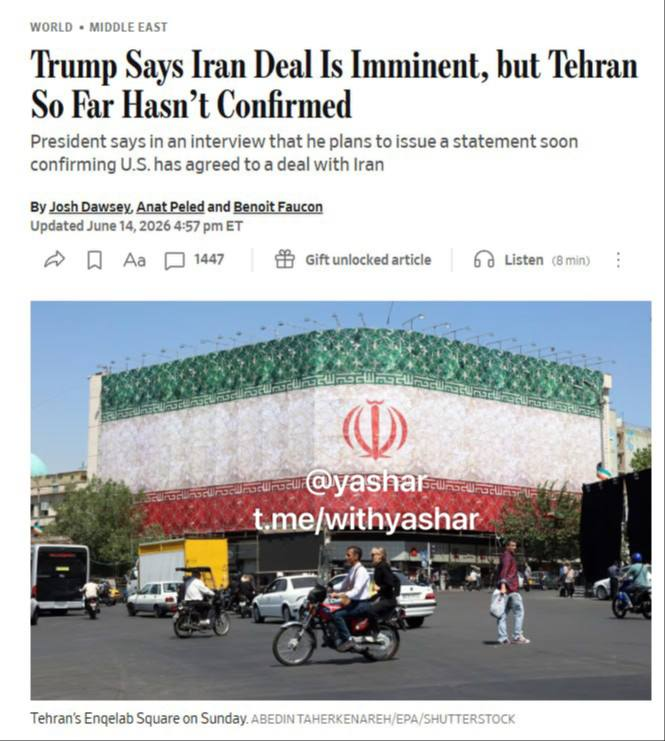

ترامپ می‌گوید توافق با ایران قریب‌الوقوع است، اما تهران تاکنون آن را تأیید نکرده است

رئیس‌جمهور در مصاحبه‌ای می‌گوید که قصد دارد به زودی بیانیه‌ای صادر کند و تأیید کند که ایالات متحده با ایران به توافق رسیده است
@withyashar

## pm_afshaa — post 93992

🔴نخست وزیر پاکستان:
پس از مذاکرات فشرده، با کمال خرسندی اعلام می‌کنیم که توافق صلحی بین آمریکا و ایران حاصل شده. هر دو طرف توقف فوری و دائمی عملیات نظامی در تمام جبهه‌ها، از جمله در لبنان، رو اعلام کردن.

مراسم رسمی امضای توافق‌نامه روز جمعه، 19 ژوئن، در سوئیس برگزار خواهد شد.

💧 Rainbet.com the #1 Non-KYC Crypto Casino & Sportsbook @rainbetcom

😁 @Pm_Afshaa

## pm_afshaa — post 93991

فوری: رسما توافق شد.

## pm_afshaa — post 93990

  <a href="telegram/content/pm_afshaa_93990_1781472156.webm" target="_blank">🎬 Download video</a>

🔴ترامپ: تحریم‌های ایران طبق توافق در آینده برداشته میشه.

💧 Rainbet.com the #1 Non-KYC Crypto Casino & Sportsbook @rainbetcom

😁 @Pm_Afshaa

## pm_afshaa — post 93989

  <a href="telegram/content/pm_afshaa_93989_1781472157.webm" target="_blank">🎬 Download video</a>

🔴ترامپ به وال استریت ژورنال: بازرسی‌های کاملی از ایرانی‌ها انجام خواهد شد

💧 Rainbet.com the #1 Non-KYC Crypto Casino & Sportsbook @rainbetcom

😁 @Pm_Afshaa

## pm_afshaa — post 93988

  <a href="telegram/content/pm_afshaa_93988_1781472158.webm" target="_blank">🎬 Download video</a>

🔴ترامپ: انتظار میره توافق پیشنهادی با ایران شامل آتش بس در لبنان باشه.

این توافق باعث برقراری آتش‌بس میشه و در عین حال به اسرائیل اجازه میده در صورت حمله تلافی جویانه اقدام کنه.

💧 Rainbet.com the #1 Non-KYC Crypto Casino & Sportsbook @rainbetcom

😁 @Pm_Afshaa

## pm_afshaa — post 93987

  <a href="telegram/content/pm_afshaa_93987_1781472159.webm" target="_blank">🎬 Download video</a>

🔴ترامپ به وال استریت ژورنال:
قصد دارم به‌زودی اعلام کنم آمریکا به توافق با ایران دست یافته.

بعدا مسائل هسته‌ای رو حل می‌کنیم؛ هیچ عجله‌ای نیست و میشه ظرف یک یا دو ماه آینده به اون پرداخت.

💧 Rainbet.com the #1 Non-KYC Crypto Casino & Sportsbook @rainbetcom

😁 @Pm_Afshaa

## pm_afshaa — post 93986

  <a href="telegram/content/pm_afshaa_93986_1781472160.webm" target="_blank">🎬 Download video</a>

🔴ترامپ به وال استریت ژورنال:
در مورد تغییر رژیم، من هرگز به تغییر رژیم اهمیت ندادم. این سومین گروهی است که با آن سروکار داشتیم و این منطقی ترین گروهی است که تاکنون وجود داره.

💧 Rainbet.com the #1 Non-KYC Crypto Casino & Sportsbook @rainbetcom

😁 @Pm_Afshaa

## VahidOnline — post 76347

  <a href="telegram/content/VahidOnline_76347_1781472161.mp4" target="_blank">🎬 Download video</a>

ویدیوی منتشرشده در شبکه‌های اجتماعی نشان می‌دهد جمعی از حامیان تندروی جمهوری اسلامی کفن‌پوش شده و در تجمعی مقابل استانداری زنجان شعار «اگر چیزی امضا شه، مسئول باید کشته شه» سر دادند.
@VahidOOnLine

📡 @VahidOnline

## VahidOnline — post 76346

دونالد ترامپ، رییس‌جمهوری آمریکا، در گفت‌وگو با وال استریت ژورنال گفت توافق با جمهوری اسلامی قریب‌الوقوع است، اما تهران هنوز موافقت خود با آن را تایید نکرده است.

ترامپ افزود قصد دارد به‌زودی بیانیه‌ای صادر کند که در آن اعلام خواهد شد آمریکا با جمهوری اسلامی به توافق رسیده است.

او گفت این توافق، در صورت نهایی شدن، یا توسط خود او یا از سوی جی‌دی ونس، معاون رییس‌جمهوری آمریکا، به‌صورت الکترونیکی امضا خواهد شد.

رییس‌جمهوری آمریکا روز یکشنبه این توافق را گامی بزرگ در مسیر پایان دادن به درگیری نزدیک به چهارماهه توصیف کرد.

ترامپ همچنین گفت این توافق شامل تعهد جمهوری اسلامی به دست نیافتن به سلاح هسته‌ای و بازگشایی فوری تنگه هرمز خواهد بود. او افزود عجله‌ای برای خارج کردن مواد هسته‌ای از ایران وجود ندارد و این موضوع می‌تواند در مرحله‌ای بعدی دنبال شود.

ترامپ گفت: «بعدا و زمانی که آماده باشیم وارد عمل شویم، مواد هسته‌ای را جمع‌آوری خواهیم کرد. به نظرم طی یک یا دو ماه آینده این کار انجام می‌شود و عجله‌ای وجود ندارد.»
@VahidOOnLine

📡 @VahidOnline

## IranIntlTV — post 342363

  

دونالد ترامپ، رییس‌جمهوری آمریکا، در گفت‌وگو با وال استریت ژورنال گفت توافق با جمهوری اسلامی قریب‌الوقوع است، اما تهران هنوز موافقت خود با آن را تایید نکرده است.

ترامپ افزود قصد دارد به‌زودی بیانیه‌ای صادر کند که در آن اعلام خواهد شد آمریکا با جمهوری اسلامی به توافق رسیده است.

او گفت این توافق، در صورت نهایی شدن، یا توسط خود او یا از سوی جی‌دی ونس، معاون رییس‌جمهوری آمریکا، به‌صورت الکترونیکی امضا خواهد شد.

رییس‌جمهوری آمریکا روز یکشنبه این توافق را گامی بزرگ در مسیر پایان دادن به درگیری نزدیک به چهارماهه توصیف کرد.

ترامپ همچنین گفت این توافق شامل تعهد جمهوری اسلامی به دست نیافتن به سلاح هسته‌ای و بازگشایی فوری تنگه هرمز خواهد بود. او افزود عجله‌ای برای خارج کردن مواد هسته‌ای از ایران وجود ندارد و این موضوع می‌تواند در مرحله‌ای بعدی دنبال شود.

ترامپ گفت: «بعدا و زمانی که آماده باشیم وارد عمل شویم، مواد هسته‌ای را جمع‌آوری خواهیم کرد. به نظرم طی یک یا دو ماه آینده این کار انجام می‌شود و عجله‌ای وجود ندارد.»
https://iranintl.com/202606145458

## IranIntlTV — post 342362

  <a href="telegram/content/IranIntlTV_342362_1781472163.mp4" target="_blank">🎬 Download video</a>

هواپیمای حامل اعضای تیم ملی فوتبال ایران در فرودگاه بین‌المللی لس‌آنجلس به زمین نشست و اعضای تیم در هتل محل اقامت خود مستقر شدند.

نخستین دیدار ایران در مرحله گروهی جام جهانی روز دوشنبه در لس‌آنجلس برگزار خواهد شد.

گزارش رضا محدث، خبرنگار ایران‌اینترنشنال
@iranintltv

## FarsiVOA — post 220727

  <a href="telegram/content/FarsiVOA_220727_1781472165.mp4" target="_blank">🎬 Download video</a>

⚡️تشدید شکاف درون جمهوری اسلامی و بازیگران «پنهان» توافق با آمریکا؛ گفت‌وگو با فرزانه روستایی
@FarsiVOA

## FarsiVOA — post 220726

🔺ترامپ به وال‌استریت ژورنال: توافق با جمهوری اسلامی را یا خودم امضا می‌کنم یا جی‌دی ونس

▪️دونالد ترامپ، رئیس‌جمهور آمریکا، عصر یکشنبه به روزنامه وال‌استریت ژورنال گفت که قصد دارد به‌زودی بیانیه‌ای صادر کند و در آن تأیید کند که ایالات متحده با جمهوری اسلامی ایران به توافق رسیده است.

⬇️ بیشتر بخوانید:
https://ir.voanews.com/a/8160751.html
@FarsiVOA

## DW_Farsi — post 125982

🎥روز ملی پرچم شیر و خورشید

شماری از ایرانیان مقیم شهر کلن روز یکشنبه ۲۴ خرداد، همزمان با زادروز مجیدرضا رهنورد از کشته‌شدگان خیزش زن، زندگی، آزادی روز ملی پرچم شیر و خورشید را گرامی داشته و دست به تجمع زدند.

@dw_farsi

## Persian_Trend_Official — post 17123

  <a href="telegram/content/Persian_Trend_Official_17123_1781472167.webm" target="_blank">🎬 Download video</a>

نخست‌ وزیر پاکستان: پس از مذاکرات فشرده، خرسندیم اعلام کنیم که توافق صلح میان ایالات متحده آمریکا و جمهوری اسلامی ایران حاصل شده است. دو طرف پایان فوری و دائمی عملیات نظامی در تمام جبهه‌ها، از جمله در لبنان، را اعلام کرده‌اند.

مراسم امضای رسمی این توافق روز جمعه 19 ژوئن در سوئیس برگزار خواهد شد.

📝 Amir

📌 @persian_trend_official
پرشین ترند | متفاوت‌ترین کانال نظامی

## Persian_Trend_Official — post 17122

ترامپ درباره ایران گفت: در مورد تغییر رژیم، من اصلاً به تغییر رژیم اهمیت نداده‌ام. این سومین گروهی است که با آن‌ها طرف بوده‌ایم و این گروه، منطقی‌ترین آن‌ها تا به امروز است. این توافق شامل موافقت ایران با عدم دستیابی به سلاح هسته‌ای و بازگشایی فوری تنگه هرمز…

## Persian_Trend_Official — post 17121

ترامپ درباره ایران گفت: در مورد تغییر رژیم، من اصلاً به تغییر رژیم اهمیت نداده‌ام. این سومین گروهی است که با آن‌ها طرف بوده‌ایم و این گروه، منطقی‌ترین آن‌ها تا به امروز است.

این توافق شامل موافقت ایران با عدم دستیابی به سلاح هسته‌ای و بازگشایی فوری تنگه هرمز خواهد بود.

نتانیاهو هم با توافق موافق است.

📝 Amir

📌 @persian_trend_official
پرشین ترند | متفاوت‌ترین کانال نظامی

## IranianMinds — post 22590

🔴 شهباز شریف نخست وزیر پاکستان از توافق ایران و آمریکا خبر داد:

پس از گفتگوهای فشرده، خرسندیم اعلام کنیم که توافق صلح بین ایالات متحده آمریکا و جمهوری اسلامی ایران محقق شده است. هر دو طرف پایان فوری و دائمی عملیات نظامی در همه جبهه‌ها از جمله لبنان را اعلام کرده‌اند.

مراسم رسمی امضای قرارداد در روز جمعه 19 ژوئن در سوئیس خواهد بود.

مایلیم از تعهد ایالات متحده آمریکا و جمهوری اسلامی ایران برای یافتن راه حل دیپلماتیک برای این مناقشه تشکر کنیم. ما همچنین می‌خواهیم از برادرانمان در این تلاش میانجی‌گری، یعنی رهبری بزرگ کشور قطر، به خاطر حمایتشان از دستیابی به این توافق قدردانی کنیم. همچنین به ویژه از رهبری بصیر پادشاهی عربستان سعودی و جمهوری ترکیه برای کمک های بی شمارشان در این زمینه تشکر می کنم.

با توافق در حال حاضر، میانجی ها مجموعه ای از جلسات را در این هفته تسهیل خواهند کرد. این گفتگوهای پیش از اجرا، پایه و اساس مذاکرات فنی و مراسم امضای رسمی را خواهد گذاشت.

@IranianMinds

## IranianMinds — post 22589

🔴خبر امضاء شدن توافق که در رسانه‌ها در حال پخش شدن هست فیک هست. @IranianMinds

## IranianMinds — post 22588

🔴خبر امضاء شدن توافق که در رسانه‌ها در حال پخش شدن هست فیک هست.

@IranianMinds

## BBCPersian — post 283820

  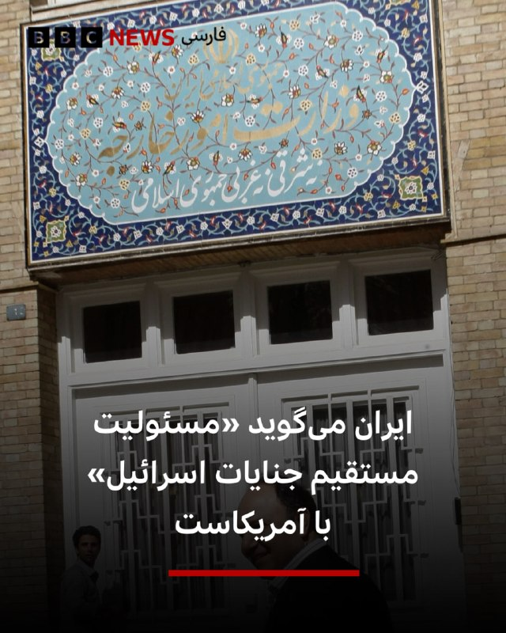

‌ ‌ ‌ ‌
وزارت خارجه ایران ضمن محکوم کردن حملات امروز اسرائیل به منطقه ضاحیه بیروت، مسئولیت مستقیم آن را متوجه آمریکا کرده است.

در بیانیه وزارت خارجه ایران در این مورد آمده است: «این جنایت تروریستی، نه تنها نقض آشکار حاکمیت ملی و تمامیت سرزمینی لبنان است، بلکه نقض فاحش تفاهم آتش‌بس مورخ ۱۹ فروردین ۱۴۰۵ بین ایران و آمریکا محسوب می‌شود.»

این بیانیه حملات اسرائیل را «نقض مکرر آتش‌بس علیه لبنان یا ایران» خوانده و اضافه کرده است که آمریکا در قبال اقدامات اسرائیل و نقض آتش‌بس، مسئولیت مستقیم دارد.

وزارت خارجه ایران در این بیانیه گفته است که جمهوری اسلامی «از عزم خود برای اتخاذ کلیه تدابیر لازم جهت اعمال حق ذاتی دفاع مشروع تاکید می‌کند.»

اسرائیل گفته است در حملات امروز خود به منطقه ضاحیه بیروت، یک مقر فرماندهی حزب‌الله را هدف گرفته و در پاسخ به آتشباری حزب‌الله به سمت شمال اسرائیل، دست به این حمله زده است.

حمله امروز اسرائیل به منطقه ضاحیه بیروت که گروه حزب‌الله در آن مستقر است، بعد از آن رخ داد که آمریکا گفت تفاهم‌نامه با ایران در همین روز امضا می‌شود.

https://bbc.in/4e5G0IE
📷Getty
@BBCPersian

## Dirty_Kids — post 392050

  

میگن ترامپ از صبح منتظره مجتبی این مرحله از زدن امضای دیجیتال رو رد کنه هنوز نتونسته

@Dirty_Kids 👻

## Dirty_Kids — post 392049

  <a href="telegram/content/Dirty_Kids_392049_1781472169.mp4" target="_blank">🎬 Download video</a>

🔴 توی تجمعات شبانه تندروهای انقلابی، مأموران اونارو با گاز اشک اور و شلیک پراکنده کردن😂😂😂😂😂

@Dirty_Kids 👻

## Dirty_Kids — post 392048

  <a href="telegram/content/Dirty_Kids_392048_1781472171.webm" target="_blank">🎬 Download video</a>

🔴تسنیم:
توافق ایران و آمریکا توسط هر دو طرف امضا شد.

🔴ترامپ:
تحریم های ایران طبق توافق برداشته میشه

## Dirty_Kids — post 392047

  <a href="telegram/content/Dirty_Kids_392047_1781472172.mp4" target="_blank">🎬 Download video</a>

🔴 حسین پاک، خبرنگار صداوسیما تو لبنان:

انشاالله امشب قراره ایران، یمن و حزب‌الله به صورت همزمان به اسرائیل حمله کنن و انتقام بگیرن.

@Dirty_Kids 👻

## alonews — post 128025

  <a href="telegram/content/alonews_128025_1781472175.webm" target="_blank">🎬 Download video</a>

👈خب حملات موشکی هم انجام نخواهد شد

✅ @AloNews خبر جنگ

## alonews — post 128024

  <a href="telegram/content/alonews_128024_1781472175.webm" target="_blank">🎬 Download video</a>

👈نخست‌وزیر پاکستان:
پس از گفت‌وگوهای فشرده، خرسندیم اعلام کنیم که توافق صلح بین ایالات متحده آمریکا و جمهوری اسلامی ایران حاصل شده است. هر دو طرف پایان فوری و دائمی عملیات نظامی در همه جبهه‌ها، از جمله در لبنان را اعلام کرده‌اند.

🔴مراسم رسمی امضای توافق روز جمعه، ۱۹ ژوئن در سوئیس برگزار خواهد شد.

🔴ما از ایالات متحده آمریکا و جمهوری اسلامی ایران به خاطر تعهدشان به یافتن راه‌حلی دیپلماتیک برای درگیری تشکر می‌کنیم. همچنین قدردانی صمیمانه خود را از برادرانمان در این تلاش میانجی‌گرانه، رهبری بزرگ دولت قطر، برای حمایتشان در دستیابی به این توافق ابراز می‌داریم. به‌ویژه از رهبری دوراندیش پادشاهی عربستان سعودی و جمهوری ترکیه به خاطر کمک‌های عظیمشان در این زمینه سپاسگزارم.

🔴اکنون که توافق امضا شده است، میانجی‌گران مجموعه‌ای از جلسات را در این هفته تسهیل خواهند کرد. این گفت‌وگوهای پیش از اجرا، پایه‌گذار مذاکرات فنی و مراسم رسمی امضای توافق خواهد بود.

✅ @AloNews خبر جنگ

## alonews — post 128023

  <a href="telegram/content/alonews_128023_1781472175.webm" target="_blank">🎬 Download video</a>

🔴فووووووووووری/توافق رسمی شد

🔴پایان جنگ اعلام شد

✅ @AloNews خبر جنگ

## alonews — post 128022

  <a href="telegram/content/alonews_128022_1781472176.webm" target="_blank">🎬 Download video</a>

👈ترامپ: ایران در توافق پول نمی گیرد اما احتمالا تحریم ها از آن برداشته می شود و خواهیم دید که آنها چگونه رفتار خواهند کرد‌‌

✅ @AloNews خبر جنگ

## alonews — post 128021

  <a href="telegram/content/alonews_128021_1781472176.webm" target="_blank">🎬 Download video</a>

👈ترامپ: «بعداً مسائل هسته‌ای را حل می‌کنیم» و افزود که «هیچ عجله‌ای نیست» و می‌توان ظرف یک یا دو ماه آینده به آن پرداخت

✅ @AloNews خبر جنگ

## alonews — post 128020

  <a href="telegram/content/alonews_128020_1781472176.webm" target="_blank">🎬 Download video</a>

👈کانال ۱۲ اسرائیل: از دید آمریکا علی خامنه‌ای مانع توافق بود که حذف شد

✅ @AloNews خبر جنگ

## alonews — post 128019

  <a href="telegram/content/alonews_128019_1781472177.webm" target="_blank">🎬 Download video</a>

👈ترامپ: رهبران فعلی ایران بسیار منطقی تر از رهبران قبلی هستند

✅ @AloNews خبر جنگ

---
📅 بروزرسانی: 1405/03/25 00:42
---

## VahidOOnLine — post 245562

  

دونالد ترامپ، رییس‌جمهوری آمریکا، شامگاه یکشنبه همزمان با احتمال امضای یادداشت تفاهم میان جمهوری اسلامی و ایالات متحده، در شبکه تروت سوشال نوشت که جمهوری اسلامی هرگز به سلاح هسته‌ای دست نخواهد یافت و تنگه هرمز نیز به‌زودی برای تجارت باز خواهد شد.

ترامپ در پیامی دیگر نوشت: «توافق ما دیواری در برابر دستیابی جمهوری اسلامی به سلاح هسته‌ای است؛ دقیقا برعکس توافق اوباما.»
‌🏁 🇬🇧 IranintlTV

🤖 @VahidOOnLine

## VahidOOnLine — post 245561

  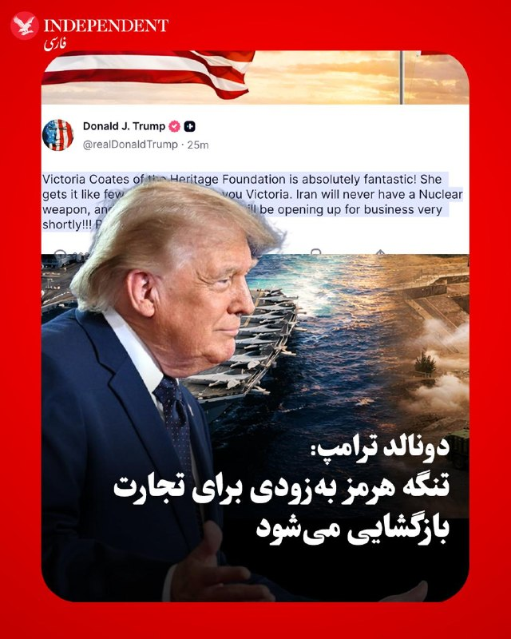

♦️دونالد ترامپ، رئیس‌جمهوری آمریکا، با انتشار پیامی در شبکه اجتماعی «تروث سوشال»، بار دیگر مواضع سرسختانه واشنگتن در قبال توافق با تهران را تکرار کرد و نوشت: «ایران هرگز به سلاح هسته‌ای دست نخواهد یافت و تنگه هرمز نیز بسیار به‌زودی برای تجارت بازگشایی خواهد شد.» ترامپ این اظهارات را در جریان تقدیر از ویکتوریا کوتس، معاون اندیشکده محافظه‌کار «هریتیج» و مشاور سابق امنیت ملی خود مطرح کرد و افزود: «ویکتوریا کوتس واقعا فوق‌العاده است. او مسائل را طوری درک می‌کند که کمتر کسی قادر به فهم آن است. ممنون ویکتوریا.»
‌🇸🇦 Indypersian

🤖 @VahidOOnLine

## WithYashar — post 14896

ترامپ به وال استریت ژورنال گفت که قصد دارد به زودی بیانیه‌ای صادر کند و در آن توافق آمریکا با ایران را تأیید کند
@withyashar
ترامپ کله پوک: من علاقه‌ای به تغییر رژیم در ایران ندارم

## WithYashar — post 14895

توییت وزیر کشور پاکستان: الله اکبر
@withyashar

## WithYashar — post 14894

میگن توافق امضا شد
@withyashar

## pm_afshaa — post 93985

  <a href="telegram/content/pm_afshaa_93985_1781471557.webm" target="_blank">🎬 Download video</a>

🔴ترامپ امروز عصر به وال‌استریت ژورنال:
قصد دارم به‌زودی بیانیه‌ای صادر کنم و تأیید کنم که با ایران به توافق رسیدیم؛ هرچند ایران هنوز تأیید نکرده که با این شرایط موافقت کنه.

ترامپ گفت: توافق الکترونیکی توسط خودش یا معاونش JD Vance امضا خواهد شد

💧 Rainbet.com the #1 Non-KYC Crypto Casino & Sportsbook @rainbetcom

😁 @Pm_Afshaa

## pm_afshaa — post 93984

  <a href="telegram/content/pm_afshaa_93984_1781471558.webm" target="_blank">🎬 Download video</a>

🔴توییت وزیر کشور پاکستان: الله اکبر 
💧 Rainbet.com the #1 Non-KYC Crypto Casino & Sportsbook @rainbetcom 
😁 @Pm_Afshaa

## pm_afshaa — post 93983

  <a href="telegram/content/pm_afshaa_93983_1781471559.webm" target="_blank">🎬 Download video</a>

🔴توییت وزیر کشور پاکستان: الله اکبر

💧 Rainbet.com the #1 Non-KYC Crypto Casino & Sportsbook @rainbetcom

😁 @Pm_Afshaa

## IranIntlTV — post 342361

  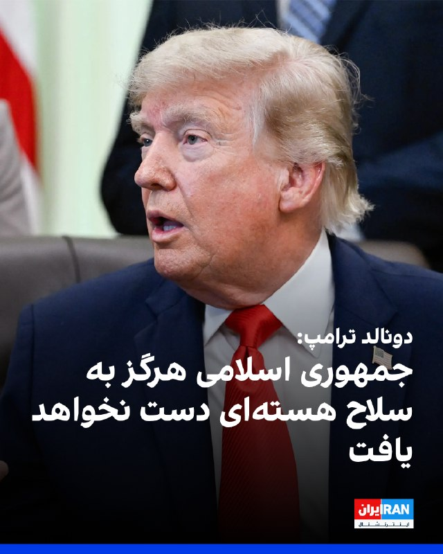

دونالد ترامپ، رییس‌جمهوری آمریکا، شامگاه یکشنبه همزمان با احتمال امضای یادداشت تفاهم میان جمهوری اسلامی و ایالات متحده، در شبکه تروت سوشال نوشت که جمهوری اسلامی هرگز به سلاح هسته‌ای دست نخواهد یافت و تنگه هرمز نیز به‌زودی برای تجارت باز خواهد شد.

ترامپ در پیامی دیگر نوشت: «توافق ما دیواری در برابر دستیابی جمهوری اسلامی به سلاح هسته‌ای است؛ دقیقا برعکس توافق اوباما.»
https://iranintl.com/202606146911

## Shin_Persian — post 7079

laurence norman @laurnorman
Sun, 14 Jun 2026 20:32:30 UTC

It is now Monday in Tehran.
On Saturday, they said not tomorrow for a deal. It’s no longer tomorrow.

ترجمه خودکار فارسی

اکنون در تهران دوشنبه است.
روز شنبه، آن‌ها گفتند که فردا توافقی در کار نخواهد بود. حالا دیگر فردا نیست.

𝕏 · @shin_persian

## FarsiVOA — post 220725

⚡️در حالی که کی‌یر استارمرنخست وزیر بریتانیا و دونالد ترامپ در آستانه نشست گروه هفت درباره جمهوری اسلامی و روند مذاکرات تلفنی گفت‌وگو کرده‌اند، گزارش‌ها حاکی است رئیس‌جمهور آمریکا قصد دارد در دیدار حضوری با نخست‌وزیر بریتانیا، موضوع مهاجرت را هم مطرح کند.
@FarsiVOA

## Persian_Trend_Official — post 17120

  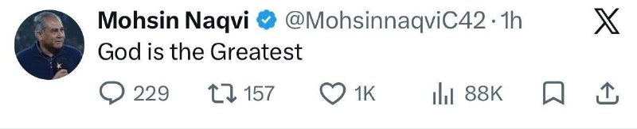

🚨🇵🇰توییت وزیر کشور پاکستان: الله و اکبر!!!

عده‌ای این توییت رو به معنی انجام توافق دونسته‌اند

## Persian_Trend_Official — post 17119

  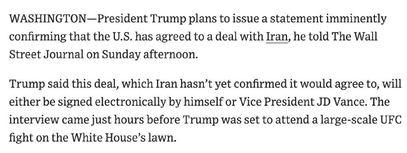

🔻پرزیدنت ترامپ به وال استریت ژورنال گفت که قصد دارد به زودی بیانیه‌ای صادر کند و در آن توافق آمریکا با ایران را تأیید کند

## Persian_Trend_Official — post 17116

  <a href="telegram/content/Persian_Trend_Official_17116_1781471561.webm" target="_blank">🎬 Download video</a>

بیانیۀ جمعی از اعضای مجلس خبرگان رهبری و اساتید حوزۀ علمیه دربارۀ مذاکرات جاری بین ایران و آمریکا ا

## Dirty_Kids — post 392046

  

هوادار ژاپنی کاملا لخت شده که لباس تیم کشورشو روش با ماژیک بکشن،

@Dirty_Kids 👻

## Dirty_Kids — post 392044

  <a href="telegram/content/Dirty_Kids_392044_1781471563.mp4" target="_blank">🎬 Download video</a>

ببخشید وسط فوتبال هلند و ژاپن مزاحم می‌شم،

ولایتی قحبه که جونش داره از کونش درمیاد و با مصرف همزمان صنعتی‌سنتی زنده‌ست، اسرائیل‌رو تهدید کرده.

ببینیم روافض می‌تونه سرشو بخوره یا نه.

@Dirty_Kids 👻

## alonews — post 128018

  <a href="telegram/content/alonews_128018_1781471563.webm" target="_blank">🎬 Download video</a>

👈ترامپ: توافق ما شامل تعهد ایران به نداشتن سلاح اتمی و باز کردن تنگه هرمز است

✅ @AloNews خبر جنگ

## alonews — post 128017

  <a href="telegram/content/alonews_128017_1781471564.webm" target="_blank">🎬 Download video</a>

🔴فوری/ترامپ: امضای توافق احتمالا توسط خودم انجام خواهد شد

✅ @AloNews خبر جنگ

## alonews — post 128016

  <a href="telegram/content/alonews_128016_1781471564.webm" target="_blank">🎬 Download video</a>

🔴فوری/ترامپ:
علاقه‌ای به تغییر رژیم در ایران نداشته و ندارم

✅ @AloNews خبر جنگ

## alonews — post 128015

  <a href="telegram/content/alonews_128015_1781471564.webm" target="_blank">🎬 Download video</a>

🔴فوری/ترامپ: بزودی یک بیانیه خواهم داد

✅ @AloNews خبر جنگ

## alonews — post 128014

  <a href="telegram/content/alonews_128014_1781471564.webm" target="_blank">🎬 Download video</a>

👈توییت وزیر کشور پاکستان: الله اکبر

✅ @AloNews خبر جنگ

---
📅 بروزرسانی: 1405/03/25 00:32
---

## VahidOOnLine — post 245560

  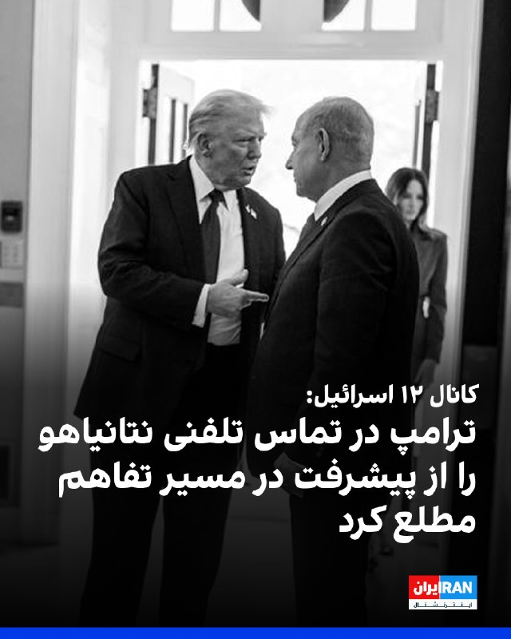

کانال ۱۲ اسرائیل به نقل از یک مقام آگاه گزارش داد که دونالد ترامپ، رییس‌جمهوری آمریکا، و بنیامین نتانیاهو، نخست‌وزیر اسرائیل، شامگاه یکشنبه با یکدیگر گفت‌وگو کرده‌اند.

بر اساس این گزارش، ترامپ در این تماس نتانیاهو را از پیشرفت در مسیر امضای توافق با جمهوری اسلامی مطلع کرده و احتمال داده شده است که این توافق حتی در طول امشب امضا شود.

جلسه کابینه امنیتی اسرائیل که برای بررسی تحولات جاری تشکیل شده بود، به دلیل تماس تلفنی نتانیاهو و ترامپ متوقف شد. همچنین وزیر دفاع اسرائیل با همتای آمریکایی خود گفت‌وگو کرد.

یکی از وزیران کابینه اسرائیل گفت: «آمریکایی‌ها تلاش می‌کنند هرچه سریع‌تر این پرونده را جمع‌بندی کرده و تفاهم‌نامه‌ای را امضا کنند که مانع واکنش ایران شود. قطری‌ها نیز پشت صحنه نقش اصلی را برای فشار بر طرف‌ها ایفا می‌کنند.»
‌🏁 🇬🇧 IranintlTV

🤖 @VahidOOnLine

## VahidOOnLine — post 245559

  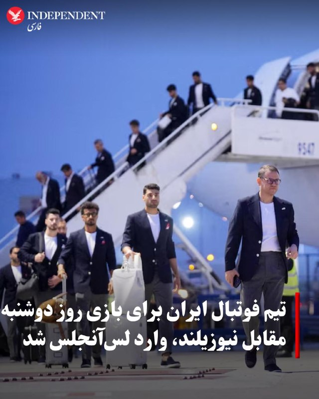

♦️به گزارش رویترز، کاروان تیم ملی فوتبال ایران برای برگزاری مسابقه روز دوشنبه خود در رقابت‌های جام جهانی ۲۰۲۶ مقابل نیوزیلند، وارد شهر لس‌آنجلس شد؛ این نخستین‌بار در تاریخ مسابقات جام جهانی است که تیم ملی فوتبال ایران برای انجام بازی‌های خود وارد خاک ایالات متحده می‌شود. براساس این گزارش، مهدی طارمی و امیر قلعه‌نویی از ساعاتی دیگر در نشست خبری حاضر خواهند شد.
‌🇸🇦 Indypersian

🤖 @VahidOOnLine

## VahidOOnLine — post 245558

  <a href="telegram/content/VahidOOnLine_245558_1781470956.mp4" target="_blank">🎬 Download video</a>

♦️به گزارش «فاکس‌نیوز»، مقامات محلی ایالت میزوری آمریکا روز یکشنبه اعلام کردند که در پی سقوط یک هواپیمای کوچک خصوصی در نزدیکی فرودگاه «مِموریال باتلر»، دست‌کم ۱۲ نفر شامل ۱۱ چترباز و یک خلبان جان خود را از دست دادند. این هواپیما که حوالی ساعت ۱۱:۳۰ صبح به وقت محلی با چتربازان آماده پرش به هوا برخاسته بود، لحظاتی پس از برخاستن «به دلایل نامعلومی» مجبور به چرخش و بازگشت شد، اما در نهایت در یک زمین زراعی مجاور بزرگراه سقوط کرد و بلافاصله طعمه حریق شد. بر اساس گزارش خبرگزاری آسوشیتدپرس، مدیر فرودگاه احتمال می‌دهد هواپیما دچار نقص فنی و افت قدرت موتور شده و خلبان تلاش کرده است تا آن را روی بزرگراه بنشاند، اما پس از افت سرعت، هواپیما با دماغه به زمین برخورد کرده است.
‌🇸🇦 Indypersian

🤖 @VahidOOnLine

## WithYashar — post 14893

سی‌ان‌ان: مذاکره کنندگان قطری همین حالا تو تهران حضور دارن تا با هماهنگی امریکا توافق رو به سرانجام برسونند و از نهایی شدن روند مذاکرات اطمینان کسب کنند
@withyashar

## WithYashar — post 14892

حسین پاک، خبرنگار صداوسیما در لبنان:
امشب به صورت همزمان ایران، یمن و حزب‌الله به حمله اسرائیل به ضاحیه پاسخ می‌دهند
@withyashar

## mwarmonitor — post 10926

🔴یدیعوت آحرونوت به نقل از یک منبع: وزیر دفاع اسرائیل در حال انجام تماس تلفنی با وزیر جنگ آمریکا است.

@mwarmonitor

## FoxNewsTwitter — post 342965

  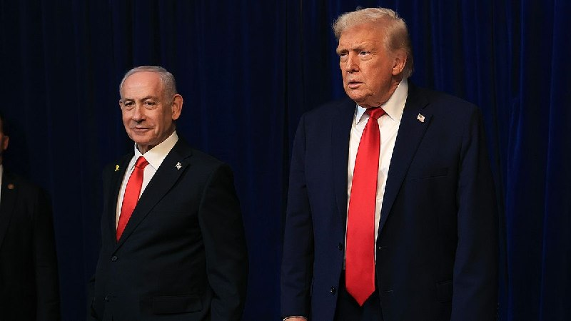

Fox News (Twitter/X)

Trump says an Iran peace deal could be signed "in a matter of hours" — but Israel's actions could be complicating the situation.

The president told FOX News' Trey Yingst that he personally called Benjamin Netanyahu after Israeli strikes in Beirut, saying "what the f---are you doing?"

Yingst reports that Trump warned Netanyahu that further military action in Lebanon could jeopardize ongoing diplomatic efforts to secure a broader agreement with Iran.

## pm_afshaa — post 93982

  <a href="telegram/content/pm_afshaa_93982_1781470958.webm" target="_blank">🎬 Download video</a>

🔴کانال 12 اسرائیل: دقایقی پیش نتانیاهو و ترامپ در مورد ایران گفت‌و‌گوی تلفنی کردن. ترامپ، نتانیاهو رو در جریان پیشرفت‌ها برای امضای توافق با جمهوری اسلامی قرار داد؛ توافقی که ممکنه حتی از امشب امضا بشه. 
💧 Rainbet.com the #1 Non-KYC Crypto Casino & Sportsbook…

## IranIntlTV — post 342360

  

کانال ۱۲ اسرائیل به نقل از یک مقام آگاه گزارش داد که دونالد ترامپ، رییس‌جمهوری آمریکا، و بنیامین نتانیاهو، نخست‌وزیر اسرائیل، شامگاه یکشنبه با یکدیگر گفت‌وگو کرده‌اند.

بر اساس این گزارش، ترامپ در این تماس نتانیاهو را از پیشرفت در مسیر امضای توافق با جمهوری اسلامی مطلع کرده و احتمال داده شده است که این توافق حتی در طول امشب امضا شود.

جلسه کابینه امنیتی اسرائیل که برای بررسی تحولات جاری تشکیل شده بود، به دلیل تماس تلفنی نتانیاهو و ترامپ متوقف شد. همچنین وزیر دفاع اسرائیل با همتای آمریکایی خود گفت‌وگو کرد.

یکی از وزیران کابینه اسرائیل گفت: «آمریکایی‌ها تلاش می‌کنند هرچه سریع‌تر این پرونده را جمع‌بندی کرده و تفاهم‌نامه‌ای را امضا کنند که مانع واکنش ایران شود. قطری‌ها نیز پشت صحنه نقش اصلی را برای فشار بر طرف‌ها ایفا می‌کنند.»
https://iranintl.com/202606145076

## FarsiVOA — post 220724

🔺انتقاد دونالد ترامپ از سناتور جک رید؛ رئيس جمهوری آمریکا: توافق ما دیواری در برابر دستیابی رژیم ایران به سلاح هسته‌ای است

▪️دونالد ترامپ، رئيس جمهوری آمریکا، روز یکشنبه از اظهارات سناتور جک رید، نماینده دموکرات درباره توافق در آستانه امضا با جمهوری اسلامی انتقاد کرد. آقای ترامپ گفت جک رید «با بیان اینکه توافقی که ما تازه انجام داده‌ایم به خوبی فاجعه اوباما موسوم به برجام نیست،» دروغ گفت.

⬇️ بیشتر بخوانید:
https://ir.voanews.com/a/trump-calls-for-the-impeachment-of-senator-jack-reed/8160746.html
@FarsiVOA

## alonews — post 128013

توافق امضا شد

---
📅 بروزرسانی: 1405/03/25 00:22
---

## VahidOOnLine — post 245557

  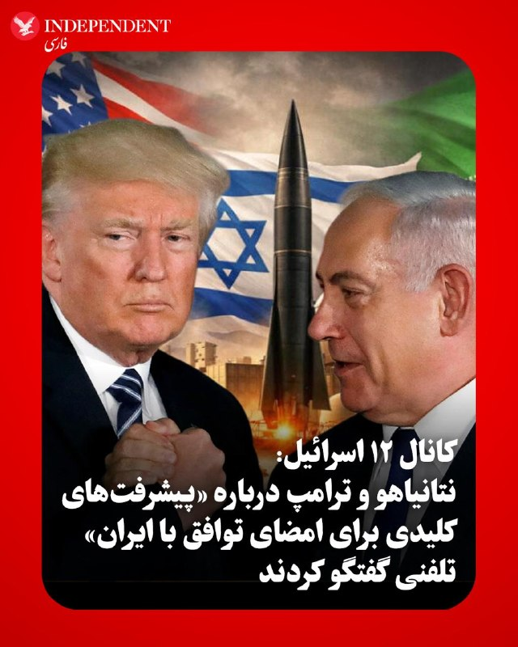

♦️به گزارش «کانال ۱۲» اسرائیل، بنیامین نتانیاهو و دونالد ترامپ لحظاتی پیش به صورت تلفنی گفتگو کردند و رئیس‌جمهوری آمریکا، نخست‌وزیر اسرائیل را در جریان «پیشرفت‌های کلیدی برای امضای توافق با ایران» قرار داد. مقامی ارشد اعلام کرده که احتمال امضای این توافق «حتی طی همین امشب» (بامداد دوشنبه به وقت تهران) وجود دارد.
‌🇸🇦 Indypersian

🤖 @VahidOOnLine

## WithYashar — post 14891

  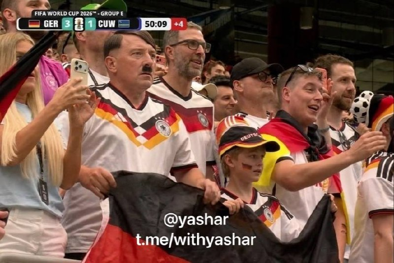

استاد اومد بازی‌رو از‌ نزدیک دید 😂
بازی امروز آلمان و کوراسائو (Curaçao) در جام جهانی ۲۰۲۶ با نتیجه ۷ بر ۱ به سود آلمان به پایان رسید.
@withyashar

## WithYashar — post 14890

ترامپ در تروث : ویکتوریا کوتس از بنیاد هریتیج واقعاً فوق‌العاده است! او مثل کمتر کسی این موضوع را درک می‌کند. ویکتوریا، متشکرم. ایران هرگز سلاح هسته‌ای نخواهد داشت و تنگه هرمز خیلی زود برای تجارت باز خواهد شد!!! رئیس جمهور دی‌جی‌تی @withyashar

## WithYashar — post 14889

ترامپ در تروث : ویکتوریا کوتس از بنیاد هریتیج واقعاً فوق‌العاده است! او مثل کمتر کسی این موضوع را درک می‌کند. ویکتوریا، متشکرم. ایران هرگز سلاح هسته‌ای نخواهد داشت و تنگه هرمز خیلی زود برای تجارت باز خواهد شد!!! رئیس جمهور دی‌جی‌تی
@withyashar

## WithYashar — post 14888

کانال ۱۲ اسرائیل: دقایقی پیش ترامپ و نتانیاهو گفت‌وگو کردن. ترامپ، نتانیاهو رو در جریان پیشرفت‌ها برای امضای توافق با جمهوری اسلامی قرار داد؛ توافقی که ممکنه حتی از امشب امضا بشه.
@withyashar

## mwarmonitor — post 10925

🔸مجری زن:
«یک رویداد با پیامدهای سیاسی بسیار مهم، آن هم کمی پیش از انتخابات.»
🔹آمیت سیگال:
«قطعا. بیایید دو موضوعی که در طول سال گذشته با ما همراه بوده‌اند را به یاد بیاوریم:
یکی این تفاهم و باور که ترامپ قبل از انتخابات برای کمک به نتانیاهو به اینجا خواهد آمد؛ صحبت‌هایی از جایزه اسرائیل بود و اینکه او پیش از انتخابات سفری خواهد داشت و به مردم خواهد گفت که به نتانیاهو رای دهند. بیایید بگوییم که این موضوع اکنون کمی تردیدآمیز به نظر می‌رسد.
و دومین مورد، البته که ماجرای عفو است؛ یعنی بسیج همه‌جانبه قوا به نفع نتانیاهو. اکنون این وضعیت در حال تغییر است و به نظر من، این مسئله چالشی را برای نتانیاهو ایجاد می‌کند — و او پس از سی سال (با وقفه‌هایی) به عنوان نخست‌وزیر خدمت کرده است. این شاید بزرگترین چالشی باشد که او تاکنون در مواجهه با یک رئیس‌جمهور ایالات متحده با آن روبرو شده است.
چرا که به طور نسبی، برخورد با اوباما، کلینتون یا بایدن آسان‌تر است؛ از آنجا که شما جناح حزب جمهوری‌خواه و اپوزیسیون ایالات متحده را دارید که همیشه در کنار شما خواهند بود. اما در اینجا وضعیت این‌گونه نیست.
بخش زیادی از حمایتی که اسرائیل همچنان در ایالات متحده از آن برخوردار است، از سوی همان "جنبش ماگا" (MAGA) تامین می‌شود. اگر ترامپ در مقابل نتانیاهو بایستد چه می‌شود؟
و با گفتن این نکته درباره این لحظه حساس و سرنوشت‌ساز، روشن است که پاسخ درست در این آزمون چه باید باشد؛ و پاسخ باید این باشد که اسرائیل هرگز با توقف حملات به "ضاحیه" در تلافی‌جویی موافقت نخواهد کرد، زیرا این به معنای آن است که حزب‌الله به تقویت خود ادامه خواهد داد و این کار، بازگشتِ یک‌باره به ششم اکتبر خواهد بود.
یک وزیر ارشد کابینه می‌گوید: «تا جایی که به ما مربوط می‌شود، ایران مشکلِ ترامپ است و این حق اوست که به آنجا برود و توافقی انجام دهد، اما لبنان مال ماست. این جنگ ماست که بر ما تحمیل شده است و ما نباید با معادله‌ای با ایران — ببخشید، با معادله ایرانی موافقت کنیم، حتی به قیمت یک رویارویی شدید با رئیس‌جمهور ایالات متحده.»»
🔸مجری زن:
«بله، و ما هنوز حتی درباره آنچه در آن توافق با ایران وجود دارد یا اینکه به چه سمتی می‌رویم، صحبت نکرده‌ایم.»
🔹آمیت سیگال:
«به هر حال، فقط برای اینکه درباره اقدامات ایران با نیروی نیابتی‌شان یعنی حزب‌الله شفاف باشیم — و این واقعاً یک عملیات نیابتی بود. این یک لغزش زبانی نبود، و نه، این تصادفی نیست که اکنون صحبت از فرود آمدن تعداد دورقمی پهپاد در داخل خاک اسرائیل به میان آمده است. این تلاش ایران است تا با پشتوانه و حمایت آمریکا، بازگشت به خطوط ششم اکتبر را به زور وارد این توافق کند؛ و این اتفاق نمی‌تواند بیفتد.»

@mwarmonitor

## mwarmonitor — post 10924

  <a href="telegram/content/mwarmonitor_10924_1781470361.mp4" target="_blank">🎬 Download video</a>

🎬 Video

## pm_afshaa — post 93981

  <a href="telegram/content/pm_afshaa_93981_1781470363.webm" target="_blank">🎬 Download video</a>

🔴پست جدید ترامپ: سناتور جک رید، سناتور دموکرات از رود آیلند، وقتی گفت توافقی که ما انجام دادیم به اندازه فاجعه توافق اوباما و برجام بد نیست، دروغ گفت. او یا یک کلاهبردار تمام‌عیار است، یا کاملاً بی‌کفایت. توافق اوباما راه رو برای هسته‌ای شدن ایران باز کرد…

## pm_afshaa — post 93980

  <a href="telegram/content/pm_afshaa_93980_1781470364.webm" target="_blank">🎬 Download video</a>

🔴بیانیه 34 عضو مجلس خبرگان:
در موضوع مذاکرات با آمریکا، فصل‌الخطاب تدابیر مجتبی خامنه‌ای و خطوط قرمز تعیین‌شده از سمت اوست. شرایط همچنان جنگیه و آتش‌بس عملا معنا نداره.

💧 Rainbet.com the #1 Non-KYC Crypto Casino & Sportsbook @rainbetcom

😁 @Pm_Afshaa

## VahidOnline — post 76345

  

به گزارش «کانال ۱۲» اسرائیل، بنیامین نتانیاهو و دونالد ترامپ لحظاتی پیش به صورت تلفنی گفتگو کردند و رئیس‌جمهوری آمریکا، نخست‌وزیر اسرائیل را در جریان «پیشرفت‌های کلیدی برای امضای توافق با ایران» قرار داد.
مقامی ارشد اعلام کرده که احتمال امضای این توافق «حتی طی همین امشب» (بامداد دوشنبه به وقت تهران) وجود دارد.
@VahidOOnLine

📡 @VahidOnline

## RadioFarda — post 158304

  <a href="https://t.me/radiofarda/158304" target="_blank">📎 Download file</a>

📻بشنوید: سرخط خبرهای نیمه‌شب با رادیوفردا، ۲۵ خرداد ۱۴۰۵‌

@RadioFarda

## IranianMinds — post 22587

🔴کانال ۱۲ اسرائیل:

نخست‌وزیر نتانیاهو و ترامپ دقایقی پیش با هم گفت‌و‌گوی تلفنی داشتند و ترامپ نتانیاهو را در جریان پیشرفت‌های کلیدی برای امضاء توافق با ایران قرار داد.

@IranianMinds

## alonews — post 128012

  <a href="telegram/content/alonews_128012_1781470366.webm" target="_blank">🎬 Download video</a>

👈حسین پاک، خبرنگار صداوسیما در لبنان:
امشب به صورت همزمان ایران، یمن و حزب‌الله به حمله اسرائیل به ضاحیه پاسخ می‌دهند

✅ @AloNews خبر جنگ

---
📅 بروزرسانی: 1405/03/25 00:12
---

## VahidOOnLine — post 245556

  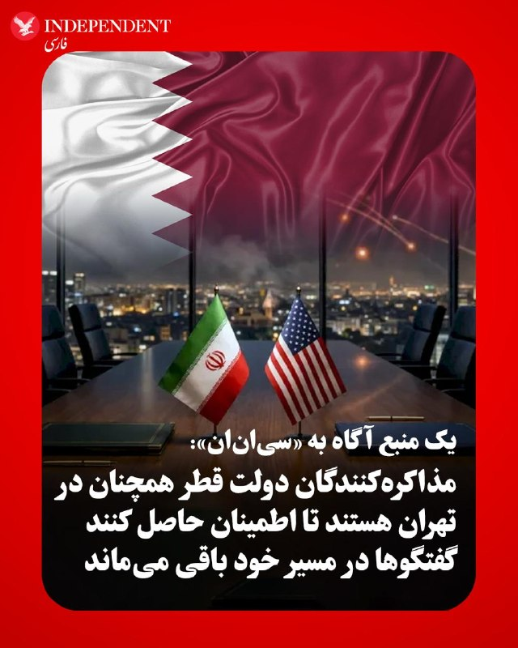

♦️ یک منبع دیپلماتیک آگاه، روز یکشنبه، در گفتگو با «سی‌ان‌ان» اعلام کرد که مذاکره‌کنندگان دولت قطر همچنان در تهران حضور دارند تا اطمینان حاصل کنند که گام‌های پایانی گفتگوهای حساس میان ایران و آمریکا در مسیر درست خود باقی می‌ماند. به گفته این منبع، حضور و رایزنی‌های فشرده هیات قطری در پایتخت ایران در هماهنگی کامل با ایالات متحده پیش می‌رود. این درحالی است که دونالد ترامپ، رئیس‌جمهوری آمریکا، روز یکشنبه در گفتگو با «آکسیوس» ابراز امیدواری کرده بود که امضای این توافق بزرگ تا اواخر همین روز نهایی شود. از سوی دیگر، رسانه‌های دولتی ایران پیش‌تر گزارش داده بودند که تهران هنوز تصمیم نهایی خود را درباره چارچوب پیشنهادی اتخاذ نکرده است و به همین منظور، میانجی‌های قطری صبح روز یکشنبه با یک پرواز فوری راهی ایران شدند تا به حل اختلافات باقی‌مانده و نهایی کردن شروط معاهده کمک کنند.
‌🇸🇦 Indypersian

🤖 @VahidOOnLine

## VahidOOnLine — post 245555

  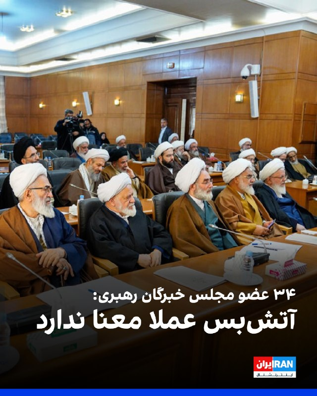

۳۴ عضو مجلس خبرگان رهبری در بیانیه‌ای اعلام کردند: «مطابق بیان علی خامنه‌ای، در موضوع مذاکرات با دشمن امر محرمانه و مخفی وجود ندارد» و «اطلاع‌رسانی شفاف مسئولان» در این زمینه را مصداق همدلی با مردم دانستند.

به گزارش خبرگزاری مهر، این اعضای مجلس خبرگان رهبری درباره مذاکرات و تفاهم احتمالی واشینگتن و تهران اعلام کردند «فصل‌الخطاب» در این موضوع، تدابیر مجتبی خامنه‌ای و خطوط قرمز و چارچوب تعیین‌شده از سوی اوست و هرگونه عدول از این خطوط قرمز «اقدامی نامشروع و غیرقابل پذیرش» خواهد بود.

۳۴ عضو مجلس خبرگان رهبری با اشاره به «محاصره دریایی» و حملات اسرائیل به لبنان اعلام کردند وضعیت رویارویی با دشمن همچنان «در وضعیت جنگی» است و «مفهومی به نام آتش‌بس عملا معنا ندارد.»
‌🏁 🇬🇧 IranintlTV

🤖 @VahidOOnLine

## VahidOOnLine — post 245554

  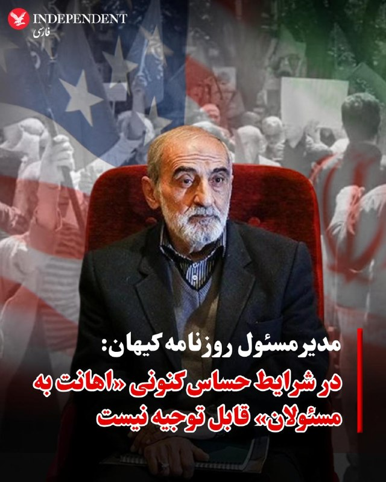

♦️همزمان با افزایش تنش‌ها میان تهران و واشنگتن و در آستانه امضای توافق صلح میان دوکشور، حسین شریعتمداری، مدیرمسئول روزنامه کیهان روز یکشنبه، ۲۴ خردادماه، در یادداشتی نوشت: «بدیهی است که خود رهبر (علی خامنه‌ای) نیز نقد منصفانه و خیرخواهانه را ضروری می‌دانست چرا که اگر خطای مسئولان مورد نقد قرار نگیرد و درباره آن روشنگری نشود، خطر انحراف در پیش است، اما اهانت به مسئولان، در شرایط حساس کنونی قابل توجیه نیست». این اظهارات درحالی مطرح شد که گروهی از حامیان جمهوری اسلامی، در آستانه امضای توافق میان تهران و واشنگتن، با متهم کردن محمدباقر قالیباف، رییس مجلس شورای اسلامی و عباس عراقچی، وزیر امور خارجه، به دادن «امتیازهای بیش از حد به آمریکا» در مذاکرات، خواستار استعفای آنها شدند.
‌🇸🇦 Indypersian

🤖 @VahidOOnLine

## WithYashar — post 14887

نیویورک‌تایمز: قطر در تلاشه تا اختلافات باقی مونده میان آمریکا و جمهوری اسلامی رو حل کنه تا همین امشب توافق امضا بشه.
@withyashar

## WithYashar — post 14886

  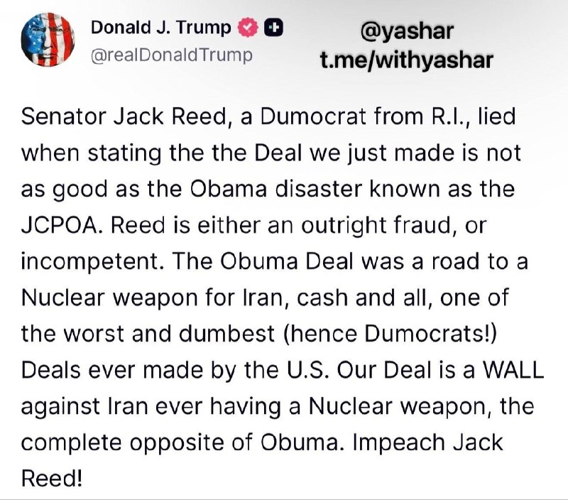

ترامپ در‌تروث : جک رید، سناتور رود آیلند، گفته توافقی که الان بستیم از توافق زمان اوباما هم بدتره
به نظر من یا داره عمداً دروغ میگه یا اصلاً نمی‌فهمه موضوع چیه
توافق اوباما عملاً راه رو برای رسیدن ایران به سلاح هسته‌ای باز می‌کرد و کلی پول هم بهشون می‌رسوند؛
یکی از بدترین و احمقانه‌ترین توافق‌هایی که آمریکا تا حالا بسته بود
اما توافقی که ما الان انجام دادیم دقیقاً برعکسه؛ مثل یه دیوار محکم جلوی هرگونه دسترسی ایران به سلاح هسته‌ای رو می‌گیره
مقایسه کردن این دو تا اصلاً منطقی نیست. جک رید باید پاسخگو باشه
@withyashar

## mwarmonitor — post 10923

  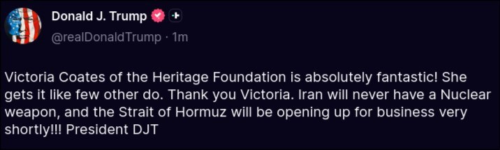

🔴«ویکتوریا کوتس از بنیاد هریتج کاملاً فوق‌العاده است! او موضوع را طوری درک می‌کند که کمتر کسی می‌تواند. ممنون، ویکتوریا. ایران هرگز به سلاح هسته‌ای دست نخواهد یافت، و تنگه هرمز به‌زودیِ زود برای تجارت و کسب‌و‌کار باز خواهد شد!!!

رئیس‌جمهور دونالد جی ترامپ

@mwarmonitor

## mwarmonitor — post 10922

🔴«دقایقی پیش رئیس‌جمهور ترامپ و نخست‌وزیر نتانیاهو گفت‌وگو کردند. ترامپ، نتانیاهو را در جریان پیشرفت‌ها برای امضای توافق با ایران قرار داد؛ توافقی که ممکن است حتی از امشب امضا شود. – کانال ۱۲»

@mwarmonitor

## pm_afshaa — post 93979

  <a href="telegram/content/pm_afshaa_93979_1781469753.webm" target="_blank">🎬 Download video</a>

🔴کانال 12 اسرائیل:
دقایقی پیش نتانیاهو و ترامپ در مورد ایران گفت‌و‌گوی تلفنی کردن.

ترامپ، نتانیاهو رو در جریان پیشرفت‌ها برای امضای توافق با جمهوری اسلامی قرار داد؛ توافقی که ممکنه حتی از امشب امضا بشه.

💧 Rainbet.com the #1 Non-KYC Crypto Casino & Sportsbook @rainbetcom

😁 @Pm_Afshaa

## pm_afshaa — post 93978

  <a href="telegram/content/pm_afshaa_93978_1781469753.webm" target="_blank">🎬 Download video</a>

🔴توییت سفارت ایران تو غنا:

💧 Rainbet.com the #1 Non-KYC Crypto Casino & Sportsbook @rainbetcom

😁 @Pm_Afshaa

## pm_afshaa — post 93977

  <a href="telegram/content/pm_afshaa_93977_1781469754.webm" target="_blank">🎬 Download video</a>

🔴پست جدید ترامپ:

سناتور جک رید، سناتور دموکرات از رود آیلند، وقتی گفت توافقی که ما انجام دادیم به اندازه فاجعه توافق اوباما و برجام بد نیست، دروغ گفت. او یا یک کلاهبردار تمام‌عیار است، یا کاملاً بی‌کفایت.

توافق اوباما راه رو برای هسته‌ای شدن ایران باز کرد و یکی از بدترین توافق‌های تاریخ آمریکا بود. توافق ما یک دیوار محکم مقابل هسته‌ای شدن ایران است؛ دقیقاً برعکس توافق اوباما. جک رید باید استیضاح بشه.

💧 Rainbet.com the #1 Non-KYC Crypto Casino & Sportsbook @rainbetcom

😁 @Pm_Afshaa

## VahidOnline — post 76344

پست‌های ترامپ، ترجمه ماشین:
سناتور جک رید، یک «دموکرات» از رود آیلند، وقتی گفت توافقی که ما همین حالا انجام دادیم به خوبی فاجعه اوباما، معروف به برجام، نیست، دروغ گفت. رید یا یک کلاهبردار تمام‌عیار است یا بی‌کفایت. توافق اوباما مسیری به سوی سلاح هسته‌ای برای ایران بود، همراه با پول نقد و همه چیز؛ یکی از بدترین و احمقانه‌ترین توافق‌هایی که آمریکا تا به حال انجام داده است؛ به همین دلیل هم می‌گویم «دموکرات‌های احمق»! توافق ما دیواری در برابر دستیابی ایران به سلاح هسته‌ای است؛ درست نقطه مقابل اوباما. جک رید را استیضاح کنید!
(توضیح ماشین: در متن اصلی چند غلط املایی عمدی هست: «Dumocrat / Dumocrats» به‌جای Democrat/Democrats برای تحقیر دموکرات‌ها، و «Obuma» به‌جای Obama.)
realDonaldTrum
ویکتوریا کوتس از بنیاد هریتیج واقعاً فوق‌العاده است! او موضوع را مثل تعداد کمی از دیگران می‌فهمد. متشکرم ویکتوریا.
ایران هرگز سلاح هسته‌ای نخواهد داشت و تنگه هرمز هم به‌زودی برای تجارت باز خواهد شد!!!
رئیس‌جمهور دی‌جی‌تی
realDonaldTrump

📡 @VahidOnline

## IranIntlTV — post 342359

  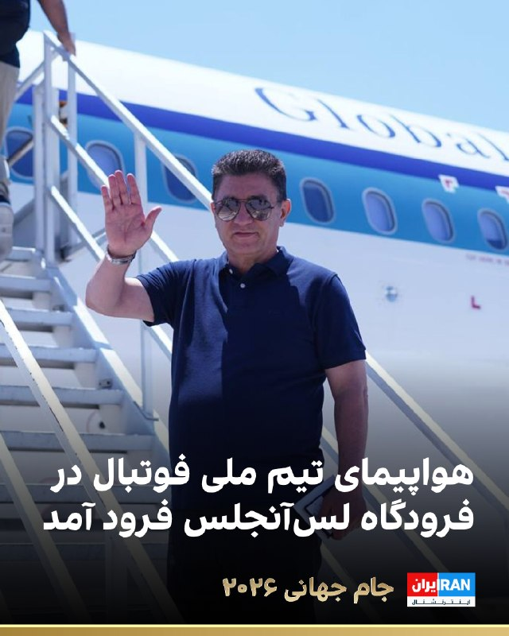

🔻هواپیمای حامل اعضای تیم ملی فوتبال که ساعتی قبل از تیخوانا به پرواز درآمده بود، در فرودگاه بین‌المللی لس‌آنجلس فرود آمد. اعضای تیم ملی فوتبال در حالی برای بازی بامداد سه‌شنبه برابر نیوزیلند وارد آمریکا شدند که بلافاصله پس از این مسابقه باید خاک آمریکا را ترک کرده و به مکزیک برگردند.

🔹امیر قلعه‌نویی و مهدی طارمی از ساعاتی دیگر در نشست خبری پیش از بازی حاضر خواهند شد.

@iranintltvsport

## IranIntlTV — post 342358

  

۳۴ عضو مجلس خبرگان رهبری در بیانیه‌ای اعلام کردند: «مطابق بیان علی خامنه‌ای، در موضوع مذاکرات با دشمن امر محرمانه و مخفی وجود ندارد» و «اطلاع‌رسانی شفاف مسئولان» در این زمینه را مصداق همدلی با مردم دانستند.

به گزارش خبرگزاری مهر، این اعضای مجلس خبرگان رهبری درباره مذاکرات و تفاهم احتمالی واشینگتن و تهران اعلام کردند «فصل‌الخطاب» در این موضوع، تدابیر مجتبی خامنه‌ای و خطوط قرمز و چارچوب تعیین‌شده از سوی اوست و هرگونه عدول از این خطوط قرمز «اقدامی نامشروع و غیرقابل پذیرش» خواهد بود.

۳۴ عضو مجلس خبرگان رهبری با اشاره به «محاصره دریایی» و حملات اسرائیل به لبنان اعلام کردند وضعیت رویارویی با دشمن همچنان «در وضعیت جنگی» است و «مفهومی به نام آتش‌بس عملا معنا ندارد.»
https://iranintl.com/202606146980

## Shin_Persian — post 7078

  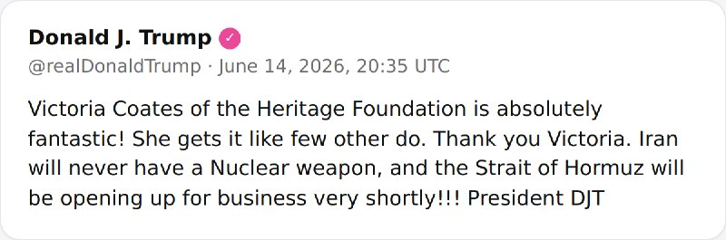

Shin ✓ @hey_itsmyturn
Sun, 14 Jun 2026 20:40:30 UTC

POTUS:
"Victoria Coates of the Heritage Foundation is absolutely fantastic! She gets it like few other do. Thank you Victoria. Iran will never have a Nuclear weapon, and the Strait of Hormuz will be opening up for business very shortly!!! President DJT"

ترجمه خودکار فارسی

رئیس‌جمهور ایالات متحده (POTUS):
«ویکتوریا کوتس از بنیاد هریتیج کاملاً فوق‌العاده است! او مسائل را طوری درک می‌کند که کمتر کسی متوجه می‌شود. متشکرم ویکتوریا. ایران هرگز سلاح هسته‌ای نخواهد داشت و تنگه هرمز به‌زودی برای تجارت باز خواهد شد!!! پرزیدنت دی‌جی‌تی (DJT)»

𝕏 · @shin_persian

## Persian_Trend_Official — post 17115

  <a href="telegram/content/Persian_Trend_Official_17115_1781469756.webm" target="_blank">🎬 Download video</a>

دونالد ترامپ در تروث سوشال: ایران هرگز سلاح هسته‌ای نخواهد داشت و تنگه هرمز خیلی زود برای تجارت باز خواهد شد!!!

📝 Amir

📌 @persian_trend_official
پرشین ترند | متفاوت‌ترین کانال نظامی

## Persian_Trend_Official — post 17114

  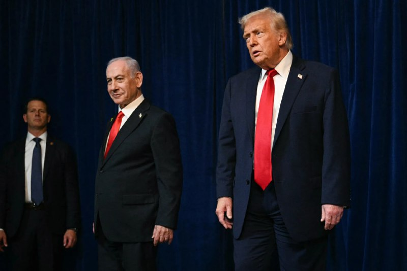

به گزارش کانال 13 اسرائیل، ترامپ اندکی پیش با نخست وزیر اسرائیل نتانیاهو صحبت کرد.

ترامپ نتانیاهو را در جریان پیشرفت در جهت نهایی کردن توافق قرار داد که احتمالاً امشب امضا خواهد شد.

📝 Amir

📌 @persian_trend_official
پرشین ترند | متفاوت‌ترین کانال نظامی

## Persian_Trend_Official — post 17113

  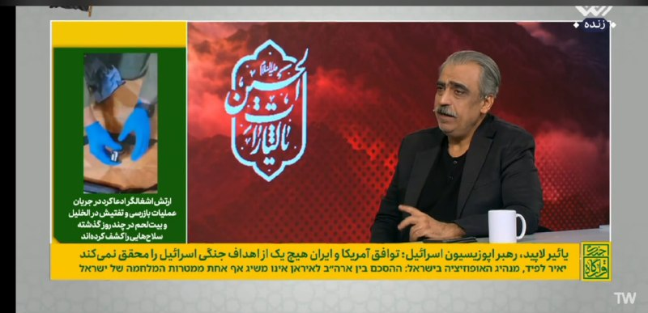

همکنون پروفسور خوش چشم شبکه افق ...

## Persian_Trend_Official — post 17112

  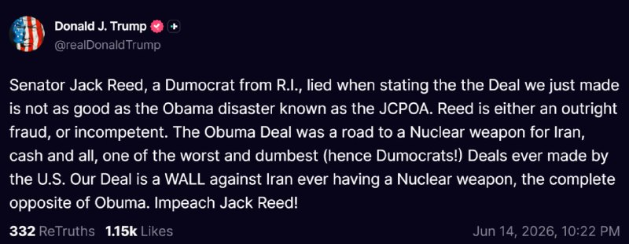

ترامپ در تروث سوشال: سناتور جک رید، یک دموکرات اهل رود آیلند، وقتی گفت توافقی که ما تازه انجام دادیم به خوبی فاجعه اوباما که به عنوان برجام شناخته می‌شود، نیست، دروغ گفت. رید یا یک کلاهبردار آشکار است یا بی‌کفایت.

توافق اوباما مسیری به سوی سلاح هسته‌ای برای ایران، چه از نظر پول و چه از نظر همه چیز، بود، یکی از بدترین و احمقانه‌ترین (از این رو دموکرات‌ها!) توافق‌هایی که تاکنون توسط ایالات متحده انجام شده است.

توافق ما دیواری است علیه ایران که تا به حال سلاح هسته‌ای داشته است، کاملاً برعکس اوباما. جک رید را استیضاح کنید!

📝 Amir

📌 @persian_trend_official
پرشین ترند | متفاوت‌ترین کانال نظامی

## alonews — post 128011

  <a href="telegram/content/alonews_128011_1781469758.webm" target="_blank">🎬 Download video</a>

👈ترامپ:ایران هرگز سلاح هسته ای نخواهد داشت و تنگه هرمز به زودی برای تجارت باز خواهد شد!!!‌

✅ @AloNews خبر جنگ

## alonews — post 128010

  <a href="telegram/content/alonews_128010_1781469758.mp4" target="_blank">🎬 Download video</a>

👈تجمع ۲۰۰ ۳۰۰نفره امشب جلوی وزارت خارجه

✅ @AloNews خبر جنگ

## alonews — post 128009

  <a href="telegram/content/alonews_128009_1781469759.webm" target="_blank">🎬 Download video</a>

👈فارس:
دکمه جلیلی فعلا زده نشده و همچنان سرکاره

✅ @AloNews خبر جنگ

---
📅 بروزرسانی: 1405/03/25 00:02
---

## VahidOOnLine — post 245553

  <a href="telegram/content/VahidOOnLine_245553_1781469149.mp4" target="_blank">🎬 Download video</a>

♦️مسعود پزشکیان، رئیس‌جمهوری ایران، روز یکشنبه ۲۴ خردادماه در نشستی با مدیران رسانه‌ها گفت شورای‌عالی امنیت ملی با قاطعیت به ادامه مسیر مذاکره رای داده و این مصوبه مبنای عمل در موضوع گفت‌وگوها است.

او افزود درباره مذاکرات، مصوبه شورای‌عالی امنیت ملی ملاک عمل است و هرچه مورد تایید و صلاحدید مجتبی خامنه‌ای قرار گیرد، برای همه «لازم‌الاتباع» خواهد بود. پزشکیان تاکید کرد حتی اگر نظر شخصی‌اش متفاوت باشد، خود را موظف به تبعیت از «تصمیم نهایی نظام» می‌داند.

رئیس‌جمهوری ایران همچنین گفت تصمیم‌گیری درباره جنگ و مذاکره بر عهده مجتبی خامنه‌ای و شورای‌عالی امنیت ملی است. او افزود کسانی که به وحدت و انسجام ملی باور دارند، باید تصمیمات این شورا را که «برآیند نظر تمامی ارکان نظام» است، مبنای عمل قرار دهند.
‌🇸🇦 Indypersian

🤖 @VahidOOnLine

## VahidOOnLine — post 245552

  

شبکه سی‌ان‌ان به نقل از یک منبع اسرائیلی گزارش داد بنیامین نتانیاهو، نخست‌وزیر اسرائیل، در تلاش است پس از پایان نشست گروه هفت، دیداری فوری با دونالد ترامپ، رییس‌جمهوری آمریکا، داشته باشد.

به گفته این منبع، نتانیاهو در پی آن است که این دیدار پس از بازگشت ترامپ از نشست گروه هفت در اروپا در ابتدای هفته آینده یا اندکی پس از آن برگزار شود.

این تلاش در شرایطی صورت می‌گیرد که به نظر می‌رسد تنش‌ها بر سر مذاکرات با جمهوری اسلامی و آتش‌بس با حزب‌الله در لبنان افزایش یافته است.
‌🏁 🇬🇧 IranintlTV

🤖 @VahidOOnLine

## WithYashar — post 14885

## mwarmonitor — post 10921

🔴 ترامپ

🔸«سناتور جک رید، یک "دموکراتِ احمق" (Dumocrat) از ایالت رود آیلند، دروغ گفت وقتی اعلام کرد توافقی که ما تازه به آن دست یافته‌ایم، به خوبیِ فاجعهٔ اوباما یعنی همان برجام (JCPOA) نیست. رید یا یک شیادِ تمام‌عیار است یا فردی بی‌کفایت.
توافقِ "اوبوما" (Obuma)، با آن همه پول نقد و تمام چیزهای دیگر، جاده‌صاف‌کنِ رسیدن ایران به سلاح هسته‌ای بود؛ یکی از بدترین و احمقانه‌ترین (به همین دلیل می‌گویم دموکرات‌های احمق!) توافق‌هایی که ایالات متحده تا به حال امضا کرده است.
توافقِ ما، یک دیوار محکم در برابر دستیابی ایران به سلاح هسته‌ای است؛ دقیقاً نقطهٔ مقابلِ اوبوما. جک رید را استیضاح کنید!»

@mwarmonitor

## pm_afshaa — post 93976

  <a href="telegram/content/pm_afshaa_93976_1781469151.webm" target="_blank">🎬 Download video</a>

🔴سی‌ان‌ان به نقل از یک دیپلمات مطلع: مذاکره‌کنندگان قطری هنوز در تهران هستن تا اطمینان حاصل کنن که مذاکرات در مسیر خودش باقی می‌مونه. مذاکره‌کنندگان قطری با هماهنگی آمریکا در تهران به سر می‌برن! 
💧 Rainbet.com the #1 Non-KYC Crypto Casino & Sportsbook @rainbetcom…

## IranIntlTV — post 342357

  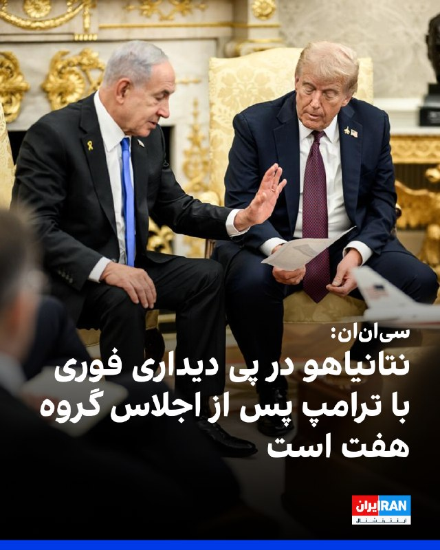

شبکه سی‌ان‌ان به نقل از یک منبع اسرائیلی گزارش داد بنیامین نتانیاهو، نخست‌وزیر اسرائیل، در تلاش است پس از پایان نشست گروه هفت، دیداری فوری با دونالد ترامپ، رییس‌جمهوری آمریکا، داشته باشد.

به گفته این منبع، نتانیاهو در پی آن است که این دیدار پس از بازگشت ترامپ از نشست گروه هفت در اروپا در ابتدای هفته آینده یا اندکی پس از آن برگزار شود.

این تلاش در شرایطی صورت می‌گیرد که به نظر می‌رسد تنش‌ها بر سر مذاکرات با جمهوری اسلامی و آتش‌بس با حزب‌الله در لبنان افزایش یافته است.
https://iranintl.com/202606142179

## Shin_Persian — post 7077

  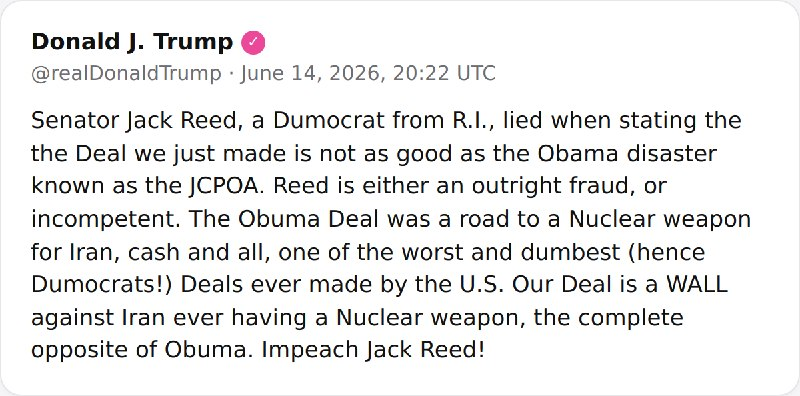

Shin ✓ @hey_itsmyturn
Sun, 14 Jun 2026 20:25:24 UTC

POTUS:
"Senator Jack Reed, a Dumocrat from R.I., lied when stating the the Deal we just made is not as good as the Obama disaster known as the JCPOA. Reed is either an outright fraud, or incompetent. The Obuma Deal was a road to a Nuclear weapon for Iran, cash and all, one of the worst and dumbest (hence Dumocrats!) Deals ever made by the U.S. Our Deal is a WALL against Iran ever having a Nuclear weapon, the complete opposite of Obuma. Impeach Jack Reed!"

ترجمه خودکار فارسی در بخش نظرات

𝕏 · @shin_persian

## FarsiVOA — post 220723

  <a href="telegram/content/FarsiVOA_220723_1781469153.mp4" target="_blank">🎬 Download video</a>

⚡️بسته‌شدن صفحه یوتیوب مقامات و نهادهای حکومتی جمهوری اسلامی؛ گفت‌‌وگو با علیرضا رایگانی
@FarsiVOA

## FarsiVOA — post 220722

🔺ارتش اسرائیل: حزب‌الله باز هم آتش‌بس را نقض کرد

▪️ارتش اسرائیل روز یکشنبه ۲۴ خرداد اعلام کرد که حزب‌الله بار دیگر آتش‌بس میان را نقض کرده و یک پرتابه از خاک لبنان وارد شمال اسرائیل شده است.

⬇️ بیشتر بخوانید:
https://ir.voanews.com/a/israel-says-hezbollah-broke-ceasefire-again/8160741.html
@FarsiVOA

## DW_Farsi — post 125981

  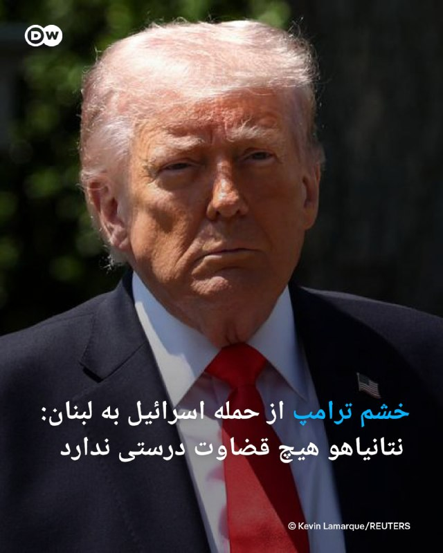

🔶 خشم ترامپ از حمله اسرائیل به لبنان: نتانیاهو هیچ قضاوت درستی ندارد

دونالد ترامپ، رئیس‌جمهور آمریکا حمله متقابل اسرائیل در لبنان را محکوم کرد. او در شبکه اجتماعی خود، تروث سوشال نوشت که این حمله در نزدیکی بیروت نباید انجام می‌شد، "به‌ویژه در چنین روز مهمی که ما تا این حد به یک توافق صلح با ایران نزدیک شده‌ایم".

پایگاه خبری آکسیوس نیز اندکی بعد از ترامپ نقل کرد که درباره اقدام اسرائیل گفته است: «این واقعاً افتضاح است؛ نمی‌توانستم آن را باور کنم. فقط یک ساعت مانده بود تا توافق را امضا کنیم.»

او همچنین درباره بنیامین نتانیاهو، نخست‌وزیر اسرائیل گفت: «چرا بی‌بی (نتانیاهو) باید چنین حمله لعنتی‌ای را آغاز می‌کرد؟ من واقعاً عصبانی شدم. این را هم به او گفتم. او مطلقاً از قضاوت درستی برخوردار نیست.»

پس از حملات نیروهای حزب‌الله به شمال اسرائیل، نیروی هوایی اسرائیل روز یکشنبه ۱۴ ژوئن (۲۴ خرداد) بار دیگر اهدافی را در منطقه جنوب بیروت هدف قرار داد.

@dw_farsi

## alonews — post 128008

  <a href="telegram/content/alonews_128008_1781469155.webm" target="_blank">🎬 Download video</a>

👈ترامپ : جک رید، سناتور رود آیلند، گفته توافقی که الان بستیم از توافق زمان اوباما هم بدتره

- به نظر من یا داره عمداً دروغ میگه یا اصلاً نمی‌فهمه موضوع چیه

- توافق اوباما عملاً راه رو برای رسیدن ایران به سلاح هسته‌ای باز می‌کرد و کلی پول هم بهشون می‌رسوند؛

- یکی از بدترین و احمقانه‌ترین توافق‌هایی که آمریکا تا حالا بسته بود

اما توافقی که ما الان انجام دادیم دقیقاً برعکسه؛ مثل یه دیوار محکم جلوی هرگونه دسترسی ایران به سلاح هسته‌ای رو می‌گیره

- مقایسه کردن این دو تا اصلاً منطقی نیست. جک رید باید پاسخگو باشه

✅ @AloNews خبر جنگ

<!-- MSG END -->

<!-- NAV START -->

<!-- NAV END -->
