# خواننده تلگرام

<!-- TOP_NAV START -->

<a href="https://github.com/ProAlit/aio-downloader/blob/main/telegram/content/archive_1.md" style="display:inline-block; padding:6px 12px; margin:0 4px; background-color:#2ea44f; color:white; text-decoration:none; border-radius:4px; font-weight:bold;">صفحه بعد</a>

<!-- TOP_NAV END -->

<!-- MSG START -->

---
📅 بروزرسانی: 1405/03/20 18:14
---

## VahidOOnLine — post 244698

  

شورای حکام آژانس بین‌المللی انرژی اتمی با ۲۱ رای موافق، ۳ رای مخالف و ۱۰ رای ممتنع قطعنامه پیشنهادی آمریکا درباره برنامه هسته‌ای جمهوری اسلامی را تصویب کرد.

قطعنامه شورای حکام از تهران خواسته فورا با آژانس بین‌المللی انرژی اتمی همکاری کرده و اجازه بدهد بازرسان آژانس از همه تاسیسات هسته‌ای در ایران بازرسی کنند.

این قطعنامه همچنین از جمهوری اسلامی می‌خواهد آمار دقیق مواد هسته‌ای، از جمله بیش از ۴۴۰ کیلوگرم اورانیوم ۶۰ درصد غنی‌شده را به آژانس بین‌المللی انرژی اتمی اعلام کند.
‌🏁 🇬🇧 IranintlTV

🤖 @VahidOOnLine

## VahidOOnLine — post 244697

  

♦️دونالد ترامپ، رئیس‌جمهوری آمریکا در گفتگو با شبکه فاکس‌نیوز اعلام کرد که دلیل سقوط روز دوشنبه بالگرد آپاچی آمریکا در نزدیکی تنگه هرمز، یک پهپاد ایرانی بوده که در بدنه این پرنده نظامی و در فضای میان دو خدمه آن گیر کرده بود.

به گزارش فاکس‌نیوز و به نقل از گفتگوی تلفنی ترامپ با تری اینگست، خبرنگار این شبکه در روز چهارشنبه، این بالگرد آپاچی در ارتفاع پایین در حال پرواز بوده که پهپاد ایرانی بدون منفجر شدن، درون این بالگرد جنگنده گیر می‌کند. بر اساس این گزارش، خلبانان پس از این اتفاق بالگرد را به همراه پهپادی که درون آن بوده، به پایین هدایت کرده و در آب افتاده‌اند.

در پی این حادثه در شامگاه دوشنبه، فرماندهی مرکزی آمریکا (سنتکام) اعلام کرد که «حملات دفاع مشروع» را علیه اهدافی در ایران انجام داده است؛ حملاتی که در ادامه منجر به پاسخ تلافی‌جویانه ایران و هدف قرار گرفتن تأسیسات نظامی آمریکا در سراسر خلیج فارس شد.
‌🇸🇦 Indypersian

🤖 @VahidOOnLine

## WithYashar — post 14323

کاخ‌سفید اعلام کرده ترامپ قراره ساعت ۱۷:۳۰ به وقت واشنگتن ( ۱ صبح تهران ) سخنرانی اضطراری داشته باشه
@withyashar

## mwarmonitor — post 10617

🔴دیشب، دونالد ترامپ در سخنانی عمومی نسبت به بقای سیاسی بنیامین نتانیاهو ابراز تردید کرد و به‌طور آشکار احتمال کناره‌گیری او از نخست‌وزیری را مطرح ساخت. ترامپ در گفت‌وگو با شبکه ABC اعلام کرد آینده سیاسی نتانیاهو «یک پرسش باز» است و با لحنی تحقیرآمیز پرسید: «آیا او می‌خواهد به کار ادامه دهد؟ چون می‌دانید، او یک نخست‌وزیر زمان جنگ است.»

📌این طعنه از سوی متحد آمریکایی‌ای که زمانی بسیار حامی او بود، در حالی مطرح می‌شود که نتانیاهو با ضعف داخلی عمیقی روبه‌رو است؛ به‌طوری که یک نظرسنجی اخیر نشان می‌دهد بیش از ۶۰ درصد اسرائیلی‌ها نمی‌خواهند نخست‌وزیر باسابقه در انتخابات آینده کنست نامزد شود.

واکنش رسمی حزب لیکود به اظهارات ترامپ هیچ جای ابهامی باقی نگذاشت: «نتانیاهو در انتخابات پیشِ‌رو نامزد خواهد شد—و با یاری خدا، پیروز خواهد شد.» همان‌گونه که نزدیکان نخست‌وزیر پیش‌تر گفته بودند، خودروی نتانیاهو فقط یک دنده دارد: رو به جلو.

با این حال، با وجود این افت سیاسی کنونی، تاریخ باید واقعیت‌ها را ثبت کند. نتانیاهو نخستین کسی نبود که درباره ایران سخن گفت و قطعاً تنها فرد نیز نبوده است. اما او منسجم‌ترین رهبر اسرائیل، و در کل جهان، در تمرکز بر این تهدید بوده است. او این کار را در برابر حجم زیادی از تمسخرها و اتهاماتی انجام داد که تهدید ایران را صرفاً یک مانور سیاسی می‌دانستند.

فراتر از همه، او کسی است که ارتش اسرائیل (IDF) را همراه با ایالات متحده، دو بار در فاصله یک سال، برای تضعیف جدی‌ترین تهدید وجودی علیه دولت اسرائیل هدایت کرد. بنابراین، او به‌طور کامل و شایسته سزاوار دریافت اعتبار کامل برای این اتحاد تاریخی است.

با این حال، یک پرسش باقی می‌ماند: نتانیاهو اکنون که جایگاه داخلی‌اش متزلزل شده و سرمایه سیاسی‌اش در حال کاهش است، چه خواهد کرد؟ اگر گفته ترامپ به ABC News درست باشد—اینکه «ما به‌زودی به هر شکل در جنگ پیروز خواهیم شد»—در این صورت مأموریت سیاسی نتانیاهو در قبال ایران در آستانه تکمیل شدن است.

با نزدیک شدن به پایان احتمالی این مأموریت بزرگ، اصرار او بر نامزدی با یک قانون سخت سیاست روبه‌رو می‌شود: در انتخابات، برای مأموریت‌های انجام‌شده رأی داده نمی‌شود—بلکه برای مشکلات آینده رأی داده می‌شود. آمیت سیگال خبرنگار کانال ۱۲

@mwarmonitor

## FoxNewsTwitter — post 342804

  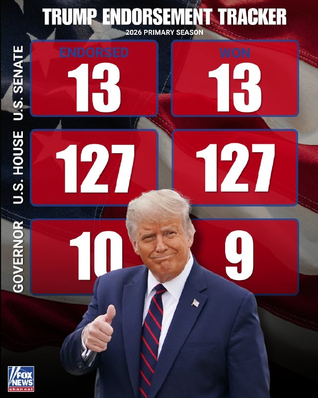

Fox News (Twitter/X)

President Trump boosting his endorsement record after last night’s primaries across the country.

Following Tuesday’s elections, Trump-endorsed candidates are 149-1 in Republican primaries, giving the president a 99% success rate.

The results are adding to the growing evidence that Trump’s backing remains one of the most powerful forces in GOP politics.

## FoxNewsTwitter — post 342803

Fox News (Twitter/X)

WATCH LIVE: House hearing on NFL streaming, sports broadcasting rules https://twitter.com/i/broadcasts/1NGarreBBQbJj

## DEJradio — post 5544

  <a href="telegram/content/DEJradio_5544_1781102655.mp4" target="_blank">🎬 Download video</a>

🔺📢 حکومت برای بقا نظامی‌ها را به کشتن می‌دهد

شهاب عنایتی پرسنل سابق نیروی هوایی با اشاره به کشته شدن دو ارتشی نیروی پدافند در حملات اسراییل می‌گوید، «حکومت جنگ‌طلب برای بقای خودش نظامی‌ها را قربانی می‌کند».

#جنگ #جمهوری_اسلامی
@DEJradio

## VahidOnline — post 76145

  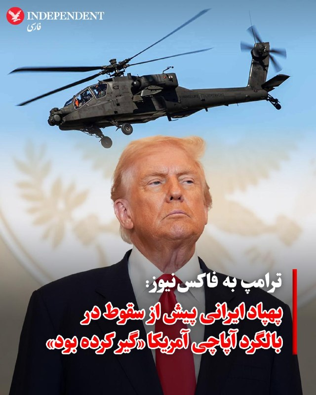

♦️دونالد ترامپ، رئیس‌جمهوری آمریکا در گفتگو با شبکه فاکس‌نیوز اعلام کرد که دلیل سقوط روز دوشنبه بالگرد آپاچی آمریکا در نزدیکی تنگه هرمز، یک پهپاد ایرانی بوده که در بدنه این پرنده نظامی و در فضای میان دو خدمه آن گیر کرده بود.

به گزارش فاکس‌نیوز و به نقل از گفتگوی تلفنی ترامپ با تری اینگست، خبرنگار این شبکه در روز چهارشنبه، این بالگرد آپاچی در ارتفاع پایین در حال پرواز بوده که پهپاد ایرانی بدون منفجر شدن، درون این بالگرد جنگنده گیر می‌کند. بر اساس این گزارش، خلبانان پس از این اتفاق بالگرد را به همراه پهپادی که درون آن بوده، به پایین هدایت کرده و در آب افتاده‌اند.

در پی این حادثه در شامگاه دوشنبه، فرماندهی مرکزی آمریکا (سنتکام) اعلام کرد که «حملات دفاع مشروع» را علیه اهدافی در ایران انجام داده است؛ حملاتی که در ادامه منجر به پاسخ تلافی‌جویانه ایران و هدف قرار گرفتن تأسیسات نظامی آمریکا در سراسر خلیج فارس شد.
@VahidOOnLine

📡 @VahidOnline

## IranIntlTV — post 341506

  <a href="telegram/content/IranIntlTV_341506_1781102659.mp4" target="_blank">🎬 Download video</a>

شیدا رهبری، فعال دانشجویی، درباره تشکیل پرونده قضایی برای دانشجویانی که در تجمعات دی‌ماه سال گذشته در دانشگاه‌ها پرچم شیر و خورشید را به دانشگاه آوردند یا پرچم جمهوری اسلامی را آتش زدند، گفت: «بازگشت نسل جوان به هویت ملی و ایرانی، برای جمهوری اسلامی شکست روایت‌های خود است.»
@iranintltv

## IranIntlTV — post 341505

  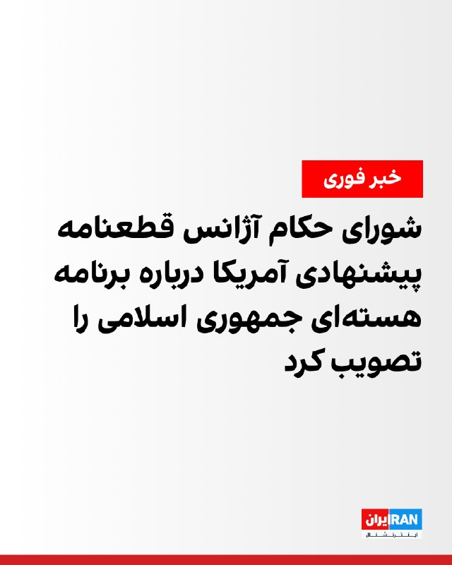

شورای حکام آژانس بین‌المللی انرژی اتمی با ۲۱ رای موافق، ۳ رای مخالف و ۱۰ رای ممتنع قطعنامه پیشنهادی آمریکا درباره برنامه هسته‌ای جمهوری اسلامی را تصویب کرد.

قطعنامه شورای حکام از تهران خواسته فورا با آژانس بین‌المللی انرژی اتمی همکاری کرده و اجازه بدهد بازرسان آژانس از همه تاسیسات هسته‌ای در ایران بازرسی کنند.

این قطعنامه همچنین از جمهوری اسلامی می‌خواهد آمار دقیق مواد هسته‌ای، از جمله بیش از ۴۴۰ کیلوگرم اورانیوم ۶۰ درصد غنی‌شده را به آژانس بین‌المللی انرژی اتمی اعلام کند.
https://iranintl.com/202606106646

## IranIntlTV — post 341504

  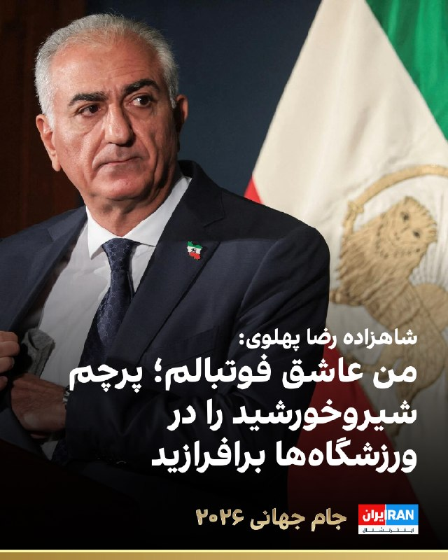

🔻شاهزاده رضا پهلوی با انتشار ویدیوی در رسانه اجتماعی ایکس درباره جام جهانی ۲۰۲۶ نوشت: «من عاشق فوتبالم. افسوس که رژیم، فوتبال را هم به سلاحی علیه مردم ایران تبدیل کرده است. پرچم ملی شیروخورشید را در ورزشگاه‌ها و هرجا فوتبال‌دوستان گرد هم می‌آیند، برافرازید.»

🔹شاهزاده رضا پهلوی همچنین نوشت: «یاد آنانی را که باید کنار ما می‌بودند، زنده نگه داریم. تیم ملی واقعی ایران، مردم ایران‌اند.»

🔹درحالی رقابت‌های جام جهانی ۲۰۲۶ از فردا آغاز خواهد شد که فیفا محدودیت‌هایی برای ورود پرچم شیروخورشید به ورزشگاه‌های محل برگزاری مسابقات اعمال کرده است.

🔹در روزهای اخیر، شماری از ایرانیان خارج از کشور، به‌ویژه در آمریکا، تلاش کرده‌اند با روش‌های مختلف به تصمیم فیفا درباره ممنوعیت ورود پرچم شیروخورشید به ورزشگاه‌های جام جهانی اعتراض کنند و راه‌هایی برای نمایش این پرچم در جریان مسابقات بیابند.

@iranintltvsport

## IranIntlTV — post 341503

  <a href="telegram/content/IranIntlTV_341503_1781102663.mp4" target="_blank">🎬 Download video</a>

ایران اینترنشنال در کارزار‌های مردمی «‌کشف حقیقت» به دنبال افشای ابعاد جنایت‌های دی ماه در شهر‌های مختلف ایران است. ما از شاهدان عینی، خانواده‌های جان‌باختگان، کادر درمان، کارکنان خدمات شهری، رانندگان، کسبه بازار و همه کسانی که اطلاعات، تصویر، ویدیو یا سندی درباره بزرگ‌ترین قتل عام خیابانی تاریخ معاصر ایران دارند دعوت می‌کنیم در این کارزار‌ها شرکت کنند و روایت‌های خود را از طریق مدیا‌بات ایران اینترنشنال برای ما ارسال کنند.
@iranintltv

## IranianMinds — post 22088

🚨 ترامپ اعلام کرد امروز ساعت ۵:۳۰ عصر به وقت ساحل شرقی آمریکا ( به وقت پا ۱ صبح ) یک سخنرانی فوری انجام میده.

@IranianMinds

## Dirty_Kids — post 391585

  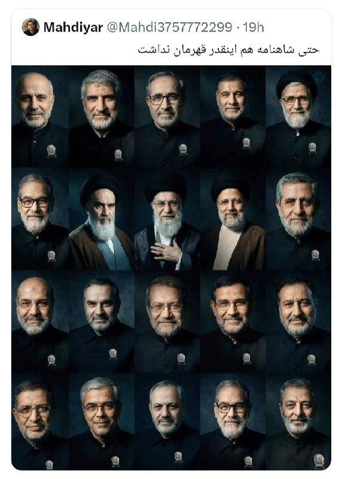

دمپایی رو بکوبونی وسط صفحه شطرنج هم طبیعتا نباید این حجم از مهره رو از دست بدی!

@Dirty_Kids 👻

## Dirty_Kids — post 391584

  <a href="telegram/content/Dirty_Kids_391584_1781102666.mp4" target="_blank">🎬 Download video</a>

دختر عزیز نصیرزاده، وزیر دفاع که همراه با خامنه‌ای پودر شد، اول می‌گوید ماه رمضان بود و فلان، بعد یادش می‌رود و می‌گوید چون ترسیده بود ۱۰ - ۱۲ لیوان آب خورد!

@Dirty_Kids 👻

## alonews — post 126839

  <a href="telegram/content/alonews_126839_1781102668.webm" target="_blank">🎬 Download video</a>

👈هم اکنون سازمان ملل متحد: درباره بازگشت جنگ فراگیر به خاورمیانه هشدار می‌دهیم

✅ @AloNews خبر جنگ

## alonews — post 126838

  <a href="telegram/content/alonews_126838_1781102668.webm" target="_blank">🎬 Download video</a>

👈تصویب قطعنامه آمریکا در شورای حکام سازمان انرژی اتمی علیه ایران

🔴یک روز قبل از جنگ دوازده روزه هم اتفاق مشابهی در آژانس انرژی اتمی رخ داده بود.

✅ @AloNews خبر جنگ

## alonews — post 126837

  <a href="telegram/content/alonews_126837_1781102668.webm" target="_blank">🎬 Download video</a>

👈نمایندگی ایران در سازمان ملل و سایر سازمان‌های بین‌المللی در وین: ایران حقوق غیرقابل سلب خود را از جمله در پاسخ به این قطعنامه نادرست حفظ خواهد کرد.

✅ @AloNews خبر جنگ

## alonews — post 126836

  <a href="telegram/content/alonews_126836_1781102669.webm" target="_blank">🎬 Download video</a>

👈فاکس بیزنس: نرخ تورم سالانه ۴.۲ درصدی بالاترین سطح از آوریل ۲۰۲۳ تاکنون است.

🔴قیمت مواد غذایی در ماه گذشته افزایش یافت.

🔴شاخص انرژی نیز بار دیگر رشد کرد.

🔴بخش قابل توجهی از این افزایش را می‌توان به مشکلات مربوط به کودهای شیمیایی که از خاورمیانه تأمین می‌شوند نسبت داد؛ از جمله اختلال در محموله‌ها و افزایش قیمت این محصولات.

✅ @AloNews خبر جنگ

## alonews — post 126835

  <a href="telegram/content/alonews_126835_1781102669.webm" target="_blank">🎬 Download video</a>

👈 فاکس نیوز به نقل از یک مقام ارشد کاخ سفید در واکنش به پست ترامپ اعلام کرد:
مذاکرات با ایران همچنان به صورت غیررسمی در جریان است.

✅ @AloNews خبر جنگ

---
📅 بروزرسانی: 1405/03/20 18:03
---

## VahidOOnLine — post 244696

  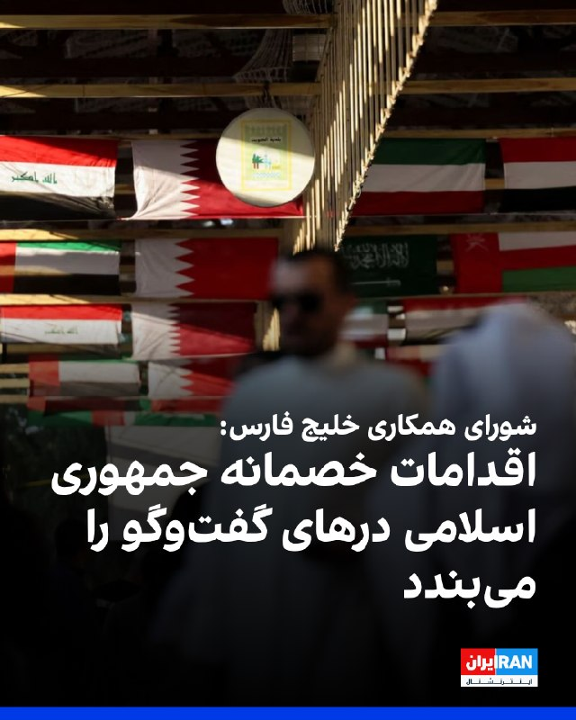

وزرای خارجه شورای همکاری خلیج فارس در بیانیه‌ای اعلام کردند جمهوری اسلامی را مسئول حملات اخیر می‌دانند و تاکید کردند این اقدامات امنیت منطقه را تهدید می‌کند.

در این بیانیه آمده است اقدامات خصمانه جمهوری اسلامی درهای گفت‌وگو را می‌بندد و تجاوز به ایجاد روابط کمک نمی‌کند.

وزرای خارجه شورای همکاری خلیج فارس تاکید کردند اقدامات تهران پایه‌های اعتماد را تضعیف می‌کند و به هیچ تفاهم یا نزدیکی کمکی نمی‌کند.

در این بیانیه تاکید شده برای کسانی که زبان خرد و حسن همجواری را انتخاب کنند، درِ تفاهم همچنان باز است.

وزرای خارجه شورای همکاری خلیج فارس همچنین از جمهوری اسلامی خواستند حملات را متوقف کرده و از هدف قرار دادن کشورهای عضو و منافع آن‌ها دست بردارد.

در این بیانیه آمده ادامه رویکرد تهاجمی جمهوری اسلامی تنها به انزوای بیشتر منجر خواهد شد.
‌🏁 🇬🇧 IranintlTV

🤖 @VahidOOnLine

## VahidOOnLine — post 244695

  <a href="telegram/content/VahidOOnLine_244695_1781102025.mp4" target="_blank">🎬 Download video</a>

⭕️ مادرزن مجتبی خامنه‌ای:
مجتبی پیش از ازدواج با دخترم مدرک تافل گرفته بود

♦️طیبه ماهروزاده، همسر غلامعلی حدادعادل با اشاره به دامادش، مجتبی خامنه‌ای، گفت که او پیش از خواستگاری از زهرا حدادعادل، آزمون تافل زبان انگلیسی را گذرانده بود و علاقه فراوانی به یادگیری زبان‌های خارجی داشت.
طیبه ماهروزاده، عضو هیئت علمی دانشگاه الزهرا است.زهرا حدادعادل، فرزند غلامعلی حدادعادل، در جریان حملات هوایی آمریکا و اسرائیل، در کنار پدرشوهرش علی خامنه‌ای و یکی از فرزندانش کشته شد.
‌🇸🇦 Indypersian

🤖 @VahidOOnLine

## VahidOOnLine — post 244694

  

اسحاق هرتزوگ، رییس‌جمهوری اسرائیل، در واکنش به مصاحبه جوزف عون، رییس‌جمهوری لبنان با سی‌ان‌ان، از همتای لبنانی خود خواست برای کشوری عاری از حزب‌الله و جمهوری اسلامی «مبارزه کند».

به گزارش سی‌ان‌ان، هرتزوگ گفت: «اسرائیل نمی‌تواند هیچ حمله‌ای به شهروندان خود یا هیچ حمله‌ای از آن سوی مرزهایش را بپذیرد. ما حق کامل دفاع از خود را داریم و تا زمانی که ترتیبی روشن برای حفاظت از ملت ما وجود نداشته باشد، حرکت به جلو ممکن نخواهد بود. بنابراین این در دستان شماست؛ برای آن مبارزه کنید.»

هرتزوگ که از شمال اسرائیل و در نزدیکی مرز لبنان سخن می‌گفت، خطاب به عون و مردم لبنان گفت «دست صلح» به سوی عون دراز می‌کند و افزود اگر لبنان و اسرائیل بخواهند به سوی صلح حرکت کنند، لبنان «باید از نفوذ» جمهوری اسلامی و حزب‌الله «آزاد بماند».

اسرائیل مدت‌هاست معتقد است نیروهای مسلح لبنان برای خلع سلاح حزب‌الله و دور کردن این گروه از مرز، اقدامات کافی انجام نداده‌اند.
‌🏁 🇬🇧 IranintlTV

🤖 @VahidOOnLine

## mwarmonitor — post 10616

  

📌به‌عنوان تحلیلگر سیاسی در سازمان سیا، از تخصص خود در امور بین‌الملل برای ارائه دیدگاه‌های مهم به تصمیم‌گیرندگان ارشد دولت آمریکا استفاده کنید. تحلیل شما به مدیریت چالش‌های امنیت ملی در دنیایی که به‌سرعت در حال تغییر است کمک خواهد کرد.

🔸برای اطلاعات بیشتر به cia.gov/careers مراجعه کنید.

@mwarmonitor

## pm_afshaa — post 93305

  <a href="telegram/content/pm_afshaa_93305_1781102028.webm" target="_blank">🎬 Download video</a>

🔴ترامپ اعلام کرد امروز ساعت ۵:۳۰ عصر به وقت ساحل شرقی آمریکا یک سخنرانی اضطراری برای مردم آمریکا خواهد داشت.

💧 Rainbet.com the #1 Non-KYC Crypto Casino & Sportsbook @rainbetcom

😁 @Pm_Afshaa

## VahidOnline — post 76144

  

🔸رسانه‌های مختلف به نقل از دیپلمات‌ها از سفر یک گروه مذاکره کننده قطری به تهران در روز چهارشنبه برای رسیدگی به اختلافات باقی‌مانده بین ایالات متحده و ایران خبر دادند.

🔸خبرگزاری فرانسه به نقل از دیپلماتی آگاه به این سفر نوشت که این گروه مذاکره کننده قطری «پس از مشورت با ایالات متحده» به تهران سفر کرده تا در دیدار با مقام‌های ایران «شکاف‌های باقی‌مانده را پر کنند.»

🔸رسانه‌های ایرانی نیز سفر هیئت قطری به تهران را تأیید کرده‌اند. ایسنا نوشت این هیئت برای «گفت‌وگو و تبادل نظر درباره روابط دوجانبه و تحولات منطقه‌ای» ظهر چهارشنبه وارد تهران شده است.

🔸از زمان آتش‌بس میان ایران و آمریکا و اسرائیل، پاکستان به عنوان میانجی اصلی مذاکرات صلح میان ایران و آمریکا را هدایت می‌کرد اما در هفته‌های اخیر قطر نیز به عنوان میانجی دیگر تلاش کرده تا امکان برقرای تفاهمی میان ایران و آمریکا را فراهم کند.

🔸سفر هیئت قطری به تهران ساعاتی پس از تبادل آتش واشینگتن و تهران پس از سرنگونی یک بالگرد نظامی آمریکا و همزمان با تند شدن لحن دونالد ترامپ علیه ایران انجام شده است.
@VahidHeadline

📡 @VahidOnline

## VahidOnline — post 76143

  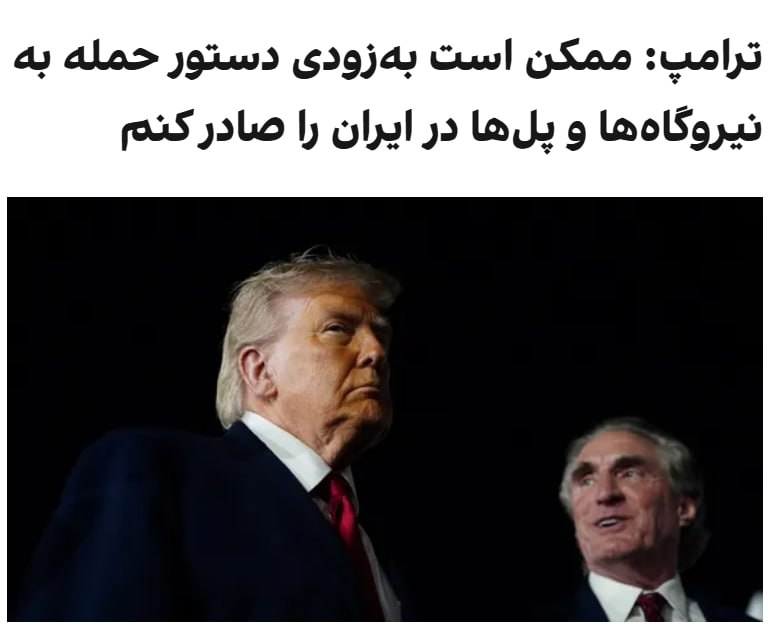

🔻ترامپ: ممکن است به‌زودی دستور حمله به نیروگاه‌ها و پل‌ها در ایران را صادر کنم

دونالد ترامپ، رییس‌جمهوری آمریکا، در مصاحبه با فاکس‌نیوز گفت ممکن است به‌زودی دستور حملات جدید به نیروگاه‌ها و پل‌ها در ایران را صادر کند.
او دلیل این موضوع را طولانی شدن روند مذاکرات از سوی جمهوری اسلامی عنوان کرد و افزود تهران دستیابی به توافق را بیش از حد به تاخیر انداخته است.
ترامپ تاکید کرد صدور دستور حملات جدید نزدیک است و گفت اگر روند مذاکرات تغییر نکند، تصمیم‌های تازه‌ای اتخاذ خواهد شد. او افزود ۵۵ درصد از سامانه‌های راداری که جمهوری اسلامی در دوران آتش‌بس بازسازی کرده بود، در حملات جدید آمریکا نابود شد.

🔻دونالد ترامپ: محاصره دریایی جمهوری اسلامی، یک دیوار فولادی است

دونالد ترامپ با انتشار پیامی در شبکه اجتماعی تروت سوشال، محاصره دریایی بنادر جنوبی ایران را کارآمد خواند و آن را به یک «دیوار فولادی» تشبیه کرد.
در این پیام آمده است: «رسانه‌های جعلی از گزارش میزان اثربخشی محاصره دریایی آمریکا خودداری می‌کنند. این موفق‌ترین محاصره در تاریخ جنگ‌های دریایی است.»
رییس‌جمهوری آمریکا ادامه داد: «ایران هیچ داد و ستدی انجام نمی‌دهد، به نیروهای نظامی خود حقوق نمی‌دهد، بدهی‌هایش را تسویه نمی‌کند و به‌سرعت در حال تبدیل شدن به یک کشور شکست‌خورده است.»

🔻ترامپ: حمله بامداد چهارشنبه جمهوری اسلامی به بالگرد آپاچی ناکام ماند

دونالد ترامپ، رییس‌جمهوری آمریکا، در مصاحبه با فاکس‌نیوز گفت در حمله بامداد چهارشنبه جمهوری اسلامی، یک پهپاد ایرانی به یک بالگرد آپاچی اصابت کرد اما منفجر نشد.
او افزود این پهپاد میان دو خلبان گیر کرد و با وجود برخورد، انفجاری رخ نداد.
ترامپ گفت خلبانان بالگرد را در دریا فرود آوردند و برای نخستین بار در تاریخ نظامی آمریکا، به وسیله یک شناور دریایی بدون سرنشین نجات پیدا کردند.
@VahidOOnLine

📡 @VahidOnline

## VahidOnline — post 76141

  <a href="telegram/content/VahidOnline_76141_1781102029.mp4" target="_blank">🎬 Download video</a>

ارتش اسرائیل ظهر چهارشنبه ۲۰ خردادماه، ساعاتی پس از صدور هشدار تخلیه برای ساکنان شهر صور و مناطق اطراف آن، این شهر در جنوب لبنان را بمباران کرد.
@VahidOOnLine
بنیامین نتانیاهو در واکنش به محکومیت حملات اسرائیل در منطقه از سوی رجب طیب اردوغان در بیانیه‌ای گفت: دولت اسرائیل و ارتش اسرائیل، که اخلاقی‌ترین ارتش جهان است، به اقدام قاطع علیه ایران و نیروهای نیابتی آن که خاورمیانه و سراسر جهان را تهدید می‌کنند، ادامه خواهند داد.
نخست‌وزیر اسرائیل در این بیانیه گفت: دیکتاتور یهودستیز اردوغان که در حال نسل‌کشی علیه کردهاست، از سازمان «تروریستی» حماس حمایت می‌کند، مردم خود را سرکوب می‌کند و مخالفان سیاسی را زندانی می‌کند، آخرین کسی است که می‌تواند برای اسرائیل موعظه اخلاقی کند.
@VahidOOnLine

📡 @VahidOnline

## IranIntlTV — post 341502

  

وزرای خارجه شورای همکاری خلیج فارس در بیانیه‌ای اعلام کردند جمهوری اسلامی را مسئول حملات اخیر می‌دانند و تاکید کردند این اقدامات امنیت منطقه را تهدید می‌کند.

در این بیانیه آمده است اقدامات خصمانه جمهوری اسلامی درهای گفت‌وگو را می‌بندد و تجاوز به ایجاد روابط کمک نمی‌کند.

وزرای خارجه شورای همکاری خلیج فارس تاکید کردند اقدامات تهران پایه‌های اعتماد را تضعیف می‌کند و به هیچ تفاهم یا نزدیکی کمکی نمی‌کند.

در این بیانیه تاکید شده برای کسانی که زبان خرد و حسن همجواری را انتخاب کنند، درِ تفاهم همچنان باز است.

وزرای خارجه شورای همکاری خلیج فارس همچنین از جمهوری اسلامی خواستند حملات را متوقف کرده و از هدف قرار دادن کشورهای عضو و منافع آن‌ها دست بردارد.

در این بیانیه آمده ادامه رویکرد تهاجمی جمهوری اسلامی تنها به انزوای بیشتر منجر خواهد شد.
https://iranintl.com/202606103890

## Shin_Persian — post 6861

Emanuel (Mannie) Fabian ✓ @manniefabian
Wed, 10 Jun 2026 14:25:39 UTC

The IDF confirms that damage was caused at the Israeli Air Force's Ramat David Airbase during Iran's ballistic missile fire on Israel earlier this week.

Yesterday, low-resolution satellite imagery showed what appeared to be an impact at a warehouse at the base.

The Israeli Air Force is still investigating what struck the warehouse, although preliminary findings point to falling fragments following an interception of an Iranian ballistic missile, and not a direct impact.

According to the military, no equipment was damaged, no injuries were caused, and there was no harm to the operational functioning of the airbase.

ترجمه خودکار فارسی

ارتش دفاعی اسرائیل (IDF) تایید می‌کند که طی حملات موشک‌های بالستیک ایران به اسرائیل در اوایل هفته جاری، خساراتی به پایگاه هوایی رمات دیوید نیروی هوایی اسرائیل وارد شده است.

دیروز، تصاویر ماهواره‌ای با وضوح پایین، آنچه را که به نظر می‌رسید محل برخورد در یک انبار در این پایگاه باشد، نشان دادند.

نیروی هوایی اسرائیل همچنان در حال بررسی این موضوع است که چه چیزی به این انبار اصابت کرده، اگرچه یافته‌های اولیه به جای برخورد مستقیم، به سقوط قطعات پس از رهگیری یک موشک بالستیک ایرانی اشاره دارد.

طبق گفته ارتش، هیچ تجهیزاتی آسیب ندیده، جراحاتی گزارش نشده و هیچ خللی در عملکرد عملیاتی این پایگاه هوایی ایجاد نشده است.

𝕏 · @shin_persian

## FarsiVOA — post 220247

  <a href="telegram/content/FarsiVOA_220247_1781102030.mp4" target="_blank">🎬 Download video</a>

وزیر دفاع آمریکا، پیت هگست، به یک پایگاه نیروی دریایی در خلیج گوانتانامو در کوبا رفت.

کمتر از دو هفته پیش نیز ژنرال فرانسیس داناون، فرمانده ارشد ناظر بر نیروهای ایالات متحده در آمریکای لاتین، با مقامات ارشد نظامی کوبا در حاشیه پایگاه دریایی آمریکا در خلیج گوانتانامو در کوبا دیدار و گفت‌وگو کرده بود.

## IranianMinds — post 22087

  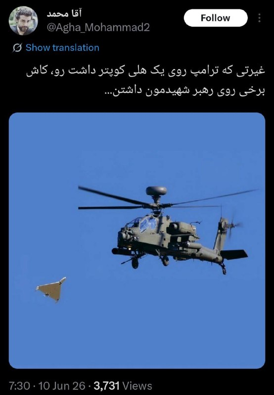

غیرتی که ترامپ روی یک هلی‌کوپتر داشت رو، کاشکی برخی روی رهبر شهیدمون داشتن.

@IranianMinds

## alonews — post 126834

  <a href="telegram/content/alonews_126834_1781102032.mp4" target="_blank">🎬 Download video</a>

👈دی ونس: در حال حاضر، احساس می‌کنم که ما در موقعیتی هستیم که بتوانیم توافقی به نفع اقتصاد ایالات متحده به دست آوریم و واقعاً به مسئله هسته‌ای ایران بپردازیم — نه فقط اکنون، نه فقط در زمانی که دونالد ترامپ رئیس‌جمهور است، بلکه برای بلندمدت.

🔴تا جایی که فرزندانم وقتی بزرگ شدند بتوانند بگویند ایران سلاح هسته‌ای نخواهد داشت.

🔴این هدف سیاست است و فکر می‌کنم ما بسیار به رسیدن به این هدف نزدیکیم، اما هنوز کارهایی برای انجام دادن داریم و به انجام آن ادامه خواهیم داد

✅ @AloNews خبر جنگ

## alonews — post 126833

  <a href="telegram/content/alonews_126833_1781102034.webm" target="_blank">🎬 Download video</a>

👈هم اکنون حمله پهپادی حزب الله به شمال اسرائیل

✅ @AloNews خبر جنگ

## alonews — post 126832

  <a href="telegram/content/alonews_126832_1781102034.webm" target="_blank">🎬 Download video</a>

🔴فوری / ترامپ اعلام کرد امروز ساعت ۵:۳۰ عصر به وقت شرق آمریکا، در یک سخنرانی اضطراری با مردم و رسانه‌ها صحبت خواهد کرد.

🔴جزئیات و محورهای این سخنرانی هنوز اعلام نشده است.

✅ @AloNews خبر جنگ

---
📅 بروزرسانی: 1405/03/20 17:53
---

## VahidOOnLine — post 244693

  

الحدث گزارش داد یوسف رجی، وزیر خارجه لبنان، گفت جنگ در خدمت دستورکارهای خارجی قرار گرفته است و مسیر مذاکرات منحصرا از سوی دولت لبنان مدیریت می‌شود.

او افزود پس از ناکامی راهکار نظامی، گزینه‌ای جز مسیر دیپلماتیک وجود ندارد.

رجی همچنین تاکید کرد سلاح حزب‌الله دیگر توجیهی ندارد.
‌🏁 🇬🇧 IranintlTV

🤖 @VahidOOnLine

## VahidOOnLine — post 244692

  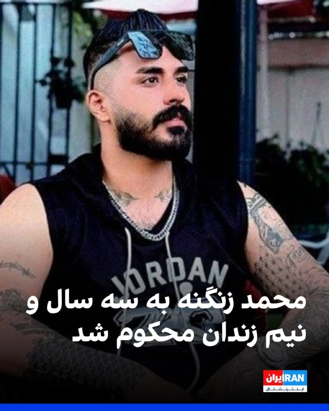

بر اساس گزارش‌های رسیده به ایران‌اینترنشنال، محمد زنگنه از سوی دستگاه قضایی به سه سال و شش ماه و یک روز حبس تعزیری محکوم شد. او یک روز پس از مراسم هفتم خسرو علیکردی و پس از انتشار ویدیویی که در آن مردم شعار «جاوید شاه» سر می‌دادند، توسط نیروهای اطلاعات در مشهد بازداشت شده بود.
‌🏁 🇬🇧 IranintlTV

🤖 @VahidOOnLine

## mwarmonitor — post 10614

⚠️ترامپ اعلام کرد امروز ساعت ۵:۳۰ عصر به وقت ساحل شرقی آمریکا یک سخنرانی اضطراری خواهد داشت.

@mwarmonitor

## VahidOnline — post 76139

رئیس‌جمهور ایالات متحده روز چهارشنبه ۲۰ خرداد گفت که ایران برای رسیدن به توافقی که می‌توانست برایش بسیار خوب باشد بیش از حد تعلل کرد و حالا باید بهای آن را بپردازد.

دونالد ترامپ در پیامی در شبکه اجتماعی خود، تروث سوشال، نوشت: «ارتش ایران کاملاً در وضعیت آشفته‌ای قرار دارد. بخش زیادی از آن، مانند نیروی دریایی و نیروی هوایی، عملاً دیگر وجود ندارد؛ آن‌ها کاملاً شکست خورده‌اند».

او افزود: «ایران فقط حرف می‌زند و عمل نمی‌کند. قلدر خاورمیانه مُرده است!!! آن‌ها برای رسیدن به توافقی که می‌توانست برایشان بسیار خوب باشد بیش از حد تعلل کردند و حالا باید بهای آن را بپردازند!!!»
@VahidHeadline

📡 @VahidOnline

## VahidOnline — post 76138

  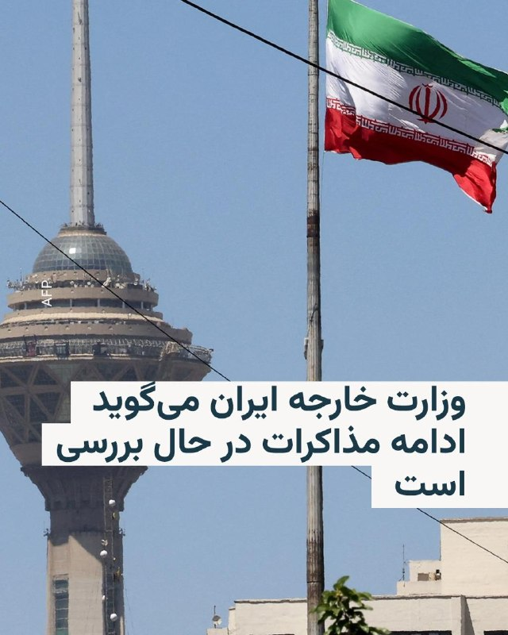

سخنگوی وزارت خارجه ایران درباره تأثیر درگیری‌های نظامی اخیر بر مذاکرات با آمریکا گفت ««باید بررسی شود، دیپلماسی و میدان دو امر جدا از هم نبوده و در امتداد و عرض یکدیگر» هستند.

اسماعیل بقائی روز چهارشنبه ۲۰ خرداد دربارهٔ آخرین وضعیت مذاکرات هم گفت: «با توجه به تحولات دیشب باید بررسی کنیم. روند دیپلماتیک در خلأ اتفاق نمی‌افتد و برای پیشبرد هر فرایند دیپلماتیکی نیازمند فضای حداقلی هستید تا بتوان روند جاری را پیش برد.»

شب گذشته ارتش ایالات متحده، در واکنش به سرنگونی یک بالگرد آمریکایی در سواحل عمان، حملاتی را به جنوب ایران انجام داد و ایران نیز در واکنش به شلیک موشک به برخی کشورهای منطقه اقدام کرد.

دونالد ترامپ که پیشتر بارها از نزدیک بودن توافق خبر داده بود، هنگام انجام عملیات آمریکا در جنوب ایران گفت: «ما توافقی بسیار خوب داشتیم و احتمالاً همچنان خواهیم داشت.»
@VahidHeadline

📡 @VahidOnline

## VahidOnline — post 76137

  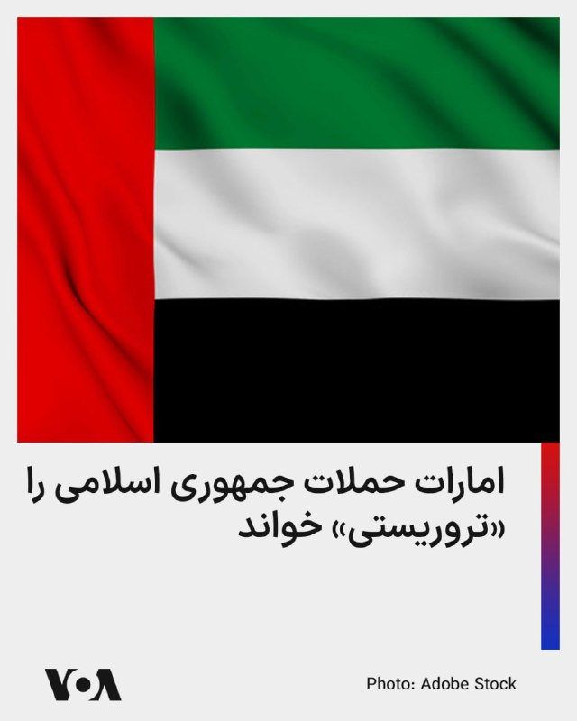

امارات متحده عربی روز چهارشنبه، حملات موشکی و پهپادی جمهوری اسلامی به بحرین، کویت و اردن را به‌شدت محکوم کرد.

وزارت خارجه امارات در بیانیه‌ای این حملات را «تروریستی» و «بی‌دلیل» خواند و اعلام کرد که هدف قرار دادن پادشاهی بحرین، دولت کویت و پادشاهی اردن هاشمی، نقض آشکار حاکمیت این سه کشور و تهدیدی علیه امنیت و ثبات آن‌هاست.

در این بیانیه همچنین آمده است که امارات همبستگی کامل خود را با بحرین، کویت و اردن اعلام می‌کند و از همه اقداماتی که این کشورها برای حفاظت از امنیت و ثبات خود انجام دهند، حمایت می‌کند.
@VahidHeadline

📡 @VahidOnline

## VahidOnline — post 76135

انجمن اسلامی دانشجویان دانشگاه صنعتی شریف با صدور اطلاعیه ‌ای از اعمال نخستین حکم اخراج یک دانشجو توسط شورای انضباطی این دانشگاه خبر داد.

به این ترتیب، رضا دالمن، دانشجوی کارشناسی ارشد مهندسی کامپیوتر، به اخراج و محرومیت از تحصیل در تمام دانشگاه‌ها به مدت چهار سال محکوم شده است.

انجمن اسلامی دانشجویان دانشگاه صنعتی شریف اعلام کرد که آقای دالمن با وجود تبرئه از سوی دستگاه قضایی، از سوی شورای انضباطی دانشگاه با این حکم سنگین روبه‌رو شده است.
این انجمن یادآور شد که حکم اخراج دانشجوی فوق برای تأیید به وزارت علوم ارسال و در روزهای اخیر نیز حداقل برای یک دانشجوی دیگر نیز حکم «بدوی اخراج» صادر شده است.
رضا دالمن، در ۲۸ اسفند سال ۱۴۰۴ و در اوج جنگ ۴۰ روزه از سوی نهادهای امنیتی بازداشت و پس از یک ماه با قرار وثیقه آزاد شده بود.
@VahidHeadline
پیش‌تر گزارش‌هایی منتشر شده بود که یکی از دلایل بازداشت او، آویختن یک عروسک موش از درختی در محوطه دانشگاه عنوان شده بود؛ اقدامی که در فضای اعتراضی آن زمان، با اشاره به لقبی که برخی معترضان برای علی خامنه‌ای به‌کار می‌بردند، انجام شده بود.
@VahidHeadline

📡 @VahidOnline

## IranIntlTV — post 341501

  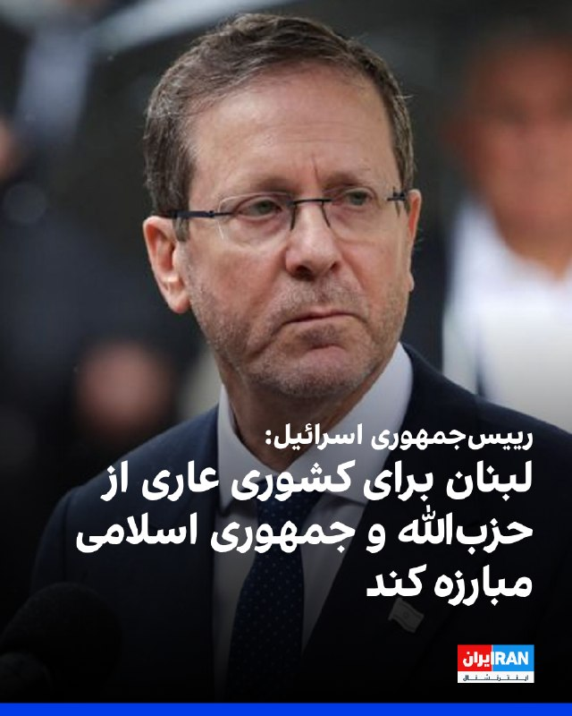

اسحاق هرتزوگ، رییس‌جمهوری اسرائیل، در واکنش به مصاحبه جوزف عون، رییس‌جمهوری لبنان با سی‌ان‌ان، از همتای لبنانی خود خواست برای کشوری عاری از حزب‌الله و جمهوری اسلامی «مبارزه کند».

به گزارش سی‌ان‌ان، هرتزوگ گفت: «اسرائیل نمی‌تواند هیچ حمله‌ای به شهروندان خود یا هیچ حمله‌ای از آن سوی مرزهایش را بپذیرد. ما حق کامل دفاع از خود را داریم و تا زمانی که ترتیبی روشن برای حفاظت از ملت ما وجود نداشته باشد، حرکت به جلو ممکن نخواهد بود. بنابراین این در دستان شماست؛ برای آن مبارزه کنید.»

هرتزوگ که از شمال اسرائیل و در نزدیکی مرز لبنان سخن می‌گفت، خطاب به عون و مردم لبنان گفت «دست صلح» به سوی عون دراز می‌کند و افزود اگر لبنان و اسرائیل بخواهند به سوی صلح حرکت کنند، لبنان «باید از نفوذ» جمهوری اسلامی و حزب‌الله «آزاد بماند».

اسرائیل مدت‌هاست معتقد است نیروهای مسلح لبنان برای خلع سلاح حزب‌الله و دور کردن این گروه از مرز، اقدامات کافی انجام نداده‌اند.
https://iranintl.com/202606102387

## IranIntlTV — post 341500

  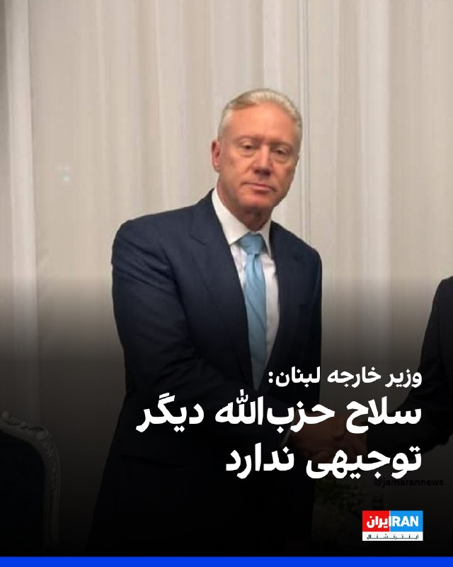

الحدث گزارش داد یوسف رجی، وزیر خارجه لبنان، گفت جنگ در خدمت دستورکارهای خارجی قرار گرفته است و مسیر مذاکرات منحصرا از سوی دولت لبنان مدیریت می‌شود.

او افزود پس از ناکامی راهکار نظامی، گزینه‌ای جز مسیر دیپلماتیک وجود ندارد.

رجی همچنین تاکید کرد سلاح حزب‌الله دیگر توجیهی ندارد.
https://iranintl.com/202606108016

## IranIntlTV — post 341499

  

بر اساس گزارش‌های رسیده به ایران‌اینترنشنال، محمد زنگنه از سوی دستگاه قضایی به سه سال و شش ماه و یک روز حبس تعزیری محکوم شد. او یک روز پس از مراسم هفتم خسرو علیکردی و پس از انتشار ویدیویی که در آن مردم شعار «جاوید شاه» سر می‌دادند، توسط نیروهای اطلاعات در مشهد بازداشت شده بود.

## IranIntlTV — post 341498

  <a href="telegram/content/IranIntlTV_341498_1781101414.mp4" target="_blank">🎬 Download video</a>

بر اساس گزارش‌ها تیم فوتبال ایران در دیداری دوستانه به مصاف تیم زیر ۲۱ سال شهر تیخوانای مکزیک خواهد رفت. پیش‌تر تیم‌های ملی اسپانیا، مقدونیه و آنگولا از بازی با تیم فوتبال ایران به دلیل آنچه مسائل سیاسی عنوان شد، انصراف داده بودند.

گزارش آیدین مقیمی، خبرنگار ایران‌اینترنشنال
@iranintltv

## alonews — post 126831

  <a href="telegram/content/alonews_126831_1781101416.webm" target="_blank">🎬 Download video</a>

👈خضریان، عضو کمیسیون امنیت ملی مجلس: پایگاه‌های فرامنطقه‌ای آمریکا رو هدف قرار خواهیم داد.

✅ @AloNews خبر جنگ

## alonews — post 126830

  <a href="telegram/content/alonews_126830_1781101416.webm" target="_blank">🎬 Download video</a>

👈قیمت جهانی هر اونس طلا در معاملات امروز با ریزش ۱۲۳ دلاری حدود ۳ درصد کاهش پیدا کرد و به ۴۱۳۴ دلار رسید

✅ @AloNews خبر جنگ

---
📅 بروزرسانی: 1405/03/20 17:44
---

## WithYashar — post 14322

نتانیاهو خطاب به اردوغان: به من درس اخلاق نده!

نتانیاهو مدعی شد: «اردوغان، دیکتاتور یهودستیز که مرتکب نسل‌کشی علیه کردها می‌شود، از سازمان تروریستی حماس حمایت می‌کند، مردم خود را سرکوب می‌کند و مخالفان سیاسی خود را زندانی می‌کند، او آخرین کسی است که می‌تواند به دولت اسرائیل درس اخلاق بدهد.»
@withyashar

## FoxNewsTwitter — post 342802

  

Fox News (Twitter/X)

“This is not justice, this is trying to make an example!!!”

Cardi B coming under fire for her reaction to Karmelo Anthony’s guilty verdict in the stabbing death of Austin Metcalf.

The rapper is blasting the verdict, arguing it was less about justice and more about making an example out of the defendant.

Anthony was sentenced to 35 years in prison for the murder of Metcalf after fatally stabbing him at a high school track meet in April 2025.

## VahidOnline — post 76134

  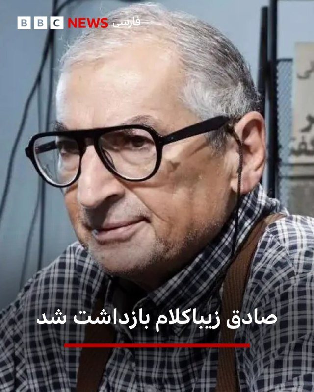

قوه قضائیه جمهوری اسلامی روز چهارشنبه ۲۰ خرداد خبر داد که صادق زیباکلام، استاد سابق دانشگاه تهران و فعال سیاسی، بازداشت شده است.

خبرگزاری میزان، وابسته به دستگاه قضائی ایران، اعلام کرد که «قرار نظارت قضائی» بر آقای زیباکلام روز ۱۷ خرداد تشدید شده بود و به دلیل انجام مصاحبه‌ای جدید، علیه او اعلام جرم و سپس صبح امروز بازداشت شد.

اعلام جرم روز ۱۷ خرداد در پی انتشار مصاحبه صادق زیباکلام با شبکه بریتانیایی «کانال ۴» رخ داد.
این فعال و تحلیلگر سیاسی در این گفت‌وگو به زبان انگلیسی، علی خامنه‌ای، رهبر سابق جمهوری اسلامی، را «ستون فقرات تندروها» در ایران خواند و گفت او در طول مدت رهبری خود به مدت ۳۶ سال ایده‌هایی مانند «آمریکاستیزی، نابودی اسرائیل، حمایت از حماس و حزب‌الله» داشت.
زیباکلام درباره مجتبی خامنه‌ای، رهبر جدید، نیز گفت تردید دارد او ایده‌های پدرش را داشته باشد و همچنین اعلام کرد که او نمی‌تواند قدرت و جایگاه رهبر سابق جمهوری اسلامی را به دست بیاورد.

او در اردیبهشت ۱۴۰۳ در پی تشکیل سه پرونده قضائی بازداشت شده بود و تیر ماه همان سال به دلیل «ابتلا به بیماری سرطان» از زندان آزاد شد.
@VahidHeadline

📡 @VahidOnline

## VahidOnline — post 76133

  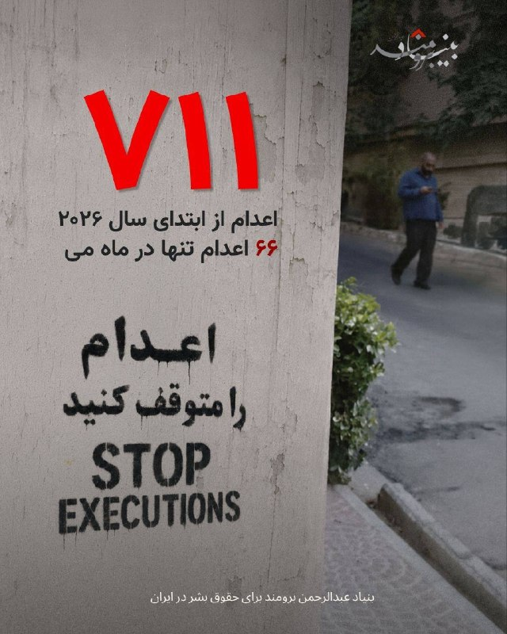

‏🔴«از آغاز سال ۲۰۲۶، بنیاد عبدالرحمن برومند دست‌کم ۷۱۱ مورد اعدام را در ایران ثبت کرده است. این آمار شامل دست‌کم ۶۶ مورد اعدام در ماه مه و ۱۸ مورد تنها در نه روز اول ماه جون است.

‏@IranRights

## IranIntlTV — post 341497

  <a href="telegram/content/IranIntlTV_341497_1781100880.mp4" target="_blank">🎬 Download video</a>

بنیامین نتانیاهو، نخست‌وزیر اسرائیل، از احتمال حمله به مواضع جمهوری اسلامی بدون حمایت آمریکا خبر داد و وزیر دفاع این کشور نیز درباره هرگونه اقدام تهران برای گسترش درگیری‌ها هشدار داد. جمشید برزگر، روزنامه‌نگار و تحلیلگر سیاسی، در این خصوص به ایران‌اینترنشنال گفت آنچه طی دو ماه گذشته «آتش‌بس» نامیده شده، در عمل تنها کاهش شدت درگیری‌ها بوده و تنش‌های پراکنده همچنان ادامه داشته است.
@iranintltv

---
📅 بروزرسانی: 1405/03/20 17:33
---

## VahidOOnLine — post 244691

  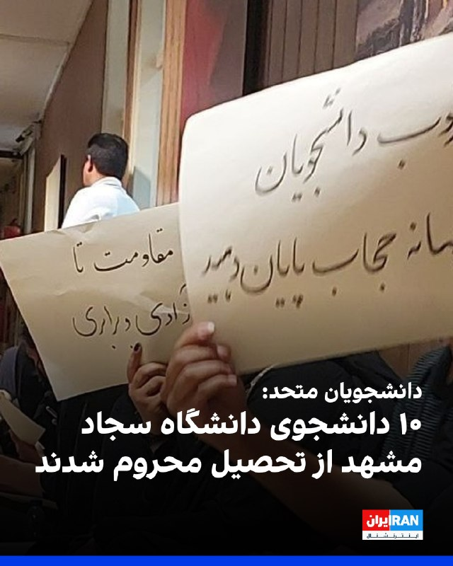

به گزارش دانشجویان متحد، ۱۰ تن از دانشجویان دانشگاه سجاد مشهد در ارتباط با پرونده‌های مرتبط با انقلاب ملی ایرانیان در دی ۱۴۰۴، از سوی کمیته انضباطی به دو و نیم تا چهار سال م

در این گزارش آمده است یکی از دانشجویان با اتهام‌های «اخلال، ایجاد وقفه یا مزاحمت برای برنامه‌های دانشگاه» و «ایجاد بلوا و آشوب در محیط دانشگاه» به دو و نیم سال منع موقت از تحصیل با احتساب سنوات محکوم شده است؛ حکمی که ترم جاری را نیز شامل می‌شود.

همچنین در رای صادره تاکید شده است که در صورت «ابراز ندامت و پشیمانی»، اجرای محرومیت مربوط به ترم جاری قطعی خواهد شد و اجرای حکم مربوط به ترم پاییز به حالت تعلیق درخواهد آمد.
‌🏁 🇬🇧 IranintlTV

🤖 @VahidOOnLine

## VahidOOnLine — post 244690

  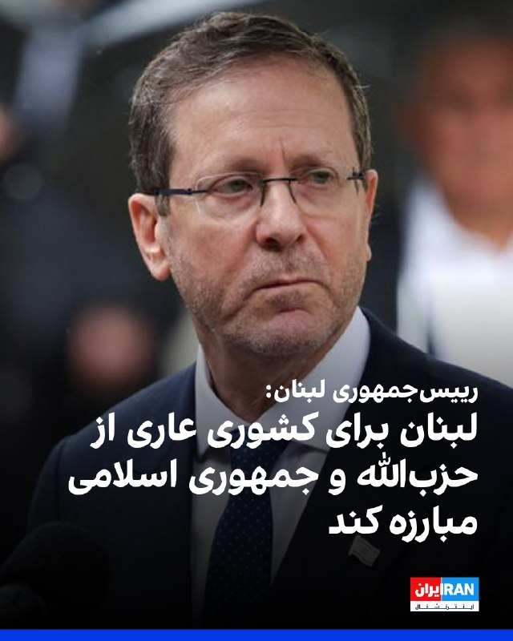

اسحاق هرتزوگ، رییس‌جمهوری اسرائیل، در واکنش به مصاحبه جوزف عون، رییس‌جمهوری لبنان با سی‌ان‌ان، از همتای لبنانی خود خواست برای کشوری عاری از حزب‌الله و جمهوری اسلامی «مبارزه کند».

به گزارش سی‌ان‌ان، هرتزوگ گفت: «اسرائیل نمی‌تواند هیچ حمله‌ای به شهروندان خود یا هیچ حمله‌ای از آن سوی مرزهایش را بپذیرد. ما حق کامل دفاع از خود را داریم و تا زمانی که ترتیبی روشن برای حفاظت از ملت ما وجود نداشته باشد، حرکت به جلو ممکن نخواهد بود. بنابراین این در دستان شماست؛ برای آن مبارزه کنید.»

هرتزوگ که از شمال اسرائیل و در نزدیکی مرز لبنان سخن می‌گفت، خطاب به عون و مردم لبنان گفت «دست صلح» به سوی عون دراز می‌کند و افزود اگر لبنان و اسرائیل بخواهند به سوی صلح حرکت کنند، لبنان «باید از نفوذ» جمهوری اسلامی و حزب‌الله «آزاد بماند».

اسرائیل مدت‌هاست معتقد است نیروهای مسلح لبنان برای خلع سلاح حزب‌الله و دور کردن این گروه از مرز، اقدامات کافی انجام نداده‌اند.
‌🏁 🇬🇧 IranintlTV

🤖 @VahidOOnLine

## VahidOOnLine — post 244689

  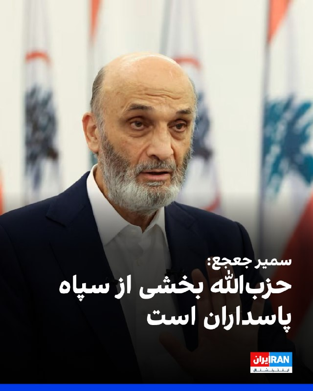

الحدث گزارش داد، سمیر جعجع، رهبر حزب راست‌گرای مسیحی «نیروهای لبنانی»، گفت قدرت مشروع در لبنان در اختیار رییس‌جمهوری و دولت این کشور است.

جعجع همچنین حمله جمهوری اسلامی به اسرائیل را اقدامی با اهداف «تبلیغاتی» توصیف کرد.

رهبر «نیروهای لبنانی» در ادامه گفت حزب‌الله بخشی از سپاه پاسداران است و با امید به دستیابی جمهوری اسلامی و آمریکا به توافق، به جنگ ادامه می‌دهد.
‌🏁 🇬🇧 IranintlTV

🤖 @VahidOOnLine

## mwarmonitor — post 10613

🔴سازمان UKMTO (سازمان عملیات تجارت دریایی بریتانیا) گزارشی درباره وقوع یک حادثه در فاصله ۲۰ مایل دریایی (NM) شمال شرقی بندر صحار در عمان دریافت کرده است. 📌مقامات محلی گزارش داده‌اند که یک کشتی نفتکش در اتاق موتور خود دچار آتش‌سوزی شده است و نیروها جهت کمک…

## mwarmonitor — post 10612

  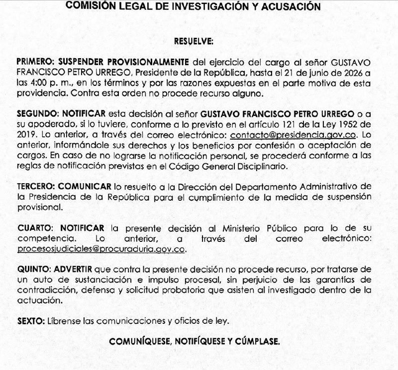

🔸کمیسیون تحقیق و اتهام‌زنی کلمبیا به‌طور موقت رئیس‌جمهور گوستاوو پترو را از انجام وظایفش تا ۲۱ ژوئن تعلیق کرده است.

@mwarmonitor

## pm_afshaa — post 93304

  <a href="telegram/content/pm_afshaa_93304_1781100231.webm" target="_blank">🎬 Download video</a>

🔴خضریان، عضو کمیسیون امنیت ملی مجلس: پایگاه‌های فرامنطقه‌ای آمریکا رو هدف قرار خواهیم داد.

💧 Rainbet.com the #1 Non-KYC Crypto Casino & Sportsbook @rainbetcom

😁 @Pm_Afshaa

## IranIntlTV — post 341496

  

به گزارش دانشجویان متحد، ۱۰ تن از دانشجویان دانشگاه سجاد مشهد در ارتباط با پرونده‌های مرتبط با انقلاب ملی ایرانیان در دی ۱۴۰۴، از سوی کمیته انضباطی به دو و نیم تا چهار سال م

در این گزارش آمده است یکی از دانشجویان با اتهام‌های «اخلال، ایجاد وقفه یا مزاحمت برای برنامه‌های دانشگاه» و «ایجاد بلوا و آشوب در محیط دانشگاه» به دو و نیم سال منع موقت از تحصیل با احتساب سنوات محکوم شده است؛ حکمی که ترم جاری را نیز شامل می‌شود.

همچنین در رای صادره تاکید شده است که در صورت «ابراز ندامت و پشیمانی»، اجرای محرومیت مربوط به ترم جاری قطعی خواهد شد و اجرای حکم مربوط به ترم پاییز به حالت تعلیق درخواهد آمد.
https://iranintl.com/202606105232

## IranIntlTV — post 341495

  

اسحاق هرتزوگ، رییس‌جمهوری اسرائیل، در واکنش به مصاحبه جوزف عون، رییس‌جمهوری لبنان با سی‌ان‌ان، از همتای لبنانی خود خواست برای کشوری عاری از حزب‌الله و جمهوری اسلامی «مبارزه کند».

به گزارش سی‌ان‌ان، هرتزوگ گفت: «اسرائیل نمی‌تواند هیچ حمله‌ای به شهروندان خود یا هیچ حمله‌ای از آن سوی مرزهایش را بپذیرد. ما حق کامل دفاع از خود را داریم و تا زمانی که ترتیبی روشن برای حفاظت از ملت ما وجود نداشته باشد، حرکت به جلو ممکن نخواهد بود. بنابراین این در دستان شماست؛ برای آن مبارزه کنید.»

هرتزوگ که از شمال اسرائیل و در نزدیکی مرز لبنان سخن می‌گفت، خطاب به عون و مردم لبنان گفت «دست صلح» به سوی عون دراز می‌کند و افزود اگر لبنان و اسرائیل بخواهند به سوی صلح حرکت کنند، لبنان «باید از نفوذ» جمهوری اسلامی و حزب‌الله «آزاد بماند».

اسرائیل مدت‌هاست معتقد است نیروهای مسلح لبنان برای خلع سلاح حزب‌الله و دور کردن این گروه از مرز، اقدامات کافی انجام نداده‌اند.
https://iranintl.com/202606102387

## IranIntlTV — post 341494

  

الحدث گزارش داد، سمیر جعجع، رهبر حزب راست‌گرای مسیحی «نیروهای لبنانی»، گفت قدرت مشروع در لبنان در اختیار رییس‌جمهوری و دولت این کشور است.

جعجع همچنین حمله جمهوری اسلامی به اسرائیل را اقدامی با اهداف «تبلیغاتی» توصیف کرد.

رهبر «نیروهای لبنانی» در ادامه گفت حزب‌الله بخشی از سپاه پاسداران است و با امید به دستیابی جمهوری اسلامی و آمریکا به توافق، به جنگ ادامه می‌دهد.
https://iranintl.com/202606100888

## DW_Farsi — post 125780

  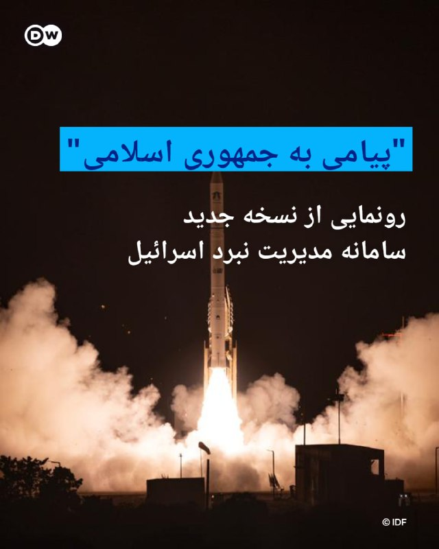

🔶 "پیامی به جمهوری اسلامی"؛ رونمایی از نسخه جدید سامانه مدیریت نبرد اسرائيل

صنایع هوافضای اسرائيل از نسل جدید سامانه مدیریت نبرد خود با نام "اوپال ـ ان‌جی" رونمایی و اعلام کرد که این سامانه "برای شکل دادن به آینده میدان نبرد با ادغام هوش مصنوعی، سیستم‌های سرنشین‌دار و بدون سرنشین و قابلیت‌‌های چندبعدی طراحی شده است".

حساب رسمی وزارت خارجه اسرائيل به زبان فارسی در پیامی با انتشار این خبر نوشته است: «پس از سامانه دفاع موشکی ختس [پیکان] و ماهواره در فضا - توسعه جدید اسرائیل پیامی واضح به جمهوری اسلامی می‌فرستد.»

در این پیام آمده که این سیستم "امکان ایجاد یک تصویر عملیاتی یکپارچه در نیروهای هوایی، زمینی و دریایی و امکان اشتراک‌گذاری فوری اطلاعات و تصمیم‌گیری سریع‌تر بر اساس تجزیه و تحلیل داده‌ها را فراهم می‌کند."

مطابق این پیام، "اوپال ـ ان‌جی" (OPAL-NG) بر بنیاد تجربه عملیاتی سیستم اوپال موجود ساخته شده که در پلتفرم‌های مختلفی‌، از جمله جت‌های جنگنده، هلی‌کوپترها، پهپادها، کشتی‌ها و مراکز فرماندهی و کنترل مستقر شده است؛ ضمن اینکه مطابق با استانداردهای ناتو است.
@dw_farsi

## IranianMinds — post 22086

  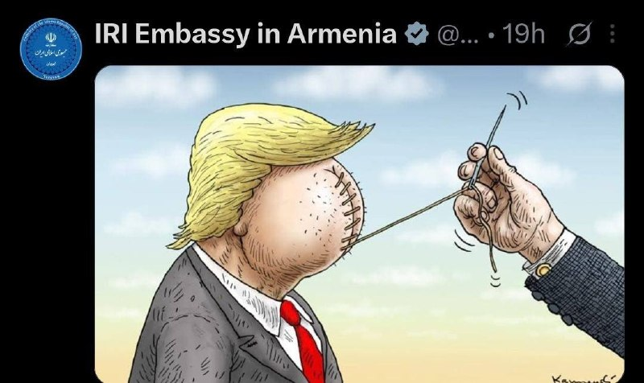

توئیت سفارت جمهوری اسلامی ایران در ارمنستان.

@IranianMinds

## Hranews — post 113521

  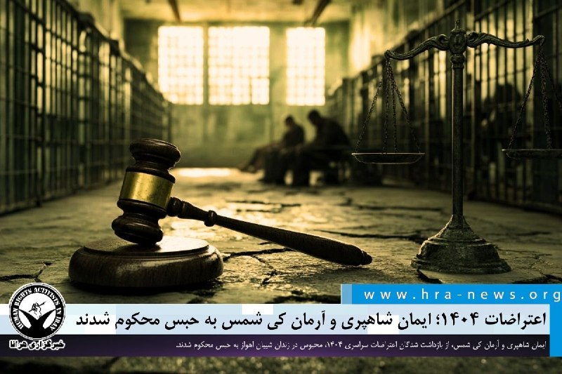

اعتراضات ۱۴۰۴؛ ایمان شاهپری و آرمان کی شمس به حبس محکوم شدند

❗️
❗️
❗️
❗️
❗️– ایمان شاهپری و آرمان کی شمس، از بازداشت شدگان اعتراضات سراسری ۱۴۰۴، محبوس در زندان شیبان اهواز توسط دادگاه تجدید نظر استان خوزستان هر یک به دو سال و یک روز حبس محکوم شدند. یک سال از این محکومیت برای هر یک به مدت چهار سال به حالت تعلیق درآمده است.

به گزارش خبرگزاری هرانا، ارگان خبری مجموعه فعالان حقوق بشر در ایران، ایمان شاهپری و آرمان کی شمس، از بازداشت شدگان اعتراضات سراسری ۱۴۰۴، به حبس محکوم شدند.

بر اساس حکمی که توسط دادگاه تجدیدنظر استان خوزستان صادر و به حسین علی حاتمی، وکیل مدافع این شهروندان ابلاغ شده، آقایان کی شمس و شاهپری هر یک از بابت اتهام اخلال در نظم عمومی با استناد به تبصره ماده ۲۸۶ قانون مجازات اسلامی به دو سال و یک روز حبس محکوم شدند. یک سال از این محکومیت برای هر یک به مدت چهار سال به حالت تعلیق درآمده است.

ادامه مطلب

#ایمان_شاهپری #آرمان_کی‌شمس

↘️
@hranews_bot تماس ✉️ - @Hranews کانال هرانا 🆑

## alonews — post 126829

  <a href="telegram/content/alonews_126829_1781100235.mp4" target="_blank">🎬 Download video</a>

👈عصبانیت کارشناس تلویزیون از صحبت های زیباکلام:

🔴یک لعنتی در مورد رهبر شهید ما گفته «او دیگر نیست» بابا ما هنوز پیکر این آدم رو دفن نکردیم، چقدر شما رذلید

✅ @AloNews خبر جنگ

---
📅 بروزرسانی: 1405/03/20 17:24
---

## VahidOOnLine — post 244688

  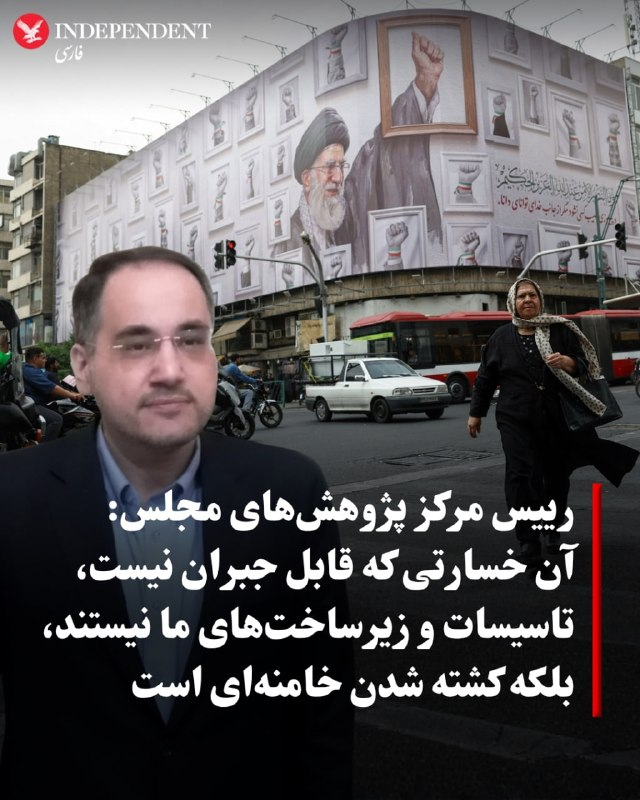

⭕️ رییس مرکز پژوهش‌های مجلس:
آن خسارتی که قابل جبران نیست، تاسیسات و زیرساخت‌های ما نیستند، بلکه کشته شدن خامنه‌ای است

♦️بابک نگاهداری، رییس مرکز پژوهش‌های مجلس شورای اسلامی در اظهاراتی گفت که در جنگ اخیر، جمهوری اسلامی خسارت‌های زیادی متحمل شد که برخی از آن‌ها قابل جبران نیستند.
نگاهداری افزود آن خسارتی که قابل جبران نیست، تاسیسات و زیرساخت‌های ما نیستند، بلکه کشته شدن علی خامنه‌ای است.
رییس مرکز پژوهش‌های مجلس در ادامه تاکید کرد که علی خامنه‌ای همواره مدافع و پیگیر گسترش روابط با چین بود و روابط با چین را خود شخصا از دولت‌ها پیگیری می‌کرد.
‌🇸🇦 Indypersian

🤖 @VahidOOnLine

## VahidOOnLine — post 244687

  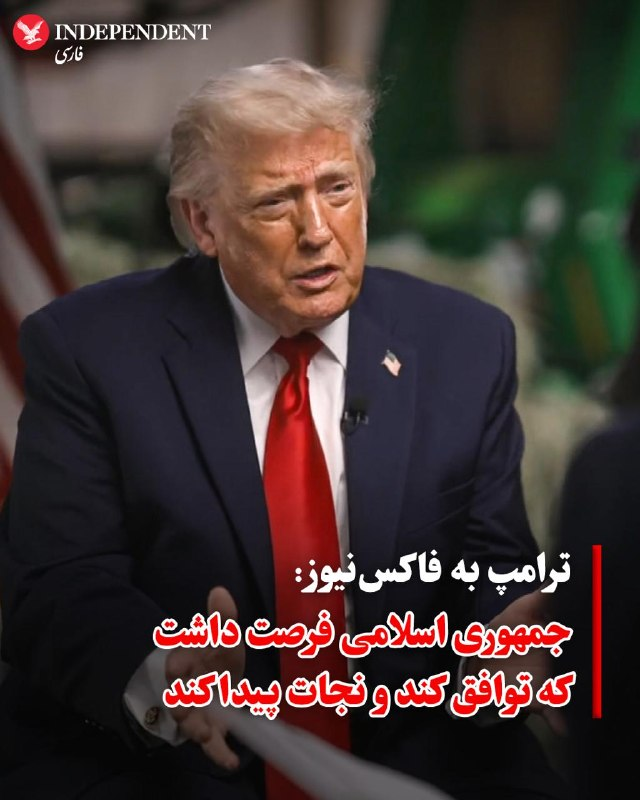

♦️دونالد ترامپ، رئیس‌جمهوری آمریکا، در گفتگو با شبکه «فاکس‌نیوز» اعلام کرد که به صدور فرمان حملات جدید علیه ایران نزدیک شده است. به گزارش تری اینگست، خبرنگار این شبکه، واشنگتن در پاسخ به سرنگونی بالگرد آپاچی ارتش آمریکا در نزدیکی تنگه هرمز و حملات موشکی شبانه ایران به نیروهای آمریکایی در کویت، بحرین و اردن، درصدد هدف قرار دادن نیروگاه‌های برق و پل‌ها در ایران است.

ترامپ در پاسخ به سوال اینگست درباره واکنش احتمالی به حملات شبانه جمهوری اسلامی به کویت، بحرین و اردن، گفت: «ممکن است حملات را ادامه دهم. آن‌ها فرصت این را داشتند که توافقی را امضا کنند و نجات پیدا کنند.» اینگست ارزیابی کرد که این گفته‌ها نشان می‌دهد که ترامپ ممکن است در پاسخ به تعلل تهران در مذاکرات نیز حملاتی را انجام دهد.
‌🇸🇦 Indypersian

🤖 @VahidOOnLine

## VahidOOnLine — post 244686

  

علی خضریان، عضو کمیسیون امنیت ملی مجلس، در یک برنامه تلویزیونی گفت: «آمریکا در جنگ اخیر ۱۶ پایگاه منطقه‌ای خود را از دست داد و جمهوری اسلامی وارد هدف قرار دادن پایگاه‌های فرامنطقه‌ای آمریکا شده که از آن پایگاه‌ها در حال طراحی تهاجمات جدید است.»

خضریان افزود: «مطلع هستیم اردن پایگاه و آسمان خود را در اختیار آمریکا قرار داده و حمله به اردن پاسخی دفاعی و بازدارنده بود.»
‌🏁 🇬🇧 IranintlTV

🤖 @VahidOOnLine

## VahidOOnLine — post 244685

  <a href="telegram/content/VahidOOnLine_244685_1781099687.mp4" target="_blank">🎬 Download video</a>

ویدیوی رسیده به ایران اینترنشنال نشان می‌دهد که گروهی از زنان مهاجر افغانستانی روز ۲۰ خرداد جلوی سفارت افغانستان در ایران تجمع کرده و شعار «کار، تحصیل، آبادی» سردادند. شرکت‌کنندگان در این تجمع اعتراضی خواستار دسترسی زنان و دختران افغانستان به آموزش و فرصت‌های شغلی شدند.
‌🏁 🇬🇧 IranintlTV

🤖 @VahidOOnLine

## DEJradio — post 5543

  <a href="telegram/content/DEJradio_5543_1781099690.mp4" target="_blank">🎬 Download video</a>

🤡
🔺 تافلِ آقازادگی؛ وقتی مدرک زبان هم برای تطهیر خاندان قدرت خرج می‌شود

مادر زهرا حداد عادل گفته مجتبی خامنه‌ای پیش از خواستگاری از دخترش «تافل انگلیسی» گرفته بود و علاقه زیادی به یادگیری زبان‌های خارجی داشت.

#موشتبا #حداد_عادل #تافل
@DEJradio

## DEJradio — post 5542

⭕️ نخستین عملیات نجات رزمی با استفاده از شهپاد آمریکایی در دریای عمان

نیروی دریایی آمریکا اعلام کرد برای نجات دو خلبان بالگرد آپاچی سرنگون‌شده در نزدیکی تنگۀ هرمز، از شهپاد، شناور بدون سرنشین «کورسر، استفاده کرد.
این نخستین بار است که یک شناور خودران در عملیات واقعی نجات نیروهای نظامی به کار گرفته می‌شود.
سارونیک کورسر، یک شناور سطحی بدون سرنشین به طول ۷.۳ متر است که می‌تواند درحدود ۴۵۰ کیلوگرم بار را حمل و با سرعتی بیش از ۶۵ کیلومتر بر ساعت حرکت کند.
این سامانه، بخشی از برنامۀ راهبردی پنتاگون برای گسترش استفاده از تجهیزات بدون سرنشین، در عملیات‌های نظامی به شمار می‌رود.
گروه عملیاتی ۵۹ نیروی دریایی آمریکا که در بحرین مستقر است، از سال ۲۰۲۱ به‌طور تخصصی روی سامانه‌های بدون سرنشین فعالیت می‌کند.
شهپادهای دریایی آمریکا برای شناسایی، پایش، کشف مین، جمع‌آوری اطلاعات و در برخی موارد عملیات رزمی به کار گرفته می‌شوند.
پنتاگون قصد دارد در سال‌های آینده با افزایش شمار شناورهای خودران، هزینۀ عملیات را کاهش و سرعت واکنش به تهدیدها را افزایش بدهد.

#دژ #خبر #سنتکام
@DEJradio

## DEJradio — post 5541

  <a href="telegram/content/DEJradio_5541_1781099692.mp4" target="_blank">🎬 Download video</a>

🔺🎤 «برگزاری روز ملی شیر و خورشید اعلام وفاداری به جاویدنامان است»؛

اهمیت برگزاری هرچه باشکوه‌تر روز ملی شیر و خورشید در گفت‌وگو با دکتر سعید بشیرتاش مسئول جبهه «هفت آبان».

#روز_ملی_شیروخورشید #چالش
@DEJradio

## IranIntlTV — post 341493

  <a href="telegram/content/IranIntlTV_341493_1781099695.mp4" target="_blank">🎬 Download video</a>

دولت کانادا با صدور بیانیه‌ای، با ابراز نگرانی شدید از تنش‌ها در تنگه هرمز، بر لزوم مقابله با اقدامات بی‌ثبات‌کننده جمهوری اسلامی از جمله برنامه‌های موشکی و هسته‌ای این کشور تاکید کرد.

مهسا مرتضوی، خبرنگار ایران‌اینترنشنال، گزارش می‌دهد
@iranintltv

## IranIntlTV — post 341492

  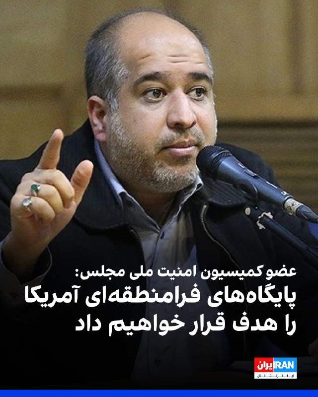

علی خضریان، عضو کمیسیون امنیت ملی مجلس، در یک برنامه تلویزیونی گفت: «آمریکا در جنگ اخیر ۱۶ پایگاه منطقه‌ای خود را از دست داد و جمهوری اسلامی وارد هدف قرار دادن پایگاه‌های فرامنطقه‌ای آمریکا شده که از آن پایگاه‌ها در حال طراحی تهاجمات جدید است.»

خضریان افزود: «مطلع هستیم اردن پایگاه و آسمان خود را در اختیار آمریکا قرار داده و حمله به اردن پاسخی دفاعی و بازدارنده بود.»
https://iranintl.com/202606105314

## IranIntlTV — post 341491

  <a href="telegram/content/IranIntlTV_341491_1781099698.mp4" target="_blank">🎬 Download video</a>

ویدیوی رسیده به ایران اینترنشنال نشان می‌دهد که گروهی از زنان مهاجر افغانستانی روز ۲۰ خرداد جلوی سفارت افغانستان در ایران تجمع کرده و شعار «کار، تحصیل، آبادی» سردادند. شرکت‌کنندگان در این تجمع اعتراضی خواستار دسترسی زنان و دختران افغانستان به آموزش و فرصت‌های شغلی شدند.

## FarsiVOA — post 220246

🔺بیانیه مشترک آمریکا و ۲۲ کشور در محکومیت «توطئه‌های مرگبار و اقدامات مخرب» جمهوری اسلامی در جهان

◾️ایالات متحده و ۲۲ کشور متحد غربی روز چهار‌شنبه ۲۰ خرداد در بیانیه‌ای مشترک، آن چه را «توطئه‌های مرگبار و اقدامات مخرب» نهادهای امنیتی جمهوری اسلامی در اروپا، آمریکای شمالی، و استرالیا خواندند، به شدت محکوم کردند و از رژیم ایران خواستند این فعالیت‌ها را فوراً متوقف کند.

⬇️ بیشتر بخوانید:

https://ir.voanews.com/a/joint-statement-iranian-state-threat-activity-europe-north-america-australia/8159318.html

## FarsiVOA — post 220245

  <a href="telegram/content/FarsiVOA_220245_1781099701.mp4" target="_blank">🎬 Download video</a>

ارتش اسرائیل ویدیویی از انهدام زیرساخت‌ها و شناسایی و هدف‌گیری نیروهای حزب‌الله در جنوب لبنان منتشر کرده است.

ارتش اسرائیل اعلام کرد واحد جمع‌آوری «شحف» (۸۶۹)، در طول دو هفته گذشته، با همکاری نیروی هوایی بیش از ۲۰ تروریست را که در حال پیشبرد طرح‌های تروریستی بودند از بین برده است.

همچنین نیروهای ارتش اسرائیل چند زیرساخت حزب‌الله را منهدم کردند، از جمله ساختمان‌هایی که برای به‌کارگیری پهپادهای انفجاری علیه نیروهای اسرائیل استفاده می‌شد.

## BBCPersian — post 283353

  

‌🔻قوه قضاییه ایران می‌گوید که در پی اعلام جرم جدید و تشدید قرار نظارت قضایی برای صادق زیباکلام، او صبح امروز بازداشت شده است.

قوه قضاییه می‌گوید که پرونده او در دادسرای فرهنگ و رسانه درحال رسیدگی است.

سه روز پیش خبر تشدید قرار نظارت قضایی او منتشر شد.

آقای زیباکلام از هرگونه فعالیت رسانه‌ای و تولید محتوا در شبکه‌های اجتماعی و رسانه‌ها منع شده است.

به نظر می‌رسد دلیل بازداشت او، مطالبی باشد که در مصاحبه با تلویزیون کانال ۴ بریتانیا بیان کرده بود.

📷ٍEntekhab
https://bbc.in/4vCrVIt

@BBCPersian

## Dirty_Kids — post 391583

  <a href="telegram/content/Dirty_Kids_391583_1781099704.mp4" target="_blank">🎬 Download video</a>

اینی که الان در جامعه داره نشان داده میشه کجای ج.ا هست؟؟؟؟؟؟

@Dirty_Kids 👻

## Dirty_Kids — post 391582

  <a href="telegram/content/Dirty_Kids_391582_1781099706.mp4" target="_blank">🎬 Download video</a>

وات د فاک، توی ایران چه خبره😐😐

@Dirty_Kids 👻

## Hranews — post 113520

  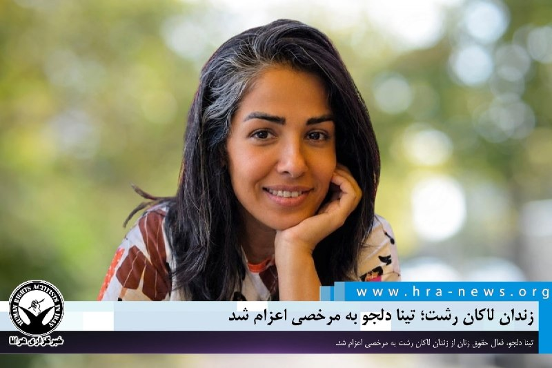

زندان لاکان رشت؛ تینا دلجو به مرخصی اعزام شد

❗️
❗️
❗️
❗️
❗️– امروز چهارشنبه ۲۰ خردادماه، تینا دلجو، فعال حقوق زنان از زندان لاکان رشت به مرخصی اعزام شد.

به گزارش خبرگزاری هرانا، ارگان خبری مجموعه فعالان حقوق بشر در ایران، تینا دلجو به مرخصی اعزام شد.

بر اساس اطلاعات دریافتی هرانا، اعزام به مرخصی تینا دلجو امروز چهارشنبه ۲۰ خردادماه به مدت پنج روز و از زندان لاکان رشت صورت گرفته است.

ادامه مطلب

#تینا_دلجو

↘️
@hranews_bot تماس ✉️ - @Hranews کانال هرانا 🆑

## alonews — post 126828

  <a href="telegram/content/alonews_126828_1781099708.webm" target="_blank">🎬 Download video</a>

👈معاون قوه قضاییه: خشخاش نکارید،ممنوعه

✅ @AloNews خبر جنگ

## alonews — post 126827

  <a href="telegram/content/alonews_126827_1781099708.webm" target="_blank">🎬 Download video</a>

👈قشر تندرو دیگه رد دادن نوشته: غیرتی که ترامپ روی یدونه هلی کوپتر داشت کاش مسئولین روی رهبر شهیدمون داشتن

✅ @AloNews خبر جنگ

---
📅 بروزرسانی: 1405/03/20 17:13
---

## VahidOOnLine — post 244684

  

بر اساس گزارش‌های رسیده به ایران‌اینترنشنال، محمد زنگنه از سوی دستگاه قضایی به سه سال و شش ماه و یک روز حبس تعزیری محکوم شد.

او یک روز پس از مراسم هفتم خسرو علیکردی و پس از انتشار ویدیویی که در آن مردم شعار «جاوید شاه» سر می‌دادند، توسط نیروهای اطلاعات در مشهد بازداشت شده بود.
‌🏁 🇬🇧 IranintlTV

🤖 @VahidOOnLine

## VahidOOnLine — post 244683

  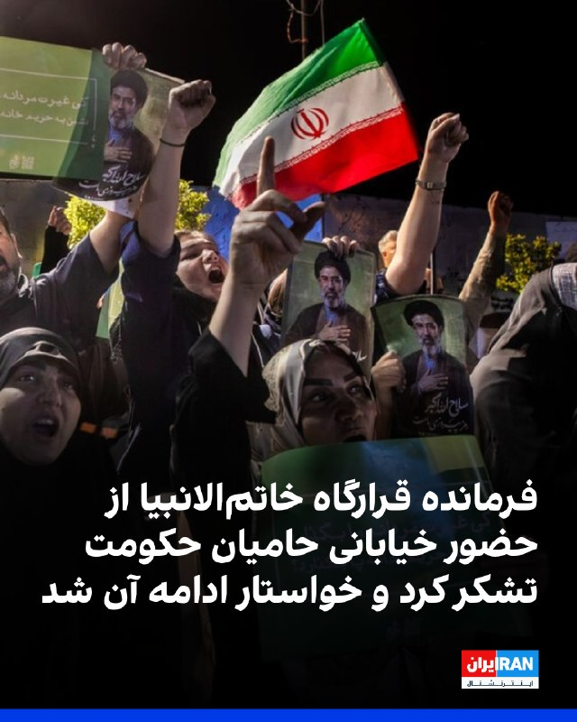

علی عبداللهی، فرمانده قرارگاه مرکزی خاتم‌الانبیا، در بیانیه‌ای از «حضور خیابانی» حامیان حکومت از ابتدای جنگ تشکر کرده و افزود: «بی‌تردید استمرار این حضور، سرمایه‌ای عظیم برای تولید و تعمیق اقتدار ملی، افزایش توان بازدارندگی، تقویت انسجام اجتماعی، ارتقای سرمایه راهبردی نظام و ناکام‌سازی سناریوهای دشمنان است.»

در بخشی از این بیانیه آمده است: «امروز بیش از هر زمان دیگر، حفظ این حضور، تضمین‌کننده آینده‌ای مقتدر، مستقل و عزتمند برای کشور است.»
‌🏁 🇬🇧 IranintlTV

🤖 @VahidOOnLine

## WithYashar — post 14321

ساعت 01:59 به وقت جهانی (UTC)، یک بمب‌افکن B-52H متعلق به نیروی هوایی آمریکا در حال پرواز بود. این هواپیما از پایگاه ماینوت در آمریکا حرکت کرده و به سمت پایگاه هوایی فِیرفورد در بریتانیا می‌رود. این پایگاه یکی از مراکز مهم برای استقرار بمب‌افکن‌های راهبردی…

## WithYashar — post 14320

نتانیاهو رسما نامزد انتخابات آتی اسرائیل شد
@withyashar

## WithYashar — post 14319

مقامی آگاه گفت : ترامپ رسما در یک تلفن با شریف نخست وزیر پاکستان و بن حمد امیر قطر، پایان مذاکرات با تهران را اعلام کرد.
@withyashar

## WithYashar — post 14318

گزارش صدای انفجار‌ از محدوده سوهانک / دارآباد تهران 🚨 @withyashar

## pm_afshaa — post 93303

  <a href="telegram/content/pm_afshaa_93303_1781099012.webm" target="_blank">🎬 Download video</a>

🔴فاکس نیوز به نقل از یک مقام ارشد کاخ سفید: مذاکرات با ایران علیرغم تهدید ترامپ به تشدید حملات علیه ایران ادامه داره. 
💧 Rainbet.com the #1 Non-KYC Crypto Casino & Sportsbook @rainbetcom 
😁 @Pm_Afshaa

## IranIntlTV — post 341490

  

بر اساس گزارش‌های رسیده به ایران‌اینترنشنال، محمد زنگنه از سوی دستگاه قضایی به سه سال و شش ماه و یک روز حبس تعزیری محکوم شد.

او یک روز پس از مراسم هفتم خسرو علیکردی و پس از انتشار ویدیویی که در آن مردم شعار «جاوید شاه» سر می‌دادند، توسط نیروهای اطلاعات در مشهد بازداشت شده بود.
https://iranintl.com/202606101325

## IranIntlTV — post 341489

  

علی عبداللهی، فرمانده قرارگاه مرکزی خاتم‌الانبیا، در بیانیه‌ای از «حضور خیابانی» حامیان حکومت از ابتدای جنگ تشکر کرده و افزود: «بی‌تردید استمرار این حضور، سرمایه‌ای عظیم برای تولید و تعمیق اقتدار ملی، افزایش توان بازدارندگی، تقویت انسجام اجتماعی، ارتقای سرمایه راهبردی نظام و ناکام‌سازی سناریوهای دشمنان است.»

در بخشی از این بیانیه آمده است: «امروز بیش از هر زمان دیگر، حفظ این حضور، تضمین‌کننده آینده‌ای مقتدر، مستقل و عزتمند برای کشور است.»
https://iranintl.com/202606107015

## DW_Farsi — post 125779

🔶 "اکثر اسرائیلی‌ها معتقدند امنیت اسرا‌ئیل اولویت ترامپ نیست"

نظرسنجی "شاخص دموکراسی اسرائیل" که روز سه‌شنبه ۹ ژوئن (۱۹ خرداد) منتشر شد، در فاصله زمانی ۳۱ مه تا ۵ ژوئن (۱۰ تا ۱۵ خرداد) و پیش از حمله موشکی اخیر ایران به اسرائیل انجام شده است. تنها ۴۴ درصد از پرسش‌شوندگان گفته‌اند که اعتقاد دارند امنیت اسرائیل یک ملاحظه محوری برای ترامپ به شمار می‌رود. این در حالی است که این رقم در ماه مارس و در زمان اوج حملات آمریکا و اسرائیل به ایران، ۶۰ درصد بود.

طبق این نظرسنجی در بین اسرائیلی‌های یهودی، ۴۱ درصد گفته‌اند که امنیت اسرائیل را دغدغه مهم ترامپ می‌دانند، در حالی که این رقم در مارس ۶۴ درصد بود. در مقابل این باور در میان شهروندان عرب اسرائیلی افزایش یافته و به ۵۹ درصد رسیده است، در حالی که در مارس ۴۳ درصد بود.

به گزارش سایت "تایمز اسرائیل" در پاسخ به این پرسش که آیا پایان دادن به جنگ با ایران تحت شرایط فعلی "با منافع امنیتی اسرائیل سازگار است یا خیر"، تنها ۲۹ درصد از یهودیان اسرائیلی پاسخ دادند که پایان جنگ تحت شرایط فعلی "تا حد زیادی" با منافع امنیتی اسرائیل سازگار است. ۶۳ درصد گفتند این سازگاری "کم" است یا "اصلاً وجود ندارد" و ۸ درصد نیز اظهار بی‌اطلاعی کرده‌اند.

بخش دیگری از این نظرسنجی از شرکت‌کنندگان در مورد محتوای توافق احتمالی میان تهران و آمریکا پرسیده شد و اینکه آیا این توافق به طور کافی تهدید سلاح‌های هسته‌ای، موشک‌های بالستیک و آینده حکومت ایران را برطرف خواهد کرد یا خیر. اکثریت پاسخ‌دهندگان (حدود ۵۶ درصد) معتقد بودند که این توافق شامل مفادی برای جلوگیری از ادامه توسعه سلاح‌های هسته‌ای ایران خواهد بود.
@dw_farsi

## Dirty_Kids — post 391581

  <a href="telegram/content/Dirty_Kids_391581_1781099015.mp4" target="_blank">🎬 Download video</a>

سعيد طوسي بعد از جدايي از رهبر ج.ا

@Dirty_Kids 👻

## Dirty_Kids — post 391580

  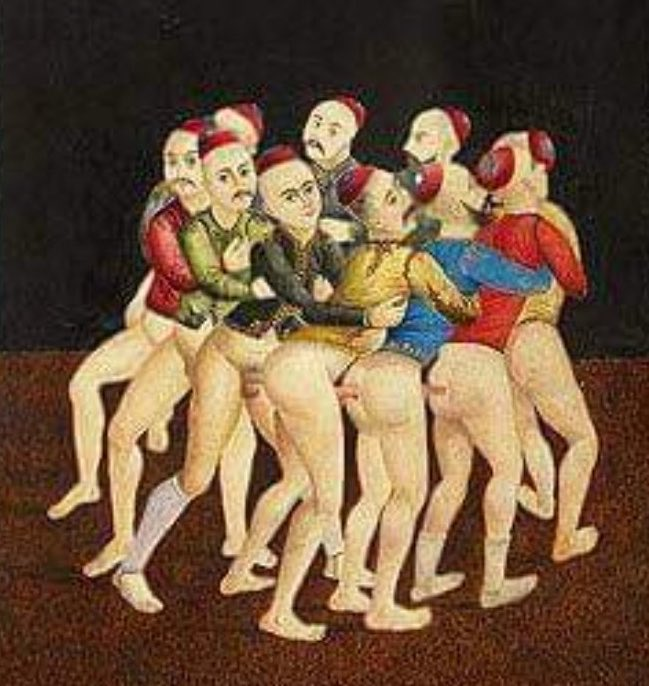

وضعیت دیشب خاورمیانه

@Dirty_Kids 👻

## Hranews — post 113519

  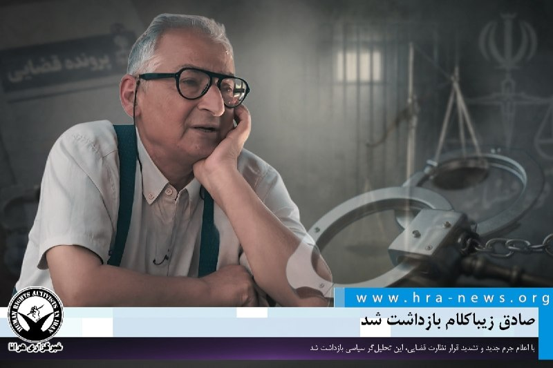

صادق زیباکلام بازداشت شد

❗️
❗️
❗️
❗️
❗️– صادق زیباکلام، تحلیل‌گر سیاسی، امروز چهارشنبه توسط نیروهای امنیتی بازداشت شد. مرکز رسانه قوه قضاییه اعلام کرد که پرونده وی هم‌اکنون در دادسرای فرهنگ و رسانه در حال رسیدگی است.

ادامه مطلب

#صادق_زیباکلام

↘️
@hranews_bot تماس ✉️ - @Hranews کانال هرانا 🆑

## alonews — post 126826

  <a href="telegram/content/alonews_126826_1781099018.webm" target="_blank">🎬 Download video</a>

👈تامیر موراگ خبرنگار کانال ۱۴ اسرائیل:
ترامپ همین الان توییت کرده که ایران برای توافقی که می‌توانست برایش عالی باشد، خیلی دیر مذاکره کرد و حالا باید بهای آن را بپردازد.

🔴مشکل ترامپ این است که تهدیدهایش دیگر نه تنها در نگاه غربی‌ها، بلکه در چشم ایرانی‌ها نیز اعتبار خود را از دست داده است.

✅ @AloNews خبر جنگ

---
📅 بروزرسانی: 1405/03/20 17:03
---

## VahidOOnLine — post 244682

  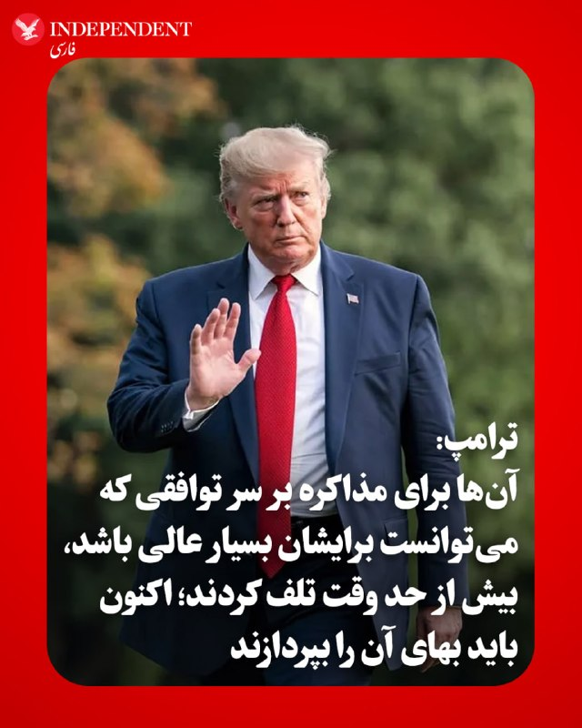

♦️ دونالد ترامپ، رئیس‌جمهوری آمریکا صبح چهارشنبه، ۲۰ خرداد با انتشار دو پیام پی‌درپی در شبکه اجتماعی تروث سوشال، جمهوری اسلامی را، حکومتی «شکست‌خورده» توصیف کرد که توان پرداخت دستمزد نیروهای نظامی خود را نیز ندارد. ترامپ که پیش از این بارها هشدار داده بود که از مذاکرات بی‌نتیجه و طولانی استقبال نخواهد کرد، در این پیام نوشت: «ایران فقط حرف می‌زند و عملی در کار نیست. قلدر خاورمیانه مرده است! آن‌ها برای مذاکره بر سر توافقی که می‌توانست برایشان بسیار عالی باشد، بیش از حد وقت تلف کردند، اکنون باید بهای آن را بپردازند.»
‌🇸🇦 Indypersian

🤖 @VahidOOnLine

## mwarmonitor — post 10611

🔴رادیو ارتش اسرائیل به نقل از مقامات امنیتی گزارش داد که بخشی از یک موشک ایرانی عصر یکشنبه به پایگاه هوایی «رامات داوید» اصابت کرده است. در این گزارش آمده که نیروی هوایی اسرائیل هنوز در حال بررسی این است که دقیقاً چه چیزی به پایگاه برخورد کرده و ارزیابی‌های اولیه نشان می‌دهد احتمالاً یک قطعه ناشی از رهگیری (سرجنگی یا ترکش موشک رهگیر) بوده است.

🔸بر اساس این گزارش، محل اصابت در یک منطقه غیرعملیاتی بوده که در آن لیفتراک‌ها و تجهیزات فنی نگهداری می‌شود. همچنین تأکید شده که هیچ تلفاتی گزارش نشده و آسیبی به تجهیزات وارد نشده است.

@mwarmonitor

## FarsiVOA — post 220244

🔺واکنش‌های جهانی به تازه‌ترین دور تنش‌ها در منطقه؛ محکومیت حملات رژیم ایران به کشورهای همسایه

◾️تازه‌ترین دور درگیری‌ها میان رژیم ایران با کشورهای همسایه و همچنین آمریکا در تنگه هرمز با واکنش‌های گسترده رو‌به‌رو شده است.

⬇️ بیشتر بخوانید:

https://ir.voanews.com/a/iran-s-conflict-with-neighboring-countries-america-warning/8159311.html

## DW_Farsi — post 125778

  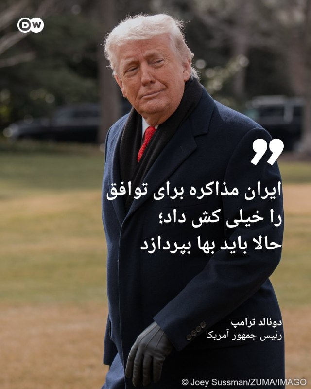

🔶 ترامپ: ایران مذاکره برای توافق را خیلی کش داد؛ حالا باید بها بپردازد

دونالد ترامپ، رئیس‌ جمهور آمریکا می‌گوید، ایران مذاکره برای رسیدن به توافق را بیش از حد طولانی کرده و اینک باید تاوان آن را بپردازد.

او در پستی که چهارشنبه ۱۰ ژوئن (۲۰ خرداد) در شبکه تروث سوشال نوشت یادآور شد: «ارتش ایران کاملا آشفته‌ و به‌هم ریخته است. بخش زیادی از آن، مانند نیروی دریایی و هوایی‌شان، دیگر وجود ندارد. آن‌ها به طور کامل شکست خورده‌اند.»

ترامپ افزود: «ایران فقط حرف می‌زند و عمل نمی‌کند. قلدر خاورمیانه مرده است. آ‌ن‌ها مذاکره برای رسیدن به توافقی که می‌توانست برایشان خیلی خوب باشد را بیش از حد کش‌ داده‌اند و حالا باید برای آن بها بپردازند.»

این اظهارات یک روز پس از حملات متقابل آمریکا و ایران در پی سقوط بالگرد آمریکایی در سواحل عمان بیان شده است.

ترامپ در پیام خود اشاره‌ای به این که ایران باید چگونه بهایی بپردازد نکرد اما همزمان فاکس‌نیوز در گزارشی از امکان هدف گرفته شدن برخی زیرساخت‌های ایران سخن گفت.
@dw_farsi

## Persian_Trend_Official — post 16481

تصویری واضح تر از سوله منهدم شده در پایگاه رامات دیوید 📝 Amir 📌 @persian_trend_official پرشین ترند | متفاوت‌ترین کانال نظامی

## BBCPersian — post 283352

  <a href="telegram/content/BBCPersian_283352_1781098412.mp4" target="_blank">🎬 Download video</a>

🔻سرخط خبرها، چهارشنبه ۲۰ خرداد ۱۴۰۵
@BBCPersian

## idfinfarsi — post 11830

انهدام زیرساخت‌های تروریستی که از آن‌ها پهپادهای انفجاری علیه نیروهای ما به کار گرفته می‌شد: نیروهای واحد جمع‌آوری ۸۶۹ به فعالیت در جنوب لبنان ادامه می‌دهند

واحد جمع‌آوری «شحف» (۸۶۹) تحت فرماندهی لشکر ۹۱ به فعالیت خود برای رفع تهدیدها علیه کشور اسرائیل ادامه می‌دهد. این واحد در زمینه جمع‌آوری اطلاعات، هدایت آتش و انجام حملات از طریق دیده‌بانی فعالیت می‌کند.

در طول دو هفته گذشته، این نیروها با همکاری نیروی هوایی بیش از ۲۰ تروریست را که در حال پیشبرد طرح‌های تروریستی بودند و تهدیدی علیه نیروهای ما محسوب می‌شدند، به هلاکت رساندند. همچنین این نیروها چندین زیرساخت تروریستی را منهدم کردند، از جمله ساختمان‌هایی که توسط تروریست‌های سازمان تروریستی حزب‌الله برای به‌کارگیری پهپادهای انفجاری علیه نیروهای ما استفاده می‌شد.

## Hranews — post 113518

  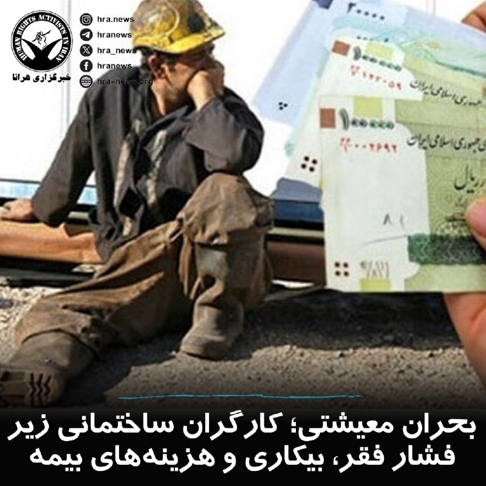

رئیس انجمن صنفی کارگران ساختمانی کردستان با هشدار نسبت به افزایش سهم بیمه کارگران ساختمانی گفت در صورت اجرای این طرح، ۷۰ تا ۸۰ درصد کارگران به دلیل ناتوانی در پرداخت هزینه‌ها از پوشش بیمه‌ای خارج می‌شوند. به گفته میکائیل صدیقی، بسیاری از کارگران در شرایط بیکاری و رکود ساخت‌وساز توان پرداخت حق بیمه ماهانه بالای ۳ میلیون تومان را ندارند.

وی با انتقاد از وضعیت دستمزدها تأکید کرد افزایش ۶۰ درصدی حقوق با توجه به تورم، پاسخگوی هزینه‌های زندگی نیست. او همچنین به مهاجرت #کارگران و گرایش برخی به مشاغلی مانند کولبری و دستفروشی اشاره کرد و این وضعیت را نتیجه بیکاری گسترده و کاهش ارزش پول ملی دانست.

↘️
@hranews_bot تماس ✉️ - @Hranews کانال هرانا 🆑

## alonews — post 126825

  <a href="telegram/content/alonews_126825_1781098414.webm" target="_blank">🎬 Download video</a>

👈سفارت ایران تو ارمنستان اومده یه توییت زده که همزمان داره "باسن" ترامپ رو میدوزه.

✅ @AloNews خبر جنگ

---
📅 بروزرسانی: 1405/03/20 16:54
---

## VahidOOnLine — post 244681

  <a href="telegram/content/VahidOOnLine_244681_1781097856.mp4" target="_blank">🎬 Download video</a>

⭕️ رد دود پرتابه در آسمان الیگودرز؛
صدای موشک و انفجار در حوالی یک پایگاه سپاه

♦️بر اساس ویدیوهای منتشرشده در شبکه‌های اجتماعی، رد دود یک پرتابه در آسمان شهر الیگودرز استان لرستان مشاهده شده است.
همزمان، برخی منابع محلی و شهروندان از شنیده شدن صدای عبور موشک و چندین انفجار در صبح چهارشنبه ۲۰ خرداد در حوالی یکی از پایگاه‌های سپاه پاسداران در این منطقه خبر داده‌اند.
تا لحظه انتشار این خبر، مقام‌های رسمی جزئیاتی درباره منشا این صداها یا علت وقوع انفجارها منتشر نکرده‌اند.
‌🇸🇦 Indypersian

🤖 @VahidOOnLine

## VahidOOnLine — post 244680

  

خبرگزاری تسنیم، وابسته به سپاه پاسداران، از بازداشت صادق زیباکلام، فعال سیاسی و استاد دانشگاه، خبر داد.

به گزارش تسنیم، قرار نظارت قضایی زیباکلام پیش‌تر به دلیل نقض ممنوعیت فعالیت رسانه‌ای و تولید محتوا در شبکه‌های اجتماعی تشدید شده بود.

در این گزارش آمده است او با وجود اعلام دادستانی تهران درباره ممنوعیت فعالیت رسانه‌ای، در یک مصاحبه اظهاراتی مطرح کرد که به گفته این خبرگزاری، منجر به اعلام جرم جدید و تشدید قرار نظارت قضایی شد.

بر اساس این گزارش، صادق زیباکلام صبح چهارشنبه ۲۰ خرداد بازداشت شد.
‌🏁 🇬🇧 IranintlTV

🤖 @VahidOOnLine

## VahidOOnLine — post 244679

  

بابک نگاهداری، رییس مرکز پژوهش‌های مجلس، گفت که در این جنگ، ما خسارت‌های زیادی متحمل شدیم که برخی از این خسارت‌ها قابل جبران نیستند.

او افزود که آن خسارتی که قابل جبران نیست، تاسیسات و زیرساخت‌های ما نیستند، بلکه کشته شدن خامنه‌ای است.

رییس مرکز پژوهش‌های مجلس ادامه داد: «رهبر ما همواره مدافع و پیگیر گسترش روابط با چین بودند و روابط با چین را خود شخصا از دولت‌ها پیگیری می‌کرد.»
‌🏁 🇬🇧 IranintlTV

🤖 @VahidOOnLine

## WithYashar — post 14317

یورو نیوز : در جریان یک رزمایش، تایوان یک موشک‌ آمریکایی به سمت چین شلیک کرد

ارتش تایوان امروز چهارشنبه دهم ژوئن (۲۰ خرداد ۱۴۰۵) در جریان یک رزمایش نظامی، با استفاده از پرتابگرهای سیار موشکی «شلیک و گریز»، به سمت چین راکت‌‌هایی شلیک کرد. این تمرین نشان می‌دهد که تایوان در صورت حمله احتمالی چین چکونه از خود دفاع خواهد کرد.
@withyashar
خوب اینام شروع کنن تیم تکمیله 🤣

## pm_afshaa — post 93302

  <a href="telegram/content/pm_afshaa_93302_1781097859.webm" target="_blank">🎬 Download video</a>

🔴نتانیاهو: به اقدام قاطع علیه جمهوری اسلامی و نیروهای نیابتی ادامه میدیم.

💧 Rainbet.com the #1 Non-KYC Crypto Casino & Sportsbook @rainbetcom

😁 @Pm_Afshaa

## iaghapour — post 2667

  <a href="telegram/content/iaghapour_2667_1781097860.mp4" target="_blank">🎬 Download video</a>

❓چرا عنوان ویدیوهای یوتیوب یا زبان ویدیو برای بعضی‌ها انگلیسی شده؟!

سلام رفقا! جدیداً خیلی‌ها پیام دادید که چرا با وجود فارسی بودن ویدیوها، عنوان و توضیحات کانال رو به انگلیسی می‌بینید. یا اینکه حتی زبان ویدیو هم انگلیسی شده.

علت چیه؟
تقصیر هوش مصنوعی یوتیوبه! اگر زبان گوشی، لپ‌تاپ یا اکانت گوگل شما روی انگلیسی تنظیم شده باشه، یوتیوب به طور خودکار عنوان‌های فارسی و حتی زبان ویدیو رو براتون به انگلیسی ترجمه می‌کنه.

🛠 راه حل سریع فارسی کردن یوتیوب:

👇🏻 در اپلیکیشن موبایل:
🔹 وارد برنامه یوتیوب بشید و روی عکس پروفایلتون بزنید.
🔹 آیکون تنظیمات رو لمس کنید.
🔹 وارد بخش General و سپس App language بشید و زبان رو روی فارسی بذارید.

👇🏻 در نسخه وب (کامپیوتر/مرورگر):
🔹 سایت YouTube.com رو باز کنید.
🔹 روی عکس پروفایلتون در بالا سمت راست کلیک کنید.
🔹 گزینه Language رو انتخاب کرده و اون رو روی فارسی بذارید.

🎙 حل مشکل صدای انگلیسی (دوبله خودکار):
اگر وارد ویدیو شدید و دیدید صدای من انگلیسی شده، روی علامت چرخ‌دندهِ خودِ ویدیو بزنید، وارد بخش Audio track بشید و اون رو روی Original (فارسی) بذارید.

🆔 @iAghapour

## IranIntlTV — post 341488

  <a href="telegram/content/IranIntlTV_341488_1781097861.mp4" target="_blank">🎬 Download video</a>

روند رسیدگی به پرونده یوهانس ناتلند، جوان ۱۹ ساله نروژی، در دادگاه اولد بیلی لندن ادامه دارد. بر اساس شواهد ارائه‌شده در دادگاه، او برای حمله به یک فرد ناشناس از نروژ به بریتانیا سفر کرده و از سوی یک گروه تبه‌کار سوئدی با سابقه همکاری با جمهوری اسلامی برای انجام این حمله استخدام شده است.

گزارش تاج‌الدین سروش، خبرنگار ایران‌اینترنشنال
@iranintltv

## IranIntlTV — post 341487

  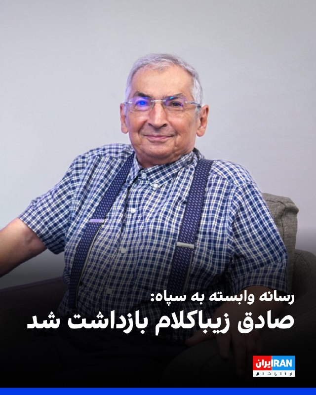

خبرگزاری تسنیم، وابسته به سپاه پاسداران، از بازداشت صادق زیباکلام، فعال سیاسی و استاد دانشگاه، خبر داد.

به گزارش تسنیم، قرار نظارت قضایی زیباکلام پیش‌تر به دلیل نقض ممنوعیت فعالیت رسانه‌ای و تولید محتوا در شبکه‌های اجتماعی تشدید شده بود.

در این گزارش آمده است او با وجود اعلام دادستانی تهران درباره ممنوعیت فعالیت رسانه‌ای، در یک مصاحبه اظهاراتی مطرح کرد که به گفته این خبرگزاری، منجر به اعلام جرم جدید و تشدید قرار نظارت قضایی شد.

بر اساس این گزارش، صادق زیباکلام صبح چهارشنبه ۲۰ خرداد بازداشت شد.
https://iranintl.com/202606100554

## IranIntlTV — post 341486

  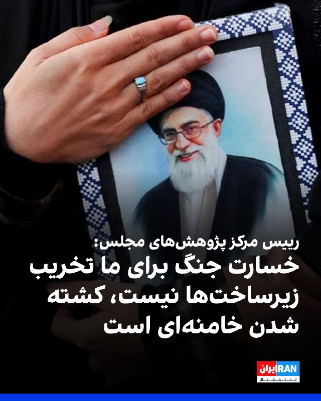

بابک نگاهداری، رییس مرکز پژوهش‌های مجلس، گفت که در این جنگ، ما خسارت‌های زیادی متحمل شدیم که برخی از این خسارت‌ها قابل جبران نیستند.

او افزود که آن خسارتی که قابل جبران نیست، تاسیسات و زیرساخت‌های ما نیستند، بلکه کشته شدن خامنه‌ای است.

رییس مرکز پژوهش‌های مجلس ادامه داد: «رهبر ما همواره مدافع و پیگیر گسترش روابط با چین بودند و روابط با چین را خود شخصا از دولت‌ها پیگیری می‌کرد.»
https://iranintl.com/202606104726

## IranIntlTV — post 341485

  <a href="telegram/content/IranIntlTV_341485_1781097864.mp4" target="_blank">🎬 Download video</a>

از لندن و برلین تا نیویورک، چند پرونده قضایی مرتبط با جمهوری اسلامی و سپاه پاسداران در جریان است؛ پرونده‌هایی از حمله به خبرنگاران و طرح ترور، تا شناسایی اهداف یهودی و فروش تسلیحات ایرانی.

مقام‌های غربی می‌گویند جمهوری اسلامی برای عملیات‌های خارجی خود از شبکه‌های جنایی و افراد اجیرشده استفاده می‌کند.
@iranintltv

## IranIntlTV — post 341484

  <a href="telegram/content/IranIntlTV_341484_1781097865.mp4" target="_blank">🎬 Download video</a>

یک شهروند با ارسال ویدیویی به ایران اینترنشنال گفت که ناچار شده است تمام پس‌انداز دلاری خود را برای خرید قارچ و پنیر بفروشد زیرا فرزندش پیتزا می‌خواست.

## IranIntlTV — post 341483

  <a href="telegram/content/IranIntlTV_341483_1781097867.mp4" target="_blank">🎬 Download video</a>

مسعود پزشکیان، رییس دولت جمهوری اسلامی، در یک مراسم حکومتی گفت علی خامنه‌ای بارها بر ضرورت پایان‌دادن به وضعیت «نه جنگ، نه صلح» تاکید کرده بود. او افزود، برخلاف پیام‌هایی که گاه از صداوسیما درباره مخالفت خامنه‌ای با مذاکره منتشر می‌شود، رهبر جمهوری اسلامی اجازه ادامه گفت‌وگوها را داده و از دولت خواسته بود برای حل این وضعیت اقدام کند.
@iranintltv

## Shin_Persian — post 6860

  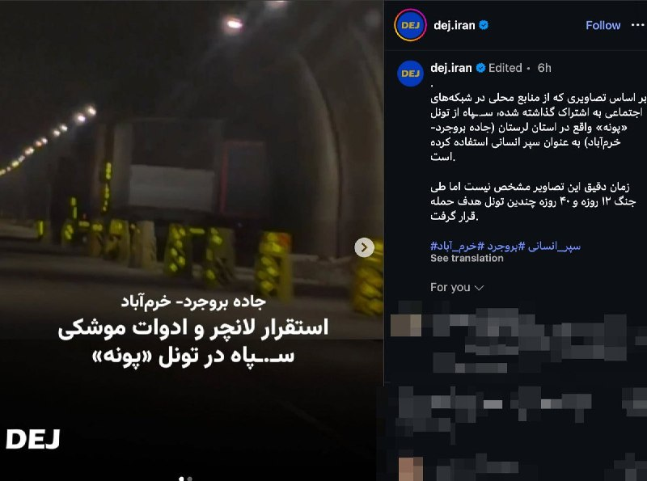

🔁 Quoting above tweet:
Shin ✓ @hey_itsmyturn
Wed, 10 Jun 2026 13:18:56 UTC

1. Thanks for NOT watermarking the image, much appreciated.
2. For clarification: image is from last night.

ترجمه خودکار فارسی

۱. ممنون که روی تصویر واترمارک نزدید، بسیار سپاسگزارم.
۲. جهت شفاف‌سازی: تصویر مربوط به دیشب است.

𝕏 · @shin_persian

## Shin_Persian — post 6857

↩️ Quoted tweet:
Shin ✓ @hey_itsmyturn
Tue, 09 Jun 2026 23:43:44 UTC

IRGC trucks hiding in Pouneh tunnel, Lorestan Province, #Iran

↩️ توییت نقل‌قول شده — برای پاسخ، پست زیر را ببینید.

ترجمه خودکار فارسی

کامیون‌های سپاه پاسداران انقلاب اسلامی (IRGC) در تونل پونه، استان لرستان، مخفی شده‌اند. #Iran

𝕏 · @shin_persian

## Persian_Trend_Official — post 16477

  <a href="telegram/content/Persian_Trend_Official_16477_1781097869.mp4" target="_blank">🎬 Download video</a>

ارتش اوکراین امروز با استفاده از موشک های کروز فلامینگو به کارخانه‌ ای در چبوکساری واقع در جمهوری چواشستان روسیه حمله کردند.

چبوکساری دست کم 900 کیلومتر از خاک اوکراین فاصله دارد. این کارخانه ماژول‌های ناوبری مقاوم در برابر جنگ الکترونیک تولید می‌کند که در موشک‌های کروز، موشک‌های بالستیک و پهپادها استفاده می‌شود.

این کارخانه پیش از این در 5 مه هدف حملات موشک های فلامینگو قرار گرفته بود.

📝 Amir

📌 @persian_trend_official
پرشین ترند | متفاوت‌ترین کانال نظامی

## RadioFarda — post 158148

بیش از ۲۰ کشور «توطئه‌های مرگبار» دستگاه‌های امنیتی ایران در سه قاره را محکوم کردند

🔸بیش از ۲۰ کشور دنیا از جمله آمریکا، بریتانیا، فرانسه، آلمان، استرالیا، کانادا و هلند با انتشار بیانیه مشترکی اقدامات سازمان‌های امنیتی و اطلاعاتی ایران علیه مخالفان حکومت، روزنامه‌نگاران و جوامع یهودی را در آمریکای شمالی، اروپا و استرالیا محکوم کردند.

🔸در این بیانیه که روز چهارشنبه ۲۰ خرداد منتشر شد، این کشورها با محکوم کردن «توطئه‌های مرگبار و سایر اقدامات بدخواهانۀ» سازمان اطلاعات سپاه پاسداران انقلاب اسلامی، نیروی قدس سپاه پاسداران و وزارت اطلاعات جمهوری اسلامی علیه مخالفان ایرانی، روزنامه‌نگاران و جوامع و منافع یهودی و اسرائیلی و ضمن درخواست برای متوقف کردن فوری این اقدامات گفتند که «در عزم خود برای محافظت از کشورها و مردم خود در برابر این تهدیدات متحد هستیم.»

🔸این بیانیه رابطه بین سرویس‌های امنیتی ایران و گروه‌های جنایت‌کار بین‌المللی و محلی را «دیرینه» توصیف و استفاده از آنها را «تاسف‌بار» خوانده است.

🔸این کشورها با نام بردن از گروهی به نام «حرکت اصحاب الیمین الاسلامیه» گفته است که این گروه و واسطه‌هایش حملاتی را در سراسر اروپا اخیرا علیه جوامع یهودی، روزنامه‌نگاران ایرانی و منافع ایالات متحده به راه انداخته است.

🔸کشورهای امضا کننده این بیانیه با محکوم کردن این اقدام گفته‌اند که «تلاش برای کشتن، آدم‌ربایی، آزار و اذیت، ارعاب یا حمله به مردم در خاک ما، حاکمیت ملی و هنجارهای بین‌المللی را تضعیف می‌کند. این اقدامات باید فوراً متوقف شوند. ما از تلاش کشورها برای مقابله با این فعالیت‌ها تقدیر می‌کنیم و با هم مصمم هستیم که اقدامات بیشتری را برای متوقف کردن آنها انجام دهیم.»

🔸اتریش، بلژیک، بلغارستان، جمهوری چک، دانمارک، استونی، فنلاند، ایرلند، لتونی، لیتوانی، نیوزیلند، مقدونیه شمالی، نروژ، پرتغال و سوئد از دیگر کشورهای امضا کننده این بیانیه هستند.

🔸در ماه‌های اخیر کشورهای غربی از شدت گرفتن فعالیت‌های گروه‌های تبهکار محلی علیه مخالفان و روزنامه‌نگاران ایرانی و جوامع یهودی به نمایندگی از سازمان‌های اطلاعاتی و امنیتی ایران خبر داده‌اند. دادگاه‌های کشورهایی مانند آمریکا و بریتانیا در واکنش به این اقدامات، احکامی را علیه اعضای مختلف این شبکه‌های تبهکاری صادر کرده‌اند.

@RadioFarda

## RadioFarda — post 158147

  <a href="https://t.me/radiofarda/158147" target="_blank">📎 Download file</a>

«پیام‌رسانی» ایران و آمریکا برای به رخ کشیدن توان نظامی؛ گفت‌وگو با سیروس عامریان

🔸بعد از برخورد یک پهپاد ایرانی به بالگرد‌ آپاچی آمریکا بر فراز تنگه هرمز، واشینگتن تصمیم به پاسخ «دفاعی» به این رخداد گرفت و تهران هم پاسخ حملات ایران را با موشک‌پرانی به برخی منافع آمریکا در کشورهای حوزه خلیج فارس داد. این تحولات را چگونه باید دید؟ آتش‌بس شکننده میان ایران و ایالات متحده تا کجا می‌تواند به‌رغم تبادل آتش پابرجا بماند؟ و چنین درگیری‌هایی درباره توان نظامی ایران بعد از جنگ چهل روزه چه پیام‌ها و نشانه‌هایی دارد؟ سیروس عامریان تحلیلگر نظامی ساکن ولینگتون در نیوزیلند به این پرسش‌ها پاسخ داده است.

@RadioFarda

## IranianMinds — post 22085

🔴۳ بمب‌افکن B52 آمریکایی که ساعاتی گذشته از آمریکا حرکت کرده بودند، در بریتانیا فرود آمدند.

@IranianMinds

## Hranews — post 113517

محور کنارک؛ مرگ یک سوختبر نوجوان در پی تیراندازی نیروهای نظامی

❗️
❗️
❗️
❗️
❗️– امروز یک سوختبر ۱۵ ساله بر اثر تیراندازی نیروهای نظامی و در پی واژگونی خودرو و آتش سوزی ناشی از آن, در محور کنارک جان خود را از دست داد.

ادامه مطلب

#کودکان #سوختبر

↘️
@hranews_bot تماس ✉️ - @Hranews کانال هرانا 🆑

## alonews — post 126824

  <a href="telegram/content/alonews_126824_1781097871.webm" target="_blank">🎬 Download video</a>

👈محسن زنگنه، عضو کمیسیون برنامه و بودجه:

ما باید حقیقت رو به مردم بگیم، در شدیدترین حالت جنگ با آمریکا هستیم. ما با بستن تنگه هرمز روی اقتصادشون فشار آوردیم و اونا هم با محاصره، واردات و صادرات مارو محدود کردن.
محاصره باعث کاهش درآمدهای نفتی و ارزی ما شده و به شدت با کسری بودجه مواجه شدیم.
با پایان جنگ دوباره درآمد های نفتی ما برمیگرده ولی تا اون موقع،
۳ ماه خیلی سخت رو پیش رو داریم!!

✅ @AloNews خبر جنگ

---
📅 بروزرسانی: 1405/03/20 16:43
---

## VahidOOnLine — post 244678

  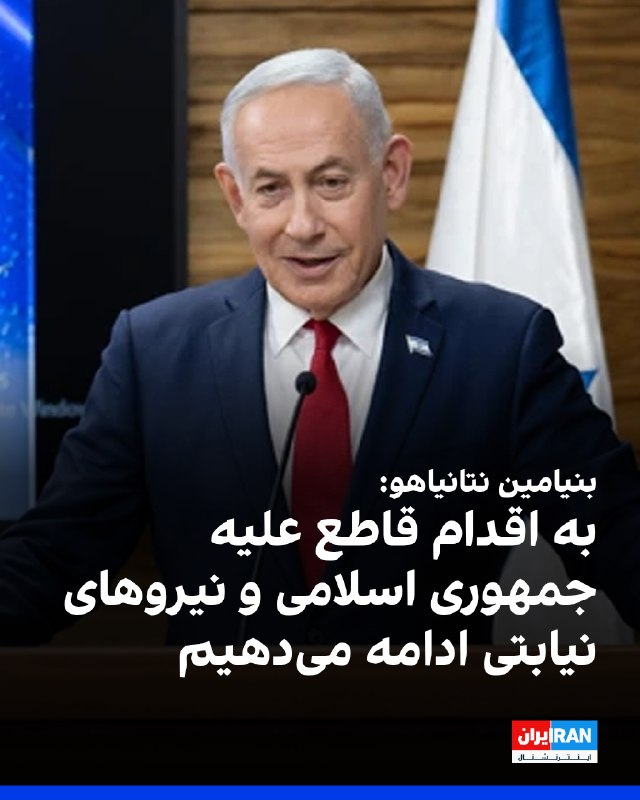

بنیامین نتانیاهو، نخست‌وزیر اسرائیل، در واکنش به محکومیت حملات اسرائیل در منطقه از سوی رجب طیب اردوغان، گفت دولت اسرائیل و ارتش این کشور به اقدام قاطع علیه جمهوری اسلامی و نیروهای نیابتی آن ادامه خواهند داد.

او در بیانیه‌ای به زبان عبری افزود: «دولت اسرائیل و ارتش اسرائیل، که اخلاقی‌ترین ارتش جهان است، به اقدام قاطع علیه ایران و نیروهای نیابتی آن که خاورمیانه و سراسر جهان را تهدید می‌کنند، ادامه خواهند داد.»

بنیامین نتانیاهو همچنین رجب طیب اردوغان را «دیکتاتوری یهودستیز» توصیف کرد که به گفته او صلاحیت انتقاد از اسرائیل را ندارد.

نخست‌وزیر اسرائیل در این بیانیه گفت: «دیکتاتور یهودستیز اردوغان که در حال نسل‌کشی علیه کردهاست، از سازمان «تروریستی» حماس حمایت می‌کند، مردم خود را سرکوب می‌کند و مخالفان سیاسی را زندانی می‌کند، آخرین کسی است که می‌تواند برای اسرائیل موعظه اخلاقی کند.»
‌🏁 🇬🇧 IranintlTV

🤖 @VahidOOnLine

## FoxNewsTwitter — post 342801

  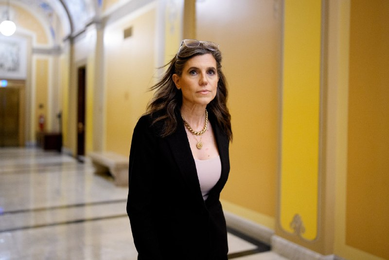

Fox News (Twitter/X)

"And apparently, I chose wrong if the goal was winning an election."

That was Nancy Mace's message after a crushing defeat in South Carolina's Republican gubernatorial primary.

After finishing fifth with roughly 11% of the vote, Mace said her focus was never about taking the easy path politically, pointing instead to her efforts on the Epstein files, sexual harassment settlements, and abuse investigations.

The congresswoman finished far behind Trump-backed Pamela Evette, who advanced to a runoff alongside Attorney General Alan Wilson.

“Serving South Carolina has been the greatest honor of my life,” she wrote after conceding.

## FoxNewsTwitter — post 342800

‌Fox News (Twitter/X)

Which companies will have a top-ranked AI model this year?

Our sponsor Kalshi’s prediction market shows:

— OpenAI: 50%
— Meta: 25%
— xAI: 20%

https://www.foxbusiness.com/media/ex-white-house-ai-czar-warns-us-could-lose-ai-race-china-washington-overregulates

## IranIntlTV — post 341482

  <a href="telegram/content/IranIntlTV_341482_1781097237.mp4" target="_blank">🎬 Download video</a>

شهروندان با ارسال پیام به ایران‌اینترنشنال از بحران تامین معیشت و افزایش بی‌سابقه قیمت مواد خوراکی در ایران انتقاد کردند. این پیام‌ها حاکی از کوچک‌تر شدن سبد خرید و حذف مواد غذایی پروتئینی از سفره‌های آنان است.

سبا حیدرخانی، عضو تحریریه ایران‌اینترنشنال، گزارش می‌دهد
@iranintltv

## IranIntlTV — post 341481

  

بنیامین نتانیاهو، نخست‌وزیر اسرائیل، در واکنش به محکومیت حملات اسرائیل در منطقه از سوی رجب طیب اردوغان، گفت دولت اسرائیل و ارتش این کشور به اقدام قاطع علیه جمهوری اسلامی و نیروهای نیابتی آن ادامه خواهند داد.

او در بیانیه‌ای به زبان عبری افزود: «دولت اسرائیل و ارتش اسرائیل، که اخلاقی‌ترین ارتش جهان است، به اقدام قاطع علیه ایران و نیروهای نیابتی آن که خاورمیانه و سراسر جهان را تهدید می‌کنند، ادامه خواهند داد.»

بنیامین نتانیاهو همچنین رجب طیب اردوغان را «دیکتاتوری یهودستیز» توصیف کرد که به گفته او صلاحیت انتقاد از اسرائیل را ندارد.

نخست‌وزیر اسرائیل در این بیانیه گفت: «دیکتاتور یهودستیز اردوغان که در حال نسل‌کشی علیه کردهاست، از سازمان «تروریستی» حماس حمایت می‌کند، مردم خود را سرکوب می‌کند و مخالفان سیاسی را زندانی می‌کند، آخرین کسی است که می‌تواند برای اسرائیل موعظه اخلاقی کند.»
https://iranintl.com/202606107315

## DW_Farsi — post 125777

  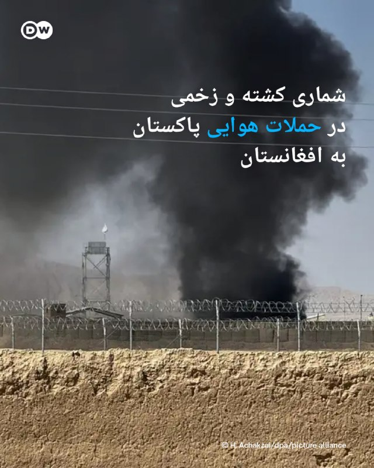

🔶 شماری کشته و زخمی در حملات هوایی پاکستان به افغانستان

پاکستان اعلام کرده که بار دیگر به چند ولایت در مناطق مرزی افغانستان حمله هوایی کرده است. در این حملات که شب گذشته، نهم ژوئن انجام شده چند نفر کشته شده‌اند، اما درباره تعداد دقیق قربانیان تا کنون گزارش‌های متفاوتی منتشر شده است.

عطاءالله طرار، وزیر اطلاع‌رسانی و رسانه‌های پاکستان اعلام کرده که هدف این عملیات مواضع شبه‌نظامیان در ولایت‌های کنر، خوست و پکتیکا بود و در جریان آن دست‌کم ۲۶ شبه‌نظامی کشته شده‌اند.

او طی پیامی در شبکه اجتماعی ایکس نوشت که چهار هدف، از جمله یک مرکز آموزشی و یک انبار مهمات به‌طور کامل نابود شده‌اند.

اما طالبان حاکم در افغانستان می‌گوید، دست‌کم ۱۳ غیرنظامی در این حملات کشته شده‌اند که برخی از آنان کودک بوده‌اند. همچنین حداقل ۱۴ زن و کودک نیز زخمی شده‌اند.

افغانستان و پاکستان چند ماه است که روابط پرتنشی دارند و درگیری میان این دو کشور از فوریه سال جاری بار دیگر شدت گرفته است.
@dw_farsi

## Persian_Trend_Official — post 16476

  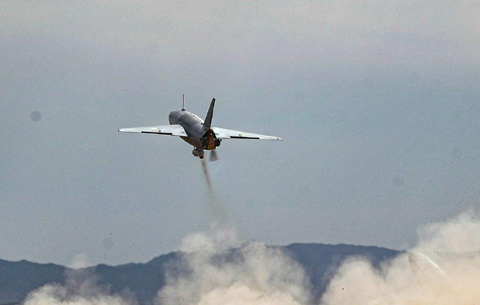

جزئیاتی از حمله پهپادهای ارتش به پایگاه آمریکا در بحرین

تسنیم: بامداد امروز پایگاه هوایی شیخ عیسی و یک سایت راداری راهبردی متعلق به نیروهای آمریکایی در بحرین هدف پهپادهای تهاجمی ارتش قرار گرفت. ارتش در حملات امروز خود از یک پهپاد جدید استفاده کرده است.

بنابر اعلام سپاه و ارتش اهداف مورد نظر شامل پایگاه الازرق در اردن، پایگاه علی السالم در کویت و مقر ناوگان پنجم نیروی دریایی آمریکا در بحرین بودند.

📝 Amir

📌 @persian_trend_official
پرشین ترند | متفاوت‌ترین کانال نظامی

## Persian_Trend_Official — post 16475

ترامپ: ایران در اشتباه خود، هلی‌کوپتر ما را سرنگون کرد، مثل معجزه بود که خلبانان ما کشته نشدند و زنده ماندند. هنوز کارم با ایران تمام نشده است. ما 55 درصد از آنچه ایران در طول آتش‌بس بازسازی کرده بود را نابود کردیم. 📝 Amir 📌 @persian_trend_official پرشین…

## Persian_Trend_Official — post 16473

  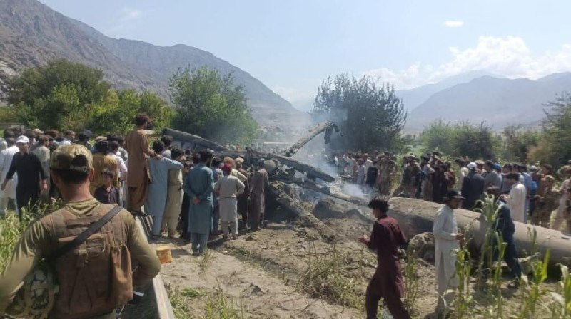

سقوط بالگرد ارتش پاکستان در کشمیر

روابط عمومی ارتش پاکستان: یک فروند بالگرد Mi-17 ارتش پاکستان در نزدیکی شهر مظفرآباد مرکز منطقه کشمیر هنگام برخاستن به دلیل نقص فنی سقوط کرد و تمام پرسنل حاضر در هلی‌کوپتر جان خود را از دست دادند.

📝 Amir

📌 @persian_trend_official
پرشین ترند | متفاوت‌ترین کانال نظامی

## Persian_Trend_Official — post 16472

  <a href="telegram/content/Persian_Trend_Official_16472_1781097242.webm" target="_blank">🎬 Download video</a>

شب گذشته یک فروند بمب‌افکن B-52 نیروی‌های امریکا در پایگاه فیرفورد بریتانیا فرود آمد.

📝 Amir

📌 @persian_trend_official
پرشین ترند | متفاوت‌ترین کانال نظامی

## RadioFarda — post 158146

  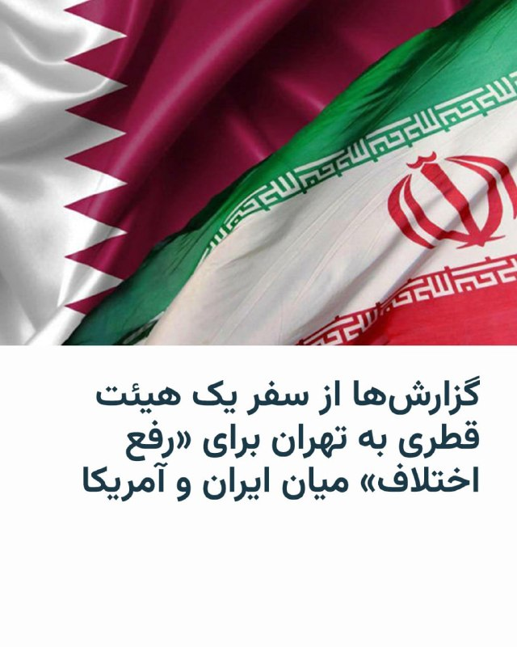

🔸رسانه‌های مختلف به نقل از دیپلمات‌ها از سفر یک گروه مذاکره کننده قطری به تهران در روز چهارشنبه برای رسیدگی به اختلافات باقی‌مانده بین ایالات متحده و ایران خبر دادند.

🔸خبرگزاری فرانسه به نقل از دیپلماتی آگاه به این سفر نوشت که این گروه مذاکره کننده قطری «پس از مشورت با ایالات متحده» به تهران سفر کرده تا در دیدار با مقام‌های ایران «شکاف‌های باقی‌مانده را پر کنند.»

🔸رسانه‌های ایرانی نیز سفر هیئت قطری به تهران را تأیید کرده‌اند. ایسنا نوشت این هیئت برای «گفت‌وگو و تبادل نظر درباره روابط دوجانبه و تحولات منطقه‌ای» ظهر چهارشنبه وارد تهران شده است.

🔸از زمان آتش‌بس میان ایران و آمریکا و اسرائیل، پاکستان به عنوان میانجی اصلی مذاکرات صلح میان ایران و آمریکا را هدایت می‌کرد اما در هفته‌های اخیر قطر نیز به عنوان میانجی دیگر تلاش کرده تا امکان برقرای تفاهمی میان ایران و آمریکا را فراهم کند.

🔸سفر هیئت قطری به تهران ساعاتی پس از تبادل آتش واشینگتن و تهران پس از سرنگونی یک بالگرد نظامی آمریکا و همزمان با تند شدن لحن دونالد ترامپ علیه ایران انجام شده است.

@RadioFarda

## alonews — post 126823

  <a href="telegram/content/alonews_126823_1781097243.webm" target="_blank">🎬 Download video</a>

👈3 بمب افکن B52 آمریکایی در ساعات گذشته از آمریکا حرکت کرده و در بریتانیا فرود اومدن.

✅ @AloNews خبر جنگ

---
📅 بروزرسانی: 1405/03/20 16:34
---

## VahidOOnLine — post 244677

  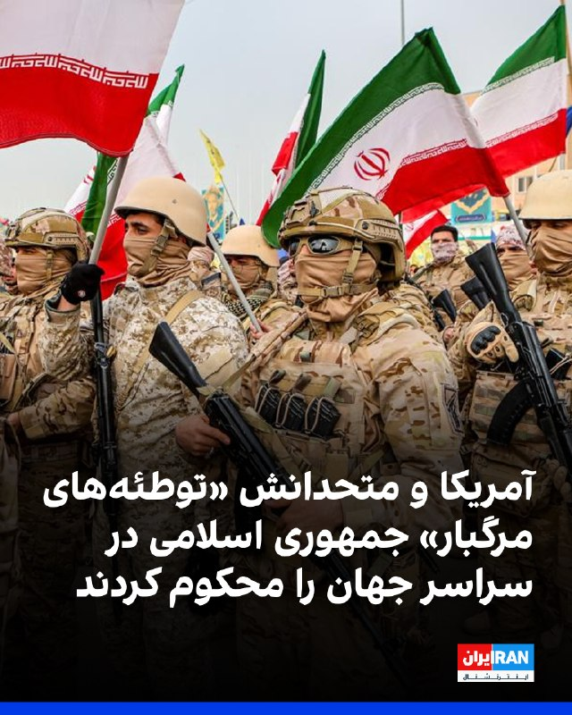

آمریکا، استرالیا، متحدان اروپایی و چند کشور دیگر در بیانیه‌ای مشترک که چهارشنبه ۲۰ خرداد منتشر شد، توطئه‌های گروه‌های مورد حمایت حکومت ایران برای کشتن مخالفان جمهوری اسلامی، خبرنگاران و جوامع یهودی در اروپا، آمریکای شمالی و استرالیا را محکوم کردند.

در این بیانیه که وزارت خارجه آمریکا منتشر کرد، آمده است: «ما در عزم خود برای حفاظت از کشورها و مردم‌ خود در برابر این تهدیدها متحد هستیم. ایران باید فورا این اقدامات را متوقف کند.»

این کشورها به «توطئه‌های مرگبار» و دیگر اقدامات سازمان اطلاعات سپاه پاسداران، نیروی قدس و وزارت اطلاعات جمهوری اسلامی اشاره کردند.

آن‌ها همچنین موج اخیر حملات در سراسر اروپا را که گروه طرفدار جمهوری اسلامی با نام حرکه اصحاب الیمن الاسلامیه مسئولیت آن را بر عهده گرفته، محکوم کردند.

در ادامه این بیانیه تاکید شده است: «تلاش برای کشتن، ربودن، آزار، ارعاب یا هرگونه حمله دیگر به افراد در خاک ما، حاکمیت ملی و هنجارهای بین‌المللی را تضعیف می‌کند. این اقدامات باید فورا متوقف شود.»
‌🏁 🇬🇧 IranintlTV

🤖 @VahidOOnLine

## pm_afshaa — post 93301

  <a href="telegram/content/pm_afshaa_93301_1781096653.webm" target="_blank">🎬 Download video</a>

🔴3 بمب افکن B52 آمریکایی در ساعات گذشته از آمریکا حرکت کرده و در بریتانیا فرود اومدن.

💧 Rainbet.com the #1 Non-KYC Crypto Casino & Sportsbook @rainbetcom

😁 @Pm_Afshaa

## pm_afshaa — post 93300

  <a href="telegram/content/pm_afshaa_93300_1781096653.webm" target="_blank">🎬 Download video</a>

🔴فاکس نیوز به نقل از یک مقام ارشد کاخ سفید: مذاکرات با ایران علیرغم تهدید ترامپ به تشدید حملات علیه ایران ادامه داره.

💧 Rainbet.com the #1 Non-KYC Crypto Casino & Sportsbook @rainbetcom

😁 @Pm_Afshaa

## DEJradio — post 5540

⭕️ ترامپ محاصرۀ دریایی جمهوری اسلامی را موفق‌ترین محاصرۀ تاریخ جنگ‌های دریایی خواند

دونالد ترامپ، رئیس جمهوری آمریکا اعلام کرد محاصرۀ دریایی علیه جمهوری اسلامی، موفق‌ترین محاصره در تاریخ جنگ‌های دریایی به‌شمار می‌رود.
او عصر چهارشنبه در شبکۀ اجتماعی تروث نوشت رسانه‌های جعلی، از بازتاب میزان اثرگذاری این محاصره خودداری می‌کنند.
رئیس جمهوری آمریکا با اشاره به عملیات دریایی ایالات متحده در آب‌های خاورمیانه نوشت که هیچ‌چیز عبور نمی‌کند، مگر آن که آمریکا اجازه بدهد.
او محاصرۀ دریایی کنونی را یک دیوار فولادی عنوان کرد.
به گفتۀ ترامپ، جمهوری اسلامی درعمل بخشی بزرگ از فرآیند تجارت را از دست داده و با مشکلات مالی فزاینده روبه‌رو است.
رئیس جمهوری آمریکا تأکید کرد جمهوری اسلامی توان پرداخت حقوق نیروهای نظامی را از دست داده، قادر به پرداخت هزینه‌ها نیست و به سرعت در مسیر ورشکستگی به‌پیش می‌رود.
رئیس جمهوری آمریکا در بخش دیگری از پیام خود به ادامۀ عبور نفتکش‌ها از تنگۀ هرمز با مجوز سنتکام اشاره کرد. او در همین راستا نوشت: نفت زیادی در حال خارج شدن است.
رئیس جمهوری آمریکا پیام خود را با عبارتی از ترجمۀ انگلیسی «حمدلله» به پایان رساند.

#خبر #دژ #ترامپ #محاصره_دریایی
@DEJradio

## DEJradio — post 5539

  <a href="telegram/content/DEJradio_5539_1781096654.webm" target="_blank">🎬 Download video</a>

🔺🎤 آتش‌بس ایران و اسرائیل؛ نقش واشنگتن دراین میان چیست؟

گفت‌وگو با شهرام خلدی، پژوهشگر مطالعات خاورمیانه

#جنگ #آتشبس
@DEJradio

## IranIntlTV — post 341480

  <a href="telegram/content/IranIntlTV_341480_1781096654.mp4" target="_blank">🎬 Download video</a>

دونالد ترامپ در نخستین واکنش به حملات متقابل میان آمریکا و جمهوری اسلامی، وضعیت نظامی ایران را «اشفته و نابسامان» توصیف کرد و گفت جمهوری اسلامی برای رسیدن به توافق بیش از حد تعلل کرده و اکنون باید بهای این تعلل را بپردازد.

جزییات بیشتر با مریم رحمتی، خبرنگار ایران‌اینترنشنال
@iranintltv

## IranIntlTV — post 341479

  

آمریکا، استرالیا، متحدان اروپایی و چند کشور دیگر در بیانیه‌ای مشترک که چهارشنبه ۲۰ خرداد منتشر شد، توطئه‌های گروه‌های مورد حمایت حکومت ایران برای کشتن مخالفان جمهوری اسلامی، خبرنگاران و جوامع یهودی در اروپا، آمریکای شمالی و استرالیا را محکوم کردند.

در این بیانیه که وزارت خارجه آمریکا منتشر کرد، آمده است: «ما در عزم خود برای حفاظت از کشورها و مردم‌ خود در برابر این تهدیدها متحد هستیم. ایران باید فورا این اقدامات را متوقف کند.»

این کشورها به «توطئه‌های مرگبار» و دیگر اقدامات سازمان اطلاعات سپاه پاسداران، نیروی قدس و وزارت اطلاعات جمهوری اسلامی اشاره کردند.

آن‌ها همچنین موج اخیر حملات در سراسر اروپا را که گروه طرفدار جمهوری اسلامی با نام حرکه اصحاب الیمن الاسلامیه مسئولیت آن را بر عهده گرفته، محکوم کردند.

در ادامه این بیانیه تاکید شده است: «تلاش برای کشتن، ربودن، آزار، ارعاب یا هرگونه حمله دیگر به افراد در خاک ما، حاکمیت ملی و هنجارهای بین‌المللی را تضعیف می‌کند. این اقدامات باید فورا متوقف شود.»
https://iranintl.com/202606101021

## BBCPersian — post 283351

🔻گزارش‌ها از آتش‌سوزی موتورخانه یک نفتکش در نزدیکی سواحل عمان

سازمان عملیات تجارت دریایی بریتانیا از وقوع آتش‌سوزی در موتورخانه یک نفتکش در دریای عمان خبر داده است.

به گفته این سازمان وابسته به نیروی دریایی بریتانیا، دو نفر از خدمه کشتی مفقود شده‌اند و یک نفر هم کشته یا زخمی شده است.

در مورد دلیل این آتش‌سوزی که در فاصله ۲۰ مایل دریایی شمال شرقی شهر بندری صحار عمان رخ داده، توضیحی داده نشده است.

ساعاتی پیش سازمان عملیات تجارت دریایی بریتانیا از نزدیک شدن یک قایق کوچک حامل شش فرد مسلح، به یک کشتی باری در حدود ۸۸ مایل دریایی جنوب غربی بلحاف یمن خبر داده بود.

این سازمان گفته بود که تبادل آتش بین قایق کوچک و تیم امنیتی مسلح کشتی رخ داد و سپس قایق مهاجم برگشت.
@BBCPersian

## Dirty_Kids — post 391579

  <a href="telegram/content/Dirty_Kids_391579_1781096656.mp4" target="_blank">🎬 Download video</a>

چه قابلیت‌هایی داشته شیدا خانم ما نمیدونستیم!!

ممد مورایس بخاطر این مسلمون شد 🫪

@Dirty_Kids 👻

## Dirty_Kids — post 391578

  <a href="telegram/content/Dirty_Kids_391578_1781096658.mp4" target="_blank">🎬 Download video</a>

اینا الزایمر دارن یا حال میکنن گل‌به‌خودی بزنن!!

@Dirty_Kids 👻

---
📅 بروزرسانی: 1405/03/20 16:24
---

## VahidOOnLine — post 244676

  <a href="telegram/content/VahidOOnLine_244676_1781096049.mp4" target="_blank">🎬 Download video</a>

یک شهروند در ویدیویی که به ایران اینترنشنال فرستاد گفت که بامداد ۲۰ خرداد با وجود آغاز حمله ارتش آمریکا هنوز هواپیمای مسافربری در آسمان است و قصد نشستن در فرودگاه مهرآباد را دارد.
‌🏁 🇬🇧 IranintlTV

🤖 @VahidOOnLine

## WithYashar — post 14316

ترامپ به فاکس نیوز گفت: تهران مذاکرات صلح را به تعویق انداخت که در نهایت منجر به پیشرفت بسیار محدودی شد‌‌
@withyashar

## FoxNewsTwitter — post 342799

  <a href="telegram/content/FoxNewsTwitter_342799_1781096051.mp4" target="_blank">🎬 Download video</a>

Fox News (Twitter/X)

The crew behind one of Washington's most recognizable restoration projects got a signature thank you from President Trump.

The workers who rebuilt the Reflecting Pool near the Washington Monument were invited to the Oval Office, where Trump praised their work and signed hats for the team.

## pm_afshaa — post 93299

زیبا کلام دستگیر شد

💧 Rainbet.com the #1 Non-KYC Crypto Casino & Sportsbook @rainbetcom

😁 @Pm_Afshaa

## IranIntlTV — post 341478

  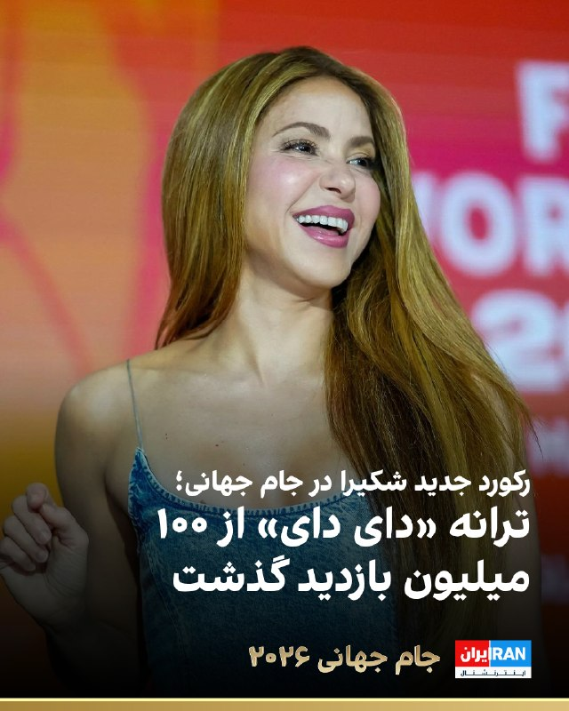

🔻شکیرا، ستاره کلمبیایی موسیقی پاپ، بار دیگر نام خود را با جام جهانی فوتبال گره زد. ترانه رسمی جام جهانی ۲۰۲۶ با عنوان «دای دای» که او با همکاری برنا بوی منتشر کرده، تنها دو هفته پس از انتشار از مرز ۱۰۰ میلیون بازدید عبور کرده است.

🔹شکیرا، خواننده ۴۹ ساله کلمبیایی، که سابقه حضور در چهار دوره جام جهانی را در کارنامه دارد، اکنون موفق‌ترین هنرمند تاریخ این رقابت‌ها به شمار می‌رود. او درباره ارتباطش با فوتبال گفت: «میان من و فوتبال پیوندی وجود دارد که انگار هیچ‌وقت از بین نمی‌رود.»

🔹شکیرا نخستین بار در جام جهانی ۲۰۰۶ آلمان با اجرای نسخه‌ای ویژه از آهنگ «هیپس دونت لای» پیش از فینال میان ایتالیا و فرانسه روی صحنه رفت. چهار سال بعد نیز با ترانه ماندگار «واکا واکا (این تایم فور آفریقا)» به نماد جام جهانی ۲۰۱۰ آفریقای جنوبی تبدیل شد؛ موزیک‌ویدیویی که تاکنون بیش از ۴.۵ میلیارد بار دیده شده و در میان پربازدیدترین ویدیوهای موسیقی تاریخ قرار دارد.

🔹او در جام جهانی ۲۰۱۴ برزیل نیز با آهنگ «لا لا لا (برزیل ۲۰۱۴)» حضور داشت؛ اثری که بیش از ۱.۳ میلیارد بازدید ثبت کرده است.

🔹جزییات بیشتر را در سایت بخوانید

@iranintltvsport

## IranIntlTV — post 341477

  <a href="telegram/content/IranIntlTV_341477_1781096053.mp4" target="_blank">🎬 Download video</a>

یک شهروند در ویدیویی که به ایران اینترنشنال فرستاد گفت که بامداد ۲۰ خرداد با وجود آغاز حمله ارتش آمریکا هنوز هواپیمای مسافربری در آسمان است و قصد نشستن در فرودگاه مهرآباد را دارد.

## FarsiVOA — post 220243

🔺هشدار پرزیدنت ترامپ به جمهوری اسلامی درباره خودداری از توافق: شاید دستور حمله به زیرساخت‌ها را صادر کنم

◾️دونالد ترامپ، رئیس جمهوری ایالات متحده، هشدار داد چنان‌چه رژیم ایران برای دستیابی به توافق با آمریکا بیش از این تعلل کند، ممکن است دستور حملات جدیدی را علیه زیرساخت‌های جمهوری اسلامی صادر کند.

⬇️ بیشتر بخوانید:

https://ir.voanews.com/a/president-trump-considers-striking-irans-infrastructure/8159306.html

## RadioFarda — post 158145

🔸قوه قضائیه جمهوری اسلامی روز چهارشنبه ۲۰ خرداد خبر داد که صادق زیباکلام، استاد سابق دانشگاه تهران و فعال سیاسی، بازداشت شده است. 🔸خبرگزاری میزان، وابسته به دستگاه قضائی ایران، اعلام کرد که «قرار نظارت قضائی» بر آقای زیباکلام روز ۱۷ خرداد تشدید شده بود و…

## RadioFarda — post 158144

  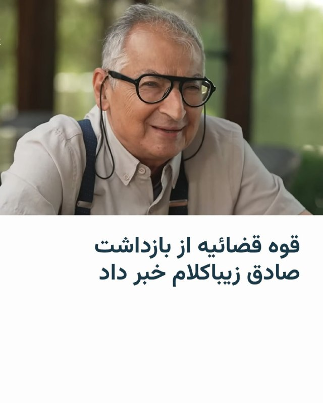

🔸قوه قضائیه جمهوری اسلامی روز چهارشنبه ۲۰ خرداد خبر داد که صادق زیباکلام، استاد سابق دانشگاه تهران و فعال سیاسی، بازداشت شده است.

🔸خبرگزاری میزان، وابسته به دستگاه قضائی ایران، اعلام کرد که «قرار نظارت قضائی» بر آقای زیباکلام روز ۱۷ خرداد تشدید شده بود و به دلیل انجام مصاحبه‌ای جدید، علیه او اعلام جرم و سپس صبح امروز بازداشت شد.

🔸این خبرگزاری گفته است که بر اساس قرار نظارت قبلی،‌ این فعال سیاسی دچار ممنوعیت «هرگونه فعالیت رسانه‌ای و تولید محتوا در شبکه‌های اجتماعی رسانه‌ای» بود.

@RadioFarda

## Hranews — post 113516

دانشگاه سجاد مشهد؛ ۱۰ دانشجو با احکام محرومیت از تحصیل مواجه شدند

❗️
❗️
❗️
❗️
❗️– ۱۰ تن از دانشجویان دانشگاه سجاد مشهد توسط کمیته انضباطی این دانشگاه در ارتباط با پرونده‌های مرتبط با اعتراضات سراسری دی‌ماه ۱۴۰۴، محکوم شده‌اند. احکام بدوی صادر شده برای این #دانشجویان شامل دو و نیم تا چهار سال محرومیت از تحصیل است.

ادامه مطلب

↘️
@hranews_bot تماس ✉️ - @Hranews کانال هرانا 🆑

## alonews — post 126822

  <a href="telegram/content/alonews_126822_1781096055.webm" target="_blank">🎬 Download video</a>

👈ترامپ به فاکس نیوز: ایران فرصتی برای امضای توافق و زنده ماندن داشت‌‌

✅ @AloNews خبر جنگ

## alonews — post 126821

  <a href="telegram/content/alonews_126821_1781096055.webm" target="_blank">🎬 Download video</a>

👈ترامپ به فاکس نیوز گفت: تهران مذاکرات صلح را به تعویق انداخت که در نهایت منجر به پیشرفت بسیار محدودی شد‌‌

✅ @AloNews خبر جنگ

---
📅 بروزرسانی: 1405/03/20 16:13
---

## VahidOOnLine — post 244675

  

عبدالرسول مرتضوی، زندانی سیاسی و مجروح جنگ ایران و عراق، در پیامی صوتی از زندان مرکزی اصفهان از شکنجه بازداشت‌شدگان انقلاب ملی خبر داد.

او گفت از ۱۰ اسفند ۱۴۰۴ تا ۲۰ فروردین ۱۴۰۵ همراه با تعدادی از بازداشت‌شدگان در یک سلول نگهداری شده و آثار شکنجه را بر بدن برخی زندانیان دیده است.

به گفته او، این زندانیان فرشاد امینی، رحمان کیانی، آرمان کیانی، ستار زارعی، اکبر نجسی، حمیدرضا عباسیان، یونس فلاح، محمدحسن صدیون، کامران خاکی، محسن تاکش، محسن رنجبر، مالک صادقی، دانیال شریفی، امین بخشیان، امیرحسین کاظمی، امیرحسین ثاقیانی، محمدباقر خوشایند، علی حاج‌کاظمی، محمد نیک‌بخت و محمد محمدی هستند.

مرتضوی از ضرب‌وشتم، بازجویی‌های خشن، قطع ارتباط با خانواده، سلول‌های تنگ، محدودیت هواخوری و رفتارهای تحقیرآمیز به‌عنوان بخشی از فشارها نام برده و در پایان خواستار مجازات عاملان و اجرای اصول ۳۸ و ۳۹ قانون اساسی شده است.
‌🏁 🇬🇧 IranintlTV

🤖 @VahidOOnLine

## VahidOOnLine — post 244674

  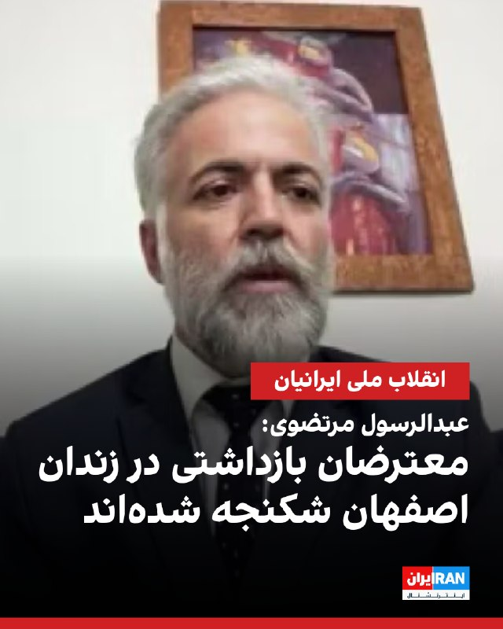

عبدالرسول مرتضوی، زندانی سیاسی و مجروح جنگ ایران و عراق، در پیامی صوتی از زندان مرکزی اصفهان از شکنجه بازداشت‌شدگان انقلاب ملی خبر داد.

او گفت از ۱۰ اسفند ۱۴۰۴ تا ۲۰ فروردین ۱۴۰۵ همراه با تعدادی از بازداشت‌شدگان در یک سلول نگهداری شده و آثار شکنجه را بر بدن برخی زندانیان دیده است.

به گفته او، این زندانیان فرشاد امینی، رحمان کیانی، آرمان کیانی، ستار زارعی، اکبر نجسی، حمیدرضا عباسیان، یونس فلاح، محمدحسن صدیون، کامران خاکی، محسن تاکش، محسن رنجبر، مالک صادقی، دانیال شریفی، امین بخشیان، امیرحسین کاظمی، امیرحسین ثاقیانی، محمدباقر خوشایند، علی حاج‌کاظمی، محمد نیک‌بخت و محمد محمدی هستند.

مرتضوی از ضرب‌وشتم، بازجویی‌های خشن، قطع ارتباط با خانواده، سلول‌های تنگ، محدودیت هواخوری و رفتارهای تحقیرآمیز به‌عنوان بخشی از فشارها نام برده و در پایان خواستار مجازات عاملان و اجرای اصول ۳۸ و ۳۹ قانون اساسی شده است.
‌🏁 🇬🇧 IranintlTV

🤖 @VahidOOnLine

## WithYashar — post 14315

صدای انفجار در کویت🚨
@withyashar

## WithYashar — post 14314

نتانیاهو: اسرائیل به شدت علیه ایران و نمایندگانش که خاورمیانه و جهان را تهدید می‌کنند، به فعالیت خود ادامه خواهد داد
@withyashar

## FoxNewsTwitter — post 342798

  

Fox News (Twitter/X)

Karmelo Anthony is shown in a newly released mugshot following his murder conviction.

Anthony was found guilty in the 2025 stabbing death of Austin Metcalf during a high school track meet in Frisco, Texas.

A jury sentenced him to 35 years in prison following a trial that gained national attention.

## FoxNewsTwitter — post 342797

‌Fox News (Twitter/X)

BREAKING: Inflation rises 4.2% annually in May, highest in three years and in line with expectations

## DEJradio — post 5538

⭕️ جمهوری اسلامی اعلام کرد حملات آمریکا به روند دیپلماسی آسیب زده است

اسماعیل بقائی، سخنگوی وزارت امور خارجۀ جمهوری اسلامی روز چهارشنبه گفت حملات اخیر آمریکا به اهدافی در جنوب ایران به تلاش‌های دیپلماتیک برای پایان دادن به جنگ آسیب زد.
او شمن متهم کردن آمریکا به «ارسال پیام‌های متناقض، تغییر مکرر مواضع و نقض آتش‌بس» ادعا کرد روند دیپلماتیک در شرایط به گفتۀ او «توسل به زور و اقدامات نظامی» آسیب می‌بیند.
بقایی همچنین اسرائیل را به نقض آتش‌بس در لبنان متهم کرد و مدعی شد دیپلماسی نمی‌تواند «در خلا» به‌پیش برود.
مقام وزارت خارجۀ دولت پزشکیان از سویی تهدید کرد نیروهای مسلح جمهوری اسلامی در پاسخ به حملات «درنگ نمی‌کنند».
او ادعا کرد که تهران همزمان از ابزار دیپلماسی و توان نظامی استفاده می‌کند.

#خبر #دژ #مذاکرات #جمهوری_اسلامی
@DEJradio

## IranIntlTV — post 341476

  

عبدالرسول مرتضوی، زندانی سیاسی و مجروح جنگ ایران و عراق، در پیامی صوتی از زندان مرکزی اصفهان از شکنجه بازداشت‌شدگان انقلاب ملی خبر داد.

او گفت از ۱۰ اسفند ۱۴۰۴ تا ۲۰ فروردین ۱۴۰۵ همراه با تعدادی از بازداشت‌شدگان در یک سلول نگهداری شده و آثار شکنجه را بر بدن برخی زندانیان دیده است.

به گفته او، این زندانیان فرشاد امینی، رحمان کیانی، آرمان کیانی، ستار زارعی، اکبر نجسی، حمیدرضا عباسیان، یونس فلاح، محمدحسن صدیون، کامران خاکی، محسن تاکش، محسن رنجبر، مالک صادقی، دانیال شریفی، امین بخشیان، امیرحسین کاظمی، امیرحسین ثاقیانی، محمدباقر خوشایند، علی حاج‌کاظمی، محمد نیک‌بخت و محمد محمدی هستند.

مرتضوی از ضرب‌وشتم، بازجویی‌های خشن، قطع ارتباط با خانواده، سلول‌های تنگ، محدودیت هواخوری و رفتارهای تحقیرآمیز به‌عنوان بخشی از فشارها نام برده و در پایان خواستار مجازات عاملان و اجرای اصول ۳۸ و ۳۹ قانون اساسی شده است.
https://iranintl.com/202606104302

## IranIntlTV — post 341475

  <a href="https://t.me/IranintlTV/341475" target="_blank">📎 Download file</a>

🎧نسخه صوتی اخبار نیم‌روزی | چهارشنبه ۲۰ خرداد
@iranintlTV

## IranIntlTV — post 341474

  

عبدالرسول مرتضوی، زندانی سیاسی و مجروح جنگ ایران و عراق، در پیامی صوتی از زندان مرکزی اصفهان از شکنجه بازداشت‌شدگان انقلاب ملی خبر داد.

او گفت از ۱۰ اسفند ۱۴۰۴ تا ۲۰ فروردین ۱۴۰۵ همراه با تعدادی از بازداشت‌شدگان در یک سلول نگهداری شده و آثار شکنجه را بر بدن برخی زندانیان دیده است.

به گفته او، این زندانیان فرشاد امینی، رحمان کیانی، آرمان کیانی، ستار زارعی، اکبر نجسی، حمیدرضا عباسیان، یونس فلاح، محمدحسن صدیون، کامران خاکی، محسن تاکش، محسن رنجبر، مالک صادقی، دانیال شریفی، امین بخشیان، امیرحسین کاظمی، امیرحسین ثاقیانی، محمدباقر خوشایند، علی حاج‌کاظمی، محمد نیک‌بخت و محمد محمدی هستند.

مرتضوی از ضرب‌وشتم، بازجویی‌های خشن، قطع ارتباط با خانواده، سلول‌های تنگ، محدودیت هواخوری و رفتارهای تحقیرآمیز به‌عنوان بخشی از فشارها نام برده و در پایان خواستار مجازات عاملان و اجرای اصول ۳۸ و ۳۹ قانون اساسی شده است.
https://iranintl.com/202606104302

## IranIntlTV — post 341473

  <a href="https://t.me/IranintlTV/341473" target="_blank">📎 Download file</a>

🎧نسخه صوتی تیتراول با نیوشا صارمی: ترامپ: ایران هلیکوپتر آپاچی آمریکا را سرنگون کرد، پاسخ خواهیم داد
@iranintlTV

## Persian_Trend_Official — post 16471

ترامپ به فاکس نیوز گفت که در آستانه دستور حملات جدید علیه زیرساخت ها انرژی و پل های ایران است. 📝 Amir 📌 @persian_trend_official پرشین ترند | متفاوت‌ترین کانال نظامی

## Persian_Trend_Official — post 16470

  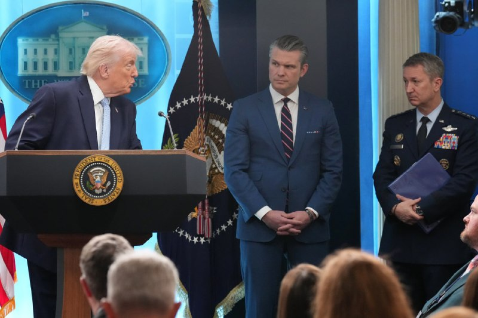

وال استریت ژورنال: ترامپ ابتدا برای پاسخ نظامی علیه ایران مردد بود.

ولی پس از آنکه پیت هگست، وزیر جنگ، و دن کین، رئیس ستاد مشترک ارتش در جریان یک جلسه توجیهی در کاخ سفید، اطلاعات به‌روز شده‌ای در مورد حمله پهپاد شاهد ایران به بالگرد آپاچی ایالات متحده، ارائه دادند، اقدام تلافی‌جویانه علیه ایران را توصیه کردند، با این اقدام موافقت کرد.

📝 Amir

📌 @persian_trend_official
پرشین ترند | متفاوت‌ترین کانال نظامی

## IranianMinds — post 22084

🔴 فاکس نیوز : مذاکرات ایران و آمریکا همچنان ادامه دارد

@IranianMinds

## BBCPersian — post 283350

  <a href="telegram/content/BBCPersian_283350_1781095434.mp4" target="_blank">🎬 Download video</a>

در پی ناآرامی‌های بلفاست که در پی حمله‌ با چاقو در این شهر رخ داد، شماری از شهروندان مجبور به ترک خانه‌های خود شده‌اند. در واکنش به این حمله، اعتراضاتی در پایتخت ایرلند شمالی رخ داد که به درگیری انجامید، خانه‌ها و خودروهایی به آتش کشیده شدند و تمامی خدمات حمل‌ونقل عمومی در این شهر متوقف شد.

یک مرد ۳۰ ساله سودانی به نام «هادی العدید» امروز چهارشنبه در ارتباط با حمله شامگاه دوشنبه ۸ ژوئن در شمال بلفاست در دادگاه حاضر شد. او به اقدام به قتل متهم شده است.
دادگاهی که امروز تشکیل شد، اعلام کرد که قربانی این حادثه چشم چپ خود را از دست داده و چشم راست او هم آسیب دیده است. او همچنین از ناحیه گردن و کمر زخمی شده است. نام این مرد «استیون اوگیلوی» اعلام شده که همچنان در بیمارستان بستری است.
بیشتر:
@BBCPersian
https://bbc.in/3RXZEOg

## alonews — post 126820

  <a href="telegram/content/alonews_126820_1781095436.webm" target="_blank">🎬 Download video</a>

👈فاکس نیوز به نقل از یک دیپلمات آگاه:
پس از رایزنی با ایالات متحده، مذاکره‌کنندگان قطری امروز صبح برای دیدار با ایرانی‌ها به تهران سفر کردن تا در تلاشی برای رفع اختلافات باقی‌مانده در فرآیند مذاکره باشن.

✅ @AloNews خبر جنگ

---
📅 بروزرسانی: 1405/03/20 16:03
---

## VahidOOnLine — post 244673

  <a href="telegram/content/VahidOOnLine_244673_1781094836.mp4" target="_blank">🎬 Download video</a>

⭕️ رسانه‌های ایران تصاویری از تخریب مخازن آب سیریک در پی حملات آمریکا را منتشر کردند

♦️خبرگزاری تسنیم، وابسته به سپاه پاسداران روز چهارشنبه ۲۰ خردادماه و ساعاتی پس از حملات آمریکا به اهدافی در شهرستان سیریک، ویدیویی از آثار تخریب مخازن آب بخش بمانی شهرستان سیریک استان هرمزگان را منتشر کرد.
خبرگزاری تسنیم به نقل ازرئیس شرکت آب و فاضلاب استان هرمزگان نوشت:  «دو مخزن بتنی ذخیره آب با ظرفیت مجموع ۲۵۰۰ مترمکعب در بخش بمانی هدف اصابت موشک قرار گرفت و به طور کامل از مدار بهره‌برداری خارج شد.
 این مقام محلی افرود: «این مخازن که از پروژه‌های کلیدی آبرسانی محسوب می‌شدند، وظیفه تأمین آب شرب شهر کوهستک و ۱۰ روستای اطراف را بر عهده داشتند... و
 منابع آب زیرزمینی کافی برای جایگزینی فوری در این منطقه وجود ندارد.»
‌🇸🇦 Indypersian

🤖 @VahidOOnLine

## VahidOOnLine — post 244672

  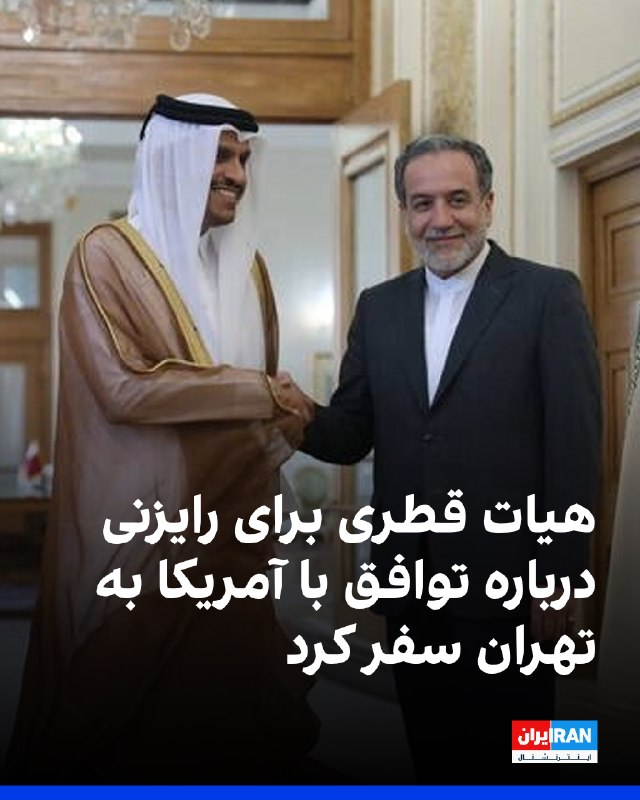

خبرگزاری رویترز به نقل از یک مقام آگاه گزارش داد که مذاکره‌کنندگان قطری چهارشنبه ۲۰ خرداد پس از رایزنی با آمریکا، در تلاشی برای نهایی کردن یک توافق، به تهران سفر کردند.

همزمان خبرگزاری ایسنا نیز اعلام کرد این هیات ظهر چهارشنبه وارد تهران شد تا درباره «روابط دوجانبه، تحولات منطقه‌ای و آخرین روندهای دیپلماتیک برای خاتمه جنگ» گفت‌وگو کند.

بر اساس گزارش ایسنا، این سفر با هدف رایزنی درباره وضعیت منطقه و بررسی مسیرهای سیاسی برای پایان دادن به درگیری‌ها انجام شد.
‌🏁 🇬🇧 IranintlTV

🤖 @VahidOOnLine

## VahidOOnLine — post 244671

  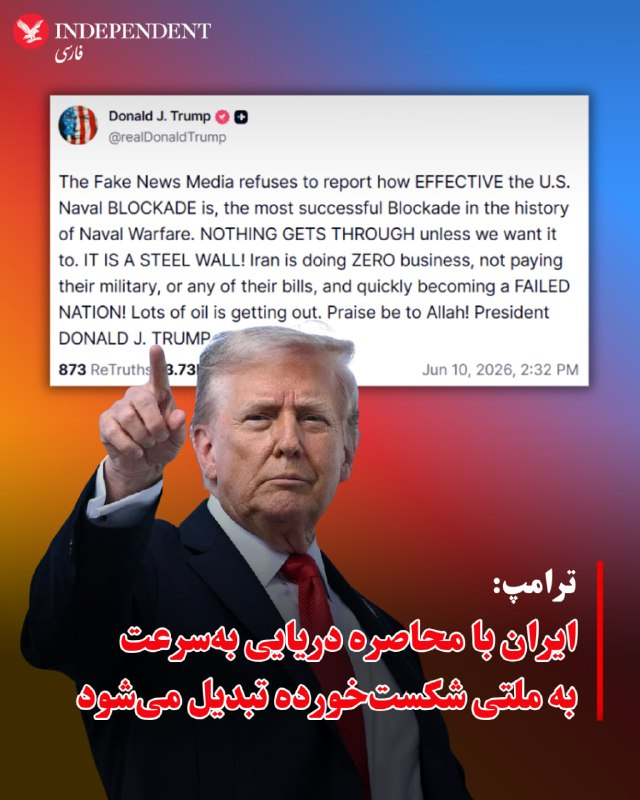

♦️دونالد ترامپ، رئیس جمهوری آمریکا روز چهارشنبه ۲۰ خرداد با انتقاد دوباره از رسانه‌های «اخبار دروغین»، محاصره دریایی ایران را موفق‌ترین محاصره تاریخ جنگ‌های دریایی خواند و گفت که «ایران به سرعت به ملتی شکست‌خورده تبدیل می‌شود.»

ترامپ در این پیام نوشت: «رسانه‌های اخبار جعلی از گزارش اینکه محاصره دریایی ایالات متحده چقدر موثر است، خودداری می‌کنند. موفق‌ترین محاصره در تاریخ جنگ‌های دریایی. هیچ چیز عبور نمی‌کند مگر اینکه ما بخواهیم. این یک دیوار فولادی است! ایران هیچ تجارتی انجام نمی‌دهد، حقوق نظامیان خودش یا هیچیک از بدهی‌هایش را پرداخت نمی‌کند و به سرعت در حال تبدیل شدن به یک ملت شکست‌خورده است! مقدار زیادی نفت از دست می‌دهد. الحمدلله!»
‌🇸🇦 Indypersian

🤖 @VahidOOnLine

## WithYashar — post 14313

فاکس نیوز به نقل از یک دیپلمات آگاه:
پس از رایزنی با ایالات متحده، مذاکره‌کنندگان قطری امروز صبح برای دیدار با ایرانی‌ها به تهران سفر کردن تا در تلاشی برای رفع اختلافات باقی‌مانده در فرآیند مذاکره باشن.
@withyashar

## WithYashar — post 14312

ترامپ در گفتگو با فاکس نیوز: بالگرد آپاچی AH-64 ارتش ایالات متحده که اوایل این هفته سقوط کرد، توسط یک پهپاد که بین دو خلبان خورده بود، مورد اصابت قرار گرفت.
با وجود آتش گرفتن و ایجاد گرمای شدید، پهپاد منفجر نشد و به خلبانان اجازه داد تا در دریا فرود اضطراری داشته باشند.

خدمه حدود دو ساعت بعد توسط یک شناور سطحی بدون سرنشین نیروی دریایی ایالات متحده نجات یافتند.
ترامپ زنده ماندن خلبانان را یک "معجزه" توصیف کرد
@withyashar

## WithYashar — post 14311

معاون وزیر ارتباطات از بازگشت ۷۸ درصدی ترافیک اینترنت به شرایط پیش از محدودیت‌ها خبر داد و ابراز امیدواری کرد حداکثر طی دو هفته آینده وضعیت به طور کامل عادی شود. وی همچنین شایعه اعمال فیلترینگ جدید را تکذیب کرد
@withyashar

## WithYashar — post 14310

ترامپ به فاکس نیوز : فرصت اینو داشتند توافق رو امضا کنند و زنده بمونن
@withyashar

## FoxNewsTwitter — post 342796

  <a href="telegram/content/FoxNewsTwitter_342796_1781094840.mp4" target="_blank">🎬 Download video</a>

Fox News (Twitter/X)

RT @FoxBusiness: "They seem to be happy with proceeding into an election with this campaign position 'of we are anti law enforcement.'"

Senate Majority Leader John Thune told Maria Bartiromo Republicans were left with “no choice” but to use reconciliation to pass the $70B ICE and Border Patrol funding bill.

Thune says Democrats walked away from a bipartisan deal after Minneapolis, rejected new reform offers, and let the agencies sit unfunded for weeks.

@MorningsMaria | @MariaBartiromo

## pm_afshaa — post 93298

  <a href="telegram/content/pm_afshaa_93298_1781094841.webm" target="_blank">🎬 Download video</a>

🔴فاکس نیوز به نقل از یک دیپلمات آگاه:
پس از رایزنی با ایالات متحده، مذاکره‌کنندگان قطری امروز صبح برای دیدار با ایرانی‌ها به تهران سفر کردن تا در تلاشی برای رفع اختلافات باقی‌مانده در فرآیند مذاکره باشن.

💧 Rainbet.com the #1 Non-KYC Crypto Casino & Sportsbook @rainbetcom

😁 @Pm_Afshaa

## pm_afshaa — post 93297

  <a href="telegram/content/pm_afshaa_93297_1781094842.webm" target="_blank">🎬 Download video</a>

🔴ترامپ به کانال 13 اسرائیل:
احتمال واقعی وجود داره که جنگ جدیدی علیه ایران آغاز کنم.

💧 Rainbet.com the #1 Non-KYC Crypto Casino & Sportsbook @rainbetcom

😁 @Pm_Afshaa

## pm_afshaa — post 93296

  <a href="telegram/content/pm_afshaa_93296_1781094843.webm" target="_blank">🎬 Download video</a>

🔴مسعود پزشکیان: امکان نداره یک کشور رو با بمباران وادار به تسلیم کرد؛ قطعا تسلیم نخواهیم شد.

💧 Rainbet.com the #1 Non-KYC Crypto Casino & Sportsbook @rainbetcom

😁 @Pm_Afshaa

## DEJradio — post 5537

  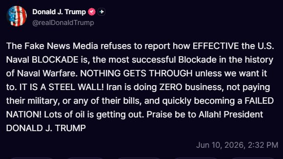

⭕️ ترامپ: جمهوری اسلامی فرصت توافق را سوزاند و باید بهایش را بپردازد

دونالد ترامپ، رئیس جمهوری آمریکا روز چهارشنبه گفت جمهوری اسلامی برای رسیدن به توافق بیش از حد تعلل کرد و اکنون باید بهای این تأخیر را بپردازد.
او در تروث سوشال نوشت نیروی نظامی جمهوری اسلامی در وضعیتی آشفته قرار دارد و بخشی بزرگ از توان دریایی و هوایی خود را از دست داده است.
ترامپ همچنین نوشت که قلدر خاورمیانه مرده است.
او افزود تهران توافقی را که می‌توانست برایش بسیار سودمند باشد، از دست داد.
فاکس‌نیوز گزارش داد رئیس جمهوری آمریکا آماده است تا دستور حملاتی تازه را علیه تأسیسات و زیرساخت‌های جمهوری اسلامی صادر کند.

#خبر #دژ #ترامپ #مذاکرات
@DEJradio

## kianmeli1 — post 87861

‏🔴خبرگزاری تسنیم، وابسته به سپاه پاسداران، از بازداشت صادق زیباکلام، فعال سیاسی و استاد دانشگاه خبر داد
https://t.me/kianmeli1

## kianmeli1 — post 87860

  <a href="telegram/content/kianmeli1_87860_1781094844.mp4" target="_blank">🎬 Download video</a>

🔴دقایقی پیش-یک پهپاد مسلح MQ-9A Reaper دیگر متعلق به نیروی هوایی یا گارد ملی هوایی ایالات متحده بر فراز ایران سرنگون شد.

لاشه این پهپاد در حال سوختن در کوه‌های نزدیک روستای چال بلوطک از توابع شهرستان اندیکا در استان خوزستان ایران قرار دارد.
https://t.me/kianmeli1

## kianmeli1 — post 87859

  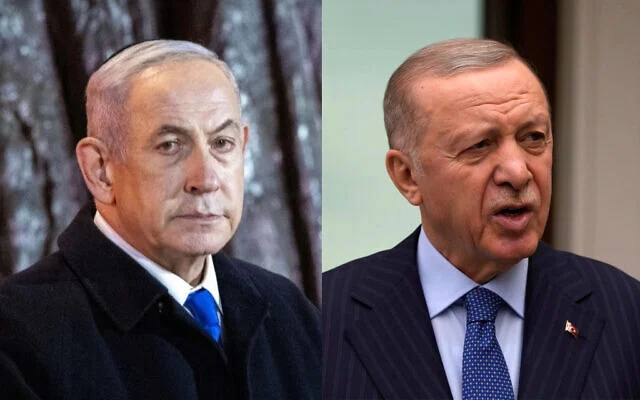

🔴به دنبال اظهارات پیشین رجب طیب اردوغان، رئیس جمهور ترکیه که گفته بود «نتانیاهو با روش‌های نسل‌کشی خود به سطحی رسیده که هیتلر را به حسادت می‌اندازد»، بنیامین نتانیاهو، نخست وزیر اسرائیل، در پاسخ گفت که اردوغان «آخرین کسی است که می‌تواند اخلاق را موعظه کند».
https://t.me/kianmeli1

## IranIntlTV — post 341472

خبرگزاری رویترز به نقل از یک مقام آگاه گزارش داد که مذاکره‌کنندگان قطری چهارشنبه ۲۰ خرداد پس از رایزنی با آمریکا، در تلاشی برای نهایی کردن یک توافق، به تهران سفر کردند.

همزمان خبرگزاری ایسنا نیز اعلام کرد این هیات ظهر چهارشنبه وارد تهران شد تا درباره «روابط دوجانبه، تحولات منطقه‌ای و آخرین روندهای دیپلماتیک برای خاتمه جنگ» گفت‌وگو کند.

بر اساس گزارش ایسنا، این سفر با هدف رایزنی درباره وضعیت منطقه و بررسی مسیرهای سیاسی برای پایان دادن به درگیری‌ها انجام شد.
https://iranintl.com/202606100462

## Persian_Trend_Official — post 16469

  <a href="telegram/content/Persian_Trend_Official_16469_1781094846.webm" target="_blank">🎬 Download video</a>

زیباکلام بازداشت شد!

تسنیم: هفدهم خرداد بود که خبر تشدید قرار نظارت قضایی صادق زیباکلام در پی نقض قرار ممنوعیت هرگونه فعالیت رسانه‌ای و تولید محتوا در شبکه‌های اجتماعی رسانه‌ای شد.

زیباکلام با وجود اعلام دادستانی تهران مبنی بر قرار نظارت قضایی با نقض این قرار، در مصاحبه‌ای اظهاراتی مطرح کرد که همین مصاحبه و ادعا‌های مطرح شده در آن منجر به اعلام جرم علیه این فرد و تشدید قرار نظارت قضایی وی شد.

با اعلام جرم جدید و تشدید قرار نظارت قضایی، صبح امروز صادق زیباکلام بازداشت شد.

در حال حاضر پرونده این فرد در دادسرای فرهنگ و رسانه مطرح رسیدگی است.

📝 Amir

📌 @persian_trend_official
پرشین ترند | متفاوت‌ترین کانال نظامی

## IranianMinds — post 22083

  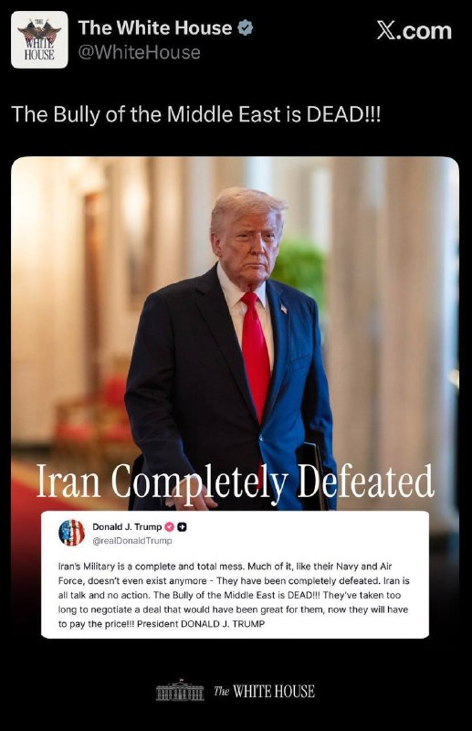

🔴پست کاخ سفید:

قلدر خاورمیانه مرده است.

@IranianMinds

## IranianMinds — post 22082

  

ترامپ به کانال ۱۳ اسرائیل:

احتمال واقعی وجود دارد که جنگ جدیدی علیه ایران آغاز کنم!

@IranianMinds

## Dirty_Kids — post 391577

🔴 شریفی زارچی استاد سابق دانشگاه شریف: جمهوری اسلامی در حال انتقام‌گیری از دانشجوهاس؛ حداقل 7 نفر از دانشجویان دانشگاه صنعتی آریامهر (شریف) حکم اخراج دریافت کردن. 103 روز جرات نکردن رهبرشونو به گور بسپارن؛ با قاتل رهبرشون در حال مذاکره‌ن؛ و تمام شجاعتشون…

## Dirty_Kids — post 391576

  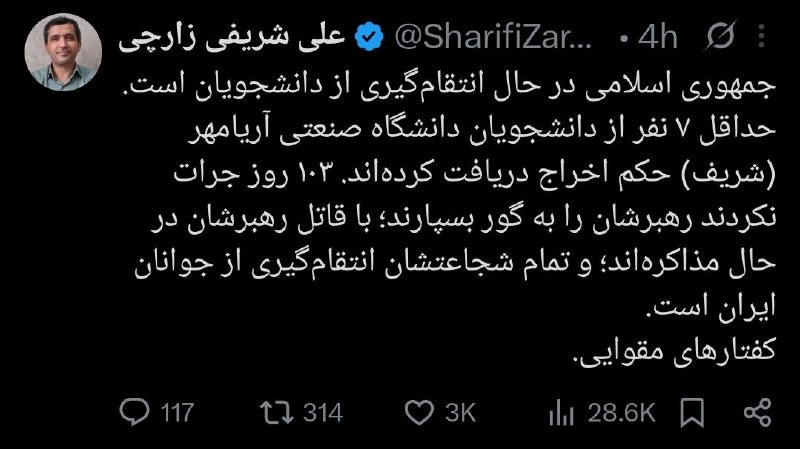

🔴 شریفی زارچی استاد سابق دانشگاه شریف:

جمهوری اسلامی در حال انتقام‌گیری از دانشجوهاس؛
حداقل 7 نفر از دانشجویان دانشگاه صنعتی آریامهر (شریف) حکم اخراج دریافت کردن.
103 روز جرات نکردن رهبرشونو به گور بسپارن؛ با قاتل رهبرشون در حال مذاکره‌ن؛ و تمام شجاعتشون انتقام‌گیری از جوانان ایرانه.
کفتارهای مقوایی.
‌

@Dirty_Kids 👻

## Hranews — post 113515

  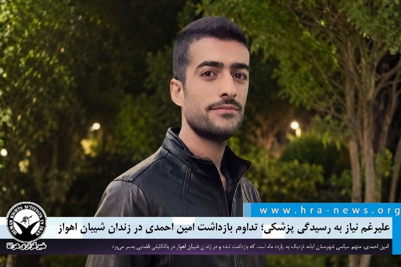

علیرغم نیاز به رسیدگی پزشکی؛ تداوم بازداشت امین احمدی در زندان شیبان اهواز

❗️
❗️
❗️
❗️
❗️– امین احمدی، متهم سیاسی اهل ایذه، نزدیک به یازده ماه است که بازداشت شده و در زندان شیبان اهواز در بلاتکلیفی قضایی به‌سر می‌برد. وی از بیماری‌های گوارشی رنج می‌برد و از دسترسی به خدمات درمانی و رسیدگی پزشکی مناسب محروم است.

به گزارش خبرگزاری هرانا، ارگان خبری مجموعه فعالان حقوق بشر در ایران، امین احمدی همچنان در بازداشت است.

بر اساس اطلاعات دریافتی هرانا، بیش از ۳۳۰ روز است که از بازداشت آقای احمدی می‌گذرد. او با اتهاماتی از جمله تبلیغ علیه نظام مواجه شده و تاکنون هیچ اقدامی برای رسیدگی به پرونده یا برگزاری دادگاه برای او صورت نگرفته است.

یک منبع مطلع نزدیک به خانواده این شهروند ضمن تایید این خبر به هرانا گفت: “آقای احمدی از بیماری گوارشی رنج می‌برد و از دسترسی به داروهایش و رسیدگی پزشکی محروم مانده است. این محرومیت از دریافت دارو، نگرانی‌های خانواده آقای احمدی را نسبت به وضعیت سلامت او افزایش داده است.”

ادامه مطلب

#امین_احمدی

↘️
@hranews_bot تماس ✉️ - @Hranews کانال هرانا 🆑

## alonews — post 126819

  <a href="telegram/content/alonews_126819_1781094848.mp4" target="_blank">🎬 Download video</a>

👈صادق زیباکلام بخاطر این مصاحبه که گفته بود موشک‌ها فاجعه به بار میارن، بارداشت شد

✅ @AloNews خبر جنگ

## alonews — post 126818

  <a href="telegram/content/alonews_126818_1781094850.webm" target="_blank">🎬 Download video</a>

👈رضا دالمن دانشجوی کارشناسی ارشد رشته مهندسی کامپیوتر دانشگاه صنعتی شریف به خاطر اویزون کردن عروسک یک موش و بدون هیچ دلیل خاصی از دانشگاه اخراج شد.

✅ @AloNews خبر جنگ

## alonews — post 126817

  <a href="telegram/content/alonews_126817_1781094851.webm" target="_blank">🎬 Download video</a>

👈ترامپ در گفتگو با فاکس نیوز: بالگرد آپاچی AH-64 ارتش ایالات متحده که اوایل این هفته سقوط کرد، توسط یک پهپاد که بین دو خلبان خورده بود، مورد اصابت قرار گرفت.

🔴با وجود آتش گرفتن و ایجاد گرمای شدید، پهپاد منفجر نشد و به خلبانان اجازه داد تا در دریا فرود اضطراری داشته باشند.

🔴خدمه حدود دو ساعت بعد توسط یک شناور سطحی بدون سرنشین نیروی دریایی ایالات متحده نجات یافتند.

🔴ترامپ زنده ماندن خلبانان را یک "معجزه" توصیف کرد

✅ @AloNews خبر جنگ

---
📅 بروزرسانی: 1405/03/20 15:53
---

## VahidOOnLine — post 244670

  

دونالد ترامپ، رییس‌جمهوری آمریکا، در مصاحبه با فاکس‌نیوز گفت ممکن است به‌زودی دستور حملات جدید به نیروگاه‌ها و پل‌ها در ایران را صادر کند.

او دلیل این موضوع را طولانی شدن روند مذاکرات از سوی جمهوری اسلامی عنوان کرد و افزود تهران دستیابی به توافق را بیش از حد به تاخیر انداخته است.

ترامپ تاکید کرد صدور دستور حملات جدید نزدیک است و گفت اگر روند مذاکرات تغییر نکند، تصمیم‌های تازه‌ای اتخاذ خواهد شد. او افزود ۵۵ درصد از سامانه‌های راداری که جمهوری اسلامی در دوران آتش‌بس بازسازی کرده بود، در حملات جدید آمریکا نابود شد.
‌🏁 🇬🇧 IranintlTV

🤖 @VahidOOnLine

## WithYashar — post 14309

ترامپ به کانال ۱۳ اسرائیل:احتمال واقعی وجود دارد که جنگ جدیدی علیه ایران آغاز کنم
@withyashar

## WithYashar — post 14308

معاون عراقچی به الجزیره: سرنگونی هلی کوپتر آمریکایی عمدی نبوده است
@withyashar 🤣

## WithYashar — post 14307

تحلیلگر عرب:با درگیری‌های دیشب و چند روز پیش آمریکا و اسرائیل به اطمینان رسیدن که قدرت نظامی ایران به مقدار خیلی زیادی نابود شده و این یکی از دلایل برای شروع مجدد جنگ گسترده.
@withyashar

## WithYashar — post 14306

گزارش صدای انفجار‌ از محدوده سوهانک / دارآباد تهران 🚨
@withyashar

## WithYashar — post 14305

  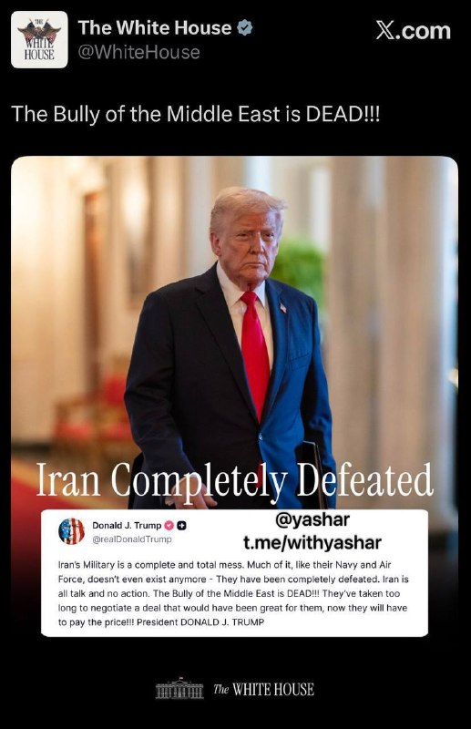

کاخ سفید:

قلدر خاورمیانه مُرده است!!!
@withyashar

## mwarmonitor — post 10610

  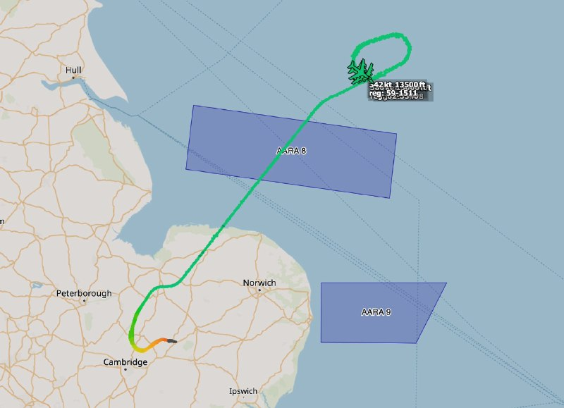

نیروی هوایی ایالات متحده (USAF)

✈️۳ فروند هواپیمای سوخت‌رسان Boeing KC-135 Stratotanker:

AE05B1 / 63-8878 — نام رمز: NACHO 95
AE0669 / 62-3540 — نام رمز: NACHO 96
AE0502 / 59-1511 — نام رمز: NACHO 97

✈️پرواز NACHO 95 تا 97 (۳ فروند KC-135) امروز در حال گشت‌زنی و گردش هوایی (orbit) در شمال/شمال‌شرقی منطقه AARA8 هستند.

@mwarmonitor

## pm_afshaa — post 93295

  <a href="telegram/content/pm_afshaa_93295_1781094229.webm" target="_blank">🎬 Download video</a>

🔴تحلیلگر عرب:
با درگیری‌های دیشب و چند روز پیش آمریکا و اسرائیل به اطمینان رسیدن که قدرت نظامی ایران به مقدار خیلی زیادی نابود شده و این یکی از دلایل برای شروع مجدد جنگ گسترده.

💧 Rainbet.com the #1 Non-KYC Crypto Casino & Sportsbook @rainbetcom

😁 @Pm_Afshaa

## DEJradio — post 5536

⭕️ فرماندۀ قرارگاه خاتم‌الانبیا گفت تجمعات شبانه باید تا دستور تازۀ مجتبی خامنه‌ای ادامه یابد

علی عبداللهی، فرماندۀ قرارگاه مرکزی خاتم‌الانبیا از حامیان حکومت خواست تجمعات شبانه را تا زمان صدور «دستور تازه از سوی مجتبی خامنه‌ای» ادامه دهند.
این در حالی است که از صدا و سیمای مجتبی خامنه‌‌ای هیچ نشانه‌ای دردست نیست.
عبداللهی، سردار سپاه پاسداران، یک‌صد شب تجمع مدوام حکومتی را بخشی از «بازدارندگی راهبردی جمهوری اسلامی» توصیف کرد و خواستار تداوم این برنامه‌ها شد.
این تجمعات که از هفته‌های نخست جنگ آغاز شد، با انتقاد شماری از شهروندان به دلیل ایجاد مزاحمت و اخلال در آرامش عمومی روبه‌رو شده است.
رژیم در این تجمعات تلاش می‌کند نمایشی ساختگی از هواداری طیف‌های گوناگون مردم را برای رسانه‌های خارجی به نمایش بگذارد.

#خبر #دژ #سیرک_خیابانی #موشتبا
@DEJradio

## DEJradio — post 5535

  <a href="telegram/content/DEJradio_5535_1781094229.mp4" target="_blank">🎬 Download video</a>

⭕️
👑 شاهزاده رضا پهلوی گفت تیم ملی واقعی ایران، همان مردم ایران است

شاهزاده رضا پهلوی در آستانۀ آغاز رقابت‌های جام جهانی فوتبال سال 2026 اعلام کرد تیم ملی واقعی ایران، همان مردم ایران است.
شاهزاده رضا پهلوی همچنین با اشاره به معترضان کشته‌شده، خواستار گرامی‌داشت یاد کسانی شد که امروز آنها نیز باید زنده می‌بودند.
شاهزاده یک روز مانده به گشایش جام جهانی، با اشاره به این که خودش هم به فوتبال علاقه دارد یادآور شد که جمهوری اسلامی این ورزش را به ابزاری علیه مردم ایران تبدیل کرده است.
شاهزاده از ایرانیان خواست نشان شیر و خورشید را در ورزشگاه‌، بیرون از آن و در هر جایی که هواداران گردهم می‌آیند، به‌نمایش درآوردند.

#شاهزاده_رضا_پهلوی #جام_جهانی #فوتبال
@DEJradio

## IranIntlTV — post 341471

  <a href="telegram/content/IranIntlTV_341471_1781094231.mp4" target="_blank">🎬 Download video</a>

یک شهروند با ارسال ویدیویی به ایران اینترنشنال، رد دود پرتابه در آسمان الیگودرز را نشان داد و در پیام خود گفت که صبح ۲۰ خرداد صدای عبور موشک و انفجار را در حوالی یک از پایگاه‌های سپاه پاسداران شنیده است.

## IranIntlTV — post 341470

  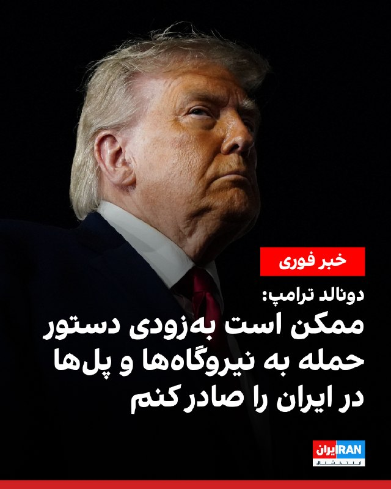

دونالد ترامپ، رییس‌جمهوری آمریکا، در مصاحبه با فاکس‌نیوز گفت ممکن است به‌زودی دستور حملات جدید به نیروگاه‌ها و پل‌ها در ایران را صادر کند.

او دلیل این موضوع را طولانی شدن روند مذاکرات از سوی جمهوری اسلامی عنوان کرد و افزود تهران دستیابی به توافق را بیش از حد به تاخیر انداخته است.

ترامپ تاکید کرد صدور دستور حملات جدید نزدیک است و گفت اگر روند مذاکرات تغییر نکند، تصمیم‌های تازه‌ای اتخاذ خواهد شد. او افزود ۵۵ درصد از سامانه‌های راداری که جمهوری اسلامی در دوران آتش‌بس بازسازی کرده بود، در حملات جدید آمریکا نابود شد.
https://iranintl.com/202606100464

## DW_Farsi — post 125776

🔶 ایران؛ کوچکتر شدن سفره‌ها علیرغم افزایش دستمزدها

🔺 گزارشی از دانیال عمری

در پی تداوم جنگ و فشارهای اقتصادی، شرایط زندگی در ایران به‌مراتب دشوارتر شده است. مقام‌های دولتی می‌گویند افزایش دستمزدها و اجرای طرح کالابرگ برای حمایت از خانوارهای کم‌درآمد طراحی شده، اما بسیاری از ایرانیان معتقدند این اقدامات از سرعت رشد قیمت‌ها عقب مانده است. از نگاه آن‌ها، مسئله دیگر فقط تورم نیست، بلکه شکاف روزافزون میان درآمد اسمی و قدرت خرید واقعی است؛ شکافی که جنگ نیز آن را عمیق‌تر کرده است.

برای بسیاری از خانواده‌ها، ملموس‌ترین نشانه بحران نه نرخ رسمی تورم، بلکه سرعت تغییر قیمت کالاهای روزمره است.

یکی از ساکنان تهران به دویچه‌وله گفت: «برنجی که ۱۵ روز قبل کیلویی ۲۷۵ هزار تومان خریده بود، هنگام خرید مجدد به ۳۰۰ هزار تومان رسیده است. بستنی لیوانی هم که یک هفته پیش ۴۰ هزار تومان قیمت داشت، اکنون ۵۰ هزار تومان شده است.» به گفته او، قیمت‌ها هفته به هفته بالا می‌روند، در حالی که حقوق‌ها فقط سالی یک‌بار افزایش پیدا می‌کنند و همان افزایش نیز حتی با نرخ تورم برابری نمی‌کند.

این گلایه، هسته اصلی نارضایتی عمومی را نشان می‌دهد. مردم اقتصاد را نه از طریق آمارهای رسمی، بلکه هنگام خرید روزانه تجربه می‌کنند. به همین دلیل، حتی افزایش قابل توجه حقوق روی کاغذ نیز زمانی که قیمت‌ها هر هفته تغییر می‌کنند، تأثیر چندانی بر زندگی آن‌ها ندارد.

آرزو کریمی، تحلیلگر اقتصادی ساکن لندن، به دویچه‌وله گفت: «هزینه تامین حداقل کالری مورد نیاز روزانه یک نفر اکنون از ۷ میلیون تومان فراتر رفته است.» به باور او، این یعنی فقط هزینه غذا می‌تواند بیش از ۷۰ درصد درآمد یک خانوار سه‌نفره را مصرف کند و عملاً پولی برای اجاره، درمان یا آموزش باقی نگذارد.

📌 برای دسترسی کامل به گزارش به وبسایت دویچه‌وله فارسی مراجعه کنید.
@dw_farsi

## Dirty_Kids — post 391575

  <a href="telegram/content/Dirty_Kids_391575_1781094233.mp4" target="_blank">🎬 Download video</a>

🔴 چند تا پسر اهوازی وسط جنگ وقتی رفیقشون خواب بود، این شاهکارو خلق کردن.

نزدیک ۱۵ بار سکته زد😂😂😂

@Dirty_Kids 👻

## Dirty_Kids — post 391574

  

حق داری چاووشی 😔😔🤣🤣🤣 کاری ندارم که بخوانم نمیتونن، توازن قدرت برقرار نیست، ولی خیلی لاشین بخاطر اینکه کتلت نشن قدرت‌رو از دست ندن عاغاتونو بتخمشون گرفتن بی‌خایه‌ها @Dirty_Kids 👻

## alonews — post 126816

  <a href="telegram/content/alonews_126816_1781094234.webm" target="_blank">🎬 Download video</a>

👈معاون وزیر ارتباطات از بازگشت ۷۸ درصدی ترافیک اینترنت به شرایط پیش از محدودیت‌ها خبر داد و ابراز امیدواری کرد حداکثر طی دو هفته آینده وضعیت به طور کامل عادی شود. وی همچنین شایعه اعمال فیلترینگ جدید را تکذیب کرد

✅ @AloNews خبر جنگ

## alonews — post 126815

  <a href="telegram/content/alonews_126815_1781094234.webm" target="_blank">🎬 Download video</a>

👈 به گزارش بلومبرگ، عراق در حال تسریع روند بارگیری نفت در بندر اصلی خود و افزایش حجم صادرات از مبدأ خلیج فارس است. این تحرک تازه، جدیدترین نشانه از عزم تولیدکنندگان ارشد اوپک در این منطقه برای انتقال و عبور بشکه‌های بیشتر نفت از مسیر استراتژیک و حیاتی تنگه هرمز به شمار می‌رود.

✅ @AloNews خبر جنگ

## alonews — post 126814

  

😳هنوز داری گیگی 10...15 تومن میخری ، وقتی اینترنت کامل درست شده
😱چون داری از واسطه تهیه میکنی

😍تخفیف ویژه فقط گیگی 2t
با لینک ساب

🌟با ضمانت و بهترین سرعت و کیفیت

☑️نامحدود واقعی فقط 290t

⌛️برای 200 نفر اول این تخفیف اعمال میشه ، سریع اقدام کنید که دیگه قرار نیست هزینه زیاد بابت وی پی ان بدید
👇
👇
@tvpnshop_bot
@tvpnshop_bot

---
📅 بروزرسانی: 1405/03/20 15:43
---

## WithYashar — post 14304

ترامپ: حملات بیشتر آمریکا به ایران، یک گزینه واقع بینانه است.
@withyashar

## WithYashar — post 14303

  <a href="telegram/content/WithYashar_14303_1781093620.mp4" target="_blank">🎬 Download video</a>

اسرائیل نان استاپ داره لبنان رو میزنه، یه خودرو رو هم با پهپاد نقطه‌زنی کرده، هدفمند.
@withyashar

## mwarmonitor — post 10609

  <a href="telegram/content/mwarmonitor_10609_1781093622.mp4" target="_blank">🎬 Download video</a>

خواهیم دید

## mwarmonitor — post 10608

مجری داخل استودیو: «یکی از چیزهایی که او را متوقف می‌کند... یعنی مانع از بازگشت و ادامه کارش شد، چندین مسئله است. افرادی در دولت او هستند که فقط نگران انتخابات هستند، که من این را درک می‌کنم، و کلاً فکر می‌کنند که ما اصلاً نباید این کار را انجام می‌دادیم.…

## mwarmonitor — post 10607

«من همین الان مکالمه تلفنی‌ام با رئیس‌جمهور ترامپ تمام شد و او جزئیات کاملاً جدیدی را درباره اتفاقی که برای آن هلیکوپتر آپاچی که اوایل این هفته سقوط کرد، در اختیار فاکس نیوز گذاشت و همچنین دیدگاه خود را درباره اینکه اوضاع در زمینه مذاکرات در چه مرحله‌ای قرار…

## pm_afshaa — post 93294

  <a href="telegram/content/pm_afshaa_93294_1781093622.webm" target="_blank">🎬 Download video</a>

🔴پزشکیان: هر هفته بدون استثنا با رهبر شهید دیدار داشتم که پشتوانه محکمی برای مدیریت ما و سیاست‌هایی بود که باید در کشور پیاده کنم.

💧 Rainbet.com the #1 Non-KYC Crypto Casino & Sportsbook @rainbetcom

😁 @Pm_Afshaa

## IranIntlTV — post 341469

  <a href="telegram/content/IranIntlTV_341469_1781093623.mp4" target="_blank">🎬 Download video</a>

مرکز پژوهش‌های کنگره آمریکا اعلام کرد در پیش‌نویس بودجه ۲۰۲۷ حدود ۱۱۹ میلیون دلار برای حمایت از نیروهای مسلح عراق در نظر گرفته شده و بررسی مشروط شدن این کمک‌ها به مهار گروه‌های وابسته به جمهوری اسلامی در جریان است

گفت‌وگو با تروسکه صادقی، خبرنگار ایران‌اینترنشنال
@iranintltv

## Persian_Trend_Official — post 16468

  <a href="telegram/content/Persian_Trend_Official_16468_1781093625.webm" target="_blank">🎬 Download video</a>

ترامپ: ایران در اشتباه خود، هلی‌کوپتر ما را سرنگون کرد، مثل معجزه بود که خلبانان ما کشته نشدند و زنده ماندند.

هنوز کارم با ایران تمام نشده است. ما 55 درصد از آنچه ایران در طول آتش‌بس بازسازی کرده بود را نابود کردیم.

📝 Amir

📌 @persian_trend_official
پرشین ترند | متفاوت‌ترین کانال نظامی

## Persian_Trend_Official — post 16467

یک منبع مطلع به i24NEWS گفت: رئیس‌جمهور ترامپ دیشب با نخست‌وزیر نتانیاهو گفتگو کرد و او را در جریان حمله احتمالی شب گذشته قرار داد.

این دو همچنین درباره موضوعات دیگری مرتبط با مذاکرات با ایران بحث کردند. در آمریکا از وضعیت مذاکرات ناامید شده‌اند و صبرشان رو به پایان است.

📝 Amir

📌 @persian_trend_official
پرشین ترند | متفاوت‌ترین کانال نظامی

## BBCPersian — post 283349

🔻سفر یک هیات قطری به تهران

🔻به گزارش رسانه‌های ایران یک هیئت بلندپایه از قطر ظهر امروز برای گفتگو با مقامات ایران وارد تهران شده است.

به گزارش روزنامه دولتی ایران، این هیئت برای گفتگو و تبادل نظر درباره روابط دوجانبه و تحولات منطقه‌ای، به تهران سفر کرده است.

بر اساس این گزارش «در جریان این سفر، این هیئت علاوه بر بحث در مورد روابط دوجانبه و تحولات منطقه، در باره آخرین تحولات مرتبط با روند دیپلماتیک برای خاتمه جنگ بین آمریکا و ایران هم بحث و رایزنی می‌کند.»

این سفر در حالی انجام می‌شود که درپی ساقط شدن یک بالگرد آمریکایی، تبادل آتش‌های تازه‌ای بین آمریکا و ایران رخ داده است.

ساعتی پیش دونالد ترامپ گفت که ایران در مذاکرات بیش از حد تعلل کرده است و حالا باید بهایش را بپردازد.

ایران هم پیشتر گفت که با درنظر گرفتن حملات جدید آمریکا در مورد ادامه مذاکرات تصمیم می‌گیرد.

https://bbc.in/3QuVrRC
@BBCPersian

## Dirty_Kids — post 391573

  

🔴 فاکس‌نیوز:
ترامپ درحال نزدیک شدن به صدور دستور حمله به نیروگاه‌ها و پل‌های ایرانه.

@Dirty_Kids 👻

## Dirty_Kids — post 391572

🔴 فوری-رسانه های عبری

تصمیم ترامپ برای حمله به پل ها و زیرساخت ایران قطعی است.
پنتاگون طرح های حمله جدید را به ترامپ گزارش داده و اسرائیل را نیز مطلع کرده.

@Dirty_Kids 👻

## Dirty_Kids — post 391571

  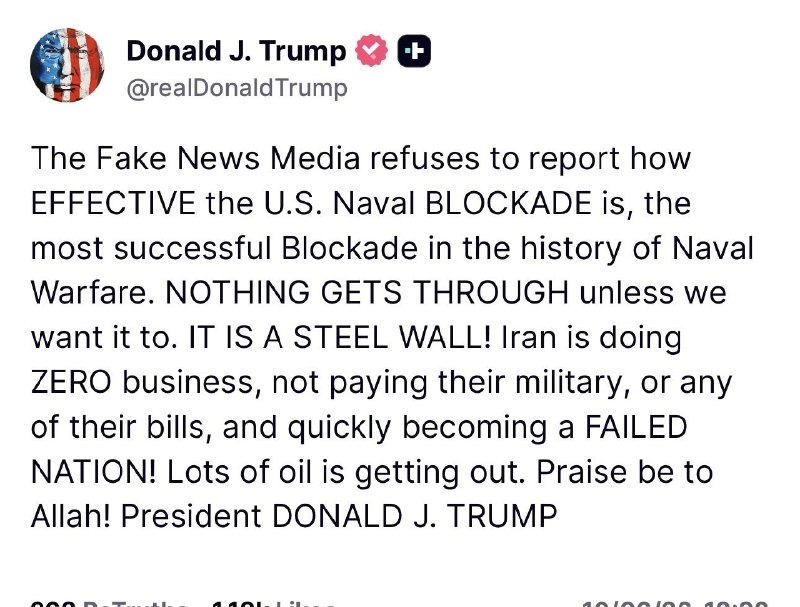

ترامپ در حالیکه امروز از دنده‌ی چپ از خواب بلند شده و معامله با ج.ا در این دقایق از چشش افتاده در پست دیگری گفت:

رسانه‌های فیک‌نیوز اصلاً به روی قرمساق خودشون نمیارن که محاصره‌ی دریایی آمریکا چقدر کارساز بوده.
محاصره‌ای که موفق‌ترین نمونه در کل تاریخ جنگ‌های دریایی به‌حساب میاد.
تا خودمون نخوایم پرنده هم نمی‌تونه ازش رد شه.
این محاصره مثل یه دیوار فولادیه. داد و ستد جمهوری‌اسلامی‌ کاملاً صفر شده. نه پول نیروی نظامیش رو داره بده و نه از پس مخارج دیگه‌ش برمیاد و خیلی سریع داره تبدیل به یه کشور ورشکسته می‌شه.
البته کلی نفت داره خارج می‌شه

رئیس‌جمهور، دونالد جی. ترامپ

@Dirty_Kids 👻

## alonews — post 126813

  <a href="telegram/content/alonews_126813_1781093626.webm" target="_blank">🎬 Download video</a>

👈ترامپ به فاکس نیوز : کارم با ایران تموم نشده؛ ما ۵۵٪ از چیزهایی رو که ایران در زمان آتش‌بس دوباره ساخته بود، نابود کردیم

✅ @AloNews خبر جنگ

---
📅 بروزرسانی: 1405/03/20 15:34
---

## VahidOOnLine — post 244669

  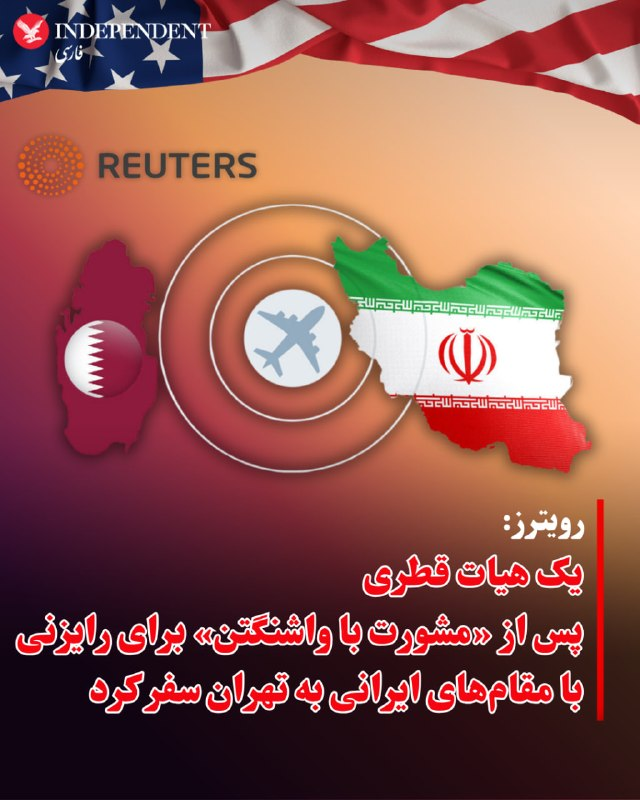

⭕️رویترز: یک هیات قطری پس از «مشورت با واشنگتن» برای رایزنی با مقام‌های ایرانی به تهران سفر کرد

♦️خبرگزاری رویترز روز چهارشنبه ۲۰ خردادماه و همزمان با تشدید تنش‌ها میان ایران و آمریکا، از سفر یک هیئت رسمی قطر «پس از مشورت با واشنگتن» به تهران خبر داد.

براساس این گزارش، هیئت قطری برای گفتگو درباره مذاکرات میان جمهوری اسلامی و آمریکا به پایتخت ایران سفر کرده است.

 هیئت قطری ساعاتی پس از تشدید بی‌سابقه رویارویی نظامی میان نیروهای مسلح جمهوری اسلامی ایران و سنتکام در بامداد چهارشنبه به تهران سفر کرده است.
‌🇸🇦 Indypersian

🤖 @VahidOOnLine

## WithYashar — post 14302

ترامپ: در آتش بس 55 درصد از آنچه که ایران درحال بازسازی آن بود را ویران کردم هنوز با ایران کار دارم🚨
@withyashar

## WithYashar — post 14301

یک منبع مطلع به i24NEWS می‌گوید: رئیس‌جمهور ترامپ دیشب با نخست‌وزیر نتانیاهو صحبت کرد و او را در جریان حمله احتمالی امشب قرار داد. این دو همچنین درباره موضوعات دیگری مرتبط با مذاکرات با ایران بحث کردند. در آمریکا از وضعیت مذاکرات ناامید شده‌اند و صبرشان رو به پایان است.
@withyashar

## WithYashar — post 14300

ترامپ این جمله را برای بار دوم دارد می‌گوید: «بلوکاد «حبس دریایی» ما علیه ایران آنقدر موفق است که حتی خدای آنها (الله) هم دارد علیه آنها کار می‌کند و من را تأیید می‌کند، ستایش بر الله باد!» @withyashar

## WithYashar — post 14299

نتانیاهو: اسرائیل به شدت علیه ایران و نمایندگانش که خاورمیانه و جهان را تهدید می‌کنند، به فعالیت خود ادامه خواهد داد
@withyashar

## WithYashar — post 14298

پست جدیدتر ترامپ: رسانه‌های اخبار جعلی از گزارش میزان اثربخشی محاصره دریایی ایالات متحده، که موفق‌ترین محاصره در تاریخ جنگ دریایی است، خودداری می‌کنند. هیچ چیز عبور نمی‌کند مگر اینکه ما بخواهیم. این یک دیوار فولادی است! ایران هیچ تجارتی ندارد، به ارتش خود…

## FoxNewsTwitter — post 342795

Fox News (Twitter/X)

BREAKING: President Trump exclusively tells @TreyYingst that the U.S. is getting close to ordering new strikes against Iranian power plants and bridges in response to “tapping the United States along” when it comes to drawn out negotiations.

The U.S. launched overnight strikes against Iranian-linked targets after a U.S. Apache helicopter was downed near the Strait of Hormuz, hitting roughly 20 sites.

Trump also revealing new details about the helicopter incident - saying an Iranian drone became lodged between the helicopter's two pilots as they maneuvered to avoid an explosion.

## pm_afshaa — post 93293

🔴اسرائیل هیوم:پنتاگون طرح های حمله جدید را به ترامپ گزارش داده و اسرائیل را نیز مطلع کرده 
💧 Rainbet.com the #1 Non-KYC Crypto Casino & Sportsbook @rainbetcom 
😁 @Pm_Afshaa

## pm_afshaa — post 93292

🔴اسرائیل هیوم:پنتاگون طرح های حمله جدید را به ترامپ گزارش داده و اسرائیل را نیز مطلع کرده

💧 Rainbet.com the #1 Non-KYC Crypto Casino & Sportsbook @rainbetcom

😁 @Pm_Afshaa

## pm_afshaa — post 93291

♨️
♨️
♨️
♨️

## pm_afshaa — post 93290

  <a href="telegram/content/pm_afshaa_93290_1781093094.webm" target="_blank">🎬 Download video</a>

🔴شریفی زارچی استاد سابق دانشگاه شریف:

جمهوری اسلامی در حال انتقام‌گیری از دانشجوهاس؛ حداقل 7 نفر از دانشجویان دانشگاه صنعتی آریامهر (شریف) حکم اخراج دریافت کردن. 103 روز جرات نکردن رهبرشونو به گور بسپارن؛ با قاتل رهبرشون در حال مذاکره‌ن؛ و تمام شجاعتشون انتقام‌گیری از جوانان ایرانه. کفتارهای مقوایی.
‌

💧 Rainbet.com the #1 Non-KYC Crypto Casino & Sportsbook @rainbetcom

😁 @Pm_Afshaa

## kianmeli1 — post 87858

🔴فوری - اسرائیل هیوم:

پنتاگون طرح های حمله جدید را به ترامپ گزارش داده و اسرائیل را نیز مطلع کرده
https://t.me/kianmeli1

## kianmeli1 — post 87857

🔴فوری-رسانه های عبری

تصمیم ترامپ برای حمله به پل ها و زیرساخت ایران قطعی است
https://t.me/kianmeli1

## FarsiVOA — post 220242

  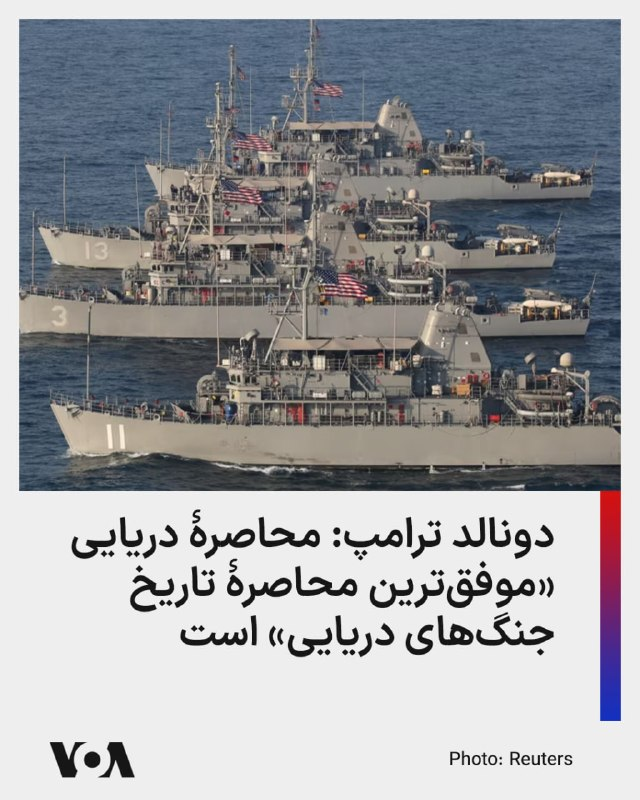

دونالد ترامپ، رئیس‌جمهوری آمریکا، در پیامی در تروث‌سوشال، محاصرهٔ دریایی آمریکا علیه جمهوری اسلامی را «موفق‌ترین محاصره در تاریخ جنگ‌های دریایی» خواند و نوشت «رسانه‌های جعلی» از انعکاس میزان «اثرگذاری» آن خودداری می‌کنند.

آقای ترامپ نوشت: «هیچ‌چیز عبور نمی‌کند، مگر آنکه ما بخواهیم. این یک دیوار فولادی است.» آقای ترامپ تاکید کرده است جمهوری اسلامی «هیچ تجارتی ندارد، حقوق نظامیانش را نمی‌پردازد و هیچ‌یک از صورت‌حساب‌هایش را پوشش نمی‌دهد» و «به‌سرعت در حال تبدیل‌شدن به یک کشور ورشکسته» است.

آقای ترامپ در همان پیام به عبور نفتکش‌ها از تنگه هرمز اشاره کرد و نوشت «نفت زیادی در حال خارج‌شدن است» و جمله را با عبارت «الحمدلله» به پایان رساند.
@FarsiVOA

## DW_Farsi — post 125775

🔶 "اسرائیل در صورت لزوم به‌تنهایی با ایران مقابله می‌کند"

به گزارش شبکه خبری تلویزیونی "آی۲۴ نیوز" بنیامین نتانیاهو ابراز آمادگی کرده که در صورت لزوم به تنهایی و بدون پشتیبانی نظامی آمریکا دست به مقابله نظامی با جمهوری اسلامی بزند.

این شبکه گزارش خود را با استناد به اظهارات نخست‌وزیر اسرائیل در یک نشست کابینه منتشر کرده است. به گزارش آی۲۴ نیوز نتانیاهو در این نشست تصریح کرد: «ممکن است ما در شرایطی قرار گیریم که مجبور شویم به تنهایی و بدون پشتیبانی ایالات متحده با ایران روبرو شود با تمامی بهایی که ممکن است در ازای آن بپردازیم: هزینه‌های نظامی و انزوای بین‌المللی.»

نخست‌وزیر اسرائیل در ادامه اظهارات خود تأکید کرد که این کشور خواهان بروز چنین وضعیتی نیست، اما بر این امر واقف است که چنین وضعیتی ممکن است رخ دهد و کار به چنین جایی بکشد.

اظهارات نتانیاهو در حالی است که ترامپ تا کنون نخست‌وزیر اسرائیل را فراخوانده تا از انجام اقدامات یکجانبه و تک‌روی پرهیز کند. علیرغم حملات متقابل روزهای اخیر واشنگتن همچنان به تلاش‌های دیپلماتیک برای رسیدن به توافق با جمهوری اسلامی تأکید دارد.

@dw_farsi

## Persian_Trend_Official — post 16465

  <a href="telegram/content/Persian_Trend_Official_16465_1781093096.mp4" target="_blank">🎬 Download video</a>

حمله پهپادی به صیدا و کشته شدن دو لبنانی

منابع لبنانی گزارش دادند که در حمله پهپادی اسرائیل به خودرویی در شهر صیدا در جنوب لبنان دو لبنانی احتمالا از اعضای حزب‌الله کشته شدند.

📝 Amir

📌 @persian_trend_official
پرشین ترند | متفاوت‌ترین کانال نظامی

## Persian_Trend_Official — post 16464

  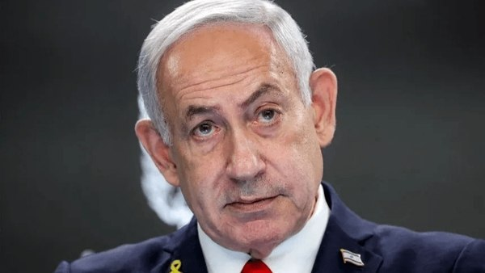

لیکود نامزدی نتانیاهو برای انتخابات آینده را اعلام کرد.

حزب لیکود اعلام کرد که نتانیاهو ریاست این حزب را برعهده خواهد داشت و در انتخابات پارلمانی آینده اسراییل نامزد خواهد شد.

📝 Amir

📌 @persian_trend_official
پرشین ترند | متفاوت‌ترین کانال نظامی

## RadioFarda — post 158143

اردوغان: حملات اسرائیل به سوریه و لبنان برای ترکیه نیز تهدید است

🔸رجب طیب اردوغان، رئیس‌جمهور ترکیه، روز چهارشنبه ۲۰ خرداد گفت حملات اسرائیل به سوریه و لبنان به مرحله‌ای رسیده که ترکیه را نیز تهدید می‌کند و افزود «تجاوزگری» اسرائیل تهدیدی برای کل جهان است و باید متوقف شود.

🔸ترکیه، عضو ناتو، از سرسخت‌ترین منتقدان حملات اسرائیل به ایران، غزه و لبنان بوده و می‌گوید اسرائیل بزرگ‌ترین مانع صلح منطقه‌ای است. این کشور همه روابط تجاری با اسرائیل را متوقف کرده و خواستار اتخاذ تدابیری علیه آن در دادگاه‌های بین‌المللی شده است.

🔸اردوغان در پارلمان و در جمع نمایندگان حزب حاکم عدالت و توسعه گفت: «حملات (بنیامین) نتانیاهو و شبکهٔ قتل او به لبنان و سوریه، موضوع را به نقطه‌ای رسانده که ترکیه را نیز تهدید می‌کند».

🔸او افزود امنیت آنکارا با امنیت این دو کشور گره خورده است.

🔸رئیس‌جمهور ترکیه همچنین گفت اسرائیل در حال «تلاشی پنهان» برای بی‌ثبات کردن کشورهای آفریقایی و منطقه مدیترانه، از طریق دامن زدن به «آتش تفرقه» در جزیره قبرس است که از نظر قومی دچار شکاف است.

🔸اردوغان افزود: «این موجودیت‌های کوچک که جاه‌طلبی‌هایشان بسیار فراتر از اندازه‌شان است، سوار قایق شیطنت اسرائیل شده‌اند، نقش پیمانکاران صهیونیستی را پذیرفته‌اند و در شرق مدیترانه در پی رؤیاهای واهی هستند».

🔸 گزارش کامل را در وب‌سایت رادیوفردا بخوانید.

@RadioFarda

## BBCPersian — post 283348

  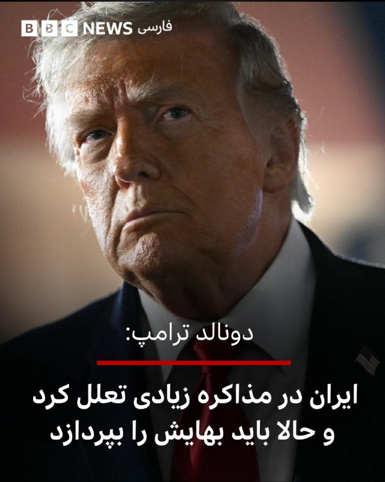

🔻دونالد ترامپ، رئیس‌جمهور آمریکا، می‌گوید که ایران در مذاکرات بیش از حد تعلل کرده است و حالا باید بهایش را بپردازد.

آقای ترامپ در پستی در شبکه اجتماعی خود تروث سوشال نوشت: «ارتش ایران کاملا آشفته و بهم ریخته است. بخش زیادی از آن، مانند نیروی دریایی و هوایی آنها، دیگر حتی وجود ندارد- آنها کاملا شکست خورده‌اند.»

او در ادامه آورده است: «ایران فقط حرف می‌زند و هیچ عملی انجام نمی‌دهد. قلدر خاورمیانه مرده است.»

آقای ترامپ در انتهای پیامش نوشته است: «آنها مذاکره در مورد توافقی که برایشان عالی بود را خیلی کش دادند، حالا باید هزینه آن را بپردازند.»

این اظهارات یک روز پس از حملات متقابل آمریکا و ایران در پی سقوط بالگرد آمریکایی منتشر شده است.

📷AFP via Getty Images
https://bbc.in/4eg30Uf

@BBCPersian

## alonews — post 126811

  <a href="telegram/content/alonews_126811_1781093099.webm" target="_blank">🎬 Download video</a>

👈قطعنامه آمریکا علیه ایران که حمایت آلمان، فرانسه و انگلیس را نیز به همراه دارد، امروز در شورای حکام به رأی گذاشته می‌شود

🔴در این سند از ایران خواسته شده درباره تأسیسات هسته‌ای بمباران‌شده و اورانیوم غنی‌شده آن‌ها به آژانس اطلاع‌رسانی کند.

✅ @AloNews خبر جنگ

## alonews — post 126810

  <a href="telegram/content/alonews_126810_1781093099.mp4" target="_blank">🎬 Download video</a>

👈نیروی هوایی اسرائیل بین یساریه و سرفند داره لُبنان حملۀ می‌کنه

✅ @AloNews خبر جنگ

## alonews — post 126809

  <a href="telegram/content/alonews_126809_1781093101.webm" target="_blank">🎬 Download video</a>

👈یک منبع مطلع به i24NEWS می‌گوید:
رئیس‌جمهور ترامپ دیشب با نخست‌وزیر نتانیاهو صحبت کرد و او را در جریان حمله احتمالی امشب قرار داد.

🔴این دو همچنین درباره موضوعات دیگری مرتبط با مذاکرات با ایران بحث کردند.

🔴در آمریکا از وضعیت مذاکرات ناامید شده‌اند و صبرشان رو به پایان است.

✅ @AloNews خبر جنگ

## alonews — post 126808

  <a href="telegram/content/alonews_126808_1781093101.webm" target="_blank">🎬 Download video</a>

👈پیت هگست، وزیر جنگ آمریکا؛ پست ترامپ درباره رسانه‌های جعلی رو تو صفحه خودش پست کرد

✅ @AloNews خبر جنگ

## alonews — post 126807

  <a href="telegram/content/alonews_126807_1781093102.webm" target="_blank">🎬 Download video</a>

👈پیت هگستث، وزیر جنگ ایالات متحده، امروز به پایگاه دریایی گوانتانامو در کوبا سفر خواهد کرد و پس از آن از فرماندهی مرکزی ایالات متحده (CENTCOM) در تامپا، فلوریدا و احتمالاً فرماندهی جنوبی ایالات متحده در دورال، فلوریدا بازدید خواهد کرد.

✅ @AloNews خبر جنگ

## alonews — post 126806

  <a href="telegram/content/alonews_126806_1781093102.webm" target="_blank">🎬 Download video</a>

👈نتانیاهو: اسرائیل به شدت علیه ایران و نمایندگانش که خاورمیانه و جهان را تهدید می‌کنند، به فعالیت خود ادامه خواهد داد

✅ @AloNews خبر جنگ

## alonews — post 126805

  <a href="telegram/content/alonews_126805_1781093103.webm" target="_blank">🎬 Download video</a>

👈نفت صعودی شد: ۹۳.۲۶ دلار

✅ @AloNews خبر جنگ

## alonews — post 126804

👈اسرائیل هیوم: وقت تمام شد مذاکرات شکست خورده و پاکستان از میانجیگری دست کشیده. ترامپ بعد از حادثه بالگرد و حملات دیشب بسیار عصبانی شده و میخواهد هرچه زودتر به جنگ باز گردد. پنتاگون طرح های حمله جدید راه به ترامپ گزارش داده و اسرائیل را نیز مطلع کرده.

✅ @AloNews خبر جنگ

---
📅 بروزرسانی: 1405/03/20 15:23
---

## VahidOOnLine — post 244668

  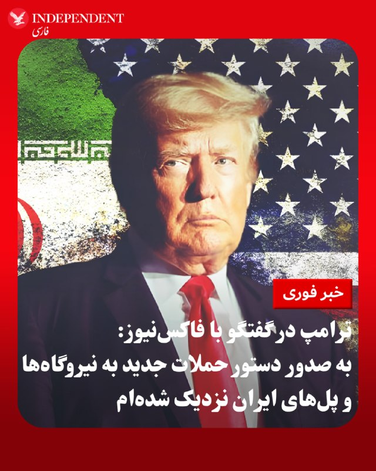

⭕️ترامپ در گفتگو با فاکس‌نیوز: به صدور دستور حملات جدید به نیروگاه‌ها و پل‌های ایران نزدیک شده‌ام

♦️فاکس‌نیوز روز چهارشنبه ۲۰ خردادماه گزارش کرد دونالد ترامپ، رئیس جمهوری آمریکا در یک مصاحبه تلفنی با این شبکه گفته است که امکان دارد دستور حملات جدید به نیروگاه‌های برق و پل‌های ایران را صادر کند چرا که تهران دستیابی به توافق را بیش از حد طول می‌دهد.
‌🇸🇦 Indypersian

🤖 @VahidOOnLine

## WithYashar — post 14297

ترامپ: میدونی خیلی وقت کشی میکنن خیلی باعث میشه تصمیم حمله بگیرم
@withyashar

## WithYashar — post 14296

ترامپ داره قاهره رو رد میکنه اقا ترمز کن 🤣🤣

## mwarmonitor — post 10606

«من همین الان مکالمه تلفنی‌ام با رئیس‌جمهور ترامپ تمام شد و او جزئیات کاملاً جدیدی را درباره اتفاقی که برای آن هلیکوپتر آپاچی که اوایل این هفته سقوط کرد، در اختیار فاکس نیوز گذاشت و همچنین دیدگاه خود را درباره اینکه اوضاع در زمینه مذاکرات در چه مرحله‌ای قرار دارد، بیان کرد. من می‌خواهم با داستانی شروع کنم که رئیس‌جمهور به من گفت؛ جزئیات جدیدی درباره سرنگونی این هلیکوپتر آپاچی ارتش ایالات متحده.
رئیس‌جمهور ترامپ به فاکس نیوز می‌گوید که پهپاد ایرانی بین دو خلبان در این هلیکوپتر گیر کرده بود؛ آنها در ارتفاع بسیار پایینی پرواز می‌کردند. و در آن لحظه، پهپاد آن‌طور که قصد داشت، منفجر نشد. بنابراین، این خلبان‌ها تلاش می‌کردند هلیکوپتر را با پهپادی که داخل این بالگرد جنگی گیر کرده بود، بدون اینکه منفجر شود، به زمین بنشانند، در حالی که هر لحظه ممکن بود منفجر شود؛ این چیزی است که رئیس‌جمهور به من گفت.
او گفت که هلیکوپتر آتش گرفته بود و گرمای زیادی در داخل کابین این هلیکوپتر وجود داشت، اما در نهایت این دو خلبان توانستند آن را در دریا فرود بیاورند و در نهایت برای اولین بار در تاریخ نظامی ایالات متحده، توسط یک پهپاد دریایی بدون سرنشین نجات یافتند.
رئیس‌جمهور ترامپ همچنین درباره حملات دیشب ایالات متحده به سیستم‌های راداری و سایت‌های پدافند هوایی ایران صحبت کرد. او گفت که ایرانی‌ها در طول آتش‌بس تلاش کرده بودند توانمندی‌های دفاعی خود را بازسازی کنند، اما نتوانستند جلوی حملات شبانه ایالات متحده را بگیرند و توسط جنگنده‌های آمریکایی در هم کوبیده شدند.
نکته جالب اینجاست که رئیس‌جمهور ترامپ به من گفت به صدور دستور حملات جدید علیه نیروگاه‌ها و پل‌های ایران نزدیک شده است، زیرا او می‌گوید ایرانی‌ها در فرآیند مذاکره، ایالات متحده را معطل کرده و بازی می‌دهند. او گفت "قلدر خاورمیانه مرده است" و به من گفت "من ممکن است به این روند ادامه دهم." وقتی از او درباره پاسخ احتمالی به شلیک موشک‌های ایران که دیشب نیروهای آمریکایی را در کویت، بحرین و اردن هدف قرار دادند پرسیدم، رئیس‌جمهور گفت آنها شانس این را داشتند که توافقی امضا کنند و زنده بمانند. این اظهارات دوباره نشان می‌دهد که او ممکن است دستور حملات جدیدی را علیه رژیم ایران در پاسخ به تعلل آنها در میز مذاکره صادر کند.
با این حال، آخرین اطلاعاتی که از رئیس‌جمهور ترامپ درباره آن هلیکوپتری که اوایل این هفته سقوط کرد به دست آوردیم، واقعاً داستان شگفت‌انگیزی است؛ رئیس‌جمهور آن را یک "معجزه" خواند. این پهپاد به هلیکوپتر آپاچی برخورد می‌کند، بین دو خلبان گیر می‌کند، آتش می‌گیرد و مقدار زیادی گرما از پهپاد خارج می‌شود، اما منفجر نمی‌شود. و این خلبان‌ها خیلی سریع، ظرف چند ثانیه، چون در ارتفاع بسیار پایینی پرواز می‌کردند، هلیکوپتر را به داخل دریا هدایت می‌کنند. و سپس در نهایت، حدود دو ساعت بعد، به گفته فرماندهی مرکزی ایالات متحده (سنتکام)، آنها برای اولین بار در تاریخ نظامی آمریکا توسط یک پهپاد دریایی بدون سرنشین نجات می‌یابند.
دوباره یادآوری می‌کنم، رئیس‌جمهور دستور آن حملات شبانه را برای هدف قرار دادن سیستم‌های راداری و سایت‌های پدافند هوایی ایران صادر کرد؛ همان‌هایی که ایرانی‌ها تلاش کرده بودند در طول آتش‌بس بازسازی کنند. آنها اجازه این کار را نداشتند، اما رئیس‌جمهور گفت که آنها فقط توانسته بودند درصد کمی از آن توانمندی دفاعی را بازسازی کنند و پرزیدنت ترامپ می‌گوید آنها حدود ۵۵ درصد از آنچه را که حتی موفق به بازسازی‌اش شده بودند، نابود کردند.
اما در کل، این یک داستان شگفت‌انگیز درباره این خلبانان ارتش ایالات متحده است که توانستند از این مصیبت ناشی از گیر کردن پهپاد ایرانی در هلیکوپترشان جان سالم به در ببرند. و بار دیگر، پرزیدنت ترامپ با صدور دستور آن حملات سنگین شبانه، این پیام را به رژیم ایران فرستاد که کار او هنوز تمام نشده است و اگر آنها تمایلی به توافق نداشته باشند، رئیس‌جمهور به فاکس نیوز می‌گوید که او ممکن است به این مسیر ادامه دهد.»

@mwarmonitor

## mwarmonitor — post 10605

  <a href="telegram/content/mwarmonitor_10605_1781092417.mp4" target="_blank">🎬 Download video</a>

🔴 ترامپ به فاکس‌نیوز گفت: 🔸«در آستانه صدور دستور حملات جدید علیه نیروگاه‌ها و پل‌ها در ‎ایران هستم.» @mwarmonitor

## pm_afshaa — post 93289

🔴فاکس نیوز: ترامپ در حال مشورت با مشاوران خود برای بازگشت به جنگ با ایران است و گزینه حملات به نیروگاه‌ها و پل‌های ایران را بررسی می‌کند

💧 Rainbet.com the #1 Non-KYC Crypto Casino & Sportsbook @rainbetcom

😁 @Pm_Afshaa

## kianmeli1 — post 87856

🔴ترامپ:

ایران داره وقت‌کشی میکنه و احتمالا بزودی تصمیم حمله رو بگیرم
https://t.me/kianmeli1

## kianmeli1 — post 87855

🔴با دستور دیشب ترامپ زیرساخت آب چندتا روستا و شهر در سیریک منهدم شده٫ امروز در فاکس نیوز از پیروزی میگه

جمهوری اسلامی اگر حمله متقابل کنه به آب کویت و دوبی و بحرین٫ میاد میگه جمهوری اسلامی کار تروریستی داره میکنه
https://t.me/kianmeli1

## kianmeli1 — post 87854

  <a href="telegram/content/kianmeli1_87854_1781092418.mp4" target="_blank">🎬 Download video</a>

🔴ترامپ با پیروزی دیشب در حملات به جنوب ایران لقمه بزرگ برای دهانش گرفت

فاکس‌نیوز: ترامپ می‌گوید که ایالات متحده در پاسخ به طولانی شدن مذاکرات، به صدور دستور حملات جدید علیه نیروگاه‌ها و پل‌های ایران نزدیک می‌شود.

ایالات متحده پس از سرنگونی یک هلیکوپتر آپاچی آمریکایی در نزدیکی تنگه هرمز، حملات شبانه‌ای را علیه اهداف مرتبط با ایران آغاز کرد و تقریباً 20 نقطه را هدف قرار داد.

ترامپ همچنین جزئیات جدیدی در مورد حادثه هلیکوپتر فاش کرد و گفت که یک پهپاد ایرانی بین دو خلبان هلیکوپتر گیر افتاده است، زیرا آنها برای جلوگیری از انفجار مانور می‌دادند.
https://t.me/kianmeli1

## Shin_Persian — post 6856

  <a href="telegram/content/Shin_Persian_6856_1781092420.mp4" target="_blank">🎬 Download video</a>

🔁 Quoting above tweet:
Shin ✓ @hey_itsmyturn
Wed, 10 Jun 2026 11:48:14 UTC

Grok nailed it

ترجمه خودکار فارسی

گروک (Grok) عالی عمل کرد.

𝕏 · @shin_persian

## Shin_Persian — post 6855

  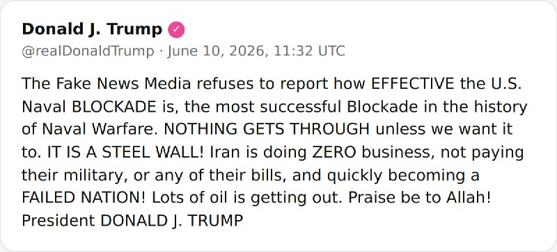

↩️ Quoted tweet: Shin ✓ @hey_itsmyturn Wed, 10 Jun 2026 11:35:26 UTC POTUS: "The Fake News Media refuses to report how EFFECTIVE the U.S. Naval BLOCKADE is, the most successful Blockade in the history of Naval Warfare. NOTHING GETS THROUGH unless we want…

## Shin_Persian — post 6854

↩️ Quoted tweet:
Shin ✓ @hey_itsmyturn
Wed, 10 Jun 2026 11:35:26 UTC

POTUS:
"The Fake News Media refuses to report how EFFECTIVE the U.S. Naval BLOCKADE is, the most successful Blockade in the history of Naval Warfare. NOTHING GETS THROUGH unless we want it to. IT IS A STEEL WALL! Iran is doing ZERO business, not paying their military, or any of

↩️ توییت نقل‌قول شده — برای پاسخ، پست زیر را ببینید.

ترجمه خودکار فارسی

رئیس‌جمهور ایالات متحده (POTUS):
«رسانه‌های اخبار جعلی از گزارش اینکه محاصره دریایی ایالات متحده چقدر موثر است، امتناع می‌کنند؛ موفق‌ترین محاصره در تاریخ جنگ‌های دریایی. هیچ‌چیز عبور نمی‌کند مگر آنکه ما بخواهیم. این یک دیوار فولادی است! ایران هیچ معامله تجاری انجام نمی‌دهد، حقوق نظامیان خود یا هیچ‌کدام از...»

𝕏 · @shin_persian

## FarsiVOA — post 220241

🔺ترامپ: جمهوری اسلامی وقت‌کشی کرد و باید بهای آن را بپردازد

◾️دونالد ترامپ، رئیس‌جمهوری آمریکا، در تازه‌ترین پیام خود در تروث‌سوشال، جمهوری اسلامی را به وقت‌کشی در مذاکرات متهم کرد و نوشت توافقی که می‌توانست برای تهران «عالی» باشد، بیش از حد طول کشیده و حالا جمهوری اسلامی «باید بهای آن را بپردازد».

◾️آقای ترامپ در این اظهار نظر یادآور شد که «نیروی نظامی ایران یک ویرانه کامل و تمام‌عیار است. بخش زیادی از آن، مانند نیروی دریایی و نیروی هوایی‌شان، دیگر حتی وجود خارجی ندارد - آن‌ها کاملاً شکست خورده‌اند.»

◾️او تصریح کرد: «ایران فقط حرف می‌زند و مرد عمل نیست. [اما] قلدرِ خاورمیانه مرده است.»

⬇️ بیشتر بخوانید:
https://ir.voanews.com/a/8159302.html

## Persian_Trend_Official — post 16463

اردوغان، رئیس جمهور ترکیه: امنیت ترکیه نه تنها از هاتای، بلکه از حلب، دمشق و بیروت نیز آغاز می‌شود! ما هیچ گونه عمل انجام شده‌ای را در کشورهای برادر خود تحمل نخواهیم کرد و از تجاوز به آنها چشم‌پوشی نخواهیم کرد. 📝 Amir 📌 @persian_trend_official پرشین ترند…

## Persian_Trend_Official — post 16462

  <a href="telegram/content/Persian_Trend_Official_16462_1781092422.webm" target="_blank">🎬 Download video</a>

ترامپ: رسانه‌های به‌اصطلاح "اخبار جعلی" حاضر نیستند گزارش دهند که محاصره دریایی نیروی دریایی آمریکا تا چه اندازه مؤثر بوده است؛ موفق‌ترین محاصره دریایی در تاریخ جنگ‌های دریایی.

هیچ‌چیز از این محاصره عبور نمی‌کند، مگر آنچه خودمان بخواهیم. این یک دیوار فولادی است! ایران عملاً هیچ کسب‌وکاری انجام نمی‌دهد، قادر به پرداخت حقوق نیروهای نظامی یا سایر هزینه‌های خود نیست و به‌سرعت در حال تبدیل شدن به یک کشور شکست‌خورده است!

البته نفت زیادی هم در حال خارج شدن از کشور است. الحمدلله!

📝 Amir

📌 @persian_trend_official
پرشین ترند | متفاوت‌ترین کانال نظامی

## RadioFarda — post 158142

  <a href="https://t.me/radiofarda/158142" target="_blank">📎 Download file</a>

📻بشنوید: ساعت ۱۴ با رادیوفردا،۲۰ خرداد ۱۴۰۵‌

@RadioFarda

## RadioFarda — post 158141

عربستان، با وجود جنگ ایران، دومین شرکت هواپیمایی خود را راه‌اندازی کرد

🔸عربستان سعودی علی‌رغم وضعیت بحرانی منطقه به‌دلیل جنگ ایران، دومین شرکت هواپیمایی ملی خود به نام «ریاض ایر» را راه‌اندازی کرد.

🔸خبرگزاری‌ها نوشته‌اند این شرکت هواپیمایی روز چهارشنبه، ۲۰ خرداد، با بیش از یک سال تأخیر، آغاز به کار کرد.

🔸این اقدام در حالی انجام شد که منطقهٔ خاورمیانه با مسائل امنیتی و همچنین آشفتگی‌های اقتصادی ناشی از جنگ روبه‌رو است. از دیگر چالش‌های پیش‌روی عربستان سعودی این است که در عین حال باید با شرکت‌های هواپیمایی باسابقهٔ خلیج فارس رقابت کند.

🔸به گزارش خبرگزاری فرانسه، با آغاز به کار این شرکت، بامداد چهارشنبه یک فروند بوئینگ ۷۸۷ دریم‌لاینر با رنگ‌بندی سفید و بنفش روشن، از ریاض به مقصد لندن پرواز کرد. این پرواز آغاز یکی از پروژه‌های شاخص عربستان برای کاهش وابستگی اقتصاد خود به نفت محسوب می‌شود.

🔸ریاض ایر، دومین شرکت هواپیمایی دولتی عربستان پس از سعودیا (مستقر در جده)، قرار است به تبدیل پایتخت عربستان به یک مرکز جهانی حمل‌ونقل هوایی کمک کند؛ مرکزی که بتواند با دبی، شلوغ‌ترین فرودگاه جهان از نظر مسافران بین‌المللی، رقابت کند.

🔸راه‌اندازی این شرکت که در ابتدا برای سال ۲۰۲۵ برنامه‌ریزی شده بود، به‌دلیل تأخیر در تحویل هواپیماها از سوی بوئینگ عقب افتاد. بوئینگ در سال‌های اخیر با مجموعه‌ای از مشکلات تولیدی و ایمنی مواجه بوده است.

🔸 گزارش کامل را در وب‌سایت رادیوفردا بخوانید.

@RadioFarda

## Hranews — post 113514

  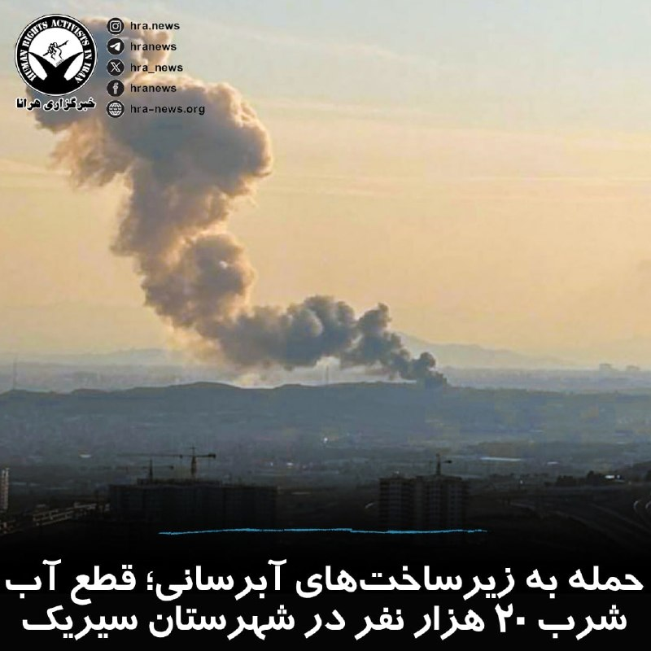

مدیر عامل آب و فاضلاب هرمزگان اعلام کرد که روز جاری در پی حملات نظامی آمریکا تأسیسات آبرسانی شهرستان سیریک دچار آسیب‌دیدگی شده است. به گفته عبدالحمید حمزه پور، به دنبال این حملات دسترسی بیش از ۲۰ هزار نفر از ساکنان شهر کوهستک و ۱۰ روستای بخش بمانی در این شهرستان به آب شرب قطع شده است.

وی همچنین با اشاره به خسارت ۱۴۰ میلیارد تومان به تاسیسات آب رسانی، تاکید کرد، دو مخزن ذخیره آب با حجم ۵۰۰ و ۲۰۰۰ متر مکعب و بخشی از تأسیسات مرتبط آسیب دیده و آبرسانی به این مناطق را با اختلال جدی مواجه کرده است.
#حمله_نظامی #جنگ

↘️
@hranews_bot تماس ✉️ - @Hranews کانال هرانا 🆑

## alonews — post 126803

  <a href="telegram/content/alonews_126803_1781092423.webm" target="_blank">🎬 Download video</a>

👈عراقچی: دشمن خطای محاسباتی کند، پاسخ سنگینی دریافت خواهد کرد

✅ @AloNews خبر جنگ

---
📅 بروزرسانی: 1405/03/20 15:13
---

## VahidOOnLine — post 244667

  <a href="telegram/content/VahidOOnLine_244667_1781091820.mp4" target="_blank">🎬 Download video</a>

⭕️پزشکیان: جنگ به نفع ما نیست ولی خوابش را ببینند که کوتاه بیاییم

♦️مسعود پزشکیان، رئیس‌جمهوری اسلامی ایران روز چهارشنبه ۲۰ خردادماه در مراسم برای بزرگداشت علی خامنه‌ای گفت: «جنگ به سود ایران نیست، اما تهران در برابر هرگونه تعرض به حاکمیت، عزت و تمامیت ارضی کشور عقب‌نشینی نخواهد کرد».

پزشکیان با پذیرش وضعیت دشوار اقتصادی حاکم بر ایران گفت: «ما باید از این وضعیتِ نه جنگ و نه صلح خارج شویم. بدون تردید، جنگ به نفع کشور نیست. اما این به آن معنا نیست که اگر بخواهند عزت ما را زیر پا بگذارند یا به سرزمین و تمامیت ارضی ما تعرض کنند، تسلیم شویم یا عقب‌نشینی کنیم. چنین چیزی را فقط می‌توانند در خواب ببینند. این موضوعی نیست که هرگز بر سر آن مصالحه کنیم.»

پزشکیان همچنین مدعی شد تلاش‌های آمریکا و اسرائیل برای تحریک کشورهای عربی و اسلامی علیه ایران ناکام مانده و این روند موجب فاصله گرفتن دولت‌های منطقه از واشنگتن و تل‌آویو شده است.
‌🇸🇦 Indypersian

🤖 @VahidOOnLine

## WithYashar — post 14295

ترامپ داره قاهره رو رد میکنه اقا ترمز کن 🤣🤣

## WithYashar — post 14294

  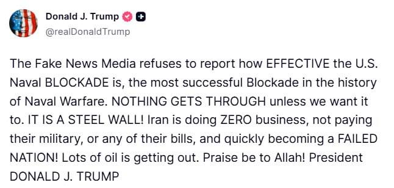

پست جدیدتر ترامپ:
رسانه‌های اخبار جعلی از گزارش میزان اثربخشی محاصره دریایی ایالات متحده، که موفق‌ترین محاصره در تاریخ جنگ دریایی است، خودداری می‌کنند.

هیچ چیز عبور نمی‌کند مگر اینکه ما بخواهیم. این یک دیوار فولادی است! ایران هیچ تجارتی ندارد، به ارتش خود یا هیچ یک از صورتحساب‌هایش پرداخت نمی‌کند و به سرعت به یک ملت شکست خورده تبدیل می‌شود! نفت زیادی در حال خروج است.
@withyashar

## WithYashar — post 14293

فاکس نیوز: ترامپ در حال مشورت با مشاوران خود برای بازگشت به جنگ با ایران است و گزینه حملات به نیروگاه‌ها و پل‌های ایران را بررسی می‌کند.@withyashar

## WithYashar — post 14292

قالیباف: با وجود شهادت فرماندهان و دانشمندان در جنگ ۱۲ روزه، نه حرکت علم و دانش در کشور متوقف شد و نه توان دفاعی و بازدارندگی ایران کاهش یافت
@withyashar

## WithYashar — post 14291

ترامپ : ما کارمون با ایران رو ادامه می‌دیم و جلو می‌ریم
@withyashar

## mwarmonitor — post 10604

  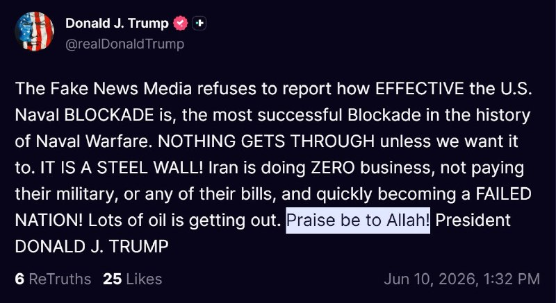

🔴رسانه‌های اخبار جعلی (فیک نیوز) از گزارش اینکه محاصره دریایی ایالات متحده چقدر مؤثر است، خودداری می‌کنند؛ موفق‌ترین محاصره در تاریخ جنگ‌های دریایی. هیچ چیز عبور نمی‌کند مگر اینکه ما بخواهیم. این یک دیوار فولادی است! ایران صفر تجارت انجام می‌دهد، حقوق نظامیان یا هیچ‌یک از قبوض خود را پرداخت نمی‌کند و به‌سرعت در حال تبدیل شدن به یک کشور ورشکسته است! نفت زیادی در حال خارج شدن است.

الحمدلله! رئیس‌جمهور دونالد جی. ترامپ.

@mwarmonitor

## mwarmonitor — post 10603

🔴 ترامپ به فاکس‌نیوز گفت:

🔸«در آستانه صدور دستور حملات جدید علیه نیروگاه‌ها و پل‌ها در ‎ایران هستم.»

@mwarmonitor

## FoxNewsTwitter — post 342794

‌Fox News (Twitter/X)

👉 Full story here:

## FoxNewsTwitter — post 342793

  

Fox News (Twitter/X)

FIRST ON FOX: Sen. Tom Cotton fires off a letter to acting AG Blanche demanding a DOJ investigation into a China-linked influence campaign he says is designed to 'kneecap' America's AI infrastructure. Cotton warns that Beijing is exploiting environmental and energy cost concerns to block U.S. data centers — while China subsidizes up to half the energy costs for its own AI operations.

## pm_afshaa — post 93288

🔴ترامپ به فاکس نیوز : به صدور دستور برای حمله‌های جدید به نیروگاه‌ها و پل‌های ایران نزدیک شده‌ام 
💧 Rainbet.com the #1 Non-KYC Crypto Casino & Sportsbook @rainbetcom 
😁 @Pm_Afshaa

## kianmeli1 — post 87853

🔴با حمله دیشب ترامپ به جنوب ایران ٫ به این نتیجه رسیده که جمهوری اسلامی توان پاسخ ندارد و میتواند به زیرساخت ضربه سنگین وارد کند

بزودی جمهوری اسلامی محاصره دریایی را میشکند و ترامپ مجدد به فحاشی رو می آورد
https://t.me/kianmeli1

## kianmeli1 — post 87852

🔴فوری-ترامپ به فاکس نیوز :

به صدور دستور برای حمله‌های جدید به نیروگاه‌ها و پل‌های ایران نزدیک شده‌ام!
https://t.me/kianmeli1

## Shin_Persian — post 6853

  

Shin ✓ @hey_itsmyturn Wed, 10 Jun 2026 11:35:26 UTC POTUS: "The Fake News Media refuses to report how EFFECTIVE the U.S. Naval BLOCKADE is, the most successful Blockade in the history of Naval Warfare. NOTHING GETS THROUGH unless we want it to. IT IS A STEEL…

## Shin_Persian — post 6852

Shin ✓ @hey_itsmyturn
Wed, 10 Jun 2026 11:35:26 UTC

POTUS:
"The Fake News Media refuses to report how EFFECTIVE the U.S. Naval BLOCKADE is, the most successful Blockade in the history of Naval Warfare. NOTHING GETS THROUGH unless we want it to. IT IS A STEEL WALL! Iran is doing ZERO business, not paying their military, or any of their bills, and quickly becoming a FAILED NATION! Lots of oil is getting out. Praise be to Allah! President DONALD J. TRUMP"

ترجمه خودکار فارسی

رئیس‌جمهور ایالات متحده (POTUS):
«رسانه‌های اخبار جعلی از گزارش اینکه محاصره دریایی ایالات متحده چقدر موثر است، خودداری می‌کنند؛ موفق‌ترین محاصره در تاریخ جنگ‌های دریایی. هیچ‌چیز عبور نمی‌کند مگر آنکه ما بخواهیم. این یک دیوار فولادی است! ایران هیچ معامله‌ای انجام نمی‌دهد، حقوق نظامیان خود یا هیچ‌یک از قبوضش را پرداخت نمی‌کند و به سرعت در حال تبدیل شدن به یک ملت شکست‌خورده است! مقدار زیادی نفت در حال خارج شدن است. الحمدلله! رئیس‌جمهور دونالد جی. ترامپ»

𝕏 · @shin_persian

## FarsiVOA — post 220240

  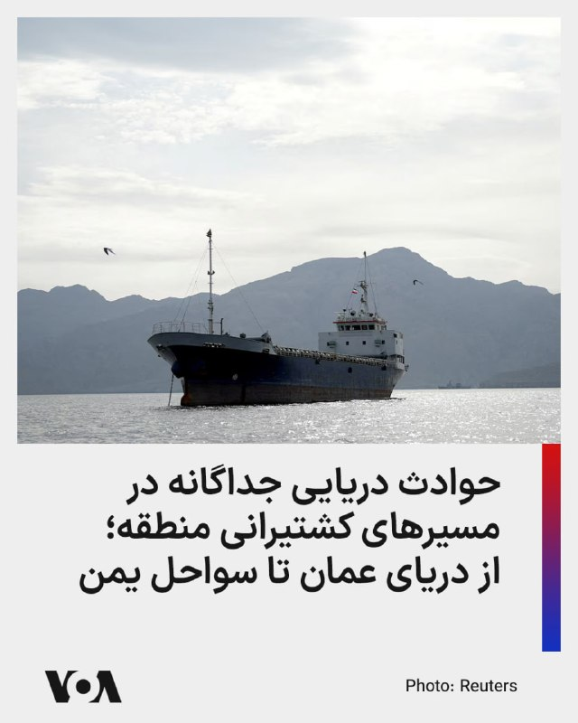

سازمان عملیات تجارت دریایی بریتانیا روز چهارشنبه ۱۰ ژوئن از دو حادثهٔ جداگانه در مسیرهای حساس کشتیرانی منطقه خبر داد.

در دریای عمان، یک نفتکش در حدود ۲۰ مایل دریایی شمال‌شرق صحارِ عمان دچار آتش‌سوزی در موتورخانه شد. به نقل از گزارش دریافتیِ این سازمان، یک نفر مصدوم و دو خدمه مفقود گزارش شده‌اند؛ با این حال هنوز علت آتش‌سوزی مشخص نیست و حادثه به‌طور رسمی «حمله» اعلام نشده است.

چند ساعت پیش از آن نیز سازمان عملیات تجارت دریایی بریتانیا اعلام کرد یک کشتی باری در حدود ۸۸ مایل دریایی جنوب‌غرب بلحاف یمن، نزدیک تنگهٔ باب‌المندب و خلیج عدن با یک قایق کوچک حامل شش فرد مسلح روبه‌رو شد.

میان افراد مسلح و تیم امنیتی کشتی تبادل آتش رخ داد و قایق از محل دور شد. گزارشی از تلفات یا خسارت به کشتی منتشر نشده است.

این دو رخداد در حالی ثبت شده که یحیی سریع، سخنگوی نظامی حوثی‌های یمن، روز ۸ ژوئن «ناوبری دشمن» در دریای سرخ را ممنوع اعلام کرد و گفت هرگونه حرکت مرتبط با اسرائیل را هدف نظامی تلقی خواهد کرد.

او همچنین هشدار داد «تشدید با تشدید پاسخ داده می‌شود و عملیات‌ها مطابق تحولات گسترده‌تر خواهد شد.»
@FarsiVOA

## IranianMinds — post 22081

🔴 ترامپ به فاکس‌نیوز:

به صدور دستور حملات جدید علیه نیروگاه‌ها و پل‌های ایران نزدیک شدم.

@IranianMinds

## Dirty_Kids — post 391570

ترامپ با کله‌ی خراب از خواب پا شده و در پستی در تروث‌سوشال نوشته: «نیروی نظامی جمهوری‌اسلامی قحبه یک افتضاح تمام‌عیار و مطلقه. بخش زیادیش مثل نیروی دریایی و نیروی هوایی‌شون دیگه حتی وجود خارجی هم نداره. این قحبه‌ها به طور کامل شکست خورده‌اند. روافض گنده‌گوز…

## Dirty_Kids — post 391569

  <a href="telegram/content/Dirty_Kids_391569_1781091825.mp4" target="_blank">🎬 Download video</a>

بهروز رهبری فرد:
ایرانی‌ها کونده پررواند! 😐

@Dirty_Kids 👻

## Hranews — post 113513

  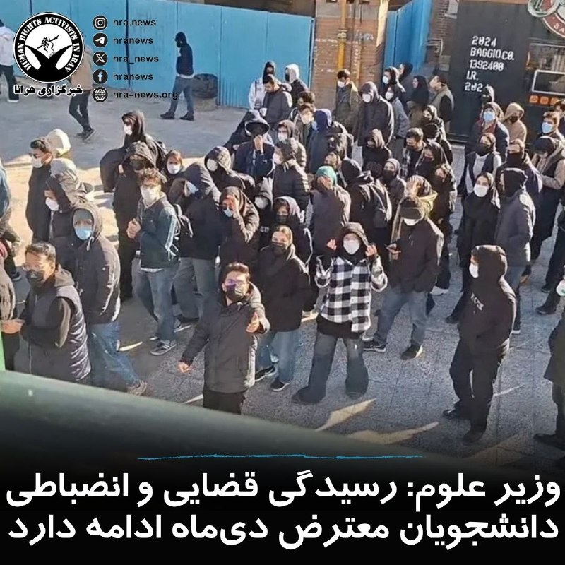

وزیر علوم، تحقیقات و فناوری درباره احکام انضباطی دانشجویان معترض در اعتراضات دانشگاه‌ها در دی ماه ۱۴۰۴ گفت: افرادی که در این تجمعات پرچم متفاوت را به دانشگاه آوردند یا اقدام به آتش زدن پرچم کردند، هم در دادسراها تحت تعقیب قضایی قرار دارند و هم برای آنها در دانشگاه پرونده انضباطی تشکیل شده است. حسین سیمایی‌صراف درباره تعداد #دانشجویان مشمول این رسیدگی‌ها اظهار کرد: آمار دقیقی در اختیار ندارم، اما در دانشگاه صنعتی شریف که یکی از موارد شاخص در این زمینه بوده، رسیدگی‌های لازم انجام شده است. در سایر دانشگاه‌ها نیز روند رسیدگی تفاوتی نخواهد داشت.
#اعتراضات_۱۴۰۴

↘️
@hranews_bot تماس ✉️ - @Hranews کانال هرانا 🆑

## alonews — post 126802

  <a href="telegram/content/alonews_126802_1781091827.webm" target="_blank">🎬 Download video</a>

👈افزایش قیمت نفت در پی سخنان ترامپ

✅ @AloNews خبر جنگ

## alonews — post 126801

  <a href="telegram/content/alonews_126801_1781091827.mp4" target="_blank">🎬 Download video</a>

👈تخریب‌ها در طول جاده زبدین-نبطیه در جنوب لبنان به دلیل حملات مداوم اسرائیل قابل مشاهده است

✅ @AloNews خبر جنگ

## alonews — post 126797

  <a href="telegram/content/alonews_126797_1781091829.mp4" target="_blank">🎬 Download video</a>

👈یک حمله پهپادی اسرائیلی به تازگی خودرویی را در صیدا، جنوب لبنان هدف قرار داد.

✅ @AloNews خبر جنگ

## alonews — post 126796

  <a href="telegram/content/alonews_126796_1781091831.webm" target="_blank">🎬 Download video</a>

👈توییت جدید ترامپ از طریق تروث سوشال: رسانه‌های خبری جعلی از گزارش میزان اثربخشی محاصره دریایی ایالات متحده که موفق‌ترین محاصره در تاریخ جنگ‌های دریایی است، خودداری می‌کنند.

🔴هیچ چیزی عبور نمی‌کند مگر اینکه ما بخواهیم. این یک دیوار فولادی است! ایران هیچ تجارتی انجام نمی‌دهد، به ارتش خود پرداخت نمی‌کند، یا هیچ قبضی را پرداخت نمی‌کند و به سرعت به یک ملت شکست‌خورده تبدیل می‌شود! مقدار زیادی نفت خارج می‌شود.

🔴الحمدالله!

✅ @AloNews خبر جنگ

## alonews — post 126795

  <a href="telegram/content/alonews_126795_1781091831.webm" target="_blank">🎬 Download video</a>

🔴فوری / فاکس نیوز: ترامپ در حال مشورت با مشاوران خود برای بازگشت به جنگ با ایران است و گزینه حملات به نیروگاه‌ها و پل‌های ایران را بررسی می‌کند.

✅ @AloNews خبر جنگ

## alonews — post 126794

  <a href="telegram/content/alonews_126794_1781091832.webm" target="_blank">🎬 Download video</a>

👈تایمز آو اسرائیل: پایگاه هوایی رامات دیوید بر اثر حملات موشکی ایران در شب یکشنبه دچار خسارت شده است.

✅ @AloNews خبر جنگ

---
📅 بروزرسانی: 1405/03/20 15:03
---

## VahidOOnLine — post 244666

  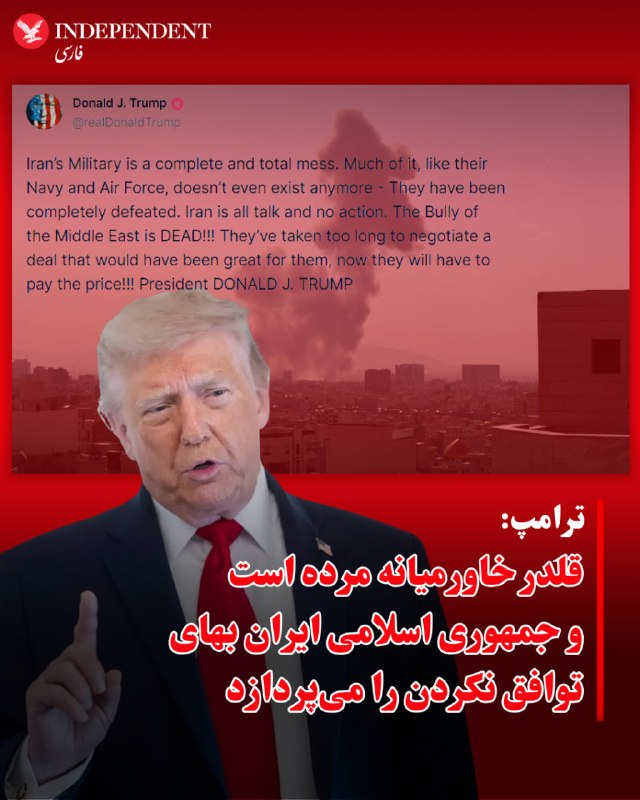

♦️دونالد ترامپ، رئیس‌جمهوری آمریکا روز چهارشنبه ۲۰ خردادماه و پس از حملات نظامی به مناطقی در جنوب ایران در پاسخ  به سرنگونی هلی‌کوپتر آمریکایی در تنگه هرمز، با انتشار پیامی در شبکه اجتماعی تروث سوشال، جمهوری اسلامی ایران را از لحاظ نظامی ناتوان خواند و نوشت که بخش بزرگی از توان نظامی این کشور از میان رفته است.

ترامپ در این پیام نوشت که ارتش ایران در وضعیت «آشفتگی کامل» قرار دارد و بخش‌های مهمی از نیروهای نظامی آن، از جمله نیروی دریایی و نیروی هوایی، عملا دیگر وجود ندارند.

او همچنین مدعی شد جمهوری اسلامی ایران «کاملا شکست خورده» و تنها به تهدیدهای لفظی متکی است. رئیس‌جمهوری آمریکا در ادامه با اشاره به مذاکرات میان واشنگتن و تهران، جمهوری اسلامی را متهم کرد که فرصت دستیابی به توافقی مطلوب را از دست داده و اکنون باید «بهای آن را بپردازد».
‌🇸🇦 Indypersian

🤖 @VahidOOnLine

## VahidOOnLine — post 244665

  <a href="telegram/content/VahidOOnLine_244665_1781091222.mp4" target="_blank">🎬 Download video</a>

♦️رسانه‌های داخلی ایران بعدازظهر چهارشنبه ۲۰ خردادماه از سرنگونی یک «پهپاد متخاصم» در نزدیکی روستای چال بلوطک شهرستان اندیکا در شمال استان خوزستان خبر دادند.

خبرگزاری فارس، وابسته به سپاه پاسداران با اعلام این خبر نوشت «یک فروند پهپاد متخاصم توسط شبکه یکپارچهٔ پدافندی ایران، در محدوده روستای چال بلوطک شهرستان اندیکای خوزستان منهدم شد.»

سنتکام هنوز واکنشی به این خبر نشان نداده است.
‌🇸🇦 Indypersian

🤖 @VahidOOnLine

## WithYashar — post 14290

ترامپ به فاکس : به صدور دستور برای حمله‌های جدید به نیروگاه‌ها و پل‌های ایران نزدیک شده‌ام
@withyashar

## WithYashar — post 14289

وزیر فرهنگ اسرائیل:

دیکتاتور اردوغان که دستانش آغشته به خون است باید درباره جنایاتش پاسخگو باشد و به تنها کشور دموکراتیک در خاورمیانه موعظه نکند. اگر جرات کند ما را امتحان کند - سرنوشتش بدتر از رژیم رو به زوال ایران خواهد بود
@withyashar

## WithYashar — post 14288

قالیباف، رئیس مجلس ایران :
توان دفاعی و بازدارندگی ایران همچنان پابرجاست و آسیبی به اون وارد نشده
@withyashar

## pm_afshaa — post 93287

🔴ترامپ به فاکس نیوز : به صدور دستور برای حمله‌های جدید به نیروگاه‌ها و پل‌های ایران نزدیک شده‌ام

💧 Rainbet.com the #1 Non-KYC Crypto Casino & Sportsbook @rainbetcom

😁 @Pm_Afshaa

## pm_afshaa — post 93286

فارس:جمعی از نمایندگان مجلس در نامه‌ای به رهبر ایران خواستار افزایش برد موشک‌ها شدن

💧 Rainbet.com the #1 Non-KYC Crypto Casino & Sportsbook @rainbetcom

😁 @Pm_Afshaa

## IranIntlTV — post 341468

  <a href="telegram/content/IranIntlTV_341468_1781091223.mp4" target="_blank">🎬 Download video</a>

مروری بر رسانه‌ها و خبرگزاری‌ها در ایران، چهارشنبه ۲۰ خرداد، با مجتبی هاشمی، روزنامه‌نگار
@iranintltv

## FarsiVOA — post 220239

  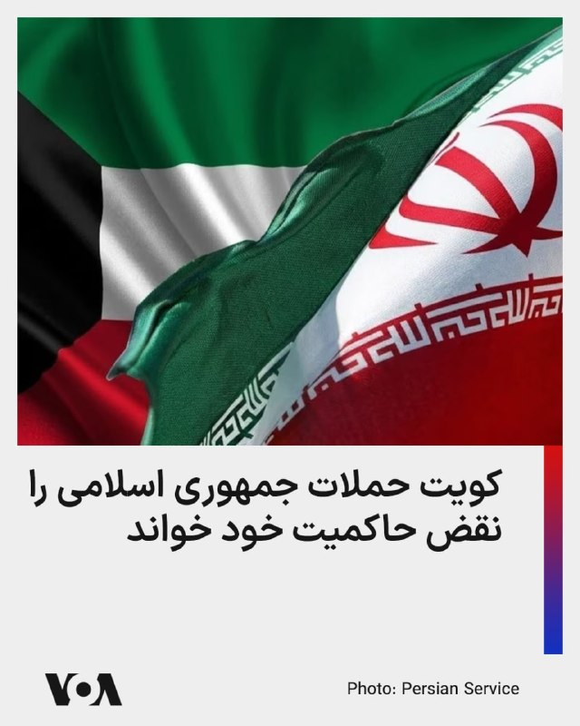

وزارت خارجه کویت روز چهارشنبه ۱۰ ژوئن ۲۰۲۶ حملات موشکی و پهپادی جمهوری اسلامی را محکوم کرد و آن را «تشدید خطرناک» علیه امنیت این کشور دانست.

این واکنش پس از آن اعلام شد که سپاه پاسداران مدعی شد پایگاه‌ها و اهداف مرتبط با آمریکا در بحرین، کویت و اردن را با موشک و پهپاد هدف قرار داده است.

وزارت خارجه کویت گفت این حملات جان غیرنظامیان و تأسیسات حیاتی را تهدید می‌کند و تکرار آن‌ها نقض حاکمیت کویت و قوانین بین‌المللی است.

این وزارتخانه همچنین تأکید کرد کویت حق خود را برای اتخاذ همه اقدامات لازم جهت حفاظت از امنیت، خاک و زیرساخت‌های حیاتی کشور محفوظ می‌داند.

در همین حال، یک مقام آمریکایی، بدون افشای نام، گفت ارزیابی‌های اولیه نشان می‌دهد تقریباً همه موشک‌ها و پهپادهای شلیک‌شده از سوی جمهوری اسلامی رهگیری شده‌اند و تا این لحظه گزارشی از آسیب به نیروها یا تأسیسات آمریکایی دریافت نشده است.
@FarsiVOA

## DW_Farsi — post 125765

📸 نتایج نظرسنجی از وضعیت رضایت مردم در ۴۰ شهر بزرگ آلمان

رضایت ساکنان شهر ارفورت، پایتخت ایالت تورینگن از هر شهر بزرگ دیگری در آلمان بیشتر است. این نتیجه تحقیقات "اطلس رضایت" است که توسط دانشگاه فرایبورگ و موسسه نظرسنجی آلنسباخ تهیه شده است.

ارفورت به دلیل مزایایی مانند اجاره‌بهای نسبتاً پایین، کیفیت بالای محیط زیست و وضعیت اقتصادی نسبتاً مطلوب امتیاز بالایی کسب کرده است. همچنین تعداد دریافت‌کنندگان کمک‌های اجتماعی در این شهر از پایین‌ترین ارقام در سطح کشور است.

ارفورت با جهشی چشمگیر از رتبه ششم در "اطلس رضایت ۲۰۲۵" به رتبه نخست رسیده است. در مقابل، قهرمان سال گذشته یعنی کاسل به‌طور محسوسی سقوط کرده و تنها در رتبه سیزدهم قرار گرفته است.

با وجود رفاه اقتصادی، زیرساخت‌های مناسب و سایر شاخص‌های عینی کیفیت زندگی، شهرهایی مانند مونیخ و کارلسروهه در این رتبه‌بندی عملکردی پایین‌تر از حد انتظار داشته‌اند.

برای تهیه این رتبه‌بندی، از ساکنان ۴۰ شهر بزرگ با بیش از ۲۰۰ هزار نفر جمعیت نظرسنجی شده است. در مجموع، بین ژانویه ۲۰۲۳ تا آوریل ۲۰۲۶ حدود ۲۳ هزار و ۳۰۰ نفر در این نظرسنجی شرکت کرده‌اند.
@dw_farsi

## Persian_Trend_Official — post 16461

  

ترامپ به فاکس نیوز گفت که در آستانه دستور حملات جدید علیه زیرساخت ها انرژی و پل های ایران است.

📝 Amir

📌 @persian_trend_official
پرشین ترند | متفاوت‌ترین کانال نظامی

## RadioFarda — post 158139

کافه فردا به وقت جام جهانی از پنجشنبه ساعت ۱۳:۰۵ به وقت ایران شروع میشه و میخوایم از شما بپرسیم که نظرتون در مورد این جام جهانی چیه؟ اصلا خبرهاشو پیگیری می‌کنید یا نه؟ و در مورد حضور تیم ملی جمهوری اسلامی ایران در این جام چه نظری دارید؟ لطفا ترجیحا صدای خودتونو زیر همین پست برامون بفرستید یا هم که برای ارسال پیام خصوصی از شناسه کافه فردا در تلگرام استفاده کنید. باشد که همگی رستگار شویم.

## RadioFarda — post 158138

🔸رئیس‌جمهور ایالات متحده روز چهارشنبه ۲۰ خرداد گفت که ایران برای رسیدن به توافقی که می‌توانست برایش بسیار خوب باشد بیش از حد تعلل کرد و حالا باید بهای آن را بپردازد. 🔸دونالد ترامپ در پیامی در شبکه اجتماعی خود، تروث سوشال، نوشت: «ارتش ایران کاملاً در وضعیت…

## RadioFarda — post 158136

🔸رئیس‌جمهور ایالات متحده روز چهارشنبه ۲۰ خرداد گفت که ایران برای رسیدن به توافقی که می‌توانست برایش بسیار خوب باشد بیش از حد تعلل کرد و حالا باید بهای آن را بپردازد.

🔸دونالد ترامپ در پیامی در شبکه اجتماعی خود، تروث سوشال، نوشت: «ارتش ایران کاملاً در وضعیت آشفته‌ای قرار دارد. بخش زیادی از آن، مانند نیروی دریایی و نیروی هوایی، عملاً دیگر وجود ندارد؛ آن‌ها کاملاً شکست خورده‌اند».

🔸او افزود: «ایران فقط حرف می‌زند و عمل نمی‌کند. قلدر خاورمیانه مُرده است!!! آن‌ها برای رسیدن به توافقی که می‌توانست برایشان بسیار خوب باشد بیش از حد تعلل کردند و حالا باید بهای آن را بپردازند!!!»

🔸دونالد ترامپ در این پیام خود توضیحی بیشتری دربارهٔ «پرداخت بها» و همچنین آیندهٔ مذاکرات جاری میان ایران و آمریکا نداد.

🔸او هنگام عملیات محدود بامداد چهارشنبه نیز گفته بود «به پاسخ قاطع اعتقاد دارم» و همزمان تأکید کرده بود که واشینگتن و تهران به یک توافق «بسیار خوب» نزدیک بوده‌اند. هرچند در ادامه اشاره کرده بود که احتمالاً این توافق همچنان در دسترس خواهد بود.

@RadioFarda

## IranianMinds — post 22080

  <a href="telegram/content/IranianMinds_22080_1781091226.mp4" target="_blank">🎬 Download video</a>

🔴همزمان با پست جدید ترامپ، توئیت جدید نتانیاهو.

رژیم ایران نباید هرگز سلاح هسته‌ای داشته باشد.

@IranianMinds

## Hranews — post 113512

  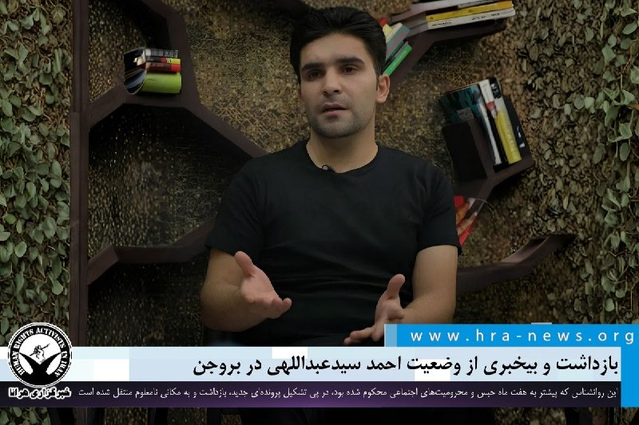

بازداشت و بیخبری از وضعیت احمد سیدعبداللهی در بروجن

❗️
❗️
❗️
❗️
❗️– سیداحمد سیدعبداللهی، مشاور و روانشناس ساکن بروجن، حدود ده روز پیش توسط نیروهای امنیتی بازداشت و به مکانی نامعلوم منتقل شده است. این بازداشت در حالی صورت گرفته که وی پیشتر در پرونده‌ای دیگر به هفت ماه حبس و پنج سال محرومیت از خدمات دولتی و عمومی محکوم شده بود و همزمان با تشکیل پرونده جدید، احضاریه‌ای با اتهام تبلیغ علیه نظام برای او صادر شده بود.

به گزارش خبرگزاری هرانا، ارگان خبری مجموعه فعالان حقوق بشر در ایران، حدود ده روز پیش، نیروهای امنیتی با مراجعه به منزل پدری سید احمد سیدعبداللهی در بروجن، وی را بازداشت و به مکانی نامعلوم منتقل کردند. بازداشت اخیر پیش از اجرای حکم صادره در پرونده نخست صورت گرفته و نزدیکان وی نسبت به وضعیت کنونی، محل نگهداری و روند رسیدگی به پرونده جدید او ابراز نگرانی کرده‌اند.

یک منبع مطلع نزدیک به خانواده سیدعبداللهی، ضمن تایید این موضوع به هرانا گفت: «ماموران در جریان این اقدام تلفن‌های همراه، رایانه و شماری از وسایل الکترونیکی متعلق به او و اعضای خانواده‌اش را نیز ضبط کرده‌اند. آقای سیدعبداللهی پس از بازداشت تنها تماس کوتاهی با خانواده خود داشته و از محل نگهداری یا وضعیت پرونده‌اش اطلاعی ارائه نکرده است.»

بررسی اسناد دریافتی هرانا نشان می‌دهد که شعبه اول بازپرسی دادسرای عمومی و انقلاب بروجن به ریاست بازپرس وحید قدیردخت قهفرخی، در تاریخ ۴ خردادماه ۱۴۰۵ با صدور احضاریه‌ای، سید احمد سیدعبداللهی را جهت دفاع از اتهام «تبلیغ علیه نظام جمهوری اسلامی» احضار کرده بود. بر اساس این احضاریه، وی موظف شده بود ظرف پنج روز پس از ابلاغ در شعبه حاضر شود. این در حالی است که وی پیشتر در پرونده‌ای دیگر با اتهام «اقدام به انجام فعالیت‌های رسانه‌ای بر خلاف امنیت ملی» محاکمه و حکم حبس و مجازات‌های تکمیلی در این پرونده صادر شده بود.

ادامه مطلب

#سیداحمد_سیدعبداللهی #احمد_سیدعبداللهی

↘️
@hranews_bot تماس ✉️ - @Hranews کانال هرانا 🆑

## alonews — post 126793

  <a href="telegram/content/alonews_126793_1781091228.webm" target="_blank">🎬 Download video</a>

🔴فوری / ترامپ به فاکس نیوز : به صدور دستور برای حمله‌های جدید به نیروگاه‌ها و پل‌های ایران نزدیک شده‌ام 
✅ @AloNews خبر جنگ

## alonews — post 126792

  <a href="telegram/content/alonews_126792_1781091228.webm" target="_blank">🎬 Download video</a>

🔴فوری / ترامپ به فاکس نیوز : به صدور دستور برای حمله‌های جدید به نیروگاه‌ها و پل‌های ایران نزدیک شده‌ام

✅ @AloNews خبر جنگ

## alonews — post 126791

  <a href="telegram/content/alonews_126791_1781091229.webm" target="_blank">🎬 Download video</a>

👈یک منبع آگاه به رویترز گفت که مذاکره‌کنندگان قطری امروز به تهران سفر کردند تا پس از رایزنی با واشنگتن، توافقی را نهایی کنند

✅ @AloNews خبر جنگ

---
📅 بروزرسانی: 1405/03/20 14:53
---

## WithYashar — post 14287

نتانیاهو بعد توییت ترامپ: ایران نباید سلاح هسته ای داشته باشه.
@withyashar

## WithYashar — post 14286

  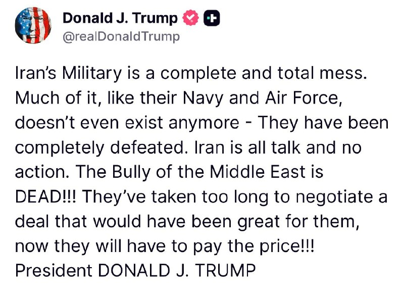

ترامپ در تروث: ارتش ایران کاملاً از هم پاشیده و نابود شده. بخش بزرگی از توان نظامی ایران، از جمله نیروی دریایی و نیروی هوایی، عملاً دیگه وجود نداره. ایران به طور کامل شکست خورده. ایران فقط حرف می‌زنه و کاری انجام نمی‌ده. قلدر خاورمیانه مُرده! خیلی بیشتر از حد لازم برای مذاکره روی توافقی که می‌تونست به نفعشون باشه وقت تلف کردن و حالا باید بهای این کار رو پرداخت کنن
@withyashar

## mwarmonitor — post 10602

  <a href="telegram/content/mwarmonitor_10602_1781090628.mp4" target="_blank">🎬 Download video</a>

🔴خبر فوری: پس از رایزنی‌ها با ایالات متحده، مذاکره‌کنندگان قطری صبح امروز به تهران سفر کردند تا با ایرانی‌ها دیدار کنند و با هدف پر کردن شکاف‌های باقی‌مانده در روند مذاکرات تلاش کنند؛ این موضوع را یک دیپلمات آگاه از وضعیت به فاکس نیوز گفته است. @mwarmonitor

## FoxNewsTwitter — post 342792

  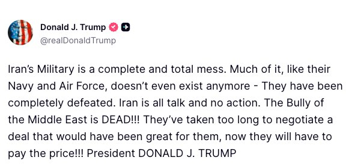

Fox News (Twitter/X)

“They’ve taken too long to negotiate a deal... now they will have to pay the price!!!”

President Trump putting the Iranian regime in his crosshairs after the U.S. launched defensive strikes in response to an American helicopter being shot down near the Strait of Hormuz.

“Iran’s Military is a complete and total mess... The Bully of the Middle East is DEAD!!!”

## FoxNewsTwitter — post 342791

  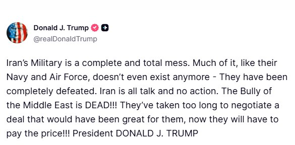

Fox News (Twitter/X)

BREAKING: Iran has 'taken too long to negotiate a deal,' 'will have to pay the price,' Trump writes on Truth Social

## DEJradio — post 5534

  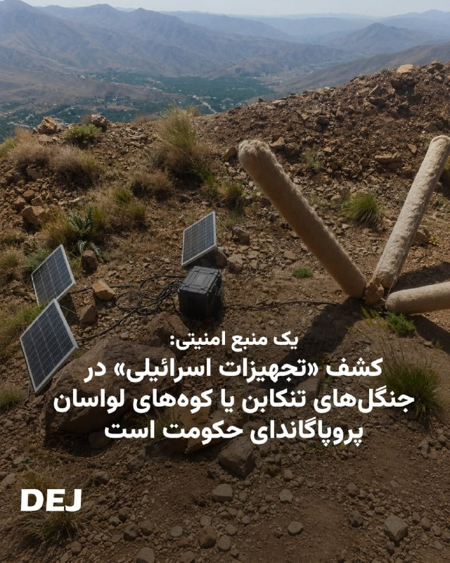

⭕️
🔸 یک منبع امنیتی:
کشف «تجهیزات اسرائیلی» در جنگل‌های تنکابن یا کوه‌های لواسان پروپاگاندای حکومت است

رسانه‌های حکومتی و کانال‌های وابسته به سـ.ـپاه مدعی کشف تجهیزات فنی و سامانه‌های زمین‌پایه در جنگل‌های تنکابن (استان مازندران) و کوه‌های لواسان (شمال شرق تهران) شده‌اند.

گفته شده این تجهیزات برای پشتیبانی و هدایت جنگنده‌های مهاجم استفاده می‌شود و در مسیرهای اصلی ورود جنگنده‌های دشمن به حریم هوایی تهران مستقر شده‌اند.

یک منبع امنیتی به دژ می‌گوید، «اگر منظور حکومت از تجهیزات مکشوفه همین تصاویر باشد کاملا پروپاگانداست زیرا نسل جدید جنگنده‌ها مجهز به سامانه‌های دیجیتال ماهواره‌ای‌اند. این تجهیزات که با پنل خورشیدی تغذیه می‌شوند یشتر شبیه سامانه‌های ایستگاه هواشناسی یا پایش محیطی و پایش حیات وحش است و ارتباطی با سامانه‌های هدایت هواپیما ندارد.»

#پروپاگاندا #اسرائیل
@DEJradio

## FarsiVOA — post 220238

  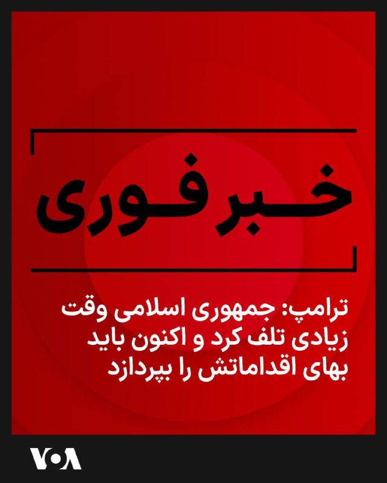

دونالد ترامپ در اظهار نظر جدیدی در شبکه اجتماعی تروت‌سوشال هشدار داد که اکنون زمانی است که جمهوری اسلامی باید بهای اقداماتش را بپردازد.

آقای ترامپ در این اظهار نظر یادآور شد که «نیروی نظامی ایران یک ویرانه کامل و تمام‌عیار است. بخش زیادی از آن، مانند نیروی دریایی و نیروی هوایی‌شان، دیگر حتی وجود خارجی ندارد - آن‌ها کاملاً شکست خورده‌اند.»

او تصریح کرد: «ایران فقط حرف می‌زند و مرد عمل نیست. [اما] قلدرِ خاورمیانه مرده است.»

آقای ترامپ افزود: «آن‌ها برای مذاکره بر سر توافقی که می‌توانست برایشان عالی باشد بیش از حد وقت تلف کردند، و اکنون باید بهای آن را بپردازند.»
@FarsiVOA

## FarsiVOA — post 220237

  

امارات متحده عربی روز چهارشنبه، حملات موشکی و پهپادی جمهوری اسلامی به بحرین، کویت و اردن را به‌شدت محکوم کرد.

وزارت خارجه امارات در بیانیه‌ای این حملات را «تروریستی» و «بی‌دلیل» خواند و اعلام کرد که هدف قرار دادن پادشاهی بحرین، دولت کویت و پادشاهی اردن هاشمی، نقض آشکار حاکمیت این سه کشور و تهدیدی علیه امنیت و ثبات آن‌هاست.

در این بیانیه همچنین آمده است که امارات همبستگی کامل خود را با بحرین، کویت و اردن اعلام می‌کند و از همه اقداماتی که این کشورها برای حفاظت از امنیت و ثبات خود انجام دهند، حمایت می‌کند.
@FarsiVOA

## DW_Farsi — post 125764

🔶 رأی مثبت شورای امنیت به بررسی روند بازگشت تحریم‌های ایران

شورای امنیت سازمان ملل متحد شامگاه سه‌شنبه ۹ ژوئن (۱۹ خرداد) در نشستی با ۱۱ رأی موافق، بررسی روند بازگشت‌ تحریم‌ها علیه ایران را در پی فعال‌سازی مکانیسم ماشه تصویب کرد.

در این رأی‌گیری روسیه و چین به این قطعنامه رأی منفی و پاکستان و سومالی رأی‌ ممتنع دادند. این نشست با اختلاف نظر فرانسه، بریتانیا و ایالات متحده از یک سو و چین و روسیه از سوی دیگر، بر سر فعال‌شدن مکانیسم ماشه و بازگشت تحریم‌ها علیه ایران همراه بود.

روسیه و چین بر این نظر بودند که مکانیسم ماشه فعال نشده است، در حالی‌که فرانسه، ایالات متحده و آمریکا تأکید کردند این مکانیسم عملا فعال شده است و تحریم‌ها علیه ایران مجددا برقرار شده‌اند.

نماینده روسیه پیش از آغاز نشست شورای امنیت اظهار داشت که مکانیسم ماشه "به دلایل مختلف" فعال نشده است و نه "تحریف‌های عمدی" و نه "موضع نادرست و غیرقانونی رهبری دبیرخانه سازمان ملل" در این‌باره اهمیتی ندارند. واسیلی نبنزیا با تأکید بر این‌که هیچ مبنایی برای برگزاری نشست توجیهی کمیته ۱۷۳۷ وجود ندارد، خواستار رأی‌گیری شورای امنیت درباره برگزاری جلسه روز سه‌شنبه شد.

@dw_farsi

## Persian_Trend_Official — post 16460

  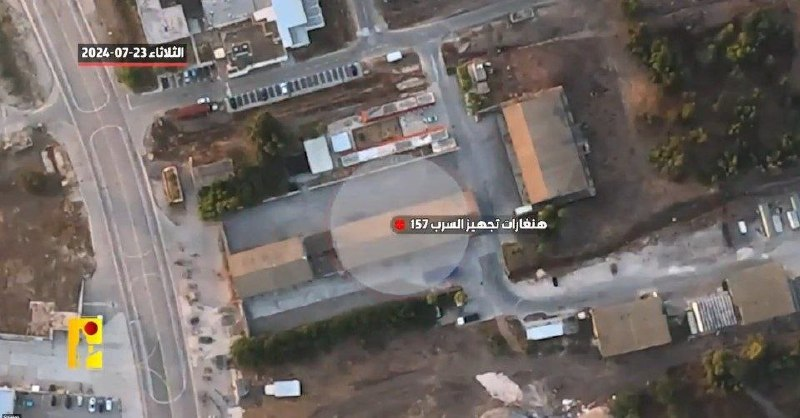

تصویری واضح تر از سوله منهدم شده در پایگاه رامات دیوید 📝 Amir 📌 @persian_trend_official پرشین ترند | متفاوت‌ترین کانال نظامی

## Persian_Trend_Official — post 16459

  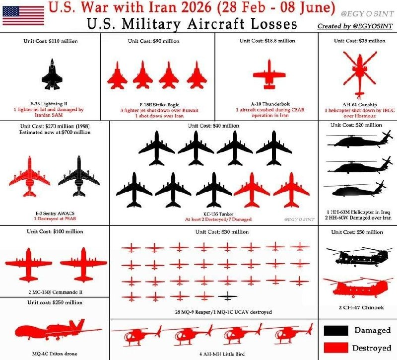

🔴 آمار ادعایی به‌روز شده از تلفات هوایی ارتش آمریکا در جنگ با ایران

اینفوگرافی منتشرشده مدعی است که از آغاز درگیری‌ها در ۲۸ فوریه تا ۸ ژوئن ۲۰۲۶، ارتش آمریکا بخشی از ناوگان هوایی خود را در منطقه از دست داده یا آسیب دیده است.

بر اساس این ادعاها:

🔹 ۱ فروند F-35 آسیب دیده
🔹 ۴ فروند F-15E سرنگون شده
🔹 ۱ فروند A-10 از دست رفته
🔹 ۱ فروند بالگرد AH-64 سرنگون شده
🔹 ۱ فروند هواپیمای آواکس E-3 منهدم شده
🔹 دست‌کم ۲ فروند KC-135 منهدم و ۷ فروند دیگر آسیب دیده‌اند
🔹 ۲ فروند MC-130J از بین رفته‌اند
🔹 ۱ فروند پهپاد MQ-4C Triton منهدم شده
🔹 ۲۸ فروند MQ-9 Reaper و یک پهپاد MQ-1C از دست رفته‌اند
🔹 چندین بالگرد HH-60 و CH-47 نیز آسیب دیده یا منهدم شده‌اند

⚠️ این آمار بر پایه ادعاهای منتشرشده در این اینفوگرافی است و تاکنون از سوی وزارت دفاع آمریکا به‌صورت رسمی تأیید نشده است.

👺 Phantom

📌 @persian_trend_official
پرشین ترند | متفاوت‌ترین کانال نظامی

## IranianMinds — post 22079

  

🔴تصویری که فاکس‌نیوز از آخرین آرایش سنگین ناوگان دریایی در خاورمیانه نشان داده است.

@IranianMinds

## IranianMinds — post 22078

  

🔴 فوری، پست جدید ترامپ:

ایران کاملا بهم ریخته و آشفته شده، نیروی دریایی و نیروی هوایی اونا دیگه وجود ندارن، اونا کامل شکست خوردن.

ایران فقط حرف میزنه و هیچ اقدامی نمیکنه، قلدر خاورمیانه دیگه مُرده.
اونا در مورد مذاکره‌ای که براشون فوق العاده بود خیلی طول دادن، حالا باید بهاشو پرداخت کنن.

@IranianMinds

## Dirty_Kids — post 391568

  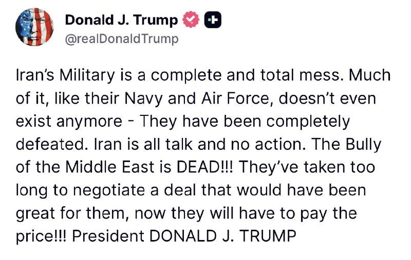

ترامپ با کله‌ی خراب از خواب پا شده و در پستی در تروث‌سوشال نوشته:

«نیروی نظامی جمهوری‌اسلامی قحبه یک افتضاح تمام‌عیار و مطلقه.
بخش زیادیش مثل نیروی دریایی و نیروی هوایی‌شون دیگه حتی وجود خارجی هم نداره.
این قحبه‌ها به طور کامل شکست خورده‌اند.
روافض گنده‌گوز فقط حرف می‌زنه و مرد عمل نیست.
قلدرِ خاورمیانه بگای سگ رفته و مرده.
روافض هزارپدر برای مذاکره بر سر توافقی که می‌تونست براشون عالی باشه خیلی لفتش دادن.
الان باید تاوانش رو پس بدن.
پرزیدنت دونالد جی. ترامپ

@Dirty_Kids 👻

## alonews — post 126790

  <a href="telegram/content/alonews_126790_1781090637.webm" target="_blank">🎬 Download video</a>

👈 قالیباف: جمهوری اسلامی ایران به هرگونه تجاوز با قاطعیت و بدون درنگ پاسخ می‌دهد. 
✅ @AloNews خبر جنگ

## alonews — post 126789

  <a href="telegram/content/alonews_126789_1781090638.webm" target="_blank">🎬 Download video</a>

👈 قالیباف: جمهوری اسلامی ایران به هرگونه تجاوز با قاطعیت و بدون درنگ پاسخ می‌دهد.

✅ @AloNews خبر جنگ

## alonews — post 126788

  <a href="telegram/content/alonews_126788_1781090638.webm" target="_blank">🎬 Download video</a>

🔴فوووری/ترامپ: ارتش ایران کاملاً آشفته و بهم ریخته است. بخش زیادی از آن، مانند نیروی دریایی و هوایی آنها، دیگر حتی وجود ندارد. 
🔴آنها کاملاً شکست خورده‌اند. ایران فقط حرف می‌زند و عمل نمی‌کند. قلدر خاورمیانه مُرده است! 
🔴آنها برای مذاکره بر سر توافقی که می‌توانست…

## alonews — post 126787

  <a href="telegram/content/alonews_126787_1781090638.mp4" target="_blank">🎬 Download video</a>

👈همزمان با پست ترامپ، توئیت جدید نتانیاهو : ایران نباید سلاح هسته ای داشته باشه

✅ @AloNews خبر جنگ

---
📅 بروزرسانی: 1405/03/20 14:43
---

## mwarmonitor — post 10601

  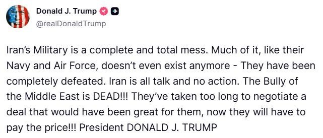

🚨 ترامپ در Truth Social:

ارتش ایران یک آشفتگی کامل و تمام‌عیار است. بخش زیادی از آن، مانند نیروی دریایی و نیروی هوایی‌اش، دیگر حتی وجود ندارد — آن‌ها به‌طور کامل شکست خورده‌اند. ایران فقط حرف می‌زند و عمل نمی‌کند. «قلدر خاورمیانه» مرده است!!!

آن‌ها بیش از حد برای مذاکره درباره یک توافقی که برایشان بسیار عالی می‌توانست باشد وقت تلف کردند، و حالا باید بهای آن را بپردازند!!!

@mwarmonitor

## FoxNewsTwitter — post 342790

  <a href="telegram/content/FoxNewsTwitter_342790_1781090007.mp4" target="_blank">🎬 Download video</a>

Fox News (Twitter/X)

"I've made mistakes in my life, mistakes that I regret, that I live with and I continue to learn from."

Democrat Graham Platner making a point to acknowledge the damage done by a campaign marked by scrutiny over past mistakes and personal controversies during his primary victory speech in Maine.

Platner telling supporters he understands why some voters feel disappointed or disillusioned with him, while trying to frame his past abuse allegations and Nazi tattoo as a story of “redemption.”

"It is my job to earn your trust, faith and support... Redemption is not just some simple or easy destination."

## pm_afshaa — post 93285

🔴ترامپ: ایران فقط حرف می‌زند و عمل نمی‌کند. قلدر خاورمیانه مُرده است!

آنها برای مذاکره بر سر توافقی که می‌توانست برایشان عالی باشد، خیلی دیر کرده‌اند، حالا باید بهای آن را بپردازن

💧 Rainbet.com the #1 Non-KYC Crypto Casino & Sportsbook @rainbetcom

😁 @Pm_Afshaa

## kianmeli1 — post 87851

  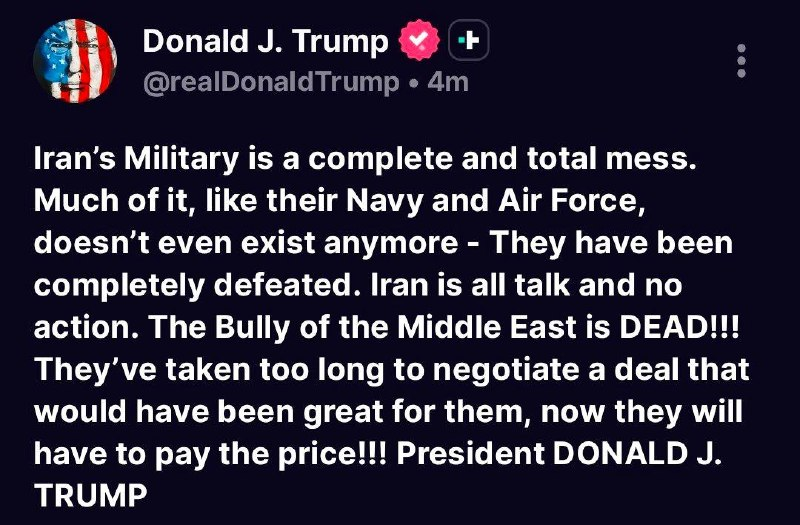

🔴 ترامپ:

«ایران فقط حرف می‌زند و هیچ عملی انجام نمی‌دهد. قلدر خاورمیانه مُرد!!! آنها خیلی طول کشیدند تا برای توافقی که برایشان عالی بود مذاکره کنند، حالا باید هزینه‌اش را بپردازند!!!»
https://t.me/kianmeli1

## IranIntlTV — post 341467

  <a href="telegram/content/IranIntlTV_341467_1781090010.mp4" target="_blank">🎬 Download video</a>

در ماه‌های گذشته و به‌ویژه پس از جنگ، تجمع‌های شبانه حامیان حکومت، ایست‌های بازرسی، تفتیش تلفن‌های همراه و اختلال گسترده اینترنت از جمله مواردی بوده که به گفته شهروندان به تشدید فضای امنیتی در کشور منجر شده است.

جزییات بیشتر با فرزاد فتاحی، عضو تحریریه ایران‌اینترنشنال
@iranintltv

## Shin_Persian — post 6851

  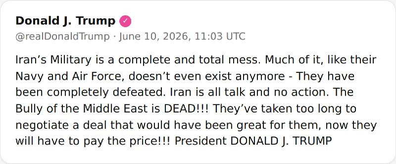

Shin ✓ @hey_itsmyturn Wed, 10 Jun 2026 11:05:22 UTC POTUS: "Iran’s Military is a complete and total mess. Much of it, like their Navy and Air Force, doesn’t even exist anymore - They have been completely defeated. Iran is all talk and no action. The Bully…

## Shin_Persian — post 6850

Shin ✓ @hey_itsmyturn
Wed, 10 Jun 2026 11:05:22 UTC

POTUS:
"Iran’s Military is a complete and total mess. Much of it, like their Navy and Air Force, doesn’t even exist anymore - They have been completely defeated. Iran is all talk and no action. The Bully of the Middle East is DEAD!!! They’ve taken too long to negotiate a deal that would have been great for them, now they will have to pay the price!!! President DONALD J. TRUMP"

ترجمه خودکار فارسی

رئیس‌جمهور ایالات متحده (POTUS):
«نظامیان ایران یک فاجعه تمام‌وعیار و مطلق هستند. بخش بزرگی از آن، مانند نیروی دریایی و نیروی هوایی‌شان، دیگر حتی وجود خارجی ندارد - آن‌ها به طور کامل شکست خورده‌اند. ایران فقط حرف می‌زند و اهل عمل نیست. قلدر خاورمیانه مرده است!!! آن‌ها برای مذاکره بر سر توافقی که می‌توانست برایشان عالی باشد، خیلی طولش دادند؛ حالا باید بهایش را بپردازند!!! رئیس‌جمهور دونالد جی. ترامپ»

𝕏 · @shin_persian

## Persian_Trend_Official — post 16456

  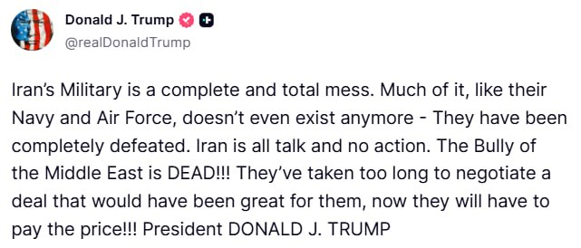

ترامپ: ارتش ایران کاملاً آشفته و بهم ریخته است. بخش زیادی از آن، مانند نیروی دریایی و هوایی آنها، دیگر حتی وجود ندارد. آنها کاملاً شکست خورده‌اند.

ایران فقط حرف می‌زند و عمل نمی‌کند. قلدر خاورمیانه مرده است!!! آنها برای مذاکره در مورد توافقی که برایشان عالی بود، خیلی وقت صرف کردند، حالا باید هزینه آن را بپردازند!!!

📝 Amir

📌 @persian_trend_official
پرشین ترند | متفاوت‌ترین کانال نظامی

## Dirty_Kids — post 391567

  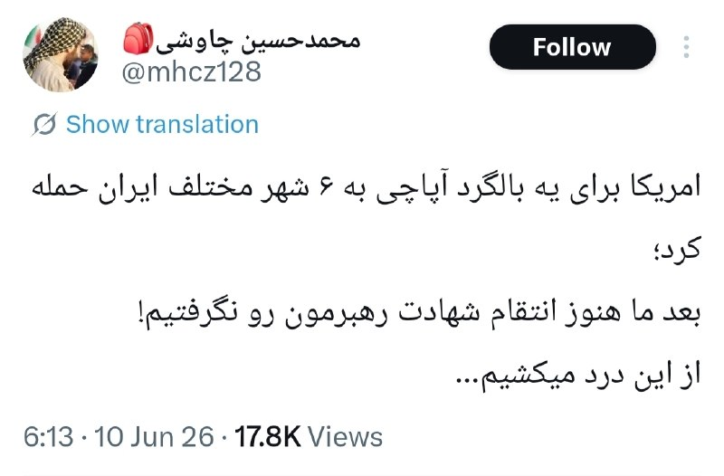

حق داری چاووشی 😔😔🤣🤣🤣

کاری ندارم که بخوانم نمیتونن، توازن قدرت برقرار نیست، ولی خیلی لاشین بخاطر اینکه کتلت نشن قدرت‌رو از دست ندن عاغاتونو بتخمشون گرفتن بی‌خایه‌ها

@Dirty_Kids 👻

## Dirty_Kids — post 391566

  <a href="telegram/content/Dirty_Kids_391566_1781090012.mp4" target="_blank">🎬 Download video</a>

حالا که همش بحث آپاچی آمریکاییه،
وقتی نبودین با برنو، ساقه‌طلایی و نوشابه
رفته بودن خلبان آمریکایی رو بگیرن که…🤣🤣🤣🤣🤣

@Dirty_Kids 👻

## alonews — post 126786

🔴فوووری/ترامپ: ایران فقط حرف می‌زند و عمل نمی‌کند. قلدر خاورمیانه مُرده است!

🔴آنها برای مذاکره بر سر توافقی که می‌توانست برایشان عالی باشد، خیلی دیر کرده‌اند، حالا باید بهای آن را بپردازند!!!

## alonews — post 126785

  <a href="telegram/content/alonews_126785_1781090014.webm" target="_blank">🎬 Download video</a>

👈دیپلمات آگاه به فاکس نیوز: پس از رایزنی‌ها با ایالات متحده، مذاکره‌کنندگان قطری صبح امروز به تهران سفر کردند تا با ایرانی‌ها دیدار کنند و با هدف پر کردن شکاف‌های باقی‌مانده در روند مذاکرات تلاش کنند

✅ @AloNews خبر جنگ

---
📅 بروزرسانی: 1405/03/20 14:33
---

## VahidOOnLine — post 244664

  

وزارت خارجه کویت در بیانیه‌ای ادامه حملات جمهوری اسلامی به خاک این کشور را محکوم کرد و نوشت حملات چهارشنبه به‌عنوان مرحله‌ای تازه از تشدید تنش‌ها ارزیابی می‌شود که جان غیرنظامیان و ایمنی تاسیسات حیاتی و مسکونی را در معرض خطر قرار می‌دهد.

در بیانیه این وزارتخانه آمده است این حملات تشدید خطرناک تنش به شمار می‌رود و پیامدهای جدی برای ثبات منطقه دارد.

این وزارتخانه تکرار این حملات را نشانه رویکردی سازمان‌یافته و خصمانه دانست و تاکید کرد این اقدامات نقض آشکار حاکمیت کویت و مغایر با قواعد حقوق بین‌الملل و منشور سازمان ملل متحد است و تلاش‌ها برای کاهش تنش در منطقه را تضعیف می‌کند.

وزارت خارجه کویت همچنین اعلام کرد این کشور حق خود را برای اتخاذ تمامی اقدامات لازم به منظور حفظ امنیت و دفاع از سرزمین و تاسیسات حیاتی‌اش، در چارچوب حقوق بین‌الملل و منشور سازمان ملل، محفوظ می‌داند.
‌🏁 🇬🇧 IranintlTV

🤖 @VahidOOnLine

## VahidOOnLine — post 244663

  <a href="telegram/content/VahidOOnLine_244663_1781089423.mp4" target="_blank">🎬 Download video</a>

⭕️اسرائیل پس از هشدار تخلیه، شهر صور لبنان را هدف حملات گسترده قرار داد

♦️ارتش اسرائیل ظهر چهارشنبه ۲۰ خردادماه، ساعاتی پس از صدور هشدار تخلیه برای ساکنان شهر صور و مناطق اطراف آن، این شهر در جنوب لبنان را بمباران کرد.

جنوب لبنان از زمان آغاز جنگ میان اسرائیل و حزب‌الله به یکی از اصلی‌ترین جبهه‌های درگیری تبدیل شده است. شهر صور به دلیل موقعیت راهبردی خود بارها هدف حملات هوایی اسرائیل قرار گرفته و از مناطق راهبردی در جنوب لبنان به شمار می‌رود.
‌🇸🇦 Indypersian

🤖 @VahidOOnLine

## mwarmonitor — post 10600

🔴خبر فوری: پس از رایزنی‌ها با ایالات متحده، مذاکره‌کنندگان قطری صبح امروز به تهران سفر کردند تا با ایرانی‌ها دیدار کنند و با هدف پر کردن شکاف‌های باقی‌مانده در روند مذاکرات تلاش کنند؛ این موضوع را یک دیپلمات آگاه از وضعیت به فاکس نیوز گفته است.

@mwarmonitor

## Persian_Trend_Official — post 16455

  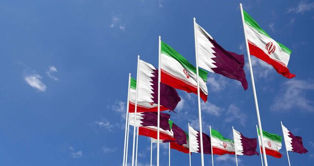

سفر یک هیات قطری به تهران

هیاتی از قطر برای گفت‌وگو و تبادل نظر درباره روابط دوجانبه و تحولات منطقه‌ای، امروز ظهر(چهارشنبه) وارد تهران شده است.

در جریان این سفر، علاوه بر مباحث دوجانبه و تحولات منطقه، راجع به آخرین تحولات مرتبط با روند دیپلماتیک برای خاتمه جنگ با آمریکا نیز بحث و رایزنی می‌شود.

📝 Amir

📌 @persian_trend_official
پرشین ترند | متفاوت‌ترین کانال نظامی

## BBCPersian — post 283346

🔻حزب لیکود: نتانیاهو در انتخابات پیش رو حضور خواهد داشت

🔻حزب لیکود اسرائیل اعلام کرده است که رهبرش بنیامین نتانیاهو، در انتخابات پارلمانی امسال حضور خواهد داشت و برای انتخاب مجدد به‌عنوان نخست‌وزیر تلاش می‌کند.

در بیانیه کوتاه این حزب راستگرای اسرائیل آمده است که «نخست‌وزیر نتانیاهو در انتخابات بعد شرکت می‌کند و به خواست خدا پیروز خواهد شد.»

زمان برگزاری انتخابات هنوز به طور رسمی اعلام نشده است اما آخرین مهلت قانونی برگزاری آن ۲۷ اکتبر است.

این اولین انتخابات سراسری اسرائیل پس از حمله حماس در ۷ اکتبر ۲۰۲۳ خواهد بود، حمله‌ای که بدترین شکست امنیتی اسرائیل تلقی می‌شود و باعث آغاز جنگ غزه شد.

آقای نتانیاهو از زمان بازگشت به قدرت در دسامبر ۲۰۲۲ با دوره‌ای بسیار پرتنش روبرو بوده است.

او پیش از آغاز جنگ‌های غزه، لبنان و ایران با اعتراضات گسترده ضددولتی روبرو بود.

https://bbc.in/4ezkXOI
@BBCPersian

## alonews — post 126784

  <a href="telegram/content/alonews_126784_1781089424.webm" target="_blank">🎬 Download video</a>

👈فارس: ️انهدام یک پهپاد در آسمان خوزستان

✅ @AloNews خبر جنگ

## alonews — post 126783

  <a href="telegram/content/alonews_126783_1781089425.webm" target="_blank">🎬 Download video</a>

👈خوش چشم تحلیل گر ارشد صدا و سیما:
جنگ سوم تو راهه. این سری قراره شدیدتر و بزرگتر باشه

✅ @AloNews خبر جنگ

---
📅 بروزرسانی: 1405/03/20 14:23
---

## VahidOOnLine — post 244662

  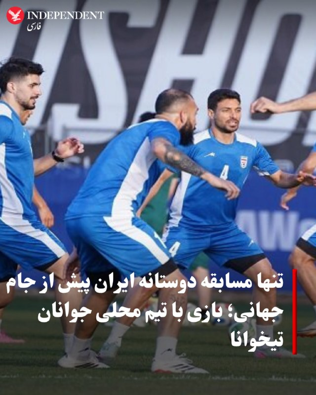

♦️تیم فوتبال ایران در شرایطی آخرین مراحل آماده‌سازی خود برای حضور در جام جهانی ۲۰۲۶ را پشت سر می‌گذارد که تنها دیدار تدارکاتی این تیم پیش از آغاز مسابقات، برابر تیم زیر ۲۱ سال شهر تیخوانا در مکزیک برگزار خواهد شد.
رسانه‌های ایران گزارش دادند این مسابقه روز چهارشنبه ۲۰ خرداد، تنها یک روز پیش از شروع جام جهانی برگزار می‌شود. این در حالی است که فدراسیون فوتبال ایران پیش‌تر برای برگزاری یک بازی دوستانه مقابل تیم ملی گرانادا برنامه‌ریزی کرده بود، اما این دیدار به دلیل لغو سفر و آماده نبودن حریف برگزار نشد. لغو مسابقه با گرانادا، ادامه شکست‌های سریالی در برنامه‌های تدارکاتی تیم ایران در هفته‌های اخیر به شمار می‌رود. پیش از آن نیز بازی دوستانه برابر پورتوریکو که قرار بود در دوران حضور تیم ایران در آمریکای شمالی انجام شود، از برنامه خارج شده بود.
‌🇸🇦 Indypersian

🤖 @VahidOOnLine

## pm_afshaa — post 93284

  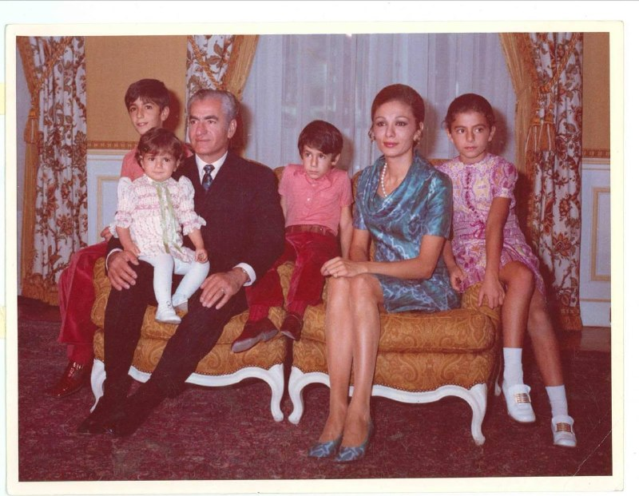

در سالروز درگذشت خواهر عزیزم، لیلا، یاد و خاطره‌اش را گرامی می‌دارم.

لیلا دختری از ایران بود؛ وفادار به میهن، عاشق پدر و خانواده، و دلبسته هم‌میهنانش. هرچند دور از سرزمین مادری زندگی کرد، اما عشق به ایران هرگز از قلب او رخت برنبست و امید به آزادی و سربلندی میهن را تا واپسین روزهای زندگی‌اش از دست نداد.

امروز که ایرانیان با پرچم شیر و خورشید و با امید به آینده‌ای آزاد، ملی و سربلند، برای بازپس‌گیری کشورشان ایستاده‌اند، یاد لیلا بیش از هر زمان دیگری در کنار ما زنده است.

یادش گرامی و نامش جاودان.

@OfficialRezaPahlavi

## IranIntlTV — post 341466

  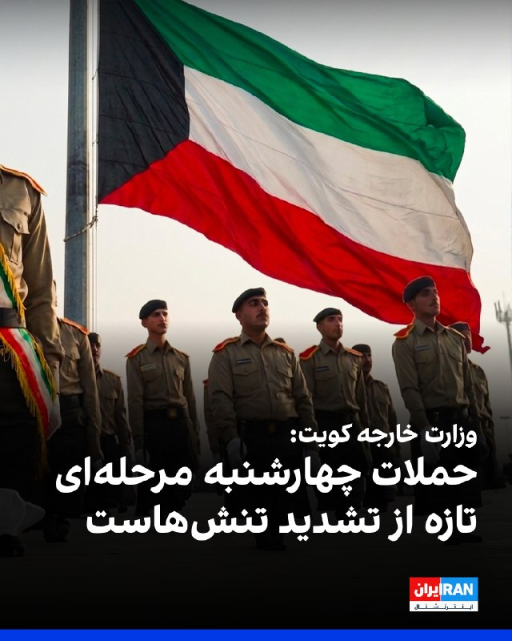

وزارت خارجه کویت در بیانیه‌ای ادامه حملات جمهوری اسلامی به خاک این کشور را محکوم کرد و نوشت حملات چهارشنبه به‌عنوان مرحله‌ای تازه از تشدید تنش‌ها ارزیابی می‌شود که جان غیرنظامیان و ایمنی تاسیسات حیاتی و مسکونی را در معرض خطر قرار می‌دهد.

در بیانیه این وزارتخانه آمده است این حملات تشدید خطرناک تنش به شمار می‌رود و پیامدهای جدی برای ثبات منطقه دارد.

این وزارتخانه تکرار این حملات را نشانه رویکردی سازمان‌یافته و خصمانه دانست و تاکید کرد این اقدامات نقض آشکار حاکمیت کویت و مغایر با قواعد حقوق بین‌الملل و منشور سازمان ملل متحد است و تلاش‌ها برای کاهش تنش در منطقه را تضعیف می‌کند.

وزارت خارجه کویت همچنین اعلام کرد این کشور حق خود را برای اتخاذ تمامی اقدامات لازم به منظور حفظ امنیت و دفاع از سرزمین و تاسیسات حیاتی‌اش، در چارچوب حقوق بین‌الملل و منشور سازمان ملل، محفوظ می‌داند.
https://iranintl.com/202606100118

## FarsiVOA — post 220236

  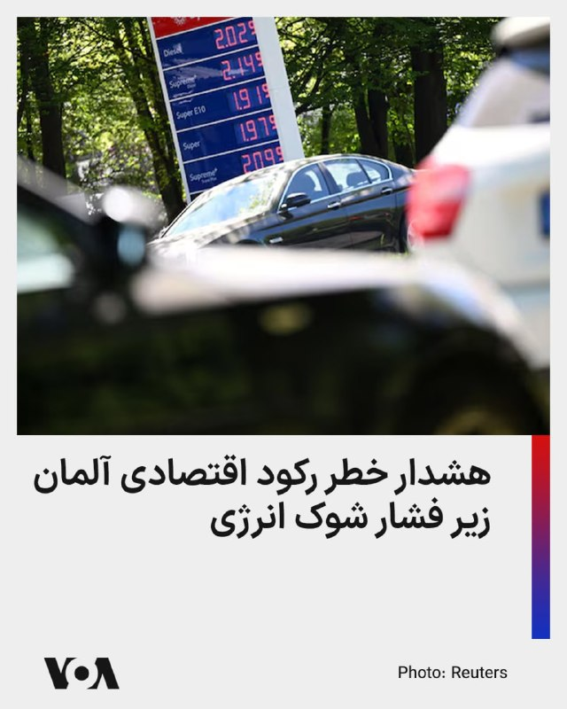

خبرگزاری رویترز روز چهارشنبه ۱۰ ژوئن ۲۰۲۶ گزارش داد اقتصاددانان موسسه پژوهش اقتصادی آلمان هشدار داده‌اند شوک انرژی ناشی از جنگ خلیج فارس می‌تواند رشد آلمان را بیشتر تضعیف کند و خطر رکود را بالا ببرد.

بر اساس گزارش رویترز، نگرانی اصلی این است که افزایش هزینه انرژی، اختلال در عرضه و افت اعتماد اقتصادی، بهبود شکننده بزرگ‌ترین اقتصاد اروپا را متوقف کند.

شاخص ماه مه موسسه پژوهش اقتصادی آلمان پیش‌تر به ۹۴.۸ واحد سقوط کرده بود؛ سطحی پایین‌تر از مرز ۱۰۰ واحد که نشانه رشد متوسط اقتصاد است.

جرالدینه دانی-کندلیک، رئیس بخش پیش‌بینی اقتصادی این موسسه، گفته بود آغاز جنگ در خلیج فارس و پیامدهای آن از ماه مارس چشم‌انداز اقتصاد آلمان را به‌طور محسوسی تیره‌تر کرده و امید به یک رونق قابل توجه، تقریباً جای خود را به ناامیدی داده است.

حساسیت اصلی برای آلمان، صنایع پرمصرف انرژی، هزینه تولید، صادرات و مصرف داخلی است. ابهام مهم هم مدت شوک انرژی، وضعیت مسیرهای حمل انرژی و واکنش بازارهاست.
@FarsiVOA

## DW_Farsi — post 125763

🔶 ژوزه مورینیو؛ وداع با بنفیکا و آغاز فصلی تازه با رئال مادرید

ژوزه مورینیو، ستاره پرآوازه پرتغالی از فصل آتی سرمربی‌گیری تیم رئال مادرید را بر عهده خواهد داشت. این خبر را باشگاه بنفیکا لیسبون روز چهارشنبه ۱۰ ژوئن اعلام کرد؛ باشگاهی که مورینو تا کنون سرمربی آن بوده است.

بنفیکا لیسبون با انتشار پیامی در شبکه ایکس ضمن قدردانی از همکاری با مورینیو اعلام کرد، رئال مادرید قصد به خدمت درآوردن او در ازای ۱۵ میلیون یورو را داشته و مورینیو نیز با این انتقال موافقت کرده است.

گمانه‌زنی‌ها در مورد احتمال فصل تازه همکاری مورینیو با رئال مادرید در اواخر ماه مه از سوی رسانه‌های ورزشی مطرح شده بود. این گمانه‌زنی‌ها پس از آنکه فلورنتینو پرز در مقام خود به عنوان رئیس رئال ابقا شد، بالا گرفت. او که از طرفداران مورینیو محسوب می‌شود، توانسته بود ۶۵ درصد آراء اعضای باشگاه را به دست آورد.

رئال مادرید با به خدمت گرفتن سرمربی باتجربه‌ای چون ژوزه مورینیو امیدوار است که از تکرار فصل ناموفق گذشته جلوگیری کند؛ فصلی که دستاوردی درخور توجه برای این باشگاه نداشت.

@dw_farsi

## IranianMinds — post 22077

  

در سالروز درگذشت خواهر عزیزم، لیلا، یاد و خاطره‌اش را گرامی می‌دارم.

لیلا دختری از ایران بود؛ وفادار به میهن، عاشق پدر و خانواده، و دلبسته هم‌میهنانش. هرچند دور از سرزمین مادری زندگی کرد، اما عشق به ایران هرگز از قلب او رخت برنبست و امید به آزادی و سربلندی میهن را تا واپسین روزهای زندگی‌اش از دست نداد.

امروز که ایرانیان با پرچم شیر و خورشید و با امید به آینده‌ای آزاد، ملی و سربلند، برای بازپس‌گیری کشورشان ایستاده‌اند، یاد لیلا بیش از هر زمان دیگری در کنار ما زنده است.

یادش گرامی و نامش جاودان.

@OfficialRezaPahlavi

## IranianMinds — post 22076

  <a href="telegram/content/IranianMinds_22076_1781088810.mp4" target="_blank">🎬 Download video</a>

🔴تصاویری از حمله آمریکا به مخازن آب آشامیدنی بخش بمانی شهرستان سیریک/ هرمزگان.

@IranianMinds

## BBCPersian — post 283345

🔻ایران می‌گوید ادامه روند مذاکرات را با در نظر گرفتن حملات جدید آمریکا بررسی می‌کند

🔻سخنگوی وزارت خارجه جمهوری اسلامی می‌گوید که ایران ادامه روند مذاکرات را با توجه به حملات جدید آمریکا بررسی خواهد کرد.

اسماعیل بقایی که پس از دور جدید تبادل آتش ایران و آمریکا صحبت می‌کرد، گفت: «روند دیپلماتیک در خلا اتفاق نمی‌افتد و برای پیشبرد هر فرایند دیپلماتیکی، نیازمند فضای حداقلی هستید تا بتوان کار را پیش برد.»

آقای بقایی آمریکا را متهم کرد که «با پیام‌های متناقض و تغییر مکرر مواضع و مطالبات و نقض مکرر آتش‌بس به روند مذاکرات آسیب می‌رساند.»

بامداد چهارشنبه آمریکا در پاسخ به ساقط شدن یک بالگرد خود در دریای عمان چندین حمله هوایی به نقاطی در جنوب ایران انجام داد، قرارگاه خاتم الانبیا هم از حملات متقابل سپاه پاسداران و ارتش ایران به پایگاه‌های آمریکا در کشورهای بحرین، کویت و اردن خبر داد.

در همین حال ارتش آمریکا از پایان عملیاتش در واکنش به ساقط شدن بالگرد آپاچی خود خبر داده است.

https://bbc.in/4g8XQf5
@BBCPersian

---
📅 بروزرسانی: 1405/03/20 14:13
---

## WithYashar — post 14285

سناتور لیندزی گراهام در رقابت با بازرگان مارک لینچ، در انتخابات مقدماتی سنای جمهوری‌خواهان کارولینای جنوبی پیروز شد.
@withyashar

## DEJradio — post 5533

  

در سالروز درگذشت خواهر عزیزم، لیلا، یاد و خاطره‌اش را گرامی می‌دارم.

لیلا دختری از ایران بود؛ وفادار به میهن، عاشق پدر و خانواده، و دلبسته هم‌میهنانش. هرچند دور از سرزمین مادری زندگی کرد، اما عشق به ایران هرگز از قلب او رخت برنبست و امید به آزادی و سربلندی میهن را تا واپسین روزهای زندگی‌اش از دست نداد.

امروز که ایرانیان با پرچم شیر و خورشید و با امید به آینده‌ای آزاد، ملی و سربلند، برای بازپس‌گیری کشورشان ایستاده‌اند، یاد لیلا بیش از هر زمان دیگری در کنار ما زنده است.

یادش گرامی و نامش جاودان.

@OfficialRezaPahlavi

## kianmeli1 — post 87850

  <a href="telegram/content/kianmeli1_87850_1781088233.mp4" target="_blank">🎬 Download video</a>

🔴گزارش شده است که ایران پس از تلاش یک کشتی برای عبور از تنگه هرمز، در نزدیکی بندر صحار عمان، آن را هدف قرار داده است.

رسانه‌های محلی گزارش می‌دهند که این کشتی آسیب قابل توجهی دیده و ممکن است تلفات زیادی داشته باشد.
https://t.me/kianmeli1

## IranIntlTV — post 341465

  <a href="telegram/content/IranIntlTV_341465_1781088234.mp4" target="_blank">🎬 Download video</a>

سرخط خبرهای چهارشنبه ۲۰ خرداد
@iranintltv

## DW_Farsi — post 125762

  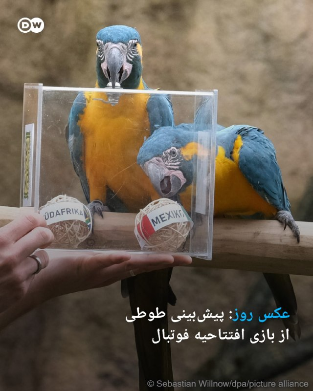

📸 عکس روز: پیش‌بینی طوطی از بازی افتتاحیه فوتبال

در آستانه آغاز جام جهانی، تب فوتبال داغ شده و بازار پیش‌بینی‌ها به راه افتاده است؛ این پیش‌بینی‌ها تنها از طرف انسان‌ها صورت نمی‌گیرد. در باغ وحش شهر لایپزیگ از طوطی‌ها خواسته شد تا نتیجه دیدار افتتاحیه بین مکزیک و آفریقای جنوبی را پیش‌بینی کنند و طوطی دم‌کوتاه با منقارش لوگوی مکزیک را برداشت. طوطی‌های دم‌کوتاه به شدت در معرض انقراض هستند و تعدادی از آنها عمدتا در زادگاه‌شان بولیوی دیده می‌شوند.

@dw_farsi

## Persian_Trend_Official — post 16454

  <a href="telegram/content/Persian_Trend_Official_16454_1781088237.webm" target="_blank">🎬 Download video</a>

👺Phantom

📌 @persian_trend_official
پرشین ترند | متفاوت‌ترین کانال نظامی

## IranianMinds — post 22075

🔴 قتل پسرعمو بر سر تقسیم ۵۰ میلیون تومان پول دزدی

درگیری دو پسرعمو در تهران بر سر تقسیم ۵۰میلیون تومان پول دزدیده‌شده از خانه دوستشان، به قتل رسید.
متهم که پارچه‌ای به دور گردن پسرعموی ۳۸ ساله خود انداخته بود، پس از مرگ او با پلیس تماس گرفت و بازداشت شد./هفت صبح

@IranianMinds

## BBCPersian — post 283344

  <a href="telegram/content/BBCPersian_283344_1781088242.mp4" target="_blank">🎬 Download video</a>

مدیرعامل شرکت آب و فاضلاب استان هرمزگان گفته است در پی حملات بامداد امروز آمریکا «زیرساخت‌های حیاتی توزیع آب در شهرستان سیریک» تخریب شده است.
عبدالحمید حمزه پور گفته در این حملات «دو مخزن استراتژیک آب در بخش بمانی هدف قرار گرفته و به طور کامل تخریب شدند ... که نقش کلیدی در تأمین آب شرب بخش بمانی و شهر کوهستک ایفا می‌کردند.»
به گفته او «در حال حاضر روند توزیع آب در تمامی روستاهای بخش بمانی و شهر کوهستک متوقف شده است.»

@BBCPersian
https://bbc.in/4xj7geh

## officialrezapahlavi — post 1842

  

در سالروز درگذشت خواهر عزیزم، لیلا، یاد و خاطره‌اش را گرامی می‌دارم.

لیلا دختری از ایران بود؛ وفادار به میهن، عاشق پدر و خانواده، و دلبسته هم‌میهنانش. هرچند دور از سرزمین مادری زندگی کرد، اما عشق به ایران هرگز از قلب او رخت برنبست و امید به آزادی و سربلندی میهن را تا واپسین روزهای زندگی‌اش از دست نداد.

امروز که ایرانیان با پرچم شیر و خورشید و با امید به آینده‌ای آزاد، ملی و سربلند، برای بازپس‌گیری کشورشان ایستاده‌اند، یاد لیلا بیش از هر زمان دیگری در کنار ما زنده است.

یادش گرامی و نامش جاودان.

@OfficialRezaPahlavi

## alonews — post 126782

  <a href="telegram/content/alonews_126782_1781088245.webm" target="_blank">🎬 Download video</a>

👈آمار به‌ روز شده از تجهیزات نظامی منهدم شده ارتش ایالات متحده آمریکا در درگیری با ایران (۲۸ فوریه - ۹ ژوئن ۲۰۲۶)

🔴آخرین تجهیزات منهدم شامل چهار پهپاد MQ-9 Reaper، یک پهپاد MQ-1C و یک بالگرد تهاجمی AH-64 آپاچی ارتش ایالات متحده است.

✅ @AloNews خبر جنگ

<!-- MSG END -->

<!-- NAV START -->

<a href="https://github.com/ProAlit/aio-downloader/blob/main/telegram/content/archive_1.md" style="display:inline-block; padding:6px 12px; margin:0 4px; background-color:#2ea44f; color:white; text-decoration:none; border-radius:4px; font-weight:bold;">صفحه بعد</a>

<!-- NAV END -->
