# خواننده تلگرام

<!-- TOP_NAV START -->

<a href="https://github.com/ProAlit/aio-downloader/blob/main/telegram/content/archive_1.md" style="display:inline-block; padding:6px 12px; margin:0 4px; background-color:#2ea44f; color:white; text-decoration:none; border-radius:4px; font-weight:bold;">صفحه بعد</a>

<!-- TOP_NAV END -->

<!-- MSG START -->

---
📅 بروزرسانی: 1405/03/24 22:53
---

## VahidOOnLine — post 245544

  

محمدباقر قالیباف، رییس مجلس جمهوری اسلامی، در واکنش به حمله اسرائیل به اهدافی در جنوب بیروت در شبکه ایکس نوشت: «مجاهدت‌های رزمندگان لبنان و دیپلماسی مقتدرانه جمهوری اسلامی حاکمیت و تمامیت ارضی لبنان را تضمین می‌کند و بساط دیوانه‌بازی و جنگ‌افروزی اسرائیل را بر هم خواهد زد، بچرخ تا بچرخیم.»

قالیباف تاکید کرد که هیچ‌یک از ارکان مقاومت را نمی‌توان «تک و تنها» قرار داد و حاکمیت و تمامیت ارضی لبنان حفظ خواهد شد.
‌🏁 🇬🇧 IranintlTV

🤖 @VahidOOnLine

## VahidOOnLine — post 245543

  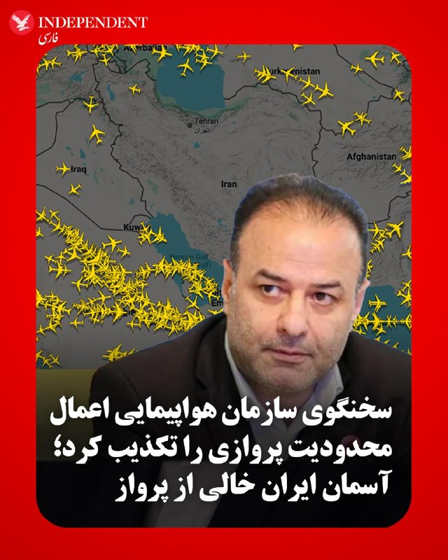

♦️مجید اخوان، سخنگوی سازمان هواپیمایی کشوری، شامگاه دوشنبه ۲۴ خرداد ماه در گفتگو با خبرگزاری مهر، اعمال محدودیت پروازی در فضای هوایی کشور را تکذیل کرد.
اخوان در گفتگو با خبرگزاری مهر گفت: «هیچ‌گونه نوتام جدیدی در این خصوص صادر نشده است.»
اظهارات سخنگوی سازمان هواپیمایی کشوری در حالی مطرح می‌شود که ساعاتی پیش خبرگزاری تسنیم، از اعمال محدودیت‌های جدید پروازی در غرب ایران خبر داده بود.
با وجود تکذیب سخنگوی سازمان هواپیمایی، تصاویر وب‌سایت فلایت رادار، حاکی از خالی شدن آسمان ایران از هواپیماها است.
‌🇸🇦 Indypersian

🤖 @VahidOOnLine

## kianmeli1 — post 87996

  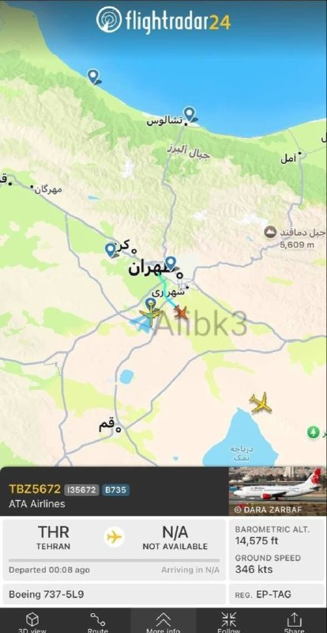

🔴فرودگاه مهراباد تهران در حال تخلیه شدن است https://t.me/kianmeli1

## IranIntlTV — post 342349

  <a href="telegram/content/IranIntlTV_342349_1781464990.mp4" target="_blank">🎬 Download video</a>

درگیری‌ها میان جمهوری اسلامی، آمریکا و اسرائیل و همچنین تفاهم احتمالی تهران و واشینگتن بر نشست رهبران گروه هفت در فرانسه سایه انداخته و به یکی از محورهای اصلی این اجلاس تبدیل شده است.

رهبران کشورهای بزرگ صنعتی نگران پیامدهای اقتصادی و امنیتی ادامه تنش‌ها در خاورمیانه هستند.

گزارش علی حسن‌پور، خبرنگار ایران‌اینترنشنال
@iranintltv

## IranIntlTV — post 342348

  <a href="telegram/content/IranIntlTV_342348_1781464992.mp4" target="_blank">🎬 Download video</a>

مئیر جاودانفر، تحلیل‌گر مسائل اسرائیل، گفت بنیامین نتانیاهو با توجه به انتخابات اکتبر در اسرائیل، ممکن است ملاحظات کمتری در قبال روابط با آمریکا داشته باشد. او افزود: «حتی اگر پیروزی در انتخابات مستلزم بروز اختلافات جدی با دونالد ترامپ باشد، نتانیاهو حاضر است این ریسک را بپذیرد.»
@iranintltv

## IranIntlTV — post 342347

  

محمدباقر قالیباف، رییس مجلس جمهوری اسلامی، در واکنش به حمله اسرائیل به اهدافی در جنوب بیروت در شبکه ایکس نوشت: «مجاهدت‌های رزمندگان لبنان و دیپلماسی مقتدرانه جمهوری اسلامی حاکمیت و تمامیت ارضی لبنان را تضمین می‌کند و بساط دیوانه‌بازی و جنگ‌افروزی اسرائیل را بر هم خواهد زد، بچرخ تا بچرخیم.»

قالیباف تاکید کرد که هیچ‌یک از ارکان مقاومت را نمی‌توان «تک و تنها» قرار داد و حاکمیت و تمامیت ارضی لبنان حفظ خواهد شد.
https://iranintl.com/202606144262

## IranIntlTV — post 342346

  <a href="telegram/content/IranIntlTV_342346_1781464996.mp4" target="_blank">🎬 Download video</a>

درگیری تندروها با هسته سخت قدرت درباره توافق با آمریکا

چشم‌انداز با مهدی مهدوی‌آزاد

نسخه کامل این برنامه در یوتیوب:
https://youtu.be/UpQVZ7mrigs
@iranintltv

## FarsiVOA — post 220717

🔺جمهوری اسلامی یک «بلاگر» معترض را به مدت سه سال از فعالیت در فضای مجازی منع کرد

◾️قوه قضائیه جمهوری اسلامی، امیرپارسا نشاط، بلاگر و از بازداشت‌شدگان اعتراضات سراسری ۱۴۰۴ را به سه سال محرومیت از حضور در شبکه‌های اجتماعی و منع استفاده از تلفن همراه هوشمند محکوم کرد.

⬇️ بیشتر بخوانید:
https://ir.voanews.com/a/the-islamic-republic-bans-a-protest-blogger-from-online-activity-for-three-years/8160733.html
@FarsiVOA

## FarsiVOA — post 220716

🔺لیندزی گراهام: حتی در صورت توافق با رژیم ایران در اهداف حزب‌الله تغییری ایجاد نمی‌شود

◾️لیندزی گراهام، سناتور جمهوری‌خواه ایالت کارولینای جنوبی، می‌گوید امیدوار است راه‌حلی دیپلماتیک برای پایان دادن به درگیری با جمهوری اسلامی و جلوگیری از دستیابی رژیم ایران به سلاح هسته‌ای و همچنین متوقف کردن «سلطه وحشت آن بر منطقه» به دست آید، اما تاکید کرد حتی در آن صورت هم در اهداف حزب‌الله در قبال اسرائیل تغییری ایجاد نمی‌شود.

⬇️ بیشتر بخوانید:
https://ir.voanews.com/a/sen-graham-says-even-with-iran-peace-deal-hezbollahs-objectives-remain-unchanged-/8160730.html
@FarsiVOA

## BBCPersian — post 283811

🔻 ترامپ دوست دارد در هشتادمین سال تولدش با ایران توافق کند
گزارش سباستین اشر، خبرنگار بی‌بی‌سی از بیت‌المقدس

شکی نیست که دونالد ترامپ خیلی دوست دارد که بتواند توافق با ایران را در هشتادمین سالگرد تولدش اعلام کند و آن را به عنوان یک پیروزی جلوه دهد.

هر چند رهبری ایران ممکن است نخواهد این خوشحالی را به او بدهد، اما مطمئناً به نظر می‌رسد که دو طرف تقریباً به توافق رسیده‌اند.

جزئیات هنوز مشخص نیست و هم آمریکا و هم ایران هر کدام جنبه‌هایی را مطرح کرده‌اند که ممکن است، نشان دهد آنها دست بالا را دارند.

یک مقام ارشد ایرانی گفته است که این توافق اولیه، همانطور که دونالد ترامپ تصریح کرده است، باعث بازگشایی فوری تنگه هرمز خواهد شد. همین مقام همچنین گفته است که توافقی برای رقیق کردن اورانیوم غنی‌شده با غلظت بالا در داخل ایران وجود دارد.

اینها گام‌های مهمی به جلو خواهند بود و امید به موفقیت در مذاکرات دشوار آینده را افزایش می‌دهند. اما موضوع جنگ اسرائیل علیه حزب‌الله در لبنان هنوز هم می‌تواند در آینده مانعی برای توافق باشد.

https://bbc.in/3Sa7Afh
@BBCPersian

## BBCPersian — post 283810

🔻 ترامپ به پوتین گفت توافق با ایران نزدیک است

کرملین گفت ولادیمیر پوتین با دونالد ترامپ درباره مسائل مختلف از جمله اوکراین و ایران تلفنی صحبت کرده‌اند.

به گزارش رسانه روسی اسپوتنیک، یوری اوشاکوف، مشاور ارشد سیاست خارجی رئیس‌جمهور روسیه گفت درباره پیش‌نویس توافق صلح آمریکا و ایران در این تماس تلفنی بحث شد.

به گفته آقای اوشاکوف، دونالد ترامپ گفت که توافق میان آمریکا و ایران بسیار نزدیک است و ممکن است به‌زودی اعلام شود.

ولادیمیر پوتین ضمن تبریک تولد ۸۰ سالگی آقای ترامپ و آرزوی برگزاری یک جام جهانی موفق، از موضوع توافق با ایران ابراز رضایت کرده و گفته است که به نظر می‌رسد تنش‌ها پیرامون ایران در حال کاهش است.

https://bbc.in/4ov6MO8
@BBCPersian

## BBCPersian — post 283809

🔻 وزیر دفاع آمریکا: در مسیر امضای توافق با ایران هستیم

پیت هگست گفت آمریکا «در مسیر» امضای توافق با ایران است و فقط مسئله زمان آن است.

وزیر دفاع آمریکا به شبکه سی‌بی‌اس، شریک خبری بی‌بی‌سی در آمریکا، گفت: «ما می‌دانیم که حزب‌الله به شمال اسرائیل موشک پرتاب می‌کند و باید این کار را متوقف کند.»

او افزود: «ایران باید آنها را با روش‌های بسیار قاطع تشویق کند که این کار را متوقف کنند.»

امروز پس از حمله اسرائیل به ضاحیه در جنوب بیروت، ایران تهدید به قطع گفت‌وگو با آمریکا کرد و معاون قرارگاه مرکزی خاتم‌الانبیا گفت این حمله بی‌پاسخ نمی‌ماند.

پس از آن دونالد ترامپ در شبکه اجتماعی نوشت این حمله نباید اتفاق می‌افتاد.

رئیس‌جمهور آمریکا خواستار «خویشتنداری» شد و گفت: «دیگر نباید هیچ حمله‌ای از اسرائیل به هیچ نقطه‌ای از لبنان شود، در عین حال نباید هیچ حمله‌ای از سوی هیچ طرف دیگری، از جمله حزب‌الله، به اسرائیل شود.»

https://bbc.in/3Qfpb4X
@BBCPersian

## BBCPersian — post 283808

🔻 پزشکیان: در مذاکره با آمریکا هر چه رهبر تایید کند همه باید تبعیت کنند

مسعود پزشکیان درباره گفت‌وگو با آمریکا گفت: «دربارۀ مذاکرات، مصوبۀ شورای‌عالی امنیت ملی ملاک عمل است و هر آنچه مورد تایید و صلاحدید رهبر معظم انقلاب قرار گیرد، برای همه ما لازم‌الاتباع خواهد بود.»

مجید موسوی فرمانده هوافضای سپاه پاسداران، هم در پیامی از مردم خواست که «نه یک گام جلوتر و نه یک گام عقب‌تر بلکه همراه با ولی خویش باشید.»

به گزارش رسانه‌های ایران، آقای پزشکیان همچنین گفت که «حتی اگر نظر شخصی بنده متفاوت باشد، خود را موظف به تبعیت از تصمیم نهایی نظام می‌دانم؛ چراکه معتقدم ایشان براساس دوراندیشی و همفکری با عقلای کشور و در نظر گرفتن مصالح و منافع ملت تصمیم خواهند گرفت نه تحت فشار جریان‌های سیاسی خاص.»

رئیس‌جمهور ایران همچنین گفت: «مایه تأسف است که افرادی که در چارچوب مأموریت‌های رسمی و با هدف صیانت از منافع ملی و عزت کشور در حال انجام وظیفه هستند، با برچسب‌هایی نظیر خیانت یا وطن‌فروشی مواجه شوند.»

پس از آنکه گفته شد یکشنبه تفاهمنامه‌ای بین آمریکا و ایران امضا می‌شود، برخی اصولگرایان و تندورها علیه محمدباقر قالیباف و عباس عراقچی دو مذاکره‌کننده ارشد، شعار دادند.

این تجمع‌ها در میدان ابن‌سینای تهران و مقابل وزارت خارجه برگزار شد و معترضان شعارهایی از جمله «عراقچی حیا کن، مملکت رو رها کن» و «قالیباف، عراقچی، پس خون رهبرم چی؟» سر دادند.

https://bbc.in/4vdekYs
@BBCPersian

## Hranews — post 113617

مردی در مرودشت دو عضو خانواده خود را به قتل رساند

❗️
❗️
❗️
❗️
❗️– امروز یکشنبه ۲۴ خردادماه، مردی در مرودشت به دلیل اختلافات خانوادگی نامزد ۱۸ ساله و برادر خود را با استفاده از سلاح گرم به #قتل رساند. متهم توسط ماموران پلیس بازداشت شده است.

ادامه مطلب

↘️
@hranews_bot تماس ✉️ - @Hranews کانال هرانا 🆑

---
📅 بروزرسانی: 1405/03/24 22:43
---

## VahidOOnLine — post 245542

  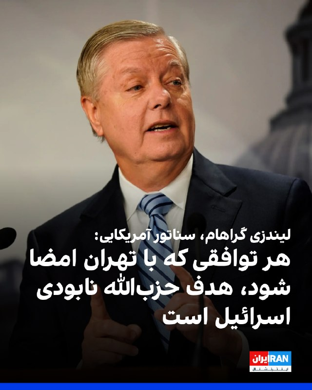

لیندزی گراهام، سناتور جمهوری‌خواه آمریکا، در شبکه ایکس نوشت: «امیدوارم یک راه‌حل دیپلماتیک برای پایان دادن به جنگ ایران، جلوگیری از توانایی جمهوری اسلامی برای تولید سلاح هسته‌ای و متوقف کردن حمایت آن از تروریسم در منطقه در دسترس باشد، اما همچنان باید بدانیم با چه طرفی روبه‌رو هستیم.»

او افزود: «از زمان برقراری آخرین آتش‌بس، حزب‌الله حملات خود به اسرائیل را متوقف نکرده و این حملات تا جایی ادامه یافته که برخی مناطق شمال اسرائیل به دلیل حملات مداوم تخلیه شده‌اند.»

سناتور گراهام تاکید کرد: «حزب‌الله از سوی جمهوری اسلامی تامین مالی و هدایت می‌شود و مسئول ریخته شدن خون بسیاری از آمریکایی‌هاست. روشن است صرف‌نظر از هر توافقی که با تهران امضا شود، هدف اعلام‌شده حزب‌الله برای نابودی اسرائیل و تبدیل لبنان به یک خلافت، تغییری نکرده است.»
‌🏁 🇬🇧 IranintlTV

🤖 @VahidOOnLine

## VahidOOnLine — post 245541

  <a href="telegram/content/VahidOOnLine_245541_1781464395.mp4" target="_blank">🎬 Download video</a>

♦️در پی برخورد دو هلیکوپتر در ریودوژانیرو برزیل، دست‌کم شش نفر جان خود را از دست دادند.
به گفته آتش‌نشانی برزیل، دو بالگرد روز یکشنبه ۲۴ خرداد ماه، پس از برخورد در هوا در محوطه پارکینگ یک نمایندگی خودروهای برقی سقوط کردند. این حادثه باعث آتش‌سوزی گسترده‌ای شد که دست‌کم ۲۰ خودرو را در بر گرفت.
به گزارش خبرگزاری فرانسه، در بیانیه آتش‌نشانی آمده است بررسی‌های اولیه نشان می‌دهد حادثه بر اثر برخورد دو هلیکوپتر در آسمان رخ داده و تاکنون مرگ شش نفر تایید شده است. تمامی قربانیان از سرنشینان بالگردها بوده‌اند.
ادواردو کاوالیِره، شهردار ریودوژانیرو، اعلام کرد تعدادی تبعه خارجی نیز در یکی از بالگردها حضور داشتند، اما جزئیات بیشتری درباره هویت آن‌ها ارائه نکرد. همزمان برخی رسانه‌ها به نقل از یک منبع پلیس گزارش داده‌اند که نام «اولیور تری» خواننده و ترانه‌سرای آمریکایی در فهرست سرنشینان یکی از بالگردها ثبت شده است.
مقام‌های امدادی و پلیس اعلام کرده‌اند علت دقیق حادثه هنوز مشخص نیست و تحقیقات درباره چگونگی برخورد دو بالگرد ادامه دارد.
‌🇸🇦 Indypersian

🤖 @VahidOOnLine

## VahidOOnLine — post 245540

  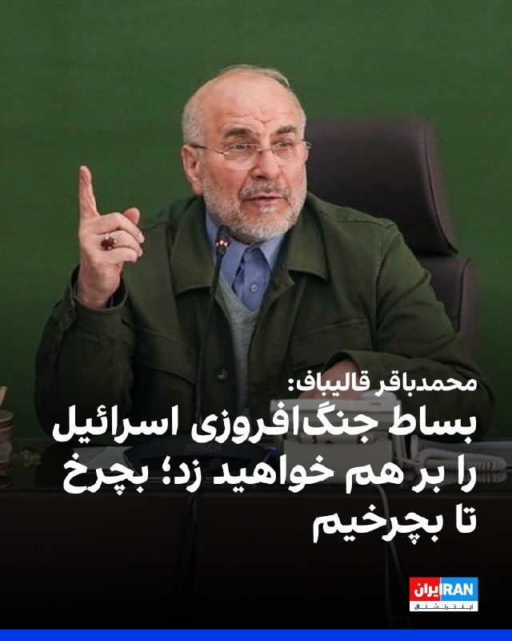

محمدباقر قالیباف، رییس مجلس جمهوری اسلامی، در واکنش به حمله اسرائیل به اهدافی در جنوب بیروت در شبکه ایکس نوشت: «مجاهدت‌های رزمندگان لبنان و دیپلماسی مقتدرانه جمهوری اسلامی حاکمیت و تمامیت ارضی لبنان را تضمین می‌کند و بساط دیوانه‌بازی و جنگ‌افروزی اسرائیل را بر هم خواهد زد، بچرخ تا بچرخیم.»

قالیباف تاکید کرد که هیچ‌یک از ارکان مقاومت را نمی‌توان «تک و تنها» قرار داد و حاکمیت و تمامیت ارضی لبنان حفظ خواهد شد.
‌🏁 🇬🇧 IranintlTV

🤖 @VahidOOnLine

## VahidOOnLine — post 245539

  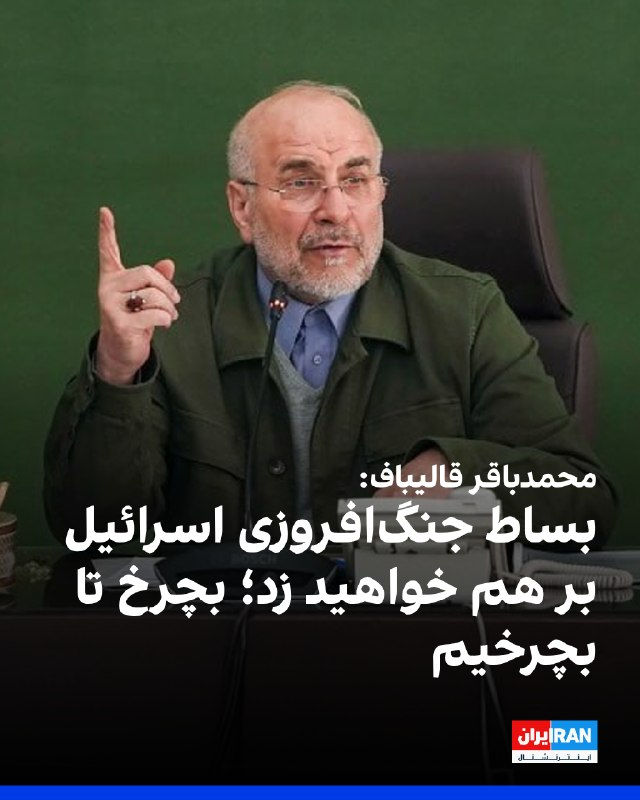

محمدباقر قالیباف، رییس مجلس جمهوری اسلامی، در واکنش به حمله اسرائیل به اهدافی در جنوب بیروت در شبکه ایکس نوشت: «مجاهدت‌های رزمندگان لبنان و دیپلماسی مقتدرانه جمهوری اسلامی حاکمیت و تمامیت ارضی لبنان را تضمین می‌کند و بساط دیوانه‌بازی و جنگ‌افروزی اسرائیل را بر هم خواهد زد، بچرخ تا بچرخیم.»

قالیباف تاکید کرد که هیچ‌یک از ارکان مقاومت را نمی‌توان «تک و تنها» قرار داد و حاکمیت و تمامیت ارضی لبنان حفظ خواهد شد.
‌🏁 🇬🇧 IranintlTV

🤖 @VahidOOnLine

## WithYashar — post 14871

هاآرتص: نتانیاهو به ترامپ نه گفت
@withyashar

## WithYashar — post 14870

خالیباف خطاب به اسرائیل بچرخ تا به بچرخیم
@withyashar

## pm_afshaa — post 93960

  <a href="telegram/content/pm_afshaa_93960_1781464398.webm" target="_blank">🎬 Download video</a>

🔴توییت قالیباف:
هرگز نمی‌توانند هیچ بخشی از ارکان مقاومت رو تک و تنها گیر بیارید؛

مجاهدت‌های رزمندگان لبنان و دیپلماسی مقتدرانه جمهوری اسلامی ایران حاکمیت و تمامیت ارضی لبنان عزیز رو تضمین میکنه و بساط دیوانه‌بازی و جنگ‌افروزی اسرائیل رو بر هم خواهد زد، بچرخ تا بچرخیم.

💧 Rainbet.com the #1 Non-KYC Crypto Casino & Sportsbook @rainbetcom

😁 @Pm_Afshaa

## VahidOnline — post 76343

  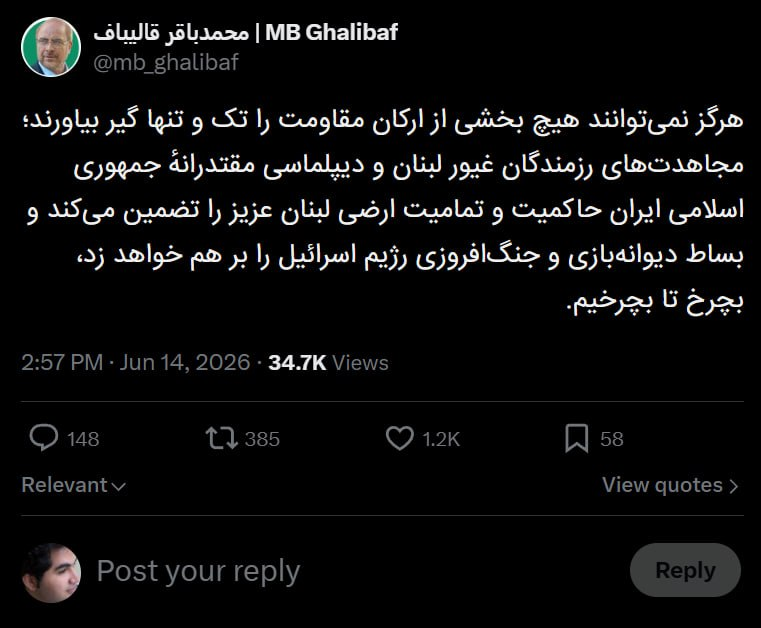

mb_ghalibaf

📡 @VahidOnline

## IranIntlTV — post 342345

  

لیندزی گراهام، سناتور جمهوری‌خواه آمریکا، در شبکه ایکس نوشت: «امیدوارم یک راه‌حل دیپلماتیک برای پایان دادن به جنگ ایران، جلوگیری از توانایی جمهوری اسلامی برای تولید سلاح هسته‌ای و متوقف کردن حمایت آن از تروریسم در منطقه در دسترس باشد، اما همچنان باید بدانیم با چه طرفی روبه‌رو هستیم.»

او افزود: «از زمان برقراری آخرین آتش‌بس، حزب‌الله حملات خود به اسرائیل را متوقف نکرده و این حملات تا جایی ادامه یافته که برخی مناطق شمال اسرائیل به دلیل حملات مداوم تخلیه شده‌اند.»

سناتور گراهام تاکید کرد: «حزب‌الله از سوی جمهوری اسلامی تامین مالی و هدایت می‌شود و مسئول ریخته شدن خون بسیاری از آمریکایی‌هاست. روشن است صرف‌نظر از هر توافقی که با تهران امضا شود، هدف اعلام‌شده حزب‌الله برای نابودی اسرائیل و تبدیل لبنان به یک خلافت، تغییری نکرده است.»
https://iranintl.com/202606147734

## IranIntlTV — post 342344

  

محمدباقر قالیباف، رییس مجلس جمهوری اسلامی، در واکنش به حمله اسرائیل به اهدافی در جنوب بیروت در شبکه ایکس نوشت: «مجاهدت‌های رزمندگان لبنان و دیپلماسی مقتدرانه جمهوری اسلامی حاکمیت و تمامیت ارضی لبنان را تضمین می‌کند و بساط دیوانه‌بازی و جنگ‌افروزی اسرائیل را بر هم خواهد زد، بچرخ تا بچرخیم.»

قالیباف تاکید کرد که هیچ‌یک از ارکان مقاومت را نمی‌توان «تک و تنها» قرار داد و حاکمیت و تمامیت ارضی لبنان حفظ خواهد شد.
https://iranintl.com/202606144262

## IranIntlTV — post 342342

  <a href="telegram/content/IranIntlTV_342342_1781464400.mp4" target="_blank">🎬 Download video</a>

دونالد ترامپ امروز هشتاد ساله شد؛ مردی که از برج‌های نیویورک و قاب تلویزیون به کاخ سفید رسید، در سیاست آمریکا اثری ماندگار گذاشت و برای بسیاری از ایرانیان با مرگ سلیمانی و خامنه‌ای به یاد می‌ماند.

آرین ریسباف گزارش می‌دهد.
@iranintltv

## BBCPersian — post 283807

  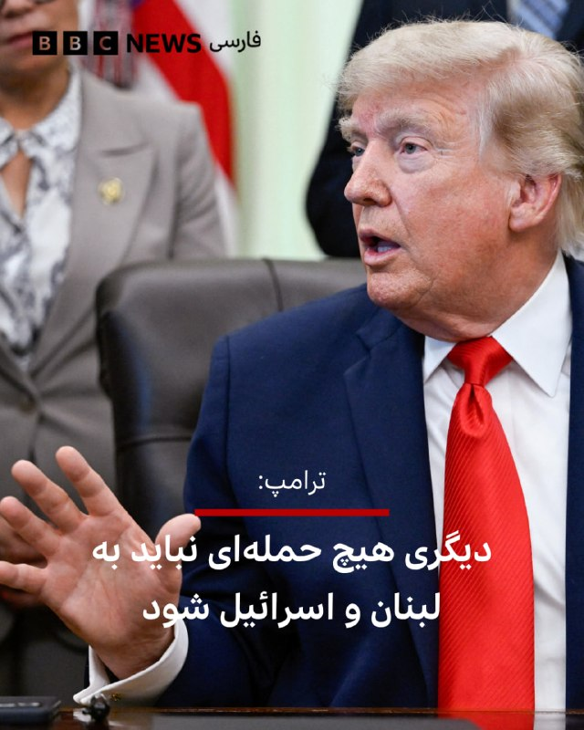

جح‌ ‌ ‌ ‌
دونالد ترامپ در شبکه اجتماعی درباره حمله به ضاحیه نوشت این حمله نبایست اتفاق می‌افتاد.

رئیس‌جمهور آمریکا در تروث سوشال نوشت: «حمله امروز صبح به بیروت نبایست رخ می‌داد به‌ویژه در چنین روز مهمی که به توافق صلح با ایران اینقدر نزدیک شده‌ایم. اسرائیل حق دارد از خود در مقابل تهدید دفاع کند و حمله‌ای که در پاسخ کرد بسیار کوچک و بی‌معنی بود. هیچ‌کس کشته، زخمی نشده و آسیبی ندیده و این روند مهم نباید مختل شود.»

آقای ترامپ خواستار «خویشتنداری» شد: «دیگر نباید هیچ حمله‌ای از اسرائیل به هیچ نقطه‌ای از لبنان شود، در عین حال نباید هیچ حمله‌ای از سوی هیچ طرف دیگری، از جمله حزب‌الله، به اسرائیل شود.»

رئیس‌جمهور آمریکا تاکید کرد توافقی که صلح را به منطقه از جمله لبنان بیاورد بسیار نزدیک است پس «نگذارید از این فرصت از بین برود.»

به گفته دفاع مدنی لبنان در حمله به ضاحیه سه نفر کشته و شش نفر مجروح شده‌اند.

پس از این حمله ایران تهدید به قطع گفت‌وگو با آمریکا کرد و معاون قرارگاه مرکزی خاتم‌الانبیا گفت این حمله بی‌پاسخ نمی‌ماند.

https://bbc.in/4etkI6R
📷Reuters
@BBCPersian

## alonews — post 127983

  <a href="telegram/content/alonews_127983_1781464403.webm" target="_blank">🎬 Download video</a>

🔴فوری/مخبر عضو مجمع تشخیص مصلحت: در دفاع از لبنان، با هیچ‌کس خوش‌وبش نداریم و درسی پشیمان‌کننده به متجاوزان خواهیم داد.

✅ @AloNews خبر جنگ

## alonews — post 127982

  <a href="telegram/content/alonews_127982_1781464403.webm" target="_blank">🎬 Download video</a>

👈تسنیم: لغو پروازهای غرب کشور تا اطلاع ثانوی

🔴پروازهای فرودگاه‌های غرب کشور تا اطلاع ثانوی لغو شده است. این تصمیم در پی شرایط موجود اتخاذ شده است

🔴پیگیری‌ها نشان می‌دهد تاکنون نوتام (اطلاعیه هوانوردی) رسمی در این خصوص صادر نشده است.

✅ @AloNews خبر جنگ

## alonews — post 127981

  <a href="telegram/content/alonews_127981_1781464403.webm" target="_blank">🎬 Download video</a>

👈هاآرتص: نتانیاهو به ترامپ نه گفت

✅ @AloNews خبر جنگ

## alonews — post 127980

  <a href="telegram/content/alonews_127980_1781464404.webm" target="_blank">🎬 Download video</a>

👈قالیباف: هرگز نمی‌توانند هیچ بخشی از ارکان مقاومت را تک‌وتنها گیر بیاورند

🔴مجاهدت‌های رزمندگان لبنان و دیپلماسی مقتدرانه جمهوری اسلامی ایران حاکمیت و تمامیت ارضی لبنان عزیز را تضمین می‌کند و بساط دیوانه‌بازی و جنگ‌افروزی رژیم اسرائیل را برهم خواهد زد، بچرخ تا بچرخیم.

✅ @AloNews خبر جنگ

---
📅 بروزرسانی: 1405/03/24 22:33
---

## VahidOOnLine — post 245538

  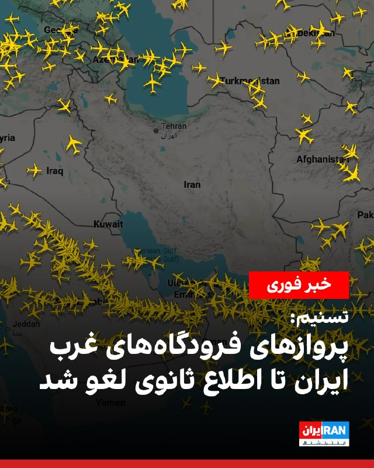

خبرگزاری تسنیم، رسانه وابسته به سپاه پاسداران، گزارش داد پروازهای فرودگاه‌های غرب ایران تا اطلاع ثانوی لغو شده است. این رسانه نوشت این تصمیم در پی «شرایط موجود» اتخاذ شده است.

تسنیم جزییات بیشتری درباره علت لغو پروازها یا زمان احتمالی ازسرگیری آن‌ها منتشر نکرد.

همزمان، داده‌های پروازی وب‌سایت فلایت‌رادار در حدود ساعت ۲۲:۱۵ به وقت تهران نشان داد آسمان ایران تقریبا خالی است و تنها یک پرواز از مبدا تهران به سوی شمال غرب در حال حرکت است.
‌🏁 🇬🇧 IranintlTV

🤖 @VahidOOnLine

## VahidOOnLine — post 245537

  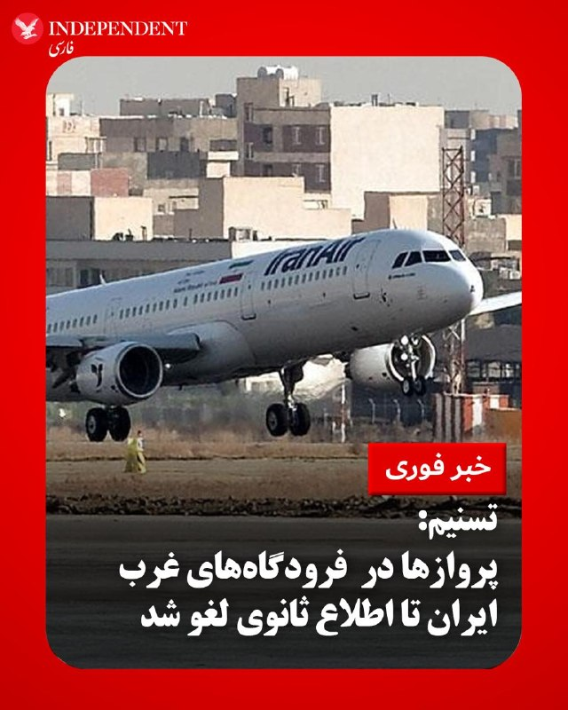

♦️خبرگزاری تسنیم، وابسته به سپاه پاسداران، شامگاه دوشنبه ۲۴ خرداد ماه، در خبری اعلام کرد پروازهای فرودگاه‌های غرب کشور «تا اطلاع ثانوی» لغو شده است.
این خبرگزاری حکومتی با ذکر آنکه «این تصمیم در پی شرایط موجود اتخاذ شده است» نوشت، با وجود اجرای این محدودیت، تاکنون نوتام (اطلاعیه هوانوردی) رسمی درباره لغو پروازها در فرودگاه‌های غرب کشور صادر نشده است.
این خبر در حالی منتشر می‌شود که محمدباقر ذوالقدر، دبیر شورای عالی امنیت ملی، پیشتر در واکنش به حمله اسرائیل به ضاحیه جنوبی بیروت اعلام کرده بود: «پاسخ رزمندگان اسلام در پیش است».
‌🇸🇦 Indypersian

🤖 @VahidOOnLine

## WithYashar — post 14868

👻

## WithYashar — post 14867

هیچ نوتام جدیدی درباره محدودیت پروازی صادر نشده است

مجید اخوان، سخنگوی سازمان هواپیمایی کشوری در گفتگو با خبرنگار مهر درباره برخی اخبار منتشرشده در فضای مجازی مبنی بر صدور نوتام جدید برای محدودیت پروازی در فضای هوایی کشور، اظهار کرد: هیچ‌گونه نوتام جدیدی در این خصوص صادر نشده است.
نوتام مربوط به محدودیت پروازی در غرب کشور، همان نوتام قبلی است و اطلاعیه جدیدی در این زمینه صادر نشده است.
@withyashar

## WithYashar — post 14866

تسنیم گفت ایران با هشدار NOTAM پروازهای فرودگاه‌های غرب کشور تا اطلاع ثانوی لغو شده است. این تصمیم در پی شرایط موجود اتخاذ شده است. @withyashar

## mwarmonitor — post 10914

🔴باقر تویتری ؛ هرگز نمی‌توانند هیچ بخشی از ارکان مقاومت را تک و تنها گیر بیاورند؛ مجاهدت‌های رزمندگان غیور لبنان و دیپلماسی مقتدرانهٔ جمهوری اسلامی ایران حاکمیت و تمامیت ارضی لبنان عزیز را تضمین می‌کند و بساط دیوانه‌بازی و جنگ‌افروزی رژیم اسرائیل را بر هم خواهد زد، بچرخ تا بچرخیم.

@mwarmonitor

## mwarmonitor — post 10913

  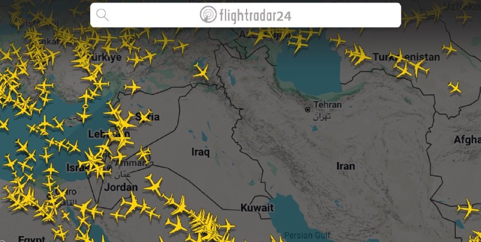

✈️🔴«لغو تمام پروازها و بسته شدن حریم هوایی در غرب ایران» @mwarmonitor

## mwarmonitor — post 10912

❌در پایان هفته گذشته: ارتش اسرائیل علی موسى دقدوق — یکی از فرماندهان ارشد سازمان تروریستی حزب‌الله و فرمانده پیشین «پرونده جولان» — را در جنوب لیتانی به هلاکت رساند ⭕️ارتش اسرائیل در پایان هفته (جمعه) در جنوب لبنان حمله کرد و تروریست علی موسى دقدوق — فرمانده…

## pm_afshaa — post 93958

  <a href="telegram/content/pm_afshaa_93958_1781463804.webm" target="_blank">🎬 Download video</a>

🔴سناتور لیندسی گراهام:
از ارتش اسرائیل و همه کسانی که در حذف این تروریست (علی موسی دقوق) نقش داشتن تشکر میکنم.

اسرائیل بهترین دوست آمریکا و نعمتی برای امنیت ملی این کشور است.

💧 Rainbet.com the #1 Non-KYC Crypto Casino & Sportsbook @rainbetcom

😁 @Pm_Afshaa

## pm_afshaa — post 93957

🔴وای نت:نتانیاهو درخواست‌های ترامپ برای توقف آتش‌بس علیه لبنان و عقب‌نشینی نیروهای ارتش اسرائیل از این کشور را رد کرد 
💧 Rainbet.com the #1 Non-KYC Crypto Casino & Sportsbook @rainbetcom 
😁 @Pm_Afshaa

## VahidOnline — post 76342

  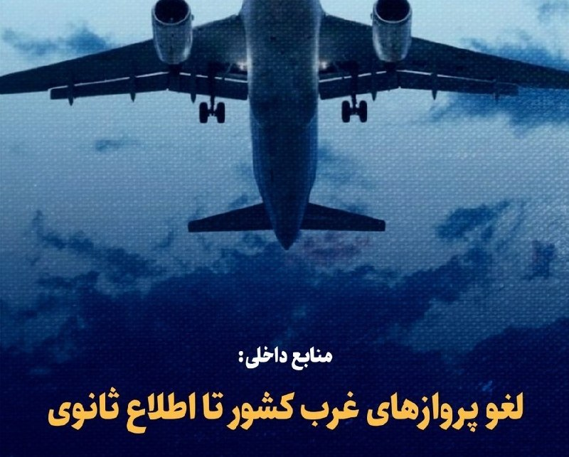

خبرگزاری تسنیم و صدا و سیما:
پروازهای فرودگاه‌های غرب کشور تا اطلاع ثانوی لغو شده است.

این تصمیم در پی شرایط موجود اتخاذ شده است.

سازمان هواپیمایی تا این لحظه هیچ نوتامی منتشر نکرده است.

خبرگزاری مهر:
هیچ نوتام جدیدی درباره محدودیت پروازی صادر نشده است

🔺مجید اخوان، سخنگوی سازمان هواپیمایی کشوری در گفتگو با خبرنگار مهر درباره برخی اخبار منتشرشده در فضای مجازی مبنی بر صدور نوتام جدید برای محدودیت پروازی در فضای هوایی کشور، اظهار کرد: هیچ‌گونه نوتام جدیدی در این خصوص صادر نشده است.

🔺نوتام مربوط به محدودیت پروازی در غرب کشور، همان نوتام قبلی است و اطلاعیه جدیدی در این زمینه صادر نشده است.

📡 @VahidOnline

## kianmeli1 — post 87995

🔴فرودگاه مهراباد تهران در حال تخلیه شدن است
https://t.me/kianmeli1

## IranIntlTV — post 342341

  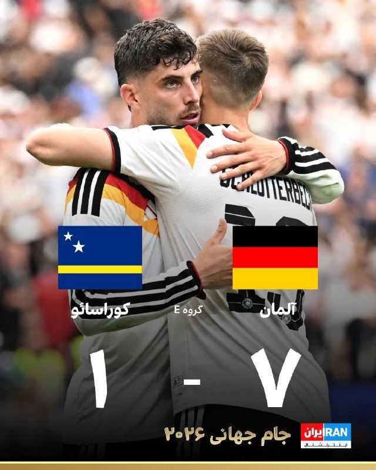

🔻تیم ملی فوتبال آلمان در نخستین مسابقه خود در جام جهانی ۲۰۲۶ با نتیجه ۱-۷ برابر کوراسائو به پیروزی رسید. انمچا، اشلوتربک، موسیالا، براون، اونداو و هاورتس (دو بار) برای شاگردان ناگلزمن گلزنی کردند و لیوانو کومننسیا نیز در نیمه اول تک گل تاریخی تیمش را وارد دروازه مانوئل نویر کرد.

🔹آلمان با این نتیجه در صدر جدول گروه E قرار گرفت. ساحل عاج و اکوادور دو حریف دیگر آلمان در این گروه خواهند بود.

@iranintltvsport

## IranIntlTV — post 342339

  

خبرگزاری تسنیم، رسانه وابسته به سپاه پاسداران، گزارش داد پروازهای فرودگاه‌های غرب ایران تا اطلاع ثانوی لغو شده است. این رسانه نوشت این تصمیم در پی «شرایط موجود» اتخاذ شده است.

تسنیم جزییات بیشتری درباره علت لغو پروازها یا زمان احتمالی ازسرگیری آن‌ها منتشر نکرد.

همزمان، داده‌های پروازی وب‌سایت فلایت‌رادار در حدود ساعت ۲۲:۱۵ به وقت تهران نشان داد آسمان ایران تقریبا خالی است و تنها یک پرواز از مبدا تهران به سوی شمال غرب در حال حرکت است.
https://iranintl.com/202606141075

## Iliaen — post 4483

ساعت ۲۲:۲۰ یکشنبه؛ برخی از پروازها در آسمان مرکز ایران به صورت ناگهانی به سمت شمال کشور تغییر مسیر دادند. @iliaen

## FarsiVOA — post 220715

  

📸اینستاگرام صدای آمریکا را هم اکنون فالو کنید تا از آخرین خبرها مطلع بمانید:
https://www.instagram.com/voafarsi/

📡همچنین جهت اطلاع از بروزترین فرکانسهای ماهواره‌ای صدای آمریکا به لینک زیر مراجعت فرمایید:
https://ir.voanews.com/satellite

این پست را با دوستانتان به اشتراک بگذارید
@FarsiVOA

## FarsiVOA — post 220714

🔺بسته‌شدن حریم هوایی ایران در پی تهدید شدن اسرائیل از سوی جمهوری اسلامی

◾️بر اساس داده‌های ردیابی پرواز در روز یکشنبه، حریم هوایی ایران بسته شده است.

⬇️ بیشتر بخوانید:

https://ir.voanews.com/a/iran-airspace-closed-before-attack/8160724.html

## Persian_Trend_Official — post 17099

  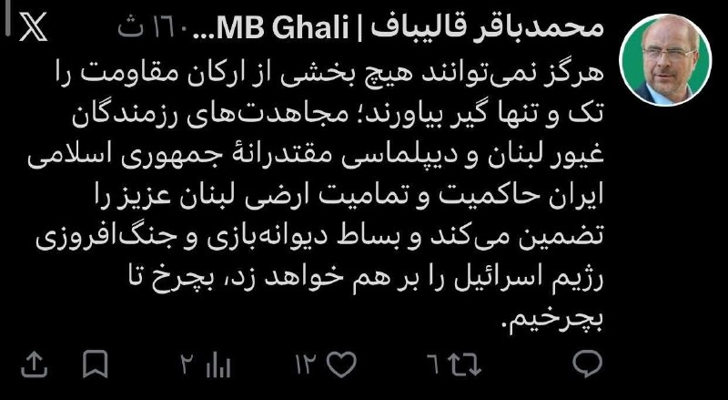

قالیباف خطاب به اسرائیل: بچرخ تا بچرخیم!

رئیس هیئت مذاکره‌کننده جمهوری اسلامی: هرگز نمی‌توانند هیچ بخشی از ارکان مقاومت را تک و تنها گیر بیاورند؛ مجاهدت‌های رزمندگان لبنان و دیپلماسی مقتدرانه جمهوری اسلامی ایران حاکمیت و تمامیت ارضی لبنان عزیز را تضمین می‌کند و بساط دیوانه‌بازی و جنگ‌افروزی رژیم اسرائیل را بر هم خواهد زد، بچرخ تا بچرخیم.

📝 Amir

📌 @persian_trend_official
پرشین ترند | متفاوت‌ترین کانال نظامی

## Persian_Trend_Official — post 17098

کانال رسمی پرشین ترند pinned «https://youtube.com/live/suzEnh0ejFw?feature=share»

## IranianMinds — post 22585

🔴 تسنیم :

حریم هوایی غرب کشور‌ تا اطلاع ثانوی بسته شد.

@IranianMinds

---
📅 بروزرسانی: 1405/03/24 22:24
---

## VahidOOnLine — post 245536

  

محمد مخبر، مشاور مجتبی خامنه‌ای، با اشاره به حمله اسرائیل به جنوب بیروت در شبکه اجتماعی ایکس نوشت: «نه لبخند دیپلماتیک آمریکایی قابل اعتماد است و نه توحش اسرائیل قابل تحمل! در دفاع از لبنان با هیچ‌کس تعارف نداریم و به متجاوزان درس پشیمان‌کننده خواهیم داد.»

او همزمان با احتمال یادداشت تفاهم تهران و واشینگتن، نوشت تقسیم نقش «تفاهم و تجاوز» میان آمریکا و اسرائیل، تکراری و غیرقابل پذیرش است.
‌🏁 🇬🇧 IranintlTV

🤖 @VahidOOnLine

## VahidOOnLine — post 245535

  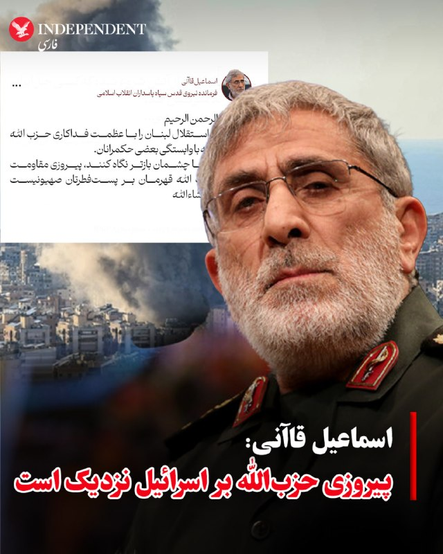

♦️همزمان با واکنش گسترده مقام‌های سیاسی و نظامی جمهوری اسلامی ایران به حمله اسرائیل به بیروت، اسماعیل قاآنی، فرمانده نیروی قدس سپاه پاسداران، در بیانیه‌ای گفت: «پیروزی حزب‌الله بر اسرائیل در راه است.»

قاآنی در بیانیه روز یکشنبه ۲۴ خرداد نوشت: «مردم دنیا، استقلال لبنان را با عظمت فداکاری حزب‌الله می‌شناسند نه با وابستگی بعضی حکمرانان.»

فرمانده نیروی قدس سپاه پاسداران افزود: «همه دنیا با چشمان بازتر نگاه کنند، پیروزی مقاومت عظیم حزب‌الله قهرمان بر اسرائیل در راه است.»
‌🇸🇦 Indypersian

🤖 @VahidOOnLine

## VahidOOnLine — post 245534

  <a href="telegram/content/VahidOOnLine_245534_1781463242.mp4" target="_blank">🎬 Download video</a>

ویدیوی منتشرشده در شبکه‌های اجتماعی نشان می‌دهد جمعی از حامیان تندروی جمهوری اسلامی در تجمع شبانه خود خواستار اعدام عباس عراقچی، وزیر خارجه دولت پزشکیان، شدند.
بخشی از حامیان حکومت در روزهای اخیر، وزارت خارجه و تیم مذاکره‌کننده را به دادن امتیاز به آمریکا متهم کرده‌اند.
‌🏁 🇬🇧 IranintlTV

🤖 @VahidOOnLine

## WithYashar — post 14865

  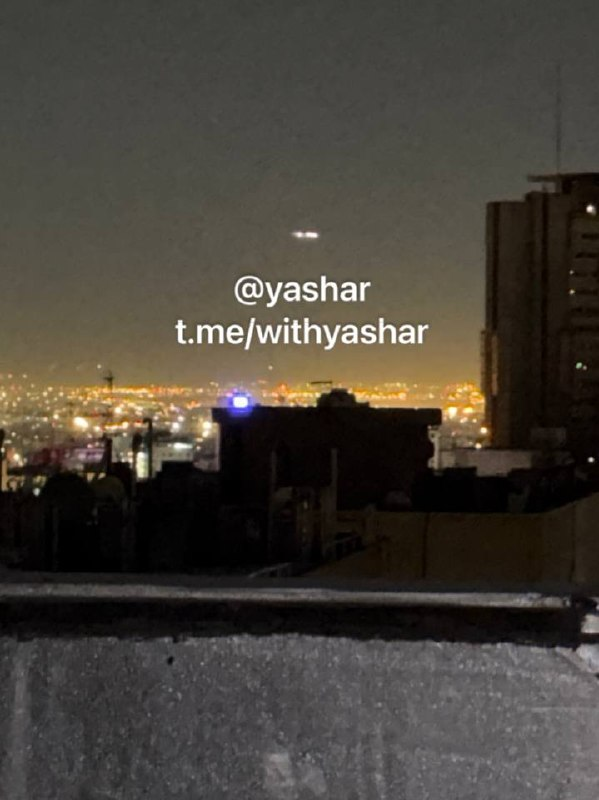

دیدبان اتاق جنگ از بالا پشت بام : آخرین پرواز در تهران نشست
@withyashar

## WithYashar — post 14864

تسنیم گفت ایران با هشدار NOTAM پروازهای فرودگاه‌های غرب کشور تا اطلاع ثانوی لغو شده است. این تصمیم در پی شرایط موجود اتخاذ شده است.
@withyashar

## WithYashar — post 14863

  <a href="telegram/content/WithYashar_14863_1781463244.mp4" target="_blank">🎬 Download video</a>

اسرائیل اختلال در سامانه‌های موقعیت‌یابی GPS را در شدیدترین حالت قرمز قرار داد برای دفاع از خود و ایران نیز این روند را هم اکنون شروع کرده و در حال شدت بخشیدن است.
@withyashar

## mwarmonitor — post 10911

🔴 ارتش اسرائیل: دو سرباز در اثر شلیک یک راکت توسط حزب‌الله در جنوب لبنان زخمی شدند.

@mwarmonitor

## mwarmonitor — post 10910

  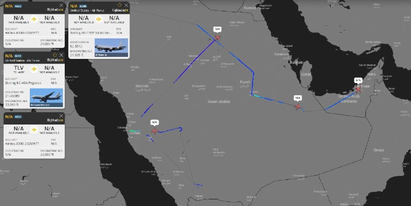

✈️«۲ فروند هواپیمای سوخت‌رسان نیروی هوایی آمریکا در حال حرکت به سمت خلیج فارس هستند.

✈️همچنین ۲ فروند هواپیمای سوخت‌رسان A330 نیروی هوایی عربستان سعودی در حال پرواز هستند؛ یکی در نزدیکی مرز عراق و کویت و دیگری در نزدیکی مرز یمن فعال است.»

@mwarmonitor

## mwarmonitor — post 10909

خب امشب درگیری خواهیم داشت کمی متفاوت با دفعه قبل

## mwarmonitor — post 10908

✈️🔴«لغو تمام پروازها و بسته شدن حریم هوایی در غرب ایران»

@mwarmonitor

## pm_afshaa — post 93956

🔴وای نت:نتانیاهو درخواست‌های ترامپ برای توقف آتش‌بس علیه لبنان و عقب‌نشینی نیروهای ارتش اسرائیل از این کشور را رد کرد

💧 Rainbet.com the #1 Non-KYC Crypto Casino & Sportsbook @rainbetcom

😁 @Pm_Afshaa

## pm_afshaa — post 93955

♨️
♨️
♨️
♨️

## pm_afshaa — post 93954

🔴کابینه سیاسی - امنیتی اسرائیل هم اکنون تشکیل جلسه فوری داده

💧 Rainbet.com the #1 Non-KYC Crypto Casino & Sportsbook @rainbetcom

😁 @Pm_Afshaa

## pm_afshaa — post 93953

مخبر:در دفاع از لبنان، با هیچ‌کس خوش‌وبش نداریم و درسی پشیمان‌کننده به متجاوزان خواهیم داد

💧 Rainbet.com the #1 Non-KYC Crypto Casino & Sportsbook @rainbetcom

😁 @Pm_Afshaa

## pm_afshaa — post 93952

حریم هوایی غرب کشور بسته شد

💧 Rainbet.com the #1 Non-KYC Crypto Casino & Sportsbook @rainbetcom

😁 @Pm_Afshaa

## pm_afshaa — post 93951

اختلال شدید در سیگنال‌های GPS در شمال اسرائیل و جنوب سوریه

💧 Rainbet.com the #1 Non-KYC Crypto Casino & Sportsbook @rainbetcom

😁 @Pm_Afshaa

## IranIntlTV — post 342338

🔻ترامپ: حمله اسرائیل به بیروت امضای توافق را چند ساعت به تعویق انداخت

همزمان با افزایش تنش‌ها میان اسرائیل و لبنان که بر توافق احتمالی میان تهران و واشینگتن سایه انداخته است، دونالد ترامپ اعلام کرد که تفاهم‌نامه پیش از پایان روز یکشنبه ۲۴ خرداد امضا می‌شود. او گفت که حملات اسرائیل به بیروت امضای توافق را چند ساعت به تعویق انداخت.

فاکس نیوز، در گزارشی که شامگاه یکشنبه ۲۴ خرداد از این رسانه پخش شد، گفت که ترامپ در یک گفت‌وگوی کوتاه تلفنی با خبرنگار این رسانه گفته است که انتظار می‌رود این توافق «همین امشب، ظرف دو تا سه ساعت آینده به‌صورت الکترونیکی» امضا شود و به همین دلیل از جمهوری اسلامی می‌خواهد از پاسخ به حملات اسرائیل به بیروت خودداری کند.

ترامپ همچنین به این رسانه گفت: «اگر ایران امشب توافق را امضا کنند، بی‌درنگ دستور می‌دهم محاصره بندرهای ایران برداشته شود و سپس وارد گفت‌وگوهای مفصل‌تر درباره برنامه هسته‌ای آنها خواهیم شد.
به گفته رییس‌جمهوری آمریکا ممکن است مراسم امضای حضوری این توافق هفته آینده، در اروپا برگزار شود.

رییس‌جمهوری آمریکا در گفت‌وگویی دیگر با رسانه اکسیوس گفت که توافق، با وجود حمله اسرائیل به بیروت و تهدید جمهوری اسلامی به تلافی، همچنان طبق برنامه قرار است یکشنبه انجام شود. او همچنین به این رسانه گفت: «این اتفاق زمان‌بندی توافق را به هم ریخت و امضا را چند ساعت عقب انداخت. قرار بود همین حالا انجام شود. حالا برای چند ساعت دیگر برنامه‌ریزی شده است.»

به گزارش اکسیوس، ترامپ از شنیدن خبر حملات اسرائیل به بیروت غافلگیر و از بنیامین نتانیاهو، نخست‌وزیر اسرائیل، خشمگین شد.

رییس‌جمهوری آمریکا پیش از این گفت‌وگوها در شبکه اجتماعی تروث سوشال از اسرائیل بابت حمله به بیروت انتقاد کرد و نوشت: «حمله صبح امروز به بیروت، به‌ویژه در یک روز خاص که ما به توافق صلح با ایران بسیاری نزدیک هستیم، نباید اتفاق می‌افتاد.» او افزود: «همه طرف‌ها باید عقب‌نشینی کنند و هیچ حمله‌ای از سوی اسرائيل به هیچ کجای لبنان نباید انجام شود.»

ترامپ در ادامه تاکید کرد که حزب‌الله نیز نباید حملات دیگری علیه حزب‌الله انجام دهد.»

او در ابتدای این پست نوشته است که هرچند اسرائیل «حق دارد» در برابر تهدیدها از خود دفاع کند، اما حملاتی که به آن پاسخ داد «بسیار کوچک و بی‌معنی بود، کسی آسیب ندید و زخمی یا کشته نشد.»

🔗 متن کامل گزارش را اینجا بخوانید

@iranintltv

## IranIntlTV — post 342337

  <a href="telegram/content/IranIntlTV_342337_1781463247.mp4" target="_blank">🎬 Download video</a>

🔻تیم ملی فوتبال ترکیه در حالی در یک غافلگیری برابر استرالیا شکست خورد که هزاران نفر از شهروندان ترکیه در شهرهای مختلف این کشور در مکان‌های عمومی جمع شده بودند تا پیروزی تیمشان در جام جهانی را پس از ۲۴ سال جشن بگیرند.

🔹توضیحات نرگس هورخش، خبرنگار ایران اینترنشنال

@iranintltvsport

## IranIntlTV — post 342336

  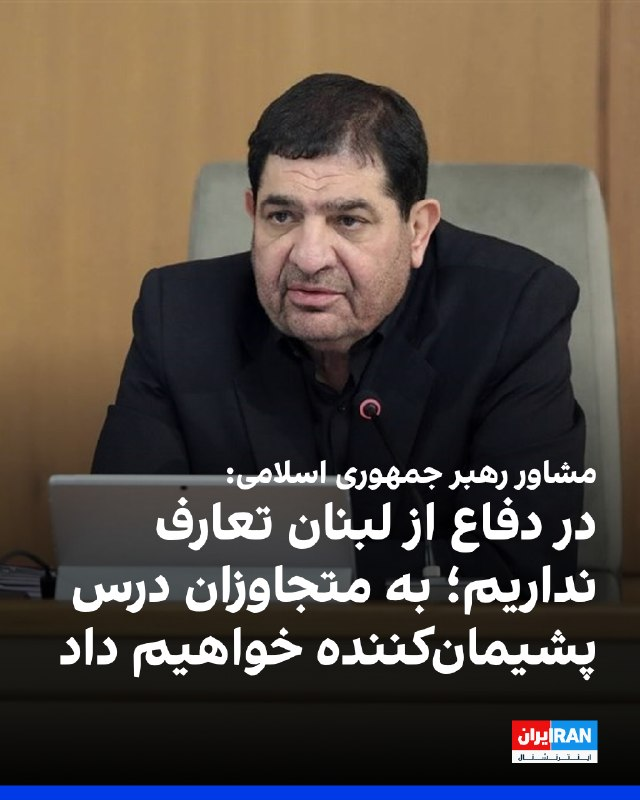

محمد مخبر، مشاور مجتبی خامنه‌ای، با اشاره به حمله اسرائيل به جنوب بیروت در شبکه اجتماعی ایکس نوشت: «نه لبخند دیپلماتیک آمریکایی قابل اعتماد است و نه توحش اسرائیل قابل تحمل! در دفاع از لبنان با هیچ‌کس تعارف نداریم و به متجاوزان درس پشیمان‌کننده خواهیم داد.»

او همزمان با احتمال یادداشت تفاهم تهران و واشینگتن، نوشت تقسیم نقش «تفاهم و تجاوز» میان آمریکا و اسرائیل، تکراری و غیرقابل پذیرش است.
https://iranintl.com/202606143735

## IranIntlTV — post 342335

  <a href="telegram/content/IranIntlTV_342335_1781463250.mp4" target="_blank">🎬 Download video</a>

ویدیوی منتشرشده در شبکه‌های اجتماعی نشان می‌دهد جمعی از حامیان تندروی جمهوری اسلامی در تجمع شبانه خود خواستار اعدام عباس عراقچی، وزیر خارجه دولت پزشکیان، شدند.
بخشی از حامیان حکومت در روزهای اخیر، وزارت خارجه و تیم مذاکره‌کننده را به دادن امتیاز به آمریکا متهم کرده‌اند.

## Shin_Persian — post 7073

Shin ✓ @hey_itsmyturn
Sun, 14 Jun 2026 18:50:21 UTC

Buckle up

ترجمه خودکار فارسی

کمربندها را ببندید

𝕏 · @shin_persian

## Iliaen — post 4482

ساعت ۲۲:۲۰ یکشنبه؛ برخی از پروازها در آسمان مرکز ایران به صورت ناگهانی به سمت شمال کشور تغییر مسیر دادند.

@iliaen

## FarsiVOA — post 220713

  <a href="telegram/content/FarsiVOA_220713_1781463252.mp4" target="_blank">🎬 Download video</a>

تیم ملی فوتبال ایران برای نخستین دیدار خود در جام جهانی ۲۰۲۶ در روز دوشنبه مقابل نیوزیلند، راهی لس‌آنجلس شد. ویزا‌ی مهدی تاج، رییس فدراسیون فوتبال، و تعدادی از اعضای هیات اعزامی تیم برای ورود به آمریکا صادر نشده است.

## Persian_Trend_Official — post 17097

  <a href="telegram/content/Persian_Trend_Official_17097_1781463253.webm" target="_blank">🎬 Download video</a>

https://youtube.com/live/suzEnh0ejFw?feature=share

## Persian_Trend_Official — post 17096

لغو پروازهای غرب کشور تا اطلاع ثانوی

تسنیم: پروازهای فرودگاه‌های غرب کشور تا اطلاع ثانوی لغو شده است. این تصمیم در پی شرایط موجود اتخاذ شده است.

پیگیری‌ها نشان می‌دهد تاکنون نوتام (اطلاعیه هوانوردی) رسمی در این خصوص صادر نشده است.

📝 Amir

📌 @persian_trend_official
پرشین ترند | متفاوت‌ترین کانال نظامی

## Dirty_Kids — post 392037

  <a href="telegram/content/Dirty_Kids_392037_1781463254.mp4" target="_blank">🎬 Download video</a>

آموزش پخت مک اند چیز خونگی، کشدار و خوشحال‌کننده 😌🧀

@Dirty_Kids 👻

## Dirty_Kids — post 392036

  

🔴 وقتی یه مرد وسط بحث ساکت میشه، روانشناسی میگه به این معنی نیست که بهت اهمیت نمیده.

بیشتر وقتا بخاطر اینه که وقتی توی بحث تحت فشار قرار میگیره، می‌دونه اگه به حرف زدن ادامه بده، اوضاع از کنترلش خارج میشه.

برای همین به جای اینکه بحث رو بدتر کنه، عقب می‌کشه و سکوت می‌کنه. نه به این دلیل که دوست نداره

بلکه بخاطر اینه که سعی داره احساساتش رو کنترل و از رابطه محافظت کنه.

@Dirty_Kids 👻

## Dirty_Kids — post 392035

تیم ملیِ آخوند امشب باید بره لس‌آنجلس. بی‌صبرانه منتظر اومدن فیلم های برخورد مردم باهاشون توی فرودگاهم. :)))

@Dirty_Kids 👻

## Dirty_Kids — post 392034

ولی دقت کردین از وقتی دخترا میتونن بی حجاب باشن چقدر آرایشا کمتر شده؟
الان خیلیا رو میبینی که هیچ آرایشی ندارن و در عین حال خوشگل و شیکن

@Dirty_Kids 👻

## Dirty_Kids — post 392033

  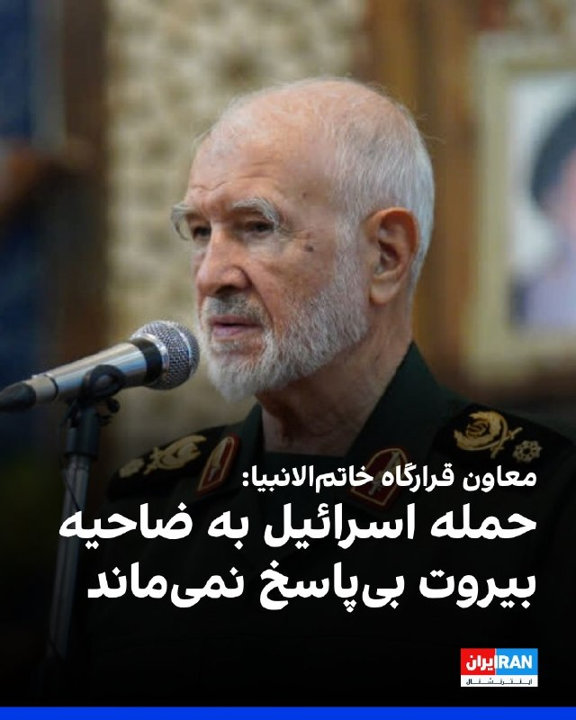

عمو جغد شاخدار:
میریم بلوط های اسرائیل رو میدزدیم

@Dirty_Kids 👻

## alonews — post 127979

  <a href="telegram/content/alonews_127979_1781463257.webm" target="_blank">🎬 Download video</a>

👈طبق اخبار رسانه ایی که درحال پخش است، بنظر می‌رسد ایران و اسرائیل درخواست خویشتن‌داری از جانب آمریکا را رد کرده و آماده درگیری احتمالی می‌شوند. باید منتظر ماند و دید که چه خواهد شد!

✅ @AloNews خبر جنگ

---
📅 بروزرسانی: 1405/03/24 22:13
---

## VahidOOnLine — post 245533

  

سلمان اسحاقی، سخنگوی کمیسیون بهداشت مجلس، گفت نمایندگان مجلس اصرار دارند هرگونه «توافق احتمالی» جمهوری اسلامی و آمریکا مطابق قانون اساسی به مجلس ارائه شود و پس از بررسی‌های کارشناسی و قانونی به تصویب برسد.
سخنگوی کمیسیون بهداشت مجلس، خطاب به تیم مذاکره‌کننده جمهوری اسلامی گفت هر توافقی که قرار است وارد مرحله اجرا و دارای جایگاه قانونی شود، باید در مجلس بررسی و تصویب شود. او با اشاره به تجربه برجام افزود: «اجازه نخواهیم داد رویه‌ای در فرآیند بررسی آن در مجلس طی شد، دوباره تکرار شود.»
‌🏁 🇬🇧 IranintlTV

🤖 @VahidOOnLine

## VahidOOnLine — post 245532

  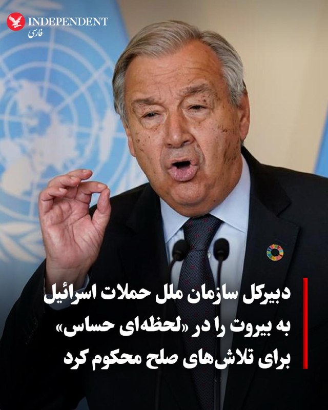

♦️آنتونیو گوترش، دبیرکل سازمان ملل متحد، روز یکشنبه ۲۴ خرداد ماه، حملات اسرائیل به بیروت را که به گفته او می‌تواند تلاش‌ها برای دستیابی به توافق میان آمریکا و ایران را تحت تاثیر قرار دهد، محکوم کرد.
گوترش در بیانیه‌ای اعلام کرد: «این حملات با وجود آتش‌بس و در زمانی رخ داد که انتظار می‌رود ایالات متحده و جمهوری اسلامی ایران به توافقی دست یابند که راه را برای حل‌وفصل مسالمت‌آمیز این درگیری هموار کند.»
دبیرکل سازمان ملل با توصیف شرایط کنونی به عنوان «لحظه‌ای حساس» از همه طرف‌ها خواست خویشتنداری کنند و افزود: «از همه طرف‌ها می‌خواهم در این مقطع حساس نهایت خویشتنداری را نشان دهند.»
اظهارات گوترش پس از آن مطرح شد که حملات اسرائیل به ضاحیه جنوبی بیروت با واکنش‌ مقام‌های جمهوری اسلامی و گمانه‌زنی رسانه‌ها درباره تاثیر آن بر روند توافق احتمالی میان واشنگتن و تهران روبه‌رو شد.
‌🇸🇦 Indypersian

🤖 @VahidOOnLine

## WithYashar — post 14862

گروهک هکری حنظله وابسته به حکومت : امشب سپاه قطعا میزنه
@withyashar

## WithYashar — post 14861

  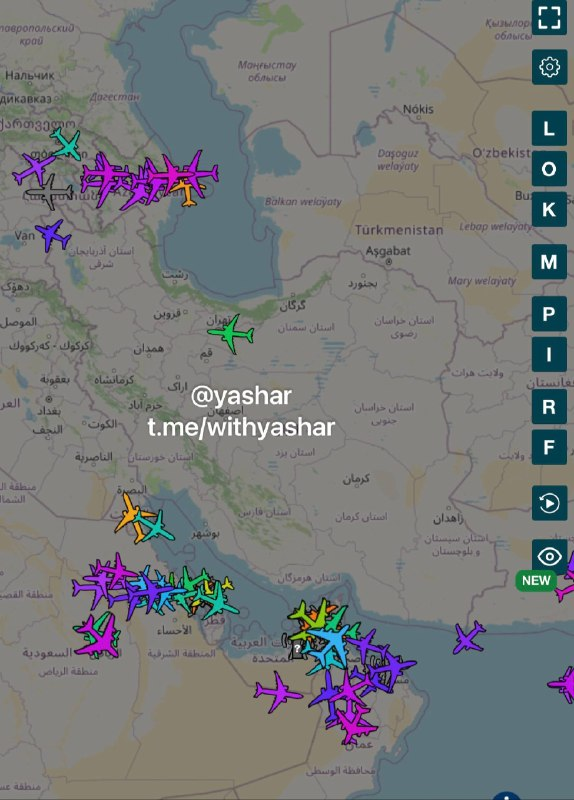

تا دقایقی دیگر آسمان ایران کلیر میشود. یک پرواز در تهران میشیند و یک پرواز از مرز غربی خارج میشود.
@withyashar

## mwarmonitor — post 10907

🔴در حالی که امیدوارم و دعا می‌کنم یک راه‌حل دیپلماتیک برای پایان دادن به درگیری با ایران در دسترس باشد و ایران از توانایی تولید سلاح هسته‌ای محروم شود و سلطه و ترور آن در منطقه متوقف گردد، اما همچنان باید درک کنیم با چه طرفی روبه‌رو هستیم.

🔸از زمان آتش‌بس اخیر، حزب‌الله حملات خود علیه اسرائیل را بدون وقفه ادامه داده است، تا جایی که مناطقی در شمال اسرائیل به دلیل این حملات مداوم تخلیه شده‌اند. اگر چنین وضعیتی برای آمریکا رخ می‌داد، چه می‌کرد؟

🔸حزب‌الله توسط ایران تأمین مالی و کنترل می‌شود و دستش به خون بسیاری از آمریکایی‌ها آلوده است. برای من روشن است که هر توافقی که با ایران امضا شود، اهداف اعلام‌شده حزب‌الله برای نابودی اسرائیل و تبدیل لبنان به یک خلافت، به‌طور بنیادین تغییر نکرده است.

🔸خداوند از ایالات متحده محافظت کند و خداوند از دولت اسرائیل محافظت کند.

📝صدای لیندسی گراهام درآمده

@mwarmonitor

## pm_afshaa — post 93950

🔴چندین سوخت رسان امریکایی از امارات بلند شدن

💧 Rainbet.com the #1 Non-KYC Crypto Casino & Sportsbook @rainbetcom

😁 @Pm_Afshaa

## pm_afshaa — post 93949

تاوان کون نشورای لبنانی رو مردم ایران باید با جون و مالشون بدن

## IranIntlTV — post 342334

  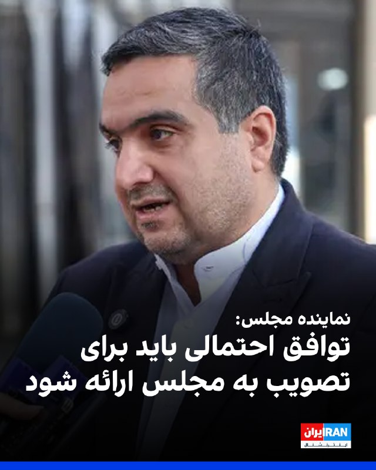

سلمان اسحاقی، سخنگوی کمیسیون بهداشت مجلس، گفت نمایندگان مجلس اصرار دارند هرگونه «توافق احتمالی» جمهوری اسلامی و آمریکا مطابق قانون اساسی به مجلس ارائه شود و پس از بررسی‌های کارشناسی و قانونی به تصویب برسد.
سخنگوی کمیسیون بهداشت مجلس، خطاب به تیم مذاکره‌کننده جمهوری اسلامی گفت هر توافقی که قرار است وارد مرحله اجرا و دارای جایگاه قانونی شود، باید در مجلس بررسی و تصویب شود. او با اشاره به تجربه برجام افزود: «اجازه نخواهیم داد رویه‌ای در فرآیند بررسی آن در مجلس طی شد، دوباره تکرار شود.»
https://iranintl.com/202606147590

## Persian_Trend_Official — post 17094

هم اکنون اختلال شدید GPS در آسمان اسرائیل حاکم است.

📝 Amir

📌 @persian_trend_official
پرشین ترند | متفاوت‌ترین کانال نظامی

## Persian_Trend_Official — post 17093

تا دقایقی دیگه بریم لایو ...

## Persian_Trend_Official — post 17092

  <a href="telegram/content/Persian_Trend_Official_17092_1781462639.webm" target="_blank">🎬 Download video</a>

در حال حاضر هیچ پرواز غیرنظامی در آسمان منطقه انجام نمی‌شود.

📝 Amir

📌 @persian_trend_official
پرشین ترند | متفاوت‌ترین کانال نظامی

## RadioFarda — post 158301

🔸محمدباقر ذوالقدر، دبیر شورای عالی امنیت ملی جمهوری اسلامی، روز یکشنبه تهدید کرد که در پی حمله اسرائیل به جنوب بیروت، پاسخ نیروهای نظامی ایران «در پیش است». 🔸او در بیانیه‌ای که در رسانه‌های ایران بازتاب یافت، گفته است: «لبنان جان ماست و نقض خطوط قرمز جمهوری…

## RadioFarda — post 158300

  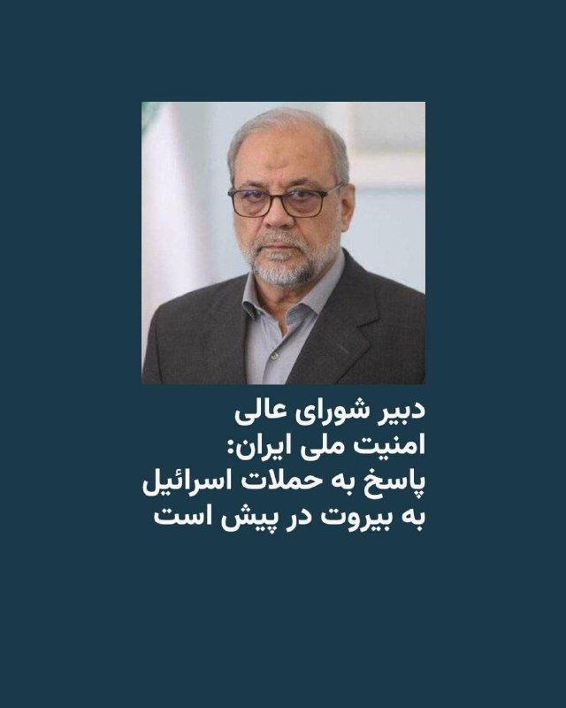

🔸محمدباقر ذوالقدر، دبیر شورای عالی امنیت ملی جمهوری اسلامی، روز یکشنبه تهدید کرد که در پی حمله اسرائیل به جنوب بیروت، پاسخ نیروهای نظامی ایران «در پیش است».

🔸او در بیانیه‌ای که در رسانه‌های ایران بازتاب یافت، گفته است: «لبنان جان ماست و نقض خطوط قرمز جمهوری اسلامی تحمل نخواهد شد.»

🔸این در حالی است که پیش از آن علی عبداللهی، فرمانده قرارگاه خاتم‌الانبیا، در بیانیه دیگری گفت که نیروهای مسلح جمهوری اسلامی «دست به ماشه» هستند و اگر «کوچک‌ترین لغزش» از سوی «دشمن» اتفاق بیفتد، «درسی فراموش‌نشدنی و پایان‌بخش» به آنها داده خواهد شد.

@RadioFarda

## alonews — post 127978

  <a href="telegram/content/alonews_127978_1781462640.webm" target="_blank">🎬 Download video</a>

👈یمن: نتانیاهو بدون چراغ سبز آمریکا، دست به حماقت نمی‌زند

✅ @AloNews خبر جنگ

---
📅 بروزرسانی: 1405/03/24 22:04
---

## VahidOOnLine — post 245531

  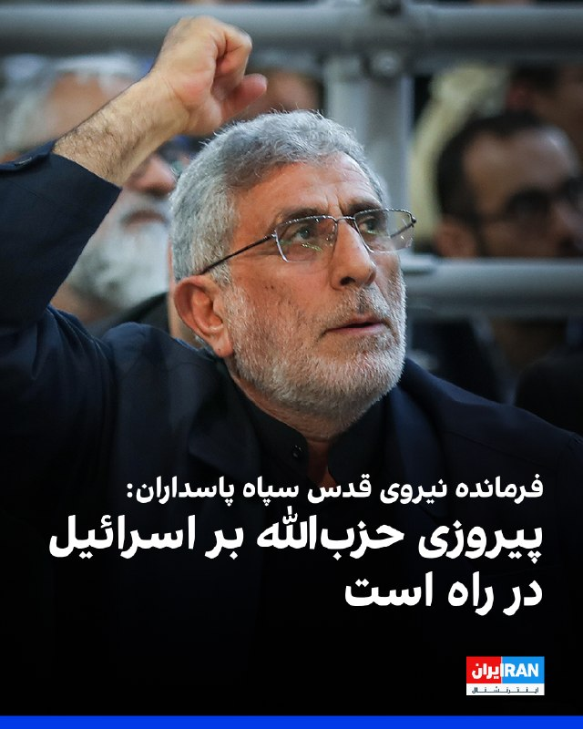

اسماعیل قاآنی، فرمانده نیروی قدس سپاه پاسداران، یکشنبه ۲۴ خرداد، همزمان با افزایش گمانه‌زنی‌ها درباره حمله احتمالی جمهوری اسلامی به اسرائیل در واکنش به هدف قرار گرفتن جنوب بیروت، گفت: «پیروزی حزب‌الله بر اسرائیل در راه است.»

قاآنی نوشت: «مردم دنیا، استقلال لبنان را با عظمت فداکاری حزب‌الله می‌شناسند نه با وابستگی بعضی حکمرانان.»

فرمانده نیروی قدس سپاه پاسداران همچنین افزود: «همه دنیا با چشمان بازتر نگاه کنند، پیروزی مقاومت عظیم حزب‌الله قهرمان بر اسرائیل در راه است.»

او در این پیام به جزییات بیشتری درباره اظهارات خود اشاره نکرد.
‌🏁 🇬🇧 IranintlTV

🤖 @VahidOOnLine

## WithYashar — post 14860

ارسالی : دوست پسرم سربازه میگفت که لانچر اینا اماده کردن 🤷🏻‍♀️
@withyashar

## WithYashar — post 14859

دیده بان اتاق جنگ : اطراف سایت موشکی شهرک مسکونی ویلاشهرنجف آباد تحرکات زیادی دیده میشه ورود ماشین های سنگین به پارک‌‌ کوهستانی پشت سایت
@withyashar

## WithYashar — post 14858

## mwarmonitor — post 10906

📝 ترامپ کله زرد بالاخره به تنظیمات کارخانه‌ای و شغل واقعی‌اش یعنی بنگاهیِ املاک برگشت؛ انگار کلاً یادش رفته که رئیس‌جمهور ابرقدرت جهان است! حالا او دقیقاً مثل این دلال‌های هولِ بنگاهی رفتار می‌کند که ایران و اسرائیل را مثل خریدار و فروشنده‌ای می‌بیند که به جون هم افتاده‌اند و معامله‌شان در حال فسخ شدن است. ترامپِ دلال، فقط برای اینکه این معامله را به هر قیمتی جوش بدهد و کمیسیونِ چربش را از دست ندهد، زونکن فایل‌های اکازیون را زیر بغل زده و وسط این رینگ خونین، برای متقاعد کردن ایران به عدم حمله، حاضر است هر باج و خفتی را قبول کند؛ پیرمرد حریصی که فرق « توافق زورکی» و «سند منگوله‌دار» را فقط در میزان سود خالصش می‌بیند و نگران است که با شروع جنگ، آژانسِ معاملاتی‌اش در خاورمیانه کلاً روی هوا برود.

@mwarmonitor

## pm_afshaa — post 93948

هواپیماهای مهر اباد در حال تخلیه هستن

💧 Rainbet.com the #1 Non-KYC Crypto Casino & Sportsbook @rainbetcom

😁 @Pm_Afshaa

## pm_afshaa — post 93947

🔴اسمون کشور در حال کلییر شدنه

💧 Rainbet.com the #1 Non-KYC Crypto Casino & Sportsbook @rainbetcom

😁 @Pm_Afshaa

## pm_afshaa — post 93946

قاآنی: پیروزی مقاومت عظیم حزب الله قهرمان بر پست‌فطرتان صهیونیست در راه است

💧 Rainbet.com the #1 Non-KYC Crypto Casino & Sportsbook @rainbetcom

😁 @Pm_Afshaa

## kianmeli1 — post 87994

  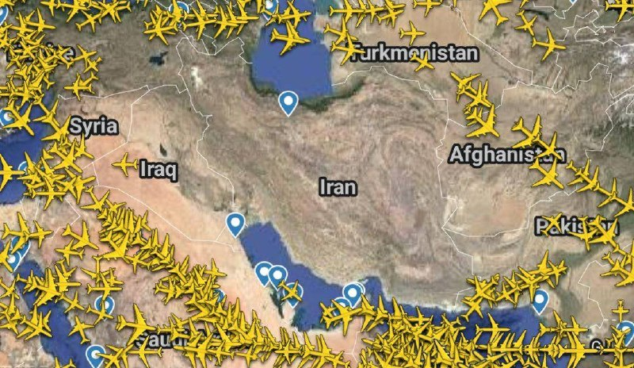

🔴ایران حریم هوایی خود را بسته و بنا به گزارش‌ها در حال آماده شدن برای حمله موشکی احتمالی به اسرائیل است.
https://t.me/kianmeli1

## IranIntlTV — post 342333

  

اسماعیل قاآنی، فرمانده نیروی قدس سپاه پاسداران، یکشنبه ۲۴ خرداد، همزمان با افزایش گمانه‌زنی‌ها درباره حمله احتمالی جمهوری اسلامی به اسرائیل در واکنش به هدف قرار گرفتن جنوب بیروت، گفت: «پیروزی حزب‌الله بر اسرائیل در راه است.»

قاآنی نوشت: «مردم دنیا، استقلال لبنان را با عظمت فداکاری حزب‌الله می‌شناسند نه با وابستگی بعضی حکمرانان.»

فرمانده نیروی قدس سپاه پاسداران همچنین افزود: «همه دنیا با چشمان بازتر نگاه کنند، پیروزی مقاومت عظیم حزب‌الله قهرمان بر اسرائیل در راه است.»

او در این پیام به جزییات بیشتری درباره اظهارات خود اشاره نکرد.
https://iranintl.com/202606144237

## FarsiVOA — post 220712

🔺افزایش تنش در مرز اسرائیل و لبنان؛ حزب‌الله مناطقی در شمال اسرائیل را هدف قرار داد

◾️ارتش اسرائیل می‌گوید حزب‌الله لبنان روز یکشنبه ۲۴ خرداد ۱۴۰۵ چند راکت و پهپاد به سوی مناطق شمالی اسرائیل و مواضع نیروهای اسرائیلی در جنوب لبنان شلیک کرده است؛ حملاتی که همزمان با افزایش نگرانی‌ها از پاسخ احتمالی جمهوری اسلامی به حمله هوایی اسرائیل در جنوب بیروت صورت گرفت.

⬇️ بیشتر بخوانید:

https://ir.voanews.com/a/hezbollah-rockets-escalate-israel-tensions/8160718.html

## Persian_Trend_Official — post 17091

مکالمه امروز ترامپ و نتانیاهو !!! 😄

## RadioFarda — post 158299

  <a href="https://t.me/radiofarda/158299" target="_blank">📎 Download file</a>

📻بشنوید: ایستگاه ۱۹ با رادیوفردا، ۲۴ خرداد ۱۴۰۵

@RadioFarda

## IranianMinds — post 22584

  <a href="telegram/content/IranianMinds_22584_1781462083.mp4" target="_blank">🎬 Download video</a>

🔴درخواست اعدام عباس هم داده شد.

@IranianMinds

## Hranews — post 113616

دستکم ۸ تجمع اعتراضی برگزار شد

❗️
❗️
❗️
❗️
❗️– جمعی از بازنشستگان تامین اجتماعی در شهرهای تهران، مشهد، رشت، قزوین، اهواز، شوش و کرمانشاه با برگزاری تجمعات اعتراضی خواستار رسیدگی به مطالبات خود شدند. همچنین، شماری از کارگران شهرداری بخش لیکک واقع در شهرستان بهمئی در مقابل ساختمان شهرداری لیکک #تجمع_اعتراضی برگزار کردند.

ادامه مطلب

↘️
@hranews_bot تماس ✉️ - @Hranews کانال هرانا 🆑

## alonews — post 127977

  <a href="telegram/content/alonews_127977_1781462085.webm" target="_blank">🎬 Download video</a>

👈به نظر فضای هوایی ایران بسته شده

✅ @AloNews خبر جنگ

---
📅 بروزرسانی: 1405/03/24 21:53
---

## VahidOOnLine — post 245530

  <a href="telegram/content/VahidOOnLine_245530_1781461419.mp4" target="_blank">🎬 Download video</a>

♦️با گذشت بیش از ۹ سده از مرگ حسن صباح، نام الموت بار دیگر در کانون توجه قرار گرفته، زیرا پرونده «منظر فرهنگی و تاریخی قلعه‌های الموت» به مراحل نهایی بررسی در یونسکو رسیده است و در صورت تصویب، سی‌امین اثر ایران در فهرست میراث جهانی خواهد بود.

بیست‌ودوم خرداد، سالگرد درگذشت حسن صباح، بنیان‌گذار حکومت اسماعیلیان نزاری در الموت است. کسی که نامش در تاریخ با دژهای کوهستانی البرز گره خورده است. او اواخر قرن پنجم هجری با تبدیل قلعه الموت به مرکز حکومت اسماعیلیان نزاری در میان صخره‌های بلند البرز، بنیان حکومتی را گذاشت که پس از مرگ او نیز نزدیک به دو قرن در برابر قدرت‌های بزرگ زمان خود دوام آورد و سرانجام با یورش مغولان در میانه سده هفتم هجری سقوط کرد.
‌🇸🇦 Indypersian

🤖 @VahidOOnLine

## VahidOOnLine — post 245529

  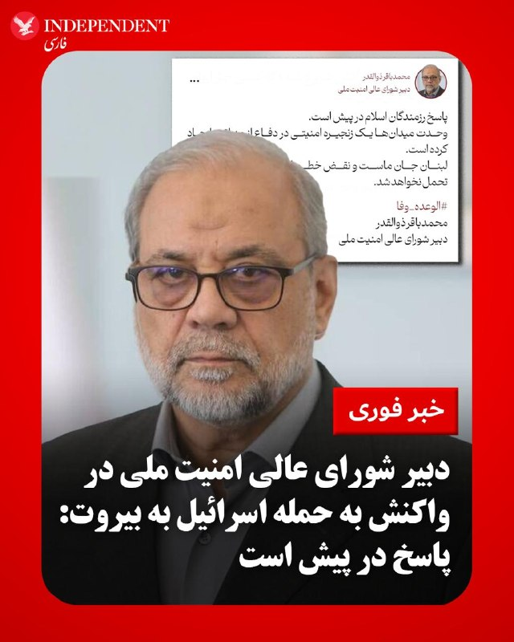

♦️محمدباقر ذوالقدر، دبیر شورای عالی امنیت ملی، شامگاه یکشنبه ۲۴ خرداد ماه، در واکنش به حمله اسرائیل به ضاحیه جنوبی بیروت اعلام کرد که «پاسخ رزمندگان اسلام در پیش است».
ذوالقدر در پیامی کوتاه که در رسانه‌های رسمی داخل ایران منتشر شده است نوشت: «وحدت میدان‌ها یک زنجیره امنیتی در دفاع از منطقه ایجاد کرده است.»
دبیر شورای عالی امنیت ملی همچنین هشدار داد: «لبنان جان ماست و نقض خطوط قرمز جمهوری اسلامی تحمل نخواهد شد.»
پیش از ذوالقدر، رییس و معاون قرارگاه خاتم‌الانبیا و همچنین محمد باقر قالیباف، مسئول مذاکره‌کنندگان جمهوری اسلامی ایران به این حملات واکنش نشان داده بودند.
‌🇸🇦 Indypersian

🤖 @VahidOOnLine

## WithYashar — post 14857

یدیعوت آحارونوت: ایران خبر درخواست ترامپ برای عدم حمله به اسرائیل در ازای مزایا در توافق را رد کرده و گفته است که به اسرائیل پاسخ خواهد داد
@withyashar

## FoxNewsTwitter — post 342963

Fox News (Twitter/X)

BREAKING: Authorities in Missouri say 12 people were killed when a plane crashed near Butler Memorial Airport, roughly 65 miles south of Kansas City.

## FoxNewsTwitter — post 342962

  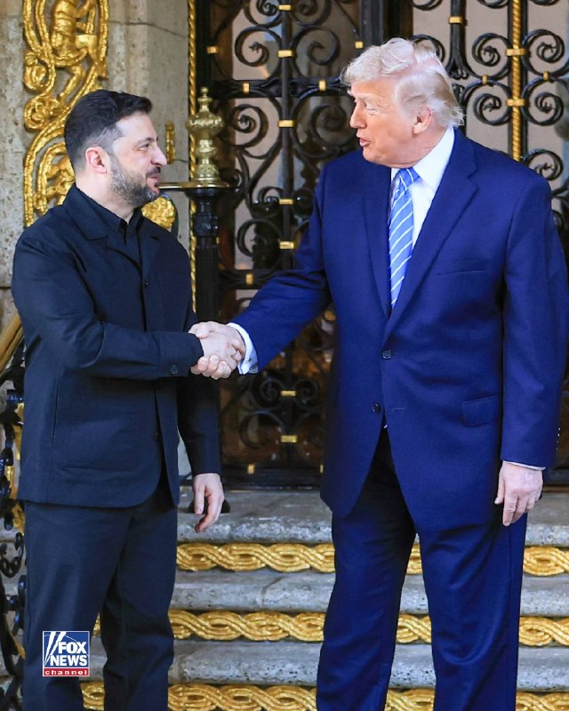

Fox News (Twitter/X)

Ukrainian President Zelenskyy says he had a "great conversation" with President Trump during a phone call on Trump's 80th birthday as the two leaders prepare to meet at G7 this week in France.

"I congratulated President Trump on his birthday, and we have had quite a detailed discussion about many key things – peace, surely, was among them. I wished President Trump every success, above all in his work to end Russia’s war against Ukraine," Zelenskyy said.

## pm_afshaa — post 93945

  <a href="telegram/content/pm_afshaa_93945_1781461421.webm" target="_blank">🎬 Download video</a>

🔴آی۲۴ نیوز:
اسرائیل ارزیابی میکنه که جمهوری اسلامی قصد داره به اسرائیل حمله کنه، با وجود تلاش ترامپ برای مهار تهران.

💧 Rainbet.com the #1 Non-KYC Crypto Casino & Sportsbook @rainbetcom

😁 @Pm_Afshaa

## pm_afshaa — post 93944

  <a href="telegram/content/pm_afshaa_93944_1781461422.webm" target="_blank">🎬 Download video</a>

🔴کانال 12 اسرائیل: جمهوری اسلامی پیشنهاد ترامپ برای دریافت «مزایای اقتصادی» در ازای خویشتنداری رو رد کرده.

جمهوری اسلامی اعلام کرده «به‌زودی پاسخ خواهد داد».

💧 Rainbet.com the #1 Non-KYC Crypto Casino & Sportsbook @rainbetcom

😁 @Pm_Afshaa

## IranIntlTV — post 342332

  <a href="https://t.me/IranintlTV/342332" target="_blank">📎 Download file</a>

🎧نسخه صوتی تیتراول با نیوشا صارمی: تلاش فوری ترامپ برای کنترل تنش اسراییل و ایران: تفاهم‌نامه امضا خواهد شد
@iranintlTV

## FarsiVOA — post 220711

🔺پرزیدنت ترامپ: توافق صلح با جمهوری اسلامی «ظرف چند ساعت» امضا می‌شود

◾️دونالد ترامپ، رئیس جمهوری آمریکا، می‌گوید انتظار دارد توافق صلح با جمهوری اسلامی «ظرف چند ساعت» امضا شود.

⬇️ بیشتر بخوانید:

https://ir.voanews.com/a/president-trump-says-iran-peace-deal-just-hours-away/8160717.html

## DW_Farsi — post 125970

  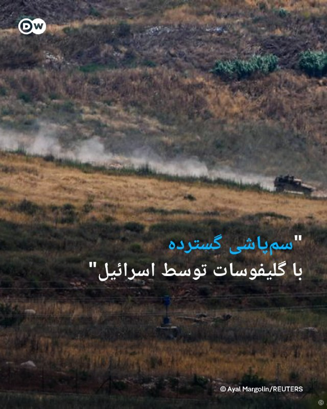

🔶 "سم‌پاشی گسترده با گلیفوسات توسط اسرائیل"

دولت لبنان، بنا بر اعلام وزارت امور خارجه این کشور در بیروت، شکایتی را به دلیل ادعای "پاشیدن علف‌کش گلیفوسات توسط اسرائیل در جنوب لبنان" به سازمان ملل متحد ارائه کرده است.

در نامه‌ای که بهشورای امنیت سازمان ملل و آنتونیو گوترش،دبیرکل سازمان ملل، ارسال شده، آمده است که "اسرائیل در ماه فوریه مقادیر زیادی از ماده شیمیایی گلیفوسات را در سه روستای لبنانی واقع در نزدیکی مرز پخش کرده است".

وزارت امور خارجه لبنان در این شکایت به نتایج تحقیق مؤسسه پژوهشی " CNRS" استناد کرده است. این مؤسسه از "غلظت بالای گلیفوسات" سخن گفته که "بسیار بیشتر" از مقداری است که "به‌طور معمول در مزارع لبنان" یافت می‌شود. گلیفوسات می‌تواند به محیط زیست آسیب برساند و گفته می‌شود که سرطان‌زا است.

@dw_farsi

## Persian_Trend_Official — post 17090

  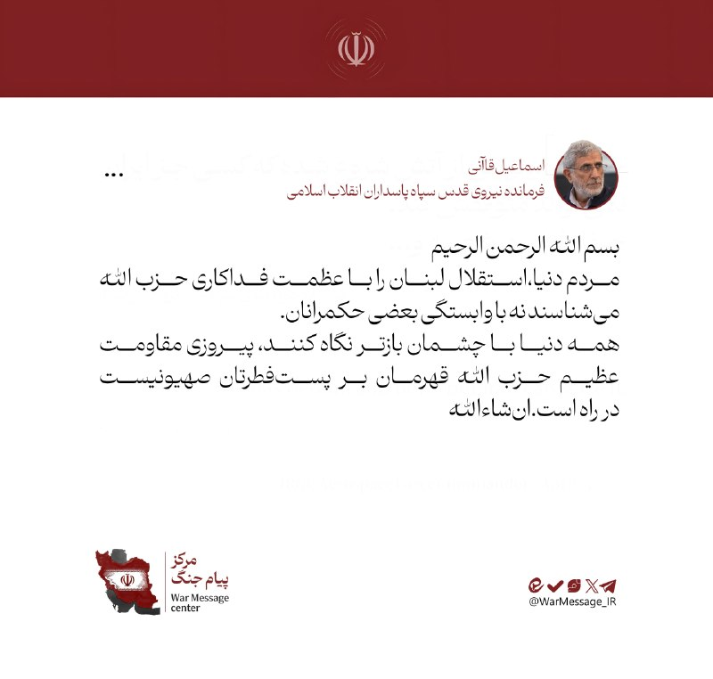

سردار قاآنی: پیروزی عظیم حزب‌الله در راه است ان‌شاءالله

فرمانده نیروی قدس: مردم دنیا، استقلال لبنان را با عظمت فداکاری حزب الله می‌شناسند نه با وابستگی بعضی حکمرانان. همه دنیا با چشمان بازتر نگاه کنند، پیروزی مقاومت عظیم حزب الله قهرمان بر پست‌فطرتان صهیونیست در راه است.ان‌شاءالله

📝 Amir

📌 @persian_trend_official
پرشین ترند | متفاوت‌ترین کانال نظامی

## Persian_Trend_Official — post 17089

  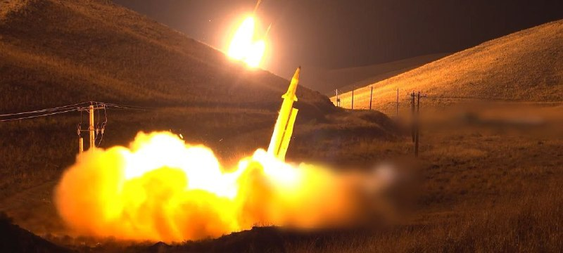

شبکه 12 اسرائیل: ایران پیشنهاد ترامپ برای دریافت پول در ازای خویشتنداری را رد کرده و اعلام کرده است که به‌زودی پاسخ خواهد داد.

📝 Amir

📌 @persian_trend_official
پرشین ترند | متفاوت‌ترین کانال نظامی

## IranianMinds — post 22583

  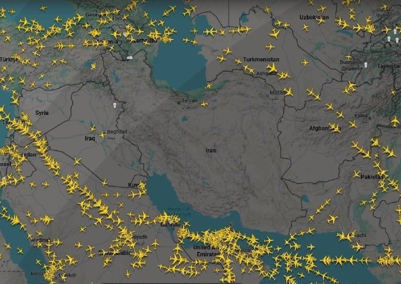

🔴 آسمان ایران.

@IranianMinds

## IranianMinds — post 22582

  

پیام یک عرزشی به مسئولین در باب مذاکرات :

@IranianMinds

## alonews — post 127976

  <a href="telegram/content/alonews_127976_1781461425.webm" target="_blank">🎬 Download video</a>

👈 ترامپ از نخست‌وزیر اسرائیل نتانیاهو خواسته است که آتش‌بس در لبنان را اعلام کند و شروع به عقب‌نشینی نیروهای ارتش اسرائیل نماید، اما نتانیاهو هر دو درخواست را رد کرده است، طبق گزارش ینت

✅ @AloNews خبر جنگ

## alonews — post 127975

  <a href="telegram/content/alonews_127975_1781461425.webm" target="_blank">🎬 Download video</a>

👈یک منبع غربی به کانال ۱۲ اسرائیل گفت که ایران هنوز در حال بررسی پیشنهاد رئیس‌جمهور ترامپ است که شامل پول برای عدم پاسخ به حمله اسرائیل در بیروت می‌باشد.

✅ @AloNews خبر جنگ

## alonews — post 127974

  <a href="telegram/content/alonews_127974_1781461425.webm" target="_blank">🎬 Download video</a>

👈کانال ۱۲ عبری:ایران درخواست ترامپ را رد کرد و تأکید کرد: به بمباران بیروت پاسخ خواهیم داد

✅ @AloNews خبر جنگ

## alonews — post 127973

  <a href="telegram/content/alonews_127973_1781461426.webm" target="_blank">🎬 Download video</a>

👈وزیر علوم: از 13 تا 20 تیرماه هیچ آزمونی در کشور برگزار نمی‌شود

✅ @AloNews خبر جنگ

---
📅 بروزرسانی: 1405/03/24 21:43
---

## WithYashar — post 14856

🥊 UFC Freedom 250 + مراسم ۲۵۰ سالگی آمریکا (White House Event)

UFC فریدم ۲۵۰ همزمان با جشن ۲۵۰ سالگی آمریکا و برنامه‌های کاخ سفید برگزار می‌شود و به وقت تهران از حدود ساعت ۰۲:۳۰ بامداد روز دوشنبه با بخش‌های قبل از رویداد و برنامه‌های طرفداری شروع می‌شود، سپس بخش پریلمز (مبارزات مقدماتی) از حدود ساعت ۰۴:۳۰ تا ۰۸:۳۰ صبح پخش می‌شود که شامل مبارزات سبک‌تر و مبارزان کم‌تجربه‌تر است و نقش آماده‌سازی فضای اصلی را دارد، بعد از آن بخش مین‌کارت (کارت اصلی) از حدود ساعت ۰۸:۳۰ صبح تا حدود ۱۲:۳۰ ظهر ادامه پیدا می‌کند که شامل مبارزات مهم‌تر و ستاره‌های یو‌اف‌سی است و در نهایت مهم‌ترین مبارزه شب یعنی مین ایونت (مبارزه اصلی) معمولاً نزدیک ساعت ۱۰:۳۰ تا ۱۱:۳۰ صبح به وقت تهران برگزار می‌شود و کل این رویداد به‌صورت زنده از طریق سرویس پارامونت پلاس پخش می‌شود و در آمریکا بخشی از آن هم از شبکه سی‌بی‌اس پخش خواهد شد.
@withyashar

## mwarmonitor — post 10905

🔴به نقل از کانال ۱۲: 🔸ایران پیشنهاد ترامپ برای دریافت «مزایای اقتصادی» در ازای خویشتنداری را رد کرده است. 🔸و گفته می‌شود که ایران اعلام کرده «به‌زودی پاسخ خواهد داد». @mwarmonitor

## mwarmonitor — post 10904

🚨گزارش شده است که یک عملیات جاسوسی به نفع ایران در داخل کنست (پارلمان اسرائیل) کشف شده است.

@mwarmonitor

## mwarmonitor — post 10903

🔴ارزیابی اسرائیل: ترامپ انتظار می‌رود به‌زودی یک امتیاز به ایران اعلام کند، در ازای اینکه ایران به حمله ضاحیه پاسخ ندهد. ماهیت این پیشنهاد مشخص نیست، اما گفته می‌شود این بخشی از تلاش‌های پشت‌پرده‌ای است که در حال انجام است - کانال ۱۲ @mwarmonitor

## pm_afshaa — post 93943

  <a href="telegram/content/pm_afshaa_93943_1781460825.mp4" target="_blank">🎬 Download video</a>

🔴درخواست اعدام عراقچی توسط تجمع کنندگان تندرو:

عراقچی بی غیرت اعدام باید گردد!

💧 Rainbet.com the #1 Non-KYC Crypto Casino & Sportsbook @rainbetcom

😁 @Pm_Afshaa

## pm_afshaa — post 93942

  <a href="telegram/content/pm_afshaa_93942_1781460826.webm" target="_blank">🎬 Download video</a>

🔴وای‌نت به نقل از یک مقام اسرائیلی:
ترامپ از نتانیاهو خواسته آتش‌بس در لبنان رو حفظ کرده و عقب‌نشینی رو آغاز کنه، اما نتانیاهو هر دو درخواست رو رد کرده.

💧 Rainbet.com the #1 Non-KYC Crypto Casino & Sportsbook @rainbetcom

😁 @Pm_Afshaa

## pm_afshaa — post 93941

صداوسیما : بزودی به اسرائیل پاسخ میدیم

💧 Rainbet.com the #1 Non-KYC Crypto Casino & Sportsbook @rainbetcom

😁 @Pm_Afshaa

## FarsiVOA — post 220710

هدف جمهوری اسلامی از امضای دیجیتال توافقنامه با آمریکا چیست؟ چرا رژیم از توافق حضوری پرهیز می‌کند؟

## FarsiVOA — post 220709

ابعاد و پیچیدگی حملات سایبری به چهار بانک بزرگ در ایران، گفت‌وگو با کوروش ضیغمی

## FarsiVOA — post 220708

🔺محاصره دریایی آمریکا علیه جمهوری اسلامی؛ سنتکام: مسیر ۱۴۲ کشتی را تغییر دادیم؛ ۱۴ ملوان هندی نجات یافتند

◾️ستاد فرماندهی مرکزی آمریکا (سنتکام) در یک به‌روز‌رسانی تازه درباره محاصره دریایی علیه جمهوری اسلامی، از افزایش تعداد شناورهایی که در جریان این عملیات وادار به تغییر مسیر شده‌اند، خبر داد.

⬇️ بیشتر بخوانید:

https://ir.voanews.com/a/naval-blockade-ship-indian-sailor-rescue-centcom-redirect/8160715.html

## FarsiVOA — post 220707

  <a href="telegram/content/FarsiVOA_220707_1781460826.mp4" target="_blank">🎬 Download video</a>

با نزدیک شدن احتمال امضای توافهم‌نامه میان جمهوری اسلامی و آمریکا، حامیان جمهوری اسلامی با شعار «عراقچی بی‌غیرت اعدام باید گردد» در تجمع حکومتی مخالفت خود را با توافق با آمریکا نشان دادند.

دونالد ترامپ، رئیس‌جمهوری آمریکا، تاکید کرده است توافق با جمهوری اسلامی بسیار نزدیک شده است. پزشکیان نیز در این باره اعلام کرد «تصمیم‌گیری درباره جنگ و مذاکره بر عهده رهبری و شورای عالی امنیت ملی است.»

## Persian_Trend_Official — post 17088

دوستان عزیز
به هیچ عنوان اخبار یا محتوای سایر چنل ها رو در بخش چت، فروارد یا بازنشر نکنید !
اگر خبری به نظرتون نیازه مطرح بشه خود متن خبر بدون اشاره به چنل های دیگه یا همراه داشتن امضای آن کانال مشکلی نداره
اما بخاطر حواشی به وجود آمده متاسفانه در صورت رعایت نکردن بار اول به شکل موقت و بار دوم به شکل دائم از فعالیت در چت محروم میشید

از توجه شما سپاسگزارم
الیاس فرخ

## IranianMinds — post 22581

🔴 کانال ۱۲ اسرائیل :

یک مقام ایرانی مدعی شده است که دونالد ترامپ در ازای سکوت ایران درباره حمله به ضاحیه بیروت، پیشنهاد پرداخت پول داده است.

به گفته این مقام، تهران این پیشنهاد را رد کرده و تأکید کرده: «به‌زودی پاسخ خواهیم داد.»

مقام‌های ایرانی همچنین گفته‌اند:

ما به متحدان خود خیانت نخواهیم کرد.

@IranianMinds

## IranianMinds — post 22580

🔴 مقام اسرائیلی به خبرگزاری وای نت:

وقتی ایران یک بالگرد آمریکایی را سرنگون کرد، ترامپ دستور یک پاسخ شدید را صادر کرد؛ با وجود اینکه هیچ کشته‌ای وجود نداشت.

چرا کاری که برای آمریکا مجاز است، برای اسرائیل ممنوع باشد؟

@IranianMinds

## Dirty_Kids — post 392032

  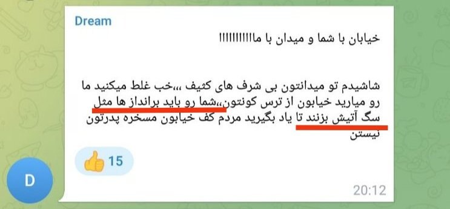

🔴 عرزشیا بالاخره بیدار شدن؛ پیام یکیشون:

بی شرف‌های کثیف گوه خوردین از ترس کونتون به ما گفتین بیایم کف میدون، شما مسئولین رو باید مثل سگ آتیش زد تا یاد بگیرین مردم کف خیابون مسخره پدرتون نیستن.

@Dirty_Kids 👻

## Dirty_Kids — post 392031

  <a href="telegram/content/Dirty_Kids_392031_1781460828.mp4" target="_blank">🎬 Download video</a>

تموم شدو رفت🤣 ننگ برشما مسئولین😂
آفرین نپذیرید🤌🏻
#نمی‌پذیریم

+نمیدونستم عرزشیا هم ۴۷ ساله ناراضین

@Dirty_Kids 👻

## alonews — post 127972

  <a href="telegram/content/alonews_127972_1781460830.webm" target="_blank">🎬 Download video</a>

🔴فوری / یدیعوت آحارونوت: ایران خبر درخواست ترامپ برای عدم حمله به اسرائیل در ازای مزایا در توافق را رد کرده و گفته است که به اسرائیل پاسخ خواهد داد

✅ @AloNews خبر جنگ

## alonews — post 127971

  <a href="telegram/content/alonews_127971_1781460830.webm" target="_blank">🎬 Download video</a>

👈یارون آبراهام خبرنگار اسرائیلی: ارزیابی اسرائیل این است که ترامپ به زودی امتیازی به ایران خواهد داد، در ازای عدم انتقام‌گیری ایران بابت حمله اسرائیل به ضاحیه

✅ @AloNews خبر جنگ

---
📅 بروزرسانی: 1405/03/24 21:34
---

## VahidOOnLine — post 245528

♦️تیم ملی فوتبال ایران روز یکشنبه ۲۴ خرداد ماه، محل اقامت خود در شهر تیخوانای مکزیک را به مقصد لس‌آنجلس ترک کرد تا برای نخستین دیدار خود در جام جهانی ۲۰۲۶ برابر نیوزیلند آماده شود.
به گزارش رویترز، ده‌ها هوادار در مقابل هتل محل اقامت تیم ملی تجمع کرده بودند و با سر دادن شعار «تیم ملی» بازیکنان را هنگام سوار شدن به اتوبوس بدرقه کردند.
مهدی تاج، رئیس فدراسیون فوتبال ایران که نتوانست ویزای ورود به آمریکا را دریافت کند، هنگام خروج کاروان تیم ملی در مقابل هتل حضور داشت.
امیر قلعه‌نویی، سرمربی تیم ملی ایران، و مهدی طارمی قرار است عصر یکشنبه در نشست خبری پیش از مسابقه در ورزشگاه لس‌آنجلس شرکت کنند.
گروهی از ایرانیان ساکن آمریکا اعلام کرده‌اند که همزمان با حضور تیم ملی در لس‌آنجلس، تجمعی اعتراضی در نزدیکی ورزشگاه برگزار خواهند کرد.
تیم ملی ایران تنها چند هفته مانده به جام‌جهانی اردوگاه خود را از ایالت آریزونا به مکزیک منتقل کرد. ایران روز دوشنبه در نخستین دیدار خود در جام جهانی ۲۰۲۶ به مصاف نیوزیلند خواهد رفت.
‌🇸🇦 Indypersian

🤖 @VahidOOnLine

## VahidOOnLine — post 245527

  

محمدباقر ذوالقدر، دبیر شورای عالی امنیت ملی، در پیامی نوشت: «پاسخ رزمندگان اسلام در پیش است. وحدت میدان‌ها یک زنجیره امنیتی در دفاع از منطقه ایجاد کرده است. لبنان جان ماست و نقض خطوط قرمز جمهوری اسلامی تحمل نخواهد شد»
هم‌زمان، ابراهیم عزیزی، رییس کمیسیون امنیت ملی مجلس، در واکنش به حمله ارتش اسرائیل به اهدافی در ضاحیه بیروت، در شبکه ایکس نوشت این «جنایت» بار دیگر ثابت کرد آمریکا «ضعیف و بی‌اعتبار» است که حتی توان کنترل اسرائیل را ندارد.
عزیزی افزود پاسخ هم از سوی «جبهه متحد مقاومت» قطعی است.
‌🏁 🇬🇧 IranintlTV

🤖 @VahidOOnLine

## VahidOOnLine — post 245519

در حالی که ترامپ از نزدیک بودن توافق سخن می‌گوید و رویترز از پیش‌نویسی شامل آزادسازی دارایی‌های بلوکه‌شده، کاهش تحریم‌های نفتی و بازگشایی تنگه هرمز خبر داده، حمله اسرائیل به ضاحیه بیروت بار دیگر ابهام‌ها را افزایش داده است.

این مذاکرات در شرایطی جریان دارد که جمهوری اسلامی پس از ماه‌ها جنگ، فشارهای اقتصادی و بحران مشروعیت، با یکی از دشوارترین مقاطع تاریخ خود روبه‌روست.
‌🏁 🇬🇧 ManotoTV

🤖 @VahidOOnLine

## VahidOOnLine — post 245518

  

ابوالفضل ابوترابی، نماینده مجلس، از «معاهده الجزایر و نقض تعهدات پس از آزادی گروگان‌های سفارت»، «خروج یک‌جانبه از برجام» و «حملات نظامی در حین روند مذاکرات» به‌عنوان «بدعهدی‌های آمریکا» نام برد و خطاب به هیات مذاکره‌کننده جمهوری اسلامی نوشت: «آقایان مذاکره‌کننده؛ پرسش ما این است، از یک سوراخ چندبار باید گزیده شویم؟»
‌🏁 🇬🇧 IranintlTV

🤖 @VahidOOnLine

## mwarmonitor — post 10902

📌یک مقام اسرائیلی، ترامپ را به «عادی‌سازی آتش به سمت اسرائیل» متهم کرده است.

📌مقامات می‌گویند ترامپ از نتانیاهو خواسته است آتش‌بس در لبنان را متوقف کرده و عقب‌نشینی را آغاز کند، اما نتانیاهو هر دو درخواست را رد کرده است.

📌ایالات متحده در تلاش است تهران را متقاعد کند که از انجام حمله یا محدود کردن آن خودداری کند تا بحران مهار شود، در حالی که هم‌زمان بر اسرائیل فشار می‌آورد تا در صورت پاسخ ایران، دست به اقدام تلافی‌جویانه نزند - YNet

@mwarmonitor

## mwarmonitor — post 10901

🔴ارزیابی اسرائیل: ترامپ انتظار می‌رود به‌زودی یک امتیاز به ایران اعلام کند، در ازای اینکه ایران به حمله ضاحیه پاسخ ندهد. ماهیت این پیشنهاد مشخص نیست، اما گفته می‌شود این بخشی از تلاش‌های پشت‌پرده‌ای است که در حال انجام است - کانال ۱۲

@mwarmonitor

## FoxNewsTwitter — post 342961

Fox News (Twitter/X)

BREAKING: Sen. Mitch McConnell hospitalized Sunday morning, receiving 'excellent care,' his office says.

## pm_afshaa — post 93940

  <a href="telegram/content/pm_afshaa_93940_1781460256.webm" target="_blank">🎬 Download video</a>

🔴اوباما: بعیده توافق جدید «تفاوت قابل‌توجهی» با برجام داشته باشه یا «بهبود چشمگیری» نسبت به اون محسوب بشه.

💧 Rainbet.com the #1 Non-KYC Crypto Casino & Sportsbook @rainbetcom

😁 @Pm_Afshaa

## DEJradio — post 5678

  <a href="telegram/content/DEJradio_5678_1781460256.webm" target="_blank">🎬 Download video</a>

🚨
🔸 خبر ۲۱
یکشنبه ۲۴ خرداد ۱۴۰۵

#خبر۲۱
@DEJradio

## IranIntlTV — post 342331

  <a href="telegram/content/IranIntlTV_342331_1781460257.mp4" target="_blank">🎬 Download video</a>

خبرگزاری فارس، رسانه وابسته به سپاه پاسداران، ویدیویی منتشر کرده است که در آن خبرنگارش در یک برنامه خیابانی از مردم در ایران می‌خواهد تولد فردی نامشخص را تبریک بگویند، سپس مشخص می‌شود که این تبریک برای تولد دونالد ترامپ، رییس‌جمهوری آمریکا، بوده است.

بر اساس این ویدیو، پس از آنکه هویت فرد مورد نظر فاش می‌شود، چند نفر از شرکت‌کنندگان تبریک خود را پس می‌گیرند و برخی نیز شعار «مرگ بر ترامپ» سر می‌دهند.
@iranintltv

## IranIntlTV — post 342330

  <a href="telegram/content/IranIntlTV_342330_1781460258.mp4" target="_blank">🎬 Download video</a>

مهدی مهدوی‌آزاد در برنامه «چشم‌انداز» گفت: «جمهوری اسلامی در همان تار عنکبوتی گرفتار شده که خود آن را تنیده است.» او افزود، حکومت سال‌ها برای هوادارانش تصویری بد از آمریکا و همچنین تصویری اغراق‌آمیز از قدرت خود ساخته بود. اکنون همان افرادی که این روایت‌ها را باور کرده بودند، در برابر حکومت قرار گرفته‌اند.
@iranintltv

## IranIntlTV — post 342329

  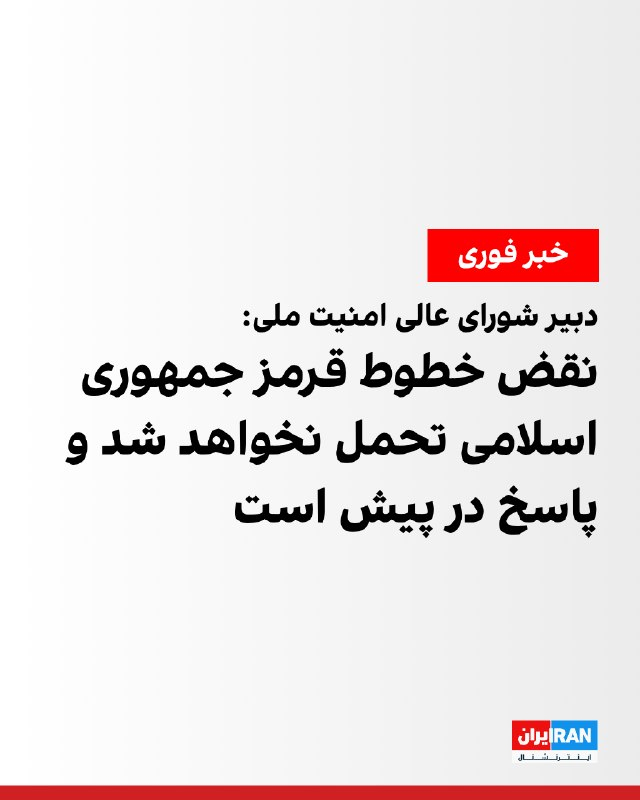

محمدباقر ذوالقدر، دبیر شورای عالی امنیت ملی، در پیامی نوشت: «پاسخ رزمندگان اسلام در پیش است. وحدت میدان‌ها یک زنجیره امنیتی در دفاع از منطقه ایجاد کرده است. لبنان جان ماست و نقض خطوط قرمز جمهوری اسلامی تحمل نخواهد شد»
هم‌زمان، ابراهیم عزیزی، رییس کمیسیون امنیت ملی مجلس، در واکنش به حمله ارتش اسرائیل به اهدافی در ضاحیه بیروت، در شبکه ایکس نوشت این «جنایت» بار دیگر ثابت کرد آمریکا «ضعیف و بی‌اعتبار» است که حتی توان کنترل اسرائیل را ندارد.
عزیزی افزود پاسخ هم از سوی «جبهه متحد مقاومت» قطعی است.
https://iranintl.com/202606149449

## IranIntlTV — post 342328

  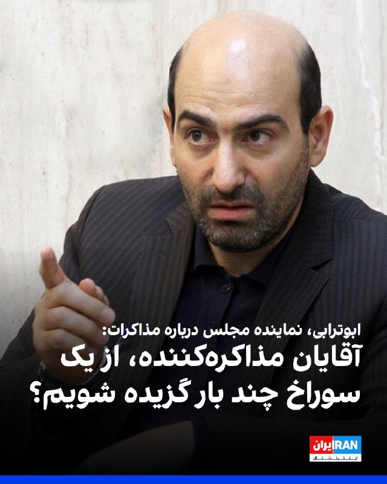

ابوالفضل ابوترابی، نماینده مجلس، از «معاهده الجزایر و نقض تعهدات پس از آزادی گروگان‌های سفارت»، «خروج یک‌جانبه از برجام» و «حملات نظامی در حین روند مذاکرات» به‌عنوان «بدعهدی‌های آمریکا» نام برد و خطاب به هیات مذاکره‌کننده جمهوری اسلامی نوشت: «آقایان مذاکره‌کننده؛ پرسش ما این است، از یک سوراخ چندبار باید گزیده شویم؟»
https://iranintl.com/202606142600

## ManotoTV — post 106063

در حالی که ترامپ از نزدیک بودن توافق سخن می‌گوید و رویترز از پیش‌نویسی شامل آزادسازی دارایی‌های بلوکه‌شده، کاهش تحریم‌های نفتی و بازگشایی تنگه هرمز خبر داده، حمله اسرائیل به ضاحیه بیروت بار دیگر ابهام‌ها را افزایش داده است.

این مذاکرات در شرایطی جریان دارد که جمهوری اسلامی پس از ماه‌ها جنگ، فشارهای اقتصادی و بحران مشروعیت، با یکی از دشوارترین مقاطع تاریخ خود روبه‌روست.

## Persian_Trend_Official — post 17087

کانال رسمی پرشین ترند pinned «تراست vpn رو چندین بار معرفی کردم قابل اعتمادن و میتونین ازشون خرید کنین ایندفعه علاوه بر کاهش قیمت مجدد قیمت روز از گیگی ۶ هزار تومن گذاشتن حتما بهشون پیام بدین و جزییاتشو بپرسین 👇👇👇 @trusstvpnn_admin @trusstvpnn_admin»

## IranianMinds — post 22579

🔴 ذوالقدر، دبیر شورای عالی امنیت ملی: لبنان جان ماست و پاسخ ما به حملات امروز تو راهه. @IranianMinds

## IranianMinds — post 22578

🔴 وزیر علوم :

تا ۲۰ تیر هیچ آزمونی در کشور انجام نمیشه.

@IranianMinds

## manototv — post 106063

  <a href="telegram/content/manototv_106063_1781460262.mp4" target="_blank">🎬 Download video</a>

در حالی که ترامپ از نزدیک بودن توافق سخن می‌گوید و رویترز از پیش‌نویسی شامل آزادسازی دارایی‌های بلوکه‌شده، کاهش تحریم‌های نفتی و بازگشایی تنگه هرمز خبر داده، حمله اسرائیل به ضاحیه بیروت بار دیگر ابهام‌ها را افزایش داده است.

این مذاکرات در شرایطی جریان دارد که جمهوری اسلامی پس از ماه‌ها جنگ، فشارهای اقتصادی و بحران مشروعیت، با یکی از دشوارترین مقاطع تاریخ خود روبه‌روست.

## alonews — post 127970

  <a href="telegram/content/alonews_127970_1781460263.webm" target="_blank">🎬 Download video</a>

👈ارتش فرانسه: ناو شارل دوگل در خاورمیانه می‌ماند

✅ @AloNews خبر جنگ

---
📅 بروزرسانی: 1405/03/24 21:23
---

## WithYashar — post 14855

  <a href="telegram/content/WithYashar_14855_1781459616.mp4" target="_blank">🎬 Download video</a>

ویدیو دختر پدری احمد ایراندوست(غول برره)، وسط این هیر و ویر‌…
@withyashar

## mwarmonitor — post 10900

  <a href="telegram/content/mwarmonitor_10900_1781459617.mp4" target="_blank">🎬 Download video</a>

به نقل از FOX4:

✈️یک هواپیما که ۱۱ چترباز و یک خلبان را حمل می‌کرد، در نزدیکی فرودگاه Butler Memorial در ایالت میسوری سقوط کرده است.

در این حادثه ۱۲ نفر جان خود را از دست داده‌اند

@mwarmonitor

## pm_afshaa — post 93939

  <a href="telegram/content/pm_afshaa_93939_1781459618.webm" target="_blank">🎬 Download video</a>

🔴ذوالقدر، دبیر شورای عالی امنیت ملی:

‏پاسخ رزمندگان اسلام در پیش است.
‏وحدت میدان‌ها یک زنجیره امنیتی در دفاع از منطقه ایجاد کرده است.

‏لبنان جان ماست و نقض خطوط قرمز جمهوری اسلامی تحمل نخواهد شد.

💧 Rainbet.com the #1 Non-KYC Crypto Casino & Sportsbook @rainbetcom

😁 @Pm_Afshaa

## VahidOnline — post 76341

  <a href="telegram/content/VahidOnline_76341_1781459619.mp4" target="_blank">🎬 Download video</a>

شماری از حامیان جمهوری اسلامی و مخالفان توافق با ایالات متحده، در تجمع خود با سر دادن شعار خواهان اعدام عباس عراقچی، وزیر خارجه حکومت ایران شدند.
@VahidHeadline

📡 @VahidOnline

## kianmeli1 — post 87993

  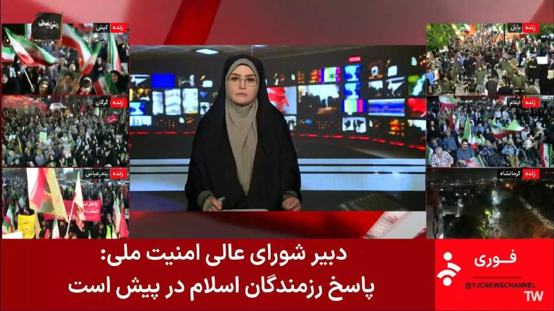

🔴 صداوسیما:
به اسراییل حمله میکنیم پاسخ در راه است
https://t.me/kianmeli1

## FarsiVOA — post 220706

  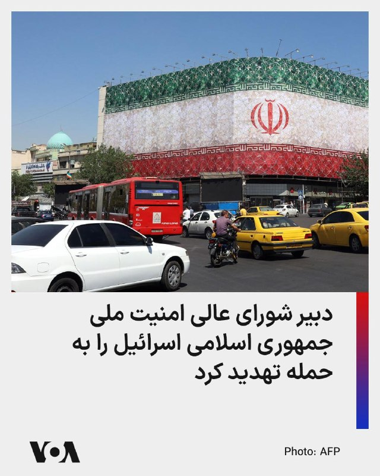

در پی پاسخ تلافی‌جویانه اسرائيل به حملات گروه تروریستی حزب‌الله، محمدباقر ذوالقدر، دبیر شورای عالی امنیت ملی جمهوری اسلامی، در بیانیه‌ای که خبرگزاری‌های حکومتی در ایران منتشر کردند، گفت «پاسخ رزمندگان اسلام در پیش است.» او گفت «لبنان جان ماست و نقض خطوط قرمز جمهوری اسلامی تحمل نخواهد شد.» این در حالی است که حکومت لبنان بارها آشکارا به جمهوری اسلامی گفته است که دست از مداخله در امور این کشور بر دارد. جوزف عون، رئیس‌ جمهوری لبنان، روز جمعه ۱۵ خرداد، در گفت‌و‌گویی ویژه با شبکه خبری سی‌ان‌ان در پیامی خطاب به سران جمهوری اسلامی گفت: «لبنان کشور شما نیست، بلکه کشور ما است.»

## Persian_Trend_Official — post 17086

  <a href="telegram/content/Persian_Trend_Official_17086_1781459621.mp4" target="_blank">🎬 Download video</a>

🇺🇸 یازده چترباز و یک خلبان پس از سقوط یک هواپیما در نزدیکی فرودگاه باتلر مموریال در ایالت میزوری جان خود را از دست دادند.

گفته شده هواپیما مدت کوتاهی پس از برخاستن به دلایل نامشخص تغییر مسیر داده و سپس در منطقه بزرگراه Business 49 سقوط کرده است.

👺Phantom

📌 @persian_trend_official
پرشین ترند | متفاوت‌ترین کانال نظامی

## IranianMinds — post 22577

  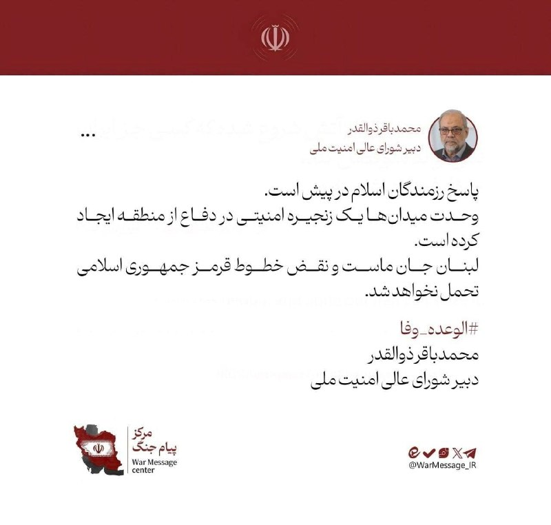

🔴 ذوالقدر، دبیر شورای عالی امنیت ملی:

لبنان جان ماست و پاسخ ما به حملات امروز تو راهه.

@IranianMinds

## Hranews — post 113615

  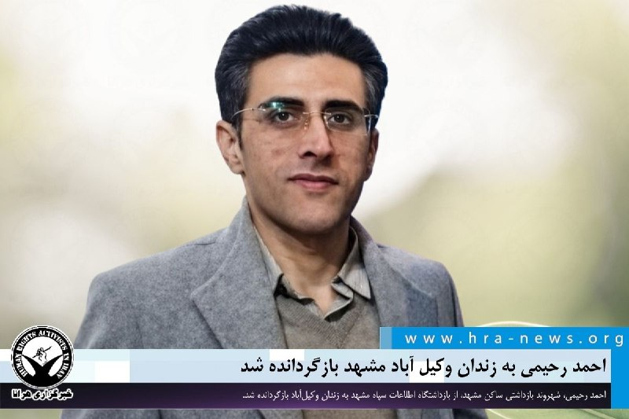

احمد رحیمی به زندان وکیل آباد مشهد بازگردانده شد

❗️
❗️
❗️
❗️
❗️– احمد رحیمی، شهروند بازداشتی ساکن مشهد، پس از ۳۰ روز از بازداشتگاه اطلاعات سپاه مشهد به زندان وکیل‌آباد بازگردانده شد.

به گزارش خبرگزاری هرانا، ارگان خبری مجموعه فعالان حقوق بشر در ایران، احمد رحیمی، به زندان وکیل آباد مشهد بازگردانده شد.

براساس اطلاعات دریافتی هرانا، آقای رحیمی امروز یکشنبه ۲۴ خرداد ۱۴۰۵، از بازداشتگاه اطلاعات سپاه مشهد به زندان وکیل آباد این شهرستان بازگردانده شد. این زندانی در تاریخ ۲۶ ادیبهشت‌ماه، جهت بازجویی به این نهاد امنیتی منتقل و در این مدت در سلول انفرادی نگهداری شده بود.

ادامه مطلب

#احمد_رحیمی

↘️
@hranews_bot تماس ✉️ - @Hranews کانال هرانا 🆑

## alonews — post 127969

  <a href="telegram/content/alonews_127969_1781459623.mp4" target="_blank">🎬 Download video</a>

👈درخواست اعدام عراقچی توسط تجمع کنندگان تندرو:

🔴عراقچی بی غیرت اعدام باید گردد!

✅ @AloNews خبر جنگ

---
📅 بروزرسانی: 1405/03/24 21:13
---

## VahidOOnLine — post 245517

  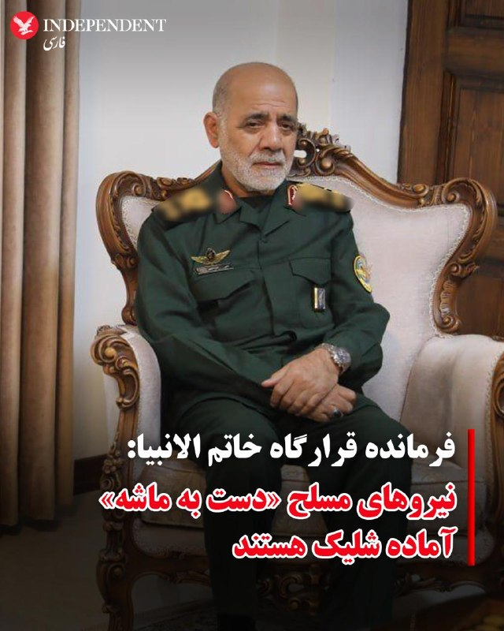

♦️علی عبداللهی، فرمانده قرارگاه مرکزی خاتم‌الانبیا، روز یکشنبه و پس از حملات اسرائیل به ضاحیه بیروت در پیامی با تاکید بر آمادگی نیروهای مسلح جمهوری اسلامی ایران گفت توان رزمی، دفاعی و قدرت موشکی، دریایی، پهپادی و پدافند هوایی کشور نسبت به گذشته ارتقا یافته و نیروهای مسلح «دست به ماشه» آماده شلیک به «قلب دشمن» هستند.
فرمانده قرارگاه مرکزی خاتم‌الانبیا همچنین هشدار داد که ایران هرگونه اقدام احتمالی طرف مقابل را زیر نظر دارد و افزود: «ما منتظر کوچک‌ترین لغزشی از سوی دشمن متجاوز هستیم تا درسی فراموش‌نشدنی و پایان‌بخش به آن‌ها بدهیم.»
این بیانیه در حالی منتشر شد که،‌ پیشتر محمدجعفر اسدی، معاون بازرسی قرارگاه مرکزی خاتم‌الانبیاء، در واکنش به حمله اسرائیل به ضایحه بیروت گفته بود: «قطعا پاسخ این جنایت‌ها داده خواهد شد.»
‌🇸🇦 Indypersian

🤖 @VahidOOnLine

## WithYashar — post 14854

قالیباف : بازی پلیس خوب و پلیس بد قدیمی شده است.
@withyashar

## WithYashar — post 14853

خضریان، نماینده مجلس:

ارتباط واتساپی عراقچی با ویتکاف باید کاملاً قطع شود!
@withyashar

## WithYashar — post 14852

زیرنویس شبکه خبر :
پاسخ به حمله اسرائیل قطعی است.
@withyashar

## VahidOnline — post 76340

  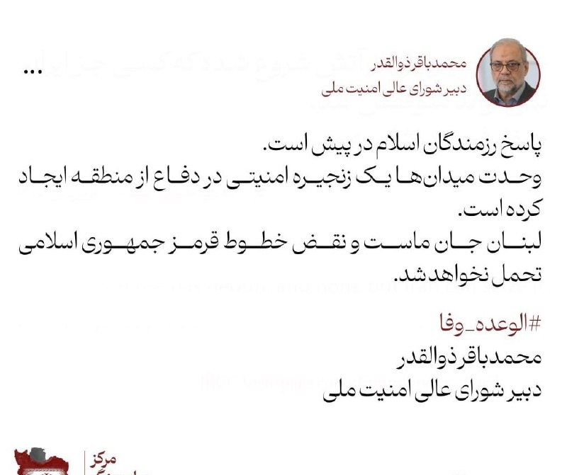

‏پاسخ رزمندگان اسلام در پیش است.
محمدباقر ذوالقدر، دبیر شورای عالی امنیت ملی در جمهوری اسلامی

📡 @VahidOnline

## IranIntlTV — post 342327

  <a href="telegram/content/IranIntlTV_342327_1781459018.mp4" target="_blank">🎬 Download video</a>

تیم ملی فوتبال ایران برای نخستین دیدار خود در مرحله گروهی جام جهانی، از تیخوانای مکزیک راهی لس‌آنجلس آمریکا شد. ویزا‌ی تعدادی از اعضای هیات اعزامی تیم ملی ایران، از جمله مهدی تاج، رییس فدراسیون فوتبال، صادر نشده و آنها قادر به همراهی تیم در آمریکا نیستند.

گزارش رضا محدث، خبرنگار ایران‌اینترنشنال
@iranintltv

## Shin_Persian — post 7072

سهیل مادرجنده اگه این کانالو می خونی جواب توییتمو بده ابن لواط

## FarsiVOA — post 220705

  <a href="telegram/content/FarsiVOA_220705_1781459020.mp4" target="_blank">🎬 Download video</a>

بازنشستگان تأمین اجتماعی روز یکشنبه ۲۴ خرداد ۱۴۰۵ در چند شهر از جمله تهران، اهواز، رشت، کرمانشاه و شوش تجمع اعتراضی برگزار کردند و با سر دادن شعارهایی علیه گرانی، تورم، مشکلات درمانی و عملکرد دولت و مجلس شورای اسلامی، خواستار رسیدگی به مطالبات معیشتی و صنفی خود شدند.

## Persian_Trend_Official — post 17085

  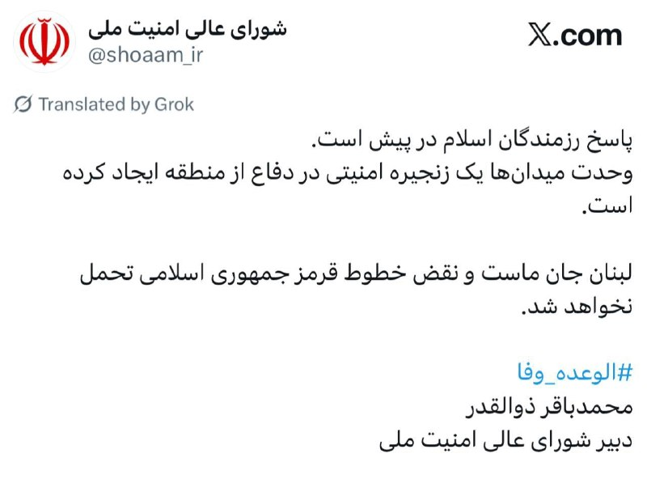

شورای عالی امنیت ملی: ‏پاسخ رزمندگان اسلام در پیش است!

محمدباقر ذوالقدر:‏ ‏پاسخ رزمندگان اسلام در پیش است. ‏وحدت میدان‌ها یک زنجیره امنیتی در دفاع از منطقه ایجاد کرده است.

لبنان جان ماست و نقض خطوط قرمز جمهوری اسلامی تحمل نخواهد شد.

📝 Amir

📌 @persian_trend_official
پرشین ترند | متفاوت‌ترین کانال نظامی

## IranianMinds — post 22576

  

متاسفانه در پی امضای توافق مجازی رهبر نتونستن این صفحه رو فعلا رد کنن و امضای توافق فعلا به تاخیر افتاده

@IranianMinds

## IranianMinds — post 22575

🔴 رسانه های اسرائیلی :

بر اساس ارزیابی اسرائیل، ترامپ به‌زودی امتیازی به ایران پیشنهاد خواهد کرد تا تهران در واکنش به حمله به ضاحیه بیروت دست به تلافی نزند.

جزئیات این امتیاز هنوز مشخص نیست.

@IranianMinds

## Dirty_Kids — post 392030

  <a href="telegram/content/Dirty_Kids_392030_1781459023.mp4" target="_blank">🎬 Download video</a>

رکورد بیشترین کتلت در کمترین زمان 😅

@Dirty_Kids 👻

## Dirty_Kids — post 392029

  <a href="telegram/content/Dirty_Kids_392029_1781459024.mp4" target="_blank">🎬 Download video</a>

حتی توی تل‌آویو هم فهمیدن، مشتقوا قبلا چیکاره بوده 😂🔥

@Dirty_Kids 👻

## Dirty_Kids — post 392028

من که می‌گم قالیباف اصلا خورشتی خوردش کرده، برده گذاشته فریزر خونه‌ش.

@Dirty_Kids 👻

## Hranews — post 113614

گزارشی از معوقات مزدی و مشکلات کارگران کارخانه فولاد سیادن ابهر

❗️
❗️
❗️
❗️
❗️– حدود ۲۸۰ کارگر شاغل در کارخانه فولاد سیادن ابهر، دو ماه مطالبات مزدی پرداخت‌نشده دارند. این #کارگران همچنین از نامناسب بودن شرایط ایمنی و بهداشتی محیط کار خود گلایه‌مند هستند.

ادامه مطلب

↘️
@hranews_bot تماس ✉️ - @Hranews کانال هرانا 🆑

## alonews — post 127968

  <a href="telegram/content/alonews_127968_1781459024.webm" target="_blank">🎬 Download video</a>

🔴فووری/ دبیر شورای‌ عالی امنیت ملی:
پاسخ ایران به اسرائیل در راه است

✅ @AloNews خبر جنگ

## alonews — post 127967

  <a href="telegram/content/alonews_127967_1781459024.webm" target="_blank">🎬 Download video</a>

👈سنتکام : مسیر ۱۴۲ تا کشتی تجاری که تغییر دادیم؛ ۹ تا کشتی که همکاری نکردن رو متوقف یا از کار انداختیم

✅ @AloNews خبر جنگ

## alonews — post 127966

  <a href="telegram/content/alonews_127966_1781459025.webm" target="_blank">🎬 Download video</a>

👈کانال ۱۲عبری: مقامات اسرائیلی ارزیابی می‌کنند که ترامپ به زودی پیشنهادی به ایران ارائه خواهد داد تا در ازای اجتناب از واکنش به حمله بیروت، امتیازی بدهد.

✅ @AloNews خبر جنگ

---
📅 بروزرسانی: 1405/03/24 21:03
---

## mwarmonitor — post 10899

🔴به نقل از منابع کرملین و مشاور «یوری اوشاکوف»، گفته شده است که:

🔸ترامپ به پوتین تأکید کرده پایان جنگ اوکراین «ضروری» است و اعلام کرده آماده کمک در این زمینه است.

🔸همچنین او به پوتین اطلاع داده که یک توافق برای پایان درگیری مرتبط با ایران «تقریباً نهایی شده» است.

🔸این اظهارات در چارچوب گفت‌وگوهای دیپلماتیک و تحولات هم‌زمان چند پرونده بین‌المللی (اوکراین و ایران) مطرح شده‌اند.

@mwarmonitor

## iaghapour — post 2675

  

💠 Mega Center 💠

🪩📈 ابزار مورد نیاز شما در دنیای کریپتو و تریدینگ / احراز هویت پلتفرم های خارجی

از افتتاح حساب های ارزی بین المللی
تا خدمات وریفای تضمینی صرافی ها ، سایت های فریلنسری و گیمینگ
صدور مستر کارت و ویزا کارت و خدمات
ارزی
سیم کارت های فیزیکی خارجی
اکانت های اماده دیتاسنترها
آیپی رزیدنتال اختصاصی
اشتراک ویندسکرایب و ...
👨‍💻لینک دسترسی ها و ارتباط :
www.megacenterx.com      
www.megacenterx.com
www.megacenterx.com

https://t.me/megacenter0
https://t.me/megacenter0

@Megav_admin22
@Megav_admin22

در صورت بالا نیامدن سایت ، بدون وی پی ان امتحان نمایید ✅
سایت دارای اینماد و درگاه پرداخت اختصاصی و کریپتو ✅

## iaghapour — post 2674

✍🏻 دوستان، در حال حاضر بیش از ۷ اسکریپت (شامل اسکریپت‌های تانل و روش‌های مستقیم و رایگان) رو در دست بررسی داریم. هر کدوم که بدون مشکل جواب بده رو توی یوتیوب معرفی می‌کنیم. اما مواردی رو که به هر دلیلی (مثل محدودیت‌های دیتاسنتر سرورهایی که استفاده میکنیم و...) نتونیم خودمون ازشون جواب بگیریم، داخل کانال تلگرام معرفی میکنیم تا شما بتونید تست کنید.

ممنون از حمایت همیشگی شما.💚

## VahidOnline — post 76339

  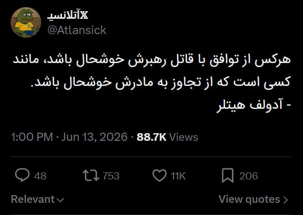

نصب تصاویر #مجتبی خامنه‌ای و آدولف #هیتلر با هم عکس جعلی چهره رهبر جدید جمهوری اسلامی (دستکاری شده با هوش مصنوعی) رو با استناد و افتخار به سخنان جعلی و چرندیات هرگز گفته نشده آن جنایتکار دیگر منتشر می‌کنند. عکس دریافتی از بابلسر، سه‌شنبه ۴ فروردین Vahid 📡…

## Shin_Persian — post 7071

  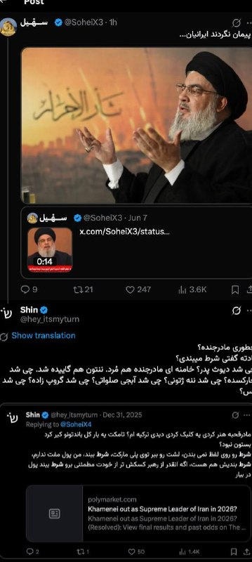

سهیل مادرجنده اگه این کانالو می خونی جواب توییتمو بده ابن لواط

## Shin_Persian — post 7070

  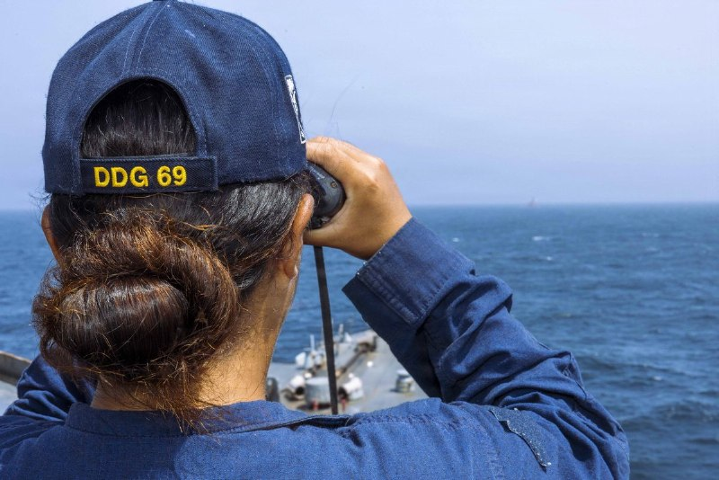

Shin ✓ @hey_itsmyturn
Sun, 14 Jun 2026 17:28:08 UTC

U.S. Central Command reports that as of June 14, forces enforcing the blockade against Iran have redirected 142 commercial ships and disabled 9 vessels that failed to comply.

Source: @CENTCOM
https://x.com/CENTCOM/status/2066211045740335312

ترجمه خودکار فارسی

فرماندهی مرکزی ایالات متحده (CENTCOM) گزارش می‌دهد که تا تاریخ ۱۴ ژوئن، نیروهای مجری محاصره علیه ایران، مسیر ۱۴۲ کشتی تجاری را تغییر داده و ۹ شناور را که از دستورات پیروی نکرده بودند، متوقف کرده‌اند.

منبع: @CENTCOM
https://x.com/CENTCOM/status/2066211045740335312

𝕏 · @shin_persian

## Shin_Persian — post 7069

Shin ✓ @hey_itsmyturn
Sun, 14 Jun 2026 17:25:42 UTC

Qatari delegation on the way to Islamabad

ترجمه خودکار فارسی

هیئت قطری در راه اسلام‌آباد

𝕏 · @shin_persian

## Persian_Trend_Official — post 17084

تراست vpn رو چندین بار معرفی کردم
قابل اعتمادن و میتونین ازشون خرید کنین

ایندفعه علاوه بر کاهش قیمت مجدد قیمت روز از گیگی ۶ هزار تومن گذاشتن

حتما بهشون پیام بدین و جزییاتشو بپرسین
👇👇👇

@trusstvpnn_admin
@trusstvpnn_admin

## Persian_Trend_Official — post 17083

مقام ارشد اسرائیلی به کانال 12 اسرائیل گفت: از نظر ما، ایران مسئله ترامپ است و او حق دارد به دنبال توافق باشد، اما لبنان مسئله ماست.

ما نباید با معادله ایران موافقت کنیم، حتی اگر به قیمت رویارویی شدید با ایالات متحده تمام شود.

📝 Amir

📌 @persian_trend_official
پرشین ترند | متفاوت‌ترین کانال نظامی

## IranianMinds — post 22574

  <a href="telegram/content/IranianMinds_22574_1781458422.mp4" target="_blank">🎬 Download video</a>

🔴 فاکس نیوز :

بعد از حملات امروز اسرائیل به لبنان ترامپ با نتانیاهو تماس گرفت و گفت چه غلطی داری میکنی ؟!

@IranianMinds

## IranianMinds — post 22573

⭕️
⭕️ کانفیگای این ربات تو نت ملی وصله به محض استارت ۱ گیگابایت کانفیگ میده بدون هیچ هزینه ای و رفرالی کانفیگ رو تحویلتون میده با بهترین سرعت و بدون قطعی 
⭕️ ربات دریافت کانفیگ رایگان | @daeijoonbot 
⭕️ ربات دریافت کانفیگ رایگان | @daeijoonbot

## IranianMinds — post 22572

⭕️
⭕️ کانفیگای این ربات تو نت ملی وصله به محض استارت ۱ گیگابایت کانفیگ میده
بدون هیچ هزینه ای و رفرالی کانفیگ رو تحویلتون میده با بهترین سرعت و بدون قطعی

⭕️ ربات دریافت کانفیگ رایگان | @daeijoonbot

⭕️ ربات دریافت کانفیگ رایگان | @daeijoonbot

## alonews — post 127965

  <a href="telegram/content/alonews_127965_1781458424.webm" target="_blank">🎬 Download video</a>

👈طبق گزارشات اختلال هر ۴ بانک که مورد حمله سایبری قرار گرفته بودند، رفع شد

✅ @AloNews خبر جنگ

---
📅 بروزرسانی: 1405/03/24 20:53
---

## VahidOOnLine — post 245516

  

علی عبداللهی، فرمانده قرارگاه مرکزی خاتم‌الانبیا، در پیامی خطاب به حامیان جمهوری اسلامی نوشت توان رزمی، دفاعی و قدرت موشکی، دریایی، پهپادی و پدافند هوایی جمهوری اسلامی تحت فرماندهی مجتبی خامنه‌ای ارتقا یافته و نیروهای مسلح «دست به ماشه»، آماده شلیک به «قلب دشمن» هستند.

او نوشت: «آرمان مقدس فتح قدس و انتقام خون علی خامنه‌ای هرگز فراموش نخواهد شد؛ ما منتظر کوچک‌ترین لغزشی از سوی دشمن متجاوز هستیم تا درسی فراموش‌نشدنی و پایان‌بخش به آن‌ها بدهیم».
‌🏁 🇬🇧 IranintlTV

🤖 @VahidOOnLine

## WithYashar — post 14851

لارنس نورمن خبرنگار وال استریت ژورنال:
در عرض دو هفته، ترامپ از این موضع که «لبنان از موضوع ایران جداست» به این موضع رسیده که «لبنان مرتبط است اما اسرائیل حق پاسخگویی دارد» و بعد به این موضع که «لبنان مرتبط است ولی من فکر نمی‌کنم اسرائیل حق پاسخگویی داشته باشد چون باید توافق را منعقد کنیم»
@withyashar

## mwarmonitor — post 10898

🔴 به نقل از شبکه «العربیه»، یک هیئت قطری در حال حرکت به سمت پایتخت پاکستان، اسلام‌آباد است؛ در حالی که تلاش‌ها برای دستیابی به توافق میان آمریکا و ایران ادامه دارد.

🔴این سفر در چارچوب میانجی‌گری‌های منطقه‌ای برای پیشبرد مذاکرات مرتبط با توافق احتمالی آمریکا و ایران انجام می‌شود.

@mwarmonitor

## iaghapour — post 2673

واقعاً باید درِ این بانک‌های مزخرف رو گل بگیرن! سالی ۳ بار یا هک می‌شید، یا اپلیکیشن بانک کار نمی‌کنه، یا اختلال دارید و هزارتا کوفت و زهر مار دیگه! آخه مگه می‌شه بانک این‌همه بی‌در و پیکر باشه؟😒

## IranIntlTV — post 342326

  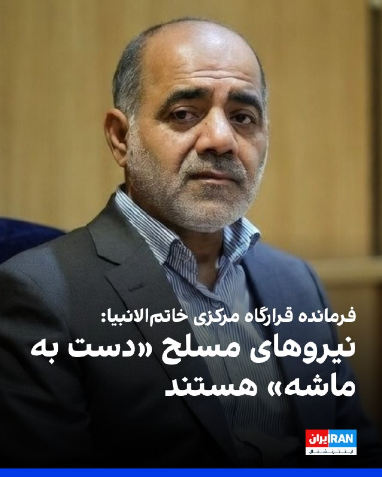

علی عبداللهی، فرمانده قرارگاه مرکزی خاتم‌الانبیا، در پیامی خطاب به حامیان جمهوری اسلامی نوشت توان رزمی، دفاعی و قدرت موشکی، دریایی، پهپادی و پدافند هوایی جمهوری اسلامی تحت فرماندهی مجتبی خامنه‌ای ارتقا یافته و نیروهای مسلح «دست به ماشه»، آماده شلیک به «قلب دشمن» هستند.

او نوشت: «آرمان مقدس فتح قدس و انتقام خون علی خامنه‌ای هرگز فراموش نخواهد شد؛ ما منتظر کوچک‌ترین لغزشی از سوی دشمن متجاوز هستیم تا درسی فراموش‌نشدنی و پایان‌بخش به آن‌ها بدهیم».
https://iranintl.com/202606147732

## IranIntlTV — post 342325

  <a href="telegram/content/IranIntlTV_342325_1781457811.mp4" target="_blank">🎬 Download video</a>

ارتش اسرائیل با انتشار ویدیویی از حمله‌ای دقیق همراه با نظارت هوایی در روز یک‌شنبه ۲۴ خرداد به یک مرکز فرماندهی حزب‌الله لبنان در منطقه ضاحیه در جنوب بیروت خبر داد.

در اطلاعیه ارتش اسرائیل آمده است این مرکز برای برنامه‌ریزی و هدایت حملات علیه شهروندان اسرائیلی مورد استفاده قرار می‌گرفت.

ویدیوهای منتشرشده در شبکه‌های اجتماعی، تخریب ساختمانی را در پی این حمله نشان می‌دهد.

به گزارش شبکه العربیه، علی الحاج از فرماندهان حزب‌الله در حمله به ضاحیه بیروت کشته شده است.
@iranintltv

## FarsiVOA — post 220704

  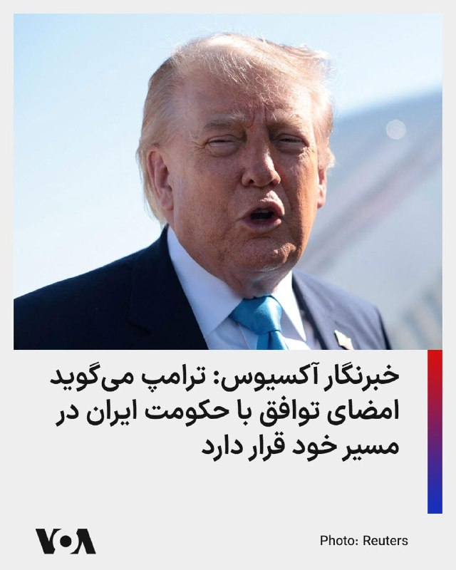

باراک راوید، خبرنگار آکسیوس گزارش داد که رئیس جمهوری آمریکا، دونالد ترامپ، در مصاحبه کوتاهی به او گفت که علیرغم حمله اسرائیل به بیروت و تهدید جمهوری اسلامی به تلافی، امضای توافق آمریکا و حکومت ایران در روز یکشنبه، هنوز در مسیر خود قرار دارد.

## Hranews — post 113613

  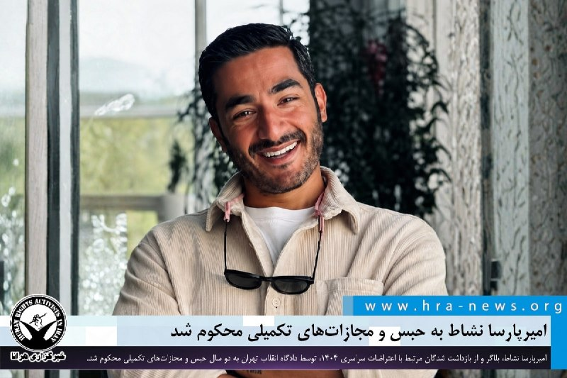

امیرپارسا نشاط به حبس و مجازات‌های تکمیلی محکوم شد

❗️
❗️
❗️
❗️
❗️– امیرپارسا نشاط، بلاگر و از بازداشت شدگان مرتبط با اعتراضات سراسری ۱۴۰۴، توسط دادگاه انقلاب تهران به دو سال حبس و سه سال محرومیت از حضور در شبکه‌های اجتماعی و استفاده از تلفن همراه هوشمند محکوم شد.

به گزارش خبرگزاری هرانا، ارگان خبری مجموعه فعالان حقوق بشر در ایران، امیرپارسا نشاط، یکی از بازداشت شدگان مرتبط با اعتراضات سراسری ۱۴۰۴، به حبس و مجازات‌های تکمیلی محکوم شد.

آقای نشاط توسط دادگاه انقلاب تهران به دو سال حبس و سه سال محرومیت از فعالیت در شبکه‌های اجتماعی و استفاده از تلفن همراه هوشمند محکوم شد. بر اساس مفاد رای صادره، یک‌بیستم از مجازات حبس قابل اجرا است و باقیمانده آن به مدت سه سال به حالت تعلیق درآمده است.

ادامه مطلب

#امیرپارسا_نشاط

↘️
@hranews_bot تماس ✉️ - @Hranews کانال هرانا 🆑

## alonews — post 127964

  <a href="telegram/content/alonews_127964_1781457813.webm" target="_blank">🎬 Download video</a>

👈اسرائیل سطح هشدار را افزایش داد

✅ @AloNews خبر جنگ

## alonews — post 127963

  <a href="telegram/content/alonews_127963_1781457813.webm" target="_blank">🎬 Download video</a>

👈دو سرباز ارتش اسرائیل در جنوب لبنان بر اثر آتش حزب‌الله زخمی شدند — یکی با جراحات متوسط و دیگری با جراحات خفیف — گزارش کانال ۱۴

✅ @AloNews خبر جنگ

## alonews — post 127962

  <a href="telegram/content/alonews_127962_1781457813.webm" target="_blank">🎬 Download video</a>

👈سخنگوی فدراسیون فوتبال: روادید تیم ملی ایران در آمریکا ساعتی نیست

✅ @AloNews خبر جنگ

## alonews — post 127961

  <a href="telegram/content/alonews_127961_1781457814.webm" target="_blank">🎬 Download video</a>

👈لارنس نورمن خبرنگار وال استریت ژورنال: در عرض دو هفته، ترامپ از این موضع که «لبنان از موضوع ایران جداست» به این موضع رسیده که «لبنان مرتبط است اما اسرائیل حق پاسخگویی دارد» و بعد به این موضع که «لبنان مرتبط است ولی من فکر نمی‌کنم اسرائیل حق پاسخگویی داشته باشد چون باید توافق را منعقد کنیم»

✅ @AloNews خبر جنگ

## alonews — post 127960

  <a href="telegram/content/alonews_127960_1781457814.webm" target="_blank">🎬 Download video</a>

👈خضریان، نماینده مجلس: ارتباط واتساپی عراقچی با ویتکاف باید کاملاً قطع شود!

✅ @AloNews خبر جنگ

---
📅 بروزرسانی: 1405/03/24 20:43
---

## VahidOOnLine — post 245515

  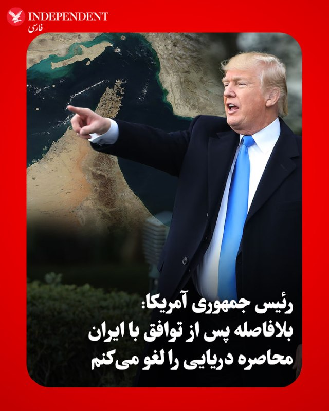

♦️دونالد ترامپ، رییس‌جمهوری آمریکا، روز یکشنبه در گفتگو با شبکه خبری فاکس اعلام کرد در صورت امضاء تفاهم‌نامه با ایران بلافاصله دستور لغو محاصره بنادر ایران را صادر خواهد کرد.
رئیس‌جمهوری آمریکا، در بخش دیگری از این گفتگو اعلام کرد امضاء توافق با ایران روز یکشنبه به‌صورت الکترونیکی انجام خواهد شد و مراسم امضاء حضوری یک هفته بعد در اروپا برگزار می‌شود.
‌🇸🇦 Indypersian

🤖 @VahidOOnLine

## VahidOOnLine — post 245514

  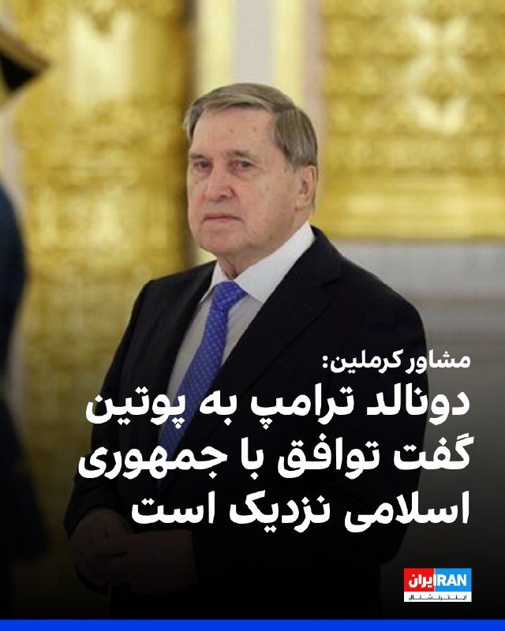

یوری اوشاکوف، مشاور کرملین، گفت دونالد ترامپ در گفت‌وگوی تلفنی با ولادیمیر پوتین اعلام کرد توافق برای پایان دادن به درگیری با جمهوری اسلامی تقریبا نهایی شده است.
به گفته اوشاکوف، رییس‌جمهوری روسیه از پایان یافتن درگیری‌ها ابراز خرسندی کرده است.
مشاور کرملین همچنین گفت ترامپ در این گفت‌وگو بر ضرورت پایان جنگ اوکراین تاکید و آمادگی خود را برای کمک به این روند اعلام کرده است.
اوشاکوف افزود پوتین نیز به‌صورت «غیررسمی» هشتادمین سالروز تولد ترامپ را به او تبریک گفته است.
‌🏁 🇬🇧 IranintlTV

🤖 @VahidOOnLine

## WithYashar — post 14850

ادعای ترامپ در گفتگو با اکسیوس:

این توافق به نفع اسرائیل خواهد بود، زیرا مانع از دستیابی ایران به سلاح هسته‌ای شده و این کشور را ملزم به رهاسازی مواد هسته‌ای می‌کند
@withyashar

## WithYashar — post 14849

یدیعوت آحارونوت: کابینه امنیتی اسرائیل امشب تو یه مکان مخفی تشکیل جلسه میدن
@withyashar

## WithYashar — post 14847

https://t.me/withyashar/s/5

## pm_afshaa — post 93937

  <a href="telegram/content/pm_afshaa_93937_1781457221.mp4" target="_blank">🎬 Download video</a>

👌💕

## IranIntlTV — post 342324

  

یوری اوشاکوف، مشاور کرملین، گفت دونالد ترامپ در گفت‌وگوی تلفنی با ولادیمیر پوتین اعلام کرد توافق برای پایان دادن به درگیری با جمهوری اسلامی تقریبا نهایی شده است.
به گفته اوشاکوف، رییس‌جمهوری روسیه از پایان یافتن درگیری‌ها ابراز خرسندی کرده است.
مشاور کرملین همچنین گفت ترامپ در این گفت‌وگو بر ضرورت پایان جنگ اوکراین تاکید و آمادگی خود را برای کمک به این روند اعلام کرده است.
اوشاکوف افزود پوتین نیز به‌صورت «غیررسمی» هشتادمین سالروز تولد ترامپ را به او تبریک گفته است.
https://iranintl.com/202606141853

## IranIntlTV — post 342323

  <a href="telegram/content/IranIntlTV_342323_1781457224.mp4" target="_blank">🎬 Download video</a>

نوید محبی، تحلیل‌گر سیاسی، گفت: «حملات امروز اسرائیل به ضاحیه و تاخیر در امضای تفاهم‌نامه احتمالی میان آمریکا و جمهوری اسلامی نشان می‌دهد که اسرائیل از این مساله رضایت ندارد و کنترل رفتار اسرائیل نیز برای آمریکا کار آسانی نخواهد بود.»

او افزود: «حتی در صورت امضای این تفاهم‌نامه، اسرائیل تلاش خواهد کرد روند توافق را مختل کند.»
@iranintltv

## Shin_Persian — post 7068

↩️ Quoted tweet: ابراهیم عزیزی ✓ @Ebrahimazizi33 Sun, 14 Jun 2026 16:14:20 UTC Today’s crime by the Zionist regime in Dahieh, Beirut once again proved the U.S. is weak without credibility, as it is not even capable of controlling this illegitimate regime.…

## Shin_Persian — post 7067

↩️ Quoted tweet:
ابراهیم عزیزی ✓ @Ebrahimazizi33
Sun, 14 Jun 2026 16:14:20 UTC

Today’s crime by the Zionist regime in Dahieh, Beirut once again proved the U.S. is weak without credibility, as it is not even capable of controlling this illegitimate regime.
A strong response is coming.

↩️ توییت نقل‌قول شده — برای پاسخ، پست زیر را ببینید.

ترجمه خودکار فارسی

جنایت امروز رژیم صهیونیستی در ضاحیه بیروت بار دیگر ثابت کرد که ایالات متحده ضعیف و فاقد اعتبار است، چرا که حتی توانایی کنترل این رژیم نامشروع را ندارد.
پاسخی سخت در راه است.

𝕏 · @shin_persian

## RadioFarda — post 158298

  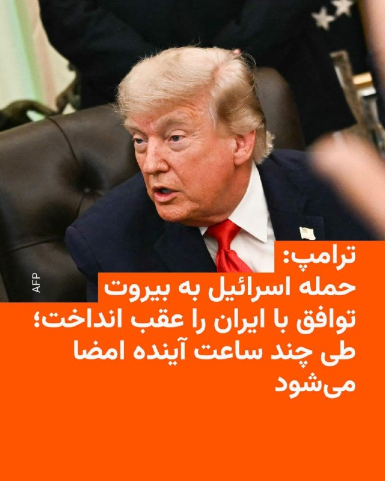

🔸دونالد ترامپ، رئیس‌جمهور آمریکا، روز یکشنبه گفت که با وجود حمله اسرائیل به بیروت، توافق صلح با ایران همچنان در مسیر امضا قرار دارد و قرار است ظرف چند ساعت آینده امضا شود؛ هرچند به گفته او، حمله اسرائیل اجرای این برنامه را به تأخیر انداخته است.

🔸او در گفت‌وگویی تلفنی با وب‌سایت اکسیوس گفت: «این اتفاق اوضاع را به هم ریخت. امضای توافق را چند ساعت به تأخیر انداخت. قرار بود همین حالا انجام شود. حالا برای چند ساعت دیگر برنامه‌ریزی شده است.»

🔸آقای ترامپ همزمان در گفت‌وگوی دیگری با شبکه فاکس‌نیوز خبر داد که توافق با ایران طی دو تا سه ساعت آینده به‌صورت الکترونیکی امضا خواهد شد.

🔸او همچنین اعلام کرد که از ایران خواهد خواست در واکنش به حملات اسرائیل که مواضع حزب‌الله را هدف قرار داد، اقدامی تلافی‌جویانه انجام ندهد.

🔸رئیس‌جمهور آمریکا ساعتی پیش در شبکه اجتماعی تروث سوشال گفت که حمله اسرائیل به حومه بیروت نباید انجام می‌شد و افزود دیگر نباید هیچ حمله‌ای از سوی اسرائیل در هیچ نقطه‌ای از لبنان صورت گیرد و حزب‌الله نیز نباید به اسرائیل حمله کند.

@RadioFarda

## IranianMinds — post 22571

  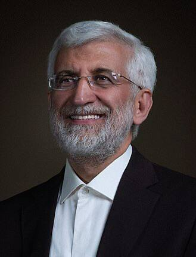

🔴 رسانه وابسته به سپاه صابرین نیوز :

سعید جلیلی از تمامی سمت های خودش برکنار شد.

@IranianMinds

## IranianMinds — post 22570

🔴 ترامپ :

چرا بی‌بی نتانیاهو باید آن حمله لعنتی رو انجام می‌داد؟ خیلی عصبانی شدم و این رو به خودش هم گفتم. اون هیچ قضاوت درستی نداره و این رو به خودش هم گفتم.

@IranianMinds

## IranianMinds — post 22569

🔴 ترامپ :

توافق با ایران رو اول از راه دور امضا میکنیم و یک هفته بعدش هم به صورت حضوری تو‌ اروپا هم امضاش میکنیم.

@IranianMinds

## IranianMinds — post 22568

  <a href="telegram/content/IranianMinds_22568_1781457228.mp4" target="_blank">🎬 Download video</a>

🔴 کارشناس شبکه افق:

این پاکستانی‌ ها اصلا برای میانجی‌گری به ایران نمیان، بلکه فقط میان و پیام های تهدید و‌ ترور آمریکاییارو میارن!

@IranianMinds

## BBCPersian — post 283806

  <a href="https://t.me/bbcpersian/283806" target="_blank">📎 Download file</a>

پادکست جام جهان‌نما، یکشنبه ۲۴ خرداد ۱۴۰۵

این برنامه رادیویی را می‌توانید هرشب ساعت ۲۰ به وقت ایران، روی موج متوسط ۷۰۲ کیلوهرتز و موج کوتاه ۹۴۶۵ کیلوهرتز بشنوید.تکرار برنامه را هم می‌توانید ساعت ۲۱:۳۰ روی موج متوسط ۷۰۲ کیلوهرتز و موج کوتاه ۵۳۹۵ کیلوهرتز گوش کنید.

@BBCPersian

## Dirty_Kids — post 392027

  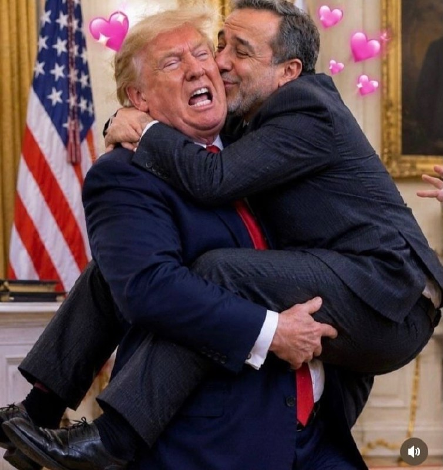

نکن عباس جاش میمونه 💕😂

@Dirty_Kids 👻

## Dirty_Kids — post 392026

🔴 فوری، دکمه سیکتیر سعید جلیلی زده شد😂 سردار عظیم ابراهیم پور، فرمانده قرارگاه پیشرفت سپاه رسما اعلام کرد که باقری کنی جایگزین سعید جلیلی توی شعام شده. @Dirty_Kids 👻

## Dirty_Kids — post 392025

  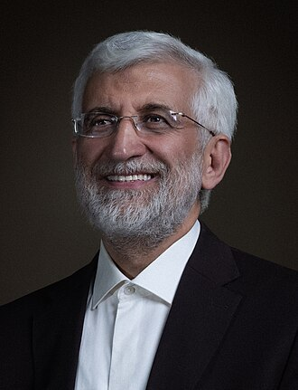

🔴 فوری، دکمه سیکتیر سعید جلیلی زده شد😂

سردار عظیم ابراهیم پور، فرمانده قرارگاه پیشرفت سپاه رسما اعلام کرد که باقری کنی جایگزین سعید جلیلی توی شعام شده.

@Dirty_Kids 👻

---
📅 بروزرسانی: 1405/03/24 20:33
---

## VahidOOnLine — post 245513

  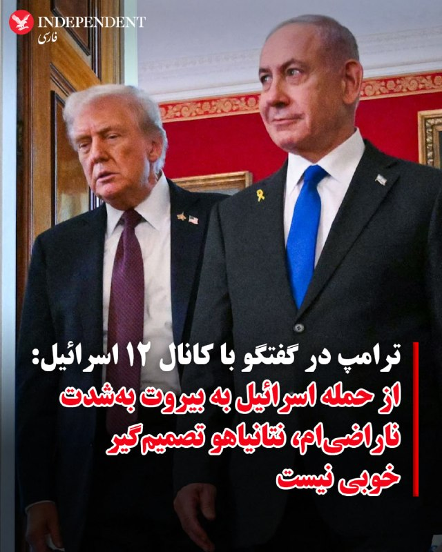

♦️دونالد ترامپ، رئیس‌جمهوری آمریکا، روز یکشنبه ۲۴ خرداد ماه با انتقاد شدید از حمله اسرائیل به ضاحیه جنوبی بیروت گفت این اقدام موجب اختلال و تاخیر در روند دستیابی به توافق با ایران شده است، اما تاکید کرد که توافق همچنان «طی چند ساعت آینده» امضا خواهد شد.
ترامپ در گفتگو با شبکه ۱۲ اسرائیل اعلام کرد نارضایتی خود را مستقیما به بنیامین نتانیاهو منتقل کرده و گفته است از حمله اخیر اسرائیل به بیروت «به هیچ وجه راضی نیست». او همچنین عملکرد نخست‌وزیر اسرائیل را در مدیریت بحران زیر سوال برد و گفت نتانیاهو در تصمیم‌گیری قضاوت درستی ندارد.
رئیس‌جمهوری آمریکا با دفاع از توافق در دست مذاکره با تهران، گفت این توافق مانع دستیابی ایران به سلاح هسته‌ای خواهد شد، بازرسی‌های سختگیرانه از تاسیسات مشکوک را امکان‌پذیر می‌کند و به برنامه اورانیوم غنی‌شده ایران پایان می‌دهد.
‌🇸🇦 Indypersian

🤖 @VahidOOnLine

## VahidOOnLine — post 245512

  

دونالد ترامپ، رییس‌جمهوری آمریکا، در گفت‌وگوی تلفنی با اکسیوس گفت حمله اسرائیل به بیروت روند امضای تفاهم‌نامه با جمهوری اسلامی را چند ساعت به تاخیر انداخته است.
به گزارش اکسیوس، ترامپ گفت زمانی که مشاورانش خبر حمله اسرائیل به بیروت را به او اطلاع دادند، شوکه شد و از بنیامین نتانیاهو، نخست‌وزیر اسرائیل، خشمگین شد.
ترامپ گفت: «این اوضاع را به‌هم ریخت. قرار بود همین الان توافق امضا شود، اما حالا برای چند ساعت دیگر برنامه‌ریزی شده است.»
او افزود حزب‌الله ابتدا به اسرائیل حمله کرده بود، اما این حمله هیچ خسارت یا تلفات جانی به همراه نداشت.
‌🏁 🇬🇧 IranintlTV

🤖 @VahidOOnLine

## WithYashar — post 14846

ترامپ به پوتین اعلام کرد توافق پایان جنگ با ایران تقریبا کامل شده. پوتین هم از پیشرفت این موضوع ابراز رضایت کرد
@withyashar

## WithYashar — post 14845

فرمانده قرارگاه خاتم الانبیا: فرزندان ملت در نیروهای مسلح «دست به ماشه» آماده شلیک به قلب دشمن هستند
@withyashar 🚨

## mwarmonitor — post 10897

🔴ارتش اسرائیل می‌گوید:

🔸راکتی که از سوی حزب‌الله از لبنان شلیک شده بود، کمی پیش به نزدیکی منطقه مسکونی «نئوت مردخای» در شمال اسرائیل و در نزدیکی کریات شمونه اصابت کرده است.

🔸ارتش همچنین اعلام کرد چند راکت دیگر از این حمله گروهی، در نزدیکی نیروهای نظامی اسرائیل در جنوب لبنان فرود آمده‌اند.

🔸علاوه بر این، چند پهپاد منتسب به حزب‌الله نیز اخیراً به خاک اسرائیل و در نزدیکی مرز لبنان اصابت کرده‌اند.

@mwarmonitor

## pm_afshaa — post 93935

در شهرداری گناباد چه میگذرد 2 تا حکومتی دارن تو شهرداری گناباد کون کونک بازی میکنن که توسط یهکی از شهروندان شکار میشن و فیلمشون در میاد مشاهده فیلم @Pm_Afshaa

## IranIntlTV — post 342322

  <a href="telegram/content/IranIntlTV_342322_1781456636.mp4" target="_blank">🎬 Download video</a>

دونالد ترامپ، رییس‌جمهوری آمریکا، در گفت‌وگو با فاکس نیوز گفت که معتقد است تفاهم‌نامه میان واشینگتن و تهران ظرف دو تا سه ساعت آینده به‌صورت الکترونیکی امضا خواهد شد. او همچنین گفت که از جمهوری اسلامی خواهد خواست به حملات اسرائیل علیه حزب‌الله واکنش نشان ندهد.

مرضیه حسینی و اشکان صفایی، خبرنگاران ایران‌اینترنشنال، گزارش می‌دهند
@iranintltv

## IranIntlTV — post 342321

  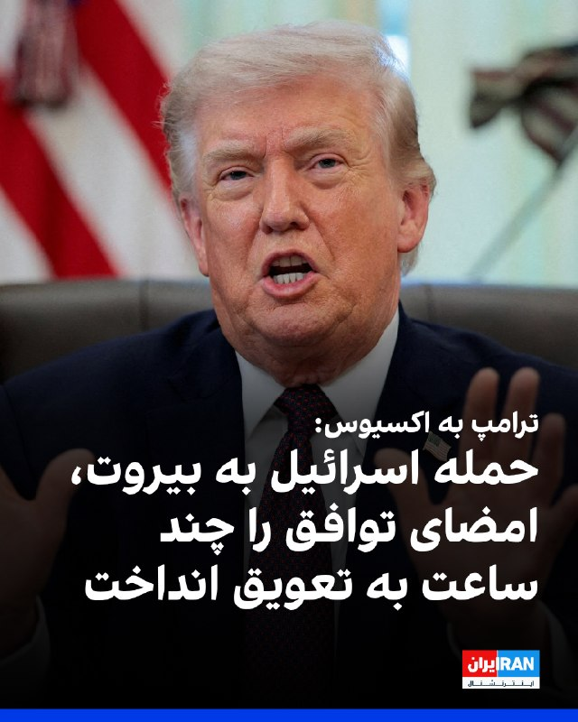

دونالد ترامپ، رییس‌جمهوری آمریکا، در گفت‌وگوی تلفنی با اکسیوس گفت حمله اسرائیل به بیروت روند امضای تفاهم‌نامه با جمهوری اسلامی را چند ساعت به تاخیر انداخته است.
به گزارش اکسیوس، ترامپ گفت زمانی که مشاورانش خبر حمله اسرائیل به بیروت را به او اطلاع دادند، شوکه شد و از بنیامین نتانیاهو، نخست‌وزیر اسرائیل، خشمگین شد.
ترامپ گفت: «این اوضاع را به‌هم ریخت. قرار بود همین الان توافق امضا شود، اما حالا برای چند ساعت دیگر برنامه‌ریزی شده است.»
او افزود حزب‌الله ابتدا به اسرائیل حمله کرده بود، اما این حمله هیچ خسارت یا تلفات جانی به همراه نداشت.
https://iranintl.com/202606147532

## FarsiVOA — post 220703

🔺 هشدار دانشجویان به مقامات جمهوری اسلامی: آماده «تحصن اعتراضی» هستیم

◾️جمعی از دانشجویان دانشگاه صنعتی خواجه نصیرالدین طوسی، با صدور بیانیه‌ای، به صدور حکم محرومیت از تحصیل چهار تن از فعالان دانشجویی این دانشگاه اعتراض کردند.

⬇️ بیشتر بخوانید:

https://ir.voanews.com/a/khajeh-nasir-university-students-protesting-iran-deprivation-of-education/8160706.html

## Persian_Trend_Official — post 17082

  

رئیس کمیسیون امنیت ملی مجلس: پاسخ به حمله امروز اسرائیل قطعی است.

📝 Amir

📌 @persian_trend_official
پرشین ترند | متفاوت‌ترین کانال نظامی

## Persian_Trend_Official — post 17081

سرلشکر عبداللهی: فرزندان ملت در نیروهای مسلح دست به ماشه آماده شلیک به قلب دشمن هستند، انتقام خون امام شهید هرگز فراموش نخواهد شد.

فرمانده قرارگاه مرکزی حضرت خاتم الانبیاء در پیامی تاکید کرد: توان رزمی ما تحت اوامر فرماندهی معظم کل قوا ارتقا یافته و فرزندان ملت در نیروهای مسلح دست به ماشه، آماده شلیک به قلب دشمن هستند.

متن این پیام به شرح ذیل است؛

ملت قهرمان ایران

مقاومت و بعثت دوباره شما، فصل نوینی را در تحولات بین‌الملل رقم زد و جمهوری اسلامی ایران را در قامت یک قدرت جهانی اثرگذار تثبیت کرد. فرزندان شما در نیروهای مسلح، به‌ویژه فرماندهان شهید که تربیت‌یافتگان اصیل مکتب امام خمینی و امام خامنه‌ای شهید بودند، از روز اول نهضت، بغض و عدوات با استکبار و صهیونیسم را جزئی جدانشدنی از ماهیت انقلاب اسلامی می‌دانستند و می‌دانند.

اتفاقات یک سال اخیر، از جنگ 12 روزه تا جنگ رمضان، علیرغم خسارت‌های سنگین و داغِ جانسوزِ شهادت امام شهید، فرماندهان و مردم بی‌گناه، یک فرصت بزرگ برای تسویه حساب تاريخی با جنایتکاران فراهم کرد؛ نیرو‌های مسلح به پشتوانه‌ی مردم و با عنایت الهی بر سر آن‌ها آوردند آنچه لایقشان بود.

اینک مقتدرانه اعلام می‌داریم: توان رزمی، دفاعی و قدرت موشکی، دریایی، پهپادی و پدافند هوایی ما پرقدرت‌تر از گذشته و تحت اوامر فرماندهی معظم کل قوا حضرت آیت‌الله ‌سید مجتبی حسینی خامنه‌ای مدظله‌العالی، ارتقا یافته و فرزندان ملت در نیروهای مسلح دست به ماشه، آماده شلیک به قلب دشمن هستند.

آرمان مقدس فتح قدس و انتقام خون امام شهید هرگز فراموش نخواهد شد؛ ما منتظر کوچک‌ترین لغزشی از سوی دشمن متجاوز هستیم تا درسی فراموش‌نشدنی و پایان‌بخش به آن‌ها بدهیم.

و ما النصر الا من عندالله العزیز الحکیم

📝 Amir

📌 @persian_trend_official
پرشین ترند | متفاوت‌ترین کانال نظامی

## IranianMinds — post 22567

  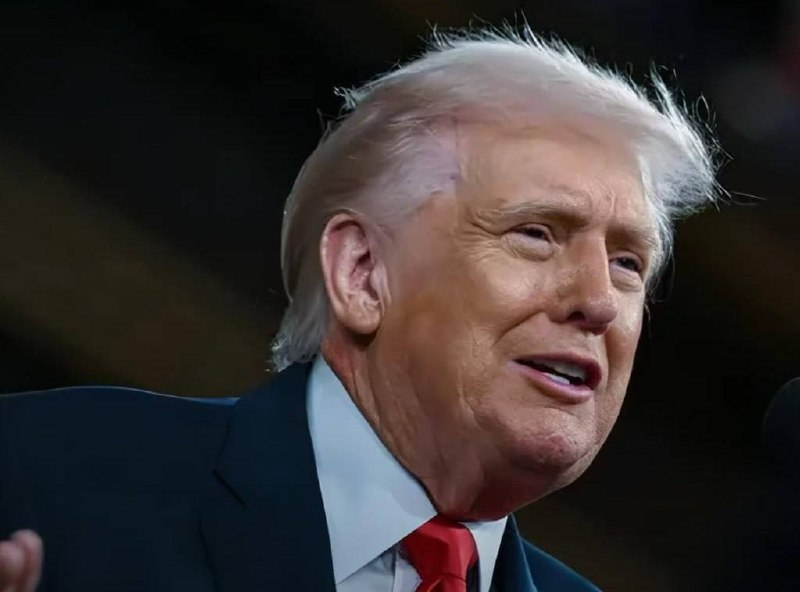

🔴 ترامپ :

از ایران درخواست میکنم که به فکر توافق باشه و به حملات امروز به بیروت پاسخی نده !

@IranianMinds

## IranianMinds — post 22566

  <a href="telegram/content/IranianMinds_22566_1781456640.webm" target="_blank">🎬 Download video</a>

بازی های #جام_جهانی رو بدون استرس و کمترین ریسک ممکن پیش بینی کن.

⭕️ ⚽ آلمان 🟢 کوراسائو

⭕️ ⚽ هلند 🟢 ژاپن

💳 حسابتو برای این بازی در #رومابت با ارز دیجیتال شارژ کن 
🅰️
🅰️
🅰️ شارژ اضافی بگیر ✅

💰 10% کش بک روی تیم محبوبت

💰   100% بونوس خوشامدگویی

🎁 20% کش بک بازی های کازینویی و انفجار

🔥   همراه با درگاه‌ #ریالی
#RomaBet

📣‌ #بدون_احراز_هویت

1️⃣
2️⃣
3️⃣
4️⃣   
1️⃣
2️⃣
3️⃣
4️⃣

⛔در صورت فیلتر بودن از طریق VPN غیر از سرور انگلیس ( سرور 
🇺🇸 
🇩🇪 
🇨🇦
🇫🇮
🇹🇷
👇
👇 )

🇪🇺 https://trentivo6402.bar

✅کانال تلگرامی #رومابت 24
👇

🔵 @Romabet_official

## IranianMinds — post 22565

🔴ترامپ به فاکس‌نیوز:

در صورت امضای تفاهم‌نامه با ایران، بلافاصله دستور لغو محاصره بنادر ایران صادر خواهد شد.

@IranianMinds

## alonews — post 127959

  <a href="telegram/content/alonews_127959_1781456640.webm" target="_blank">🎬 Download video</a>

🔴فوری / الحدث : هئیت قطری هم اکنون به سمت اسلام آباد در حرکت است

✅ @AloNews خبر جنگ

## alonews — post 127958

  <a href="telegram/content/alonews_127958_1781456641.webm" target="_blank">🎬 Download video</a>

👈سفیر امریکا در سازمان ملل،مایک والتز: ایرانی‌ها مذاکره‌کنندگانی فوق‌العاده سرسخت هستند

✅ @AloNews خبر جنگ

## alonews — post 127957

  <a href="telegram/content/alonews_127957_1781456641.webm" target="_blank">🎬 Download video</a>

👈سرلشکر عبداللهی: فرزندان ملت در نیروهای مسلح «دست به ماشه» آماده شلیک به قلب دشمن هستند

✅ @AloNews خبر جنگ

## alonews — post 127956

  <a href="telegram/content/alonews_127956_1781456641.webm" target="_blank">🎬 Download video</a>

👈 ترامپ به اکسیوس: توافق به نفع اسرائیل خواهد بود زیرا مانع از دستیابی ایران به سلاح هسته‌ای می‌شود و این کشور را ملزم به از بین بردن مواد هسته‌ای می‌کند

✅ @AloNews خبر جنگ

---
📅 بروزرسانی: 1405/03/24 20:23
---

## VahidOOnLine — post 245511

  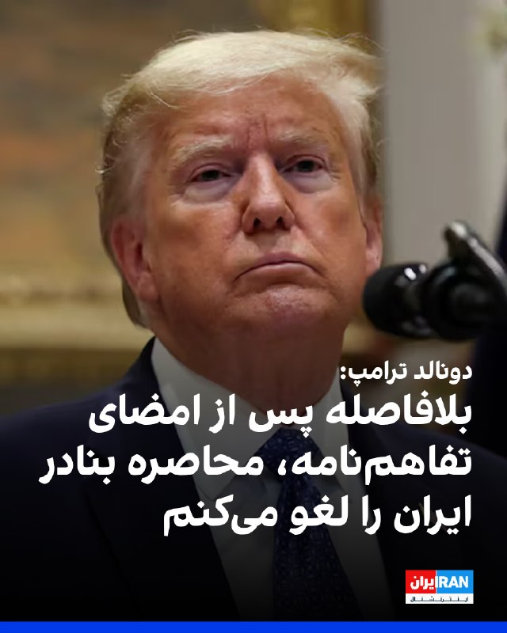

دونالد ترامپ، رییس‌جمهوری آمریکا، در ادامه گفت‌وگوی خود با فاکس نیوز گفت در صورت امضای تفاهم‌نامه با جمهوری اسلامی بلافاصله دستور لغو محاصره بنادر ایران را صادر خواهد کرد.
او افزود پس از امضای این تفاهم‌نامه، مذاکرات درباره جزییات برنامه هسته‌ای جمهوری اسلامی ادامه خواهد یافت.
ترامپ همچنین گفت مراسم امضای حضوری تفاهم‌نامه میان واشینگتن و تهران ممکن است هفته آینده در اروپا برگزار شود.
‌🏁 🇬🇧 IranintlTV

🤖 @VahidOOnLine

## VahidOOnLine — post 245510

  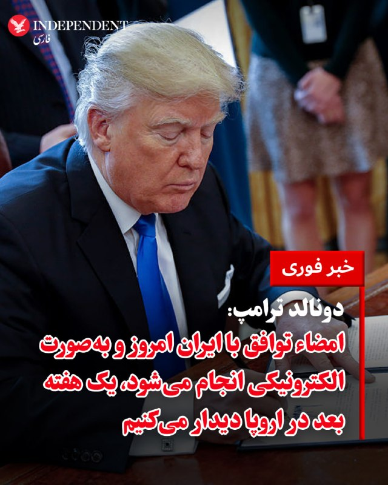

♦️دونالد ترامپ، رئیس‌جمهوری آمریکا، روز یکشنبه ۲۴ خرداد ماه در گفتگو با فاکس نیوز اعلام کرد امضاء توافق با ایران روز یکشنبه به‌صورت الکترونیکی انجام خواهد شد و مراسم امضای حضوری آن یک هفته بعد در اروپا برگزار می‌شود.
ترامپ همچنین گفت بلافاصله پس از امضای توافق با ایران، دستور رفع محاصره را صادر خواهد کرد.
رئیس‌جمهوری آمریکا در بخش دیگری از اظهاراتش فاش کرد پس از حمله اسرائیل به ضاحیه جنوبی بیروت، پیامی «خشمگینانه» برای بنیامین نتانیاهو، نخست‌وزیر اسرائیل، ارسال کرده است.
این اظهارات ساعاتی پس از آن مطرح می‌شود که ترامپ در شبکه اجتماعی تروث سوشال نیز حمله اسرائیل به بیروت را غیرضروری توصیف کرده و گفته بود این اقدام نباید روند دستیابی به توافق صلح با ایران را مختل کند.
‌🇸🇦 Indypersian

🤖 @VahidOOnLine

## VahidOOnLine — post 245509

  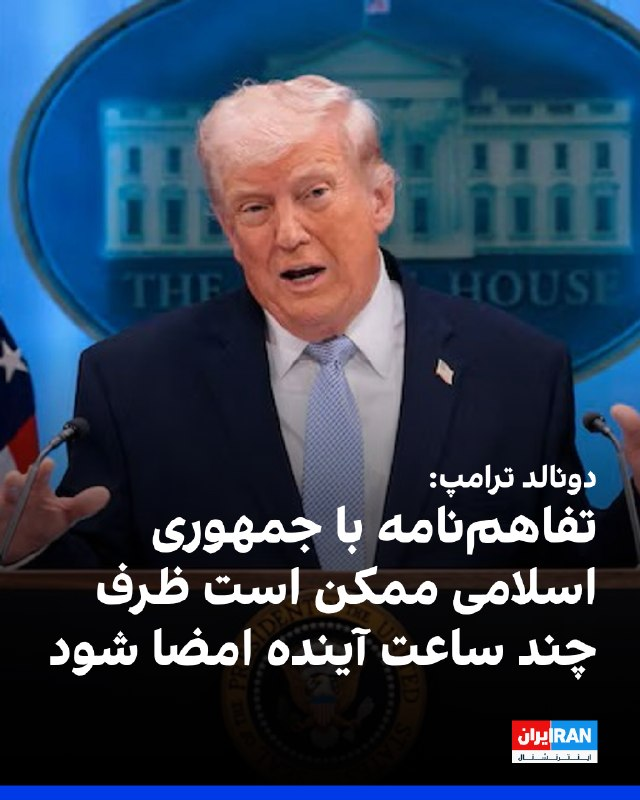

دونالد ترامپ، رییس‌جمهوری آمریکا، در گفت‌وگو با فاکس نیوز گفت معتقد است تفاهم‌نامه میان واشینگتن و تهران ظرف دو تا سه ساعت آینده به‌صورت الکترونیکی امضا خواهد شد. او همچنین گفت از جمهوری اسلامی خواهد خواست به حملات اسرائیل علیه حزب‌الله واکنش نشان ندهد.
ترامپ افزود حملات آمریکا به مواضع جمهوری اسلامی در اواسط هفته گذشته، تهران را به بازگشت به میز مذاکره وادار کرده است. او همچنین گفت مقام‌های جمهوری اسلامی در جریان این حملات با او تماس گرفتتند و خواستار توقف بمباران‌ها شدند.
‌🏁 🇬🇧 IranintlTV

🤖 @VahidOOnLine

## WithYashar — post 14844

رئیس کمیسیون امنیت ملی مجلس: پاسخ به حمله امروز اسرائیل توسط جبهه مقاومت قطعی است
@withyashar

## WithYashar — post 14843

ترامپ به فاکس نیوز گفت:

توافق با ایران از راه دور امضا خواهد شد، سپس امضای حضوری آن ممکن است یک هفته بعد در اروپا انجام شود
@withyashar

## WithYashar — post 14842

بن‌گویر خطاب به نتانیاهو: قوی باش، نترس
@withyashar 🥥🥥

## mwarmonitor — post 10896

اگر جمهوری اسلامی و آمریکا به اسرائیل حمله کردند تعجب نکنید

## pm_afshaa — post 93934

  <a href="telegram/content/pm_afshaa_93934_1781456014.webm" target="_blank">🎬 Download video</a>

🔴ابراهیم عزیزی، رئیس کمیسیون امنیت ملی مجلس: پاسخ به حمله امروز اسرائیل قطعی است.

💧 Rainbet.com the #1 Non-KYC Crypto Casino & Sportsbook @rainbetcom

😁 @Pm_Afshaa

## pm_afshaa — post 93933

🔴وزیر امنیت داخلی اسرائیل، بن گویر : آقای نخست‌وزیر، قوی باش و نترس، وا نده

💧 Rainbet.com the #1 Non-KYC Crypto Casino & Sportsbook @rainbetcom

😁 @Pm_Afshaa

## kianmeli1 — post 87992

  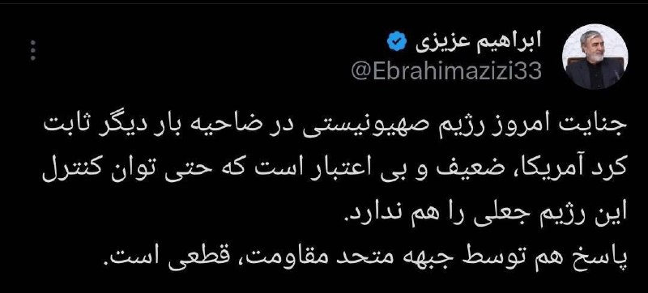

🔴رئیس کمیسیون امنیت ملی مجلس: پاسخ به حمله امروز اسرائیل توسط جبهه مقاومت قطعی است
https://t.me/kianmeli1

## IranIntlTV — post 342320

  

دونالد ترامپ، رییس‌جمهوری آمریکا، در ادامه گفت‌وگوی خود با فاکس نیوز گفت در صورت امضای تفاهم‌نامه با جمهوری اسلامی بلافاصله دستور لغو محاصره بنادر ایران را صادر خواهد کرد.
او افزود پس از امضای این تفاهم‌نامه، مذاکرات درباره جزییات برنامه هسته‌ای جمهوری اسلامی ادامه خواهد یافت.
ترامپ همچنین گفت مراسم امضای حضوری تفاهم‌نامه میان واشینگتن و تهران ممکن است هفته آینده در اروپا برگزار شود.
https://iranintl.com/202606143554

## Shin_Persian — post 7066

جلیلی درسته گویا

## Shin_Persian — post 7065

  

Shin ✓ @hey_itsmyturn
Sun, 14 Jun 2026 16:46:04 UTC

Initial:
Saeed Jalili, Iranian hardliner who has a huge anti-deal fanbase has been sacked from the Islamic Regime's Supreme National Security Council.

(Told you: https://sh1n.org/news/the-deal-the-trap-and-ghalibaf-waiting-behind-the-curtain)

ترجمه خودکار فارسی

سعید جلیلی، تندروی ایرانی که طرفداران پرشمارِ ضد-توافق دارد، از شورای عالی امنیت ملی رژیم اسلامی برکنار شده است.

(به شما گفته بودم: https://sh1n.org/news/the-deal-the-trap-and-ghalibaf-waiting-behind-the-curtain)

𝕏 · @shin_persian

## FarsiVOA — post 220702

🔺ارتش اسرائیل: دقدوق، از فرماندهان ارشد حزب‌الله، کشته شد

◾️ارتش اسرائیل از کشته شدن علی موسى دقدوق، یکی از فرماندهان ارشد سازمان تروریستی حزب‌الله و فرمانده پیشین «پرونده جولان» در جنوب لیتانی خبر داد.

⬇️ بیشتر بخوانید:

https://ir.voanews.com/a/ali-musa-daquq-killed-south-lebanon-senior-hezbollah-commander/8160703.html

## alonews — post 127955

  <a href="telegram/content/alonews_127955_1781456016.webm" target="_blank">🎬 Download video</a>

🔴فوری/رئیس کمیسیون امنیت ملی مجلس: پاسخ به حمله امروز اسرائیل توسط جبهه مقاومت قطعی است

✅ @AloNews خبر جنگ

---
📅 بروزرسانی: 1405/03/24 20:13
---

## VahidOOnLine — post 245508

  <a href="telegram/content/VahidOOnLine_245508_1781455414.mp4" target="_blank">🎬 Download video</a>

♦️جشن هواداران نیویورک نیکس، پس از قهرمانی این تیم در رقابت‌های ان‌بی‌ای (NBA) به خشونت کشیده شد و پلیس نیویورک از بازداشت ۶۳ نفر خبر داد.
به گزارش نیویورک پست، در جریان این ناآرامی‌ها در شامگاه شنبه و بامداد یکشنبه ۲۴ خرداد ماه، چهار مورد چاقوکشی و یک تیراندازی ثبت شده و ۱۰ مامور پلیس نیز زخمی شده‌اند. همچنین یک نوجوان ۱۷ ساله که از ناحیه پا هدف گلوله قرار گرفته بود، به بیمارستان منتقل شد.
پلیس اعلام کرد اتهام‌های افراد بازداشت‌شده شامل حمله به ماموران پلیس، حمل سلاح، تخریب اموال عمومی، اخلال در نظم عمومی و مقاومت در برابر بازداشت است.
تصاویر منتشرشده در شبکه‌های اجتماعی نشان می‌دهد شماری از هواداران به خودروهای پلیس و اتوبوس‌ها آسیب زده‌اند. همچنین چند اتوبوس مورد استفاده برای جابه‌جایی هواداران جام جهانی فوتبال نیز در جریان ناآرامی‌ها به آتش کشیده یا تخریب شده‌اند.
تیم نیویورکی نیکس با پیروزی مقابل سن‌آنتونیو اسپرز برای نخستین بار در ۵۳ سال گذشته عنوان قهرمانی نی‌بی‌ای را به دست آورد.
‌🇸🇦 Indypersian

🤖 @VahidOOnLine

## WithYashar — post 14841

ترامپ به باراک راوید گفت: چرا بی‌بی (نتانیاهو) باید یک حمله‌ی لعنتی انجام می‌داد؟ من خیلی عصبانی شدم. به او گفتم.
او اصلاً هیچ قضاوت لعنتی ندارد. من این را به او گفتم.

اگر توافق امشب امضا شود، فوراً دستور لغو محاصره دریایی ایران را خواهم داد.
@withyashar

## mwarmonitor — post 10895

🔴ترامپ به اکسیوس: نتانیاهو «اصلاً عقل و شعور ندارد» اما توافق با ایران هنوز پابرجا است

📝باراک راوید AXIOS

🔸رئیس‌جمهور دونالد ترامپ به اکسیوس گفت که به‌رغم حمله اسرائیل به بیروت و تهدید ایران به تلافی، توافق میان ایالات متحده و ایران برای پایان دادن به جنگ همچنان برای روز یکشنبه در مسیر اجرا قرار دارد.

🔰چرا این موضوع اهمیت دارد؟
رئیس‌جمهور آمریکا برای نجات توافقی رقابت می‌کند که درست در لحظه حمله اسرائیل به بیروت در آستانه فروپاشی قرار گرفت؛ او برای امضای این توافق به دیپلمایسی خصوصی و پیام‌رسانی‌های عمومی متوسل شده است. مقامات ایرانی هنوز تأیید نکرده‌اند که انتظار می‌رود توافق امروز امضا شود.
ترامپ در یک تماس تلفنی گفت:
«این اتفاق اوضاع را به هم ریخت. امضا را چند ساعت به تأخیر انداخت. قرار بود همین حالا انجام شود. اکنون برای چند ساعت دیگر برنامه‌ریزی شده است.»
تنش در لبنان: تشدید درگیری‌ها در لبنان تنها چند ساعت پیش از آن رخ داد که قرار بود ایالات متحده و ایران توافقی را برای پایان دادن به جنگ خود امضا کنند.
موضع ایران: ابراهیم عزیزی، رئیس کمیسیون امنیت ملی مجلس ایران، در شبکه اجتماعی X نوشت: «پاسخی سخت در راه است.»
وضعیت موجود
ترامپ گفت زمانی که مشاورانش با او تماس گرفتند تا درباره حمله اسرائیل به بیروت به او گزارش دهند، شوکه شده و از دست بنیامین نتانیاهو، نخست‌وزیر اسرائیل، به شدت خشمگین (عصبانی) شده است.
ترامپ اظهار داشت:
«خیلی بد است — نمی‌توانستم باور کنم. یک ساعت قبل از اینکه قرار باشد توافق را امضا کنیم.»
ترامپ اذعان کرد که حزب‌الله ابتدا به اسرائیل حمله کرده بود، اما تاکید کرد که این حمله هیچ خسارتی برجای نگذاشته و کسی کشته نشده است.
ترامپ گفت: «چرا بیبی مجبور بود یک حمله لعنتی انجام دهد؟ خیلی عصبانی شدم. به او فهماندم. او اصلاً عقل و شعور ندارد. این را به او فهماندم.»

📌تصویر کلی
ترامپ مدعی شد که توافق با ایران برای اسرائیل خوب خواهد بود، زیرا مانع از دستیابی ایران به سلاح هسته‌ای می‌شود، نابودی مواد هسته‌ای را الزامی می‌کند و اجازه بازرسی‌های سرزده از تاسیسات هسته‌ای ایران را می‌دهد.

@mwarmonitor

## mwarmonitor — post 10894

🔹(کوین): این خیلی شبیه به چیزیه که رئیس‌جمهور مطمئناً می‌گه، اما در عین حال «تِری»، فکر می‌کنم منصفانه باشه اشاره کنیم که اگه شما دولت اسرائیل باشید، این حق رو دارید که از شهروندانتون دفاع کنید؛ کسانی که به طور مداوم از طریق حزب‌الله تحت حمله بوده‌اند. فکر…

## mwarmonitor — post 10893

🔴تری خبرنگار فاکس نیوز «بله کوین، بعدازظهر بخیر. من همین الان با پرزیدنت ترامپ صحبت کردم. او به فاکس نیوز گفت که معتقد است توافق با ایران تا دو یا سه ساعت آینده امضا خواهد شد. من از او درباره حملات امروز اسرائیل علیه حزب‌الله در بیروت، پایتخت لبنان، پرسیدم.…

## pm_afshaa — post 93932

  <a href="telegram/content/pm_afshaa_93932_1781455415.webm" target="_blank">🎬 Download video</a>

🔴ترامپ به فاکس نیوز:
اگر توافق امشب امضا بشه، فوراً دستور لغو محاصره دریایی ایران رو خواهم داد.

💧 Rainbet.com the #1 Non-KYC Crypto Casino & Sportsbook @rainbetcom

😁 @Pm_Afshaa

## pm_afshaa — post 93931

  <a href="telegram/content/pm_afshaa_93931_1781455416.webm" target="_blank">🎬 Download video</a>

🔴ترامپ به اکسیوس:
چرا نتانیاهو باید چنین حمله مزخرفی رو انجام می‌داد؟ من خیلی عصبانی شدم و بهش فهموندم. او اصلاً قضاوت درستی نداره، من این رو بهش گفتم.

نتانیاهو اصلا تشخیص درستی نداره، من این پیام رو بهش رسوندم که به شدت از حمله به بیروت ناراضی هستم.

💧 Rainbet.com the #1 Non-KYC Crypto Casino & Sportsbook @rainbetcom

😁 @Pm_Afshaa

## VahidOnline — post 76338

  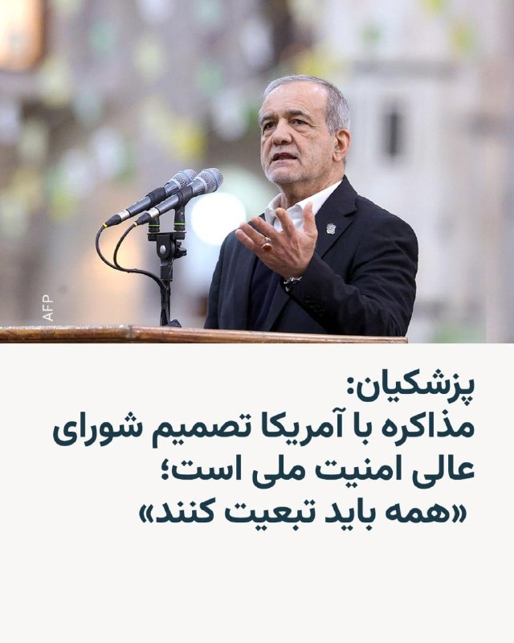

مسعود پزشکیان، رئیس‌جمهور ایران، در پی انتقادات برخی حامیان حکومت از محتوای توافق احتمالی با آمریکا، روز یکشنبه گفت که روند مذاکرات بر اساس مصوبات شورای عالی امنیت ملی و دیدگاه‌های رهبر جمهوری اسلامی پیش می‌رود.

او در دیدار با مدیران رسانه‌های داخلی افزود: «تصمیمات راهبردی کشور باید در چارچوب سازوکارهای قانونی اتخاذ شود و همه جریان‌ها و گروه‌ها نیز خود را ملزم به تبعیت از این تصمیمات بدانند.»

در آستانهٔ امضای تفاهم‌نامهٔ ایران و آمریکا برای پایان جنگ، اعتراض‌ در میان حامیان تندروی حکومت به متنی که به‌عنوان تفاهم‌نامه در برخی رسانه‌ها منتشر شد بالا گرفته و تجمعاتی نیز توسط گروهی از طرفداران جمهوری اسلامی علیه این تفاهم و مذاکره‌کنندگان برگزار شده است.

در یکی از این تجمعات در تهران، تجمع‌کنندگان علیه عباس عراقچی، وزیر خارجه، و محمدباقر قالیباف، رئیس مجلس شورای اسلامی، شعارهایی سر دادند.
@VahidHeadline

📡 @VahidOnline

## IranIntlTV — post 342319

  

دونالد ترامپ، رییس‌جمهوری آمریکا، در گفت‌وگو با فاکس نیوز گفت معتقد است تفاهم‌نامه میان واشینگتن و تهران ظرف دو تا سه ساعت آینده به‌صورت الکترونیکی امضا خواهد شد. او همچنین گفت از جمهوری اسلامی خواهد خواست به حملات اسرائیل علیه حزب‌الله واکنش نشان ندهد.
ترامپ افزود حملات آمریکا به مواضع جمهوری اسلامی در اواسط هفته گذشته، تهران را به بازگشت به میز مذاکره وادار کرده است. او همچنین گفت مقام‌های جمهوری اسلامی در جریان این حملات با او تماس گرفتتند و خواستار توقف بمباران‌ها شدند.
https://iranintl.com/202606142178

## IranIntlTV — post 342318

  <a href="telegram/content/IranIntlTV_342318_1781455418.mp4" target="_blank">🎬 Download video</a>

🔻محمد تقوی، ایران اینترنشنال، در هت‌تریک گفت: «مردم نه‌تنها با تیم ملی احساس قرابت و نزدیکی نمی‌کنند، بلکه از آنها متنفرند. این موضوع دلایل متفاوتی دارد که یکی از آنها این است که بازیکنان بنده پول هستند؛ نه‌تنها امیر قلعه‌نویی، بلکه تمام بازیکنان گفته‌اند که باید تا پیش از شروع بازی‌ها پاداش را دریافت کنند. اگر بازیکنان و مربیان دلشان برای مردم می‌سوزد، بیایند بگویند پاداش ما به خانواده بچه‌های میناب اختصاص پیدا کند.»

@iranintltvsport

## IranIntlTV — post 342317

  <a href="telegram/content/IranIntlTV_342317_1781455420.mp4" target="_blank">🎬 Download video</a>

تیتر اول با نیوشا صارمی، یکشنبه ۲۴ خرداد
@iranintltv

## Shin_Persian — post 7064

می دونستید من موقعی که عصبی یا ناراحتم بیشتر شوخی میکنم؟ :))

## Shin_Persian — post 7063

  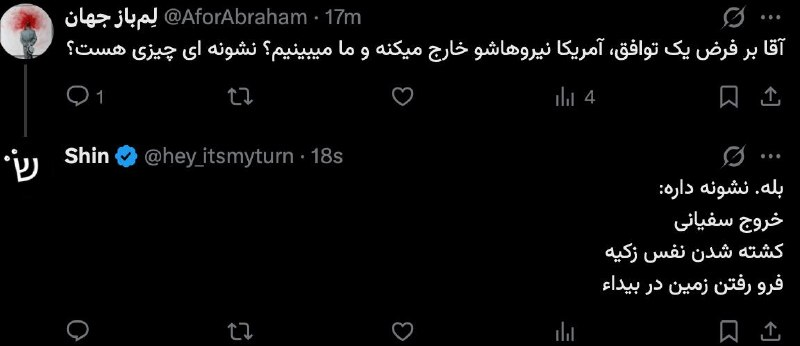

می دونستید من موقعی که عصبی یا ناراحتم بیشتر شوخی میکنم؟ :))

## FarsiVOA — post 220701

در حالی که بسیاری از تیم‌های حاضر در جام جهانی مشغول آماده‌سازی فنی برای اولین مسابقه هستند، تیم ملی جمهوری اسلامی همچنان با حاشیه‌هایی از جنس پرچم شیر و خورشید، ویزا، پاداش‌ها و مسائل امنیتی در تیخوانا خبرساز است.

## DW_Farsi — post 125969

  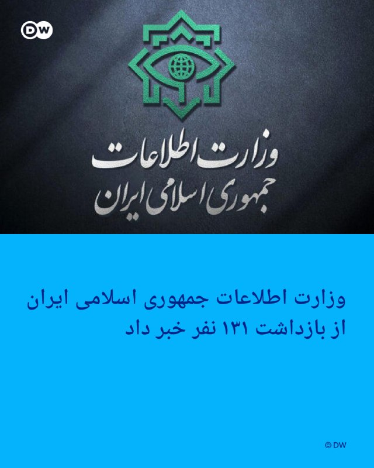

🔶وزارت اطلاعات جمهوری اسلامی ایران از بازداشت ۱۳۱ نفر خبر داد

به گزارش رسانه‌های داخل ایران وزارت اطلاعات جمهوری اسلامی با انتشار اطلاعیه‌ای از بازداشت دست‌کم ۱۳۱ نفر در استان‌های تهران، ایلام و سیستان و بلوچستان خبر داد. این وزارتخانه اعلام کرد که این افراد "به دلیل مشارکت در اعتراضات دی‌ماه ۱۴۰۴، فعالیت‌های جاسوسی و همکاری با گروه‌های مسلح مخالف نظام" بازداشت شده‌اند.

وزارت اطلاعات جمهوری اسلامی روز یکشنبه ۱۴ ژوئن (۲۴ خرداد) اعلام کرد که یک شهروند در استان ایلام بازداشت شده است. به ادعای این نهاد، فرد مزبور "به تلاش برای نفوذ به مراکز داده و انتقال اطلاعات به دشمن" متهم شده است.

این وزارتخانه مدعی است، فرد بازداشت‌شده در ایلام "با هدایت فردی مقیم بریتانیا، اقدام به جمع‌آوری اطلاعات و تلاش برای دسترسی به سامانه‌های رایانه‌ای و مراکز داده نهادهای مختلف کرده" و در این رابطه تجهیزاتی از جمله "یک دستگاه استارلینک، تجهیزات الکترونیکی و فتیله انفجاری از این فرد" کشف و ضبط شده است.

@dw_farsi

## Dirty_Kids — post 392024

  <a href="telegram/content/Dirty_Kids_392024_1781455421.mp4" target="_blank">🎬 Download video</a>

گراز میگه: ممد باقر زده تو گوشِ "وُتکاف"!!!
وُتکاف دیگه کیه بی‌پدر‌مادراااااا

@Dirty_Kids 👻

## Dirty_Kids — post 392023

  <a href="telegram/content/Dirty_Kids_392023_1781455422.mp4" target="_blank">🎬 Download video</a>

خار سازندشو گاییدم😂😂😂
این چه جا سیگاریه سمیههه

@Dirty_Kids 👻

## alonews — post 127954

  <a href="telegram/content/alonews_127954_1781455424.webm" target="_blank">🎬 Download video</a>

👈وزیر امنیت داخلی اسرائیل، بن گویر :
آقای نخست‌وزیر، قوی باش و نترس

✅ @AloNews خبر جنگ

## alonews — post 127953

  <a href="telegram/content/alonews_127953_1781455424.webm" target="_blank">🎬 Download video</a>

👈رادیو ارتش اسرائیل: طبق برآورد ارتش، ایران به حمله در ضاحیه بیروت پاسخ نخواهد داد.دو جنگنده چهار بمب دقیق را در حمله به ضاحیه رها کردند

✅ @AloNews خبر جنگ

---
📅 بروزرسانی: 1405/03/24 20:03
---

## VahidOOnLine — post 245507

  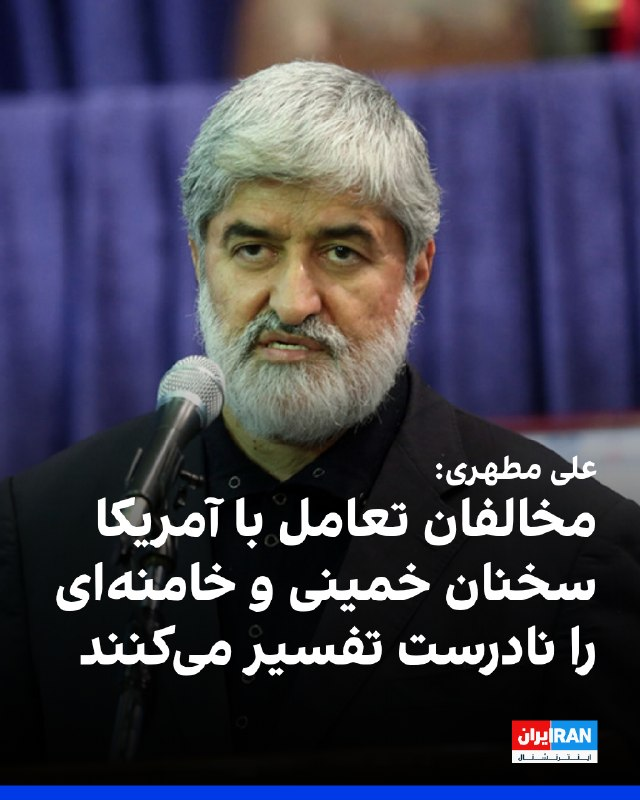

علی مطهری، نایب‌رییس مجلس دهم، گفت بخشی از تجمعات علیه مذاکرات جمهوری اسلامی و آمریکا سازماندهی‌شده است و برخی گروه‌های سیاسی تلاش دارند این اعتراض‌ها را به سراسر کشور گسترش دهند.
او مخالفت با تعامل با آمریکا را ناشی از «برداشت‌های غلط» از سخنان روح‌الله خمینی و علی خامنه‌ای دانست.
مطهری همچنین گفت باید مراقب بود این بار در برابر توافق احتمالی کارشکنی نشود و همه جناح‌های سیاسی توجه داشته باشند که هر توافقی تنها با نظر مجتبی خامنه‌ای امضا خواهد شد.
او افزود مقام‌های جمهوری اسلامی بدون موافقت مجتبی خامنه‌ای نمی‌توانند هیچ توافقی را امضا کنند.
‌🏁 🇬🇧 IranintlTV

🤖 @VahidOOnLine

## VahidOOnLine — post 245506

  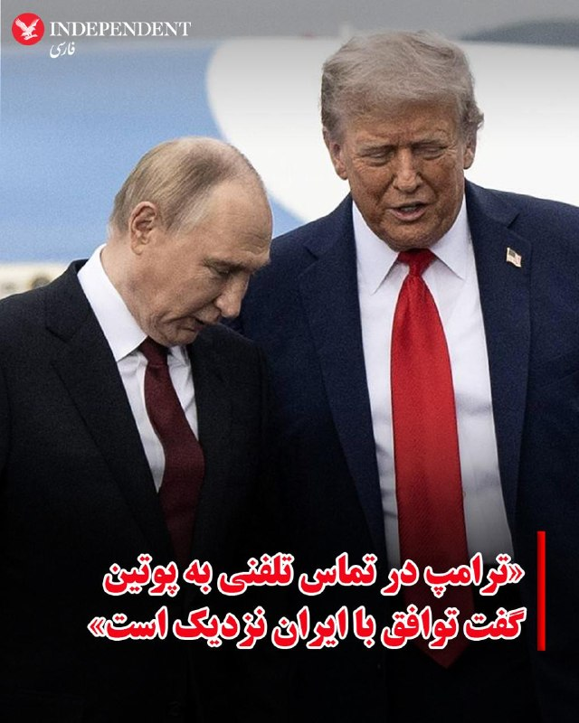

♦️کاخ کرملین اعلام کرد ولادیمیر پوتین، رئیس‌جمهوری روسیه، روز یکشنبه ۲۴ خرداد در تماس تلفنی با دونالد ترامپ درباره جنگ اوکراین، ایران و سفر قریب‌الوقوع نمایندگان ویژه آمریکا به روسیه گفتگو کرده است.
یوری اوشاکوف، دستیار پوتین، به خبرنگاران گفت بخش مهمی از این گفتگو به تفاهم‌نامه‌ای اختصاص داشت که میان آمریکا و ایران در حال تدوین است.
به گفته اوشاکوف، ترامپ در این تماس تاکید کرده که دستیابی به توافق با ایران نزدیک است.
دستیار رئیس‌جمهوری روسیه همچنین گفت توافق شده است استیو ویتکاف و جرد کوشنر، نمایندگان ویژه رئیس‌جمهوری آمریکا که در حال حاضر از نزدیک در پرونده ایران نقش دارند، به‌زودی بار دیگر به روسیه سفر کنند.
‌🇸🇦 Indypersian

🤖 @VahidOOnLine

## WithYashar — post 14840

ترامپ در گفتگو با فاکس نیوز اعلام کرد که از ایران خواهد خواست که به حملات اسرائیل علیه حزب الله پاسخ ندهد. ترامپ همچنین اعلام کرد که توافق با ایران ظرف ۲-۳ ساعت آینده به صورت الکترونیکی امضا خواهد شد.
@withyashar

## WithYashar — post 14839

ترامپ به کانال ۱۲ اسرائیل: از ایران می‌خوام موشک به اسرائیل شلیک نکنه. این توافق در ساعات آینده امضا خواهد شد.
@withyashar

## WithYashar — post 14838

صابرین نیوز تایید کرد : برکناری سعید جلیلی از شعام و جایگزینی باقری کنی با وی
@withyashar
یاشار : پوست اندازی رژیم ادامه ‌داره

## mwarmonitor — post 10892

🔴تری خبرنگار فاکس نیوز
«بله کوین، بعدازظهر بخیر. من همین الان با پرزیدنت ترامپ صحبت کردم. او به فاکس نیوز گفت که معتقد است توافق با ایران تا دو یا سه ساعت آینده امضا خواهد شد.
من از او درباره حملات امروز اسرائیل علیه حزب‌الله در بیروت، پایتخت لبنان، پرسیدم. او به من گفت که به صورت تلفنی با بنیامین نتانیاهو، نخست‌وزیر اسرائیل صحبت کرده و از او پرسیده است: "داری چه غلتی می‌کنی؟" (What the F... are you doing?)
او به نخست‌وزیر اسرائیل گفت که حملات بیشتری علیه حزب‌الله انجام ندهد تا این موضوع بر روند پیش‌روی این توافق تأثیری نگذارد.
در حال حاضر، به گفته ارتش اسرائیل (IDF)، اسرائیلی‌ها خود را برای احتمال شلیک موشک‌های بالستیک از سوی ایران آماده می‌کنند. با این حال، پرزیدنت ترامپ به فاکس نیوز گفت که با توجه به توافقی که در شرف وقوع است و انتظار می‌رود امشب امضا شود، از ایران خواهد خواست که با شلیک موشک به سمت اسرائیل، پاسخ ندهد.
همه این‌ها در بحبوحه آخرین گفتگوها برای رساندن این توافق نهایی به خط پایان انجام می‌شود. رئیس‌جمهور درباره حملات اواسط هفته گذشته صحبت کرد؛ زمانی که او بسیاری از مواضع ایران را در هم کوبید و ایرانی‌ها را به میز مذاکره بازگرداند.
کوین، شاید به یاد داشته باشی، زمانی که رئیس‌جمهور در اتاق موقعیت (Situation Room) بود، من تلفنی با او صحبت می‌کردم؛ همان زمان ایرانی‌ها با او تماس گرفتند و خواستند که بمباران را متوقف کند. رئیس‌جمهور معتقد است که آن لحظه توانست معادله را تغییر دهد و بار دیگر ایرانی‌ها را وادار به دادن این امتیازات کند.
پرزیدنت ترامپ می‌گوید اگر آن‌ها امشب توافق را امضا کنند، او بلافاصله دستور رفع محاصره بنادر ایران را صادر خواهد کرد و سپس وارد بحث‌های دقیق‌تر در رابطه با برنامه هسته‌ای ایران خواهند شد.
اما بار دیگر، آخرین تیترهای خبری که اکنون می‌دانیم:
پرزیدنت ترامپ به فاکس نیوز گفت معتقد است توافق با ایران ظرف دو تا سه ساعت آینده امضا خواهد شد. رئیس‌جمهور می‌گوید این کار به صورت الکترونیکی انجام می‌شود و سپس یک هفته بعد، انتظار می‌رود یک امضای حضوری انجام شود که می‌تواند در جایی در اروپا صورت بگیرد.
باز هم تاکید می‌کنم، این واکنش رئیس‌جمهور پس از حملات امروز اسرائیل به بیروت، پایتخت لبنان بود. اسرائیلی‌ها در پاسخ به شلیک پهپادها در آخر هفته جاری به سمت شمال اسرائیل، به یک موضع حزب‌الله حمله کرده بودند. رئیس‌جمهور مجدداً به فاکس نیوز گفت که از نخست‌وزیر اسرائیل پرسیده است: "داری چه غلتی می‌کنی؟"»

@mwarmonitor

## mwarmonitor — post 10891

  <a href="telegram/content/mwarmonitor_10891_1781454824.mp4" target="_blank">🎬 Download video</a>

🎬 Video

## FoxNewsTwitter — post 342960

  <a href="telegram/content/FoxNewsTwitter_342960_1781454826.mp4" target="_blank">🎬 Download video</a>

Fox News (Twitter/X)

BREAKING: President Trump tells @TreyYingst that a deal with Iran is expected in next few hours.

## pm_afshaa — post 93930

در شهرداری گناباد چه میگذرد 2 تا حکومتی دارن تو شهرداری گناباد کون کونک بازی میکنن که توسط یهکی از شهروندان شکار میشن و فیلمشون در میاد مشاهده فیلم @Pm_Afshaa

## pm_afshaa — post 93928

در شهرداری گناباد چه میگذرد

2 تا حکومتی دارن تو شهرداری گناباد کون کونک بازی میکنن که توسط یهکی از شهروندان شکار میشن و فیلمشون در میاد

مشاهده فیلم

@Pm_Afshaa

## pm_afshaa — post 93927

  <a href="telegram/content/pm_afshaa_93927_1781454829.webm" target="_blank">🎬 Download video</a>

🔴ترامپ: با من تماس گرفتن و گفتن اسرائیل داره به بیروت حمله میکنه، یک ساعت قبل از اینکه ما قرار بود توافق رو امضا کنیم. باور نمی‌کردم که این اتفاق دارد میفته، خیلی بده.

💧 Rainbet.com the #1 Non-KYC Crypto Casino & Sportsbook @rainbetcom

😁 @Pm_Afshaa

## pm_afshaa — post 93926

  <a href="telegram/content/pm_afshaa_93926_1781454829.webm" target="_blank">🎬 Download video</a>

🔴ترامپ: قرار بود ما توافق رو امروز صبح امضا کنیم اما حمله اسرائیل در بیروت اونو به تأخیر انداخت.

💧 Rainbet.com the #1 Non-KYC Crypto Casino & Sportsbook @rainbetcom

😁 @Pm_Afshaa

## pm_afshaa — post 93925

ترامپ: از ایران می‌خواهم که به اسرائیل موشک شلیک نکند. توافق در ساعات آینده امضا خواهد شد

💧 Rainbet.com the #1 Non-KYC Crypto Casino & Sportsbook @rainbetcom

😁 @Pm_Afshaa

## kianmeli1 — post 87991

  <a href="telegram/content/kianmeli1_87991_1781454830.mp4" target="_blank">🎬 Download video</a>

🔴ترامپ به فاکس‌نیوز گفت انتظار می‌رود ظرف دو سه ساعت آینده تفاهمنامه امضا شود.
https://t.me/kianmeli1

## IranIntlTV — post 342316

  

علی مطهری، نایب‌رییس مجلس دهم، گفت بخشی از تجمعات علیه مذاکرات جمهوری اسلامی و آمریکا سازماندهی‌شده است و برخی گروه‌های سیاسی تلاش دارند این اعتراض‌ها را به سراسر کشور گسترش دهند.
او مخالفت با تعامل با آمریکا را ناشی از «برداشت‌های غلط» از سخنان روح‌الله خمینی و علی خامنه‌ای دانست.
مطهری همچنین گفت باید مراقب بود این بار در برابر توافق احتمالی کارشکنی نشود و همه جناح‌های سیاسی توجه داشته باشند که هر توافقی تنها با نظر مجتبی خامنه‌ای امضا خواهد شد.
او افزود مقام‌های جمهوری اسلامی بدون موافقت مجتبی خامنه‌ای نمی‌توانند هیچ توافقی را امضا کنند.
https://iranintl.com/202606148062

## IranIntlTV — post 342315

  <a href="telegram/content/IranIntlTV_342315_1781454832.mp4" target="_blank">🎬 Download video</a>

🔻تیم ملی فوتبال بامداد دوشنبه وارد لس‌آنجلس خواهند شد تا برای بازی بامداد سه‌شنبه با نیوزیلند در نخست گام در جام جهانی آماده شوند؛ نگرانی اصلی ملی‌پوشان، نحوه برخورد پلیس در فرودگاه و البته چگونگی استقبال شهروندان ایرانی در لس‌آنجلس است.

🔹توضیحات رضا محدث، خبرنگار ایران اینترنشنال

@iranintltvsport

## DW_Farsi — post 125968

  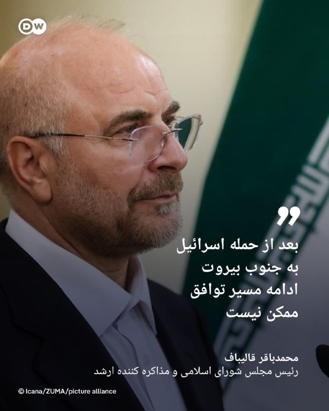

🔶 قالیباف: بعد از حمله اسرائیل به جنوب بیروت ادامه مسیر توافق ممکن نیست

در حالیکه دونالد ترامپ، رئیس جمهور آمریکا، گفته است که توافق میان تهران و واشنگتن امروز به امضا می‌رسد، محمدباقر قالیباف، مذاکره‌کننده ارشد جمهوری اسلامی در گفت‌وگوهای صلح با ایالات متحده، گفته است پس از حمله اسرائیل، به حومه جنوبی بیروت، "ادامه مسیر توافق با واشنگتن ممکن نیست".

او روز یکشنبه ۱۴ ژوئن (۲۴ خرداد) با انتشار پیامی در شبکه ایکس (توئیتر سابق) گفت که حمله تازه اسرائیل به ضاحیه "بار دیگر نشان داد که آمریکا یا اراده‌ای برای اجرای تعهدات خود ندارد یا توان آن را".

قالیباف به ایالات متحده هشدار داد که آمریکا نمی‌تواند به اسرائیل "چراغ سبز" نشان دهد و "از ایران امتیاز بگیرد".

نظام‌الدین موسوی، سخنگوی پیشین هیات رئیسه مجلس شورای اسلامی نیز پیامی مشابه در شبکه ایکس منتشر کرده بود و در مورد "تحقیر ایران" در صورت امضای توافق هشدار داده بود.

@dw_farsi

## Persian_Trend_Official — post 17080

دونالد ترامپ: مسئولیت عدم امضای توافق برعهده بی بی است!

ترامپ در مصاحبه‌ با شبکه 12 اسرائیل: من با نتانیاهو صحبت کردم و گفتم بی بی داری چیکار می‌کنی؟ خیلی از این حمله عصبانی هستم و اصلا نباید اتفاق می‌افتاد. بی بی هیچ اختیاری از خودش ندارد و من باید تصمیم بگیرم.

با ایران صحبت خواهم کرد تا حمله نکند،‌ بی بی توافقی که ما قرار است امروز امضا کنیم را به تعویق انداخت، ما باید تا چند ساعت اینده این توافق را امضا کنیم و مسئولیت عدم امضای امروز آن بر عهده خود بی بی است.

📝 Amir

📌 @persian_trend_official
پرشین ترند | متفاوت‌ترین کانال نظامی

## IranianMinds — post 22564

🔴ترامپ به اکسیوس:

ما قرار بود امروز صبح این توافق‌نامه را امضاء بکنیم ولی حمله اسرائیل به بیروت آن‌را به تأخیر انداخت. به نظر می‌رسد تا چند ساعت آینده این توافق‌نامه امضاء بشود.

@IranianMinds

## Hranews — post 113612

  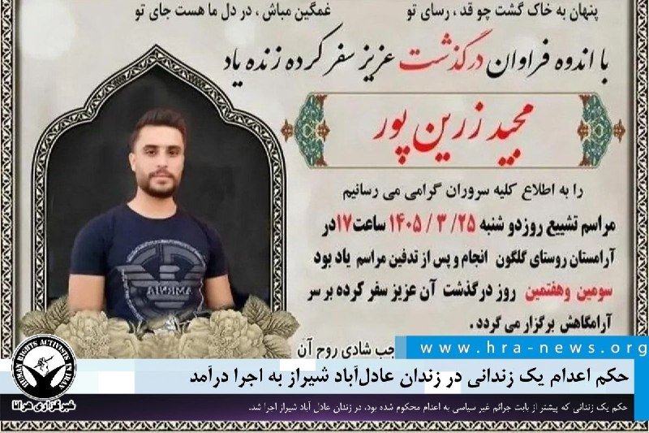

حکم اعدام یک زندانی در زندان عادل‌آباد شیراز به اجرا درآمد

❗️
❗️
❗️
❗️
❗️– سحرگاه امروز یکشنبه، حکم یک زندانی که پیشتر از بابت جرائم غیر سیاسی به #اعدام محکوم شده بود، در زندان عادل آباد شیراز اجرا شد.

به گزارش خبرگزاری هرانا، ارگان خبری مجموعه فعالان حقوق بشر در ایران، یک زندانی در زندان عادل آباد شیراز اعدام شد.

هویت این زندانی که سحرگاه امروز یکشنبه ۲۴ خرداد ۱۴۰۵ به چوبه دار آویخته شد، مجید زرین پور، توسط هرانا احراز شده است.

ادامه مطلب

#مجید_زرین_پور

↘️
@hranews_bot تماس ✉️ -  @Hranews  کانال هرانا 🆑

## alonews — post 127951

  <a href="telegram/content/alonews_127951_1781454835.webm" target="_blank">🎬 Download video</a>

🔴فوری / ترامپ به فاکس نیوز: اگر توافق امشب امضا شود، فوراً دستور لغو محاصره دریایی ایران را خواهم داد. 
✅ @AloNews خبر جنگ

## alonews — post 127950

  <a href="telegram/content/alonews_127950_1781454835.webm" target="_blank">🎬 Download video</a>

🔴فوری / ترامپ به فاکس نیوز:
اگر توافق امشب امضا شود، فوراً دستور لغو محاصره دریایی ایران را خواهم داد.

✅ @AloNews خبر جنگ

## alonews — post 127949

  <a href="telegram/content/alonews_127949_1781454835.webm" target="_blank">🎬 Download video</a>

👈ترامپ درمورد حمله اسرائیل به بیروت: واقعا من را عصبانی کرد

✅ @AloNews خبر جنگ

---
📅 بروزرسانی: 1405/03/24 19:53
---

## VahidOOnLine — post 245505

  <a href="telegram/content/VahidOOnLine_245505_1781454202.mp4" target="_blank">🎬 Download video</a>

⭕️«مرد نمیرد به مرگ»؛ روایت جاودانگی احمد ظاهر

📌در نظر بسیاری از افغان‌ها، احمد ظاهر تنها یک آوازخوان نیست، بلکه بخشی از حافظه جمعی و هویت فرهنگی افغانستان است؛ هنرمندی که آثارش در شادی‌ها، سفرها، محافل خانوادگی و حتی سال‌های مهاجرت همراه مردم بوده است

♦️احمد ظاهر آوازخوان نامدار افغانستان و ملقب به «الماس شرق»، ۲۴ خرداد ۱۳۵۸ در شاهراه سالنگ، در استان پروان افغانستان، در پی حادثه رانندگی جان باخت. بیشتر فارسی‌ زبانان جهان با نام احمد ظاهر آشنایند و پس از گذشت دهه‌ها، علاقه‌مندان به موسیقی همچنان آوازهای او را می‌شنوند.

احمد ظاهر در شاهراه سالنگ، در استان پروان، در پی حادثه رانندگی جان باخت. هرچند در تمام این سال‌ها گمانه‌زنی‌های فراوانی درباره به قتل رساندن او مطرح بوده است، اما با نبود اسناد و شواهد متقن، نمی‌توان درباره چگونگی مرگ او با قاطعیت سخن گفت.

بیشتر بخوانید...

🖌واجد روحانی
‌🇸🇦 Indypersian

🤖 @VahidOOnLine

## VahidOOnLine — post 245504

  

ارتش اسرائیل در بیانیه‌ای تایید کرد علی موسی دقدوق، از فرماندهان ارشد حزب‌الله، در حمله‌ای در جنوب رود لیتانی لبنان کشته شده است.
به گفته ارتش اسرائیل، دقدوق فرمانده پیشین «پرونده جولان» بود؛ شاخه‌ای که مسئول فعالیت‌های حزب‌الله در سوریه و ایجاد زیرساخت‌های نظامی در نزدیکی مرز اسرائیل بوده است.
ارتش اسرائیل همچنین اعلام کرد دقدوق در طول فعالیت خود سمت‌های مختلفی از جمله فرمانده تیم حفاظت حسن نصرالله، رهبر پیشین حزب‌الله، فرمانده یگان رضوان، فرمانده بخش عملیات یگان نصر و مسئول یگان پیاده‌نظام حزب‌الله را بر عهده داشته است.
‌🏁 🇬🇧 IranintlTV

🤖 @VahidOOnLine

## WithYashar — post 14837

ترامپ به باراک راوید از اکسیوس گفت:
قرار بود امروز صبح توافق را امضا کنیم، اما حمله اسرائیل به بیروت آن را به تأخیر انداخت.
@withyashar

## WithYashar — post 14836

ترامپ به آکسیوس : به او گفتم، او هیچ قضاوت درستی ندارد

وی همچنین به ناتانیاهو گفت هیچ حمله دیگری به لبنان انجام ندهد و هشدار داد که این حملات می‌تواند توافق را به خطر بیندازد.

ترامپ می‌گوید از ایران خواهد خواست که در پی حملات اسرائیل به لبنان، با حملات موشکی پاسخ ندهد.
@withyashar

## WithYashar — post 14835

ترامپ: من با نتانیاهو صحبت کردم و بهش گفتم:داری چه غلطی می‌کنی؟

@withyashar 🤣

## mwarmonitor — post 10890

🔴ترامپ: از ایران می‌خواهم موشک به اسرائیل شلیک نکند. این توافق در ساعات آینده امضا خواهد شد. کانال ۱۲ اسرائیل @mwarmonitor

## mwarmonitor — post 10889

🔴ترامپ 🔸«من با نتانیاهو، نخست‌وزیر اسرائیل صحبت کردم و بهش گفتم: "داری چه غلطی می‌کنی؟"» 🔴و اضافه می‌کند: «بی‌بی هیچ اختیار و آزادی تصمیم‌گیری‌ای ندارد.» @mwarmonitor

## mwarmonitor — post 10888

  

🔴سفیر اسرائیل در آمریکا 🔹«این علی موسی دقدوق است، یکی از فرماندهان ارشد حزب‌الله. 🔹او شخصاً مسئول یک حمله تروریستی در سال ۲۰۰۷ علیه نیروهای آمریکایی است. 🔹او توسط آمریکا زندانی شد و برای دستگیری‌اش ۵ میلیون دلار جایزه تعیین شده بود. 🔹او همچنین “پرونده جولان”…

## mwarmonitor — post 10887

🔴ترامپ 🔸«من با نتانیاهو، نخست‌وزیر اسرائیل صحبت کردم و بهش گفتم: "داری چه غلطی می‌کنی؟"» 🔴و اضافه می‌کند: «بی‌بی هیچ اختیار و آزادی تصمیم‌گیری‌ای ندارد.» @mwarmonitor

## FoxNewsTwitter — post 342959

  <a href="telegram/content/FoxNewsTwitter_342959_1781454204.mp4" target="_blank">🎬 Download video</a>

Fox News (Twitter/X)

Rainn Wilson says "The Office" probably wouldn’t be made today, telling Fox News Digital that media trends have shifted left and that cancel culture makes it difficult for edgy comedies to thrive.

## VahidOnline — post 76337

  <a href="telegram/content/VahidOnline_76337_1781454205.mp4" target="_blank">🎬 Download video</a>

ترامپ به فاکس‌نیوز گفت انتظار می‌رود ظرف دو سه ساعت آینده تفاه‌منامه امضا شود.

📡 @VahidOnline

## IranIntlTV — post 342314

  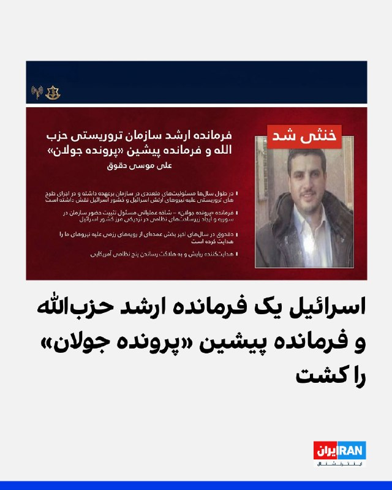

ارتش اسرائیل در بیانیه‌ای تایید کرد علی موسی دقدوق، از فرماندهان ارشد حزب‌الله، در حمله‌ای در جنوب رود لیتانی لبنان کشته شده است.
به گفته ارتش اسرائیل، دقدوق فرمانده پیشین «پرونده جولان» بود؛ شاخه‌ای که مسئول فعالیت‌های حزب‌الله در سوریه و ایجاد زیرساخت‌های نظامی در نزدیکی مرز اسرائیل بوده است.
ارتش اسرائیل همچنین اعلام کرد دقدوق در طول فعالیت خود سمت‌های مختلفی از جمله فرمانده تیم حفاظت حسن نصرالله، رهبر پیشین حزب‌الله، فرمانده یگان رضوان، فرمانده بخش عملیات یگان نصر و مسئول یگان پیاده‌نظام حزب‌الله را بر عهده داشته است.
https://iranintl.com/202606144213

## FarsiVOA — post 220700

آتشفشان فوئگو، یکی از فعال‌ترین آتشفشان‌های آمریکای مرکزی، در گواتمالا فوران کرد.

تصاویر منتشرشده، صحنه‌ای چشمگیر از فعالیت این آتشفشان فعال را نشان می‌دهد.

این کوه در جنوب‌مرکز گواتمالا و در نزدیکی شهر تاریخی آنتیگوا قرار دارد.

@FarsiVOA

## Persian_Trend_Official — post 17079

  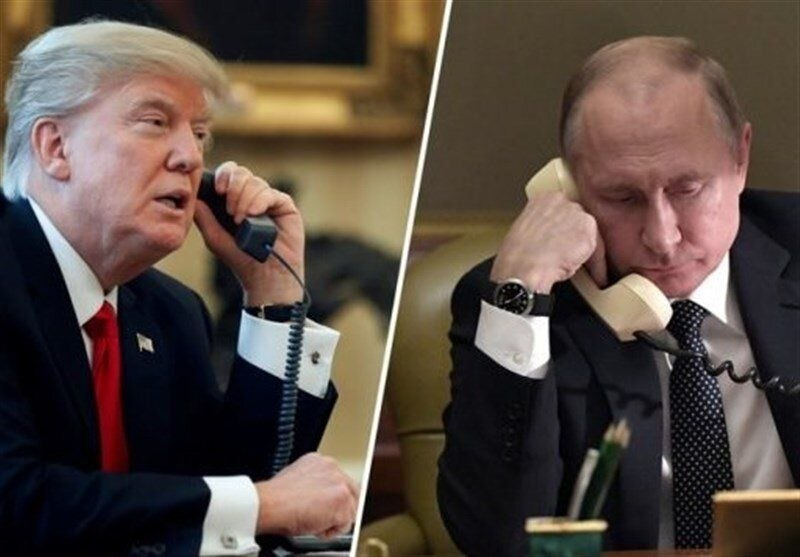

💩
🇺🇸کرملین: ولادیمیر پوتین و دونالد ترامپ توافق کردند که استیو ویتکاف و جرد کوشنر در آینده نزدیک بار دیگر به روسیه سفر کنند.

بر اساس این گزارش، ترامپ در گفت‌وگو با پوتین آمادگی خود را برای اعمال نفوذ بر کی‌یف و همچنین شرکای اروپایی واشنگتن ابراز کرده است.

👺Phantom

📌 @persian_trend_official
پرشین ترند | متفاوت‌ترین کانال نظامی

## RadioFarda — post 158297

🔸مسعود پزشکیان، رئیس‌جمهور ایران، در پی انتقادات برخی حامیان حکومت از محتوای توافق احتمالی با آمریکا، روز یکشنبه گفت که روند مذاکرات بر اساس مصوبات شورای عالی امنیت ملی و دیدگاه‌های رهبر جمهوری اسلامی پیش می‌رود. 🔸او در دیدار با مدیران رسانه‌های داخلی افزود:…

## RadioFarda — post 158296

  

🔸مسعود پزشکیان، رئیس‌جمهور ایران، در پی انتقادات برخی حامیان حکومت از محتوای توافق احتمالی با آمریکا، روز یکشنبه گفت که روند مذاکرات بر اساس مصوبات شورای عالی امنیت ملی و دیدگاه‌های رهبر جمهوری اسلامی پیش می‌رود.

🔸او در دیدار با مدیران رسانه‌های داخلی افزود: «تصمیمات راهبردی کشور باید در چارچوب سازوکارهای قانونی اتخاذ شود و همه جریان‌ها و گروه‌ها نیز خود را ملزم به تبعیت از این تصمیمات بدانند.»

🔸در آستانهٔ امضای تفاهم‌نامهٔ ایران و آمریکا برای پایان جنگ، اعتراض‌ در میان حامیان تندروی حکومت به متنی که به‌عنوان تفاهم‌نامه در برخی رسانه‌ها منتشر شد بالا گرفته و تجمعاتی نیز توسط گروهی از طرفداران جمهوری اسلامی علیه این تفاهم و مذاکره‌کنندگان برگزار شده است.

🔸در یکی از این تجمعات در تهران، تجمع‌کنندگان علیه عباس عراقچی، وزیر خارجه، و محمدباقر قالیباف، رئیس مجلس شورای اسلامی، شعارهایی سر دادند.

@RadioFarda

## BBCPersian — post 283805

  <a href="telegram/content/BBCPersian_283805_1781454207.mp4" target="_blank">🎬 Download video</a>

‏⚽️موضوع پرچم ایران در جریان مسابقات جام جهانی ۲۰۲۶ به مناقشه‌ای داغ میان مقامات جمهوری اسلامی، چهره‌های مخالف و فیفا تبدیل شده است.

‏مهدی تاج، رئیس فدراسیون فوتبال ایران امروز با تاکید بر مسئولیت فیفا بر رعایت پروتکل‌ها از جمله پرچم رسمی ایران، درباره کارشکنی آمریکا ابراز نگرانی کرد.

‏فیفا پیشتر ورود پرچم‌های غیررسمی به ورزشگاه‌ها را ممنوع اعلام کرده بود. با این‌حال مخالفان جمهوری اسلامی برای تجمع با پرچم شیروخورشیدنشان در مقابل هتل محل اقامت تیم ملی در لس‌‌آنجلس یا استفاده از موبایل برای نمایش دیجیتالی این پرچم در ورزشگاه برنامه‌هایی اعلام کرده‌اند.

‏شاهزاده رضا پهلوی در آستانه نخستین مسابقه تیم ملی در اظهارنظری واکنش‌برانگیز در حساب ایکس خود نوشت: «تیم واقعی ایران، مردم شجاع ایران‌اند؛ نه نمایندگان رژیم جنایتکار و اشغالگر ایران.»

‏بااینحال بیانیه‌ای صوتی از سوی گروهی از زندانیان سیاسی پادشاهی‌خواه منتشر شده است که در آن ضمن آرزوی موفقیت برای تیم ملی ایران، از آنها و تماشاگران خواسته شده است تا به جای پرچم کنونی، «پرچم شیروخورشیدنشان را به اهتزاز درآوردند.»
@bbcpersian

## Dirty_Kids — post 392022

  <a href="telegram/content/Dirty_Kids_392022_1781454209.mp4" target="_blank">🎬 Download video</a>

خوب پس که ورود پرچم شیر و خورشید به استادیوم رو ممنوع میکنید؟

@Dirty_Kids 👻

## Dirty_Kids — post 392021

  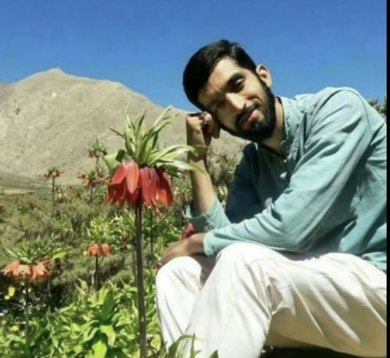

هم سرش رفت
هم زنش رفت
هم حجاب رفت
هم حرم رفت
هم بشار رفت
هم حسن نصرالاغ رفت
هم خامنه‌ای رفت
هم هسته‌ای رفت
هم شاشیدن تو ایدئولوژی مقاومت
هم تسلیم قاتل رهبرشون شدن
شیعه تا ابد لوزر

@Dirty_Kids 👻

## Dirty_Kids — post 392020

⚡️ جام جهانی شروع شده و میدون مال توئه! 
🌟 این #جام_جهانی رو فقط باید توی #بت فیدو پیش‌بینی کنی 
💰 با ۵۰ میلیون تومان شرط روزانه ← ۴ میلیون تومان اعتبار شرط‌بندی رایگان 
📊 با ۱۰۰ میلیون تومان شرط روزانه ← ۸ میلیون تومان اعتبار شرط‌بندی رایگان میدونستی با انتخاب…

## Dirty_Kids — post 392019

  <a href="telegram/content/Dirty_Kids_392019_1781454211.webm" target="_blank">🎬 Download video</a>

⚡️ جام جهانی شروع شده و میدون مال توئه!

🌟 این #جام_جهانی رو فقط باید توی #بت فیدو پیش‌بینی کنی

💰 با ۵۰ میلیون تومان شرط روزانه ← ۴ میلیون تومان اعتبار شرط‌بندی رایگان

📊 با ۱۰۰ میلیون تومان شرط روزانه ← ۸ میلیون تومان اعتبار شرط‌بندی رایگان

میدونستی با انتخاب برد هلند مقابل ژاپن با پنج میلیون به راحتی ده میلیون تومن برنده میشی؟!😮
💵
💵
🇯🇵
🇳🇱

💸 هرچی بزرگ‌تر بازی کنی، جایزت بزرگ‌تره!

🥅همین حالا پیش بینیتو ثبت کن
💖
https://fido874vt.click
https://fido874vt.click

👆
👆
👆
👆
👆
(ورود با وی-پی-ان غیر اروپایی)
❌
G24

📲کانال تلگرام 
👇
https://t.me/+dySI_QFj0T0xZGVk

## alonews — post 127948

  <a href="telegram/content/alonews_127948_1781454211.webm" target="_blank">🎬 Download video</a>

👈پزشکیان: من پیش‌تر هم گفته‌ام و امروز مجدداً تأکید می‌کنم که متأسفم کشورهای همسایه در معرض پیامدهای اقدامات نظامی قرار گرفته‌اند.

🔴البته عملیات ما به پایگاه‌های آمریکا در خاک این کشورها هدف قرار داده شد

✅ @AloNews خبر جنگ

## alonews — post 127947

  <a href="telegram/content/alonews_127947_1781454212.webm" target="_blank">🎬 Download video</a>

👈ترامپ می‌گوید از ایران خواهد خواست که در پی حملات اسرائیل به لبنان، با حملات موشکی پاسخ ندهد.

✅ @AloNews خبر جنگ

## alonews — post 127946

  <a href="telegram/content/alonews_127946_1781454212.webm" target="_blank">🎬 Download video</a>

👈ترامپ پس از حمله به لبنان با نتانیاهو تماس گرفت و به او گفت: «داری چیکار می‌کنی؟!» 
🔴ترامپ به نتانیاهو گفت که هیچ حمله دیگری به لبنان انجام ندهد و هشدار داد که این حملات می‌تواند توافق را به خطر بیندازد. 
✅ @AloNews خبر جنگ

## alonews — post 127945

  <a href="telegram/content/alonews_127945_1781454212.webm" target="_blank">🎬 Download video</a>

👈ترامپ پس از حمله به لبنان با نتانیاهو تماس گرفت و به او گفت: «داری چیکار می‌کنی؟!»

🔴ترامپ به نتانیاهو گفت که هیچ حمله دیگری به لبنان انجام ندهد و هشدار داد که این حملات می‌تواند توافق را به خطر بیندازد.

✅ @AloNews خبر جنگ

## alonews — post 127944

  <a href="telegram/content/alonews_127944_1781454212.webm" target="_blank">🎬 Download video</a>

👈ترامپ به اکسیوس : ما قرار بود امروز صبح این توافق رو امضا کنیم و حمله اسرائیل به بیروت این کار رو به تأخیر انداخت

🔴فکر می‌کنم امضا هنوز امروز کو چند ساعت آینده انجام شه

✅ @AloNews خبر جنگ

---
📅 بروزرسانی: 1405/03/24 19:43
---

## VahidOOnLine — post 245503

  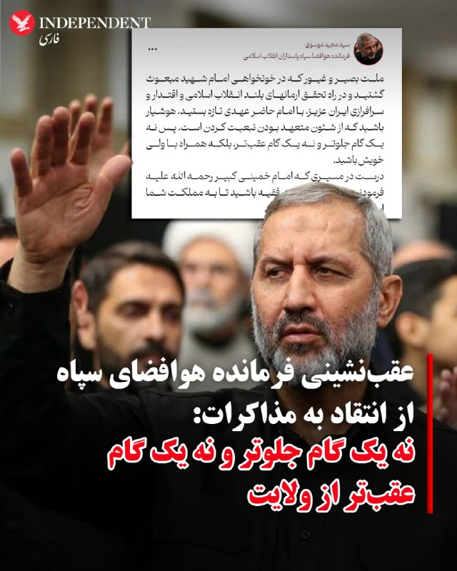

♦️مجید موسوی، فرمانده نیروی هوافضای سپاه پاسداران، روز یکشنبه ۲۴ خرداد در پیامی از حامیان حکومت خواست «گوش به فرمان ولایت» باشند و از هر سخنی که اتحاد را به خطر می‌اندازد، دوری کنند.
موسوی نوشت: «هوشیار باشید که از شئون متعهد بودن تبعیت کردن است. پس نه یک گام جلوتر و نه یک گام عقب‌تر، بلکه همراه با ولی خویش باشید.»
این اظهارات دو روز پس از آن مطرح می‌شود که موسوی با بازنشر پیام عباس عراقچی در شبکه اجتماعی ایکس، نسبت به علنی نشدن جزئیات تفاهم‌نامه احتمالی میان تهران و واشنگتن اعتراض کرده بود.
پیام جدید فرمانده هوافضای سپاه ساعاتی پس از آن منتشر شد که مسعود پزشکیان، رئیس‌جمهوری ایران، از تلاش برخی جریان‌ها برای اعمال فشار بر روند تصمیم‌گیری انتقاد کرد و گفت: «تصمیم‌گیری درباره جنگ و مذاکره بر عهده شورای عالی امنیت ملی است؛ شورایی که نمایندگان تمامی ارکان حاکمیت از جمله رهبری عالیقدر در آن حضور دارند و سیاست‌های کلان باید از آن مسیر ابلاغ شود
‌🇸🇦 Indypersian

🤖 @VahidOOnLine

## WithYashar — post 14834

کرملین: پوتین و ترامپ درباره ایران و اوکراین گفتگو کردند
@withyashar

## mwarmonitor — post 10886

🔴ترامپ

🔸«من با نتانیاهو، نخست‌وزیر اسرائیل صحبت کردم و بهش گفتم: "داری چه غلطی می‌کنی؟"»

@mwarmonitor

## FoxNewsTwitter — post 342958

  <a href="telegram/content/FoxNewsTwitter_342958_1781453606.mp4" target="_blank">🎬 Download video</a>

Fox News (Twitter/X)

"It is the honor of a lifetime to serve under you."

Secretary of War Pete Hegseth celebrates President Trump's birthday with a special video from our nation's military.

## pm_afshaa — post 93924

  <a href="telegram/content/pm_afshaa_93924_1781453608.webm" target="_blank">🎬 Download video</a>

🔴سعید جلیلی برکنار شد. سردار عظیم ابراهیم پور، فرمانده قرارگاه پیشرفت سپاه رسما اعلام کرد که باقری کنی جایگزین سعید جلیلی تو شعام شده. 
💧 Rainbet.com the #1 Non-KYC Crypto Casino & Sportsbook @rainbetcom 
😁 @Pm_Afshaa

## pm_afshaa — post 93923

  <a href="telegram/content/pm_afshaa_93923_1781453608.webm" target="_blank">🎬 Download video</a>

🔴سعید جلیلی برکنار شد.

سردار عظیم ابراهیم پور، فرمانده قرارگاه پیشرفت سپاه رسما اعلام کرد که باقری کنی جایگزین سعید جلیلی تو شعام شده.

💧 Rainbet.com the #1 Non-KYC Crypto Casino & Sportsbook @rainbetcom

😁 @Pm_Afshaa

## kianmeli1 — post 87990

  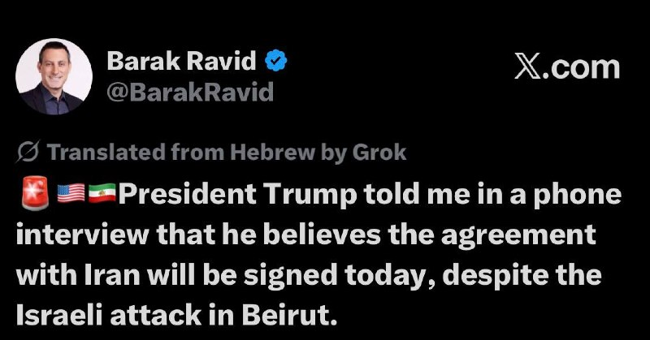

🔴باراک راوید
رئیس جمهور ترامپ در یک مصاحبه تلفنی به من گفت که معتقد است علیرغم حمله اسرائیل به بیروت، توافق با ایران امروز امضا خواهد شد.
https://t.me/kianmeli1

## idfinfarsi — post 11847

  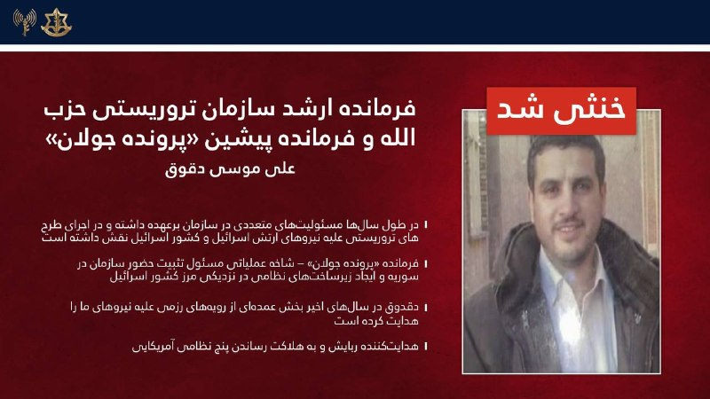

❌در پایان هفته گذشته: ارتش اسرائیل علی موسى دقدوق — یکی از فرماندهان ارشد سازمان تروریستی حزب‌الله و فرمانده پیشین «پرونده جولان» — را در جنوب لیتانی به هلاکت رساند

⭕️ارتش اسرائیل در پایان هفته (جمعه) در جنوب لبنان حمله کرد و تروریست علی موسى دقدوق — فرمانده ارشد در سازمان تروریستی حزب‌الله — را به هلاکت رساند.

⭕️دقدوق در طول خدمت خود در سازمان، مسئولیت‌های متعددی بر عهده داشت و به عنوان یک منبع کلیدی دانش با تجربه عملیاتی بالا شناخته می‌شد. او در سال‌های اخیر در اجرای طرح‌های تروریستی و نبرد علیه نیروهای ارتش اسرائیل و کشور اسرائیل نقش داشته است.

⭕️از جمله مسئولیت‌های او:
- فرمانده تیم حفاظت رهبر سازمان تروریستی حزب‌الله که به هلاکت رسید، حسن نصرالله
- فرمانده در یگان «رضوان»
- فرمانده در بخش عملیات یگان «نصر»
- مسئول یگان پیاده‌نظام در حزب‌الله
- فرمانده «پرونده جولان» — شاخه عملیاتی مسئول استقرار سازمان در سوریه و ایجاد زیرساخت‌های نظامی در نزدیکی مرز کشور اسرائیل؛ این یگان توسط ارتش اسرائیل در سال ۲۰۱۹ افشا شد

⭕️دقدوق در سال‌های اخیر بخش قابل توجهی از طرح‌های عملیاتی علیه نیروهای ما را هدایت می‌کرد. در سال ۲۰۰۷ توسط نیروهای آمریکایی بازداشت شد، پس از آنکه در ربایش و اجرای قتل پنج سرباز آمریکایی نقش داشت.

⭕️این اقدام، حذف قابل توجه یک فرمانده ارشد دیگر در حزب‌الله و بستن یک حلقه مهم در برابر یکی از مجریان اصلی اقدامات تروریستی علیه شهروندان کشور اسرائیل، نیروهای ارتش اسرائیل و همچنین سربازان آمریکایی به شمار می‌رود.

⭕️ارتش اسرائیل به هدف قرار دادن فرماندهان سازمان تروریستی حزب‌الله ادامه خواهد داد.

## alonews — post 127939

  <a href="telegram/content/alonews_127939_1781453610.webm" target="_blank">🎬 Download video</a>

👈کرملین: ترامپ در گفتگوی خود با پوتین، تمایل خود را برای اعمال نفوذ بر کی‌یف و شرکای اروپایی واشنگتن ابراز داشت.

🔴پوتین و ترامپ توافق کردند که استیو ویتکاف و جرد کوشنر در آینده نزدیک دوباره به روسیه سفر کنند

✅ @AloNews خبر جنگ

---
📅 بروزرسانی: 1405/03/24 19:33
---

## VahidOOnLine — post 245502

  <a href="telegram/content/VahidOOnLine_245502_1781453006.mp4" target="_blank">🎬 Download video</a>

ویدیوهای رسیده به ایران‌اینترنشنال نشان می‌دهند گروهی از ایرانیان مقیم آلمان یکشنبه ۲۴ خرداد با فراخوان شاهزاده رضا پهلوی و علیه جمهوری اسلامی در شهر کلن تجمع کردند.
‌🏁 🇬🇧 IranintlTV

🤖 @VahidOOnLine

## WithYashar — post 14833

بنیامین نتانیاهو، نخست‌وزیر اسرائیل، در تماس اخیر با رئیس‌جمهور ترامپ گفت که اسرائیل با عقب‌نشینی کامل از جنوب لبنان، از جمله پنج نقطه‌ای که در حال حاضر توسط نیروهای دفاعی اسرائیل (IDF) در اختیار است، موافقت نخواهد کرد، طبق گزارش معاریو.

نتانیاهو همچنین عقب‌نشینی از خاک سوریه را که اسرائیل از زمان سقوط بشار اسد اشغال کرده است، رد کرد
@withyashar

## pm_afshaa — post 93922

  <a href="telegram/content/pm_afshaa_93922_1781453007.webm" target="_blank">🎬 Download video</a>

🔴روزنامه اسرائیلی معاریو:
نتانیاهو در تماس با ترامپ، هرگونه عقب‌نشینی اسرائیل از جنوب لبنان، از جمله 5 نقطه تحت کنترل ارتش اسرائیل رو رد کرده.

همچنین با عقب‌نشینی از مناطق اشغالی سوریه پس از سقوط بشار اسد هم مخالفت کرده.

💧 Rainbet.com the #1 Non-KYC Crypto Casino & Sportsbook @rainbetcom

😁 @Pm_Afshaa

## VahidOnline — post 76336

  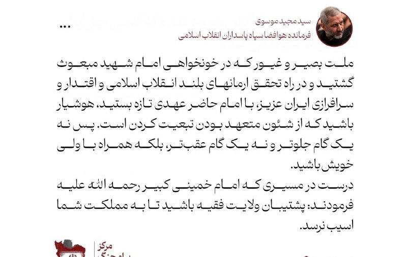

مجید موسوی، فرمانده نیروی هوافضای سپاه پاسداران، در پیامی از حامیان جمهوری اسلامی خواست در مسیر تحقق آرمان‌های نظام، از مجتبی خامنه‌ای تبعیت کنند.
او نوشت: «ملت بصیر و غیور که در خونخواهی علی خامنه‌ای مبعوث شدید و در راه تحقق آرمان‌های بلند انقلاب اسلامی با مجتبی خامنه‌ای عهدی تازه بستید، هوشیار باشید که از شئون متعهد بودن، تبعیت کردن است.»
@VahidOOnLine

📡 @VahidOnline

## IranIntlTV — post 342312

  <a href="telegram/content/IranIntlTV_342312_1781453008.mp4" target="_blank">🎬 Download video</a>

ویدیوهای رسیده به ایران‌اینترنشنال نشان می‌دهند گروهی از ایرانیان مقیم آلمان یکشنبه ۲۴ خرداد با فراخوان شاهزاده رضا پهلوی و علیه جمهوری اسلامی در شهر کلن تجمع کردند.

## IranIntlTV — post 342311

  <a href="telegram/content/IranIntlTV_342311_1781453010.mp4" target="_blank">🎬 Download video</a>

🔻تیم ملی فوتبال بدون حضور رییس، نایب‌رییس و دبیرکل فدراسیون، برای بازی با نیوزیلند راهی لس‌آنجلس خواهند شد. امیر قلعه‌نویی و مهدی طارمی، سرمربی و کاپیتان تیم ملی نیز بامداد دوشنبه در نشست خبری پیش از بازی حاضر خواهند شد.

🔹توضیحات مزدک میرزایی، ایران اینترنشنال، در هت‌تریک

@iranintltvsport

## Shin_Persian — post 7060

  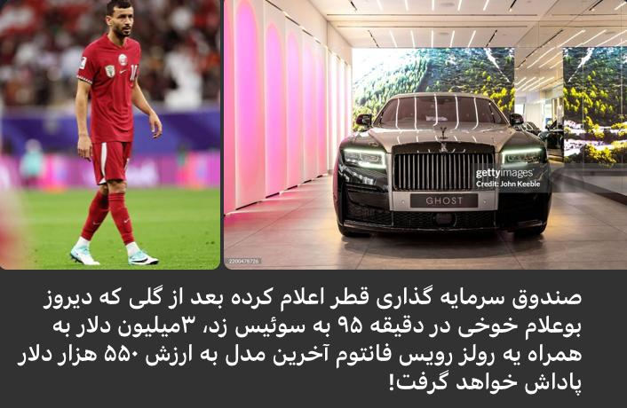

قراره یه دارکوبی هم مهمون خورشید خانم بشه

## DW_Farsi — post 125967

  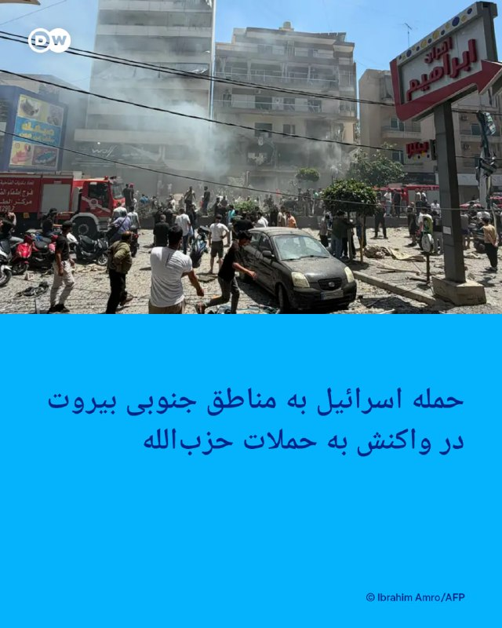

🔶 حمله اسرائیل به مناطق جنوبی بیروت در واکنش به حملات حزب‌الله

اسرائیل اعلام کرد، پس از حملات حزب‌الله که امروز یکشنبه (۱۴ ژوئن / ۲۴ خرداد) صورت گرفتند، به اهداف و مواضعی در ضاحیه واقع در حومه جنوبی بیروت، پایتخت لبنان حمله کرده است. ارتش اسرائیل شلیک سه پرتاب از سوی حزب‌الله به مناطق شمالی اسرائیل را "نقض آشکار آتش‌بس" خواند.

بنیامین نتانیاهو، نخست‌وزیر و یسرائیل کاتس، وزیر دفاع اسرائیل با انتشار بیانیه‌ای مشترک اعلام کردند که ارتش این کشور در پاسخ به حملات حزب‌الله "اهداف و مواضع متعلق به این گروه تروریستی را در محله ضاحیه در بیروت هدف قرار داده است".

حملات متقابل حزب‌الله و اسرائیل در حالی است که دونالد ترامپ، رئیس جمهور آمریکا گفته است، انتظار می‌رود توافق میان تهران و واشنگتن امروز به امضاء برسد. جمهوری اسلامی که بر توقف جنگ در لبنان به عنوان یکی از شروط توافق با آمریکا تأکید دارد، گفته است که نهایی‌شدن و امضای توافق میان طرفین در طی روزهای آتی صورت خواهد گرفت.

@dw_farsi

## Persian_Trend_Official — post 17078

  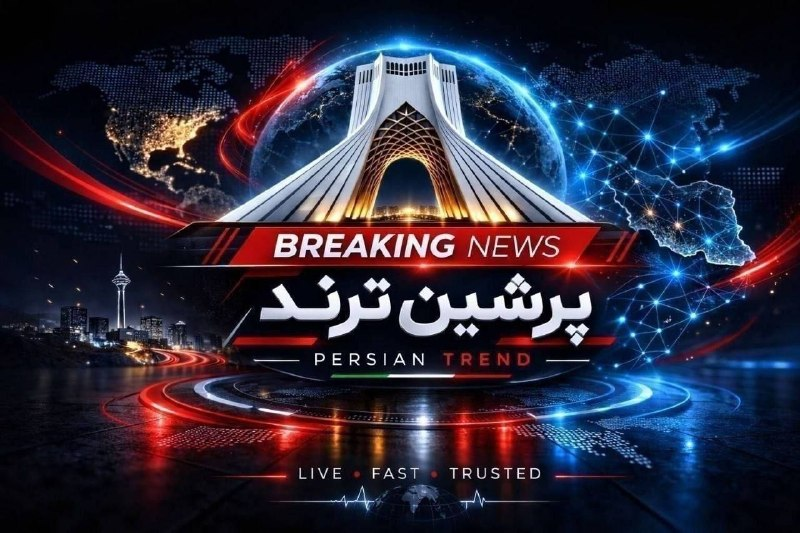

سعید جلیلی برکنار شد.

سردار عظیم ابراهیم پور، فرمانده قرارگاه پیشرفت سپاه پاسداران رسماً اعلام کرد باقری کنی جایگزین سعید جلیلی در شعام شده است.

## Hranews — post 113611

یک زندانی در زندان بجنورد اعدام شد

❗️
❗️
❗️
❗️
❗️– حکم یک زندانی که پیشتر از بابت اتهامات قتل و تجاوز به عنف به #اعدام محکوم شده بود، سحرگاه روز چهارشنبه ۲۰ خرداد ماه در زندان بجنورد به اجرا در آمد.

ادامه مطلب

#بهاءالدین_وحیدی

↘️
@hranews_bot تماس ✉️ -  @Hranews  کانال هرانا 🆑

## alonews — post 127937

👈یه اسپویل کنم؟ جبهه منحوس پایداری بزودی دیلیت میشه. خبر دارم که میگم😉 
✅ @AloNews خبر جنگ

## alonews — post 127936

🔴فوری/گزارشات تایید نشده از برکناری سعید جلیلی از شعام و جایگزینی باقری کنی با وی حکایت دارد

✅ @AloNews خبر جنگ

## alonews — post 127935

👈فارن افرز: داشتن سلاح هسته‌ای دیگر برای جلوگیری از حملات نظامی دردناک توسط دشمنان کافی نیست

✅ @AloNews خبر جنگ

## alonews — post 127934

👈پوتین با ترامپ صحبت کرد و تولد ۸۰ سالگیش رو تبریک گفت

✅ @AloNews خبر جنگ

---
📅 بروزرسانی: 1405/03/24 19:23
---

## VahidOOnLine — post 245501

  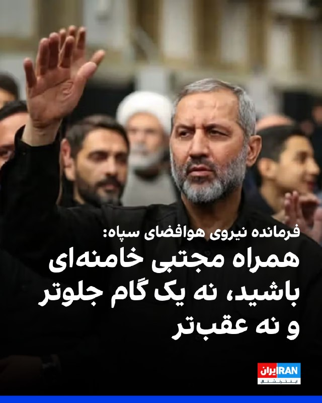

مجید موسوی، فرمانده نیروی هوافضای سپاه پاسداران، در پیامی از حامیان جمهوری اسلامی خواست در مسیر تحقق آرمان‌های نظام، از مجتبی خامنه‌ای تبعیت کنند.
او نوشت: «ملت بصیر و غیور که در خونخواهی علی خامنه‌ای مبعوث شدید و در راه تحقق آرمان‌های بلند انقلاب اسلامی با مجتبی خامنه‌ای عهدی تازه بستید، هوشیار باشید که از شئون متعهد بودن، تبعیت کردن است.»
‌🏁 🇬🇧 IranintlTV

🤖 @VahidOOnLine

## mwarmonitor — post 10885

🔴روزنامه اسرائیلی معاریو به نقل از منابع آگاه گزارش داد که بنیامین نتانیاهو در تماس اخیر خود با دونالد ترامپ هرگونه عقب‌نشینی اسرائیل از سراسر جنوب لبنان ــ از جمله پنج نقطه‌ای که در اختیار ارتش اسرائیل (IDF) است ــ را رد کرده است.

🔸به گفته این منابع، نتانیاهو همچنین از عقب‌نشینی از اراضی اشغالی سوریه که پس از سقوط بشار اسد تصرف شده‌اند، خودداری کرده است.

@mwarmonitor

## FoxNewsTwitter — post 342957

  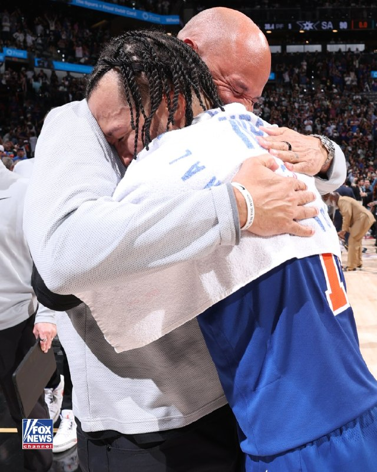

Fox News (Twitter/X)

Jalen Brunson hugs his father after leading the Knicks past the Spurs to win the NBA championship.

Knicks assistant coach Rick Brunson witnessed his son make history 27 years after reaching the NBA Finals as a player himself.

## IranIntlTV — post 342310

  

مجید موسوی، فرمانده نیروی هوافضای سپاه پاسداران، در پیامی از حامیان جمهوری اسلامی خواست در مسیر تحقق آرمان‌های نظام، از مجتبی خامنه‌ای تبعیت کنند.
او نوشت: «ملت بصیر و غیور که در خونخواهی علی خامنه‌ای مبعوث شدید و در راه تحقق آرمان‌های بلند انقلاب اسلامی با مجتبی خامنه‌ای عهدی تازه بستید، هوشیار باشید که از شئون متعهد بودن، تبعیت کردن است.»
https://iranintl.com/202606141119

## FarsiVOA — post 220699

🔺بی‌خبری از زرتشت احمدی راغب پس از انتشار پیام صوتی از زندان مرکزی کرج

◾️زرتشت احمدی راغب، زندانی سیاسی در زندان مرکزی کرج، در پیامی صوتی به مناسبت سالگرد انتشار «بیانیه ۱۴»، بر ضرورت آزادی زندانیان سیاسی، صلح، برگزاری انتخابات آزاد، تدوین قانون اساسی جدید، و پایان دادن به چرخه سرکوب و استبداد در ایران تأکید کرد.

⬇️ بیشتر بخوانید:

https://ir.voanews.com/a/iran-prisoner-disappears-after-message/8160696.html

## FarsiVOA — post 220698

خلع سلاح در عراق؛ نخستین گام‌های عملی بغداد و نگرانی جمهوری اسلامی

## Persian_Trend_Official — post 17077

  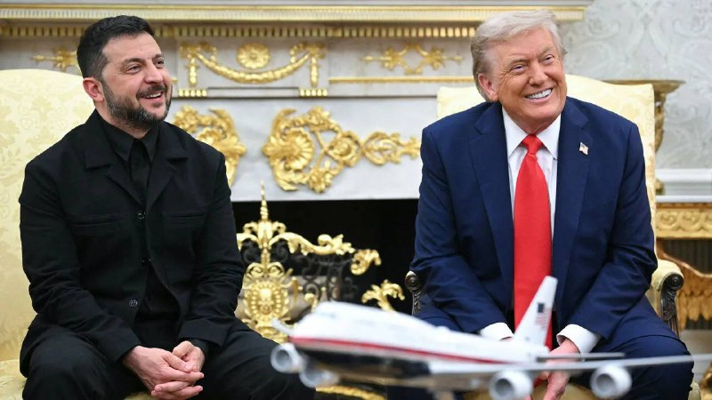

ولادیمر زلنسکی: دقایقی پیش گفت‌وگوی بسیار خوبی با دونالد ترامپ داشتم.

رئیس‌جمهور را در جریان آخرین تحولات میدان نبرد قرار دادم و توضیح دادم که مواضع ما تقویت شده است. همچنین توافق کردیم که در دیدار خود در نشست گروه هفت (G7) درباره این موضوعات بیشتر گفت‌وگو کنیم.

ایده‌های خوبی در اختیار داریم که می‌تواند به نزدیک‌تر شدن به صلح و حفظ جان انسان‌ها کمک کند.

📝 Amir

📌 @persian_trend_official
پرشین ترند | متفاوت‌ترین کانال نظامی

## Persian_Trend_Official — post 17076

  <a href="telegram/content/Persian_Trend_Official_17076_1781452417.webm" target="_blank">🎬 Download video</a>

💛گزارش الجزیره از محاصره دریایی ایران

شبکه خبری الجزیره در گزارشی به محاصره دریایی ایران توسط آمریکا پرداخته است.

👺Phantom

📌 @persian_trend_official
پرشین ترند | متفاوت‌ترین کانال نظامی

## Persian_Trend_Official — post 17075

🇮🇱 گزارش رسانه اسرائیلی از تلاش آمریکا برای جلوگیری از تشدید تنش با ایران

📰 کانال ۱۴ اسرائیل مدعی شد ایالات متحده از طریق چندین واسطه منطقه‌ای و بین‌المللی در تلاش است از هرگونه حمله احتمالی ایران به خاک اسرائیل جلوگیری کند.
🔹 بر اساس این گزارش، واشنگتن در روزهای اخیر پیام‌هایی را با هدف جلوگیری از گسترش درگیری‌ها میان تهران و تل‌آویو منتقل کرده است.
🔹 کانال ۱۴ همچنین مدعی شد اسرائیل در پاسخ به این پیام‌ها تأکید کرده است:
💬 «اگر ایران به ما حمله کند، پاسخ اسرائیل سریع و شدید خواهد بود.»
🔹 تاکنون هیچ مقام رسمی در ایران، آمریکا یا اسرائیل به این گزارش واکنش نشان نداده است.

👺Phantom

📌 @persian_trend_official
پرشین ترند | متفاوت‌ترین کانال نظامی

## BBCPersian — post 283804

اسرائیل اعلام کرد که پس از حملات امروز حزب‌الله، به اهدافی در ضاحیه در حومه جنوبی بیروت حمله کرده است.
ارتش اسرائیل گفت که حزب‌الله سه پرتابه به مناطق شمالی اسرائیل شلیک کرد که «نقض آشکار آتش‌بس» است.

گزارش نفیسه کوهنورد را ببینید.

@BBCPersian

## alonews — post 127933

  <a href="telegram/content/alonews_127933_1781452417.webm" target="_blank">🎬 Download video</a>

👈گزارش‌هایی مبنی بر بازشدن پناهگاه‌ها در سراسر کشور اسرائیل

✅ @AloNews خبر جنگ

## alonews — post 127932

  <a href="telegram/content/alonews_127932_1781452417.webm" target="_blank">🎬 Download video</a>

👈بنیامین نتانیاهو، نخست‌وزیر اسرائیل، در تماس اخیر با رئیس‌جمهور ترامپ گفت که اسرائیل با عقب‌نشینی کامل از جنوب لبنان، از جمله پنج نقطه‌ای که در حال حاضر توسط نیروهای دفاعی اسرائیل (IDF) در اختیار است، موافقت نخواهد کرد، طبق گزارش معاریو.

🔴 نتانیاهو همچنین عقب‌نشینی از خاک سوریه را که اسرائیل از زمان سقوط بشار اسد اشغال کرده است، رد کرد

✅ @AloNews خبر جنگ

## alonews — post 127931

  <a href="telegram/content/alonews_127931_1781452418.webm" target="_blank">🎬 Download video</a>

👈کانال ۱۳ اسرائیل به نقل از منابع: جلسه امروز کابینه امنیتی به دلیل نگرانی از شلیک موشک از سوی ایران در یک پناهگاه مستحکم برگزار خواهد شد.

✅ @AloNews خبر جنگ

---
📅 بروزرسانی: 1405/03/24 19:13
---

## VahidOOnLine — post 245500

  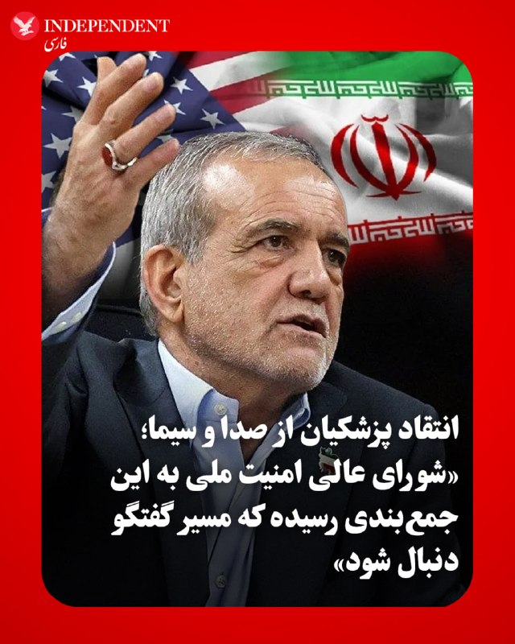

♦️مسعود پزشکیان، رئیس‌جمهوری ایران، روز یکشنبه ۲۴ خرداد گفت: «شورای عالی امنیت ملی به این جمع‌بندی رسیده است که مسیر گفتگو باید دنبال شود.»
او در ادامه با انتقاد از حملات به اعضای تیم مذاکره‌کننده گفت افرادی که در چارچوب ماموریت‌های رسمی و با هدف صیانت از منافع ملی فعالیت می‌کنند، نباید با برچسب‌هایی مانند «خیانت» یا «وطن‌فروشی» مواجه شوند و تخریب کسانی که بر اساس قانون مأموریت دارند، به دور از «انصاف و مردانگی» است.
پزشکیان در بخش دیگری از سخنانش تصریح کرد برخی اظهارات مطرح‌شده در صدا و سیما درباره جنگ و مذاکره، لزوما بازتاب‌دهنده دیدگاه شورای عالی امنیت ملی، شورای عالی دفاع یا رهنمودهای رهبر جمهوری اسلامی نیست.
رئیس‌جمهوری ایران همچنین هشدار داد که نمی‌توان خواسته‌ها و برداشت‌های شخصی را به‌عنوان مطالبه عمومی مطرح کرد و با فشار رسانه‌ای یا سیاسی درصدد تحمیل آن بر ساختار تصمیم‌گیری کشور برآمد.
انتقادهای پزشکیان در حالی مطرح می‌شود که شنبه‌شب، گروهی از حامیان جمهوری اسلامی، در آستانه امضای توافق میان تهران و واشنگتن، با متهم کردن محمدباقر قالیباف، رییس مجلس شورای اسلامی و عباس عراقچی، وزیر امور خارجه، به دادن «امتیازهای بیش از حد به آمریکا» در مذاکرات، خواستار استعفای آنها شدند. حامیان حکومت شعار «قالیباف، عراقچی، پس خون رهبرم چی؟» و «مرگ بر سازش‌گر» سر دادند.
‌🇸🇦 Indypersian

🤖 @VahidOOnLine

## VahidOOnLine — post 245499

  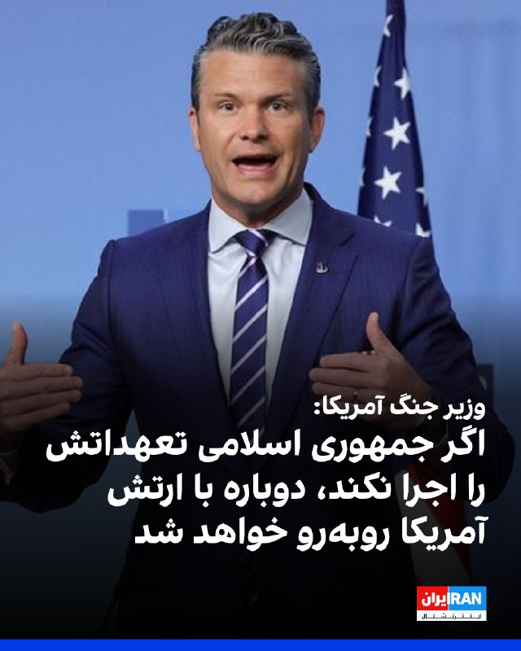

پیت هگست، وزیر جنگ آمریکا، در گفت‌وگو با شبکه سی‌بی‌اس گفت دولت دونالد ترامپ برنامه هسته‌ای جمهوری اسلامی را به‌طور جدی عقب رانده و هرگونه توافق احتمالی با تهران بر پایه نظارت، بازرسی و ارزیابی عملکرد اجرا خواهد شد.
او گفت جمهوری اسلامی باید مواد هسته‌ای مورد نظر آمریکا را از بین ببرد، از کشور خارج کند یا رقیق‌سازی کند و واشینگتن بر اجرای این روند نظارت خواهد داشت.
هگست گفت اگر جمهوری اسلامی به تعهدات خود عمل نکند، ممکن است بار دیگر با اقدام نظامی آمریکا مواجه شود.
وزیر جنگ آمریکا افزود قدرت نظامی آمریکا عامل اصلی کشاندن جمهوری اسلامی به میز مذاکره بوده و هدف نهایی این است که تهران هرگز به سلاح هسته‌ای دست پیدا نکند.
او گفت ارتش آمریکا آماده است با تمام توان از دستیابی جمهوری اسلامی به سلاح هسته‌ای جلوگیری کند.
‌🏁 🇬🇧 IranintlTV

🤖 @VahidOOnLine

## WithYashar — post 14832

شبکه ۱۴ :ایالات متحده در حال حاضر از طریق واسطه‌های مختلف تلاش می‌کند از هرگونه حمله احتمالی نیروهای نظامی ایران به اسرائیل جلوگیری کند.
@withyashar

## WithYashar — post 14831

باراک اوباما : توافق ترامپ که از ماله من زاقارت تره

باراک اوباما، رییس‌جمهوری پیشین آمریکا، در گفت‌وگو با ای‌بی‌سی نیوز گفت بعید است هر توافقی که میان آمریکا و جمهوری اسلامی حاصل شود، تفاوت چشمگیری با برجام داشته باشد یا نسبت به آن بهبود قابل توجهی محسوب شود.
اوباما با اشاره به برجام گفت این توافق بر محدود کردن برنامه هسته‌ای ایران، تعیین سقف برای غنی‌سازی اورانیوم و پذیرش بازرسی‌های آژانس بین‌المللی انرژی اتمی در ازای رفع بخشی از تحریم‌ها و آزادسازی دارایی‌های مسدودشده ایران استوار بود.
او همچنین ابراز امیدواری کرد بمباران‌ها متوقف شود و مردم عادی دیگر از پیامدهای جنگ رنج نکشند.
رییس‌جمهوری پیشین آمریکا تاکید کرد دیپلماسی را به اقدام نظامی ترجیح می‌دهد و گفت نباید تصور کرد که می‌توان با زور یا بمباران به راه‌حل دست یافت.
اوباما خواستار بررسی کامل گزینه‌های دیپلماتیک شد و گفت توافق‌هایی که همه مشکلات را حل نمی‌کنند اما ۸۰ یا ۹۰ درصد آن‌ها را برطرف می‌کنند، می‌توانند از جنگ جلوگیری کنند.
@withyashar

## mwarmonitor — post 10884

🔴«به گفته منابع آگاه که با کانال ۱۲ اسرائیل گفت‌وگو کرده‌اند، ایالات متحده آمریکا فشار سنگینی بر ایران وارد می‌کند تا در پاسخ به حملات اسرائیل به حومه جنوبی بیروت اقدام به شلیک موشک نکند.»

@mwarmonitor

## pm_afshaa — post 93921

  <a href="telegram/content/pm_afshaa_93921_1781451829.webm" target="_blank">🎬 Download video</a>

🔴کانال 12 اسرائیل: آمریکا به شدت به ایران فشار میاره که پاسخی نده!

یک مقام آمریکایی به کانال 12:
حمله اسرائیل به ضاحیه بیروت، تلاشی آشکار برای نابودی توافق است.

💧 Rainbet.com the #1 Non-KYC Crypto Casino & Sportsbook @rainbetcom

😁 @Pm_Afshaa

## pm_afshaa — post 93920

  <a href="telegram/content/pm_afshaa_93920_1781451830.webm" target="_blank">🎬 Download video</a>

🔴کابینه امنیتی اسراییل امشب جلسه خواهد داشت 
💧 Rainbet.com the #1 Non-KYC Crypto Casino & Sportsbook @rainbetcom 
😁 @Pm_Afshaa

## pm_afshaa — post 93919

🔴کابینه امنیتی اسراییل امشب جلسه خواهد داشت

💧 Rainbet.com the #1 Non-KYC Crypto Casino & Sportsbook @rainbetcom

😁 @Pm_Afshaa

## IranIntlTV — post 342309

  <a href="https://t.me/IranintlTV/342309" target="_blank">📎 Download file</a>

🎧نسخه صوتی اخبار شبانگاهی | یکشنبه ۲۴ خرداد
@iranintlTV

## IranIntlTV — post 342302

🔻دیدار تیم‌های ملی فوتبال هلند و ژاپن یکشنبه ۲۴ خرداد ۱۴۰۵، در روز چهارم جام جهانی ۲۰۲۶ یکی از مهم‌ترین مسابقات مرحله گروهی تورنمنت محسوب می‌شود.

🔹هلندی‌ها که سه بار نایب‌قهرمان جهان شده‌اند، رقابت‌های خود را برابر تیمی آغاز می‌کنند که در شگفتی‌سازی، تکراری شده‌اند.

🔹ژاپن در جام جهانی ۲۰۲۲ قطر با شکست آلمان و اسپانیا همه را شگفت‌زده کرد و حالا امیدوار است بار دیگر معادلات را بر هم بزند.

🔹هر دو تیم رویایی دست‌نیافتنی دارند؛ یکی قهرمانی و دیگری رسیدن به نیمه‌نهایی.

🔹طبق پیش‌بینی ابررایانه اوپتا، هلند با ۵۰.۲ درصد شانس پیروزی، بخت نخست این مسابقه است. احتمال برد ژاپن ۲۴.۵ درصد و شانس تساوی ۲۵.۲ درصد برآورد شده است.

🔹پیش‌بازی هلند-ژاپن را در وب‌سایت ایران اینترنشنال بخوانید.

@iranintltvsport

## IranIntlTV — post 342301

  

پیت هگست، وزیر جنگ آمریکا، در گفت‌وگو با شبکه سی‌بی‌اس گفت دولت دونالد ترامپ برنامه هسته‌ای جمهوری اسلامی را به‌طور جدی عقب رانده و هرگونه توافق احتمالی با تهران بر پایه نظارت، بازرسی و ارزیابی عملکرد اجرا خواهد شد.
او گفت جمهوری اسلامی باید مواد هسته‌ای مورد نظر آمریکا را از بین ببرد، از کشور خارج کند یا رقیق‌سازی کند و واشینگتن بر اجرای این روند نظارت خواهد داشت.
هگست گفت اگر جمهوری اسلامی به تعهدات خود عمل نکند، ممکن است بار دیگر با اقدام نظامی آمریکا مواجه شود.
وزیر جنگ آمریکا افزود قدرت نظامی آمریکا عامل اصلی کشاندن جمهوری اسلامی به میز مذاکره بوده و هدف نهایی این است که تهران هرگز به سلاح هسته‌ای دست پیدا نکند.
او گفت ارتش آمریکا آماده است با تمام توان از دستیابی جمهوری اسلامی به سلاح هسته‌ای جلوگیری کند.
https://iranintl.com/202606141348

## Shin_Persian — post 7059

  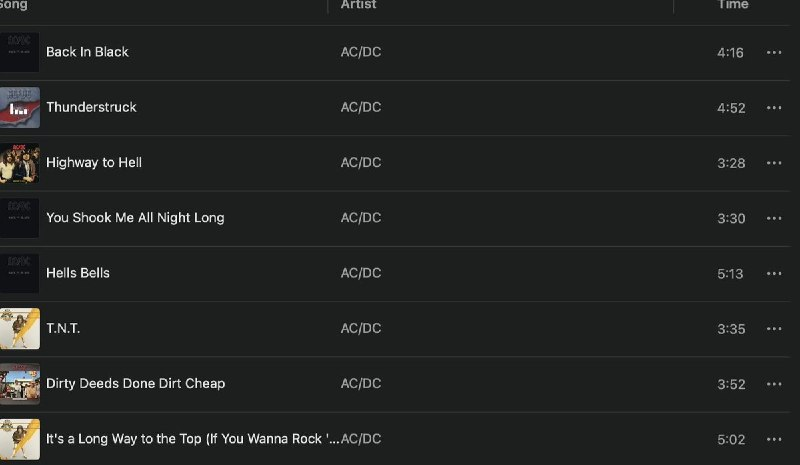

Shin ✓ @hey_itsmyturn
Sun, 14 Jun 2026 15:41:34 UTC

Upping my stamina for reporting either a deal or a missile-ful(?) night.

ترجمه خودکار فارسی

در حال افزایش استقامت خود برای گزارش دادن هستم، خواه خبر از یک توافق باشد یا شبی پر از موشک (؟).

𝕏 · @shin_persian

## FarsiVOA — post 220697

دونالد ترامپ پس از نشست جی۷ مهمان مکرون در ورسای می‌شود

## DW_Farsi — post 125966

  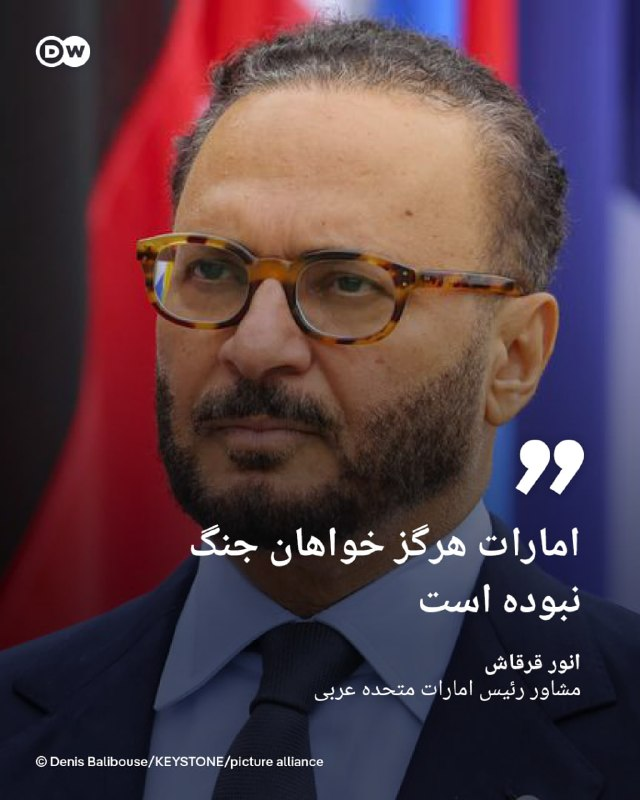

🔶انور قرقاش: امارات هرگز خواهان جنگ نبوده است

به گزارش نشریه خلیج‌تایمز أنور قرقاش، مشاور رئیس امارات متحده عربی با انتشار پستی در شبکه ایکس مدیریت بحران به رهبری این کشور در جریان تنش‌های اخیر در منطقه را ستود.

او در این رستا نوشت: «با نزدیک شدن به امضای توافق بین تهران و واشنگتن که مدت‌ها انتظار آن می‌رود و امیدواریم ورق جنگ را برگردانند و مسیر سیاسی موفقیت‌آمیزی باز کند، باید از عملکرد رهبری خردمندمان در مدیریت این بحران و پیامدهای آن تمجید کرد.»

این مقام ارشد تصریح کرد که امارات متحده همواره رویکردی مبتنی بر پرهیز از جنگ داشته و در عین حال بر حفظ امنیت و منافع ملی خود پایبند بوده است. او در این رابطه نوشت: «ما هرگز طرفدار جنگ نبوده‌ایم و همواره از صلح و ثبات حمایت کرده‌ایم، در عین حال به‌طور قاطع از حاکمیت و منافع خود دفاع می‌کنیم.»

@dw_farsi

## Persian_Trend_Official — post 17074

  <a href="telegram/content/Persian_Trend_Official_17074_1781451833.webm" target="_blank">🎬 Download video</a>

برگزاری کابینه امنیتی اسرائیل در پناهگاه‌های زیرزمینی

🌟شبکه ۱۳ تلویزیون اسرائیل از اتخاذ تدابیر امنیتی فوق‌العاده برای برگزاری نشست امشب کابینه جنگ خبر داد.

🔹به گزارش این شبکه، به دلیل افزایش تنش‌ها و احتمال پاسخ مستقیم ایران به حملات اخیر، نشست امشب کابینه امنیتی سیاسی در یکی از سایت‌های فوق‌محرمانه و مستحکم زیرزمینی برگزار خواهد شد.

👺Phantom

📌 @persian_trend_official
پرشین ترند | متفاوت‌ترین کانال نظامی

## BBCPersian — post 283803

  <a href="https://t.me/bbcpersian/283803" target="_blank">📎 Download file</a>

📻این هفته در ویژه برنامه جام ۲۶ - قسمت اول

🏆چیزی به اولین بازی تیم ملی فوتبال ایران در جام جهانی نمانده و هر چه به بازی نزدیک‌تر می‌شویم حواشی هم پر رنگ‌تر می‌شود.

تیمی که بازی‌اش در آمریکا انجام می‌شود، کشوری که با آن در جنگ است. ایرانیان هم به دلایل شرایط سیاسی چند سال اخیر نگاه‌های چند گانه‌ای به این تیم دارند. آنچه فعلا به نظر قطعی می‌رسد این است که تیم ملی ایران قصد دارد روز یکشنبه، یک روز پیش از دیدار با نیوزیلند، وارد لس‌آنجلس شود تا در برنامه‌های رسمی فیفا پیش از مسابقه، از جمله نشست خبری و تمرین رسمی تیم، شرکت کند.

شنونده و بیننده پادکست جام ۲۶ با اجرای پوریا ژافره و سام فرزانه از لس آنجلس محل دیدار اول ایران با نیوزیلند باشید.

@BBCPersian

## Dirty_Kids — post 392018

  <a href="telegram/content/Dirty_Kids_392018_1781451834.mp4" target="_blank">🎬 Download video</a>

کارشناس شبکه افق: پاکستانی‌ها برای میانجی‌گری به ایران نمی‌آیند، بلکه مرتب پیام تهدید و‌ ترور می‌آورند!

@Dirty_Kids 👻

## alonews — post 127930

  <a href="telegram/content/alonews_127930_1781451836.webm" target="_blank">🎬 Download video</a>

👈 طبق گزارش منتشر شده کانال ۱۲ جلسه کابینه اسرائیل در امنیتی ترین مقر اسرائیل برگزار شده

✅ @AloNews خبر جنگ

## alonews — post 127929

  <a href="telegram/content/alonews_127929_1781451836.webm" target="_blank">🎬 Download video</a>

👈سید مجید موسوی: گوش به فرمان ولایت باشید و از هر کلامی که اتحاد مقدس شما را به خطر می‌اندازد دوری نمایید

✅ @AloNews خبر جنگ

## alonews — post 127928

  <a href="telegram/content/alonews_127928_1781451836.webm" target="_blank">🎬 Download video</a>

👈کانال ۱۲ اسرائیل: آمریکا به شدت به ایران فشار میاورد که پاسخی ندهد!

✅ @AloNews خبر جنگ

## alonews — post 127927

  <a href="telegram/content/alonews_127927_1781451837.webm" target="_blank">🎬 Download video</a>

👈کابینه امنیتی اسرائیل امشب در مکانی مخفی تشکیل جلسه خواهد داد به گزارش یدیعوت

✅ @AloNews خبر جنگ

## alonews — post 127923

  <a href="telegram/content/alonews_127923_1781451837.webm" target="_blank">🎬 Download video</a>

👈جنگنده‌های اسرائیلی به حملات هوایی خود در جنوب لبنان ادامه می‌دهند، از جمله در شوکین، المنصوری و کفر صیر

✅ @AloNews خبر جنگ

## alonews — post 127922

  <a href="telegram/content/alonews_127922_1781451837.webm" target="_blank">🎬 Download video</a>

👈طبق گزارش کانال ۱۴ اسرائیل، ایالات متحده در حال حاضر از طریق واسطه‌های مختلف تلاش می‌کند تا از هرگونه حمله احتمالی ایران به خاک اسرائیل جلوگیری کند.

🔴پیامی که اسرائیل در پاسخ منتقل کرد: «اگر ایرانی‌ها به ما حمله کنند، ما به شدت و سریع پاسخ خواهیم داد.»

✅ @AloNews خبر جنگ

## alonews — post 127920

  <a href="telegram/content/alonews_127920_1781451837.webm" target="_blank">🎬 Download video</a>

👈حملات هوایی اسرائیل به ساختمانی در تبنین، جنوب لبنان، دقایقی پیش هدف قرار گرفت

✅ @AloNews خبر جنگ

---
📅 بروزرسانی: 1405/03/24 19:03
---

## VahidOOnLine — post 245498

  

پیت هگست، وزیر دفاع آمریکا، در گفت‌وگو با شبکه سی‌بی‌اس گفت دولت دونالد ترامپ برنامه هسته‌ای جمهوری اسلامی را به‌طور جدی عقب رانده و هرگونه توافق احتمالی با تهران بر پایه نظارت، بازرسی و ارزیابی عملکرد اجرا خواهد شد.
او گفت جمهوری اسلامی باید مواد هسته‌ای مورد نظر آمریکا را از بین ببرد، از کشور خارج کند یا رقیق‌سازی کند و واشینگتن بر اجرای این روند نظارت خواهد داشت.
هگست گفت اگر جمهوری اسلامی به تعهدات خود عمل نکند، ممکن است بار دیگر با اقدام نظامی آمریکا مواجه شود.
وزیر دفاع آمریکا افزود قدرت نظامی آمریکا عامل اصلی کشاندن جمهوری اسلامی به میز مذاکره بوده و هدف نهایی این است که تهران هرگز به سلاح هسته‌ای دست پیدا نکند.
او گفت ارتش آمریکا آماده است با تمام توان از دستیابی جمهوری اسلامی به سلاح هسته‌ای جلوگیری کند.
‌🏁 🇬🇧 IranintlTV

🤖 @VahidOOnLine

## VahidOOnLine — post 245497

  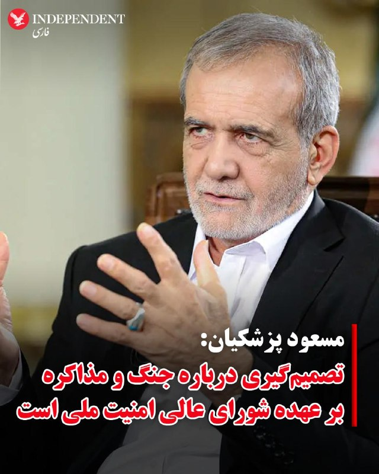

♦️مسعود پزشکیان، رئیس‌جمهوری ایران، روز یکشنبه ۲۴ خرداد در نشستی با رسانه‌ها تاکید کرد تصمیم‌گیری درباره جنگ و مذاکره بر عهده شورای عالی امنیت ملی است و سیاست‌های کلان کشور باید از مسیر این شورا ابلاغ شود.
پزشکیان گفت: «تصمیم‌گیری درباره جنگ و مذاکره بر عهده شورای عالی امنیت ملی است؛ شورایی که نمایندگان تمامی ارکان حاکمیت از جمله رهبری عالیقدر در آن حضور دارند و سیاست‌های کلان باید از آن مسیر ابلاغ شود.»
او افزود: «شورای عالی امنیت ملی به این جمع‌بندی رسیده است که مسیر گفتگو باید دنبال شود.»
رئیس‌جمهور ایران همچنین هشدار داد که نمی‌توان برداشت‌ها و خواسته‌های شخصی را به‌عنوان مطالبه عمومی مطرح کرد و با فشار رسانه‌ای یا سیاسی درصدد تحمیل آن بر ساختار تصمیم‌گیری کشور برآمد.
‌🇸🇦 Indypersian

🤖 @VahidOOnLine

## WithYashar — post 14830

رسانه‌های اسرائیلی: شهرداری‌های ایلات، تل‌آویو بزرگ، نتانیا و حیفا پناهگاه‌های عمومی را باز کرده‌اند.»
@withyashar

## FoxNewsTwitter — post 342956

  

Fox News (Twitter/X)

🇺🇸Happy Birthday to the United States Army!

Today we honor 251 years of courage, sacrifice, and unwavering service to our nation.

## pm_afshaa — post 93918

  <a href="telegram/content/pm_afshaa_93918_1781451211.webm" target="_blank">🎬 Download video</a>

🔴پزشکیان: آنچه گاها در رسانه ملی درباره جنگ و مذاکره مطرح میشه، لزوماً بازتاب‌دهنده دیدگاه شورای عالی امنیت ملی، شورای عالی دفاع یا حتی رهنمودهای رهبر انقلاب نیست.

💧 Rainbet.com the #1 Non-KYC Crypto Casino & Sportsbook @rainbetcom

😁 @Pm_Afshaa

## IranIntlTV — post 342293

🔻دیدار تیم‌های ملی فوتبال هلند و ژاپن یکشنبه ۲۴ خرداد ۱۴۰۵، در روز چهارم جام جهانی ۲۰۲۶ یکی از مهم‌ترین مسابقات مرحله گروهی تورنمنت محسوب می‌شود.

🔹هلندی‌ها که سه بار نایب‌قهرمان جهان شده‌اند، رقابت‌های خود را برابر تیمی آغاز می‌کنند که در شگفتی‌سازی، تکراری شده‌اند.

🔹ژاپن در جام جهانی ۲۰۲۲ قطر با شکست آلمان و اسپانیا همه را شگفت‌زده کرد و حالا امیدوار است بار دیگر معادلات را بر هم بزند.

🔹هر دو تیم رویایی دست‌نیافتنی دارند؛ یکی قهرمانی و دیگری رسیدن به نیمه‌نهایی.

🔹طبق پیش‌بینی ابررایانه اوپتا، هلند با ۵۰.۲ درصد شانس پیروزی، بخت نخست این مسابقه است. احتمال برد ژاپن ۲۴.۵ درصد و شانس تساوی ۲۵.۲ درصد برآورد شده است.

🔹پیش‌بازی هلند-ژاپن را در وب‌سایت ایران اینترنشنال بخوانید.

@iranintltvsport

## Shin_Persian — post 7058

Shin ✓ @hey_itsmyturn Sun, 14 Jun 2026 15:31:24 UTC Someone in IRGC-owned Fars News' discussion group: "If they sign a deal, we, value-driven people will conduct acid attacks on women without hijabs. There must be no agreement with the killer of our leader."…

## Shin_Persian — post 7057

  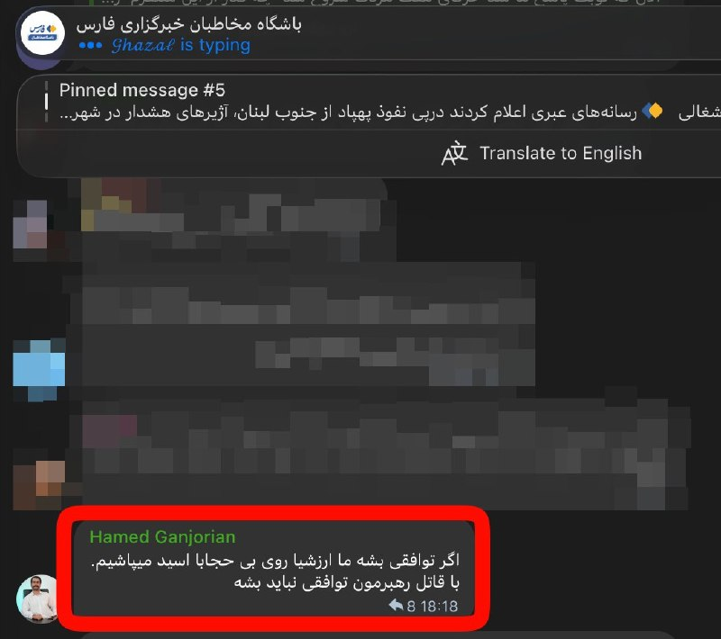

Shin ✓ @hey_itsmyturn
Sun, 14 Jun 2026 15:31:24 UTC

Someone in IRGC-owned Fars News' discussion group:

"If they sign a deal, we, value-driven people will conduct acid attacks on women without hijabs. There must be no agreement with the killer of our leader."

Here's a direct link for that very message:
https://t.me/farsna98/19202386

ترجمه خودکار فارسی

شخصی در گروه بحث خبرگزاری فارس (متعلق به سپاه پاسداران انقلاب اسلامی - IRGC):

«اگر توافقی را امضا کنند، ما ارزشی‌ها روی زنان بی‌حجاب اسیدپاشی خواهیم کرد. نباید هیچ توافقی با قاتل رهبرمان صورت بگیرد.»

این هم لینک مستقیم همان پیام:
https://t.me/farsna98/19202386

𝕏 · @shin_persian

## FarsiVOA — post 220696

انجمن مددکاران اجتماعی ایران هشدار داد با افزایش فقر، تعداد کودکان کار بیشتر شده ‌و آنها با بهره‌کشی جنسی، خشونت و سوءتغذیه مواجه‌اند

## FarsiVOA — post 220695

🔺سفیر آمریکا در سازمان ملل: ترامپ قطعا قصد دارد امروز با رژیم ایران یادداشت تفاهم امضا کند

◾️مایک والتز، سفیر آمریکا در سازمان ملل، می‌گوید دونالد ترامپ، رئیس جمهوری ایالات متحده، «قطعا قصد دارد» امروز یک یادداشت تفاهم با حکومت ایران امضا کند.

⬇️ بیشتر بخوانید:

https://ir.voanews.com/a/mike-waltz-says-president-trump-has-every-intent-to-sign-deal-with-iran-today/8160691.html

## FarsiVOA — post 220694

🔺ترامپ: به توافق صلح با حکومت ایران نزدیک شده‌ایم؛ اسرائیل و حزب‌الله به یکدیگر حمله نکنند

◾️دونالد ترامپ رئیس جمهوری آمریکا، از حمله صبح یکشنبه ۲۴ خرداد اسرائیل به بیروت انتقاد کرد و در شبکه اجتماعی تروت سوشال نوشت: «حمله صبح امروز به بیروت نباید رخ می‌داد، به‌ویژه در چنین روز مهمی که ما تا این حد به دستیابی به یک توافق صلح با [رژیم] ایران نزدیک شده‌ایم.»

⬇️ بیشتر بخوانید:

https://ir.voanews.com/a/donald-trump-iran-deal-beirut-attack-israel-agreement-with-iran/8160689.html

## DW_Farsi — post 125965

  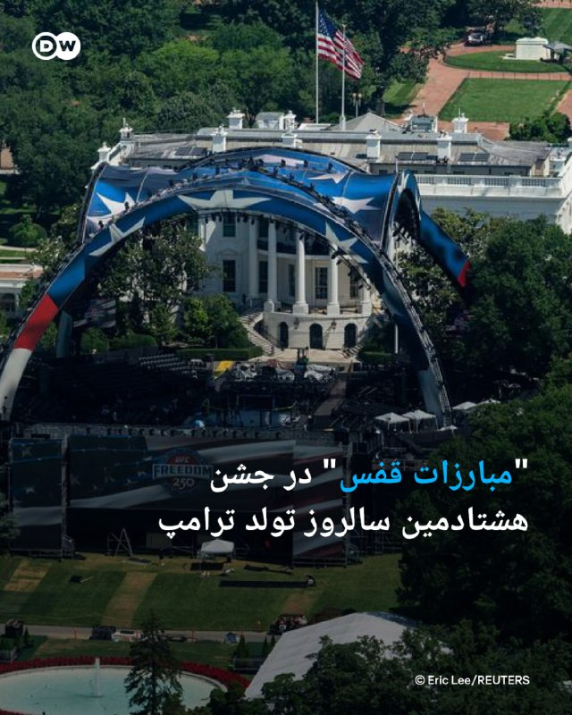

🔶 "مبارزات قفس" در جشن هشتادمین سالروز تولد ترامپ

در محوطه کاخ سفید جایگاهی برای مسابقه هنرهای رزمی برپا شده تا امروز ۱۴ ژوئن دونالد ترامپ همزمان با هشتادمین زادروز خود شاهد آن باشد. منتقدان از "نمایش خونین" سخن گفته و قصد دارند دست به اعتراض بزنند.

دونالد ترامپ، رئیس‌جمهور آمریکا، امروز ۱۴ ژوئن (۲۴ خرداد) همزمان با روز پرچم که سالروز تصویب رسمی پرچم ایالات متحده است ۸۰ ساله می‌شود و جشن بزرگی به راه می‌اندازد.

او هشتادسالگی‌اش را با تماشای مسابقه قهرمانی مبارزه نهایی (UFC) که "مبارزات قفس" نام گرفته و برای آن جایگاهی در محوطه کاخ سفید بنا شده جشن می‌گیرد.

ترامپ پیش از این با شور و اشتیاق در مورد این مسابقه گفته بود: «این بی‌نظیر است، یک رویداد یو‌اف‌سی [UFC] در چمن جنوبی!»

کاخ سفید امروز میزبان رویداد UFC در قالب برنامه "یو‌اف‌سی فریدم ۲۵۰" (UFC Freedom 250) به مناسبت ۲۵۰مین سالگرد استقلال آمریکا خواهد بود.

@dw_farsi

## Persian_Trend_Official — post 17070

ارتش اسرائیل همچنین اهدافی را در شوکن، المنصوری و کفار سیر بمباران کرد.

📝 Amir

📌 @persian_trend_official
پرشین ترند | متفاوت‌ترین کانال نظامی

## Persian_Trend_Official — post 17069

به گزارش کانال 14 اسرائیل، ایالات متحده در حال حاضر تلاش می‌کند از طریق واسطه‌های مختلف از هرگونه حمله قریب‌الوقوع ایران به خاک اسرائیل جلوگیری کند.

پیامی که اسرائیل در پاسخ ارسال کرد: اگر ایرانی‌ها به ما حمله کنند، ما به شدت و به سرعت پاسخ خواهیم داد.

📝 Amir

📌 @persian_trend_official
پرشین ترند | متفاوت‌ترین کانال نظامی

## Persian_Trend_Official — post 17067

نیروی هوایی ارتش اسرائیل دقایقی پیش هدفی را در تبنین واقع در جنوب لبنان بمباران کرد.

📝 Amir

📌 @persian_trend_official
پرشین ترند | متفاوت‌ترین کانال نظامی

## Persian_Trend_Official — post 17066

  <a href="telegram/content/Persian_Trend_Official_17066_1781451213.mp4" target="_blank">🎬 Download video</a>

مجری: اما الان با آن ذخایر سلاح‌ها (که در جنگ ایران استفاده شد) مشکلی وجود دارد؟

پیت هگست: خیر، چنین چیزی نیست. این داستانی ساختگی است که رسانه‌ها می‌خواهند آن را پخش کنند. ذخایر ما عالی هستند و فقط قوی‌تر می‌شوند.

مجری: شما در مقابل کنگره در این‌باره (که بازسازی ذخایر طول خواهد کشید) شهادت داده‌اید.

هگست: لازم نیست برایم آنچه را که شهادت داده‌ام دوباره بخوانید... من حدس زدم که برخی مهمات زمان بیشتری نسبت به بقیه می‌برند.

📝 Amir

📌 @persian_trend_official
پرشین ترند | متفاوت‌ترین کانال نظامی

## RadioFarda — post 158295

🔸یک گربه در جریان اجرای باله «رومئو و ژولیت» در شهر ازمیر ترکیه، ناگهان وارد صحنه شد.

🔸این اتفاق در صحنه پایانی نمایش و هنگام اجرای «گروه باله امپراتوری روسیه» رخ داد.

🔸ویدئوهای منتشرشده نشان می‌دهد گربه به رومئو، که در بخشی از داستان روی صحنه بی‌حرکت افتاده است، نزدیک می‌شود و با موهای او بازی می‌کند.

🔸در همان حال، ژولیت در حال اجرای صحنه سوگواری برای مرگ معشوق خود است.

🔸رقصندگان بدون وقفه به اجرای خود ادامه دادند و واکنشی به حضور این مهمان غیرمنتظره نشان ندادند.

@RadioFarda

## Dirty_Kids — post 392017

  <a href="telegram/content/Dirty_Kids_392017_1781451214.mp4" target="_blank">🎬 Download video</a>

مدارک لازم جهت اخذ انتقام رهبری ! 😂😂😂😂

@Dirty_Kids 👻

## Dirty_Kids — post 392015

  <a href="telegram/content/Dirty_Kids_392015_1781451216.mp4" target="_blank">🎬 Download video</a>

🔴 کسی که به مرد عنکبوتی یمنی معروف بود و روی صخره حرکت نمایشی اجرا میکرد، موقع اجرای نمایش افتاد ته دره و مُرد.

⚠️ حاوی صحنه دلخراش، اگه ناراحتی قلبی دارین باز نکنین.

@Dirty_Kids 👻

## alonews — post 127919

  <a href="telegram/content/alonews_127919_1781451217.webm" target="_blank">🎬 Download video</a>

👈 کانال ۱۲ اسرائیل به نقل از یک مقام آمریکایی: حمله اسرائیل به ضاحیه، تلاشی آشکار برای نابودی توافق است.

✅ @AloNews خبر جنگ

## alonews — post 127918

  <a href="telegram/content/alonews_127918_1781451217.webm" target="_blank">🎬 Download video</a>

👈پزشکیان: درحالی که برخی افراد بدون آنکه آثار تورم و دشواری‌های اقتصادی را در زندگی خود لمس کنند، صرفاً به بیان شعارها و دیدگاه‌هایی می‌پردازند که هزینه‌ای برای آنان ندارد و از سوی دیگر زندگی‌های مرفه دارند و تورم به معیشت آنان لطمه نمی‌زند

✅ @AloNews خبر جنگ

## alonews — post 127917

  <a href="telegram/content/alonews_127917_1781451217.webm" target="_blank">🎬 Download video</a>

👈واکنش پزشکیان به شایعات پیرامون استعفای وی: بنده شخصاً برای کار و تلاش و خدمتگزاری به مردم کشور هیچ تردیدی به خود راه نداده‌ام

🔴اگر به پیش از انتخابات هم بازگردیم و این باور را داشته باشم که با آمدنم می‌توانم گره‌ای از مشکلات کشور و مردم باز کنم، قطعاً بازهم خواهم آمد.

✅ @AloNews خبر جنگ

## alonews — post 127916

  <a href="telegram/content/alonews_127916_1781451217.webm" target="_blank">🎬 Download video</a>

🔴فوری/ارتش دفاعی اسرائیل گزارش داد که موشک‌های بیشتری از حزب‌الله در خاک اسرائیل، درست در جنوب مرز لبنان-اسرائیل، اصابت کرده‌اند.

🔴اسرائیل وعده داده بود که به ازای هر حمله حزب‌الله به شمال اسرائیل، بیروت را هدف قرار دهد

✅ @AloNews خبر جنگ

---
📅 بروزرسانی: 1405/03/24 18:53
---

## VahidOOnLine — post 245496

  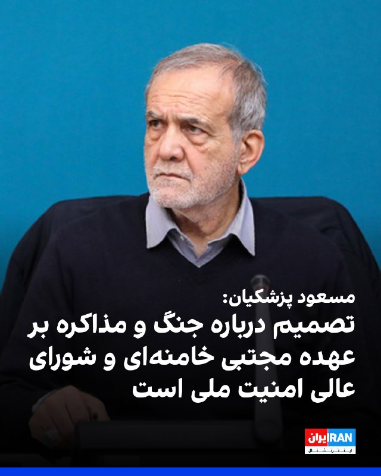

مسعود پزشکیان در نشستی با مدیران رسانه‌ها گفت تصمیم‌گیری درباره جنگ و مذاکره بر عهده مجتبی خامنه‌ای و شورای عالی امنیت ملی است و همه جریان‌ها باید خود را ملزم به تبعیت از این تصمیم‌ها بدانند.
او همچنین استفاده از برچسب‌هایی مانند «خیانت» و «وطن‌فروشی» علیه تیم مذاکره‌کننده جمهوری اسلامی را مایه تاسف خواند.
پزشکیان گفت آنچه درباره جنگ و مذاکره با آمریکا در صداوسیما مطرح می‌شود، لزوما بازتاب‌دهنده دیدگاه شورای عالی امنیت ملی، شورای عالی دفاع یا رهنمودهای مجتبی خامنه‌ای نیست.
این اظهارات در حالی مطرح می‌شود که بحث‌ها درباره تفاهم احتمالی میان تهران و واشینگتن و اختلاف‌نظرها درباره آن ادامه دارد.
‌🏁 🇬🇧 IranintlTV

🤖 @VahidOOnLine

## WithYashar — post 14829

منابع عربی : امریکا در پیامی به اسرائیل گفته امشب ایران حملات موشکی انجام خواهد داد🚨🚨
@withyashar

## mwarmonitor — post 10883

🔴رسانه‌های اسرائیلی: شهرداری‌های ایلات، تل‌آویو بزرگ، نتانیا و حیفا پناهگاه‌های عمومی را باز کرده‌اند.»

@mwarmonitor

## pm_afshaa — post 93917

  <a href="telegram/content/pm_afshaa_93917_1781450608.webm" target="_blank">🎬 Download video</a>

🔴مسعود پزشکیان: تصمیم‌گیری درباره جنگ و مذاکره بر عهده مجتبی خامنه‌ای و شورای عالی امنیت ملی است و سیاست‌های کلان باید از آن مسیر ابلاغ بشه.

شورای عالی امنیت ملی به این جمع‌بندی رسیده که مسیر گفت‌وگو باید دنبال بشه..

💧 Rainbet.com the #1 Non-KYC Crypto Casino & Sportsbook @rainbetcom

😁 @Pm_Afshaa

## pm_afshaa — post 93916

مرندی، عضو تیم مذاکره: متجاوزان صهیونیستی و قاتلان کودکان مجازات خواهند شد 
💧 Rainbet.com the #1 Non-KYC Crypto Casino & Sportsbook @rainbetcom 
😁 @Pm_Afshaa

## pm_afshaa — post 93914

  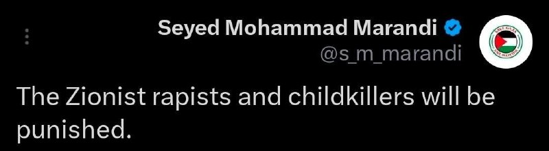

مرندی، عضو تیم مذاکره: متجاوزان صهیونیستی و قاتلان کودکان مجازات خواهند شد

💧 Rainbet.com the #1 Non-KYC Crypto Casino & Sportsbook @rainbetcom

😁 @Pm_Afshaa

## pm_afshaa — post 93913

  <a href="telegram/content/pm_afshaa_93913_1781450610.webm" target="_blank">🎬 Download video</a>

🔴سخنگوی ارتش اسرائیل: چندین پرتابه مشکوک از طرف لبنان در خاک اسرائیل نزدیک به مرز با لبنان سرنگون شد.

💧 Rainbet.com the #1 Non-KYC Crypto Casino & Sportsbook @rainbetcom

😁 @Pm_Afshaa

## IranIntlTV — post 342292

  <a href="telegram/content/IranIntlTV_342292_1781450611.mp4" target="_blank">🎬 Download video</a>

همزمان با افزایش احتمال امضای توافق بین تهران و واشینگتن، شماری از هواداران جمهوری اسلامی در تهران، مشهد و شهرهای دیگر علیه معامله با دونالد ترامپ، رییس‌جمهور آمریکا به خیابان آمدند. آن‌ها این تفاهم‌نامه را خلاف نظر مجتبی خامنه‌ای می‌دانند.

گزارشی از مجتبا پورمحسن
@iranintltv

## IranIntlTV — post 342291

  

مسعود پزشکیان در نشستی با مدیران رسانه‌ها گفت تصمیم‌گیری درباره جنگ و مذاکره بر عهده مجتبی خامنه‌ای و شورای عالی امنیت ملی است و همه جریان‌ها باید خود را ملزم به تبعیت از این تصمیم‌ها بدانند.
او همچنین استفاده از برچسب‌هایی مانند «خیانت» و «وطن‌فروشی» علیه تیم مذاکره‌کننده جمهوری اسلامی را مایه تاسف خواند.
پزشکیان گفت آنچه درباره جنگ و مذاکره با آمریکا در صداوسیما مطرح می‌شود، لزوما بازتاب‌دهنده دیدگاه شورای عالی امنیت ملی، شورای عالی دفاع یا رهنمودهای مجتبی خامنه‌ای نیست.
این اظهارات در حالی مطرح می‌شود که بحث‌ها درباره تفاهم احتمالی میان تهران و واشینگتن و اختلاف‌نظرها درباره آن ادامه دارد.
https://iranintl.com/202606146236

## FarsiVOA — post 220693

  <a href="telegram/content/FarsiVOA_220693_1781450614.mp4" target="_blank">🎬 Download video</a>

آتش شاکرمی، هنرمند و خاله نیکا شاکرمی با اشاره به سؤاستفاده جمهوری اسلامی از افشاگری‌های خود گفت: حکومت‌ها و گروه‌های سیاسی می‌آیند و می‌روند اما ایستادن پای حقیقت زمان و مکان ندارد.

## Persian_Trend_Official — post 17065

  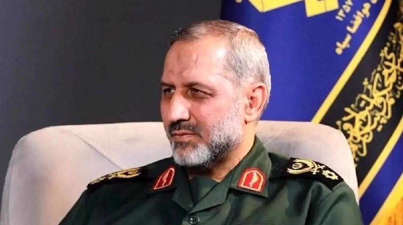

فرمانده هوافضا: گوش به فرمان ولایت باشید و از هر کلامی که اتحاد مقدس شما را به خطر می‌اندازد دوری نمایید.

سردار سید مجید موسوی: ملت بصیر و غیور که در خونخواهی امام شهید مبعوث گشتید و در راه تحقق ارمانهای بلند انقلاب اسلامی و اقتدار و سرافرازی ایران عزیز، با امام حاضر عهدی تازه بستید، هوشیار باشید که از شئون متعهد بودن تبعیت کردن است. پس نه یک گام جلوتر و نه یک گام عقب‌تر، بلکه همراه با ولی خویش باشید.

درست در مسیری که امام خمینی کبیر رحمه الله علیه فرمودند: پشتیبان ولایت فقیه باشید تا به مملکت شما اسیب نرسد.

📝 Amir

📌 @persian_trend_official
پرشین ترند | متفاوت‌ترین کانال نظامی

## IranianMinds — post 22563

  

🔴پست ترامپ، ترجمه ماشین:
حمله صبح امروز به بیروت نباید اتفاق می‌افتاد؛ به‌ویژه در روزی خاص که ما تا این اندازه به توافق صلح با ایران نزدیک هستیم. اسرائیل حق دارد از خود در برابر تهدیدها دفاع کند، اما حمله‌ای که در پاسخ به آن انجام شد بسیار کوچک و بی‌اهمیت بود؛ هیچ‌کس آسیبی ندید، زخمی نشد یا کشته نشد، و نباید این روند مهم را مختل کند.

ما به توافقی بسیار نزدیک هستیم که صلح را به منطقه، از جمله لبنان، خواهد آورد و همه طرف‌ها باید عقب‌نشینی کنند. دیگر نباید هیچ حمله‌ای از سوی اسرائیل در هیچ نقطه‌ای از لبنان انجام شود، اما همچنین نباید هیچ حمله‌ای از سوی هیچ طرف دیگری، از جمله حزب‌الله، علیه اسرائیل صورت گیرد.

این می‌تواند آغاز یک صلح طولانی و زیبا باشد — بیایید خرابش نکنیم!

از توجه شما به این موضوع سپاسگزارم.

رئیس‌جمهور دونالد جی. ترامپ

@IranianMinds

## alonews — post 127915

  <a href="telegram/content/alonews_127915_1781450615.webm" target="_blank">🎬 Download video</a>

👈سوئیس به یک همه‌پرسی که قصد داشت جمعیت این کشور را تا سال ۲۰۵۰ به ۱۰ میلیون نفر محدود کند، رای منفی داد.

🔴نتایج مقدماتی نشان داد که ۵۵ درصد به این پیشنهاد رای مخالف دادند و ۴۵ درصد آن را حمایت کردند

✅ @AloNews خبر جنگ

## alonews — post 127914

  <a href="telegram/content/alonews_127914_1781450616.webm" target="_blank">🎬 Download video</a>

👈رسانه‌های عبری اعلام کردند در پی نفوذ پهپادی از جنوب لبنان، آژیرهای هشدار در شهرک اسرائیل‌نشین «عرب العرامشه» در منطقه الجلیل غربی به صدا درآمده است

✅ @AloNews خبر جنگ

## alonews — post 127913

  <a href="telegram/content/alonews_127913_1781450616.webm" target="_blank">🎬 Download video</a>

👈پزشکیان: هیچ فرد یا جریانی نباید خود را فراتر از سازوکارهای رسمی تصمیم‌گیری بداند

🔴شورای عالی امنیت ملی به این جمع‌بندی رسیده است که مسیر گفت‌وگو باید دنبال شود

✅ @AloNews خبر جنگ

## alonews — post 127912

  <a href="telegram/content/alonews_127912_1781450616.webm" target="_blank">🎬 Download video</a>

👈معاون رئیس‌جمهور JD Vance درباره ترامپ: من فکر می‌کنم رئیس‌جمهور ترامپ در سلامت کامل است. می‌دانید، شما می‌بینید که مردم در رسانه‌ها دائماً درباره این موضوع صحبت می‌کنند. حدس می‌زنم این فقط چیزی است که رسانه‌ها قرار است درباره‌اش صحبت کنند.

🔴اما از آنچه من دیده‌ام، من واقعاً هرگز یک بار هم به خودم فکر نکرده‌ام که او استقامت یا انرژی لازم برای انجام این کار را ندارد.

🔴اگر چیزی باشد، او استقامت و انرژی بیشتری نسبت به بسیاری از افراد کابینه دارد که ۳۰ سال از او جوان‌تر هستند.

🔴و فکر می‌کنم این چیز خوبی است چون شما می‌خواهید رئیس‌جمهوری داشته باشید که قادر باشد هر روز آن سختی‌ها را تحمل کند

✅ @AloNews خبر جنگ

## alonews — post 127911

  <a href="telegram/content/alonews_127911_1781450617.webm" target="_blank">🎬 Download video</a>

👈پزشکیان: تصمیم‌گیری درباره جنگ و مذاکره بر عهده رهبری و شورای عالی امنیت ملی است

🔴همه جریان‌ها باید خود را ملزم به تبعیت از تصمیمات مبتنی بر نظر رهبر عالیقدر انقلاب بدانند.

🔴برای بنده، حفظ وحدت و انسجام جامعه از هر موضوع دیگری اهمیت بیشتری دارد. در بسیاری از موارد، با وجود امکان طرح برخی دیدگاه‌ها و مواضع، ترجیح داده‌ام از بیان آنها خودداری شود تا مبادا کوچک‌ترین آسیبی به انسجام ملی و همبستگی اجتماعی کشور وارد شود.

🔴امروز بزرگ‌ترین چالش ما، تلاش برخی برای ایجاد گسست و شکاف در درون جامعه است؛ موضوعی که دشمن نیز دقیقاً در انتظار آن است. کسانی که خود را مدافع ولایت و رهبری می‌دانند، بیش از دیگران باید به سیاست‌ها، چارچوب‌ها و تصمیمات رسمی کشور پایبند باشند

✅ @AloNews خبر جنگ

---
📅 بروزرسانی: 1405/03/24 18:43
---

## VahidOOnLine — post 245495

  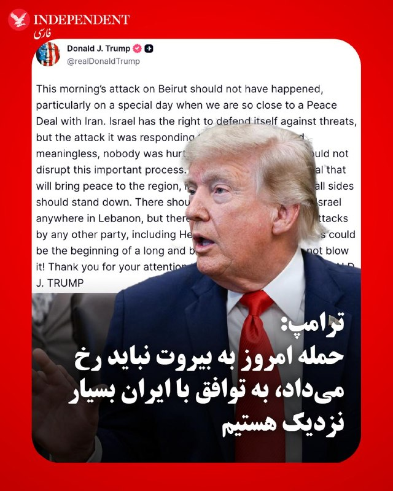

♦️دونالد ترامپ، رئیس‌جمهوری آمریکا، روز یکشنبه ۲۴ خرداد ماه در پیامی در شبکه اجتماعی تروث سوشال اعلام کرد حمله صبح یکشنبه اسرائیل به بیروت نباید انجام می‌شد، به‌ویژه در شرایطی که واشنگتن و تهران به دستیابی به یک توافق صلح نزدیک شده‌اند.

ترامپ نوشت: «اسرائیل حق دارد از خود در برابر تهدیدها دفاع کند، اما حمله‌ای که به آن پاسخ داده شد بسیار کوچک و بی‌اهمیت بود و هیچ کشته یا مجروحی بر جا نگذاشت و نباید این روند مهم را مختل کند.»

رئیس‌جمهور آمریکا تایکد کرد واشنگتن به توافقی بسیار نزدیک شده است که می‌تواند صلح را به منطقه، از جمله لبنان، بازگرداند.

او همچنین خواستار توقف حملات از سوی همه طرف‌ها شد و گفت نباید هیچ حمله دیگری از سوی اسرائیل در لبنان انجام شود و در مقابل، حزب‌الله و سایر طرف‌ها نیز نباید اسرائیل را هدف قرار دهند.

ترامپ در پایان نوشت: «این می‌تواند آغاز یک صلح طولانی و زیبا باشد؛ اجازه ندهید آن را از بین ببریم.»
‌🇸🇦 Indypersian

🤖 @VahidOOnLine

## mwarmonitor — post 10882

🔴ارتش اسرائیل (IDF) اعلام کرد:

🔸«چندین پهپاد مشکوک مدتی پیش در نزدیکی مرز با لبنان به خاک اسرائیل اصابت کردند.

🔸در این حادثه هیچ مجروحی گزارش نشده و موضوع در حال بررسی است.

🔸این “اهداف هوایی مشکوک” در هیچ‌یک از شهرها آژیر خطر را فعال نکردند.»

@mwarmonitor

## pm_afshaa — post 93912

رئیس ستاد کل ارتش اسرائیل از آغاز حمله زمینی به سمت عمق جنوب لبنان خبر داد

💧 Rainbet.com the #1 Non-KYC Crypto Casino & Sportsbook @rainbetcom

😁 @Pm_Afshaa

## pm_afshaa — post 93911

🔴بیمارستان‌های اسرائیل دستورالعملی برای آماده‌سازی در طرح اضطراری در آینده نزدیک دریافت کردن

💧 Rainbet.com the #1 Non-KYC Crypto Casino & Sportsbook @rainbetcom

😁 @Pm_Afshaa

## pm_afshaa — post 93910

  <a href="telegram/content/pm_afshaa_93910_1781450011.webm" target="_blank">🎬 Download video</a>

🔴پست جدید ترامپ:

حمله صبح امروز به بیروت نباید اتفاق میفتاد، به ویژه در روز خاصی که ما به توافق صلح با ایران بسیار نزدیک هستیم.

اسرائیل حق داره از خود دفاع کنه، اما حمله‌ای که به آن پاسخ داد بسیار کوچک و بی معنی بود، کسی آسیب ندید، مجروح یا کشته نشد و نباید این روند مهم رو مختل کنه. دیگه نباید در هیچ کجای لبنان حملاتی از سوی اسرائیل انجام بشه، اما همچنین نباید از سوی هیچ طرف دیگری از جمله حز‌ب‌الله علیه اسرائیل حمله بشه.

این میتونه آغاز یک صلح طولانی و زیبا باشه؛ بیاید آن را منفجر نکنیم!

💧 Rainbet.com the #1 Non-KYC Crypto Casino & Sportsbook @rainbetcom

😁 @Pm_Afshaa

## IranIntlTV — post 342290

🔻رویترز: تیم ملی در بازی اول جام جهانی خواهد فهمید با چه استقبالی روبه‌رو می‌شود

خبرگزاری رویترز در گزارشی درباره بازی ایران-نیوزیلند در جام جهانی ۲۰۲۶ نوشت: «فضای حاکم بر لس‌آنجلس در مراسم افتتاحیه روز جمعه در ورزشگاه سوفای لس‌آنجلس مشهود بود؛ جایی که هنگام ورود پرچم ایران به زمین، صدای هو کردن تماشاگران شنیده شد.»

تیم ملی فوتبال ایران بامداد سه‌شنبه ۲۶ خرداد ۱۴۰۵ در نخستین دیدار خود در جام جهانی ۲۰۲۶ به مصاف نیوزیلند می‌رود.

رویترز با اشاره حضور گسترده ایرانیان در لس‌آنجلس می‌نویسد: «این دیدار در منطقه‌ای برگزار خواهد شد که بزرگ‌ترین جامعه ایرانیان خارج از ایران را در خود جای داده و همین موضوع به تقابل دو تیمی که هرگز در جام جهانی برابر یکدیگر قرار نگرفته‌اند، فضایی پرتنش بخشیده است.»

رویترز با اشاره به جو افتتاحیه جام جهانی در استادیوم سوفای لس آنجلس، جایی که نخستین بازی تیم ملی برگزار می‌شود، می‌نویسد: «ایران روز بازی خواهد فهمید هنگام ورود بازیکنانش به زمین مسابقه با چه استقبالی روبه‌رو خواهد شد.»

دیدار ایران - ونزوئلا به همان اندازه که تحت تاثیر جاه‌طلبی‌های دو تیم برای دستیابی به یک موفقیت تاریخی است، از رویدادهای خارج از زمین مسابقه نیز تاثیر می‌پذیرد.

گزارش‌ها درباره پیشرفت مذاکرات با هدف پایان دادن به درگیری‌ها نیز نتوانسته از تنش‌های پیرامون تیم بکاهد. مقام‌های فوتبال ایران از فیفا انتقاد کرده‌اند؛ چرا که در اولین اقدام برای ۱۵ عضو فدراسیون فوتبال ایران ویزای سفر به جام جهانی صادر نشده است.

🔗وب‌سایت ایران‌اینترنشنال

@iranintltv

## DW_Farsi — post 125964

  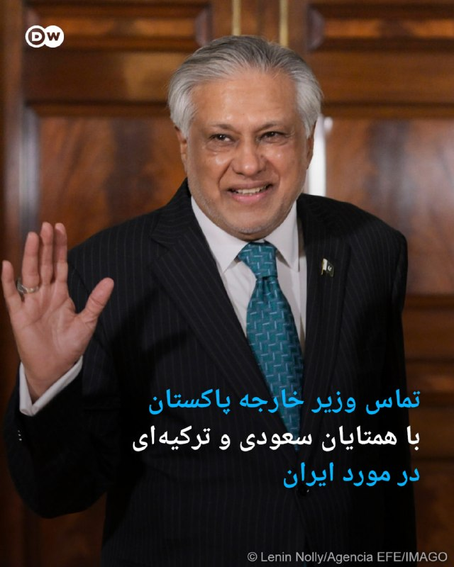

🔶 تماس وزیر خارجه پاکستان با همتایان سعودی و ترکیه‌ای در مورد ایران

به گزارش رسانه‌ای خبری محمد اسحاق دار، وزیر امور خارجه پاکستان با همتایان خود از عربستان سعودی و پاکستان تماس تلفنی داشته تا در مورد توافقی که قرار است میان تهران و واشنگتن به امضا رسد، صحبت و رایزنی کند.

اسحاق دار در تماس خود با هاکان فیدان، وزیر خارجه ترکیه از "پیشرفت‌های امیدوارکننده در راه تفاهم میان ایالات متحده و جمهوری اسلامی" استقبال و ابراز امیدواری کردن که این تحولات بتواند زمینه‌ساز صلح و ثبات پایدار در منطقه باشد.

وزارت امور خارجه پاکستان یکشنبه ۱۴ ژوئن (۲۴ خرداد) اعلام کرد که وزیر خارجه این کشور در این هفته تماس و رایزنی‌هایی با وزیران خارجه عربستان سعودی و همچنین سوئیس در ارتباط با پیشرفت‌هایی که در مذاکرات میان تهران و واشنگتن حاصل شده، داشته است.

@dw_farsi

## Persian_Trend_Official — post 17064

  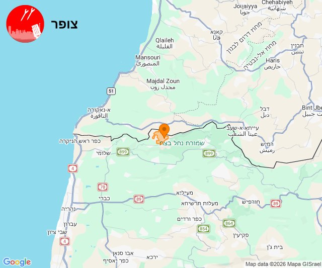

سخنگوی ارتش اسرائیل: هشدارهایی مبنی بر ورود یک هواپیمای متخاصم به منطقه عرب الارمشه فعال شد، جزئیات در حال بررسی است.

📝 Amir

📌 @persian_trend_official
پرشین ترند | متفاوت‌ترین کانال نظامی

## Persian_Trend_Official — post 17063

ارتش اسرائیل: ارتش برای شلیک موشک از سمت ایران آماده می‌شود.

ارتش اسرائیل با انتشار اطلاعیه‌ای اعلام کرد: پس از حمله به بیروت، سرلشکر ایال زامیر رئیس ستاد کل ارتش درحال انجام ارزیابی‌های مستمر وضعیت با تمامی فرماندهان مربوطه است.

براساس ارزیابی وضعیت، ارتش اسرائیل برای احتمال شلیک به‌سمت اسرائیل در ساعات آینده آماده می‌شود. ارتش در حالت آماده‌باش کامل است و برای طیف وسیعی از سناریوهای دفاعی و تهاجمی آماده است.

از عموم مردم خواسته می‌شود هوشیار باقی بمانند، مسئولانه عمل کنند و دستورالعمل‌های به‌روزشده صادر شده توسط فرماندهی جبهه داخلی را دنبال کنند.

درحال‌حاضر هیچ تغییری در دستورالعمل‌های دفاعی فرماندهی جبهه داخلی وجود ندارد. ارتش اسرائیل هرگونه شلیک به سمت اسرائیل را تحمل نخواهد کرد.

📝 Amir

📌 @persian_trend_official
پرشین ترند | متفاوت‌ترین کانال نظامی

## RadioFarda — post 158294

🔸دونالد ترامپ، رئیس‌جمهور آمریکا، روز یکشنبه با انتقاد از حمله ساعاتی پبش اسرائیل به حومه جنوبی بیروت تأکید کرد برای رسیدن به توافق با ایران، اسرائیل دیگر نباید «هیچ نقطه‌ای از لبنان» را هدف قرار دهد. 🔸او با انتشار متنی در شبکه اجتماعی تروث سوشال اعلام کرد:…

## RadioFarda — post 158293

  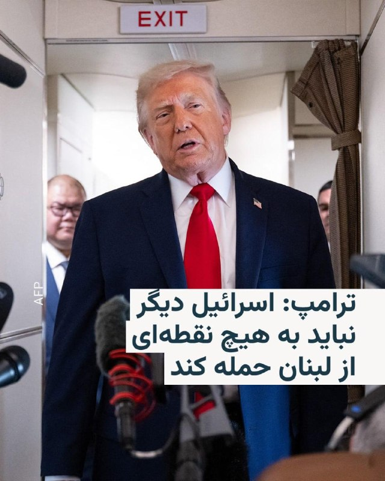

🔸دونالد ترامپ، رئیس‌جمهور آمریکا، روز یکشنبه با انتقاد از حمله ساعاتی پبش اسرائیل به حومه جنوبی بیروت تأکید کرد برای رسیدن به توافق با ایران، اسرائیل دیگر نباید «هیچ نقطه‌ای از لبنان» را هدف قرار دهد.

🔸او با انتشار متنی در شبکه اجتماعی تروث سوشال اعلام کرد: «حمله صبح امروز به بیروت نباید رخ می‌داد، به‌ویژه در چنین روز مهمی که ما تا این حد به دستیابی به یک توافق صلح با ایران نزدیک شده‌ایم.»

🔸ترامپ افزود: «اسرائیل حق دارد از خود در برابر تهدیدها دفاع کند، اما حمله‌ای که در پاسخ به آن اقدام کرد بسیار کوچک و بی‌اهمیت بود؛ هیچ‌کس در آن کشته، زخمی یا مجروح نشد و نباید این روند مهم را مختل کند.»

🔸ارتش اسرائیل گفته است در پاسخ به شلیک‌هایی از سوی حزب‌الله به خاک خود، به اهدافی از این گروه مورد حمایت جمهوری اسلامی در ضاحیه، حومه جنوبی بیروت، حمله کرد.

@RadioFarda

## Hranews — post 113610

  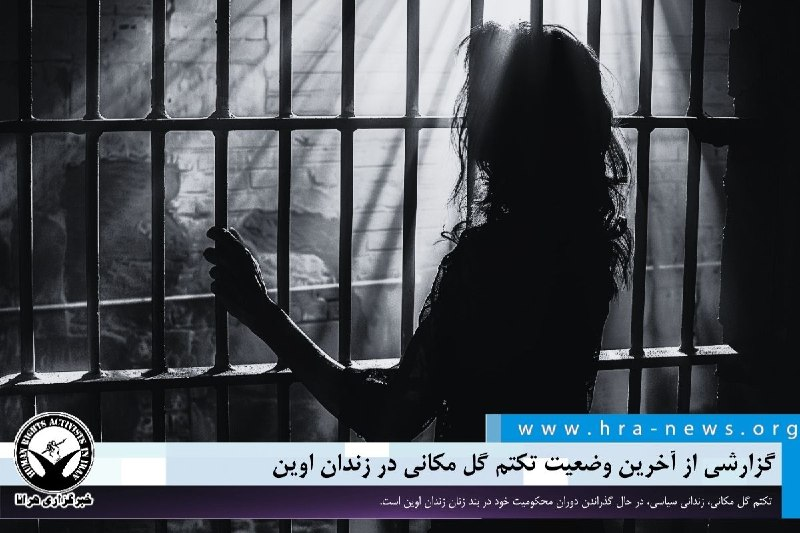

گزارشی از آخرین وضعیت تکتم گل مکانی در زندان اوین

❗️
❗️
❗️
❗️
❗️– تکتم گل مکانی، زندانی سیاسی، در حال گذراندن دوران محکومیت خود در بند زنان زندان اوین است. وی پیشتر توسط #دادگاه_انقلاب به پنج سال حبس محکوم شده بود.

به گزارش خبرگزاری هرانا، ارگان خبری مجموعه فعالان حقوق بشر در ایران، تکتم گل مکانی، دوران محکومیت حبس خود را در زندان اوین سپری می کند.

بر اساس اطلاعات دریافتی هرانا، خانم گل مکانی پس از بازداشت و تشکیل پرونده، در دادگاه انقلاب محاکمه شد. در نهایت، دادگاه مذکور او را به پنج سال حبس از بابت اتهامات سیاسی محکوم کرد.
یک منبع مطلع ضمن تایید این خبر به هرانا گفت: “بازداشت و محکومیت تکتم گل‌ مکانی در ارتباط با فعالیت‌های وی در شبکه اجتماعی ایکس (توییتر سابق) صورت گرفته است.”

ادامه مطلب

#تکتم_گل_مکانی

↘️
@hranews_bot تماس ✉️ -  @Hranews  کانال هرانا 🆑

## alonews — post 127910

  <a href="telegram/content/alonews_127910_1781450013.webm" target="_blank">🎬 Download video</a>

👈پزشکیان: آنچه گاها در رسانه ملی درباره جنگ و مذاکره مطرح می‌شود، لزوماً بازتاب‌دهنده دیدگاه شورای عالی امنیت ملی، شورای عالی دفاع یا حتی رهنمودهای رهبر معظم انقلاب نیست؛ در حالی که انتظار می‌رود رسانه ملی منعکس‌کننده سیاست‌ها و رویکردهای مراجع رسمی تصمیم‌گیری کشور باشد

✅ @AloNews خبر جنگ

## alonews — post 127909

  <a href="telegram/content/alonews_127909_1781450014.webm" target="_blank">🎬 Download video</a>

👈 طبق گفته مقامات چینی: یک شهروند آمریکایی به نام مین زین، طبق ادعاهای جاسوسی در چین دستگیر شد.

🔴سخنگوی وزارت خارجه چین، لین جیان، گفت که مین زین «به طور قانونی تحت اقدامات اجباری کیفری» قرار گرفته است به دلیل سوءظن در انجام فعالیت‌های جاسوسی که امنیت ملی چین را تهدید می‌کند.

🔴مقامات چینی جزئیات بیشتری درباره ادعاها یا تحقیقات ارائه نکردند، اما گفتند که کنسولگری عمومی ایالات متحده در گوانگژو از این پرونده مطلع شده است

✅ @AloNews خبر جنگ

## alonews — post 127908

  <a href="telegram/content/alonews_127908_1781450014.webm" target="_blank">🎬 Download video</a>

👈وزیر جنگ آمریکا: واشنگتن گزینه نظامی را در طول ۶۰ روز مذاکرات حفظ خواهد کرد و تا زمانی که لازم باشد فشار بر ایران را ادامه خواهد داد

✅ @AloNews خبر جنگ

## alonews — post 127907

  <a href="telegram/content/alonews_127907_1781450014.mp4" target="_blank">🎬 Download video</a>

👈هگِست : پروژه آزادی هیچ‌وقت متوقف نشده؛ ما تا حالا ۱۲۵ میلیون بشکه نفت رو از تنگه عبور دادیم، ایران هم هیچ کاری نتونست بکنه

✅ @AloNews خبر جنگ

## alonews — post 127906

  <a href="telegram/content/alonews_127906_1781450015.webm" target="_blank">🎬 Download video</a>

👈هگست درباره توافق ایران: تا جایی که می‌دانم، ما در مسیر امضای توافق هستیم. مسئله این است که کی، نه اینکه آیا.

🔴اسرائیل در پاسخ به حزب‌الله بسیار محتاط است

✅ @AloNews خبر جنگ

## alonews — post 127905

  <a href="telegram/content/alonews_127905_1781450015.webm" target="_blank">🎬 Download video</a>

👈 رئیس‌جمهور اوکراین، زلنسکی، و رئیس‌جمهور ترامپ امروز تماس تلفنی داشتند که در آن زلنسکی تولد ترامپ را تبریک گفت، طبق گزارش RBC-اوکراین

✅ @AloNews خبر جنگ

---
📅 بروزرسانی: 1405/03/24 18:33
---

## VahidOOnLine — post 245494

  <a href="telegram/content/VahidOOnLine_245494_1781449411.mp4" target="_blank">🎬 Download video</a>

ویدیوهای رسیده به ایران‌اینترنشنال نشان می‌دهند ایرانیان مقیم استرالیا یکشنبه ۲۴ خرداد با فراخوان شاهزاده رضا پهلوی و علیه جمهوری اسلامی در سیدنی تجمع کردند.
‌🏁 🇬🇧 IranintlTV

🤖 @VahidOOnLine

## VahidOOnLine — post 245493

  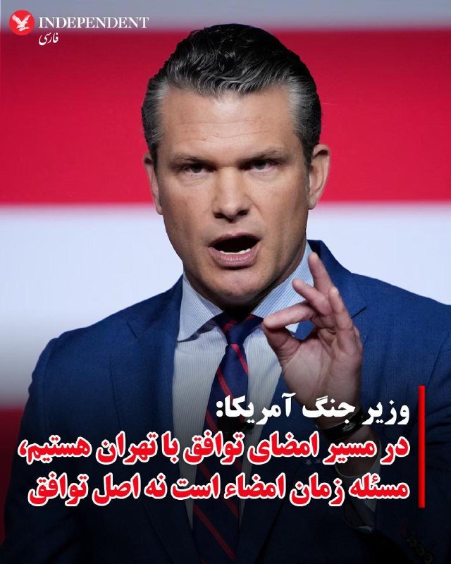

♦️پیت هگست، وزیر دفاع آمریکا، روز یکشنبه ۲۴ خرداد ماه در گفتگو با شبکه سی‌بی‌اس گفت واشنگتن در مسیر امضای توافق با ایران قرار دارد و «سوال این نیست که آیا توافق امضاء خواهد شد یا نه، بلکه این است که چه زمانی امضاء خواهد شد.»

هگست همچنین با اعلام آنکه انتظار ندارد حملات اسرائیل به حومه جنوبی بیروت مانع توافق با ایران شود،  گفت ایران باید حزب‌الله لبنان را مهار کند.

اظهارات هگست در حالی مطرح می‌شود که گمانه‌زنی‌ها درباره زمان امضای چارچوب اولیه توافق میان تهران و واشنگتن افزایش یافته و همزمان تنش‌ها در منطقه پس از حمله اسرائیل به ضاحیه جنوبی بیروت بالا گرفته است.
‌🇸🇦 Indypersian

🤖 @VahidOOnLine

## VahidOOnLine — post 245492

  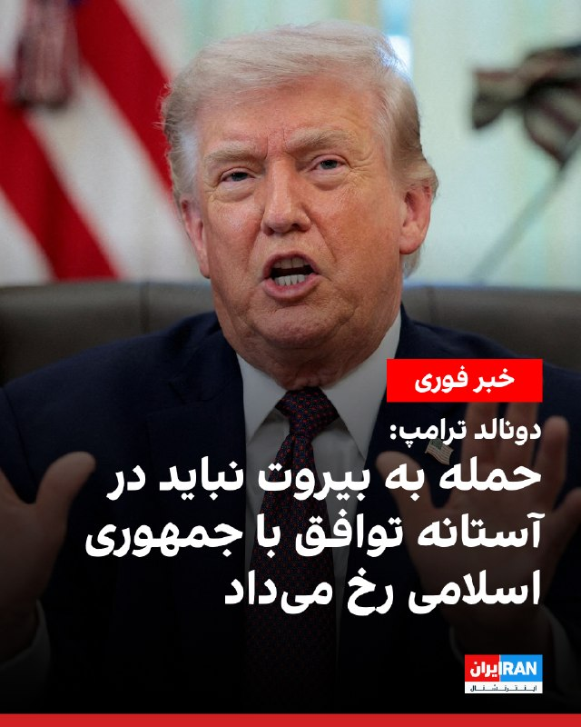

دونالد ترامپ، رییس‌جمهوری آمریکا، در تروت سوشال نوشت حمله یکشنبه اسرائیل به بیروت نباید انجام می‌شد، به‌ویژه در شرایطی که واشینگتن و تهران به گفته او «بسیار نزدیک» به دستیابی به توافق صلح هستند.
ترامپ گفت اسرائیل حق دفاع از خود را دارد، اما واکنش به حمله‌ای که «هیچ کشته یا زخمی نداشته»، نباید روند دستیابی به توافق را مختل کند.

او افزود آمریکا به توافقی نزدیک شده که می‌تواند برای منطقه، از جمله لبنان، صلح به همراه داشته باشد و از همه طرف‌ها خواست از تشدید تنش خودداری کنند.
ترامپ همچنین گفت نباید حمله دیگری از سوی اسرائیل در لبنان انجام شود و در مقابل، حزب‌الله نیز نباید حملات تازه‌ای علیه اسرائیل انجام دهد.
رییس‌جمهوری آمریکا در پایان نوشت: «این می‌تواند آغاز یک صلح طولانی و زیبا باشد؛ بیایید آن را خراب نکنیم.»
‌🏁 🇬🇧 IranintlTV

🤖 @VahidOOnLine

## pm_afshaa — post 93909

پیت هگستث: به خاطر دوراندیشی رئیس‌جمهور ترامپ، ما در داخل کشور به استقلال انرژی دست یافته‌ایم

💧 Rainbet.com the #1 Non-KYC Crypto Casino & Sportsbook @rainbetcom

😁 @Pm_Afshaa

## pm_afshaa — post 93908

پیت هگستث: این قدرت رئیس‌جمهور ترامپ بود که ایران را به این توافق واداشت

💧 Rainbet.com the #1 Non-KYC Crypto Casino & Sportsbook @rainbetcom

😁 @Pm_Afshaa

## pm_afshaa — post 93907

منابع عربی :امریکا در پیامی به اسرائیل گفته امشب ایران حملات موشکی انجام خواهد داد

💧 Rainbet.com the #1 Non-KYC Crypto Casino & Sportsbook @rainbetcom

😁 @Pm_Afshaa

## pm_afshaa — post 93906

  <a href="telegram/content/pm_afshaa_93906_1781449415.mp4" target="_blank">🎬 Download video</a>

ویدیویی از شلیک و درگیری نیروهای حکومتی با طرفدارای حکومت در شب گذشته

💧 Rainbet.com the #1 Non-KYC Crypto Casino & Sportsbook @rainbetcom

😁 @Pm_Afshaa

## VahidOnline — post 76335

  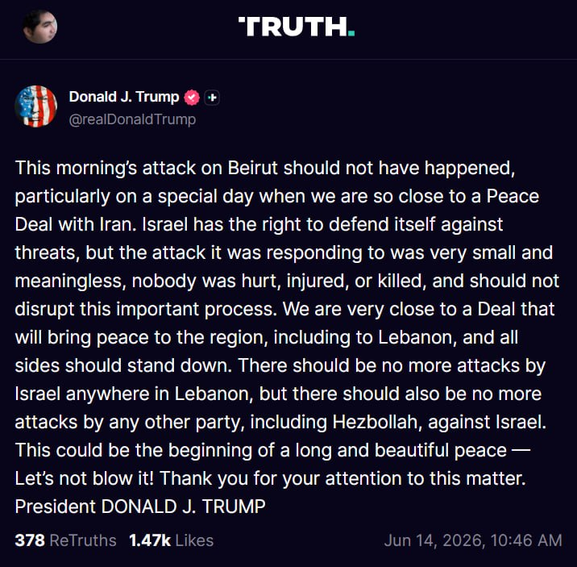

ترامپ: بیایید خرابش نکنیم!‍

پست ترامپ، ترجمه ماشین:
حمله صبح امروز به بیروت نباید اتفاق می‌افتاد؛ به‌ویژه در روزی خاص که ما تا این اندازه به توافق صلح با ایران نزدیک هستیم. اسرائیل حق دارد از خود در برابر تهدیدها دفاع کند، اما حمله‌ای که در پاسخ به آن انجام شد بسیار کوچک و بی‌اهمیت بود؛ هیچ‌کس آسیبی ندید، زخمی نشد یا کشته نشد، و نباید این روند مهم را مختل کند.

ما به توافقی بسیار نزدیک هستیم که صلح را به منطقه، از جمله لبنان، خواهد آورد و همه طرف‌ها باید عقب‌نشینی کنند. دیگر نباید هیچ حمله‌ای از سوی اسرائیل در هیچ نقطه‌ای از لبنان انجام شود، اما همچنین نباید هیچ حمله‌ای از سوی هیچ طرف دیگری، از جمله حزب‌الله، علیه اسرائیل صورت گیرد.

این می‌تواند آغاز یک صلح طولانی و زیبا باشد — بیایید خرابش نکنیم!

از توجه شما به این موضوع سپاسگزارم.

رئیس‌جمهور دونالد جی. ترامپ
realDonaldTrump

📡 @VahidOnline

## IranIntlTV — post 342289

  <a href="telegram/content/IranIntlTV_342289_1781449416.mp4" target="_blank">🎬 Download video</a>

ویدیوهای رسیده به ایران‌اینترنشنال نشان می‌دهند ایرانیان مقیم استرالیا یکشنبه ۲۴ خرداد با فراخوان شاهزاده رضا پهلوی و علیه جمهوری اسلامی در سیدنی تجمع کردند.

## IranIntlTV — post 342288

  

دونالد ترامپ، رییس‌جمهوری آمریکا، در تروت سوشال نوشت حمله یکشنبه اسرائیل به بیروت نباید انجام می‌شد، به‌ویژه در شرایطی که واشینگتن و تهران به گفته او «بسیار نزدیک» به دستیابی به توافق صلح هستند.
ترامپ گفت اسرائیل حق دفاع از خود را دارد، اما واکنش به حمله‌ای که «هیچ کشته یا زخمی نداشته»، نباید روند دستیابی به توافق را مختل کند.

او افزود آمریکا به توافقی نزدیک شده که می‌تواند برای منطقه، از جمله لبنان، صلح به همراه داشته باشد و از همه طرف‌ها خواست از تشدید تنش خودداری کنند.
ترامپ همچنین گفت نباید حمله دیگری از سوی اسرائیل در لبنان انجام شود و در مقابل، حزب‌الله نیز نباید حملات تازه‌ای علیه اسرائیل انجام دهد.
رییس‌جمهوری آمریکا در پایان نوشت: «این می‌تواند آغاز یک صلح طولانی و زیبا باشد؛ بیایید آن را خراب نکنیم.»
https://iranintl.com/202606142863

## FarsiVOA — post 220692

  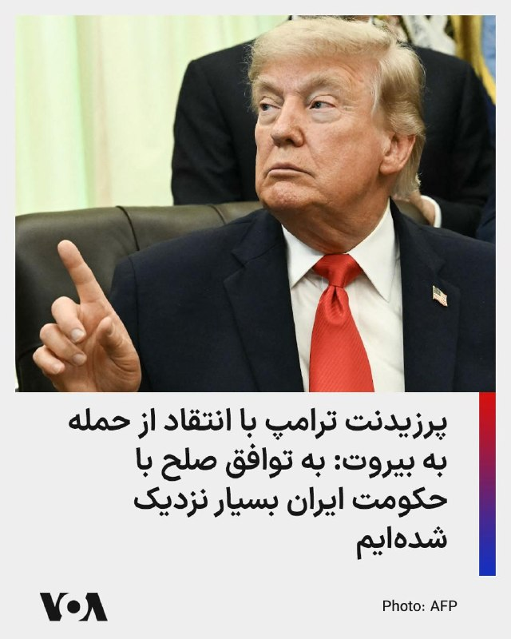

دونالد ترامپ: بسیار به توافقی نزدیک شده‌ایم که صلح را به منطقه، از جمله لبنان، خواهد آورد و همه طرف‌ها باید خویشتنداری کنند. دیگر نباید هیچ حمله‌ای از سوی اسرائیل در هیچ نقطه‌ای از لبنان صورت گیرد، اما در عین حال هیچ حمله‌ای از سوی هیچ طرف دیگری، از جمله حزب‌الله، علیه اسرائیل نیز نباید انجام شود.

## Persian_Trend_Official — post 17062

  <a href="telegram/content/Persian_Trend_Official_17062_1781449419.webm" target="_blank">🎬 Download video</a>

سردار اسدی: جنایت صهیونیست‌ها بی‌پاسخ نمی‌ماند.

سردار محمدجعفر اسدی معاون بازرسی قرارگاه مرکزی خاتم الأنبیا در گفتگو با دفاع‌پرس در واکنش به حمله مجدد اسرائیل به ضاحیه بیروت اظهار داشت: بدون شک این جنایات بی‌پاسخ نخواهد ماند.

📝 Amir

📌 @persian_trend_official
پرشین ترند | متفاوت‌ترین کانال نظامی

## Persian_Trend_Official — post 17061

  <a href="telegram/content/Persian_Trend_Official_17061_1781449420.webm" target="_blank">🎬 Download video</a>

⭕️ وزیر جنگ ایالات متحده: تا آنجا که من می‌دانم، ما در مسیر امضای توافق هستیم. مسئله زمان آن است، نه اینکه آیا این اتفاق می‌افتد یا خیر. اسرائیل در واکنش به حزب‌الله بسیار میانه‌رو است. 📝 Nick 📌 @persian_trend_official پرشین ترند | متفاوت‌ترین کانال نظامی

## Persian_Trend_Official — post 17060

شبکه العربیه: یک مقام ارشد حزب‌الله، علی الحاج، در حمله ارتش اسرائیل به ضاحیه بیرت کشته شد. همچنین کانال 12 اسرائیل ادعا کرد هدف حمله امروز فرمانده واحد ارتباط حزب‌الله بوده است. 📝 Amir 📌 @persian_trend_official پرشین ترند | متفاوت‌ترین کانال نظامی

## BBCPersian — post 283802

🔻اسرائیل: ایران مثل همیشه دروغ می‌گوید

پس از پیام محمدباقر قالیباف در ایکس، وزارت خارجه اسرائیل به آن پاسخ داد و ایران را به دروغگویی متهم کرد.

در این پیام آمده است: «رژیم ایران مثل همیشه دروغ می‌گوید. نیروی نیابتی ایران یعنی حزب‌الله کاملا بی‌دلیل امروز صبح به اسرائیل حمله کرد.»

«حزب‌الله دائم به شهروندان اسرائیل شلیک می‌کند. حتی بعد از آتش‌بس حزب‌الله هدف قرار دادن شهروندان را متوقف نکرده است.»

اسرائیل و حزب در طول آتش‌بس به حمله به یکدیگر ادامه دادند.

حزب‌الله می‌گوید امروز به شمال اسرائیل حمله نکرده و فقط سربازان اسرائیلی در جنوب لبنان را هدف قرار داده است.

https://bbc.in/4fEONCy
@BBCPersian

## Dirty_Kids — post 392014

  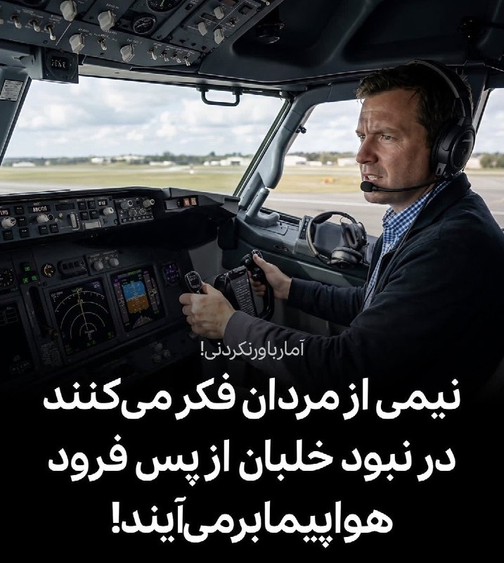

من که مطمئنم

@Dirty_Kids 👻

## Dirty_Kids — post 392013

تو توی سال ۱۳۲۲ برای جذب همکلاسیای دخترت عضو حزب توده میشی،
من بخاطرت اینجا توی سال ۱۴۰۵ هر دبه ماست رو میگیرم سیصد هزار تومن.

@Dirty_Kids 👻

## Dirty_Kids — post 392012

  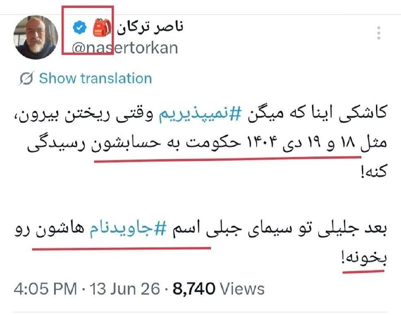

چقدر حیوونن این اصلاح طلبا

@Dirty_Kids 👻

## alonews — post 127904

  <a href="telegram/content/alonews_127904_1781449421.mp4" target="_blank">🎬 Download video</a>

👈برنان: اما الان با آن ذخایر سلاح‌ها مشکلی وجود دارد؟

🔴پیت هگستث: خیر، چنین چیزی نیست. این داستانی ساختگی است که رسانه‌ها می‌خواهند آن را پخش کنند. ذخایر ما عالی هستند و فقط قوی‌تر می‌شوند.

🔴برنان: شما در مقابل کنگره در این باره شهادت داده‌اید.

🔴هگستث: لازم نیست برایم آنچه را که شهادت داده‌ام دوباره بخوانید... من حدس زدم که برخی مهمات زمان بیشتری نسبت به بقیه می‌برند. ما بیشتر از همیشه در حال ساخت هستیم.

✅ @AloNews خبر جنگ

## alonews — post 127903

  <a href="telegram/content/alonews_127903_1781449423.mp4" target="_blank">🎬 Download video</a>

👈برنان: با توجه به اینکه ارتش آمریکا همین حالا این عملیات را در ونزوئلا انجام داده است، آیا آمریکایی‌ها باید بفهمند که آمریکا همچنان از نظر نظامی در آنجا حضور خواهد داشت؟ آیا باید انتظار عملیات مشابهی در جاهایی مانند اکوادور و گواتمالا را داشته باشند؟

🔴پیت هگست: بله، باید اینطور باشد. این یک تقویت شگفت‌انگیز از «دکترین دونرو» است

✅ @AloNews خبر جنگ

## alonews — post 127902

  <a href="telegram/content/alonews_127902_1781449425.mp4" target="_blank">🎬 Download video</a>

👈پیت هگستث: به خاطر دوراندیشی رئیس‌جمهور ترامپ، ما در داخل کشور به استقلال انرژی دست یافته‌ایم.

🔴برنان: قیمت انرژی در حال حاضر نسبتاً بالاست، بنابراین نمی‌دانم این استقلال چقدر به مردم در پمپ بنزین کمک می‌کند.

🔴هگستث: قیمت‌ها در حال کاهش است و شما این را دیده‌اید. هه هه هه

✅ @AloNews خبر جنگ

## alonews — post 127901

  <a href="telegram/content/alonews_127901_1781449427.mp4" target="_blank">🎬 Download video</a>

👈پیت هگستث: این قدرت رئیس‌جمهور ترامپ بود که ایران را به این توافق واداشت

✅ @AloNews خبر جنگ

## alonews — post 127900

  <a href="telegram/content/alonews_127900_1781449429.mp4" target="_blank">🎬 Download video</a>

👈پیت هگستث: ایران نمی‌تواند قابلیت‌های خود را در اطراف تنگه ببیند و درک کند، به‌ویژه در چند شب گذشته که برای آن‌ها بسیار ویرانگر بود از نظر توانایی‌شان در فهمیدن آنچه در تنگه می‌گذرد.

🔴وقتی این توافق امضا شود، انتظار ما این است که ایران شلیک پهپاد به کشتی‌های تجاری را متوقف کند.

🔴برنان: آن‌ها همین کار را جمعه گذشته انجام دادند. یک پهپاد هفته گذشته با یک هلیکوپتر آپاچی برخورد کرد. آن‌ها هنوز توانایی آسیب رساندن به دوستان و شرکای ما را دارند

✅ @AloNews خبر جنگ

## alonews — post 127899

  <a href="telegram/content/alonews_127899_1781449431.mp4" target="_blank">🎬 Download video</a>

👈هگِستِ : ما کل این مدت کنترل تنگه‌ها رو دستمون داشتیم

🔴مجری : پس چرا دارید باهاشون مذاکره می‌کنید که دوباره بازش کنن؟

✅ @AloNews خبر جنگ

---
📅 بروزرسانی: 1405/03/24 18:23
---

## VahidOOnLine — post 245491

  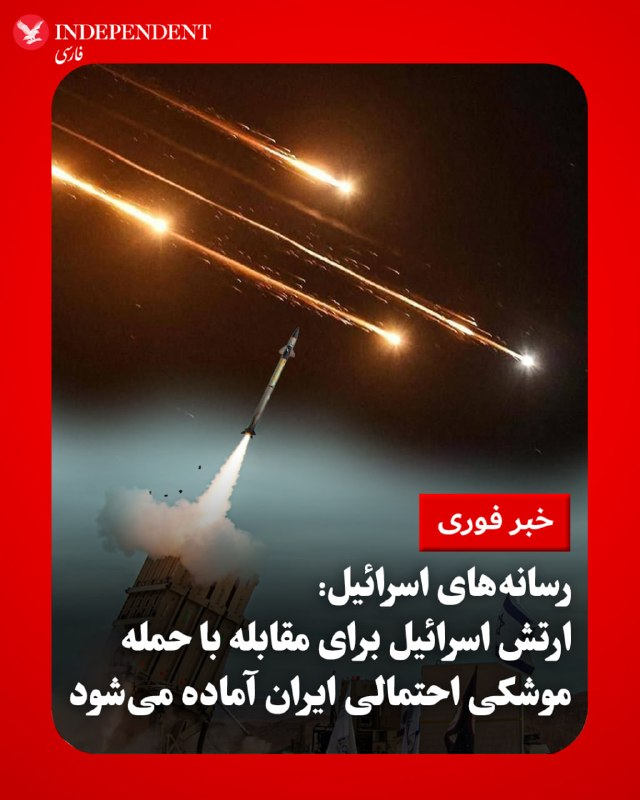

♦️همزمان با بالا گرفتن تنش‌های لفظی میان مقام‌های ایران و اسرائیل در بعد از ظهر یکشنبه، روزنامه تایمز اسرائیل به نقل از ارتش این کشور گزارش داد نیروهای اسرائیلی خود را برای شلیک احتمالی موشک از سوی در ساعت‌های آینده آماده می‌کنند.
بر اساس این گزارش، ایال زمیر، رئیس ستاد ارتش اسرائیل، پس از حمله به بیروت در حال برگزاری نشست ارزیابی با فرماندهان ارشد نظامی است و ارزیابی کنونی ارتش این کشور آن است که ایران ممکن است به این حمله پاسخ دهد.
این گزارش ساعاتی پس از آن منتشر شد که اسرائیل اهدافی را در ضاحیه جنوبی بیروت هدف قرار داد. همزمان محمدباقر قالیباف، رئیس مجلس شورای اسلامی، این حمله را نشانه ناتوانی یا بی‌میلی آمریکا در اجرای تعهدات خود دانست و هشدار داد ادامه مذاکرات در چنین شرایطی ممکن نیست.
در مقابل، حساب رسمی وزارت خارجه اسرائیل در شبکه اجتماعی ایکس با رد اظهارات قالیباف، جمهوری اسلامی را به «دروغگویی» متهم کرد و مدعی شد حمله به بیروت در پاسخ به حملات حزب‌الله به شمال اسرائیل انجام شده است.
محمدجعفر اسدی، معاون بازرسی قرارگاه مرکزی خاتم‌الانبیاء، نیز در واکنش به حمله روز یکشنبه اسرائیل به ضایحه بیروت گفت سپاه پاسداران به این حملات پاسخ خواهد داد.
تایمز اسرائیل همچنین نوشت با وجود این ارزیابی‌ها، تاکنون تغییری در دستورالعمل‌های امنیتی برای غیرنظامیان اسرائیلی اعلام نشده است.
‌🇸🇦 Indypersian

🤖 @VahidOOnLine

## WithYashar — post 14828

  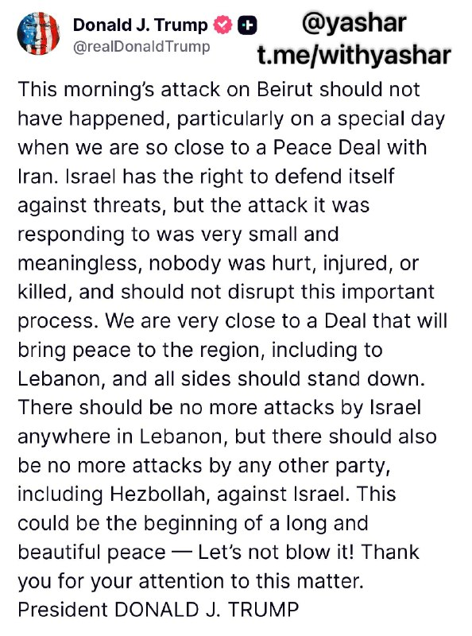

ترامپ در تروث : «حمله امروز صبح به بیروت نباید رخ می‌داد، به‌ویژه در چنین روز مهمی که ما تا این اندازه به دستیابی به یک توافق صلح با ایران نزدیک شده‌ایم. اسرائیل حق دارد از خود در برابر تهدیدها دفاع کند، اما حمله‌ای که در واکنش به آن انجام شد بسیار کوچک و بی‌اهمیت بود؛ هیچ‌کس آسیب ندید، مجروح نشد یا کشته نشد و نباید این روند مهم را مختل کند. ما بسیار به توافقی نزدیک هستیم که صلح را برای منطقه، از جمله لبنان، به ارمغان خواهد آورد و همه طرف‌ها باید از درگیری و تشدید تنش خودداری کنند. نباید هیچ حمله دیگری از سوی اسرائیل در هیچ نقطه‌ای از لبنان انجام شود، اما در عین حال نباید هیچ حمله‌ای از سوی هیچ طرف دیگری، از جمله حزب‌الله، علیه اسرائیل صورت گیرد. این می‌تواند آغاز یک صلح طولانی و زیبا باشد؛ نگذارید این فرصت از بین برود! از توجه شما به این موضوع سپاسگزارم. دونالد جی. ترامپ، رئیس‌جمهور ایالات متحده آمریکا»
@withyashar

## WithYashar — post 14827

هگست، وزیر جنگ آمریکا:
من انتظار ندارم که حملات اسرائیل به حومه جنوبی بیروت مانع توافق با ایران بشه؛ اگر ایران میخواد این موضوع ادامه پیدا کنه، باید حزب‌الله رو مهار کنه.
@withyashar

## WithYashar — post 14826

## WithYashar — post 14825

تو ویس گفتی یه سری بزنیم به کانالهی رژیم اسگولا اینو منتشر کردن

## WithYashar — post 14824

  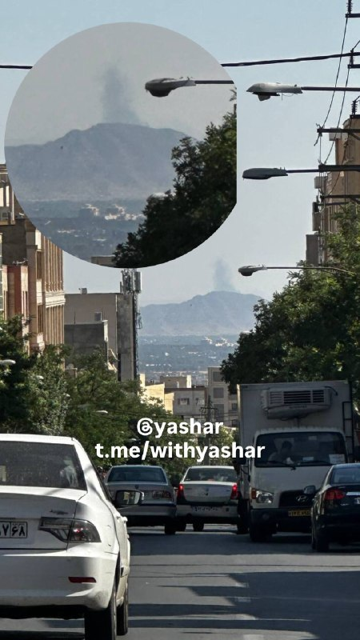

کمی‌پیش ستون دود جنوب‌کرج
@withyashar

## mwarmonitor — post 10881

🔴سخنگوی ارتش اسرائیل:

🔹«پس از ارزیابی وضعیت، تصمیم گرفته شد سیاست دفاعی فرماندهی جبهه داخلی از امروز (یکشنبه) ۱۴ ژوئن ۲۰۲۶ ساعت ۱۸:۰۰ تا روز دوشنبه ۱۵ ژوئن ۲۰۲۶ ساعت ۲۰:۰۰ تغییر کند.

🔹بر اساس این تغییرات، اجازه فعالیت کامل با سقف تجمعات تا ۵۰۰۰ نفر در تمام مناطق کشور، به‌جز مناطق خط مقدم، داده می‌شود.

🔹در مناطق خط مقدم، فعالیت‌ها به‌صورت جزئی و بدون تغییر در دستورالعمل‌ها ادامه خواهد داشت.

🔹فرماندهی جبهه داخلی به ارزیابی‌های مستمر وضعیت ادامه می‌دهد و در صورت هرگونه تغییر در سیاست‌های دفاعی، اطلاع‌رسانی‌های لازم از طریق کانال‌های رسمی فرماندهی جبهه داخلی و سخنگوی ارتش اسرائیل به اطلاع عموم خواهد رسید.»

@mwarmonitor

## mwarmonitor — post 10880

🔴ترامپ:

«نباید حمله امروز صبح به بیروت رخ می‌داد، به‌ویژه در چنین روز مهمی که ما در آستانه رسیدن به یک توافق صلح با ایران هستیم. اسرائیل حق دارد از خود در برابر تهدیدها دفاع کند، اما حمله‌ای که به آن پاسخ داده شد بسیار محدود و بی‌اهمیت بود و هیچ‌کس در آن کشته یا زخمی نشد. این موضوع نباید این روند مهم را مختل کند. ما در آستانه توافقی هستیم که می‌تواند صلح را در منطقه، از جمله لبنان، برقرار کند و همه طرف‌ها باید عقب‌نشینی کنند.

نباید هیچ حمله دیگری از سوی اسرائیل در هیچ نقطه‌ای از لبنان انجام شود، همان‌طور که نباید هیچ حمله دیگری از سوی هیچ طرفی، از جمله حزب‌الله، علیه اسرائیل صورت گیرد. این می‌تواند آغاز یک صلح طولانی و زیبا باشد—بیایید آن را حفظ کنیم! از توجه شما به این موضوع سپاسگزارم.

دونالد جی. ترامپ»

@mwarmonitor

## mwarmonitor — post 10877

🔴وزیر جنگ آمریکا: انتظار ندارم که حملات اسرائیل به ضاحیه جنوبی بیروت، توافق با ایران را مختل کند. اگر ایران می‌خواهد این موضوع پایدار بماند، باید حزب‌الله را مهار کند.

@mwarmonitor

## pm_afshaa — post 93905

  

فراخوان سراسری

امروز یکشنبه ساعت 18 در اعتراض به امضای تسلیم‌نامه در برابر آمریکای مستکبر در مرکز تمام شهرهای کشور با شعار «نه اینوری نه اونوری، جانم فدای رهبری» به خیابان خواهیم آمد.
ماسک و لباس مشکی فراموشتون نشه

💧 Rainbet.com the #1 Non-KYC Crypto Casino & Sportsbook @rainbetcom

😁 @Pm_Afshaa

## pm_afshaa — post 93904

ترامپ: حمله اسرائیل به بیروت نباید اتفاق می‌افتاد

💧 Rainbet.com the #1 Non-KYC Crypto Casino & Sportsbook @rainbetcom

😁 @Pm_Afshaa

## pm_afshaa — post 93903

  <a href="telegram/content/pm_afshaa_93903_1781448809.webm" target="_blank">🎬 Download video</a>

🔴هگست، وزیر جنگ آمریکا:
من انتظار ندارم که حملات اسرائیل به حومه جنوبی بیروت مانع توافق با ایران بشه؛ اگر ایران میخواد این موضوع ادامه پیدا کنه، باید حزب‌الله رو مهار کنه.

💧 Rainbet.com the #1 Non-KYC Crypto Casino & Sportsbook @rainbetcom

😁 @Pm_Afshaa

## kianmeli1 — post 87989

  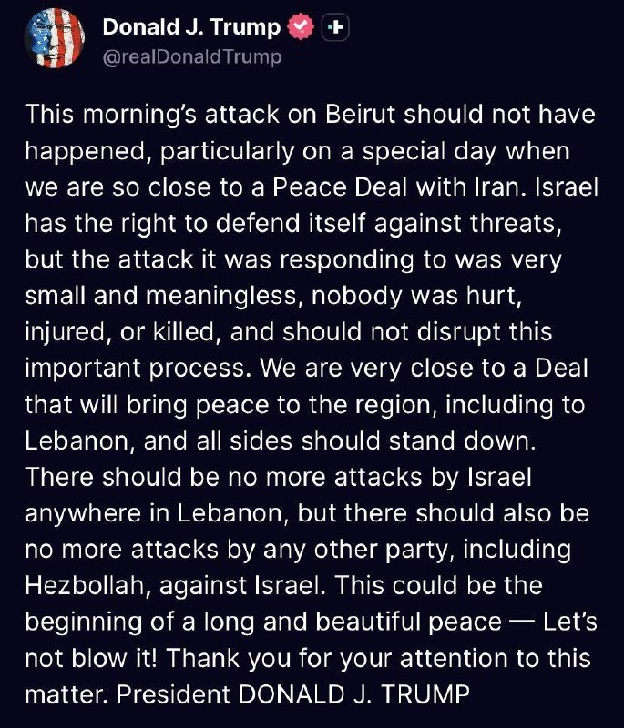

🔴ترامپ در مورد حمله به بیروت:

«این نباید اتفاق می‌افتاد، ما به توافقی که صلح را به منطقه می‌آورد بسیار نزدیک هستیم. بیایید آن را خراب نکنیم.» او از همه طرف‌ها می‌خواهد که عقب‌نشینی کنند و حملات را متوقف کنند.
https://t.me/kianmeli1

## Shin_Persian — post 7054

  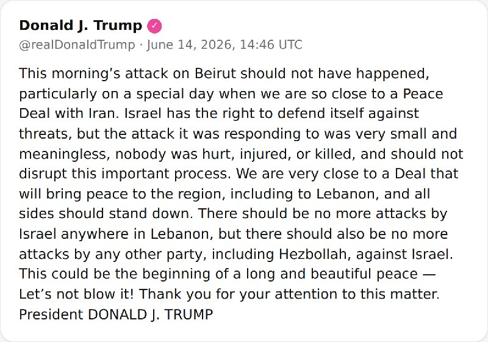

Shin ✓ @hey_itsmyturn
Sun, 14 Jun 2026 14:51:03 UTC

POTUS:
"This morning’s attack on Beirut should not have happened, particularly on a special day when we are so close to a Peace Deal with Iran. Israel has the right to defend itself against threats, but the attack it was responding to was very small and meaningless, nobody was hurt, injured, or killed, and should not disrupt this important process. We are very close to a Deal that will bring peace to the region, including to Lebanon, and all sides should stand down. There should be no more attacks by Israel anywhere in Lebanon, but there should also be no more attacks by any other party, including Hezbollah, against Israel. This could be the beginning of a long and beautiful peace — Let’s not blow it! Thank you for your attention to this matter. President DONALD J. TRUMP"

ترجمه خودکار فارسی در بخش نظرات

𝕏 · @shin_persian

## Shin_Persian — post 7053

Shin ✓ @hey_itsmyturn
Sun, 14 Jun 2026 14:49:04 UTC

. @SecWar on Face the Nation:
"As far as I know, we are on our way to signing the deal. It’s a question of when, not if. Israel is very restrained in its response to Hezbollah."

ترجمه خودکار فارسی

.@SecWar در برنامه «فیس د نیشن» (Face the Nation):
«تا آنجا که من می‌دانم، ما در مسیر امضای توافق هستیم. مسئله زمان انجام آن است، نه این‌که آیا انجام می‌شود یا خیر. اسرائیل در پاسخ خود به حزب‌الله بسیار خویشتن‌دار است.»

𝕏 · @shin_persian

## Shin_Persian — post 7052

Shin ✓ @hey_itsmyturn
Sun, 14 Jun 2026 14:48:37 UTC

. @SecWar on Face the Nation:
"The document says Iran will never have a nuclear weapon, won't seek one, won't buy one, won't have one."

ترجمه خودکار فارسی

.@SecWar در برنامه «Face the Nation»:
«این سند می‌گوید که ایران هرگز سلاح هسته‌ای نخواهد داشت، به دنبال آن نخواهد رفت، آن را نخواهد خرید و صاحب آن نخواهد شد.»

𝕏 · @shin_persian

## FarsiVOA — post 220691

با افزایش احتمال امضای تفاهم میان آمریکا و جمهوری اسلامی، شکاف میان حامیان و مخالفان این روند در ایران عمیق‌تر شده است. همزمان با حمله اسرائیل به ضاحیه بیروت، از تجمعات اعتراضی و درگیری‌ها در چند شهر تا حمایت محتاطانه مقام‌های حکومتی از مذاکرات گزارش شده است.

## FarsiVOA — post 220690

در گفت‌وگو با رضا علیجانی، از ابهام در روایت‌های حکومت ایران و واشینگتن و ماهیت تفاهم احتمالی گفتیم و به گفته او، بعید است جمهوری اسلامی در فرآیند امضای این تفاهم احتمالی، اختلافات خود را آمریکا کنار بگذارد.

## Persian_Trend_Official — post 17059

⭕️ وزیر جنگ ایالات متحده: تا آنجا که من می‌دانم، ما در مسیر امضای توافق هستیم. مسئله زمان آن است، نه اینکه آیا این اتفاق می‌افتد یا خیر. اسرائیل در واکنش به حزب‌الله بسیار میانه‌رو است.

📝 Nick

📌 @persian_trend_official
پرشین ترند | متفاوت‌ترین کانال نظامی

## Persian_Trend_Official — post 17058

  <a href="telegram/content/Persian_Trend_Official_17058_1781448811.webm" target="_blank">🎬 Download video</a>

«حمله‌ای که امروز صبح به بیروت انجام شد، نباید رخ می‌داد؛ به‌ویژه در چنین روز خاصی که ما تا این حد به یک توافق صلح با ایران نزدیک هستیم. اسرائیل حق دارد از خود در برابر تهدیدها دفاع کند، اما حمله‌ای که در واکنش به آن انجام شد بسیار کوچک و بی‌اهمیت بود؛ هیچ‌کس آسیب ندید، زخمی نشد یا کشته نشد، و این نباید این روند مهم را مختل کند.

ما به توافقی بسیار نزدیک هستیم که صلح را به منطقه، از جمله لبنان، خواهد آورد و همه طرف‌ها باید از تنش‌افزایی دست بکشند. دیگر نباید هیچ حمله‌ای از سوی اسرائیل در هیچ نقطه‌ای از لبنان صورت گیرد، اما همچنین نباید هیچ حمله‌ای از سوی هیچ طرف دیگری، از جمله حزب‌الله، علیه اسرائیل انجام شود.

این می‌تواند آغاز یک صلح طولانی و زیبا باشد — خرابش نکنیم! از توجه شما به این موضوع سپاسگزارم.

رئیس‌جمهور دونالد جی. ترامپ»

## BBCPersian — post 283801

🔻فارس: قطعا امروز توافقی با آمریکا امضا نخواهد شد

خبرگزاری فارس به نقل از «یک منبع نزدیک به تیم مذاکره‌کننده ایران» نوشت: «قطعاً در زمان اعلامی ترامپ هیچ توافقی امضا نخواهد شد.»

دونالد ترامپ، رئیس جمهور آمریکا، گفته بود که توافق با ایران امروز امضا و بلافاصله تنگه هرمز به روی همه کشتی‌ها باز خواهد شد.

بنابر این گزارش، «ساعاتی پیش از حمله» اسرائیل به ضایحه در جنوب بیروت، این منبع به خبرگزاری فارس گفته بود که «تیم قطری هم‌اکنون در تهران حضور دارد و ایران بندهای موردنظر خود را همراه با جزئیات دقیق مدنظرش، از طریق همین تیم قطری به طرف مقابل منتقل می‌کند.»

به گزارش این خبرگزاری که به نهادهای نظامی و امنیتی نزدیک است، این منبع تاکید کرده است که هیچ چیز نهایی نشده است:

«حتی اگر در روند مذاکره پیش و پس برویم و به عقب برگردیم، شرط اساسی ایران این است که در پایان، تمام موارد مدنظرش به طور کامل لحاظ شود.»

«اما حتی در صورت اعمال همه نظرات ایران قطعاً در زمان اعلامی ترامپ هیچ توافقی امضا نخواهد شد.»

https://bbc.in/4fEONCy
@BBCPersian

## alonews — post 127898

  <a href="telegram/content/alonews_127898_1781448812.webm" target="_blank">🎬 Download video</a>

🔴فوری / ترامپ: حمله صبح امروز به بیروت نباید اتفاق می افتاد، به ویژه در روز خاصی که ما به توافق صلح با ایران بسیار نزدیک هستیم.

🔴اسرائیل حق دارد از خود دفاع کند، اما حمله ای که به آن پاسخ داد بسیار کوچک و بی معنی بود، کسی آسیب ندید، مجروح یا کشته نشد و نباید این روند مهم را مختل کند.

🔴دیگر نباید در هیچ کجای لبنان حملاتی از سوی اسرائیل انجام شود، اما همچنین نباید از سوی هیچ طرف دیگری از جمله حزب الله علیه اسرائیل حمله شود.

🔴این می تواند آغاز یک صلح طولانی و زیبا باشد - بیایید آن را منفجر نکنیم!

✅ @AloNews خبر جنگ

## alonews — post 127897

  <a href="telegram/content/alonews_127897_1781448812.mp4" target="_blank">🎬 Download video</a>

👈وزیر جنگ، هگِستِ : برخلاف اوباما، رئیس‌جمهور ترامپ تو این چیزا باهوشه

✅ @AloNews خبر جنگ

## alonews — post 127896

  <a href="telegram/content/alonews_127896_1781448815.mp4" target="_blank">🎬 Download video</a>

👈 جِی‌دی ونس درباره ایران:
من فکر می‌کنم رئیس‌جمهور ترامپ هم همین‌طور است. فکر می‌کنم هر دوی ما عموماً نسبت به درگیری‌های نظامی خارجی شکاک هستیم.

🔴اما اساساً، این به این معنا نیست که هرگز نمی‌توان از نیروی نظامی استفاده کرد، و من فکر می‌کنم هدف اینجا جلوگیری از داشتن سلاح هسته‌ای توسط ایرانی‌ها است—ما در رسیدن به این هدف موفق خواهیم بود—و وقتی موفق شویم، این نتیجه‌ای بسیار خوب برای مردم آمریکا خواهد بود

✅ @AloNews خبر جنگ

## alonews — post 127895

  <a href="telegram/content/alonews_127895_1781448817.webm" target="_blank">🎬 Download video</a>

🔴هم دفنش نکردن

🔴هم ۱۰۰ شب تو خیابونا عروسی گرفتن

🔴هم با قاتلش توافق کردن

🤔هرچه از حرام زاده بودن عرزشی ها گفته بشه کمه

✅@AloNews

## alonews — post 127894

  <a href="telegram/content/alonews_127894_1781448818.webm" target="_blank">🎬 Download video</a>

👈مقام ارشد اسرائیلی به کان:
حمله ایران اکنون قریب‌الوقوع به نظر می‌رسد.

✅ @AloNews خبر جنگ

---
📅 بروزرسانی: 1405/03/24 18:13
---

## VahidOOnLine — post 245490

  

باراک اوباما، رییس‌جمهوری پیشین آمریکا، در گفت‌وگو با ای‌بی‌سی نیوز گفت بعید است هر توافقی که میان آمریکا و جمهوری اسلامی حاصل شود، تفاوت چشمگیری با برجام داشته باشد یا نسبت به آن بهبود قابل توجهی محسوب شود.
اوباما با اشاره به برجام گفت این توافق بر محدود کردن برنامه هسته‌ای ایران، تعیین سقف برای غنی‌سازی اورانیوم و پذیرش بازرسی‌های آژانس بین‌المللی انرژی اتمی در ازای رفع بخشی از تحریم‌ها و آزادسازی دارایی‌های مسدودشده ایران استوار بود.
او همچنین ابراز امیدواری کرد بمباران‌ها متوقف شود و مردم عادی دیگر از پیامدهای جنگ رنج نکشند.
رییس‌جمهوری پیشین آمریکا تاکید کرد دیپلماسی را به اقدام نظامی ترجیح می‌دهد و گفت نباید تصور کرد که می‌توان با زور یا بمباران به راه‌حل دست یافت.
اوباما خواستار بررسی کامل گزینه‌های دیپلماتیک شد و گفت توافق‌هایی که همه مشکلات را حل نمی‌کنند اما ۸۰ یا ۹۰ درصد آن‌ها را برطرف می‌کنند، می‌توانند از جنگ جلوگیری کنند.
‌🏁 🇬🇧 IranintlTV

🤖 @VahidOOnLine

## VahidOOnLine — post 245489

  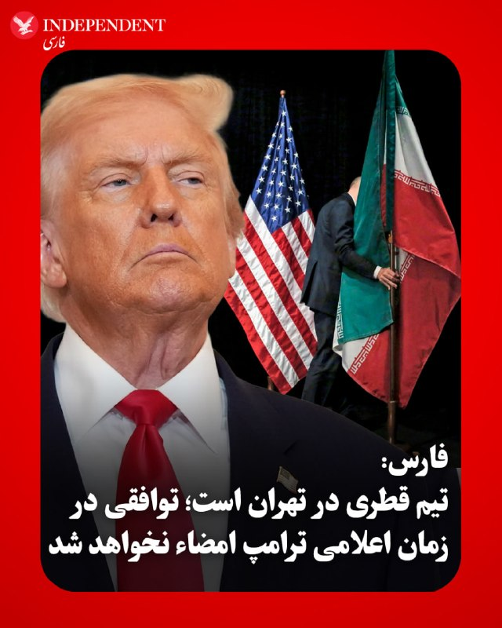

♦️خبرگزاری فارس، نزدیک به سپاه پاسداران، روز یکشنبه ۲۴ خرداد به نقل از یک منبع نزدیک به تیم مذاکره‌کننده ایران گزارش داد که نمایندگان قطر در تهران حضور دارند و ایران از طریق این هیئت، بندهای موردنظر و جزئیات مدنظر خود را به طرف آمریکایی منتقل می‌کند.
فارس با تاکید بر آنکه گفتگو با منبع گزارش ساعتی پیش از حمله اسرائیل به بیروت انجام شده است، در باره مذاکرات نوشت: «حتی اگر در روند مذاکره پیش و پس برویم و به عقب برگردیم، شرط اساسی ایران این است که در پایان، تمام موارد مدنظرش به طور کامل لحاظ شود.»
این خبرگزاری حکومتی در ادامه به نقل از منبع خود یادآور شد: «حتی در صورت پذیرش تمامی دیدگاه‌های ایران، هیچ توافقی در زمان اعلام‌شده از سوی دونالد ترامپ امضاء نخواهد شد.»
این گزارش در حالی منتشر شده که مایک والتز، سفیر آمریکا در سازمان ملل متحد، اعلام کرده است دونالد ترامپ همچنان مصمم است چارچوب اولیه توافق صلح با ایران را روز یکشنبه امضا کند.
‌🇸🇦 Indypersian

🤖 @VahidOOnLine

## WithYashar — post 14823

  <a href="telegram/content/WithYashar_14823_1781448189.mp4" target="_blank">🎬 Download video</a>

🎬 Video

## pm_afshaa — post 93902

کانال 15 اسرائیل:تمام سامانه های پدافندی در اسرائیل به حالت آماده باش کامل درآمدند و در انتظار پرتاب موشک قریب‌الوقوع از سمت ایران می‌باشن

💧 Rainbet.com the #1 Non-KYC Crypto Casino & Sportsbook @rainbetcom

😁 @Pm_Afshaa

## pm_afshaa — post 93901

  <a href="telegram/content/pm_afshaa_93901_1781448191.webm" target="_blank">🎬 Download video</a>

🔴یک دیپلمات درگیر در مذاکرات به فاکس‌نیوز:

حملات امروز اسرائیل به بیروت، روند نهایی‌سازی توافق رو با مشکل روبه‌رو کرده.

💧 Rainbet.com the #1 Non-KYC Crypto Casino & Sportsbook @rainbetcom

😁 @Pm_Afshaa

## DEJradio — post 5677

  <a href="telegram/content/DEJradio_5677_1781448191.webm" target="_blank">🎬 Download video</a>

🚨
💀 ارتش اسرائیل اعلام کرد در یک حمله دقیق، مقر سازمان تروریستی حزب‌الله در ضاحیه بیروت را هدف قرار داده است. بر اساس اعلام ارتش اسرائیل، این مقر توسط نیروهای حزب‌الله برای پیشبرد و هدایت طرح‌های تروریستی علیه شهروندان اسرائیل و همچنین نیروهای ارتش اسرائیل…

## VahidOnline — post 76331

محمدجعفر اسدی، معاون بازرسی قرارگاه مرکزی خاتم‌الانبیا، در واکنش به حمله اسرائیل به ضاحیه بیروت گفت: «بدون شک این جنایات بی‌پاسخ نخواهد ماند.»
او در گفت‌وگو با دفاع‌پرس، حمله ارتش اسرائیل به منطقه ضاحیه را محکوم کرد و نسبت به پیامدهای آن هشدار داد.
ارتش اسرائیل در بیانیه‌ای یکشنبه ۲۴ خرداد اعلام کرد در واکنش به شلیک پرتابه از سوی حزب‌الله به شمال اسرائیل، اهدافی از این گروه را در ضاحیه بیروت هدف قرار داده است.
@VahidOOnLine
محمد مرندی، از اصحاب رسانه همراه با هیات مذاکره جمهوری اسلامی در پاکستان، درباره ادامه مذاکرات تهران و واشینگتن، در شبکه ایکس نوشت: «فعلا هیچ مذاکره دیگری در کار نخواهد بود.»
@VahidOOnLine
نظام‌الدین موسوی، سخنگوی پیشین هیات رییسه مجلس جمهوری اسلامی، در پلتفرم ایکس نوشت حمله اسرائیل به ضاحیه بیروت در روزی که قرار بود تفاهم میان جمهوری اسلامی و آمریکا امضا شود، با هدف بر هم زدن تفاهم انجام نشد، بلکه تلاشی برای «تحقیر جمهوری اسلامی» صورت گرفت.
او خطاب به تیم مذاکره‌کننده جمهوری اسلامی نوشت: «حضرات مذاکره‌کننده، به تحقیر تن ندهید و در شرایط تحقیر، هیچ چیز را امضا نکنید.»
@VahidOOnLine
ارتش اسرائیل اعلام کرد ایال زمیر، رییس ستاد ارتش، پس از حمله به بیروت در حال برگزاری ارزیابی‌های مستمر از وضعیت با همه فرماندهان مرتبط است.
ارتش اسرائیل افزود بر اساس این ارزیابی‌ها، خود را برای احتمال شلیک به خاک اسرائیل در ساعات آینده آماده می‌کند.
این نهاد تاکید کرد در بالاترین سطح آماده‌باش قرار دارد و برای سناریوهای مختلف دفاعی و تهاجمی آماده است.
ارتش اسرائیل تاکید کرد شلیک به خاک این کشور را تحمل نخواهد کرد.
@VahidOOnLine

📡 @VahidOnline

## kianmeli1 — post 87988

🔴به گزارش N12 News، اسرائیل در حال آماده شدن برای حمله موشکی ایران در ساعات آینده است
https://t.me/kianmeli1

## IranIntlTV — post 342287

  <a href="telegram/content/IranIntlTV_342287_1781448192.mp4" target="_blank">🎬 Download video</a>

سرخط خبرهای یکشنبه ۲۴ خرداد
@iranintltv

## IranIntlTV — post 342286

🔻دیپلمات آمریکایی: حملات اسرائیل به بیروت توافق را با مشکل روبه‌رو کرده است

حملات پهپادی حزب‌الله به اسرائیل در روز یکشنبه ۲۴ خرداد زنجیره‌ای از واکنش‌ها را به دنبال داشت؛ اسرائیل پس از آن بیروت را هدف قرار داد، سپس تهران تهدید کرد که پاسخ می‌دهد. یک دیپلمات آمریکایی دخیل در مذاکرات نیز گفت که این تنش‌ها نهایی کردن توافق را با مشکل روبه‌رو کرده است.
فاکس‌نیوز عصر یکشنبه ۲۴ خرداد به نقل از یک دیپلمات آمریکایی دخیل در مذاکرات اعلام کرد که حملات اسرائیل به بیروت نهایی کردن توافق میان جمهوری اسلامی و آمریکا را با مشکل روبه‌رو کرده است.
این دیپلمات حملات یکشنبه را «تلاشی آشکار از سوی اسرائیل برای خراب کردن توافق رییس‌جمهوری آمریکا» و کشاندن دوباره این کشور به جنگ با جمهوری اسلامی خواند.
ارتش اسرائیل در بیانیه‌ای که در ایکس منتشر شد، اعلام کرد که این کشور در حال آماده شدن برای مقابله با حملات موشکی احتمالی از سوی جمهوری اسلامی در ساعات آینده است.

همزمان، یک مقام ارشد اسرائیلی در گفت‌وگو با این رسانه اتهام شروع تبادل آتش از سوی اسرائیل را رد کرد و گفت این حزب‌الله بود که در سه روز گذشته غیرنظامیان اسرائیلی را هدف قرار داد.

ارتش اسرائیل صبح یکشنبه در واکنش به حمله پهپادی حزب‌الله به شمار این کشور، به منطقه ضاحیه در جنوب لبنان حمله کرد. دولت اسرائيل در بیانیه‌ای حملات این کشور به بیروت را تایید.

ارتش اسرائیل نیز عصر یکشنبه در بیانه‌ای اعلام کرد که در «یک حمله دقیق در ضاحیه بیروت» یک مقر متعلق به حزب‌الله، گروه تحت حمایت جمهوری اسلامی، را که برای «پیشبرد طرح‌های تروریستی علیه شهروندان و نیروهای ارتش اسرائيل» مورد استفاده قرار می‌گرفت، هدف قرار داده است.
در پایان این بیانیه تاکید شده است که ارتش اسرائیل به فعالیت خود برای «رفع هرگونه تهدید» ادامه خواهد داد.
شبکه خبری العربیه، وابسته به عربستان سعودی، اعلام کرد که در این حملات یکی از فرماندهان ارشد حزب‌الله به نام «علی الحجاج» کشته شد.
رسانه آمریکایی اکسیو نوشت: «مقام‌های اسرائیلی و آمریکایی می‌گویند ارتش اسرائیل اندکی پیش از این حمله به بیروت، فرماندهی مرکزی ارتش ایالات متحده، سنتکام، را در جریان گذاشته بود.»

🔗 متن کامل گزارش را اینجا بخوانید

@iranintltv

## IranIntlTV — post 342285

  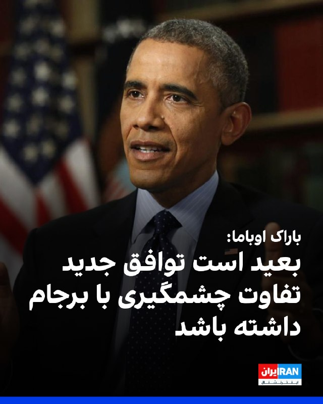

باراک اوباما، رییس‌جمهوری پیشین آمریکا، در گفت‌وگو با ای‌بی‌سی نیوز گفت بعید است هر توافقی که میان آمریکا و جمهوری اسلامی حاصل شود، تفاوت چشمگیری با برجام داشته باشد یا نسبت به آن بهبود قابل توجهی محسوب شود.
اوباما با اشاره به برجام گفت این توافق بر محدود کردن برنامه هسته‌ای ایران، تعیین سقف برای غنی‌سازی اورانیوم و پذیرش بازرسی‌های آژانس بین‌المللی انرژی اتمی در ازای رفع بخشی از تحریم‌ها و آزادسازی دارایی‌های مسدودشده ایران استوار بود.
او همچنین ابراز امیدواری کرد بمباران‌ها متوقف شود و مردم عادی دیگر از پیامدهای جنگ رنج نکشند.
رییس‌جمهوری پیشین آمریکا تاکید کرد دیپلماسی را به اقدام نظامی ترجیح می‌دهد و گفت نباید تصور کرد که می‌توان با زور یا بمباران به راه‌حل دست یافت.
اوباما خواستار بررسی کامل گزینه‌های دیپلماتیک شد و گفت توافق‌هایی که همه مشکلات را حل نمی‌کنند اما ۸۰ یا ۹۰ درصد آن‌ها را برطرف می‌کنند، می‌توانند از جنگ جلوگیری کنند.
https://iranintl.com/202606145239

## IranIntlTV — post 342284

  <a href="telegram/content/IranIntlTV_342284_1781448193.mp4" target="_blank">🎬 Download video</a>

یکی از شرکت‌کنندگان در تجمع گوتنبرگ در گفت‌وگو با مهران عباسیان، خبرنگار ایران‌اینترنشنال، از جاویدنام نعیم ارزاقی نام برد و گفت او ۱۸ دی‌ماه با شلیک گلوله به قلبش جان باخته است.

@iranintltv

## FarsiVOA — post 220689

  <a href="telegram/content/FarsiVOA_220689_1781448195.mp4" target="_blank">🎬 Download video</a>

در گفت‌وگو با حسن هاشمیان، از حمله اسرائیل به قلب پایگاه حزب‌الله در بیروت، پیام تبادل آتش و تأثیر آن بر توافق احتمالی میان حکومت ایران و آمریکا گفتیم. به گفته هاشمیان، بخشی از فرماندهان سپاه با هماهنگی حزب‌الله در پی آنند که با تشدید تنش‌ها، توافق احتمالی را تحت تأثیر قرار داده و تخریب کنند.

## FarsiVOA — post 220688

  <a href="telegram/content/FarsiVOA_220688_1781448196.mp4" target="_blank">🎬 Download video</a>

پیت هگست، وزیر جنگ آمریکا، در پیامی به مناسبت سالروز تولد دونالد ترامپ از او به‌عنوان «فرمانده کل قوایی» یاد کرد که به گفته او «هیچ فرمانده‌ای بهتر از او نمی‌توانست باشد.»

او همچنین گفت خدمت کردن تحت فرمان ترامپ «افتخار یک عمر» است و تاکید کرد نیروهای مسلح آمریکا از سیاست «صلح از طریق قدرت»، در اولویت قرار دادن آمریکا و بازسازی ارتش این کشور حمایت خواهند کرد.

@FarsiVOA

## BBCPersian — post 283800

  <a href="https://t.me/bbcpersian/283800" target="_blank">📎 Download file</a>

تازه‌ترین خبرهای جهان، یکشنبه ۲۴ خرداد ۱۴۰۵
@bbcpersian

## Dirty_Kids — post 392011

  <a href="telegram/content/Dirty_Kids_392011_1781448198.mp4" target="_blank">🎬 Download video</a>

🔴 کلیپی از یه حامی حکومت که سلیطه بازیش خیلی وایرال شده:

آقای عراقچی شما گوه میخوری وقتی رهبر چیزی نگفته حرف از مذاکره میزنی.
اگه می‌خواین مذاکره کنین اول باید خون منو بریزین، خون آقامون هنوز خشک نشده، بیجا میکنی مذاکره کردی.

@Dirty_Kids 👻

## alonews — post 127893

  <a href="telegram/content/alonews_127893_1781448198.webm" target="_blank">🎬 Download video</a>

👈هگست وزیر جنگ آمریکا: من انتظار ندارم که حملات اسرائیل به حومه جنوبی بیروت مانع توافق با ایران شود. اگر ایران می‌خواهد این موضوع ادامه پیدا کند، باید حزب‌الله را مهار کند

✅ @AloNews خبر جنگ

## alonews — post 127892

  <a href="telegram/content/alonews_127892_1781448198.mp4" target="_blank">🎬 Download video</a>

👈مایک والتز، نماینده دولت آمریکا در سازمان ملل با اطمینان اعلام کرد که امروز توافق میان ایران و آمریکا امضا خواهد شد!

✅ @AloNews خبر جنگ

<!-- MSG END -->

<!-- NAV START -->

<a href="https://github.com/ProAlit/aio-downloader/blob/main/telegram/content/archive_1.md" style="display:inline-block; padding:6px 12px; margin:0 4px; background-color:#2ea44f; color:white; text-decoration:none; border-radius:4px; font-weight:bold;">صفحه بعد</a>

<!-- NAV END -->
