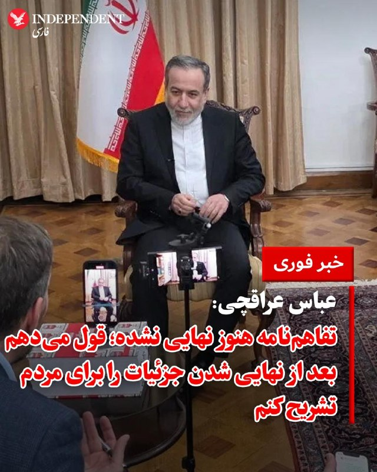
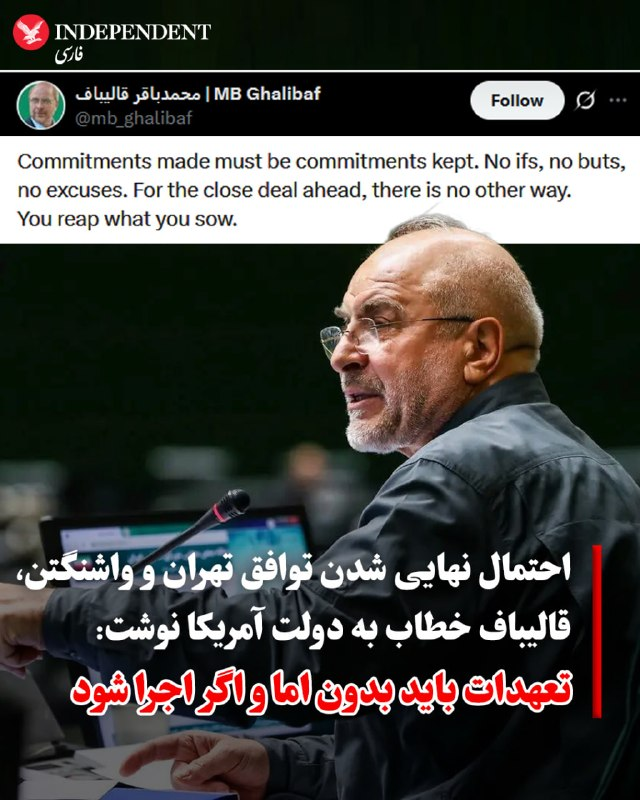
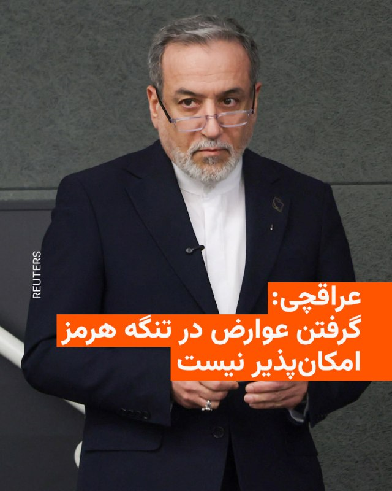
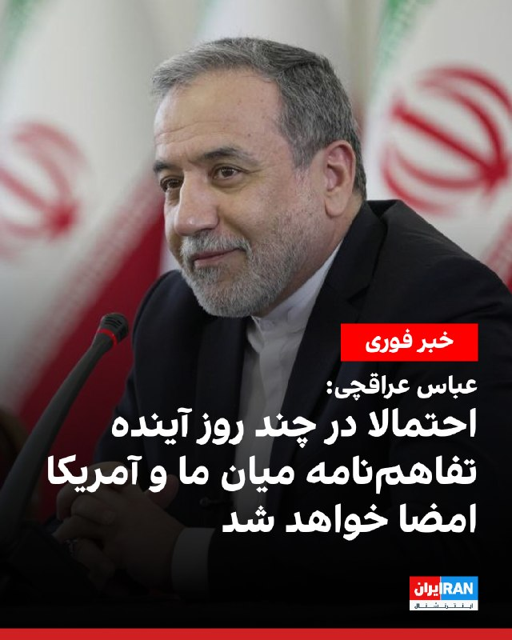
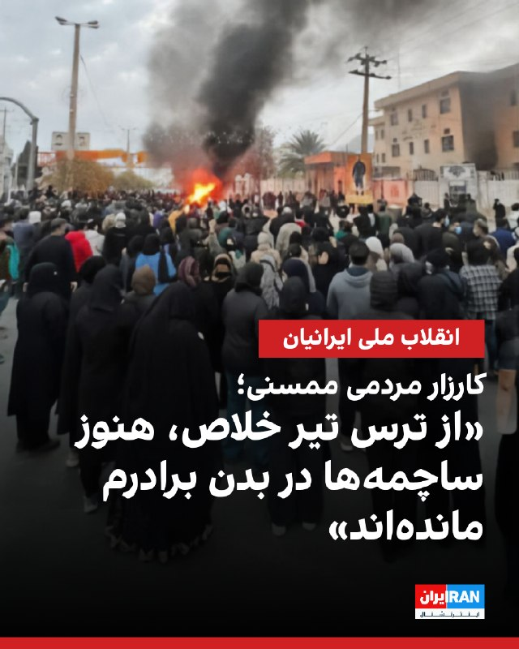
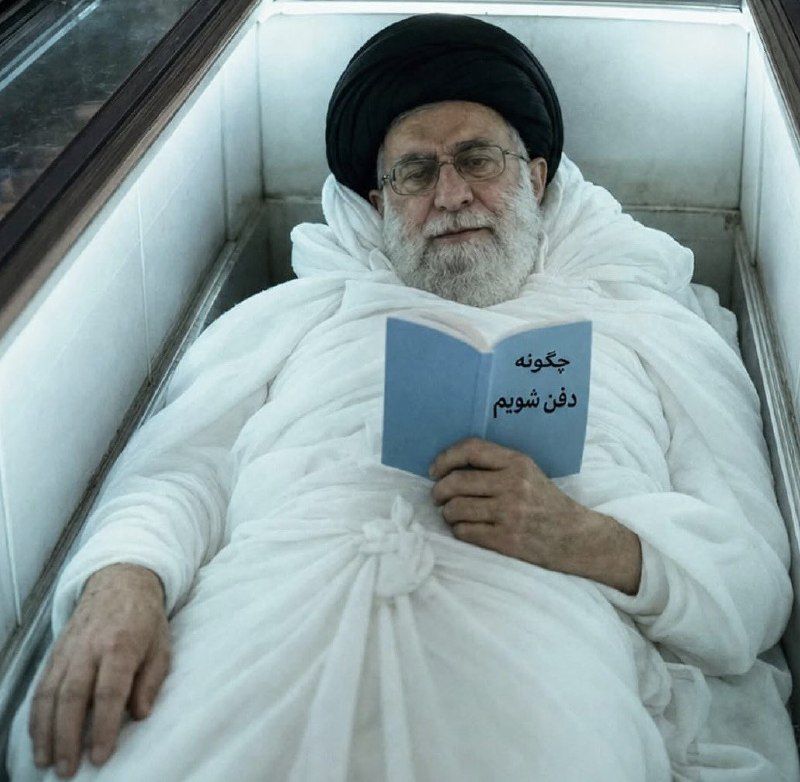
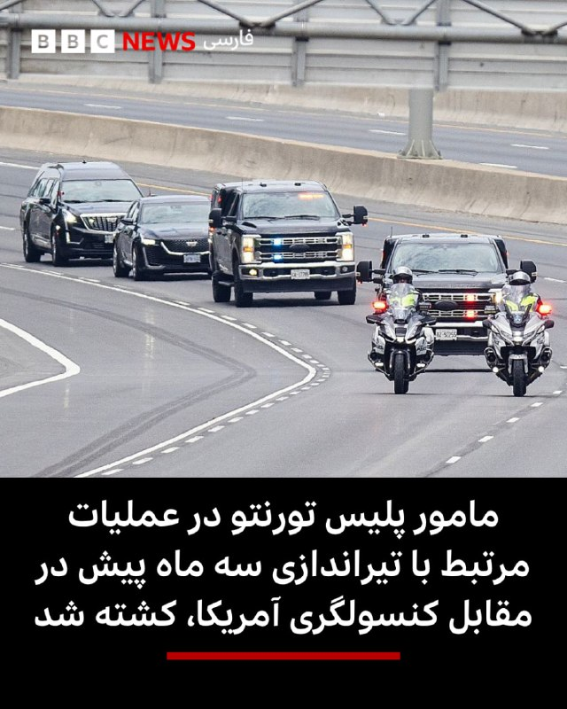

# خواننده تلگرام

<!-- TOP_NAV START -->

<a href="https://github.com/ProAlit/aio-downloader/blob/main/telegram/content/archive_1.md" style="display:inline-block; padding:6px 12px; margin:0 4px; background-color:#2ea44f; color:white; text-decoration:none; border-radius:4px; font-weight:bold;">صفحه بعد</a>

<!-- TOP_NAV END -->

<!-- MSG START -->

---
📅 بروزرسانی: 1405/03/22 23:43
---

## VahidOOnLine — post 245205

  

♦️عباس عراقچی، وزیر امور خارجه جمهوری اسلامی، در یک گفتگوی زنده تلویزیونی با صداوسیما، با اشاره به گزارش‌های اخیر پیرامون مذاکرات تهران و واشنگتن گفت: «در رسانه‌ها در مورد این یادداشت تفاهم صحبت می‌شود، اما من ترجیح می‌دهم جزئیات آن تا زمان نهایی شدن اعلام نشود؛ چرا که ممکن است تا لحظه آخر تغییراتی در متن صورت گیرد. اما پس از نهایی شدن، قول می‌دهم که جزئیات را به طور کامل برای مردم تشریح کنم.»

عراقچی با تبیین ساختار گفتگوها افزود که در این مذاکرات، که منجر به خاتمه جنگ شد، دو مرحله پیش‌بینی شده است. در مرحله نخست، یادداشت تفاهم اولیه میان ایران و آمریکا به امضا می‌رسد و سپس در مرحله دوم، مذاکرات اصلی برای رسیدن به توافق جامع و نهایی آغاز خواهد شد.

وزیر امور خارجه در پایان تاکید کرد که بررسی ابعاد فنی و موضوع هسته‌ای به طور کامل به مرحله دوم و توافق نهایی موکول شده است.
‌🇸🇦 Indypersian

🤖 @VahidOOnLine

## mwarmonitor — post 10796

  <a href="telegram/content/mwarmonitor_10796_1781295205.mp4" target="_blank">🎬 Download video</a>

واکنش ترامپ بعد از دیدن مصاحبه عراقچی

@mwarmonitor

## mwarmonitor — post 10795

  <a href="telegram/content/mwarmonitor_10795_1781295206.mp4" target="_blank">🎬 Download video</a>

📝به‌به، تماشا کنید این سیرکِ تهوع‌آور و ماله کشیِ ماله‌به‌دستانِ اعظم را!

🔸جوری با پررویی نجومی واژه «عوارض» را می‌شورند و جایش اسم شکلاتیِ «هزینه خدمات» را می‌گذارند که گویی گدایانِ سر گردنه، کت‌وشلوار پوشیده‌اند و در قبالِ خفت‌گیری، فاکتور رسمی صادر می‌کنند!

🔸آخه کثافتِ ماله کش، خدمات چه کوفتیه؟ نکنه این پرستوهای عودتی که جدیداً با اردنگی از فرنگ برگشتن رو قراره بفرستید وسط دریا تا به ملوانان بخت‌برگشته «خدماتِ ویژه» بدن؟ یا شاید هم خدماتِ آپشنالِ شما، همین ایستادنِ قایق‌های لگوری و تندروتون دور کشتی‌هاست که با بوق زدن، خواب رو از سر ناخدا می‌پرونن؟

🔸این سطح از دنائت و وقاحت واقعاً نوبره؛ تفکرِ انگل‌واری که کارش فقط باج‌گیری، راهزنی و مکیدن خونِ عابرانِ تنگه‌ست، حالا براش ساختارِ حقوقی هم می‌تراشه. این فرمولِ کثیف شماست: تفنگ رو می‌ذارید رو شقیقه طرف، جیبش رو خالی می‌کنید و بعد با اون لبخندِ کریه می‌گید: «این پولِ زور نیست عزیزم، هزینه خدماتِ تست زنده ماندن شماست!» طنزِ سیاه‌تر از این نمیشه که لشکرِ مفت‌خورها، اسمِ غارت و باج‌سبیل رو گذاشتن منبع درآمد قانونی!

@mwarmonitor

## DEJradio — post 5625

⭕️
⭕️ مقام آمریکایی: در توافقنامۀ در حال بحث بر نابودی و خروج اورانیوم از ایران تصریح شده است

یک مقام ارشد آمریکایی اعلام کرد در توافق در حال مذاکره میان واشینگتن و تهران، بر نابودی ذخایر اورانیوم غنی‌شدۀ جمهوری اسلامی و انتقال باقی‌مانده آن به خارج از ایران تأکید شده است.
این مقام که در پی گفت‌وگو با خبرنگاران آمریکایی خواست ناشناس بماند، اعلام کرد که توافق همچنین بازگشایی تنگۀ هرمز، پایان محاصرۀ بنادر ایران و ایجاد سازوکار بازرسی برای راستی‌آزمایی تعهدات جمهوری اسلامی را دربر دارد.
او افزود جمهوری اسلامی تنها در صورت اجرای تعهدات، از مزایای اقتصادی توافق بهره‌مند می‌شود.
به گفتۀ این مقام آمریکایی، توافقنامۀ در حال بحث کنونی به‌تنهایی هیچ امتیازی برای تهران ایجاد نمی‌کند.
او همچنین خبر داد دو طرف به توافق نهایی نزدیک شده‌اند اما هنوز به خط پایان نرسیده‌اند.
عباس عراقچی ساعتی پیش مدعی شده بود مسئلۀ هسته‌ای جمهوری اسلامی در دور کنونی مذاکرات مطرح نمی‌شود.

#مذکرات #توافق #اورانیوم
@DEJradio

## IranIntlTV — post 341952

  <a href="https://t.me/IranintlTV/341952" target="_blank">📎 Download file</a>

🎧نسخه صوتی حرف آخر با پوریا زراعتی - حذف مجتبی بعد توافق موقت
@iranintlTV

## IranianMinds — post 22429

🔴عراقچی: اگر آخرین مرحله مذاکرات انجام بشه، تفاهم از راه دور (دیجیتالی) به امضای دو طرف میرسه و اعلام خواهد شد.

+ رابطه لانگ دیستنس باشه؟

@IranianMinds

---
📅 بروزرسانی: 1405/03/22 23:33
---

## VahidOOnLine — post 245204

  <a href="telegram/content/VahidOOnLine_245204_1781294613.mp4" target="_blank">🎬 Download video</a>

ویدیوهای رسیده به ایران‌‌اینترنشنال نشان می‌‌دهد مراسم تولد جاویدنام آرمان پوردلجو بر سر مزارش در بهشت سکینه کرج برگزار شده است.
آرمان پوردلجو، ۲۲ ساله، ۱۸ دی ماه ۱۴۰۴، در کرج با اصابت گلوله جنگی ماموران جمهوری اسلامی کشته شد.
‌🏁 🇬🇧 IranintlTV

🤖 @VahidOOnLine

## VahidOOnLine — post 245203

  

عباس عراقچی، وزیر خارجه جمهوری اسلامی، درباره تفاهم احتمالی با آمریکا به صداوسیما گفت: «احتمالا در چند روز آینده تفاهم‌نامه میان ما و آمریکا امضا خواهد شد.»

او افزود: «امضای یادداشت تفاهم بعد از گذشتن از آخرین مراحل مذاکرات به صورت دیجیتالی و از راه دور انجام می‌شود که اعلام خواهد شد و ممکن است در چند روز آینده اتفاق بیفتد.»
‌🏁 🇬🇧 IranintlTV

🤖 @VahidOOnLine

## VahidOOnLine — post 245202

  

یک شاهد عینی درباره اعتراضات دی‌ماه نورآباد ممسنی و کشتار معترضان در این شهر، به ایران‌اینترنشنال گفت برادرش هدف تیراندازی قرار گرفت و بدنش پر از ساچمه شد. اما از ترس اینکه به او «تیر خلاص» بزنند، هرگز برای درمان به بیمارستان نرفت و هنوز تعدادی از ساچمه‌ها در بدنش باقی مانده‌اند.

این شهروند، گفت دادگستری ممسنی در جریان اعتراضات به دست نیروهای حکومتی و از داخل ساختمان آتش گرفت.

به گفته او، برادرش آن‌شب داخل ساختمان رفت و دید همه اتاق‌ها خالی هستند و فقط پرده‌ها سوخته‌اند.

این شاهد عینی یادآوری کرد علاوه بر برادرش، ده‌ها تن دیگر نیز هدف گلوله‌های ساچمه‌ای یا جنگی قرار گرفتند.

او افزود: «دو نفر از بستگان ما را در بیمارستان با تیر خلاص کشتند. بعد از کشته شدن هم آن‌ها را بسیجی معرفی کردند، چون خانواده‌هایشان توان پرداخت هزینه گلوله را نداشتند.»

با این‌حال به گفته این شهروند، مردم در مراسم چهلم این دو معترض کشته‌شده، فریاد «جاویدنام» سر دادند.
‌🏁 🇬🇧 IranintlTV

🤖 @VahidOOnLine

## VahidOOnLine — post 245201

  

♦️ به دنبال انتشار اخبار گوناگون مبنی بر نزدیک شدن جمهوری اسلامی ایران و ایالات متحده به مراحل پایانی توافق صلح، محمدباقر قالیباف، رئیس مجلس شورای اسلامی، با انتشار پیامی در شبکه اجتماعی ایکس، به این اخبار واکنش نشان داد.

قالیباف در حساب کاربری خود نوشت: «تعهدهایی که داده می‌شوند، باید اجرا شوند. بدون هیچ اگر، اما و بهانه‌ای. برای توافقِ نزدیکی که پیش‌رو است، هیچ راه دیگری وجود ندارد. هرچه بکاری، همان را درو می‌کنی.»

این موضع‌گیری رئیس مجلس شورای اسلامی در شرایطی صورت می‌گیرد که واسطه‌های قطری و پاکستانی از نهایی شدن پیش‌نویس تفاهم‌نامه خبر داده‌اند و مقامات کاخ سفید نیز اعلام کرده‌اند که هرگونه کاهش تحریم‌ها و آزادسازی دارایی‌های ایران، منوط به پایبندی کامل و عملی تهران به تعهداتش خواهد بود.
‌🇸🇦 Indypersian

🤖 @VahidOOnLine

## WithYashar — post 14672

عراقچی: در مذاکرات ۶۰ روزه چند حالت رخ می‌دهد

۱. تمدید مهلت مذاکرات در صورت خوب‌پیش‌رفتن مذاکرات.

۲. نرسیدن به توافق، به‌علت بی‌فایده‌بودن مذاکره‌.

بستگی به شرایط آن موقع تصمیم می‌گیریم که اگر نتیجه نگیریم چه خواهد شد.

تنها کاری که می‌توانیم برای اورانیوم غنی‌شده انجام دهیم "رقیق‌سازی در داخل" است!
@withyashar

## FoxNewsTwitter — post 342914

  <a href="telegram/content/FoxNewsTwitter_342914_1781294617.mp4" target="_blank">🎬 Download video</a>

Fox News (Twitter/X)

A bride in full wedding dress made a two-hour trip before walking down the aisle — and it had nothing to do with the wedding venue.

When Laetitia Obry learned her hospitalized mother wouldn't be able to attend her wedding, she got in the car with her bridal party and drove across France to surprise her in person.

The moment she walked into the hospital room, her mother immediately broke down in tears as the two embraced just hours before the ceremony.

Obry said the visit was brief, but there was no chance she was getting married without seeing her mom first.

## FoxNewsTwitter — post 342913

  <a href="telegram/content/FoxNewsTwitter_342913_1781294618.mp4" target="_blank">🎬 Download video</a>

Fox News (Twitter/X)

Lake houses go up in flames after a massive explosion.

Investigators say a suspected propane cylinder failure sparked a fire that destroyed two Pennsylvania homes and damaged others.

Bystander video captured one of the blasts as flames tore through the Elk Lake properties. Firefighters said the explosions were powerful enough to shatter windows.

Preliminary findings indicate one 100-pound propane cylinder may have failed, leaked, and ignited — setting off other cylinders nearby.

## pm_afshaa — post 93733

  <a href="telegram/content/pm_afshaa_93733_1781294620.webm" target="_blank">🎬 Download video</a>

🔴عراقچی: اگر آخرین مرحله مذاکرات انجام بشه، تفاهم از راه دور به امضای دو طرف میرسه و اعلام خواهد شد.

ممکنه در چند روز آینده اتفاق بیفته.
رسانه‌ها فضا رو مشوش نکنند.

💧 Rainbet.com the #1 Non-KYC Crypto Casino & Sportsbook @rainbetcom

😁 @Pm_Afshaa

## pm_afshaa — post 93732

  <a href="telegram/content/pm_afshaa_93732_1781294620.webm" target="_blank">🎬 Download video</a>

🔴عباس عراقچی: یکی از شروط اصلی تفاهم، پایان جنگ تو لبنانه؛ رسما اعلام کردیم که اسرائیل باید از مناطقی که تو لبنان اشغال کرده، عقب نشینی کنه!

💧 Rainbet.com the #1 Non-KYC Crypto Casino & Sportsbook @rainbetcom

😁 @Pm_Afshaa

## pm_afshaa — post 93731

  <a href="telegram/content/pm_afshaa_93731_1781294621.webm" target="_blank">🎬 Download video</a>

🔴عراقچی: از نظر ما تنها شیوهٔ بررسی مواد غنی‌شده، رقیق‌سازی اون در داخل ایرانه.

اگر در 60 روز به توافق نهایی نرسیم اما دو طرف از روند راضی باشن ممکنه تمدید بشه.

💧 Rainbet.com the #1 Non-KYC Crypto Casino & Sportsbook @rainbetcom

😁 @Pm_Afshaa

## pm_afshaa — post 93730

  <a href="telegram/content/pm_afshaa_93730_1781294621.webm" target="_blank">🎬 Download video</a>

🔴عراقچی: طبق قوانین بین‌الملل گرفتن عوارض از تنگه‌ هرمز امکان‌پذیر نیست اما هزینه‌ی خدمات دریافت خواهد شد و این در مذاکرات تثبیت خواهد شد.

به‌زودی ایران و عمان بیانیه مشترکی در مورد اداره تنگه هرمز منتشر خواهند کرد.

💧 Rainbet.com the #1 Non-KYC Crypto Casino & Sportsbook @rainbetcom

😁 @Pm_Afshaa

## VahidOnline — post 76283

  

عباس عراقچی، وزیر خارجه جمهوری اسلامی، شامگاه جمعه در یک برنامه زنده تلویزیونی اعلام کرد هنوز توافقی با آمریکا امضا نشده و مدعی شد که پرونده هسته‌ای ایران به مرحله دوم و نهایی این توافق موکول شده است.

او در گفت‌وگو با تلویزیون حکومتی ایران گفت توافق احتمالی با ایالات متحده شامل دو مرحله است و «موضوع هسته‌ای را به مرحله دوم انتقال دادیم».

این در حالی است که ساعتی قبل یک مقام ارشد آمریکایی به خبرنگاران گفت بر اساس توافق، قرار است اورانیوم غنی‌شده ایران در خاک این کشور نابود شود و سپس به خارج از ایران منتقل شود.

با این حال وزیر خارجه جمهوری اسلامی با اشاره به اینکه نتیجه مذاکرات یک «یادداشت ۱۴ ماده‌ای» است اعلام کرد مفاد آن بعد از نهایی شدن اعلام می‌شود.

وزیر خارجه ایران در گفت‌وگوی خود خبر داد که طبق تصمیم جمهوری اسلامی، «آینده تنگه هرمز و اداره آن مثل گذشته نخواهد بود‌» و ادعا کرد که ایران و عمان بیانیه مشترکی در مورد اداره این آبراه منتشر خواهند کرد.

او در ادامه اذعان کرد که طبق قوانین بین‌الملل گرفتن عوارض از کشتی‌ها در تنگه هرمز امکان‌پذیر نیست و افزود: «اما هزینه خدمات دریافت خواهد شد و این در مذاکرات تثبیت خواهد شد.»

عراقچی اعلام کرد طبق توافق، محاصره دریایی ایالات متحده علیه بنادر ایرانی به‌طور کامل رفع خواهد شد و دارایی‌های بلوکه‌شدهٔ ایران آزاد خواهد شد.

مقام‌های آمریکایی آزاد شدن این دارایی‌ها را به دفعات رد کرده‌اند. جی‌دی ونس، معاون رئیس‌جمهور آمریکا ساعاتی پیش تصریح کرد بعد از امضای توافق، هیچ‌گونه منابع مالی در اختیار ایران قرار نخواهد گرفت.
@VahidHeadline
عراقچی این رو هم گفته که: اگر آخرین مرحله مذاکرات انجام شود تفاهم از راه دور به امضای دو طرف می‌رسد و اعلام خواهد شد. ممکن است در چند روز آینده اتفاق بیفتد.
📡 @VahidOnline

## IranIntlTV — post 341951

  <a href="telegram/content/IranIntlTV_341951_1781294622.mp4" target="_blank">🎬 Download video</a>

ویدیوهای رسیده به ایران‌‌اینترنشنال نشان می‌‌دهد مراسم تولد جاویدنام آرمان پوردلجو بر سر مزارش در بهشت سکینه کرج برگزار شده است.
آرمان پوردلجو، ۲۲ ساله، ۱۸ دی ماه ۱۴۰۴، در کرج با اصابت گلوله جنگی ماموران جمهوری اسلامی کشته شد.

## IranIntlTV — post 341950

  

عباس عراقچی، وزیر خارجه جمهوری اسلامی، درباره تفاهم احتمالی با آمریکا به صداوسیما گفت: «احتمالا در چند روز آینده تفاهم‌نامه میان ما و آمریکا امضا خواهد شد.»

او افزود: «امضای یادداشت تفاهم بعد از گذشتن از آخرین مراحل مذاکرات به صورت دیجیتالی و از راه دور انجام می‌شود که اعلام خواهد شد و ممکن است در چند روز آینده اتفاق بیفتد.»
https://iranintl.com/202606124688

## IranIntlTV — post 341949

  

یک شاهد عینی درباره اعتراضات دی‌ماه نورآباد ممسنی و کشتار معترضان در این شهر، به ایران‌اینترنشنال گفت برادرش هدف تیراندازی قرار گرفت و بدنش پر از ساچمه شد. اما از ترس اینکه به او «تیر خلاص» بزنند، هرگز برای درمان به بیمارستان نرفت و هنوز تعدادی از ساچمه‌ها در بدنش باقی مانده‌اند.

این شهروند، گفت دادگستری ممسنی در جریان اعتراضات به دست نیروهای حکومتی و از داخل ساختمان آتش گرفت.

به گفته او، برادرش آن‌شب داخل ساختمان رفت و دید همه اتاق‌ها خالی هستند و فقط پرده‌ها سوخته‌اند.

این شاهد عینی یادآوری کرد علاوه بر برادرش، ده‌ها تن دیگر نیز هدف گلوله‌های ساچمه‌ای یا جنگی قرار گرفتند.

او افزود: «دو نفر از بستگان ما را در بیمارستان با تیر خلاص کشتند. بعد از کشته شدن هم آن‌ها را بسیجی معرفی کردند، چون خانواده‌هایشان توان پرداخت هزینه گلوله را نداشتند.»

با این‌حال به گفته این شهروند، مردم در مراسم چهلم این دو معترض کشته‌شده، فریاد «جاویدنام» سر دادند.
https://iranintl.com/202606122862

## FarsiVOA — post 220523

🔺آمریکا در مرکز توجه روز دوم جام جهانی؛ ستارگان موسیقی و مقام‌های ارشد واشنگتن در افتتاحیه لس‌آنجلس

◾️آمریکا روز جمعه ۲۲ خرداد (بامداد شنبه ۲۳ خرداد به وقت ایران)، در دومین روز مراسم افتتاحیه جام جهانی ۲۰۲۶ در مرکز توجه قرار می‌گیرد؛ روزی که لس‌آنجلس، مرکز صنعت سینمای آمریکا و از شهرهای چندفرهنگی این کشور، میزبان مراسم رسمی افتتاحیه در خاک ایالات متحده و نخستین بازی تیم ملی آمریکا خواهد بود.

⬇️ بیشتر بخوانید:
https://ir.voanews.com/a/us-opens-world-cup-stage/8160141.html
@FarsiVOA

## RadioFarda — post 158239

🔸عباس عراقچی، وزیر خارجه جمهوری اسلامی، شامگاه جمعه در یک برنامه زنده تلویزیونی اعلام کرد هنوز توافقی با آمریکا امضا نشده و مدعی شد که پرونده هسته‌ای ایران به مرحله دوم و نهایی این توافق موکول شده است. 🔸او در گفت‌وگو با تلویزیون حکومتی ایران گفت توافق احتمالی…

## RadioFarda — post 158238

  

🔸عباس عراقچی، وزیر خارجه جمهوری اسلامی، شامگاه جمعه در یک برنامه زنده تلویزیونی اعلام کرد هنوز توافقی با آمریکا امضا نشده و مدعی شد که پرونده هسته‌ای ایران به مرحله دوم و نهایی این توافق موکول شده است.

🔸او در گفت‌وگو با تلویزیون حکومتی ایران گفت توافق احتمالی با ایالات متحده شامل دو مرحله است و «موضوع هسته‌ای را به مرحله دوم انتقال دادیم».

🔸این در حالی است که ساعتی قبل یک مقام ارشد آمریکایی به خبرنگاران گفت بر اساس توافق، قرار است اورانیوم غنی‌شده ایران در خاک این کشور نابود شود و سپس به خارج از ایران منتقل شود.

🔸با این حال وزیر خارجه ایران با اشاره به اینکه نتیجه مذاکرات یک «یادداشت ۱۴ ماده‌ای» است اعلام کرد مفاد آن بعد از نهایی شدن اعلام می‌شود.

🔸وزیر خارجه ایران در گفت‌وگوی خود خبر داد که طبق تصمیم جمهوری اسلامی، «آینده تنگه هرمز و اداره آن مثل گذشته نخواهد بود‌» و ادعا کرد که ایران و عمان بیانیه مشترکی در مورد اداره این آبراه منتشر خواهند کرد.

@RadioFarda

## IranianMinds — post 22428

البته ناگفته نماند عراقچی هروقت خبرای مثبت از مذاکره اورده بلافاصله جنگ شده

## IranianMinds — post 22427

آقا من متوجه نمیشم

انتقام خون حضرت آقا الان چی میشه؟
به نظرم بسیجیا و ارزشیا باید انقلاب کنن

@IranianMinds

## IranianMinds — post 22426

🔴 عراقچی: دو تا موضوع مهم هنوز مونده برای توافق نهایی؛ یکی بحث تحریم‌ها، یکی هم مواد غنی‌شده. راه‌حلی که داریم اینه که غنی‌سازی ۶۰ درصد رو رقیق کنیم. در مورد تحریم‌ها هم، ما مشخص می‌کنیم که دقیقاً کدوم تحریم‌ها باید برداشته بشه.

@IranianMinds

## Dirty_Kids — post 391842

  

‏پر فروشترین کتاب سال عرزشی ها
حیدععععععر حیدعععععر

@Dirty_Kids 👻

## alonews — post 127501

  <a href="telegram/content/alonews_127501_1781294626.webm" target="_blank">🎬 Download video</a>

🔴فوری / عراقچی اعلام کرد: احتمال امضای تفاهم در چند روز آینده وجود دارد

✅ @AloNews خبر جنگ

## alonews — post 127500

  <a href="telegram/content/alonews_127500_1781294626.webm" target="_blank">🎬 Download video</a>

👈عراقچی: فکر می‌کنم نتیجهٔ تفاهم برای منافع ملی ایران خوب باشد و دستاوردهای میدانی را تثبیت کند.

‌
🔴علت جنگ این بود که ما در مذاکرات از منافع‌ ملی‌مان کوتاه نیامدیم و مقاومت کردیم

🔴دشمن آنچه که در جنگ به‌دست نیاورده را در مذاکره به‌دست نخواهد آورد.

‌
🔴یکی از مقامات آمریکایی به‌تازگی گفته که ما تازه فهمیدیم که ایرانی‌ها با بقیه فرق دارند.

✅ @AloNews خبر جنگ

## alonews — post 127499

  <a href="telegram/content/alonews_127499_1781294626.webm" target="_blank">🎬 Download video</a>

👈عراقچی: تفاهم در صورت نهایی‌شدن به‌صورت دیجیتالی و از راه دور امضا خواهد شد و سپس اعلام می‌شود

✅ @AloNews خبر جنگ

## alonews — post 127498

  <a href="telegram/content/alonews_127498_1781294626.webm" target="_blank">🎬 Download video</a>

👈عراقچی: اگر آخرین مرحله مذاکرات انجام شود تفاهم از راه دور به امضای دو طرف می‌رسد و اعلام خواهد شد

🔴ممکن است در چند روز آینده اتفاق بیفتد.

🔴رسانه‌ها فضا را مشوش نکنند.

✅ @AloNews خبر جنگ

---
📅 بروزرسانی: 1405/03/22 23:23
---

## FoxNewsTwitter — post 342912

  <a href="telegram/content/FoxNewsTwitter_342912_1781294003.mp4" target="_blank">🎬 Download video</a>

Fox News (Twitter/X)

NEW: President Trump wishes the U.S. Men's National Team good luck ahead of their group-stage opener against Paraguay.

"I know how great the players are. I think you've got a really good chance of going all the way, so I just want to wish you a lot of luck."

Coach Mauricio Pochettino’s squad enters the tournament with high expectations and will begin its journey against Paraguay, a team the Americans defeated 2-1 in a friendly last year.

## DEJradio — post 5624

⭕️
⭕️ عراقچی گفت هنوز توافقی امضا نشده و مذاکره با آمریکا ادامه دارد

عباس عراقچی، وزیر امور خارجۀ دولت جمهوری اسلامی اعلام کرد هنوز هیچ توافقنامه‌ای با آمریکا امضا نشده و مذاکرات همچنان ادامه دارد.
او مدعی شد نتیجۀ گفت‌وگوها فعلا در قالب یک یادداشت ۱۴ ماده‌ای تنظیم شده و موضوع برنامۀ هسته‌ای جمهوری اسلامی به مرحله دوم و نهایی مذاکرات منتقل شده است.
عراقچی ادعا کرد مفاد نهایی تفاهمنامه هنوز قطعی نیست و برخی بندها ممکن است تغییر کند.
او همچنین مدعی شد در توافق احتمالی، پایان جنگ در همۀ جبهه‌ها از جمله لبنان نیز پیش‌بینی شده است.
وزیر خارجۀ جمهوری اسلامی گفت گزارش‌های منتشرشده درمورد متن توافق از سوی رسانه‌ها، مورد تأیید تهران نیست.
دونالد ترامپ روز آدینه مسئولان جمهوری اسلامی را به دروغ‌بافی و چرندگویی در مورد بندهای مورد توافق میان تهران و واشنیگتن متهم کرده است.

#عراقچی #مذاکرات #توافق
@DEJradio

## DEJradio — post 5623

⭕️
⭕️ ادعای نخست‌وزیر پاکستان: متن نهایی توافق تهران و آمریکا مورد پذیرش طرفین قرار گرفته است

شهباز شریف، نخست‌وزیر پاکستان، اعلام کرد متن نهایی توافق میان جمهوری اسلامی و آمریکا مورد پذیرش دو طرف قرار گرفته است.
او گفت پاکستان اکنون با تهران و واشینگتن برای نهایی کردن مراحل پایانی توافق همکاری می‌کند و صلح هیچ‌گاه تا این اندازه نزدیک نبوده است.
شریف همچنین از آنچه کارزار انتشار اطلاعات نادرست برای تخریب روند توافق خواند انتقاد کرد.
پاکستان در ماه‌های اخیر نقش اصلی میانجی‌گری میان جمهوری اسلامی و آمریکا را بر عهده داشته و میزبان بخشی از مذاکرات دو طرف بوده است.

#مذاکرات #پاکستان
@DEJradio

## IranIntlTV — post 341948

  <a href="telegram/content/IranIntlTV_341948_1781294005.mp4" target="_blank">🎬 Download video</a>

🔻هواداران تیم ملی فوتبال مکزیک سرخوش از پیروزی در بازی افتتاحیه جام جهانی ۲۰۲۶ برابر آفریقای جنوبی خیابان‌های مکزیکوسیتی را به تسخیر خود درآوردند؛ گروهی از فوتبال‌دوستان مکزیکی نیز شادی خود را با رضا محدث، خبرنگار ایران اینترنشنال، در محدوده استادیوم تاریخی آزتکا به اشتراک گذاشتند.

@iranintltvsport

## Shin_Persian — post 6994

Shin ✓ @hey_itsmyturn
Fri, 12 Jun 2026 19:52:03 UTC

Wonder when JD Vance will call Islamic Regime's FM words "Fake News social media"

ترجمه خودکار فارسی

متعجبم که جی‌دی ونس چه زمانی سخنان وزیر امور خارجه رژیم اسلامی را «اخبار جعلی شبکه‌های اجتماعی» خواهد نامید.

𝕏 · @shin_persian

## Shin_Persian — post 6993

Shin ✓ @hey_itsmyturn
Fri, 12 Jun 2026 19:50:29 UTC

Regime's Foreign Minister:

"Consultations are underway with allies, including China and Oman, regarding the management of traffic in the Strait of Hormuz.

Our power and presence will perpetually safeguard the Strait of Hormuz.

We will not levy tolls, but service fees will apply for passage through the Strait of Hormuz."

ترجمه خودکار فارسی

وزیر امور خارجه رژیم:

«رایزنی‌ها با متحدان، از جمله چین و عمان، در خصوص مدیریت ترافیک در تنگه هرمز در حال انجام است.

قدرت و حضور ما همواره امنیت تنگه هرمز را حفظ خواهد کرد.

ما عوارض دریافت نخواهیم کرد، اما هزینه‌های خدمات برای عبور از تنگه هرمز اعمال خواهد شد.»

𝕏 · @shin_persian

## FarsiVOA — post 220522

🔺جمهوری اسلامی یکی از مجروحان اعتراضات دی ۱۴۰۴ را به ۶ سال زندان و ۸۰ ضربه شلاق محکوم کرد

◾️رسانه‌های حقوق بشری روز جمعه ۲۲ خرداد اعلام کردند قوه قضائیه جمهوری اسلامی، مهدی پاک‌مهر، هنرمند اهل بجنورد را به ۶ سال زندان و ۸۰ ضربه شلاق محکوم کرده است.

⬇️ بیشتر بخوانید:
https://ir.voanews.com/a/iran-protest-january-prison-artist-bojnurd/8160212.html
@FarsiVOA

## BBCPersian — post 283593

  

🔻یک مامور پلیس تورنتو در عملیات مرتبط با تیراندازی سه ماه پیش در مقابل کنسولگری آمریکا کشته شده است.

به گفته سرویس پلیس تورنتو، این مامور در ساعات اولیه بامداد پنجشنبه، هنگام تبادل آتش در یک ساختمان بلند هدف گلوله قرار گرفت و سپس در بیمارستان مرگ او اعلام شد.

پلیس در حال تحقیق درباره مظنونانی بود که گفته می‌شود اوایل سال جاری به سمت ساختمان کنسولگری آمریکا در تورنتو تیراندازی کرده بودند. رویدادی که مقام‌های آمریکایی و کانادایی آن زمان آن را «حادثه‌ای مرتبط با امنیت ملی» توصیف کردند.

به گفته مایرون دمیکیو، رئیس پلیس تورنتو، یکی از مظنونان که «زارا جبی» ۱۹ ساله معرفی شده، همچنان متواری است و «مسلح و خطرناک» تلقی می‌شود.

آقای دمیکیو گفت: « از همه شهروندان درخواست می‌کنم در صورت مشاهده او، بی‌درنگ با ۹۱۱ تماس بگیرند.»

بیشتر بخوانید:
https://bbc.in/4fJt5xd
📸Getty Images

## alonews — post 127497

  <a href="telegram/content/alonews_127497_1781294008.webm" target="_blank">🎬 Download video</a>

👈عراقچی: یادداشت تفاهم کمتر از ۲ صفحه است و کلمه‌به‌کلمه آن بارها بالاپایین شده و وزارت خارجه با نهایت دقت تمام موارد خواسته شده را لحاظ کرده

✅ @AloNews خبر جنگ

## alonews — post 127496

👈 عراقچی: شورای عالی امنیت ملی اشراف کامل بر مذاکرات دارد، بارها موضوع در جلسات مورد بررسی قرار گرفته است

🔴 کمیته‌ای شامل تعدادی از اعضای شورای عالی امنیت ملی بر مذاکرات نظارت می‌کنند و هر جا لازم باشد به شورای عالی امنیت ملی گزارش می‌دهند

🔴 موافقین و مخالفینی در میان اعضای شورای عالی امنیت ملی نسبت به متن هست اما نهایتاً به صورت جمعی تصمیم‌گیری خواهد شد و پس از تصمیم‌گیری ابلاغ می‌شود

✅ @AloNews خبر جنگ

## alonews — post 127495

  <a href="telegram/content/alonews_127495_1781294009.webm" target="_blank">🎬 Download video</a>

👈عراقچی: ممکن است 60 روز مذاکره تمدید شود و ماه ها ادامه داشته باشد. ممکن است تمدید نشود و دیگر مذاکرات را ادامه ندهیم. باید ببینیم بعد از 60 روز با چه فضایی مواجه هستیم

✅ @AloNews خبر جنگ

<!-- MSG END -->

<!-- NAV START -->

<a href="https://github.com/ProAlit/aio-downloader/blob/main/telegram/content/archive_1.md" style="display:inline-block; padding:6px 12px; margin:0 4px; background-color:#2ea44f; color:white; text-decoration:none; border-radius:4px; font-weight:bold;">صفحه بعد</a>

<!-- NAV END -->
