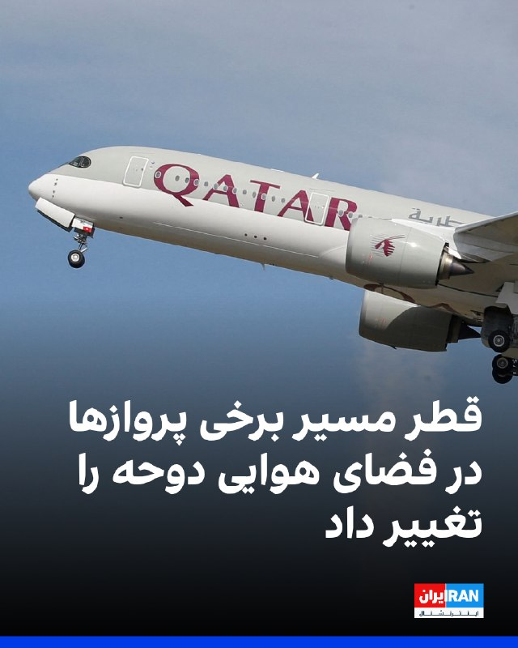
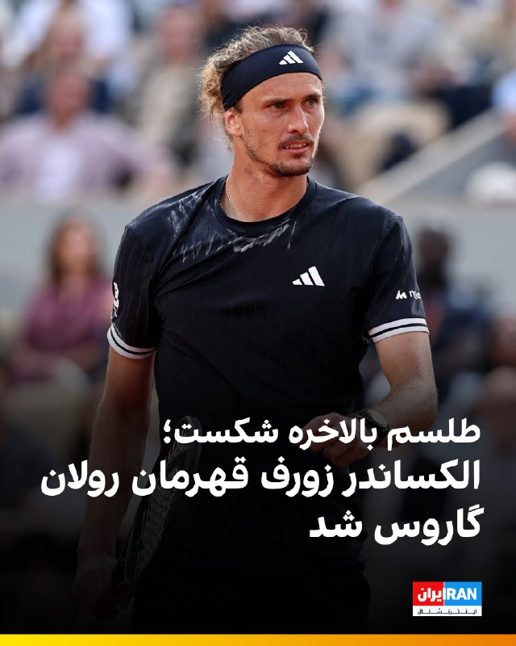

# خواننده تلگرام

<!-- TOP_NAV START -->

<a href="https://github.com/ProAlit/aio-downloader/blob/main/telegram/content/archive_1.md" style="display:inline-block; padding:6px 12px; margin:0 4px; background-color:#2ea44f; color:white; text-decoration:none; border-radius:4px; font-weight:bold;">صفحه بعد</a>

<!-- TOP_NAV END -->

<!-- MSG START -->

---
📅 بروزرسانی: 1405/03/17 21:43
---

## VahidOOnLine — post 244150

  

بر اساس یک اطلاعیه هوانوردی، قطر مسیر برخی پروازها در فضای هوایی تحت کنترل دوحه را به‌طور موقت تغییر داد و اعلام کرد مسیرهای جایگزین برای برخی پروازهای ورودی، خروجی و عبوری در آسمان این شهر تعیین شده است.

این نوتام از ۱۷ خرداد فعال شده و تا ۲۴ خرداد به‌صورت تخمینی، ادامه خواهد داشت و به معنی بسته شدن آسمان قطر نیست.
‌🏁 🇬🇧 IranintlTV

🤖 @VahidOOnLine

## WithYashar — post 13732

هواپیمای بویینگ ۷۳۷-۵۲۴ کاسپین ایرلاینز به جای پرواز به استانبول، ترکیه، به تهران بازگشت.🚨
@withyashar

## WithYashar — post 13731

گزارش شلیک موشک از گرمدره و بیدگنه مقصد نامشخص !🚨
@withyashar

## WithYashar — post 13730

گزارش ها از پرواز گسترده جت های جنگی ‌ناشناس بر فراز اقلیم کردستان، عراق.
@withyashar

## WithYashar — post 13729

گزارش از صدای جنگنده در تهران و کرج
@withyashar

## pm_afshaa — post 92535

دوتا هواپیما ایرانی پرواز به مقصد رو لغو کردن و به باند فرودگاه برگشتن :

💧 Rainbet.com the #1 Non-KYC Crypto Casino & Sportsbook @rainbetcom

😁 @Pm_Afshaa

## pm_afshaa — post 92533

گزارش‌ها از صدای جنگنده در تهران و کرج
احتمالی خودیه

💧 Rainbet.com the #1 Non-KYC Crypto Casino & Sportsbook @rainbetcom

😁 @Pm_Afshaa

## VahidOnline — post 75994

پیام‌های دریافتی از شنیده شدن صدای جنگنده در تهران که لابد داخلی است:

سلام وحید جان ۲۱:۳۲ شمال غرب تهران صدای شدید جنگنده

درود وحید جان
صدای جنگنده (؟) غرب تهران
۲۱:۳۲

صدای جنگنده غرب تهران ساعت ۹:۳۲

بازهم مرکز تهران صدای جنگنده یا هواپیما رو نمیدونم ولی خیلی پایینه ساعت ۲۱:۳۳

شهرک غرب
صدا جنگنده

صدای جنگنده ساعت ۲۱:۳۵ دقیقه، شمالغرب تهران

مرکز تهران صدای جنگنده میاد شدییید

صدای نامتعارف جنگنده در مرکز تهران از ساعت ۲۱:۳۳

غرب تهران صدا جنگنده داریم 9.32

۹:۳۱ شهرآرا صدای جنگنده میاد وحشتناک خیلی پایینه

سلام الان نیروهوایی صدای خیلی عجیب میاد صدای جنگنده ست انگار خیلی بلنده

سلام وحید . ساعت ۹ و ۳۳ دقیقه شب مرکز تهران صدای جنگنده میومد واضح . ۱۷ خرداد .

سلام ساعت ۲۱ و ۳۳ دقیقه شنیده شدن صدای جنگنده زیاد ، امیرآباد تهران

صدای جنگنده میاد سمت مرکز شهر

آپدیت: کلی پیام مشابه میاد که دیگه نقل نمی‌کنم. درباره صدای هواپیما اهمیتی نداره که در کدوم محله شنیده شده.

دو تا پیام تایید نشده هم بود که صدای دیگری برداشت کردند:

سلام وحید، اینجا شهریار صدای موشک میاد. احتمالا از بیدگنه جمهوری اسلامی داره موشک میزنه

وحید از بیدگنه موشک زدن ۲۱:۲۸
صداش تا فردیس اومد قشنگ

📡 @VahidOnline

## kianmeli1 — post 87700

🔴دقایقی پیش

گزارش‌هایی از صدای جنگنده از نقاط مختلفی از جمله مرکز تهران، غرب تهران، شمال‌غرب تهران، شهرآرا، شهرک غرب و امیرآباد ‌
https://t.me/kianmeli1

## IranIntlTV — post 341031

  

🔻الکساندر زورف، تنیس‌باز ۲۹ ساله آلمانی، پس از سال‌ها ناکامی در گام آخر، بالاخره طعم شیرین قهرمانی در یک گرنداسلم را چشید و قهرمان مسابقات رولان گاروس شد.

🔹در دیدار پایانی و دراماتیک زمین «فیلیپ شاتریه»، زورف پس از ۴ ساعت و ۱۶ دقیقه نبرد نفس‌گیر مقابل فلاویو کوبولی ایتالیایی ۳ بر ۲ به پیروزی رسید. در امتیاز پایانی ست پنجم این مسابقه، کوبولی با یک ضربه کات داخل زمین و متعاقباً یک لوب، زورف را به عقب فرستاد؛ اما مرد آلمانی توپ را برگرداند و در نهایت تنیس‌باز ایتالیایی ضربه خود را به شکلی ناشیانه به تور کوبید. با این خطا، زورف از فرط خوشحالی روی خاک رس پاریس پهن شد و اشک شوق ریخت.

🔹با حذف زودهنگام مدعیان اصلی جام یعنی یانیک سینر،مرد شماره یک جهان و نواک جوکوویچ، تمام نگاه‌ها و فشارها روی شانه‌های زورف قرار گرفته بود. این چهارمین فینال گرنداسلم او در دوران حرفه‌ای‌اش بود.

@iranintltvsport

## IranIntlTV — post 341030

  

بر اساس یک اطلاعیه هوانوردی، قطر مسیر برخی پروازها در فضای هوایی تحت کنترل دوحه را به‌طور موقت تغییر داد و اعلام کرد مسیرهای جایگزین برای برخی پروازهای ورودی، خروجی و عبوری در آسمان این شهر تعیین شده است.

این نوتام از ۱۷ خرداد فعال شده و تا ۲۴ خرداد به‌صورت تخمینی، ادامه خواهد داشت و به معنی بسته شدن آسمان قطر نیست.
https://iranintl.com/202606073076

## Shin_Persian — post 6616

Shin ✓ @hey_itsmyturn
Sun, 07 Jun 2026 18:03:21 UTC

Jet activity over western Tehran, #Tehran Province, #Iran

فارسی

فعالیت جنگنده‌ها برفراز غرب تهران، استان #تهران، #ایران

𝕏 · @shin_persian

## FarsiVOA — post 219898

نگاهی به تیم ملی جمهوری اسلامی؛ مهمان منزوی جام جهانی و هفته‌ها حاشیه

## FarsiVOA — post 219897

تجسم عینی اتفاقات کتاب ۱۹۸۴ در دنیای امروز؛ گفت‌وگو با امیر گنجوی پژوهشگر

## FarsiVOA — post 219896

هوشنگ امیراحمدی با حضور در عمق میدان از خامنه‌ای به عنوان مانع عادی‌سازی رابطه ایران و آمریکا یاد کرد ولی به این پرسش که با حذف خامنه‌ای، اکنون با چه گروهی در ایران گفت‌وگو می‌کند پاسخی نداد

## FarsiVOA — post 219893

یگان بیست‌وچهارم اعزامی تفنگداران دریایی آمریکا تصاویری از یک تمرین مشترک در دریای کارائیب را منتشر کرد.

در این تمرین، ملوانان نیروی دریایی و سربازان نیروی زمینی آمریکا عملیات فرود بالگرد روی عرشه شناور را تمرین کردند.

@FarsiVOA

## FarsiVOA — post 219892

  <a href="telegram/content/FarsiVOA_219892_1780855983.mp4" target="_blank">🎬 Download video</a>

ویدیوی ارتش اسرائیل از حمله امروز، ۱۷ خرداد، به ضاحیه بیروت؛
ارتش اسرائیل با انتشار این ویدیو اعلام کرد به روش نقطه‌زنی یک مقر فرماندهی حزب‌الله را در ضاحیه بیروت هدف‌گیری کرد.

بنابر بیانیه ارتش اسرائیل حزب‌الله از این مقر فرماندهی برای آسیب رساندن به شهروندان و نیروهای ارتش اسرائیل استفاده می‌کرد.

این حمله در واکنش به حملات موشکی و پهپادی حزب‌الله به شمال اسرائیل انجام شده است.

## Persian_Trend_Official — post 15908

  <a href="telegram/content/Persian_Trend_Official_15908_1780855985.webm" target="_blank">🎬 Download video</a>

البته جنگنده های جمهوری اسلامی هستند

## Persian_Trend_Official — post 15907

صدای جنگنده ها روی آسمان تهران هم بطور گسترده داره گزارش میشه.

## Hranews — post 113454

گزارشی از تداوم بلاتکلیفی کارگران تعدیل‌شده کارخانه قند ممسنی

❗️
❗️
❗️
❗️
❗️– بیش از ۹۰ #کارگر تعدیل شده کارخانه قند ممسنی، واقع در شهرستان رستم، از بلاتکلیفی شغلی چندین ساله خود گلایه‌مند بوده و خواستار بازگشت به کار هستند.

ادامه مطلب

↘️
@hranews_bot تماس ✉️ - @Hranews کانال هرانا 🆑

## alonews — post 125868

  <a href="telegram/content/alonews_125868_1780855986.webm" target="_blank">🎬 Download video</a>

👈هم‌چنان پرواز ها درحال بازگشت

✅ @AloNews خبر جنگ

## alonews — post 125867

  <a href="telegram/content/alonews_125867_1780855986.webm" target="_blank">🎬 Download video</a>

🔴فوری/اسرائیل هشدار داد که هر حمله‌ای جنگ تمام‌عیار را به دنبال خواهد داشت.

✅ @AloNews خبر جنگ

---
📅 بروزرسانی: 1405/03/17 21:33
---

## VahidOOnLine — post 244149

♦️بازیکنان و اعضای کادر فنی تیم ملی فوتبال ایران روز یکشنبه ۱۷ خردادماه در میان تدابیر شدید امنیتی به هتل محل اقامت خود در شهر تیخوانا در مکزیک رسیدند.

تیم ملی در حالی برای برگزاری جام جهانی به مکزیک رفته است که در ابتدا قرار بود در آمریکا اقامت کند. با این حال و پس از آنکه ایالات متحده در صدور ویزا برای کادر فنی و همراهان تیم تعلل کرد و در نهایت برای گروهی از همراهان به‌دلیل «سابقه عضویت در سپاه» یا «نگرانی‌های امنیتی» ویزا صادر نکرد، به‌ناچار به مکزیک رفتند.
‌🇸🇦 Indypersian

🤖 @VahidOOnLine

## VahidOOnLine — post 244148

  

دونالد ترامپ در گفت‌وگو با شبکه ان‌بی‌سی نیوز درباره رابطه با اسرائیل گفت: «ما رفقای بسیار خوبی هستیم و ضربه‌ای بسیار بزرگ به یک کشور مشخص وارد کردیم؛ کشوری که ۴۷ سال چیزی جز دردسر نبوده است.»

او درباره لبنان افزود: «دوست دارم حمله به حزب‌الله دقیق‌تر و هدفمندتر باشد. فکر می‌کنم باید هدفمندتر انجام شود. ما می‌توانیم در این زمینه کمک کنیم یا سوریه را به‌عنوان یک گزینه پیشنهاد دهیم.»
ترامپ همچنین گفت سوریه در حال سامان دادن به اوضاع خود است و عملکرد خوبی دارد.
‌🏁 🇬🇧 IranintlTV

🤖 @VahidOOnLine

## WithYashar — post 13728

صداوسیما: جمعیت مردم در تجمعات شبانه نصف شده.
@withyashar

## WithYashar — post 13727

کانال ۱۴ اسرائیل: نخست‌وزیر بنیامین نتانیاهو با هیاتی از مشاوران حقوقی دولت ترامپ دیدار کرد.
@withyashar

## WithYashar — post 13726

محمد مخبر: اسرائیل میز مذاکره را به آتش کشید، به زودی پاسخ دردناکی به تل‌آویو خواهیم داد.
@withyashar

## pm_afshaa — post 92532

  <a href="telegram/content/pm_afshaa_92532_1780855401.webm" target="_blank">🎬 Download video</a>

🔴محمد مخبر، مشاور خامنه‌ای:
دشمن با بمباران لبنان در زمان حضور میانجی‌ها در ایران، میز مذاکره رو برای بار سوم به آتش کشید تا نقض آتش‌بس ر‌و فریاد بکشه؛ بهای سنگین و دردناک این تعرض رو قطعا در میدان خواهیم داد.

💧 Rainbet.com the #1 Non-KYC Crypto Casino & Sportsbook @rainbetcom

😁 @Pm_Afshaa

## IranIntlTV — post 341029

  

دونالد ترامپ در گفت‌وگو با شبکه ان‌بی‌سی نیوز درباره رابطه با اسرائیل گفت: «ما رفقای بسیار خوبی هستیم و ضربه‌ای بسیار بزرگ به یک کشور مشخص وارد کردیم؛ کشوری که ۴۷ سال چیزی جز دردسر نبوده است.»

او درباره لبنان افزود: «دوست دارم حمله به حزب‌الله دقیق‌تر و هدفمندتر باشد. فکر می‌کنم باید هدفمندتر انجام شود. ما می‌توانیم در این زمینه کمک کنیم یا سوریه را به‌عنوان یک گزینه پیشنهاد دهیم.»
ترامپ همچنین گفت سوریه در حال سامان دادن به اوضاع خود است و عملکرد خوبی دارد.
https://iranintl.com/202606073045

## IranIntlTV — post 341028

  <a href="telegram/content/IranIntlTV_341028_1780855402.mp4" target="_blank">🎬 Download video</a>

مهدی مهدوی‌آزاد در برنامه «چشم‌انداز» درباره گزارش‌ها مبنی بر اینکه دولت ترامپ در حال بررسی تحویل دارایی‌های بلوکه‌شده ایران به کشورهای خلیج فارس است، گفت: «این اقدام به نوعی پرداخت غیرمستقیم غرامت حمله‌های جمهوری اسلامی به این کشورها است.»
@iranintltv

## Shin_Persian — post 6615

Shin ✓ @hey_itsmyturn
Sun, 07 Jun 2026 17:54:56 UTC

Intense jet activity over #KRI, Eastern #Iraq 🇮🇶

فارسی

فعالیت شدید جت‌ها بر فراز اقلیم کردستان عراق (#KRI) و شرق عراق (#Iraq) 🇮🇶

𝕏 · @shin_persian

## FarsiVOA — post 219891

هفتاد و پنجمین سالگرد انتشار کتاب ۱۹۸۴؛ گفت‌وگو با امیر گنجوی پژوهشگر فلسفه سیاسی و مطالعات اجتماع

## FarsiVOA — post 219890

تجمع دانش‌آموزان در شهرهای مختلف در اعتراض به کنکور و مسائل آموزشی در ایران؛ گفت‌وگو با سعید پیوندی، جامعه‌شناس

## Persian_Trend_Official — post 15906

  <a href="telegram/content/Persian_Trend_Official_15906_1780855404.webm" target="_blank">🎬 Download video</a>

محمد مخبر: دشمن با بمباران لبنان در زمان حضور میانجی‌ها در ایران، میز مذاکره رو برای بار سوم به آتش کشید تا نقض آتش‌بس ر‌و فریاد بکشد؛ بهای سنگین و دردناک این تعرض رو قطعا در میدان خواهیم داد.

📝 Amir

📌 @persian_trend_official
پرشین ترند | متفاوت‌ترین کانال نظامی

## IranianMinds — post 21579

🔴محسن رضایی چند روز پیش در صدا و سیما:

کافی بود فقط اسرائیل به سمت ضاحیه حرکت کند، کل موشک‌های ما آماده بود چند برابر جنگ ۴۰ روزه شمال اسرائیل را جهنم می‌کردند.

@IranianMinds

## BBCPersian — post 283084

سه روزنامه‌نگار ایرانی نامزد جایزه «گزارش واقعی» امسال به دلیل «نبود امکان دریافت ویزا از سفارتخانه سوئیس در ایران» نتوانستتند برای شرکت در مراسم اعلام برندگان و اهدای جوایز شرکت کنند. حساب اینستاگرامی فستیوال گزارش واقعی ‏(True Story) در پستی تصویر سه…

## BBCPersian — post 283082

سه روزنامه‌نگار ایرانی نامزد جایزه «گزارش واقعی» امسال به دلیل «نبود امکان دریافت ویزا از سفارتخانه سوئیس در ایران» نتوانستتند برای شرکت در مراسم اعلام برندگان و اهدای جوایز شرکت کنند.

حساب اینستاگرامی فستیوال گزارش واقعی ‏(True Story) در پستی تصویر سه روزنامه‌نگار ایرانی را منتشر کرد و نوشت که جای آنها خالی است. سوگل دانایی برای گزارش «بی‌حسی موضعی» که در شبکه آقتاب منتشر شده، مریم شکری برای گزارش «یک تکه زمین فقیر» در روزنامه شرق و ستاره حجتی برای گزارش «آلودگی ارس، معمایی که با هر جواب پیچیده‌تر می‌شود» در روزنامه پیام ما، نامزد جوایز امسال این جشنواره شده‌ بودند.

این جشنواره نوشت: «ما عمیقا متاسفیم که سه روزنامه‌نگار از ایران نمی‌توانند به‌صورت حضوری در جشنواره در کنار ما باشند. با این حال، صدای آن‌ها، روایت‌هایشان و شجاعتشان همچنان حضور خواهد داشت. در تمام طول جشنواره به یادشان هستیم و آن‌ها در قلب ما هستند.»

## Dirty_Kids — post 391240

اینجا اتاق‌فکر رژیم داشت یه آزمایشی میکرد موفق نشد

میخواستن یه عرزشی‌صورتی‌رو با یه دلقک‌صادراتی جفت بندازن تا مثل دنیا یه توله این پس بندازه، محصول زِنا کردنشون موفق نبود، پروژه شکست خورد جمعش کردن برگشت پیش عرزشی‌کاکولد خودش

@Dirty_Kids 👻

## Dirty_Kids — post 391239

  <a href="telegram/content/Dirty_Kids_391239_1780855404.mp4" target="_blank">🎬 Download video</a>

🔴 توی شهرداری گناباد دو نفر در حال کون کونک بازی 🏳‍🌈 بودن که مردم مچشون رو گرفتن!!

@Dirty_Kids 👻

## Hranews — post 113453

کیفرخواست پرونده عباس عبدی و روزنامه اعتماد صادر شد

❗️
❗️
❗️
❗️
❗️– خبرگزاری قوه قضاییه از صدور کیفرخواست پرونده عباس عبدی و روزنامه اعتماد خبر داد. این پرونده برای رسیدگی به دادگاه کیفری یک استان تهران ارسال شده است.

ادامه مطلب

#عباس_عبدی #روزنامه_اعتماد

↘️
@hranews_bot تماس ✉️ - @Hranews کانال هرانا 🆑

## alonews — post 125866

  <a href="telegram/content/alonews_125866_1780855405.webm" target="_blank">🎬 Download video</a>

🔴فوری / گزارش ها از پرواز گسترده جت های جنگی بر فراز اقلیم کردستان، عراق.

✅ @AloNews خبر جنگ

## alonews — post 125865

  <a href="telegram/content/alonews_125865_1780855405.webm" target="_blank">🎬 Download video</a>

👈یک مقام آمریکایی به آکسیوس:حزب‌الله باید فوراً آتش‌بس کند و اجازه دهد این توافق‌ها اجرایی شوند. شرایط پیشنهادی منصفانه است، مورد تأیید لبنان و اسرائیل قرار دارد و مسیر روشنی برای پایان دادن به درگیری‌ها فراهم می‌کند.

✅ @AloNews خبر جنگ

## alonews — post 125864

  <a href="telegram/content/alonews_125864_1780855406.mp4" target="_blank">🎬 Download video</a>

👈نبویان: جای تعجب است که ایران پیشنهاد واگذاری تنگۀ هرمز را داده است!

✅ @AloNews خبر جنگ

---
📅 بروزرسانی: 1405/03/17 21:23
---

## VahidOOnLine — post 244147

  

♦️دونالد ترامپ، رئیس‌ جمهوری آمریکا روز یکشنبه به شبکه ان‌بی‌سی گفت: «دوست دارم بهبود وضع زندگی در لبنان را ببینم. دوست دارم حملات نقطه‌‌‌زن و دقیق بیشتری به حزب‌الله انجام شود. به نظرم باید دقیقتر باشد.»
به گفته مقام‌های دولت لبنان از آغاز دور جدید جنگ میان حزب‌الله و اسرائیل در اسفندماه سال گذشته، بیش از ۳۵۰۰ نفر که عمدتا غیرنظامی بودند در لبنان کشته شدند.

 ترامپ در همین مصاحبه تاکید کرد که «اصراری ندارد که لبنان بخشی از یک توافق کوتاه‌مدت با ایران باشد.»

جمهوری اسلامی در آغاز خواستار شمول آتش‌بس به لبنان بود و در هفته‌های اخیر و همزمان با ادامه جنگ میان حزب‌الله و اسرائیل می‌گوید بدون «پایان جنگ در همه جبهه‌ها» حاضر به پذیرش توافق نیست.
‌🇸🇦 Indypersian

🤖 @VahidOOnLine

## pm_afshaa — post 92531

🔴احتمالا یکی از اهداف جمهوری اسلامی در حمله به اسرائیل فرودگاه بن گوریون باشه به دلیل وجود فراوان سوخت رسان ها در این فرودگاهه

💧 Rainbet.com the #1 Non-KYC Crypto Casino & Sportsbook @rainbetcom

😁 @Pm_Afshaa

## Shin_Persian — post 6613

Shin ✓ @hey_itsmyturn
Sun, 07 Jun 2026 17:50:03 UTC

Something's happening in Iran for sure.
2nd one.
EP-KPB | 732E02 | C/S CPN7972
From IKA | Iran
To IST | Turkey
Holding pattern near Mehrabad airport, Tehran.

فارسی

قطعا اتفاقی در ایران در حال رخ دادن است.
دومی.
EP-KPB | 732E02 | شناسه تماس CPN7972
از IKA (فرودگاه امام خمینی) | ایران
به IST | ترکیه
الگوی هولدینگ (انتظار) نزدیک فرودگاه مهرآباد، تهران.

𝕏 · @shin_persian

## Shin_Persian — post 6612

  

Shin ✓ @hey_itsmyturn
Sun, 07 Jun 2026 17:47:02 UTC

732443 | EP-IBC | C/S IRA1686
From Mashhad | Iran
To Jeddah | KSA
Descending for Gorgan airport, Iran

فارسی

۷۳۲۴۴۳ | EP-IBC | نام فراخوان IRA1686
از مشهد | ایران
به جده | عربستان سعودی
در حال کاهش ارتفاع برای فرود در فرودگاه گرگان، ایران

𝕏 · @shin_persian

## Shin_Persian — post 6611

  

Shin ✓ @hey_itsmyturn
Sun, 07 Jun 2026 17:45:19 UTC

Hol' up

فارسی

صبر کن!

𝕏 · @shin_persian

## FarsiVOA — post 219889

روسای جمهوری فرانسه و اوکراین و صدراعظم آلمان روز یکشنبه ۱۷ خرداد در نشستی به میزبانی نخست‌وزیر بریتانیا با موضوع حمایت از اوکراین شرکت کردند.

## DW_Farsi — post 125656

  

🔶قالیباف در پی حمله اسرائيل به بیروت: پایگاه‌های آمریکا در منطقه هدف مشروع است

محمدباقر قالیباف، رییس مجلس شورای اسلامی و سرتیم مذاکره‌کننده ایران پس از حمله اسرائیل به ضاحیه در جنوب بیروت "پایگاه‌ها و دارایی‌های آمریکا در منطقه را تهدید به حمله کرد.

او در شبکه ایکس نوشت: «محاصره دریایی [ایالات متحده] علیه ملت ایران و چراغ سبز امروز آمریکا به رژیم صهیونیستی [اسرائيل]، پایگاه‌ها و دارایی‌های آمریکا و رژیم در منطقه را به اهداف مشروع تبدیل می‌کند. دست نیروهای مسلح ما مثل همیشه باز است.»

او همچنین آمریکا را به نقض آتش‌بس با ایران متهم کرد و از "نقض توافقات با لبنان" نوشت و نتیجه گرفت که این موضوع نشان داده که آن‌ها "فقط زبان قدرت را می‌فهمند."

جمهوری اسلامی اعلام کرده بود که پایان جنگ در لبنان باید بخشی از توافق با آمریکا باشد. سپاه پاسداران نیز تهدید کرده بود که در صورت حمله به ضاحیه که مقر اصلی حزب‌الله لبنان است، مذاکره با آمریکا متوقف خواهد شد.
@dw_farsi

## Dirty_Kids — post 391238

  <a href="telegram/content/Dirty_Kids_391238_1780854795.mp4" target="_blank">🎬 Download video</a>

مگه اینکه ما همراهی‌تون کنیم وگرنه روهم رفته ۱۰ نفر هم نمیشید

تجمع خایمالان رژیم در هامبورگ

@Dirty_Kids 👻

## Dirty_Kids — post 391237

  <a href="telegram/content/Dirty_Kids_391237_1780854796.mp4" target="_blank">🎬 Download video</a>

کانگوروعه خودشو زده به بدحالی که از مردم غذا بگیره
بعد یکی تو کامنت نوشته اولین کانگورو فلسطینی :))))))

@Dirty_Kids 👻

## Dirty_Kids — post 391236

  

انگار نیسان رو اسپورت کردن @Dirty_Kids 👻

## alonews — post 125863

  <a href="telegram/content/alonews_125863_1780854798.webm" target="_blank">🎬 Download video</a>

👈کانال ۱۴ اسرائیل: نخست‌وزیر بنیامین نتانیاهو با هیاتی از مشاوران حقوقی دولت ترامپ دیدار کرد.

✅ @AloNews خبر جنگ

<!-- MSG END -->

<!-- NAV START -->

<a href="https://github.com/ProAlit/aio-downloader/blob/main/telegram/content/archive_1.md" style="display:inline-block; padding:6px 12px; margin:0 4px; background-color:#2ea44f; color:white; text-decoration:none; border-radius:4px; font-weight:bold;">صفحه بعد</a>

<!-- NAV END -->
