# خواننده تلگرام

<!-- TOP_NAV START -->

<a href="https://github.com/ProAlit/aio-downloader/blob/main/telegram/content/archive_1.md" style="display:inline-block; padding:6px 12px; margin:0 4px; background-color:#2ea44f; color:white; text-decoration:none; border-radius:4px; font-weight:bold;">صفحه بعد</a>

<!-- TOP_NAV END -->

<!-- MSG START -->

---
📅 بروزرسانی: 1405/03/18 13:03
---

## VahidOOnLine — post 244314

  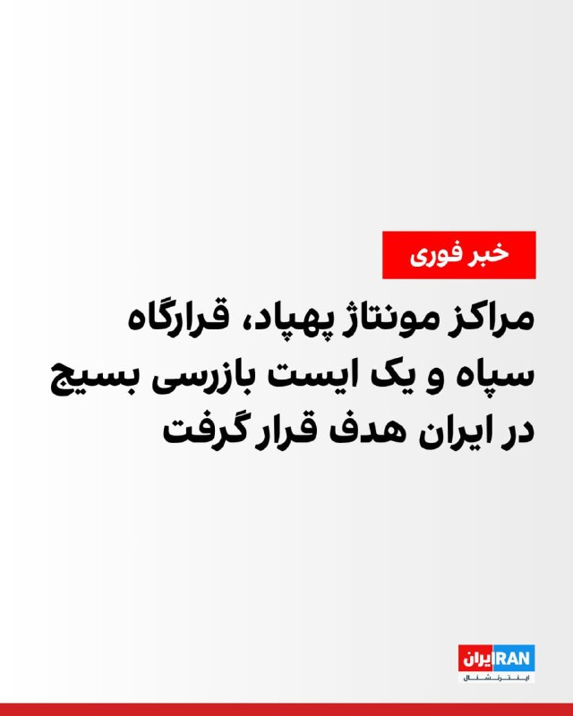

بر اساس گزارش برخی منابع درباره جزییات اهداف موج فعلی حملات در ایران، یک کارخانه مونتاژ پهپاد در نزدیکی شهر نجف‌آباد در استان اصفهان هدف قرار گرفته است.
این منابع همچنین گزارش دادند حمله‌ای در منطقه کرج، قرارگاه «سیدالشهدا» را هدف قرار داده است. این قرارگاه یکی از واحدهای مرکزی و راهبردی سپاه پاسداران در استان تهران به شمار می‌رود.

به گفته همین منابع، حمله دیگری نیز در شهرستان کبودرآهنگ استان همدان انجام شده و یک ایست بازرسی بسیج در نزدیکی پایگاه هوایی شاهرخی هدف قرار گرفته است.

این گزارش‌ها هم‌زمان با اعلام ارتش اسرائیل درباره حمله به اهداف نظامی در غرب و مرکز ایران منتشر شده است.

مقام‌های جمهوری اسلامی تاکنون به طور رسمی جزییات این حملات و میزان خسارت احتمالی آن‌ها را اعلام نکرده‌اند.
iranintl
‌🏁 🇬🇧 IranintlTV

🤖 @VahidOOnLine

## VahidOOnLine — post 244313

  

سخنگوی ارتش اسرائیل گفت که سنتکام در رهگیری موشک‌های پرتاب شده از ایران مشارکت کرده است.
افی دفرین افزود: «ما با سنتکام هماهنگی داشتیم، از جمله در حوزه دفاعی. آن‌ها دیروز در رهگیری‌ها مشارکت کردند.»
‌🏁 🇬🇧 IranintlTV

🤖 @VahidOOnLine

## WithYashar — post 13976

کانال 12 اسرائیل: ارتش اسرائیل در حال آماده شدن برای احتمال جنگ طولانی با ایران در حالی که عملیات "غرش شیران" ادامه دارد همچنین در حال حاضر اهداف جدیدی نیز مشخص شده است.
@withyashar

## WithYashar — post 13975

کانال ۱۲ اسرائیل: تاکنون، ایران بین ۲۲ تا ۲۴ موشک به سمت اسرائیل شلیک کرده است
@withyashar

## WithYashar — post 13974

رسانه های رژیم با ذکر الله اکبر ، نوشتند تنگه هرمز کامل بسته شد
@withyashar

## WithYashar — post 13973

رادیو ارتش اسرائیل: در حمله به حومه جنوبی بیروت تردید نخواهیم کرد🚨🚨🚨🚨
@withyashar

## mwarmonitor — post 10436

📌«رادیو ارتش اسرائیل به نقل از منابع: در حمله به ضاحیه جنوبی بیروت در صورت فراهم شدن فرصت برای هدف قرار دادن عناصر رهبری، تردید نخواهیم کرد.»

@mwarmonitor

## mwarmonitor — post 10435

🔴«هلیکوپترهای اردنی در آسمان شمال اردن در حال پرواز هستند تا برای مقابله با هرگونه پهپاد ایرانی که به حریم هوایی نزدیک شود و تلاش کند به اسرائیل حمله کند، آماده باشند.»

@mwarmonitor

## DEJradio — post 5463

  <a href="telegram/content/DEJradio_5463_1780911197.webm" target="_blank">🎬 Download video</a>

🔺📢 یک کارشناس امنیتی:
احتمال هدفگیری زیرساخت‌های بانکی جمهوری اسلامی بالاست

یک کارشناس امنیتی به دژ می‌گوید از آنجا که جمهوری اسلامی علاوه بر تنگه هرمز در پی انسداد یا اختلال در جریان کشتیرانی آزاد در باب‌المندب است، این احتمال که در اقدام متقابل زیرساخت‌های بانکی حکومت هدف قرار بگیرد زیاد است.

به گفته همین کارشناس این حملات می‌تواند سایبری یا فیزیکی باشد.

با توجه به این شرایط سپرده‌های شهروندان اعم از سپرده پولی یا اموال دپو شده در صندوق‌های امانات بانک‌ها مورد تهدید است.

#جنگ #تنگه_هرمز #بانک
@DEJradio

## kianmeli1 — post 87787

🔴فوری

نائب ریس کمیسیون صنایع: امکان قطع اینترنت بین‌الملل وجود دارد
https://t.me/+_a5ind9hr7sxOTE0

## IranIntlTV — post 341149

  

بر اساس گزارش برخی منابع درباره جزییات اهداف موج فعلی حملات در ایران، یک کارخانه مونتاژ پهپاد در نزدیکی شهر نجف‌آباد در استان اصفهان هدف قرار گرفته است.
این منابع همچنین گزارش دادند حمله‌ای در منطقه کرج، قرارگاه «سیدالشهدا» را هدف قرار داده است. این قرارگاه یکی از واحدهای مرکزی و راهبردی سپاه پاسداران در استان تهران به شمار می‌رود.

به گفته همین منابع، حمله دیگری نیز در شهرستان کبودرآهنگ استان همدان انجام شده و یک ایست بازرسی بسیج در نزدیکی پایگاه هوایی شاهرخی هدف قرار گرفته است.

این گزارش‌ها هم‌زمان با اعلام ارتش اسرائیل درباره حمله به اهداف نظامی در غرب و مرکز ایران منتشر شده است.

مقام‌های جمهوری اسلامی تاکنون به طور رسمی جزییات این حملات و میزان خسارت احتمالی آن‌ها را اعلام نکرده‌اند.
iranintl.com/202606083990

## IranIntlTV — post 341148

  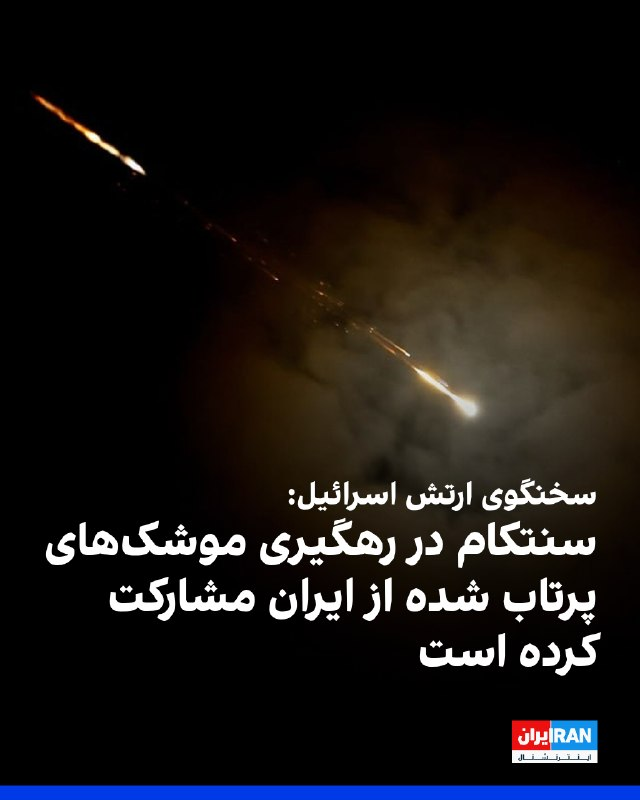

سخنگوی ارتش اسرائیل گفت که سنتکام در رهگیری موشک‌های پرتاب شده از ایران مشارکت کرده است.
افی دفرین افزود: «ما با سنتکام هماهنگی داشتیم، از جمله در حوزه دفاعی. آن‌ها دیروز در رهگیری‌ها مشارکت کردند.»
https://iranintl.com/202606087011

## Shin_Persian — post 6738

Shin ✓ @hey_itsmyturn
Mon, 08 Jun 2026 09:23:49 UTC

No casualties in Tehran as per officials.

فارسی

بنا بر گفته‌های مقامات، هیچ تلفاتی در تهران گزارش نشده است.

𝕏 · @shin_persian

## FarsiVOA — post 219999

  <a href="telegram/content/FarsiVOA_219999_1780911199.mp4" target="_blank">🎬 Download video</a>

انفجار و دود گسترده در پی حملات اسرائیل به نقاطی در تهران؛

گزارش‌های اولیه از شنیده‌شدن چندین انفجار در مناطق اسلام‌شهر، ملارد، کهریزک در محدوده تهران حکایت دارد. شدت انفجارها به اندازه‌ای بوده که ساکنان این مناطق از لرزش زمین و شنیده‌شدن صداهای پیاپی خبر داده‌اند.

هنوز جزئیات دقیقی درباره محل هدف، میزان خسارت و تلفات احتمالی منتشر نشده است.
@FarsiVOA

## Persian_Trend_Official — post 16167

  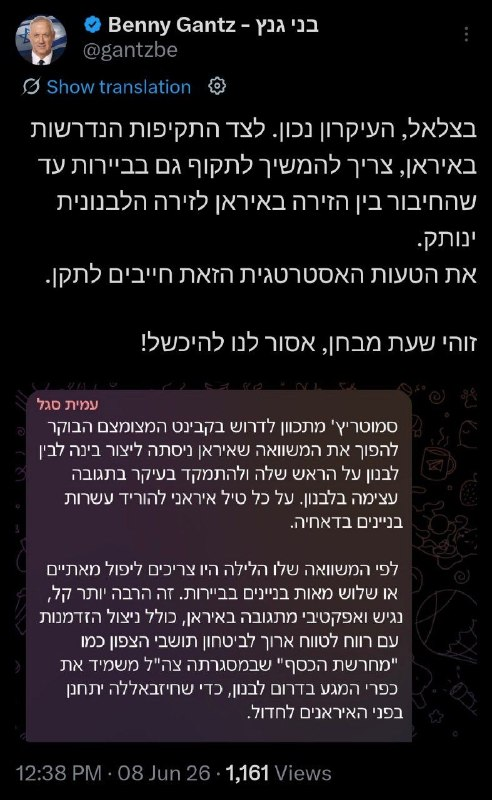

⭕️ Benny Gantz:

در اسرائیل، اصول درست هستند. در کنار حملات گسترده در ایران، باید به حمله به بیروت نیز ادامه داد تا پیوند میان ایران و حزب‌الله لبنان کاملاً قطع شود.

این اشتباه راهبردی باید اصلاح شود.

اکنون زمان آزمون است؛ نباید تسلیم شویم!

«اسموتریچ» در جلسه کابینه امنیتی ـ سیاسی صبح امروز قصد دارد معادله‌ای را که ایران تلاش می‌کند ایجاد کند، برهم بزند؛ معادله‌ای که بر اساس آن لبنان در ازای توقف حملات به ایران، از حمله در امان بماند. او از هرگونه اقدام ایران در واکنش به حمله علیه لبنان حمایت می‌کند.

بر اساس این معادله، اگر ایران به دنبال حمله به تأسیسات یا مراکز غیرنظامی باشد، این موضوع برای اسرائیل حتی آسان‌تر خواهد بود؛ زیرا واکنش اسرائیل علیه ایران شدیدتر و مؤثرتر می‌شود. این واکنش می‌تواند شامل حمله به اهداف مرتبط با امنیت داخلی ایران، مانند «ستادهای پولی» باشد که به گفته منابع اسرائیلی، رژیم ایران از طریق آن‌ها به حزب‌الله کمک مالی می‌رساند و پیش از آن نیز از آن‌ها علیه اسرائیلی‌ها استفاده شده است.

📝 Nick

📌 @persian_trend_official
پرشین ترند | متفاوت‌ترین کانال نظامی

## IranianMinds — post 21795

🔴 سپاه پاسداران انقلاب اسلامی:

"ما هشدار می‌دهیم! دشمن صهیونیستی، با عملیاتی علیه اهداف غیرنظامی و آسیب به صنایع نفت، بازی خطرناکی را آغاز کرده است که دامنه آن تمام اهداف انرژی در منطقه را در بر خواهد گرفت."

@IranianMinds

## IranianMinds — post 21794

🔴 کانال 12 اسرائیل:

نیروهای دفاعی اسرائیل (IDF) در حال آماده‌سازی برای احتمال جنگ طولانی با ایران هستند در حالی که عملیات «غرش شیران» ادامه دارد و اهداف جدید در حال تعیین شدن هستند

@IranianMinds

## Hranews — post 113464

  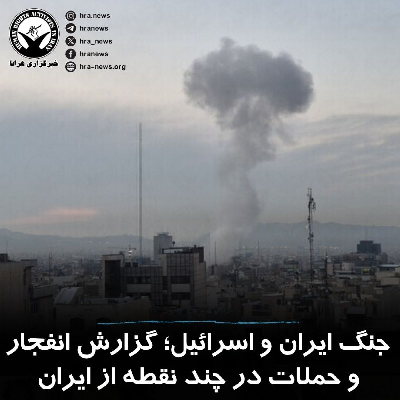

در ادامه تشدید درگیری‌های نظامی میان ایران و اسرائیل، صبح امروز دوشنبه ۱۸ خرداد ۱۴۰۵ گزارش‌هایی از شنیده شدن صدای انفجار و حملات احتمالی در نقاط مختلف ایران منتشر شد. بر اساس این گزارش‌ها، مناطقی در استان‌های کرمانشاه، البرز و تهران هدف حملات قرار گرفته‌اند و همزمان برخی منابع از حمله به شهر ری خبر داده‌اند. جزئیات دقیق این رویدادها، میزان خسارات احتمالی و تلفات ناشی از آنها تاکنون به طور رسمی اعلام نشده است.

رسانه‌های رسمی و مستقل ایران نیز وقوع این حوادث را گزارش کرده‌اند. خبرگزاری مهر از هدف قرار گرفتن مناطقی در کرمانشاه و همچنین شنیده شدن صدای انفجار در جنوب تهران خبر داد. دیدبان ایران و مدارا نیز گزارش‌هایی درباره شنیده شدن صدای انفجار در کرج منتشر کردند. همچنین اسکان نیوز از حمله به شهر ری خبر داده است. در همین حال، خبرگزاری مهر ضمن رد برخی گزارش‌های منتشر شده درباره وقوع انفجار ناشی از اصابت در اصفهان، اعلام کرد که طی ساعات اخیر چنین رویدادی در این شهر رخ نداده است، هرچند بامداد امروز وقوع انفجاری در نقطه‌ای از شهرستان نجف‌آباد گزارش شده بود.
#حمله_نظامی

↘️
@hranews_bot تماس ✉️ - @Hranews کانال هرانا 🆑

## alonews — post 126222

  <a href="telegram/content/alonews_126222_1780911202.webm" target="_blank">🎬 Download video</a>

👈اورژانس تهران: هیچ مصدومی در تهران تا به الان نداشتیم

✅ @AloNews خبر جنگ

## alonews — post 126221

  <a href="telegram/content/alonews_126221_1780911202.webm" target="_blank">🎬 Download video</a>

👈سازمان ملل ابراز نگرانی کرد

✅ @AloNews خبر جنگ

## alonews — post 126220

  <a href="telegram/content/alonews_126220_1780911202.webm" target="_blank">🎬 Download video</a>

👈آسمان منطقه ؛ هم اکنون

✅ @AloNews خبر جنگ

## alonews — post 126219

  <a href="telegram/content/alonews_126219_1780911202.webm" target="_blank">🎬 Download video</a>

👈منبع ارشد امنیتی ایران به المیادین:
ما قاطعانه تأیید می کنیم که معادله قبلی «زیرساخت در مقابل زیرساخت»، همچنان معتبر است

✅ @AloNews خبر جنگ

---
📅 بروزرسانی: 1405/03/18 12:54
---

## VahidOOnLine — post 244312

  <a href="telegram/content/VahidOOnLine_244312_1780910677.mp4" target="_blank">🎬 Download video</a>

⭕️ویدیویی از سقوط یکی از موشک‌های سپاه در منطقه‌ای باز در نزدیکی اریحا

♦️تصاویر منتشرشده در شبکه‌های اجتماعی نشان می‌دهد یک موشک ایرانی روز دوشنبه ۱۸ خردادماه در منطقه‌ای باز در نزدیکی شهر اریحا در شرق کرانه باختری سقوط کرده است.

تاکنون مقام‌های اسرائیلی یا جمهوری اسلامی درباره این گزارش‌ها اظهار نظر نکرده‌اند.

صبح دوشنبه ارتش اسرائیل اعلام کرد که تمام موشک‌های ایرانی در موج چهارم حملات را رهگیری کرده و فقط یک موشک در منطقه‌ای باز سقوط کرده است.
‌🇸🇦 Indypersian

🤖 @VahidOOnLine

## WithYashar — post 13972

فوری رئیس ستاد مشترک کانفیگ فروشان به ادمیرال یاشار رئیس اتاق جنگ گفت :
آماده‌ایم تا به هرگونه قطعی اینترنت پاسخ‌ کوبنده بدهیم
@withyashar

## WithYashar — post 13971

اینترنشنال با استناد به ارتباطات زیرپوستیش : ارتباط مقامات و فرماندهان با مجتبی خامنه ای دچار اختلال شده.
@withyashar

## WithYashar — post 13970

  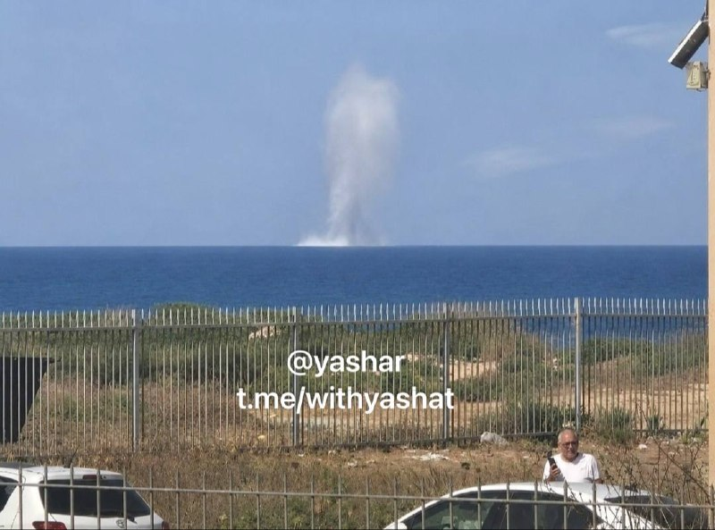

ساعاتی پیش ایران موشک به سمت اسرائیل پرتاب کرد که گویا وسط دریا خورده
@withyashar

## WithYashar — post 13969

اگه تازه بیدار شدی بدون که آتش بس آمریکا و ایران همچنان پا برجا است 🥴🤣
@withyashar
ترامپ هم کابل رو گرفته و پستهای انتخابات میزاره…

## WithYashar — post 13968

تن و بدن عرزشیها داره تو دایرکتها میلرزه و چرتو پرته که مینویسن 😁. اینها به هیچ وجه فکر نمیکردن که دوباره حمله شکل بگیره.
@withyashar
با عرزشی سوز ترین رسانه نسل شیک پاسارگادی با شما هستم.✌🏾

## WithYashar — post 13967

ارتش اسرائیل گزارش می‌دهد که حملات به ایران تنها توسط اسرائیل انجام شده است و هیچ مشارکتی از سوی آمریکا نبوده است
@withyashar

## WithYashar — post 13966

دایرکت پر شده از مسیج‌هایی که چرا نمیشه تو چنل عضو شد. من اون سمت توی گوشی شما نیستم این علت رو بدونم ولی محتمل‌ترین حالت لیمیت شدن شما به علت استفاده از فیلتر شکنه ، اگر IP تون رو یا ساده بگم فیلتر شکنتون رو عوض کنین این مشکل حتماً حل میشود.

## WithYashar — post 13965

رسانه های رژیم: خبر ترور فرماندهان یا مسئولان کذب است؛ هیچ تروری تاکنون انجام نشده است
@withyashar
یاشار : حالا نیس اینا خیلی گردنم میگیرن ! 🤣 اول همیشه اسرائیل اعلام کرده

## mwarmonitor — post 10434

🚨شبکه کان اسرائیل: ارتش برای چند روز و شاید چند هفته درگیری با ایران آماده می‌شود و برای احتمال پیوستن حزب‌الله نیز آمادگی دارد.

@mwarmonitor

## mwarmonitor — post 10433

  <a href="telegram/content/mwarmonitor_10433_1780910681.mp4" target="_blank">🎬 Download video</a>

🔴«ویدیویی از انفجارها در غرب پایتخت ایران، تهران، صبح امروز منتشر شده که ناشی از حملات هوایی اسرائیل است.»

@mwarmonitor

## mwarmonitor — post 10432

🔴ارتش اسرائیل به خبرنگاران نظامی دستورالعمل‌هایی صادر کرده است: دست‌کم برای چند روز درگیری آماده باشند.»

@mwarmonitor

## mwarmonitor — post 10431

🔴«ارتش اسرائیل می‌گوید برای دست‌کم چند روز دیگر از درگیری با ایران آماده است و حتی احتمال ازسرگیری کامل جنگ نیز وجود دارد.

🔸به گفته ارتش اسرائیل، تصور می‌شود درگیری‌ها برای چند روز ادامه پیدا کند، اما این نهاد همچنین برای یک درگیری طولانی‌مدت نیز آمادگی دارد.

🔹از شب گذشته تاکنون، ایران دست‌کم ۲۰ موشک بالستیک به سمت اسرائیل شلیک کرده که به گفته ارتش، یا رهگیری شده‌اند یا در مناطق باز فرود آمده‌اند.

🔸علاوه بر این، حوثی‌های یمنِ مورد حمایت ایران نیز امروز صبح دو موشک بالستیک به سمت اسرائیل شلیک کردند. طبق اعلام ارتش اسرائیل، یکی از این موشک‌ها رهگیری شده و موشک دوم به کشور نرسیده است.

🔹اسرائیل تاکنون در پاسخ به این حملات موشکی، دو موج حمله در ایران انجام داده است.

🔸در طول شب گذشته، ده‌ها جنگنده نیروی هوایی اسرائیل به ۹ سامانه پدافند هوایی ایران در غرب و مرکز ایران حمله کردند و صبح امروز نیز نیروی هوایی اسرائیل سه کارخانه در یک مجتمع پتروشیمی در جنوب‌غرب ایران را هدف قرار داد.

🔹ارتش می‌گوید این حملات تنها توسط اسرائیل انجام می‌شود، اما «هماهنگی کامل» با فرماندهی مرکزی آمریکا (سنتکام) وجود دارد. ارتش آمریکا نیز در رهگیری موشک‌های شلیک‌شده از ایران به اسرائیل مشارکت داشته است.

🔸همچنین گفته می‌شود ایال زمیر، رئیس ستاد کل ارتش اسرائیل، تاکنون سه بار با همتای خود، فرمانده سنتکام، دریاسالار برد کوپر، گفت‌وگو کرده است.»

@mwarmonitor

## kianmeli1 — post 87786

🔴فوری-هدف قرار گرفتن کارخانه مونتاژ پهپاد در نجف اباد اصفهان
https://t.me/+_a5ind9hr7sxOTE0

## kianmeli1 — post 87785

🔴فوری-آکسیوس به نقل از رادیو ارتش اسرائیل اعلام کرد که ارتش خود را برای چندین روز درگیری در ایران و احتمال بازگشت به یک نبرد طولانی‌مدت آماده می‌کند.
https://t.me/kianmeli1

## Shin_Persian — post 6737

↩️ Quoted tweet: Welmaxx @cyberplutonium Mon, 08 Jun 2026 09:01:56 UTC @hey_itsmyturn IRGC will start targeting desalination plants in Israel soon ↩️ توییت نقل‌قول شده — برای پاسخ، پست زیر را ببینید. فارسی @hey_itsmyturn سپاه پاسداران انقلاب اسلامی (IRGC)…

## Shin_Persian — post 6736

↩️ Quoted tweet:
Welmaxx @cyberplutonium
Mon, 08 Jun 2026 09:01:56 UTC

@hey_itsmyturn IRGC will start targeting desalination plants in Israel soon

↩️ توییت نقل‌قول شده — برای پاسخ، پست زیر را ببینید.

فارسی

@hey_itsmyturn سپاه پاسداران انقلاب اسلامی (IRGC) به‌زودی هدف قرار دادن تأسیسات آب‌شیرین‌کن در اسرائیل را آغاز خواهد کرد.

𝕏 · @shin_persian

## Iliaen — post 4461

🔹هشدار امنیت اطلاعات:

از ماه گذشته، تلگرام قابلیت تبلیغات را فعال کرده است.

براساس سیاست این پلتفرم، تبلیغات در هر کانال که بیش از هزار دنبال کننده دارد نمایش داده می‌شود.

درحال حاضر، مالک یک کانال تلگرام نیز امکان قطع نمایش تبلیغات در کانال خود را ندارد.

با این تفاسیر، نهاد امنیتی و حتی کلاهبرداران قادر هستند محتوای گمراه کننده را در سایر کانال ها و حتی یک یا چند کانال خاص نمایش دهند.

راهکار چیست؟

تنها راهکار، آگاهی از تفاوت مطلب با تبلیغات است.

رنگ کادر تبلیغ، با سایر مطالب کانال تفاوت دارد و همچنین عنوان "تبلیغات" در بالای آن درج شده که به راحتی میتوان تشخیص داد.

@iliaen

## FarsiVOA — post 219998

  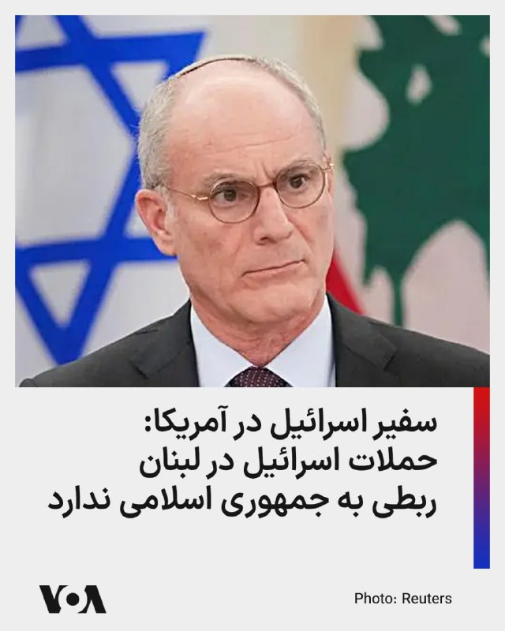

سفیر اسرائیل در آمریکا با اشاره به حملات موشکی جمهوری اسلامی به اسرائیل، هشدار داد در صورت شلیک موشک از سوی حزب‌الله لبنان، مراکز فرماندهی این گروه در ضاحیه بیروت هدف حملات شدید قرار خواهد گرفت.

یخیئل (مایکل) لایتر، سفیر اسرائیل در آمریکا، در پیامی در شبکه اجتماعی ایکس، درباره حملات جمهوری اسلامی اعلام کرد که هیچ کشوری چنین حملاتی را تحمل نمی‌کند و اسرائیل در پاسخ، سایت‌های پرتاب موشک‌های زمین‌به‌زمین و برخی زیرساخت‌های جمهوری اسلامی غیرمرتبط با بخش انرژی را هدف قرار داده است.

لایتر همچنین با اشاره به لبنان اظهار داشت: «مردم لبنان حزب‌الله، نیروی نیابتی جمهوری اسلامی، را رد کرده‌اند و به حکومت ایران گفته‌اند از کشورشان خارج شود.»

او هشدار داد: «اگر حزب‌الله به سوی اسرائیل شلیک کند، مراکز فرماندهی آن در ضاحیه به شدت هدف قرار خواهند گرفت، و این موضوع ربطی به ایران ندارد.»

لایتر در پایان تأکید کرد: «همه از این رژیم دیوانه‌ ایران به ستوه آمده‌اند.»
@FarsiVOA

## FarsiVOA — post 219997

  <a href="telegram/content/FarsiVOA_219997_1780910684.mp4" target="_blank">🎬 Download video</a>

ویدیوی حمله اسرائیل به پتروشیمی ماهشهر؛

ارتش اسرائیل دوشنبه در بیانیه‌ای نوشت که نیروی هوایی این کشور «چندین هدف» را در مجتمع پتروشیمی منطقه ماهشهر هدف قرار داده و جزئیات بیشتر بعداً ارائه خواهد شد.

پیشتر خبرگزاری مهر گزارش داد شرکت پتروشیمی کارون در ماهشهر، در استان خوزستان، بامداد دوشنبه هدف حمله هوایی قرار گرفته است. تا زمان اعلام اولیه، هیچ‌گونه تلفات جانی یا مجروحیت ناشی از این حمله گزارش نشده است.
@FarsiVOA

## DW_Farsi — post 125678

  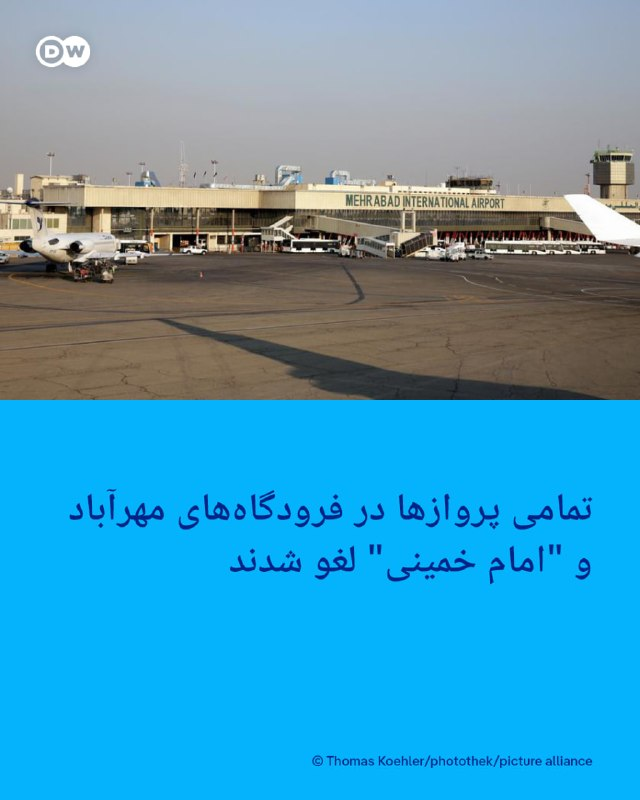

🔶 تمامی پروازها در فرودگاه‌های مهرآباد و "امام خمینی" لغو شدند

روابط عمومی فرودگاه بین‌المللی مهرآباد تهران اعلام کرد تمامی پروازهای این فرودگاه از روز دوشنبه ۱۸ خرداد تا اطلاع ثانوی لغو شده‌اند.

سازمان هواپیمایی کشوری شامگاه یکشنبه با صدور اطلاعیه هوانوردی (نوتام) از بسته شدن بخش غربی فضای پروازی کشور خبر داده و گفته بود هیچ پروازی تا اطلاع ثانوی صورت نخواهد گرفت. در همین حال سایت فرودگاه بین‌المللی "امام خمینی" نیز از لغو تمامی پروازها در این فرودگاه خبر داده است.

روزنامه "شرق" گزارش داده است که در حال حاضر سایت‌های فرودگاه‌های ایران کار نمی‌کند.

خبرگزاری مهر نیز نوشت که سه پرواز حامل زائران ایرانی از شهر جده عربستان که قرار بود بامداد دوشنبه به مقصد فرودگاه امام خمینی انجام شود، در فرودگاه مشهد به زمین خواهند نشست. به گفته سازمان حج و زیارت، انجام پروازهای بازگشت زائران به سایر فرودگاه‌ها "منوط به عادی شدن شرایط پروازی و رفع محدودیت‌های موجود خواهد بود".

همزمان مدیر روابط عمومی فرودگاه بین‌المللی هاشمی‌نژاد مشهد نیز از لغو پروازهای این فرودگاه خبر داد و گفت "با توجه به شرایط پیش‌آمده در شب گذشته، تمامی پروازهای ورودی و خروجی" این فرودگاه "تا اطلاع ثانوی لغو شده است".

از سوی دیگر وزیر حمل و نقل اسرائیل صبح دوشنبه اعلام کرد حریم هوایی این کشور همچنان باز است و فعالیت‌های فرودگاه بین‌المللی "بن گوریون" در شهر تل‌آویو تا اطلاع ثانوی طبق برنامه عادی ادامه دارد.

@dw_farsi

## DW_Farsi — post 125677

  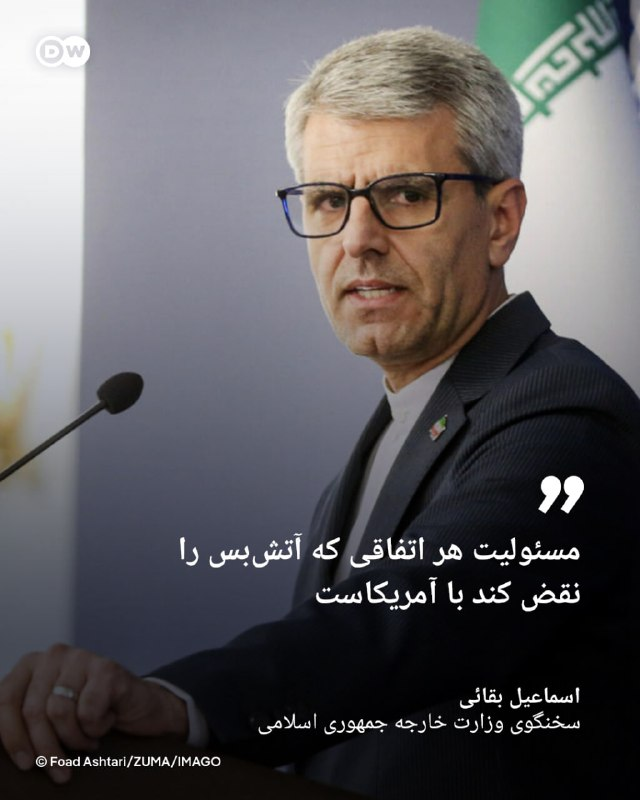

🔶 بقائی: مسئولیت هر اتفاقی که آتش‌بس را نقض کند با آمریکاست

اسماعیل بقائی، سخنگوی وزارت خارجه جمهوری اسلامی، در نشست خبری هفتگی خود در روز دوشنبه مسئولیت حملات اسرائیل به ایران را بر عهده آمریکا دانست و گفت: «پیامدهای تشدید تنش در منطقه بر عهده آمریکاست.»

بقائی اظهار داشت که سیاست‌های اسرائیل را در منطقه را "نمی‌توان از سیاست‌های آمریکا جدا دانست" و رخدادهای ۲۴ ساعت گذشته به "وضعیت نابسامان در فرایند دیپلماتیک دامن خواهد زد".

سخنگوی وزارت خارجه ایران گفت فرماندهی مرکزی ایالات متحده، سنتکام، "در زمینه پدافند و آفند با اسرائیل همکاری و هماهنگی دارد" و افزود: «هر اتفاقی در منطقه بیفتد که آتش بس نقض شود چه از طریق حمله آمریکا به کشتی‌های تجاری ایران و مراکزی در جنوب ایران یا به واسطه اقدامات رژیم صهیونیستی در لبنان، مسئولیت مستقیم آمریکا در این زمینه محرز است و پیامدهای تشدید تنش بر عهده آمریکاست.»

حکومت جمهوری اسلامی در مواضع رسمی خود از اسرائیل با عنوان "رژیم صهیونیستی" یاد می‌کند.

بقائی در پاسخ به پرسشی در مورد تأثیر تشدید تنش‌ها بر مذاکرات تهران و واشنگتن گفت: «فلسفه مذاکرات این بود که به جنگ تحمیلی علیه ایران خاتمه داده شود. از ابتدا تصریح شده بود و میانجی‌گر پاکستانی تاکید کرده بود آتش‌بس شامل لبنان هم می‌شود. اگر قرار باشد فلسفه وجودی مذاکرات مخدوش شود، قاعدتا روند دیپلماتیک هم تحت تاثیر قرار خواهد گرفت.»

@dw_farsi

## Persian_Trend_Official — post 16165

اسرائیل : ما خود را برای چندین روز نبرد با ایران و همچنین برای احتمال بازگشت به درگیری نظامی طولانی‌مدت آماده می‌کنیم.

## Persian_Trend_Official — post 16164

  <a href="telegram/content/Persian_Trend_Official_16164_1780910688.webm" target="_blank">🎬 Download video</a>

اسرائیل : ما خود را برای چندین روز نبرد با ایران و همچنین برای احتمال بازگشت به درگیری نظامی طولانی‌مدت آماده می‌کنیم.

## Persian_Trend_Official — post 16163

  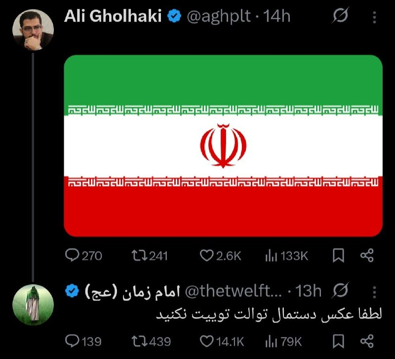

📝 Nick

📌 @persian_trend_official
پرشین ترند | متفاوت‌ترین کانال نظامی

## Persian_Trend_Official — post 16162

⭕️ ارتش اسرائیل گزارش می‌دهد که حملات به ایران تنها توسط اسرائیل انجام شده است و هیچ مشارکتی از سوی آمریکا نبوده است.

📝 Nick

📌 @persian_trend_official
پرشین ترند | متفاوت‌ترین کانال نظامی

## Persian_Trend_Official — post 16161

  <a href="telegram/content/Persian_Trend_Official_16161_1780910689.webm" target="_blank">🎬 Download video</a>

⭕️ کانفیگ فروش ها: تحرکات منطقه را به شدت زیر نظر داریم.

📝 Nick

📌 @persian_trend_official
پرشین ترند | متفاوت‌ترین کانال نظامی

## Persian_Trend_Official — post 16160

رادیو ارتش اسرائیل: از شب گذشته ایران بیش از 20 موشک بالستیک به سمت ما شلیک کرد که تماما رهگیری یا به منطقه‌ای باز اصابت کرد.

ارتش اسرائیل معتقد است این جنگ چندین روز طول می‌کشد و حتی برای یک درگیری طولانی مدت آماده می‌شود.اسرائیل تاکنون به دو موج حمله ایران پاسخ داده است و 9 سامانه پدافندی را در غرب و مرکز ایران منهدم و یک مجتمع پتروشیمی را در جنوب غرب ایران هدف قرار داد.

ارتش آمریکا در رهگیری موشک‌های ایرانی به ما کمک کرده است و باهم هماهنگ و متحد هستیم.

📝 Amir

📌 @persian_trend_official
پرشین ترند | متفاوت‌ترین کانال نظامی

## RadioFarda — post 158043

🔸اسماعیل بقایی، سخنگوی وزارت خارجه جمهوری اسلامی، با تأیید تداوم تبادل پیام‌ها میان ایران و آمریکا در فضایی که آن را «لبریز از بی‌اعتمادی» خواند، هشدار داد: «اتفاقاتی که در ۲۴ ساعت گذشته افتاده، به این وضعیت نابسامان در فرایند دیپلماتیک دامن خواهد زد.»

🔸آقای بقایی ساعتی پس از حملات موشکی جمهوری اسلامی به اسرائیل و پاسخ متقابل اسرائیل، آمریکا را «مسئول» نقض آتش‌بس و تشدید تنش دانست و گفت «نوعی تقسیم کار» بین آمریکا و اسرائیل اتفاق افتاده است.

🔸ایران و آمریکا باوجود تأکید هر دو طرف به ادامۀ مذاکرات، طی دو هفته اخیر چند بار با یکدیگر درگیر شده‌اند.

🔸بقائی سفر وزیر کشور پاکستان به ایران که گفته شد حاوی پیامی محرمانه برای محتبی خامنه‌ای بوده را در راستای «کمک به تداوم گفت‌و‌گوها» عنوان کرد.

@RadioFarda

## IranianMinds — post 21793

از عجایب ایرانو‌ اینو بگم که الان مردم تعجب کردن که چرا نت قطع نشده.

@IranianMinds

## IranianMinds — post 21792

🔴 جبهه داخلی اسرائیل :

وضعیت امنه میتونید از پناهگاه خارج شوید.

@IranianMinds

## IranianMinds — post 21791

🔴 ارتش اسرائیل : خودمون به تنهایی حملات رو آغاز کردیم و هیچ کمکی از سمت آمریکا نداشتیم. @IranianMinds

## IranianMinds — post 21790

🔴 ارتش اسرائیل :

انتظار چند روز درگیری دیگر رو‌ هم داریم.

@IranianMinds

## IranianMinds — post 21789

کافیه چت جی پی تی قطع شه تا رهبر هم از بین بره نیازی به موشک‌ نیست :)

@IranianMinds

## IranianMinds — post 21788

🔴 ارتش اسرائیل :

خودمون به تنهایی حملات رو آغاز کردیم و هیچ کمکی از سمت آمریکا نداشتیم.

@IranianMinds

## alonews — post 126218

  <a href="telegram/content/alonews_126218_1780910690.webm" target="_blank">🎬 Download video</a>

👈کانال ۱۲ اسرائیل:
تاکنون، ایران بین ۲۲ تا ۲۴ موشک به سمت اسرائیل شلیک کرده است

✅ @AloNews خبر جنگ

## alonews — post 126217

  <a href="telegram/content/alonews_126217_1780910690.mp4" target="_blank">🎬 Download video</a>

👈مارکو روبیو، وزیر خارجه آمریکا: «فقط کشورهای احمق وقتی به آنها شلیک می‌شود، پاسخ نمی‌دهند»

✅ @AloNews خبر جنگ

## alonews — post 126216

  <a href="telegram/content/alonews_126216_1780910693.webm" target="_blank">🎬 Download video</a>

👈هشدار دادستانی کل کشور درباره انتشار تصاویر محل اصابت پرتابه‌های دشمن: با متخلفان برخورد قاطع قانونی صورت می‌گیرد

✅ @AloNews خبر جنگ

## alonews — post 126215

  <a href="telegram/content/alonews_126215_1780910693.webm" target="_blank">🎬 Download video</a>

👈الجزیره: اوری گلدبرگ، مفسر سیاسی، به الجزیره گفت که پس از تشدید تنش‌های نظامی اخیر اسرائیل در ایران و لبنان، روابط بین ایالات متحده و اسرائیل در معرض خطر است

✅ @AloNews خبر جنگ

## alonews — post 126214

  <a href="telegram/content/alonews_126214_1780910693.webm" target="_blank">🎬 Download video</a>

👈رسانه‌های عبری: شرکت هواپیمایی ویز ایر پروازهای خود به «اسرائیل» را تا روز چهارشنبه تعلیق کرد

✅ @AloNews خبر جنگ

## alonews — post 126213

  <a href="telegram/content/alonews_126213_1780910694.mp4" target="_blank">🎬 Download video</a>

من تازه آنلاین شدم، آتش بس نقض شده؟

## alonews — post 126212

من تازه آنلاین شدم، آتش بس نقض شده؟

## alonews — post 126211

  <a href="telegram/content/alonews_126211_1780910694.webm" target="_blank">🎬 Download video</a>

👈ترامپ در حال حاضر جنگ ایران و اسرائیل را رها کرده و پست های مربوط به انتخابات منتشر می کند

✅ @AloNews خبر جنگ

## alonews — post 126210

  <a href="telegram/content/alonews_126210_1780910695.webm" target="_blank">🎬 Download video</a>

👈آکسیوس به نقل از رادیو ارتش اسرائیل اعلام کرد که ارتش خود را برای چندین روز درگیری در ایران و احتمال بازگشت به یک نبرد طولانی‌مدت آماده می‌کند

✅ @AloNews خبر جنگ

## alonews — post 126209

  <a href="telegram/content/alonews_126209_1780910695.webm" target="_blank">🎬 Download video</a>

👈ارتش اسرائیل گزارش می‌دهد که حملات به ایران تنها توسط اسرائیل انجام شده است و هیچ مشارکتی از سوی آمریکا نبوده است

✅ @AloNews خبر جنگ

---
📅 بروزرسانی: 1405/03/18 12:35
---

## VahidOOnLine — post 244311

  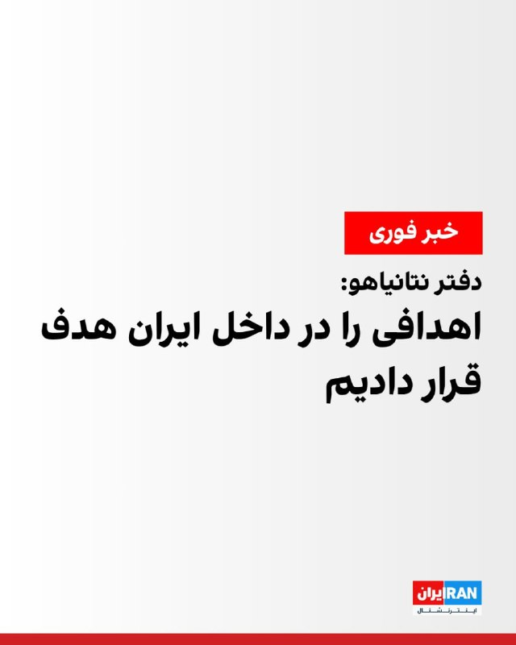

دفتر بنیامین نتانیاهو، نخست‌ وزیر اسرائیل اعلام کرد که این کشور در پاسخ به پرتاب موشک از سوی جمهوری اسلامی، اهدافی را در داخل ایران هدف قرار داده است.

در این بیانیه تاکید شده که اسرائیل از نظر دفاعی و تهاجمی در وضعیت آماده‌باش بالا قرار دارد.
iranintl
‌🏁 🇬🇧 IranintlTV

🤖 @VahidOOnLine

## WithYashar — post 13964

روسیا الیوم نوشت: ترامپ به پیاده کردن نیروهای ویژه در ایران تهدید کرد.
@withyashar

## WithYashar — post 13963

خبرهایی پخش شده از حمله به ایست بازرسی ولی هیچ گزارش مردمی در این رابطه به دستم نرسیده. به نظر من این خبر فیک برای توجه یا امید واهی است، فعلاً! ولی حتماً شروع و انجام خواهد شد.
@withyashar

## WithYashar — post 13962

صدای جنگنده مرکز تهران
@withyashar

## WithYashar — post 13961

نائب ریس کمیسیون صنایع: امکان قطع اینترنت بین‌الملل وجود دارد
بالاخره شرایط جنگی است و مصلحت ایران اولویت دارد.
@withyashar

## WithYashar — post 13960

  <a href="telegram/content/WithYashar_13960_1780909525.mp4" target="_blank">🎬 Download video</a>

از پایگاه عظیم کوه معروف یزد الان شلیک شد @withyashar

## mwarmonitor — post 10430

🔴«ارتش اسرائیل می‌گوید تمام حملاتی که تاکنون در ایران انجام شده، صرفاً توسط اسرائیل صورت گرفته است، در حالی که ایالات متحده در رهگیری برخی موشک‌های ایرانی کمک کرده است.»

@mwarmonitor

## mwarmonitor — post 10429

🚨«ارتش اسرائیل تصمیم گرفته است عملیات “غرش شیران” را از همان جایی که متوقف شده بود ادامه دهد، به‌جای آن‌که عملیات جدیدی آغاز کند. ارتش این را روز ۴۲ عملیات “غرش شیران ” محسوب می‌کند، پس از یک وقفه دوماهه ـ i24News»

@mwarmonitor

## mwarmonitor — post 10428

✈️«شرکت Wizz اعلام کرد که تمامی پروازها به اسرائیل را دست‌کم تا فردا لغو کرده است.»

@mwarmonitor

## mwarmonitor — post 10427

📌 حزب‌الله: با موشک‌ها یک تجمع از ادوات نظامی اسرائیلی را در اطراف شهرک بیت یاحون در جنوب لبنان هدف قرار دادیم.»

@mwarmonitor

## mwarmonitor — post 10426

🔴«شهرداری تهران اعلام می‌کند که پارکینگ‌های زیرزمینی برای استفاده به‌عنوان پناهگاه در پایتخت در حال آماده‌سازی هستند.»

@mwarmonitor

## mwarmonitor — post 10425

✈️«نیروی هوایی اسرائیل به حملات در عمق خاک ایران ادامه می‌دهد ـ رادیو ارتش اسرائیل.»

@mwarmonitor

## mwarmonitor — post 10424

🔴«حمله به یک ایست بازرسی بسیج در کبودرآهنگ در استان همدان، غرب ایران.» @mwarmonitor

## pm_afshaa — post 92889

  <a href="telegram/content/pm_afshaa_92889_1780909527.mp4" target="_blank">🎬 Download video</a>

مستند حملات در به تهران

💧 Rainbet.com the #1 Non-KYC Crypto Casino & Sportsbook @rainbetcom

😁 @Pm_Afshaa

## pm_afshaa — post 92888

نتانیاهو: الوعده‌وفا

💧 Rainbet.com the #1 Non-KYC Crypto Casino & Sportsbook @rainbetcom

😁 @Pm_Afshaa

## pm_afshaa — post 92887

از یزد موشک شلیک شد

💧 Rainbet.com the #1 Non-KYC Crypto Casino & Sportsbook @rainbetcom

😁 @Pm_Afshaa

## mamlekate — post 103639

📝 گزارش دیلی‌میل از تعرض یک بازیکن تیم‌ملی به یک دختر ۱۴ ساله در ترکیه

روزنامه دیلی‌میل گزارشی منتشر کرده که یک فوتبالیست ملی‌پوش که نامش فاش نشده، از سوی یک خانواده بریتانیایی متهم شده است که در جریان تعطیلات آن‌ها در یک هتل پنج‌ستاره در ترکیه، تلاش کرده دختر ۱۴ ساله‌شان را برای «در آغوش گرفتن» به پشت یک پرچین ببرد.

@mamlekate

## mamlekate — post 103638

📝 حمله به پتروشیمی کارون؛ از نقش صنعتی و صادراتی تا پیوند با برنامه‌های نظامی جمهوری اسلامی

معاون امنیتی و انتظامی استانداری خوزستان صبح دوشنبه ۱۸ خرداد از حمله به پتروشیمی کارون خبر داد. حمله به این تاسیسات راهبردی که با سپاه پاسداران مرتبط است، می‌تواند زنجیره‌ تولید را در بخش نظامی و غیرنظامی با اختلال مواجه کند.

@mamlekate

## kianmeli1 — post 87784

🔴روسیا الیوم نوشت: ترامپ به پیاده کردن نیروهای ویژه در ایران تهدید کرد.
https://t.me/kianmeli1

## IranIntlTV — post 341147

  

دفتر بنیامین نتانیاهو، نخست‌ وزیر اسرائیل اعلام کرد که این کشور در پاسخ به پرتاب موشک از سوی جمهوری اسلامی، اهدافی را در داخل ایران هدف قرار داده است.

در این بیانیه تاکید شده که اسرائیل از نظر دفاعی و تهاجمی در وضعیت آماده‌باش بالا قرار دارد.
iranintl.com/202606080219

## IranIntlTV — post 341146

  <a href="telegram/content/IranIntlTV_341146_1780909530.mp4" target="_blank">🎬 Download video</a>

در پی حمله‌های متقابل جمهوری اسلامی و اسرائیل، کانال ۱۳ اسرائیل از حمله به ۲۰ هدف در داخل ایران در واکنش به حمله‌های سپاه پاسداران گزارش داد.

اشکان صفایی، خبرنگار ایران‌اینترنشنال، گزارش می‌دهد

@iranintltv

## FarsiVOA — post 219996

  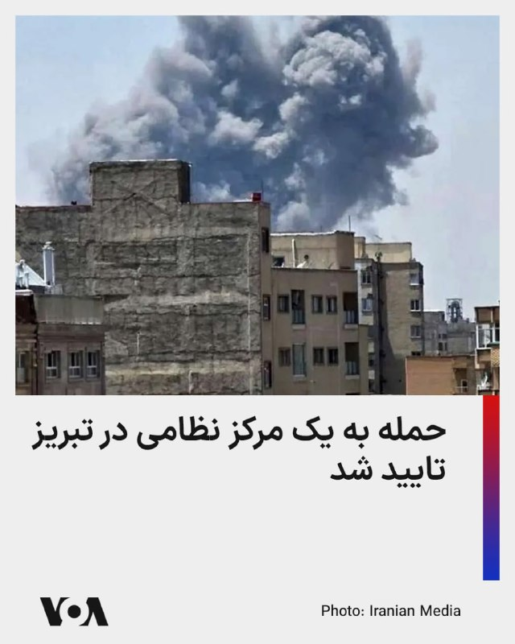

مدیرکل مدیریت بحران استانداری آذربایجان شرقی، هدف قرار گرفتن یک مرکز نظامی در شهر تبریز، طی بامداد روز دوشنبه ۱۸ خرداد، را تایید کرد.

مجید فرشی، زمان وقوع این حمله را ساعت پنج صبح اعلام و مدعی شد که تلفات جانی نداشته است. او از بیان مکان دقیق این حملات خودداری کرد، اما یادآور شد که ابعاد حادثه در دست بررسی است.

ساعاتی قبل برخی منابع از هدف قرار گرفتن فرودگاه تبریز خبر دادند که این اخبار از سوی رسانه‌های داخلی تکذیب شد.

بامداد دوشنبه ۱۸ خرداد، ارتش اسرائيل در پاسخ به حملات موشکی سپاه، مناطقی را در تهران و نیز غرب و مرکز و جنوب ایران هدف قرار داد.
@FarsiVOA

## DW_Farsi — post 125676

  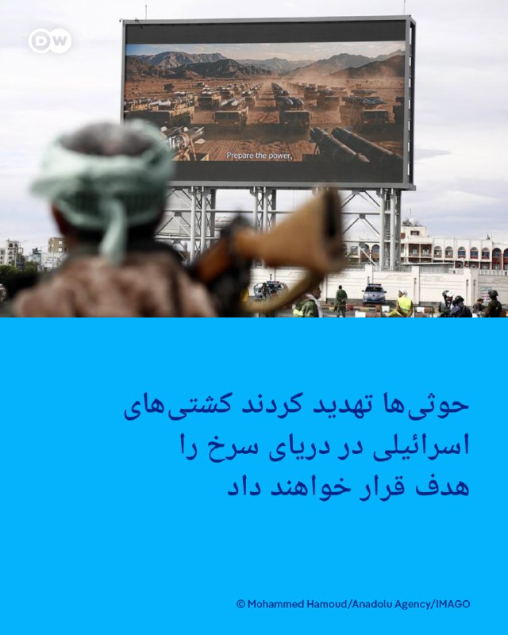

🔶 حوثی‌ها تهدید کردند کشتی‌های اسرائیلی در دریای سرخ را هدف قرار خواهند داد

شبه‌نظامیان حوثی یمن حمله موشکی روز دوشنبه به اسرائیل را تأیید کردند و مدعی شدند که این نخستین حمله آنها به اسرائیل طی چند هفته گذشته بوده است.

یحیی سریع، سخنگوی نظامی حوثی‌ها در بیانیه‌ای که از شبکه تلویزیونی "المسیره" متعلق به این گروه پخش شد، اعلام کرد "محاصره کامل" کشتیرانی مرتبط با اسرائیل در دریای سرخ برقرار شده است و هر تردد مرتبط با اسرائیل در این منطقه به عنوان "هدف نظامی" تلقی خواهد شد.

سخنگوی حوثی‌ها تهدید کرد که به تشدید تنش پاسخ خواهد داد و عملیات این گروه "همسو با شرایط جنگ و با مشارکت محور جهاد و مقاومت خواهد بود".

ارتش اسرائیل صبح دوشنبه اعلام کرده بود که یک موشک از سمت یمن به خاک این کشور را شناسایی و رهگیری کرده است. این نخستین حمله مستقیم حوثی‌ها به اسرائیل از حدود دو ماه پیش تا کنون به شمار می‌رود.

شبه‌نظامیان حوثی یمن یکی از مهمترین‌ متحدان منطقه‌ای جمهوری اسلامی به شمار می‌روند و پس از آغاز حملات اسرائیل و آمریکا علیه ایران در ۹ اسفند سال گذشته، "همبستگی کامل" خود را با حکومت ایران اعلام کردند.

@dw_farsi

## Persian_Trend_Official — post 16159

  <a href="telegram/content/Persian_Trend_Official_16159_1780909534.mp4" target="_blank">🎬 Download video</a>

سازمان اطلاعات سپاه: مطابق قانون مقابله با اقدامات خصمانه رژیم صهیونی هرگونه همکاری با دشمن از جمله تهیه و ارسال فیلم و عکس اقدامی مجرمانه محسوب شده و با مرتکبان برابر قانون در زمان جنگ، برخورد خواهد شد.

📝 Amir

📌 @persian_trend_official
پرشین ترند | متفاوت‌ترین کانال نظامی

## Persian_Trend_Official — post 16158

حدودا نیم ساعت دیگه لایو رو شروع میکنیم

## Persian_Trend_Official — post 16157

  <a href="telegram/content/Persian_Trend_Official_16157_1780909536.webm" target="_blank">🎬 Download video</a>

انفجار مهیب اصفهان

## Persian_Trend_Official — post 16156

  <a href="telegram/content/Persian_Trend_Official_16156_1780909537.mp4" target="_blank">🎬 Download video</a>

هم‌اکنون تهران

## Persian_Trend_Official — post 16155

  <a href="telegram/content/Persian_Trend_Official_16155_1780909540.webm" target="_blank">🎬 Download video</a>

⭕️ ارتش اسرائیل می گوید نه تنها در ایران بلکه در لبنان نیز در حال عملیات های گسترده است و بیش از 90 مرکز مربوط به حزب الله را مورد هدف قرار داده است.

📝 Nick

📌 @persian_trend_official
پرشین ترند | متفاوت‌ترین کانال نظامی

## IranianMinds — post 21787

🔴 رسانه سپاه :

خبرهای ترور همشون کذبن و فرماندهان ما همه حالشون خوبه

@IranianMinds

## IranianMinds — post 21786

🔴 شهرداری تهران:

پارکینگ‌های زیرسطحی برای استفاده به عنوان پناهگاه آماده می‌شوند.

@IranianMinds

## IranianMinds — post 21785

🔴 ارتش اسرائیل :

در‌ کنار حملاتمون به ایران در ۲۴ ساعت گذشته بیش از ۹۰ زیرساخت تروریستی حزب الله رو هم نابود کردیم

@IranianMinds

## BBCPersian — post 283166

🔻افزایش قیمت نفت پس از حملات ایران و اسرائیل

قیمت نفت پس از حملات ایران و اسرائیل روند افزایشی به خود گرفته است.

قیمت نفت برنت با ۴/۵ درصد افزایش به ۹۷/۳۰ دلار در هر بشکه رسید، درحالی‌که نفت خام آمریکا با ۴/۳ درصد افزایش به حدود ۹۴/۵۰ دلار رسید.

بازارهای آسیا نیز در آغاز روز دوشنبه به‌شدت سقوط کردند و شاخص‌های اصلی مانند کاسپی کره جنوبی تقریبا ۸ درصد کاهش یافتند.

@BBCPersian

## alonews — post 126208

  <a href="telegram/content/alonews_126208_1780909540.webm" target="_blank">🎬 Download video</a>

👈الحدث به نقل از سفیر آمریکا در بیروت:
قرار است مذاکرات لبنان و اسرائیل در واشنگتن از سر گرفته شود

✅ @AloNews خبر جنگ

## alonews — post 126207

  <a href="telegram/content/alonews_126207_1780909541.webm" target="_blank">🎬 Download video</a>

👈قیمت دلار آزاد به ۱۷۸ هزار تومان رسید

✅ @AloNews خبر جنگ

## alonews — post 126206

  <a href="telegram/content/alonews_126206_1780909541.webm" target="_blank">🎬 Download video</a>

🔴فوری / روسیا الیوم نوشت: ترامپ به پیاده کردن نیروهای ویژه در ایران تهدید کرد.

✅ @AloNews خبر جنگ

## alonews — post 126205

  <a href="telegram/content/alonews_126205_1780909541.webm" target="_blank">🎬 Download video</a>

👈سخنگوی ارتش اسرائیل: حملات به سامانه‌های دفاعی استراتژیک در ‌ایران را تکمیل کرده‌ایم

🔴 نیروی هوایی به حملات خود در عمق خاک ایران ادامه می‌دهد و این حملات شامل فرودگاه شیراز در جنوب ایران نیز می‌شود.

✅ @AloNews خبر جنگ

## alonews — post 126204

  <a href="telegram/content/alonews_126204_1780909542.webm" target="_blank">🎬 Download video</a>

👈مهر: هیچ اصابت یا برخوردی در فرودگاه شیراز رخ نداده است

✅ @AloNews خبر جنگ

## alonews — post 126203

  <a href="telegram/content/alonews_126203_1780909542.webm" target="_blank">🎬 Download video</a>

🔴فوری/نائب ریس کمیسیون صنایع: امکان قطع اینترنت بین‌الملل وجود دارد

🔴بالاخره شرایط جنگی است و مصلحت ایران اولویت دارد.

✅ @AloNews خبر جنگ

---
📅 بروزرسانی: 1405/03/18 12:23
---

## VahidOOnLine — post 244310

ویدیویی که دوشنبه ۱۸ خرداد به دست ایران‌اینترنشنال رسیده، دود ناشی از انفجارها را در پتروشیمی کارون واقع در منطقه ویژه اقتصادی ماهشهر پس از حملات اسرائیل نشان می‌دهد.
‌🏁 🇬🇧 IranintlTV

🤖 @VahidOOnLine

## VahidOOnLine — post 244309

  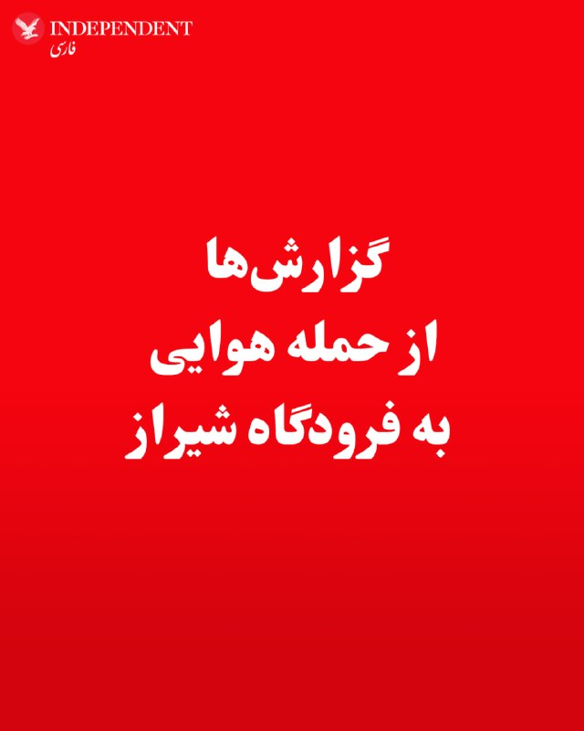

♦️خبرگزاری‌های دولتی ایران ظهر دوشنبه ۱۸ خرداد از حملات هوایی به فرودگاه شیراز خبر دادند.

ساعتی پیش از انتشار این خبر، سازمان هواپیمایی کشوری ایران اعلام کرده بود کلیه پروازهای این فرودگاه تا ساعت ۸ شب امشب (دوشنبه) لغو شده است.

هنوز گزارشی درباره میزان خسارات یا تلفات احتمالی این حمله منتشر نشده است.
‌🇸🇦 Indypersian

🤖 @VahidOOnLine

## VahidOOnLine — post 244308

  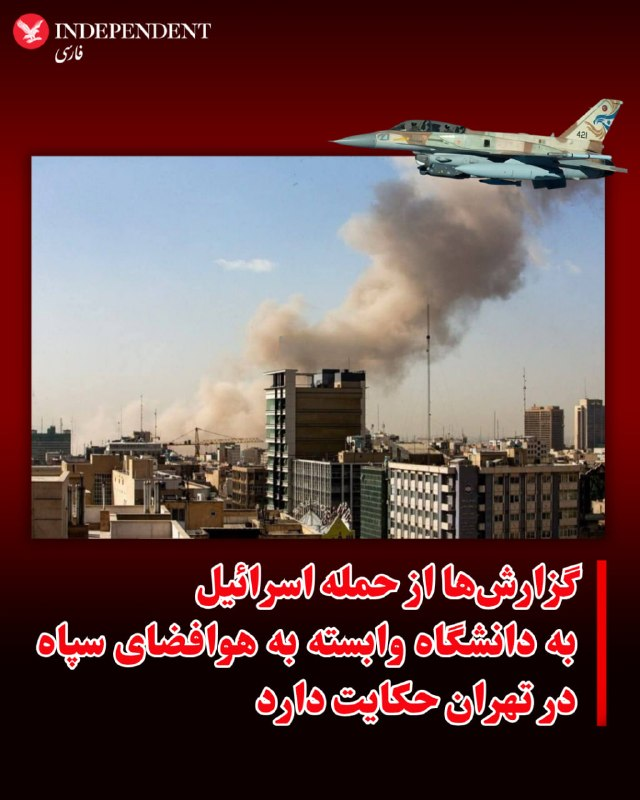

♦️بر اساس گزارش‌های چند رسانه نزدیک به سپاه ازجمله کانال تلگرامی صابرین ‌نیوز، دانشگاه عاشورا در تهران که از مراکز وابسته به نیروی هوافضای سپاه پاسداران محسوب می‌شود، ظهر دوشنبه ۱۸ خردادماه هدف حمله اسرائیل قرار گرفته است.
هنوز جزئیاتی درباره میزان خسارات، تلفات احتمالی یا نوع حمله منتشر نشده و مقام‌های رسمی ایران نیز تاکنون واکنشی به این گزارش‌ها نشان نداده‌اند.
‌🇸🇦 Indypersian

🤖 @VahidOOnLine

## WithYashar — post 13959

یه سر برم بیت رهبری الان میام 🥴🙌🏾

## WithYashar — post 13958

شهرداری تهران جنگ بیخ داره و داریم پارکینگ‌های زیرسطحیو برای استفاده به عنوان پناهگاه آماده میکنیم.
@withyashar

## WithYashar — post 13957

  

۳۰۰،۰۰۰ امین نفر کانال خانوم پی ام
@withyashar

## mwarmonitor — post 10423

🔰جهت اطلاع 🔰

📝دوست عزیز،

📌واقعاً برایم سوال است که لابلای این همه کانال زرد و فیک‌نیوز، دنبال چه گنجی می‌گردی؟ «هذا فادا» واقعاً!

📌اینکه مدام مطالب کانال‌های دیگر را بفرستی و بپرسی «این درسته یا اون غلطه»، مثل این است که از یک سرآشپز بپرسی آشغال‌های سطل زباله‌ی همسایه خوشمزه‌تر است یا سطل زباله‌ی سر کوچه؟

📌یکم واسه خودت، یا حداقل واسه اون مغز طفلک ارزش قائل باش. حیف است که ورودی‌های ذهنت را با محتوایی پر کنی که ارزشش از کاغذ باطله هم کمتر است.

📌 ادمین‌های آن کانال‌ها با «فیک‌نیوز» نان می‌خورند، تو چرا باید با باور کردنشان، به مغزت رژیم سمی بدی؟

📌کمی از این زردی‌ها فاصله بگیر؛ وگرنه زردیِ این اخبار چنان به خوردِ فکرت می‌رود که دیگر با هیچ شوینده‌ای پاک نمی‌شود!

@mwarmonitor

## mwarmonitor — post 10422

🔴در کنار حملات در ایران: ارتش اسرائیل طی ۲۴ ساعت گذشته بیش از ۹۰ زیرساخت سازمان تروریستی حزب‌الله را در لبنان هدف قرار داد

🔸ارتش اسرائیل طی ۲۴ ساعت گذشته بیش از ۹۰ انبار تسلیحات، مراکز فرماندهی و دیگر زیرساخت‌های سازمان تروریستی حزب‌الله را در لبنان هدف قرار داد که تروریست‌های این سازمان از آن‌ها برای پیشبرد طرح‌های تروریستی علیه نیروهای ارتش اسرائیل استفاده می‌کردند.

🔸همزمان، سکوهای پرتاب این سازمان نیز با هدف رفع تهدید علیه شهروندان کشور اسرائیل مورد حمله قرار گرفتند.

🔸ارتش اسرائیل با قاطعیت به فعالیت خود برای رفع هرگونه تهدید علیه شهروندان کشور اسرائیل و نیروهایش، در هر مکانی که لازم باشد، ادامه خواهد داد.

@mwarmonitor

## pm_afshaa — post 92886

انفجار شدید در جنوب غربی تهران

💧 Rainbet.com the #1 Non-KYC Crypto Casino & Sportsbook @rainbetcom

😁 @Pm_Afshaa

## pm_afshaa — post 92885

انفجار در تبریز

💧 Rainbet.com the #1 Non-KYC Crypto Casino & Sportsbook @rainbetcom

😁 @Pm_Afshaa

## DEJradio — post 5462

  <a href="telegram/content/DEJradio_5462_1780908786.webm" target="_blank">🎬 Download video</a>

🚨📢 بر اساس آخرین گزارش‌ها تا ساعت ۱۲:۰۰ به‌وقت ایران، شماری از مراکز وابسته به سـ.ـپاه از جمله لشکر ۱۰ «سیدالشهداء» سـ.ـپاه کرج و دانشگاه عاشورا هوافضای سـ.ـپاه هدف حمله موشکی اسرائیل قرار گرفت.

در نقاط مختلفی از تهران، اسلامشهر، بیدگنه و کرج صدای انفجار شنیده شد.

#جنگ #IRGCterrorists
@DEJradio

## DEJradio — post 5461

  <a href="telegram/content/DEJradio_5461_1780908787.mp4" target="_blank">🎬 Download video</a>

🔺📢 یک بازنشسته نیروهای مسلح:
بین پرسنل ارتش و سـ.ـپاه تبعیض قائل می‌شوند

یک بازنشسته ارتش در پیامی به دژ خطاب به فرماندهان نیروهای مسلح گفت: «خجالت نمی‌کشید برای بازنشسته ۶۴۰ هزار تومان کارت حکمت شارژ می‌کنید؟ با این دارایی سهم هر بازنشسته این مبلغ است؟ آنهم در شرایطی که بین پرسنل و بازنشسته ارتش و سـ.ـپاه تبعض قائل می‌شوند»...

#ارتش #IRGCterrorists
@DEJradio

## kianmeli1 — post 87783

🔴مهم-ساعت حدود ۱۲:۰۰ شهر دوشنبه؛ چند ایستگاه ایست بازرسی‌ در اتوبان همت تهران، محل خدمت را ترک کردند.
https://t.me/+_a5ind9hr7sxOTE0

## IranIntlTV — post 341145

  <a href="telegram/content/IranIntlTV_341145_1780908788.mp4" target="_blank">🎬 Download video</a>

ویدیویی که دوشنبه ۱۸ خرداد به دست ایران‌اینترنشنال رسیده، دود ناشی از انفجارها را در پتروشیمی کارون واقع در منطقه ویژه اقتصادی ماهشهر پس از حملات اسرائیل نشان می‌دهد.

## Shin_Persian — post 6735

  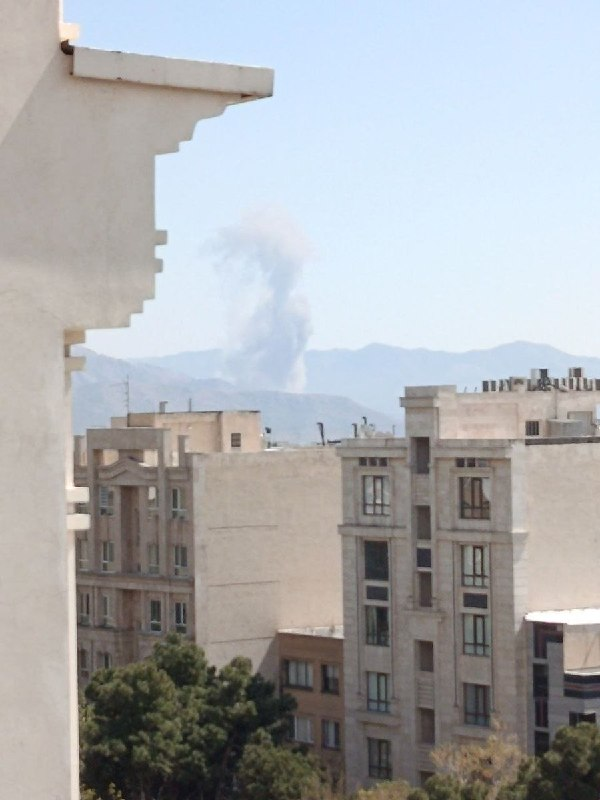

Shin ✓ @hey_itsmyturn
Mon, 08 Jun 2026 08:47:23 UTC

Reportedly Eastern Tehran
Tehran Province, #Iran
(Image: Not mine)

فارسی

گزارش‌ها از شرق تهران
استان تهران، #Iran
(تصویر: متعلق به من نیست)

𝕏 · @shin_persian

## Shin_Persian — post 6734

Shin ✓ @hey_itsmyturn
Mon, 08 Jun 2026 08:44:28 UTC

Explosion sound in western Tehran,
#Tehran Province, #Iran

فارسی

صدای انفجار در غرب تهران،
#Tehran Province, #Iran

𝕏 · @shin_persian

## FarsiVOA — post 219995

  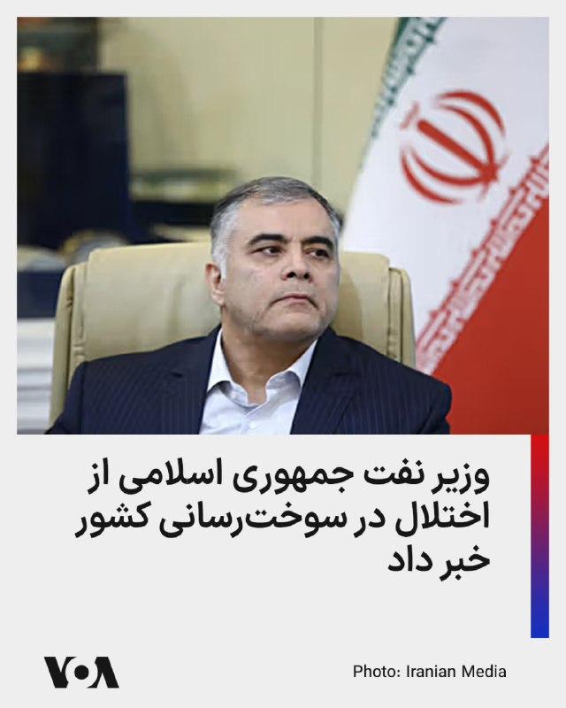

محسن پاک‌نژاد، وزیر نفت جمهوری اسلامی، از انجام «اقدامات عملیاتی» برای مدیریت اختلال ایجادشده در سوخت‌رسانی کشور، به‌ویژه در استان‌های شمالی، خبر داد.

پایگاه اطلاع‌رسانی دولت به نقل از پاک‌نژاد نوشت که پس از ایجاد اختلال در روند سوخت‌رسانی، «تدابیری اندیشیده شد» و نیروهای وزارت نفت بلافاصله در محل حاضر شدند.

او گفت با انجام این اقدامات، «تا حدود زیادی این بحران مدیریت شد و شرایط تحت کنترل قرار گرفت.»

وزیر نفت جزئیات بیشتری درباره علت دقیق اختلال، گستره آن، میزان آسیب احتمالی یا استان‌های درگیر اعلام نکرد.

این اظهارات در حالی مطرح شده که همزمان با تشدید درگیری میان جمهوری اسلامی و اسرائیل، گزارش‌هایی نیز از حمله به برخی زیرساخت‌های صنعتی و انرژی در ایران منتشر شده است.
@FarsiVOA

## Persian_Trend_Official — post 16154

  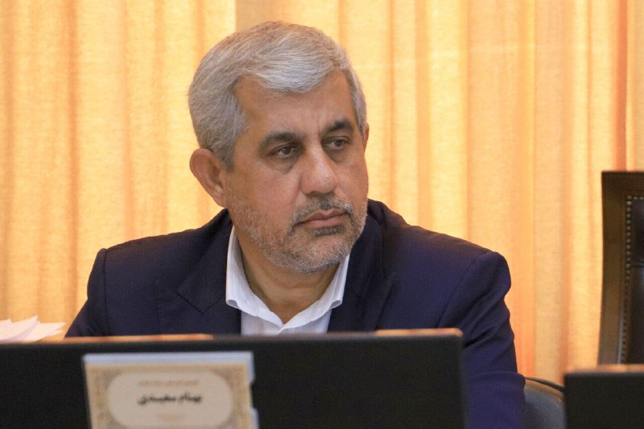

دبیر کمیسیون امنیت ملی مجلس: پایان دوران بزن و دررو؛ پاسخ گسترده ایران در راه است!

بهنام سعیدی دبیر هیات رئیسه کمیسیون امنیت ملی و سیاست خارجی مجلس شورای اسلامی با تاکید بر اینکه دوران بزن دررو آمریکا و اسرائیل به پایان رسیده است گفت: پاسخ گسترده ایران در راه است.

📝 Amir

📌 @persian_trend_official
پرشین ترند | متفاوت‌ترین کانال نظامی

## Persian_Trend_Official — post 16153

سومین پهپاد توسط نیروهای مسلح در آسمان تهران توسط پدافند هوایی منهدم شد

## Persian_Trend_Official — post 16152

حملات پر شدت به زاغه های مهمات، انبار ها و آماد و یگان های زرهی و زمینی، هوافضا و پدافندهوایی و نیروی هوایی در حال رخ دادن است

## RadioFarda — post 158042

  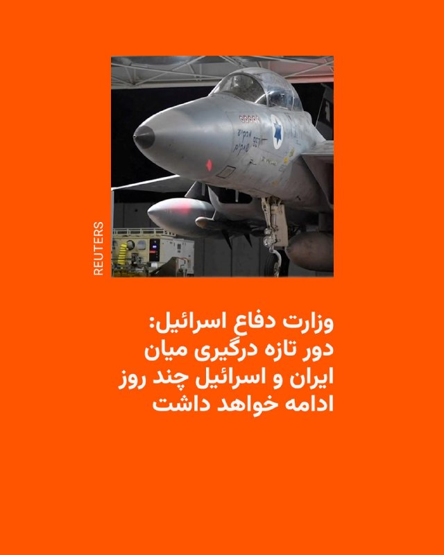

🔸سخنگوی ارتش اسرائیل اعلام کرد «ده‌ها فروند جت جنگی» این کشور در حملات بامداد دوشنبه در ایران سامانه‌های دفاع هوایی را در برخی از نقاط این کشور هدف قرار داده‌اند.

🔸افی دفرین گفت ایران توانسته بود به‌تازگی قابلیت‌های دفاع هوایی خود را که در آغاز جنگ ۴۰ روزه (در اوایل اسفند) آسیب دیده بود، «بازیابی» کند.

🔸به گفته این سخنگو، حملات جنگنده‌های اسرائیل در بامداد دوشنبه «منجر به نابودی» این سامانه‌های دفاع هوایی‌ احیاشده ایران شده است.

🔸سرهنگ دفرین افزود «حمله گسترده» جنگنده‌ها با هدایت اداره اطلاعات (امان، سازمان اطلاعات ارتش اسرائیل) انجام و «تکمیل شد».

🔸اسرائیل اوایل اسفند گذشته و همچنین خرداد پارسال ابتدا سامانه‌های دفاع هوایی ایران را هدف حملات شدید قرار داده بود تا جنگنده‌هایش بتوانند با کمترین مخاطرات، بمباران‌ها را عملی کنند.

🔸هیچ گزارشی از ساقط‌شدن هواپیمای اسرائیلی در بمباران‌های جنگ اخیر و جنگ ۱۲ روزه منتشر نشده است.

🔸در این میان، سایت خبری والانیوز ظهر دوشنبه نوشت وزارت دفاع اسرائیل ارزیابی می‌کند دور کنونی حملات متقابل اسرائیل و ایران «چند روز ادامه داشته باشد».

@RadioFarda

## IranianMinds — post 21784

🔴 سخنگوی ارتش اسرائیل :

ارتش اسرائیل یک حمله گسترده علیه سامانه‌های پدافندی راهبردی رژیم تروریستی ایران را تکمیل کرد

در دوره اخیر، سامانه‌های پدافندی در چندین منطقه مختلف در ایران مستقر شده بودند، در چارچوب تلاش رژیم برای بازسازی توانایی‌های شناسایی و دفاعی خود که در عملیات «غرش شیران» آسیب دیده بودند — این حمله منجر به انهدام این سامانه‌ها شد.

در عملیات «غرش شیران»، ارتش اسرائیل به‌طور عمیق به سامانه‌های پدافندی رژیم تروریستی ایران آسیب وارد کرد. حملات تکمیل‌شده به تعمیق بیشتر آزادی عمل نیروی هوایی در آسمان ایران کمک می‌کنند.

@IranianMinds

## IranianMinds — post 21783

کله زرد خوابه هنوز خبر نداره دارن میگان

## IranianMinds — post 21782

🔴 جلسه کابینه امنیتی اسرائیل با حضور بنیامین نتانیاهو آغاز شد

@IranianMinds

## IranianMinds — post 21781

🔴 معاون امنیتی استانداری خوزستان:

دقایقی پیش مجدد شرکت پتروشیمی کارون ماهشهر مورد تهاجم هوایی و اصابت پرتابه‌های دشمن صهیونیستی قرار گرفت و بخشی از آن آسیب دید.

@IranianMinds

## IranianMinds — post 21780

گزارشات خودتون رو دایرکت بفرستید

لطفا مسخره بازی در نیارید

## IranianMinds — post 21779

🔴 گزارشاتی از صدای انفجار در شیراز

@IranianMinds

## BBCPersian — post 283165

🔻شنیده شدن صدای انفجار در تهران، اصفهان، شهرری و کرج

گزارش‌های متعدد حاکی از شنیده شدن صدای انفجار در چندین شهر ایران است.

براساس این خبرها در تهران، اصفهان، شهر ری و کرج صدای مهیب انفجار شنیده است.

گزارش دقیقی از محل این انفجارها تاکنون منتشر نشده است.

@BBCPersian

## BBCPersian — post 283164

🔻شنیده شدن صدای شدید پدافند در شرق تهران

گزارش‌های رسیده به بی‌بی‌سی فارسی حاکی از آن است که صدای پدافند شدید در شرق تهران شنیده شده است.

همچنین گزارش شده که صدای چندین انفجار در غرب تهران نیز شنیده شده است اما محل دقیق آن هنوز مشخص نیست.

@BBCPersian

## idfinfarsi — post 11816

در کنار حملات در ایران: ارتش اسرائیل طی ۲۴ ساعت گذشته بیش از ۹۰ زیرساخت سازمان تروریستی حزب‌الله را در لبنان هدف قرار داد

ارتش اسرائیل طی ۲۴ ساعت گذشته بیش از ۹۰ انبار تسلیحات، مراکز فرماندهی و دیگر زیرساخت‌های سازمان تروریستی حزب‌الله را در لبنان هدف قرار داد که تروریست‌های این سازمان از آن‌ها برای پیشبرد طرح‌های تروریستی علیه نیروهای ارتش اسرائیل استفاده می‌کردند.

همزمان، سکوهای پرتاب این سازمان نیز با هدف رفع تهدید علیه شهروندان کشور اسرائیل مورد حمله قرار گرفتند.

ارتش اسرائیل با قاطعیت به فعالیت خود برای رفع هرگونه تهدید علیه شهروندان کشور اسرائیل و نیروهایش، در هر مکانی که لازم باشد، ادامه خواهد داد.

## alonews — post 126202

  <a href="telegram/content/alonews_126202_1780908792.webm" target="_blank">🎬 Download video</a>

👈دقایقی قبل، تهران 
✅ @AloNews خبر جنگ

## alonews — post 126201

  <a href="telegram/content/alonews_126201_1780908792.mp4" target="_blank">🎬 Download video</a>

👈آسمان یزد

✅ @AloNews خبر جنگ

---
📅 بروزرسانی: 1405/03/18 12:13
---

## WithYashar — post 13956

🚨🚨🚨🚨🚨🚨🚨🚨🚨
گزارشهای از یک تررور هدفمند در تهران
@withyashar

## WithYashar — post 13955

  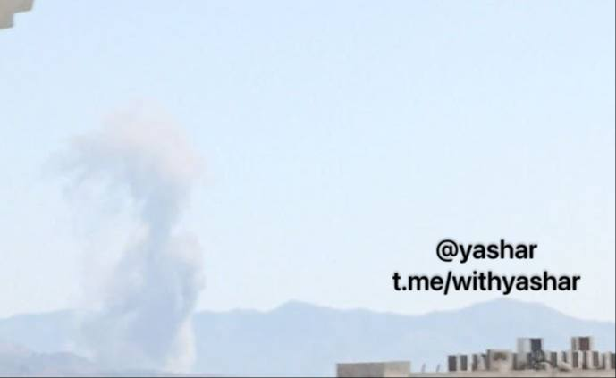

مشاهده دود از شرق تهران
@withyashar

## WithYashar — post 13954

سفارت هند در تهران از شهروندان خود می‌خواهد فوراً ایران را ترک کنن
@withyashar

## WithYashar — post 13953

رادیو اسرائیل: همکنون نتانیاهو ریاست جلسه‌ای کوچک از هیئت وزیران را بر عهده دارد تا درباره مسائل امنیتی و سیاسی در تمامی جبهه‌ها بحث و بررسی کند.»
@withyashar

## WithYashar — post 13952

گزارش چند انفجار در جنوب تهران
@withyashar

## WithYashar — post 13951

کان نیوز عبری: نیروی هوایی درحال انجام عملیات در ایران است
@withyashar

## WithYashar — post 13950

فارس: موج جدید حملات موشکی در راهه.
@withyashar

## WithYashar — post 13949

  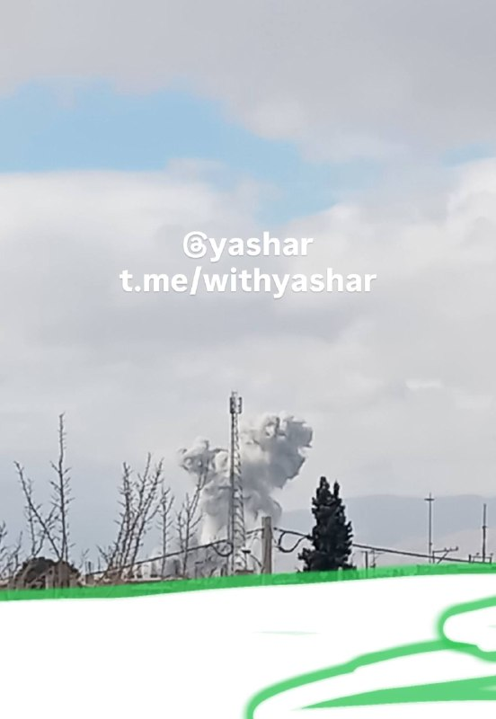

اصفهان الان
@withyashar

## WithYashar — post 13948

گزارشات از انفجار در فرودگاه شیراز
@withyashar

## mwarmonitor — post 10421

🚨بر اساس گزارش AFP: «صدای یک انفجار بزرگ در تهران شنیده شده است.»

@mwarmonitor

## mwarmonitor — post 10420

🚨«فوری | رادیو اسرائیل: نتانیاهو ریاست جلسه‌ای کوچک از هیئت وزیران را بر عهده دارد تا درباره مسائل امنیتی و سیاسی در تمامی جبهه‌ها بحث و بررسی کند.»

@mwarmonitor

## pm_afshaa — post 92884

پدافند اصفهان همچنان فعاله

💧 Rainbet.com the #1 Non-KYC Crypto Casino & Sportsbook @rainbetcom

😁 @Pm_Afshaa

## pm_afshaa — post 92883

سفارت هند در تهران از شهروندان خود می‌خواهد فوراً ایران را ترک کنن

💧 Rainbet.com the #1 Non-KYC Crypto Casino & Sportsbook @rainbetcom

😁 @Pm_Afshaa

## pm_afshaa — post 92882

انفجار در فرودگاه شیراز

💧 Rainbet.com the #1 Non-KYC Crypto Casino & Sportsbook @rainbetcom

😁 @Pm_Afshaa

## pm_afshaa — post 92881

لشکر10 سیدالشهداء (ص) سپاه کرج مورد حمله پهپادی اسرائیل قرار گرفت

💧 Rainbet.com the #1 Non-KYC Crypto Casino & Sportsbook @rainbetcom

😁 @Pm_Afshaa

## pm_afshaa — post 92880

حمله موشکی حوثی ها به اسراییل

💧 Rainbet.com the #1 Non-KYC Crypto Casino & Sportsbook @rainbetcom

😁 @Pm_Afshaa

## DEJradio — post 5460

  <a href="telegram/content/DEJradio_5460_1780908214.webm" target="_blank">🎬 Download video</a>

🚨
❗️ هموطنان گرامی، با توجه به شدت گرفتن درگیری‌ها از تردد غیرضروری در اماکن عمومی و خیابان‌ها، به‌ویژه نزدیک مراکز نظامی و ساختمان‌های حکومتی، خودداری کنید.

صاحبان کارخانجات و سیلوها، به‌ویژه در حومه شهرها، مراقب باشید اطراف محل کار شما اگر لانچر مستقر است فاصله بگیرید.

#هشدار #جنگ
@DEJradio

## mamlekate — post 103637

📝 الو ساعت ۱۰:۳۴ صدای یه انفجار سمت ستارخان تهران

📝 سمت غرب تهران صدای انفجار اومد

📝 مرکز شهر پدافند فعال شد

📝 حدود ۱۲:۳۵ صدای انفجار در کرج. متوجه نشدیم کجا رو زدن

@mamlekate

## kianmeli1 — post 87782

🔴لشکر10 سیدالشهداء سپاه کرج مورد حمله اسرائیل قرار گرفت
https://t.me/+_a5ind9hr7sxOTE0

## kianmeli1 — post 87781

  <a href="telegram/content/kianmeli1_87781_1780908215.mp4" target="_blank">🎬 Download video</a>

🔴امروز-فیلم فرود موشک به پتروشیمی سلمان فارسی (ماهشهر)
https://t.me/+_a5ind9hr7sxOTE0

## IranIntlTV — post 341144

  <a href="telegram/content/IranIntlTV_341144_1780908216.mp4" target="_blank">🎬 Download video</a>

تیم فوتبال ایران بامداد یکشنبه به وقت محلی وارد شهر تیخوانا شد و نخستین تمرین خود را در این شهر برگزار کرد. هم‌زمان در لس‌آنجلس و در اطراف ورزشگاه محل برگزاری مسابقات جام جهانی، صدها نفر از ایرانیان با در دست داشتن پرچم‌های شیر و خورشید تجمع کردند.

گزارش رضا محدث، خبرنگار ایران‌اینترنشنال

@iranintltv

## Shin_Persian — post 6732

  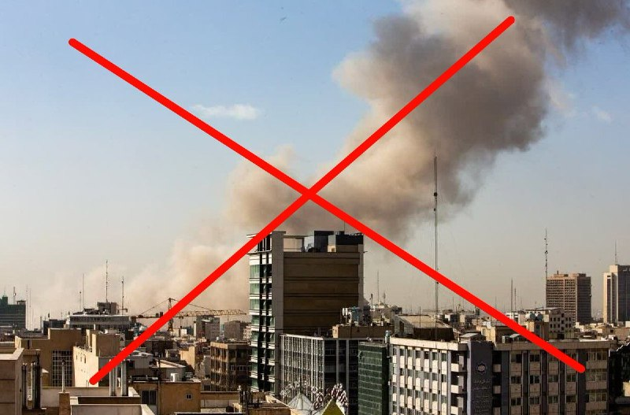

Shin ✓ @hey_itsmyturn
Mon, 08 Jun 2026 08:39:10 UTC

THIS
IMAGE
IS
OLD.

Thank you for your attention to this matter,
Not DJT.

فارسی

این
تصویر
قدیمی
است.

از توجه شما به این موضوع سپاسگزارم،
دی جی تی نیستم.

𝕏 · @shin_persian

## Shin_Persian — post 6731

Shin ✓ @hey_itsmyturn
Mon, 08 Jun 2026 08:36:27 UTC

UAV strike, Deir El Balh, Gaza.
Highly likely a targeted assassination.
(AGAIN: GAZA, NOT IRAN)

فارسی

حمله پهپادی، دیرالبلح، غزه.
به احتمال بسیار زیاد یک ترور هدفمند است.
(تکرار می‌کنم: غزه، نه ایران)

𝕏 · @shin_persian

## Iliaen — post 4460

ساعت حدود ۱۲:۰۰ شهر دوشنبه؛ چند ایستگاه ایست بازرسی‌ در اتوبان همت تهران، محل خدمت را ترک کردند.

@iliaen

## FarsiVOA — post 219994

  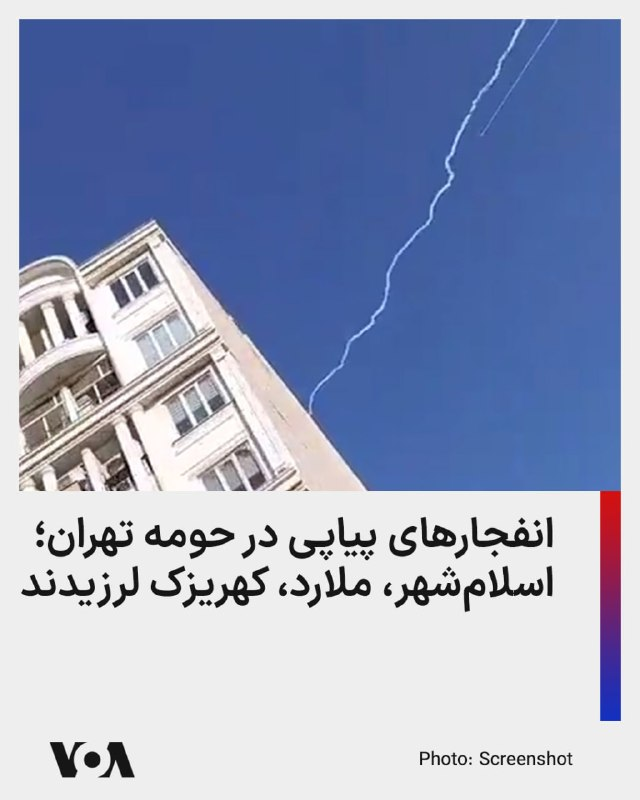

دقایقی پیش گزارش‌هایی از شنیده‌شدن صدای انفجار در چند نقطه تهران منتشر شد.

بر اساس گزارش‌های اولیه، ابتدا صدای انفجار در غرب تهران به گوش رسیده و سپس گزارش‌هایی از شنیده‌شدن صداهای مشابه در شرق و جنوب پایتخت نیز منتشر شده است.

گزارش‌های اولیه از شنیده‌شدن چندین انفجار در مناطق اسلام‌شهر، ملارد، کهریزک در محدوده تهران حکایت دارد. شدت انفجارها به اندازه‌ای بوده که ساکنان این مناطق از لرزش زمین و شنیده‌شدن صداهای پیاپی خبر داده‌اند.

هنوز جزئیات دقیقی درباره محل هدف، میزان خسارت و تلفات احتمالی منتشر نشده است؛ اما گسترش دامنه انفجارها در اطراف تهران نشان می‌دهد پایتخت و حومه آن همچنان در وضعیت پرتنش قرار دارند.
@FarsiVOA

## Persian_Trend_Official — post 16151

سخنگوی شهرداری تهران: پارکینگ‌ های زیرسطحی برای استفاده به عنوان پناهگاه آماده می‌شوند.

📝 Amir

📌 @persian_trend_official
پرشین ترند | متفاوت‌ترین کانال نظامی

## Persian_Trend_Official — post 16150

  <a href="telegram/content/Persian_Trend_Official_16150_1780908219.mp4" target="_blank">🎬 Download video</a>

سفارت هند در تهران از شهروندان خود می‌خواهد فوراً ایران را ترک کنن

## Persian_Trend_Official — post 16149

  <a href="telegram/content/Persian_Trend_Official_16149_1780908220.webm" target="_blank">🎬 Download video</a>

سفارت هند در تهران از شهروندان خود می‌خواهد فوراً ایران را ترک کنن

## Persian_Trend_Official — post 16148

  <a href="telegram/content/Persian_Trend_Official_16148_1780908220.webm" target="_blank">🎬 Download video</a>

⭕️ زیرنویس شبکه خبر:

📝 Nick

📌 @persian_trend_official
پرشین ترند | متفاوت‌ترین کانال نظامی

## Persian_Trend_Official — post 16147

بر اساس گزارش‌های منتشرشده از سوی برخی رسانه‌ها و منابع مخالف حکومت ایران، نیروهای هوایی اسرائیل بامداد امروز در حمله‌ای که به‌عنوان اقدام تلافی‌جویانه توصیف شده است، یک مرکز فرماندهی و کنترل زیرزمینی در کرمانشاه را هدف قرار دادند. این گزارش‌ها مدعی‌اند که در زمان حمله، شماری از فرماندهان ارشد سپاه پاسداران در حال بررسی برنامه‌های عملیاتی بوده‌اند و در نتیجه این حمله جان خود را از دست داده‌اند. تاکنون مقامات رسمی ایران و منابع مستقل جزئیات این ادعاها را تأیید نکرده‌اند.

👺Phantom

📌 @persian_trend_official
پرشین ترند | متفاوت‌ترین کانال نظامی

## Persian_Trend_Official — post 16146

  <a href="telegram/content/Persian_Trend_Official_16146_1780908221.webm" target="_blank">🎬 Download video</a>

شبکه الإخباريه سوریه: یک موشک ایرانی پس از رهگیری از سوی اسرائیل، اطراف روستای زبیده در نزدیکی قنیطره سوریه سقوط کرد.

📌 @persian_trend_official
پرشین ترند | متفاوت‌ترین کانال نظامی

## Persian_Trend_Official — post 16145

  <a href="telegram/content/Persian_Trend_Official_16145_1780908221.webm" target="_blank">🎬 Download video</a>

⭕️ فارس: در صورت خطای مجدد، زیرساخت نفت و گاز منطقه هدف قرار می‌گیرد.

📝 Nick

📌 @persian_trend_official
پرشین ترند | متفاوت‌ترین کانال نظامی

## RadioFarda — post 158041

🔸ولی‌الله حیاتی، معاون امنیتی و انتظامی استانداری خوزستان از حمله هوایی و موشکی اسرائیل به شرکت پتروشیمی کارون ماهشهر خبر داد.

🔸خبرگزاری فارس با انتشار این خبر به نقل از حیاتی، افزوده که بخشی از این کارخانه در این حمله آسیب دیده است.

🔸ارتش اسرائیل هم تأیید کرد که به «چندین هدف» در تأسیسات پتروشیمی ایران در ماهشهر حمله کرده است.

🔸به‌دنبال این حمله، خبرگزاری‌ها در ایران به نقل از اطلاعیه روابط عمومی سازمان منطقه ویژه اقتصادی پتروشیمی، نوشتند: با تصمیم فرماندهی ارشد پدافند غیرعامل و مدیریت بحران منطقه ویژه اقتصادی پتروشیمی، تمامی کارکنان روزکار باید به صورت اضطراری از منطقه خارج شوند.

🔸در جریان حملات مشترک آمریکا و اسرائیل نیز شماری از شرکت‌های پتروشیمی در ایران، اهداف حمله بودند.

🔸روابط عمومی سپاه پاسداران هم در واکنش، در بیانیه‌ای مدعی شد که به یکی از صنایع پتروشیمی اسرائیل در حیفا حمله موشکی کرده است.

🔸این بیانیه تهدید کرده که اسرائیل «با اقدام علیه اهداف غیرنظامی و هدف قرار دادن صنایع نفتی، بازی خطرناکی را شروع کرد، که دامنه آن کلیه اهداف انرژی منطقه را در بر خواهد گرفت.»

@RadioFarda

## IranianMinds — post 21778

  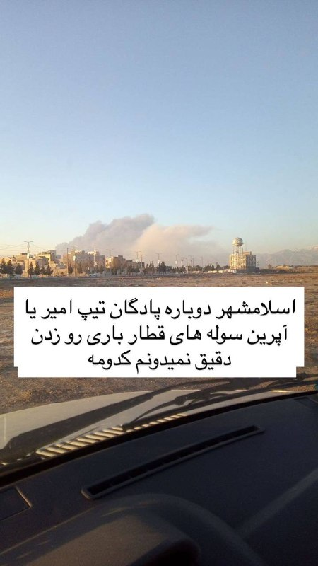

اسلامشهر

@IranianMinds

## IranianMinds — post 21777

  <a href="telegram/content/IranianMinds_21777_1780908222.mp4" target="_blank">🎬 Download video</a>

تهران

@IranianMinds

## IranianMinds — post 21776

🔴 انفجار در جنوب تهران

@IranianMinds

## IranianMinds — post 21775

🔴 ارتش اسرائیل :

سامانه های پدافندی رو در چند نقطه از ایران هدف قرار دادیم.

@IranianMinds

## IranianMinds — post 21774

  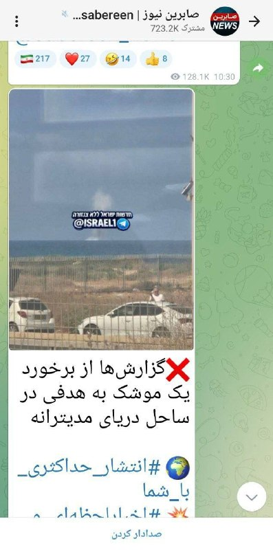

بنازم سپاه نقطه زن موشک مستقیم خورد به هدف کف دریا @IranianMinds

## IranianMinds — post 21773

🔴 ارتش اسرائیل :

رفتیم بالا سر سپاه و موج جدید حملات خودمون رو آغاز کردیم.

@IranianMinds

## IranianMinds — post 21772

هنوزم آتش بسه یا دیگه میتونیم بگیم نقض شده عزیزان؟؟؟؟

@IranianMinds

## Dirty_Kids — post 391336

  <a href="telegram/content/Dirty_Kids_391336_1780908225.mp4" target="_blank">🎬 Download video</a>

بنده وقتی بی‌بی سپاهی کباب میکنه:

@Dirty_Kids 👻

## Dirty_Kids — post 391335

  <a href="telegram/content/Dirty_Kids_391335_1780908226.mp4" target="_blank">🎬 Download video</a>

امینم❌ ایگریت✅

فکر کن بیمار داره جون میده، براش امینم بخونی

@Dirty_Kids 👻

## alonews — post 126200

  <a href="telegram/content/alonews_126200_1780908228.webm" target="_blank">🎬 Download video</a>

👈سخنگوی شهرداری تهران: پارکینگ‌های زیرسطحی برای استفاده به عنوان پناهگاه آماده می‌شوند

✅ @AloNews خبر جنگ

## alonews — post 126199

  <a href="telegram/content/alonews_126199_1780908228.webm" target="_blank">🎬 Download video</a>

👈برخی منابع از شنیده شدن صدای انفجار در کرج خبر داده اند

✅ @AloNews خبر جنگ

## alonews — post 126198

  <a href="telegram/content/alonews_126198_1780908228.webm" target="_blank">🎬 Download video</a>

👈خبرگزاری مهر خبر خود را تکذیب کرد!

🔴بر اساس پیگیری‌های خبرنگار مهر هیچگونه انفجاری طی ساعت اخیر در اصفهان رخ نداده است.

✅ @AloNews خبر جنگ

## alonews — post 126197

  <a href="telegram/content/alonews_126197_1780908228.webm" target="_blank">🎬 Download video</a>

👈مشاهده دود از شرق تهران

✅ @AloNews خبر جنگ

## alonews — post 126196

  <a href="telegram/content/alonews_126196_1780908229.webm" target="_blank">🎬 Download video</a>

👈صدای انفجار و فعالیت پدافند در جنوب تهران

✅ @AloNews خبر جنگ

## alonews — post 126195

  <a href="telegram/content/alonews_126195_1780908229.webm" target="_blank">🎬 Download video</a>

👈کان نیوز عبری: نیروی هوایی درحال انجام عملیات در ایران است

✅ @AloNews خبر جنگ

## alonews — post 126194

  <a href="telegram/content/alonews_126194_1780908229.webm" target="_blank">🎬 Download video</a>

👈شنیده شدن صدای انفجار در جنوب تهران

✅ @AloNews خبر جنگ

## alonews — post 126193

  <a href="telegram/content/alonews_126193_1780908229.webm" target="_blank">🎬 Download video</a>

👈 تصاویری از تهران

✅ @AloNews خبر جنگ

---
📅 بروزرسانی: 1405/03/18 12:03
---

## VahidOOnLine — post 244307

  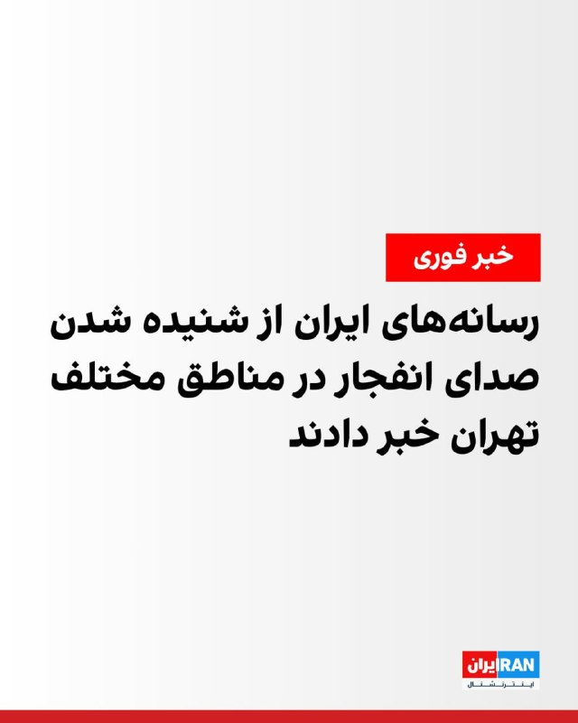

رسانه‌های ایران از شنیده شدن صدای انفجار در غرب، جنوب و شرق تهران خبر می‌دهند.

بنا بر گزارش‌ها، چندین صدای انفجار در این مناطق شنیده شده و همزمان برخی رسانه‌های ایران از فعالیت پدافند در برخی مناطق خبر دادند.
iranintl
‌🏁 🇬🇧 IranintlTV

🤖 @VahidOOnLine

## WithYashar — post 13947

  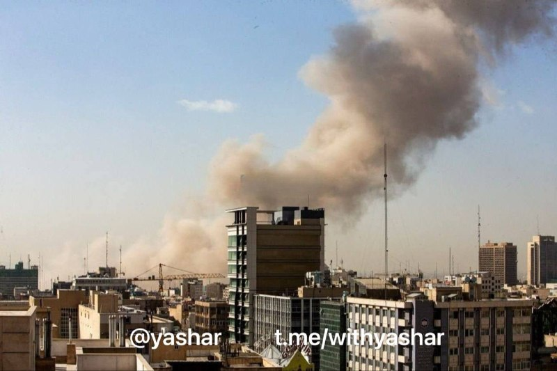

تهران الان
@withyashar

## WithYashar — post 13946

  <a href="telegram/content/WithYashar_13946_1780907624.mp4" target="_blank">🎬 Download video</a>

ارتش اسرائیل : ما یک حمله گسترده علیه سامانه‌های پدافندی راهبردی رژیم تروریستی ایران را تکمیل کردیم

در دوره اخیر، سامانه‌های پدافندی در چندین منطقه مختلف در ایران مستقر شده بودند، در چارچوب تلاش رژیم برای بازسازی توانایی‌های شناسایی و دفاعی خود که در عملیات «غرش شیران» آسیب دیده بودند — این حمله منجر به انهدام این سامانه‌ها شد.
در عملیات «غرش شیران»، ارتش اسرائیل به‌طور عمیق به سامانه‌های پدافندی رژیم تروریستی ایران آسیب وارد کرد. حملات تکمیل‌شده به تعمیق بیشتر آزادی عمل نیروی هوایی در آسمان ایران کمک می‌کنند.
@withyashat

## WithYashar — post 13945

  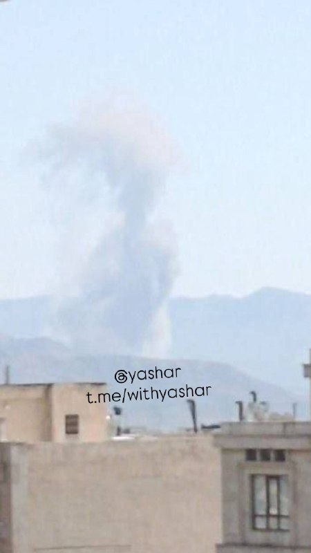

شمس آباد تهران
@withyashar

## WithYashar — post 13944

دانشگاه هوا فضای عاشورا رو زدن
@withyashar

## WithYashar — post 13943

  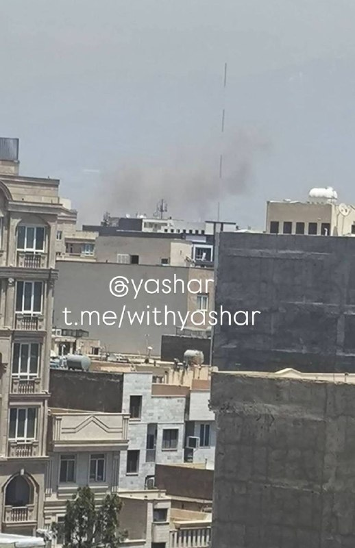

یاشار شهرری صدا انفجار اومد ۵ مین پیش فکر کنم پالایشگاه زدن ستون دود دیده میشه @withyashar

## mwarmonitor — post 10419

  

🔴«گزارش‌ها حاکی از آن است که پس از حملات هوایی اسرائیل، دود در شرق تهران مشاهده شده است.»

@mwarmonitor

## mwarmonitor — post 10418

🚨رسانه‌های اسرائیلی؛ فرودگاه شیراز هدف قرار گرفته است.»

@mwarmonitor

## mwarmonitor — post 10417

🔴«حمله به یک ایست بازرسی بسیج در کبودرآهنگ در استان همدان، غرب ایران.»

@mwarmonitor

## pm_afshaa — post 92879

رسانه های عبری دارن از ترور هدفمند در ایران حرف میزنن

💧 Rainbet.com the #1 Non-KYC Crypto Casino & Sportsbook @rainbetcom

😁 @Pm_Afshaa

## pm_afshaa — post 92878

  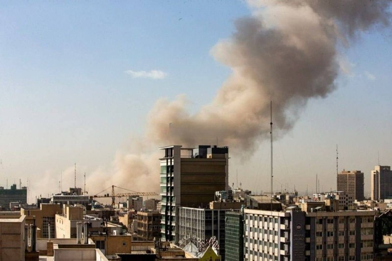

تهران هم اکنون

💧 Rainbet.com the #1 Non-KYC Crypto Casino & Sportsbook @rainbetcom

😁 @Pm_Afshaa

## pm_afshaa — post 92877

گروه 22 توپخانه ارتش و لشکر8 زرهی سپاه اصفهان مورد حمله قرار گرفت

💧 Rainbet.com the #1 Non-KYC Crypto Casino & Sportsbook @rainbetcom

😁 @Pm_Afshaa

## pm_afshaa — post 92876

  

شهر ری

💧 Rainbet.com the #1 Non-KYC Crypto Casino & Sportsbook @rainbetcom

😁 @Pm_Afshaa

## VahidOnline — post 76056

خبرگزاری مهر وابسته به سازمان تبلیغات اسلامی نوشته:

"پهپاد متخاصم دشمن آمریکا_صهیونیستی توسط پدافند هوایی در آسمان تهران هدف قرار گرفت و منهدم شد./ مهر"

📡 @VahidOnline

## kianmeli1 — post 87780

🔴فوری-از مجاورت پادگان ها و مراکز سیاسی و امنیتی فاصله بگیرید
https://t.me/+_a5ind9hr7sxOTE0

## IranIntlTV — post 341143

  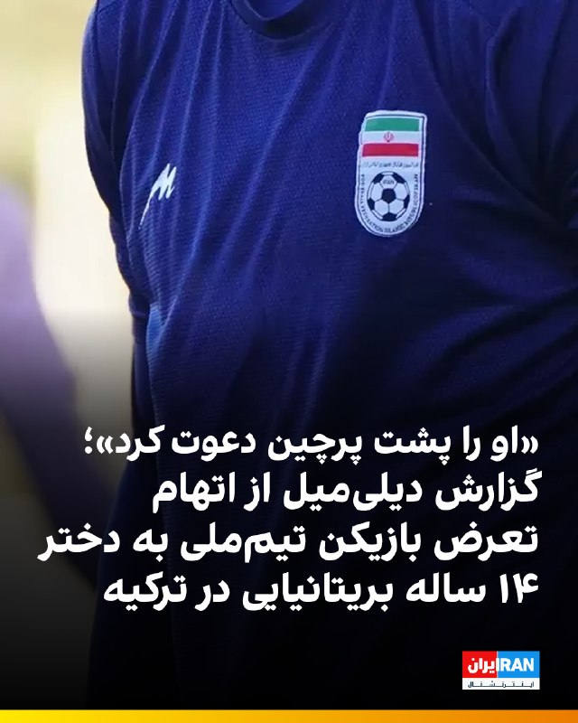

🔻روزنامه دیلی‌میل گزارشی منتشر کرده که یک فوتبالیست ملی‌پوش که نامش فاش نشده، از سوی یک خانواده بریتانیایی متهم شده است که در جریان تعطیلات آن‌ها در یک هتل پنج‌ستاره در ترکیه، تلاش کرده دختر ۱۴ ساله‌شان را برای «در آغوش گرفتن» به پشت یک پرچین ببرد.

🔹در گزارش دیلی‌میل به تیم ملی ایران اشاره نشده، اما آن‌طور که تصاویر منتشر شده توسط دیلی‌میل نشان می‌دهد، لوگوی روی لباس بازیکن نام‌برده مشخص می‌کند او یکی از بازیکنان تیم ملی فوتبال ایران است.

🔹پدر این دختر در گفت‌وگو با روزنامه دیلی‌میل گفته است دخترش پس از این اتفاق دچار وحشت شده و در حالی که گریه می‌کرده، با خانواده خود تماس گرفته است. این حادثه زمانی رخ داده که دختر ۱۴ ساله به همراه خواهر ۱۰ ساله‌اش کنار استخر هتل حضور داشته و والدین آن‌ها برای گرفتن بستنی از محل دور شده بودند.

🔹به گفته این خانواده، آن‌ها در اواخر ماه می متوجه شدند که یک تیم ملی فوتبال حاضر در جام جهانی نیز در همان هتل اقامت دارد.

🔹جزییات بیشتر را در سایت بخوانید

@iranintltvsport

## Shin_Persian — post 6730

  <a href="telegram/content/Shin_Persian_6730_1780907631.mp4" target="_blank">🎬 Download video</a>

Shin ✓ @hey_itsmyturn
Mon, 08 Jun 2026 08:25:17 UTC

Took me a while to find this video :))

فارسی

مدتی طول کشید تا این ویدیو را پیدا کنم :))

𝕏 · @shin_persian

## Shin_Persian — post 6729

Shin ✓ @hey_itsmyturn
Mon, 08 Jun 2026 08:24:37 UTC

State-owned Mehr: A position in Kabudarahang has been targeted, no casualties.
Hamadan Province, #Iran

فارسی

خبرگزاری دولتی مهر: موضعی در کبودرآهنگ مورد هدف قرار گرفته است، تلفاتی وجود ندارد.
استان همدان، #Iran_

𝕏 · @shin_persian

## Shin_Persian — post 6728

Shin ✓ @hey_itsmyturn
Mon, 08 Jun 2026 08:23:42 UTC

Initial:
IRGC Aerospace Force's Ashoura University has been reportedly targeted, southwestern Tehran, #Tehran Province, #Iran

فارسی

گزارش‌ها حاکی از آن است که دانشگاه هوافضای عاشورای سپاه پاسداران انقلاب اسلامی (IRGC)، در جنوب غربی تهران، #استان_تهران، #ایران هدف قرار گرفته است.

𝕏 · @shin_persian

## FarsiVOA — post 219993

  <a href="telegram/content/FarsiVOA_219993_1780907632.mp4" target="_blank">🎬 Download video</a>

ارتش اسرائیل اعلام کرد که حمله‌ای گسترده به سامانه‌های دفاعی استراتژیک جمهوری اسلامی انجام داد تا قابلیت‌های پدافند هوایی مستقر شده توسط تهران را از کار بیندازد.

ارتش اسرائیل دوشنبه در بیانیه‌ای نوشت که ده‌ها جنگنده نیروی هوایی این ارتش، تحت هدایت اداره اطلاعات ارتش، یک حمله گسترده به سامانه‌های دفاعی راهبردی متعلق به رژیم ایران انجام دادند.

بر اساس این بیانیه، در مدت اخیر، سامانه‌های دفاعی در مناطق مختلف ایران در چارچوب تلاش‌های رژیم ایران برای بازیابی توانایی‌های شناسایی و دفاعی خود که در جریان جنگ پیشین تضعیف شده بود، مستقر شده بودند.

ارتش اسرائیل تأکید کرد که حمله روز دوشنبه باعث از هم پاشیدن این سامانه‌ها شد.

در جریان جنگ پیشین، ارتش اسرائیل توانمندی‌های دفاعی جمهوری اسلامی را به‌شدت تضعیف کرد.

ارتش اسرائیل نوشت: «این حملات آزادی عمل نیروی هوایی اسرائیل را در حریم هوایی ایران بیشتر می‌کند.»
@FarsiVOA

## Persian_Trend_Official — post 16144

  <a href="telegram/content/Persian_Trend_Official_16144_1780907635.mp4" target="_blank">🎬 Download video</a>

ویدیویی از پرتاب موشک بالستیک از شهر یزد

📝 Amir

📌 @persian_trend_official
پرشین ترند | متفاوت‌ترین کانال نظامی

## Persian_Trend_Official — post 16143

  

طهران!

## Persian_Trend_Official — post 16142

  <a href="telegram/content/Persian_Trend_Official_16142_1780907637.webm" target="_blank">🎬 Download video</a>

توجه به شرایط موجود در کشور، استفاده از مترو و اتوبوس در هماهنگی با شورای شهر تهران همچنان رایگان خواهد بود /شهرداری تهران

پ.ن : قربان جنگ شده مردم پناهگاه ندارن . اسرائیل داره حمله میکنه . دستور چیه ؟
+مسئول جمهوری اسلامی : فعلا مترو و اتوبوس رو رایگان کن تا ببینیم چی میشه !

## Persian_Trend_Official — post 16141

غیررسمی/گویا به یک ایستگاه بازرسی بسیج در استان همدان حمله شده

👺Phantom

📌 @persian_trend_official
پرشین ترند | متفاوت‌ترین کانال نظامی

## Persian_Trend_Official — post 16140

گفته می‌شود فرودگاه شیراز نیز مورد حمله اسرائیل واقع شده است.

📝 Amir

📌 @persian_trend_official
پرشین ترند | متفاوت‌ترین کانال نظامی

## Persian_Trend_Official — post 16139

سایت موشکی در اصفهان که اوایل امروز در حمله به اسرائیل استفاده شد مورد حمله قرار گرفت!

👺Phantom

📌 @persian_trend_official
پرشین ترند | متفاوت‌ترین کانال نظامی

## Persian_Trend_Official — post 16138

  <a href="telegram/content/Persian_Trend_Official_16138_1780907638.webm" target="_blank">🎬 Download video</a>

گروه 22 توپخانه ارتش و لشکر 8 زرهی سپاه اصفهان مورد حمله قرار گرفت.

👺Phantom

📌 @persian_trend_official
پرشین ترند | متفاوت‌ترین کانال نظامی

## Persian_Trend_Official — post 16137

  <a href="telegram/content/Persian_Trend_Official_16137_1780907638.webm" target="_blank">🎬 Download video</a>

وضعیت دقایقی قبل تهران

📝 Amir

📌 @persian_trend_official
پرشین ترند | متفاوت‌ترین کانال نظامی

## Persian_Trend_Official — post 16136

  <a href="telegram/content/Persian_Trend_Official_16136_1780907639.mp4" target="_blank">🎬 Download video</a>

فعالیت پدافند موشکی در اصفهان

📝 Amir

📌 @persian_trend_official
پرشین ترند | متفاوت‌ترین کانال نظامی

## RadioFarda — post 158040

  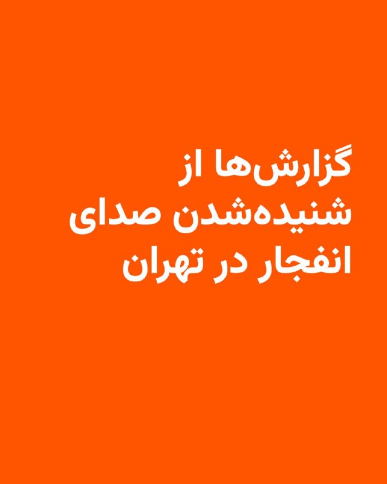

🔸گزارش‌های شهروندی و برخی رسانه‌ها حاکی از شنیده‌شدن صدای انفجار در غرب و جنوب‌ غرب تهران است.

🔸خبرگزاری تسنیم و وب‌سایت خبرآنلاین این گزارش‌ها را تأیید کرده‌اند.

🔸به‌دنبال حمله موشکی جمهوری اسلامی به اسرائیل در اعتراض به حملات این کشور به حزب‌الله لبنان، اسرائیل نیز مناطقی را در غرب و مرکز و جنوب ایران مورد حمله قرار داده بود.

🔸حملات متقابل دو کشور به یکدیگر کماکان ادامه دارد.

@RadioFarda

## IranianMinds — post 21771

🔴 وزیر جنگ اسرائیل :

حمله به‌ نقاط مختلف ایران را آغاز کردیم

@IranianMinds

## IranianMinds — post 21770

🔴 انفجار‌‌ در محدوده فرودگاه مهرآباد

@IranianMinds

## IranianMinds — post 21769

  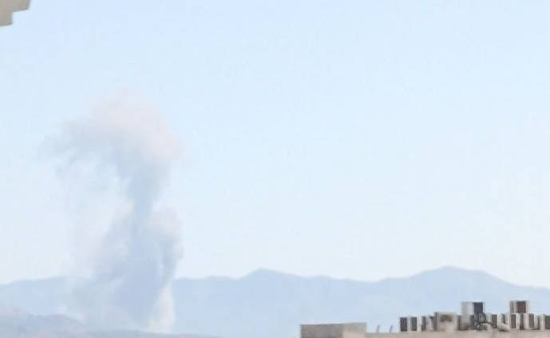

شرق تهران

@IranianMinds

## IranianMinds — post 21768

🔴 تا الان :

گروه 22 توپخانه ارتش
لشکر8 زرهی سپاه
سایت موشکی بیدگنه
دانشگاه عاشورا هوافضای سپاه

@IranianMinds

## IranianMinds — post 21767

فرق بین دو طرف اینه که سپاه هرچی‌ میزنه یا میخوره به بیابون یا تو هوا میزننش

از این طرف اسرائیلم هرجارو‌ بخواد راحت میزنه :)

@IranianMinds

## IranianMinds — post 21766

وقتشه پیت هگست به مناسبت شروع جنگ یه بیستا شنا بره

@IranianMinds

## IranianMinds — post 21765

خبرگزاری مهر:

یک پهپاد اسراییلی را سرنگون کردیم

+ مادر آدم دروغگو...

@IranianMinds

## IranianMinds — post 21764

  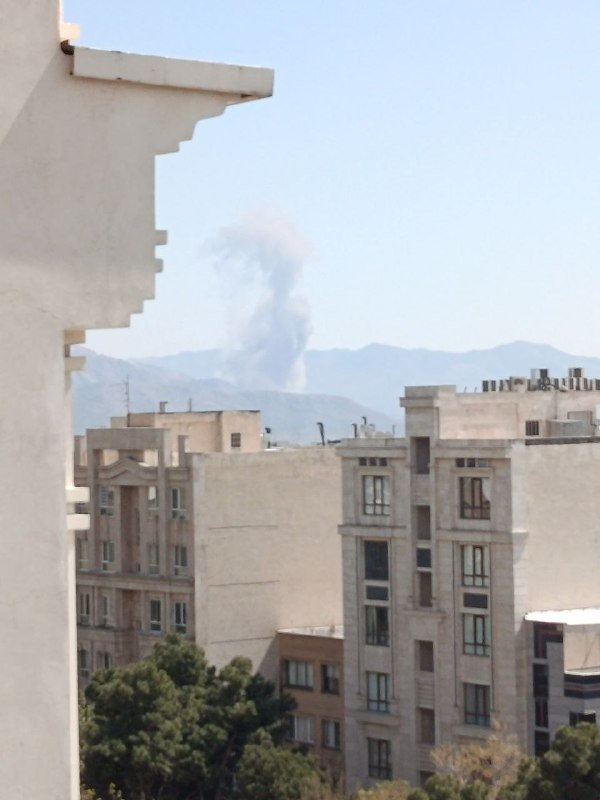

🔴 تهران، شمس آباد

@IranianMinds

## IranianMinds — post 21763

  

🔴 تهران الان

@IranianMinds

## IranianMinds — post 21762

🔴 ورود جنگنده ها به کشور

@IranianMinds

## IranianMinds — post 21761

🔴 آسمون شیراز صدای جنگنده

@IranianMinds

## alonews — post 126192

  <a href="telegram/content/alonews_126192_1780907643.webm" target="_blank">🎬 Download video</a>

👈دفتر نتانیاهو: به حملات موشکی ایران پاسخ دادیم

✅ @AloNews خبر جنگ

## alonews — post 126191

  <a href="telegram/content/alonews_126191_1780907643.webm" target="_blank">🎬 Download video</a>

👈حمله به شهر ری هم اکنون

✅ @AloNews خبر جنگ

## alonews — post 126190

  <a href="telegram/content/alonews_126190_1780907643.webm" target="_blank">🎬 Download video</a>

👈سخنگوی شهرداری تهران: با توجه به شرایط موجود در کشور، استفاده از مترو و اتوبوس در هماهنگی با شورای شهر تهران همچنان رایگان خواهد بود.

✅ @AloNews خبر جنگ

## alonews — post 126189

  <a href="telegram/content/alonews_126189_1780907644.webm" target="_blank">🎬 Download video</a>

👈پرتاب دوباره موشک بالستیک از یمن به اسرائیل

✅ @AloNews خبر جنگ

## alonews — post 126188

  <a href="telegram/content/alonews_126188_1780907644.webm" target="_blank">🎬 Download video</a>

👈دقایقی قبل، تهران

✅ @AloNews خبر جنگ

## alonews — post 126187

  <a href="telegram/content/alonews_126187_1780907644.webm" target="_blank">🎬 Download video</a>

👈صدای انفجار در شمال کرج گزارش شد

✅ @AloNews خبر جنگ

---
📅 بروزرسانی: 1405/03/18 11:54
---

## VahidOOnLine — post 244306

  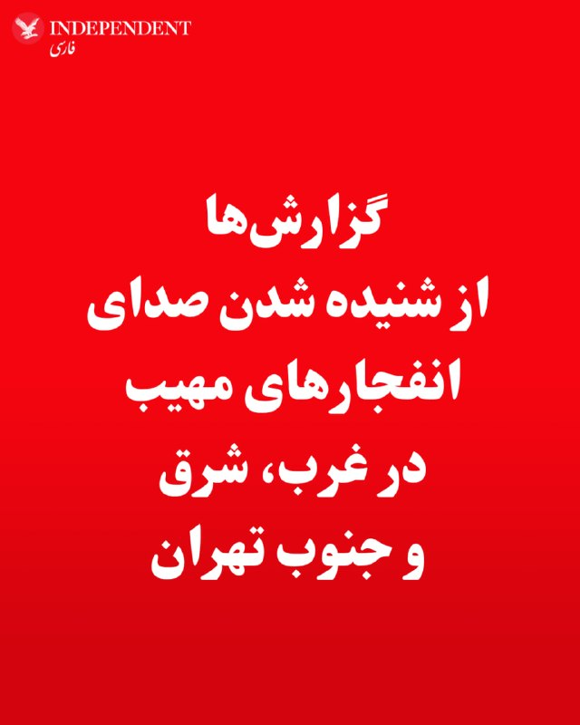

♦️خبرگزاری‌های داخلی ایران ظهر دوشنبه ۱۸ خرداد ماه از شنیده شدن صدای مهیب انفجار در نقاط مختلف تهران و فعال شدن پدافند پایتخت ایران خبر دادند.

برخی منابع غیررسمی گزارش کرده‌اند که دانشگاه هوا فضای سپاه در شرق تهران یکی از اهداف حمله هوایی بوده است.
‌🇸🇦 Indypersian

🤖 @VahidOOnLine

## VahidOOnLine — post 244305

  <a href="telegram/content/VahidOOnLine_244305_1780907042.mp4" target="_blank">🎬 Download video</a>

♦️کیم جونگ اون، رهبر کره شمالی به همراه همسرش ری سول-جو، روز دوشنبه ۱۸ خردادماه در فرودگاه پیونگ‌یانگ به استقبال شی جین‌پینگ، رئیس جمهوری چین رفتند.
در ویدیوهایی که خبرگزاری دولتی کره شمالی از این مراسم منتشر کرده و در اختیار رسانه‌های بین‌المللی قرار داده است، تصویری از پیاده شدن رئیس جمهوری چین از هواپیما دیده نمی‌شود.
سفر رئیس جمهوری چین به کره شمالی، سفری «نادر» به شمار می‌رود. چین، به‌عنوان یکی از ابرقدرت‌های جهانی، در ماه گذشته و به فاصله کم‌تر از یک هفته میزبان دونالد ترامپ، رئیس جمهوری آمریکا و ولادیمیر پوتین، رئیس جمهوری روسیه بود.
‌🇸🇦 Indypersian

🤖 @VahidOOnLine

## VahidOOnLine — post 244304

  

بر اساس اطلاعات رسیده به ایران‌اینترنشنال، ارتباط مجتبی خامنه‌ای با مقام‌های جمهوری اسلامی از شب گذشته دچار اختلال شده است.

بنا بر این اطلاعات، یک منبع نزدیک به تحولات می‌گوید به احتمال زیاد، حملات صبح دوشنبه به اسرائیل، بدون هماهنگی با دفتر رهبر جمهوری اسلامی و بر اساس پروتکل‌های از پیش تهیه‌شده نظامی بوده است.

به گفته همین منبع، واکنش سپاه پاسداران به حمله اسرائیل به ضاحیه بیروت، سریع‌تر از آن بوده که پس از مبادله پیام با مجتبی خامنه‌ای انجام شده باشد.

پیش از این گزارش‌هایی مبنی بر زمان‌بر بودن امکان مبادله پیام میان مقام‌های ارشد و فرماندهان سپاه پاسداران از یک سو و دفتر مجتبی خامنه‌ای از سوی دیگر منتشر شده بود.
iranintl
‌🏁 🇬🇧 IranintlTV

🤖 @VahidOOnLine

## WithYashar — post 13942

غرب تهران مثل مرز بوسنی و هرزوگبین شده یاشارررررر
@withyashar

## WithYashar — post 13941

تبریز رو بد زدن یاشار
@withyashar

## WithYashar — post 13940

یاشار اصفهان رو زدنننننن لشگر ۸ زرهی
@withyashar

## WithYashar — post 13939

🥲انرژی‌من به انگشت شما بنده

## WithYashar — post 13938

یاشار شهرری صدا انفجار اومد ۵ مین پیش فکر کنم پالایشگاه زدن ستون دود دیده میشه
@withyashar

## WithYashar — post 13937

فارس: شنیده‌شدن صدای انفجار در غرب تهران
@withyashar

## WithYashar — post 13936

پدافند فردوسی و شرق تهران فعال شد
@withyashar

## WithYashar — post 13935

کرج سمت بیدگنه صدای انفجار شنیده شد
@withyashar

## mwarmonitor — post 10416

  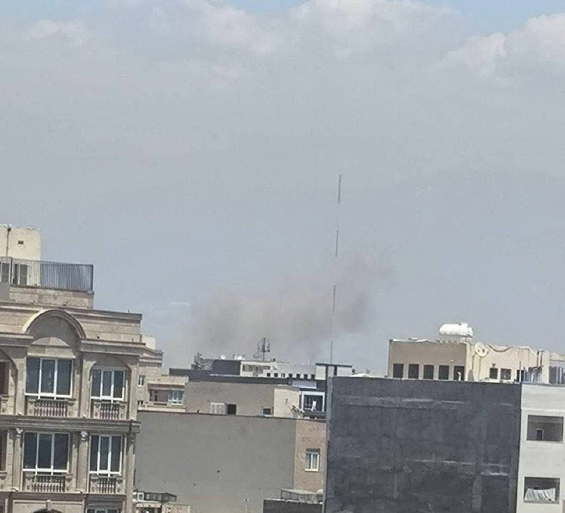

📌«ساکنان محلی از مشاهده دود در اسلامشهرِ ایران خبر می‌دهند.»

@mwarmonitor

## mwarmonitor — post 10415

🔴«گزارش‌هایی از حمله به یک دانشگاه هوافضا مرتبط با سپاه پاسداران در تهران منتشر شده است ـ کانال ۱۲ اسرائیل »

@mwarmonitor

## mwarmonitor — post 10414

🔸«فعال‌سازی پدافند هوایی در کرمانشاه»

## mwarmonitor — post 10413

🔴«پدافند اسرائیل یک موشک ایرانی را در اطراف روستای زُبیده در حومه قنیطره سوریه سرنگون کرد.»

@mwarmonitor

## mwarmonitor — post 10412

شلیک موشک از یمن

## pm_afshaa — post 92875

انفجار در سایت بیدگنه

💧 Rainbet.com the #1 Non-KYC Crypto Casino & Sportsbook @rainbetcom

😁 @Pm_Afshaa

## pm_afshaa — post 92874

دانشگاه هوا فضای عاشورا رو زدن

💧 Rainbet.com the #1 Non-KYC Crypto Casino & Sportsbook @rainbetcom

😁 @Pm_Afshaa

## pm_afshaa — post 92873

انفجار در اصفهان

💧 Rainbet.com the #1 Non-KYC Crypto Casino & Sportsbook @rainbetcom

😁 @Pm_Afshaa

## VahidOnline — post 76055

  

سپاه پاسداران در بیانیه‌ای گفت در پاسخ به حمله اسرائیل به صنایع پتروشیمی ایران به صنایع پتروشیمی حیفا حمله موشکی کرده است.

بنابر این بیانیه، هدف قرار دادن اهداف غیرنظامی و تاسیسات نفتی «بازی خطرناکی» است که زیرساخت‌های انرژِی منطقه را تهدید می‌کند.

پتروشیمی کارون ماهشهر که در بیانیه سپاه نامش برده نشد، تاسیساتی است که هدف حمله اسرائیل قرار گرفته است.
@VahidHeadline

📡 @VahidOnline

## kianmeli1 — post 87779

🔴فوری-توقف پروازهای فرودگاه شیراز
https://t.me/kianmeli1

## kianmeli1 — post 87778

🔴فوری-صدای انفجار در اصفهان
https://t.me/kianmeli1

## IranIntlTV — post 341142

  

رسانه‌های ایران از شنیده شدن صدای انفجار در غرب، جنوب و شرق تهران خبر می‌دهند.

بنا بر گزارش‌ها، چندین صدای انفجار در این مناطق شنیده شده و همزمان برخی رسانه‌های ایران از فعالیت پدافند در برخی مناطق خبر دادند.
iranintl.com/202606085318

## IranIntlTV — post 341141

  

بر اساس اطلاعات رسیده به ایران‌اینترنشنال، ارتباط مجتبی خامنه‌ای با مقام‌های جمهوری اسلامی از شب گذشته دچار اختلال شده است.

بنا بر این اطلاعات، یک منبع نزدیک به تحولات می‌گوید به احتمال زیاد، حملات صبح دوشنبه به اسرائیل، بدون هماهنگی با دفتر رهبر جمهوری اسلامی و بر اساس پروتکل‌های از پیش تهیه‌شده نظامی بوده است.

به گفته همین منبع، واکنش سپاه پاسداران به حمله اسرائیل به ضاحیه بیروت، سریع‌تر از آن بوده که پس از مبادله پیام با مجتبی خامنه‌ای انجام شده باشد.

پیش از این گزارش‌هایی مبنی بر زمان‌بر بودن امکان مبادله پیام میان مقام‌های ارشد و فرماندهان سپاه پاسداران از یک سو و دفتر مجتبی خامنه‌ای از سوی دیگر منتشر شده بود.
iranintl.com/202606080979

## Shin_Persian — post 6727

Shin ✓ @hey_itsmyturn
Mon, 08 Jun 2026 08:21:07 UTC

State-owned Mehr News:
"UAV shot down over Tehran"

فارسی

خبرگزاری دولتی مهر:
«یک پهپاد بر فراز تهران سرنگون شد»

𝕏 · @shin_persian

## Persian_Trend_Official — post 16135

بعضی از منابع خبر از انهدام یک پهپاد در آسمان تهران میدهند.

📝 Amir

📌 @persian_trend_official
پرشین ترند | متفاوت‌ترین کانال نظامی

## Persian_Trend_Official — post 16134

  <a href="telegram/content/Persian_Trend_Official_16134_1780907049.mp4" target="_blank">🎬 Download video</a>

صدای فعالیت توپ ضد هوایی در خیابان شریعتی تهران، پشت ساختمان وزارت اطلاعات

📝 Amir

📌 @persian_trend_official
پرشین ترند | متفاوت‌ترین کانال نظامی

## Persian_Trend_Official — post 16133

  <a href="telegram/content/Persian_Trend_Official_16133_1780907052.mp4" target="_blank">🎬 Download video</a>

🎬 Video

## Persian_Trend_Official — post 16132

  <a href="telegram/content/Persian_Trend_Official_16132_1780907053.webm" target="_blank">🎬 Download video</a>

گفه می‌شود یمن بطور مجدد چندین موشک بالستیک به سوی اسرائیل پرتاب کرده است.

📝 Amir

📌 @persian_trend_official
پرشین ترند | متفاوت‌ترین کانال نظامی

## Persian_Trend_Official — post 16131

  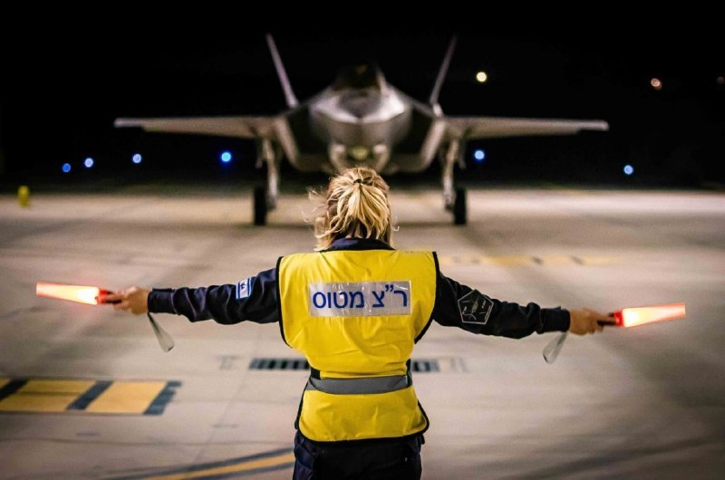

📷 Photo

## IranianMinds — post 21760

کانال ۱۲ اسرائیل رسما اعلام کرد که دانشگاه هوا و فضا در تهران مورد حمله قرار گرفته است.

@IranianMinds

## IranianMinds — post 21759

  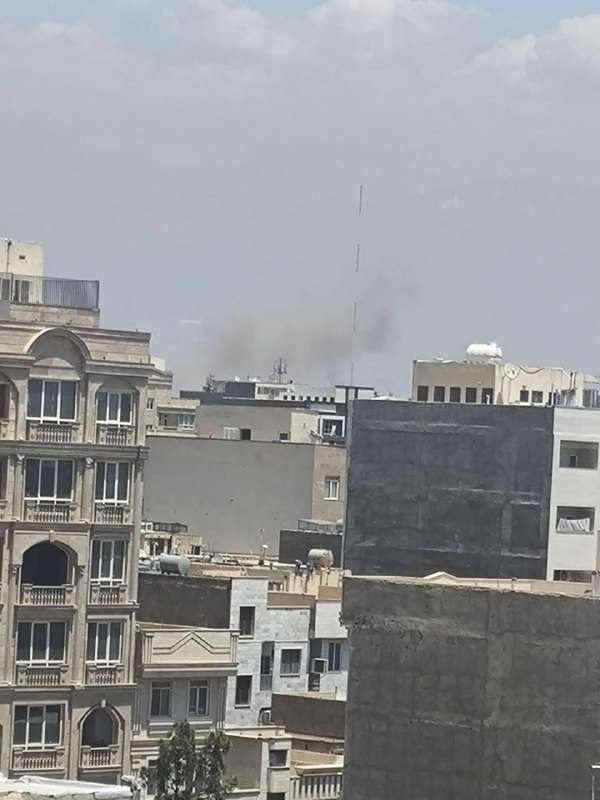

🔴هم‌اکنون شهر ری :

@IranianMinds

## IranianMinds — post 21758

🔴 شنیده شدن صدای انفجار در اصفهان.

@IranianMinds

## BBCPersian — post 283162

نظر شما درباره از سرگیری حملات ایران و اسرائیل چیست؟
مشاهدات خود را از حمله اخیر اسرائیل به ایران برای ما بفرستید.

پیام‌های متنی، صوتی یا ویدیویی خود را با هشتگ #حمله بفرستید به:
تلگرام:
@BBCShoma

واتس‌اپ:
۰۰۴۴۷۳۴۲۰۳۲۱۱۳

## BBCPersian — post 283160

  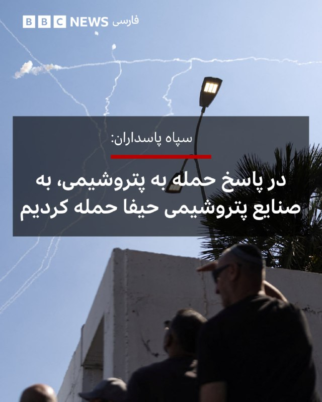

🔻سپاه پاسداران در بیانیه‌ای گفت در پاسخ به حمله اسرائیل به صنایع پتروشیمی ایران به صنایع پتروشیمی حیفا حمله موشکی کرده است.

بنابر این بیانیه، هدف قرار دادن اهداف غیرنظامی و تاسیسات نفتی «بازی خطرناکی» است که زیرساخت‌های انرژِی منطقه را تهدید می‌کند.

پتروشیمی کارون ماهشهر که در بیانیه سپاه نامش برده نشد، تاسیساتی است که هدف حمله اسرائیل قرار گرفته است.

روابط عمومی سازمان منطقه ویژه اقتصادی پتروشیمی دربیانیه‌ای گفت «دو اصابت به شرکت پتروشیمی کارون» صورت گرفت که مصدومی در پی نداشت و میزان خسارت در دست بررسی است.

پیش از آن اسرائیل گفته بود که به «چند هدف» در تاسیسات پتروشیمی ماهشهر حمله کرده است.

پس از حمله، روابط عمومی سازمان منطقه ویژه اقتصادی ماهشهر در اطلاعیه‌ای «تصمیم فرماندهی ارشد پدافند غیرعامل و مدیریت بحران منطقه ویژه اقتصادی پتروشیمی» را برای خروج اضطراری تمام کارکنان روزکار از این منطقه اعلام کرد.

@BBCPersian
📷 REUTERS

## Hranews — post 113463

  <a href="telegram/content/Hranews_113463_1780907056.mp4" target="_blank">🎬 Download video</a>

درگیری‌های مستقیم میان ایران و اسرائیل با حملات جدید موشکی و هوایی وارد دور تازه‌ای شده است. بامداد امروز دوشنبه ۱۸ خرداد ۱۴۰۵، تنش‌ها پس از یک دوره آتش‌بس، مجددا با تبادل آتش از سر گرفته شده است. کانال سپاه پاسداران با انتشار ویدیویی گزارش داده‌ که طی ساعات گذشته، یکی از اماکنی که هدف حمله ارتش اسرائیل قرار گرفته، پتروشیمی کارون ماهشهر بوده است. روابط‌عمومی این شرکت و معاون امنیتی استاندار خوزستان نیز اعلام کرده‌اند که این تهاجم هوایی تاکنون هیچ‌گونه تلفات جانی در پی نداشته است. دبیر اجرایی خانه کارگر بندر امام و ماهشهر نیز با تایید این اظهارات اعلام کرد که این حمله، همزمان با تعویض شیفت کارگران رخ داده و بخشی از تاسیسات این مجموعه آسیب دیده است.

↘️
@hranews_bot تماس ✉️ -  @Hranews  کانال هرانا 🆑

## alonews — post 126186

  <a href="telegram/content/alonews_126186_1780907057.webm" target="_blank">🎬 Download video</a>

👈صدای انفجار مهیب در غرب تهران

✅ @AloNews خبر جنگ

## alonews — post 126185

  <a href="telegram/content/alonews_126185_1780907058.webm" target="_blank">🎬 Download video</a>

👈شبکه ۱۲ اسرائیل : دانشگاه هوافضای تهران هدف حمله قرار گرفت

✅ @AloNews خبر جنگ

## alonews — post 126184

  <a href="telegram/content/alonews_126184_1780907058.webm" target="_blank">🎬 Download video</a>

👈منابع داخلی: تو تهران پهپاد زدیم

✅ @AloNews خبر جنگ

## alonews — post 126183

  <a href="telegram/content/alonews_126183_1780907058.webm" target="_blank">🎬 Download video</a>

👈دوستان از محل‌های نظامی و پایگاه‌های بسیج فاصله بگیرید

✅ @AloNews خبر جنگ

## alonews — post 126182

  <a href="telegram/content/alonews_126182_1780907059.webm" target="_blank">🎬 Download video</a>

👈فعالیت پدافند در کرمانشاه

✅ @AloNews خبر جنگ

## alonews — post 126181

  <a href="telegram/content/alonews_126181_1780907059.webm" target="_blank">🎬 Download video</a>

🔴فوری / هشدار سفارت هند؛ فوراً ایران را ترک کنید

✅ @AloNews خبر جنگ

## alonews — post 126180

  <a href="telegram/content/alonews_126180_1780907059.webm" target="_blank">🎬 Download video</a>

👈فعالیت پدافند در شرق تهران ادامه دارد

✅ @AloNews خبر جنگ

## alonews — post 126179

  <a href="telegram/content/alonews_126179_1780907060.webm" target="_blank">🎬 Download video</a>

👈هم‌اکنون شهر ری

✅ @AloNews خبر جنگ

## alonews — post 126178

  <a href="telegram/content/alonews_126178_1780907060.webm" target="_blank">🎬 Download video</a>

👈صدای انفجار در اصفهان

✅ @AloNews خبر جنگ

## alonews — post 126177

  <a href="telegram/content/alonews_126177_1780907060.webm" target="_blank">🎬 Download video</a>

👈معاون سیاسی استانداری همدان : ساعتی قبل نقطه‌ای در شهرستان کبودرآهنگ مورد حمله دشمن قرار گرفت.

✅ @AloNews خبر جنگ

## alonews — post 126176

  <a href="telegram/content/alonews_126176_1780907060.webm" target="_blank">🎬 Download video</a>

👈صدای انفجار در غرب تهران

✅ @AloNews خبر جنگ

## alonews — post 126175

  <a href="telegram/content/alonews_126175_1780907061.webm" target="_blank">🎬 Download video</a>

⭕️ الونیوز فقط در تلگرام 
💬 و توییتر 
❌ فعال هستش

🔴سایر شبکه های اجتماعی چه داخلی چه خارجی که با نام الونیوز فعالیت می‌کنند مرتبط به ما نیست و پیشنهاد میکنم که لفت بدید.

✅@AloNews

---
📅 بروزرسانی: 1405/03/18 11:43
---

## WithYashar — post 13934

انفجار در اصفهان شنیده شد
@withyashar

## WithYashar — post 13933

آغاز موج جدیدی از حملات هوایی به تهران
حمله به دانشگاه هوا فضای عاشورا
@withyashar

## WithYashar — post 13932

انفجار در کرمانشاه
@withyashar

## WithYashar — post 13931

شنیده شدن صدای انفجار در اسلامشهر و ملارد و کهریزک و باقرشهر🚨🚨🚨🚨
@withyashar

## WithYashar — post 13930

پدافند تهران فعال شد 🚨
@withyashar

## WithYashar — post 13929

صدای انفجار در تهران و کرج شنیده شد🚨🚨🚨
@withyashar

## mwarmonitor — post 10411

💥انفجار در اصفهان

## mwarmonitor — post 10410

💥انفجار در تهران

## mwarmonitor — post 10409

«فعال‌سازی پدافند هوایی در تهران»

## mwarmonitor — post 10408

🔴«دفتر نتانیاهو: تلاش برای تحمیل یک معادله جدید از سوی نظام ایران را نخواهیم پذیرفت.»

@mwarmonitor

## pm_afshaa — post 92872

انفجار در کرمانشاه

💧 Rainbet.com the #1 Non-KYC Crypto Casino & Sportsbook @rainbetcom

😁 @Pm_Afshaa

## pm_afshaa — post 92871

پدافند تهران فعال شد

💧 Rainbet.com the #1 Non-KYC Crypto Casino & Sportsbook @rainbetcom

😁 @Pm_Afshaa

## pm_afshaa — post 92870

انفجار در غرب تهران

💧 Rainbet.com the #1 Non-KYC Crypto Casino & Sportsbook @rainbetcom

😁 @Pm_Afshaa

## DEJradio — post 5459

  <a href="telegram/content/DEJradio_5459_1780906410.mp4" target="_blank">🎬 Download video</a>

🛩️
🔥 انهدام پایگاه موشکی اصفهان

#جنگ #اصفهان
@DEJradio

## VahidOnline — post 76054

پیام‌های دریافتی:
وحید تهران صدای مهیب وحشتناک

ساعات 11:33 دقیقه جنوب تهرانسر صدای انفجار اومد

سلام ساعت ۱۱:۳۰ رباط کریم صدای انفجار

تهران صدا و موج شدید انفجار ۱۱:۳۲

همین الان صدای تک انفجار غرب تهران

زدن تهران صدا واضح انفجار

ساعت ۱۱:۳۳: صدای یک انفجار شنیده شد - تهران آزادی

صداش خیلی زیاد نبود حوالی غرب باید باشه احتمالا

اسلامشهر صدای انفجار ساعت ۱۱:۳۲

تهران الان صدای انفجار اومد

تهران غرب ۱۱:۳۳ تک انفجار بزرگ

سلام وحید جان.۱۱:۳۳ تهران صدا انفجار اومد.من غربم صدا دور بود ازم

۱۱:۳۳ دقیقه صدای انفجار ملارد فکر کنم زدن

ما سمت مهرآبادیم ساعت ۱۱:۳۲ صدای انفجار اومد

صدای انفجار در اسلامشهر ساعت ۱۱:۳۴

وحید ما غربیم 11.33 صدا انفجار امد

یه صدای تک انفجاری اومد الان انگار سمت یافت اباد

بهشت‌زهرام. از نزدیک اینجا صدای انفجار اومد. ساعت یازده‌و‌سی‌و‌دو.

همین الان اسلامشهر تهران ۲ تا صدای انفجار

سلام وحید جان، صدای انفجار در فردیس

غزب تهران سمت پونک همین الان صدای انفجار

تهران اطراف اتوبان نواب صدای انفجار

شهرک غرب
صدای مهیب انفجار از دور اومد

وحید قلعه حسن خان دو تا صدا انفجار قوی

سلام باقرشهر کهریزیک صدای انفجار 11:33

وحید داداش سمت دریاچه ۳ تا انفجار ولی دور بود
11:32

گرمدره صدای بمی داشت تک صدا بود ولی دلم یجوری شد

سلام وحید جان من سمت مهرشهر هستم ساعت 11:31
صدای انفجار خیلی وحشتناکی اومد
از شرق کرج یا غرب تهران

ساعت ۱۱:۳۳ سمت ملارد صدای انفجار وحشتناک اومد

سلام ۱۱:۳۳ صدای انفجار اومد از جنوب تهران از دور بود

تهران سمت شریعتی ساعت۱۱:۳۲ صدای خیلی دور انفجار اومد

از ملارد ساعت ۱۱:۳۳ یدونه صدا اومد

وحید اسلامشهر دوتا صدای خیلی وحشتناک اومد

ساعت ۱۱:۳۴ اسلامشهر ۲ انفجار با فاصله یک دقیقه

ما سمت چهارراه ولیعصریم دقیقا ۱۱:۳۳ دای انفجار از دور اومد

سلام ما عظیمیه کرج ساعت 11:33 صدا شنیدیم، دور بود

سلام من نزدیک مهرآبادم یدونه صدا اومد بنظرم بلند بود اما خیلی نزدیک نبود

بازم هم مهرشهر کرج صدای یک انفجار
ساعت ۱۱:۳۵

درود گلشهر صدای انفجار اومد همین حالا

ما تو یافت ابادیم صدایی که اومد نسبتا دور بود ولی خیلی مهیب بود

سلام وحید جان من سمت شمال تهرانم ۱۱:۳۳ دقیقه صدای انفجار دور ولی سنگین اومد

آپدیت:
پیام‌های زیادی درباره فعالیت پدافند در مناطق مختلف تهران دریافت می‌کنم.
📡 @VahidOnline

## kianmeli1 — post 87777

🔴فوری-شنیده شدن صدای انفجار در اسلامشهر و ملارد و کهریزک و باقرشهر
https://t.me/kianmeli1

## kianmeli1 — post 87776

🔴فوری-شنیده شدن صدای انفجار در غرب و جنوب تهران
https://t.me/kianmeli1

## IranIntlTV — post 341140

  <a href="telegram/content/IranIntlTV_341140_1780906412.mp4" target="_blank">🎬 Download video</a>

ابراز شادمانی شماری از شهروندان از دور تازه حملات اسرائیل به مواضع جمهوری اسلامی و قطع شدن اینترنت در برخی شهرها، از جمله پیام‌های رسیده به ایران‌اینترنشنال است.

لیلا سعادتی، عضو تحریریه ایران‌اینترنشنال، از پیام‌های شهروندان می‌گوید

@iranintltv

## Shin_Persian — post 6726

Shin ✓ @hey_itsmyturn
Mon, 08 Jun 2026 08:12:15 UTC

State-owned Mehr News confirms the explosion sound in western Tehran, #Tehran Province, #Iran

فارسی

خبرگزاری دولتی مهر صدای انفجار در غرب تهران، استان #تهران، #ایران را تایید کرد.

𝕏 · @shin_persian

## Shin_Persian — post 6725

Shin ✓ @hey_itsmyturn
Mon, 08 Jun 2026 08:11:47 UTC

NOW @ 0811Z -
AA activity over eastern Tehran, Tehran Province, #Iran

فارسی

هم‌اکنون در ۰۸۱۱ زولو (۱۱:۴۱ به وقت تهران) -
فعالیت پدافند هوایی (AA) در آسمان شرق تهران، استان تهران، #Iran #ایران

𝕏 · @shin_persian

## Shin_Persian — post 6724

Shin ✓ @hey_itsmyturn
Mon, 08 Jun 2026 08:09:33 UTC

NOW @ 0809Z -
AA activity over central Tehran, Tehran Province, #Iran

فارسی

هم‌اکنون در ۰۸۰۹ زولو (۱۱:۳۹ به وقت تهران) -
فعالیت پدافند هوایی در مرکز تهران، استان تهران، #Iran #ایران

𝕏 · @shin_persian

## Shin_Persian — post 6723

Shin ✓ @hey_itsmyturn
Mon, 08 Jun 2026 08:09:10 UTC

NOW @ 0809Z -
AA activity over southern Tehran, Tehran Province, #Iran

فارسی

هم‌اکنون در ۰۸۰۹ زولو (۱۱:۳۹ به وقت تهران) -
فعالیت پدافند هوایی در فراز جنوب تهران، استان تهران، #Iran

𝕏 · @shin_persian

## Shin_Persian — post 6722

Shin ✓ @hey_itsmyturn
Mon, 08 Jun 2026 08:07:15 UTC

Also heard in Ret, southern Tehran

فارسی

همچنین در ری، جنوب تهران شنیده شد.

𝕏 · @shin_persian

## Shin_Persian — post 6721

Shin ✓ @hey_itsmyturn
Mon, 08 Jun 2026 08:04:42 UTC

Huge blast in western Tehran
#Tehran Province, #Iran

فارسی

انفجار مهیب در غرب تهران
#Tehran Province, #Iran

𝕏 · @shin_persian

## Iliaen — post 4459

ساعت حدود ۱۱:۳۵ صبح دوشنبه؛ چندین انفجار در تهران شنیده شد.

@iliaen

## FarsiVOA — post 219992

🔺هشدار رئیس صندوق بین‌المللی پول: جهان برای شوک‌های تلنبارشده آماده نیست

◾️رئیس صندوق بین‌المللی پول، هشدار داده که اقتصاد جهان وارد مرحله‌ای شده که در آن بحران‌ها دیگر جدا از هم عمل نمی‌کنند؛ جنگ، انرژی، تورم، بدهی، فناوری و بی‌اعتمادی اجتماعی روی هم انباشته شده‌اند و توان دولت‌ها برای واکنش به شوک‌های تازه، کمتر از گذشته است.

◾️کریستالینا جورجیوا در گفت‌وگو با بلومبرگ گفت جهان برای مجموعه شوک‌هایی که همزمان در حال شکل‌گیری است، آمادگی کافی ندارد.

◾️صندوق بین‌المللی پول قرار است در ژوئیه چشم‌انداز تازه خود از اقتصاد جهانی را منتشر کند. این به‌روزرسانی پس از آن انجام می‌شود که صندوق در آوریل، به دلیل پیامدهای جنگ در خاورمیانه، پیش‌بینی رشد اقتصادی جهان را کاهش داده بود.

⬇️ بیشتر بخوانید:
https://ir.voanews.com/a/8158489.html

## Persian_Trend_Official — post 16130

  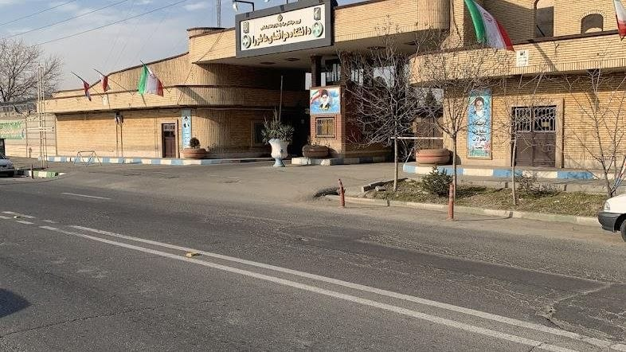

گفته می‌شود دانشگاه عاشورا نیروی هوافضا سپاه پاسداران مورد حمله اسرائیل واقع شده است.

📝 Amir

📌 @persian_trend_official
پرشین ترند | متفاوت‌ترین کانال نظامی

## Persian_Trend_Official — post 16129

  <a href="telegram/content/Persian_Trend_Official_16129_1780906414.webm" target="_blank">🎬 Download video</a>

صدای انفجار در اصفهان

## Persian_Trend_Official — post 16128

  <a href="telegram/content/Persian_Trend_Official_16128_1780906414.webm" target="_blank">🎬 Download video</a>

صدای انفجار در شهر ری - کهریزک شنیده شد.

## Persian_Trend_Official — post 16127

غیررسمی/آماد کل سپاه موقعیت شهید دستواره ، سوله ها و انبارهای همجوار پشتیبانی مورد اصابت قرار گرفتند.

## Persian_Trend_Official — post 16126

  <a href="telegram/content/Persian_Trend_Official_16126_1780906415.webm" target="_blank">🎬 Download video</a>

پدافند تهران فعال شده است

## Persian_Trend_Official — post 16125

  <a href="telegram/content/Persian_Trend_Official_16125_1780906415.webm" target="_blank">🎬 Download video</a>

دانشگاه عاشورا هوافضای سپاه مورد حمله هوایی قرار گرفت.

## Persian_Trend_Official — post 16124

  <a href="telegram/content/Persian_Trend_Official_16124_1780906416.webm" target="_blank">🎬 Download video</a>

سخنگوی وزارت خارجه : حمله‌ای به عربستان انجام ندادیم، اگه بزنیم میگیم

## Persian_Trend_Official — post 16123

صدای انفجار در تهران و کرج شنیده میشود

## Persian_Trend_Official — post 16122

  <a href="telegram/content/Persian_Trend_Official_16122_1780906416.webm" target="_blank">🎬 Download video</a>

گزارش ها از انفجار شدید غرب تهران و تهرانسر

## RadioFarda — post 158039

  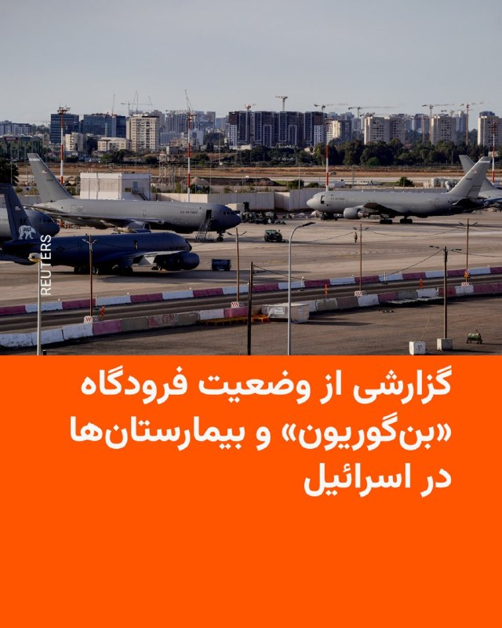

🔸رسانه‌های اسرائیل اعلام کردند فرودگاه اصلی بین‌المللی این کشور، «بن‌گوریون» در مرکز اسرائیل، با وجود فضای جنگی، کماکان به روی پروازهای ورودی و خروجی گشوده و فعال است.

🔸مسئولان این فرودگاه گفتند مسافرانی که دارای بلیط سفر تا روز ۲۳ خرداد هستند، فعلاً از امکان پرواز برخوردار خواهند بود.

🔸با این حال، ال‌عال، مهم‌ترین شرکت هوایی اسرائیلی، به مسافران توصیه کرده که داوطلبانه سفر خود را به تعویق بیندازند.

🔸مسئولان فرودگاه در آغاز هفته گفته بودند از ارتش ایالات متحده خواسته‌اند ده‌ها فروند هواپیمای نظامی را که در این فرودگاه مستقر کرده، منتقل کند. آنها می‌گویند حضور این جنگنده‌ها «زیان مالی سنگینی» به شرکت‌های هوایی اسرائیل به‌دلیل اجبار آن‌ها به انتقال هواپیماهایشان به فرودگاه‌های کشورهای نزدیک تحمیل کرده است.

🔸همزمان با فضای جنگی در اسرائیل، وزارت بهداشت این کشور به بیمارستان‌ها دستور داده فعالیت و بیماران خود را به مجتمع‌های زیرزمینی حفاظت‌شده در هر یک از این مراکز درمانی منتقل کنند تا از حملات احتمالی موشکی در امان باشند.

@RadioFarda

## IranianMinds — post 21757

🔴 حمله به دانشگاه هوا فضای عاشورا
قسمت غربی تهران

@IranianMinds

## IranianMinds — post 21756

🔴تهران صدای پدافند و انفجار در تهران

@IranianMinds

## alonews — post 126174

  <a href="telegram/content/alonews_126174_1780906417.webm" target="_blank">🎬 Download video</a>

👈یک منبع آگاه نظامی به فارس اعلام کرد، در صورت ادامهٔ حملات به زیرساخت‌های انرژی، کلیه تاسیسات نفت و گاز مرتبط اسرائیل، آمریکا و هم‌پیمانانشان از جمله تاسیسات انرژی منطقه‌ای هدف نیروهای مسلح ایران است

✅ @AloNews خبر جنگ

---
📅 بروزرسانی: 1405/03/18 11:33
---

## VahidOOnLine — post 244303

  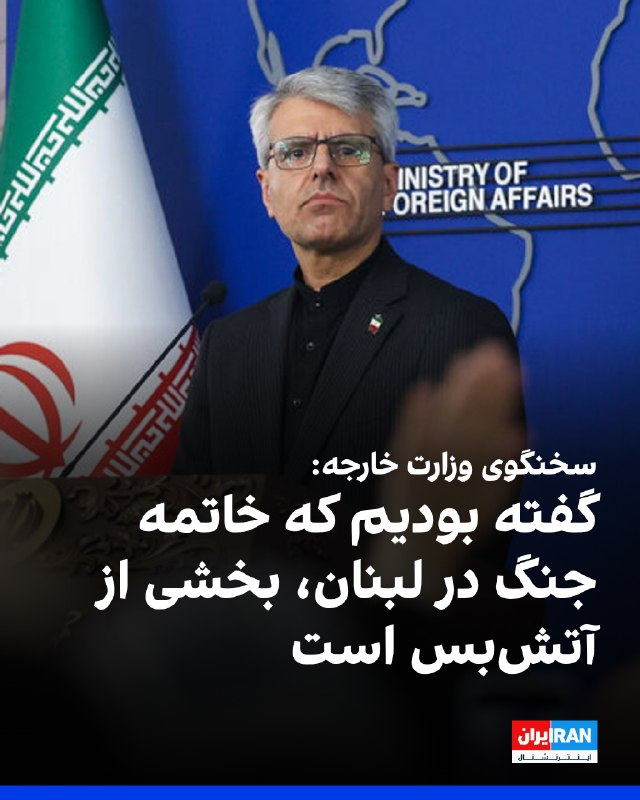

اسماعیل بقائی، سخنگوی وزارت خارجه جمهوری اسلامی در نشست خبری خود با رسانه‌ها با اشاره به حملات اسرائیل به لبنان گفت: «روند دیپلماتیکی که برای خاتمه دادن به جنگ آغاز شده است، تحت تاثیر قرار می‌گیرد.»

او افزود: «همان ابتدا صریحا گفته شده بود و بارها میانجی‌گر پاکستانی هم تاکید کرده بود که خاتمه جنگ در لبنان، بخشی از آتش‌بس است.»
‌🏁 🇬🇧 IranintlTV

🤖 @VahidOOnLine

## VahidOOnLine — post 244302

  <a href="telegram/content/VahidOOnLine_244302_1780905825.mp4" target="_blank">🎬 Download video</a>

⭕️ارتش اسرائیل: حمله گسترده به سامانه‌های پدافندی ایران را تکمیل کردیم

♦️ارتش اسرائیل روز دوشنبه ۱۸ خرداد اعلام کرد، حملات گسترده علیه سامانه‌های پدافندی راهبردی ایران را به پایان رسانده است.

به گفته ارتش اسرائیل، این سامانه‌ها در نقاط مختلف ایران مستقر شده بودند و بخشی از تلاش تهران برای بازسازی توانایی‌های شناسایی و دفاع هوایی پس از آسیب‌های واردشده در عملیات «غرش شیران» به شمار می‌رفتند.

در بیانیه ارتش اسرائیل آمده است که «این حملات به انهدام سامانه‌های هدف منجر شده و آزادی عمل نیروی هوایی اسرائیل در آسمان ایران را بیش از پیش افزایش داده است».
‌🇸🇦 Indypersian

🤖 @VahidOOnLine

## VahidOOnLine — post 244301

  <a href="telegram/content/VahidOOnLine_244301_1780905827.mp4" target="_blank">🎬 Download video</a>

ویدیوی رسیده به ایران‌اینترنشنال در دوشنبه ۱۸ خرداد، موشک‌های شلیک‌شده جمهوری اسلامی را به سمت اسرائیل در آسمان کنگاور نشان می‌دهد.
‌🏁 🇬🇧 IranintlTV

🤖 @VahidOOnLine

## WithYashar — post 13928

گویا دیتاسنتر آسیاتک قطع شد
@withyashar

## WithYashar — post 13927

سخنگوی وزارت خارجه: حمله‌ای به عربستان انجام نداده‌ایم.
نیروهای مسلح ما به هر هدفی حمله کنند، آن را صراحتاً اعلام می‌کنند.
@withyashar

## DEJradio — post 5458

  <a href="telegram/content/DEJradio_5458_1780905828.mp4" target="_blank">🎬 Download video</a>

🚨🎥 آلمان؛ پلیس اوباش حامی فلسطین را فرغونی برد!

#propalestine #فلسطین #اوباش
@DEJradio

## DEJradio — post 5457

  <a href="telegram/content/DEJradio_5457_1780905830.webm" target="_blank">🎬 Download video</a>

🚨📢 سـ.ـپاه پاسداران انقلاب اسلامی ده‌ها فروند موشک به سمت اسرائیل پرتاب کرد که اغلب آنها در آسمان رهگیری شدند.

دستگاه تبلیغاتی نظام تلاش کرد با استفاده از هوش مصنوعی و تصاویر آرشیوی دستاوردسازی کند اما اغلب موشک‌ها یا در ببایان سقوط کرد یا در مناطق مسکونی و با این آمار افتضاح از اینکه به اسرائیل موشک شلیک کردند ابراز رضایت می‌کنند.

بر اساس گزارش‌های دریافتی بامداد یکشنبه دستکم دو موشک لحظاتی پس از پرتاب در کرمانشاه سقوط کرد.

#IRGCterrorists #جنگ

## DEJradio — post 5456

  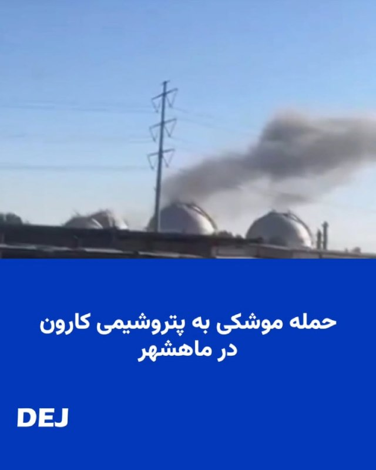

🛩️
🔥 یکی از اهدافی که در حمله هوایی روز دوشنبه ۱۸ خردادماه اسرائیل مورد اصابت قرار گرفت «پتروشیمی کارون» در ماهشهر بود. این حمله مصدومی در پی نداشته است. میزان خسارت و صدمات احتمالی در دست بررسی است به گفته وزارت نفت این حمله مصدومی در پی نداشت و کلیه کارکنان این منطقه تخلیه شده‌اند.

#جنگ #ماهشهر
@DEJradio

## DEJradio — post 5455

  <a href="telegram/content/DEJradio_5455_1780905831.mp4" target="_blank">🎬 Download video</a>

🤡
🔺 شادی جنگ‌طلبان حامی نظام از موشک‌پرانی سپاه، بدون آنکه در نظر بگیرند پیامدهای این جنگ برای مردم و کشور چیست.

#موشکپرانی #جنگ
@DEJradio

## VahidOnline — post 76053

  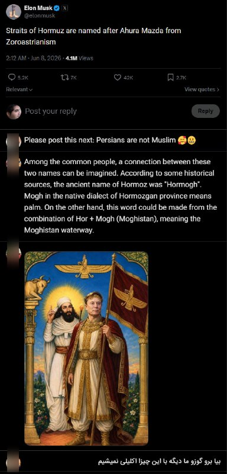

پست ایلان ماسک: "تنگه هرمز به نام اهورا مزدا از آیین زرتشت نامگذاری شده است."
elonmusk

📡 @VahidOnline

## IranIntlTV — post 341139

  <a href="telegram/content/IranIntlTV_341139_1780905832.mp4" target="_blank">🎬 Download video</a>

ایرانیان مقیم ونکوور در تجمعی مقابل ساختمان شبکه سی‌بی‌سی کانادا بار دیگر تلاش کردند صدای مردم ایران را به گوش جهانیان برسانند.

@iranintltv

## IranIntlTV — post 341138

  <a href="telegram/content/IranIntlTV_341138_1780905834.mp4" target="_blank">🎬 Download video</a>

سفیر اسرائیل در آمریکا در پیامی در شبکه اجتماعی ایکس اعلام کرد حکومت ایران ۱۱ موشک بالستیک به سمت اسرائیل شلیک کرده است که هرکدام توان نابودی یک محله کامل و کشتن صدها نفر را دارد.

گفت‌وگو با علی معموری، استاد دانشگاه دیکن و مشاور روابط استراتژیک نخست‌وزیر پیشین عراق

@iranintltv

## IranIntlTV — post 341137

  

اسماعیل بقائی، سخنگوی وزارت خارجه جمهوری اسلامی در نشست خبری خود با رسانه‌ها با اشاره به حملات اسرائیل به لبنان گفت: «روند دیپلماتیکی که برای خاتمه دادن به جنگ آغاز شده است، تحت تاثیر قرار می‌گیرد.»

او افزود: «همان ابتدا صریحا گفته شده بود و بارها میانجی‌گر پاکستانی هم تاکید کرده بود که خاتمه جنگ در لبنان، بخشی از آتش‌بس است.»
https://iranintl.com/202606086065

## IranIntlTV — post 341136

  <a href="telegram/content/IranIntlTV_341136_1780905836.mp4" target="_blank">🎬 Download video</a>

ویدیوی رسیده به ایران‌اینترنشنال در دوشنبه ۱۸ خرداد، موشک‌های شلیک‌شده جمهوری اسلامی را به سمت اسرائیل در آسمان کنگاور نشان می‌دهد.

## IranIntlTV — post 341135

  <a href="telegram/content/IranIntlTV_341135_1780905837.mp4" target="_blank">🎬 Download video</a>

مرتضی کاظمیان، عضو تحریریه ایران‌اینترنشنال، درباره دلایل و اهداف راهبردی سپاه پاسداران از حمله موشکی به اسرائیل توضیح می‌دهد و جمهوری اسلامی را «حکومتی جنگ‌طلب، بسترساز جنگ برای ایران، ضدملی و بی‌توجه به منافع ملی ایران» توصیف می‌کند.

@iranintltv

## Persian_Trend_Official — post 16121

اسموطریچ، وزیر دارایی اسرائیل در جلسه کابینه امنیتی، به جای پاسخ به ایران، خواستار تغییر معادله و تخریب 200 تا 300 ساختمان در ضاحیه بیروت به ازای هر حمله موشکی ایران شد!

اسموطریچ همچنین گفت که مصرف سلاح برای حملات تلافی‌جویانه علیه ایران، سود بسیار کمی دارد و این سلاح‌ها باید برای زمانی نگه داشته شوند که به اسرائیل چراغ سبز داده شود تا زیرساخت‌های انرژی ایران هدف قرار داده شوند و حملاتی که می‌توانند آسیب‌های بلندمدت اقتصادی داشته باشند.

📝 Amir

📌 @persian_trend_official
پرشین ترند | متفاوت‌ترین کانال نظامی

## IranianMinds — post 21755

خاکم‌ کنید جاکشا

@IranianMinds

## alonews — post 126173

  <a href="telegram/content/alonews_126173_1780905838.webm" target="_blank">🎬 Download video</a>

👈چین: دعوت از ایران و اسرائیل به پایبندی به آتش بس

✅ @AloNews خبر جنگ

## alonews — post 126172

  <a href="telegram/content/alonews_126172_1780905839.mp4" target="_blank">🎬 Download video</a>

👈سخنگوی وزارت خارجه : حمله‌ِای به عربستان انجام ندادیم، اگه بزنیم میگیم

✅ @AloNews خبر جنگ

## alonews — post 126171

  <a href="telegram/content/alonews_126171_1780905840.mp4" target="_blank">🎬 Download video</a>

👈 ویدئوی گرافیکی از نقاط مورد حمله قرار گرفته توسط نیروی هوایی اسرائیل از جمله ادعای هدف قرار دادن سامانه های پدافندی سوم خرداد (یا نمونه های مشابه) در اصفهان و خوزستان

✅ @AloNews خبر جنگ

## alonews — post 126170

  <a href="telegram/content/alonews_126170_1780905842.webm" target="_blank">🎬 Download video</a>

👈عوستاد خوش چشم: اسرائیل و آمریکا جرات حمله رو ندارن 
✅ @AloNews خبر جنگ

---
📅 بروزرسانی: 1405/03/18 11:23
---

## VahidOOnLine — post 244300

  

اسماعیل بقائی، سخنگوی وزارت خارجه جمهوری اسلامی، در نشست خبری دوشنبه ۱۸ خرداد گفت: «تاکنون در فضای بدگمانی بسیار شدید با طرف آمریکایی تبادل پیام می‌کردیم و اتفاقات ۲۴ ساعت اخیر به وضعیت نابسامان در فرایند دیپلماتیک دامن خواهد زد.»

بقائی گفت: «نمی‌توان اقدامات اسرائیل را از سیاست‌های آمریکا جدا دانست.»
iranintl
‌🏁 🇬🇧 IranintlTV

🤖 @VahidOOnLine

## VahidOOnLine — post 244299

  <a href="telegram/content/VahidOOnLine_244299_1780905212.mp4" target="_blank">🎬 Download video</a>

ویدیوی رسیده به ایران‌اینترنشنال در دوشنبه ۱۸ خرداد، رد موشک شلیک‌شده جمهوری اسلامی را به سمت اسرائیل در آسمان طارم سفلی در استان قزوین نشان می‌دهد.
‌🏁 🇬🇧 IranintlTV

🤖 @VahidOOnLine

## VahidOOnLine — post 244298

♦️اسماعیل بقایی، سخنگوی وزارت امور خارجه جمهوری اسلامی، روز دوشنبه ۱۸ خرداد و پس از آغاز دور تازه درگیری‌ها با اسرائیل گفت آمریکا به‌طور کامل از اقدامات اسرائیل حمایت می‌کند و میان دو طرف در حوزه‌های پدافندی و تهاجمی هماهنگی وجود دارد.

بقایی در پاسخ به پرسش‌های خبرنگاران درباره گفته‌های ترامپ مبنی بر هماهنگ نبودن واشنگتن و دولت نیتانیاهو افزود این تصور که اسرائیل مستقل آمریکا به عنوان طرف تفاهم آتش‌بس، مسئول هرگونه نقض آن از سوی خود یا متحدانش در منطقه خواهد بود.

سپاه پاسداران شامگاه یکشنبه ۱۷ خرداد و ساعاتی پس از حمله اسرائیل به ضاحیه لبنان، شلیک موشک به اسرائیل را پس از نزدیک به دو ماه «آتش‌بس» از سر گرفت.
‌🇸🇦 Indypersian

🤖 @VahidOOnLine

## WithYashar — post 13926

سپاه: حمله دشمن به صنایع پتروشیمی پاسخ داده شد.
@withyashar

## DEJradio — post 5454

  <a href="telegram/content/DEJradio_5454_1780905213.webm" target="_blank">🎬 Download video</a>

🚨📢 بعد از حمله موشکی سـ.ـپاه پاسداران به اسرائیل، دونالد ترامپ رندانه برای اینکه روند مذاکرات مختل نشود، خطاب به مقامات جمهوری اسلامی گفت: «موشک هایتان را زدید، برگردید به میز مذاکره» و «از اسرائیل می خواهم پاسخ ندهد» او تلاش کرد تلفنی نتانیاهو را راضی کند دست از حمله بردارد.

ترامپ همچنین مدعی شده بود«ما بسیار به یک توافق نهایی با ایران نزدیک هستیم. این توافق، توافق خوبی خواهد بود. نمی‌خواهم اتفاقاتی که اکنون در حال رخ دادن است آن را از بین ببرد.»

یک مقام آمریکایی به «کانال ۱۲» اسرائیل گفته بود نتانیاهو به‌نوعی با عقب افتادن پاسخ نظامی به حملات موشکی اخیر ایران موافقت کرده است اما با روشن شدن هوا، نتایاهو دستور حمله را صادر کرد.
یک منبع امنیتی به دژ می‌گوید، «دفاع از امنیت اسرائیل در برابر تهاجم سـ.ـپاه پاسداران خواست مردم و مقامات اسرائیلی است و بی‌بی حوصله لاس زدن ندارد.»

#ترامپ #IRGCterrorists
@DEJradio

## DEJradio — post 5453

  <a href="telegram/content/DEJradio_5453_1780905213.webm" target="_blank">🎬 Download video</a>

🚨
⭕️ به گفته منابع اطلاعاتی با وجود اینکه مردم ایران در شرایط جنگی با بحران‌های اقتصادی و مشکلات معیشتی رو‌به‌رو هستند، حکومت میلیون‌ها دلار بودجه به ده‌ها هزار خانواده پناهنده در لبنان منتقل می‌کند. این مبلغ تحت عنوان حمایت مداوم از تامین غذا، درمان پزشکی و تجهیزات به آنها اختصاص می‌یابد.

یکی از همین منابع می‌گوید، روشن است که رژیم ترجیح می‌دهد تروریسم حزب‌الله را به جای مردم ایران تأمین مالی کند، زیرا شهروندان داخلی اصلا اولویت ملاها نیستند.

#حزب_الله_لبنان #IRGCterrorists
@DEJradio

## VahidOnline — post 76052

  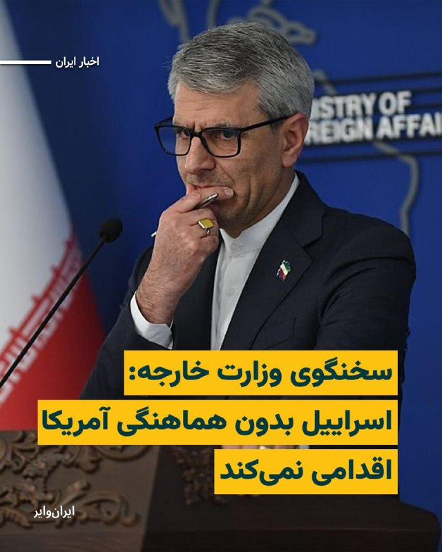

«اسماعیل بقایی»، سخنگوی وزارت امور خارجه جمهوری اسلامی، در نخستین کنفرانس خبری خود پس از آغاز حملات ایران به اسراییل گفت که اتفاقات ساعات‌ گذشته، به بی‌اعتمادی موجود میان تهران و واشنگتن دامن خواهد زد.

بقایی در نشست خبری خود گفت تبادل پیام میان ایران و آمریکا تاکنون در فضایی لبریز از بی‌اعتمادی انجام شده و به گفته او، آتش‌بس نیز «به طور مستمر و مکرر» از سوی طرف مقابل نقض شده است. او تاکید کرد جمهوری اسلامی هر زمان که لازم بداند برای دفاع از «امنیت کشور» اقدام خواهد کرد.

سخنگوی وزارت امور خارجه همچنین آمریکا را مسوول تحولات اخیر منطقه دانست و گفت اسراییل بدون هماهنگی با واشنگتن اقدامی انجام نمی‌دهد.
به گفته او، وزارت خارجه آمریکا حمایت از اسراییل را دلیل اصلی جنگ علیه ایران دانسته و جمهوری اسلامی از همکاری و هماهنگی کامل فرماندهی مرکزی ارتش آمریکا، سنتکام، با اسراییل در حوزه‌های دفاعی و تهاجمی اطلاع دارد.

بقایی با اشاره به تفاهم آتش‌بس ۱۹ فروردین، آمریکا را مسوول هرگونه نقض آن دانست و گفت پیامدهای تشدید تنش در منطقه متوجه واشنگتن خواهد بود.

او همچنین از «رافائل گروسی»، مدیرکل آژانس بین‌المللی انرژی اتمی، انتقاد کرد و گفت در صورت تصویب قطعنامه‌ای علیه ایران در شورای حکام آژانس، تهران «پاسخ مناسب» خواهد داد.
@VahidHeadline

📡 @VahidOnline

## VahidOnline — post 76051

  <a href="telegram/content/VahidOnline_76051_1780905214.mp4" target="_blank">🎬 Download video</a>

اکانت ارتش اسرائیل با انتشار ویدیوی بالا نوشت: "در دوره اخیر، سامانه‌های پدافندی در چندین منطقه مختلف در ایران مستقر شده بودند، ... این حمله منجر به انهدام این سامانه‌ها شد."

📡 @VahidOnline

## IranIntlTV — post 341134

  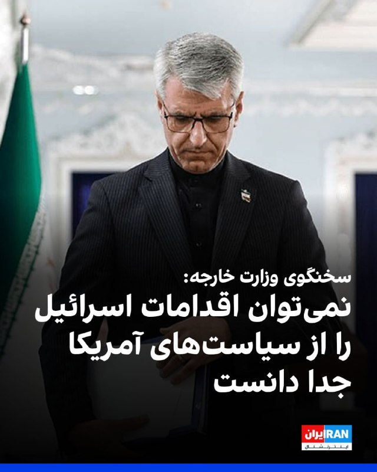

اسماعیل بقائی، سخنگوی وزارت خارجه جمهوری اسلامی، در نشست خبری دوشنبه ۱۸ خرداد گفت: «تاکنون در فضای بدگمانی بسیار شدید با طرف آمریکایی تبادل پیام می‌کردیم و اتفاقات ۲۴ ساعت اخیر به وضعیت نابسامان در فرایند دیپلماتیک دامن خواهد زد.»

بقائی گفت: «نمی‌توان اقدامات اسرائیل را از سیاست‌های آمریکا جدا دانست.»
iranintl.com/202606083207

## IranIntlTV — post 341133

  <a href="telegram/content/IranIntlTV_341133_1780905215.mp4" target="_blank">🎬 Download video</a>

گروهی از ایرانیان مقیم استکهلم در حمایت از مردم ایران تجمع کردند و خواستار تعطیلی سفارت جمهوری اسلامی در سوئد شدند.

گزارش مهران عباسیان، خبرنگار ایران‌اینترنشنال
@iranintltv

## IranIntlTV — post 341132

  <a href="telegram/content/IranIntlTV_341132_1780905217.mp4" target="_blank">🎬 Download video</a>

ویدیوی رسیده به ایران‌اینترنشنال در دوشنبه ۱۸ خرداد، رد موشک شلیک‌شده جمهوری اسلامی را به سمت اسرائیل در آسمان طارم سفلی در استان قزوین نشان می‌دهد.

## FarsiVOA — post 219991

  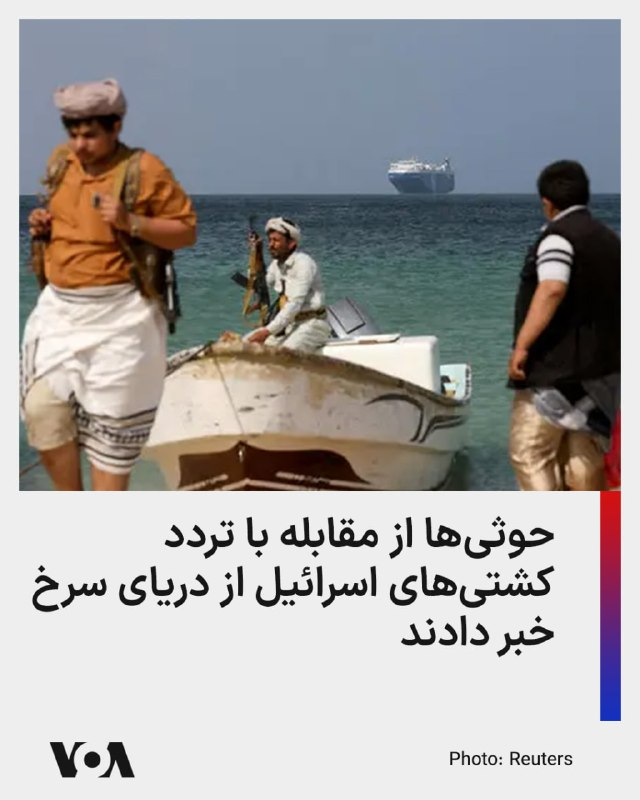

حوثی‌های یمن که تحت حمایت جمهوری اسلامی هستند، اعلام کردند که مانع عبور و مرور کشتی‌های مربوط به اسرائیل در دریای سرخ خواهند شد.

این شبه‌نظامیان روز دوشنبه همچنین در بیانیه‌ای اعلام کردند که به اسرائیل حمله کرده‌اند.

آنها تأکید کردند که «به تشدید تنش، به شدت پاسخ خواهیم داد.»

ساعاتی پیش ارتش اسرائیل از شناسایی حمله موشکی از سمت یمن به سمت خاک اسرائیل خبر داد و گفت سامانه‌های دفاعی برای رهگیری این تهدید در حال فعالیت هستند.
@FarsiVOA

## Persian_Trend_Official — post 16120

  <a href="telegram/content/Persian_Trend_Official_16120_1780905219.mp4" target="_blank">🎬 Download video</a>

ارتش اسرائیل ویدیویی گرافیکی از نقاط مورد حمله قرار گرفته شده در ایران منتشر کرد.

طبق ادعای ارتش اسرائیل دو سامانه سوم خرداد در خوزستان و اهواز منهدم شده اند.

📝 Amir

📌 @persian_trend_official
پرشین ترند | متفاوت‌ترین کانال نظامی

## alonews — post 126169

  <a href="telegram/content/alonews_126169_1780905220.webm" target="_blank">🎬 Download video</a>

👈سخنگوی وزارت امور خارجه: تردید نکنید هماهنگی در همه سطوح به بهترین وجه وجود دارد 
✅ @AloNews خبر جنگ

## alonews — post 126168

  <a href="telegram/content/alonews_126168_1780905220.webm" target="_blank">🎬 Download video</a>

👈حریم هوایی عراق برای ۷۲ ساعت بسته شد

✅ @AloNews خبر جنگ

## alonews — post 126167

  <a href="telegram/content/alonews_126167_1780905220.mp4" target="_blank">🎬 Download video</a>

👈بقایی: ادعای مصادره دارایی‌های مسدود شده ایران به نفع کشورهای منطقه مضحک است

✅ @AloNews خبر جنگ

## alonews — post 126166

  <a href="telegram/content/alonews_126166_1780905222.webm" target="_blank">🎬 Download video</a>

👈سخنگوی وزارت امور خارجه: تردید نکنید هماهنگی در همه سطوح به بهترین وجه وجود دارد

✅ @AloNews خبر جنگ

## alonews — post 126165

  <a href="telegram/content/alonews_126165_1780905222.webm" target="_blank">🎬 Download video</a>

👈تقریباً ۳۱ موشک از دیشب به سمت اسرائیل شلیک شده است، ۳۰ موشک از ایران و یک موشک از یمن.

✅ @AloNews خبر جنگ

## alonews — post 126164

  <a href="telegram/content/alonews_126164_1780905222.webm" target="_blank">🎬 Download video</a>

👈اصابت دقیق موشک در حیفا

✅ @AloNews خبر جنگ

---
📅 بروزرسانی: 1405/03/18 11:13
---

## VahidOOnLine — post 244297

  <a href="telegram/content/VahidOOnLine_244297_1780904589.mp4" target="_blank">🎬 Download video</a>

ویدیوی رسیده به ایران‌اینترنشنال در دوشنبه ۱۸ خرداد، دود ناشی از انفجارها را در پتروشیمی کارون واقع در منطقه ویژه اقتصادی ماهشهر پس از حملات اسرائیل نشان می‌دهد.
‌🏁 🇬🇧 IranintlTV

🤖 @VahidOOnLine

## WithYashar — post 13925

  <a href="telegram/content/WithYashar_13925_1780904590.mp4" target="_blank">🎬 Download video</a>

موقعیت دقیق لانچر پرتاب کنندهی موشک در ابهر
@withyashar

## WithYashar — post 13924

مسئول سیاست خارجی اتحادیه اروپا امروز از اعمال تحریم‌های بیشتر بر ایران به بهانه بسته‌بودن تنگه هرمز خبر داد.

کالاس در گفتگو با خبرنگاران پیش از ورود به نشست غیررسمی وزیران دفاع کشورهای عضو اتحادیه اروپا در قبرس، گفت: «امروز اولین باری خواهد بود که تحریم‌های مربوط به آزادی ناوبری علیه ایران اعمال می‌شود».
@withyashar

## mwarmonitor — post 10407

  <a href="telegram/content/mwarmonitor_10407_1780904592.mp4" target="_blank">🎬 Download video</a>

🔴ارتش اسرائیل یک حمله گسترده علیه سامانه‌های پدافندی راهبردی رژیم تروریستی ایران را تکمیل کرد

🔸در دوره اخیر، سامانه‌های پدافندی در چندین منطقه مختلف در ایران مستقر شده بودند، در چارچوب تلاش رژیم برای بازسازی توانایی‌های شناسایی و دفاعی خود که در عملیات «غرش شیران» آسیب دیده بودند — این حمله منجر به انهدام این سامانه‌ها شد.

🔹در عملیات «غرش شیران»، ارتش اسرائیل به‌طور عمیق به سامانه‌های پدافندی رژیم تروریستی ایران آسیب وارد کرد. حملات تکمیل‌شده به تعمیق بیشتر آزادی عمل نیروی هوایی در آسمان ایران کمک می‌کنند.

@mwarmonitor

## pm_afshaa — post 92869

منم ایفون 17 میخام😭😭

## pm_afshaa — post 92868

منم ایفون 17 میخام😭😭

## IranIntlTV — post 341131

  <a href="telegram/content/IranIntlTV_341131_1780904593.mp4" target="_blank">🎬 Download video</a>

حملات متقابل جمهوری اسلامی و اسرائیل واکنش‌های گسترده‌ای در میان مقامات و رسانه‌های ترکیه به‌همراه داشت.

گفت‌وگو با نرگس هورخش، خبرنگار ایران‌اینترنشنال

@iranintltv

## IranIntlTV — post 341130

  <a href="telegram/content/IranIntlTV_341130_1780904595.mp4" target="_blank">🎬 Download video</a>

ویدیوی رسیده به ایران‌اینترنشنال در دوشنبه ۱۸ خرداد، دود ناشی از انفجارها را در پتروشیمی کارون واقع در منطقه ویژه اقتصادی ماهشهر پس از حملات اسرائیل نشان می‌دهد.

## IranIntlTV — post 341129

  <a href="telegram/content/IranIntlTV_341129_1780904596.mp4" target="_blank">🎬 Download video</a>

در آستانه سالروز تولد کیان پیرفلک، کودک کشته‌شده در جریان خیزش انقلابی، گروهی از ایرانیان در کانادا در یکی از خیابان‌های اصلی شهر گرد هم آمدند.

گزارش سپیدار ولیان، خبرنگار ایران‌اینترنشنال

@iranintltv

## DW_Farsi — post 125675

  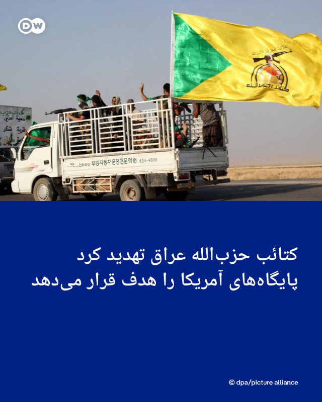

🔶 کتائب حزب‌الله عراق تهدید کرد پایگاه‌های آمریکا را هدف قرار می‌دهد

گروه شبه‌نظامی "کتائب حزب‌الله" عراق که از سوی جمهوری اسلامی حمایت می‌شود، تهدید کرد که حملات تازه‌ای را علیه پایگاه‌های نظامی آمریکا در منطقه انجام خواهد داد.

این گروه شامگاه یکشنبه ۱۷ خرداد با انتشار بیانیه‌ای اعلام کرد در صورتی که ایالات متحده به طور مستقیم در تشدید جدید تنش‌ها میان ایران و اسرائیل دخالت کند، پایگاه‌ها و منافع آمریکا در منطقه را هدف قرار خواهد داد.

پیش‌تر سایت خبری "اکسیوس" به نقل از یک مقام آمریکایی گزارش داده بود که ایالات متحده در حملات اسرائیل در بامداد دوشنبه علیه ایران دخالتی نداشته است. در همین حال روزنامه اسرائیلی "معاریو" نوشته بود که حملات ارتش این کشور علیه ایران با "هماهنگی دولت ترامپ" انجام شده است.

یخیل لایتر، سفیر اسرائیل در آمریکا، پیش‌تر در پیامی در ایکس تهدید کرده بود در صورتی که حزب‌الله لبنان به سمت اسرائیل موشک شلیک کند، مراکز فرماندهی این گروه در ضاحیه بیروت به شدت هدف قرار خواهند گرفت. او نوشته بود: «این موضوع هیچ ارتباطی با ایران ندارد. همه از این رژیم دیوانه ایران به ستوه آمده‌اند.»

از زمان آغاز حملات آمریکا و اسرائیل علیه ایران، گروه‌های شبه‌نظامی مورد حمایت جمهوری اسلامی در منطقه از جمله در عراق مسئولیت صدها حمله به اهدافی در منطقه از جمله حمله به تأسیسات و مراکز متعلق به آمریکا را بر عهده گرفته‌اند.

@dw_farsi

## Persian_Trend_Official — post 16119

تصاویری از موج آخر حملات موشکی سپاه به سوی اسرائیل

📝 Amir

📌 @persian_trend_official
پرشین ترند | متفاوت‌ترین کانال نظامی

## Persian_Trend_Official — post 16118

  <a href="telegram/content/Persian_Trend_Official_16118_1780904598.webm" target="_blank">🎬 Download video</a>

سپاه: تجاوز دشمن به صنایع پتروشیمی پاسخ داده شد!

روابط عمومی سپاه پاسداران انقلاب اسلامی اعلام کرد:

بسم الله قاصم الجبارین
فمن اعتدی علیکم فاعتدوا علیه بمثل ما اعتدی علیکم

با استعانت از خداوند قادر متعال، رزمندگان نیروی هوا فضای سپاه پاسداران انقلاب اسلامی، در پاسخ به تجاوز دشمن آمریکایی صهیونی به یکی از صنایع پتروشیمی، دقایقی پیش صنایع مشابه در حیفا را مورد حمله موشکی قرار دادند.

اخطار می کنیم؛ دشمن صهیونیستی با اقدام علیه اهداف غیر نظامی و هدف قرار دادن صنایع نفتی، بازی خطرناکی را شروع کرد، که دامنه آن کلیه اهداف انرژی منطقه را در بر خواهد گرفت و عواقب آن برای اقتصاد جهانی، بر عهده آتش افروز اصلی این میدان، آمریکا می باشد.

و ما النصر الا من عند الله العزیز الحکیم

📝 Amir

📌 @persian_trend_official
پرشین ترند | متفاوت‌ترین کانال نظامی

## Persian_Trend_Official — post 16116

  <a href="telegram/content/Persian_Trend_Official_16116_1780904598.mp4" target="_blank">🎬 Download video</a>

فیلمی از حمله به پتروشیمی ماهشهر

## idfinfarsi — post 11815

ارتش اسرائیل یک حمله گسترده علیه سامانه‌های پدافندی راهبردی رژیم تروریستی ایران را تکمیل کرد

در دوره اخیر، سامانه‌های پدافندی در چندین منطقه مختلف در ایران مستقر شده بودند، در چارچوب تلاش رژیم برای بازسازی توانایی‌های شناسایی و دفاعی خود که در عملیات «غرش شیران» آسیب دیده بودند — این حمله منجر به انهدام این سامانه‌ها شد.

در عملیات «غرش شیران»، ارتش اسرائیل به‌طور عمیق به سامانه‌های پدافندی رژیم تروریستی ایران آسیب وارد کرد. حملات تکمیل‌شده به تعمیق بیشتر آزادی عمل نیروی هوایی در آسمان ایران کمک می‌کنند.

## Dirty_Kids — post 391334

  

سینا ولی‌الله رقابت تنگاتنگی داره با واشقانی

@Dirty_Kids 👻

## Dirty_Kids — post 391333

‏😂 بیانیه رسمی فیفا:
دیدار ایران و مصر قطعا دیدار افتخار همجنسگرایان خواهد بود و به هیچ عنوان این رویداد لغو نخواهد شد

@Dirty_Kids 👻

## Hranews — post 113462

کیفرخواست پرونده منصور عبدالله‌زاده صادر شد

❗️
❗️
❗️
❗️
❗️ – پرونده قضایی منصور عبدالله‌زاده، شهروند بازداشتی اهل نقده، با صدور کیفرخواست به دادگستری این شهرستان ارجاع داده شد.

ادامه مطلب

#منصور_عبدالله‌زاده

↘️
@hranews_bot تماس ✉️ -  @Hranews  کانال هرانا 🆑

## alonews — post 126163

  <a href="telegram/content/alonews_126163_1780904600.webm" target="_blank">🎬 Download video</a>

👈سپاه : اسرائیل با هدف قرار دادن صنعت نفت و مراکز غیرنظامی ایران، وارد یک «بازی خطرناک» شده

✅ @AloNews خبر جنگ

## alonews — post 126162

  <a href="telegram/content/alonews_126162_1780904600.webm" target="_blank">🎬 Download video</a>

👈سخنگوی وزارت امور خارجه ایران: هیچ کس باور ندارد که آمریکا بتواند بدون هماهنگی کامل با آمریکا در منطقه اقدام کند

✅ @AloNews خبر جنگ

## alonews — post 126161

  <a href="telegram/content/alonews_126161_1780904601.webm" target="_blank">🎬 Download video</a>

👈 کانال 12 اسرائیل: انتظار می‌رود وزیر دارایی اسرائیل، سموتریچ، استدلال کند که اسرائیل باید به جای حمله مستقیم به ایران، در لبنان در پاسخ به هر حمله ایرانی واکنش نشان دهد

✅ @AloNews خبر جنگ

## alonews — post 126160

  <a href="telegram/content/alonews_126160_1780904601.mp4" target="_blank">🎬 Download video</a>

👈 تصاویری از لبنان

✅ @AloNews خبر جنگ

## alonews — post 126159

  <a href="telegram/content/alonews_126159_1780904601.webm" target="_blank">🎬 Download video</a>

👈حمید رسایی:
این اینترنت بی صاحاب رو چرا نمیبندید؟

✅ @AloNews خبر جنگ

## alonews — post 126158

  <a href="telegram/content/alonews_126158_1780904601.webm" target="_blank">🎬 Download video</a>

👈مسئول سیاست خارجی اتحادیه اروپا امروز از اعمال تحریم‌های بیشتر بر ایران به بهانه بسته‌بودن تنگه هرمز خبر داد.

🔴 کالاس در گفتگو با خبرنگاران پیش از ورود به نشست غیررسمی وزیران دفاع کشورهای عضو اتحادیه اروپا در قبرس، گفت: «امروز اولین باری خواهد بود که تحریم‌های مربوط به آزادی ناوبری علیه ایران اعمال می‌شود».

✅ @AloNews خبر جنگ

## alonews — post 126157

  <a href="telegram/content/alonews_126157_1780904602.webm" target="_blank">🎬 Download video</a>

👈سخنگوی وزارت خارجه: آتش‌بس به‌طور مستمر و مکرر توسط طرف‌های مقابل نقض شده است.

🔴ما هر وقت لازم بدانیم برای دفاع از امنیت کشور اقدام خواهیم کرد

✅ @AloNews خبر جنگ

---
📅 بروزرسانی: 1405/03/18 11:03
---

## VahidOOnLine — post 244296

  <a href="telegram/content/VahidOOnLine_244296_1780904004.mp4" target="_blank">🎬 Download video</a>

ویدیوهای رسیده به ایران‌اینترنشنال در دوشنبه ۱۸ خرداد، رد موشک شلیک‌شده جمهوری اسلامی را به سمت اسرائیل در آسمان شهر گلمان در شهرستان ارومیه نشان می‌دهد.
‌🏁 🇬🇧 IranintlTV

🤖 @VahidOOnLine

## WithYashar — post 13923

  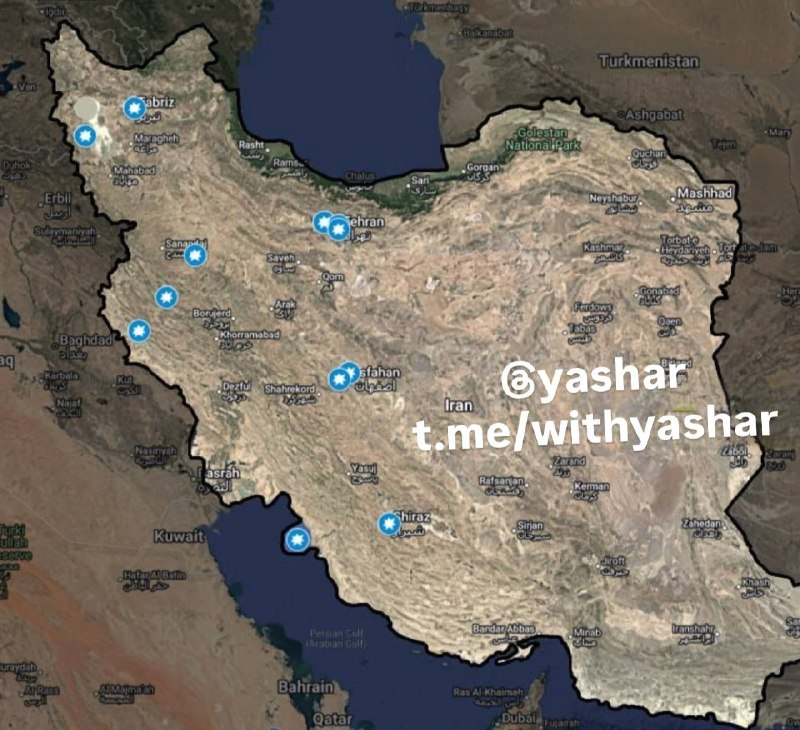

نقاطی که امروز تا این لحظه توسط ارتش اسرائیل هدف قرار گرفته
@withyashar

## WithYashar — post 13922

🚨🚨🚨🚨🚨🚨🚨🚨
موج بعدی حملات اسرائیل آغاز شد
@withyashar

## WithYashar — post 13921

  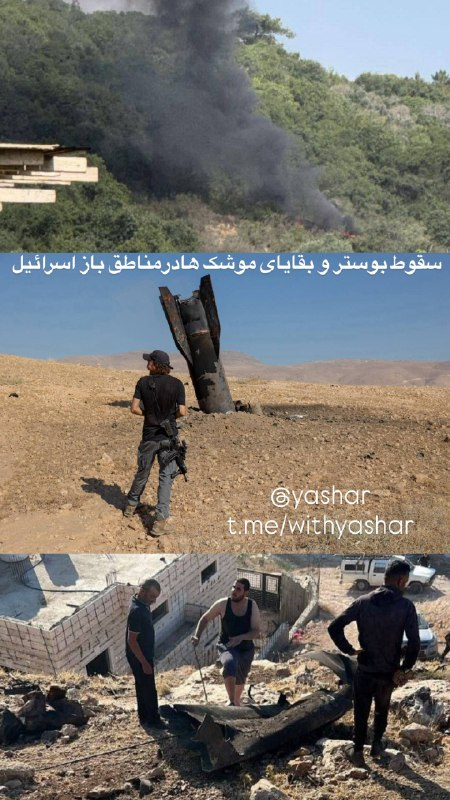

@withyashar

## mwarmonitor — post 10406

🔴سفارت هند در تهران به شهروندان هندی هشدار داده و بار دیگر تأکید کرده است که از سفر به ایران خودداری کنند و به افرادی که هم‌اکنون در این کشور هستند توصیه کرده است با هر وسیله حمل‌ونقل ممکن فوراً ایران را ترک کنند.

@mwarmonitor

## IranIntlTV — post 341128

  <a href="telegram/content/IranIntlTV_341128_1780904006.mp4" target="_blank">🎬 Download video</a>

ویدیوهای رسیده به ایران‌اینترنشنال در دوشنبه ۱۸ خرداد، رد موشک شلیک‌شده جمهوری اسلامی را به سمت اسرائیل در آسمان شهر گلمان در شهرستان ارومیه نشان می‌دهد.

## Persian_Trend_Official — post 16115

بقایی: رژیم صهیونیستی بدون هماهنگی با آمریکا کاری نمی‌کند. سخنگوی وزارت خارجه: وزارت خارجه آمریکا صراحتا دلیل اصلی تحمیل این جنگ علیه ایران را حمایت از رژیم صهیونیستی ذکر کرده است. این موضع رسمی آمریکا بوده است. همچنین، علی‌رغم ادعای مقامات آمریکایی، ما اطلاع…

## Persian_Trend_Official — post 16114

  

🤑توییت ایلان ماسک در مورد ایران و تنگه هرمز: تنگه هرمز به نام اهورا مزدا از آیین زرتشت نامگذاری شده است.

👑
👑
👑
👑
👑
👑
👑
👑
👑
👑
👑
👑

👺Phantom

📌 @persian_trend_official
پرشین ترند | متفاوت‌ترین کانال نظامی

## Persian_Trend_Official — post 16113

  

تنگه هرمز به نام اهورا مزدا از آیین زرتشت نامگذاری شده است.

## Persian_Trend_Official — post 16112

ارتش اسرائیل می‌گوید از شب گذشته تاکنون در مجموع 30 موشک از مبدا ایران و یمن به سمت اسرائیل پرتاب شده که تماما رهگیری شده و بخشی به منطقه ای باز اصابت کردند.

📝 Amir

📌 @persian_trend_official
پرشین ترند | متفاوت‌ترین کانال نظامی

## Persian_Trend_Official — post 16111

  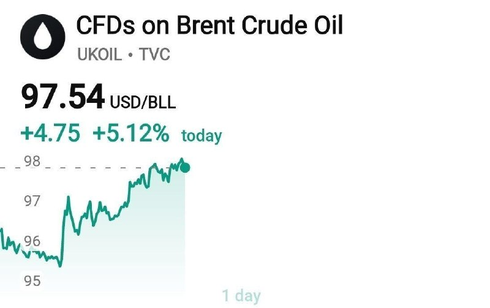

قیمت نفت با وجود رشد حدود ۵ درصدی، همچنان واکنش کامل به تحولات و درگیری‌های اخیر نشان نداده و در حال حاضر زیر سطح ۱۰۰ دلار باقی مانده است.

Phantom

📌 @persian_trend_official
پرشین ترند | متفاوت‌ترین کانال نظامی

## RadioFarda — post 158038

  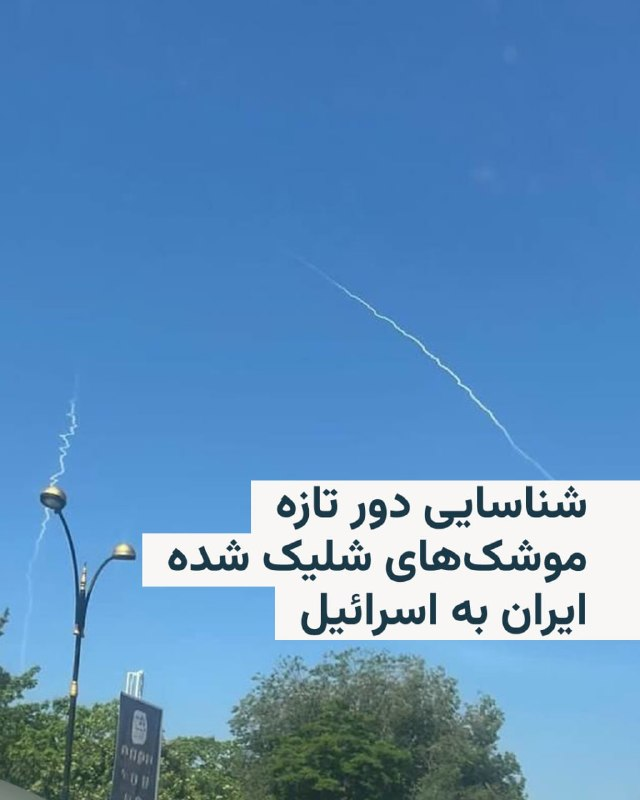

🔸ارتش اسرائیل نزدیک ساعت ۱۰ بامداد به وقت تهران، اعلام کرد شلیک شمار دیگری موشک از مبداء ایران را شناسایی کرده که احتمالاً به سوی شمال اسرائیل هدایت شده است.

🔸خبرنگار رادیو فردا در اسرائیل می‌گوید مردم در این مناطق هشدار گرفتند به پناهگاه بروند.

🔸بر اساس بیانیه ارتش اسرائیل، سامانه‌های دفاعی در حال فعالیت برای رهگیری این تهدید هستند.

🔸در این بیانیه از عموم مردم خواسته شده مسئولانه عمل کرده و مطابق دستورالعمل‌ها رفتار کنند؛ «این دستورالعمل‌ها جان انسان‌ها را نجات می‌دهند».

@RadioFarda

## alonews — post 126156

  <a href="telegram/content/alonews_126156_1780904010.webm" target="_blank">🎬 Download video</a>

👈وزارت امورخارجه ایران: ایالات متحده مسئولیت مستقیم نقض آتش‌بس کنونی را بر عهده دارد و اقدامات اسرائیل را به واشنگتن مرتبط می‌داند.

🔴اقدامات اسرائیل در منطقه را نمی‌توان جدا از ایالات متحده بررسی کرد.

✅ @AloNews خبر جنگ

## alonews — post 126155

  <a href="telegram/content/alonews_126155_1780904010.mp4" target="_blank">🎬 Download video</a>

وضعیت کانفیگ فروشا

[@AloTweet]

## alonews — post 126154

  <a href="telegram/content/alonews_126154_1780904012.webm" target="_blank">🎬 Download video</a>

💢فوووووووری/موج بعدی حملات اسرائیل آغاز شد 
🚨 @AkhbareFouri

---
📅 بروزرسانی: 1405/03/18 10:53
---

## VahidOOnLine — post 244295

  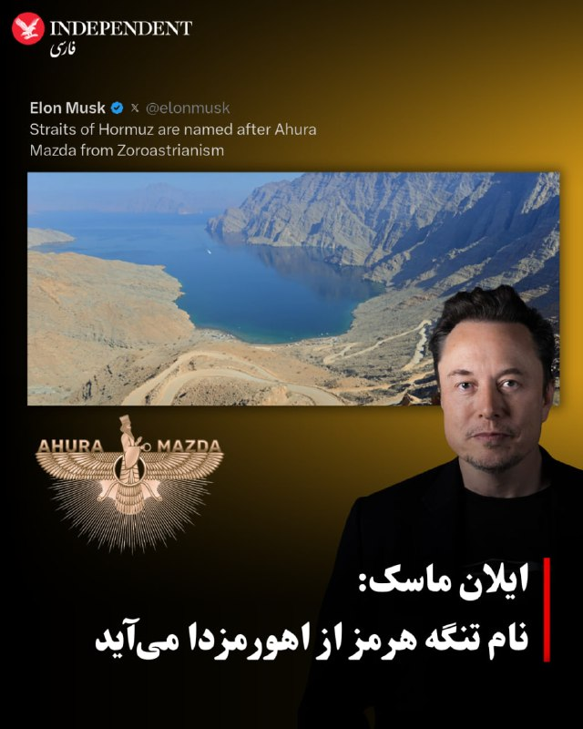

⭕️ایلان ماسک: نام تنگه هرمز از اهورمزدا می‌آید

♦️ایلان ماسک، مالک تسلا و اسپیس اکس، روز دوشنبه ۱۸ خرداد با انتشار پیامی در اکس نوشت: «تنگه هرمز به نام اهورا مزدا از آیین زرتشت نامگذاری شده است.»

با اینکه این پیام، مطلب تازه‌ای برای ایرانیان ندارد، یکی از معدود واکنش‌های ایلان ماسک به جنگ میان آمریکا و اسرائیل با جمهوری اسلامی ایران و بحران تنگه هرمز به شمار می‌رود.
‌🇸🇦 Indypersian

🤖 @VahidOOnLine

## VahidOOnLine — post 244294

  <a href="telegram/content/VahidOOnLine_244294_1780903410.mp4" target="_blank">🎬 Download video</a>

ویدیوهای رسیده به ایران‌اینترنشنال در دوشنبه ۱۸ خرداد، دود ناشی از انفجار را در حوالی سیریک استان هرمزگان نشان می‌دهد.
‌🏁 🇬🇧 IranintlTV

🤖 @VahidOOnLine

## WithYashar — post 13920

برخی منابع از شنیده شدن انفجارهای قوی در پایگاه هوایی ریاض پایتخت عربستان خبر دادند.
@withyashar
پیشتر ایران حمله به عربستان رو رد کرده بود ممکنه از طرف انصار یمن باشه

## WithYashar — post 13919

  <a href="telegram/content/WithYashar_13919_1780903413.mp4" target="_blank">🎬 Download video</a>

رهگیری در شمال اسرائیل
@withyashar

## WithYashar — post 13918

  <a href="telegram/content/WithYashar_13918_1780903415.mp4" target="_blank">🎬 Download video</a>

پتروشیمی ماهشهر
@withyashar

## WithYashar — post 13917

صداوسیما: موشک‌هایی از ایران و لبنان به سمت حیفا و شمال اسرائیل شلیک شد
@withyashar

## mwarmonitor — post 10405

🔴 حوثی‌های یمن امروز اعلام کردند که در دریای سرخ و تنگه باب‌المندب علیه اسرائیل «محاصره دریایی» اعمال خواهند کرد.

@mwarmonitor

## mwarmonitor — post 10404

‼️ ایلان ماسک : «تنگه هرمز به نام اهورا مزدا از زرتشتیان نام گذاری شده»

@mwarmonitor

## DEJradio — post 5452

  <a href="telegram/content/DEJradio_5452_1780903417.webm" target="_blank">🎬 Download video</a>

🚨📢 جمهوری اسلامی ایران بامداد دوشنبه ۱۸ خرداد ۱۴۰۵ پایگاه هوایی شاهزاده سلطان در عربستان سعودی محل استقرار نیروهای آمریکایی را هدف قرار داد.

این منطقه در جنوب شرقی ریاض و در منطقه‌ای بین ریاض و استان شرقی در نزدیکی شهر الخرج قرار دارد.

#جنگ #عربستان
@DEJradio

## DEJradio — post 5451

  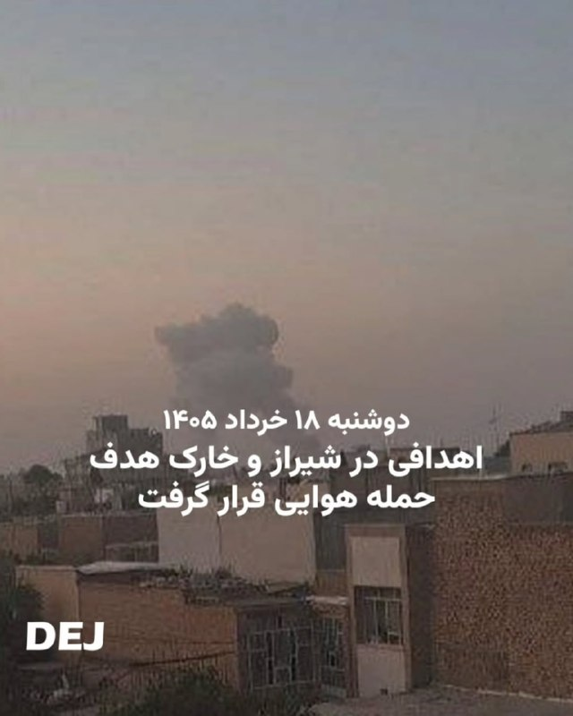

🛩️
🔥 بر اساس گزارش منابع محلی اهدافی در شیراز و جزیره خارک هدف حمله هوایی قرار گرفت.

پیش‌تر باوجود آتش‎بس میان آمریکا و جمهوری اسلامی تأسیسات راداری و موشکی سـ.ـپاه پاسداران توسط ارتش آمریکا در جنوب ایران هدف قرار گرفته بود. پیدا نیست حملات به جنوب ایران توسط آمریکا انجام شده یا اسرائیل.

#جنگ #خارک
@DEJradio

## IranIntlTV — post 341127

  <a href="telegram/content/IranIntlTV_341127_1780903419.mp4" target="_blank">🎬 Download video</a>

ویدیوهای رسیده به ایران‌اینترنشنال در دوشنبه ۱۸ خرداد، دود ناشی از انفجار را در حوالی سیریک استان هرمزگان نشان می‌دهد.

## FarsiVOA — post 219990

  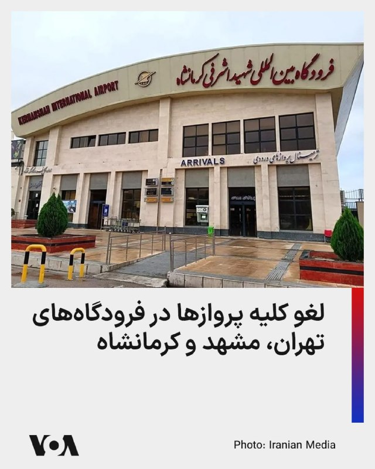

به دنبال حملات موشکی سپاه به اسرائیل و پاسخ این کشور، رسانه‌های داخلی به نقل از مقامات جمهوری اسلامی، از لغو پروازها در برخی از فرودگاه‌های کشور خبر دادند.

در همین ارتباط، تمامی پروازهای فرودگاه بین‌المللی تهران و همچنین فرودگاه مهرآباد تا اطلاع ثانوی لغو شده است.

همچنین روابط‌عمومی سازمان هواپیمایی کشوری جمهوری اسلامی اعلام کرد که تمام فرودگاه‌های غرب کشور از جمله فرودگاه کرمانشاه تا اطلاع ثانوی فعالیت ندارند.

از سوی دیگر فرودگاه بین‌المللی مشهد نیز هم اکنون تعطیل بوده و مقامات شهری اعلام کردند که سرویس‌دهی خط یک قطار شهری مشهد از ایستگاه غدیر تا فرودگاه نیز تعلیق شده است.
@FarsiVOA

## FarsiVOA — post 219989

  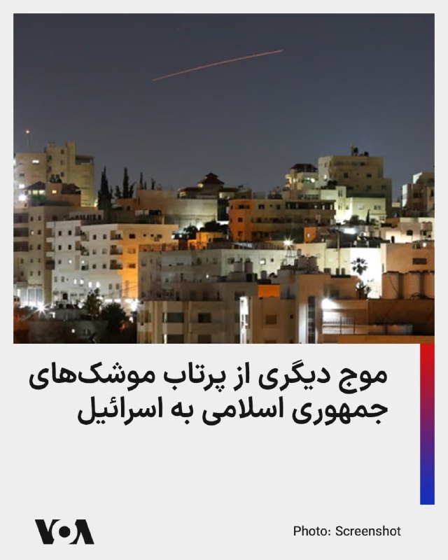

ارتش اسرائیل دوشنبه از موج دیگری از شلیک موشک‌های بالستیک از جمهوری اسلامی خبر داد.

تایمز اسرائیل نوشت که انتظار می‌رود آژیرها در مناطق مرکزی و شمالی اسرائیل به صدا درآیند.

کمی قبل از آن، سپاه پاسداران اعلام کرد که در پاسخ به حمله به چندین سایت راداری در سه مکان مختلف در ایران، به دو پایگاه هوایی در نواتیم و تل‌نوف حمله کرده است.

ارتش اسرائیل پیشتر اعلام کرد که همه موشک‌هایی را که جمهوری اسلامی صبح امروز به سمت اسرائیل شلیک کرده بود، سرنگون کرده است.
@FarsiVOA

## DW_Farsi — post 125674

🔶 بحران تکرار در اپوزیسیون؛ چرا افق راه نپیموده تاریک است؟

جنگ‌ها همواره قابله دگرگونی‌های بزرگ در ساختارهای داخلی جوامع بوده‌اند. تقابل نظامی اخیر میان ایران، ایالات متحده و اسرائیل، بار دیگر نشان داد که چگونه فاکتور خارجی می‌تواند فراتر از میدان‌های نبرد، آرایش نیروهای سیاسی را در درون مرزها بازطراحی کند. در بستر این رویارویی ژئوپلیتیکی، آرایش موقت نوینی شکل گرفته که به نظر می‌رسد دست‌کم در کوتاه‌مدت، توازن قوا را به سود حاکمیت دگرگون کرده است.

اما این تحول به باور ناظران، گسلی عمیق را در بدنه مخالفان فعال کرد؛ گسلی میان وفاداران به ایده دفاع از تمامیت ارضی در لوای حاکمیت مستقر و آنان که تغییر سیاسی را حتی به بهای مداخله خارجی پی می‌گیرند. از نگاه تحلیلگران، این تشتت بی‌سابقه، اپوزیسیون را در یک استیصال ساختاری و فقر تئوریک قرار داده است؛ جریانی که به نظر می‌رسد در پی بازتولید الگوهای منقضی‌شده گذشته است. برای بررسی ابعاد این آرایش جدید، با پروفسور تورج اتابکی، پژوهشگر پژوهشکده بین‌المللی تاریخ اجتماعی و استاد دانشگاه لیدن هلند، به گفتگو نشسته‌ایم.

@dw_farsi

## Persian_Trend_Official — post 16110

  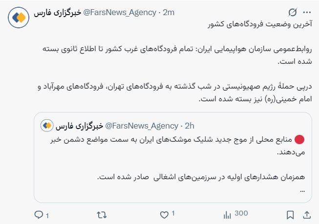

آخرین وضعیت فرودگاه‌های کشور

روابط‌عمومی سازمان هواپیمایی ایران: تمام فرودگاه‌های غرب کشور تا اطلاع ثانوی بسته شده است.

درپی حملهٔ رژیم صهیونیستی در شب گذشته به فرودگاه‌های تهران، فرودگاه‌های مهرآباد و امام خمینی(ره) نیز بسته شده است.

## Persian_Trend_Official — post 16108

  <a href="telegram/content/Persian_Trend_Official_16108_1780903423.webm" target="_blank">🎬 Download video</a>

احتمالا یگان کاشت سیب زمینی نواتیم نابود شد ...

## Persian_Trend_Official — post 16107

  <a href="telegram/content/Persian_Trend_Official_16107_1780903424.mp4" target="_blank">🎬 Download video</a>

بقایی: رژیم صهیونیستی بدون هماهنگی با آمریکا کاری نمی‌کند.

سخنگوی وزارت خارجه: وزارت خارجه آمریکا صراحتا دلیل اصلی تحمیل این جنگ علیه ایران را حمایت از رژیم صهیونیستی ذکر کرده است. این موضع رسمی آمریکا بوده است. همچنین، علی‌رغم ادعای مقامات آمریکایی، ما اطلاع داریم که سنتکام در زمینه پدافند و آفند کاملا با رژیم صهیونیستی هماهنگ و همکاری دارد.

اینکه این طور تفسیر شود که رژیم صهیونیستی حتی از آمریکا هم حرف شنوی ندارد و مستقل از خواسته‌های آن یا با هدف تحقیر مقام‌های آمریکایی دست به جنایاتی می‌زند، بحثی است که همیشه می‌توان در موردش صحبت کرد.

📝 Amir

📌 @persian_trend_official
پرشین ترند | متفاوت‌ترین کانال نظامی

## Persian_Trend_Official — post 16106

  <a href="telegram/content/Persian_Trend_Official_16106_1780903426.webm" target="_blank">🎬 Download video</a>

انصاراالله یمن در بیانیه رسمی اعلام کرد: کشتی‌های اسرائیلی نمی‌توانند از دریای سرخ عبور کنند. باب المندب برای اسرائیل بسته شد.

## Persian_Trend_Official — post 16105

https://t.me/persian_trend_official?direct

## Persian_Trend_Official — post 16104

https://t.me/persian_trend_official?direct

## RadioFarda — post 158037

  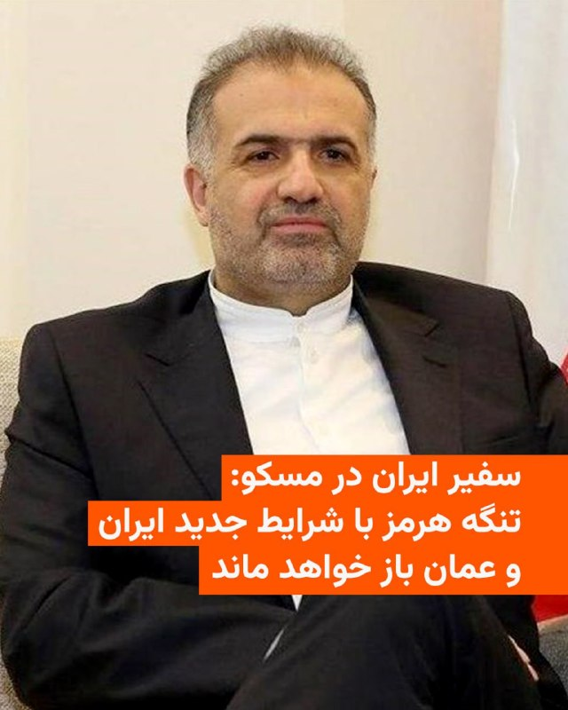

🔸کاظم جلالی، سفیر ایران در روسیه، می‌گوید تنگه هرمز باز خواهد ماند، اما «تحت شرایط جدیدی که از سوی ایران و عمان تعیین خواهد شد»؛ شرایطی که شامل «دریافت هزینه عبور» نیز می‌شود.

🔸او در گفت‌وگویی با روزنامه روسی «ایزوستیا» که روز دوشنبه منتشر شد، گفت: «ایران و عمان خدمات مشخصی را در ارتباط با این تنگه ارائه می‌کنند و برای این خدمات هزینه دریافت خواهد شد.»

🔸جلالی جزئیات بیشتری درباره این هزینه‌ها ارائه نکرد.

🔸حملات آمریکا و اسرائیل علیه ایران تا حد زیادی جریان انتقال نفت از طریق این تنگه را مختل کرده است. پیش از آغاز درگیری‌ها، حدود یک‌پنجم نفت جهان از تنگه هرمز عبور می‌کرد. اگرچه در روزهای اخیر چند نفتکش موفق به خروج از خلیج فارس شده‌اند، اما انتقال نفت و گاز طبیعی مایع همچنان با محدودیت‌های شدید مواجه است.

🔸ایران تأکید کرده است که هر توافق صلح دائمی باید این «حق» را برای تهران محفوظ بدارد که از کشتی‌های عبوری از تنگه هرمز عوارض دریافت کند؛ «میزان این عوارض می‌تواند بر اساس نوع کشتی، نوع محموله و شرایط موجود متفاوت باشد».

@RadioFarda

## IranianMinds — post 21754

🔴 وزارت خارجه جمهوری اسلامی :

این اسرائیل دیگه حتی حرفای آمریکا و ترامپ هم براش بی اهمیته و بدون فکر کردن داره زیرساخت های مارو میزنه

@IranianMinds

## IranianMinds — post 21753

واقعا مارمولک ها و مار های بیابونای اسرائیل در خطرن

@IranianMinds

## IranianMinds — post 21752

  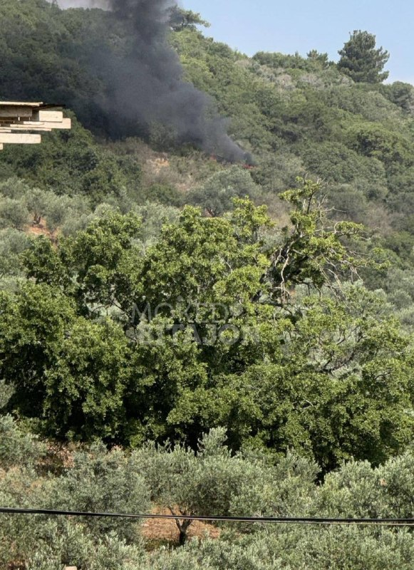

یکی دیگشم خورد کنار خونه های مردم @IranianMinds

## alonews — post 126153

  <a href="telegram/content/alonews_126153_1780903428.webm" target="_blank">🎬 Download video</a>

👈سخنگوی کمیسیون امنیت ملی مجلس: نباید دچار خطای محاسباتی شد

✅ @AloNews خبر جنگ

## alonews — post 126152

  <a href="telegram/content/alonews_126152_1780903429.webm" target="_blank">🎬 Download video</a>

👈بقائی سخنگوی وزارت امور خارجه: مسئولیت هر اتفاقی که در منطقه ما میفتد چه آمریکا عامل باشد چه نه، با خود آمریکاست

✅ @AloNews خبر جنگ

## alonews — post 126151

  <a href="telegram/content/alonews_126151_1780903429.webm" target="_blank">🎬 Download video</a>

👈برخی منابع از شنیده شدن انفجارهای قوی در پایگاه هوایی ریاض پایتخت عربستان خبر دادند.

✅ @AloNews خبر جنگ

## alonews — post 126150

  <a href="telegram/content/alonews_126150_1780903429.webm" target="_blank">🎬 Download video</a>

👈الجزیره: شنیده شدن صدای انفجار در منطقه مرکزی و تل آویو بزرگ

✅ @AloNews خبر جنگ

## alonews — post 126149

  <a href="telegram/content/alonews_126149_1780903430.webm" target="_blank">🎬 Download video</a>

👈صداوسیما: موشک‌هایی از ایران و لبنان به سمت حیفا و شمال اسرائیل شلیک شد

✅ @AloNews خبر جنگ

---
📅 بروزرسانی: 1405/03/18 10:43
---

## VahidOOnLine — post 244293

  <a href="telegram/content/VahidOOnLine_244293_1780902797.mp4" target="_blank">🎬 Download video</a>

ویدیوهای رسیده به ایران‌اینترنشنال در دوشنبه ۱۸ خرداد، دود ناشی از انفجار را در نجف‌آباد نشان می‌دهد.
‌🏁 🇬🇧 IranintlTV

🤖 @VahidOOnLine

## VahidOOnLine — post 244292

  <a href="telegram/content/VahidOOnLine_244292_1780902798.mp4" target="_blank">🎬 Download video</a>

♦️ویدیوهای منتشر شده در شبکه‌های اجتماعی حاکی از مقابله سامانه‌های دفاعی اسرائیل با موشک‌های سپاه در روز دوشنبه ۱۸ خرداد در آسمان مناطق مرکزی این کشور است.

ارتش اسرائیل اعلام کرد در تازه‌ترین دور حملات موشکی جمهوری اسلامی، ۶ موشک به سوی مناطق شمالی و مرکزی این کشور شلیک شده است.
‌🇸🇦 Indypersian

🤖 @VahidOOnLine

## WithYashar — post 13916

گزارش از صدای انفجار در قشم 🚨
@withyashar

## WithYashar — post 13915

اسرائیل : ما تمام موشکهارو رهگیری و منهدم میکنیم چیزی میفته لاشه موشکاست
@withyashar

## WithYashar — post 13914

تمامی پروازهای فرودگاه کرمانشاه تا اطلاع ثانوی لغو شد
@withyashar

## mwarmonitor — post 10403

🔸طرح جدید اسموتریچ وزیر دارایی اسرائیل برای کابینه امروز: تغییر معادله ایران–لبنان.

🔹به‌جای حملات تلافی‌جویانه دوربرد با تهران، او خواستار وارد کردن هزینه سنگین به حزب‌الله است. منطق او این است که به ازای هر موشک ایرانی، باید ده‌ها ساختمان در ضاحیه تخریب شود.

📌استدلال راهبردی او:

🔹عملیات «گاوآهن نقره‌ای» برای نابودی روستاهای تماس در جنوب لبنان آسان‌تر است و امنیت شمال اسرائیل را تأمین می‌کند.

🔹در هم شکستن حزب‌الله باعث می‌شود این گروه از ایران درخواست توقف کند و در نتیجه انعطاف ایران در مذاکرات با آمریکا افزایش یابد.

🔸ترامپ از ابتکارهای جسورانه و تغییر دهنده معادلات استقبال می‌کند و این اقدام می‌تواند امتیاز سیاسی برای اسرائیل ایجاد کند.

🔹اسموتریچ معتقد است باید حملات مستقیم به ایران برای ضربه نهایی به انرژی و اقتصاد آن کشور نگه داشته شود، نه اینکه در «معادلات معمول» مصرف شود.

🔸او این را یک استراتژی هزینه–فایده جالب می‌داند؛ اینکه آیا نتانیاهو آن را می‌پذیرد یا نه، هنوز مشخص نیست. آمیت سیگال خبرنگار کانال ۱۲

@mwarmonitor

## mwarmonitor — post 10402

🔴 خبرنگار الجزیره: حمله هوایی اسرائیل به شهرک یاطر در بخش بنت جبیل در جنوب لبنان.

@mwarmonitor

## pm_afshaa — post 92867

https://t.me/proxy?server=post.my-miner.info.&port=8443&secret=7gggggggggggggggggggggh0cmFuc2xhdGUuZ29v

پروکسی متصل سرعت بالا

💧 Rainbet.com the #1 Non-KYC Crypto Casino & Sportsbook @rainbetcom

😁 @Pm_Afshaa

## pm_afshaa — post 92866

آژیر خطر در اسراییل فعال شد

💧 Rainbet.com the #1 Non-KYC Crypto Casino & Sportsbook @rainbetcom

😁 @Pm_Afshaa

## DEJradio — post 5450

  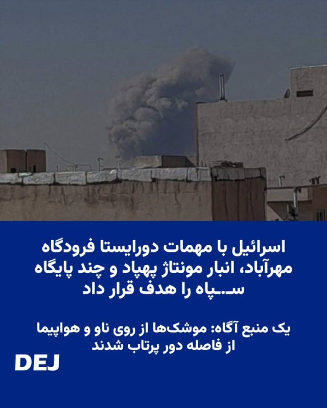

🛩️
🔥 اسرائیل با مهمات دورایستا فرودگاه مهرآباد، انبار مونتاژ پهپاد و چند پایگاه سـ.ـپاه را در کرمانشاه، نجف‌آباد و کرج هدف قرار داد.

یک منبع آگاه می‌گوید موشک‌ها از روی ناو و هواپیما از فاصله دور پرتاب شدند.

#جنگ #IRGCterrorists
@DEJradio

## DEJradio — post 5449

  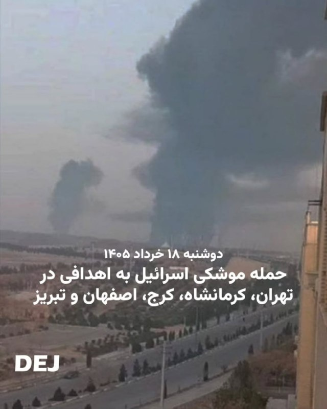

🛩️
🔥 در پاسخ به موشک‌پرانی سـ.ـپاه پاسداران، اسرائیل با موشک، روز دوشنبه ۱۸ خرداد ۱۴۰۵ اهدافی در تهران، کرمانشاه، کرج، اصفهان و تبریز را هدف قرار داد.

#جنگ #موشکپرانی
@DEJradio

## VahidOnline — post 76050

  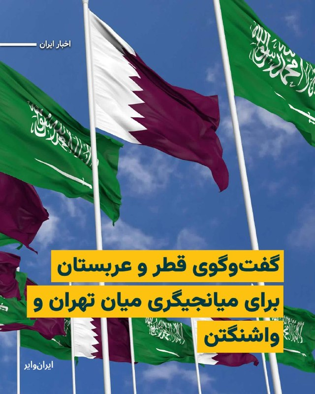

وزارت امور خارجه قطر اعلام کرد «محمد بن عبدالرحمن آل ثانی»، نخست وزیر و وزیر امور خارجه این کشور، در تماس تلفنی با «عباس عراقچی»، وزیر امور خارجه جمهوری اسلامی، درباره تلاش‌های میانجیگرانه میان ایالات متحده و ایران و همچنین تحولات لبنان گفت‌وگو کرده است.

بر اساس بیانیه وزارت امور خارجه قطر، نخست وزیر این کشور در این تماس بر حمایت دوحه از تلاش‌ها برای مهار تنش‌ها و دستیابی به توافقی جامع که به تقویت امنیت و صلح در منطقه کمک کند، تاکید کرد.
@VahidHeadline

📡 @VahidOnline

## IranIntlTV — post 341126

  <a href="telegram/content/IranIntlTV_341126_1780902801.mp4" target="_blank">🎬 Download video</a>

ویدیوهای رسیده به ایران‌اینترنشنال در دوشنبه ۱۸ خرداد، دود ناشی از انفجار را در نجف‌آباد نشان می‌دهد.

## Persian_Trend_Official — post 16103

  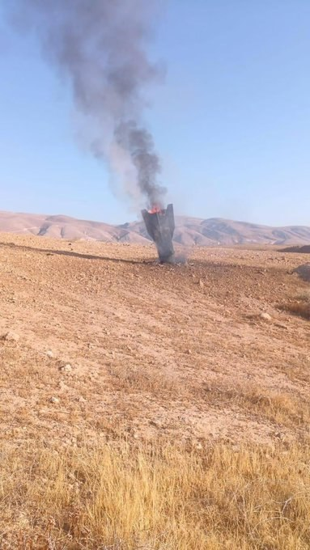

اگه نرخ پایین اصابت درست باشه، معنی مهمی داره که توی لایو بعدی بهش اشاره میکنم

## Persian_Trend_Official — post 16102

  <a href="telegram/content/Persian_Trend_Official_16102_1780902803.webm" target="_blank">🎬 Download video</a>

🤔

## Persian_Trend_Official — post 16101

غیررسمی/منابع محلی از صدای انفجار در قشم خبر میدهند!

## IranianMinds — post 21751

  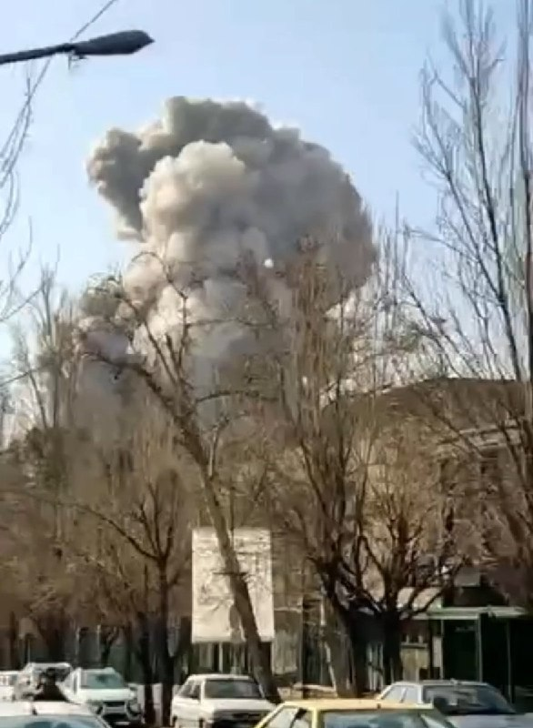

یادش بخیر روزی که موش جوان شد

@IranianMinds

## IranianMinds — post 21750

  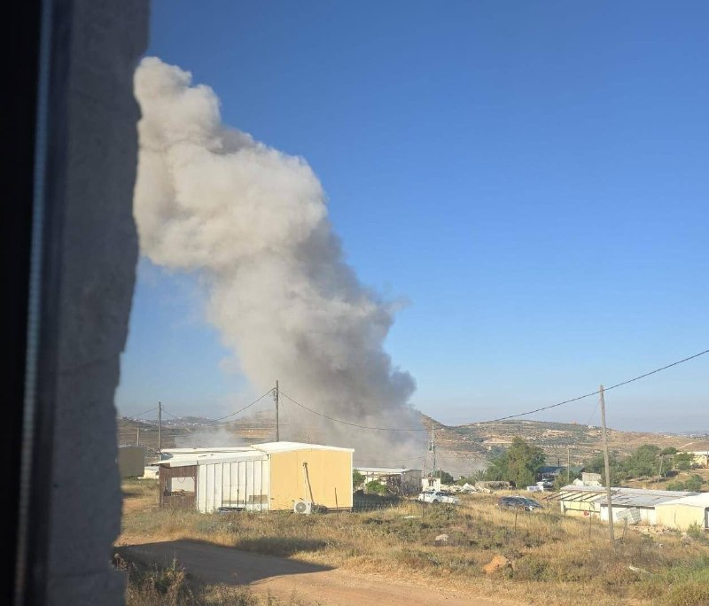

بنازم سپاه نقطه زن موشک مستقیم خورد به هدف کف دریا @IranianMinds

## BBCPersian — post 283159

🔻حوثی‌های یمن حمله به اسرائیل را تایید کردند

حوثی‌های یمن حمله به اسرائیل را تایید کردند و گفتند که «منطقه اشغالی یافا» را هدف قرار داده‌اند.

حوثی‌ها همچنین در بیانیه‌ای «ممنوعیت کامل و مطلق» تردد دریایی اسرائیل در دریای سرخ را اعلام کردند:

«ما در قبال محاصره ناعادلانه تحمیل‌شده بر مردم خود و مردم محور جهاد و مقاومت در فلسطین، غزه، ایران، لبنان و عراق، ساکت نخواهیم نشست.»

@BBCPersian

## BBCPersian — post 283158

🔻اورژانس تهران در «آماده‌باش کامل» قرار گرفت

رسانه‌های ایران می‌گویند تمامی نیروهای عملیاتی اورژانس استان تهران در آماده‌باش کامل قرار دارند.

خبرگزاری ایسنا گفت این آماده‌باش «در پی تحولات اخیر منطقه و با توجه به ضرورت حفظ آمادگی حداکثری برای پاسخگویی به هرگونه شرایط احتمالی» است.

پس از حملات هوایی اسرائیل به چند شهر ایران، رسانه‌های رسمی گزارش دادند که در حملات اسرائيل مناطق شهری تهران هدف قرار نگرفته‌اند.

به نقل از سازمان آتش نشانی تهران، بامداد دوشنبه دست‌کم صدای دو انفجار در بخش‌های غربی پايتخت شنيده شده است.

@BBCPersian

## BBCPersian — post 283157

🔻اسرائیل می‌گوید موج جدید حملات ایران را شناسایی کرده است

ارتش اسرائیل از موج جدید حملات ایران خبر داد.

اسرائیل گفت «سامانه‌های دفاعی در حال مقابله با تهدید هستند» و از مردم خواست که به دستورالعمل‌های صادر شده عمل کنند.

پیشتر سپاه پاسداران اعلام کرد که حمله به پایگاه‌های هوایی نواتیم و تل‌نوف اسرائیل را آغاز کرده است.

سپاه پاسداران این حملات را پاسخی به حملات اسرائیل به چند سایت راداری در سه نقطه ایران دانست.

@BBCPersian

## BBCPersian — post 283156

🔻تمام پروازها از دو فرودگاه اصلی تهران تا اطلاع ثانوی لغو شد

بنابر اعلام سازمان هواپیمایی ایران تمام پروازها از فرودگاه‌های «مهرآباد و امام خمینی تا اطلاع ثانوی» لغو شده است.

مجید اخوان، سخنگوی این سازمان گفته است: «در پی صدور اطلاعیه هوانوردی در شب گذشته مبنی بر بسته شدن آسمان غرب کشور، پروازهای فرودگاه مهرآباد و امام تا اطلاع ثانوی لغو شدند.»

سازمان هواپیمایی ایران از مسافران خواسته از مراجعه به این دو فرودگاه خودداری کنند.

@BBCPersian

## alonews — post 126148

  <a href="telegram/content/alonews_126148_1780902805.webm" target="_blank">🎬 Download video</a>

👈ایلان ماسک: جالب است بدانید اسم تنگه هرمز از اهورامزدا، خدای آیین زرتشتی، گرفته شده است

✅ @AloNews خبر جنگ

---
📅 بروزرسانی: 1405/03/18 10:33
---

## VahidOOnLine — post 244291

  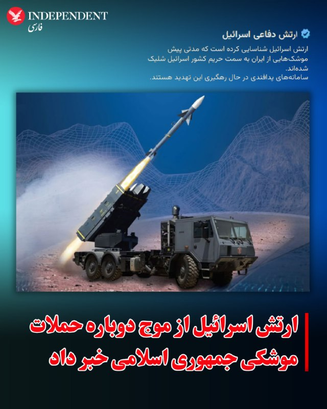

⭕️ارتش اسرائیل از موج دوباره حملات موشکی جمهوری اسلامی خبر داد

♦️ارتش اسرائیل پیش از ساعت ۱۰ صبح روز دوشنبه ۱۸ خرداد از شناسایی شلیک موشک‌ از خاک ایران به سوی اسرائیل خبر داد.
به گزارش اورشلیم‌پست به نقل از ارتش اسرائیل، در دور سوم حملات سپاه، ۶ موشک به سوی این کشور شلیک شده است.
گزارش‌ها حاکی از آن است که این موشک‌ها به سوی مرکز و شمال اسرائیل شلیک شده‌اند.
‌🇸🇦 Indypersian

🤖 @VahidOOnLine

## VahidOOnLine — post 244290

  <a href="telegram/content/VahidOOnLine_244290_1780902199.mp4" target="_blank">🎬 Download video</a>

ویدیویی که دوشنبه ۱۸ خرداد به دست ایران‌اینترنشنال رسیده، رد موشک شلیک‌شده جمهوری اسلامی را به سمت اسرائیل در آسمان اصفهان نشان می‌دهد.
‌🏁 🇬🇧 IranintlTV

🤖 @VahidOOnLine

## VahidOOnLine — post 244289

  <a href="telegram/content/VahidOOnLine_244289_1780902200.mp4" target="_blank">🎬 Download video</a>

ویدیوی رسیده به ایران‌اینترنشنال در دوشنبه ۱۸ خرداد، رد موشک شلیک‌شده جمهوری اسلامی را به سمت اسرائیل در آسمان نجف‌آباد نشان می‌دهد.
‌🏁 🇬🇧 IranintlTV

🤖 @VahidOOnLine

## WithYashar — post 13913

از محدوده تبریز موشک بلند شد
@withyashar

## WithYashar — post 13912

توییت ایلان ماسک درمورد ایران:

« تنگه هرمز به نام اهورا مزدا از زرتشتیان نام گذاری شده »
@withyashar

## WithYashar — post 13911

  <a href="telegram/content/WithYashar_13911_1780902201.mp4" target="_blank">🎬 Download video</a>

شلیک جدید از ابهر زنجان
@withyashar

## WithYashar — post 13910

اتحادیه اروپا: طرفین فورا جنگ رو متوقف کنن
@withyashar 😁🥴

## mwarmonitor — post 10401

🔸اتحادیه اروپا: امروز تحریم‌هایی را علیه ایران به‌دلیل ایجاد اختلال در آزادی کشتیرانی اعمال خواهیم کرد.

@mwarmonitor

## mwarmonitor — post 10400

🚨 شبکه ۱۳ اسرائیل: سقوط ترکش‌های موشک‌های رهگیر در چندین نقطه در مرکز اسرائیل.

@mwarmonitor

## pm_afshaa — post 92864

از تبریز موشک بلند شد 
💧 Rainbet.com the #1 Non-KYC Crypto Casino & Sportsbook @rainbetcom 
😁 @Pm_Afshaa

## pm_afshaa — post 92863

از تبریز موشک بلند شد

💧 Rainbet.com the #1 Non-KYC Crypto Casino & Sportsbook @rainbetcom

😁 @Pm_Afshaa

## pm_afshaa — post 92862

https://t.me/proxy?server=2.26.146.182&port=15&secret=7hYDAQIAAQAB_AMDhuJMOt1jZG4ueWVrdGFuZXQuY29t پروکسی متصل پر سرعت 
💧 Rainbet.com the #1 Non-KYC Crypto Casino & Sportsbook @rainbetcom 
😁 @Pm_Afshaa

## pm_afshaa — post 92861

https://t.me/proxy?server=2.26.146.182&port=15&secret=7hYDAQIAAQAB_AMDhuJMOt1jZG4ueWVrdGFuZXQuY29t

پروکسی متصل پر سرعت

💧 Rainbet.com the #1 Non-KYC Crypto Casino & Sportsbook @rainbetcom

😁 @Pm_Afshaa

## DW_Farsi — post 125673

  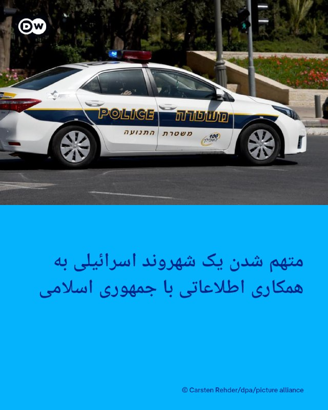

🔶 متهم شدن یک شهروند اسرائیلی به همکاری اطلاعاتی با جمهوری اسلامی

سازمان امنیت داخلی اسرائیل (شین بت) و پلیس اسرائیل در بیانیه‌ای اعلام کردند دادستان‌های اسرائیلی در حال تنظیم کیفرخواست علیه یک مرد اسرائیلی به اتهام همکاری با جمهوری اسلامی هستند. این مرد حدودا ۳۰ ساله و اهل شهر بت یام متهم است که از ابتدای سال ۲۰۲۶ تا زمان بازداشتش در ماه مه، با یک عامل اطلاعاتی ایران از طریق آنلاین در ارتباط بوده است. به گفته نهادهای اطلاعاتی اسرائیل، متهم موافقت کرده بود در ازای دریافت پول، مأموریت‌های جاسوسی برای جمهوری اسلامی انجام دهد.

در بیانیه شین‌بت و پلیس اسرائیل جزئیات بیشتری در مورد مأموریت‌های این فرد یا اهدافی که قرار بوده در مورد آنها اطلاعات جمع‌آوری کند، منتشر نشده است.

در سال‌های اخیر به ویژه‌های در ماه‌های گذشته و پس از شدت گرفتن تنش‌های نظامی میان ایران و اسرائیل، چندین شهروند اسرائیلی به اتهام ارتباط یا همکاری اطلاعاتی با جمهوری اسلامی و انجام فعالیت‌های مرتبط با جاسوسی توسط نهادهای امنیتی اسرائیل بازداشت شده‌اند.

مقام‌های امنیتی اسرائیل در همین راستا بارها به شهروندان این کشور هشدار داده‌اند که از هرگونه ارتباط یا همکاری با عوامل وابسته به ایران خودداری کنند. آن‌ها تأکید کرده‌اند که حتی ارتباطات آنلاین و دریافت پیشنهادهای مالی از منابع ناشناس می‌تواند مصداق همکاری اطلاعاتی تلقی شود و پیامدهای قضایی و امنیتی سنگینی به دنبال داشته باشد.

@dw_farsi

## Persian_Trend_Official — post 16100

  <a href="telegram/content/Persian_Trend_Official_16100_1780902203.webm" target="_blank">🎬 Download video</a>

حمله به جنوب لبنان توسط اسرائیل

## RadioFarda — post 158036

اسرائیل برای اولین بار بعد از آتش‌بس با لبنان، جنوب بیروت را هدف قرار داد

🔸ارتش اسرائیل روز یکشنبه ۱۷ خرداد حومه جنوبی بیروت را هدف حمله قرار داد و دو آپارتمان در دو ساختمان مختلف را مورد اصابت قرار داد.

🔸اسرائیل همچنین برای بخش عمده شهر جنوبی صور و مناطق اطراف آن هشدار تخلیه صادر کرد. این منطقه از جمله مناطقی است که بیشتر در معرض حملات قرار داشته است.

🔸دفتر بنیامین نتانیاهو، نخست‌وزیر اسرائیل، در بیانیه‌ای اعلام کرد: «مطابق دستورهای نخست‌وزیر نتانیاهو و وزیر دفاع (یسرائیل) کاتز، نیروهای دفاعی اسرائیل دقایقی پیش یک مرکز فرماندهی نیروهای مسلح را در منطقه ضاحیه بیروت هدف قرار دادند. این اقدام در پاسخ به شلیک‌های حزب‌الله به سوی خاک اسرائیل انجام شده است.»

🔸خبرگزاری رسمی لبنان گزارش داد که این حملات «دو آپارتمان در دو ساختمان» را هدف قرار داده‌اند.

🔸یک عکاس خبرگزاری فرانسه نیز گفته است که دو واحد آپارتمانی در ساختمانی واقع در یک خیابان باریک آسیب دیده‌اند. همچنین در حالی که ساکنان تلاش می‌کردند منطقه را ترک کنند، ترافیک سنگینی در حومه جنوبی بیروت شکل گرفته بود و ارتش لبنان نیز در محل مستقر شده بود.

🔸این نخستین حمله به پایگاه اصلی حزب‌الله از زمان برقراری آتش‌بسی است که روز ۱۶ آوریل با میانجی‌گری طرف‌های بین‌المللی حاصل شد. آمریکا هفته گذشته اعلام کرد دولت‌های اسرائیل و لبنان به تمدید آتش‌بس به شکل مشروط دست یافتند.

🔸حزب‌الله، گروه مورد حمایت جمهوری اسلامی، پیشنهادهایی را که برقراری آتش‌بس را به خلع سلاح این گروه مشروط می‌کند رد کرده و تأکید دارد که اسرائیل باید ابتدا حملات خود را متوقف کرده و نیروهایش را از جنوب لبنان خارج کند.

🔸ضاحیه محل اصلی استقرار فرماندهی و نیروهای حزب‌الله است. این گروه از سوی آمریکا تروریستی شناخته می‌شود، اما اتحادیه اروپا تنها شاخه نظامی آن را در فهرست سازمان‌های تروریستی قرار داده است.

🔸ارتش اسرائیل ساعتی پیش گفته بود دو پرتابه شلیک شده از لبنان به سمت خاک اسرائیل را رهگیری کرده است.

🔸نسخه کامل این گزارش را در وب‌سایت رادیوفردا بخوانید.

@RadioFarda

## IranianMinds — post 21749

  

🔴 توییت ایلان ماسک :
اسم تنگه هرمز از اهورامزدا، خدای ایین زرتشت گرفته شده است.

@IranianMinds

## IranianMinds — post 21748

  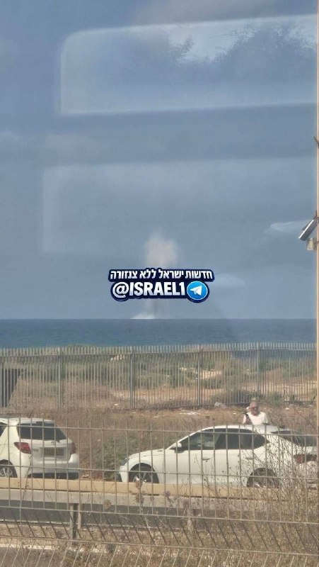

بنازم سپاه نقطه زن موشک مستقیم خورد به هدف کف دریا

@IranianMinds

## IranianMinds — post 21747

  <a href="telegram/content/IranianMinds_21747_1780902205.mp4" target="_blank">🎬 Download video</a>

شلیک موشک از ملایر

@IranianMinds

## IranianMinds — post 21746

🔴 صدای افنجار در حیفا @IranianMinds

## alonews — post 126147

  <a href="telegram/content/alonews_126147_1780902206.mp4" target="_blank">🎬 Download video</a>

👈 خبرنگار فاکس‌نیوز: صدای انفجار در تل‌آویو شنیده شد

🔴 تری یینگست: ”همین الان صدای انفجارهای دور از تل آویو شنیده شد... احتمالاً از رهگیری‌هایی می‌آید که در حال انجام است یا با رهگیری دیگری که همین الان در همانجا در حال انجام است، برخورد می‌کند، زیرا ایرانی‌ها به حملات خود علیه اسرائیل ادامه می‌دهند."

✅ @AloNews خبر جنگ

## alonews — post 126146

  <a href="telegram/content/alonews_126146_1780902208.webm" target="_blank">🎬 Download video</a>

👈تمامی پروازهای فرودگاه کرمانشاه تا اطلاع ثانوی لغو شده و این فرودگاه در حال حاضر هیچ‌گونه عملیات پروازی نخواهد داشت

✅ @AloNews خبر جنگ

## alonews — post 126145

  <a href="telegram/content/alonews_126145_1780902208.webm" target="_blank">🎬 Download video</a>

👈حمله موشکی ایران به مرکز انرژی اسرائیل در حیفا و ناصره

✅ @AloNews خبر جنگ

## alonews — post 126144

  <a href="telegram/content/alonews_126144_1780902208.webm" target="_blank">🎬 Download video</a>

👈اتحادیه اروپا: طرفین فورا جنگ رو متوقف کنن

✅ @AloNews خبر جنگ

---
📅 بروزرسانی: 1405/03/18 10:23
---

## VahidOOnLine — post 244288

  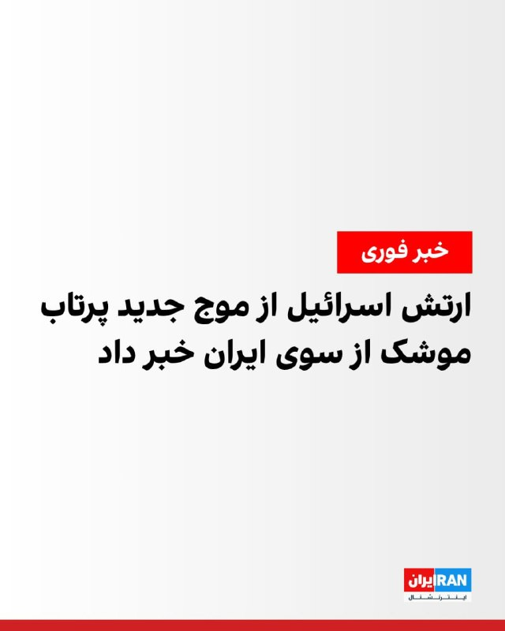

ارتش اسرائیل از موج جدید پرتاب موشک از ایران، در صبح دوشنبه خبر داد.

ارتش اسرائیل اعلام کرد که موشک‌هایی از ایران به سمت این کشور پرتاب شده و سامانه‌های دفاعی در حال رهگیری آن هستند.
همزمان رسانه‌های ایران از «موج جدید حملات موشکی» به اسرائیل، خبر داده‌اند.
iranintl
‌🏁 🇬🇧 IranintlTV

🤖 @VahidOOnLine

## WithYashar — post 13909

جروزالم پست: سپهبد ایال زامیر، رئیس ستاد کل ارتش اسرائیل، در پی حمله موشکی روز مهرشید جمهوری اسلامی به اسرائیل، چندین بار با دریاسالار برد کوپر، فرمانده،فرماندهی مرکزی ایالات متحده (سنتکام)، گفتگو کرد.
@withyashar

## pm_afshaa — post 92860

حداقل موشک میزنین هدف دار بزنین اخه جنگل!؟ 
💧 Rainbet.com the #1 Non-KYC Crypto Casino & Sportsbook @rainbetcom 
😁 @Pm_Afshaa

## pm_afshaa — post 92859

  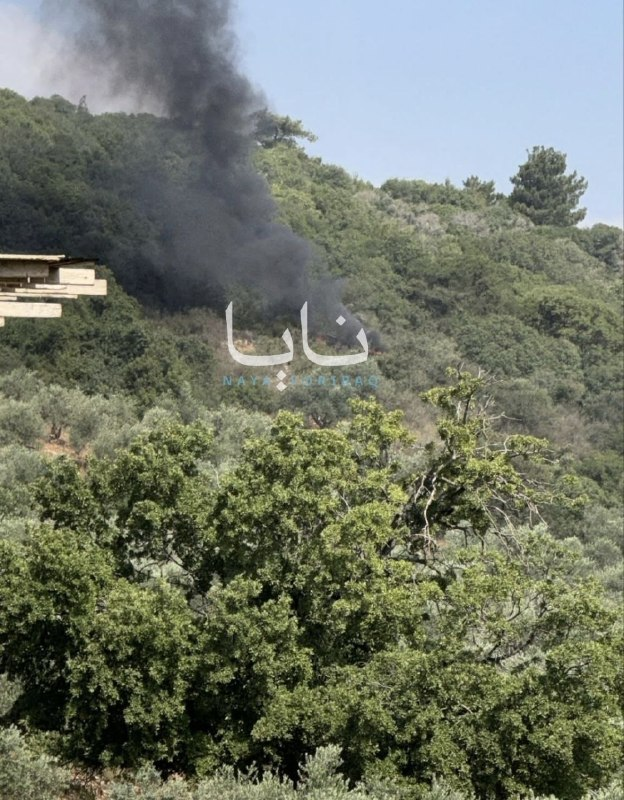

حداقل موشک میزنین هدف دار بزنین

اخه جنگل!؟

💧 Rainbet.com the #1 Non-KYC Crypto Casino & Sportsbook @rainbetcom

😁 @Pm_Afshaa

## pm_afshaa — post 92858

سقوط در کریات شمالی 
💧 Rainbet.com the #1 Non-KYC Crypto Casino & Sportsbook @rainbetcom 
😁 @Pm_Afshaa

## pm_afshaa — post 92857

امروز روز جهانیه بهترین دوسته
این روزو به دوست خوب مردم ایران بی بی تبریک میگم

## IranIntlTV — post 341125

  <a href="telegram/content/IranIntlTV_341125_1780901586.mp4" target="_blank">🎬 Download video</a>

محسن نقوی، وزیر کشور پاکستان، در دیدار با عباس عراقچی، وزیر امور خارجه جمهوری اسلامی، پیام مکتوب شهباز شریف، نخست‌وزیر پاکستان، خطاب به مجتبی خامنه‌ای را تحویل داد.

گفت‌وگو با جواد همدانی، خبرنگار ایران‌اینترنشنال

@iranintltv

## IranIntlTV — post 341124

  <a href="telegram/content/IranIntlTV_341124_1780901587.mp4" target="_blank">🎬 Download video</a>

ویدیویی که دوشنبه ۱۸ خرداد به دست ایران‌اینترنشنال رسیده، رد موشک شلیک‌شده جمهوری اسلامی را به سمت اسرائیل در آسمان اصفهان نشان می‌دهد.

## IranIntlTV — post 341123

  <a href="telegram/content/IranIntlTV_341123_1780901588.mp4" target="_blank">🎬 Download video</a>

ویدیوی رسیده به ایران‌اینترنشنال در دوشنبه ۱۸ خرداد، رد موشک شلیک‌شده جمهوری اسلامی را به سمت اسرائیل در آسمان نجف‌آباد نشان می‌دهد.

## IranIntlTV — post 341122

  <a href="https://t.me/IranintlTV/341122" target="_blank">📎 Download file</a>

🎧نسخه صوتی اخبار بامدادی | دوشنبه ۱۸ خرداد
@iranintlTV

## FarsiVOA — post 219988

🔺«رایزنی‌های فشرده» عراقچی در آستانه حملات موشکی جمهوری اسلامی به اسرائیل

◾️وزیر خارجه جمهوری اسلامی با رئیس ارتش پاکستان و وزرای خارجه شماری از کشورها تلفنی گفت‌وگو کرد.

◾️کانال تلگرامی عباس عراقچی گزارش داد که «در پی رایزنی‌های فشرده» از شامگاه یکشنبه تا بامداد دوشنبه، او با عاصم منیر فرمانده ارتش پاکستان، ایوِت کوپر وزیر خارجه بریتانیا، هاکان فیدان وزیر خارجه ترکیه، ژان نوئل بارو، وزیر خارجه فرانسه، محمد بن عبدالرحمن آل ثانی وزیر خارجه قطر، بدر عبدالعاطی وزیر خارجه مصر، فواد حسین وزیر خارجه عراق و فیصل بن فرحان وزیر خارجه عربستان سعودی گفت‌وگو کرد.

◾️ادعا شده موضوع این گفت‌وگوها که ساعاتی پیش از حملات موشکی به اسرائیل انجام شده، از جمله «نقض آتش‌بس در لبنان» بوده است.

⬇️ بیشتر بخوانید:
https://ir.voanews.com/a/8158488.html

## Persian_Trend_Official — post 16099

  <a href="telegram/content/Persian_Trend_Official_16099_1780901590.webm" target="_blank">🎬 Download video</a>

الحدث: اصابت مستقیم موشک ایرانی در منطقه خلیج حیفا

## Persian_Trend_Official — post 16098

غیر رسمی/گزارش ها از انفجار در کویت

## Persian_Trend_Official — post 16097

  <a href="telegram/content/Persian_Trend_Official_16097_1780901590.webm" target="_blank">🎬 Download video</a>

اسرائیل‌هیوم:
صدای انفجار در تل‌آویو شنیده شد.

## Persian_Trend_Official — post 16096

  <a href="telegram/content/Persian_Trend_Official_16096_1780901591.webm" target="_blank">🎬 Download video</a>

آژیر های هشدار توی اردن فعال شدن.

## Persian_Trend_Official — post 16095

  <a href="telegram/content/Persian_Trend_Official_16095_1780901591.webm" target="_blank">🎬 Download video</a>

🔹تسنیم:

در تلافی ماهشهر، مرکز انرژی حیفا رو زدیم

## Persian_Trend_Official — post 16094

  <a href="telegram/content/Persian_Trend_Official_16094_1780901591.webm" target="_blank">🎬 Download video</a>

غیررسمی/منبع اسرائیلی:
اصابت چند موشک به کریات آتا
و مناطق شمال اسرائیل!

## RadioFarda — post 158035

زمین‌لرزه ۷.۸ ریشتری در فیلیپین؛ «تعیین دقیق خسارات جانی و مالی فعلاً ممکن نیست»

🔸روز دوشنبه وقوع زلزله‌ای به بزرگی ۷.۸ جنوب فیلیپین را لرزاند و باعث کشته‌شدن دست‌کم پنج نفر، فرو ریختن ساختمان‌ها و هشدار سونامی در مناطق شرقی آسیا و سواحل اقیانوس آرام شد.

🔸کانون این زمین لرزه در آب‌های جنوب شهر جنرال سانتوس گزارش شد و مقام‌های فیلیپین از ساکنان مناطق ساحلی این شهر ۷۲۰ هزار نفری خواستند تا به بخش‌های مرتفع‌تر بروند.

🔸یکی از مسئولان بخش فجایع طبیعی فیلیپین در گفت‌وگو با خبرگزاری رویترز مرگ دست‌کم هشت نفر بر اثر زلزله را تأیید کرد. شمار زخمی‌ها نیز در گزارش‌های اولیه چهار نفر گزارش شده است. با این حال انتظار می‌رود شمار قربانیان بسیار فراتر از این آمار اولیه باشد.

🔸تصاویری در شبکه‌های اجتماعی منتشر شده که تخریب یک مرکز خرید و مدرسه‌ای در این شهر را نشان می‌دهد. خبرگزاری فرانسه با تأیید درستی این تصاویر گفته است که مدرسۀ تخریب شده، به گفته مقامات «خالی» بوده است. پلیس تخریب ساختمان‌های دیگری را هم تأیید کرده و گفته است تعیین دقیق خسارت‌ها در حال حاضر ممکن نیست.

🔸فردیناند مارکوس، رئیس جمهور فیلیپین، کلاس‌های درس را در مناطق آسیب دیده به حالت تعلیق درآورد و از ساکنان مناطق ساحلی خواست که فوراً تخلیه کنند. او گفت: «همین حالا به مناطق مرتفع‌تر بروید. منتظر نمانید. زندگی شما از هر چیزی که پشت سر گذاشته‌اید مهم‌تر است.»

🔸مقامات اعلام کردند که فرودگاه جنرال سانتوس نیز تا اطلاع ثانوی بسته است.

🔸مقام‌های فیلیپین از ثبت امواجی تا ارتفاع حدود یک و نیم متر در برخی مناطق این کشور خبر دادند.

🔸طبق گزارش سازمان زمین‌شناسی ایالات متحده، حدود دو ساعت پس از وقوع اولین زلزله، مجموعه‌ای از پس‌لرزه‌های قدرتمند نیز مناطق متأثر را لرزاند که بزرگترین آنها قدرتی به اندازه ۶.۵ داشت.

🔸زلزله روز دوشنبه همچنین باعث هشدار وقوع سونامی در مناطق ساحلی چند کشور دیگر از جمله مالزی، اندونزی و ژاپن شد.

🔸نسخه کامل این گزارش را در وب‌سایت رادیوفردا بخوانید.

@RadioFarda

## IranianMinds — post 21745

  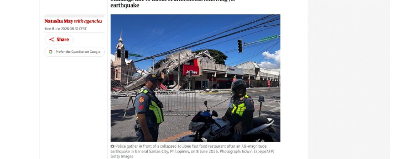

امروز ی زمین لرزه پشم ریزون 8.2 ریشتری تو فیلیپین رخ داده که اینطوری یه ساختمون رو اورد پایین ! @IranainMinds

## alonews — post 126143

  <a href="telegram/content/alonews_126143_1780901592.webm" target="_blank">🎬 Download video</a>

👈انصار الله از حمله به یافا خبر داد

✅ @AloNews خبر جنگ

## alonews — post 126142

  <a href="telegram/content/alonews_126142_1780901592.webm" target="_blank">🎬 Download video</a>

👈انفجار در کریات حیفا

✅ @AloNews خبر جنگ

## alonews — post 126141

  <a href="telegram/content/alonews_126141_1780901593.webm" target="_blank">🎬 Download video</a>

👈منابع اسرائیلی:در مجموع 2 موشک به شمال اسرائیل و 4 موشک به تل‌آویو شلیک شده

✅ @AloNews خبر جنگ

## alonews — post 126140

  <a href="telegram/content/alonews_126140_1780901593.webm" target="_blank">🎬 Download video</a>

👈مرکز اسرائیل هم اکنون

✅ @AloNews خبر جنگ

## alonews — post 126139

  <a href="telegram/content/alonews_126139_1780901593.webm" target="_blank">🎬 Download video</a>

👈الحدث: اخبار از اصابت مستقیم موشک ایرانی در منطقه خلیج حیفا

✅ @AloNews خبر جنگ

## alonews — post 126138

  <a href="telegram/content/alonews_126138_1780901593.webm" target="_blank">🎬 Download video</a>

👈آژیر خطر در اردن

✅ @AloNews خبر جنگ

---
📅 بروزرسانی: 1405/03/18 10:13
---

## VahidOOnLine — post 244287

  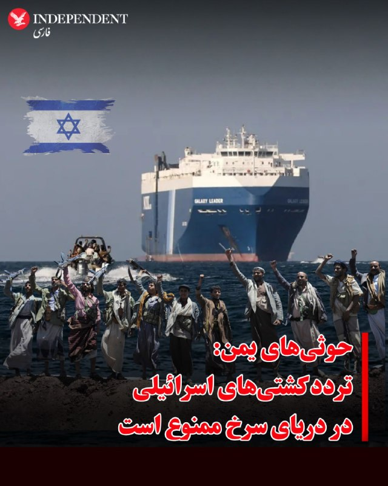

♦️سخنگوی نیروهای مسلح حوثی‌سخنگوی نیروهای مسلح حوثی‌های یمن صبح دوشنبه ۱۸ خردادماه اعلام کرد این گروه نظامی تحت حمایت جمهوری اسلامی دریای سرخ را به روی کشتی‌های اسرائیلی می‌بندد و به هرگونه تشدید تنش با تشدید اقدامات نظامی پاسخ خواهد داد.

در حالیکه ارتش اسرائیل در نخستین ساعات بامداد دوشنبه از مقابله با حمله موشکی از سوی یمن خبر داده بود، حوثی‌ها ادعا کردند که در حملات موشکی به حیفا، اهدافی را مورد اصابت قرار دادند.

حوثی‌های یمن در همین بیانیه فلسطین، غزه، لبنان و ایران «محور جهاد مقاومت» خواندند و اعلام کرد تا زمان «تجاوز و محاصره» این محور، عملیات نظامی آن‌ها ادامه خواهد داشت.
‌🇸🇦 Indypersian

🤖 @VahidOOnLine

## VahidOOnLine — post 244286

  <a href="telegram/content/VahidOOnLine_244286_1780900998.mp4" target="_blank">🎬 Download video</a>

ویدیوی رسیده به ایران‌اینترنشنال در دوشنبه ۱۸ خرداد، دود ناشی از انفجارها را در پتروشیمی کارون منطقه ویژه اقتصادی ماهشهر پس از حملات اسرائیل نشان می‌دهد.
‌🏁 🇬🇧 IranintlTV

🤖 @VahidOOnLine

## WithYashar — post 13908

آژیر خطر‌ در‌ اسرائیل 🚨

تسنیم: مرکز انرژی حیفا در اسرائیل رو هدف قرار دادیم
@withyashar

## WithYashar — post 13907

موج جدید حملات از خمین ، زنجان و کاشان به اسرائیل
@withyashar

## mwarmonitor — post 10399

🚨فعال شدن آژیرهای هشدار در اردن

## mwarmonitor — post 10398

🚨رسانه‌های اسرائیلی: گزارش‌هایی از پرتاب پهپادهای یمنی به سمت اسرائیل.

@mwarmonitor

## mwarmonitor — post 10397

🔴 ارتش اسرائیل: ما حملات هوایی علیه چندین هدف در مجموعه پتروشیمی در شهر ماهشهر در جنوب‌غرب ایران انجام دادیم.

@mwarmonitor

## pm_afshaa — post 92856

موشکا میان و میرن

این آتش بسه که می مونه

## pm_afshaa — post 92855

سقوط در کریات شمالی

💧 Rainbet.com the #1 Non-KYC Crypto Casino & Sportsbook @rainbetcom

😁 @Pm_Afshaa

## pm_afshaa — post 92854

آژیر ها در اسراییل فعال شد 
💧 Rainbet.com the #1 Non-KYC Crypto Casino & Sportsbook @rainbetcom 
😁 @Pm_Afshaa

## pm_afshaa — post 92853

انفجار در اردن

💧 Rainbet.com the #1 Non-KYC Crypto Casino & Sportsbook @rainbetcom

😁 @Pm_Afshaa

## pm_afshaa — post 92852

  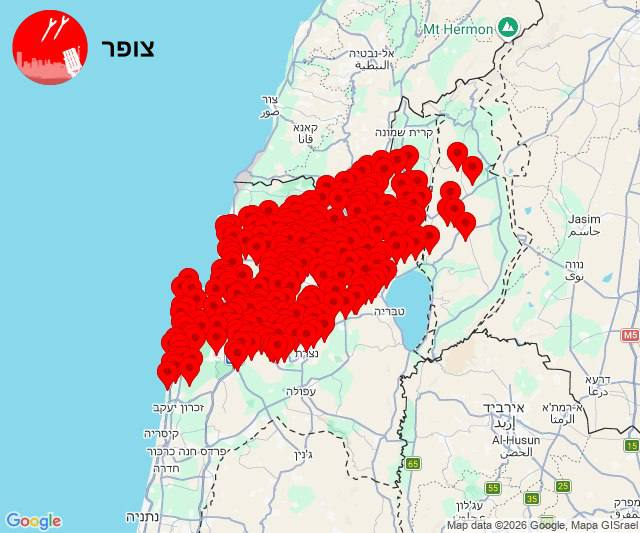

آژیر ها در اسراییل فعال شد

💧 Rainbet.com the #1 Non-KYC Crypto Casino & Sportsbook @rainbetcom

😁 @Pm_Afshaa

## pm_afshaa — post 92851

تسنیم: مرکز انرژی حیفا در اسرائیل رو هدف قرار دادیم

💧 Rainbet.com the #1 Non-KYC Crypto Casino & Sportsbook @rainbetcom

😁 @Pm_Afshaa

## pm_afshaa — post 92850

شلیک موشک از خمین

💧 Rainbet.com the #1 Non-KYC Crypto Casino & Sportsbook @rainbetcom

😁 @Pm_Afshaa

## mamlekate — post 103636

📝 ساعاتی پس از حمله موشکی جمهوری اسلامی؛ اسرائيل می‌گوید به مواضع «رژیم تروریستی» در مرکز و غرب ایران حمله کرد

ارتش اسرائيل بامداد دوشنبه ۱۸ خرداد به وقت تهران اعلام کرد که به اهداف نظامی جمهوری اسلامی در غرب و مرکز ایران حمله کرده است.

❗️ توییت ارتش اسرائیل:
گزارش اولیه: نیروی هوایی اسرائیل با هدایت رکن اطلاعات نظامی ارتش، دقایقی پیش چندین هدف را در مجتمع پتروشیمی ماهشهر در جنوب‌غربی ایران مورد حمله قرار داد. جزئیات بیشتر متعاقباً اعلام خواهد شد.
IDFFarsi

@mamlekate

## mamlekate — post 103635

📝 معاریو: بیش از ۱۵ هدف، از جمله یک کارخانه تولید پهپاد و فرودگاه، مورد اصابت قرار گرفتند

روزنامه معاریو نوشت نیروی هوایی اسرائیل در پاسخ به حمله موشکی جمهوری اسلامی در شب گذشته، به اهداف نظامی در غرب و مرکز ایران حمله کردند.معاریو اشاره کرد که بیش از ۱۵ هدف، از جمله یک کارخانه تولید پهپاد و فرودگاه بین المللی تهران، مورد اصابت قرار گرفتند.

@mamlekate

## mamlekate — post 103634

  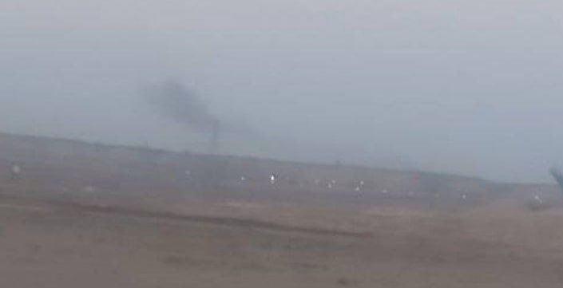

سلام شهریار حوالی ساعت ۴:۴۰
۴ تا صدای بمب شمردم

مهرآباد ۴.۴۲ دقیقه دو سه تا صدای انفجار اومد اینجا

۴:۴۲دقیقه همین الان دو انفجار پی در پی اسلامشهر

اصفهان ساعت ۴:۴۳ دقیقه دو تا صدا از جای دور اومد

الو اصفهان صدا اومد پنج شیش تایی
آسمون نگاه کردم رد موشک نیست انگار دارن میزنن اینجارو

قهدریجان ۱۸ خرداد ۱۴۰۵ ساعت ۰۴:۴۲ صبح دو تا صدای مهیب اومد. از اینجا که میبینم رو به دانشگاه آزاد نجف‌آباد بود.

تبریز سلام همین الان تبریز رو با بمب یا موشک زدن.

ستارخان تهران الان ساعت ۴:۴۳ صبح صدای انفجار اومد نمیدونم چی بود هجدهم خرداد

ساعت ۴:۴۵ صبح دوتا صدای انفجار اسلامشهر اومد
دود یکیش سمت احمداباده

سلام ساعت ۴:۴۵ دقیقه شهرری یه صدای انفجار شدید اومد دزدگیر چندتا ماشینم از موج و صدای انفجار فعال شد

الو اینجا چیتگر ساعت ۴:۴۵ دقیقه از صدای دو تا انفجار از خواب پریدیم . خونه کامل لرزید

۱۸ خرداد ساعت ۴:۴۵
تهران ویلا صدای سه انفجار از دور

الو اصفهان صدا اومد پنج شیش تایی
آسمون نگاه کردم رد موشک نیست انگار دارن میزنن اینجارو

غرب تهران ۱۸ خرداد ۱۴۰۵ ساعت ۴:۴۸ دقیقه صدای دو تا انفجار

الو ساعت ۷:۴۵ دقیقه صبح از بیدگنه شهریار یک موشک پرتاب شد

@mamlekate

## VahidOnline — post 76046

پیام‌های دریافتی:
ما کاشان هستیم
اینجا قشنگ صدای موشک رو حس کردیم که داره رد می‌شه
همین الان ساعت ۱۰ و ۱ دقیقه.

از خمین همین الان موشک زدن

شلیک موشک از ابهر ساعت ۱۰

خمین ۹.۵۷

وحید طرفای ابهر خرمدره ازناب زنجان موشک زدن ساعت ۱۰.۰۲

سلام شلیک موشک از استان مرکزی

وحید جان سلام ساعت ۹.۵۸ دقیقه یه موشک از ابهر زدن

سلام از کاشان هم همین الان موشک زدن

شلیک موشک از زنجان ده صبح

سلام از خوانسار صدای موشک اومد، رد موشک هم توی آسمون هست.

همین الان از زنجان دو تا موشک بلند شد

هم‌زمان پست ارتش اسرائیل:
ارتش اسرائیل شناسایی کرده است که مدتی پیش موشک‌هایی از ایران به سمت حریم کشور اسرائیل شلیک شده‌اند.
سامانه‌های پدافندی در حال رهگیری این تهدید هستند.

📡 @VahidOnline

## IranIntlTV — post 341121

  

ارتش اسرائیل از موج جدید پرتاب موشک از ایران، در صبح دوشنبه خبر داد.

ارتش اسرائیل اعلام کرد که موشک‌هایی از ایران به سمت این کشور پرتاب شده و سامانه‌های دفاعی در حال رهگیری آن هستند.
همزمان رسانه‌های ایران از «موج جدید حملات موشکی» به اسرائیل، خبر داده‌اند.
iranintl.com/202606083482

## FarsiVOA — post 219987

  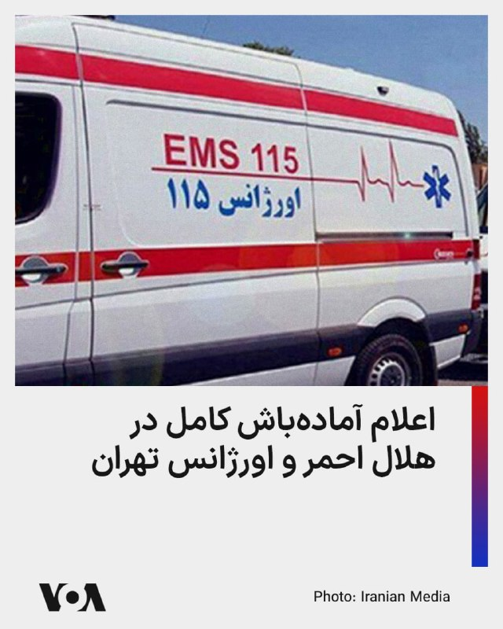

به دنبال حملات موشکی سپاه پاسداران به اسرائيل و پاسخ ارتش اسرائیل با هدف قرار دادن برخی مناطق در ایران، نیروهای امدادی از جمله اورژانس تهران و جمعیت هلال احمر اعلام آماده‌باش کردند.

اورژانس تهران در اطلاعیه‌ای اعلام کرد که «در پی تحولات اخیر منطقه» و برای پاسخگویی به هرگونه شرایط احتمالی، تمامی نیروهای عملیاتی اورژانس استان تهران در حالت آماده‌باش کامل قرار دارند.

جمعیت هلال احمر نیز با صدور اطلاعیه‌ای اعلام کرد که «با توجه به شرایط جنگی»، مرکز عملیات اضطراری این جمعیت فعال شده است.

هلال احمر به شهروندان توصیه کرد تا کیف کمک‌های اولیه و کیف بحران را آماده کرده و در دسترس داشته باشید. این کیف باید حاوی اسناد مهم، جیره خشک غذایی برای ۷۲ ساعت، آب معدنی، رادیوی جیبی باتری‌خور به همراه باتری اضافه باشد.
@FarsiVOA

## FarsiVOA — post 219986

  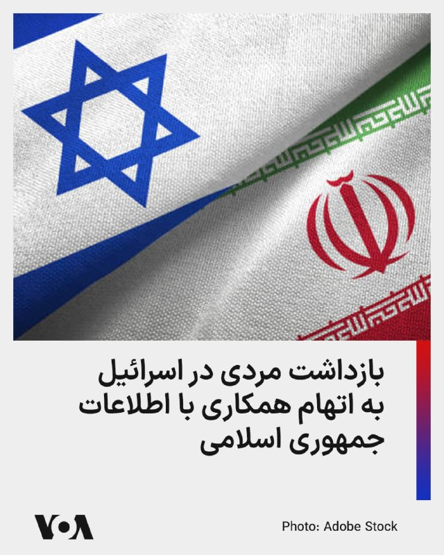

روزنامه تایمز اسرائیل گزارش داد دادستانی اسرائیل قصد دارد علیه مردی از شهر بت‌یام، به اتهام ارتکاب جرایم امنیتی و انجام مأموریت برای عوامل اطلاعاتی جمهوری اسلامی، کیفرخواست صادر کند.

بر اساس اعلام شین‌بت و پلیس اسرائیل، این مرد که حدوداً ۳۰ ساله است، از ابتدای سال جاری تا زمان بازداشتش در ماه مه، با یک مأمور جمهوری اسلامی به‌صورت آنلاین در ارتباط بوده است.

نهادهای امنیتی اسرائیل می‌گویند او در ازای دریافت پول پذیرفته بود مأموریت‌هایی با ماهیت امنیتی برای عامل جمهوری اسلامی انجام دهد.

تحقیقات این پرونده به‌طور مشترک از سوی شاباک و واحد مبارزه با جرایم پلیس در منطقه آیالون انجام شده و انتظار می‌رود کیفرخواست در روزهای آینده ارائه شود.
@FarsiVOA

## DW_Farsi — post 125672

  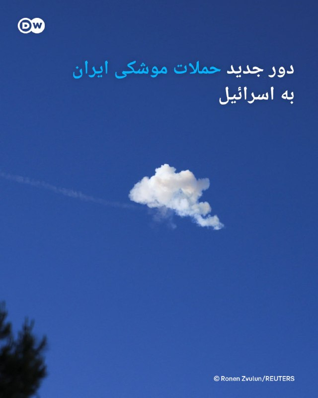

🔶 دور جدید حملات موشکی ایران به اسرائیل

ارتش اسرائیل صبح دوشنبه ۱۸ خرداد (هشتم ژوئن) اعلام کرد موج جدیدی از حمله موشکی ایران را شناسایی و رهگیری کرده است. "تایمز اسرائیل" به نقل از ارتش اسرائیل نوشت که برخوردی که در یک منطقه باز در کرانه باختری گزارش شده بود، به احتمال زیاد ناشی از یک قطعه بزرگ باقی‌مانده از موشک پس از عملیات رهگیری بوده است. در همین حال در مناطق مختلف اسرائیل آژیر هشدار به صدا درآمد و از مردم خواسته شد تا به پناهگاه‌ها بروند.

خبرگزاری فرانسه به نقل از خبرنگاران خود در اورشلیم (بیت‌المقدس) از شنیده شدن دستکم هشت صدای انفجار در این شهر خبر داد. سازمان خدمات فوریت‌های پزشکی اسرائیل اعلام کرد که هیچ گزارشی از تلفات یا جراحات در پی حمله موشکی ایران در صبح دوشنبه دریافت نکرده است.

در همین حال خبرگزاری صدا‌وسیما صبح دوشنبه از شلیک موشک‌هایی از ایران به جنوب و مرکز اسرائیل خبر داد.

روابط عمومی سپاه پاسداران نیز با انتشار بیانیه‌ای مدعی شد نیروهای سپاه در عملیاتی که "نصر" نامگذاری شده است، در واکنش به حملات اسرائیل علیه چند سایت راداری در سه نقطه کشور، "پایگاه‌های هوایی نواتیم و تلنوف در اسرائیل را هدف قرار دادند".

سپاه در بیانیه خود تأکید کرده است که کلیه یگان‌های رزمی و عملیاتی "در تمام جبهه‌ها در آمادگی کامل" است و "برنامه‌های اقدام را متناسب با سناریوهای دشمن تدارک دیده است".

ارتش اسرائیل گفته است که تمام موشک‌هایی را که صبح امروز از سوی ایران به سمت اسرائیل شلیک شده بودند، سرنگون کرده است. مقامات اسرائیلی تا کنون به ادعای سپاه در مورد هدف قرار دادن این دو پایگاه واکنشی نشان نداده‌اند.

گزارش‌ها در شبکه‌های اجتماعی نیز از پرتاب موشک توسط سپاه پاسداران از سایت‌های موشکی فارس‌، کرمانشاه، اصفهان و ارومیه بوده است. در یک ویدئو عبور یک موشک از آسمان ملارد دیده می‌شود. ویدئوهایی نیز از رهگیری موشک‌های ایران توسط سامانه دفاعی گنبد آهنین اسرائیل در شبکه‌های اجتماعی منتشر شده است.

ارتش اسرائیل صبح دوشنبه همچنین اعلام کرده بود که پرتاب یک موشک از یمن را شناسایی و رهگیری کرده است.

@dw_farsi

## Persian_Trend_Official — post 16093

  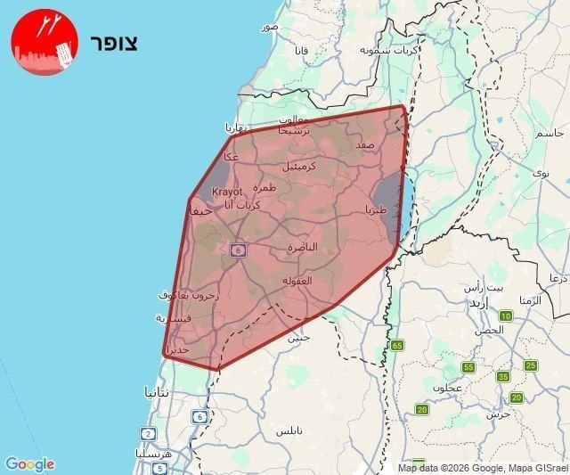

آژیرهای هشدار قرمز در نزدیکی عکا، ناصره و سایر مناطق اطراف در شمال اسرائیل به صدا درآمده‌اند:

• خط مقابله
• جولان
• حیفا
• هاف هاکرمل
• کاتزرین
• کرایوت
• گلیل پایین
• مناشه
• تاور
• گلیل بالا
• یئروت هاکرمل

## Persian_Trend_Official — post 16092

  <a href="telegram/content/Persian_Trend_Official_16092_1780901006.webm" target="_blank">🎬 Download video</a>

گزارشات از شلیک موشک های بالستیک یمن به سمت مناطق جنوبی منطقه نقب

## Persian_Trend_Official — post 16091

  

فعال شدن هشدار حمله موشکی در اطراف بندر حیفا

## RadioFarda — post 158034

  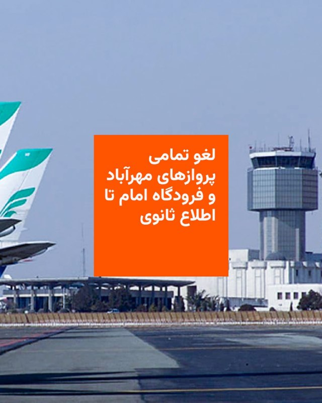

🔸سازمان هواپیمایی کشوری ایران روز دوشنبه از لغو تمام پروازها در مهرآباد و فرودگاه امام خبر داد و از مسافران خواست پیش از مراجعه به فرودگاه‌ها، آخرین وضعیت پروازها را از مراجع رسمی پیگیری کنند.

🔸سازمان هواپیمایی کشوری ایران بامداد دوشنبه ۱۸ خرداد ماه اعلام کرد که «تا اطلاع ثانوی کلیه پروازهای شهر فرودگاهی امام تهران متوقف شده است.»

🔸این سازمان همچنین اعلام کرد که تمامی پروازهای فرودگاه مهرآباد تهران تا اطلاع ثانوی لغو شده است.

🔸سازمان هواپیمایی کشوری یکشنبه‌شب اعلام کرده بود بخش غربی فضای پروازی کشور «تا اطلاع ثانوی» بسته شده است.

🔸مجید اخوان، سخنگوی این سازمان، گفت این تصمیم پس از «ارزیابی‌های ایمنی و امنیتی» و با صدور اطلاعیه هوانوردی، نوتام، اتخاذ شده است. او از شهروندان خواست از مراجعه به فرودگاه‌ها خودداری کنند و آخرین وضعیت پروازها را از طریق رسانه‌ها دنبال کنند.

@RadioFarda

## IranianMinds — post 21744

  <a href="telegram/content/IranianMinds_21744_1780901008.mp4" target="_blank">🎬 Download video</a>

امروز ی زمین لرزه پشم ریزون 8.2 ریشتری تو فیلیپین رخ داده که اینطوری یه ساختمون رو اورد پایین !

@IranainMinds

## IranianMinds — post 21742

🔴شبکه ۱۲عبری :
یک موج دیگر پرتاب موشک به‌سمت مرکز اسرائیل شناسایی شد

@IranianMinds

## IranianMinds — post 21741

🔴 صدای افنجار در حیفا

@IranianMinds

## IranianMinds — post 21740

🔴 ارتش اسرائیل :

در حال رهگیری موشک های شلیک شده از سمت ایران هستیم.

@IranianMinds

## IranianMinds — post 21739

🔴 خبرگزاری تسنیم:

مرکز انرژی حیفا رو زدیم.

@IranianMinds

## IranianMinds — post 21738

🔴 فعال شدن آژیر خطر در تل آویو

@IranianMinds

## Dirty_Kids — post 391332

  <a href="telegram/content/Dirty_Kids_391332_1780901010.mp4" target="_blank">🎬 Download video</a>

🔴 ویدیویی از بمباران ارتش متحده آمریکا و اسرائیل به ایران تو فضای مجازی خارجی‌ها به‌شدت وایرال شده؛

ویدیویی که صحنه‌هاش بیشتر شبیه به بازی کالاف دیوتیه تا دنیای واقعی!

کاربرایِ خارجی بیشتر از هر چیزی از خونسردی و شجاعت ایرانی‌ای که در حال فیلم‌برداری از این صحنه‌‌ست خایه کردن...

@Dirty_Kids 👻

## Dirty_Kids — post 391331

من تا تیمارستان روانی یه «قطعی اینترنت دیگه تو ایران» فاصله دارم.

@Dirty_Kids 👻

## Dirty_Kids — post 391330

هر دفعه که تلگرام Connecting... میشه سه تا سکته رو پشت سر میزارم

@Dirty_Kids 👻

## alonews — post 126137

  <a href="telegram/content/alonews_126137_1780901014.webm" target="_blank">🎬 Download video</a>

👈منابع اسرائیلی: چند موشک به کریات آتا و مناطق شمال اسرائیل اصابت کرد

✅ @AloNews خبر جنگ

## alonews — post 126136

  <a href="telegram/content/alonews_126136_1780901014.webm" target="_blank">🎬 Download video</a>

👈گزارشات از حمله پهپادی یمن به اسرائیل

✅ @AloNews خبر جنگ

## alonews — post 126135

  <a href="telegram/content/alonews_126135_1780901014.webm" target="_blank">🎬 Download video</a>

🔴فوری/شبکه ۱۲عبری : یک موج دیگر پرتاب موشک به‌سمت مرکز اسرائیل شناسایی شد

✅ @AloNews خبر جنگ

## alonews — post 126134

  <a href="telegram/content/alonews_126134_1780901015.webm" target="_blank">🎬 Download video</a>

👈سخنگوی سازمان هواپیمایی: علاوه بر فرودگاه مهرآباد، تمامی پروازهای فرودگاه امام نیز تا اطلاع ثانوی لغو شد

✅ @AloNews خبر جنگ

## alonews — post 126133

  <a href="telegram/content/alonews_126133_1780901015.webm" target="_blank">🎬 Download video</a>

🔴فوری/حمله موشکی به اسرائیل هم اکنون 
✅ @AloNews خبر جنگ

---
📅 بروزرسانی: 1405/03/18 10:03
---

## VahidOOnLine — post 244285

  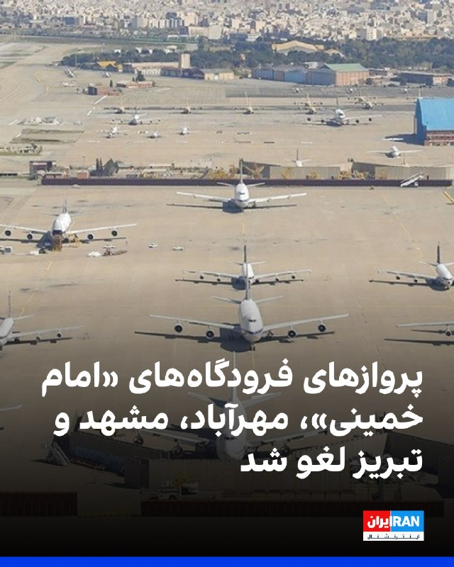

در پی حملات متقابل جمهوری اسلامی و اسرائیل، تمامی پروازهای فرودگاه‌های «امام خمینی» و مهرآباد تهران و همچنین فرودگاه‌های تبریز و مشهد تا اطلاع ثانوی لغو شده‌اند.

بررسی داده‌های وب‌سایت فلایت‌رادار نیز نشان می‌دهد که صبح دوشنبه هیچ هواپیمایی در آسمان ایران در حال پرواز نیست.
‌🏁 🇬🇧 IranintlTV

🤖 @VahidOOnLine

## VahidOOnLine — post 244284

  <a href="telegram/content/VahidOOnLine_244284_1780900389.mp4" target="_blank">🎬 Download video</a>

ویدیوی ارسال‌شده به ایران‌اینترنشنال، رد موشک شلیک‌شده جمهوری اسلامی را از کرمانشاه به سمت اسرائیل در دوشنبه ۱۸ خرداد نشان می‌دهد.
‌🏁 🇬🇧 IranintlTV

🤖 @VahidOOnLine

## WithYashar — post 13906

نقاطی که تایید شده توسط اسرائیل مورد هدف قرار گرفته :
پتروشیمی کارون ماهشهر ٫ سایت راداری تبریز ، سایت های نظامی سپاه در نجف آباد و اسلام آباد غرب و فرودگاه مهرآباد
@withyashar

## WithYashar — post 13905

  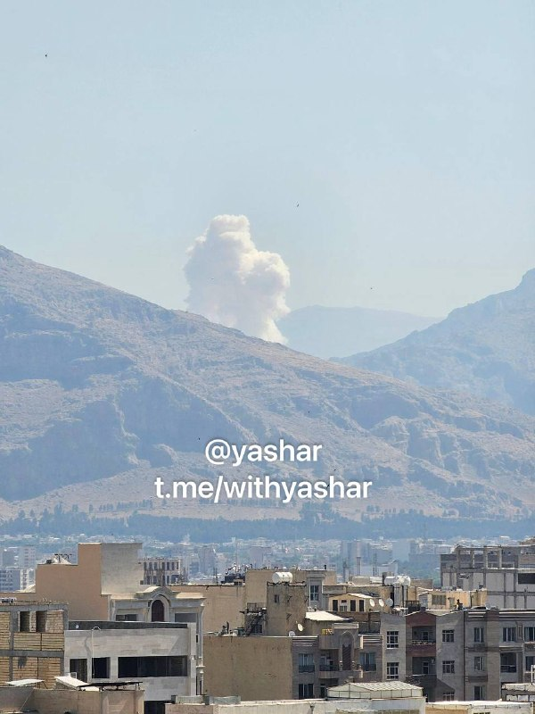

کرمانشاه الان
@withyashar

## WithYashar — post 13904

تنگه باب المندب توسط یمن بسته شد

یمن تردد شناورهای اسرائیل در دریای سرخ را ممنوع اعلام کرد

سخنگوی نیروهای مسلح یمن:‌ از این لحظه تردد کشتی‌های اسرائیلی در دریای سرخ ممنوع است.
@withyashar

## mwarmonitor — post 10396

  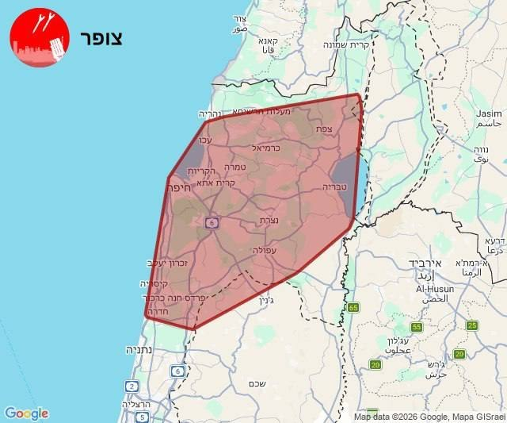

🚨هشدار اولیه برای شمال اسرائیل پس از شلیک از سوی ایران.

@mwarmonitor

## mwarmonitor — post 10395

📌تنگه هرمز باز خواهد بود، اما تحت شرایط جدیدی که توسط ایران و عمان تعیین خواهد شد، از جمله دریافت هزینه عبور ، به گفته سفیر ایران در مسکو.

@mwarmonitor

## mwarmonitor — post 10394

🚨 روزنامه اسرائیل هیوم: مقامات امنیتی اسرائیل معتقدند پس از رگبار موشکی ایران، چند روز جنگ بین اسرائیل و ایران ادامه خواهد داشت.

@mwarmonitor

## mwarmonitor — post 10393

🔴 شبکه ۱۲ اسرائیل: رئیس ستاد کل ارتش از دیشب تاکنون سه تماس با فرمانده ستاد فرماندهی مرکزی آمریکا (سنتکام) داشته است.

@mwarmonitor

## IranIntlTV — post 341120

  <a href="telegram/content/IranIntlTV_341120_1780900391.mp4" target="_blank">🎬 Download video</a>

ویدیوی رسیده به ایران‌اینترنشنال در دوشنبه ۱۸ خرداد، دود ناشی از انفجارها را در پتروشیمی کارون منطقه ویژه اقتصادی ماهشهر پس از حملات اسرائیل نشان می‌دهد.

## IranIntlTV — post 341119

  

در پی حملات متقابل جمهوری اسلامی و اسرائیل، تمامی پروازهای فرودگاه‌های «امام خمینی» و مهرآباد تهران و همچنین فرودگاه‌های تبریز و مشهد تا اطلاع ثانوی لغو شده‌اند.

بررسی داده‌های وب‌سایت فلایت‌رادار نیز نشان می‌دهد که صبح دوشنبه هیچ هواپیمایی در آسمان ایران در حال پرواز نیست.
https://iranintl.com/202606089513

## IranIntlTV — post 341118

  <a href="telegram/content/IranIntlTV_341118_1780900393.mp4" target="_blank">🎬 Download video</a>

ویدیوی ارسال‌شده به ایران‌اینترنشنال، رد موشک شلیک‌شده جمهوری اسلامی را از کرمانشاه به سمت اسرائیل در دوشنبه ۱۸ خرداد نشان می‌دهد.

## Shin_Persian — post 6720

Shin ✓ @hey_itsmyturn
Mon, 08 Jun 2026 06:30:05 UTC

#IDF 🇮🇱:
"The IDF has identified that a short time ago missiles were launched from Iran toward Israeli territory.

Defense systems are operating to intercept the threat. In recent minutes, the Home Front Command has distributed preliminary instructions directly to mobile phones in the relevant areas.

The public is asked to show responsibility and act according to the instructions - they save lives.

You must enter protected spaces upon receiving the alert, and remain in them until a new announcement.

Exit from the protected space will be possible only after receiving explicit instruction, you must continue to act according to Home Front Command guidelines."
#Iran

فارسی

#ارتش_دفاعی_اسرائیل (IDF) 🇮🇱:
«ارتش دفاعی اسرائیل (IDF) شناسایی کرده است که مدت کوتاهی قبل، موشک‌هایی از ایران به سمت خاک اسرائیل پرتاب شده است.

سیستم‌های دفاعی برای رهگیری این تهدید در حال فعالیت هستند. در دقایق اخیر، فرماندهی جبهه داخلی دستورالعمل‌های اولیه را مستقیماً به تلفن‌های همراه در مناطق مربوطه ارسال کرده است.

از عموم مردم درخواست می‌شود که مسئولیت‌پذیری نشان داده و طبق دستورالعمل‌ها عمل کنند - این اقدامات جان انسان‌ها را نجات می‌دهند.

شما باید به محض دریافت هشدار وارد فضاهای محافظت‌شده شوید و تا زمان اعلامیه جدید در آنجا بمانید.

خروج از فضای محافظت‌شده تنها پس از دریافت دستور صریح امکان‌پذیر خواهد بود؛ شما باید به عمل مطابق با دستورالعمل‌های فرماندهی جبهه داخلی ادامه دهید.»
#Iran

𝕏 · @shin_persian

## FarsiVOA — post 219985

🔺افزایش قیمت نفت پس از حملات موشکی سپاه به اسرائیل

◾️قیمت نفت در آغاز معاملات هفتگی، پس از حملات موشکی جمهوری اسلامی به اسرائیل و افزایش نگرانی‌ها درباره گسترش درگیری در خاورمیانه، بالا رفت.

◾️بر اساس گزارش رویترز، بهای نفت برنت، شاخص جهانی نفت خام، با بیش از سه دلار افزایش به ۹۶ دلار و ۲۴ سنت در هر بشکه رسید؛ افزایشی معادل ۳ و ۳۹ صدم درصد. نفت خام آمریکا نیز با رشد ۳ و ۱۷ صدم درصدی، به ۹۳ دلار و ۴۱ سنت در هر بشکه رسید.

◾️این افزایش پس از آن رخ داد که ارتش اسرائیل اعلام کرد موشک‌هایی از مبدأ ایران به سوی اسرائیل شلیک شده، و همزمان، گزارش‌هایی از انفجار در چند شهر ایران منتشر شد.

⬇️ بیشتر بخوانید:
https://ir.voanews.com/a/8158487.html

## Persian_Trend_Official — post 16090

  <a href="telegram/content/Persian_Trend_Official_16090_1780900394.webm" target="_blank">🎬 Download video</a>

⭕️ هم‌اکنون شلیک موشک به حیفا و شمال اسرائیل

## Persian_Trend_Official — post 16089

## RadioFarda — post 158033

  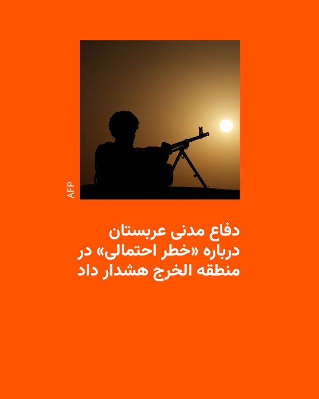

🔸دفاع مدنی عربستان سعودی اعلام کرد درباره وجود «خطر احتمالی» در منطقه الخرج، در جنوب شرق ریاض، هشدار صادر کرده و از ساکنان خواسته است در پناهگاه بمانند.

🔸بر اساس این هشدار، از شهروندان و ساکنان منطقه خواسته شده است تا رفع خطر از ترک محل‌های امن خودداری کنند.

🔸مقام‌های عربستانی در این اطلاعیه جزئیات بیشتری درباره ماهیت خطر احتمالی یا منشأ آن ارائه نکرده‌اند. کمی پس از اعلام این هشدار، این نهاد از «رفع خطر» خبر داد اما از ساکنان خواست همچنان هشدارهای ایمنی را دنبال کنند.

🔸این هشدارها در حالی صادر می‌شود که منطقه الخرج، محل استقرار پایگاه هوایی شاهزاده سلطان است؛ پایگاهی که در تحولات نظامی ماه‌های اخیر نیز نام آن مطرح شده بود.

🔸پیشتر و در دوره پیش از آتش‌بس، قرارگاه مرکزی خاتم‌الانبیا در ایران تأیید کرده بود که پایگاه هوایی شاهزاده سلطان در الخرج عربستان سعودی را با موشک‌های بالستیک هدف قرار داده است.

@RadioFarda

## IranianMinds — post 21737

🔴 شلیک موشک از کاشان

@IranianMinds

## IranianMinds — post 21736

🔴 شلیک موشک از خمین

@IranianMinds

## IranianMinds — post 21735

  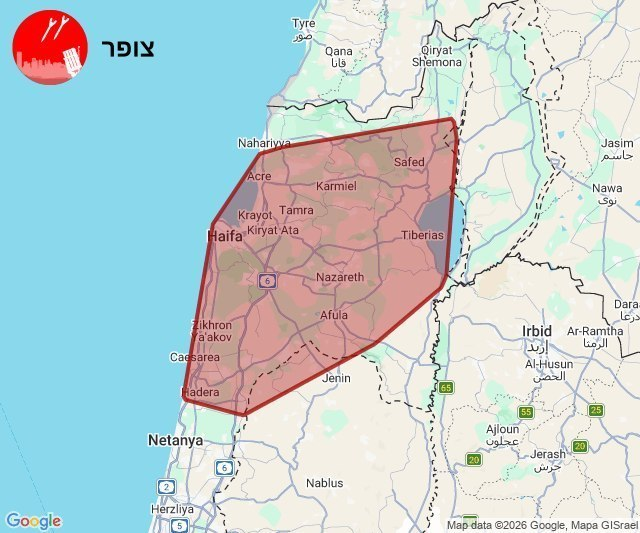

🔴 حمله ی موشکی مجدد جمهوری اسلامی به اسرائیل

@IranianMinds

## BBCPersian — post 283155

🔻سفیر آمریکا در اسرائیل، حملات ایران را محکوم کرد

مایک هاکبی، سفیر ایالات متحده در اسرائیل، حملات شب گذشته ایران را به شدت محکوم کرد.

او در پستی در شبکه اجتماعی ایکس نوشت که «ایران و عوامل شیطانی نیابتی آن می‌خواهند آمریکا و اسرائیل را با خاک یکسان کنند.»

او نوشته است: «آژیرهای هشدار موشکی ساعت ۶ صبح در بیت‌المقدس به صدا درآمدند. خدا را شکر که آنها رهگیری شدند!»

آقای هاکبی در انتهای پستش هم نوشته که «مادر شیطان در تهران است.»

@BBCPersian

## idfinfarsi — post 11814

ارتش اسرائیل شناسایی کرده است که مدتی پیش موشک‌هایی از ایران به سمت حریم کشور اسرائیل شلیک شده‌اند.

سامانه‌های پدافندی در حال رهگیری این تهدید هستند.

## alonews — post 126132

  <a href="telegram/content/alonews_126132_1780900396.webm" target="_blank">🎬 Download video</a>

🔴فوری/حمله موشکی به اسرائیل هم اکنون

✅ @AloNews خبر جنگ

## alonews — post 126131

  <a href="telegram/content/alonews_126131_1780900396.webm" target="_blank">🎬 Download video</a>

👈تصویری از بقایای موشک‌های شلیک شده به سمت اسرائیل در محله‌ای در شرق اورشلیم

✅ @AloNews خبر جنگ

## alonews — post 126130

  <a href="telegram/content/alonews_126130_1780900396.webm" target="_blank">🎬 Download video</a>

🔴فووووری / تنگه باب المندب توسط یمن بسته شد،یمن تردد شناورهای اسرائیل در دریای سرخ را ممنوع اعلام کرد 
🔴سخنگوی نیروهای مسلح یمن:‌ از این لحظه تردد کشتی‌های اسرائیلی در دریای سرخ ممنوع است. 
✅ @AloNews خبر جنگ

## alonews — post 126129

  <a href="telegram/content/alonews_126129_1780900396.webm" target="_blank">🎬 Download video</a>

👈کانال ۱۲ عبری: رئیس ستاد کل ارتش اسرائیل از دیشب، سه بار با فرمانده سنتکام صحبت کرده است

✅ @AloNews خبر جنگ

## alonews — post 126128

  <a href="telegram/content/alonews_126128_1780900396.webm" target="_blank">🎬 Download video</a>

👈 ارتش اسرائیل فراخوان گسترده در نیروهای ذخیره خود صادر کرد

✅ @AloNews خبر جنگ

---
📅 بروزرسانی: 1405/03/18 09:53
---

## VahidOOnLine — post 244283

  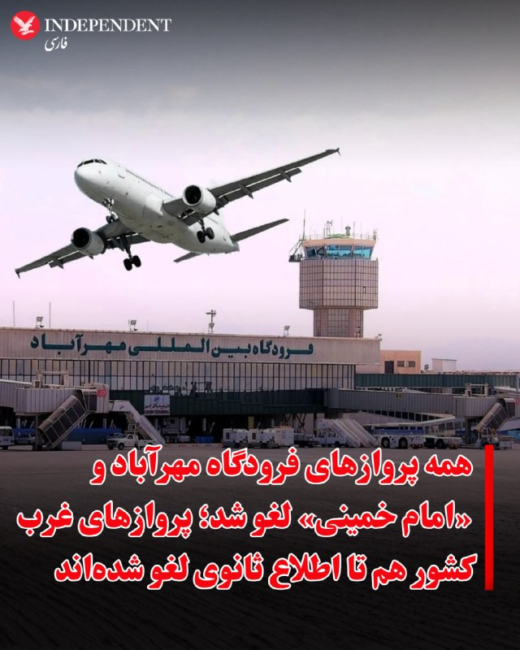

⭕️همه پروازهای فرودگاه مهرآباد و «امام خمینی» لغو شد؛ پروازهای غرب کشور هم تا اطلاع ثانوی لغو شده‌اند

♦️به گزارش تسنیم، همه پروازهای فرودگاه مهرآباد تهران لغو شده است و مسافران باید پیش از مراجعه به فرودگاه، آخرین وضعیت پروازها را از طریق سامانه ۱۹۹ یا شماره ۰۲۱-۶۱۰۲۱ پیگیری کنند.

مجید اخوان سخنگوی سازمان هواپیمایی کشوری نیز گفت: طبق آخرین نوتامی که صادر شده است در حال حاضر پروازهای غرب کشور تا اطلاع ثانوی لغو شده است همچنین پروازهای فرودگاه «امام خمینی» هم تا اطلاع ثانوی متوقف شده است.
‌🇸🇦 Indypersian

🤖 @VahidOOnLine

## VahidOOnLine — post 244282

  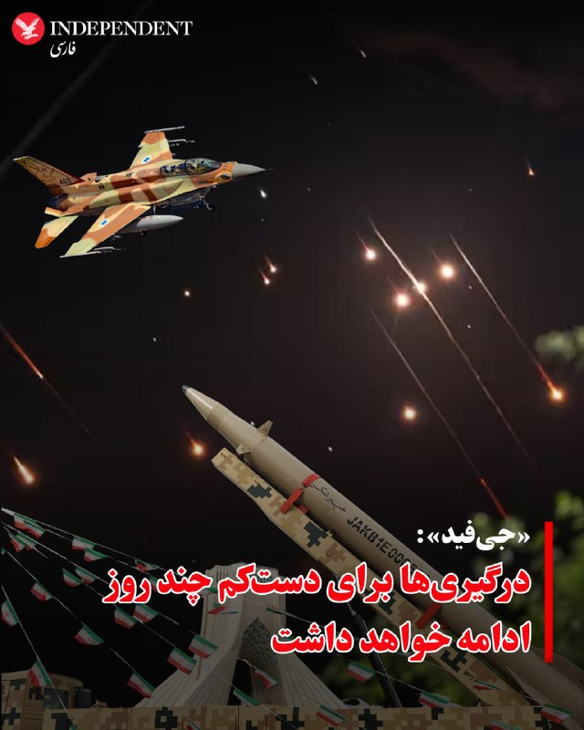

⭕️«جی‌فید»: درگیری‌ها برای دست‌کم چند روز ادامه خواهد داشت

♦️مقامات امنیتی اسرائیل برآورد می‌کنند که دور فعلی درگیری با حکومت ایران به‌سرعت پایان نخواهد یافت و این کشور اکنون با چند روز نبرد شدید روبه‌رو است.

در حال حاضر، برآورد نهادهای دفاعی اسرائیل این است که درگیری دست‌کم برای چند روز دیگر ادامه خواهد داشت و احتمال حملات بیشتر اسرائیل به داخل ایران در کنار تلاش‌های ایران و متحدانش برای هدف قرار دادن اسرائیل وجود دارد.

به گزارش وب‌سایت «جی‌فید»، این ارزیابی پس از شب تشدید تنش‌ها مطرح شده است؛ شبی که طی آن نیروی هوایی اسرائیل در واکنش به شلیک موشک‌های ایران به سمت اسرائیل، موج گسترده‌ای از حملات را در سراسر ایران انجام داد.

 این حملات پس از دور جدیدی از شلیک موشک‌های ایران انجام شد که آژیر خطر را در مرکز و جنوب اسرائیل به صدا درآورد.

اکنون تصمیم‌گیرندگان اسرائیلی در انتظار نحوه ادامه اقدامات ایران و نیروهای نیابتی آن هستند و انتظار می‌رود دولت آمریکا نیز نقش مهمی در تعیین گام‌های بعدی اسرائیل داشته باشد.
‌🇸🇦 Indypersian

🤖 @VahidOOnLine

## VahidOOnLine — post 244281

  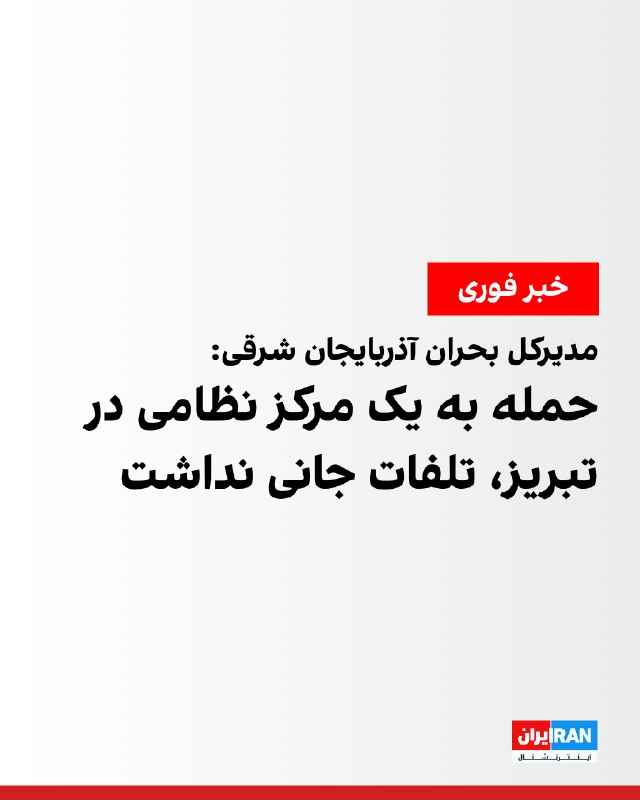

مدیرکل بحران آذربایجان شرقی اعلام کرد در پی حمله ساعت ۵ صبح دوشنبه، ۱۸ خرداد به یک مرکز نظامی در تبریز، هیچ‌گونه تلفات جانی گزارش نشده است.

پیش‌تر اخباری در خصوص حملات اسرائیل به اهدافی در ایران گزارش شده بود.
‌🏁 🇬🇧 IranintlTV

🤖 @VahidOOnLine

## pm_afshaa — post 92849

به ما میگفتن وطن فروش جنگ طلب الان بخاطر لبنان وارد جنگ شدن جالبه

## IranIntlTV — post 341117

  <a href="telegram/content/IranIntlTV_341117_1780899798.mp4" target="_blank">🎬 Download video</a>

یک شهروند با ارسال ویدیویی به ایران‌اینترنشنال، یخچال خالی خانه‌اش را نشان می‌دهد و می‌گوید: «جمهوری اسلامی شرایط زندگی را برای مردم سخت کرده است. درون یخچال چیزی برای خوردن نمانده است.»

## IranIntlTV — post 341116

  

مدیرکل بحران آذربایجان شرقی اعلام کرد در پی حمله ساعت ۵ صبح دوشنبه، ۱۸ خرداد به یک مرکز نظامی در تبریز، هیچ‌گونه تلفات جانی گزارش نشده است.

پیش‌تر اخباری در خصوص حملات اسرائیل به اهدافی در ایران گزارش شده بود.
https://iranintl.com/202606084795

## FarsiVOA — post 219984

  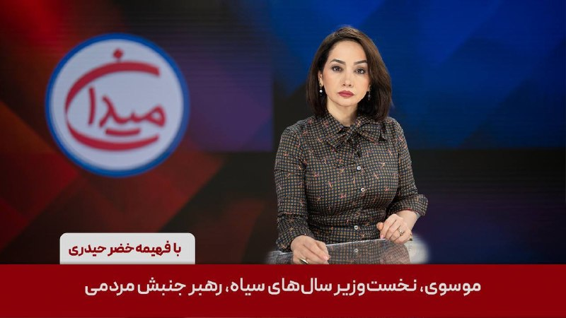

🎯این برنامه جذاب فهیمه خضر حیدری در رابطه با میر حسین موسوی را از لینک زیر مشاهده کنید:
https://www.youtube.com/live/pEj88TjMsVs

🔴یوتیوب صدای آمریکا را هم سابسکرایب کنید
👇👇👇👇
https://youtube.com/@voafarsi

## DW_Farsi — post 125671

  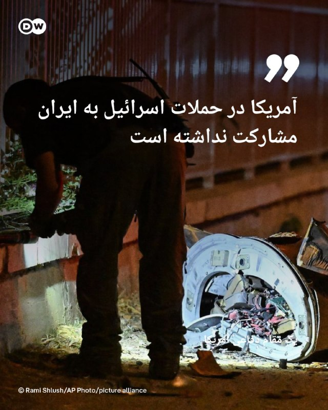

🔶 مقام آمریکایی: آمریکا در حملات اسرائیل به ایران مشارکت نداشته است

یک مقام دفاعی آمریکا به سایت خبری ‌"اکسیوس" گفت، ارتش ایالات متحده در حملات اسرائیل علیه ایران در بامداد دوشنبه ۱۸ خرداد مشارکت نداشته است. این منبع مطلع به اکسیوس گفته که حملات اسرائیل "نسبتا محدود" بوده است.

در همین حال یک مقام اسرائیلی به روزنامه "معاریو" گفت که حملات این کشور علیه ایران "با هماهنگی ایالات متحده و دولت ترامپ انجام شده است". در این گزارش گفته شده است که "بیش از ۱۵ هدف از جمله یک کارخانه تولید پهپاد و فرودگاه بین‌المللی تهران" مورد حملات اسرائیل قرار گرفتند.

به گزارش رسانه‌های اسرائیلی کابینه جنگی این کشور در پی حملات موشکی ایران، ساعت ۱۱ صبح دوشنبه (به وقت محلی) تشکیل جلسه خواهد داد. گفته شده است که تنها وزیران کلیدی کابینه در این نشست حضور خواهند داشت.

@dw_farsi

## Persian_Trend_Official — post 16088

انصاراالله یمن در بیانیه رسمی اعلام کرد: کشتی‌های اسرائیلی نمی‌توانند از دریای سرخ عبور کنند.

باب المندب برای اسرائیل بسته شد.

## Persian_Trend_Official — post 16087

  <a href="telegram/content/Persian_Trend_Official_16087_1780899802.webm" target="_blank">🎬 Download video</a>

بیانیه‌ نیروهای مسلح یمن:

در چارچوب مقابله با تجاوز آمریکایی-صهیونیستی علیه محور جهاد و مقاومت در ایران، فلسطین، لبنان، عراق و یمن، و در رد پروژه صهیونیستی که به دنبال تأسیس اسرائیل بزرگ تحت عنوان خاورمیانه جدید است، و در تلاش برای شکستن محاصره ظالمانه و ستمگری که دشمن آمریکایی بر مردم ما و مردم محور آزاد و عزیز در لبنان، غزه و ایران تحمیل کرده است، و در چارچوب اصل وحدت میدان‌ها و مقابله با دشمنان، و در پاسخ به تجاوز صهیونیستی به لبنان، ایران و غزه، نیروهای مسلح یمن یک دسته موشکی را به سوی اهداف حساس دشمن اسرائیلی در منطقه یافا اشغالی شلیک کردند که به لطف خدا اهداف خود را با دقت به دست آورد.
در این راستا، نیروهای مسلح بر موارد زیر تأکید می‌کنند:
اولاً: اعلام ممنوعیت کامل و مطلق ناوبری دریایی برای دشمن اسرائیلی در دریای سرخ، و ما معتقدیم که هر حرکت دشمن از لحظه اعلام این بیانیه هدف نظامی نیروهای مسلح ما خواهد بود.
ثانیاً: تأکید می‌کنیم که ما به تشدید با تشدید پاسخ خواهیم داد و عملیات‌های نظامی ما به گونه‌ای افزایش خواهد یافت که با رویدادها، نبرد و مشارکت با محور جهاد و مقاومت هماهنگ باشد.
ثالثاً: تأکید می‌کنیم که حق مردم ما و مردم آزاد امت ما در مقابله با تجاوز آمریکایی-اسرائیلی محفوظ است و ما در برابر محاصره ظالمانه علیه مردم ما و مردم محور جهاد و مقاومت در فلسطین، غزه، ایران، لبنان و عراق دست روی دست نخواهیم گذاشت، و هر تلاش دشمن به اذن خداوند شکست خواهد خورد و عملیات‌های ما تا زمانی که تجاوز و محاصره علیه ما و محور جهاد و مقاومت ادامه دارد، ادامه خواهد داشت.
و خداوند کافی ما و بهترین وکیل است، بهترین مولی و بهترین یاور.


## RadioFarda — post 158032

  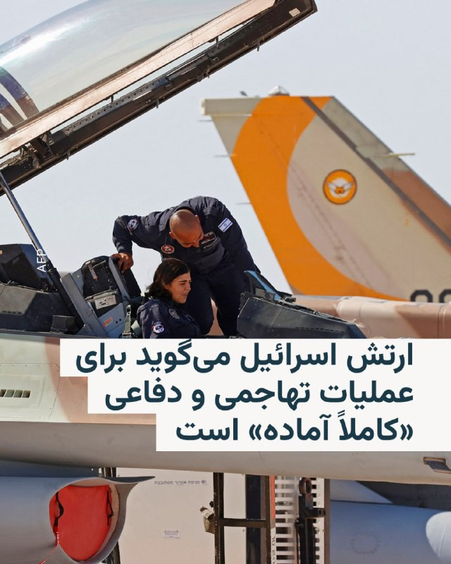

🔸به نوشته روزنامه تایمز اسرائیل، ارتش اسرائیل می‌گوید ایال زمیر، رئیس ستاد ارتش اسرائیل، و مقام‌های ارشد این ارتش هم‌اکنون حملات ارتش اسرائیل به ایران را زیر نظر دارند.

🔸بنابر این گزارش، ارتش اسرائیل اعلام کرد که برای «حمله و دفاع کاملاً آماده» است.

🔸ارتش این کشور افزود زمیر و دیگر مقام‌ها در چند ساعت گذشته «به‌طور مستمر ارزیابی‌های میدانی» انجام داده‌اند و «ارتش اسرائیل هوشیار و آماده ادامه عملیات در همه جبهه‌ها علیه هر کسی است که کشور اسرائیل را تهدید کند.»

🔸به نوشته جروزالم‌پست، ایال زامیر، رئیس ستاد ارتش اسرائیل، پس از حمله موشکی روز یک‌شنبه ایران به اسرائیل، چندین بار با برد کوپر، فرمانده ستاد فرماندهی مرکزی آمریکا، سنتکام، گفت‌وگو کرد.

@RadioFarda

## IranianMinds — post 21734

  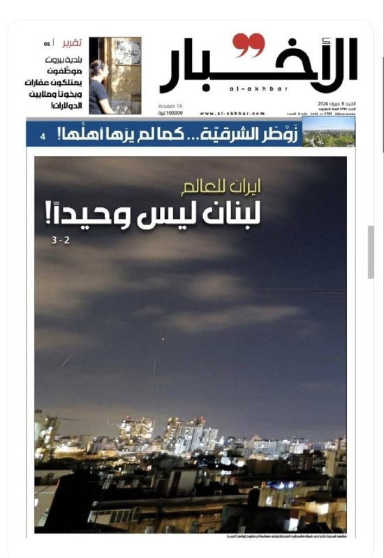

🔴 تیتر روزنامه الاخبار حزب الله لبنان :

ایران خطاب به جهان: لبنان تنها نیست!

+ خرزشی حرومی که به ما میگفتی جنگ طلب حالا نظرت راجب اینکه بخاطر لبنان کشورو دوباره وارد جنگ کردن چیه ؟

@IranianMinds

## IranianMinds — post 21733

🔴 خاورمیانه عالی

امروز صبح پایگاه هوایی شاهزاده سلطان عربستان هم هدف حمله ی موشکی قرار گرفته ولی هیچکس گردن نمیگیره همه میگن ما نبودیم.

@IranianMinds

## BBCPersian — post 283154

🔻روابط عمومی سازمان منطقه ویژه اقتصادی ماهشهر در اطلاعیه‌ای اعلام کرده است که «با تصمیم فرماندهی ارشد پدافند غیرعامل و مدیریت بحران منطقه ویژه اقتصادی پتروشیمی»، تمامی کارکنان روزکار به صورت اضطراری از این منطقه خارج می‌شوند.

به گزارش سخنگوی شرایط اضطراری سازمان منطقه ویژه اقتصادی، حوالی ساعت ۷:۳۰ امروز دو اصابت به شرکت پتروشیمی کارون در منطقه ویژه اقتصادی پتروشیمی صورت گرفت.

گفته شده این حادثه مصدومی در پی نداشته است و میزان خسارت و صدمات احتمالی در دست بررسی است.

ارتش اسرائیل اعلام کرده است که به «چندین هدف» در تاسیسات پتروشیمی ایران در ماهشهر، در جنوب غربی این کشور، حمله کردند.

رسانه‌های دولتی ایران نیز وقوع این حمله را تایید کرده‌اند.

@BBCPersian

## alonews — post 126127

  <a href="telegram/content/alonews_126127_1780899804.mp4" target="_blank">🎬 Download video</a>

👈مقام سابق پنتاگون: حملات به بیروت با چراغ سبز واشنگتن بود

🔴برنت سدلر در مصاحبه با فاکس‌نیوز تأیید کرد که واشنگتن به اسرائیل چراغ سبز نشان داده است تا ترورهای هدفمندی را در بیروت بدون عبور از هیچ خط قرمزی آغاز کند.

✅ @AloNews خبر جنگ

## alonews — post 126126

  <a href="telegram/content/alonews_126126_1780899806.webm" target="_blank">🎬 Download video</a>

👈 کانال ۱۳ اسرائیل: نیروی هوایی اسرائیل در حال حاضر در حال حمله به ایران است

✅ @AloNews خبر جنگ

## alonews — post 126125

  <a href="telegram/content/alonews_126125_1780899806.webm" target="_blank">🎬 Download video</a>

🔴فووووری / تنگه باب المندب توسط یمن بسته شد،یمن تردد شناورهای اسرائیل در دریای سرخ را ممنوع اعلام کرد

🔴سخنگوی نیروهای مسلح یمن:‌ از این لحظه تردد کشتی‌های اسرائیلی در دریای سرخ ممنوع است.

✅ @AloNews خبر جنگ

---
📅 بروزرسانی: 1405/03/18 09:43
---

## VahidOOnLine — post 244280

  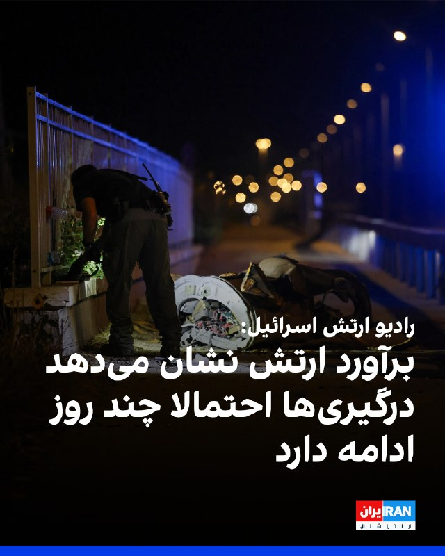

رادیو ارتش اسرائیل گزارش داد برآورد ارتش اسرائیل نشان می‌دهد درگیری با جمهوری اسلامی احتمالا چند روز ادامه خواهد داشت. در این گزارش آمده است که ارتش اسرائیل برای فراخوان گسترده نیروهای ذخیره آماده می‌شود.
‌🏁 🇬🇧 IranintlTV

🤖 @VahidOOnLine

## VahidOOnLine — post 244279

  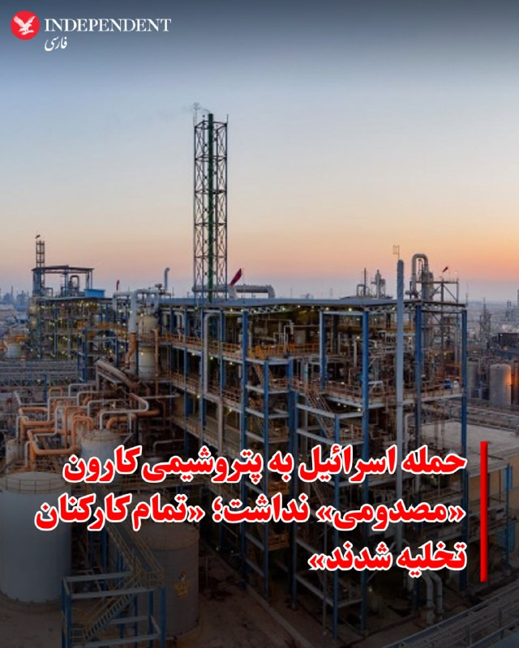

♦️وزارت نفت جمهوری اسلامی ایران روز دوشنبه ۱۸ خرداد با انتشار بیانیه‌ای اعلام کرد حوالی ساعت ۷:۳۰ و در پی حمله اسرائیل، دو اصابت به شرکت پتروشیمی کارون در منطقه ویژه اقتصادی پتروشیمی صورت گرفت.

به گفته وزارت نفت این حمله مصدومی در پی نداشت و کلیه کارکنان این منطقه تخلیه شده‌اند.

ارتش اسرائیل مسئولیت این حمله را برعهده گرفت.
‌🇸🇦 Indypersian

🤖 @VahidOOnLine

## VahidOOnLine — post 244278

  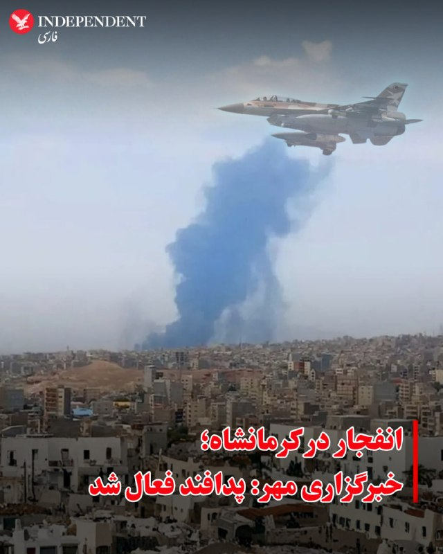

⭕️انفجار در کرمانشاه؛ خبرگزاری مهر: پدافند فعال شد

♦️خبرگزاری مهر ۹ صبح دوشنبه همزمان با شنیده شدن صدای انفجار در کرمانشاه از فعال شدن پدافند در مقابله با «اهداف متخاصم» خبر داد. جزئیات دیگری از این خبر منتشر نشده است.

ارتش اسرائیل چند ساعت قبل اعلام کرده بود اهداف نظامی حکومت ایران را در غرب و مرکز ایران هدف قرار داده است.
‌🇸🇦 Indypersian

🤖 @VahidOOnLine

## pm_afshaa — post 92848

حوثی ها: باب المندب رو به روی اسراییل بستیم

💧 Rainbet.com the #1 Non-KYC Crypto Casino & Sportsbook @rainbetcom

😁 @Pm_Afshaa

## pm_afshaa — post 92847

🔴برخی منابع خبر از ترور احمد وحیدی فرمانده تروریست سپاه دادن

💧 Rainbet.com the #1 Non-KYC Crypto Casino & Sportsbook @rainbetcom

😁 @Pm_Afshaa

## IranIntlTV — post 341115

  

رادیو ارتش اسرائیل گزارش داد برآورد ارتش اسرائیل نشان می‌دهد درگیری با جمهوری اسلامی احتمالا چند روز ادامه خواهد داشت. در این گزارش آمده است که ارتش اسرائیل برای فراخوان گسترده نیروهای ذخیره آماده می‌شود.
https://iranintl.com/202606080046

## FarsiVOA — post 219983

🔺پرونده‌سازی قضایی برای بیش از سه هزار نفر به اتهام همکاری با «دشمن»

◾️معاون پیشگیری از وقوع جرم و سخنگوی قوه قضائیه جمهوری اسلامی، اعلام کرد ۳ هزار و ۱۲۱ نفر به اتهام همکاری با «دشمن» تحت تعقیب قضایی قرار گرفته‌اند و از این میان، ۲ هزار و ۴۰۶ نفر بازداشت شده و در بازداشت به سر می‌برند.

◾️اصغر جهانگیر، شامگاه یکشنبه در یک سخنرانی در تهران، گفت این افراد با همکاری ضابطان اطلاعات سپاه، وزارت اطلاعات و فراجا شناسایی شده‌اند و تاکنون حدود هزار کیفرخواست برای آنها صادر شده است.

◾️نهادهای حقوق بشری بین‌المللی در ماه‌های گذشته نسبت به گسترش بازداشت‌های امنیتی، خطر محاکمه‌های ناعادلانه و افزایش استفاده از مجازات اعدام در پرونده‌های مرتبط با امنیت ملی در ایران هشدار داده‌اند.

⬇️ بیشتر بخوانید:
https://ir.voanews.com/a/8158486.html

## Persian_Trend_Official — post 16086

👔 انصارالله یمن، اعلام کرد در هماهنگی کامل با محور مقاومت، باب المندب را مسدود کردیم.

👺Phantom

📌 @persian_trend_official
پرشین ترند | متفاوت‌ترین کانال نظامی

## IranianMinds — post 21732

  <a href="telegram/content/IranianMinds_21732_1780899191.mp4" target="_blank">🎬 Download video</a>

🔴 ویدیویی از رهگیری آبگرمکن های سپاه در آسمان اسرائیل توسط گنبدآهنین

@IranianMinds

## IranianMinds — post 21731

🔴 انصارالله یمن :

ادریای سرخ را به روی کشتی‌ های اسرائیلی بستیم و از امروز ببینیم اینا رد میشن با موشک میزنیمشون.

@IranianMinds

## BBCPersian — post 283153

🔻سپاه پاسداران: حمله به پایگاه‌های هوایی نواتیم و تل‌نوف را آغاز کردیم

سپاه پاسداران می‌گوید حمله به پایگاه‌های هوایی نواتیم و تل‌نوف را آغاز کرده است.

این نهاد در اطلاعیه‌ای که در رسانه‌های ایران منتشر شده، اعلام کرده است هدف این حملات مراکز مهم این دو پایگاه هوایی بوده است.

سپاه پاسداران این حملات را پاسخی به حملات اسرائیل به چند سایت راداری در سه نقطه ایران اعلام کرده است.

@BBCPersian

## alonews — post 126124

  <a href="telegram/content/alonews_126124_1780899194.mp4" target="_blank">🎬 Download video</a>

👈مجری فاکس‌نیوز: ارتش اسرائیل اعلام کرده که نیروی هوایی این کشور در حال حمله به اهداف نظامی متعلق به ایران در غرب و مرکز ایران است. این حملات ساعاتی پس از آن انجام می‌شود که ایران دست‌کم چهار موج موشکی به سمت اسرائیل پرتاب کرد

🔴گزارش شده که ترامپ از نخست‌وزیر اسرائیل خواسته بود به حملات علیه ایران پاسخ ندهد، هرچند دیگر به نظر نمی‌رسد که این خواسته عملی شده باشد

✅ @AloNews خبر جنگ

---
📅 بروزرسانی: 1405/03/18 09:33
---

## VahidOOnLine — post 244277

  <a href="telegram/content/VahidOOnLine_244277_1780898618.mp4" target="_blank">🎬 Download video</a>

⭕️موشک شلیک شده از ایران به چند خانه در کرانه باختری آسیب زد

♦️به گفته نیروهای امدادی اسرائیل، اصابت یک قطعه از موشک‌های شلیک شده از ایران، به چند خانه در یکی از شهرک‌های کرانه باختری آسیب وارد کرد.
در این حادثه مجروحیت گزارش نشده است.

ارتش اسرائیل اعلام کرده است که تمام موشک‌های شلیک‌شده از ایران به سمت اسرائیل در صبح امروز رهگیری شده‌اند و احتمال می‌دهد برخورد گزارش‌شده در کرانه باختری ناشی از قطعه‌ای از یک موشک رهگیری‌شده باشد.
‌🇸🇦 Indypersian

🤖 @VahidOOnLine

## FarsiVOA — post 219982

  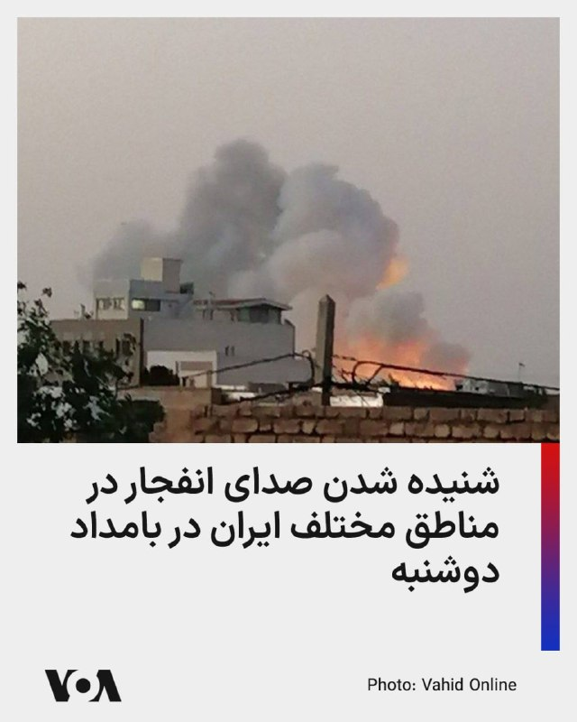

کانال تلگرامی وحید آنلاین، از شنیده شدن صدای چندین انفجار در مناطق مختلف کشور در بامداد روز دوشنبه، ۱۸ خرداد خبر داد.

این تحولات پس از آن رخ داد که ارتش اسرائیل اعلام کرد به دنبال حملات موشکی جمهوری اسلامی به این کشور، مناطقی در غرب و مرکز ایران را هدف قرار داده است.

وحید آنلاین به نقل از شهروندان از شنیده شدن صدای انفجار در حدود ساعت هفت صبح در حوالی «پتروشیمی کارون» در ماهشهر خبر داد و پس از آن معاون امنیتی و انتظامی استانداری خوزستان، وقوع این حملات را تأیید کرد.

وحید آنلاین همچنین از شنیده شدن صدای انفجار در غرب و جنوب تهران، حوالی فرودگاه مهرآباد، تبریز، ارومیه، اصفهان، خمینی‌شهر، کرج، فردیس، رباط کریم، نجف‌آباد، باقرشهر در جنوب تهران، اسلامشهر، شهرری، شهریار، تبریز، قروه در استان کردستان و ملارد خبر داده است.
@FarsiVOA

## Persian_Trend_Official — post 16085

https://youtube.com/live/oPo1ZowDJQ8?feature=share

## IranianMinds — post 21730

  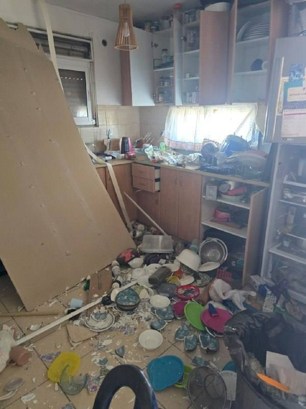

🔴 رادیو ارتش اسرائیل :

تمام موشک هایی که ایران به سمت ما شلیک کرد رهگیری شدن و بقیه شون هم خوردن تو بیابون , چن تاشونم متاسفانه مناطق غیرنظامی رو هدف قرار داده بودن که ترکش هاشون به خونه های غیرنظامیان خورده.

@IranianMinds

## alonews — post 126123

  <a href="telegram/content/alonews_126123_1780898624.webm" target="_blank">🎬 Download video</a>

👈تمام پرواز های فرودگاه مهرآباد تهران تا اطلاع ثانوی لغو شد.

✅ @AloNews خبر جنگ

## alonews — post 126122

  <a href="telegram/content/alonews_126122_1780898624.webm" target="_blank">🎬 Download video</a>

👈 حمله به پتروشیمی کارون مصدومی نداشته است

✅ @AloNews خبر جنگ

## alonews — post 126121

  <a href="telegram/content/alonews_126121_1780898625.webm" target="_blank">🎬 Download video</a>

👈 تصویر منتشر شده توسط اسرائیل از نقاطی که در آنها حمله گزارش شده است.

🔴 شامل تبریز، ارومیه، کردستان، کرمانشاه، کرج، تهران، اصفهان، شیراز و جزیره خارک

✅ @AloNews خبر جنگ

## alonews — post 126120

  <a href="telegram/content/alonews_126120_1780898625.webm" target="_blank">🎬 Download video</a>

👈سقوط ۷۰ هزار واحدی شاخص بورس تهران در آغاز معاملات

✅ @AloNews خبر جنگ

---
📅 بروزرسانی: 1405/03/18 09:23
---

## VahidOOnLine — post 244276

  

رسانه‌های ایران گزارش دادند سامانه پدافند هوایی در شهر کرمانشاه، صبح دوشنبه و در پی مشاهده «اهداف متخاصم»، فعال شده است.

خبرگزاری مهر اعلام کرد فعالیت سامانه‌های پدافندی در نقاطی از شهر و اطراف آن مشاهده شده و صدای آن در برخی مناطق به گوش رسیده و این اقدام در راستای مقابله با «تامین امنیت آسمان منطقه» انجام شده است.
‌🏁 🇬🇧 IranintlTV

🤖 @VahidOOnLine

## VahidOOnLine — post 244275

  

⭕️سپاه: عملیات «نصر» را در پاسخ به حملات اسرائیل به سایت‌های راداری آغاز کردیم

♦️سپاه پاسداران روز دوشنبه ۱۸ خرداد با انتشار بیانیه‌ای اعلام کرد در واکنش به حملات اسرائیل به چند «سایت راداری در سه نقطه کشور» حملات موشکی را با نام نصر علیه اسرائیل آغاز کرده است.

این برای نخستین بار از دو سال پیش و اولین حمله موشکی جمهوری اسلامی به اسرائیل است که سپاه از نام عملیات «وعده صادق» استفاده نمی‌کند.

سپاه مدعی شد در این حمله پایگاه‌های نواتیم و تلنوف هدف قرار گرفته‌اند.

ارتش اسرائیل اعلام کرد تمام موشک‌های شلیک شده از ایران در صبح دوشنبه را رهگیری و منهدم کرده است.

سپاه با اعلام این خبر اعلام کرد: «کلیه یگان‌های رزمی و عملیاتی سپاه پاسداران برای انجام عملیات عبرت آموز گسترده در تمام جبهه‌ها در آمادگی کامل بوده و برنامه های اقدام را متناسب با سناریوهای دشمن تدارک دیده‌اند.»
‌🇸🇦 Indypersian

🤖 @VahidOOnLine

## pm_afshaa — post 92846

🔴ارتش اسرائیل فراخوان گسترده در نیروهای ذخیره خود را به دلیل جنگ با ایران صادر کرد

💧 Rainbet.com the #1 Non-KYC Crypto Casino & Sportsbook @rainbetcom

😁 @Pm_Afshaa

## VahidOnline — post 76045

  <a href="telegram/content/VahidOnline_76045_1780898006.mp4" target="_blank">🎬 Download video</a>

لحظه اعلام خبر حمله موشکی به اسرائیل در تجمع هواداران گروه‌های مسلح شیعه در تهران

📡 @VahidOnline

## IranIntlTV — post 341114

اسرائیل هیوم و شبکه العربیه گزارش دادند اورشلیم حمله اخیر به مواضع جمهوری اسلامی را با واشینگتن هماهنگ کرده است.

ارزیابی حسین آقایی، عضو تحریریه ایران‌اینترنشنال
@iranintltv

## IranIntlTV — post 341113

  

رسانه‌های ایران گزارش دادند سامانه پدافند هوایی در شهر کرمانشاه، صبح دوشنبه و در پی مشاهده «اهداف متخاصم»، فعال شده است.

خبرگزاری مهر اعلام کرد فعالیت سامانه‌های پدافندی در نقاطی از شهر و اطراف آن مشاهده شده و صدای آن در برخی مناطق به گوش رسیده و این اقدام در راستای مقابله با «تامین امنیت آسمان منطقه» انجام شده است.
https://iranintl.com/202606083767

## RadioFarda — post 158031

  

🔸وزیر خارجه ایران می‌گوید پس از «پاسخ ایران به نقض مکرر آتش‌بس در لبنان» از سوی اسرائیل، با مقام‌هایی از بریتانیا، ترکیه، عربستان و پاکستان گفت‌وگو کرده است.

🔸عباس عراقچی در تلگرام نوشت که با ایوت کوپر، وزیر خارجه بریتانیا، و هاکان فیدان، وزیر خارجه ترکیه، گفت‌وگو کرده است.

🔸او همچنین گفت با عاصم منیر، فرمانده ارتش پاکستان، گفت‌وگو کرده است؛ فردی که در تلاش‌های میانجی‌گرانه میان آمریکا و ایران نقشی کلیدی داشته است.

🔸کمی بعد نیز خبر رسید که عباس عراقچی و فیصل بن فرحان، وزیر خارجه عربستان، بامداد دوشنبه در یک تماس تلفنی درباره حمله موشکی ایران به اسرائیل و موضوع لبنان و منطقه گفت‌وگو و رایزنی کرده‌اند.

@RadioFarda

## IranianMinds — post 21729

🔴 خبرگزاری مهر :

پدافند کرمانشاه فعال شد.

@IranianMinds

## IranianMinds — post 21728

🔴 پرواز جنگنده های ارتش اسرائیل در آسمان عراق

@IranianMinds

## alonews — post 126119

  <a href="telegram/content/alonews_126119_1780898009.webm" target="_blank">🎬 Download video</a>

👈رادیو ارتش اسرائیل به نقل از منابع نظامی : پیش‌بینی می‌شود تبادل ضربات با ایران برای چند روز ادامه یابد.

✅ @AloNews خبر جنگ

## alonews — post 126118

  <a href="telegram/content/alonews_126118_1780898009.webm" target="_blank">🎬 Download video</a>

👈سفیر ایران در روسیه: «تنگه هرمز باز خواهد شد، اما تحت شرایط جدیدی که توسط ایران و عمان تعیین می‌شود، از جمله هزینه ترانزیت.»

✅ @AloNews خبر جنگ

## alonews — post 126117

  <a href="telegram/content/alonews_126117_1780898010.mp4" target="_blank">🎬 Download video</a>

👈فیلم‌های بیشتری از پرتاب‌های انجام‌شده از ایران مدتی پیش

✅ @AloNews خبر جنگ

---
📅 بروزرسانی: 1405/03/18 09:13
---

## VahidOOnLine — post 244274

  

روابط عمومی وزارت نفت جمهوری اسلامی اعلام کرد در حملات صبح دوشنبه، به منطقه ویژه اقتصادی ماهشهر، بخشی از تاسیسات پتروشیمی کارون هدف قرار گرفت.

بنا بر این گزارش، پرتابه‌های اسرائیل به بخشی از تاسیسات پتروشیمی کارون اصابت کرد.

همچنین روابط عمومی سازمان منطقه ویژه اقتصادی پتروشیمی در اطلاعیه‌ای اعلام کرد همه کارکنان روزکار باید به‌صورت اضطراری از منطقه خارج شوند.
‌🏁 🇬🇧 IranintlTV

🤖 @VahidOOnLine

## pm_afshaa — post 92845

🔴العربیه:وزیر کشور پاکستان صبح زود امروز ایران را به صورت اضطراری ترک کرد

💧 Rainbet.com the #1 Non-KYC Crypto Casino & Sportsbook @rainbetcom

😁 @Pm_Afshaa

## pm_afshaa — post 92844

🔴رادیو ارتش اسرائیل: انتظار می‌رود تبادل ضربات با ایران برای چند روز ادامه یابد

💧 Rainbet.com the #1 Non-KYC Crypto Casino & Sportsbook @rainbetcom

😁 @Pm_Afshaa

## VahidOnline — post 76044

  

ارتش اسرائیل اعلام کرد که تمامی موشک‌های پرتاب‌شده از سوی جمهوری اسلامی در صبح دوشنبه به سوی اسرائیل رهگیری شدند.

ارتش اسرائیل افزود که پرتابه‌ای که به یک زمین باز در کرانه باختری اصابت کرد، احتمالاً یک قطعه بزرگ باقی‌مانده پس از عملیات رهگیری بوده است.

در همین حال، پس از آنکه هشدار اولیه در اورشلیم درباره حمله موشکی جمهوری اسلامی صادر شده بود، برای این منطقه وضعیت پایان هشدار اعلام شد، زیرا موشک جمهوری اسلامی موفق به رسیدن به خاک اسرائیل نشد.
@VahidHeadline

📡 @VahidOnline

## IranIntlTV — post 341112

  

روابط عمومی وزارت نفت جمهوری اسلامی اعلام کرد در حملات صبح دوشنبه، به منطقه ویژه اقتصادی ماهشهر، بخشی از تاسیسات پتروشیمی کارون هدف قرار گرفت.

بنا بر این گزارش، پرتابه‌های اسرائیل به بخشی از تاسیسات پتروشیمی کارون اصابت کرد.

همچنین روابط عمومی سازمان منطقه ویژه اقتصادی پتروشیمی در اطلاعیه‌ای اعلام کرد همه کارکنان روزکار باید به‌صورت اضطراری از منطقه خارج شوند.
https://iranintl.com/202606088101

## FarsiVOA — post 219981

  

ارتش اسرائیل تأیید کرد که حملات هوایی علیه تأسیسات پتروشیمی در جنوب‌غربی ایران انجام داده است.

ارتش اسرائیل دوشنبه در بیانیه‌ای نوشت که نیروی هوایی این کشور «چندین هدف» را در مجتمع پتروشیمی منطقه ماهشهر هدف قرار داده و جزئیات بیشتر بعداً ارائه خواهد شد.

پیشتر خبرگزاری مهر گزارش داد شرکت پتروشیمی کارون در ماهشهر، در استان خوزستان، بامداد دوشنبه هدف حمله هوایی قرار گرفته است.

تا زمان اعلام اولیه، هیچ‌گونه تلفات جانی یا مجروحیت ناشی از این حمله گزارش نشده است.
@FarsiVOA

## DW_Farsi — post 125670

  

🔶 پتروشیمی کارون ماهشهر در حمله موشکی اسرائیل آسیب دید

خبرگزاری فارس از حمله هوایی اسرائیل به شرکت پتروشیمی کارون ماهشهر خبر داد.

ولی الله حیاتی‌، معاون امنیتی و انتظامی استانداری خوزستان، به فارس گفت پتروشیمی کارون صبح دوشنبه مورد "تهاجم هوایی و اصابت پرتابه‌های" اسرائیل قرار گرفت و "بخشی از آن آسیب دید". او افزود تا این لحظه هیچ تلفات جانی گزارش نشده است.

این مقام مسئول اشاره‌ای به جزئیات این حمله و میزان دقیق خسارات مالی نکرده است.

@dw_farsi

## Persian_Trend_Official — post 16084

📰شناسایی یک شبکه جاسوسی در قلب سرزمین‌های اشغالی

به گزارش سایت خبری وای نت نزدیک به روزنامه یدیعوت اخرونوت:

شاباک یک شبکه جاسوسی مرتبط با ایران را در «بیت یام»، در مرکز سرزمین‌های اشغالی را شناسایی کرده است.

در این گزارش آمده است که این شبکه جاسوسی اطلاعات حساس را در اختیار سرویس جاسوسی ایران قرار می‌داد.

👺Phantom

📌 @persian_trend_official
پرشین ترند | متفاوت‌ترین کانال نظامی

## RadioFarda — post 158030

🔸در پی حملات مجدد موشکی ایران به اسرائیل صبح دوشنبه ۱۸ خرداد آژیرها در سراسر اورشلیم به صدا درآمدند.

🔸این اتفاق پس از آن رخ داد که اسرائیل اعلام کرد روز دوشنبه به اهداف نظامی در غرب و مرکز ایران حمله کرده است.

🔸ارتش اسرائیل روز دوشنبه اعلام کرد که «موج دوم موشک‌های شلیک‌شده از ایران را شناسایی کرده و سامانه‌های دفاعی آن در حال تلاش برای رهگیری این موشک‌ها هستند.»

🔸پیشتر دونالد ترامپ، رئیس جمهور آمریکا از بنیامین نتانیاهو، نخست وزیر اسرائیل، خواسته بود که از حملات بیشتر به ایران خودداری کند.

🔸اوایل روز یکشنبه، اسرائیل برای اولین بار از زمان اعلام طرح آتش‌بس برای لبنان توسط ایالات متحده در هفته گذشته، حملاتی را در منطقه بیروت انجام داد.

🔸ایران در تلافی، موشک‌هایی را به سمت اهداف اسرائیلی شلیک کرد و مذاکرات صلح ایالات متحده و ایران را به خطر انداخت. اما ترامپ اصرار داشت که توافق برای پایان دادن به جنگ گسترده‌تر همچنان در دسترس است.

@RadioFarda

## RadioFarda — post 158029

  

🔸یک ساعت پس از انجام حملات هوایی اسرائیل در ایران، ارتش اسرائیل اعلام کرد یک موشک بالستیک از یمن به سوی مرکز اسرائیل شلیک شد.

🔸اندکی بعد، آژیرهای خطر در تل‌آویو و چند شهر دیگر به صدا درآمد.

🔸شبکه ۱۲ اسرائیل و وب‌سایت خبری وای‌نت می‌گویند موشک شلیک‌شده از یمن رهگیری شده است.

🔸ارتش اسرائیل درباره رهگیری این موشک اظهارنظر نکرده، اما اعلام کرده است ساکنان اکنون می‌توانند از پناهگاه‌های خود خارج شوند.

🔸این نخستین حمله از یمن به سمت اسرائیل از زمان برقراری آتش‌بس ۱۹ فروردین بود.

🔸همزمان، رسانه‌های حکومتی ایران گزارش دادند که علی‌اکبر ولایتی، مشاور رهبر جمهوری اسلامی، هشدار داده و مدعی شده بود در صورت تشدید حملات اسرائیل، ایران می‌تواند تنگه باب‌المندب را مسدود کند.

🔸این تنگه میان یمن، جیبوتی و اریتره قرار دارد و یکی از مسیرهای مهم تجارت جهانی میان اروپا، آسیا و جهان عرب است.

🔸ولایتی در گفت‌وگو با پرس‌تی‌وی گفت وضعیت امنیتی کنونی در باب‌المندب نباید باعث «محاسبه اشتباه» اسرائیل شود و افزود: «انتخاب با شماست، توقف حماقت یا ورود به موازنه ضابطه‌مند شدن دو تنگه.»

@RadioFarda

## IranianMinds — post 21727

🔴 تسنیم : یه شبکه جاسوسی قوی داشتیم تو اسرائیل که امروز بعد سال ها به زور شناسایی کردن و گرفتنشون بمولا ببینید چقدر نفوذ کردیم. @IranianMinds

## IranianMinds — post 21726

  

🔴 اسرائیل هیوم:

حملات امروز اسرائیل با هماهنگی ترامپ انجام شده.

@IranianMinds

## IranianMinds — post 21725

🔴 رادیو ارتش اسرائیل :

انتظار می‌رود رویارویی و درگیری با ایران چندین روز ادامه داشته باشد !

@IranianMinds

## BBCPersian — post 283152

🔻اسرائيل گذرگاه‌های غزه را پس از حملات ايران بست

اسرائيل اعلام کرده است که در پی حملات ايران به شمال اين کشور، بار ديگر گذرگاه‌های ورودی به نوار غزه را می‌بندد.

اين اقدام شامل گذرگاه رفح و گذرگاه کرم شالوم، که يکی از مهم‌ترين مسيرهای ورود کمک‌های بشردوستانه به غزه است، می‌شود.

هماهنگ‌کننده فعاليت‌های دولتی در سرزمين ها (کوگات)، نهاد وابسته به وزارت دفاع اسرائيل، اعلام کرد اين تصميم بخشی از «مجموعه‌ای از اقدامات امنيتی ضروری» است.

کوگات در بيانيه‌ای مدعی شد که اين تعطيلی تأثيری بر وضعيت انسانی غزه نخواهد داشت، زيرا: «مقادير قابل توجهی مواد غذايی که از زمان آغاز آتش‌بس وارد نوار غزه شده، به طور چشمگيری بيش از نيازهای تغذيه‌ای جمعيت اين منطقه است.»

اسرائيل پيش از اين نيز در جريان جنگ با ايران، از جمله برای مدت کوتاهی در ماه فوريه، گذرگاه‌های غزه را بسته بود.

اين تصميم در شرايطی اتخاذ شده که نگرانی‌ها درباره تأثير تشديد تنش‌های منطقه ای بر روند ارسال کمک‌های بشردوستانه به غزه همچنان ادامه دارد.

@BBCPersian

## BBCPersian — post 283151

  

‌ ‌ ‌
ارتش اسرائیل اعلام کرد که به «چندین هدف» در تاسیسات پتروشیمی ایران در ماهشهر، در جنوب غربی این کشور، حمله کردند.

رسانه‌های دولتی ایران نیز وقوع این حمله را تایید کرده‌اند.

رسانه‌های می‌گویند که این مجتمع در نزدیکی ساحل شمالی خلیج فارس تا حدی آسیب دیده است.

هنوز در خصوص خسارات احتمالی و یا کشته‌های این حمله جزییاتی اعلام نشده اما ایران گفته به زودی در این خصوص اطلاع رسانی خواهد کرد.

https://bbc.in/4vrGu1A
📷Kaveh Kazemi/Getty Images
@BBCPersian

## alonews — post 126116

  <a href="telegram/content/alonews_126116_1780897415.webm" target="_blank">🎬 Download video</a>

👈تعداد هواپیماهای آمریکایی در پایگاه هوایی شاهزاده سلطان عربستان سعودی از قبل کاهش یافته بود. هماهنگی آشکاری بین ترامپ و اسرائیل وجود دارد.

✅ @AloNews خبر جنگ

---
📅 بروزرسانی: 1405/03/18 09:03
---

## VahidOOnLine — post 244273

  <a href="telegram/content/VahidOOnLine_244273_1780896788.mp4" target="_blank">🎬 Download video</a>

⭕️ارتش اسرائیل حمله به سایت‌های پتروشیمی در جنوب غرب ایران را تایید کرد

♦️کاربران شبکه‌های اجتماعی صبح دوشنبه ۱۸ خرداد، تصاویری را از عبور موشک‌های سپاه در آسمان ملارد در کرج منتشر کردند.

این دومین موج حملات موشکی جمهوری اسلامی به اسرائیل از دیشب به شمار می‌رود.
‌🇸🇦 Indypersian

🤖 @VahidOOnLine

## WithYashar — post 13903

پدافند کرمانشاه فعال شد
@withyashar

## pm_afshaa — post 92843

پدافند کرمانشاه فعال شد

💧 Rainbet.com the #1 Non-KYC Crypto Casino & Sportsbook @rainbetcom

😁 @Pm_Afshaa

## VahidOnline — post 76043

  <a href="telegram/content/VahidOnline_76043_1780896790.mov" target="_blank">🎬 Download video</a>

@iliaen
ارتش اسرائیل حمله به سایت‌های پتروشیمی در جنوب غرب ایران را تایید کرد

به دنبال گزارش خبرگزاری فارس مبنی بر حمله به مجموعه پتروشیمی کارون در ماهشهر که خساراتی به دنبال داشته، ارتش اسرائیل حمله به سایت‌های پتروشیمی در جنوب غرب ایران را تایید کرد و گفت به اهداف متعددی در مجموعه پتروشیمی ماهشهر حمله کرده و جزئیات مربوط به این حمله را به زودی ارایه خواهد داد.

ارتش اسرائیل پیش‌تر گفته بود که مواضع حکومت ایران را در غرب و مرکز ایران هدف گرفته است.
@VahidOOnLine

📡 @VahidOnline

## IranIntlTV — post 341111

  <a href="telegram/content/IranIntlTV_341111_1780896790.mp4" target="_blank">🎬 Download video</a>

ارتش اسرائیل اعلام کرد موشک‌های شلیک‌شده از سوی جمهوری اسلامی به سمت این کشور را شناسایی کرده است. این ارتش افزود سامانه‌های پدافندی برای رهگیری این موشک‌ها فعال شده‌اند.

گفت‌وگو با کامیار بهرنگ، عضو تحریریه ایران‌اینترنشنال
@iranintltv

## FarsiVOA — post 219980

  

ارتش اسرائیل اعلام کرد که تمامی موشک‌های پرتاب‌شده از سوی جمهوری اسلامی در صبح دوشنبه به سوی اسرائیل رهگیری شدند.

ارتش اسرائیل افزود که پرتابه‌ای که به یک زمین باز در کرانه باختری اصابت کرد، احتمالاً یک قطعه بزرگ باقی‌مانده پس از عملیات رهگیری بوده است.

در همین حال، پس از آنکه هشدار اولیه در اورشلیم درباره حمله موشکی جمهوری اسلامی صادر شده بود، برای این منطقه وضعیت پایان هشدار اعلام شد، زیرا موشک جمهوری اسلامی موفق به رسیدن به خاک اسرائیل نشد.
@FarsiVOA

## FarsiVOA — post 219979

  

بنیامین نتانیاهو، نخست‌وزیر اسرائیل، ساعت ۱۱ صبح دوشنبه با کابینه امنیتی خود تشکیل جلسه می‌دهد. یک مقام اسرائیلی در این باره به تایمز اسرائیل گفت که تنها گروه کوچکی از وزیران کلیدی در این جلسه حضور خواهند داشت.

این جلسه در پی ازسرگیری درگیری‌ها با جمهوری اسلامی برگزار می‌شود.

آکسیوس ساعاتی پس از حمله موشکی جمهوری اسلامی به اسرائيل، به نقل یک مقام ارشد آمریکایی و یک منبع اسرائیلی گزارش داده بود که رئيس جمهوری آمریکا در تماس تلفنی خود به نخست وزیر اسرائيل گفت که حمله موشکی شبانه جمهوری اسلامی را تلافی نکند و زمان بیشتری به دیپلماسی بدهد.
@FarsiVOA

## DW_Farsi — post 125669

  

🔶 ارتش اسرائیل از حمله به اهدافی در غرب و مرکز ایران خبر داد

ارتش اسرائیل اعلام کرد "اهداف نظامی" را در مرکز و غرب ایران مورد حمله قرار داده است. در بیانیه ارتش اسرائیل به جزئیات بیشتری در مورد این اهداف اشاره نشده است.

در همین حال خبرگزاری ایرنا گزارش داد بامداد دوشنبه، "دست‌کم صدای سه انفجار در اصفهان" و "دو انفجار مهیب در تهران" شنیده شده است. اکبر صالحی، معاون امنیتی استاندار اصفهان به ایرنا گفته است که "نقطه‌ای در شهر نجف‌آباد" هدف حمله اسرائیل قرار گرفت. به گفته او این حملات تلفات جانی نداشته است.

به نوشته ایرنا نقاط مختلفی در غرب تهران حوالی ساعات ۴:۴۳ و ۴:۴۵ هدف حمله قرار گرفتند و ادعاهایی نیز در مورد هدف قرار گرفتن فرودگاه مهر‌آباد منتشر شده است. سخنگوی آتش‌نشانی تهران به ایرنا گفته است که "نقاط شهری در تهران هدف قرار نگرفته‌اند".

خبرگزاری تسنیم نوشت صدای انفجار در تهران، اصفهان، کرج، تبریز و برخی نقاط دیگر در غرب تهران شنیده شده‌اند. خبرگزاری فارس به نقل از منابع محلی از وقوع انفجارهایی در استان‌های تهران، آذربایان شرقی و اصفهان خبر داده و نوشت صدای انفجار از حوالی غرب استان تهران شنیده شده است و مردم فردیس کرج نیز صدای این انفجار را شنیده‌اند.

در همین حال سپاه پاسداران با انتشار بیانیه‌ای حملات اسرائیل به نقاطی در ایران را تأیید کرد. در این بیانیه بدون اشاره به جزئیات بیشتر در مورد مکان و اهداف این حملات گفته شده است که اسرائیل "با استفاده از موشک‌های بالستیک هواپرتاب اقدام به حمله به اهدافی" در ایران کرده است.

@dw_farsi

## Persian_Trend_Official — post 16083

🔹شنیده شدن صدای انفجار و فعالیت پدافند هوایی در کرمانشاه گزارش شده است.

## Persian_Trend_Official — post 16082

فعالیت پدافند هوایی در کرمانشاه گزارش شده

## Persian_Trend_Official — post 16081

## IranianMinds — post 21724

🔴 تسنیم :

یه شبکه جاسوسی قوی داشتیم تو اسرائیل که امروز بعد سال ها به زور شناسایی کردن و گرفتنشون بمولا ببینید چقدر نفوذ کردیم.

@IranianMinds

## IranianMinds — post 21723

  

🔴 نیروی هوایی اسرائیل:

نیروی هوایی با هدایت اطلاعات نظامی کمی پیش چندین هدف را در مجتمع پتروشیمی ماهشهر در جنوب غربی ایران هدف قرار داد جزئیات بیشتری به زودی اعلام خواهد شد.

@IranianMinds

## IranianMinds — post 21722

🔴 سازمان ملل :

خیلی نگرانیم ...

@IranianMinds

## BBCPersian — post 283150

🔻اسرائیل می‌گوید به تاسیسات پتروشیمی ماهشهر حمله کرده است

ارتش اسرائیل اعلام کرد که به «چندین هدف» در تاسیسات پتروشیمی ایران در ماهشهر، در جنوب غربی این کشور، حمله کردند.

رسانه‌های دولتی ایران نیز وقوع این حمله را تایید کرده‌اند.

رسانه‌های می‌گویند که این مجتمع در نزدیکی ساحل شمالی خلیج فارس تا حدی آسیب دیده است.

هنوز در خصوص خسارات احتمالی و یا کشته‌های این حمله جزییاتی اعلام نشده اما ایران گفته به زودی در این خصوص اطلاع رسانی خواهد کرد.

@BBCPersian

## alonews — post 126115

  <a href="telegram/content/alonews_126115_1780896794.webm" target="_blank">🎬 Download video</a>

👈وزارت خارجه قطر: وزیر خارجه قطر تماس تلفنی از وزیر خارجه ایران، عباس عراقچی، دریافت کرد.

✅ @AloNews خبر جنگ

## alonews — post 126114

  <a href="telegram/content/alonews_126114_1780896794.webm" target="_blank">🎬 Download video</a>

👈کانال ۱۲ اسرائیل: تمامی فعالیت‌ها و تجمعات لغو شده و مراکز آموزشی در سراسر اسرائیل تعطیل خواهند شد

✅ @AloNews خبر جنگ

## alonews — post 126113

  <a href="telegram/content/alonews_126113_1780896795.webm" target="_blank">🎬 Download video</a>

👈صدای انفجار و فعالیت پدافند هوایی تو کرمانشاه گزارش شده

✅ @AloNews خبر جنگ

## alonews — post 126112

  <a href="telegram/content/alonews_126112_1780896795.webm" target="_blank">🎬 Download video</a>

👈کانال ۱۲ اسراییل: طبق اعلام ارتش اسرائیل، یک ساعت پس از حملات هوایی اسرائیل به ایران، یک موشک بالستیک از یمن به سمت مرکز اسرائیل شلیک شد

🔴این نخستین حمله‌ای است که از یمن پس از آتش‌بس که از هشتم آوریل اجرایی شده، انجام می‌شود.

✅ @AloNews خبر جنگ

## alonews — post 126111

  <a href="telegram/content/alonews_126111_1780896795.webm" target="_blank">🎬 Download video</a>

👈منابع عبری: بیمارستان‌های شمال شروع به انتقال بخش‌های اورژانس به پناهگاه‌های زیرزمینی محافظت‌شده کردن

✅ @AloNews خبر جنگ

---
📅 بروزرسانی: 1405/03/18 08:53
---

## VahidOOnLine — post 244272

  <a href="telegram/content/VahidOOnLine_244272_1780896187.mp4" target="_blank">🎬 Download video</a>

⭕️ارتش اسرائیل حمله به سایت‌های پتروشیمی در جنوب غرب ایران را تایید کرد

♦️به دنبال گزارش خبرگزاری فارس مبنی بر حمله به مجموعه پتروشیمی کارون در ماهشهر که خساراتی به دنبال داشته، ارتش اسرائیل حمله به سایت‌های پتروشیمی در جنوب غرب ایران را تایید کرد و گفت به اهداف متعددی در مجموعه پتروشیمی ماهشهر حمله کرده و جزئیات مربوط به این حمله را به زودی ارایه خواهد داد.

ارتش اسرائیل پیش‌تر گفته بود که مواضع حکومت ایران را در غرب و مرکز ایران هدف گرفته است. حمله‌ها پس از حمله موشکی یکشنبه شب سپاه به شمال اسرائیل انجام شد.
‌🇸🇦 Indypersian

🤖 @VahidOOnLine

## WithYashar — post 13902

اسرائیل برخورد موشک @withyashar

## WithYashar — post 13901

رادیو ارتش اسرائیل: تمامی موشک‌های شلیک‌شده از سوی ایران رهگیری شده و یا در مناطق باز و غیرمسکونی سقوط کردند. این رسانه از یک انفجار در شهرک ایتمار ناشی از ترکش موشک‌های رهگیری شده خبر داد.
@withyashar

## WithYashar — post 13900

۳پا ایران: مراکز مهمی را در پایگاه‌های هوایی نواتیم و تل نوف در اسرائیل را هدف قرار دادیم.
@withyashat

## WithYashar — post 13899

رسانه های عبری :
در اسرائیل دستورات داده شده برای چند روز جنگ آماده شوید
@withyashar

## WithYashar — post 13898

معاریو : اسرائیل حملِه‌های جدیدی تو ایران رو شروع کرد
@withyashar

## Shin_Persian — post 6719

↩️ Quoted tweet: Shin ✓ @hey_itsmyturn Mon, 08 Jun 2026 05:14:32 UTC #IAF 🇮🇱 targeted radar sites overnight, IRGC terror organization confirms "3 radar sites" were targeted in Iran. ↩️ توییت نقل‌قول شده — برای پاسخ، پست زیر را ببینید. فارسی #IAF 🇮🇱 سایت‌های…

## Shin_Persian — post 6718

↩️ Quoted tweet:
Shin ✓ @hey_itsmyturn
Mon, 08 Jun 2026 05:14:32 UTC

#IAF 🇮🇱 targeted radar sites overnight, IRGC terror organization confirms "3 radar sites" were targeted in Iran.

↩️ توییت نقل‌قول شده — برای پاسخ، پست زیر را ببینید.

فارسی

#IAF 🇮🇱 سایت‌های راداری را در طول شب هدف قرار داد، سازمان تروریستی سپاه پاسداران انقلاب اسلامی هدف قرار گرفتن «۳ سایت راداری» در ایران را تایید کرد.

𝕏 · @shin_persian

## Shin_Persian — post 6717

Shin ✓ @hey_itsmyturn
Mon, 08 Jun 2026 05:14:32 UTC

#IAF 🇮🇱 targeted radar sites overnight, IRGC terror organization confirms "3 radar sites" were targeted in Iran.

فارسی

#نیروی_هوایی_اسرائیل 🇮🇱 دیشب سایت‌های راداری را هدف قرار داد، سازمان تروریستی سپاه پاسداران (IRGC) هدف قرار گرفتن «۳ سایت راداری» در ایران را تایید کرد.

𝕏 · @shin_persian

## Persian_Trend_Official — post 16080

حدود ساعت ۹:۳۰ لایو رو آغاز میکنیم

## Persian_Trend_Official — post 16078

  

آغاز عملیات نصر علیه پایگاه های تلنوف و نواتیم

روابط عمومی سپاه پاسداران انقلاب اسلامی اعلام کرد:

بسم الله الرحمن الرحیم
أُذِنَ لِلَّذِينَ يُقَاتَلُونَ بِأَنَّهُمْ ظُلِمُوا ۚ وَإِنَّ اللَّهَ عَلَىٰ نَصْرِهِمْ لَقَدِيرٌ

🔹با توکل به خدای متعال و استعانت از پروردگار قادر متعال، دقایقی پیش رزمندگان شجاع نیروی هوافضای سپاه عملیات نصر را با رمز مقدس "یا حیدر کرار" و هدیه به شهدای جنگ ۱۲ روزه با هدف قرار دادن مراکز مهم پایگاه های هوایی راهبردی نواتیم و تلنوف آغاز کردند.

🔹این عملیات در پاسخ به تجاوز موشکی رژیم کودک‌کش صهیونی به چند سایت راداری در سه نقطه کشور انجام شد.

🔹سرعت عمل در پاسخ به تجاوزات ارتش رژیم صهیونیستی و گستردگی بانک اهداف جزو اقدامات گروههای عمل کننده در این مرحله بوده است.

🔹کلیه یگانهای رزمی و عملیاتی سپاه پاسداران برای انجام عملیات عبرت آموز گسترده در تمام جبهه‌ها در آمادگی کامل بوده و برنامه های اقدام را متناسب با سناریوهای دشمن تدارک دیده اند.

و ما النصر الا من الله العزیز الحکیم

📝 Amir

📌 @persian_trend_official
پرشین ترند | متفاوت‌ترین کانال نظامی

## IranianMinds — post 21721

🔴 بیانیه سپاه :

با توکل به خداوند متعال و استعانت از پروردگار قادر متعال، دقایقی پیش رزمندگان شجاع نیروی هوافضای سپاه پاسداران عملیات «نصر» را با رمز مقدس «یا حیدر کرار» آغاز کردند و آن را به شهدای جنگ ۱۲ روزه تقدیم نمودند.

این عملیات تأسیسات مهم واقع در پایگاه‌های هوایی راهبردی تل نوف و نواتیم را هدف قرار داده است.
این عملیات در پاسخ به حمله موشکی رژیم صهیونیستیِ کودک‌کش به چندین سایت راداری در سه نقطه از کشور انجام شد.

تمامی یگان‌های رزمی و عملیاتی سپاه پاسداران در آمادگی کامل قرار دارند تا در تمامی جبهه‌ها یک عملیات بازدارنده گسترده را اجرا کنند و متناسب با سناریوهای مختلف دشمن، طرح‌های عملیاتی لازم را آماده کرده‌اند.

@IranianMinds

## IranianMinds — post 21720

🔴 سپاه :

عملیات جدیدی که علیه اسرائیل شروع کردیم عملیات نصر هستش و نه وعده صادق !

@IranianMinds

## IranianMinds — post 21719

لاشیا نیم ساعت بعد اینکه من خوابیدم زدن
الانم سپاه داره موشک میزنه سمت اسرائیل

## IranianMinds — post 21718

🔴 ارتش اسرائیل بامداد امروز به اصفهان و تهران و کرمانشاه حمله کرد.

@IranianMinds

## IranianMinds — post 21717

ولی این جنگ نشد نیست بازم یه پاسخ دفاعیه و میان میگن آتش بس هنوز برقراره

هر موقع بیدار شدید و دیدید 60 تا سپاهی همزمان کتلت شدن و بد دارن تهرانو میزنن بفهمید جنگ شروع شده باز

## IranianMinds — post 21716

  <a href="telegram/content/IranianMinds_21716_1780896190.mp4" target="_blank">🎬 Download video</a>

🔴 ویدئوهایی از تأسیسات پتروشیمی در ماهشهرِ خوزستان که هدف حمله اسرائیل قرار گرفته است.

@IranianMinds

## IranianMinds — post 21715

🔴 بر اساس گزارش شبکه ۱۳ اسرائیل، نیروی هوایی اسرائیل ۲۰ هدف را در ایران مورد حمله قرار داد.

@IranianMinds

## alonews — post 126110

  <a href="telegram/content/alonews_126110_1780896191.webm" target="_blank">🎬 Download video</a>

👈العربیه: وزیر کشور پاکستان بامداد تهران را ترک کرد

✅ @AloNews خبر جنگ

## alonews — post 126109

  <a href="telegram/content/alonews_126109_1780896192.webm" target="_blank">🎬 Download video</a>

👈معاریو : اسرائیل حملِه‌های جدیدی تو ایران رو شروع کرد

✅ @AloNews خبر جنگ

---
📅 بروزرسانی: 1405/03/18 08:43
---

## VahidOOnLine — post 244271

  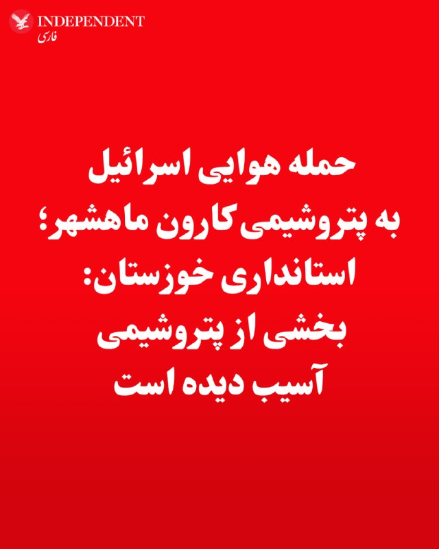

⭕️حمله هوایی اسرائیل به پتروشیمی کارون ماهشهر؛ استانداری خوزستان: بخشی از پتروشیمی آسیب دیده است

♦️معاون امنیتی و انتظامی استانداری خوزستان روز دوشنبه ۱۸ خردادماه اعلام کرد پتروشیمی کارون هدف حمله قرار گرفته است.

به گزارش خبرگزاری فارس بخشی از این شرکت پتروشیمی آسیب دیده است.
هنوز گزارشی از میزان خسارات و تلفات این حمله منتشر نشده است.

کانال ۱۴ اسرائیل به نقل از سخنگوی ارتش این کشور اعلام کرد اسرائیل این حملات را انجام داده است.
‌🇸🇦 Indypersian

🤖 @VahidOOnLine

## VahidOOnLine — post 244270

  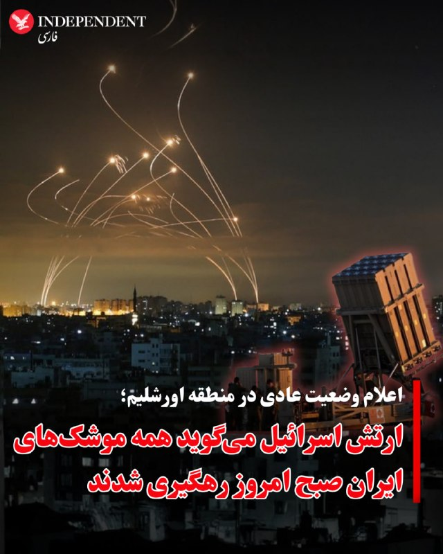

⭕️اعلام وضعیت عادی در منطقه اورشلیم؛ ارتش اسرائیل می‌گوید همه موشک‌های ایران صبح امروز رهگیری شدند

♦️بر اساس اعلام ارتش، تمام موشک‌های شلیک‌شده از ایران به سمت اسرائیل در صبح امروز رهگیری شده‌اند.

ارتش اسرائیل ارزیابی کرده است که برخوردی که در یک منطقه باز در کرانه باختری گزارش شده، احتمالا ناشی از یک قطعه بزرگ حاصل از عملیات رهگیری بوده است.

به گزارش تایمز اسرائیل، در همین حال، پس از صدور هشدار اولیه درباره حمله موشکی ایران، وضعیت عادی در منطقه اورشلیم اعلام شده است، زیرا به نظر می‌رسد پرتابه‌ها به داخل خاک کشور نرسیده‌اند.
‌🇸🇦 Indypersian

🤖 @VahidOOnLine

## WithYashar — post 13897

روابط عمومی سازمان منطقه ویژه‌اقتصادی پتروشیمی اعلام کرد:
بر اساس تصمیم فرماندهی ارشد پدافند غیرعامل، دستور خروج اضطراری کلیه کارکنان روزکار از این منطقه صادر شده است.
@withyashar

## WithYashar — post 13896

شبکه ۱۲ اسرائیل : نیروی هوایی اسرائیل ۲۰ تا هدف تو ایران رو زده که شامل فرودگاه مهر آباد هم میشده
@withyashar

## pm_afshaa — post 92842

🔴منابع اسراییلی:بیمارستان‌های شمال شروع به انتقال بخش‌های اورژانس به پناهگاه‌های زیرزمینی محافظت‌شده کردن 
💧 Rainbet.com the #1 Non-KYC Crypto Casino & Sportsbook @rainbetcom 
😁 @Pm_Afshaa

## pm_afshaa — post 92841

🔴منابع اسراییلی:بیمارستان‌های شمال شروع به انتقال بخش‌های اورژانس به پناهگاه‌های زیرزمینی محافظت‌شده کردن

💧 Rainbet.com the #1 Non-KYC Crypto Casino & Sportsbook @rainbetcom

😁 @Pm_Afshaa

## FarsiVOA — post 219978

  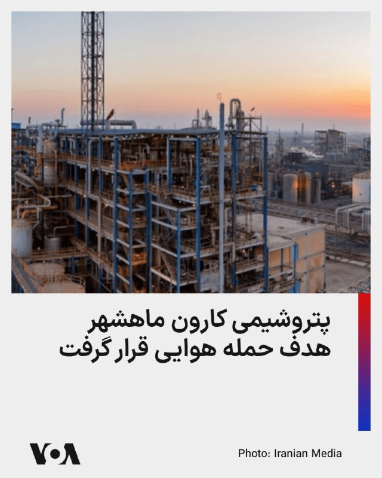

خبرگزاری مهر گزارش داد شرکت پتروشیمی کارون در ماهشهر، در استان خوزستان، بامداد دوشنبه هدف حمله هوایی قرار گرفته است.

این خبرگزاری به نقل از ولی‌الله حیاتی، معاون امنیتی و انتظامی استانداری خوزستان، نوشت که در پی اصابت پرتابه‌ها، بخشی از این مجموعه صنعتی آسیب دیده است.

حیاتی گفت در این حمله، تا زمان اعلام اولیه، هیچ‌گونه تلفات جانی یا مجروحیت گزارش نشده است.

او افزود جزئیات بیشتر درباره میزان خسارات احتمالی، متعاقباً اعلام خواهد شد.
@FarsiVOA

## Persian_Trend_Official — post 16077

  <a href="telegram/content/Persian_Trend_Official_16077_1780895584.mp4" target="_blank">🎬 Download video</a>

پتروشیمی کارون.

👺Phantom

📌 @persian_trend_official
پرشین ترند | متفاوت‌ترین کانال نظامی

## RadioFarda — post 158028

  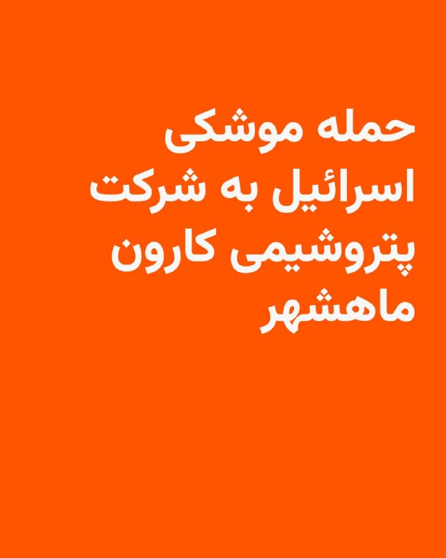

🔸ولی‌الله حیاتی، معاون امنیتی و انتظامی استانداری خوزستان از حمله هوایی و موشکی اسرائیل به شرکت پتروشیمی کارون ماهشهر خبر داد.

🔸خبرگزاری فارس با انتشار این خبر به نقل از حیاتی، افزوده که بخشی از این کارخانه در این حمله آسیب دیده است.

🔸با این حال در این خبر به جزئیات این حمله و میزان دقیق خسارات مالی و نیز جانی احتمالی اشاره‌ای نشده است.

🔸در جریان حملات مشترک آمریکا و اسرائیل نیز شماری از شرکت‌های پتروشیمی در ایران، اهداف حمله بودند.

@RadioFarda

## RadioFarda — post 158027

  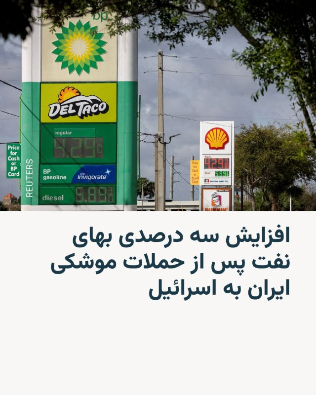

🔸بهای نفت روز دوشنبه، با بازگشایی بازارها پس از تعطیلات پایان هفته، بیش از سه درصد افزایش یافت؛ افزایشی که بازتاب‌دهنده نگرانی‌های تازه از نخستین حمله ایران به اسرائیل از زمان آتش‌بس است.

🔸به نوشته خبرگزاری فرانسه، در معاملات اولیه، بهای نفت خام برنت، شاخص بین‌المللی نفت، با ۳٫۲۹ درصد افزایش به ۹۶ دلار و ۱۵ سنت برای هر بشکه رسید.

🔸شاخص آمریکایی نفت خام، وست تگزاس اینترمدیت، نیز با ۳٫۲۵ درصد افزایش به ۹۳ دلار و ۴۸ سنت برای هر بشکه رسید.

🔸تهران روز یک‌شنبه چندین موشک به سوی اسرائیل شلیک کرد که اسرائیل می‌گوید آن‌ها را رهگیری کرده است. این حملات در صدمین روز جنگ در خاورمیانه، فشار تازه‌ای بر آتش‌بس شکننده وارد کرد.

@RadioFarda

## IranianMinds — post 21714

زدن که باز

## alonews — post 126108

  <a href="telegram/content/alonews_126108_1780895586.mp4" target="_blank">🎬 Download video</a>

👈آثار اصابت در خانه یک شهروند اسرائیلی

✅ @AloNews خبر جنگ

## alonews — post 126107

  <a href="telegram/content/alonews_126107_1780895588.webm" target="_blank">🎬 Download video</a>

👈 کانال ۱۳ اسرائیل: نیروی هوایی اسرائیل ۲۰ هدف در ایران را بمباران کرد

🔴 ما به چندین هدف در مجتمع پتروشیمی ماهشهر، جنوب غربی ایران، حمله هوایی انجام دادیم

✅ @AloNews خبر جنگ

## alonews — post 126106

  <a href="telegram/content/alonews_126106_1780895588.webm" target="_blank">🎬 Download video</a>

👈مهر: هیچ‌ منطقه ای در کرمانشاه هدف قرار نکرفته است

✅ @AloNews خبر جنگ

## alonews — post 126104

  <a href="telegram/content/alonews_126104_1780895589.webm" target="_blank">🎬 Download video</a>

🔴به گزارش اخبار کانال ۱۴، یک مقام ارشد اسرائیلی تأیید کرد که نیروی هوایی اسرائیل به یک تأسیسات پتروشیمی در ماهشهر در جنوب ایران حمله کرده است.

🔴این حمله گزارش شده بخشی از تلاش‌های دفاعی مداوم اسرائیل علیه جمهوری اسلامی است که همچنان با موشک، پهپاد، گروه‌های تروریستی نیابتی و برنامه هسته‌ای در حال پیشرفت خود، غیرنظامیان را هدف قرار می‌دهد.

🔴ارتش اسرائیل تأیید کرد که نیروی هوایی اسرائیل، با هدایت اطلاعات نظامی، به چندین هدف در مجتمع پتروشیمی ماهشهر در جنوب غربی ایران حمله کرده است.

🔴با ادامه‌ی عملیات دفاعی اسرائیل علیه زیرساخت‌های نظامی، اقتصادی، هسته‌ای جمهوری اسلامی، انتظار می‌رود جزئیات بیشتری منتشر شود.

✅@AloNews

## alonews — post 126103

  <a href="telegram/content/alonews_126103_1780895589.webm" target="_blank">🎬 Download video</a>

👈کارکنان روزکار منطقه ویژه پتروشیمی تخلیه می‌شوند

✅ @AloNews خبر جنگ

<!-- MSG END -->

<!-- NAV START -->

<a href="https://github.com/ProAlit/aio-downloader/blob/main/telegram/content/archive_1.md" style="display:inline-block; padding:6px 12px; margin:0 4px; background-color:#2ea44f; color:white; text-decoration:none; border-radius:4px; font-weight:bold;">صفحه بعد</a>

<!-- NAV END -->
