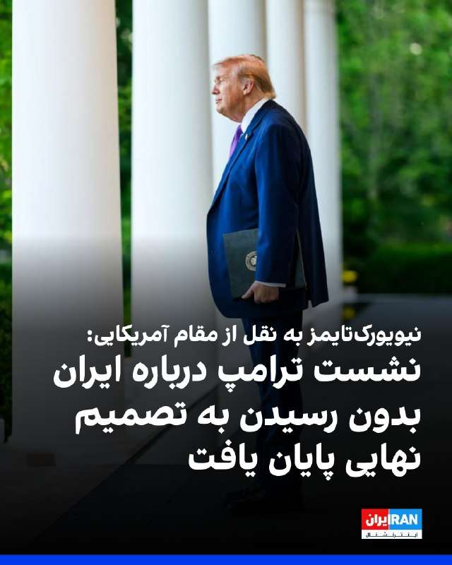
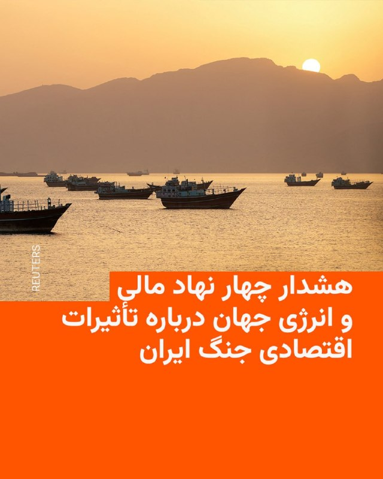

# خواننده تلگرام

<!-- TOP_NAV START -->

<a href="https://github.com/ProAlit/aio-downloader/blob/main/telegram/content/archive_1.md" style="display:inline-block; padding:6px 12px; margin:0 4px; background-color:#2ea44f; color:white; text-decoration:none; border-radius:4px; font-weight:bold;">صفحه بعد</a>

<!-- TOP_NAV END -->

<!-- MSG START -->

---
📅 بروزرسانی: 1405/03/08 22:43
---

## VahidOOnLine — post 242814

  

♦️خبرنگار صداوسیما در قشم از فعال شدن سامانه پدافند هوایی در این منطقه خبر داد و اعلام کرد این اقدام دقایقی پیش انجام شده است.
در ادامه، خبرگزاری مهر به نقل از منابع محلی گزارش داد یک ریزپرنده در حوالی قشم توسط پدافند هوایی هدف قرار گرفته و منهدم شده است.
بر اساس این گزارش‌ها، جزئیات بیشتری درباره ماهیت این ریزپرنده و نتیجه نهایی عملیات پدافندی تاکنون منتشر نشده است.
‌🇸🇦 Indypersian

🤖 @VahidOOnLine

## VahidOOnLine — post 242813

  

نیویورک‌تایمز به نقل از یک مقام ارشد آمریکایی گزارش داد نشست دونالد ترامپ در «اتاق وضعیت» کاخ سفید دو ساعت به طول انجامید، اما رییس‌جمهور آمریکا هنوز درباره هیچ توافق جدیدی با تهران به تصمیم نهایی نرسیده است.

این مقام افزود دولت آمریکا معتقد است به دستیابی به توافق نزدیک شده، اما برخی مسائل از جمله آزادسازی دارایی‌های مسدودشده همچنان محل بررسی و اختلاف‌نظر است.
‌🏁 🇬🇧 IranintlTV

🤖 @VahidOOnLine

## VahidOOnLine — post 242812

  <a href="telegram/content/VahidOOnLine_242812_1780082000.mp4" target="_blank">🎬 Download video</a>

یک شهروند با اشاره به وضعیت بد معیشتی به مقایسه قدرت خرید خانواده‌های ایرانی با شهروندان کشورهای دیگر پرداخته و می‌گوید که بازگشت نسبی اتصال به اینترنت به این علت است که «حواسمان را پرت کنند.»

پیام او با هوش مصنوعی خوانده شده است.
‌🏁 🇬🇧 IranintlTV

🤖 @VahidOOnLine

## WithYashar — post 12900

المانیتور: تیم ترامپ، در اقدامی قابل توجه، ایده ایجاد یک صندوق ۳۰۰ میلیارد دلاری را برای ایران مطرح کرده است.
این پیشنهاد در شرایطی مطرح می‌شود که پیش از این، تهران یک پیشنهاد تجاری مشابه را رد کرده بود.
@withyashar

## FoxNewsTwitter — post 342405

  

Fox News (Twitter/X)

WATCH LIVE: NJ Gov. Sherrill holds press conference on Delaney Hall detention center https://twitter.com/i/broadcasts/1aKbddMqbnqJX

## pm_afshaa — post 91865

https://t.me/proxy?server=87.248.129.12&port=15&secret=ee1603010200010001fc030386e24c3add626973636f7474692e79656b74616e65742e636f6d

پروکسی پینگ 100 متصل

💧 Rainbet.com the #1 Non-KYC Crypto Casino & Sportsbook @rainbetcom

😁 @Pm_Afshaa

## pm_afshaa — post 91864

🔴نیویورک تایمز:ترامپ حدود دو ساعت در اتاق وضعیت با تیم ارشد امنیت ملی ملاقات کرد اما هیچ تصمیمی برای توافق با ایران نگرفت

💧 Rainbet.com the #1 Non-KYC Crypto Casino & Sportsbook @rainbetcom

😁 @Pm_Afshaa

## IranIntlTV — post 339636

  

خبرگزاری رویترز به نقل از منابع جمهوری اسلامی گزارش داد که تهران ممکن است با انتقال نیمی از ذخایر اورانیوم غنی‌شده ۶۰درصدی به یک کشور ثالث موافقت کند.

بر اساس این گزارش، در این حالت، جمهوری اسلامی در مقابل این مقدار، اورانیوم با غنای ۵ درصد دریافت می‌کند.

رویترز نوشت که همچنین ممکن است نیم دیگر این ذخایر در داخل ایران رقیق‌سازی شود.
https://iranintl.com/202605295732

## IranIntlTV — post 339635

  

نیویورک‌تایمز به نقل از یک مقام ارشد آمریکایی گزارش داد نشست دونالد ترامپ در «اتاق وضعیت» کاخ سفید دو ساعت به طول انجامید، اما رییس‌جمهور آمریکا هنوز درباره هیچ توافق جدیدی با تهران به تصمیم نهایی نرسیده است.

این مقام افزود دولت آمریکا معتقد است به دستیابی به توافق نزدیک شده، اما برخی مسائل از جمله آزادسازی دارایی‌های مسدودشده همچنان محل بررسی و اختلاف‌نظر است.
https://iranintl.com/202605292981

## IranIntlTV — post 339634

  <a href="telegram/content/IranIntlTV_339634_1780082005.mp4" target="_blank">🎬 Download video</a>

یک شهروند با اشاره به وضعیت بد معیشتی به مقایسه قدرت خرید خانواده‌های ایرانی با شهروندان کشورهای دیگر پرداخته و می‌گوید که بازگشت نسبی اتصال به اینترنت به این علت است که «حواسمان را پرت کنند.»

پیام او با هوش مصنوعی خوانده شده است.

## FarsiVOA — post 219010

🔺افزایش نگران‌کننده اعدام‌ها در ایران؛ بنیاد برومند: ۶۶۰ اعدام در سال ۲۰۲۶ مستند شده است

▪️بنیاد عبدالرحمن برومند می‌گوید که از ابتدای سال جاری میلادی (۱۱ دی ۱۴۰۴) تاکنون، اجرای ۶۶۰ مورد اعدام توسط جمهوری اسلامی ایران را مستند کرده است.

⬇️ بیشتر بخوانید:
https://ir.voanews.com/a/boroumand-center-documented-660-execution/8155307.html
@FarsiVOA

## DW_Farsi — post 125293

🔶 دو فعال کرد و از معترضان دی‌‌ماه "با تیراندازی سپاه" کشته شدند

سازمان حقوق بشری هه‌نگاو و شبکه حقوق بشر کردستان از کشته شدن دو برادر و فعال فرهنگی کرد که بعد از شرکت در اعتراضات دی‌ماه مخفیانه زندگی می‌کردند با "شلیک مستقیم" نیروهای سپاه پاسداران خبر داده‌اند.

شبکه حقوق بشر کردستان به نقل از یک منبع مطلع اعلام کرد، صبح روز پنج‌شنبه هفتم خرداد نیروهای سپاه پس از شناسایی محل اختفای آن‌ها در روستای "قلعه‌کوهش" شهرستان دالاهو به محل اقامت این دو برادر یورش بردند: «نیروهای سپاه در جریان این عملیات، منزل محل سکونت آنان را بدون هشدار قبلی هدف تیراندازی قرار داده و مجتبی و میثم ویسی را با شلیک گلوله کشتند.»

هه‌نگاو نیز با روایتی مشابه نوشته، یک شهروند دیگر که صاحب این خانه بوده "سرنوشتش نامعلوم است."

این سازمان حقوق بشری می‌‌گوید، این دو برادر "از چهره‌های خوش‌نام و مردمی و پیروان آیین یارسان" و از مؤسسان کتابخانه شهرک دره‌دریژ (شهرک مهدیه) کرمانشاه و از برگزارکنندگان اصلی مراسم‌ نوروز کردی در این منطقه بودند.

همچنین مجتبی ویسی علاوه بر فعالیت‌های مدنی، از "ورزشکاران برجسته و مقام‌آور رشته کشتی در استان کرمانشاه بود."

خبرگزاری فرانسه می‌نویسد، رسانه‌های داخلی ایران نیز این اتفاق که پنج‌شنبه رخ داده را تأیید کرده‌اند اما می‌گویند، آن‌ها زمانی که از مخفی‌گاه خود اقدام به تیراندازی به نیروهای امنیتی کردند هدف آتش قرار گرفته و کشته شدند.

خبرگزاری تسنیم، وابسته به سپاه پاسداران آن‌ها را "دو تن از عاملان اصلی" ناآرامی‌های دی‌ماه در منطقه دره‌دراز کرمانشاه معرفی کرده و مدعی شده که آنان ابتدا به سوی نیروهای امنیتی تیراندازی کردند.

در ادامه این گزارش آمده است که "در نهایت، نیروهای امنیتی در راستای مأموریت قانونی و به جهت دفاع از خود، اقدام به تیراندازی متقابل کردند که منجر" به کشته شدن این دو نفر شد.
@dw_farsi

## Persian_Trend_Official — post 15290

  <a href="telegram/content/Persian_Trend_Official_15290_1780082008.webm" target="_blank">🎬 Download video</a>

وضعیت فعلی آسمان منطقه

📌 @persian_trend_official
پرشین ترند | متفاوت‌ترین کانال نظامی

## Persian_Trend_Official — post 15289

  

اونوقت به خامنه ای شربت شهادت دادن نامردا !

📌 @persian_trend_official
پرشین ترند | متفاوت‌ترین کانال نظامی

## Persian_Trend_Official — post 15288

  <a href="telegram/content/Persian_Trend_Official_15288_1780082009.webm" target="_blank">🎬 Download video</a>

«ترامپ باید بداند که ایران به عنوان پیروز و فاتح میدان شرایط را تعیین می‌کند:
نقد مقابل نقد
نسیه مقابل نسیه
هیچ مقابل هیچ
البته برای موضوعاتی که مورد مذاکره است نه آرزوهایش»

-ایراهیم عزیزی،رئیس کمسیون امنیت ملی مجلس شورای اسلامی

📌 @persian_trend_official
پرشین ترند | متفاوت‌ترین کانال نظامی

## RadioFarda — post 157703

  

🔸رؤسای آژانس بین‌المللی انرژی، صندوق بین‌المللی پول، بانک جهانی و سازمان تجارت جهانی روز پنج‌شنبه برای بررسی واکنش نهادهای خود به پیامدهای جنگ در خاورمیانه دیدار کردند. این موضوع در بیانیه مشترکی که روز جمعه منتشر شد، اعلام شده است.

🔸این نهادها در بیانیه خود با اشاره به محاصره در تنگه هرمز، هشدار دادند: «اگر جریان حمل‌ونقل دریایی به حالت عادی بازنگردد، کاهش سریع و ادامه‌دار ذخایر جهانی نفت، همزمان با اوج تقاضای تابستانی در نیمکره شمالی، خطرات فزاینده‌ای برای امنیت سوخت، شرایط بازار و تاب‌آوری گسترده‌تر اقتصاد جهانی ایجاد خواهد کرد.»

🔸در ادامه این بیانیه آمده است که این نهادها همچنین گزینه‌هایی را برای «تقویت بیشتر حمایت جمعی از طریق اقدامات چندجانبه و دوجانبه» بررسی کرده‌اند.

🔸در پی حملات مشترک آمریکا و اسرائیل به ایران در نهم اسفند سال گذشته و آغاز جنگ، نیروهای نظامی ایران تنگه هرمز را مسدود کردند. این آبراه محل عبور حدود ۲۰ درصد از نفت و گاز در جهان بود و اختلال در حرکت کشتی‌ها باعث افزایش قیمت نفت و کمبود گاز و سایر محصولات نفتی در برخی کشورها شد.

@RadioFarda

## RadioFarda — post 157702

  

🔸سخنگوی وزارت خارجه جمهوری اسلامی در واکنش به پیام دونالد ترامپ دربارهٔ محتوای توافق میان آمریکا و ایران اعلام کرد که تفاهم میان دو کشور هنوز نهایی نشده است.

🔸اسماعیل بقائی روز جمعه گفت: «تبادل پیام‌ها البته ادامه دارد، ولی تفاهم نهایی نشده است.»

🔸دونالد ترامپ، رئیس‌جمهور آمریکا ساعتی پیش اعلام کرد که توافق پایان دادن جنگ باید شامل مواردی مانند تعهد ایران به باز شدن تنگه هرمز و نابودی ذخایر اورانیوم باشد.

🔸به گزارش رسانه‌های ایران، بقائی دربارهٔ وضعیت تنگه هرمز با اشاره به واقع شدن آن در آب‌های سرزمینی ایران و عمان گفت که دو کشور «باید ساز و کارهایی را اتخاذ کنند که هم منافع و امنیت ملی خودشان به عنوان کشورهای ساحلی حفظ شود و هم این‌که به جامعه جهانی این اطمینان را بدهند که کشتی‌رانی از این مسیر به صورت ایمن انجام می‌شود.»

🔸او همچنین مدعی شد که مدیریت تنگه هرمز به ایران و عمان مرتبط است. این در حالی است که رئیس‌جمهور و وزیر خزانه‌داری آمریکا اخیرا عمان را تهدید کرده‌اند که نباید تلاشی برای کنترل این آبراه و اخذ عوارض از کشتی‌ها داشته باشد.

@RadioFarda

## IranianMinds — post 21039

  

🔴 همزمان با گزارش‌هایی مبنی بر وقوع انفجار و فعالیت پدافند هوایی ایران در جزیره قشم در نزدیکی تنگه هرز، یک تانکر سوخت‌گیری هوایی پگاسوس KC-46A پگاسوس که از تل‌آویو پرواز می‌کرد، بر فراز خلیج فارس مشاهده شد.

@IranianMinds

<!-- MSG END -->

<!-- NAV START -->

<a href="https://github.com/ProAlit/aio-downloader/blob/main/telegram/content/archive_1.md" style="display:inline-block; padding:6px 12px; margin:0 4px; background-color:#2ea44f; color:white; text-decoration:none; border-radius:4px; font-weight:bold;">صفحه بعد</a>

<!-- NAV END -->
