# خواننده تلگرام

<!-- TOP_NAV START -->

<!-- TOP_NAV END -->

<!-- MSG START -->

---
📅 بروزرسانی: 1405/03/21 06:12
---

## VahidOOnLine — post 244854

  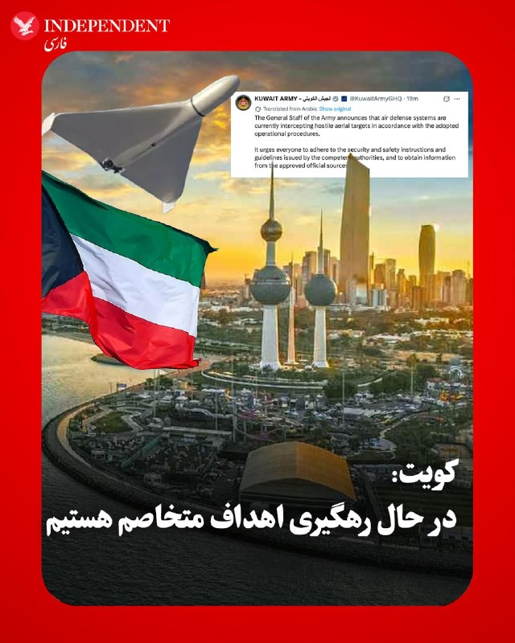

♦️ارتش کویت بامداد پنجشنبه اعلام کرد که سامانه‌های پدافند هوایی این کشور در حال رهگیری اهداف «متخاصم» هستند. پیش‌تر روابط عمومی سپاه از حمله به اهداف مرتبط با آمریکا در کویت خبر داده بود.
‌🇸🇦 Indypersian

🤖 @VahidOOnLine

## VahidOOnLine — post 244853

  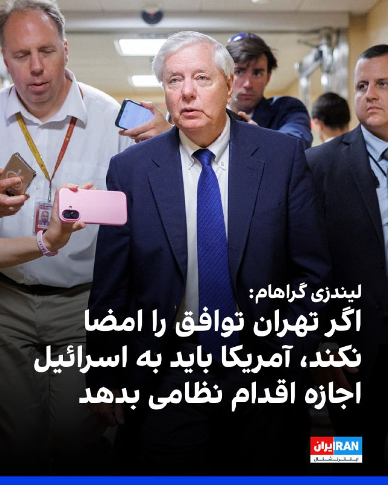

لیندزی گراهام، سناتور جمهوری‌خواه آمریکا، در گفت‌وگو با شبکه فاکس‌نیوز اعلام کرد اگر جمهوری اسلامی فوراً توافق مورد نظر را امضا نکند، ایالات متحده باید به اسرائیل اجازه دهد «تمام توان خود را به کار گیرد» و خود نیز برای استفاده از نیروی نظامی آماده باشد. او گفت: «ما باید به اسرائیل اجازه دهیم تمام توان خود را به کار گیرد و اگر آنها همین حالا توافقی را امضا نکنند، خودمان نیز از نیروی نظامی استفاده کنیم.» گراهام با مقایسه‌ای جنجالی افزود: «اگر به هیتلر می‌گفتید مردم در رنج هستند، برایش اهمیتی نداشت.» این سناتور جمهوری‌خواه همچنین اظهار داشت مقام‌های جمهوری اسلامی بیش از آنکه به رنج مردم ایران اهمیت دهند، به ایدئولوژی و برنامه‌های خود پایبند هستند و مذاکره با آن‌ها بسیار دشوار است. او در عین حال گفت دستیابی به توافق غیرممکن نیست، اما تأکید کرد آنچه تاکنون انجام شده هنوز به نتیجه نرسیده است. iranintl
‌🏁 🇬🇧 IranintlTV

🤖 @VahidOOnLine

## mwarmonitor — post 10682

🔴«جبهه داخلی اسرائیل: آژیرهای هشدار در مسغاف عام و المطلة در الجلیل الاعلی به صدا درآمده‌اند.»

@mwarmonitor

## mwarmonitor — post 10681

🔴« ارتش اسرائیل: شلیک چندین موشک از لبنان به سمت چندین منطقه مسکونی در شمال کشور رصد شده است.»

@mwarmonitor

## mwarmonitor — post 10680

  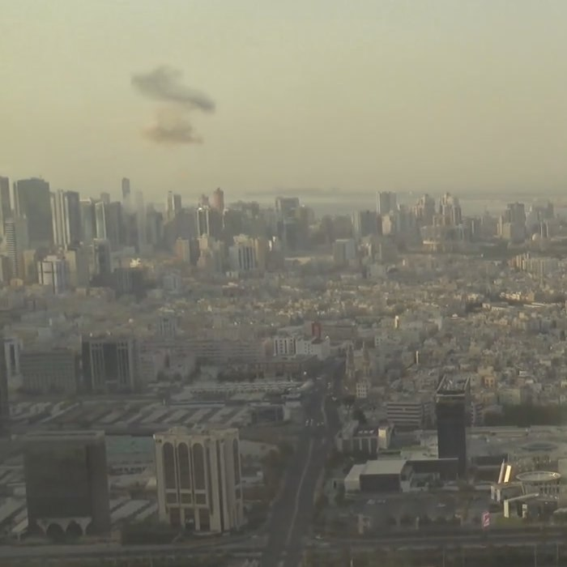

🔸«دود از شهر منامه در بحرین دیده می‌شود، در حالی که گفته می‌شود ایران صبح امروز یک حمله موشکی بالستیک و پهپادی را آغاز کرده است.»

@mwarmonitor

## IranIntlTV — post 341611

  

لیندزی گراهام، سناتور جمهوری‌خواه آمریکا، در گفت‌وگو با شبکه فاکس‌نیوز اعلام کرد اگر جمهوری اسلامی فوراً توافق مورد نظر را امضا نکند، ایالات متحده باید به اسرائیل اجازه دهد «تمام توان خود را به کار گیرد» و خود نیز برای استفاده از نیروی نظامی آماده باشد. او گفت: «ما باید به اسرائیل اجازه دهیم تمام توان خود را به کار گیرد و اگر آنها همین حالا توافقی را امضا نکنند، خودمان نیز از نیروی نظامی استفاده کنیم.» گراهام با مقایسه‌ای جنجالی افزود: «اگر به هیتلر می‌گفتید مردم در رنج هستند، برایش اهمیتی نداشت.» این سناتور جمهوری‌خواه همچنین اظهار داشت مقام‌های جمهوری اسلامی بیش از آنکه به رنج مردم ایران اهمیت دهند، به ایدئولوژی و برنامه‌های خود پایبند هستند و مذاکره با آن‌ها بسیار دشوار است. او در عین حال گفت دستیابی به توافق غیرممکن نیست، اما تأکید کرد آنچه تاکنون انجام شده هنوز به نتیجه نرسیده است. iranintl.com/202606118966

## FarsiVOA — post 220344

  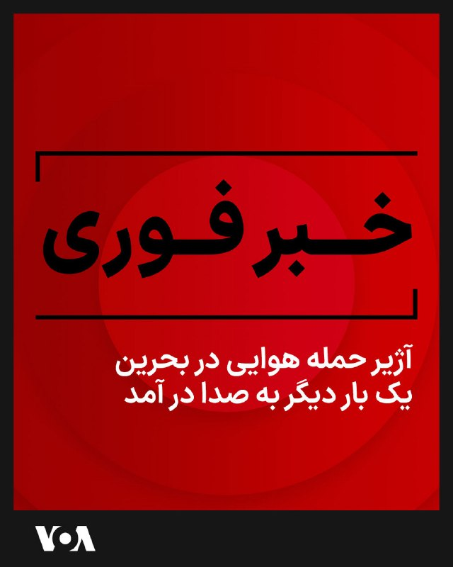

آژیر هشدار حمله هوایی در بحرین صبح پنج شنبه برای بار دوم به صدا در آمد. ویدیوهای منتشر شده در شبکه‌های اجتماعی شلیک موشک از چند استان در ایران را نشان می‌دهد.
@FarsiVOA

## FarsiVOA — post 220343

  <a href="telegram/content/FarsiVOA_220343_1781145741.mp4" target="_blank">🎬 Download video</a>

ویدیو منتسب به اثر عبور موشک در آسمان ارومیه، ۲۱ خرداد ۱۴۰۵ - (وحیدآنلاین)
@FarsiVOA

## BBCPersian — post 283379

‌
افزایش آرای حزب راست افراطی «آلترناتیو برای آلمان» و قوت گرفتن احتمال اینکه این حزب برای نخستین بار بتواند به‌تنهایی در یکی از ایالت‌ها به قدرت برسد، بار دیگر بحث ممنوعیت فعالیت این حزب را به میان کشیده است.

حزب آلترناتیو برای آلمان که در تازه‌ترین نظرسنجی‌های انتخاباتی در آلمان در صدر قرار گرفته، فاصله خود را با محافظه‌کاران به رهبری فریدریش مرتس، صدراعظم آلمان، هر روز بیشتر می‌کند.

نتایج این نظرسنجی‌ها نشان می‌دهد حمایت از دولت ائتلافی آلمان متشکل از ائتلاف محافظه‌کار شامل حزب اتحادیه دموکرات مسیحی/اتحادیه سوسیال مسیحی و حزب سوسیال‌دموکرات با گرایش چپ میانه، به پایین‌ترین سطح خود رسیده است.

در انتخابات سراسری ۲۳ فوریه سال گذشته، حزب اتحادیه به رهبری مرتس ۲۸/۵ درصد و حزب سوسیال‌دموکرات ۱۶/۴ درصد آرا را به دست آورده بودند.

بر اساس نتایج نظرسنجی موسسه اینسا که ۶ ژوئن منتشر شد، حزب آلترناتیو برای آلمان آرای خود را به ۲۹ درصد رساند و از میزان آرایی که مرتس را به قدرت رسانده بود نیز فراتر رفت.

📸GettyImages/ Reuters

از لینک⬇️ این مطلب را در بی‌بی‌سی فارسی بخوانید.

https://bbc.in/4xllmvv

@BBCPersian

---
📅 بروزرسانی: 1405/03/21 06:02
---

## VahidOOnLine — post 244852

  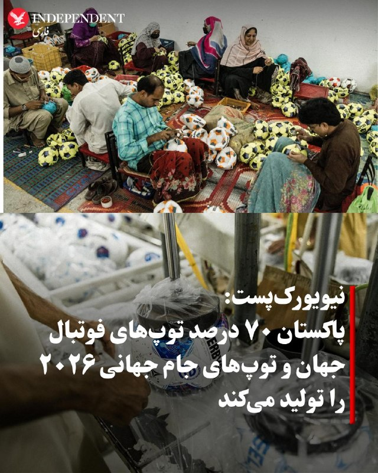

♦️روزنامه «نیویورک‌پست» در گزارشی نوشت شهر سیالکوت پاکستان به مرکز اصلی تولید توپ فوتبال در جهان تبدیل شده و حدود ۷۰ درصد توپ‌های فوتبال جهان، از جمله توپ‌های رسمی جام جهانی ۲۰۲۶، در این شهر تولید می‌شود.

جام جهانی فوتبال ۲۰۲۶، بیست‌وسومین دوره این رقابت‌ها، از ۱۱ ژوئن تا ۱۹ ژوئیهٔ ۲۰۲۶ (۲۱ خرداد تا ۲۸ تیر ۱۴۰۵) برگزار خواهد شد. این مسابقات برای نخستین بار با حضور ۴۸ تیم برگزار می‌شود و سه کشور آمریکا، کانادا و مکزیک به‌طور مشترک میزبان آن هستند. همچنین این نخستین بار در تاریخ جام جهانی است که سه کشور به‌صورت همزمان میزبانی این رقابت‌ها را بر عهده دارند.

بر اساس گزارش نیویورک‌پست، تمامی توپ‌های رسمی جام جهانی از سال ۱۹۸۲ تاکنون در سیالکوت ساخته شده‌اند و بسیاری از آن‌ها همچنان به‌صورت دستی دوخته می‌شوند. پاکستان سالانه حدود ۴۰ میلیون توپ فوتبال صادر می‌کند و روزانه نزدیک به ۳۰۰ هزار توپ از کارخانه‌های این شهر خارج می‌شود.

این گزارش می‌افزاید یادگیری دوخت حرفه‌ای توپ چندین ماه زمان می‌برد و هر دوزنده ماهر می‌تواند روزانه حدود چهار توپ تولید کند. رنگ‌ها و لوگوها نیز به‌صورت دستی روی توپ‌ها اعمال می‌شوند و هر محصول پیش از عرضه به‌دقت بررسی می‌شود.

نیویورک‌پست به نقل از شرکت «فوروارد اسپورتس» تولیدکننده توپ رسمی جام جهانی ۲۰۲۶ آدیداس با نام «تریوندا» نوشت حجم تولید توپ برای این دوره، بزرگ‌ترین سفارش تاریخ این شرکت بوده است. ساخت هر توپ جدید جام جهانی بین سه تا چهار سال زمان می‌برد و برای رعایت استانداردهای فیفا، آزمایش‌های متعددی روی وزن، گردی، دوام و مقاومت آن در برابر نفوذ آب انجام می‌شود.
‌🇸🇦 Indypersian

🤖 @VahidOOnLine

## mwarmonitor — post 10679

🔴 ارتش کویت: سامانه‌های پدافند هوایی در حال حاضر در حال مقابله با اهداف هوایی متخاصم هستند، طبق رویه‌ها و دستورالعمل‌های عملیاتی مورد تأیید.

@mwarmonitor

## mwarmonitor — post 10678

🔴نیروهای آمریکا جدیدترین حملات در ایران را تکمیل کردند
فرماندهی مرکزی ایالات متحده آمریکا (CENTCOM)

📌تامپا، فلوریدا — نیروهای فرماندهی مرکزی ایالات متحده (CENTCOM) در تاریخ ۱۰ ژوئن به دستور فرمانده کل قوا، حملات «دفاع از خود» بیشتری را علیه چندین هدف در ایران انجام دادند.

🔸نیروهای CENTCOM تأسیسات مرتبط با توانمندی‌های شناسایی نظامی ایران، سامانه‌های ارتباطی و سایت‌های پدافند هوایی در سراسر ایران را هدف قرار دادند. یگان‌های نیروی دریایی، نیروی هوایی و تفنگداران دریایی آمریکا با استفاده از مهمات دقیق، اهداف ایرانی را که تهدیدی برای نیروهای آمریکایی و کشتی‌های تجاری بین‌المللی در آب‌های منطقه بودند، هدف قرار دادند.

🔹این حملات در پاسخ به «اقدامات غیرموجه و ادامه‌دار ایران» انجام شده است. نیروهای آمریکا همچنان در حالت آماده‌باش، تهاجمی و آماده اقدام باقی می‌مانند.

ناوشکن USS Michael Murphy (DDG 112) در حمایت از این حملات «دفاع از خود» علیه ایران در تاریخ ۱۰ ژوئن ۲۰۲۶ موشک‌های کروز تاماهاوک شلیک کرد.

@mwarmonitor

## FarsiVOA — post 220342

  <a href="telegram/content/FarsiVOA_220342_1781145163.mp4" target="_blank">🎬 Download video</a>

ویدیو منتسب به اثر عبور موشک در آسمان تبریز، ۲۱ خرداد ۱۴۰۵ - (وحیدآنلاین)
@FarsiVOA

---
📅 بروزرسانی: 1405/03/21 05:52
---

## VahidOOnLine — post 244851

  

دونالد ترامپ، رییس‌جمهوری آمریکا، از جمهوری‌خواهان در کنگره خواست طرح ۳۵۰ میلیارد دلاری بودجه نظامی را فورا تصویب کنند؛ طرحی که به گفته او با هدف افزایش چشمگیر بودجه نظامی آمریکا و تقویت توان بازدارندگی این کشور تدوین شده است. ترامپ تاکید کرد این لایحه بخشی از مسیر رسیدن به بودجه ۱.۵ تریلیون دلاری دفاعی است و باید بدون تاخیر و تغییر اساسی تصویب شود. او گفت این سرمایه‌گذاری برای توسعه سامانه‌های دفاعی جدید، تقویت ناوگان دریایی و هوایی، افزایش ذخایر تسلیحاتی و گسترش توان فضایی و پهپادی آمریکا انجام می‌شود و آن را اقدامی تعیین‌کننده برای برتری نظامی ایالات متحده در سال‌های آینده توصیف کرد. iranintl
‌🏁 🇬🇧 IranintlTV

🤖 @VahidOOnLine

## pm_afshaa — post 93587

  <a href="telegram/content/pm_afshaa_93587_1781144540.webm" target="_blank">🎬 Download video</a>

🔴ارتش کویت: در حال حاضر در حال رهگیری اهداف هوایی متخاصم هستیم.

💧 Rainbet.com the #1 Non-KYC Crypto Casino & Sportsbook @rainbetcom

😁 @Pm_Afshaa

## pm_afshaa — post 93586

آژیر خطر کویت و بحرین فعال شد 
💧 Rainbet.com the #1 Non-KYC Crypto Casino & Sportsbook @rainbetcom 
😁 @Pm_Afshaa

## pm_afshaa — post 93585

آژیر خطر کویت و بحرین فعال شد

💧 Rainbet.com the #1 Non-KYC Crypto Casino & Sportsbook @rainbetcom

😁 @Pm_Afshaa

## VahidOnline — post 76196

  <a href="telegram/content/VahidOnline_76196_1781144540.mp4" target="_blank">🎬 Download video</a>

'موشک‌های شلیک شده از استان #زنجان'
ویدیوی دریافتی، پنجشنبه ۲۱ خراد
Vahid

📡 @VahidOnline

## IranIntlTV — post 341610

  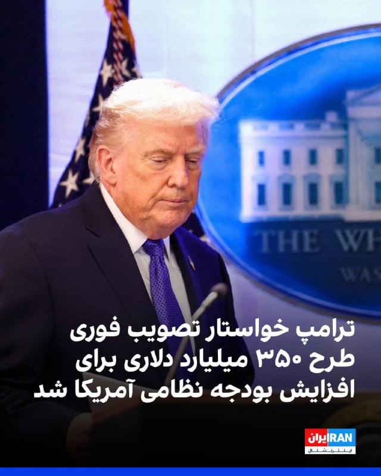

دونالد ترامپ، رییس‌جمهوری آمریکا، از جمهوری‌خواهان در کنگره خواست طرح ۳۵۰ میلیارد دلاری بودجه نظامی را فورا تصویب کنند؛ طرحی که به گفته او با هدف افزایش چشمگیر بودجه نظامی آمریکا و تقویت توان بازدارندگی این کشور تدوین شده است. ترامپ تاکید کرد این لایحه بخشی از مسیر رسیدن به بودجه ۱.۵ تریلیون دلاری دفاعی است و باید بدون تاخیر و تغییر اساسی تصویب شود. او گفت این سرمایه‌گذاری برای توسعه سامانه‌های دفاعی جدید، تقویت ناوگان دریایی و هوایی، افزایش ذخایر تسلیحاتی و گسترش توان فضایی و پهپادی آمریکا انجام می‌شود و آن را اقدامی تعیین‌کننده برای برتری نظامی ایالات متحده در سال‌های آینده توصیف کرد. iranintl.com/202606111134

## Shin_Persian — post 6920

Shin ✓ @hey_itsmyturn
Thu, 11 Jun 2026 02:12:43 UTC

Sirens sounding in Bahrain. Officials urge calm: head to nearest safe place, follow official channels.

#Bahrain 🇧🇭

Source: @moi_bahrain
https://x.com/moi_bahrain/status/2064893512399589688

ترجمه خودکار فارسی

آژیرهای خطر در بحرین به صدا درآمدند. مقامات مردم را به حفظ آرامش دعوت می‌کنند: به نزدیک‌ترین مکان امن بروید و کانال‌های رسمی را دنبال کنید.

#Bahrain 🇧🇭

منبع: @moi_bahrain
https://x.com/moi_bahrain/status/2064893512399589688

𝕏 · @shin_persian

## Shin_Persian — post 6919

  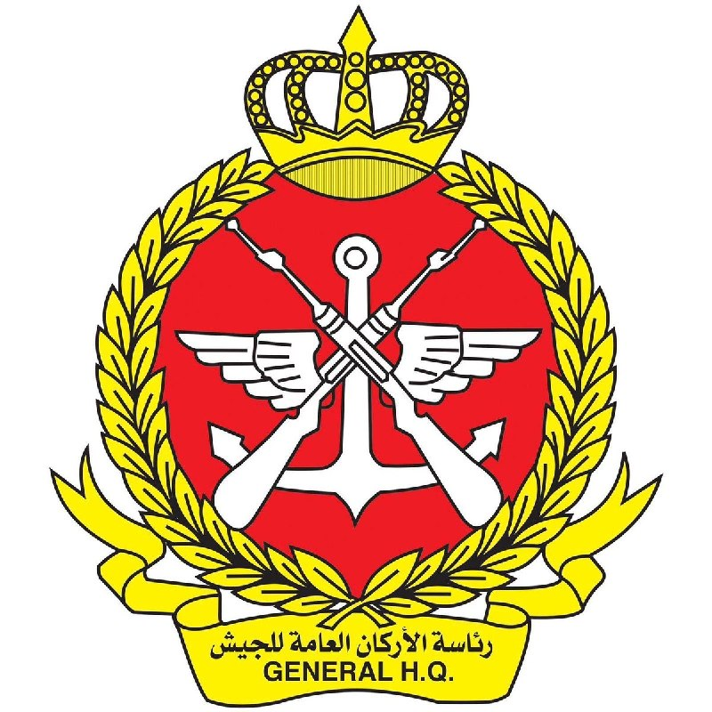

Shin ✓ @hey_itsmyturn
Thu, 11 Jun 2026 02:12:04 UTC

Kuwait Army General Staff: Air defense systems are currently intercepting hostile aerial targets.

Follow safety instructions from official authorities.

#Kuwait 🇰🇼

Source: @KuwaitArmyGHQ
https://x.com/KuwaitArmyGHQ/status/2064893351011176686

ترجمه خودکار فارسی

ستاد کل ارتش کویت: سامانه‌های پدافند هوایی در حال حاضر در حال رهگیری اهداف هوایی متخاصم هستند.

دستورالعمل‌های ایمنی مقامات رسمی را دنبال کنید.

#Kuwait 🇰🇼

منبع: @KuwaitArmyGHQ
https://x.com/KuwaitArmyGHQ/status/2064893351011176686

𝕏 · @shin_persian

## FarsiVOA — post 220341

  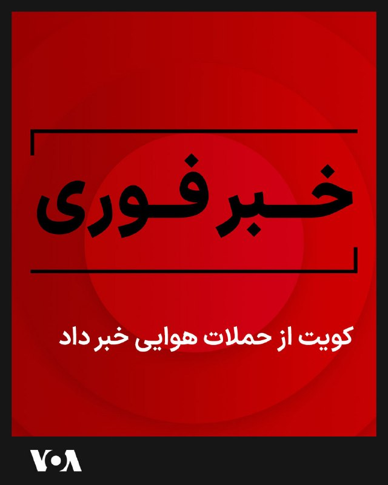

⚡️ارتش کویت دقایقی پیش اعلام کرد سامانه‌های پدافند هوایی آن در حال حاضر مشغول مقابله با اهداف هوایی متخاصم است.
@FarsiVOA

---
📅 بروزرسانی: 1405/03/21 05:42
---

## VahidOOnLine — post 244850

  

♦️وزارت امور خارجه آمریکا روز چهارشنبه ۲۰ خردادماه اعلام کرد در چارچوب سیاست‌های دولت دونالد ترامپ برای مقابله با سوءاستفاده از قوانین مهاجرتی، چندین شبکه «گردشگری زایمان» را در آفریقا و اروپا شناسایی و متوقف کرده است. این وزارتخانه تاکید کرد هیچ تبعه خارجی نمی‌تواند با هدف اصلی دریافت شهروندی آمریکا برای فرزند خود از طریق زایمان در ایالات متحده، ویزای گردشگری دریافت کند.

بر اساس بیانیه وزارت خارجه آمریکا، یکی از سفارتخانه‌های این کشور در غرب آفریقا شبکه‌ای متشکل از بیش از ۱۰۰ تبعه خارجی را شناسایی کرده که با استفاده از مدارک جعلی و واسطه‌های اخذ ویزا برای دریافت شهروندی آمریکا برای فرزندان خود اقدام می‌کردند. ویزاهای این افراد لغو شده و همکاری با مقام‌های محلی برای شناسایی فعالیت‌های مشابه ادامه دارد.

این وزارتخانه همچنین اعلام کرد از سال ۲۰۲۴ تاکنون بیش از ۴۰۰ پرونده مشکوک به گردشگری زایمان در اروپا شناسایی شده است. تحقیقات نشان داده این پرونده‌ها به دست‌کم شش شرکت مرتبط بوده‌اند که به متقاضیان درباره مصاحبه ویزا آموزش می‌دادند، برای آنها محل اقامت در آمریکا فراهم می‌کردند و برنامه زایمان آنها را هماهنگ می‌کردند. به گفته وزارت خارجه آمریکا، ویزاهای مرتبط با این پرونده‌ها لغو شده و شماری از متخلفان برای همیشه از ورود به آمریکا محروم شده‌اند.

وزارت خارجه آمریکا همچنین از لغو بیش از ۱۰۰ ویزا در شمال آفریقا برای والدینی خبر داد که با هدف زایمان در آمریکا و دریافت شهروندی این کشور برای فرزندان خود سفر کرده بودند. در این بیانیه تاکید شده است که «ویزای ایالات متحده یک امتیاز است، نه یک حق» و اقدامات برای مقابله با شبکه‌های گردشگری زایمان در سراسر جهان ادامه خواهد داشت.
‌🇸🇦 Indypersian

🤖 @VahidOOnLine

## FoxNewsTwitter — post 342841

  <a href="telegram/content/FoxNewsTwitter_342841_1781143948.mp4" target="_blank">🎬 Download video</a>

Fox News (Twitter/X)

U.S. forces have completed a new round of strikes inside Iran, according to U.S. Central Command.

CENTCOM says U.S. Marine Corps, Air Force, and Navy assets targeted Iranian military surveillance capabilities, communication systems, and air defense sites at the Commander in Chief's direction.

"The strikes are in response to Iran's unwarranted and continued aggression," the command said.

Officials say the targets posed a threat to U.S. forces and international commercial shipping operating in the region.

## FoxNewsTwitter — post 342840

Fox News (Twitter/X)

FOX NEWS REPORT: Clashes break out in Belfast after a Sudanese immigrant is charged with attempted murder in a brutal stabbing attack. Local officials are calling for peace as anti-immigration demonstrations intensify, FOX News' @GriffJenkins reports.

## pm_afshaa — post 93584

  <a href="telegram/content/pm_afshaa_93584_1781143950.mp4" target="_blank">🎬 Download video</a>

فعال شدن پدافند اردن

💧 Rainbet.com the #1 Non-KYC Crypto Casino & Sportsbook @rainbetcom

😁 @Pm_Afshaa

## VahidOnline — post 76195

  <a href="telegram/content/VahidOnline_76195_1781143951.mp4" target="_blank">🎬 Download video</a>

آسمان #تبریز
ویدیوی دریافتی: عبور یک موشک از میان رد موشک‌های قبلی
پنجشنبه ۲۱ خرداد
Vahid

📡 @VahidOnline

## VahidOnline — post 76194

  <a href="telegram/content/VahidOnline_76194_1781143952.mp4" target="_blank">🎬 Download video</a>

ویدیوی دریافتی: رد موشک شلیک‌شده در آسمان #ارومیه
پنجشنبه ۲۱ خرداد
Vahid

📡 @VahidOnline

## FarsiVOA — post 220340

  <a href="telegram/content/FarsiVOA_220340_1781143952.mp4" target="_blank">🎬 Download video</a>

⚡️گزار‌ش‌ها از شلیک موشک از چند استان در ایران
گزارش‌های مردمی از شلیک موشک از زنجان، ارومیه و تبریز حکایت دارد. کانال تلگرامی وحیدآنلاین ویدیویی از شلیک موشک از زنجان را منتشر کرد.
@FarsiVOA

---
📅 بروزرسانی: 1405/03/21 05:32
---

## FoxNewsTwitter — post 342839

  <a href="telegram/content/FoxNewsTwitter_342839_1781143373.mp4" target="_blank">🎬 Download video</a>

Fox News (Twitter/X)

“Epstein was working to use information about my infidelities... to pressure me to re-engage with him.”

Bill Gates testified before the House Oversight Committee about his relationship with Jeffrey Epstein, saying the disgraced financier tried to use details of his affairs as leverage and denied knowing about any ongoing criminal misconduct. https://twitter.com/JesseBWatters/status/2064874679165222948#m

## pm_afshaa — post 93583

  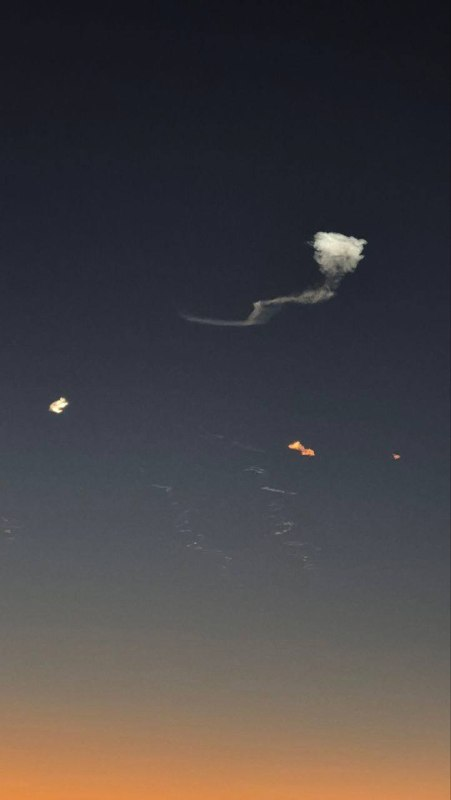

آسمان اردن :

💧 Rainbet.com the #1 Non-KYC Crypto Casino & Sportsbook @rainbetcom

😁 @Pm_Afshaa

## pm_afshaa — post 93582

میگن سمت اردن زدن

## pm_afshaa — post 93581

همین الان از تبریز و ارومیه موشک زدن 
💧 Rainbet.com the #1 Non-KYC Crypto Casino & Sportsbook @rainbetcom 
😁 @Pm_Afshaa

## pm_afshaa — post 93580

اگه گذاشتید بخوابیم

## pm_afshaa — post 93579

  <a href="telegram/content/pm_afshaa_93579_1781143376.mp4" target="_blank">🎬 Download video</a>

زنجان شلیک موشک

💧 Rainbet.com the #1 Non-KYC Crypto Casino & Sportsbook @rainbetcom

😁 @Pm_Afshaa

## pm_afshaa — post 93577

از زنجان هم موشک پرتاب کردن :

💧 Rainbet.com the #1 Non-KYC Crypto Casino & Sportsbook @rainbetcom

😁 @Pm_Afshaa

## pm_afshaa — post 93576

  <a href="telegram/content/pm_afshaa_93576_1781143377.mp4" target="_blank">🎬 Download video</a>

پرتاب موشک از تبریز :

💧 Rainbet.com the #1 Non-KYC Crypto Casino & Sportsbook @rainbetcom

😁 @Pm_Afshaa

## VahidOnline — post 76193

  <a href="telegram/content/VahidOnline_76193_1781143380.mp4" target="_blank">🎬 Download video</a>

شلیک موشک از استان زنجان
ویدیوی دریافتی پنجشنبه ۲۱ خرداد
Vahid

📡 @VahidOnline

---
📅 بروزرسانی: 1405/03/21 05:22
---

## pm_afshaa — post 93575

همین الان از تبریز و ارومیه موشک زدن 
💧 Rainbet.com the #1 Non-KYC Crypto Casino & Sportsbook @rainbetcom 
😁 @Pm_Afshaa

## pm_afshaa — post 93572

همین الان از تبریز و ارومیه موشک زدن

💧 Rainbet.com the #1 Non-KYC Crypto Casino & Sportsbook @rainbetcom

😁 @Pm_Afshaa

## VahidOnline — post 76190

شلیک موشک از زنجان، تبریز و ارومیه

الان از شبستر تبریز سه تا موشک زدن نمیدونم به کجا
صداش خیلی زیاد بود
الان یدونه دیگه زد

سلام 5:16
همین الان تبریز صدای انفجار قوی اومد

از ارومیه موشک بلند کردن

5.18 ارومیه صدای 4 - 5 انفجار

سلام وحید جان تو ارومیه ساعت ۵.۱۷ چهار بار صدای انفجار شدید اومد

هنوزم ادامه داره
3 تا دیگه زدن

📡 @VahidOnline

## FarsiVOA — post 220339

  <a href="telegram/content/FarsiVOA_220339_1781142743.mp4" target="_blank">🎬 Download video</a>

⚡️ملانیا ترامپ، بانوی اول آمریکا، در کاخ سفید مراسم جوایز اولین چالش هوش‌مصنوعی ریاستی را برگزار کرد. این رویداد نخبگان جوان آمریکا را گرد هم آورد و نشان داد چگونه هوش‌مصنوعی در آموزش، فناوری و حل مسائل جامعه نقش می‌سازد.
@FarsiVOA

---
📅 بروزرسانی: 1405/03/21 05:12
---

## VahidOOnLine — post 244849

  <a href="telegram/content/VahidOOnLine_244849_1781142157.mp4" target="_blank">🎬 Download video</a>

♦️دونالد ترامپ، رئیس‌جمهوری ایالات متحده، چهارشنبه ۲۰ خردادماه در مراسم امضای قانون «آمریکای امن» در کاخ سفید، در پاسخ به سوال خبرنگاری که از او پرسید «جدا از صلح در خاورمیانه، برای روز تولدتان چه آرزویی دارید؟» گفت: «بگذارید یک قدم فراتر بروم؛ صلح برای جهان.»

ترامپ در ادامه با اشاره به خاورمیانه افزود: «بله، صلح برای تمام جهان.»
‌🇸🇦 Indypersian

🤖 @VahidOOnLine

## FoxNewsTwitter — post 342838

  

Fox News (Twitter/X)

Karmelo Anthony is being held in isolation following his conviction in the murder of Texas high school student Austin Metcalf.

A Collin County jury sentenced Anthony to 35 years in prison after rejecting his claim of self-defense in the fatal stabbing at a Frisco track meet. He is expected to eventually be transferred to a state prison.

Anthony has since filed a notice of appeal following his conviction, according to court records.

The case drew national attention after Metcalf, 17, was killed during an altercation at a school track meet in 2025.

## VahidOnline — post 76189

  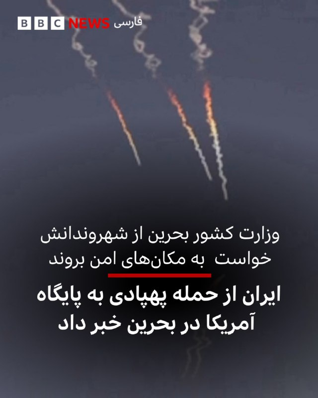

‌
ساعتی بعد از حملات بامداد پنجشنبه آمریکا، خبرگزاری‌های رسمی به نقل از ارتش جمهوری اسلامی ایران نوشتند: «ناوگان پنجم آمریکا در بحرین، آماج حملات پهپادی ارتش، قرار گرفت. در این موج از حملات پهپادی ارتش، آنتن‌های ارتباطی و تاسیسات راداری سامانه پاتریوت ناوگان پنجم مورد هدف قرار گرفت.»یییی

همزمان وزارت کشور بحرین در پیامی در شبکه اجتماعی ایکس از ساکنان خواست تا با حفظ آرامش به نزدیک‌ترین مکان امن بروند.

سپاه پاسداران از حمله به« ۱۸ موضع نیروهای آمریکا» در منطقه خبر داده است.

کانال تلگرامی سپاه نیوز نوشت که طی «دو موج عملیاتی ۱۸ هدف مهم» متعلق به ارتش امریکا در پایگاه‌های هوایی «علی السالم» و «احمدالجابر» و همچنین پایگاه‌های هوایی «شیخ عیسی» را هدف قرار داده و منهدم کرده است.
@VahidHeadline

📡 @VahidOnline

## VahidOnline — post 76188

  

فاکس نیوز به نقل از ترامپ گزارش داد که اسرائیل در حمله نخستین ساعات بامداد پنجشنبه به اهدافی در جنوب ایران مشارکت نداشت اما به‌طور حتم ارتش اسرائیل در سطح آمادگی بالا قرار دارد. او در عین حال گفت که آمریکا بیش از ۵۰ هزار نیرو در منطقه دارد که بسیاری از آنها در عملیات مشارکت داشتند.
@VahidOOnLine

📡 @VahidOnline

## FarsiVOA — post 220338

  <a href="telegram/content/FarsiVOA_220338_1781142160.mp4" target="_blank">🎬 Download video</a>

⚡️شلیک موشک تاماهاک به مواضع جمهوری اسلامی از ناو جنگی یواس‌اس مایکل مورفی - ۲۰ خرداد به وقت واشنگتن (ویدئوی نیروی دریایی ایالات متحده)
@FarsiVOA

## FarsiVOA — post 220337

🔺دونالد ترامپ به فاکس‌نیوز: اگر جمهوری اسلامی توافق نکند فردا شب هم به‌شدت بمباران می‌شود؛ سنتکام: عملیات امشب پایان یافت

▪️دونالد ترامپ، رئیس‌جمهوری آمریکا چهارشنبه شب در مصاحبه‌‌ای با فاکس نیوز، در پاسخ به این سوال که اگر جمهوری اسلامی با او توافق نکند چه اتفاقی می‌افتد؟ گفت که فردا شب هم به‌شدت بمباران خواهند شد.

⬇️ بیشتر بخوانید:
https://ir.voanews.com/a/8159688.html
@FarsiVOA

## BBCPersian — post 283378

⚡️سنتکام از پایان دور جدید حملات به ایران خبر داد

ستاد فرماندهی مرکزی ارتش آمریکا - سنتکام - دقایقی پیش، از پایان دور جدید حملات خود به ایران خبر داد.

دونالد ترامپ، رئیس جمهور آمریکا، ساعتی پیش در گفت‌وگو با فاکس نیوز مدعی شده بود که بنا بر «درخواست مستقیم» ایران حملات متوقف خواهد شد.

اما ایران فورا این ادعا را رد کرد و گفت در پاسخ به حملات متقابل نیروهای مسلح این کشور بوده که نیروهای آمریکایی به حملات خود پایان داده‌اند.

همزمان ایران از حملات پهپادی و موشکی خود به پایگاه‌های آمریکایی در منطقه خبر داده و گفته با توجه به حملات جدید آمریکا تنگه هرمز را به طور کامل بسته است.
https://bbc.in/4egMao7
@BBCPersian

---
📅 بروزرسانی: 1405/03/21 05:02
---

## VahidOOnLine — post 244848

♦️فرماندهی مرکزی آمریکا (سنتکام)، ساعت ۴:۴۰ دقیقه بامداد پنجشنبه اعلام کرد که تازه‌ترین دور حمله‌ها را در ایران به پایان رسانده است. در این اطلاعیه آمده است که حمله‌ها به توانمندی‌های راداری و ارتباطی و سایت‌های دفاع هوایی انجام شده و نیروی هوایی و دریایی ایالات متحده در عملیات مشارکت داشته‌اند.
سنتکام گفت: در این عملیات از مهمات هدایت‌شونده دقیق استفاده شده و نیروهای آمریکایی همچنان هوشیار و آماده با توان تهاجمی هستند.
‌🇸🇦 Indypersian

🤖 @VahidOOnLine

## VahidOOnLine — post 244847

  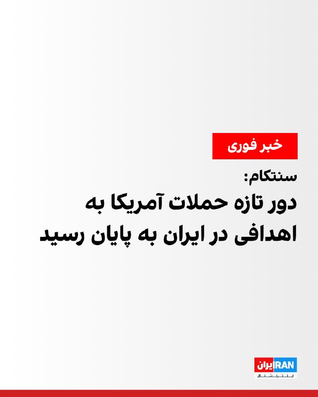

فرماندهی مرکزی ارتش آمریکا (سنتکام) اعلام کرد نیروهای این کشور در ۲۰ خرداد و به دستور رئیس‌جمهور آمریکا، دور تازه‌ای از حملات موسوم به «دفاع از خود» را علیه چند هدف در ایران انجام داده‌اند.

بر اساس بیانیه سنتکام، این حملات توانمندی‌های مراقبتی و شناسایی نظامی، سامانه‌های ارتباطی و سایت‌های پدافند هوایی ایران را در نقاط مختلف هدف قرار داده است.

در این عملیات، یگان‌هایی از نیروی دریایی، نیروی هوایی و تفنگداران دریایی آمریکا با استفاده از مهمات هدایت‌شونده دقیق، اهدافی را که واشینگتن آن‌ها را تهدیدی برای نیروهای آمریکایی و کشتی‌های تجاری در منطقه دانسته، هدف قرار داده‌اند.

سنتکام تأکید کرد این حملات در پاسخ به آنچه «اقدامات تهاجمی و مداوم ایران» خوانده شده، انجام شده و نیروهای آمریکایی همچنان در حالت آماده‌باش کامل قرار دارند.
‌🏁 🇬🇧 IranintlTV

🤖 @VahidOOnLine

## FoxNewsTwitter — post 342834

Fox News (Twitter/X)

Washington’s fiercest rivals are settling things on the baseball field tonight.

The annual Congressional Baseball Game for Charity is underway at Nationals Park, where Republicans are trying to extend their winning streak against Democratic lawmakers.

The game has become one of Congress’ longest-running traditions, raising millions of dollars for charitable causes while temporarily putting politics aside.

At least until the final out.

## pm_afshaa — post 93571

برید بخوابید فرداشب ساعت 12 همین جمع جنگ بعدی

## VahidOnline — post 76187

  <a href="telegram/content/VahidOnline_76187_1781141535.mp4" target="_blank">🎬 Download video</a>

پست سنتکام: نیروهای آمریکا تازه‌ترین حملات در ایران را تکمیل کردند

ترجمه ماشین:
"تامپا، فلوریدا — نیروهای فرماندهی مرکزی آمریکا، سنتکام، روز ۱۰ ژوئن، به دستور فرمانده کل قوا، حملات دفاعیِ بیشتری را علیه چندین هدف در ایران تکمیل کردند.

نیروهای سنتکام حملاتی را علیه توانایی‌های نظارت نظامی ایران، سامانه‌های ارتباطی و سایت‌های پدافند هوایی در سراسر ایران انجام دادند. تجهیزات و نیروهای سپاه تفنگداران دریایی، نیروی هوایی و نیروی دریایی آمریکا مهمات هدایت‌شونده دقیق را به سوی اهداف ایرانی شلیک کردند؛ اهدافی که تهدیدی برای نیروهای آمریکایی و کشتی‌های تجاری بین‌المللی در حال عبور از آب‌های منطقه‌ای محسوب می‌شدند.

این حملات در پاسخ به تجاوز بی‌دلیل و ادامه‌دار ایران انجام شده است. نیروهای آمریکایی همچنان هوشیار، مرگبار و آماده هستند."
CENTCOM

📡 @VahidOnline

## IranIntlTV — post 341609

  

فرماندهی مرکزی ارتش آمریکا (سنتکام) اعلام کرد نیروهای این کشور در ۲۰ خرداد و به دستور رئیس‌جمهور آمریکا، دور تازه‌ای از حملات موسوم به «دفاع از خود» را علیه چند هدف در ایران انجام داده‌اند.

بر اساس بیانیه سنتکام، این حملات توانمندی‌های مراقبتی و شناسایی نظامی، سامانه‌های ارتباطی و سایت‌های پدافند هوایی ایران را در نقاط مختلف هدف قرار داده است.

در این عملیات، یگان‌هایی از نیروی دریایی، نیروی هوایی و تفنگداران دریایی آمریکا با استفاده از مهمات هدایت‌شونده دقیق، اهدافی را که واشینگتن آن‌ها را تهدیدی برای نیروهای آمریکایی و کشتی‌های تجاری در منطقه دانسته، هدف قرار داده‌اند.

سنتکام تأکید کرد این حملات در پاسخ به آنچه «اقدامات تهاجمی و مداوم ایران» خوانده شده، انجام شده و نیروهای آمریکایی همچنان در حالت آماده‌باش کامل قرار دارند.
https://iranintl.com/202606116140

## FarsiVOA — post 220336

  <a href="telegram/content/FarsiVOA_220336_1781141535.mp4" target="_blank">🎬 Download video</a>

⚡️بحران دارو در ایران؛ گفت‌وگو با سینا قنبرپور
@FarsiVOA

## BBCPersian — post 283377

  

‌
ساعتی بعد از حملات بامداد پنجشنبه آمریکا، خبرگزاری‌های رسمی ایران به نقل از ارتش این کشور نوشتند: «ناوگان پنجم آمریکا در بحرین، آماج حملات پهپادی ارتش، قرار گرفت. در این موج از حملات پهپادی ارتش، آنتن‌های ارتباطی و تاسیسات راداری سامانه پاتریوت ناوگان پنجم مورد هدف قرار گرفت.»یییی

همزمان وزارت کشور بحرین در پیامی در شبکه اجتماعی ایکس از ساکنان خواست تا با حفظ آرامش به نزدیک‌ترین مکان امن بروند.

سپاه پاسداران از حمله به« ۱۸ موضع نیروهای آمریکا» در منطقه خبر داده است.

کانال تلگرامی سپاه نیوز نوشت که طی «دو موج عملیاتی ۱۸ هدف مهم» متعلق به ارتش امریکا در پایگاه‌های هوایی «علی السالم» و «احمدالجابر» و همچنین پایگاه‌های هوایی «شیخ عیسی» را هدف قرار داده و منهدم کرده است.

سنتکام به ادعای هدف قرار گرفتن مواضع خود واکنشی نشان نداده است.

📷Reuters
@BBCPersian

---
📅 بروزرسانی: 1405/03/21 04:52
---

## VahidOOnLine — post 244846

  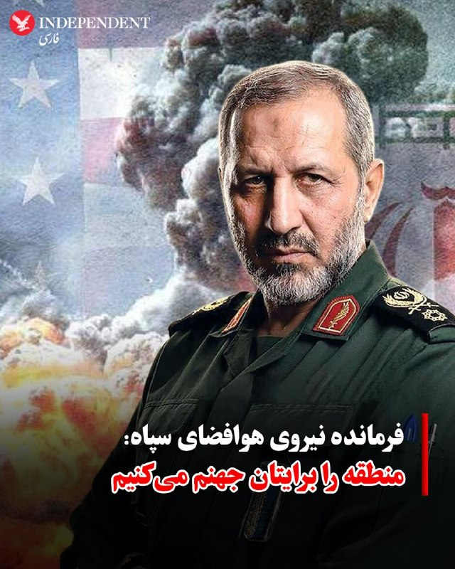

♦️به گزارش مهر، مجید موسوی، فرمانده نیروی هوا فضا سپاه پاسداران در صفحه شخصی خود در شبکه های اجتماعی نوشت: «تنگه مقدس هرمز را ناامن می‌کنید؟! از سراسر ایران منطقه را برایتان جهنم می‌کنیم.»
‌🇸🇦 Indypersian

🤖 @VahidOOnLine

## pm_afshaa — post 93570

  <a href="telegram/content/pm_afshaa_93570_1781140941.webm" target="_blank">🎬 Download video</a>

🔴ویدیو منتشر شده توسط سنتکام از پرتاب موشک تاماهاوک به سمت ایران :

💧 Rainbet.com the #1 Non-KYC Crypto Casino & Sportsbook @rainbetcom

😁 @Pm_Afshaa

## pm_afshaa — post 93569

  <a href="telegram/content/pm_afshaa_93569_1781140941.mp4" target="_blank">🎬 Download video</a>

موج انفجار در شاهین ویلا کرج

💧 Rainbet.com the #1 Non-KYC Crypto Casino & Sportsbook @rainbetcom

😁 @Pm_Afshaa

## FarsiVOA — post 220335

  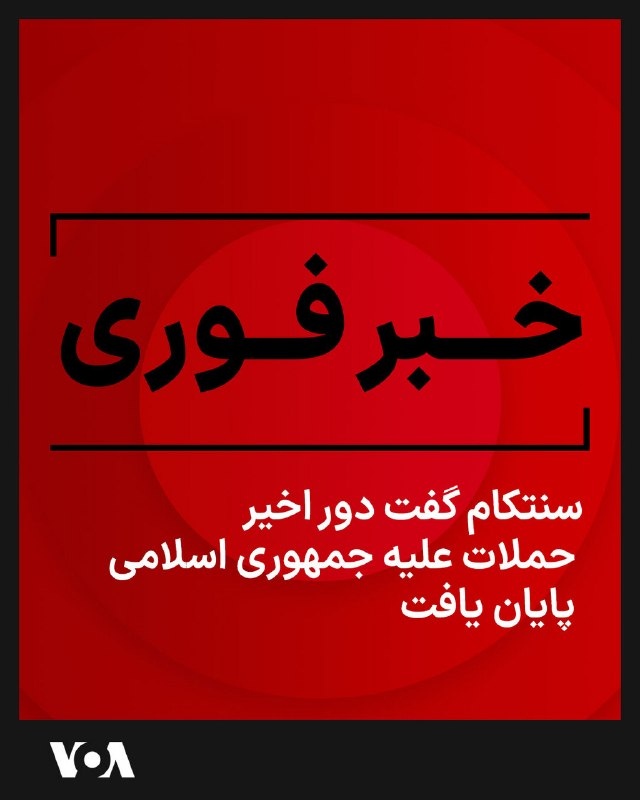

⚡️ ستاد فرماندهی مرکزی ایالات متحده (سنتکام) اعلام کرد دور تازه‌ای از حملات دفاعی به جمهوری اسلامی که عصر چهارشنبه (به وقت واشنگتن) به دستور فرمانده کل قوا علیه جمهوری اسلامی آغاز شده بود، تکمیل شد.

سنتکام در بیانیه‌ای گفت نیروهای آمریکایی حملاتی را علیه قابلیت‌های نظارتی نظامی، سیستم‌های ارتباطی و سایت‌های دفاع هوایی جمهوری اسلامی در سراسر ایران انجام دادند.

طبق این بیانیه، نیروهای تفنگداران دریایی، نیروی هوایی و نیروی دریایی ایالات متحده، مهمات دقیقی را به سمت اهداف در ایران شلیک کردند، اهدافی که «تهدیدی برای نیروهای آمریکایی و کشتی‌های تجاری بین‌المللی در حال عبور از آب‌های منطقه‌ای بود.»

سنتکام افزود: «این حملات در پاسخ به تجاوز بی‌دلیل و مداوم [جمهوری اسلامی] ایران انجام شده است. نیروهای آمریکایی هوشیار، کشنده و آماده هستند.»
@FarsiVOA

## IranianMinds — post 22277

🔴 سنتکام با انتشار این ویدیو از پرتاب موشک‌های کروز تاماهاوک، اعلام کرد به دستور رئیس‌جمهور آمریکا چند حمله «دفاعی» به اهدافی در ایران انجام داده. در این عملیات، تجهیزات شناسایی، سیستم‌های ارتباطی و سامانه‌های پدافندی هدف قرار گرفتن.

این حملات در پاسخ به اقدامات خصمانه ایران علیه نیروهای آمریکایی و کشتی‌های تجاری در منطقه بوده و تأکید کرده نیروهاش همچنان در حالت آماده‌باش کامل هستن.

@IranianMinds

## IranianMinds — post 22276

🔴 سنتکام اعلام کرد عملیات حملات علیه ایران به پایان رسید.

@IranianMinds

---
📅 بروزرسانی: 1405/03/21 04:42
---

## VahidOOnLine — post 244845

♦️تب و التهاب مسابقه نهایی لیگ بسکتبال «ان‌بی‌ای» (NBA) بین دو تیم نیویورک نیکس و سن‌آنتونیو اسپرز به اوج خود رسیده و شهر نیویورک را در وضعیت آماده‌باش قرار داده است. نیکس که پس از ۲۷ سال بار دیگر به مسابقه نهایی NBA راه یافته، امشب در بازی چهارم فینال به مصاف سن‌آنتونیو اسپرز می‌رود؛ دیداری حساس که پس از شکست ۱۱۵ بر ۱۱۱ نیکس در بازی سوم برگزار می‌شود. با این حال، نیکس همچنان با برتری ۲ بر ۱ در مجموع سری، شرایط بهتری نسبت به حریف دارد و در صورت قهرمانی می‌تواند به انتظار ۵۳ ساله هوادارانش پایان دهد.
شهردار نیویورک اعلام کرده است برای تماشای این مسابقه نهایی، نمایشگرهای بزرگی در پارک‌های شهر نصب شده و بین ۵۰۰ تا ۹۹۰ هزار هوادار می‌توانند بازی را به صورت عمومی دنبال کنند. از ساعات ابتدایی روز نیز خیابان‌های اطراف مدیسن اسکوئر گاردن مملو از هواداران نیکس بوده است.
همزمان پلیس نیویورک تدابیر امنیتی گسترده‌ای را در اطراف ورزشگاه به اجرا گذاشته است. موانع امنیتی، ایست‌های بازرسی، کنترل تردد و محدودیت‌های ترافیکی در خیابان‌های منتهی به مدیسن اسکوئر گاردن برقرار شده و بخشی از خیابان‌های مرکزی منهتن تحت کنترل نیروهای پلیس قرار گرفته‌اند.
این تدابیر پس از آن تشدید شد که در روزهای گذشته و همزمان با برگزاری مسابقات این سری، درگیری‌هایی میان برخی هواداران در سطح شهر رخ داد و شماری از پارک‌ها و فضاهای عمومی شاهد خسارت و ناآرامی بودند. مقام‌های شهری نگران تکرار این حوادث پس از پایان مسابقه امشب هستند.
‌🇸🇦 Indypersian

🤖 @VahidOOnLine

## VahidOOnLine — post 244844

  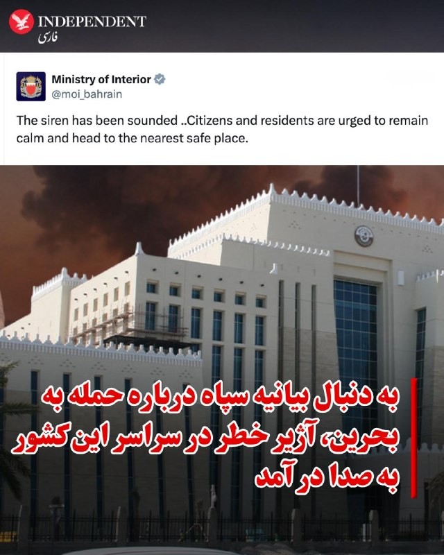

♦️وزارت کشور بحرین بامداد پنجشنبه ۲۱ خردادماه اعلام کرد آژیر هشدار در سراسر این کشور به صدا درآمده است و از شهروندان و ساکنان خواست آرامش خود را حفظ کرده و به نزدیک‌ترین مکان امن مراجعه کنند.

این هشدار پس از آن صادر شد که سپاه پاسداران اعلام کرد در واکنش به حملات بامداد پنجشنبه آمریکا، طی دو موج عملیاتی اهدافی متعلق به ارتش آمریکا در پایگاه‌های علی السالم و احمد الجابر در کویت و پایگاه شیخ عیسی در بحرین را هدف قرار داده است.
‌🇸🇦 Indypersian

🤖 @VahidOOnLine

## WithYashar — post 14484

سنتکام: نیروهای فرماندهی مرکزی ایالات متحده (CENTCOM) حملات دفاع شخصی بیشتری را علیه اهداف متعدد در ایران در 10 ژوئن به دستور فرمانده کل انجام دادند.

نیروهای سنتکام حملاتی را به قابلیت‌های نظارتی نظامی، سیستم‌های ارتباطی و سایت‌های دفاع هوایی ایران در سراسر ایران انجام دادند. نیروهای تفنگداران دریایی، نیروی هوایی و نیروی دریایی ایالات متحده، مهمات دقیقی را به سمت اهداف ایرانی شلیک کردند که تهدیدی برای نیروهای آمریکایی و کشتی های تجاری بین المللی در حال عبور از آب های منطقه بود.

این حملات در پاسخ به تجاوزات بی مورد و ادامه دار ایران است. نیروهای آمریکایی هوشیار، کشنده و آماده هستند.
@withyashar

## WithYashar — post 14483

## WithYashar — post 14482

صداوسیما: انفجارهای مهیب در اطراف استان البرز، هشتگرد و نظرآباد در کرج.
@withyashar

## pm_afshaa — post 93568

  <a href="telegram/content/pm_afshaa_93568_1781140347.webm" target="_blank">🎬 Download video</a>

🔴سنتکام:

نیروهای فرماندهی مرکزی ایالات متحده (CENTCOM) حملات دفاع شخصی بیشتری را علیه اهداف متعدد در ایران در 10 ژوئن به دستور فرمانده کل انجام دادند.

نیروهای سنتکام حملاتی را به قابلیت‌های نظارتی نظامی، سیستم‌های ارتباطی و سایت‌های دفاع هوایی ایران در سراسر ایران انجام دادند. نیروهای تفنگداران دریایی، نیروی هوایی و نیروی دریایی ایالات متحده، مهمات دقیقی را به سمت اهداف ایرانی شلیک کردند که تهدیدی برای نیروهای آمریکایی و کشتی های تجاری بین المللی در حال عبور از آب های منطقه بود.

این حملات در پاسخ به تجاوزات بی مورد و ادامه دار ایران است. نیروهای آمریکایی هوشیار، کشنده و آماده هستند.

💧 Rainbet.com the #1 Non-KYC Crypto Casino & Sportsbook @rainbetcom

😁 @Pm_Afshaa

## mamlekate — post 103675

  

📞 الو اینجا تیپ سپاه هست. بین فرودگاه امام و دریاچه شور قم. توش ماشین ها با آسانسور میرفتن میومدن. به ریل قطار وصله. جنگ عید نزدنش الان زدنش

@mamlekate

## FarsiVOA — post 220334

  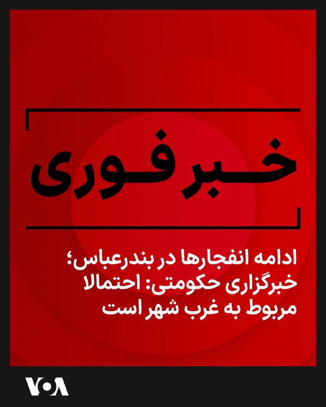

⚡️خبرگزاری حکومتی مهر دقایقی پیش گفت از ادامه انفجارها در بندرعباس خبر داد. طبق این گزارش، این انفجارها احتمالا در مناطقی در غرب شهر بندرعباس است. ایالات متحده مشغول انجام دور دیگری از حملات به مواضع جمهوری اسلامی است.
@FarsiVOA

## FarsiVOA — post 220333

⚡️قطعنامه جدید شورای حکام علیه جمهوری اسلامی ایران
@FarsiVOA

## Persian_Trend_Official — post 16675

  <a href="telegram/content/Persian_Trend_Official_16675_1781140348.webm" target="_blank">🎬 Download video</a>

⭕️ سنتکام پایان حملات ایالات متحده به سراسر ایران را اعلام کرد.

📝 Nick

📌 @persian_trend_official
پرشین ترند | متفاوت‌ترین کانال نظامی

## Persian_Trend_Official — post 16674

  <a href="telegram/content/Persian_Trend_Official_16674_1781140348.webm" target="_blank">🎬 Download video</a>

♨️ گزارش انفجار در بحرین

📝 Nick

📌 @persian_trend_official
پرشین ترند | متفاوت‌ترین کانال نظامی

## IranianMinds — post 22275

  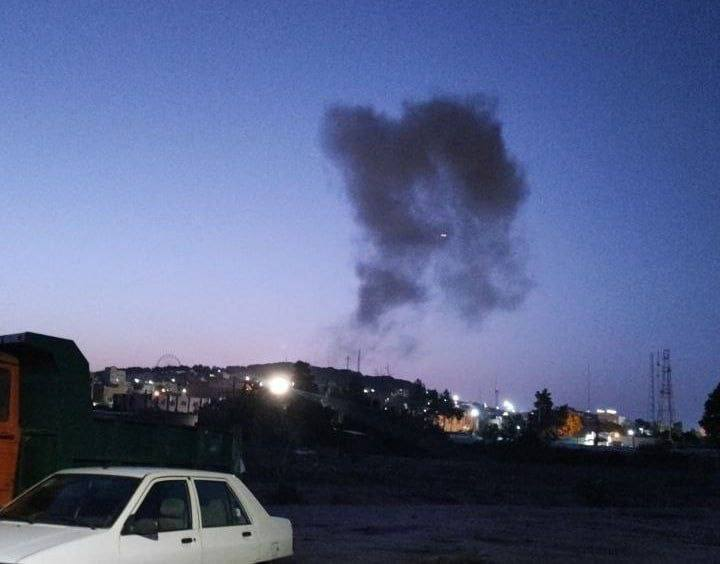

ورامین

@IranianMinds

## IranianMinds — post 22274

🔴 انفجار شدید در جاسک

@IranianMinds

## IranianMinds — post 22273

🔴 سید جقی فرمانده هوا فضای سپاه : تنگه ی مقدس هرمز رو ناامن میکنید ؟ کل‌ منطقه رو براتون تبدیل به جهنم میکنیم. @IranianMinds

## Dirty_Kids — post 391674

🙂همه شنیدید --> ترامپ قمار باز <-- میدونی سرمایه چند صد ملیون دلاری ترامپ از شرط بندی چطور جمع شده 
⁉️ 
✔️من بهت نه چیزی میخوام بفروشم نه پولی ازت میگیرم من بهت پول دراوردن رو رایگان آموزش میدم https://t.me/+lCR7HeYTU15iNjM0 https://t.me/+lCR7HeYTU15iNjM0…

## Dirty_Kids — post 391673

  

🙂همه شنیدید --> ترامپ قمار باز <--

میدونی سرمایه چند صد ملیون دلاری ترامپ از شرط بندی چطور جمع شده 
⁉️

✔️من بهت نه چیزی میخوام بفروشم نه پولی ازت میگیرم من بهت پول دراوردن رو رایگان آموزش میدم

https://t.me/+lCR7HeYTU15iNjM0
https://t.me/+lCR7HeYTU15iNjM0
A20
کافیه تو کانال بالا عضو بشی 
🔥

## Dirty_Kids — post 391672

  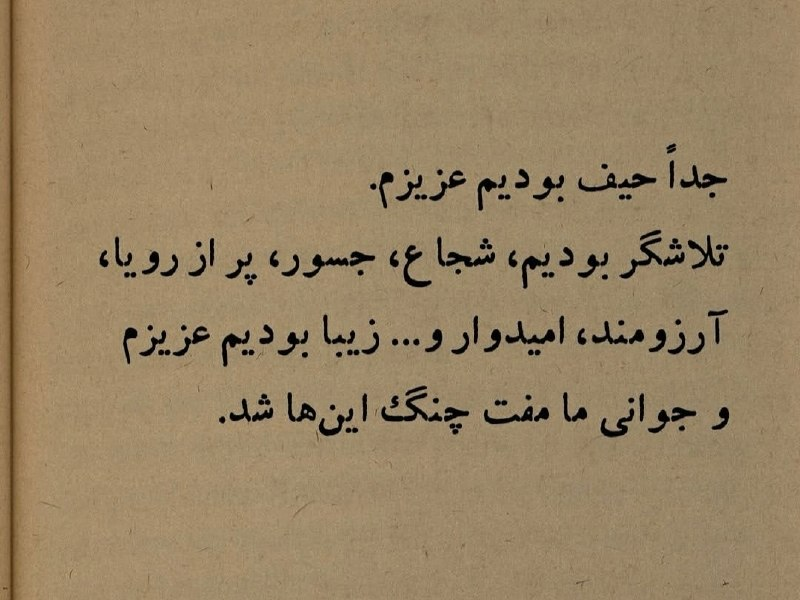

#بخوابیم

@Dirty_Kids 👻

## Dirty_Kids — post 391671

  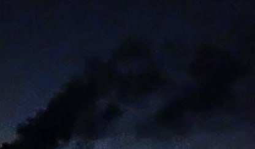

اینجا تیپ سپاه هست بین فرودگاه امام و دریاچه شور قم توش ماشین ها با اسانسور میرفتن میومدن. به ریل قطار وصله. جنگ عید نزدنش الان زدنش

@Dirty_Kids 👻

---
📅 بروزرسانی: 1405/03/21 04:32
---

## VahidOOnLine — post 244843

  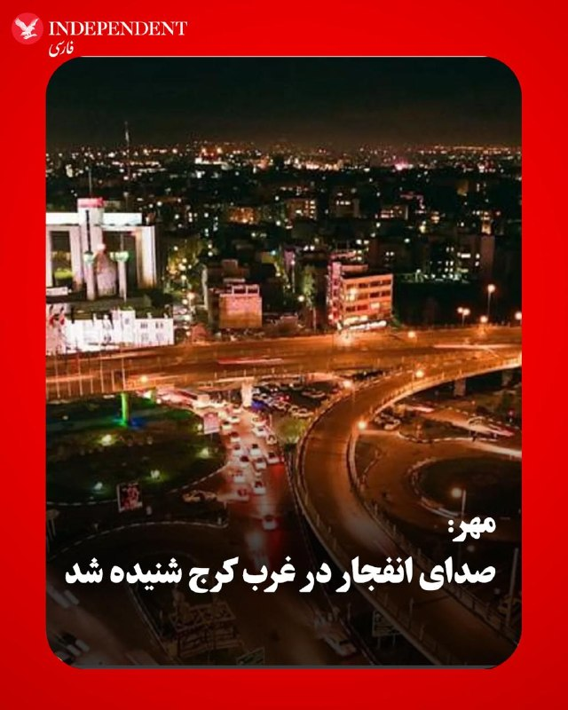

♦️حدود ساعت چهار بامداد پنجشنبه در ایران، خبرگزاری مهر از شنیده شدن صدای انفجار در اشتهارد در غرب استان البرز خبر داد و نوشت صدا در هشتگرد و سهیلیه نیز شنیده شده است.
‌🇸🇦 Indypersian

🤖 @VahidOOnLine

## VahidOOnLine — post 244842

  

رسانه‌های ایران گزارش دادند که انفجارهایی در اطراف استان البرز از جمله هشتگرد، نظرآباد و اشتهارد در غرب و ورامین در جنوب تهران شنیده شده است. همچنین گزارش‌هایی از انفجار در آبیک قزوین منتشر شده است.
‌🏁 🇬🇧 IranintlTV

🤖 @VahidOOnLine

## VahidOOnLine — post 244841

  <a href="telegram/content/VahidOOnLine_244841_1781139770.mp4" target="_blank">🎬 Download video</a>

دونالد ترامپ اعلام کرد جمهوری اسلامی فرصت کافی برای توافق داشت اما از آن استفاده نکرد. هم‌زمان، آمریکا حملات محدودی را در خاک ایران انجام داد. گزارش‌ها حاکی است این حملات با هدف افزایش فشار بر جمهوری اسلامی، بدون بستن کامل مسیر بازگشت به مذاکرات، انجام شده است.
سمیرا قرایی، خبرنگار ایران‌اینترنشنال، گزارش می‌دهد
‌🏁 🇬🇧 IranintlTV

🤖 @VahidOOnLine

## pm_afshaa — post 93567

  <a href="telegram/content/pm_afshaa_93567_1781139772.webm" target="_blank">🎬 Download video</a>

🔴صداوسیما: انفجارهای مهیب در اطراف استان البرز، هشتگرد و نظرآباد در کرج.

💧 Rainbet.com the #1 Non-KYC Crypto Casino & Sportsbook @rainbetcom

😁 @Pm_Afshaa

## pm_afshaa — post 93566

  <a href="telegram/content/pm_afshaa_93566_1781139772.mp4" target="_blank">🎬 Download video</a>

پادگان حصارک کرج

💧 Rainbet.com the #1 Non-KYC Crypto Casino & Sportsbook @rainbetcom

😁 @Pm_Afshaa

## pm_afshaa — post 93565

انفجار در قزوین

## pm_afshaa — post 93563

  <a href="telegram/content/pm_afshaa_93563_1781139774.mp4" target="_blank">🎬 Download video</a>

تصاویری از کرج :

💧 Rainbet.com the #1 Non-KYC Crypto Casino & Sportsbook @rainbetcom

😁 @Pm_Afshaa

## pm_afshaa — post 93562

دقایقی پیش صدای انفجار در کنگان

💧 Rainbet.com the #1 Non-KYC Crypto Casino & Sportsbook @rainbetcom

😁 @Pm_Afshaa

## pm_afshaa — post 93561

  <a href="telegram/content/pm_afshaa_93561_1781139775.webm" target="_blank">🎬 Download video</a>

🔴سید مجید موسوی فرمانده هوافضا سپاه:
تنگه مقدس هرمز رو ناامن می‌کنید؟! از سراسر ایران، منطقه رو برایتان جهنم می‌کنیم.

این پاسخ جسارت آمریکایی‌ها در منطقه است باذن الله.

💧 Rainbet.com the #1 Non-KYC Crypto Casino & Sportsbook @rainbetcom

😁 @Pm_Afshaa

## kianmeli1 — post 87923

🔴فوری-ریزپرنده ها به هشتگرد حمله کرده اند
https://t.me/kianmeli1

## kianmeli1 — post 87922

🔴فوری-برق و مخابرات بخشی از شهر کرج قطع شده است
https://t.me/kianmeli1

## kianmeli1 — post 87921

🔴فوری-بندر کنگان صدای چندین انفجار ۴:۱۷ صبح
https://t.me/kianmeli1

## IranIntlTV — post 341608

  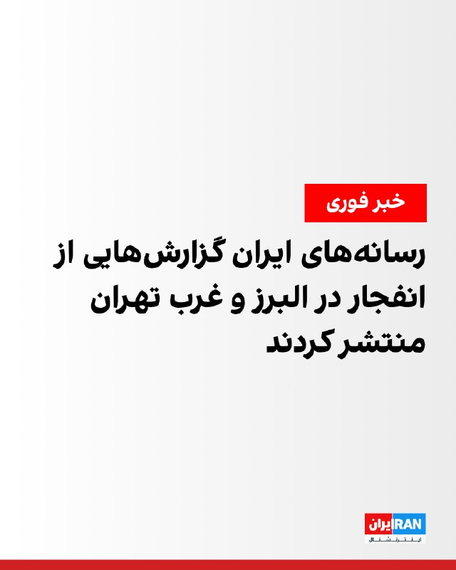

رسانه‌های ایران گزارش دادند که انفجارهایی در اطراف استان البرز از جمله هشتگرد، نظرآباد و اشتهارد در غرب و ورامین در جنوب تهران شنیده شده است. همچنین گزارش‌هایی از انفجار در آبیک قزوین منتشر شده است.
https://iranintl.com/202606114616

## IranIntlTV — post 341607

  <a href="telegram/content/IranIntlTV_341607_1781139776.mp4" target="_blank">🎬 Download video</a>

دونالد ترامپ اعلام کرد جمهوری اسلامی فرصت کافی برای توافق داشت اما از آن استفاده نکرد. هم‌زمان، آمریکا حملات محدودی را در خاک ایران انجام داد. گزارش‌ها حاکی است این حملات با هدف افزایش فشار بر جمهوری اسلامی، بدون بستن کامل مسیر بازگشت به مذاکرات، انجام شده است.
سمیرا قرایی، خبرنگار ایران‌اینترنشنال، گزارش می‌دهد

## FarsiVOA — post 220332

  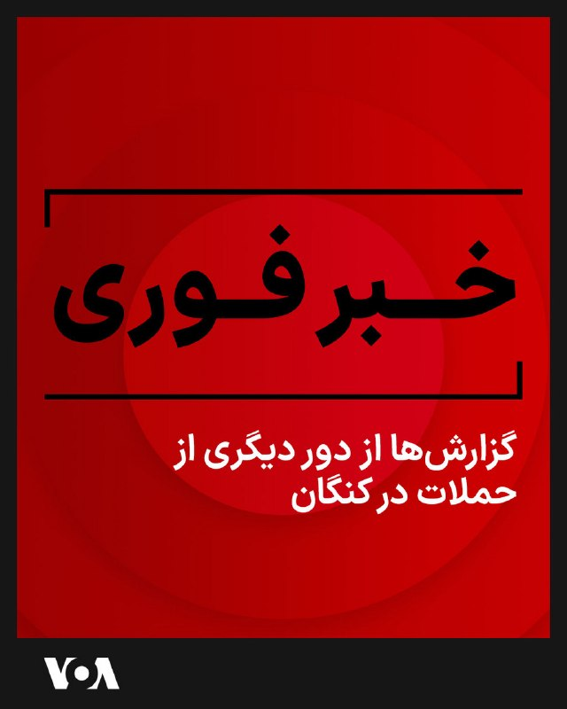

⚡️با ادامه حملات ایالات متحده به مواضع جمهوری اسلامی، دور دیگری از حملات در کنگان گزارش شد. به گزارش کانال تلگرامی وحیدآنلاین، صدای انفجار در کنگان، استان بوشهر، در حدود ساعت ۴:۱۷ دقیقه بامداد پنج‌شنبه شنیده شد.
@FarsiVOA

## Persian_Trend_Official — post 16673

⭕️ صداوسیما: انفجارهای مهیب در اطراف استان البرز، هشتگرد و نظرآباد در کرج.

📝 Nick

📌 @persian_trend_official
پرشین ترند | متفاوت‌ترین کانال نظامی

## Persian_Trend_Official — post 16671

  <a href="telegram/content/Persian_Trend_Official_16671_1781139778.mp4" target="_blank">🎬 Download video</a>

گزارشات از هدف قرار گرفتن پادگان‌ حصارک

📝 Nick

📌 @persian_trend_official
پرشین ترند | متفاوت‌ترین کانال نظامی

## IranianMinds — post 22272

🔴 هشتگرد با پهپاد هدف قرار گرفته شده !

@IranianMinds

## IranianMinds — post 22271

  <a href="telegram/content/IranianMinds_22271_1781139780.mp4" target="_blank">🎬 Download video</a>

ویدیویی از حملات هوایی به کرج

@IranianMinds

## Dirty_Kids — post 391670

  <a href="telegram/content/Dirty_Kids_391670_1781139781.mp4" target="_blank">🎬 Download video</a>

حالا که بیدار موندید اینو گوش کنید کل آمار منطقه میاد دستتون

گلمراد قیصی اتاق طبر
اولین تحلیلگر جنگی در تاریخ که تمام سوالارو از ما میپرسه

@Dirty_Kids 👻

---
📅 بروزرسانی: 1405/03/21 04:22
---

## VahidOOnLine — post 244840

  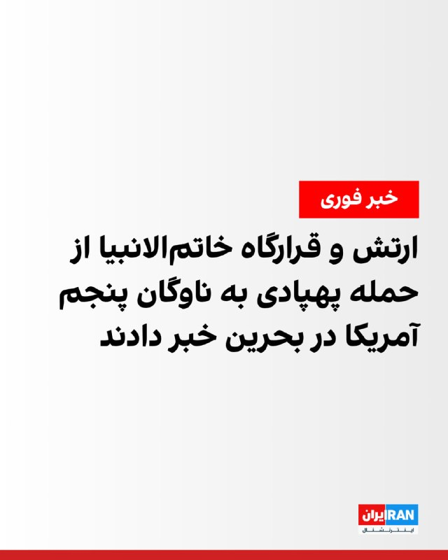

رسانه‌های ایرانی و روابط عمومی ارتش جمهوری اسلامی اعلام کردند در پی حملات آمریکا به جنوب ایران، ارتش با پهپادها ناوگان پنجم آمریکا در بحرین را هدف قرار داده است. در این بیانیه‌ها آمده است آنتن‌های ارتباطی و تاسیسات راداری سامانه پاتریوت هدف قرار گرفته‌اند. قرارگاه مرکزی خاتم‌الانبیا نیز اعلام کرد توقف حملات آمریکا نتیجه پاسخ نظامی ایران بوده و این پاسخ ادامه خواهد داشت. iranintl
‌🏁 🇬🇧 IranintlTV

🤖 @VahidOOnLine

## WithYashar — post 14481

  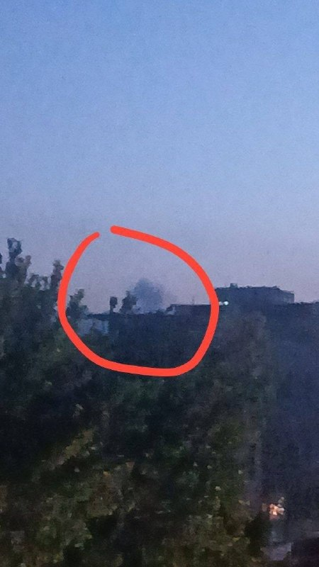

کرج
@withyashar

## WithYashar — post 14480

https://t.me/boost/withyashar

## WithYashar — post 14477

کرج
@withyashar

## pm_afshaa — post 93560

  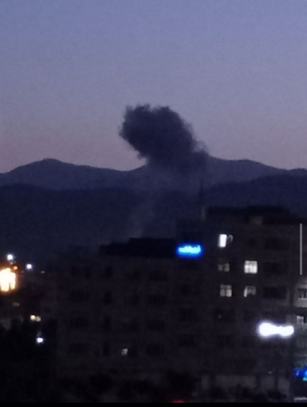

کرج

💧 Rainbet.com the #1 Non-KYC Crypto Casino & Sportsbook @rainbetcom

😁 @Pm_Afshaa

## pm_afshaa — post 93559

  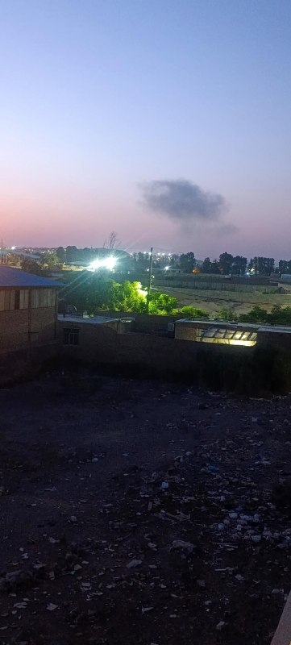

ورامین الان

💧 Rainbet.com the #1 Non-KYC Crypto Casino & Sportsbook @rainbetcom

😁 @Pm_Afshaa

## pm_afshaa — post 93558

  <a href="telegram/content/pm_afshaa_93558_1781139153.webm" target="_blank">🎬 Download video</a>

🔴طبق گزارش‌ها، تاسیسات موشکی بیدگنه کرج بمباران شده.

💧 Rainbet.com the #1 Non-KYC Crypto Casino & Sportsbook @rainbetcom

😁 @Pm_Afshaa

## pm_afshaa — post 93557

  <a href="telegram/content/pm_afshaa_93557_1781139153.mp4" target="_blank">🎬 Download video</a>

ویدویی از انفجار در کرج

💧 Rainbet.com the #1 Non-KYC Crypto Casino & Sportsbook @rainbetcom

😁 @Pm_Afshaa

## pm_afshaa — post 93556

ورامین صدای انفجار

## pm_afshaa — post 93555

کرج همچنان دارن میزنن

## pm_afshaa — post 93554

  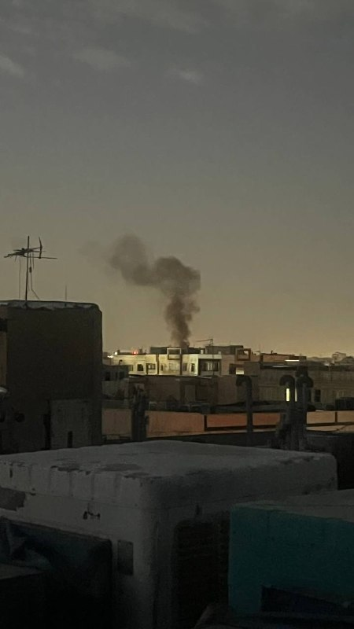

کرج الان

💧 Rainbet.com the #1 Non-KYC Crypto Casino & Sportsbook @rainbetcom

😁 @Pm_Afshaa

## pm_afshaa — post 93553

تهران نمیاید؟

## pm_afshaa — post 93552

دو انفجار شدید و جدید در کرج

## pm_afshaa — post 93551

میگن پارچین هم زدن صدای انفجار اومده

## VahidOnline — post 76186

پیام‌های دریافتی:

درود صدای انفجار در شهر کنگان ۴:۱۷

شهر کنگان صدای انفجار

کنگانو زدن ۴:۱۸

سلام شهر کنگان در جنوب کشور صدای انفجار

کنگان رو زدن

سلام.
کنگانوووو زدن

📡 @VahidOnline

## VahidOnline — post 76185

یک صدای دیگه از کرج همین الان ساعت ۴:۱۰

سلام وحید
یکی دیگه الان

همین الان دوباره کرج
ساعت ۴:۱۰، انفجار دوباره

۴ده دیقه کرج کمالشهر

وحید صدا های جدید ساعت ۴ و ۱۰

ساعت ۴:۱۰ یه تک انفجار دیگه گلشهر کرج
صدای انفجار خیلی بلند و طولانی بود

ساعت ٤:١٠ دقيقه باز صداي انفجار هشتگرد شنيده شد

مهرشهر کرج ساعت ۴:۱۰ صدای انفجار

همین الان ۴:۱۰ گلشهر مهرشهر
دوباره صدای انفجار خیلی شدید به همرذه لرزش زمین

سلام وحید جان کرج دوباره صدای انفجار همین الان ۴:۱۱ دقیقه

و کلی پیام مشابه دیگر که نقل نمی‌کنم.

📡 @VahidOnline

## kianmeli1 — post 87920

🔴فوری-تاسیسات موشکی بیدگنه کرج بمباران شده است
https://t.me/kianmeli1

## kianmeli1 — post 87919

🔴فوری_محدوده «سپاه پیشوا ورامین» حداقل دو انفجار
https://t.me/kianmeli1

## IranIntlTV — post 341606

  

رسانه‌های ایرانی و روابط عمومی ارتش جمهوری اسلامی اعلام کردند در پی حملات آمریکا به جنوب ایران، ارتش با پهپادها ناوگان پنجم آمریکا در بحرین را هدف قرار داده است. در این بیانیه‌ها آمده است آنتن‌های ارتباطی و تاسیسات راداری سامانه پاتریوت هدف قرار گرفته‌اند. قرارگاه مرکزی خاتم‌الانبیا نیز اعلام کرد توقف حملات آمریکا نتیجه پاسخ نظامی ایران بوده و این پاسخ ادامه خواهد داشت. iranintl.com/202606116683

## Shin_Persian — post 6918

Shin ✓ @hey_itsmyturn
Thu, 11 Jun 2026 00:48:19 UTC

AA activity over Bushehr, Bushehr Province, #Iran

ترجمه خودکار فارسی

فعالیت پدافند هوایی بر فراز بوشهر، استان بوشهر، #Iran

𝕏 · @shin_persian

## FarsiVOA — post 220331

  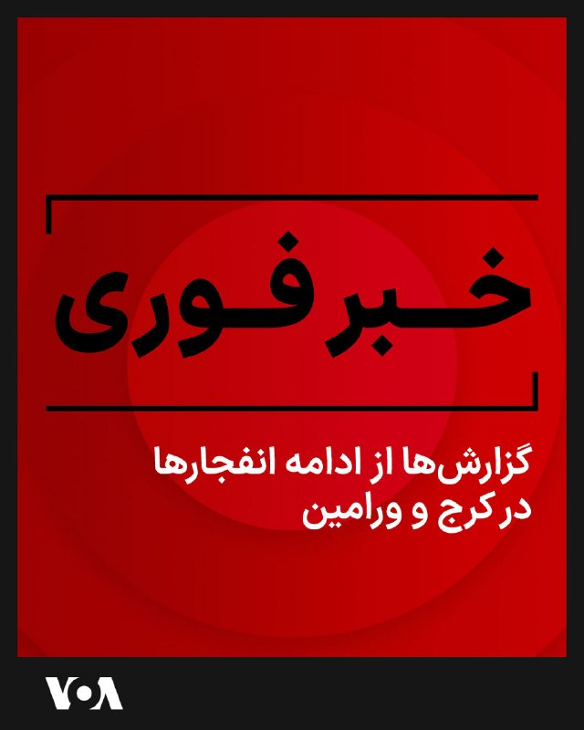

⚡️گزارش‌های تازه مردمی در کانال وحید‌آنلاین از ادامه انفجارها در کرج خبر می‌دهند. همچنین کاربران از شنیده شدن صدای انفجارهای شدید در پیشوای ورامین خبر داده‌اند. دونالد ترامپ گفته است که اگر جمهوری اسلامی توافق نکند، فردا شب هم شدیدا به آن حمله می‌شود.
@FarsiVOA

## FarsiVOA — post 220330

  <a href="telegram/content/FarsiVOA_220330_1781139156.mp4" target="_blank">🎬 Download video</a>

⚡️ویدیوی منتسب به انفجار در اطراف فرودگاه پیام کرج - پنج شنبه ۲۱ خرداد ۱۴۰۵
@FarsiVOA

## Persian_Trend_Official — post 16670

  <a href="telegram/content/Persian_Trend_Official_16670_1781139157.webm" target="_blank">🎬 Download video</a>

💢 موسوی: تنگه مقدس هرمز را ناامن می‌کنید؟! منطقه را برایتان جهنم می‌کنیم.

💢متن پیام به این شرح است:

💢تنگه مقدس هرمز را ناامن می‌کنید؟! از سراسر ایران منطقه را برایتان جهنم می‌کنیم.

💢این پاسخ جسارت آمریکایی‌ها در منطقه است باذن الله.

📝 Nick

📌 @persian_trend_official
پرشین ترند | متفاوت‌ترین کانال نظامی

## Persian_Trend_Official — post 16669

حملات به تاسیسات موشکی بیدگنه انجام شده

## Persian_Trend_Official — post 16668

  <a href="telegram/content/Persian_Trend_Official_16668_1781139157.mp4" target="_blank">🎬 Download video</a>

کرج

## Persian_Trend_Official — post 16667

🚨 صداوسیما: هم اکنون؛ شنیده شدن صدای دو انفجار در بندرعباس

📝 Nick

📌 @persian_trend_official
پرشین ترند | متفاوت‌ترین کانال نظامی

## Persian_Trend_Official — post 16666

⭕️ دو انفجار شدید و جدید در کرج 📝 Nick 📌 @persian_trend_official پرشین ترند | متفاوت‌ترین کانال نظامی

## Persian_Trend_Official — post 16665

  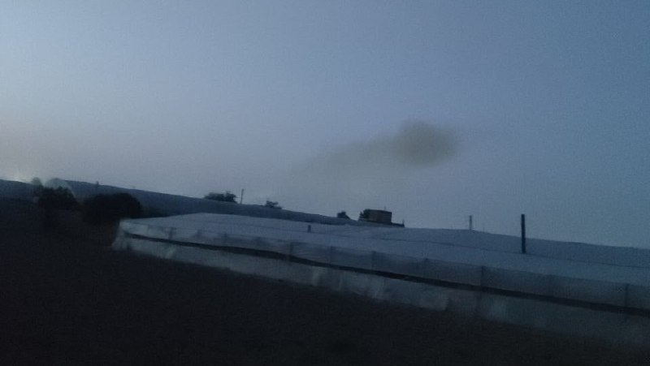

ورامین انفجار گزارش شده

## Persian_Trend_Official — post 16664

ورامین انفجار گزارش شده

## Persian_Trend_Official — post 16663

⭕️ دو انفجار شدید و جدید در کرج

📝 Nick

📌 @persian_trend_official
پرشین ترند | متفاوت‌ترین کانال نظامی

## IranianMinds — post 22270

  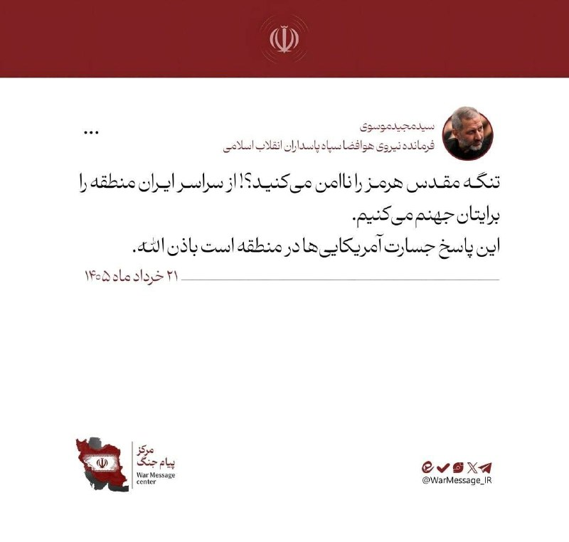

🔴 سید جقی فرمانده هوا فضای سپاه :

تنگه ی مقدس هرمز رو ناامن میکنید ؟ کل‌ منطقه رو براتون تبدیل به جهنم میکنیم.

@IranianMinds

## IranianMinds — post 22269

🔴 انفجار در ورامین

@IranianMinds

## IranianMinds — post 22268

  <a href="telegram/content/IranianMinds_22268_1781139160.mp4" target="_blank">🎬 Download video</a>

🔴کرج.

@IranianMinds

## IranianMinds — post 22267

  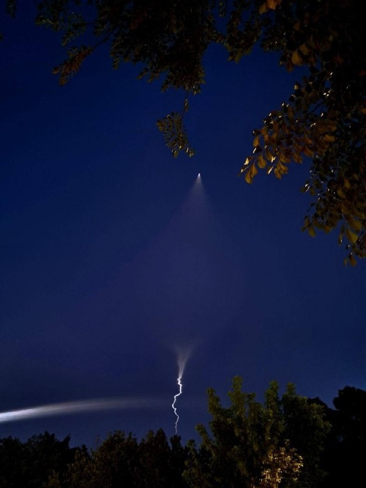

شلیک موشک از ملایر

@IranianMinds

## BBCPersian — post 283376

⚡️گزارش‌ها از شنیدن صدای انفجار در حوالی کرج

ساکنان کرج از شنیدن صدای انفجار در مناطق اطراف این شهر مجاور پایتخت خبر می‌دهند.

دقایقی پیش تعدادی از شهروندان ساکن مناطق مختلف کرج با ارسال پیام برای وحیدآنلاین، از شنیدن دست کم دو انفجار خبر دادند.

برخی از گزارش‌ها هم حاکی از انفجارهایی در ورامین در جنوب تهران است.

دونالد ترامپ ساعتی پیش در گفت‌وگو با فاکس نیوز از حمله به اهدافی در عمق خاک ایران و چند کیلومتری تهران خبر داده و گفته بود از موشک‌های تاماهاک در حمله بامداد پنجشنبه استفاده شده است.

https://bbc.in/4fIJPot
@BBCPersian

## BBCPersian — post 283375

  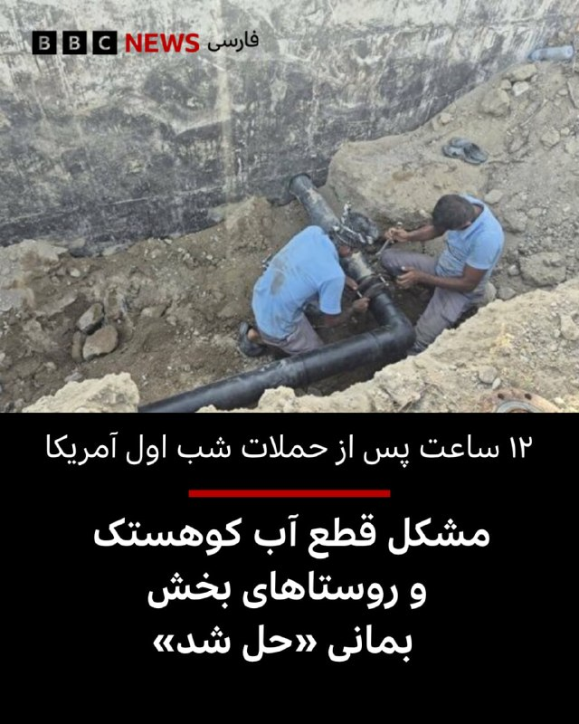

یگاه اطلاع رسانی وزارت نیرو ایران اعلام کرد که پس از حملات آمریکا به مخازن ذخیره آب در شهر کوهستک و بخش بمانی شهرستان سیریک با تلاش نیروهای آبفای، «روند آبرسانی به این مناطق پایدار شد.»

عبدالحمید حمزه‌پور، مدیرعامل آب و فاضلاب استان هرمزگان هم از رفع مشکل قطع آب آشامیدنی روستاهای سیریک خبر داده است.

به گفته این مقام محلی بعد از حدود ۱۲ ساعت از قطع آب که بر اثر حملات هوایی شب گذشته آمریکا به مناطقی در جنوب ایران از جمله سیریک، روی داده بود، ماموران اداره آب توانستند با تعمیر خطوط لوله، آب آشامیدنی شهر کوهستک و روستاهای بخش بمانی را مجددا وصل کنند.

طی حمله هوایی چهارشنبه شب از سوی آمریکا و به گفته شرکت آب و فاضلاب استان هرمزگان ۲ مخزن بتونی ذخیره آب با ظرفیت ۲هزار و ۵۰۰ مترمکعب در بخش بمانی این استان، «هدف اصابت موشک قرار گرفت و به طور کامل از مدار بهره‌برداری خارج شد.»

این مخازن آب شرب شهر کوهستک و ۱۰ روستای اطراف را تامین می‌کرد.

📷iribnews
https://bbc.in/4fIJPot
@BBCPersian

## Dirty_Kids — post 391669

پیشوا صدای دوتا انفجار شدید

ساعت ۴:۶ ورامین
۲ تا صدای انفجار

ساعت ۴:۰۶ صبح پیشوا ورامین صدای دو تا انفجار اومد و مثل اینکه سپاه پیشوا رو زدن

@Dirty_Kids 👻

---
📅 بروزرسانی: 1405/03/21 04:12
---

## VahidOOnLine — post 244839

  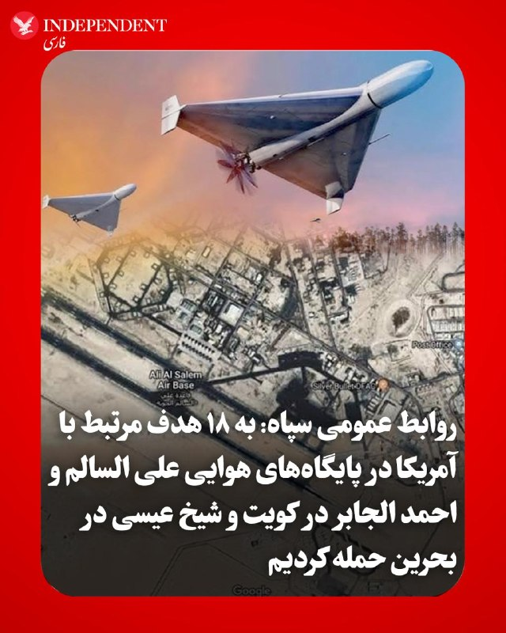

♦️روابط عمومی سپاه اعلام کرد که در واکنش به حمله‌های بامداد پنجشنبه آمریکا به «بعضی از واحدهای خدماتی و پاسگاه های ساحلی سپاه و فرماندهی انتظامی و محوط فرودگاه بندرعباس»، طی دو موج حمله عملیاتی علیه ۱۸ هدف متعلق به ارتش آمریکا در پایگاه‌های هوایی علی السالم (در کویت نزدیکی مرز عراق)، احمد الجابر (کویت) و شیخ عیسی (بحرین) حمله کرده است. هنوز مقامات کویت یا بحرین یا سنتکام در این زمینه اظهارنظر نکرده‌اند.
‌🇸🇦 Indypersian

🤖 @VahidOOnLine

## WithYashar — post 14476

  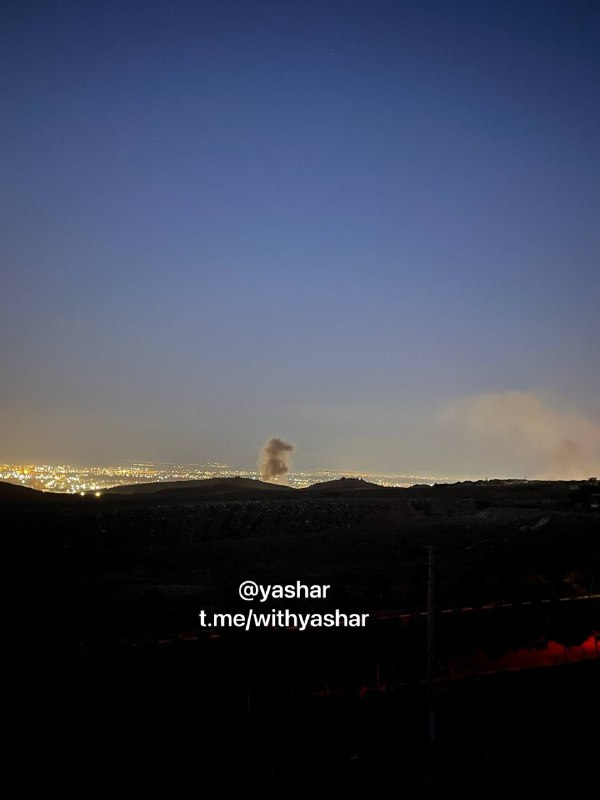

الان کرج
@withyashar

## WithYashar — post 14475

کرج انفجار پشت انفجار
@withyashar

## WithYashar — post 14474

شنیده‌شدن آژیر هشدار و انفجار در بحرین
@withyashar

## WithYashar — post 14473

هم اکنون موج حملات ۳پا به بحرین 🚨
@withyashar

## FoxNewsTwitter — post 342833

  

Fox News (Twitter/X)

“Why are we terrorizing children?”

Children’s entertainer Ms. Rachel is drawing praise from immigration activists — and criticism from supporters of stricter enforcement — after visiting a New Jersey ICE detention facility and speaking with families of detainees.

The YouTube star shared emotional stories from children whose parents had been detained, including one family she says was torn apart by immigration enforcement.

But the Department of Homeland Security pushed back, arguing critics ignore children exploited by smugglers and traffickers and insisting ICE does not separate families.

The clash highlights the growing political battle over immigration enforcement and who pays the price for it.

## pm_afshaa — post 93550

ورامین 2 انفجار گزارش شده

## pm_afshaa — post 93549

بندرعباس و قشم صدای انفجار

💧 Rainbet.com the #1 Non-KYC Crypto Casino & Sportsbook @rainbetcom

😁 @Pm_Afshaa

## pm_afshaa — post 93546

کرج هم‌اکنون :

💧 Rainbet.com the #1 Non-KYC Crypto Casino & Sportsbook @rainbetcom

😁 @Pm_Afshaa

## pm_afshaa — post 93545

هم‌اکنون 5 انفجار در بندرعباس گزارش شده

💧 Rainbet.com the #1 Non-KYC Crypto Casino & Sportsbook @rainbetcom

😁 @Pm_Afshaa

## pm_afshaa — post 93544

  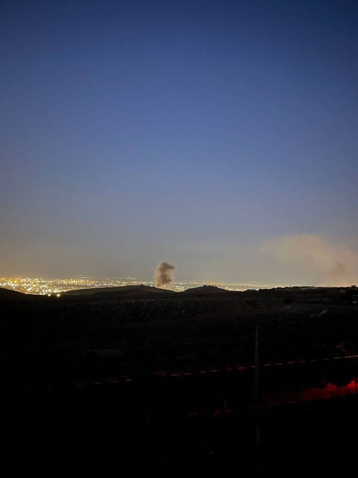

ستون دود در کرج هم‌اکنون :

💧 Rainbet.com the #1 Non-KYC Crypto Casino & Sportsbook @rainbetcom

😁 @Pm_Afshaa

## pm_afshaa — post 93543

انفجار در اشتهارد گزارش شده

💧 Rainbet.com the #1 Non-KYC Crypto Casino & Sportsbook @rainbetcom

😁 @Pm_Afshaa

## pm_afshaa — post 93542

بیش از 15 انفجار در کرج

💧 Rainbet.com the #1 Non-KYC Crypto Casino & Sportsbook @rainbetcom

😁 @Pm_Afshaa

## pm_afshaa — post 93541

آژیر خطر حمله در بحرین فعال شد

💧 Rainbet.com the #1 Non-KYC Crypto Casino & Sportsbook @rainbetcom

😁 @Pm_Afshaa

## mamlekate — post 103674

📝 دوتا انفجار دیگه بندرعباس ساعت ۴:۰۶ دوتا انفجار شد ۶ تا، ۴:۰۸ شیشه خونه لرزید واقعا

📝 پیشوا ورامین رو چند دقیقه پیش زد

## mamlekate — post 103673

  <a href="telegram/content/mamlekate_103673_1781138532.mp4" target="_blank">🎬 Download video</a>

📝 محمدشهر کرج از ساعت۳:۴۵ بالای ده تا انفجار داشتیم. بعضیاش واقعا خونه میلرزه

📝 اوه اوه یا خدا راس ۴:۰۰ انفجار بی نهایت وحشتناک مهرشهر فاز ۳. قطعا موشک. هیچ جنگنده ای در کار نیست.

## VahidOnline — post 76184

سلام از پیشوا صدای دوتا انفجار شدید

ساعت 4:۰۶ ورامین
۲ تا صدای انفجار
سلام آقا وحید، ساعت ۴:۰۶ صبح پیشوا ورامین صدای دو تا انفجار اومد و مثل اینکه سپاه پیشوا رو زدن

📡 @VahidOnline

## VahidOnline — post 76183

پیام‌های دریافتی:
سلام وحید جان
بندرعباس همین الان ساعت 4:06 صدای انفجار نسبتا شدیدی اومدی

سلام وحید
بندرعباس رو الان زد
صدای انفجار شدید

صدای انفجار بندرعباس

سلام اقا وحید ۰۱:۰۶ دقیقه بندرعباس الان یه صدای بزرگ انفجار که مرکز شهر شنیده شد
سلام مجدد ٠٤:٠٥ دقيقه بندر دو صداي انفجار اومد
٠٤:٠٧ دو صداي ديگه مجددد بندرعباس

سلام اقا وحید ۰۱:۰۶ دقیقه بندرعباس الان یه صدای بزرگ انفجار که مرکز شهر شنیده شد

بندرعباس همین الان ساعت 4:06 صدای انفجار نسبتا شدیدی اومدی

سلام خوب هستین من بندرعباس زندگی میکنم ساعت 4:6 دقیقه صبح دوتا انفجار مهیب پشت سر همدیگه صداهاش به گوشمون میرسه

داداش وحید بندرعباس همین الان زدن
دوتا انفجار به فاصله یک دقیقه سمت دریا

۴:۰۶ یه انفجار دیگه قشم احساس شد

همین الان بندرعباس چند تا انفجار پشت سر هم شد

📡 @VahidOnline

## kianmeli1 — post 87918

🔴چهارصبح-صدای جنگنده آسمان کرج
https://t.me/kianmeli1

## kianmeli1 — post 87916

🔴فوری-گلشهر کرج شهرک مترو صدای ممتد انفجار-چهارصبح
https://t.me/kianmeli1

## kianmeli1 — post 87915

🔴فوری-چهارصبح
ما هشتگردیم ، از اشتهارد و آبیک ۲۰ تا صدای انفجار اومده تو ۱ ساعت گذشته

محمدشهر کرج چند انفجار مهیب
https://t.me/kianmeli1

## Iliaen — post 4475

ساعت ۰۴:۱۰ صبح پنجشنبه؛ هم‌اکنون موج جدید حملات در چند شهر گزارش می‌شود.

اهداف اغلب در استان قزوین، البرز و بندرعباس هستند، همچنین انفجارها مهیب و “غیر عادی” توصیف می‌شوند.

مکان انفجارها تا لحظه‌ی نگارش این پیام خارج از محدوده شهری (متمرکز بر سایت‌های نظامی، موشکی و پدافند) هستند و صدای جنگنده نیز در نقاط مختلف شنیده می‌شود.

@iliaen

## FarsiVOA — post 220329

  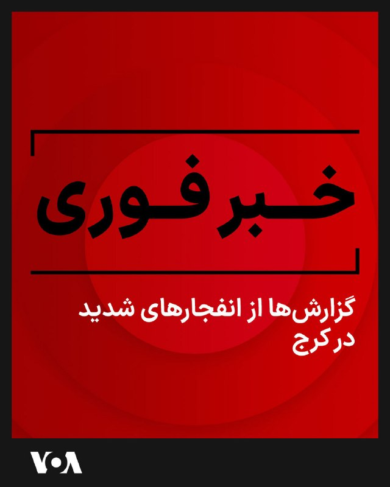

⚡️گزارش‌‌های مردمی و رسانه‌های حکومتی در ایران از وقوع انفجارهای «شدید» خبر داند. برخی از گزارش‌های مردمی منتشر شده در کانال وحیدآنلاین می‌گویند صدای انفجار از سمت «فرودگاه پیام» شنیده شد.
@FarsiVOA

## FarsiVOA — post 220328

  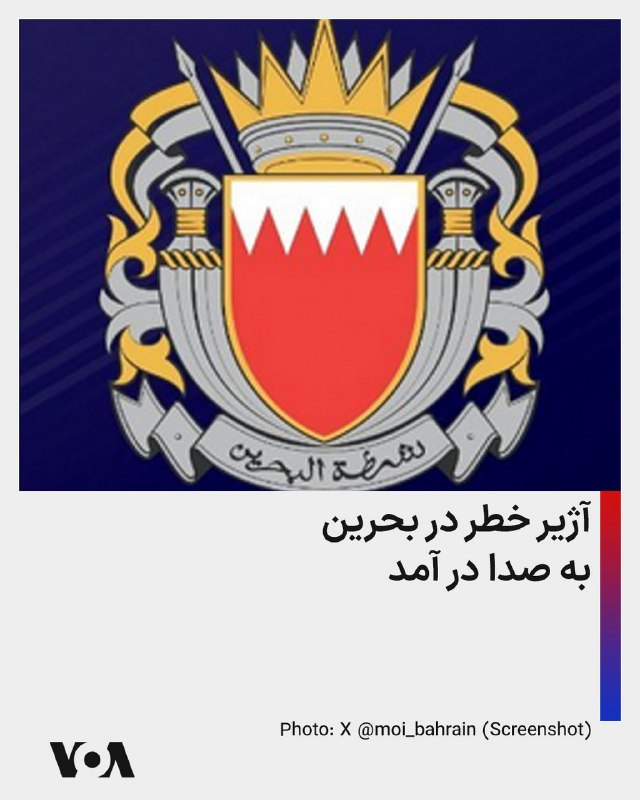

⚡️وزارت کشور بحرین از به صدا درآمدن آژیر خطر حمله هوایی خبر داد. این در حالی است که ایالات متحده مشغول حمله به مواضع جمهوری اسلامی بوده است.
@FarsiVOA

## DW_Farsi — post 125801

  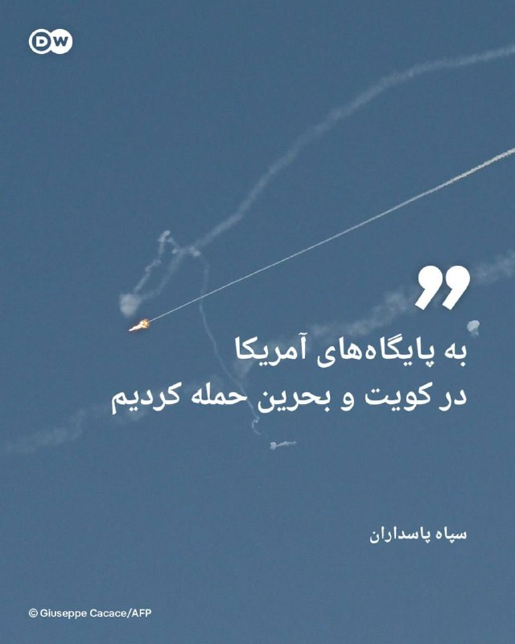

🔶 سپاه: به پایگاه‌های آمریکا در کویت و بحرین حمله کردیم

سپاه پاسداران اعلام کرد در تلافی حملات آمریکا به "بعضی از واحدهای خدماتی و پاسگاه‌های ساحلی سپاه و فرماندهی انتظامی و محوطه فرودگاه بندرعباس" نیروی هوافضای این ارگان نظامی به "۱۸ هدف" متعلق به آمریکا در پایگاه‌های هوایی علی السالم و احمدالجابر در کویت و همچنین پایگاه‌ هوایی شیخ عیسی در بحرین حمله کرده است.

بحرین و کویت هنوز نسبت به این خبر واکنش رسمی نشان نداده‌اند.

@dw_farsi

## DW_Farsi — post 125800

  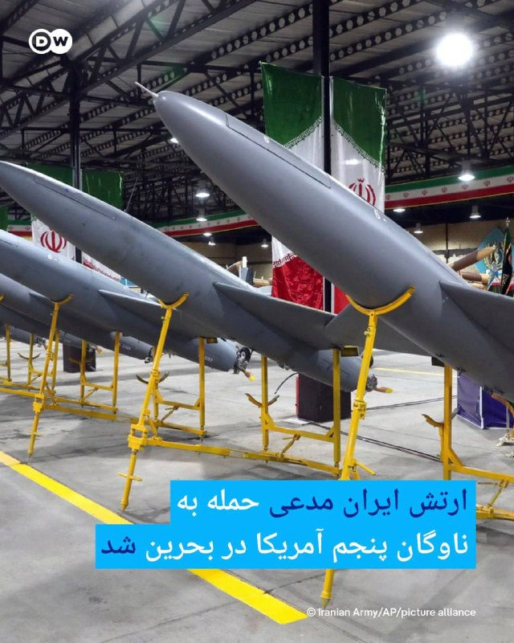

🔶 ارتش ایران مدعی حمله به ناوگان پنجم آمریکا در بحرین شد

ساعاتی پس از حملات ارتش آمریکا به اهدافی در ایران، ارتش جمهوری اسلامی اعلام کرد ناوگان پنجم آمریکا در بحرین را هدف حملات خود قرار داده است.

به گزارش روابط عمومی ارتش ایران، ارتش "با انواع پهپادهای انهدامی، ناوگان پنجم این کشور [آمریکا] در بحرین را آماج حملات پهپادی خود، قرار داد".

بنا بر ادعای ارتش، در این حملات، "آنتن‌های ارتباطی و تاسیسات راداری سامانه پاتریوت ناوگان پنجم" آمریکا هدف حمله قرار گرفتند.

@dw_farsi

## Persian_Trend_Official — post 16662

  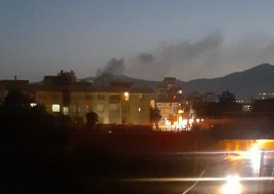

کرج

## Persian_Trend_Official — post 16659

⭕️ هم اکنون کرج:

📝 Nick

📌 @persian_trend_official
پرشین ترند | متفاوت‌ترین کانال نظامی

## Persian_Trend_Official — post 16658

چندین انفجار ممتد در بندرعباس گزارش شده

## Persian_Trend_Official — post 16657

بندرعباس رو دوباره زدن

## Persian_Trend_Official — post 16656

  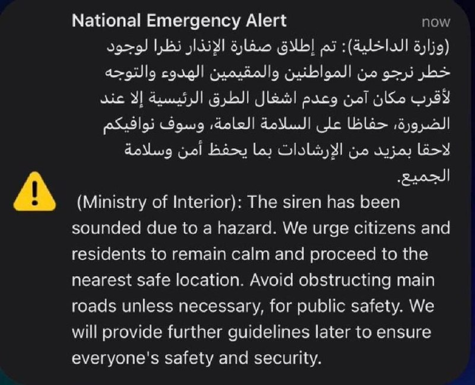

⭕️ وزارت کشور بحرین از به صدا در آمدن آژیرهای هشدار خبر داد.

📝 Nick

📌 @persian_trend_official
پرشین ترند | متفاوت‌ترین کانال نظامی

## Persian_Trend_Official — post 16654

  <a href="telegram/content/Persian_Trend_Official_16654_1781138536.webm" target="_blank">🎬 Download video</a>

🚨 انفجار های ممتد در کرج. 📝 Nick 📌 @persian_trend_official پرشین ترند | متفاوت‌ترین کانال نظامی

## Persian_Trend_Official — post 16653

🚨 اژیر حمله پهپادی و موشکی در بحرین و اربیل

📝 Nick

📌 @persian_trend_official
پرشین ترند | متفاوت‌ترین کانال نظامی

## IranianMinds — post 22266

  

کرج

@IranianMinds

## IranianMinds — post 22265

🔴 انفجار شدید در بندرعباس

@IranianMinds

## IranianMinds — post 22263

🔴 انفجار‌ مجدد در بندرعباس

@IranianMinds

## IranianMinds — post 22260

کرج هم اکنون

@IranianMinds

## IranianMinds — post 22259

🔴 صدای جنگنده زعفرانیه

@IranianMinds

## IranianMinds — post 22258

  

🔴 کرج

@IranianMinds

## IranianMinds — post 22257

ویدیویی دارید دایرکت بفرستین

## Dirty_Kids — post 391668

ساعت ۰۴:۱۰ صبح پنجشنبه؛ هم‌اکنون موج جدید حملات در چند شهر گزارش می‌شود.

اهداف اغلب در استان قزوین، البرز و بندرعباس هستند، همچنین انفجارها مهیب و “غیر عادی” توصیف می‌شوند.

مکان انفجارها تا لحظه‌ی نگارش این پیام خارج از محدوده شهری (متمرکز بر سایت‌های نظامی، موشکی و پدافند) هستند و صدای جنگنده نیز در نقاط مختلف شنیده می‌شود.

@Dirty_Kids 👻

## Dirty_Kids — post 391667

  <a href="telegram/content/Dirty_Kids_391667_1781138537.mp4" target="_blank">🎬 Download video</a>

🔴محمدشهر کرج از ساعت۳:۴۵ بالای ده تا انفجار داشتیم. بعضیاش واقعا خونه میلرزه

🔴اوه اوه یا خدا راس ۴:۰۰ انفجار بی نهایت وحشتناک مهرشهر فاز ۳. قطعا موشک. هیچ جنگنده ای در کار نیست.

@Dirty_Kids 👻

## Dirty_Kids — post 391666

  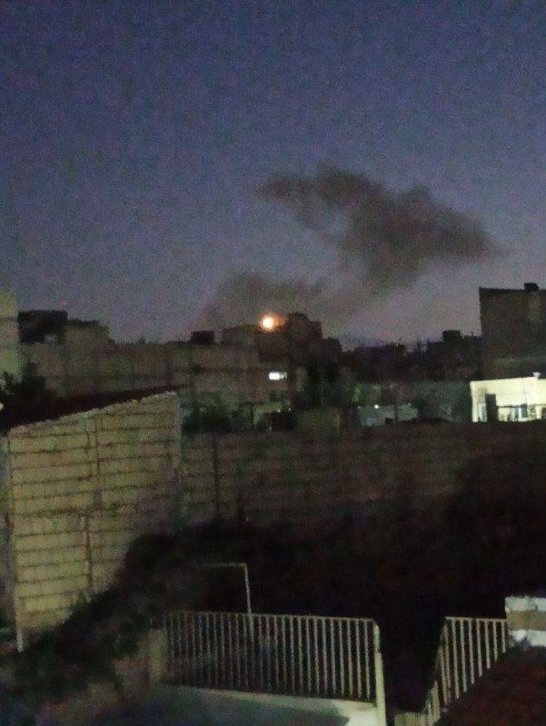

دود ناشی از حمله به نقطه‌ای در کرج؛ ساعت ۴ صبح پنجشنبه ۲۱ خرداد.

@Dirty_Kids 👻

---
📅 بروزرسانی: 1405/03/21 04:02
---

## VahidOOnLine — post 244838

  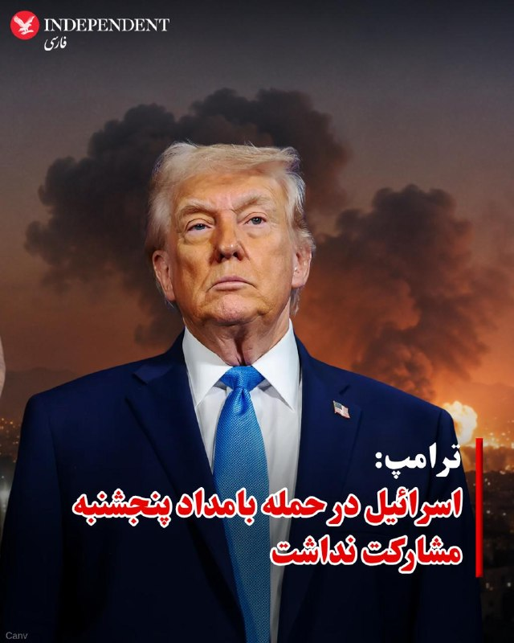

♦️ فاکس نیوز به نقل از ترامپ گزارش داد که اسرائیل در حمله نخستین ساعات بامداد پنجشنبه به اهدافی در جنوب ایران مشارکت نداشت اما به‌طور حتم ارتش اسرائیل در سطح آمادگی بالا قرار دارد. او در عین حال گفت که آمریکا بیش از ۵۰ هزار نیرو در منطقه دارد که بسیاری از آنها در عملیات مشارکت داشتند.
‌🇸🇦 Indypersian

🤖 @VahidOOnLine

## WithYashar — post 14472

امیدوارم کرج هدفمند باشه 🥹✌🏾💥 همه انرژی بدیدددددد

## WithYashar — post 14471

مهر: انفجار در اشتهارد و آبیک
@withyashar

## WithYashar — post 14470

صدای انفجار در فردیس و کمالشهر کرج
@withyashar

## WithYashar — post 14469

## WithYashar — post 14468

چندین انفجار شدید در کرج
@withyashar

## WithYashar — post 14467

قرارگاه مرکزی خاتم‌الانبیا:

توقف حملات آمریکا به مناطقی تو جنوب ایران بنا بر اعلام ترامپ، به دلیل پاسخ قدرتمند و کوبنده نیروهای مسلح جمهوری اسلامی ایرانه که تو این رابطه شکست دیگری بر ارتش آن کشور تحمیل گردید. پاسخ نیروهای مسلح به تجاوز و شرارت های آمریکا ادامه داره.
@withyashar 🤣

## pm_afshaa — post 93540

دوباره صدای انفجار در قزوین و کرج

💧 Rainbet.com the #1 Non-KYC Crypto Casino & Sportsbook @rainbetcom

😁 @Pm_Afshaa

## pm_afshaa — post 93539

صدای انفجار در فردیس و کمالشهر کرج 
💧 Rainbet.com the #1 Non-KYC Crypto Casino & Sportsbook @rainbetcom 
😁 @Pm_Afshaa

## pm_afshaa — post 93537

انفجار سمت فرودگاه پیام کرج

💧 Rainbet.com the #1 Non-KYC Crypto Casino & Sportsbook @rainbetcom

😁 @Pm_Afshaa

## pm_afshaa — post 93536

صدای انفجار در فردیس و کمالشهر کرج

💧 Rainbet.com the #1 Non-KYC Crypto Casino & Sportsbook @rainbetcom

😁 @Pm_Afshaa

## pm_afshaa — post 93535

چندین انفجار پی‌ در پی در کرج

💧 Rainbet.com the #1 Non-KYC Crypto Casino & Sportsbook @rainbetcom

😁 @Pm_Afshaa

## pm_afshaa — post 93534

انفجار کرج شدید بوده

💧 Rainbet.com the #1 Non-KYC Crypto Casino & Sportsbook @rainbetcom

😁 @Pm_Afshaa

## pm_afshaa — post 93533

صدای انفجار مجدد در کرج

💧 Rainbet.com the #1 Non-KYC Crypto Casino & Sportsbook @rainbetcom

😁 @Pm_Afshaa

## pm_afshaa — post 93532

  <a href="telegram/content/pm_afshaa_93532_1781137959.webm" target="_blank">🎬 Download video</a>

🔴قرارگاه مرکزی خاتم‌الانبیا:

توقف حملات آمریکا به مناطقی تو جنوب ایران بنا بر اعلام ترامپ، به دلیل پاسخ قدرتمند و کوبنده نیروهای مسلح جمهوری اسلامی ایرانه که تو این رابطه شکست دیگری بر ارتش آن کشور تحمیل گردید. پاسخ نیروهای مسلح به تجاوز و شرارت های آمریکا ادامه داره.

💧 Rainbet.com the #1 Non-KYC Crypto Casino & Sportsbook @rainbetcom

😁 @Pm_Afshaa

## mamlekate — post 103672

📝 کرج، اطراف فرودگاه پیام، دو انفجار ممتد ساعت ۳:۵۳

📝 سلام ۳:۵۳ کرج صدای انفجار اومد، تقریبا نزدیک بود

📝 کمالشهر کرج صدای انفجار اومد همین الان ۰۳:۵۴

📝 ۳:۵۴ صدای انفجار خیلی بلند تو کرج اومد به حدی خونه لرزید، چنتا پشت سر هم

📝 کرج الان انفجار سوم فرودگاه پیام ۳:۵۵

📝 مهرشهر کرج برخورد ۴ موشک. دوتاش پیام بود. چون هیچ صدای جنگنده ای نیست

📝 همین الان دومین انفجار ملارد ۳:۵۶

📝 الان سمت فردیس سه تا انفجار بلند اومد ساعت ۳:۵۷

@mamlekate_pm

## mamlekate — post 103671

📝 گرمسار سمت کوه کَلَرز رو زدن. قشنگ خونه ما لرزید. ساعت ۰۳:۳۹ تو جنگ ۳۹ روزه هم خیلی زدنش نمیدونم سایت موشکی زیرزمینیه یا نه

@mamlekate

## VahidOnline — post 76182

پیام‌های دریافتی از شنیده شدن صدای انفجار در کرج
آپدیت: شد ۳ انفجار

کرج صدای انفجار 3:53

ساعت ۳:۵۳ کرج انفجار

الان باز صدای موشک اومد
۳:۵۳ وحشتناک بود خیلی بد بود و هنوز صدا میاد

درود کرج ساعت ۳:۵۳ صدای انفجار شدید

کرج شاهین ویلا همین الان یه صدای مهیب انفجار اومد

سلام، همین الان ۳:۵۲ انفجار شدید، کرج، ما باغستانیم خیلی واضح بود

سلام وحید ساعت سه و ۵۳ یه انفجار خیلی شدید ( گلشهر کرج )

۱ موشک دیگه ترکید
وحشتناک لرزیدیم
بازم داره میزنه

وحید سمت ساوجبلاغ ۲تا صدا خفن دوباره اومد

خیلی شدید بود نمیدونم کجاست ولی نظرآباد میلرزه دوتا انفجار شدید فکر کنم آبیک بوده

بازم داره میزنه سمت هشتگردو ساعت۳:۵۵

علاوه بر اون اون پنج تا انفجار قبلی الان صدای دو تا انفجار دیگه اومد ساعت 3:53 آیبلاق

انفجار در کرج سمت فرودگاه پیام

وحید جان من مهرشهر کرجم الان یه صدای انفجار مهیب اومد

سلام نظرابادم
دوتا صدا انفجار وحشتناک اومد از سمت کرج

بازم زدن همین الان۳:۵۵

کرج ۳.۵۴ انفجار شدید

کرج جهانشهر صدای انفجار ۰۳:۵۵

تک انفجار شدید اطراف شهر کرج همین الان ساعت ۳:۵۴ شنیده شد

فردیس کرج هم صدای خیلی بلند اومد و شیشه ها تکون خورد

همین الان فردیس کرج صدای دو انفجار شنیده شد

۳.۵۳ هشتگرد بازم ۴ انفجار دیگه اینبار نزدیک تر بود درای خونه لرزید

سومین انفجار ۳:۵۶

سومین انفجار تو کرج

سه انفجار وحشتناک توی کرج همین الان!

گوهردشت ۳ تا انفجار خیلی بلند شنیدیم

📡 @VahidOnline

## kianmeli1 — post 87914

🔴فوری-انفجار در جزیره خارک ساعت ۴ صبح
https://t.me/kianmeli1

## kianmeli1 — post 87913

🔴فوری-اطراف فرودگاه پیام کرج ۳:۵۶چندین انفجار
https://t.me/kianmeli1

## kianmeli1 — post 87912

🔴فوری-انفجار سنگین در فردیس و کمالشهر کرج ساعت ۳:۵۵
https://t.me/kianmeli1

## Shin_Persian — post 6917

Shin ✓ @hey_itsmyturn
Thu, 11 Jun 2026 00:30:32 UTC

Air raid sirens sounding across Bahrain. Residents urged to take shelter. #Bahrain 🇧🇭

Source: @moi_bahrain
https://x.com/moi_bahrain/status/2064867772140499213

ترجمه خودکار فارسی

آژیرهای حمله هوایی در سراسر بحرین به صدا درآمده‌اند. از ساکنان خواسته شده پناه بگیرند. #Bahrain 🇧🇭

منبع: @moi_bahrain
https://x.com/moi_bahrain/status/2064867772140499213

𝕏 · @shin_persian

## Iliaen — post 4474

ساعت ۰۳:۵۳ صبح پنجنشبه؛ صدای چند انفجار مهیب در اطراف کرج (ماهدشت) و آبیک قزوین شنیده شد.

@iliaen

## FarsiVOA — post 220327

  <a href="telegram/content/FarsiVOA_220327_1781137960.mp4" target="_blank">🎬 Download video</a>

⚡️چرا جمهوری اسلامی ماجراجویی می‌کند؟ گفت‌وگو با علیرضا اردبیلی کارشناس روابط بین الملل
@FarsiVOA

## Persian_Trend_Official — post 16652

🚨 انفجار های ممتد در کرج.

📝 Nick

📌 @persian_trend_official
پرشین ترند | متفاوت‌ترین کانال نظامی

## IranianMinds — post 22256

🔴 حملات موشکی سپاه به بحرین

@IranianMinds

## IranianMinds — post 22255

🔴 حملات و بمباران سنگین کرج توسط ارتش آمریکا

@IranianMinds

## IranianMinds — post 22254

🔴 سه انفجار شدید دیگه در کرج

@IranianMinds

## IranianMinds — post 22253

🔴 انفجار در اطراف فرودگاه کرج

@IranianMinds

## IranianMinds — post 22252

🔴 خبرگزاری تابناک :

انفجار در هشتگرد

@IranianMinds

## IranianMinds — post 22251

🔴 انفجار در سمت فردیس و کمالشهر کرج

@IranianMijds

## IranianMinds — post 22250

🔴 انفجار شدید و مجدد در کرج

@IranianMinds

## IranianMinds — post 22249

🔴 پدافند کرج برای شکار پشه ها فعال شد

@IranianMinds

## IranianMinds — post 22248

🔴 انفجار شدید در‌ کرج

@IranianMinds

## IranianMinds — post 22247

🔴 حملات آمریکا به کرج

@IranianMinds

## Dirty_Kids — post 391665

  <a href="telegram/content/Dirty_Kids_391665_1781137962.webm" target="_blank">🎬 Download video</a>

🔴کرج، اطراف فرودگاه پیام، دو انفجار ممتد ساعت ۳:۵۳

🔴سلام ۳:۵۳ کرج صدای انفجار اومد، تقریبا نزدیک بود

🔴 کمالشهر کرج صدای انفجار اومد همین الان ۰۳:۵۴

🔴 کرج الان انفجار سوم فرودگاه پیام ۳:۵۵

@Dirty_Kids 👻

## Dirty_Kids — post 391664

سپاه:

۱۸ هدف آمریکا را منهدم کردیم 🥴

## Dirty_Kids — post 391663

#گزارش گرمسار سمت کوه کَلَرز رو زدن. قشنگ خونه ما لرزید. ساعت ۰۳:۳۹ تو جنگ ۳۹ روزه هم خیلی زدنش نمیدونم سایت موشکی زیرزمینیه یا نه

---
📅 بروزرسانی: 1405/03/21 03:52
---

## VahidOOnLine — post 244837

  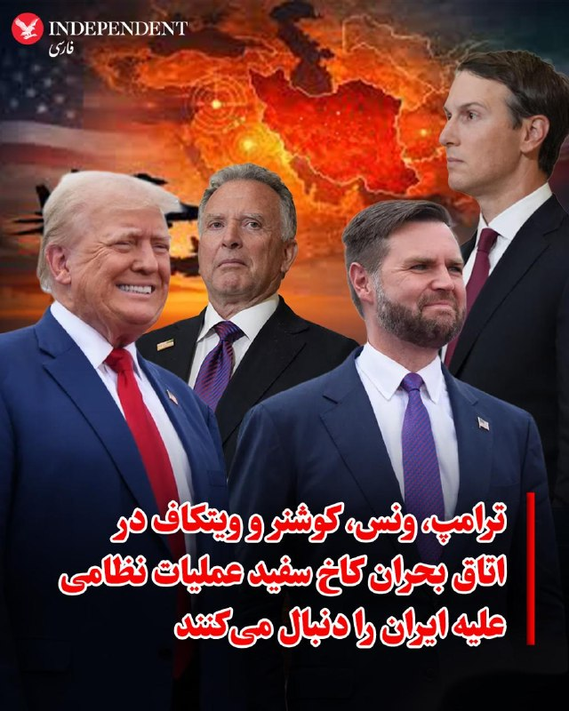

♦️فاکس نیوز گزارش داد که دونالد ترامپ، جی‌دی‌ونس، معاون او و استیو ویتکاف و جرد کوشنر، مذاکره‌کنندگان با تهران از اتاق بحران کاخ سفید عملیات نظامی علیه ایران را دنبال می‌کنند. فاکس گزارش داد که ترامپ می‌گوید حکومت ایران فقط زبان زور را می‌فهمد.
‌🇸🇦 Indypersian

🤖 @VahidOOnLine

## VahidOOnLine — post 244836

  

روزنامه نیویورک تایمز از قول خبرنگار فاکس در تل آویو گزارش داد که دونالد ترامپ، رییس‌جمهوری آمریکا، در تماس تلفنی با او گفته، در حملات اخیر، ایالات متحده ۴۹ موشک تاماهاوک به سوی اهدافی در ایران شلیک کرده و همزمان جنگنده‌های آمریکایی نیز بمباران‌هایی انجام داده‌اند.

بنا به این گزارش، ترامپ افزوده است بمباران‌ها به زودی متوقف می‌شود، اما اگر مقام‌های جمهوری اسلامی در مذاکرات با آمریکا تسلیم نشوند، حملات آمریکا، فردا شب بازهم ادامه خواهد یافت.
‌🏁 🇬🇧 IranintlTV

🤖 @VahidOOnLine

## WithYashar — post 14466

روابط عمومی ۳پا بعد از مصرف:

رزمندگان شجاع نیروی هوافضا و قهرمانان نیروی دریایی سپاه سحرگاه امروز در تنبیه متجاوز و پاسخ به تعرض ارتش کودک کش آمریکا به بعضی از واحدهای خدماتی و پاسگاه های ساحلی سپاه و فرماندهی انتظامی و محوط فرودگاه بندرعباس طی دو موج عملیاتی هجده هدف مهم متعلق به ارتش شرور امریکا در پایگاه های هوایی علی السالم و احمدالجابر و همچنین پایگاه های هوایی شیخ عیسی را مورد اصابت قرار داده و منهدم کردند
@withyashar 🥴

## WithYashar — post 14465

  <a href="telegram/content/WithYashar_14465_1781137360.mp4" target="_blank">🎬 Download video</a>

دست پخت بی بی قالینیاهو
@withyashar

## FoxNewsTwitter — post 342832

  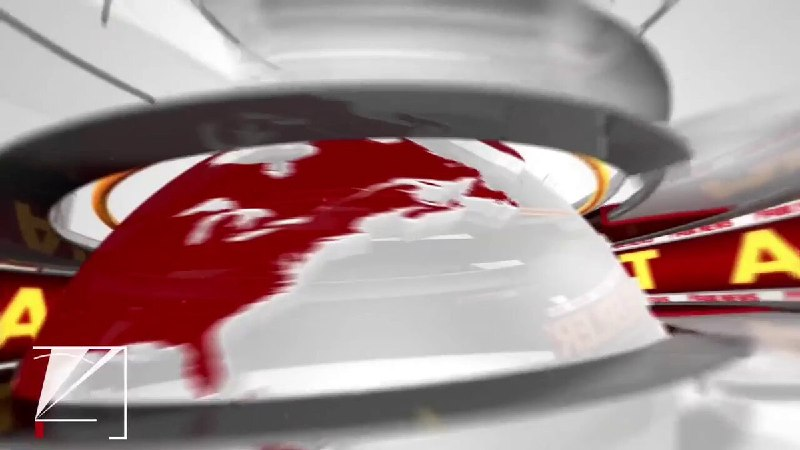

Fox News (Twitter/X)

RT @IngrahamAngle: 🚨 TRUMP'S MESSAGE TO IRAN: SIGN THE DEAL 🚨

@TreyYingst : “I asked him what will happen if the Iranians do not sign an agreement.”

“President Trump said, ‘We'll bomb the S*** out of them tomorrow night.’”

## pm_afshaa — post 93531

  <a href="telegram/content/pm_afshaa_93531_1781137362.webm" target="_blank">🎬 Download video</a>

🔴سپاه: سحرگاه امروز در تنبیه متجاوز و پاسخ به تعرض ارتش آمریکا به بعضی از واحدهای خدماتی و پاسگاه های ساحلی سپاه و فرماندهی انتظامی و محوط فرودگاه بندرعباس، نیروهای هوافضا و دریایی سپاه در جواب حملات آمریکا، تو دو مرحله به 18 هدف مهم آمریکایی در پایگاه‌های علی‌السالم، احمدالجابر و شیخ عیسی رو مورد هدف قرار دادن.

💧 Rainbet.com the #1 Non-KYC Crypto Casino & Sportsbook @rainbetcom

😁 @Pm_Afshaa

## pm_afshaa — post 93530

  <a href="telegram/content/pm_afshaa_93530_1781137363.webm" target="_blank">🎬 Download video</a>

🔴گزارش‌ها از چند انفجار سنگین دیگر همراه با لرزش زمین در آبیک قزوین حکایت داره. محدوده انفجارها در کوه است. 
💧 Rainbet.com the #1 Non-KYC Crypto Casino & Sportsbook @rainbetcom 
😁 @Pm_Afshaa

## pm_afshaa — post 93529

  <a href="telegram/content/pm_afshaa_93529_1781137363.webm" target="_blank">🎬 Download video</a>

🔴ارتش جمهوری اسلامی: با پهباد پایگاه‌ ناوگان پنجم آمریکا تو‌ بحرین رو زدیم.

💧 Rainbet.com the #1 Non-KYC Crypto Casino & Sportsbook @rainbetcom

😁 @Pm_Afshaa

## pm_afshaa — post 93528

  <a href="telegram/content/pm_afshaa_93528_1781137364.webm" target="_blank">🎬 Download video</a>

🔴تسنیم: حمله ایران به برخی پایگاه‌های آمریکایی در منطقه.

💧 Rainbet.com the #1 Non-KYC Crypto Casino & Sportsbook @rainbetcom

😁 @Pm_Afshaa

## VahidOnline — post 76181

پیام دریافتی از شهروندی با سابقه اخبار درست:
"دو انفجار. نیروی دریایی سپاه سیریک"

📡 @VahidOnline

## VahidOnline — post 76180

پست خبرگزاری سپاهی تسنیم:
۱۸ هدف مهم متعلق به ارتش شرور امریکا طی دو موج عملیاتی مورد هدف قرار گرفتند

روابط عمومی سپاه:

فَمَنِ اعْتَدَىٰ عَلَيْكُمْ فَاعْتَدُوا عَلَيْهِ بِمِثْلِ مَا اعْتَدَىٰ عَلَيْكُمْ

رزمندگان شجاع نیروی هوافضا و قهرمانان نیروی دریایی سپاه سحرگاه امروز در تنبیه متجاوز و پاسخ به تعرض ارتش کودک کش آمریکا به بعضی از واحدهای خدماتی و پاسگاه های ساحلی سپاه و فرماندهی انتظامی و محوط فرودگاه بندرعباس طی دو موج عملیاتی هجده هدف مهم متعلق به ارتش شرور امریکا در پایگاه های هوایی علی السالم و احمدالجابر و همچنین پایگاه های هوایی شیخ عیسی را مورد اصابت قرار داده و منهدم کردند

وَمَا النَّصرُ إِلّا مِن عِندِ اللَّهِ العَزيزِ الحَكيمِ

📡 @VahidOnline

## kianmeli1 — post 87911

🔴بر اساس گزارش‌های مردمی دریافتی از هشتگرد، نظرآباد، ساوجبلاغ، اشتهارد، کرج و آبیک قزوین، بامداد ۲۱ خرداد و در بازه زمانی حدود ۳:۲۰ تا ۳:۳۵، صدای چندین انفجار و امواج ناشی از آن در مناطق مختلف شرق البرز و غرب قزوین شنیده شده است.

شاهدان از شنیده شدن ۵ تا ۱۰ انفجار، لرزش ساختمان‌ها و در برخی موارد مشاهده نور انفجار خبر داده‌اند.
https://t.me/kianmeli1

## IranIntlTV — post 341605

  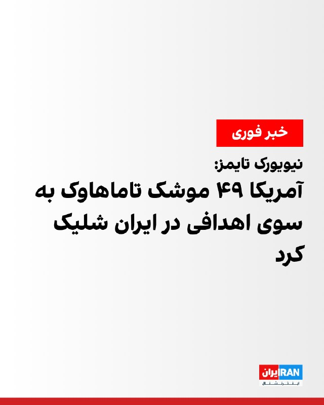

روزنامه نیویورک تایمز از قول خبرنگار فاکس در تل آویو گزارش داد که دونالد ترامپ، رییس‌جمهوری آمریکا، در تماس تلفنی با او گفته، در حملات اخیر، ایالات متحده ۴۹ موشک تاماهاوک به سوی اهدافی در ایران شلیک کرده و همزمان جنگنده‌های آمریکایی نیز بمباران‌هایی انجام داده‌اند.

بنا به این گزارش، ترامپ افزوده است بمباران‌ها به زودی متوقف می‌شود، اما اگر مقام‌های جمهوری اسلامی در مذاکرات با آمریکا تسلیم نشوند، حملات آمریکا، فردا شب بازهم ادامه خواهد یافت.
https://iranintl.com/202606112002

## Shin_Persian — post 6916

Shin ✓ @hey_itsmyturn
Thu, 11 Jun 2026 00:12:10 UTC

Islamic Regime's army claim they've targeted the U.S. 5th Fleet in Bahrain by drones.

ترجمه خودکار فارسی

ارتش رژیم اسلامی ادعا می‌کند که ناوگان پنجم ایالات متحده در بحرین را توسط پهپادها هدف قرار داده است.

𝕏 · @shin_persian

## FarsiVOA — post 220326

  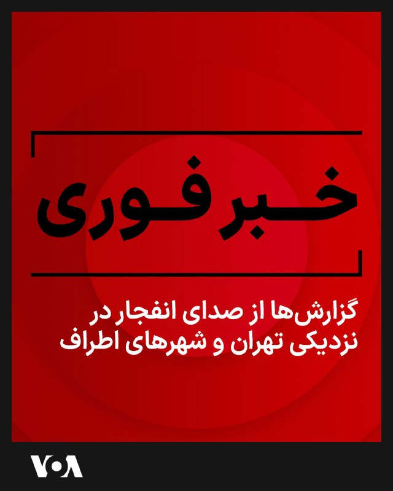

طبق گزارش‌های مردمی دریافتی کانال تلگرامی وحید آنلاین از مناطق غرب استان البرز و شرق استان قزوین، از حدود ساعت ۳:۲۰ تا ۳:۴۵ بامداد ۲۱ خرداد، صدای چندین انفجار و عبور احتمالی موشک در مناطقی از هشتگرد، نظرآباد، سهیلیه، اشتهارد، ساوجبلاغ و آبیک شنیده شده است.

شاهدان محلی از وقوع دست‌کم ۵ تا ۱۰ انفجار در فواصل کوتاه زمانی خبر داده‌اند و برخی نیز مشاهده نور ناشی از انفجارها را گزارش کرده‌اند.

به گفته ساکنان این مناطق، شدت برخی انفجارها به حدی بوده که موجب لرزش منازل و بیدار شدن ساکنان شده است.

همچنین گزارش‌هایی از شنیده شدن موج انفجار در شهر جدید هشتگرد، نظرآباد و آبیک منتشر شده است و برخی شاهدان منشأ صداها را محدوده‌های اطراف اشتهارد، هشتگرد یا کرج عنوان کرده‌اند.

پیشتر دونالد ترامپ، رئيس جمهوری آمریکا به فاکس‌نیوز گفته بود ۴۹ موشک تاماهاک به مواضع جمهوری اسلامی حمله شد و برخی از این اهداف در حدود ۶۰ کیلومتری تهران قرار داشتند.

او در عین حال گفت هواپیماهای آمریکایی بر فراز ایران پرواز می‌کنند.
@FarsiVOA

## FarsiVOA — post 220324

  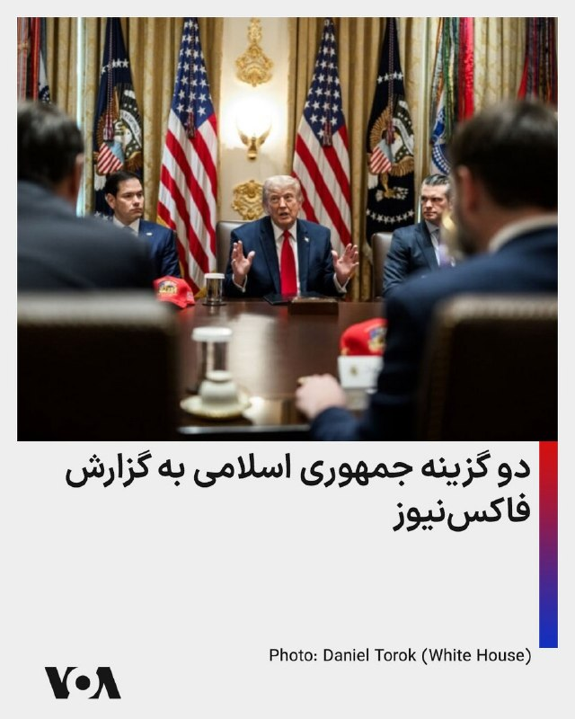

⚡️خبرنگار فاکس‌نیوز، تری یینگست، که چهارشنبه شب با دونالد ترامپ، رئیس جمهوری آمریکا صحبت کرد، می‌گوید طرز فکر آقای ترامپ این است که جمهوری اسلامی دو گزنیه دارد، یا توافق می‌کند و یا باید ضربات ادامه‌دار نیروهای آمریکایی را دریافت ‌کند.
@FarsiVOA

## DW_Farsi — post 125799

  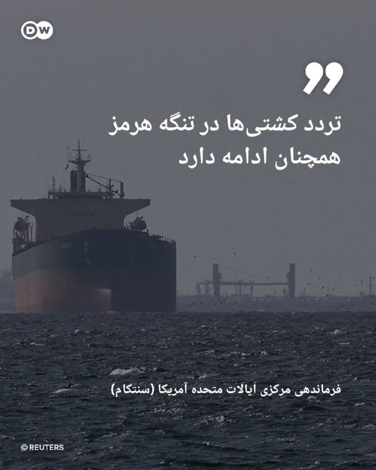

🔶 سنتکام: تردد کشتی‌ها در تنگه هرمز همچنان ادامه دارد

فرماندهی مرکزی ایالات متحده آمریکا (سنتکام) ادعای سپاه پاسداران درباره مسدود کردن کامل تنگه هرمز را رد کرد.

سنتکام در شبکه ایکس نوشت: «کشتی‌های تجاری امشب نیز همچنان در تنگه هرمز تردد می‌کنند.»

سپاه پاسداران در بیانیه‌ای اعلام کرده بود که هر کشتی تجاری یا نفتکش که از تنگه هرمز عبور کند، هدف حمله قرار خواهد گرفت.

سنتکام همچنین ادعای ایران درباره هدف قرار گرفتن یک کشتی جنگی آمریکایی را نیز تکذیب کرد.

@dw_farsi

## IranianMinds — post 22246

🔴 گزارش ها از چند انفجار شدید در کرج و آبیک قزوین

@IranianMinds

## BBCPersian — post 283373

  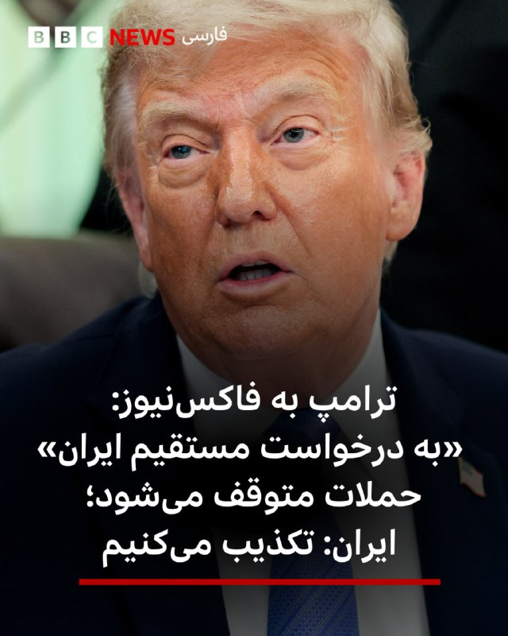

‌
شبکه فاکس نیوز می‌گوید دونالد ترامپ در گفتگو با خبرنگار این شبکه گفته است «در پی تماس مستقیم ایران» و درخواست مقام ارشد این کشور مبنی بر توقف حملات، او دستور توقف حملات جدید به ایران را داده است.

همزمان خبرگزاری‌های رسمی در ایران چنین ادعایی را تکذیب کرده و هرگونه تماس و درخواست از سوی ایران برای توقف حملات را «کذب» خواندند.

همچنین خبرنگار فاکس نیوز گفته که دونالد ترامپ در تماس تلفنی با او از حملات موشکی با استفاده از موشک‌های تاماهاک به رادارها و تاسیسات پدافندی و هدایت پهپاد ایران در جریان حملات بامداد پنجشنبه گفته است و تصریح کرده این حملات تا عمق خاک ایران و «چند کیلومتری تهران» هم صورت گرفته است.

آقای ترامپ در پاسخ به سوال فاکس نیوز مبنی بر احتمال مخالفت ایران با توافق پیشنهادی آمریکا، گفته است در این صورت «باز هم بمباران خواهند شد».

دقایقی بعد از گزارش شبکه فاکس نیوز خبرگزاری سپاه نیوز که اخبار سپاه پاسداران را منتشر می‌کند این ادعا را تکذیب کرد.

📷Reuters

https://bbc.in/4fIJPot
@BBCPersian

## Dirty_Kids — post 391662

یک چیز بسته‌رو چند بار میشه بست آقای قرارگاه مرکزی خاتم‌الانبیا؟

روزی سه بار اعلام میکنن تنگه رو بستیم در جواب فلان‌ کار ترامپ

## Dirty_Kids — post 391661

  

‏در حال پیگیری اخبار خاورمیانه هر شب.

@Dirty_Kids 👻

## Dirty_Kids — post 391660

گزارش چند انفجار شدید در غرب البرز

حداقل ۵ انفجار در مجموع در نزدیکی آبیک گزارش شده است. آبیک در غرب تهران قرار دارد.

@Dirty_Kids 👻

---
📅 بروزرسانی: 1405/03/21 03:42
---

## VahidOOnLine — post 244835

  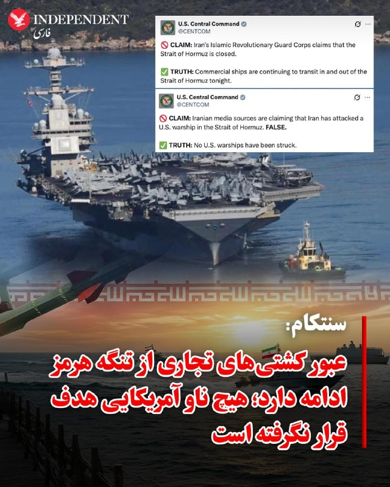

♦️ستاد فرماندهی مرکزی آمریکا (سنتکام) بامداد پنج‌شنبه ۲۱ خردادماه با انتشار بیانیه‌ای ادعای سپاه پاسداران درباره بسته شدن تنگه هرمز را تکذیب کرد.
سنتکام اعلام کرد کشتی‌های تجاری همچنان در حال عبور و مرور از تنگه هرمز هستند. این نهاد همچنین گزارش‌های رسانه‌های ایرانی درباره هدف قرار گرفتن یک ناو جنگی آمریکا در تنگه هرمز را رد کرد و گفت هیچ‌یک از ناوهای جنگی ایالات متحده مورد اصابت قرار نگرفته‌اند.
پیش از این قرارگاه خاتم الانبیاء در بیانیه‌ای تنگه هرمز را کاملا بسته اعلام کرد و تهدید کرد که هرگونه تردد مورد اصابت قرار خواهد گرفت.
‌🇸🇦 Indypersian

🤖 @VahidOOnLine

## VahidOOnLine — post 244834

♦️یسرائیل کاتز، وزیر دفاع اسرائیل، چهارشنبه ۲۰ خردادماه گفت نباید تصور کرد جنگ به پایان رسیده است و «کارزار علیه حکومت ایران هنوز تا پایان فاصله زیادی دارد.» او افزود ارتش اسرائیل برای حمله به حکومت ایران با «قدرت بسیار زیاد» آماده است و در صورت حمله حکومت ایران به اسرائیل، حکومت ایران «ضربه سنگینی» دریافت خواهد کرد.

کاتز این اظهارات را در مراسم اهدای جوایز وزارت دفاع اسرائیل بیان کرد. او همچنین گفت خاورمیانه در حال تغییر است و ارتش اسرائیل توانایی اجرای عملیات گسترده را حفظ کرده است.

وزیر دفاع اسرائیل در بخش دیگری از سخنانش از عملیات ارتش این کشور علیه حزب‌الله در لبنان سخن گفت و اظهار داشت نیروهای اسرائیلی یک محله مسیحی‌نشین در شهر صور را تخلیه کرده و اعضای حزب‌الله را در آن منطقه هدف قرار داده‌اند. به گفته او، ساکنان این محله اکنون در حال بازگشت به خانه‌های خود هستند.
‌🇸🇦 Indypersian

🤖 @VahidOOnLine

## VahidOOnLine — post 244833

  

فرماندهی مرکزی ارتش آمریکا، سنتکام، در واکنش به ادعای سپاه پاسداران درباره بستن تنگه هرمز اعلام کرد گزارش‌ها مبنی بر مسدود شدن این گذرگاه راهبردی صحت ندارند.

به گفته سنتکام، کشتی‌های تجاری هم‌اکنون هم از تنگه هرمز وارد و خارج می‌شوند و عبور دریایی ادامه دارد.

همزمان تنش‌ها میان نیروهای آمریکایی و حکومت ایران در آب‌های منطقه همچنان ادامه دارد.
‌🏁 🇬🇧 IranintlTV

🤖 @VahidOOnLine

## VahidOOnLine — post 244832

  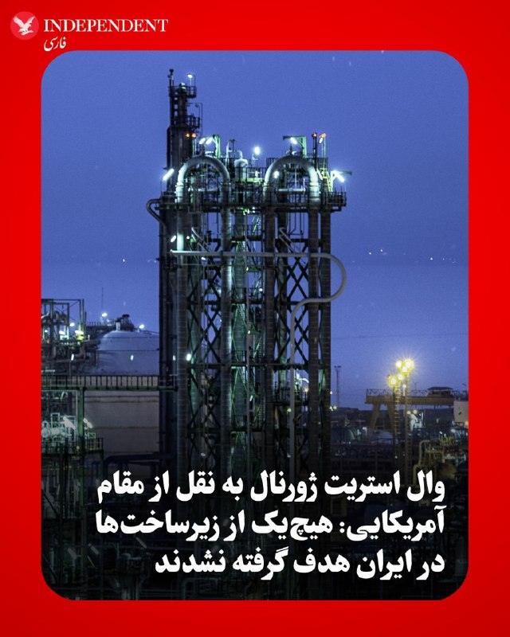

♦️یک مقام ارشد آمریکایی به وال استریت ژورنال گفت نیروهای نظامی ایالات متحده در حال هدف قرار دادن سامانه‌های پدافند هوایی و سایت‌های راداری در نزدیکی تنگه هرمز هستند.
این مقام افزود هیچ‌یک از زیرساخت‌ها در این حملات هدف قرار نگرفته‌اند.
رسانه‌های داخل ایران نیز گزارش دادند که در مناطق مختلف حاشیه تنگه هرمز، از جمله بندرعباس، جزیره قشم و سیریک، انفجارهایی رخ داده است.
‌🇸🇦 Indypersian

🤖 @VahidOOnLine

## pm_afshaa — post 93527

  <a href="telegram/content/pm_afshaa_93527_1781136732.webm" target="_blank">🎬 Download video</a>

🔴گزارش‌ها از چند انفجار سنگین دیگر همراه با لرزش زمین در آبیک قزوین حکایت داره. محدوده انفجارها در کوه است.

💧 Rainbet.com the #1 Non-KYC Crypto Casino & Sportsbook @rainbetcom

😁 @Pm_Afshaa

## pm_afshaa — post 93526

چند انفجار در کرج

💧 Rainbet.com the #1 Non-KYC Crypto Casino & Sportsbook @rainbetcom

😁 @Pm_Afshaa

## mamlekate — post 103670

  <a href="telegram/content/mamlekate_103670_1781136733.mp4" target="_blank">🎬 Download video</a>

به گزارش فاکس نیوز، ‎ترامپ گفته است که به درخواست سران جمهوری اسلامی، بمباران‌ها متوقف خواهد شد؛ اما اگر توافقی امضا نشود، حملات از سر گرفته خواهند شد

@mamlekate

## VahidOnline — post 76179

پیام‌های دریافتی:

من سمت ساوجبلاغ کرجم
ده دقیقه صدای موشک اومد
الان صدای پنج انفجار اومد ۳:۳۲

سلام همین الان ساعت ۳:۳۳صبح اطراف هشتگرد صدای اتفجار و موج میاد

سلام ۶ بار سمت نظرآباد البرز رو زدن
ساعت ۳.۳۴
۲۱ خرداد

ساعت۳:۳۰
شهر جدید هشتگرد
۶/۷ تا انفجار پشت هم
اما خیلی دوره
نمیدونم کرجه یا تهران

ابیک قزوین ساعت ۳:۳۴
بامداد ۲۱ خرداد
صدای و موج انفجار اومد، به نظر میاد از سمت کرج یا هشتگرد باشه
۵-۶ تا بود حداقل

۳:۳۰ صدای ۵ تا انفجاد اومد از اطراف هشتگرد بود فکر کنم قشنگ شنیدم

سلام وحید نظراباد از دور صدا ۷.۸ تا موشک پشت هم اومد در های خونه لرزید

هشتگرد ۵ صدای انفجار از طرف اشتهارد

سلام وحید جان ساعت ۳.۳۳ صدای ۱۰ تا انفجار شدید اومد من نظرآبادم ولی صدا از دور بود

پشت هم موشک داره میاد با نور انفجار و صدای مهیب
محدوده نظر اباد هشتگرد
از پشت بوم کاملا مشخصه

سلاممم کرج هشتگرد 4تا صدای انفجار شدید اومد
دوتاش خیلی بزرگ بود بطوری ک کل خانواده از خواب پریدن
قشنگ کل خونه لرزید

۵ ۶ تا صدای انفجار هشتگرد جدید ساعت ۳:۲۰

سلام وحید جان
۶ بار صدای انفجار مهیب اطراف اشتهارد شنیدیم‌ از حدود ساعت ۳:۲۰ تا ۳:۳۵

📡 @VahidOnline

## kianmeli1 — post 87910

🔴ساعت ۰۳:۳۲ چند انفجار در محدوده «آبیک قزوین» شنیده شد.
https://t.me/kianmeli1

## IranIntlTV — post 341604

  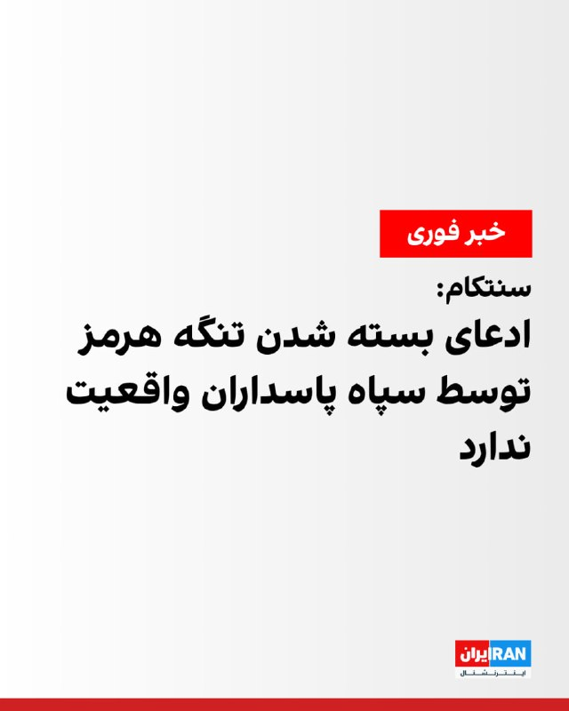

فرماندهی مرکزی ارتش آمریکا، سنتکام، در واکنش به ادعای سپاه پاسداران درباره بستن تنگه هرمز اعلام کرد گزارش‌ها مبنی بر مسدود شدن این گذرگاه راهبردی صحت ندارند.

به گفته سنتکام، کشتی‌های تجاری هم‌اکنون هم از تنگه هرمز وارد و خارج می‌شوند و عبور دریایی ادامه دارد.

همزمان تنش‌ها میان نیروهای آمریکایی و حکومت ایران در آب‌های منطقه همچنان ادامه دارد.

## Shin_Persian — post 6915

Shin ✓ @hey_itsmyturn
Thu, 11 Jun 2026 00:04:16 UTC

.@IliaHashemicom Reports 3 explosions near Abyek, Qazvin Province, #Iran

ترجمه خودکار فارسی

.@IliaHashemicom گزارش داد ۳ انفجار در نزدیکی آبیک، استان قزوین، #Iran رخ داده است.

𝕏 · @shin_persian

## Iliaen — post 4473

ساعت ۰۳:۳۲ صبح پنجشنبه؛ تعداد ۳ انفجار در محدوده آبیک قزوین شنیده شد. @iliaen

## Iliaen — post 4472

ساعت ۰۳:۳۲ صبح پنجشنبه؛ تعداد ۳ انفجار در محدوده آبیک قزوین شنیده شد.

@iliaen

## FarsiVOA — post 220323

  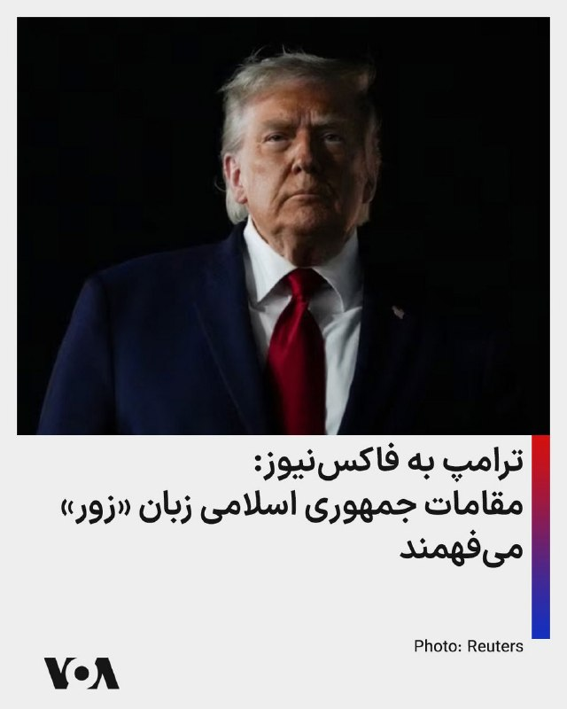

⚡️دونالد ترامپ، رئیس‌جمهوری آمریکا به فاکس‌نیوز گفت که آتش‌بس با جمهوری اسلامی بیش از هر آتش‌بس دیگری در جهان نقض شده است. او افزود که مقامات جمهوری اسلامی زبان «زور» می‌فهمند.
@FarsiVOA

## FarsiVOA — post 220322

⚡️طالبان و پاکستان؛ دو روایت از حملات مرزی اخیر پاکستان به بخش‌هایی از افغانستان
@FarsiVOA

## FarsiVOA — post 220321

  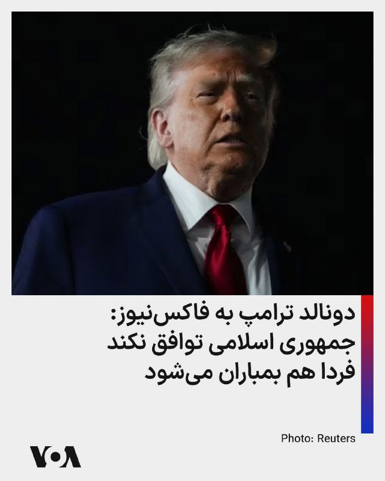

⚡️خبرنگار فاکس‌نیوز می‌گوید که دونالد ترامپ، رئیس‌جمهوری آمریکا به این سوال که اگر جمهوری اسلامی با شما توافق نکند چه اتفاقی می‌افتد؟ پاسخ داد که فردا شب هم شدید بمباران خواهند شد.
@FarsiVOA

## DW_Farsi — post 125798

  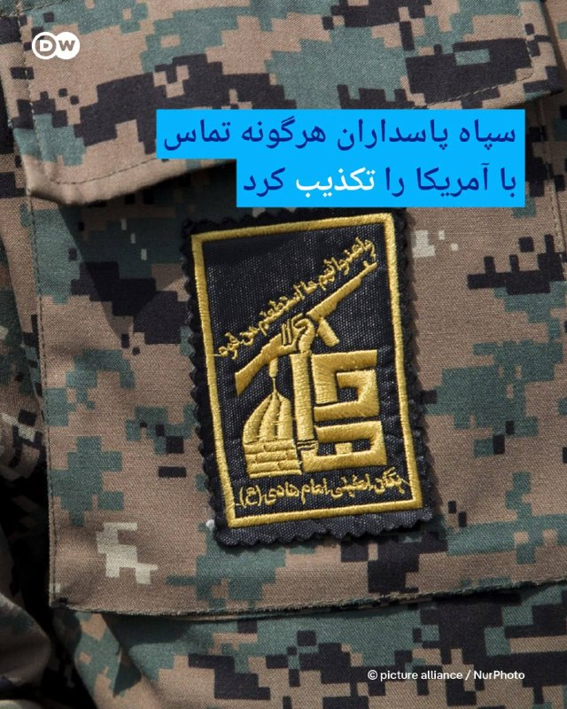

🔶 سپاه پاسداران هرگونه تماس با آمریکا را تکذیب کرد

بلافاصله پس از مصاحبه ترامپ با شبکه فاکس نیوز که در آن گفت در "تماس مستقیم" با مقامات ایران است و آنها از او خواسته‌اند تا بمباران را متوقف کند، کانال تلگرامی اخبار سپاه پاسداران این خبر را تکذیب کرد.

روابط عمومی سپاه پاسداراندر بیانیه‌ای نوشت: «ادعای ترامپ در مورد تماس مقامات ایرانی با وی قویا تکذیب می‌شود و پوششی برای فرار از جنگ است.»

کانال صابرین نیوز نیز از قول یک منبع آگاه خبر داد: «ما به حملات امشب آمریکا پاسخ نظامی خواهیم داد.»

@dw_farsi

## Persian_Trend_Official — post 16651

  <a href="telegram/content/Persian_Trend_Official_16651_1781136735.webm" target="_blank">🎬 Download video</a>

برزیل یک - ج.ا صفر 📝 Nick 📌 @persian_trend_official پرشین ترند | متفاوت‌ترین کانال نظامی

## Persian_Trend_Official — post 16650

  

📝 Nick

📌 @persian_trend_official
پرشین ترند | متفاوت‌ترین کانال نظامی

## BBCPersian — post 283372

🔻نیروی دریایی سپاه: هیچ شناوری از لنگرگاه‌ها حرکت نکند

همزمان با انتشار اطلاعیه «بسته شدن کامل تنگه هرمز» از سوی قرارگاه خاتم الانبیاء در ایران، نیروی دریایی سپاه پاسداران هم هشدار داده است که «هیچ شناوری» نباید در خلیج فارس و دریای عمان از لنگرگاه‌ها جدا شود.

در اطلاعیه بامداد پنجشنبه نیروی دریایی سپاه پاسداران آمده: «در پی نقض مکرر شرایط آتش‌بس توسط دشمن آمریکایی، تنگه هرمز تا اطلاع‌ثانوی مسدود می‌شود. هشدار می‌دهیم هیچ شناوری از لنگرگاه خود در خلیج‌فارس و دریای عمان حرکت نداشته باشد. نزدیک شدن به تنگه هرمز به‌منزله همکاری با دشمن تلقی می‌شود.»

به گزارش خبرگزاری فارس، نیروی دریایی سپاه مدعی هدف قرار دادن دو کشتی در تنگه هرمز شده که «قصد عبور غیرقانونی» از این تنگه را داشته‌اند.

https://bbc.in/4fIJPot
@BBCPersian

## Dirty_Kids — post 391658

ساعت ۰۳:۳۲ صبح پنجشنبه؛ تعداد ۳ انفجار در محدوده آبیک قزوین شنیده شد. @Dirty_Kids 👻

## Dirty_Kids — post 391657

ساعت ۰۳:۳۲ صبح پنجشنبه؛ تعداد ۳ انفجار در محدوده آبیک قزوین شنیده شد.

@Dirty_Kids 👻

---
📅 بروزرسانی: 1405/03/21 03:32
---

## VahidOOnLine — post 244831

  

صدا و سیما به نقل از یک مقام ارشد جمهوری اسلامی اعلام کرد اظهارات ترامپ درباره تماس او با مقامات ایرانی دروغ است.
این مقام افزود: این اظهارات پوششی برای فرار از جنگ علیه جمهوری اسلامی است.
‌🏁 🇬🇧 IranintlTV

🤖 @VahidOOnLine

## VahidOOnLine — post 244830

  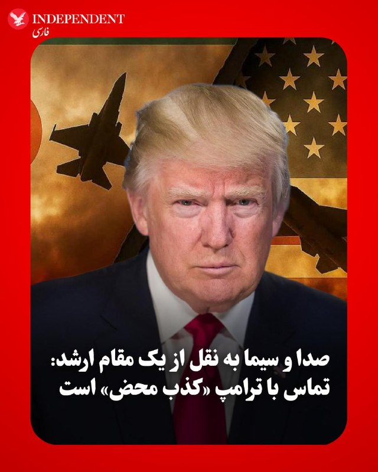

♦️ صداوسیما بامداد پنجشنبه ۲۱ خردادماه به نقل از یک مقام ارشد گزارش فاکس‌نیوز مبنی بر اینکه مقامات تهران با دونالد ترامپ تماس گرفته و از او خواسته‌اند حمله‌ها متوقف شود را تکذیب کرد و آن را «کذب محض» خواند.
این واکنش پس از آن مطرح شد که فاکس‌نیوز به نقل از دونالد ترامپ، رئیس‌جمهوری آمریکا، گزارش داد او به‌طور مستقیم با مقام‌های جمهوری اسلامی گفت‌وگو کرده و آنها از ترامپ خواسته‌اند حملات آمریکا متوقف شود.
‌🇸🇦 Indypersian

🤖 @VahidOOnLine

## WithYashar — post 14464

ترامپ : این آتش بس، بیشترین آتش‌بسِ نقض‌شده تو تاریخ جهان بود. @withyashar

## WithYashar — post 14463

ترامپ :
این آتش بس، بیشترین آتش‌بسِ نقض‌شده تو تاریخ جهان بود.
@withyashar

## FoxNewsTwitter — post 342831

  <a href="telegram/content/FoxNewsTwitter_342831_1781136151.mp4" target="_blank">🎬 Download video</a>

Fox News (Twitter/X)

Democrats' defensive disaster leads to two runs for Republicans after a hit by Rep. Bill Huizenga that didn't leave the infield in the annual Congressional Baseball Game for Charity.

Republican and Democratic lawmakers took the field in one of Washington's longest-running traditions, with the GOP looking to extend a multi-year winning streak.

The matchup has raised millions for charity over the years and offers a rare moment where political rivals compete side-by-side outside the halls of Congress.

## FoxNewsTwitter — post 342830

Fox News (Twitter/X)

RT @TreyYingst: Spoke with President Trump tonight as he oversaw the U.S. military strikes against Iran from the Situation Room.

The President told me he spoke directly with Iranian officials tonight who asked him to stop bombing.

49 Tomahawk missiles had been fired by the United States at the time we spoke, along with bombing from fighter jets. Closest target to Tehran was approximately 40 miles outside of the city.

Trump added that the bombing will stop shortly, but that if they don't sign the agreement, "we'll bomb the shit out of them."

President Trump called this "the most violated ceasefire in the history of the world."

Vice President JD Vance told me the United States is dealing with both moderate and more extreme voices in Iran as part of the negotiation process.

More updates to follow on @FoxNews.

## VahidOnline — post 76178

  

صدا و سیما به نقل از یک مقام ارشد جمهوری اسلامی اعلام کرد اظهارات ترامپ درباره تماس او با مقامات ایرانی دروغ است.
این مقام افزود: این اظهارات پوششی برای فرار از جنگ علیه جمهوری اسلامی است.
@VahidOOnLine

📡 @VahidOnline

## IranIntlTV — post 341603

  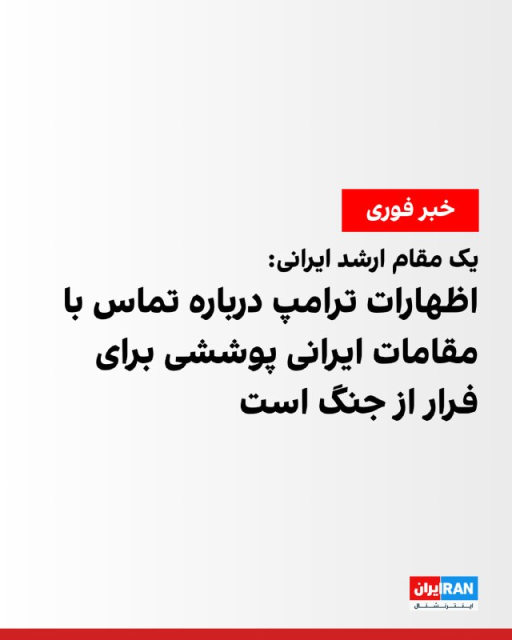

صدا و سیما به نقل از یک مقام ارشد جمهوری اسلامی اعلام کرد اظهارات ترامپ درباره تماس او با مقامات ایرانی دروغ است.
این مقام افزود: این اظهارات پوششی برای فرار از جنگ علیه جمهوری اسلامی است.

## FarsiVOA — post 220320

  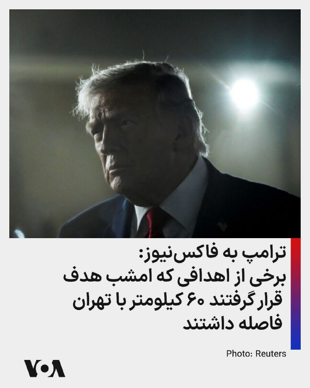

⚡️خبرنگار فاکس‌نیوز دقایقی قبل گزارش داد که رئيس جمهوری آمریکا، دونالد ترامپ، همراه با جی‌دی ونس، دامادش جرد کوشنر، و استیو ویتکاف، در «اتاق وضعیت» کاخ سفید حضور داشت. آقای ترامپ به فاکس‌نیوز گفت ۴۹ موشک تاماهاک برای زدن اهدافی در ایران استفاده شد. آقای ترامپ گفت برخی از این اهداف فقط حدود ۶۰ کیلومتر با پایتخت، تهران، فاصله داشتند.
@FarsiVOA

## FarsiVOA — post 220319

  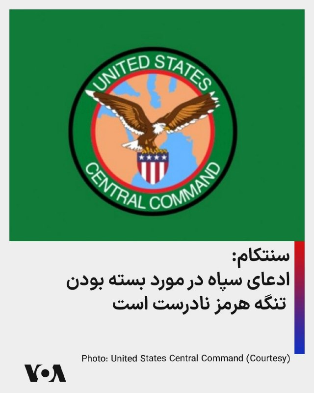

⚡️ستاد فرماندهی مرکزی آمریکا، سنتکام، ادعای تازه سپاه پاسداران را که «تنگه هرمز بسته است» رد کرد و گفت «حقیقت» این است که «کشتی‌های تجاری امشب همچنان به ورود و خروج از تنگه هرمز ادامه می‌دهند.»
@FarsiVOA

## DW_Farsi — post 125797

  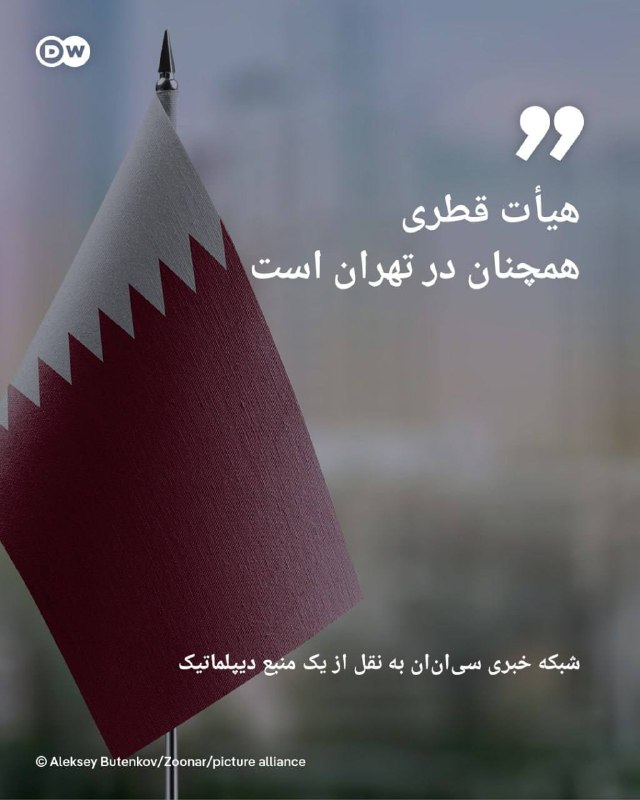

🔶 سی‌ان‌ان: هیأت قطری همچنان در تهران است

شبکه خبری سی‌ان‌ان به نقل از یک منبع دیپلماتیک مطلع نوشت هیأت قطری که صبح چهارشنبه ۱۰ ژوئن (۲۰ خرداد) برای دیدار با مذاکره‌کنندگان ایرانی به تهران سفر کرده بود، هم‌زمان با آغاز دور تازه‌ای از حملات آمریکا علیه ایران، همچنان در این کشور حضور دارد.

این منبع پیش‌تر به این شبکه گفته بود که مذاکره‌کنندگان "پس از مشورت با آمریکا" به ایران رفته‌اند تا با طرف ایرانی دیدار کرده و "برای پر کردن شکاف‌های باقی‌مانده" تلاش کنند.

رسانهٔ دولتی صداوسیمای جمهوری اسلامی (IRIB) گزارش داد که این سفر شامل گفت‌وگو دربارهٔ روابط دو کشور و همچنین تبادل نظر دربارهٔ آخرین تحولات در روندی دیپلماتیک خواهد بود که آن را تلاشی برای پایان دادن به "جنگ تحمیلی آمریکا" علیه ایران توصیف کرده است.

@dw_farsi

## IranianMinds — post 22245

  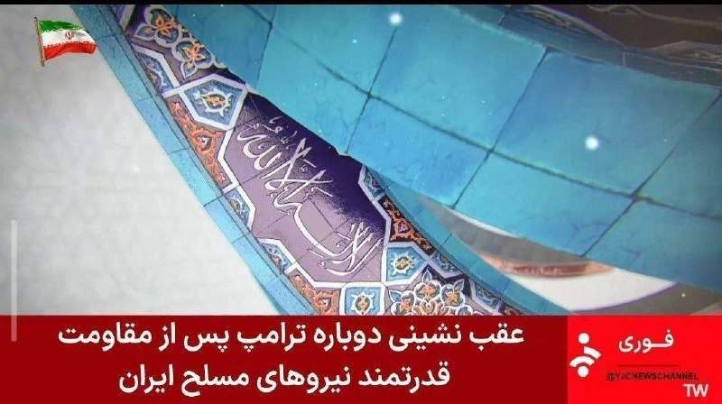

🔴 صداوسیما :

ترامپ دوباره عقب نشینی کرد.

@IranianMinds

## IranianMinds — post 22244

  <a href="telegram/content/IranianMinds_22244_1781136156.webm" target="_blank">🎬 Download video</a>

📢توم میخوای از مسابقات جام جهانی فوتبال پول دربیاری؟
🥇

✅کانال ورسوس بت کارش تحلیل و پیش بینی مسابقات جام جهانی به صورت حرفه ای
🍑

⚠️توم میتونی از پیش بینی جام جهانی خیلی راحت پول دربیاری فقط کافیه با کانال ورسوس بت همراه شی
📣

🌐ادرس عضویت کانالشون:e20
👇

🔪https://t.me/+vEPd1hF2Y38yMWI0

🔪https://t.me/+vEPd1hF2Y38yMWI0

## IranianMinds — post 22243

  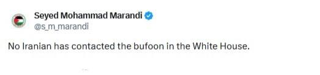

🔴 پست محمد مرندی:

هیچ مقامی با دلقک در کاخ سفید تماس نگرفته است.

@IranianMinds

## Dirty_Kids — post 391655

تری یینگست خبرنگار فاکس‌نیوز با ترامپ مصاحبه کرده: «ترامپ در حال حاضر به‌همراه معاونش جی‌دی ونس و فرستاده‌های ویژه کوشنر و ویتکاف، توی اتاق وضعیت حضور داره. ترامپ اطلاعات جدیدی درباره اتفاقاتی که همین الان داره می‌افته به ما داد. یک کمپین بمباران علیه رژیم…

## Dirty_Kids — post 391654

  <a href="telegram/content/Dirty_Kids_391654_1781136157.mp4" target="_blank">🎬 Download video</a>

تری یینگست خبرنگار فاکس‌نیوز با ترامپ مصاحبه کرده:

«ترامپ در حال حاضر به‌همراه معاونش جی‌دی ونس و فرستاده‌های ویژه کوشنر و ویتکاف، توی اتاق وضعیت حضور داره.
ترامپ اطلاعات جدیدی درباره اتفاقاتی که همین الان داره می‌افته به ما داد.
یک کمپین بمباران علیه رژیم روافض در حال انجامه.

ترامپ به فاکس نیوز گفت که از ۴۹ موشک تاماهاک برای زدن اهدافی در داخل ایران استفاده شده که فاصله بعضی از این اهداف تا تهران پایتخت ایران حتی به ۴۰ مایلی [حدود ۶۴ کیلومتری] هم می‌رسه.

ترامپ گفت که جنگنده‌های آمریکایی هم بر فراز آسمان ایران در حال عملیات هستن و سیستم‌های راداری و پدافند هوایی رو در بخش جنوب غربی کشور، یعنی نزدیک خلیج فارس، نابود کردن.

همه این اتفاقات در حالی داره می‌افته که شیعه‌سانان دارن تلاش می‌کنن ایالات متحده رو مجبور کنن تا این حملات و بمباران‌ها رو متوقف کنه.

ترامپ به من گفت که شیعه‌های رافضی‌ امشب باهاش تماس گرفته. به گفته فرمانده کل قوا، امشب در حالی که ترامپ در اتاق وضعیت نشسته بود، مقامات ارشد روافض و ترامپ مستقیم با هم صحبت کردن.

ترامپ به من گفت که روافض قحبه‌ ازشون خواستن بمباران رو متوقف کنن. رئیس‌جمهور هم به من گفت:‌بمباران به‌زودی متوقف می‌شه.

ازش پرسیدم اگه روافض‌ توافقی رو که توسط مذاکره‌کننده‌های آمریکایی ارائه شده امشب امضا نکنن چی می‌شه؟
ترامپ گفت، نقل‌قول می‌کنم: فردا شب دهنشون رو می‌گاییم ‌و تا جا دارن بمبارانشون می‌کنیم.

بنابراین رئیس‌جمهور گزینه نظامی رو روی میز نگه داشته، اونم برای زمانی که روافض‌ حاضر نشن این توافق از روی حسن نیت رو امضا کنن. توافقی که در نهایت تنگه گ‌ی هرمز رو باز نگه می‌داره و تضمین می‌کنه که اون‌ها نمی‌تونن برنامه هسته‌ای خودشون رو به سمت ساخت بمب اتمی پیش ببرن. این حرف آخر و اصلیه که ترامپ که بارها و بارها روش تأکید کرده. »

@Dirty_Kids 👻

---
📅 بروزرسانی: 1405/03/21 03:22
---

## VahidOOnLine — post 244829

  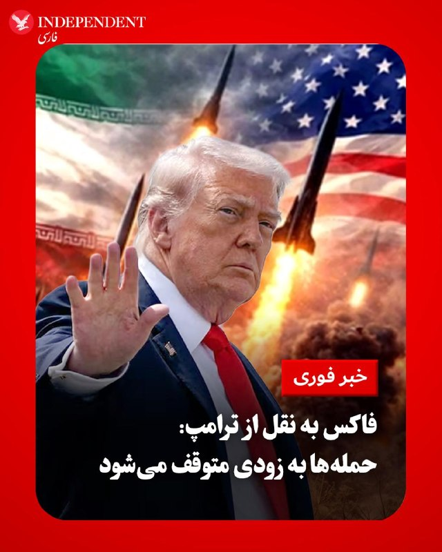

♦️فاکس‌نیوز به نقل از ترامپ گزارش داد که از ایران با او تماس گرفته‌اند و خواستار توقف حمله‌ها شده‌اند. خبرنگار فاکس گفت که رئیس‌جموری آمریکا به او گفته است که حمله‌ها به زودی متوقف خواهد شد. پیش‌تر اکسیوس گزارش داده بود که احتمالا حمله‌ها شدید اما کوتاه‌مدت خواهد بود.
‌🇸🇦 Indypersian

🤖 @VahidOOnLine

## VahidOOnLine — post 244828

  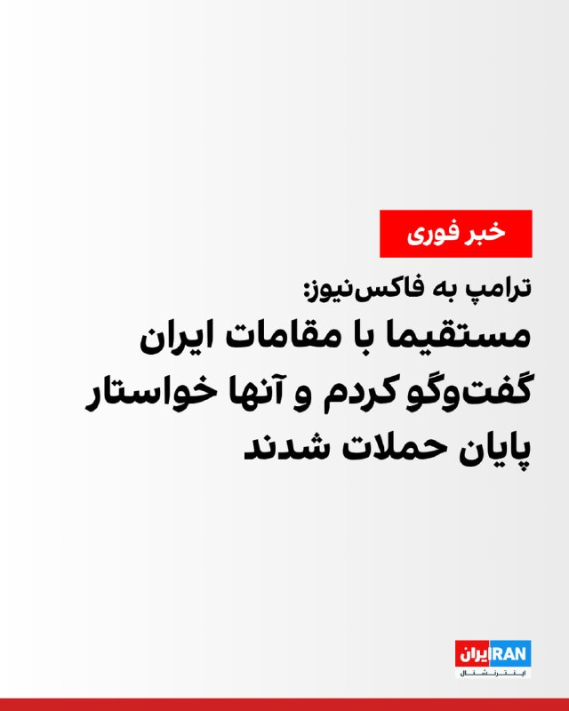

دونالد ترامپ، رییس‌جمهوری آمریکا، در گفت‌وگو با شبکه فاکس‌نیوز اعلام کرد جنگنده‌های آمریکایی هم اکنون در آسمان ایران در حال عملیات هستند.

او افزود مقام‌های جمهوری اسلامی از او خواسته‌اند بمباران‌ها متوقف شود و گفت به طور مستقیم با مقام‌های ایرانی گفت‌وگو کرده است.

ترامپ تاکید کرد حملات هوایی به زودی متوقف خواهد شد، اما احتمال انجام حملات بیشتر علیه ایران را رد نکرد. او همچنین گفت اسرائیل در حملات جاری آمریکا علیه اهدافی در ایران نقشی نداشته است.
‌🏁 🇬🇧 IranintlTV

🤖 @VahidOOnLine

## VahidOOnLine — post 244827

  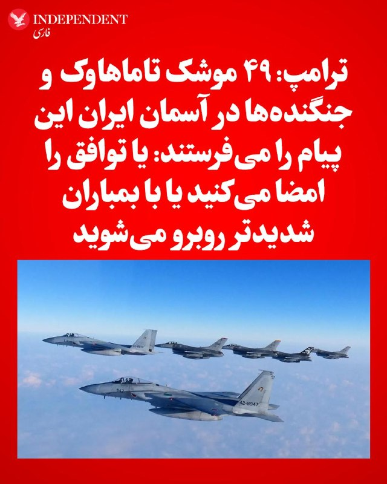

♦️فاکس‌نیوز به نقل از دونال ترامپ گزارش داد که اگر تهران توافق را امضا نکند، کارزار عملیات نظامی ادامه پیدا می‌کند و فرداشب با بمباران شدیدتری روبرو خواهد شد. ترامپ گفته است که ۴۹ موشک تاماهاوک و جنگنده‌ها در آسمان ایران این پیام را به مقامات تهران ارسال می‌کند که یا جنگ از سرگرفته می‌شود و در میدان نبرد ضربه‌های سنگین‌تری را متحمل می‌شوند یا اینکه توافقی را که مذاکره‌کنندگان آمریکایی ارایه کرده‌اند،‌امضا می‌کنند.
‌🇸🇦 Indypersian

🤖 @VahidOOnLine

## WithYashar — post 14462

سنتکام : رسانه ی جمهوری اسلامی درباره هدف قرار دادن کشی آمریکایی هم کذبه و هیچ کشتی هدف قرار نگرفته.

@withyashar

## WithYashar — post 14461

سنتکام: ادعای سپاه پاسداران مبنی بر بستن تنگه هرمز کذب است!

حقیقت: کشتی‌های تجاری امشب به عبور و مرور در تنگه هرمز ادامه می‌دهند.
@withyashar

## pm_afshaa — post 93525

  <a href="telegram/content/pm_afshaa_93525_1781135552.webm" target="_blank">🎬 Download video</a>

🔴سنتکام: 🚫 ادعا: سپاه پاسداران مدعی شده که تنگه هرمز بسته است. ✅ واقعیت: کشتی های تجاری امشب به تردد و خروج از تنگه هرمز ادامه خواهند داد. 
💧 Rainbet.com the #1 Non-KYC Crypto Casino & Sportsbook @rainbetcom 
😁 @Pm_Afshaa

## pm_afshaa — post 93524

پرواز گسترده ریز پرنده ها در اسمون خرم اباد

💧 Rainbet.com the #1 Non-KYC Crypto Casino & Sportsbook @rainbetcom

😁 @Pm_Afshaa

## pm_afshaa — post 93523

جالبه سپاه موشکاش تو کونش رفته صداش در نیومده

## pm_afshaa — post 93522

  <a href="telegram/content/pm_afshaa_93522_1781135553.webm" target="_blank">🎬 Download video</a>

🔴ترامپ به فاکس نیوز: ایرانی‌ها ازم خواستن بمباران رو متوقف کنم. مستقیم با مقام‌های ایرانی صحبت کردم. 
💧 Rainbet.com the #1 Non-KYC Crypto Casino & Sportsbook @rainbetcom 
😁 @Pm_Afshaa

## VahidOnline — post 76177

  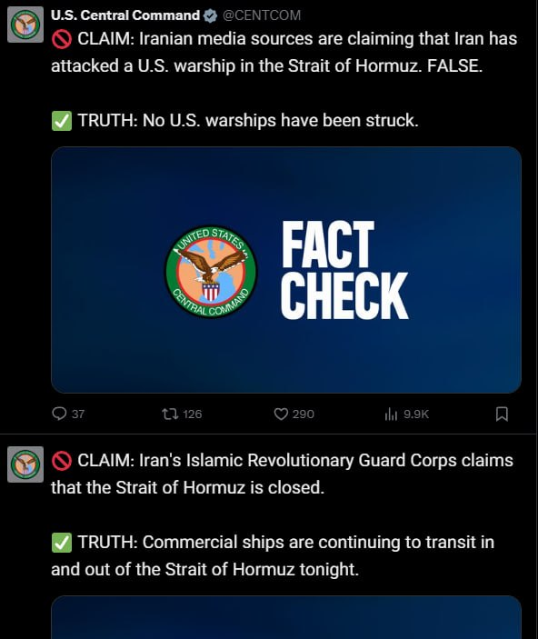

پست‌‌‌های اکانت فرماندهی مرکزی ایالات متحده، سنتکام
ترجمه ماشین:

🚫 ادعا: سپاه پاسداران انقلاب اسلامی ایران مدعی شده است که تنگه هرمز بسته شده است.
✅ واقعیت: کشتی‌های تجاری امشب همچنان در حال عبور و مرور به داخل و خارج از تنگه هرمز هستند.
CENTCOM
🚫 ادعا: منابع رسانه‌ای ایران مدعی‌اند که ایران به یک ناو جنگی آمریکا در تنگه هرمز حمله کرده است. نادرست است.
✅ واقعیت: هیچ ناو جنگی آمریکایی هدف قرار نگرفته است.
CENTCOM

📡 @VahidOnline

## IranIntlTV — post 341602

  

دونالد ترامپ، رییس‌جمهوری آمریکا، در گفت‌وگو با شبکه فاکس‌نیوز اعلام کرد جنگنده‌های آمریکایی هم اکنون در آسمان ایران در حال عملیات هستند.

او افزود مقام‌های جمهوری اسلامی از او خواسته‌اند بمباران‌ها متوقف شود و گفت به طور مستقیم با مقام‌های ایرانی گفت‌وگو کرده است.

ترامپ تاکید کرد حملات هوایی به زودی متوقف خواهد شد، اما احتمال انجام حملات بیشتر علیه ایران را رد نکرد. او همچنین گفت اسرائیل در حملات جاری آمریکا علیه اهدافی در ایران نقشی نداشته است.

## Shin_Persian — post 6914

Trey Yingst ✓ @TreyYingst
Wed, 10 Jun 2026 23:35:33 UTC

Spoke with President Trump tonight as he oversaw the U.S. military strikes against Iran from the Situation Room.

The President told me he spoke directly with Iranian officials tonight who asked him to stop bombing.

49 Tomahawk missiles had been fired by the United States at the time we spoke, along with bombing from fighter jets. Closest target to Tehran was approximately 40 miles outside of the city.

Trump added that the bombing will stop shortly, but that if they don't sign the agreement, "we'll bomb the shit out of them."

President Trump called this "the most violated ceasefire in the history of the world."

Vice President JD Vance told me the United States is dealing with both moderate and more extreme voices in Iran as part of the negotiation process.

More updates to follow on @FoxNews.

ترجمه خودکار فارسی

امشب با پررئیس‌جمهور ترامپ در حالی که از اتاق وضعیت (Situation Room) بر حملات نظامی ایالات متحده علیه ایران نظارت می‌کرد، صحبت کردم.

رئیس‌جمهور به من گفت که امشب مستقیماً با مقامات ایرانی صحبت کرده و آن‌ها از او خواسته‌اند که بمباران را متوقف کند.

تا زمان گفتگوی ما، ۴۹ موشک تاماهاوک توسط ایالات متحده شلیک شده بود و هواپیماهای جنگنده نیز مشغول بمباران بودند. نزدیک‌ترین هدف به تهران در فاصله تقریبی ۴۰ مایلی خارج از شهر بود.

ترامپ افزود که بمباران به زودی متوقف خواهد شد، اما اگر آن‌ها توافق‌نامه را امضا نکنند، «دهن‌شان را با بمب صاف خواهیم کرد.»

رئیس‌جمهور ترامپ این وضعیت را «نقض‌شده‌ترین آتش‌بس در تاریخ جهان» نامید.

معاون رئیس‌جمهور، جی‌دی ونس، به من گفت که ایالات متحده در فرآیند مذاکره با هر دو طیف صداهای میانه‎رو و تندرو در ایران سر و کار دارد.

به‌روزرسانی‌های بیشتر در @FoxNews منتشر خواهد شد.

𝕏 · @shin_persian

## Shin_Persian — post 6913

  

Shin ✓ @hey_itsmyturn
Wed, 10 Jun 2026 23:42:25 UTC

Following Iranian media reports that Iran attacked a U.S. warship in the Strait of Hormuz, U.S. Central Command says the claims are false and no U.S. warships have been struck.

Source: @CENTCOM
https://x.com/CENTCOM/status/2064855691173490777

ترجمه خودکار فارسی

در پی گزارش‌های رسانه‌های ایرانی مبنی بر حمله ایران به یک کشتی جنگی ایالات متحده در تنگه هرمز، ستاد فرماندهی مرکزی ایالات متحده (سنتکام/CENTCOM) اعلام کرد که این ادعاها کذب است و هیچ کشتی جنگی آمریکایی مورد اصابت قرار نگرفته است.

منبع: @CENTCOM
https://x.com/CENTCOM/status/2064855691173490777

𝕏 · @shin_persian

## FarsiVOA — post 220318

  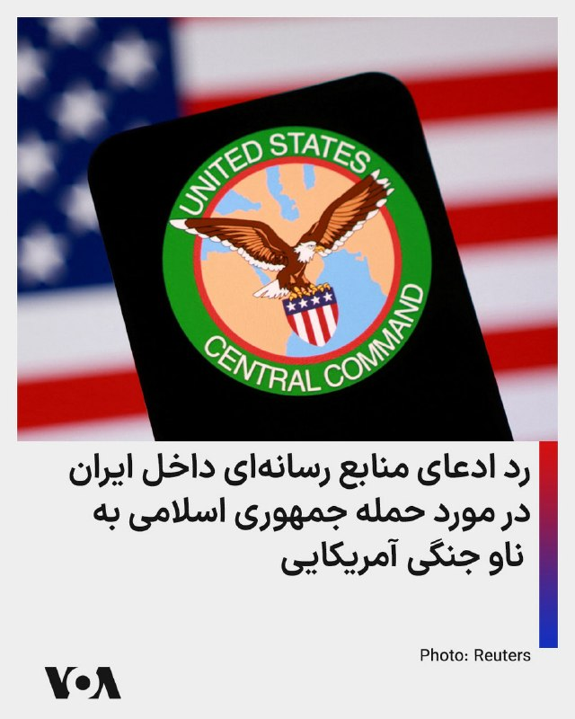

⚡️سنتکام ادعای منابع رسانه‌ای در ایران را که می‌گویند جمهوری اسلامی به یک «ناو جنگی آمریکایی در تنگه هرمز» حمله کرده است نادرست خواند و گفت هیچ ناو جنگی آمریکایی مورد حمله قرار نگرفته است.
@FarsiVOA

## FarsiVOA — post 220317

⚡️پاسخ سخنگوی دولت اقلیم کردستان به صدای آمریکا در مورد حملات جمهوری اسلامی به احزاب کرد ایرانی
@FarsiVOA

## FarsiVOA — post 220316

  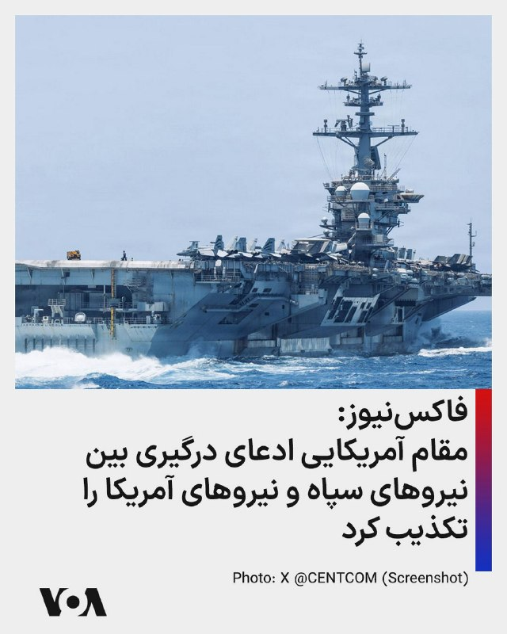

⚡️به گزارش جنیفر گریفین، خبرنگار حوزه دفاعی فاکس‌نیوز، یک مقام آمریکایی با وجود ادعاهای جمهوری اسلامی، هرگونه درگیری دریایی بین نیروی دریایی آمریکا و سپاه پاسداران را تکذیب کرد.
@FarsiVOA

## DW_Farsi — post 125796

  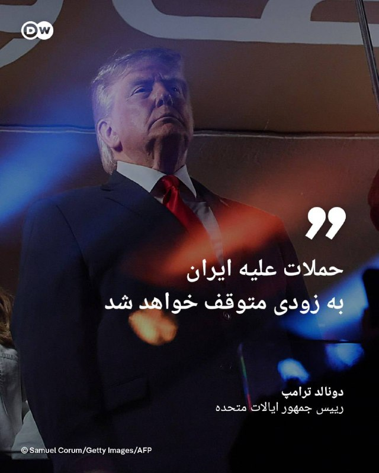

🔶 ترامپ: حملات علیه ایران به زودی متوقف خواهد شد

ساعتی پس از آغاز حملات امریکا به ایران، دونالد ترامپ، رییس جمهور ایالات متحده، در مصاحبه با شبکه فاکس نیوز گفت این حملات به زودی متوقف خواهند شد اما احتمال انجام حملات بیشتر علیه ایران را باز گذاشت.

او همچنین گفت در حال "گفت‌و‌گوی مستقیم" با مقامات جمهوری اسلامی ایران است و گفت ایرانی‌ها از او خواسته‌اند حملات را متوقف کند.

ترامپ تاکید کرد که اسرائیل در حملات علیه ایران دخالت نداشته است.

@dw_farsi

## Persian_Trend_Official — post 16649

  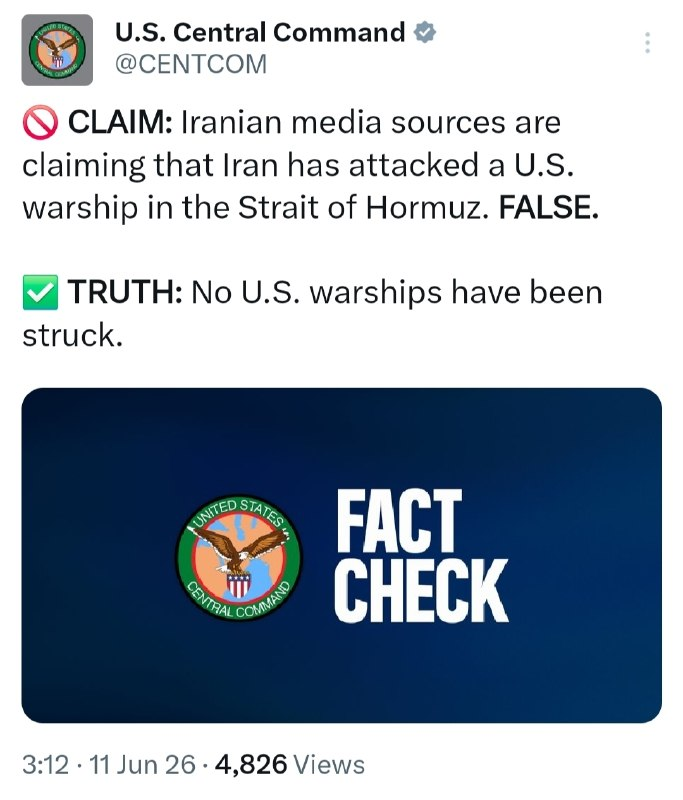

سنتکام همچنین خبر هدف قرار گرفتن ناوشکن های خود در تنگه هرمز توسط ایران را تکذیب کرد.

📝 Amir

📌 @persian_trend_official
پرشین ترند | متفاوت‌ترین کانال نظامی

## Persian_Trend_Official — post 16648

سنتکام: کشتی‌های تجاری امشب همچنان به تردد خود در تنگه هرمز ادامه می‌دهند. 📝 Amir 📌 @persian_trend_official پرشین ترند | متفاوت‌ترین کانال نظامی

## Persian_Trend_Official — post 16647

  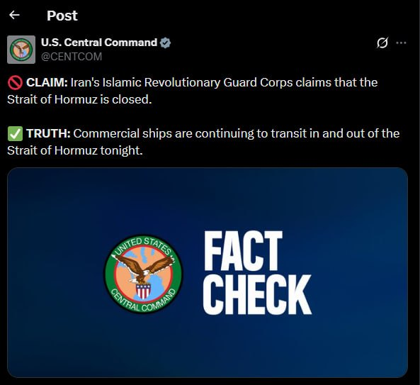

سنتکام: کشتی‌های تجاری امشب همچنان به تردد خود در تنگه هرمز ادامه می‌دهند.

📝 Amir

📌 @persian_trend_official
پرشین ترند | متفاوت‌ترین کانال نظامی

## IranianMinds — post 22242

🔴 سنتکام :

اخبار رسانه ی جمهوری اسلامی درباره هدف قرار دادن کشی آمریکایی هم کذبه و هیچ کشتی هدف قرار نگرفته.

@IranianMinds

## IranianMinds — post 22241

🔴 یک مقام آمریکایی به فاکس‌ نیوز : حملات نظامی آمریکا علیه اهدافی در ایران همچنان ادامه دارد. @IranianMinds

## alonews — post 127031

  <a href="telegram/content/alonews_127031_1781135558.webm" target="_blank">🎬 Download video</a>

👈فرماندهی مرکزی ایالات متحده(سنتکام) : ادعا: سپاه پاسداران انقلاب اسلامی ایران مدعی شده است که تنگه هرمز بسته شده است. 
🔴حقیقت: کشتی‌های تجاری امشب همچنان در حال تردد به داخل و خارج از تنگه هرمز هستند. 
✅ @AloNews خبر جنگ

## alonews — post 127030

  <a href="telegram/content/alonews_127030_1781135559.webm" target="_blank">🎬 Download video</a>

👈فرماندهی مرکزی ایالات متحده(سنتکام) :
ادعا: سپاه پاسداران انقلاب اسلامی ایران مدعی شده است که تنگه هرمز بسته شده است.

🔴حقیقت: کشتی‌های تجاری امشب همچنان در حال تردد به داخل و خارج از تنگه هرمز هستند.

✅ @AloNews خبر جنگ

---
📅 بروزرسانی: 1405/03/21 03:12
---

## VahidOOnLine — post 244826

  

♦️ترامپ مستقیما با مقامات ارشد حکومت ایران گفتگو کرده است؛ مقامات تهران از ترامپ خواستند حملات را متوقف کند
فاکس‌نیوز به نقل از دونالد ترامپ، رئیس‌جمهوری آمریکا گزارش داد که او به‌طور مستقیم با مقامات جمهوری اسلامی گفتگو کرده است و آنها از ترامپ خواسته‌اند که حمله‌ها را متوقف کند
‌🇸🇦 Indypersian

🤖 @VahidOOnLine

## WithYashar — post 14460

ترامپ: حملات امشب به پایان رسیده.
@withyashar

## pm_afshaa — post 93521

  <a href="telegram/content/pm_afshaa_93521_1781134934.webm" target="_blank">🎬 Download video</a>

🔴سنتکام:

🚫 ادعا: سپاه پاسداران مدعی شده که تنگه هرمز بسته است.

✅ واقعیت: کشتی های تجاری امشب به تردد و خروج از تنگه هرمز ادامه خواهند داد.

💧 Rainbet.com the #1 Non-KYC Crypto Casino & Sportsbook @rainbetcom

😁 @Pm_Afshaa

## pm_afshaa — post 93520

  <a href="telegram/content/pm_afshaa_93520_1781134935.webm" target="_blank">🎬 Download video</a>

🔴ترامپ: این آتش بس نقض شده ترین آتش بس در تاریخ جهان بود😂

💧 Rainbet.com the #1 Non-KYC Crypto Casino & Sportsbook @rainbetcom

😁 @Pm_Afshaa

## pm_afshaa — post 93519

  <a href="telegram/content/pm_afshaa_93519_1781134935.webm" target="_blank">🎬 Download video</a>

ترامپ گفته توافق امضا نکنید فرداشبم دوباره حمله می‌کنیم.

## pm_afshaa — post 93518

  <a href="telegram/content/pm_afshaa_93518_1781134936.webm" target="_blank">🎬 Download video</a>

🔴ترامپ: حملات امشب به پایان رسیده. 
💧 Rainbet.com the #1 Non-KYC Crypto Casino & Sportsbook @rainbetcom 
😁 @Pm_Afshaa

## pm_afshaa — post 93517

  <a href="telegram/content/pm_afshaa_93517_1781134936.webm" target="_blank">🎬 Download video</a>

🔴ترامپ: حملات امشب به پایان رسیده.

💧 Rainbet.com the #1 Non-KYC Crypto Casino & Sportsbook @rainbetcom

😁 @Pm_Afshaa

## VahidOnline — post 76176

  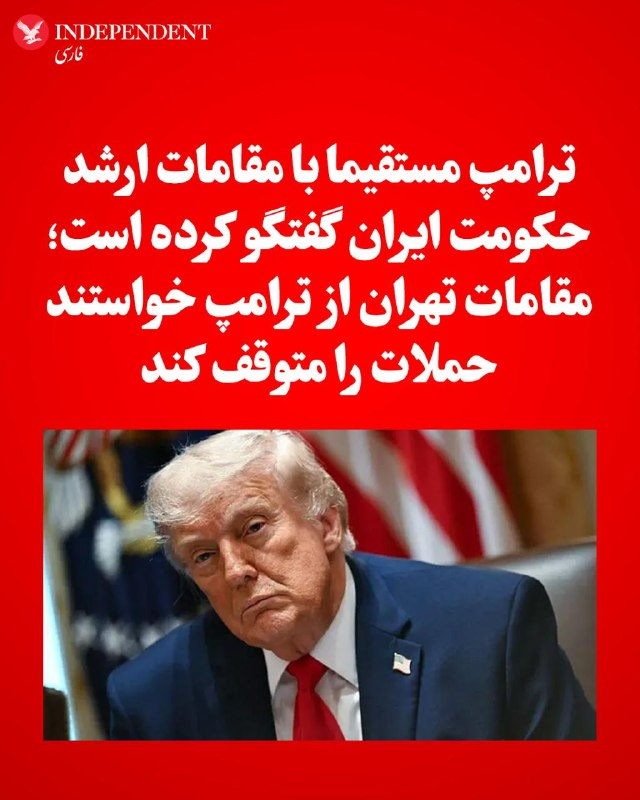

☄️ ترامپ: مقامات ایرانی در تماس مستقیم خواستند بمباران متوقف شود

پست خبرنگار فاکس‌نیوز، ترجمه ماشین:
امشب با پرزیدنت ترامپ صحبت کردم؛ در حالی که او از اتاق وضعیت، حملات نظامی آمریکا علیه ایران را زیر نظر داشت.

رئیس‌جمهور به من گفت که امشب مستقیماً با مقام‌های ایرانی صحبت کرده است؛ مقام‌هایی که از او خواسته‌اند بمباران را متوقف کند.

در زمان گفت‌وگوی ما، ایالات متحده ۴۹ موشک تاماهاوک شلیک کرده بود و جنگنده‌ها نیز در حال بمباران بودند. نزدیک‌ترین هدف به تهران حدود ۴۰ مایل بیرون از شهر بود.

ترامپ افزود که بمباران به‌زودی متوقف خواهد شد، اما اگر آن‌ها توافق را امضا نکنند، «تا سر حد نابودی بمبارانشان می‌کنیم.»

پرزیدنت ترامپ این را «نقض‌شده‌ترین آتش‌بس در تاریخ جهان» خواند.

جی‌دی ونس، معاون رئیس‌جمهور، به من گفت که ایالات متحده در روند مذاکرات، هم با صداهای میانه‌رو و هم با صداهای تندروتر در ایران سروکار دارد.

به‌روزرسانی‌های بیشتر در فاکس‌نیوز منتشر خواهد شد.
TreyYingst

📡 @VahidOnline

## kianmeli1 — post 87909

  

🔴فاکس نیوز-ترامپ می‌گوید اگر ایران با توافق موافقت نکند، فردا مجدد «ایران را بمباران خواهیم کرد».
https://t.me/kianmeli1

## Shin_Persian — post 6912

Shin ✓ @hey_itsmyturn
Wed, 10 Jun 2026 23:40:38 UTC

Jet activity over Fardis, Alborz Province, #Iran

ترجمه خودکار فارسی

فعالیت جت‌ها بر فراز فردیس، استان البرز، #Iran

𝕏 · @shin_persian

## Shin_Persian — post 6911

↩️ Quoted tweet: Aaron Rupar ✓ @atrupar Wed, 10 Jun 2026 23:25:23 UTC Fox correspondent: "I asked the president what will happen if the Iranians don't sign an agreement that was put forward by American negotiators. President Trump said, 'We'll bomb the s**t…

## Shin_Persian — post 6910

  <a href="telegram/content/Shin_Persian_6910_1781134938.mp4" target="_blank">🎬 Download video</a>

↩️ Quoted tweet:
Aaron Rupar ✓ @atrupar
Wed, 10 Jun 2026 23:25:23 UTC

Fox correspondent: "I asked the president what will happen if the Iranians don't sign an agreement that was put forward by American negotiators. President Trump said, 'We'll bomb the s**t out of them tomorrow night.'"

↩️ توییت نقل‌قول شده — برای پاسخ، پست زیر را ببینید.

ترجمه خودکار فارسی

خبرنگار فاکس: «من از رئیس‌جمهور پرسیدم که اگر ایرانی‌ها توافقی را که توسط مذاکره‌کنندگان آمریکایی ارائه شده است امضا نکنند، چه خواهد شد. پرزیدنت ترامپ گفت، "فردا شب دهنشون رو با بمب صاف می‌کنیم."»

𝕏 · @shin_persian

## Shin_Persian — post 6909

  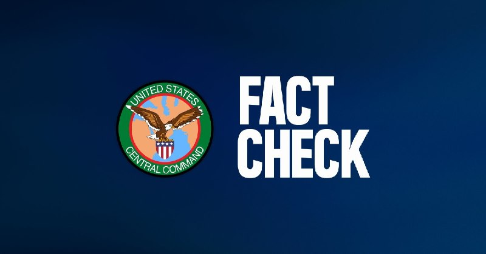

Shin ✓ @hey_itsmyturn
Wed, 10 Jun 2026 23:36:05 UTC

Following IRGC claims that the Strait of Hormuz is closed, U.S. Central Command says commercial ships are continuing to transit the waterway tonight.

Source: @CENTCOM
https://x.com/CENTCOM/status/2064854099418390919

ترجمه خودکار فارسی

در پی ادعاهای سپاه پاسداران (IRGC) مبنی بر بسته بودن تنگه هرمز، فرماندهی مرکزی ایالات متحده (سنتکام/CENTCOM) اعلام کرد که کشتی‌های تجاری امشب همچنان در حال عبور از این آبراه هستند.

منبع: @CENTCOM
https://x.com/CENTCOM/status/2064854099418390919

𝕏 · @shin_persian

## FarsiVOA — post 220315

  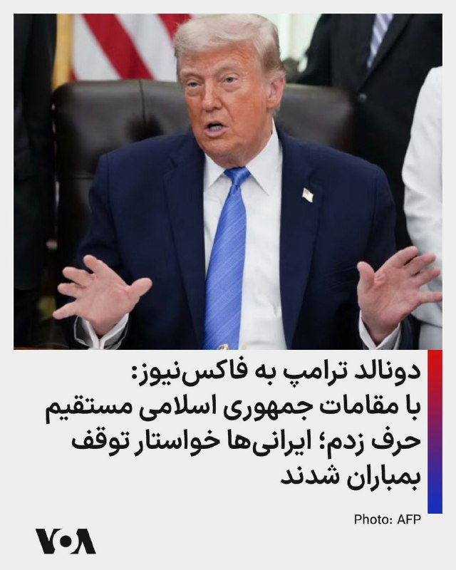

⚡️به گزارش رویترز آقای ترامپ به فاکس نیوز گفته است که «به‌طور مستقیم» با مقامات جمهوری اسلامی صحبت کرد و افزود ایرانی‌ها از من خواستند بمباران را متوقف کنم. آقای ترامپ گفت جت‌های جنگنده آمریکایی بر فراز آسمان ایران در حال پرواز هستند.
@FarsiVOA

## Persian_Trend_Official — post 16646

⭕️ یادتون باشه، هروقت اسرائیل و نتانیاهو وارد صحنه بشن اون موقع داستان تازه شروع خواهد شد. 🙌🏻

📝 Nick

📌 @persian_trend_official
پرشین ترند | متفاوت‌ترین کانال نظامی

## Persian_Trend_Official — post 16645

هم اکنون بازی والیبال تیم حکومتی جمهوری اسلامی با برزیل 📝 Nick 📌 @persian_trend_official پرشین ترند | متفاوت‌ترین کانال نظامی

## Persian_Trend_Official — post 16644

⭕️ مقام آمریکایی به وال استریت ژورنال:
هیچ تاسیسات حیاتی ایرانی ای در حملات جاری آسیب ندیده است.

📝 Nick

📌 @persian_trend_official
پرشین ترند | متفاوت‌ترین کانال نظامی

## Persian_Trend_Official — post 16643

⭕️ مهر: ♦️شنیده شدن صدای فعالیت پدافند در محدوده شرق بندرعباس 🔹دقایقی پیش، صدای فعالیت پدافند در شرق بندرعباس از سوی ساکنان محلی گزارش شده است. 🔹برخی منابع، خبر از انفجار مجدد در این محدوده داده بودند اما بررسی‌های خبرنگار مهر نشان می‌دهد انفجار جدیدی در…

## Persian_Trend_Official — post 16642

♨️ ترامپ:
آتش‌بس با ایران، نقض‌شده‌ترین و ناقض‌ترین آتش‌بس در تاریخ جهان بود.

📝 Nick

📌 @persian_trend_official
پرشین ترند | متفاوت‌ترین کانال نظامی

## Persian_Trend_Official — post 16641

⭕️ مهر:

♦️شنیده شدن صدای فعالیت پدافند در محدوده شرق بندرعباس

🔹دقایقی پیش، صدای فعالیت پدافند در شرق بندرعباس از سوی ساکنان محلی گزارش شده است.

🔹برخی منابع، خبر از انفجار مجدد در این محدوده داده بودند اما بررسی‌های خبرنگار مهر نشان می‌دهد انفجار جدیدی در بندرعباس رخ نداده است اما پدافند شرق بندرعباس برای رهگیری اهداف متخاصم فعال شده است‌.

🔹از اولین ساعات بامداد پنجشنبه استان هرمزگان، خط ساحلی خلیج‌فارس و تنگه هرمز صحنه درگیری‌هایی میان نیروهای مسلح کشورمان و تروریست‌های آمریکایی بوده است.

📝 Nick

📌 @persian_trend_official
پرشین ترند | متفاوت‌ترین کانال نظامی

## Persian_Trend_Official — post 16640

⭕️ خبرگزاری صدا و سیما به نقل از یک مقام ارشد:

ادعای ترامپ در باره تماس مقامات ایرانی با وی کذب محض است.

📝 Nick

📌 @persian_trend_official
پرشین ترند | متفاوت‌ترین کانال نظامی

## Persian_Trend_Official — post 16639

  <a href="telegram/content/Persian_Trend_Official_16639_1781134941.webm" target="_blank">🎬 Download video</a>

♨️ ترامپ:
به ایرانی‌ها اطلاع دادم که بمباران‌های فعلی به زودی پایان خواهد یافت.

📝 Nick

📌 @persian_trend_official
پرشین ترند | متفاوت‌ترین کانال نظامی

## IranianMinds — post 22240

  

سنتکام:

کشتی‌های تجاری امشب همچنان در حال تردد و عبور از تنگه هرمز هستند و ادعای سپاه برای هدف قرار دادن اونا کذبه

@IranianMinds

## IranianMinds — post 22239

🔴 ترامپ به فاکس نیوز:

امشب ضربات سنگینی به تهران وارد کردیم و مقام‌های ارشد ایرانی شخصاً از من خواستند که بمباران‌ها را متوقف کنم.

@IranianMinds

## IranianMinds — post 22238

🔴 وال استریت ژورنال:

یک مقام آمریکایی گفت در حملات آمریکا به ایران به هیچ تاسیسات زیرساختی آسیبی وارد نشد.

@IranianMinds

## IranianMinds — post 22237

🔴 ترامپ :

آتش بس با ایران نقض شده ترین آتش بس در تاریخ جهان بود.

@IranianMinds

## alonews — post 127029

  <a href="telegram/content/alonews_127029_1781134941.webm" target="_blank">🎬 Download video</a>

👈صداوسیما: ترامپ بازم دروغ گفت و عقب نشینی کرد و ما پیروز شدیم، الله اکبر

✅ @AloNews خبر جنگ

## alonews — post 127028

  <a href="telegram/content/alonews_127028_1781134942.webm" target="_blank">🎬 Download video</a>

👈ترامپ در گفتگو با فاکس نیوز:
آتش‌بس با ایران، نقض‌شده‌ترین و ناقض‌ترین آتش‌بس در تاریخ جهان بود

✅ @AloNews خبر جنگ

---
📅 بروزرسانی: 1405/03/21 03:02
---

## VahidOOnLine — post 244825

  

روزنامه وال‌استریت ژورنال چهارشنبه شنبه شب به وقت واشینگتن به نقل از یک مقام ارشد آمریکایی گزارش داد هیچ سایت زیرساختی در ایران مورد اصابت قرار نگرفته است.

براساس این گزارش، نیروهای نظامی ایالات متحده به سامانه‌های پدافند هوایی و سایت‌های راداری در نزدیکی تنگه هرمز حمله کرده‌اند.

بر اساس این گزارش، انفجارهای متعددی در امتداد تنگه هرمز از جمله در بندرعباس، جزیره قشم و سیریک و چندین نقطه جنوبی ایران شنیده شده است.
‌🏁 🇬🇧 IranintlTV

🤖 @VahidOOnLine

## VahidOOnLine — post 244824

  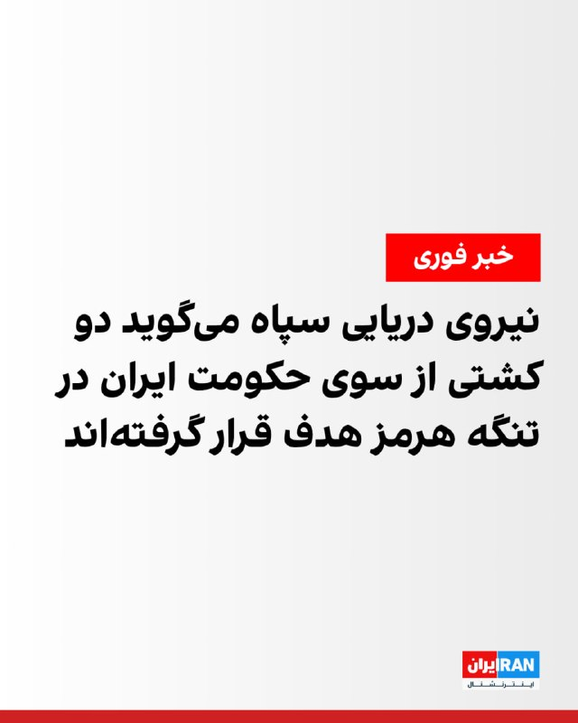

رسانه‌های داخلی گزارش دادند دو کشتی که قصد «عبور غیرقانونی» از تنگه هرمز را داشتند، هدف قرار گرفته‌اند.
این رسانه‌ها جزئیاتی درباره هویت کشتی‌ها یا میزان خسارات احتمالی منتشر نکرده‌اند و تاکنون مقام‌های رسمی دیگر نیز توضیحی در این‌باره ارائه نداده‌اند.
‌🏁 🇬🇧 IranintlTV

🤖 @VahidOOnLine

## VahidOOnLine — post 244823

  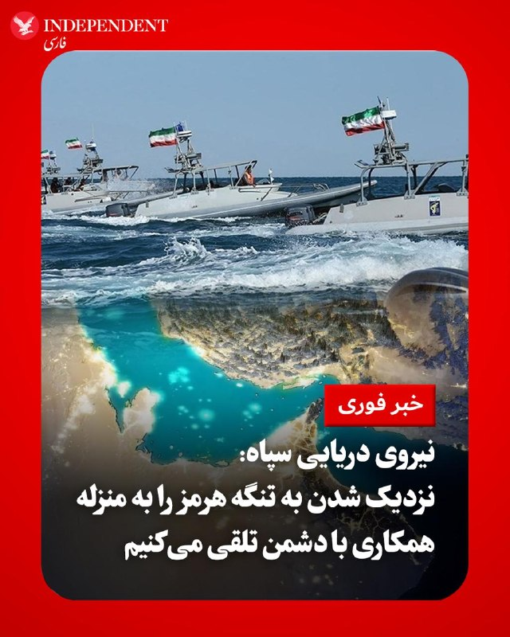

♦️نیروی دریایی سپاه در بیانیه‌ای اعلام کرد که تنگه هرمز تا اطلاع ثانوی بسته خواهد بود. در این بیانیه آمده است: «هشدار می‌دهیم هیچ شناوری از لنگرگاه خود در خلیج فارس و دریای عمان حرکت نداشته باشد. نزدیک شدن به تنگه هرمز به‌منزله همکاری با دشمن تلقی می شود.» پیش‌تر قرارگاه خاتم نیز هشدار داده بود که به سمت هر کشتی که از تنگه هرمز عبور کند، شلیک خواهد شد. همزمان تسنیم از مورد اصابت قرار گرفتن دو کشتی در تنگه هرمز خبر داده است.
‌🇸🇦 Indypersian

🤖 @VahidOOnLine

## WithYashar — post 14459

ترامپ: نیروهای آمریکایی ۴۹ موشک تاماهاوک به سمت ایران شلیک کردند
@withyashar

## WithYashar — post 14458

ترامپ: اگر ایران توافقنامه رو امضا نکنه، فرداشب به بمباران آنها برمیگردیم.
@withyashar

## WithYashar — post 14457

  <a href="telegram/content/WithYashar_14457_1781134358.mp4" target="_blank">🎬 Download video</a>

🎬 Video

## WithYashar — post 14456

ترامپ به فاکس : ایرانی‌ها ازم خواستن بمباران رو متوقف کنم

مستقیم با مقام‌های ایرانی صحبت کردم
جنگنده‌های آمریکا در حال پرواز روی آسمون ایران هستن
@withyashar

## WithYashar — post 14455

ترامپ: بمباران به زودی تموم میشه!
@withyashar

## pm_afshaa — post 93516

  <a href="telegram/content/pm_afshaa_93516_1781134360.webm" target="_blank">🎬 Download video</a>

🔴ترامپ: 49 موشک تاماهاک شلیک کردیم.

💧 Rainbet.com the #1 Non-KYC Crypto Casino & Sportsbook @rainbetcom

😁 @Pm_Afshaa

## pm_afshaa — post 93515

  <a href="telegram/content/pm_afshaa_93515_1781134361.webm" target="_blank">🎬 Download video</a>

🔴وال‌استریت ژورنال به نقل از یک مقام ارشد آمریکایی:

نیروهای آمریکا سامانه‌های پدافند هوایی و سایت‌های راداری در نزدیکی تنگه هرمز رو هدف قرار دادن و در حمله‌ها هیچ زیرساختی مورد اصابت قرار نگرفت.

💧 Rainbet.com the #1 Non-KYC Crypto Casino & Sportsbook @rainbetcom

😁 @Pm_Afshaa

## pm_afshaa — post 93514

  <a href="telegram/content/pm_afshaa_93514_1781134362.webm" target="_blank">🎬 Download video</a>

🔴ترامپ: حملات به‌زودی پایان خواهد یافت. 
💧 Rainbet.com the #1 Non-KYC Crypto Casino & Sportsbook @rainbetcom 
😁 @Pm_Afshaa

## pm_afshaa — post 93513

  <a href="telegram/content/pm_afshaa_93513_1781134362.webm" target="_blank">🎬 Download video</a>

🔴ترامپ به فاکس نیوز: ایرانی‌ها ازم خواستن بمباران رو متوقف کنم. مستقیم با مقام‌های ایرانی صحبت کردم. 
💧 Rainbet.com the #1 Non-KYC Crypto Casino & Sportsbook @rainbetcom 
😁 @Pm_Afshaa

## pm_afshaa — post 93512

  <a href="telegram/content/pm_afshaa_93512_1781134363.webm" target="_blank">🎬 Download video</a>

🔴ترامپ به فاکس نیوز:
ایرانی‌ها ازم خواستن بمباران رو متوقف کنم. مستقیم با مقام‌های ایرانی صحبت کردم.

💧 Rainbet.com the #1 Non-KYC Crypto Casino & Sportsbook @rainbetcom

😁 @Pm_Afshaa

## pm_afshaa — post 93511

  <a href="telegram/content/pm_afshaa_93511_1781134364.webm" target="_blank">🎬 Download video</a>

🔴ترامپ: جنگنده‌های آمریکا در ایران پرواز میکنن.

💧 Rainbet.com the #1 Non-KYC Crypto Casino & Sportsbook @rainbetcom

😁 @Pm_Afshaa

## pm_afshaa — post 93510

  <a href="telegram/content/pm_afshaa_93510_1781134365.webm" target="_blank">🎬 Download video</a>

🔴والا نیوز عبری:
اسرائیل خودش رو برای احتمال شلیک موشک از سوی ایران، آماده میکنه.

💧 Rainbet.com the #1 Non-KYC Crypto Casino & Sportsbook @rainbetcom

😁 @Pm_Afshaa

## VahidOnline — post 76175

  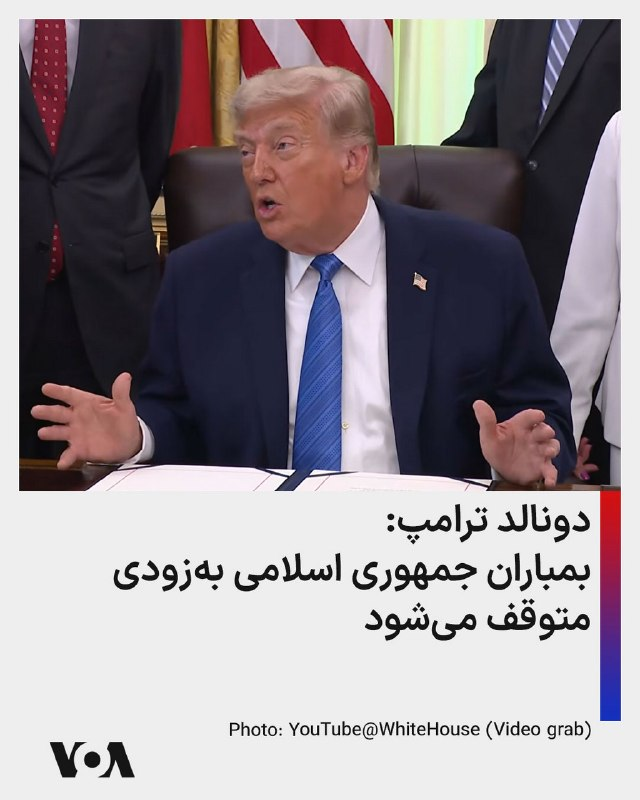

⚡️رویترز به نقل از فاکس‌نیوز گزارش داد که دونالد ترامپ، رئیس جمهوری آمریکا گزینه حملات بیشتر به جمهوری اسلامی را محفوظ نگه داشته است. این خبرگزاری می‌گوید آقای ترامپ به فاکس نیوز گفت بمباران به زودی متوقف خواهد شد. سنتکام روز چهارشنبه از آغاز دور دیگری از حملات دفاعی به جمهروی اسلامی خبر داد.
@VahidHeadline

📡 @VahidOnline

## VahidOnline — post 76174

  

♦️دقایقی پس از بیانیه قرارگاه خاتم که در آن تنگه هرمز کاملا بسته اعلام شده و هشدار داده شده بود که به هر شناوری که قصد عبور داشته باشد شلیک می‌شود، تسنیم از مورد اصابت قرار گرفتن دو کشتی در تنگه هرمز خبر داد. در گزارش این رسانه وابسته به سپاه آمده است که کشتی‌های «متخلف» قصد داشتند «به‌طور غیرقانونی» از تنگه هرمز عبور کنند. هنوز مقامات رسمی و سنتکام در این زمینه اظهارنظر نکرده‌اند.
@VahidOOnLine

📡 @VahidOnline

## IranIntlTV — post 341601

  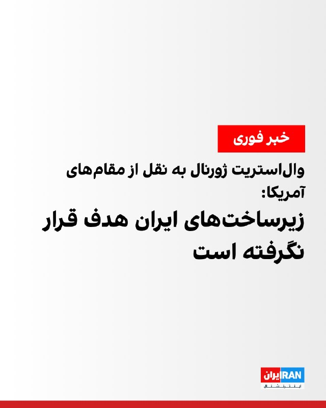

روزنامه وال‌استریت ژورنال چهارشنبه شنبه شب به وقت واشینگتن به نقل از یک مقام ارشد آمریکایی گزارش داد هیچ سایت زیرساختی در ایران مورد اصابت قرار نگرفته است.

براساس این گزارش، نیروهای نظامی ایالات متحده به سامانه‌های پدافند هوایی و سایت‌های راداری در نزدیکی تنگه هرمز حمله کرده‌اند.

بر اساس این گزارش، انفجارهای متعددی در امتداد تنگه هرمز از جمله در بندرعباس، جزیره قشم و سیریک و چندین نقطه جنوبی ایران شنیده شده است.
https://iranintl.com/202606108966

## IranIntlTV — post 341600

  

رسانه‌های داخلی گزارش دادند دو کشتی که قصد «عبور غیرقانونی» از تنگه هرمز را داشتند، هدف قرار گرفته‌اند.
این رسانه‌ها جزئیاتی درباره هویت کشتی‌ها یا میزان خسارات احتمالی منتشر نکرده‌اند و تاکنون مقام‌های رسمی دیگر نیز توضیحی در این‌باره ارائه نداده‌اند.

## Shin_Persian — post 6908

  <a href="telegram/content/Shin_Persian_6908_1781134367.mp4" target="_blank">🎬 Download video</a>

Aaron Rupar ✓ @atrupar
Wed, 10 Jun 2026 23:25:23 UTC

Fox correspondent: "I asked the president what will happen if the Iranians don't sign an agreement that was put forward by American negotiators. President Trump said, 'We'll bomb the s**t out of them tomorrow night.'"

ترجمه خودکار فارسی

خبرنگار فاکس: «از رئیس‌جمهور پرسیدم اگر ایرانی‌ها توافقی را که توسط مذاکره‌کنندگان آمریکایی ارائه شده امضا نکنند، چه خواهد شد. پرزیدنت ترامپ گفت: "فردا شب حسابی بمبارانشان می‌کنیم."»

𝕏 · @shin_persian

## Shin_Persian — post 6907

Shin ✓ @hey_itsmyturn
Wed, 10 Jun 2026 23:27:55 UTC

State-owned Mehr News reports that a position in Dashtestan County highlands was targeted says the origin of strike is unclear

ترجمه خودکار فارسی

خبرگزاری دولتی مهر گزارش می‌دهد که موضعی در ارتفاعات شهرستان دشتستان مورد هدف قرار گرفته است و می‌گوید منشأ این حمله نامشخص است.

𝕏 · @shin_persian

## Shin_Persian — post 6906

  

Shin ✓ @hey_itsmyturn
Wed, 10 Jun 2026 23:26:11 UTC

Scam messages are evolving greatly. This is way cooler than the Nigerian prince emails.

ترجمه خودکار فارسی

پیام‌های کلاهبرداری به شدت در حال تکامل هستند. این بسیار جذاب‌تر از ایمیل‌های شاهزاده نیجریه‌ای است.

𝕏 · @shin_persian

## FarsiVOA — post 220314

  

⚡️رویترز به نقل از فاکس‌نیوز گزارش داد که دونالد ترامپ، رئیس جمهوری آمریکا گزینه حملات بیشتر به جمهوری اسلامی را محفوظ نگه داشته است. این خبرگزاری می‌گوید آقای ترامپ به فاکس نیوز گفت بمباران به زودی متوقف خواهد شد. سنتکام روز چهارشنبه از آغاز دور دیگری از حملات دفاعی به جمهروی اسلامی خبر داد.
@FarsiVOA

## FarsiVOA — post 220313

⚡️طرح قانون جدید بریتانیا برای مقابله با عوامل نیابتی دولت‌های متخاصم از جمله جمهوری اسلامی
@FarsiVOA

## DW_Farsi — post 125795

  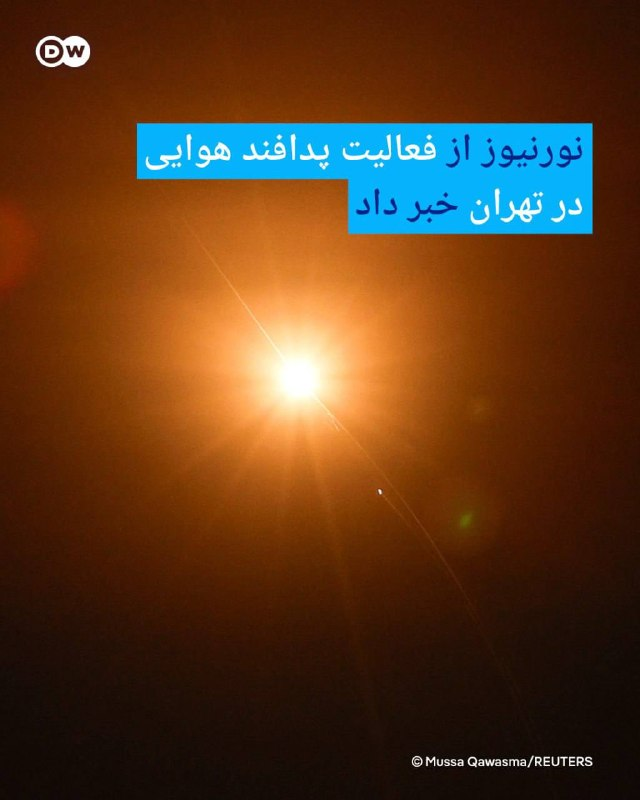

🔶 نورنیوز از فعالیت پدافند هوایی در تهران خبر داد

کانال تلگرامی نور نیوز وابسته به شورای عالی امنیت ملی ایران، خبر داد که "آتشبارهای پدافند هوایی" در رباط کریم تهران برای مقابله با "اهداف متخاصم" فعال شده‌اند.

سایت تابناک نیز این خبر را منتشر کرده است.

تا کنون خبر تاییدشده‌ای از حمله به تهران منتشر نشده است.

@dw_farsi

## Persian_Trend_Official — post 16638

♨️ ترامپ: اگر آنها توافق نکنند، دوباره فردا آنها را به شدت بمباران خواهیم کرد. 📝 Nick 📌 @persian_trend_official پرشین ترند | متفاوت‌ترین کانال نظامی

## Persian_Trend_Official — post 16637

  <a href="telegram/content/Persian_Trend_Official_16637_1781134371.webm" target="_blank">🎬 Download video</a>

♨️ ترامپ:
اگر آنها توافق نکنند، دوباره فردا آنها را به شدت بمباران خواهیم کرد.

📝 Nick

📌 @persian_trend_official
پرشین ترند | متفاوت‌ترین کانال نظامی

## Persian_Trend_Official — post 16636

  <a href="telegram/content/Persian_Trend_Official_16636_1781134372.webm" target="_blank">🎬 Download video</a>

💢 دونالد ترامپ، رئیس جمهور آمریکا اعلام کرد که بمباران ایران به زودی متوقف خواهد شد و گفت که مقامات ایرانی از او خواسته‌اند حملات را متوقف کند و ادعا می‌کند که مستقیماً با مقامات ایرانی صحبت کرده است. 📝 Nick 📌 @persian_trend_official پرشین ترند | متفاوت‌ترین…

## Persian_Trend_Official — post 16635

⭕️ مهر:

♦️یک منطقه در ارتفاعات دشتی مورد هدف قرار گرفت

معاون سیاسی و امنیتی استاندار بوشهر:
🔹یک منطقه در ارتفاعات در شهرستان دشتی مورد هدف قرار گرفته است.

🔹به دلیل سخت گذر بودن منطقه هنوز منشا آن مشخص نیست.

📝 Nick

📌 @persian_trend_official
پرشین ترند | متفاوت‌ترین کانال نظامی

## Persian_Trend_Official — post 16634

♨️ ترامپ:
جنگنده‌های ما بر فراز ایران در حال پرواز هستند و در حال حاضر در حال نابودی سیستم‌های راداری و پدافند هوایی در جنوب غربی کشور هستند.

📝 Nick

📌 @persian_trend_official
پرشین ترند | متفاوت‌ترین کانال نظامی

## Persian_Trend_Official — post 16633

⭕️ ترامپ:
نیروهای آمریکایی ۴۹ موشک تاماهاوک شلیک کردند که به اهدافی در عمق خاک ایران اصابت کردند.

📝 Nick

📌 @persian_trend_official
پرشین ترند | متفاوت‌ترین کانال نظامی

## Persian_Trend_Official — post 16632

  <a href="telegram/content/Persian_Trend_Official_16632_1781134373.webm" target="_blank">🎬 Download video</a>

یک مقام ارشد دفاعی آمریکا به فاکس نیوز گفت که میدان گازی پارس جنوبی در عسلویه، جنوب ایران، هدف قرار نگرفته است.

📝 Nick

📌 @persian_trend_official
پرشین ترند | متفاوت‌ترین کانال نظامی

## Persian_Trend_Official — post 16631

  <a href="telegram/content/Persian_Trend_Official_16631_1781134373.webm" target="_blank">🎬 Download video</a>

💢 دونالد ترامپ، رئیس جمهور آمریکا اعلام کرد که بمباران ایران به زودی متوقف خواهد شد و گفت که مقامات ایرانی از او خواسته‌اند حملات را متوقف کند و ادعا می‌کند که مستقیماً با مقامات ایرانی صحبت کرده است.

📝 Nick

📌 @persian_trend_official
پرشین ترند | متفاوت‌ترین کانال نظامی

## Persian_Trend_Official — post 16630

  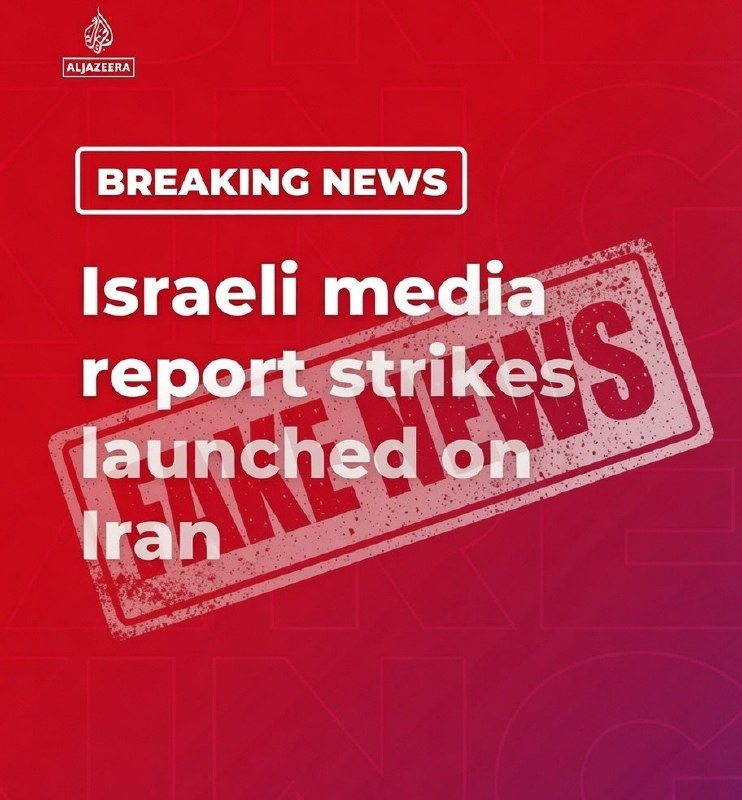

⭕️ اسرائیل گزارش کذب الجزیره مبنی بر مشارکت در حملات جاری به ایران را تکذیب کرد.

📝 Nick

📌 @persian_trend_official
پرشین ترند | متفاوت‌ترین کانال نظامی

## IranianMinds — post 22236

🔴 ترامپ : مقامات ایرانی باهام تماس گرفتن و ازم‌ خواستن حملات رو متوقف کنم و امشب همینکارو‌ خواهیم کرد ، ولی توافق نکنن فردا شب دوباره برمیگردیم! @IranianMinds

## IranianMinds — post 22235

🔴 ترامپ :

مقامات ایرانی باهام تماس گرفتن و ازم‌ خواستن حملات رو متوقف کنم و امشب همینکارو‌ خواهیم کرد ، ولی توافق نکنن فردا شب دوباره برمیگردیم!

@IranianMinds

## IranianMinds — post 22234

🔴 خبرنگار فاکس نیوز:

از رئیس‌جمهور پرسیدم اگر ایرانی‌ها توافق پیشنهادی مذاکره‌کنندگان آمریکایی را امضا نکنند، چه اتفاقی خواهد افتاد؟

ترامپ پاسخ داد:

فردا شب دوباره اونارو بمباران خواهیم کرد.

@IranianMinds

## IranianMinds — post 22233

🔴 ترامپ به فاکس نیوز:

جنگنده‌های ما در آسمان ایران در حال پرواز هستند و هم‌اکنون سامانه‌های راداری و پدافند هوایی در جنوب غربی کشور را منهدم می‌کنند.

@IranianMinds

## IranianMinds — post 22232

🔴 ترامپ به فاکس نیوز:

نیروهای آمریکایی ۴۹ موشک تاماهاوک شلیک کردند که اهدافی را در عمق ایران مورد اصابت قرار داد.

@IranianMinds

## IranianMinds — post 22231

🔴 ترامپ :

اسرائیلی‌ها در این حملات ایران دخالتی ندارند.

@IranianMinds

## IranianMinds — post 22230

🔴 ترامپ :

توقف حملات می‌تواند در چارچوب پیشرفت مذاکرات و تحولات دیپلماتیک صورت بگیرد.

@IranianMinds

## IranianMinds — post 22229

🔴 ترامپ :

همین الان جنگنده های ما دارن تو اسمون ایران پرواز میکنن ، و مقام های ایرانی با من تماس گرفتن و ازم خواستن حملات رو متوقف کنم.

@IranianMinds

## IranianMinds — post 22227

🔴 ترامپ:

من مستقیماً با مقام‌های ایرانی حرف زدم.

@IranianMinds

## IranianMinds — post 22226

🔴 ترامپ :

بمباران ها بزودی متوقف میشن.

@IranianMinds

## alonews — post 127027

  <a href="telegram/content/alonews_127027_1781134374.webm" target="_blank">🎬 Download video</a>

👈ترامپ به فاکس نیوز:
نیروهای آمریکایی ۴۹ موشک تاماهاوک شلیک کردند که به اهدافی در عمق خاک ایران اصابت کردند.

✅ @AloNews خبر جنگ

## alonews — post 127026

  <a href="telegram/content/alonews_127026_1781134374.webm" target="_blank">🎬 Download video</a>

👈ترامپ: اگر ایران توافقنامه رو امضا نکنه، فرداشب به بمباران آنها برمیگردیم.

✅ @AloNews خبر جنگ

## alonews — post 127025

  <a href="telegram/content/alonews_127025_1781134375.webm" target="_blank">🎬 Download video</a>

👈ترامپ به فاکس : ایرانی‌ها ازم خواستن بمباران رو متوقف کنم

🔴مستقیم با مقام‌های ایرانی صحبت کردم

🔴جنگنده‌های آمریکا در حال پرواز روی آسمون ایران هستن

🔴حملات هوایی به زودی تموم میشه

✅ @AloNews خبر جنگ

## alonews — post 127024

  <a href="telegram/content/alonews_127024_1781134375.webm" target="_blank">🎬 Download video</a>

👈هنوز هیچ حمله ای به‌ مواضع آمریکا صورت نگرفته است.

✅ @AloNews خبر جنگ

---
📅 بروزرسانی: 1405/03/21 02:52
---

## VahidOOnLine — post 244822

  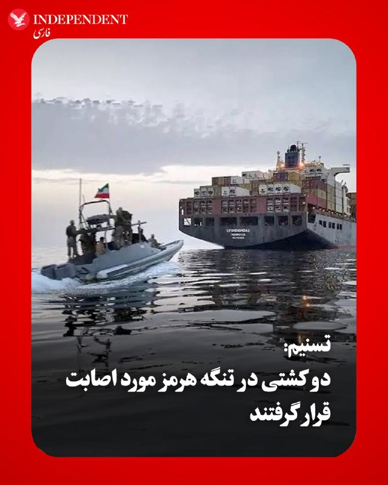

♦️دقایقی پس از بیانیه قرارگاه خاتم که در آن تنگه هرمز کاملا بسته اعلام شده و هشدار داده شده بود که به هر شناوری که قصد عبور داشته باشد شلیک می‌شود، تسنیم از مورد اصابت قرار گرفتن دو کشتی در تنگه هرمز خبر داد. در گزارش این رسانه وابسته به سپاه آمده است که کشتی‌های «متخلف» قصد داشتند «به‌طور غیرقانونی» از تنگه هرمز عبور کنند. هنوز مقامات رسمی و سنتکام در این زمینه اظهارنظر نکرده‌اند.
‌🇸🇦 Indypersian

🤖 @VahidOOnLine

## VahidOOnLine — post 244821

  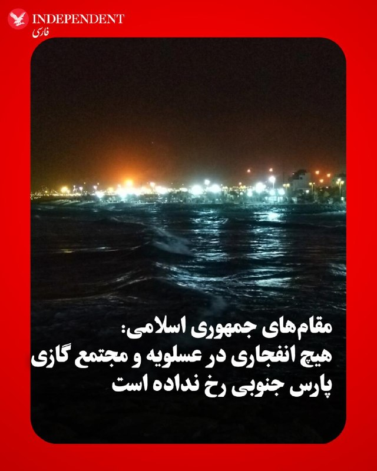

♦️خبرگزاری تسنیم وابسته به سپاه پاسداران بامداد پنجشنبه ۲۱ خرداد به نقل از مقام‌های محلی و استانی گزارش داد که هیچ انفجاری در عسلویه یا مجتمع گازی پارس جنوبی رخ نداده است.

اسکندر پاسالار، فرماندار عسلویه، با رد گزارش‌های منتشرشده در برخی شبکه‌های اجتماعی گفت: «در عسلویه هیچ انفجاری نداشتیم و شهر و منطقه اقتصادی عسلویه در آرامش کامل است.»

تسنیم نیز اعلام کرد خبرهایی که از ساعاتی پیش درباره بمباران یک کارخانه پتروشیمی در عسلویه به نقل از این خبرگزاری منتشر شده، در هیچ‌یک از خروجی‌های رسمی این رسانه منتشر نشده و صحت ندارد.

معاون سیاسی، امنیتی و اجتماعی استاندار بوشهر نیز با رد این گزارش‌ها گفت تاکنون هیچ انفجاری در مجتمع گازی عسلویه رخ نداده است.
‌🇸🇦 Indypersian

🤖 @VahidOOnLine

## WithYashar — post 14454

پاکستان: به آمریکا اعلام کردیم که دیگر دست از تلاش برای میانجیگری برمی‌داریم
@withyashar

## pm_afshaa — post 93509

  <a href="telegram/content/pm_afshaa_93509_1781133737.mp4" target="_blank">🎬 Download video</a>

صدای جنگنده‌های آمریکایی برفراز قشم

💧 Rainbet.com the #1 Non-KYC Crypto Casino & Sportsbook @rainbetcom

😁 @Pm_Afshaa

## pm_afshaa — post 93508

  <a href="telegram/content/pm_afshaa_93508_1781133738.webm" target="_blank">🎬 Download video</a>

🔴فاکس نیوز: یه مقام آمریکایی اطلاع داد حملات به ایران ادامه داره.

💧 Rainbet.com the #1 Non-KYC Crypto Casino & Sportsbook @rainbetcom

😁 @Pm_Afshaa

## pm_afshaa — post 93507

  <a href="telegram/content/pm_afshaa_93507_1781133739.webm" target="_blank">🎬 Download video</a>

🔴ومارک لوین:
دور دوم حملات به ایران همین حالا در حال انجامه. من کاملاً موافق آن هستم.

من درک نمیکنم چرا حملات 48 ساعت پیش اسرائیل، که در پاسخ به شلیک 11 موشک بالستیک به کشورش بود، این‌همه انتقاد به همراه داشت!

💧 Rainbet.com the #1 Non-KYC Crypto Casino & Sportsbook @rainbetcom

😁 @Pm_Afshaa

## VahidOnline — post 76173

  

⚡️روزنامه وال‌استریت ژورنال پنج‌شنبه شب به وقت واشنگتن به نقل از یک مقام ارشد آمریکایی گزارش داد که هیچ سایت زیرساختی در ایران مورد اصابت قرار نگرفته است و نیروهای نظامی ایالات متحده در حال حمله به پدافند هوایی و سایت‌های راداری در نزدیکی تنگه هرمز بودند. انفجارهایی در امتداد تنگه هرمز، از جمله بندرعباس، جزیره قشم و سیریک گزارش شده است.
@VahidHeadline

📡 @VahidOnline

## VahidOnline — post 76172

پیام‌های دریافتی:
قشم ۲:۳۵ صدا و لرزشش حس شد

۲:۳۵ دقیقه بندرعباس دوباره صدای انفجار اومد

سلام بندرعباس دوباره زدن ۲:۳۷
[احتمالا منظورشون اینه که صدا شنیدند!]

📡 @VahidOnline

## kianmeli1 — post 87908

🔴فوری
۲:۳۵ دقیقه بندرعباس و قشم صدای انفجار اومد
https://t.me/kianmeli1

## kianmeli1 — post 87907

‏🔴نیروی دریایی سپاه: دو کشتی که قصد عبور از تنگه هرمز را داشتند، مورد اصابت قرار گرفتند
https://t.me/kianmeli1

## kianmeli1 — post 87906

🔴فوری-پدافند کرمانشاه در تنگ کنشت فعال شد
https://t.me/kianmeli1

## Shin_Persian — post 6905

Shin ✓ @hey_itsmyturn
Wed, 10 Jun 2026 23:18:04 UTC

Blasts in Bandar Abbas, Hormozgan Province, #Iran

ترجمه خودکار فارسی

انفجارها در بندرعباس، استان هرمزگان، #Iran

𝕏 · @shin_persian

## FarsiVOA — post 220312

  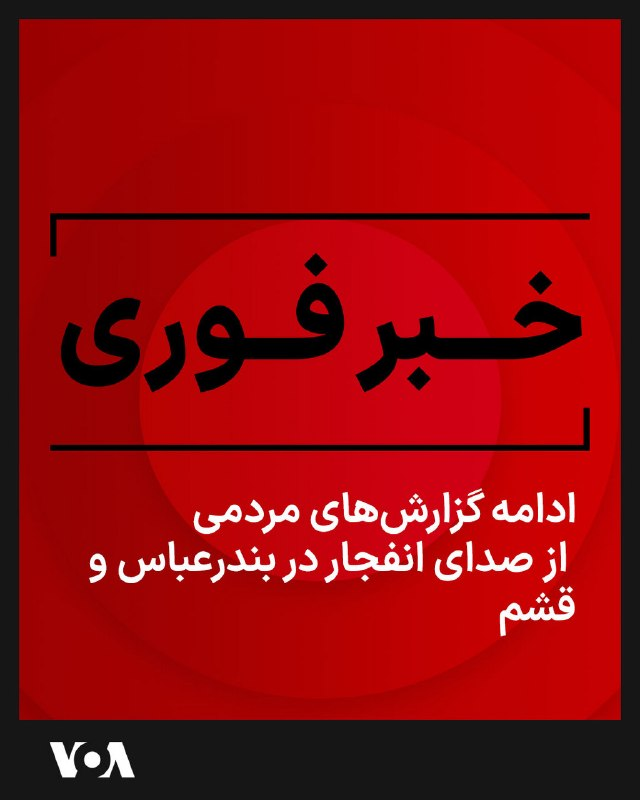

⚡️کانال تلگرامی وحید‌آنلاین از شنیده شدن صدای انفجار در بندر عباس در حوالی ساعات ۲:۳۰ بامداد خبر داده است. همچنین این کانال گزارش‌هایی مردمی از «صدا و لرزش» در جزیره قشم را منتشر کرد.
@FarsiVOA

## DW_Farsi — post 125794

  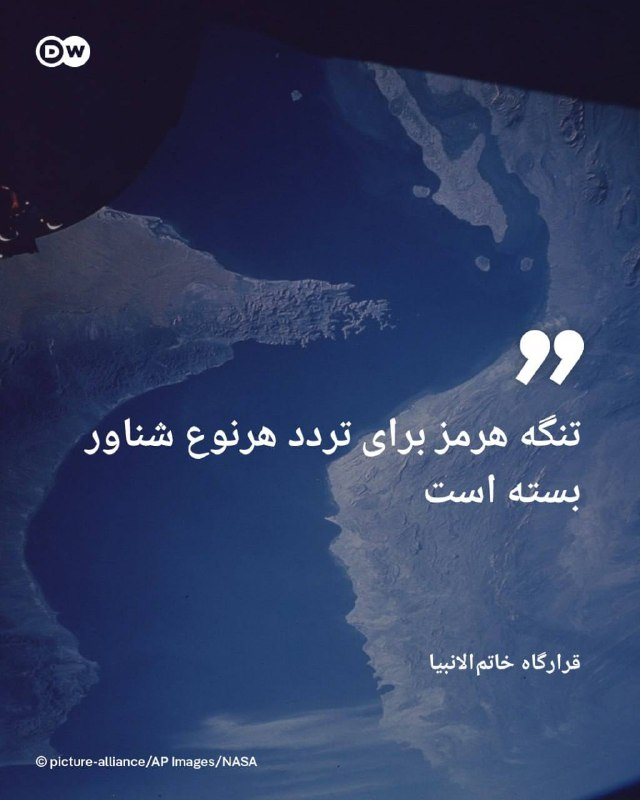

🔶 قرارگاه خاتم‌الانبیا: تنگه هرمز برای تردد هرنوع شناور بسته است

ساعتی پس از آغاز حملات امریکا به اهدافی در داخل ایران، قرارگاه مرکزی خاتم‌الانبیای سپاه پاسداران در بیانیه‌ای اعلام کرد تنگه هرمز به روی هر نوع شناور اعم از نفتکش و تجاری بسته است.

در این بیانیه با تایید حملات آمریکا به "برخی از مناطق جنوب در استان هرمزگان" آمده است: «از این لحظه به دلیل ناامنی در منطقه، تنگه هرمز برای تردد هر نوع شناور اعم از نفتکش و تجاری بسته اعلام می‌گردد و هرگونه تردد مورد اصابت قرار خواهد گرفت.»

این قرارگاه سپاه ادعای امریکا درباره عبور کشتی از تنگه هرمز را نیز تکذیب کرد.

@dw_farsi

## Persian_Trend_Official — post 16629

🚨والا: اسرائیل خود را برای احتمال شلیک موشک از سوی ایران، آماده می‌‌کند.

📝 Nick

📌 @persian_trend_official
پرشین ترند | متفاوت‌ترین کانال نظامی

## Persian_Trend_Official — post 16628

  <a href="telegram/content/Persian_Trend_Official_16628_1781133740.mp4" target="_blank">🎬 Download video</a>

⭕️ جوان ایرانی:

📝 Nick

📌 @persian_trend_official
پرشین ترند | متفاوت‌ترین کانال نظامی

## Persian_Trend_Official — post 16627

  <a href="telegram/content/Persian_Trend_Official_16627_1781133742.webm" target="_blank">🎬 Download video</a>

‼️ صدای انفجار مهیب در بندرعباس

📝 Nick

📌 @persian_trend_official
پرشین ترند | متفاوت‌ترین کانال نظامی

## Persian_Trend_Official — post 16626

⭕️ مقام آمریکایی به شبکه فاکس نیوز: حملات نظامی آمریکا علیه ایران، همچنان ادامه دارد.

📝 Nick

📌 @persian_trend_official
پرشین ترند | متفاوت‌ترین کانال نظامی

## Persian_Trend_Official — post 16625

⭕️ قرارگاه مرکزی خاتم‌الانبیا: نیروهای مسلح جمهوری اسلامی ایران به هرگونه تجاوز و شرارت ارتش متجاوز و تروریست آمریکا در منطقه، پاسخ کوبنده و قاطع می‌دهند.

📝 Nick

📌 @persian_trend_official
پرشین ترند | متفاوت‌ترین کانال نظامی

## Persian_Trend_Official — post 16624

🚨 درگیری‌های آمریکا و ایران در نزدیکی جزیره قشم، خلیج فارس ادامه دارد.

📝 Nick

📌 @persian_trend_official
پرشین ترند | متفاوت‌ترین کانال نظامی

## Persian_Trend_Official — post 16623

  <a href="telegram/content/Persian_Trend_Official_16623_1781133743.webm" target="_blank">🎬 Download video</a>

⭕️ پاکستان:

به آمریکا اعلام کردیم که دیگر دست از تلاش برای می‌انجیگری برمی‌‌داریم!

📝 Nick

📌 @persian_trend_official
پرشین ترند | متفاوت‌ترین کانال نظامی

## Persian_Trend_Official — post 16622

  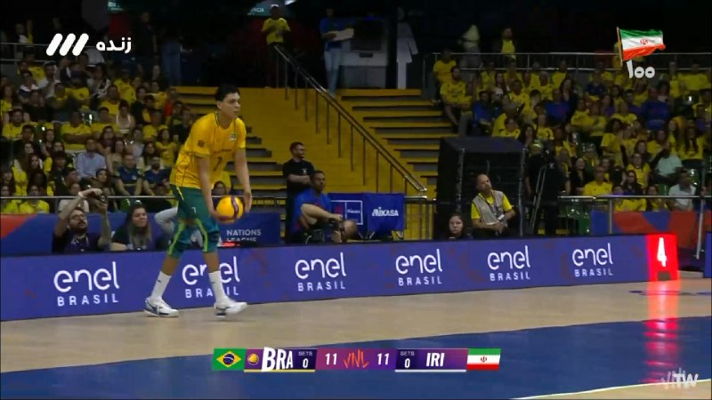

هم اکنون بازی والیبال تیم حکومتی جمهوری اسلامی با برزیل

📝 Nick

📌 @persian_trend_official
پرشین ترند | متفاوت‌ترین کانال نظامی

## IranianMinds — post 22225

🔴 یک مقام آمریکایی به فاکس‌ نیوز :

حملات نظامی آمریکا علیه اهدافی در ایران همچنان ادامه دارد.

@IranianMinds

## IranianMinds — post 22224

  <a href="telegram/content/IranianMinds_22224_1781133744.mp4" target="_blank">🎬 Download video</a>

حضور جنگنده های آمریکا در آسمان قشم

@IranianMinds

## BBCPersian — post 283371

🔻سی‌ان‌ان: حملات جدید آمریکا در حالیست که هیئت مذاکره کننده قطری هنوز در تهران است

شبکه تلویزیونی سی‌ان‌ان به نقل از یک منبع آگاه گزارش کرده است که موج جدید حملات آمریکا علیه اهدافی در ایران در حالیست که هنوز یک هئیت قطری در تهران است.

پیش‌تر به گزارش رسانه‌های ایران یک هیئت بلندپایه از قطر ظهر روز چهارشنبه برای گفتگو با مقامات ایران وارد تهران شد.

به گزارش روزنامه دولتی ایران، این هیئت برای گفتگو و تبادل نظر درباره روابط دوجانبه و تحولات منطقه‌ای، به تهران سفر کرده است.

بر اساس این گزارش «در جریان این سفر، این هیئت علاوه بر بحث در مورد روابط دوجانبه و تحولات منطقه، در باره آخرین تحولات مرتبط با روند دیپلماتیک برای خاتمه جنگ بین آمریکا و ایران هم بحث و رایزنی می‌کند.»
https://bbc.in/4fIJPot
@BBCPersian

## Dirty_Kids — post 391653

الان سردار رادان میره یه بیمارستان، شناسنامه‌شو می‌ذاره روی میز ایستگاه پرستاری میگه: یه اتاق رو به زایشگاه لطفا.

@Dirty_Kids 👻

## Dirty_Kids — post 391652

  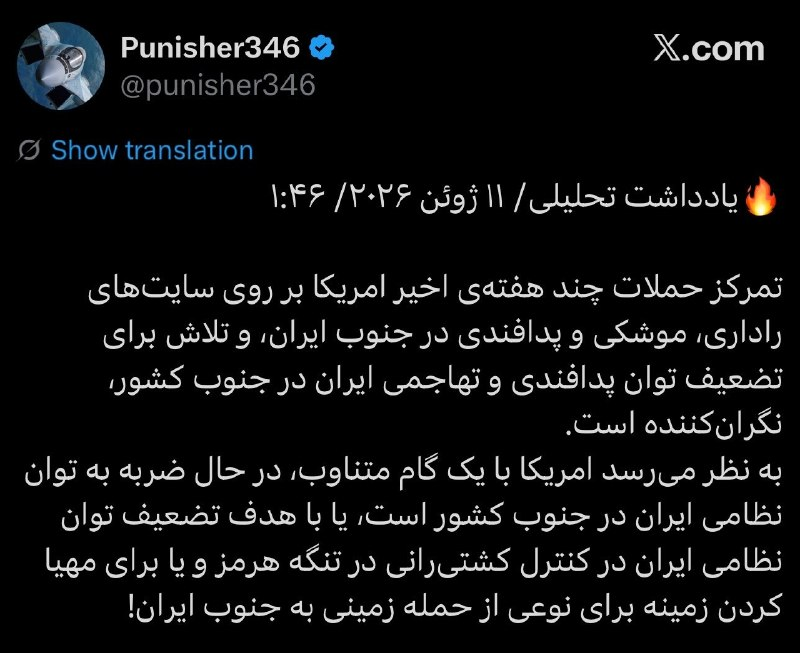

تحلیل یک راس عرزشی

@Dirty_Kids 👻

## alonews — post 127023

  <a href="telegram/content/alonews_127023_1781133745.mp4" target="_blank">🎬 Download video</a>

👈صدای جنگنده های آمریکایی برفراز قشم

✅ @AloNews خبر جنگ

---
📅 بروزرسانی: 1405/03/21 02:42
---

## VahidOOnLine — post 244820

  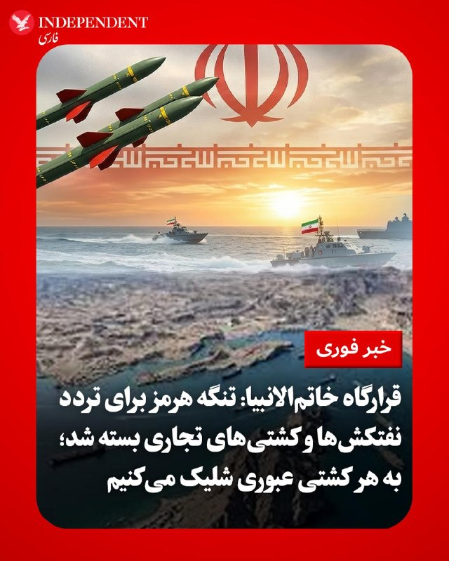

♦️قرارگاه خاتم در بیانیه‌ای که تسنیم منتشر کرده تنگه هرمز را کاملا بسته اعلام کرد و تهدید کرد که هرگونه تردد مورد اصابت قرار خواهد گرفت. در این بیانیه آمده است که این ممنوعیت شامل کشتی‌های تجاری و نتفکش‌ها است.
‌🇸🇦 Indypersian

🤖 @VahidOOnLine

## WithYashar — post 14453

## WithYashar — post 14452

هوافضای ۳پا: پاسداران برای یک عملیات تاریخی آماده شده اند!
@withyashar

## WithYashar — post 14451

## WithYashar — post 14450

## FoxNewsTwitter — post 342829

  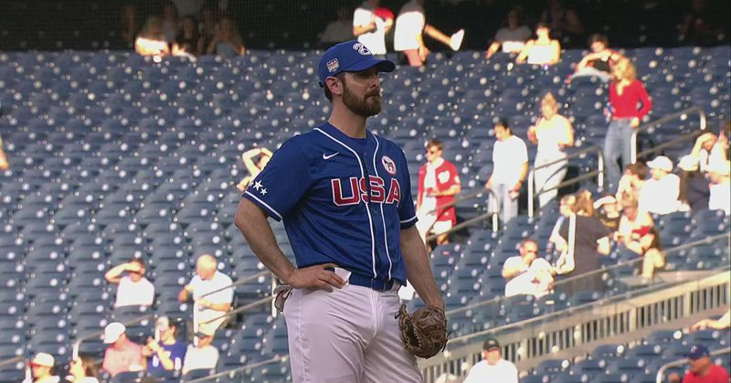

Fox News (Twitter/X)

WATCH LIVE: Annual Congressional Baseball Game for Charity at Nationals Park https://twitter.com/i/broadcasts/1oKMvvrRMznGQ

## pm_afshaa — post 93506

انفجار مجدد در بندر عباس

💧 Rainbet.com the #1 Non-KYC Crypto Casino & Sportsbook @rainbetcom

😁 @Pm_Afshaa

## pm_afshaa — post 93505

ما منتظر جواب سپاهیم
چی شد پس این موشکا!؟

## pm_afshaa — post 93504

  <a href="telegram/content/pm_afshaa_93504_1781133138.webm" target="_blank">🎬 Download video</a>

🔴گزارشات اولیه از حملات هواپیمای جنگی A-10 آمریکا به قایق های تندرو سپاه در جزیره لارک.

💧 Rainbet.com the #1 Non-KYC Crypto Casino & Sportsbook @rainbetcom

😁 @Pm_Afshaa

## mamlekate — post 103669

📝 اندیمشک شدیدا صدای جنگنده میاد . ساعت دو بامداد پنجشنبه ۲۱ خرداد

📝 ساعت ۰۲:۱۵ دقیقه صدای ممتد عبور جنگنده. ما از شهر بافت، استان کرمان شنیدیم صدا رو، لشکرکشی بود

📝 کرمانشاه ساعت۲:۳۰ دوتا صدای انفجار مهیب از دور آمد
پنجشنبه۲۱ خرداد

📝 ۲:۳۶ بندرعباس مجدد صدای انفجار اومد

@mamlekate_pm

## kianmeli1 — post 87905

🔴فوری-پدافند هوایی در رباط کریم تهران فعال شد
https://t.me/kianmeli1

## FarsiVOA — post 220311

  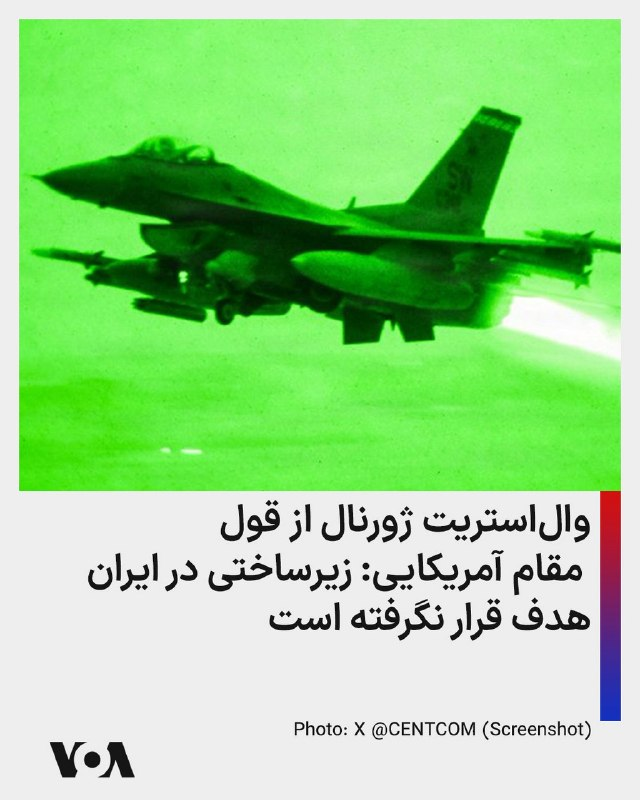

⚡️روزنامه وال‌استریت ژورنال پنج‌شنبه شب به وقت واشنگتن به نقل از یک مقام ارشد آمریکایی گزارش داد که هیچ سایت زیرساختی در ایران مورد اصابت قرار نگرفته است و نیروهای نظامی ایالات متحده در حال حمله به پدافند هوایی و سایت‌های راداری در نزدیکی تنگه هرمز بودند. انفجارهایی در امتداد تنگه هرمز، از جمله بندرعباس، جزیره قشم و سیریک گزارش شده است.
@FarsiVOA

## DW_Farsi — post 125793

  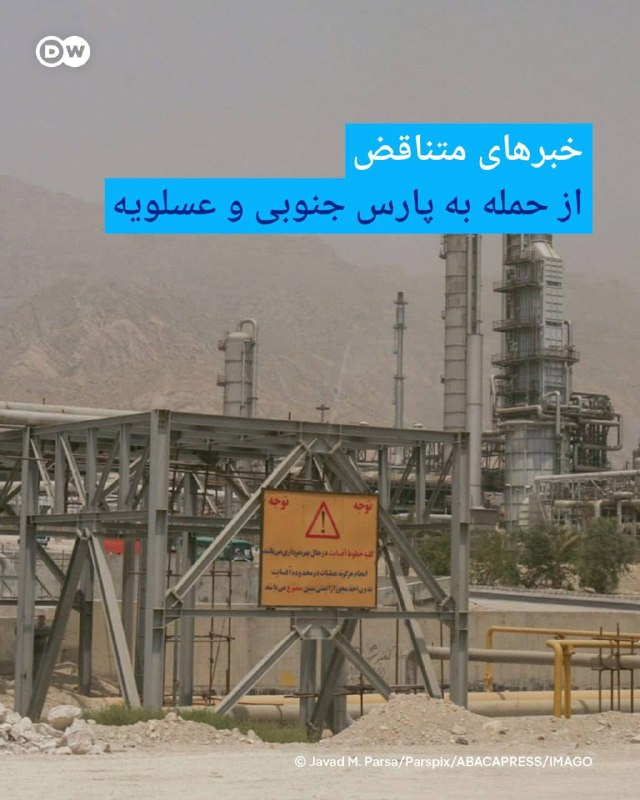

🔶 خبرهای متناقض از حمله به پارس جنوبی و عسلویه

در حالی که خبرگزاری دانشجو وابسته به بسیج دانشجویی از بمباران یک کارخانه پتروشیمی متعلق به مجتمع گاز پارس جنوبی در عسلویه خبر می‌دهد، خبرگزاری تسنیم وابسته به سپاه پاسداران این خبر را تکذیب کرده است.

معاون استاندار بوشهر نیز هرگونه انفجار در مجتمع گازی عسلویه را تکذیب کرد.

تسنیم همچنین فعالیت هرگونه پدافند در شیراز را نیز تکذیب کرد.

در عین حال خبرگزاری اکسیوس به نقل از یک مقام آمریکایی گزارش داد تمامی اهدافی که در حملات اخیر مورد هدف قرار گرفته‌اند، در جنوب ایران واقع شده‌اند. این مقام آمریکایی گفت سامانه‌های پدافند هوایی، رادارها و واحدهای فرماندهی و کنترل پهپادها از جمله اهداف این حملات بوده‌اند.

@dw_farsi

## Persian_Trend_Official — post 16621

  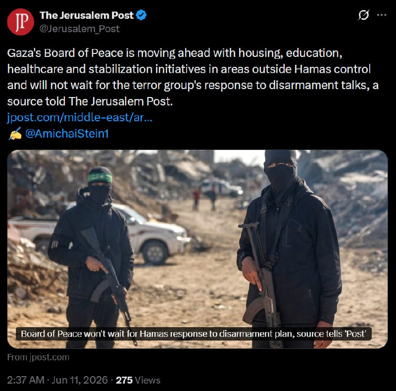

یک منبع به جروزالم پست گفت که هیئت صلح غزه در حال پیشبرد طرح‌های مسکن، آموزش، مراقبت‌های بهداشتی و ایجاد ثبات در مناطق خارج از کنترل حماس است و منتظر پاسخ این گروه تروریستی به مذاکرات خلع سلاح نخواهد ماند.

📝 Nick

📌 @persian_trend_official
پرشین ترند | متفاوت‌ترین کانال نظامی

## Persian_Trend_Official — post 16620

  <a href="telegram/content/Persian_Trend_Official_16620_1781133139.webm" target="_blank">🎬 Download video</a>

تایید نشده/ایران شروع به مین‌گذاری در آب‌های تنگه هرمز کرده است.

## IranianMinds — post 22223

فعلا حدود یک ساعتیه خبری از حملات جدید نیست

@IranianMinds

## IranianMinds — post 22222

🔴 مقامات پاکستانی اعلام کردن دیگر دست از میانجیگری در مذاکرات ایران و آمریکا برمیدارن.

@IranianMinds

## BBCPersian — post 283370

  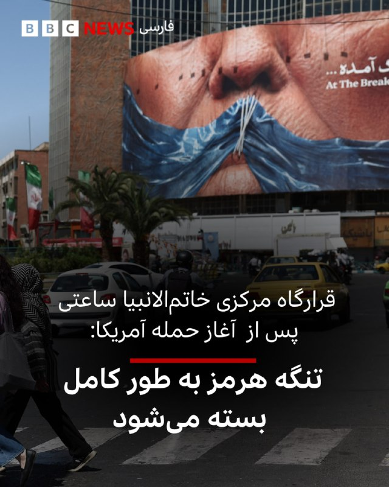

‌
قرارگاه خاتم الانبیاء که مدیریت جنگ در ایران را بر عهده دارد ساعتی بعد از دور جدید حملات آمریکا با صدور اطلاعیه‌ای اعلام کرد: «از این لحظه به دلیل ناامنی در منطقه، تنگه هرمز برای تردد هر نوع شناور اعم از نفتکش و تجاری بسته اعلام می‌گردد.»

این قرارگاه تهدید کرده است که هرگونه ترددی «مورد اصابت» قرار خواهد گرفت.

همچنین در این اطلاعیه آمده که «ادعای آمریکا مبنی بر عبور کشتی از تنگه یاد شده تکذیب می‌شود».

به نظر می‌رسد این واکنشی به ادعای عصر چهارشنبه دونالد ترامپ است که گفته بود آمریکا طی یک عملیات توانسته ده‌ها میلیون بشکه نفت را از تنگه هرمز عبور دهد.

📷Reuters
https://bbc.in/4fIJPot
@BBCPersian

## Dirty_Kids — post 391651

خبرنگار: آیا به حمله به نیروگاه‌ها و پل‌های ایران فکر می‌کنید؟ ترامپ: به تو نمیگم اما می‌تونم این کارو انجام بدم. @Dirty_Kids 👻

## Dirty_Kids — post 391650

ساعت حدود ۰۲:۱۵ صبح پنجشنبه؛ چند قایق تندرو در نزدیکی جزیره لارَک هدف قرار گرفته شدند.

براساس توصیف شاهدان، شلیک به صورت رگبار از آسمان به سطح دریا بود (احتمالاً توسط هواپیمای A-10)

@Dirty_Kids 👻

## alonews — post 127022

  <a href="telegram/content/alonews_127022_1781133141.webm" target="_blank">🎬 Download video</a>

👈انفجار مجدد در بندرعباس

✅ @AloNews خبر جنگ

## alonews — post 127021

  <a href="telegram/content/alonews_127021_1781133141.webm" target="_blank">🎬 Download video</a>

🔴فوری/پاکستان: به آمریکا اعلام کردیم که دیگر دست از تلاش برای میانجیگری برمی‌داریم!

✅ @AloNews خبر جنگ

---
📅 بروزرسانی: 1405/03/21 02:32
---

## VahidOOnLine — post 244819

  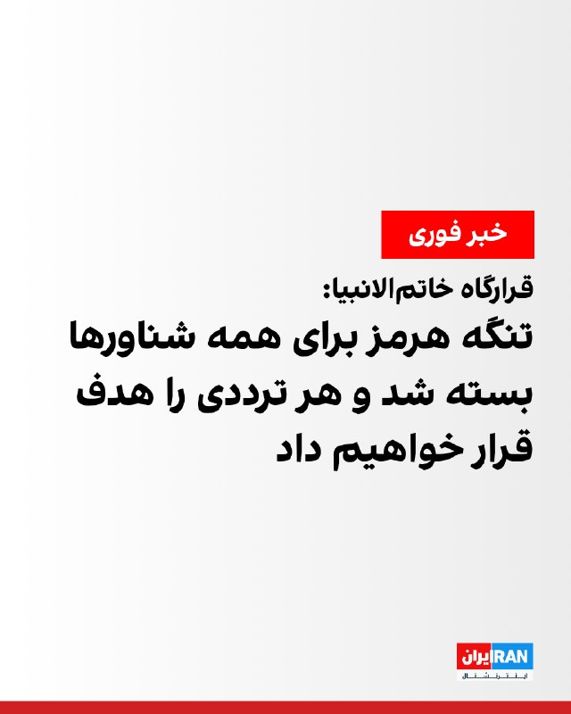

قرارگاه مرکزی خاتم‌الانبیا اعلام کرد در پی آنچه «ادامه شرارت‌های آمریکا» و آغاز حملات ارتش این کشور به برخی مناطق جنوبی استان هرمزگان خوانده، تنگه هرمز از این لحظه به دلیل «ناامنی در منطقه» برای تردد هر نوع شناور، اعم از نفتکش و تجاری، بسته است و هرگونه عبور هدف قرار خواهد گرفت.

قرارگاه خاتم‌الانبیا اظهارات مقام‌های آمریکا درباره عبور کشتی از تنگه هرمز را تکذیب کرد.
‌🏁 🇬🇧 IranintlTV

🤖 @VahidOOnLine

## WithYashar — post 14449

گزارشات اولیه از حملات هواپیمای جنگی A-10 آمریکا به قایق های تندرو سپاه در جزیره لارک
@withyashar

## WithYashar — post 14448

  <a href="https://t.me/withyashar/14448" target="_blank">📎 Download file</a>

📱 @withyashar

📱 https://instagram.com/yashar

## WithYashar — post 14447

مقامات آمریکایی به وال استریت ژورنال گفتند که ترامپ دیپلماسی با ایران را رها نکرده است، اگرچه صبر او به طور فزاینده‌ای کاهش یافته است.

حتی پس از تأیید حملات جدید در اوایل این هفته، ترامپ به دستیارانش دستور داد پیامی را از طریق واسطه‌های قطری به تهران منتقل کنند که این حملات پاسخی به حادثه پهپاد است که تقریباً خدمه آپاچی را کشت، نه آغاز جنگ تمام‌عیار.
@withyashar

## pm_afshaa — post 93503

  <a href="telegram/content/pm_afshaa_93503_1781132552.webm" target="_blank">🎬 Download video</a>

🔴صداوسیما: تنگه هرمز از الان دوباره روی همه کشتی‌ها به طور کامل بسته شد.

💧 Rainbet.com the #1 Non-KYC Crypto Casino & Sportsbook @rainbetcom

😁 @Pm_Afshaa

## pm_afshaa — post 93502

پیام ساعتی قبل شاهزاده و بعد حمله ترامپ یه نشونه بزرگه....

## pm_afshaa — post 93501

هواپیماهای مهر اباد در حال تخلیه هستن

💧 Rainbet.com the #1 Non-KYC Crypto Casino & Sportsbook @rainbetcom

😁 @Pm_Afshaa

## pm_afshaa — post 93500

  <a href="telegram/content/pm_afshaa_93500_1781132553.webm" target="_blank">🎬 Download video</a>

🔴تسنیم: دقایقی پیش دو فروند کشتی متخلف که قصد عبور غیر قانونی از تنگه هرمز رو داشتن، مورد اصابت قرار گرفتن.

💧 Rainbet.com the #1 Non-KYC Crypto Casino & Sportsbook @rainbetcom

😁 @Pm_Afshaa

## pm_afshaa — post 93499

  <a href="telegram/content/pm_afshaa_93499_1781132554.webm" target="_blank">🎬 Download video</a>

🔴مقامات آمریکایی به وال استریت ژورنال: ترامپ دیپلماسی با ایران رو رها نکرده، اگرچه صبرش به‌شدت درحال اتمامه.

حتی پس از تأیید حملات جدید در اوایل این هفته، ترامپ به دستیارانش دستور داد پیامی رو از طریق واسطه‌های قطری به تهران منتقل کنند که این حملات پاسخی به هدف قرار دادن بالگرد است نه آغاز جنگ تمام‌عیار.

💧 Rainbet.com the #1 Non-KYC Crypto Casino & Sportsbook @rainbetcom

😁 @Pm_Afshaa

## kianmeli1 — post 87904

  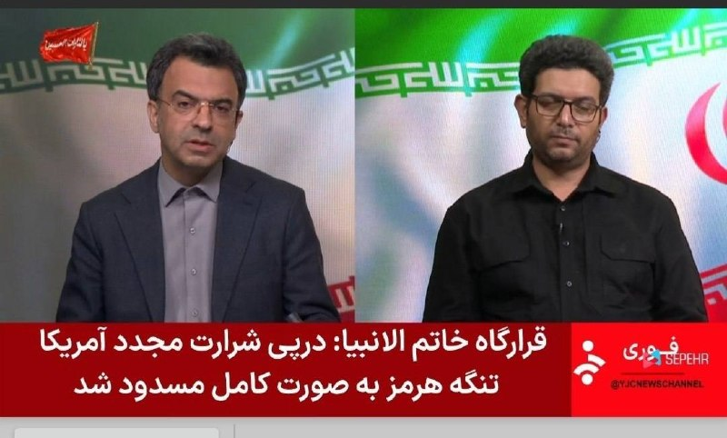

🔴زیرنویس شبکه خبر

تنگه هرمز به صورت کامل مسدود شد

[باید ببینیم ترامپ چه میکند]
https://t.me/kianmeli1

## IranIntlTV — post 341599

  

قرارگاه مرکزی خاتم‌الانبیا اعلام کرد در پی آنچه «ادامه شرارت‌های آمریکا» و آغاز حملات ارتش این کشور به برخی مناطق جنوبی استان هرمزگان خوانده، تنگه هرمز از این لحظه به دلیل «ناامنی در منطقه» برای تردد هر نوع شناور، اعم از نفتکش و تجاری، بسته است و هرگونه عبور هدف قرار خواهد گرفت.

قرارگاه خاتم‌الانبیا اظهارات مقام‌های آمریکا درباره عبور کشتی از تنگه هرمز را تکذیب کرد.
https://iranintl.com/202606105271

## Shin_Persian — post 6904

Shin ✓ @hey_itsmyturn
Wed, 10 Jun 2026 22:59:35 UTC

Regime's IRIB: AA activity in Robat Karim, Tehran Province, #Iran

ترجمه خودکار فارسی

صدا و سیمای رژیم: فعالیت پدافند هوایی (AA) در رباط‌کریم، استان تهران، #Iran

𝕏 · @shin_persian

## Iliaen — post 4471

ساعت حدود ۰۲:۱۵ صبح پنجشنبه؛ چند قایق تندرو در نزدیکی جزیره لارَک هدف قرار گرفته شدند.

براساس توصیف شاهدان، شلیک به صورت رگبار از آسمان به سطح دریا بود (احتمالاً توسط هواپیمای A-10)

@iliaen

## FarsiVOA — post 220310

  <a href="telegram/content/FarsiVOA_220310_1781132556.mp4" target="_blank">🎬 Download video</a>

⚡️گزارش نرگس صبا در برنامه تفسیر خبر از منافع جمهوری اسلامی از دامن زدن به تنش در منطقه
@FarsiVOA

## DW_Farsi — post 125792

🔶 سنتکام: حملات دفاعی علیه چندین هدف در داخل ایران را آغاز کردیم

فرماندهی مرکزی ایالات متحده آمریکا (سنتکام) در شبکه ایکس اعلام کرد از ساعت ۵:۱۵ عصر به وقت شرق آمریکا (بعد از نیمه شب ایران)، به دستور فرمانده کل نیروهای مسلح [دونالد ترامپ]، "حملات دفاعی" بیشتری را علیه چندین هدف در داخل ایران آغاز کرده است.

به نوشته سنتکام، این حملات در پاسخ به آنچه "تجاوز بی‌دلیل و ادامه‌دار ایران" توصیف شده، انجام می‌شود.

آخرین گزارش‌ها در رسانه‌های دولتی ایران حاکی از وقوع موج جدیدی از انفجارها در جنوب ایران، نزدیک تنگه هرمز است.

بر اساس گزارش صداوسیمای جمهوری اسلامی (IRIB)، یک انفجار در بندرعباس ثبت شده است.

همچنین در شهرهای میناب و سیریک و نیز در جزیره قشم نیز وقوع انفجار گزارش شده است.

ساعاتی پیش از شروع این حملات وزیر دفاع آمریکا، پیت هگست، گفته بود که فرماندهی مرکزی ارتش آمریکا امشب حملاتی را علیه ایران آغاز خواهد کرد.

او در جمع خبرنگاران گفت: «فرماندهی مرکزی امشب شب شلوغی خواهد داشت، چون رئیس‌ جمهور ترامپ گفته که ما ایران را به‌شدت هدف قرار خواهیم داد و همین کار را هم خواهیم کرد.»

هگست گفت نیروهای آمریکایی به "تأسیسات کلیدی" در ایران حمله خواهند کرد، زیرا ایران برای پایان دادن به جنگ به توافقی با آمریکا نرسیده است.

پیش‌تر، رئیس‌جمهور آمریکا نیز گفته بود که حملات علیه ایران ادامه خواهد داشت.

@dw_farsi

## Persian_Trend_Official — post 16618

  <a href="telegram/content/Persian_Trend_Official_16618_1781132558.webm" target="_blank">🎬 Download video</a>

📝 Nick

📌 @persian_trend_official
پرشین ترند | متفاوت‌ترین کانال نظامی

## Persian_Trend_Official — post 16617

  <a href="telegram/content/Persian_Trend_Official_16617_1781132558.webm" target="_blank">🎬 Download video</a>

⭕️ تسنیم: قرارگاه مرکزی خاتم الانبیا: ادعای آمریکا مبنی بر عبور کشتی از تنگه هرمز کذب است 📝 Nick 📌 @persian_trend_official پرشین ترند | متفاوت‌ترین کانال نظامی

## IranianMinds — post 22221

  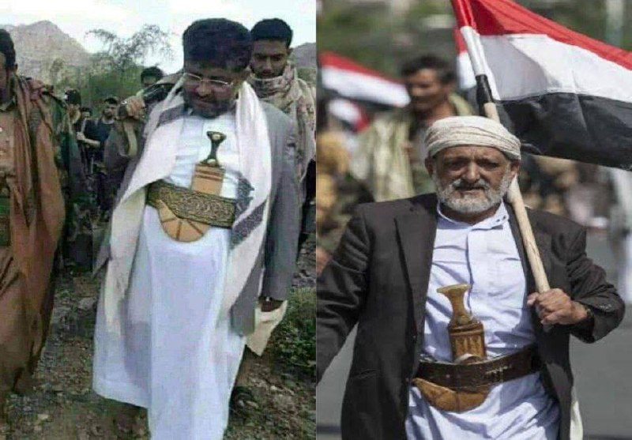

حوثی ها و انصارالله یمن به آمریکا هشدار دادن که بهتره حملاتشو متوقف کنه تا دیر نشده

@IranianMinds

## IranianMinds — post 22220

🔴 نیروی دریایی سپاه:

دو شناور که قصد عبور غیرقانونی از تنگه هرمز را داشتند، پس از نقض محدودیت‌های عبور و مرور هدف قرار گرفتند.

@IranianMinds

## IranianMinds — post 22219

  

🔴 شبکه خبر :

تنگه هرمز به صورت کامل مسدود شد.

@IranianMinds

## BBCPersian — post 283369

🔻هگست پیش از آغاز دومین شب حملات آمریکا: تأسیسات کلیدی ایران هدف قرار می‌گیرد

پیت هگست، وزیر دفاع آمریکا، ساعتی پیش از آغاز عملیات آمریکا علیه اهدافی در ایران در اظهاراتی گفته بود که نیروهای این کشور در منطقۀ امشب «ضربات سختی به ایران وارد خواهند کرد و تأسیسات کلیدی این کشور را هدف قرار خواهند داد.»

آقای هگست در مقر فرماندهی سنتکام در تامپا در فلوریدا سخن می‌گفت.

پیش از او نیز دونالد ترامپ، رئیس جمهور آمریکا، در سخنانی تند و در جمع خبرنگاران در کاخ سفید با اشاره به حمله دیشب (سه‌شنبه) این کشور به اهدافی در ایران گفت: «ما دیروز ضربت سختی به آن‌ها وارد کردیم و امروز هم دوباره ضربت سختی خواهیم زد. اگر متوجه نشده‌اید یا تلویزیون را روشن نکرده‌اید، این را بدانید. خواهیم دید که در مورد توافق چه اتفاقی می‌افتد. ما واقعا بسیار به دستیابی به یک توافق نزدیک بودیم.»

اظهارات رئیس جمهور آمریکا که تلویحا حملات دیشب و امشب را مرتبط با «تعلل» در مذاکرات با ایران دانسته در تناقض با اظهارات قبلی اوست که ساقط شدن یک بالگرد آپاچی در دریای عمان را علت حملات جدید عنوان کرده بود.

آمریکا ایران را مسئول هدف قرار گرفتن این بالگرد آپاچی معرفی کرده اما تهران هنوز رسما هدف قرار دادن آن را بر عهده نگرفته است.
https://bbc.in/4fIJPot
@BBCPersian

## alonews — post 127020

  <a href="telegram/content/alonews_127020_1781132561.webm" target="_blank">🎬 Download video</a>

👈گزارشات اولیه از حملات هواپیمای جنگی A-10(گراز وحشی) آمریکا به قایق های تندرو سپاه در جزیره لارک

✅ @AloNews خبر جنگ

## alonews — post 127019

  <a href="telegram/content/alonews_127019_1781132561.webm" target="_blank">🎬 Download video</a>

👈حمید رسایی:
اینترنت رو قطع کنید تا دیر نشده

✅ @AloNews خبر جنگ

## alonews — post 127018

  <a href="telegram/content/alonews_127018_1781132561.webm" target="_blank">🎬 Download video</a>

👈زیرنویس شبکه خبر

🔴تنگه هرمز به صورت کامل مسدود شد

✅ @AloNews خبر جنگ

---
📅 بروزرسانی: 1405/03/21 02:22
---

## VahidOOnLine — post 244818

  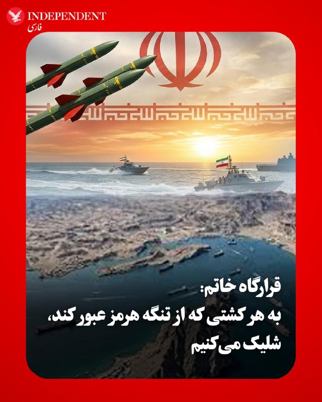

♦️قرارگاه خاتم در بیانیه‌ای که تسنیم منتشر کرده تنگه هرمز را کاملا بسته اعلام کرد و تهدید کرد که هرگونه تردد مورد اصابت قرار خواهد گرفت. در این بیانیه آمده است که این ممنوعیت شامل کشتی‌های تجاری و نتفکش‌ها است.
‌🇸🇦 Indypersian

🤖 @VahidOOnLine

## VahidOOnLine — post 244817

♦️ پیت هگست، وزیر جنگ آمریکا، چهارشنبه عصر به وقت واشینگتن در گفت‌وگو با خبرنگاران در مقر فرماندهی مرکزی ایالات متحده (سنتکام) در شهر تمپا ایالت فلوریدا، در پاسخ به سوالی درباره توانایی آمریکا برای شناسایی و هدف قرار دادن رهبران ارشد جمهوری اسلامی و سپاه پاسداران در صورت شکست مذاکرات، گفت سنتکام از فرصت آتش‌بس برای تکمیل اطلاعات و به‌روزرسانی فهرست اهداف استفاده کرده است.

هگست افزود توانایی آمریکا در هدف‌گیری، شناسایی اهداف، رصد تحرکات و نفوذ به شبکه‌ها نسبت به زمان آغاز عملیات «خشم حماسی» به شکل قابل توجهی افزایش یافته است.

وزیر جنگ آمریکا همچنین گفت جمهوری اسلامی در حال حاضر از توانایی محدودی برای تولید موشک و پهپاد برخوردار است و هرگونه تجهیزات و تسلیحاتی که در اختیار داشته باشد، در صورت لزوم دوباره هدف حملات آمریکا قرار خواهد گرفت.
‌🇸🇦 Indypersian

🤖 @VahidOOnLine

## VahidOOnLine — post 244816

  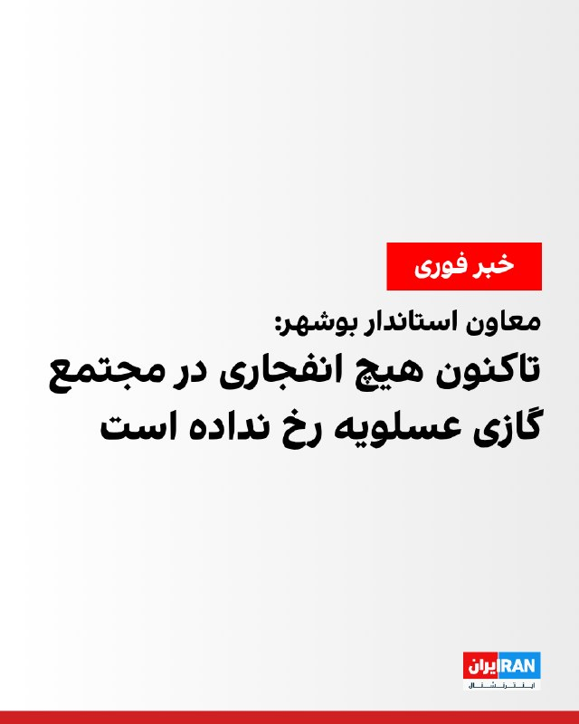

احسان جهانیان، معاون سیاسی امنیتی و اجتماعی استاندار بوشهر، به صداوسیما گفت: تاکنون هیچ انفجاری در مجتمع گازی عسلویه رخ نداده است. پیش‌تر گزارش‌هایی از هدف قرار گرفتن یک کارخانه پتروشیمی متعلق به مجتمع گاز پارس جنوبی در عسلویه منتشر شده بود.
‌🏁 🇬🇧 IranintlTV

🤖 @VahidOOnLine

## VahidOOnLine — post 244815

  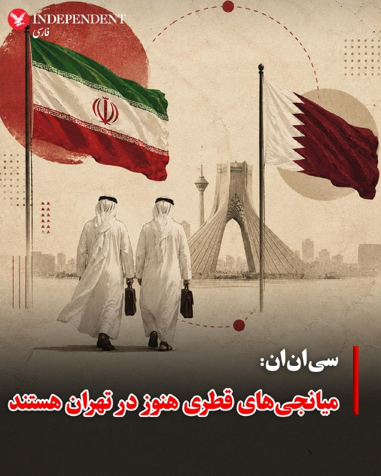

♦️به گزارش سی‌ان‌ان به نقل از یک منبع آگاه، ک هیات قطری که صبح چهارشنبه برای دیدار با مذاکره‌کنندگان حکومت ایران به تهران سفر کرده بود، همچنان در ایران حضور دارد.
این منبع پیش‌تر به سی‌ان‌ان گفته بود که مذاکره‌کنندگان قطری «پس از رایزنی با آمریکا» به ایران رفته‌اند تا با نمایندگان جمهوری اسلامی دیدار کنند و «برای پر کردن شکاف‌های باقی‌مانده» در مذاکرات تلاش کنند.
صداوسیما نیز گزارش داد که این سفر شامل گفت‌وگو درباره روابط دو کشور و همچنین تبادل نظر درباره آخرین تحولات آنچه «روند دیپلماتیک با هدف پایان دادن به جنگ تحمیل‌شده از سوی آمریکا علیه ایران» توصیف شده، خواهد بود.
‌🇸🇦 Indypersian

🤖 @VahidOOnLine

## WithYashar — post 14446

قرارگاه خاتم الانبیا: تنگه هرمز از این لحظه برای تمام شناور ها بسته اعلام میشه و هیچ شناوری حق عبور نداره
@withyashar

## WithYashar — post 14445

وزیر خارجه یمن: نسبت به ادامه تجاوز آمریکا به ایران هشدار می‌دهیم
@withyashar

## pm_afshaa — post 93498

یه پیام دارم برا پاکستان عزیز

## pm_afshaa — post 93497

  <a href="telegram/content/pm_afshaa_93497_1781131951.webm" target="_blank">🎬 Download video</a>

🎬 Video

## pm_afshaa — post 93494

🔴پاکستان به آمریکا:ما در مورد توافق شما با ایران دست از تلاش برمی‌داریم 
💧 Rainbet.com the #1 Non-KYC Crypto Casino & Sportsbook @rainbetcom 
😁 @Pm_Afshaa

## pm_afshaa — post 93493

🔴پاکستان به آمریکا:ما در مورد توافق شما با ایران دست از تلاش برمی‌داریم

💧 Rainbet.com the #1 Non-KYC Crypto Casino & Sportsbook @rainbetcom

😁 @Pm_Afshaa

## pm_afshaa — post 93492

  <a href="telegram/content/pm_afshaa_93492_1781131952.webm" target="_blank">🎬 Download video</a>

🔴قرارگاه مرکزی خاتم‌الانبیا:
از این لحظه به دلیل ناامنی در منطقه، تنگه هرمز برای تردد هر نوع شناور اعم از نفتکش و تجاری بسته اعلام می گردد و هرگونه تردد مورد اصابت قرار خواهد گرفت.

💧 Rainbet.com the #1 Non-KYC Crypto Casino & Sportsbook @rainbetcom

😁 @Pm_Afshaa

## VahidOnline — post 76171

سپاه: هرگونه تردد شناورها از تنگه هرمز مورد اصابت قرار خواهد گرفت

منابع حکومتی:
قرارگاه مرکزی حضرت خاتم‌الانبیا(ص): از این لحظه به دلیل ناامنی در منطقه، تنگه هرمز برای تردد هر نوع شناور اعم از نفتکش و تجاری بسته اعلام می گردد و هرگونه تردد مورد اصابت قرار خواهد گرفت

در ادامه شرارت های آمریکای جنایتکار و با توجه به آغاز حملات ارتش متجاوز آن کشور به برخی از مناطق جنوب در استان هرمزگان، از این لحظه به دلیل ناامنی در منطقه، تنگه هرمز برای تردد هر نوع شناور اعم از نفتکش و تجاری بسته اعلام می گردد و هرگونه تردد مورد اصابت قرار خواهد گرفت.

ادعای آمریکا مبنی بر عبور کشتی از تنگه یاد شده تکذیب می شود.

📡 @VahidOnline

## kianmeli1 — post 87903

🔴فوری-قرارگاه خاتم

تنگه هرمز برای تمام کشتی ها بسته شد
https://t.me/kianmeli1

## IranIntlTV — post 341598

  

احسان جهانیان، معاون سیاسی امنیتی و اجتماعی استاندار بوشهر، به صداوسیما گفت: تاکنون هیچ انفجاری در مجتمع گازی عسلویه رخ نداده است. پیش‌تر گزارش‌هایی از هدف قرار گرفتن یک کارخانه پتروشیمی متعلق به مجتمع گاز پارس جنوبی در عسلویه منتشر شده بود.
https://iranintl.com/202606103101

## Shin_Persian — post 6903

Shin ✓ @hey_itsmyturn
Wed, 10 Jun 2026 22:47:59 UTC

Intense jet activity over western Tehran
#Tehran Province, #Iran

ترجمه خودکار فارسی

فعالیت شدید جنگنده‌ها بر فراز غرب تهران
#Tehran Province, #Iran

𝕏 · @shin_persian

## Shin_Persian — post 6902

Shin ✓ @hey_itsmyturn
Wed, 10 Jun 2026 22:46:19 UTC

State-owned Mehr News:
"The Americans have so far conducted attacks on seven coastal points."

ترجمه خودکار فارسی

خبرگزاری دولتی مهر:
«آمریکایی‌ها تاکنون به هفت نقطه ساحلی حمله کرده‌اند.»

𝕏 · @shin_persian

## Shin_Persian — post 6901

Shin ✓ @hey_itsmyturn
Wed, 10 Jun 2026 22:44:31 UTC

IRGC Khatam Al Anbya terror HQ:

"Effective immediately, due to insecurity in the region, the Strait of Hormuz is declared closed for the passage of all types of vessels, including oil tankers and commercial ships. Any transit will be targeted.

Following the malicious actions of America and in light of the commencement of attacks by its aggressor military on some southern areas in Hormozgan province, effective immediately, due to insecurity in the region, the Strait of Hormuz is declared closed for the passage of all types of vessels, including oil tankers and commercial ships. Any transit will be targeted.

The American claim regarding the passage of ships through the aforementioned strait is denied."

ترجمه خودکار فارسی

قرارگاه تروریستی خاتم‌الانبیاء سپاه پاسداران انقلاب اسلامی (IRGC):

«با اثرگذاری فوری، به دلیل ناامنی در منطقه، تنگه هرمز برای تردد تمامی انواع شناورها، از جمله نفتکش‌ها و کشتی‌های تجاری، بسته اعلام می‌شود. هرگونه عبوری مورد هدف قرار خواهد گرفت.

در پی اقدامات شرورانه آمریکا و با توجه به آغاز حملات ارتش متجاوز آن به برخی مناطق جنوبی در استان هرمزگان، با اثرگذاری فوری، به دلیل ناامنی در منطقه، تنگه هرمز برای تردد تمامی انواع شناورها، از جمله نفتکش‌ها و کشتی‌های تجاری، بسته اعلام می‌شود. هرگونه عبوری مورد هدف قرار خواهد گرفت.

ادعای آمریکا در خصوص عبور کشتی‌ها از تنگه مذکور تکذیب می‌شود.»

𝕏 · @shin_persian

## FarsiVOA — post 220309

  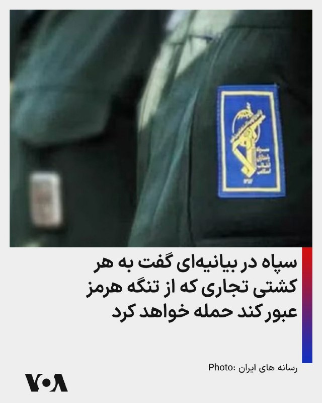

⚡️سپاه پاسداران، در بیانیه‌ای که اوایل پنج‌شنبه ۲۱ خرداد صادر کرد گفت «از این لحظه» به هر نوع شناوری اعم از نفتکش و کشتی تجاری که از تنگه هرمز عبور کند، حمله خواهد کرد. سپاه در فهرست سازمان‌های تروریستی چندین کشور قرار دارد.
@FarsiVOA

## FarsiVOA — post 220308

  <a href="telegram/content/FarsiVOA_220308_1781131955.mp4" target="_blank">🎬 Download video</a>

⚡️اتحاد بی سابقه کشورهای غربی در مقابل رفتارهای جمهوری اسلامی؛ گفت‌وگو با درویش رنجبر
@FarsiVOA

## FarsiVOA — post 220307

  <a href="telegram/content/FarsiVOA_220307_1781131958.mp4" target="_blank">🎬 Download video</a>

⚡️حامد آیینه وند در برنامه تفسیر خبر: تشدید تنش می‌تواند به قحطی در ایران منجر شود
@FarsiVOA

## Persian_Trend_Official — post 16616

## Persian_Trend_Official — post 16615

⭕️ ایسنا:

مدیرعامل شرکت آب و فاضلاب هرمزگان: با تلاش بی‌وقفه و خستگی‌ناپذیر مجموعه شرکت آب و فاضلاب هرمزگان، قطعی آب ناشی از حملات جنایتکارانه بامداد دیروز آمریکا در سیریک برطرف و آب مشترکان شهر کوهستک و روستا‌های بخش بمانی در کمتر از ۱۲ ساعت وصل شد.

📝 Nick

📌 @persian_trend_official
پرشین ترند | متفاوت‌ترین کانال نظامی

## Persian_Trend_Official — post 16614

⭕️ تسنیم: قرارگاه مرکزی خاتم الانبیا: هرگونه تردد شناورها از تنگه هرمز مورد اصابت قرار خواهد گرفت. 📝 Nick 📌 @persian_trend_official پرشین ترند | متفاوت‌ترین کانال نظامی

## Persian_Trend_Official — post 16613

⭕️ تسنیم: قرارگاه مرکزی خاتم الانبیا: تنگه هرمز به طور کامل برای هر نوع شناوری، از جمله شناور تجاری بسته شد. 📝 Nick 📌 @persian_trend_official پرشین ترند | متفاوت‌ترین کانال نظامی

## Persian_Trend_Official — post 16612

  <a href="telegram/content/Persian_Trend_Official_16612_1781131959.webm" target="_blank">🎬 Download video</a>

⭕️ تسنیم: تنگه هرمز برای تردد هر نوع شناور اعم از نفتکش و تجاری بسته است قرارگاه مرکزی خاتم‌الانبیا(ص): 🔹 در ادامه شرارت های آمریکای جنایتکار و با توجه به آغاز حملات ارتش متجاوز آن کشور به برخی از مناطق جنوب در استان هرمزگان، از این لحظه به دلیل ناامنی در…

## Persian_Trend_Official — post 16611

  <a href="telegram/content/Persian_Trend_Official_16611_1781131960.webm" target="_blank">🎬 Download video</a>

⭕️ تسنیم:

تنگه هرمز برای تردد هر نوع شناور اعم از نفتکش و تجاری بسته است

قرارگاه مرکزی خاتم‌الانبیا(ص):
🔹 در ادامه شرارت های آمریکای جنایتکار و با توجه به آغاز حملات ارتش متجاوز آن کشور به برخی از مناطق جنوب در استان هرمزگان، از این لحظه به دلیل ناامنی در منطقه، تنگه هرمز برای تردد هر نوع شناور اعم از نفتکش و تجاری بسته اعلام می گردد و هرگونه تردد مورد اصابت قرار خواهد گرفت.

🔹 ادعای آمریکا مبنی بر عبور کشتی از تنگه یاد شده تکذیب می شود.

📝 Nick

📌 @persian_trend_official
پرشین ترند | متفاوت‌ترین کانال نظامی

## Persian_Trend_Official — post 16610

  <a href="telegram/content/Persian_Trend_Official_16610_1781131960.mp4" target="_blank">🎬 Download video</a>

⭕️ ایسنا: روابط عمومی سپاه: درپی تجاوز جنگنده f16 دشمن به حریم هوایی خلیج فارس و شلیک موشک سامانه پدافند هوایی سپاه به سمت آن، جنگنده متجاوز متواری گشت. 📝 Nick 📌 @persian_trend_official پرشین ترند | متفاوت‌ترین کانال نظامی

## Persian_Trend_Official — post 16608

  <a href="telegram/content/Persian_Trend_Official_16608_1781131961.webm" target="_blank">🎬 Download video</a>

⭕️ ایسنا: روابط عمومی سپاه: درپی تجاوز جنگنده f16 دشمن به حریم هوایی خلیج فارس و شلیک موشک سامانه پدافند هوایی سپاه به سمت آن، جنگنده متجاوز متواری گشت. 📝 Nick 📌 @persian_trend_official پرشین ترند | متفاوت‌ترین کانال نظامی

## IranianMinds — post 22218

🔴 قرارگاه مرکزی خاتم الانبیا :

دیگه قهریم و تنگه هرمز از الان برای همه ی شناور ها مسدوده و هیچکس حق عبور نداره.

@IranianMinds

## IranianMinds — post 22217

  

@IranianMinds

## IranianMinds — post 22216

  <a href="telegram/content/IranianMinds_22216_1781131963.mp4" target="_blank">🎬 Download video</a>

🔴 اینفانتینو رئیس فیفا در مورد تیم جمهوری اسلامی :

وقتی بعضی‌ها می‌گفتند حضور ایران در جام جهانی غیرممکن است، به آن‌ها گفتم و قول دادم که ایران به جام جهانی خواهد آمد.

اگه لازم بود با اتوبوس تا تهران می‌رفتم و خودم تیم را به اینجا می‌آوردم.

@IranianMinds

## Dirty_Kids — post 391649

به هر کشتی که از تنگه عبور کند شلیک می‌کنیم

قرارگاه مرکزی خاتم‌الانبیای سپاه در بیانیه‌ای اعلام کرد: «در ادامه شرارت‌های آمریکای جنایتکار و با توجه به آغاز حملات ارتش متجاوز آن کشور به برخی از مناطق جنوب در استان هرمزگان، از این لحظه به دلیل ناامنی در منطقه، تنگه هرمز برای تردد هر نوع شناور، اعم از نفتکش و تجاری، بسته اعلام می‌گردد و هرگونه تردد مورد اصابت قرار خواهد گرفت. ادعای آمریکا مبنی بر عبور کشتی از تنگه هرمز نیز تکذیب می‌شود.»

@Dirty_Kids 👻

## Dirty_Kids — post 391648

بین دو تا موج حمله چقدر فاصله‌ست؟
می‌شه رفت مسواک زد و برگشت یا نه؟

## Dirty_Kids — post 391647

  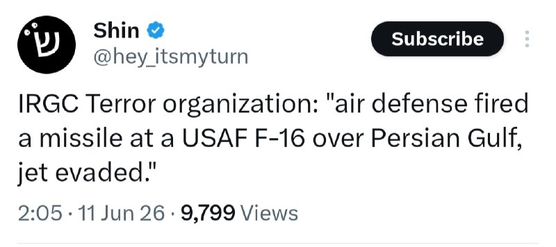

سپاه گفته که داشتن یک فروند F-16 آمریکا رو‌ می‌زدن که کیر شدن و نتوستن.

@Dirty_Kids 👻

## Dirty_Kids — post 391646

دونالد ترامپ:‌ «ما به توافق نزدیک بودیم، اما ناگهان همه‌چیز کاملا تغییر کرد. اکنون ایران باید انتظار حملات سنگین‌تر و شدیدتری را نسبت به ۳ ماه گذشته داشته باشد.»

@Dirty_Kids 👻

## Dirty_Kids — post 391645

  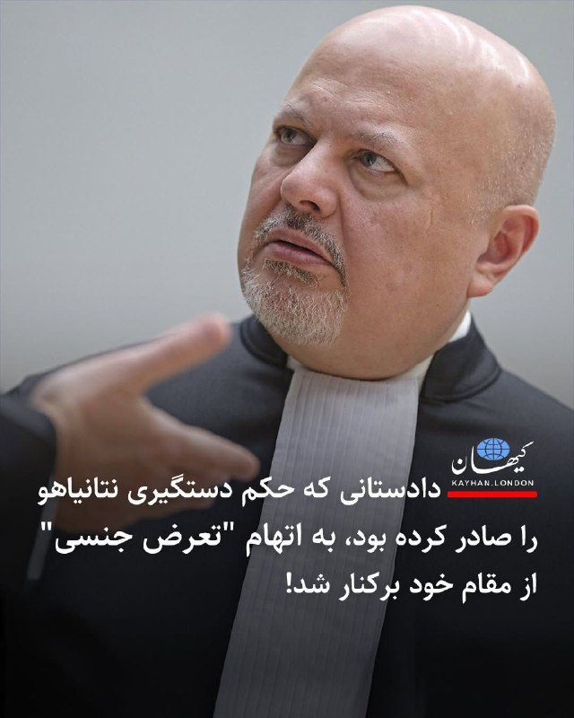

خدایا شکرت؛ دادستانی که گفته بود نتانیاهو ظالمه و فورا باید دستگیر بشه، خودش به جرم تجاوز برکنار و بازداشت شد.

@Dirty_Kids 👻

## Dirty_Kids — post 391644

فاکس نیوز اهداف بعدی نیروگاه ها و پل ها هستن

## alonews — post 127017

  <a href="telegram/content/alonews_127017_1781131966.webm" target="_blank">🎬 Download video</a>

👈مقامات آمریکایی به وال استریت ژورنال گفتند که ترامپ دیپلماسی با ایران را رها نکرده است، اگرچه صبر او به طور فزاینده‌ای کاهش یافته است.

🔴حتی پس از تأیید حملات جدید در اوایل این هفته، ترامپ به دستیارانش دستور داد پیامی را از طریق واسطه‌های قطری به تهران منتقل کنند که این حملات پاسخی به حادثه پهپاد است که تقریباً خدمه آپاچی را کشت، نه آغاز جنگ تمام‌عیار.

✅ @AloNews خبر جنگ

## alonews — post 127016

  <a href="telegram/content/alonews_127016_1781131967.webm" target="_blank">🎬 Download video</a>

👈قیمت نفت آمریکا پس از حملات جدید نظامی آمریکا به جنوب ایران، به بالای ۹۲ دلار در هر بشکه رسید.

✅ @AloNews خبر جنگ

## alonews — post 127015

  <a href="telegram/content/alonews_127015_1781131967.webm" target="_blank">🎬 Download video</a>

👈علی قلهکی خبرنگار :
اگه آمریکا بخواد زیرساخت های مارو بزنه و بندازتمون توی بحران برق و بنزین ما هم کاری میکنیم که اسرائیل هم دچار این بحران بشه.

✅ @AloNews خبر جنگ

## alonews — post 127014

  <a href="telegram/content/alonews_127014_1781131967.webm" target="_blank">🎬 Download video</a>

🔴فوری/ قرارگاه خاتم الانبیا: تنگه هرمز از این لحظه برای تمام شناور ها بسته اعلام میشه و هیچ شناوری حق عبور نداره

✅ @AloNews خبر جنگ

## alonews — post 127013

📱لطفا توییتر الونیوز رو دنبال کنین 
🔴پست های انگلیسی در رابطه با جنایت های حکومت به انگلیسی نوشته شده و افراد مهم منشن و هشتگ های مهم قرار داده شده. 
🔴ریپست کنین. مهمترین کمک این روزها جلوگیری از پروپاگاندا حکومت علیه این قتل عام مردم هستش. خونشون نباید پایمال…

---
📅 بروزرسانی: 1405/03/21 02:12
---

## VahidOOnLine — post 244814

  <a href="telegram/content/VahidOOnLine_244814_1781131323.mp4" target="_blank">🎬 Download video</a>

♦️همزمان با آغاز دور دیگری از حمله‌های آمریکا، خبرگزاری مهر تصاویری را با توضیح «پرواز جنگنده ارتش بر فراز تهران» منتشر کرده است
پیش از این، خبرگزاری مهر از شنیده شدن صدای پدافند در غرب تهران و صداهای نامشخص در کیش خبر داده بود.
همزمان، فرماندهی مرکزی ایالات متحده (سنتکام) اعلام کرد نیروهای آمریکایی از ساعت ۱۷:۱۵ به وقت شرق آمریکا حملات جدیدی را علیه چندین هدف در ایران آغاز کرده‌اند. سنتکام مدعی شد این عملیات در پاسخ به آنچه «اقدامات تهاجمی و ادامه‌دار ایران» خوانده، انجام شده است.
‌🇸🇦 Indypersian

🤖 @VahidOOnLine

## WithYashar — post 14444

نیروی هوافضای ۳پا: آغاز مرحله پاسخ قاطع و بازدارنده مستقیم به دشمن را اعلام می‌کنیم.
@withyashar

## WithYashar — post 14443

شبکه ۱۵ اسرائیل : موج اول حملات به ایران؛ به پایان رسیده
@withyashar
یاشار : درگیری همچنان در تنگه هرمز ادامه دارد.

## WithYashar — post 14442

روابط عمومی ۳پا: درپی تجاوز جنگنده f16 به حریم هوایی خلیج فارس و شلیک موشک سامانه پدافند هوایی سپاه به سمت آن، جنگنده متجاوز متواری گشت
@withyashar

## WithYashar — post 14441

هاآرتص: اسرائیل در انتظار حمله موشکی ایران پس از حملات جدید آمریکا به اهدافی در ایران
@withyashar

## pm_afshaa — post 93490

🔴گروه هکری حنظه ادعا می‌کنه که توانسته موج‌های حمله ارتش آمریکا را با استفاده از توانایی‌های الکترونیکی مختل کنه

💧 Rainbet.com the #1 Non-KYC Crypto Casino & Sportsbook @rainbetcom

😁 @Pm_Afshaa

## pm_afshaa — post 93489

الان تو آتش‌بس هستیم هنوز یا نه؟
عادت کردیم دیگه حرفی ازش زده نمیشه

## pm_afshaa — post 93488

صف طولانی در پمپ بنزین های کشور

💧 Rainbet.com the #1 Non-KYC Crypto Casino & Sportsbook @rainbetcom

😁 @Pm_Afshaa

## pm_afshaa — post 93487

  <a href="telegram/content/pm_afshaa_93487_1781131325.webm" target="_blank">🎬 Download video</a>

🔴سپاه: درپی تجاوز جنگنده F-16 به حریم هوایی خلیج فارس و شلیک پدافند هوایی سپاه به سمتش، جنگنده متجاوز فرار کرد.

💧 Rainbet.com the #1 Non-KYC Crypto Casino & Sportsbook @rainbetcom

😁 @Pm_Afshaa

## pm_afshaa — post 93486

تهدید حمله موشکی سپاه به اسراییل

💧 Rainbet.com the #1 Non-KYC Crypto Casino & Sportsbook @rainbetcom

😁 @Pm_Afshaa

## pm_afshaa — post 93485

موج اول حملات آمریکا به پایان رسید

💧 Rainbet.com the #1 Non-KYC Crypto Casino & Sportsbook @rainbetcom

😁 @Pm_Afshaa

## pm_afshaa — post 93483

  <a href="telegram/content/pm_afshaa_93483_1781131325.webm" target="_blank">🎬 Download video</a>

🤔 بعضی قیمت‌ها ارزونن...

💸بعضی قیمت‌ها مشکوکن...

😅 ولی این یکی فقط غیرقابل باوره

💎 هر گیگ فقط ۳ هزار تومن 
💎

👎نه کیفیت کم شده

👎نه سرعت قربانی شده

👎نه قراره چیزی از دست بدی

👍فقط قراره کمتر پول بدی.

🚀 @LexVipBot 
⚡️ @Lex_Server

## IranIntlTV — post 341597

  <a href="https://t.me/IranintlTV/341597" target="_blank">📎 Download file</a>

🎧نسخه صوتی برنامه با کامبیز حسینی؛ آیا این «تیم ملی» را نمایندهٔ خودتان می‌دانید؟
@iranintlTV

## Shin_Persian — post 6900

Shin ✓ @hey_itsmyturn Wed, 10 Jun 2026 22:35:34 UTC IRGC Terror organization: "air defense fired a missile at a USAF F-16 over Persian Gulf, jet evaded." ترجمه خودکار فارسی سازمان تروریستی سپاه پاسداران انقلاب اسلامی (IRGC): «پدافند هوایی موشکی را به…

## Shin_Persian — post 6899

Shin ✓ @hey_itsmyturn
Wed, 10 Jun 2026 22:35:34 UTC

IRGC Terror organization: "air defense fired a missile at a USAF F-16 over Persian Gulf, jet evaded."

ترجمه خودکار فارسی

سازمان تروریستی سپاه پاسداران انقلاب اسلامی (IRGC): «پدافند هوایی موشکی را به سمت یک فروند F-16 نیروی هوایی ایالات متحده (USAF) بر فراز خلیج فارس شلیک کرد، جنگنده از برخورد گریخت.»

𝕏 · @shin_persian

## FarsiVOA — post 220306

Farsi VOA pinned a photo

## FarsiVOA — post 220305

  

📸اینستاگرام صدای آمریکا را هم اکنون فالو کنید تا از آخرین خبرها مطلع بمانید:
https://www.instagram.com/voafarsi/

📡همچنین جهت اطلاع از بروزترین فرکانسهای ماهواره‌ای صدای آمریکا به لینک زیر مراجعت فرمایید:
https://ir.voanews.com/satellite

این پست را با دوستانتان به اشتراک بگذارید
@FarsiVOA

## Persian_Trend_Official — post 16607

⭕️ ایسنا:

روابط عمومی سپاه: درپی تجاوز جنگنده f16 دشمن به حریم هوایی خلیج فارس و شلیک موشک سامانه پدافند هوایی سپاه به سمت آن، جنگنده متجاوز متواری گشت.

📝 Nick

📌 @persian_trend_official
پرشین ترند | متفاوت‌ترین کانال نظامی

## Persian_Trend_Official — post 16606

  <a href="telegram/content/Persian_Trend_Official_16606_1781131326.webm" target="_blank">🎬 Download video</a>

🎬 Video

## Persian_Trend_Official — post 16605

  <a href="telegram/content/Persian_Trend_Official_16605_1781131327.mp4" target="_blank">🎬 Download video</a>

⭕️ مهر:

📹 قادری، کارشناس مسائل بین الملل: تبعات شرارت‌های رژیم صهیونیستی و آمریکا به نسبت گذشته بسیار سنگین خواهد بود.

📝 Nick

📌 @persian_trend_official
پرشین ترند | متفاوت‌ترین کانال نظامی

## Persian_Trend_Official — post 16604

  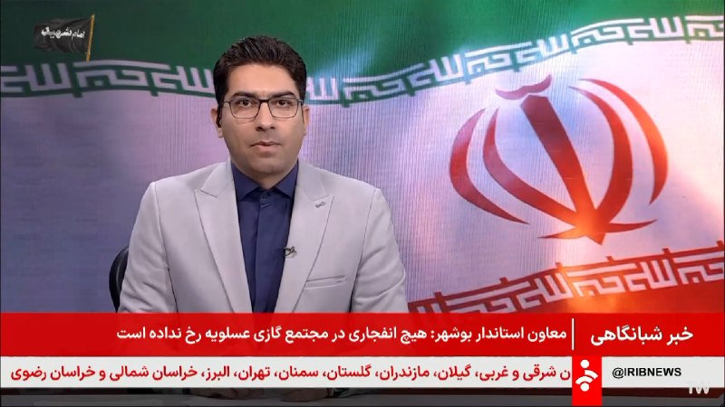

📝 Nick

📌 @persian_trend_official
پرشین ترند | متفاوت‌ترین کانال نظامی

## IranianMinds — post 22215

فقط خواسم یادآوری کنم :

حملات دفاعیه و آتش بس هنوز برقراره 😔

## IranianMinds — post 22214

🔴 سپاه :

یه جنگنده F-16 آمریکایی رو‌ زدیمش‌ که سریع فرار کرد

@IranianMinds

## alonews — post 127012

  <a href="telegram/content/alonews_127012_1781131329.webm" target="_blank">🎬 Download video</a>

👈شبکه ۱۵ اسرائیل : موج اول حملات به ایران؛ به پایان رسیده

✅ @AloNews خبر جنگ

---
📅 بروزرسانی: 1405/03/21 02:02
---

## VahidOOnLine — post 244813

  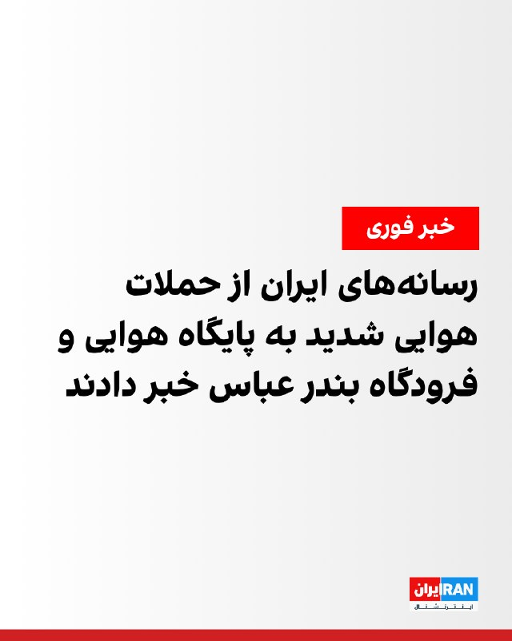

رسانه‌های داخلی از حملات هوایی شدید به پایگاه هوایی و فرودگاه بین‌المللی بندرعباس خبر دادند. همزمان صدای چند انفجار در قشم و بندر کنگان شنیده شده است. صداوسیما نیز اعلام کرد انفجارها در قشم ادامه دارد و مقام‌های محلی گفته‌اند منشأ برخی صداها هنوز مشخص نیست.
‌🏁 🇬🇧 IranintlTV

🤖 @VahidOOnLine

## VahidOOnLine — post 244807

  <a href="telegram/content/VahidOOnLine_244807_1781130750.mp4" target="_blank">🎬 Download video</a>

فشار بر صادرات نفت، شکاف‌های درونی جمهوری اسلامی را آشکارتر کرده است. رژیمی که برای حفظ نیروهای سرکوب، شبکه‌های نیابتی و نظام وفاداری به درآمد نفتی نیاز دارد، اکنون میان مذاکره برای تنفس اقتصادی و تسلیم گرفتار شده است.
‌🏁 🇬🇧 ManotoTV

🤖 @VahidOOnLine

## VahidOOnLine — post 244800

  <a href="telegram/content/VahidOOnLine_244800_1781130751.mp4" target="_blank">🎬 Download video</a>

دونالد ترامپ می‌گوید در «مراحل پایانی» دستیابی به توافقی با جمهوری اسلامی قرار دارد و آمریکا به‌زودی «پیروزی کامل» را اعلام خواهد کرد.

اما این نخستین بار نیست که رئیس‌جمهور آمریکا از نزدیک بودن پایان این مناقشه سخن می‌گوید؛ ورق بزنید.
‌🏁 🇬🇧 ManotoTV

🤖 @VahidOOnLine

## VahidOOnLine — post 244799

  <a href="telegram/content/VahidOOnLine_244799_1781130751.mp4" target="_blank">🎬 Download video</a>

‌
بازدید محمدرضا شاه پهلوی از دانشکده فرماندهی و ستاد ارتش شاهنشاهی در دهه ۵۰ خورشیدی.
‌🏁 🇬🇧 ManotoTV

🤖 @VahidOOnLine

## VahidOOnLine — post 244798

  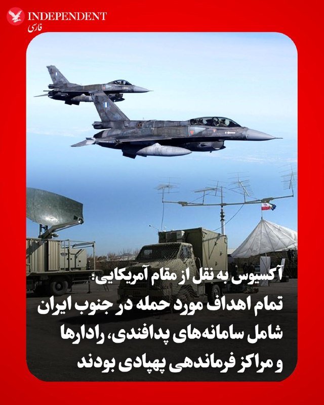

♦️آکسیوس بامداد پنجشنبه ۲۱ خردادماه به نقل از یک مقام آمریکایی گزارش داد تمامی اهدافی که در حملات اخیر مورد هدف قرار گرفته‌اند، در جنوب ایران واقع شده‌اند.
این مقام آمریکایی گفت سامانه‌های پدافند هوایی، رادارها و واحدهای فرماندهی و کنترل پهپادها از جمله اهداف این حملات بوده‌اند.
‌🇸🇦 Indypersian

🤖 @VahidOOnLine

## WithYashar — post 14440

ترامپ : به توافق نزدیک بودیم اما ورق کاملا برگشت و ایران منتظر حملات سنگین و شدیدتر از دو سه ماه اخیر باشد
@withyashar

## WithYashar — post 14439

فاکس نیوز : اهداف بعدی ترامپ پل‌ها و نیروگاه‌ها هستن!
@withyashar

## WithYashar — post 14438

رسانه عراقی «صابرین‌نیوز» گزارش داد که کشتی‌های آمریکایی در نزدیکی تنگه هرمز هدف حملات موشکی و پهپادی نیروهای مسلح ایران قرار گرفته‌اند. @withyashar

## WithYashar — post 14437

رسانه عراقی «صابرین‌نیوز» گزارش داد که کشتی‌های آمریکایی در نزدیکی تنگه هرمز هدف حملات موشکی و پهپادی نیروهای مسلح ایران قرار گرفته‌اند.
@withyashar

## WithYashar — post 14436

خبرنگار I24News  : عوامل آمریکایی: مراکز فرماندهی و کنترل، انبارهای مهمات، رادارها و واحدهای پهپادی مورد حمله قرار گرفتند
@withyashar

## mwarmonitor — post 10677

🔸«آمریکا در حال انجام حملات به ایران در چندین موج است — کان نیوز»

@mwarmonitor

## FoxNewsTwitter — post 342828

  <a href="telegram/content/FoxNewsTwitter_342828_1781130754.mp4" target="_blank">🎬 Download video</a>

Fox News (Twitter/X)

A House hearing went off the rails when Rep. Jasmine Crockett launched into a blistering attack on Republicans and Martin Luther King Jr.’s niece.

The Texas Democrat took aim at the GOP as a “majority... White” party while criticizing lawmakers for spotlighting civil rights activist Alveda King during a hearing examining the Southern Poverty Law Center.

At one point, Crockett suggested Republicans were trying to make the public think a “Doctor King” was condemning the SPLC, prompting a fiery response from King.

King responded saying Crockett's comments made her "emotional" and later questioned whether Crockett was calling her a "bastard" of the King name — but by by the time she responded, Crockett had already stormed away from the room.

## FoxNewsTwitter — post 342827

  <a href="telegram/content/FoxNewsTwitter_342827_1781130756.mp4" target="_blank">🎬 Download video</a>

Fox News (Twitter/X)

Ilhan Omar shuts down questions about a possible Ethics Committee probe into her finances.

The Minnesota Democrat brushed off a FOX News Digital reporter asking about scrutiny surrounding her reported decline in net worth, insisting there is no investigation underway.

The exchange comes as questions continue to circulate over her financial disclosures and whether congressional ethics officials are reviewing the matter.

## pm_afshaa — post 93482

  <a href="telegram/content/pm_afshaa_93482_1781130757.webm" target="_blank">🎬 Download video</a>

🔴رسانه‌های داخلی از حملات هوایی به پایگاه هوایی و فرودگاه بین‌المللی بندرعباس خبر میدن.

💧 Rainbet.com the #1 Non-KYC Crypto Casino & Sportsbook @rainbetcom

😁 @Pm_Afshaa

## pm_afshaa — post 93481

  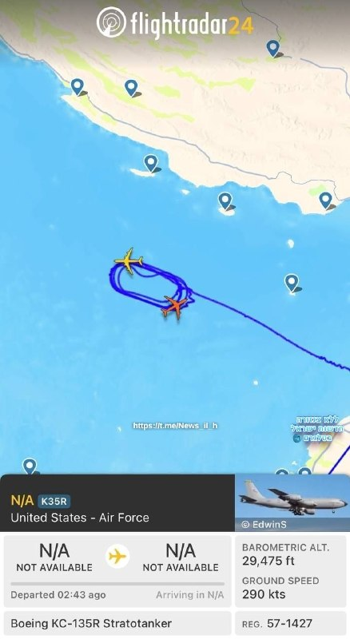

دو هواپیمای سوخت‌رسان هوایی آمریکایی از پایگاه عربستان سعودی برخاستند و اکنون در حال سوخت‌رسانی هوایی در غرب تنگه هرمز هستن

💧 Rainbet.com the #1 Non-KYC Crypto Casino & Sportsbook @rainbetcom

😁 @Pm_Afshaa

## pm_afshaa — post 93480

🔴فاکس نیوز: اهداف بعدی ترامپ ، نیروگاه ها و پل ها هستن

💧 Rainbet.com the #1 Non-KYC Crypto Casino & Sportsbook @rainbetcom

😁 @Pm_Afshaa

## pm_afshaa — post 93479

  <a href="telegram/content/pm_afshaa_93479_1781130759.webm" target="_blank">🎬 Download video</a>

🔴علی قلهکی، خبرنگار: اگه آمریکا بخواد زیرساخت‌های مارو بزنه و بندازتمون تو بحران برق و بنزین، ما کاری میکنیم که اسرائیل هم دچار این بحران بشه. 
💧 Rainbet.com the #1 Non-KYC Crypto Casino & Sportsbook @rainbetcom 
😁 @Pm_Afshaa

## pm_afshaa — post 93478

  <a href="telegram/content/pm_afshaa_93478_1781130759.webm" target="_blank">🎬 Download video</a>

🔴علی قلهکی، خبرنگار:
اگه آمریکا بخواد زیرساخت‌های مارو بزنه و بندازتمون تو بحران برق و بنزین، ما کاری میکنیم که اسرائیل هم دچار این بحران بشه.

💧 Rainbet.com the #1 Non-KYC Crypto Casino & Sportsbook @rainbetcom

😁 @Pm_Afshaa

## pm_afshaa — post 93477

گزارش تایید نشده از ترور فرمانده پایگاه هوایی سپاه پاسداران در کرمان

💧 Rainbet.com the #1 Non-KYC Crypto Casino & Sportsbook @rainbetcom

😁 @Pm_Afshaa

## pm_afshaa — post 93476

  <a href="telegram/content/pm_afshaa_93476_1781130760.webm" target="_blank">🎬 Download video</a>

🔴خبرنگار I24News: مراکز فرماندهی و کنترل، انبارهای مهمات، رادارها و واحدهای پهپادی مورد حمله قرار گرفتن.

💧 Rainbet.com the #1 Non-KYC Crypto Casino & Sportsbook @rainbetcom

😁 @Pm_Afshaa

## pm_afshaa — post 93475

🔴گزارش‌های بیشتری از حذف قابل توجه در ایران حکایت دارد

דרמטי: דיווחים נוספים מצביעים על חיסול משמעותי באיראן

💧 Rainbet.com the #1 Non-KYC Crypto Casino & Sportsbook @rainbetcom

😁 @Pm_Afshaa

## pm_afshaa — post 93474

🔴پولیتیکو:رئیس‌جمهور آمریکا دونالد ترامپ در بازی اول جام جهانی که در آمریکا بین تیم‌های ایالات متحده و پاراگوئه در لس آنجلس روز جمعه برگزار می‌شود، شرکت نخواهد کرد

💧 Rainbet.com the #1 Non-KYC Crypto Casino & Sportsbook @rainbetcom

😁 @Pm_Afshaa

## pm_afshaa — post 93473

  <a href="telegram/content/pm_afshaa_93473_1781130761.webm" target="_blank">🎬 Download video</a>

🔴کان نیوز: آمریکا در حال انجام حملات به ایران در چندین موجه.

💧 Rainbet.com the #1 Non-KYC Crypto Casino & Sportsbook @rainbetcom

😁 @Pm_Afshaa

## pm_afshaa — post 93472

گزارش ها از ترور یک مقام ارشد جمهوری اسلامی

💧 Rainbet.com the #1 Non-KYC Crypto Casino & Sportsbook @rainbetcom

😁 @Pm_Afshaa

## mamlekate — post 103668

📝 اندیمشک شدیدا صدای جنگنده میاد . ساعت دو بامداد پنجشنبه ۲۱ خرداد

@mamlekate_pm

## VahidOnline — post 76170

  

♦️آکسیوس بامداد پنجشنبه ۲۱ خردادماه به نقل از یک مقام آمریکایی گزارش داد تمامی اهدافی که در حملات اخیر مورد هدف قرار گرفته‌اند، در جنوب ایران واقع شده‌اند.
این مقام آمریکایی گفت سامانه‌های پدافند هوایی، رادارها و واحدهای فرماندهی و کنترل پهپادها از جمله اهداف این حملات بوده‌اند.
@VahidOOnLine

📡 @VahidOnline

## kianmeli1 — post 87902

🔴فوری/فاکس نیوز

اهداف بعدی ترامپ ، نیروگاه ها و پل ها هستند
https://t.me/kianmeli1

## kianmeli1 — post 87901

  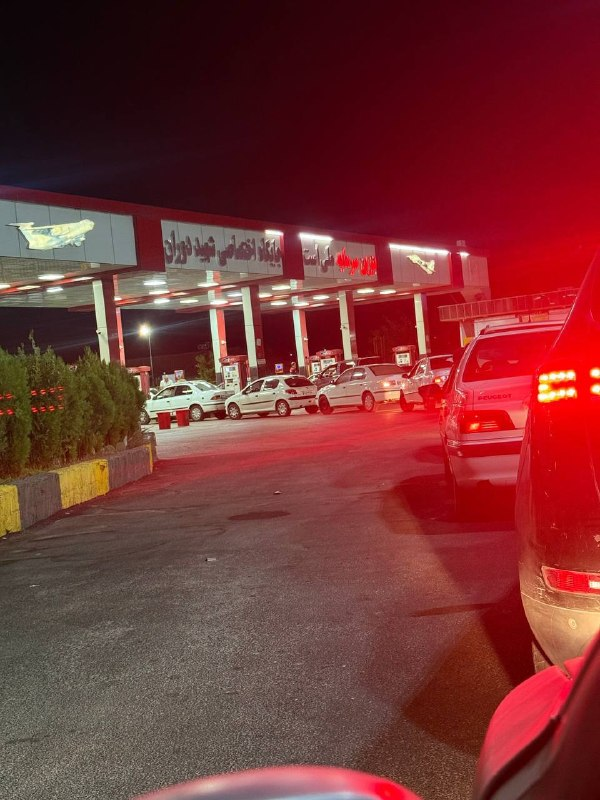

🔴شیراز پمپ بنزین بعد از خبر اینکه به عسلویه رو زدن شلوغ شده
https://t.me/kianmeli1

## IranIntlTV — post 341596

  <a href="https://t.me/IranintlTV/341596" target="_blank">📎 Download file</a>

🎧نسخه صوتی سیاست با مراد ویسی: تهدید ترامپ به حمله سنگین
@iranintlTV

## IranIntlTV — post 341595

  

رسانه‌های داخلی از حملات هوایی شدید به پایگاه هوایی و فرودگاه بین‌المللی بندرعباس خبر دادند. همزمان صدای چند انفجار در قشم و بندر کنگان شنیده شده است. صداوسیما نیز اعلام کرد انفجارها در قشم ادامه دارد و مقام‌های محلی گفته‌اند منشأ برخی صداها هنوز مشخص نیست.
https://iranintl.com/202606108560

## IranIntlTV — post 341594

  <a href="telegram/content/IranIntlTV_341594_1781130763.mp4" target="_blank">🎬 Download video</a>

جمشید برزگر، روزنامه‌نگار و تحلیل‌گر سیاسی، گفت: «جمهوری اسلامی در عمل تلاش کرده سرنوشت درگیری‌های منطقه، به‌ویژه جنگ میان حزب‌الله و اسرائیل، را به روند مذاکرات خود با آمریکا گره بزند.»

او افزود: «حملات به اسرائیل و همچنین حملات علیه نیروها و پایگاه‌های آمریکا در منطقه، دونالد ترامپ را در موقعیت دشوارتری قرار داده است.»
@iranintltv

## IranIntlTV — post 341593

  <a href="telegram/content/IranIntlTV_341593_1781130765.mp4" target="_blank">🎬 Download video</a>

فرشته پزشک، کارشناس روابط بین‌الملل، گفت: «تا زمانی که ابعاد و اهداف واقعی این حملات روشن‌تر نشود، قضاوت درباره نتیجه آن دشوار است؛ مگر اینکه نوع عملیات به گونه‌ای باشد که ساختار تصمیم‌گیری سیاسی و نظامی جمهوری اسلامی را به طور اساسی تحت تاثیر قرار دهد و تغییراتی در سطوح عالی قدرت ایجاد کند.»

او افزود: «مساله اصلی میان آمریکا و جمهوری اسلامی بیش از آنکه یک مساله صرفاً نظامی یا تاکتیکی باشد، یک مساله سیاسی است.»
@iranintltv

## ManotoTV — post 106003

  <a href="telegram/content/ManotoTV_106003_1781130767.mp4" target="_blank">🎬 Download video</a>

فشار بر صادرات نفت، شکاف‌های درونی جمهوری اسلامی را آشکارتر کرده است. رژیمی که برای حفظ نیروهای سرکوب، شبکه‌های نیابتی و نظام وفاداری به درآمد نفتی نیاز دارد، اکنون میان مذاکره برای تنفس اقتصادی و تسلیم گرفتار شده است.

## ManotoTV — post 105996

  <a href="telegram/content/ManotoTV_105996_1781130768.mp4" target="_blank">🎬 Download video</a>

دونالد ترامپ می‌گوید در «مراحل پایانی» دستیابی به توافقی با جمهوری اسلامی قرار دارد و آمریکا به‌زودی «پیروزی کامل» را اعلام خواهد کرد.

اما این نخستین بار نیست که رئیس‌جمهور آمریکا از نزدیک بودن پایان این مناقشه سخن می‌گوید؛ ورق بزنید.

## ManotoTV — post 105995

  <a href="telegram/content/ManotoTV_105995_1781130768.mp4" target="_blank">🎬 Download video</a>

‌
بازدید محمدرضا شاه پهلوی از دانشکده فرماندهی و ستاد ارتش شاهنشاهی در دهه ۵۰ خورشیدی.

## FarsiVOA — post 220304

  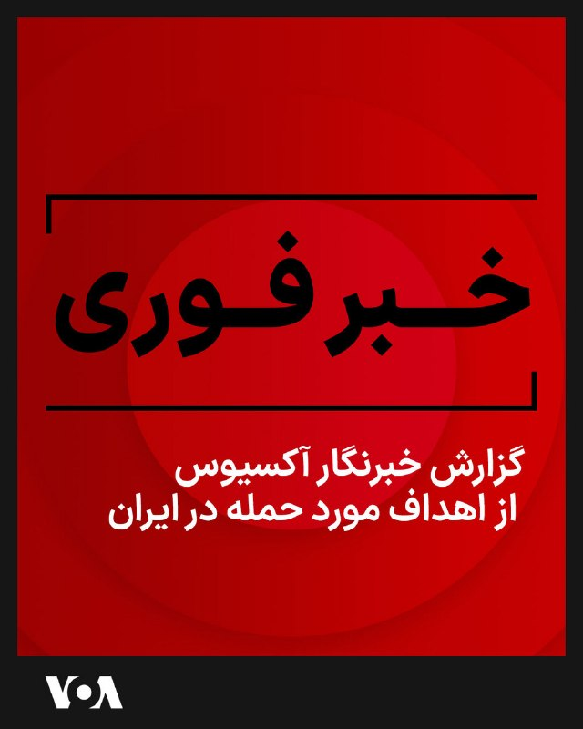

⚡️باراک راوید، خبرنگار آکسیوس از قول «یک مقام آمریکایی» می‌گوید تمام اهدافی که مورد حمله قرار گرفته‌اند در جنوب ایران هستند و شامل سامانه‌های پدافند هوایی، رادارها و واحدهای فرماندهی و کنترل پهپادها می‌شوند.
@FarsiVOA

## Persian_Trend_Official — post 16603

گزارش شده است که موج دیگری از حملات هوایی آمریکا به شهر بندرعباس و فرودگاه بندرعباس

## Persian_Trend_Official — post 16602

  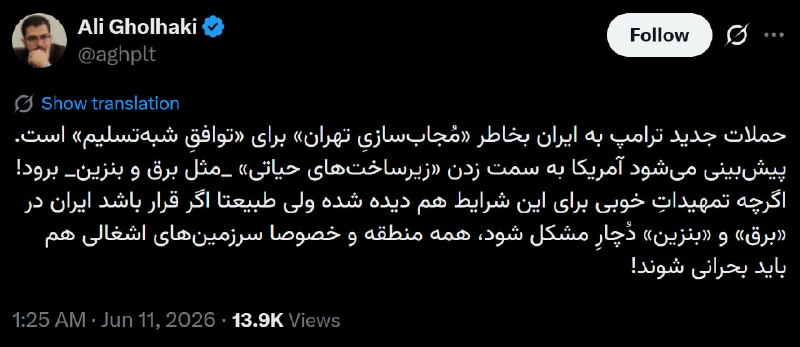

⭕️ علی قلهکی:

حملات جدید ترامپ به ایران بخاطر «مُجاب‌سازیِ تهران» برای «توافقِ شبه‌تسلیم» است.
پیش‌بینی می‌شود آمریکا به سمت زدن «زیرساخت‌های حیاتی» _مثل برق و بنزین_ برود!
اگرچه تمهیداتِ خوبی برای این شرایط هم دیده شده ولی طبیعتا اگر قرار باشد ایران در «برق» و «بنزین» دُچارِ مشکل شود، همه منطقه و خصوصا سرزمین‌های اشغالی هم باید بحرانی شوند!

📝 Nick

📌 @persian_trend_official
پرشین ترند | متفاوت‌ترین کانال نظامی

## Persian_Trend_Official — post 16601

سیریک

## Persian_Trend_Official — post 16600

  

نقاط مورد هدف توسط آمریکا در عملیات امشب

## IranianMinds — post 22213

موج‌ اول‌‌ حملات تموم شد
چن دقیقه دیگه برا تقه دوم میان

@IranianMinds

## IranianMinds — post 22211

🔴 یک مقام آمریکایی به فاکس نیوز :

این یک هشدار بود ، اهداف بعدی پل ها و‌ نیروگاه های برق خواهند بود !

@IranianMinds

## IranianMinds — post 22210

  

وضعیت پمپ بنزین های شیراز :

@IranianMinds

## IranianMinds — post 22209

🔴 گزارش انفجار مجدد در بندرعباس

@IranianMinds

## IranianMinds — post 22208

  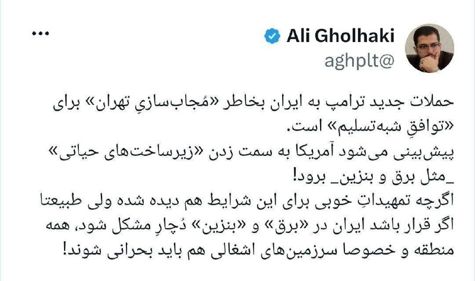

🔴 علی قلهکی خبرنگار حکومتی :

اگه آمریکا بخواد زیرساخت های مارو بزنه و بندازتمون توی بحران برق و بنزین ما هم کاری میکنیم که اسرائیل هم دچار این بحران بشه.

@IranianMinds

## Dirty_Kids — post 391643

یکبار دیگه اینترنتا قطع بشه منو برخط نمی‌بینید، آخرخط می‌بینید. خدانگهدار.

@Dirty_Kids 👻

## manototv — post 106003

  <a href="telegram/content/manototv_106003_1781130772.mp4" target="_blank">🎬 Download video</a>

فشار بر صادرات نفت، شکاف‌های درونی جمهوری اسلامی را آشکارتر کرده است. رژیمی که برای حفظ نیروهای سرکوب، شبکه‌های نیابتی و نظام وفاداری به درآمد نفتی نیاز دارد، اکنون میان مذاکره برای تنفس اقتصادی و تسلیم گرفتار شده است.

## manototv — post 105996

  <a href="telegram/content/manototv_105996_1781130772.mp4" target="_blank">🎬 Download video</a>

دونالد ترامپ می‌گوید در «مراحل پایانی» دستیابی به توافقی با جمهوری اسلامی قرار دارد و آمریکا به‌زودی «پیروزی کامل» را اعلام خواهد کرد.

اما این نخستین بار نیست که رئیس‌جمهور آمریکا از نزدیک بودن پایان این مناقشه سخن می‌گوید؛ ورق بزنید.

## manototv — post 105995

  <a href="telegram/content/manototv_105995_1781130773.mp4" target="_blank">🎬 Download video</a>

‌
بازدید محمدرضا شاه پهلوی از دانشکده فرماندهی و ستاد ارتش شاهنشاهی در دهه ۵۰ خورشیدی.

## alonews — post 127011

  <a href="telegram/content/alonews_127011_1781130775.webm" target="_blank">🎬 Download video</a>

🔴فوری/فاکس نیوز: اهداف بعدی ترامپ ، نیروگاه ها و پل ها هستند!

✅ @AloNews خبر جنگ

## alonews — post 127010

  <a href="telegram/content/alonews_127010_1781130775.webm" target="_blank">🎬 Download video</a>

👈انفجار مجدد در بندرعباس

✅ @AloNews خبر جنگ

---
📅 بروزرسانی: 1405/03/21 01:52
---

## VahidOOnLine — post 244797

  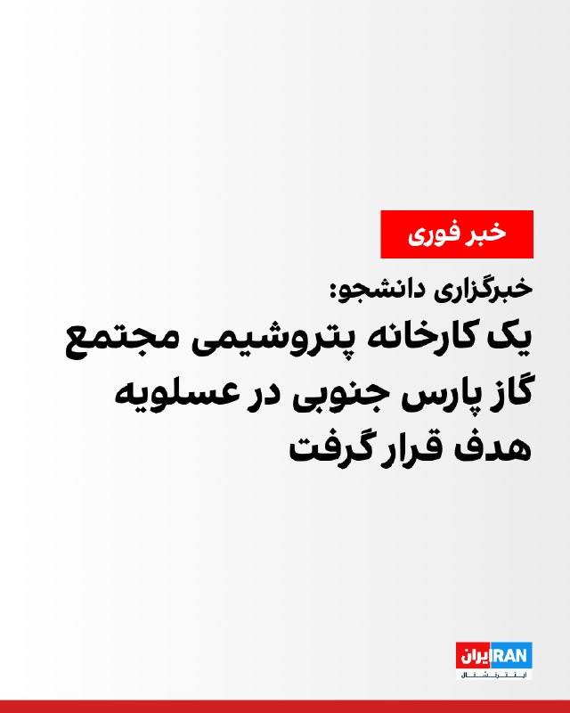

خبرگزاری دانشجو اعلام کرد منابع خبری از هدف قرار گرفتن یک کارخانه پتروشیمی متعلق به مجتمع گاز پارس جنوبی در عسلویه خبر دادند.
‌🏁 🇬🇧 IranintlTV

🤖 @VahidOOnLine

## WithYashar — post 14435

المیادین: منطقه تنگه هرمز شاهد درگیری شدیده.
@withyashar

## WithYashar — post 14434

کان عبری: اسرائیل نقشی در حملات امشب نداشته است
@withyashar

## WithYashar — post 14433

پیشروی ناو های آمریکایی اکنون در فاصله 150 تا 250 کیلومتری از ساحل چابهار هستند.🚨🚨
@withyashar

## WithYashar — post 14432

پرواز سوخت رسان های بیشتر از بن گوریون رصد شد. سوخت رسان اسرائیل به پرواز در آمد.
@withyashar

## WithYashar — post 14431

آکسیوس:مذاکرات ایران و آمریکا فروپاشید
@withyashar

## WithYashar — post 14430

انفجار ‌جدید قشم
@withyashar

## mwarmonitor — post 10676

🔸مسئول امنیتی اسرائیلی: اسرائیل تاکنون در حملات علیه ایران مشارکت نداشته است. شبکه کان اسرائیل

@mwarmonitor

## mwarmonitor — post 10675

🔴چشم‌انداز دستیابی به یک پیشرفت دیپلماتیک میان ایران و آمریکا پس از آن‌که یک هیئت میانجی قطری بدون هیچ پیشرفتی تهران را ترک کرد، کمرنگ شده است — نیویورک تایمز

@mwarmonitor

## pm_afshaa — post 93471

  <a href="telegram/content/pm_afshaa_93471_1781130155.webm" target="_blank">🎬 Download video</a>

🔴المیادین: منطقه تنگه هرمز شاهد درگیری شدیده.

💧 Rainbet.com the #1 Non-KYC Crypto Casino & Sportsbook @rainbetcom

😁 @Pm_Afshaa

## pm_afshaa — post 93470

  <a href="telegram/content/pm_afshaa_93470_1781130156.webm" target="_blank">🎬 Download video</a>

🔴کان نیوز عبری: اسرائیل نقشی در حملات امشب نداشته. 
💧 Rainbet.com the #1 Non-KYC Crypto Casino & Sportsbook @rainbetcom 
😁 @Pm_Afshaa

## pm_afshaa — post 93469

  <a href="telegram/content/pm_afshaa_93469_1781130157.webm" target="_blank">🎬 Download video</a>

🔴کان نیوز عبری: اسرائیل نقشی در حملات امشب نداشته.

💧 Rainbet.com the #1 Non-KYC Crypto Casino & Sportsbook @rainbetcom

😁 @Pm_Afshaa

## pm_afshaa — post 93468

  <a href="telegram/content/pm_afshaa_93468_1781130158.webm" target="_blank">🎬 Download video</a>

🔴نیویورک تایمز:
چشم‌انداز پیشرفت دیپلماتیک در مذاکرات آمریکا و ایران زمانی تیره‌تر شد که یک هیئت میانجی‌گر قطری عصر چهارشنبه بدون هیچ پیشرفتی در مذاکرات، تهران رو ترک کرد.

💧 Rainbet.com the #1 Non-KYC Crypto Casino & Sportsbook @rainbetcom

😁 @Pm_Afshaa

## pm_afshaa — post 93467

  <a href="telegram/content/pm_afshaa_93467_1781130158.webm" target="_blank">🎬 Download video</a>

🔴فارس: حمله به کشتی‌های آمریکایی در تنگه هرمز

💧 Rainbet.com the #1 Non-KYC Crypto Casino & Sportsbook @rainbetcom

😁 @Pm_Afshaa

## pm_afshaa — post 93466

از عربستان و امارات چندین سوخت رسان بلند شدن

💧 Rainbet.com the #1 Non-KYC Crypto Casino & Sportsbook @rainbetcom

😁 @Pm_Afshaa

## pm_afshaa — post 93465

نه ببین داداش جام جهانی حمله نمیکنن عمرااااا

## pm_afshaa — post 93464

انفجار در قشم

## pm_afshaa — post 93463

  

تصویر منتسب به انفجار در سیریک :

💧 Rainbet.com the #1 Non-KYC Crypto Casino & Sportsbook @rainbetcom

😁 @Pm_Afshaa

## VahidOnline — post 76169

بعضی کانال‌های خبری به نقل از تسنیم نوشته بودند:
منابع خبری از هدف قرار گرفتن یک کارخانه پتروشیمی متعلق به مجتمع گاز پارس جنوبی در عسلویه خبر دادند

خبرگزاری تسنیم وابسته به سپاه در پستی نوشت:
انتشار خبر جعلی در کانالهای فیک‌نیوز به نقل از تسنیم

برخی فیک‌نیوزها از دقایقی پیش به صورت هماهنگ خبری با عنوان "هم اکنون یک کارخانه پتروشیمی متعلق به مجتمع گاز پارس جنوبی در عسلویه بمباران شد" به نقل از تسنیم نقل می‌کنند.

این در حالی است که امشب چنین خبری تا این لحظه بر روی هیچکدام از خروجی‌های تسنیم قرار نگرفته است و چنین خبری تاکنون صحت ندارد.

به هرحال اون خبر رو خبرگزاری دانشجو وابسته به بسیج هم منتشر کرده و الان به نقل از اون داره پخش میشه:
هم اکنون یک کارخانه پتروشیمی متعلق به مجتمع گاز پارس جنوبی در عسلویه بمباران شد

📡 @VahidOnline

## Shin_Persian — post 6897

Shin ✓ @hey_itsmyturn
Wed, 10 Jun 2026 22:19:53 UTC

Wrong, this image is not from Sirik, Iran. It's from Aden, Yemen.

ترجمه خودکار فارسی

اشتباه است، این تصویر مربوط به سیریک ایران نیست. این تصویر متعلق به عدن، یمن است.

𝕏 · @shin_persian

## FarsiVOA — post 220303

  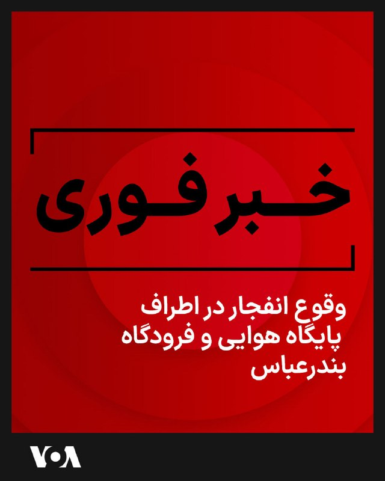

⚡️خبرگزاری جمهوری اسلامی می گوید صدای چند انفجار در حوالی فرودگاه و پایگاه هوایی بندرعباس شنیده شد. سنتکام ساعتی پیش از آغاز دور دیگری از حملات به مواضع جمهوری اسلامی خبر داد.
@FarsiVOA

## Persian_Trend_Official — post 16599

  

گزارش نیویورک تایمز: «هیئت قطری بدون پیشرفت ایران را ترک کرد، شانس موفقیت در مذاکرات رو به کاهش است»

📝 Nick

📌 @persian_trend_official
پرشین ترند | متفاوت‌ترین کانال نظامی

## Persian_Trend_Official — post 16598

  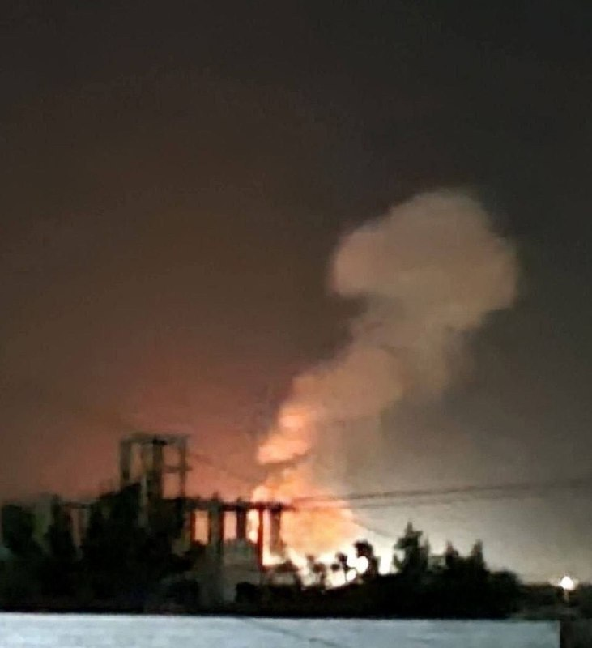

سیریک

## Persian_Trend_Official — post 16597

گزارش‌هایی از پرتاب موشک‌های کروز ضد کشتی از ایران، هدف قرار دادن ناوهای نیروی دریایی آمریکا در خلیج عمان.

## RadioFarda — post 158160

  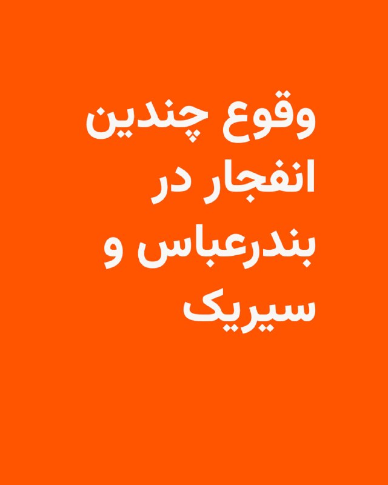

🔸خبرگزاری جمهوری اسلامی، ایرنا از وقوع چندین انفجار در اطراف فرودگاه و پایگاه هوایی بندرعباس خبر می‌دهد.

🔸این خبرگزاری اصابت «پرتابه‌های دشمن به نقطه‌ای در سیریک» را هم تأیید کرده است. برخی منابع محلی می‌گویند پایگاه نیروی دریایی جمهوری اسلامی در این شهر بندری هدف قرار گرفته است.

🔸از سوی دیگر برخی خبرگزاری‌ها هم از وقوع درگیری‌هایی «در دریا» بین نیروهای ایران و آمریکا خبر می‌دهند.

@RadioFarda

## IranianMinds — post 22207

🔴 صداوسیما : پدافند عسلویه فعال شد. @IranianMinds

## IranianMinds — post 22206

🔴 صداوسیما :

پدافند عسلویه فعال شد.

@IranianMinds

## IranianMinds — post 22205

🔴 مقامات امنیتی اسرائیل می گویند اسرائیل در این مرحله در حملات آمریکا به ایران دخالتی ندارد.

منبع:کان نیوز

@IranianMinds

## IranianMinds — post 22204

🔴 نیویورک‌ تایمز :

راه دیپلماسی میان ایران‌ و آمریکا تیره و تار شده ، امروز هم یک‌ هیئت قطری بدون هیچ‌ پیشرفتی برای میانجیگری برگشتن خونشون

@IranianMinds

## IranianMinds — post 22203

🔴 خبرگزاری فارس :

بمولا یه کشتی آمریکایی زدیم

@IranianMinds

## IranianMinds — post 22202

🔴 فوری

روزنامه یدیعوت آحرونوت :

یک ناو جنگی آمریکایی احتمالاً در تنگه هرمز مورد اصابت قرار گرفته است.

این اطلاعات بسیار تأییدنشده است.

@IranianMinds

## IranianMinds — post 22201

دو تانکر سوخت رسان آمریکایی با فرستنده روشن حدود یک ساعته اینطوری دارن تو خلیج فارس دور خودشون میچرخن و سوخت جنگنده هارو‌ راحت تامین میکنن برای حمله :)) @IranianMinds

## IranianMinds — post 22200

🔴 سیتنا :

خیالتون راحت اتصال اینترنت پایداره و سرعتش خوبه نتتون قطع نمیشه.

@IranianMinds

## BBCPersian — post 283368

⚡️گزارش های ضد و نقیض از «هدف قرار گرفتن» یک مجتمع پتروشیمی در عسلویه

برخی منابع خبری از جمله خبرگزاری دانشجو وابسته به بسیج از «هدف قرار گرفتن یک کارخانه پتروشیمی متعلق به مجتمع گاز پارس جنوبی در عسلویه» گزارش داده است اما خبرگزاری تسنیم - نزدیک به سپاه پاسداران - آن را تکذیب کرده و انتساب چنین گزارشی به این خبرگزاری را رد کرده است.

ساعتی پیش هم خبرگزاری‌های رسمی ایران از شنیدن صدای انفجار در مناطقی چون میناب، غرب بندرعباس، سیریک، جزیره قشم و همچنین در گزارشی غیررسمی از حوالی فرودگاه مهرآباد خبر داده بودند.

تحولات را در سایت بی‌بی‌سی فارسی دنبال کنید.⬇️

https://bbc.in/4fIJPot
@BBCPersian

## Dirty_Kids — post 391642

  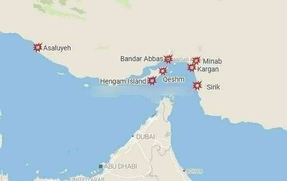

‏الجزیره نوشت اسرائیل هم در حملات امشب به جمهوری اسلامی مشارکت دارد.

صداوسیما اعلام کرد به جزیره قشم هم حمله شده است.

برخی رسانه‌های آمریکایی نوشته‌اند که عملیات آمریکا «چند ساعت» طول می‌کشد و شامل «بیش از ۱۰۰ هدف» خواهد بود.

@Dirty_Kids 👻

## Dirty_Kids — post 391641

🔴 آکسیوس:

مذاکرات ایران و آمریکا فروپاشید و تمام شد.

@Dirty_Kids 👻

## Dirty_Kids — post 391640

سه ماه تحلیل گرای نظامی میگفتن باید تا جام جهانی تکلیف روشن شه. یارو حمله رو گذاشت برا شب افتتاحیه=))))

## alonews — post 127009

  <a href="telegram/content/alonews_127009_1781130163.webm" target="_blank">🎬 Download video</a>

👈به گزارش آکسیوس، مذاکرات ایران و آمریکا به طور کامل فرو پاشید

✅ @AloNews خبر جنگ

## alonews — post 127008

  <a href="telegram/content/alonews_127008_1781130163.webm" target="_blank">🎬 Download video</a>

👈نیویورک تایمز:
چشم‌انداز پیشرفت دیپلماتیک در مذاکرات آمریکا و ایران زمانی تیره‌تر شد که یک هیئت میانجی‌گر قطری عصر چهارشنبه بدون هیچ پیشرفتی در مذاکرات، تهران را ترک کرد.

✅ @AloNews خبر جنگ

## alonews — post 127007

  <a href="telegram/content/alonews_127007_1781130163.webm" target="_blank">🎬 Download video</a>

👈گزارشات از تحرکات شدید در اسرائیل

✅ @AloNews خبر جنگ

---
📅 بروزرسانی: 1405/03/21 01:42
---

## VahidOOnLine — post 244796

  

‌علاء‌الدین بروجردی، عضو کمسیون امنیت ملی مجلس در مصاحبه با شبکه سه تلویزیون جمهوری اسلامی گفت: برای آمریکا قبول این حقیقت سخت است که امروز در دنیا ۴ قدرت دیگر، از جمله جمهوری اسلامی، روسیه و چین، وجود دارد.
‌🏁 🇬🇧 IranintlTV

🤖 @VahidOOnLine

## WithYashar — post 14429

فاکس نیوز به‌نقل از یک مقام: امشب چند مرحله حمله انجام میدیم.
@withyashar

## WithYashar — post 14428

گزارش از برخورد موشک به فرودگاه بندرعباس
@withyashar

## WithYashar — post 14427

مهر: یه موشک کروز در عسلویه رهگیری کردیم.
@withyashar

## WithYashar — post 14426

اتاق جنگ با یاشار : مشخصه که هدف امریکا متمرکز در‌ باز کردن تنگه هرمز است در مرحله اول !
@withyashar

## WithYashar — post 14425

منابع عراقی: پایگاه آمریکایی الحریر در اربیل (شمال عراق) هدف موشکی از ایران قرار گرفت.

وبگاه المعلومه عراق نیز خبر داد، ایران یک رادار آمریکایی در اربیل (مرکز کردستان عراق) را منهدم کرد
@withyashar

## WithYashar — post 14424

مهر : همین الان سپاه با نیرودریایی امریکا درگیر شده تو تنگه
@withyashar

## WithYashar — post 14423

  <a href="telegram/content/WithYashar_14423_1781129550.mp4" target="_blank">🎬 Download video</a>

🎬 Video

## mwarmonitor — post 10674

انفجار شدید در قشم

## FoxNewsTwitter — post 342826

  <a href="telegram/content/FoxNewsTwitter_342826_1781129553.mp4" target="_blank">🎬 Download video</a>

Fox News (Twitter/X)

BREAKING: The U.S. has begun launching another round of airstrikes against Iran.

## pm_afshaa — post 93462

فرودگاه بندعباس هم میگن زدن
رسمی تایید نشده هنوز

💧 Rainbet.com the #1 Non-KYC Crypto Casino & Sportsbook @rainbetcom

😁 @Pm_Afshaa

## pm_afshaa — post 93461

فاکس نیوز به‌نقل از یک مقام:
امشب چند مرحله حمله انجام میشه.

💧 Rainbet.com the #1 Non-KYC Crypto Casino & Sportsbook @rainbetcom

😁 @Pm_Afshaa

## pm_afshaa — post 93460

  <a href="telegram/content/pm_afshaa_93460_1781129556.webm" target="_blank">🎬 Download video</a>

🔴خبرگزاری دانشجو: یک کارخانه پتروشیمی متعلق به مجتمع گاز پارس جنوبی در عسلویه بمباران شد. 
💧 Rainbet.com the #1 Non-KYC Crypto Casino & Sportsbook @rainbetcom 
😁 @Pm_Afshaa

## pm_afshaa — post 93459

🔴پرواز سوخت رسان های آمریکایی از فرودگاه بن گوریون

💧 Rainbet.com the #1 Non-KYC Crypto Casino & Sportsbook @rainbetcom

😁 @Pm_Afshaa

## pm_afshaa — post 93458

  <a href="telegram/content/pm_afshaa_93458_1781129556.webm" target="_blank">🎬 Download video</a>

🔴مهر: یه موشک کروز در عسلویه رهگیری کردیم.

💧 Rainbet.com the #1 Non-KYC Crypto Casino & Sportsbook @rainbetcom

😁 @Pm_Afshaa

## pm_afshaa — post 93457

  <a href="telegram/content/pm_afshaa_93457_1781129557.webm" target="_blank">🎬 Download video</a>

بچه ها تو کانال زاپاسمون حتما جوین شین داشته باشین اتفاقی افتاد اونجا دنبالمون کنین
👇
👇
👇

https://t.me/pmtvzapas
https://t.me/pmtvzapas

## pm_afshaa — post 93456

صدای انفجار در سیریک

💧 Rainbet.com the #1 Non-KYC Crypto Casino & Sportsbook @rainbetcom

😁 @Pm_Afshaa

## pm_afshaa — post 93455

شلیک موشک از ایران

💧 Rainbet.com the #1 Non-KYC Crypto Casino & Sportsbook @rainbetcom

😁 @Pm_Afshaa

## pm_afshaa — post 93454

انفجار مجدد در قشم و بندعباس

💧 Rainbet.com the #1 Non-KYC Crypto Casino & Sportsbook @rainbetcom

😁 @Pm_Afshaa

## pm_afshaa — post 93453

باز دارن میرینن تو نتا

## pm_afshaa — post 93452

  <a href="telegram/content/pm_afshaa_93452_1781129558.webm" target="_blank">🎬 Download video</a>

🔴خبرگزاری مهر: همین الان سپاه با نیرودریایی امریکا در تنگه هرمز درگیر شده.

💧 Rainbet.com the #1 Non-KYC Crypto Casino & Sportsbook @rainbetcom

😁 @Pm_Afshaa

## kianmeli1 — post 87900

🔴فوری

فاکس نیوز به نقل از یک مقام ارشد آمریکایی

امشب چند موج حمله دیگر به ایران وجود دارد.
https://t.me/kianmeli1

## IranIntlTV — post 341592

  

خبرگزاری دانشجو اعلام کرد منابع خبری از هدف قرار گرفتن یک کارخانه پتروشیمی متعلق به مجتمع گاز پارس جنوبی در عسلویه خبر دادند.
https://iranintl.com/202606106347

## IranIntlTV — post 341591

  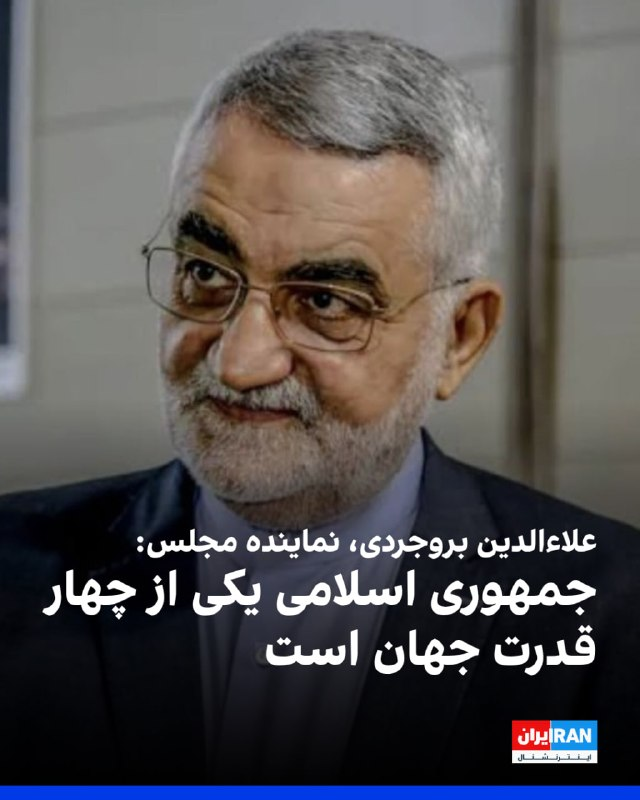

‌علاء‌الدین بروجردی، عضو کمسیون امنیت ملی مجلس در مصاحبه با شبکه سه تلویزیون جمهوری اسلامی گفت: برای آمریکا قبول این حقیقت سخت است که امروز در دنیا ۴ قدرت دیگر، از جمله جمهوری اسلامی، روسیه و چین، وجود دارد.

## Shin_Persian — post 6896

U.S. Central Command-Farsi ✓ @CENTCOMFarsi
Wed, 10 Jun 2026 22:10:56 UTC

نیروهای فرماندهی مرکزی ایالات متحده امروز ساعت ۵:۱۵ بعد از ظهر به وقت شرق آمریکا، به دستور فرمانده کل قوا، حملات دفاع از خود بیشتری را علیه چندین هدف در ایران آغاز کردند. این حملات در پاسخ به تجاوز بی‌اساس و مداوم ایران انجام می‌شود.

English

U.S. Central Command (CENTCOM) forces, at the direction of the Commander-in-Chief, launched additional self-defense strikes against several targets in Iran today at 5:15 p.m. Eastern Time. These strikes are in response to Iran's unprovoked and ongoing aggression.

𝕏 · @shin_persian

## Shin_Persian — post 6895

  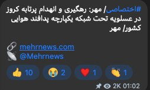

Shin ✓ @hey_itsmyturn
Wed, 10 Jun 2026 22:07:58 UTC

State-owned Mehr News claims that a CM was downed over Asaluyeh, Bushehr Province, #Iran

ترجمه خودکار فارسی

خبرگزاری دولتی مهر ادعا می‌کند که یک موشک کروز (CM) برفراز عسلویه در استان بوشهر، #Iran سرنگون شده است.

𝕏 · @shin_persian

## Shin_Persian — post 6894

  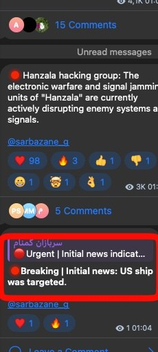

Shin ✓ @hey_itsmyturn
Wed, 10 Jun 2026 22:06:26 UTC

Just remembered when the Islamic Regime's TV said they hit the CVN-72 😂

ترجمه خودکار فارسی

همین الان یادم آمد زمانی را که تلویزیون رژیم اسلامی گفت آن‌ها به CVN-72 (ناو هواپیمابر یواس‌اس آبراهام لینکلن) حمله کرده‌اند 😂

𝕏 · @shin_persian

## FarsiVOA — post 220302

  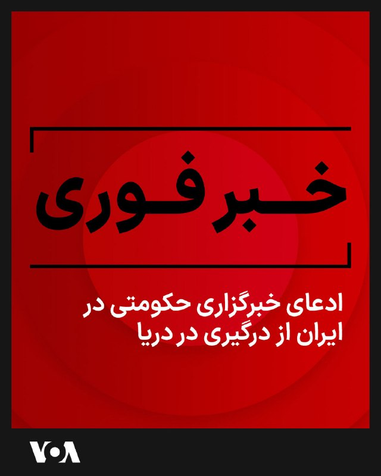

⚡️سایت حکومتی مهر مدعی شد که بین نیروهای جمهوری اسلامی نیروهای آمریکایی در دریا «درگیری‌هایی» رخ داده است. تاکنون هیچ مقام رسمی از دو طرف این موضوع را تائید نکرده‌است.
@FarsiVOA

## Persian_Trend_Official — post 16596

—❗️🇺🇸/🇮🇷 فوری: احتمالاً یک کارخانه پتروشیمی متعلق به مجتمع گاز پارس جنوبی در عسلویه هدف قرار گرفته است

## Persian_Trend_Official — post 16594

  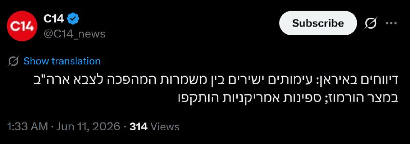

گزارش‌ها در ایران: درگیری مستقیم بین سپاه پاسداران و ارتش آمریکا در تنگه هرمز؛ کشتی‌های آمریکایی مورد حمله قرار گرفتند.

📝 Nick

📌 @persian_trend_official
پرشین ترند | متفاوت‌ترین کانال نظامی

## Persian_Trend_Official — post 16593

  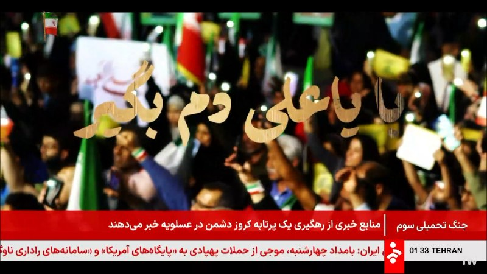

📝 Nick

📌 @persian_trend_official
پرشین ترند | متفاوت‌ترین کانال نظامی

## Persian_Trend_Official — post 16592

  <a href="telegram/content/Persian_Trend_Official_16592_1781129561.webm" target="_blank">🎬 Download video</a>

الجزیره:
اسرائیل هم امشب به ایران حمله کرده و
تو عملیات حضور داره!

## IranianMinds — post 22199

  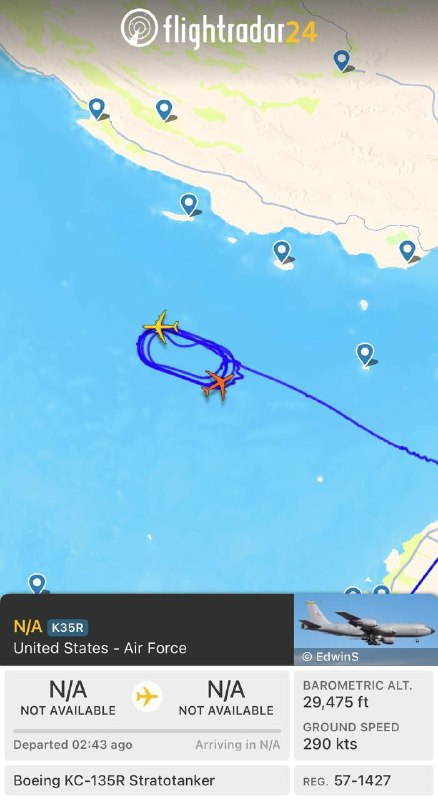

دو تانکر سوخت رسان آمریکایی با فرستنده روشن حدود یک ساعته اینطوری دارن تو خلیج فارس دور خودشون میچرخن و سوخت جنگنده هارو‌ راحت تامین میکنن برای حمله :))

@IranianMinds

## IranianMinds — post 22198

🔴 انفجار های شدید در قشم

@IranianMinds

## IranianMinds — post 22197

🔴 یک‌ مقام آمریکایی به فاکس نیوز :

امشب حملاتمون به صورت چند مرحله ای هستش و ضربه ی شدیدی بهشون میزنیم

@IranianMinds

## IranianMinds — post 22196

🔴 حملات آمریکا به کنگان @IranianMinds

## IranianMinds — post 22195

🔴 خبرگزاری مهر : آمریکا به عسلویه حمله کرد. @IranianMinds

## IranianMinds — post 22194

🔴 خبرگزاری مهر :

در‌ دریا و نزدیکی‌ تنگه هرمز درگیری شدید بین‌ نیروهای سپاه و آمریکا رخ داده

@IranianMinds

## IranianMinds — post 22193

🔴 حملات آمریکا به کنگان

@IranianMinds

## IranianMinds — post 22192

🔴 به گزارش ایرنا، چندین انفجار از بندرعباس در جنوب ایران و در نزدیکی فرودگاه و پایگاه هوایی شنیده شده است.

@IranianMinds

## IranianMinds — post 22191

🔴 ترامپ :

خبر های امشب رو‌ حتما دنبال کنید.

@IranianMinds

## IranianMinds — post 22190

🔴 سپاه به اربیل عراق حمله ی موشکی‌ کرد. @IranianMinds

## BBCPersian — post 283367

  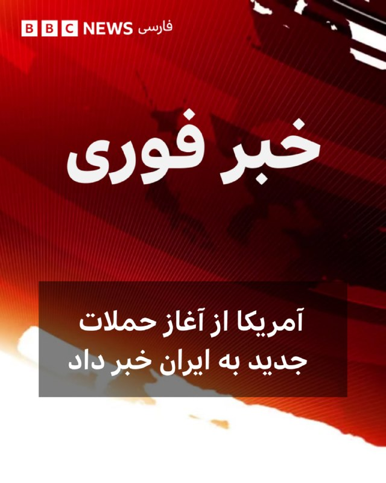

⚡️فرماندهی مرکزی ایالات متحده (سنتکام) دقایقی پیش اعلام کرد نیروهای این فرماندهی به دستور دونالد ترامپ از ساعت ۵:۱۵ بعدازظهر به وقت شرق آمریکا، دور جدیدی از حملات علیه اهدافی در ایران را آغاز کرده است. آمریکا این حملات را «اقدامی دفاعی» خوانده است.

در بیانیه سنتکام آمده است که این حملات در واکنش به آنچه که «تجاوزات بی دلیل و مستمر ایران» خوانده، انجام می‌شود.

همزمان از ایران گزارش شده که چند انفجار در نزدیکی میناب و منطقه سیریک شنیده شده است و حاشیه خلیج فارس شنیده شده است.

پیشتر دونالد ترامپ و وزیر دفاع آمریکا در اظهارات جداگانه‌ای گفته بودند که بار دیگر به ایران حمله می‌کنند.

تحولات را در سایت بی‌بی‌سی فارسی دنبال کنید.⬇️

https://bbc.in/4fIJPot
@BBCPersian

## Dirty_Kids — post 391639

گزارش‌های اولیه از شلیک موشک به سمت ناوهای جنگی آمریکا در دریای عمان حکایت دارند.

بر اساس اطلاعات منتشرشده، حمله موشکی احتمالی علیه شناورهای نظامی ایالات متحده در دریای عمان گزارش شده است. تاکنون هیچ مقام رسمی آمریکایی یا منبع مستقل این گزارش را تأیید نکرده و جزئیاتی درباره تعداد موشک‌ها، میزان خسارات یا نتیجه این حمله منتشر نشده است.

## Dirty_Kids — post 391638

  <a href="telegram/content/Dirty_Kids_391638_1781129563.webm" target="_blank">🎬 Download video</a>

🔴پایگاه شکاری بندرعباس مورد حمله قرار گرفت

🔴پدافند سیرجان/کرمان فعال

## alonews — post 127006

🔴فوووووووری/زود بیایید اینجا
⬇️

https://t.me/+4Sqp5RRoEUE5ZGM0
https://t.me/+4Sqp5RRoEUE5ZGM0

## alonews — post 127005

  <a href="telegram/content/alonews_127005_1781129564.webm" target="_blank">🎬 Download video</a>

🔴فوری/فاکس نیوز به نقل از یک مقام ارشد آمریکایی: امشب چندین موج حمله دیگر نیز وجود دارد. 
✅ @AloNews خبر جنگ

## alonews — post 127004

  <a href="telegram/content/alonews_127004_1781129564.webm" target="_blank">🎬 Download video</a>

🔴فوری/فاکس نیوز به نقل از یک مقام ارشد آمریکایی:
امشب چندین موج حمله دیگر نیز وجود دارد.

✅ @AloNews خبر جنگ

## alonews — post 127003

  <a href="telegram/content/alonews_127003_1781129565.webm" target="_blank">🎬 Download video</a>

👈یه موشک خورده تو فرودگاه بندرعباس

✅ @AloNews خبر جنگ

## alonews — post 127002

  <a href="telegram/content/alonews_127002_1781129565.webm" target="_blank">🎬 Download video</a>

👈صداوسیما:برخی منابع از رهگیری یک پرتابه کروز دشمن در عسلویه خبر می دهند

✅ @AloNews خبر جنگ

---
📅 بروزرسانی: 1405/03/21 01:32
---

## VahidOOnLine — post 244795

  

♦️بامداد پنجشنبه ۲۱ خردادماه و در پی اعلام فرماندهی مرکزی ایالات متحده (سنتکام) مبنی بر آغاز دور جدیدی از حملات علیه چندین هدف در ایران، قیمت نفت در بازارهای جهانی افزایش یافت.

بهای نفت خام برنت با رشد ۳.۸۸ درصدی به ۹۵ دلار در هر بشکه رسید. افزایش قیمت نفت در حالی رخ داده است که تشدید تنش‌های نظامی میان آمریکا و جمهوری اسلامی نگرانی‌ها درباره امنیت عرضه انرژی در منطقه را افزایش داده است.
‌🇸🇦 Indypersian

🤖 @VahidOOnLine

## VahidOOnLine — post 244794

  

♦️خبرگزاری فارس گزارش داد دقایقی پیش صدای چند انفجار از سمت غرب بندرعباس شنیده شده است. همچنین ساکنان منطقه کرگان میناب نیز از شنیده شدن چند صدای انفجار خبر داده‌اند.
پیش از این، فرماندهی مرکزی ایالات متحده (سنتکام) اعلام کرده بود نیروهای آمریکایی از ساعت ۱۷:۱۵ به وقت شرق آمریکا حملات جدیدی را علیه چندین هدف در ایران آغاز کرده‌اند. سنتکام گفت این عملیات در پاسخ به آنچه «اقدامات تهاجمی و ادامه‌دار ایران» خوانده، انجام شده است.
‌🇸🇦 Indypersian

🤖 @VahidOOnLine

## VahidOOnLine — post 244793

  

ستاد فرماندهی مرکزی آمریکا، سنتکام، اعلام کرد از ساعت ۰۰:۴۵ به وقت تهران، نیروهای آمریکا در واکنش به «تجاوز بی‌دلیل و ادامه‌دار» جمهوری اسلامی حملات بیشتری را در چارچوب دفاع از خود علیه چندین هدف در ایران آغاز کردند.
‌🏁 🇬🇧 IranintlTV

🤖 @VahidOOnLine

## WithYashar — post 14422

تا دقایقی دیگر پیام سخنگوی قرارگاه مرکزی خاتم الانبیا(میلاد مدرسه ای)
@withyashar

## WithYashar — post 14421

یک مقام آمریکایی به Axios گفت: تمام اهدافی که مورد حمله قرار گرفتند در جنوب ایران هستند و شامل سامانه‌های پدافند هوایی، رادارها و واحدهای فرماندهی و کنترل پهپادها می‌شوند.
@withyashar

## WithYashar — post 14420

پدافند سیرجان فعال
@withyashar

## WithYashar — post 14419

صدای انفجار در کنگان
@withyashar

## WithYashar — post 14418

الجزیره: اسرائیل هم امشب به ایران حمله کرده و تو عملیات حضور داره
@withyashar

## WithYashar — post 14417

## WithYashar — post 14416

  <a href="telegram/content/WithYashar_14416_1781128961.mp4" target="_blank">🎬 Download video</a>

🎬 Video

## WithYashar — post 14415

  <a href="telegram/content/WithYashar_14415_1781128964.mp4" target="_blank">🎬 Download video</a>

جنگنده های ارتش بر فراز تهران
@withyashar

## mwarmonitor — post 10673

انفجار در جزیره هنگام

## mwarmonitor — post 10672

🔴یک مقام آمریکایی گفت: تمام اهدافی که مورد حمله قرار گرفته‌اند در جنوب ایران قرار دارند و شامل سامانه‌های پدافند هوایی، رادارها و واحدهای فرماندهی و کنترل پهپادها هستند - اکسیوس.

@mwarmonitor

## mwarmonitor — post 10671

  

🔴شهرهای که تا کنون مورد هدف قرار گرفته‌اند‌.

@mwarmonitor

## mwarmonitor — post 10670

حمله مجدد به بندرعباس

## mwarmonitor — post 10669

🔴 وال‌استریت ژورنال به نقل از پنتاگون: این حملات نوعی اقدام از جنس «دیپلماسی اجباری» است که هدف آن وادار کردن ایران به ارائه امتیازاتی در میز مذاکره است.

@mwarmonitor

## pm_afshaa — post 93451

  

نقاطی که تا الان هدف قرار گرفته :

💧 Rainbet.com the #1 Non-KYC Crypto Casino & Sportsbook @rainbetcom

😁 @Pm_Afshaa

## pm_afshaa — post 93450

تسنیم: هم اکنون یک کارخانه پتروشیمی متعلق به مجتمع گاز پارس جنوبی در عسلویه بمباران شد

💧 Rainbet.com the #1 Non-KYC Crypto Casino & Sportsbook @rainbetcom

😁 @Pm_Afshaa

## pm_afshaa — post 93449

انفجا در جزیره هنگام

💧 Rainbet.com the #1 Non-KYC Crypto Casino & Sportsbook @rainbetcom

😁 @Pm_Afshaa

## pm_afshaa — post 93448

  <a href="telegram/content/pm_afshaa_93448_1781128967.webm" target="_blank">🎬 Download video</a>

🔴خبرگزاری دانشجو: یک کارخانه پتروشیمی متعلق به مجتمع گاز پارس جنوبی در عسلویه بمباران شد.

💧 Rainbet.com the #1 Non-KYC Crypto Casino & Sportsbook @rainbetcom

😁 @Pm_Afshaa

## pm_afshaa — post 93447

  <a href="telegram/content/pm_afshaa_93447_1781128967.webm" target="_blank">🎬 Download video</a>

بچه ها تو کانال زاپاسمون حتما جوین شین داشته باشین اتفاقی افتاد اونجا دنبالمون کنین
👇
👇
👇

https://t.me/pmtvzapas
https://t.me/pmtvzapas

## pm_afshaa — post 93446

  <a href="telegram/content/pm_afshaa_93446_1781128968.webm" target="_blank">🎬 Download video</a>

🔴مقام آمریکایی به اکسیوس:
همه اهدافی که امشب مورد حمله قرار گرفتن، تو جنوب ایران هستن که شامل سیستم‌های دفاع هوایی، رادارها و واحدهای فرماندهی و کنترل پهپادن.

💧 Rainbet.com the #1 Non-KYC Crypto Casino & Sportsbook @rainbetcom

😁 @Pm_Afshaa

## pm_afshaa — post 93444

پایگاه هوایی بندر عباسو زدن

💧 Rainbet.com the #1 Non-KYC Crypto Casino & Sportsbook @rainbetcom

😁 @Pm_Afshaa

## pm_afshaa — post 93443

تتر 180

## pm_afshaa — post 93442

  <a href="telegram/content/pm_afshaa_93442_1781128969.webm" target="_blank">🎬 Download video</a>

🔴وال‌استریت ژورنال به نقل از پنتاگون:
این حملات نوعی اقدام از جنس «دیپلماسی اجباری» است که هدف اون وادار کردن جمهوری اسلامی به ارائه امتیازاتی در میز مذاکره‌ست.

💧 Rainbet.com the #1 Non-KYC Crypto Casino & Sportsbook @rainbetcom

😁 @Pm_Afshaa

## pm_afshaa — post 93441

هر بشکه نفت 95 دلار

💧 Rainbet.com the #1 Non-KYC Crypto Casino & Sportsbook @rainbetcom

😁 @Pm_Afshaa

## pm_afshaa — post 93440

  <a href="telegram/content/pm_afshaa_93440_1781128970.webm" target="_blank">🎬 Download video</a>

🔴کانال 12 اسرائیل به نقل از مقامات آمریکایی: منتظر واکنش جمهوری اسلامی هستیم که احتمالا پایگاه‌های آمریکایی رو هدف قرار بده، همانطور که در شب سه‌شنبه رخ داد.

💧 Rainbet.com the #1 Non-KYC Crypto Casino & Sportsbook @rainbetcom

😁 @Pm_Afshaa

## pm_afshaa — post 93439

انفجار های مجدد در بندر عباس

💧 Rainbet.com the #1 Non-KYC Crypto Casino & Sportsbook @rainbetcom

😁 @Pm_Afshaa

## pm_afshaa — post 93438

اگه به حرف پزشکیان گوش کرده بودیم پایتخت رو برده بودیم بوشهر تا الان 5 بار جمهوری اسلامی سقوط کرده بود

## pm_afshaa — post 93437

اتش سوزی در پایگاه دریایی سیریک

💧 Rainbet.com the #1 Non-KYC Crypto Casino & Sportsbook @rainbetcom

😁 @Pm_Afshaa

## pm_afshaa — post 93436

  <a href="telegram/content/pm_afshaa_93436_1781128971.webm" target="_blank">🎬 Download video</a>

🔴کانال 12 اسرائیل: آماده پیوستن به حملات علیه ایران هستیم.

💧 Rainbet.com the #1 Non-KYC Crypto Casino & Sportsbook @rainbetcom

😁 @Pm_Afshaa

## VahidOnline — post 76168

پیام‌های دریافتی:

صدای سه انفجار در بندرعباس

بندر عباس سه صدای پشت سر هم ساعت 1:20

وااااایییی تو دو ثانیه سه تا انفجار شنیدم بندرعباس خیلی نزدیک بود

بندر عباس همین الان چند تا صداااا

بندرعباس سمت زندان شهرک صدای جنگنده یا انفجار طولانی اومد
همین الان یک انفجار خیلی خیلیییی سنگین بندرعباس

دوباره انفجار بندرعباس ۱:۲۲

وحید بندرعباس الان یجوری زد شهر لرزید

وحید ساعت ۱:۲۰ بندرعباس سه تا انفجار خیلی سنگین شد

دوبارهههه صدا اومد ولی خیلی دوررر بود فکر کنم سه/چهار تا بود

📡 @VahidOnline

## kianmeli1 — post 87899

🔴فوری-صداهای انفجار در بندرعباس، قشم، میناب، سیریک و جزیره هنگام
https://t.me/kianmeli1

## kianmeli1 — post 87898

🔴صدای چند انفجار در بندر کرگان نیز شنیده شده است
https://t.me/kianmeli1

## IranIntlTV — post 341590

  

ستاد فرماندهی مرکزی آمریکا، سنتکام، اعلام کرد از ساعت ۰۰:۴۵ به وقت تهران، نیروهای آمریکا در واکنش به «تجاوز بی‌دلیل و ادامه‌دار» جمهوری اسلامی حملات بیشتری را در چارچوب دفاع از خود علیه چندین هدف در ایران آغاز کردند.
https://iranintl.com/202606103787

## Shin_Persian — post 6893

Shin ✓ @hey_itsmyturn
Wed, 10 Jun 2026 22:01:37 UTC

2 stories from 2 regime news agencies:

Daneshju Agency:
A Petrochemical company in Asaluyeh was targeted.

IRIB:
A CM was downed over Asaluyeh.

ترجمه خودکار فارسی

۲ خبر از ۲ خبرگزاری رژیم:

خبرگزاری دانشجو:
یک شرکت پتروشیمی در عسلویه مورد هدف قرار گرفت.

خبرگزاری صدا و سیما (IRIB):
یک موشک کروز (CM) بر فراز عسلویه سرنگون شد.

𝕏 · @shin_persian

## Shin_Persian — post 6892

Shin ✓ @hey_itsmyturn
Wed, 10 Jun 2026 21:57:55 UTC

Initial:
Airstrike on a petrochemical site in Asaluyeh, Bushehr Province, #Iran

ترجمه خودکار فارسی

حمله هوایی به یک سایت پتروشیمی در عسلویه، استان بوشهر، #Iran

𝕏 · @shin_persian

## Shin_Persian — post 6891

Shin ✓ @hey_itsmyturn
Wed, 10 Jun 2026 21:57:11 UTC

As per regime news channels: IRGC Khatam HQ's Spox to address a statement shortly

ترجمه خودکار فارسی

بر اساس کانال‌های خبری رژیم: سخنگوی قرارگاه خاتم‌الانبیاء سپاه پاسداران (IRGC) به‌زودی بیانیه‌ای را ارائه خواهد کرد.

𝕏 · @shin_persian

## Shin_Persian — post 6890

↩️ Quoted tweet: Shin ✓ @hey_itsmyturn Wed, 10 Jun 2026 21:42:28 UTC Kangan Naval Base was the target as per a local source. Was hit 3 times. ↩️ توییت نقل‌قول شده — برای پاسخ، پست زیر را ببینید. ترجمه خودکار فارسی به گفته یک منبع محلی، پایگاه دریایی کنگان…

## Shin_Persian — post 6889

↩️ Quoted tweet:
Shin ✓ @hey_itsmyturn
Wed, 10 Jun 2026 21:42:28 UTC

Kangan Naval Base was the target as per a local source. Was hit 3 times.

↩️ توییت نقل‌قول شده — برای پاسخ، پست زیر را ببینید.

ترجمه خودکار فارسی

به گفته یک منبع محلی، پایگاه دریایی کنگان هدف قرار گرفت. این مکان ۳ بار مورد اصابت قرار گرفت.

𝕏 · @shin_persian

## Shin_Persian — post 6888

  

Shin ✓ @hey_itsmyturn
Wed, 10 Jun 2026 21:52:18 UTC

NOW -
Huge blast in Bandar Abbas, Hormozgan Province, #Iran

ترجمه خودکار فارسی

فوری -
انفجار مهیب در بندرعباس، استان هرمزگان، #Iran

𝕏 · @shin_persian

## FarsiVOA — post 220301

⚡️پیت هگست، وزیر جنگ آمریکا: حملات اخیر ما به جمهوری اسلامی بی‌نظیر بود؛ از آپاچی‌ها استفاده کردیم
@FarsiVOA

## Persian_Trend_Official — post 16591

⭕️ مهر:

اسپوتنیک: هدف قرار گرفتن رادار آمریکا در اربیل توسط سپاه پاسداران

🔺خبرنگار اسپوتنیک گزارش داد: سپاه پاسداران ایران یک رادار امریکایی را در اربیل هدف حملات توپخانه‌ای یا موشکی قرار داد.

📝 Nick

📌 @persian_trend_official
پرشین ترند | متفاوت‌ترین کانال نظامی

## Persian_Trend_Official — post 16589

🇺🇸 💥🇮🇷 چندین انفجار در بندر کنگان استان بوشهر شنیده شده است.

چندین انفجار نیز در کوهستک استان هرمزگان شنیده شده است.

## Persian_Trend_Official — post 16586

⭕️ مهر:

♦️تجاوز دشمن به نقاطی در استان بوشهر

🔹 دقایقی پیش نقاطی در عسلویه هدف حمله دشمن قرار گرفت.

🔹 هم‌زمان با این حادثه، ساکنان بندر کنگان نیز از شنیده شدن انفجار خبر می‌دهند.

📝 Nick

📌 @persian_trend_official
پرشین ترند | متفاوت‌ترین کانال نظامی

## RadioFarda — post 158159

  

.
🔸فرماندهی مرکزی نیروهای مسلح ایالات متحده، سنتکام با انتشار مطلبی در شبکۀ ایکس، از آغاز دور جدیدی از حملات خود به ایران خبر داد.

🔸در این پیام آمده که این نیروها از ساعت ۱۷:۱۵ به وقت شرق آمریکا ( ۴۵ دقیقه بامداد پنجشنبه به وقت ایران) «به دستور فرمانده کل نیروهای مسلح [دونالد ترامپ]، حملات «تدافعی» خود را علیه چندین هدف در ایران آغاز کرده اند».

🔸خبرگزاری مهر می‌گوید پدافند هوایی در غرب تهران و بخش‌هایی از استان فارس از جمله در شهر مُهر فعال شده است.

🔸در همین حال برخی رسانه‌های داخلی هم از شنیده‌شدن صداهایی بلند از سمت جزیره کیش خبر داده‌اند.

🔸خبرگزاری مهر همچنین از شنیده‌شدن صدای انفجار در بندر سیریک واقع در جنوب میناب و در کرانۀ تنگۀ هرمز خبر می‌دهد. این خبرگزای می‌گوید در میناب هم صدای انفجار شنیده شده است.

@RadioFarda

## IranianMinds — post 22189

🔴 صداوسیما :

چندین انفجار سنگین در قشم

@IranianMinds

## IranianMinds — post 22188

🔴 سپاه به اربیل عراق حمله ی موشکی‌ کرد.

@IranianMinds

## IranianMinds — post 22187

🔴 انفجار در جزیره هنگام

@IranianMinds

## IranianMinds — post 22186

🔴 خبرگزاری مهر :

آمریکا به عسلویه حمله کرد.

@IranianMinds

## IranianMinds — post 22185

🔴 کانال ۱۲ اسرائیل :

امشب هدف آمریکا فقط جنوب ایرانه

@IranianMinds

## IranianMinds — post 22184

🔴 بندر کنگان مورد حمله قرار نگرفته، بندر کرگان هدف قرار گرفته که در میناب هست

@IranianMinds

## IranianMinds — post 22183

سپاه وقتشه نشون بدی قدرت واقعی جهان کیه و‌ ابگرمکنارو شلیک کنی

## IranianMinds — post 22182

🔴 یک مقام آمریکایی به آکسیوس :

تمام اهدافی که مورد حمله قرار گرفته اند در جنوب ایران هستند و شامل سامانه های پدافند هوایی، رادارها و واحدهای فرماندهی و کنترل پهپادها می شود.

@IranianMinds

## IranianMinds — post 22181

خدایا

الان وقتشه ها
شوخیاتو شروع کن
رعدو برقاتو بزن

@IranianMinds

## IranianMinds — post 22180

🔴مجدد یک انفجار بسیار مهیب در بندرعباس

@IranianMinds

## Dirty_Kids — post 391637

  <a href="telegram/content/Dirty_Kids_391637_1781128973.webm" target="_blank">🎬 Download video</a>

🔴سنتکام: عسلویه و بندرعباس رو هم زدیم و اینا به خاطر حمله ای بود که جمهوری‌اسلامی به هلیکوپتر ما کرد.

🔴قشم همچنان زیر انفجارهای مهیب
💥

🔴وزیر جنگ آمریکا : حملات امشب مقدمه حملاتی بزرگتر است
💥

🔴کانال ۱۲ اسرائیل: آماده پیوستن به حملات علیه ایران هستیم.🔥

🔴یک کارخانه پتروشیمی متعلق به مجتمع گاز پارس جنوبی در عسلویه بمباران شد.

## Dirty_Kids — post 391636

اکسیوس به نقل از مقام‌های آمریکایی: هدف از حملات اخیر، افزایش فشار بر رژیم تروریستی جمهوری اسلامی برای پذیرش توافق است.

مقام‌های آمریکایی به اکسیوس گفته‌اند واشینگتن امیدوار است این حملات تهران را به امضای توافق وادار کند، اما در عین حال هشدار داده‌اند که این روند می‌تواند به تشدید درگیری‌های نظامی و گسترش تنش‌ها در منطقه منجر شود.

## Dirty_Kids — post 391635

  <a href="telegram/content/Dirty_Kids_391635_1781128974.mp4" target="_blank">🎬 Download video</a>

رسانه‌های جمهوری اسلامی این ویدئو رو از پرواز قارقارک‌های خودشون بر فراز تهران منتشر کردن:

@Dirty_Kids 👻

## Dirty_Kids — post 391634

دیگه حتی پمپ‌ بنزینا هم با حرفای ترامپ شلوغ نمیشن.

@Dirty_Kids 👻

## alonews — post 127001

  <a href="telegram/content/alonews_127001_1781128975.webm" target="_blank">🎬 Download video</a>

👈یک مقام آمریکایی به Axios گفت: تمام اهدافی که مورد حمله قرار گرفتند در جنوب ایران هستند و شامل سامانه‌های پدافند هوایی، رادارها و واحدهای فرماندهی و کنترل پهپادها می‌شوند.

✅ @AloNews خبر جنگ

## alonews — post 127000

  <a href="telegram/content/alonews_127000_1781128975.webm" target="_blank">🎬 Download video</a>

👈اکسیوس به نقل از مقام‌های آمریکایی:
هدف از این حملات فشار بر تهران برای امضای توافقه، اما ممکنه به تشدید نظامی منجر بشه.

✅ @AloNews خبر جنگ

---
📅 بروزرسانی: 1405/03/21 01:22
---

## VahidOOnLine — post 244792

  

♦️اکسیوس بامداد پنجشنبه ۲۱ خردادماه به نقل از یک مقام آمریکایی گزارش داد ارتش ایالات متحده برای دومین شب متوالی حملات علیه ایران را آغاز کرده است. به گفته این مقام، هدف از این حملات افزایش فشار بر تهران برای پذیرش توافق است، اما این اقدام خطر تشدید درگیری نظامی را نیز به همراه دارد.

این گزارش پس از آن منتشر شد که پیت هگست، وزیر جنگ آمریکا، اعلام کرد فرماندهی مرکزی ایالات متحده (سنتکام) که هدایت عملیات نظامی آمریکا در خاورمیانه را بر عهده دارد، «امشب مشغول خواهد بود.» او همچنین گفت: «اگر لازم باشد با استفاده از بمب مذاکره کنیم، با استفاده از بمب مذاکره خواهیم کرد.»

اکسیوس همچنین گزارش داد مقام‌های آمریکایی انتظار دارند ایران به این حملات پاسخ دهد و احتمال دارد این پاسخ پایگاه‌های آمریکا را هدف قرار دهد. خبرگزاری تسنیم نیز به نقل از یک منبع نظامی از «پاسخ‌های سنگین» ایران خبر داده است.
‌🇸🇦 Indypersian

🤖 @VahidOOnLine

## VahidOOnLine — post 244791

  

♦️فرماندهی مرکزی ایالات متحده (سنتکام)، چهارشنبه ۲۰ خردادماه، با انتشار بیانیه‌ای اعلام کرد نیروهای آمریکایی از ساعت ۱۷:۱۵ به وقت شرق آمریکا (۱۲:۴۵ بامداد پنجشنبه) حملات جدیدی را علیه چندین هدف در ایران آغاز کرده‌اند.
سنتکام اعلام کرد این عملیات با دستور فرمانده کل قوا انجام شده و در پاسخ به آنچه «اقدامات تهاجمی و ادامه‌دار ایران» خوانده، صورت گرفته است.
‌🇸🇦 Indypersian

🤖 @VahidOOnLine

## WithYashar — post 14414

## WithYashar — post 14413

منابع آمریکایی:حملات برای آماده سازی برای ورود زمینی انجام میشود
@withyashar

## WithYashar — post 14412

طبق گزارش‌ها، پایگاه نیروی دریایی کنگان برای چندمین بار هدف قرار گرفت.
@withyashar

## WithYashar — post 14411

کانال ۱۲ اسرائیل: آماده پیوستن به حملات علیه ایران هستیم.
@withyashar

## WithYashar — post 14410

منابع خبری آمریکا: عملیات امشب سنتکام در تمامی نقاط حیاتی ایران خواهد بود
@withyashar

## WithYashar — post 14409

وزیر جنگ آمریکا : حملات امشب مقدمه حملاتی بزرگتر است
@withyashar

## WithYashar — post 14408

پدافند کرمان فعال شد
@withyashar

## WithYashar — post 14407

انفجار در کارخانه پتروشیمی در عسلویه
@withyashar

## mwarmonitor — post 10668

🔴 اکسیوس به نقل از مقام‌های آمریکایی: هدف از این حملات فشار بر تهران برای امضای توافق است، اما ممکن است به تشدید نظامی منجر شود.

@mwarmonitor

## mwarmonitor — post 10667

🔸به گفته دو منبع آگاه از برنامه‌ها که برای بحث درباره این موضوع خواستار ناشناس ماندن شده‌اند، دونالد ترامپ، رئیس‌جمهور آمریکا، در نخستین مسابقه جام جهانی که در خاک ایالات متحده میان آمریکا و پاراگوئه روز جمعه در لس‌آنجلس برگزار می‌شود، حضور نخواهد داشت. — پولیتیکو

@mwarmonitor

## pm_afshaa — post 93435

  <a href="telegram/content/pm_afshaa_93435_1781128334.mp4" target="_blank">🎬 Download video</a>

جنگنده های ارتش بر فراز تهران

💧 Rainbet.com the #1 Non-KYC Crypto Casino & Sportsbook @rainbetcom

😁 @Pm_Afshaa

## pm_afshaa — post 93434

اسمون ما نمیای پر پرواز!؟

## pm_afshaa — post 93433

جنگنده‌های ارتش تو تهران درحال پروازن

💧 Rainbet.com the #1 Non-KYC Crypto Casino & Sportsbook @rainbetcom

😁 @Pm_Afshaa

## pm_afshaa — post 93432

🔴منابع آمریکایی:حملات برای آماده سازی برای ورود زمینی انجام میشود

💧 Rainbet.com the #1 Non-KYC Crypto Casino & Sportsbook @rainbetcom

😁 @Pm_Afshaa

## pm_afshaa — post 93431

انفجار در بوشهر

💧 Rainbet.com the #1 Non-KYC Crypto Casino & Sportsbook @rainbetcom

😁 @Pm_Afshaa

## pm_afshaa — post 93430

  <a href="telegram/content/pm_afshaa_93430_1781128335.webm" target="_blank">🎬 Download video</a>

🔴یک مقام آمریکایی: تمرکز حملات تو این مرحله به اطراف و دامنهٔ تنگه هرمزه و جنوبه؛ این حملات تشدید میشن و چندین هدف رو مورد حمله قرار میدیم.

💧 Rainbet.com the #1 Non-KYC Crypto Casino & Sportsbook @rainbetcom

😁 @Pm_Afshaa

## pm_afshaa — post 93429

انفجار در میناب

💧 Rainbet.com the #1 Non-KYC Crypto Casino & Sportsbook @rainbetcom

😁 @Pm_Afshaa

## pm_afshaa — post 93428

وزیر دفاع آمریکا اعلام کرد حملات امشب مقدمه حملاتی بزرگتر است

💧 Rainbet.com the #1 Non-KYC Crypto Casino & Sportsbook @rainbetcom

😁 @Pm_Afshaa

## pm_afshaa — post 93427

  <a href="telegram/content/pm_afshaa_93427_1781128335.webm" target="_blank">🎬 Download video</a>

🔴طبق گزارش‌ها، پایگاه نیروی دریایی کنگان برای چندمین بار هدف قرار گرفت.

💧 Rainbet.com the #1 Non-KYC Crypto Casino & Sportsbook @rainbetcom

😁 @Pm_Afshaa

## pm_afshaa — post 93426

  <a href="telegram/content/pm_afshaa_93426_1781128336.webm" target="_blank">🎬 Download video</a>

🔴سنتکام: نیروهای فرماندهی مرکزی ایالات متحده حملات خود را از ساعت 5:15 بعد از ظهر امروز آغاز کردند. ET علیه اهداف متعدد در ایران به دستور فرمانده کل قوا. این حملات در پاسخ به تجاوزات بی دلیل و ادامه دار ایران است. 
💧 Rainbet.com the #1 Non-KYC Crypto Casino…

## pm_afshaa — post 93425

🔴نتانیاهو دستور اماده باش فوری صادر کرده

💧 Rainbet.com the #1 Non-KYC Crypto Casino & Sportsbook @rainbetcom

😁 @Pm_Afshaa

## pm_afshaa — post 93424

  

⚡️ تخفیف ویژه و بی‌سابقه Glitch Config آغاز شد
‼️ ‌

🔴 کانفیگ مستقیم: اقتصادی و پرسرعت، فقط گیگی ۸,۰۰۰ تومان

🟢 کانفیگ تانل (ویژه نت ملی): عبور بی‌دردسر از محدودیت‌ها، گیگی ۱۵,۰۰۰ تومان

🔥 پکیج ترکیبی (جفتشون): دسترسی کامل به هر دو سرویس با سرعت دو برابر، فقط گیگی ۲۰,۰۰۰ تومان

برای مشاوره و خرید همین حالا به آیدی زیر پیام دهید:

🔤 @Gliitch_Admin

🔤 @Gliitch_Admin

🔤 @Gliitch_Admin

## pm_afshaa — post 93423

بندرعباس مجدد صدای انفجار

💧 Rainbet.com the #1 Non-KYC Crypto Casino & Sportsbook @rainbetcom

😁 @Pm_Afshaa

## pm_afshaa — post 93422

اسکله با هنرو زدن

💧 Rainbet.com the #1 Non-KYC Crypto Casino & Sportsbook @rainbetcom

😁 @Pm_Afshaa

## DEJradio — post 5566

⭕️
⭕️ سنتکام در بامداد پنج‌شنبه اعلام کرد موج تازهٔ حملات علیه جمهوری اسلامی را به فرمان ریاست جمهوری آمریکا آغاز کرده است.

#خبر #دژ #سنتکام
@DEJradio

## DEJradio — post 5565

⭕️ ترامپ: هر شب میلیون‌ها بشکه نفت را از ایران خارج کردیم و نفهمیدند

دونالد ترامپ شامگاه چهارشنبه اعلام‌ کرد آمریکا در ماه‌های اخیر هر شب میلیون‌ها بشکه نفت را از ایران خارج کرده است.
رئیس جمهوری آمریکا بدون ارائه جزئیات گفت این اقدام به کاهش فشار بر بازار جهانی نفت کمک کردو مانع افزایش شدید قیمت‌ها شد.
او افزود جمهوری اسلامی تازه از این موضوع آگاه شده است.

#خبر #دژ #نفت #ترامپ #تنگه_هرمز
@DEJradio

## mamlekate — post 103667

📝 صدای پرواز هواپیما در جزیره کیش

## VahidOnline — post 76167

توییت سنتکام، ترجمه ماشین:
نیروهای فرماندهی مرکزی آمریکا امروز، به دستور فرمانده کل قوا، از ساعت ۵:۱۵ عصر به وقت شرق آمریکا، حملات دفاعیِ بیشتری را علیه چندین هدف در ایران آغاز کردند.

این حملات در پاسخ به تجاوزهای بی‌دلیل و ادامه‌دار ایران انجام می‌شود.
CENTCOM

📡 @VahidOnline

## kianmeli1 — post 87897

🔴خبرهایی از حمله به پتروشیمی عسلویه و بندر کنگان
https://t.me/kianmeli1

## IranIntlTV — post 341589

  <a href="telegram/content/IranIntlTV_341589_1781128337.mp4" target="_blank">🎬 Download video</a>

مراد ویسی، تحلیل‌گر ارشد ایران‌اینترنشنال، گفت: «همان‌طور که شاهزاده رضا پهلوی تاکید کرده، مهم‌ترین وظیفه امروز حفظ اتحاد نیروهای ملی و ایران‌دوست و پاسداری از دستاوردهای انقلاب ملی است. دو دستاورد بزرگ این انقلاب، غلبه مردم بر ترس از تغییر و باور به قدرت خیزش میلیونی خود، و همچنین تثبیت رهبری شاهزاده برای عبور از جمهوری اسلامی است.»
@iranintltv

## Shin_Persian — post 6887

  <a href="telegram/content/Shin_Persian_6887_1781128338.mp4" target="_blank">🎬 Download video</a>

Shin ✓ @hey_itsmyturn
Wed, 10 Jun 2026 21:47:49 UTC

IRIAF jets over western Tehran
#Tehran Province, #Iran

ترجمه خودکار فارسی

جنگنده‌های نیروی هوایی ارتش جمهوری اسلامی ایران (نهاجا) بر فراز غرب تهران
#Tehran Province, #Iran

𝕏 · @shin_persian

## Shin_Persian — post 6886

Shin ✓ @hey_itsmyturn
Wed, 10 Jun 2026 21:44:18 UTC

Correction: Kargan* (Not Kangan)

ترجمه خودکار فارسی

تصحیح: کارگان* (نه کنگان)

𝕏 · @shin_persian

## Shin_Persian — post 6885

↩️ Quoted tweet: Shin ✓ @hey_itsmyturn Wed, 10 Jun 2026 21:27:59 UTC 2 blasts in Sirik, Hormozgan Province, #Iran ↩️ توییت نقل‌قول شده — برای پاسخ، پست زیر را ببینید. ترجمه خودکار فارسی ۲ انفجار در سیریک، استان هرمزگان، #Iran_ 𝕏 · @shin_persian

## Shin_Persian — post 6884

↩️ Quoted tweet:
Shin ✓ @hey_itsmyturn
Wed, 10 Jun 2026 21:27:59 UTC

2 blasts in Sirik, Hormozgan Province, #Iran

↩️ توییت نقل‌قول شده — برای پاسخ، پست زیر را ببینید.

ترجمه خودکار فارسی

۲ انفجار در سیریک، استان هرمزگان، #Iran_

𝕏 · @shin_persian

## FarsiVOA — post 220300

  

⚡️ستاد فرماندهی مرکزی آمریکا تائید کرد که نیروهای آن ساعت ۵:۱۵ بعد از ظهر چهارشنبه به وقت شرق آمریکا، به دستور فرمانده کل قوا، «حملات دفاعی» بیشتری را علیه چندین هدف در ایران آغاز کردند. سنتکام گفت این حملات در پاسخ به تجاوز بی‌اساس و مداوم رژیم ایران انجام می‌شود.
@FarsiVOA

## FarsiVOA — post 220299

  

⚡️خبرگزاری حکومتی مهر می‌گوید پدافند عسلویه فعال شده است. این خبرگزاری توضیح بیشتری نداد. تاسیسات مهم انرژی در عسلویه قرار دارد.
@FarsiVOA

## FarsiVOA — post 220298

🔺گزارش‌های مردمی از صدای انفجار در چندین شهر جنوبی ایران

▪️بر اساس گزارش‌های مردمی منتشر شده در کانال وحید‌آنلاین، از ساعت ۱:۰۳ بامداد روز پنج‌شنبه ۲۱ خرداد چندین صدای انفجار شدید در بندرعباس و مناطق اطراف شنیده شده است.

⬇️ بیشتر بخوانید:
https://ir.voanews.com/a/8159454.html
@FarsiVOA

## Persian_Trend_Official — post 16585

  <a href="telegram/content/Persian_Trend_Official_16585_1781128340.mp4" target="_blank">🎬 Download video</a>

⭕️ جت‌های نیروی هوایی ارتش جمهوری اسلامی بر فراز غرب تهران

📝 Nick

📌 @persian_trend_official
پرشین ترند | متفاوت‌ترین کانال نظامی

## Persian_Trend_Official — post 16584

انفجار شدید در کنگان

## Persian_Trend_Official — post 16583

  <a href="telegram/content/Persian_Trend_Official_16583_1781128341.mp4" target="_blank">🎬 Download video</a>

جنگنده های نیروی هوایی ارتش در حال گشت زنی برفراز تهران هستند.

📝 Amir

📌 @persian_trend_official
پرشین ترند | متفاوت‌ترین کانال نظامی

## Persian_Trend_Official — post 16582

گزارش‌هایی از انفجار در عسلویه. میدان گازی پارس جنوبی در این منطقه قرار دارد.

## Persian_Trend_Official — post 16581

صدای انفجار در بوشهر

## Persian_Trend_Official — post 16580

تایید نشده/پدافند شهر قدس تهران

## Persian_Trend_Official — post 16579

انفجار در اهواز.

## Persian_Trend_Official — post 16578

گزارش‌هایی از انفجار در عسلویه.

میدان گازی پارس جنوبی در این منطقه قرار دارد.

## Persian_Trend_Official — post 16577

کانال 12 اسرائیل: ارتش آماده پیوستن به ایالات متحده در کارزار جدید علیه ایران است.

📝 Amir

📌 @persian_trend_official
پرشین ترند | متفاوت‌ترین کانال نظامی

## Persian_Trend_Official — post 16576

  <a href="telegram/content/Persian_Trend_Official_16576_1781128342.webm" target="_blank">🎬 Download video</a>

حنظله:
امشب، نیروی دریایی پنجم ارتش تروریستی آمریکا
به پنجمین قبرستان تبدیل خواهد شد…
به‌زودی متوجه خواهید شد…

فقط چند ساعت مانده است…

بیایید بازی را شروع کنیم

## Persian_Trend_Official — post 16574

  

⭕️ نیروهای فرماندهی مرکزی ایالات متحده امروز ساعت ۵:۱۵ بعد از ظهر به وقت شرق آمریکا، به دستور فرمانده کل قوا، حملات دفاع شخصی بیشتری را علیه چندین هدف در ایران آغاز کردند. این حملات در پاسخ به تجاوز بی‌اساس و مداوم ایران انجام می‌شود.

📝 Nick

📌 @persian_trend_official
پرشین ترند | متفاوت‌ترین کانال نظامی

## IranianMinds — post 22179

🔴 الجزیره:
اسرائیل هم امشب به ایران حمله کرده و تو عملیات حضور داره.

@IranianMinds

## IranianMinds — post 22178

  <a href="telegram/content/IranianMinds_22178_1781128343.mp4" target="_blank">🎬 Download video</a>

جنگنده های ارتش بر فراز تهران

@IranianMinds

## IranianMinds — post 22177

🔴صدای چند انفجار در بندر کنگان شنیده شده.

@IranianMinds

## IranianMinds — post 22176

🔴 مقام آمریکایی: تمرکز حملات تو این مرحله به اطراف و دامنهٔ تنگه هرمزه. این حملات تشدید می‌شن و صدها تارگت رو مورد حمله قرار می‌دیم.

@IranianMinds

## IranianMinds — post 22175

باز مثل دیشب همه دارن میپرن به هم

حملات اسرائیل به‌ حزب‌الله لبنان

@IranianMinds

## IranianMinds — post 22174

🔴طبق گزارشات، پایگاه دریایی سپاه پاسداران در سیریک مورد حمله قرار گرفته.

@IranianMinds

## IranianMinds — post 22173

  

😉 حتما بخرید
رضایت مشتری رو دارید میبینید

@IranianMinds

## IranianMinds — post 22172

🔴انفجار در کارخانه پتروشیمی در عسلویه

@IranianMinds

## Dirty_Kids — post 391633

  

رهبران کشورهای مختلف در زمان جنگ:

@Dirty_Kids 👻

## Dirty_Kids — post 391632

  

سنتکام نوشت: «نیروهای فرماندهی مرکزی ایالات متحده، امروز ساعت ۵:۱۵ بعدازظهر به وقت شرق آمریکا، به دستور فرمانده کل قوا، حملات دفاعی بیشتری را علیه چندین هدف در ایران آغاز کردند. این حملات در پاسخ به اقدامات تهاجمی بی‌دلیل و ادامه‌دار حکومت ایران انجام می‌شود.»

@Dirty_Kids 👻

## alonews — post 126999

  <a href="telegram/content/alonews_126999_1781128345.mp4" target="_blank">🎬 Download video</a>

👈قدرتنمایی جنگنده‌های ارتش جمهوری اسلامی بر فراز تهران

✅ @AloNews خبر جنگ

## alonews — post 126998

  <a href="telegram/content/alonews_126998_1781128346.webm" target="_blank">🎬 Download video</a>

👈طبق گزارش‌ها، پایگاه نیروی دریایی کنگان برای چندمین بار هدف قرار گرفت.

✅ @AloNews خبر جنگ

---
📅 بروزرسانی: 1405/03/21 01:12
---

## VahidOOnLine — post 244790

  

♦️منابع آگاه به الجزیره اعلام کردند هیات میانجی قطری پس از گفتگوها و رایزنی‌های خود تهران را ترک کرده است. علی هاشم، خبرنگار الجزیره، چهارشنبه ۲۰ خردادماه به نقل از این منابع گزارش داد که همچنان برخی اختلاف‌ها بر سر متن نهایی توافق و تغییرات اعمال‌شده از سوی آمریکا باقی مانده است.
این منابع همچنین هشدار دادند هرگونه حمله جدید به ایران عملا به معنای پایان اجرای آتش‌بس خواهد بود. بر اساس این گزارش، میانجی‌ها در تلاش‌اند از بروز درگیری و تنش جدید جلوگیری کنند.
‌🇸🇦 Indypersian

🤖 @VahidOOnLine

## VahidOOnLine — post 244789

  

خبرگزاری‌های داخلی گزارش دادند که صدای انفجار در شهرهای مختلف شنیده شد. در غرب تهران و عسلویه پدافند هوایی فعال شد و در سیریک و میناب صدای انفجارهایی شنیده شده است.
‌🏁 🇬🇧 IranintlTV

🤖 @VahidOOnLine

## VahidOOnLine — post 244788

  

♦️شبکه «آی۲۴» بامداد پنجشنبه ۲۱ خردادماه گزارش داد نیروی هوایی ایالات متحده انتظار می‌رود در ساعات آینده حملاتی را علیه طیف گسترده‌تری از اهداف جمهوری اسلامی انجام دهد.

این گزارش پس از آن منتشر شد که پیت هگست، وزیر جنگ آمریکا، اعلام کرد فرماندهی مرکزی ایالات متحده (سنتکام) که هدایت عملیات نظامی آمریکا در خاورمیانه را بر عهده دارد، «امشب مشغول خواهد بود.» هگست همچنین گفت جمهوری اسلامی همچنان فرصت دستیابی به توافق را دارد، اما در صورت ادامه بن‌بست، حملات آمریکا ادامه خواهد یافت و افزود: «اگر لازم باشد با استفاده از بمب مذاکره کنیم، با استفاده از بمب مذاکره خواهیم کرد.»
‌🇸🇦 Indypersian

🤖 @VahidOOnLine

## WithYashar — post 14406

سنتکام: نیروهای فرماندهی مرکزی ایالات متحده امروز ساعت ۵:۱۵ بعدازظهر به وقت شرقی، به دستور فرمانده کل قوا، حملات دفاعی اضافی را علیه چندین هدف در ایران آغاز کردند. این حملات در پاسخ به تجاوزات بی‌دلیل و مداوم ایران انجام شده است.
@withyashar

## WithYashar — post 14405

العربیه: پدافند هوایی در «عسلویه» در استان بوشهر فعال شد.
@withyashar

## WithYashar — post 14404

بندرعباس زیر زارتان زورتان شدید
@withyashar

## WithYashar — post 14403

فارس تایید کرد : شنیده شدن صدای انفجار در سیریک و قشم

دقایقی پیش صدای انفجارهایی در قشم و سیریک به گوش رسید؛ همزمان پدافند هوایی در قشم شروع به فعالیت کرده است.
@withyashar

## WithYashar — post 14402

ادعای اکسیوس: حمله آمریکا به ایران آغاز شده
@withyashar

## WithYashar — post 14401

تسنیم : تاکنون صدای ۴ انفجار در سیریک شنیده شده است
@withyashar

## WithYashar — post 14400

تسنیم : تاکنون صدای ۴ انفجار در سیریک شنیده شده است
@withyashar

## WithYashar — post 14399

گزارش شلیک موشک از غرب کشور
@withyashar

## WithYashar — post 14398

🚨🚨🚨🚨🚨

وزیرجنگ آمریکا از آغاز حمله به ایران خبر داد.
@withyashar

## WithYashar — post 14397

صدای انفجار بندر عباس 🚨
@withyashar

## mwarmonitor — post 10666

🔴نیروهای فرماندهی مرکزی ایالات متحده (سنتکام) امروز ساعت ۵:۱۵ بعدازظهر به وقت شرق آمریکا، به دستور فرمانده کل قوا، اجرای حملات دفاعی اضافی علیه چندین هدف در ایران را آغاز کردند. این حملات در پاسخ به تجاوزات بی‌دلیل و مستمر ایران انجام شده است.

@mwarmonitor

## mwarmonitor — post 10665

🔴یک مقام ارشد آمریکایی تأیید می‌کند: حملات به ایران آغاز شده است.

@mwarmonitor

## mwarmonitor — post 10664

شنیده شدن دو انفجار در بندرعباس.

## mwarmonitor — post 10663

🔴فعال شدن سامانه‌های پدافند هوایی در شهر عسلویه .

@mwarmonitor

## pm_afshaa — post 93421

انفجار در کارخانه پتروشیمی در عسلویه

💧 Rainbet.com the #1 Non-KYC Crypto Casino & Sportsbook @rainbetcom

😁 @Pm_Afshaa

## pm_afshaa — post 93420

  <a href="telegram/content/pm_afshaa_93420_1781127750.webm" target="_blank">🎬 Download video</a>

🔴سنتکام:
نیروهای فرماندهی مرکزی ایالات متحده حملات خود را از ساعت 5:15 بعد از ظهر امروز آغاز کردند. ET علیه اهداف متعدد در ایران به دستور فرمانده کل قوا. این حملات در پاسخ به تجاوزات بی دلیل و ادامه دار ایران است.

💧 Rainbet.com the #1 Non-KYC Crypto Casino & Sportsbook @rainbetcom

😁 @Pm_Afshaa

## pm_afshaa — post 93419

یک مقام ارشد آمریکایی تایید کرد که حملات به ایران آغاز شده.

💧 Rainbet.com the #1 Non-KYC Crypto Casino & Sportsbook @rainbetcom

😁 @Pm_Afshaa

## pm_afshaa — post 93418

باراک راوید، خبرنگار آکسیوس:
حملات آمریکا آغاز شده.

💧 Rainbet.com the #1 Non-KYC Crypto Casino & Sportsbook @rainbetcom

😁 @Pm_Afshaa

## pm_afshaa — post 93417

پدافند عسلویه فعال

💧 Rainbet.com the #1 Non-KYC Crypto Casino & Sportsbook @rainbetcom

😁 @Pm_Afshaa

## pm_afshaa — post 93416

انفجار در بندر عباس

💧 Rainbet.com the #1 Non-KYC Crypto Casino & Sportsbook @rainbetcom

😁 @Pm_Afshaa

## pm_afshaa — post 93415

  <a href="telegram/content/pm_afshaa_93415_1781127751.webm" target="_blank">🎬 Download video</a>

🔴تسنیم: تا الان 4 صدا در سیریک شنیده شده.

💧 Rainbet.com the #1 Non-KYC Crypto Casino & Sportsbook @rainbetcom

😁 @Pm_Afshaa

## pm_afshaa — post 93414

رسانه‌های اسرائیلی از آغار حملات خبر دادن.

💧 Rainbet.com the #1 Non-KYC Crypto Casino & Sportsbook @rainbetcom

😁 @Pm_Afshaa

## pm_afshaa — post 93413

میگن از تبریز موشک شلیک شده
صبر کنید تا تایید بشه

💧 Rainbet.com the #1 Non-KYC Crypto Casino & Sportsbook @rainbetcom

😁 @Pm_Afshaa

## pm_afshaa — post 93412

  <a href="telegram/content/pm_afshaa_93412_1781127752.webm" target="_blank">🎬 Download video</a>

🔴تسنیم: براساس گزارش منابع محلی، دقایقی پیش صدای انفجار در اطراف میناب و سیریک شنیده شد.

💧 Rainbet.com the #1 Non-KYC Crypto Casino & Sportsbook @rainbetcom

😁 @Pm_Afshaa

## DEJradio — post 5564

⭕️ واشینگتن شبکهٔ چینی تأمین سلاح برای سپاه را هدف گرفت

وزارت خزانه‌داری آمریکا ۱۱ فرد و شرکت در چین و هنگ‌کنگ را به اتهام همکاری در تأمین سلاح و تجهیزات برای سپاه پاسداران و وزارت دفاع جمهوری اسلامی تحریم کرد.
واشینگتن اعلام‌‌ کرد این شبکه در انتقال پول و خرید تجهیزات نظامی برای جمهوری اسلامی نقش داشت.
به گفتهٔ وزارت خزانه‌داری آمریکا، این تحریم‌ها بخشی از کارزار فشار اقتصادی علیه حکومت جمهوری اسلامی است.

#خبر #دژ #تحریم #چین #سپاه_تروریستی_پاسداران
@DEJradio

## DEJradio — post 5563

⭕️ ترامپ گفت آمریکا با کنترل هرمز عبور بیش از ۱۰۰ میلیون بشکه نفت را تضمین کرد

دونالد ترامپ اعلام کرد نیروهای آمریکایی از ماه پیشین امنیت عبور بیش از ۱۰۰ میلیون بشکه نفت و ۲۰۰ کشتی تجاری را از تنگهٔ هرمز تأمین کردند.
رئیس جمهوری آمریکا گفت این عملیات عبور دادن کشتی‌ها بر اساس یک مأموریت محرمانه انجام شد.
او تأکید کرد به‌خلاف ادعای رژیم حاکم بر ایران، کنترل تنگهٔ هرمز در اختیار آمریکا قرار دارد و در کنترل جمهوری اسلامی نیست.

#خبر #دژ #تنگه_هرمز
@DEJradio

## DEJradio — post 5562

  <a href="telegram/content/DEJradio_5562_1781127753.webm" target="_blank">🎬 Download video</a>

🚨
⭕️ رسانه‌های وابسته به حکومت بامداد پنج‌شنبه از شنیده شدن صدای انفجار در غرب تهران و سیریک در استان هرمزگان خبر دادند.

#خبر #دژ #حمله
@DEJradio

## VahidOnline — post 76166

پیام‌های دریافتی:
ساعت ۱:۰۳ بندرعباس صدای انفجار شدید اومد

بندرکرگان شهرستان میناب، رو با موشک زد
همین الان
پاسگاه دریابانی رو زد

صدای دو انفجار در بندرعباس همین الان

سلام ساعت همین الان انفجار شدید در بندرعباس ساعت ۱:۴ دقیقه

وحید از ساعت ۱:۰۳ دقیقه بامداد
چهار تا انفجار بندرعباس

سلام وحید،صدای چند انفجار همین الان بندرعباس

سلام. همین الان صدای انفجار شدید، بندرعباس، ساعت یک و سه دقیقه شب
صدای انفجارهای ممتد میاد

صدای انفجار بندرعباس

بندر عباس فکر کنم سه تا انفجار با فاصله چند ثانیه

صدای انفجار بازم میاد میناب نوار ساحلی

انفجار دوباره

سلام،وحید جان بندرو زدننن من لرزیدمم

همین الان صدای انفجار بندرعباس دو الی سه تا صدا اومد

انفجارها داره زیاد و قوی‌تر میشه، بندرعباس ساعت یک و شش دقیقه شب

سلام‌وحید جان بندرعباس همین الان ۱:۰۵ دقیقه صدای انفجار اومد

سلام وحید جان
همین الان ۱:۰۶صدای انفجار داره میاد بندرعباس
پنجره خونمون لرزید

درود درگهان همی پنچره ها لرزید

سلام اقا وحید ۰۱:۰۶ دقیقه بندرعباس الان یه صدای بزرگ انفجار که مرکز شهر شنیده شد

📡 @VahidOnline

## kianmeli1 — post 87896

🔴فوری-بندرعباس زیر آتش
https://t.me/kianmeli1

## kianmeli1 — post 87895

  

🔴فوری

شروع حمله نظامی ایالات متحده علیه اهداف درون ایران
https://t.me/kianmeli1

## IranIntlTV — post 341588

  

خبرگزاری‌های داخلی گزارش دادند که صدای انفجار در شهرهای مختلف شنیده شد. در غرب تهران و عسلویه پدافند هوایی فعال شد و در سیریک و میناب صدای انفجارهایی شنیده شده است.
https://iranintl.com/202606109695

## Shin_Persian — post 6883

Shin ✓ @hey_itsmyturn
Wed, 10 Jun 2026 21:41:18 UTC

AA activity in Asaluyeh, Bushehr Province, #Iran

ترجمه خودکار فارسی

فعالیت پدافند هوایی در عسلویه، استان بوشهر، #Iran

𝕏 · @shin_persian

## Shin_Persian — post 6882

Shin ✓ @hey_itsmyturn
Wed, 10 Jun 2026 21:38:07 UTC

Several blasts was heard in Bandar Abbas (presumably same blasts that were heard in Qeshm)
Hormozgan Province, #Iran

ترجمه خودکار فارسی

چندین انفجار در بندرعباس شنیده شد (احتمالاً همان انفجارهایی است که در قشم شنیده شده بود)
استان هرمزگان، #Iran_

𝕏 · @shin_persian

## Shin_Persian — post 6881

Shin ✓ @hey_itsmyturn
Wed, 10 Jun 2026 21:37:33 UTC

U.S. Central Command says it began self-defense strikes against multiple targets in Iran at 5:15 p.m. ET today, at the Commander in Chief’s direction, in response to Iran’s what it calls unwarranted and continued aggression.

ترجمه خودکار فارسی

فرماندهی مرکزی ایالات متحده (سنتکام/CENTCOM) اعلام کرد که به دستور فرمانده کل قوا و در پاسخ به آنچه تجاوزات بی‌دلیل و مداوم ایران می‌نامد، حملات دفاع از خود علیه اهداف متعددی در ایران را از ساعت ۲۲۱۵ زولو (۰۱:۴۵ بامداد به وقت تهران) امروز آغاز کرده است.

𝕏 · @shin_persian

## Shin_Persian — post 6880

Shin ✓ @hey_itsmyturn
Wed, 10 Jun 2026 21:35:26 UTC

3 Explosions just now.
Qeshm island, Hormozgan Province, #Iran

ترجمه خودکار فارسی

هم‌اکنون ۳ انفجار.
جزیره قشم، استان هرمزگان، #Iran_

𝕏 · @shin_persian

## Shin_Persian — post 6879

  

Shin ✓ @hey_itsmyturn
Wed, 10 Jun 2026 21:34:16 UTC

Distant blast was heard in Qeshm island, Hormozgan Province, #Iran

ترجمه خودکار فارسی

صدای انفجاری از دور در جزیره قشم، استان هرمزگان، #Iran شنیده شد.

𝕏 · @shin_persian

## FarsiVOA — post 220297

  

⚡️حسین شریعتمداری، نماینده رهبر جمهوری اسلامی در روزنامه کیهان در مقاله‌ای خواستار خروج حکومت ایران از «پیمان منع گسترش سلاح‌های هسته‌ای» شد. خبرگزاری فارس، وابسته به سپاه، مقاله تازه شریعتمداری را منتشر کرد. دونالد ترامپ، رئیس جمهوری آمریکا گفته است هرگز به جمهوری اسلامی اجازه دستیابی به سلاح هسته‌ای را نمی‌دهد.
@FarsiVOA

## FarsiVOA — post 220296

  

⚡️خبرگزاری مهر از شنیده شدن صدای انفجار در شهر میناب خبر داد. این خبرگزاری حکومتی توضیح بیشتری در این باره منتشر نکرد.
@FarsiVOA

## Persian_Trend_Official — post 16573

پیام ارسالی : بندرعباس صداهای بسیار مهیب اما با فاصله زیاد شنیده میشه

## Persian_Trend_Official — post 16572

  <a href="telegram/content/Persian_Trend_Official_16572_1781127756.mp4" target="_blank">🎬 Download video</a>

یک پهپاد بر فراز قزوینِ ایران در حال پروازه

## Persian_Trend_Official — post 16571

  <a href="telegram/content/Persian_Trend_Official_16571_1781127757.webm" target="_blank">🎬 Download video</a>

آغاز حملات موشکی سپاه

## Persian_Trend_Official — post 16570

  <a href="telegram/content/Persian_Trend_Official_16570_1781127758.webm" target="_blank">🎬 Download video</a>

پرتاب موشک از استان آذربایجان شرقی، شمال غرب ایران.

## Persian_Trend_Official — post 16569

یک مقام آمریکایی: تا این لحظه، کشتی‌های نیروی دریایی به طور متمرکز در پایگاه سیرک حمله می‌کنند.

## Persian_Trend_Official — post 16568

کانال ۱۲ اسرائیل: ارتش اسرائیل برای آمادگی جهت مقابله با احتمال درگیری مجدد با ایران، سطح هشدار خود را افزایش داده است.

## Persian_Trend_Official — post 16567

تایید نشده بمباران تأسیسات نفتی جنوب کشور

## IranianMinds — post 22171

🔴 طبق گزارشات اطراف اسکله باهنر در بندرعباس زدن

@IranianMinds

## IranianMinds — post 22169

سنتکام بیانیه داد این حملات دفاعیه😐😐😐😐😐 @IranianMinds

## IranianMinds — post 22168

سنتکام بیانیه داد این حملات دفاعیه😐😐😐😐😐

@IranianMinds

## IranianMinds — post 22167

🔴 ظاهرا به پاسگاه دریابانی شهرستان میناب حمله شده

@IranianMinds

## IranianMinds — post 22166

🔴 صدا و سیما:
پدافند عسلویه فعال شده است

@IranianMinds

## IranianMinds — post 22165

🔴اکسیوس:
آمریکا حملات خود را آغاز کرده است

@IranianMinds

## IranianMinds — post 22164

🔴 گزارشاتی از انفجار در بندرعباس

@IranianMinds

## IranianMinds — post 22163

🔴شلیک موشک از تبریز

@IranianMinds

## Dirty_Kids — post 391631

هم‌اکنون؛

گزارش شهروندان از وقوع انفجارهای متعدد در بندرعباس حکایت دارد.

## Dirty_Kids — post 391630

روافض از آذربایجان شرقی آبگرمکن ول دادن.

## Dirty_Kids — post 391629

🚨 وزیرجنگ آمریکا از آغاز حمله به ایران خبر داد.

@Dirty_Kids 👻

## Dirty_Kids — post 391628

  <a href="telegram/content/Dirty_Kids_391628_1781127759.webm" target="_blank">🎬 Download video</a>

🔴هم اکنون صدای انفجار در قشم و سیریک

🔴کانال ۲۴ اسرائیل: شروع شد💥

🔴فعالیت پدافند شیراز

## alonews — post 126997

  <a href="telegram/content/alonews_126997_1781127759.webm" target="_blank">🎬 Download video</a>

👈چندین انفجار در بندرعباس

✅ @AloNews خبر جنگ

## alonews — post 126996

  <a href="telegram/content/alonews_126996_1781127760.webm" target="_blank">🎬 Download video</a>

👈سنتکام:
نیروهای فرماندهی مرکزی ایالات متحده امروز ساعت ۵:۱۵ بعد از ظهر به وقت شرق آمریکا، به دستور فرمانده کل قوا، حملات دفاع شخصی بیشتری را علیه چندین هدف در ایران آغاز کردند. این حملات در پاسخ به تجاوز بی‌دلیل و مداوم ایران انجام می‌شود.

✅ @AloNews خبر جنگ

## alonews — post 126995

  <a href="telegram/content/alonews_126995_1781127760.webm" target="_blank">🎬 Download video</a>

👈کانال ۱۲ اسرائیل: ارتش آماده پیوستن به ایالات متحده در کارزار جدید علیه ایران است

✅ @AloNews خبر جنگ

## alonews — post 126994

  <a href="telegram/content/alonews_126994_1781127760.webm" target="_blank">🎬 Download video</a>

🔴فووووری و رسمی/حملات آمریکا شروع شد

✅ @AloNews خبر جنگ

## alonews — post 126993

  <a href="telegram/content/alonews_126993_1781127760.webm" target="_blank">🎬 Download video</a>

👈پدافند عسلویه فعال شد

✅ @AloNews خبر جنگ

## alonews — post 126992

  <a href="telegram/content/alonews_126992_1781127761.webm" target="_blank">🎬 Download video</a>

👈رسایی: اینترنت رو فورا قطع کنید

✅ @AloNews خبر جنگ

## alonews — post 126991

  <a href="telegram/content/alonews_126991_1781127761.webm" target="_blank">🎬 Download video</a>

🔴فوری/گزارش شلیک موشک از غرب کشور

✅ @AloNews خبر جنگ

---
📅 بروزرسانی: 1405/03/21 01:02
---

## VahidOOnLine — post 244787

  

♦️رسانه‌های داخلی ایران بامداد پنجشنبه ۲۱ خردادماه از شنیده شدن صداهای انفجار و فعالیت پدافند هوایی در چند نقطه کشور خبر دادند.

خبرگزاری مهر از شنیده شدن صدای پدافند در غرب تهران و صداهای نامشخص در کیش خبر داد. همچنین گزارش‌هایی از شنیده شدن صدایی شبیه انفجار در استان فارس و مناطقی در قشم و عسلویه منتشر شده است.

تا زمان انتشار این گزارش، مقام‌های رسمی درباره منشا این صداها توضیحی ارائه نکرده‌اند.
‌🇸🇦 Indypersian

🤖 @VahidOOnLine

## WithYashar — post 14396

فعالیت پدافند شیراز 🚨
@withyashar

## WithYashar — post 14395

گزارش انفجار ‌میناب 🚨
@withyashar

## WithYashar — post 14394

کانال ۲۴ اسرائیل: شروع شد💥
@withyashar

## WithYashar — post 14393

قشم صدای انفجار 🚨
@withyashar

## WithYashar — post 14392

صدای انفجار‌ در سیریک 🚨
@withyashar

## WithYashar — post 14391

پدافند تهران فعال شد 🚨
@withyashar

## WithYashar — post 14390

  

این تعداد سوخترسان فقط یعنی چندین اسکادران جنگنده و جنگ حتمی.
@withyashar

## mwarmonitor — post 10662

انفجار در میناب

## mwarmonitor — post 10661

انفجار در سیریک

## mwarmonitor — post 10660

🔴شبکه ۱۲ اسرائیل: ارتش اسرائیل سطح آماده‌باش خود را افزایش داده است تا برای احتمال ازسرگیری درگیری با ایران آماده باشد.

@mwarmonitor

## pm_afshaa — post 93411

انفجار مجدد در سیریک

💧 Rainbet.com the #1 Non-KYC Crypto Casino & Sportsbook @rainbetcom

😁 @Pm_Afshaa

## pm_afshaa — post 93410

حملات آمریکا به جنوب کشور شروع شده

💧 Rainbet.com the #1 Non-KYC Crypto Casino & Sportsbook @rainbetcom

😁 @Pm_Afshaa

## pm_afshaa — post 93409

سیریک و میناب انفجار شنیده شده

💧 Rainbet.com the #1 Non-KYC Crypto Casino & Sportsbook @rainbetcom

😁 @Pm_Afshaa

## pm_afshaa — post 93408

  <a href="telegram/content/pm_afshaa_93408_1781127147.webm" target="_blank">🎬 Download video</a>

🔴شبکه 12 اسرائیل: ارتش اسرائیل سطح آماده‌باش خودش رو افزایش داده تا برای احتمال ازسرگیری درگیری با جمهوری اسلامی آماده باشه.

💧 Rainbet.com the #1 Non-KYC Crypto Casino & Sportsbook @rainbetcom

😁 @Pm_Afshaa

## pm_afshaa — post 93407

صدای انفجار در سیریک

💧 Rainbet.com the #1 Non-KYC Crypto Casino & Sportsbook @rainbetcom

😁 @Pm_Afshaa

## pm_afshaa — post 93406

  <a href="telegram/content/pm_afshaa_93406_1781127147.webm" target="_blank">🎬 Download video</a>

🔴طبق گزارش‌ها، انفجار های دور در جنوب کشور شنیده میشه.

💧 Rainbet.com the #1 Non-KYC Crypto Casino & Sportsbook @rainbetcom

😁 @Pm_Afshaa

## pm_afshaa — post 93405

فرودگاه‌های عراق فعالیت رو متوقف کردن.

💧 Rainbet.com the #1 Non-KYC Crypto Casino & Sportsbook @rainbetcom

😁 @Pm_Afshaa

## pm_afshaa — post 93404

مهر: شنیده شدن صدای پدافند در غرب تهران

💧 Rainbet.com the #1 Non-KYC Crypto Casino & Sportsbook @rainbetcom

😁 @Pm_Afshaa

## VahidOnline — post 76165

خبرگزاری مهر، وابسته به سازمان تبلیغات اسلامی، بدون هیچ توضیح بیشتری نوشته:
شنیده شدن صدای انفجار در سیریک

خبرگزاری تسنیم وابسته به سپاه نوشته:
بررسی‌ها نشان می‌دهد که تا این لحظه اخبار مربوط به صدای انفجار در جزایر کیش و قشم صحت نداشته و صداهای شنیده شده مرتبط با درگیری در خلیج‌فارس است.

براساس گزارش منابع محلی، دقایقی پیش صدای انفجار در اطراف میناب و سیریک شنیده شد.

📡 @VahidOnline

## kianmeli1 — post 87894

🔴فوری-انفجارهای پیاپی در جنوب کشور
https://t.me/kianmeli1

## kianmeli1 — post 87893

🔴فوری-انفجار در میناب
https://t.me/kianmeli1

## kianmeli1 — post 87892

🔴فوری

انفجار در قشم و سیریک
https://t.me/kianmeli1

## kianmeli1 — post 87891

🔴فوری-یگان های موشکی سپاه به حالت آماده باش در آمده اند
https://t.me/kianmeli1

## IranIntlTV — post 341587

  <a href="telegram/content/IranIntlTV_341587_1781127148.mp4" target="_blank">🎬 Download video</a>

مراد ویسی، تحلیل‌گر ارشد ایران‌اینترنشنال، گفت: «جمهوری اسلامی منصب حکومت را بدون رضایت اکثریت مردم اشغال کرده است. پرسشی که هیچ‌یک از مقام‌های جمهوری اسلامی پاسخی برای آن ندارند این است که اگر مردم آنها را نخواهند، که نمی‌خواهند، چگونه باید این را به حکومت بگویند و حق خود را به‌عنوان صاحبان اصلی حکومت اعمال کنند.»
@iranintltv

## Shin_Persian — post 6878

Shin ✓ @hey_itsmyturn
Wed, 10 Jun 2026 21:30:18 UTC

NOW -
BM Launch from East Azerbaijan Province, #Iran

ترجمه خودکار فارسی

فوری -
شلیک موشک بالستیک از استان آذربایجان شرقی، #Iran_

𝕏 · @shin_persian

## Shin_Persian — post 6877

Shin ✓ @hey_itsmyturn
Wed, 10 Jun 2026 21:27:59 UTC

2 blasts in Sirik, Hormozgan Province, #Iran

ترجمه خودکار فارسی

۲ انفجار در سیریک، استان هرمزگان، #Iran

𝕏 · @shin_persian

## Shin_Persian — post 6876

Shin ✓ @hey_itsmyturn
Wed, 10 Jun 2026 21:24:58 UTC

Huge blast near Minab @ ~ 2118Z
Hormozgan Province, #Iran

ترجمه خودکار فارسی

انفجار مهیب نزدیکی میناب @ حدود ۲۱۱۸ زولو (۰۰:۴۸ به وقت تهران)
استان هرمزگان، #Iran

𝕏 · @shin_persian

## FarsiVOA — post 220295

  

⚡️خبرگزاری حکومتی مهر از شنیده شدن صدای پدافند هوایی در غرب تهران و همچنین انفجار سیریک واقع استان هرمزگان خبر داد.
@FarsiVOA

## FarsiVOA — post 220294

⚡️منشه امیر در برنامه تفسیر خبر: روح الله خمینی با شعار مرگ بر اسرائیل آغاز گر این جنگ بود
@FarsiVOA

## Persian_Trend_Official — post 16566

  <a href="telegram/content/Persian_Trend_Official_16566_1781127150.webm" target="_blank">🎬 Download video</a>

بمباران شدید میناب و سیریک

## Persian_Trend_Official — post 16565

  <a href="telegram/content/Persian_Trend_Official_16565_1781127150.webm" target="_blank">🎬 Download video</a>

صدای انفجار در میناب نیز شنیده شده

## Persian_Trend_Official — post 16564

پدافند اطراف زیر ساخت پتروشیمی‌های عسلویه درحال فعالیت شدید

## Persian_Trend_Official — post 16563

  <a href="telegram/content/Persian_Trend_Official_16563_1781127151.webm" target="_blank">🎬 Download video</a>

پیت هگست، وزیر جنگ آمریکا: امشب شب شلوغی خواهد بود، تاسیسات ایران را بمباران می‌کنیم.

## Persian_Trend_Official — post 16562

  <a href="telegram/content/Persian_Trend_Official_16562_1781127151.webm" target="_blank">🎬 Download video</a>

صدای انفجار در سیریک نیز شنیده شده! 📝 Amir 📌 @persian_trend_official پرشین ترند | متفاوت‌ترین کانال نظامی

## Persian_Trend_Official — post 16561

تایید نشده
انفجار در تبریز

## Persian_Trend_Official — post 16560

  <a href="telegram/content/Persian_Trend_Official_16560_1781127152.webm" target="_blank">🎬 Download video</a>

فرودگاه های عراق فعالیت خود را متوقف کردند.

## Persian_Trend_Official — post 16558

## Persian_Trend_Official — post 16557

یک دسته از تانکرهای نیروی هوایی ایالات متحده از تل‌آویو و ریاض در اطراف تنگه هرمز و خلیج فارس فعال هستند، همه آن‌ها قابل مشاهده نیستند و همراه با جنگنده‌ها در حال حرکت‌اند.

## Persian_Trend_Official — post 16556

صدای انفجار در سیریک نیز شنیده شده!

📝 Amir

📌 @persian_trend_official
پرشین ترند | متفاوت‌ترین کانال نظامی

## Persian_Trend_Official — post 16555

صدای انفجار در قشم فعلا بر مبنای فعالیت پدافندی است.

## Persian_Trend_Official — post 16554

غرب تهران

## IranianMinds — post 22162

🔴 شلیک موشک‌ از اذربایجان شرقی

@IranianMinds

## IranianMinds — post 22161

🔴 مکان هایی که تا الان انفجار رخ داده

- کیش
- قشم
- سیریک
- میناب

@IranianMinds

## IranianMinds — post 22160

🔴 کانال ۱۲ اسرائیل :

آمریکا حملات خودشو‌ به ایران شروع کرده

@IranianMinds

## IranianMinds — post 22158

رسما حملات آمریکا به جنوب کشور شروع شده
باید ببینیم به پایتخت و شهر های دیگه میکشه این حملات یا چی

@IranianMinds

## IranianMinds — post 22156

🔴 گزارشاتی از حمله به میناب

@IranianMinds

## IranianMinds — post 22155

🔴 حملات مجدد آمریکا به نزدیکی‌ کیش

@IranianMinds

## IranianMinds — post 22154

۲ انفجار مهیب در سیریک رخ داده

@IranianMinds

## IranianMinds — post 22153

🔴 گزارشاتی از انفجار در قشم و سیریک @IranianMinds

## IranianMinds — post 22152

🔴 پرواز جنگنده های ارتش اسرائیل در آسمان اردن

@IranianMinds

## IranianMinds — post 22151

🔴 گزارشاتی از انفجار در قشم و سیریک

@IranianMinds

## IranianMinds — post 22150

همچنان پرواز جنگنده های آمریکا در آسمان عراق

@IranianMinds

## BBCPersian — post 283366

با افزایش دوباره تنش میان آمریکا و اسرائیل با ایران و در ابهام فرو رفتن سرنوشت آتش‌بس میان آنها، نگرانی‌ها در لبنان هم از شعله‌ورتر شدن آتش جنگ بیشتر شده است. از طرفی حملات اسرائیل بر جنوب لبنان هم شدت پیدا کرده است.

این درحالی است که قرارگاه خاتم الانبیا در بیانیه اخیرش گفته بود که ادامه حملات بر جنوب لبنان می‌تواند با پاسخ سخت ایران مواجه شود.

با همه اینها سفیر ایران در لبنان که هنوز اعتبارنامه نگرفته، در جمع خبرنگاران به بی‌بی‌سی فارسی گفت که «اوضاع را مثبت ارزیابی می‌کند».

نفیسه کوهنورد خبرنگار ارشد خاورمیانه بی‌بی‌سی فارسی از بیروت از آخرین‌ها می‌گوید:

@BBCPersian

## Dirty_Kids — post 391627

خبرگزاری مهر از شنیده شدن صدای انفجار در سیریک هرمزگان و فعالیت پدافند در غرب تهران خبر داد.

@Dirty_Kids 👻

## alonews — post 126990

🔴فوووووووری/زود بیایید اینجا
⬇️

https://t.me/+4Sqp5RRoEUE5ZGM0
https://t.me/+4Sqp5RRoEUE5ZGM0

## alonews — post 126989

  <a href="telegram/content/alonews_126989_1781127152.webm" target="_blank">🎬 Download video</a>

👈خط ساحل جنوبی ایران زیر آتش

✅ @AloNews خبر جنگ

## alonews — post 126988

  <a href="telegram/content/alonews_126988_1781127152.webm" target="_blank">🎬 Download video</a>

👈انفجار مهیب در میناب

✅ @AloNews خبر جنگ

## alonews — post 126987

  <a href="telegram/content/alonews_126987_1781127152.webm" target="_blank">🎬 Download video</a>

👈گزارشات از انفجار های گسترده در برخی از شهر های جنوبی کشور

✅ @AloNews خبر جنگ

## alonews — post 126985

  <a href="telegram/content/alonews_126985_1781127152.webm" target="_blank">🎬 Download video</a>

🔴فووووووووووووووووووووووووری

## alonews — post 126984

🔴فووووووووووووووووووووووووری

## alonews — post 126983

  <a href="telegram/content/alonews_126983_1781127153.webm" target="_blank">🎬 Download video</a>

🔴فوری/انفجار در سیریک

✅ @AloNews خبر جنگ

---
📅 بروزرسانی: 1405/03/21 00:52
---

## VahidOOnLine — post 244786

  

♦️آکسیوس به نقل از دو منبع آمریکایی گزارش داد دونالد ترامپ چهارشنبه شب با مشاوران ارشد خود در اتاق بحران کاخ سفید جلسه‌ای برگزار کرد تا گزینه‌های مربوط به حملات احتمالی جدید علیه ایران را بررسی کند.
این جلسه تنها چند ساعت پس از آن برگزار شد که ترامپ به خبرنگاران گفت ایالات متحده «امروز دوباره و به‌شدت» ایران را هدف قرار خواهد داد. به گفته منابع آگاه، محور اصلی این نشست بررسی گزینه‌های نظامی و حملات احتمالی تازه علیه ایران بوده است.
‌🇸🇦 Indypersian

🤖 @VahidOOnLine

## VahidOOnLine — post 244785

♦️ پیت هگست، وزیر جنگ آمریکا، چهارشنبه عصر به وقت واشینگتن گفت فرماندهی مرکزی ایالات متحده (سنتکام) که هدایت عملیات نظامی آمریکا در خاورمیانه را بر عهده دارد، «امشب مشغول خواهد بود.»

هگست در گفت‌وگو با خبرنگاران در مقر سنتکام در شهر تمپا در ایالت فلوریدا گفت جمهوری اسلامی همچنان فرصت دستیابی به توافق را دارد، اما در صورت ادامه بن‌بست، آمریکا به حملات خود ادامه خواهد داد. او افزود: «اگر لازم باشد با استفاده از بمب مذاکره کنیم، با استفاده از بمب مذاکره خواهیم کرد.»

پیش‌تر، دونالد ترامپ در مراسم امضای قانون «آمریکای امن» در کاخ سفید با اشاره به حملات ارتش آمریکا به مواضع جمهوری اسلامی پس از سرنگونی یک بالگرد آمریکایی گفت: «ما دیروز به جمهوری اسلامی ضربه زدیم، امروز هم به آنها حمله خواهیم کرد.»

رئیس‌جمهوری آمریکا همچنین گفت نیروهای جمهوری اسلامی به قصد نابود کردن این بالگرد به آن حمله کردند، اما به گفته او، خلبانان آمریکایی از این حادثه جان سالم به در بردند و «شناورهای بدون‌سرنشین پیشرفته» آمریکا در نجات آنها نقش داشتند.
‌🇸🇦 Indypersian

🤖 @VahidOOnLine

## WithYashar — post 14389

## WithYashar — post 14388

یاشار : اگه جنگی بشه هم جنگی‌ که بی بی کیک آف نکنه برای ما جنگ نمیشه !
@withyashar

## mwarmonitor — post 10659

پدافند هوایی تهران فعال شد

## mwarmonitor — post 10658

🔴آمریکا برای دومین شب متوالی ایران را بمباران می‌کند؛ هگستِث

📝نوشته: باراک راوید

🔰پیت هگستث، وزیر دفاع آمریکا، به خبرنگاران گفت که ارتش ایالات متحده برای دومین شب پیاپی حملاتی را علیه ایران انجام خواهد داد. مقامات آمریکایی هدف از این اقدام را اعمال فشار بر تهران برای امضای یک توافق اعلام کرده‌اند.

تصویر کلی
مقامات آمریکایی انتظار دارند که ایران دست به اقدام تلافی‌جویانه بزند و احتمالاً مانند سه‌شنبه شب، پایگاه‌های آمریکا را هدف قرار دهد. با این حال، دونالد ترامپ، رئیس‌جمهور آمریکا، تهران را متهم کرده که در مذاکرات «ما را ساده‌لوح فرض کرده است» و به همین دلیل تصمیم گرفت که این وضعیت باید تغییر کند.
محور اخبار
هگستث در جریان بازدید از مقر فرماندهی مرکزی آمریکا (سنتکام) در فلوریدا به خبرنگاران گفت:
«سنتکام امشب سرش شلوغ خواهد بود، چرا که ما ضربه سختی به ایران وارد خواهیم کرد.»
او در ادامه افزود:
«ایران این شانس را دارد که به یک توافق بزرگ دست یابد، اما تا کنون تمایلی به آن نشان نداده است. آن‌ها شاهد فرود پی‌درپی بمب‌های ایالات متحده بر روی تاسیسات کلیدی خود در ایران خواهند بود. هدف از این کار شروع مجدد جنگ نیست، بلکه تعیین شروط برای یک توافق است.»
هگستث همچنین اظهار داشت:
«اگر مجبور باشیم با بمب مذاکره کنیم، با بمب مذاکره خواهیم کرد. ما امشب ضربه سختی به آن‌ها می‌زنیم و امیدواریم ایران تصمیم درستی بگیرد.»
به گفته دو منبع آگاه آمریکایی، ترامپ بعدازظهر چهارشنبه، چند ساعت پس از آنکه به خبرنگاران گفت ایالات متحده «امروز دوباره ضربه سختی به آن‌ها خواهد زد»، با تیم امنیت ملی خود دیدار کرد تا گزینه‌های نظامی را بررسی کند.
موضع طرف مقابل
خبرگزاری تسنیم ایران به نقل از یک منبع نظامی، وعده «پاسخ‌های سنگین» داد.
پیش از آن در روز چهارشنبه، رئیس‌جمهور ایران مدعی شد که تهدیدهای ترامپ نشان‌دهنده قدرت نیست، بلکه نشانه «استیصال» است.
ایالات متحده سه شنبه شب در پاسخ به سرنگونی یک هلیکوپتر آمریکایی، به سایت‌های راداری و پدافند هوایی ایران حمله کرد؛ اما آن حملات به گونه‌ای تنظیم شده بود که از تلفات جانی جلوگیری شود و راه برای دستیابی به یک توافق باز بماند. ایران نیز در پاسخ، تعداد نسبتاً کمی موشک و پهپاد به سمت پایگاه‌های آمریکا شلیک کرد.
پشت صحنه
دو منبع آمریکایی اعلام کردند که ترامپ روز چهارشنبه با مقاماتی از جمله جی.دی. ونس (معاون رئیس‌جمهور)، مارکو روبیو (وزیر امور خارجه)، جان راتکلیف (رئیس سی‌آی‌ای)، ژنرال دن کین (رئیس ستاد مشترک ارتش) و استیو ویتکاف (فرستاده کاخ سفید) دیدار کرد. پیت هگستث نیز از مقر سنتکام به این جلسه پیوست.
به گفته این منابع، یکی از گزینه‌هایی که ترامپ در حال بررسی آن بود، عملیاتی با ابعاد گسترده اما مدت زمان کوتاه بود؛ با این هدف که ایران را تحت فشار بگذارد تا موضع خود را در مذاکرات تغییر دهد. این منابع به جزئیات بیشتری اشاره نکردند.
علاوه بر این، منابع آگاه فاش کردند که ترامپ به دلیل نزدیک به دو هفته انتظار برای دریافت پاسخ ایران به آخرین پیشنهادش، به شدت کلافه و ناامید شده بود

@mwarmonitor

## FoxNewsTwitter — post 342825

  

Fox News (Twitter/X)

WATCH: A fisherman reels in a great white shark off the shore of Nantucket, giving stunned beachgoers a rare front-row view of one of the ocean's most feared predators.

This footage captures just a glimpse of the roughly 40-minute battle as crowds gathered along the shoreline to see what was on the line.

Witnesses said people were amazed by the shark's size, which the fisherman later measured to be more than 8.5 feet long and around 300 pounds before he released it back into the Atlantic.

## pm_afshaa — post 93403

پرواز 15 سوخت رسان آمریکا در آسمان منطقه.

💧 Rainbet.com the #1 Non-KYC Crypto Casino & Sportsbook @rainbetcom

😁 @Pm_Afshaa

## pm_afshaa — post 93402

  <a href="telegram/content/pm_afshaa_93402_1781126548.mp4" target="_blank">🎬 Download video</a>

دقایقی پیش مشاهده یک نقطه‌ی نورانی متحرک که درحال چرخش مداوم در آسمان قزوین.

💧 Rainbet.com the #1 Non-KYC Crypto Casino & Sportsbook @rainbetcom

😁 @Pm_Afshaa

## pm_afshaa — post 93401

صدای انفجار در کیش و قشم گزارش شده

💧 Rainbet.com the #1 Non-KYC Crypto Casino & Sportsbook @rainbetcom

😁 @Pm_Afshaa

## pm_afshaa — post 93400

پستارو شِیر کنید دوستاتونو بیارید چنل که امشب خیلی کار داریم❤️

## pm_afshaa — post 93399

  

ترور آلارم: شب بخیر تهران

💧 Rainbet.com the #1 Non-KYC Crypto Casino & Sportsbook @rainbetcom

😁 @Pm_Afshaa

## pm_afshaa — post 93398

  <a href="telegram/content/pm_afshaa_93398_1781126549.webm" target="_blank">🎬 Download video</a>

🔴منابع عراقی: از فعالیت شدید جنگنده های آمریکایی در شمال عراق

💧 Rainbet.com the #1 Non-KYC Crypto Casino & Sportsbook @rainbetcom

😁 @Pm_Afshaa

## mamlekate — post 103666

📝 هشدار وزیر جنگ آمریکا به جمهوری اسلامی: «امشب ضربه محکمی به آنها خواهیم زد»

پس از آنکه پرزیدنت ترامپ گفت ایالات متحده به حمله به جمهوری اسلامی ادامه خواهد داد، پیت هگست، وزیر جنگ آمریکا چهارشنبه عصر به وقت واشنگتن اعلام کرد سنتکام امشب مشغول خواهد بود.

@mamlekate

## kianmeli1 — post 87890

🔴فوری-صدای فعالیت پدافند هوایی در غرب تهران شنیده شده است.
https://t.me/kianmeli1

## kianmeli1 — post 87889

🔴فوری-پرواز جنگنده های امریکا در آسمان عراق سنگین و پرتعداد گزارش میشود.
https://t.me/kianmeli1

## kianmeli1 — post 87888

🔴فوری-دوازده سوخت رسان برخاسته اند از اسراییل و عربستان
https://t.me/kianmeli1

## kianmeli1 — post 87887

🔴فوری

رویترز: سامانه‌های دفاع هوایی در جنوب ایران فعال شدند
https://t.me/kianmeli1

## IranIntlTV — post 341586

  <a href="telegram/content/IranIntlTV_341586_1781126549.mp4" target="_blank">🎬 Download video</a>

مراد ویسی، تحلیل‌گر ارشد ایران‌اینترنشنال، گفت: «از حرف ترامپ درباره حمله دوباره می‌توان این برداشت را داشت که یا از طولانی شدن مذاکرات با جمهوری اسلامی خسته شده و به دنبال بازگشت به زبان زور است، یا می‌خواهد با تهدید نظامی آخرین فشارها را برای وادار کردن جمهوری اسلامی به امضای توافق نهایی وارد کند.»
@iranintltv

## Shin_Persian — post 6875

Shin ✓ @hey_itsmyturn
Wed, 10 Jun 2026 21:21:08 UTC

NOW @ 2121Z -
AA activity over western Tehran, Tehran Province, #Iran

ترجمه خودکار فارسی

هم‌اکنون در ۲۱۲۱۲ زولو (۰۰:۵۱ به وقت تهران) -
فعالیت پدافند هوایی در غرب تهران، استان تهران، #Iran

𝕏 · @shin_persian

## Shin_Persian — post 6874

Shin ✓ @hey_itsmyturn
Wed, 10 Jun 2026 21:16:47 UTC

Shit's extremely heated rn

ترجمه خودکار فارسی

اوضاع در حال حاضر به شدت متشنج است

𝕏 · @shin_persian

## Shin_Persian — post 6873

Shin ✓ @hey_itsmyturn
Wed, 10 Jun 2026 21:14:15 UTC

State-owned IRNA:
IRIAF jet activity over Lorestan Province, #Iran, Western Iran

ترجمه خودکار فارسی

ایرنا (خبرگزاری رسمی دولت):
فعالیت جنگنده‌های نیروی هوایی ارتش جمهوری اسلامی ایران (نهاجا) برفراز استان لرستان، #ایران، غرب ایران

𝕏 · @shin_persian

## Iliaen — post 4470

  <a href="telegram/content/Iliaen_4470_1781126551.mp4" target="_blank">🎬 Download video</a>

ساعت حدود ۰۰:۴۰ بامداد پنجشنبه؛ مشاهده یک نقطه‌ی نورانی متحرک که درحال چرخش مداوم در آسمان قزوین است.

@iliaen

## FarsiVOA — post 220293

  

⚡️خبرگزاری مهر دقایقی قبل گزارش داد که پدافند هوایی در شهر مُهر استان فارس فعال شد.
@FarsiVOA

## FarsiVOA — post 220292

  

⚡️سفارت آمریکا در بغداد در هشداری به آمریکایی‌ها در عراق توصیه کرد «اختلالات سفر و بسته شدن حریم هوایی ممکن است در کوتاه‌ترین زمان ممکن رخ دهد.» سفارت آمریکا در این هشدار به شهروندان آمریکایی توصیه کرد: «به هیچ دلیلی به عراق سفر نکنید. اگر آنجا هستید، همین حالا آنجا را ترک کنید.»
@FarsiVOA

## Persian_Trend_Official — post 16553

فعالیت پدافند تهران

## Persian_Trend_Official — post 16552

منابع محلی گزارش می‌دهند که انفجارهایی از تنگه هرمز شنیده شده است که گفته می‌شود از ارتفاعات می‌آید

## Persian_Trend_Official — post 16551

  

پرواز گسترده سوخت رسان های آمریکایی در منطقه

## Persian_Trend_Official — post 16550

🔹بیش از ۱۰ سوخت رسان از مبدا عربستان سعودی، اسرائیل و اردن به پرواز در آمدند!

## Persian_Trend_Official — post 16549

  <a href="telegram/content/Persian_Trend_Official_16549_1781126553.webm" target="_blank">🎬 Download video</a>

یک دسته پروازی لحظاتی پیش از فرودگاه نظامی آمریکا در اردن برخواستند

## Persian_Trend_Official — post 16548

  

📷 Photo

## Persian_Trend_Official — post 16547

کانال رسمی پرشین ترند pinned «https://youtube.com/live/M15ba3cLWxc?feature=share»

## Persian_Trend_Official — post 16546

  <a href="telegram/content/Persian_Trend_Official_16546_1781126554.webm" target="_blank">🎬 Download video</a>

سفارت ایالات متحده در بغداد:

آمریکایی‌های حاضر در عراق باید فوراً آنجا را ترک کنند؛ به عراق سفر نکنید - سفر نکنید

## Persian_Trend_Official — post 16545

  <a href="telegram/content/Persian_Trend_Official_16545_1781126555.webm" target="_blank">🎬 Download video</a>

****پیام های مردمی

سلام از فیروزآباد فارس بهتون پیام میدم دقایقی قبل صدای تیراندازی شدید و شی های نورانی شبیه به شلیک توپ پدافندی به مدت دو دقیقه داخل شهر دیده و شنیده شد

## Persian_Trend_Official — post 16544

https://youtube.com/live/M15ba3cLWxc?feature=share

## Persian_Trend_Official — post 16543

گزارش منابع عراقی

از فعالیت شدید جنگنده های آمریکایی در شمال عراق

## Persian_Trend_Official — post 16542

  <a href="telegram/content/Persian_Trend_Official_16542_1781126555.webm" target="_blank">🎬 Download video</a>

فعالیت پدافند در شهر مُهر استان فارس!

همچنین طبق گزارشات یک پهپاد ناشناس وارد حریم هوایی عسلویه شده است!

## IranianMinds — post 22149

🔴 صداوسیما :

صداهای انفجار از نزدیکی کیش شنیده شده

@IranianMinds

## IranianMinds — post 22148

سازمان ملل الان از نگرانی سکته میکنه

@IranianMinds

## IranianMinds — post 22147

خبرگذاری مهر : پدافند تهران فعال شد

@IranianMinds

## IranianMinds — post 22146

  

🔴 پرواز گسترده سوخت رسان های آمریکایی در منطقه

@IranianMinds

## IranianMinds — post 22145

  

🔴 فوری

سفارت ایالات متحده در بغداد:

«به هیچ دلیلی به عراق سفر نکنید. اگر آنجا هستید، همین حالا ترک کنید.»

@IranianMinds

## IranianMinds — post 22144

🔴 صدای انفجار در حوالی قشم شنیده شد

@IranianMinds

## Dirty_Kids — post 391626

  

🔴 قیمت جهانی طلا به شکل پشم‌ریزونی داره سقوط میکنه.

هر اونس = 4,093 دلار

@Dirty_Kids 👻

## Dirty_Kids — post 391625

این شبا وضعیت جوریه که اگه شب رو تو تلگرام بخوابی، صبح ممکنه تو روبیکا از خواب بیدار شی :)))))

## alonews — post 126982

  <a href="telegram/content/alonews_126982_1781126558.webm" target="_blank">🎬 Download video</a>

🔴فوری/پدافند غرب تهران فعال شد

✅ @AloNews خبر جنگ

## alonews — post 126981

  <a href="telegram/content/alonews_126981_1781126558.webm" target="_blank">🎬 Download video</a>

👈جنگنده‌های آمریکایی بر فراز عراق درحال پرواز هستن

✅ @AloNews خبر جنگ

---
📅 بروزرسانی: 1405/03/21 00:42
---

## VahidOOnLine — post 244784

  

♦️پیت هگست، وزیر جنگ ایالات متحده، روز چهارشنبه ۲۰ خردادماه در مقر فرماندهی مرکزی آمریکا (سنتکام) گفت: «امشب تاسیسات کلیدی ایران را بمباران خواهیم کرد.»
او با اشاره به موضع دولت دونالد ترامپ در قبال ایران افزود: «سنتکام امشب کار زیادی خواهد داشت، چون ترامپ گفته است که ما به ایران حمله سنگینی خواهیم کرد.» هگست همچنین گفت تهران هنوز از فرصت دستیابی به توافقی که واشنگتن انتظار دارد، استفاده نکرده است.
وزیر جنگ آمریکا تاکید کرد هدف این حملات، وادار کردن ایران به پذیرش شرایط مورد نظر دولت ترامپ و جلوگیری از دستیابی تهران به سلاح هسته‌ای است.
‌🇸🇦 Indypersian

🤖 @VahidOOnLine

## WithYashar — post 14387

صدا و سیما: صداهایی از در نزدیکی جزیره کیش شنیده شده است که منبع آن در حال حاضر نامشخص است 🚨🚨
@withyashar

## WithYashar — post 14386

## mwarmonitor — post 10657

🔴جنگ‌طلبان نظامی می‌گویند هیچ میزان حمله‌ای نمی‌تواند نظر تهران را تغییر دهد. یا باید برای بی‌ثبات‌سازی و سرنگونی رژیم دست به حمله بزنید، یا فقط مسئله را به آینده موکول می‌کنید — اما این‌بار با خشونت بیشتر. نیویورک پست

@mwarmonitor

## mwarmonitor — post 10656

💥شنیده شدن صداهای انفجار نامشخص در اطراف جزیره کیش .

@mwarmonitor

## mwarmonitor — post 10655

❌ توقف و تعلیق پروازها در فرودگاه بین‌المللی اربیل در شمال عراق.

@mwarmonitor

## mwarmonitor — post 10654

🔹خبرنگار: اگر پاسخ، هدف قرار دادن پل‌ها و زیرساخت‌های برق باشد، چگونه این می‌تواند جنایت جنگی محسوب نشود؟

🔸وزیر جنگ: این دقیقاً همان نوع سؤال‌های فریبنده‌ای است که از رسانه‌ها به آن عادت کرده‌ام ـ سؤالاتی که نیت افرادی را که در کنار ما ایستاده‌اند زیر سؤال می‌برد.

@mwarmonitor

## pm_afshaa — post 93397

تقریبا میشه گفت حملات درحال آغازه.

## pm_afshaa — post 93396

  <a href="telegram/content/pm_afshaa_93396_1781125973.webm" target="_blank">🎬 Download video</a>

🔴صداوسیما: صداهایی از دور در کیش شنیده میشه.

💧 Rainbet.com the #1 Non-KYC Crypto Casino & Sportsbook @rainbetcom

😁 @Pm_Afshaa

## pm_afshaa — post 93395

  <a href="telegram/content/pm_afshaa_93395_1781125974.webm" target="_blank">🎬 Download video</a>

🔴سفارت آمریکا در بغداد:
به هیچ دلیلی به عراق سفر نکنید، اگر آنجا هستید، همین حالا ترک کنید.

💧 Rainbet.com the #1 Non-KYC Crypto Casino & Sportsbook @rainbetcom

😁 @Pm_Afshaa

## pm_afshaa — post 93394

کیش صدای انفجار یا پدافند گزارش شده

💧 Rainbet.com the #1 Non-KYC Crypto Casino & Sportsbook @rainbetcom

😁 @Pm_Afshaa

## pm_afshaa — post 93393

  <a href="telegram/content/pm_afshaa_93393_1781125975.webm" target="_blank">🎬 Download video</a>

🔴مهر: هم‌اکنون صداهایی از دور در کیش شنیده میشه که منشا اون مشخص نیست.

به نظر میرسه تحرکاتی با فاصله زیاد از کیش صورت گرفته.

💧 Rainbet.com the #1 Non-KYC Crypto Casino & Sportsbook @rainbetcom

😁 @Pm_Afshaa

## pm_afshaa — post 93392

میگن کلی پهباد جاسوسی تو آسمان کشوره
احتمالا برای تیک زدن اهداف
پدافند هم فعاله بعضی جاها

## pm_afshaa — post 93391

پستارو شِیر کنید دوستاتونو بیارید چنل که امشب خیلی کار داریم❤️

## pm_afshaa — post 93390

پستارو شِیر کنید دوستاتونو بیارید چنل که امشب خیلی کار داریم❤️

## kianmeli1 — post 87886

🔴فوری-حریم هوایی اقلیم کردستان عراق بسته شد. پروازها یکی یکی در حال لغو شدن هستند
https://t.me/kianmeli1

## kianmeli1 — post 87885

🔴فوری-خبرهایی از صدای پدافند در کیش
https://t.me/kianmeli1

## Shin_Persian — post 6872

Shin ✓ @hey_itsmyturn
Wed, 10 Jun 2026 21:08:52 UTC

IRIB: activities spotted from Kish island, Hormozgan Province, Southern #Iran

(No reports of explosions)

ترجمه خودکار فارسی

صدا و سیما: فعالیت‌هایی از جزیره کیش، استان هرمزگان، جنوب #Iran رصد شده است

(گزارشی از انفجار منتشر نشده است)

𝕏 · @shin_persian

## Shin_Persian — post 6871

Shin ✓ @hey_itsmyturn
Wed, 10 Jun 2026 21:06:03 UTC

Intense jet activity over Babil #Iraq 🇮🇶

ترجمه خودکار فارسی

فعالیت شدید جنگنده‌ها بر فراز بابل #Iraq 🇮🇶

𝕏 · @shin_persian

## Iliaen — post 4469

ساعت ۰۰:۳۴ بامداد پنجشنبه؛ یک پهپاد در آسمان عسلویه مشاهده شد، پدافند مناطق شمال عسلویه نیز فعال شدند.

@iliaen

## FarsiVOA — post 220291

⚡️بررسی دلایل افزایش تعداد کودکان کار در ایران؛ گفت‌وگو با آمنه عسگری
@FarsiVOA

## Persian_Trend_Official — post 16541

  <a href="telegram/content/Persian_Trend_Official_16541_1781125975.webm" target="_blank">🎬 Download video</a>

اسرائیل هیوم:
شرکت هواپیمایی ایر کانادا تمدید لغو پروازها به اسرائیل را تا ۲۴ اکتبر اعلام کرد.

## Persian_Trend_Official — post 16540

  <a href="telegram/content/Persian_Trend_Official_16540_1781125976.webm" target="_blank">🎬 Download video</a>

احتمالا تا دقایقی دیگه عروسی خونین داشته باشیم !

## Persian_Trend_Official — post 16539

  <a href="telegram/content/Persian_Trend_Official_16539_1781125977.webm" target="_blank">🎬 Download video</a>

صداوسیما: هم اینک صداهایی از دور در کیش شنیده می شود که منشا آن مشخص نیست

به نظر می رسد تحرکاتی با فاصله زیاد از کیش صورت گرفته است.

📝 Amir

📌 @persian_trend_official
پرشین ترند | متفاوت‌ترین کانال نظامی

## Persian_Trend_Official — post 16538

  <a href="telegram/content/Persian_Trend_Official_16538_1781125977.webm" target="_blank">🎬 Download video</a>

پیت هگست: ما از آتش‌بس برای توسعه اطلاعات و به‌روزرسانی بانک اهداف خود در ایران استفاده کردیم.

ایالات متحده به تأسیسات کلیدی ایران حمله خواهد کرد.

📝 Amir

📌 @persian_trend_official
پرشین ترند | متفاوت‌ترین کانال نظامی

## Persian_Trend_Official — post 16537

پیت هگست: حملاتی که امشب به ایران انجام خواهد شد، واضح و قوی خواهد بود. اگر فردا شب انجام شود، قوی و واضح خواهد بود. در طول این مدت، ایران فرصتی برای انجام معامله دارد. نکته همین است. این شروع دوباره جنگ نیست بلکه تعیین شرایط برای توافق است، پروژه آزادی…

## IranianMinds — post 22143

🔴 گزارشاتی از انفجار در نزدیکی کیش

@IranianMinds

## IranianMinds — post 22142

🔴تسنیم:

نیروهای مسلح جمهوری اسلامی، امشب در حالت آماده‌باش کامل هستند.

@IranianMinds

## Dirty_Kids — post 391624

ساعت ۰۰:۳۴ بامداد پنجشنبه؛ یک پهپاد در آسمان عسلویه مشاهده شد، پدافند مناطق شمال عسلویه نیز فعال شدند.

@Dirty_Kids 👻

## alonews — post 126980

  <a href="telegram/content/alonews_126980_1781125978.webm" target="_blank">🎬 Download video</a>

👈صدای انفجار در حوالی قشم شنیده شد

✅ @AloNews خبر جنگ

## alonews — post 126979

  <a href="telegram/content/alonews_126979_1781125978.webm" target="_blank">🎬 Download video</a>

👈تسنیم: ایران به ایالات متحده هشدار داده است که هرگونه اقدام نظامی جدید با پاسخ فوری و قوی روبرو خواهد شد.

✅ @AloNews خبر جنگ

## alonews — post 126978

  <a href="telegram/content/alonews_126978_1781125979.webm" target="_blank">🎬 Download video</a>

💢فوووووووری/حمله شروع شد؟ هم اکنون هشدار در پایگاه‌های آمریکایی 
🔴فعلا اقدامی نشده 
🚨 @AkhbareFouri

## alonews — post 126977

  <a href="telegram/content/alonews_126977_1781125979.webm" target="_blank">🎬 Download video</a>

👈گزارش‌ها از انفجار در کیش

✅ @AloNews خبر جنگ

---
📅 بروزرسانی: 1405/03/21 00:32
---

## VahidOOnLine — post 244783

  

خبرگزاری تسنیم، وابسته به سپاه پاسداران، به نقل از یک منبع نظامی نوشت نیروهای مسلح جمهوری اسلامی امشب نیز در آمادگی کامل هستند و اگر آمریکایی‌ها اقدام «تجاوزگرانه‌ای» انجام دهند، بار دیگر با «پاسخ‌های سنگین» مواجه خواهند شد.

این منبع نظامی گفت جمهوری اسلامی شب گذشته به آمریکایی‌ها اثبات کرده که هرگونه «ماجراجویی و حماقت جدید» با پاسخ بدون درنگ مواجه خواهد شد و هیچ‌گونه تجاوزی را بی‌پاسخ نمی‌گذارد.

او افزود در صورت اقدام آمریکایی‌ها، نیروهای مسلح جمهوری اسلامی اهداف جدیدی از منافع آمریکا را هدف قرار خواهند داد.

این منبع نظامی همچنین گفت تصور آمریکایی‌ها درباره «تشدید کنترل‌شده» و به دست گرفتن ابتکار عمل، «احمقانه» است و جمهوری اسلامی برای «دیکته کردن محاسبات جدید» به آمریکایی‌ها تعلل نخواهد کرد.
‌🏁 🇬🇧 IranintlTV

🤖 @VahidOOnLine

## VahidOOnLine — post 244782

  

پیت هگست، وزیر جنگ آمریکا، در جمع خبرنگاران گفت حملاتی که امشب به ایران انجام خواهد شد، «قوی و روشن» خواهد بود و فرماندهی مرکزی آمریکا امشب درگیر عملیات خواهد بود.

او افزود آمریکا تاسیسات کلیدی در جمهوری اسلامی را بمباران می‌کند و امشب «ضربه سختی» وارد خواهد کرد.
‌🏁 🇬🇧 IranintlTV

🤖 @VahidOOnLine

## WithYashar — post 14385

وزیر جنگ آمریکا:

بمب هارا تق تق تق روی تاسیسات کلیدی ایران خواهیم انداخت
@withyashar

## mwarmonitor — post 10653

پدافندهای هوایی با اهداف در آسمان استان فارس مقابله می‌کنند.

## mwarmonitor — post 10652

🔴 سفارت آمریکا در بغداد:

🔸با توجه به تحولات اخیر منطقه‌ای، به شهروندان آمریکایی در عراق توصیه می‌شود بالاترین سطح هوشیاری و دقت را حفظ کنند و به‌طور مداوم منابع خبری محلی را دنبال کنند. همچنین ممکن است اختلال در سفرها یا بسته شدن ناگهانی حریم هوایی بدون اطلاع قبلی رخ دهد.

@mwarmonitor

## pm_afshaa — post 93389

  <a href="telegram/content/pm_afshaa_93389_1781125380.webm" target="_blank">🎬 Download video</a>

🔴هگست، وزیر جنگ آمریکا: تأسیسات اصلی در ایران رو بمباران خواهیم کرد. حملاتی که امشب رخ خواهد داد، شدید و آشکار خواهند بود. 
💧 Rainbet.com the #1 Non-KYC Crypto Casino & Sportsbook @rainbetcom 
😁 @Pm_Afshaa

## pm_afshaa — post 93388

  <a href="telegram/content/pm_afshaa_93388_1781125381.webm" target="_blank">🎬 Download video</a>

🔴تسنیم: نیروهای مسلح جمهوری اسلامی امشب در آمادگی کامل هستن.

💧 Rainbet.com the #1 Non-KYC Crypto Casino & Sportsbook @rainbetcom

😁 @Pm_Afshaa

## pm_afshaa — post 93387

  <a href="telegram/content/pm_afshaa_93387_1781125382.webm" target="_blank">🎬 Download video</a>

🔴پیت هگست، وزیر جنگ آمریکا: بمب‌ها رو تق تق تق روی تاسیسات کلیدی ایران خواهیم انداخت. (جدی گفت) 
💧 Rainbet.com the #1 Non-KYC Crypto Casino & Sportsbook @rainbetcom 
😁 @Pm_Afshaa

## pm_afshaa — post 93386

  <a href="telegram/content/pm_afshaa_93386_1781125382.webm" target="_blank">🎬 Download video</a>

🔴پیت هگست، وزیر جنگ آمریکا:
بمب‌ها رو تق تق تق روی تاسیسات کلیدی ایران خواهیم انداخت. (جدی گفت)

💧 Rainbet.com the #1 Non-KYC Crypto Casino & Sportsbook @rainbetcom

😁 @Pm_Afshaa

## VahidOnline — post 76164

  <a href="telegram/content/VahidOnline_76164_1781125383.mp4" target="_blank">🎬 Download video</a>

پیت هگست، وزیر جنگ آمریکا، در جمع خبرنگاران گفت حملاتی که امشب به ایران انجام خواهد شد، «قوی و روشن» خواهد بود و فرماندهی مرکزی آمریکا امشب درگیر عملیات خواهد بود.

او افزود آمریکا تاسیسات کلیدی در جمهوری اسلامی را بمباران می‌کند و امشب «ضربه سختی» وارد خواهد کرد.
@VahidOOnLine

📡 @VahidOnline

## kianmeli1 — post 87884

🔴فوری-فعالیت پدافند در شهر مُهر در استان فارس
https://t.me/kianmeli1

## kianmeli1 — post 87883

🔴فوری

هگست: تاسیسات کلیدی ایران بمباران میشوند
https://t.me/kianmeli1

## IranIntlTV — post 341585

  <a href="telegram/content/IranIntlTV_341585_1781125384.mp4" target="_blank">🎬 Download video</a>

ستاد فرماندهی مرکزی آمریکا، سنتکام، با انتشار ویدیویی در شبکه ایکس از هدف قرار دادن یک نفتکش با پرچم پالائو به نام M/T Settebello در تاریخ سه‌شنبه ۱۹ خرداد در خلیج عمان خبر داد.

سنتکام گفت این کشتی با نقض محاصره دریایی در حال انتقال نفت از ایران بود. پس از بی‌توجهی مکرر خدمه به هشدارها، یک هواپیمای آمریکایی با شلیک دقیق، موتورخانه کشتی را هدف قرار داد.

به گفته سنتکام، از زمان آغاز محاصره در ۱۳ آوریل (۲۴ فروردین)، هشت کشتی از کار افتاده، ۱۳۴ کشتی تغییر مسیر داده‌اند و به ۴۲ کشتی حامل کمک‌های بشردوستانه اجازه عبور داده شده است.
@iranintltv

## IranIntlTV — post 341584

  

خبرگزاری تسنیم، وابسته به سپاه پاسداران، به نقل از یک منبع نظامی نوشت نیروهای مسلح جمهوری اسلامی امشب نیز در آمادگی کامل هستند و اگر آمریکایی‌ها اقدام «تجاوزگرانه‌ای» انجام دهند، بار دیگر با «پاسخ‌های سنگین» مواجه خواهند شد.

این منبع نظامی گفت جمهوری اسلامی شب گذشته به آمریکایی‌ها اثبات کرده که هرگونه «ماجراجویی و حماقت جدید» با پاسخ بدون درنگ مواجه خواهد شد و هیچ‌گونه تجاوزی را بی‌پاسخ نمی‌گذارد.

او افزود در صورت اقدام آمریکایی‌ها، نیروهای مسلح جمهوری اسلامی اهداف جدیدی از منافع آمریکا را هدف قرار خواهند داد.

این منبع نظامی همچنین گفت تصور آمریکایی‌ها درباره «تشدید کنترل‌شده» و به دست گرفتن ابتکار عمل، «احمقانه» است و جمهوری اسلامی برای «دیکته کردن محاسبات جدید» به آمریکایی‌ها تعلل نخواهد کرد.
https://iranintl.com/202606106681

## Shin_Persian — post 6870

Shin ✓ @hey_itsmyturn
Wed, 10 Jun 2026 20:58:48 UTC

State-owned Mehr News:
AA activity in Mohr, Fars Province, #Iran

ترجمه خودکار فارسی

خبرگزاری دولتی مهر:
فعالیت پدافند هوایی در مُهر، استان فارس، #Iran_

𝕏 · @shin_persian

## FarsiVOA — post 220290

🔺هشدار وزیر جنگ آمریکا به جمهوری اسلامی: «امشب ضربه محکمی به آنها خواهیم زد»

▪️پس از آنکه پرزیدنت ترامپ گفت ایالات متحده به حمله به جمهوری اسلامی ادامه خواهد داد، پیت هگست، وزیر جنگ آمریکا چهارشنبه عصر به وقت واشنگتن اعلام کرد سنتکام امشب مشغول خواهد بود.

⬇️ بیشتر بخوانید:
https://ir.voanews.com/a/8159442.html
@FarsiVOA

## FarsiVOA — post 220289

  <a href="telegram/content/FarsiVOA_220289_1781125386.mp4" target="_blank">🎬 Download video</a>

⚡️نادر در بیکی در برنامه تفسیر خبر: جمهوری اسلامی به دنبال تضمین بقا است
@FarsiVOA

## IranianMinds — post 22141

🔴پیت هگست، وزیر جنگ آمریکا در میان خبرنگاران گفت:

حملاتی که امشب به ایران خواهد شد بسیار شدید و روشن خواهد بود و فرماندهی مرکزی آمریکا، امشب درگیر عملیات خواهد بود. او افزود، آمریکا تأسیسات کلیدی در ایران را بمباران خواهد کرد و ضربه سختی وارد خواهد کرد.

@IranianMinds

## Dirty_Kids — post 391623

بعد از هفته‌ها انتظار بلاخره استاد تراپی جدیدش‌رو منتشر کرد که محوریت دارد بر موضوع اپستین و آخوند شیعه‌سان

دوتا هندزفری روهم بزن 🔞🔞

@Dirty_Kids 👻

## alonews — post 126976

  <a href="telegram/content/alonews_126976_1781125387.webm" target="_blank">🎬 Download video</a>

👈وزیر دفاع آمریکا: ما از آتش‌بس برای توسعه اطلاعات و به‌روزرسانی بانک اهداف خود در ایران استفاده کردیم

🔴بانک اهداف و قابلیت‌های فعلی ما بسیار فراتر از آن چیزی است که در آغاز عملیات خشم حماسی وجود داشت.

✅ @AloNews خبر جنگ

## alonews — post 126975

  <a href="telegram/content/alonews_126975_1781125387.webm" target="_blank">🎬 Download video</a>

👈سفارت آمریکا در بغداد به تمام شهروندان آمریکایی در عراق هشدار فوری امنیتی صادر کرده است

✅ @AloNews خبر جنگ

## alonews — post 126974

  <a href="telegram/content/alonews_126974_1781125388.webm" target="_blank">🎬 Download video</a>

🔴فوری/ترور آلارم: شماره معکوس شروع شده

✅ @AloNews خبر جنگ

## alonews — post 126973

  <a href="telegram/content/alonews_126973_1781125388.mp4" target="_blank">🎬 Download video</a>

👈هگِستِ : تپ‌تپ بمب‌هایی که روی تأسیسات کلیدی ایران از طرف ایالات متحده فرود میاد

- و این به این خاطر نیست که ما بخوایم چیزی رو دوباره شروع کنیم که لازم نباشه شروعش کنیم؛

- بلکه چون وزارت جنگ آماده‌ست شرایط رو طوری تنظیم کنه که همون توافقی که رئیس‌جمهور ترامپ انتظار داره بهش برسیم

✅ @AloNews خبر جنگ

---
📅 بروزرسانی: 1405/03/21 00:22
---

## VahidOOnLine — post 244781

  

♦️ابراهیم رضایی، سخنگوی کمیسیون امنیت ملی مجلس شورای اسلامی، روز چهارشنبه ۲۰ خردادماه با انتشار پیامی در شبکه اکس نوشت: «در جنگ ۱۲ روزه وسعت آب‌های سرزمینی ایران افزایش یافت، در جنگ بعدی شاید وسعت خاک ایران افزایش یابد.»
‌🇸🇦 Indypersian

🤖 @VahidOOnLine

## WithYashar — post 14384

وزیر جنگ آمریکا درباره ایران:
فرماندهی مرکزی امشب بسیار شلوغ خواهد بود
@withyashar 💥

## WithYashar — post 14383

وزیر ارتباطات: از سرعت اینترنت راضی نیستم
@withyashar 😂

## mwarmonitor — post 10651

🔴 وزیر جنگ آمریکا درباره ایران:

🔸فرماندهی مرکزی امشب مشغول خواهد بود.

🔸ایالات متحده تأسیسات اصلی در ایران را بمباران خواهد کرد.

🔸حملاتی که امشب رخ خواهد داد، شدید و آشکار خواهند بود.

@mwarmonitor

## pm_afshaa — post 93385

  <a href="telegram/content/pm_afshaa_93385_1781124744.webm" target="_blank">🎬 Download video</a>

🔴وزیر دفاع آمریکا:
حملات امشب، موضع دیپلماتیک و منافع نظامی آمریکا رو تقویت خواهد کرد و من مطمئنم بعد از این حملات ایران نرم میشه.

💧 Rainbet.com the #1 Non-KYC Crypto Casino & Sportsbook @rainbetcom

😁 @Pm_Afshaa

## pm_afshaa — post 93384

  <a href="telegram/content/pm_afshaa_93384_1781124744.webm" target="_blank">🎬 Download video</a>

🔴هگست، وزیر جنگ آمریکا:
تأسیسات اصلی در ایران رو بمباران خواهیم کرد. حملاتی که امشب رخ خواهد داد، شدید و آشکار خواهند بود.

💧 Rainbet.com the #1 Non-KYC Crypto Casino & Sportsbook @rainbetcom

😁 @Pm_Afshaa

## pm_afshaa — post 93383

امشب جنگه اماده باشید

## pm_afshaa — post 93382

🔴پیت هگست، وزیر جنگ آمریکا:
سنتکام امشب کار زیادی خواهد داشت، چون ترامپ گفته که ما به ایران حمله سنگینی خواهیم کرد.

💧 Rainbet.com the #1 Non-KYC Crypto Casino & Sportsbook @rainbetcom

😁 @Pm_Afshaa

## pm_afshaa — post 93381

فوووری

## kianmeli1 — post 87882

🔴فوری

وزیر جنگ امریکا:حملات امشب قوی و شفاف خواهد بود
https://t.me/kianmeli1

## kianmeli1 — post 87881

  

🔴فوری-خبرهایی از حمله قریب الوقوع امشب به ایران است

وزیر هگزت می‌گوید پس از آنکه پرزیدنت ترامپ گفت ایالات متحده به حمله به ایران ادامه خواهد داد، ستاد مرکزی ارتش امشب مشغول خواهد بود.
https://t.me/kianmeli1

## IranIntlTV — post 341583

  

پیت هگست، وزیر جنگ آمریکا، در جمع خبرنگاران گفت حملاتی که امشب به ایران انجام خواهد شد، «قوی و روشن» خواهد بود و فرماندهی مرکزی آمریکا امشب درگیر عملیات خواهد بود.

او افزود آمریکا تاسیسات کلیدی در جمهوری اسلامی را بمباران می‌کند و امشب «ضربه سختی» وارد خواهد کرد.
https://iranintl.com/202606106813

## Shin_Persian — post 6869

Shin ✓ @hey_itsmyturn
Wed, 10 Jun 2026 20:48:35 UTC

Well,
POTUS said there will be strikes on Iran today,
Hegseth said the same thing.

Let's sit and watch.

ترجمه خودکار فارسی

خب،
رئیس‌جمهور ایالات متحده (POTUS) گفت که امروز حملاتی علیه ایران انجام خواهد شد،
هگست هم همین را گفت.

بیایید بنشینیم و تماشا کنیم.

𝕏 · @shin_persian

## FarsiVOA — post 220288

  

⚡️کلی میر،‌خبرنگار نیوزنیشن گزارش داد پس از آنکه پرزیدنت ترامپ گفت ایالات متحده به حمله به جمهوری اسلامی ادامه خواهد داد، پیت هگست، وزیر جنگ آمریکا اعلام کرد سنتکام امشب مشغول خواهد بود.
@FarsiVOA

## Persian_Trend_Official — post 16536

  <a href="telegram/content/Persian_Trend_Official_16536_1781124746.mp4" target="_blank">🎬 Download video</a>

پیت هگست: حملاتی که امشب به ایران انجام خواهد شد، واضح و قوی خواهد بود.

اگر فردا شب انجام شود، قوی و واضح خواهد بود. در طول این مدت، ایران فرصتی برای انجام معامله دارد. نکته همین است.

این شروع دوباره جنگ نیست بلکه تعیین شرایط برای توافق است، پروژه آزادی هیچ وقت متوقف نشد بلکه مخفیانه پیش رفت.

📝 Amir

📌 @persian_trend_official
پرشین ترند | متفاوت‌ترین کانال نظامی

## Persian_Trend_Official — post 16535

  <a href="telegram/content/Persian_Trend_Official_16535_1781124747.mp4" target="_blank">🎬 Download video</a>

پیت هگست: سنتکام امشب سر شلوغی خواهد داشت زیرا ترامپ گفته است که ما به ایران ضربه سختی خواهیم زد، و این کار را خواهیم کرد.

📝 Amir

📌 @persian_trend_official
پرشین ترند | متفاوت‌ترین کانال نظامی

## alonews — post 126972

  <a href="telegram/content/alonews_126972_1781124749.webm" target="_blank">🎬 Download video</a>

👈وزیر دفاع آمریکا: ایران طرف ضعیف‌تر است و حمله‌ای که امروز یا فردا انجام خواهیم داد، قدرتمند خواهد بود.

🔴 تأسیسات کلیدی در ایران را بمباران خواهیم کرد

✅ @AloNews خبر جنگ

---
📅 بروزرسانی: 1405/03/21 00:12
---

## VahidOOnLine — post 244780

  <a href="telegram/content/VahidOOnLine_244780_1781124149.mp4" target="_blank">🎬 Download video</a>

♦️رسانه‌های ایران چهارشنبه‌شب ۲۰ خرداد از وقوع آتش‌سوزی و برخاستن ستون‌های غلیظ دود در محدوده میدان قیام تهران خبر دادند. سخنگوی سازمان آتش‌نشانی تهران اعلام کرد یک انبار کالا در منطقه ۱۲ تهران دچار حریق شده است.

به گفته سازمان آتش‌نشانی تهران، این مجموعه شامل چند انبار و غرفه به مساحت حدود دو هزار متر مربع است و عملیات اطفای حریق با حضور نیروهای آتش‌نشانی در محل انجام شد.

معاون سازمان آتش‌نشانی تهران به خبرگزاری فارس گفت به انبار فرش محدوده میدان قیام که دچار حریق شد.

سازمان آتش‌نشانی تهران اعلام کرد که تا این لحظه گزارشی از تلفات یا مصدومیت جانی دریافت نشده است.
‌🇸🇦 Indypersian

🤖 @VahidOOnLine

## VahidOOnLine — post 244779

  

پیت هگست، وزیر دفاع آمریکا، گفت اگر جمهوری اسلامی برای پایان دادن به درگیری با آمریکا به توافق نرسد، ارتش ایالات متحده آن را «به‌شدت» هدف قرار خواهد داد.

او در سخنرانی برای کارکنان فرماندهی مرکزی آمریکا، سنتکام، در تامپای فلوریدا گفت: «همان‌طور که رییس‌جمهوری چهارشنبه گفت، اگر آن‌ها توافق نکنند، ما به‌شدت به آن‌ها حمله خواهیم کرد.»

هگست افزود دولت آمریکا بر دستیابی به نتیجه‌ای که دونالد ترامپ به نمایندگی از مردم آمریکا خواهان آن است متمرکز شده و در این مسیر «پیشرفت زیادی» داشته است.

او همچنین به اظهارات ترامپ اشاره کرد که گفته بود آمریکا حملات بیشتری علیه جمهوری اسلامی انجام خواهد داد و تهران برای مذاکره درباره توافق «بیش از حد وقت تلف کرده» و اکنون «باید بهای آن را بپردازد».
‌🏁 🇬🇧 IranintlTV

🤖 @VahidOOnLine

## pm_afshaa — post 93380

  <a href="telegram/content/pm_afshaa_93380_1781124150.webm" target="_blank">🎬 Download video</a>

🔴گروهی از تانکرهای سوخت‌رسان نیروی هوایی آمریکا از تل‌آویو و ریاض در حال فعالیت در اطراف تنگه هرمز و خلیج فارس هستن؛ طبیعتاً هواپیماهای جنگنده هم اونا رو همراهی میکنن.

💧 Rainbet.com the #1 Non-KYC Crypto Casino & Sportsbook @rainbetcom

😁 @Pm_Afshaa

## pm_afshaa — post 93379

  <a href="telegram/content/pm_afshaa_93379_1781124151.webm" target="_blank">🎬 Download video</a>

🔴منابع ایرانی به الجزیره:
حواستون باشه که هرگونه حمله منجر به پایان مذاکرات خواهد شد.

💧 Rainbet.com the #1 Non-KYC Crypto Casino & Sportsbook @rainbetcom

😁 @Pm_Afshaa

## pm_afshaa — post 93378

  <a href="telegram/content/pm_afshaa_93378_1781124151.webm" target="_blank">🎬 Download video</a>

🔴فارس به نقل از منبع اطلاعاتی: ایران کلیه تحرکات ارتش آمریکا در منطقه رو چه در زمین و چه در آسمان، با دقت کامل رصد میکنه. 
💧 Rainbet.com the #1 Non-KYC Crypto Casino & Sportsbook @rainbetcom 
😁 @Pm_Afshaa

## pm_afshaa — post 93377

  <a href="telegram/content/pm_afshaa_93377_1781124152.webm" target="_blank">🎬 Download video</a>

🔴فارس به نقل از منبع اطلاعاتی:
ایران کلیه تحرکات ارتش آمریکا در منطقه رو چه در زمین و چه در آسمان، با دقت کامل رصد میکنه.

💧 Rainbet.com the #1 Non-KYC Crypto Casino & Sportsbook @rainbetcom

😁 @Pm_Afshaa

## mamlekate — post 103665

📝 اصرار دولت بر «مدیریت» تقاضای بنزین؛ آمارها چه می‌گویند؟

مقامات جمهوری اسلامی بارها نسبت به کسری فزاینده بنزین در کشور و «بار سنگین واردات» سوخت هشدار داده‌اند، اما آمارهای بانک مرکزی نشان می‌دهد آمار و ارقامی که دولت درباره واردات بنزین ارائه می‌کند بسیار غلوآمیز است.

@mamlekate

## IranIntlTV — post 341582

  

پیت هگست، وزیر دفاع آمریکا، گفت اگر جمهوری اسلامی برای پایان دادن به درگیری با آمریکا به توافق نرسد، ارتش ایالات متحده آن را «به‌شدت» هدف قرار خواهد داد.

او در سخنرانی برای کارکنان فرماندهی مرکزی آمریکا، سنتکام، در تامپای فلوریدا گفت: «همان‌طور که رییس‌جمهوری چهارشنبه گفت، اگر آن‌ها توافق نکنند، ما به‌شدت به آن‌ها حمله خواهیم کرد.»

هگست افزود دولت آمریکا بر دستیابی به نتیجه‌ای که دونالد ترامپ به نمایندگی از مردم آمریکا خواهان آن است متمرکز شده و در این مسیر «پیشرفت زیادی» داشته است.

او همچنین به اظهارات ترامپ اشاره کرد که گفته بود آمریکا حملات بیشتری علیه جمهوری اسلامی انجام خواهد داد و تهران برای مذاکره درباره توافق «بیش از حد وقت تلف کرده» و اکنون «باید بهای آن را بپردازد».
https://iranintl.com/202606104380

## FarsiVOA — post 220287

⚡️ترامپ: اگر توافق صلح با جمهوری اسلامی نهایی نشود، ما به شدت به آن حمله می‌کنیم
@FarsiVOA

## Persian_Trend_Official — post 16534

منابع ایرانی به الجزیره گفتند: هرگونه حمله منجر به پایان مذاکرات خواهد شد. 📝 Amir 📌 @persian_trend_official پرشین ترند | متفاوت‌ترین کانال نظامی

## BBCPersian — post 283365

  

‌‌
دونالد ترامپ، رئیس جمهوری ایالات متحده، در شبکه اجتماعی‌اش، تروث سوشال، نوشت که طی ماه گذشته و به دستور او، ارتش آمریکا در یک «مأموریت مخفی برای پشتیبانی از نفتکش‌ها و سایر کشتی‌های تجاری در تنگه هرمز» موفق به عبور بیش از ۱۰۰ میلیون بشکه نفت از تنگه و ورود آن به بازار آزاد شده است.

آقای ترامپ نوشت که بیش از ۲۰۰ کشتی تجاری با آرامش از این تنگه عبور کرده‌اند اما جزییاتی از این عملیات یا کشتی‌هایی که به گفته او موفق به عبور از تنگه هرمز شده‌اند، نداد.

او همچنین بار دیگر مدعی شد که کنترل تنگه هرمز در «اختیار آمریکاست، نه ایران.»

آقای ترامپ در انتها با ادعای مجدد درباره «شکست و نابودی» ارتش ایران نوشت: «کار برای ایران تمام شده است».

این در حالی است که ارزیابی نهادهای اطلاعاتی و نظامی آمریکا در سه ماه گذشته بارها در تناقض با اظهارات کاخ سفید و آقای ترامپ بوده است.

ستاد مرکزی فرماندهی ارتش آمریکا (سنتکام) پیشتر گفته بود که یک نفتکش مرتبط با نفت ایران را در دریای عمان از کار انداخته است.
📷EPA/Shutterstock

تازه‌ترین تحولات را از صفحه زنده در سایت بی‌بی‌سی فارسی دنبال کنید.
https://bbc.in/4eeOfke
@BBCPersian

## Dirty_Kids — post 391622

  <a href="telegram/content/Dirty_Kids_391622_1781124154.mp4" target="_blank">🎬 Download video</a>

ویدیویی از گوریل Kiyomasa در باغ‌وحش ژاپن که بعد از دعوا با همسرش در فکر فرورفته است.

بعداز استرس‌ها، زن‌ها غمگین می‌شوند ولی مردها می‌میرند. 💔

@Dirty_Kids 👻

## Dirty_Kids — post 391621

🔴 آکسیوس:

هم اکنون ترامپ و تیم ارشد امنیت ملی خود در اتاق وضعیت کاخ سفید در حال برگزاری جلسه در مورد ایران می‌باشند.

@Dirty_Kids 👻

## Dirty_Kids — post 391617

  <a href="telegram/content/Dirty_Kids_391617_1781124156.mp4" target="_blank">🎬 Download video</a>

🔴 طبق گزارش‌ها؛ چندین فروند بمب‌افکن راهبردی B-52 ایالات متحده
🇺🇸برای تقویت روند توافقات وارد منطقه خاورمیانه شدن.

@Dirty_Kids 👻

## alonews — post 126971

  <a href="telegram/content/alonews_126971_1781124157.webm" target="_blank">🎬 Download video</a>

👈وزیر ارتباطات: از سرعت اینترنت راضی نیستم

✅ @AloNews خبر جنگ

## alonews — post 126970

  <a href="telegram/content/alonews_126970_1781124157.webm" target="_blank">🎬 Download video</a>

👈ادعای منبع پاکستانی به الحدث: ما امروز از امضای توافقنامه صلح، دور شده‌ایم

✅ @AloNews خبر جنگ

## alonews — post 126969

  <a href="telegram/content/alonews_126969_1781124158.mp4" target="_blank">🎬 Download video</a>

👈وزیر جنگ؛ هگِستِ : اونا قرار نیست به توافق برسن و ما هم با قدرت روشون فشار میاریم

🔴سنتکام این کار رو خیلی خوب انجام می‌ده، بهتر از هر کسی تو دنیا، و ما هم همون نتیجه‌ای رو که می‌خوایم

✅ @AloNews خبر جنگ

---
📅 بروزرسانی: 1405/03/21 00:02
---

## VahidOOnLine — post 244778

  

اکسیوس گزارش داد که دونالد ترامپ، رییس جمهوری ایالات متحده در کاخ سفید درباره حمله بیشتر به ایران جلسه برگزار کرده است.

بنا بر این گزارش، ترامپ عملیات گسترده و کوتاه علیه ایران را بررسی می‌کند.

پیش‌تر دونالد ترامپ گفته بود جمهوری اسلامی باید توافقی «معنادار و کارآمد» را امضا کند و افزود ما آن‌ها را بسیار سخت هدف قرار خواهیم داد و امروز دوباره ضربه محکمی به آن‌ها خواهیم زد.
‌🏁 🇬🇧 IranintlTV

🤖 @VahidOOnLine

## VahidOOnLine — post 244777

  

علیرضا پناهیان، سخنران دفتر خامنه‌ای، در تجمع حامیان حکومت در شاهرود گفت: «اکنون نبرد آخرالزمانی میان ما و تمام کفر جهانی در جریان است.»

او ادامه داد: «امروز نیز شاهد هستیم که راس کفر، یا همان استکبار جهانی، در برابر تمام اسلام ناب محمدی ایستاده است.»
‌🏁 🇬🇧 IranintlTV

🤖 @VahidOOnLine

## WithYashar — post 14382

منابع ایرانی (برای بار چهارصدم از صبح )به الجزیره گفتند: هرگونه حمله منجر به پایان مذاکرات خواهد شد
@withyashar

## WithYashar — post 14381

آکسیوس: یکی از گزینه‌های روی میز، یه عملیات نظامی گسترده اما کوتاه‌مدته هدفش هم اینه که ایران رو تحت فشار بذارن تا توی مذاکرات موضعش رو تغییر بده.
@withyashar

## WithYashar — post 14380

شبکه CNN: فرماندهان جدید ایران ریسک‌هایی رامی‌پذیرند که قبلی‌ها آنها از آن اجتناب می‌کردند
@withyashar

## mwarmonitor — post 10650

  

✈️گروهی از تانکرهای سوخت‌رسان نیروی هوایی آمریکا (USAF) از تل‌آویو و ریاض در حال فعالیت در اطراف تنگه هرمز و خلیج فارس هستند؛ همه آن‌ها قابل مشاهده نیستند و هواپیماهای جنگنده نیز آن‌ها را همراهی می‌کنند.

@mwarmonitor

## FoxNewsTwitter — post 342824

Fox News (Twitter/X)

RT @TheStoryFNC: BREAKING NOW: Karmelo Anthony set to appeal conviction in track meet murder of Austin Metcalf

@Brooketaylortv reports

## pm_afshaa — post 93376

  <a href="telegram/content/pm_afshaa_93376_1781123549.webm" target="_blank">🎬 Download video</a>

🔴شبکه سی‌ان‌ان:
فرماندهان جدید ایران ریسک‌هایی رو می‌پذیرن که قبلی‌ها از آن اجتناب میکردن.

💧 Rainbet.com the #1 Non-KYC Crypto Casino & Sportsbook @rainbetcom

😁 @Pm_Afshaa

## pm_afshaa — post 93375

  <a href="telegram/content/pm_afshaa_93375_1781123549.webm" target="_blank">🎬 Download video</a>

🔴وال‌استریت ژورنال:
هلیکوپتر آپاچی سقوط‌‌کرده در حال محافظت از کشتی‌ها در برابر پهپادها و موشک‌های جمهوری اسلامی بوده.

خلبانان لحظاتی قبل از غرق شدن بالگردِ در حال آتش‌سوزی، موفق شدن از کابین خارج شده و جون خودشون رو نجات بدن.

💧 Rainbet.com the #1 Non-KYC Crypto Casino & Sportsbook @rainbetcom

😁 @Pm_Afshaa

## mamlekate — post 103664

📝 قطعنامه پیشنهادی آمریکا علیه برنامه هسته‌ای جمهوری اسلامی در شورای حکام تصویب شد

شورای حکام آژانس بین‌المللی انرژی اتمی چهارشنبه ۲۰ خرداد قطعنامه‌ای را علیه برنامه هسته‌ای جمهوری اسلامی تصویب کرد و از تهران خواست هرچه زودتر ذخایر باقی‌مانده اورانیوم غنی‌شده خود را اعلام کند و به بازرسان اجازه دهد این مواد را راستی‌آزمایی کنند.

@mamlekate

## mamlekate — post 103663

  <a href="telegram/content/mamlekate_103663_1781123550.mp4" target="_blank">🎬 Download video</a>

دونالد ترامپ رئیس‌جمهور ایالات متحده درباره ایران: «دیروز ضربات سنگینی به آن‌ها وارد کردیم و امروز هم دوباره ضربات سنگینی وارد می‌کنیم... و خواهیم دید که در مورد توافق چه اتفاقی می‌افتد. ما به یک توافق بسیار نزدیک شده بودیم، اما آن‌ها مدام ما را معطل می‌کنند. آن‌ها همچنان ما را ساده‌لوح فرض می‌کنند، چون می‌دانید چیست؟ آن‌ها در گذشته با رؤسای‌جمهور بسیار احمقی طرف بوده‌اند.»
USABehFarsi

@mamlekate

## VahidOnline — post 76163

  

آکسیوس: ترامپ درباره گزینه‌های حمله به ایران در اتاق وضعیت جلسه برگزار کرد

ترجمه ماشین:
پرزیدنت ترامپ بعدازظهر چهارشنبه جلسه‌ای در اتاق وضعیت کاخ سفید برگزار کرد تا درباره حملات احتمالی تازه علیه ایران گفت‌وگو کند؛ این جلسه چند ساعت پس از آن برگزار شد که او به خبرنگاران گفته بود آمریکا «امروز دوباره ضربه سختی به آن‌ها خواهد زد». این را دو منبع آمریکایی اعلام کردند.

این منابع گفتند یکی از گزینه‌هایی که ترامپ در حال بررسی آن است، انجام عملیاتی است که از نظر مقیاس بزرگ اما از نظر مدت‌زمان کوتاه باشد؛ با هدف فشار آوردن به ایران برای تغییر موضعش در مذاکرات.
این منابع جزئیات بیشتری ارائه نکردند.
axios

📡 @VahidOnline

## IranIntlTV — post 341581

  

اکسیوس گزارش داد که دونالد ترامپ، رییس جمهوری ایالات متحده در کاخ سفید درباره حمله بیشتر به ایران جلسه برگزار کرده است.

بنا بر این گزارش، ترامپ عملیات گسترده و کوتاه علیه ایران را بررسی می‌کند.

پیش‌تر دونالد ترامپ گفته بود جمهوری اسلامی باید توافقی «معنادار و کارآمد» را امضا کند و افزود ما آن‌ها را بسیار سخت هدف قرار خواهیم داد و امروز دوباره ضربه محکمی به آن‌ها خواهیم زد.
https://iranintl.com/202606107504

## IranIntlTV — post 341580

  

علیرضا پناهیان، سخنران دفتر خامنه‌ای، در تجمع حامیان حکومت در شاهرود گفت: «اکنون نبرد آخرالزمانی میان ما و تمام کفر جهانی در جریان است.»

او ادامه داد: «امروز نیز شاهد هستیم که راس کفر، یا همان استکبار جهانی، در برابر تمام اسلام ناب محمدی ایستاده است.»
https://iranintl.com/202606102666

## Persian_Trend_Official — post 16533

📰 آکسیوس: ترامپ گزینه حمله محدود به ایران را بررسی می‌کند
پایگاه خبری آکسیوس به نقل از منابع آگاه گزارش داد که یکی از گزینه‌های مورد بررسی در دولت دونالد ترامپ، اجرای یک عملیات نظامی کوتاه‌مدت اما گسترده علیه ایران است.
بر اساس این گزارش، هدف از چنین عملیاتی افزایش فشار بر تهران و وادار کردن ایران به تغییر مواضع خود در مذاکرات عنوان شده است.

👺Phantom

📌 @persian_trend_official
پرشین ترند | متفاوت‌ترین کانال نظامی

## Persian_Trend_Official — post 16532

منابع ایرانی به الجزیره گفتند: هرگونه حمله منجر به پایان مذاکرات خواهد شد.

📝 Amir

📌 @persian_trend_official
پرشین ترند | متفاوت‌ترین کانال نظامی

## alonews — post 126968

  <a href="telegram/content/alonews_126968_1781123553.mp4" target="_blank">🎬 Download video</a>

👈هگِستِ خطاب به سرباز‌های سنتکام : این به مأموریت مهمی که شروع کردین و هنوز دارین ادامه‌اش می‌دین؛

🔴 تا مطمئن شین ایران هیچ‌وقت به سلاح هسته‌ای نرسه، باید خیلی افتخار کنید به خودتون

✅ @AloNews خبر جنگ

<!-- MSG END -->

<!-- NAV START -->

<!-- NAV END -->
