# خواننده تلگرام

<!-- TOP_NAV START -->

<a href="https://github.com/ProAlit/aio-downloader/blob/main/telegram/content/archive_1.md" style="display:inline-block; padding:6px 12px; margin:0 4px; background-color:#2ea44f; color:white; text-decoration:none; border-radius:4px; font-weight:bold;">صفحه بعد</a>

<!-- TOP_NAV END -->

<!-- MSG START -->

---
📅 بروزرسانی: 1405/03/29 21:24
---

## VahidOOnLine — post 246418

  

گابه گوتیرز، خبرنگار ان‌بی‌سی‌نیوز، در شبکه ایکس نوشت که دونالد ترامپ جمعه با اسرائیل گفت‌وگو کرد و از مقامات این کشور خواست با آتش‌بس با حزب‌الله موافقت کنند.

این خبرنگار اضافه کرد که ترامپ از مشخص کردن اینکه آیا مستقیما با بنیامین نتانیاهو، نخست‌وزیر اسرائیل، صحبت کرده یا نه، خودداری کرده است.

خبرنگار ان‌بی‌سی افزود که ترامپ درباره نتانیاهو گفته است: «من همیشه با بی‌بی رابطه خوبی داشته‌ام. بعضی وقت‌ها فقط باید آرام شد و از عقل استفاده کرد.»
‌🏁 🇬🇧 IranintlTV

🤖 @VahidOOnLine

## IranIntlTV — post 343258

  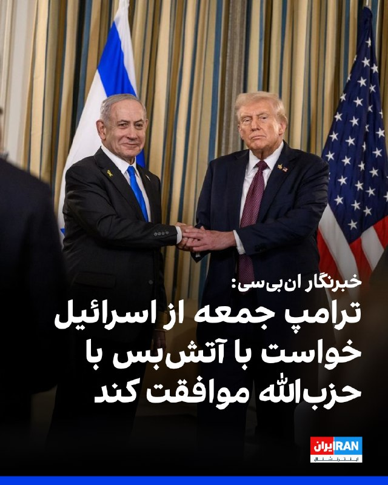

گابه گوتیرز، خبرنگار ان‌بی‌سی‌نیوز، در شبکه ایکس نوشت که دونالد ترامپ جمعه با اسرائیل گفت‌وگو کرد و از مقامات این کشور خواست با آتش‌بس با حزب‌الله موافقت کنند.

این خبرنگار اضافه کرد که ترامپ از مشخص کردن اینکه آیا مستقیما با بنیامین نتانیاهو، نخست‌وزیر اسرائیل، صحبت کرده یا نه، خودداری کرده است.

خبرنگار ان‌بی‌سی افزود که ترامپ درباره نتانیاهو گفته است: «من همیشه با بی‌بی رابطه خوبی داشته‌ام. بعضی وقت‌ها فقط باید آرام شد و از عقل استفاده کرد.»
https://iranintl.com/202606195028

## IranIntlTV — post 343257

  <a href="telegram/content/IranIntlTV_343257_1781891666.mp4" target="_blank">🎬 Download video</a>

🔻با وجود میزبانی از جام جهانی و درخشش تیم ملی فوتبال آمریکا در بازی افتتاحیه برابر پاراگوئه، فوتبال همچنان از محبوب‌ترین ورزش‌ها نیست؛ با وجود این، فوتبال‌دوستان این کشور برای بازی برابر استرالیا و رقم زدن صعود به دور حذفی لحظه‌شماری می‌کنند.

🔹گفت‌وگوی مزدک میرزایی با محمد تقوی و نیلوفر منصوری در هت‌تریک

@iranintltvsport

## FarsiVOA — post 221214

توافق دولت آمریکا و جمهوری اسلامی چه تاثیری بر وضعیت معیشت مردم ایران خواهد داشت؟ گفت‌وگو با معصومه طاهرخانی

## Hranews — post 113727

فقدان ایمنی کار؛ ۲ کارگر در گرمسار مصدوم شدند

❗️
❗️
❗️
❗️
❗️ – در سایه فقدان ایمنی محیط و شرایط نامناسب کار، دو #کارگر در شهرستان گرمسار بر اثر آتش‌سوزی در یک واحد تولیدی رنگ‌سازی دچار مصدومیت شدند.

ادامه مطلب

↘️
@hranews_bot تماس ✉️ -  @Hranews  کانال هرانا 🆑

## alonews — post 129209

  <a href="telegram/content/alonews_129209_1781891667.webm" target="_blank">🎬 Download video</a>

👈 اوباما در مورد توافق: توافقی در حال اجرا بود که در آن ایران توافق کرده بود که سلاح‌های هسته‌ای توسعه ندهد.

🔴این دولت — یا نسخه‌ای قبلی از این دولت — از آن خارج شد، که باعث شد ایران در آن زمان ظرفیت هسته‌ای بیشتری توسعه دهد.

🔴ما اکنون جنگیده‌ایم، میلیاردها و میلیاردها دلار هزینه کرده‌ایم، فشار عظیمی بر ارتش خود وارد کرده‌ایم، بسیاری از مردم کشته شده‌اند و به نظر می‌رسد که به جایی که قبل از شروع جنگ بودیم بازگشته‌ایم، شاید حتی کمی بدتر

✅ @AloNews خبر جنگ

## alonews — post 129208

  <a href="telegram/content/alonews_129208_1781891668.mp4" target="_blank">🎬 Download video</a>

👈 جی‌دی ونس : باز شدن تنگه هرمز دلیل این است که قیمت نفت از اوج ۱۲۶ دلار به حدود ۷۵ دلار امروز کاهش یافت.

🔴و همچنین دلیل این است که قیمت بنزین، همان‌طور که صحبت می‌کنیم، برای اولین بار از مارس، با وجود افزایش به میانگین حدود ۴.۶۰ دلار، زیر ۴ دلار است.

✅ @AloNews خبر جنگ

## alonews — post 129207

  <a href="telegram/content/alonews_129207_1781891669.webm" target="_blank">🎬 Download video</a>

👈دبیر سرویس امنیت ملی اکسیوس:
یک دستاورد آشکار ایران در جنگ و مذاکرات این بود که بار مسئولیت مهار فعالیت‌های نظامی اسرائیل در منطقه را بر دوش ترامپ انداخت؛ این خود به روابط آمریکا و اسرائیل آسیب زده

✅ @AloNews خبر جنگ

## alonews — post 129206

  <a href="telegram/content/alonews_129206_1781891669.webm" target="_blank">🎬 Download video</a>

👈جی‌دی ونس: ایده اینکه اماراتی‌ها قرار است یک میلیارد دلار سرمایه‌گذاری کنند تا یک نیروگاه در ایران بسازند اگر ایرانی‌ها رفتارشان را تغییر نداده باشند، کاملاً مضحک است

🔴آنها این کار را نخواهند کرد. ما اجازه نخواهیم داد.

✅ @AloNews خبر جنگ

---
📅 بروزرسانی: 1405/03/29 21:14
---

## VahidOOnLine — post 246417

  

سعید خطیب‌زاده، معاون وزیر خارجه جمهوری اسلامی به الجزیره گفت: «آمریکا باید اطمینان حاصل کند که اسرائیل به مفاد تفاهم‌نامه میان تهران و واشینگتن پایبند است و ما آماده‌ایم گام‌به‌گام پیش برویم، اگر طرف مقابل نیز همین میزان جدیت را نشان دهد.»

خطیب‌زاده همچنین گفت جمهوری اسلامی به دنبال «صلح در همه جبهه‌ها از جمله غزه» است و اضافه کرد که لبنان به دلیل ارتباط مستقیم با این درگیری‌ها در این تفاهم‌نامه گنجانده شده است.

او ادامه داد: «بدون پایان اشغال و پایبندی اسرائیل به قوانین بین‌المللی، هیچ صلح و ثباتی در لبنان و منطقه وجود نخواهد داشت.»

معاون وزیر خارجه جمهوری اسلامی در خصوص تنگه هرمز نیز گفت که تهران به ارائه خدمات کشتیرانی در هماهنگی با عمان و مطابق قوانین بین‌المللی ادامه خواهد داد و تهران در دوره ۶۰ روزه توافق، هزینه عبور دریافت نخواهد کرد، اما پس از آن سازوکار جدیدی برای مدیریت این آبراه معرفی خواهد شد.
‌🏁 🇬🇧 IranintlTV

🤖 @VahidOOnLine

## VahidOOnLine — post 246416

♦️ویدیویی از دونالد ترامپ، رئیس‌جمهوری ایالات متحده، در جریان اهدای «مدال افتخار» به یک نظامی منتشر شده که نحوه بستن این مدال با واکنش‌های گسترده درشبکه‌های اجتماعی همراه شده است.
در این تصاویر، ترامپ در بستن و قرار دادن مدال دچار مشکل می‌شود و این لحظه توجه کاربران را جلب کرده است. برخی کاربران این صحنه را مورد انتقاد و تمسخر قرار داده‌اند.
مدال افتخار یکی از بالاترین نشان‌های نظامی در ایالات متحده است که به نیروهای نظامی به‌دلیل شجاعت برجسته اعطا می‌شود.
‌🇸🇦 Indypersian

🤖 @VahidOOnLine

## mwarmonitor — post 11231

🔴رئیس‌جمهور ترامپ به شبکه NBC News گفت که روز جمعه با مقام‌های اسرائیلی گفت‌وگو کرده و از آن‌ها خواسته است آتش‌بس با حزب‌الله برقرار شود. او گفت: «بعضی وقت‌ها فقط باید آرام شد و از عقلتان استفاده کنید.» ترامپ از تأیید این‌که آیا مستقیماً با نخست‌وزیر بنیامین نتانیاهو صحبت کرده یا نه، خودداری کرد.

@mwarmonitor

## FoxNewsTwitter — post 343174

  <a href="telegram/content/FoxNewsTwitter_343174_1781891063.mp4" target="_blank">🎬 Download video</a>

Fox News (Twitter/X)

"There are no limits."

In his first interview after signing the memorandum of understanding at Versailles, President Trump says America's power in the region remains unlimited.

The comments come as tensions in the region flare up once again.

A Hezbollah attack in northern Israel killed four Israeli soldiers, triggering Israeli strikes inside Lebanon and raising new questions about whether the ceasefire tied to the agreement can hold, @LucasFoxNews reports.

## IranIntlTV — post 343256

  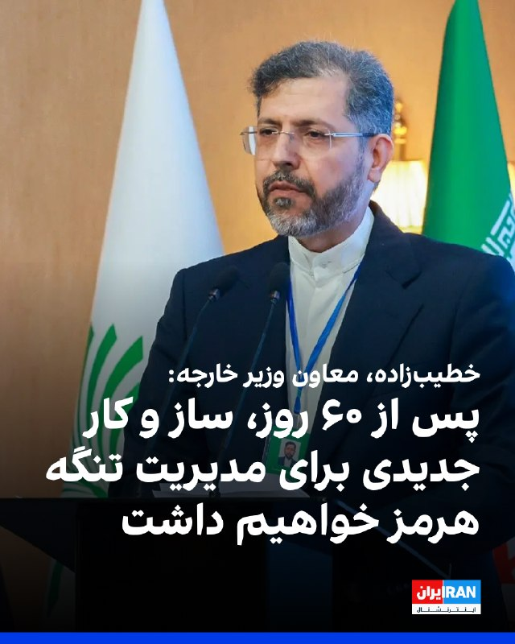

سعید خطیب‌زاده، معاون وزیر خارجه جمهوری اسلامی به الجزیره گفت: «آمریکا باید اطمینان حاصل کند که اسرائیل به مفاد تفاهم‌نامه میان تهران و واشینگتن پایبند است و ما آماده‌ایم گام‌به‌گام پیش برویم، اگر طرف مقابل نیز همین میزان جدیت را نشان دهد.»

خطیب‌زاده همچنین گفت جمهوری اسلامی به دنبال «صلح در همه جبهه‌ها از جمله غزه» است و اضافه کرد که لبنان به دلیل ارتباط مستقیم با این درگیری‌ها در این تفاهم‌نامه گنجانده شده است.

او ادامه داد: «بدون پایان اشغال و پایبندی اسرائیل به قوانین بین‌المللی، هیچ صلح و ثباتی در لبنان و منطقه وجود نخواهد داشت.»

معاون وزیر خارجه جمهوری اسلامی در خصوص تنگه هرمز نیز گفت که تهران به ارائه خدمات کشتیرانی در هماهنگی با عمان و مطابق قوانین بین‌المللی ادامه خواهد داد و تهران در دوره ۶۰ روزه توافق، هزینه عبور دریافت نخواهد کرد، اما پس از آن سازوکار جدیدی برای مدیریت این آبراه معرفی خواهد شد.
https://iranintl.com/202606197004

## Persian_Trend_Official — post 17601

  <a href="telegram/content/Persian_Trend_Official_17601_1781891066.mp4" target="_blank">🎬 Download video</a>

🇺🇦 لحظه حمله پهپاد صیاد-۲ حزب‌الله به یکی از مواضع ارتش اسرائیل در شمال این کشور

👺Phantom

📌 @persian_trend_official
پرشین ترند | متفاوت‌ترین کانال نظامی

## BBCPersian — post 284422

  <a href="telegram/content/BBCPersian_284422_1781891066.mp4" target="_blank">🎬 Download video</a>

🔻پارلمان نروژ پنجشنبه صحنه اقدامی کم‌سابقه بود.

نمایندگان این کشور، به رهبری مسعود قره‌خانی، رئیس پارلمان، در حمایت از تیم ملی فوتبال این کشور در جام جهانی ۲۰۲۶ دیروز تشویق «پاروزنی وایکینگی» را در صحن علنی مجلس اجرا کردند.

قره‌خانی با چکش ریاست ضرب گرفت و نمایندگان با هماهنگی کامل دست‌هایشان را که مشت کرده بودند به جلو حرکت می‌دادند و کلمه «رو» (پارو) را تکرار می‌کردند. این حرکت از سنت پارو زدن در کشتی‌های وایکینگ‌ها که اجداد باستانی نروژی‌ها هستند الهام گرفته شده و به یکی از تشویق‌های پرطرفدار هواداران این کشور در رقابت‌های فوتبال جام جهانی ۲۰۲۶ تبدیل شده است.

پیروزی ۴–۱ نروژ مقابل عراق در نخستین دیدار این گروه موجی از شور و هیجان در سراسر کشور برانگیخت و ویدئوهای هواداران نروژی که حرکت پاروزنی وایکینگ‌ها را در خیابان‌های ماساچوست آمریکا، فضاهای عمومی و حتی روی پله‌برقی اجرا می‌کنند، در شبکه‌های اجتماعی دست‌به‌دست می‌شود.

📸Reuters/Brian Snyder, Icon Sportswire via Getty Images
🎥Reuters, Halvor Viste Berg, SNTV

@BBCPersian

## Dirty_Kids — post 392596

فقط شیعه میتونه بچه‌شو کفن‌ بپوشونه ببره مراسم شیرخوارگان حسینی.
شیعه مذهب نیست. بیماری روانیست...

@Dirty_Kids 👻

## Dirty_Kids — post 392595

  <a href="telegram/content/Dirty_Kids_392595_1781891068.mp4" target="_blank">🎬 Download video</a>

خدایی کچلا رو اینقد اذیت نکنین
گناه دارین!

@Dirty_Kids 👻

## Dirty_Kids — post 392594

‏این همه مسجد و حسینه و امامزاده و مصلی وجود داره، چرا راه مردم رو می‌بندن و تو میدون‌ها مراسم می‌ذارن؟!

@Dirty_Kids 👻

## alonews — post 129205

  <a href="telegram/content/alonews_129205_1781891070.mp4" target="_blank">🎬 Download video</a>

👈جی دی ونس درباره تنگه هرمز: آنچه ایالات متحده توانسته با موفقیت انجام دهد – و به همین دلیل است که قیمت‌ها شروع به کاهش کرده‌اند – خارج کردن مقدار زیادی نفت از خلیج فارس با محافظت از کشتی‌هایی بوده است که در حال حرکت بودند.

🔴در بلندمدت، ما نمی‌خواهیم حضور نظامی داشته باشیم که از تمام این کشتی‌های در حال حرکت محافظت کند.

🔴ما فقط می‌خواهیم ایرانیان مانند یک کشور عادی رفتار کنند و از شلیک به آن کشتی‌ها دست بردارند.

✅ @AloNews خبر جنگ

## alonews — post 129204

  <a href="telegram/content/alonews_129204_1781891072.webm" target="_blank">🎬 Download video</a>

👈ترامپ به ان‌بی‌سی گفت: من همیشه با نتانیاهو خوب رفتار کرده‌ام، او فقط باید گاهی اوقات آرام باشد و از عقلش استفاده کند.

🔴 من امروز با طرف اسرائیلی صحبت کردم و از آنها خواستم آتش‌بس با حزب‌الله را تأیید کنند.

✅ @AloNews خبر جنگ

## alonews — post 129203

  <a href="telegram/content/alonews_129203_1781891073.mp4" target="_blank">🎬 Download video</a>

👈 پیشنهاد جی‌دی ونس به تهران: گزینه الف این است که شما همچنان مانند یک رژیم تروریستی رفتار کنید، در این صورت شما به طور حرفه‌ای هیچ چیز دریافت نمی‌کنید.

🔴گزینه ب این است که مانند یک رژیم عادی رفتار کنید، و ایالات متحده در واقع، برای مثال، به قطر یا امارات اجازه خواهد داد اگر این خواسته آن‌ها بود که در کشور شما سرمایه‌گذاری کنند.

✅ @AloNews خبر جنگ

## alonews — post 129202

  <a href="telegram/content/alonews_129202_1781891075.mp4" target="_blank">🎬 Download video</a>

👈 جی دی ونس درباره اسرائیل: من همواره از تصمیم ترامپ برای پایان دادن به توافق هسته‌ای با ایران دفاع کرده‌ام و اغلب با استدلالی مواجه می‌شوم که می‌گوید: «اسرائیل فکر نمی‌کند این کار خوب است، پس بد است.»

🔴واکنش من این است: نظرات اسرائیل اهمیت دارند، اما در اصل مستقل هستند.

✅ @AloNews خبر جنگ

---
📅 بروزرسانی: 1405/03/29 21:04
---

## FarsiVOA — post 221213

آیا روند مذاکرات آمریکا و جمهوری اسلامی در گروی پایان درگیری‌ها میان حزب‌الله و اسرائیل است؟گفت‌وگو با حسن هاشمیان

## DW_Farsi — post 126191

  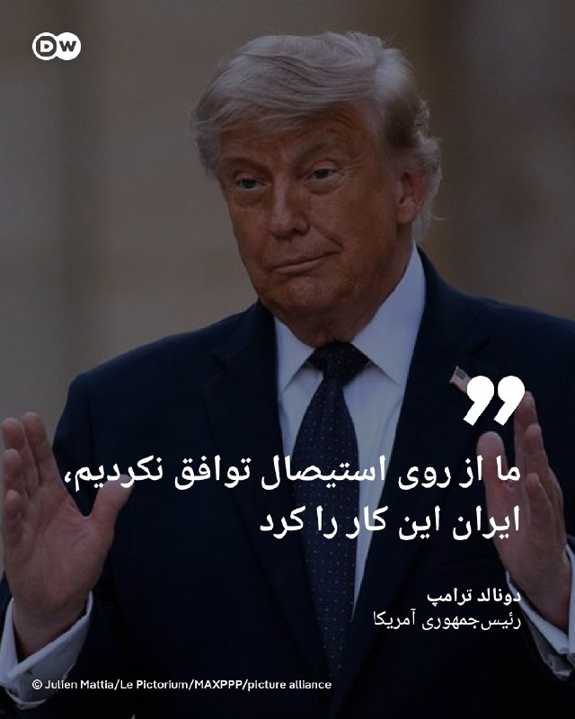

🔶ترامپ: ما از روی استیصال توافق نکردیم، ایران این کار را کرد

دونالد ترامپ، رئیس‌جمهوری آمریکا، روز جمعه در ادامه دفاع از تفاهم‌نامه میان واشنگتن و تهران برای پایان دادن به جنگ، به منتقدان این توافق حمله کرد و گفت ایران از سر استیصال وارد مذاکرات شده است. او در پیام‌هایی در تروث سوشال نوشت: "ما از روی استیصال دیدار نکردیم، ایران این کار را کرد. آنها تمام شده‌اند." ترامپ همچنین تأکید کرد در دوره ۶۰ روزه مذاکرات، ایران "هیچ پولی" دریافت نخواهد کرد.

این اظهارات یک روز پس از آن مطرح شد که جی‌دی ونس، معاون رئیس‌جمهوری آمریکا، سفر برنامه‌ریزی‌شده خود به سوئیس را برای آغاز مذاکرات درباره موضوع‌های اختلافی مندرج در تفاهم‌نامه لغو کرد.

این تأخیر، تنها یک روز پس از امضای تفاهم، درباره دوام آن تردیدهایی به‌وجود آورده؛ به‌ویژه در شرایطی که ادامه درگیری اسرائیل در لبنان می‌تواند این گشایش دیپلماتیک را از مسیر خارج کند.

@dw_farsi

## Persian_Trend_Official — post 17600

  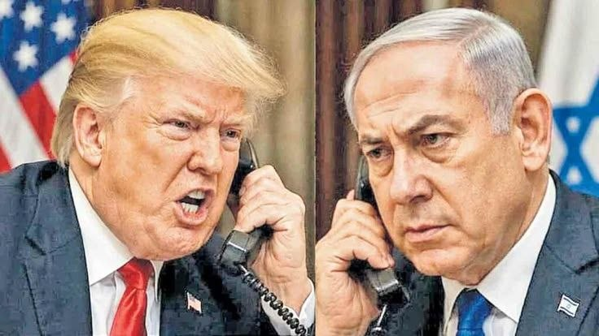

📺 ان‌بی‌سی: رئیس‌جمهور آمریکا، ترامپ، با مقامات اسرائیلی صحبت کرد و خواستارآتش‌بس با حزب‌الله شد. او گفت:
🇺🇸🇮🇱🇱🇧🇱🇧
«گاهی باید آرامش خود را حفظ کنید و از عقلتان استفاده کنید.»

ترامپ از تأیید اینکه آیا مستقیماً با نخست‌وزیر اسرائیل نتانیاهو صحبت کرده است یا خیر، خودداری کرد.

👺Phantom

📌 @persian_trend_official
پرشین ترند | متفاوت‌ترین کانال نظامی

## Persian_Trend_Official — post 17599

  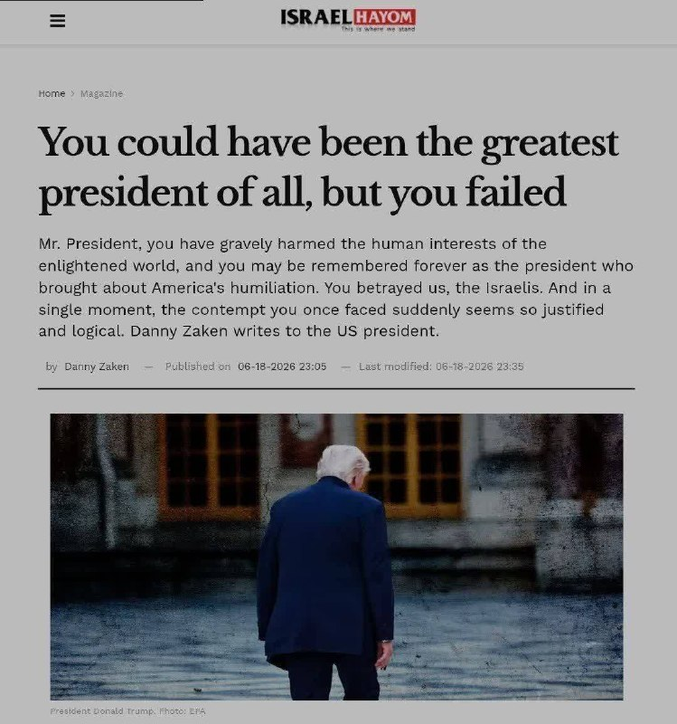

⭕️ روزنامه اسرائیل هیوم به ترامپ: می‌توانستی بزرگترین رئیس جمهور تاریخ آمریکا باشی اما رفوزه شدی.

📝 Nick

📌 @persian_trend_official
پرشین ترند | متفاوت‌ترین کانال نظامی

## BBCPersian — post 284412

🔻تنها چند ماه پیش، زمانی که آمریکا و اسرائیل حملات گسترده خود علیه ایران را آغاز کردند، بسیاری از مقام‌ها، تحلیلگران و رسانه‌های اسرائیلی از «فرصتی تاریخی» سخن می‌گفتند؛ فرصتی که به باور آنها می‌توانست نه تنها برنامه هسته‌ای ایران، بلکه کل ساختار جمهوری اسلامی را متزلزل کند و توازن قدرت در خاورمیانه را برای همیشه تغییر دهد.
اما اکنون و پس از امضای یادداشت تفاهم میان تهران و واشنگتن، فضای رسانه‌ای و سیاسی اسرائیل به صحنه یک بحث گسترده تبدیل شده است؛ بحث درباره اینکه چه شد که بعد از آن جنگ و درگیری که بسیاری به آن امید بسته بودند، حالا کار به جایی رسیده که رئيس جمهور آمریکا در پنهان و نهان، نخست وزیر اسرائيل را مورد انتقاد قرار می‌دهد، امضایش در کنار امضای رئيس جمهور ایران دیده می‌شود و حتی نسبت به احتمال دیدار با رهبر جدید جمهوری اسلامی ابراز تمایل می‌کند.
اختلاف اصلی در اسرائیل بر سر یک پرسش است: هدف جنگ چه بود؟ اگر هدف صرفا تضعیف توان نظامی ایران بود، بسیاری از مقام‌های اسرائیلی از موفقیت سخن می‌گویند.
متن کامل این گزارش را اینجا بخوانید.
📸 Getty Images

## alonews — post 129201

  <a href="telegram/content/alonews_129201_1781890468.mp4" target="_blank">🎬 Download video</a>

👈 جی‌دی ونس درباره اسرائیل: اسرائیل شریکی خوب است، درست همان‌طور که بریتانیا یا فرانسه شرکای خوبی هستند.

🔴این به این معنی نیست که همیشه منافع ما همسو خواهد بود.

✅ @AloNews خبر جنگ

## alonews — post 129200

  <a href="telegram/content/alonews_129200_1781890470.mp4" target="_blank">🎬 Download video</a>

👈جی‌دی ونس درباره اسرائیل: چارلی (کرک) بسیار نگران نفوذ اسرائیل در سیاست‌های آمریکایی بود.

🔴او همچنین از یهودی‌ستیزی بیزار بود

✅ @AloNews خبر جنگ

## alonews — post 129199

  <a href="telegram/content/alonews_129199_1781890472.mp4" target="_blank">🎬 Download video</a>

👈جی‌دی ونس درباره اسرائیل: اسرائیل، مانند بسیاری از کشورهای دیگر، سعی در تأثیرگذاری بر سیاست‌های آمریکا دارد. من این را به عنوان یک واقعیت پذیرفته‌شده می‌دانم.

🔴رهبران آمریکایی باید بسیار محتاط باشند که وقتی کاری را دنبال می‌کنند، این کار را در بهترین منافع آمریکا انجام دهند، نه در منافع هیچ کشور دیگری.

✅ @AloNews خبر جنگ

## alonews — post 129198

  <a href="telegram/content/alonews_129198_1781890474.mp4" target="_blank">🎬 Download video</a>

👈 جی دی ونس: اگر همه چیز کینه‌ورزی به یهودیان باشد، پس هیچ چیز کینه‌ورزی به یهودیان نیست.

🔴من واقعاً فکر می‌کنم کینه‌ورزی به یهودیان بسیار بد است.

✅ @AloNews خبر جنگ

---
📅 بروزرسانی: 1405/03/29 20:54
---

## pm_afshaa — post 94409

  <a href="telegram/content/pm_afshaa_94409_1781889892.webm" target="_blank">🎬 Download video</a>

🔴ان‌بی‌سی: تماس تلفنی ترامپ و نتانیاهو درمورد لبنان 
💧 Rainbet.com the #1 Non-KYC Crypto Casino & Sportsbook @rainbetcom 
😁 @Pm_Afshaa

## pm_afshaa — post 94408

  <a href="telegram/content/pm_afshaa_94408_1781889893.webm" target="_blank">🎬 Download video</a>

🔴ان‌بی‌سی: تماس تلفنی ترامپ و نتانیاهو درمورد لبنان

💧 Rainbet.com the #1 Non-KYC Crypto Casino & Sportsbook @rainbetcom

😁 @Pm_Afshaa

## IranIntlTV — post 343255

  <a href="telegram/content/IranIntlTV_343255_1781889894.mp4" target="_blank">🎬 Download video</a>

رویترز به نقل از یک مقام آمریکایی گزارش داد اسرائیل و حزب‌الله لبنان بر سر برقراری آتش‌بس به توافق رسیده‌اند. این خبر در حالی منتشر می‌شود که درگیری‌ها و حملات متقابل دو طرف در روزهای اخیر شدت گرفته است.

گزارش اردوان روزبه، خبرنگار ایران‌اینترنشنال
@iranintltv

## IranIntlTV — post 343254

  <a href="telegram/content/IranIntlTV_343254_1781889896.mp4" target="_blank">🎬 Download video</a>

دونالد ترامپ از نتایج جنگ با جمهوری اسلامی دفاع کرد و گفت این حکومت بخش عمده توان هوایی، دریایی و پدافندی خود را از دست داده است.
هم‌زمان، انتقادها در آمریکا از جنگ و توافق با ایران افزایش یافته است.

گزارش مریم رحمتی، خبرنگار ایران‌اینترنشنال
@iranintltv

## FarsiVOA — post 221212

🔺اختصاصی؛ بازداشت سه عضو یک خانواده در کامیاران توسط نیروهای رژیم ایران

▪️منابع صدای آمریکا می‌گویند نیروهای اطلاعاتی جمهوری اسلامی صبح ۱۶ خرداد به منزل کژال رحمانی در شهر کامیاران استان کردستان یورش برده‌اند و او را بدون هیچ توضیحی بازداشت کرده‌اند.

⬇️ بیشتر بخوانید:
https://ir.voanews.com/a/iran-arrest-three-members-of-family-kamyaran/8162642.html/?nocach=1

## Persian_Trend_Official — post 17598

  <a href="telegram/content/Persian_Trend_Official_17598_1781889900.webm" target="_blank">🎬 Download video</a>

📰 به گزارش واشنگتن پست :

👹
🫥 اطلاعات آمریکا به دولت ترامپ هشدار داده است که اسرائیل احتمالاً تلاش‌های صلح بین آمریکا و ایران را تضعیف خواهد کرد, در حالی که فشار بر دولت نتانیاهو برای ادامه تهاجم به لبنان افزایش یافته است.

👺Phantom

📌 @persian_trend_official
پرشین ترند | متفاوت‌ترین کانال نظامی

## Dirty_Kids — post 392593

  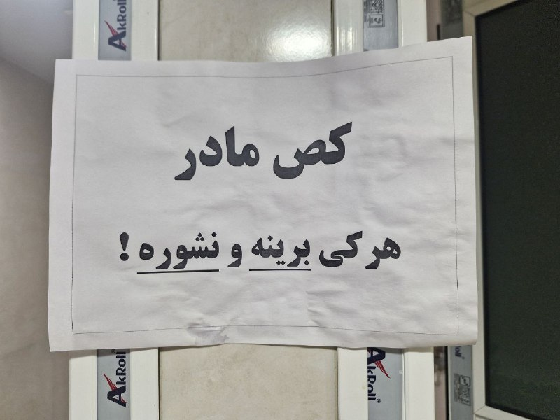

وضعیت دستشویی‌ خوابگاه علوم پزشکی اصفهان:

@Dirty_Kids 👻

## Dirty_Kids — post 392592

  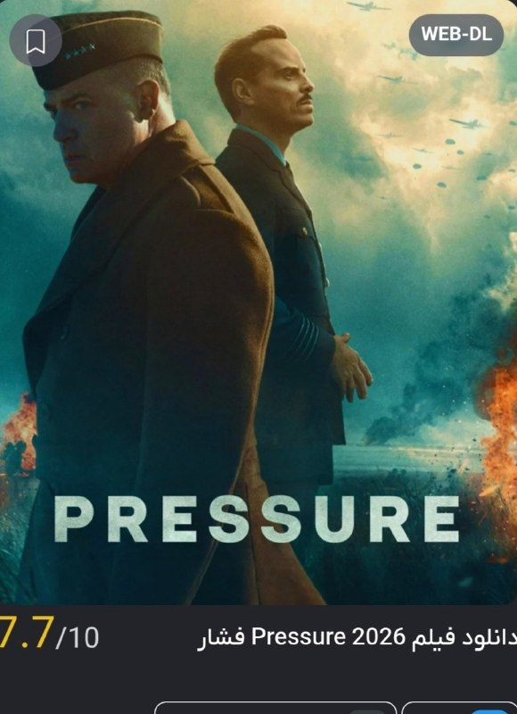

وای چ فیلمی بود😳
از زاویه به جنگ جهانی پرداخت که اصلا فکر‌
نکرده بودم
مخصوصا که بر اساس داستان واقعی هست، اصلا پشمی واسم نموند
اندرو اسکات بی نظیر بود

@Dirty_Kids 👻

## alonews — post 129197

  <a href="telegram/content/alonews_129197_1781889901.webm" target="_blank">🎬 Download video</a>

👈 روزنامه اسرائیل هیوم به ترامپ: می‌توانستی بزرگترین رئیس جمهور تاریخ آمریکا باشی اما رفوزه شدی

✅ @AloNews خبر جنگ

## alonews — post 129196

  <a href="telegram/content/alonews_129196_1781889901.webm" target="_blank">🎬 Download video</a>

👈تماس تلفنی ترامپ و نتانیاهو

✅ @AloNews خبر جنگ

## alonews — post 129195

  <a href="telegram/content/alonews_129195_1781889902.webm" target="_blank">🎬 Download video</a>

👈شبکه NBC: در تماس تلفنی میان ترامپ و نتانیاهو، ترامپ بر توقف حملات اسرائیل به لبنان تاکید کرد

✅ @AloNews خبر جنگ

## alonews — post 129193

  <a href="telegram/content/alonews_129193_1781889902.webm" target="_blank">🎬 Download video</a>

👈 ان‌بی‌سی: ترامپ اوایل امروز با اسرائیل صحبت کرد و از مقامات اسرائیلی خواست که آتش‌بس با حزب‌الله را بپذیرند.

✅ @AloNews خبر جنگ

---
📅 بروزرسانی: 1405/03/29 20:44
---

## VahidOOnLine — post 246415

  

واشینگتن‌پست به نقل از مقام‌های فعلی و سابق آمریکا گزارش داد که سازمان‌های اطلاعاتی ایالات متحده به دولت آمریکا هشدار داده‌اند بنیامین نتانیاهو، نخست‌وزیر اسرائیل، احتمالا اقداماتی انجام خواهد داد که می‌تواند تلاش‌های دولت آمریکا برای رسیدن به یک توافق صلح پایدار با تهران را مختل کند.

به گفته این منابع، نتانیاهو تحت فشار سیاسی قرار دارد تا عملیات نظامی در لبنان را ادامه دهد.
‌🏁 🇬🇧 IranintlTV

🤖 @VahidOOnLine

## pm_afshaa — post 94407

🔴نعیم قاسم با آتش بس با اسرائیل مخالفت کرد

💧 Rainbet.com the #1 Non-KYC Crypto Casino & Sportsbook @rainbetcom

😁 @Pm_Afshaa

## IranIntlTV — post 343253

  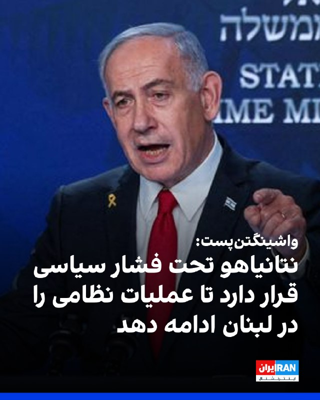

واشینگتن‌پست به نقل از مقام‌های فعلی و سابق آمریکا گزارش داد که سازمان‌های اطلاعاتی ایالات متحده به دولت آمریکا هشدار داده‌اند بنیامین نتانیاهو، نخست‌وزیر اسرائیل، احتمالا اقداماتی انجام خواهد داد که می‌تواند تلاش‌های دولت آمریکا برای رسیدن به یک توافق صلح پایدار با تهران را مختل کند.

به گفته این منابع، نتانیاهو تحت فشار سیاسی قرار دارد تا عملیات نظامی در لبنان را ادامه دهد.
https://iranintl.com/202606193192

## IranIntlTV — post 343252

  <a href="telegram/content/IranIntlTV_343252_1781889259.mp4" target="_blank">🎬 Download video</a>

🔻بلافاصله پس از نمایش ضعیف تیم ملی فوتبال برابر نیوزیلند و ناکامی در نتیجه‌گیری برابر یکی از ضعیف‌ترین تیم‌های جام، بهانه‌جویی واهی درباره ریکاوری و بازیابی آمادگی فردی بازیکنان از سوی کادر فنی تیم ملی آغاز شده است.

🔹گفت‌وگوی مزدک میرزایی با محمد تقوی، رضا محدث و علیرضا مدیری در هت‌تریک

@iranintltvsport

## FarsiVOA — post 221211

🔺محافظه‌کاری فنی و ملاحظات سیاسی؛ قلعه‌نویی در آزمون جام جهانی

▪️پس از ۲۸ سال بار دیگر یک سرمربی ایرانی در جام جهانی روی نیمکت تیم فوتبال ایران نشسته است؛ اتفاقی که در شرایطی عادی می‌توانست نشانه‌ای از رشد مربیان داخلی و افزایش اعتماد به دانش فنی فوتبال ایران تلقی شود. اما نخستین نمایش ایران در جام جهانی ۲۰۲۶ تحت هدایت امیر قلعه‌نویی، سرمربی ایرانی، به جای تقویت چنین روایتی، بار دیگر مجموعه‌ای از پرسش‌های قدیمی را درباره شیوه انتخاب سرمربی، ترکیب تیم ملی، و نفوذ ملاحظات سیاسی در فوتبال ایران زنده کرده است.

⬇️ بیشتر بخوانید:

https://ir.voanews.com/a/was-azmoun-dropped-for-politics-/8162628.html/?nocach=1

## Persian_Trend_Official — post 17597

تصاویر از حملات اوکراین به مخازن پالایشگاه نفت کاپوتنه موسکو مهار آتش از کنترل خارج شده کم‌کم‌باید منتظر اورشنیک ها باشیم. 
👺Phantom 📌 @persian_trend_official پرشین ترند | متفاوت‌ترین کانال نظامی

## RadioFarda — post 158513

  <a href="https://t.me/radiofarda/158513" target="_blank">📎 Download file</a>

📻بشنوید: ایستگاه ۱۹ با رادیوفردا، ۲۹ خرداد ۱۴۰۵

@RadioFarda

## IranianMinds — post 22966

🔴 نعیم قاسم با آتش بس با اسرائیل مخالفت کرد

@IranianMinds

## alonews — post 129192

  <a href="telegram/content/alonews_129192_1781889262.webm" target="_blank">🎬 Download video</a>

👈حمله پهپادی نیروی هوایی اسرائیل علیه یک موتورسیکلت (حزب الله) در حال عبور از جاده‌ای بین زبدین و حروف، غرب النبطیه

✅ @AloNews خبر جنگ

---
📅 بروزرسانی: 1405/03/29 20:36
---

## VahidOOnLine — post 246414

  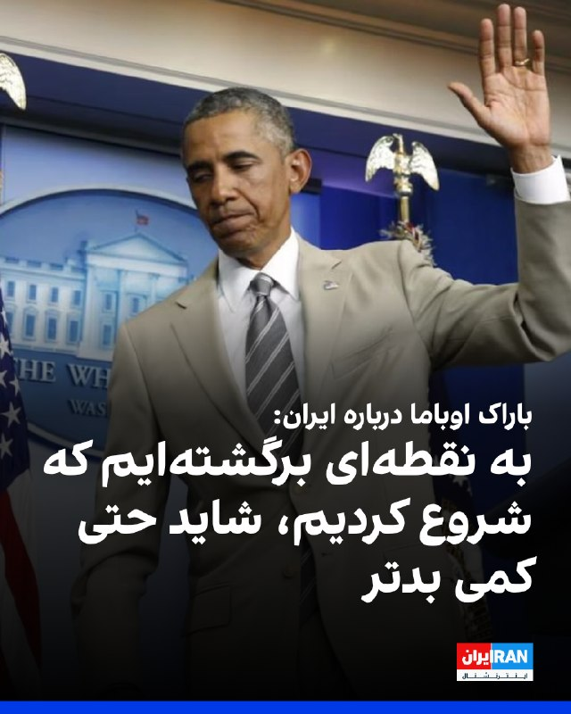

باراک اوباما، رییس‌جمهور پیشین آمریکا، در مصاحبه‌ با ان‌بی‌سی نیوز گفت با وجود اینکه از برقراری آتش‌بس «بسیار خوشحال» است، ایالات متحده ممکن است نسبت به قبل از آغاز جنگ ایران «کمی وضعیت بدتری» داشته باشد.

او گفت: «یک توافق وجود داشت که بر اساس آن جمهوری اسلامی پذیرفته بود به سمت ساخت سلاح هسته‌ای نرود، اما این دولت یا نسخه قبلی آن از این توافق خارج شد و همین باعث شد ایران ظرفیت هسته‌ای خود را افزایش دهد.»

اوباما افزود: «اکنون جنگی را پشت سر گذاشته‌ایم، میلیاردها دلار هزینه کرده‌ایم، فشار زیادی به ارتش وارد شده و افراد زیادی جان خود را از دست داده‌اند، و در نهایت به نقطه‌ای برگشته‌ایم که تقریبا همان‌جایی است که شروع کردیم، شاید حتی کمی بدتر.»
‌🏁 🇬🇧 IranintlTV

🤖 @VahidOOnLine

## VahidOOnLine — post 246413

برنامه «جغرافیای انقلاب ملی ایرانیان» از سوی ایران‌اینترنشنال برای بررسی روایت‌های انقلاب ملی در استان‌های ایران راه‌اندازی شده است. در دومین قسمت به تجمعات اعتراضی، شعارها و اعتصاب‌ها در استان آذربایجان‌غربی پرداخته‌ایم.
محسن مهیمنی، عضو تحریریه ایران‌اینترنشنال گزارش می‌دهد.
‌🏁 🇬🇧 IranintlTV

🤖 @VahidOOnLine

## VahidOOnLine — post 246412

  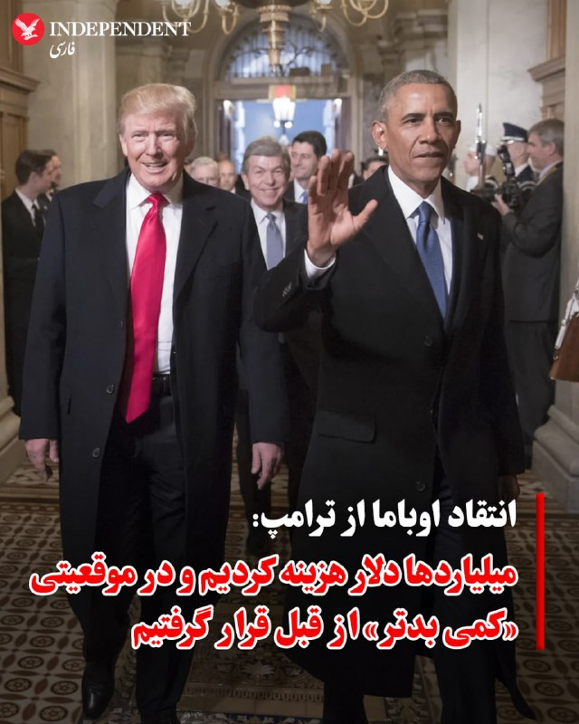

♦️ باراک اوباما، رئیس‌جمهوری پیشین آمریکا، در مصاحبه‌ای با برنامه «تودی شو» در شبکه ان‌بی‌سی نیوز، ضمن ابراز خشنودی از برقراری آتش‌بس، سیاست‌های دولت ترامپ را به شدت نقد کرد و گفت ایالات متحده پس از جنگ با جمهوری اسلامی ایران، در موقعیتی «کمی بدتر» نسبت به آغاز جنگ در ماه فوریه قرار گرفته است.

اوباما با یادآوری خروج آمریکا از برجام تاکید کرد: «ما توافقی در اختیار داشتیم که بر اساس آن ایران پذیرفته بود سلاح هسته‌ای توسعه ندهد. این دولت (یا نسخه قبلی آن) از توافق خارج شد و همین امر سبب شد ایران ظرفیت هسته‌ای بیشتری پیدا کند.»

رئیس‌جمهوری پیشین آمریکا با اشاره به هزینه‌های سنگین جنگ افزود: «ما وارد جنگ شدیم، میلیاردها میلیارد دلار هزینه کردیم و فشار فوق‌العاده‌ای به ارتش خود وارد آوردیم. افراد زیادی کشته شدند و اکنون به نظر می‌رسد دقیقا به همان جایی برگشته‌ایم که قبل از شروع جنگ بودیم؛ با این تفاوت که شاید وضعمان کمی بدتر هم شده باشد.»
‌🇸🇦 Indypersian

🤖 @VahidOOnLine

## VahidOOnLine — post 246411

  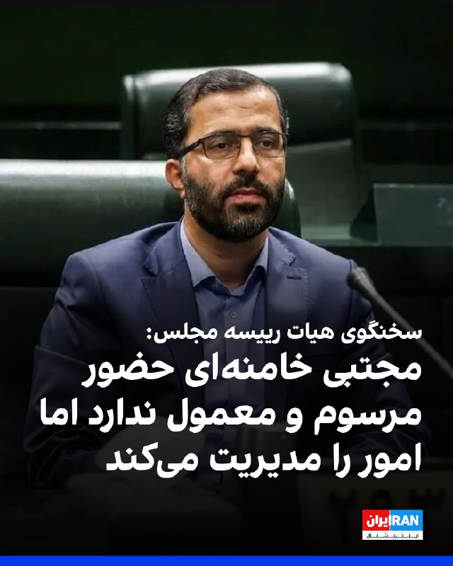

عباس گودرزی، سخنگوی هیات رییسه مجلس، در خصوص پیام مجتبی خامنه‌ای در خصوص تفاهم‌نامه با آمریکا، گفت: «پیام رهبری نشان داد با وجودی که حضور مرسوم و معمول ندارد، تا چه میزان آگاه به امور است و مدیریت می‌کند.»
گودرزی ادامه داد: «رهبری نظرات دیگران را در اداره امور لحاظ کرده و بیان می‌کند.»
سخنگوی هیات رییسه مجلس افزود: «تیم مذاکره‌کننده باید محکم بر خطوط قرمز و منافع حیاتی ما ایستادگی کند.»
‌🏁 🇬🇧 IranintlTV

🤖 @VahidOOnLine

## VahidOOnLine — post 246410

♦️بزرگ‌ترین اثر گلابتون‌دوزی ایران، با نقش برجسته جزیره قشم و به همت بیش از ۶۰ بانوی هنرمند از روستاهای این جزیره، رونمایی شد. گلابتون‌دوزی از هنرهای تزیینی و ریشه‌دار جنوب ایران است که در آن هنرمندان با استفاده از نخ‌های طلایی یا نقره‌ای، معروف به گلابتون، نقش‌های سنتی، اسلیمی، بته‌جقه و طرح‌های هندسی را روی پارچه‌های گوناگون می‌دوزند. در قشم، این هنر بیش از هر چیز با پوشاک زنان پیوند دارد و در آراستن لباس‌های محلی، به‌ویژه شلوارهای بندری، پیراهن‌های سنتی، چادر و لیسی (شال‌های رنگی بندری) کاربرد دارد. پرکاربردترین جلوه گلابتون‌دوزی در قشم، تزیین دمپای شلوارهای بندری است؛ جایی که نقش‌های بته‌جقه، اسلیمی و هندسی با نخ‌های درخشان روی پارچه می‌نشینند.
‌🇸🇦 Indypersian

🤖 @VahidOOnLine

## mwarmonitor — post 11230

🔴گروه ویژه اقدام مالی (FATF) بوسنی و هرزگوین و عراق را به فهرست «خاکستری» خود اضافه کرده است؛ فهرستی از کشورهایی که به دلیل وجود کاستی‌های راهبردی در نظام‌های مقابله با پول‌شویی و تأمین مالی تروریسم، تحت نظارت بیشتر قرار می‌گیرند.

@mwarmonitor

## IranIntlTV — post 343251

  

باراک اوباما، رییس‌جمهور پیشین آمریکا، در مصاحبه‌ با ان‌بی‌سی نیوز گفت با وجود اینکه از برقراری آتش‌بس «بسیار خوشحال» است، ایالات متحده ممکن است نسبت به قبل از آغاز جنگ ایران «کمی وضعیت بدتری» داشته باشد.

او گفت: «یک توافق وجود داشت که بر اساس آن جمهوری اسلامی پذیرفته بود به سمت ساخت سلاح هسته‌ای نرود، اما این دولت یا نسخه قبلی آن از این توافق خارج شد و همین باعث شد ایران ظرفیت هسته‌ای خود را افزایش دهد.»

اوباما افزود: «اکنون جنگی را پشت سر گذاشته‌ایم، میلیاردها دلار هزینه کرده‌ایم، فشار زیادی به ارتش وارد شده و افراد زیادی جان خود را از دست داده‌اند، و در نهایت به نقطه‌ای برگشته‌ایم که تقریبا همان‌جایی است که شروع کردیم، شاید حتی کمی بدتر.»
https://iranintl.com/202606193316

## IranIntlTV — post 343250

برنامه «جغرافیای انقلاب ملی ایرانیان» از سوی ایران‌اینترنشنال برای بررسی روایت‌های انقلاب ملی در استان‌های ایران راه‌اندازی شده است. در دومین قسمت به تجمعات اعتراضی، شعارها و اعتصاب‌ها در استان آذربایجان‌غربی پرداخته‌ایم.
محسن مهیمنی، عضو تحریریه ایران‌اینترنشنال گزارش می‌دهد.

## IranIntlTV — post 343249

  

عباس گودرزی، سخنگوی هیات رییسه مجلس، در خصوص پیام مجتبی خامنه‌ای در خصوص تفاهم‌نامه با آمریکا، گفت: «پیام رهبری نشان داد با وجودی که حضور مرسوم و معمول ندارد، تا چه میزان آگاه به امور است و مدیریت می‌کند.»
گودرزی ادامه داد: «رهبری نظرات دیگران را در اداره امور لحاظ کرده و بیان می‌کند.»
سخنگوی هیات رییسه مجلس افزود: «تیم مذاکره‌کننده باید محکم بر خطوط قرمز و منافع حیاتی ما ایستادگی کند.»
https://iranintl.com/202606194833

## DW_Farsi — post 126190

  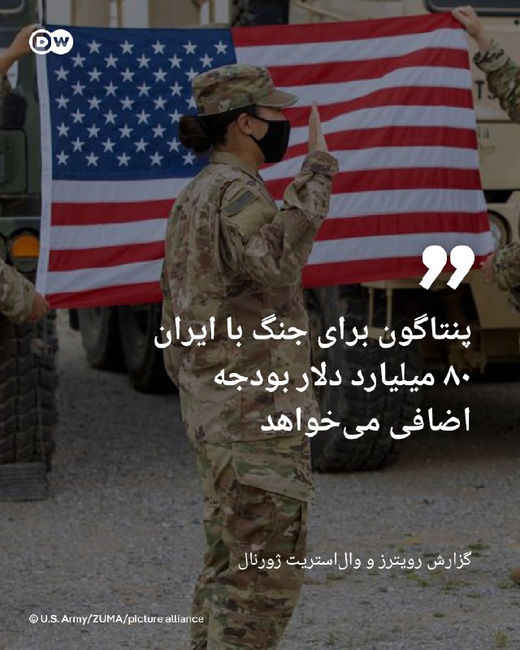

🔶رویترز: پنتاگون برای جنگ با ایران ۸۰ میلیارد دلار بودجه اضافی می‌خواهد

به گزارش رویترز و وال‌استریت ژورنال، وزارت دفاع آمریکا برای تأمین هزینه‌های جنگ با ایران و دیگر مخارج باقیمانده، به ۸۰ میلیارد دلار بودجه اضافی نیاز دارد. بر اساس این گزارش‌ها، استیون فاینبرگ، معاون وزیر دفاع آمریکا، در تماس با نمایندگان کنگره در این هفته، نیاز مالی پنتاگون را توضیح داده و احتمال دارد لایحه‌ای برای بودجه تکمیلی ظرف چند روز آینده به کنگره ارسال شود.

بر اساس گزارش رویترز، یکی از مقام‌های پنتاگون در ماه آوریل هزینه جنگ را حدود ۲۵ میلیارد دلار برآورد کرده بود. اما وال‌استریت ژورنال نوشته است این رقم تا میانه ماه مه به ۲۹ میلیارد دلار رسیده و اکنون احتمالا باز هم افزایش یافته است.

در گزارش‌ها آمده است بودجه تکمیلی احتمالی فقط به پنتاگون محدود نخواهد بود و ممکن است منابعی برای بخش کشاورزی و کمک‌های مربوط به بلایای طبیعی را نیز در بر بگیرد.

@dw_farsi

## Persian_Trend_Official — post 17596

  

🔥۲۰ میلیون بشکه نفت ایران در یک هفته صادر شد

🔹بلومبرگ: پس از رفع محاصره دریایی آمریکا، امروز ۱۹ ژوئن، ۷ سوپرتانکر حامل حدود ۱۴ میلیون بشکه نفت خام از بندر چابهار خارج شدند.

🔹در مجموع این هفته ۱۱ تانکر حامل حدود ۲۰ میلیون بشکه نفت صادر شده که نشان‌دهنده افزایش چشمگیر عرضه ایران است.

👺Phantom

📌 @persian_trend_official
پرشین ترند | متفاوت‌ترین کانال نظامی

## Hranews — post 113726

  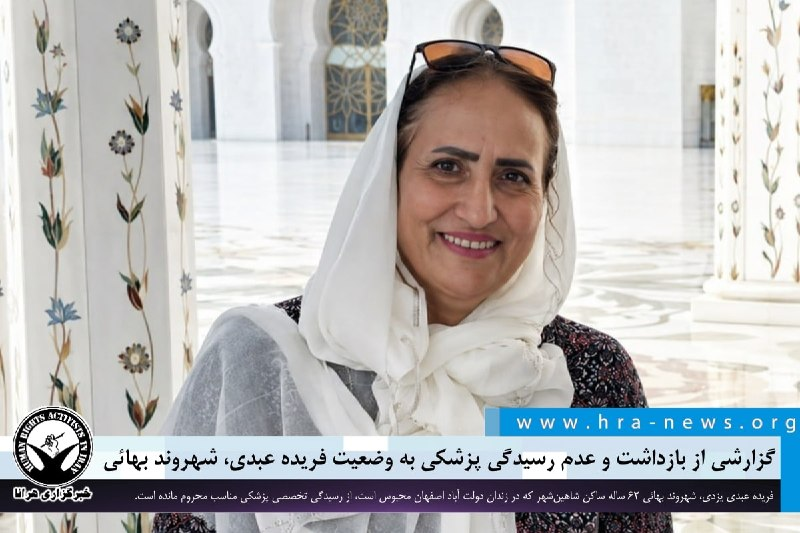

گزارشی از بازداشت و عدم رسیدگی پزشکی به وضعیت فریده عبدی، شهروند بهائی

❗️
❗️
❗️
❗️
❗️ – فریده عبدی یزدی، شهروند بهائی ۶۲ ساله ساکن شاهین‌شهر مورخ ۲۶ اردیبهشت ماه در این شهر بازداشت شده است. وی پس از بازداشت به زندان دولت آباد اصفهان منتقل شده و وضعیت پرونده او کماکان نامشخص است. همچنین این شهروند بهائی، با وجود ابتلا به بیماری‌های متعدد از جمله دیابت و کم‌کاری تیروئید از رسیدگی تخصصی پزشکی مناسب نیز محروم مانده است.

به گزارش خبرگزاری هرانا، ارگان خبری مجموعه فعالان حقوق بشر در ایران، فریده عبدی یزدی، شهروند بهائی محبوس در زندان دولت آباد اصفهان، از رسیدگی پزشکی مناسب محروم مانده است.

یک منبع مطلع نزدیک به خانواده این شهروند بهائی، ضمن تایید این خبر به هرانا گفت: فریده ۳۵ روز پیش در شاهین شهر بازداشت شده است. وی پس از بازداشت به زندان دولت آباد اصفهان منتقل شده و در این زندان نگهداری می شود. این شهروند بهائی ۶۲ ساله از بیماری‌های متعددی از جمله دیابت، کم‌کاری تیروئید و عفونت دندان رنج می‌برد. خانم عبدی نیازمند رسیدگی تخصصی پزشکی و اعزام به مراکز درمانی خارج از زندان است.
به گفته این منبع مطلع، این در حالی است که تاکنون رسیدگی مؤثر و نتیجه‌بخشی به پرونده این شهروند بهائی صورت نگرفته است. بی‌خبری از وضعیت پرونده این شهروند بازداشتی و همچنین شرایط جسمانی وی، به افزایش نگرانی‌های خانواده و بستگانش دامن زده است.

ادامه مطلب

#فریده_عبدی_یزدی

↘️
@hranews_bot تماس ✉️ -  @Hranews  کانال هرانا 🆑

## alonews — post 129189

  <a href="telegram/content/alonews_129189_1781888805.webm" target="_blank">🎬 Download video</a>

👈موج توئیتری راه افتاده که نامه دیروز مجتبی رو خودش ننوشته

✅ @AloNews خبر جنگ

## alonews — post 129188

  <a href="telegram/content/alonews_129188_1781888805.webm" target="_blank">🎬 Download video</a>

👈وزارت خارجه روسیه: با تثبیت اوضاع غرب آسیا، توصیه قبلی برای خودداری از سفر به کشورهای عرب حاشیه خلیج فارس لغو شده است

✅ @AloNews خبر جنگ

## alonews — post 129187

  <a href="telegram/content/alonews_129187_1781888806.webm" target="_blank">🎬 Download video</a>

🔴فوری/رهبر حزب الله، نعیم قاسم با آتش بس با اسرائیل مخالفت کرد 
✅ @AloNews خبر جنگ

## alonews — post 129186

  <a href="telegram/content/alonews_129186_1781888806.webm" target="_blank">🎬 Download video</a>

🔴فوری/رهبر حزب الله، نعیم قاسم با آتش بس با اسرائیل مخالفت کرد

✅ @AloNews خبر جنگ

## alonews — post 129185

  <a href="telegram/content/alonews_129185_1781888807.webm" target="_blank">🎬 Download video</a>

👈خطیب‌زاده به الجزیره گفت: بدون پایان دادن به اشغالگری و پایبندی اسرائیل به قوانین بین‌المللی، صلح و ثباتی در لبنان و منطقه برقرار نخواهد شد.

🔴 «هرگونه توافق آتی باید شامل آزادسازی تمام دارایی‌های مسدود شده ایران باشد.»

🔴 «ما پس از ۶۰ روز سازوکار جدیدی برای مدیریت تنگه هرمز اتخاذ خواهیم کرد و ابتکار ویژه‌ای را به کشورهای منطقه ارائه خواهیم داد.»

✅ @AloNews خبر جنگ

---
📅 بروزرسانی: 1405/03/29 20:25
---

## mwarmonitor — post 11229

  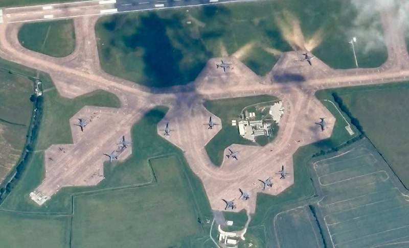

🔴 «یک ناوگان بزرگ از بمب‌افکن‌های سنگین نیروی هوایی آمریکا همچنان به‌صورت پیش‌موضعی در انگلستان مستقر است تا از عملیات احتمالی علیه ایران پشتیبانی کند. امروز ۱۳ فروند بمب‌افکن استراتژیک B-1 و ۵ فروند B-52 در پایگاه هوایی RAF Fairford پارک شده‌اند.»

@mwarmonitor

## FoxNewsTwitter — post 343173

  <a href="telegram/content/FoxNewsTwitter_343173_1781888117.mp4" target="_blank">🎬 Download video</a>

Fox News (Twitter/X)

A massive wave crashes over the rooftop of an oceanfront condo in Hawaii, ripping shingles away as water surges across the building.

The wave slammed into the Keauhou-Kona Surf and Racquet Condominium complex in Keauhou, sending debris flying through the air as residents watched the powerful swell roll through.

It's not the first time the property has taken a hit. The same complex was battered by enormous waves in 2022 during a major swell event linked to Hurricane Darby.

## pm_afshaa — post 94406

  <a href="telegram/content/pm_afshaa_94406_1781888118.webm" target="_blank">🎬 Download video</a>

🔴کاخ سفید: ایران تموم شده.

💧 Rainbet.com the #1 Non-KYC Crypto Casino & Sportsbook @rainbetcom

😁 @Pm_Afshaa

## FarsiVOA — post 221210

شادی کانادایی‌ها در جشن اولین برد تاریخ کانادا در جام جهانی

## FarsiVOA — post 221209

یک جت خصوصی شرکت نت‌جتز شامگاه چهارشنبه پس از تغییر مسیر اضطراری، در بزرگراهی نزدیک شهر لاریدو در ایالت تگزاس سقوط کرد.

در این سانحه یک نفر جان باخت و پنج نفر دیگر زخمی شدند. این حادثه هیچ تلفاتی در میان افراد حاضر در محل بر جای نگذاشته است.

@FarsiVOA

## FarsiVOA — post 221208

  <a href="telegram/content/FarsiVOA_221208_1781888119.mp4" target="_blank">🎬 Download video</a>

ماهیت ۳۰۰ میلیارد دلاری که در تفاهم‌نامه میان آمریکا و جمهوری اسلامی آمده چیست؟ گفتگو با رضا غیبی

## FarsiVOA — post 221207

در حالی که آمریکا برای جشن ۲۵۰ سالگی خود در ۴ جولای پیش رو آماده می‌شود، باغ گیاه‌شناسی ایالات متحده در واشینگتن، این مناسبت تاریخی را با نمایش گل‌آرایی خیره‌کننده‌ای که شامل گل رسمی هر ایالت و قلمرو است، گرامی می‌دارد.

## IranianMinds — post 22965

  <a href="telegram/content/IranianMinds_22965_1781888120.mp4" target="_blank">🎬 Download video</a>

🔴بدون توضیح.

@IranianMinds

## alonews — post 129184

  <a href="telegram/content/alonews_129184_1781888121.webm" target="_blank">🎬 Download video</a>

👈خبرنگار وال استریت ژورنال: یک هواپیمای ایر فورس دو سوخت‌گیری شده در فرودگاه مریلند روی باند فرودگاه بود. میزها در یک تفرجگاه مجلل سوئیس چیده شده بودند. تدارکات آماده بود. مطبوعات در راه بودند.

🔴اما مذاکرات هسته‌ای مورد انتظار بین ایالات متحده و ایران روز جمعه برگزار نشد، که یک شکست زودهنگام برای مرحله بعدی مذاکرات هسته‌ای بود.

✅ @AloNews خبر جنگ

---
📅 بروزرسانی: 1405/03/29 20:14
---

## VahidOOnLine — post 246409

  

تد کروز، سناتور جمهوری‌خواه، در شبکه ایکس نوشت: «برای من فرقی نمی‌کند ۳۰۰ میلیارد دلار از کجا می‌آید. دادن میلیاردها دلار به حکومت ایران که شعار مرگ بر آمریکا سر می‌دهد، ایده بدی است.»

او افزود: «در توافق با تهران، میلیاردها دلار به دیوانه‌هایی ندهید که می‌خواهند ما را بکشند.»
‌🏁 🇬🇧 IranintlTV

🤖 @VahidOOnLine

## pm_afshaa — post 94405

  <a href="telegram/content/pm_afshaa_94405_1781887464.webm" target="_blank">🎬 Download video</a>

🔴واشنگتن پست: سازمان‌های اطلاعاتی آمریکا به ترامپ هشدار دادن نتانیاهو سعی در به‌هم زدن توافق با ایران داره.

💧 Rainbet.com the #1 Non-KYC Crypto Casino & Sportsbook @rainbetcom

😁 @Pm_Afshaa

## pm_afshaa — post 94404

  <a href="telegram/content/pm_afshaa_94404_1781887465.webm" target="_blank">🎬 Download video</a>

🔴آخوند علم‌الهدی:
خون‌خواهی رهبرمون با کشتن یک سگ فاسق محقق نمیشه. صدها از این سگ‌ها رو بکشن، یک تار موی علی خامنه‌ای هم نمیشه.

💧 Rainbet.com the #1 Non-KYC Crypto Casino & Sportsbook @rainbetcom

😁 @Pm_Afshaa

## DEJradio — post 5830

  <a href="telegram/content/DEJradio_5830_1781887466.webm" target="_blank">🎬 Download video</a>

⚽️
🔺 فریاد «نه به جمهوری اسلامی» در بزرگ‌ترین صحنه فوتبال جهان

گزارش: ایمان صفتی

#فوتبال #جام_جهانی
@DEJradio

## VahidOnline — post 76522

  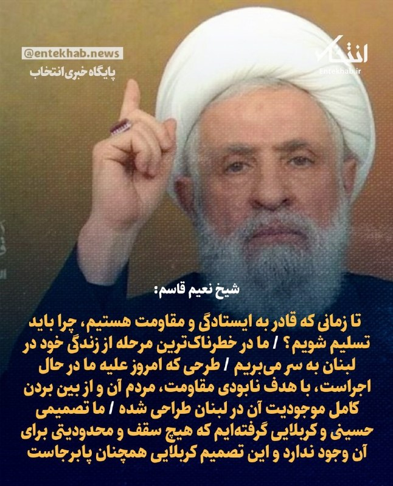

نعیم قاسم، دبیرکل حزب‌الله لبنان، گفت: «تا زمانی که توان ایستادگی داریم، چرا باید تسلیم شویم؟.»
او تحویل سلاح‌های حزب‌الله را رد کرد و افزود این سلاح‌ها برای مقابله با اسرائیل هستند.
نعیم قاسم همچنین گفت که ما تصمیمی «به سبک کربلا» گرفتیم و این تصمیم همچنان به قوت خود باقی است.
دبیرکل حزب‌الله لبنان ادامه داد: «ما وحدت نیروهای مقاومت را حفظ کرده‌ایم و وحدت جنبش امل، حزب‌الله و سایر نیروها همچنان در کنار ما برقرار است.»
@VahidOOnLine

📡 @VahidOnline

## IranIntlTV — post 343248

  <a href="telegram/content/IranIntlTV_343248_1781887467.mp4" target="_blank">🎬 Download video</a>

🔻تیم ملی فوتبال کانادا در یک بازی یک طرفه با شش گل تیم ملی قطر را شکست داد؛ نمایشی که موجی از هیجان و شادی را در بین کانادایی‌ها به دنبال داشت.

🔹گفت‌وگوی مزدک میرزایی با محمد تقوی و مهسا مرتضوی در هت‌تریک

@iranintltvsport

## IranIntlTV — post 343247

  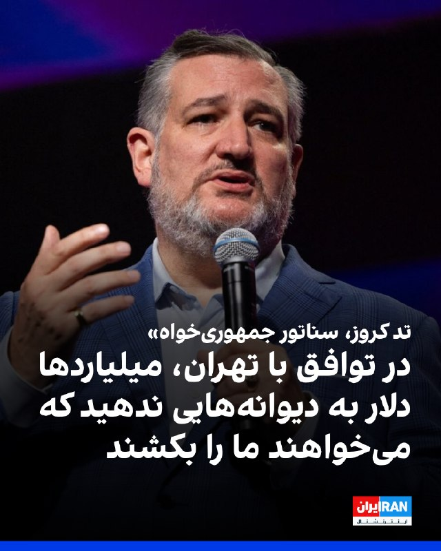

تد کروز، سناتور جمهوری‌خواه، در شبکه ایکس نوشت: «برای من فرقی نمی‌کند ۳۰۰ میلیارد دلار از کجا می‌آید. دادن میلیاردها دلار به حکومت ایران که شعار مرگ بر آمریکا سر می‌دهد، ایده بدی است.»

او افزود: «در توافق با تهران، میلیاردها دلار به دیوانه‌هایی ندهید که می‌خواهند ما را بکشند.»
https://iranintl.com/202606198306

## IranianMinds — post 22964

  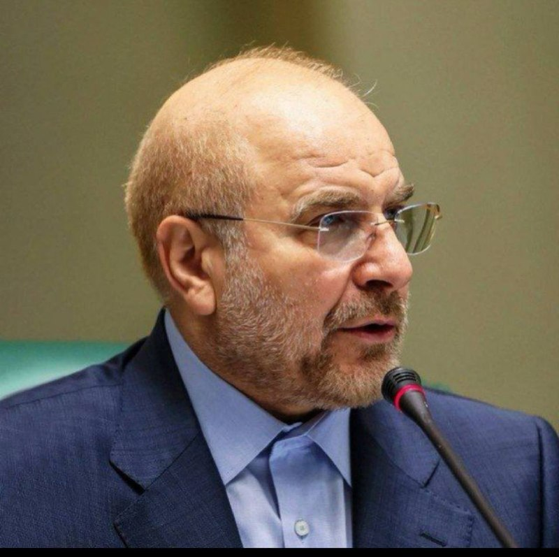

🔴 خبرگزاری فارس :

قالیباف مجلسو تعطیل کرده انگار اصلا نمیخواد بازش کنه چون بخاطر توافق همه ی نماینده ها میخوان ازش شکایت کنن

@IranianMinds

## Dirty_Kids — post 392591

  <a href="telegram/content/Dirty_Kids_392591_1781887471.mp4" target="_blank">🎬 Download video</a>

🔴محمد انجوی‌نژاد، مداح حکومتی:

پیام مجتبی خامنه‌ای درباره تفاهم با آمریکا تلخ بود
آقا رو غریب و پیر زیر آوار بمباران رها کردید، این یکی رو دیگه نمی‌گذاریم...

@Dirty_Kids 👻

## Dirty_Kids — post 392590

  <a href="telegram/content/Dirty_Kids_392590_1781887473.mp4" target="_blank">🎬 Download video</a>

🔴 مملکت پر از سورپرایزه؛ 8 تا دختر اسنپ گرفتن و این شکلی خودشونو تو 206 جا دادن:

@Dirty_Kids 👻

## alonews — post 129183

  <a href="telegram/content/alonews_129183_1781887474.webm" target="_blank">🎬 Download video</a>

👈ولادمیر زلنسکی: من به لوکاشنکو یک هفته مهلت می‌دهم تا تجهیزات نظامی را از مرز اوکراین که برای تنظیم آتش توپخانه علیه جمعیت اوکراینی استفاده می‌شود، پس بگیرد.

🔴در غیر این صورت، ما خودمان این کار را انجام خواهیم داد

✅ @AloNews خبر جنگ

---
📅 بروزرسانی: 1405/03/29 20:04
---

## VahidOOnLine — post 246408

  

کمیسیون امنیت ملی مجلس در بیانیه‌ای با اعلام «بی‌اعتمادی مطلق به دشمنان» نوشت یادداشت تفاهم اسلام‌آباد، نقشه‌ای جدید برای امنیت منطقه‌ای و بین‌المللی ترسیم می‌کند و این کمیسیون تحقق کامل شروط رهبر جمهوری اسلامی را تا پایان پیگیری و مطالبه خواهد کرد.

کمیسیون امنیت ملی مجلس همچنین اعلام کرد در بررسی تفاهم‌نامه اخیر، «رهنمودهای رهبر جمهوری اسلامی را فصل‌الخطاب و نصب‌العین» خود قرار داده‌ایم.
‌🏁 🇬🇧 IranintlTV

🤖 @VahidOOnLine

## VahidOOnLine — post 246407

  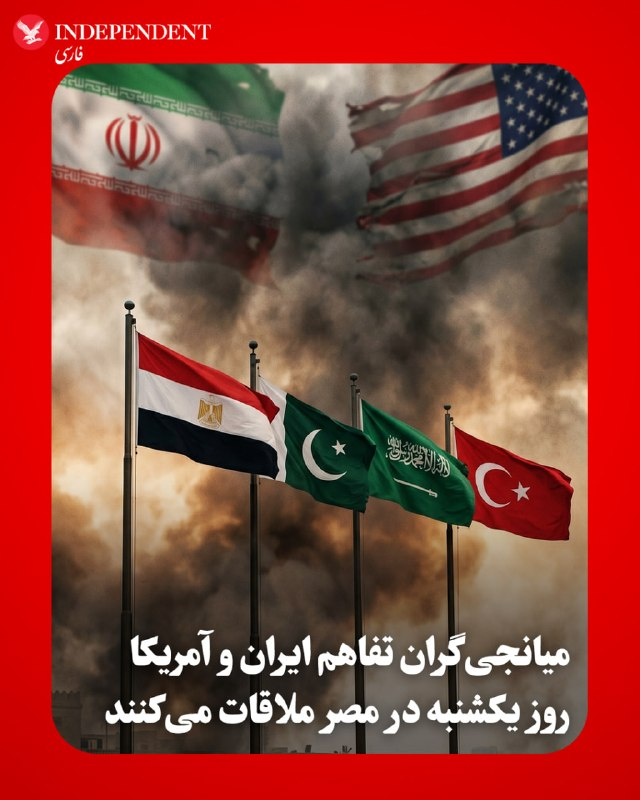

♦️ وزارتخانه‌های امور خارجه مصر و پاکستان اعلام کردند که میانجی‌گران بحران ایران و آمریکا، شامل پاکستان، عربستان سعودی و ترکیه، روز یکشنبه ۳۱ خرداد، در مصر گرد هم خواهند آمد. بر اساس بیانیه اسلام‌آباد، در این نشست چهارجانبه، وزرای خارجه این سه کشور به همراه همتای مصری خود درباره تحولات منطقه و مسائل مربوط به صلح، امنیت و ثبات گفتگو خواهند کرد.

به گزارش خبرگزاری فرانسه، قاهره نیز تایید کرد که این جلسه با مذاکرات گسترده‌تر و یک نشست خبری مشترک همراه خواهد بود. این نشست اضطراری پس از آن برنامه‌ریزی شد که مذاکرات مستقیم ایران و آمریکا در سوئیس که قرار بود روز جمعه برگزار شود، به تعویق افتاد. در همین راستا، کاخ سفید نیز لغو سفر برنامه‌ریزی‌شده جی‌دی ونس، معاون رئیس‌جمهوری آمریکا به سوئیس را تایید کرد.
‌🇸🇦 Indypersian

🤖 @VahidOOnLine

## IranIntlTV — post 343246

  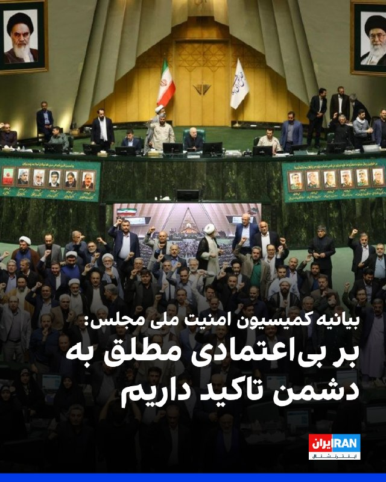

کمیسیون امنیت ملی مجلس در بیانیه‌ای با اعلام «بی‌اعتمادی مطلق به دشمنان» نوشت یادداشت تفاهم اسلام‌آباد، نقشه‌ای جدید برای امنیت منطقه‌ای و بین‌المللی ترسیم می‌کند و این کمیسیون تحقق کامل شروط رهبر جمهوری اسلامی را تا پایان پیگیری و مطالبه خواهد کرد.

کمیسیون امنیت ملی مجلس همچنین اعلام کرد در بررسی تفاهم‌نامه اخیر، «رهنمودهای رهبر جمهوری اسلامی را فصل‌الخطاب و نصب‌العین» خود قرار داده‌ایم.
https://iranintl.com/202606191291

## IranIntlTV — post 343245

  <a href="telegram/content/IranIntlTV_343245_1781886871.mp4" target="_blank">🎬 Download video</a>

🔻تیم فوتبال سوئیس در حالی در دومین مسابقه خود در جام جهانی ۲۰۲۶، بوسنی و هرزگوین را با نتیجه ۴ بر یک شکست داد که نقش ژاکا در این پیروزی پررنگ‌تر از سایر بازیکنان بود.

🔹گفت‌وگوی مزدک میرزایی با محمد تقوی در هت‌تریک

@iranintltvsport

## alonews — post 129182

  <a href="telegram/content/alonews_129182_1781886873.webm" target="_blank">🎬 Download video</a>

👈کیر استارمر، نخست‌وزیر بریتانیا، پس از افزایش درخواست‌ها از سوی وزرای کابینه و نمایندگان حزب کارگر برای کناره‌گیری، در حال بررسی آینده خود است، طبق گزارش تایمز.

🔴 استارمر فشارهای فزاینده را درک می‌کند و انتظار می‌رود در طول آخر هفته با همسر و خانواده‌اش گزینه‌های خود را بررسی کند و سپس تصمیم بگیرد که در سمت خود باقی بماند یا استعفا دهد

✅ @AloNews خبر جنگ

---
📅 بروزرسانی: 1405/03/29 19:54
---

## VahidOOnLine — post 246406

  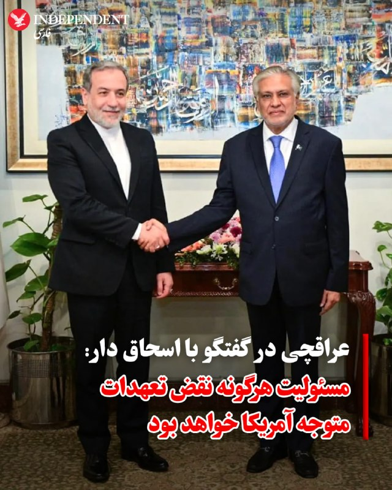

♦️ سید عباس عراقچی، وزیر امور خارجه جمهوری اسلامی، روز جمعه ۲۹ خرداد در گفتگو با محمد اسحاق دار، وزیر امور خارجه و معاون نخست‌وزیر پاکستان، آخرین تحولات دیپلماتیک پس از امضای یادداشت تفاهم اخیر را بررسی کرد.

عراقچی در این تماس تلفنی از تلاش‌های پاکستان در روند مذاکرات دیپلماتیک که منجر به شکل‌گیری این تفاهم‌نامه شد، قدردانی کرد. او در ادامه با اشاره به تعهد و مسئولیت مستقیم واشنگتن در قبال پایان دادن به جنگ در تمامی جبهه‌ها، به‌ویژه در لبنان، هشدار داد: «هرگونه نقض تعهدات مندرج در این یادداشت تفاهم متوجه آمریکا خواهد بود.»

وزیر خارجه پاکستان نیز ضمن استقبال از روند دیپلماتیک جاری، بر حمایت همه‌جانبه اسلام‌آباد از تداوم گفتگوها برای دستیابی به نتایج مثبت و پایدار تاکید و نسبت به موفقیت در مراحل آتی این روند ابراز امیدواری کرد.
‌🇸🇦 Indypersian

🤖 @VahidOOnLine

## mwarmonitor — post 11228

فرزندی که نمرده و هنوز بر سر آن جنگ است، در واقع لبنان است. یک مقام اسرائیلی پریروز برآورد کرد که هشتاد درصد گفتگوها با واشنگتن به نبرد بر سر جنگ با حزب‌الله اختصاص دارد. حزب‌الله در وضعیت ناامیدکننده‌ای قرار دارد و در آستانه درهم‌شکستن است. پیوند دادن این دو جبهه نه تنها این سازمان را نجات می‌دهد، بلکه از سر گیری مزاحمت‌ها برای ساکنان شمال، یا تقویت آن، یا هر دو را برایش آسان‌تر می‌کند. در این زمینه یک اجماع ملی در اسرائیل وجود دارد؛ اجماعی که باید توسط سران اپوزیسیون نیز بیان می‌شد، نه اینکه فقط با سکوت همراه باشد.
خیانت ترامپ به اصولی که خودش تعیین کرده بود، چنان ناگهانی و قدرتمند بود که بسیاری متقاعد شده‌اند این نیز یک فریب دیگر است که در نهایت به آتش گرفتن تهران ختم خواهد شد. اما بیداری تلخی در انتظار آن‌هاست. با این حال، داستان این هفته به پایان نرسید. ایرانی‌ها فرصت نشان دادن ترامپ به عنوان یک ظرف خالی و یک شوخی را از دست نخواهند داد. شاید در مقطعی، او دوباره آن‌ها را به نفع اسرائیل و کشورهای حوزه خلیج فارس رها کند. می‌توانید روی آیت‌الله‌ها حساب کنید که این فرصت را به او خواهند داد.

@mwarmonitor

## mwarmonitor — post 11227

📌آمیت سیگال خبرنگار و تحلیلگر سیاسی کانال ۱۲ اسرائیل

🔸شامگاه گذشته، حزب‌الله به کارزار خود علیه نیروهای ارتش اسرائیل در جنوب لبنان ادامه داد. تانک یک فرمانده هدف حمله یک پهپاد یا موشک قرار گرفت که منجر به کشته شدن چهار نفر—از جمله فرمانده گردان—شد؛ این در حالی است که در بخشی دیگر از جبهه، پنج سرباز اسرائیلی بر اثر انفجار یک پهپاد انتحاری به شدت مجروح شدند. در پاسخ، نیروی هوایی اسرائیل کارزار بمباران گسترده‌ای را در چندین روستا به راه انداخته است.

پیامدهای این اتفاق بسیار سریع آشکار شد. گفتگوهایی که قرار بود امروز در سوئیس میان ایالات متحده و ایران—به منظور اجرای توافق صلح—برگزار شود، لغو گردید و ایران دلیل آن را اقدامات ارتش اسرائیل در قلمرو خود در جنوب لبنان عنوان کرد.
این رویارویی از همان لحظه‌ای که جوهر دیجیتال روی کاغذ یادداشت تفاهم (MoU) خشک شد، اجتناب‌ناپذیر بود. نه حزب‌الله و نه اسرائیل، هیچ‌یک از امضاکنندگان این توافق‌نامه نیستند و هر دو طرف روایت‌های کاملاً متفاوتی را از آن مطرح می‌کنند. ایران به نیابتیِ خود اطمینان داده است که خروج اسرائیل از لبنان در یادداشت تفاهم میان آمریکا و ایران گنجانده شده و قرار است طی یک دوره گام‌به‌گام ۶۰ روزه اجرا شود. در همین حال، اسرائیل اعلام کرده است که مواضع خود را در جنوب لبنان تخلیه نخواهد کرد—و تاکید دارد که چنین درخواستی هم از آن نشده است—در حالی که مقامات آمریکایی گزارش داده‌اند که به اسرائیل گفته‌اند حق آن برای پاسخ به تهدیدات نقض نخواهد شد.
پرسش بزرگ‌تر—اینکه آیا اسرائیل اجازه دارد به تهدیدات «نوظهور» حمله کند یا خیر—در اینجا به طور مستقیم پاسخ داده نشده است، چرا که این اقدام یک پاسخ به حمله بود، نه واکنشی به تجمع نیروهای حزب‌الله. اما اگر دولت ترامپ نتواند تلافی اسرائیل در برابر حمله حزب‌الله را تحمل کند، قطعاً تحمل نخواهد کرد که اسرائیل یک مرکز ذخیره‌سازی موشکی در حال گسترش را در مرز خود هدف قرار دهد.
اظهارات خود ترامپ مبهم بوده است. او فراتر از تایید سبک جنگی «دقیق و بشردوستانه» احمد الشرع، رئیس‌جمهور سوریه—رهبر سابق داعش—به طور صریح به اسرائیل دستور توقف نداده است. بیشتر سخنان او بازتاب‌دهنده همان دیدگاهی است که دو روز پیش مطرح کرد: «من می‌خواهم اسرائیل بتواند از خود محافظت کند، اما می‌خواهم آن‌ها از حسن تدبیر (قضاوت درست) استفاده کنند.» آدم گمان می‌کند که منظور از «حسن تدبیر»، همان تدبیر و نظر خود ترامپ است؛ عبارتی که اخیراً برای من سخت بوده است که آن را با چنین صفت چاپلوسانه‌ای همراه کنم. تصور می‌کنم وقتی رئیس‌جمهور از خواب بیدار شود، شبکه اجتماعی «تروث سوشال» میزبان واژه‌های تند و ناسزای بیشتری درباره تصمیم‌گیری‌های بنیامین نتانیاهو باشد.
با همه این‌ها، گفتگوهای اخیر میان ترامپ و بنیامین نتانیاهو، نخست‌وزیر اسرائیل، به طرز شگفت‌آوری دوستانه بود. در ظاهر، آن‌ها—و البته کاملاً به درستی—از شکاف در روابط و انداختن اسرائیل به زیر اتوبوس گزارش دادند، اما میان راننده و کسی که زیر گرفته می‌شود، گفتگویی آرام و بی‌صدا جریان داشت. برای شنوندگان، این وضعیت یادآور داستان ملک داوود (حضرت داوود) بود که برای فرزند بیمارش روزه گرفت و دعا کرد؛ اما دقیقاً زمانی که فرزندش درگذشت، برخاست و عزاداری را کنار گذاشت و گفت: «چرا باید روزه بگیرم؟ آیا می‌توانم او را بازگردانم؟»
اگرچه ابعاد تسلیم شدن آمریکا در ابعاد خود نفس‌گیر است، اما خود این تسلیم، اورشلیم (بیت‌المقدس) را غافلگیر نکرد. ارزیابی که توسط خود نتانیاهو در گفتگوها مطرح شد این بود که آمریکایی‌ها به هر قیمتی خواهان یک توافق هستند. هفته‌های متمادی است که اسرائیل می‌داند این توافق شامل توقف تامین مالی تروریسم و برچیدن آرایه موشک‌های بالستیک نخواهد بود. اما سهولت باورنکردنی که این نابغه خودخوانده مذاکره، معادله را در آن واگذار کرد—یعنی برنامه هسته‌ای در ازای برداشتن طناب دار (فشار خفه کننده)—نشان‌دهنده شدت این فروپاشی است. انسان می‌تواند رنجیده‌خاطر شود، اما نیازی نیست که تحت تاثیر حملات به اسرائیل و نتانیاهو که با این اقدام همراه بود، قرار گیرد. این صرفاً یک توجیه لفاظانه برای حرکت اصلی است؛ یعنی جمع کردن غائله در حالی که هم‌زمان به طور کلامی، هر کسی که به عنوان مخل در نظر گرفته می‌شود را بمباران می‌کنند. ترامپ در گفتگوهای این هفته خود، مجدداً در یک تماس تلفنی به نتانیاهو یادآوری کرد که چگونه پس از انتخابات ۲۰۲۰ به بایدن تبریک گفته بود؛ اقدامی که به نظر شخصی من، بی‌عدالتی بسیار کم‌اهمیت‌تری نسبت به تلاش برای دستیابی به تسلیحات اتمی غیرقانونی و کشتن بسیاری از آمریکایی‌هاست، اما شاید من چیزی را نادیده می‌گیرم.

## IranIntlTV — post 343244

  <a href="telegram/content/IranIntlTV_343244_1781886247.mp4" target="_blank">🎬 Download video</a>

دونالد ترامپ، رییس‌جمهوری آمریکا، پنجشنبه در مصاحبه با «اکسیوس شو» از امضای تفاهم‌نامه با ایران دفاع کرد. او گفت شرایط صلح با تهران «احتمالا همان تسلیم بی‌قیدوشرط است» و افزود جنگ ایران به او آموخته که قدرتش «هیچ محدودیتی» ندارد.
@iranintltv

## FarsiVOA — post 221206

  <a href="telegram/content/FarsiVOA_221206_1781886248.mp4" target="_blank">🎬 Download video</a>

ارتش اسرائیل اعلام کرد از بامداد امروز تاکنون بیش از ۱۵۰ موضع حزب‌الله را در لبنان هدف قرار داده است.

@FarsiVOA

## FarsiVOA — post 221205

🔺پرزیدنت ترامپ گزارشی درباره حمایت یک چهره مخالف جمهوری اسلامی و مقام پیشین آمریکایی از «یادداشت تفاهم» را بازنشر کرد

▪️دونالد ترامپ، رئیس‌جمهوری ایالات متحده، گزارشی را که در آن علیرضا جعفرزاده، از مسئولان شورای ملی مقاومت ایران، و کِی.تی. مک‌فارلند، معاون پیشین مشاور امنیت ملی آمریکا، از «یادداشت تفاهم» اخیر حمایت کرده‌اند، در شبکه اجتماعی «تروت سوشال» بازنشر کرد.

⬇️ بیشتر بخوانید:

https://ir.voanews.com/a/trump-shares-praise-for-iran-deal/8162658.html/?nocach=1

## IranianMinds — post 22963

  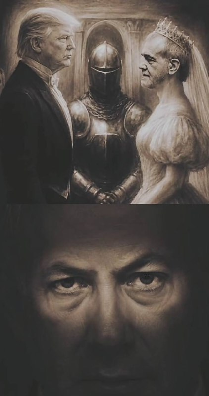

@IranianMinds

## alonews — post 129181

  <a href="telegram/content/alonews_129181_1781886250.webm" target="_blank">🎬 Download video</a>

🔴فوری / کانال ۱۲ اسرائیل: تماس بین نتانیاهو و روبیو، وزیر خارجه، به زودی، درباره لبنان

✅ @AloNews خبر جنگ

## alonews — post 129180

  <a href="telegram/content/alonews_129180_1781886250.mp4" target="_blank">🎬 Download video</a>

👈وزیر جنگ آمریکا: آنچه در هر جامعه‌ای جشن می‌گیریم، بازتابی از ارزش‌های ماست و ما زمان زیادی را صرف کلیک‌بیت و خشم‌بیت در مورد فرهنگ سلبریتی‌ها و شایعات می‌کنیم و زمان کافی را به محتوای واقعی اختصاص نمی‌دهیم

✅ @AloNews خبر جنگ

## alonews — post 129179

  <a href="telegram/content/alonews_129179_1781886252.webm" target="_blank">🎬 Download video</a>

👈نعیم قاسم، دبیرکل حزب‌الله : تلاش برای حذف حزب‌الله شکست خورده و اسرائیل بالاخره مجبور میشه از هر وجب خاکمون عقب‌نشینی کنه

✅ @AloNews خبر جنگ

---
📅 بروزرسانی: 1405/03/29 19:43
---

## VahidOOnLine — post 246405

  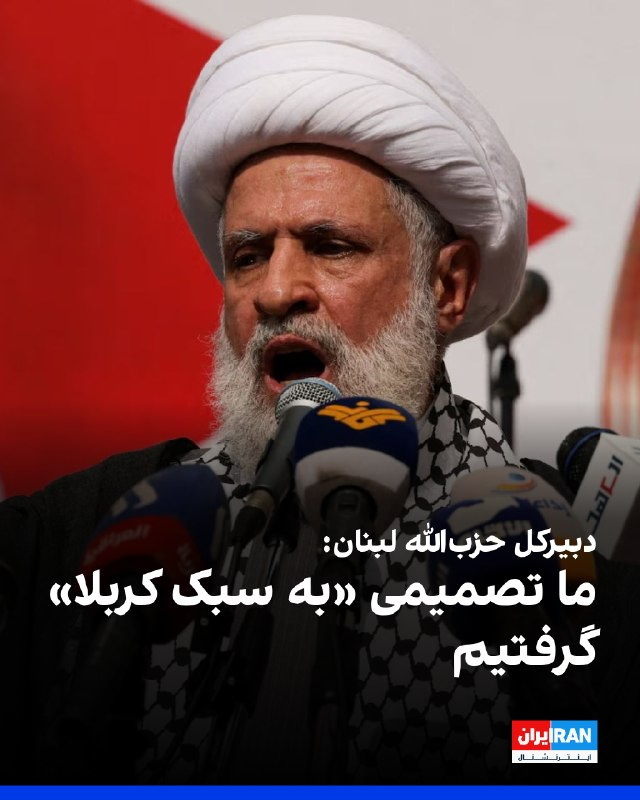

نعیم قاسم، دبیرکل حزب‌الله لبنان، گفت: «تا زمانی که توان ایستادگی داریم، چرا باید تسلیم شویم؟.»

او تحویل سلاح‌های حزب‌الله را رد کرد و افزود این سلاح‌ها برای مقابله با اسرائیل هستند. نعیم قاسم همچنین گفت که ما تصمیمی «به سبک کربلا» گرفتیم و این تصمیم همچنان به قوت خود باقی است.

دبیرکل حزب‌الله لبنان ادامه داد: «ما وحدت نیروهای مقاومت را حفظ کرده‌ایم و وحدت جنبش امل، حزب‌الله و سایر نیروها همچنان در کنار ما برقرار است.»
‌🏁 🇬🇧 IranintlTV

🤖 @VahidOOnLine

## mwarmonitor — post 11226

  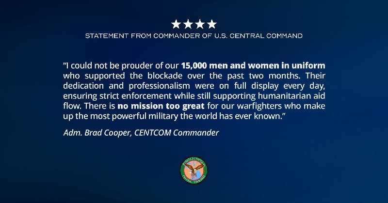

🔴بیانیه فرمانده ستاد فرماندهی مرکزی ایالات متحده (سنتکام)

«من نمی‌توانم بیش از این به ۱۵,۰۰۰ زن و مرد نظامی‌مان که در دو ماه گذشته از محاصره حمایت کردند، افتخار کنم. فداکاری و حرفه‌ای بودن آن‌ها هر روز به طور کامل مشهود بود و اجرای دقیق [قوانین محاصره] را تضمین می‌کرد، در حالی که هم‌زمان از جریان کمک‌های بشردوستانه نیز پشتیبانی می‌کردند. هیچ مأموریتی وجود ندارد که برای جنگجویان ما بسیار بزرگ [یا غیرممکن] باشد؛ کسانی که قدرتمندترین ارتش تاریخ جهان را تشکیل می‌دهند.

دریابد برد کوپر، فرمانده سنتکام

@mwarmonitor

## mwarmonitor — post 11225

🔴واشینگتن پست: نهادهای اطلاعاتی آمریکا به دولت ترامپ هشدار می‌دهند که بنیامین نتانیاهو احتمالاً اقداماتی انجام خواهد داد که می‌تواند توافق ایرانِ ترامپ را تضعیف کند؛ در حالی که رهبر اسرائیل تحت فشار شدید سیاسی برای ادامه جنگ در لبنان قرار دارد. »

@mwarmonitor

## mwarmonitor — post 11224

🔴بر اساس گزارش فایننشال تایمز، هایدی الکساندر، وزیر حمل‌ونقل بریتانیا، از کی‌یر استارمر نخست‌وزیر این کشور خواسته است تاریخ کناره‌گیری خود را تعیین کند.
الکساندر از گذار به رهبری جدید حمایت کرده، در حالی که استارمر متعهد شده در سمت خود باقی بماند و در برابر هرگونه چالش احتمالی مقاومت کند.

@mwarmonitor

## FoxNewsTwitter — post 343172

Fox News (Twitter/X)

More than 250 runners are crossing the country as part of Relay for America, carrying the U.S. flag to Washington, D.C., with the goal of arriving by July 4th. Each mile of the journey is dedicated to a veteran who served our nation.

## pm_afshaa — post 94402

  <a href="telegram/content/pm_afshaa_94402_1781885638.webm" target="_blank">🎬 Download video</a>

🔴بلومبرگ: ۱۱ نفتکش حامل حدود ۲۰ میلیون بشکه نفت ایران، طی هفته جاری بندر چابهار را ترک کرده‌اند.

💧 Rainbet.com the #1 Non-KYC Crypto Casino & Sportsbook @rainbetcom

😁 @Pm_Afshaa

## IranIntlTV — post 343243

🔻مرگ ۳۰ نفر در اردوگاه آوارگان کنگو نگرانی‌ها از گسترش سریع ابولا را افزایش داده است

مقام‌های یک اردوگاه آوارگان در شمال شرق جمهوری دموکراتیک کنگو اعلام کردند شمار مرگ‌ومیرها از اوایل ماه می به سطحی بی‌سابقه رسیده است. بسیاری از جان‌باختگان پیش از مرگ علائمی مانند تب، سردرد و استفراغ داشته‌اند. این موضوع نگرانی‌ها را درباره گسترش سریع ابولا افزایش داده است.

خبرگزاری رویترز جمعه ۲۹ خرداد گزارش داد دست‌کم ۳۰ نفر از اوایل ماه می تاکنون در اردوگاه کیگونزه در شهر بونیا، واقع در شمال شرق جمهوری دموکراتیک کنگو، جان باخته‌اند.

مسئولان اردوگاه اعلام کردند چنین میزان مرگ‌ومیری در این اردوگاه سابقه نداشته و با توجه به علائم گزارش شده، احتمال می‌رود ابولا با سرعت در حال گسترش باشد.

تعیین علت دقیق مرگ‌ها تاکنون ممکن نشده است، زیرا بیماران و خانواده‌های آنان تا پنج‌شنبه ۲۸ خرداد با انجام آزمایش روی افراد زنده یا جان‌باختگان مخالفت می‌کردند.

سخنگوی اردوگاه، یک پدر داغدار، منابع امدادی و یک فعال جامعه مدنی به رویترز گفتند همه قربانیان علائمی از جمله تب، سردرد و استفراغ داشته‌اند. علائمی که با ابولا همخوانی دارد.

دزیره گرودیا باپی، سخنگوی اردوگاه، به رویترز گفت: «قبلا مردم این‌گونه جان خود را از دست نمی‌دادند.»

مرگ‌های ثبت‌شده در اردوگاه کیگونزه با بیش از ۱۵ هزار ساکن، این نگرانی را ایجاد کرده که ابولا ممکن است در میان بیش از پنج میلیون آواره شرق کنگو بدون شناسایی در حال گسترش باشد، آن هم در شرایطی که کمبود امکانات بهداشتی و مقاومت برخی ساکنان در برابر آزمایش‌های پزشکی، مهار بیماری را دشوارتر کرده است.
افزایش ناگهانی شمار قربانیان

دزجو ندروتسی اتین، رییس اردوگاه، گفت تنها در همین هفته ۱۰ نفر دفن شده‌اند.

به گفته مسئولان اردوگاه، در شرایط عادی ماهانه تنها یک تا سه مورد مرگ در این محل ثبت می‌شد.

ژوستن زاناموزی، مدیر سازمان امدادی کاتولیک «کاریتاس»، گفت کارکنان این سازمان چندین جسد از جمله زنان و کودکان را مشاهده کرده‌اند و تلاش آن‌ها برای جلب رضایت خانواده‌ها به‌منظور بررسی پزشکی اجساد با مخالفت روبه‌رو شده است.

مقام‌های کنگو شیوع ابولا را ۲۵ اردیبهشت اعلام کردند اما گفتند مرگ‌ها از اوایل همان ماه آغاز شده بود.

گرودیا گفت کارکنان بهداشتی اکنون از پنج قربانی نمونه‌برداری کرده‌اند و در انتظار نتایج آزمایش‌ها هستند.

او افزود وبا نیز علائمی مشابه ابولا دارد و می‌تواند به سرعت در جوامع فقیر گسترش یابد.

یکی از ساکنان اردوگاه که دو فرزند خود را از دست داده است، به رویترز گفت: «مردم یکی پس از دیگری جان می‌بازند.»

کمبود امکانات بهداشتی و کاهش کمک‌ها

چهار امدادگر به رویترز گفتند افزایش مرگ‌ومیر نشان می‌دهد جوامع آواره اکنون بیش از گذشته در معرض بیماری‌هایی مانند ابولا قرار گرفته‌اند، زیرا بودجه برنامه‌های آب، بهداشت و

این خدمات برای مقابله با بیماری‌هایی مانند ابولا، حیاتی به شمار می‌روند.

داده‌های سازمان ملل نشان می‌دهد بودجه اختصاص‌یافته به سرویس‌های بهداشتی و ایستگاه‌های شست‌وشوی دست در کنگو، بین سال‌های ۲۰۲۴ و ۲۰۲۵ بیش از نصف شده و به حدود ۳۸ میلیون دلار رسیده است. همچنین تاکنون تنها ۲۱ درصد درخواست مالی ۸۰ میلیون دلاری امسال تامین شده است.

کنگو صدها اردوگاه برای غیرنظامیانی دارد که از جنگ گریخته‌اند و برخی از این اردوگاه‌ها تا ۱۰۰ هزار نفر جمعیت دارند.

موارد مرگ ناشی از ابولا پیش‌تر در اردوگاه دیگری در استان ایتوری نیز ثبت شده است. استانی که بیش از ۹۰ درصد از حدود ۹۰۰ مورد تاییدشده ابتلا به ابولا را در خود جای داده است.
در اردوگاه کیگونزه، خانواده‌های پرجمعیت در چادرهای پلاستیکی با فاصله‌ای بسیار کم از یکدیگر زندگی می‌کنند و کمبود سرویس‌های بهداشتی از مشکلات اصلی ساکنان است.

گرودیا گفت: «چاه‌های فاضلاب خیلی سریع پر می‌شوند و مردم مجبورند با دست خالی آن‌ها را تخلیه کنند.»

آمریکا در سال‌های گذشته بزرگ‌ترین حامی برنامه‌های آب، بهداشت و فاضلاب در کنگو بوده است.

با این حال، چهار سازمان امدادی اعلام کردند پروژه‌های مرتبط با آوارگان در مناطق درگیر با ابولا، پس از کاهش بودجه‌های آمریکا محدود یا متوقف شده‌اند.

دولت دونالد ترامپ از این کاهش بودجه دفاع کرده و گفته است منابع را بر «کمک‌های بشردوستانه نجات‌بخش با اولویت بسیار بالا» متمرکز کرده است.

واشینگتن همچنین اعلام کرده بیش از ۳۷۵ میلیون دلار کمک مستقیم برای مقابله با ابولا اختصاص داده است.

با وجود این، امدادگران هشدار می‌دهند که کاهش خدمات آب و بهداشت در اردوگاه‌های آوارگان، خطر گسترش بیماری را در یکی از آسیب‌پذیرترین مناطق کنگو افزایش داده است.
🔗ادامه این مطلب را اینجا بخوانید
@iranintltv

## IranIntlTV — post 343242

  

نعیم قاسم، دبیرکل حزب‌الله لبنان، گفت: «تا زمانی که توان ایستادگی داریم، چرا باید تسلیم شویم؟.»

او تحویل سلاح‌های حزب‌الله را رد کرد و افزود این سلاح‌ها برای مقابله با اسرائیل هستند. نعیم قاسم همچنین گفت که ما تصمیمی «به سبک کربلا» گرفتیم و این تصمیم همچنان به قوت خود باقی است.

دبیرکل حزب‌الله لبنان ادامه داد: «ما وحدت نیروهای مقاومت را حفظ کرده‌ایم و وحدت جنبش امل، حزب‌الله و سایر نیروها همچنان در کنار ما برقرار است.»
https://iranintl.com/202606195238

## FarsiVOA — post 221204

🔺حمایت سناتور گراهام از موضع پرزیدنت ترامپ درباره تضعیف توانایی‌های جمهوری اسلامی

▪️لیندزی گراهام، سناتور ارشد جمهوری‌خواه ایالت کارولینای جنوبی، با بازنشر مطلبی از دونالد ترامپ، رئیس‌جمهوری ایالات متحده، از ارزیابی او درباره «تضعیف گسترده» توانایی‌های نظامی و منطقه‌ای جمهوری اسلامی حمایت کرد و گفت ایران اکنون از پیش از درگیری‌ها قوی‌تر نیست.

⬇️ بیشتر بخوانید:

https://ir.voanews.com/a/graham-backs-trump-s-iran-assessment/8162641.html/?nocach=1

## FarsiVOA — post 221203

آیا بعد از جمهوری اسلامی نوبت کوبا است؟ پاسخ ونس، به سیلوا خبرنگار کاخ سفید

## RadioFarda — post 158512

🔸دونالد ترامپ، رئیس‌جمهور آمریکا، در گفت‌وگو با اکسیوس گفت جنگ با ایران به او نشان داده است که «هیچ محدودیتی» برای قدرتش وجود ندارد.

🔸او در پاسخ به پرسشی درباره محدودیت‌های اختیارات رئیس‌جمهور در جریان این درگیری گفت: «هیچ محدودیتی وجود ندارد. هنوز آن درس را یاد نگرفته‌ام. می‌دانم که محدودیت‌هایی هست، اما هیچ محدودیتی وجود ندارد.»

🔸آقای ترامپ همچنین بار دیگر تکرار کرد که آمریکا ایران را «از نظر نظامی کاملاً شکست داده است.»

🔸این اظهارات در حالی مطرح می‌شود که تفاهم‌نامه اخیر میان آمریکا و ایران برای پایان دادن به جنگ، با انتقاد برخی اعضای حزب جمهوری‌خواه روبه‌رو شده است.

🔸بر اساس این گزارش، بخشی از انتقادها به گزارش‌هایی مربوط می‌شود که از احتمال آزادسازی دارایی‌های مسدودشده ایران، ایجاد یک صندوق سرمایه‌گذاری ۳۰۰ میلیارد دلاری و کاهش برخی تحریم‌ها در چارچوب این توافق خبر داده‌اند.

🔸ترامپ پیش‌تر گزارش‌ها درباره ایجاد صندوق ۳۰۰ میلیارد دلاری برای ایران را رد کرده و گفته بود ایالات متحده در چنین صندوقی سرمایه‌گذاری نخواهد کرد.

@RadioFarda

## Dirty_Kids — post 392589

  <a href="telegram/content/Dirty_Kids_392589_1781885639.mp4" target="_blank">🎬 Download video</a>

گفتگوی شغال طرقبه و کتلت کرمان بعد از امضاء توافق با ترامپ😅

@Dirty_Kids 👻

## Dirty_Kids — post 392588

این همه بیزاری از کجا میاد؟

شما روزه اید ما نباید چیزی بخوریم
شما عزادارید ما نباید خوشحال باشیم
شما نماز می خونید ما نباید صدا بدیم
شما مسلمونید ما باید اسلام رو پاس بداریم!!!!!!

@Dirty_Kids 👻

## Dirty_Kids — post 392587

  <a href="https://t.me/Dirty_Kids/392587" target="_blank">📎 Download file</a>

ریتزوبت تنها سایت بین المللی میباشد ، که به صورت هفتگی پرومو کد دریافت میکنید ✅

♦️ آموزش شارژ حساب با کریپتو
♦️ آموزش شارژ حساب ریالی در ریتزوبت

🔵ریتزوبت برندی با لایسنس معتبر در صنعت شرطبندی و #پیشبینی مسابقات ورزشی و کازینویی 👇

https://t.me/+LB508WZyIr8xNmY0

## Dirty_Kids — post 392586

  

🔔اپلیکیشن اندروید بدون فیلتر ریتزوبت 
✅

🔹 کاملترین اپلیکیشن شرطبندی
🔹 آپشن و بونوس های متنوع
🔹 دارای مجوزهای بین‌المللی و امنیت بالا
🔹 شارژ و برداشت با روش‌های متنوع

دانلود اپلیکیشن بدون فیلتر اندروید
🎯 لینک ورود به ریتزوبت

🌐 برای تغییر زبان برنامه به فارسی
🇮🇷 ، کافی است زبان موبایل خود را روی فارسی تنظیم کنید.
G29

## alonews — post 129178

  <a href="telegram/content/alonews_129178_1781885641.mp4" target="_blank">🎬 Download video</a>

👈 حمزه صفوی: از نگاه بین الملل در ۴۰ سال گذشته یک روز نبوده که ایران بدنبال ساخت بمب اتم نبوده باشد

🔴اگر ایران به سمت بمب اتم حرکت کند همین چین روبروی ایران خواهد ایستاد

✅ @AloNews خبر جنگ

## alonews — post 129177

  <a href="telegram/content/alonews_129177_1781885643.webm" target="_blank">🎬 Download video</a>

👈حضور هیات قطری در سوییس بدون حضور ایران و آمریکا

✅ @AloNews خبر جنگ

## alonews — post 129176

  <a href="telegram/content/alonews_129176_1781885643.webm" target="_blank">🎬 Download video</a>

👈واشنگتن پست: سازمان اطلاعات آمریکا اعلام کرده که اسرائیل به طور فعال در تلاش است تا یادداشت تفاهم ایران و آمریکا را بر هم بزند.

✅ @AloNews خبر جنگ

---
📅 بروزرسانی: 1405/03/29 19:35
---

## VahidOOnLine — post 246404

  <a href="telegram/content/VahidOOnLine_246404_1781885115.mp4" target="_blank">🎬 Download video</a>

ویدیوی رسیده به ایران اینترنشنال نشان می‌دهد دوستان و بستگان جاویدنام علی روزبهانی به یاد او به توزیع غذا بین شهروندان پرداختند. علی روزبهانی از جمله جوانانی بود که از نخستین روزهای اعتراضات دی‌ماه ۱۴۰۴ در خیابان‌ها حاضر شد و به گفته نزدیکانش، حضوری فعال در کنار دیگر شهروندان داشت. او ابتدا در بازار و چند نقطه دیگر تهران حاضر شد و سرانجام ۱۸ دی به تهرانپارس رفت و گلوله خورد.
‌🏁 🇬🇧 IranintlTV

🤖 @VahidOOnLine

## mwarmonitor — post 11223

🔴 نعیم قاسم: آن‌ها تلاش کردند با وارد کردن فشار بر سوریه، این کشور از سمت شرق وارد عمل شود تا همراه با «اسرائیل» از شمال، یک حرکت گازانبری ایجاد کنند.

🔸این طرح شامل بستن تمام گذرگاه‌ها برای جلوگیری از رسیدن سلاح، فناوری و هر چیزی است که بتواند مقاومت را تقویت کند.

🔸همچنین این طرح شامل اعمال یک محاصره مالیِ کامل و تحریک ارتش علیه مقاومت است.

🔸آن‌ها بر ایجاد فتنهٔ سنی–شیعه با عنوانِ «حفاظت از جایگاه نخست‌وزیر» و با استناد به تصمیم‌هایی که او علیه مقاومت خواهد گرفت، کار کردند.

@mwarmonitor

## DEJradio — post 5829

  <a href="telegram/content/DEJradio_5829_1781885118.webm" target="_blank">🎬 Download video</a>

🚨📢 ارفاق ترامپ به ملاها؛ حرکت ۱۰ نفت‌کش جمهوری اسلامی به سمت چین

بعد از تفاهم آمریکا و جمهوری اسلامی، طی ۵ روز ۱۰ نفت‌کش ۱۸ میلیون بشکه نفت به ارزش ۱.۴ میلیارد دلار از خلیج فارس خارج کرده و به سمت چین بردند.

دو نفت‌کش از این شمار با موقعیت‌یاب خاموش در طول محاصره آمریکا از خلیج فارس خارج و خط محاصره عبور کردند.

#مذاکرات #توافق
@DEJradio

## IranIntlTV — post 343241

  <a href="telegram/content/IranIntlTV_343241_1781885119.mp4" target="_blank">🎬 Download video</a>

ویدیوی رسیده به ایران اینترنشنال نشان می‌دهد دوستان و بستگان جاویدنام علی روزبهانی به یاد او به توزیع غذا بین شهروندان پرداختند. علی روزبهانی از جمله جوانانی بود که از نخستین روزهای اعتراضات دی‌ماه ۱۴۰۴ در خیابان‌ها حاضر شد و به گفته نزدیکانش، حضوری فعال در کنار دیگر شهروندان داشت. او ابتدا در بازار و چند نقطه دیگر تهران حاضر شد و سرانجام ۱۸ دی به تهرانپارس رفت و گلوله خورد.

## IranIntlTV — post 343240

  <a href="telegram/content/IranIntlTV_343240_1781885122.mp4" target="_blank">🎬 Download video</a>

🔻تیم فوتبال سوئیس شب گذشته در دومین مسابقه خود در جام جهانی ۲۰۲۶، بوسنی و هرزگوین را با نتیجه ۴ بر یک شکست داد.

🔹گزارش علیرضا مدیری، خبرنگار ایران اینترنشنال از استادیوم سوفای لس آنجلس و گفتگو با هواداران دو تیم

@iranintltvsport

## FarsiVOA — post 221202

بریتانیا هشدار «خودداری از سفرهای غیرضروری» به امارات، قطر و کویت را لغو کرد

## Persian_Trend_Official — post 17595

🚨سنتکام:
بیش از ۲۰ کشتی روز گذشته با امنیت از مسیر تعیین‌شده در تنگه هرمز عبور کردند

از کشتی‌ها می‌خواهیم دستورالعمل‌های مرکز اطلاعات دریایی مشترک را رعایت کنند

## IranianMinds — post 22962

🔴مارکو روبیو:

حکومت ایران حامی تروریست در جهان است.

@IranianMinds

## alonews — post 129175

  <a href="telegram/content/alonews_129175_1781885124.webm" target="_blank">🎬 Download video</a>

🔴 فوری / هلند: برای تضمین آزادی کشتیرانی ناو جنگی به تنگه هرمز اعزام خواهیم کرد

✅ @AloNews خبر جنگ

## alonews — post 129174

  <a href="telegram/content/alonews_129174_1781885124.webm" target="_blank">🎬 Download video</a>

👈امانوئل مکرون: برای مشارکت در اجرای توافق بین آمریکا و ایران آمادگی داریم

✅ @AloNews خبر جنگ

---
📅 بروزرسانی: 1405/03/29 19:25
---

## VahidOOnLine — post 246403

  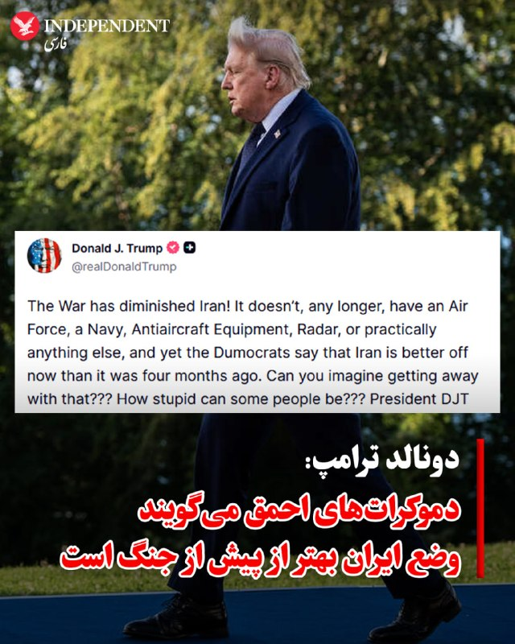

♦️ دونالد ترامپ، رئیس‌جمهوری ایالات متحده با انتشار پیامی در شبکه اجتماعی تروث‌سوشال، به انتقادهای دموکرات‌ها از توافق با جمهوری اسلامی واکنش نشان داد. ترامپ که با بازی با کلمات، یک کلمه ترکیبی برای «دموکرات‌های احمق» ساخته است، از همین عبارت ساختگی برای توصیف آنان استفاده کرد و نوشت: «جنگ، ایران را تضعیف و ناچیز کرده است! آن‌ها دیگر نیروی هوایی، نیروی دریایی، تجهیزات ضدهوایی، رادار، یا عملاً هیچ چیز دیگری ندارند؛ با این حال، دموکرات‌های احمق (Dumocrats) می‌گویند وضع ایران اکنون بهتر از چهار ماه پیش است. می‌توانید تصور کنید که چطور چنین حرفی می‌زنند و قسر در می‌روند؟؟؟ برخی از مردم چقدر می‌توانند احمق باشند؟؟؟»

این اظهارات پس از آن بیان شد که بسیاری از نمایندگان دموکرات در مجلس و سنای آمریکا، متن تفاهم‌نامه امضاشده میان تهران و واشنگتن را مورد انتقاد قرار دادند. چاک شومر، رهبر دموکرات‌ها در سنا، با کنایه به نام کتاب ترامپ (هنر معامله)، این تفاهم را نتیجه «هنر تسلیم» دانست. او در یک مصاحبه تلویزیونی، جنگ و تفاهم با جمهوری اسلامی را «یکی از بدترین فجایع سیاست خارجی آمریکا» توصیف کرد.
‌🇸🇦 Indypersian

🤖 @VahidOOnLine

## VahidOOnLine — post 246402

  

عباس عراقچی، وزیر خارجه جمهوری اسلامی، در گفت‌وگو با همتای پاکستانی خود، با اشاره به «تعهد و مسئولیت» ایالات متحده در قبال پایان دادن به جنگ در تمامی جبهه‌ها، از جمله لبنان، گفت: «مسئولیت هرگونه نقض تعهدات مندرج در یادداشت تفاهم و پیامدهای آن، متوجه ایالات متحده خواهد بود.»

عراقچی همچنین از تلاش‌های پاکستان برای میانجی‌گری بین جمهوری اسلامی و آمریکا تشکر کرد.
‌🏁 🇬🇧 IranintlTV

🤖 @VahidOOnLine

## iaghapour — post 2687

🌐 مدیرعامل سروش‌پلاس: فیلترینگ و قطعی اینترنت به ضرر ماست!

امین شریفی، مدیرعامل سروش‌پلاس در نشست گزارش عملکرد سال ۱۴۰۴ اعلام کرد که قطعی اینترنت و اعمال فیلترینگ نه‌تنها به رشد پلتفرم‌های داخلی کمکی نمی‌کند، بلکه نتیجه‌ای جز عصبانیت و لج کاربران ندارد.

🔹 چکیده مهم‌ترین آمارهای گزارش سالانه سروش‌پلاس:
🔸 ریزش کاربران پس از رفع محدودیت‌ها: با آزاد شدن دسترسی به سایر پیام‌رسان‌ها، سروش‌پلاس با افت ۱۰ تا ۱۵ درصدی در تعداد کاربر و کاهش ۱۰ تا ۳۰ درصدی در شاخص‌های فعالیت مواجه شده است.

🔸 وضعیت کسب‌وکارها: آمارها نشان می‌دهد حدود ۷۰ درصد از فعالیت کانال‌های فروشگاهی، آموزشی و تولید محتوا که در دوره محدودیت‌ها ایجاد شده بودند، همچنان در این پلتفرم ادامه دارد.

🔸 رشد آمار کاربران و پیام‌ها: تعداد کل کاربران ثبت‌نامی این پیام‌رسان از مرز ۵۲ میلیون نفر عبور کرده است که از این تعداد حدود ۲۰ میلیون نفر کاربر فعال ماهانه هستند. همچنین در سال ۱۴۰۴ بیش از ۳۰ میلیارد پیام توسط کاربران جابه‌جا شده که ۷۶ درصد از آن‌ها مربوط به چت‌های شخصی بوده است.

🔸 امکانات و تغییرات جدید: رونمایی از مدل اشتراکی «حساب پرو» (با قابلیت‌هایی مثل نشان ویژه و حذف تبلیغات)، توسعه تنظیمات حریم خصوصی و همچنین افزایش جایگاه‌های تبلیغاتی پلتفرم از ۳ به ۱۳ مورد، از اقدامات مهم این سال بوده است.

🔻پ.ن: من داشتم میخوندم خندم گرفت این چطوری داشت میگفت خندش نگرفت؟

🆔 @iAghapour

## IranIntlTV — post 343239

🔻سراب توافق با واشینگتن؛ چرا معامله با آمریکا هم اقتصاد نفتی جمهوری اسلامی را نجات نمی‌دهد؟

🖋تحلیل - مهدی مصلحی، کارشناس بازار انرژی

اکنون که با امضای یادداشت‌تفاهم بار دیگر بحث احتمال یک توافق بزرگ میان جمهوری اسلامی و ایالات متحده مطرح شده، بسیاری از تحلیلگران همچنان بر این باورند که لغو تحریم‌ها می‌تواند همانند یک شوک مثبت، اقتصاد ایران را احیا کند. این نگاه اما بیش از حد ساده‌انگارانه است.

مساله امروز جمهوری اسلامی صرفا تحریم نیست. اقتصاد نفتی ایران اکنون با مجموعه‌ای از مشکلات ساختاری، فنی، مالی و ژئوپلیتیکی مواجه است که حتی در صورت دستیابی به یک توافق سیاسی با واشینگتن نیز به سرعت قابل حل نخواهند بود.

واقعیت این است که اقتصاد نفتی جمهوری اسلامی در وضعیتی قرار گرفته که مشکل اصلی آن دیگر فروش نفت نیست؛ بلکه توانایی تولید پایدار، جذب سرمایه، دسترسی به فناوری و بازگشت به زنجیره مالی جهانی است.

فرسودگی زیرساخت‌ها؛ زخمی که طی دهه‌ها انباشته شد

بخش بزرگی از زیرساخت‌های نفت و گاز ایران به نیمه دوم عمر عملیاتی خود رسیده‌اند. سال‌ها کمبود سرمایه‌گذاری، محدودیت دسترسی به فناوری‌های روز و خروج شرکت‌های بزرگ بین‌المللی از ایران موجب شده است بسیاری از میادین با مشکلات پیچیده فنی روبه‌رو شوند.

موضوع تنها افت طبیعی تولید نیست. بسیاری از متخصصان باسابقه صنعت نفت ایران طی سال‌های اخیر نسبت به مشکلات سازندی، افت فشار، رسوب‌گذاری، آسیب به چاه‌ها و دشواری بازگرداندن آنها به تولید پایدار هشدار داده‌اند.

به گفته شماری از مدیران سابق صنعت نفت، از جمله افرادی که سال‌ها در بالاترین سطوح اجرایی این صنعت فعالیت کرده‌اند، بخش مهمی از تلاش مدیران فعلی معطوف به یافتن راه‌حل برای مشکلات فنی چاه‌ها و میادینی است که رفع آنها مستلزم تجهیزات، دانش فنی و فناوری‌هایی است که امروز در داخل کشور به سادگی در دسترس نیست.

این وضعیت در میدان گازی پارس جنوبی اهمیت دوچندان پیدا می‌کند. پارس جنوبی ستون فقرات امنیت انرژی ایران است و افت فشار طبیعی این میدان از سال‌ها پیش آغاز شده است. جبران این افت فشار نیازمند پروژه‌های چند ده میلیارد دلاری، تجهیزات پیشرفته فراساحلی و مشارکت شرکت‌هایی است که عمدتا در غرب مستقر هستند.

حتی اگر امروز موانع سیاسی برداشته شود، فرآیند مطالعه، طراحی، تامین تجهیزات و اجرای چنین پروژه‌هایی سال‌ها زمان خواهد برد؛ زمانی که اقتصاد گرفتار تورم، کسری بودجه و کمبود سرمایه ایران به سختی در اختیار دارد.

جهان دیگر منتظر نفت ایران نیست

اشتباه بزرگ بسیاری از تحلیل‌ها آن است که بازار انرژی امروز را با بازار انرژی یک دهه پیش مقایسه می‌کنند.

در دوران پیش از تحریم‌ها، بخش قابل توجهی از بازار جهانی به نفت ایران وابسته بود. اما در سال ۲۰۲۶ شرایط کاملا متفاوت است.

ایالات متحده به یکی از بزرگ‌ترین تولیدکنندگان و صادرکنندگان انرژی جهان تبدیل شده است. کانادا، برزیل و گویان ظرفیت تولید خود را افزایش داده‌اند. قطر و آمریکا بازار جهانی گاز طبیعی مایع را متحول کرده‌اند و مصرف‌کنندگان بزرگ نیز طی سال‌های گذشته زنجیره تامین خود را بازطراحی کرده‌اند.

بازگشت به بازار جهانی بسیار دشوارتر از حفظ سهم بازار است. مشتریانی که طی سال‌های تحریم جایگزین پیدا کرده‌اند، صرفا به‌دلیل رفع تحریم‌ها به سرعت به بازار ایران بازنخواهند گشت.
سایه سنگین نظام بانکی و FATF

حتی اگر فرض کنیم دولت آمریکا مجوز بازگشت شرکت‌های نفتی به ایران را صادر کند، مانع بزرگ‌تری همچنان پابرجاست: نظام بانکی بین‌المللی.

تجربه برجام در سال ۲۰۱۵ نشان داد که توافق سیاسی الزاما به معنای بازگشت سرمایه نیست. با وجود حمایت رسمی دولت‌های غربی از همکاری اقتصادی با ایران، بسیاری از بانک‌های بزرگ حاضر به پذیرش ریسک فعالیت در ایران نشدند.

عدم پیوستن به استانداردهای FATF، نبود شفافیت مالی کافی، نگرانی از پول‌شویی و نقش گسترده نهادهای نظامی در اقتصاد، همچنان از مهم‌ترین موانع ورود سرمایه خارجی محسوب می‌شوند.

اگر در سال ۲۰۱۵ ایران عمدتا به عنوان حامی گروه‌های نیابتی شناخته می‌شد، در سال ۲۰۲۶ فضای بین‌المللی نسبت به تهران به مراتب سخت‌تر و پرهزینه‌تر شده است. برای بسیاری از مؤسسات مالی جهانی، ریسک اعتباری و reputational risk همکاری با ایران همچنان بسیار بالا خواهد بود.

🔗ادامه این مطلب را اینجا بخوانید
@iranintltv

## IranIntlTV — post 343238

  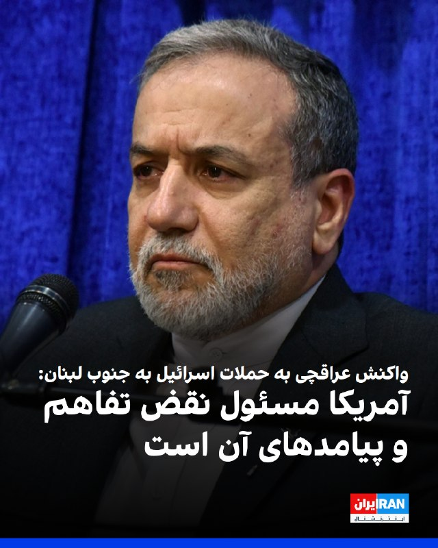

عباس عراقچی، وزیر خارجه جمهوری اسلامی، در گفت‌وگو با همتای پاکستانی خود، با اشاره به «تعهد و مسئولیت» ایالات متحده در قبال پایان دادن به جنگ در تمامی جبهه‌ها، از جمله لبنان، گفت: «مسئولیت هرگونه نقض تعهدات مندرج در یادداشت تفاهم و پیامدهای آن، متوجه ایالات متحده خواهد بود.»

عراقچی همچنین از تلاش‌های پاکستان برای میانجی‌گری بین جمهوری اسلامی و آمریکا تشکر کرد.
https://iranintl.com/202606196597

## FarsiVOA — post 221201

۷۴ ضربه شلاق برای گروه کنسرت پرستو احمدی؛ ۷۴ ضربه بر تن هنر

## FarsiVOA — post 221200

عفو بین‌الملل درباره ادامه سرکوب‌ها در سایه تفاهم جمهوری اسلامی و آمریکا هشدار داد

## FarsiVOA — post 221199

  <a href="telegram/content/FarsiVOA_221199_1781884557.mp4" target="_blank">🎬 Download video</a>

فرماندهی جنوبی ارتش آمریکا ویدیویی از حمله به یک شناور در شرق اقیانوس آرام منتشر کرد.

به گفته این فرماندهی، این شناور در یکی از مسیرهای شناخته‌شده قاچاق مواد مخدر تردد می‌کرد و در اختیار سازمان‌های تروریستی قرار داشت.

فرماندهی جنوبی آمریکا اعلام کرد در این عملیات سه نفر که آنها را «تروریست‌های مرتبط با قاچاق مواد مخدر» معرفی کرده، کشته شدند و هیچ‌یک از نیروهای آمریکایی آسیب ندیدند.

فرماندهی جنوبی آمریکا اعلام کرد در این عملیات سه نفر که آنها را «تروریست‌های مرتبط با قاچاق مواد مخدر» معرفی کرده، کشته شدند و هیچ‌یک از نیروهای آمریکایی آسیب ندیدند.

@FarsiVOA

## Persian_Trend_Official — post 17594

  <a href="telegram/content/Persian_Trend_Official_17594_1781884558.webm" target="_blank">🎬 Download video</a>

🚨 ارتش اسرائیل: از نیمه‌شب گذشته بیش از ۱۵۰ حملهِ هوایی به لبنان انجام دادیم

## alonews — post 129173

  <a href="telegram/content/alonews_129173_1781884558.webm" target="_blank">🎬 Download video</a>

👈نتانیاهو: حزب الله بهای سنگینی پرداخت خواهد کرد

✅ @AloNews خبر جنگ

## alonews — post 129172

  <a href="telegram/content/alonews_129172_1781884558.webm" target="_blank">🎬 Download video</a>

👈سنتکام: بیش از ۲۰ کشتی روز گذشته با امنیت از مسیر تعیین‌شده در تنگه هرمز عبور کردند

🔴 از کشتی‌ها می‌خواهیم دستورالعمل‌های مرکز اطلاعات دریایی مشترک را رعایت کنند

✅ @AloNews خبر جنگ

---
📅 بروزرسانی: 1405/03/29 19:13
---

## mwarmonitor — post 11222

🔴وزیر امور خارجه ایتالیا، Antonio Tajani می‌گوید که سفر برنامه‌ریزی‌شده‌اش در تاریخ ۲۱ تا ۲۲ ژوئن به واشنگتن را لغو می‌کند، پس از آن‌که Donald Trump به نخست‌وزیر ایتالیا، Giorgia Meloni توهین کرده و گفته بود او «التماس کرده» برای گرفتن عکس با او و اینکه او…

## IranIntlTV — post 343237

🔻مقایسه واشینگتن‌پست؛ تفاهم ترامپ با جمهوری اسلامی چه تفاوت‌ها و شباهت‌هایی با برجام دارد

روزنامه واشینگتن‌پست گزارش داد تفاهم تازه دونالد ترامپ، رییس‌جمهوری آمریکا، با جمهوری اسلامی با وجود انتقادهای تند او از برجام، در موضوعاتی مانند کاهش تحریم‌ها، آزادسازی دارایی‌ها و کنار گذاشتن پرونده موشکی تهران، شباهت‌هایی با توافق هسته‌ای دولت باراک اوباما دارد.

واشینگتن‌پست جمعه ۲۹ خرداد نوشت ترامپ طی سال‌های گذشته بارها از رویکرد اوباما در قبال پرونده هسته‌ای جمهوری اسلامی انتقاد کرده و برجام را «فاجعه‌بار»، «اساسا معیوب»، «یک‌طرفه»، «مسیر دستیابی ایران به سلاح هسته‌ای» و «یکی از بدترین و احمقانه‌ترین توافق‌های تاریخ آمریکا» خوانده است.

اکنون ترامپ به تفاهمی با جمهوری اسلامی دست یافته که به‌نوعی توافق مورد نظر خود او به شمار می‌رود.

به‌نوشته واشینگتن‌پست، مقایسه این تفاهم‌نامه با برجام چندان آسان نیست، زیرا برجام توافقی جامع و با جزییات روشن بود، اما توافق ترامپ همچنان در مراحل اولیه قرار دارد و بسیاری از موضوعات کلیدی و سرنوشت‌ساز آن هنوز مشخص نشده است.

همچنین شرایط کنونی با زمان انعقاد برجام تفاوت‌های اساسی دارد؛ دانش هسته‌ای تهران افزایش یافته و جمهوری اسلامی پس از ماه‌ها درگیری نظامی وارد روند مذاکرات شده؛ جنگی که به تضعیف توان نظامی حکومت ایران انجامیده و شماری از مقام‌های ارشد آن را از پا درآورده است.

آمریکا و حکومت ایران ۲۵ خرداد از دستیابی به تفاهمی برای پایان جنگ خبر دادند. این یادداشت تفاهم ۲۸ خرداد به امضای ترامپ و مسعود پزشکیان، رییس دولت جمهوری اسلامی، رسید.

بر اساس این سند، یک دوره ۶۰ روزه برای گفت‌وگوهای تخصصی در نظر گرفته شده است؛ مذاکراتی که قرار است بر موضوعات حساسی همچون سرنوشت ذخایر اورانیوم غنی‌شده حکومت ایران و چگونگی رفع تحریم‌ها تمرکز داشته باشد.
لغو تحریم‌ها و آزادی دارایی‌های بلوکه‌شده

ترامپ سال ۲۰۱۸ در شبکه‌های اجتماعی نوشت اوباما و دموکرات‌ها ۱۵۰ میلیارد دلار در اختیار جمهوری اسلامی قرار داده‌اند.

این در حالی است که مقام‌های وقت وزارت خزانه‌داری و وزارت امور خارجه آمریکا میزان واقعی منابع مالی قابل استفاده حکومت ایران را نزدیک به ۵۰ میلیارد دلار برآورد کردند.

واشینگتن‌پست نوشت تفاهم‌نامه ترامپ نیز شامل برنامه‌ای برای کاهش تحریم‌ها و آزادسازی دارایی‌های مسدودشده تهران است.

بر اساس ماده هفتم یادداشت تفاهم، ایالات متحده متعهد می‌شود تمامی انواع تحریم‌ها علیه جمهوری اسلامی، از جمله قطعنامه‌های شورای امنیت سازمان ملل، قطعنامه‌های شورای حکام آژانس بین‌المللی انرژی اتمی و تمامی تحریم‌های یک‌جانبه آمریکا اعم از اولیه و ثانویه را مطابق جدول زمانی توافق نهایی لغو کند.

یک مقام ارشد آمریکایی که به‌دلیل حساسیت موضوع نخواست نامش فاش شود، پیش‌تر گفته بود در صورت اجرای مفاد این یادداشت تفاهم از سوی رهبران جمهوری اسلامی، تهران به دارایی‌های مسدودشده خود دسترسی خواهد یافت.

روزنامه واشینگتن‌پست نوشت همانند برجام، ماده ۱۱ تفاهم‌نامه ترامپ تصریح می‌کند آمریکا دارایی‌ها و منابع مالی مسدود یا محدودشده ایران را «به‌طور کامل» در دسترس جمهوری اسلامی قرار خواهد داد.

ترامپ هنگام خروج از برجام در سال ۲۰۱۸ گفته بود: «پس از لغو تحریم‌ها، حکومت دیکتاتوری [ایران] از منابع مالی جدید خود برای توسعه موشک‌های دارای قابلیت حمل کلاهک هسته‌ای، حمایت از تروریسم و ایجاد بی‌ثباتی در خاورمیانه و فراتر از آن استفاده کرد.»

با این حال، به نظر می‌رسد مفاد یادداشت تفاهم اخیر او با مواضعی که ترامپ در زمان خروج از برجام مطرح کرده بود، همخوانی ندارد.

واشینگتن‌پست افزود اگرچه به‌دلیل نبود جزییات کامل، مقایسه ابعاد مالی دو توافق دشوار است، اما به نظر می‌رسد ترامپ نیز اکنون رویکردی مشابه برجام را در زمینه آزادسازی دارایی‌های جمهوری اسلامی دنبال می‌کند.

طبق ماده ششم یادداشت تفاهم اخیر، ایالات متحده آمریکا متعهد می‌شود همراه با شرکای منطقه‌ای خود طرحی قطعی و مورد توافق به ارزش حداقل ۳۰۰ میلیارد دلار برای بازسازی و توسعه اقتصادی جمهوری اسلامی ایران تدوین کند.

کاخ سفید تاکید کرده است این منابع از محل مالیات شهروندان آمریکایی تامین نخواهد شد.

🔗ادامه این مطلب را اینجا بخوانید
@iranintltv

## Shin_Persian — post 7134

Shin ✓ @hey_itsmyturn
Fri, 19 Jun 2026 15:42:24 UTC

Jet activity over Baghdad
#Iraq 🇮🇶

ترجمه خودکار فارسی

فعالیت جت‌ها بر فراز بغداد
#Iraq 🇮🇶

𝕏 · @shin_persian

## IranianMinds — post 22961

ولی چه آدمایی رفتن و چیا موندن …

## alonews — post 129171

  <a href="telegram/content/alonews_129171_1781883833.webm" target="_blank">🎬 Download video</a>

👈سی‌بی‌اس: ۴ کشورمیانجی تفاهم ایران و آمریکا یکشنبه آینده در مصر نشست برگزار می‌کنند

✅ @AloNews خبر جنگ

## alonews — post 129170

  <a href="telegram/content/alonews_129170_1781883833.webm" target="_blank">🎬 Download video</a>

👈گفتگوی قطر و سوئیس درباره حمایت از مذاکرات واشنگتن و تهران

✅ @AloNews خبر جنگ

---
📅 بروزرسانی: 1405/03/29 19:06
---

## VahidOnline — post 76521

  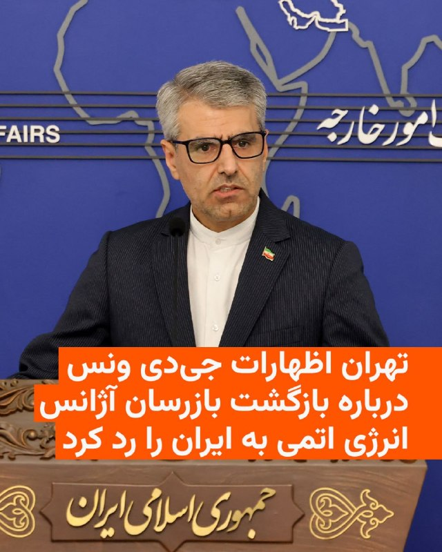

اسماعیل بقائی، سخنگوی وزارت خارجه ایران، روز جمعه دعوت جمهوری اسلامی از بازرسان آژانس بین‌المللی انرژی اتمی برای حضور در ایران و انجام بازرسی از تاسیسات هسته‌ای را رد کرد.

او گفت: «بازرسی از تاسیساتی که دسترسی آژانس به آنها به‌دلیل حملات نظامی متوقف گردید، منوط به روند مذاکرات و نتیجه آن خواهد بود.»

پیشتر جی‌دی ونس، معاون رئیس جمهور آمریکا پس از اعلام توافق اخیر در گفت‌وگو با شبکه ان‌بی‌سی گفته بود که بر اساس تفاهم‌نامه میان واشینگتن و تهران، بازرسان آژانس بین‌المللی انرژی اتمی «قطعاً» به ایران بازخواهند گشت.

اسماعیل بقائی همچنین گفت در حال برنامه‌ریزی برای برگزاری یک نشست طی روزهای آینده هستیم.

نشست بین نمایندگان ایران و ایالات متحده که قرار بود جمعه در سوئیس برگزار شود، لغو شد.

سخنگوی وزارت خارجه جمهوری اسلامی اعلام کرد: «با توجه به اینکه امضای متن یادداشت تفاهم در بامداد ۲۸ خرداد به صورت دیجیتالی انجام شد، برگزاری نشست مزبور در سوئیس فوریت ندارد.»

او همچنین گزارش‌ها درباره بسته شدن تنگه هرمز را «بی‌اساس» دانست و گفت کشتیرانی در این مسیر در حال انجام است.
@VahidHeadline

📡 @VahidOnline

## IranIntlTV — post 343236

🔻اسرائیل و حزب‌الله پس از درگیری‌های مرگبار با آتش‌بس موافقت کردند

خبرگزاری رویترز به نقل از یک مقام ارشد آمریکایی گزارش داد اسرائیل و حزب‌الله لبنان موافقت خود را با برقراری آتش‌بس اعلام کرده‌اند. این توافق در شرایطی به دست آمد که در ۲۴ ساعت گذشته، حملات مرگبار میان دو طرف شدت گرفته بود.

رویترز جمعه ۲۹ خرداد نوشت آتش‌بس میان دو طرف از ساعت ۴ عصر به وقت بیروت اجرایی شده است.

پیش‌تر شبکه خبری سی‌ان‌ان به‌نقل از یک منبع آگاه گزارش داد آمریکا به جمهوری اسلامی اطلاع داده است که اسرائیل قصد ندارد حملات خود به لبنان را بیش از این تشدید کند.

این منبع گفت: «حزب‌الله آتش‌بس را نقض کرد. اسرائیل موافقت کرده که موضوع را ادامه ندهد و این پیام به ایرانی‌ها منتقل شده است. اکنون این به حزب‌الله بستگی دارد که حملات را متوقف کند.»

یک منبع اسرائیلی نیز تایید کرد بنیامین نتانیاهو، نخست‌وزیر این کشور، در حال حاضر برنامه‌ای برای اقدامات تلافی‌جویانه بیشتر علیه حزب‌الله ندارد.

وزارت بهداشت لبنان ۲۹ خرداد اعلام کرد حملات اسرائیل به جنوب این کشور دست‌کم ۱۸ کشته و ۳۳ زخمی بر جای گذاشت.

در سوی دیگر، ارتش اسرائیل از کشته شدن چهار نیروی خود، از جمله یک فرمانده گردان، در حمله حزب‌الله خبر داد. پنج نظامی اسرائیلی دیگر نیز در حملات این گروه نیابتی جمهوری اسلامی مجروح شدند.

نتانیاهو: حزب‌الله بهای سنگینی خواهد پرداخت

نخست‌وزیر اسرائیل ۲۹ خرداد با انتشار پیامی در شبکه اجتماعی ایکس در واکنش به جان باختن چهار نظامی این کشور در جنوب لبنان هشدار داد اسرائیل حمله به نیروها یا خاک خود را تحمل نخواهد کرد و حزب‌الله بهای سنگینی برای این حملات خواهد پرداخت.

نتانیاهو تاکید کرد ارتش اسرائیل به عملیات خود برای مقابله با تهدید‌ها علیه نیروها و قلمرو اسرائیل ادامه خواهد داد و تا هر زمان که لازم باشد، در نوار امنیتی در جنوب لبنان باقی خواهد ماند.

در روزهای اخیر و پس از امضای یادداشت تفاهم میان تهران و واشینگتن برای پایان دادن به جنگ، گزارش‌ها از افزایش اختلاف‌ نظر میان کاخ سفید و دولت اسرائیل حکایت دارند.

دونالد ترامپ، رییس‌جمهوری آمریکا، ۲۹ خرداد در مصاحبه با پایگاه خبری اکسیوس، رابطه خود با نتانیاهو را «خوب» ارزیابی کرد و در عین حال گفت باید او را «سر عقل نگاه داشت».

ترامپ در پاسخ به این پرسش که آیا می‌تواند مانع ادامه حملات اسرائیل به لبنان شود، افزود: «بله. آنها احترام زیادی برای من قائل هستند و کاری را که می‌گویم انجام می‌دهند... اگر من نبودم، اسرائیل امروز وجود نداشت.»

شورای سردبیری روزنامه اورشلیم‌پست ۲۸ خرداد در سرمقاله‌ای نوشت توافق اخیر میان جمهوری اسلامی و ایالات متحده نباید شامل معامله‌ای بر سر امنیت مرزهای شمالی اسرائیل باشد، زیرا برقراری آرامش پایدار تنها در گرو خلع سلاح و حذف تهدیدهای حزب‌الله لبنان است.

واکنش مقام‌های جمهوری اسلامی

اسماعیل بقایی، سخنگوی وزارت امور خارجه جمهوری اسلامی، ۲۹ خرداد حملات اسرائیل به جنوب لبنان را محکوم کرد و آمریکا را «مسئول مستقیم» این حملات دانست.

او افزود بر اساس تفاهم‌نامه اخیر، توقف درگیری‌ها در لبنان بخش «لاینفک» توافق پایان جنگ به شمار می‌رود.

بقایی تهدید کرد جمهوری اسلامی تدابیر لازم را برای «صیانت» از متحدانش به کار خواهد گرفت.

محمود نبویان، عضو کمیسیون امنیت ملی مجلس، نیز در پیامی در ایکس خطاب به تیم مذاکره‌کننده نوشت: «اگر در مورد بند مربوط به لبنان عقب‌نشینی کنید و نقض آشکار را نادیده بگیرید و دشمن سستی شما را ببیند، قطعا نقد کردن سایر بندها مثل رفع تحریم‌ها، آزاد کردن پول‌ها و غیره غیرممکن خواهد بود.»

ابراهیم رضایی، سخنگوی کمیسیون امنیت ملی مجلس، نیز در شبکه ایکس نوشت: «با توجه به پیام رهبر که به جبهه مقاومت اشاره داشت، دولت باید از همین الان و از لبنان شروع کند و نگذاریم مردم مقاوم جنوب لبنان «قتل‌عام» شوند.»

🔗ادامه این مطلب را اینجا بخوانید
@iranintltv

## FarsiVOA — post 221198

  <a href="telegram/content/FarsiVOA_221198_1781883412.mp4" target="_blank">🎬 Download video</a>

ارتش اسرائیل ویدیویی از ادامه عملیات نیروی هوایی این کشور در جنوب لبنان منتشر کرد.

این ویدیو بخشی از حملات اخیر اسرائیل در این منطقه را نشان می‌دهد.

@FarsiVOA

## DW_Farsi — post 126189

  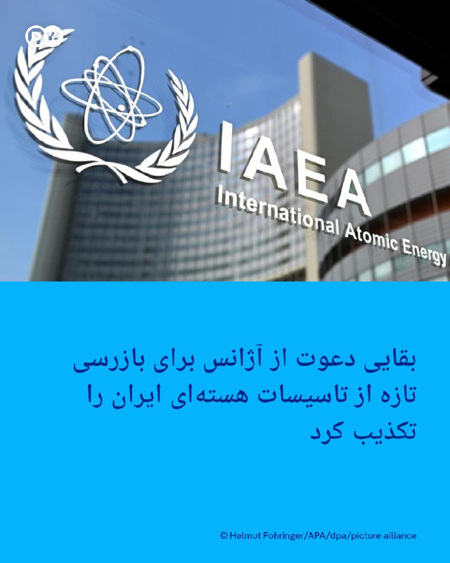

🔶بقایی دعوت از آژانس برای بازرسی تازه از تاسیسات هسته‌ای ایران را تکذیب کرد

اسماعیل بقایی، سخنگوی وزارت امور خارجه جمهوری اسلامی ایران، گزارش برخی رسانه‌ها درباره دعوت ایران از آژانس بین‌المللی انرژی اتمی برای بازرسی از تاسیسات هسته‌ای این کشور را تکذیب کرد. او با اشاره به یادداشت تفاهم خاتمه جنگ مورخ ۲۸ خرداد ۱۴۰۵ گفت بر اساس بند ۸ این سند، گفت‌وگو درباره موضوع هسته‌ای در بازه زمانی ۶۰ روزه انجام می‌شود و این روند نیز منوط به تحقق پیش‌زمینه‌های شروع مذاکرات وفق بند ۱۳ خواهد بود.

سخنگوی وزارت امور خارجه همچنین گفت بر اساس بند ۹ یادداشت تفاهم، در طول این دوره ۶۰ روزه، وضعیت فعلی برنامه هسته‌ای ایران حفظ خواهد شد.

به گفته او، بر همین اساس بازرسی از تاسیساتی مانند بوشهر که پیش‌تر نیز انجام می‌شد، ادامه پیدا می‌کند.

@dw_farsi

## Persian_Trend_Official — post 17593

  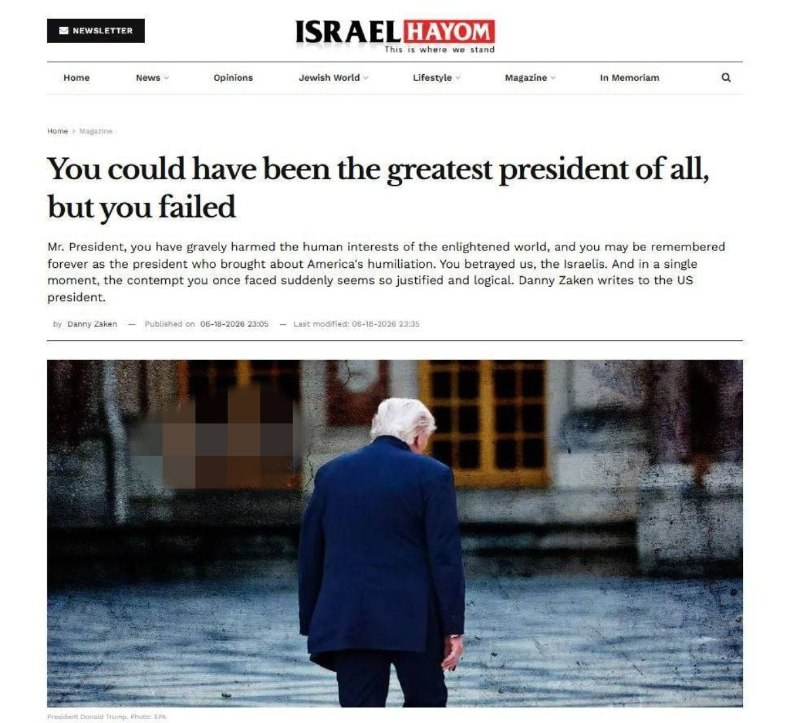

نشریه اسرائیل هیوم انتقادهای تندی علیه ترامپ مطرح کرده و او را متهم به فریب دادن اسرائیلی‌ها، آسیب زدن به منافع آمریکا و غرب و همچنین باعث تحقیر آمریکا دانسته و در ادامه گفته است که ترامپ می‌توانست بزرگ‌ترین رئیس‌جمهور تاریخ باشد اما با توافق با ایران در نهایت شکست خورد

👺Phantom

📌 @persian_trend_official
پرشین ترند | متفاوت‌ترین کانال نظامی

## Persian_Trend_Official — post 17592

گفتگوی تلفنی وزرای خارجه جمهوری اسلامی ایران و پاکستان

عراقچی در این تماس تلفنی از تلاش‌ها، ابتکارات و مساعی جمیله پاکستان در روند مذاکرات دیپلماتیک و رسیدن به یک یادداشت تفاهم قدردانی کرد.

عراقچی همچنین با اشاره به تعهد و مسئولیت ایالات متحده در قبال پایان دادن به جنگ در تمامی جبهه‌ها، از جمله لبنان، تأکید کرد که هرگونه نقض تعهدات مندرج در این یادداشت تفاهم متوجه آمریکا خواهد بود و نسبت به پیامدها و تبعات چنین اقدامی هشدار داد.

وزیر خارجه پاکستان نیز با استقبال از روند دیپلماتیک جاری، بر حمایت کشورش از تداوم مذاکرات و تلاش‌ها برای دستیابی به نتایج مثبت و پایدار تأکید و در خصوص موفقیت در مراحل آتی این روند ابراز امیدواری نمود.

طرفین در این گفتگو ضمن مرور و پیگیری برخی موضوعات دوجانبه، بر تداوم مشورت ها و رایزنی ها تاکید کردند.

📝 Amir

📌 @persian_trend_official
پرشین ترند | متفاوت‌ترین کانال نظامی

## IranianMinds — post 22959

  <a href="telegram/content/IranianMinds_22959_1781883414.mp4" target="_blank">🎬 Download video</a>

آقا این هیئته یا یه چیزه دیگه ؟

@IranianMinds

## IranianMinds — post 22958

  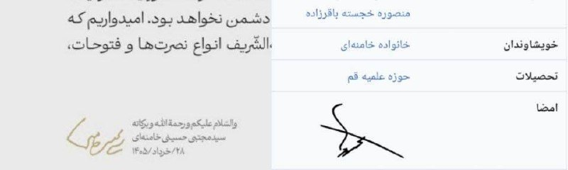

جالبه بدونید امضایی که از مجتبی خامنه ای توی برخی سایت ها ثبت شده با امضایی که روی بیانیه اش هست فرق داره.

@IranianMinds

## Hranews — post 113725

امروز چهارشنبه ۲۷ خردادماه، ماموران نیروی انتظامی در برخورد خشونت‌آمیز و توهین‌آمیز با شهروندان معترض ساکن روستای پشموکی از توابع شهرستان فاریاب، با استفاده از باتوم، مشت و لگد شماری از زنان را مورد ضرب‌وشتم قرار داده‌اند. در ویدیوهای منتشر شده افراد مسلح…

## alonews — post 129169

  <a href="telegram/content/alonews_129169_1781883416.webm" target="_blank">🎬 Download video</a>

👈وزارت امور خارجه ایران: عراقچی به همتای پاکستانی خود در مورد پیامدهای هرگونه نقض تعهدات یادداشت تفاهم هشدار داد

✅ @AloNews خبر جنگ

## alonews — post 129168

  <a href="telegram/content/alonews_129168_1781883416.webm" target="_blank">🎬 Download video</a>

👈بلومبرگ گزارش داد که ۱۱ نفتکش حامل مجموعاً ۲۰ میلیون بشکه نفت ایران این هفته بندر چابهار را ترک کردند

✅ @AloNews خبر جنگ

## alonews — post 129167

  <a href="telegram/content/alonews_129167_1781883416.webm" target="_blank">🎬 Download video</a>

👈فدراسیون فوتبال ایران بابت رد درخواست ورود به آمریکا ۲ روز قبل از بازی با بلژیک به فیفا شکایت کرد

✅ @AloNews خبر جنگ

## alonews — post 129166

  <a href="telegram/content/alonews_129166_1781883417.webm" target="_blank">🎬 Download video</a>

👈مالک شریعتی نماینده تهران: ظاهرا همراه با پیشنهاد جمع‌بندی شده‌ی شعام درباره متن ۱۴ بندی تفاهم‌نامه، یک متن تفسیری ۶ بندی نیز درباره اقداماتِ طراحی شده‌ی ایران، متناسب و متناظر با بدعهدی‌های احتمالی آمریکا، از سوی رییس‌جمهور محترم برای رهبر حکیم انقلاب ارسال و اجرای آنها تعهد شده است.

✅ @AloNews خبر جنگ

---
📅 بروزرسانی: 1405/03/29 18:55
---

## VahidOOnLine — post 246401

  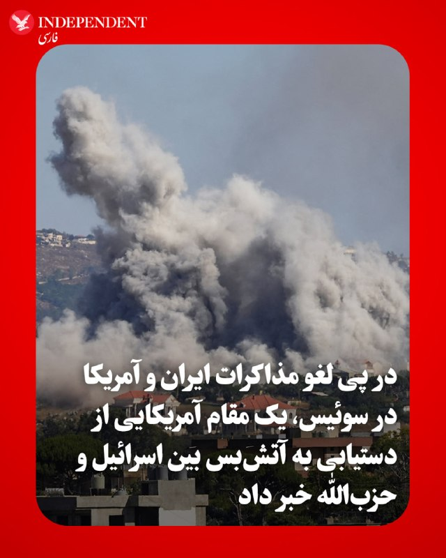

♦️ یک مقام ارشد آمریکایی روز جمعه ۲۹ خرداد اعلام کرد که در پی تشدید درگیری‌ها در لبنان، که شانس تبدیلِ تفاهم‌نامه موقت پایان جنگ با ایران به یک صلح پایدار در خاورمیانه را به خطر انداخته بود، اسرائیل و حزب‌الله بر سر برقرار آتش‌بس توافق کردند.

هم‌زمان با اوج‌گیری درگیری‌ها در لبنان، مذاکرات برنامه‌ریزی‌شده میان ایران و آمریکا که قرار بود روز جمعه در سوئیس برگزار شود، لغو شد. این رویداد ابهامات جدیدی را درباره زمان‌بندی مذاکرات حیاتیِ مربوط به بازگشایی کامل تنگه هرمز به روی کشتیرانی جهانی ایجاد کرده است.

این مقام ارشد آمریکایی اندکی پیش از ساعت ۴ بعدازظهر به وقت لبنان (۱۳:۰۰ به وقت گرینویچ) اعلام کرد که آتش‌بس از همین ساعت اجرایی می‌شود. او به شرط فاش نشدن نامش به خبرنگاران گفت: «برداشت ما این است که پس از تبادل آتش سنگین در ساعات اولیه امروز، اسرائیل و حزب‌الله اکنون در وضعیت آتش‌بس هستند.» او همچنین افزود که مذاکره‌کنندگان آمریکایی و قطری با کمک ایران این توافق را نهایی کرده‌اند.
‌🇸🇦 Indypersian

🤖 @VahidOOnLine

## WithYashar — post 15343

آسوشیتدپرس: ایران به امریکا اطلاع داده است اگر اسرائیل ادامه دهد. همه چیز متوقف می‌شود
@withyashar

## mwarmonitor — post 11221

📝 در این آشفته‌بازار که هر گوشه از نظامش را بچسبی، عده‌ای با تکیه بر شغل اجدادی و خانوادگی‌شان مشغول رانت‌خواری و چپاول هستند، ظهور پدیده‌هایی مثل ژیلا صادقی دیگر یک اتفاق نیست، بلکه یک کارکرد است؛ نوعی خدمات‌رسانی دوقابلیتی در صداوسیمای جمهوری اسلامی که در آن، هنر با وقاحت و تملق پیوند می‌خورد. این حرکات مشمئزکننده و غلت زدن در لجن‌زار چاپلوسی، چیزی جز ذات عریان کاسه‌لیسی و دستمال‌کشی او را به نمایش نمی‌گذارد. او با حقارت تمام و در اوج خفت و خواری، شرف خود را حراج می‌کند تا شاید چند صباحی بیشتر به زندگی انگل‌وارش در این ویترینِ پوسیده ادامه دهد.

@mwarmonitor

## FoxNewsTwitter — post 343171

  

Fox News (Twitter/X)

From discovering Ella Langley on the road... to meeting her backstage.

The viral German soccer fan behind one of the internet's favorite American road trips finally got his full-circle moment after weeks of sharing videos from across the country.

Millions watched as Freddy and his friends traveled across the U.S. for the World Cup, experiencing American food, culture, and unexpectedly becoming huge Ella Langley fans along the way.

Their videos caught the attention of listeners, radio stations, and eventually Langley herself.

## Persian_Trend_Official — post 17591

منابع محلی حملات پرتعداد توپخانه‌ای ارتش اسرائیل به سمت نبطیه و روستاهای نزدیک آن را گزارش میدهند.

📝 Amir

📌 @persian_trend_official
پرشین ترند | متفاوت‌ترین کانال نظامی

## Persian_Trend_Official — post 17590

  <a href="telegram/content/Persian_Trend_Official_17590_1781882760.mp4" target="_blank">🎬 Download video</a>

خبرنگار: چه کسی در جنگ ایران پیروز شد؟

کریسترسون، نخست وزیر سوئد: هنوز برای گفتن این خیلی زود است.

📝 Amir

📌 @persian_trend_official
پرشین ترند | متفاوت‌ترین کانال نظامی

## Persian_Trend_Official — post 17589

  <a href="telegram/content/Persian_Trend_Official_17589_1781882762.webm" target="_blank">🎬 Download video</a>

به گزارش CNN، با استناد به کتاب تغییر رژیم نوشته مگی هابرمن از نیویورک تایمز و جاناتان سوان، ترامپ در ابتدا تمایلی به درگیر شدن در جنگ علیه ایران به نمایندگی از اسرائیل نداشت و در اوایل دوره دوم ریاست جمهوری خود به یکی از منتقدان اسرائیل گفته بود که نمی‌خواهد در جنگی با ایران که توسط بنیامین نتانیاهو، نخست وزیر، هدایت می‌شود، شرکت کند.

این کتاب، دیدگاه‌های ترامپ در مورد نتانیاهو را متغیر توصیف می‌کند و می‌افزاید که او به طور خصوصی رهبر اسرائیل را به یکی دیگر از مشاورانش کلاهبردار توصیف کرده است. اصطلاحی که نویسندگان آن را یکی از شدیدترین توهین‌ها در واژگان ترامپ می‌دانند.

📝 Amir

📌 @persian_trend_official
پرشین ترند | متفاوت‌ترین کانال نظامی

## Persian_Trend_Official — post 17588

وزارت بهداشت لبنان اعلام کرد که در پی حملات هوایی گسترده نیروی هوایی اسرائیل به جنوب لبنان در روز های اخیر، دست کم 47 لبنانی کشته و 97 لبنانی زخمی شده‌اند.

📝 Amir

📌 @persian_trend_official
پرشین ترند | متفاوت‌ترین کانال نظامی

## RadioFarda — post 158511

  

🔸اسماعیل بقائی، سخنگوی وزارت خارجه ایران، روز جمعه دعوت جمهوری اسلامی از بازرسان آژانس بین‌المللی انرژی اتمی برای حضور در ایران و انجام بازرسی از تاسیسات هسته‌ای را رد کرد.

🔸او گفت: «بازرسی از تاسیساتی که دسترسی آژانس به آنها به‌دلیل حملات نظامی متوقف گردید، منوط به روند مذاکرات و نتیجه آن خواهد بود.»

🔸پیشتر جی‌دی ونس، معاون رئیس جمهور آمریکا پس از اعلام توافق اخیر در گفت‌وگو با شبکه ان‌بی‌سی گفته بود که بر اساس تفاهم‌نامه میان واشینگتن و تهران، بازرسان آژانس بین‌المللی انرژی اتمی «قطعاً» به ایران بازخواهند گشت.

🔸اسماعیل بقائی همچنین گفت در حال برنامه‌ریزی برای برگزاری یک نشست طی روزهای آینده هستیم.

🔸نشست بین نمایندگان ایران و ایالات متحده که قرار بود جمعه در سوئیس برگزار شود، لغو شد.

🔸سخنگوی وزارت خارجه جمهوری اسلامی اعلام کرد: «با توجه به اینکه امضای متن یادداشت تفاهم در بامداد ۲۸ خرداد به صورت دیجیتالی انجام شد، برگزاری نشست مزبور در سوئیس فوریت ندارد.»

🔸او همچنین گزارش‌ها درباره بسته شدن تنگه هرمز را «بی‌اساس» دانست و گفت کشتیرانی در این مسیر در حال انجام است.

@RadioFarda

## IranianMinds — post 22956

وضعیت هیئت های محرم :

@IranianMinds

## IranianMinds — post 22955

  <a href="telegram/content/IranianMinds_22955_1781882764.webm" target="_blank">🎬 Download video</a>

⚽ #امریکا Vs #استرالیا 
🏆
🔥

⏰ شروع ساعت  20:30

🔥20% شرط هدیه ویژه شارژ ارزهای دیجیتال

💳امکان شارژ با درگاه پرداخت

🎲 آپشن های متنوع با ضرایب بالا

🎁 10 درصد فری بت به ازای هر بار شارژ

⭐️ برداشت زیر 15 دقیقه دلاری

🔥   همراه با درگاه‌ #ریالی

1️⃣
2️⃣
3️⃣
4️⃣   
1️⃣
2️⃣
3️⃣
4️⃣

⛔در صورت فیلتر بودن از طریق VPN غیر از سرور انگلیس ( سرور 
🇺🇸 
🇩🇪 
🇨🇦
🇫🇮
🇹🇷
👇
👇 )

🇪🇺 https://trentivo6402.bar

✅کانال تلگرامی #رومابت 29
👇

🔵 @Romabet_official

## IranianMinds — post 22954

🔴 از همین الان مجدد به طور رسمی بین حزب الله و اسرائیل آتش بس برقرار شد. @IranianMinds

## alonews — post 129165

  <a href="telegram/content/alonews_129165_1781882765.webm" target="_blank">🎬 Download video</a>

👈ستاد فرماندهی مرکزی آمریکا:
جنگنده‌های اف-۱۶ به گشت‌زنی‌های خود در خاورمیانه ادامه می‌دهند و آماده مداخله هستند.

✅ @AloNews خبر جنگ

---
📅 بروزرسانی: 1405/03/29 18:45
---

## VahidOOnLine — post 246400

  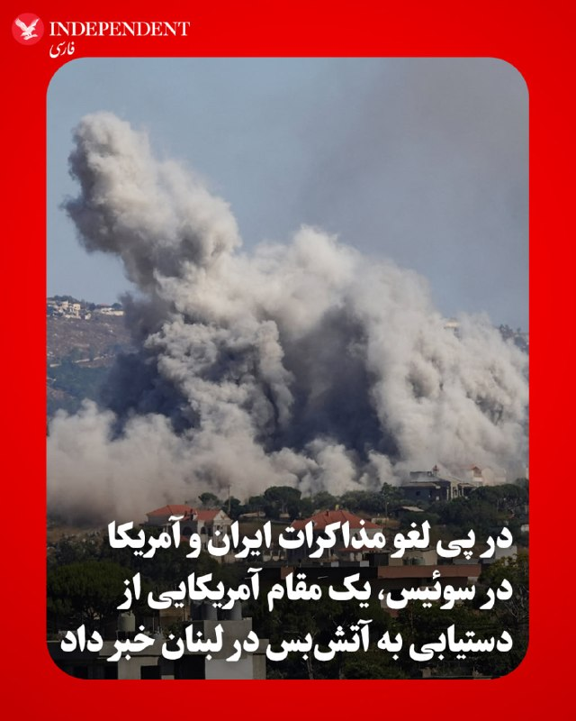

♦️ یک مقام ارشد آمریکایی روز جمعه ۲۹ خرداد اعلام کرد که در پی تشدید درگیری‌ها در لبنان، که شانس تبدیلِ تفاهم‌نامه موقت پایان جنگ با ایران به یک صلح پایدار در خاورمیانه را به خطر انداخته بود، اسرائیل و حزب‌الله بر سر برقرار آتش‌بس توافق کردند.

هم‌زمان با اوج‌گیری درگیری‌ها در لبنان، مذاکرات برنامه‌ریزی‌شده میان ایران و آمریکا که قرار بود روز جمعه در سوئیس برگزار شود، لغو شد. این رویداد ابهامات جدیدی را درباره زمان‌بندی مذاکرات حیاتیِ مربوط به بازگشایی کامل تنگه هرمز به روی کشتیرانی جهانی ایجاد کرده است.

این مقام ارشد آمریکایی اندکی پیش از ساعت ۴ بعدازظهر به وقت لبنان (۱۳:۰۰ به وقت گرینویچ) اعلام کرد که آتش‌بس از همین ساعت اجرایی می‌شود. او به شرط فاش نشدن نامش به خبرنگاران گفت: «برداشت ما این است که پس از تبادل آتش سنگین در ساعات اولیه امروز، اسرائیل و حزب‌الله اکنون در وضعیت آتش‌بس هستند.» او همچنین افزود که مذاکره‌کنندگان آمریکایی و قطری با کمک ایران این توافق را نهایی کرده‌اند.
‌🇸🇦 Indypersian

🤖 @VahidOOnLine

## WithYashar — post 15342

محمدمنان رییسی، نماینده مجلس:
خوش‌انصاف‌ها(منظورش قالیباف) مجلس رو باز کنید، رهبرم تنها مونده.
@withyashar
قالیبافم باز نمیکنه تا جا پاش محکم بشه

## WithYashar — post 15341

کانال 12 اسرائیل: نتانیاهو با مسئله لبنان سعی در خراب کردن تفاهم نامه بین آمریکا و ایران داره.
@withyashar

## IranIntlTV — post 343235

  <a href="telegram/content/IranIntlTV_343235_1781882111.mp4" target="_blank">🎬 Download video</a>

ایرانیانی که پس از کشتار معترضان در دی‌ماه ۱۴۰۴ از دونالد ترامپ درخواست کمک کرده بودند، می‌گویند با وجود فراز و فرودهای سیاسی و تحولات اخیر، هنوز امید خود را از دست نداده‌اند.
از وعده «کمک در راه است» تا جنگ، آتش‌بس و اکنون توافقی که برخی آن را پایان یک رویا می‌دانند، برای بخشی از ایرانیان این روند تنها یک توقف در مسیری است که هنوز به پایان نرسیده است.
فرشاد متقی، عضو تحریریه ایران‌اینترنشنال، در «پیوست» به این موضوع می‌پردازد
@iranintltv

## IranIntlTV — post 343234

  <a href="https://t.me/IranintlTV/343234" target="_blank">📎 Download file</a>

🎧نسخه صوتی اخبار شبانگاهی | جمعه ۲۹ خرداد
@iranintlTV

## IranIntlTV — post 343233

  <a href="telegram/content/IranIntlTV_343233_1781882113.mp4" target="_blank">🎬 Download video</a>

شهرداری ریچموند هیل از آغاز عملیات گودبرداری و ساخت بنای یادبود قربانیان پرواز PS752 در این شهر خبر داد. مقام های شهری می گویند سقوط این هواپیمای اوکراینی بزرگ ترین فاجعه کشته شدن دسته جمعی شهروندان ریچموند هیل در یک روز و در خاک خارجی بوده و هدف از این پروژه زنده نگه داشتن یاد جان باختگان به صورت دائمی است.

گزارش مهسا مرتضوی، خبرنگار ایران‌اینترنشنال
@iranintltv

## FarsiVOA — post 221197

🔺توافق اسرائیل و حزب‌الله برای اجرای آتش‌بس از عصر جمعه

▪️نشریه اکسیوس روز جمعه ۲۹ خرداد به نقل از دو مقام آمریکایی خبر داد که با میانجی‌گری قطر و ایالات متحده، اسرائیل و حزب‌الله موافقت کردند که از ۴ بعدازظهر به وقت محلی، آتش‌بس را به اجرا بگذارند.

⬇️ بیشتر بخوانید:
https://ir.voanews.com/a/iran-us-israel-lebanon-hezbollah-qatar-cease-fire-/8162643.html/?nocach=1

## BBCPersian — post 284403

🖊امیر عظیمی, سردبیر ارشد، بی‌بی‌سی فارسی

بیش از ۱۰۰ روز پس از آغاز حملات آمریکا و اسرائیل به ایران، هر دو طرف مدعی پیروزی هستند؛ نشانه‌ای از این‌که هر یک تا چه اندازه به راهی برای خروج از بحران نیاز داشتند.

تفاهمی که بین دو طرف امضا شده رسما به درگیری‌ها پایان داده است، اما مذاکرات دشوارتر تازه آغاز شده است.

هر دو طرف این توافق را در داخل کشور خود به عنوان یک پیروزی معرفی کرده‌اند، اما همان‌طور که تحلیلگران ما توضیح می‌دهند، هنوز نتوانسته‌اند افکار عمومی را به طور کامل قانع کنند و منتقدان داخلی در هر دو سو معتقدند امتیازهای بیش از اندازه‌ای داده شده است.

برای خواندن مطلب کامل 🔽
https://bbc.in/4xCXm7t
📷Iran's Presidential website/WANA via REUTERS - White House Instagram

## Dirty_Kids — post 392585

  <a href="telegram/content/Dirty_Kids_392585_1781882115.mp4" target="_blank">🎬 Download video</a>

تو همین حین که فضاپیمای آمریکا رفت کره ماه و اومد شیر تعزیه ما واجبی زده به سر و صورتش نیو فیس شده😂

@Dirty_Kids 👻

## Dirty_Kids — post 392584

  <a href="telegram/content/Dirty_Kids_392584_1781882117.mp4" target="_blank">🎬 Download video</a>

ترامپ بعد از نشست G7 پشت سر جرجیا گفته: این زن همه ش التماس میکرد باهاش عکس بگیرم. حالا جرجیا در جوابش گفته:دروغه، شوکه شده‌‌م. نمی‌دونم چرا ترامپ با متحدانش این‌طور رفتار می‌کنه؟
ولی یک چیز رو به خاطر داشته باش: من و ایتالیا هرگز التماس نمی‌کنیم!

@Dirty_Kids 👻

---
📅 بروزرسانی: 1405/03/29 18:35
---

## VahidOOnLine — post 246399

  <a href="telegram/content/VahidOOnLine_246399_1781881521.mp4" target="_blank">🎬 Download video</a>

یک شهروند در پیامی صوتی به ایران اینترنشنال، از مردم ایران خواست که امید خود را از دست ندهند و گفت: «معترضان در دی‌ماه برای ترامپ به خیابان‌ها نیامدند و هنوز هم هرگاه لازم باشد، مردم به خاطر خودشان اعتراضات را آغاز خواهند کرد.»
‌🏁 🇬🇧 IranintlTV

🤖 @VahidOOnLine

## VahidOOnLine — post 246398

  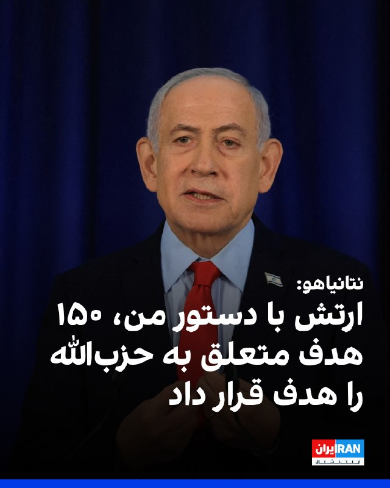

بنیامین نتانیاهو، نخست‌وزیر اسرائیل، در شبکه ایکس نوشت: «با دستور من، ارتش اسرائیل ۱۵۰ هدف متعلق به حزب‌الله در لبنان را هدف قرار داد و ده‌ها نیروی مسلح این گروه را از بین برد.»

پیش‌تر افی دفرین، سخنگوی ارتش اسرائیل در کنفرانس خبری اعلام کرده بود: «از شب گذشته تاکنون به بیش از ۱۰۰ هدف حزب‌الله حمله کرده‌ایم و این حملات را تا هر زمان که لازم باشد ادامه خواهیم داد.»
‌🏁 🇬🇧 IranintlTV

🤖 @VahidOOnLine

## VahidOOnLine — post 246397

  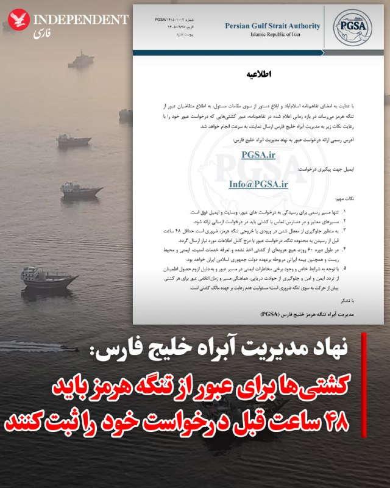

♦️ سازمان ناوبری ایران روز جمعه ۲۹ خرداد اعلام کرد علی‌رغم بازگشایی تنگه هرمز در پی توافق میان جمهوری اسلامی ایران و آمریکا برای پایان دادن به جنگ، تمامی کشتی‌هایی که خواهان عبور از این آبراه هستند باید «۴۸ ساعت قبل» درخواست تردد خود را ثبت کنند.

نهاد آبراه خلیج فارس، که در دوران آتش‌بس برای نظارت بر تنگه هرمز ایجاد شده، در حساب کاربری خود در شبکه اجتماعی ایکس نوشت: «به منظور جلوگیری از ایجاد هرگونه تأخیر در ورود یا خروج از تنگه هرمز، ضروری است که درخواست‌های تردد به همراه تمامی اطلاعات مورد نیاز، حداقل ۴۸ ساعت پیش از رسیدن به منطقه تنگه ارسال شوند.»

در این بیانیه هم‌چنین تاکید شده که مطابق مفاد تفاهم‌نامه، در بازه ۶۰ روزه مذاکرات، هیچ هزینه‌ای کشتی‌ها اخذ نشده و تعرفه‌های خدمات امنیت، محیط زیست و بیمه ایرانی مربوطه به عهده جمهوری اسلامی است.
‌🇸🇦 Indypersian

🤖 @VahidOOnLine

## DEJradio — post 5828

  <a href="telegram/content/DEJradio_5828_1781881525.webm" target="_blank">🎬 Download video</a>

🔺📢 جمهوری اسلامی: مذاکرات با آمریکا فوریت ندارد!

پس از اعلام رسمی لغو نشست هیأت جمهوری اسلامی و هیأت آمریکایی در سوئیس، اسحاق دار، وزیر امور خارجه پاکستان، مدعی شد مشغله برخی مقام‌ها به‌دلیل مراسم ماه محرم علت لغو این نشست بوده است.

این در حالی است که هنگام تعیین زمان نشست، این تلاقی زمانی از پیش مشخص و بدیهی بود.

هم‌زمان، اسماعیل بقایی، سخنگوی وزارت خارجه جمهوری اسلامی، گفت رایزنی‌ها از طریق میانجی‌ها ادامه دارد و در صورت فراهم شدن شرایط لازم، مذاکرات از سر گرفته خواهد شد. او همچنین اعلام کرد با توجه به امضای دیجیتال تفاهم‌نامه، برگزاری نشست حضوری در سوئیس فوریت نداشته است.

بقایی بر ضرورت اجرای مفاد تفاهم‌نامه، از جمله آتش‌بس در لبنان، تأکید کرد؛ موضوعی که در حالی مطرح می‌شود که درگیری‌ها میان اسرائیل و حزب‌الله همچنان ادامه دارد.

#مذاکرات #آتشبس
@DEJradio

## IranIntlTV — post 343232

  <a href="telegram/content/IranIntlTV_343232_1781881526.mp4" target="_blank">🎬 Download video</a>

یک شهروند در پیامی صوتی به ایران اینترنشنال، از مردم ایران خواست که امید خود را از دست ندهند و گفت: «معترضان در دی‌ماه برای ترامپ به خیابان‌ها نیامدند و هنوز هم هرگاه لازم باشد، مردم به خاطر خودشان اعتراضات را آغاز خواهند کرد.»

## IranIntlTV — post 343231

  

بنیامین نتانیاهو، نخست‌وزیر اسرائیل، در شبکه ایکس نوشت: «با دستور من، ارتش اسرائیل ۱۵۰ هدف متعلق به حزب‌الله در لبنان را هدف قرار داد و ده‌ها نیروی مسلح این گروه را از بین برد.»

پیش‌تر افی دفرین، سخنگوی ارتش اسرائیل در کنفرانس خبری اعلام کرده بود: «از شب گذشته تاکنون به بیش از ۱۰۰ هدف حزب‌الله حمله کرده‌ایم و این حملات را تا هر زمان که لازم باشد ادامه خواهیم داد.»
https://iranintl.com/202606197548

## Dirty_Kids — post 392582

محرم امسال، وضعیت عجیبی داره
🍑

@Dirty_Kids 👻

## alonews — post 129162

  <a href="telegram/content/alonews_129162_1781881529.mp4" target="_blank">🎬 Download video</a>

👈حملات به لبنان ادامه دارد

✅ @AloNews خبر جنگ

---
📅 بروزرسانی: 1405/03/29 18:26
---

## pm_afshaa — post 94401

  <a href="telegram/content/pm_afshaa_94401_1781880984.webm" target="_blank">🎬 Download video</a>

🔴محمدمنان رییسی، نماینده مجلس: خوش‌انصاف‌ها مجلس رو باز کنید، رهبرم تنها مونده. 
💧 Rainbet.com the #1 Non-KYC Crypto Casino & Sportsbook @rainbetcom 
😁 @Pm_Afshaa

## pm_afshaa — post 94400

  <a href="telegram/content/pm_afshaa_94400_1781880985.webm" target="_blank">🎬 Download video</a>

🔴محمدمنان رییسی، نماینده مجلس:
خوش‌انصاف‌ها مجلس رو باز کنید، رهبرم تنها مونده.

💧 Rainbet.com the #1 Non-KYC Crypto Casino & Sportsbook @rainbetcom

😁 @Pm_Afshaa

## Iliaen — post 4502

پس خبر برقراری آتش‌بس در لبنان از ساعت ۴ عصر و بازگشت دوباره تنگه هرمز به وضعیت تفاهم، سخنگوی وزارت خارجه جمهوری اسلامی، تمام تنش‌های امروز را تکذیب کرد و گفت هیچ مشکلی جهت تردد وجود ندارد.

به عبارت دیگر نه خانی آمده ، نه خانی رفته است!

این در صورتی است که براساس گزارش از یک منبع در سیریک، یک ملوان کشتی در نزدیک تنگه هرمز و اسناد مرتبط به پیام سپاه، این تنش در ساعات ۱۳:۴۰ الی ۱۴:۱۵ امروز جمعه درجهت برقراری آتش‌بس در لبنان ادامه داشت و سپس با دخالت قطر و ایالات متحده، تصمیم بر حل و فصل موضوع بدون رسانه‌ای شدن شد.

@iliaen

## DW_Farsi — post 126188

🔶تمدید یک ساله تحریم‌های روسیه توسط اتحادیه اروپا

یک سخنگوی آنتونیو کوستا، رئیس شورای اروپا، اعلام کرد رهبران کشورهای عضو اتحادیه اروپا شامگاه پنج‌شنبه ۱۸ ژوئن (۲۸ خرداد) در نشستی در بروکسل بر سر تمدید یک ساله تحریم‌ها علیه روسیه موافقت کردند.

اتحادیه اروپا از زمان آغاز حمله نظامی روسیه به اوکراین در سال ۲۰۲۲، اقدامات تنبیهی گسترده‌ای را علیه مسکو اعمال کرده است. این تحریم‌ها به ویژه درآمدهای روسیه از طریق فروش جهانی نفت و سوخت‌های فسیلی، صنعت تسلیحات این کشور و مؤسسات مالی را هدف قرار می‌دهد.

بنا بر گزارش‌ها، متن قانونی تمدید یک ساله تحریم‌ها علیه روسیه در هفته‌های آینده به تصویب شورای وزیران اتحادیه اروپا برسد، هر چند این اقدام بیشتر جنبه تشریفاتی دارد. رهبران اتحادیه اروپا در بیانیه پایانی نشست خود تأکید کرده‌اند که این اتحادیه مصمم است "فشار بر روسیه را همچنان افزایش دهد و اقتصاد جنگی این کشور را بیش از پیش تضعیف کند تا روسیه به جنگ تهاجمی خود پایان داده و به طور جدی وارد مذاکرات صلح شود".

@dw_farsi

## IranianMinds — post 22953

  <a href="telegram/content/IranianMinds_22953_1781880986.mp4" target="_blank">🎬 Download video</a>

🔴این دیگه چیه؟ شیر هست؟ واجبی بهش زدن؟

@IranianMinds

## BBCPersian — post 284402

  <a href="telegram/content/BBCPersian_284402_1781880989.mp4" target="_blank">🎬 Download video</a>

مسکو دیروز ۲۸ خرداد (۱۸ ژوئن) هدف بزرگ‌ترین حمله هوایی اوکراین، از زمان آغاز جنگ تا کنون قرار گرفت.
 بر اثر این حمله پالایشگاه نفت مسکو آتش گرفت و ستون‌های عظیم دود به آسمان بلند شد.
 
وزارت دفاع روسیه اعلام کرد که در طول ۲۴ ساعت، تقریباً هزار پهپاد و چهار موشک کروز اوکراین را در سراسر این کشور رهگیری و منهدم کرده است.
 مقامات اوکراین هم گفتند این حمله پاسخی به حمله روسیه به یک صومعه تاریخی در کی‌یف بود که ۱۵ ژوئن صورت گرفته بود.
 
ساکنان جنوب ‌شرق مسکو به بی‌بی‌سی گفتند که در پی انفجار پالایشگاه، بارانی ریز، لکه‌های «سیاه و ناخوشایند» روی لباس‌هایشان برجای گذاشته است، در صورتی که مقامات مسکو بارش هرگونه «باران نفتی» را رد کردند.
  
سرگی لاوروف وزیر خارجه روسیه در واکنش به این حمله گفت که حملات تلافی‌حویانه به اوکراین «در مقیاسی گسترده» انجام خواهد شد و افزود که «مدت‌هاست قانع شده که حرف به‌تنهایی کافی نیست».

@bbcpersian

## Dirty_Kids — post 392581

  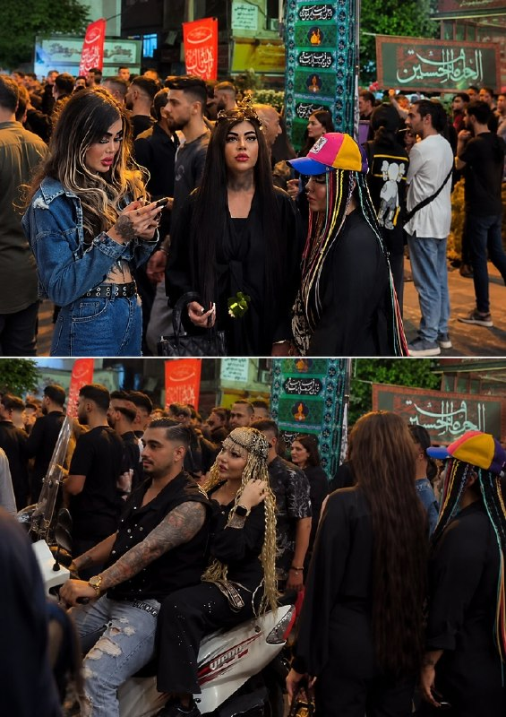

‏امام حسین همه‌ی جنـــــده‌هاشو فرا خوانده:))

قبلاً تو هیئت هاشون شیر میبردن الان پلنگ میبرن

@Dirty_Kids 👻

## Dirty_Kids — post 392580

  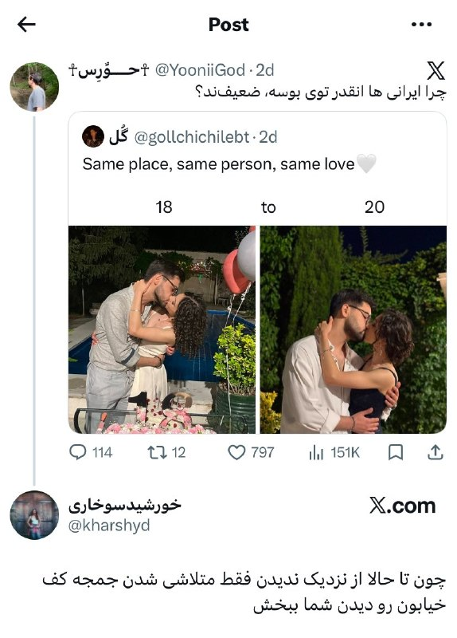

‏یه چیزی گفت که تا ابد می‌تونم بشینم گریه کنم براش.
پ.ن: اکانت حورس سایبریه.

@Dirty_Kids 👻

## Dirty_Kids — post 392579

  

بیچاره هی پاش رو نگاه می‌کرد باورش نمی‌شد چی داره میبینه.

(بهترین بازیکن کانادا)

@Dirty_Kids 👻

## alonews — post 129161

  <a href="telegram/content/alonews_129161_1781880993.webm" target="_blank">🎬 Download video</a>

👈محمدمنان رییسی، نماینده مجلس:
خوش‌انصاف‌ها(منظورش قالیباف) مجلس رو باز کنید، رهبرم تنها مونده.

✅ @AloNews خبر جنگ

---
📅 بروزرسانی: 1405/03/29 18:15
---

## VahidOOnLine — post 246396

  

ارتش جمهوری اسلامی، جمعه، ۲۹ خرداد در بیانیه‌ای اعلام کرد: «دوشادوش سپاه پاسداران در صورت هرگونه بدعهدی از سوی دشمن، دست بر ماشه و گوش به فرمان رهبر، هر روز بر توان رزم خود افزوده و آماده دفاع از امنیت و منافع ملت هستیم.»

در بخشی از این بیانیه آمده است: «آمادگی نیروهای مسلح، دشمن را ناگزیر کرد تا مسیر آتش‌بس و تفاهم را در پیش بگیرد.»
‌🏁 🇬🇧 IranintlTV

🤖 @VahidOOnLine

## VahidOOnLine — post 246395

  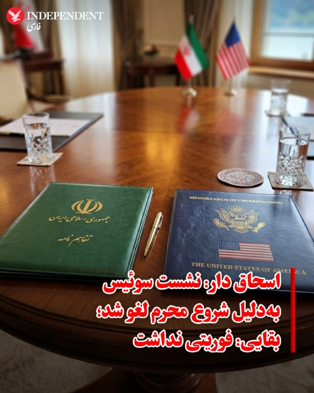

♦️ اسحاق دار، وزیر امور خارجه پاکستان که نقش میانجی را در مذاکرات میان تهران و واشنگتن بازی کرد، روز جمعه ۲۹ خرداد، علت لغو مذاکرات حضوری نمایندگان ایران و آمریکا در سوئیس را «مشغله برخی مسئولان به‌دلیل مراسم‌های ماه محرم» عنوان کرد. این توجیه در حالی مطرح شد که ماه محرم، از روز سه‌شنبه آغاز شده و در زمان تعیین روز جمعه به عنوان اولین نشست حضوری دو طرف نیز این همزمانی بدیهی بوده است.

از سوی دیگر، اسماعیل بقایی، سخنگوی وزارت خارجه جمهوری اسلامی، در توضیحاتی درباره لغو نشست سوئیس، تنها اعلام کرد که رایزنی‌های لازم از طریق میانجی‌ها ادامه دارد و در صورت «فراهم شدن شرایط لازم برای شروع مذاکرات» اطلاع‌رسانی انجام خواهد گرفت. بقایی همچنین اشاره کرد که پیش‌تر قرار بود مراسم رسمی امضای تفاهم‌نامه روز جمعه به‌صورت حضوری برگزار شود اما با توجه به امضای دیجیتال آن، برگزاری نشست در سوئیس «فوریت» نداشت.

بقایی به ضرورت اجرایی شدن بندهای تفاهم‌نامه از جمله بند اول که شامل توقف جنگ در لبنان می‌شود نیز اشاره کرد. این در حالی است که اسرائیل و حزب‌الله، روز جمعه حملات متقابل خود را ادامه داده‌اند.
‌🇸🇦 Indypersian

🤖 @VahidOOnLine

## WithYashar — post 15340

خبرگزاری تسنیم:
هر دقیقه باز بودن تنگه هرمز خسارت مهمیه؛ اگر آمریکا فشار انرژی رو از روی خودش تخلیه کنه، وقیح‌تر و تهاجمی‌تر هم خواهد شد.
@withyashar

## WithYashar — post 15339

حمزه صفوی، فرزند مشاور عالی رهبری افشا کرد:

یک روز در چهل سال گذشته نبوده که ایران سودای ساخت بمب اتم نداشته باشد
تمام اسناد IAEA، تورقوزآباد و آماد نشان می‌دهد که حکومت تمام تلاش خود را کرده اما همهٔ اینها در بزنگاه‌های تاریخی لو رفته‌ است.
کرهٔ شمالی وقتی در دههٔ ۱۹۹۰ با آمریکا مذاکره هسته‌ای داشت، در دو سایت دیگر خود پروژهٔ پیش‌برندهٔ بمب اتمی را داشته و لو نرفته اما دو سایت فوردو و نطنز را ما اعلام نکردیم بلکه لو رفتند.
برنامه هسته‌ای ایران، گران‌ترین برنامه هسته‌ای جهان، نه برق آورد، نه بمب، نه امنیت
@withyashar

## pm_afshaa — post 94399

  <a href="telegram/content/pm_afshaa_94399_1781880304.webm" target="_blank">🎬 Download video</a>

🔴کانال 12 اسرائیل:
نتانیاهو با مسئله لبنان سعی در خراب کردن تفاهم نامه بین آمریکا و ایران داره.

💧 Rainbet.com the #1 Non-KYC Crypto Casino & Sportsbook @rainbetcom

😁 @Pm_Afshaa

## IranIntlTV — post 343230

  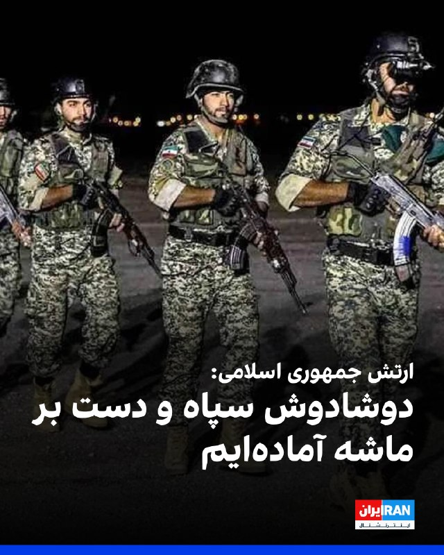

ارتش جمهوری اسلامی، جمعه، ۲۹ خرداد در بیانیه‌ای اعلام کرد: «دوشادوش سپاه پاسداران در صورت هرگونه بدعهدی از سوی دشمن، دست بر ماشه و گوش به فرمان رهبر، هر روز بر توان رزم خود افزوده و آماده دفاع از امنیت و منافع ملت هستیم.»

در بخشی از این بیانیه آمده است: «آمادگی نیروهای مسلح، دشمن را ناگزیر کرد تا مسیر آتش‌بس و تفاهم را در پیش بگیرد.»
https://iranintl.com/202606198059

## FarsiVOA — post 221195

🔺کارشناسان سازمان ملل: توافق آمریکا و جمهوری اسلامی نباید حقوق بشر را نادیده بگیرد

▪️مای ساتو، گزارشگر ویژه سازمان ملل متحد در امور حقوق بشر ایران، به همراه شماری دیگر از کارشناسان مستقل این سازمان هشدار داده است که هرگونه توافق نهایی میان ایالات متحده و جمهوری اسلامی که وضعیت حقوق بشر در ایران را نادیده بگیرد، «اساساً ناقص» خواهد بود.

⬇️ بیشتر بخوانید:
https://ir.voanews.com/a/un-experts-warn-against-rights-free-deal/8162634.html/?nocach=1

## DW_Farsi — post 126187

  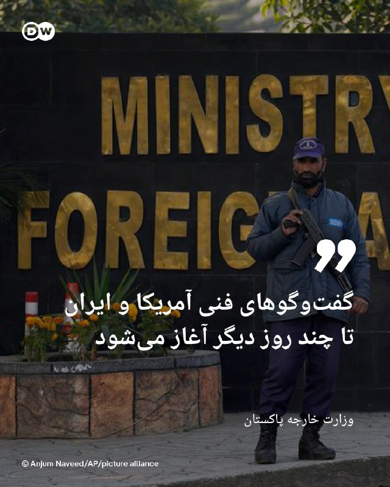

🔶پاکستان: گفت‌وگوهای فنی آمریکا و ایران تا چند روز دیگر آغاز می‌شود

وزارت خارجه پاکستان اعلام کرد گفت‌وگوهای فنی میان ایالات متحده و ایران، با وجود لغو مراسم امضای برنامه‌ریزی‌شده در سوئیس، احتمالا در روزهای آینده آغاز خواهد شد. مقام‌های این وزارتخانه گفته‌اند توافق میان واشنگتن و تهران پیش‌تر امضا شده و اکنون وارد مرحله اجرا شده است.

مقام‌های وزارت خارجه پاکستان گفته‌اند گفت‌وگوهای فنی را نمی‌توان به تعویق انداخت و این مذاکرات احتمالا ظرف چند روز آینده آغاز می‌شود.

به گفته آن‌ها، دور دوم و گسترده‌تر مذاکرات نیز قرار است پس از ماه محرم برگزار شود. این گفت‌وگوها بر اجرای توافق امضاشده و رسیدگی به مسائل فنی و جزئیات میان دو کشور متمرکز خواهد بود.

بر اساس این گزارش، قرار بود توافق در ابتدا در سوئیس به‌طور رسمی توسط جی‌دی ونس، معاون رئیس‌جمهوری آمریکا، محمدباقر قالیباف، رئیس مجلس ایران، و محمد اسحاق‌دار، معاون نخست‌وزیر و وزیر خارجه پاکستان، امضا شود.

@dw_farsi

## BBCPersian — post 284401

🔻بورگن‌اشتوک سوئیس در انتظار مذاکراتی که آغاز نشد,باران عباسی، خبرنگار اعزامی بی‌بی‌سی به سوئیس

با وجود تعویق مذاکرات ایران و آمریکا، تدابیر امنیتی همچنان در اطراف هتل بورگن‌اشتوک در مرکز سوئیس برقرار است؛ جایی که قرار بود امروز هیئت‌های دو کشور اولین دور از گفتگوها بعد از امضای تفاهم‌نامه پایان جنگ را آغاز کنند.

پلیس همچنان در ورودی‌های این اقامتگاه مجلل مستقر است و مقام‌های سوئیسی می‌گویند آمادگی خود را برای میزبانی مذاکرات حفظ کرده‌اند و مقدمات برگزاری آن همچنان ادامه دارد.

کاخ سفید علت تعویق را «مسائل تدارکاتی» عنوان کرده و در پی آن، سفر جی‌دی ونس، معاون رئیس‌جمهوری آمریکا، به سوئیس نیز لغو شد. اما هم‌زمانی این تصمیم با تشدید دوباره درگیری‌ها در لبنان، گمانه‌زنی‌هایی را درباره ارتباط این دو رویداد به وجود آورد.

بر اساس متن توافق اولیه ایران و آمریکا، آتش‌بس باید در همه جبهه‌ها، از جمله لبنان، برقرار شود و راه را برای آغاز مذاکرات درباره برنامه هسته‌ای ایران هموار کند. اما تشدید درگیری‌ها در لبنان، آینده این روند را با ابهام روبه‌رو کرده است.

حالا یک مقام آمریکایی می‌گوید اسرائیل و حزب‌الله بر سر برقراری آتش‌بس به توافق رسیده‌اند؛ موضوعی که می‌تواند زمینه را برای ازسرگیری مذاکرات فراهم کند. اما فعلاً در بورگن‌اشتوک، اتاق‌های مذاکره همچنان خالی مانده‌اند؛ نشانه‌ای دیگر از اینکه رسیدن به یک توافق نهایی در مهلت شصت‌روزه‌ای که ایران و آمریکا تعیین کرده‌اند، با توجه به پیچیدگی پرونده هسته‌ای و تنش‌های منطقه‌ای، بسیار بلندپروازانه به نظر می‌رسد.

https://bbc.in/4vgfIJP
@BBCPersian

## Hranews — post 113724

اموال شماری از شهروندان در استان کرمان توقیف شد

❗️
❗️
❗️
❗️
❗️– رئیس کل دادگستری استان کرمان از شناسایی و توقیف اموال شماری از شهروندان در این استان به دلیل آنچه همکاری در اقدامات علیه امنیت ملی عنوان کرده است، خبر داد.

ادامه مطلب

#توقیف_اموال

↘️
@hranews_bot تماس ✉️ -  @Hranews  کانال هرانا 🆑

---
📅 بروزرسانی: 1405/03/29 18:05
---

## VahidOOnLine — post 246394

  

اسماعیل بقائی، سخنگوی وزارت خارجه جمهوری اسلامی در گفت‌وگو با خبرنگاران، اخبار منتشره در برخی رسانه‌ها مبنی بر دعوت جمهوری اسلامی از آژانس بین‌المللی انرژی اتمی برای بازرسی از تاسیسات هسته‌ای را تکذیب کرد.

بقائی گفت که بر اساس بند ۹ یادداشت تفاهم، در طول دوره ۶۰ روزه، وضعیت فعلی برنامه هسته‌ای ایران حفظ خواهد شد و بر این اساس، بازرسی از تاسیساتی مانند بوشهر که تاکنون انجام می‌شد، ادامه می‌یابد اما بازرسی از تاسیساتی که دسترسی آژانس به آن‌ها به‌دلیل حملات نظامی آمریکا و اسرائیل متوقف شد، منوط به روند مذاکرات و نتیجه آن خواهد بود.
‌🏁 🇬🇧 IranintlTV

🤖 @VahidOOnLine

## FoxNewsTwitter — post 343170

  <a href="telegram/content/FoxNewsTwitter_343170_1781879720.mp4" target="_blank">🎬 Download video</a>

Fox News (Twitter/X)

A ceasefire is now in effect in southern Lebanon after weeks of escalating violence and the overnight reporting of four Israeli soldiers being killed.

The agreement was reportedly brokered by Qatar, the United States, and with help from Iran.

President Trump and the White House also sending a message to Israel, warning that the country needs to moderate its response to Lebanon, @Max_Gorden reports.

## DEJradio — post 5827

  <a href="telegram/content/DEJradio_5827_1781879722.webm" target="_blank">🎬 Download video</a>

🔺📢 دونالد ترامپ: جمهوری اسلامی از سر استیصال مجبور به مذاکره شد

‏دونالد ترامپ، رییس‌جمهوری آمریکا، جمعه ۲۹ خرداد در پیامی در تروت سوشال نوشت که جمهوری اسلامی از موضع ضعف وارد مذاکره با آمریکا شده است. ترامپ نوشت: «ما از سر استیصال وارد مذاکره نشدیم؛ این ایران بود که چنین کرد. آن‌ها تمام شده‌اند.»

او همچنین با اشاره به دوره ۶۰ روزه اجرای یادداشت تفاهم میان تهران و واشینگتن افزود: «ما این دوره ۶۰ روزه را تا پایان دنبال خواهیم کرد.»

رییس‌جمهوری آمریکا در ادامه تاکید کرد: «هیچ پولی به آن‌ها داده نخواهد شد؛ حتی ۱۰ سنت.»

#مذاکرات #ترامپ
@DEJradio

## IranIntlTV — post 343229

🔻چرا دستیابی به توافق هسته‌ای جدید دشوارتر از دوران برجام است؟

سایمون گس، سفیر سابق بریتانیا در تهران، هشدار داد دستیابی به یک توافق هسته‌ای جدید با جمهوری اسلامی در شرایط کنونی به‌مراتب دشوارتر از زمان برجام خواهد بود، زیرا سطح بی‌اعتمادی میان طرف‌های مذاکره افزایش یافته و دامنه اختلافات نیز گسترده‌تر شده است.

گس که در گفت‌وگوهای هسته‌ای سال ۲۰۱۵ به‌عنوان مذاکره‌کننده ارشد بریتانیا حضور داشت، جمعه ۲۹ خرداد در یادداشتی در روزنامه فایننشال‌تایمز، به مقایسه روند مذاکرات برجام با گفت‌وگوهای آینده در چارچوب یادداشت تفاهم اخیر میان تهران و واشینگتن پرداخت.

آمریکا و حکومت ایران ۲۵ خرداد از دستیابی به تفاهمی برای پایان جنگ خبر دادند. این یادداشت تفاهم ۲۸ خرداد به امضای دونالد ترامپ، رییس‌جمهوری آمریکا و مسعود پزشکیان، رییس دولت جمهوری اسلامی، رسید.

بر اساس این سند، یک دوره ۶۰ روزه برای گفت‌وگوهای تخصصی در نظر گرفته شده است؛ مذاکراتی که قرار است بر موضوعات حساسی همچون سرنوشت ذخایر اورانیوم غنی‌شده حکومت ایران و چگونگی رفع تحریم‌ها تمرکز داشته باشد.

گس در یادداشت خود نوشت: «۶۰ روز زمان کافی نخواهد بود. مذاکرات برجام ۲۰ ماه به طول انجامید. اکنون نیز به زمان نیاز است، زیرا مسائل مطرح‌شده فنی و پیچیده هستند و در فضایی آکنده از بی‌اعتمادی دنبال می‌شوند.»

به گفته این دیپلمات پیشین، موضوع مذاکرات صرفا به توقف غنی‌سازی یا تعیین تکلیف ذخایر اورانیوم محدود نمی‌شود، بلکه مسائلی همچون نحوه و زمان‌بندی بازرسی‌های آژانس بین‌المللی انرژی اتمی و سازوکارهای نظارتی نیز باید به‌دقت مورد توافق قرار گیرند.

رافائل گروسی، مدیرکل آژانس بین‌المللی انرژی اتمی، پیش‌تر بر لزوم نقش‌آفرینی این نهاد در هرگونه توافق احتمالی میان تهران و واشینگتن تاکید کرد و هشدار داد توافقی که فاقد سازوکار موثر راستی‌آزمایی باشد، در عمل «توهمی از توافق» خواهد بود.
جمهوری اسلامی با برچیدن برنامه هسته‌ای خود موافقت نمی‌کند

گس در ادامه یادداشت خود نوشت مذاکرات پیش‌رو تنها به چالش‌های فنی محدود نخواهد بود، بلکه با مباحث سیاسی دشواری نیز در داخل کشورهای طرف مذاکره همراه خواهد شد.

به گفته او، مذاکره‌کنندگان ناچار خواهند بود هرگونه امتیازدهی را برای افکار عمومی و نهادهای سیاسی کشور خود توجیه کنند.

این مقام سابق بریتانیایی با اشاره به تحولات داخلی جمهوری اسلامی افزود فضای سیاسی در تهران نسبت به دوران مذاکرات برجام «سخت‌تر» شده است؛ نهادهای امنیتی، به‌ویژه سپاه پاسداران، نفوذ بیشتری پیدا کرده‌اند و بسیاری از افراد وابسته به این نهاد معتقدند درگیری‌ها دیر یا زود از سر گرفته خواهد شد و مذاکرات چیزی جز ادامه همان رویارویی از مسیری متفاوت نیست.

گس تاکید کرد جمهوری اسلامی ممکن است با اعمال «محدودیت‌های معنادار و زمان‌دار» بر برنامه هسته‌ای خود موافقت کند، اما حاضر نخواهد شد به حذف کامل این برنامه تن دهد.

به گفته او، تهران همچنین تجربه کشورهایی مانند لیبی و اوکراین را که از برنامه‌ هسته‌ای خود صرف‌نظر کردند، زیر نظر داشته و این موضوع بر محاسبات جمهوری اسلامی تاثیرگذار بوده است.

۲۸ خرداد، مجتبی خامنه‌ای، رهبر جمهوری اسلامی، در پیامی مکتوب اعلام کرد با وجود آنکه «نظر دیگری» نسبت به تفاهم اخیر با ایالات متحده داشته، با تعهد پزشکیان در خصوص «پاسداشت حقوق ملت ایران و جبهه مقاومت»، با آن موافقت کرده است.
سایه بی‌اعتمادی بر مذاکرات

گس در ادامه یادداشت خود نوشت جمهوری اسلامی در موضوع رفع تحریم‌ها دیگر حاضر به پذیرش توافقی مشابه برجام نخواهد بود، زیرا از نگاه تهران، وعده لغو تحریم‌ها در چارچوب آن توافق هرگز به‌طور کامل و موثر محقق نشد.

او افزود در مذاکرات آتی، امتیازهای هسته‌ای جمهوری اسلامی تنها در صورتی قابل تحقق خواهد بود که با اقدامات «متقابل و فوری» طرف مقابل همراه شود؛ اقداماتی که از دید تهران پایدار و ملموس باشند و لغو آن‌ها برای دولت‌های آینده آمریکا دشوار باشد.

به گفته سفیر پیشین بریتانیا در تهران، یادداشت تفاهم اخیر از دقت کافی برخوردار نیست؛ به گونه‌ای که هر طرف می‌تواند آن را به نفع خود تفسیر و طرف مقابل را به سوءنیت متهم سازد.

او هشدار داد این مساله به‌ویژه در شرایطی مشکل‌ساز است که هیچ‌یک از دو طرف باور ندارد طرف مقابل بتواند به تعهدات بلندمدت خود پایبند بماند.

پیش‌تر وزارت خارجه سوئیس اعلام کرد مذاکرات تهران و واشینگتن که قرار بود ۲۹ خرداد در این کشور برگزار شود، انجام نخواهد شد.

یک سخنگوی کاخ سفید نیز از انصراف جی‌دی ونس، معاون رییس‌جمهوری آمریکا، از سفر برنامه‌ریزی‌شده خود به سوئیس برای دیدار با مذاکره‌کنندگان جمهوری اسلامی خبر داد.

دلیل این تصمیم «پیچیدگی‌های لجستیکی و هماهنگی‌های مربوط به مذاکرات» عنوان شده است.
🔗ادامه این تحلیل را اینجا بخوانید
@iranintltv

## IranIntlTV — post 343228

  <a href="telegram/content/IranIntlTV_343228_1781879723.mp4" target="_blank">🎬 Download video</a>

گزارشگر ویژه سازمان ملل در امور حقوق بشر ایران هشدار داد در تفاهم‌نامه ۱۴ ماده‌ای میان آمریکا و جمهوری اسلامی، موضوع حقوق بشر نادیده گرفته شده است. مای ساتو و جمعی از کارشناسان سازمان ملل در بیانیه‌ای مشترک تاکید کردند میلیون‌ها ایرانی خواستار تغییرات بنیادین شده‌اند و صدای آنان باید در هر مذاکره‌ای شنیده شود.

گفت‌وگو با ثمانه قدرخان، روزنامه‌نگار و عضو تحریریه ایران‌وایر
@iranintltv

## FarsiVOA — post 221194

🔺پرزیدنت ترامپ: رژیم ایران مستاصل بود؛ جنگ آنها را ضعیف کرده است

▪️دونالد ترامپ، رئیس جمهوری آمریکا، روز جمعه ۲۹ خرداد در پیامی در شبکه «تروت سوشال» نوشت: «ما از سر ناچاری با آنها دیدار نکردیم، [بلکه این رژیم] ایران [بود که چنین] کرد.»

⬇️ بیشتر بخوانید:
https://ir.voanews.com/a/iran-us-trump-truth-social-memorandum/8162612.html/?nocach=1

## DW_Farsi — post 126186

  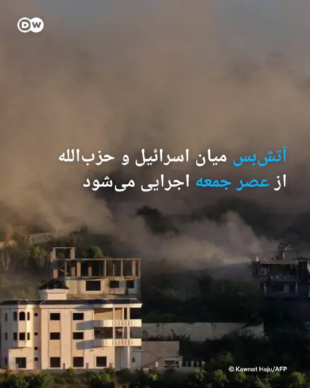

🔶آتش‌بس میان اسرائیل و حزب‌الله از عصر جمعه اجرایی می‌شود

رویترز به نقل از یک مقام ارشد دولت آمریکا گزارش داد اسرائیل و حزب‌الله لبنان بر سر آتش‌بس به توافق رسیده‌اند و قرار است این آتش‌بس از ساعت ۱۶ روز جمعه به وقت محلی آغاز شود. به گفته این مقام آمریکایی، این توافق با میانجیگری آمریکا و قطر و با حمایت ایران تدوین شده است.

این مقام آمریکایی به رویترز گفت پس از تبادل آتش در طول روز، اکنون انتظار می‌رود آتش‌بس میان اسرائیل و حزب‌الله برقرار شود.

او همچنین گفت ایران اصرار داشته است که آتش‌بس میان تهران و واشنگتن، درگیری میان اسرائیل و حزب‌الله را نیز در بر بگیرد و این موضوع بخشی از توافق چارچوبی میان دولت‌های آمریکا و ایران بوده است.

هم‌زمان، اسماعیل بقایی، سخنگوی وزارت امور خارجه جمهوری اسلامی، عملیات‌های "تجاوزکارانه و تروریستی" اسرائیل علیه مناطق مختلف لبنان را به‌شدت محکوم کرد.

@dw_farsi

## BBCPersian — post 284391

🔻مراسم تشییع و سوزاندن جسد مرجان ساتراپی، نویسنده و فیلمساز فرانسوی-ایرانی و خالق «پرسپولیس»، روز جمعه ۱۹ ژوئن در گورستان پرلاشز پاریس برگزار شد.

به درخواست خود او، ترانه «Big Jet Plane» اثر آنگوس و جولیا استون در این مراسم پخش شد و متن آن نیز میان حاضران توزیع شد.

خانواده، دوستان و شماری از چهره‌های فرهنگی و هنری در مراسم وداع با مرجان ساتراپی حضور داشتند. پدر و مادر او نیز در مراسم سوزاندن جسد دخترشان در کوره جسدسوزی گورستان پرلاشز شرکت کردند.

خانم ساتراپی، ۴ ژوئن در پاریس در ۵۶ سالگی درگذشت.

در بیانیه‌ای که خانواده خانم ساتراپی در آن زمان و بلافاصله پس از مرگ او به به خبرگزاری فرانسه ارسال کردند، نوشته شده بود که «مرجان ساتراپی کمی بیش از یک سال پس از مرگ ماتیاس ریپا، همسر و عشق زندگی‌اش، از شدت اندوه درگذشت.»

در هفته‌های گذشته، چهره‌های فرهنگی و سیاسی در فرانسه و دیگر کشورها با انتشار پیام‌هایی از نقش او در ادبیات، سینما و دفاع از آزادی بیان و حقوق زنان تجلیل کرده‌اند.

📷Getty/Reuters

## Dirty_Kids — post 392578

  

فکر کنم تا الآن هر سریالی از اپل دیدم خوب بوده!
حتماً ببینید این سریال رو، یه کمدی متفاوت و خوش‌ساخت. عااااالیه! حتی فیلمبرداریش هم فوق‌العاده‌س

@Dirty_Kids 👻

## Dirty_Kids — post 392577

‏جنگ اوکراین توی شش ماه اینده به نقطه جالبی میرسه

مرده و زنده پوتین رو اینها یکی کردند.

بخش گاز و پالایشگاهی روسیه رو به فلاکت خواهند دراورد.
زلنسکی واقعا تو کی بودی،تا الان هم ۳۵۰ هزار سرباز روس کشته!
همین کسی که ارزشیا بهش میگن دلقک!

@Dirty_Kids 👻

## alonews — post 129160

  <a href="telegram/content/alonews_129160_1781879725.webm" target="_blank">🎬 Download video</a>

👈سخنگوی کمیسیون امنیت ملی مجلس:
دولت باید همین حالا و از لبنان شروع کند و نباید اجازه دهیم مردم مقاوم جنوب لبنان مورد قتل عام قرار گیرند

✅ @AloNews خبر جنگ

---
📅 بروزرسانی: 1405/03/29 17:55
---

## VahidOOnLine — post 246393

عبدالمجید و رضا اسدی، عمو و برادرزاده بودند که شامگاه ۱۹ دی‌ماه ۱۴۰۴ در نورآباد ممسنی کشته شدند. ماموران آنها را درون خودرو هدف قرار دادند؛ از فاصله نزدیک به رضا شلیک کردند و مجید را با قنداق اسلحه به صورت پیاپی مورد ضرب و شتم قرار دادند.
‌🏁 🇬🇧 IranintlTV

🤖 @VahidOOnLine

## VahidOOnLine — post 246392

  <a href="telegram/content/VahidOOnLine_246392_1781879104.mp4" target="_blank">🎬 Download video</a>

⭕️مراسم یادبود و وداع با مرجان ساتراپی در گورستان پرلاشز پاریس برگزار شد

♦️مراسم یادبود مرجان ساتراپی، هنرمند ایرانی‌ـ‌فرانسوی، روز ۱۹ ژوئن ۲۰۲۶ در گورستان پرلاشز پاریس برگزار شد؛ مراسمی که با حضور مادر او، اعضای خانواده، دوستان، مقام‌های دولتی، چهره‌های برجسته هنری و سینمایی فرانسه، روزنامه‌نگاران و جمعی از علاقه‌مندانش همراه بود.

در تصاویر منتشرشده از این مراسم، حاضران هنگام خروج از سالن آشکارا احساساتی به نظر می‌رسیدند. برخی از آن‌ها عکس‌هایی از مرجان ساتراپی و همسرش، ماتیاس ریپا، را که سال گذشته درگذشت، در دست داشتند. مادر ساتراپی نیز هنگام ترک مراسم از حاضران برای حضور و همراهی‌شان تشکر کرد.

در میان مهمانان، چهره‌هایی از سینما، رسانه، ادبیات و سیاست فرانسه دیده می‌شدند؛ از جمله کاترین دنوو ، بازیگر سرشناس سینمای فرانسه؛ کیارا ماسترویانی، بازیگر فرانسوی‌ـ‌ایتالیایی و دختر کاترین دنوو و مارچلو ماسترویانی؛ شارلوت لوبون ، بازیگر، هنرمند و کارگردان کانادایی‌ـ‌فرانسوی؛ گلشیفته فراهانی، بازیگر ایرانی‌ـ‌فرانسوی؛ ژول (Jul)، خواننده و رپر فرانسوی؛ انورا مالاگری، مجری و چهره تلویزیونی فرانسه؛ تریستان بانون ، نویسنده و روزنامه‌نگار فرانسوی؛ سوفیا آرام بازیگر و روزنامه‌نگار ؛ و ژان‌پی‌یر لاوینیات روزنامه‌نگار سینمایی فرانسوی.

آلیس روفو ، وزیر مشاور فرانسه در امور وابسته به وزارت نیروهای مسلح و کهنه‌سربازان، نیز در این مراسم حاضر شد.

مرجان ساتراپی ۱۴ خرداد، در ۵۶ سالگی، درگذشت. نزدیکان او در بیانیه‌ای اعلام کردند که ساتراپی کمی بیش از یک سال پس از مرگ ماتیاس ریپا، همسر و «عشق زندگی‌اش»، «از اندوه» درگذشته است.
‌🇸🇦 Indypersian

🤖 @VahidOOnLine

## IranIntlTV — post 343227

گس در ادامه تاکید کرد مذاکرات جدید در مقایسه با زمان برجام با پیچیدگی‌های بیشتری روبه‌رو خواهد بود، زیرا شمار بیشتری از بازیگران خواهان مشارکت و اثرگذاری در روند آن هستند.

بر اساس این یادداشت، تهران اکنون تنگه هرمز را یکی از عناصر اصلی راهبرد بازدارندگی منطقه‌ای خود می‌داند؛ اهرمی که بر منافع حیاتی کشورهای خلیج فارس و حتی فراتر از آن تاثیر می‌گذارد.

گس افزود بسیاری از کشورها نیز نسبت به اتکا به آمریکا برای حفاظت از منافع خود اطمینان کامل ندارند و در این میان، اسرائیل ممکن است توافقی را که آن را «فاجعه‌بار» می‌داند، نابود کند.

با این حال، گس معتقد است امضای یادداشت تفاهم اخیر نشان می‌دهد نه تهران و نه واشینگتن تمایلی به بازگشت به یک جنگ تمام‌عیار ندارند.

در پی انتشار متن تفاهم‌نامه تهران و واشینگتن، انتقادها از دولت دونالد ترامپ در میان جمهوری‌خواهان شدت گرفته است. شماری از سناتورها و چهره‌های سرشناس محافظه‌کار این تفاهم‌نامه را امتیازدهی به جمهوری اسلامی و عقب‌نشینی از دستاوردهای نظامی آمریکا توصیف کرده‌اند.

🔗این مطلب را در وبسایت ایران‌اینترنشنال بخوانید
@iranintltv

## IranIntlTV — post 343226

🔻چرا دستیابی به توافق هسته‌ای جدید دشوارتر از دوران برجام است؟

سایمون گس، سفیر سابق بریتانیا در تهران، هشدار داد دستیابی به یک توافق هسته‌ای جدید با جمهوری اسلامی در شرایط کنونی به‌مراتب دشوارتر از زمان برجام خواهد بود، زیرا سطح بی‌اعتمادی میان طرف‌های مذاکره افزایش یافته و دامنه اختلافات نیز گسترده‌تر شده است.

گس که در گفت‌وگوهای هسته‌ای سال ۲۰۱۵ به‌عنوان مذاکره‌کننده ارشد بریتانیا حضور داشت، جمعه ۲۹ خرداد در یادداشتی در روزنامه فایننشال‌تایمز، به مقایسه روند مذاکرات برجام با گفت‌وگوهای آینده در چارچوب یادداشت تفاهم اخیر میان تهران و واشینگتن پرداخت.

آمریکا و حکومت ایران ۲۵ خرداد از دستیابی به تفاهمی برای پایان جنگ خبر دادند. این یادداشت تفاهم ۲۸ خرداد به امضای دونالد ترامپ، رییس‌جمهوری آمریکا و مسعود پزشکیان، رییس دولت جمهوری اسلامی، رسید.

بر اساس این سند، یک دوره ۶۰ روزه برای گفت‌وگوهای تخصصی در نظر گرفته شده است؛ مذاکراتی که قرار است بر موضوعات حساسی همچون سرنوشت ذخایر اورانیوم غنی‌شده حکومت ایران و چگونگی رفع تحریم‌ها تمرکز داشته باشد.

گس در یادداشت خود نوشت: «۶۰ روز زمان کافی نخواهد بود. مذاکرات برجام ۲۰ ماه به طول انجامید. اکنون نیز به زمان نیاز است، زیرا مسائل مطرح‌شده فنی و پیچیده هستند و در فضایی آکنده از بی‌اعتمادی دنبال می‌شوند.»

به گفته این دیپلمات پیشین، موضوع مذاکرات صرفا به توقف غنی‌سازی یا تعیین تکلیف ذخایر اورانیوم محدود نمی‌شود، بلکه مسائلی همچون نحوه و زمان‌بندی بازرسی‌های آژانس بین‌المللی انرژی اتمی و سازوکارهای نظارتی نیز باید به‌دقت مورد توافق قرار گیرند.

رافائل گروسی، مدیرکل آژانس بین‌المللی انرژی اتمی، پیش‌تر بر لزوم نقش‌آفرینی این نهاد در هرگونه توافق احتمالی میان تهران و واشینگتن تاکید کرد و هشدار داد توافقی که فاقد سازوکار موثر راستی‌آزمایی باشد، در عمل «توهمی از توافق» خواهد بود.
جمهوری اسلامی با برچیدن برنامه هسته‌ای خود موافقت نمی‌کند

گس در ادامه یادداشت خود نوشت مذاکرات پیش‌رو تنها به چالش‌های فنی محدود نخواهد بود، بلکه با مباحث سیاسی دشواری نیز در داخل کشورهای طرف مذاکره همراه خواهد شد.

به گفته او، مذاکره‌کنندگان ناچار خواهند بود هرگونه امتیازدهی را برای افکار عمومی و نهادهای سیاسی کشور خود توجیه کنند.

این مقام سابق بریتانیایی با اشاره به تحولات داخلی جمهوری اسلامی افزود فضای سیاسی در تهران نسبت به دوران مذاکرات برجام «سخت‌تر» شده است؛ نهادهای امنیتی، به‌ویژه سپاه پاسداران، نفوذ بیشتری پیدا کرده‌اند و بسیاری از افراد وابسته به این نهاد معتقدند درگیری‌ها دیر یا زود از سر گرفته خواهد شد و مذاکرات چیزی جز ادامه همان رویارویی از مسیری متفاوت نیست.

گس تاکید کرد جمهوری اسلامی ممکن است با اعمال «محدودیت‌های معنادار و زمان‌دار» بر برنامه هسته‌ای خود موافقت کند، اما حاضر نخواهد شد به حذف کامل این برنامه تن دهد.

به گفته او، تهران همچنین تجربه کشورهایی مانند لیبی و اوکراین را که از برنامه‌ هسته‌ای خود صرف‌نظر کردند، زیر نظر داشته و این موضوع بر محاسبات جمهوری اسلامی تاثیرگذار بوده است.

۲۸ خرداد، مجتبی خامنه‌ای، رهبر جمهوری اسلامی، در پیامی مکتوب اعلام کرد با وجود آنکه «نظر دیگری» نسبت به تفاهم اخیر با ایالات متحده داشته، با تعهد پزشکیان در خصوص «پاسداشت حقوق ملت ایران و جبهه مقاومت»، با آن موافقت کرده است.
سایه بی‌اعتمادی بر مذاکرات

گس در ادامه یادداشت خود نوشت جمهوری اسلامی در موضوع رفع تحریم‌ها دیگر حاضر به پذیرش توافقی مشابه برجام نخواهد بود، زیرا از نگاه تهران، وعده لغو تحریم‌ها در چارچوب آن توافق هرگز به‌طور کامل و موثر محقق نشد.

او افزود در مذاکرات آتی، امتیازهای هسته‌ای جمهوری اسلامی تنها در صورتی قابل تحقق خواهد بود که با اقدامات «متقابل و فوری» طرف مقابل همراه شود؛ اقداماتی که از دید تهران پایدار و ملموس باشند و لغو آن‌ها برای دولت‌های آینده آمریکا دشوار باشد.

به گفته سفیر پیشین بریتانیا در تهران، یادداشت تفاهم اخیر از دقت کافی برخوردار نیست؛ به گونه‌ای که هر طرف می‌تواند آن را به نفع خود تفسیر و طرف مقابل را به سوءنیت متهم سازد.

او هشدار داد این مساله به‌ویژه در شرایطی مشکل‌ساز است که هیچ‌یک از دو طرف باور ندارد طرف مقابل بتواند به تعهدات بلندمدت خود پایبند بماند.

پیش‌تر وزارت خارجه سوئیس اعلام کرد مذاکرات تهران و واشینگتن که قرار بود ۲۹ خرداد در این کشور برگزار شود، انجام نخواهد شد.

یک سخنگوی کاخ سفید نیز از انصراف جی‌دی ونس، معاون رییس‌جمهوری آمریکا، از سفر برنامه‌ریزی‌شده خود به سوئیس برای دیدار با مذاکره‌کنندگان جمهوری اسلامی خبر داد.

دلیل این تصمیم «پیچیدگی‌های لجستیکی و هماهنگی‌های مربوط به مذاکرات» عنوان شده است.

بازیگران بیشتر و پیچیدگی‌های فراتر از برجام

## IranIntlTV — post 343225

  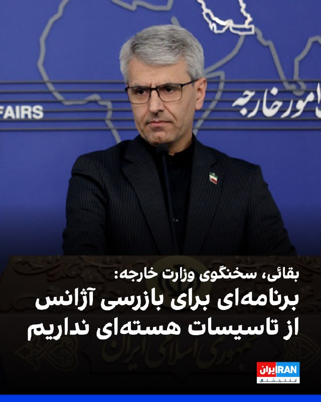

اسماعیل بقائی، سخنگوی وزارت خارجه جمهوری اسلامی در گفت‌وگو با خبرنگاران، اخبار منتشره در برخی رسانه‌ها مبنی بر دعوت جمهوری اسلامی از آژانس بین‌المللی انرژی اتمی برای بازرسی از تاسیسات هسته‌ای را تکذیب کرد.

بقائی گفت که بر اساس بند ۹ یادداشت تفاهم، در طول دوره ۶۰ روزه، وضعیت فعلی برنامه هسته‌ای ایران حفظ خواهد شد و بر این اساس، بازرسی از تاسیساتی مانند بوشهر که تاکنون انجام می‌شد، ادامه می‌یابد اما بازرسی از تاسیساتی که دسترسی آژانس به آن‌ها به‌دلیل حملات نظامی آمریکا و اسرائیل متوقف شد، منوط به روند مذاکرات و نتیجه آن خواهد بود.
https://iranintl.com/202606190021

## IranIntlTV — post 343224

  <a href="telegram/content/IranIntlTV_343224_1781879105.mp4" target="_blank">🎬 Download video</a>

خبرگزاری رویترز به نقل از منابع عراقی گزارش داد سپاه پاسداران با ایجاد هسته‌های مخفی جدید در عراق، حملات پهپادی علیه کشورهای خلیج فارس را سازماندهی کرده است. بر اساس این گزارش، این سلول‌ها که خارج از ساختار گروه‌های شبه‌نظامی شناخته‌شده فعالیت می‌کنند، بین ۳۱ فروردین تا ۲۷ اردیبهشت دست‌کم هفت حمله پهپادی به اهدافی در کویت، عربستان سعودی و امارات انجام داده‌اند.

گفت‌وگو با مهدی نخل‌احمدی، روزنامه‌نگار و فعال سیاسی
@iranintltv

## IranIntlTV — post 343223

عبدالمجید و رضا اسدی، عمو و برادرزاده بودند که شامگاه ۱۹ دی‌ماه ۱۴۰۴ در نورآباد ممسنی کشته شدند. ماموران آنها را درون خودرو هدف قرار دادند؛ از فاصله نزدیک به رضا شلیک کردند و مجید را با قنداق اسلحه به صورت پیاپی مورد ضرب و شتم قرار دادند.

## IranIntlTV — post 343222

🔻عفو بین‌الملل و کارشناسان سازمان ملل: حقوق بشر در تفاهم با جمهوری اسلامی نادیده نماند

پس از امضای یادداشت تفاهم آمریکا و جمهوری اسلامی، کارشناسان سازمان ملل هشدار دادند هر چارچوبی که به وضعیت حقوق بشر در ایران نپردازد، از اساس ناقص است. عفو بین‌الملل نیز اعلام کرد این تفاهم، در صورت نادیده گرفتن حقوق بشر و عدالت، می‌تواند پوششی برای ادامه سرکوب شود.

حقوق بشر نباید از توافق نهایی حذف شود

کارشناسان مستقل سازمان ملل جمعه ۲۹ خرداد با استقبال از امضای یادداشت تفاهم ۱۴ بندی میان آمریکا و جمهوری اسلامی هشدار دادند مردم ایران که هم از تجاوز نظامی خارجی و هم از سرکوب داخلی آسیب دیده‌اند، در این چارچوب تقریبا نادیده گرفته شده‌اند.

این بیانیه به امضای ۱۴ گزارشگر ویژه، کارشناس مستقل و سازوکار حقوق بشری سازمان ملل، از جمله مای ساتو، گزارشگر ویژه سازمان ملل در امور حقوق بشر ایران، رسیده است.

به گفته آنها، این سند عمدتا بر «خروج نظامی، بازگشایی تنگه هرمز، تعهدات هسته‌ای، کاهش تحریم‌ها و صندوق بازسازی ۳۰۰ میلیارد دلاری» متمرکز است.

این کارشناسان اعلام کردند از زمان آغاز جنگ در ۹ اسفند ۱۴۰۴، مقام‌های جمهوری اسلامی سرکوب مخالفان را تشدید کرده‌اند. هزاران نفر بازداشت شده‌اند و گزارش‌ها از شکنجه، ناپدیدسازی قهری، اعدام‌های ساختگی و اعتراف‌گیری اجباری حکایت دارد.

آنها افزودند از زمان آغاز جنگ، دست‌کم ۱۵۶ نفر اعدام شده‌اند که ۴۲ نفر از آنها با اتهام‌های سیاسی، از جمله اتهام‌های مرتبط با جاسوسی و امنیت ملی، اعدام شده‌اند.

کارشناسان سازمان ملل همچنین گفتند مقام‌های جمهوری اسلامی دارایی‌های دست‌کم هزار و ۵۰۰ شهروند، از جمله صدها ایرانی ساکن خارج از کشور را مصادره کرده‌اند و بهائیان، کردها و بلوچ‌ها بیش از دیگران در معرض خطر قرار داشته‌اند.
به گفته آنها، عفو اخیر مجتبی خامنه‌ای نیز شامل محکومان پرونده‌های سیاسی و امنیتی نشده و بسیاری از بازداشت‌شدگان اعتراضات همچنان در زندان مانده‌اند.

این کارشناسان افزودند جنگ خسارات انسانی، اقتصادی و زیست‌محیطی گسترده‌ای بر جا گذاشته است. هزاران غیرنظامی در حملات هوایی کشته و میلیون‌ها نفر آواره شده‌اند و سه ماه قطع تقریبا کامل اینترنت که یکی از طولانی‌ترین موارد ثبت‌شده تاکنون در جهان بوده، معیشت و ارتباط مردم با جهان خارج را مختل کرده است.

آنها از همه کشورها، از جمله کشورهای میانجی، خواستند هر توافق نهایی که قرار است طی ۶۰ روز آینده مذاکره شود، شامل توقف اجرای احکام اعدام، آزادی بازداشت‌شدگان خودسرانه، اعلام سرنوشت ناپدیدشدگان قهری، بازگرداندن دسترسی به اینترنت آزاد و حفاظت از فضای مدنی باشد.

کارشناسان سازمان ملل همچنین تاکید کردند صدای ایرانیان، که میلیون‌ها نفر از آنها برای مطالبه تغییرات بنیادین به خیابان‌ها آمدند، باید در هر مذاکره‌ای که مدعی تضمین آینده آن‌هاست، شنیده شود.
تفاهم نباید به پوششی برای ادامه سرکوب تبدیل شود

عفو بین‌الملل هشدار داد یادداشت تفاهم آمریکا و جمهوری اسلامی، بدون تضمین حقوق بشر و جبران خسارت قربانیان، می‌تواند به پوششی برای ادامه سرکوب و مصونیت از مجازات تبدیل شود.

این سازمان اعلام کرد جنگی که موضوع این تفاهم است، به کشورهای همسایه نیز کشیده شد، بیش از شش هزار کشته در خاورمیانه بر جا گذاشت و اقتصاد جهانی را متزلزل کرد.

عفو بین‌الملل همچنین گفت این جنگ با «حملات غیرقانونی آمریکا و اسرائیل در نقض منشور سازمان ملل» آغاز شد و سپس با اقدامات «غیرقانونی» مقام‌های جمهوری اسلامی ادامه یافت؛ روندی که به رنج گسترده غیرنظامیان و نقض حقوق بشردوستانه، از جمله جنایت‌های جنگی، انجامید.
🔗 ادامه این مطلب را اینجا بخوانید
@iranintltv

## IranIntlTV — post 343221

  <a href="telegram/content/IranIntlTV_343221_1781879107.mp4" target="_blank">🎬 Download video</a>

سنتکام، ستاد فرماندهی مرکزی آمریکا، جمعه ۲۹ خرداد ویدیویی از گشت‌زنی جنگنده‌های اف-۱۶ نیروی هوایی آمریکا بر فراز خاورمیانه منتشر کرد. سنتکام در توضیح این ویدیو نوشت: «نیروهای آمریکایی در منطقه همچنان مستقر، آماده و در حالت هوشیاری کامل هستند.»
@iranintltv

## IranIntlTV — post 343220

🔻ادامه اختلافات در اردوگاه جمهوری اسلامی بر سر پیام مجتبی خامنه‌ای و تفاهم با آمریکا

پیام مجتبی خامنه‌ای درباره تفاهم‌نامه تهران و واشینگتن نه‌تنها به اختلاف‌ها در اردوگاه جمهوری اسلامی پایان نداد، بلکه موج تازه‌ای از تسویه‌حساب سیاسی به راه انداخت؛ بخشی از اصولگرایان خواستار حمایت از تصمیم نهایی شدند و بخشی دیگر حامیان مذاکرات را به پاسخگویی فراخواندند.

مجتبی خامنه‌ای در این پیام نوشت با وجود آنکه «علی‌الاصول» نظر دیگری داشته، به‌دلیل تعهد مسعود پزشکیان و اعضای شورای عالی امنیت ملی به پذیرش مسئولیت این روند، اجازه پیشبرد تفاهم‌نامه را صادر کرده است.

همین عبارت کوتاه به دو برداشت متفاوت در اردوگاه جمهوری اسلامی منجر شد؛ گروهی بر بخش «اجازه آن را صادر کردم» تاکید کردند و آن را نشانه حمایت نهایی رهبر جمهوری اسلامی از روند طی‌شده دانستند و گروهی دیگر، عبارت «نظر دیگری داشتم» را نشانه مخالفت اولیه او تلقی کردند.

هم‌زمان، برخی منتقدان می‌گویند مجتبی خامنه‌ای نیز مانند علی خامنه‌ای، هم اجازه تصمیم را داده و هم از همان ابتدا مسئولیت پیامدهای احتمالی آن را از خود دور کرده است.

به باور آنها، تاکید او بر اینکه «نظر دیگری» داشته اما با تعهد پزشکیان اجازه داده، راه را باز می‌گذارد تا در صورت شکست تفاهم‌نامه، مسئولیت متوجه دولت، شورای عالی امنیت ملی و تیم مذاکره‌کننده شود.
مرتضی کاظمیان، عضو تحریریه ایران‌اینترنشنال، گفت پیام خامنه‌ای نشانه پذیرش ناگزیر مذاکره در هسته سخت قدرت است، اما هم‌زمان مسئولیت توافق را بر دوش دولت و شورای عالی امنیت ملی می‌گذارد.

علی شیرازی و کامیار بهرنگ، اعضای تحریریه ایران‌اینترنشنال نیز گفتند مجتبی خامنه‌ای مانند پدرش پس از برجام، مسئولیت تصمیم را از خود دور کرده است.

شیرازی گفت این مسئولیت متوجه پزشکیان و شورای عالی امنیت ملی شده و بهرنگ تاکید کرد خامنه‌ای با سخنان دوپهلو، هم مسئولیتی نپذیرفته و هم اختلافات درون حاکمیت را حفظ کرده است.

پیامی که به دو روایت متضاد در حاکمیت منجر شد

محمدمنان رییسی، محسن مقصودی و مرتضی محمودی، از چهره‌های اصولگرا، با استناد به پیام مجتبی خامنه‌ای گفتند مخالفان مذاکرات از ابتدا درباره اعتماد به آمریکا هشدار داده بودند و اکنون حامیان این روند باید درباره عملکرد خود پاسخگو باشند.

اسماعیل رمضانی، سخنران حکومتی نیز خواستار راه‌اندازی «جنبش بازگشت به نظر رهبری» شد و گفت حالا که مجتبی خامنه‌ای اعلام کرده نظرش چیز دیگری بوده، حامیان حکومت باید خواستار بازگشت از مسیر تفاهم شوند.

او پیشنهاد کرد روند ۶۰ روزه مذاکرات «یک‌جوری» متوقف شود تا تجربه بی‌اعتمادی رهبر پیشین جمهوری اسلامی به مذاکرات تکرار نشود.
محمد زعیم‌زاده، سردبیر فرهیختگان نیز نوشت «نظر رهبری پذیرش متن نبوده است» اما او به خرد جمعی احترام گذاشته و اجازه توافق را منوط به تحقق شروط کرده است.

او همچنین گفت مسئولیت پیشبرد توافق و بهبود شرایط اقتصادی با دولت است و نباید از سطح رهبری برای این تفاهم‌نامه «چک سفید» صادر شود.

مجتبی یوسفی، عضو هیات رییسه مجلس، نیز پیام مجتبی خامنه‌ای را نشانه تسلط او بر روند تصمیم‌گیری دانست، اما تاکید کرد دولت و شورای عالی امنیت ملی باید درباره تحقق شروط تعیین‌شده پاسخگو باشند و اجازه ندهند تجربه برجام تکرار شود.

تغییر مواضع محمود نبویان، عضو کمیسیون امنیت ملی مجلس نیز مورد توجه قرار گرفت. او پس از پیام مجتبی خامنه‌ای خواستار حفظ وحدت شد، اما پیش‌تر تفاهم‌نامه را «خسارت‌بار» خوانده و گفته بود آمریکا با این توافق به «پیروزی کامل» می‌رسد.
🔗 ادامه این مطلب را اینجا بخوانید
@iranintltv

## FarsiVOA — post 221193

  <a href="telegram/content/FarsiVOA_221193_1781879108.mp4" target="_blank">🎬 Download video</a>

فرماندهی مرکزی ارتش آمریکا، سنتکام، ویدیویی از سوخت‌گیری هوایی جنگنده‌های اف-۱۶ در جریان یک گشت‌زنی بر فراز خاورمیانه منتشر کرد.

سنتکام اعلام کرد نیروهای آمریکایی در منطقه همچنان به حضور و نظارت خود ادامه می‌دهند.

@FarsiVOA

## FarsiVOA — post 221192

پیام مجتبی خامنه‌ای درباره تفاهم‌نامه آمریکا و جمهوری اسلامی، ادامه راه پدرش برای ایجاد دوگانه «بیت منزه» و «دولت مقصر» است؟ گفتگو با رضا علیجانی

## BBCPersian — post 284390

🔻پلیس فرانسه: به دلیل احتمال درگیری، تجمع اعتراضی هواداران سازمان مجاهدین خلق را لغو کردیم

همانطور که قبلا به اطلاع رساندیم پلیس فرانسه تجمعی را که قرار بود فردا توسط هواداران سازمان مجاهدین خلق برگزارشود، لغو کرد.

اکنون پلیس فرانسه گفته است که به دلیل «احتمال درگیری» این تجمع را ممنوع کرده است. این در حالی است که برگزار‌کنندگان می‌گویند که این تصمیم به دلایل «بی‌اساس» گرفته شده است.

شورای ملی مقاومت، عنوان شاخه سیاسی سازمان مجاهدین خلق، گفته است که این تجمع اعتراضی که قرار بود فردا علیه «موج اعدام‌ها» در ایران برگزار شود، دیروز پس از ساعات اداری و از سوی پلیس پاریس لغو شد.

پلیس در مورد لغو این تجمع گفته است: «در شرایط کنونی که وضعیت در داخل و در جهان تنش‌آلود است، خطر جدی وجود دارد که در جریان این تجمع، میان فعالانی که دیدگاه‌های مخالف دارند درگیری رخ دهد؛ درگیری‌ای که می‌تواند نظم عمومی را به‌شدت مختل کند.»

پلیس همچنین گفته است که محل تجمع و مسیر راهپیمایی برنامه‌ریزی‌شده از «نزدیکی چند ساختمان دولتی و نمایندگی‌های دیپلماتیک» عبور می‌کرد.

برگزارکنندگان که برای لغو این ممنوعیت شکایت اضطراری ثبت کرده‌اند، گفته‌اند این تصمیم ممکن است به تماس تلفنی میان وزیران خارجه فرانسه و ایران در چند ساعت پیش از لغو ناگهانی تجمع در شامگاه پنج‌شنبه مرتبط باشد.

با این حال، وزارت امور خارجه فرانسه اعلام کرد که ژان‌نوئل بارو، وزیر خارجه، در تماس تلفنی که با آقای عراقچی داشته است، «هیچ اشاره‌ای به این تجمع نکرده و درخواست لغو آن هم مطرح نشده است.»

شورای ملی مقاومت ایران، شاخه سیاسی سازمان مجاهدین خلق ایران است که از سوی جمهوری اسلامی ایران به عنوان گروه «تروریستی» علام شده است.

این گروه پیش‌ترهم تجمعات متعددی در پاریس برگزار کرده بود و در ماه‌های اخیر در جریان اعتراضات ضد دولتی در ایران و همچنین جنگ آمریکا و اسرائیل علیه ایران، فعالیت داشته است.

برگزارکنندگان انتظار داشتند حدود ۱۰۰ هزار نفر در این تجمع که در اعتراض به موج اعدام ها برگزار می‌شد، شرکت کنند.

گروه‌های حقوق بشری گفته‌اند که از آغاز جنگ تاکنون بیش از ۴۰ نفر در ایران اعدام شده‌اند؛ افرادی که بسیاری از آن‌ها به اعتراضات پیش از جنگ مرتبط بوده‌اند.

همچنین دست‌کم دوازده مرد اخیرا به اتهام ارتباط با گروه‌های «ممنوعه مخالف»، از جمله مجاهدین خلق و همچنین گروه‌های کرد و بلوچ سنی، اعدام شده‌اند.

## BBCPersian — post 284388

  <a href="https://t.me/bbcpersian/284388" target="_blank">📎 Download file</a>

📎 Document

## alonews — post 129159

  <a href="telegram/content/alonews_129159_1781879109.webm" target="_blank">🎬 Download video</a>

👈نتانیاهو: به دستور من ، ارتش به 150 هدف حزب الله در لبنان حمله کرد و ده ها خرابکار را کشت‌‌

✅ @AloNews خبر جنگ

## alonews — post 129158

  <a href="telegram/content/alonews_129158_1781879109.webm" target="_blank">🎬 Download video</a>

👈رسایی : تنگه رو ببندید

✅ @AloNews خبر جنگ

## alonews — post 129157

  <a href="telegram/content/alonews_129157_1781879109.webm" target="_blank">🎬 Download video</a>

👈سخنگوی وزارت خارجه: رایزنی‌های لازم از طریق میانجی‌گرها درحال انجام است و در صورت فراهم‌شدن شرایط لازم برای شروع مذاکرات، اطلاع‌رسانی خواهد شد. 
🔴طبق متن یادداشت تفاهم، آغاز مذاکرات توافق نهایی منوط به شروع اجرای مفاد بندهای ۱، ۴، ۵، ۱۰ و ۱۱ یادداشت تفاهم…

---
📅 بروزرسانی: 1405/03/29 17:45
---

## WithYashar — post 15338

سخنگوی وزارت خارجه: برگزاری نشست سوئیس فوریت ندارد

یکی از اهداف اصلی نشست سوئیس در روز جمعه، امضای متن تفاهم خاتمه جنگ تحمیلی بود و قرار بود در حاشیه مراسم امضا راجع به ترتیبات مربوط به مذاکرات توافق نهایی هم تبادل نظر شود.

با توجه به اینکه امضای متن یادداشت تفاهم، در بامداد ۲۸ خرداد به صورت دیجیتالی انجام شد، برگزاری نشست مزبور در سوئیس فوریت ندارد اما درحال برنامه‌ریزی برای برگزاری یک نشست طی روزهای آینده هستیم.
@withyashar

## pm_afshaa — post 94398

  <a href="telegram/content/pm_afshaa_94398_1781878501.webm" target="_blank">🎬 Download video</a>

🔴خبرگزاری تسنیم:
هر دقیقه باز بودن تنگه هرمز خسارت مهمیه؛ اگر آمریکا فشار انرژی رو از روی خودش تخلیه کنه، وقیح‌تر و تهاجمی‌تر هم خواهد شد.

💧 Rainbet.com the #1 Non-KYC Crypto Casino & Sportsbook @rainbetcom

😁 @Pm_Afshaa

## Persian_Trend_Official — post 17587

  <a href="telegram/content/Persian_Trend_Official_17587_1781878502.webm" target="_blank">🎬 Download video</a>

Voice message

## Persian_Trend_Official — post 17586

  <a href="telegram/content/Persian_Trend_Official_17586_1781878502.webm" target="_blank">🎬 Download video</a>

یک مقام آمریکایی به اکسیوس گفت: نتانیاهو 100% با تمدید آتش‌بس در لبنان موافقت کرد.

📝 Amir

📌 @persian_trend_official
پرشین ترند | متفاوت‌ترین کانال نظامی

## BBCPersian — post 284378

🖊جرمی بوئن, سردبیر بین‌الملل بی‌بی‌سی

یادداشت تفاهمی که دونالد ترامپ، رئیس جمهور آمریکا و مسعود پزشکیان، رئیس جمهور ایران امضا کرده‌اند، پیامدهای سیاسی، نظامی و اقتصادی تصمیم نسنجیده حمله به ایران در ۲۸ فوریه را تشریح می‌کند.

هزینه انسانی این جنگ از هم‌ اکنون روشن است. هزاران نفر که بسیاری از آنان غیرنظامی بوده‌اند، در ایران و لبنان کشته شده‌اند.

آمریکا، و در نتیجه اسرائیل، متحمل یک شکست راهبردی شده‌اند. حکومت تهران با بدترین کابوس خود روبه‌رو شد: یک عملیات نظامی مشترک برای فلج کردن یا نابودی آن به دست آمریکا، قدرتمندترین قدرت جهان، و اسرائیل، ابرقدرت خاورمیانه. این حکومت نه‌ تنها دوام آورده، بلکه قدرت بیشتری نیز پیدا کرده است.

راهبرد ایران برای بستن تنگه هرمز و در نتیجه متوقف کردن یک پنجم عرضه جهانی نفت و گاز و همچنین دیگر اجزای حیاتی اقتصاد جهانی، دونالد ترامپ را وادار کرده است با مجموعه‌ای از امتیازها موافقت کند. امتیازهایی که خشم و نگرانی تندروهای ضدایرانی آمریکا و دولت اسرائیل را برانگیخته است.

مطلب کامل🔽
https://bbc.in/4uJP7nq
📷Getty/ Reuters/ EPA
@BBCPersian

## alonews — post 129156

  <a href="telegram/content/alonews_129156_1781878502.webm" target="_blank">🎬 Download video</a>

👈سخنگوی وزارت خارجه: رایزنی‌های لازم از طریق میانجی‌گرها درحال انجام است و در صورت فراهم‌شدن شرایط لازم برای شروع مذاکرات، اطلاع‌رسانی خواهد شد.

🔴طبق متن یادداشت تفاهم، آغاز مذاکرات توافق نهایی منوط به شروع اجرای مفاد بندهای ۱، ۴، ۵، ۱۰ و ۱۱ یادداشت تفاهم و تداوم اجرای آن‌هاست.

✅ @AloNews خبر جنگ

---
📅 بروزرسانی: 1405/03/29 17:38
---

## VahidOOnLine — post 246391

  <a href="telegram/content/VahidOOnLine_246391_1781878083.mp4" target="_blank">🎬 Download video</a>

یک شهروند در پیامی صوتی به ایران اینترنشنال، خطاب به دونالد ترامپ گفت: «زیرساخت‌ها را زدی و مردم را بدبخت کردی. اگر از بی‌بی حمایت کرده بودی، او جمهوری اسلامی را به زباله‌دان تاریخ فرستاده بود.»
‌🏁 🇬🇧 IranintlTV

🤖 @VahidOOnLine

## VahidOOnLine — post 246390

  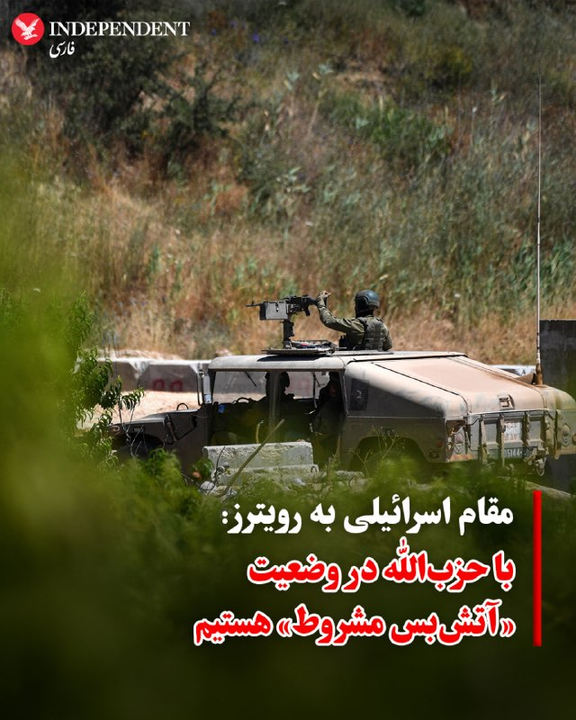

♦️ خبرگزاری «رویترز» روز جمعه ۲۹ خرداد به نقل از یک مقام ارشد اسرائیلی گزارش داد که اسرائیل و حزب‌الله در وضعیت آتش‌بس به سر می‌برند، مشروط بر اینکه حزب‌الله به اسرائیل حمله نکند. این مقام تصریح کرد: «در غیر این صورت، ما در وضعیت جنگی خواهیم بود.»

این مقام ارشد همچنین تاکید کرد که اسرائیل نیروهای خود را در جنوب لبنان، یعنی در امتداد مرزهای شمالی خود که هم‌اکنون تحت اشغال ارتش اسرائیل است، حفظ خواهد کرد.

پیش از این، یک مقام ارشد آمریکایی به رویترز اعلام کرده بود که اسرائیل و حزب‌الله بر سر یک آتش‌بس توافق کرده‌اند که قرار است از ساعت ۴ بعدازظهر روز جمعه به وقت محلی آغاز شود.
‌🇸🇦 Indypersian

🤖 @VahidOOnLine

## VahidOOnLine — post 246389

  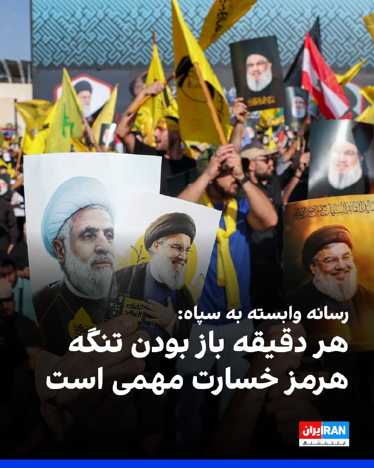

خبرگزاری تسنیم، وابسته به سپاه پاسداران، با اشاره به ادامه حملات ارتش اسرائیل به جنوب لبنان، نوشت: «هر دقیقه باز بودن تنگه هرمز خسارت مهمی است؛ اگر آمریکا فشار انرژی را از روی خود تخلیه کند، وقیح‌تر و تهاجمی‌تر هم خواهد شد.»

این رسانه وابسته به سپاه در ادامه خطاب به مقام‌های جمهوری اسلامی نوشت: «تنگه را ببندید و آمریکا را در همین گام اول مهار کنید.»

تشنیم افزود: «آیا نباید مسولان فی‌الفور به اجرای تفاهمنامه پایان دهند و تنگه هرمز را مسدود کنند؟ آیا نباید پاسخ قدرتمندی به آمریکا و اسرائیل داده شود تا محاسباتشان بیش از این به ضرر جمهوری اسلامی و مقاومت نشود؟»
‌🏁 🇬🇧 IranintlTV

🤖 @VahidOOnLine

## pm_afshaa — post 94397

  <a href="telegram/content/pm_afshaa_94397_1781878088.webm" target="_blank">🎬 Download video</a>

🔴ارتش اسرائیل:
بیش از 150 حمله از دیشب تا الان به جنوب لبنان صورت گرفته است!

💧 Rainbet.com the #1 Non-KYC Crypto Casino & Sportsbook @rainbetcom

😁 @Pm_Afshaa

## VahidOnline — post 76520

  

یک مقام ارشد آمریکایی به رویترز گفت که اسرائیل و حزب‌الله بر سر یک آتش‌بس توافق کرده‌اند که قرار است از ساعت چهار بعدازظهر روز جمعه به وقت محلی آغاز شود.

این مقام که نخواست نامش فاش شود، افزود که مذاکره‌کنندگان آمریکایی و قطری با کمک ایران این توافق را نهایی کرده‌اند.

این مقام همچنین گفت: «درک ما این است که پس از تبادل آتش امروز، اسرائیل و حزب‌الله اکنون در وضعیت آتش‌بس قرار دارند.»

شبکه العربیه نیز به نقل از یک مقام آمریکایی از توافق برای برقراری آتش‌بس بین اسرائیل و حزب‌الله از جمعه خبر داد.

این در حالی است که نخست‌وزیر اسرائیل ساعتی پیش اعلام کرد نیروهای نظامی این کشور تا هر زمان که لازم باشد، در خاک لبنان باقی می‌مانند.
@VahidHeadline

📡 @VahidOnline

## VahidOnline — post 76518

  <a href="telegram/content/VahidOnline_76518_1781878089.mp4" target="_blank">🎬 Download video</a>

وزیر امور خارجه ایتالیا روز جمعه اعلام کرد در واکنش به گزارش‌ها درباره اظهارات دونالد ترامپ سفر برنامه‌ریزی‌شده خود به ایالات متحده را لغو می‌کند.
آنتونیو تایانی در شبکه اکس نوشت: «سخنان شدیدا توهین‌آمیز رئیس‌جمهوری ترامپ… به همه مردم ایتالیا اهانت می‌کند.»
به گزارش شبکه ایتالیایی «لا۷» ترامپ درباره دیدار خود با ملونی در نشست گروه هفت گفته بود: «ملونی آن‌قدر می‌خواست با من عکس بگیرد که فقط از روی دلسوزی با او موافقت کردم.»
@VahidOOnLine
جورجیا ملونی، نخست‌وزیر ایتالیا، در واکنش به اظهارات اخیر دونالد ترامپ، رئیس‌جمهوری آمریکا، این سخنان را «کاملاً ساختگی» خواند و گفت از نحوه رفتار او با متحدان «مبهوت و شگفت‌زده» شده است.

او تاکید کرد: «نمی‌دانم چرا رئیس‌جمهور ایالات متحده این‌گونه با متحدان خود رفتار می‌کند» و افزود این نخستین‌بار نیست که چنین مواضعی از سوی ترامپ مطرح می‌شود.

ملونی همچنین این رویکرد را «مایه تاسف» دانست و گفت او قاطعیتی را که در برابر دشمنان غرب نشان نمی‌دهد، در قبال برخی رهبران متحد خود به کار می‌گیرد.
نخست‌وزیر ایتالیا در پایان تأکید کرد: «یک چیز را باید به خاطر بسپارد؛ من و ایتالیا هرگز التماس نمی‌کنیم.»

در ادامه این تنش‌ها، آنتونیو تایانی، وزیر امور خارجه ایتالیا، نیز اعلام کرد سفر برنامه‌ریزی‌شده خود به آمریکا را لغو کرده و این اظهارات را «توهین به مردم ایتالیا» خواند.
@VahidOOnLine

📡 @VahidOnline

## kianmeli1 — post 88088

‏🔴اسماعیل بقایی، سخنگوی وزارت خارجه جمهوری اسلامی: نشست برنامه‌ریزی‌شده جمعه ۲۹ خرداد در سوئیس به زمان دیگری موکول شده است
https://t.me/kianmeli1

## IranIntlTV — post 343219

  <a href="telegram/content/IranIntlTV_343219_1781878091.mp4" target="_blank">🎬 Download video</a>

یک شهروند در پیامی صوتی به ایران اینترنشنال، خطاب به دونالد ترامپ گفت: «زیرساخت‌ها را زدی و مردم را بدبخت کردی. اگر از بی‌بی حمایت کرده بودی، او جمهوری اسلامی را به زباله‌دان تاریخ فرستاده بود.»

## IranIntlTV — post 343218

  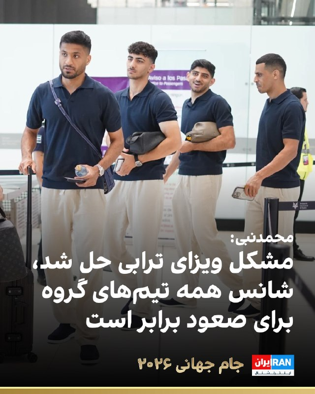

🔻مهدی محمدنبی، نایب رییس فدراسیون فوتبال، درباره آخرین وضعیت تیم ملی ایران پیش از دیدار با بلژیک گفت: «پس از تساوی هر چهار تیم گروه، شرایط جدول از نو آغاز شده و همه تیم‌ها شانس برابری برای صعود دارند.»

🔹او با اشاره به برنامه‌های تیم ملی پس از بازگشت از آمریکا به مکزیک گفت: «بازیکنان پس از رسیدن به تیخوانا استراحت کردند و یک جلسه ریکاوری نیز پشت سر گذاشتند. تمرین امروز تیم ملی در زمین اصلی کمپ تیخوانا برگزار خواهد شد.»

🔹محمدنبی درباره مشکلات ویزای اعضای تیم ملی نیز توضیح داد: «بازیکنان و کادر فنی هیچ مشکلی از نظر ویزا ندارند. تنها ویزای مهدی ترابی به صورت یک‌بار ورود صادر شده بود که این مشکل روز گذشته برطرف شد. درخواست کرده‌ایم تیم ملی دو روز زودتر در محل برگزاری مسابقه حاضر شود و در حال رایزنی برای دریافت مجوزهای لازم هستیم. در غیر این صورت، مانند دیدار نخست یک روز پیش از مسابقه راهی آمریکا خواهیم شد و پس از پایان بازی دوباره به مکزیک بازمی‌گردیم.»

🔹جزییات بیشتر را در سایت بخوانید

@iranintltvsport

## IranIntlTV — post 343217

  

خبرگزاری تسنیم، وابسته به سپاه پاسداران، با اشاره به ادامه حملات ارتش اسرائیل به جنوب لبنان، نوشت: «هر دقیقه باز بودن تنگه هرمز خسارت مهمی است؛ اگر آمریکا فشار انرژی را از روی خود تخلیه کند، وقیح‌تر و تهاجمی‌تر هم خواهد شد.»

این رسانه وابسته به سپاه در ادامه خطاب به مقام‌های جمهوری اسلامی نوشت: «تنگه را ببندید و آمریکا را در همین گام اول مهار کنید.»

تشنیم افزود: «آیا نباید مسولان فی‌الفور به اجرای تفاهمنامه پایان دهند و تنگه هرمز را مسدود کنند؟ آیا نباید پاسخ قدرتمندی به آمریکا و اسرائیل داده شود تا محاسباتشان بیش از این به ضرر جمهوری اسلامی و مقاومت نشود؟»
https://iranintl.com/202606195031

## Persian_Trend_Official — post 17585

  <a href="telegram/content/Persian_Trend_Official_17585_1781878096.webm" target="_blank">🎬 Download video</a>

نشست امروز جمعه در سوئیس، به روز دیگری موکول شد.

سخنگوی وزارت امور خارجه: طبق متن یادداشت تفاهم، آغاز مذاکرات توافق نهایی منوط به شروع اجرای مفاد بندهای 1، 4، 5، 10 و 1 یادداشت تفاهم و تداوم اجرای آنها است.

یکی از اهداف اصلی نشست سوئیس در روز جمعه، امضای متن تفاهم خاتمه جنگ تحمیلی بود. با توجه به اینکه امضای متن یادداشت تفاهم، در بامداد 28 خرداد به صورت دیجیتالی انجام شد، برگزاری نشست مزبور در سوئیس فوریت ندارد.

در حال برنامه‌ریزی برای برگزاری یک نشست طی روزهای آینده هستیم.

📝 Amir

📌 @persian_trend_official
پرشین ترند | متفاوت‌ترین کانال نظامی

## IranianMinds — post 22952

‏🔴 اسماعیل بقایی، سخنگوی وزارت خارجه جمهوری اسلامی: نشست برنامه‌ریزی‌شده جمعه ۲۹ خرداد در سوئیس به زمان دیگری موکول شده است

@IranianMinds

## alonews — post 129155

  <a href="telegram/content/alonews_129155_1781878096.webm" target="_blank">🎬 Download video</a>

👈جنگنده‌های اسرائیلی جبل الرفیع، شوکین، الریحان و ادچیت در جنوب لبنان را بمباران کردند

✅ @AloNews خبر جنگ

## alonews — post 129154

  <a href="telegram/content/alonews_129154_1781878097.webm" target="_blank">🎬 Download video</a>

👈خبرنگار الجزیره:
چهارمین حمله هوایی اسرائیل در اطراف شهرک کفر تبنیت در جنوب لبنان.

✅ @AloNews خبر جنگ

---
📅 بروزرسانی: 1405/03/29 17:24
---

## VahidOOnLine — post 246388

  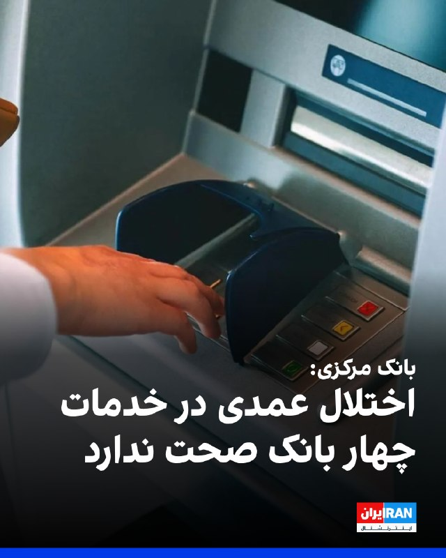

بانک مرکزی جمهوری اسلامی اعلام کرد که اختلال در خدمات بانک‌های ملی، صادرات، تجارت و توسعه صادرات در پی حمله سایبری به زیرساخت‌های ارتباطی این بانک‌ها رخ داده است و خدمات پایه مبتنی بر کارت با استفاده از روش‌های جایگزین دوباره در دسترس مشتریان قرار گرفته است.

بر اساس گزارش بانک مرکزی جمهوری اسلامی، هیچ آسیبی به اطلاعات مشتریان وارد نشده و سامانه‌های شتاب و شاپرک بدون اختلال فعال هستند.

این نهاد گزارش‌ها درباره ایجاد اختلال در سامانه‌های بانکی برای کنترل بازار ارز و طلا را رد کرد.
‌🏁 🇬🇧 IranintlTV

🤖 @VahidOOnLine

## VahidOOnLine — post 246387

  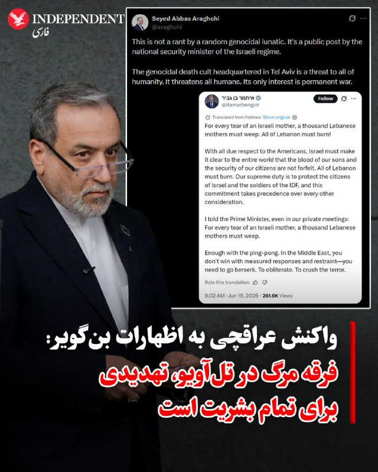

♦️ عباس عراقچی، وزیر امور خارجه جمهوری اسلامی، با بازنشر اظهارات تند ایتامار بن‌گویر، وزیر امنیت داخلی اسرائیل در شبکه اجتماعی ایکس، به مواضع او حمله کرد. عراقچی نوشت: «این‌ها رجزخوانی یک دیوانه بی‌نام‌ونشان نیست، بلکه گفته‌های علنی یک وزیر اسرائیل است. فرقه مرگ نسل‌کشی که مقر آن در تل‌آویو است، تهدیدی برای بشریت بوده و تنها هدفش جنگ دائمی است.»

این واکنش پس از آن صورت گرفت که بن‌گویر با انتقاد از رویکرد واشنگتن نوشت: «با تمام احترام برای آمریکایی‌ها، اسرائیل باید شفاف کند که خون فرزندان ما پایمال نمی‌شود؛ تمام لبنان باید بسوزد.» او با رد سیاست خویشتن‌داری افزود: «به نخست‌وزیر هم گفته‌ام که به ازای هر قطره اشک یک مادر اسرائیلی، باید هزار مادر لبنانی بگریند. در خاورمیانه با پاسخ‌های سنجیده پیروز نمی‌شوید، بلکه باید دیوانه‌وار عمل کرد، نابود کرد و ترور را در هم کوبید.»
‌🇸🇦 Indypersian

🤖 @VahidOOnLine

## WithYashar — post 15337

از زمان آغاز آتش‌بس، نیروی هوایی اسرائیل بیش از ۱۱ حمله هوایی در سراسر جنوب لبنان انجام داده است.
@withyashar

## WithYashar — post 15336

یک مقام ارشد در کاخ سفید به آکسیوس:
«نتانیاهو با تمدید آتش‌بس در لبنان صد درصد موافقت کرده است.»
@withyashar

## pm_afshaa — post 94396

  <a href="telegram/content/pm_afshaa_94396_1781877294.webm" target="_blank">🎬 Download video</a>

🔴خبرنگار المیادین در جنوب لبنان:
همزمان با اجرایی شدن آتش‌بس ادعایی، حملهٔ هوایی اسرائیل به النبطیه صورت گرفت.

💧 Rainbet.com the #1 Non-KYC Crypto Casino & Sportsbook @rainbetcom

😁 @Pm_Afshaa

## pm_afshaa — post 94395

  <a href="telegram/content/pm_afshaa_94395_1781877295.webm" target="_blank">🎬 Download video</a>

🔴خبرنگار الجزیره:
چهارمین حمله هوایی اسرائیل در اطراف شهرک کفر تبنیت در جنوب لبنان.

💧 Rainbet.com the #1 Non-KYC Crypto Casino & Sportsbook @rainbetcom

😁 @Pm_Afshaa

## VahidOnline — post 76517

  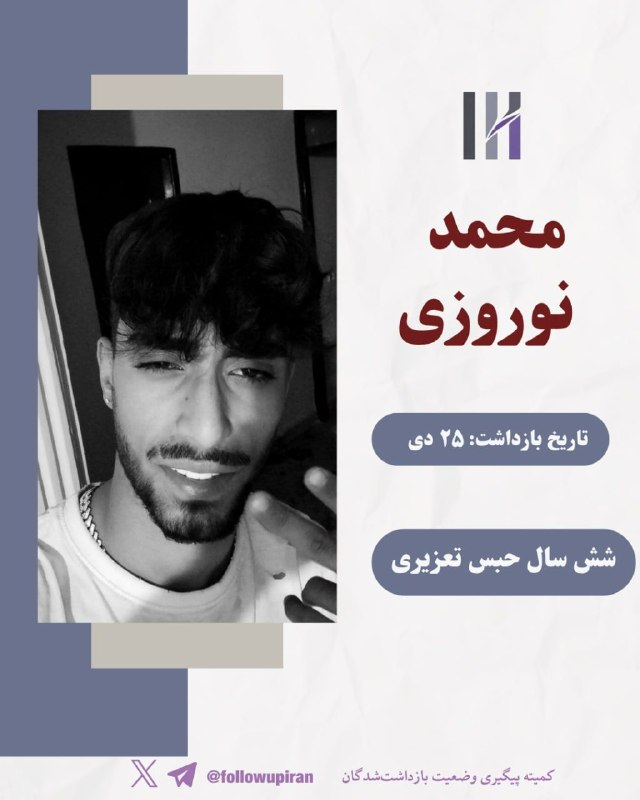

✅️#محمد_نوروزی، شهروند افغانستانی ساکن ایران، که در روز ۲۵ دی‌ماه ۱۴۰۴، در منزل مسکونی‌اش دستگیر شده بود، توسط دادگاه به شش‌سال زندان محکوم شد.

🔹️طبق گزارش رسیده به کمیته پیگیری، محمد نوروزی پس از بازداشت به آگاهی ملارد منتقل شده و پس از ۴ روز همراه با ضرب‌وشتم فیزیکی به زندان قزلحصار منتقل شد. او طی این مدت مدام تهدید می‌شد که رد مرز شده و از ایران اخراج خواهد شد.

🔹️او در نهایت با قرار وثیقه یک میلیارد تومانی از زندان آزاد شد و سپس توسط دادگاه به اتهام "اجتماع و تبانی و تبلیغ علیه نظام" به شش سال زندان محکوم شد.

این حکم هم‌اکنون در مرحله تجدیدنظر قرار دارد.

🆔️ @Followupiran

## VahidOnline — post 76516

  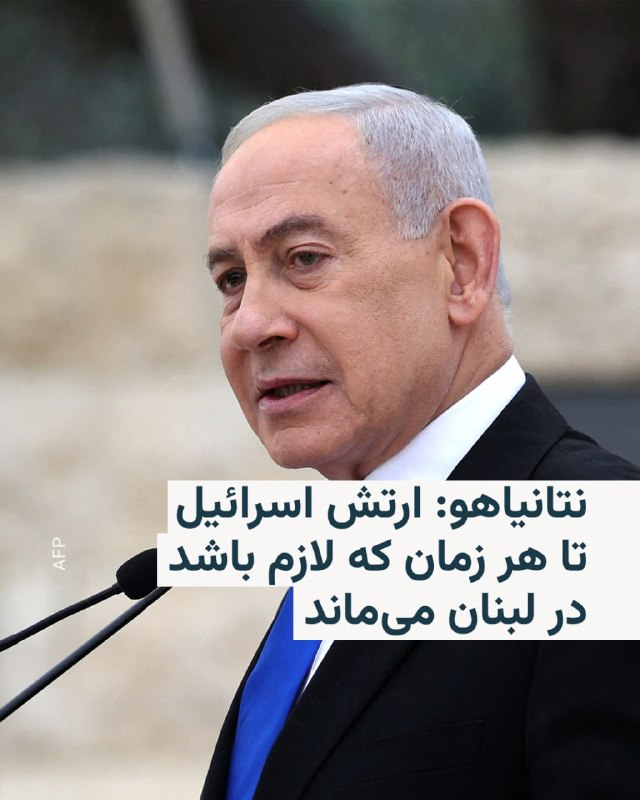

بنیامین نتانیاهو، نخست‌وزیر اسرائیل، روز جمعه بار دیگر گفت که نیروهای اسرائیلی «تا هر زمان که لازم باشد» در لبنان باقی خواهند ماند و وعده داد که حزب‌اللهِ مورد حمایت ایران برای حملاتش «بهای بسیار سنگینی» خواهد پرداخت.

او روز پنجشنبه، ساعاتی بعد از امضای تفاهم‌نامه پایان دادن به جنگ توسط ایران و آمریکا، نیز بر ادامه حضور ارتش اسرائیل در مناطقی از جنوب لبنان تأکید کرده بود.

نتانیاهو در بیانیه روز جمعه که پس از اعلام کشته شدن چهار سرباز اسرائیلی در لبنان از سوی ارتش منتشر شد، گفت: «اسرائیل حمله به سربازان یا قلمرو خود را تحمل نخواهد کرد و بابت این حملات بهای بسیار سنگینی از حزب‌الله خواهد گرفت.»

او افزود: «اسرائیل تا هر زمان که برای حفاظت از جوامع شمالی لازم باشد، در منطقه امنیتی جنوب لبنان باقی خواهد ماند.»

یسرائیل کاتز، وزیر دفاع، نیز گفته بود که ارتش در لبنان خواهد ماند و افزود که به هر حمله‌ای «با نیروی قابل توجه» پاسخ خواهد داد.

لبنان اعلام کرده بر اثر حملات اسرائیل در سراسر این کشور ۱۸ نفر کشته شده‌اند.
@VahidHeadline

📡 @VahidOnline

## VahidOnline — post 76515

  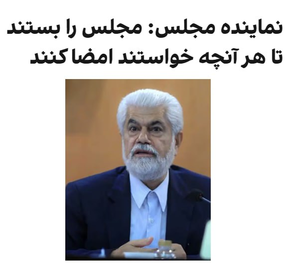

حسینعلی شهریاری، رییس کمیسیون بهداشت و درمان مجلس جمهوری اسلامی، در گفت‌وگو با دیده‌بان ایران، با اشاره به ادامه «تعطیلی مجلس» گفت: «مجلس را بستند تا هر آنچه خواستند امضا کنند.»

او با تاکید بر اینکه تفاهم‌نامه با آمریکا در نهایت باید به تصویب مجلس برسد، افزود: گذشت آن زمان که برجام را در ۲۰ دقیقه در مجلس تصویب کردند. ما یک بار از این موضوع آسیب دیده‌ایم و نباید دوباره همان اتفاق تکرار شود.

شهریاری همچنین از اظهارات عباس عراقچی، وزیر خارجه جمهوری اسلامی، درباره احتمال رقیق‌سازی اورانیوم غنی‌شده انتقاد کرد و گفت موضوع هسته‌ای نباید در مذاکرات مطرح شود، زیرا به گفته او «جزو خطوط قرمز» جمهوری اسلامی است.
@VahidOOnLine

📡 @VahidOnline

## VahidOnline — post 76514

  

مقام پیشین مرتبط با تحریم های ایران درباره «صندوق ۳۰۰ میلیارد دلاری»: پیش نیازش لغو همه تحریم هاست که دکمه روشن و خاموش ندارد

میعاد ملکی، مدیر پیشین «دفتر هدف‌گذاری تحریم‌های خزانه‌داری آمریکا» در یادداشتی درباره موضوع «صندوق ۳۰۰ میلیارد دلاری» برای ایران که بسیاری از کارشناسان درباره آن ابراز تردید کرده‌اند، می‌نویسد: با کنار گذاشتن موضوع معافیت/مجوز نفتی و نگرانی‌های مربوط به عدم اعمال تحریم‌های جدید، باتوجه به الزامات برای اجرای واقعی بند ۶ (صندوق بازسازی ۳۰۰ میلیارد دلاری) و بند ۷ (لغو همه تحریم‌ها) به این نتیجه می‌رسیم که مذاکره‌کنندگان آمریکایی یا می‌دانستند که توافق نهایی ناممکن است، یا این یادداشت تفاهم فقط تصمیم‌گیری را به آینده موکول می‌کند.

ملکی که خود در طراحی تحریم‌ها علیه حکومت ایران نقش داشته در این یادداشت می‌نویسد: این چیزی است که «اجرای کامل» در عمل، فراتر از امتیازهای هسته‌ای، به آن نیاز دارد:
بند ۶ — صندوق ۳۰۰ میلیارد دلاری:
صدور معافیت ریاست‌جمهوری از تحریم‌های الزامی بخش ساخت‌وساز ایران طبق ماده ۱۲۴۵ قانون IFCA (معافیت‌های ۱۸۰ روزه قابل تمدید که در هر دوره نیازمند اطلاع‌رسانی به کنگره هستند).
خارج کردن سپاه از فهرست سازمان‌های تروریستی خارجی (FTO)، زیرا در غیر این صورت سرمایه‌گذاران با خطر مسئولیت کیفری به دلیل «حمایت مادی» مواجه خواهند بود و هیچ مجوزی این مشکل را برطرف نمی‌کند.
استفاده از معافیت مبتنی بر منافع ملی در قانون ISA (قانون تحریم های ایران) برای سرمایه‌گذاری در بخش انرژی و نفت.
در نتیجه، هیچ نهاد سرمایه‌گذاری حاضر نیست میلیاردها دلار سرمایه را بر پایه معافیت‌های شش‌ماهه قابل تمدید متعهد کند.

بند ۷ — لغو همه تحریم‌ها:
ماده ۱۰۴ قانون CISADA (قانون جامع تحریم‌ها، پاسخگویی و واگذاری سرمایه‌گذاری‌های مرتبط با ایران) رئیس‌جمهور اختیار معافیت ندارد؛ تحریم‌ها الزامی هستند و لغو آن‌ها مستلزم تصویب قانون جدید در کنگره است.
ماده ۱۲۴۵ قانون NDAA (قانون مجوز دفاع ملی آمریکا) معافیت‌های ۱۲۰ روزه قابل تمدید که در هر دوره نیازمند ارائه گزارش اجباری به کنگره هستند.
تعیین بخش مالی ایران به عنوان «نگرانی پول‌شویی» تحت ماده ۳۱۱ قانون پاتریوت: این موضوع نیازمند مقررات‌گذاری جداگانه از سوی شبکه مقابله با جرائم مالی وزارت خزانه‌داری آمریکا (FinCEN) است و صرفا از طریق دفتر کنترل دارایی‌های خارجی (OFAC) حل نمی‌شود.
تحریم‌های مرتبط با تروریسم، حقوق بشر و موارد همپوشان با پرونده روسیه: هر کدام مستلزم اقدامات حقوقی مستقل و جداگانه هستند.
ملکی در ادامه می‌نویسد: «لغو همه تحریم‌ها» یک دکمه روشن و خاموش نیست، بلکه پروژه‌ای چندساله در حوزه قانون‌گذاری و مقررات‌گذاری است و کنگره نیز در آن حق رای دارد. و این پرسش مطرح است که چگونه می‌توان اتحادیه اروپا را وادار کرد محدودیت‌های مرتبط با ایران را که در چارچوب پرونده‌های مربوط به روسیه وضع شده‌اند، لغو کند.
@VahidOOnLine

📡 @VahidOnline

## VahidOnline — post 76513

  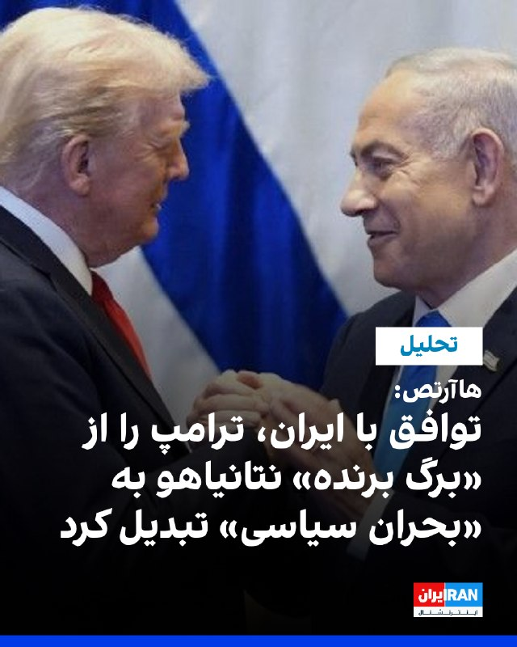

روزنامه هاآرتص در تحلیلی نوشت توافق دونالد ترامپ با جمهوری اسلامی، برخلاف انتظار بنیامین نتانیاهو، نه‌تنها به تقویت موقعیت سیاسی او منجر نشد، بلکه شکاف بی‌سابقه‌ای میان واشینگتن و تل‌آویو ایجاد کرده و نخست‌وزیر اسرائیل را در آستانه انتخابات با بحرانی تازه روبه‌رو کرده است.

روزنامه هاآرتص در تحلیلی نوشت نتانیاهو امیدوار بود سفر ترامپ به اسرائیل و حمایت علنی رییس‌جمهوری آمریکا، مهم‌ترین برگ برنده او در انتخابات پیش‌رو باشد.
به نوشته این روزنامه، نتانیاهو انتظار داشت این سفر پس از «پیروزی کامل» بر جمهوری اسلامی، سقوط حکومت ایران و انتقال ذخایر اورانیوم غنی‌شده برگزار شود، اما اکنون نه‌تنها هیچ‌یک از این اهداف محقق نشده، بلکه ترامپ تقریباً هر روز با اظهاراتی تحقیرآمیز از نخست‌وزیر اسرائیل انتقاد می‌کند.
هاآرتص افزود توافق آمریکا و جمهوری اسلامی در اسرائیل به‌طور گسترده «فاجعه‌بار» تلقی می‌شود، زیرا ترامپ برخلاف وعده‌های اولیه خود، جنگ را بدون تحقق اهداف اعلام‌شده پایان داده است.

@VahidOOnLine

📡 @VahidOnline

## VahidOnline — post 76512

  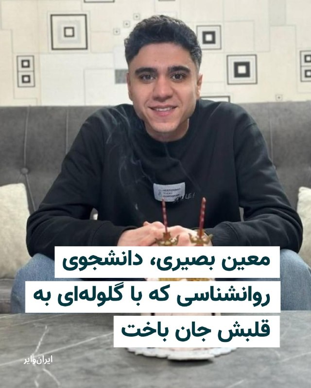

«معین بصیری» ۲۱ ساله، ساکن شهرک اندیشه تهران، روز پنج‌شنبه ۱۸ دی‌ماه ۱۴۰۴ هدف شلیک مستقیم قرار گرفت و جان خود را از دست داد.
به گفته منابع آگاه، گلوله از نقطه‌ای مرتفع و از روی پشت‌بام شلیک شده و به قلب معین اصابت کرده است.
او در پی این جراحت جان باخت و پیکرش پس از انتقال به کهریزک، به بهشت زهرا منتقل شد.
نزدیکانش می‌گویند پیکر معین بصیری را از بهشت زهرا تحویل گرفتند و مراسم خاکسپاری او روز ۲۱ دی‌ماه برگزار شد.
@VahidHeadline

📡 @VahidOnline

## IranIntlTV — post 343216

  <a href="telegram/content/IranIntlTV_343216_1781877298.mp4" target="_blank">🎬 Download video</a>

محمد انجوی‌نژاد، مداح و سخنران حکومتی، پیام مجتبی خامنه‌ای درباره تفاهم با آمریکا را «تلخ» خواند. او با اشاره به خاک‌سپاری نشدن پیکر علی خامنه‌ای پس از بیش از ۱۰۰ روز از کشته شدن او گفت: «آقا را غریب و پیر زیر آوار بمباران رها کردید، این یکی را نمی‌گذاریم.»
@iranintltv

## IranIntlTV — post 343215

  

بانک مرکزی جمهوری اسلامی اعلام کرد که اختلال در خدمات بانک‌های ملی، صادرات، تجارت و توسعه صادرات در پی حمله سایبری به زیرساخت‌های ارتباطی این بانک‌ها رخ داده است و خدمات پایه مبتنی بر کارت با استفاده از روش‌های جایگزین دوباره در دسترس مشتریان قرار گرفته است.

بر اساس گزارش بانک مرکزی جمهوری اسلامی، هیچ آسیبی به اطلاعات مشتریان وارد نشده و سامانه‌های شتاب و شاپرک بدون اختلال فعال هستند.

این نهاد گزارش‌ها درباره ایجاد اختلال در سامانه‌های بانکی برای کنترل بازار ارز و طلا را رد کرد.
https://iranintl.com/202606195086

## Shin_Persian — post 7133

Emanuel (Mannie) Fabian ✓ @manniefabian
Fri, 19 Jun 2026 13:21:16 UTC

The IDF says it has struck over 150 Hezbollah targets in Lebanon since midnight.

ترجمه خودکار فارسی

ارتش دفاعی اسرائیل (IDF) می‌گوید از نیمه‌شب تاکنون بیش از ۱۵۰ هدف حزب‌الله را در لبنان مورد حمله قرار داده است.

𝕏 · @shin_persian

## Shin_Persian — post 7132

Emanuel (Mannie) Fabian ✓ @manniefabian
Fri, 19 Jun 2026 13:26:07 UTC

IDF Spokesman Brig. Gen. Effie Defrin says Israeli troops have "full freedom of action" to act against any threat, amid a ceasefire with Hezbollah.

He says troops continue to operate at the Beaufort Castle area and Ali Taher ridge, to demolish major Hezbollah tunnel systems which serve as the terror group's "central command centers."

"Hezbollah is fighting a defensive battle to prevent our forces from completing the destruction of these infrastructures," Defrin says.

"Hezbollah is the one that violated the ceasefire. It is trying to defend its capabilities it built over the years," he continues.

Defrin says that troops "have full operational freedom of action, to remove threats in any area."

"There is no limit [concerning] removing threats," he adds.

ترجمه خودکار فارسی

سرتیپ افی دفرین، سخنگوی ارتش دفاعی اسرائیل می‌گوید که نیروهای اسرائیلی در میان برقراری آتش‌بس با حزب‌الله، «آزادی عمل کامل» دارند تا علیه هر تهدیدی اقدام کنند.

او می‌گوید نیروها به عملیات در منطقه قلعه شقیف (بوفورت) و ارتفاعات علی طاهر ادامه می‌دهند تا سیستم‌های تونلی مهم حزب‌الله را که به عنوان «مراکز فرماندهی مرکزی» این گروه تروریستی عمل می‌کنند، تخریب کنند.

دفرین می‌گوید: «حزب‌الله در حال نبرد دفاعی است تا مانع از تکمیل روند نابودی این زیرساخت‌ها توسط نیروهای ما شود.»

او ادامه می‌دهد: «حزب‌الله طرفی است که آتش‌بس را نقض کرده است. او سعی دارد از توانمندی‌هایی که طی سال‌ها ایجاد کرده دفاع کند.»

دفرین می‌گوید که نیروها «آزادی عمل کامل عملیاتی دارند تا تهدیدات را در هر منطقه‌ای برطرف کنند.»

وی می‌افزاید: «هیچ محدودیتی [در رابطه با] رفع تهدیدات وجود ندارد.»

𝕏 · @shin_persian

## Persian_Trend_Official — post 17584

  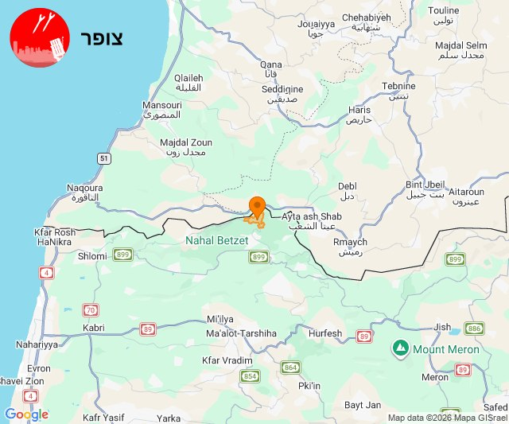

فعال شدن آژیر حملات موشکی/پهپادی حزب‌الله لبنان به شمار اسرائیل

📝 Amir

📌 @persian_trend_official
پرشین ترند | متفاوت‌ترین کانال نظامی

## IranianMinds — post 22951

🔴 مقام ارشد آمریکایی به رویترز: اسرائیل و حزب‌الله توافق کردند که مجدد آتش‌بس از ساعت ۴ بعدازظهر روز جمعه به وقت محلی برقرار شود. @IranianMinds

## BBCPersian — post 284377

  <a href="telegram/content/BBCPersian_284377_1781877301.mp4" target="_blank">🎬 Download video</a>

⭕️ سرخط خبرهای جمعه ۲۹ خرداد ۱۴۰۵
@BBCPersian

## Dirty_Kids — post 392576

  <a href="telegram/content/Dirty_Kids_392576_1781877303.mp4" target="_blank">🎬 Download video</a>

این کلیپ تو 2 روز، 250 میلیون بازدید خورده. خدا بیامرزتت داداش.

@Dirty_Kids 👻

## Dirty_Kids — post 392575

  <a href="telegram/content/Dirty_Kids_392575_1781877304.mp4" target="_blank">🎬 Download video</a>

چند روز پیش توی مشهد یه بارون سنگین اومد، حالا این کلیپ از وضعیت کاسبای بازار رضا خیلی وایرال شده😂

@Dirty_Kids 👻

## Hranews — post 113723

ازدواج اجباری دختران زیر ۱۵ سال در سهرورد تحت فشار سنت و طرد اجتماعی

❗️
❗️
❗️
❗️
❗️– دختران زیر ۱۸ سال در شهر سهرورد از توابع شهرستان خدابنده در استان زنجان، بنا بر روایت ساکنان، در چارچوب یک سنت اجتماعی پایدار ناگزیر به ازدواج در سنین پایین و پیش از ۱۵ سالگی می‌شوند. این کودکان اگر در کودکی تن به ازدواج ندهند، از ازدواج در سالیان بعد در سهرورد محروم خواهند شد.

ادامه مطلب

#ازدواج_کودکان #کودک_همسری

↘️
@hranews_bot تماس ✉️ -  @Hranews  کانال هرانا 🆑

## alonews — post 129153

  <a href="telegram/content/alonews_129153_1781877304.mp4" target="_blank">🎬 Download video</a>

👈با وجود اعلام اتش بس دوباره، اسرائیل همچنان درحال حملات سنگین به جنوب لبنانه

✅ @AloNews خبر جنگ

---
📅 بروزرسانی: 1405/03/29 17:14
---

## WithYashar — post 15335

حزب‌الله: هنوز هیچ اطلاعیه‌ای درباره زمان آتش‌بس دریافت نشده است
@withyashar

## mwarmonitor — post 11220

🔴خبرنگار الجزیره: حملات هوایی اسرائیل به مناطقی در استان نبطیه در جنوب لبنان.

@mwarmonitor

## FoxNewsTwitter — post 343169

Fox News (Twitter/X)

BREAKING: Israel, Hezbollah agree to ceasefire starting on Friday, a US senior official says

## VahidOnline — post 76511

  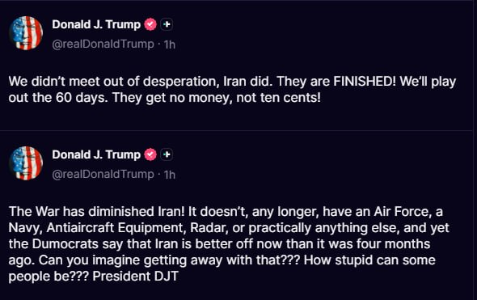

پست‌های ترامپ، ترجمه ماشین:
«جنگ، ایران را تضعیف کرده است! ایران دیگر نه نیروی هوایی دارد، نه نیروی دریایی، نه تجهیزات ضدهوایی، نه رادار، و عملاً هیچ چیز دیگری هم ندارد؛ با این حال دموکرات‌های احمق می‌گویند ایران الان از چهار ماه پیش وضع بهتری دارد. اصلاً می‌توانید تصور کنید کسی با چنین حرفی قسر در برود؟ بعضی‌ها چقدر می‌توانند احمق باشند؟؟؟
رئیس‌جمهور، دی‌جی‌تی»
realDonaldTrump
«ما از سرِ درماندگی دیدار نکردیم؛ ایران بود که از سرِ درماندگی آمد. کارشان تمام است! این ۶۰ روز را هم طی می‌کنیم. هیچ پولی گیرشان نمی‌آید، حتی ده سنت!»
realDonaldTrump

📡 @VahidOnline

## VahidOnline — post 76509

وزیر خارجه فرانسه می‌گوید پاریس تا زمانی که اطمینان حاصل نکند مذاکرات درباره برنامه هسته‌ای تهران انتظاراتش را برآورده می‌کند، با لغو تحریم‌های شورای امنیت سازمان ملل متحد علیه ایران موافقت نخواهد کرد.
ژان نوئل بارو روز جمعه ۲۹ خرداد این موضوع را اعلام کرد. فرانسه یکی از اعضای دارای حق وتوی شورای امنیت سازمان ملل است.

بارو گفت تا زمانی که مذاکرات آمریکا با ایران به ابهامات مربوط به برنامه موشک‌های بالستیک جمهوری اسلامی و حمایت تهران از نیروهای نیابتی پاسخ ندهد، ثباتی در منطقه برقرار نخواهد شد.
او افزود: «ما به یک تغییر اساسی در رویکرد ایران نیاز داریم.»
@VahidHeadline
وزیر خارجه فرانسه: کشتار معترضان دی‌ماه را فراموش نکنیم، مردم ایران بزرگ‌ترین قربانیان جنگ بودند
بارو که با تلویزیون «فرانس انفو» مصاحبه می‌کرد در پاسخ به پرسشی درباره سیاست فرانسه پس از «امضای تفاهم‌نامه پایان جنگ» ایران و آمریکا در قبال تهران گفت: «مردم ایران، بزرگ‌ترین قربانیان این جنگ بودند. آن‌ها از یک سو گرفتار سرکوبند و از سوی دیگر به رویشان بمب ریخته می‌شود. ما کشتار ژانویه (دی‌ماه) را که در آن خشونت دولتی بدون تمایز، معترضان مسالمت‌آمیز را هدف قرار داد، فراموش نمی‌کنیم.»
فرانسه حملات نظامی آمریکا و اسرائیل به جمهوری اسلامی را «غیرقانونی» توصیف و بارها اعلام کرد که در این جنگ شرکت نمی‌کند.
دونالد ترامپ تفاهم‌نامه پایان جنگ با ایران را در کاخ ورسای و در حضور امانوئل مکرون امضا کرد.
@VahidOOnLine

📡 @VahidOnline

## IranIntlTV — post 343214

  <a href="telegram/content/IranIntlTV_343214_1781876684.mp4" target="_blank">🎬 Download video</a>

سرخط خبرهای جمعه ۲۹ خرداد
@iranintltv

## IranIntlTV — post 343213

  <a href="telegram/content/IranIntlTV_343213_1781876685.mp4" target="_blank">🎬 Download video</a>

صدور حکم ۷۴ ضربه شلاق تعزیری، دو سال ممنوع‌الخروجی و دو سال محرومیت از فعالیت هنری برای پرستو احمدی و هشت نفر از نوازندگان و عوامل کنسرت کاروانسرا، موجی از خشم و اندوه را در شبکه‌های اجتماعی برانگیخته است. بسیاری از کاربران این احکام را نشانه تشدید فشار بر هنرمندان و محدودیت بیشتر آزادی‌های فرهنگی در ایران توصیف کرده‌اند.

آیه دریس، عضو تحریریه ایران‌اینترنشنال، از واکنش کاربران می‌گوید
@iranintltv

## FarsiVOA — post 221191

  <a href="telegram/content/FarsiVOA_221191_1781876686.mp4" target="_blank">🎬 Download video</a>

ارتش اسرائیل اعلام کرد در واکنش به آنچه «نقض‌های مکرر آتش‌بس» از سوی حزب‌الله خوانده، بیش از ۸۰ موضع و مقر این گروه را در جنوب لبنان و منطقه بقاع هدف قرار داده است.

ارتش اسرائیل همچنین گفت در این حملات ده‌ها عضو حزب‌الله کشته شده‌اند و چندین مقر فرماندهی، مواضع پرتاب راکت و زیرساخت‌های این گروه هدف قرار گرفته است.

@FarsiVOA

## Persian_Trend_Official — post 17581

  <a href="telegram/content/Persian_Trend_Official_17581_1781876687.mp4" target="_blank">🎬 Download video</a>

بمباران جنوب لبنان با وجود برقراری آتش بس کماکان ادامه دارد.

ارتش اسرائیل با تایید آتش بس گفته است که برقراری آتش بس مانع از حذف تهدیدها و نابودی زیرساخت ها نمی‌شود.

📝 Amir

📌 @persian_trend_official
پرشین ترند | متفاوت‌ترین کانال نظامی

## RadioFarda — post 158510

  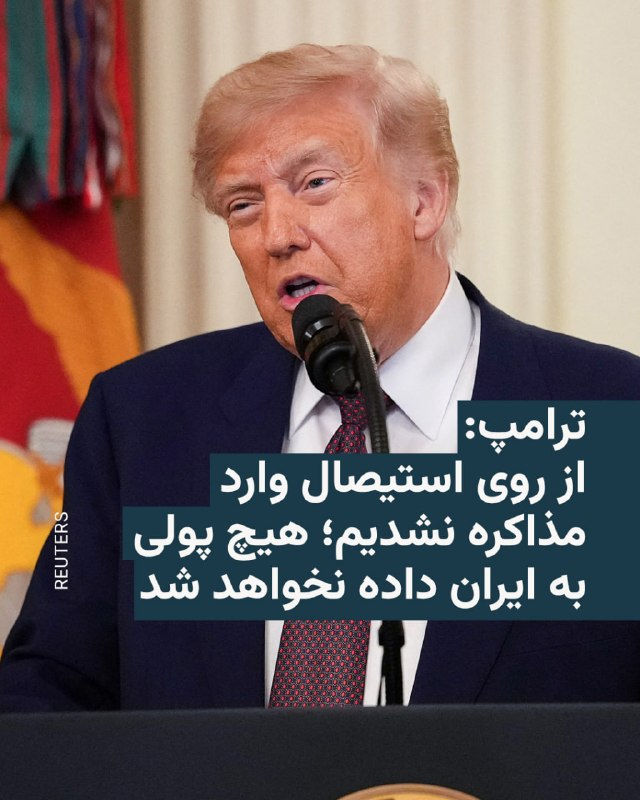

🔸دونالد ترامپ، رئیس جمهور آمریکا روز جمعه با انتشار پیامی در شبکه اجتماعی تروث‌سوشال نوشت که جمهوری اسلامی از موضع ضعف وارد مذاکره با آمریکا شد و در طول مذاکرات هیچ پولی دریافت نخواهد کرد.

🔸به نوشته آقای ترامپ، «ما از سر استیصال وارد مذاکره نشدیم؛ این ایران بود که چنین کرد. آن‌ها تمام شده‌اند.»

🔸او همچنین با اشاره به اینکه دوره ۶۰ روزه اجرای تفاهمنامه ایران و آمریکا را «تا پایان دنبال خواهیم کرد» نوشت که «هیچ پولی به آن‌ها داده نخواهد شد؛ حتی ۱۰ سنت.»

🔸رئیس جمهور آمریکا در پیام دیگری نوشت که جنگ ایران را به شدت تضعیف کرده است و اظهارات پیشین خود مبنی بر از بین رفتن نیروی هوایی، دریایی، پدافند هوایی و شبکه راداری موثر ایران را تکرار کرد.

🔸او همچنین با حمله به نمایندگان دموکرات‌ نوشت آنها با این همه می‌گویند ایران اکنون نسبت به چهار ماه پیش وضعیت بهتری دارد، او در ادامه نوشت: «برخی چقدر می‌توانند احمق باشند؟»

🔸ترامپ پیش‌تر نیز منتقدان توافق با ایران را «حسود یا احمق» خوانده بود. این در حالی است که برخی سیاستمداران حزب جمهوری‌خواه نیز از محتوای تفاهم‌نامه آمریکا و ایران انتقاد کرده‌اند.

@RadioFarda

## IranianMinds — post 22950

  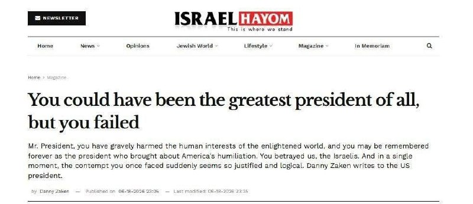

🔴 روزنامه اسرائیل هیوم به ترامپ :

آقای ترامپ میتونسی بهترین رئیس جمهور تاریخ باشی ولی خرابش کردی ، تو‌ به اسرائیل و به همه خیانت کردی.

@IranianMinds

## BBCPersian — post 284376

متن کامل تفاهم‌نامه ایران و آمریکا که به امضای مسعود پزشکیان و ترامپ رسیده، منتشر شده است.

بر اساس این توافق‌ ۱۴ ماده‌ای که به عنوان تفاهم‌نامه شناخته می‌شود، ایران هرگز سلاح هسته‌ای نخواهد داشت و همچنین ۳۰۰ میلیارد دلار بودجه برای «بازسازی و توسعه اقتصادی» این کشور اختصاص پیدا می‌کند، اگرچه ایالات متحده ملزم به مشارکت مستقیم در آن نیست.

از شما خواسته بودیم نظرتان را درباره تفاهم‌نامه ایران و آمریکا با ما به اشتراک بگذارید. نظرات شماری از مخاطبان بی‌بی‌سی فارسی را بشنوید، با این توضیح که این فقط بخشی از نظرات است و بازتاب نگاه کلی جامعه نیست.

@BBCPersian

## idfinfarsi — post 11861

  <a href="telegram/content/idfinfarsi_11861_1781876690.mp4" target="_blank">🎬 Download video</a>

🔴بیش از ۱۵۰ حمله ارتش اسرائیل در لبنان از نیمه‌شب تاکنون

## alonews — post 129152

  <a href="telegram/content/alonews_129152_1781876692.webm" target="_blank">🎬 Download video</a>

👈آکسیوس به نقل از مقام ارشد کاخ سفید : بی‌بی (نتانیاهو) صددرصد با آتش‌بس دوباره تو لُبنان اوکیه ولی خود نتانیاهو و تیمش فعلاً نه تأییدش کردن نه تکذیب؛ کلاً سکوت گرفتن

✅ @AloNews خبر جنگ

---
📅 بروزرسانی: 1405/03/29 17:04
---

## VahidOOnLine — post 246386

  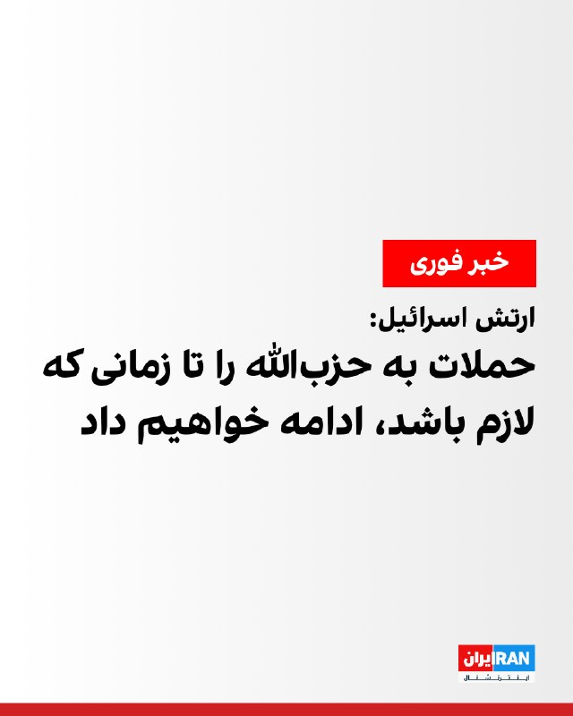

سخنگوی ارتش اسرائیل در کنفرانس خبری اعلام کرد: «از شب گذشته تاکنون به بیش از ۱۰۰ هدف حزب‌الله حمله کرده‌ایم و این حملات را تا هر زمان که لازم باشد، ادامه خواهیم داد.»

او افزود: «در منطقه بفور، یک زیرساخت راهبردی زیرزمینی وجود دارد. در هر یک از محورهایی که در آن فعالیت می‌کنیم، مقادیر زیادی سلاح و تجهیزات جنگی کشف و خارج می‌کنیم. این زیرساخت‌های مهم طی سال‌ها با کمک و هدایت جمهوری اسلامی ساخته شده‌اند.»

سخنگوی ارتش اسرائیل ادامه داد: «حزب‌الله در حال جنگ است تا مانع تکمیل روند نابودی زیرساخت‌های خود شود. این حزب‌الله بود که آتش‌بس را نقض کرد. نیروهای حاضر در میدان از آزادی عمل عملیاتی کامل برخوردار هستند. دستورالعمل‌های رییس ستاد ارتش برای جبهه شمالی تغییری نکرده است.»

او افزود: «هر آنچه مربوط به توافق‌هاست، در سطح تصمیم‌گیری سیاسی است. این موضوع در سطح رهبری سیاسی تعیین می‌شود و ما طبق دستورات عمل می‌کنیم. تا زمانی که دستورات دیگری دریافت نکنیم، طبق دستورالعمل‌هایی که رییس ستاد کل ارتش به نیروهای میدانی ابلاغ کرده، به فعالیت ادامه خواهیم داد.»
‌🏁 🇬🇧 IranintlTV

🤖 @VahidOOnLine

## VahidOOnLine — post 246385

♦️جورجیا ملونی، نخست‌وزیر ایتالیا، در واکنش به اظهارات اخیر دونالد ترامپ، رئیس‌جمهوری آمریکا، این سخنان را «کاملاً ساختگی» خواند و گفت از نحوه رفتار او با متحدان «مبهوت و شگفت‌زده» شده است.
او تاکید کرد: «نمی‌دانم چرا رئیس‌جمهور ایالات متحده این‌گونه با متحدان خود رفتار می‌کند» و افزود این نخستین‌بار نیست که چنین مواضعی از سوی ترامپ مطرح می‌شود. ملونی همچنین این رویکرد را «مایه تاسف» دانست و گفت او قاطعیتی را که در برابر دشمنان غرب نشان نمی‌دهد، در قبال برخی رهبران متحد خود به کار می‌گیرد.
نخست‌وزیر ایتالیا در پایان تأکید کرد: «یک چیز را باید به خاطر بسپارد؛ من و ایتالیا هرگز التماس نمی‌کنیم.»

در ادامه این تنش‌ها، آنتونیو تایانی، وزیر امور خارجه ایتالیا، نیز اعلام کرد سفر برنامه‌ریزی‌شده خود به آمریکا را لغو کرده و این اظهارات را «توهین به مردم ایتالیا» خواند.
‌🇸🇦 Indypersian

🤖 @VahidOOnLine

## VahidOOnLine — post 246384

  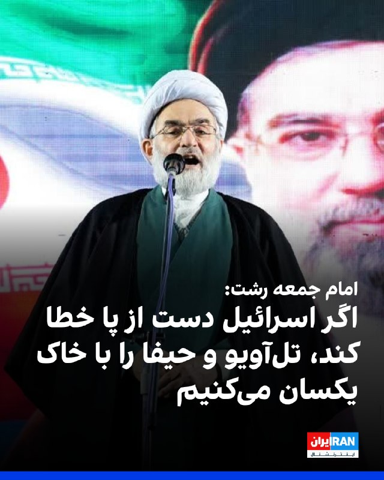

رسول فلاحتی، امام جمعه رشت در خطبه‌های نماز جمعه این شهر گفت: «اسرائیل بداند که اگر بعد از عدم حمایت آمریکا، دست از پا خطا کند، کل تل‌آویو و حیفا با خاک یکسان خواهد شد. ما از ۳۰ درصد توان نظامی خود استفاده کرده‌ایم و نیروهای مسلح ما اعم از سپاه و ارتش، از همه زمان‌های گذشته قوی‌تر شده‌اند.»

او ادامه داد: «مسعود پزشکیان تعهد کرده که حقوق ملت ایران و جبهه مقاومت حفظ شود و از حزب‌الله، انصارالله، حشد الشعبی و حماس حمایت کنیم.»
‌🏁 🇬🇧 IranintlTV

🤖 @VahidOOnLine

## VahidOOnLine — post 246383

  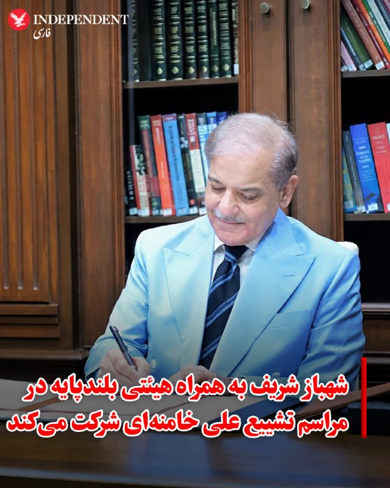

♦️ شهباز شریف، نخست‌وزیر پاکستان، روز جمعه ۲۹ خرداد در صحن مجلس این کشور اعلام کرد که در راس هیئتی بلندپایه برای شرکت در مراسم تشییع علی خامنه‌ای، رهبر پیشین جمهوری اسلامی به ایران سفر خواهد کرد.

شریف اعلام کرد که برای شرکت در این مراسم از او دعوت به‌عمل آمده است.
‌🇸🇦 Indypersian

🤖 @VahidOOnLine

## WithYashar — post 15334

کانال ۱۲ به نقل از یک مقام ارشد اسرائیلی: آتش‌بس به ما این امکان را می‌دهد که به تخریب زیرساخت‌ها و اقدام علیه تهدیدها ادامه دهیم.
@withyashar

## mwarmonitor — post 11219

🔴 خبرنگار الجزیره: چهارمین حمله هوایی اسرائیل در اطراف شهرک کفر تبنیت در جنوب لبنان.

@mwarmonitor

## mwarmonitor — post 11218

  <a href="telegram/content/mwarmonitor_11218_1781876087.mp4" target="_blank">🎬 Download video</a>

📌سخنگوی ارتش اسرائیل
🔸حزب‌الله آتش‌بس را نقض کرد و تلاش کرد مانع از تکمیل عملیات ما برای نابودی توانمندی‌هایی شود که طی سال‌ها ساخته است، و ما با قدرت به آن پاسخ دادیم.

🔸در ساعات شب گذشته تا این لحظه، ارتش اسرائیل بیش از ۱۰۰ هدف متعلق به حزب‌الله را در مناطق مختلف لبنان از جمله بقاع و النبطیه هدف قرار داده است. ارتش اسرائیل در این حملات ده‌ها «تروریست» را از بین برده است.

🔸نیروهای ارتش اسرائیل از آزادی کامل عملیاتی برای رفع تهدیدها در هر منطقه برخوردارند. رئیس ستاد کل دستور داده است که همه توانمندی‌ها در اختیار نیروهای میدانی قرار گیرد. ما اجازه نخواهیم داد هیچ‌کس ما را تهدید کند.

@mwarmonitor

## mwarmonitor — post 11217

🔴خبرنگار الجزیره: حمله هوایی اسرائیل به شهرک النبطیه الفوقا و گلوله‌باران توپخانه‌ای بر جبل الرفیع در منطقه اقلیم التفاح در جنوب لبنان.

@mwarmonitor

## mwarmonitor — post 11216

🔴رویترز به نقل از یک مقام آمریکایی: اسرائیل و حزب‌الله بر سر آتش‌بس از ساعت ۴ بعدازظهر به وقت محلی توافق کرده‌اند. @mwarmonitor

## mwarmonitor — post 11215

فکر کنم پنجمین آتش بس در یک ماه گذشته

## VahidOnline — post 76508

  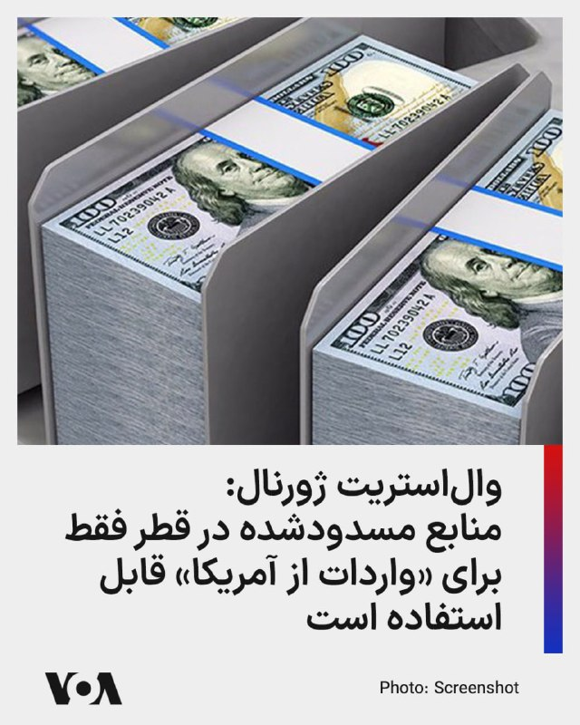

وال‌استریت ژورنال از قول منابع آگاه گزارش داده که طبق توافق پایان جنگ، ایران حق دسترسی به شش میلیارد دلار منابع مسدود شده در قطر برای واردات اقلام انسان‌دوستانه و غیرتحریمی از خود آمریکا خواهد داشت.

به گفته یک دیپلمات آگاه از جزئیات توافق، این منابع مالی به‌صورت مرحله‌ای و در بازه زمانی آتش‌بس تمدیدشده ۶۰ روزه آزاد خواهد شد و تنها برای خرید کالاهای آمریکایی قابل استفاده خواهد بود.

آزادسازی این منابع نیز مشروط به بازگشایی تنگه هرمز و پیشرفت مذاکرات برای دستیابی به توافق نهایی هست.

یک مقام آمریکایی به این رسانه گفته است واشنگتن در جریان مذاکرات نهایی بخشی از دارایی‌های مسدودشده ایران را آزاد خواهد کرد، مشروط بر آنکه ایران «رفتار مناسبی» از خود نشان دهد؛ از جمله تحویل ذخایر اورانیوم غنی‌شده خود.
@VahidHeadline

📡 @VahidOnline

## VahidOnline — post 76505

🔴بيكر علی حسن‌پور را بعد از ۱۰۴ روز به خانواده
‏تحويل دادند

‏🔸⁧ #علی_حسن‌پور⁩ در ۲۵ خرداد ۱۳۸۸ در خیابان آزادی تهران بر اثر اصابت گلوله به سر کشته شد. خانواده او پس از ۱۰۴ روز سرگردانی، سرانجام پیکر وی را میان اجساد مجهول‌الهویه پزشکی قانونی کهریزک شناسایی کردند.

🔸اعتراضات خرداد ۱۳۸۸ که در اعتراض به نتایج انتخابات ریاست جمهوری سال ۱۳۸۸ شکل گرفت، جانباختگان زیادی برجای گذاشت، بنیاد برومند تا کنون ۱۳۸ نفر از این افراد را که مرتبط با این اعتراضات کشته، ناپدید یا اعدام شدند را در نقشه اعتراضات خود ثبت کرده است.

🔸علی حسن پور یکی از این افراد است. سرگذشت کامل او را در یادبود امید بخوانید:
https://www.iranrights.org/fa/memorial/story/61687/ali-hassanpur

@IranRights

## VahidOnline — post 76504

  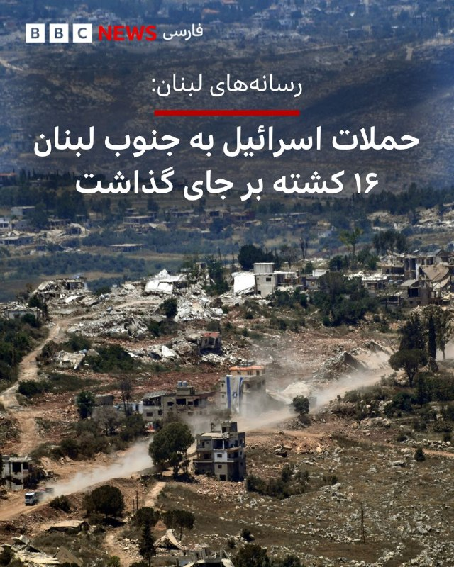

خبرگزاری ملی لبنان می‌گوید در حملات اسرائیل به شهرک‌های شرقیه، حاروف، کفررمان، کفرجوزو کفرصیر در جنوب این کشور دست‌کم ۱۶ نفر کشته شده‌اند.

به گزارش رسانه‌های محلی لبنان، از ساعات اولیه بامداد امروز، حملات توپخانه‌ای ارتش اسرائیل به شهر نبطیه و مناطق اطراف آن ادامه دارد.
@VahidHeadline

📡 @VahidOnline

## VahidOnline — post 76503

  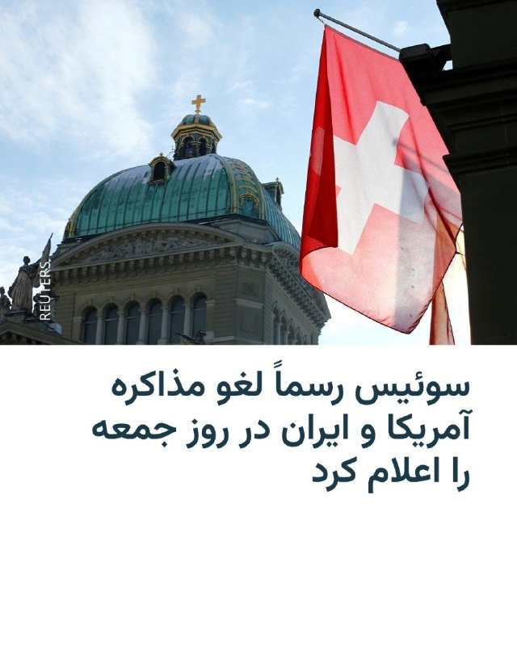

در پی اعلام کاخ سفید مبنی بر لغو سفر معاون دونالد ترامپ به سوئیس، وزارت خارجه این کشور اروپایی رسما خبر لغو سفر هیئت آمریکایی و لغو مذاکرات تهران و واشینگتن در روز جمعه را تأیید کرد.

لغو آغاز فوری مذاکرات بین دو کشور متخاصم تنها یک روز پس از امضا و رسمی شدن تفاهم‌نامه‌ای رخ می‌دهد که یکی از مهم‌ترین بندهای آن ۶۰ روز فرصت برای مذاکره درباره فعالیت هسته‌ای ایران است. قرار بود این ۶۰ روز بلافاصله در روز جمعه آغاز شود.

اما خبرگزاری تسنیم، نزدیک به سپاه پاسداران، روز پنج‌شنبه خبر داد که مذاکره‌کنندگان ایرانی پیش از آغاز دور بعدی گفت‌وگوهای صلح نیاز دارند نشانه‌هایی از اجرای توافق موقت از سوی آمریکا مشاهده کنند و هنوز تأییدی درباره سفر هیئت ایرانی به ژنو وجود ندارد.

در پی این انتشار این خبر بود که سخنگوی کاخ سفید هم در بیانیه‌ای که پنج‌شنبه شب منتشر شد، اعلام کرد ونس و هیئت آمریکایی آماده بودند به محض نهایی شدن برنامه مذاکرات، عازم شوند.
@VahidHeadline

📡 @VahidOnline

## VahidOnline — post 76502

  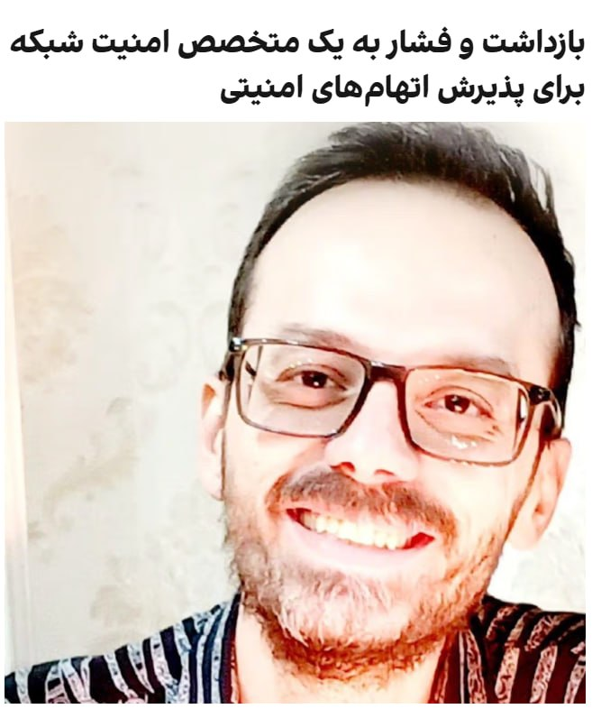

محمود قنبری‌راد، متخصص امنیت شبکه و از کارکنان یکی از شرکت‌های تهران، با اتهاماتی از جمله «اجتماع و تبانی علیه امنیت ملی»، «جمع‌آوری اطلاعات طبقه‌بندی‌شده» و «ارائه اطلاعات به اسرائیل» روبه‌رو شده است.

بر اساس گزارش‌ها، محمود قنبری‌راد، شهروندی ۴۰ ساله و متأهل، اردیبهشت‌ماه سال جاری در منزل شخصی خود بازداشت شده است.
یک منبع مطلع به دویچه‌وله گفته بود که او هیچ سابقه فعالیت سیاسی یا مدنی نداشته و به‌عنوان متخصص امنیت شبکه مشغول به کار بوده است.

گزارش‌ها حاکی است که او در تماس تلفنی از زندان، پرونده خود را «ساختگی» توصیف کرده و گفته است که برای پذیرش اتهامات تحت فشار قرار دارد. همچنین اعلام شده که وی از زمان بازداشت تاکنون از دسترسی به وکیل محروم بوده است.

بر اساس اطلاعات منتشرشده، محمود قنبری‌راد ابتدا حدود یک ماه در زندان اوین نگهداری شده و سپس به زندان فشافویه منتقل شده است.
همچنین گفته شده که او از نوعی اختلال عصبی رنج می‌برد و خانواده‌اش نسبت به وضعیت جسمی و حقوقی او ابراز نگرانی کرده‌اند.
@VahidHeadline

📡 @VahidOnline

## IranIntlTV — post 343212

  

سخنگوی ارتش اسرائیل در کنفرانس خبری اعلام کرد: «از شب گذشته تاکنون به بیش از ۱۰۰ هدف حزب‌الله حمله کرده‌ایم و این حملات را تا هر زمان که لازم باشد، ادامه خواهیم داد.»

او افزود: «در منطقه بفور، یک زیرساخت راهبردی زیرزمینی وجود دارد. در هر یک از محورهایی که در آن فعالیت می‌کنیم، مقادیر زیادی سلاح و تجهیزات جنگی کشف و خارج می‌کنیم. این زیرساخت‌های مهم طی سال‌ها با کمک و هدایت جمهوری اسلامی ساخته شده‌اند.»

سخنگوی ارتش اسرائیل ادامه داد: «حزب‌الله در حال جنگ است تا مانع تکمیل روند نابودی زیرساخت‌های خود شود. این حزب‌الله بود که آتش‌بس را نقض کرد. نیروهای حاضر در میدان از آزادی عمل عملیاتی کامل برخوردار هستند. دستورالعمل‌های رییس ستاد ارتش برای جبهه شمالی تغییری نکرده است.»

او افزود: «هر آنچه مربوط به توافق‌هاست، در سطح تصمیم‌گیری سیاسی است. این موضوع در سطح رهبری سیاسی تعیین می‌شود و ما طبق دستورات عمل می‌کنیم. تا زمانی که دستورات دیگری دریافت نکنیم، طبق دستورالعمل‌هایی که رییس ستاد کل ارتش به نیروهای میدانی ابلاغ کرده، به فعالیت ادامه خواهیم داد.»
https://iranintl.com/202606198362

## IranIntlTV — post 343211

  

رسول فلاحتی، امام جمعه رشت در خطبه‌های نماز جمعه این شهر گفت: «اسرائیل بداند که اگر بعد از عدم حمایت آمریکا، دست از پا خطا کند، کل تل‌آویو و حیفا با خاک یکسان خواهد شد. ما از ۳۰ درصد توان نظامی خود استفاده کرده‌ایم و نیروهای مسلح ما اعم از سپاه و ارتش، از همه زمان‌های گذشته قوی‌تر شده‌اند.»

او ادامه داد: «مسعود پزشکیان تعهد کرده که حقوق ملت ایران و جبهه مقاومت حفظ شود و از حزب‌الله، انصارالله، حشد الشعبی و حماس حمایت کنیم.»
https://iranintl.com/202606195261

## IranIntlTV — post 343210

🔻‌یلدا رشتیان، خواهر جاویدنام صهبا رشتیان، انیماتور و کمک‌داور فوتبال، با انتشار ویدیویی به مناسبت سالروز تولد خواهرش در صفحه اینستاگرام خود نوشت: «۳۰ام تولدته ،نیستی صهبا. نیستی ببینی چه شکلی شدم. ببخشید خواهر خوبی نبودم برات. ببخشید سال پیش تولدت جنگ شد نشد کاری بکنم برات. ببخشید من یه روزی از تو بزرگ تر میشم.»

🔹جاویدنام صهبا رشتیان، ۲۳ ساله در جریان انقلاب ملی ایرانیان علیه جمهوری اسلامی، در اعتراضات شهر اصفهان در روز جمعه ١٩ دی ۱۴۰۴، به دست نیروهای سرکوب، کشته و پیکر او پنجشنبە ۲۵ دی، به خاک سپرده شد.

🔹رویای صهبا این بود که روزی در بزرگ‌ترین رویداد فوتبال جهان، جام جهانی، داوری کند؛ رویایی که هرگز فرصت تحقق نیافت.

@iranintltvsport

## Iliaen — post 4501

  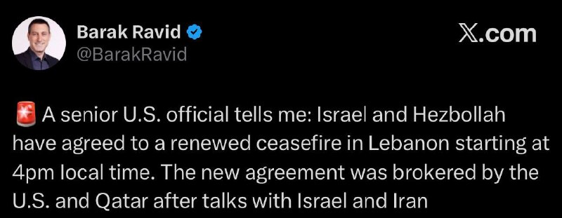

ساعت ۱۳:۴۳ جمعه، براساس گزارش مستقیم از چند کشتی در خلیج فارس، سپاه پاسداران حرکت تمام کشتی‌ها را متوقف کرد و عملاً تنگه هرمز را بست. @iliaen

## DW_Farsi — post 126185

🔶رشد سرطان در ایران به "دو برابر میانگین جهانی" خواهد رسید

دبیر کمیته ملی کنترل و پیشگیری سرطان وزارت بهداشت ایران هشدار داده است که نرخ ابتلا به سرطان تا سال ۱۴۴۰ در کشور به دو برابر میانگین جهانی افزایش خواهد یافت.

به گزارش ایرنا، علی مطلق روز پنج‌شنبه ۲۸ خرداد (۱۹ ژوئن) در مراسمی روند ابتلا به سرطان در ایران را نگران‌کننده توصیف کرده و گفت: «بر اساس پیش‌بینی‌ها، میزان بروز سرطان در ایران بین سال‌های ۲۰۲۰ تا ۲۰۴۰ با افزایش ۱۱۵ درصدی روبه‌رو خواهد شد، در حالی که این رقم در سطح جهان ۶۳ درصد برآورد شده است.»

در سال‌های اخیر کارشناسان بارها هشدار داده‌اند که ایران با یکی از وخیم‌ترین بحران‌های سلامت و معیشت در تاریخ معاصر خود روبروست و فقر مطلق، تورم سه‌رقمی و نبود زیرساخت‌های درمانی مناسب، جامعه را به فاز "بقا محور" سوق داده است. در این میان وقوع دو جنگ در بازه یک ساله و وضعیت ناشی از بحران ایجاد شده و وارد آمدن صدمات به زیرساخت‌ها، موجب شده است تا وضعیت اقتصادی، اجتماعی و بهداشتی کشور بیش از پیش شکننده شود و نگرانی‌ها درباره توان حکومت در تأمین نیازهای اولیه شهروندان و مدیریت پیامدهای انسانی این بحران‌ها افزایش یابد.

@dw_farsi

## Persian_Trend_Official — post 17580

سخنگوی ارتش اسرائیل: حزب‌الله در حال نبردی دفاعی است تا مانع از نابودی کامل این زیرساخت‌ها توسط نیروهای ما شود.

حزب‌الله کسی است که آتش‌بس را نقض کرده است. این گروه در تلاش است تا از قابلیت‌های خود که طی سال‌ها ایجاد کرده است، دفاع کند.

برای من مهم است که این نکته را روشن کنم: نیروهای ما آزادی عمل عملیاتی کامل برای رفع تهدیدات در هر منطقه‌ای دارند.

هیچ محدودیتی در مورد رفع تهدیدات وجود ندارد.

📝 Amir

📌 @persian_trend_official
پرشین ترند | متفاوت‌ترین کانال نظامی

## Persian_Trend_Official — post 17579

‌کانال 12 اسرائیل به نقل از یک مقام ارشد اسرائیلی: آتش‌بس به ما اجازه می‌دهد تا به تخریب زیرساخت‌ها و اقدام علیه تهدیدها ادامه دهیم.

📝 Amir

📌 @persian_trend_official
پرشین ترند | متفاوت‌ترین کانال نظامی

## BBCPersian — post 284375

  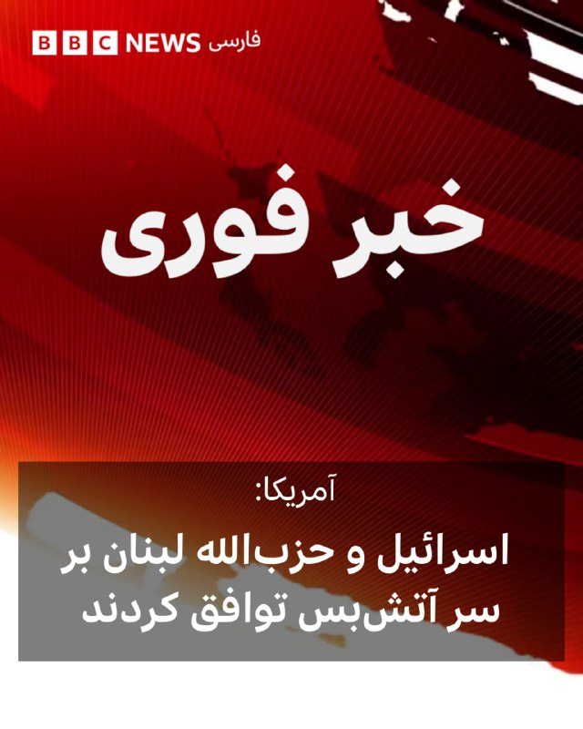

🔻اسرائیل و حزب‌الله لبنان بر سر یک آتش‌بس جدید توافق کردند. این آتش‌بس از ساعت چهار بعدازظهر جمعه به وقت محلی آغاز خواهد شد.

پیشتر یک مقام ارشد آمریکایی که به شرط فاش نشدن نامش به خبرگزاری رویترز گفته بود: «حزب‌الله و اسرائیل بر سر آتش‌بس توافق کرده‌اند.» این مقام آمریکایی گفته بود مذاکره‌کنندگان آمریکایی و قطری با کمک ایران این توافق را نهایی کرده‌اند.

این خبر در حالی اعلام شد که درگیری‌ها در لبنان روز جمعه بار دیگر شدت گرفت و ۲۱ نفر در حملات هوایی اسرائیل کشته شدند.

https://bbc.in/4vgfIJP
@BBCPersian

## BBCPersian — post 284374

🔻شکایت فدراسیون فوتبال ایران به فیفا در پی محدودیت‌های سفر تیم ملی به آمریکا

در پی اعمال محدودیت‌هایی برای ورود تیم ملی ایران به خاک آمریکا در جام جهانی ۲۰۲۶، فدراسیون فوتبال ایران رسما به فیفا شکایت می‌کند.

درچارچوب این محدودیت‌ها، تیم ایران اجازه دارد یک روز قبل از بازی به آمریکا سفر کند و طبق شرایط ویزای خود، باید بلافاصله و در همان روز مسابقه، خاک آمریکا را ترک کند.

در همین راستا امیر قلعه‌نویی، سرمربی تیم ملی، پس از تساوی ۲-۲ مقابل نیوزیلند در لس‌آنجلس گفت که ایران «مظلوم‌ترین» تیم این مسابقات است.

فدراسیون فوتبال ایران در بیانیه‌ای اعلام کرد که محدودیت‌های سفری تیم ملی «با اصل فراهم کردن شرایط برابر برای همه تیم‌های شرکت‌کننده مغایرت دارد و ممکن است بر روند آماده‌سازی تیم‌ها تأثیر منفی بگذارد.»

در همین راستا فدراسیون ایران رسماً نارضایتی خود را ابراز کرده و گفته است از طریق مجاری مناسب شکایت رسمی خود را به فیفا ارائه خواهد کرد.

https://bbc.in/4vgfIJP
@BBCPersian

## BBCPersian — post 284373

🔻حزب‌الله لبنان: اسرائیل به هیچ توافق آتش‌بسی پایبند نبوده است

حزب‌الله لبنان در بیانیه‌ای اعلام کرده است که از خاک و مردم لبنان در برابر حملات اسرائیل دفاع خواهد کرد.

این گروه، اسرائیل را به نقض آتش‌بس متهم کرده است.

حزب‌الله در بیانیه‌ای که روز جمعه منتشر کرد گفت: «مقاومت اسلامی در برابر هرگونه تجاوزی هوشیار خواهد ماند. جنگجویان آن از سرزمین و مردم خود دفاع خواهند کرد.»

در ادامه این اطلاعیه آمده است که «دشمن هرگز به هیچ توافق آتش‌بس پایبند نبوده است.»

ارتش اسرائیل گفته است که در پاسخ به «نقض آتش‌بس» از سوی حزب‌الله «بیش از ۸۰ هدف» متعلق به این گروه را در لبنان هدف قرار داده و ده‌ها عضو آن را کشته است؛ «نقضی» که حزب‌الله آن را رد کرده است.

https://bbc.in/4vgfIJP
@BBCPersian

## BBCPersian — post 284372

🔻فوری

رئیس جمهور لبنان: حملات اسرائیل تمام تلاش‌ها برای تثبیت آتش‌بس را هدف قرار داده است

ژوزف عون، رئیس‌جمهور لبنان، روز جمعه تازه‌ترین دور حملات اسرائیل به این کشور را محکوم کرد و گفت که این «کشتار و ویرانی» تشدید خطرناک تنش‌هاست.

در بیانیه‌ ریاست‌جمهوری لبنان آمده است: «این اقدامات عملا تمامی تلاش‌ها برای تثبیت آتش‌بس و پایان دادن به جنگ را هدف قرار داده است.»

این اظهارات پس از آن بیان شد که در حملات اسرائیل به جنوب و شرق لبنان، دست‌کم ۱۸ نفر کشته شدند.

https://bbc.in/4vgfIJP
@BBCPersian

## BBCPersian — post 284371

🔻فوری

رویترز: اسرائیل و حزب‌الله بر سر آتش‌بس توافق کردند؛ آمریکا و قطر با «کمک ایران» توافق را تنظیم کردند

یک مقام ارشد آمریکایی به رویترز گفته است که حزب‌الله و اسرائیل بر سر یک آتش‌بس توافق کرده‌اند که قرار است از ساعت ۴ بعدازظهر به وقت محلی روز جمعه آغاز شود.

این مقام که نخواست نامش فاش شود، گفت: «حزب‌الله و اسرائیل بر سر آتش‌بس به توافق رسیده‌اند.»

او افزود که آمریکا و قطر با کمک ایران این توافق را تنظیم کرده‌اند.

این مقام گفت که «پس از تبادل آتش در اوایل امروز، اسرائیل و حزب‌الله اکنون در وضعیت آتش‌بس قرار دارند.»

https://bbc.in/4vgfIJP
@BBCPersian

## BBCPersian — post 284370

🔻شهباز شریف: پاکستان در مراسم تشییع علی خامنه‌ای شرکت می‌کند

شهباز شریف، نخست‌وزیر پاکستان، گفته است که رئیس‌جمهور ایران از پاکستان برای شرکت در مراسم تشییع و خاکسپاری علی خامنه‌ای، رهبر سابق ایران، دعوت کرده است.

آقای شریف که در پارلمان پاکستان صحبت می‌کرد گفت که مسعود پزشکیان در تماسی تلفنی از نقش آن کشور و به طور مشخص فیلد مارشال عاصم منیر، فرمانده کل نیروهای مسلح در دستیابی به توافق با آمریکا قدردانی کرده است.

او همچنین گفت که دعوت رئیس جمهور ایران برای شرکت در مراسم تشییع علی خامنه‌ای را پذیرفته و قرار است هیئتی از این کشور در این مراسم شرکت کنند.

طبق برنامه‌ای که دفتر حفظ و نشر آثار رهبر پیشین جمهوری اسلامی ایران اعلام کرده است زمان برگزاری مراسم «وداع، تشییع و تدفین» از ۱۳ تا ۱۸ تیرماه در تهران، قم و مشهد برگزار می‌شود.

علی خامنه‌ای به همراه شماری از اعضای خانواده‌اش در نخستین لحظات حملات آمریکا و اسرائیل به تهران در نهم اسفندماه ۱۴۰۴ کشته شد.

براساس اطلاعیه منتشر شده به همراه علی خامنه‌ای، چهار نفر از اعضای خانواده‌اش، بشری حسینی خامنه‌ای (فرزند)، مصباح‌الهدی باقری (داماد)، زهرا حدادعادل (عروس) و زهرا محمدی گلپایگانی (نوه) نیز تشییع می‌شوند.

https://bbc.in/4vgfIJP
@BBCPersian

## alonews — post 129151

  <a href="telegram/content/alonews_129151_1781876093.mp4" target="_blank">🎬 Download video</a>

👈ارتش اسرائیل: از نیمه‌شب گذشته بیش از ۱۵۰ حملهِ هوایی به لُبنان دادیم

✅ @AloNews خبر جنگ

## alonews — post 129150

  <a href="telegram/content/alonews_129150_1781876095.mp4" target="_blank">🎬 Download video</a>

👈سخنگوی ارتش اسرائیل: ارتش اسرائیل آماده و مهیای بازگشت فوری به عملیات‌های شدید رزمی در هر میدان نبرد است

✅ @AloNews خبر جنگ

## alonews — post 129149

محرم عجیبیه

حکومت هیئت‌ها رو کرده میتینگ سیاسی، خیابون‌ها رو کرده فستیوال

[@AloTweet]

## alonews — post 129148

  <a href="telegram/content/alonews_129148_1781876097.mp4" target="_blank">🎬 Download video</a>

👈حمله هوایی اسرائیل به نبطیه، جنوب لبنان

✅ @AloNews خبر جنگ

## alonews — post 129147

  <a href="telegram/content/alonews_129147_1781876098.webm" target="_blank">🎬 Download video</a>

👈آکسیوس به نقل از یک مقام آمریکایی گزارش داد: اسرائیل و حزب‌الله پس از مذاکرات با اسرائیل و ایران، با میانجیگری آمریکا و قطر بر سر آتش‌بس به توافق رسیدند.

✅ @AloNews خبر جنگ

## alonews — post 129146

  <a href="telegram/content/alonews_129146_1781876098.webm" target="_blank">🎬 Download video</a>

👈حزب‌الله: هنوز هیچ اطلاعیه‌ای درباره زمان آتش‌بس دریافت نشده است

✅ @AloNews خبر جنگ

---
📅 بروزرسانی: 1405/03/29 16:54
---

## VahidOOnLine — post 246382

  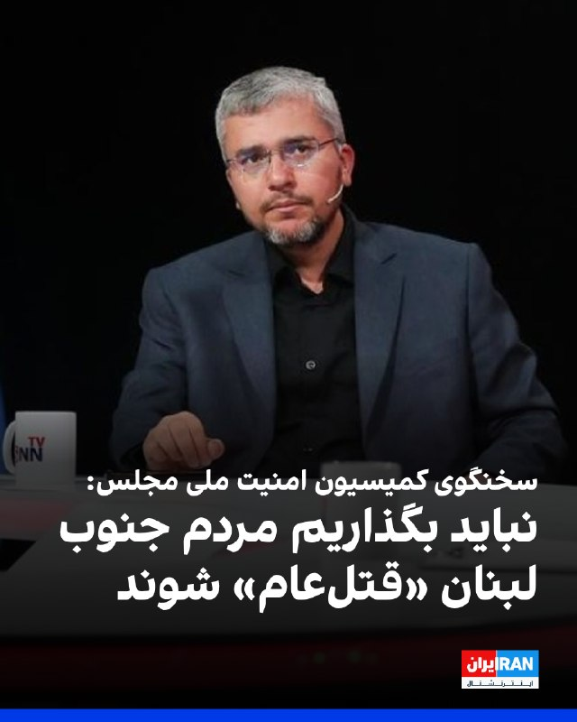

ابراهیم رضایی، سخنگوی کمیسیون امنیت ملی مجلس، در شبکه ایکس نوشت که با توجه به پیام «رهبر» که به «جبهه مقاومت» اشاره داشت، دولت باید از همین الان و از لبنان شروع کند و نگذاریم مردم مقاوم جنوب لبنان «قتل‌عام» شوند.

پیش‌تر مجتبی خامنه‌ای در پیامی مکتوب، اعلام کرد که درباره تفاهم جمهوری اسلامی و آمریکا «من نظر دیگری داشتم»، اما با «قبول مسئولیت» از سوی مسعود پزشکیان، اجازه اجرای آن را صادر کرده است.
‌🏁 🇬🇧 IranintlTV

🤖 @VahidOOnLine

## VahidOOnLine — post 246381

  

محمدمنان رییسی، نماینده مجلس جمهوری اسلامی، در واکنش به پیام مجتبی خامنه‌ای درباره یادداشت تفاهم میان جمهوری اسلامی و آمریکا، در پیامی در شبکه اجتماعی ایکس خواستار بازگشایی مجلس شد.

او نوشت: «خوش‌انصاف‌ها مجلس را باز کنید، رهبرم تنها مانده است.»

حسینعلی شهریاری، رییس کمیسیون بهداشت و درمان مجلس، نیز با اشاره به تعطیلی مجلس از روند بررسی تفاهم‌نامه انتقاد کرد.

شهریاری جمعه ۲۹ خرداد گفت: «مجلس را بستند تا هر آنچه خواستند امضا کنند.» او پیش‌تر نیز تاکید کرده بود که هرگونه توافق نهایی با آمریکا باید به تصویب مجلس برسد و نباید تجربه تصویب شتاب‌زده برجام تکرار شود.
‌🏁 🇬🇧 IranintlTV

🤖 @VahidOOnLine

## WithYashar — post 15333

خبرنگار المیادین در جنوب لبنان: همزمان با اجرایی شدن آتش‌بس ، حملهٔ هوایی اسرائیل به النبطیه صورت گرفت.
@withyashar

## IranIntlTV — post 343209

  

ابراهیم رضایی، سخنگوی کمیسیون امنیت ملی مجلس، در شبکه ایکس نوشت که با توجه به پیام «رهبر» که به «جبهه مقاومت» اشاره داشت، دولت باید از همین الان و از لبنان شروع کند و نگذاریم مردم مقاوم جنوب لبنان «قتل‌عام» شوند.

پیش‌تر مجتبی خامنه‌ای در پیامی مکتوب، اعلام کرد که درباره تفاهم جمهوری اسلامی و آمریکا «من نظر دیگری داشتم»، اما با «قبول مسئولیت» از سوی مسعود پزشکیان، اجازه اجرای آن را صادر کرده است.
https://iranintl.com/202606199736

## IranIntlTV — post 343208

  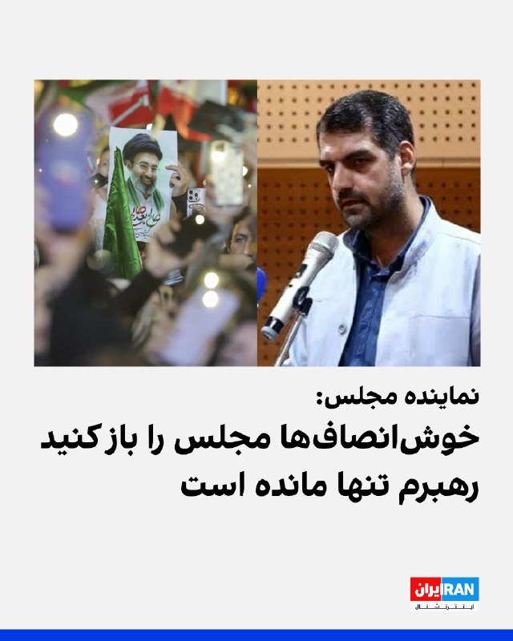

محمدمنان رییسی، نماینده مجلس جمهوری اسلامی، در واکنش به پیام مجتبی خامنه‌ای درباره یادداشت تفاهم میان جمهوری اسلامی و آمریکا، در پیامی در شبکه اجتماعی ایکس خواستار بازگشایی مجلس شد.

او نوشت: «خوش‌انصاف‌ها مجلس را باز کنید، رهبرم تنها مانده است.»

حسینعلی شهریاری، رییس کمیسیون بهداشت و درمان مجلس، نیز با اشاره به تعطیلی مجلس از روند بررسی تفاهم‌نامه انتقاد کرد.

شهریاری جمعه ۲۹ خرداد گفت: «مجلس را بستند تا هر آنچه خواستند امضا کنند.» او پیش‌تر نیز تاکید کرده بود که هرگونه توافق نهایی با آمریکا باید به تصویب مجلس برسد و نباید تجربه تصویب شتاب‌زده برجام تکرار شود.
https://iranintl.com/202606191201

## DW_Farsi — post 126184

🔶توافق آمریکا و ایران؛ امید و تردید در کوهستان‌های سوئیس

این نخستین بار نیست که اقامتگاه کوهستانی بورگن‌شتوک در سوئیس میزبان رویدادهای تاریخی می‌شود. در طول دهه‌ها، این استراحتگاه کوهستانی پذیرای ستاره‌های موسیقی، رهبران جهان و حتی محل امضای توافق‌های صلح بوده است.

قرار بود هیئت‌های آمریکا و ایران روز جمعه در این محل دیدار کنند؛ دیداری که نقطه اوج هفته‌ای پر فراز و نشیب در عرصه دیپلماسی می‌توانست باشد. هفته‌ای که از عصر یکشنبه ۱۴ ژوئن با پیام دونالد ترامپ، رئیس‌جمهوری آمریکا، در شبکه‌های اجتماعی آغاز شد؛ پیامی که در آن از "کشتی‌های جهان" خواست «موتورهای خود را روشن کنند.»

با وجود اعلام ترامپ مبنی بر دستیابی آمریکا و ایران به یک "توافق صلح"، هیچ جزئیاتی منتشر نشد. رسانه‌های نزدیک به حکومت ایران به تدریج بخش‌هایی از یک تفاهم‌نامه را منتشر کردند و گزارش‌هایی نیز درباره امضای الکترونیکی یک توافق اولیه از سوی دو طرف منتشر شد. ترامپ گفت مراسم امضای "رسمی" روز جمعه ۱۹ ژوئن در سوئیس برگزار خواهد شد.

@dw_farsi

## Persian_Trend_Official — post 17578

ارتش اسرائیل خبر از برقراری آتش بس در جنوب لبنان داد.

بیانیه ارتش اسرائیل: منطقه امنیتی در جنوب لبنان تا 10 کیلومتر امتداد دارد و ما به تقویت نیروهای خود در آنجا ادامه خواهیم داد.

دستورالعمل‌های رئیس ستاد تغییر نکرده است و هیچ محدودیتی برای از بین بردن تهدیدها وجود ندارد. حملات تا زمانی که لازم باشد ادامه خواهد یافت. نیروهای زمینی از آزادی عملیاتی کامل برخوردارند.

ارتش اسرائیل آماده و مهیای بازگشت به عملیات رزمی فشرده در هر عرصه‌ای است. هر چیزی که مربوط به توافقات آتش‌بس باشد، مسئولیت رهبری سیاسی است.

📝 Amir

📌 @persian_trend_official
پرشین ترند | متفاوت‌ترین کانال نظامی

## Persian_Trend_Official — post 17577

  <a href="telegram/content/Persian_Trend_Official_17577_1781875486.webm" target="_blank">🎬 Download video</a>

منابع محلی گزارش میدهند که اسرائیل تنها پنج دقیقه پس از برقراری آتش‌بس هدفی را در نبطیه بمباران کرده.

📝 Amir

📌 @persian_trend_official
پرشین ترند | متفاوت‌ترین کانال نظامی

## RadioFarda — post 158509

  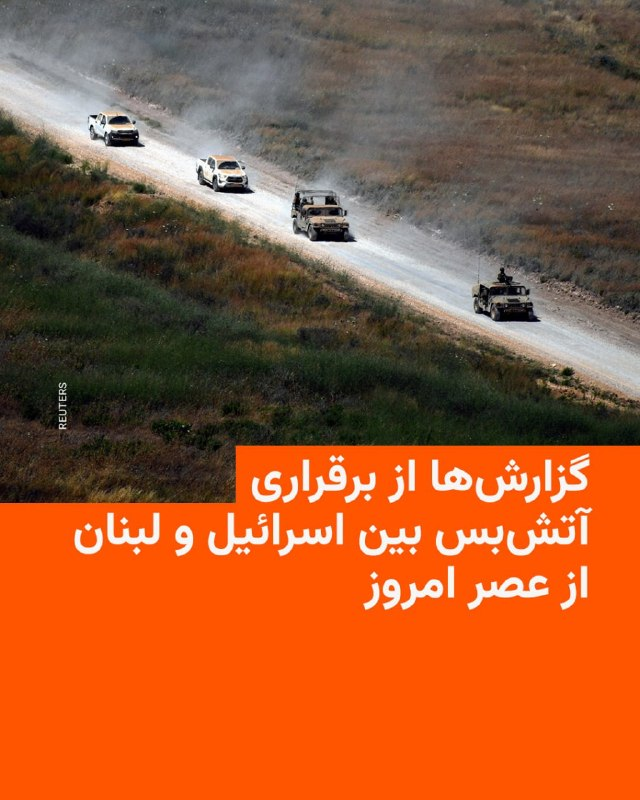

🔸یک مقام ارشد آمریکایی به رویترز گفت که اسرائیل و حزب‌الله بر سر یک آتش‌بس توافق کرده‌اند که قرار است از ساعت چهار بعدازظهر روز جمعه به وقت محلی آغاز شود.

🔸این مقام که نخواست نامش فاش شود، گفت: «حزب‌الله و اسرائیل بر سر آتش‌بس به توافق رسیده‌اند.» او افزود که مذاکره‌کنندگان آمریکایی و قطری با کمک ایران این توافق را نهایی کرده‌اند.

🔸این مقام همچنین گفت: «درک ما این است که پس از تبادل آتش امروز، اسرائیل و حزب‌الله اکنون در وضعیت آتش‌بس قرار دارند.»

🔸شبکه العربیه نیز به نقل از یک مقام آمریکایی از توافق برای برقراری آتش‌بس بین اسرائیل و حزب‌الله از جمعه خبر داد.

🔸این در حالی است که نخست‌وزیر اسرائیل ساعتی پیش اعلام کرد نیروهای نظامی این کشور تا هر زمان که لازم باشد، در خاک لبنان باقی می‌مانند.

@RadioFarda

## RadioFarda — post 158508

🔸مرضیه آدینه‌زاده، خواهر ابوالفضل آدینه‌زاده، ویدئویی از حضور پدر و مادرش کنار آرامگاه فرزندنشان به مناسبت جشن تولد ۲۱ سالگی او را در صفحۀ اینستاگرام خود منتشر کرده است.

🔸ابوالفضل آدینه‌زاده روز شنبه ۱۶ مهر ۱۴۰۱ در جریان اعتراضات مقابل دانشگاه فردوسی مشهد، در اثر شلیک مستقیم نیروهای حکومتی کشته شد.

@RadioFarda

## RadioFarda — post 158507

🔸رسانه نزدیک به سپاه در پی ادامه درگیری‌ها در لبنان خواستار «لغو کامل» مذاکرات با آمریکا شد 🔸خبرگزاری تسنیم، نزدیک به سپاه پاسداران، در پی ادامه درگیری بین ارتش اسرائیل و حزب‌الله لبنان، خواستار «لغو کامل» همه مذاکرات ایران و آمریکا و بسته شدن تنگه هرمز شد.…

## RadioFarda — post 158506

  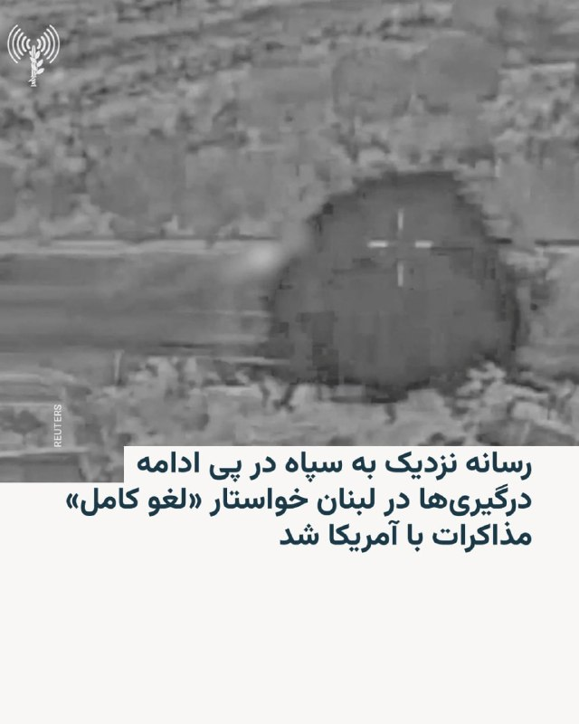

🔸رسانه نزدیک به سپاه در پی ادامه درگیری‌ها در لبنان خواستار «لغو کامل» مذاکرات با آمریکا شد

🔸خبرگزاری تسنیم، نزدیک به سپاه پاسداران، در پی ادامه درگیری بین ارتش اسرائیل و حزب‌الله لبنان، خواستار «لغو کامل» همه مذاکرات ایران و آمریکا و بسته شدن تنگه هرمز شد.

🔸این خبرگزاری روز جمعه نوشت تا زمان توقف حملات اسرائیل و عقب‌نشینی نیروهای نظامی آن از لبنان «تنگه هرمز باید بسته بماند و هر مذاکره آتی به طور کامل لغو شود».

🔸پایان حملات اسرائیل به مواضع حزب‌الله یکی از شرط‌های حمهوری اسلامی در مذاکرات با آمریکا بود و در بند اول تفاهم‌نامه طرفین نیز به «پایان فوری و دائمی عملیات نظامی در تمامی جبهه‌ها، از جمله در لبنان» اشاره شده است.

🔸این در حالی است که درگیری‌ها در لبنان روز جمعه تشدید شده و علاوه بر کشته شدن ۱۸ نفر در لبنان بر اثر حملات اسرائیل، چهار سرباز اسرائیلی نیز در حملات حزب‌الله کشته شدند.

@RadioFarda

## BBCPersian — post 284369

🔻نتانیاهو: با نقض آتش‌بس از سوی حزب‌الله، به ارتش دستور دادم تا با تمام قوا حمله کند

بنیامین نتانیاهو، نخست‌وزیر اسرائيل، در واکنش به کشته شدن فرمانده گردان ۵۲ زرهی و سه سرباز ارتش این کشور در شبکه اجتماعی ایکس ابراز امیدواری کرد که انتقام خون آنها گرفته شود.

آقای نتانیاهو حمله حزب‌الله را نقض آشکار آتش‌بس دانسته و نوشت: «دیشب به ارتش اسرائیل دستور دادم تا با تمام قوا به حزب‌الله حمله کند.»

به گفته آقای نتانیاهو ارتش اسرائیل به بیش از ۸۰ موضع حزب‌الله حمله کرده و ده‌ها عضو این سازمان را کشته است.

https://bbc.in/4vgfIJP
@BBCPersian

او بار دیگر تاکید کرده که اسرائيل حمله به سربازان یا خاک خود را تحمل نخواهد کرد و بهای این حملات برای حزب‌الله بسیار سنگین خواهد بود.

نخست‌وزیر اسرائيل گفته که صبح امروز با وزیر دفاع و رئیس ستاد کل ارتش کشورش، وضعیت عملیات در جنوب لبنان را ارزیابی کرده است و تکرار کرده که «اسرائیل تا زمانی که برای محافظت از شهرک‌های شمال لازم باشد، در منطقه امنیتی جنوب لبنان باقی خواهد ماند.»

## Dirty_Kids — post 392574

  <a href="telegram/content/Dirty_Kids_392574_1781875488.mp4" target="_blank">🎬 Download video</a>

🔴 یک با یک برابر نیست، باباهه برای تولد دختر ۱۵ سالش، سانتافه خریده...

@Dirty_Kids 👻

## Dirty_Kids — post 392573

  

کاندوم مناسب این شبا:

@Dirty_Kids 👻

## alonews — post 129145

  <a href="telegram/content/alonews_129145_1781875489.webm" target="_blank">🎬 Download video</a>

👈واکنش تتر به اعلام آتش‌بس بین اسراییل و حزب الله

✅ @AloNews خبر جنگ

## alonews — post 129144

  <a href="telegram/content/alonews_129144_1781875489.webm" target="_blank">🎬 Download video</a>

👈کانال ۱۳ به نقل از یک مقام اسرائیلی:
ما در حال حاضر در آتش‌بس هستیم و اگر حزب‌الله به ما حمله نکند، زمان جنگ از جانب ما نیست

✅ @AloNews خبر جنگ

## alonews — post 129143

  <a href="telegram/content/alonews_129143_1781875489.webm" target="_blank">🎬 Download video</a>

👈شبکه ۱۲ اسرائیل: آتش‌بس شروع شده اما ما توی منطقه میمونیم

✅ @AloNews خبر جنگ

---
📅 بروزرسانی: 1405/03/29 16:44
---

## VahidOOnLine — post 246380

  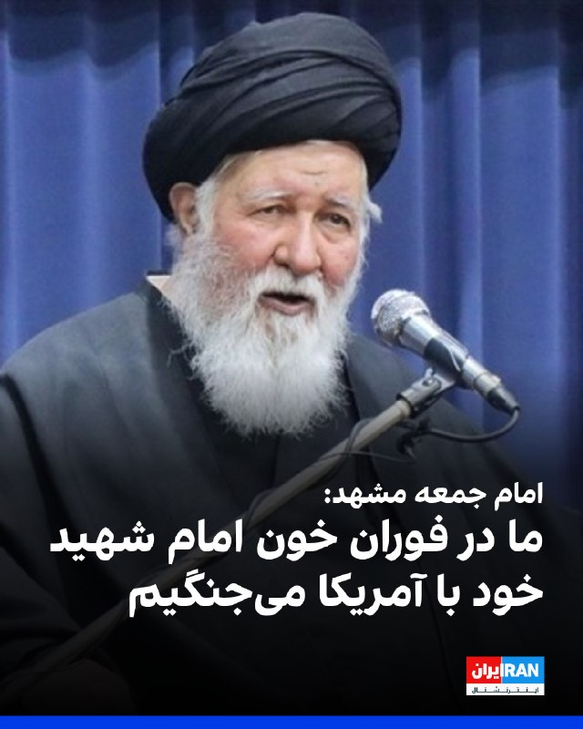

احمد علم‌الهدی، امام جمعه مشهد گفت: «ما در خط فوران خون امام شهید خود با دشمن آمریکایی می‌جنگیم و مبارزه می‌کنیم و ما به هیچ قیمت و مصلحت اندیشی شعار مرگ بر آمریکا را از زبان نخواهیم انداخت و این مبارزه ادامه دارد.»

او ادامه داد: «باید مشخص شود تکلیف خونخواهی رهبر ما چه می‌شود؟»

علم‌الهدی افزود: «اگر همه خسارت‌ها قابل جبران باشد، هیچ سرمایه‌ای بالاتر از از دست دادن امام شهید ما نیست، پس برادران و خواهران انتقام به جای خود باقی است، جنگ تمام شد اما مبارزه تمام نشده است.»
‌🏁 🇬🇧 IranintlTV

🤖 @VahidOOnLine

## VahidOOnLine — post 246379

  

خبرگزاری تسنیم، وابسته به سپاه پاسداران، خواستار ادامه بسته ماندن تنگه هرمز تا زمان توقف حملات اسرائیل و عقب‌نشینی کامل این کشور از خاک لبنان شد.

این رسانه همچنین خواستار لغو همه مذاکرات آتی شد و نوشت ادامه حملات اسرائیل به لبنان و باقی ماندن نیروهای اسرائیلی در جنوب لبنان، به معنای نقض بند نخست تفاهم‌نامه میان جمهوری اسلامی و آمریکا است.

این خبرگزاری افزود اگر جمهوری اسلامی پیش از اجرای تعهدات آمریکا و توقف حملات اسرائیل، تنگه هرمز را باز کند، بخشی از اهرم‌های فشار خود را از دست خواهد داد.

تسنیم همچنین گزارش‌های منتشرشده درباره باز بودن تنگه هرمز را «غیرقابل قبول» خواند و نوشت این موضوع با وعده‌های مقام‌های دولتی و تیم مذاکره‌کننده جمهوری اسلامی همخوانی ندارد.
‌🏁 🇬🇧 IranintlTV

🤖 @VahidOOnLine

## VahidOOnLine — post 246378

  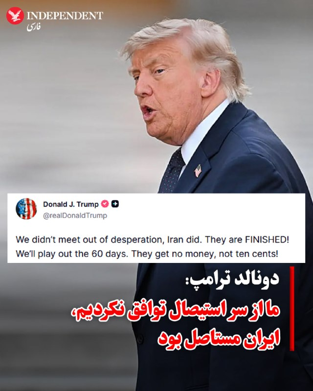

♦️ دونالد ترامپ، رئیس‌جمهوری آمریکا، روز جمعه ۲۹ خرداد در پیامی کوتاه در شبکه اجتماعی تروث سوشال نوشت: «ما از روی استیصال دیدار نکردیم، ایران کرد. کار آن‌ها تمام است! ما این ۶۰ روز را بازی خواهیم کرد [روند آن را طی می‌کنیم]. آن‌ها هیچ پولی دریافت نمی‌کنند، حتی ده سنت!»

این پیام به نظر می‌رسد واکنشی به پیام روز گذشته مجتبی خامنه‌ای، رهبر جدید جمهوری اسلامی باشد که گفته بود: «در مسیر رسیدن به این مرحله [امضای تفاهم‌نامه]، مسئولین امر، از سر دلسوزی و با حُسن نظر، تلاش‌های زیادی را به‌عمل آوردند و البته این رئیس‌جمهور آمریکا بود که از روی استیصال، از انواع اهرم‌ها برای این امر استفاده می‌کرد.»
‌🇸🇦 Indypersian

🤖 @VahidOOnLine

## VahidOOnLine — post 246377

  <a href="telegram/content/VahidOOnLine_246377_1781874884.mp4" target="_blank">🎬 Download video</a>

یک شهروند در ویدیوی ارسالی خود به ایران اینترنشنال، ضمن اشاره به گرانی مواد غذایی و مشکل بیکاری، از عملکرد دونالد ترامپ در برابر جمهوری اسلامی انتقاد کرد.
‌🏁 🇬🇧 IranintlTV

🤖 @VahidOOnLine

## WithYashar — post 15332

باراک راوید از آکسیوس: یک مقام ارشد آمریکایی به من می‌گوید

اسرائیل و حزب‌الله بر سر آتش‌بس مجدد در لبنان از ساعت ۴ بعد از ظهر امروز به وقت محلی توافق کرده‌اند. این توافق جدید با میانجیگری آمریکا و قطر و پس از مذاکرات با اسرائیل و ایران حاصل شده است.
@withyashar

## WithYashar — post 15331

گزارش ها مبنی بر آتش‌بس بین اسرائیل و حزب‌الله هم اکنون به اجرا درآمده است
@withyashar

## FoxNewsTwitter — post 343168

‌Fox News (Twitter/X)

Harry Styles is one of the biggest musicians in the world, and he’s slated to put on a 30-show residency in Madison Square Garden starting this summer.

Many fans are now asking who will perform at Harry Styles’ MSG residency?

Our sponsor Kalshi’s prediction market shows:

— Elton John: 22%
— Paul McCartney: 22%
— Louis Tomlinson: 16%

https://www.foxnews.com/entertainment/olivia-wilde-breaks-silence-harry-styles-fans-brutal-reaction-10-year-age-gap-romance

## pm_afshaa — post 94394

  <a href="telegram/content/pm_afshaa_94394_1781874886.webm" target="_blank">🎬 Download video</a>

🔴رویترز به نقل از یک مقام آمریکایی: اسرائیل و حزب‌الله بر سر آتش‌بس از ساعت 4 بعدازظهر به وقت محلی توافق کردن. 
💧 Rainbet.com the #1 Non-KYC Crypto Casino & Sportsbook @rainbetcom 
😁 @Pm_Afshaa

## DEJradio — post 5826

  <a href="telegram/content/DEJradio_5826_1781874887.webm" target="_blank">🎬 Download video</a>

🔺📢 بازنشسته نیروهای مسلح هستم، با ماهی ۱۴ میلیون تومان حقوق...

#نیروهای_مسلح #تورم
@DEJradio

## IranIntlTV — post 343207

  

احمد علم‌الهدی، امام جمعه مشهد گفت: «ما در خط فوران خون امام شهید خود با دشمن آمریکایی می‌جنگیم و مبارزه می‌کنیم و ما به هیچ قیمت و مصلحت اندیشی شعار مرگ بر آمریکا را از زبان نخواهیم انداخت و این مبارزه ادامه دارد.»

او ادامه داد: «باید مشخص شود تکلیف خونخواهی رهبر ما چه می‌شود؟»

علم‌الهدی افزود: «اگر همه خسارت‌ها قابل جبران باشد، هیچ سرمایه‌ای بالاتر از از دست دادن امام شهید ما نیست، پس برادران و خواهران انتقام به جای خود باقی است، جنگ تمام شد اما مبارزه تمام نشده است.»
https://iranintl.com/202606194978

## IranIntlTV — post 343206

  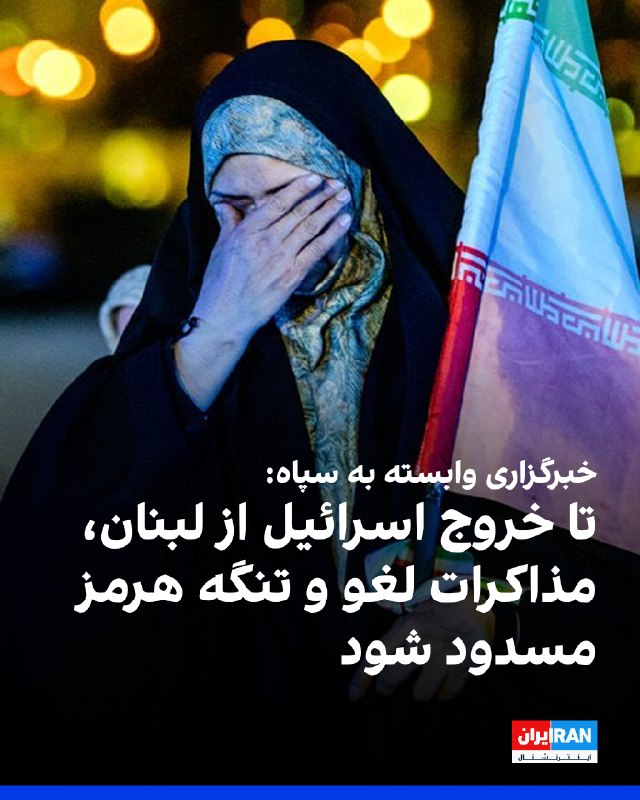

خبرگزاری تسنیم، وابسته به سپاه پاسداران، خواستار ادامه بسته ماندن تنگه هرمز تا زمان توقف حملات اسرائیل و عقب‌نشینی کامل این کشور از خاک لبنان شد.

این رسانه همچنین خواستار لغو همه مذاکرات آتی شد و نوشت ادامه حملات اسرائیل به لبنان و باقی ماندن نیروهای اسرائیلی در جنوب لبنان، به معنای نقض بند نخست تفاهم‌نامه میان جمهوری اسلامی و آمریکا است.

این خبرگزاری افزود اگر جمهوری اسلامی پیش از اجرای تعهدات آمریکا و توقف حملات اسرائیل، تنگه هرمز را باز کند، بخشی از اهرم‌های فشار خود را از دست خواهد داد.

تسنیم همچنین گزارش‌های منتشرشده درباره باز بودن تنگه هرمز را «غیرقابل قبول» خواند و نوشت این موضوع با وعده‌های مقام‌های دولتی و تیم مذاکره‌کننده جمهوری اسلامی همخوانی ندارد.
https://iranintl.com/202606191942

## IranIntlTV — post 343205

  <a href="telegram/content/IranIntlTV_343205_1781874888.mp4" target="_blank">🎬 Download video</a>

آیین خاکسپاری مرجان ساتراپی، فیلمساز و هنرمند ایرانی، امروز جمعه در گورستان پرلاشز پاریس با حضور مقام‌های سیاسی و چهره‌های فرهنگی و هنری بین‌المللی برگزار می‌شود. شرکت‌کنندگان در این مراسم یاد این هنرمند و حامی جنبش «زن، زندگی، آزادی» را گرامی می‌دارند.

گزارش ساجده شریفی، خبرنگار ایران‌اینترنشنال
@iranintltv

## IranIntlTV — post 343204

  <a href="telegram/content/IranIntlTV_343204_1781874890.mp4" target="_blank">🎬 Download video</a>

در پی کشته شدن چهار سرباز اسرائیلی، بنیامین نتانیاهو اعلام کرد اسرائیل هیچ حمله‌ای علیه نیروها و خاک خود را تحمل نخواهد کرد و حزب‌الله بهای بسیار سنگینی خواهد پرداخت. هم‌زمان، ارتش اسرائیل از حمله به بیش از ۸۰ هدف در جنوب لبنان خبر داد.

جزییات بیشتر با می فرحات، خبرنگار ایران‌اینترنشنال
@iranintltv

## Persian_Trend_Official — post 17576

  <a href="telegram/content/Persian_Trend_Official_17576_1781874891.webm" target="_blank">🎬 Download video</a>

تانکر ترکز: ایران در 5 روز گذشته 18 میلیون بشکه نفت به ارزش 1.4 میلیارد دلار از خلیج فارس خارج کرده.

📝 Amir

📌 @persian_trend_official
پرشین ترند | متفاوت‌ترین کانال نظامی

## Persian_Trend_Official — post 17575

یک مقام ارشد اسرائیلی در مصاحبه با کانال 13: ما در حال حاضر در آتش‌بس هستیم اگر حزب‌الله به ما حمله نکند، برای ما زمان جنگ نیست.

نیروهای ارتش اسرائیل در جنوب لبنان باقی می‌مانند و ما آزادی عمل داریم تا علیه تهدیدات نوظهور و تهدیدهایی که نیروها و قلمرو ما را تهدید می‌کند، اقدام کنیم.

📝 Amir

📌 @persian_trend_official
پرشین ترند | متفاوت‌ترین کانال نظامی

## Persian_Trend_Official — post 17574

  <a href="telegram/content/Persian_Trend_Official_17574_1781874892.webm" target="_blank">🎬 Download video</a>

آتش بس در جنوب لبنان! به گزارش رویترز، اسرائیل و حزب‌الله بر سر آتش‌بس توافق کرده‌اند که قرار است امروز از ساعت 4 بعد از ظهر به وقت محلی آغاز شود. یک مقام آمریکایی گفت: حزب‌الله و اسرائیل بر سر آتش‌بس توافق کرده‌اند و افزود که مذاکره‌کنندگانی از ایالات متحده…

## Persian_Trend_Official — post 17573

  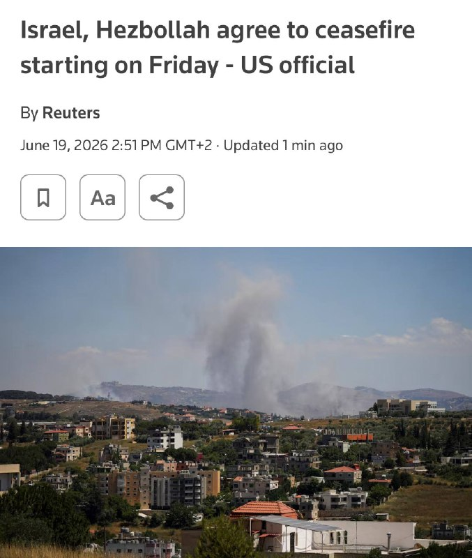

آتش بس در جنوب لبنان!

به گزارش رویترز، اسرائیل و حزب‌الله بر سر آتش‌بس توافق کرده‌اند که قرار است امروز از ساعت 4 بعد از ظهر به وقت محلی آغاز شود.

یک مقام آمریکایی گفت: حزب‌الله و اسرائیل بر سر آتش‌بس توافق کرده‌اند و افزود که مذاکره‌کنندگانی از ایالات متحده و قطر با حمایت ایران به این توافق کمک کردند.

این مقام همچنین گفت: ما می‌دانیم که پس از تبادل آتش در اوایل امروز، اسرائیل و حزب‌الله اکنون در آتش‌بس هستند.

📝 Amir

📌 @persian_trend_official
پرشین ترند | متفاوت‌ترین کانال نظامی

## RadioFarda — post 158505

  

🔸بنیامین نتانیاهو، نخست‌وزیر اسرائیل، روز جمعه بار دیگر گفت که نیروهای اسرائیلی «تا هر زمان که لازم باشد» در لبنان باقی خواهند ماند و وعده داد که حزب‌اللهِ مورد حمایت ایران برای حملاتش «بهای بسیار سنگینی» خواهد پرداخت.

🔸او روز پنجشنبه، ساعاتی بعد از امضای تفاهم‌نامه پایان دادن به جنگ توسط ایران و آمریکا، نیز بر ادامه حضور ارتش اسرائیل در مناطقی از جنوب لبنان تأکید کرده بود.

🔸نتانیاهو در بیانیه روز جمعه که پس از اعلام کشته شدن چهار سرباز اسرائیلی در لبنان از سوی ارتش منتشر شد، گفت: «اسرائیل حمله به سربازان یا قلمرو خود را تحمل نخواهد کرد و بابت این حملات بهای بسیار سنگینی از حزب‌الله خواهد گرفت.»

🔸او افزود: «اسرائیل تا هر زمان که برای حفاظت از جوامع شمالی لازم باشد، در منطقه امنیتی جنوب لبنان باقی خواهد ماند.»

🔸یسرائیل کاتز، وزیر دفاع، نیز گفته بود که ارتش در لبنان خواهد ماند و افزود که به هر حمله‌ای «با نیروی قابل توجه» پاسخ خواهد داد.

🔸لبنان اعلام کرده بر اثر حملات اسرائیل در سراسر این کشور ۱۸ نفر کشته شده‌اند.

@RadioFarda

## IranianMinds — post 22949

🔴 از همین الان مجدد به طور رسمی بین حزب الله و اسرائیل آتش بس برقرار شد. @IranianMinds

## IranianMinds — post 22948

🔴 مقام ارشد آمریکایی به رویترز: اسرائیل و حزب‌الله توافق کردند که مجدد آتش‌بس از ساعت ۴ بعدازظهر روز جمعه به وقت محلی برقرار شود. @IranianMinds

## IranianMinds — post 22947

  <a href="telegram/content/IranianMinds_22947_1781874893.mp4" target="_blank">🎬 Download video</a>

🔴پست جدید ترامپ.

@IranianMinds

## Hranews — post 113722

سه شهروند توسط نیروهای امنیتی در زاهدان بازداشت شدند

❗️
❗️
❗️
❗️
❗️– شامگاه روز چهارشنبه ۲۷ خردادماه، سه شهروند به نام‌های فرزاد ظریف‌دل، اقبال شاهوزهی و مهدی دهمرده، در زاهدان توسط نیروهای امنیتی بازداشت و به مکان نامعلومی منتقل شده‌اند.

ادامه مطلب

#فرزاد_ظریف‌دل #اقبال_شاهوزهی #مهدی_دهمرده

↘️
@hranews_bot تماس ✉️ -  @Hranews  کانال هرانا 🆑

## alonews — post 129142

  <a href="telegram/content/alonews_129142_1781874894.webm" target="_blank">🎬 Download video</a>

🔴فوری / خبرنگار المیادین در جنوب لبنان: همزمان با اجرایی شدن آتش‌بس ، حملهٔ هوایی اسرائیل به النبطیه صورت گرفت.

✅ @AloNews خبر جنگ

---
📅 بروزرسانی: 1405/03/29 16:35
---

## VahidOOnLine — post 246376

  

دونالد ترامپ، رییس‌جمهوری آمریکا، در واکنش به اظهارات برخی اعضای حزب دموکرات آمریکا که گفتند جنگ اخیر جمهوری اسلامی را تقویت کرده است، این دیدگاه را رد کرد.

او در پیامی در تروت سوشال نوشت جنگ جمهوری اسلامی را تضعیف کرده است و این کشور دیگر نیروی هوایی، نیروی دریایی، پدافند هوایی، رادار یا تقریبا هیچ‌چیز دیگری ندارد.

ترامپ با انتقاد از کسانی که می‌گویند جمهوری اسلامی اکنون نسبت به چهار ماه پیش در وضعیت بهتری قرار دارد، نوشت: «باور می‌کنید بتوان چنین حرفی زد؟ بعضی افراد چقدر می‌توانند احمق باشند؟»
‌🏁 🇬🇧 IranintlTV

🤖 @VahidOOnLine

## WithYashar — post 15330

  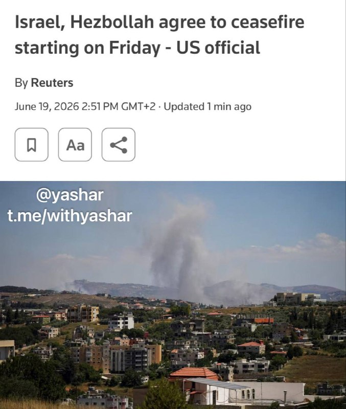

رویترز به نقل از یک مقام آمریکایی ادعا کرد:
«حزب‌الله و اسرائیل با آتش‌بس موافقت کرده‌اند» و افزود که مذاکره‌کنندگان از آمریکا و قطر با حمایت ایران به توافق کمک کردند.
@withyashar

## mwarmonitor — post 11214

🔴رویترز به نقل از یک مقام آمریکایی: اسرائیل و حزب‌الله بر سر آتش‌بس از ساعت ۴ بعدازظهر به وقت محلی توافق کرده‌اند. @mwarmonitor

## mwarmonitor — post 11213

  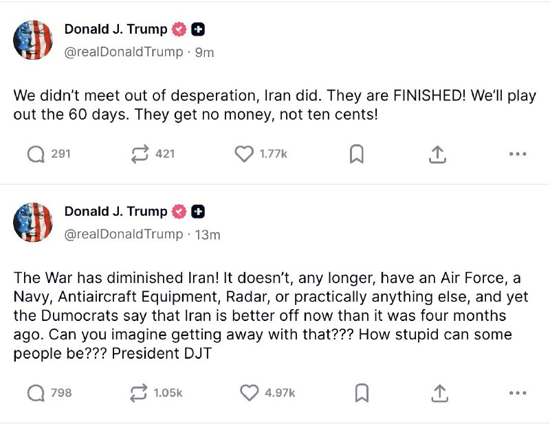

🔴ما از روی ناچاری و استیصال دیدار نکردیم، ایران این کار را کرد. کار آن‌ها تمامه! ما این ۶۰ روز را تا آخر بازی می‌کنیم . آن‌ها هیچ پولی دریافت نخواهند کرد، حتی ده سنت!

جنگ، ایران را تضعیف کرده است! آن‌ها دیگر نه نیروی هوایی دارند، نه نیروی دریایی، نه تجهیزات ضدهوایی، نه رادار و نه عملاً هیچ چیز دیگری؛ و با این حال دموکرات‌های احمق (Dumocrats) می‌گویند اوضاع ایران اکنون بهتر از چهار ماه پیش است. می‌توانید تصور کنید که چطور چنین حرف مفتی می‌زنند؟؟؟ برخی افراد چقدر می‌توانند احمق باشند؟؟؟

رئیس‌جمهور دونالد جی ترامپ

@mwarmonitor

## mwarmonitor — post 11212

🔴رویترز به نقل از یک مقام آمریکایی: اسرائیل و حزب‌الله بر سر آتش‌بس از ساعت ۴ بعدازظهر به وقت محلی توافق کرده‌اند.

@mwarmonitor

## FoxNewsTwitter — post 343167

  <a href="telegram/content/FoxNewsTwitter_343167_1781874312.mp4" target="_blank">🎬 Download video</a>

Fox News (Twitter/X)

“There’s no real satisfaction in getting a medal when I've lost so much.”

Major James Capers Jr. shares his complex emotions about receiving the Medal of Honor from President Trump.

He reflects on fallen comrades and personal tragedies, including the loss of his son and wife, expressing that no award can replace what he's lost. | @foxandfriends @ainsleyearhardt

## FoxNewsTwitter — post 343166

  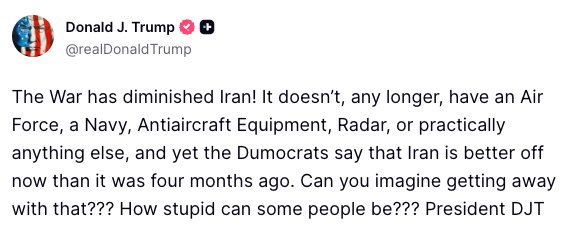

Fox News (Twitter/X)

“How stupid can some people be???”

President Trump is pushing back on Democrats for criticizing his new Iran deal and saying the Islamic Republic is better off now than it was before the war.

## pm_afshaa — post 94393

  <a href="telegram/content/pm_afshaa_94393_1781874315.webm" target="_blank">🎬 Download video</a>

🔴رویترز به نقل از یک مقام آمریکایی:
اسرائیل و حزب‌الله بر سر آتش‌بس از ساعت 4 بعدازظهر به وقت محلی توافق کردن.

💧 Rainbet.com the #1 Non-KYC Crypto Casino & Sportsbook @rainbetcom

😁 @Pm_Afshaa

## kianmeli1 — post 88087

  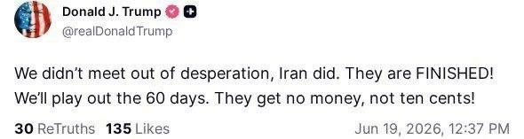

🔴ترامپ:

ما از روی ناامیدی ملاقات نکردیم، این کار ایران بود. آنها تمام شده‌اند! ما ۶۰ روز بازیابی خواهیم کرد. آنها نه پولی دریافت خواهند کرد و نه حتی یک سنت
https://t.me/kianmeli1

## kianmeli1 — post 88086

🔴باراک راوید: یک مقام ارشد آمریکایی به من می‌گوید

اسرائیل و حزب‌الله بر سر آتش‌بس مجدد در لبنان از ساعت ۴ بعد از ظهر به وقت محلی توافق کرده‌اند. این توافق جدید با میانجیگری آمریکا و قطر و پس از مذاکرات با اسرائیل و ایران حاصل شده است.
https://t.me/kianmeli1

## IranIntlTV — post 343203

  <a href="telegram/content/IranIntlTV_343203_1781874316.mp4" target="_blank">🎬 Download video</a>

یک شهروند در ویدیوی ارسالی خود به ایران اینترنشنال، ضمن اشاره به گرانی مواد غذایی و مشکل بیکاری، از عملکرد دونالد ترامپ در برابر جمهوری اسلامی انتقاد کرد.

## IranIntlTV — post 343202

  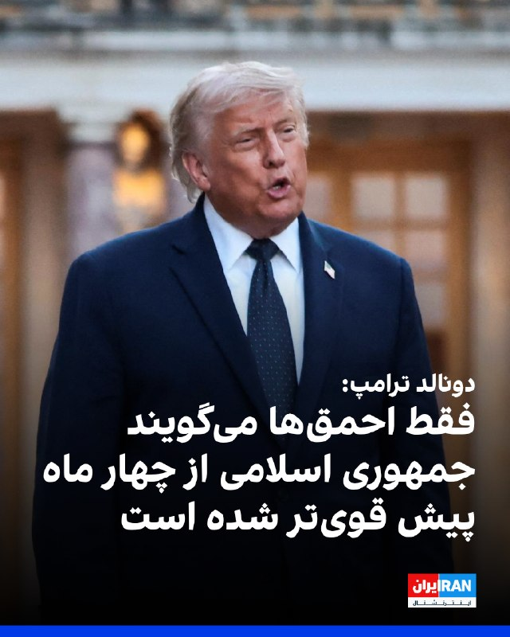

دونالد ترامپ، رییس‌جمهوری آمریکا، در واکنش به اظهارات برخی اعضای حزب دموکرات آمریکا که گفتند جنگ اخیر جمهوری اسلامی را تقویت کرده است، این دیدگاه را رد کرد.

او در پیامی در تروت سوشال نوشت جنگ جمهوری اسلامی را تضعیف کرده است و این کشور دیگر نیروی هوایی، نیروی دریایی، پدافند هوایی، رادار یا تقریبا هیچ‌چیز دیگری ندارد.

ترامپ با انتقاد از کسانی که می‌گویند جمهوری اسلامی اکنون نسبت به چهار ماه پیش در وضعیت بهتری قرار دارد، نوشت: «باور می‌کنید بتوان چنین حرفی زد؟ بعضی افراد چقدر می‌توانند احمق باشند؟»
https://iranintl.com/202606198507

## FarsiVOA — post 221190

نیروهای امنیتی، زنان بلوچ معترض روستای پشموکی شهرستان فاریاب را در مقابل چشمان مردان روستا مورد ضرب و شتم شدید قرار داده‌اند. جزئیات بیشتر در گزارش حمیده آرمیده

## Persian_Trend_Official — post 17572

  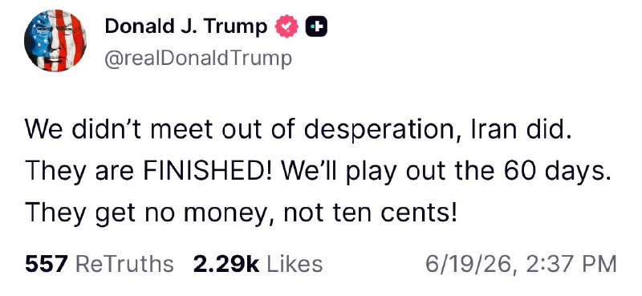

ترامپ در تروث سوشال: ما از روی ناچاری ملاقات نکردیم، ایران این کار را کرد. کار آنها تمام است!

ما این 60 روز را به پایان خواهیم رساند. آنها هیچ پولی دریافت نمی‌کنند، حتی ده سنت!

📝 Amir

📌 @persian_trend_official
پرشین ترند | متفاوت‌ترین کانال نظامی

## Persian_Trend_Official — post 17571

  <a href="telegram/content/Persian_Trend_Official_17571_1781874321.webm" target="_blank">🎬 Download video</a>

ترامپ در تروث سوشال: جنگ ایران را ضعیف کرده است!

دیگر نیروی هوایی، نیروی دریایی، تجهیزات ضد هوایی، رادار یا عملاً هر چیز دیگری ندارد، و با این حال دوموکرات ها می گویند که ایران اکنون نسبت به چهار ماه پیش وضعیت بهتری دارد. آیا می توانید تصور کنید که با آن کنار بیایید؟ بعضیا چقدر میتونن احمق باشن؟؟؟

📝 Amir

📌 @persian_trend_official
پرشین ترند | متفاوت‌ترین کانال نظامی

## RadioFarda — post 158504

🔸ویدئویی که هاجر نادری، مادر متین پرویزی، در صفحۀ شخصی خود منتشر کرده است او را در کنار آرامگاه پسرش نشان می‌دهد که می‌گوید «من به پسرم فقط یاحسین و تشنگی را یاد ندادم، به او یاد دادم که جلوی حرف زور بایستد»

🔸خانم نادری در ادامه با شرح کشته شدن فرزندش در اعتراضات ۱۸ دی‌ماه می‌گوید امسال محرم برای فرزندان میهن که «ناجوانمردانه کشته شدند» عزاداری خواهد کرد و ادامه می‌دهد که «می‌دانم امام حسین هم برای این جوانان عزاداری خواهد کرد»

🔸متین پرویزی ۱۸ دی‌ماه سال گذشته در سبزه‌میدان زنجان با شلیک گلوله جنگی نیروهای حکومتی به سرش کشته شد.

@RadioFarda

## IranianMinds — post 22946

🔴 مقام ارشد آمریکایی به رویترز:

اسرائیل و حزب‌الله توافق کردند که مجدد آتش‌بس از ساعت ۴ بعدازظهر روز جمعه به وقت محلی برقرار شود.

@IranianMinds

## alonews — post 129141

  <a href="telegram/content/alonews_129141_1781874322.webm" target="_blank">🎬 Download video</a>

🔴فوری / رویترز به نقل از مقام آمریکایی : اسرائیل و حزب‌الله توافق کردن که از ساعت ۴ عصر جمعه به وقت محلی، آتش‌بس برقرار بشه 
✅ @AloNews خبر جنگ

## alonews — post 129140

  <a href="telegram/content/alonews_129140_1781874322.webm" target="_blank">🎬 Download video</a>

🔴فوری / رویترز به نقل از مقام آمریکایی :
اسرائیل و حزب‌الله توافق کردن که از ساعت ۴ عصر جمعه به وقت محلی، آتش‌بس برقرار بشه

✅ @AloNews خبر جنگ

---
📅 بروزرسانی: 1405/03/29 16:25
---

## VahidOOnLine — post 246375

  

دونالد ترامپ، رییس‌جمهوری آمریکا، جمعه ۲۹ خرداد در پیامی در تروت سوشال گفت که جمهوری اسلامی از موضع ضعف وارد مذاکره با آمریکا شده است. ترامپ نوشت: «ما از سر استیصال وارد مذاکره نشدیم؛ این ایران بود که چنین کرد. آن‌ها تمام شده‌اند.»

او همچنین با اشاره به دوره ۶۰ روزه اجرای یادداشت تفاهم میان تهران و واشینگتن افزود: «ما این دوره ۶۰ روزه را تا پایان دنبال خواهیم کرد.»

رییس‌جمهوری آمریکا در ادامه تاکید کرد: «هیچ پولی به آن‌ها داده نخواهد شد؛ حتی ۱۰ سنت.»
‌🏁 🇬🇧 IranintlTV

🤖 @VahidOOnLine

## VahidOOnLine — post 246374

  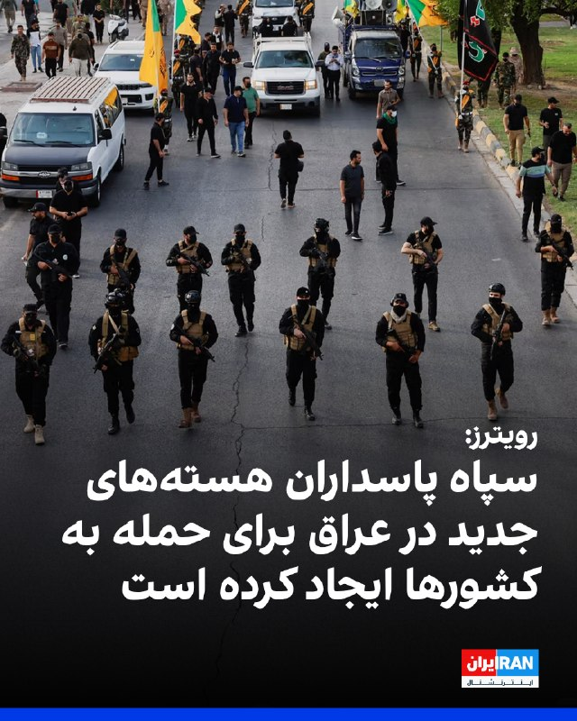

خبرگزاری رویترز به نقل از هشت منبع عراقی گزارش داد سپاه پاسداران گروه‌های مخفی جدیدی را در عراق ایجاد کرده است تا حملاتی علیه کشورهای خلیج فارس انجام دهد. به گفته این منابع، این گروه‌ها خارج از شبکه‌های شناخته‌شده شبه‌نظامی فعالیت می‌کنند تا از شناسایی شدن جلوگیری شود.

بر اساس این گزارش، سه یا چهار سلول متشکل از نیروهای نخبه شیعه عراقی بین ۳۱ فروردین تا ۲۷ اردیبهشت دست‌کم هفت حمله پهپادی از مناطق بیابانی نزدیک بصره و سماوه علیه اهدافی در کویت، عربستان سعودی و امارات متحده عربی انجام داده‌اند.

منابع رویترز، شامل دو مقام نظامی عراق، یک مقام امنیتی و پنج فرمانده شبه‌نظامی، گفتند شماری از اعضای این گروه‌ها از «مقاومت اسلامی عراق» جذب شده‌اند، اما سلول‌های جدید خارج از ساختار فرماندهی این ائتلاف فعالیت می‌کنند و مستقیما با سپاه پاسداران در ارتباط هستند.

پنج فرمانده شبه‌نظامی به رویترز گفتند تشکیل این سلول‌ها نشان‌دهنده تغییر در تاکتیک‌های سپاه پاسداران است؛ تغییری که با هدف حفظ توان جمهوری اسلامی برای اعمال نفوذ نظامی در منطقه، در شرایط تضعیف گروه‌های نیابتی و کاهش منابع نظامی و اقتصادی تهران، انجام شده است.
h
‌🏁 🇬🇧 IranintlTV

🤖 @VahidOOnLine

## VahidOOnLine — post 246373

  

اسماعیل بقایی، سخنگوی وزارت خارجه جمهوری اسلامی، در بیانیه‌ای حملات اسرائیل به جنوب لبنان را محکوم کرد و نسبت به «تبعات جدی و فوری» این حملات هشدار داد.

بقایی در این بیانیه آمریکا را مسئول حملات اسرائیل به لبنان دانست و با اشاره به یادداشت تفاهم نوشت: «جمهوری اسلامی همه تدابیر لازم را برای صیانت از منافع، امنیت و حقوق خود و متحدانش اتخاذ می‌کند.»
‌🏁 🇬🇧 IranintlTV

🤖 @VahidOOnLine

## WithYashar — post 15329

  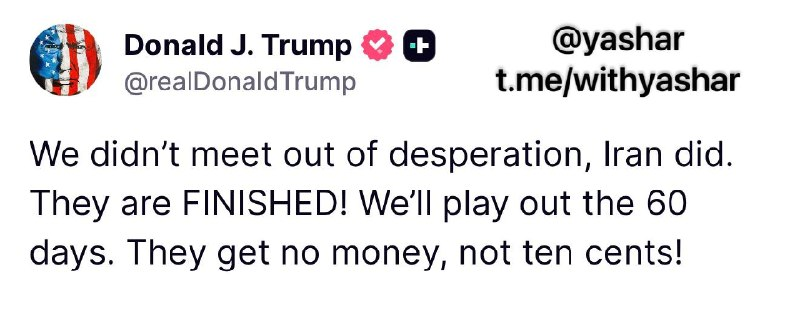

ترامپ در‌ تروث : ما از روی استیصال نرفتیم سراغ مذاکره
این ایران بود که بهش نیاز داشت، کارشون تمومه!
همون ۶۰ روزی که گفته بودیم رو جلو می‌بریم، هیچ پولی هم گیرشون نمیاد
@withyashar

## WithYashar — post 15328

  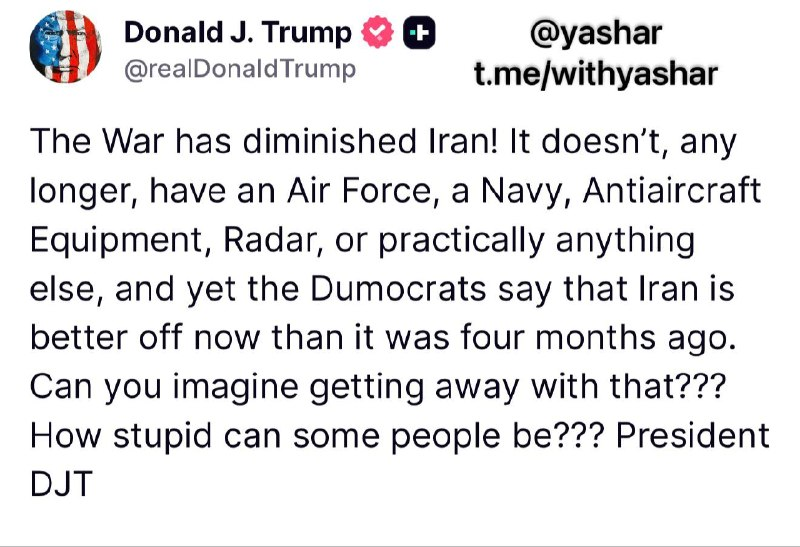

‏ترامپ در‌تروث : جنگ ایران را تضعیف کرده و دیگر نیروی هوایی، نیروی دریایی، پدافند هوایی، رادار یا تقریبا هیچ‌چیز دیگری ندارد؛ با این حال دموکرات‌ها می‌گویند ایران اکنون نسبت به چهار ماه پیش در وضعیت بهتری قرار دارد. باور می‌کنید بتوان چنین حرفی زد؟ بعضی افراد چقدر می‌توانند احمق باشند؟
@withyashar

## pm_afshaa — post 94392

  <a href="telegram/content/pm_afshaa_94392_1781873725.webm" target="_blank">🎬 Download video</a>

‏
🔴دونالد ترامپ: جنگ ایران رو تضعیف کرده و دیگر نیروی هوایی، نیروی دریایی، پدافند هوایی، رادار یا تقریبا هیچ‌چیز دیگری نداره؛ با این حال دموکرات‌ها میگن ایران الان نسبت به چهار ماه پیش در وضعیت بهتری قرار داره. باور می‌کنید بتوان چنین حرفی زد؟ بعضی افراد چقدر میتونن احمق باشن؟

💧 Rainbet.com the #1 Non-KYC Crypto Casino & Sportsbook @rainbetcom

😁 @Pm_Afshaa

## pm_afshaa — post 94391

  <a href="telegram/content/pm_afshaa_94391_1781873726.webm" target="_blank">🎬 Download video</a>

🔴تسنیم: تنگه هرمز رو تا زمان پایان حملات به لبنان ببندید!

💧 Rainbet.com the #1 Non-KYC Crypto Casino & Sportsbook @rainbetcom

😁 @Pm_Afshaa

## pm_afshaa — post 94390

  <a href="telegram/content/pm_afshaa_94390_1781873727.webm" target="_blank">🎬 Download video</a>

🔴ترامپ: ما از روی ناچاری ملاقات (امضای تفاهم‌نامه) نکردیم، ایران این کار رو انجام داد. کار اونا تمومه. ما 60 روز رو بازی می‌کنیم. اونا هیچ پولی دریافت نمی‌کنن، حتی 10 سنت!

💧 Rainbet.com the #1 Non-KYC Crypto Casino & Sportsbook @rainbetcom

😁 @Pm_Afshaa

## IranIntlTV — post 343201

  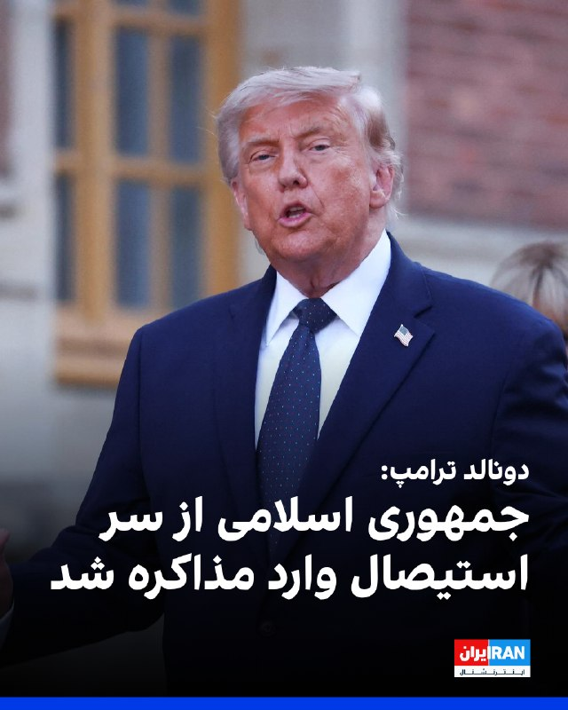

دونالد ترامپ، رییس‌جمهوری آمریکا، جمعه ۲۹ خرداد در پیامی در تروت سوشال گفت که جمهوری اسلامی از موضع ضعف وارد مذاکره با آمریکا شده است. ترامپ نوشت: «ما از سر استیصال وارد مذاکره نشدیم؛ این ایران بود که چنین کرد. آن‌ها تمام شده‌اند.»

او همچنین با اشاره به دوره ۶۰ روزه اجرای یادداشت تفاهم میان تهران و واشینگتن افزود: «ما این دوره ۶۰ روزه را تا پایان دنبال خواهیم کرد.»

رییس‌جمهوری آمریکا در ادامه تاکید کرد: «هیچ پولی به آن‌ها داده نخواهد شد؛ حتی ۱۰ سنت.»
https://iranintl.com/202606193041

## IranIntlTV — post 343200

  

خبرگزاری رویترز به نقل از هشت منبع عراقی گزارش داد سپاه پاسداران گروه‌های مخفی جدیدی را در عراق ایجاد کرده است تا حملاتی علیه کشورهای خلیج فارس انجام دهد. به گفته این منابع، این گروه‌ها خارج از شبکه‌های شناخته‌شده شبه‌نظامی فعالیت می‌کنند تا از شناسایی شدن جلوگیری شود.

بر اساس این گزارش، سه یا چهار سلول متشکل از نیروهای نخبه شیعه عراقی بین ۳۱ فروردین تا ۲۷ اردیبهشت دست‌کم هفت حمله پهپادی از مناطق بیابانی نزدیک بصره و سماوه علیه اهدافی در کویت، عربستان سعودی و امارات متحده عربی انجام داده‌اند.

منابع رویترز، شامل دو مقام نظامی عراق، یک مقام امنیتی و پنج فرمانده شبه‌نظامی، گفتند شماری از اعضای این گروه‌ها از «مقاومت اسلامی عراق» جذب شده‌اند، اما سلول‌های جدید خارج از ساختار فرماندهی این ائتلاف فعالیت می‌کنند و مستقیما با سپاه پاسداران در ارتباط هستند.

پنج فرمانده شبه‌نظامی به رویترز گفتند تشکیل این سلول‌ها نشان‌دهنده تغییر در تاکتیک‌های سپاه پاسداران است؛ تغییری که با هدف حفظ توان جمهوری اسلامی برای اعمال نفوذ نظامی در منطقه، در شرایط تضعیف گروه‌های نیابتی و کاهش منابع نظامی و اقتصادی تهران، انجام شده است.
h

## IranIntlTV — post 343199

  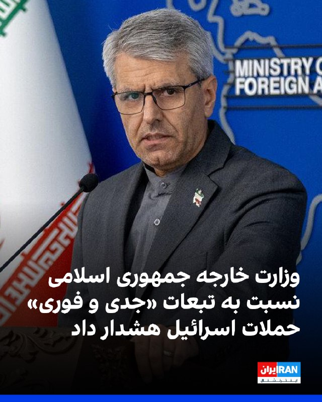

اسماعیل بقایی، سخنگوی وزارت خارجه جمهوری اسلامی، در بیانیه‌ای حملات اسرائیل به جنوب لبنان را محکوم کرد و نسبت به «تبعات جدی و فوری» این حملات هشدار داد.

بقایی در این بیانیه آمریکا را مسئول حملات اسرائیل به لبنان دانست و با اشاره به یادداشت تفاهم نوشت: «جمهوری اسلامی همه تدابیر لازم را برای صیانت از منافع، امنیت و حقوق خود و متحدانش اتخاذ می‌کند.»
https://iranintl.com/202606194901

## FarsiVOA — post 221189

  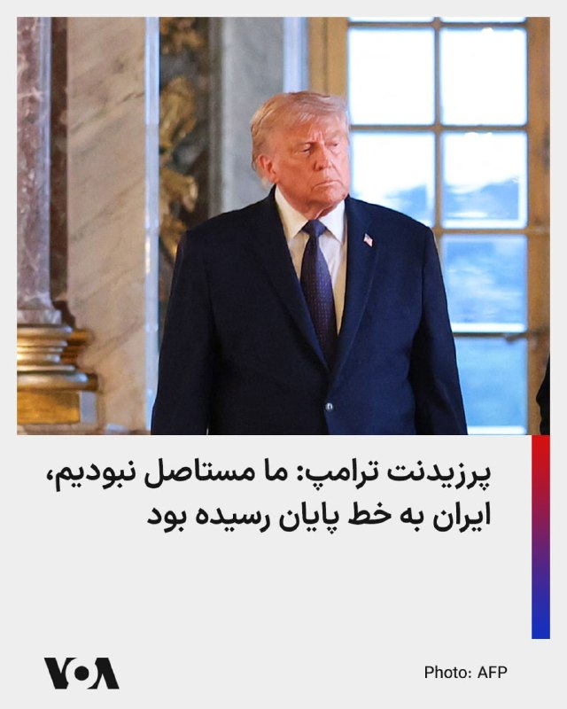

⚡️دونالد ترامپ، رئیس جمهوری آمریکا بار دیگر به انتقادها از تفاهم با جمهوری اسلامی پاسخ داد و گفت: «ما از روی استیصال ملاقات نکردیم، این ایران بود که از روی استیصال چنین کرد. آن‌ها به خط پایان رسیده‌اند.»
پرزیدنت ترامپ در شبکه اجتماعی تروت‌سوشال با اشاره به مهلت درنظر گرفته شده در تفاهم با حکومت ایران نوشت: «ما این ۶۰ روز را ادامه خواهیم داد. آن‌ها هیچ پولی دریافت نخواهند کرد، حتی ده سنت هم نخواهند گرفت!»

## FarsiVOA — post 221188

قالیباف، برای تصاحب قدرت برتر در جمهوری اسلامی چه راه‌هایی را طی کرد و چگونه عملاً نفر اول تصمیم گیرنده در ایران شد؟

## IranianMinds — post 22945

  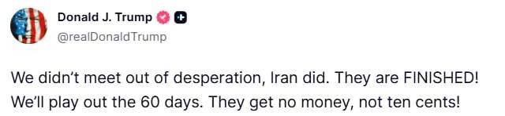

🔴 ترامپ:

ما از روی ناچاری باهم دیدار نکردیم، این کار ایران بود.

اونا تموم شدن!
ما این ۶۰ روز رو می‌گذرونیم.
اونا هیچ پولی نمی‌گیرن، حتی ده سنت هم نه!

@IranianMinds

## IranianMinds — post 22944

  

🔴 نتانیاهو:

اسرائیل هیچ حمله‌ای به سربازان یا خاک خودش رو تحمل نمی‌کنه و از حزب‌الله بابت چنین حملاتی قیمت خیلی سنگینی خواهد گرفت.

ارتش اسرائیل برای خنثی کردن هر تهدیدی علیه نیروهای ما و خاک ما اقدام خواهد کرد.

همون‌طور که قبلاً هم به طور قاطع گفتم، از جمله دیروز: اسرائیل تا هر زمان که لازم باشه در منطقه جنوب لبنان باقی خواهد ماند تا از جوامع شمال اسرائیل حفاظت کند.

@IranianMinds

## IranianMinds — post 22943

  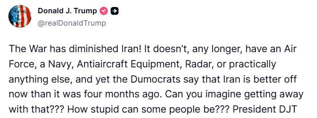

🔴 ترامپ:

جنگ ایران رو کاملاً له و لورده کرد!
دیگه نه نیروی هوایی داره، نه نیروی دریایی، نه سیستم پدافند هوایی، نه رادار، نه عملاً هیچی دیگه…

با این حال دموکرات ‌های احمق می‌گن ایران الان نسبت به چهار ماه پیش بهتر شده!

تصور میکنین بتونن این دروغ رو بگن و رد بشن؟؟

@IranianMinds

## Dirty_Kids — post 392572

  <a href="telegram/content/Dirty_Kids_392572_1781873732.mp4" target="_blank">🎬 Download video</a>

کیووت ترین ویدیویی که امروز میبینی

@Dirty_Kids 👻

## Dirty_Kids — post 392571

  <a href="telegram/content/Dirty_Kids_392571_1781873734.mp4" target="_blank">🎬 Download video</a>

عزاداری❌ کارناوال بیرون ریختن کون برای دریافت شماره✅

@Dirty_Kids 👻

## alonews — post 129139

  <a href="telegram/content/alonews_129139_1781873737.mp4" target="_blank">🎬 Download video</a>

👈پست جدید ترامپ در طریق Truth Social

✅ @AloNews خبر جنگ

---
📅 بروزرسانی: 1405/03/29 16:15
---

## WithYashar — post 15327

سنتكام: جنگنده‌های اف-۱۶ به گشت‌زنی‌های خود در خاورمیانه ادامه می‌دهند و آماده مداخله هستند.🚨
@withyashar

## pm_afshaa — post 94389

  <a href="telegram/content/pm_afshaa_94389_1781873100.webm" target="_blank">🎬 Download video</a>

🔴سی‌ان‌ان: آمریکا به جمهوری اسلامی پیام داده که اسرائیل پس از حملات اخیر در واکنش به حمله حزب‌الله که به کشته شدن 4 سرباز اسرائیلی منجر شد، فعلا با عدم تشدید بیشتر حملات در لبنان موافقت کرده.

این پیام در حالی منتقل شده که دولت ترامپ تلاش داره مذاکرات هسته‌ای متوقف‌شده با تهران رو دوباره به مسیر اصلی برگردونه.

💧 Rainbet.com the #1 Non-KYC Crypto Casino & Sportsbook @rainbetcom

😁 @Pm_Afshaa

## FarsiVOA — post 221187

  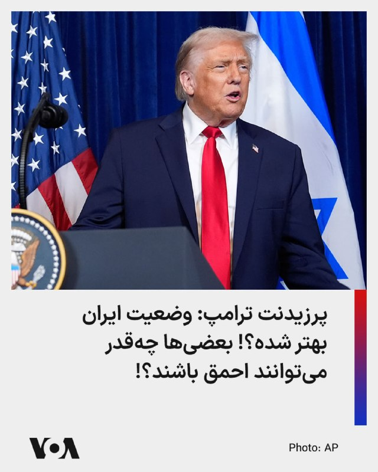

⚡️دونالد ترامپ، رئیس جمهوری آمریکا در پاسخ به انتقادها از تفاهم با جمهوری اسلامی گفت: «جنگ ایران را تضعیف کرده است! این کشور دیگر نیروی هوایی، نیروی دریایی، تجهیزات ضدهوایی، رادار یا عملاً هیچ چیز دیگری ندارد و با این حال دموکرات‌ها می‌گویند که وضعیت ایران اکنون از چهار ماه پیش بهتر است.»
پرزیدنت ترامپ در تروت‌سوشال نوشت: «می‌توانید تصور کنید که چطور چنین حرفی می‌زنند؟؟؟ برخی افراد چقدر می‌توانند احمق باشند؟؟؟»

## FarsiVOA — post 221186

از ورود بدون بلیت تا حاشیه ممنوعیت ورود مهاجم ساحل عاج در گزارش آرش آرا

## DW_Farsi — post 126183

  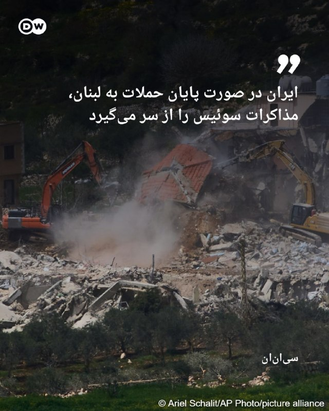

🔶 سی‌ان‌ان: ایران در صورت پایان حملات به لبنان، مذاکرات سوئیس را از سر می‌گیرد

یک دیپلمات مرتبط با موضوع مذاکرات، به سی‌ان‌ان گفته است که جمهوری اسلامی، پیش از ازسرگیری مذاکرات با ایالات متحده در سوئیس، خواستار تضمین‌هایی مبنی بر این شده است که درگیری‌ها در لبنان پایان یابند.

این دیپلمات به سی‌ان‌ان گفته است: «ایرانی‌ها خواستار تضمین‌هایی شده‌اند مبنی بر اینکه درگیری‌ها در لبنان، همان‌طور که در توافق امضاشده مشخص شده، پایان خواهند یافت.»

این منبع همچنین با اشاره به این که "میانجی‌ها در حال حاضر در حال تلاش برای حل این مسئله هستند"، گفته که مذاکرات برنامه‌ریزی‌شده "در پی حملات اسرائیل در لبنان، به طور موقت به تعویق افتاده" است.

این دیپلمات در عین حال به این موضوع اشاره‌ای نکرده است که مذاکرات احتمالا چه زمانی از سر گرفته خواهد شد.

@dw_farsi

## alonews — post 129138

  <a href="telegram/content/alonews_129138_1781873102.webm" target="_blank">🎬 Download video</a>

👈ترامپ : ما از روی استیصال نرفتیم سراغ مذاکره

🔴 این ایران بود که بهش نیاز داشت، کارشون تمومه!

🔴 همون ۶۰ روزی که گفته بودیم رو جلو می‌بریم، هیچ پولی هم گیرشون نمیاد

✅ @AloNews خبر جنگ

## alonews — post 129137

  <a href="telegram/content/alonews_129137_1781873103.webm" target="_blank">🎬 Download video</a>

👈ترامپ : این جنگ ایران را به‌شدت ضعیف کرده!

🔴 دیگه نه نیروی هوایی درست‌وحسابی داره، نه نیروی دریایی، نه تجهیزات پدافندی، نه رادار، و تقریباً هیچ‌چیز دیگه‌ای

🔴 با این حال، دموکرات‌ها میگن ایران الآن از چهار ماه پیش وضعیت بهتری داره

🔴 باور می‌کنید همچین حرفی بزنن و ازش هم جون سالم به در ببرن؟ بعضی‌ها چقدر می‌تونن احمق باشن؟

✅ @AloNews خبر جنگ

---
📅 بروزرسانی: 1405/03/29 16:05
---

## WithYashar — post 15326

طالبان استفاده از گوشی‌های هوشمند رو برای تمامی کارکنان نظامی و غیرنظامی خودشون ممنوع کرد!
@withyashar

## mwarmonitor — post 11211

🔴ایتامار بن‌گویر، وزیر امنیت ملی اسرائیل، خواستار تشدید گسترده تنش‌ها در لبنان شد و گفت: «به ازای هر اشکِ یک مادر اسرائیلی، باید هزار مادر لبنانی گریه کنند. تمام لبنان باید بسوزد.» بن‌گویر از اسرائیل خواست فشارهای خارجی، از جمله فشار آمریکا، را نادیده بگیرد…

## FoxNewsTwitter — post 343165

  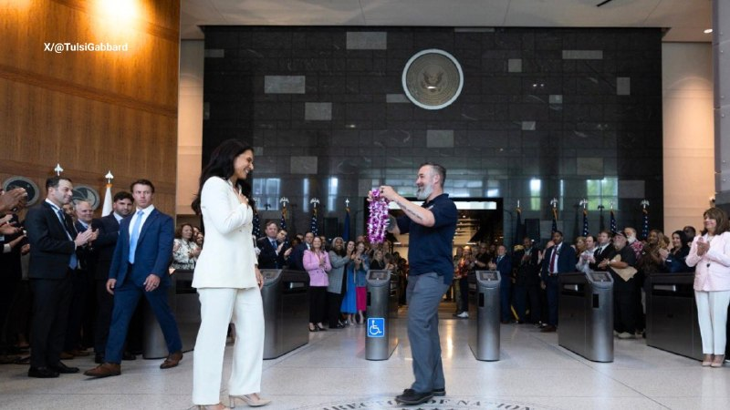

Fox News (Twitter/X)

"Thank you, President Trump."

Tulsi Gabbard says she just walked out of the Office of the Director of National Intelligence headquarters for the final time, marking her last day in the role.

"I remain grateful for the profound honor of serving the American people and our nation as the Director of National Intelligence."

After serving over a year at the helm of the intelligence community, Gabbard is closing out her tenure with a message of gratitude and thanks to President Trump.

## DEJradio — post 5825

  <a href="telegram/content/DEJradio_5825_1781872546.mp4" target="_blank">🎬 Download video</a>

🚨
⭕️ در پی حملات اسرائیل به حزب‌الله، سپاه پاسداران تنگه هرمز را دوباره بست. بر همین اساس از روز جمعه ۲۹ خرداد ۱۴۰۵ سـ.ـپاه در پیامی رادیویی به تمام شناورها هشدار داد نمی‌توانند از تنگه عبور کنند. این اقدام در پی خودداری اسرائیل از عقب‌نشینی از جنوب لبنان و حملات شدید به حـ.ـزب‌الله لبنان انجام شده است.

بعد از تفاهم اولیه میان جمهوری اسلامی و دولت ترامپ چند کشتی خارجی بدون پرداخت عوارض از تنگه هرمز عبور کردند.
شورای‌عالی امنیت ملی جمهوری اسلامی اعلام کرده بود متقاضیان عبور از تنگه هرمز به مدت ۶۰ روز هزینه‌ای نمی‌دهند.

#حزب_الله_لبنان #تنگه_هرمز #توافق
@DEJradio

## FarsiVOA — post 221185

فرماندهی مرکزی ایالات متحده «سنتکام» روز پنجشنبه ۲۸ خرداد اعلام کرد نیروهای آمریکایی به دستور رئیس جمهوری ایالات متحده محاصره دریایی جمهوری اسلامی را پایان داده‌اند.

سنتکام با انتشار بیانیه‌ای در شبکه اجتماعی ایکس اعلام کرد: «امروز نیروهای آمریکا، مطابق دستور رئیس جمهوری، محاصره همه ترددهای دریایی ورودی و خروجی به بندرها و مناطق ساحلی ایران را لغو کردند.»

بر اساس این بیانیه، نیروهای آمریکایی دیگر مانع عبور کشتی‌ها به مقصد یا از مبدأ بندرهای ایران در خلیج فارس و دریای عمان نمی‌شوند و تمامی اقدامات نظامی مرتبط با اجرای این محاصره متوقف شده است.

سنتکام با این حال تأکید کرد که ناوهای نیروی دریایی آمریکا همچنان در منطقه باقی خواهند ماند تا اطمینان حاصل شود که همه مفاد توافق به طور کامل رعایت و اجرا می‌شود.

گزارش کامل را در وب‌سایت صدای آمریکا بخوانید.

@FarsiVOA

## IranianMinds — post 22942

🔴بعد از حملات ارتش اسرائیل به بیش از ۸۰ نقاط در جنوب لبنان:

ایالات متحده آمریکا به جمهوری اسلامی خبر داد که اسرائیل دیگه تنش‌هارو تشدید نمی‌کنه.

یعنی گفتیم یکمی کمتر بزنه😂

@IranianMinds

## BBCPersian — post 284368

  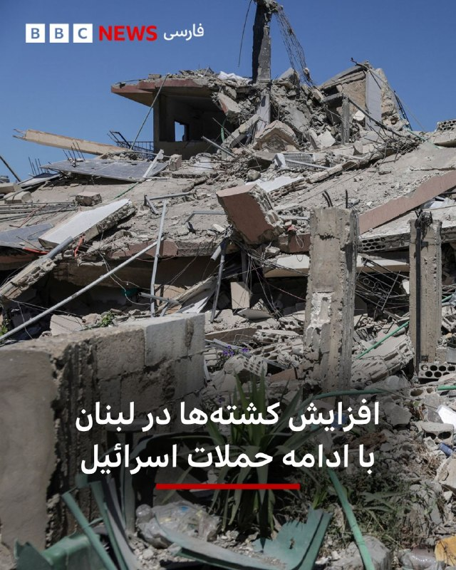

‌🔻علیرغم توافق بین ایران و آمریکا که شامل پایان درگیری در لبنان نیز می‌شد، تبادل آتش میان ارتش اسرائيل و حزب‌الله لبنان همچنان ادامه دارد.

مقام‌های بهداشتی لبنان اعلام کردند که حملات اسرائیل در جنوب این کشور دست‌کم ۱۸ کشته بر جای گذاشته است.

ارتش اسرائیل اعلام کرد که ده‌ها نفر از نیروهای حزب‌الله را در حملات به ۸۰ هدف در سراسر لبنان کشته است.

بنیامین نتانیاهو، نخست‌وزیر اسرائيل، در واکنش به کشته شدن فرمانده گردان ۵۲ زرهی و سه سرباز ارتش این کشور در شبکه اجتماعی ایکس ابراز امیدواری کرد که انتقام خون آنها گرفته شود.

آقای نتانیاهو حمله حزب‌الله را نقض آشکار آتش‌بس دانسته و نوشت: «دیشب به ارتش اسرائیل دستور دادم تا با تمام قوا به حزب‌الله حمله کند.»

او بار دیگر تاکید کرده که اسرائيل حمله به سربازان یا خاک خود را تحمل نخواهد کرد و بهای این حملات برای حزب‌الله بسیار سنگین خواهد بود.

درگیری میان ارتش اسرائيل و حزب‌الله لبنان در حالی رخ می‌دهد که بند اول تفاهم‌نامه ایران و آمریکا، پایان فوری و دائمی عملیات نظامی در همه جبهه‌ها، از جمله لبنان را تضمین می‌کرد.
📷Reuters
@BBCPersian

## alonews — post 129136

  <a href="telegram/content/alonews_129136_1781872549.webm" target="_blank">🎬 Download video</a>

👈 واکنش عراقچی به اظهارات وزیر امنیت داخلی اسرائیل:این‌ها رجزخوانی یا اظهارنظر یک دیوانه و نسل‌کشِ بی نام و نشان نیست؛ بلکه گفته‌های علنی وزیر امنیت داخلی رژیم اسرائیل است.

🔴فرقه مرگِ نسل‌کش که مقر آن در تل‌آویو قرار دارد، تهدیدی برای تمام بشریت است. این جریان همه انسان‌ها را تهدید می‌کند و تنها هدفی که دارد، جنگ دائمی و بی‌پایان است.

✅ @AloNews خبر جنگ

---
📅 بروزرسانی: 1405/03/29 15:54
---

## VahidOOnLine — post 246372

  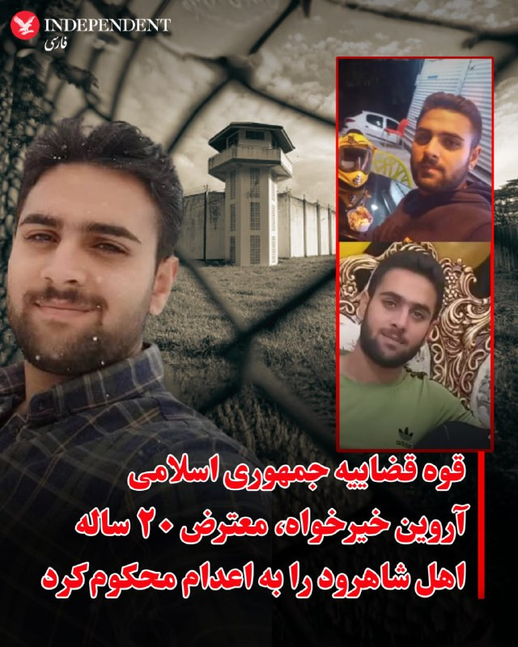

⭕️قوه قضاییه جمهوری اسلامی آروین خیرخواه، معترض ۲۰ ساله اهل شاهرود را به اعدام محکوم کرد

♦️براساس اطلاعات رسیده به ایندیپندنت فارسی، آروین خیرخواه ۲۰ ساله، از بازداشت شدگان انقلاب ملی ایرانیان در تظاهرات ۱۸ دی‌ماه در شاهرود به اعدام محکوم شده‌اند.
این شهروند ایرانی در حال حاضر در زندان مرکزی سمنان به سر می‌برد.

قوه قضائیه جمهوری اسلامی روز سه‌شنبه ۲۶ خردادماه جواد زمانی و ابولفضل ساعدی، دو تن از معترضان انقلاب ملی ایرانیان را در شاهرود اعدام کرده بود.

براساس اطلاعات رسیده به ایندیپندنت فارسی دست‌کم دو معترض دیگر به‌ نام‌های مهدی رنجبر ۱۸ ساله و مرتضی زمانی ۲۷ ساله، از بازداشت‌شدگان انقلاب ملی ایران نیز به اعدام محکوم شده‌اند.

به گفته‌ شورای حقوق بشر سازمان ملل متحد از دی‌ماه ۱۴۰۴ تاکنون دست‌کم ۲۰ نفر از بازداشتی‌های اعتراضات به بهانه ارتکاب جرایم علیه امنیت ملی اعدام شده‌اند.
‌🇸🇦 Indypersian

🤖 @VahidOOnLine

## VahidOOnLine — post 246371

  

محمداسحاق دار، وزیر خارجه پاکستان، جمعه ۲۹ خرداد در جمع خبرنگاران گفت گفت‌وگوهای برنامه‌ریزی‌شده میان آمریکا و جمهوری اسلامی در سوئیس به دلیل فرارسیدن ماه محرم به تعویق افتاده است.

او گفت این مذاکرات پس از پایان ماه محرم از سر گرفته خواهد شد، اما تلاش‌های دیپلماتیک برای پیشبرد روند اجرای تفاهم‌نامه در دوره ۶۰ روزه تعیین‌شده ادامه خواهد داشت.

دار همچنین گفت پاکستان در صورت دریافت دعوت، آماده مشارکت در نشست‌ها و رایزنی‌های دیپلماتیک آینده مرتبط با این روند است.

وزیر خارجه پاکستان در بخش دیگری از سخنانش گفت در مراسم تشییع علی خامنه‌ای شرکت خواهد کرد.
‌🏁 🇬🇧 IranintlTV

🤖 @VahidOOnLine

## mwarmonitor — post 11210

  <a href="telegram/content/mwarmonitor_11210_1781871879.mp4" target="_blank">🎬 Download video</a>

✈️جت‌های جنگنده F-16 نیروی هوایی آمریکا در حال دریافت سوخت‌گیری هوایی هنگام انجام گشت‌زنی بر فراز خاورمیانه هستند. نیروهای آمریکایی در منطقه همچنان حضور دارند و در حالت آماده‌باش و هوشیاری باقی مانده‌اند.

@mwarmonitor

## IranIntlTV — post 343198

  <a href="telegram/content/IranIntlTV_343198_1781871881.mp4" target="_blank">🎬 Download video</a>

پس از ۲۴ ساعت انتشار خبرهای ضدونقیض درباره برگزاری نشست آمریکا و جمهوری اسلامی، وزارت خارجه سوئیس اعلام کرد این نشست در اقامتگاه بورگن‌اشتوک برگزار نخواهد شد؛ منطقه‌ای گردشگری که متعلق به سرمایه‌گذاران قطری است و برخی رسانه‌های سوئیسی می‌گویند انتخاب آن به پیشنهاد قطر بوده است.
@iranintltv

## IranIntlTV — post 343197

  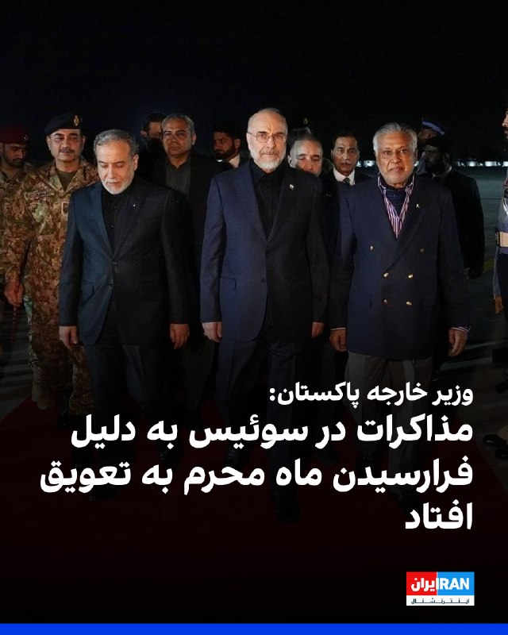

محمداسحاق دار، وزیر خارجه پاکستان، جمعه ۲۹ خرداد در جمع خبرنگاران گفت گفت‌وگوهای برنامه‌ریزی‌شده میان آمریکا و جمهوری اسلامی در سوئیس به دلیل فرارسیدن ماه محرم به تعویق افتاده است.

او گفت این مذاکرات پس از پایان ماه محرم از سر گرفته خواهد شد، اما تلاش‌های دیپلماتیک برای پیشبرد روند اجرای تفاهم‌نامه در دوره ۶۰ روزه تعیین‌شده ادامه خواهد داشت.

دار همچنین گفت پاکستان در صورت دریافت دعوت، آماده مشارکت در نشست‌ها و رایزنی‌های دیپلماتیک آینده مرتبط با این روند است.

وزیر خارجه پاکستان در بخش دیگری از سخنانش گفت در مراسم تشییع علی خامنه‌ای شرکت خواهد کرد.
https://iranintl.com/202606196211

## Persian_Trend_Official — post 17570

  <a href="telegram/content/Persian_Trend_Official_17570_1781871883.webm" target="_blank">🎬 Download video</a>

🇱🇧 نبطیه: محور استراتژیک شکست یا حفظ مقاومت در جنوب لبنان

🪖 تشدید حملات اسرائیل به جنوب لبنان، با ۱۱۰ حمله از صبح امروز!!!!!!

این تشدید زمانی رخ می‌دهد که اسرائیل استراتژی واضحی را در پی دارد: سقوط نبطیه به‌عنوان درخت سقوط‌های سریالی.

👮‍♂️ محور استراتژیک نبطیه:
نبطیه نه فقط یک شهر نظامی است؛ این عنوان‌شهر حزب‌الله در جنوب لبنان است و نقطه‌ای تاریخی‌تر برای مقاومت. فرماندهی، شبکه‌های لجستیک، و ساختارهای فرماندهی‌مرکزی حزب‌الله در این منطقه متمرکز است. سقوط نبطیه یعنی شکستن محور‌شکن متمرکز تمام ساختار حزب‌الله در جنوب.

منابع ایرانی تأکید می‌کنند که اسرائیل این منطقه را تاکتیک‌ی انتخاب کرده است چون سقوط آن، مانند «دومینو»، باعث فروپاشی ریختبندی شهرهای دیگر — سیدا، صور، و شرق‌منطقه — خواهد شد.

✈️
💣شدت بمباران‌های امروز (۱۱۰ حمله) به‌قدری فراگیر است که کاملاً بعید نیست اسرائیل از این فرصت برای تجاوز به ضاحیه جنوبی بیروت (دایحه، پایگاه‌شهر شیعی و درسراسر ساختار حزب‌الله) استفاده کند. این تجاوز خود می‌تواند نقطه‌شکست در مذاکرات صلح ایران-آمریکا باشد.

اسرائیل درصدد است در یک حرکت استراتژیک، نه‌تنها جنوب لبنان را تسخیر کند بلکه کل ساختار حزب‌الله را به‌عنوان یک نیروی سازمان‌یافته از بین ببرد. نبطیه کلیدی است — اگر سقوط کند، زنجیره‌ای شکست‌های نظامی و سیاسی شروع‌خواهد شد. با وجود توافق ایران-آمریکا (۱۵ ژوئن)، اسرائیل هیچ نشانه‌ای از توقف ندارد. در واقع، تشدید امروز می‌تواند نشانگر تلاش اسرائیل برای به‌دست‌آوردن حداکثر مزایای نظامی پیش از هر فشار دیپلماتیک جدی باشد.

👺Phantom

📌 @persian_trend_official
پرشین ترند | متفاوت‌ترین کانال نظامی

## BBCPersian — post 284367

🔻وزارت خارجه فرانسه درخواست لغو تجمع هواداران مجاهدین خلق را در پاریس تکذیب کرد

وزارت خارجه فرانسه درخواست لغو تجمع یک گروه مخالف حکومت ایران را که قرار بود فردا در پاریس برگزار شود، تکذیب کرد.

شورای ملی مقاومت، عنوان شاخه سیاسی سازمان مجاهدین خلق، امروز اعلام کرد که پلیس پاریس تجمع آن‌ها را در آخرین لحظه ممنوع کرده است.

شورای ملی مقاومت این تصمیم را به تماس تلفنی دیروز ژان‌نوئل بارو، وزیر خارجه فرانسه، با عباس عراقچی، همتای ایرانی‌اش مرتبط دانسته است.

اما وزارت خارجه فرانسه در بیانیه‌ای که به رویترز ارسال کرده، این خبر را رد کرد و گفت: «این ادعا نادرست است. وزیر هیچ اشاره‌ای به این تجمع نکرد و درخواست لغو آن را هم مطرح نکرد.»

شورای ملی مقاومت پیش‌تر گفته بود که مجوز برگزاری این تجمع از چند ماه پیش صادر شده بود اما شب گذشته به طور ناگهانی لغو شد.

این گروه همچنین گفت که به این تصمیم اعتراض کرده اما درباره علت این ممنوعیت توضیحی نداده است.
@BBCPersian

## Hranews — post 113721

  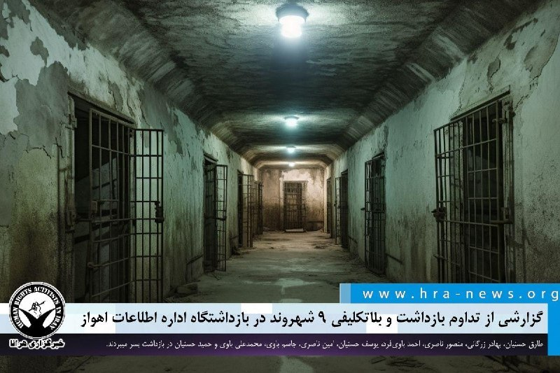

گزارشی از تداوم بازداشت و بلاتکلیفی ۹ شهروند در بازداشتگاه اداره اطلاعات اهواز

❗️
❗️
❗️
❗️
❗️– طارق حسنیان، بهادر زرگانی، منصور ناصری، احمد باوی‌فرد، یوسف حسنیان، امین ناصری، جاسم باوی، محمدعلی باوی و حمید حسنیان، شهروندان ساکن اهواز، بیش از ۱۰۰ روز است که توسط ماموران اداره اطلاعات بازداشت شده‌اند. این افراد هم‌اکنون به‌صورت بلاتکلیف در بازداشتگاه این نهاد امنیتی نگهداری می‌شوند.

به گزارش خبرگزاری هرانا، ارگان خبری مجموعه فعالان حقوق بشر در ایران، تعدادی از شهروندان ساکن اهواز در بازداشت بسر میبرند.

طارق حسنیان، بهادر زرگانی، منصور ناصری، احمد باوی‌فرد، یوسف حسنیان، امین ناصری، جاسم باوی، محمدعلی باوی و حمید حسنیان، ۱۰۳ روز است که بازداشت شدند و در بازداشتگاه اداره اطلاعات اهواز نگهداری می‌شوند. آنها از زمان بازداشت تاکنون از برقراری تماس تلفنی و ملاقات با خانواده، همچنین دسترسی به وکیل، محروم مانده‌اند.

این افراد به تیراندازی به سمت نیروهای امنیتى، انفجار لوله‌های نفت، نگهداری بمب‌های دست‌ساز، همکاری با آمریکا و اسرائیل و اخلال در نظم عمومی متهم شده‌اند. رسیدگی به اتهامات آنان در شعبه دوم دادگاه عمومی و انقلاب شهرستان کارون به ریاست قاضی منتظری انجام شد.

ادامه مطلب

#طارق_حسنیان #بهادر_زرگانی #منصور_ناصری #احمد_باوی‌فرد #یوسف_حسنیان #امین_ناصری #جاسم_باوی #محمدعلی_باوی #حمید_حسنیان

↘️
@hranews_bot تماس ✉️ -  @Hranews  کانال هرانا 🆑

## Hranews — post 113720

گزارشی از اجرای حکم اعدام ۵ زندانی در زندان‌های مختلف

❗️
❗️
❗️
❗️
❗️– حکم ۵ زندانی که پیشتر از بابت اتهامات قتل و محاربه از طریق سرقت مسلحانه به اعدام محکوم شده بودند، در زندان‌های دستگرد اصفهان، بروجرد و زاهدان به اجرا درآمد.

ادامه مطلب

#حسین_براهویی #رشید_عارفی #منصور_بختیاری #عباس‌قلی_سیف‌زاده #رحمان_بیکار

↘️
@hranews_bot تماس ✉️ -  @Hranews  کانال هرانا 🆑

## alonews — post 129134

  <a href="telegram/content/alonews_129134_1781871885.webm" target="_blank">🎬 Download video</a>

👈تصادف شدید کامیون با پراید و فیدلیتی در مشهد

🔴۵ نفر دردم جان باختند!

🔴از پراید چیزی باقی نمانده!

✅ @AloNews خبر جنگ

---
📅 بروزرسانی: 1405/03/29 15:44
---

## VahidOOnLine — post 246370

  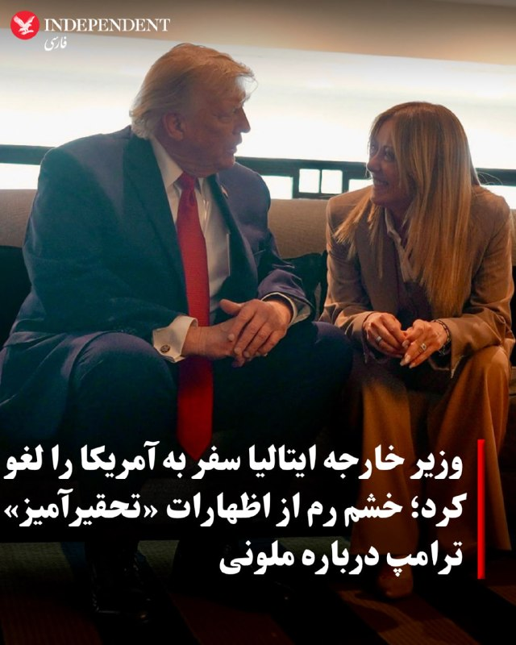

♦️وزیر امور خارجه ایتالیا روز جمعه اعلام کرد در واکنش به گزارش‌ها درباره اظهارات دونالد ترامپ، رئیس‌جمهوری آمریکا، سفر برنامه‌ریزی‌شده خود به ایالات متحده را لغو می‌کند.

آنتونیو تایانی که قرار بود روزهای ۲۱ و ۲۲ ژوئن به آمریکا سفر کند، در شبکه اکس نوشت: «سخنان شدیدا توهین‌آمیز رئیس‌جمهوری ترامپ… به همه مردم ایتالیا اهانت می‌کند.»

جورجا ملونی، نخست‌وزیر ایتالیا، نیز در گفت‌وگو با شبکه ایتالیایی «لا۷» گفت از اظهارات ترامپ «شوکه» شده است.

بر اساس متن پیاده‌شده‌ای که این شبکه منتشر کرده، ترامپ درباره دیدار خود با ملونی در نشست گروه هفت گفته بود: «ملونی آن‌قدر می‌خواست با من عکس بگیرد که فقط از روی دلسوزی با او موافقت کردم.»
‌🇸🇦 Indypersian

🤖 @VahidOOnLine

## VahidOOnLine — post 246369

  <a href="telegram/content/VahidOOnLine_246369_1781871280.mp4" target="_blank">🎬 Download video</a>

ویدیوی رسیده به ایران اینترنشنال نشان می‌دهد ایرانیان مقیم هامبورگ روز ۲۹ خرداد با در دست داشتن پرچم شیروخورشید، یاد سحر خدایاری، معروف به «دختر آبی»، را گرامی داشتند. سحر خدایاری، هوادار ۲۹ ساله تیم استقلال، ۲۱ اسفند ۱۳۹۷ هنگام تلاش برای ورود به استادیوم آزادی بازداشت و تا ۲۹ اسفند در زندان قرچک ورامین نگهداری شد. او پس از آزادی و در پی انتقال پرونده‌اش به دادگاه انقلاب و صدور حکم ۶ ماه حبس، روز ۱۱ شهریور ۱۳۹۸ مقابل این دادگاه در تهران خودسوزی کرد و یک هفته بعد، در ۱۸ شهریور، بر اثر شدت سوختگی جان باخت.
‌🏁 🇬🇧 IranintlTV

🤖 @VahidOOnLine

## mwarmonitor — post 11209

🔴 خبرنگار الجزیره: حمله هوایی اسرائیل به اطراف النبطیه در جنوب لبنان

@mwarmonitor

## FoxNewsTwitter — post 343164

  <a href="telegram/content/FoxNewsTwitter_343164_1781871282.mp4" target="_blank">🎬 Download video</a>

Fox News (Twitter/X)

Granted DACA "Dreamer" status by the Obama administration in 2014, now charged in an alleged terror plot.

Federal investigators say one of five suspects, and the "ringleader," accused of planning attacks using explosive-equipped drones near the White House with the goal of forcing evacuations and creating chaos is an illegal immigrant from Mexico.

Newly surfaced screenshots reportedly show maps, drone placements, and sniper positioning around the White House. | @davidspunt

## Persian_Trend_Official — post 17569

  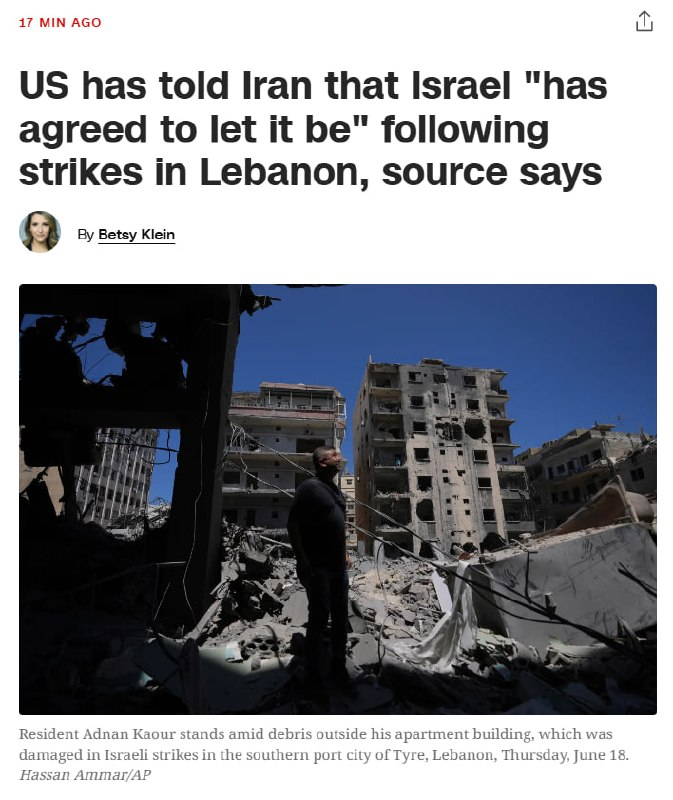

به گزارش CNN، ایالات متحده به ایران l اطلاع داده است که اسرائیل حملات خود را در لبنان بیشتر تشدید نخواهد کرد.

یک منبع گفت: حزب‌الله آتش‌بس را نقض کرد. اسرائیل موافقت کرده است که آتش‌بس ادامه یابد، که این موضوع به ایرانی‌ها اطلاع داده شده است، و این به عهده حزب‌الله است که آن را متوقف کند.

📝 Amir

📌 @persian_trend_official
پرشین ترند | متفاوت‌ترین کانال نظامی

## BBCPersian — post 284366

  <a href="telegram/content/BBCPersian_284366_1781871284.mp4" target="_blank">🎬 Download video</a>

🔻جمعیت بسیاری از هواداران تیم‌های فوتبال مکزیک و کره جنوبی در این جام جهانی دوشادوش هم جشن گرفته‌اند و ویدیو‌های این شادی و پایکوبی از آغاز مسابقات در شبکه‌های اجتماعی پربازدید شده‌اند.

نکته برجسته این ویدئوها، رفاقت غیرمنتظره میان هواداران این دو تیم است که با جام جهانی ۲۰۱۸ شروع شد اما حالا به اقتصاد و فرهنگ هم رسیده است..

مسابقه تیم‌های دو کشور جمعه با برد یک بر صفر مکزیک پایان یافت اما آتش این رفاقت تازه گل انداخته است.
@BBCPersian

---
📅 بروزرسانی: 1405/03/29 15:34
---

## mwarmonitor — post 11208

🔴ایالات متحده به ایران گفته است که اسرائیل پس از حملاتی که در واکنش به یک حمله حزب‌الله انجام شد و منجر به کشته شدن ۴ سرباز اسرائیلی گردید، با عدم تشدید بیشتر حملات در لبنان موافقت کرده است.

🔸یک منبع گفته است این پیام در حالی به تهران منتقل شده که دولت ترامپ تلاش می‌کند مذاکرات هسته‌ای به تعویق افتاده با ایران را دوباره به مسیر اصلی بازگرداند — به گزارش CNN.

@mwarmonitor

## DEJradio — post 5824

⭕️ فرانسه لغو تحریم‌ها را مشروط به تغییر رفتار جمهوری اسلامی و حل مسئلۀ موشکی و هسته‌ای دانست

ژان-نوئل بارو، وزیر امور خارجۀ فرانسه اعلام کرد پاریس تا زمانی که از تغییر رفتار جمهوری اسلامی اطمینان نیابد، با لغو تحریم‌های بین‌المللی علیه تهران موافقت نمی‌کند.
او گفت مذاکرات آتی باید علاوه بر برنامۀ هسته‌ای، به موضوع موشک‌های بالستیک و پشتیبانی جمهوری اسلامی از نیروهای نیابتی در منطقه نیز بپردازد.
بارو تأکید کرد ثبات پایدار در خاورمیانه بدون تغییر اساسی در سیاست‌های منطقه‌ای جمهوری اسلامی امکان‌پذیر نیست.
وزیر امور خارجه فرانسۀ همچنین گفت پاریس در شورای امنیت سازمان ملل متحد، از لغو تحریم‌ها علیه رژیم حاکم بر ایران پشتیبانی نمی‌کند.
ژان-نوئل بارو افزود پشتیبانی فرانسه از لغو تحریم‌ها علیه رژیم، در صورتی رخ می‌دهد که نتیجۀ مذاکره با جمهوری اسلامی، انتظارات کشورهای غربی را برآورده کند.
پیش‌تر نیز کایا کالاس، مسئول سیاست خارجی اتحادیۀ اروپا، اعلام کرده بود هنوز برای بحث دربارۀ لغو تحریم‌های اروپا علیه جمهوری اسلامی زود است.
به گفتۀ کایا کالاس، این موضوع تنها پس از دستیابی به توافق جامع هسته‌ای می‌تواند بررسی شود.

#فرانسه #تحریم #جمهوری_اسلامی
@DEJradio

## DEJradio — post 5823

⭕️ نتانیاهو در واکنش به جان باختن نظامیان اسرائیل: حزب‌الله باید بهایی بسیار سنگین بپردازد

بنیامین نتانیاهو، نخست‌وزیر اسرائیل در پی جان باختن چهار نظامی اسرائیلی در جنوب لبنان، اعلام کرد حزب‌الله به‌زودی بهایی سنگین را به دلیل حملات‌اش می‌پردازد.
نتانیاهو روز آدینه در شبکۀ ایکس نوشت اسرائیل حمله به نیروها و خاک خود را تحمل نمی‌کند و ارتش این کشور برای از بین بردن هر تهدیدی آمادۀ اقدام است.
او یک بار دیگر تأکید کرد نیروهای اسرائیلی تا زمانی که لازم باشد درون منطقۀ حائل امنیتی در جنوب لبنان باقی می‌مانند.
ارتش اسرائیل روز آدینه اعلام کرد در واکنش به حملات حزب‌الله، دستکم 80 موضع و زیرساخت‌ نظامی این گروه را در نبطیه و دیگر مناطق جنوب لبنان هدف قرار داده است.
این حملات متقابل در حالی است که جمهوری اسلامی در تفاهم با آمریکا بر پایان جنگ در لبنان پافشاری کرده است.
شبه‌نظامیان حزب‌الله که توسط تهران پشتیبانی می‌شوند، در سیاهۀ تروریستی آمریکا و اروپا قرار دارند.

#نتانیاهو #لبنان
@DEJradio

## IranIntlTV — post 343196

ویدیوی رسیده به ایران اینترنشنال نشان می‌دهد ایرانیان مقیم هامبورگ روز ۲۹ خرداد با در دست داشتن پرچم شیروخورشید، یاد سحر خدایاری، معروف به «دختر آبی»، را گرامی داشتند. سحر خدایاری، هوادار ۲۹ ساله تیم استقلال، ۲۱ اسفند ۱۳۹۷ هنگام تلاش برای ورود به استادیوم آزادی بازداشت و تا ۲۹ اسفند در زندان قرچک ورامین نگهداری شد. او پس از آزادی و در پی انتقال پرونده‌اش به دادگاه انقلاب و صدور حکم ۶ ماه حبس، روز ۱۱ شهریور ۱۳۹۸ مقابل این دادگاه در تهران خودسوزی کرد و یک هفته بعد، در ۱۸ شهریور، بر اثر شدت سوختگی جان باخت.

## IranIntlTV — post 343195

  <a href="telegram/content/IranIntlTV_343195_1781870683.mp4" target="_blank">🎬 Download video</a>

خبرگزاری رویترز به نقل از منابع عراقی گزارش داد سپاه پاسداران با ایجاد هسته‌های مخفی در عراق، دست‌کم هفت حمله پهپادی علیه کویت، عربستان سعودی و امارات را از ۳۱ فروردین تا ۲۷ اردیبهشت سازمان‌دهی کرده است.

تروسکه صادقی، خبرنگار ایران‌اینترنشنال، گزارش می‌دهد
@iranintltv

## DW_Farsi — post 126173

📸 ملودی پیاده‌روها؛ تپش هنر در رگ‌های شهرهای ایران

موسیقی خیابانی در ایران، بسیار فراتر از یک سرگرمی ساده، به بخش جدایی‌ناپذیر از فرهنگ مدرن شهری تبدیل شده است. از پیاده‌روهای تهران تا عطر باران و صدای ساز در پیاده‌راه رشت و از خنکای زاینده‌رود در اصفهان تا شب‌های زنده ساحل کارون در اهواز، موسیقی خیابانی روایتگر زنده احوال مردم است.

این هنر بی‌بلیت شهر است؛ جایی که پیاده‌رو جای سالن‌های مجلل را می‌گیرند و مردم عادی در میان دغدغه‌های روزمره، لحظه‌ای توقف می‌کنند تا به یک ملودی مشترک گوش بسپارند.
@dw_farsi

## RadioFarda — post 158503

  <a href="telegram/content/RadioFarda_158503_1781870684.mp4" target="_blank">🎬 Download video</a>

🔸پرستو احمدی ۲۱ آذر ۱۴۰۳، به همراه گروهی از نوازندگان مَرد ویدئویی بدون حجاب اجباری از «کنسرت کاروانسرا» یا «کنسرت فرضی» را منتشر کرد.

🔸قوه قضائیه جمهوری اسلامی بلافاصله پس از پخش این اجراعلیه این خواننده و سایر عوامل این اجرا اعلام جرم کرد.

🔸پس از آن خانم احمدی به همراه احسان بیرقدار، نوازنده پیانو و سهیل فقیه نصیری، نوازنده گیتار الکتریک در ۲۴ آذرماه بازداشت شدند اما بعدتر اعلام شد که هر سه نفر آزاد شدند.

🔸او و همکارانش به تازگی به ۷۴ ضربه شلاق تعزیری، دو سال ممنوع‌الخروجی و دو سال ممنوعیت از فعالیت هنری محکوم شدند.

🔸هم‌زمان برخی کاربران با یادآوری پخش اجراهای جولیا پتروس، خواننده لبنانی، در مراسم حکومتی در تهران در فروردین امسال به احکام صادرشده علیه این گروه ایرانی واکنش نشان داده‌اند.

@RadioFarda

## alonews — post 129133

  <a href="telegram/content/alonews_129133_1781870686.webm" target="_blank">🎬 Download video</a>

👈گزارش سی ان ان، ایالات متحده به ایران «به اطلاع» رسانده است که اسرائیل حملات خود را در لبنان بیشتر نخواهد کرد.

🔴یک منبع گفت: "حزب‌الله آتش‌بس را نقض کرد. اسرائیل موافقت کرده است که این آتش‌بس را به ایرانی‌ها رسانده است و این وظیفه حزب‌الله است که متوقف شود.

✅ @AloNews خبر جنگ

## alonews — post 129132

  <a href="telegram/content/alonews_129132_1781870686.webm" target="_blank">🎬 Download video</a>

👈خبرنگار الجزیره از حملات هوایی مجدد اسرائیل به شهر النبطیه و اطراف آن در جنوب لبنان خبر داد

✅ @AloNews خبر جنگ

---
📅 بروزرسانی: 1405/03/29 15:24
---

## mwarmonitor — post 11207

🔴وزیر امور خارجه ایتالیا، Antonio Tajani می‌گوید که سفر برنامه‌ریزی‌شده‌اش در تاریخ ۲۱ تا ۲۲ ژوئن به واشنگتن را لغو می‌کند، پس از آن‌که Donald Trump به نخست‌وزیر ایتالیا، Giorgia Meloni توهین کرده و گفته بود او «التماس کرده» برای گرفتن عکس با او و اینکه او «برای او احساس ترحم کرده است».

🔸نخست‌وزیر ایتالیا، Giorgia Meloni، در واکنش به اظهارات Donald Trump گفت این سخنان «کاملاً ساختگی» هستند و افزود که او «صادقانه شوکه و متعجب» شده است.

🔸او گفت:
«نمی‌دانم چرا رئیس‌جمهور ایالات متحده این‌گونه با متحدانش رفتار می‌کند.»

📝چیزی نیست چند وقته رد داده

@mwarmonitor

## DEJradio — post 5822

⭕️ مذاکرات روز آدینۀ نمایندگان جمهوری اسلامی و آمریکا رسما لغو شد

وزارت خارجۀ سوئیس رسماً اعلام کرد مذاکرات برنامه‌ریزی‌شده میان نمایندگان جمهوری اسلامی و آمریکا که قرار بود روز آدینه ۲۹ خردادماه آغاز شود، لغو شده است.
این تصمیم اندکی بعد از آن اعلام شد که کاخ سفید خبر لغو سفر جی‌دی ونس، معاون رئیس‌ جمهوری آمریکا به سوئیس را تأیید کرد.
لغو این مذاکرات تنها یک روز پس از امضای تفاهم‌نامه تهران و واشینگتن رخ داده است.
در این تفاهمنامه قید شده که تهران و واشینگتن ۶۰ روز فرصت دارند طی مذاکرات دربارۀ پرونده هسته‌ای جمهوری اسلامی به توافقی جامع دست یابند.
خبرگزاری حکومتی تسنیم، پیش‌تر گزارش داده بود مذاکره‌کنندگان جمهوری اسلامی پیش از آغاز دور تازۀ گفت‌وگوها خواهان مشاهدۀ نشانه‌هایی از اجرای توافق از سوی آمریکا شده‌اند.
وزارت امور خارجۀ سوئیس درمورد زمان ازسرگیری دوبارۀ مذاکرات توضیحی ارائه نکرده است.
مقام‌های جمهوری اسلامی هنوز واکنشی رسمی به لغو نشست سوئیس نشان نداده‌اند.

#مذاکرات #سوئیس
@DEJradio

## DEJradio — post 5821

⭕️ سناتور کاتن: برخی موارد تفاهم با جمهوری اسلامی ممکن است اشتباه باشد

تام کاتن، سناتور جمهوری‌خواه آمریکا در مورد بندهایی از یادداشت تفاهم‌ میان واشینگتن و جمهوری اسلامی ابراز نگرانی کرد.
او در گفت‌وگو با فاکس‌نیوز گفت جمهوری اسلامی طی دهه‌های پیشین مسئول کشته و زخمی شدن آمریکایی‌ها بود و تلاش کرد نیروهای آمریکایی را در عراق هدف بگیرد.
کاتن از سویی ضمن تمجید از رئیس‌ جمهوری آمریکا، گفت دونالد ترامپ با اقدامات نظامی خود جمهوری اسلامی را به ضعیف‌ترین وضعیت در چند دهۀ اخیر رسانده است.
این سناتور جمهوری‌خواه افزود اگرچه از کاهش بهای بنزین و فروکش کردن تنش‌ها خشنود است، اما به نظر او برخی مفاد تفاهمنامه ممکن است در مسیر اشتباه قرار داشته باشد.
او با اشاره به احتمال لغو تحریم‌های صادرات نفت جمهوری اسلامی، گفت در صورت بازگشت کامل روند صادرات نفت، تهران ممکن است روزانه بین ۱۵۰ تا ۲۰۰ میلیون دلار درآمد کسب کند.
کاتن هشدار داد این رقم معادل حدود ۴.۵ تا ۶ میلیارد دلار در ماه است و می‌تواند منابع مالی قابل توجهی را در اختیار جمهوری اسلامی قرار بدهد.

#تفاهمنامه
@DEJradio

## IranIntlTV — post 343194

  <a href="https://t.me/IranintlTV/343194" target="_blank">📎 Download file</a>

🎧نسخه صوتی اخبار نیم‌روزی | جمعه ۲۹ خرداد
@iranintlTV

## RadioFarda — post 158502

  <a href="https://t.me/radiofarda/158502" target="_blank">📎 Download file</a>

📻بشنوید: ساعت ۱۴ با رادیوفردا، ۲۹ خرداد ۱۴۰۵‌

@RadioFarda

## RadioFarda — post 158501

  <a href="https://t.me/radiofarda/158501" target="_blank">📎 Download file</a>

🔸 در این کافه فردا به حواشی و متن بازی‌های مکزیک با کره جنوبی، جمهوری چک با آفریقای جنوبی، کانادا با قطر و بوسنی هرزگوین با سوئیس می‌پردازیم، تاریخ حضور ایران در جام‌های جهانی را مرور می‌کنیم و درباره مسابقات پیش رو حرف می‌زنیم.

🔸 برای تماس با ما می‌توانید به شناسه کافه فردا در تلگرام صوت و متن بفرستید.

📻 کافه فردا

## alonews — post 129131

  <a href="telegram/content/alonews_129131_1781870083.webm" target="_blank">🎬 Download video</a>

👈سفیر آمریکا در اسرائیل از حملات این کشور به لبنان حمایت کرد

✅ @AloNews خبر جنگ

## alonews — post 129130

  <a href="telegram/content/alonews_129130_1781870083.webm" target="_blank">🎬 Download video</a>

👈ترامپ در پاسخ به منتقدان توافق با ایران: برخی تندروها دیگر محترم نیستند

🔴من یک آرزوی اصلی به‌عنوان رئیس‌جمهور دارم؛ هرگز نمی‌خواهم به هربرت هوورِ مرحوم و فقید تبدیل شوم

🔴 بعضی از افرادی که قبلاً به آن‌ها احترام می‌گذاشتم، دیگر برایم محترم نیستند؛ آن‌ها تندرو هستند

✅ @AloNews خبر جنگ

## alonews — post 129129

  <a href="telegram/content/alonews_129129_1781870083.webm" target="_blank">🎬 Download video</a>

👈خبرگزاری تسنیم : تنگه هرمز رو تا عقب‌نشینی کامل اسرائیل از لُبنان مسدود کنید - تموم مذاکرات رو لغو کنید

✅ @AloNews خبر جنگ

## alonews — post 129128

  <a href="telegram/content/alonews_129128_1781870083.webm" target="_blank">🎬 Download video</a>

👈معاون وزیر نیرو: متخصصان اتمی روس به زودی به کشور بازمی‌گردند

✅ @AloNews خبر جنگ

---
📅 بروزرسانی: 1405/03/29 15:15
---

## VahidOOnLine — post 246368

  

محمدمهدی حسینی همدانی، امام جمعه کرج، جمعه ۲۹ خرداد گفت جمهوری اسلامی حتی در صورت مذاکره با آمریکا دچار «خطای محاسباتی» نخواهد شد و همچنان آمریکا را دشمن اصلی خود می‌داند.

او در خطبه‌های نماز جمعه کرج گفت مذاکره به معنای تغییر نگاه جمهوری اسلامی به آمریکا نیست و تهران همچنان این کشور را «غیرقابل اعتماد» می‌داند.

حسینی همدانی افزود اگر مذاکره‌ای هم انجام شود، با هدف مطالبه حقوق جمهوری اسلامی و از موضع قدرت خواهد بود و به معنای «بده‌بستان» مورد نظر برخی افراد نیست.

امام جمعه کرج همچنین با اشاره به پیام مجتبی خامنه‌ای، رهبر جمهوری اسلامی، گفت این پیام «حکیمانه و به‌موقع» بوده و همه منتظر تحقق شروط مطرح‌شده در آن هستند.
‌🏁 🇬🇧 IranintlTV

🤖 @VahidOOnLine

## FoxNewsTwitter — post 343163

  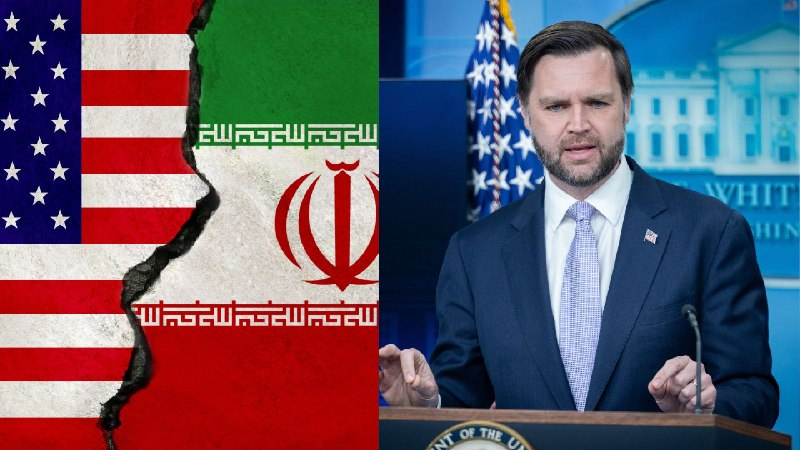

Fox News (Twitter/X)

JUST IN: Vice President JD Vance has canceled his planned trip to Switzerland as the next round of U.S.-Iran negotiations appears to be slipping off schedule.

The move comes as Tehran's lead negotiator warns the U.S. will face an “even harder slap” if the U.S. violates the emerging agreement.

## pm_afshaa — post 94388

  <a href="telegram/content/pm_afshaa_94388_1781869520.webm" target="_blank">🎬 Download video</a>

🔴واکنش نتانیاهو به کشته شدن سربازان اسرائیلی: ما حمله به سربازانمان رو تحمل نخواهیم کرد و کاری خواهیم کرد که حزب‌الله بهای بسیار سنگینی بپردازه. 
💧 Rainbet.com the #1 Non-KYC Crypto Casino & Sportsbook @rainbetcom 
😁 @Pm_Afshaa

## pm_afshaa — post 94387

🔴نتانیاهو: دستور داده ام، جنگ در لبنان با تمام قدرت ادامه یابد

💧 Rainbet.com the #1 Non-KYC Crypto Casino & Sportsbook @rainbetcom

😁 @Pm_Afshaa

## DEJradio — post 5820

⭕️ حملات تازۀ اسرائیل به مواضع حزب‌الله در جنوب لبنان

واکنش اسرائیل به حملات پهپادی حزب‌الله در روز آدینه دستکم ۱۶ کشته بر جا گذاشت.
بر پایۀ گزارش‌ها، چندین منطقه در استان نبطیۀ لبنان در فاصلۀ شامگاه پنج‌شنبه تا بامداد آدینه، هدف چند موج حملۀ هوایی ارتش اسرائیل قرار گرفت.
ارتش اسرائیل اعلام کرد این عملیات را در پاسخ به «نقض‌های مکرر آتش‌بس» از سوی حزب‌الله انجام داده است.
بر اساس بیانیۀ ارتش اسرائیل، حملات علیه نیروها و زیرساخت‌های حزب‌الله در جنوب لبنان در طول شامگاه گذشته ادامه یافت.
در پی برخورد بمب نیروهای حزب‌الله به یک تانک ارتش اسرائیل، چهار تن از نظامیان این کشور جان باخته‌اند.
این حملات تنها یک روز پس از امضای تفاهمنامه میان جمهوری اسلامی و آمریکا انجام شده است.
در نخستین بند این تفاهمنامه اعلام شده که به درگیری‌ در همۀ جبهه‌ها از جمله لبنان پایان داده می‌شود.
اسرائیل اعلام کرده به تفاهمنامۀ میان تهران و واشینگتن پایبند نیست و در برابر حملات حزب‌الله، از امنیت خود مراقبت می‌کند.
حزب‌الله که توسط جمهوری اسلامی پشتیبانی و هدایت می‌شود، در سیاهۀ تروریستی آمریکا قرار دارد.

#اسرائیل #لبنان
@DEJradio

## IranIntlTV — post 343193

  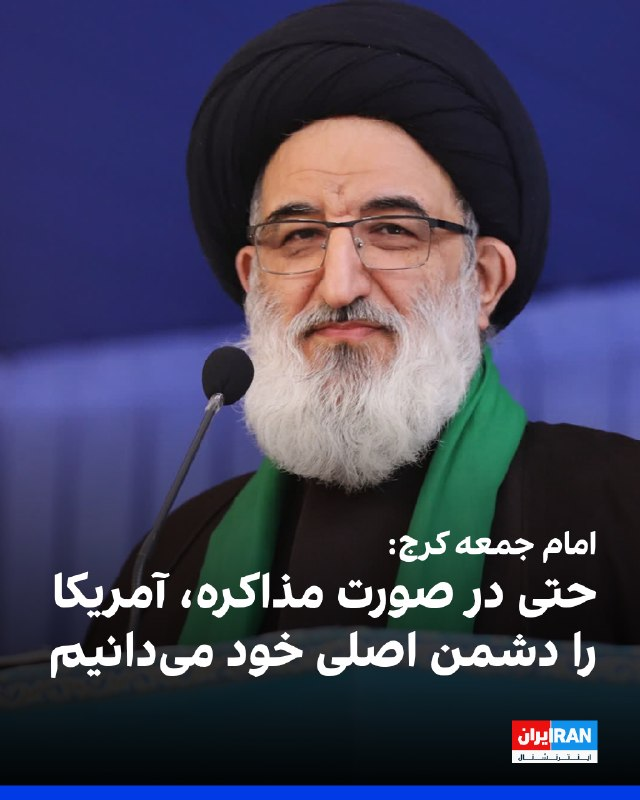

محمدمهدی حسینی همدانی، امام جمعه کرج، جمعه ۲۹ خرداد گفت جمهوری اسلامی حتی در صورت مذاکره با آمریکا دچار «خطای محاسباتی» نخواهد شد و همچنان آمریکا را دشمن اصلی خود می‌داند.

او در خطبه‌های نماز جمعه کرج گفت مذاکره به معنای تغییر نگاه جمهوری اسلامی به آمریکا نیست و تهران همچنان این کشور را «غیرقابل اعتماد» می‌داند.

حسینی همدانی افزود اگر مذاکره‌ای هم انجام شود، با هدف مطالبه حقوق جمهوری اسلامی و از موضع قدرت خواهد بود و به معنای «بده‌بستان» مورد نظر برخی افراد نیست.

امام جمعه کرج همچنین با اشاره به پیام مجتبی خامنه‌ای، رهبر جمهوری اسلامی، گفت این پیام «حکیمانه و به‌موقع» بوده و همه منتظر تحقق شروط مطرح‌شده در آن هستند.
https://iranintl.com/202606191799

## Shin_Persian — post 7131

  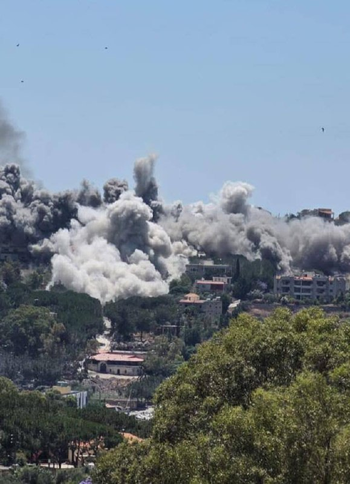

↩️ Quoted tweet:  𝓂𝒶𝓇𝒾𝑜🇱🇧🇬🇧🇦🇪 ✓ @MarioLeb79 Fri, 19 Jun 2026 10:33:50 UTC None Stop Airstrikes This on Again on Nabatieh ↩️ توییت نقل‌قول شده — برای پاسخ، پست زیر را ببینید. ترجمه خودکار فارسی حملات هوایی بدون وقفه این بار بار دیگر در نبطیه 𝕏 · @shin_persian

## Shin_Persian — post 7130

  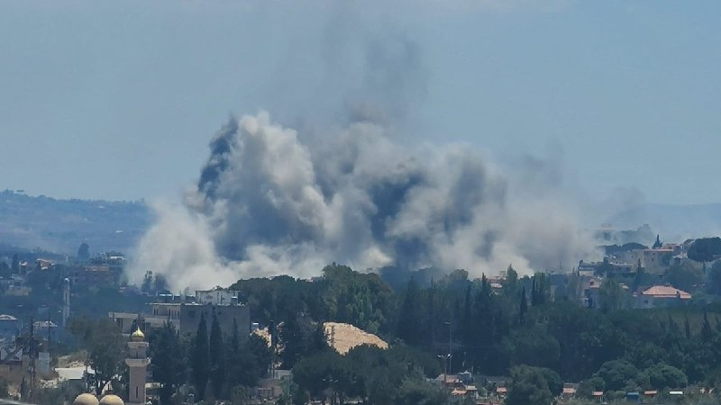

↩️ Quoted tweet:
 𝓂𝒶𝓇𝒾𝑜🇱🇧🇬🇧🇦🇪 ✓ @MarioLeb79
Fri, 19 Jun 2026 10:33:50 UTC

None Stop Airstrikes
This on Again on Nabatieh

↩️ توییت نقل‌قول شده — برای پاسخ، پست زیر را ببینید.

ترجمه خودکار فارسی

حملات هوایی بدون وقفه
این بار بار دیگر در نبطیه

𝕏 · @shin_persian

## FarsiVOA — post 221184

  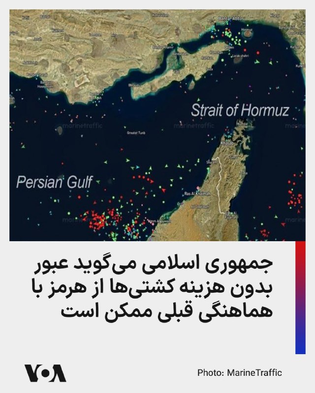

نهاد موسوم به «مدیریت آبراه خلیج فارس» در اطلاعیه‌ای گفته است که بر پایه تفاهم‌نامه اسلام‌آباد، عبور کشتی‌ها از تنگه هرمز به مدت ۶۰ روز بدون دریافت هزینه ممکن است.

اما در حالی که در چارچوب تفاهم‌نامه با آمریکا، جمهوری اسلامی متعهد به عدم اخلال در عبور و مرور کشتی‌ها از تنگه هرمز شده، این نهاد وابسته به نیروهای مسلح، گفته است که کشتی‌هایی که قصد عبور از این آبراه بین‌المللی را دارند، موظف به ارسال درخواست برای تعیین مسیر عبور هستند.

دولت آمریکا هفتم خردادماه «نهاد مدیریت آبراه خلیج فارس» را تحریم کرده بود.
@FarsiVOA

## DW_Farsi — post 126172

📸 کاریکاتور هفته

این کاریکاتور، طعنه‌ای است به جابه‌جایی موازنه قدرت در ساختار جمهوری اسلامی؛ وضعیتی که در آن محمدباقر قالیباف دیگر صرفا در جایگاه رئیس مجلس ظاهر نمی‌شود، بلکه نقشی فراتر از مسئولیت رسمی خود ایفا می‌کند.

حضور پررنگ او در موضوع مذاکرات و توافق با آمریکا، همراه با سپردن ماموریت‌ها و مسئولیت‌های کلیدی در دیگر حوزه‌ها، این تصور را تقویت کرده که قالیباف به یکی از بازیگران اصلی پیشبرد توافق‌ها و هماهنگ‌کننده سیاست‌های کلان نظام تبدیل شده است.

در این روایت کنایه‌آمیز، رئیس مجلس نه در قامت قانون‌گذار، بلکه در نقش مدیری ظاهر می‌شود که مرز میان نهادهای مختلف قدرت را پشت سر گذاشته و به نماینده اراده هسته مرکزی حاکمیت و رفتار و رویکرد آن در قبال جامعه و اعتراضات اجتماعی بدل شده است.

همین موضوع دستمایه مانا نیستانی در طراحی کاریکاتور هفته برای دویچه وله فارسی قرار گرفته است.

@dw_farsi

## DW_Farsi — post 126171

  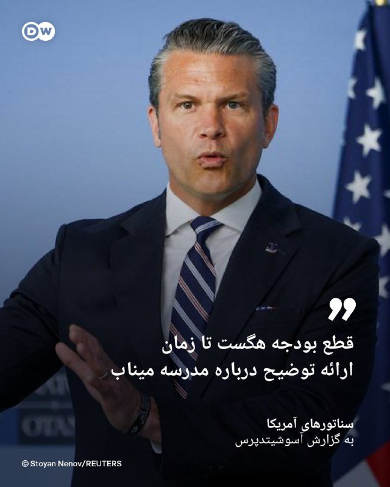

🔶 سناتورهای آمریکا: قطع بودجه هگست تا زمان ارائه توضیح درباره مدرسه میناب

به گزارش آسوشیتدپرس، تعدادی از سناتورهای ایالات متحده به دنبال آن هستند که بودجه سفرهای پیت هگست، وزیر دفاع ایالات متحده آمریکا، را تا زمانی که پنتاگون گزارش تحقیقاتی خود درباره حمله به یک مدرسه ابتدایی در ایران را منتشر نکرده، مسدود کنند.

در حمله مذکور به مدرسه ابتدایی شجره طیبه میناب در آغاز جنگ ایالات متحده آمریکا و اسرائیل علیه ایران، بیش از ۱۶۵ نفر کشته شدند.

پنتاگون تاکنون چند گزارش معوقه را به قانون‌گذاران این کشور ارائه نکرده است.

بر اساس لایحه سالانه مجوز دفاعی که این هفته ثبت شد، بخش زیادی از بودجه سفر دفتر وزیر دفاع، نمی‌تواند هزینه شود مگر آنکه هگست، "تحقیقات بدون سانسور درباره آسیب به غیرنظامیان" از جمله درباره حمله ۲۸ فوریه ۲۰۲۶ به مدرسه میناب را ارائه کند.

برخی از مقام‌های رسمی ایالات متحده آمریکا به طور ضمنی تایید کرده‌اند که آمریکا مسئول این حمله بوده است؛ حمله‌ای که گفته می‌شود ناشی از داده‌های اطلاعاتی قدیمی و به‌روزرسانی‌نشده بوده است.

@dw_farsi

## Persian_Trend_Official — post 17568

ملونی، نخست وزیر ایتالیا، در پاسخ به صحبت های اخیر ترامپ: لازم است به بعضی چیزها پاسخ فوری داد.

اظهارات دونالد ترامپ کاملاً ساختگی است؛ من واقعاً شوکه شده‌ام. نمی‌دانم چرا رئیس جمهور ایالات متحده با متحدان خود اینگونه رفتار می‌کند؛ به هر حال این اولین بار نیست که این اتفاق می‌افتد.

فقط می‌توانم بگویم ناامیدکننده است که او با دشمنان غرب و ایالات متحده، که در عوض با رهبران آنها با تساهل بسیار بیشتری رفتار می‌کند، همین قاطعیت را نشان نمی‌دهد.

یک چیز را باید به خاطر داشته باشد: نه من و نه ایتالیا هرگز التماس نمی‌کنیم.

📝 Amir

📌 @persian_trend_official
پرشین ترند | متفاوت‌ترین کانال نظامی

## Persian_Trend_Official — post 17567

ترامپ در مصاحبه با La7 در مورد ملونی، نخست وزیر ایتالیا: او از من التماس کرد که با او عکس بگیرم! او خیلی دلش می‌خواست با من عکس بگیرد. من اصلاً حاضر به انجام این کار نبودم، اما دلم برایش سوخت! او احتمالاً از اینکه با او صحبت کردم خوشحال است! من مجبور نبودم…

## Persian_Trend_Official — post 17566

  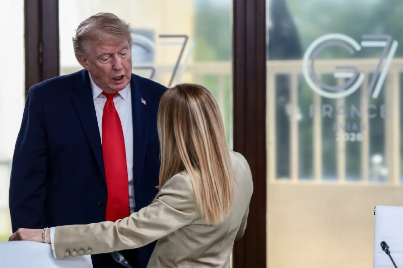

ترامپ در مصاحبه با La7 در مورد ملونی، نخست وزیر ایتالیا: او از من التماس کرد که با او عکس بگیرم! او خیلی دلش می‌خواست با من عکس بگیرد. من اصلاً حاضر به انجام این کار نبودم، اما دلم برایش سوخت!

او احتمالاً از اینکه با او صحبت کردم خوشحال است! من مجبور نبودم با او صحبت کنم.

📝 Amir

📌 @persian_trend_official
پرشین ترند | متفاوت‌ترین کانال نظامی

## Persian_Trend_Official — post 17564

  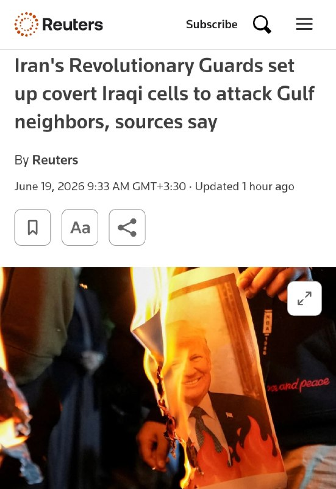

بر اساس گزارش رویترز، سپاه پاسداران انقلاب اسلامی ایران، سلول‌های مخفی جدیدی در عراق ایجاد کرده است تا از طریق آن‌ها به کشورهای حاشیه خلیج فارس که میزبان نیروهای آمریکایی هستند، حمله کند.

هدف از این اقدام، دور زدن شبکه‌های شبه‌نظامی شناخته‌شده برای جلوگیری از شناسایی عنوان شده است. به گفته منابع عراقی، این سلول‌ها که بین 3 تا 4 گروه و هر یک شامل حدود 10 نفر از نیروهای نخبه شیعه عراقی هستند.

از بیابان‌های نزدیک بصره و سماوه دست کم 7 حمله پهپادی بین 20 آوریل تا 17 مه انجام داده‌اند. این حملات اهدافی در کویت، عربستان سعودی و امارات متحده عربی را هدف قرار داده است .

📝 Amir

📌 @persian_trend_official
پرشین ترند | متفاوت‌ترین کانال نظامی

## alonews — post 129127

  <a href="telegram/content/alonews_129127_1781869527.webm" target="_blank">🎬 Download video</a>

👈سخنگوی شورای امنیت ملی: دولت باید همین حالا و از لبنان شروع کند و نباید اجازه دهیم مردم مقاوم جنوب لبنان مورد قتل عام قرار گیرند

✅ @AloNews خبر جنگ

## alonews — post 129126

  <a href="telegram/content/alonews_129126_1781869527.webm" target="_blank">🎬 Download video</a>

🔴فوری/نتانیاهو: دستور داده ام، جنگ در لبنان با تمام قدرت ادامه یابد

✅ @AloNews خبر جنگ

---
📅 بروزرسانی: 1405/03/29 15:05
---

## WithYashar — post 15325

  <a href="telegram/content/WithYashar_15325_1781868908.mp4" target="_blank">🎬 Download video</a>

قاهره و بیروت ما داریم میایییییم
@withyashar

## WithYashar — post 15324

تحلیلگر ارشد و رئیس کل ستاد مشترک ارتش اتاق جنگ ، سر ادمیرال یاشار : مسیر قاهره از بیروت میگذرد @withyashar 🎖️

## WithYashar — post 15323

خبرنگار العربیه در سوئیس: مذاکرات بین آمریکا و ایران ظرف چند روز آینده آغاز می شود
@withyashar

## mwarmonitor — post 11206

📌حسن فضل‌الله، نماینده حزب‌الله، می‌گوید ایران به این گروه اطلاع داده است که مذاکرات با آمریکا نمی‌تواند ادامه پیدا کند مگر اینکه یک آتش‌بس جامع برقرار شود. این در حالی است که گفت‌وگوهای برنامه‌ریزی‌شده میان آمریکا و ایران در پی تشدید دوباره تنش‌ها میان اسرائیل و حزب‌الله در جنوب لبنان به تعویق افتاده است.

@mwarmonitor

## mwarmonitor — post 11205

🔴شبکه ۱۲ به نقل از یک منبع ارشد در کابینه اسرائیل گزارش می‌دهد:

🔸«اسرائیل باید برای اقدام به‌تنهایی آماده باشد. این اتفاق فردا صبح رخ نخواهد داد، اما فرض کاری ما این است که ترامپ علاقه‌اش را از دست داده است، صرف‌نظر از اینکه ایرانی‌ها چه کار بکنند یا نکنند.»

@mwarmonitor

## IranIntlTV — post 343192

  <a href="telegram/content/IranIntlTV_343192_1781868911.mp4" target="_blank">🎬 Download video</a>

برنامه «جغرافیای انقلاب ملی ایرانیان» به روایت شکل‌گیری اعتراضات دی‌ماه ۱۴۰۴، شعارهای مردم در پی فراخوان شاهزاده رضا پهلوی و همچنین شیوه‌های سرکوب و برخورد حکومت با معترضان می‌پردازد.

در این قسمت، محسن مهیمنی، عضو تحریریه ایران‌اینترنشنال، تجمعات اعتراضی، شعارها و اعتصاب بازار در مناطق کردنشین و ترک‌نشین استان آذربایجان غربی و نیز نحوه سرکوب این اعتراضات را بررسی می‌کند.
@iranintltv

## Iliaen — post 4500

شلیک هشدار برای نیم ساعت اخیر در تنگه هرمز متوقف شده است.

کشتی‌ها در بیسیم سوال می‌کنند “آیا واقعا تنگه هرمز بسته است؟” اما پاسخی دریافت نمی‌شود.

@iliaen

## FarsiVOA — post 221183

  <a href="telegram/content/FarsiVOA_221183_1781868914.mp4" target="_blank">🎬 Download video</a>

انفجار شدید در پالایشگاه مسکو؛ سقوط سقف مخزن بر اثر موشک خودی؟

ارتش اوکراین صبح روز پنج‌شنبه، حملات پهپادی به پالایشگاه نفت کاپوتنیا در مسکو انجام داد. در جریان این حمله، یک سیلوی نفتی دچار انفجار شدید و سقف آن به هوا پرتاب شد.

برخی تحلیلگران نظامی با بررسی دقیق ویدیوهای منتشر شده از این انفجار و ردیابی مسیر حرکت، دود و زاویه برخورد پرتابه، می‌گویند که برخورد یک موشک پدافند زمین به هوای روسیه باعث کنده شدن سقف مخزن شده است، نه اصابت مستقیم پهپادهای اوکراینی به آن.

تا کنون هیچ‌یک از مقامات و منابع رسمی روسیه این ادعا را تایید نکرده‌اند. در حال حاضر آتش‌سوزی در این تاسیسات همچنان ادامه دارد.

این پالایشگاه با ظرفیت پردازش سالانه حدود ۱۱.۶ میلیون تن فرآورده‌های نفتی، یکی از حیاتی‌ترین مراکز تامین انرژی روسیه است و تخمین زده می‌شود که نزدیک به ۴۰ درصد از سوخت مصرفی مسکو را تامین می‌کند.
@FarsiVOA

## FarsiVOA — post 221182

  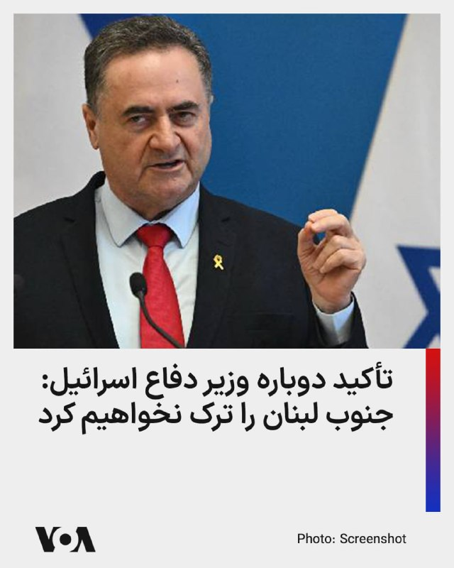

وزیر دفاع اسرائیل اعلام کرد که نظامیان این کشور با هدف مقابله با تهدیدهای حزب‌الله، در جنوب لبنان باقی خواهند ماند.

یسرائیل کاتز، با صدور بیانیه‌ای، ضمن اشاره به کشته و زخمی شدن تعدادی از سربازان اسرائیلی بر اثر حملات بامداد جمعه ۲۹ خردادماه، اعلام کرد که ما اجازه نخواهیم داد به سربازان و غیرنظامیان‌ اسرائیلی آسیبی وارد شود.

او تاکید کرد که ارتش اسرائیل هرگونه نقض آتش‌بس از سوی حزب‌الله را با قدرتی گسترده پاسخ خواهد داد.

وزیر دفاع اسرائیل یادآور شد که ارتش این کشور در منطقه امنیتی لبنان، از خط ساحلی تا ارتفاعات بوفور، باقی خواهد ماند تا از مناطق شمالی اسرائیل محافظت کند.

کاتز هدف از این طرح را خنثی‌سازی تهدیدهای حزب‌الله توصیف و اعلام کرد که ارتش اسرائیل «زیرساخت‌های تروریستی» مستقر در این منطقه را نابود خواهد کرد.
@FarsiVOA

## IranianMinds — post 22941

  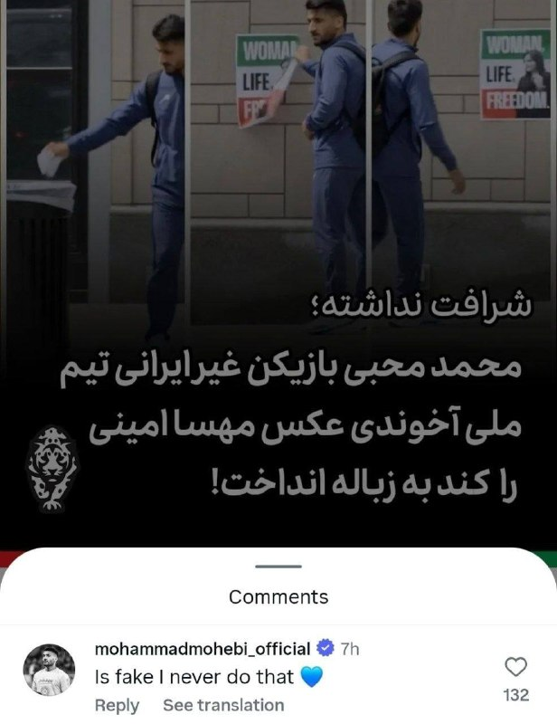

تصاویری از محمد محبی بازیکن تیم ملی جمهوری اسلامی که پوستری از مهسا امینی که روی دیوار هتل محل اقامت تیم ملی در تیخوانا مکزیک‌ هست رو میکشه پایین و میندازه توی سطل آشغال. @IranianMinds

## BBCPersian — post 284365

🔻ارتش اسرائیل: به بیش از ۸۰ هدف حزب‌الله در جنوب لبنان حمله کردیم

ارتش اسرائیل گفته است که در پاسخ به «نقض آتش‌بس» از سوی حزب‌الله «بیش از ۸۰ هدف» متعلق به این گروه را در لبنان هدف قرار داده و ده‌ها عضو آن را کشته است.

در بیانیه ارتش اسرائیل آمده است: «در طول شب، ارتش اسرائیل بیش از ۸۰ مرکز فرماندهی، افراد مسلح، مواضع پرتاب و زیرساخت‌های تروریستی دیگر را در منطقه نبطیه و سایر مناطق جنوب لبنان، در داخل منطقه امنیتی و فراتر از آن، هدف قرار داد.»

در ادامه این بیانیه گفته شده است: «در جریان این حملات، ده‌ها نیروی حزب‌الله که در مراکز فرماندهی فعال بودند، از بین برده شدند.»

https://bbc.in/4vgfIJP
@BBCPersian

---
📅 بروزرسانی: 1405/03/29 14:55
---

## VahidOOnLine — post 246367

  <a href="telegram/content/VahidOOnLine_246367_1781868327.mp4" target="_blank">🎬 Download video</a>

⭕️روسیه از حمله پهپادی به تاسیسات انرژی مرتبط با ارتش اوکراین خبر داد

♦️وزارت دفاع روسیه روز جمعه ۲۹ خردادماه با انتشار تصاویری اعلام کرد، ارتش این کشور یک تاسیسات انرژی راهبردی مرتبط با نیروهای مسلح اوکراین را در منطقه خارکیف هدف قرار داده‌ است.

بر اساس بیانیه وزارت دفاع روسیه، این حمله با استفاده از پهپادهایی به اسم «گران» انجام شده و تاسیسات مورد نظر نقش مهمی در پشتیبانی از فعالیت‌های نظامی اوکراین داشته است.
مسکو جزئیات بیشتری درباره میزان خسارات یا موقعیت دقیق این مرکز منتشر نکرده است.

از زمان آغاز جنگ اوکراین، زیرساخت‌های انرژی به یکی از اهداف اصلی حملات دو طرف تبدیل شده‌اند. روسیه بارها تاسیسات برق، سوخت و انرژی اوکراین را هدف قرار داده و کی‌یف نیز حملات متقابلی را علیه زیرساخت‌های انرژی و نظامی روسیه انجام داده است.
‌🇸🇦 Indypersian

🤖 @VahidOOnLine

## pm_afshaa — post 94386

🎙️مجری: میتونی کاری کنی اسرائیل به لُبنان حمله نکنه؟

ترامپ: آره، میتونم، اونا بهم خیلی احترام میذارن و هر چی من بگم انجام میدن.

💧 Rainbet.com the #1 Non-KYC Crypto Casino & Sportsbook @rainbetcom

😁 @Pm_Afshaa

## pm_afshaa — post 94385

  <a href="telegram/content/pm_afshaa_94385_1781868330.webm" target="_blank">🎬 Download video</a>

🔴ترامپ: من و بی‌بی نتانیاهو خیلی خوب با هم کار کردیم؛ ولی خودش هم بهت میگه، ما اوناییم که اسلحه داریم، ما اوناییم که همه‌چی دستمونه؛ ما اوناییم که بمب‌افکن‌های B-2 داریم و اگه دونالد ترامپ نبود، اسرائیل کاملاً له شده بود، این یه رابطه‌ست.

💧 Rainbet.com the #1 Non-KYC Crypto Casino & Sportsbook @rainbetcom

😁 @Pm_Afshaa

## pm_afshaa — post 94384

  <a href="telegram/content/pm_afshaa_94384_1781868330.webm" target="_blank">🎬 Download video</a>

🔴واکنش نتانیاهو به کشته شدن سربازان اسرائیلی: ما حمله به سربازانمان رو تحمل نخواهیم کرد و کاری خواهیم کرد که حزب‌الله بهای بسیار سنگینی بپردازه.

💧 Rainbet.com the #1 Non-KYC Crypto Casino & Sportsbook @rainbetcom

😁 @Pm_Afshaa

## DEJradio — post 5819

  <a href="telegram/content/DEJradio_5819_1781868331.mp4" target="_blank">🎬 Download video</a>

🛩️
🔥 بمباران مواضع حـ.ـزب‌الله توسط جنگنده‌های اسرائیل

بر اساس گزارش منابع منطقه‌ای ده‌ها مخفیگاه، انبار سلاح و ستاد فرماندهی وابسته به گروه تروریستی حـ.ـزب‌الله توسط جنگنده‌های اسرائیل بمباران شد.

عباس عراقچی گفته بود هرگونه حمله اسرائیل به لبنان نقض تفاهم جمهوری اسلامی ایران و آمریکا محسوب می‌شود.
گزارش شد بیش از ۲۰ نقطه در لبنان هدف حمله قرار گرفتند و تعدادی از تروریست‌ها کشته و زخمی شدند.

#حزب_الله_لبنان #اسرائیل #آتشبس
@DEJradio

## FarsiVOA — post 221181

  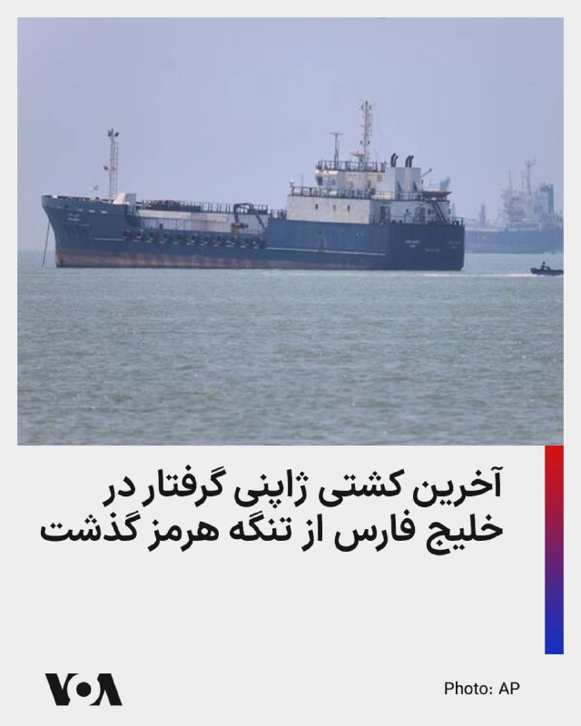

وزارت خارجه ژاپن اعلام کرد آخرین کشتی مرتبط با این کشور که طی ماههای گذشته به خاطر انسداد تنگه هرمز در خلیج فارس گرفتار شده بود، از طریق هماهنگی با جمهوری اسلامی از تنگه عبور کرده و به سمت ژاپن در حال حرکت است.

این کشتی در واقع یک نفتکش متعلق به شرکت «کیوئِی» و حامل سه خدمه ژاپنی است که با پرچم لیبریا در حال حرکت است.

طبق توافق ایران و آمریکا، انسداد تنگه هرمز توسط سپاه پاسداران و محاصره دریایی جمهوری اسلامی لغو شده است.

سانائه تاکایچی، نخست‌وزیر ژاپن، در همین زمینه گفت پس از امضای اخیر یادداشت تفاهم میان ایالات متحده و ایران، دولت ژاپن به تلاش‌های دیپلماتیک خود ادامه خواهد داد تا اطمینان حاصل شود که تردد آزاد و ایمن کشتی‌ها در تنگه هرمز هرچه سریع‌تر از سر گرفته می‌شود.
@FarsiVOA

## FarsiVOA — post 221180

  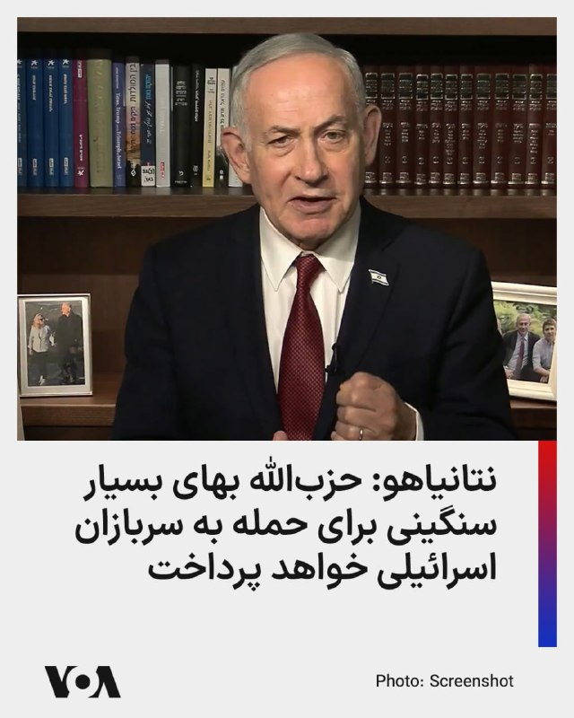

نخست‌وزیر اسرائیل با اشاره به کشته شدن سربازان اسرائیلی در حملات اخیر حزب‌الله اعلام کرد: «اسرائیل حمله به سربازان یا به خاک خود را تحمل نخواهد کرد و بهای بسیار سنگینی از حزب‌الله بابت این حملات خواهد گرفت.»

بنیامین نتانیاهو روز جمعه در شبکه اجتماعی ایکس نوشت: «ارتش اسرائیل برای خنثی‌سازی هر تهدیدی علیه نیروهای ما و خاک ما اقدام خواهد کرد.»

او افزود: «همان‌طور که به‌طور قاطع و روشن، از جمله دیروز، تأکید کردم: اسرائیل تا زمانی که لازم باشد برای حفاظت از شهرک‌های شمالی در منطقه امنیتی در جنوب لبنان باقی خواهد ماند.»

پیشتر ارتش اسرائیل اعلام کرد که چهار سرباز اسرائیلی شب گذشته در جنوب لبنان کشته شدند.

یک مقام ارتش اسرائیل گفت: «در پی این حادثه، ارتش اسرائیل شمار زیادی از زیرساخت‌های حزب‌الله را در نبطیه و مناطق دیگر هدف قرار داد.»
@FarsiVOA

## Persian_Trend_Official — post 17563

نخست‌وزیر پاکستان اعلام کرد، رئیس‌جمهور ایران دعوت او برای سفر رسمی به پاکستان را پذیرفته است.

📝 Amir

📌 @persian_trend_official
پرشین ترند | متفاوت‌ترین کانال نظامی

## Persian_Trend_Official — post 17562

  <a href="telegram/content/Persian_Trend_Official_17562_1781868335.mp4" target="_blank">🎬 Download video</a>

شهر نبطیه در جنوب لبنان در حال تخلیه است.

📝 Amir

📌 @persian_trend_official
پرشین ترند | متفاوت‌ترین کانال نظامی

## IranianMinds — post 22940

  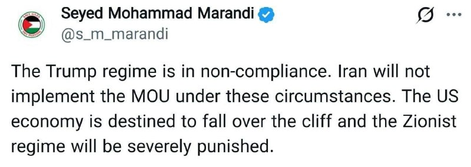

🔴مرندی:

ترامپ به تعهداتش عمل نمی‌کند،
اسرائیل به شدت مجازات خواهد شد.

@IranianMinds

## alonews — post 129125

  <a href="telegram/content/alonews_129125_1781868338.webm" target="_blank">🎬 Download video</a>

👈خبرنگار العربیه در سوئیس: مذاکرات بین آمریکا و ایران ظرف چند روز آینده آغاز می شود

✅ @AloNews خبر جنگ

## alonews — post 129124

  <a href="telegram/content/alonews_129124_1781868338.mp4" target="_blank">🎬 Download video</a>

👈گزارش صداوسیما از آخرین وضعیت تنگه هرمز

🔴 تردد کشتی های تجاری در بنادر ایران از سر گرفته شده

🔴 در روزهای آینده نفت‌کش های ایران به سمت بازارهای جهانی حرکت خواهند کرد

✅ @AloNews خبر جنگ

## alonews — post 129123

  <a href="telegram/content/alonews_129123_1781868341.mp4" target="_blank">🎬 Download video</a>

👈شهر نبطیه در جنوب لبنان در حال تخلیه شدن است

✅ @AloNews خبر جنگ

---
📅 بروزرسانی: 1405/03/29 14:44
---

## VahidOOnLine — post 246366

🗣روایت شما از زندگی در دوران پس از انقلاب ملی و جنگ - جمعه ۲۹ خرداد ۱۴۰۵

🔹ج.ا دوپاره شده و به جون هم افتادن. یه گروه دارن خامنه‌ای و دار و دسته‌اش را دور می‌زنن و توافق می‌کنن با ترامپ تا قدرتو دست بگیرن. پرچم‌به‌دست‌های این وسط شدن گوشت قربانی.

🔹دلم برای اونایی می‌سوزه که توی این گرما هنوز میدان را رها نکردن، چند وقت دیگه دیدن دارن.

🔹خواستم بگم آقای ترامپ، کاش می‌دانستی چه امید واهی در دل مردم زجرکشیده ایران به وجود آوردی. الان دیگه حتی اسمی ازشون نمی‌آوری. طرف سفید تاریخ بایستید، حیف که شما را در ردیف باراک حسین اوباما بذارن.

🔹از شهرکرد، هم‌وطنان عزیزم صبر داشته باشید. مطمئن باشید که بی‌بی نمی‌ذاره این توافق به این شکل سرانجام پیدا کنه.

🔹ما مردم ایران به‌خاطر ترامپ یا هر کس دیگه‌ای بیرون نیامدیم که الان ناراحت کار ترامپ باشیم. همین‌طور که الان تنهامون گذاشتن، باید فردای روز ما هم مثل خودشون باشیم. جاوید شاه.

🔹از خمین؛ هم‌وطنان عزیزم، نمی‌دونم چرا انقدر زود ناامید می‌شید و سطحی به مسئله نگاه می‌کنید؟! آخه این حکومت لعنتی خودش هم خودش باور نداره. اینا سقوط می‌کنن، شک نداشته باشید. فقط باید صبور باشیم، همه‌چیز تو زمان خودش اتفاق می‌افته.

🔹با ترامپ شروع نکردیم که با ترامپ تمومش کنیم؛ پاینده ایران.

🔹حداقل صدای مجتبی را روی «نوار کاست» ضبط کنید، پرچم‌به‌دست‌ها بفهمن زنده است یا نه! والا نوار کاست منفجر نمی‌شود مثل پیجرها!

🔹نماینده‌های حکومت نرفتن سوئیس که مبادا بخوان با نماینده آمریکا دست بدن، و این یعنی تسلیم شدن در مقابل قاتل رهبرشون.
‌🏁 🇬🇧 IranintlTV

🤖 @VahidOOnLine

## WithYashar — post 15322

ترامپ به طور هیستریک عصبی به ثانیه در ترود در حال پست گذاشتن است. خواهیم دید چه خواهد گفت.
@withyashar 🤣

## WithYashar — post 15321

تحلیلگر ارشد و رئیس کل ستاد مشترک ارتش اتاق جنگ ، سر ادمیرال یاشار : مسیر قاهره از بیروت میگذرد
@withyashar 🎖️

## FoxNewsTwitter — post 343162

  

Fox News (Twitter/X)

Another Pride Month baseball controversy.

The York Revolution forfeited a game after several players refused to wear Pride Night jerseys with rainbow sleeves.

Instead of forcing players to comply, the team canceled the game, accepted a loss, and moved forward with its Pride Night celebration plans.

The move comes days after four San Francisco Giants players drew backlash for protesting their team's Pride Night by writing Bible verses on their hats, prompting a warning from MLB and drawing backlash from critics.

## pm_afshaa — post 94383

  <a href="telegram/content/pm_afshaa_94383_1781867672.webm" target="_blank">🎬 Download video</a>

🔴اسرائیل هیوم خطاب به ترامپ:
می‌تونستی بزرگ‌ترین رئیس‌جمهور تاریخ باشی، اما شکست خوردی.

آقای رئیس‌جمهور، شما به منافع جهان متمدن ضربه زدی و ممکنه به‌عنوان رئیس‌جمهوری در یادها بمانی که باعث تحقیر آمریکا شد. به اسرائیل خیانت کردی و حالا تمام تحقیرهایی که قبلا باهاش روبه‌رو بودی، کاملا موجه به نظر میرسه.

💧 Rainbet.com the #1 Non-KYC Crypto Casino & Sportsbook @rainbetcom

😁 @Pm_Afshaa

## pm_afshaa — post 94382

  <a href="telegram/content/pm_afshaa_94382_1781867673.webm" target="_blank">🎬 Download video</a>

🔴مرندی، عضو تیم مذاکره‌کننده:
ترامپ به تعهداتش عمل نمیکنه؛ اسرائیل به شدت مجازات خواهد شد.

💧 Rainbet.com the #1 Non-KYC Crypto Casino & Sportsbook @rainbetcom

😁 @Pm_Afshaa

## IranIntlTV — post 343191

🗣روایت شما از زندگی در دوران پس از انقلاب ملی و جنگ - جمعه ۲۹ خرداد ۱۴۰۵

🔹ج.ا دوپاره شده و به جون هم افتادن. یه گروه دارن خامنه‌ای و دار و دسته‌اش را دور می‌زنن و توافق می‌کنن با ترامپ تا قدرتو دست بگیرن. پرچم‌به‌دست‌های این وسط شدن گوشت قربانی.

🔹دلم برای اونایی می‌سوزه که توی این گرما هنوز میدان را رها نکردن، چند وقت دیگه دیدن دارن.

🔹خواستم بگم آقای ترامپ، کاش می‌دانستی چه امید واهی در دل مردم زجرکشیده ایران به وجود آوردی. الان دیگه حتی اسمی ازشون نمی‌آوری. طرف سفید تاریخ بایستید، حیف که شما را در ردیف باراک حسین اوباما بذارن.

🔹از شهرکرد، هم‌وطنان عزیزم صبر داشته باشید. مطمئن باشید که بی‌بی نمی‌ذاره این توافق به این شکل سرانجام پیدا کنه.

🔹ما مردم ایران به‌خاطر ترامپ یا هر کس دیگه‌ای بیرون نیامدیم که الان ناراحت کار ترامپ باشیم. همین‌طور که الان تنهامون گذاشتن، باید فردای روز ما هم مثل خودشون باشیم. جاوید شاه.

🔹از خمین؛ هم‌وطنان عزیزم، نمی‌دونم چرا انقدر زود ناامید می‌شید و سطحی به مسئله نگاه می‌کنید؟! آخه این حکومت لعنتی خودش هم خودش باور نداره. اینا سقوط می‌کنن، شک نداشته باشید. فقط باید صبور باشیم، همه‌چیز تو زمان خودش اتفاق می‌افته.

🔹با ترامپ شروع نکردیم که با ترامپ تمومش کنیم؛ پاینده ایران.

🔹حداقل صدای مجتبی را روی «نوار کاست» ضبط کنید، پرچم‌به‌دست‌ها بفهمن زنده است یا نه! والا نوار کاست منفجر نمی‌شود مثل پیجرها!

🔹نماینده‌های حکومت نرفتن سوئیس که مبادا بخوان با نماینده آمریکا دست بدن، و این یعنی تسلیم شدن در مقابل قاتل رهبرشون.

## Shin_Persian — post 7129

  <a href="telegram/content/Shin_Persian_7129_1781867673.mp4" target="_blank">🎬 Download video</a>

Shin ✓ @hey_itsmyturn
Fri, 19 Jun 2026 11:04:42 UTC

IRGC on maritime radio channel 16:

"Given that the withdrawal of Israel from Lebanon, the complete lifting of the naval blockade, and the departure of American terrorist forces from the Persian Gulf and the region are core conditions for an agreement between Iran and the United States, the Strait of Hormuz will remain closed until these two conditions are met. All vessels are hereby instructed to avoid approaching the Strait of Hormuz for their own safety and security. Any vessel that disregards this order will be targeted."

Via @IliaHashemicom

ترجمه خودکار فارسی در بخش نظرات

𝕏 · @shin_persian

## DW_Farsi — post 126170

🔶 واکنش‌ها در آلمان به توافق؛ "تسلیم ترامپ مقابل رژیم ایران"

🔺 گزارشی از ینس ترائو

ایران و ایالات متحده یک روز زودتر از آنچه برنامه‌ریزی شده بود، یادداشت تفاهم‌نامه برای پایان دادن به جنگ را امضا کردند. دونالد ترامپ، رئیس‌جمهور آمریکا شامگاه چهارشنبه ۱۷ ژوئن (۲۷ خرداد) پس از پایان نشست سران گروه ۷، این تفاهم‌نامه را در جریان ضیافت شامی در کاخ ورسای امضا کرد و مسعود پزشکیان، رئیس جمهور ایران، نیز از راه دور در تهران امضای خود را بر این تفاهم‌نامه نشاند.

اما با این حال اکنون نیز همانند بسیاری از مواقع‌‌، از زمان آغاز جنگ در ۲۸ فوریه (نهم اسفند ۱۴۰۴)، به‌رغم حاکم شدن یک احساس آرامش همچنان پرسش‌های زیادی بی‌پاسخ مانده‌اند و حتی در محافل سیاسی برلین محتوای این تفاهم‌نامه در مواردی با انتقادهای شدید روبرو شده است.

رودریش کیزه‌وتر، کارشناس سیاست خارجی حزب دموکرات مسیحی، تقریبا هیچ امتیاز مثبتی برای این تفاهم‌نامه ۱۴ بندی قائل نیست. او در گفت‌وگویی با دویچه وله با اشاره به ایران، این تفاهم‌نامه را "یک پاداش بی‌سابقه برای تروریسم دولتی" خواند و اظهار داشت: «این به اصطلاح توافق ایران نمونه بارزی است از اینکه رئیس جمهور آمریکا به محض آنکه دیکتاتورها به طور جدی تهدید کنند و نیاز به پایداری راهبردی باشد، تسلیم می‌شود.»

@dw_farsi

## Persian_Trend_Official — post 17561

ترامپ با فرش قرمز، تشریفات سنگین، دوربین‌ها و جمع کردن سران عرب در شرم‌الشیخ، اومد و گفت جنگ غزه تمام شد.

خب واقعاً تمام شد؟

غزه از اون روز به بعد آزاد شد؟
اسرائیل عقب نشست و پرونده رو بست؟
دیگه بمباران، عملیات، محاصره و فشار امنیتی تموم شد؟

نه. چون پایان جنگ با مراسم و امضا و عکس یادگاری اتفاق نمی‌افته. پایان جنگ وقتی اتفاق می‌افته که منطق میدان عوض بشه؛ و منطق میدان هنوز عوض نشده.

جمهوری اسلامی نمی‌تونه ماهیت خودش رو عوض کنه، چون اگر این کار رو بکنه دیگر جمهوری اسلامیِ فعلی نیست. اسرائیل هم نمی‌تونه با این ماهیت کنار بیاد، چون این تقابل رو یک تهدید امنیتی و موجودیتی می‌بینه.

پس هرچقدر هم اسمش رو توافق، آتش‌بس، تفاهم یا پایان جنگ بگذارند، تا وقتی ریشه تقابل سر جاشه، ما با پایان بحران طرف نیستیم؛ با یک توقف موقت، یک تنفس سیاسی و شاید آماده‌سازی برای مرحله بعد طرفیم.

از توجه شما به این موضوع متشکرم
الیاس فرخ

## RadioFarda — post 158500

توافق اخیر ترامپ با ایران در مقایسه با برجام؛ چه چیزی تغییر کرده است؟

🔸 توافق اخیر آمریکا و ایران برای پایان دادن به جنگ میان دو کشور و بازگشایی تنگه هرمز، به‌ناچار با توافق برجام مقایسه می‌شود که ۲۳ تیرماه ۱۳۹۴ میان تهران و دولت وقت آمریکا به ریاست‌جمهوری باراک اوباما منعقد شد.

🔸 البته برجام با انتقاد شدید دونالد ترامپ، که بعد از اوباما به قدرت رسید، روبه‌رو شد و او در نخستین دورهٔ ریاست‌جمهوری خود در سال ۲۰۱۸ آمریکا را از آن توافق خارج کرد.

🔸 دونالد ترامپ بارها گفته است که توافق او با حکومت ایران بهتر خواهد بود، هرچند متنی که ۲۷ خرداد امسال در ورسای امضا کرده، هنوز نهایی نیست و بسیاری از مسائل قرار است طی ۶۰ روز آینده یا حتی بیشتر مورد مذاکره قرار گیرند.

🔸 نیسان رفعتی، تحلیلگر ارشد ایران در «گروه بین‌المللی بحران»، در این زمینه به رادیو اروپای آزاد/رادیو آزادی می‌گوید: «اگر حل این مسائل آسان بود، پیش از وقوع این دو جنگ حل‌وفصل می‌شد.»

🔸 او با اشاره به جنگ ۱۲ روزه سال گذشته و همچنین جنگ ۴۰ روزه که با حملات هوایی آمریکا و اسرائیل در نهم اسفند ۱۴۰۴ از سر گرفته شد، افزود: «از خرداد و تیر سال گذشته تاکنون، ماهیت برنامه هسته‌ای ایران با شرایط دوران برجام تفاوت اساسی پیدا کرده است.»

🔸 مطلب کامل را در وب‌سایت رادیو فردا می‌توانید بخوانید.

@RadioFarda

## BBCPersian — post 284364

🔻عفو بین‌الملل: توافق آمریکا و ایران نباید به سپری برای تداوم معافیت از مجازات تبدیل شود

سازمان عفو بین‌الملل می‌گوید توافق میان آمریکا و ایران برای پایان دادن به درگیری‌های اخیر در خاورمیانه نباید صرفا به توقف عملیات نظامی محدود شود و باید شامل تضمین‌های جدی درباره حقوق بشر، پاسخگویی و عدالت برای قربانیان باشد.

آگنس کالامار، دبیرکل سازمان عفو بین‌الملل، در واکنش به امضای توافق میان واشنگتن و تهران گفت که این توافق به جنگی پایان می‌دهد که به گفته او با «حملات غیرقانونی آمریکا و اسرائیل در نقض منشور سازمان ملل» آغاز شد و با «اقدامات غیرقانونی طرف ایرانی» ادامه یافت.

او گفت این درگیری‌ها «ماه‌ها رنج و نقض جدی حقوق بین‌الملل بشردوستانه، از جمله جنایات جنگی» را به دنبال داشته است.

خانم کالامار افزود این توافق برای میلیون‌ها نفر در منطقه که ماه‌ها در وضعیت بلاتکلیفی زندگی کرده‌اند «آرامشی شکننده» ایجاد می‌کند، اما هشدار داد که هر توافق پایدار باید فراتر از منافع نظامی طرفین باشد.

به گفته او، هر چارچوبی که صرفا جنگ را متوقف کند اما به حقوق بشر و پاسخگویی نپردازد، می‌تواند به «پوششی برای ادامه بی‌کیفرمانی، اشغال و سرکوب» تبدیل شود.

عفو بین‌الملل همچنین نسبت به وضعیت لبنان ابراز نگرانی کرده و می‌گوید با وجود توافق، نیروهای اسرائیلی هنوز از جنوب این کشور خارج نشده‌اند و حملات ادامه دارد.

این سازمان خواستار تضمین بازگشت امن آوارگان و رسیدگی به نقض حقوق بین‌الملل در لبنان از سال ۲۰۲۳ شده است.

در بخش دیگری از بیانیه، این نهاد حقوق بشری می‌گوید در ایران نیز توقف حملات نظامی به معنای پایان خطر برای غیرنظامیان نیست و به «سرکوب گسترده» از جمله بازداشت‌های خودسرانه، ناپدیدسازی قهری، شکنجه و محاکمه‌های ناعادلانه اشاره می‌کند.

به گفته عفو بین‌الملل، از زمان آغاز درگیری‌ها دست‌کم ۴۴ نفر اعدام و بیش از ۶ هزار نفر بازداشت شده‌اند.

این سازمان در پایان خواستار تحقیقات مستقل درباره تمامی موارد احتمالی نقض حقوق بین‌الملل و پاسخگو شدن عاملان در سراسر منطقه شده است.

https://bbc.in/4vgfIJP
@BBCPersian

## alonews — post 129122

  <a href="telegram/content/alonews_129122_1781867675.webm" target="_blank">🎬 Download video</a>

👈حزب‌الله: دشمن اسرائیلی به نقض آتش بس ادامه داده و با ارتکاب کشتار و تخریب زیرساخت‌های غیرنظامی، آن را تشدید کرده است

✅ @AloNews خبر جنگ

## alonews — post 129121

  <a href="telegram/content/alonews_129121_1781867675.webm" target="_blank">🎬 Download video</a>

🔴فوری / نخست‌وزیر پاکستان امروز در توضیح درباره تماس تلفنی‌اش با همتای ایرانی گفت «رئیس‌جمهور ایران دعوت من برای سفر به پاکستان را پذیرفت».

✅ @AloNews خبر جنگ

---
📅 بروزرسانی: 1405/03/29 14:34
---

## WithYashar — post 15320

الجزیره : نتانیاهو: حزب‌الله بهای بسیار سنگینی خواهد پرداخت

نتانیاهو افزود به ارتش دستور داده است در واکنش به «نقض آتش‌بس» ضربات شدیدی به حزب‌الله وارد کند.
همچنین ، ارتش اسرائیل حدود ۸۰ هدف متعلق به حزب‌الله را هدف قرار داده و «ده‌ها عضو» این گروه را به هااکت رسانده است. همچنین امروز یک مقر فرماندهی حزب‌الله در منطقه بقاع هدف حمله قرار گرفته است.
@withyashar

## WithYashar — post 15319

مشاور هیئت مذاکره‌کننده ایرانی، مرندی: نظام ترامپ به توافق پایبند نیست. و ایران در این شرایط یادداشت تفاهم را اجرا نخواهد کرد. اقتصاد آمریکا در معرض فروپاشی است و اسرائیل مجازات خواهد شد. @withyashar

## mwarmonitor — post 11204

🔴به گفته افرادی مطلع از گفتگوها، استیون فاینبرگ، معاون وزیر دفاع آمریکا، در تماس‌هایی که این هفته با قانون‌گذاران داشته اعلام کرده است که پنتاگون برای پوشش هزینه‌های مربوط به جنگ ایران و همچنین سایر بدهی‌ها و هزینه‌های غیرجنگی، به حدود ۸۰ میلیارد دلار بودجه اضافی نیاز دارد. (به نقل از وال‌استریت ژورنال و خبرنگاران همراه آن)

@mwarmonitor

## mwarmonitor — post 11203

🔴 بیانیه صادره از اتاق عملیات حزب‌الله:

﴿به کسانی که مورد جنگ قرار گرفته‌اند اجازه جهاد داده شد، زیرا به آنان ستم شده است و همانا خداوند بر یاری آنان تواناست﴾
راست گفت خدای بلندمرتبه و بزرگ

🔸در پاسخ به ادعاهای دشمن اسرائیلی مبنی بر نقض آتش‌بس از سوی حزب‌الله، مقاومت اسلامی تأکید می‌کند که دشمن هرگز از تاریخ 27-11-2024 تاکنون هیچ‌گاه به هیچ توافق آتش‌بسی پایبند نبوده است؛ از جمله تا 16-04-2026 و همچنین در چارچوب نتایج تفاهم اخیر ایران و آمریکا که در بند اول خود بر پایان جنگ در تمامی جبهه‌ها از جمله لبنان تأکید دارد.

بلکه دشمن اسرائیلی بر نقض‌های مکرر خود نسبت به آتش‌بس افزوده و دست به کشتارها زده، ساختمان‌های مسکونی و زیرساخت‌های غیرنظامی را ویران کرده و به حملات زمینی و تلاش برای نفوذ و کنترل بر روستاها و مناطقی ادامه داده است که پیش از توافق قادر به رسیدن به آن‌ها نبوده است.

استهزای اسرائیل نسبت به آتش‌بس به حدی رسیده که رئیس ستاد ارتش آن، ایال زامیر، دو هفته پیش اعلام کرده بود «در لبنان آتش‌بسی وجود ندارد»، و سپس سخنگوی ارتش آن نیز دیروز ادامه فعالیت نیروهای اشغالگر در جنوب لبنان را تأیید کرد.

دشمن همواره، در ادامه روش خود، برای جبران ناتوانی در مقابله با مجاهدان مقاومت و پوشاندن شکست‌ها و خسارت‌های خود در میدان نبرد، به کشتار غیرنظامیان و هدف قرار دادن روستاهای امن روی می‌آورد؛ همان‌گونه که امروز پس از مقابله مجاهدان با تلاش پیشروی دشمن به سمت تپه «علی الطاهر» در شب گذشته رخ داد.

مقاومت اسلامی همواره در برابر هرگونه تجاوز در کمین خواهد بود. مجاهدان آن با شجاعت و روحیه‌ای کربلایی-حسینی از سرزمین و مردم خود دفاع می‌کنند و به ارتش دشمن ضربات سنگینی وارد می‌سازند و ده‌ها کشته و زخمی در میان افسران و سربازان آن و خسارات سنگین در تجهیزاتش بر جای می‌گذارند. و میان ما و آنان، روزها و شب‌ها و میدان نبرد خواهد بود.

﴿و پیروزی جز از جانب خداوند عزیز و حکیم نیست﴾
جمعه 19-06-2026
04 محرم 1448 هـ

@mwarmonitor

## IranIntlTV — post 343190

  <a href="telegram/content/IranIntlTV_343190_1781867069.mp4" target="_blank">🎬 Download video</a>

محمدجواد اکبرین، عضو تحریریه ایران‌اینترنشنال، گفت: «مخالفان داخلی مذاکره با آمریکا نمی‌توانند تصمیم جمهوری اسلامی درباره توافق را تغییر دهند.» او تاکید کرد، جمهوری اسلامی تصمیم خود را برای مذاکره با آمریکا گرفته است.
@iranintltv

## IranIntlTV — post 343189

یک شهروند با ارسال ویدیویی به ایران اینترنشنال تریلر‌هایی را در تونل جاده خرم‌آباد به بروجرد نشان داد و گفت آن‌ها تعدادی پرتابگر موشکی‌اند که جمهوری اسلامی هنوز با وجود توافق، خارجشان نکرده است.

## Persian_Trend_Official — post 17560

  <a href="telegram/content/Persian_Trend_Official_17560_1781867070.mp4" target="_blank">🎬 Download video</a>

خبرنگار آکسیوس: آیا شما قادر خواهید بود اسرائیل را از حمله به لبنان بازدارید؟

ترامپ: بله. آنها احترام زیادی برای من قائلند و هر چه بگویم انجام می‌دهند.

📝 Amir

📌 @persian_trend_official
پرشین ترند | متفاوت‌ترین کانال نظامی

## Persian_Trend_Official — post 17559

بیانیه حزب‌الله لبنان در مورد درگیری های شب گذشته با ارتش اسرائیل:

مقاومت اسلامی با رد ادعاهای دشمن اسرائیلی مبنی بر نقض آتش‌بس توسط حزب‌الله، تأکید می‌کند که دشمن از 27 نوامبر 2024 تا 16 آوریل 2026، تا نتایج تفاهم اخیر ایران و آمریکا که در بند اول آن پایان جنگ در تمام جبهه‌ها، از جمله لبنان، تصریح شده است، هرگز به هیچ توافق آتش‌بس پایبند نبوده است.

در واقع، دشمن اسرائیلی به نقض آشکار آتش‌بس، ارتکاب قتل عام و تخریب ساختمان‌های مسکونی و زیرساخت‌های غیرنظامی ادامه داده است. به حملات زمینی خود ادامه داده و تلاش کرده است تا به روستاها و مناطقی که قبل از توافق قادر به دستیابی به آنها نبود، نفوذ کند و آنها را تصرف کند. بی‌اعتنایی اسرائیل به آتش‌بس به حدی رسید که ایال ضمیر، رئیس ستاد دشمن، دو هفته پیش اعلام کرد که در لبنان آتش‌بس وجود ندارد، پیش از آنکه سخنگوی ارتش او دیروز بار دیگر بر ادامه فعالیت نیروهای اشغالگر در جنوب لبنان تأکید کند.

دشمن، طبق معمول، برای جبران ناتوانی خود در مقابله با رزمندگان مقاومت و سرپوش گذاشتن بر شکست‌ها و خسارات خود در میدان نبرد، به قتل عام غیرنظامیان و هدف قرار دادن روستاهای امن متوسل می‌شود، همانطور که امروز پس از دفع پیشروی آنها به سمت تپه علی الطاهر توسط رزمندگان شجاع مقاومت در شب گذشته، اتفاق افتاد.

مقاومت اسلامی در برابر هرگونه تجاوزی هوشیار خواهد ماند. مجاهدین آن با شجاعتی تزلزل‌ناپذیر و روحیه کربلا و حسین از سرزمین و مردم خود دفاع خواهند کرد و خسارات سنگینی به ارتش دشمن وارد خواهند کرد، ده‌ها افسر و سرباز آن را کشته و زخمی کرده و خسارات ویرانگری به تجهیزات آن وارد خواهند کرد. روزها، شب‌ها و میدان نبرد همه چیز را نشان خواهد داد.

📝 Amir

📌 @persian_trend_official
پرشین ترند | متفاوت‌ترین کانال نظامی

## Persian_Trend_Official — post 17557

نهاد مدیریت آبراه خلیج فارس: با عنایت به امضای تفاهم‌نامه اسلام‌آباد و ابلاغ دستور مقامات ذیربط، به اطلاع متقاضیان عبور از تنگه هرمز می‌رساند در بازه زمانی اعلام شده، عبور کشتی‌هایی که درخواست عبور خود را با رعایت نکات لازم ارسال نمایند، انجام خواهد شد.

متن کامل پیام پی‌جی‌اس‌ای در دو نسخه انگلیسی و فارسی منتشر شده.

📝 Amir

📌 @persian_trend_official
پرشین ترند | متفاوت‌ترین کانال نظامی

## IranianMinds — post 22939

  <a href="telegram/content/IranianMinds_22939_1781867072.mp4" target="_blank">🎬 Download video</a>

🔴هشدار نیروی دریایی سپاه پاسداران به کشتی‌ها.

@IranianMinds

## Hranews — post 113719

  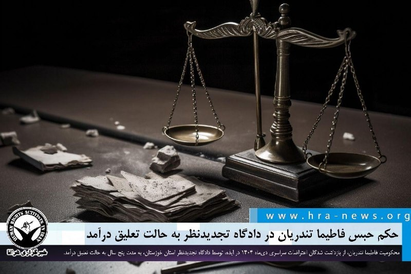

اعتراضات دی‌ماه ۱۴۰۴؛ حکم حبس فاطیما تندریان در دادگاه تجدیدنظر به حالت تعلیق درآمد

❗️
❗️
❗️
❗️
❗️– محکومیت فاطیما تندریان، از بازداشت شدگان اعتراضات سراسری دی‌ماه ۱۴۰۴ در ایذه، توسط دادگاه تجدیدنظر استان خوزستان، به مدت پنج سال به حالت تعلیق درآمد. وی پیشتر در مرحله بدوی دادگاه به سه سال و ۹ ماه و یک روز حبس محکوم شده بود.

به گزارش خبرگزاری هرانا، ارگان خبری مجموعه فعالان حقوق بشر در ایران، حکم حبس فاطیما تندریان در مرحله تجدیدنظر به حالت تعلیق درآمد.

بر اساس اطلاعات دریافتی هرانا، دادگاه تجدیدنظر استان خوزستان، حکم حبس خانم تندریان را به مدت پنج سال تعلیق کرده است. این حکم اخیرا به حسین ‌علی حاتمی، وکیل مدافع این شهروند ابلاغ شده است. فاطیما تندریان، در مرحله دادرسی بدوی، توسط دادگاه انقلاب ایذه از بابت اتهام اجتماع و تبانی علیه امنیت کشور به دو سال و شش ماه و یک روز حبس و از بابت اتهام توهین به رهبری به ۱۵ ماه حبس محکوم شده بود.

ادامه مطلب

#فاطیما_تندریان

↘️
@hranews_bot تماس ✉️ -  @Hranews  کانال هرانا 🆑

## alonews — post 129120

  <a href="telegram/content/alonews_129120_1781867073.webm" target="_blank">🎬 Download video</a>

👈مرندی، عضو تیم مذاکره‌کننده: ترامپ به تعهداتش عمل نمی‌کند

🔴اسرائیل به شدت مجازات خواهد شد

✅ @AloNews خبر جنگ

## alonews — post 129119

  <a href="telegram/content/alonews_129119_1781867073.webm" target="_blank">🎬 Download video</a>

👈نهاد مدیریت آبراه خلیج فارس: با عنایت به امضای تفاهم‌نامه اسلام‌آباد و ابلاغ دستور مقامات ذیربط، به اطلاع متقاضیان عبور از تنگه هرمز می‌رساند در بازه زمانی اعلام شده، عبور کشتی‌هایی که درخواست عبور خود را با رعایت نکات لازم ارسال نمایند، انجام خواهد شد.

✅ @AloNews خبر جنگ

---
📅 بروزرسانی: 1405/03/29 14:24
---

## mwarmonitor — post 11202

  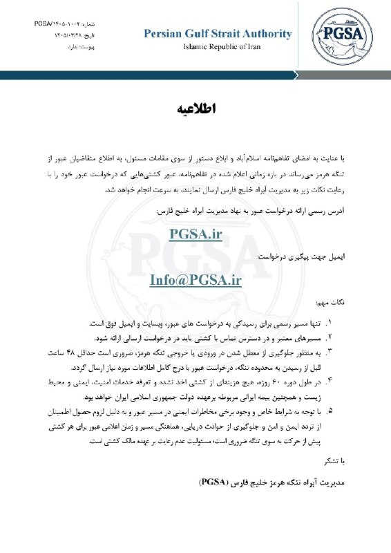

🚨گزارش شده است که سپاه پاسداران انقلاب اسلامی به کشتی‌ها در تنگه هرمز اعلام کرده است تنگه هرمز بسته است @mwarmonitor

## mwarmonitor — post 11201

  <a href="telegram/content/mwarmonitor_11201_1781866483.mp4" target="_blank">🎬 Download video</a>

🚨گزارش شده است که سپاه پاسداران انقلاب اسلامی به کشتی‌ها در تنگه هرمز اعلام کرده است تنگه هرمز بسته است

@mwarmonitor

## kianmeli1 — post 88085

هم‌اکنون سپاه در بیسیم کانال ۱۶ دریایی.

متن صدا:

“از آنجا که خروج اسرائیل از لبنان و لغو کامل محاصره دریایی و خروج نیروهای تروریستی آمریکایی از خلیج فارس و منطقه از جمله شرایط اصلی توافق بین ایران و ایالات متحده است. تنگه هرمز تا زمان تحقق این دو شرط بسته خواهد ماند، به همه کشتی‌ها دستور داده شده برای امنیت و سلامت خود به تنگه هرمز نزدیک نشود، هر شناوری که از این دستور سرپیچی کند مورد هدف قرار خواهد گرفت.”

## kianmeli1 — post 88084

  <a href="telegram/content/kianmeli1_88084_1781866484.mp4" target="_blank">🎬 Download video</a>

🔴اکسیوس: آیا می‌توانید اسرائیل را از حمله به لبنان کنترل کنید؟

ترامپ: بله. آنها احترام زیادی برای من قائل هستند و همان کاری را انجام می‌دهند که من می‌گویم
https://t.me/kianmeli1

## kianmeli1 — post 88083

  <a href="telegram/content/kianmeli1_88083_1781866486.mp4" target="_blank">🎬 Download video</a>

🔴 جنوب لبنان در حال تخلیه

لبنان زیر شدیدترین حملات است
https://t.me/kianmeli1

## FarsiVOA — post 221179

  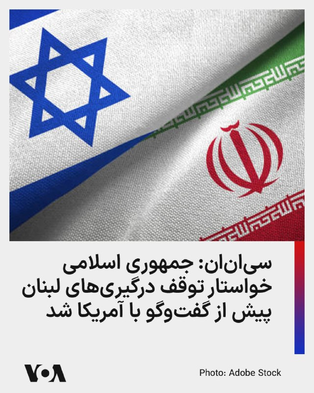

سی‌ان‌ان به نقل از یک دیپلمات مطلع گزارش داد که حکومت ایران خواستار دریافت تضمین‌هایی شده مبنی بر اینکه پیش از ورود به مذاکرات با ایالات متحده در سوئیس، درگیری در لبنان پایان یابد.

این دیپلمات افزود مذاکراتی که قرار بود جمعه برگزار شود و سپس لغو شد، اکنون «در پی حملات اسرائیل در لبنان، به‌طور موقت به تعویق افتاده است.»

این منبع آگاه گفت که «میانجی‌گران در حال حاضر در تلاش هستند تا این مسئله را حل‌وفصل کنند.»
@FarsiVOA

## FarsiVOA — post 221178

  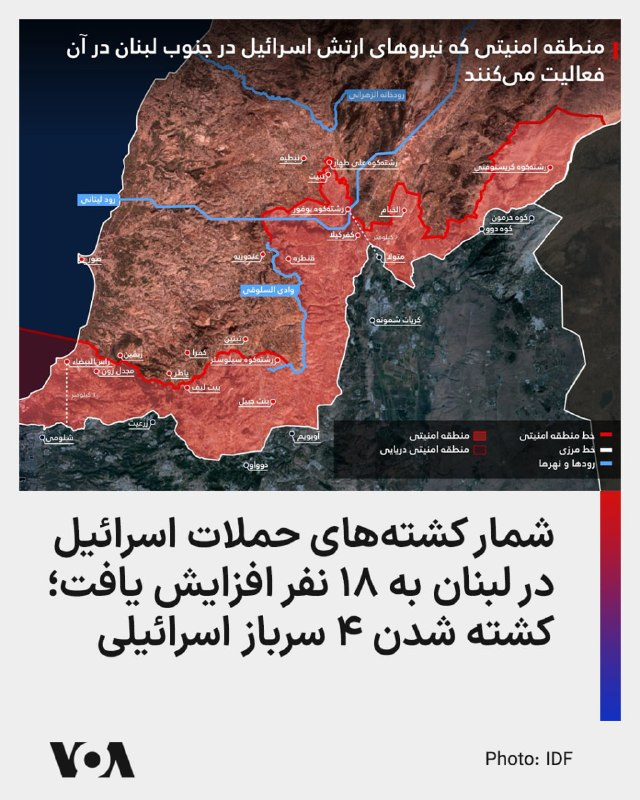

بر اساس اعلام وزارت بهداشت عمومی لبنان، دست‌کم ۱۸ نفر در حملات شبانه اسرائیل به ۱۱ شهر و روستای مختلف در جنوب لبنان کشته و ۳۳ نفر نیز زخمی شده‌اند. این وزارتخانه اعلام کرد که احتمال دارد شمار قربانیان افزایش یابد و حملات ادامه‌دار مانع از آن می‌شود که نیروهای امدادی به قربانیان دسترسی پیدا کنند.

بر اساس اعلام وزارت بهداشت و خبرگزاری دولتی لبنان، یکی از حملات اسرائیل به یک ساختمان مسکونی در الدویر دست‌کم سه نفر را کشته است. پیشتر خبرگزاری ملی لبنان اعلام کرده بود که این حملات منجر به کشته شدن دست‌کم ۱۶ نفر در سراسر «منطقه نبطیه» در جنوب این کشور شد.

در نقطه‌ای دیگر، ارتش اسرائیل اعلام کرد که چهار سرباز اسرائیلی شب گذشته در جنوب لبنان کشته شدند. این حمله زمانی روی داد که یک تانک ارتش اسرائیل اندکی پس از نیمه‌شب به وقت محلی، هدف یک «شیء مشکوک» قرار گرفت.

مقام‌های اسرائیلی گفتند که در میان کشته‌شدگان یک سرهنگ دوم نیز حضور داشت. یک مقام ارتش اسرائیل گفت: «در پی این حادثه، ارتش اسرائیل شمار زیادی از زیرساخت‌های حزب‌الله را در نبطیه و مناطق دیگر هدف قرار داد.»
@FarsiVOA

## Persian_Trend_Official — post 17556

  <a href="telegram/content/Persian_Trend_Official_17556_1781866490.mp4" target="_blank">🎬 Download video</a>

حالا میزاشتید ما 48 ساعت اتاق جنگ نداشته باشیم 😄

## Persian_Trend_Official — post 17555

  <a href="telegram/content/Persian_Trend_Official_17555_1781866490.webm" target="_blank">🎬 Download video</a>

حالا میزاشتید ما 48 ساعت اتاق جنگ نداشته باشیم 😄

## Persian_Trend_Official — post 17554

  <a href="telegram/content/Persian_Trend_Official_17554_1781866491.webm" target="_blank">🎬 Download video</a>

محمد مرندی: رژیم ترامپ به تعهداتش عمل نمی‌کند. ایران تحت این شرایط تفاهم‌نامه را اجرا نخواهد کرد. رژیم صهیونیستی به شدت مجازات خواهد شد.

📝 Amir

📌 @persian_trend_official
پرشین ترند | متفاوت‌ترین کانال نظامی

## Persian_Trend_Official — post 17553

سربسته عرض کنم خدمتتون تا منحل شدن جمهوری اسلامی فعلی جنگ ادامه دارد ! این خط ———————- این نشان ||||||||||||| الیاس فرخ

## Persian_Trend_Official — post 17552

  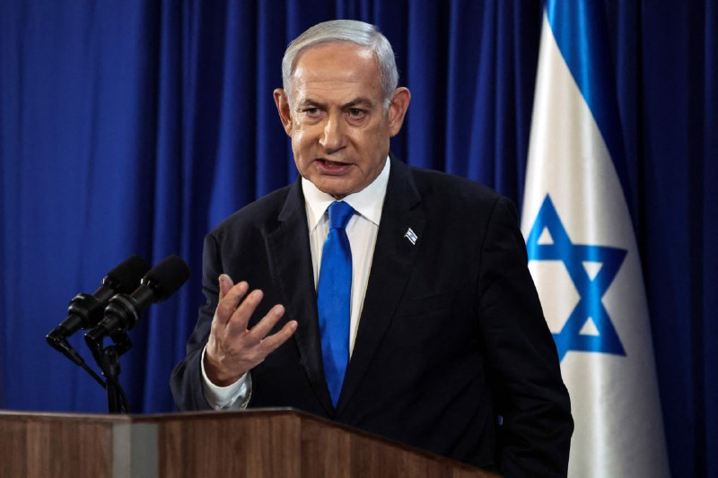

نتانیاهو: اسرائیل حملات به سربازان یا خاک ما را تحمل نخواهد کرد و بهای بسیار سنگینی را از حزب‌الله برای چنین حملاتی دریافت خواهد کرد.

ارتش اسرائیل برای خنثی کردن هرگونه تهدیدی علیه نیروها و خاک ما اقدام خواهد کرد.

همانطور که من به صراحت، از جمله دیروز، اعلام کرده‌ام: اسرائیل تا زمانی که لازم باشد در منطقه امنیتی جنوب لبنان باقی خواهد ماند تا از جوامع شمال اسرائیل محافظت کند.

📝 Amir

📌 @persian_trend_official
پرشین ترند | متفاوت‌ترین کانال نظامی

## Dirty_Kids — post 392570

  <a href="telegram/content/Dirty_Kids_392570_1781866492.mp4" target="_blank">🎬 Download video</a>

🔴 یکی از مدارس دخترونه مملکت کلاس آنلاین داشتن که چند تا پسر اتک زدن به کلاسشون و این شاهکارو خلق کردن:

@Dirty_Kids 👻

## Dirty_Kids — post 392569

  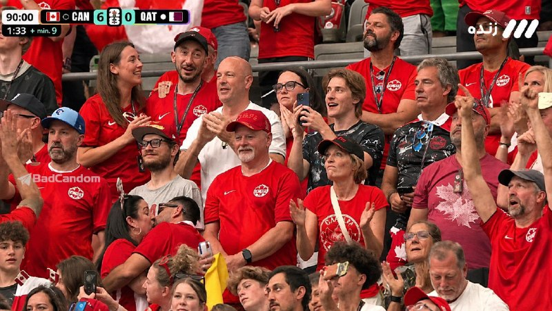

🔴 اثرات توافق داره معلوم میشه؛ دیشب صداوسیما سر بازی قطر-کانادا، برای اولین بار بعد از انقلاب، صحنه لب گرفتن دو نفرو پخش کرد.

@Dirty_Kids 👻

## Hranews — post 113718

گزارشی از بازداشت محمود قنبری‌راد در تهران

❗️
❗️
❗️
❗️
❗️– محمود قنبری‌راد، شهروند ساکن تهران در اردیبهشت سال جاری توسط نیروهای امنیتی در این شهر بازداشت شده و اکنون در زندان تهران بزرگ نگهداری می‌شود. وی با اتهامات اجماع و تبانی علیه امنیت ملی، جمع‌آوری اطلاعات طبقه‌بندی‌شده و ارائه این اطلاعات به اسرائیل مواجه شده است.

ادامه مطلب

#محمود_قنبری‌راد

↘️
@hranews_bot تماس ✉️ -  @Hranews  کانال هرانا 🆑

## alonews — post 129118

  <a href="telegram/content/alonews_129118_1781866495.webm" target="_blank">🎬 Download video</a>

🔴فوری / گزارش‌های اولیه حاکی از بسته شدن تنگه هرمز و شلیک گلوله‌های هشدار به سمت کشتی‌ها پس از حملات اسرائیل به لبنان

✅ @AloNews خبر جنگ

## alonews — post 129117

  <a href="telegram/content/alonews_129117_1781866495.mp4" target="_blank">🎬 Download video</a>

👈اکسیوس: آیا می‌توانید اسرائیل را از حمله به لبنان کنترل کنید؟

🔴ترامپ: بله. آنها احترام زیادی برای من قائل هستند و همان کاری را انجام می‌دهند که من می‌گویم

✅ @AloNews خبر جنگ

---
📅 بروزرسانی: 1405/03/29 14:14
---

## VahidOOnLine — post 246365

  

بر اساس گزارش‌های رسیده به ایران‌اینترنشنال، احسان خدادادی، شهروند اهل روستای یوزباش‌کندی ملکان، از سوی شعبه یک دادگاه انقلاب تبریز به اتهام «جاسوسی» به اعدام محکوم شده است.
بر اساس این گزارش، او در ۱۷ خرداد ۱۴۰۴ بازداشت شده و حکم صادره بر اساس اعترافات اجباری تحت فشار و شکنجه صادر شده است.
‌🏁 🇬🇧 IranintlTV

🤖 @VahidOOnLine

## WithYashar — post 15318

نیروی دریای سپاه در بیسیم کانال ۱۶ دریایی: “از آنجا که خروج اسرائیل از لبنان و لغو کامل محاصره دریایی و خروج نیروهای تروریستی آمریکایی از خلیج فارس و منطقه از جمله شرایط اصلی توافق بین ایران و ایالات متحده است. تنگه هرمز تا زمان تحقق این دو شرط بسته خواهد ماند، به همه کشتی‌ها دستور داده شده برای امنیت و سلامت خود به تنگه هرمز نزدیک نشود، هر شناوری که از این دستور سرپیچی کند مورد هدف قرار خواهد گرفت.”
@withyashar

## mwarmonitor — post 11200

🔴 بنیامین نتانیاهو: ما حملات علیه سربازان و خاک خود را تحمل نخواهیم کرد و اسرائیل تا هر زمانی که لازم باشد در منطقه امنیتی جنوب لبنان باقی خواهد ماند.

@mwarmonitor

## mwarmonitor — post 11199

🔴بنیامین نتانیاهو: «ما حزب‌الله را وادار خواهیم کرد بهای بسیار سنگینی بپردازد.»

@mwarmonitor

## IranIntlTV — post 343188

  <a href="telegram/content/IranIntlTV_343188_1781865881.mp4" target="_blank">🎬 Download video</a>

مرتضی کاظمیان، عضو تحریریه ایران‌اینترنشنال، می‌گوید پیام منسوب به مجتبی خامنه‌ای نشانه‌ای از پذیرش ناگزیر مذاکره و توافق با ایالات متحده در هسته سخت قدرت جمهوری اسلامی است. به گفته او، ادبیات و محتوای این پیام نشان می‌دهد تلاش شده منافع ملی با «جبهه مقاومت» پیوند بخورد و در عین حال مسئولیت توافق بر دوش نهادهایی مانند شورای عالی امنیت ملی و دولت قرار گیرد.
@iranintltv

## DW_Farsi — post 126169

  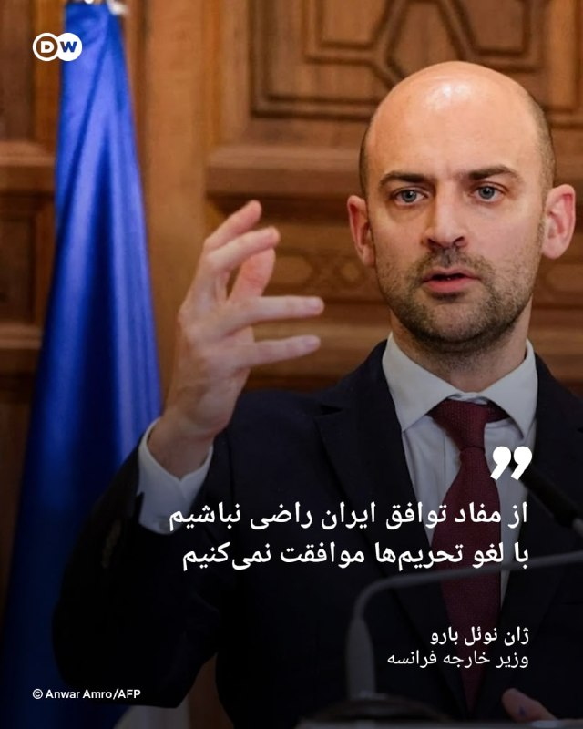

🔶 وزیر خارجه فرانسه: از مفاد توافق ایران راضی نباشیم با لغو تحریم‌ها موافقت نمی‌کنیم

رویترز در گزارشی به نقل از ژان نوئل بارو، وزیر خارجه فرانسه، نوشت که فرانسه می‌خواهد در مذاکرات مربوط به برنامه هسته‌ای ایران نقش داشته باشد و تا زمانی که از مفاد توافق نهایی رضایت نداشته باشد، با لغو تحریم‌های سازمان ملل علیه ایران موافقت نخواهد کرد.

بارو که کشورش یکی از اعضای دائم شورای امنیت سازمان ملل با حق وتو است، به شبکه "فرانس‌اَنفو" گفت تا زمانی که مذاکرات ایالات متحده با ایران علاوه بر برنامه هسته‌ای، برنامه موشک‌های بالستیک ایران و حمایت تهران از نیروهای نیابتی را نیز در بر نگیرد، ثباتی در منطقه وجود نخواهد داشت.

او همچنین افزود: «بهای امتیازهای بزرگی که از ایران خواسته خواهد شد، لغو تحریم‌ها است؛ تحریم‌هایی که در سازمان ملل وضع شده‌اند.»

وزیر خارجه فرانسه در ادامه یادآور شد: «فرانسه عضو دائم شورای امنیت سازمان ملل است، بنابراین همان‌طور که ۱۰ سال پیش نیز چنین بود، باید با لغو این تحریم‌ها موافقت کند.»

@dw_farsi

## DW_Farsi — post 126168

  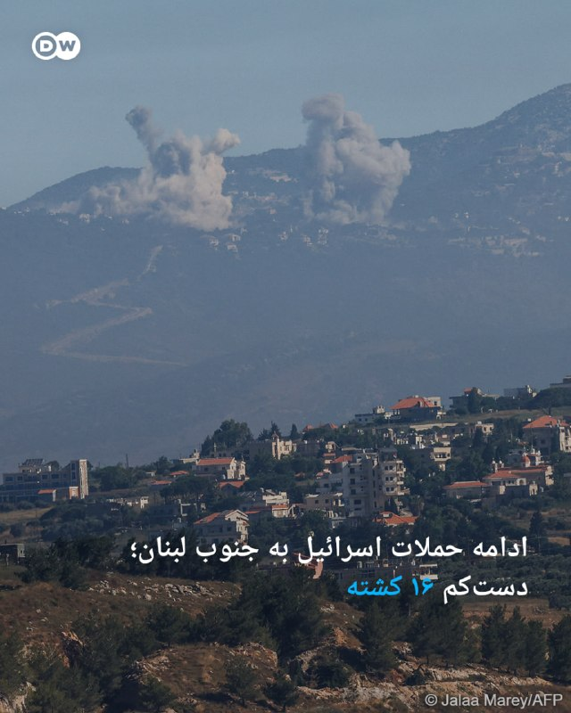

🔶 ادامه حملات اسرائیل به جنوب لبنان؛ دست‌کم ۱۶ کشته

ارتش اسرائیل اعلام کرد که شب گذشته و صبح امروز جمعه ۱۹ ژوئن، حملاتی را علیه نیروها و زیرساخت‌های حزب‌الله در سراسر جنوب لبنان انجام داده است. بر اساس اعلام ارتش اسرائیل، این حملات در پاسخ به "نقض‌ مکرر آتش‌بس" از سوی این گروه مورد حمایت حکومت ایران انجام شده‌اند.

در همین رابطه، خبرگزاری دولتی لبنان نیز اعلام کرد "دست‌کم ۱۶ نفر" در حملات هوایی اسرائیل کشته شده‌اند. این آمار میان غیرنظامیان و نیروهای رزمی حزب‌الله تفکیکی قائل نشده است. ارتش اسرائیل می‌گوید حزب‌الله شب گذشته چندین راکت به سمت نیروهای اسرائیلی در جنوب لبنان شلیک کرده بود.

ایتامار بن‌گویر، وزیر امنیت ملی راست‌گرای افراطی اسرائیل، پس از آنکه انفجار یک بمب متعلق به حزب‌الله در خاک لبنان در طول شب جمعه منجر به کشته شدن چهار سرباز اسرائیلی شد، اعلام کرد که تمام لبنان باید بسوزد.

جنگ در لبنان یکی از بزرگ‌ترین موانع بر سر راه توافق‌ در جنگ ایران به شمار می‌رود.

@dw_farsi

## Persian_Trend_Official — post 17551

  <a href="telegram/content/Persian_Trend_Official_17551_1781865885.webm" target="_blank">🎬 Download video</a>

بعضی از منابع غیررسمی خبر از بسته شدن مجدد تنگه هرمز می‌دهند.

متن پیام ادعایی سپاه پاسداران در کانال 16 دریایی: از آنجا که خروج اسرائیل از لبنان و لغو کامل محاصره دریایی و خروج نیروهای تروریستی آمریکایی از خلیج فارس و منطقه از جمله شرایط اصلی توافق بین ایران و ایالات متحده است. تنگه هرمز تا زمان تحقق این دو شرط بسته خواهد ماند، به همه کشتی‌ها دستور داده شده برای امنیت و سلامت خود به تنگه هرمز نزدیک نشود، هر شناوری که از این دستور سرپیچی کند مورد هدف قرار خواهد گرفت.

این خبر تایید و یا رد نمیشود.

📝 Amir

📌 @persian_trend_official
پرشین ترند | متفاوت‌ترین کانال نظامی

## RadioFarda — post 158499

  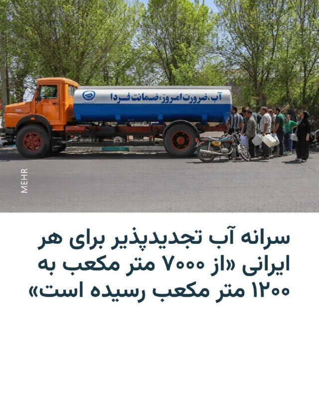

🔸 گزارش‌های نهادهای دولتی نشان می‌دهد شاخص «سرانه آب تجدیدپذیر» برای هر شهروند ایرانی، از حدود هفت هزار متر مکعب در دهه‌های گذشته به کمتر از یک‌ هزار و ۲۰۰ متر مکعب رسیده است.

🔸 سخنگوی صنعت آب ایران روز پنجشنبه ۲۹ خردادبا اعلام این موضوع افزود که افزایش جمعیت در کنار کاهش بارش و پیامدهای تغییر اقلیم، فشار بی‌سابقه‌ای بر منابع آبی کشور وارد کرده است.

🔸 عیسی بزرگ‌زاده دربارهٔ وضعیت این شاخص در ایران در مقایسه با استانداردهای جهانی می‌گوید: «این عدد در سال‌های دورتر که بارش کشور بیشتر بود، حدود ۱۳۰ میلیارد متر مکعب در سال بوده و اکنون به کمتر از ۱۰۳ میلیارد متر مکعب در سال رسیده است.»

🔸 به گفته او، در دهه‌های ۳۰ و ۴۰ خورشیدی، هر ایرانی حدود نزدیک به هفت هزار مترمکعب در سال به ازای هر نفر آب در اختیار داشت، اما اکنون این عدد بسیار کاهش پیدا کرده است.

🔸 سرانهٔ آب تجدیدپذیر که واحد اندازه‌گیری آن متر مکعب به ازای هر نفر در سال است، به عنوان سهم هر شهروند از آب طبیعی کشور، یکی از مهم‌ترین شاخص‌های جهانی برای سنجش امنیت آبی کشورها به شمار می‌رود.

@RadioFarda

## alonews — post 129116

  <a href="telegram/content/alonews_129116_1781865886.webm" target="_blank">🎬 Download video</a>

👈نتانیاهو : اسرائیل تا وقتی لازم باشه؛
برای حفاظت از شهرهای شمالی‌اش، تو نوار امنیتی جنوب لُبنان باقی می‌مونه

✅ @AloNews خبر جنگ

## alonews — post 129115

  <a href="telegram/content/alonews_129115_1781865886.webm" target="_blank">🎬 Download video</a>

👈نتانیاهو: ما حمله به سربازانمان را تحمل نخواهیم کرد و کاری خواهیم کرد که حزب‌الله بهای بسیار سنگینی بپردازد

✅ @AloNews خبر جنگ

## alonews — post 129114

  <a href="telegram/content/alonews_129114_1781865887.webm" target="_blank">🎬 Download video</a>

👈اسرائیل هیوم خطاب به ترامپ: می‌تونستی بزرگ‌ترین رئیس‌جمهور تاریخ باشی، اما شکست خوردی.

🔴آقای رئیس‌جمهور، شما به منافع جهان متمدن ضربه زدی و ممکنه به‌عنوان رئیس‌جمهوری در یادها بمانی که باعث تحقیر آمریکا شد.

🔴به اسرائیل خیانت کردی و حالا تمام تحقیرهایی که قبلا باهاش روبه‌رو بودی، کاملا موجه به نظر می‌رسه

✅ @AloNews خبر جنگ

---
📅 بروزرسانی: 1405/03/29 14:05
---

## VahidOOnLine — post 246364

  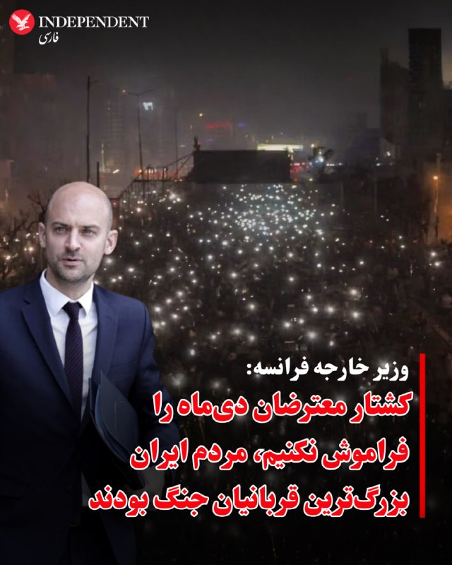

⭕️وزیر خارجه فرانسه: کشتار معترضان دی‌ماه را فراموش نکنیم، مردم ایران بزرگ‌ترین قربانیان جنگ بودند

♦️ژان نوئل بارو، وزیر امور خارجه فرانسه روز جمعه ۲۹ خردادماه گفت جهان نباید کشتار معترضان ایرانی در دی‌ماه را فراموش کند.

بارو که با تلویزیون «فرانس انفو» مصاحبه می‌کرد در پاسخ به پرسشی درباره سیاست فرانسه پس از «امضای تفاهم‌نامه پایان جنگ» ایران و آمریکا در قبال تهران گفت: «مردم ایران، بزرگ‌ترین قربانیان این جنگ بودند. آن‌ها از یک سو گرفتار سرکوبند و از سوی دیگر به رویشان بمب ریخته می‌شود. ما کشتار ژانویه (دی‌ماه) را که در آن خشونت دولتی بدون تمایز، معترضان مسالمت‌آمیز را هدف قرار داد، فراموش نمی‌کنیم.»

فرانسه حملات نظامی آمریکا و اسرائیل به جمهوری اسلامی را «غیرقانونی» توصیف و بارها اعلام کرد که در این جنگ شرکت نمی‌کند. دونالد ترامپ تفاهم‌نامه پایان جنگ با ایران را در کاخ ورسای و در حضور امانوئل مکرون امضا کرد.
‌🇸🇦 Indypersian

🤖 @VahidOOnLine

## WithYashar — post 15317

گزارش‌ها از شلیک مدام قایق‌های سپاه در تنگه هرمز حکایت دارد.🚨🚨🚨🚨
@withyashar

## WithYashar — post 15316

باز‌ تنگه دعوا شد🚨🚨🚨🚨
@withyashar

## WithYashar — post 15315

دقایقی پیش براساس گزارش مستقیم از چند کشتی در خلیج فارس، سپاه پاسداران حرکت تمام کشتی‌ها رو متوقف کرد و عملاً تنگه هرمز رو بست.🚨
@withyashar

## mwarmonitor — post 11198

📝وقتی کل دنیا، از رسانه‌های جریان اصلی تا سناتورهای جمهوری‌خواه و دمکرات به این نتیجه قطعی رسیدن که ترامپ به معنی واقعی ریده، واقعاً دیدن یه مشت اسکلِ خوش‌خیال توی دایرکت که با تحلیل‌های پای منقلی می‌گن «صبور باش، داره بازی میده» تهوع‌آوره. آخه مغز فندوقی، اینجا دیگه ترامپ اسکل نیست، اسکل تویی که مثل کبک سرت رو کردی تو برف! طرف با این توافقِ افتضاحش نه تنها اعتبار خودش، بلکه اعتبار و آبروی آمریکا رو هم مثل دستمال توالت کشید پایین و فرستاد تو فاضلاب، اونوقت تو هنوز داری از شطرنج چندبعدی این نابغه جفنگیات تفت می‌دی؟ تحقیرآمیزتر از گندکاریِ ترامپ، ذهن فسیل‌شده‌ی توئه که سرشو کرده تو سرگین و فکر می‌کنه بوی گل میاد؛ واقعاً جنس ساقیت چیه که این‌طور با حماقتِ مقدس، برای یه سقوط آزادِ مطلق کف می‌زنی و منتظر معجزه‌ای؟

@mwarmonitor

## IranIntlTV — post 343187

  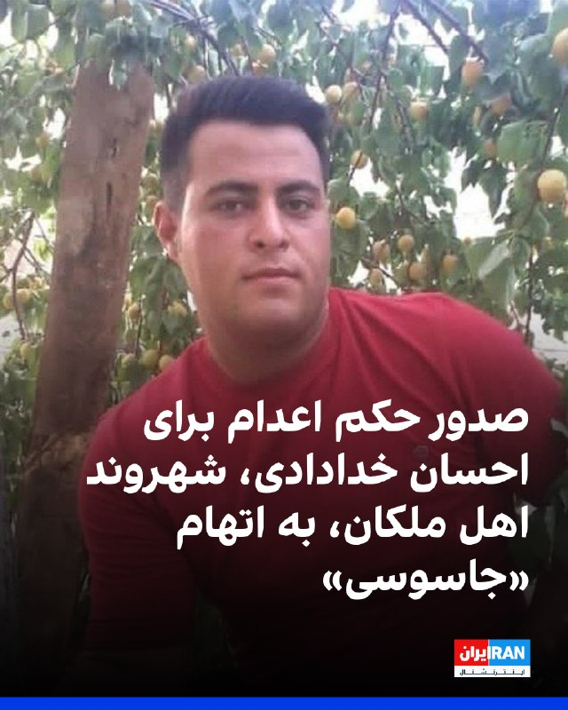

بر اساس گزارش‌های رسیده به ایران‌اینترنشنال، احسان خدادادی، شهروند اهل روستای یوزباش‌کندی ملکان، از سوی شعبه یک دادگاه انقلاب تبریز به اتهام «جاسوسی» به اعدام محکوم شده است.
بر اساس این گزارش، او در ۱۷ خرداد ۱۴۰۴ بازداشت شده و حکم صادره بر اساس اعترافات اجباری تحت فشار و شکنجه صادر شده است.
https://iranintl.com/202606195208

## Iliaen — post 4499

هم‌اکنون سپاه در بیسیم کانال ۱۶ دریایی.

متن صدا:

“از آنجا که خروج اسرائیل از لبنان و لغو کامل محاصره دریایی و خروج نیروهای تروریستی آمریکایی از خلیج فارس و منطقه از جمله شرایط اصلی توافق بین ایران و ایالات متحده است. تنگه هرمز تا زمان تحقق این دو شرط بسته خواهد ماند، به همه کشتی‌ها دستور داده شده برای امنیت و سلامت خود به تنگه هرمز نزدیک نشود، هر شناوری که از این دستور سرپیچی کند مورد هدف قرار خواهد گرفت.”

@iliaen

## Persian_Trend_Official — post 17550

گویا جمهوری اسلامی دوباره تنگه رو بسته و داره فشار میاره تا امریکا جلوی اسرائیل رو بگیره !!!

## Persian_Trend_Official — post 17549

  <a href="telegram/content/Persian_Trend_Official_17549_1781865335.mp4" target="_blank">🎬 Download video</a>

ویدویی به جا مانده از درگیری شدید شب گذشته ارتش اسرائیل و حزب‌الله لبنان در محور علی الطاهر

به احتمال زیاد شاهد حرکت یک موشک ضد زره حزب‌الله و اصابت آن به مواضع ارتش اسرائیل، احتمالا تانک مرکاوا هستیم.

📝 Amir

📌 @persian_trend_official
پرشین ترند | متفاوت‌ترین کانال نظامی

## Dirty_Kids — post 392567

مطمئنم تو اوقات فراغت اژدهاسواری میکنه.

@Dirty_Kids 👻

## Dirty_Kids — post 392566

  <a href="telegram/content/Dirty_Kids_392566_1781865337.mp4" target="_blank">🎬 Download video</a>

پوست اندازی از دیکتاتوری نعلین به چکمه

@Dirty_Kids 👻

## alonews — post 129113

  <a href="telegram/content/alonews_129113_1781865339.webm" target="_blank">🎬 Download video</a>

👈سایت ردیابی کشتی ها، کپلر: ترافیک کشتیرانی در تنگه هرمز رو به بهبود است و دیروز ۲۵ کشتی از این تنگه عبور کردند.

✅ @AloNews خبر جنگ

## alonews — post 129112

  <a href="telegram/content/alonews_129112_1781865339.webm" target="_blank">🎬 Download video</a>

👈واکنش ثابتی به حملات اسرائیل به لبنان

✅ @AloNews خبر جنگ

---
📅 بروزرسانی: 1405/03/29 13:55
---

## VahidOOnLine — post 246363

  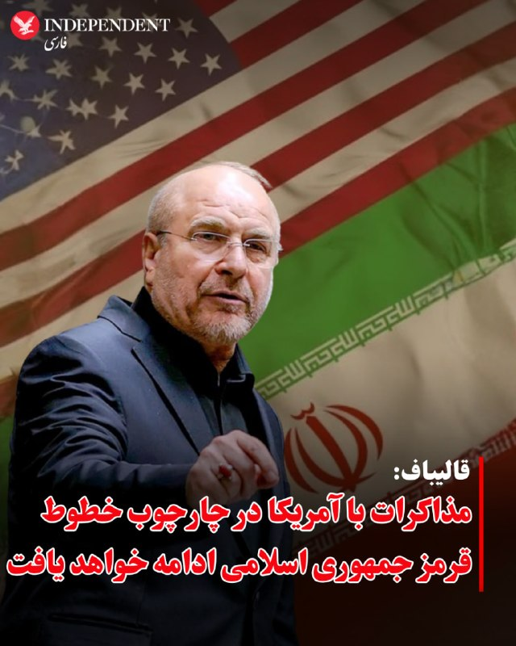

♦️محمدباقر قالیباف، رئیس مجلس و مذاکره‌کننده ارشد جمهوری اسلامی روز جمعه ۲۹ خرداد بار دیگر گفت که مذاکرات با آمریکا در چارچوب «خطوط قرمز» تعیین‌شده از سوی جمهوری اسلامی ادامه خواهد یافت و تهران در دفاع از منافع خود عقب‌نشینی نخواهد کرد.

به گزارش ایرنا، قالیباف با اشاره به توافق اخیر میان تهران و واشنگتن برای پایان دادن به جنگ منطقه‌ای، گفت جمهوری اسلامی همان‌گونه که در گذشته نشان داده، به شروط و خطوط قرمز خود پایبند خواهد ماند. او همچنین هشدار داد در صورت آنچه «زیاده‌خواهی دشمن» خواند، ایران آماده پاسخ قاطع است.

اظهارات قالیباف پس از آن مطرح شد که مجتبی خامنه‌ای اعلام کرد با وجود داشتن دیدگاهی متفاوت، توافق میان ایران و آمریکا را تایید کرده است. همزمان عباس عراقچی و مسعود پزشکیان نیز بر پایبندی جمهوری اسلامی به خطوط قرمز و حفظ منافع ملی تاکید کردند.

بر اساس تفاهم‌نامه تهران و واشنگتن، دو طرف وارد یک دوره ۶۰ روزه مذاکره برای دستیابی به توافق نهایی درباره برنامه هسته‌ای ایران و رفع تحریم‌ها خواهند شد. با این حال، زمان آغاز مذاکرات نهایی هنوز مشخص نیست و برخی جریان‌های اصولگرا نیز نسبت به تعهدات آمریکا و جزئیات توافق ابراز تردید کرده‌اند.
‌🇸🇦 Indypersian

🤖 @VahidOOnLine

## WithYashar — post 15314

وزیر امور خارجه پاکستان: علت آغاز نشدن مذاکرات سوئیس به دغدغه مقامات ایرانی به مراسم ماه محرم مربوط میشه.
@withyashar

## mwarmonitor — post 11197

🔴اسرائیل کاتس، وزیر دفاع اسرائیل، اعلام کرد که ارتش اسرائیل در جنوب لبنان باقی خواهد ماند.

🔴او در بیانیه‌ای—پس از آنکه چهار نظامی اسرائیلی در حملات شبانه حزب‌الله کشته و شماری دیگر زخمی شدند—گفت:
«ما اجازه نخواهیم داد به سربازان و غیرنظامیان ما آسیبی وارد شود و هر نقض آتش‌بس از سوی حزب‌الله با نیرویی شدید پاسخ داده خواهد شد.»

🔴کاتس افزود:
«ارتش اسرائیل در منطقه امنیتی لبنان، از نوار ساحلی تا ارتفاعات بوفور، برای حفاظت از جوامع شمالی، خنثی‌سازی تهدیدها و نابودی زیرساخت‌های تروریستی در این منطقه—چه در زیر زمین و چه روی زمین—باقی خواهد ماند.»

@mwarmonitor

## mwarmonitor — post 11196

  

🔴می‌توانستی بزرگ‌ترین رئیس‌جمهور تاریخ باشی، اما شکست خوردی

🔸آقای رئیس‌جمهور، شما به منافع انسانی جهانِ متمدن آسیب شدیدی وارد کرده‌اید و ممکن است برای همیشه به عنوان رئیس‌جمهوری در یادها بمانید که باعث تحقیر آمریکا شد. شما به ما، یعنی اسرائیلی‌ها، خیانت کردید؛ و در یک لحظه، تحقیری که زمانی با آن روبه‌رو بودید، ناگهان بسیار موجه و منطقی به نظر می‌رسد.

@mwarmonitor

## pm_afshaa — post 94381

  <a href="telegram/content/pm_afshaa_94381_1781864703.webm" target="_blank">🎬 Download video</a>

🔴دقایقی پیش براساس گزارش مستقیم از چند کشتی در خلیج فارس، سپاه پاسداران حرکت تمام کشتی‌ها رو متوقف کرد و عملاً تنگه هرمز رو بست.

💧 Rainbet.com the #1 Non-KYC Crypto Casino & Sportsbook @rainbetcom

😁 @Pm_Afshaa

## DEJradio — post 5818

  <a href="telegram/content/DEJradio_5818_1781864704.mp4" target="_blank">🎬 Download video</a>

🔺📢 پیام یک شهروند از اصفهان:
تنها راه ما گذار از این حکومت غیرمردمی است

پیام یک شهروند: "ساکن اصفهان هستم و چون در روزهای جام جهانی هستیم می‌خوام چند کلمه‌ای در مورد محدودیت‌های زنان در ورزش صحبت کنم. از دوران مدرسه عاشق فوتبال بودم و تا مدرسه تموم می‌شد با دوستانم تا جایی که نفس داشتیم فوتبال بازی می‌کردم.
الان ۲۷ سالمه ولی هر بار می‌خوام به استادیوم برم فقط به‌خاطر اینکه زن هستم با کلی محدودیت و ممنوعیت روبه‌رو می‌شم. گاهی اوقات با محدود کردن سهمیه صندلی‌های زنان در استادیوم‌ها، گاهی اوقات با آوردن بهانه که جایگاه زنان داره ترمیم و تعمیر می‌شه و امثالهم.
همه این موارد نشانگر این واقعیته که جمهوری اسلامی یک حکومت زن‌ستیز هست که نیمی از جمعیت کشور رو فقط به‌خاطر جنسیت اونها به حاشیه رونده و اونها رو مورد تبعیض قرار می‌ده.
مسئولین حکومتی گاهی اوقات سعی می‌کنن که تبعیض علیه زنان رو یک مسئله جناحی نشون بدن مثلا بگن اصلاح طلب‌ها موافقن ولی اصولگراها مخالف هستن. ولی واقعیت اینه که کلیت این حکومت فاسد حقوق همه مردم اعم از هر جنسیت، قومیت یا قشر اجتماعی رو پایمال می‌کنه و تنها راه برون‌رفت از این تبعیض‌ها و ممنوعیت‌ها گذار از این حکومت غیر مردمی هست!"

#محدودیت_ورزش_زنان #جمهوری_اسلامی #جام_جهانی
@DEJradio

## kianmeli1 — post 88082

🔴کاتز وزیر دفاع اسرائیل :
مثل غزه! نابودشون میکنیم! به آواره‌هاشون (اون ۲۰۰ هزار نفری که در روستاهای شیعه نشین هم مرز با اسرائیل هستند) اجازه نمیدیم برگردن.
کاتز با اشاره به فشارهای ترامپ : هیچ کس نمی‌تونه به ما بگه چی کار کنیم یا نکنیم!
https://t.me/kianmeli1

## Iliaen — post 4498

ساعت ۱۳:۵۱ جمعه؛ گزارش‌ها از شلیک مدام قایق‌های سپاه در تنگه هرمز حکایت دارد.

@iliaen

## Iliaen — post 4497

ساعت ۱۳:۴۷ جمعه؛ گزارش‌ها از شلیک هشدار در محدوده تنگه هرمز حکایت دارد. سپاه در بیسیم، خطاب به تمام کشتی‌ها می‌گوید “نزدیک تنگه هرمز نشوید.”

@iliaen

## FarsiVOA — post 221177

  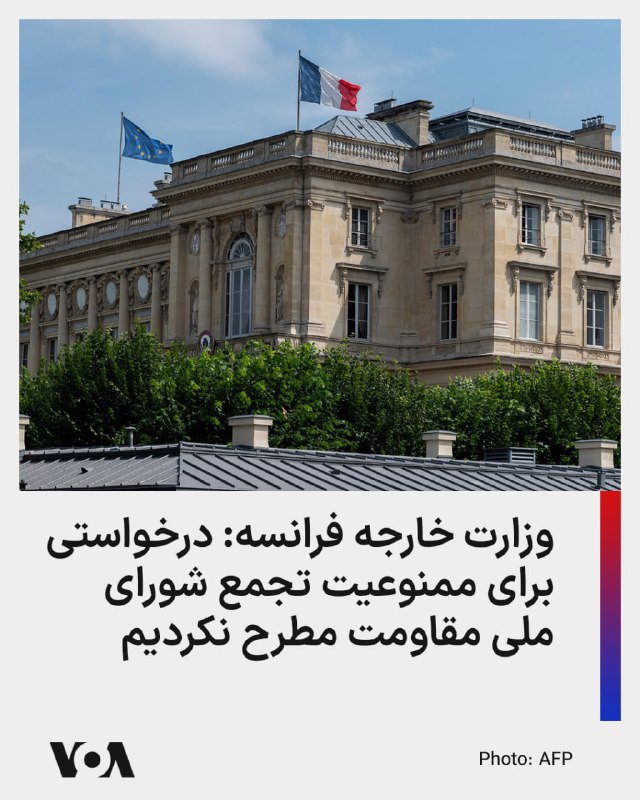

وزارت خارجه فرانسه اعلام کرد که این وزارتخانه درخواست ممنوعیت تجمع شورای ملی مقاومت، از احزاب مخالف جمهوری اسلامی را که قرار بود روز شنبه در پاریس برگزار شود، مطرح نکرده است.

وزارت خارجه در بیانیه‌ای که برای رویترز ارسال شد گفت: «این ادعا نادرست است. وزیر هیچ اشاره‌ای به این اعتراض نکرد و درخواست لغو آن را نیز مطرح نکرد.»

پیشتر شورای ملی مقاومت ایران مستقر در پاریس اعلام کرده بود که پلیس پاریس تجمع آن‌ها را در لحظه آخر ممنوع کرده و این موضوع را به تماس روز پنجشنبه میان ژان-نوئل بارو، وزیر خارجه فرانسه، و عباس عراقچی، وزیر خارجه جمهوری اسلامی، مرتبط دانسته بود.

این تظاهرات که ماه‌ها پیش مجوز آن صادر شده بود، اواخر شامگاه پنج‌شنبه ممنوع اعلام شده است.

شورای ملی مقاومت ایران روز جمعه در بیانیه‌ای اعلام کرد که نسبت به این تصمیم اعتراض خواهد کرد و در بیانیه خود دلیل پلیس را ذکر نکرد.

پلیس پاریس نیز هنوز در این زمینه توضیحی ارائه نکرده است.

سازمان‌دهندگان تجمع اعلام کردند که به مدت دو ماه با پلیس هماهنگ بوده‌اند و تمامی مراحل قانونی را طی کرده‌اند.
@FarsiVOA

## DW_Farsi — post 126167

  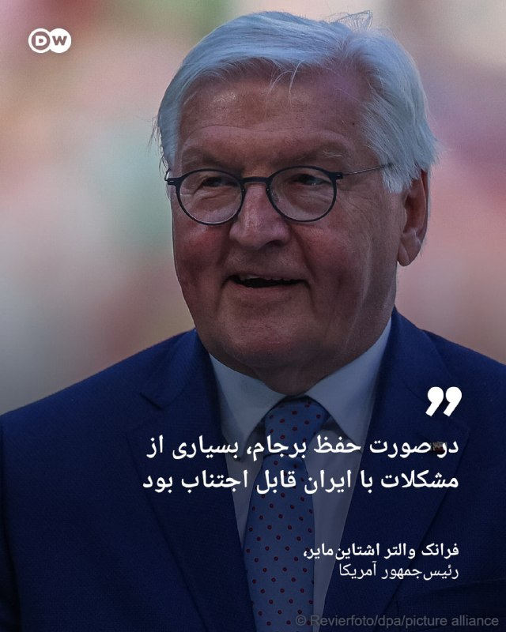

🔶 اشتاین‌مایر: در صورت حفظ برجام، بسیاری از مشکلات با ایران قابل اجتناب بود

فرانک والتر اشتاین‌مایر، رئیس‌‌جمهور آلمان می‌گوید توافقی که آمریکا در پی دستیابی به آن با ایران است، در بهترین حالت با توافق برجام، که در سال ۲۰۱۵ حاصل شد، مطابقت خواهد داشت.

اشتاین‌مایر که خود در آن زمان به عنوان وزیر خارجه آلمان در روند برجام نقش داشت، در مصاحبه هفتگی شبکه کانال اول تلویزیون آلمان (ARD) گفت این توافق "یک سازوکار خوب و دقیق" بود.

او افزود: «مایه تاسف است که دونالد ترامپ در دوره نخست ریاست‌جمهوری خود آن را لغو کرد.»

اشتاین‌مایر گفت این یکی از دلایلی بوده که او جنگ اخیر آمریکا علیه ایران را در اصل غیرضروری می‌دانسته است، "زیرا توافق سال ۲۰۱۵ عملا همه چیزهایی را که اکنون دوباره با زحمت تلاش می‌شود کنار هم قرار گیرد در بر داشت".

رئیس‌جمهور آلمان در ادامه گفت که پس از کنار گذاشتن آن توافق، تنش‌ها بار دیگر تشدید شد و ایران بار دیگر حمایت خود از نیروهای نیابتی‌اش در حماس و حزب‌الله را افزایش داد. او افزود: «شاید اگر توافق سال ۲۰۱۵ پابرجا مانده بود، می‌شد از همه این‌ها جلوگیری کرد.»

@dw_farsi

## Persian_Trend_Official — post 17548

  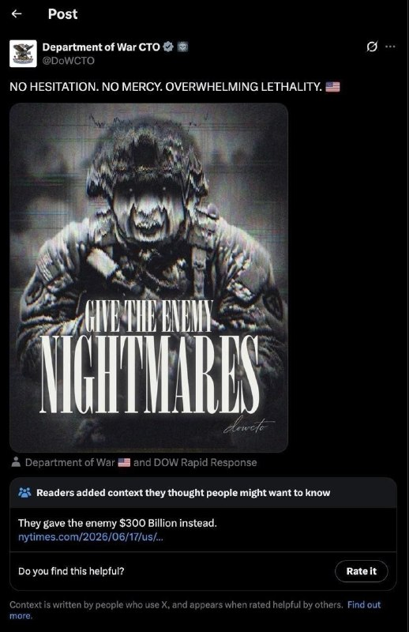

🇺🇸 وزارت جنگ ایالات متحده یک پوستر تبلیغاتی منتشر کرد که هدف آن ایجاد ترس نسبت به نظامیان آمریکایی بود، با شعار «ما کابوس‌هایی به دشمن هدیه می‌دهیم».

در پاسخ، کاربران آمریکایی نوشتند:

«در عوض، ۳۰۰ میلیارد دلار به دشمن هدیه دادند».

👺Phantom

📌 @persian_trend_official
پرشین ترند | متفاوت‌ترین کانال نظامی

## Hranews — post 113717

  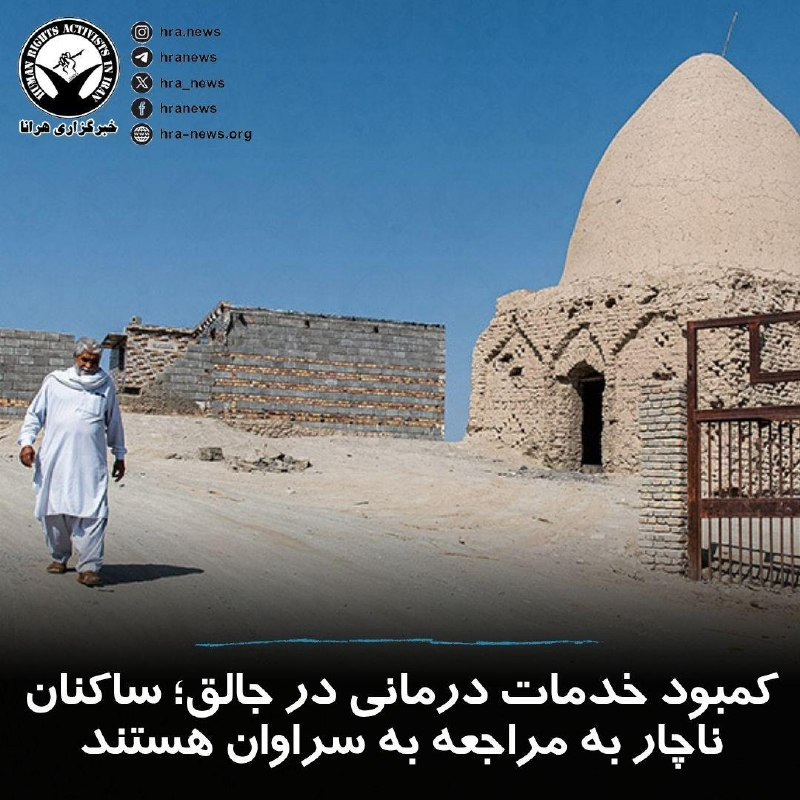

کارگران روزمزد و کشاورزان شهرستان جالق در استان سیستان و بلوچستان از کمبود شدید امکانات درمانی و دسترسی محدود به خدمات پزشکی رنج می‌برند. به گفته ساکنان این منطقه، نبود پزشک متخصص، کمبود کادر درمان، فقدان مراکز درمانی مجهز و دشواری تأمین دارو، شهروندان را ناچار می‌کند برای دریافت خدمات اولیه درمانی به شهرستان سراوان مراجعه کنند؛ موضوعی که هزینه‌های سنگینی را بر خانواده‌های کم‌درآمد این منطقه تحمیل کرده و مشکلات درمانی آنان را دوچندان ساخته است.

↘️
@hranews_bot تماس ✉️ -  @Hranews  کانال هرانا 🆑

## alonews — post 129111

  <a href="telegram/content/alonews_129111_1781864710.webm" target="_blank">🎬 Download video</a>

👈ترامپ به اکسیوس: اگر مداخله من نبود، اسرائیل له شده بود.

✅ @AloNews خبر جنگ

## alonews — post 129110

  <a href="telegram/content/alonews_129110_1781864711.webm" target="_blank">🎬 Download video</a>

👈تانکر ترکرز نوشت: در طول پنج روز گذشته، جمهوری اسلامی ایران حدود ۱۸ میلیون بشکه نفت خام صادر کرده است که ارزش کل آن بالغ بر ۱٫۴۴ میلیارد دلار برآورد می‌شود

✅ @AloNews خبر جنگ

---
📅 بروزرسانی: 1405/03/29 13:44
---

## VahidOOnLine — post 246362

  <a href="telegram/content/VahidOOnLine_246362_1781864097.mp4" target="_blank">🎬 Download video</a>

♦️دیدار تیم‌های کانادا و قطر در دور دوم مرحله گروهی جام جهانی ۲۰۲۶ با خشونت شدید و خطاهای غیرفوتبالی بازیکنان قطری همراه بود.
در یکی از جنجالی‌ترین صحنه‌های مسابقه در دقیقه ۵۳، عاصم مادیبو، هافبک قطر، با تکلی خشن و غیرحرفه‌ای روی اسماعیل کونه، هافبک کانادا، موجب شکستگی پای این بازیکن شد. این صحنه با اعتراض شدید بازیکنان و هواداران تیم میزبان همراه بود.

در مسابقه‌ای که در نهایت با پیروزی ۶ بر صفر کانادا به پایان رسید، به دلیل خطاهای پیاپی و رفتار خشن بازیکنان قطر، دو بازیکن این تیم با کارت قرمز از زمین اخراج شدند و چند بازیکن دیگر نیز با کارت زرد جریمه شدند.
‌🇸🇦 Indypersian

🤖 @VahidOOnLine

## DEJradio — post 5817

  <a href="telegram/content/DEJradio_5817_1781864100.webm" target="_blank">🎬 Download video</a>

🚨
⭕️ درگیری مسلحانه در خاش؛ یک مامور نیروی انتظامی کشته شد

در یک درگیری مسلحانه که آدینه ۲۹ خرداد ۱۴۰۵ در شهر خاش رخ داد، ستوان سوم «عبدالسلام کرد» کشته شد.

روز چهارشنبه ۲۷ خردادماه نیز یک نیروی هنگ مرزی سراوان به نام «سبحان سنچولی» اهل زابل بر اثر انفجار مین کارگذاری شده توسط سـ.ـپاه تروریست پاسداران در اطراف محدوده یگان مرزی کشته شد.

#خاش #درگیری_مسلحانه #IRGCterrorists
@DEJradio

## IranIntlTV — post 343186

  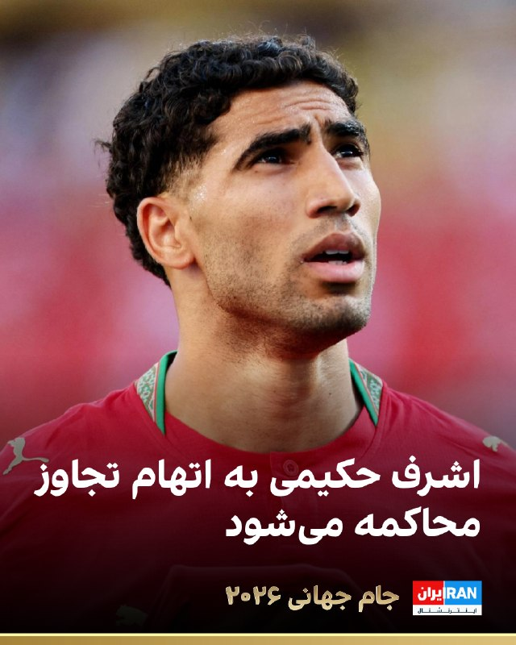

🔻دادگاه تجدیدنظر منطقه ورسای فرانسه درخواست فرجام‌خواهی اشرف حکیمی، مدافع مراکشی پاری‌سن‌ژرمن را رد و حکم ارجاع پرونده او به دادگاه کیفری را تایید کرد.

🔹حکیمی که متهم است در فوریه ۲۰۲۳ در خانه خود به یک زن جوان تجاوز کرده، تمامی اتهامات را تکذیب کرده و خواهان تبرئه شده است.

🔹با این حال دادگاه اعلام کرد: «تحقیقات نشان می‌دهد دلایل و شواهد کافی علیه آقای اشرف حکیمی برای ارجاع پرونده به دادگاه کیفری وجود دارد.»

🔹وکیل شاکی با ابراز خرسندی گفت: «این تصمیم کاملاً با محتویات پرونده همخوانی دارد. پس از سه سال نبرد قضایی و افتراهای دفاعیات حکیمی، موکلم احساس آرامش و امیدواری می‌کند؛ امید به اینکه این دادگاه حصار انکار و مصونیت از مجازات خشونت‌های جنسی در فوتبال مردان را بشکند.»

🔹در مقابل، وکیل حکیمی با انتقاد از این حکم تاکید کرد: «در هر پرونده دیگری، وجود این همه شواهد به نفع متهم، منجر به تبرئه می‌شد. دفاعیات حکیمی از اینکه به تناقض‌ها، دروغ‌ها و پنهان‌کاری‌های شاکی توجهی نشده، متأسف است. اکنون آقای حکیمی با بی‌صبری منتظر دادگاه است تا بی‌گناهی خود را ثابت کند.»

@iranintltvsport

## Iliaen — post 4496

ساعت ۱۳:۴۳ جمعه، براساس گزارش مستقیم از چند کشتی در خلیج فارس، سپاه پاسداران حرکت تمام کشتی‌ها را متوقف کرد و عملاً تنگه هرمز را بست.

@iliaen

## Persian_Trend_Official — post 17547

  <a href="telegram/content/Persian_Trend_Official_17547_1781864102.mp4" target="_blank">🎬 Download video</a>

تحالیل فاخر یکی دیگر از ابرتحلیلگران حوزه دفاعی

## alonews — post 129109

  <a href="telegram/content/alonews_129109_1781864103.webm" target="_blank">🎬 Download video</a>

👈ترامپ به اکسیوس: رابطه من با نتانیاهو خوب است، اما باید او را کمی منطقی‌تر نگه داریم.

✅ @AloNews خبر جنگ

## alonews — post 129108

  <a href="telegram/content/alonews_129108_1781864103.webm" target="_blank">🎬 Download video</a>

👈وزیر امورخارجه پاکستان: هیچ مانعی برای آغاز مذاکرات سوئیس وجود ندارد و مذاکرات باید ظرف مدت ۶۰ روز به پایان برسد

✅ @AloNews خبر جنگ

---
📅 بروزرسانی: 1405/03/29 13:34
---

## DEJradio — post 5816

  <a href="telegram/content/DEJradio_5816_1781863475.webm" target="_blank">🎬 Download video</a>

🔺📢 رویترز:
هسته‌های مخفی جدید سـپـ.ـاه در عراق

رویترز به نقل از منابع عراقی گزارش داد سپـ.ـاه پاسـ.ـداران هسته‌های مخفی جدیدی در عراق برای تهدید کشورهای حوزه خلیج فارس تشکیل داده که مستقیماً به این نهاد تروریستی گزارش می‌دهند. به گفته این منابع، این هسته‌ها بین آوریل و مه چند حمله پهپادی به اهدافی در کویت، عربستان سعودی و امارات انجام داده‌اند. منابع عراقی این اقدام را بخشی از راهبرد تازه سپـ.ـاه برای حفظ نفوذ منطقه‌ای و دور زدن محدودیت‌های احتمالی گروه‌های همسو با رژیم جمهوری اسلامی در توافق با ترامپ دانسته‌اند.

#عراق #IRGCterrorists #جنگ
@DEJradio

## kianmeli1 — post 88081

🔴وزیر امنیت ملی اسرائیل بن-گویر: برای هر اشک مادر اسرائیلی، هزار مادر لبنانی باید گریه کنند. تمام لبنان باید بسوزد
https://t.me/kianmeli1

## kianmeli1 — post 88080

  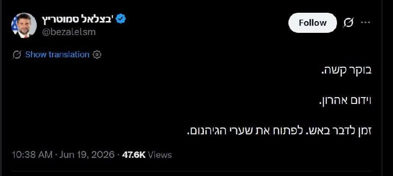

🔴اسموتریچ، وزیر دارایی اسرائیل: «وقت آن است که با آتش سخن بگوییم. دروازه‌های جهنم را بگشاییم.»
https://t.me/kianmeli1

## kianmeli1 — post 88079

  <a href="telegram/content/kianmeli1_88079_1781863476.mp4" target="_blank">🎬 Download video</a>

🔴مراسم کاروان جنیان در اصفهان
https://t.me/kianmeli1

## IranIntlTV — post 343185

یک شهروند با ارسال پیامی صوتی به ایران اینترنشنال،‌ درباره تفاهم و توافق با جمهوری اسلامی به دونالد ترامپ و معاونش جی‌دی‌ ونس انتقاد کرد و این کار را «دست گذاشتن در دست شیطان» خواند.

## DW_Farsi — post 126166

  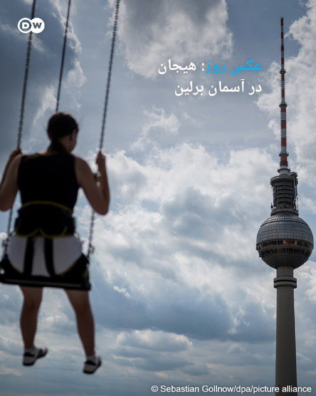

🎥 عکس روز: هیجان در آسمان برلین

زنی بر روی تاب "های سوینگ" که در ارتفاع حدود ۱۲۰ متری از سطح میدان الکساندر پلاتس نصب شده، در کنار برج تلویزیون برلین تاب می‌خورد. این جاذبه که بر فراز هتل "پارک این" قرار دارد، تجربه‌ای هیجان‌انگیز از تماشای پایتخت آلمان از ارتفاع را برای بازدیدکنندگان فراهم می‌کند.

@dw_farsi

## Persian_Trend_Official — post 17546

  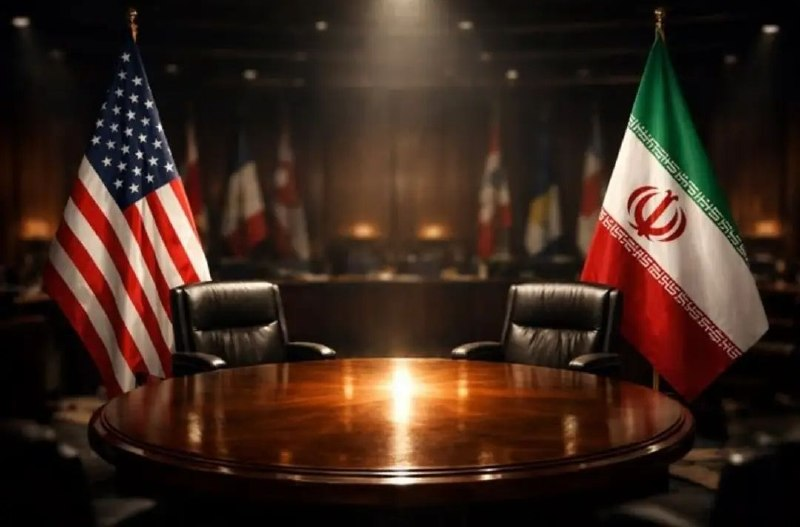

📺 سی‌ان‌ان: شرط ایران برای ازسرگیری مذاکرات؛ توقف درگیری‌ها در لبنان

🔹 شبکه سی‌ان‌ان به نقل از منابع آگاه گزارش داد ایران پیش از بازگشت به مذاکرات با آمریکا در سوئیس، خواستار دریافت تضمین‌هایی درباره توقف درگیری‌ها در لبنان شده است.

🔹 به گفته یک دیپلمات مطلع، تهران تأکید کرده است که هرگونه بازگشت به گفت‌وگوها باید همزمان با اجرای مفاد توافق مربوط به کاهش تنش در جبهه لبنان باشد. مذاکرات برنامه‌ریزی‌شده ایران و آمریکا در سوئیس به‌دلیل تحولات اخیر در لبنان به‌طور موقت به تعویق افتاده و هنوز زمان جدیدی برای ازسرگیری آن مشخص نشده است.

ادامه حملات اسرائیل به مناطق مختلف لبنان به گفته تحلیلگران، به یکی از گره‌های اصلی در مسیر پیشبرد هرگونه تفاهم دیپلماتیک تبدیل شده است.

🎯: پرونده لبنان به‌صورت مستقیم وارد معادلات دیپلماتیک ایران و آمریکا شده و می‌تواند نقش یک «متغیر تعیین‌کننده» در روند مذاکرات احتمالی آینده را ایفا کند. در چنین شرایطی، هرگونه تشدید یا کاهش تنش در لبنان می‌تواند به‌طور مستقیم بر مسیر گفت‌وگوهای هسته‌ای و منطقه‌ای اثر می‌گذارد.

👺 Phantom

📌 @persian_trend_official
پرشین ترند | متفاوت‌ترین کانال نظامی

## IranianMinds — post 22938

  <a href="telegram/content/IranianMinds_22938_1781863479.mp4" target="_blank">🎬 Download video</a>

وضعیتو

مراسم کاروان جنیان در اصفهان

@IranianMinds

## BBCPersian — post 284363

🔻وزیر خارجه فرانسه: مردم ایران میان سرکوب و بمباران، بزرگ‌ترین بازندگان جنگ‌ هستند

وزیر امور خارجه فرانسه گفته است که جهان نباید «کشتار» معترضان ایرانی در ماه ژانویه (دی ماه ۱۴۰۴) را فراموش کند و به گفته او مردم ایران «بزرگ‌ترین بازندگان جنگ و پیامدهای آن بوده‌اند.»

ژان نوئل بارو در گفت‌وگو با شبکه تلویزیونی فرانس‌اینفو گفت: «آن‌ها بزرگ‌ترین قربانی این جنگ هستند؛ مردمی که از یک سو گرفتار سرکوب و از سوی دیگر گرفتار بمباران‌ها شده‌اند.»

او افزود: «ما کشتارهای ژانویه را که طی آن، خشونت دولتی بدون تمایز، معترضان مسالمت‌آمیز را هدف قرار داد، فراموش نمی‌کنیم.»

https://bbc.in/4vgfIJP
@BBCPersian

## BBCPersian — post 284362

🔻نشست چهارجانبه وزرای خارجه عربستان، ترکیه و پاکستان به میزبانی مصر

وزارت امور خارجه مصر اعلام کرد که بدرعبدالعاطی، وزیر خارجه این کشور فردا میزبان همتایان خود از پاکستان، عربستان سعودی و ترکیه خواهد بود.

بر اساس بیانیه وزارت خارجه مصر، «آقای عبدالباطی روز یکشنبه در نشستی چهارجانبه با فیصل بن فرحان، هاکان فیدان و اسحاق دار وزیران خارجه عربستان سعودی،‌ ترکیه و پاکستان دیدار خواهد کرد. پس از این نشست، گفت‌وگوهای جامع‌تر و یک کنفرانس خبری مشترک برگزار خواهد شد.»

در این بیانیه به موضوع مذاکرات اشاره‌ای نشده است، اما این چهار کشور در تلاش‌های میانجی‌گرانه مرتبط با جنگ خاورمیانه نقش داشته‌اند.

وزرای امور خارجه این چهار کشور آخرین بار در ماه آوریل (سه ماه پیش) و در حاشیه یک نشست دیپلماتیک در شهر آنتالیا در ترکیه با یکدیگر دیدار کرده بودند.

نشست فردا پس از آن برگزار می‌شود که گفت‌وگوهای برنامه‌ریزی‌شده میان ایران و آمریکا در سوئیس، که قرار بود امروز برای پیگیری توافق دو کشور جهت پایان دادن به جنگ برگزار شود، بنا بر اعلام وزارت امور خارجه سوئیس به تعویق افتاد.

کاخ سفید هم تأیید کرد که سفر برنامه‌ریزی‌شده جی‌دی ونس، معاون رئیس‌جمهور آمریکا، به سوئیس برای شرکت در این مذاکرات لغو شده است.

تفاهم‌نامه بین آمریکا و ایران که به صورت آنلاین به امضای روسای جمهور ایران و آمریکا رسیده، با هدف پایان دادن به درگیری‌ها، بازگشایی تنگه هرمز و آغاز یک دوره ۶۰ روزه مذاکره درباره مسائل گسترده‌تر، از جمله برنامه هسته‌ای ایران، تنظیم شده است.

این تفاهم‌نامه قرار بود به درگیری‌ها در لبنان هم پایان دهد، اما درگیری‌ها میان نیروهای اسرائیلی و گروه حزب‌الله که مورد حمایت ایران است، همچنان ادامه دارد.

https://bbc.in/4vgfIJP
@BBCPersian

## Dirty_Kids — post 392565

  <a href="telegram/content/Dirty_Kids_392565_1781863479.mp4" target="_blank">🎬 Download video</a>

واقعاً آدم عوقش میگیره از هرچی رابطه هست !
پول ندی ، بقیه هستن بدن !
پول ندی ، چهار نفر میفرستن بالاسرت که خفتت کنن !
خدا نصیب هیچ کس نکنه اینارو...🤢

@Dirty_Kids 👻

## Dirty_Kids — post 392564

  

مطالعات نشون داده که فشار دادن باسن شریک زندگیتون یا دوستتون، باعث میشه سطح استرستون پایین بیاد و کیفیت رابطه ای که دارید خیلی بالا بره.

@Dirty_Kids 👻

## Dirty_Kids — post 392563

  <a href="https://t.me/Dirty_Kids/392563" target="_blank">📎 Download file</a>

ریتزوبت تنها سایت بین المللی میباشد ، که به صورت هفتگی پرومو کد دریافت میکنید ✅

♦️ آموزش شارژ حساب با کریپتو
♦️ آموزش شارژ حساب ریالی در ریتزوبت

🔵ریتزوبت برندی با لایسنس معتبر در صنعت شرطبندی و #پیشبینی مسابقات ورزشی و کازینویی 👇

https://t.me/+LB508WZyIr8xNmY0

## Dirty_Kids — post 392562

  

🏆مسابقات جام جهانی ۲۰۲۶ 🔥

⚽️ آمریکا 
🇺🇸 - استرالیا 
🇦🇺

⚽️ مراکش 
🇲🇦 - اسکاتلند 
🏴󠁧󠁢󠁳󠁣󠁴󠁿

⚽️ برزیل 
🇧🇷 - هائیتی 
🇭🇹

⚽️ ترکیه 
🇹🇷 - پاراگوئه 
🇵🇾

🚨 امشب نوبت به ستاره‌های بزرگ فوتبال جهان رسیده؛ از نیمار و برزیل گرفته تا تقابل جذاب آمریکا و استرالیا 🔥

🎯 دانلود اپلیکیشن بدون فیلتر اندروید
🎯 لینک ورود به ریتزوبت

💎 امکان شارژ حساب با کریپتو ، انواع ووچر و کارت بانکی. 
✅

🌍 ریتزوبت؛ همراه شب‌های فراموش‌نشدنی جام جهانی 2026
R29
🆔 @RitzoBet_ir

## alonews — post 129107

  <a href="telegram/content/alonews_129107_1781863482.webm" target="_blank">🎬 Download video</a>

👈قالیباف، رئیس تیم مذاکره‌کننده جمهوری اسلامی: مذاکرات با ایالات متحده همچنان در چارچوب «خطوط قرمز» تهران باقی خواهد ماند.

✅ @AloNews خبر جنگ

---
📅 بروزرسانی: 1405/03/29 13:24
---

## WithYashar — post 15313

مشاور هیئت مذاکره‌کننده ایرانی، مرندی:
نظام ترامپ به توافق پایبند نیست. و ایران در این شرایط یادداشت تفاهم را اجرا نخواهد کرد. اقتصاد آمریکا در معرض فروپاشی است و اسرائیل مجازات خواهد شد.
@withyashar

## pm_afshaa — post 94380

  <a href="telegram/content/pm_afshaa_94380_1781862871.webm" target="_blank">🎬 Download video</a>

🔴وزیر امور خارجه پاکستان: علت آغاز نشدن مذاکرات سوئیس به دغدغه مقامات ایرانی به مراسم ماه محرم مربوط میشه.

💧 Rainbet.com the #1 Non-KYC Crypto Casino & Sportsbook @rainbetcom

😁 @Pm_Afshaa

## pm_afshaa — post 94379

  <a href="telegram/content/pm_afshaa_94379_1781862871.webm" target="_blank">🎬 Download video</a>

🔴کانال 12 اسرائیل: در واکنش به نقض‌های مکرر از سوی حزب‌الله، ارتش اسرائیل بیش از 80 هدف رو در جنوب لبنان هدف قرار داد و ده‌ها نیروی حزب‌الله رو از بین برد.

💧 Rainbet.com the #1 Non-KYC Crypto Casino & Sportsbook @rainbetcom

😁 @Pm_Afshaa

## IranIntlTV — post 343184

  <a href="telegram/content/IranIntlTV_343184_1781862872.mp4" target="_blank">🎬 Download video</a>

لغو مذاکرات روز جمعه تهران و واشینگتن در بورگن‌اشتوک، ابهام‌هایی را درباره مرحله بعدی گفت‌وگوها ایجاد کرده است. وب‌سایت اکسیوس به نقل از یک مقام آمریکایی گزارش داد مواضع جمهوری اسلامی درباره آنچه نقض آتش‌بس در لبنان از سوی اسرائیل خوانده شده، ممکن است از دلایل برگزار نشدن این مذاکرات باشد.

احمد صمدی و مهران عباسیان، خبرنگاران ایران‌اینترنشنال، از بورگن‌اشتوک گزارش می‌دهند
@iranintltv

## Persian_Trend_Official — post 17544

  <a href="telegram/content/Persian_Trend_Official_17544_1781862874.mp4" target="_blank">🎬 Download video</a>

حملات هوایی اسرائیل در سراسر جنوب و شرق لبنان متوقف نشده است. تا کنون بیش از ۵۰ حمله انجام شده است. 
👺Phantom 📌 @persian_trend_official پرشین ترند | متفاوت‌ترین کانال نظامی

## Dirty_Kids — post 392561

🔴 پس از بمباران بیش از ۶۰ نقطه در جنوب لبنان در صبح امروز، کاتز وزیر دفاع اسرائیل اعلام کرد: ما آنها را مثل غزه نابود خواهیم کرد! به هیچکدام آواره‌های آنها (حداقل ۲۰۰ هزار نفر روستایی‌های شیعه هم‌مرز با اسرائیل و دست‌کم ۲۵۰ هزار آواره دیگر) اجازه نمی‌دهیم…

## Dirty_Kids — post 392560

  <a href="telegram/content/Dirty_Kids_392560_1781862875.mp4" target="_blank">🎬 Download video</a>

🔴 پس از بمباران بیش از ۶۰ نقطه در جنوب لبنان در صبح امروز، کاتز وزیر دفاع اسرائیل اعلام کرد:
ما آنها را مثل غزه نابود خواهیم کرد!
به هیچکدام آواره‌های آنها (حداقل ۲۰۰ هزار نفر روستایی‌های شیعه هم‌مرز با اسرائیل و دست‌کم ۲۵۰ هزار آواره دیگر) اجازه نمی‌دهیم برگردند.

هیچکس نمی‌تواند به ما بگوید چکار کنیم یا نکنیم!

ما به سوریه و جولانی که یک تروریست سابق است و اکنون کت و شلوار پوشیده نیازی نداریم.

@Dirty_Kids 👻

## Hranews — post 113716

  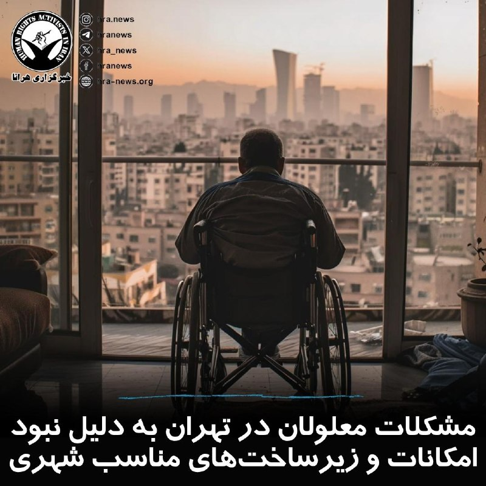

مناسب سازی معابر و فضاهای شهری، حمل‌ونقل عمومی و ساختمان‌ها یکی از مهمترین مشکلات افراد دارای معلولیت در تهران محسوب می شود. به گفته افرادی که از ویلچر استفاده می‌کنند، خروج از خانه در مواقع اضطراری، به دلیل وجود پله‌ها، نبود رمپ، قطعی برق در هنگام استفاده از آسانسورها زندگی آنها را مشکل‌ساز کرده و حتی جان این شهروندان را به خطر انداخته است.

کیانوش ذاکرحقیقی، استاد گروه شهرسازی دانشگاه آزاد واحد تهران جنوب در این خصوص به عصرایران گفت: مسئله فقط مربوط به افراد دارای معلولیت نیست، تهران حتی برای کودک، سالمند و در برخی موارد حتی برای عابر پیاده عادی هم مناسب نیست. وی همچنین تاکید کرد که تقریباً در هیچ‌ کدام از پارک‌های شهری امکانات مناسب برای کودکان دارای معلولیت یا کم‌توان وجود ندارد. حتی برای کودکان اوتیستیک نیز فضاهای شهری مناسب‌سازی نشده و محیط‌ها برای آن‌ها امن و پذیرنده نیست.

↘️
@hranews_bot تماس ✉️ -  @Hranews  کانال هرانا 🆑

## alonews — post 129106

  <a href="telegram/content/alonews_129106_1781862877.webm" target="_blank">🎬 Download video</a>

👈وزیر امور خارجه پاکستان: هیچ مانعی برای شروع مذاکرات سوئیس وجود ندارد/دلیل تأخیر در مذاکرات سوئیس مربوط به مشغول بودن مقامات ایرانی با آیین‌های ماه محرم است

✅ @AloNews خبر جنگ

## alonews — post 129105

  <a href="telegram/content/alonews_129105_1781862877.webm" target="_blank">🎬 Download video</a>

👈 سخنگوی ارتش اسرائیل: دقایقی پیش زیرساخت‌هایی متعلق به حزب‌الله را در منطقه بقاع را هدف قرار دادیم

✅ @AloNews خبر جنگ

## alonews — post 129104

  <a href="telegram/content/alonews_129104_1781862877.webm" target="_blank">🎬 Download video</a>

👈ارتش اسرائیل: بیش از ۸۰ نقطه تو لُبنان هدف قرار دادیم

✅ @AloNews خبر جنگ

---
📅 بروزرسانی: 1405/03/29 13:14
---

## VahidOOnLine — post 246361

  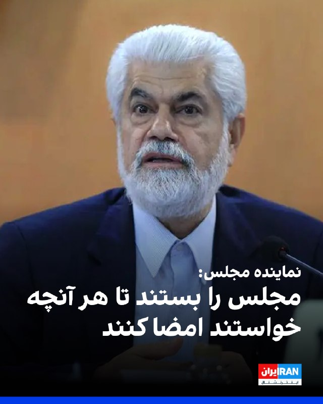

حسینعلی شهریاری، رییس کمیسیون بهداشت و درمان مجلس جمهوری اسلامی، با اشاره به ادامه «تعطیلی مجلس» گفت: «مجلس را بستند تا هر آنچه خواستند امضا کنند.»

او با تاکید بر اینکه تفاهم‌نامه با آمریکا در نهایت باید به تصویب مجلس برسد، افزود: «گذشت آن زمان که برجام را در ۲۰ دقیقه در مجلس تصویب کردند. ما یک بار از این موضوع آسیب دیده‌ایم و نباید دوباره همان اتفاق تکرار شود.»

شهریاری همچنین از اظهارات عباس عراقچی، وزیر خارجه جمهوری اسلامی، درباره احتمال رقیق‌سازی اورانیوم غنی‌شده انتقاد کرد و گفت موضوع هسته‌ای نباید در مذاکرات مطرح شود، زیرا به گفته او «جزو خطوط قرمز» جمهوری اسلامی است.
‌🏁 🇬🇧 IranintlTV

🤖 @VahidOOnLine

## WithYashar — post 15312

شبکه CNN به نقل از منابع آگاه اعلام کرد که پیش شرط ایران برای شروع مذاکرات در سوئیس توقف درگیری‌ها در لبنان است
@withyashar

## WithYashar — post 15311

توقیف یک دستگاه نیسان گاوی عجیب برای اهداف خاص توسط پلیس
@withyashar 🤯

## mwarmonitor — post 11195

🔸وزیر امور خارجه پاکستان اعلام کرد که دلیل آغاز نشدن مذاکرات سوئیس، به درگیر بودن برخی مقام‌های ایرانی با مراسم ماه محرم مرتبط است.

🔸 هیچ مانعی برای آغاز مذاکرات سوئیس وجود ندارد و مذاکرات باید طی ۶۰ روز به نتیجه برسد.

@mwarmonitor

## mwarmonitor — post 11194

🔴در واکنش به نقض‌های مکرر از سوی حزب‌الله، ارتش اسرائیل بیش از ۸۰ هدف را در جنوب لبنان هدف قرار داد و ده‌ها نیروی حزب‌الله را از بین برد. کانال ۱۲ اسرائیل

@mwarmonitor

## kianmeli1 — post 88078

  <a href="telegram/content/kianmeli1_88078_1781862257.mp4" target="_blank">🎬 Download video</a>

🔴استاد دانشگاه تهران: یک لیوان آب ۱۵ هزار تومان است یک لیتر بنزین ۳ هزار تومان!

کشور نیاز به مدیرانی دارد که جسارت و شجاعت تصمیم‌گیری داشته باشند
https://t.me/kianmeli1

## kianmeli1 — post 88077

‏🔴ارتش اسرائیل اعلام کرد از شب گذشته بیش از ۸۰ موضع حزب‌الله را هدف قرار داده است
https://t.me/kianmeli1

## IranIntlTV — post 343183

  <a href="telegram/content/IranIntlTV_343183_1781862259.mp4" target="_blank">🎬 Download video</a>

سرخط خبرهای جمعه ۲۹ خرداد
@iranintltv

## IranIntlTV — post 343182

  

حسینعلی شهریاری، رییس کمیسیون بهداشت و درمان مجلس جمهوری اسلامی، با اشاره به ادامه «تعطیلی مجلس» گفت: «مجلس را بستند تا هر آنچه خواستند امضا کنند.»

او با تاکید بر اینکه تفاهم‌نامه با آمریکا در نهایت باید به تصویب مجلس برسد، افزود: «گذشت آن زمان که برجام را در ۲۰ دقیقه در مجلس تصویب کردند. ما یک بار از این موضوع آسیب دیده‌ایم و نباید دوباره همان اتفاق تکرار شود.»

شهریاری همچنین از اظهارات عباس عراقچی، وزیر خارجه جمهوری اسلامی، درباره احتمال رقیق‌سازی اورانیوم غنی‌شده انتقاد کرد و گفت موضوع هسته‌ای نباید در مذاکرات مطرح شود، زیرا به گفته او «جزو خطوط قرمز» جمهوری اسلامی است.
https://iranintl.com/202606193017

## FarsiVOA — post 221176

  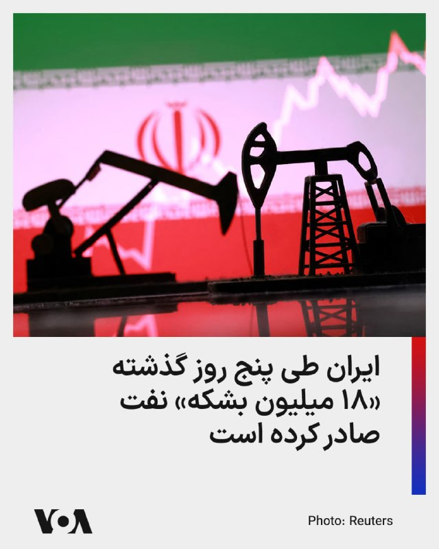

شرکت تانکر ترکرز می‌گوید جمهوری اسلامی طی پنج روز گذشته و با لغو محاصره دریایی ایالات متحده، ۱۸ میلیون بشکه نفت صادر کرده است.

صادرات نفت ایران از نیمه آوریل به مدت دو ماه به خاطر محاصره دریایی متوقف شده بود.

تانکر ترکرز می‌گوید ارزش نفتی که ایران طی پنج روز گذشته صادر کرده حدود ۱.۴۴ میلیارد دلار است.

طبق برآورد شرکت‌های ردیابی نفتکش‌ها، ایران قبل از محاصره دریایی بیش از ۶۰ میلیون بشکه نفت انبار شده در کشتی‌ها در آب‌های جنوب داشت.
@FarsiVOA

## RadioFarda — post 158498

  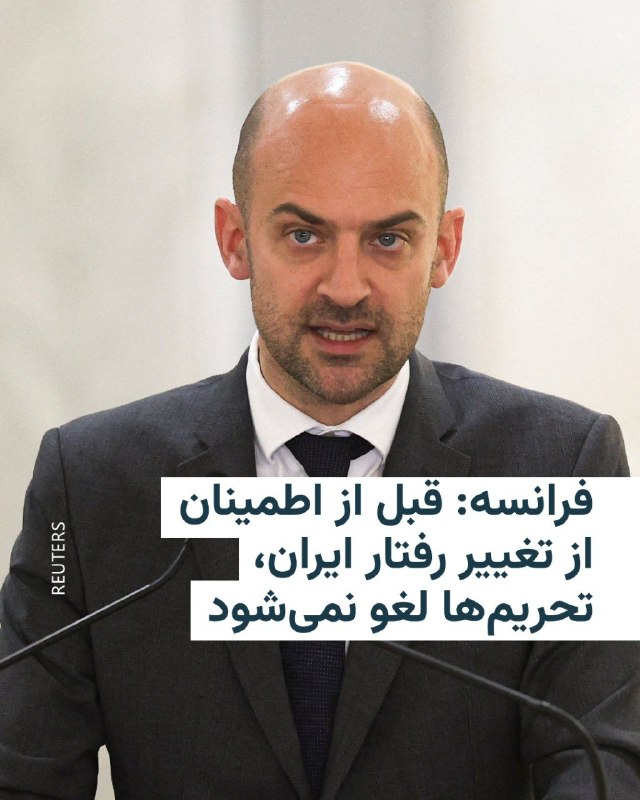

🔸 وزیر خارجه فرانسه می‌گوید پاریس تا زمانی که اطمینان حاصل نکند مذاکرات درباره برنامه هسته‌ای تهران انتظاراتش را برآورده می‌کند، با لغو تحریم‌های شورای امنیت سازمان ملل متحد علیه ایران موافقت نخواهد کرد.

🔸 ژان نوئل بارو روز جمعه ۲۹ خرداد این موضوع را اعلام کرد. فرانسه یکی از اعضای دارای حق وتوی شورای امنیت سازمان ملل است.

🔸 بارو گفت تا زمانی که مذاکرات آمریکا با ایران به ابهامات مربوط به برنامه موشک‌های بالستیک جمهوری اسلامی و حمایت تهران از نیروهای نیابتی پاسخ ندهد، ثباتی در منطقه برقرار نخواهد شد.

🔸 او افزود: «ما به یک تغییر اساسی در رویکرد ایران نیاز داریم.»

🔸 پیش از او نیز کایا کالاس، مسئول سیاست خارجه اتحادیه اروپا، گفته بود هنوز برای بحث درباره لغو تحریم‌های اتحادیه اروپا علیه ایران زود است و این موضوع پس از دستیابی به یک توافق هسته‌ای با ایران بررسی خواهد شد.

🔸 اتحادیه اروپا در حال حاضر مجموعه‌ای از تحریم‌های چندجانبه علیه بیش از ۷۰۰ فرد و نهاد در ایران اعمال کرده است که شامل ممنوعیت سفر و مسدود شدن دارایی‌ها می‌شود.

@RadioFarda

## alonews — post 129103

  <a href="telegram/content/alonews_129103_1781862262.webm" target="_blank">🎬 Download video</a>

👈شبکه سی‌ان‌ان به نقل از منابع آگاه اعلام کرد که پیش شرط ایران برای شروع مذاکرات در سوئیس توقف درگیری‌ها در لبنان است

✅ @AloNews خبر جنگ

## alonews — post 129102

👈وزیر دفاع اسرائیل، اسرائیل کاتز:
چرا ما در سوریه در طرف مقابل هستیم؟

🔴چون باید آنجا باشیم تا از خودمان در برابر آنچه در سوریه می‌بینیم محافظت کنیم

✅ @AloNews خبر جنگ

---
📅 بروزرسانی: 1405/03/29 13:05
---

## WithYashar — post 15310

  <a href="telegram/content/WithYashar_15310_1781861754.mp4" target="_blank">🎬 Download video</a>

حساب رسمی‌کاخ سفید: دیروز ترامپ تو نشست سران جی7 وقتی وارد شد بلند گفت رئیس منم
@withyashar

## WithYashar — post 15309

  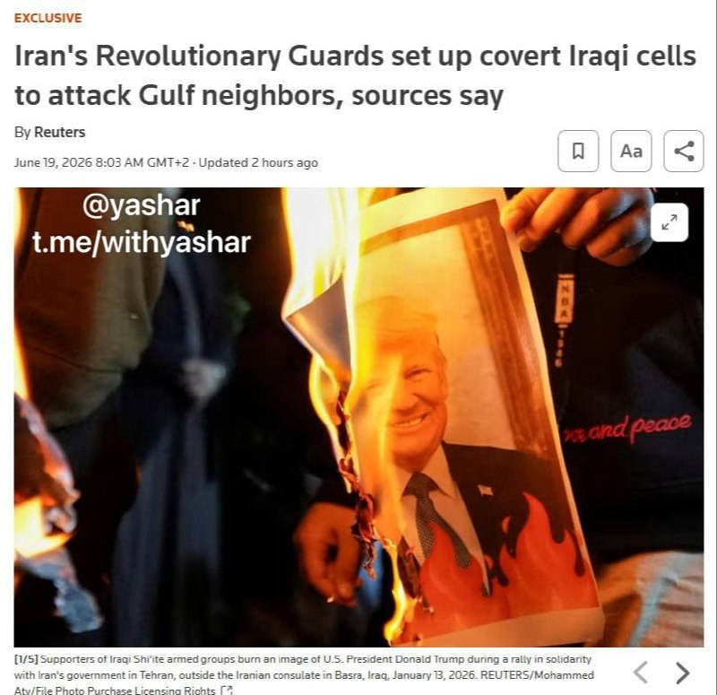

رویترز: ۳پا چندین سلول مخفی در عراق ایجاد کرده است تا حملاتی علیه کشورهای خلیج فارس که میزبان نیروهای آمریکایی هستند انجام دهد، که خارج از ساختارهای فرماندهی سنتی شبه‌نظامیان عمل می‌کنند تا خطر شناسایی کاهش یابد
سه تا چهار سلول، هر کدام متشکل از حدود ده مبارز شیعه عراقی نخبه، حداقل هفت حمله پهپادی بین ۲۰ آوریل تا ۱۷ مه علیه اهدافی در کویت، عربستان سعودی و… از محل‌های پرتاب نزدیک بصره و سماوه انجام دادند.
برخی اعضا از مقاومت اسلامی در عراق جذب شده‌اند، اما سلول‌های جدید مستقیماً به سپاه پاسداران گزارش می‌دهند نه به رهبری شبه‌نظامیان مستقر.
@withyashar

## mwarmonitor — post 11193

  <a href="telegram/content/mwarmonitor_11193_1781861757.mp4" target="_blank">🎬 Download video</a>

🔴حملات هوایی در جنوب لبنان همچنان ادامه دارد.

@mwarmonitor

## mwarmonitor — post 11192

🔴به گفته یک دیپلمات آگاه که با CNN گفت‌وگو کرده است، ایران خواستار تضمین‌هایی شده که پیش از ازسرگیری مذاکرات با آمریکا در سوئیس، درگیری‌ها در لبنان پایان یابد.

@mwarmonitor

## mwarmonitor — post 11191

🔴به گفته سه منبع آگاه که با فایننشال تایمز صحبت کرده‌اند، مذاکرات میان ایران و آمریکا در سوئیس به دلیل حملات هوایی اسرائیل به جنوب لبنان به تعویق افتاده است. این منابع افزودند که ایران به‌دلیل این حملات، هیأتی را برای گفت‌وگوهای هسته‌ای به سوئیس اعزام نکرد.

📝حملات اسرائیل به جنوب لبنان، بساط خیمه‌شب‌بازیِ دیپلماسی در سوئیس را چنان به هم ریخت که هیأت ایرانی حتی زحمت هدر دادن چایِ سوئیسی را هم به خود نداد و مذاکرات هسته‌ای به تعویق افتاد. حالا بچه شیعه قشنگ رگ خواب این عجوزهٔ املاکی، را دست گرفته؛ غولِ پوشالیِ نیویورک که روزی عربدهٔ «معاملهٔ بزرگ» سر می‌داد، حالا به چنان خفت و پفیوزی افتاده که مثل یک کارگزار دست‌نشانده، هر چه برایش دیکته کنند را با دم تکان دادن اجرا می‌کند. این تاجرِ ورشکسته و آویزان، تمام هیمنهٔ نداشته‌اش را باخته و با آگاهی کامل تن به این ذلت داده است. وضعیت این موجودِ حقیر آن‌قدر مضحک است که به قول جیمی کیمل، دور از انتظار نیست در آینده‌ای نزدیک، ملانیا هم توی خانه تنگه را به رویش ببندد و این پیرمردِ مفلوک را در تحریم مطلقِ خانگی بپوشاند؛ پادشاهِ بی‌تاج‌وتختی که هم در زمینِ سیاست ضربه‌فنی شده و هم در اتاق خوابش منزوی!

@mwarmonitor

## pm_afshaa — post 94378

  <a href="telegram/content/pm_afshaa_94378_1781861758.webm" target="_blank">🎬 Download video</a>

🔴یک سناتور جمهوری‌خواه به سی‌ان‌ان:
در میان جمهوری‌خواهان سنا «سطح بالایی از ناامیدی و نارضایتی» در ارتباط با تفاهم‌نامه آمریکا و جمهوری اسلامی وجود داره.

بعید میدونم جمهوری اسلامی در نهایت با توافق نهایی موافقت کنه.

💧 Rainbet.com the #1 Non-KYC Crypto Casino & Sportsbook @rainbetcom

😁 @Pm_Afshaa

## pm_afshaa — post 94377

  <a href="telegram/content/pm_afshaa_94377_1781861759.webm" target="_blank">🎬 Download video</a>

🔴سی‌ان‌ان: جمهوری اسلامی خواستار تضمین‌هایی شده که پیش از ازسرگیری مذاکرات با آمریکا در سوئیس، درگیری‌ها در لبنان پایان یابد.

💧 Rainbet.com the #1 Non-KYC Crypto Casino & Sportsbook @rainbetcom

😁 @Pm_Afshaa

## pm_afshaa — post 94376

  <a href="telegram/content/pm_afshaa_94376_1781861759.webm" target="_blank">🎬 Download video</a>

🔴با خبر لغو مذاکرات آمریکا و جمهوری اسلامی و حملات اسرائیل به لبنان، بازار ارز دوباره صعودی شد و تتر با جهشی سنگین از 153 هزار تومان به 162 هزار تومان رسید.

💧 Rainbet.com the #1 Non-KYC Crypto Casino & Sportsbook @rainbetcom

😁 @Pm_Afshaa

## pm_afshaa — post 94375

  <a href="telegram/content/pm_afshaa_94375_1781861760.mp4" target="_blank">🎬 Download video</a>

🔴مردمی که پس از اعلام آتش‌بس ترامپ به جنوب لبنان برگشته بودن، با حملات امروز اسرائیل دوباره مجبور به فرار شدن :

💧 Rainbet.com the #1 Non-KYC Crypto Casino & Sportsbook @rainbetcom

😁 @Pm_Afshaa

## IranIntlTV — post 343181

  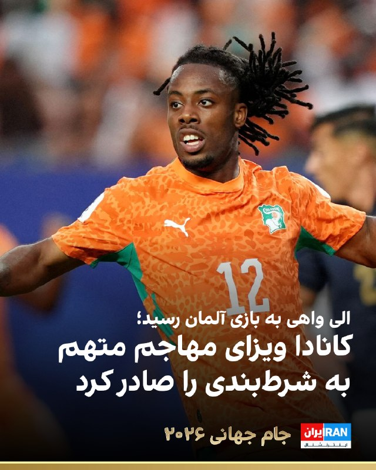

🔻فدراسیون فوتبال ساحل عاج اعلام کرد مشکل اداری الی واهی حل شده و او با دریافت ویزای کانادا، می‌تواند در بازی حساس روز شنبه مقابل آلمان به اردوی تیم در تورنتو ملحق شود. این خبر تنها چند ساعت پس از اعلام رسمی این فدراسیون مبنی بر ممنوعیت ورود او به خاک کانادا منتشر شد.

🔹نام این مهاجم ۲۳ ساله اخیراً در پرونده تحقیقات مربوط به شرط‌بندی مشکوک روی یک کارت زرد در لیگ ۱ فرانسه مطرح شد. با این حال، وکیل واهی اعلام کرد او ماه گذشته تنها برای چند ساعت بازجویی و سپس آزاد شده است؛ فدراسیون ساحل عاج نیز حمایت کامل خود را از این بازیکن اعلام کرد.

🔹کانادا قوانین سخت‌گیرانه‌ای در زمینه صدور ویزا برای افراد دارای پرونده قضایی دارد. پیش از این، توماس پارتی، هافبک تیم ملی غنا نیز به دلیل اتهامات اخلاقی در بریتانیا و در نهایت صادر نشدن ویزایش، نتوانست تیمش را در کانادا همراهی کند. ساحل عاج در بازی نخست خود در جام جهانی ۱-۰ اکوادور را شکست داده بود.

@iranintltvsport

## DW_Farsi — post 126165

🎥 شادی جنجال‌برانگیز محبی و درگیری تماشاگران ایرانی

حرکت عجیب ملی‌پوش ایران محمد محبی پس از گلزنی مقابل نیوزلند جنجال‌های فراوانی را به دنبال داشته است. آیا حرکت او واقعا نمایانگر شلیک‌کردن به سمت تماشاگران با پرچم شیر و خورشید بود یا فقط یک شادی عادی؟ همکارمان فرید اشرفیان در این مورد و نیز درباره درگیری ایرانی‌های در حاشیه این بازی از لس‌آنجلس گزارش می‌دهد.

@dw_farsi

## IranianMinds — post 22937

  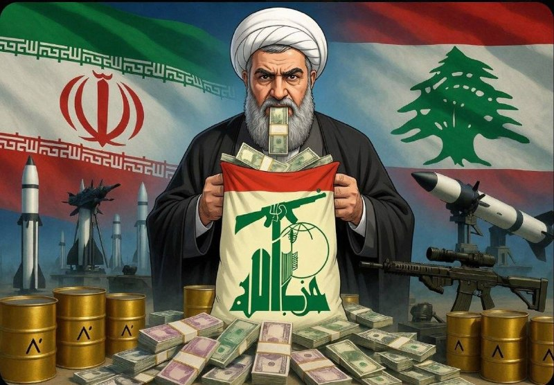

🔴 نیویورک پست :

جمهوری اسلامی در صورتی که‌ پول های بلوکه شدش آزاد شه قصد داره اون رو خرج بازسازی نیروهای نیابتیش در لبنان و عراق بکنه.

@IranianMinds

## idfinfarsi — post 11859

  <a href="telegram/content/idfinfarsi_11859_1781861763.mp4" target="_blank">🎬 Download video</a>

🔴در واکنش به نقض‌های مکرر توافق آتش‌بس از سوی حزب‌الله: ارتش اسرائیل بیش از ۸۰ هدف را مورد حمله قرار داد و ده‌ها تروریست از سازمان تروریستی حزب‌الله را در جنوب لبنان به هلاکت رساند

⭕️ارتش اسرائیل مدتی پیش دو مقر فرماندهی سازمان تروریستی حزب‌الله را در منطقه بقاع هدف قرار داد

⭕️ارتش اسرائیل مدتی پیش دو مقر فرماندهی را که تروریست‌های سازمان تروریستی حزب‌الله در آن فعالیت می‌کردند، در منطقه بقاع لبنان هدف قرار داد.

⭕️علاوه بر این، ارتش اسرائیل از ساعات شب گذشته تاکنون بیش از ۸۰ مقر فرماندهی، مواضع پرتاب و دیگر زیرساخت‌های تروریستی سازمان تروریستی حزب‌الله را در منطقه نبطیه و در چندین منطقه دیگر در محدوده امنیتی و فراتر از آن در جنوب لبنان مورد حمله قرار داده است.

⭕️همچنین، در جریان این حملات ده‌ها تروریست سازمان تروریستی حزب‌الله که در این مقرها فعالیت می‌کردند به هلاکت رسیدند.

⭕️این حملات در واکنش به نقض‌های مکرر توافق آتش‌بس از سوی سازمان تروریستی حزب‌الله انجام شد.

⭕️نیروهای ارتش اسرائیل به مأموریت خود در منطقه امنیتی جنوب لبنان ادامه می‌دهند و تمرکز ویژه‌ای بر انهدام زیرساخت‌های زیرزمینی راهبردی دارند که سازمان تروریستی حزب‌الله طی سال‌ها در منطقه بوفور ایجاد کرده است.

⭕️علاوه بر این، طی شب گذشته (جمعه)، ارتش اسرائیل شناسایی کرد که سازمان تروریستی حزب‌الله راکت‌هایی را به سمت نیروهای ارتش اسرائیل فعال در جنوب لبنان شلیک کرده است.
در یک چرخه عملیاتی سریع، ارتش اسرائیل دو تروریستی را که با موتورسیکلت از محل شلیک گریخته بودند به هلاکت رساند.
پس از آن، ارتش اسرائیل پرتابگری را که راکت‌ها از آن به سمت نیروها شلیک شده بود هدف قرار داده و منهدم کرد.

## alonews — post 129101

  <a href="telegram/content/alonews_129101_1781861765.mp4" target="_blank">🎬 Download video</a>

👈وزیر دفاع اسرائیل، اسرائیل کاتز:
یادتان می‌آید حملات را؟ آنها وارد می‌شدند و بیرون می‌آمدند.

🔴ما وارد می‌شویم، نابود می‌کنیم و ترک نمی‌کنیم. این کاری است که اکنون در لبنان انجام می‌دهیم

✅ @AloNews خبر جنگ

## alonews — post 129097

  <a href="telegram/content/alonews_129097_1781861767.webm" target="_blank">🎬 Download video</a>

👈حملات شدید به لبنان ادامه دارد

✅ @AloNews خبر جنگ

## alonews — post 129096

  <a href="telegram/content/alonews_129096_1781861768.webm" target="_blank">🎬 Download video</a>

👈بعد از پیام دیشب مجتبی خامنه ای دلار ۱۰هزار تومان و طلا ۱میلیون تومان گران‌تر شد

✅ @AloNews خبر جنگ

## alonews — post 129095

  <a href="telegram/content/alonews_129095_1781861768.webm" target="_blank">🎬 Download video</a>

👈 اسموتریچ، وزیر دارایی اسرائیل: «وقت آن است که با آتش سخن بگوییم. دروازه‌های جهنم را بگشاییم.»

✅ @AloNews خبر جنگ

## alonews — post 129094

  <a href="telegram/content/alonews_129094_1781861768.webm" target="_blank">🎬 Download video</a>

👈 وزیر دفاع اسرائیل، اسرائیل کاتز:
در لبنان، ۲۰۰٬۰۰۰ نفری که در «منطقه امنیتی» زندگی می‌کردند، بازنمی‌گردند.

🔴هیچ‌کدام از آن‌ها بازنمی‌گردند.

🔴نیروهای دفاعی اسرائیل آنجا هستند، زیرساخت‌ها را نابود می‌کنند و روستاها را ویران می‌کنند.

✅ @AloNews خبر جنگ

---
📅 بروزرسانی: 1405/03/29 12:55
---

## VahidOOnLine — post 246360

  <a href="telegram/content/VahidOOnLine_246360_1781861144.mp4" target="_blank">🎬 Download video</a>

⭕️اسرائیل از حمله به مواضع حزب‌الله در شرق لبنان خبر داد

♦️ارتش اسرائیل روز جمعه ۲۹ مردادماه اعلام کرد در پی کشته شدن چهار سرباز این کشور، مواضع و زیرساخت‌های حزب‌الله را در «دره بقاع» در شرق لبنان هدف قرار داده است.

در بیانیه ارتش اسرائیل آمده است: «این حملات در پاسخ به آنچه نقض مکرر آتش‌بس از سوی حزب‌الله و ادامه آماده‌سازی برای انجام حملات علیه نیروهای اسرائیلی خوانده شده، انجام شده است».

با وجود برقراری آتش‌بس میان اسرائیل و حزب‌الله، دو طرف همچنان یکدیگر را به نقض توافق آتش‌بس متهم می‌کنند.
ارتش اسرائیل در ماه‌های اخیر بارها اهدافی را در پایتخت، جنوب و شرق لبنان مورد حمله قرار داده و هشدار داده است که در برابر هرگونه تهدید احتمالی حزب‌الله اقدام خواهد کرد.
‌🇸🇦 Indypersian

🤖 @VahidOOnLine

## WithYashar — post 15308

  <a href="telegram/content/WithYashar_15308_1781861146.mp4" target="_blank">🎬 Download video</a>

وزیر دفاع اسرائیل، اسرائیل کاتز:حملات را یادتان هست؟ آنها وارد می‌شدند و بیرون می‌آمدند.ما وارد می‌شویم، نابود می‌کنیم و آنجا را ترک نمی‌کنیم. این کاری است که ما اکنون در لبنان انجام می‌دهیم.
@withyashar

## WithYashar — post 15307

  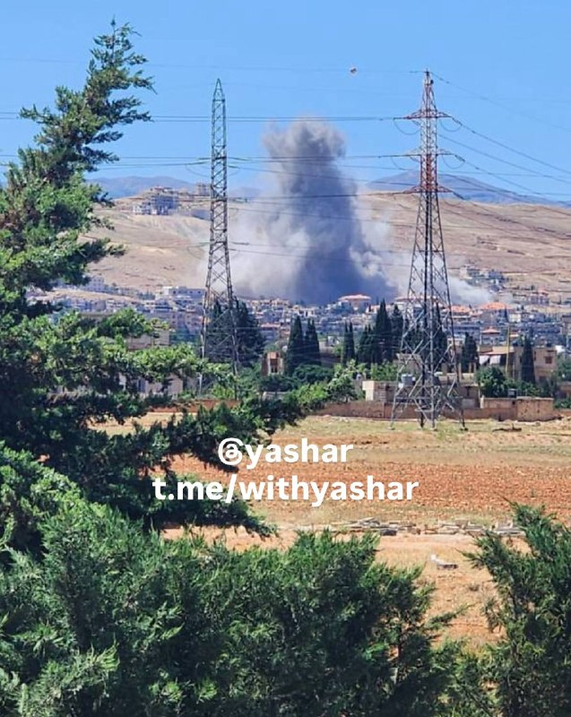

حملات ارتش اسرائیل ساعاتی پیش در بعلبک، در عمق حدود ۸۵ کیلومتری در عمق لبنان. حمله‌ای غیرمعمول در عمق آن - ارتش اسرائیل در ماه‌های اخیر تقریباً در دره لبنان و منطقه بعلبک حمله نکرده است
@withyashar

## pm_afshaa — post 94371

  <a href="telegram/content/pm_afshaa_94371_1781861150.mp4" target="_blank">🎬 Download video</a>

🔴جنگنده‌های اسرائیل ساعتی پیش حملات گسترده‌ای رو در بعلبک در شمال‌شرق لبنان هدف قرار دادن.

💧 Rainbet.com the #1 Non-KYC Crypto Casino & Sportsbook @rainbetcom

😁 @Pm_Afshaa

## kianmeli1 — post 88076

🔴مذاکرات صلح ایران و آمریکا در سوئیس به تعویق افتاد
https://t.me/kianmeli1

## kianmeli1 — post 88075

  <a href="telegram/content/kianmeli1_88075_1781861151.mp4" target="_blank">🎬 Download video</a>

🔴لبنان زیر آتش اسراییل
https://t.me/kianmeli1

## IranIntlTV — post 343180

  <a href="telegram/content/IranIntlTV_343180_1781861153.mp4" target="_blank">🎬 Download video</a>

شورای مرکزی کانون صنفی استادان دانشگاهی ایران از برگزاری تجمع اعتراضی اعضای هیئت علمی وزارت علوم و بهداشت مقابل سازمان برنامه و بودجه در اعتراض به اجرا نشدن مصوبه ترمیم حقوق خبر داد. هم‌زمان، بر اساس گزارش رسیده به ایران‌اینترنشنال، دانش‌آموزان پایه‌های یازدهم و دوازدهم نیز با انتشار بیانیه‌ای از برگزاری تجمع در روز شنبه خبر داده‌اند.

جزییات بیشتر در گفت‌وگو با لیلا سعادتی، عضو تحریریه ایران‌اینترنشنال
@iranintltv

## IranIntlTV — post 343179

  <a href="telegram/content/IranIntlTV_343179_1781861155.mp4" target="_blank">🎬 Download video</a>

حزب‌الله لبنان با انتشار بیانیه‌ای اعلام کرد سه تانک ارتش اسرائیل را با موشک‌های هدایت‌شونده هدف قرار داده و آن‌ها را به آتش کشیده است. چهار نفر از نیروهای ارتش اسرائیل در این حمله کشته شدند.

اشکان صفایی، خبرنگار ایران‌اینترنشنال، گزارش می‌دهد
@iranintltv

## Shin_Persian — post 7128

Open Source Intel ✓ @Osint613
Fri, 19 Jun 2026 08:49:51 UTC

HEZBOLLAH CEASEFIRE UPDATE:

Here are all the Hezbollah attacks on Israel between June 17 and June 18:

• 25 separate attacks
• 63 rockets
• 1 missile
• 7 explosive UAV attacks
• 2 IED attacks
• 1 terrorist infiltration attempt involving 5 operatives

In total, 72 munitions and attack events were recorded over 48 hours.

Despite the ceasefire and ongoing diplomatic efforts, Hezbollah continued to launch rockets, drones, and other attacks against Israel throughout the last 2 days.

ترجمه خودکار فارسی

به‌روزرسانی آتش‌بس حزب‌الله:

در اینجا تمامی حملات حزب‌الله به اسرائیل بین ۱۷ ژوئن تا ۱۸ ژوئن آورده شده است:

• ۲۵ حمله جداگانه
• ۶۳ راکت
• ۱ موشک
• ۷ حمله پهپاد انفجاری
• ۲ حمله با بمب‌های کنار جاده‌ای (IED)
• ۱ تلاش برای نفوذ تروریستی شامل ۵ عملیاتی

در مجموع، ۷۲ مهمات و حادثه تهاجمی طی ۴۸ ساعت ثبت شده است.

علیرغم آتش‌بس و تلاش‌های دیپلماتیک مداوم، حزب‌الله در طول ۲ روز گذشته به پرتاب راکت، پهپاد و سایر حملات علیه اسرائیل ادامه داد.

𝕏 · @shin_persian

## DW_Farsi — post 126164

🔶 سازمان حقوق بشر ایران از اعدام گروهی دستکم ۱۰ زندانی خبر داد

"سازمان حقوق بشر ایران" مستقر در نروژ از اجرای حکم اعدام گروهی دستکم ۱۰ زندانی به اتهام "قتل عمد" و جرائم مربوط به "مواد مخدر" در عرض پنج روز در زندان قزلحصار کرج خبر داد.

این سازمان پنج‌شنبه ۲۸ خرداد در گزارشی اعلام کرد هشت زندانی که با اتهام "قتل عمد" به قصاص نفس محکوم شده بودند، سحرگاه شنبه ۲۳ خرداد در این زندان به دار آویخته شدند. به گفته این سازمان هویت سه تن از زندانیان اعدام‌شده به نام‌های امیرعباس دکامی، اکبر بنی‌هاشم و مهدی مرادیان احراز شده، اما احراز هویت پنج تن دیگر همچنان در دست بررسی است.

سازمان حقوق بشر ایران همچنین از اجرای حکم اعدام دستکم دو زندانی دیگر به نام‌های علیرضا احمدی و نامدار باقری در روز دوشنبه ۲۵ خرداد خبر داده و نوشته است این دو با اتهامات مربوط به "مواد مخدر" به اعدام محکوم شده بودند.

@dw_farsi

## Persian_Trend_Official — post 17543

🔥حمله پهپاد روسی Geran-2 به ایستگاه برق ۱۱۰ کیلوولت در شهر زولوچیف، استان خارکف

👺Phantom

📌 @persian_trend_official
پرشین ترند | متفاوت‌ترین کانال نظامی

## Persian_Trend_Official — post 17541

🕸️پنتاگون: درخواست بودجه ۸۰ میلیارد دلاری مرتبط با سناریوی جنگ با ایران

📰 روزنامه وال‌استریت ژورنال گزارش داد پنتاگون در جلسه‌ای محرمانه با قانون‌گذاران آمریکایی اعلام کرده به حدود ۸۰ میلیارد دلار بودجه اضافی برای پوشش هزینه‌های احتمالی «درگیری با ایران» و سایر سناریوهای نظامی نیاز دارد.
🔹 این درخواست در حالی مطرح شده که بخش مهمی از آن به تقویت آمادگی‌های نظامی، پشتیبانی عملیاتی و هزینه‌های احتمالی یک جنگ گسترده در منطقه مرتبط دانسته می‌شود.
🔹 طبق این گزارش، مقامات دفاعی آمریکا تأکید کرده‌اند افزایش سطح تنش‌ها در خاورمیانه و الزامات عملیاتی جدید، فشار قابل توجهی بر بودجه فعلی پنتاگون وارد کرده است.

⚔️:درخواست بودجه فوق‌العاده سنگین در چنین سطحی، نشان‌دهنده آن است که سناریوهای درگیری گسترده همچنان در محاسبات دفاعی واشنگتن فعال است و نگاه راهبردی آمریکا نسبت به پرونده ایران همچنان در سطح «بحران بالقوه نظامی» تعریف می‌شود.

👺Phantom

📌 @persian_trend_official
پرشین ترند | متفاوت‌ترین کانال نظامی

## BBCPersian — post 284361

🔻نگاهی به مهترین خبرهای مرتبط با تحولات ایران تا این لحظه

▪️وزارت خارجه سوئیس اعلام کرد که نشست برنامه‌ریزی‌شده میان ایالات متحده و جمهوری اسلامی ایران که قرار بود روز جمعه در بورگن‌اشتوک برگزار شود، لغو شده است.

▪️خبرگزاری تسنیم، نزدیک به سپاه پاسداران، خبر داده است که مذاکره‌کنندگان ایرانی پیش از آغاز دور بعدی گفت‌وگوهای صلح نیاز دارند؛ نشانه‌هایی از اجرای توافق موقت از سوی آمریکا مشاهده کنند.

▪️خبرگزاری ملی لبنان می‌گوید در حملات اسرائیل به شهرک‌های شرقیه، حاروف، کفررمان، کفرجوزو کفرصیر در جنوب این کشور دست‌کم ۱۶ نفر کشته شده‌اند.بند اول تفاهم‌نامه ایران و آمریکا، پایان فوری و دائمی عملیات نظامی در همه جبهه‌ها، از جمله لبنان را تضمین می‌کرد.

▪️محمدباقر قالیباف، رئیس هیئت ایران در مذاکرات با آمریکا، در واکنش به پیام منسوب به مجتبی خامنه‌ای در ایکس نوشته است که ایران در صورت «بدعهدی، پیمان‌شکنی و زیاده‌خواهی طرف مقابل» تردیدی در پاسخ کوبنده ندارد.

▪️بنیامین نتانیاهو، نخست‌وزیر اسرائیل، یک بار دیگر تاکید کرده است که بنا ندارد ارتش اسرائیل را از جنوب لبنان و آنچه «منطقه حائل امنیتی» خوانده می‌شود عقب بخواند.

https://bbc.in/4vgfIJP
@BBCPersian

## alonews — post 129092

  <a href="telegram/content/alonews_129092_1781861157.mp4" target="_blank">🎬 Download video</a>

👈اسرائیل علیرغم اظهارات دیروز ترامپ و ونس، همچنان به بمباران لبنان ادامه می‌دهد.

✅ @AloNews خبر جنگ

---
📅 بروزرسانی: 1405/03/29 12:45
---

## VahidOOnLine — post 246359

  <a href="telegram/content/VahidOOnLine_246359_1781860511.mp4" target="_blank">🎬 Download video</a>

برای دهه‌ها، رابطه آمریکا و اسرائیل یکی از باثبات‌ترین اتحادهای سیاسی جهان بود.

اما امروز پرسش جدیدی مطرح شده است: آیا در دوران «اول آمریکا»، حتی نزدیک‌ترین متحدان واشنگتن نیز باید خود را با اولویت‌های آمریکا تطبیق دهند؟

از انتقادهای اخیر دونالد ترامپ از اسرائیل تا هشدار کم‌سابقه جی‌دی ونس به منتقدان اسرائیلی توافق با ایران، نشانه‌هایی دیده می‌شود که شاید این رابطه وارد مرحله‌ای جدید شده باشد.

در این قسمت از پادکست منوتو، نگاهی داریم به تاریخ روابط آمریکا و اسرائیل، اختلافات گذشته و این پرسش که آیا آنچه امروز می‌بینیم یک تنش موقت است یا آغاز تغییری بزرگ‌تر.
‌🏁 🇬🇧 ManotoTV

🤖 @VahidOOnLine

## WithYashar — post 15306

  <a href="telegram/content/WithYashar_15306_1781860514.mp4" target="_blank">🎬 Download video</a>

وزیر دفاع اسرائیل، اسرائیل کاتز، درباره لبنان:تمام خط اول روستاهای لبنان ویران شده است.ما در حال ویران کردن تمام خانه‌ها هستیم. ساکنان دیگر هرگز آنها را در مقابل چشمان خود نخواهند دید.
@withyashar

## mwarmonitor — post 11190

🔴ایران طی پنج روز گذشته نزدیک به ۱۸ میلیون بشکه نفت خام (معادل حدود ۱٫۴۴ میلیارد دلار) صادر کرده است.
TANKER TRACKER

@mwarmonitor

## mwarmonitor — post 11189

🔴دیوید آلبرایت: بحث درباره رقیق‌سازی

🔰با توجه به سناریوهای گریز هسته‌ای و عدم قطعیت درباره ذخایر سانتریفیوژهای ایران، اگر بر اساس این یادداشت تفاهم (MOU) انتقال ذخایر اورانیوم به خارج از کشور از گزینه‌ها حذف شود، ضرورت دارد که تمام ذخایر اورانیوم غنی‌شده ایران تا سطح اورانیوم طبیعی رقیق (downblend) شوند. در غیر این صورت، خطر یک چرخه بی‌ثبات‌کنندهِ نوسانی وجود دارد: رقیق‌سازی، و سپس بازغنی‌سازی نسبتاً سریع—که بخشی از آن می‌تواند در یک تأسیسات غنی‌سازی مخفی انجام شود—اگر ایران حتی یک توان کوچک سانتریفیوژی را بازسازی کند.

به‌طور کلی درباره رقیق‌سازی یا «رقیق کردن» صحبت کردم و بخشی از بحث به تعیین سطح نهایی غنی‌سازی اختصاص داشت. اکنون می‌خواهم محاسباتی ارائه دهم که پیامدهای گریز هسته‌ایِ حالت‌های نهایی مختلف رقیق‌سازی را نشان می‌دهد.

رقیق‌سازی یک محصول اورانیوم غنی‌شده با اورانیوم تهی‌شده می‌تواند آن را به هر سطحی از اورانیوم طبیعی به بالا کاهش دهد؛ اورانیوم طبیعی ۰٫۷ درصد اورانیوم-۲۳۵ دارد، در حالی که اورانیوم با غنای ۶۰ درصد، ۶۰ درصد اورانیوم-۲۳۵ دارد (باقی آن تقریباً همگی اورانیوم-۲۳۸ است). رقیق‌سازی اورانیوم غنی‌شده در قالب هگزا‌فلوراید نسبتاً ساده است، اما باید در یک تأسیسات کوچک با تجهیزات کافی انجام شود تا محتویات مخازنِ اورانیوم غنی‌شده و اورانیوم تهی‌شده گرم و مخلوط شوند، دو گاز با هم ترکیب شوند، مخلوط در یک مخزن رسوب داده شود و همه این مراحل با ایمنی و ملاحظات بحرانیّت به‌درستی انجام گیرد.

برخی سطوح احتمالی پس از رقیق‌سازی را در نظر بگیریم: اورانیوم طبیعی، ۳٫۶۷ درصد (سطح برجام) و ۲۰ درصد.

گریز هسته‌ای مستلزم به‌کارگیری سانتریفیوژهاست؛ تجهیزاتی که در ایران کمیاب شده‌اند. با توجه به تخریب گسترده برنامه سانتریفیوژها، ایران چه تعداد سانتریفیوژ می‌تواند به کار اندازد؟ ممکن است ایران ذخیره‌ای از سانتریفیوژهای سالم و قابل استقرار—از جمله IR-6 به‌عنوان پیشرفته‌ترین مدل تولیدی—داشته باشد. همچنین ممکن است مذاکرات به توافقی بینجامد که اجازه تکمیل و استقرار همین تعداد یا حتی بیشتر را بدهد. افزون بر این، ممکن است MOU یا توافق فروبپاشد و ایران به بازسازی یک تأسیسات غنی‌سازی روی آورد.

در این محاسبات، فرض می‌کنم شش آبشار IR-6 (جمعاً ۱۰۴۴ سانتریفیوژ) با کارایی کمتر از حد بهینه به کار گرفته شوند.

همچنین زمان لازم برای تولید ۲۵ کیلوگرم اورانیوم با درجه تسلیحاتی (۹۰ درصد اورانیوم-۲۳۵)—که برای بسیاری از انواع سلاح هسته‌ای بیش از اندازه کافی است—بررسی می‌شود.

1. با شش آبشار IR-6 و شروع از ۳٫۶۷ درصد، تولید ۲۵ کیلوگرم اورانیوم با درجه تسلیحاتی ۴ تا ۵ ماه طول می‌کشد (با فرض کارکرد غیربهینه). برای مقایسه، ۱۲ آبشار (۲۰۸۸ سانتریفیوژ) می‌توانند این کار را در ۲ تا ۳ ماه انجام دهند.

2. اگر شروع از ۲۰ درصد باشد، با همان چیدمان، حدود یک ماه زمان لازم است.

3. اگر شروع از اورانیوم طبیعی باشد، با همان چیدمان، حدود ۱۵ ماه زمان می‌برد.

اگر به‌جای درجه تسلیحاتی، هدف تولید مقدار معادل اورانیوم ۶۰ درصد باشد، بازه‌های زمانی مشابه‌اند. مقدار معادل حدود ۴۲ کیلوگرم اورانیوم ۶۰ درصد است. به یاد داشته باشید که اورانیوم ۶۰ درصد ۹۹ درصد مسیر تا درجه تسلیحاتی را طی کرده است.

برای تکمیل بحث و یادآوری خطر حادِ اورانیوم ۶۰ درصد همراه با تعداد نسبتاً کمی سانتریفیوژ: اگر شروع از ۶۰ درصد باشد، با همان چیدمان، تولید ۲۵ کیلوگرم اورانیوم با درجه تسلیحاتی کمتر از دو هفته زمان می‌برد.

این محاسبات همچنین یادآور می‌شود که ایران از سال ۲۰۲۱ توانست مقدار زیادی اورانیوم ۶۰ درصد (۴۴۱ کیلوگرم) انباشته کند—کافی برای حدود ده سلاح هسته‌ای. رقیق‌سازی این مواد تا ۳٫۶۷ درصد یا ۲۰ درصد یا حتی اورانیوم طبیعی، این قابلیت ذاتی را از بین نمی‌برد؛ فقط زمان بازگشت به آن سطح را طولانی‌تر می‌کند، به‌ویژه اگر سانتریفیوژهای بیشتری وارد مدار شوند. سپس رسیدن به درجه تسلیحاتی به زمان بسیار کمی نیاز دارد.

اگر ذخایر اورانیوم نتوانند از ایران خارج شوند—که البته نتیجه‌ای نامطلوب است—راه‌حل ضروری، رقیق‌سازی تا سطح اورانیوم طبیعی خواهد بود.

@mwarmonitor

## mwarmonitor — post 11188

🔴 محمدباقر قالیباف، رئیس تیم مذاکره‌کننده ایران، اعلام کرد که مذاکرات با ایالات متحده همچنان در چارچوب «خطوط قرمز» تهران باقی خواهد ماند.

@mwarmonitor

## DEJradio — post 5815

  <a href="telegram/content/DEJradio_5815_1781860516.webm" target="_blank">🎬 Download video</a>

🚨📢 حملات سنگین اسرائیل به جنوب لبنان

در پی نقض آتش‌بس از سوی گروه تروریستی حـ.ـزب الله و کشته‌شدن ۴ نظامی اسرائیلی در پی این حمله، ارتش اسرائیل نقاطی از جمله دره بقاع، محل تجمع و برنامه‌ریزی این گروه را به‌شدت مورد حمله قرار داد.

#حزب_الله_لبنان #اسرائیل #جنگ
@DEJradio

## IranIntlTV — post 343178

  <a href="telegram/content/IranIntlTV_343178_1781860516.mp4" target="_blank">🎬 Download video</a>

حسین آقایی، عضو تحریریه ایران‌اینترنشنال، معتقد است سند تفاهم میان آمریکا و جمهوری اسلامی دارای نواقص جدی است و می‌تواند به کاهش اهرم‌های فشار واشینگتن بر تهران منجر شود. به گفته او، این رویکرد پیام نامناسبی به بازیگران بین‌المللی ارسال می‌کند، نگرانی‌های امنیتی اسرائیل و مطالبات بخشی از مخالفان جمهوری اسلامی را نادیده می‌گیرد و این تصور را ایجاد می‌کند که وضعیت حقوق بشر و سرکوب داخلی در ایران تاثیری بر روند تعاملات دیپلماتیک با آمریکا نداشته است.
@iranintlTV

## ManotoTV — post 106173

برای دهه‌ها، رابطه آمریکا و اسرائیل یکی از باثبات‌ترین اتحادهای سیاسی جهان بود.

اما امروز پرسش جدیدی مطرح شده است: آیا در دوران «اول آمریکا»، حتی نزدیک‌ترین متحدان واشنگتن نیز باید خود را با اولویت‌های آمریکا تطبیق دهند؟

از انتقادهای اخیر دونالد ترامپ از اسرائیل تا هشدار کم‌سابقه جی‌دی ونس به منتقدان اسرائیلی توافق با ایران، نشانه‌هایی دیده می‌شود که شاید این رابطه وارد مرحله‌ای جدید شده باشد.

در این قسمت از پادکست منوتو، نگاهی داریم به تاریخ روابط آمریکا و اسرائیل، اختلافات گذشته و این پرسش که آیا آنچه امروز می‌بینیم یک تنش موقت است یا آغاز تغییری بزرگ‌تر.

## FarsiVOA — post 221175

  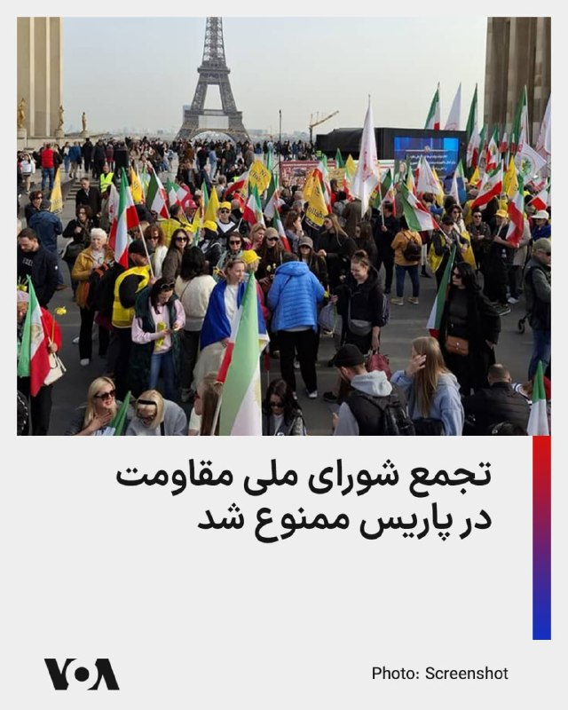

شورای ملی مقاومت ایران، از احزاب مخالف جمهوری اسلامی، مستقر در پاریس اعلام کرد که پلیس فرانسه تجمع این گروه را که قرار بود روز شنبه برگزار شود ممنوع کرده است.

شورای ملی مقاومت ایران روز جمعه در بیانیه‌ای اعلام کرد که نسبت به این تصمیم اعتراض خواهد کرد، اما توضیحی درباره دلایل ارائه‌شده برای این ممنوعیت ارائه نکرد.

این تظاهرات که ماه‌ها پیش مجوز آن صادر شده بود، اواخر شامگاه پنج‌شنبه ممنوع اعلام شده است.
@FarsiVOA

## IranianMinds — post 22936

  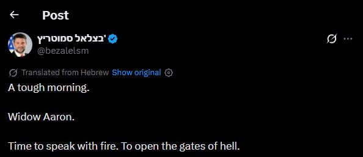

🔴 وزیر دارایی اسرائیل :

وقتش رسیده که فقط با آتش باهاشون حرف بزنیم و‌ دروازه های جهنم رو باز کنیم.

@IranianMinds

## IranianMinds — post 22935

  <a href="https://t.me/IranianMinds/22935" target="_blank">📎 Download file</a>

✈️ اپلیکیشن MelBet 
🥇

🎁 کد هدیه 100 دلاری: Sport100

🔒 برای تعیین رمز ورود حداقل از 8 کاراکتر و حروف بزرگ و کوچک انگلیسی و اعداد انگلیسی استفاده کنید، مانند Hamid120

🇮🇷 برای تغییر زبان برنامه، زبان موبایل خود را تغییر دهید.

✅ ورود به اپلیکیشن بدون فیلترشکن

## IranianMinds — post 22934

چرا این روزها همه سایت جهانی MelBet رو انتخاب میکنن 
⁉️

🎁 شارژ هدیه 130 دلاری اولین واریز

🎁 شارژ هدیه 100 دلاری در روز های یکشنبه و چهارشنبه

🎁 و ده ها بانس ارزنده دیگر...

🥇 متنوع ترین آپشن های ورزشی

🖥 پخش زنده مسابقات

🎮 بیش از 80 نوع ورزش مجازی با پخش زنده

⭐ کاملترین کازینو آنلاین

🛡 امنیت فوق العاده بالا

🌐 اسپانسر رسمی جام جهانی

💵 واریز آنی جوایز با بیش از 30 روش شارژ و برداشت، از جمله کارت بکارت

🎁 کد هدیه 100 دلاری: Sport100

✅ معرفی سایت و اپلیکیشن مل‌بت

💯 ورود به سایت مل‌بت (فیلترشکن خاموش)

## BBCPersian — post 284360

  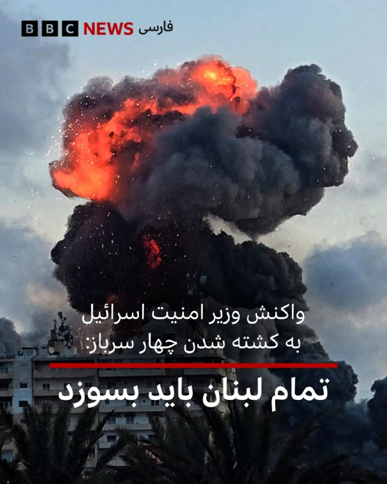

🔻ایتامار بن‌گویر،‌ وزیر امنیت ملی راست‌افراطی اسرائیل، روز جمعه پس از آن که ارتش اسرائیل از کشته شدن چهار سرباز خود در لبنان خبر داد، گفت: «تمام لبنان باید بسوزد.»

او در بیانیه‌ای گفت: «با تمام احترامی که برای آمریکایی‌ها قائلم، اسرائیل باید به‌روشنی به تمام جهان اعلام کند که خون فرزندان ما و امنیت شهروندانمان موضوع چانه‌زنی نیست. تمام لبنان باید بسوزد.»

📷Getty Images
https://bbc.in/4vgfIJP
@BBCPersian

## Hranews — post 113715

گزارشی از اعدام ۶ زندانی از جمله ۲ زن در زندان‌های مختلف

❗️
❗️
❗️
❗️
❗️– حکم شش زندانی از جمله دو زن که پیشتر در پرونده‌های مجزا از بابت اتهامات قتل و تجاوز به عنف به #اعدام محکوم شده بودند، در زندان‌های عادل آباد، شیراز، گرگان، قزوین و شیروان به اجرا در آمد.

ادامه مطلب

#خالق_شهریاری #امین_رجبیان #صادق_شیری #کیوان_رشیدیان #آسیه_فرهمند #زینب_زرینی

↘️
@hranews_bot تماس ✉️ -  @Hranews  کانال هرانا 🆑

## manototv — post 106173

  <a href="telegram/content/manototv_106173_1781860522.mp4" target="_blank">🎬 Download video</a>

برای دهه‌ها، رابطه آمریکا و اسرائیل یکی از باثبات‌ترین اتحادهای سیاسی جهان بود.

اما امروز پرسش جدیدی مطرح شده است: آیا در دوران «اول آمریکا»، حتی نزدیک‌ترین متحدان واشنگتن نیز باید خود را با اولویت‌های آمریکا تطبیق دهند؟

از انتقادهای اخیر دونالد ترامپ از اسرائیل تا هشدار کم‌سابقه جی‌دی ونس به منتقدان اسرائیلی توافق با ایران، نشانه‌هایی دیده می‌شود که شاید این رابطه وارد مرحله‌ای جدید شده باشد.

در این قسمت از پادکست منوتو، نگاهی داریم به تاریخ روابط آمریکا و اسرائیل، اختلافات گذشته و این پرسش که آیا آنچه امروز می‌بینیم یک تنش موقت است یا آغاز تغییری بزرگ‌تر.

## alonews — post 129090

  <a href="telegram/content/alonews_129090_1781860524.mp4" target="_blank">🎬 Download video</a>

👈شهر نبطیه در جنوب لبنان به ویرانه‌ای تبدیل شده است.

✅ @AloNews خبر جنگ

## alonews — post 129089

  <a href="telegram/content/alonews_129089_1781860525.mp4" target="_blank">🎬 Download video</a>

👈وزیر دفاع اسرائیل، اسرائیل کاتز:ارتش اسرائیل باید در آن سوی مرز، فراتر از مرز، از کشور اسرائیل در برابر سازمان‌های جهادی در لبنان، سوریه و غزه دفاع کند.ما از «مناطق امنیتی» - نه در سوریه، نه در غزه و نه در لبنان - خارج نخواهیم شد

✅ @AloNews خبر جنگ

## alonews — post 129088

  <a href="telegram/content/alonews_129088_1781860528.webm" target="_blank">🎬 Download video</a>

👈فارس به نقل از یک دیپلمات آگاه: ایران پیش از بازگشت به مذاکرات با آمریکا در سوئیس، خواستار دریافت تضمین‌هایی درباره پایان یافتن درگیری‌ها در لبنان شده است.

🔴تهران تأکید کرده است که توقف خصومت‌ها در لبنان باید مطابق مفاد توافق امضاشده اجرایی شود.

🔴میانجی‌ها در حال حاضر برای حل این موضوع و رفع اختلافات موجود تلاش می‌کنند.

🔴مذاکراتی که قرار بود میان ایران و آمریکا برگزار شود، در پی حملات اخیر اسرائیل به لبنان «به طور موقت به تعویق افتاده است»

✅ @AloNews خبر جنگ

---
📅 بروزرسانی: 1405/03/29 12:34
---

## VahidOOnLine — post 246358

  <a href="telegram/content/VahidOOnLine_246358_1781859893.mp4" target="_blank">🎬 Download video</a>

ویدیوی رسیده به ایران اینترنشنال نشان می‌دهد بستگان و دوستان جاویدنام مهدی حسینی، معترض کشته‌شده در انقلاب ملی در تهران، تولد او را روز پنجشنبه در کنار دیوار جاویدنامان در لندن گرامی داشتند.
‌🏁 🇬🇧 IranintlTV

🤖 @VahidOOnLine

## mwarmonitor — post 11187

🔴ایتامار بن‌گویر، وزیر امنیت ملی اسرائیل، خواستار تشدید گسترده تنش‌ها در لبنان شد و گفت:
«به ازای هر اشکِ یک مادر اسرائیلی، باید هزار مادر لبنانی گریه کنند. تمام لبنان باید بسوزد.»

بن‌گویر از اسرائیل خواست فشارهای خارجی، از جمله فشار آمریکا، را نادیده بگیرد و تأکید کرد که «واکنش‌های سنجیده» کافی نیست. او افزود:
«در خاورمیانه باید دیوانه‌وار عمل کرد. نابود کنید. تروریسم را شکست دهید.»

@mwarmonitor

## mwarmonitor — post 11186

🔴رویترز: مذاکرات صلح برنامه‌ریزی‌شده امروز میان ایالات متحده و ایران در سوئیس به تعویق افتاده است و معاون رئیس‌جمهور، جی‌دی ونس، نیز از برنامه سفر خود صرف‌نظر کرده است.

@mwarmonitor

## pm_afshaa — post 94370

🔴کاتز ، وزیر جنگ اسرائیل : ما از هیچ‌ منطقه امنیتی خارج‌ نخواهیم شد ، بلکه پیشروی نیز خواهیم‌ کرد

💧 Rainbet.com the #1 Non-KYC Crypto Casino & Sportsbook @rainbetcom

😁 @Pm_Afshaa

## pm_afshaa — post 94369

🔴کاتز ، وزیر جنگ اسرائیل : یادتان هست عملیات‌های قبلی را؟ می‌رفتند داخل و سریع برمی‌گشتند بیرون.

ما میرویم داخل، نابود می‌کنیم و دیگر خارج نمی‌شویم.
همین کاری است که الان در لبنان داریم انجام می‌دهیم

💧 Rainbet.com the #1 Non-KYC Crypto Casino & Sportsbook @rainbetcom

😁 @Pm_Afshaa

## pm_afshaa — post 94368

🔴کاتز ، وزیر جنگ اسرائیل : میدونید چه چیزی این جهادی ها و تروریست هارو خیلی‌ اذیت میکنه ؟

اینکه بیایم خانه و زندگیشان را نابود کنیم ! دقیقا همینکاری که ما داریم انجام میدیم

💧 Rainbet.com the #1 Non-KYC Crypto Casino & Sportsbook @rainbetcom

😁 @Pm_Afshaa

## pm_afshaa — post 94367

🟠کاتز ، وزیر‌ جنگ اسرائیل : ما هیچ‌ نیازی به جولانی رئیس جمهور سوریه یک تروریست کت و شلواری نداریم ، بهتره تو کار ما دخالت نکنه و تو کشور خودش بمونه وگرنه ما میایم و توی کار های اونا دخالت میکنیم

💧 Rainbet.com the #1 Non-KYC Crypto Casino & Sportsbook @rainbetcom

😁 @Pm_Afshaa

## IranIntlTV — post 343177

  <a href="telegram/content/IranIntlTV_343177_1781859895.mp4" target="_blank">🎬 Download video</a>

ویدیوی رسیده به ایران اینترنشنال نشان می‌دهد بستگان و دوستان جاویدنام مهدی حسینی، معترض کشته‌شده در انقلاب ملی در تهران، تولد او را روز پنجشنبه در کنار دیوار جاویدنامان در لندن گرامی داشتند.

## FarsiVOA — post 221174

  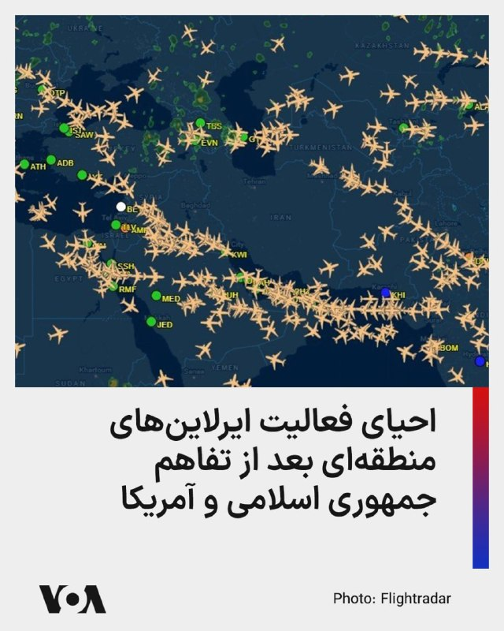

داده‌های هوانوردی نشان از احیای فعالیت ایرلان‌های منطقه‌ای بعد از توافق پایان جنگ جمهوری اسلامی و آمریکا دارد.

داده‌های «فلایت رادار ۲۴» نشان می‌دهد پروازهای شرکت‌های هواپیمایی بزرگ کشورهای حوزه خلیج فارس به سطح ۸۲ درصد پیش از آغاز جنگ جمهوری اسلامی و آمریکا رسیده است.

پروازهای شرکت‌های هواپیمایی کویت و بحرین به رغم حملات گسترده جمهوری اسلامی به فرودگاه‌های هر دو کشور، طی روزهای گذشته بطور کامل احیا شده است و پروازهای قطر ایرویز، هواپیمایی امارات و هواپیمایی اتحاد امارات متحده عربی -سه ایرلاین عمده منطقه- ۹۰ درصد احیا شده است.

با این حال مشکلات ایمنی و ریسک‌ها کماکان وجود دارد؛ به‌طوری که برای نمونه شرکت هواپیمایی فلای دبی با ۵۷ درصد ظرفیت فعال است.
@FarsiVOA

## DW_Farsi — post 126163

  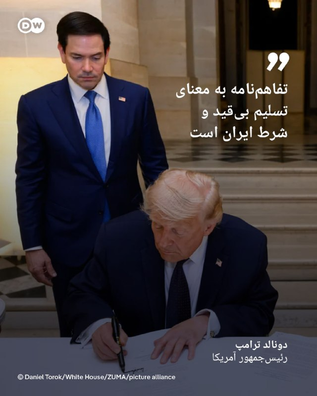

🔶 ترامپ: تفاهم‌نامه به معنای تسلیم بی‌قید و شرط ایران است

دونالد ترامپ، رئیس‌‌جمهور آمریکا، در مصاحبه‌ای با اکسیوس مدعی شد که توافق حاصل‌شده با جمهوری اسلامی به معنای "تسلیم بی‌قید و شرط" ایران است.

آمریکا و ایران روز پنج‌شنبه، پس از سه ماه و نیم درگیری نظامی که موجب بسته شدن تنگه هرمز و آشفتگی در بازارهای جهانی انرژی شده بود، این توافق را امضا کردند.

ترامپ در این مصاحبه که عصر پنج‌شنبه به وقت آمریکا انجام شد، گفت او برای دستیابی به این توافق مذاکره کرده تا مانع از آن شود که این درگیری، اقتصاد جهانی را به رکودی بزرگ بکشاند.

این تفاهم‌نامه شامل یک دوره ۶۰ روزه مذاکره برای رسیدن به توافق نهایی، بازگشایی تنگه هرمز و چارچوبی برای مذاکرات هسته‌ای است. بر اساس گزارش‌های منتشر شده به نقل از مقام‌های رسمی، مواردی از جزئیات مهم همچنان حل‌نشده باقی مانده‌اند و در مذاکرات بعدی بررسی خواهند شد.

@dw_farsi

## Persian_Trend_Official — post 17540

  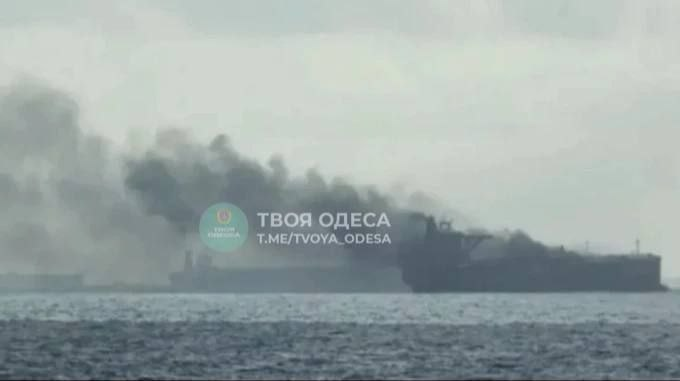

حمله پهپادی در دریای سیاه؛

🔹 گزارش‌ها حاکی است پهپادهای «Geran-2» توسط اپراتورهای روسی به دو کشتی در غرب دریای سیاه حمله کرده‌اند.
🔹 بر اساس این گزارش‌ها، در این حادثه یک عضو خدمه کشته و ۶ نفر دیگر زخمی شده‌اند.
🔹 جزئیات بیشتری درباره هویت کشتی‌ها، میزان خسارت و شرایط دقیق حمله هنوز به‌طور رسمی منتشر نشده است.

👺Phantom

📌 @persian_trend_official
پرشین ترند | متفاوت‌ترین کانال نظامی

## Persian_Trend_Official — post 17539

  

⭕️ جمهوری اسلامی برای پرستو احمدی به خاطر کنسرت کاروانسرا ۷۴ ضربه شلاق برید.

📝 Nick

📌 @persian_trend_official
پرشین ترند | متفاوت‌ترین کانال نظامی

## RadioFarda — post 158497

  <a href="telegram/content/RadioFarda_158497_1781859900.mp4" target="_blank">🎬 Download video</a>

🔸ارتش اسرائیل و حزب‌الله لبنان، یک روز پس از امضای رسمی توافق ایران و آمریکا برای پایان دادن به جنگ در خاورمیانه، هر دو از ادامه درگیری‌ها در جنوب لبنان خبر می‌دهند.

🔸ارتش اسرائیل روز جمعه ۲۹ خرداد اعلام کرد همچنان به حمله به «نیروها و زیرساخت‌های حزب‌الله» در چندین منطقه از جنوب لبنان ادامه می‌دهد. حزب‌الله لبنان هم می‌گوید در درگیری‌های جنوب این کشور سه تانک اسرائیلی را منهدم کرده است.

🔸حزب‌الله لبنان که تحت حمایت جمهوری اسلامی است، از سوی آمریکا یک سازمان تروریستی شناخته شده اما اتحادیه اروپا تنها شاخهٔ نظامی آن را تروریستی می‌داند.

🔸درگیری‌ها در روزهای اخیر در لبنان در میان مقامات دولت آمریکا هم بی‌واکنش نمانده است. در رأس آن‌ها دونالد ترامپ که در هفته‌های اخیر به‌طور فزاینده‌ای از تلفات بالای حملات اسرائیل، به‌ویژه علیه حزب‌الله لبنان، انتقاد کرده است.

🔸رئیس‌جمهور آمریکا روز پنج‌شنبه همچنین از اسرائیل و دیگر کشورهای خاورمیانه خواست به آتش‌بس پایبند بمانند.

@RadioFarda

## IranianMinds — post 22933

🔴 جی‌دی ونس سفر به سوئیس را لغو کرد؛ مذاکرات آمریکا و ایران لغو شد. @IranianMinds

## alonews — post 129087

چجوری یه مشکل رو از سر خودمون باز کنیم؟

اون کار رو استارت کنیم و اگه دیدیم داره خراب میشه بگیم علی الاصول نظر دیگری داشتم

اینجوری همه چی رو میتونیم بریزیم رو یکی دیگه و عزیز بمونیم

[@AloTweet]

## alonews — post 129086

  <a href="telegram/content/alonews_129086_1781859902.mp4" target="_blank">🎬 Download video</a>

👈وزیر دفاع اسرائیل، اسرائیل کاتز، درباره لبنان:تمام خط اول روستاهای لبنان ویران شده است.ما در حال ویران کردن تمام خانه‌ها هستیم. ساکنان دیگر هرگز آنها را در مقابل چشمان خود نخواهند دید.

✅ @AloNews خبر جنگ

## alonews — post 129083

  <a href="telegram/content/alonews_129083_1781859904.webm" target="_blank">🎬 Download video</a>

👈رهبر اپوزیسیون اسرائیل یائیر لاپید:
اگر سریعاً این دولت را تغییر ندهیم، روابط خارجی اسرائیل نابود خواهد شد

✅ @AloNews خبر جنگ

## alonews — post 129082

👈بمباران شدید نبطیه در جنوب لبنان

✅ @AloNews خبر جنگ

---
📅 بروزرسانی: 1405/03/29 12:24
---

## VahidOOnLine — post 246357

⭕️وزیر اقتصاد دولت رئیسی: اوایل دولت پیشین توافق با آمریکا نزدیک بود که «قضیه مهسا» پیش آمد، منتفی کردند

♦️احسان خاندوزی، وزیر اقتصاد دولت ابراهیم رئیسی روز پنجشنبه ۲۸ خردادماه به خبرگزاری فارس گفت که «توافق ایران و آمریکا در دولت پیشین خیلی نزدیک شده بود، اما ماجرای جان‌باختن مهسا امینی باعث شد مذاکرات کنار گذاشته شود».

خاندوزی افزود: «دستگاه امنیتی اسرائیل کاملا منفعت دارد که توافق ایران و آمریکا اتفاق نیفتد.»

مهسا امینی، دختر ۲۲ ساله اهل سقز، شهریورماه ۱۴۰۱ در بازداشتگاه گشت ارشاد تهران جان خود را از دست داد. مرگ او باعث  اعتراضات سراسری در ایران شد.
‌🇸🇦 Indypersian

🤖 @VahidOOnLine

## WithYashar — post 15305

کاتز وزیر دفاع اسرائیل: هیچ کس نمی تواند به ما بگوید چه کار کنیم و ما آن را ثابت کرده ایم. @withyashar

## FoxNewsTwitter — post 343161

  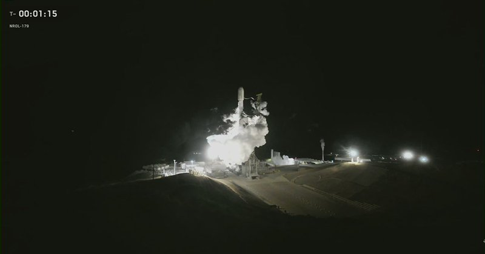

Fox News (Twitter/X)

WATCH LIVE: SpaceX conducts Falcon 9 launch of the NROL-179 mission
https://twitter.com/i/broadcasts/1oKMvvpYeRNGQ

## mamlekate — post 103742

📝 لغو ناگهانی سفر جی‌دی‌ ونس به سوئیس برای ادامه مذاکرات با جمهوری اسلامی

قرار بود پس از امضاء تفاهم‌نامه میان دونالد ترامپ رئیس جمهوری آمریکا و مسعود پزشکیان رئیس دولت جمهوری اسلامی، جی‌دی ونس معاون ترامپ برای امضاء رسمی این سند و دیدار با مقامات جمهوری اسلامی به سوئیس سفر کند، اما برنامه‌ در آخرین دقایق به طور ناگهانی لغو شد.

📝 سوئیس از برگزار نشدن مذاکرات برنامه‌ریزی شده آمریکا و جمهوری اسلامی خبر داد

وزارت خارجه سوئیس اعلام کرد مذاکراتی که قرار بود جمعه میان آمریکا و جمهوری اسلامی در اقامتگاه کوهستانی برگن‌اشتوک برگزار شود، انجام نخواهد شد.

@mamlekate

@mamlekate

## mamlekate — post 103741

📝 تفاهم‌نامه ایران و آمریکا چه شباهت‌ها و تفاوت‌هایی با برجام دارد؟

@mamlekate

## FarsiVOA — post 221173

  <a href="telegram/content/FarsiVOA_221173_1781859299.mp4" target="_blank">🎬 Download video</a>

ارتش اسرائیل زیرساخت‌های حزب‌الله را در منطقه بقاع هدف قرار داد؛

ارتش اسرائيل در تداوم عملیات علیه حزب‌الله لبنان، اعلام کرد که «زیرساخت‌های تروریستی» این سازمان را در منطقه بقاع هدف قرار داده است. این حمله در واکنش به نقض‌های مکرر توافق آتش‌بس میان اسرائیل و لبنان از سوی حزب‌الله انجام شد.

بامداد جمعه ۲۹ خردادماه، نیز ارتش اسرائيل زیرساخت‌های حزب‌الله در چندین منطقه جنوب لبنان هدف قرار داده بود. خبرگزاری ملی لبنان اعلام کرد که این حملات منجر به کشته شدن دست‌کم ۱۶ نفر در سراسر «منطقه نبطیه» در جنوب این کشور شد.

آمریکا و اسرائیل و برخی کشورهای دیگر، حزب‌الله لبنان را در فهرست گروه‌های تروریستی قرار داده‌اند.
@FarsiVOA

## Persian_Trend_Official — post 17537

  <a href="telegram/content/Persian_Trend_Official_17537_1781859301.mp4" target="_blank">🎬 Download video</a>

وضعیت نبطیه

از شروع عملیات عاشورا توسط حزب الله از بامداد امروز تلفات هم سمت حزب‌الله هم اسراییل بسیار بالا گزارش شده.

👺Phantom

📌 @persian_trend_official
پرشین ترند | متفاوت‌ترین کانال نظامی

## Persian_Trend_Official — post 17534

  <a href="telegram/content/Persian_Trend_Official_17534_1781859302.mp4" target="_blank">🎬 Download video</a>

وزیر دفاع اسرائیل، یسرائیل کاتز: می‌دانید چه چیزی واقعاً جهادگرایان را آزار می‌دهد؟ شاید وقتی شخصاً آنها را می‌کشید، برایشان دردناک باشد، اما آنها به این موضوع اهمیت زیادی نمی‌دهند.

آنچه واقعاً آنها را آزار می‌دهد این است که سرزمینی را از آنها می‌گیرید و خانه‌هایشان را ویران می‌کنید و این کاری است که ما انجام دادیم.

📝 Amir

📌 @persian_trend_official
پرشین ترند | متفاوت‌ترین کانال نظامی

## Persian_Trend_Official — post 17533

  <a href="telegram/content/Persian_Trend_Official_17533_1781859305.mp4" target="_blank">🎬 Download video</a>

وزیر دفاع اسرائیل، یسرائیل کاتز: ما در آنجا می‌جنگیم. ما به الجولانی نیازی نداریم. الجولانی، تروریست کت و شلواری، نیازی به آمدن و کمک به ما ندارد.

ما سوریه را به خوبی می‌شناسیم. او قرار نیست در لبنان به ما کمک کند. او باید در سوریه بماند، در کار ما دخالت نکند و ما را مجبور به دخالت در کار خودش نکند.

در لبنان، 200 هزار نفر از ساکنانی که در منطقه امنیتی زندگی می‌کردند، برنمی‌گردند. حتی یک نفر از آنها هم برنمی‌گردد.

📝 Amir

📌 @persian_trend_official
پرشین ترند | متفاوت‌ترین کانال نظامی

## Persian_Trend_Official — post 17532

  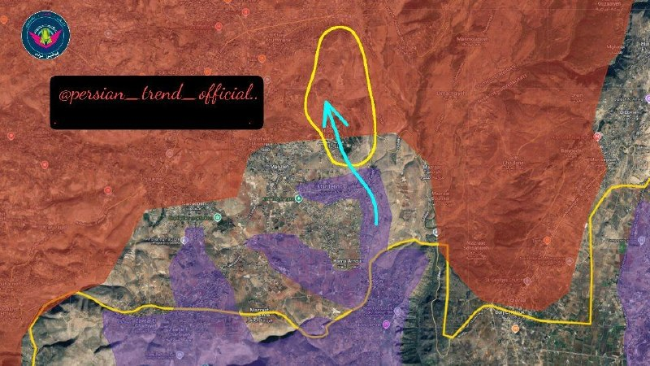

به نظر می‌رسد تلاش جدید نیروهای دفاعی اسرائیل برای تصرف تپه استراتژیک علی الطاهر شکست خورده است و نیروهای پیشروی شده توسط حزب‌الله دفع شده‌اند.

این تپه یکی از پایگاه‌های اصلی حزب‌الله است و بر شهر نبطیه مشرف است. این منطقه شامل پناهگاه‌ها و تونل‌های عمیق متعددی است و توسط تپه‌های دیگری که تحت کنترل حزب‌الله هستند احاطه شده است.

نیروهای دفاعی اسرائیل قبلاً در اوایل این هفته و هفته گذشته نتوانستند آن را تصرف کنند. این بار حداقل ۴ کشته و ۱۷ زخمی در تلاش برای تصرف آن متحمل شدند.

## Persian_Trend_Official — post 17531

  <a href="telegram/content/Persian_Trend_Official_17531_1781859308.mp4" target="_blank">🎬 Download video</a>

یسرائیل کاتز، وزیر دفاع اسرائیل: هیچ‌کس نمی‌تواند به ما بگوید چه کار کنیم، و ما این را ثابت کرده‌ایم.

تمام خط اول روستاهای لبنان ویران شده است. ما در حال ویران کردن تمام خانه‌ها هستیم. ساکنان دیگر هرگز آنها را در مقابل چشمان خود نخواهند دید.

📝 Amir

📌 @persian_trend_official
پرشین ترند | متفاوت‌ترین کانال نظامی

## alonews — post 129081

  <a href="telegram/content/alonews_129081_1781859310.webm" target="_blank">🎬 Download video</a>

👈لاوروف: خطر رویارویی مستقیم ناتو و روسیه به‌سرعت می‌تواند هسته‌ای شود

✅ @AloNews خبر جنگ

## alonews — post 129080

  <a href="telegram/content/alonews_129080_1781859310.webm" target="_blank">🎬 Download video</a>

👈ارتش دفاعی اسرائیل اعلام کرد که فرمانده یک گردان زرهی و سه سرباز دیگر در جنوب لبنان در اثر اصابت پهپاد حزب‌الله یا موشک ضدتانک به تانکشان در روستای کفر تبنیت کشته شدند.

🔴 انفجاری که منجر به کشته شدن هر چهار عضو خدمه شد، کمی پس از نیمه‌شب رخ داد.

✅ @AloNews خبر جنگ

---
📅 بروزرسانی: 1405/03/29 12:15
---

## WithYashar — post 15304

هم اکنون منابع لبنانی می‌گویند:
ستون‌های زرهی اسرائیلی در حال پیشروی به سمت نبطیه، پایتخت حزب‌الله در جنوب لبنان هستند و درگیری‌ها سنگینی گزارش می‌شود
@withyashar

## IranIntlTV — post 343176

  <a href="https://t.me/IranintlTV/343176" target="_blank">📎 Download file</a>

🎧نسخه صوتی اخبار بامدادی | جمعه ۲۹ خرداد
@iranintlTV

## IranIntlTV — post 343175

  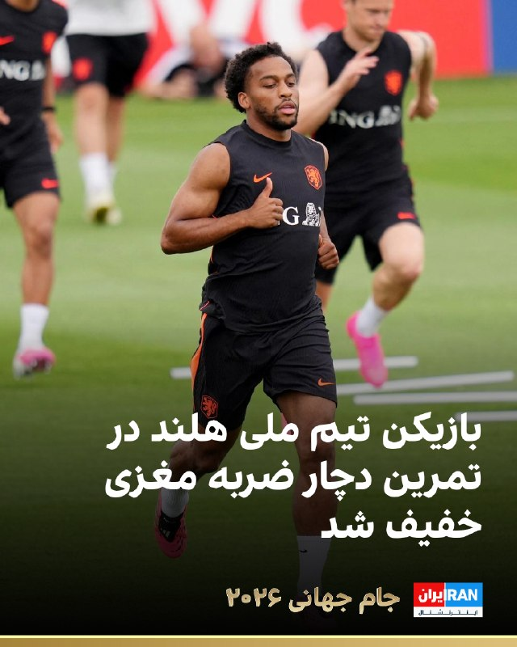

🔻کوینتن تیمبر، هافبک تیم ملی هلند، روز پنجشنبه در پی برخورد با یکی از هم‌تیمی‌هایش در تمرین، دچار ضربه مغزی خفیف شد. با تایید کادر پزشکی، این بازیکن دیدار روز شنبه تیم ملی کشورش مقابل سوئد را از دست داد.

🔹این هافبک ۲۵ ساله در اولین بازی لاله‌های نارنجی مقابل ژاپن، به عنوان بازیکن تعویضی در دقیقه ۷۰ وارد زمین شد. تیمبر تاکنون ۱۲ بازی ملی برای هلند انجام داده و یک گل به ثمر رسانده است. هلندی‌ها پس از تساوی ۲-۲ مقابل ژاپن، در رتبه سوم گروه F قرار دارند.

@iranintltvsport

## Persian_Trend_Official — post 17530

  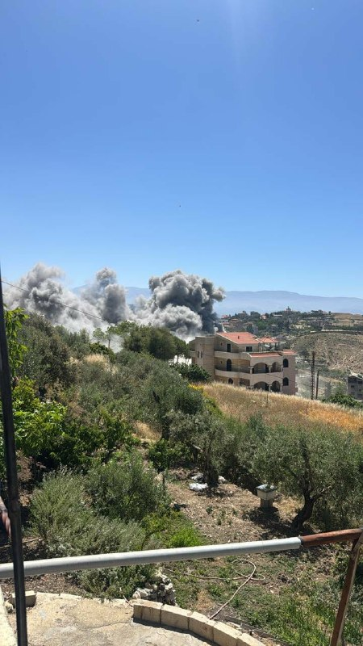

حملات هوایی اسرائیل در سراسر جنوب و شرق لبنان متوقف نشده است.

تا کنون بیش از ۵۰ حمله انجام شده است.

👺Phantom

📌 @persian_trend_official
پرشین ترند | متفاوت‌ترین کانال نظامی

## Persian_Trend_Official — post 17529

  <a href="telegram/content/Persian_Trend_Official_17529_1781858713.mp4" target="_blank">🎬 Download video</a>

حملات هوایی و حملات پهپادی اسرائیل در چند ساعت گذشته شهرها و شهرک‌های متعددی در شرق و جنوب لبنان را هدف قرار داده‌اند.

👺Phantom

📌 @persian_trend_official
پرشین ترند | متفاوت‌ترین کانال نظامی

## IranianMinds — post 22932

  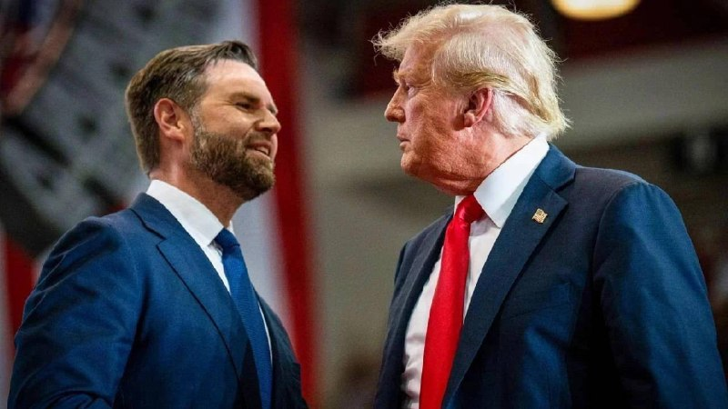

🔴 جی‌دی ونس سفر به سوئیس را لغو کرد؛ مذاکرات آمریکا و ایران لغو شد.

@IranianMinds

## IranianMinds — post 22930

  <a href="telegram/content/IranianMinds_22930_1781858716.mp4" target="_blank">🎬 Download video</a>

🔴 حملات شدید اسرائیل به جنوب لبنان

@IranianMinds

## IranianMinds — post 22929

  <a href="telegram/content/IranianMinds_22929_1781858717.mp4" target="_blank">🎬 Download video</a>

مردمی که بعد از اعلام آتش بس ترامپ برگشته بودن جنوب لبنان با حملات امروز اسرائیل دوباره فرار کردن.

@IranianMinds

## IranianMinds — post 22928

  <a href="telegram/content/IranianMinds_22928_1781858720.mp4" target="_blank">🎬 Download video</a>

🔴 کاتز ، وزیر جنگ اسرائیل :

ما هم‌اکنون بیش از ۶۰ درصد غزه را در کنترل داریم و همه‌اش را نابود کرده‌ایم.

هم روی زمین و هم زیر زمین کاملاً نابود شده. این تفاوت رویکردی است که ما معرفی کردیم.

@IranianMinds

## Dirty_Kids — post 392559

  <a href="telegram/content/Dirty_Kids_392559_1781858722.mp4" target="_blank">🎬 Download video</a>

توی عزاداری محرم، یه پسره آیدی اینستاگرامشو روی طبل نوشته، تا اگه دختری از طبل زدنش خوشش اومد، بهش دایرکت بده😂

@Dirty_Kids 👻

## Dirty_Kids — post 392558

  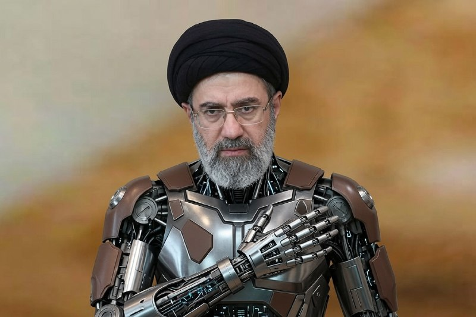

🔴 چین رسما اعلام کرد ساخت مجتبی 6 ماه زمان می‌بره و باید 3 ماه دیگه برای رونماییش صبر کنین.

@Dirty_Kids 👻

## Dirty_Kids — post 392554

  <a href="telegram/content/Dirty_Kids_392554_1781858724.mp4" target="_blank">🎬 Download video</a>

🔴 جام جهانی امسال، به عنوان بهترین جام جهانی تاریخ لقب گرفت 
🍒

@Dirty_Kids 👻

## alonews — post 129079

  <a href="telegram/content/alonews_129079_1781858725.webm" target="_blank">🎬 Download video</a>

👈کاتس درباره درگیری‌ها تو سوریه و حزب‌الله : ما اونجا داریم می‌جنگیم 
🔴ما به جولانی نیازی نداریم 
🔴 جولانی، همون تروریست کت‌وشلواری، لازم نیست بیاد و به ما کمک کنه 
🔴 ما سوریه رو خوب می‌شناسیم اون قرار نیست تو لبنان به ما کمک کنه 
🔴بهتره تو سوریه بمونه، تو…

## alonews — post 129078

  <a href="telegram/content/alonews_129078_1781858725.webm" target="_blank">🎬 Download video</a>

🔴فوری / هم اکنون منابع لبنانی می‌گویند:
ستون‌های زرهی اسرائیلی در حال پیشروی به سمت نبطیه، پایتخت حزب‌الله در جنوب لبنان هستند و درگیری‌ها سنگینی گزارش می‌شود

✅ @AloNews خبر جنگ

## alonews — post 129077

  <a href="telegram/content/alonews_129077_1781858725.webm" target="_blank">🎬 Download video</a>

👈شهباز شریف: از طرف ملت پاکستان در مراسم تشییع رهبر سابق ایران شرکت خواهم کرد

✅ @AloNews خبر جنگ

---
📅 بروزرسانی: 1405/03/29 12:04
---

## WithYashar — post 15303

  <a href="telegram/content/WithYashar_15303_1781858078.mp4" target="_blank">🎬 Download video</a>

کاتز وزیر دفاع اسرائیل: هیچ کس نمی تواند به ما بگوید چه کار کنیم و ما آن را ثابت کرده ایم.
@withyashar

## IranIntlTV — post 343174

  <a href="https://t.me/IranintlTV/343174" target="_blank">📎 Download file</a>

🎧نسخه صوتی برنامه با کامبیز حسینی؛ آیا «کودتای خزنده قالیباف» پیروز می‌شود؟
@iranintlTV

## IranianMinds — post 22927

  <a href="telegram/content/IranianMinds_22927_1781858080.mp4" target="_blank">🎬 Download video</a>

🔴 کاتز ، وزیر جنگ اسرائیل :

ما از هیچ‌ منطقه امنیتی خارج‌ نخواهیم شد ، بلکه پیشروی نیز خواهیم‌ کرد.

@IranianMinds

## IranianMinds — post 22926

  <a href="telegram/content/IranianMinds_22926_1781858082.mp4" target="_blank">🎬 Download video</a>

🔴 کاتز ، وزیر جنگ اسرائیل :

یادتان هست عملیات‌های قبلی را؟ می‌رفتند داخل و سریع برمی‌گشتند بیرون.

ما میرویم داخل، نابود می‌کنیم و دیگر خارج نمی‌شویم.
همین کاری است که الان در لبنان داریم انجام می‌دهیم.

@IranianMinds

## IranianMinds — post 22925

  <a href="telegram/content/IranianMinds_22925_1781858084.mp4" target="_blank">🎬 Download video</a>

🔴 کاتز ، وزیر جنگ اسرائیل :

میدونید چه چیزی این جهادی ها و تروریست هارو خیلی‌ اذیت میکنه ؟

اینکه بیایم خانه و زندگیشان را نابود کنیم ! دقیقا همینکاری که ما داریم انجام میدیم.

@IranianMinds

## IranianMinds — post 22924

  <a href="telegram/content/IranianMinds_22924_1781858085.mp4" target="_blank">🎬 Download video</a>

🔴 کاتز ، وزیر‌ جنگ اسرائیل :

ما هیچ‌ نیازی به جولانی رئیس جمهور سوریه یک تروریست کت و شلواری نداریم ، بهتره تو کار ما دخالت نکنه و تو کشور خودش بمونه

و اگرنه ما میایم و توی کار های اونا دخالت میکنیم!

@IranianMinds

## alonews — post 129076

  <a href="telegram/content/alonews_129076_1781858087.webm" target="_blank">🎬 Download video</a>

👈کاتز وزیر دفاع اسرائیل: هیچ کس نمی تواند به ما بگوید چه کار کنیم و ما آن را ثابت کرده ایم. 
✅ @AloNews خبر جنگ

## alonews — post 129075

  <a href="telegram/content/alonews_129075_1781858087.webm" target="_blank">🎬 Download video</a>

👈حرکت گسترده مهاجرت از شهرستان‌های صور و بنت جبیل به سمت صیدا و بیروت

✅ @AloNews خبر جنگ

## alonews — post 129074

  <a href="telegram/content/alonews_129074_1781858088.mp4" target="_blank">🎬 Download video</a>

👈کاتز وزیر دفاع اسرائیل: هیچ کس نمی تواند به ما بگوید چه کار کنیم و ما آن را ثابت کرده ایم.

✅ @AloNews خبر جنگ

---
📅 بروزرسانی: 1405/03/29 11:54
---

## VahidOOnLine — post 246356

  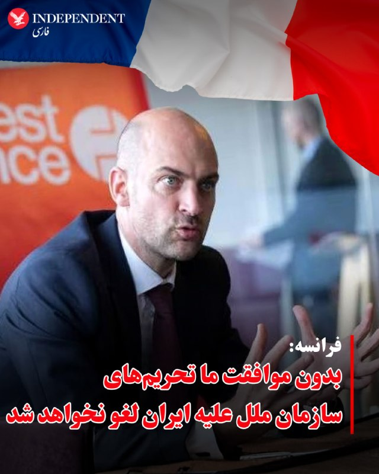

⭕️فرانسه: بدون موافقت ما تحریم‌های سازمان ملل علیه ایران لغو نخواهد شد

♦️وزیر خارجه فرانسه اعلام کرد پاریس در مذاکرات مربوط به برنامه هسته‌ای ایران نقش خواهد داشت و تا زمانی که از مفاد توافق نهایی رضایت نداشته باشد، با لغو تحریم‌های سازمان ملل علیه تهران موافقت نخواهد کرد.

ژان‌نوئل بارو، روز جمعه در گفت‌وگو با شبکه «فرانس‌اینفو» گفت که بدون پرداختن به برنامه موشک‌های بالستیک ایران و حمایت جمهوری اسلامی از گروه‌های نیابتی، ثباتی در منطقه ایجاد نخواهد شد.

او تاکید کرد لغو تحریم‌ها، در مقابل امتیازهای بزرگی خواهد بود که از ایران خواسته می‌شود و افزود: «فرانسه عضو دائم شورای امنیت سازمان ملل است و همان‌طور که ۱۰ سال پیش اتفاق افتاد، برای لغو تحریم‌ها باید موافقت فرانسه جلب شود.»

بر اساس یادداشت تفاهمی که این هفته میان آمریکا و ایران حاصل شد، قرار است مذاکرات درباره برنامه هسته‌ای ایران طی ۶۰ روز آینده انجام شود و توافق نهایی در صورت حصول برای تایید به شورای امنیت سازمان ملل ارائه شود.
به گزارش رویترز، کشورهای اروپایی نگران‌اند که تیم مذاکره‌کننده آمریکا نتواند در مرحله بعدی مذاکرات، توافقی قدرتمند درباره برنامه هسته‌ای ایران به دست آورد یا موضوع موشک‌های بالستیک را حل کند؛ موضوعی که می‌تواند به ادامه بن‌بست طولانی‌مدت منجر شود.

فرانسه، بریتانیا و آلمان که از سال ۲۰۰۳ در مذاکرات هسته‌ای با ایران حضور داشتند و بعدها در توافق هسته‌ای ۲۰۱۵ نقش داشتند، خواهان مشارکت در شکل‌دهی مذاکرات جدید هستند.
بارو گفت هدف فرانسه گرفتن «امتیازهای بزرگ» از جمهوری اسلامی و ایجاد تغییر اساسی در رفتار تهران است و افزود که پاریس به‌عنوان عضو دائم شورای امنیت، در حل این بحران نقش خواهد داشت.
‌🇸🇦 Indypersian

🤖 @VahidOOnLine

## WithYashar — post 15302

سوئیس رسما اعلام کرد: مذاکرات ایران و آمریکا برگزار نخواهد شد @withyashar

## DEJradio — post 5813

  <a href="telegram/content/DEJradio_5813_1781857467.webm" target="_blank">🎬 Download video</a>

🚨📷 انبار تجهیزات سرکوب در کلاس یک مدرسه دخترانه

مخاطبان دژ، تصاویری را فرستاده‌اند که تأیید می‌کند درون کلاس یک مدرسه دخترانه ادوات و تجهیزات سرکوب انبار شده است.

همین منبع گزارش داد سایر کلاس‌ها و اتاق‌های مدرسه نیز محل استقرار و استراحت نیروهای سرکوب است.
ادوات سرکوب مربوط به نیروهای لباس شخصی و بـ.ـسیج است.
دژ بنا به دلایل امنیتی از اعلام نام و مکان مدرسه خودداری می‌کند.

#مدرسه_دخترانه #لباس_شخصی #نیروی_سرکوب
@DEJradio

## IranianMinds — post 22922

🔴 حملات شدید ارتش اسرائیل به جنوب لبنان از صبح امروز بی وقفه دارن لبنان رو بمباران میکنن. @IranianMinds

## IranianMinds — post 22921

  <a href="telegram/content/IranianMinds_22921_1781857467.mp4" target="_blank">🎬 Download video</a>

🔴 کاتز ، وزیر جنگ اسرائیل :

ما عقب نشینی نمیکنیم و در لبنان، ۲۰۰ هزار ساکنی که در «منطقه امنیتی» زندگی می‌کردند، برنمی‌گردند.

حتی یک نفرشان هم برنمی‌گردد.

@IranianMinds

## IranianMinds — post 22920

  <a href="telegram/content/IranianMinds_22920_1781857469.mp4" target="_blank">🎬 Download video</a>

🔴 کاتز ، وزیر جنگ اسرائیل :

هیچکس نمی‌تونه به ما بگه چیکار کنیم، و ما اینو ثابت کردیم.

@IranianMinds

## IranianMinds — post 22917

  <a href="telegram/content/IranianMinds_22917_1781857471.mp4" target="_blank">🎬 Download video</a>

🔴 حملات شدید ارتش اسرائیل به جنوب لبنان

از صبح امروز بی وقفه دارن لبنان رو بمباران میکنن.

@IranianMinds

## BBCPersian — post 284350

🖊رضا ثابتی، روزنامه‌نگار

تفاهم‌نامه تازه ایران و آمریکا، هرچند از نظر ماهیت حقوقی و زمینه شکل‌گیری تفاوت‌های اساسی  با برجام دارد، اما برای بسیاری ناگزیر نام آن توافق را به ذهن می‌آورد و زمینه مقایسه دو سندی را فراهم می‌کند که یکی برای پیشگیری از تشدید بحران هسته‌ای و دیگری برای پایان دادن به جنگ امضا شده است.
دلیل چنین مقایسه‌ای تنها این نیست که که هر دو سند به توافقی با ایران درباره موضوعاتی مانند برنامه هسته‌ای و تحریم‌ها مربوط می‌شوند، بلکه این بار امضای دونالد ترامپ پای تفاهمی قرار گرفته که همواره با شدیدترین لحن از برجام و باراک اوباما، رئیس‌جمهور وقت آمریکا در هنگام امضای توافق هسته‌ای قدرت‌های جهانی با ایران در سال ۲۰۱۵، انتقاد کرده است.

برای خواندن ادامه گزارش به لینک زیر مراجعه کنید:

https://bbc.in/4gsip6n
📸GettyImages
@BBCPersian

## alonews — post 129073

  <a href="telegram/content/alonews_129073_1781857471.webm" target="_blank">🎬 Download video</a>

🔴فوری / معاریو: مقامات اسرائیلی نگرانند که اختلاف ترامپ و نتانیاهو از سطح حرف فراتر رفته و به اقدامات ملموسی مانند تأخیر در ارسال سلاح، محدودیت در کمک‌های نظامی و حتی گام‌هایی شبیه به تحریم تسلیحاتی تبدیل شود.

🔴اسرائیل معتقد است که فشار ایالات متحده برای خروج از جنوب لبنان و حرمون سوریه تشدید خواهد شد

✅ @AloNews خبر جنگ

## alonews — post 129072

  <a href="telegram/content/alonews_129072_1781857472.webm" target="_blank">🎬 Download video</a>

👈 دونالد ترامپ، رئیس‌جمهور آمریکا، در گفت‌گو با اکسیوس دربارهٔ ایران:

🔴 «تنها راهی که می‌توانم سخت‌گیرانه‌تر عمل کنم این است که دو یا سه هفتهٔ دیگر آنجا بمانم و همچنان به شدت هرچه تمام‌تر آنها را بمباران کنم، درست است؟

🔴 اما آن کار چه نتیجه‌ای برای ما دارد؟ تنگهٔ هرمز باز نخواهد بود. ماه‌ها نفت نخواهیم داشت. تا وقتی که بمب می‌ریزی، آن تنگه به طور خودکار بسته می‌شود.

🔴 این از آن دست مسائلی است که می‌تواند باعث یک رکود جهانی شود.»

✅ @AloNews خبر جنگ

## alonews — post 129071

  <a href="telegram/content/alonews_129071_1781857472.webm" target="_blank">🎬 Download video</a>

👈بعد از اینکه سوئیس اعلام کرد مذاکرات امروز آمریکا و ایران لغو شده؛ قیمت دلار مجددا از ۱۵۳ هزار تومن به ۱۶۲ هزار تومن رسید.

✅ @AloNews خبر جنگ

---
📅 بروزرسانی: 1405/03/29 11:44
---

## VahidOOnLine — post 246355

  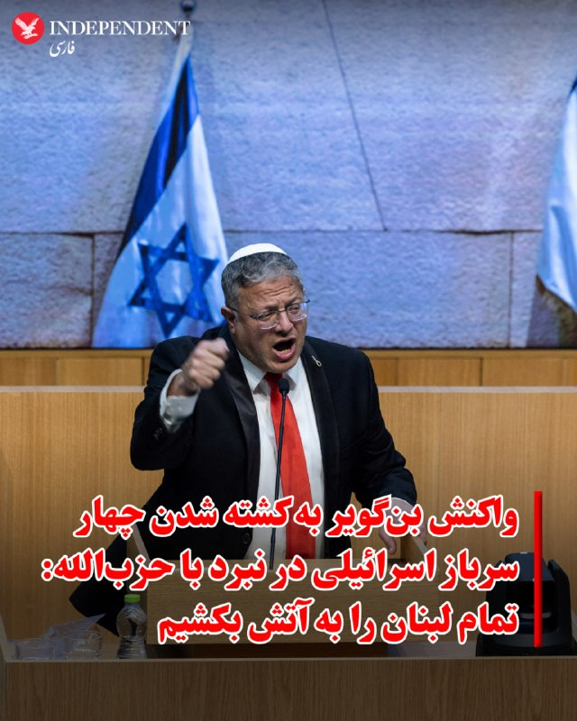

♦️ایتامار بن‌گویر، وزیر «راست‌گرای» امنیت ملی اسرائیل روز جمعه ۲۹ خردادماه و در پی کشته شدن چهار سرباز ارتش این کشور در درگیری با حزب‌الله با صدور بیانیه‌ای اعلام کرد: «باید تمام لبنان را به آتش‌ بکشیم.»

براساس گزارش‌ها همزمان با تشدید درگیری‌ها در جنوب لبنان، دست‌کم چهار سرباز اسرائیلی شب گذشته در این کشور کشته و چندین نظامی دیگر به‌شدت مجروح شدند. همزمان، براساس گزارش وزارت بهداشت لبنان دست‌کم ۱۶ نفر از اتباع این کشور در بمباران‌های اسرائیل کشته شده‌اند.

بن‌گویر که یکی از وزاری کلید کابینه ائتلافی نتانیاهو است در این بیانیه گفت: «با وجود تمام احترامی که برای آمریکایی‌ها قائلم، اسرائیل باید سرانجام به سراسر جهان نشان بدهد که خون پسران ما و امنیت شهروندان ما، فروشی نیست. سراسر لبنان باید به آتش کشیده شود.»
‌🇸🇦 Indypersian

🤖 @VahidOOnLine

## VahidOOnLine — post 246354

  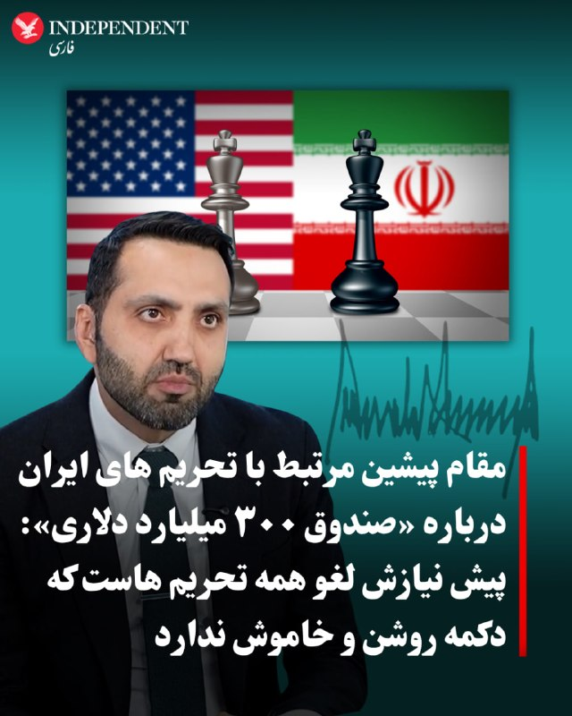

⭕️مقام پیشین مرتبط با تحریم های ایران درباره «صندوق ۳۰۰ میلیارد دلاری»: پیش نیازش لغو همه تحریم هاست که دکمه روشن و خاموش ندارد

♦️میعاد ملکی، مدیر پیشین «دفتر هدف‌گذاری تحریم‌های خزانه‌داری آمریکا» در یادداشتی درباره موضوع «صندوق ۳۰۰ میلیارد دلاری» برای ایران که بسیاری از کارشناسان درباره آن ابراز تردید کرده‌اند، می‌نویسد: با کنار گذاشتن موضوع معافیت/مجوز نفتی و نگرانی‌های مربوط به عدم اعمال تحریم‌های جدید، باتوجه به الزامات برای اجرای واقعی بند ۶ (صندوق بازسازی ۳۰۰ میلیارد دلاری) و بند ۷ (لغو همه تحریم‌ها) به این نتیجه می‌رسیم که مذاکره‌کنندگان آمریکایی یا می‌دانستند که توافق نهایی ناممکن است، یا این یادداشت تفاهم فقط تصمیم‌گیری را به آینده موکول می‌کند.

ملکی که خود در طراحی تحریم‌ها علیه حکومت ایران نقش داشته در این یادداشت می‌نویسد: این چیزی است که «اجرای کامل» در عمل، فراتر از امتیازهای هسته‌ای، به آن نیاز دارد:
بند ۶ — صندوق ۳۰۰ میلیارد دلاری:
صدور معافیت ریاست‌جمهوری از تحریم‌های الزامی بخش ساخت‌وساز ایران طبق ماده ۱۲۴۵ قانون IFCA (معافیت‌های ۱۸۰ روزه قابل تمدید که در هر دوره نیازمند اطلاع‌رسانی به کنگره هستند).
خارج کردن سپاه از فهرست سازمان‌های تروریستی خارجی (FTO)، زیرا در غیر این صورت سرمایه‌گذاران با خطر مسئولیت کیفری به دلیل «حمایت مادی» مواجه خواهند بود و هیچ مجوزی این مشکل را برطرف نمی‌کند.
استفاده از معافیت مبتنی بر منافع ملی در قانون ISA (قانون تحریم های ایران) برای سرمایه‌گذاری در بخش انرژی و نفت.
در نتیجه، هیچ نهاد سرمایه‌گذاری حاضر نیست میلیاردها دلار سرمایه را بر پایه معافیت‌های شش‌ماهه قابل تمدید متعهد کند.

بند ۷ — لغو همه تحریم‌ها:
ماده ۱۰۴ قانون CISADA (قانون جامع تحریم‌ها، پاسخگویی و واگذاری سرمایه‌گذاری‌های مرتبط با ایران) رئیس‌جمهور اختیار معافیت ندارد؛ تحریم‌ها الزامی هستند و لغو آن‌ها مستلزم تصویب قانون جدید در کنگره است.
ماده ۱۲۴۵ قانون NDAA (قانون مجوز دفاع ملی آمریکا) معافیت‌های ۱۲۰ روزه قابل تمدید که در هر دوره نیازمند ارائه گزارش اجباری به کنگره هستند.
تعیین بخش مالی ایران به عنوان «نگرانی پول‌شویی» تحت ماده ۳۱۱ قانون پاتریوت: این موضوع نیازمند مقررات‌گذاری جداگانه از سوی شبکه مقابله با جرائم مالی وزارت خزانه‌داری آمریکا (FinCEN) است و صرفا از طریق دفتر کنترل دارایی‌های خارجی (OFAC) حل نمی‌شود.
تحریم‌های مرتبط با تروریسم، حقوق بشر و موارد همپوشان با پرونده روسیه: هر کدام مستلزم اقدامات حقوقی مستقل و جداگانه هستند.
ملکی در ادامه می‌نویسد: «لغو همه تحریم‌ها» یک دکمه روشن و خاموش نیست، بلکه پروژه‌ای چندساله در حوزه قانون‌گذاری و مقررات‌گذاری است و کنگره نیز در آن حق رای دارد. و این پرسش مطرح است که چگونه می‌توان اتحادیه اروپا را وادار کرد محدودیت‌های مرتبط با ایران را که در چارچوب پرونده‌های مربوط به روسیه وضع شده‌اند، لغو کند.
‌🇸🇦 Indypersian

🤖 @VahidOOnLine

## DEJradio — post 5812

  <a href="telegram/content/DEJradio_5812_1781856864.webm" target="_blank">🎬 Download video</a>

🔺📷 ادعای فدراسیون فوتبال جمهوری اسلامی:
محبی تصویر مهسا امینی را پاره نکرد، عکس‌ها هوش مصنوعی بود

فدراسیون فوتبال جمهوری اسلامی در یک بیانیه که ۲۹ خرداد ۱۴۰۵ صادر شد ادعا کرد تصاویری که از محمد محبی در حال پاره کردن تصویر مهسا امینی منتشر شده، «کاملا جعلی بوده و با استفاده از ابزارهای هوش مصنوعی و تکنیک‌های دستکاری تولید شده‌ است.»

در این بیانیه تأکید شده «تولید و انتشار محتوای جعلی با استفاده از فناوری‌های نوین، به ابزاری برای انتشار اطلاعات نادرست و آسیب به اعتبار اشخاص تبدیل شده است.»

#هوش_مصنوعی #مهسا_امینی #محمدمحبی
@DEJradio

## IranIntlTV — post 343173

## FarsiVOA — post 221172

  

وال‌استریت ژورنال از قول منابع آگاه گزارش داده که طبق توافق پایان جنگ، ایران حق دسترسی به شش میلیارد دلار منابع مسدود شده در قطر برای واردات اقلام انسان‌دوستانه و غیرتحریمی از خود آمریکا خواهد داشت.

به گفته یک دیپلمات آگاه از جزئیات توافق، این منابع مالی به‌صورت مرحله‌ای و در بازه زمانی آتش‌بس تمدیدشده ۶۰ روزه آزاد خواهد شد و تنها برای خرید کالاهای آمریکایی قابل استفاده خواهد بود.

آزادسازی این منابع نیز مشروط به بازگشایی تنگه هرمز و پیشرفت مذاکرات برای دستیابی به توافق نهایی هست.

یک مقام آمریکایی به این رسانه گفته است واشنگتن در جریان مذاکرات نهایی بخشی از دارایی‌های مسدودشده ایران را آزاد خواهد کرد، مشروط بر آنکه ایران «رفتار مناسبی» از خود نشان دهد؛ از جمله تحویل ذخایر اورانیوم غنی‌شده خود.
@FarsiVOA

## RadioFarda — post 158496

  <a href="telegram/content/RadioFarda_158496_1781856866.mp4" target="_blank">🎬 Download video</a>

🔸نروژ پس از ۲۸ سال دوری از جام جهانی، بازگشتی رویایی را تجربه کرد و روز چهارشنبه ۲۷ خرداد با درخشش ارلینگ هالند، عراق را ۴ بر یک شکست داد.

🔸اعضای پارلمان نروژ پس از پیروزی پرگل تیم ملی خود در اولین بازی، با اجرای شادی معروف نروژی‌ها خوشحالی خود را از شروع مقتدرانه تیم‌شان در جام جهانی به نمایش گذاشتند.

🔸رهبری این شادی را مسعود قره‌خانی، رئیس ایرانی‌تبار پارلمان نروژ، بر عهده داشت.

🔸مسعود قره‌خانی متولد ۱۹۸۲ سیاستمدار ایرانی‌تبار اهل نروژ و عضو حزب کارگر است. او از سال ۲۰۲۱ ریاست استورتینگه (قوهٔ مقننهٔ عالی نروژ) را بر عهده دارد.

@RadioFarda

## IranianMinds — post 22916

  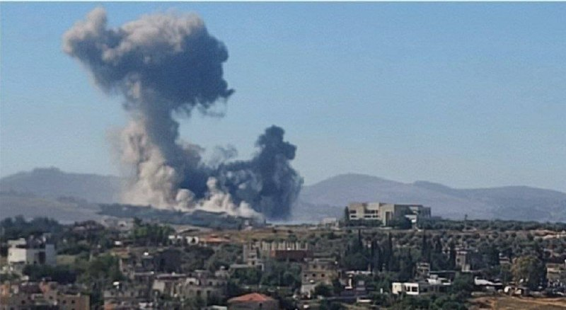

🔴 ارتش اسرائیل امروز هم دوباره رفته بالا سر حزب الله و داره جنوب لبنان رو شخم میزنه.

@IranianMinds

## BBCPersian — post 284349

  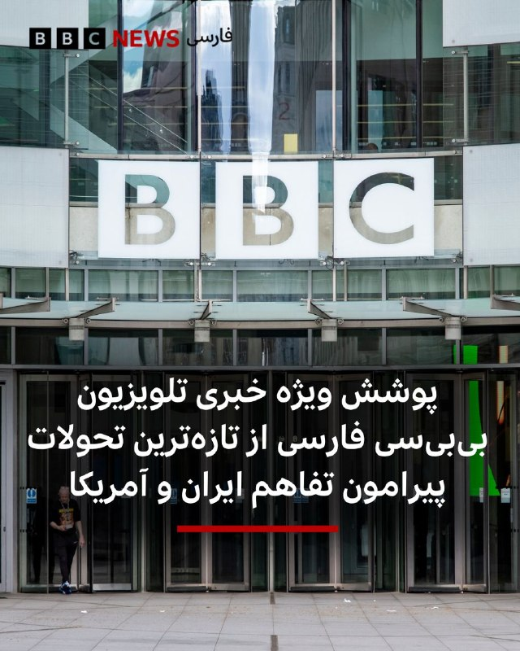

🔻پوشش ویژه خبری تلویزیون بی‌بی‌سی فارسی، پیرامون آخرین تحولات تفاهم میان ایران و آمریکا، از ساعت ۱۲ ظهر به وقت تهران آغاز خواهد شد.

ساعاتی پیش کاخ سفید اعلام کرد که جی‌دی ونس، معاون اول ریاست‌جمهوری آمریکا، به دلیل «مسائل اجرایی و تدارکاتی» به سوئیس سفر نخواهد کرد.

وزارت خارجه سوئیس نیز لغو دیدار ایران و آمریکا که قرار بود در این کشور برگزار شود را رسما تایید کرد.

این در حالی است که حملات اسرائیل به جنوب لبنان همچنان ادامه دارد.
@BBCPersian

## Hranews — post 113714

گزارشی از آخرین وضعیت گلاله وطن‌ دوست در زندان سنندج

❗️
❗️
❗️
❗️
❗️– گلاله وطن‌ دوست، وکیل دادگستری دوران محکومیت خود را در زندان سنندج سپری میکند. این وکیل دادگستری اوایل اردیبهشت ماه جاری، جهت تحمل محکومیت شش سال و هفت ماه و بیست روز حبس خود، راهی این زندان شد.

ادامه مطلب

#گلاله_وطن‌_دوست

↘️
@hranews_bot تماس ✉️ -  @Hranews  کانال هرانا 🆑

## alonews — post 129070

  <a href="telegram/content/alonews_129070_1781856868.webm" target="_blank">🎬 Download video</a>

👈کانال ۱۲ اسرائیل اعلام کرد که از زمان توافق آتش‌بس آوریل گذشته، ۲۳ سرباز اسرائیلی در لبنان کشته شده‌اند

✅ @AloNews خبر جنگ

## alonews — post 129069

  <a href="telegram/content/alonews_129069_1781856869.webm" target="_blank">🎬 Download video</a>

👈 طالبان مدعی شد که شب گذشته حملات هوایی را در داخل استان‌های بلوچستان و خیبر پختونخوا پاکستان انجام داده است!

✅ @AloNews خبر جنگ

## alonews — post 129068

  <a href="telegram/content/alonews_129068_1781856869.webm" target="_blank">🎬 Download video</a>

👈نفت برنت به ۸۰ دلار در هر بشکه افزایش یافت

✅ @AloNews خبر جنگ

## alonews — post 129067

  <a href="telegram/content/alonews_129067_1781856869.webm" target="_blank">🎬 Download video</a>

👈رویترز: سپاه پاسداران انقلاب اسلامی سلول‌های مخفی در عراق ایجاد کرده است تا حملات پهپادی علیه کویت، عربستان سعودی و امارات متحده عربی انجام دهد.این سلول‌ها که از جنگجویان شیعه نخبه عراقی تشکیل شده‌اند و مستقیماً به سپاه پاسداران گزارش می‌دهند، بین آوریل و مه حداقل هفت حمله پهپادی از جنوب عراق انجام داده‌اند

✅ @AloNews خبر جنگ

## alonews — post 129066

  <a href="telegram/content/alonews_129066_1781856869.webm" target="_blank">🎬 Download video</a>

👈وزیر امنیت ملی اسرائیل بن-گویر: برای هر اشک مادر اسرائیلی، هزار مادر لبنانی باید گریه کنند. تمام لبنان باید بسوزد!

✅ @AloNews خبر جنگ

---
📅 بروزرسانی: 1405/03/29 11:34
---

## VahidOOnLine — post 246353

یک شهروند در پیامی صوتی به ایران اینترنشنال نسبت به دونالد ترامپ به دلیل امضای توافق با جمهوری اسلامی انتقاد کرد و گفت پول‌های حکومت به مردم نخواهد رسید. صدای او با هوش مصنوعی تغییر داده شده است.
‌🏁 🇬🇧 IranintlTV

🤖 @VahidOOnLine

## DEJradio — post 5811

  <a href="telegram/content/DEJradio_5811_1781856281.webm" target="_blank">🎬 Download video</a>

🔺📷 ادعای فدراسیون فوتبال جمهوری اسلامی:
محبی تصویر مهسا امینی را پاره نکرد، عکس‌ها هوش مصنوعی بود

فدراسیون فوتبال جمهوری اسلامی در یک بیانیه که ۲۹ خرداد ۱۴۰۵ صادر شد ادعا کرد تصاویری که از محمد محبی در حال پاره کردن تصویر مهسا امینی منتشر شده، «کاملا جعلی بوده و با استفاده از ابزارهای هوش مصنوعی و تکنیک‌های دستکاری تولید شده‌ است.»

در این بیانیه تأکید شده «تولید و انتشار محتوای جعلی با استفاده از فناوری‌های نوین، به ابزاری برای انتشار اطلاعات نادرست و آسیب به اعتبار اشخاص تبدیل شده است.»

#هوش_مصنوعی #مهسا_امینی #محمدمحبی
@DEJradio

## DEJradio — post 5810

  <a href="telegram/content/DEJradio_5810_1781856282.webm" target="_blank">🎬 Download video</a>

🔺🎥 اعتراض یک راننده کامیون به وضعیت افتضاح جاده‌ها

رانندگان کامیون‌ها نسبت به وضعیت افتضاح جاده‌ها اعتراض دارند.

آنها می‌گویند در برخی مسیرها از جمله مسیرهای منتهی به بنادر جنوبی حتی ۲۰٪ راه هم سالم نیست. راننده‌ها شکایت می‌کنند که هر چه درآمد دارند صرف مالیات، سوخت و تعمیرات و خرید قطعات می‌شود.

#راننده_کامیون #کامیون
@DEJradio

## IranIntlTV — post 343172

یک شهروند در پیامی صوتی به ایران اینترنشنال نسبت به دونالد ترامپ به دلیل امضای توافق با جمهوری اسلامی انتقاد کرد و گفت پول‌های حکومت به مردم نخواهد رسید. صدای او با هوش مصنوعی تغییر داده شده است.

## IranIntlTV — post 343171

  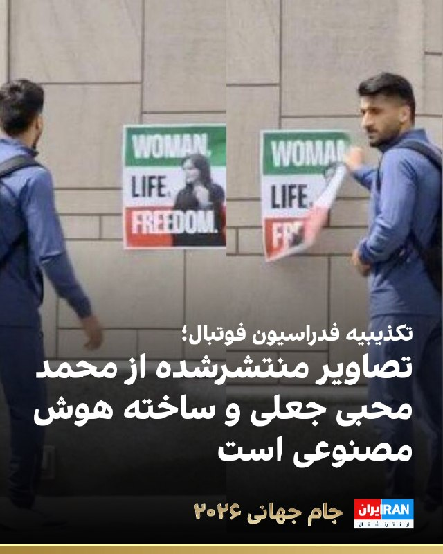

🔻در پی انتشار تصاویری جنجالی منتسب به محمد محبی در شبکه‌های اجتماعی، فدراسیون فوتبال ایران با انتشار بیانیه‌ای، این تصاویر را فاقد اصالت و اعتبار دانست.

🔹روز گذشته تصاویری در فضای مجازی منتشر شد که محمد محبی، ملی‌پوش فوتبال ایران را در حال کندن پوستر «زن زندگی آزادی» از روی دیوار و انداختن آن به سطل زباله نشان می‌داد؛ موضوعی که واکنش گسترده‌ای در بین کاربران داشت.

🔹فدراسیون فوتبال در این باره اعلام کرد: «تصاویر مذکور کاملاً جعلی بوده و با استفاده از ابزارهای هوش مصنوعی و تکنیک‌های دستکاری دیجیتال تولید شده‌اند.»

@iranintltvsport

## FarsiVOA — post 221171

  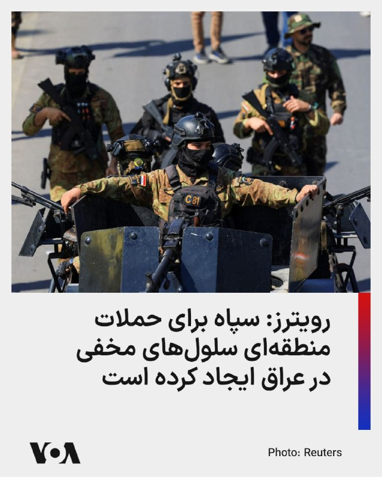

خبرگزاری رویترز به نقل از منابع آگاه گزارش داد که سپاه پاسداران سلول‌های مخفی جدیدی را در عراق ایجاد کرده تا حملاتی علیه کشورهای عربی خلیج فارس که میزبان نیروهای آمریکایی هستند انجام دهند.

این خبرگزاری به نقل از هشت منبع آگاه عراقی که نامشان فاش نشده، افزود که این گروه‌های کوچک برای جلوگیری از شناسایی، شبکه‌های شبه‌نظامی موجود را دور می‌زنند.

بر اساس این گزارش، سه یا چهار سلول، هرکدام متشکل از حدود ۱۰ نیروی ویژه شیعه عراقی، دست‌کم هفت حمله پهپادی را از مناطق بیابانی نزدیک شهرهای بصره و سماوه در جنوب عراق علیه اهدافی در کویت، عربستان سعودی و امارات متحده عربی در فاصله بین ۲۰ آوریل تا ۱۷ مه انجام داده‌اند.

این منابع آگاه گفتند که تعدادی از اعضای این سلول‌ها از «مقاومت اسلامی در عراق» جذب شده‌اند که یک سازمان بزرگ از جناح‌های تندرو شیعه با هزاران نیروی جنگی است.

طبق گفته منابعی که شامل دو مقام نظامی عراقی است، این گروه‌های جدید خارج از ساختار فرماندهی این سازمان عمل می‌کنند و مستقیماً به سپاه پاسداران گزارش می‌دهند.
@FarsiVOA

## IranianMinds — post 22915

با خبر لغو مذاکرات دلار‌ و تتر دوباره کشید بالا ، تتر از ۱۶۲ هزار تومان عبور‌ کرد.

@IranianMinds

## idfinfarsi — post 11858

🔴ارتش اسرائیل اندکی پیش زیرساخت‌های سازمان تروریستی حزب‌الله را در منطقه بقاع هدف قرار داد. این حمله در واکنش به نقض‌های مکرر توافق آتش‌بس از سوی سازمان تروریستی حزب‌الله انجام شد؛ این سازمان همچنان به پیشبرد و اجرای طرح‌های تروریستی علیه نیروهای ارتش اسرائیل ادامه می‌دهد.

## alonews — post 129065

  <a href="telegram/content/alonews_129065_1781856284.webm" target="_blank">🎬 Download video</a>

👈موسسه HFI: ارزیابی اولیه نشان می‌دهد؛ سپاه پاسداران انقلاب اسلامی تردد کشتی‌ها را به ۳۰ تا ۴۰ فروند در روز محدود خواهد کرد.

✅ @AloNews خبر جنگ

---
📅 بروزرسانی: 1405/03/29 11:25
---

## WithYashar — post 15301

دو حمله هوایی به لبنان
الجزیره از دو حمله هوایی اسرائیل به شهرک عین بورضای و حومه شهر بعلبک در منطقه البقاع در شرق لبنان خبر داد.
@withyashar

## WithYashar — post 15300

  

مارک لوین : یک ایده جدید:
دست از قلدربازی برای متحدانمان و چاپلوسی برای دشمنمان بردارید.
@withyashar

## FarsiVOA — post 221170

  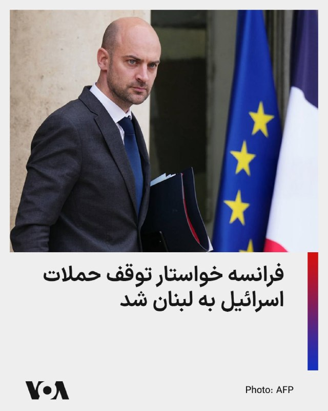

وزیر خارجه فرانسه اعلام کرد که اسرائیل باید حملات خود در لبنان را متوقف کند و ایالات متحده باید در این زمینه بر اسرائیل فشار وارد کند.

ژان-نوئل بارو در گفت‌وگو با یک شبکه فرانسوی افزود که فرانسه همچنین در حال تلاش برای برگزاری یک کنفرانس بین‌المللی برای جمع‌آوری کمک و حمایت از ارتش لبنان است.

اسرائیل پنج‌شنبه اعلام کرد که احتمال انجام حملاتی علیه حزب‌الله فراتر از یک منطقه کنترل نظامی در جنوب لبنان را رد نمی‌کند.

پیشتر رئیس جمهوری آمریکا، دونالد ترامپ، پنج‌شنبه ۲۸ خرداد گفت که انتظار دارد آتش‌بس کامل در همه جبهه‌ها، از جمله لبنان، حزب‌الله، و اسرائیل برقرار باشد.

آقای ترامپ در شبکه «تروت سوشال» نوشت: «ایالات متحده به صلح متعهد است و ما همه را در منطقه خاورمیانه تشویق می‌کنیم که به تعهد خود برای پیشبرد مذاکرات ما به بهترین شکل ممکن پایبند باشند.»
@FarsiVOA

## DW_Farsi — post 126162

  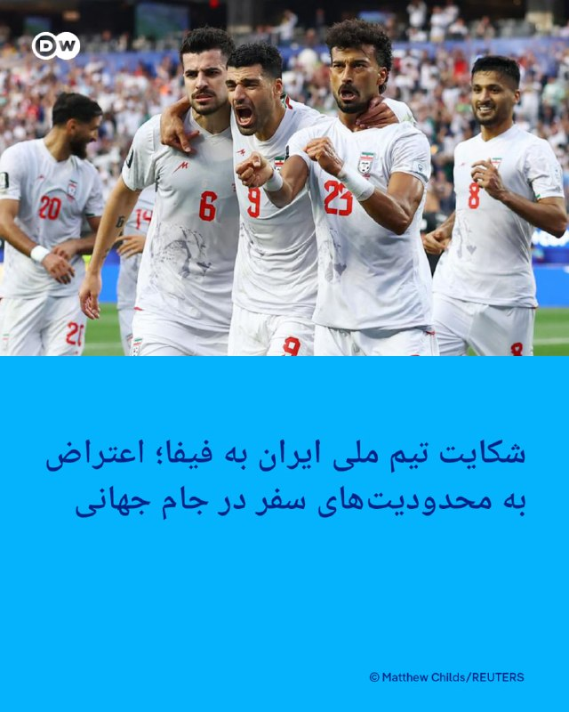

🔶 شکایت تیم ملی ایران به فیفا؛ اعتراض به محدودیت‌های سفر در جام جهانی

خبرگزاری فرانسه گزارش داد تیم ملی فوتبال ایران قصد دارد به دلیل محدودیت‌های ایجاد شده در جریان سفرهای خود برای شرکت در جام جهانی به فیفا شکایت کند. تیم ملی ایران اعلام کرده که در طول مسابقات در آمریکای شمالی با محدودیت‌های سفر مواجه شده است.

در همین رابطه سخنگوی فدراسیون فوتبال ایران گفت: «با وجود اینکه برنامه آماده‌سازی خود برای این رقابت‌ها را از مدت‌ها پیش ارائه کرده بود، تیم ملی فوتبال ایران بار دیگر با محدودیت‌هایی که برگزارکنندگان اعمال کرده‌اند مواجه شده است؛ محدودیت‌هایی که اجرای برنامه‌های کادر فنی را تحت تاثیر قرار داده‌ است.»

فدراسیون فوتبال ایران روز سه‌شنبه ۲۶ خردادماه (۱۶ ژوئن) اعلام کرده بود که مهدی ترابی، مهاجم تیم ملی ایران، پس از حل مشکل ویزای خود می‌تواند به حضور در جام جهانی ادامه دهد. با این حال، ایالات متحده بار دیگر تأکید کرده است که اعضای تیم باید پس از هر مسابقه خاک آمریکا را ترک کنند.

ویزای مهدی ترابی پس از نخستین ورودش به خاک آمریکا برای دیدار تیم ایران در جام جهانی مقابل نیوزیلند در روز دوشنبه ۱۵ ژوئن در لس‌آنجلس، نامعتبر اعلام شده بود. این دیدار با نتیجه تساوی ۲ بر ۲ پایان یافت.

پس از تساوی ۲-۲ مقابل نیوزیلند در لس‌آنجلس، تیم ملی فوتبال ایران مجبور به تخلیه فوری هتل و ترک خاک آمریکا شد. مهدی طارمی، کاپیتان تیم ملی، با انتقاد شدید از فدراسیون فوتبال ایران و ناامیدی از نقش فیفا، شرایط حاکم بر اردو را یک "فاجعه" توصیف کرد.

@dw_farsi

## IranianMinds — post 22914

  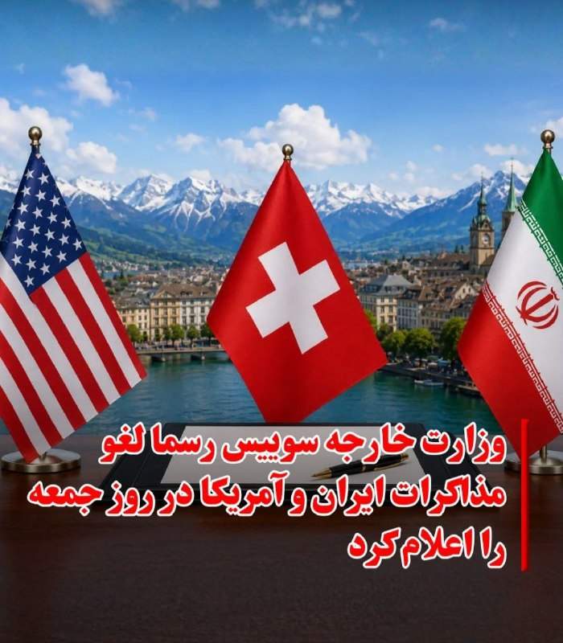

وزارت خارجه سوئیس:

مذاکرات برنامه‌ریزی‌شده میان آمریکا و جمهوری اسلامی که قرار بود جمعه در سوئیس برگزار بشه، لغو شد.

لغو این مذاکرات ابهام‌هایی درباره مرحله بعدی گفت‌وگوهای تهران و واشینگتن ایجاد کرده.

@IranianMinds

---
📅 بروزرسانی: 1405/03/29 11:14
---

## WithYashar — post 15299

سوئیس رسما اعلام کرد: مذاکرات ایران و آمریکا برگزار نخواهد شد
@withyashar

## pm_afshaa — post 94366

🔴العربیه: حملات اسرائیل به جنوب لبنان شب گذشته به طرز چشمگیری تشدید شده

💧 Rainbet.com the #1 Non-KYC Crypto Casino & Sportsbook @rainbetcom

😁 @Pm_Afshaa

## DEJradio — post 5809

  <a href="telegram/content/DEJradio_5809_1781855096.webm" target="_blank">🎬 Download video</a>

🔺📢 “من سربازم، این صبحانه ما تو پادگان است؛ خوب شد تسلیم شدن وگرنه باید نان خشک می‌خوردیم. حقوق کادری‌ها رو ندادن یا ۸ تا ۱۰ میلیون کمتر واریز شده...

پیام دریافتی

#دستمزد #پادگان
@DEJradio

## DEJradio — post 5808

  <a href="telegram/content/DEJradio_5808_1781855097.mp4" target="_blank">🎬 Download video</a>

🔺🎥 طی جنگ ۴۰ روزه تعداد زیادی از فرودگاه‌ها و هواپیماهای مستقر در آن بمباران شد.

یکی از شهروندان ویدیویی را در اینستاگرام به اشتراک گذاشت مربوط به لحظه برخاستن هواپیما از باند فرودگاه شیراز که نشان می‌دهد هواپیمای ترابری سی-۱۳۰ ارتش و چندین هواپیمای دیگر به طور کامل منهدم شده‌اند.

#جنگ۴۰روزه #فرودگاه_شیراز
@DEJradio

## DEJradio — post 5807

  <a href="telegram/content/DEJradio_5807_1781855099.mp4" target="_blank">🎬 Download video</a>

⚽️
🔺 سوشا مکانی، دروازه‌بان پیشین تیم ملی فوتبال، در گفت‌وگو با مهدی رستم‌پور در برنامه دژ فوتبالی، در واکنش به اظهارات بازیکنان تیم فوتبال جمهوری اسلامی درباره مسائل سیاسی پیرامون تیم، از جمله رامین رضاییان گفت: «بازیکنانی که حامی مردم نیستند دهانشان را بسته نگه دارند.»

#دژفوتبالی #جام_جهانی
@DEJradio

## IranIntlTV — post 343170

  <a href="telegram/content/IranIntlTV_343170_1781855103.mp4" target="_blank">🎬 Download video</a>

هم‌زمان با ادامه آماده‌سازی تیم فوتبال ایران برای برگزاری دومین دیدارش در رقابت‌های جام جهانی مقابل بلژیک، نیویورک تایمز گزارش داد فدراسیون فوتبال جمهوری اسلامی از فیفا خواسته است مقررات اقامت تیم ملی ایران در آمریکا را تسهیل کند.

گزارش رضا محدث، خبرنگار ایران‌اینترنشنال
@iranintltv

## FarsiVOA — post 221169

  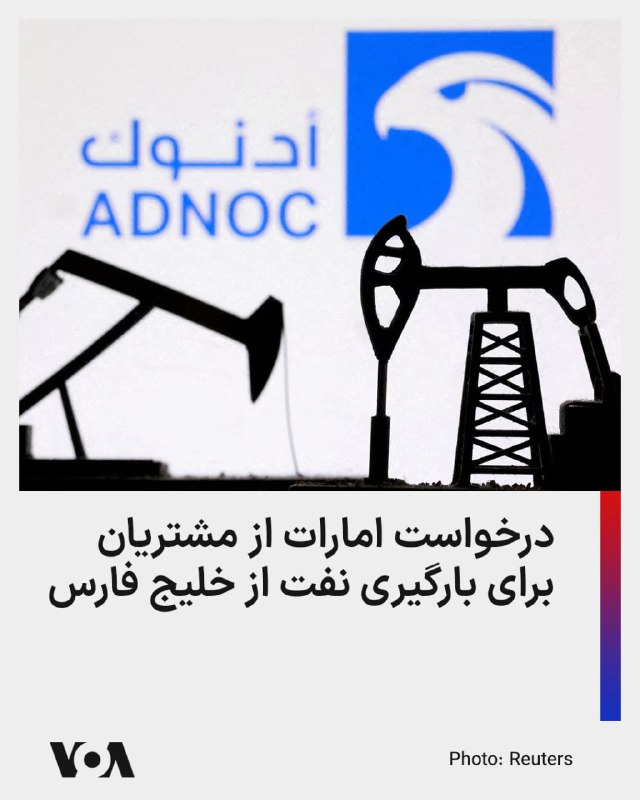

در پی رفع انسداد تنگه هرمز توسط جمهوری اسلامی در چهارچوب توافق با آمریکا، امارات از مشتریان نفتی خواست تا از پایانه‌های نفتی این کشور در خلیج فارس بارگیری نفت را از سر بگیرند.

خبرگزاری بلومبرگ گزارش داده که شرکت ملی نفت ابوظبی به مشتریان گفته است که می‌توانند بارگیری نفت از جزایر داس و زرکوه انجام دهند.

این شرکت اماراتی به مشتریان اطمینان داده اگر نتوانند نفتکشی برای اعزام به جزایر یاد شده فراهم کنند، این شرکت می‌تواند با نفتکش‌های خود برای بارگیری و انتقال نفت کمک کند.

امارت طی ماه‌های گذشته به خاطر انسداد تنگه هرمز بخش اعظم نفت خود را از بندر فجیره در دریای عمان صادر می‌کرد.
@FarsiVOA

## Persian_Trend_Official — post 17528

یه سرقت عجیب و جسورانه توی بریتانیا اتفاق افتاده. دزدها با یه لودر تلسکوپی رفتن جلوی شعبه بانک و یه دستگاه خودپرداز رو از توی دیوار کندن و با خودشون بردن.
پلیس کمبریج‌شر گفته خودِ لودر رو هم دزدیده بودن؛ اونم فقط برای چند ده هزار پوند پول.

📌 @persian_trend_official
پرشین ترند | متفاوت‌ترین کانال نظامی

## RadioFarda — post 158495

خامنه‌ای مسئولیت تفاهم‌نامه را به عهده پزشکیان گذاشت؛ پزشکیان قول پیروی از دستور داد

🔸 رسانه‌ها در ایران پنج‌شنبه شب، ۲۸ خرداد، متن پیام مکتوبی منسوب به مجتبی خامنه‌ای را منتشر کردند مبنی بر این که درباره امضای تفاهم‌نامه میان ایران و آمریکا «نظر دیگری» داشته و اکنون مسئولیت آن را بر عهده مسعود پزشکیان، رئیس شورای عالی امنیت ملی، و دیگر اعضای این شورا می‌داند.

🔸 مجتبی خامنه‌ای کمتر از ۱۰ روز پس از کشته شدن پدرش در حمله هوایی اسرائیل به عنوان رهبر تازه حکومت معرفی شد، اما در بیش از سه ماه و نیم گذشته نه فایلی صوتی از او منتشر شده و نه ویدئویی که نشان دهد او از توان رهبری و تصمیم‌گیری برخوردار است.

🔸 در پیام رهبر تازه جمهوری اسلامی درباره توافق با ایالات متحده آمده است: «بنده علی‌الاصول، نظر دیگری داشتم ولی از باب تعهدی که رئیس‌جمهور محترم به‌عنوان رئیس شورای عالی امنیت ملی از طرف خود و سایر اعضا در پاسداشت حقوق ملت ایران و جبهه مقاومت به بنده دادند و تصریح به قبول مسئولیت آن نمودند، اجازه آن را صادر نمودم‌.»

🔸 در پاسخ به پیام خامنه‌ای،‌ مسعود پزشکیان، رئیس جمهور، بلافاصله شامگاه پنج‌شنبه در پیامی نوشت که «خود را متعهد به توجه حداکثری نسبت به دغدغه‌های» مجتبی خامنه‌ای در زمینه «حراست از حقوق» ایران و گروه‌های نیابتی آن می‌داند.

🔸گزارش کامل را در وب‌سایت رادیو فردا می‌توانید بخوانید.

@RadioFarda

## BBCPersian — post 284348

🔻یک مامور نیروی انتظامی در تیراندازی افراد مسلح در خاش کشته شد

مرکز اطلاع‌رسانی پلیس سیستان و بلوچستان اعلام کرد یک مامور فرماندهی نیروی انتظامی شهرستان خاش، در پی تیراندازی افراد مسلح ناشناس کشته شده است.

این مرکز نام این فرد را ستوان سوم عبدالسلام کُرد اعلام کرده است.

به گفته پلیس فراجا، عملیات شناسایی و دستگیری این افراد آغاز شده است.

در ماه‌های اخیر حمله افراد مسلح به نیروهای امنیتی در شهرهای مختلف استان سیستان و بلوچستان، بارها خبرساز شده است.

گروه جیش‌العدل در این منطقه فعالیت می‌کند. پاییز سال گذشته این گروه در «جبهه مبارزین بلوچ» ادغام شد.

علاوه بر جیش‌العدل نام چند گروه دیگر نیز به عنوان اعضای این ائتلاف ذکر شده است از جمله «جنبش پادا بلوچ»، «حرکت نصر بلوچ»، «گروه محمد رسول‌الله» و «جنگجویان خودجوش بلوچ».

https://bbc.in/4vgfIJP
@BBCPersian

## Dirty_Kids — post 392553

  

قالیباف: آدم برای خون خواهی امام حسین میزنه شمر رو میکشه؟
نه! میره باهاش تفاهم نامه امضا میکنه، پول میگیره، با پولش قیمه میخوره تا امام زمان ظهور کنه! همین میشه انتقام سخت!

عرزشیا فهمیدن یا عمو باقر بیشتر توضیح بده؟ 😂

@Dirty_Kids 👻

## Dirty_Kids — post 392552

  <a href="telegram/content/Dirty_Kids_392552_1781855106.mp4" target="_blank">🎬 Download video</a>

چه دل و جرعتی 👏

@Dirty_Kids 👻

## Dirty_Kids — post 392551

‌‎صورتش رو سه‌تیغ می‌کرد، باید محاسن داشته باشه، اول فامیلیش قاف باشه، چشاش بور باشه و از همه مهم‌تر، بِچِه‌ی طرقِبَه باشه @Dirty_Kids 👻 ‌

## alonews — post 129064

👈استاد دانشگاه تهران: یک لیوان آب ۱۵ هزار تومان است یک لیتر بنزین ۳ هزار تومان!

🔴 نیاز به مدیرانی داریم که جسارت تصمیم‌گیری داشته باشند

✅ @AloNews خبر جنگ

## alonews — post 129063

  <a href="telegram/content/alonews_129063_1781855107.webm" target="_blank">🎬 Download video</a>

👈العربیه: حملات اسرائیل به جنوب لبنان شب گذشته به طرز چشمگیری تشدید شد

✅ @AloNews خبر جنگ

<!-- MSG END -->

<!-- NAV START -->

<a href="https://github.com/ProAlit/aio-downloader/blob/main/telegram/content/archive_1.md" style="display:inline-block; padding:6px 12px; margin:0 4px; background-color:#2ea44f; color:white; text-decoration:none; border-radius:4px; font-weight:bold;">صفحه بعد</a>

<!-- NAV END -->
