# خواننده تلگرام

<!-- TOP_NAV START -->

<a href="https://github.com/ProAlit/aio-downloader/blob/main/telegram/content/archive_1.md" style="display:inline-block; padding:6px 12px; margin:0 4px; background-color:#2ea44f; color:white; text-decoration:none; border-radius:4px; font-weight:bold;">صفحه بعد</a>

<!-- TOP_NAV END -->

<!-- MSG START -->

---
📅 بروزرسانی: 1405/03/21 18:23
---

## VahidOOnLine — post 244974

🗣روایت شما از زندگی در دوران پس از انقلاب ملی و جنگ - پنجشنبه ۲۱ خرداد ۱۴۰۵

🔹از شیراز: داروهای هورمونی بارداری از جمله استرادیول والرات، استروژن و داروهای غدد به دشواری پیدا می‌شن. الان دو هفته هست که دنبال قرص استرادیول هستم.

🔹من یه دختر ۱۴ ساله‌ام، واقعا گرونی بیداد می‌کنه، خجالت می‌کشم از پدرم چیزی بخوام... به امید روزهای بهتر

🔹از کرج: خیلی گرونی شده، در حدی که ۵ تا تخم‌مرغ شده ۱۰۰ هزار تومان یا یه موتور که اون موقع ۶۰۰ میلیون بود، الان شده ۳ میلیارد یا بیشتر.

🔹قبلا صبح‌ها تهران شلوغ بود و ترافیک، چون همه می‌رفتن سر کار. الان ساعت ۷ صبح همه‌جا خلوت، اصلا کسی تو شهر نیست، مردم همه بیکار شدن.

🔹از کرمان: فرزندم قرار عمل بشه، دکتر برای دستمزد ۲۰۰ میلیون تومان خواسته، بیمارستان هم ۱۷۰ میلیون تومان هزینه خواسته و با بیمه تکمیلی‌ام قرارداد نداره. بازنشسته هستم، نمی‌دونم از کجا باید هزینه‌ش رو تامین کنم.

🔹واقعا از جمهوری اسلامی متنفرم، واقعا تبعیض جنسیتی تا کی می‌خواد ادامه‌دار باشه؟ به زن‌ها گواهینامه موتورسواری نمی‌دن و اگه شما رو با موتور ببینن، موتور رو توقیف می‌کنن.

🔹از کرمانشاه: به عنوان یه دختر ۱۶ ساله می‌گم که در مملکت ما خرید یه گوشی هم حسرت شده. یه گوشی شده ۸۰ میلیون تومان. با این وضعیت نمی‌شه زندگی کرد، حالِ ایران بده.

🔹از فیروزآباد: آرزوی یه موتور ۲۰۰ سی‌سی به دلم مونده، چون در عرض یک ماه از ۱۶۰ میلیون شد ۵۲۰ میلیون تومان.
‌🏁 🇬🇧 IranintlTV

🤖 @VahidOOnLine

## kianmeli1 — post 87934

🔴برای تصرف کردن جزیره خارک از ماهها پیش طرح‌ریزی شده است./CNN
https://t.me/kianmeli1

## Persian_Trend_Official — post 16736

بلومبرگ: امارات متحده عربی و ایران اولین نشست امنیتی در سطح بالا را از زمان آغاز جنگ آمریکا و اسرائیل علیه ایران برگزار کردند که نشان دهنده حرکتی به سوی کاهش تنش‌ها پس از ماه‌ها درگیری است.

علیرغم اینکه امارات متحده عربی ایران را یک تهدید منطقه‌ای می‌داند، به طور فزاینده‌ای ثبات را برای محافظت از اقتصاد، بخش مالی، صنعت گردشگری و سرمایه‌گذاری‌های عمده در زیرساخت‌های نفت و هوش مصنوعی خود در اولویت قرار می‌دهد.

ایران نیز به بهبود روابط علاقه‌مند است، زیرا امارات متحده عربی قبل از جنگ یکی از مهمترین شرکای تجاری آن بود.

📝 Amir

📌 @persian_trend_official
پرشین ترند | متفاوت‌ترین کانال نظامی

## RadioFarda — post 158185

🔸خبرگزاری بلومبرگ روز پنجشنبه ۱۹ خرداد به نقل از «منابع آگاه» گزارش داد که مقام‌های ارشد امنیت ملی امارات متحده عربی و ایران برای نخستین بار از زمان آغاز جنگ آمریکا و اسرائیل علیه تهران، حضوری با یکدیگر دیدار کردند. 🔸این دیدار که در هفته جاری انجام شد، به…

## RadioFarda — post 158184

  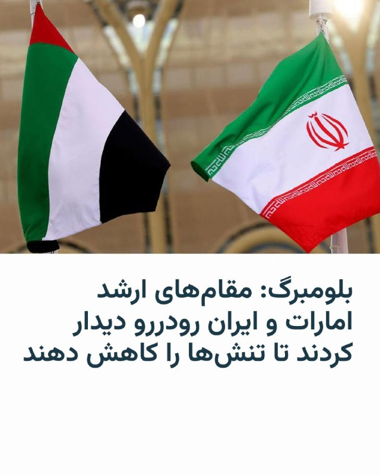

🔸خبرگزاری بلومبرگ روز پنجشنبه ۱۹ خرداد به نقل از «منابع آگاه» گزارش داد که مقام‌های ارشد امنیت ملی امارات متحده عربی و ایران برای نخستین بار از زمان آغاز جنگ آمریکا و اسرائیل علیه تهران، حضوری با یکدیگر دیدار کردند.

🔸این دیدار که در هفته جاری انجام شد، به نوشتهٔ بلومبرگ، نشان‌دهندهٔ چرخشی قابل توجه در رویکرد دو طرف است و در شرایطی صورت می‌گیرد که هر دو کشور بیش از پیش به اهمیت روابط دوجانبه آرام‌تر پی برده‌اند.

🔸این خبرگزاری می‌گوید که منابع آن به‌دلیل حساسیت موضوع نخواستند نامشان فاش شود.

🔸بر اساس این گزارش، رهبران امارات می‌خواهند برنامه‌های بلندپروازانهٔ اقتصادی خود، از جمله سرمایه‌گذاری میلیاردی در افزایش تولید نفت و ایجاد مراکز دادهٔ هوش مصنوعی، بدون اختلال ادامه یابد. این رابطه برای تهران نیز اهمیت دارد، زیرا امارات پیش از آغاز جنگ یکی از بزرگ‌ترین شرکای تجاری تهران و مسیر مهمی برای انتقال نفت تحریم‌شده ایران بود.

🔸به گفتهٔ منابع بلومبرگ، تماس اخیر ابوظبی با ایران عمدتاً با هدف دستیابی به نوعی تنش‌زدایی با حکومتی انجام شده که آن را دشمن می‌داند.

@RadioFarda

## Dirty_Kids — post 391715

جمهوری اسهالی قبلا با آخوند مردم رو فریب میداد الان با اینا میخواد فریب بده

@Dirty_Kids 👻

## Dirty_Kids — post 391714

  

جی‌لو پیش خودش گفته: "حالا که پولدارم، چطوری هم اکس‌هامو حرص بدم هم یه نکس بزنم؟". بعد هم یک فیلم سفارشی ساخته که دو ساعت تمام خودش را از زوایای مختلف نشون میدن؛ با لباس‌های خیره‌کننده، نورهای هندی‌طور و کلی شکوه و جلال. هیچی دیگه! فن‌های خانم جی‌لو ببینن...
#پیشنهاد_فیلم

@Dirty_Kids 👻

## alonews — post 127164

  <a href="telegram/content/alonews_127164_1781189603.webm" target="_blank">🎬 Download video</a>

👈پلاکاردی عجیب در تجمعات شبانه

✅ @AloNews خبر جنگ

## alonews — post 127163

  <a href="telegram/content/alonews_127163_1781189603.webm" target="_blank">🎬 Download video</a>

👈پزشکیان: باید از وضعیت نه جنگ نه صلح خارج شویم اما مگر در خواب، تسلیم شدن ما را ببینند

✅ @AloNews خبر جنگ

---
📅 بروزرسانی: 1405/03/21 18:14
---

## VahidOOnLine — post 244973

  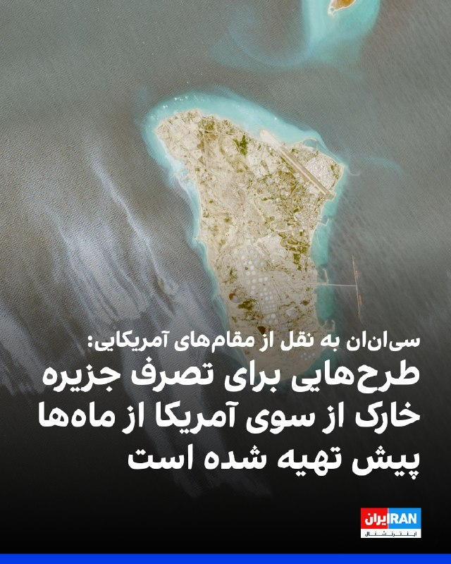

یک مقام ارشد پنتاگون و دو مقام دولت آمریکا به سی‌ان‌ان گفتند طرح‌هایی برای تلاش ارتش آمریکا جهت تصرف جزیره خارک از ماه‌ها پیش تهیه شده، اما به طور مداوم کنار گذاشته شده است، زیرا این عملیات بسیار پرریسک ارزیابی شده است.

سی‌ان‌ان به نقل از این مقام‌های آمریکایی نوشت دیدگاه در کاخ سفید و پنتاگون این است که تصرف جزیره خارک یا نابودی زیرساخت‌های انرژی آن عملا جمهوری اسلامی را ورشکسته می‌کند و توانایی آن برای ادامه جنگ را به شدت کاهش می‌دهد.

بر اساس این گزارش، مقام‌های آمریکایی به دونالد ترامپ اطلاع داده‌اند که چنین عملیاتی احتمالا به شمار قابل توجهی نیروی زمینی نیاز دارد و می‌تواند به تلفات سنگین نیروهای آمریکایی منجر شود.

سی‌ان‌ان نوشت که پنتاگون و کاخ سفید هرگونه اقدام برای تصرف جزیره خارک را گزینه «مرحله پایانی» یا آخرین راه‌حل دانسته‌اند.
‌🏁 🇬🇧 IranintlTV

🤖 @VahidOOnLine

## VahidOOnLine — post 244972

  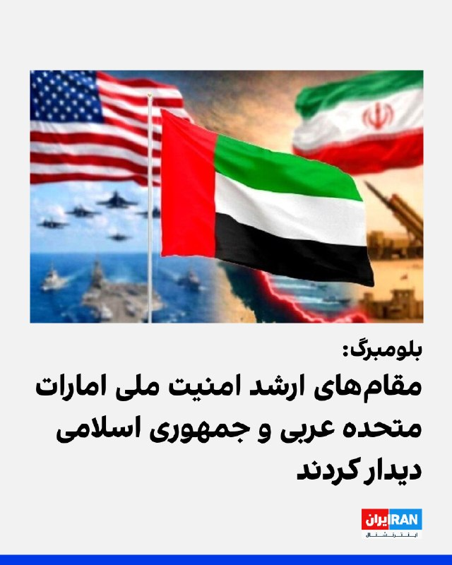

بلومبرگ گزارش داد مقام‌های ارشد امنیت ملی امارات متحده عربی و جمهوری اسلامی برای نخستین بار از زمان آغاز جنگ آمریکا و اسرائیل علیه تهران، دیدار حضوری برگزار کردند.

بلومبرگ نوشت این دیدار که این هفته انجام شد، چرخشی قابل توجه در روابط دو طرف محسوب می‌شود و در شرایطی صورت گرفته که هر دو طرف بیش از پیش به اهمیت روابط دوجانبه آرام‌تر اذعان دارند.
‌🏁 🇬🇧 IranintlTV

🤖 @VahidOOnLine

## VahidOOnLine — post 244971

  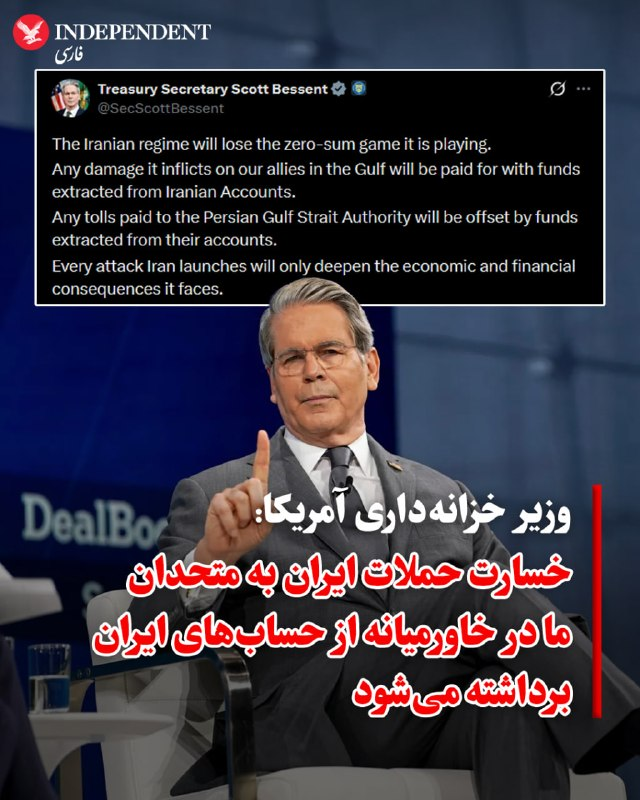

♦️ اسکات بسنت، وزیر خزانه‌داری ایالات متحده، روز پنجشنبه ۲۱ خرداد با انتشار پیامی در شبکه اجتماعی ایکس به تهران هشدار داد که راهبرد کنونی‌اش در خلیج فارس، هزینه‌های سنگین اقتصادی و مالی در پی خواهد داشت و هرگونه اقدام خصمانه با پاسخ تنبیهی علیه دارایی‌های ایران مواجه می‌شود. بسنت تاکید کرد: «رژیم ایران در بازی با حاصل جمع صفر (بازی بی‌حاصل) که راه انداخته، بازنده خواهد شد.»

وزیر خزانه‌داری آمریکا در ادامه افزود: «هرگونه خسارتی که ایران به متحدان ما در خلیج فارس وارد کند، از طریق منابع مالی که از حساب‌های ایران برداشت می‌شود، جبران خواهد شد.» او همچنین هشدار داد هرگونه باج یا عوارضی که به «اداره تنگه هرمز» پرداخت شود، از حساب‌های خود آن‌ها کسر و تلافی می‌شود.

این تهدیدات در حالی مطرح می‌شود که روز یکشنبه، کاظم غریب‌آبادی، معاون وزیر امور خارجه جمهوری اسلامی ایران، در واکنش به گزارش‌هایی مبنی بر احتمال استفاده آمریکا از دارایی‌های مسدودشده ایران برای جبران خسارت‌های جنگی متحدانش، تاکید کرده بود که دولت‌های منطقه در جایگاهی نیستند که تقاضای غرامت کنند.
‌🇸🇦 Indypersian

🤖 @VahidOOnLine

## WithYashar — post 14529

  <a href="telegram/content/WithYashar_14529_1781189070.mp4" target="_blank">🎬 Download video</a>

کپشن با شما 🥴
@withyashar

## WithYashar — post 14528

سی‌ان‌ان: برنامه‌های نظامی آمریکا برای تلاش جهت تصرف جزیره خارک ماه‌هاست که تدوین شده، اما به دلیل این که این عملیات بسیار پرریسک تلقی میشد، به تعویق افتاده. این خبر رو یک مقام ارشد پنتاگون و دو مقام دولتی به سی‌ان‌ان گفتن.

مقامات به دونالد ترامپ گفتن که چنین عملیاتی احتمالاً به تعداد قابل توجهی نیروی زمینی نیاز داره و به طور بالقوه میتونه منجر به تلفات سنگین آمریکایی‌ها بشه.

پنتاگون و کاخ سفید هرگونه اقدام برای تصرف جزیره خارک رو به عنوان یک گزینه «پایان‌بازی» در نظر گرفتن، آخرین راه حلی که میتونه موازنه جنگ رو تغییر بده، اما با هزینه‌ای بالا.
نظامیان آمریکایی پیش از این حملات هوایی زیادی بر تأسیسات نظامی جزیره خارک انجام دادن، اما در این حملات عمداً از ضربه به زیرساخت انرژی این جزیره خودداری کردن.
@withyashar

## WithYashar — post 14527

## IranIntlTV — post 341732

🗣روایت شما از زندگی در دوران پس از انقلاب ملی و جنگ - پنجشنبه ۲۱ خرداد ۱۴۰۵

🔹از شیراز: داروهای هورمونی بارداری از جمله استرادیول والرات، استروژن و داروهای غدد به دشواری پیدا می‌شن. الان دو هفته هست که دنبال قرص استرادیول هستم.

🔹من یه دختر ۱۴ ساله‌ام، واقعا گرونی بیداد می‌کنه، خجالت می‌کشم از پدرم چیزی بخوام... به امید روزهای بهتر

🔹از کرج: خیلی گرونی شده، در حدی که ۵ تا تخم‌مرغ شده ۱۰۰ هزار تومان یا یه موتور که اون موقع ۶۰۰ میلیون بود، الان شده ۳ میلیارد یا بیشتر.

🔹قبلا صبح‌ها تهران شلوغ بود و ترافیک، چون همه می‌رفتن سر کار. الان ساعت ۷ صبح همه‌جا خلوت، اصلا کسی تو شهر نیست، مردم همه بیکار شدن.

🔹از کرمان: فرزندم قرار عمل بشه، دکتر برای دستمزد ۲۰۰ میلیون تومان خواسته، بیمارستان هم ۱۷۰ میلیون تومان هزینه خواسته و با بیمه تکمیلی‌ام قرارداد نداره. بازنشسته هستم، نمی‌دونم از کجا باید هزینه‌ش رو تامین کنم.

🔹واقعا از جمهوری اسلامی متنفرم، واقعا تبعیض جنسیتی تا کی می‌خواد ادامه‌دار باشه؟ به زن‌ها گواهینامه موتورسواری نمی‌دن و اگه شما رو با موتور ببینن، موتور رو توقیف می‌کنن.

🔹از کرمانشاه: به عنوان یه دختر ۱۶ ساله می‌گم که در مملکت ما خرید یه گوشی هم حسرت شده. یه گوشی شده ۸۰ میلیون تومان. با این وضعیت نمی‌شه زندگی کرد، حالِ ایران بده.

🔹از فیروزآباد: آرزوی یه موتور ۲۰۰ سی‌سی به دلم مونده، چون در عرض یک ماه از ۱۶۰ میلیون شد ۵۲۰ میلیون تومان.

## IranIntlTV — post 341731

  

یک مقام ارشد پنتاگون و دو مقام دولت آمریکا به سی‌ان‌ان گفتند طرح‌هایی برای تلاش ارتش آمریکا جهت تصرف جزیره خارک از ماه‌ها پیش تهیه شده، اما به طور مداوم کنار گذاشته شده است، زیرا این عملیات بسیار پرریسک ارزیابی شده است.

سی‌ان‌ان به نقل از این مقام‌های آمریکایی نوشت دیدگاه در کاخ سفید و پنتاگون این است که تصرف جزیره خارک یا نابودی زیرساخت‌های انرژی آن عملا جمهوری اسلامی را ورشکسته می‌کند و توانایی آن برای ادامه جنگ را به شدت کاهش می‌دهد.

بر اساس این گزارش، مقام‌های آمریکایی به دونالد ترامپ اطلاع داده‌اند که چنین عملیاتی احتمالا به شمار قابل توجهی نیروی زمینی نیاز دارد و می‌تواند به تلفات سنگین نیروهای آمریکایی منجر شود.

سی‌ان‌ان نوشت که پنتاگون و کاخ سفید هرگونه اقدام برای تصرف جزیره خارک را گزینه «مرحله پایانی» یا آخرین راه‌حل دانسته‌اند.
https://iranintl.com/202606119910

## IranIntlTV — post 341730

  

بلومبرگ گزارش داد مقام‌های ارشد امنیت ملی امارات متحده عربی و جمهوری اسلامی برای نخستین بار از زمان آغاز جنگ آمریکا و اسرائیل علیه تهران، دیدار حضوری برگزار کردند.

بلومبرگ نوشت این دیدار که این هفته انجام شد، چرخشی قابل توجه در روابط دو طرف محسوب می‌شود و در شرایطی صورت گرفته که هر دو طرف بیش از پیش به اهمیت روابط دوجانبه آرام‌تر اذعان دارند.
https://iranintl.com/202606117705

## IranIntlTV — post 341729

  <a href="telegram/content/IranIntlTV_341729_1781189075.mp4" target="_blank">🎬 Download video</a>

سرخط خبرهای پنجشنبه ۲۱ خرداد
@iranintltv

## FarsiVOA — post 220387

🔺حمایت سناتور گراهام از اظهارات پرزیدنت ترامپ درباره تصرف جزیره خارک

▪️لیندزی گراهام، سناتور ارشد جمهوری‌خواه از ایالت کارولینای جنوبی، از اظهارات دونالد ترامپ، رئیس جمهوری ایالات متحده، درباره احتمال تصرف جزیره خارک در صورت عدم دستیابی به توافق با جمهوری اسلامی حمایت کرد.

⬇️ بیشتر بخوانید:

https://ir.voanews.com/a/sen-graham-says-president-trump-right-to-take-kharg-island/8159722.html

## DW_Farsi — post 125824

  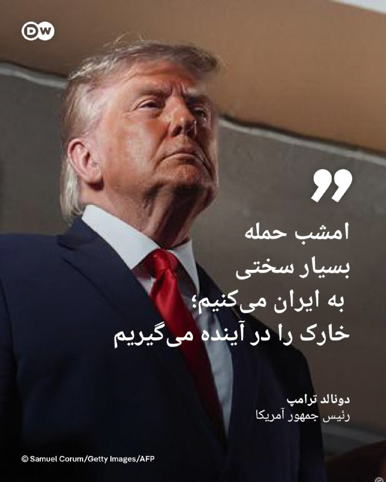

🔶 ترامپ: امشب حمله بسیار سختی به ایران می‌کنیم؛ خارک را ‌در آینده می‌گیریم
 
دونالد ترامپ، رئیس‌ جمهور آمریکا در تازه‌ترین پیام خود در شبکه تروث سوشال در روز پنج‌شنبه ۲۱ خرداد (۱۱ ژوئن) نوشت، آمریکا امشب به ایران "حمله بسیار سختی" خواهد کرد.
 
اظهارات ترامپ نشان می‌دهند حملات نظامی ایالات متحده به مواضعی در ایران ظاهرا ادامه خواهند یافت. موج جدید حملات از دو شب پیش آغاز شدند. آغازگر آن به گفته آمریکا، سرنگونی یک هلی‌کوپتر آپاچی این کشور در تنگه هرمز توسط ایران بوده است.

ترامپ در این پیام با تأکید بر انهدام "نیروی دریایی، نیروی هوایی، سامانه‌های راداری، پدافند ضدهوایی و تمامی اشکال دیگر دفاعی و عمده توان تهاجمی" جمهوری اسلامی افزود: «در مقطعی در آینده‌ای نه‌چندان دور، ما جزیره خارک و دیگر نقاط زیرساختی نفت [آن‌ها] را تصرف خواهیم کرد و کنترل کامل بازارهای نفت و گاز آن‌ها را به دست خواهیم گرفت؛ درست مانند کاری که با ونزوئلا انجام داده‌ایم که برای هر دو کشور ونزوئلا و ایالات متحده آمریکا نتایج درخشانی داشته است.»
 
طی دو شب گذشته هم قصد آمریکا برای حمله به ایران ابتدا توسط ترامپ اعلام شده بود.
@dw_farsi

## Persian_Trend_Official — post 16735

  <a href="telegram/content/Persian_Trend_Official_16735_1781189077.mp4" target="_blank">🎬 Download video</a>

ترامپ در مورد ایران: مشکل این است که این می‌تواند بزرگترین توافق تاریخ باشد.

آنها می‌توانند پرچم سفید تسلیم را تکان دهند و بگویند "الحمدلله" و اخبار جعلی بگویند "این یک پیروزی بزرگ برای ایران بود". این دیوانه‌وارترین چیزی است که تا به حال دیده‌ام. ما داریم آنها را می‌کشیم.

📝 Amir

📌 @persian_trend_official
پرشین ترند | متفاوت‌ترین کانال نظامی

## IranianMinds — post 22314

  <a href="telegram/content/IranianMinds_22314_1781189080.mp4" target="_blank">🎬 Download video</a>

😂😂😂

@IranianMinds

## Hranews — post 113541

یک کولبر در پی تیراندازی نیروهای نظامی در بانه زخمی شد

❗️
❗️
❗️
❗️
❗️– امروز پنجشنبه، تیراندازی نیروهای نظامی در مناطق مرزی شهرستان بانه، به زخمی شدن یک #کولبر انجامید.

ادامه مطلب
↘️
@hranews_bot تماس ✉️ - @Hranews کانال هرانا 🆑

## alonews — post 127162

  <a href="telegram/content/alonews_127162_1781189082.webm" target="_blank">🎬 Download video</a>

👈بلومبرگ: امارات و ایران اولین دیدار امنیتی رو در رو در سطح بالا را از زمان آغاز جنگ آمریکا و اسرائیل علیه ایران برگزار کرده‌اند.

🔴این اقدام نشانه‌ای از حرکت به سمت کاهش تنش‌ها پس از ماه‌ها درگیری است

✅ @AloNews خبر جنگ

## alonews — post 127161

  <a href="telegram/content/alonews_127161_1781189083.webm" target="_blank">🎬 Download video</a>

👈ارتش اسرائیل اعلام کرد از ابتدای ماه مارس گذشته، 30 نظامی اسرائیلی (افسر و نظامی) کشته شده‌اند و همچنین 1302 نفر نیز زخمی شده‌اند.

✅ @AloNews خبر جنگ

## alonews — post 127160

  <a href="telegram/content/alonews_127160_1781189083.webm" target="_blank">🎬 Download video</a>

🔴فوری / خبرگزاری فارس : ایران داره بررسی می‌کنه که دارایی‌ها و کسب‌وکارهای مرتبط با ایلان ماسک تو خاورمیانه؛

🔴 از جمله تجهیزات استارلینک و سرمایه‌گذاری‌های مرتبط با اسپیس‌ایکس، رو به فهرست اهداف نظامی خودش اضافه کنه!

✅ @AloNews خبر جنگ

---
📅 بروزرسانی: 1405/03/21 18:03
---

## VahidOOnLine — post 244970

♦️رئیس کمیسیون امنیت ملی و سیاست خارجی مجلس شورای اسلامی در واکنش به سخنان اخیر دونالد ترامپ در مورد احتمال تصرف جزیره خارگ و هدف قرار دادن زیرساخت‌های نفتی ایران گفت هرگونه اقدام محاسبه‌نشده آمریکا با پاسخی به‌مراتب «پشیمان‌کننده‌تر و قاطع‌تر از گذشته» روبرو خواهد شد.
ابراهیم عزیزی، روز دوشنبه ۲۱ خرداد در حاشیه مراسمی حکومتی و در گفتگو با خبرگزاری فارس گفت: «رئیس‌جمهور آمریکا همواره به زیاده‌گویی و بیان موضوعاتی برگرفته از توهمات پرداخته است.»
او با ادعای آنکه ترامپ به دلیل «دست خالی» ناچار به طرح این تهدیدات است، متقابلا تهدید کرد: «در صورت هرگونه اقدام سنجش‌نشده از سوی دشمن، قطعا پاسخی پشیمان‌کننده‌تر، دردناک‌تر و قاطع‌تر به آن‌ها داده خواهد شد و رئیس‌جمهوری آمریکا نیز به‌خوبی می‌داند که پاسخ نیروهای مسلح ایران برای او غیرقابل تحمل خواهد بود.»

این اظهارات پس از آن مطرح شد که دونالد ترامپ، بعد از ظهر پنجشنبه در گفتگو با شبکه خبری فاکس و انتشار متنی در شبکه اجتماعی تروث سوشال اعلام کرد، ارتش این کشور زیرساخت‌های نفتی ایران را هدف قرار خواهد داد. رئیس جمهوری آمریکا همچنین از احتمال ارسال نیروی پیاده نظام برای تصرف جزیره خارگ سخن گفته است.
‌🇸🇦 Indypersian

🤖 @VahidOOnLine

## VahidOOnLine — post 244969

  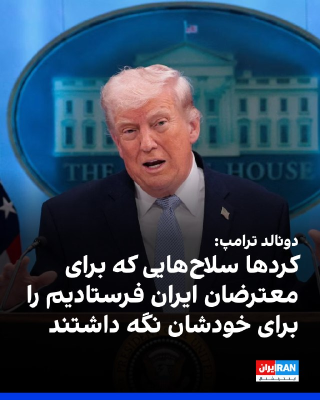

دونالد ترامپ، رییس‌جمهوری ایالات متحده به فاکس‌نیوز گفت کردها مانع تلاش او برای مسلح کردن مردم ایران شدند و افزود هرگز این موضوع را فراموش نخواهد کرد.

ترامپ افزود: «ما برای کردها سلاح فرستادیم اما آن‌ها ما را ناامید کردند و سلاح‌ها را تحویل معترضان ندادند.»

دونالد ترامپ پیش‌تر نیز گفته بود مردم ایران می‌خواهند اعتراض کنند، اما سلاحی ندارند. ما تصور می‌کردیم می‌توانیم از طریق کردها به آن‌ها کمک کنیم و سلاح برسانیم، اما کردها ما را ناامید کردند.
‌🏁 🇬🇧 IranintlTV

🤖 @VahidOOnLine

## WithYashar — post 14526

## WithYashar — post 14525

گزارش CNN: ایران در حالی که ارتش این کشور در حال انتقال محموله‌های موشکی است، سامانه‌های پدافند هوایی خود را در جزیره خارک نوسازی کرده است.
ایران همچنین در امتداد خط ساحلی جزیره خارک مین‌گذاری انجام داده است
@withyashar

## WithYashar — post 14524

همکنون ایران با پهپادهای کامیکازه شروع به حمله به گروه‌های مخالف کرد ایرانی در در شمال عراق کرده است 🚨
@withyashar

## pm_afshaa — post 93629

  <a href="telegram/content/pm_afshaa_93629_1781188398.webm" target="_blank">🎬 Download video</a>

🔴سی‌ان‌ان: برنامه‌های نظامی آمریکا برای تلاش جهت تصرف جزیره خارک ماه‌هاست که تدوین شده، اما به دلیل این که این عملیات بسیار پرریسک تلقی میشد، به تعویق افتاده. این خبر رو یک مقام ارشد پنتاگون و دو مقام دولتی به سی‌ان‌ان گفتن. مقامات به دونالد ترامپ گفتن که…

## pm_afshaa — post 93628

  <a href="telegram/content/pm_afshaa_93628_1781188399.webm" target="_blank">🎬 Download video</a>

🔴سی‌ان‌ان: برنامه‌های نظامی آمریکا برای تلاش جهت تصرف جزیره خارک ماه‌هاست که تدوین شده، اما به دلیل این که این عملیات بسیار پرریسک تلقی میشد، به تعویق افتاده. این خبر رو یک مقام ارشد پنتاگون و دو مقام دولتی به سی‌ان‌ان گفتن.

مقامات به دونالد ترامپ گفتن که چنین عملیاتی احتمالاً به تعداد قابل توجهی نیروی زمینی نیاز داره و به طور بالقوه میتونه منجر به تلفات سنگین آمریکایی‌ها بشه.

پنتاگون و کاخ سفید هرگونه اقدام برای تصرف جزیره خارک رو به عنوان یک گزینه «پایان‌بازی» در نظر گرفتن، آخرین راه حلی که میتونه موازنه جنگ رو تغییر بده، اما با هزینه‌ای بالا.
نظامیان آمریکایی پیش از این حملات هوایی زیادی بر تأسیسات نظامی جزیره خارک انجام دادن، اما در این حملات عمداً از ضربه به زیرساخت انرژی این جزیره خودداری کردن.

💧Rainbet.com the #1 Non-KYC Crypto Casino & Sportsbook @rainbetcom

😁 @Pm_Afshaa

## VahidOnline — post 76221

  <a href="telegram/content/VahidOnline_76221_1781188400.mp4" target="_blank">🎬 Download video</a>

'لحظه انفجار حمله حدود ۴ صبح به پیشوا در استان تهران'
ویدیوی دریافتی، پنج‌شنبه ۲۱ خرداد
Vahid

📡 @VahidOnline

## VahidOnline — post 76214

  <a href="telegram/content/VahidOnline_76214_1781188400.mp4" target="_blank">🎬 Download video</a>

دونالد ترامپ، رییس‌جمهوری آمریکا، در گفت‌وگو با شبکه فاکس‌نیوز گفت آمریکا همچنان با جمهوری اسلامی در حال گفت‌وگو است.
او در عین حال تاکید کرد جنگ تنها با «تسلیم جمهوری اسلامی» متوقف خواهد شد.
ترامپ همچنین گفت آمریکا هنوز «با تمام قدرت» به ایران حمله نکرده است.
رییس‌جمهوری آمریکا بار دیگر از جزیره خارک نام برد و گفت ترجیح او این است که آمریکا این جزیره را در اختیار بگیرد.
او افزود با وجود ادامه درگیری‌ها، ترجیح می‌دهد آمریکا زیرساخت‌های غیرنظامی ایران را هدف قرار ندهد.
@VahidOOnLine
دونالد ترامپ، رئیس‌جمهوری آمریکا روز پنجشنبه ۲۱ خرداد در جریان گفتگوی تلفنی زنده با فاکس‌نیوز، اعلام کرد که اگرچه پیش‌تر درباره هدف قرار دادن زیرساخت‌ها در ایران هشدار داده بود، ترجیح می‌دهد که این کار را انجام ندهد.
ترامپ درباره تهدیدهای پیشین علیه پل‌ها و نیروگاه‌ها در ایران گفت: «بله، اینها جزو اهداف بعدی هستند اما ترجیح می‌دهم این کار را نکنم، چون به محض این‌که چنین کاری کنید، مردم آسیب می‌بینند. من می‌توانم این کار را در یک دقیقه انجام دهم اما در آن صورت مردم دیگر قادر به نوشیدن آب هم نخواهند بود.»
ترامپ در ادامه در پاسخ به پرسش مجری فاکس‌نیوز که از او خواست پیامی به مردم ایران بدهد، گفت: «می‌دانم که آن‌ها می‌ترسند چون هیچ اسلحه‌‌ای ندارند. آن‌ها تجمع می‌کنند و به گلوله بسته می‌شوند. شاید باورتان نشود ولی آن‌ها یک کشتی‌گیر تراز اول و دو دوستش را اعدام کردند؛ آن‌ها را از جرثقیل آویزان کردند. دست‌کم ۴۰ تا ۵۰ هزار نفر را کشتند. وقتی تک‌تیرانداز از بالای ساختمان شما را به گلوله می‌بندد، به راه انداختن تجمع و تظاهرات کار سختی است.»
@VahidOOnLine
دونالد ترامپ، رئیس‌جمهوری ایالات متحده، روز پنجشنبه ۲۱ خرداد، در تماس تلفنی با فاکس‌نیوز، اعلام کرد که در جریان حملات شب گذشته به مواضعی در ایران، بمب‌هایی به ارزش ۲۵۰ میلیون دلار مورد استفاده قرار گرفته است.
ترامپ با تایید این‌که قصد دارد این حملات را به شکلی «سنگین‌تر» در پنجشنبه‌شب ادامه دهد، گفت: «آن‌ها هیچ نیروی دفاعی ندارند، کاری نمی‌توانند در مقابل انجام دهند. تنها چیزی که آن‌ها دارند اخبار جعلی و پروپگاندا است.»
@VahidOOnLine
دونالد ترامپ در شبکه تروث سوشال نوشت که در مقطعی در آینده‌ای نه چندان دور، ما جزیره خارک و سایر نقاط زیرساخت نفتی را تصرف خواهیم کرد و کنترل کامل بازارهای نفت و گاز آن‌ها را به دست خواهیم گرفت، مانند کاری که با ونزوئلا انجام دادیم، که به طرز درخشانی برای ونزوئلا و ما نتیجه می‌دهد.
ترامپ همچنین در مصاحبه با فاکس‌نیوز گفت که آمریکا همچنان با جمهوری اسلامی در حال گفت‌وگو است، اما ترجیح او این است که آمریکا جزیره خارک را در اختیار بگیرد.
@VahidOOnLine
دونالد ترامپ، رئیس‌جمهوری آمریکا، در گفتگو با برنامه «فاکس و دوستان» (Fox & Friends) تایید کرد که دور جدید حملات هوایی ایالات متحده علیه علیه مواضعی در ایران، پنجشنبه‌شب نیز ادامه خواهد داشت.
ترامپ اعلام کرد: «امشب بمباران‌های بیشتری در کار خواهد بود؛ این حملات بزرگ‌تر، گسترده‌تر و بسیار قدرتمندتر خواهند بود.»
رئیس‌جمهوری آمریکا در بخش دیگری از اظهارات خود با تاکید بر توانمندی بالای نظامی واشنگتن گفت: «ما می‌توانیم همین فردا وارد آنجا شویم. می‌توانیم با گروه کوچکی از سربازان، کل آن سرزمین را تحت کنترل درآوریم.»
با این حال، او تاکید کرد که تمایلی به اعزام نیروی زمینی و حضور مستقیم سربازان آمریکایی در خاک ایران ندارد.
@VahidOOnLine

📡 @VahidOnline

## VahidOnline — post 76213

  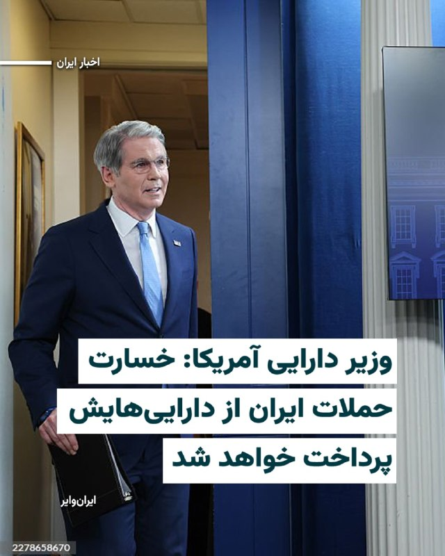

«اسکات بسنت»، وزیر دارایی ایالات متحده، در شبکه ایکس نوشت که جمهوری اسلامی ایران در «بازی با حاصل جمع صفر» شکست خواهد خورد.

بسنت در این پست توضیح دادکه خساراتی که حملات موشکی و پهپادی جمهوری اسلامی به کشورهای عربی به‌عنوان «متحدان آمریکا در خلیج فارس» وارد می‌کند از محل دارایی‌های بلوکه شده در آمریکا برداشت خواهد شد.

وزیر دارایی آمریکا همچنین نوشت که هرگونه عوارضی که از کشتی‌ها برای عبور از تنگه هرمز دریافت شود، با برداشت از حساب‌های ایران جبران خواهد شد.
@VahidHeadline

📡 @VahidOnline

## IranIntlTV — post 341728

  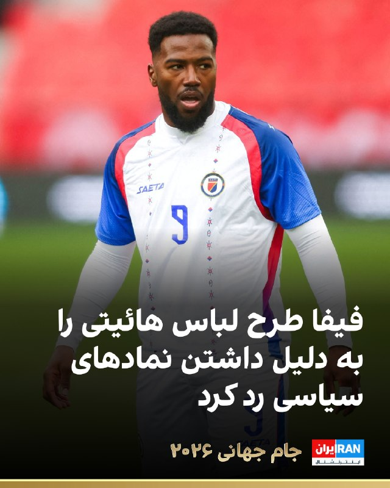

🔻فدراسیون جهانی فوتبال، فیفا، طرح لباس تیم ملی هائیتی را در آستانه آغاز رقابت‌های جام جهانی ۲۰۲۶ رد کرد. مسئولان فیفا اعلام کردند که برخی از نمادهای حک‌شده روی این پیراهن‌ ماهیت سیاسی دارند و مغایر با قوانین مسابقات هستند. این تصمیم در حالی اتخاذ شد که تیم ملی هائیتی باید روز یک‌شنبه در اولین دیدار خود در مرحله گروهی به مصاف اسکاتلند برود.

🔹شرکت پوشاک ورزشی «سائتا»، سازنده این لباس‌ها، با انتشار بیانیه‌ای اعلام کرد که برای حل این مشکل با فیفا همکاری کرده است. این شرکت تشریح کرد که هدف اصلی طراحان، ارج نهادن به تاریخ، ایستادگی و روحیه مردم هائیتی بوده و آن‌ها هرگز به دنبال ارسال پیام‌های سیاسی نبوده‌اند.

🔹فیفا با طرحی مینیاتوری روی سمت راست پیراهن هائیتی که تصاویری از «نبرد ورتیر» و انقلاب آزادی‌خواهانه هائیتی را به تصویر می‌کشید، مخالفت کرده است.

🔹این نماد به واقعه تاریخی سال ۱۸۰۳ اشاره دارد؛ زمانی که «ژان-ژاک دسالین»، رهبر انقلابی این کشور، نوار سفید را از پرچم فرانسه جدا کرد تا اولین جمهوری مستقل سیاه‌پوستان را در جهان پایه‌گذاری کند.

@iranintltvsport

## IranIntlTV — post 341727

  

دونالد ترامپ، رییس‌جمهوری ایالات متحده به فاکس‌نیوز گفت کردها مانع تلاش او برای مسلح کردن مردم ایران شدند و افزود هرگز این موضوع را فراموش نخواهد کرد.

ترامپ افزود: «ما برای کردها سلاح فرستادیم اما آن‌ها ما را ناامید کردند و سلاح‌ها را تحویل معترضان ندادند.»

دونالد ترامپ پیش‌تر نیز گفته بود مردم ایران می‌خواهند اعتراض کنند، اما سلاحی ندارند. ما تصور می‌کردیم می‌توانیم از طریق کردها به آن‌ها کمک کنیم و سلاح برسانیم، اما کردها ما را ناامید کردند.
https://iranintl.com/202606114586

## DW_Farsi — post 125823

  <a href="telegram/content/DW_Farsi_125823_1781188403.mp4" target="_blank">🎬 Download video</a>

🎥 حملات پهپادی ایران به بحرین؛ یک کودک ۱۱ ساله زخمی شد
 
وزارت کشور بحرین اعلام کرد در پی حملات جمهوری اسلامی ایران، یک کودک ۱۱ ساله زخمی شده و شماری از خودروها و ساختمان‌های مسکونی در شهرهای منامه و حمد آسیب دیده‌اند. مقام‌های بحرینی می‌گویند این خسارت‌ها بر اثر سقوط بقایای پهپادهای رهگیری‌شده ایجاد شده است.
@dw_farsi

## Persian_Trend_Official — post 16734

وال استریت ژورنال به نقل از مقامات آمریکایی: ایالات متحده هر شب به ایران حمله خواهد کرد تا زمانی که توافق حاصل شود.

📝 Amir

📌 @persian_trend_official
پرشین ترند | متفاوت‌ترین کانال نظامی

## Persian_Trend_Official — post 16733

  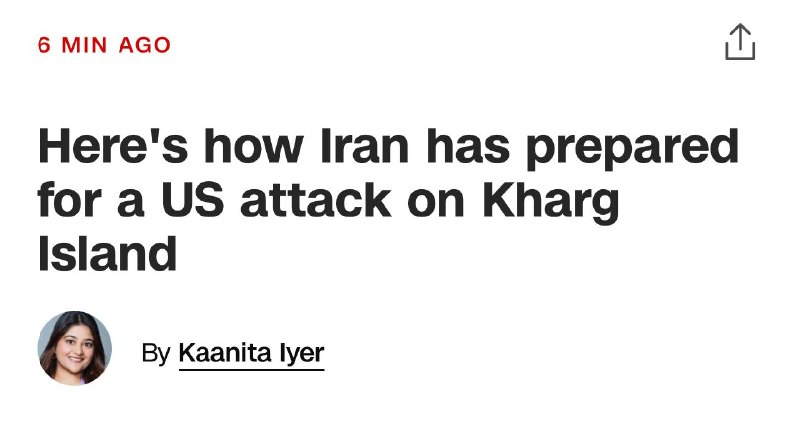

به گزارش سی‌ان‌ان، ایران ماه‌هاست که برای عملیات احتمالی ایالات متحده با هدف تصرف جزیره خارک آماده می‌شود.

ایران پس از حملات نظامی قبلی ایالات متحده، دفاع از این جزیره را تقویت کرده است، از جمله استقرار پرسنل بیشتر، پدافند هوایی و موشک‌های دوش‌پرتاب زمین به هوا. ایران همچنین مین‌های ضد نفر و ضد زره، از جمله در امتداد خط ساحلی، را در انتظار عملیات احتمالی فرود، مستقر کرده است.

مقامات و کارشناسان نظامی ایالات متحده پیش از این هشدار داده بودند که هرگونه عملیاتی با هدف تصرف این جزیره، خطرات قابل توجهی از جمله تلفات سنگین نیروهای آمریکایی را به همراه خواهد داشت.

📝 Amir

📌 @persian_trend_official
پرشین ترند | متفاوت‌ترین کانال نظامی

## IranianMinds — post 22313

🔴 خبرگزاری فارس :

ایران در حال بررسی اضافه کردن دارایی‌ها و کسب‌وکارهای مرتبط با ایلان ماسک در خاورمیانه — از جمله زیرساخت‌های استارلینک و سرمایه‌گذاری‌های مرتبط با اسپیس‌ایکس — به فهرست اهداف نظامی خود است.

@IranianMinds

## Dirty_Kids — post 391713

  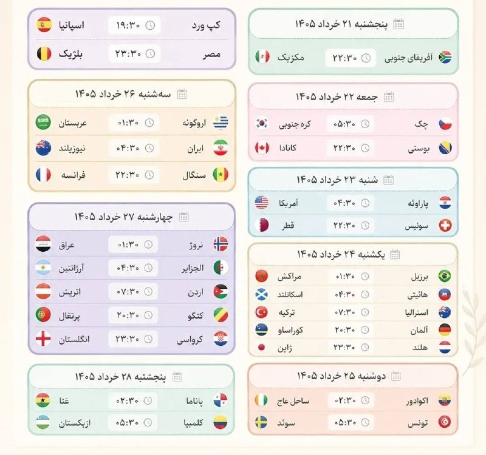

جدول مسابقات هفته‌ اول جام جهانی 2026

@Dirty_Kids 👻

## Dirty_Kids — post 391712

  <a href="telegram/content/Dirty_Kids_391712_1781188406.mp4" target="_blank">🎬 Download video</a>

بعد از مدت‌ها ترامپ یاد خاطراتش با سلیمانی افتاد و کلی در مورد کتلت صحبت کرد:

«چون ما داریم جلوی یه رژیم قحبه‌ی بسیار شرور رو می‌گیریم. رژیمی که هزاران نفر از مردم ما رو کشته. بی‌دست، بی‌پا، با صورت‌های از بین رفته. [ابرفضره؟]

می‌دونی، همه‌ی کارایی که با بمب‌های کنار جاده‌ای کردن. سلیمانی [کتلت]، همونی که من کشتمش. کتلت ژنرال ارشد اونا بود. ژنرال باهوشی کیری بود، یه ژنرال کیری شرور، یه پدرخراب کیری شرور. اما ژنرال کیری باهوشی بود، یه ژنرال خشن پدرقحبه بود و پدر بمب‌های کنار جاده‌ای به حساب میومد.

اونا هزاران هزار از این بمب‌ها رو فرستادن و هر وقت که یه سرباز رو می‌بینی که پا نداره، یا دست و پا نداره و حتی بدتر از اون، همه‌ش کار کتلت قحبه‌ست.

اینجوری بگم عزیز جان، ۹۵ درصدش کار کتلت پدرخرابه. خلاصه من حساب اون رو رسیدم و حالا ما روافض قحبه رو تو یه موقعیتِ، چطوری بگم، تو یه موقعیت نهایی و بن‌بست قرار دادیم.

اون قحبه‌ها هیچ چاره‌ی دیگه‌ای ندارن. تنه...

@Dirty_Kids 👻

## Dirty_Kids — post 391711

  <a href="telegram/content/Dirty_Kids_391711_1781188407.mp4" target="_blank">🎬 Download video</a>

بخش دیگه‌ای از مصاحبه‌ ترامپ

مجری: آیا امشب هم بمباران‌های بیشتری در کار خواهد بود؟

ترامپ: آره، امشب هم بمبارون‌های بیشتری انجام می‌شه. این یکی بزرگتر، وسیع‌تر و خیلی قدرتمندتر خواهد بود. فراموش نکنید که ما تمام پدافندهای ضدهوایی‌شون رو گاییدیم. اونا دیگه هیچ دفاع ضدهوایی ندارن، هیچی.
منظورم اینه که شاید با یه سلاح دوش‌پرتابی چیزی بتونن یه شانس تخمی داشته باشن، اما در کل و واسه بخش عمده‌ی قضیه، می‌دونی اونا هیچ دفاعی ندارن.

مجری: نماینده‌ها توی تماس تلفنی که باهاشون داشتید چی می‌گن؟

ترامپ اونا کارشون تمومه عزیز جان....

@Dirty_Kids 👻

## alonews — post 127159

  <a href="telegram/content/alonews_127159_1781188409.webm" target="_blank">🎬 Download video</a>

👈گزارش CNN: ایران در حالی که ارتش این کشور در حال انتقال محموله‌های موشکی است، سامانه‌های پدافند هوایی خود را در جزیره خارک نوسازی کرده است.

🔴ایران همچنین در امتداد خط ساحلی جزیره خارک مین‌گذاری انجام داده است

✅ @AloNews خبر جنگ

---
📅 بروزرسانی: 1405/03/21 17:52
---

## VahidOOnLine — post 244968

  

دونالد ترامپ در مصاحبه با فاکس‌نیوز، همدردی خود را با مردم ایران ابراز کرد و گفت شهروندان عادی زیر سرکوب حکومت زندگی می‌کنند.

رییس جمهوری ایالات متحده اضافه کرد: «مردم ایران می‌ترسند چون اسلحه ندارند اما طرف مقابل مسلح است و در تجمع‌ها به مردم شلیک می‌کند.»

ترامپ ادامه داد که با وجود ادامه درگیری‌ها، ترجیح می‌دهد آمریکا زیرساخت‌های غیرنظامی ایران را هدف قرار ندهد.
ترامپ گفت: «ترجیح می‌دهم آمریکا پل‌ها و نیروگاه‌های ایران را هدف قرار ندهد.»

او در توضیح این موضع افزود: «مردم ایران نمی‌توانند آب بنوشند، من نمی‌خواهم این کار را بکنم.»
‌🏁 🇬🇧 IranintlTV

🤖 @VahidOOnLine

## VahidOOnLine — post 244967

  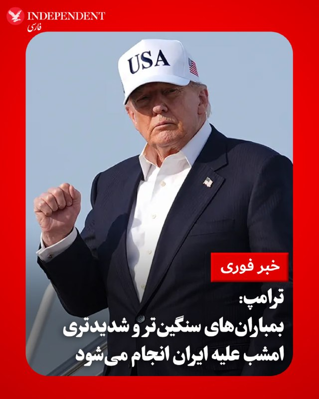

♦️ دونالد ترامپ، رئیس‌جمهوری آمریکا، در گفتگو با برنامه «فاکس و دوستان» (Fox & Friends) تایید کرد که دور جدید حملات هوایی ایالات متحده علیه علیه مواضعی در ایران، پنجشنبه‌شب نیز ادامه خواهد داشت. ترامپ اعلام کرد: «امشب بمباران‌های بیشتری در کار خواهد بود؛ این حملات بزرگ‌تر، گسترده‌تر و بسیار قدرتمندتر خواهند بود.»

رئیس‌جمهوری آمریکا در بخش دیگری از اظهارات خود با تاکید بر توانمندی بالای نظامی واشنگتن گفت: «ما می‌توانیم همین فردا وارد آنجا شویم. می‌توانیم با گروه کوچکی از سربازان، کل آن سرزمین را تحت کنترل درآوریم.» با این حال، او تاکید کرد که تمایلی به اعزام نیروی زمینی و حضور مستقیم سربازان آمریکایی در خاک ایران ندارد.
‌🇸🇦 Indypersian

🤖 @VahidOOnLine

## VahidOOnLine — post 244959

  <a href="telegram/content/VahidOOnLine_244959_1781187775.mp4" target="_blank">🎬 Download video</a>

جمهوری اسلامی می‌گوید در جریان حملات آمریکا دو مخزن آب در استان هرمزگان آسیب دیده و هزاران نفر با مشکل تأمین آب مواجه شده‌اند. آمریکا می‌گوید اهداف حملات، تأسیسات نظامی و راداری بوده‌اند.

در نبود ارزیابی‌های مستقل، قضاوت قطعی دشوار است. آنچه فعلاً وجود دارد، دو روایت متضاد از یک رویداد واحد است؛ روایتی که می‌تواند از خطای جنگی و خسارت جانبی تا بهره‌برداری سیاسی و تبلیغاتی را در بر بگیرد. ورق بزنید.
‌🏁 🇬🇧 ManotoTV

🤖 @VahidOOnLine

## VahidOOnLine — post 244958

  

آنتونیو کوستا، رییس شورای اروپا، در شبکه ایکس نوشت در گفت‌وگو با پادشاه بحرین، همبستگی کامل اتحادیه اروپا را پس از حملات اخیر جمهوری اسلامی ابراز کرده و خواستار کاهش فوری تنش و تداوم مسیر دیپلماتیک شده است.

کوستا تاکید کرد اتحادیه اروپا به حمایت از بحرین ادامه می‌دهد.
‌🏁 🇬🇧 IranintlTV

🤖 @VahidOOnLine

## WithYashar — post 14523

رئیس کمیسیون امنیت ملی مجلس ایران در پاسخ به تهدیدات ترامپ: «او پاسخی حتی قوی‌تر و دردناک‌تر دریافت خواهد کرد»
@withyashar

## mwarmonitor — post 10720

🔴گزارش CNN: ایران در حالی که ارتش این کشور در حال انتقال محموله‌های موشکی است، سامانه‌های پدافند هوایی خود را در جزیره خارک نوسازی کرده است.
ایران همچنین در امتداد خط ساحلی جزیره خارک مین‌گذاری انجام داده است.

@mwarmonitor

## FoxNewsTwitter — post 342855

  <a href="telegram/content/FoxNewsTwitter_342855_1781187776.mp4" target="_blank">🎬 Download video</a>

Fox News (Twitter/X)

"I will move heaven and hell to go find these kids."

DHS Secretary Markwayne Mullin swears to "right the wrongs" of the Biden administration's disastrous border policies that he says allowed unvetted sponsors to pick up 450,000 kids on our borders.

The secretary slammed the handling of unaccompanied minors over the last four years, detailing horrific reports of sexual assault and a complete lack of wellness checks for hundreds of thousands of children brought across the border.

"We're going to enforce our nation's laws, and we're going to right the wrongs that the Biden administration turned a blind eye to... As a father of six with three young girls, I'll do whatever I have to do.

## FoxNewsTwitter — post 342854

  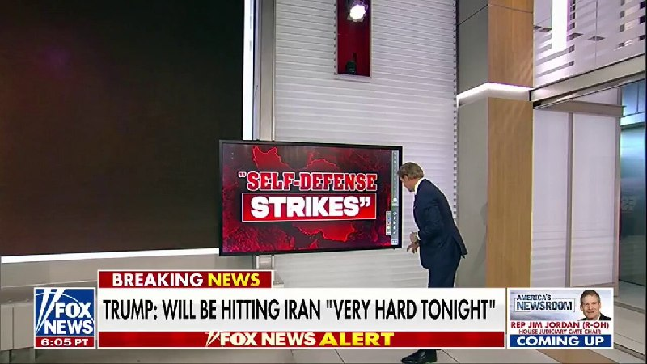

Fox News (Twitter/X)

NEW: Kharg Island. The Strait of Hormuz. Iranian retaliation. A growing blockade.

Bill Hemmer breaks down the entire picture, explaining why the fight over Kharg Island isn't just about territory — it's about the economic lifeline of Iran.

“The reason why this is so significant is because if you take control of Kharg Island, you will take control yet again of the economy of Iran... But if you take Kharg Island, you have to control it. And that means you put U.S. men and women in danger of taking fire on behalf of Iran.” | @AmericaNewsroom

## DEJradio — post 5592

  <a href="telegram/content/DEJradio_5592_1781187779.webm" target="_blank">🎬 Download video</a>

🚨
❗️ هموطنان گرامی، با توجه به احتمال حمله مجدد آمریکا، توصیه می‌شود در محدوده پادگان‌ها، مراکز نظامی و ایست‌های بازرسی تردد نکنید.

به‌ویژه حومه شهرها بسیار پرخطر است، زیرا انبار مهمات و زاغه‌های موشکی در آن نواحی قرار دارد.
توجه کنید سـ.ـپاه تعداد زیادی از لانچرهای موشک و پهپاد را در شهرک‌های صنعتی مستقر کرده است.

#هشدار #جنگ
@DEJradio

## IranIntlTV — post 341726

  <a href="telegram/content/IranIntlTV_341726_1781187779.mp4" target="_blank">🎬 Download video</a>

مجلس اعیان بریتانیا در بخشی از جلسه پنجشنبه ۲۱ خرداد، موضوع تدوین لایحه‌ای برای ایجاد چارچوب قانونی به منظور «تروریستی» اعلام کردن سپاه پاسداران را بررسی کرد. این نشست پس از آن برگزار شد که دولت بریتانیا «لایحه امنیت ملی» را به پارلمان ارائه کرد.

گفت‌وگو با امید شمس، حقوق‌دان و تحلیل‌گر امور بین‌الملل
@iranintltv

## IranIntlTV — post 341725

  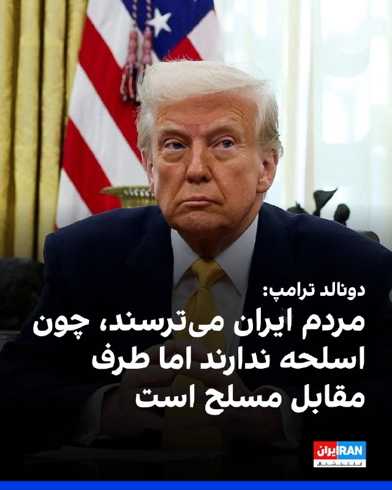

دونالد ترامپ در مصاحبه با فاکس‌نیوز، همدردی خود را با مردم ایران ابراز کرد و گفت شهروندان عادی زیر سرکوب حکومت زندگی می‌کنند.

رییس جمهوری ایالات متحده اضافه کرد: «مردم ایران می‌ترسند چون اسلحه ندارند اما طرف مقابل مسلح است و در تجمع‌ها به مردم شلیک می‌کند.»

ترامپ ادامه داد که با وجود ادامه درگیری‌ها، ترجیح می‌دهد آمریکا زیرساخت‌های غیرنظامی ایران را هدف قرار ندهد.
ترامپ گفت: «ترجیح می‌دهم آمریکا پل‌ها و نیروگاه‌های ایران را هدف قرار ندهد.»

او در توضیح این موضع افزود: «مردم ایران نمی‌توانند آب بنوشند، من نمی‌خواهم این کار را بکنم.»
https://iranintl.com/202606119130

## IranIntlTV — post 341724

  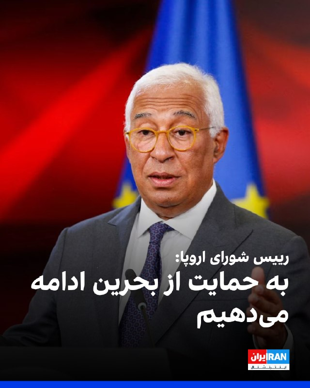

آنتونیو کوستا، رییس شورای اروپا، در شبکه ایکس نوشت در گفت‌وگو با پادشاه بحرین، همبستگی کامل اتحادیه اروپا را پس از حملات اخیر جمهوری اسلامی ابراز کرده و خواستار کاهش فوری تنش و تداوم مسیر دیپلماتیک شده است.

کوستا تاکید کرد اتحادیه اروپا به حمایت از بحرین ادامه می‌دهد.
https://iranintl.com/202606119833

## IranIntlTV — post 341723

  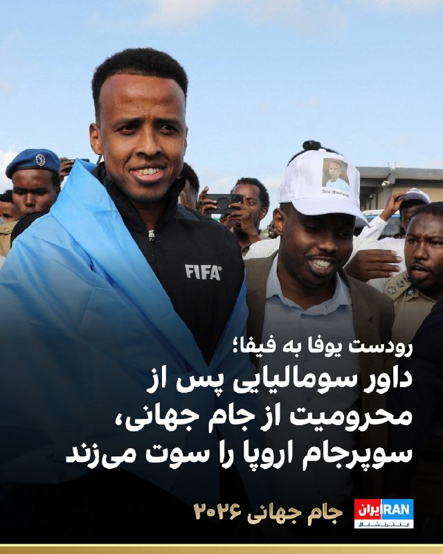

🔻اتحادیه فوتبال اروپا، یوفا، اعلام کرد عمر آرتان، داور ۳۴ ساله سومالیایی، که از سوی دولت ایالات متحده اجازه حضور در آمریکا و قضاوت در جام جهانی را پیدا نکرد، به‌عنوان داور دیدار پاری‌سن‌ژرمن و استون‌ویلا در سوپرجام اروپا انتخاب شد.

🔹یوفا در بیانیه خود نوشت: «پس از رایزنی با کنفدراسیون فوتبال آفریقا، عمر آرتان، داور اهل سومالی، برای قضاوت دیدار سوپرجام اروپا ۲۰۲۶ انتخاب شده است. این مسابقه روز ۲۱ مرداد در سالزبورگ میان پاری‌سن‌ژرمن، قهرمان لیگ قهرمانان اروپا و استون‌ویلا، فاتح لیگ اروپا، برگزار خواهد شد.»

🔹اتحادیه فوتبال اروپا دراین‌باره افزود: «انتصاب آرتان برای قضاوت سوپرجام اروپا در چارچوب تفاهم‌نامه همکاری اخیر میان یوفا و کنفدراسیون فوتبال آفریقا انجام شده است؛ توافقی که با هدف گسترش همکاری در حوزه‌های مختلف از جمله داوری به امضا رسیده است. یوفا و کنفدراسیون فوتبال آفریقا بر توسعه فوتبال در همه سطوح و ترویج ارزش‌هایی چون وحدت، برابری و عدم تبعیض تاکید دارند.»

@iranintltvsport

## Shin_Persian — post 6946

Shin ✓ @hey_itsmyturn
Thu, 11 Jun 2026 14:17:58 UTC

Jet activity over Khorram Abad, Lorestan Province, #Iran

ترجمه خودکار فارسی

فعالیت جت‌ها بر فراز خرم‌آباد، استان لرستان، #Iran

𝕏 · @shin_persian

## ManotoTV — post 106017

  <a href="telegram/content/ManotoTV_106017_1781187782.mp4" target="_blank">🎬 Download video</a>

جمهوری اسلامی می‌گوید در جریان حملات آمریکا دو مخزن آب در استان هرمزگان آسیب دیده و هزاران نفر با مشکل تأمین آب مواجه شده‌اند. آمریکا می‌گوید اهداف حملات، تأسیسات نظامی و راداری بوده‌اند.

در نبود ارزیابی‌های مستقل، قضاوت قطعی دشوار است. آنچه فعلاً وجود دارد، دو روایت متضاد از یک رویداد واحد است؛ روایتی که می‌تواند از خطای جنگی و خسارت جانبی تا بهره‌برداری سیاسی و تبلیغاتی را در بر بگیرد. ورق بزنید.

## Dirty_Kids — post 391710

  <a href="telegram/content/Dirty_Kids_391710_1781187783.mp4" target="_blank">🎬 Download video</a>

بخشی از مصاحبه‌ی دقایق پیش شیر گاینده‌ی خدا با
برنامه‌ی Fox & Friends از شبکه‌ی فاکس‌نیوز:

«…ولی روافض قحبه واقعاً تسلیم شدن، فقط هنوز خودشون هم خبر ندارن.بذار باهات رک باشم، اونا هنوز خودشون هم نمی‌دونن.ما هم داریم باهاشون حرف می‌زنیم. اما خب ببین اولویت و ترجیح من همیشه این بوده که جزیره خارک رو بگیریم. این رو برایان هم می‌دونه، خیلی وقت پیش باهاش صحبت کردم. لارنس هم می‌دونه، خیلی وقت پیش بهش گفتم. گفتم اولویت من این کاره.

اما اگه بخوام باهات روراست باشم، نمی‌دونم آمریکا دل و جرأت یا کشش این کار رو داره یا نه.
می‌دونی، ثروت کلانی توشه، ولی نمی‌دونم آمریکا کششش رو داره یا نه.
فکر کنم ترجیح می‌دن ما برگردیم خونه. ولی خب ما این کار رو با ونزوئلا کردیم. قضیه ونزوئلا واسه همه عالی جواب داد. ما میلیون‌ها میلیون بشکه نفت از ونزوئلا کشیدیم بیرون و آوردیمشون به هیوستون و جاهای مختلف دیگه مثل لوئیزیانا، جایی که توش پالایشگاه‌های فوق‌العاده‌ای داریم. دارن ۲۴ ساعته کار...

@Dirty_Kids 👻

## Dirty_Kids — post 391709

  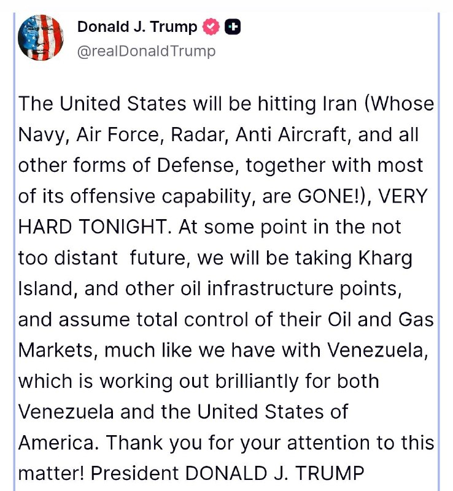

پست ترامپ که همین حرف های بالا رو دوباره تکرار کرده؛

آمریکا امشب ضربه بسیار سنگینی به ایران وارد خواهد کرد.

ایرانی که نیروی دریایی، نیروی هوایی، رادارها، پدافند ضدهوایی و تقریباً همه سامانه‌های دفاعی و همچنین بخش زیادی از توان تهاجمیش رو از دست داده!
تو آینده‌ای نه‌چندان دور، ما جزیره خارک و سایر نقاط مهم زیرساختی نفتی ایران رو در اختیار خواهیم گرفت و کنترل کامل بازارهای نفت و گاز اون را رو دست خواهیم آورد!

همان‌طور که این کار رو با ونزوئلا انجام دادیم و این موضوع واسه ونزوئلا و ایالات متحده فوق‌العاده موفق بود.

@Dirty_Kids 👻

## manototv — post 106017

  <a href="telegram/content/manototv_106017_1781187785.mp4" target="_blank">🎬 Download video</a>

جمهوری اسلامی می‌گوید در جریان حملات آمریکا دو مخزن آب در استان هرمزگان آسیب دیده و هزاران نفر با مشکل تأمین آب مواجه شده‌اند. آمریکا می‌گوید اهداف حملات، تأسیسات نظامی و راداری بوده‌اند.

در نبود ارزیابی‌های مستقل، قضاوت قطعی دشوار است. آنچه فعلاً وجود دارد، دو روایت متضاد از یک رویداد واحد است؛ روایتی که می‌تواند از خطای جنگی و خسارت جانبی تا بهره‌برداری سیاسی و تبلیغاتی را در بر بگیرد. ورق بزنید.

## alonews — post 127158

  <a href="telegram/content/alonews_127158_1781187785.webm" target="_blank">🎬 Download video</a>

👈سخنگوی کمیسیون امنیت ملی مجلس: آمریکا یا باید تسلیم موشک‌های جمهوری اسلامی شود یا دیپلمات‌هایش...

✅ @AloNews خبر جنگ

## alonews — post 127157

  <a href="telegram/content/alonews_127157_1781187785.webm" target="_blank">🎬 Download video</a>

👈سی‌ان‌ان: مقامات ارشد ترامپ تصرف جزیره خارگ را به عنوان گزینه «بازی نهایی» دیده‌اند

✅ @AloNews خبر جنگ

---
📅 بروزرسانی: 1405/03/21 17:43
---

## mwarmonitor — post 10719

🔴پهپادها مواضع گروه‌های اپوزیسیون کردِ ایرانی را در شهرستان قوش‌تپه در استان اربیل هدف قرار دادند.

@mwarmonitor

## IranIntlTV — post 341722

  <a href="https://t.me/IranintlTV/341722" target="_blank">📎 Download file</a>

🎧نسخه صوتی اخبار نیمروزی | پنج‌شنبه ۲۱ خرداد
@iranintlTV

## IranIntlTV — post 341721

  <a href="telegram/content/IranIntlTV_341721_1781187198.mp4" target="_blank">🎬 Download video</a>

جورجا ملونی، نخست‌وزیر ایتالیا، گفت اگر جمهوری اسلامی در مسیر اشتباه باقی بماند، اروپا باید تحریم‌های جدیدی علیه آن اعمال کند.

علی حسن‌پور، خبرنگار ایران‌اینترنشنال، گزارش می‌دهد
@iranintltv

## FarsiVOA — post 220386

  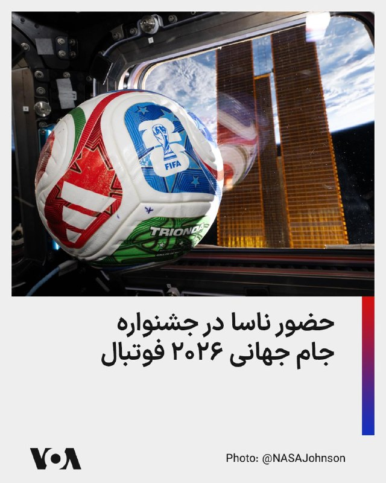

مرکز فضایی جانسون ناسا با انتشار تصویری از یک توپ فوتبال در ایستگاه فضایی بین‌المللی اعلام کرد در حاشیه جشنواره هواداران جام جهانی فوتبال در هیوستون، نمایشگاهی برای معرفی فعالیت‌های فضایی برپا خواهد کرد.

بازدیدکنندگان می‌توانند با پژوهش‌های ایستگاه فضایی بین‌المللی و تاثیر فناوری‌های فضایی بر زندگی روی زمین آشنا شوند.

ناسا همچنین اعلام کرده است اعضای ماموریت آرتمیس ۲ پس از سفر به دور ماه، در این رویداد با مردم دیدار خواهند کرد.

@FarsiVOA

## DW_Farsi — post 125822

  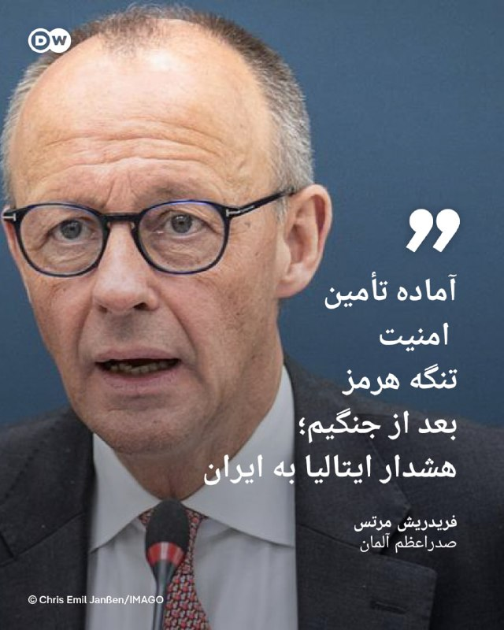

🔶 آلمان: آماده تأمین امنیت تنگه هرمز بعد از جنگیم؛ هشدار ایتالیا به ایران
 
در حالی که آلمان اعلام کرده که حاضر است بعد از پایان جنگ ایران در تأمین امنیت تنگه هرمز مشارکت کند ایتالیا هشدار داد، در صورتی که جمهوری اسلامی به حل بحران کمک نکند باید آماده تحریم‌های جدیدی باشد.
 
فریدریش مرتس، صدراعظم آلمان روز پنج‌شنبه ۲۱ خرداد طی بیانیه‌ای رسمی در پارلمان این کشور از آمادگی کشورش برای امنیت‌بخشی به تنگه هرمز  "به محض فراهم شدن شرایط لازم" سخن گفت.
 
به تأکید او، هدف اصلی همچنان این است که ایران برنامه هسته‌ای خود را به صورت قابل راستی‌آزمایی و برای همیشه متوقف کند. علاوه بر این، امنیت اسرائیل و کل منطقه نیز باید تضمین شود، چرا که به گفته او، در غیر این صورت "هیچ صلحی در منطقه برقرار نخواهد شد".
 
همزمان جورجا ملونی، نخست‌وزیر ایتالیا روز پنج‌شنبه به ایران هشدار داد که اگر به خاتمه بحران خاورمیانه کمک نکند باید آماده تحریم‌های جدید باشد.
 
ملونی در پارلمان این کشور گفت: «اگر تهران به حرکت در مسیر اشتباه ادامه دهد، اتحادیه اروپا باید آماده باشد تا از طریق اقدامات هدفمند جدید، فشارها را افزایش دهد.»
@dw_farsi

## RadioFarda — post 158183

🔸رئیس اتحادیه ملی محصولات کشاورزی ایران می‌گوید پس از از دست رفتن بازار کشورهای حاشیه خلیج فارس، هنوز بازار جایگزینی برای صادرات سبزیجات و صیفی‌جات ایران پیدا نشده و بسیاری از تولیدکنندگان با زیان روبه‌رو شده‌اند.

🔸رضا نورانی به «نود اقتصادی» گفت بسیاری از تولیدکنندگان سبزیجات و صیفی‌جات در استان البرز بیکار شده‌اند یا محصولاتشان روی دستشان مانده است.

🔸او دلیل این وضعیت را از دست رفتن بازارهای اصلی حوزه خلیج فارس عنوان کرد و افزود این کشورها پیش از این مقصد اصلی صادرات این محصولات بودند.

🔸به گفته رئیس اتحادیه ملی محصولات کشاورزی، در حال حاضر تنها بخش محدودی از این محصولات به روسیه صادر می‌شود و ایران به دلیل تعرفه‌های سنگین و عضونبودن در سازمان تجارت جهانی، حضور مؤثری در بازار اروپا ندارد.

🔸آقای نورانی همچنین گفت شماری از تجار و سرمایه‌گذاران ایرانی که در امارات متحده عربی و برخی دیگر از کشورهای منطقه فعالیت می‌کردند، پس از جنگ اقامت خود را از دست داده‌اند و متحمل خسارت‌های مالی شده‌اند.

@RadioFarda

## IranianMinds — post 22312

  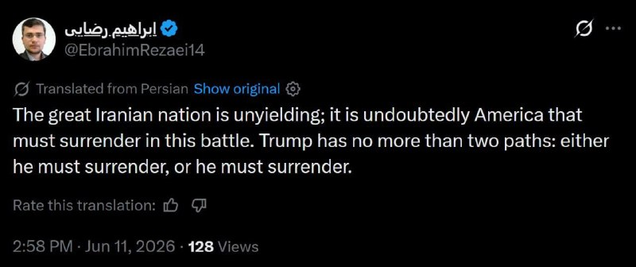

🔴پست ابراهیم رضایی:

ملت بزرگ ایران تسلیم‌ناپذیر است. بدون شک ، این امریکا هست که باید در این جنگ تسلیم شود. ترامپ بیشتر از دو راه ندارد، یا باید تسلیم شود، یا باید تسلیم شود.

@IranianMinds

## BBCPersian — post 283456

🔻خبرگزاری مهر: صدای چند انفجار در سیریک شنیده شد

خبرگزاری مهر گزارش داده است که صدای چند انفجار در حوالی شهر سیریک در ایران، که در مجاورت تنگه هرمز قرار دارد، شنیده شده است.

نه ایالات متحده و نه مقام‌های رسمی ایران درباره انجام شدن یا نشدن چنین حمله‌ای اظهار نظر نکرده‌اند.

بی‌بی‌سی به‌طور مستقل قادر به تایید این گزارش نیست.

https://bbc.in/4v5B0d7
@BBCPersian

## BBCPersian — post 283455

  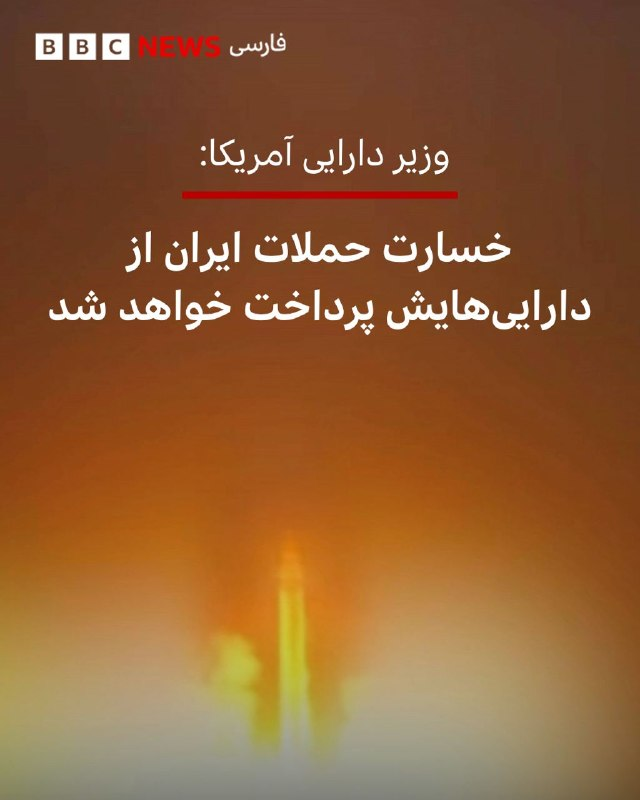

🔻اسکات بسنت، وزیر دارایی آمریکا، در شبکه ایکس نوشت که جمهوری اسلامی ایران در «بازی با حاصل جمع صفر» شکست خواهد خورد.

او گفت که هرگونه خسارتی را که ایران به متحدان آمریکا در خلیج فارس وارد کند، از محل دارایی‌هایش پرداخت خواهد شد.

آقای بسنت همچنین نوشت که هرگونه عوارضی که از کشتی‌ها برای عبور از تنگه هرمز دریافت شود، با برداشت از حساب‌های ایران جبران خواهد شد.

وزیر دارایی آمریکا هشدار داد که هر حمله‌ای که ایران انجام دهد، پیامدهای اقتصادی و مالی بیشتری برای تهران در پی خواهد داشت.

📸 Reuters

https://bbc.in/4v5B0d7
@BBCPersian

## Hranews — post 113540

  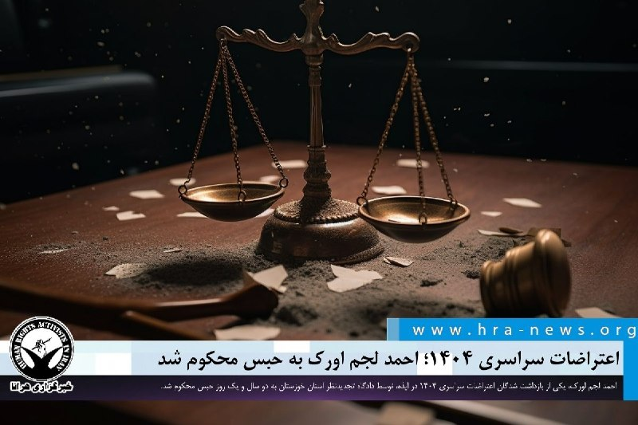

اعتراضات سراسری ۱۴۰۴؛ احمد لجم اورک به حبس محکوم شد

❗️
❗️
❗️
❗️
❗️– احمد لجم اورک، از بازداشت‌شدگان اعتراضات سراسری ۱۴۰۴ در ایذه، در مرحله تجدیدنظر به دو سال و یک روز حبس محکوم شد. دادگاه تجدیدنظر استان خوزستان ضمن تأیید حکم صادره در مرحله بدوی، یک سال از این مجازات را به مدت دو سال به حالت تعلیق درآورد.

به گزارش خبرگزاری هرانا، ارگان خبری مجموعه فعالان حقوق بشر در ایران، حکم صادره علیه احمد لجم اورک در دادگاه تجدیدنظر تأیید شد.

بر اساس حکمی که توسط شعبه ۱۴ دادگاه تجدیدنظر استان خوزستان صادر و به حسین علی حاتمی، وکیل مدافع این شهروند ابلاغ شده است، آقای لجم اورک از بابت اتهام «اخلال در نظم عمومی» با استناد به تبصره ماده ۲۸۶ قانون مجازات اسلامی به دو سال و یک روز حبس محکوم شده است. همچنین دادگاه یک سال از این مجازات را به مدت دو سال به حالت تعلیق درآورده است.

#احمد_لجم_اورک

ادامه مطلب

↘️
@hranews_bot تماس ✉️ - @Hranews کانال هرانا 🆑

## alonews — post 127156

  <a href="telegram/content/alonews_127156_1781187204.webm" target="_blank">🎬 Download video</a>

👈آکسیوس: تهدید مجدد ترامپ به بمباران ایران با هدف اعمال فشار بر این کشور برای نشان دادن انعطاف‌پذیری بیشتر در مذاکرات بر سر برنامه هسته‌ای‌اش است

✅ @AloNews خبر جنگ

## alonews — post 127155

  <a href="telegram/content/alonews_127155_1781187205.webm" target="_blank">🎬 Download video</a>

👈جوزف عون در مصاحبه با رویترز : آینده لبنان در دست مردم لبنان است، نه در دست ایران یا اسرائیل.

🔴ما نمی‌پذیریم که ایران به ما دیکته کند چه کار کنیم. ما یک کشور مستقل هستیم و ایران حق ندارد از طرف ما صحبت کند.

🔴ما نمی‌پذیریم که لبنان به عرصه جنگ دیگران تبدیل شود و مصمم هستیم که مسیر دیپلماتیک را دنبال کنیم؛ هیچ راه حل نظامی وجود ندارد.

🔴 ما چاره‌ای جز مذاکره برای پایان دادن به این درگیری نداریم، و اسرائیلی‌ها هم همینطور.

✅ @AloNews خبر جنگ

## alonews — post 127154

  <a href="telegram/content/alonews_127154_1781187205.webm" target="_blank">🎬 Download video</a>

👈ایران ماه‌هاست که برای یک عملیات احتمالی آمریکا با هدف کنترل جزیره خارگ آماده می‌شود، گزارش سی‌ان‌ان.

🔴ایران پس از حملات نظامی قبلی آمریکا، دفاع‌های جزیره را تقویت کرده است، از جمله استقرار نیروی انسانی بیشتر، سامانه‌های دفاع هوایی و موشک‌های شانه‌پرتاب (MANPADS).

🔴ایران همچنین مین‌های ضد نفر و ضد زره، از جمله در امتداد خط ساحلی، برای مقابله با عملیات احتمالی فرود قرار داده است.

🔴مقامات و کارشناسان نظامی آمریکا پیش‌تر هشدار داده‌اند که هر عملیاتی با هدف تصرف جزیره، خطرات قابل توجهی از جمله تلفات سنگین احتمالی آمریکا به همراه خواهد داشت.

✅ @AloNews خبر جنگ

---
📅 بروزرسانی: 1405/03/21 17:33
---

## VahidOOnLine — post 244957

  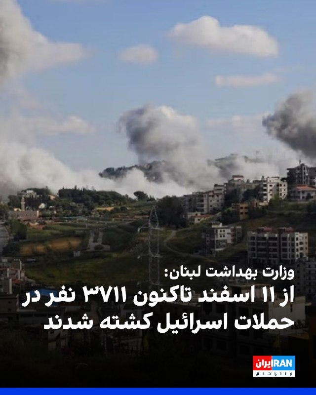

وزارت بهداشت لبنان اعلام کرد از تاریخ ۱۱ اسفند تاکنون در حملات اسرائیل به این کشور ۳۷۱۱ نفر کشته و ۱۱۴۸۳ نفر زخمی شده‌اند.

در این آمار مشخص نیست که چند کشته متعلق به نیروهای حزب‌الله است.
‌🏁 🇬🇧 IranintlTV

🤖 @VahidOOnLine

## VahidOOnLine — post 244956

  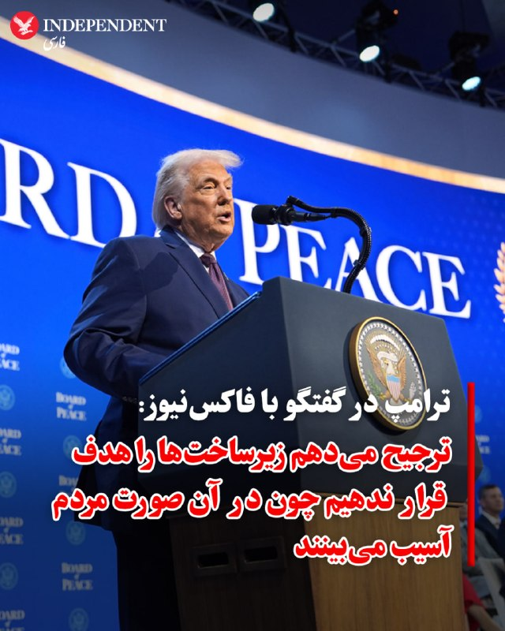

♦️ دونالد ترامپ، رئیس‌جمهوری آمریکا روز پنجشنبه ۲۱ خرداد در جریان گفتگوی تلفنی زنده با فاکس‌نیوز، اعلام کرد که اگرچه پیش‌تر درباره هدف قرار دادن زیرساخت‌ها در ایران هشدار داده بود، ترجیح می‌دهد که این کار را انجام ندهد. ترامپ درباره تهدیدهای پیشین علیه پل‌ها و نیروگاه‌ها در ایران گفت: «بله، اینها جزو اهداف بعدی هستند اما ترجیح می‌دهم این کار را نکنم، چون به محض این‌که چنین کاری کنید، مردم آسیب می‌بینند. من می‌توانم این کار را در یک دقیقه انجام دهم اما در آن صورت مردم دیگر قادر به نوشیدن آب هم نخواهند بود.»

ترامپ در ادامه در پاسخ به پرسش مجری فاکس‌نیوز که از او خواست پیامی به مردم ایران بدهد، گفت: «می‌دانم که آن‌ها می‌ترسند چون هیچ اسلحه‌‌ای ندارند. آن‌ها تجمع می‌کنند و به گلوله بسته می‌شوند. شاید باورتان نشود ولی آن‌ها یک کشتی‌گیر تراز اول و دو دوستش را اعدام کردند؛ آن‌ها را از جرثقیل آویزان کردند. دست‌کم ۴۰ تا ۵۰ هزار نفر را کشتند. وقتی تک‌تیرانداز از بالای ساختمان شما را به گلوله می‌بندد، به راه انداختن تجمع و تظاهرات کار سختی است.»
‌🇸🇦 Indypersian

🤖 @VahidOOnLine

## VahidOOnLine — post 244955

  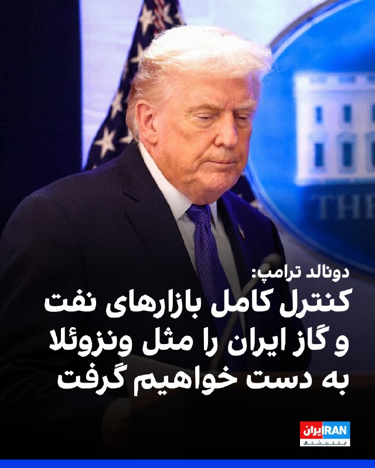

دونالد ترامپ در شبکه تروث سوشال نوشت که در مقطعی در آینده‌ای نه چندان دور، ما جزیره خارک و سایر نقاط زیرساخت نفتی را تصرف خواهیم کرد و کنترل کامل بازارهای نفت و گاز آن‌ها را به دست خواهیم گرفت، مانند کاری که با ونزوئلا انجام دادیم، که به طرز درخشانی برای ونزوئلا و ما نتیجه می‌دهد.

ترامپ همچنین در مصاحبه با فاکس‌نیوز گفت که آمریکا همچنان با جمهوری اسلامی در حال گفت‌وگو است، اما ترجیح او این است که آمریکا جزیره خارک را در اختیار بگیرد.
‌🏁 🇬🇧 IranintlTV

🤖 @VahidOOnLine

## VahidOnline — post 76212

  

رئیس‌جمهور آمریکا روز پنجشنبه اعلام کرد که ارتش این کشور امشب بار دیگر ایران را به سختی مورد حمله قرار خواهد داد و از برنامه ایالات متحده برای به دست آوردن کنترل جزیره خارگ ایران خبر داد.

دونالد ترامپ با انتشار پیامی در شبکه اجتماعی تروث سوشال نوشت: «ایالات متحده امشب ضربات بسیار سختی به ایران وارد خواهد کرد؛ کشوری که نیروی دریایی، نیروی هوایی، سامانه‌های راداری، پدافند ضدهوایی و تمامی دیگر اشکال دفاعی آن، به همراه بخش عمده توان تهاجمی‌اش، از بین رفته‌اند!»

آقای ترامپ در ادامه پیام خود نوشت: «در مقطعی در آینده‌ای نه‌چندان دور، ما جزیره خارگ و دیگر زیرساخت‌های نفتی را در اختیار خواهیم گرفت و کنترل کامل بازارهای نفت و گاز ایران را به دست خواهیم آورد؛ همان‌گونه که در مورد ونزوئلا انجام داده‌ایم، اقدامی که نتایج فوق‌العاده‌ای هم برای ونزوئلا و هم برای ایالات متحده آمریکا داشته است».
@VahidHeadline

📡 @VahidOnline

## VahidOnline — post 76211

  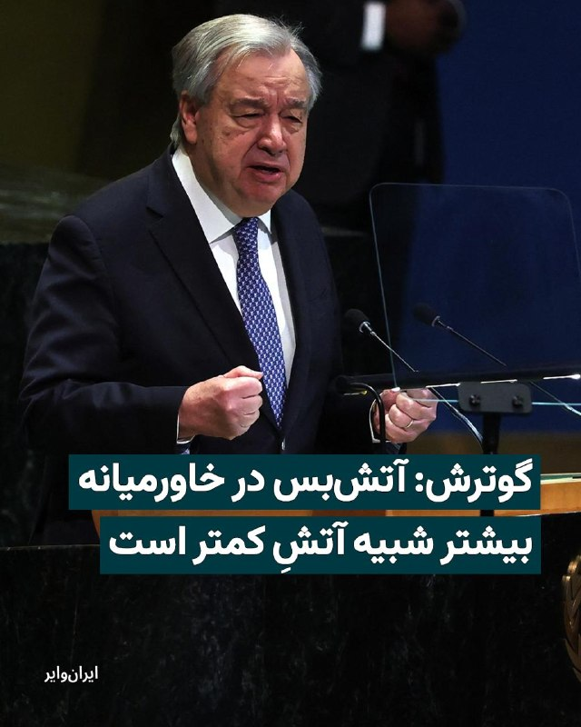

دبیرکل سازمان ملل متحد، آنتونیو گوترش، در پیامی تازه درباره وضعیت خاورمیانه هشدار داد که این منطقه «هر روز بیشتر به سمت بحران عمیق‌تر کشیده می‌شود» و تأکید کرد پیامدهای آن فراتر از مرزهای منطقه خواهد بود.
@VahidHeadline

📡 @VahidOnline

## VahidOnline — post 76210

  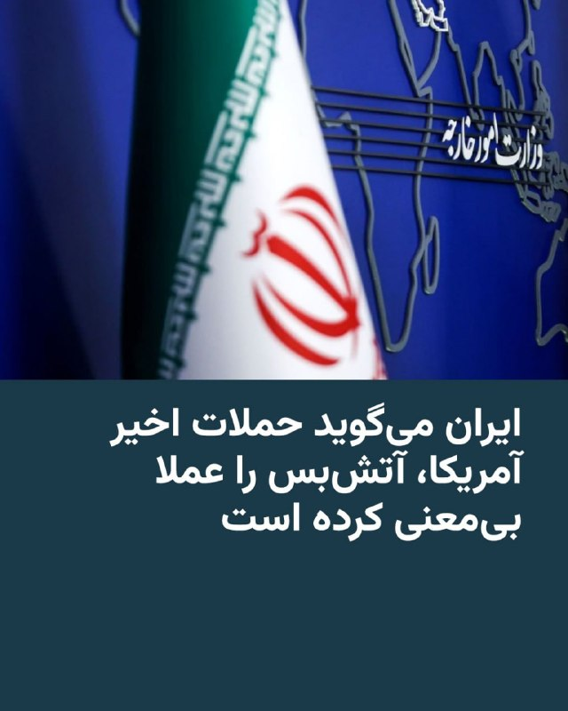

وزارت امور خارجه جمهوری اسلامی با صدور بیانیه‌ای در واکنش به حملات ارتش آمریکا به اهدافی در ایران، این اقدام را نقض قوانین بین‌المللی خوانده و گفته است این حملات آتش‌بس ۱۹ فروردین را عملا بی‌معنی کرده است.

در بیانیه وزارت خارجه ایران بار دیگر به کشورهای حاشیه خلیج‌فارس درباره استفاده ارتش آمریکا از قلمرو، امکانات و منابع آنها هشدار داده شده است.
@VahidHeadline

📡 @VahidOnline

## VahidOnline — post 76209

  <a href="telegram/content/VahidOnline_76209_1781186595.mp4" target="_blank">🎬 Download video</a>

پست سنتکام، ترجمه ماشین: نیروهای آمریکا سومین نفتکش ناقض محاصره را در خلیج عمان از کار انداختند

تامپا، فلوریدا — نیروهای آمریکا ساعت ۱۱:۲۰ شب به وقت شرق آمریکا در ۱۰ ژوئن، پس از آنکه یک نفتکش با تلاش برای انتقال نفت ایران محاصره علیه ایران را نقض کرد، این شناور را در خلیج عمان از کار انداختند. این سومین کشتی تجاری است که این هفته توسط نیروهای آمریکایی از کار انداخته می‌شود.
فرماندهی مرکزی آمریکا، سنتکام، علیه نفتکش M/T Jalveer با پرچم گینه بیسائو اقدام کرد؛ این کشتی در تلاش بود نفت را از ایران از مسیر خلیج عمان منتقل کند. یک هواپیمای آمریکایی پس از آنکه خدمه کشتی بارها از اجرای دستورهای نیروهای آمریکایی سر باز زدند، دو موشک هلفایر به اتاق موتور کشتی شلیک کرد.
اوایل این هفته، هواپیماهای آمریکایی به‌ترتیب در روزهای دوشنبه و سه‌شنبه دو کشتی با پرچم پالائو، یعنی M/T Marivex و M/T Settebello، را از کار انداختند. مارویکس با تلاش برای حرکت به‌سوی یک بندر ایرانی محاصره را نقض کرد و ستبِلو نیز تلاش داشت نفت ایران را منتقل کند.
از زمان آغاز محاصره در ۱۳ آوریل، نیروهای سنتکام ۹ شناور نافرمان را از کار انداخته‌اند، ۱۳۵ کشتی را که از دستورها پیروی کردند تغییر مسیر داده‌اند و اجازه عبور به ۴۲ شناور حامل کمک‌های بشردوستانه داده‌اند.
این محاصره به‌طور بی‌طرفانه علیه شناورهای همه کشورها که وارد بنادر و مناطق ساحلی ایران می‌شوند یا از آن‌ها خارج می‌شوند، اجرا می‌شود؛ از جمله همه بنادر ایران در «خلیج عربی» و خلیج عمان.
@VahidHeadline

📡 @VahidOnline

## VahidOnline — post 76208

  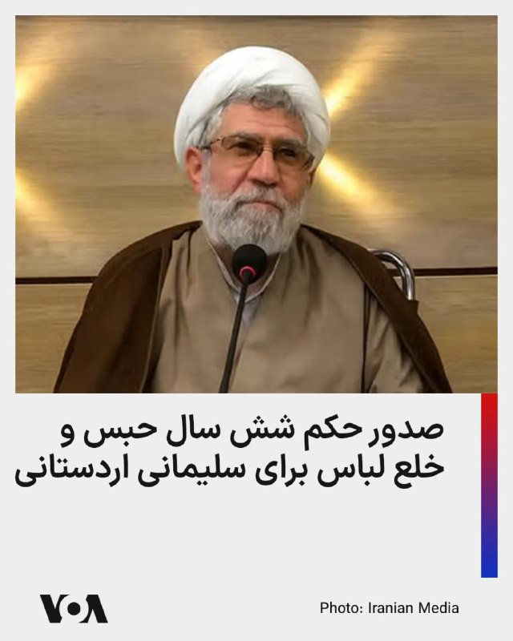

عبدالرحیم سلیمانی اردستانی، عضو مجمع مدرسین و محققین حوزه علمیه قم، توسط دادگاه ویژه روحانیت به شش سال حبس، خلع لباس روحانیت و پرداخت جزای نقدی محکوم شد.

نزدیکان آقای سلیمانی اردستانی اعلام کردند که وی تنها به شرط برگزاری دادگاه علنی حاضر به اعتراض به این حکم است و در غیر اینصورت، حکم را بدون اعتراض می‌پذیرد.

او به اتهاماتی چون توهین به مقدسات، توهین به علی و مجتبی خامنه‌ای، توهین به مقدسات تشیع، توهین به مراجع دینی و هتک حیثیت روحانیت شیعه متهم شده است.

سلیمانی اردستانی در فروردین ماه توسط نیروهای امنیتی بازداشت و به زندان ساحلی قم منتقل شد.

او پیش از بازداشت و در تحلیل نخستین پیام مجتبی خامنه‌ای که به تجلیل از علی خامنه‌ای پرداخته بود، نوشت: «مهم‌ترین هنر والد شما این بود که مخالفان و منتقدان خود را بی‌بصیرت یا مزدور بیگانگان می‌خواند و هر برخوردی را با آنان روا می‌دانست! از صفات اخلاقی ایشان دو صفت لجبازی و کینه‌توزی را بسیار برجسته یافتم.»
@VahidHeadline

📡 @VahidOnline

## IranIntlTV — post 341720

  

وزارت بهداشت لبنان اعلام کرد از تاریخ ۱۱ اسفند تاکنون در حملات اسرائیل به این کشور ۳۷۱۱ نفر کشته و ۱۱۴۸۳ نفر زخمی شده‌اند.

در این آمار مشخص نیست که چند کشته متعلق به نیروهای حزب‌الله است.
https://iranintl.com/202606112864

## IranIntlTV — post 341719

  

دونالد ترامپ در شبکه تروث سوشال نوشت که در مقطعی در آینده‌ای نه چندان دور، ما جزیره خارک و سایر نقاط زیرساخت نفتی را تصرف خواهیم کرد و کنترل کامل بازارهای نفت و گاز آن‌ها را به دست خواهیم گرفت، مانند کاری که با ونزوئلا انجام دادیم، که به طرز درخشانی برای ونزوئلا و ما نتیجه می‌دهد.

ترامپ همچنین در مصاحبه با فاکس‌نیوز گفت که آمریکا همچنان با جمهوری اسلامی در حال گفت‌وگو است، اما ترجیح او این است که آمریکا جزیره خارک را در اختیار بگیرد.
https://iranintl.com/202606114494

## FarsiVOA — post 220385

🔺اسرائیل: حزب‌الله با حمله پهپادی مرتکب «نقض آشکار آتش‌بس» شد

▪️اسرائیل از نقض آشکار آتش‌بس توسط حزب‌الله، نیروی نیابتی جمهوری اسلامی، با شلیک پهپاد به اسرائیل از خاک لبنان خبر داد.

⬇️ بیشتر بخوانید:

https://ir.voanews.com/a/rocket-launch-ceasefire-failure-israel-lebanon-attack/8159703.html/?nocach=1

## IranianMinds — post 22311

🔴وال‌استریت‌ژورنال:

ایالات متحده آمریکا از این به بعد هر شب به ایران حمله خواهد کرد، تا آنها به توافق برسند.

@IranianMinds

## BBCPersian — post 283454

🔻هند دیپلمات ارشد آمریکا را احضار کرد

پس از آنکه سه ملوان هندی در حمله آمریکا به یک نفتکش در نزدیکی عمان کشته شدند، وزارت خارجه هند یک دیپلمات ارشد آمریکایی را احضار کرد.

بر اساس اعلام وزارت امور خارجه هند، جیسون میکس، معاون رئیس هیئت نمایندگی سفارت آمریکا در دهلی‌نو برای ابلاغ «اعتراض شدید» دولت هند، احضار شده است.

سه ملوان هندی که در حمله به نفتکش «ام‌تی سته‌بلو»» با پرچم پالائو کشته شدند، دانشجوی عرشه، تعمیرکار موتورو مهندس ارشد کشتی بودند.

وزیر کشتیرانی هند کشته شدن این افراد را «ضایعه‌ای جبران‌ناپذیر» توصیف کرد و گفت از شنیدن این «حادثه تراژیک» عمیقا اندوهگین شده است.

https://bbc.in/4v5B0d7
@BBCPersian

## alonews — post 127153

  <a href="telegram/content/alonews_127153_1781186597.webm" target="_blank">🎬 Download video</a>

👈حزب‌الله : یه پهپاد هیرون اسرائیل تو بقاع سرنگون کردیم

✅ @AloNews خبر جنگ

## alonews — post 127152

  <a href="telegram/content/alonews_127152_1781186597.mp4" target="_blank">🎬 Download video</a>

👈رئیس‌جمهور ترکیه اردوغان:
اسرائیل تحت مدیریت فعلی خود به کارخانه‌ای از تفرقه تبدیل شده است که تنها مواد اولیه آن خون و اشک است و چیزی جز بی‌ثباتی و هرج‌ومرج تولید نمی‌کند

✅ @AloNews خبر جنگ

## alonews — post 127151

  <a href="telegram/content/alonews_127151_1781186599.webm" target="_blank">🎬 Download video</a>

👈شنیده شدن صدای انفجار در استان اربیل در شمال عراق

✅ @AloNews خبر جنگ

## alonews — post 127150

  <a href="telegram/content/alonews_127150_1781186599.webm" target="_blank">🎬 Download video</a>

👈تلویزیون سوریه: احمد الشرع، رئیس جمهور سوریه سه روز دیگه تو کاخ سفید با ترامپ دیدار میکنه!

✅ @AloNews خبر جنگ

---
📅 بروزرسانی: 1405/03/21 17:23
---

## VahidOOnLine — post 244954

♦️در پی درگیری‌های نظامی بامداد پنجشنبه در منطقه خلیج فارس، وزارت کشور بحرین روز پنجشنبه ۲۱ خرداد تصاویری از خودروهای سوخته و ساختمان‌های آسیب‌دیده در منامه منتشر کرد. در این تصاویر، آتش‌نشانان در حال عملیات در محل حادثه و بقایای پراکنده‌شده بر روی زمین دیده می‌شوند.
وزارت کشور بحرین اعلام کرد در پی برخورد بقایای پهپادهای سرنگون‌شده ایرانی به شهرهای حمد و منامه، چند ساختمان مسکونی و خودرو آسیب دیدند. براساس این بیانیه، یک دختربچه ۱۱ ساله نیز دچار جراحت جزئی شد و در محل تحت درمان قرار گرفت.
پیشتر، روابط عمومی سپاه پاسداران اعلام کرده بود در واکنش به حملات بامداد پنج‌شنبه آمریکا به برخی واحدهای خدماتی و پاسگاه‌های ساحلی سپاه، فرماندهی انتظامی و محوطه فرودگاه بندرعباس، طی دو موج عملیات، ۱۸ هدف متعلق به ارتش آمریکا در پایگاه‌های هوایی علی السالم و احمد الجابر در کویت و شیخ عیسی در بحرین را هدف قرار داده است.
‌🇸🇦 Indypersian

🤖 @VahidOOnLine

## VahidOOnLine — post 244953

  

اسماعیل کوثری، عضو کمیسیون امنیت ملی مجلس، به خبرگزاری ایلنا گفت: «اگر نمایندگان کنگره آمریکا بخواهند به معنای واقعی وظایف خود را انجام دهند، ابتدا باید ترامپ را محاکمه کنند که چرا بدون مجوز کنگره جنگ را علیه ایران آغاز کرده است؛ زیرا خود کنگره چنین قانونی را تصویب کرده است که جنگ بدون مجوز غیرقانونی است.»

او اضافه کرد: «تمام فشار این جنگ بر اقتصاد آمریکا، به‌ویژه بر مردم عادی، وارد شده است برای همین به ما هم فشار وارد می‌کند تا بتواند به اهداف کثیف خود برسد و در این میان مشکلاتی هم برای ما به وجود آمده است.»
‌🏁 🇬🇧 IranintlTV

🤖 @VahidOOnLine

## WithYashar — post 14522

  <a href="telegram/content/WithYashar_14522_1781185983.mp4" target="_blank">🎬 Download video</a>

ترامپ درباره ارسال سلاح به معترضان ایرانی از طریق کردها:

ما در واقع به آن‌ها سلاح فرستادیم و صادقانه بگویم از کردها بسیار ناامید شدیم. کردها ما را ناامید کردند.

من با این تصمیم مخالف بودم. می‌دانید، من می‌گفتم، «نه، باور ندارم که آن‌ها سلاح‌ها را تحویل دهند.

فکر می‌کنم آن‌ها سلاح‌ها را برای خود نگه داشتند. فکر می‌کنم این یک ننگ است. اما من این را به یاد خواهم سپرد، کردها. من این را به یاد خواهم سپرد.
@withyashar

## WithYashar — post 14521

لشکر ۸۲ هوابرد ملقب به تمام آمریکایی
@withyashar

## FoxNewsTwitter — post 342853

  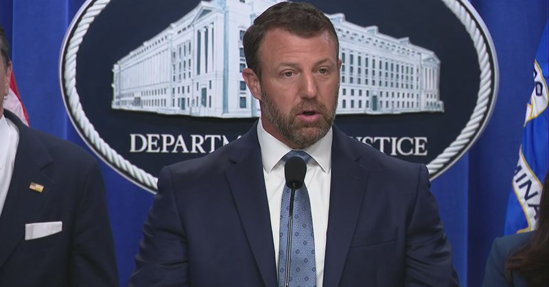

Fox News (Twitter/X)

WATCH LIVE: Blanche, Mullin announce effort to end child trafficking https://twitter.com/i/broadcasts/1nxnRRnjjeExO

## mamlekate — post 103680

📝 ترامپ: امشب حملات بسیار شدیدی به رژیم ایران خواهیم کرد

دونالد ترامپ، رئیس جمهوری ایالات متحده، روز پنجشنبه ۲۱ خرداد در پیامی در شبکه اجتماعی تروث سوشال اعلام کرد آمریکا قصد دارد حملات بسیار شدیدی علیه جمهوری اسلامی انجام دهد.

@mamlekate

## IranIntlTV — post 341718

  <a href="telegram/content/IranIntlTV_341718_1781185985.mp4" target="_blank">🎬 Download video</a>

سارباناندا سونووال، وزیر کشتیرانی هند، روز پنج‌شنبه اعلام کرد سه ملوان هندی که پس از حمله نظامی آمریکا به یک نفتکش در نزدیکی سواحل عمان مفقود شده بودند، جان باخته‌اند.

هویت جان‌باختگان نفتکش با پرچم پالائو، آدیتیا شارما، کارآموز عرشه از ایالت هیماچال پرادش، شیواناند چوراسیا، تکنسین موتور، و پاتنالا سورش، مهندس ارشد، اعلام شده است. بستگان شیواناند چوراسیا روز پنج‌شنبه در شهر دئوریا هند در سوگ او عزاداری کردند.

آمریکا اعلام کرده این حمله «دقیق» را به شناوری انجام داده که به گفته واشینگتن از دستورهای نیروهای آمریکایی پیروی نکرده و حامل نفت ایران بوده است. منابع هندی نیز به رویترز گفته‌اند دهلی‌نو در اعتراض به این حمله، معاون رئیس هیئت دیپلماتیک آمریکا را احضار کرده و «اعتراضی شدید» را به ثبت رسانده است.
@iranintltv

## IranIntlTV — post 341717

  <a href="telegram/content/IranIntlTV_341717_1781185986.mp4" target="_blank">🎬 Download video</a>

جام جهانی فوتبال ۲۰۲۶ به طور رسمی با بازی تیم‌های مکزیک و آفریقای جنوبی آغاز خواهد شد. محمد تقوی، عضو تحریریه ورزشی ایران‌اینترنشنال، گفت بازیکنان تیم فوتبال ایران مهره‌های حکومتی هستند که می‌خواهند در جام جهانی روایت خودشان را توضیح بدهند و برای فوتبال نمی‌روند، چرا که این تیم تیم ایران نیست.
@iranintltv

## IranIntlTV — post 341716

  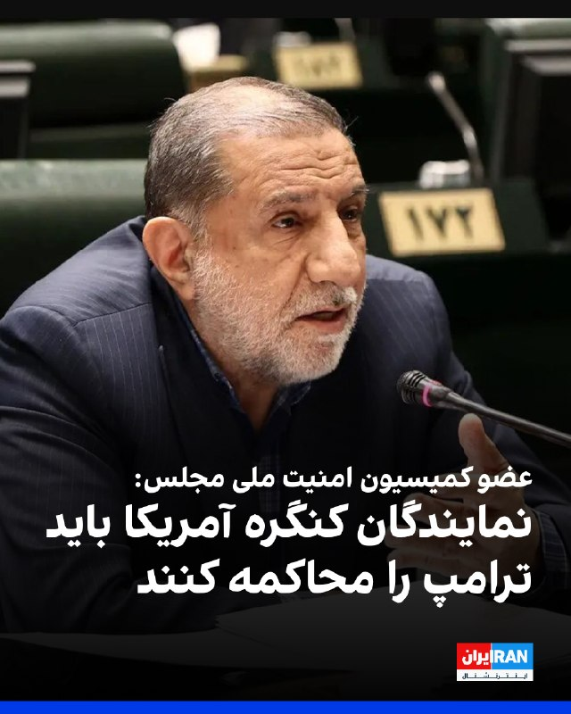

اسماعیل کوثری، عضو کمیسیون امنیت ملی مجلس، به خبرگزاری ایلنا گفت: «اگر نمایندگان کنگره آمریکا بخواهند به معنای واقعی وظایف خود را انجام دهند، ابتدا باید ترامپ را محاکمه کنند که چرا بدون مجوز کنگره جنگ را علیه ایران آغاز کرده است؛ زیرا خود کنگره چنین قانونی را تصویب کرده است که جنگ بدون مجوز غیرقانونی است.»

او اضافه کرد: «تمام فشار این جنگ بر اقتصاد آمریکا، به‌ویژه بر مردم عادی، وارد شده است برای همین به ما هم فشار وارد می‌کند تا بتواند به اهداف کثیف خود برسد و در این میان مشکلاتی هم برای ما به وجود آمده است.»
https://iranintl.com/202606119321

## DW_Farsi — post 125821

🔶 کاهش شمار پناهجویان در جهان برای نخستین‌بار در ۱۰ سال اخیر
 
بر اساس گزارش تازه کمیساریای عالی پناهندگان سازمان ملل (UNHCR)، شمار افرادی که به دلیل جنگ، خشونت، نقض حقوق بشر و ناامنی ناچار به ترک خانه‌های خود شده‌اند، برای نخستین‌بار در یک دهه گذشته کاهش یافته است.
 
این نهاد اعلام کرد که در آغاز سال ۲۰۲۶ حدود ۱۱۸ میلیون نفر در سراسر جهان در وضعیت آوارگی به سر می‌بردند؛ رقمی که نسبت به سال قبل ۵.۴ میلیون نفر، معادل چهار درصد، کاهش یافته است.
 
به گفته کمیساریای عالی پناهندگان سازمان ملل، دلیل اصلی این کاهش، افزایش شمار افرادی است که در سال گذشته به محل زندگی یا کشورهای خود بازگشته‌اند. بیش از ۱۰ میلیون آواره داخلی و نزدیک به ۴.۴ میلیون پناهنده در سال ۲۰۲۵ به مناطق یا کشورهای مبدا خود بازگشتند که یکی از بالاترین نرخ‌های بازگشت ثبت‌شده تاکنون به شمار می‌رود.
 
بیشترین شمار بازگشت‌کنندگان از سوریه، افغانستان و سودان بوده‌اند. با این حال، برهم صالح، کمیسر عالی پناهندگان سازمان ملل، تاکید کرد که بسیاری از این بازگشت‌ها داوطلبانه نبوده است. او به‌ویژه به وضعیت افغانستان اشاره کرد و گفت شمار زیادی از پناهجویان از ایران و پاکستان اخراج یا ناچار به بازگشت شده‌اند.
 
طبق این گزارش، از مجموع آوارگان جهان، ۶۸.۷ میلیون نفر آوارگان داخلی و ۳۵.۶ میلیون نفر پناهنده هستند. همچنین شمار متقاضیان پناهندگی که هنوز در انتظار تصمیم‌گیری درباره پرونده‌های خود هستند، به حدود ۹ میلیون نفر رسیده است.
@dw_farsi

## BBCPersian — post 283453

  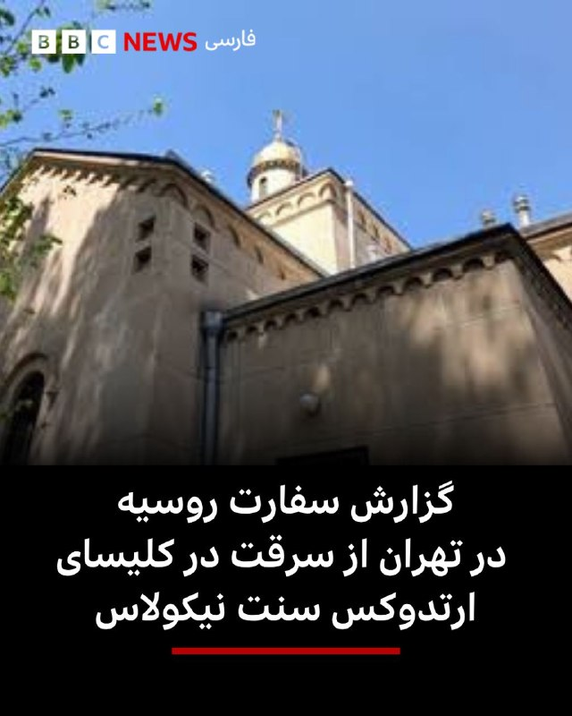

🔻سفارت روسیه در تهران اعلام کرده است که از کلیسای ارتدوکس سنت نیکولاس روسیه در تهران سرقت شده است. این کلیسا در جریان دور اول حملات آمریکا و اسرائیل علیه ایران خسارت دیده بود.

سفارت روسیه در تهران در بیانیه‌ای گفت: «از همه از کسانی که راه خطا پیموده و مرتکب این اقدام موهن و هتک‌حرمت‌آمیز شده‌اند، درخواست می‌کند که شمایل‌ها و اشیای مقدس ربوده‌شده را به کلیسا بازگردانند و بار گناه را بیش از این بر دوش خود نیفزایند.»

این کلیسا در نزدیکی سفارت سابق ایالات متحده در تهران قرار دارد و گزارش شده بود که در جریان حملات آمریکا و اسرائیل به ایران خسارات‌هایی به آن وارد شده بود.

سفارت روسیه می‌گوید که «ما هرگز باور نمی‌کردیم که در ایران افرادی پیدا شوند که چنین رفتاری با مقدسات مسیحی داشته باشند و به ایمانی به خدای یگانه که این کلیسا دهه‌ها پاسدار و حافظ آن بوده است، اهانت کنند.»
روسیه کلیسای سنت نیکولاس در تهران را «یکی از قدیمی‌ترین عبادتگاه‌های مسیحی در ایران و تنها کلیسای ارتدوکس روسی در پایتخت ایران» توصیف کرده است.

📸 ایسنا

https://bbc.in/4v5B0d7
@BBCPersian

---
📅 بروزرسانی: 1405/03/21 17:12
---

## VahidOOnLine — post 244952

  <a href="telegram/content/VahidOOnLine_244952_1781185373.mp4" target="_blank">🎬 Download video</a>

♦️دونالد ترامپ، رئیس‌جمهوری آمریکا، روز دوشنبه ۲۱ خرداد ماه، در گفتگوی زنده تلفنی با برنامه «فاکس و دوستان» از شبکه فاکس‌نیوز، اعلام کرد که ترجیح شخصی او همواره تصرف جزیره استراتژیک خارگ بوده است.

ترامپ تاکید کرد که این اقدام ثروت و سودآوری کلانی برای آمریکا به همراه خواهد داشت. با این حال، او درباره آنکه جامعه آمریکا در حال حاضر آمادگی روانی، سیاسی یا ظرفیت لازم برای ورود به چنین درگیری بزرگی را داشته باشد، ابراز تردید کرد.

جزیره خارگ به عنوان اصلی‌ترین پایانه صادرات نفت ایران در خلیج فارس، نقشی حیاتی در زنجیره تامین انرژی منطقه دارد. نیروهای سنتکام در جریان جنگ جاری حملات گسترده‌ای به جزیره خارج داشته‌اند.
‌🇸🇦 Indypersian

🤖 @VahidOOnLine

## mwarmonitor — post 10718

🔴وزیر خزانه‌داری آمریکا:

🔸رژیم ایران در بازی حاصل‌جمع صفر که در حال انجام آن است، بازنده خواهد بود.

🔹هرگونه خسارتی که به متحدان ما در خلیج فارس وارد کند، از محل منابعی که از حساب‌های ایران برداشت می‌شود، جبران خواهد شد.

🔸هرگونه عوارضی که به «سازمان تنگه خلیج فارس» پرداخت شود، با برداشت از حساب‌های آن‌ها خنثی خواهد شد.

🔹هر حمله‌ای که ایران انجام دهد، تنها پیامدهای اقتصادی و مالی‌ای را که با آن روبه‌روست، عمیق‌تر خواهد کرد.

@mwarmonitor

## IranIntlTV — post 341715

  <a href="telegram/content/IranIntlTV_341715_1781185375.mp4" target="_blank">🎬 Download video</a>

علی‌حسین قاضی‌زاده، عضو تحریریه ایران‌اینترنشنال، با اشاره به حملات اخیر آمریکا به امکانات نظارتی، سامانه‌های ارتباطی و مراکز پدافند هوایی نیروهای مسلح جمهوری اسلامی گفت راهبرد دونالد ترامپ برای وادار کردن جمهوری اسلامی به مذاکره از طریق این حملات، از قدرت و کارایی لازم برخوردار نیست و به نتیجه‌ای که رییس‌جمهوری آمریکا در پی آن است، منجر نخواهد شد.
@iranintltv

## IranIntlTV — post 341714

مجلس اعیان بریتانیا لایحه مرتبط با تروریستی خواندن سپاه پاسداران را بررسی کرد

مجلس اعیان بریتانیا در بخشی از جلسه پنج‌شنبه ۲۱ خرداد، موضوع تدوین لایحه‌ای برای ایجاد چارچوبی قانونی به‌منظور تروریستی اعلام کردن سپاه پاسداران بررسی کرد. این نشست پس از آن برگزار شد که دولت بریتانیا سه‌شنبه «لایحه امنیت ملی» (تهدیدات دولتی)، را به پارلمان ارائه کرد.

این قانون در صورت تصویب، به وزیر کشور بریتانیا امکان می‌دهد برخی سازمان‌های مرتبط با دولت‌ها، از جمله سپاه پاسداران، را به‌عنوان تهدیدی برای امنیت ملی معرفی کند. این لایحه ممکن است از ماه آینده میلادی اجرایی شود.

سپاه پاسداران در فهرست گروه‌های تروریستی شماری از کشورها از جمله آمریکا، کانادا، استرالیا و کشورهای عضو اتحادیه اروپا قرار دارد اما بریتانیا تا کنون از انجام چنین کاری خودداری کرده است.

دیوید هنسن، وزیر مشاور در امور امنیت ملی وزارت کشور بریتانیا، در پاسخ به پرسش اعضای مجلس اعیان گفت دولت بریتانیا «کاملا از تهدیدهای ناشی از حکومت ایران در خاک بریتانیا آگاه است».

او افزود: «ما تهدیدهای ایران را بسیار جدی می‌گیریم و به نظارت بر آن ادامه خواهیم داد.»

هنسن گفت لایحه امنیت ملی که سه‌شنبه به پارلمان ارائه شد، اختیار تازه‌ای به وزیر کشور می‌دهد تا نهادهایی را که در فعالیت‌های تهدیدآمیز مرتبط با دولت‌های خارجی مشارکت دارند، تعیین و مشمول محدودیت کند.

او تاکید کرد دولت بریتانیا می‌خواهد این لایحه هرچه سریع‌تر به قانون تبدیل شود تا وزیر کشور اختیار لازم را برای تصمیم‌گیری درباره تهدیدات دولتی داشته باشد.

به گفته هنسن، در صورت تصویب این لایحه در هر دو مجلس، محکومان مرتبط با این تهدیدها ممکن است با مجازات حداکثر ۱۴ سال حبس روبه‌رو شوند.

شماری از اعضای مجلس اعیان بریتانیا در این جلسه از ارائه این لایحه استقبال کردند.

جان کرایر، عضو مجلس اعیان بریتانیا، با اشاره به محکومیت دو نفر در ارتباط با حمله به خبرنگار ایران‌اینترنشنال گفت: «خوشحالم که دولت در حال ارائه این لایحه است، اما این اقدام بسیار دیر انجام می‌شود.»

هنری بلینگهام، عضو مجلس اعیان بریتانیا، نیز با استقبال از لایحه تهدیدات امنیتی گفت استفاده از نیروهای نیابتی، که به گفته او «کشورهایی مانند جمهوری اسلامی آشکارا پشت آن‌ها پنهان می‌شوند»، خسارت‌های گسترده‌ای به همراه دارد.

او افزود موضوع فقط سپاه پاسداران نیست، بلکه گروه مرتبط با حکومت ایران، «حرکت اصحاب الاسلامیه»، نیز مسئولیت برخی از حملات اخیر یهودستیزانه را بر عهده گرفته است.

استوارت پولاک، عضو مجلس اعیان بریتانیا، با اشاره به گزارش‌ها درباره ارتباط برخی موسسات خیریه در بریتانیا با سپاه پاسداران گفت: «موضوع فقط سپاه پاسداران و فعالیت‌های آن نیست، بلکه مسائلی است که در حوزه موسسات خیریه در این کشور جریان دارد.»

کدام کشورها سپاه را سازمانی تروریستی می‌دانند؟
در سال‌های اخیر و به‌ویژه پس از انقلاب ملی ایرانیان، کنشگران و مخالفان جمهوری اسلامی با اشاره به نقش این نهاد نظامی در سرکوب معترضان در داخل کشور و همچنین دست داشتن آن در طراحی و اجرای حملات تروریستی در بسیاری از کشورهای جهان، بارها خواستار قرار گرفتن نام سپاه پاسداران در فهرست گروه‌های تروریستی شده‌اند.

بحرین و عربستان سعودی از اولین کشورهایی بودند که در پاییز ۱۳۹۷ سپاه پاسداران را در لیست سازمان‌های تروریستی قرار دادند.

ایالات متحده نیز در فروردین ۹۸ سپاه پاسداران را یک سازمان تروریستی معرفی کرد. این اولین بار بود که دولت آمریکا یک نیروی نظامی رسمی وابسته به یک دولت حاکم را تروریستی اعلام می‌کرد.

دولت پاراگوئه اردیبهشت سال جاری رسما سپاه پاسداران را به‌عنوان سازمان تروریستی معرفی کرد.

دولت کانادا نیز خرداد گذشته اعلام کرد سپاه پاسداران را در فهرست سازمان‌های تروریستی طبقه‌بندی خواهد کرد.

دولت اکوادور ۲۵ شهریور سپاه پاسداران، حماس و حزب‌الله لبنان را به‌عنوان «گروه‌های تروریستی و جنایت‌کار سازمان‌یافته» معرفی کرد.

در استرالیا، دولت ۱۶ آذر سپاه پاسداران را در فهرست «تروریسم دولتی» قرار داد و اعلام کرد این نهاد نظامی-امنیتی جمهوری اسلامی مسئول طراحی حملات علیه جامعه یهودیان این کشور در سال ۲۰۲۴ بوده است.

در آرژانتین نیز، خاویر میلی، رییس‌جمهوری این کشور، ۲۷ دی با امضای فرمانی نیروی قدس سپاه پاسداران و ۱۳ فرد مرتبط با شاخه برون‌مرزی سپاه پاسداران را «تروریستی» اعلام کرد.

به این ترتیب در صورت اضافه شدن اتحادیه اروپا، می‌توان گفت به جز بریتانیا، سپاه پاسداران در لیست سازمان‌های تروریستی تمام کشورهای بلوک غرب قرار گرفته است.

🔗متن کامل گزارش را اینجا بخوانید
@iranintltv

## FarsiVOA — post 220382

سازمان یو‌اف‌سی تصاویری از آماده‌سازی محل برگزاری رقابت‌های «یو‌اف‌سی فریدم ۲۵۰» در محوطه کاخ سفید منتشر کرد.

در این پست آمده است که این رویداد یکشنبه ۲۴ خرداد ساعت ۸ شب به وقت شرق آمریکا برگزار و به صورت زنده پخش خواهد شد.

کاخ سفید نیز این پست را بازنشر کرده است.

@FarsiVOA

## BBCPersian — post 283452

  <a href="telegram/content/BBCPersian_283452_1781185377.mp4" target="_blank">🎬 Download video</a>

🔻سرخط خبرها، پنج‌شنبه ۲۱ خرداد ۱۴۰۵

@BBCPersian

## BBCPersian — post 283450

  <a href="telegram/content/BBCPersian_283450_1781185378.mp4" target="_blank">🎬 Download video</a>

ویدویی از یک لنج باری منتشر شده که در آن یکی از اهالی جنوب ایران از حمله پهپادی به لنج اهالی سیریک خبر می‌دهد. فرماندار سیریک «اصابت یک پرتابه آمریکایی به یک فروند لنج باری» را تایید کرده است.
رسناک که اخبار بلوچستان را پوشش می‌دهد، ضمن انتشار این ویدیو نوشته است: «تمامی سرنشینان، صیادان و ملوانان حاضر در لنج، پس از وقوع حادثه با ارسال علائم درخواست کمک موفق شدند توجه یک قایق موتوری کوچک را جلب کنند و توسط آن از آب نجات یافته و به خشکی منتقل شوند.»

رضا شهیدیان، فرماندار شهرستان سیریک در استان هرمزگان، اعلام کرده که که این لنج ۱۵۰ تنی پنج خدمه داشته و حامل کالاهای اساسی بوده است.
او درباره این واقعه توضیح داد: «حدود ساعت پنج بامداد امروز یک فروند لنج باری متعلق به شهرستان سیریک در آب‌های دریای عمان هدف حمله آمریکا قرار گرفت و غرق شد.»

او با اشاره به اینکه خسارت سنگینی به این لنج وارد شده و تمامی محموله آن از بین رفته، افزود: «این لنج از بندر خصب عمان به مقصد سیریک در حال حرکت بود. دستگاه‌های مسئول در حال بررسی ابعاد و جزئیات این رخداد هستند.»

@BBCPersian
https://bbc.in/4os3iw0

## Hranews — post 113539

اعتراضات دی‌ماه ۱۴۰۴؛ صدور کیفرخواست برای مالک و کارکنان یک واحد صنفی

❗️
❗️
❗️
❗️
❗️– رئیس دادگستری شهرستان البرز از صدور کیفرخواست برای مالک و شماری از کارکنان یک واحد صنفی در شهر الوند در ارتباط با اعتراضات دی‌ماه ۱۴۰۴ خبر داد. به گفته وی، برخی از متهمان این پرونده همچنان در بازداشت به سر می‌برند. این واحد صنفی نیز پیشتر با قرار نظارت قضایی به مدت سه ماه تعطیل شده بود و پرونده آن هم‌اکنون در مرحله رسیدگی دادگاه قرار دارد.

#اعتراضات_دی‌ماه

ادامه مطلب

↘️
@hranews_bot تماس ✉️ - @Hranews کانال هرانا 🆑

## alonews — post 127149

  <a href="telegram/content/alonews_127149_1781185380.webm" target="_blank">🎬 Download video</a>

👈وال استریت ژورنال: از این به بعد آمریکا «هر شب» به ایران حملهِ میکنه، تا زمانی که به توافق برسن

✅ @AloNews خبر جنگ

---
📅 بروزرسانی: 1405/03/21 17:03
---

## VahidOOnLine — post 244951

🗣روایت شما از زندگی در دوران پس از انقلاب ملی و جنگ - پنجشنبه ۲۱ خرداد

🔹واقعا از جمهوری‌اسلامی متنفرم، تبعیض جنسیتی تا کی می‌خواد ادامه‌دار باشه؟ به زنان گواهینامه موتورسواری نمی‌دن و اگه شما رو با موتور ببینن، موتور رو توقیف می‌کنن. کی باید ما هم به حق خودمون برسیم؟

🔹 آموزش‌وپرورش گفته هنرستانی‌ها از ۲۳ خرداد باید برای دروس تخصصی و پودمانی برن مدرسه. تا حالا که شرایط عادی بود یادشون نبود، به‌محض شروع حملات گفتن باید برید مدرسه. برای دانش‌آموزان نمی‌تونن تصمیم بگیرن چه برسه به کشور.

🔹با تمام مشکلات و سختی‌هایی که وجود داره، مطمئن باشید مردم ایران این دیو رو از کشور بیرون خواهند کرد.

🔹در حالی که تمام دنیا در شور و هیجان جام جهانی هستن، جوانان ایران برای تامین نیازهای اولیه مثل لباس، کفش و لوازم بهداشتی باید صبح تا شب کار کنن. از طرفی غم از دست دادن هموطنان زخم عمیقی بر دل‌هامون گذاشته و هیچ شادی از ته دلی نداریم.

🔹من یک دانش‌آموز دوازدهمی هستم که هیچ آینده‌ای در ایران ندارم. گرانی بیداد می‌کنه و با این وضع مملکت هیچ کاری نمی‌شه کرد. تنها امیدمون رفتن این دولت جنایتکار هست.

🔹جمهوری‌اسلامی محکوم به سقوطه و سر سوزن شک ندارم که دیر یا زود توسط ما مردم ایران به حقیرترین شکل ممکن سرنگون می‌شه. تنها غمم اینه که جاویدنامان شجاعمون نیستن که روز آزادی رو ببینن، یادشون تا ابد در قلب و ذهن ماست.

🔹ما دهه هشتادی‌های شیراز نهایت تفریحمون اینه که بریم یه کافه و چند ساعت دور هم باشیم. اون‌وقت هم‌سن‌وسال‌های ما در خیلی از کشورهای دنیا دغدغه‌شون اینه که برای جام جهانی کدوم کشور برن، چه سفری بچینن و چه تجربه‌ای کسب کنن.

🔹به‌عنوان یه دختر شانزده‌ساله خیلی چیزها خواستم ولی روم نشده به خانوادم بگم، نه فقط امسال بلکه حتی از سال‌های قبل هم همین‌طور بوده.

🔹ما اصلا ناامید نیستیم، می‌دونیم آزادی تاوان داره و مردم شجاع و دلیر ایران با گوشت و پوست و استخوان خودشون این هزینه رو پرداخت کردن. به امید بازپس‌گیری ایران عزیزمون.

🔹چرا باید من ۱۵ ساله این همه استرس و فشار روم باشه در حالی که در خارج هم‌سن‌های من دنبال عشق و حال هستن یا به فکر رفتن به مکزیک برای جام جهانی؟ ما چه گناهی کردیم که در ایران زندگی کردیم؟
‌🏁 🇬🇧 IranintlTV

🤖 @VahidOOnLine

## VahidOOnLine — post 244950

  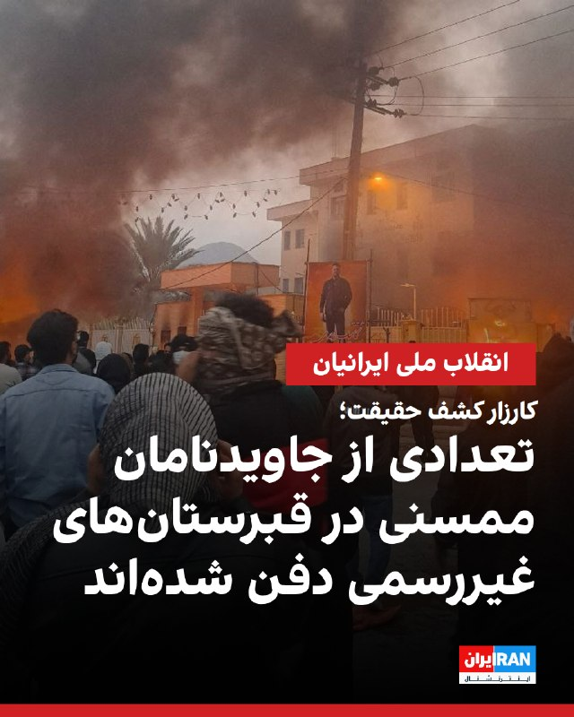

تعدادی از مخاطبان در پیام‌‌هایی به کارزار «‌کشف حقیقت» درباره جنایت‌های دی ماه در نورآباد‌ ممسنی اعلام کردند که برخی از کشته‌شدگان اعتراض‌ها در این شهر در قبرستان‌های غیررسمی و بدون نشان دفن شده‌اند. پیام‌های متعدد رسیده به ایران اینترنشنال عدد کشته‌شدگان در این شهر را بیش از ۷۰ نفر برآورد کرده‌اند.

‌🏁 🇬🇧 IranintlTV

🤖 @VahidOOnLine

## VahidOOnLine — post 244949

  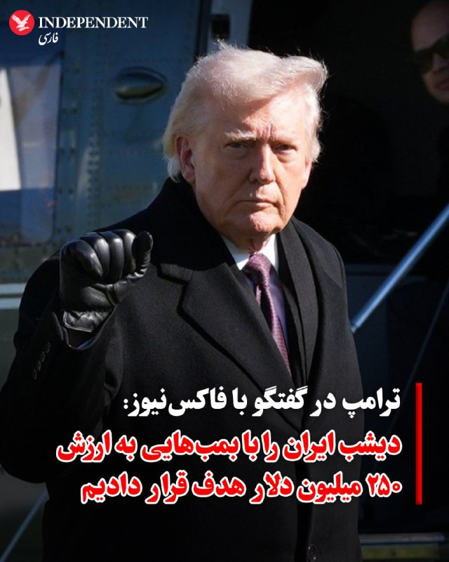

♦️ دونالد ترامپ، رئیس‌جمهوری ایالات متحده، روز پنجشنبه ۲۱ خرداد، در تماس تلفنی با فاکس‌نیوز، اعلام کرد که در جریان حملات شب گذشته به مواضعی در ایران، بمب‌هایی به ارزش ۲۵۰ میلیون دلار مورد استفاده قرار گرفته است. ترامپ با تایید این‌که قصد دارد این حملات را به شکلی «سنگین‌تر» در پنجشنبه‌شب ادامه دهد، گفت: «آن‌ها هیچ نیروی دفاعی ندارند، کاری نمی‌توانند در مقابل انجام دهند. تنها چیزی که آن‌ها دارند اخبار جعلی و پروپگاندا است.»

ترامپ در گفتگوی تلفنی دیگری با خبرنگار فاکس‌نیوز که همزمان با حملات شبانه انجام شده بود، گفت: «همین الآن مقام‌های ایران با من تماس گرفتند که حملات را متوقف کنند. جت‌های جنگنده ما بر فراز کشورشان پرواز می‌کنند و آن‌ها نمی‌توانند از خاک خود دفاع کنند».
‌🇸🇦 Indypersian

🤖 @VahidOOnLine

## WithYashar — post 14520

ترامپ خطاب به مجری:
مثلاً شنیدم که به (زدن زیرساخت) آب اشاره کردی؛ قطع کردن آب واقعاً یک ضربه ویران‌کننده برای اوناست. من میتونم این کار رو تو یک دقیقه انجام بدم و سیستم آب اونارو قطع کنم اما مشکل اینجاس که مردم دیگه نمیتونن آب بنوشن. منظورم اینه که پس اونا باید چیکار کنن؟»

مجری:
«پیام شما به مردم ایران چیه؟ اونا الان به اینترنت دسترسی دارند.»

دونالد ترامپ:
«خب، پیام من به مردم ایران اینه که اونا ترسیدن. چون هیچ اسلحه‌ای ندارن و طرف مقابل اسلحه داره. اونا تجمع (تظاهرات) برگزار میکنن و به اونا شلیک میشه. اونا اون کشتی‌گیر و دو نفر از دوستانش رو دار زدن؛ باور کنید یا نه، اونارو با جرثقیل دار زدن؛ با خشونت تمام. اون یک کشتی‌گیر بسیار مطرح بود و اونا اونو اعدام کردن.»
«اونا حداقل ۴۰ تا ۵۰ هزار نفر رو کشتن و مردم ترسیدن. میدونی، وقتی یک مسلسل به سمت صورتت نشانه رفته باشه، یا وقتی چهار تک‌تیرانداز روی چهار ساختمان مختلف مستقر باشن و به سر مردم شلیک کنن، سخته که تجمع برگزار کنی؛ متوجهی؟»
@withyashar

## WithYashar — post 14519

## pm_afshaa — post 93627

  <a href="telegram/content/pm_afshaa_93627_1781184806.mp4" target="_blank">🎬 Download video</a>

🔴ترامپ: امشب بمباران‌های بیشتری انجام خواهد شد. این حملات بزرگ‌تر، قوی‌تر و قدرتمندتر خواهند بود.

فراموش نکنید، ما تمام سامانه‌های پدافند هوایی آنها رو از کار انداختیم و دیگه هیچ چیزی ندارن؛ ممکنه یکی دو مورد استثنایی مثل سلاح‌های قابل حمل داشته باشن، اما در کل هیچ دفاعی ندارن. آنها تمام شدن، اما رسانه‌ها از نوشتن این موضوع خودداری می‌کنند.

ما میتونیم فردا وارد بشیم و نیرو اعزام کنیم، اما من فعلا نمیخوام نیروی زمینی بفرستم، اما اگر بخوام، میتونیم یک گروه کوچک نیرو بفرستیم و کل منطقه رو کنترل کنیم.

💧 Rainbet.com the #1 Non-KYC Crypto Casino & Sportsbook @rainbetcom

😁 @Pm_Afshaa

## kianmeli1 — post 87933

🔴رویترز:

لشکر 82 هوابرد آمریکا ملقب به لشکر شیطان به زودی جزایر نفتی ایران را تصرف خواهند کرد.
https://t.me/kianmeli1

## IranIntlTV — post 341707

🔻تیم ملی مکزیک و آفریقای جنوبی نخستین بازی جام‌جهانی ۲۰۲۶ را امشب ساعت ۲۲:۳۰ در ورزشگاه تاریخی آزتکا در مکزیکو سیتی برگزار می‌کنند.

🔹این بازی، تکرار دقیق بازی افتتاحیه جام‌جهانی ۲۰۱۰ به میزبانی آفریقای جنوبی است؛ مسابقه‌ای که در آن شلیک تماشایی سیپیوه تشابالالا با گل تساوی‌بخش رافائل مارکز پاسخ داده شد و در نهایت دو تیم به تساوی ۱-۱ رضایت دادند.

🔹استادیوم غول‌پیکر آزتکا امشب با حضور بیش از ۸۰ هزار تماشاگر، یک رکورد بی‌نظیر را ثبت می‌کند. این ورزشگاه به نخستین استادیوم تاریخ فوتبال تبدیل می‌شود که سه بار در سال‌های ۱۹۷۰، ۱۹۸۶ و ۲۰۲۶ میزبان بازی افتتاحیه جام‌جهانی است.

🔹جزئیات بیشتر را در سایت ایران اینترنشنال بخوانید.

@iranintltvsport

## IranIntlTV — post 341706

🗣روایت شما از زندگی در دوران پس از انقلاب ملی و جنگ - پنجشنبه ۲۱ خرداد

🔹واقعا از جمهوری‌اسلامی متنفرم، تبعیض جنسیتی تا کی می‌خواد ادامه‌دار باشه؟ به زنان گواهینامه موتورسواری نمی‌دن و اگه شما رو با موتور ببینن، موتور رو توقیف می‌کنن. کی باید ما هم به حق خودمون برسیم؟

🔹 آموزش‌وپرورش گفته هنرستانی‌ها از ۲۳ خرداد باید برای دروس تخصصی و پودمانی برن مدرسه. تا حالا که شرایط عادی بود یادشون نبود، به‌محض شروع حملات گفتن باید برید مدرسه. برای دانش‌آموزان نمی‌تونن تصمیم بگیرن چه برسه به کشور.

🔹با تمام مشکلات و سختی‌هایی که وجود داره، مطمئن باشید مردم ایران این دیو رو از کشور بیرون خواهند کرد.

🔹در حالی که تمام دنیا در شور و هیجان جام جهانی هستن، جوانان ایران برای تامین نیازهای اولیه مثل لباس، کفش و لوازم بهداشتی باید صبح تا شب کار کنن. از طرفی غم از دست دادن هموطنان زخم عمیقی بر دل‌هامون گذاشته و هیچ شادی از ته دلی نداریم.

🔹من یک دانش‌آموز دوازدهمی هستم که هیچ آینده‌ای در ایران ندارم. گرانی بیداد می‌کنه و با این وضع مملکت هیچ کاری نمی‌شه کرد. تنها امیدمون رفتن این دولت جنایتکار هست.

🔹جمهوری‌اسلامی محکوم به سقوطه و سر سوزن شک ندارم که دیر یا زود توسط ما مردم ایران به حقیرترین شکل ممکن سرنگون می‌شه. تنها غمم اینه که جاویدنامان شجاعمون نیستن که روز آزادی رو ببینن، یادشون تا ابد در قلب و ذهن ماست.

🔹ما دهه هشتادی‌های شیراز نهایت تفریحمون اینه که بریم یه کافه و چند ساعت دور هم باشیم. اون‌وقت هم‌سن‌وسال‌های ما در خیلی از کشورهای دنیا دغدغه‌شون اینه که برای جام جهانی کدوم کشور برن، چه سفری بچینن و چه تجربه‌ای کسب کنن.

🔹به‌عنوان یه دختر شانزده‌ساله خیلی چیزها خواستم ولی روم نشده به خانوادم بگم، نه فقط امسال بلکه حتی از سال‌های قبل هم همین‌طور بوده.

🔹ما اصلا ناامید نیستیم، می‌دونیم آزادی تاوان داره و مردم شجاع و دلیر ایران با گوشت و پوست و استخوان خودشون این هزینه رو پرداخت کردن. به امید بازپس‌گیری ایران عزیزمون.

🔹چرا باید من ۱۵ ساله این همه استرس و فشار روم باشه در حالی که در خارج هم‌سن‌های من دنبال عشق و حال هستن یا به فکر رفتن به مکزیک برای جام جهانی؟ ما چه گناهی کردیم که در ایران زندگی کردیم؟

## IranIntlTV — post 341705

  

تعدادی از مخاطبان در پیام‌‌هایی به کارزار «‌کشف حقیقت» درباره جنایت‌های دی ماه در نورآباد‌ ممسنی اعلام کردند که برخی از کشته‌شدگان اعتراض‌ها در این شهر در قبرستان‌های غیررسمی و بدون نشان دفن شده‌اند. پیام‌های متعدد رسیده به ایران اینترنشنال عدد کشته‌شدگان در این شهر را بیش از ۷۰ نفر برآورد کرده‌اند.

https://iranintl.com/202606110687

## RadioFarda — post 158182

اوپک بار دیگر پیش‌بینی رشد تقاضای جهانی نفت در سال ۲۰۲۶ را کاهش داد

🔸اوپک روز پنج‌شنبه ۲۱ خرداد در گزارش ماهانه خود، پیش‌بینی رشد تقاضای جهانی نفت در سال ۲۰۲۶ را ۹۷۰ هزار بشکه دیگر در روز کاهش داد.

🔸این دومین کاهشی پیاپی در بازنگری سازمان کشورهای صادرکننده نفت محسوب می‌شود.

🔸اوپک می‌گوید که تأثیر جنگ ایران بر مصرف، کمتر از آنچه بوده که سایر نهادها مانند اداره اطلاعات انرژی آمریکا و آژانس بین‌المللی انرژی برآورد کرده بودند.

🔸به گفته این سازمان، مصرف در ادامه بهبود خواهد یافت و پیش‌بینی رشد تقاضا برای سال ۲۰۲۷ را افزایش داد.

🔸جنگ آمریکا و اسرائیل با ایران که ۹ اسفند پارسال آغاز شد و دو ماه پیش با یک آتش‌بس شکننده خاتمه یافت، عملاً تنگه هرمز، یکی از مهم‌ترین مسیرهای انتقال نفت در جهان، را مسدود و عرضه میلیون‌ها بشکه‌ نفت از خاورمیانه را محدود کرده است.

🔸جهش قیمت سوخت ناشی از این وضعیت نیز به مصرف‌کنندگان و کسب‌وکارها در سراسر جهان فشار وارد کرده است.

🔸در پیش‌بینی جدید اوپک، رشد مورد انتظار تقاضای نفت در سال جاری نسبت به رقم قبلی یک میلیون و ۱۷۰ هزار بشکه در روز کاهش یافته است.

🔸برای سال ۲۰۲۷، اوپک انتظار دارد تقاضای نفت یک میلیون و ۱۷۳ هزار بشکه در روز افزایش یابد که ۱۹۰ هزار بشکه در روز بیشتر از برآورد قبلی است.

🔸اوپک در گزارش خود اعلام کرد: «عملکرد اقتصاد جهانی در نیمه نخست سال ۲۰۲۶، با وجود تنش‌های ژئوپلیتیکی جاری، همچنان مقاوم باقی مانده است» و پیش‌بینی‌های رشد اقتصادی خود را بدون تغییر نگه داشت.

🔸 گزارش کامل را در وب‌سایت رادیوفردا بخوانید.

@RadioFarda

## IranianMinds — post 22310

🔴 دونالد ترامپ :

ترجیح می‌دم همین حالا به توافق برسیم، چون کمتر از سه یا چهار هفته وقت باقی مونده. چون وقتی این کار رو بکنی، می‌تونی یه قدم جلوتر بری.

نمی‌دونم آمریکا اشتهایی برای کاری که واقعاً ترجیح می‌دم انجام بدم داره یا نه. تو دو تا جنگ ۱۳ سرباز از دست دادیم — تو ونزوئلا هیچ‌کدوم رو از دست ندادیم و کشور رو گرفتیم. تو ایران هم ۱۳ تا از دست دادیم.

تو ویتنام صدها هزار نفر رو از دست دادیم. الان دارن دیوونه می‌شن چون من سه ماهه تو ایرانم و کشور رو نابود کردم.

اون‌ها گفتن گفتی زودتر خارج می‌شی. خب، الان موضوع خیلی بزرگ‌تر شده، چون بهتر از چیزی که کسی فکرش رو می‌کرد کار رو انجام دادیم.

نگاه کنید، ۱۹ سال تو ویتنام بودیم و کار رو تموم نکردیم، چون خداییش رهبری درست و حسابی نداشتیم. اگه من اونجا بودم، اون جنگ رو تو سه چهار ماه تموم می‌کردم.

@IranianMinds

## IranianMinds — post 22309

  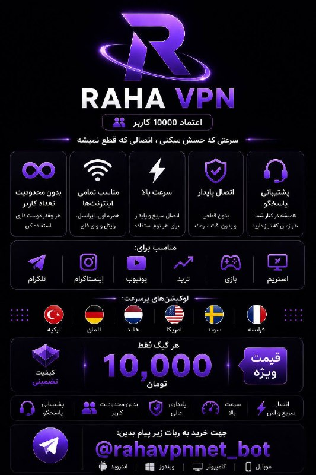

🚀 فیلترشکن پرسرعت و پایدار
🔥 بدون محدودیت تعداد کاربر

✅ سرعت بالا و اتصال پایدار
✅ مناسب تلگرام، اینستاگرام، یوتیوب، ترید و گیم
✅ قابل استفاده روی تمامی دستگاه‌ها

💰 هر گیگ فقط ۱۰ هزار تومان

⚡ سرعت بالا | پایداری عالی | بدون محدودیت کاربر ⚡

📩 خرید:
@rahavpnnet_bot

## IranianMinds — post 22308

  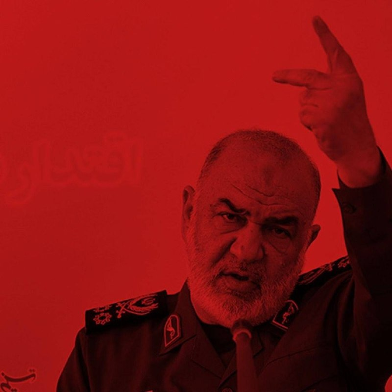

اکانت اسرائیل به فارسی:

یک سال و دو روز پیش این تروریست هنوز زنده بود و تهدید می‌کرد.
نور بر تاریکی پیروز خواهد شد، شک نکنید.

@IranianMinds

## BBCPersian — post 283449

  <a href="https://t.me/bbcpersian/283449" target="_blank">📎 Download file</a>

تازه‌ترین خبرهای جهان پنج‌شنبه ۲۱ خرداد ۱۴۰۵

## BBCPersian — post 283448

🔻انتقادها از دعوت طالبان به بروکسل؛ «مشروعیت‌بخشی به رژیمی که زنان را سرکوب می‌کند»

دعوت احتمالی نمایندگان حکومت طالبان به بروکسل برای گفت‌وگو درباره بازگرداندن مهاجران افغان، با واکنش‌های انتقادی شماری از سیاستمداران اروپایی و فعالان حقوق بشر روبه‌رو شده است. کمیسیون اروپا ماه گذشته از تلاش برای برگزاری گفت‌وگوهای فنی با مقام‌های طالبان درباره «مسائل مهاجرتی و بازگشت برخی شهروندان افغان» خبر داد.

https://bbc.in/4ejtPXA
@BBCPersian

## BBCPersian — post 283447

  <a href="telegram/content/BBCPersian_283447_1781184812.mp4" target="_blank">🎬 Download video</a>

⚽️اندرو جولیانی، رئیس کارگروه ویژه کاخ سفید برای جام جهانی چهارشنبه ۲۰ خرداد گفت که به خواست دونالد ترامپ، رئیس‌جمهور این کشور به بازیکنان و مربیان ایران این «فرصت» داده می‌شود که مسابقه دهند اما آنها یک روز قبل از هر بازی می‌توانند از تیخوانا به آمریکا بیایند و بعد دوباره به کمپ‌شان برگردند. آنها پس از حذف از مسابقات هم باید آمریکا را ترک کنند.

جانی اینفانتینو با ابراز مسرت از ورود تیم ملی ایران به مکزیک گفت که اگر لازم بود خودش با اتوبوس تیم ایران را به جام جهانی می‌رساند.

فدراسیون فوتبال ایران اعلام کرده است که با «لغو سهمیه ۸ درصدی» امکان بلیت‌فروشی به هواداران تیم ملی را ندارد.

ایجاد محدودیت ورود از جمله عدم اعطای ویزا موجب اعتراض تماشاگران از جمله بعضی از هواداران تیم ملی اسکاتلند هم شده که پس از خرید بلیت هواپیما و رزرو محل اقامت دریافته‌اند ویزای آمریکای آنها رد شده است.

@BBCPersian

## BBCPersian — post 283446

🔻فرماندار سیریک: یک لنج باری در دریای عمان هدف حمله آمریکا قرار گرفت

فرماندار شهرستان سیریک در استان هرمزگان از هدف قرار گرفتن یک لنج باری حامل کالا در دریای عمان خبر داد و گفت که این «شناور در پی این حادثه غرق شده و محموله آن به‌طور کامل از بین رفته است.»

رضا شهیدیان گفت که این لنج ۱۵۰ تنی حدود ساعت پنج بامداد امروز در مسیر حرکت از بندر خصب عمان به سمت سیریک، بر اثر حمله در آب‌های دریای عمان دچار حادثه شد.

به گفته او این شناور هدف اصابت «پرتابه یک پهپاد آمریکایی» قرار گرفت.

آقای شهیدیان همچنین افزود پنج خدمه این لنج که همگی از اهالی سیریک بودند، با کمک شناورهای عبوری نجات پیدا کردند.و برای دریافت خدمات به کشور عمان منتقل شده‌اند.

فرماندار سیریک همچنین گفت بررسی‌های لازم درباره ابعاد و جزئیات این حادثه همچنان در حال انجام است.

https://bbc.in/4v5B0d7
@BBCPersian

## BBCPersian — post 283445

🔻پدر ملوان هندی کشته‌شده: وقتی آخرین بار با پسرم صحبت کردم همه چیز خوب بود

پدر یک ملوان که در حمله آمریکا به کشتی «ام‌تی سته‌بلو» کشته شده است، می‌گوید که آخرین بار دو روز پیش با پسرش صحبت کرده و «همه چیز خوب بود.»

رامجی چاوراسیا به خبرگزاری رویترز گفت که پسرش هشت یا نه ماه پیش خانه را ترک کرده بود.

آقای جاوراسیا می‌گوید که به او اطلاع دادند که یک بمب به کشتی اصابت کرده و چندین نفر از خدمه هم مفقود شده‌اند.

در پاسخ به این سوال که چه اطلاعاتی از پسرش دریافت کرده است، پدر این ملوان با گریه اختیارش را از دست داد و دیگر قادر به ادامه صحبت نبود.

https://bbc.in/4v5B0d7
@BBCPersian

## Dirty_Kids — post 391708

  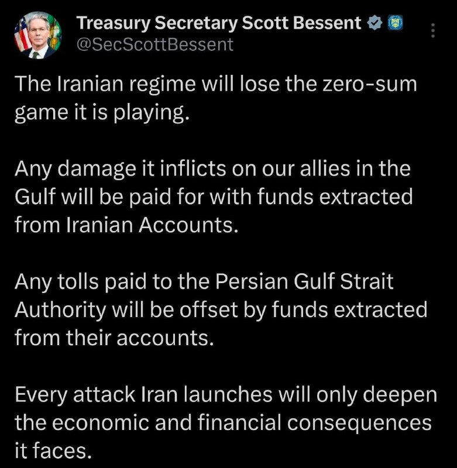

ادعای اسکات بنست، وزیر خزانه داری آمریکا:

رژیم ایران در این بازی با حاصل جمع صفر خواهد باخت. هرگونه خسارتی که به متحدان ما در خلیج فارس وارد کند، با استفاده از وجوه توقیف شده از حساب‌های ایران جبران خواهد شد. هرگونه هزینه‌ای که به «نهاد مدیریت خلیج فارس» پرداخت شود، با وجوه توقیف شده از حساب‌های آنها جبران خواهد شد. هر حمله‌ای که ایران انجام دهد، تنها عواقب اقتصادی و مالی پیش روی آن را تشدید می‌کند.
.
پ.ن: نهاد مدیریت آبراهه خلیج‌فارس همان نهادی است که ایران برای مدیریت تنگه هرمز از جمله با اخذ عوارض تشکیل داده است.

@Dirty_Kids 👻

## Dirty_Kids — post 391704

🔴 آخرین تلاش فوت فتیشا، طرف پست گذاشته دخترا عکس لاک پاتون رو کامنت کنین و دخترا هم برای فوت فتیشا بهشت راه انداختن
💅

@Dirty_Kids 👻

## Dirty_Kids — post 391703

ترامپ: دیشب ۲۵۰ میلیون دلار بمب روی سرشان ریختیم

امشب نیز وحشتناک حمله خواهیم کرد
تصمیم ندارم نیروی زمینی اعزام کنم ولی مجبورم این کار رو در اینده انجام بدم.

@Dirty_Kids 👻

## alonews — post 127148

  <a href="telegram/content/alonews_127148_1781184815.mp4" target="_blank">🎬 Download video</a>

👈ترامپ درباره کرد ها: ما واقعاً برای معترضان ایران سلاح فرستادیم و صادقانه بگویم از کردها خیلی ناامید شدیم. کردها ما را ناامید کردند.

من با این تصمیم موافق نبودم. می‌گفتم: “نه، فکر نمی‌کنم آن‌ها این سلاح‌ها را تحویل بدهند.”
فکر می‌کنم آن‌ها سلاح‌ها را برای خودشان نگه داشتند. به نظر من این یک رسوایی است. اما من این موضوع را فراموش نمی‌کنم، کردها را فراموش نمی‌کنم.

✅ @AloNews خبر جنگ

---
📅 بروزرسانی: 1405/03/21 16:53
---

## VahidOOnLine — post 244948

  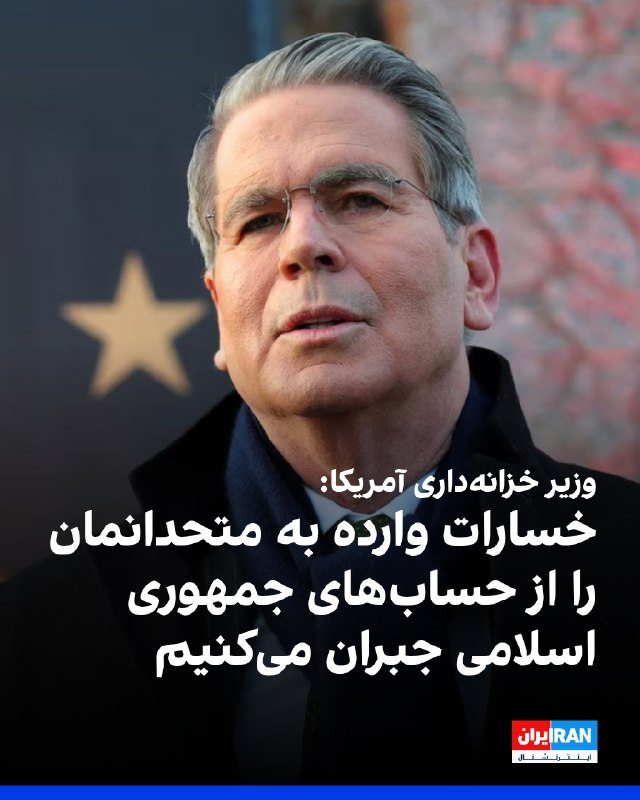

اسکات بسنت، وزیر خزانه‌داری آمریکا در شبکه ایکس نوشت که حکومت ایران در بازی حاصل‌جمع صفر که در پیش گرفته، شکست خواهد خورد.

او افزود: «هر خسارتی که جمهوری اسلامی به متحدان آمریکا در خلیج فارس وارد کند، با برداشت از حساب‌های ایرانی جبران خواهد شد.»

بسنت گفت که هر عوارضی بابت تنگه هرمز پرداخت شود، با برداشت از حساب‌های آن‌ها (جمهوری اسلامی) جبران خواهد شد.

او ادامه داد: «هر حمله جمهوری اسلامی پیامدهای اقتصادی و مالی بیشتری برای تهران به دنبال خواهد داشت.»
‌🏁 🇬🇧 IranintlTV

🤖 @VahidOOnLine

## WithYashar — post 14518

## WithYashar — post 14517

## WithYashar — post 14516

ترامپ: ایران بزودی به پایان می‌رسد، امشب هم بشدت بمباران خواهند شد!
@withyashar

## mwarmonitor — post 10717

گزارشگر:
«خب، شما می‌گویید... یعنی دارید اعلام می‌کنید که امشب ضربه بسیار سختی به آن‌ها خواهید زد. چه عواملی باعث شد این پست را بگذارید؟»
دونالد ترامپ:
«خب، این هم یکی از همان چیزهاست، آن‌ها هیچ دفاعی ندارند، هیچ کاری نمی‌توانند در موردش بکنند. آن‌ها... تنها چیزی که دارند اخبار جعلی است. می‌دانید، مثلاً نیویورک تایمز طوری می‌نویسد که انگار وضعیت آن‌ها عالی است، در حالی که اینطور نیست، آن‌ها نابود شده‌اند.
سی‌ان‌ان (CNN) و... آن ام‌اس‌ان‌بی‌سی (MSNBC) یا هر چیزی که این روزها صدایش می‌کنند... ان‌بی‌سی (NBC) مجبور شد خودش را از شر آن خلاص کند چون برای شهرتشان بد بود.
اما... تبلیغات و رسانه‌ای که در اختیار دارند باورنکردنی است. انگار دارند خوب عمل می‌کنند، در حالی که دارند تارومار می‌شوند، دقیقاً تارومار می‌شوند. آن‌ها به‌شدت تشنه توافق هستند، خیلی زیاد می‌خواهند توافق کنند.
اما خب، وقتی نیویورک تایمز را می‌خوانید، یا وال استریت ژورنال را می‌خوانید که خیلی جعلی است... منظورم این است، می‌دانم که این رسانه متعلق به شماست [خطاب به فاکس نیوز]، اما واقعاً یک تکه زباله است. وقتی وال استریت ژورنال را می‌خوانید، می‌بینید که امروز سرمقاله‌ای نوشتند درباره اینکه ما به اندازه کافی به آن‌ها ضربه نمی‌زنیم! منظورم این است... به اندازه کافی ضربه نمی‌زنیم؟ ما دیشب به ارزش ۲۵۰ میلیون دلار بمب روی سرشان ریختیم. می‌دانید، کل این ماجرا دیوانه‌کننده است.
و آن‌ها واقعاً تسلیم شده‌اند. فقط خودشان هنوز این را نمی‌دانند! خب؟ برای اینکه با شما صادق باشم، آن‌ها هنوز این را نمی‌دانند.
و ما داریم با آن‌ها صحبت می‌کنیم و همه این‌ها... اما می‌دانید... ببینید، ترجیح من همیشه این بوده که کارگیل (Cargill) و... را بگیریم. برایان این را می‌داند، خیلی وقت پیش با او صحبت کردم. لارنس هم این را می‌داند، خیلی وقت پیش با او هم صحبت کردم. گفتم ترجیح من این خواهد بود.
اما برای اینکه صادق باشم، نمی‌دانم آیا آمریکا طاقت و تحملش را دارد یا نه. می‌دانید، ثروت زیادی به دست می‌آید، اما نمی‌دانم آمریکا این طاقت را دارد یا نه. فکر می‌کنم آن‌ها دوست دارند بازگشت ما به خانه را ببینند.»

@mwarmonitor

## mwarmonitor — post 10716

  <a href="telegram/content/mwarmonitor_10716_1781184197.mp4" target="_blank">🎬 Download video</a>

🎬 Video

## mwarmonitor — post 10715

مجری شبکه فاکس نیوز:
اما آیا امشب بمباران بیشتری صورت خواهد گرفت؟
دونالد ترامپ:
بله، امشب بمباران بیشتری در کار خواهد بود. این بار بزرگ‌تر و قدرتمندتر خواهد بود. فراموش نکنید، ما تمام پدافند ضدهوایی آن‌ها را از کار انداخته‌ایم. آن‌ها هیچ ضدهوایی ندارند، هیچ‌چیز ندارند. منظورم این است که شاید با یک سلاح دوش‌پرتاب یا چیزی شبیه به آن شانس بیاورند، اما در کل، می‌دانید که آن‌ها هیچ دفاعی ندارند.
مجری دیگر:
نمایندگان در تماس تلفنی‌شان با شما چه گفتند؟
دونالد ترامپ:
کار آن‌ها تمام است. معذرت می‌خواهم، کارشان تمام است. اما روزنامه‌ها و رسانه‌ها از نوشتن این موضوع خودداری می‌کنند؛ کار آن‌ها تمام است. ما می‌توانیم همین فردا وارد آنجا شویم. ما می‌توانیم سرباز بفرستیم؛ البته من مایل به اعزام نیروی زمینی نیستم، اما اگر می‌خواستم، می‌توانستیم گروه کوچکی از سربازان را بفرستیم و کنترل کل منطقه را به دست بگیریم.

@mwarmonitor

## mwarmonitor — post 10714

  <a href="telegram/content/mwarmonitor_10714_1781184199.mp4" target="_blank">🎬 Download video</a>

🎬 Video

## FoxNewsTwitter — post 342852

  <a href="telegram/content/FoxNewsTwitter_342852_1781184200.mp4" target="_blank">🎬 Download video</a>

Fox News (Twitter/X)

BREAKING: President Trump confirms that “bigger, more powerful” bombings against Iran will take place tonight.

The president also telling @foxandfriends the U.S. could go into Iran with a small group of soldiers and “take over the whole place,” but also says he doesn’t want to have American boots on the ground.

"There will be more bombing tonight. It'll be bigger, bigger, more powerful."

"We can walk in there tomorrow. We could take soldiers - I don't want to have boots on the ground - but if I wanted to, we could put a small group of soldiers and take over the whole place."

## FoxNewsTwitter — post 342851

  <a href="telegram/content/FoxNewsTwitter_342851_1781184202.mp4" target="_blank">🎬 Download video</a>

Fox News (Twitter/X)

BREAKING: "My message to the Iranian people is they're afraid because they have no guns, and the other side has guns, and they have a rally and they get shot."

President Trump expressed sympathy for the Iranian people while discussing the U.S. pressure campaign against Tehran, arguing ordinary citizens are the ones living under the regime's repression.

When @kilmeade asked whether bridges, power plants, or other infrastructure could be targeted next, Trump emphasized the human cost.

"I'd rather not do it because once you do that the people suffer."

## pm_afshaa — post 93626

  <a href="telegram/content/pm_afshaa_93626_1781184204.webm" target="_blank">🎬 Download video</a>

🔴ترامپ: مردم ایران میترسن چون اسلحه ندارن، و طرف مقابل اسلحه داره، و آنها تجمع میکنن و تیر می‌خورن..

آنها حداقل ۴۰٬۰۰۰ تا ۵۰٬۰۰۰ نفر رو کشتن و مردم می‌ترسن. میدونید، وقتی یک مسلسل روبروی صورت شما باشه یا وقتی چهار تک‌تیرانداز در چهار ساختمان مختلف به سر مردم شلیک می‌کنند، برگزاری تجمع سخته.

💧 Rainbet.com the #1 Non-KYC Crypto Casino & Sportsbook @rainbetcom

😁 @Pm_Afshaa

## pm_afshaa — post 93625

  <a href="telegram/content/pm_afshaa_93625_1781184204.webm" target="_blank">🎬 Download video</a>

🔴ترامپ: کار ایران تمام شده و میتونیم از فردا نیروهامون رو وارد کنیم، اما فعلا قصد اعزام نیروی زمینی ندارم.

💧 Rainbet.com the #1 Non-KYC Crypto Casino & Sportsbook @rainbetcom

😁 @Pm_Afshaa

## pm_afshaa — post 93624

  <a href="telegram/content/pm_afshaa_93624_1781184204.webm" target="_blank">🎬 Download video</a>

🔴وزیر خزانه‌داری آمریکا: واشنگتن از پول‌های ایران برای جبران خسارات متحدانش در خلیج استفاده خواهد کرد.

ایران بازی‌ای که انجام میده رو خواهد باخت و هر آسیبی که به متحدان ما در خلیج فارس وارد کنه، از حساب‌هایش پرداخت خواهد شد.

💧 Rainbet.com the #1 Non-KYC Crypto Casino & Sportsbook @rainbetcom

😁 @Pm_Afshaa

## kianmeli1 — post 87932

  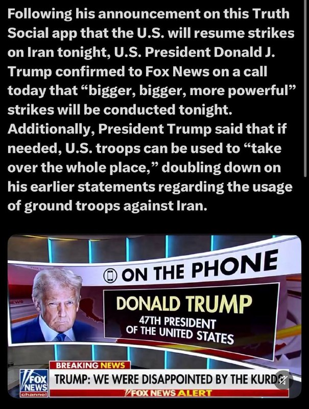

🔴فوری-ترامپ در تماس تلفنی با فاکس نیوز تأیید کرد که حملات «بزرگتر، بزرگتر و قدرتمندتر» امشب انجام خواهد شد.

همچنین گفت در صورت نیاز، نیروهای آمریکایی می‌توانند برای «تسخیر کل منطقه» مورد استفاده قرار گیرند و اظهارات قبلی خود در مورد استفاده از نیروهای زمینی علیه ایران را تکرار کرد.

## IranIntlTV — post 341704

  

اسکات بسنت، وزیر خزانه‌داری آمریکا در شبکه ایکس نوشت که حکومت ایران در بازی حاصل‌جمع صفر که در پیش گرفته، شکست خواهد خورد.

او افزود: «هر خسارتی که جمهوری اسلامی به متحدان آمریکا در خلیج فارس وارد کند، با برداشت از حساب‌های ایرانی جبران خواهد شد.»

بسنت گفت که هر عوارضی بابت تنگه هرمز پرداخت شود، با برداشت از حساب‌های آن‌ها (جمهوری اسلامی) جبران خواهد شد.

او ادامه داد: «هر حمله جمهوری اسلامی پیامدهای اقتصادی و مالی بیشتری برای تهران به دنبال خواهد داشت.»
https://iranintl.com/202606111472

## Shin_Persian — post 6945

  <a href="telegram/content/Shin_Persian_6945_1781184206.mp4" target="_blank">🎬 Download video</a>

🔁 Quoting above tweet:
Shin ✓ @hey_itsmyturn
Thu, 11 Jun 2026 13:14:43 UTC

Idk man, “ALL” is a big word, wingmen of IRIAF Phantoms were spotted over Bandar Abbas earlier today

ترجمه خودکار فارسی

نمی‌دانم پسر، «همه» واژه بزرگی است، وینگ‌من‌های فانتوم‌های نیروی هوایی ارتش جمهوری اسلامی ایران (نهاجا) اوایل امروز بر فراز بندرعباس دیده شدند.

𝕏 · @shin_persian

## Shin_Persian — post 6944

  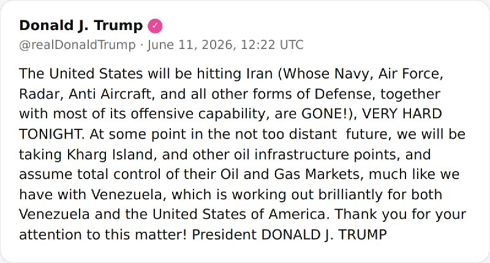

↩️ Quoted tweet: Shin ✓ @hey_itsmyturn Thu, 11 Jun 2026 12:25:46 UTC POTUS: "The United States will be hitting Iran (Whose Navy, Air Force, Radar, Anti Aircraft, and all other forms of Defense, together with most of its offensive capability, are GONE!),…

## Shin_Persian — post 6943

↩️ Quoted tweet:
Shin ✓ @hey_itsmyturn
Thu, 11 Jun 2026 12:25:46 UTC

POTUS:
"The United States will be hitting Iran (Whose Navy, Air Force, Radar, Anti Aircraft, and all other forms of Defense, together with most of its offensive capability, are GONE!), VERY HARD TONIGHT. At some point in the not too distant future, we will be taking Kharg

↩️ توییت نقل‌قول شده — برای پاسخ، پست زیر را ببینید.

ترجمه خودکار فارسی

رئیس‌جمهور ایالات متحده (POTUS):
«ایالات متحده امشب بسیار سخت به ایران (که نیروی دریایی، نیروی هوایی، رادار، پدافند هوایی و تمام اشکال دیگر دفاعی آن، به همراه بیشتر توانمندی تهاجمی‌اش از بین رفته است!) ضربه خواهد زد. در مقطعی در آینده‌ای نه‌چندان دور، ما جزیره خارگ را خواهیم گرفت.»

𝕏 · @shin_persian

## Shin_Persian — post 6940

↩️ Quoted tweet:
Shin ✓ @hey_itsmyturn
Thu, 11 Jun 2026 12:25:46 UTC

POTUS:
"The United States will be hitting Iran (Whose Navy, Air Force, Radar, Anti Aircraft, and all other forms of Defense, together with most of its offensive capability, are GONE!), VERY HARD TONIGHT. At some point in the not too distant future, we will be taking Kharg

↩️ توییت نقل‌قول شده — برای پاسخ، پست زیر را ببینید.

ترجمه خودکار فارسی

رئیس‌جمهور ایالات متحده:
«ایالات متحده امشب بسیار سخت به ایران (که نیروی دریایی، نیروی هوایی، رادار، ضدهوایی و تمام اشکال دیگر دفاعی آن، به همراه بیشتر توانایی تهاجمی‌اش از بین رفته است!) ضربه خواهد زد. در مقطعی در آینده نه‌چندان دور، ما جزیره خارگ را خواهیم گرفت.»

𝕏 · @shin_persian

## FarsiVOA — post 220381

  <a href="telegram/content/FarsiVOA_220381_1781184208.mp4" target="_blank">🎬 Download video</a>

پرسش میدان: تحولات به کدام سو می‌رود؟ توافق یا جنگ؟ و وضعیت مردم در هر یک از این سناریوها چه خواهد بود؟

## FarsiVOA — post 220380

  <a href="telegram/content/FarsiVOA_220380_1781184209.mp4" target="_blank">🎬 Download video</a>

فرماندهی مرکزی ایالات متحده، سنتکام، اعلام کرد نیروهای آمریکایی یک نفتکش حامل نفت را در خلیج عمان هدف قرار داده و از کار انداخته‌اند.

در این گزارش آمده است که نفتکش « جَلویر» با پرچم گینه بیسائو پس از نادیده گرفتن دستورات نیروهای آمریکایی هدف قرار گرفت.

این بیانیه همچنین می‌گوید از آغاز اجرای محاصره در ۲۴ فرودین، ۹ شناور از کار افتاده، ۱۳۵ کشتی تغییر مسیر داده‌اند و ۴۲ شناور حامل کمک‌های بشردوستانه اجازه عبور دریافت کرده‌اند.

@FarsiVOA

## Persian_Trend_Official — post 16732

ترامپ در مصاحبه با فاکس نیوز: ما در حال مذاکره با ایران هستیم. 📝 Amir 📌 @persian_trend_official پرشین ترند | متفاوت‌ترین کانال نظامی

## Persian_Trend_Official — post 16731

  <a href="telegram/content/Persian_Trend_Official_16731_1781184209.webm" target="_blank">🎬 Download video</a>

ابراهیم رضایی سخنگوی کمیسیون امنیت ملی مجلس: ملت بزرگ ایران تسلیم‌ناپذیر است، قطعاً آنکه در این نبرد باید تسلیم شود آمریکاست. ترامپ هم دو راه بیشتر ندارد: یا باید تسلیم شود یا باید تسلیم شود.

📝 Amir

📌 @persian_trend_official
پرشین ترند | متفاوت‌ترین کانال نظامی

## RadioFarda — post 158181

  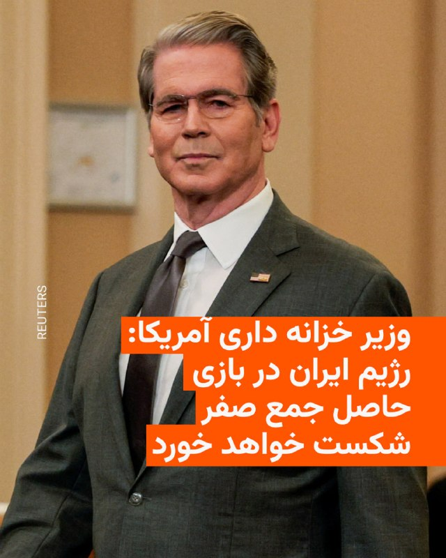

🔸وزیر خزانه‌داری ایالات متحده می‌گوید که «رژیم ایران در بازی حاصل جمع صفر» که به گفتهٔ او، در پیش گرفته است، «شکست خواهد خورد».

🔸اسکات بسنت روز پنجشنبه ۲۱ خرداد در پیامی در شبکهٔ اجتماعی ایکس نوشت: هر خسارتی که ایران به متحدان ما در خلیج فارس وارد کند، از محل منابعی که از حساب‌های ایران برداشت می‌شود جبران خواهد شد.

🔸به گفتهٔ او، هرگونه عوارضی که به «سازمان تنگهٔ خلیج فارس» پرداخت شود، با برداشت از حساب‌های آن‌ها جبران می‌گردد.

🔸وزیر خزانه‌داری آمریکا افزود: هر حمله‌ای که ایران انجام دهد، تنها پیامدهای اقتصادی و مالی را که با آن روبه‌روست، عمیق‌تر خواهد کرد.

@RadioFarda

## IranianMinds — post 22307

🔴 ترامپ :

امشب بمباران بیشتری خواهیم داشت. بزرگ‌تر، بزرگ‌تر و خیلی قدرتمندتر. فراموش نکنید که ما تمام پدافند هوایی‌شان را از بین برده‌ایم. آن‌ها هیچ چیزی ندارند.

یعنی شاید با یک سلاح شانه‌ای یا چیزی شبیه آن خوش‌شانس باشند، اما در کل هیچ دفاعی ندارند.

آن‌ها تمام شده‌اند. ولی رسانه‌ها این را نمی‌نویسند. ما می‌توانیم فردا آنجا برویم.

می‌توانستیم سرباز ببریم. من دوست ندارم نیروهای زمینی داشته باشیم، اما اگر بخواهم می‌توانیم یک گروه کوچک از سربازان را بفرستیم و کل آنجا را تصرف کنیم.

@IranianMinds

## BBCPersian — post 283444

  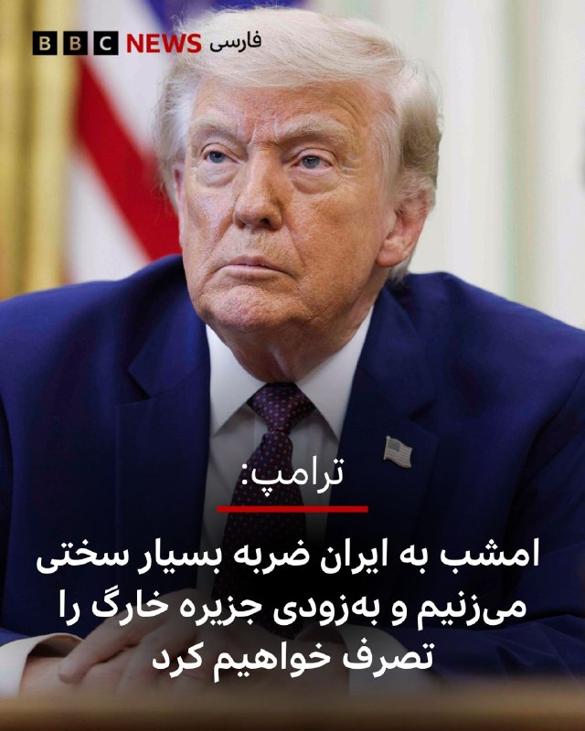

🔻دونالد ترامپ، رئیس جمهور آمریکا می‌گوید که آمریکا امشب ایران را هدف حمله «بسیار شدید» قرار خواهد داد.

او در در پستی جدید در سوشال تروٍث نوشت: «ایالات متحده امشب ایران را (که نیروی دریایی، هوایی، رادار، سامانه‌های پدافند هوایی و سایر اشکال دفاعی آن، همراه با بیشتر توان تهاجمی‌اش، از بین رفته‌اند!) به‌شدت هدف حمله قرار خواهد داد.»

آقای ترامپ همچنین گفت: «در آینده‌ای نه چندان دور، ما جزیره خارگ و سایر نقاط زیرساختی نفتی را تصرف خواهیم کرد و کنترل کامل بازارهای نفت و گاز آن‌ها را در دست خواهیم گرفت؛ همان کاری که با ونزوئلا انجام دادیم که برای هر دو کشور ونزوئلا و ایالات متحده آمریکا به‌خوبی در حال نتیجه دادن است.»

از آغاز این درگیری، آقای ترامپ بارها تهدید کرده است که جزیره خارک را که در سواحل ایران که محل یک پایانه بزرگ نفتی است، تصرف خواهد کرد.

📸 Getty

https://bbc.in/4v5B0d7
@BBCPersian

## alonews — post 127147

  <a href="telegram/content/alonews_127147_1781184211.webm" target="_blank">🎬 Download video</a>

👈وزیر خزانه‌ داری آمریکا:
هر آسیبی که به متحدان ما در خلیج فارس وارد کند، با وجوهی که از حساب‌ های ایرانی برداشت می‌شود، جبران خواهد شد!

✅ @AloNews خبر جنگ

---
📅 بروزرسانی: 1405/03/21 16:43
---

## VahidOOnLine — post 244947

  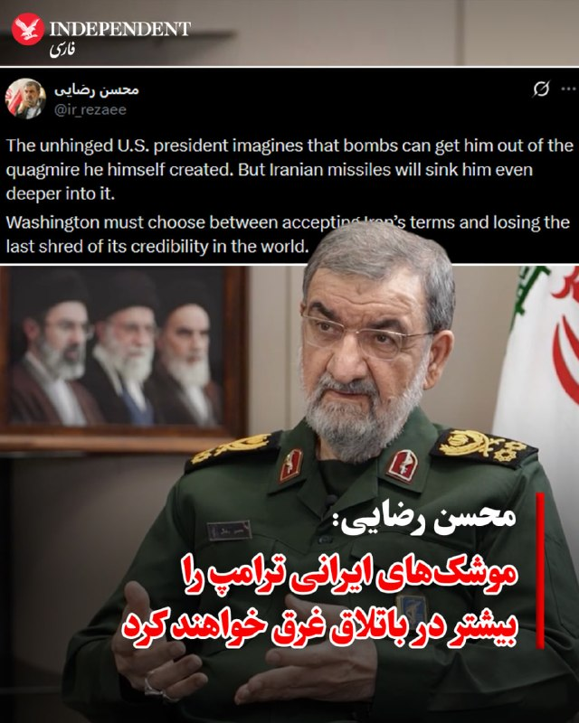

♦️ محسن رضایی، عضو مجمع تشخیص مصلحت نظام و مشاور نظامی مجتبی خامنه‌ای، روز پنجشنبه ۲۱ خرداد، با انتشار پیامی در شبکه اجتماعی ایکس، موقعیت آمریکا در جنگ با ایران را به «باتلاق» تشبیه کرد و نوشت: «رئیس‌جمهور مجنون آمریکا تصور می‌کند که بمب‌ها می‌توانند او را از باتلاقی که خودش ایجاد کرده نجات دهند؛ اما موشک‌های ایرانی او را حتی بیشتر از قبل در آن غرق خواهند کرد.»

او در پایان با هشدار به دولتمردان آمریکایی افزود: «واشنگتن باید میان پذیرش شروط ایران و از دست دادن آخرین بقایای اعتبار خود در جهان، یکی را انتخاب کند.»

این اظهارات پس از تبادل آتش سنگین میان آمریکا و جمهوری اسلامی ایران در چهارشنبه‌شب و بامداد پنجشنبه بیان شد. همزمان دونالد ترامپ، رئیس‌جمهوری آمریکا نیز هشدار داد که حملات سنگین‌تری در راه است و آمریکا «در آینده‌ای نه‌چندان دور» جزیره خارگ و زیرساخت‌های نفتی ایران را در اختیار خواهد گرفت.
‌🇸🇦 Indypersian

🤖 @VahidOOnLine

## VahidOOnLine — post 244946

  <a href="telegram/content/VahidOOnLine_244946_1781183595.mp4" target="_blank">🎬 Download video</a>

روز ۲۱ خرداد سالگرد تولد کیان پیرفلک است؛ کودک اهل ایذه که در جریان اعتراضات ۱۴۰۱ با گلوله کشته شد و نام و روایت زندگی کوتاهش با عبارت «به نام خدای رنگین کمان» در حافظه بسیاری از ایرانیان جای گرفت
‌🏁 🇬🇧 IranintlTV

🤖 @VahidOOnLine

## WithYashar — post 14515

ترامپ: مسئله ایران تمام شده است و ما می‌توانیم فردا نیروهایمان را بیاوریم، اما نمی‌خواهم نیروی زمینی اعزام کنم مطمئن نیستم
@withyashar

## WithYashar — post 14514

ترامپ: دیشب ۲۵۰ میلیون دلار بمب روی سرشان ریختیم

امشب وحشتناک حمله خواهیم کرد
@withyashar

## WithYashar — post 14513

ترامپ: ما برای معترضان ایرانی سلاح فرستادیم، اما از کردها بسیار ناامید شدیم زیرا آنها سلاح ها را به معترضان تحویل ندادند
@withyashar

## WithYashar — post 14512

ترامپ: ایرانی‌ها بسیار مغرور هستن حتی در مذاکرات، اما من دوست دارم همین الان با هم توافق کنیم.

اگر ایرانی ها توافق رو امضا نکنند، بشدت بمباران خواهند شد؛ عجله کنید، هنوز می‌توانیم به بزرگترین توافق تاریخ برسیم!

ما هواپیماهایمان را بر فراز قلب تهران به پرواز در می‌آوریم

تاکنون به اندازه کافی به ایران حمله نکرده‌ایم.

پل‌ها هدف بعدی حملات ما هستند! اما من نمی‌خواهم این کار را انجام دهم زیرا وقتی این کار را می‌کنم، مردم رنج می‌برند.
@withyashar

## mwarmonitor — post 10713

مجری (برایان کیلمید):
«و یک موردی که دیروز به آن اشاره کردید این است که اهداف بعدی، پل‌ها و نیروگاه‌های برق خواهند بود. آیا گام بعدی همین است؟ و...»
دونالد ترامپ:
«بله، اما من ترجیح می‌دهم این کار را نکنم، چون وقتی این کار را با مردم می‌کنی، آن‌ها زجر می‌کشند. مثلاً شنیدم که به آب اشاره کردی؛ قطع کردن آب واقعاً یک ضربه ویران‌کننده برای آن‌هاست. من می‌توانم این کار را در یک دقیقه انجام دهم، آن‌ها سیستم آب را قطع می‌کنند...»
مجری (برایان کیلمید):
«پیام شما برای مردم ایران چیست؟»
دونالد ترامپ:
«اما مشکل اینجاست که مردم دیگر قادر نخواهند بود آب بنوشند. منظورم این است که، می‌دانی، پس آن‌ها چکار باید بکنند؟»
مجری (برایان کیلمید):
«اما پیام شما به مردم ایران چیست؟ آقای رئیس‌جمهور، آن‌ها اکنون به اینترنت دسترسی دارند.»
دونالد ترامپ:
«خب، پیام من به مردم ایران این است که آن‌ها ترسیده‌اند. چون آن‌ها هیچ اسلحه‌ای ندارند و طرف مقابل اسلحه دارد. آن‌ها تجمع (تظاهرات) برگزار می‌کنند و به آن‌ها شلیک می‌شود. آن‌ها آن کشتی‌گیر و دو نفر از دوستانش را دار زدند؛ باور بکنید یا نه، آن‌ها را با جرثقیل به دار آویختند؛ با خشونت تمام. او یک کشتی‌گیر بسیار مطرح بود و آن‌ها او را دار زدند.»
«آن‌ها حداقل ۴۰ تا ۵۰ هزار نفر را کشته‌اند و مردم ترسیده‌اند. می‌دانی، وقتی یک مسلسل به سمت صورتت نشانه رفته باشد، یا وقتی چهار تک‌تیرانداز روی چهار ساختمان مختلف مستقر باشند و به سر مردم شلیک کنند، سخت است که تجمع برگزار کنی؛ متوجهی؟»

@mwarmonitor

## mwarmonitor — post 10712

  <a href="telegram/content/mwarmonitor_10712_1781183597.mp4" target="_blank">🎬 Download video</a>

🎬 Video

## mwarmonitor — post 10711

«این می‌تواند بزرگترین توافق در تاریخ باشد. آنها می‌توانند پرچم سفید تسلیم را تکان دهند. آنها می‌توانند بگویند ما تسلیم شدیم، ما تسلیم شدیم، کارمان تمام است، دیگر کشش نداریم، ایالات متحده بزرگترین قدرت است، الحمدلله (سپاس از آنِ الله). و آنها می‌توانند همه این‌ها را انجام دهند، می‌توانند آن را بلند و واضح بگویند و رسانه‌های دروغگو خواهند گفت این یک پیروزی بزرگ برای ایران بود! منظورم اینه که این احمقانه‌ترین چیزیه که تا به حال دیدم.
ما داریم نابودشون می‌کنیم. داریم نابودشون می‌کنیم. آنها هیچ نیروی دریایی ندارند، هیچ نیروی هوایی ندارند، هیچ پدافند ضد هوایی ندارند. می‌دانید، ما داریم با هواپیماها وسط تهران پرواز می‌کنیم و آنها هیچ، هیچ ایده‌ای ندارند که ما آنجا هستیم. ما تمام رادارهای آنها و تمام پدافند ضد هوایی‌شان را از کار انداخته‌ایم. بیشتر موشک‌های آنها... احتمالا کمتر از ۲۰ درصد باقی مانده، خب فکر می‌کنیم حدود ۲۰ درصد. بیشترِ پرتابگرهای آنها، پرتابگرهای موشکی که بسیار هم مهم هستند.
ظرفیت پهپادی آنها به شدت کاهش یافته است. شما دارید این را می‌بینید. منظورم اینه که خیلی افت کرده، حملات آنها بسیار جزئی هستند. کارشان تمام است.»

@mwarmonitor

## mwarmonitor — post 10710

  <a href="telegram/content/mwarmonitor_10710_1781183599.mp4" target="_blank">🎬 Download video</a>

🎬 Video

## FoxNewsTwitter — post 342850

  <a href="telegram/content/FoxNewsTwitter_342850_1781183601.mp4" target="_blank">🎬 Download video</a>

Fox News (Twitter/X)

BREAKING: President Trump says Iran could “wave the white flag of surrender” whenever they want after the U.S. took out the Islamic Republic’s Navy, air force, and anti-aircraft, but slams the mainstream media on how they would cover the victory.

“It could be the greatest deal in history. They could wave the white flag of surrender. They could say, ‘We surrender, we surrender. We're finished. We've had it. The United States is the greatest power. Praise be to Allah.’ And they could do all of this. They could say it loud and clear. And the fake news would say it was a great victory for Iran.” | @foxandfriends

## pm_afshaa — post 93623

  <a href="telegram/content/pm_afshaa_93623_1781183602.webm" target="_blank">🎬 Download video</a>

🔴ترامپ: امشب هم بشدت بمباران خواهند شد!

💧 Rainbet.com the #1 Non-KYC Crypto Casino & Sportsbook @rainbetcom

😁 @Pm_Afshaa

## pm_afshaa — post 93622

  <a href="telegram/content/pm_afshaa_93622_1781183603.webm" target="_blank">🎬 Download video</a>

🔴ترامپ: دیشب 250 میلیون دلار بمب روی آن‌ها ریختیم.

💧 Rainbet.com the #1 Non-KYC Crypto Casino & Sportsbook @rainbetcom

😁 @Pm_Afshaa

## pm_afshaa — post 93621

  <a href="telegram/content/pm_afshaa_93621_1781183603.webm" target="_blank">🎬 Download video</a>

🔴ترامپ: ترجیح میدم پل‌ها و نیروگاه‌ها رو هدف قرار ندم چون مردم نمیتونن آب بنوشند و رنج می‌برن، من نمیخوام این کار رو کنم.

💧 Rainbet.com the #1 Non-KYC Crypto Casino & Sportsbook @rainbetcom

😁 @Pm_Afshaa

## pm_afshaa — post 93620

  <a href="telegram/content/pm_afshaa_93620_1781183604.webm" target="_blank">🎬 Download video</a>

🔴ترامپ به فاکس نیوز: ترجیح میدم جزیره خارک رو تصرف کنیم، اما مطمئن نیستم که تمایلی به انجام این کار داشته باشیم.

💧 Rainbet.com the #1 Non-KYC Crypto Casino & Sportsbook @rainbetcom

😁 @Pm_Afshaa

## IranIntlTV — post 341703

  <a href="telegram/content/IranIntlTV_341703_1781183604.mp4" target="_blank">🎬 Download video</a>

همزمان با افزایش تنش‌ها میان ایران و آمریکا، وضعیت مبهم «نه جنگ، نه صلح» به یکی از موضوعات پرتکرار در شبکه‌های اجتماعی تبدیل شده است. در این فضا، بسیاری از کاربران با لحنی انتقادی و گاه طنزآمیز به این بلاتکلیفی طولانی‌مدت و پیامدهای آن در زندگی روزمره واکنش نشان داده‌اند.

آیه دریس، عضو تحریریه ایران‌اینترنشنال، از واکنش کاربران می‌گوید
@iranintltv

## Shin_Persian — post 6939

Shin ✓ @hey_itsmyturn
Thu, 11 Jun 2026 13:07:51 UTC

Islamic Regime source denies CNN report on new Iran-US negotiations amid Thursday morning clashes as per state-owned Mehr News

ترجمه خودکار فارسی

منبع رژیم اسلامی گزارش سی‌ان‌ان (CNN) درباره مذاکرات جدید ایران و آمریکا در بحبوحه درگیری‌های صبح پنجشنبه را طبق گزارش خبرگزاری دولتی مهر تکذیب کرد.

𝕏 · @shin_persian

## Persian_Trend_Official — post 16730

ترامپ در مصاحبه با فاکس نیوز: ما در حال مذاکره با ایران هستیم. 📝 Amir 📌 @persian_trend_official پرشین ترند | متفاوت‌ترین کانال نظامی

## Persian_Trend_Official — post 16729

  

ترامپ در مصاحبه با فاکس نیوز: ما در حال مذاکره با ایران هستیم. 📝 Amir 📌 @persian_trend_official پرشین ترند | متفاوت‌ترین کانال نظامی

## IranianMinds — post 22306

  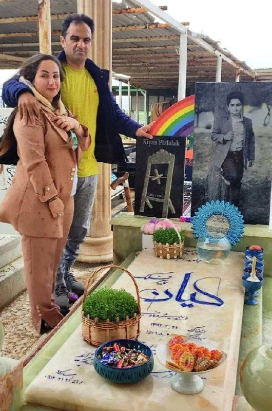

🌈 امروز ۲۱ خرداد، سالگرد تولد کیان پیرفلک...

@IranianMinds

## IranianMinds — post 22305

🔴 ترامپ :

پل‌ها هدف بعدی حملات ما هستند! اما من نمی‌خواهم این کار را انجام دهم زیرا وقتی این کار را می‌کنم، مردم رنج می‌برند

@IranianMinds

## BBCPersian — post 283436

🖌نازنین کیان، روزنامه‌نگار

🔻جانی اینفانتینو، رییس فیفا، ۲۰ اسفند ۱۴۰۴ در کاخ سفید با دونالد ترامپ دیدار کرد. موضوع اصلی این نشست، به گفته خود اینفانتینو، ایران بود؛ کشوری که تیم ملی‌اش قرار است در جام جهانی ۲۰۲۶ که میزبانی آن را آمریکا، کانادا و مکزیک برعهده دارند، حضور داشته باشد.

ترامپ در پایان این دیدار اعلام کرد که تیم ملی ایران می‌تواند در رقابت‌ها شرکت کند. یک هفته پیش از این اما رئیس‌جمهور آمریکا گفته بود که «واقعا مناسب نمی‌بیند» ایران در جام جهانی حضور داشته باشد؛ دلیلی که برای این موضع آورده بود، نگرانی از «امنیت جانی» بازیکنان ایرانی بود.

این تغییر موضع ده روزه، نه یک چرخش ساده سیاسی، بلکه نشانه‌ای از یک بازی پیچیده دیپلماتیک است که پشت صحنه رقابت‌های فوتبال جریان دارد. جریانی که این روزها در یک شهر مرزی در شمال مکزیک به چشم می‌آید.

📸GettyImages

https://bbc.in/4gjXSki
@BBCPersian

## BBCPersian — post 283435

  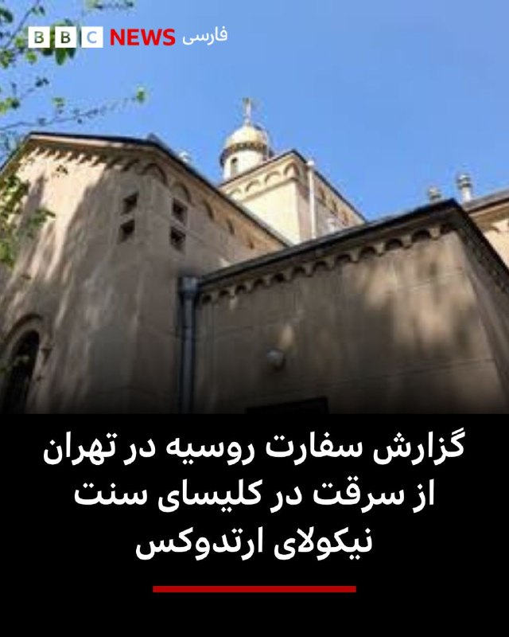

🔻سفارت روسیه در تهران اعلام کرده است که از کلیسای سنت نیکولای ارتدوکس روسیه در تهران سرقت شده است. این کلیسا در جریان دور اول حملات آمریکا و اسرائیل علیه ایران خسارت دیده بود.

سفارت روسیه در تهران در بیانیه‌ای گفت: «از همه از کسانی که راه خطا پیموده و مرتکب این اقدام موهن و هتک‌حرمت‌آمیز شده‌اند، درخواست می‌کند که شمایل‌ها و اشیای مقدس ربوده‌شده را به کلیسا بازگردانند و بار گناه را بیش از این بر دوش خود نیفزایند.»

این کلیسا در نزدیکی سفارت سابق ایالات متحده در تهران قرار دارد و گزارش شده بود که در جریان حملات آمریکا و اسرائیل به ایران خسارات‌هایی به آن وارد شده بود.

سفارت روسیه می‌گوید که «ما هرگز باور نمی‌کردیم که در ایران افرادی پیدا شوند که چنین رفتاری با مقدسات مسیحی داشته باشند و به ایمانی به خدای یگانه که این کلیسا دهه‌ها پاسدار و حافظ آن بوده است، اهانت کنند.»

روسیه کلیسای سنت نیکولا در تهران را «یکی از قدیمی‌ترین عبادتگاه‌های مسیحی در ایران و تنها کلیسای ارتدوکس روسی در پایتخت ایران» توصیف کرده است.

📸 ایسنا

https://bbc.in/4v5B0d7
@BBCPersian

## Dirty_Kids — post 391702

رویترز: لشکر 82 هوابرد آمریکا ملقب به لشکر شیطان به‌زودی جزایر نفتی ایران رو تصرف خواهند کرد
💥

@Dirty_Kids 👻

## Hranews — post 113538

صدور احکام انضباطی برای ۲۲ دانشجوی دانشگاه سوره؛ دستکم ۴ دانشجو با اخراج مواجه شدند

❗️
❗️
❗️
❗️
❗️– حدود ۲۲ دانشجو دانشگاه سوره، با صدور احکام بدوی کمیته انضباطی مواجه شده‌اند. این احکام شامل دستکم چهار مورد اخراج و شماری احکام منع موقت از تحصیل است.

#دانشجویان

ادامه مطلب

↘️
@hranews_bot تماس ✉️ - @Hranews کانال هرانا 🆑

## alonews — post 127146

  <a href="telegram/content/alonews_127146_1781183608.webm" target="_blank">🎬 Download video</a>

👈ترامپ به فاکس نیوز: پل‌ها هدف بعدی حملات ما هستند

🔴ما برای معترضان ایرانی سلاح فرستادیم، اما از کردها بسیار ناامید شدیم زیرا آنها سلاح ها را به معترضان تحویل ندادند.

🔴مسئله ایران تمام شده است و ما می‌توانیم فردا نیروهایمان را بیاوریم، اما نمی‌خواهم نیروی زمینی اعزام کنم.

✅ @AloNews خبر جنگ

---
📅 بروزرسانی: 1405/03/21 16:33
---

## VahidOOnLine — post 244945

♦️همزمان با بالاگرفتن تنش‌ها میان تهران و واشنگتن و رد و بدل کردن سنگین آتش میان دو طرف در شامگاه چهارشنبه و بامداد پنجشنبه ۲۱ خرداد ماه، سپاه پاسداران انقلاب اسلامی، ویدیویی را منتشر کرد که به گفته این نهاد، شلیک موشک به سمت پایگاه‌های آمریکا در منطقه را نشان می‌دهد.
همزمان، تهران اعلام کرد آتش‌بس شکننده‌ای که پس از سه ماه درگیری در خاورمیانه برقرار شده بود، در پی حملات تازه آمریکا «عملا بی‌معنا» شده است.
این تحولات پس از آن رخ داد که آمریکا حملات جدیدی را علیه اهدافی در ایران انجام داد و تهران نیز با حملات موشکی به چندین پایگاه و مواضع مرتبط با آمریکا در منطقه واکنش نشان داد.
دونالد ترامپ، رئیس جمهوری آمریکا، روز پنجشنبه با انتشار پیامی در شبکه اجتماعی تروث سوشال تهدید کرد، آمریکا به زودی جزیره خارک و زیرساخت‌های نفتی ایران را تصرف خواهد کرد.
‌🇸🇦 Indypersian

🤖 @VahidOOnLine

## VahidOOnLine — post 244944

  

دونالد ترامپ، رییس‌جمهوری آمریکا، در مصاحبه با فاکس‌نیوز گفت جنگ تنها با تسلیم جمهوری اسلامی متوقف خواهد شد و افزود آمریکا هنوز با تمام قدرت به ایران حمله نکرده است.
او تاکید کرد با وجود ادامه گفت‌وگوها با تهران، ترجیح می‌دهد آمریکا جزیره خارک را تصرف کند.
ترامپ پیش‌تر در تروت سوشال نوشت ایالات متحده «امشب ایران را بسیار شدید هدف قرار خواهد داد» و بار دیگر مدعی شد بخش عمده توان دفاعی و تهاجمی جمهوری اسلامی از بین رفته است.
‌🏁 🇬🇧 IranintlTV

🤖 @VahidOOnLine

## WithYashar — post 14511

رویترز: لشکر 82 هوابرد آمریکا ملقب به لشکر شیطان به‌زودی جزایر نفتی ایران رو تصرف خواهند کرد.🚨
@withyashar

## WithYashar — post 14510

ترامپ به فاکس نیوز:
ما در حال مذاکره با ایران هستیم

ترجیح می‌دهم جزیره خارک را در اختیار داشته باشم
ما هنوز به اندازه کافی به ایران ضربه نزده‌ایم
من از ایران ناامید نیستم، این توافق خوب است و ممکن است بزرگترین توافق تاریخ باشد
هواپیماهای ما بر فراز قلب تهران پرواز می‌کنند
ایران در تبلیغات خوب است اما در جنگیدن خوب نیست
@withyashar

## WithYashar — post 14509

وزیر خزانه‌داری آمریکا، اسکات بسنت:
«رژیم ایران در بازی با حاصل جمع صفر که واردش شده، بازنده خواهد بود.
هر خسارتی که ایران به متحدان ما در خلیج فارس وارد کند، از محل دارایی‌های ایران جبران خواهد شد.
هرگونه عوارض یا هزینه‌ای که برای عبور از تنگه خلیج فارس دریافت شود، با برداشت از حساب‌های ایران خنثی خواهد شد.
هر حمله‌ای که ایران انجام دهد، فقط پیامدهای اقتصادی و مالی سنگین‌تری برای این کشور به همراه خواهد داشت.
@withyashar

## FoxNewsTwitter — post 342849

  <a href="telegram/content/FoxNewsTwitter_342849_1781183022.mp4" target="_blank">🎬 Download video</a>

Fox News (Twitter/X)

BREAKING: President Trump puts Iran on notice after warning the regime he'll hit them "VERY HARD" today.

"They have no defense. They can't do anything about it... We dropped $250 million worth of bombs on them last night."

Speaking on @foxandfriends, Trump argued Iran is already feeling the effects of the strikes.

"They're in submission, they just don't know it yet."

## pm_afshaa — post 93619

  <a href="telegram/content/pm_afshaa_93619_1781183025.webm" target="_blank">🎬 Download video</a>

🔴ترامپ به فاکس نیوز: امشب بمباران بیشتری علیه ایران انجام خواهد شد و این بمباران بزرگتر و قدرتمندتر خواهد بود.

💧 Rainbet.com the #1 Non-KYC Crypto Casino & Sportsbook @rainbetcom

😁 @Pm_Afshaa

## pm_afshaa — post 93618

  <a href="telegram/content/pm_afshaa_93618_1781183025.webm" target="_blank">🎬 Download video</a>

🔴ترامپ: اگر ایرانی‌ها توافق رو امضا نکنن، بشدت بمباران خواهند شد؛ عجله کنید، هنوز میتونیم به بزرگترین توافق تاریخ برسیم!

ایرانی‌ها بسیار متکبر و مغرور هستند حتی در مذاکرات، اما من دوست دارم همین الان با هم توافق کنیم.

💧 Rainbet.com the #1 Non-KYC Crypto Casino & Sportsbook @rainbetcom

😁 @Pm_Afshaa

## pm_afshaa — post 93617

  <a href="telegram/content/pm_afshaa_93617_1781183026.webm" target="_blank">🎬 Download video</a>

🔴ترامپ: ما با جنگنده و هواپیما‌های خود بر فراز تهران پرواز می‌کنیم و ایرانی‌ها از آن خبر ندارن. ایران در تبلیغات خوبه اما در جنگیدن خوب نیست.

💧 Rainbet.com the #1 Non-KYC Crypto Casino & Sportsbook @rainbetcom

😁 @Pm_Afshaa

## pm_afshaa — post 93616

تو کانال زاپاسمون حتما جوین شین همین الان

👇
👇

https://t.me/pmtvzapas
https://t.me/pmtvzapas

## pm_afshaa — post 93615

  <a href="telegram/content/pm_afshaa_93615_1781183027.webm" target="_blank">🎬 Download video</a>

🔴فاکس نیوز: ترامپ میگه ایالات متحده در حال مذاکره با جمهوری اسلامیه.

💧 Rainbet.com the #1 Non-KYC Crypto Casino & Sportsbook @rainbetcom

😁 @Pm_Afshaa

## kianmeli1 — post 87931

  <a href="telegram/content/kianmeli1_87931_1781183028.mp4" target="_blank">🎬 Download video</a>

🔴ویدیوی دوربین مداربسته یک نمایندگی خودرو از لحظه بمباران در نارمک تهران
۱۸ اسفند ۱۴۰۴
https://t.me/kianmeli1

## IranIntlTV — post 341702

  <a href="telegram/content/IranIntlTV_341702_1781183030.mp4" target="_blank">🎬 Download video</a>

روز ۲۱ خرداد سالگرد تولد کیان پیرفلک است؛ کودک اهل ایذه که در جریان اعتراضات ۱۴۰۱ با گلوله کشته شد و نام و روایت زندگی کوتاهش با عبارت «به نام خدای رنگین کمان» در حافظه بسیاری از ایرانیان جای گرفت

## IranIntlTV — post 341701

  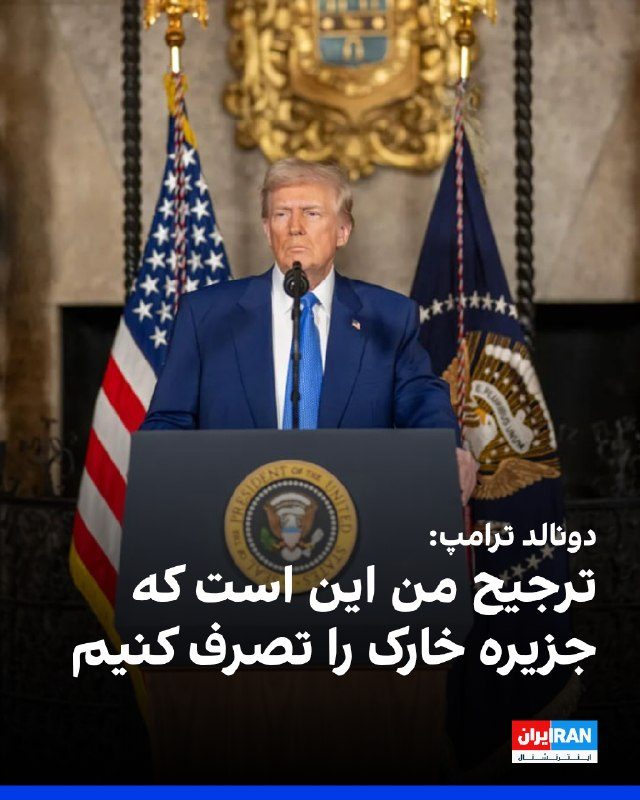

دونالد ترامپ، رییس‌جمهوری آمریکا، در مصاحبه با فاکس‌نیوز گفت جنگ تنها با تسلیم جمهوری اسلامی متوقف خواهد شد و افزود آمریکا هنوز با تمام قدرت به ایران حمله نکرده است.
او تاکید کرد با وجود ادامه گفت‌وگوها با تهران، ترجیح می‌دهد آمریکا جزیره خارک را تصرف کند.
ترامپ پیش‌تر در تروت سوشال نوشت ایالات متحده «امشب ایران را بسیار شدید هدف قرار خواهد داد» و بار دیگر مدعی شد بخش عمده توان دفاعی و تهاجمی جمهوری اسلامی از بین رفته است.
https://iranintl.com/202606115204

## Persian_Trend_Official — post 16728

ترامپ در مصاحبه با فاکس نیوز: ما در حال مذاکره با ایران هستیم. 📝 Amir 📌 @persian_trend_official پرشین ترند | متفاوت‌ترین کانال نظامی

## IranianMinds — post 22304

🔴 سناتور لیندسی گراهام درباره ایران: ‏امیدوارم امشب شاهد تغییر رفتار باشیم. ‏اگر این [مذاکرات] آنها را به پای میز مذاکره نیاورد، باید استراتژی خود را تغییر دهید. با تمام قوا وارد عمل شوید. آنها را از میدان به در کنید. ‏بگذارید مردم ایران به مرور زمان کشور…

## IranianMinds — post 22303

  <a href="telegram/content/IranianMinds_22303_1781183034.mp4" target="_blank">🎬 Download video</a>

🔴 سناتور لیندسی گراهام درباره ایران:
‏امیدوارم امشب شاهد تغییر رفتار باشیم.

‏اگر این [مذاکرات] آنها را به پای میز مذاکره نیاورد، باید استراتژی خود را تغییر دهید. با تمام قوا وارد عمل شوید. آنها را از میدان به در کنید.

‏بگذارید مردم ایران به مرور زمان کشور خود را پس بگیرند و پس از توافق با ایران، به سمت صلح بین عربستان و اسرائیل حرکت کنند.

@IranianMinds

## IranianMinds — post 22302

🔴 فوری ترامپ هواپیماهای آمریکایی بر فراز تهران در حال پرواز هستند و آن‌ها از این موضوع بی‌خبرند. @IranianMinds

## IranianMinds — post 22301

🔴 فوری ترامپ

هواپیماهای آمریکایی بر فراز تهران در حال پرواز هستند و آن‌ها از این موضوع بی‌خبرند.

@IranianMinds

## IranianMinds — post 22300

🔴 دونالد ترامپ به فاکس‌نیوز:

آمریکا در حال مذاکره با ایران است. او افزود که ترجیحش این است که جزیره خارک را تصرف کنند، هرچند نسبت به تمایل آمریکا برای انجام چنین اقدامی تردید دارد.

@IranianMinds

## BBCPersian — post 283434

🔻تشدید درگیری ایران و آمریکا موجب افت بورس هند شد

تشدید درگیری میان ایران و آمریکا و نگرانی از تداوم نرخ‌های بالای بهره در ایالات متحده، بازار سهام هند را برای دومین روز متوالی با افت روبه‌رو کرد.

شاخص نیفتی ۵۰، روز پنجشنبه ۰/۲۳ درصد و شاخص سنسکس ۰/۲ درصد کاهش یافتند.

همچنین بیشتر شاخص‌های بخشی از بازار و سهام شرکت‌های کوچک و متوسط نیز با افت همراه بودند.

این کاهش در حالی بود که ایران و آمریکا برای دومین روز متوالی به تبادل حملات پرداختند.

دونالد ترامپ، رئیس‌جمهور آمریکا، هشدار داده است در صورتی که تهران با توافق صلح موافقت نکند، حملات بیشتری در راه خواهد بود.

به گزارش رویترز در همین حال آمارهای تازه نشان می‌دهد که تورم مصرف‌کننده در آمریکا در ماه مه با سریع‌ترین آهنگ در سه سال گذشته افزایش یافته است؛ موضوعی که احتمال تداوم نرخ‌های بالای بهره را تقویت کرده و می‌تواند بر جریان سرمایه‌گذاری در بازارهای نوظهور از جمله هند تاثیر بگذارد.

در میان گروه‌های مختلف، سهام شرکت‌های فناوری اطلاعات ۱/۶ درصد کاهش یافت و برای هفتمین جلسه متوالی در مسیر نزولی قرار گرفت. تحلیلگران علاوه بر نگرانی‌های اقتصادی، افزایش نگرانی‌ها درباره تاثیر هوش مصنوعی بر صنعت نرم‌افزار را نیز از عوامل فشار بر این بخش می‌دانند.

در مقابل، سهام بانک‌های خصوصی با رشد ۰/۶ درصدی بخشی از افت بازار را جبران کرد.

https://bbc.in/4v5B0d7
@BBCPersian

## Dirty_Kids — post 391701

تعداد حضورم توی جنگا داره از حضرت علیم بیشتر میشه.

@Dirty_Kids 👻

## Dirty_Kids — post 391700

  <a href="telegram/content/Dirty_Kids_391700_1781183036.mp4" target="_blank">🎬 Download video</a>

این کلیپ واقعا شاهکاره، هادی رو حتما باید برای نگهبانی اماکن مهم استخدام کنن😂

@Dirty_Kids 👻

---
📅 بروزرسانی: 1405/03/21 16:23
---

## VahidOOnLine — post 244943

  

خبرگزاری فارس، وابسته به سپاه پاسداران، نوشت قرار گرفتن منافع مرتبط با هلدینگ‌های اقتصادی تحت مدیریت ایلان ماسک در غرب آسیا، از جمله در کشورهای عربی و اسرائیل، در «بانک اهداف» جدید جمهوری اسلامی در حال بررسی است.
این رسانه افزود این اقدام پس از آن مطرح شده که به نوشته فارس، استفاده ارتش آمریکا و اسرائیل از زیرساخت‌های تحت مدیریت ایلان ماسک، از جمله استارلینک، اثبات شده است.
فارس همچنین نوشت ایستگاه‌های زمینی استارلینک در اسرائیل، قطر، اردن، امارات متحده عربی و عمان و نیز برخی سهام‌داران اسپیس‌ایکس از جمله زیرساخت دو شرکت «آلفاظبی» و «مبادله» از اهداف جدید جمهوری اسلامی محسوب می‌شوند.
‌🏁 🇬🇧 IranintlTV

🤖 @VahidOOnLine

## VahidOOnLine — post 244942

  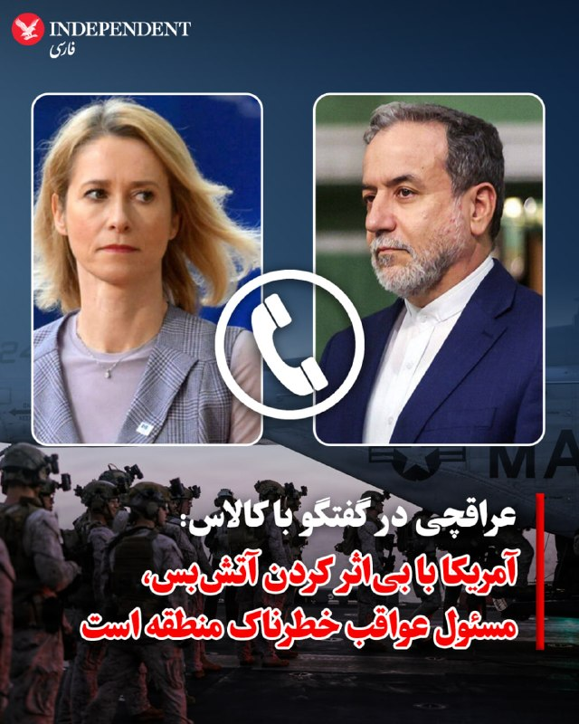

♦️ عباس عراقچی، وزیر امور خارجه جمهوری اسلامی ایران، روز پنجشنبه ۲۱ خرداد، در یک تماس تلفنی با کایا کالاس، مسئول سیاست خارجی اتحادیه اروپا، به بررسی آخرین تحولات پس از حملات ایالات متحده به ایران و حملات متقابل تهران به اردن، بحرین و کویت پرداخت.

عراقچی در این گفتگو با محکومیت شدید حملات واشنگتن، این اقدامات را نقض آشکار منشور سازمان ملل متحد و قوانین بین‌المللی دانست. او بار دیگر تاکید کرد که اقدامات آمریکا عملا آتش‌بس را بی‌اثر کرده و ایالات متحده مسئول عواقب و پیامدهای خطرناک آن است.

وزیر امور خارجه جمهوری اسلامی همچنین با انتقاد از سکوت کشورهای عضو سازمان ملل در قبال حملات ایالات متحده، هشدار داد که انفعال جامعه جهانی به تشدید ناامنی در سطوح منطقه‌ای و جهانی منجر خواهد شد.
‌🇸🇦 Indypersian

🤖 @VahidOOnLine

## WithYashar — post 14508

## mwarmonitor — post 10709

🔴ترامپ: گزینه من تصرف کردن جزیره خارک است.

@mwarmonitor

## mwarmonitor — post 10708

🔴ترامپ می‌گوید ایالات متحده در حال گفت‌وگو با ایران است - فاکس نیوز

@mwarmonitor

## FoxNewsTwitter — post 342848

‌Fox News (Twitter/X)

https://www.foxnews.com/live-news/us-iran-war-trump-israel-june-11

## FoxNewsTwitter — post 342847

  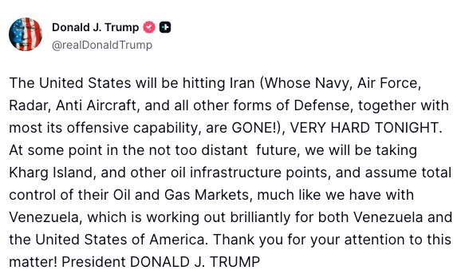

Fox News (Twitter/X)

BREAKING: President Trump says the U.S. will hit Iran ‘VERY HARD TONIGHT,’ claiming the regime’s Navy, Air Force, radar, air defenses and much of its offensive capability are completely “GONE.”

Trump also floated taking Kharg Island and other oil infrastructure points, saying the U.S. would “assume total control” of Iran’s oil and gas markets.

The statement marks a sharp escalation as tensions remain centered on Iran’s military infrastructure, oil exports, and the Strait of Hormuz.

## FoxNewsTwitter — post 342846

Fox News (Twitter/X)

BREAKING: Trump vows to hit Iran 'VERY HARD TONIGHT,' take Kharg Island in the future

## FoxNewsTwitter — post 342845

  <a href="telegram/content/FoxNewsTwitter_342845_1781182389.mp4" target="_blank">🎬 Download video</a>

Fox News (Twitter/X)

BREAKING: U.S. forces disabled an oil tanker in the Gulf of Oman overnight after it allegedly violated the naval blockade against Iran.

CENTCOM says the Guinea-Bissau flagged tanker M/T Jalveer was attempting to transport Iranian oil through the Gulf of Oman when U.S. aircraft fired two Hellfire missiles into the ship’s engine room after the crew repeatedly failed to comply with instructions.

The action follows similar operations against two other tankers earlier this week as the U.S. ramps up enforcement of the blockade.

## pm_afshaa — post 93614

  <a href="telegram/content/pm_afshaa_93614_1781182390.webm" target="_blank">🎬 Download video</a>

🔴رویترز: لشکر 82 هوابرد آمریکا ملقب به لشکر شیطان به‌زودی جزایر نفتی ایران رو تصرف خواهند کرد.

💧 Rainbet.com the #1 Non-KYC Crypto Casino & Sportsbook @rainbetcom

😁 @Pm_Afshaa

## pm_afshaa — post 93613

خلاصه توییت ترامپ: امشب هم به ایران ضربه سخت و سنگینی میزنیم و بزودی زود جزیره خارک و دیگر مراکز زیرساختی نفتی رو در اختیار و کنترل میگیریم. 
💧 Rainbet.com the #1 Non-KYC Crypto Casino & Sportsbook @rainbetcom 
😁 @Pm_Afshaa

## pm_afshaa — post 93612

  <a href="telegram/content/pm_afshaa_93612_1781182391.webm" target="_blank">🎬 Download video</a>

🔴نتانیاهو: نیروهای حزب‌الله رو از بین میبریم و امنیت رو به مناطق شمالی برمیگرونیم.

💧 Rainbet.com the #1 Non-KYC Crypto Casino & Sportsbook @rainbetcom

😁 @Pm_Afshaa

## kianmeli1 — post 87930

  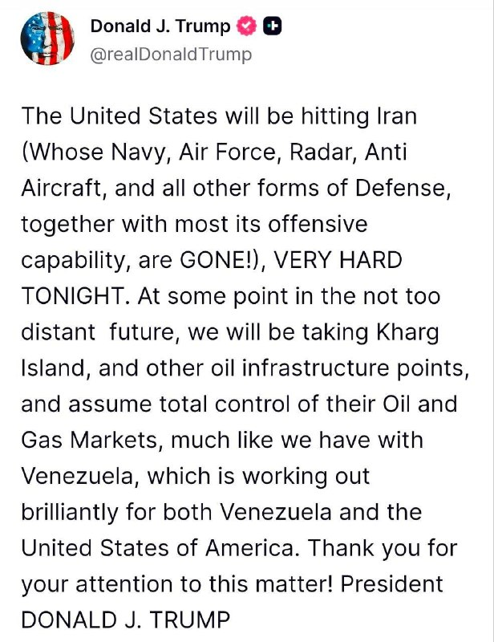

🔴در اخرین پست ترامپ سه هدف را به وضوح و شفاف نوشت

۱-نفت ایران را می خواهم
۲-زمین میخواهم(خاک)
۳-روش ونزوئلا نفت را بدهید حکومت کنید
https://t.me/kianmeli1

## IranIntlTV — post 341700

  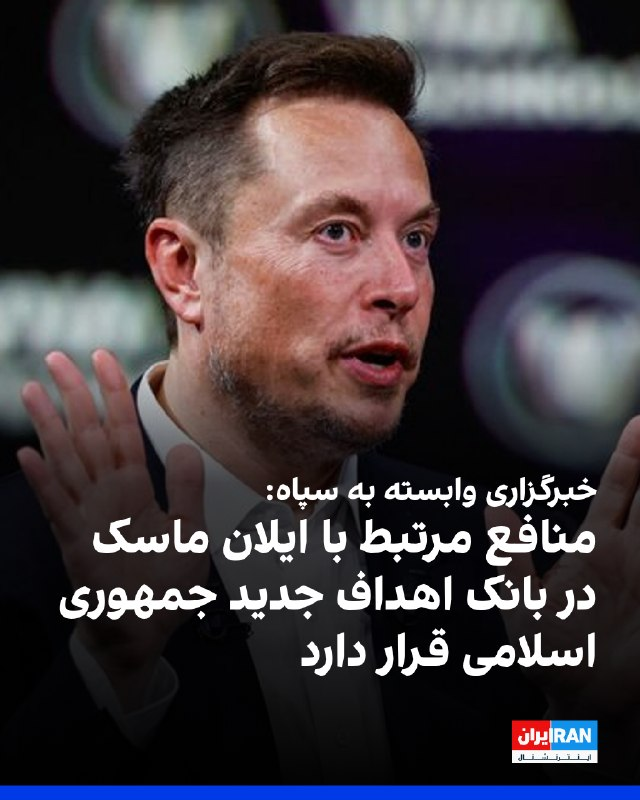

خبرگزاری فارس، وابسته به سپاه پاسداران، نوشت قرار گرفتن منافع مرتبط با هلدینگ‌های اقتصادی تحت مدیریت ایلان ماسک در غرب آسیا، از جمله در کشورهای عربی و اسرائیل، در «بانک اهداف» جدید جمهوری اسلامی در حال بررسی است.
این رسانه افزود این اقدام پس از آن مطرح شده که به نوشته فارس، استفاده ارتش آمریکا و اسرائیل از زیرساخت‌های تحت مدیریت ایلان ماسک، از جمله استارلینک، اثبات شده است.
فارس همچنین نوشت ایستگاه‌های زمینی استارلینک در اسرائیل، قطر، اردن، امارات متحده عربی و عمان و نیز برخی سهام‌داران اسپیس‌ایکس از جمله زیرساخت دو شرکت «آلفاظبی» و «مبادله» از اهداف جدید جمهوری اسلامی محسوب می‌شوند.
https://iranintl.com/202606110815

## Shin_Persian — post 6938

الان ثبت نامی های کمپین جان فدا دارن بدو بدو دنبال نامه از پزشک میگردن

## FarsiVOA — post 220379

  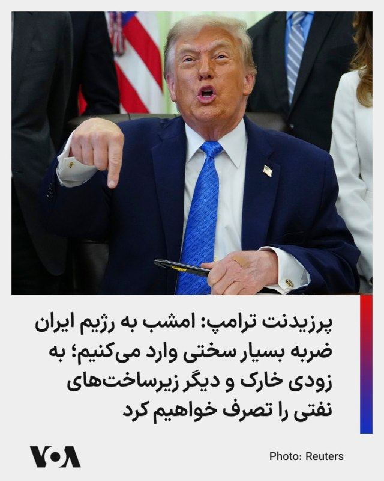

⚡️دونالد ترامپ، رئیس جمهوری آمریکا، پنج‌شنبه ۲۱ خرداد با اشاره به از بین رفتن توان نظامی و دفاعی رژیم ایران، اعلام کرد که ایالات متحده «امشب به ایران ضربه بسیار سختی خواهد زد» و «در آینده‌ای نه چندان دور، جزیره خارک و سایر نقاط زیرساخت نفتی را» مانند ونزوئلا «تصرف خواهیم کرد.»

## Persian_Trend_Official — post 16727

  <a href="telegram/content/Persian_Trend_Official_16727_1781182393.webm" target="_blank">🎬 Download video</a>

ترامپ در مصاحبه با فاکس نیوز: ما در حال مذاکره با ایران هستیم.

📝 Amir

📌 @persian_trend_official
پرشین ترند | متفاوت‌ترین کانال نظامی

## Persian_Trend_Official — post 16726

  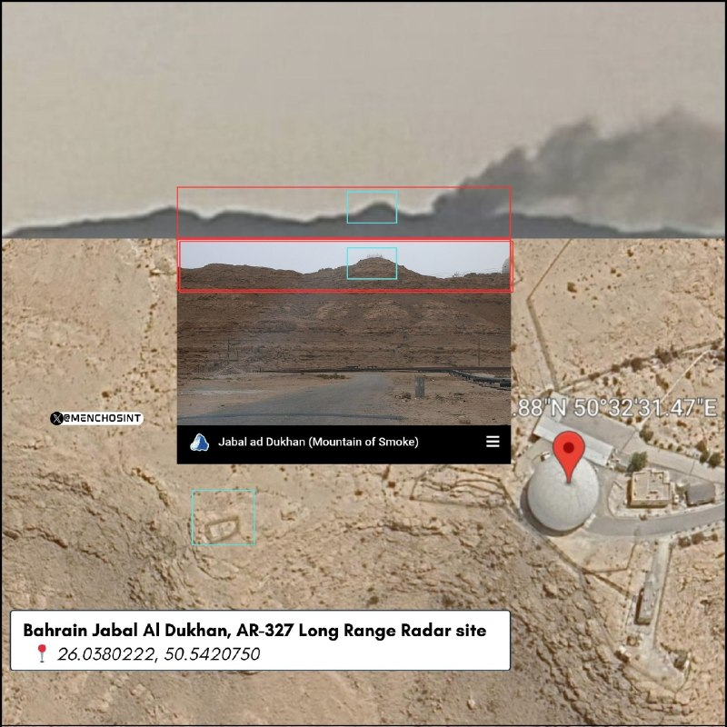

بنظر می‌رسد نیازی به تصاویر ماهواره ای نیست، رادار مستقر در این منطقه در جریان حملات پهپادی صبح ارتش منهدم شده است.

📝 Amir

📌 @persian_trend_official
پرشین ترند | متفاوت‌ترین کانال نظامی

## Persian_Trend_Official — post 16725

  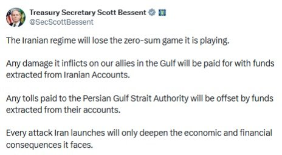

اسکات بسنت، وزیر خزانه‌داری ایالات متحده: رژیم ایران بازی حاصل جمع صفری را که در پیش گرفته خواهد باخت.

هرگونه خسارتی که به متحدان ما در خلیج فارس وارد کند، با برداشت وجه از حساب‌های ایران جبران خواهد شد.

هرگونه عوارضی که به اداره تنگه خلیج فارس پرداخت شود، با برداشت وجه از حساب‌های آنها جبران خواهد شد. هر حمله‌ای که ایران انجام دهد، تنها عواقب اقتصادی و مالی پیش روی آن را تشدید خواهد کرد.

📝 Amir

📌 @persian_trend_official
پرشین ترند | متفاوت‌ترین کانال نظامی

## Persian_Trend_Official — post 16722

تهاجم پهپادی ارتش علیه ناوگان پنجم آمریکا در بحرین ارتش: در پی نقض آتش‌بس و تجاوز ارتش تروریستی آمریکا به مناطقی از جنوب کشور، ارتش جمهوری اسلامی ایران با انواع پهپادهای انهدامی، ناوگان پنجم این کشور در بحرین را آماج حملات پهپادی خود، قرار داد. در این موج…

## RadioFarda — post 158180

  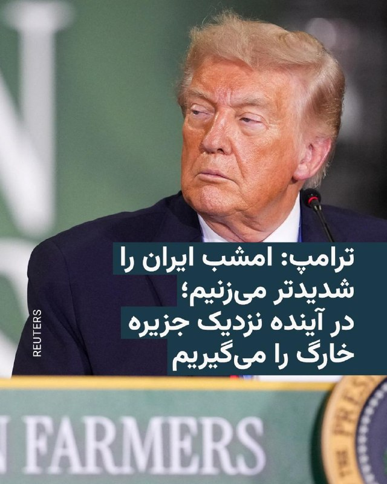

🔸رئیس‌جمهور آمریکا روز پنجشنبه اعلام کرد که ارتش این کشور امشب بار دیگر ایران را به سختی مورد حمله قرار خواهد داد و از برنامه ایالات متحده برای به دست آوردن کنترل جزیره خارگ ایران خبر داد.

🔸دونالد ترامپ با انتشار پیامی در شبکه اجتماعی تروث سوشال نوشت: «ایالات متحده امشب ضربات بسیار سختی به ایران وارد خواهد کرد؛ کشوری که نیروی دریایی، نیروی هوایی، سامانه‌های راداری، پدافند ضدهوایی و تمامی دیگر اشکال دفاعی آن، به همراه بخش عمده توان تهاجمی‌اش، از بین رفته‌اند!»

🔸این اعلام در حالی است که آمریکا طی دو شب گذشته نیز نقاطی در مناطق مختلف ایران را در تلافی سرنگون شدن یک بالگرد آپاچی ارتش این کشور در تنگه هرمز هدف قرار داده بود.

🔸آقای ترامپ در ادامه پیام خود نوشت: «در مقطعی در آینده‌ای نه‌چندان دور، ما جزیره خارگ و دیگر زیرساخت‌های نفتی را در اختیار خواهیم گرفت و کنترل کامل بازارهای نفت و گاز ایران را به دست خواهیم آورد؛ همان‌گونه که در مورد ونزوئلا انجام داده‌ایم، اقدامی که نتایج فوق‌العاده‌ای هم برای ونزوئلا و هم برای ایالات متحده آمریکا داشته است».
@RadioFarda

## IranianMinds — post 22299

🔴 وزیر خزانه‌داری آمریکا، اسکات بسنت:

رژیم ایران در بازی مجموع صفری که در حال انجام آن است، بازنده خواهد شد.

هر آسیبی که به متحدان ما در خلیج وارد کند، از محل وجوه برداشت‌شده از حساب‌های ایرانی جبران خواهد شد.

هرگونه عوارضی که به سازمان تنگه خلیج فارس پرداخت شود، با برداشت از حساب‌های آن‌ها جبران خواهد شد.

هر حمله‌ای که ایران انجام دهد، تنها پیامدهای اقتصادی و مالی آن را عمیق‌تر خواهد کرد.

@IranianMinds

## alonews — post 127145

  <a href="telegram/content/alonews_127145_1781182396.webm" target="_blank">🎬 Download video</a>

👈ترامپ به فاکس نیوز:
ما در حال مذاکره با ایران هستیم

🔴ترجیح می‌دهم جزیره خارک را در اختیار داشته باشم

🔴ما هنوز به اندازه کافی به ایران ضربه نزده‌ایم

🔴من از ایران ناامید نیستم، این توافق خوب است و ممکن است بزرگترین توافق تاریخ باشد

✅ @AloNews خبر جنگ

## alonews — post 127144

  <a href="telegram/content/alonews_127144_1781182396.webm" target="_blank">🎬 Download video</a>

👈ونس، درباره نتانیاهو : ببین، قطعاً یه جاهایی اشتباهاتی داشته

🔴ولی راستش بعضی از این بحث‌ها بهتره توی فضای خصوصی بمونه

🔴چیزی که می‌خوام بگم اینه که در کل شریک خوبی بوده

- ما به همکاری ادامه می‌دیم، ولی هر جا منافع‌مون از هم جدا بشه،

🔴آمریکا کار خودش رو بر اساس بهترین منافع کشورش جلو می‌بره

✅ @AloNews خبر جنگ

---
📅 بروزرسانی: 1405/03/21 16:13
---

## VahidOOnLine — post 244941

  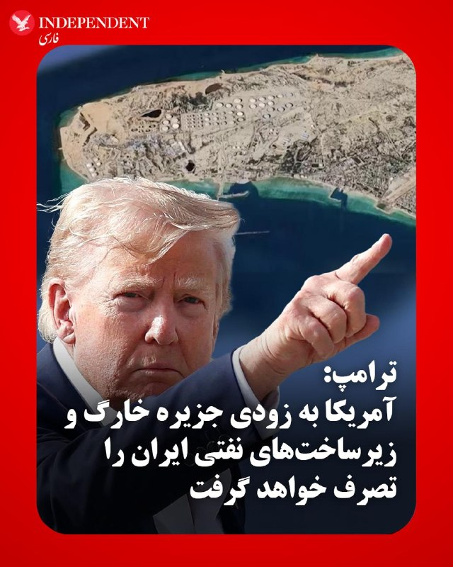

♦️دونالد ترامپ، رئیس‌جمهوری آمریکا، روز دوشنبه ۲۱ خرداد ماه، در پیامی در شبکه اجتماعی تروث سوشال اعلام کرد ایالات متحده «امشب ضربات بسیار سنگینی» به ایران وارد خواهد کرد.
ترامپ در این پیام نوشت نیروی دریایی، نیروی هوایی، سامانه‌های راداری، پدافند هوایی و بخش عمده‌ای از توان تهاجمی ایران از بین رفته است.
رئیس‌جمهوری آمریکا همچنین نوشت واشنگتن در آینده‌ای نه‌چندان دور جزیره خارک و دیگر زیرساخت‌های نفتی ایران را تصرف خواهد کرد و کنترل کامل بازارهای نفت و گاز ایران را به دست خواهد آورد.
او در ادامه این اقدام را با سیاست آمریکا در قبال ونزوئلا مقایسه کرد و گفت این رویکرد برای هر دو کشور «نتایج بسیار خوبی» به همراه داشته است.
‌🇸🇦 Indypersian

🤖 @VahidOOnLine

## VahidOOnLine — post 244940

  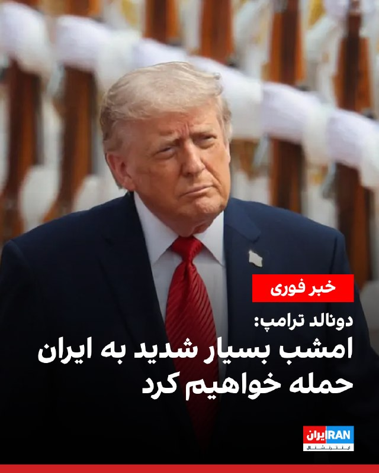

دونالد ترامپ، رییس‌جمهوری آمریکا، پنجشنبه ۲۱ خرداد در پیامی در تروت سوشال با تاکید بر از بین رفتن توان دفاعی و تهاجمی جمهوری اسلامی اعلام کرد ایالات متحده «امشب ایران را بسیار شدید هدف قرار خواهد داد.»

دونالد ترامپ همچنین نوشت در آینده‌ای نه چندان دور، آمریکا جزیره خارک و دیگر زیرساخت‌های نفتی جمهوری اسلامی را در اختیار خواهد گرفت و «کنترل کامل بازارهای نفت و گاز» را به دست خواهد آورد. او این اقدام را مشابه سیاست واشینگتن در قبال ونزوئلا توصیف کرد.

ترامپ با اشاره به توان نظامی جمهوری اسلامی نوشت: «نیروی دریایی، نیروی هوایی، رادارها، سامانه‌های ضدهوایی و همه اشکال دیگر دفاعی آن، همراه با بخش اعظم توان تهاجمی‌اش، از بین رفته‌اند.»
‌🏁 🇬🇧 IranintlTV

🤖 @VahidOOnLine

## WithYashar — post 14507

یاشار چرا شبا میزنه

## WithYashar — post 14506

🚨🚨🚨🚨🚨🚨🚨🚨🚨🚨
اعلام جنگ دوباره ترامپ: امشب بدجور میزنیم و به زودی خارک را هم میگیریم.
@withyashar
اتاق جنگ با یاشار : امشب شامپاین هم میزارم رو میز‌ آماده 😁🍾🥂

## mwarmonitor — post 10707

  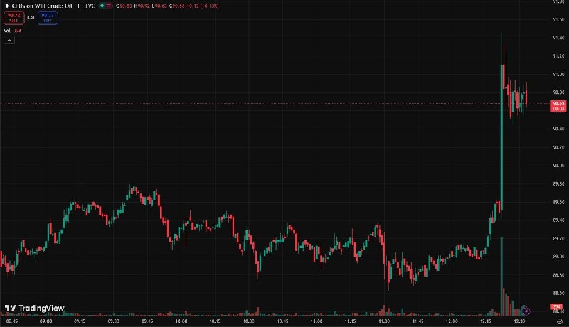

🔴ترامپ در سوشال تروث «ایالات متحده امشب به ایران (که نیروی دریایی، نیروی هوایی، رادار، پدافند هوایی و همه اشکال دیگر دفاعی آن، همراه با بیشتر توان تهاجمی‌اش از بین رفته است!) به‌طور بسیار سخت و شدیدی حمله خواهد کرد. در زمانی نه‌چندان دور، ما جزیره خارک…

## DEJradio — post 5591

  <a href="telegram/content/DEJradio_5591_1781181798.webm" target="_blank">🎬 Download video</a>

🚨
⭕️ هشدار دوبارۀ ترامپ: امشب بازهم حملاتی سنگین به مواضع جمهوری اسلامی انجام می‌دهیم

دونالد ترامپ، رئیس جمهوری آمریکا با انتشار پیامی در شبکۀ اجتماعی تروث گفت که شامگاه پنج‌شنبه به وقت آمریکا، حملات بسیار سنگینی به مواضع رژیم انجام می‌شود.
رئیس جمهوری آمریکا همچنین هشدار داد که واشینگتن به‌زودی کنترل جزیرۀ خارگ و تمام زیرساخت‌ها و بازار نفت و گاز ایران را به دست می‌گیرد.
رئیس جمهوری آمریکا در این پیام بازهم یادآور شد که نیروی دریایی، هوایی، رادارها، پدافند هوایی و سایر توانایی‌های دفاعی رژیم، همراه با بخش اعظم نیروی تهاجمی آن نابود شده است.
ارتش آمریکا در بامداد پنج‌شنبه نیز چندین زیرساخت نظامی جمهوری اسلامی را در حملات هوایی هدف گرفته بود.

#خبر #دژ #حمله #ترامپ
@DEJradio

## IranIntlTV — post 341699

  

دونالد ترامپ، رییس‌جمهوری آمریکا، پنجشنبه ۲۱ خرداد در پیامی در تروت سوشال با تاکید بر از بین رفتن توان دفاعی و تهاجمی جمهوری اسلامی اعلام کرد ایالات متحده «امشب ایران را بسیار شدید هدف قرار خواهد داد.»

دونالد ترامپ همچنین نوشت در آینده‌ای نه چندان دور، آمریکا جزیره خارک و دیگر زیرساخت‌های نفتی جمهوری اسلامی را در اختیار خواهد گرفت و «کنترل کامل بازارهای نفت و گاز» را به دست خواهد آورد. او این اقدام را مشابه سیاست واشینگتن در قبال ونزوئلا توصیف کرد.

ترامپ با اشاره به توان نظامی جمهوری اسلامی نوشت: «نیروی دریایی، نیروی هوایی، رادارها، سامانه‌های ضدهوایی و همه اشکال دیگر دفاعی آن، همراه با بخش اعظم توان تهاجمی‌اش، از بین رفته‌اند.»
https://iranintl.com/202606113566

## DW_Farsi — post 125820

  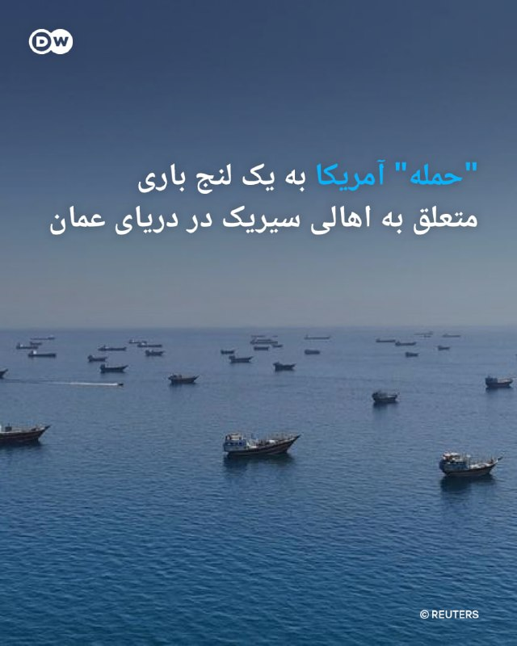

🔶"حمله" آمریکا به یک لنج باری متعلق به اهالی سیریک در دریای عمان

خبرگزاری مهر به نقل از رضا شهیدیان، فرماندار سیریک گزارش داد که یک لنج باری از این شهرستان که در دریای عمان در تردد بود، بامداد پنجشنبه ۱۱ ژوئن (۲۱ خرداد) "مورد اصابت یک پرتابه آمریکایی قرار گرفته است".

به گفته او این لنج باری که کالاهای اساسی حملی می‌کرده، ساعت ۵ صبح از شهر خصب کشور عمان به سمت شهرستان سیریک در حرکت بود که در ۵ مایلی بندر خصب مورد اصابت پرتابه قرار گرفت.

فرماندار سیریک افزود که این لنج ۵ خدمه داشت که پس از اصابت پرتابه با کمک‌های شناوری عبوری نجات پیدا کرده و به عمان انتقال داده شدند.

از سوی دیگر خبرگزاری فرانسه به نقل از سازمان عملیات تجارت دریایی بریتانیا گزارش داد که یک نفتکش در نزدیکی سواحل عمان دچار آتش‌سوزی شده است. به گفته این نهاد، آتش‌سوزی در فاصله ۲۱ مایل دریایی شمال شرق عمان روی داده است.

تا کنون جزییات بیشتری در مورد علت این آتش‌سوزی منتشر نشده است.

@dw_farsi

## IranianMinds — post 22298

پزشکیان : خو اومد خارکو گرفت، گوه خوری کنیم، تهرانم میگیره

@IranianMinds

## IranianMinds — post 22297

نه داداش تو جام جهانی جنگ نمیشه 🫪

## Dirty_Kids — post 391699

  

ترامپ: آمریکا امشب هم به ایران حمله می‌کنیم و جزیره خارگ را تصرف خواهیم کرد

دونالد ترامپ دقایقی قبل در یک توییت جدید نوشت: «ایالات متحده امشب هم ضربات بسیار سنگینی به ایران وارد خواهد کرد؛ حکومتی که نیروی دریایی، نیروی هوایی، رادارها، سامانه‌های پدافند هوایی و سایر ابزارهای دفاعی آن، به همراه بخش عمده‌ای از توان تهاجمی‌اش از بین رفته‌اند.

در آینده‌ای نه‌چندان دور، ما جزیره خارک و دیگر زیرساخت‌های نفتی آنان را در اختیار خواهیم گرفت و کنترل کامل بازارهای نفت و گاز آن‌ها را به دست خواهیم آورد؛ همان‌طور که در مورد ونزوئلا انجام داده‌ایم. اقدامی که به شکلی فوق‌العاده هم به سود ونزوئلا و هم به سود ایالات متحده آمریکا بوده است.»

@Dirty_Kids 👻

## Dirty_Kids — post 391698

صدای انفجار از سمت دریا در محدوده سیریک

## Dirty_Kids — post 391697

نفتکش M/T Jalveer متعلق به ناوگان سایه ایران در خلیج عمان پس از آنکه یک هواپیمای آمریکایی دو موشک هلفایر را به موتورخانه آن شلیک کرد، از کار افتاد. این سومین نفت‌کشیه که در هفتهٔ اخیر مورد هدف آمریکا قرار گرفته @Dirty_Kids 👻

## Dirty_Kids — post 391696

  <a href="telegram/content/Dirty_Kids_391696_1781181801.mp4" target="_blank">🎬 Download video</a>

نفتکش M/T Jalveer متعلق به ناوگان سایه ایران در خلیج عمان پس از آنکه یک هواپیمای آمریکایی دو موشک هلفایر را به موتورخانه آن شلیک کرد، از کار افتاد.

این سومین نفت‌کشیه که در هفتهٔ اخیر مورد هدف آمریکا قرار گرفته

@Dirty_Kids 👻

## Hranews — post 113537

خشونت خانگی؛ گزارشی از قتل سه زن و یک مرد در شهرهای مختلف

❗️
❗️
❗️
❗️
❗️– سه زن در شهرهای آق‌قلا، لاهیجان و تهران توسط همسران خود به قتل رسیدند. در یکی از این موارد، متهم پس از اعتراف به قتل همسرش اعلام کرد که جسد وی را در محدوده شهرستان آستانه اشرفیه رها کرده است. با این حال، جسد این زن تاکنون کشف نشده است. همچنین در یزد، یک مرد با مشارکت همسر، پدر و مادر همسرش و فردی دیگر به قتل رسید. عاملان این پرونده به سوزاندن جسد مقتول اعتراف کرده‌اند. متهمان این پرونده‌‌ها در بازداشت به سر می‌برند.

#خشونت_خانگی

ادامه مطلب

↘️
@hranews_bot تماس ✉️ - @Hranews کانال هرانا 🆑

## alonews — post 127143

  <a href="telegram/content/alonews_127143_1781181802.webm" target="_blank">🎬 Download video</a>

👈اصابت پهپاد انتحاری ایران به رادار هشدار زود هنگام آمریکا در جبل الدخان بحرین

✅ @AloNews خبر جنگ

## alonews — post 127142

  <a href="telegram/content/alonews_127142_1781181802.mp4" target="_blank">🎬 Download video</a>

⚽️ویدیو رسمی فیفا برای شروع جام جهانی با نورپردازی خوشگل ☺️😍

@AloSport

## alonews — post 127141

😳هنوزم ۱۰۰ و ۲۰۰ گیگ رو به اسم نامحدود میفروشن؟! 
🚀 مخصوص جنگ 
😎 @NetAazaad1Bot @NetAazaad1Bot اینجا از اون خبرا نیست 
😎⚡️ 
💎 نامحدود واقعی، بدون استرس تموم شدن حجم
✅ مخصوص این روزایی که اینترنت پایدار از نون شب واجب‌تره 
❤️ 
🚀 فقط امشب با خیال راحت وصل شو و…

## alonews — post 127140

  <a href="telegram/content/alonews_127140_1781181805.webm" target="_blank">🎬 Download video</a>

😳هنوزم ۱۰۰ و ۲۰۰ گیگ رو به اسم نامحدود میفروشن؟!

🚀 مخصوص جنگ 
😎
@NetAazaad1Bot
@NetAazaad1Bot
اینجا از اون خبرا نیست 
😎⚡️

💎 نامحدود واقعی، بدون استرس تموم شدن حجم
✅

مخصوص این روزایی که اینترنت پایدار از نون شب واجب‌تره 
❤️

🚀 فقط امشب با خیال راحت وصل شو و لذت ببر

⌛ ظرفیت هم محدوده، جا نمونی.
✅

@NetAazaad1Bot
@NetAazaad1Bot

## alonews — post 127139

  <a href="telegram/content/alonews_127139_1781181805.webm" target="_blank">🎬 Download video</a>

👈وزیر خارجه بحرین می گوید صبح امروز 36 فروند پهپاد ایرانی را منهدم کرده

✅ @AloNews خبر جنگ

## alonews — post 127138

  <a href="telegram/content/alonews_127138_1781181805.webm" target="_blank">🎬 Download video</a>

⭕️ الونیوز فقط در تلگرام 
💬 و توییتر 
❌ فعال هستش

🔴سایر شبکه های اجتماعی چه داخلی چه خارجی که با نام الونیوز فعالیت می‌کنند مرتبط به ما نیست و پیشنهاد میکنم که لفت بدید.

✅@AloNews

---
📅 بروزرسانی: 1405/03/21 16:03
---

## VahidOOnLine — post 244939

  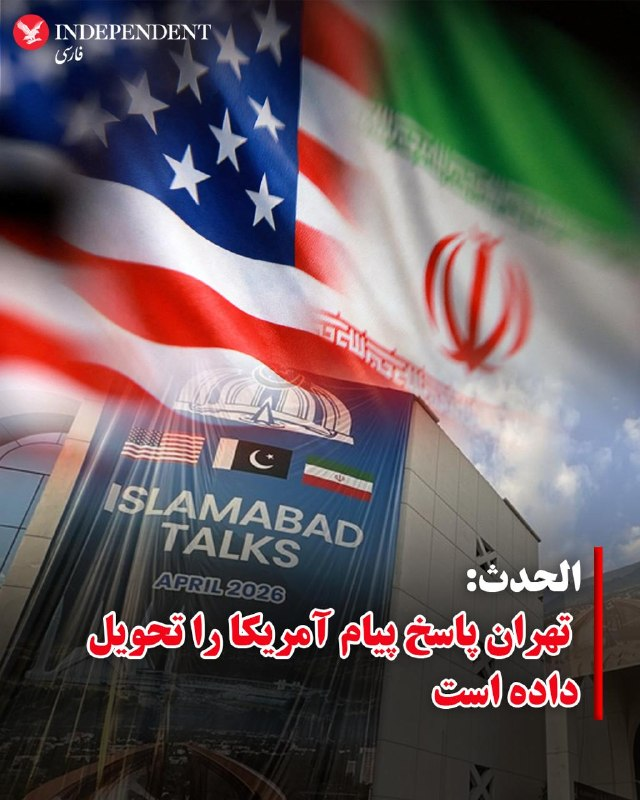

♦️شبکه الحدث، روز پنجشنبه ۲۱ خرداد ماه به نقل از منابع خود گزارش داد ایران پاسخ خود به پیامی که هفته گذشته توسط محسن نقوی، وزیر کشور پاکستان به تهران منتقل شده بود را تحویل داده است.
وزیر کشور پاکستان پیش‌تر، در چارچوب تلاش‌های میانجی‌گرانه اسلام‌آباد میان تهران و واشنگتن، پیامی برای مجتبی خامنه‌ای را به مقامات جمهوری اسلامی تحویل داده بود.
یک منبع ارشد دیپلماتیک در گفتگو با الحدث اظهار داشت گزارش‌های مربوط به شکست مذاکرات آمریکا و ایران بی‌اساس است. این منبع ارشد دیپلماتیک روز پنجشنبه، با ذکر آنکه پاکستان و قطر در ساعات اخیر تلاش‌های خود را برای پیشبرد توافق تشدید کرده‌اند، تاکید کرد مذاکرات در مورد توافق بین ایران و آمریکا ادامه دارد.
این گزارش در حالی مطرح می‌شود که آتش‌بس شکننده میان ایران و آمریکا در شامگاه چهارشنبه، با رد و بدل کردن سنگین آتش میان دو طرف در خلیج فارس شکسته شد.
‌🇸🇦 Indypersian

🤖 @VahidOOnLine

## WithYashar — post 14505

  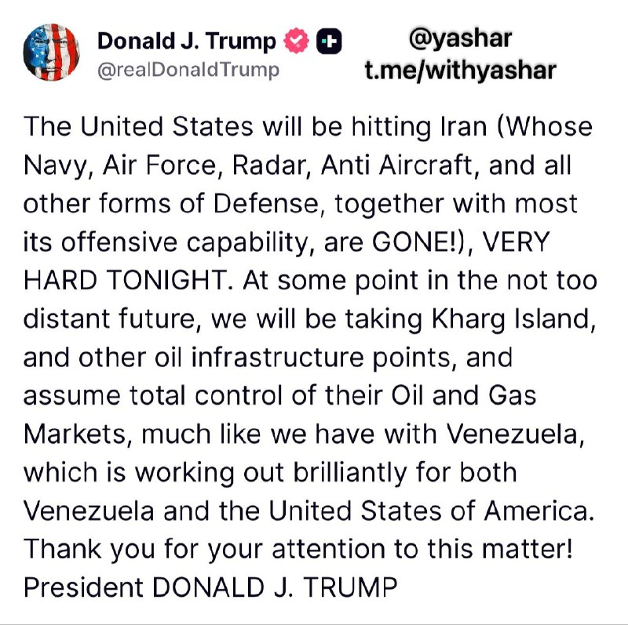

ترامپ در تروث :«ایالات متحده امشب ضربه‌ای بسیار سخت و سنگین به ایران وارد خواهد کرد؛ ایرانی که نیروی دریایی، نیروی هوایی، سامانه‌های راداری، پدافند هوایی و دیگر بخش‌های دفاعی آن، به همراه بخش عمده توان تهاجمی‌اش، از میان رفته‌اند!

در آینده‌ای نه‌چندان دور، ما جزیره خارک و دیگر مراکز زیرساختی نفتی را در اختیار خواهیم گرفت و کنترل کامل بازارهای نفت و گاز آن‌ها را به دست خواهیم آورد؛ همان‌گونه که این کار را در ونزوئلا انجام داده‌ایم؛ اقدامی که برای هر دو کشور، یعنی ونزوئلا و ایالات متحده آمریکا، نتایج بسیار خوبی به همراه داشته است.

از توجه شما به این موضوع سپاسگزارم!

دونالد جی. ترامپ
رئیس‌جمهور ایالات متحده آمریکا»
@withyashar

## mwarmonitor — post 10706

نظامی - سیاسی pinned a photo

## mwarmonitor — post 10705

  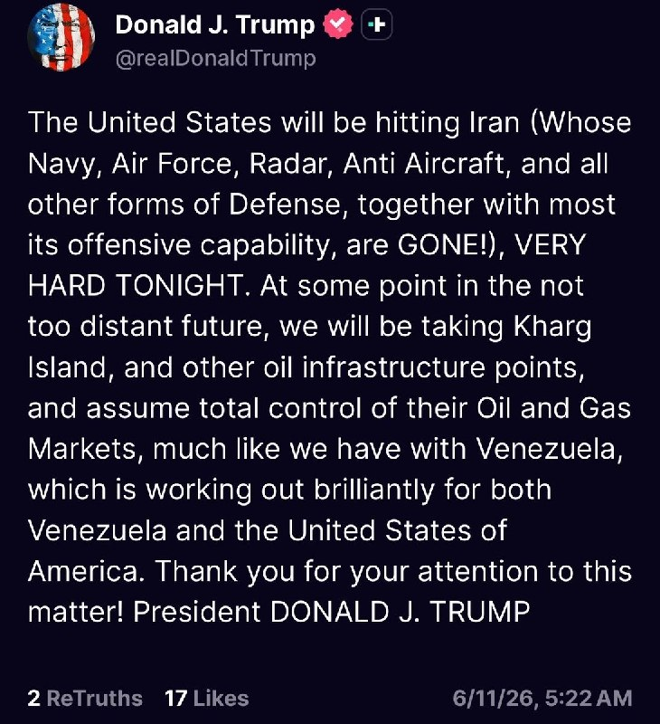

🔴ترامپ در سوشال تروث

«ایالات متحده امشب به ایران (که نیروی دریایی، نیروی هوایی، رادار، پدافند هوایی و همه اشکال دیگر دفاعی آن، همراه با بیشتر توان تهاجمی‌اش از بین رفته است!) به‌طور بسیار سخت و شدیدی حمله خواهد کرد.

در زمانی نه‌چندان دور، ما جزیره خارک و دیگر نقاط زیرساختی نفتی را نیز تحت کنترل خواهیم گرفت و کنترل کامل بازارهای نفت و گاز آن‌ها را در دست خواهیم گرفت؛ همان‌طور که با ونزوئلا انجام دادیم، که هم برای ونزوئلا و هم برای ایالات متحده بسیار خوب پیش می‌رود.

از توجه شما به این موضوع سپاسگزارم!»

@mwarmonitor

## pm_afshaa — post 93610

🔴فوری از پست جدید ترامپ: ایالات متحده امشب ضربه‌ای بسیار سخت و سنگین به ایران وارد خواهد کرد؛ ایرانی که نیروی دریایی، نیروی هوایی، سامانه‌های راداری، پدافند هوایی و دیگر بخش‌های دفاعی آن، به همراه بخش عمده توان تهاجمی‌اش، از میان رفتند! در آینده‌ای نه‌چندان…

## pm_afshaa — post 93609

  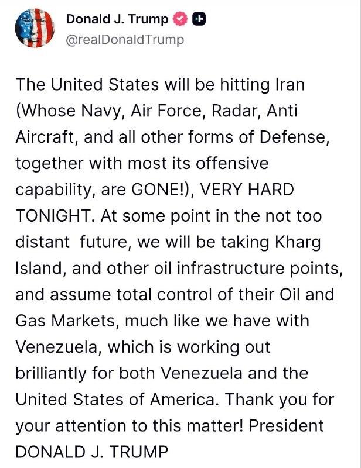

🔴فوری از پست جدید ترامپ:

ایالات متحده امشب ضربه‌ای بسیار سخت و سنگین به ایران وارد خواهد کرد؛ ایرانی که نیروی دریایی، نیروی هوایی، سامانه‌های راداری، پدافند هوایی و دیگر بخش‌های دفاعی آن، به همراه بخش عمده توان تهاجمی‌اش، از میان رفتند!

در آینده‌ای نه‌چندان دور، ما جزیره خارک و دیگر مراکز زیرساختی نفتی رو در اختیار خواهیم گرفت و کنترل کامل بازارهای نفت و گاز آن‌ها رو به دست خواهیم آورد؛ همان‌گونه که این کار رو در ونزوئلا انجام دادیم؛ اقدامی که برای هر دو کشور، یعنی ونزوئلا و آمریکا، نتایج بسیار خوبی به همراه داشته.

💧 Rainbet.com the #1 Non-KYC Crypto Casino & Sportsbook @rainbetcom

😁 @Pm_Afshaa

## DEJradio — post 5590

⭕️ صادرات فرش ایرانی در یک دهۀ اخیر ۹۸ درصد افت کرد

بر پایۀ آمارهای رسمی صادرات فرش ایرانی از حدود ۴۰۰ میلیون دلار در یک دهۀ پیش به کمتر از ۴۲ میلیون دلار در سال پیشین رسید.
خبرگزاری حکومتی رکنا گزارش داد فرش ایرانی پس از بازگشت تحریم‌ها در سال ۱۳۹۷ بازار اصلی خود در آمریکا را از دست داد.
بنا بر این گزارش، صنعت فرش ایرانی اکنون زیر فشار رقبا، سیاست‌های ارزی جمهوری اسلامی، افت گردشگری و کاهش قدرت خرید داخلی، برای یافتن مشتری داخلی در تلاش است.
در حالی که صادرات فرش ایرانی به پایین‌ترین رقم تاریخ خود رسیده، ترکیه در سال پیشین معادل نزدیک به سه میلیارد دلار فرش را به ۱۸۲ کشور صادر کرد.

#خبر #دژ #فرش #صادرات
@DEJradio

## kianmeli1 — post 87929

🔴فوری

ترامپ :امشب به ایران حمله میکنیم و جزیره نفتی خارک را تصرف میکنیم
https://t.me/kianmeli1

## Shin_Persian — post 6937

  

Shin ✓ @hey_itsmyturn Thu, 11 Jun 2026 12:25:46 UTC POTUS: "The United States will be hitting Iran (Whose Navy, Air Force, Radar, Anti Aircraft, and all other forms of Defense, together with most of its offensive capability, are GONE!), VERY HARD TONIGHT.…

## Shin_Persian — post 6936

Shin ✓ @hey_itsmyturn
Thu, 11 Jun 2026 12:25:46 UTC

POTUS:
"The United States will be hitting Iran (Whose Navy, Air Force, Radar, Anti Aircraft, and all other forms of Defense, together with most of its offensive capability, are GONE!), VERY HARD TONIGHT. At some point in the not too distant future, we will be taking Kharg Island, and other oil infrastructure points, and assume total control of their Oil and Gas Markets, much like we have with Venezuela, which is working out brilliantly for both Venezuela and the United States of America. Thank you for your attention to this matter! President DONALD J. TRUMP"

ترجمه خودکار فارسی

رئیس‌جمهور ایالات متحده (POTUS):
«ایالات متحده امشب بسیار سخت به ایران (که نیروی دریایی، نیروی هوایی، رادار، پدافند هوایی و تمامی دیگر اشکال دفاعی آن، به همراه بخش اعظم توانمندی تهاجمی‌اش از بین رفته است!) ضربه خواهد زد. در زمانی نه چندان دور در آینده، ما جزیره خارگ و سایر نقاط زیرساختی نفت را تصرف خواهیم کرد و کنترل کامل بازارهای نفت و گاز آن‌ها را به دست خواهیم گرفت؛ بسیار شبیه به کاری که با ونزوئلا انجام داده‌ایم، که به شکلی عالی هم برای ونزوئلا و هم برای ایالات متحده آمریکا در حال نتیجه دادن است. از توجه شما به این موضوع سپاسگزارم! رئیس‌جمهور دونالد جی. ترامپ»

𝕏 · @shin_persian

## Shin_Persian — post 6935

Shin ✓ @hey_itsmyturn
Thu, 11 Jun 2026 12:25:14 UTC

Wait a minute, did POTUS just say US will seize the Kharg island?

ترجمه خودکار فارسی

یک لحظه صبر کنید، آیا رئیس‌جمهور ایالات متحده (POTUS) همین الآن گفت که آمریکا جزیره خارگ را تصرف خواهد کرد؟

𝕏 · @shin_persian

## Shin_Persian — post 6934

Shin ✓ @hey_itsmyturn
Thu, 11 Jun 2026 12:24:41 UTC

POTUS says there will be strikes on Iran again tonight.

ترجمه خودکار فارسی

رئیس‌جمهور ایالات متحده (POTUS) می‌گوید امشب بار دیگر حملاتی علیه ایران انجام خواهد شد.

𝕏 · @shin_persian

## FarsiVOA — post 220378

🔺سنتکام: یک نفتکش دیگر ناقض «محاصره دریایی» جمهوری اسلامی را از کار انداختیم

▪️سنتکام اعلام کرد که نیروهایش یک نفتکش دیگر را که تلاش کرده بود محاصره دریایی ایالات متحده علیه جمهوری اسلامی را نقض کند، از کار انداخته است.

⬇️ بیشتر بخوانید:

https://ir.voanews.com/a/naval-blockade-centcom-sea-of-oman-oil-tanker/8159709.html/?nocach=1

## Persian_Trend_Official — post 16721

  <a href="telegram/content/Persian_Trend_Official_16721_1781181220.webm" target="_blank">🎬 Download video</a>

🎬 Video

## Persian_Trend_Official — post 16720

  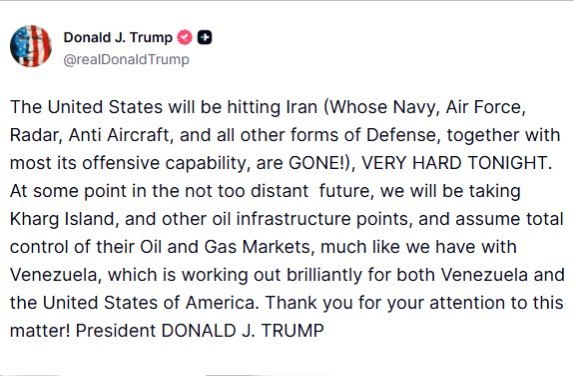

ترامپ: ایالات متحده امشب ضربات بسیار سنگینی به ایران وارد خواهد کرد؛ کشوری که نیروی دریایی، نیروی هوایی، رادارها، پدافند هوایی و بخش عمده توان تهاجمی آن از بین رفته است.

در آینده‌ای نه‌چندان دور، جزیره خارک و دیگر زیرساخت‌های نفتی ایران را در اختیار خواهیم گرفت و کنترل کامل بازارهای نفت و گاز آن را به دست خواهیم آورد؛ مشابه کاری که با ونزوئلا انجام داده‌ایم.

📝 Amir

📌 @persian_trend_official
پرشین ترند | متفاوت‌ترین کانال نظامی

## Persian_Trend_Official — post 16719

  <a href="telegram/content/Persian_Trend_Official_16719_1781181221.webm" target="_blank">🎬 Download video</a>

فایننشال تایمز: لاکهید مارتین به متحدان ایالات متحده هشدار داده است که نمی‌تواند جدول زمانی تحویل موشک‌های رهگیر پاتریوت PAC-3 را تضمین کند، زیرا اولویت‌های تخصیص را دولت ایالات متحده، نه تولیدکننده، تعیین می‌کند.

تقاضای فزاینده ناشی از درگیری‌ها در اوکراین و ایران، ذخایر موجود را به شدت تحت فشار قرار داده و آلمان، ژاپن، لهستان، عربستان سعودی و امارات متحده عربی را با عدم قطعیت قابل توجهی در مورد تحویل‌های آینده مواجه کرده است، زیرا واشنگتن توزیع ذخایر محدود موشک را کنترل می‌کند.

📝 Amir

📌 @persian_trend_official
پرشین ترند | متفاوت‌ترین کانال نظامی

## RadioFarda — post 158179

🔸سنتکام تأیید کرد که ارتش ایالات متحده صبح پنج‌شنبه ۲۱ خرداد نفتکش دیگری را با شلیک موشک در خلیج عمان از کار انداختند. 🔸بر اساس بیانیهٔ فرماندهی مرکزی ارتش آمریکا، این کشتی با نام «ام‌تی جالویر» با پرچم گینه بیسائو در تلاش برای انتقال نفت ایران و نقض محاصرهٔ…

## RadioFarda — post 158178

  <a href="telegram/content/RadioFarda_158178_1781181222.mp4" target="_blank">🎬 Download video</a>

🔸سنتکام تأیید کرد که ارتش ایالات متحده صبح پنج‌شنبه ۲۱ خرداد نفتکش دیگری را با شلیک موشک در خلیج عمان از کار انداختند.

🔸بر اساس بیانیهٔ فرماندهی مرکزی ارتش آمریکا، این کشتی با نام «ام‌تی جالویر» با پرچم گینه بیسائو در تلاش برای انتقال نفت ایران و نقض محاصرهٔ دریایی اعمال‌شده از سوی آمریکا علیه بنادر و کشتیرانی ایران بود.

🔸سنتکام گفته است پس از سر باز زدن خدمهٔ این نفتکش از اجرای دستور سنتکام، یک هواپیمای آمریکایی با شلیک دو موشک هلفایر به موتورخانهٔ کشتی مانع از ادامهٔ حرکت آن شد.

🔸بر اساس اعلام سنتکام، این سومین کشتی است که این هفته توسط نیروهای آمریکایی در تلاش برای شکستن محاصرهٔ دریایی ایران از کار انداخته شده است.

🔸به‌گفتۀ فرماندهی مرکزی ارتش آمریکا از زمان آغاز محاصره، «۹ کشتی متخلف از کار انداخته شده، ۱۳۵ کشتی تغییر مسیر داده شده و به ۴۲ کشتی حامل کمک‌های بشردوستانه اجازهٔ عبور داده‌ شده است».

@RadioFarda

## IranianMinds — post 22296

جانفدایان عزیز
وقتشه برید خارک
ماهم براتون دعا میکنیم

## IranianMinds — post 22295

🔴 فوری ترامپ

بزودی خارک را تصرف خواهیم کرد

«ایالات متحده امشب بسیار سخت به ایران (که نیروی دریایی، نیروی هوایی، رادار، پدافند هوایی و تمامی دیگر اشکال دفاعی آن، به همراه بخش اعظم توانمندی تهاجمی‌اش از بین رفته است!) ضربه خواهد زد. در زمانی نه چندان دور در آینده، ما جزیره خارگ و سایر نقاط زیرساختی نفت را تصرف خواهیم کرد و کنترل کامل بازارهای نفت و گاز آن‌ها را به دست خواهیم گرفت؛ بسیار شبیه به کاری که با ونزوئلا انجام داده‌ایم، که به شکلی عالی هم برای ونزوئلا و هم برای ایالات متحده آمریکا در حال نتیجه دادن است. از توجه شما به این موضوع سپاسگزارم! رئیس‌جمهور دونالد جی. ترامپ»

@IranianMinds

## BBCPersian — post 283433

  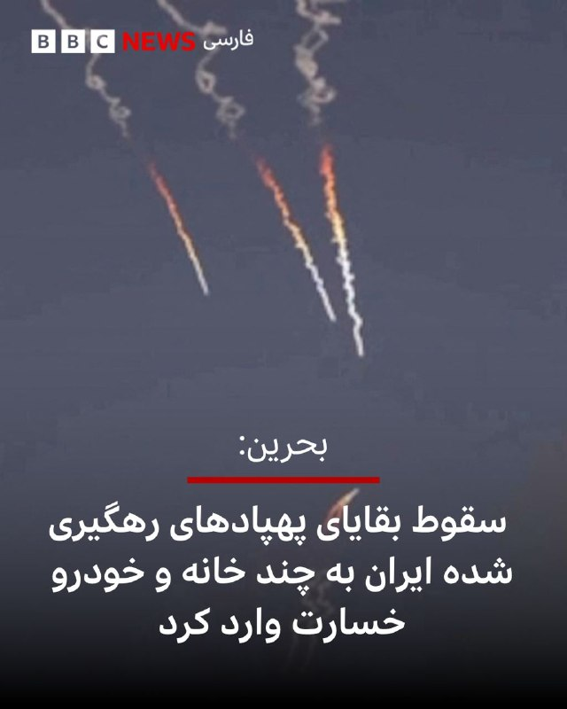

ارتش اردن روز پنج‌شنبه اعلام کرد که «۲۰ موشک» شلیک‌شده از سوی ایران را رهگیری و منهدم کرده است؛ سپاه پاسداران هم پیش‌تر گفته بود که یک مرکز فرماندهی آمریکا در آن کشور را هدف حمله قرار داده است.

در بیانیه ارتش اردن آمده است که «بامداد روز پنج‌شنبه، سامانه‌های پدافند هوایی و نیروی هوایی سلطنتی اردن ۲۰ موشک شلیک‌شده از ایران به سمت منطقه ازرق در استان زرقاء را رهگیری و سرنگون کردند.»

این منطقه در فاصله حدود ۸۰ کیلومتری شرق امان، پایتخت اردن، واقع شده است.

در این بیانیه همچنین گفته شده است که در نتیجه رهگیری موشک‌ها، تعدادی از قطعات آن‌ها در مناطق مختلف سقوط کرده، اما هیچ‌گونه تلفات انسانی یا خسارت مادی در پی نداشته است.

📸 Reuters

https://bbc.in/4v5B0d7
@BBCPersian

## alonews — post 127137

  <a href="telegram/content/alonews_127137_1781181225.webm" target="_blank">🎬 Download video</a>

🔴فووری/ترامپ:
ایالات متحده امشب به ایران ضربه‌ای بسیار سخت خواهد زد (ناوگان دریایی، نیروی هوایی، رادار، ضد هوایی و تمام اشکال دیگر دفاعی آن، همراه با بیشتر توان تهاجمی‌اش، از بین رفته‌اند!)
در آینده‌ای نه چندان دور، ما جزیره خارک و دیگر نقاط زیرساخت نفتی را تصرف خواهیم کرد و کنترل کامل بازارهای نفت و گاز آن‌ها را به دست خواهیم گرفت، درست مانند کاری که با ونزوئلا انجام داده‌ایم، که برای هر دو کشور ونزوئلا و ایالات متحده آمریکا بسیار موفقیت‌آمیز بوده است. از توجه شما به این موضوع سپاسگزاریم!

✅ @AloNews خبر جنگ

## alonews — post 127136

  <a href="telegram/content/alonews_127136_1781181225.webm" target="_blank">🎬 Download video</a>

👈خبرگزاری معتبر فارس:
ادعای سی‌ان‌ان درباره مذاکرات جدید ایران و آمریکا تکذیب شد

✅ @AloNews خبر جنگ

---
📅 بروزرسانی: 1405/03/21 15:52
---

## VahidOOnLine — post 244938

  

خبرگزاری فارس، وابسته به سپاه پاسداران، به نقل از منبعی نزدیک به تیم مذاکره‌کننده جمهوری اسلامی گزارش شبکه سی‌ان‌ان درباره مذاکرات جدید میان تهران و واشینگتن در جریان تحولات بامداد پنج‌شنبه ۲۰ خرداد را رد کرد.
این منبع گفت جمهوری اسلامی در مذاکرات بر مواضع و خطوط قرمز اعلام‌شده خود ایستادگی کرده و از مطالبات اصلی عقب‌نشینی نکرده است.
به گفته این منبع، همان متنی که پیش‌تر مورد تاکید تهران بوده همچنان مبنای مواضع جمهوری اسلامی است و در نهایت طرف آمریکایی ناچار خواهد شد چارچوب‌های اصلی آن را بپذیرد.
‌🏁 🇬🇧 IranintlTV

🤖 @VahidOOnLine

## mwarmonitor — post 10704

📌دعوت کاخ سفید از «ابو محمد الجولانی» ریس جمهور سوریه برای اواسط ماه ژوئن جاری .

@mwarmonitor

## DEJradio — post 5589

⭕️ رسانه‌های غربی می‌گویند مذاکرات تهران و واشینگتن با وجود حملات نظامی ادامه یافت

شبکۀ تلویزیونی سی‌ان‌ان به نقل از یک منبع دیپلماتیک گزارش داد مذاکرات جمهوری اسلامی و آمریکا با وجود درگیری‌های نظامی اخیر همچنان ادامه دارد.
رویترز نیز به نقل از منابع ایرانی نوشت گفت‌وگوها برای دستیابی به یک توافق اولیه و همچنین بررسی سازوکار آزادسازی دارایی‌های مسدودشدۀ جمهوری اسلامی ادامه یافته است.
در سوی دیگر خبرگزاری فرانسه گزارش داد هیئت قطری که برای میانجی‌گری به تهران رفته بود، پس از گفت‌وگوهای فشرده با مقام‌های جمهوری اسلامی، بامداد پنج‌شنبه ایران را ترک کرد.
دونالد ترامپ روز چهارشنبه اعلام کرده بود تهران فرصت دستیابی به توافق را هدر داد و باید بهایش را بپردازد.

#خبر #دژ #مذاکرات
@DEJradio

## kianmeli1 — post 87928

🔴تبادل اتش در تنگه هرمز گزارش شده است.
https://t.me/kianmeli1

## IranIntlTV — post 341698

  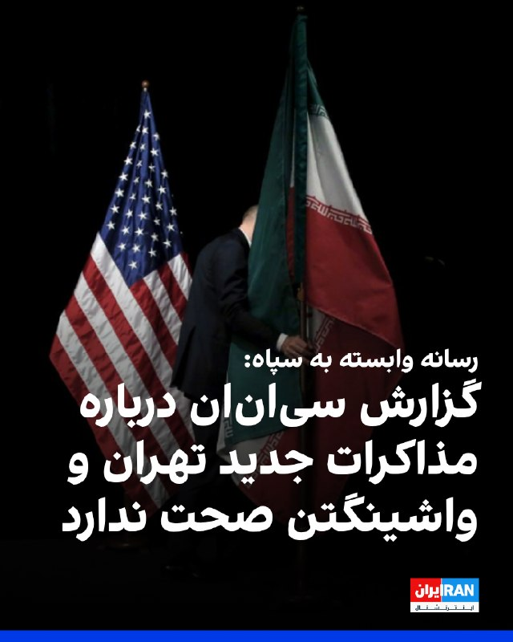

خبرگزاری فارس، وابسته به سپاه پاسداران، به نقل از منبعی نزدیک به تیم مذاکره‌کننده جمهوری اسلامی گزارش شبکه سی‌ان‌ان درباره مذاکرات جدید میان تهران و واشینگتن در جریان تحولات بامداد پنج‌شنبه ۲۰ خرداد را رد کرد.
این منبع گفت جمهوری اسلامی در مذاکرات بر مواضع و خطوط قرمز اعلام‌شده خود ایستادگی کرده و از مطالبات اصلی عقب‌نشینی نکرده است.
به گفته این منبع، همان متنی که پیش‌تر مورد تاکید تهران بوده همچنان مبنای مواضع جمهوری اسلامی است و در نهایت طرف آمریکایی ناچار خواهد شد چارچوب‌های اصلی آن را بپذیرد.
https://iranintl.com/202606118057

## Shin_Persian — post 6933

Shin ✓ @hey_itsmyturn
Thu, 11 Jun 2026 12:21:21 UTC

State-owned Mehr News:

"Explosion sounds reported from sea direction near Sirik,
Hormozgan Province, #Iran

"Sounds appear related to clashes or exchange of fire in Persian Gulf/Strait of Hormuz."

[Or BM launch from Sirik?]

ترجمه خودکار فارسی

خبرگزاری دولتی مهر:

«گزارش‌هایی از شنیده شدن صدای انفجار از سمت دریا در نزدیکی سیریک، استان هرمزگان، #Iran

به نظر می‌رسد صداها مربوط به درگیری یا تبادل آتش در خلیج فارس/تنگه هرمز باشد.»

[یا شلیک موشک بالستیک از سیریک؟]

𝕏 · @shin_persian

## Shin_Persian — post 6931

Shin ✓ @hey_itsmyturn
Thu, 11 Jun 2026 12:20:05 UTC

MOI Bahrain: An Iranian aggression struck civilian areas. A child was injured, vehicles caught fire, and homes were damaged. #Bahrain 🇧🇭

Source: @moi_bahrain
https://x.com/moi_bahrain/status/2065046262089404845

ترجمه خودکار فارسی

وزارت کشور بحرین: تجاوزات ایران به مناطق غیرنظامی اصابت کرد. یک کودک مجروح شد، خودروها آتش گرفتند و خانه‌ها آسیب دیدند. #Bahrain 🇧🇭

منبع: @moi_bahrain
https://x.com/moi_bahrain/status/2065046262089404845

𝕏 · @shin_persian

## FarsiVOA — post 220377

  <a href="telegram/content/FarsiVOA_220377_1781180580.mp4" target="_blank">🎬 Download video</a>

ارتش اسرائیل با انتشار ویدیویی اعلام کرد نیروهای لشکر ۹۱ یک سکوی پرتاب موشک ضدزره را در جنوب لبنان منهدم کرده‌اند.

ارتش اسرائیل گفت این سکو در میان بوته‌ها پنهان شده بود و برای حمله به نیروهای اسرائیلی مورد استفاده قرار می‌گرفت.

ارتش اسرائیل همچنین اعلام کرد که نیروهای لشکر ۹۱ طی هفته گذشته بیش از ۳۵ عضو حزب‌الله را در جنوب لبنان هدف قرار داده‌اند.

@FarsiVOA

## DW_Farsi — post 125819

  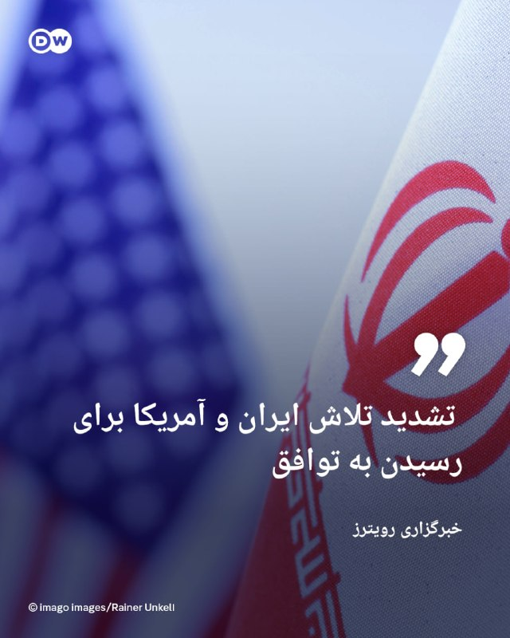

🔶 رویترز: تشدید تلاش ایران و آمریکا برای رسیدن به توافق

رویترز با استناد به اظهارت سه منبع ایرانی و یک مقام اروپایی که نامشان فاش نشد، گزارش داد، با وجود حملاتی که از سوی هر دو طرف انجام شده، تلاش‌ها برای کسب توافقی اولیه میان جمهوری اسلامی و ایالات متحده شدت گرفته و ایران در پی سازوکاری برای آزادسازی دارایی‌های مسدودشده است.

به گفته منابع ایرانی یک تفاهم سیاسی حاصل شده است، اما برخی مسائل همچنان باید به‌صورت جزئی بررسی شود، از جمله سازوکار آزادسازی ده‌ها میلیارد دلار درآمد نفتی ایران که در بانک‌های خارجی مسدود شده است.

یکی از این منابع به رویترز گفت، "جمهوری اسلامی خواهان آزادسازی ۶ تا ۱۲ میلیارد دلار از دارایی‌های مسدودشده است، در حالی که واشنگتن خواهان آزادسازی مرحله‌ای این منابع برای کالاهای بشردوستانه است و بازگرداندن کامل پول را رد می‌کند".

بنا بر اظهارات منابع ایرانی جمهوری اسلامی "برای بقای خود، نه به دنبال یک توافق جامع، بلکه یک چارچوب است که بتواند از طریق آزادسازی دارایی‌های مسدودشده و پایان جنگ، حداقل فضا و فرصت تنفس را برای خود ایجاد کند".

@dw_farsi

## Persian_Trend_Official — post 16718

  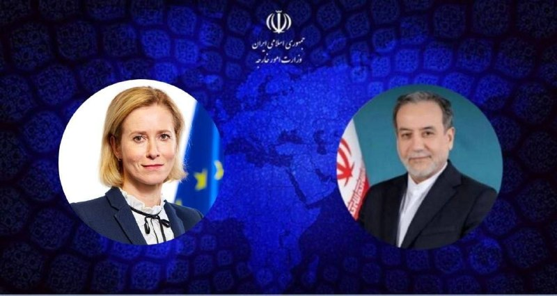

گفتگوی عراقچی با مسئول سیاست خارجی اتحادیه اروپا

صداوسیما: سید عباس عراقچی، وزیر امور خارجه جمهوری اسلامی در تماس تلفنی ظهر امروز پنجشنبه با کایا کالاس، مسئول سیاست خارجی اتحادیه اروپا، در خصوص آخرین تحولات منطقه‌ای در پی حملات تجاوزکارانه آمریکا به نقاطی از ایران گفت‌وگو کرد.

وزیر خارجه در این تماس، تجاوز اخیر آمریکا را به‌شدت محکوم کرده و آن را نقض آشکار منشور سازمان ملل و حقوق بین‌الملل دانسته و اعلام کرده که این اقدامات وضعیت آتش‌بس را بی‌اثر کرده و مسئولیت پیامدهای خطرناک آن بر عهده آمریکا است.

عراقچی با انتقاد از سکوت  کشورهای عضو سازمان ملل در برابر این اقدامات، هشدار داد که انفعال جهانی موجب افزایش ناامنی منطقه‌ای و جهانی خواهد شد.

📝 Amir

📌 @persian_trend_official
پرشین ترند | متفاوت‌ترین کانال نظامی

## Persian_Trend_Official — post 16717

  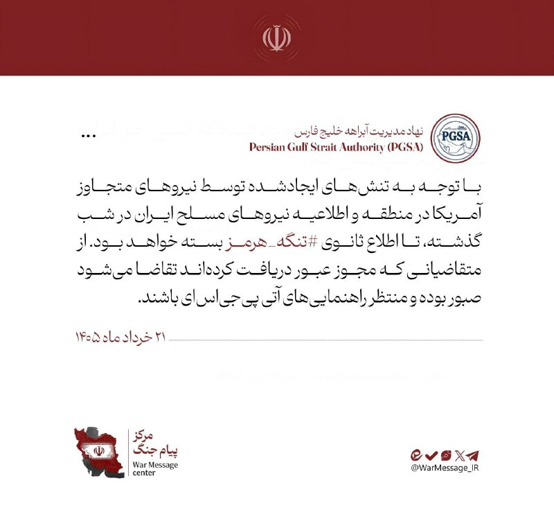

نهاد مدیریت آبراه خلیج فارس: با توجه به تنش‌های ایجادشده توسط نیروهای متجاوز آمریکا در منطقه و اطلاعیه نیروهای مسلح ایران در شب گذشته، تا اطلاع ثانوی تنگه هرمز بسته خواهد بود.

از متقاضیانی که مجوز عبور دریافت کرده‌اند تقاضا می‌شود صبور بوده و منتظر راهنمایی‌های آتی پی‌جی‌اس‌ای باشند.

📝 Amir

📌 @persian_trend_official
پرشین ترند | متفاوت‌ترین کانال نظامی

## Persian_Trend_Official — post 16716

  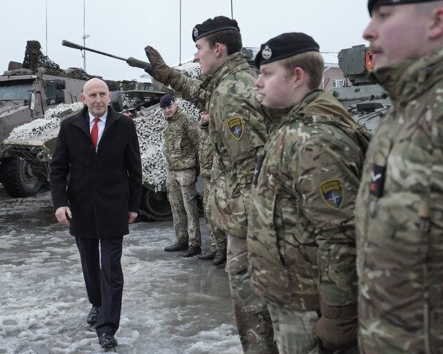

وزیر دفاع انگلیس استعفا داد.

جان هیلی، وزیر دفاع انگلیس در اعتراض به بودجه دفاعی نخست وزیر استعفا کرد.

📝 Amir

📌 @persian_trend_official
پرشین ترند | متفاوت‌ترین کانال نظامی

## RadioFarda — post 158177

  <a href="https://t.me/radiofarda/158177" target="_blank">📎 Download file</a>

🔸 در ویژه برنامه «کافه فردا، به وقت جام جهانی» به خبرها و حواشی اولین روز این رویداد و ارائه پیش‌بازی مسابقه افتتاحیه بین مکزیک و آفریقای جنوبی و پس از آن مسابقه بین جمهوری چک و کره جنوبی می‌پردازیم.

🔸 برای تماس با ما می‌توانید به شناسه کافه فردا در تلگرام صوت و متن بفرستید.
📻 کافه فردا

## IranianMinds — post 22294

  

رهبران جمهوری اسلامی

@IranianMinds

## IranianMinds — post 22293

⚠️ خیلیا نمیدونن که اگه ثبت‌نامشون رو با لینک زیر انجام بدن... 
⁉️

💥 بونوس خوش‌آمد گویی تا %220 بیشتر میگیرن!
فقط کافیه به لینک زیر مراجعه کنید و وارد ملبت بشید و به راحتی ثبتنام کنید! 👌

🌐 لینک بدون فیلتر سایت معتبر ملبت 👇

🌐 www.MelBet1.com

🎁 بعد از ثبتنام، وارد حسابت شو و توی بخش "بونوس‌ها" فعالش کن 
🎚️

نکته: فقط این هفته فعاله، پس از دستش نده 
🙂

🎁 کد هدیه 100 دلاری فراموش نشه: Sport100

✅ معرفی سایت و اپلیکیشن مل‌بت

💯 ورود به سایت مل‌بت (فیلترشکن خاموش)

## IranianMinds — post 22291

  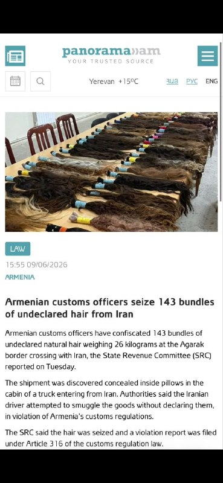

🔴گمرک ارمنستان کامیونی حاوی چند صد بسته موی زن توقیف کرده.
اما این نشانگر چیست؟ اعتراف آشکار به جنایت علیه زنان معترض دی ، تجاوز ، شکنجه و سپس اعدام و فروش اعضای بدن.

@IranianMinds

## BBCPersian — post 283432

🔻ایران در جام جهانی؛ از بازی پشت پرده تاج، اینفانتینو و ترامپ چه می‌دانیم؟

🖌نازنین کیان, روزنامه‌نگار

جانی اینفانتینو، رییس فیفا، ۲۰ اسفند ۱۴۰۴ در کاخ سفید با دونالد ترامپ دیدار کرد. موضوع اصلی این نشست، به گفته خود اینفانتینو، ایران بود؛ کشوری که تیم ملی‌اش قرار است در جام جهانی ۲۰۲۶ که میزبانی آن را آمریکا، کانادا و مکزیک برعهده دارند، حضور داشته باشد.

https://bbc.in/4usvikc
@BBCPersian

## alonews — post 127134

  <a href="telegram/content/alonews_127134_1781180584.webm" target="_blank">🎬 Download video</a>

👈دو آتش سوزی در نقاط مختلف پایگاه هوایی شیخ عیسی بحرین بعد از دو راند اصابت

✅ @AloNews خبر جنگ

---
📅 بروزرسانی: 1405/03/21 15:43
---

## VahidOOnLine — post 244937

  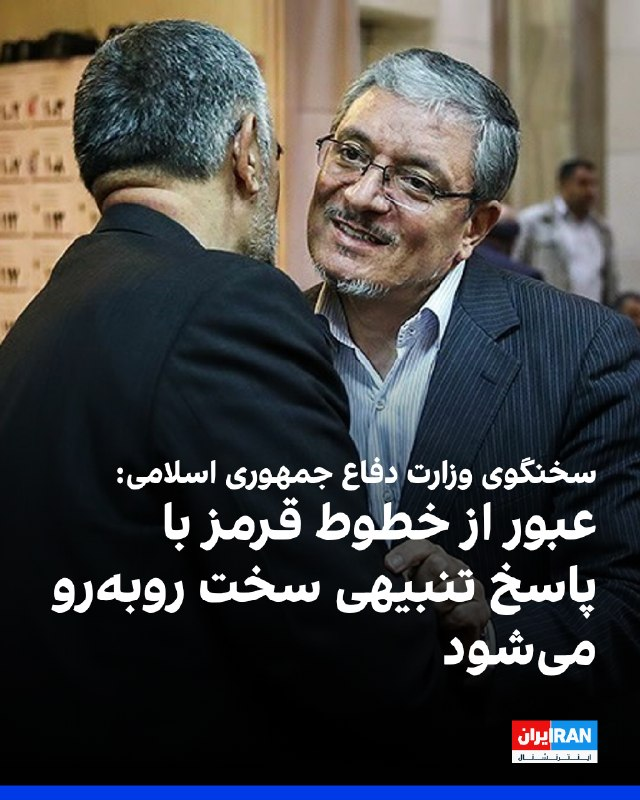

رضا طلایی‌نیک، سخنگوی وزارت دفاع جمهوری اسلامی، گفت هرگونه عبور از خطوط قرمز جمهوری اسلامی با «پاسخ قاطع، پشیمان‌کننده و تنبیهی سخت» مواجه خواهد شد.
او افزود دشمنان جمهوری اسلامی باید بپذیرند راه‌حل مسائل منطقه تداوم «تجاوز و جنگ‌افروزی» نیست و ناگزیرند آتش‌بس و توقف اقدامات «خصمانه» را در همه جبهه‌ها بپذیرند.
طلایی‌نیک با اشاره به دو جنگ اخیر گفت نیروهای مسلح در برابر تهدید و فشار عقب‌نشینی نخواهند کرد و در دفاع از «امنیت ملی، استقلال و تمامیت ارضی» با هیچ طرفی تعارف ندارند.
‌🏁 🇬🇧 IranintlTV

🤖 @VahidOOnLine

## pm_afshaa — post 93608

  <a href="telegram/content/pm_afshaa_93608_1781179998.webm" target="_blank">🎬 Download video</a>

🔴فارس: یک منبع نزدیک به تیم مذاکره‌کننده، ادعای سی‌ان‌ان دربارهٔ مذاکرات جدید جمهوری اسلامی و آمریکا رو تکذیب کرد.

💧 Rainbet.com the #1 Non-KYC Crypto Casino & Sportsbook @rainbetcom

😁 @Pm_Afshaa

## DEJradio — post 5588

⭕️ رسانۀ آمریکایی: دولت ترامپ تحقیق دربارۀ رئیس پیشین نایاک را آغاز کرد

وب‌سایت آمریکایی فری‌پرس، به نقل از منابع آگاه گزارش داد وزارت امور خارجۀ آمریکا بررسی فعالیت‌های تریتا پارسی، بنیان‌گذار و رئیس پیشین نایاک، را سرگرفته است.
بنا بر این گزارش، این بررسی‌ها در مسیر اخراج احتمالی بنیان‌گذار نایاک از خاک آمریکا به پیش می‌رود.
تریتا پارسی که به‌ویژه در دوران ریاست جمهوری حسن روحانی برای ارتباط میان مقامات تهران و واشینگتن و امضای برجام فعال بود، از بناینگذاران مؤسسۀ کوئینسی نیز به‌شمار می‌رود.
بر اساس این گزارش، مؤسسه کوئینسی برای جلوگیری از بازداشت احتمالی یا اخراج تریتا پارسی، اقدامات حقوقی پیش‌گیرانه را آغاز کرده است.
فری‌پرس نوشت برخی مقام‌های دولت ترامپ بر این باورند که پروندۀ افرادی که در راستای منافع جمهوری اسلامی فعالیت می‌کنند، باید تحت بررسی قرار گیرد.
وزارت امور خارجۀ آمریکا از زمان بازگشت ترامپ به قدرت، برنامۀ اخراج وابستگان و هواداران جمهوری اسلامی را از خاک آمریکا در دستور کار قرار داد.
تاکنون چندتن از وابستگان حکومت، از جمله خانوادۀ عیسی هاشمی فرزند معصومۀ ابتکار ودو تن از بستگان قاسم سلیمانی، از خاک آمریکا اخراج شده‌اند.
نایاک، شورای ملی ایرانیان آمریکا، که در سال ۲۰۰۲ توسط تریتا پارسی بنیان گذاشته شد، همواره روابطی نزدیک با اعضای حزب دموکرات ایالات متحده برقرار کرده است.
این نهاد زیر عنوان «مخالفت با جنگ» عموما در پی «سازش دیپلماتیک» میان واشینگتن و تهران بوده است.
تریتا پارسی که از ۲۵ سال پیش در آمریکا زندگی می‌کند، گرین کارت اقامت در این کشور را در اختیار دارد و شهروند آمریکا به‌شمار نمی‌رود.
روزبه پارسی، برادر تریتا پارسی که ساکن سوئد است نیز به لابی‌گری برای جمهوری اسلامی، متهم شده است.

#خبر #دژ #نایاک
@DEJradio

## IranIntlTV — post 341697

  

رضا طلایی‌نیک، سخنگوی وزارت دفاع جمهوری اسلامی، گفت هرگونه عبور از خطوط قرمز جمهوری اسلامی با «پاسخ قاطع، پشیمان‌کننده و تنبیهی سخت» مواجه خواهد شد.
او افزود دشمنان جمهوری اسلامی باید بپذیرند راه‌حل مسائل منطقه تداوم «تجاوز و جنگ‌افروزی» نیست و ناگزیرند آتش‌بس و توقف اقدامات «خصمانه» را در همه جبهه‌ها بپذیرند.
طلایی‌نیک با اشاره به دو جنگ اخیر گفت نیروهای مسلح در برابر تهدید و فشار عقب‌نشینی نخواهند کرد و در دفاع از «امنیت ملی، استقلال و تمامیت ارضی» با هیچ طرفی تعارف ندارند.
https://iranintl.com/202606115067

## IranIntlTV — post 341696

  <a href="telegram/content/IranIntlTV_341696_1781180000.mp4" target="_blank">🎬 Download video</a>

عباس عراقچی در گفت‌وگو با مسئول سیاست خارجی اتحادیه اروپا گفت حملات اخیر آمریکا به جمهوری اسلامی می‌تواند آتش‌بس را تضعیف کرده و ناامنی منطقه‌ای و جهانی را افزایش دهد

گفت‌وگو با لیلی نیک‌فر، خبرنگار ایران‌اینترنشنال
@iranintltv

## Shin_Persian — post 6930

  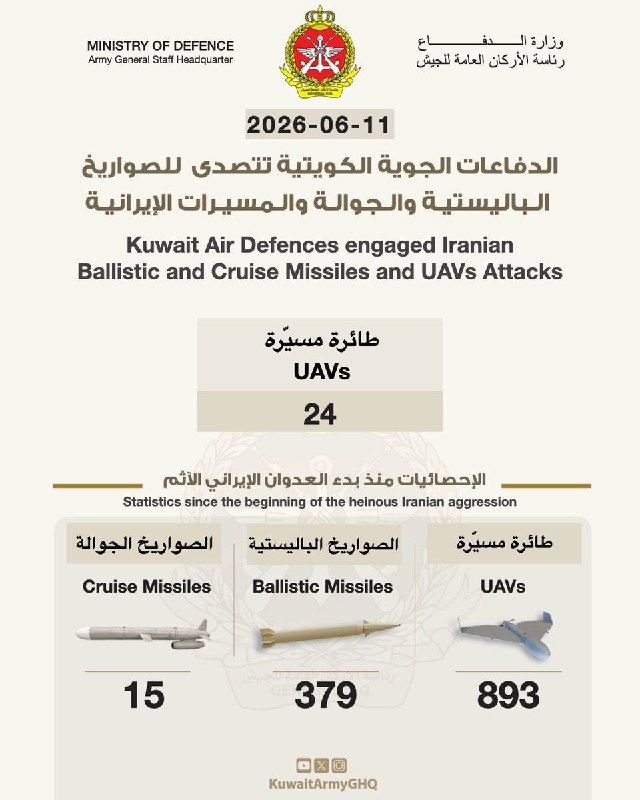

Shin ✓ @hey_itsmyturn
Thu, 11 Jun 2026 12:03:49 UTC

Kuwait Ministry of Defence: Armed forces intercepted 24 hostile Iranian UAVs in Kuwaiti airspace over the last 48 hours.

Air defenses continue to engage ballistic missiles, cruise missiles, and drone attacks.

#Kuwait 🇰🇼

ترجمه خودکار فارسی

وزارت دفاع کویت: نیروهای مسلح در ۴۸ ساعت گذشته ۲۴ پهپاد متخاصم ایرانی را در حریم هوایی کویت رهگیری کردند.

پدافند هوایی به مقابله با حملات موشک‌های بالستیک، موشک‌های کروز و پهپادها ادامه می‌دهد.

#Kuwait 🇰🇼

𝕏 · @shin_persian

## FarsiVOA — post 220376

نگاه کاربران شبکه‌های اجتماعی به احتمال توافق و یا تشدید درگیری‌ها

## Persian_Trend_Official — post 16715

  <a href="telegram/content/Persian_Trend_Official_16715_1781180004.mp4" target="_blank">🎬 Download video</a>

جی دی ونس، معاون رئیس جمهور امریکا: نتانیاهو بدون تردید در برخی موارد اشتباهاتی داشته است، اما در مجموع فکر می‌کنم بهتر است برخی از این اختلاف‌نظرها و گفت‌وگوها به‌صورت خصوصی باقی بمانند.

ما به همکاری با یکدیگر ادامه خواهیم داد، اما هر جا که منافع دو طرف از هم فاصله بگیرد، ایالات متحده در راستای تأمین منافع ملی خود اقدام خواهد کرد.»

📝 Amir

📌 @persian_trend_official
پرشین ترند | متفاوت‌ترین کانال نظامی

## Persian_Trend_Official — post 16714

  <a href="telegram/content/Persian_Trend_Official_16714_1781180006.mp4" target="_blank">🎬 Download video</a>

جی‌ دی ونس، معاون رئیس‌جمهور آمریکا: نتانیاهو رهبری کشوری را بر عهده دارد که بدون تردید یکی از نزدیک‌ترین شرکای ایالات متحده بوده است.

اما حتی میان شرکای نزدیک نیز گاهی منافع کاملاً همسو هستند و گاهی با یکدیگر اختلاف دارند. نتانیاهو با قاطعیت از منافع کشور خود دفاع می‌کند؛ گاهی این موضوع باعث می‌شود در یک مسیر قرار بگیریم و گاهی هم نه.

اسرائیل از جهات زیادی شریک بسیار خوبی برای ما بوده است، اما در نهایت ما باید بر آنچه به نفع آمریکا است تمرکز کنیم. هر جا که منافع دو طرف از یکدیگر فاصله بگیرد، ناچاریم جانب مردم آمریکا را بگیریم؛ کاری که همیشه انجام می‌دهیم.

📝 Amir

📌 @persian_trend_official
پرشین ترند | متفاوت‌ترین کانال نظامی

## Persian_Trend_Official — post 16713

  <a href="telegram/content/Persian_Trend_Official_16713_1781180009.webm" target="_blank">🎬 Download video</a>

ستاد کل ارتش کویت اعلام کرد در 48 ساعت اخیر 24 پهپاد انتحاری را شناسایی و رهگیری کرده و خسارات محدودی به بار آوردند.

📝 Amir

📌 @persian_trend_official
پرشین ترند | متفاوت‌ترین کانال نظامی

## RadioFarda — post 158176

کانادا لایحه ممنوعیت دسترسی کودکان زیر ۱۶ سال به شبکه‌های اجتماعی را ارائه کرد

🔸دولت کانادا لایحه‌ای را به پارلمان این کشور ارائه کرده که بر اساس آن استفادهٔ افراد زیر ۱۶ سال از شبکه‌های اجتماعی ممنوع می‌شود و همزمان مقررات تازه‌ای برای افزایش ایمنی چت‌بات‌های هوش مصنوعی وضع خواهد شد.

🔸بر اساس این لایحه که روز چهارشنبه ۲۰ خرداد ارائه شد، پلتفرم‌هایی که نتوانند استانداردهای تعیین‌شدهٔ ایمنی را رعایت کنند، ممکن است با جریمه‌ای تا سقف ۱۰ میلیون دلار کانادا یا معادل سه درصد درآمد جهانی خود روبه‌رو شوند.

🔸مارک میلر، وزیر هویت و فرهنگ کانادا، گفت شبکه‌های اجتماعی و چت‌بات‌های هوش مصنوعی برای جلب توجه کاربران طراحی شده‌اند و به منبع اضطراب، انزوا، افسردگی و دیگر مشکلات سلامت روان برای بسیاری از جوانان کانادایی تبدیل شده‌اند.

🔸این لایحه همچنین ایجاد یک نهاد ناظر دیجیتال را پیش‌بینی می‌کند که مسئول تدوین و اجرای استانداردهای ایمنی برای چت‌بات‌های هوش مصنوعی خواهد بود.
اقدام کانادا در حالی صورت می‌گیرد که نگرانی دولت‌ها دربارهٔ تأثیر شبکه‌های اجتماعی بر سلامت روان و امنیت کودکان در سال‌های اخیر افزایش یافته است.

🔸استرالیا آذرماه پارسال نخستین کشور جهان بود که دسترسی افراد زیر ۱۶ سال به شبکه‌های اجتماعی را ممنوع و شرکت‌های فناوری را موظف کرد حساب‌های کاربران زیر این سن را مسدود کنند یا با جریمه‌های سنگین روبه‌رو شوند.
قانون استرالیا با مخالفت شرکت‌های بزرگ فناوری و برخی

🔸مدافعان آزادی بیان مواجه شد و برخی منتقدان هم هشدار دادند که چنین محدودیت‌هایی ممکن است به حریم خصوصی کاربران آسیب بزند یا به دولت‌ها ابزار بیشتری برای کنترل دسترسی به اینترنت بدهد.

🔸 گزارش کامل را در وب‌سایت رادیوفردا بخوانید.

@RadioFarda

## IranianMinds — post 22290

🔴آیت‌الله جوادی آملی:

نتانیاهو و ترامپ باید فورأ کشته بشوند😂

@IranianMinds

## BBCPersian — post 283431

🔻عربستان سعودی حملات ایران به بحرین، اردن و کویت را محکوم کرد

عربستان سعودی حملات شب گذشته ایران به بحرین، اردن و کویت را محکوم کرد و خواستار ازسرگیری مذاکرات با میانجی‌گری پاکستان و قطر برای پایان دادن به جنگ در خاورمیانه شد.

وزارت امور خارجه عربستان در بیانیه‌ای بر ضرورت «کاهش تنش و خویشتنداری» تأکید کرد و از همه طرف‌ها خواست با بازگشت به مسیر دیپلماسی، گفت‌وگوهای سازنده‌ای را که با حمایت پاکستان و در کنار تلاش‌های قطر در جریان است، از سر بگیرند.

https://bbc.in/4v5B0d7
@BBCPersian

## Dirty_Kids — post 391695

  <a href="telegram/content/Dirty_Kids_391695_1781180010.mp4" target="_blank">🎬 Download video</a>

همیشه معلم جغرافیامون میگفت خط استوا رو پیدا کنید 😂 بعد از سال ها بالاخره پیداش کردم:

@Dirty_Kids 👻

## Dirty_Kids — post 391694

‏جامعه پاداشش رو به برون‌گراها میده
به کسایی که بلندتر حرف میزنن، سریع‌تر ارتباط میگیرن و همیشه وسط صحنه هستن.

@Dirty_Kids 👻

## Dirty_Kids — post 391693

  <a href="telegram/content/Dirty_Kids_391693_1781180011.mp4" target="_blank">🎬 Download video</a>

​​چشم نیست که لیزره

@Dirty_Kids 👻

<!-- MSG END -->

<!-- NAV START -->

<a href="https://github.com/ProAlit/aio-downloader/blob/main/telegram/content/archive_1.md" style="display:inline-block; padding:6px 12px; margin:0 4px; background-color:#2ea44f; color:white; text-decoration:none; border-radius:4px; font-weight:bold;">صفحه بعد</a>

<!-- NAV END -->
