# خواننده تلگرام

<!-- TOP_NAV START -->

<a href="https://github.com/ProAlit/aio-downloader/blob/main/telegram/content/archive_1.md" style="display:inline-block; padding:6px 12px; margin:0 4px; background-color:#2ea44f; color:white; text-decoration:none; border-radius:4px; font-weight:bold;">صفحه بعد</a>

<!-- TOP_NAV END -->

<!-- MSG START -->

---
📅 بروزرسانی: 1405/03/30 06:54
---

## VahidOOnLine — post 246465

  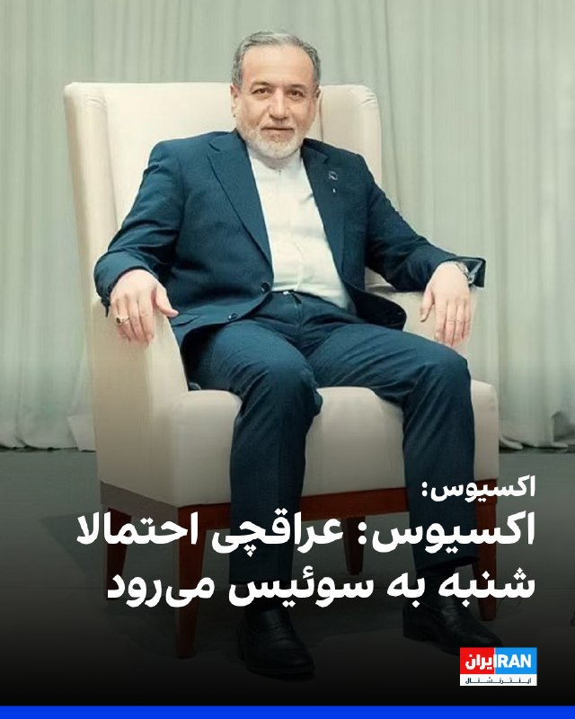

اکسیوس به نقل از یک منبع آگاه از یکی از کشورهای میانجی گزارش داد عراقچی قصد دارد شنبه به سوئیس سفر کند، اما این برنامه همچنان ممکن است تغییر کند. به گفته این منبع، عراقچی جمعه به چند تن از همتایان خود گفت که آتش‌بس در لبنان می‌تواند سرنوشت مذاکرات میان آمریکا و ایران را تعیین کند.
یک منبع دیگر از یکی از کشورهای میانجی نیز گفت که مقام‌های ایرانی تاکید کرده‌اند پیش از سفر به سوئیس، می‌خواهند شاهد اجرایی شدن آتش‌بس باشند.
محمد بن عبدالرحمن آل ثانی، نخست‌وزیر قطر، که یکی از میانجی‌های اصلی میان آمریکا و ایران است، روز جمعه زودتر وارد سوئیس شد.
انتظار می‌رفت جی‌دی ونس، معاون ترامپ، ریاست هیات آمریکایی را بر عهده داشته باشد، اما او شامگاه پنج‌شنبه سفر خود را در آخرین لحظه به تعویق انداخت. هنوز مشخص نیست که آیا او در این آخر هفته به سوئیس سفر خواهد کرد یا نه.

‌🏁 🇬🇧 IranintlTV

🤖 @VahidOOnLine

## IranIntlTV — post 343312

  

اکسیوس به نقل از یک منبع آگاه از یکی از کشورهای میانجی گزارش داد عراقچی قصد دارد شنبه به سوئیس سفر کند، اما این برنامه همچنان ممکن است تغییر کند. به گفته این منبع، عراقچی جمعه به چند تن از همتایان خود گفت که آتش‌بس در لبنان می‌تواند سرنوشت مذاکرات میان آمریکا و ایران را تعیین کند.
یک منبع دیگر از یکی از کشورهای میانجی نیز گفت که مقام‌های ایرانی تاکید کرده‌اند پیش از سفر به سوئیس، می‌خواهند شاهد اجرایی شدن آتش‌بس باشند.
محمد بن عبدالرحمن آل ثانی، نخست‌وزیر قطر، که یکی از میانجی‌های اصلی میان آمریکا و ایران است، روز جمعه زودتر وارد سوئیس شد.
انتظار می‌رفت جی‌دی ونس، معاون ترامپ، ریاست هیات آمریکایی را بر عهده داشته باشد، اما او شامگاه پنج‌شنبه سفر خود را در آخرین لحظه به تعویق انداخت. هنوز مشخص نیست که آیا او در این آخر هفته به سوئیس سفر خواهد کرد یا نه.

https://iranintl.com/202606209883

## FarsiVOA — post 221266

⚡️گزارشی از شادی طرفداران آمریکا پس از بازی با استرالیا در سیاتل
@FarsiVOA

---
📅 بروزرسانی: 1405/03/30 06:44
---

## VahidOOnLine — post 246464

  <a href="telegram/content/VahidOOnLine_246464_1781925258.mp4" target="_blank">🎬 Download video</a>

♦️دان اسکاوینو، دستیار رئیس‌جمهوری ایالات متحده، تصاویری رسمی از نمای داخلی و بیرونی هواپیمای جدید و مجلل «ایر فورس وان» را به اشتراک گذاشت. اسکاوینو در این پیام با درج شماره بدنه ۲۵-۳۳۰۰ و نشان نیروی هوایی آمریکا، دونالد ترامپ را در حال بازدید از فضای داخلی لوکس این «بوئینگ ۷۴۷» ۴۰۰ هزار دلاری اهدایی از سوی دولت قطر، نشستن در کابین مدیریتی و ایستادن بر فراز پله‌های هواپیما نشان می‌دهد. ترامپ با توصیف این هواپیما به عنوان «یک کاخ سفید پرنده با سطحی بی‌سابقه از لوکس بودن»، اعلام کرد که سفر بازگشت او از نشست «گروه ۷» در فرانسه، آخرین استفاده او از ناوگان قدیمی خواهد بود.
‌🇸🇦 Indypersian

🤖 @VahidOOnLine

---
📅 بروزرسانی: 1405/03/30 06:34
---

هیچ پیام جدیدی در این بروزرسانی ارسال نشد.

---
📅 بروزرسانی: 1405/03/30 06:23
---

## FarsiVOA — post 221265

  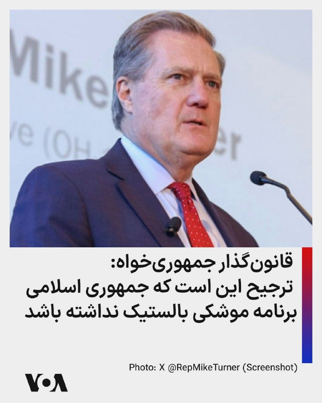

⚡️مایک ترنر، نماینده جمهوری‌خواه مجلس نمایندگان آمریکا، در گفت‌وگویی با سی‌ان‌ان اعلام کرد که جمهوری اسلامی نباید یک تهدید در منطقه باشد. او همچنین گفت ترجیح نمی‌دهد که جمهوری اسلامی برنامه موشکی بالستیک داشته باشد به ویژه آنکه نشان داد موشک‌هایش می‌تواند به پایتخت‌های غربی برسد. آقای ترنر افزود باید دید نتیجه مذاکرات مربوط به توافق نهایی با جمهوری اسلامی چه خواهد بود.
@FarsiVOA

---
📅 بروزرسانی: 1405/03/30 06:14
---

## FarsiVOA — post 221261

⚡️دستیار رئیس جمهوری‌ آمریکا ،دن اسکاوینو، روز جمعه تصاویری از داخل هواپیمای جدید «ایرفورس وان» را منتشر کرد. دونالد ترامپ، در این روز از این هواپیما رونمایی کرد.
@FarsiVOA

---
📅 بروزرسانی: 1405/03/30 06:04
---

## BBCPersian — post 284440

🔻برلین که در دوران جنگ سرد در مرکز جنگ‌های اطلاعاتی قرار داشت، همچنان این جایگاه را حفظ کرده است.

گزارشی که سازمان‌های اطلاعاتی آلمان به‌تازگی منتشر کرده‌اند، اطلاعات قابل توجهی درباره فعالیت سرویس‌های اطلاعاتی خارجی در برلین امروز ارائه می‌دهد.

در این گزارش ۱۴۰ صفحه‌ای، روسیه، ایران، چین و ترکیه به‌عنوان چهار کشوری معرفی شده‌اند که فعال‌ترین سرویس‌های اطلاعاتی خارجی را در پایتخت آلمان در اختیار دارند.

ایریس اشپرانگر، سناتور امور داخلی و ورزش برلین، اعلام کرد که پایتخت آلمان در کانون توجه سرویس‌های اطلاعاتی خارجی قرار دارد.

اداره فدرال حفاظت از قانون اساسی در گزارش سالانه خود جزئیات قابل توجهی درباره فعالیت‌های ضد جاسوسی منتشر کرده است.

متن کامل خبر در لینک زیر:

https://bbc.in/3SCZEmV
📸GettyImages/ Federal Office for the Protection of the Constitution (BfV)/ Anadolu via Getty Images/ Berlin Office for the Protection of the Constitution/AFP via Getty Images

@BBCPersian

---
📅 بروزرسانی: 1405/03/30 05:54
---

## VahidOOnLine — post 246463

  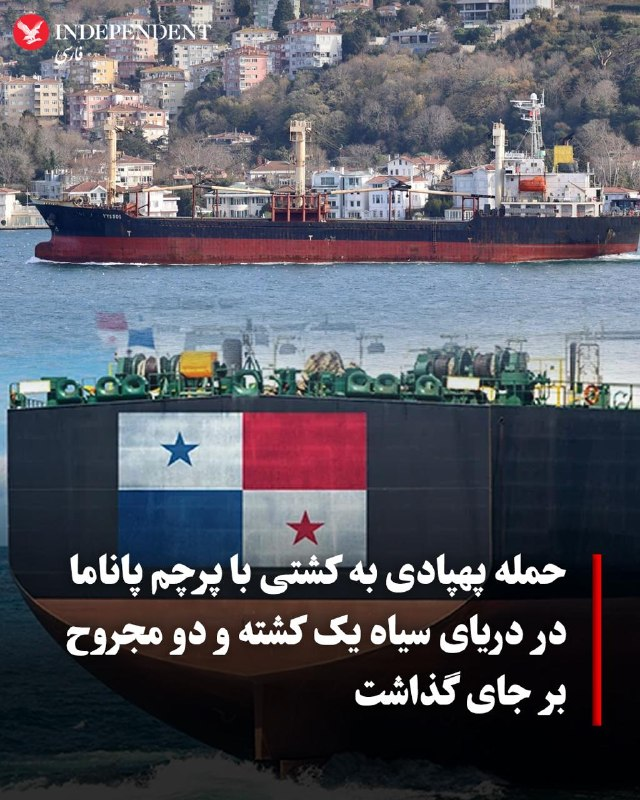

♦️به گزارش رویترز، مقامات دریایی پاناما (AMP) اعلام کردند که در پی حمله پهپادی به یک کشتی تحت پرچم این کشور در دریای سیاه، یک عضو خدمه کشته و دو تن دیگر مجروح شده‌اند. این نهاد با اشاره به اینکه حادثه مذکور در روز پنجشنبه رخ داده، وضعیت یکی از ملوانان زخمی را وخیم گزارش کرده است. با این حال، کشتی آسیب‌دیده توانسته به مسیر خود در دریای سیاه ادامه دهد. مقامات پانامایی تاکید کرده‌اند که ارتباط خود را با طرف‌های درگیر حفظ کرده و سازوکارهای لازم را برای جمع‌آوری اطلاعات رسمی درباره این حمله فعال کرده‌اند.
‌🇸🇦 Indypersian

🤖 @VahidOOnLine

## BBCPersian — post 284439

🔻ترامپ در آستانه مذاکرات احتمالی با ایران به کمپ دیوید می‌رود

🔻دونالد ترامپ، رئیس‌جمهوری آمریکا، در سفری کم‌سابقه، امروز و فردا را در کمپ دیوید سپری خواهد کرد.

این تنها دومین بار از زمان بازگشت او به کاخ سفید در سال گذشته است که به این اقامتگاه ریاست‌جمهوری می‌رود.

یک مقام کاخ سفید گفت آقای ترامپ در جریان این سفر نشست‌هایی سیاسی و سیاست‌گذاری برگزار خواهد کرد. اعضای خانواده او نیز در تعطیلات پایان هفته همراهش خواهند بود که روز پدر در آمریکا را نیز در بر می‌گیرد.

به گزارش رویترز این سفر در حالی انجام می‌شود که دونالد ترامپ در تلاش است توافقی نهایی برای پایان دادن به جنگ با ایران به دست آورد و همزمان با انتقادهایی روبه‌رو است که می‌گویند که توافق موقت صلح، امتیازهای بیش از حدی به تهران داده است.

گفت‌وگوهای برنامه‌ریزی‌شده آمریکا و ایران در سوئیس که قرار بود روز جمعه برگزار شود، به دلیل تشدید درگیری‌ها در لبنان لغو شد. این موضوع ابهام تازه‌ای درباره زمان مذاکراتی ایجاد کرده است که برای بازگشایی تنگه هرمز به روی کشتیرانی جهانی و بازگرداندن ثبات به خاورمیانه حیاتی تلقی می‌شود.

ترامپ روز جمعه بار دیگر از توافق با ایران دفاع کرد و گفت که تهران از موضع ضعف پای میز مذاکره آمده است.

او در شبکه اجتماعی تروث سوشال نوشت: «ما از سر استیصال مذاکره نکردیم، ایران این کار را کرد. آن‌ها تمام شده‌اند!»

«این ۶۰ روز را طی خواهیم کرد. آن‌ها هیچ پولی دریافت نمی‌کنند؛ حتی یک سنت!»

دونالد ترامپ آخرین بار در ژوئن ۲۰۲۵ به کمپ دیوید رفت و در آنجا با فرماندهان ارشد نظامی و مشاوران سیاست خارجی درباره اعتراضات مرتبط با مهاجرت در کالیفرنیا، ایران و جنگ غزه دیدار کرد.

این اقامتگاه دورافتاده در کوه‌های کاتوکتین در ایالت مریلند، برخلاف دوران بسیاری از رؤسای‌جمهوری پیشین، مقصد همیشگی ترامپ نبوده است. او معمولا ترجیح داده تعطیلات آخر هفته را در املاک شخصی خود، از جمله مارالاگو در فلوریدا و باشگاه گلفش در بدمینستر نیوجرسی بگذراند.

https://bbc.in/4gwrqvg
@BBCPersian

---
📅 بروزرسانی: 1405/03/30 05:44
---

هیچ پیام جدیدی در این بروزرسانی ارسال نشد.

---
📅 بروزرسانی: 1405/03/30 05:34
---

هیچ پیام جدیدی در این بروزرسانی ارسال نشد.

---
📅 بروزرسانی: 1405/03/30 05:24
---

هیچ پیام جدیدی در این بروزرسانی ارسال نشد.

---
📅 بروزرسانی: 1405/03/30 05:14
---

## VahidOOnLine — post 246462

  

مولوی عبدالحمید، امام جمعه اهل سنت زاهدان، در مراسم نماز جمعه ۲۹ خرداد، از «افزایش اعدام» در ایران ابراز تأسف و نگرانی کرد و خواستار توقف اعدام در ایران شد.
عبدالحمید بر لزوم «تغییر در سیاست‌های خارجی و داخلی» تاکید کرد و افزود: «ملت ایران اعم از اقوام و مذاهب و ادیان مختلف، ملت متکثری است و انتظار است تمام این اقوام و مذاهب و ادیان در شرایط جدید کشور دیده شوند.»
او همچنین گفت: «اگر مسئولان بتوانند عدالت و انصاف را بین اقوام و مذاهب اجرا کنند و حقوق زنان مراعات شود و آزادی‌های لازم برای فعالان و احزاب و تشکل‌ها تأمین شوند و سختگیری‌هایی که در سال‌های گذشته وجود داشتند برداشته شوند، آن‌زمان ایران می‌تواند یک ایران خوب و آباد باشد.»

‌🏁 🇬🇧 IranintlTV

🤖 @VahidOOnLine

## VahidOOnLine — post 246461

  

جک کین، جانشین اسبق فرمانده نیروی زمینی ارتش آمریکا، به شبکه خبری فاکس گفت که با وجود مذاکرات جاری با هدف اجرای یادداشت تفاهم، همچنان نسبت به این موضوع که جمهوری اسلامی سرانجام با ایالات متحده به یک توافق پایدار برسد، تردید دارد.

او افزود: «احساس درونی‌ام این است که احتمالاً به توافقی دست پیدا نخواهیم کرد.»

کین اضافه کرد: «همه ما دوست داریم توافقی را ببینیم که تمام اهداف حداکثری رییس‌جمهور را برآورده کند.»

او استدلال کرد که جمهوری اسلامی معتقد است از طریق توانایی در ایجاد اختلال در حرکت کشتیرانی تنگه هرمز، اهرم فشار خود را حفظ می‌کند، و هشدار داد که تهران می‌تواند برای به تاخیر انداختن یا از مسیر خارج کردن مذاکرات تلاش کند.

کین گفت: «هر اتفاق که اینجا بیفتد و مطابق میل آنها پیش نرود، می‌گویند تنگه بسته شده است.»
‌🏁 🇬🇧 IranintlTV

🤖 @VahidOOnLine

## VahidOOnLine — post 246460

  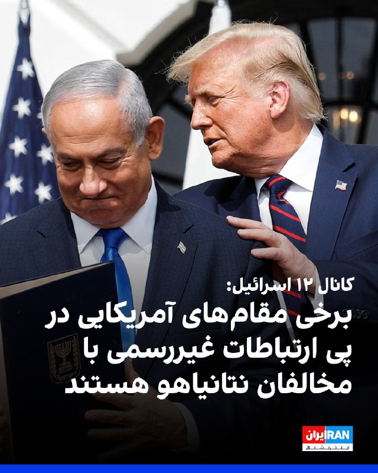

کانال ۱۲ اسرائیل گزارش داد که برخی از مقامات دولت دونالد ترامپ درصدد «ایجاد کانال‌های غیررسمی ارتباطی» با مخالفان نخست‌وزیر این کشور هستند.

این رسانه اسرائیلی در این مورد به «مدعیان اصلی جایگزینی» بنیامین نتانیاهو در انتخابات پیش رو، یعنی نفتالی بنت، نخست‌وزیر سابق، و گادی آیزنکوت، فرمانده سابق ارتش، اشاره کرد.

در این گزارش به «نگرانی فزاینده» در مورد اعضای راست افراطی دولت نتانیاهو، ناامیدی از ناتوانی در پیشبرد دستور کارهای مختلف دیپلماتیک با دولت فعلی که به دلیل رفتارش در جنگ غزه در سطح بین‌المللی موردانتقاد قرار گرفته است، و اذعان به اینکه نتانیاهو به راحتی می‌تواند در انتخابات پیش رو که قرار است حداکثر در ماه اکتبر برگزار شود، شکست بخورد، اشاره شده است.
‌🏁 🇬🇧 IranintlTV

🤖 @VahidOOnLine

## FoxNewsTwitter — post 343187

  <a href="telegram/content/FoxNewsTwitter_343187_1781919889.mp4" target="_blank">🎬 Download video</a>

Fox News (Twitter/X)

BREAKING: Newly released surveillance footage shows convicted murderer Karmelo Anthony fleeing the stadium after fatally stabbing Austin Metcalf at a track meet.

The video reveals the immediate aftermath of the April 2 attack that shocked North Texas and drew national attention.

Anthony was later convicted of murder and sentenced to 35 years behind bars after jurors rejected his self-defense argument.

## IranIntlTV — post 343311

  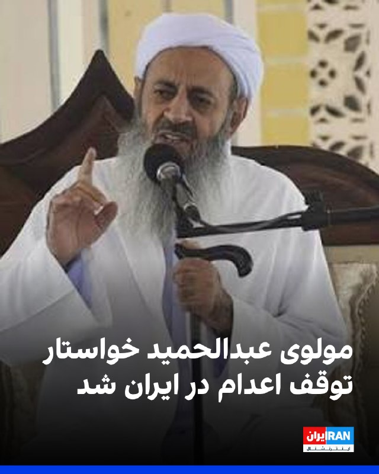

مولوی عبدالحمید، امام جمعه اهل سنت زاهدان، در مراسم نماز جمعه ۲۹ خرداد، از «افزایش اعدام» در ایران ابراز تأسف و نگرانی کرد و خواستار توقف اعدام در ایران شد.
عبدالحمید بر لزوم «تغییر در سیاست‌های خارجی و داخلی» تاکید کرد و افزود: «ملت ایران اعم از اقوام و مذاهب و ادیان مختلف، ملت متکثری است و انتظار است تمام این اقوام و مذاهب و ادیان در شرایط جدید کشور دیده شوند.»
او همچنین گفت: «اگر مسئولان بتوانند عدالت و انصاف را بین اقوام و مذاهب اجرا کنند و حقوق زنان مراعات شود و آزادی‌های لازم برای فعالان و احزاب و تشکل‌ها تأمین شوند و سختگیری‌هایی که در سال‌های گذشته وجود داشتند برداشته شوند، آن‌زمان ایران می‌تواند یک ایران خوب و آباد باشد.»

https://iranintl.com/202606196289

## IranIntlTV — post 343310

  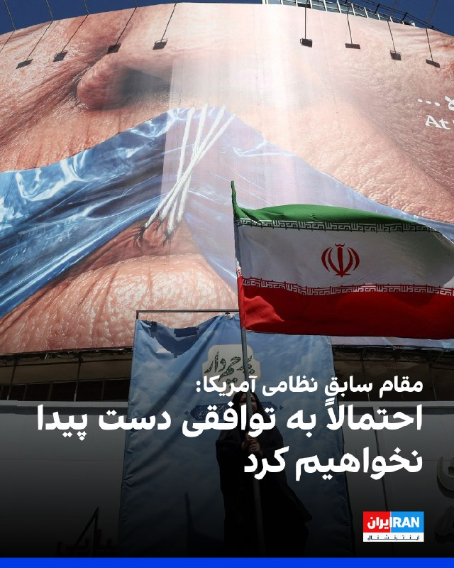

جک کین، جانشین اسبق فرمانده نیروی زمینی ارتش آمریکا، به شبکه خبری فاکس گفت که با وجود مذاکرات جاری با هدف اجرای یادداشت تفاهم، همچنان نسبت به این موضوع که جمهوری اسلامی سرانجام با ایالات متحده به یک توافق پایدار برسد، تردید دارد.

او افزود: «احساس درونی‌ام این است که احتمالاً به توافقی دست پیدا نخواهیم کرد.»

کین اضافه کرد: «همه ما دوست داریم توافقی را ببینیم که تمام اهداف حداکثری رییس‌جمهور را برآورده کند.»

او استدلال کرد که جمهوری اسلامی معتقد است از طریق توانایی در ایجاد اختلال در حرکت کشتیرانی تنگه هرمز، اهرم فشار خود را حفظ می‌کند، و هشدار داد که تهران می‌تواند برای به تاخیر انداختن یا از مسیر خارج کردن مذاکرات تلاش کند.

کین گفت: «هر اتفاق که اینجا بیفتد و مطابق میل آنها پیش نرود، می‌گویند تنگه بسته شده است.»
https://iranintl.com/202606200598

## IranIntlTV — post 343309

  

کانال ۱۲ اسرائیل گزارش داد که برخی از مقامات دولت دونالد ترامپ درصدد «ایجاد کانال‌های غیررسمی ارتباطی» با مخالفان نخست‌وزیر این کشور هستند.

این رسانه اسرائیلی در این مورد به «مدعیان اصلی جایگزینی» بنیامین نتانیاهو در انتخابات پیش رو، یعنی نفتالی بنت، نخست‌وزیر سابق، و گادی آیزنکوت، فرمانده سابق ارتش، اشاره کرد.

در این گزارش به «نگرانی فزاینده» در مورد اعضای راست افراطی دولت نتانیاهو، ناامیدی از ناتوانی در پیشبرد دستور کارهای مختلف دیپلماتیک با دولت فعلی که به دلیل رفتارش در جنگ غزه در سطح بین‌المللی موردانتقاد قرار گرفته است، و اذعان به اینکه نتانیاهو به راحتی می‌تواند در انتخابات پیش رو که قرار است حداکثر در ماه اکتبر برگزار شود، شکست بخورد، اشاره شده است.
https://iranintl.com/202606202405

## FarsiVOA — post 221260

  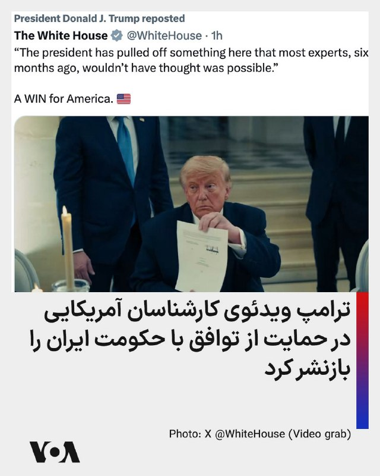

⚡️دونالد ترامپ، ویدیویی از سخنان کارشناسان تلویزیونی آمریکایی در حمایت از تفاهم‌نامه اخیر با جمهوری اسلامی را در شبکه اجتماعی ایکس بازنشر کرد. در این ویدیو که کاخ سفید ابتدا منتشر کرد گفته می‌شود که اگر توافق خوب پیش نرود بار دیگر آمریکا می‌تواند محاصره دریایی را آغاز کند.
@FarsiVOA

## BBCPersian — post 284438

🖋️لبو دایسکو
بی‌بی‌سی

🔸دالیا واکر اعتقاد دارد که پیروزی کشورش در آخرین جام جهانی فوتبال، دلیلی ماوراءالطبیعی داشت.

این شهروند ۴۱ ساله اهل بوئنوس آیرس می‌گوید: «من فکر می‌کنم جادو به قهرمانی آرژانتین کمک کرد.»

دالیا یکی از اعضای ارتش زنان ساحره خودخوانده‌ای بود که به نفع لیونل مسی و دیگر بازیکنان تیم ملی آرژانتین، جادو می‌کردند و آیین‌های خاصی را به جا می‌آوردند.

این زنان خود را «لا بروخینتا» می‌نامیدند؛ واژه‌ای ترکیبی از «بروخا» به معنای ساحره و «لا اسکالونتا» که لقب تیم ملی آرژانتین با هدایت لیونل اسکالونی، سرمربی فعلی این تیم، است.

دالیا می‌گوید لا بروخینتا برای اجرای این آیین‌ها از جادوی عصر جدید، شمع، دعا و تعویذ استفاده می‌کرد.

آن‌ها از طریق گروه‌های واتس‌اپ و شبکه‌های اجتماعی با یکدیگر ارتباط داشتند و بررسی می‌کردند که کدام بخش از عملکرد تیم‌شان به توجه بیشتری نیاز دارد.

برخی از محبوب‌ترین آیین‌ها با هدف «طلسم کردن» و از کار انداختن توانایی‌های بازیکنان خاصی از تیم حریف طراحی شده بودند؛ کاری که دالیا می‌گوید با آن موافق نبوده است.

او به‌ جای این کار مناسکی را ترجیح می‌داد که به نظرش مثبت‌تر بودند، مانند: روشن کردن شمع و فرستادن «انرژی مثبت.»

متن کامل خبر در لینک زیر:

https://bbc.in/4vo55Vu

@BBCPersian

---
📅 بروزرسانی: 1405/03/30 05:04
---

## BBCPersian — post 284437

  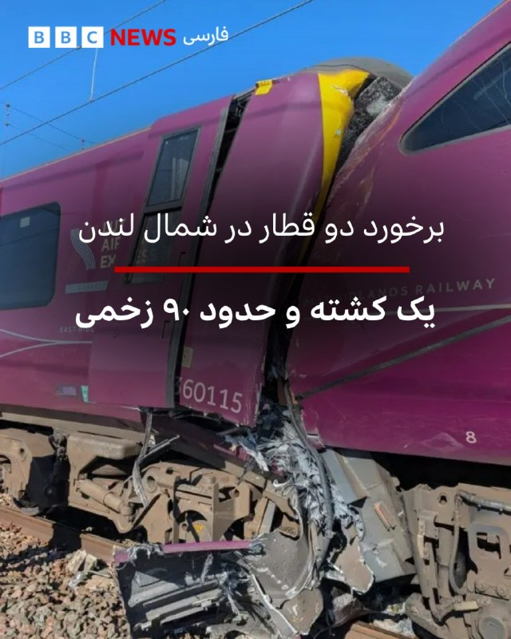

‌🔻پلیس بریتانیا می‌گوید که در پی برخورد دو قطار مسافربری در شمال لندن دست‌کم یک نفر جان باخته و نزدیک به ۹۰ نفر زخمی شده‌اند.

به گفته مقام‌ها، ۱۱ نفر از مجروحان جراحات بسیار شدید برداشته‌اند.

آتش‌نشانان، پلیس و نیروهای امدادی در محل حادثه در بدفورد حضور دارند و خدمات اضطراری این سانحه را «حادثه‌ای بزرگ» توصیف کرده‌اند.

یکی از مسافران به بی‌بی‌سی گفت برخورد قطارها بدون هیچ هشداری اتفاق افتاد و «مانند انفجار یک بمب» بود.

کی‌یر استارمر، نخست‌وزیر بریتانیا، در بیانیه‌ای از نیروهای امدادی و خدمات اضطراری قدردانی کرد و گفت که به خانواده فرد جان‌باخته و مجروحان این حادثه می‌اندیشد.

یک اتحادیه کارکنان بخش حمل‌ونقل نیز اعلام کرده است که از وقوع این سانحه «عمیقاً نگران» است.

📷Alex Knight
https://bbc.in/4uT3YvP

@BBCPersian

---
📅 بروزرسانی: 1405/03/30 04:54
---

## VahidOOnLine — post 246459

  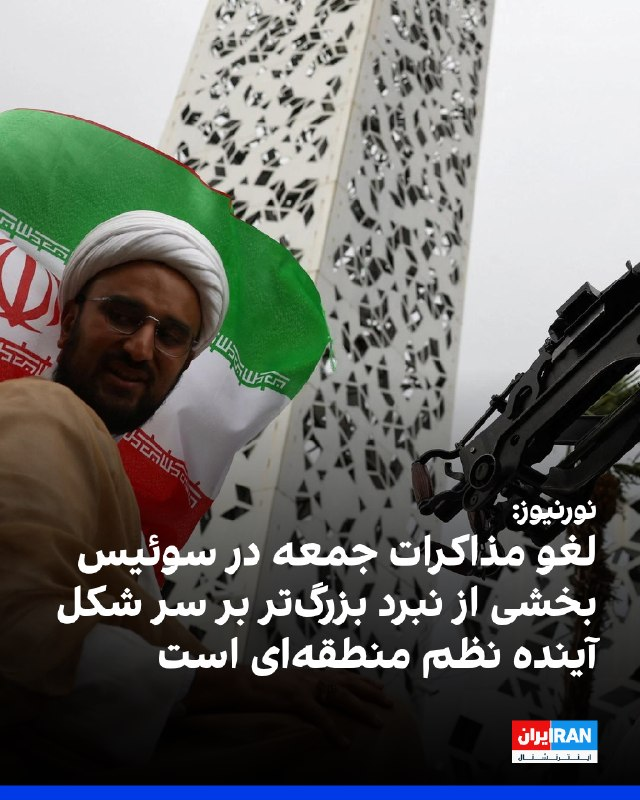

نورنیوز، رسانه نزدیک به شورای عالی امنیت ملی جمهوری اسلامی، در تحلیلی در مورد لغو مذاکرات جمعه تهران و واشینگتن در سوئیس، نوشت که بیش از آن‌که این موضوع را «یک شکست دیپلماتیک بدانیم، باید بخشی از نبردی بزرگ‌تر بر سر شکل آینده نظم منطقه‌ای تلقی کنیم.»

این سایت اشاره کرد تاریخ مذاکرات بزرگ بین‌المللی نشان می‌دهد که دشوارترین مرحله، مرحله پس از دستیابی به توافقات اولیه است؛ جایی که طرف‌ها باید تعهدات کلی را به سازوکارهای اجرایی، زمان‌بندی‌های مشخص و تضمین‌های قابل سنجش تبدیل کنند.

در این تحلیل آمده است: «در چنین وضعیتی، هر اختلاف برداشت یا هر تحول میدانی می‌تواند روند مذاکرات را با وقفه مواجه کند.»

نور‌نیوز با اشاره به حملات اخیر اسرائیل به لبنان پیش از آغاز مذاکرات اجرایی در سوئیس افزود: «بخشی از ساختار سیاسی و امنیتی اسرائیل از هرگونه کاهش تنش میان ایران و آمریکا نگران است.»

‌🏁 🇬🇧 IranintlTV

🤖 @VahidOOnLine

## VahidOnline — post 76535

یک مقام آمریکایی به اکسیوس گفت: استیو ویتکاف، فرستاده کاخ سفید، در حال سفر به سوئیس است، جایی که انتظار می‌رود دور اول مذاکرات با ایران در مورد توافق هسته‌ای احتمالی برگزار شود.
به نوشته اکسیوس، قرار بود مذاکرات جمعه ۲۹ خرداد آغاز شود، اما به دلیل درگیری بین اسرائیل و حزب‌الله در لبنان به تعویق افتاد.
@VahidOOnLine
خبرنگار اکسیوس به نقل از یک منبع آگاه، روز شنبه اعلام کرد: «عباس عراقچی، وزیر امور خارجه جمهوری اسلامی ایران، در حال برنامه‌ریزی برای سفر به سوئیس در روز شنبه است.هرچند این برنامه همچون گذشته ممکن است تغییر کند.»
این خبرنگار به نقل از منبعی در یکی از کشورهای میانجی فاش کرد که عراقچی روز جمعه به چند تن از همتایان خود گفته است: «موضوع آتش‌بس در لبنان برای ایران یک مسئله حیاتی است و حکم برد یا باخت (تعیین‌کننده سرنوشت) را برای مذاکرات ایران و آمریکا دارد.»
خبرنگار اکسیوس همچنین به نقل از یک منبع دوم از میان کشورهای واسط افزود: «ایرانی‌ها صراحتا تأکید کرده‌اند که می‌خواهند پیش از سفر به سوئیس، شاهد برقراری و تثبیت کامل آتش‌بس باشند.»
@VahidOOnLine

📡 @VahidOnline

## IranIntlTV — post 343308

  

نورنیوز، رسانه نزدیک به شورای عالی امنیت ملی جمهوری اسلامی، در تحلیلی در مورد لغو مذاکرات جمعه تهران و واشینگتن در سوئیس، نوشت که بیش از آن‌که این موضوع را «یک شکست دیپلماتیک بدانیم، باید بخشی از نبردی بزرگ‌تر بر سر شکل آینده نظم منطقه‌ای تلقی کنیم.»

این سایت اشاره کرد تاریخ مذاکرات بزرگ بین‌المللی نشان می‌دهد که دشوارترین مرحله، مرحله پس از دستیابی به توافقات اولیه است؛ جایی که طرف‌ها باید تعهدات کلی را به سازوکارهای اجرایی، زمان‌بندی‌های مشخص و تضمین‌های قابل سنجش تبدیل کنند.

در این تحلیل آمده است: «در چنین وضعیتی، هر اختلاف برداشت یا هر تحول میدانی می‌تواند روند مذاکرات را با وقفه مواجه کند.»

نور‌نیوز با اشاره به حملات اخیر اسرائیل به لبنان پیش از آغاز مذاکرات اجرایی در سوئیس افزود: «بخشی از ساختار سیاسی و امنیتی اسرائیل از هرگونه کاهش تنش میان ایران و آمریکا نگران است.»

https://iranintl.com/202606201022

## BBCPersian — post 284436

⚽ مراکش با گل دقایق نخست صیبری از سد اسکاتلند گذشت

🔸مراکش با پیروزی یک بر صفر مقابل اسکاتلند در جام جهانی فوتبال مردان، به صدر گروه C صعود کرد.

تک گل این مسابقه را اسماعیل صیبری، هافبک تهاجمی مراکش، در دقایق ابتدایی بازی به ثمر رساند.

پیش‌تر آمریکا نیز با پیروزی دو بر صفر برابر استرالیا در گروه D، صعود خود به مرحله حذفی را یک بازی زودتر قطعی کرده بود. گل نخست آمریکا در دقیقه ۱۱ روی گل به خودی استرالیا وارد دروازه شد و الکساندر فریمن، مدافع میانی این تیم، در دقیقه ۴۳ گل دوم را زد.

در دیگر مسابقات، برزیل در حال رویارویی با هائیتی است و ترکیه نیز ساعاتی دیگر به مصاف پاراگوئه خواهد رفت.

https://bbc.in/4elDUEL
@BBCPersian

---
📅 بروزرسانی: 1405/03/30 04:44
---

## VahidOOnLine — post 246458

  <a href="telegram/content/VahidOOnLine_246458_1781918082.mp4" target="_blank">🎬 Download video</a>

♦️هم‌زمان با حضور و درخشش تیم ملی فوتبال نروژ در جام جهانی ۲۰۲۶، نمایندگان پارلمان این کشور به رهبری مسعود قره‌خانی، رئیس ایرانی‌تبار پارلمان نروژ، با اجرای حرکت نمادین «پاروزنی وایکینگ‌ها» در صحن مجلس، حمایت خود را از ملی‌پوشان فوتبال کشورشان نشان دادند.
این شیوه تشویق در هفته‌های اخیر به یکی از نمادهای هواداران تیم ملی نروژ تبدیل شده است. هواداران با الگوبرداری از فرهنگ وایکینگ‌ها، حرکات هماهنگی را برای حمایت از تیم خود اجرا می‌کنند؛ روشی که در جریان رقابت‌های جام جهانی توجه زیادی را به خود جلب کرده است.
بازیکنان تیم ملی نروژ نیز پیش‌تر با الهام از همین نمادها، برای عکس رسمی جام جهانی با لباس‌های وایکینگی، شمشیر و سپر سنتی ظاهر شده بودند.
‌🇸🇦 Indypersian

🤖 @VahidOOnLine

---
📅 بروزرسانی: 1405/03/30 04:34
---

## WithYashar — post 15378

میخوای بفهمی قیمت طلا بالا میره یا نه؟ میخوای ارزش دلارهایی که خریدیو هر لحظه چک کنی؟ سودتو هی بفهمی فقط کافیه به تحلیل‌های این کانال گوش بدی✨ @link_Nostradamus @link_Nostradamus

---
📅 بروزرسانی: 1405/03/30 04:24
---

## WithYashar — post 15377

میخوای بفهمی قیمت طلا بالا میره یا نه؟
میخوای ارزش دلارهایی که خریدیو هر لحظه چک کنی؟
سودتو هی بفهمی
فقط کافیه به تحلیل‌های این کانال گوش بدی✨
@link_Nostradamus
@link_Nostradamus

---
📅 بروزرسانی: 1405/03/30 04:15
---

## VahidOOnLine — post 246457

  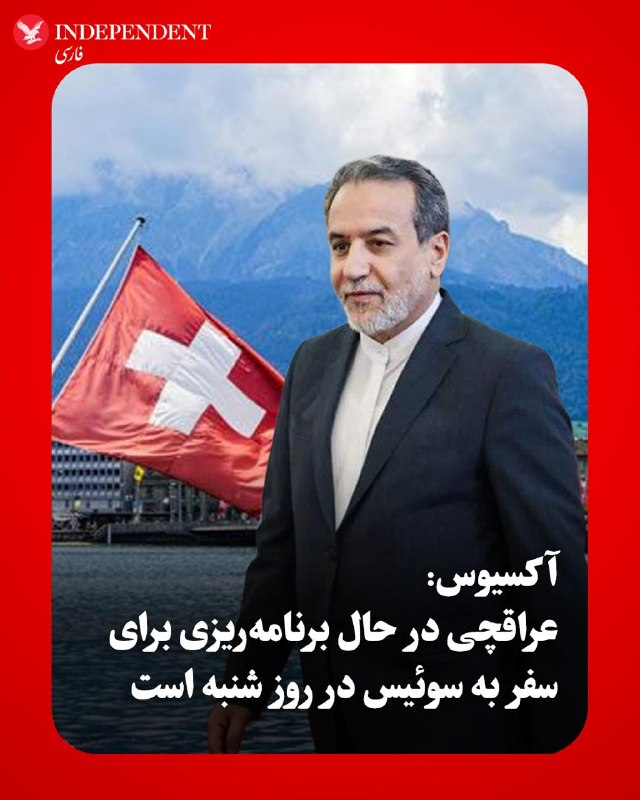

♦️خبرنگار اکسیوس به نقل از یک منبع آگاه، روز شنبه اعلام کرد: «عباس عراقچی، وزیر امور خارجه جمهوری اسلامی ایران، در حال برنامه‌ریزی برای سفر به سوئیس در روز شنبه است. هرچند این برنامه همچون گذشته ممکن است تغییر کند.» این خبرنگار به نقل از منبعی در یکی از کشورهای میانجی فاش کرد که عراقچی روز جمعه به چند تن از همتایان خود گفته است: «موضوع آتش‌بس در لبنان برای ایران یک مسئله حیاتی است و حکم برد یا باخت (تعیین‌کننده سرنوشت) را برای مذاکرات ایران و آمریکا دارد.» خبرنگار اکسیوس همچنین به نقل از یک منبع دوم از میان کشورهای واسط افزود: «ایرانی‌ها صراحتا تأکید کرده‌اند که می‌خواهند پیش از سفر به سوئیس، شاهد برقراری و تثبیت کامل آتش‌بس باشند.»
‌🇸🇦 Indypersian

🤖 @VahidOOnLine

## FoxNewsTwitter — post 343186

  <a href="telegram/content/FoxNewsTwitter_343186_1781916312.mp4" target="_blank">🎬 Download video</a>

Fox News (Twitter/X)

"My friend is bleeding everywhere."

Newly released 911 audio captures the frantic moments after Austin Metcalf was fatally stabbed during a high school track meet in Frisco, Texas.

The recordings reveal the chaos that unfolded as bystanders and first responders rushed to help the 17-year-old following the attack.

The release comes days after Karmelo Anthony was convicted in Metcalf's murder and sentenced to 35 years in prison.

## IranianMinds — post 22985

🔴 تصویری از پرتاب بمب های فسفری بر روی مواضع حزب الله توسط ارتش اسرائیل

به دلیل این حملات، مذاکرات روز جمعه ایران و آمریکا در سوئیس فعلا متوقف شده است.

@IranianMinds

## IranianMinds — post 22984

  <a href="telegram/content/IranianMinds_22984_1781916314.webm" target="_blank">🎬 Download video</a>

📣آیسان اسلامی به تلگرام پیوست😍

⭐اگر توم از طرفدارا ایسان اسلامی هستی بیا توی کانال تلگرامش فعالیتش شرو کرده کنارش باش
🙂

ادرس عضویت کانالش
👇e29
👇
https://t.me/+QMjHLL65ocsxYzRk
https://t.me/+QMjHLL65ocsxYzRk

---
📅 بروزرسانی: 1405/03/30 04:05
---

## WithYashar — post 15376

ترامپ برای یک سفر نادر به کمپ دیوید در آخر هفته برنامه‌ریزی کرده و هم‌اکنون در حال اقامت/حرکت به آنجاست. این سفر هم‌زمان با افزایش تنش‌ها در خاورمیانه و پرونده ایران انجام شده و شامل جلسات سیاسی در همان محل است.
گزارش شده که او از پایگاه «جُینت بیس اندروز» بعد از رو نمایی از ایر فرس وان جدید به کمپ دیوید حرکت کرده است.
@withyashar
آخرین باری که رئیس‌جمهور ترامپ برای یک دوره طولانی به «کمپ دیوید» رفت، همان زمانی بود که عملیات «چکش نیمه‌شب» را دریافت کردیم؛ یعنی بمباران سایت‌های هسته‌ای ایران، حدود یک سال پیش در همین آخر هفته.

و حالا بخشی دیگر از نخستین گفت‌وگوی تصویری ترامپ پس از امضای آن «یادداشت تفاهم» در پاریس و در کاخ ورسای، با آکسیوس. در این مصاحبه از رئیس‌جمهور ترامپ پرسیده شد: آیا برای قدرت ایالات متحده محدودیتی وجود دارد؟ و چه درس‌هایی از این جنگ ۴ ماهه گرفته شده است (یادتان باشد کاخ سفید گفته بود این جنگ فقط ۴ تا ۶ هفته طول می‌کشد؟)
@withyashar
ترامپ گفت: «من هنوز این درس را نگرفته‌ام. می‌دانم محدودیت‌هایی وجود دارد، اما در عمل می‌گویم محدودیتی نیست. ما آن‌ها را کاملاً از نظر نظامی شکست دادیم.» او همچنین گفت این «یادداشت تفاهم» شبیه تسلیم بی‌قید و شرط نیست، هرچند احتمالاً در واقع همان تسلیم بی‌قید و شرط است.

مصاحبه کامل بعداً در برنامه آکسیوس منتشر خواهد شد.

حالا دیشب، حزب‌الله حمله‌ای به شمال اسرائیل انجام داد که در نتیجه آن چهار سرباز اسرائیلی کشته شدند و این اقدام نقض آتش‌بس محسوب شد. سپس اسرائیل نیز حملات تلافی‌جویانه‌ای در لبنان انجام داد.
@withyashar
یادآوری می‌شود که آتش‌بس در لبنان بخشی از همان یادداشت تفاهمی بود که ترامپ امضا کرده بود. معاون رئیس‌جمهور، جی‌دی ونس، دیروز در کاخ سفید به خبرنگاران گفت که حفظ این آتش‌بس چالش‌برانگیز خواهد بود:

«ما انتظار داریم حزب‌الله به سمت اسرائیل موشک و پهپاد شلیک نکند، و همچنین انتظار داریم اسرائیل هم در لبنان کنترل‌شده عمل کند. هر دو طرف باید به تعهدات خود پایبند باشند.»

او اضافه کرد که چنین آتش‌بس‌هایی گاهی کمی آشفته هستند.

همچنین قرار بود معاون رئیس‌جمهور، جی‌دی ونس، با پروازی به سوئیس برود تا یک دوره ۶۰ روزه مذاکرات با ایران درباره برنامه هسته‌ای را آغاز کند، اما این سفر لغو شد چون ایران اعلام کرد به دلیل درگیری میان حزب‌الله و اسرائیل در این نشست شرکت نخواهد کرد.
@withyashar

## FoxNewsTwitter — post 343185

  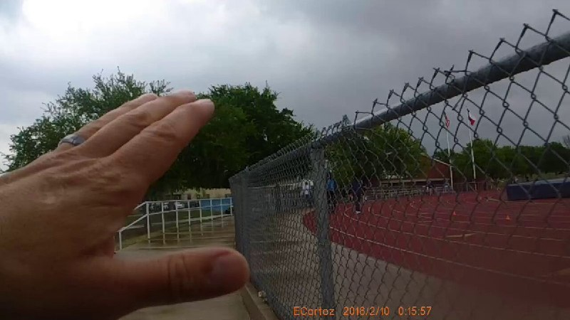

Fox News (Twitter/X)

RT @FoxUSNews: WATCH: Bodycam captures the moment Karmelo Anthony is arrested after stabbing Austin Metcalf at a high school track meet in Texas.

The footage shows officers taking Anthony into custody at the scene, where a routine sporting event turned into a crime scene in seconds.

Credit: Collin County Court

## BBCPersian — post 284435

  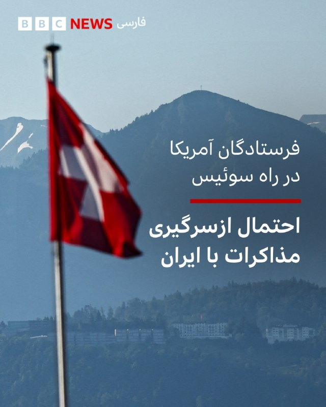

🔻یک مقام آمریکایی به وب‌سایت خبری آکسیوس گفت که استیو ویتکاف، فرستاده کاخ سفید، در راه سوئیس است؛ جایی که انتظار می‌رود نخستین دور مذاکرات با ایران درباره توافقی احتمالی بر سر برنامه هسته‌ای آن کشور برگزار شود.

به گفته این مقام، جرد کوشنر، داماد و دیگر فرستاده دونالد ترامپ، هم‌اکنون در سوئیس حضور دارد.

قرار بود این مذاکرات دیروز در بورگن‌اشتوک سوئیس آغاز شود، اما به دلیل درگیری‌های اسرائیل و حزب‌الله در لبنان به تعویق افتاد. هنوز مشخص نیست زمان تازه‌ای برای برگزاری آن تعیین شده است یا نه.

محمد بن عبدالرحمن آل ثانی، نخست‌وزیر قطر و یکی از میانجی‌گران اصلی میان آمریکا و ایران، نیز روز جمعه وارد سوئیس شد.

قرار بود جی‌دی ونس، معاون رئیس‌جمهوری آمریکا، ریاست هیئت آمریکایی را بر عهده داشته باشد، اما سفر خود را در آخرین لحظات پنجشنبه شب به تعویق انداخت. هنوز مشخص نیست که او در روزهای آینده به سوئیس سفر خواهد کرد یا نه.

متن کامل خبر در لینک زیر:
https://bbc.in/4uI0sEp
📷Reuters

@BBCPersian

---
📅 بروزرسانی: 1405/03/30 03:55
---

## FarsiVOA — post 221259

⚡️دونالد ترامپ، رئيس‌جمهوری آمریکا، روز جمعه ۲۹ خرداد از هواپیمای جدید ریاست‌جمهوری «ایرفورس وان» در پایگاه مشترک اندروزو واقع در ایالت مریلند رونمایی کرد. آقای ترامپ در این مراسم از ۲۵۰ نفری که «۲۴ ساعته و ۷ روز هفته» برای آماده‌سازی این هواپیما تلاش کردند، تشکر کرد.
@FarsiVOA

---
📅 بروزرسانی: 1405/03/30 03:46
---

## IranianMinds — post 22983

😂😂😂

@IranianMinds

---
📅 بروزرسانی: 1405/03/30 03:35
---

## FarsiVOA — post 221258

⚡️اثر جنگ خاورمیانه بر بازار خودروهای برقی اروپا
@FarsiVOA

## IranianMinds — post 22982

  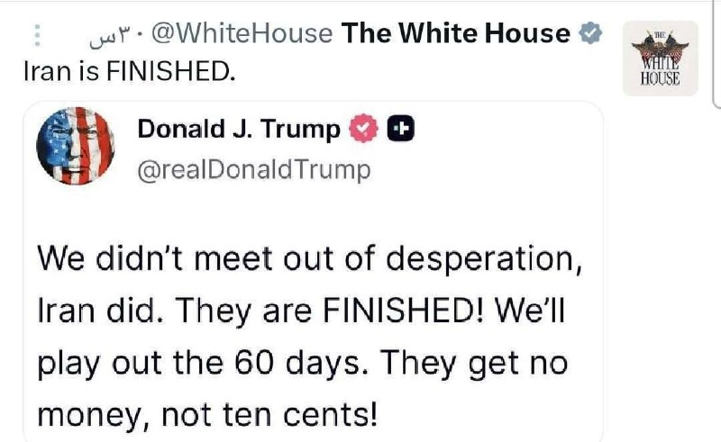

🔴اکانت کاخ سفید با ریپست کردن توئیت ترامپ نوشت:

ایران تمام شد.

@IranianMinds

---
📅 بروزرسانی: 1405/03/30 03:25
---

## VahidOOnLine — post 246456

  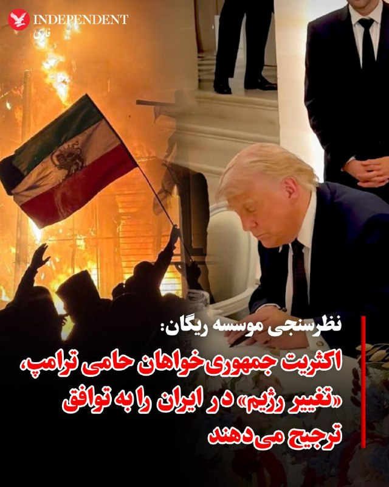

♦️براساس نظرسنجی جدید موسسه «رونالد ریگان»، دونالد ترامپ درباره تفاهم‌نامه اخیر با تهران پس از سه ماه‌ و‌ نیم عملیات نظامی، با چالش سیاسی سختی روبرو است؛ چرا که ۵۱ درصد از جمهوری‌خواهان طرفدار جنبش «آمریکا را دوباره باعظمت کنیم» (MAGA) خواستار سرنگونی نظام و تغییر رژیم در ایران هستند و در مقابل، تنها ۲۵ درصد از توافق دیپلماتیک حمایت می‌کنند. به گزارش «نیویورک پست»، این نظرسنجی که نشان‌دهنده ترجیح دو برابری گزینه تغییر رژیم نسبت به مذاکره در میان حامیان ترامپ است، دقیقا در تضاد با رویکرد دمکرات‌ها قرار دارد که ۵۲ درصد آن‌ها مسیر دیپلماتیک را برگزیده‌اند. براساس این گزارش، انتشار این آمار در حالی صورت می‌گیرد که ترامپ و مسعود پزشکیان به تازگی تفاهم‌نامه‌ای ۱۴ ماده‌ای را برای باز شدن یک پنجره ۶۰ روزه جهت دستیابی به توافق صلح و بازگشایی تنگه هرمز امضا کرده‌اند؛ سندی که ترامپ در نشست «گروه ۷» در فرانسه، هدف از امضای آن را جلوگیری از یک «فاجعه اقتصادی» توصیف کرد.
‌🇸🇦 Indypersian

🤖 @VahidOOnLine

## WithYashar — post 15375

آکسیوس: ویتکاف برای اولین دور مذاکرات داره میره سوئیس.

البته فعلا تاریخ جدیدی برای مذاکرات تایید نشده؛ نخست وزیر قطر هم به عنوان میانجی اصلی الان تو سوئیسه.
@withyashar

## pm_afshaa — post 94429

  <a href="telegram/content/pm_afshaa_94429_1781913335.webm" target="_blank">🎬 Download video</a>

🔴آکسیوس: ویتکاف برای اولین دور مذاکرات داره میره سوئیس. البته فعلا تاریخ جدیدی برای مذاکرات تایید نشده؛ نخست وزیر قطر هم به عنوان میانجی اصلی الان تو سوئیسه. 
💧 Rainbet.com the #1 Non-KYC Crypto Casino & Sportsbook @rainbetcom 
😁 @Pm_Afshaa

## FarsiVOA — post 221257

⚡️تغییر تاکتیک جمهوری اسلامی؛ تشکیل هسته‌های مخفی سپاه در عراق برای حمله به کشورهای حاشیه خلیج فارس
@FarsiVOA

---
📅 بروزرسانی: 1405/03/30 03:15
---

## VahidOOnLine — post 246455

♦️تصاویر منتشر شده در حساب اینستاگرام «کوه صفه»، چهارشنبه‌شب، صحنه‌ای زیبا از همنشینی ماه و زهره و عطارد را از منظر پل مارنان زاینده رود اصفهان نشان می‌دهد. در روزهای گذشته، ماه، زهره، عطارد، مشتری و مریخ در افق غربی آسمان در یک راستا دیده می‌شدند. این پدیده یک «هم‌خطی ظاهری» و زیبا از دید ناظر زمینی است.
‌🇸🇦 Indypersian

🤖 @VahidOOnLine

## mwarmonitor — post 11246

🔴فرستادگان ترامپ برای گفتگوهای احتمالی با ایران عازم سوئیس شدند

📝نویسنده: باراک راوید AXIOS

🔸یک مقام آمریکایی به اکسیوس (Axios) گفت که استیو ویتکوف، فرستاده کاخ سفید، در راه سوئیس است؛ جایی که انتظار می‌رود اولین دور گفتگوها با ایران درباره یک توافق هسته‌ای احتمالی در آنجا برگزار شود.
این مقام آمریکایی اعلام کرد که جرد کوشنر، فرستاده ترامپ، از قبل در سوئیس حضور دارد.

📌چرا این موضوع اهمیت دارد: این گفتگوها قرار بود روز جمعه آغاز شود، اما به دلیل درگیری‌ها میان اسرائیل و حزب‌الله در لبنان به تعویق افتاد. هنوز مشخص نیست که زمان جدیدی برای این گفتگوها تعیین شده است یا خیر.

📌پشت صحنه: محمد بن عبدالرحمن آل ثانی، نخست‌وزیر قطر که یکی از میانجی‌های کلیدی میان آمریکا و ایران است، اوایل روز جمعه وارد سوئیس شد.

📌نکاتی که باید زیر نظر داشت: انتظار می‌رفت که جی‌دی ونس، معاون رئیس‌جمهور، ریاست هیئت آمریکایی را بر عهده داشته باشد، اما او در آخرین لحظات پنجشنبه شب سفر خود را به تعویق انداخت. هنوز مشخص نیست که آیا او در این آخر هفته به این سفر خواهد رفت یا خیر.

@mwarmonitor

## FarsiVOA — post 221256

  <a href="telegram/content/FarsiVOA_221256_1781912717.mp4" target="_blank">🎬 Download video</a>

⚡️گزارشگران سازمان ملل متحد: هر توافقی با جمهوری اسلامی باید شامل حقوق بشر باشد
@FarsiVOA

## IranianMinds — post 22981

  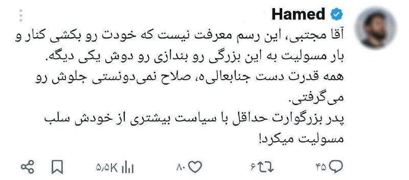

🔴عرزشی‌ها عصبانی از دست مجتبی مقوایی.

@IranianMinds

---
📅 بروزرسانی: 1405/03/30 03:05
---

## VahidOOnLine — post 246454

  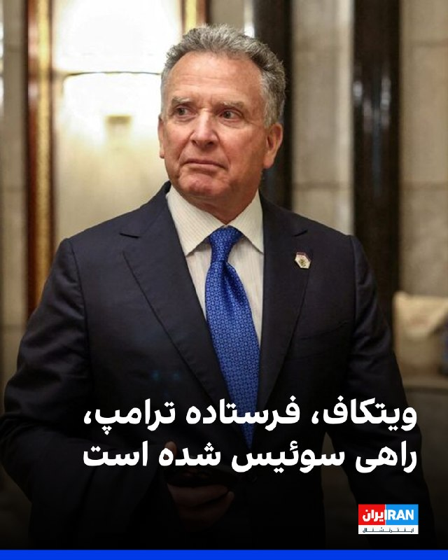

یک مقام آمریکایی به اکسیوس گفت: استیو ویتکاف، فرستاده کاخ سفید، در حال سفر به سوئیس است، جایی که انتظار می‌رود دور اول مذاکرات با ایران در مورد توافق هسته‌ای احتمالی برگزار شود.

به نوشته اکسیوس، قرار بود مذاکرات جمعه ۲۹ خرداد آغاز شود، اما به دلیل درگیری بین اسرائیل و حزب‌الله در لبنان به تعویق افتاد. هنوز مشخص نیست که آیا زمان جدیدی برای مذاکرات تعیین شده است یا اینکه سایر مقامات آمریکایی نیز در راه سوئیس هستند.
‌🏁 🇬🇧 IranintlTV

🤖 @VahidOOnLine

## IranIntlTV — post 343307

  

یک مقام آمریکایی به اکسیوس گفت: استیو ویتکاف، فرستاده کاخ سفید، در حال سفر به سوئیس است، جایی که انتظار می‌رود دور اول مذاکرات با ایران در مورد توافق هسته‌ای احتمالی برگزار شود.

به نوشته اکسیوس، قرار بود مذاکرات جمعه ۲۹ خرداد آغاز شود، اما به دلیل درگیری بین اسرائیل و حزب‌الله در لبنان به تعویق افتاد. هنوز مشخص نیست که آیا زمان جدیدی برای مذاکرات تعیین شده است یا اینکه سایر مقامات آمریکایی نیز در راه سوئیس هستند.
https://iranintl.com/202606190628

## BBCPersian — post 284434

  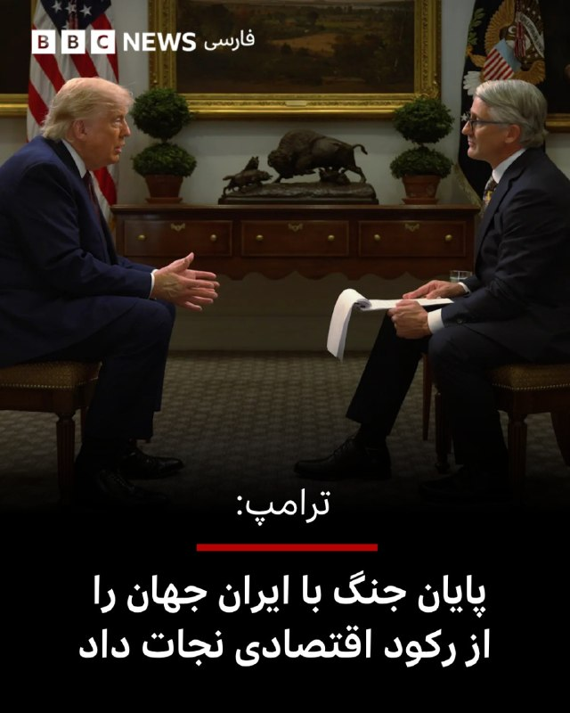

🔻دونالد ترامپ، رئیس‌جمهوری آمریکا، در گفت‌وگویی با وب‌سایت خبری آکسیوس ضمن دفاع از توافق اخیر با ایران گفت که این توافق جهان را از یک «رکود اقتصادی جهانی» نجات داده است. او همچنین در پاسخ به پرسشی درباره حدود قدرت خود پس از پایان جنگ ایران گفت: «هیچ محدودیتی وجود ندارد.»

آقای ترامپ در این مصاحبه که روز پنجشنبه انجام شد، درباره توافق با ایران گفت: «این از آن دست اتفاق‌هایی است که می‌توانست باعث یک رکود جهانی شود.» او افزود توافقی که با ایران امضا کرده مانع وقوع چنین وضعیتی شده است.

رئیس‌جمهوری آمریکا در پاسخ به پرسشی درباره حدود قدرت خود گفت: «هیچ محدودیتی وجود ندارد.» او سپس افزود که می‌داند محدودیت‌هایی وجود دارد، اما هنوز «آن درس را یاد نگرفته است.»

لینک خبر کامل:
https://bbc.in/4aHkzeI
📷Axios

@BBCPersian

---
📅 بروزرسانی: 1405/03/30 02:55
---

## VahidOOnLine — post 246453

  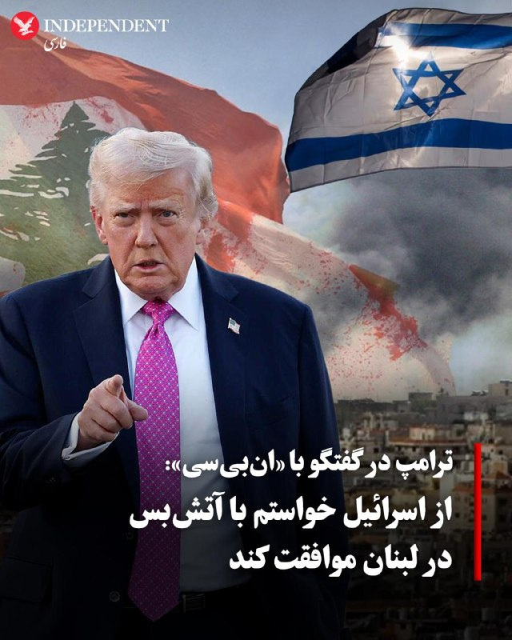

♦️به گزارش «ان‌بی‌سی نیوز»، در پی تشدید درگیری‌ها در لبنان، اسرائیل و حزب‌الله روز جمعه با یک آتش‌بس فوری موافقت کردند. دونالد ترامپ، رئیس‌جمهوری آمریکا، در گفتگوی تلفنی با «ان‌بی‌سی نیوز» تایید کرد که شخصا با مقام‌های اسرائیلی گفتگو کرده و از آن‌ها خواسته است تا با این آتش‌بس موافقت کنند. تصمیمی که ترامپ آن را «یک گام مثبت» توصیف کرد. با این حال، گزارش‌های اطلاعاتی ایالات متحده نشان می‌دهد که به دلیل اختلاف‌نظر میان نتانیاهو و واشنگتن بر سر تفاهم‌نامه ۱۴ ماده‌ای اخیر با ایران، احتمال تداوم حملات اسرائیل به مواضع حزب‌الله و به خطر افتادن مجدد این توافق مقدماتی وجود دارد؛ به ویژه آنکه نتانیاهو صراحتا اعلام کرده کشورش خود را متعهد به این یادداشت تفاهم نمی‌داند.
‌🇸🇦 Indypersian

🤖 @VahidOOnLine

## pm_afshaa — post 94428

  <a href="telegram/content/pm_afshaa_94428_1781911537.webm" target="_blank">🎬 Download video</a>

🔴آکسیوس: ویتکاف برای اولین دور مذاکرات داره میره سوئیس.

البته فعلا تاریخ جدیدی برای مذاکرات تایید نشده؛ نخست وزیر قطر هم به عنوان میانجی اصلی الان تو سوئیسه.

💧 Rainbet.com the #1 Non-KYC Crypto Casino & Sportsbook @rainbetcom

😁 @Pm_Afshaa

## IranIntlTV — post 343306

  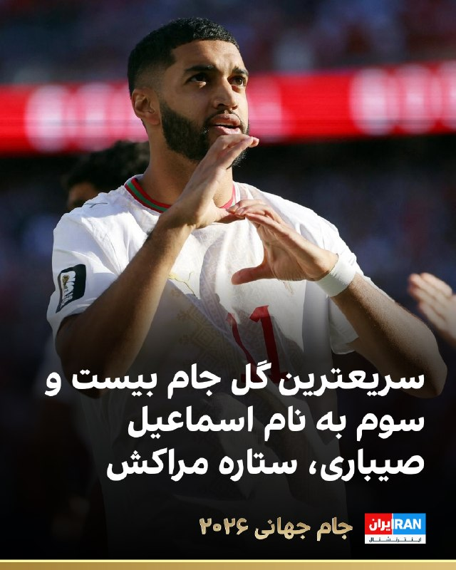

🔻اسماعیل صیباری، بازیکن تیم ملی مراکش، با گلزنی در ثانیه ۷۱ دیدار مقابل اسکاتلند در جام جهانی ۲۰۲۶ که در ورزشگاه بوستون برگزار شد، یکی از سریع‌ترین گل‌های تاریخ این رقابت‌ها را به ثمر رساند.

🔹اسماعیل صیباری همچنین با این گل رکورد سریع‌ترین گل جام جهانی ۲۰۲۶ را شکست.

🔹پیش از این مسابقه، سریع‌ترین گل جام جهانی ۲۰۲۶ متعلق به میخال سادیلک، هافبک جمهوری چک، بود که در دقیقه ۵ و ۸ ثانیه دیدار برابر آفریقای جنوبی گلزنی کرده بود.

🔹فلیکس انمچا از آلمان با گل در دقیقه ۵ و ۱۶ ثانیه مقابل کوراسائو در رتبه دوم قرار داشت و گل به خودی دامیان بوبادیا از پاراگوئه برابر آمریکا در دقیقه ۶ و ۱۲ ثانیه سومین گل سریع مسابقات بود.

🔹ستاره باشگاه آیندهوون اکنون نخستین بازیکن تاریخ است که در هر دو بازی نخست خود برای مراکش در جام جهانی موفق به گلزنی شده است.

🔹او در دیدار نخست مراکش مقابل برزیل نیز گل تیمش را در تساوی یک بر یک به ثمر رسانده بود.

🔹آماری از سریعترین گل‌های جام جهانی را در سایت بخوانید.

@iranintltvsport

---
📅 بروزرسانی: 1405/03/30 02:45
---

## VahidOOnLine — post 246452

  

گاردین در تحلیلی نوشت ترامپ که سال‌ها جیمی کارتر را نماد ضعف در برابر ایران معرفی می‌کرد، اکنون خود در موقعیتی مشابه قرار گرفته است؛ جایی که محدودیت گزینه‌های نظامی و هزینه‌های سیاسی جنگ، آزادی عمل واشینگتن را کاهش داده است.
این تحلیل نوشت یادداشت تفاهم دونالد ترامپ با جمهوری اسلامی ممکن است میراث سیاسی او را به تصمیم‌ها و رفتارهای تهران گره بزند؛ همان‌گونه که بحران گروگان‌گیری سفارت آمریکا در تهران بر میراث سیاسی جیمی کارتر سایه انداخت.
گاردین استدلال کرد جنگ اخیر به جای تضعیف جمهوری اسلامی، به تثبیت موقعیت آن کمک کرده و توافق جدید نیز با تاکید بر احترام متقابل به حاکمیت دو کشور، به نوعی مشروعیت دوباره به جمهوری اسلامی بخشیده است.

‌🏁 🇬🇧 IranintlTV

🤖 @VahidOOnLine

## VahidOOnLine — post 246451

  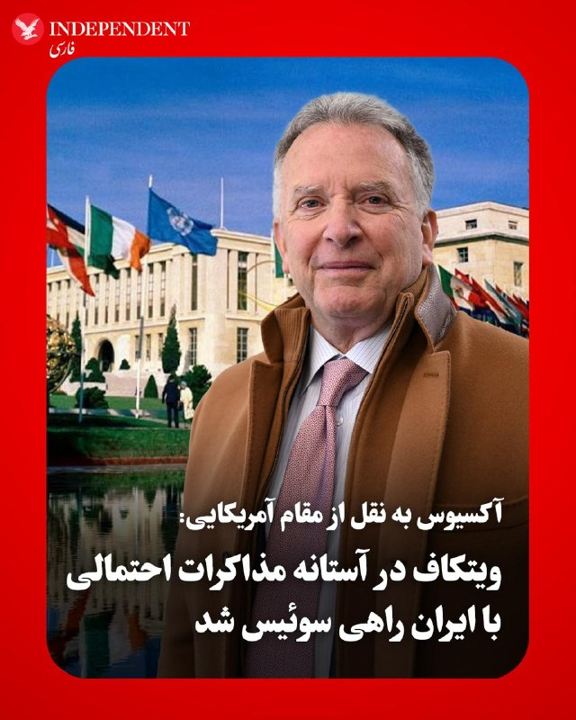

♦️یک مقام آمریکایی روز جمعه به «آکسیوس» گفت که استیو ویتکاف، فرستاده ویژه کاخ سفید، در راه سوئیس است؛ کشوری که انتظار می‌رود دور نخست مذاکرات با جمهوری اسلامی ایران درباره یک توافق هسته‌ای احتمالی در آنجا برگزار شود. براساس این گزارش، مذاکرات که قرار بود روز جمعه آغاز شود، به دلیل درگیری‌ها میان اسرائیل و حزب‌الله در لبنان به تعویق افتاد و هنوز مشخص نیست زمان جدیدی برای آن تعیین شده است یا خیر. با این حال، انتظار می‌رود جی‌دی ونس، معاون رئیس‌جمهوری آمریکا، سرپرستی این هیات را بر عهده داشته باشد و جرد کوشنر نیز در این گفتگوها شرکت کند.
‌🇸🇦 Indypersian

🤖 @VahidOOnLine

## IranIntlTV — post 343305

  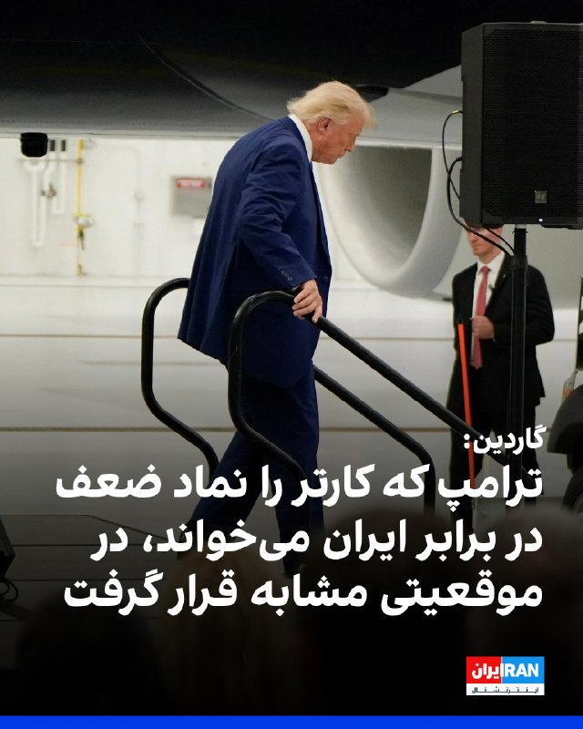

گاردین در تحلیلی نوشت ترامپ که سال‌ها جیمی کارتر را نماد ضعف در برابر ایران معرفی می‌کرد، اکنون خود در موقعیتی مشابه قرار گرفته است؛ جایی که محدودیت گزینه‌های نظامی و هزینه‌های سیاسی جنگ، آزادی عمل واشینگتن را کاهش داده است.
این تحلیل نوشت یادداشت تفاهم دونالد ترامپ با جمهوری اسلامی ممکن است میراث سیاسی او را به تصمیم‌ها و رفتارهای تهران گره بزند؛ همان‌گونه که بحران گروگان‌گیری سفارت آمریکا در تهران بر میراث سیاسی جیمی کارتر سایه انداخت.
گاردین استدلال کرد جنگ اخیر به جای تضعیف جمهوری اسلامی، به تثبیت موقعیت آن کمک کرده و توافق جدید نیز با تاکید بر احترام متقابل به حاکمیت دو کشور، به نوعی مشروعیت دوباره به جمهوری اسلامی بخشیده است.

https://iranintl.com/202606197812

## FarsiVOA — post 221255

  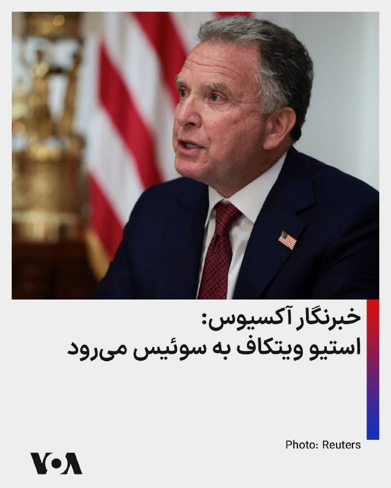

⚡️باراک راوید، خبرنگار آکسیوس به نقل از یک مقام آمریکایی می‌گوید استیو ویتکاف برای اولین دور مذاکرات احتمالی هسته‌ای با جمهوری اسلامی در مسیر رفتن به سوئیس است و جرد‌ کوشنر، داماد دونالد ترامپ هم‌اکنون در سوئیس است.
@FarsiVOA

## FarsiVOA — post 221254

⚡️سفارت ایتالیا در تهران پس از سه ماه تعطیلی دوباره بازگشایی شد. آنتونیو تایانی، وزیر امور خارجه ایتالیا بر تلاش کشورش برای صلح پایدار تأکید کرد.
@FarsiVOA

---
📅 بروزرسانی: 1405/03/30 02:35
---

## WithYashar — post 15374

بابک زنجانی : ‏به نظر می‌رسد یک موضوع نفوذ و خرابکاری امنیتی در کشور در حال وقوع است.
@withyashar

## pm_afshaa — post 94427

  <a href="telegram/content/pm_afshaa_94427_1781910325.webm" target="_blank">🎬 Download video</a>

🔴بعد از بمباران سنگین تپه الطاهر در هفت روز گذشته، حالا نیروهای اسرائیلی در حال فتح این تپه هستن!

تپه الطاهر از لحاظ استراتژیک آخرین سد دفاعی شهر نبطیه است و نبطیه پایتخت حزب الله در جنوب لبنانه.

الانم درگیری‌های سنگین بین ارتش اسرائیل و حزب‌الله در نزدیکی تپه علی الطاهر وجود داره.

💧 Rainbet.com the #1 Non-KYC Crypto Casino & Sportsbook @rainbetcom

😁 @Pm_Afshaa

## FarsiVOA — post 221253

🔺فرانسه: اگر توافق نهایی به مسئله موشکی و نیابتی‌های جمهوری اسلامی رسیدگی نکند لغو تحریم‌ها را وتو می‌کنیم

▪️وزیر امور خارجه فرانسه، ژان-نوئل بارو، روز جمعه ۲۹ خرداد گفت کشورش می‌خواهد در مذاکرات مربوط به برنامه هسته‌ای جمهوری اسلامی نقش ایفا کند و پاریس لغو تحریم‌های سازمان ملل را تأیید نخواهد کرد، مگر اینکه از مفاد توافق نهایی راضی باشد.

⬇️ بیشتر بخوانید:
https://ir.voanews.com/a/8162763.html
@FarsiVOA

## FarsiVOA — post 221252

  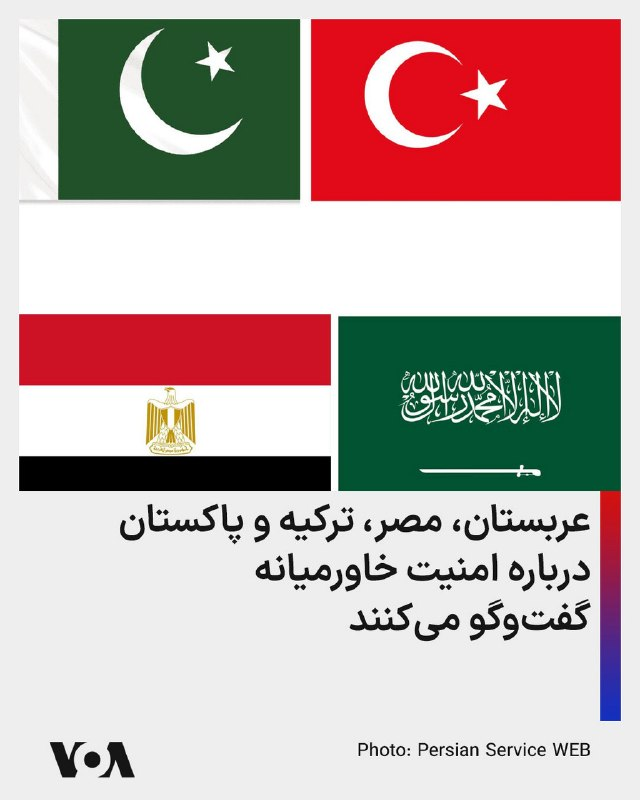

⚡️گزارش‌ها حاکی از آن است که مقامات عربستان، ترکیه، پاکستان و مصر قرار است روز یکشنبه در پایتخت مصر، قاهره، گردهم آیند و درباره تحولات دیپلماتیک و امنیتی منطقه صحبت کنند. این کشورها برای رسیدن آمریکا و جمهوری اسلامی به توافق اخیر، تلاش کرده بودند. وزیران خارجه این چهار کشور آوریل نیز در شهر آنتالیا در ترکیه دیدار و گفت‌وگو کرده بودند.
@FarsiVOA

---
📅 بروزرسانی: 1405/03/30 02:25
---

## VahidOOnLine — post 246450

  

مهدی طباطبایی، معاون ارتباطات و اطلاع رسانی دفتر رییس‌جمهور، در شبکه اجتماعی ایکس به تهدید به قتل مسعود پزشکیان، رییس‌ دولت جمهوری اسلامی، از سوی یک مداح به نام محمدعلی بخشی، او را «فرد گستاخ» نامید.
او خواستار «برخورد قاطع و قانونی مسئولان ذیربط با عناصر مشکوک، خودسر و متجاسری» شد که به دومین مقام کشور «چنین بی‌پروا» اهانت می‌کنند.
بخشی در یک سخنرانی در شهرری تهران گفت: «آقای رییس‌جمهور اگر شروطی که رهبری گفتند محقق نشه، ما می‌دانیم و تیغ و حلقوم شما. پدرت رو درمی‌آریم.»

‌🏁 🇬🇧 IranintlTV

🤖 @VahidOOnLine

## VahidOOnLine — post 246449

  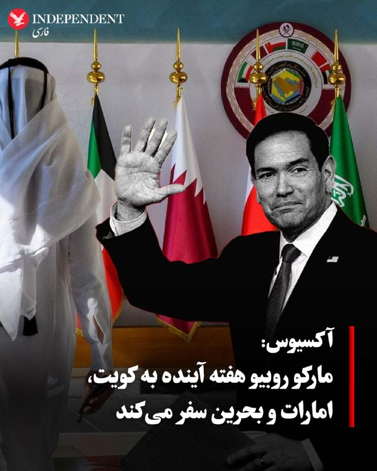

♦️خبرنگار اکسیوس، روز جمعه به نقل از منابع آگاه خبر از سفر مارکو روبیو، وزیر خارجه ایالات متحده به خاورمیانه داد. او نوشت: «روبیو در حال برنامه‌ریزی برای سفر به خاورمیانه در هفته آینده است. مقصدهای او در حال حاضر کویت، امارات متحده عربی و بحرین هستند. انتظار می‌رود روبیو نشستی را با وزرای امور خارجه شورای همکاری خلیج فارس در بحرین برگزار کند.»
‌🇸🇦 Indypersian

🤖 @VahidOOnLine

## WithYashar — post 15373

عفو بین‌الملل هشدار داد مقام‌های جمهوری اسلامی از پوشش شرایط جنگی برای تشدید سرکوب استفاده کرده‌اند. همزمان برخی خانواده کشته‌شدگان‌ دی هم از حذف نام آنها در سامانه «بهشت زهرا»ا خبر دادند.
@withyashar

## IranIntlTV — post 343304

  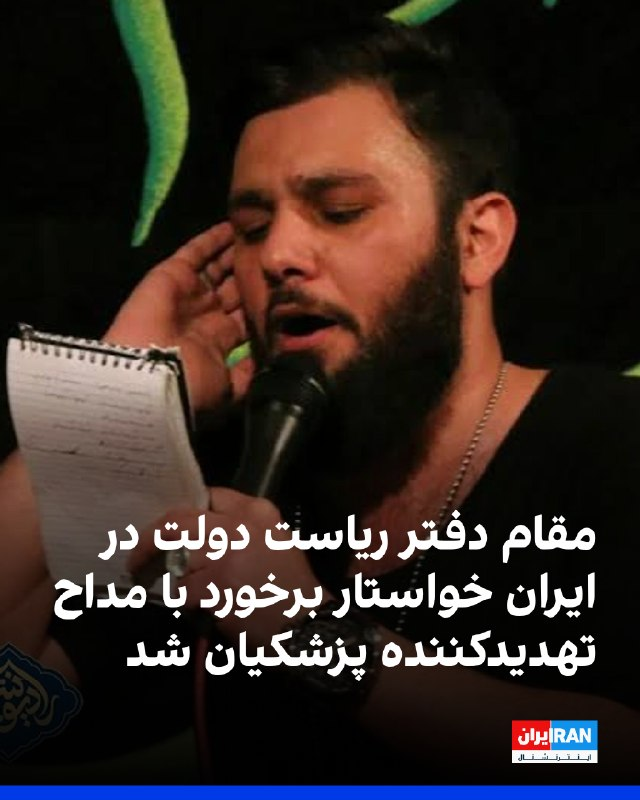

مهدی طباطبایی، معاون ارتباطات و اطلاع رسانی دفتر رییس‌جمهور، در شبکه اجتماعی ایکس به تهدید به قتل مسعود پزشکیان، رییس‌ دولت جمهوری اسلامی، از سوی یک مداح به نام محمدعلی بخشی، او را «فرد گستاخ» نامید.
او خواستار «برخورد قاطع و قانونی مسئولان ذیربط با عناصر مشکوک، خودسر و متجاسری» شد که به دومین مقام کشور «چنین بی‌پروا» اهانت می‌کنند.
بخشی در یک سخنرانی در شهرری تهران گفت: «آقای رییس‌جمهور اگر شروطی که رهبری گفتند محقق نشه، ما می‌دانیم و تیغ و حلقوم شما. پدرت رو درمی‌آریم.»

https://iranintl.com/202606198879

## FarsiVOA — post 221251

⚡️پرزیدنت ترامپ روز جمعه ۲۹ خرداد در سخنانی در مراسم رونمایی از هواپیمای جدید ریاست جمهوری، «ایرفورس وان»، به موضوعات مختلف، از جمله بازگشایی تنگه هرمز و پایین آمدن قیمت نفت در جهان، اشاره کرد. صدای آمریکا مشروح این سخنرانی را با ترجمه همزمان پژواک کیومرثی پخش کرد.
@FarsiVOA

## FarsiVOA — post 221250

  <a href="telegram/content/FarsiVOA_221250_1781909715.mp4" target="_blank">🎬 Download video</a>

⚡️جابر رجبی در برنامه تفسیر خبر: این تفاهم یک ترک در دیوار حکومت انداخت
@FarsiVOA

## IranianMinds — post 22980

  

🔴رسایی:

دشمن اگه غلطی کرد باید تنگه را ببندیم.

@IranianMinds

---
📅 بروزرسانی: 1405/03/30 02:15
---

## VahidOOnLine — post 246448

  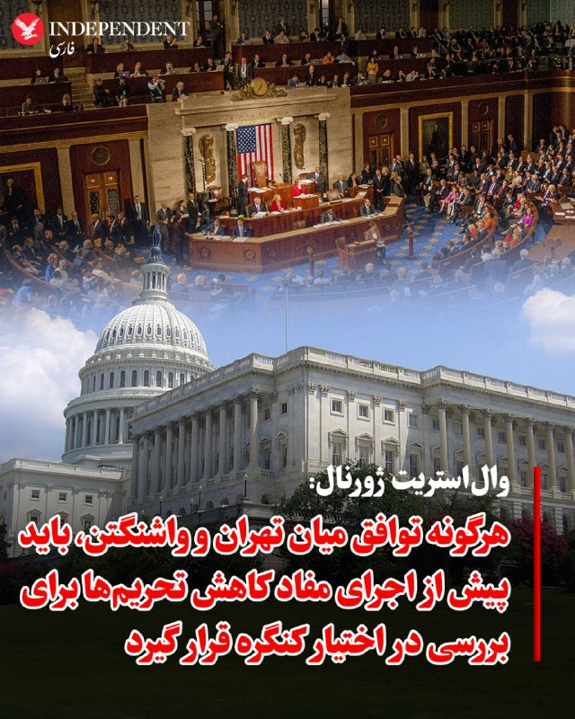

♦️روزنامه وال‌استریت ژورنال، روز جمعه، در یادداشتی تحلیلی نوشت که تفاهم‌نامه جدید دونالد ترامپ با جمهوری اسلامی ایران، هرچند با هدف حفظ صلح و بازگشایی تنگه هرمز تنظیم شده باشد، نمی‌تواند الزامات قانونی نظارت کنگره را دور بزند. بر اساس قانون نظارت بر توافق هسته‌ای ایران مصوب سال ۲۰۱۵، کاخ سفید موظف است حداکثر ظرف پنج روز متن کامل هرگونه توافق مرتبط با برنامه هسته‌ای ایران، از جمله تمامی ضمائم و ارزیابی‌های وزارت خارجه را به کنگره ارائه کند. این قانون در دوران باراک اوباما برای محدود کردن اختیارات رئیس‌جمهوری تصویب شد. براساس این سرمقاله، تغییر نام این سند ۱۴ ماده‌ای به «یادداشت تفاهم»، ماهیت قانونی آن را تغییر نمی‌دهد و تا زمان بررسی ۳۰ روزه کنگره، رئیس‌جمهوری حق کاهش یا تعلیق تحریم‌های مصوب در قانون را ندارد.
در ادامه این تحلیل تاکید شده است که تعهد متقابل واشنگتن و تهران برای رسیدن به توافق نهایی ظرف ۶۰ روز، در کنار رقیق‌سازی اورانیوم غنی‌شده ایران تحت نظارت آژانس و صدور معافیت‌های نفتی توسط وزارت خزانه‌داری آمریکا، فراتر از یک رایزنی دیپلماتیک ساده است. منتقدان و کارشناسان معتقدند نمایندگان کنگره باید فراتر از نسخه تشریفاتی ارائه شده، خواستار دسترسی به تمام جزئیات، ارتباطات خزانه‌داری و ارزیابی‌های پنهانی شوند. وال‌استریت ژورنال هشدار می‌دهد که اگر کاخ سفید پیش از پایان بررسی‌های قانونی کنگره، اقدام به اعطای معافیت‌های نفتی یا بانکی به تهران کرده باشد، قانون‌گذاران باید با تصویب قوانین اضطراری این اختیارات را متوقف کنند تا مشخص شود این توافق واقعا مانع ایران است یا صرفا فرصتی برای پر کردن خزانه این کشور فراهم می‌کند.
‌🇸🇦 Indypersian

🤖 @VahidOOnLine

## WithYashar — post 15372

ارتش اسرائیل (IDF) در حال پیشروی به سمت تپه علی الطاهر است.
بعد از بمباران سنگین تپه الطاهر در هفت روز گذشته، حال نیروهای اسرائیلی در حال فتح این تپه هستند.

تپه الطاهر از لحاظ استراتژیک آخرین سد دفاعی شهر نبطیه است‌.
@withyashar

## mwarmonitor — post 11244

استودیو خبری فاکس نیوز
🔹مجری:
«در حالی که ایالات متحده خود را برای دور جدیدی از گفتگوها با ایران آماده می‌کند، سرنوشت شش آمریکایی که همچنان توسط این رژیم در بازداشت هستند، در هاله‌ای از ابهام قرار دارد. جنیفر گریفین، خبرنگار ارشد امنیت ملی ما، آخرین اطلاعات را به‌صورت زنده از واشینگتن برای ما گزارش می‌دهد. سلام جنیفر.»

🔹جنیفر گریفین:
«سلام سندرا. خب، یک موضوع کلیدی دیگر که همان‌طور که اشاره کردی با تهران حل‌نشده باقی مانده، این است که آیا کاخ سفید برای آزادی شش آمریکایی که هنوز به‌طور ناعادلانه توسط دولت ایران بازداشت شده‌اند، فشار خواهد آورد یا خیر. حداقل دو نفر از این آمریکایی‌ها در زندان بدنام اوین به سر می‌برند.
کامران حکمتی، پدربزرگ ۶۱ ساله ایرانی-آمریکاییِ یهودی اهل لانگ آیلند؛ حکمتی بهار گذشته برای دیدار با خانواده‌اش در ایران به سر می‌برد که به دلیل سفری که ۱۳ سال پیش برای جشن بارمیتزوای پسرش به اسرائیل داشت، دستگیر شد.
و رضا ولی‌زاده، روزنامه‌نگار ۴۹ ساله که به مدت ۱۰ سال برای رادیو اروپای آزاد کار می‌کرد و در سال ۲۰۲۴ برای مراقبت از والدینش به ایران بازگشت. فاکس نیوز به این فایل صوتی از رضا از داخل زندان اوین دست یافته است.»
📌فایل صوتی رضا ولی‌زاده از زندان اوین
رضا ولی‌زاده (فایل صوتی):
«حتی اگر درمان بیماری‌های ما خواسته بزرگی باشد، حداقل می‌شد از مقامات ایرانی خواست تا نه تمام فشارهای جسمی و شکنجه‌های روحی علیه ما در دوران اسارت، بلکه حداقل بخشی از آن را کاهش دهند.»
🔹جنیفر گریفین:
«رایان فیهی، وکیل رضا، از دولت [آمریکا] می‌خواهد که آزادی تمامی آمریکایی‌های بازداشت‌شده را در اولویت قرار دهد؛ به‌ویژه از آنجا که ایالات متحده بیش از ۶۰ ملوان ایرانیِ اسیر شده را در ماه می آزاد کرد.»
🔰رایان فیهی (وکیل):
«برای من بسیار دشوار است که هضم کنم چطور ایالات متحده می‌تواند این ملوانان را بدون دریافت هیچ چیزی در مقابل آزاد کند. ما اجازه می‌دهیم یک پدربزرگ به جرمِ دیدار از اسرائیل در ۱۴ سال پیش، در بازداشت بماند؟ من فکر می‌کنم این کار ساده‌ترین و در دسترس‌ترین اقدام است و دولت باید واقعاً روی نهایی کردن این توافق تمرکز کند.»
🔹جنیفر گریفین:
«یک روز قبل از آغاز عملیات "خشم حماسی" در ماه فوریه، مارکو روبیو، وزیر امور خارجه، ایران را به عنوان یک "دولت حامی بازداشت‌های ناعادلانه" تعیین کرد. تنها کشور دیگری که این برچسب را دارد، افغانستان است.
او اعلام کرد: "رژیم ایران باید دست از گروگان‌گیری بردارد و تمام آمریکایی‌هایی را که به‌طور ناعادلانه در ایران بازداشت شده‌اند، آزاد کند."؛ گام‌هایی که می‌تواند به این نام‌گذاری و اقدامات مرتبط با آن پایان دهد.
خانواده کامران حکمتی در گریت نکِ نیویورک، در تاریخ ۹ ژوئن نامه‌ای به پرزیدنت ترامپ نوشتند و از او خواستند تا آزادی این آمریکایی‌های تحت بازداشت در ایران را در اولویت قرار دهد. آن‌ها نوشتند: "کامران نه تنها یک شهروند آمریکایی است، بلکه پدری فداکار، همسر، برادر، پسرعمو و صاحب کسب‌وکاری است که دیگران را به کار گرفته است. امروز او همچنین یک بیمار سرطانی است؛ او بدون دسترسی به مراقبت‌های پزشکی که شدیداً به آن‌ها نیاز دارد، با سرطان مثانه مبارک می‌کند. هر روزِ [باقی‌مانده] حیاتی است."
به تو برمی‌گردانم، سندرا.»
🔹مجری ساندرا:
«خدای من، ما برای همه آن آمریکایی‌ها دعا می‌کنیم. جنیفر گریفین، از تو ممنونم.»

@mwarmonitor

## mwarmonitor — post 11243

  <a href="telegram/content/mwarmonitor_11243_1781909122.mp4" target="_blank">🎬 Download video</a>

🎬 Video

## FarsiVOA — post 221249

  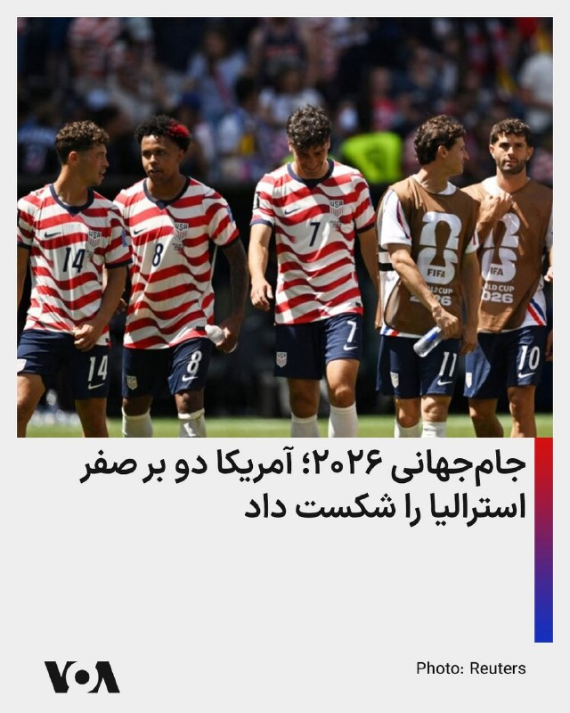

⚡️در ادامه رقابت‌های جام جهانی فوتبال ۲۰۲۰۶، تیم ملی آمریکا روز جمعه ۲۹ خرداد توانست دو بر صفر استرالیا را شکست دهد. آمریکا صدرنشین گروه D است و پیش از این نیز پاراگوئه را ۴ بر یک شکست داده بود. رقابت بعدی این تیم با ترکیه در ۴ تیر است.
@FarsiVOA

---
📅 بروزرسانی: 1405/03/30 02:05
---

## VahidOOnLine — post 246447

  <a href="telegram/content/VahidOOnLine_246447_1781908529.mp4" target="_blank">🎬 Download video</a>

♦️پس از انتشار پیامی منسوب به مجتبی خامنه‌ای مبنی بر اینکه توافق با آمریکا به اصرار مسعود پزشکیان صورت گرفته است و او «نظر دیگری» داشته، محمدعلی بخشی، مداح حکومتی در جمع حامیان جمهوری اسلامی در شهرری گفت: «آقای رئیس‌جمهور اگر شروط رهبری محقق نشود، ما می‌دانیم و تیغ و حلقوم شما. پدرت را درمی‌آوریم».
‌🇸🇦 Indypersian

🤖 @VahidOOnLine

## WithYashar — post 15371

  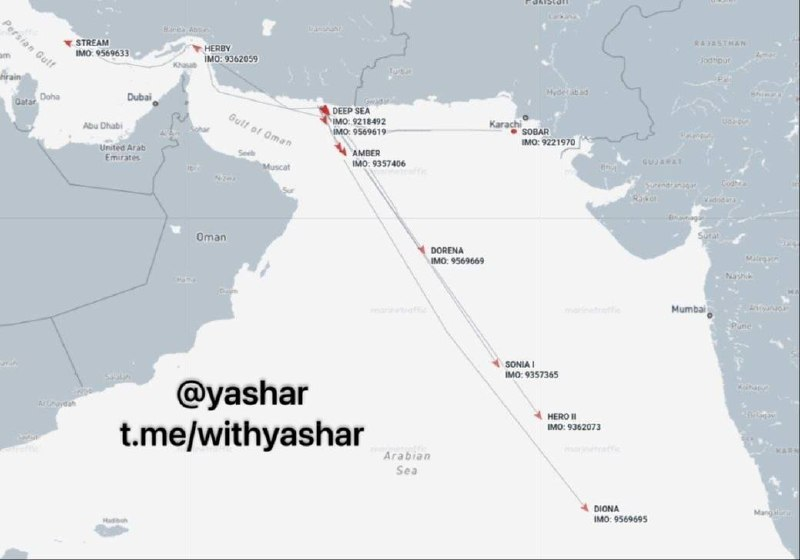

حرکت ۱۰ نفتکش ایرانی به نام های؛ دیونا، قهرمان، سونیا، دورنا، آمبر، خندان، برف، هدی، استارلا و دریا عمیق به طرف چین
@withyashar

## FarsiVOA — post 221248

  <a href="telegram/content/FarsiVOA_221248_1781908532.mp4" target="_blank">🎬 Download video</a>

⚡️دور تازە تحریم‌های آمریکا علیه عوامل حزب‌الله لبنان
@FarsiVOA

## FarsiVOA — post 221247

  <a href="telegram/content/FarsiVOA_221247_1781908533.mp4" target="_blank">🎬 Download video</a>

⚡️سوت تاریخی زنان در بزرگ‌ترین صحنه فوتبال مردان؛ گفت‌وگو با محمدرضا فغانی داور بین‌المللی
@FarsiVOA

## FarsiVOA — post 221246

  <a href="telegram/content/FarsiVOA_221246_1781908535.mp4" target="_blank">🎬 Download video</a>

⚡️بازی دوم تیم‌ها در مرحله گروهی؛ گفت‌وگو با مهرداد بحری کارشناس فوتبال
@FarsiVOA

## Persian_Trend_Official — post 17626

  <a href="telegram/content/Persian_Trend_Official_17626_1781908536.mp4" target="_blank">🎬 Download video</a>

شبتون بخیر 🌃
F-18 Super Hornet

📌 @persian_trend_official
پرشین ترند | متفاوت‌ترین کانال نظامی

## IranianMinds — post 22979

🔴یک کاربر خارجی که میگه تمام عباراتی که امریکا در این تفاهم‌نامه به کار برده فقط بازی با کلمات هست و در واقع فرستادن طرف به دنبال نخود سیاه هست و پزشکیانو خنگ‌ترین سیاست‌مدار معرفی کرده.

@IranianMinds

---
📅 بروزرسانی: 1405/03/30 01:55
---

## VahidOOnLine — post 246446

  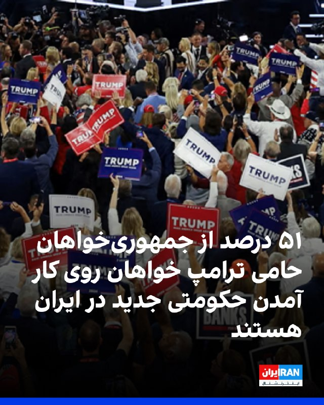

موسسه ریگان بر اساس نتایج یک نظرسنجی گزارش داد که تنها ۲۵ درصد از جمهوری‌خواهان حامی جنبش «ماگا» از دستیابی به یک توافق مذاکره‌شده با جمهوری اسلامی حمایت می‌کنند.
بر اساس نتایج این نظرسنجی، حامیان جنبش «ماگا» بیش از دو برابر بیشتر از گزینه توافق با جمهوری اسلامی، از تغییر حکومت در ایران حمایت می‌کنند.
این نظرسنجی نشان می‌دهد ۵۱ درصد از جمهوری‌خواهان حامی دونالد ترامپ، رییس‌جمهوری آمریکا، خواهان روی کار آمدن حکومتی جدید در ایران هستند، در حالی که تنها ۲۵ درصد از آنان از دستیابی به یک توافق مذاکره‌شده با تهران حمایت می‌کنند.
در میان همه جمهوری‌خواهان نیز ۵۰ درصد از تغییر حکومت در ایران حمایت کرده‌اند و ۲۵ درصد طرفدار راه‌حل دیپلماتیک و توافق با جمهوری اسلامی بوده‌اند.
در مقابل، ۵۲ درصد از دموکرات‌ها از مسیر دیپلماتیک و توافق حمایت کرده‌اند و ۲۵ درصد آنان از تغییر حکومت در ایران پشتیبانی کرده‌اند.
بر اساس این نظرسنجی، ۱۴ درصد از جمهوری‌خواهان حامی ماگا نیز گفته‌اند ترجیح می‌دهند جمهوری اسلامی در قدرت باقی بماند، اما توان اقتصادی و نظامی آن به شدت محدود شود.

‌🏁 🇬🇧 IranintlTV

🤖 @VahidOOnLine

## VahidOOnLine — post 246445

♦️لیلی مهدوی، مادر سیاوش محمودی، نوجوان ۱۶ ساله کشته‌شده در خیزش سراسری ۱۴۰۱، روز پنجشنبه تصاویری از حضور بر مزار محمدمهدی سیف‌الله‌پور، کشته‌شده در ۱۸ دی‌ماه ۱۴۰۴، در کنار اسماعیل شکری، پدر سپهر شکری (سپهر بابا) در اینستاگرام منتشر کرد. او نوشت: «ما خانواده‌های دادخواه، با داغی که هرگز سرد نخواهد شد و اندوهی که در جانمان ریشه دوانده است، شانه به شانه یکدیگر ایستاده‌ایم. ما ایستاده‌ایم برای فرزندانمان، برای دلیرمردان و دلیرزنانی که با رویای آزادی برخاستند و با گلوله‌های ستم بر خاک افتادند. آنان برای زندگی، کرامت و آزادی مردمشان قدم در راه گذاشتند، اما قلب و جانشان هدف سرب‌های داغ شد.
لیلی مهدوی در ادامه نوشت: «ما اینجاییم؛ نه از سر فراموشی، که از سر وفاداری. اینجاییم تا نام و یاد عزیزانمان را زنده نگه داریم، تا حقیقت را فریاد بزنیم و دادخواه خون‌های به‌ناحق ریخته‌شده باشیم. درد ما عمیق است، اما اراده ما عمیق‌تر. زخم‌های ما سنگین است، اما صدای ما خاموش‌شدنی نیست. ما تا روزی که حقیقت روشن شود و عدالت به جایگاه شایستهٔ خود بازگردد، از پای نخواهیم نشست. راه فرزندانمان ادامه دارد؛
‌🇸🇦 Indypersian

🤖 @VahidOOnLine

## IranIntlTV — post 343303

  <a href="telegram/content/IranIntlTV_343303_1781907907.mp4" target="_blank">🎬 Download video</a>

سازمان‌های اطلاعاتی آمریکا به دونالد ترامپ هشدار دادند که اقدامات اسرائیل می‌تواند تلاش‌های آمریکا برای دستیابی به صلحی پایدار با ایران را متوقف کند. آرام حسامی، استاد علوم سیاسی، گفت: «اسرائیل در برخی موارد تلاش خواهد کرد تا روند اجرای تفاهم را دشوارتر کند یا بر نقاط اختلافی فشار بیشتری وارد کند.»
@iranintltv

## IranIntlTV — post 343302

  <a href="telegram/content/IranIntlTV_343302_1781907908.mp4" target="_blank">🎬 Download video</a>

سازمان‌های اطلاعاتی آمریکا به دونالد ترامپ هشدار دادند که اقدامات اسرائیل می‌تواند تلاش‌های آمریکا برای دستیابی به صلحی پایدار با ایران را متوقف کند. آرام حسامی، استاد علوم سیاسی، گفت: «اسرائیل در برخی موارد تلاش خواهد کرد تا روند اجرای تفاهم را دشوارتر کند یا بر نقاط اختلافی فشار بیشتری وارد کند.»
@iranintltv

## IranIntlTV — post 343301

  

موسسه ریگان بر اساس نتایج یک نظرسنجی گزارش داد که تنها ۲۵ درصد از جمهوری‌خواهان حامی جنبش «ماگا» از دستیابی به یک توافق مذاکره‌شده با جمهوری اسلامی حمایت می‌کنند.
بر اساس نتایج این نظرسنجی، حامیان جنبش «ماگا» بیش از دو برابر بیشتر از گزینه توافق با جمهوری اسلامی، از تغییر حکومت در ایران حمایت می‌کنند.
این نظرسنجی نشان می‌دهد ۵۱ درصد از جمهوری‌خواهان حامی دونالد ترامپ، رییس‌جمهوری آمریکا، خواهان روی کار آمدن حکومتی جدید در ایران هستند، در حالی که تنها ۲۵ درصد از آنان از دستیابی به یک توافق مذاکره‌شده با تهران حمایت می‌کنند.
در میان همه جمهوری‌خواهان نیز ۵۰ درصد از تغییر حکومت در ایران حمایت کرده‌اند و ۲۵ درصد طرفدار راه‌حل دیپلماتیک و توافق با جمهوری اسلامی بوده‌اند.
در مقابل، ۵۲ درصد از دموکرات‌ها از مسیر دیپلماتیک و توافق حمایت کرده‌اند و ۲۵ درصد آنان از تغییر حکومت در ایران پشتیبانی کرده‌اند.
بر اساس این نظرسنجی، ۱۴ درصد از جمهوری‌خواهان حامی ماگا نیز گفته‌اند ترجیح می‌دهند جمهوری اسلامی در قدرت باقی بماند، اما توان اقتصادی و نظامی آن به شدت محدود شود.

https://iranintl.com/202606195282

## FarsiVOA — post 221245

⚡️گزارش نرگس صبا در برنامه تفسیر خبر از دستاوردهای طرفین یادداشت تفاهم بین آمریکا و حکومت ایران
@FarsiVOA

## FarsiVOA — post 221244

  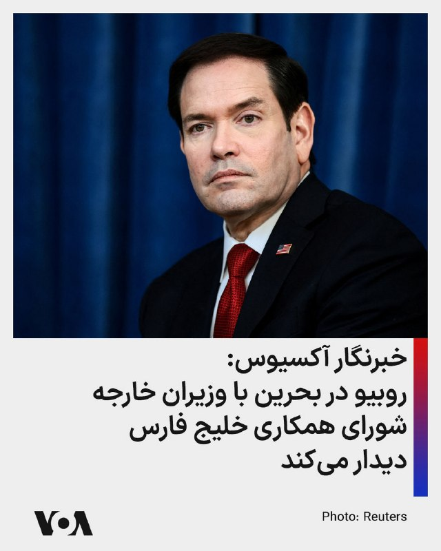

⚡️باراک راوید، خبرنگار آکسیوس به نقل از چند منبع گزارش داد که انتظار می‌رود مارکو روبیو به‌زودی در بحرین، در نشستی با وزیران امورخارجه کشورهای شورای همکاری خلیج فارس شرکت کند. راوید می‌گوید آقای روبیو علاوه بر بحرین، به کویت و امارت نیز می‌رود.
@FarsiVOA

## Persian_Trend_Official — post 17625

  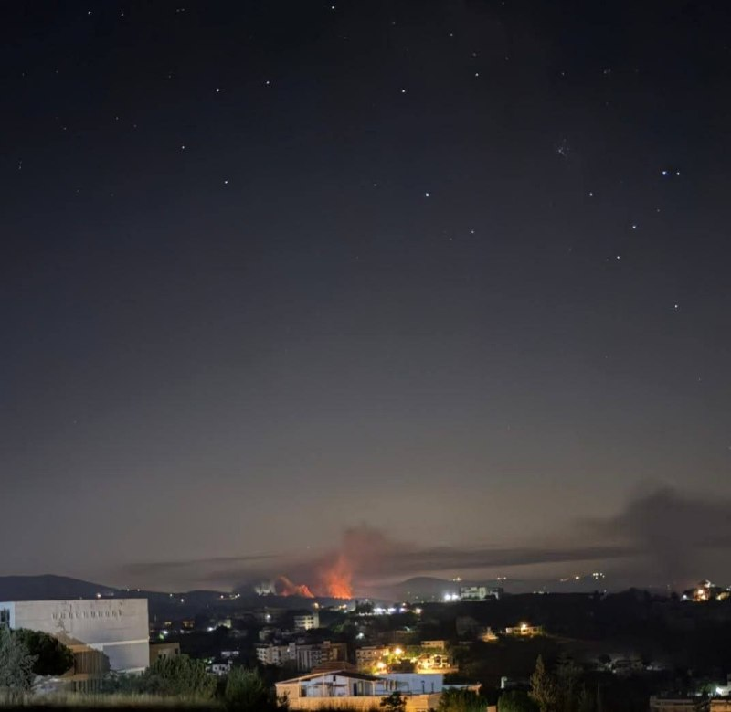

کانال های نزدیک به حزب‌الله ادعا میکنند نیروهای این گروه یک تانک مرکاوا را با موشک هدف قرار دادند که باعث آتش سوزی در تانک شده.

📝 Amir

📌 @persian_trend_official
پرشین ترند | متفاوت‌ترین کانال نظامی

## Persian_Trend_Official — post 17624

  <a href="telegram/content/Persian_Trend_Official_17624_1781907911.mp4" target="_blank">🎬 Download video</a>

ارتش اسرائیل در حال گلوله باران سنگین توپخانه ای تپه های علی الطاهر است تا راه برای گروه های زرهی باز شود تا بتواند در موقعیت مناسبی در علی الطاهر مستقر شود.

📝 Amir

📌 @persian_trend_official
پرشین ترند | متفاوت‌ترین کانال نظامی

## Persian_Trend_Official — post 17623

  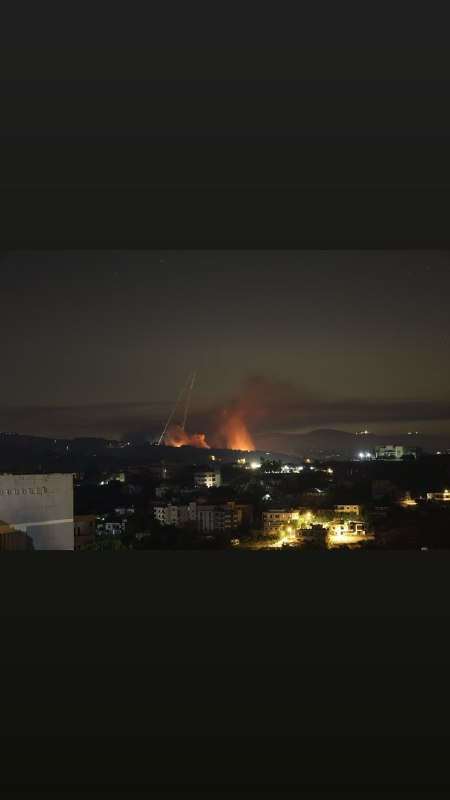

ارتش اسرائیل ساعتی پیش علی الطاهر در جنوب لبنان را با فسفر سفید بمباران کرد.

خبرگزاری MTV لبنان اعلام کرده که اسرائیل در حال بمباران نبطیه الفوقا با فسفر سفید است.

📝 Amir

📌 @persian_trend_official
پرشین ترند | متفاوت‌ترین کانال نظامی

## Hranews — post 113732

  

💥 دعوت به همکاری با خبرگزاری هرانا

خبرگزاری هرانا، با بیش از دو دهه سابقه در حوزه گزارشگری و مستندسازی حقوق بشر، در راستای توسعه فعالیت‌های خود از علاقه‌مندان واجد شرایط برای همکاری دعوت می‌کند.

هرانا در این مرحله بیش از آن‌که به دنبال افراد با سابقه حرفه‌ای باشد، به دنبال افرادی متعهد، دقیق و آموزش‌پذیر است؛ کسانی که دغدغه واقعی حقوق بشر دارند و مایل‌اند در یک چارچوب حرفه‌ای، مهارت‌های خود را توسعه دهند.

زمینه‌های همکاری شامل:
گزارشگری، ویراستاری، ترجمه، مدیریت شبکه‌های اجتماعی و سایر حوزه‌های مرتبط

ویژگی‌های مورد انتظار:

* تسلط کافی به زبان فارسی (خواندن و نوشتن)
* دقت، مسئولیت‌پذیری و توانایی یادگیری مستمر
* علاقه و حساسیت نسبت به موضوعات حقوق بشر
* آمادگی برای فعالیت در چارچوب‌های سازمان‌یافته و حرفه‌ای

❗️ توجه: درخواست‌ها صرفاً در صورتی بررسی خواهند شد که اطلاعات ثبت‌شده در فرم (از جمله کشور محل سکونت و سایر شرایط اعلام‌شده) با الزامات همکاری همخوانی داشته باشد.

همکاری با هرانا فرصتی است برای کسب تجربه عملی در حوزه مستندسازی و فعالیت‌های حقوق بشری در یک نهاد با سابقه و ساختار حرفه‌ای.

📎 برای ثبت درخواست همکاری، لطفا فرم زیر را تکمیل کنید:
https://hra.news/4cBjHqs

📩 در صورت بروز مشکل در تکمیل فرم، می‌توانید رزومه و اطلاعات تماس خود را به آدرس زیر ارسال نمایید:
info@hra-news.org

↘️
@hranews_bot تماس ✉️ -  @Hranews  کانال هرانا 🆑

---
📅 بروزرسانی: 1405/03/30 01:44
---

## VahidOnline — post 76534

  <a href="telegram/content/VahidOnline_76534_1781907296.mp4" target="_blank">🎬 Download video</a>

دو بخش مربوط به ایران از مصاحبه امروز ترامپ

متن کامل این بخش‌ها:
https://telegra.ph/trump-06-19

بعضی از جملات همان متن:
ترامپ: و من آیت‌الله را کشتم. یک مقام سپاه هم بود. و متأسفانه به آیت‌الله دیگر هم آسیب جدی زدم. به شما بگویم، من او را ملاقات نکردم، با او صحبت نکردم، اما دیگران درباره‌اش حرف می‌زدند. او شجاعت خاصی دارد، چون به‌شدت آسیب دیده است.

با وجود همه این‌ها، نمی‌توانید بگویید بی‌خیال. من ارتششان را نابود کردم. نمی‌خواهم این را نادیده بگیرند.

برای کسانی که می‌گویند شاید من به‌اندازه کافی سخت نگرفتم، باید بگویم من ارتششان را نابود کردم. بزرگ‌ترین پلشان را زدم، چون دیر در جلسه حاضر شدند. گفتند این کار خیلی قشنگی نبود. من گفتم پل جورج واشنگتن؟ سه دقیقه‌ای نابودش کردم. خارک را زدم، همه چیز را، جز یک چیز. گفتم به لوله‌ها دست نزنید، چون نمی‌خواهم به اقتصاد جهان آسیب بزنم.

بنابراین فکر می‌کنم خیلی سخت گرفتیم. به کسانی گوش ندهید که می‌گویند می‌توانست سخت‌تر باشد. کل ارتششان از بین رفته است.

پرسشگر: چطور تغییر رژیم است وقتی هنوز خامنه‌ای جوان‌تر و خیلی از مقام‌های سپاه آنجا هستند؟

چون افراد متفاوتی هستند. خامنه‌ای جوان‌تر با پدرش فرق دارد. افرادی هستند که بسیار کمتر از دو گروه قبلی رادیکال‌اند؛ و من هر دو گروه قبلی را می‌شناختم. اما به این فکر کنید: همه آن‌ها رفته‌اند. بعد می‌گویند چرا سخت‌تر نگرفتی؟ تنها راهی که می‌توانم سخت‌تر بگیرم این است که دو یا سه هفته دیگر وارد شوم و آن‌ها را شدیداً بمباران کنم. اما این چه چیزی برای ما به دست می‌آورد؟ تنگه هرمز باز نخواهد ماند. فرض کنید این کار را می‌کردم. فرض کنید تصمیم می‌گرفتم این کار را بکنم. الآن بازار سهام ما فوق‌العاده بالاست. قیمت نفت در حال سقوط است. قیمت نفت تقریباً همان جایی است که قبل از شروع کار من بود. تفاوت بزرگ این است که ایران هرگز سلاح هسته‌ای نخواهد داشت. آن‌ها هرگز سلاح هسته‌ای نخواهند داشت، روشن است؟ خیلی واضح و ساده است.

آیا می‌دانید در دو ماه گذشته، من کشتی‌های زیادی را از آنجا خارج می‌کردم و کسی خبر نداشت؟ می‌دانید چرا خبر نداشتند؟ چون ما رادارشان را از کار انداختیم. همه تجهیزات دفاعی‌شان را زدیم. آن‌ها قادر به دیدن نبودند. هفته گذشته، یک شب ۲۵ کشتی داشتیم، یک شب ۲۲ کشتی، یک شب ۱۹ کشتی، یک شب ۲۱ کشتی. هر شب، همه این کشتی‌ها بیرون می‌رفتند.

ایرانی‌ها مردم بسیار باهوشی‌اند. نوعی نبوغ ابتدایی دارند، اما باهوش‌اند. منظورم این است که باید جلوی آن‌ها را می‌گرفتم، چون اگر سلاح هسته‌ای داشتند، از آن استفاده می‌کردند. می‌خواستید ببینید؟ بگذارید چند شهر را در جایی منفجر کنند؟ مثلاً اسرائیل را منفجر می‌کردند.

اگر من نبودم، اسرائیل امروز وجود نداشت. چون من توافق باراک حسین اوباما، یعنی برجام را لغو کردم؛ توافقی که مسیری به سوی سلاح هسته‌ای بود. آن‌ها پنج سال پیش به آن رسیده بودند. به نظر من، در همان هفته اول از آن استفاده می‌کردند. اسرائیل دیگر با ما نبود. اگر من آن کار را نکرده بودم، اسرائیل سال‌ها پیش از بین رفته بود.

📡 @VahidOnline

## FarsiVOA — post 221243

  <a href="telegram/content/FarsiVOA_221243_1781907297.mp4" target="_blank">🎬 Download video</a>

⚡️حال و هوای شهر واشنگتن همزمان با بازی آمریکا و استرالیا
@FarsiVOA

## FarsiVOA — post 221242

  <a href="telegram/content/FarsiVOA_221242_1781907298.mp4" target="_blank">🎬 Download video</a>

⚡️حال و هوای شهر سیاتل همزمان با بازی آمریکا و استرالیا
@FarsiVOA

## Dirty_Kids — post 392617

  <a href="https://t.me/Dirty_Kids/392617" target="_blank">📎 Download file</a>

ریتزوبت تنها سایت بین المللی میباشد ، که به صورت هفتگی پرومو کد دریافت میکنید ✅

♦️ آموزش شارژ حساب با کریپتو
♦️ آموزش شارژ حساب ریالی در ریتزوبت

🔵ریتزوبت برندی با لایسنس معتبر در صنعت شرطبندی و #پیشبینی مسابقات ورزشی و کازینویی 👇

https://t.me/+LB508WZyIr8xNmY0

## Dirty_Kids — post 392616

  <a href="telegram/content/Dirty_Kids_392616_1781907299.webm" target="_blank">🎬 Download video</a>

چرا 
3️⃣
2️⃣
1️⃣ انتخاب درستی برای شرطبندی هست؟

🔢 امنیت و اعتبار بالا → چون ایرانی نیست، مثل خیلی از سایت‌های داخلی آینده مبهمی نداره.

🔢 سقف برداشت → در ریتزوبت سقف برداشت معنی نداره و شما میتونید بدون محدودیت شرطبندی کنید .

🔢 بونوس‌های فوق‌العاده → اولین شارژت 100% بونوس داره، و یکشنبه‌ها هم هر مقدار شارژ کنی همونقدر جایزه می‌گیری!

🔢 فعالیت بین‌المللی → در کشورهای بزرگی مثل برزیل 
🇧🇷، هند 
🇮🇳 ترکیه 
🇹🇷 و بنگلادش 
🇧🇩 فعال هست.

🔢 اپلیکیشن اختصاصی → با اپ اندروید سریع ‌تر شرط‌بندی کن بدون نیاز به فیلترشکن .

➖
➖
➖
➖
➖
➖
➖
➖
🚀 لینک و اپ رو همینجا براتون می‌ذارم . برای جام جهانی هوشمندانه انتخاب کنید 
✅
A29

⚡️اپلیکیشن اندروید ریتزوبت👇
🌐 RitzoBet App

⚡️لینک سایت معتبر ریتزوبت👇
🌐 https://RitzoBet_com

## Dirty_Kids — post 392615

  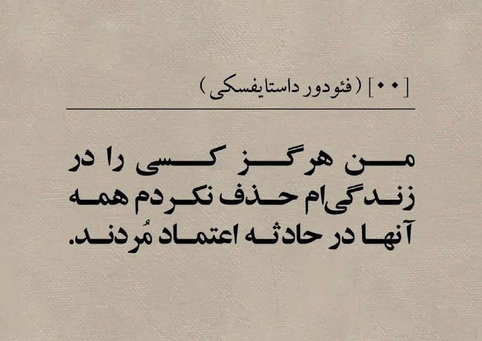

#بخوابیم

@Dirty_Kids 👻

## Dirty_Kids — post 392613

  <a href="telegram/content/Dirty_Kids_392613_1781907300.mp4" target="_blank">🎬 Download video</a>

از وقتی متن های اموزشی رو با این ویو میخونم، خیلی بهتر یادشون میگیرم :) 
🇮🇷

@Dirty_Kids 👻

## Dirty_Kids — post 392612

  <a href="telegram/content/Dirty_Kids_392612_1781907300.mp4" target="_blank">🎬 Download video</a>

مهم نیست گذشتش وقتی الانتو دیدم....
دختری که پسرا حاضرن کل زندگیشونو بهش بدن:

@Dirty_Kids 👻

## alonews — post 129267

  <a href="telegram/content/alonews_129267_1781907302.webm" target="_blank">🎬 Download video</a>

👈حرکت 10 نفتکش ایرانی به نام های؛ دیونا، قهرمان، سونیا، دورنا، آمبر، خندان، برف، هدی، استارلا و دریا عمیق به طرف چین

✅ @AloNews خبر جنگ

---
📅 بروزرسانی: 1405/03/30 01:35
---

## IranIntlTV — post 343300

  <a href="telegram/content/IranIntlTV_343300_1781906712.mp4" target="_blank">🎬 Download video</a>

تنها دو روز پس از امضای تفاهم‌نامه میان روسای جمهوری آمریکا و جمهوری اسلامی، مذاکرات برنامه‌ریزی‌شده در سوئیس لغو شد.

دونالد ترامپ هشدار داد اگر در ۶۰ روز توافقی حاصل نشود، آمریکا اقداماتی انجام خواهد داد که برای مقام‌های جمهوری اسلامی خوشایند نخواهد بود. جی‌دی ونس نیز گفت تفاهم‌نامه میان واشینگتن و تهران ارتباطی با خروج اسرائیل از جنوب لبنان ندارد.

گزارش امیر گیتی، عضو تحریریه ایران‌اینترنشنال
@iranintltv

## BBCPersian — post 284433

  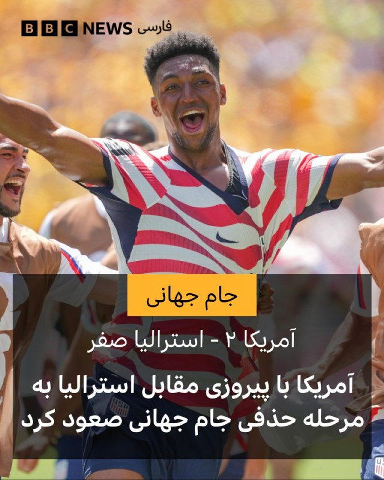

‌⚽آمریکا ۲ - استرالیا صفر

🔸تیم ملی فوتبال آمریکا، میزبان جام جهانی، با پیروزی ۲ بر صفر مقابل استرالیا در گروه D به مرحله حذفی این رقابت‌ها صعود کرد.

آمریکا در دقیقه ۱۱ با گل به خودی یکی از بازیکنان استرالیا پیش افتاد و سپس الکساندر فریمن، مدافع میانی این تیم، در دقیقه ۴۳ گل دوم را به ثمر رساند.

با این پیروزی، آمریکا یک بازی مانده به پایان مرحله گروهی، صعود خود به دور حذفی را قطعی کرد.

در دیگر مسابقات روز، اسکاتلند به مصاف مراکش، قهرمان آفریقا، می‌رود. همچنین برزیل با هائیتی دیدار خواهد کرد و ترکیه برابر پاراگوئه به میدان می‌رود.

📷ISI Photos via Getty Images
https://bbc.in/4vsxgTg

@BBCPersian

## alonews — post 129266

  <a href="telegram/content/alonews_129266_1781906714.webm" target="_blank">🎬 Download video</a>

👈رسایی :
دشمن اگه غلطی کرد باید تنگه رو ببندیم

✅ @AloNews خبر جنگ

---
📅 بروزرسانی: 1405/03/30 01:25
---

## WithYashar — post 15370

تیم ملی آمریکا با برد ۲ هیچ برابر استرالیا به عنوان دومین تیم پر قدرت به مرحله حذفی جام جهانی ۲۰۲۶ صعود کرد!
@withyashar

## WithYashar — post 15369

  <a href="telegram/content/WithYashar_15369_1781906113.mp4" target="_blank">🎬 Download video</a>

الان درگیری‌های سنگین بین نیروهای اسرائیل و حزب‌الله تو لُبنان
@withyashar

## WithYashar — post 15368

  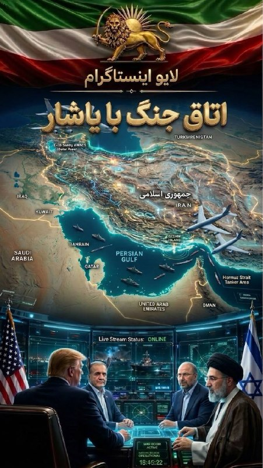

کاور لایو
@withyashar

## mwarmonitor — post 11242

🔹مجری فاکس نیوز:
«اکنون مارک لوین، مجری برنامه "زندگی، آزادی و لوین" به ما می‌پیوندد. مارک، خیلی عالیه که امروز همراه ما هستی.»
🔸مارک لوین :
«خب، واقعیت امر این است که این رژیم مرده است. مسئله این است که آیا ما اجازه می‌دهیم زنده بماند؟ آیا اجازه می‌دهیم جان دوباره‌ای به آن دمیده شود؟ و به همین دلیل است که این مذاکرات حیاتی هستند. من با تقریباً تمام صحبت‌های ژنرال کلاگ موافقم. آن‌ها مرده‌های متحرک هستند.»
«حالا، آیا ما قرار است آن‌ها را احیا کنیم یا نه؟ تا جایی که به تنگه‌ها مربوط می‌شود، آنجا آب‌های بین‌المللی است. آن‌ها حق ندارند آن را کنترل کنند. هشت کشور در خط ساحلی آن منطقه قابل کشتیرانی قرار دارند. کی گفته ایران حق دارد درباره آنچه در آنجا می‌گذرد تصمیم‌گیری کند؟»
«آن‌ها باید سر جای خودشان نشانده شوند. از نظر من—من رئیس‌جمهور نیستم، پس فقط دارم پیش‌بینی و تصویرسازی می‌کنم—من می‌گفتم: این ۱۲ بند من است، یا تسلیم می‌شوید یا یک یا دو هفته دیگر شما را خواهیم دید (با شما حساب تسویه می‌کنیم).»
«این حکومت باید برود. این یک حکومت غیرمشروع است، مردم خودش را قتل‌عام می‌کند. این حکومتی برخاسته از مردم نیست...»
🔹مجری میان حرف او می‌پرد:
«...اما در حال حاضر همان افراد سابق در رأس کار هستند، درست است؟ منظورم این است که ما شاهد تغییر رژیم نبوده‌ایم. همان آدم‌ها در رأس قدرتند، درست می‌گویم؟»
🔸مارک لوین :
«خب، برداشت من از این موضوع این است: واقعیت امر این است که ما با این رژیم وارد جنگ شدیم و این رژیم شکست خورد. ما با مردم ایران وارد جنگ نشدیم. این‌ها دو مقوله کاملاً جدا از هم هستند.»
«دقیقاً. ما به دنبال یک پروژه دموکراسی‌سازی نیستیم، مردم آمریکا پروژه دموکراسی‌سازی نمی‌خواهند. خب که چی؟ ما این رژیم را برمی‌داریم (سرنگون می‌کنیم)، یک حکومت موقت روی کار می‌آوریم و خودشان می‌توانند بفهمند که می‌خواهند چه کار کنند؛ چه دموکراسی بخواهند، چه پادشاه بخواهند، چه شاهزاده یا ملکه. می‌دانید، کل آن منطقه پر از دیکتاتورها و پادشاهان است. اگر این همان چیزی است که آن‌ها می‌خواهند، عالی است.»
«ما آن رژیم را برمی‌داریم چون دشمن ماست. ما آن رژیم را برمی‌داریم چون مردم ما را کشته است. ما آن رژیم را برمی‌داریم چون سلاح هسته‌ای می‌خواستند. و اگر این رژیم به شکلی باقی بماند، می‌دانید، مثل دستگاه علف‌زن است؛ علف‌های هرز رشد می‌کنند و مدام بالا می‌آیند. شما ممکن است در مرحله بعدی رویه آن را بزنید، اما علف‌های هرز به رشد خود ادامه می‌دهند؛ و اگر ما به ریشه این علف‌های هرز نزنیم، آن‌ها همچنان به رشد خود ادامه خواهند داد.»

@mwarmonitor

## mwarmonitor — post 11241

  <a href="telegram/content/mwarmonitor_11241_1781906116.mp4" target="_blank">🎬 Download video</a>

🎬 Video

## IranIntlTV — post 343299

  <a href="telegram/content/IranIntlTV_343299_1781906118.mp4" target="_blank">🎬 Download video</a>

دادگاهی در قم، پرستو احمدی و هشت تن از نوازندگان و عوامل «کنسرت کاروانسرا» را هر یک به ۷۴ ضربه شلاق، دو سال ممنوعیت خروج از کشور و دو سال محرومیت از فعالیت هنری محکوم کرده است.

آرین ریسباف گزارش می‌دهد.
@iranintltv

## IranIntlTV — post 343298

  <a href="telegram/content/IranIntlTV_343298_1781906120.mp4" target="_blank">🎬 Download video</a>

دادگاهی در قم، پرستو احمدی و هشت تن از نوازندگان و عوامل «کنسرت کاروانسرا» را هر یک به ۷۴ ضربه شلاق، دو سال ممنوعیت خروج از کشور و دو سال محرومیت از فعالیت هنری محکوم کرده است.

آرین ریسباف گزارش می‌دهد.
@iranintltv

## alonews — post 129265

  

تیم ملی آمریکا هم به عنوان دومین تیم به مرحله حذفی جام جهانی ۲۰۲۶ صعود کرد!

آمریکا 2_ استرالیا 0

@AloSport

## alonews — post 129264

🚀 اگه واسه کانالت دنبال ممبر، سین، ری‌اکشن اتوماتیک و حتی کامنت با هوش مصنوعی می‌گردی ارزون‌ترین ربات کلیکو هستش
قیمت‌ها عالیه:
سین کایی ۵۰۰
ری‌اکشن کایی ۲۵۰۰
ممبر از کایی ۵۰.۰۰۰

⚡️ تحویل سریع 
💵 قیمت تضمینی

🤖 ثبت سفارش خودکار 
👤پشتیبانی 24 ساعته

لینک ربات👇👇

✅@ClickooBot 
🤖

✅@ClickooBot 
🤖

<!-- MSG END -->

<!-- NAV START -->

<a href="https://github.com/ProAlit/aio-downloader/blob/main/telegram/content/archive_1.md" style="display:inline-block; padding:6px 12px; margin:0 4px; background-color:#2ea44f; color:white; text-decoration:none; border-radius:4px; font-weight:bold;">صفحه بعد</a>

<!-- NAV END -->
