# خواننده تلگرام

<!-- TOP_NAV START -->

<a href="https://github.com/ProAlit/aio-downloader/blob/main/telegram/content/archive_1.md" style="display:inline-block; padding:6px 12px; margin:0 4px; background-color:#2ea44f; color:white; text-decoration:none; border-radius:4px; font-weight:bold;">صفحه بعد</a>

<!-- TOP_NAV END -->

<!-- MSG START -->

---
📅 بروزرسانی: 1405/03/22 00:23
---

## VahidOOnLine — post 245055

  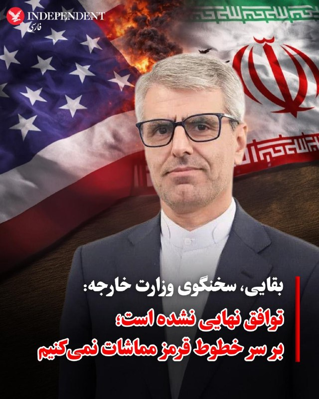

♦️اسماعیل بقایی، سخنگوی وزارت خارجه، پنجشنبه ۲۱ خردادماه، در یک برنامه تلویزیونی گفت تا این لحظه ایران به جمع‌بندی نهایی درباره توافق نرسیده است.
بقایی افزود بخش عمده متن توافق نهایی شده بود، اما آمریکا در جریان مذاکرات بارها مواضع خود را تغییر داده است.
او با اشاره به نقش قطر و پاکستان به عنوان میانجی گفت اقدامات آمریکا روند دیپلماتیک را تحت تاثیر قرار می‌دهد و وضعیت مذاکرات از ابتدا برای ایران روشن بوده است.
سخنگوی وزارت خارجه جمهوری اسلامی همچنین تاکید کرد ایران درباره مواردی که به عنوان خطوط قرمز تعیین کرده، هیچ‌گونه مماشاتی نخواهد داشت.
بقایی درباره گزارش‌های منتشرشده پیرامون توافق نیز گفت مواردی که مطرح می‌شود در حد گمانه‌زنی است و هنوز هیچ موضوعی نهایی نشده است. او همچنین افزود وضعیت تنگه هرمز به دلیل اقدامات آمریکا ناامن‌تر شده است.
‌🇸🇦 Indypersian

🤖 @VahidOOnLine

## VahidOOnLine — post 245054

  

ابراهیم رضایی، سخنگوی کمیسیون امنیت ملی مجلس، در شبکه ایکس نوشت: «احتمال فریب از سوی ترامپ بالاست، او فردا معامله بزرگی در پیش دارد و می‌خواهد فعلا اوضاع را آرام نگه دارد. محکم‌تر بزنید، زیرساخت‌ها و مراکز اقتصادی و هوش مصنوعی دشمن در منطقه را ویران و نابود کنید تا بیشتر دردشان بگیرد.»

این در حالی است که دونالد ترامپ اعلام کرده توافق با جمهوری اسلامی تا چند روز دیگر امضا خواهد شد.
‌🏁 🇬🇧 IranintlTV

🤖 @VahidOOnLine

## WithYashar — post 14582

خبرنگار: دیروز گفتید که ایران ممکن است در حال همکاری با ایالات متحده باشد. آیا شما معتقدید که این بار در خواست خود برای پیگیری دیپلماسی صادق هستند؟

ترامپ: این به سطح هیجان آغاز شده در آن بستگی دارد. ما در سه روز گذشته به شدت به آن‌ها فشار آوردیم. امشب حتی سخت‌تر به آن‌ها ضربه خواهیم زد. آن‌ها این را می‌دانستند.
ما دقیقاً به آن‌ها گفتیم که قصد داریم چه کاری انجام دهیم.
@withyashar

## WithYashar — post 14581

️واشنگتن پست: توافق بزودی در رم یا ژنو امضا میشه
@withyashar

## WithYashar — post 14580

ترامپ درباره رهبری ایران:

من این افراد را بسیار منطقی‌تر از کسانی که دیگر در میان ما نیستند می‌یابم.

این گروه متفاوتی است و فکر می‌کنم گروهی باهوش‌تر و دارای دلیل و منطق است.

همه آنها این توافق را تأیید کرده‌اند.
@withyashar

## kianmeli1 — post 87949

🔴خبرنگار: آیا رژیم ایران عوض شده؟

ترامپ: بله، نه یک بار بلکه دو بار
https://t.me/kianmeli1

## kianmeli1 — post 87948

🔴ترامپ

عملیات تصرف جزیره خارک از دستور کار خارج شد.
https://t.me/kianmeli1

## IranIntlTV — post 341806

  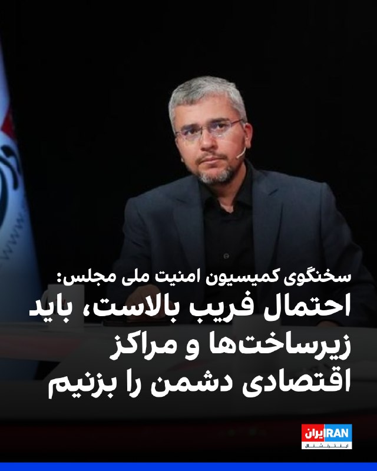

ابراهیم رضایی، سخنگوی کمیسیون امنیت ملی مجلس، در شبکه ایکس نوشت: «احتمال فریب از سوی ترامپ بالاست، او فردا معامله بزرگی در پیش دارد و می‌خواهد فعلا اوضاع را آرام نگه دارد. محکم‌تر بزنید، زیرساخت‌ها و مراکز اقتصادی و هوش مصنوعی دشمن در منطقه را ویران و نابود کنید تا بیشتر دردشان بگیرد.»

این در حالی است که دونالد ترامپ اعلام کرده توافق با جمهوری اسلامی تا چند روز دیگر امضا خواهد شد.
https://iranintl.com/202606119566

## FarsiVOA — post 220427

  <a href="telegram/content/FarsiVOA_220427_1781211200.mp4" target="_blank">🎬 Download video</a>

⚡️جنگ پنهان روسیه؛ استفاده از دختران برای ترور نظامیان و ایجاد ناامنی در اوکراین
@FarsiVOA

## Persian_Trend_Official — post 16779

  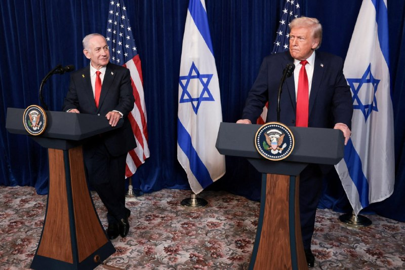

دفتر نخست وزیری اسرائیل: رئیس جمهور ترامپ عصر امروز با نخست وزیر نتانیاهو در مورد تفاهم نامه در حال شکل گیری با ایران برای ورود به مذاکرات صحبت کرد.

اگرچه اسرائیل طرف این تفاهم نامه نیست، نخست وزیر از تعهد رئیس جمهور ترامپ مبنی بر اینکه توافق نهایی در پایان مذاکرات شامل حذف مواد غنی شده، برچیدن زیرساخت های غنی سازی، محدود کردن تولید موشک و توقف حمایت ایران از نیروهای نیابتی تروریستی خود در منطقه خواهد بود، ابراز قدردانی کرد.

📝 Amir

📌 @persian_trend_official
پرشین ترند | متفاوت‌ترین کانال نظامی

## Persian_Trend_Official — post 16778

بقایی، سخنگوی امور خارجه: آمریکایی‌‌ها درحال القا هستند که جمهوری اسلامی تحت فشار به توافق رضایت داده، در حالیکه ما به هیچ عنوان از خطوط قرمز خود کوتاه نخواهیم آمد.

اگر قرار بود ایران تحت فشار و تهدید از مواضع اصولی خود کوتاه بیاید، یک‌سال قبل این کار را انجام می‌داد.

📝 Amir

📌 @persian_trend_official
پرشین ترند | متفاوت‌ترین کانال نظامی

## alonews — post 127271

  <a href="telegram/content/alonews_127271_1781211202.webm" target="_blank">🎬 Download video</a>

👈خبرنگار: آیا رژیم ایران عوض شده؟

🔴ترامپ: بله، نه یک بار بلکه دو بار

✅ @AloNews خبر جنگ

## alonews — post 127270

  <a href="telegram/content/alonews_127270_1781211202.webm" target="_blank">🎬 Download video</a>

👈واشنگتن پست: توافق قطعی شده و بزودی در ژنو یا رم امضا خواهد شد 
✅ @AloNews خبر جنگ

## alonews — post 127269

  <a href="telegram/content/alonews_127269_1781211202.webm" target="_blank">🎬 Download video</a>

👈واشنگتن پست: توافق قطعی شده و بزودی در ژنو یا رم امضا خواهد شد

✅ @AloNews خبر جنگ

---
📅 بروزرسانی: 1405/03/22 00:13
---

## VahidOOnLine — post 245053

  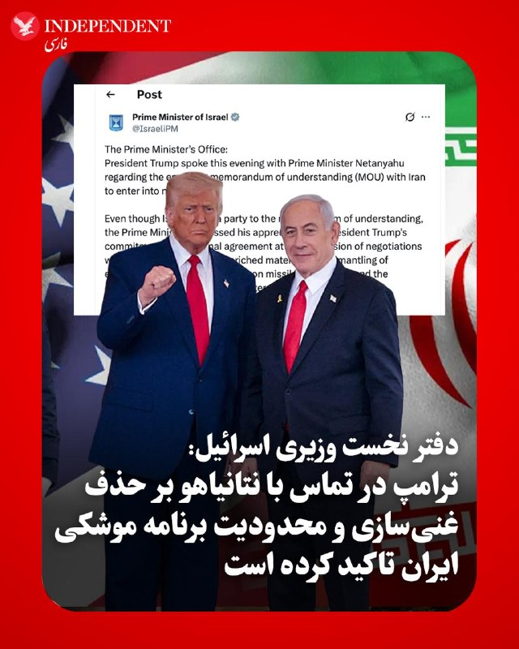

♦️دفتر نخست‌وزیر اسرائیل اعلام کرد دونالد ترامپ پنجشنبه ۲۱ خردادماه در تماس با بنیامین نتانیاهو درباره تفاهم‌نامه‌ای که با جکومت ایران در حال شکل‌گیری است و زمینه ورود به مذاکرات را فراهم می‌کند، گفتگو کرده است.

بر اساس این بیانیه، با وجود آنکه اسرائیل طرف این تفاهم‌نامه نیست، نتانیاهو از تعهد ترامپ نسبت به مفاد توافق نهایی قدردانی کرده است.

دفتر نخست‌وزیری اسرائیل افزود تعهد ترامپ شامل حذف مواد غنی‌شده، برچیدن زیرساخت‌های غنی‌سازی، محدود کردن تولید موشک و پایان دادن به حمایت ایران از نیروهای نیابتی در منطقه است.

این اظهارات در حالی مطرح شد که دونالد ترامپ، رئیس‌جمهوری آمریکا، در گفتگو با خبرنگاران در دفتر بیضی کاخ سفید از توافقی احتمالی سخن گفت که می‌تواند به جنگ با ایران پایان دهد و افزود این توافق ممکن است ظرف روزهای آینده نهایی شود.

ترامپ گفت: «اسناد در وضعیت تقریبا نهایی هستند، پس باید ببینیم چه می‌شود.» او همچنین تاکید کرد این روند باید «خیلی سریع» انجام شود و ابراز امیدواری کرد مراسم امضای این سند به‌زودی و احتمالا در اروپا برگزار شود.
‌🇸🇦 Indypersian

🤖 @VahidOOnLine

## VahidOOnLine — post 245052

  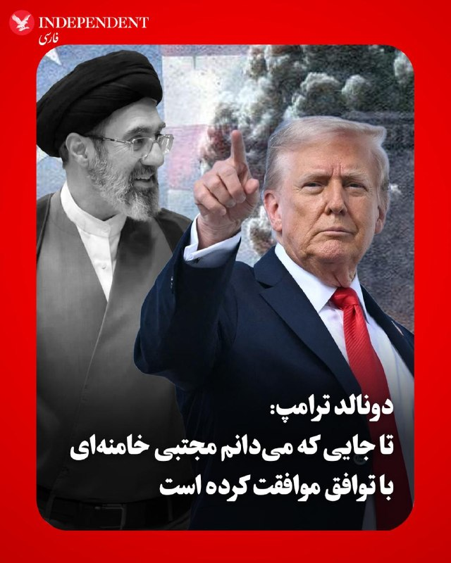

♦️دونالد ترامپ، رئیس‌جمهوری آمریکا، پنجشنبه ۲۱ خردادماه در گفت‌وگو با خبرنگاران در کاخ سفید گفت جمهوری اسلامی هرگز به سلاح هسته‌ای دست نخواهد یافت و توافق میان تهران و واشنگتن به زودی نهایی می‌شود.
ترامپ در پاسخ به سوالی درباره تایید این توافق از سوی مجتبی خامنه‌ای گفت: «تا جایی که من می‌دانم، پاسخ بله است.»
رئیس‌جمهوری آمریکا افزود این توافق بسیار مفصل و دارای جزییات فراوان است و در صورت امضا، محدودیت‌ها و محاصره اعمال‌شده علیه ایران لغو خواهد شد.
‌🇸🇦 Indypersian

🤖 @VahidOOnLine

## VahidOOnLine — post 245051

  

دفتر نخست‌وزیری اسرائیل، اعلام کرد که دونالد ترامپ، رییس‌جمهوری آمریکا، درباره یک یادداشت تفاهم در حال شکل‌گیری با حکومت ایران برای ورود به مذاکرات، با بنیامین نتانیاهو گفت‌وگو کرده است.

این دفتر افزود نتانیاهو از تعهد ترامپ درباره شرایط هر توافق نهایی با ایران ابراز قدردانی کرده، هرچند اسرائیل طرف این تفاهم‌نامه نیست.

دفتر نتانیاهو نوشت: «تعهد ترامپ شامل حذف مواد غنی‌شده، برچیدن زیرساخت‌های غنی‌سازی، محدود کردن تولید موشک و پایان دادن به حمایت ایران از نیروهای نیابتی در منطقه بوده است.»
‌🏁 🇬🇧 IranintlTV

🤖 @VahidOOnLine

## WithYashar — post 14579

  <a href="telegram/content/WithYashar_14579_1781210610.mp4" target="_blank">🎬 Download video</a>

خبرنگار: آیا رهبر ایران این توافق را تأیید کرده است؟

ترامپ: تا جایی که می‌دانم پاسخ بله است.
@withyashar

## WithYashar — post 14578

## WithYashar — post 14577

ترامپ : ما این جنگ رو از نظر نظامی خیلی زود بردیم، تنها چیزی که نبردیم، رسانه‌های فیک‌نیوزه

تنگه بازه؛ ولی این تنگه‌ها از چند ماه پیش هم باز بودن، فقط شما خبر نداشتید
@withyashar

## WithYashar — post 14576

دفتر نتانیاهو: رئیس جمهور ترامپ با نخست وزیر نتانیاهو در مورد نهایی شدن یادداشت تفاهم با ایران برای ورود به مذاکرات صحبت کرد.اگرچه اسرائیل طرف این یادداشت تفاهم نیست،نخست وزیر از تعهد رئیس جمهور ترامپ برای اطمینان از اینکه توافق نهایی که در پایان مذاکرات شامل…

## FoxNewsTwitter — post 342879

  <a href="telegram/content/FoxNewsTwitter_342879_1781210611.mp4" target="_blank">🎬 Download video</a>

Fox News (Twitter/X)

NEW: Sec. Rubio touts the upcoming White House UFC event as a "gift to the American people":

"The America 250 celebration belongs to the people of the United States."

"It's a gift to the American people. They're going to see their White House and their capital on their nation's birthday celebrating with a historic event."

"We could've had a band... We could've done a Shakespeare in the park production... A billion people all over the world will be watching America celebrate its 250th birthday."

"We're happy to be a part of that."

## FoxNewsTwitter — post 342878

  <a href="telegram/content/FoxNewsTwitter_342878_1781210613.mp4" target="_blank">🎬 Download video</a>

Fox News (Twitter/X)

“You have done more for this nation in the seafood space than any president before you in my lifetime.”

American fishermen came to the Oval Office to thank President Trump for cutting Biden-era regulations they say were crushing their industry — and even made him an honorary crew member: "You're one of us now."

"We support you 100%."

## VahidOnline — post 76248

  <a href="telegram/content/VahidOnline_76248_1781210615.mp4" target="_blank">🎬 Download video</a>

ترامپ درباره مقامات جمهوری اسلامی:
من این افراد را بسیار منطقی‌تر از افرادی می‌دانم که دیگر با ما نیستند. این یک گروه متفاوت است و من فکر می‌کنم گروهی باهوش‌تر است که منطق دارد. همه آنها توافق را تأیید کرده‌اند.

📡 @VahidOnline

## VahidOnline — post 76247

  

اسماعیل بقائی، سخنگوی وزارت خارجه جمهوری اسلامی در یک برنامه تلویزیونی گفت: «مواردی که درباره توافق مطرح می‌شود، گمانه‌زنی است و موضوع نهایی نشده است.»

او اضافه کرد: «وضعیت مذاکرات از ابتدا برای ما روشن بود و بخش عمده متن نهایی شده بود، اما آمریکایی‌ها مواضع خود را تغییر می‌دادند.»
@VahidOOnLine

📡 @VahidOnline

## IranIntlTV — post 341803

🔻اسپه‌هلو سیتوله، مدافع تیم ملی فوتبال آفریقای جنوبی، در دقیقه ۵۸ بازی افتتاحیه جام جهانی برابر مکزیک، در حالی که گوتیرز در موقعیت تک‌به‌تک بود، از پشت سر روی او خطا کرد و با دریافت نخستین کارت قرمز مستقیم جام، از بازی اخراج شد.

@iranintltvsport

## IranIntlTV — post 341802

  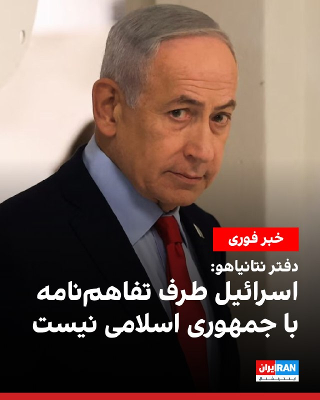

دفتر نخست‌وزیری اسرائیل، اعلام کرد که دونالد ترامپ، رییس‌جمهوری آمریکا، درباره یک یادداشت تفاهم در حال شکل‌گیری با حکومت ایران برای ورود به مذاکرات، با بنیامین نتانیاهو گفت‌وگو کرده است.

این دفتر افزود نتانیاهو از تعهد ترامپ درباره شرایط هر توافق نهایی با ایران ابراز قدردانی کرده، هرچند اسرائیل طرف این تفاهم‌نامه نیست.

دفتر نتانیاهو نوشت: «تعهد ترامپ شامل حذف مواد غنی‌شده، برچیدن زیرساخت‌های غنی‌سازی، محدود کردن تولید موشک و پایان دادن به حمایت ایران از نیروهای نیابتی در منطقه بوده است.»
https://iranintl.com/202606116113

## FarsiVOA — post 220426

  <a href="telegram/content/FarsiVOA_220426_1781210617.mp4" target="_blank">🎬 Download video</a>

⚡️در حالی که آمریکا برای دومین شب پیاپی مواضع جمهوری اسلامی را هدف حملات هوایی قرار داد، مقام‌های حکومت تهران از «انتقام نهایی» سخن می‌گویند و همزمان تلاش‌ها برای تمدید آتش‌بس و دستیابی به توافق ادامه دارد.
@FarsiVOA

## FarsiVOA — post 220425

  <a href="telegram/content/FarsiVOA_220425_1781210618.mp4" target="_blank">🎬 Download video</a>

⚡️شکریا برادوست در برنامه تفسیر خبر: معلوم نیست در باقی‌مانده جمهوری اسلامی چه کسی حرف آخر را می‌زند
@FarsiVOA

## RadioFarda — post 158199

🔸رئیس‌جمهور ایالات متحده روز پنج‌شنبه ۲۱ خرداد اعلام کرد که انتظار می‌رود مراسم امضای توافق میان آمریکا و ایران این آخر هفته در اروپا برگزار شود و جی‌دی ونس، معاون رئیس‌جمهور، در این مراسم شرکت خواهد کرد.

🔸دونالد ترامپ از دستیابی به یک «توافق بزرگ» با ایران برای پایان دادن به جنگ خاورمیانه خبر داد و در دفتر بیضی کاخ سفید به خبرنگاران گفت: «ما به‌تازگی به یک توافق بزرگ درباره جنگ با ایران دست یافتیم».

🔸او افزود که «مشروط به نهایی شدن اسناد، که باید طی چند روز آینده انجام شود، احتمالاً مراسم امضا، در اروپا برگزار خواهد شد».

🔸ترامپ اعلام کرد که به محض امضای توافق با ایران «تنگه هرمز به شکل رسمی باز خواهد شد».

🔸رئیس‌جمهور آمریکا با اشاره به این که خودش نمی‌تواند در مراسم امضای این توافق شرکت کند، گفت جی‌دی ونس به این منظور به اروپا سفر خواهد کرد.

🔸ترامپ از اواسط ماه مارس بارها گفته که دستیابی به توافقی با ایران برای پایان دادن به جنگ نزدیک است.

@RadioFarda

## BBCPersian — post 283479

🔻 ترامپ می‌گوید «یادداشت تفاهم قوی» با ایران «کمی مفهومی» است

دونالد ترامپ در ادامه گفت‌وگویش با خبرنگاران در کاخ سفید در پاسخ به سوالی که آیا این «مفهوم» توافق، همانطور که قبلا گفته بود، فقط زمینه را برای مذاکرات عمیق‌تر فراهم می‌کند یا خیر.

پاسخ داد: «این یک یادداشت تفاهم بسیار قوی است که کمی مفهومی است، اما چیزی است که قرار است انجام شود.»

او افزود: «این یک یادداشت تفاهم بسیار دقیق است که مورد توافق بسیاری از کشورهای دیگر که نفوذ زیادی بر آنها (ایران) دارند نیز قرار گرفته است و همه می‌خواهند که انجام شود.»

https://bbc.in/449qeXb
@BBCPersian

## alonews — post 127268

  <a href="telegram/content/alonews_127268_1781210619.webm" target="_blank">🎬 Download video</a>

👈العربیه: آمریکا دسترسی به دارایی‌های مسدودشده ایران را تسهیل خواهد کرد.

✅ @AloNews خبر جنگ

## alonews — post 127267

الان یعنی با قاتل حضرت سید علی خامنه‌ای 💔، قاتل خانواده‌ی رهبر جدیدمون 💔 قاتل سردار سلیمانی 💔، قاتل سید مقاومت حسن نصرالله💔، قاتل شهید فقید اسماعیل هنیه💔، قاتل دانشمندمون محسن فخری‌زاده💔، قاتل سردار حسین سلامی💔، قاتل سردار محمد باقری غلامعلی رشید💔، قاتل سردار…

## alonews — post 127266

  <a href="telegram/content/alonews_127266_1781210619.webm" target="_blank">🎬 Download video</a>

👈ترامپ : ما این جنگ رو از نظر نظامی خیلی زود بردیم، تنها چیزی که نبردیم، رسانه‌های فیک‌نیوزه

✅ @AloNews خبر جنگ

---
📅 بروزرسانی: 1405/03/22 00:03
---

## VahidOOnLine — post 245050

  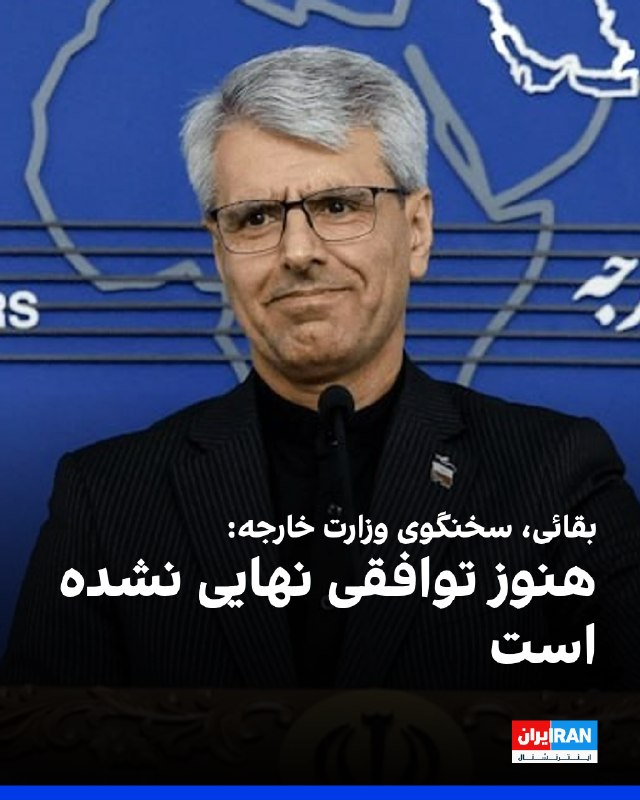

اسماعیل بقائی، سخنگوی وزارت خارجه جمهوری اسلامی در یک برنامه تلویزیونی گفت: «مواردی که درباره توافق مطرح می‌شود، گمانه‌زنی است و موضوع نهایی نشده است.»

او اضافه کرد: «وضعیت مذاکرات از ابتدا برای ما روشن بود و بخش عمده متن نهایی شده بود، اما آمریکایی‌ها مواضع خود را تغییر می‌دادند.»
‌🏁 🇬🇧 IranintlTV

🤖 @VahidOOnLine

## VahidOOnLine — post 245049

  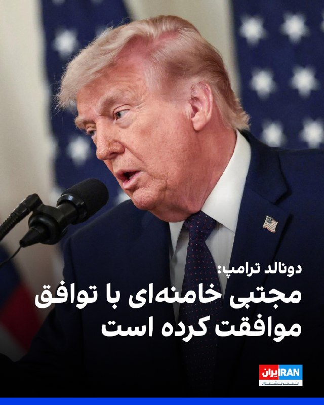

دونالد ترامپ، رییس جمهوری آمریکا درباره توافق با تهران گفت: «جمهوری اسلامی سلاح هسته‌ای نخواهد داشت.»

زمانی که یک خبرنگار از ترامپ در کاخ سفید پرسید که آیا مجتبی خامنه‌ای این توافق را تایید کرده، او گفت: «تا جایی که من می‌دانم، پاسخ بله است.»

ترامپ اضافه کرد که تفاهم‌نامه بسیار مفصل و دارای جزییات است و این توافق نهایی خواهد شد.

او افزود: «عملیات جزیره خارک از دستور کار خارج شده و دیگر مطرح نیست.»
‌🏁 🇬🇧 IranintlTV

🤖 @VahidOOnLine

## WithYashar — post 14575

  <a href="telegram/content/WithYashar_14575_1781210008.webm" target="_blank">🎬 Download video</a>

ترامپ: عملیات جزیره خارک دیگر روی میز نیست. می‌خواهید آشوب ببینید؟ می‌خواهید مرگ و ویرانی ببینید بگذارید ایران سلاح هسته‌ای داشته باشد نمی‌خواهم برای دستیابی به توافق با ایران ضرب‌الاجل تعیین کنم. @withyashar

## WithYashar — post 14574

ترامپ: عملیات جزیره خارک دیگر روی میز نیست.

می‌خواهید آشوب ببینید؟ می‌خواهید مرگ و ویرانی ببینید بگذارید ایران سلاح هسته‌ای داشته باشد

نمی‌خواهم برای دستیابی به توافق با ایران ضرب‌الاجل تعیین کنم.
@withyashar

## WithYashar — post 14573

وزارت امور خارجه ایران:
ما قبلاً گفتیم که بیشتر مفاد توافق‌نامه حل و فصل شده است، اما طرف آمریکایی می‌خواست خواسته‌های جدیدی را اضافه کند.
@withyashar

## mwarmonitor — post 10745

🔴نتانیاهو: اگرچه اسرائیل طرف این یادداشت تفاهم نیست، اما من از تعهد ترامپ قدردانی کردم که هر توافق نهایی شامل حذف مواد غنی‌شده، برچیدن زیرساخت‌های غنی‌سازی، محدود کردن تولید موشک‌ها و پایان دادن به حمایت ایران از نیروهای نیابتی‌اش در منطقه خواهد بود.

@mwarmonitor

## VahidOnline — post 76246

  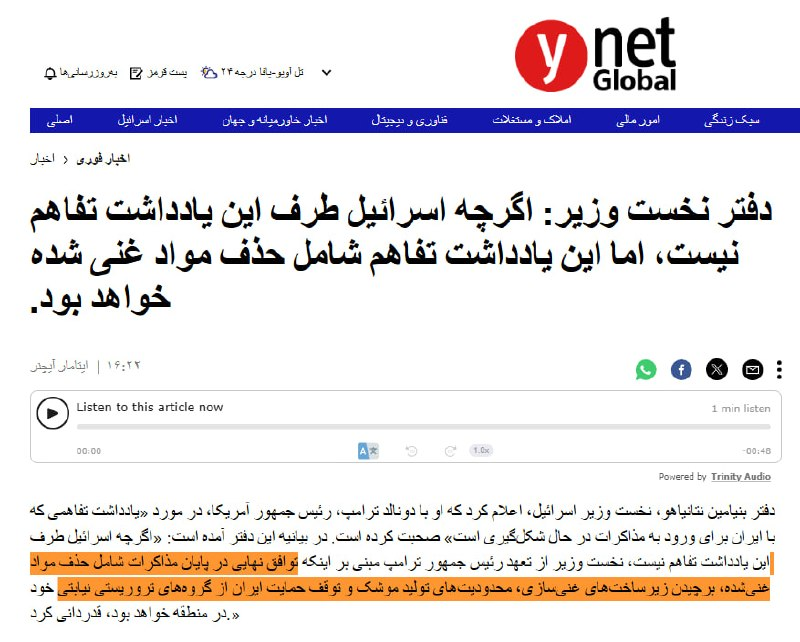

در بیانیه دفتر نخست‌وزیر اسرائیل، نتانیاهو، آمده:
"توافق نهایی در پایان مذاکرات شامل
-حذف مواد غنی‌شده
-برچیدن زیرساخت‌های غنی‌سازی
-محدودیت‌های تولید موشک
- و توقف حمایت ایران از گروه‌های تروریستی نیابتی خود در منطقه
خواهد بود"

📡 @VahidOnline

## kianmeli1 — post 87947

🔴ترامپ :

ما پیروز شدیم بزرگترین ارتش دنیا پیروز شد.
https://t.me/kianmeli1

## kianmeli1 — post 87946

🔴صداوسیما به نقل از سخنگوی وزارت خارجه:

تا الان ایران به جمع‌بندی نهایی درباره توافق نرسیده است
https://t.me/kianmeli1

## IranIntlTV — post 341801

  <a href="https://t.me/IranintlTV/341801" target="_blank">📎 Download file</a>

🎧نسخه صوتی ۲۴ با فرداد فرحزاد: چرخش ۱۸۰ درجه‌ای ترامپ
@iranintlTV

## IranIntlTV — post 341800

  

اسماعیل بقائی، سخنگوی وزارت خارجه جمهوری اسلامی در یک برنامه تلویزیونی گفت: «مواردی که درباره توافق مطرح می‌شود، گمانه‌زنی است و موضوع نهایی نشده است.»

او اضافه کرد: «وضعیت مذاکرات از ابتدا برای ما روشن بود و بخش عمده متن نهایی شده بود، اما آمریکایی‌ها مواضع خود را تغییر می‌دادند.»
https://iranintl.com/202606115319

## IranIntlTV — post 341799

  

دونالد ترامپ، رییس جمهوری آمریکا درباره توافق با تهران گفت: «جمهوری اسلامی سلاح هسته‌ای نخواهد داشت.»

زمانی که یک خبرنگار از ترامپ در کاخ سفید پرسید که آیا مجتبی خامنه‌ای این توافق را تایید کرده، او گفت: «تا جایی که من می‌دانم، پاسخ بله است.»

ترامپ اضافه کرد که تفاهم‌نامه بسیار مفصل و دارای جزییات است و این توافق نهایی خواهد شد.

او افزود: «عملیات جزیره خارک از دستور کار خارج شده و دیگر مطرح نیست.»
https://iranintl.com/202606119753

## Shin_Persian — post 6963

Shin ✓ @hey_itsmyturn
Thu, 11 Jun 2026 20:25:13 UTC

Trump celebrating a deal while the Iranian embassy accounts are tweeting TACO.
Quite a timeline.

ترجمه خودکار فارسی

ترامپ در حال جشن گرفتن یک توافق است، در حالی که حساب‌های کاربری سفارت ایران در حال توییت کردن تصویر تاکو (TACO) هستند.
عجب دوره و زمانه‌ای شده است.

𝕏 · @shin_persian

## FarsiVOA — post 220424

  <a href="telegram/content/FarsiVOA_220424_1781210011.mp4" target="_blank">🎬 Download video</a>

⚡️زوال قدرت چانه‌زنی جمهوری اسلامی پس از هربار درگیری با آمریکا؛ گفت‌وگو با احمد وخشیته
@FarsiVOA

## FarsiVOA — post 220423

  <a href="telegram/content/FarsiVOA_220423_1781210012.mp4" target="_blank">🎬 Download video</a>

⚡️امیر طاهری در برنامه تفسیر خبر: هزینه تصرف جزیره خارک بسیار بالا خواهد بود
@FarsiVOA

## IranianMinds — post 22341

🔴 خبرنگار: شما قبلاً گفته‌اید که ایران و آمریکا به توافق نزدیک بودند. هنوز این اتفاق نیفتاده است. چرا این‌قدر مطمئن هستید که این بار متفاوت است؟

ترامپ: چون آن‌ها ضربه سختی خورده‌اند. آن‌ها ضربه‌ای خورده‌اند که خیلی کم‌کسی می‌تواند تحمل کند. و آن‌ها خیلی بیشتر از من می‌خواهند توافق کنند.

@IranianMinds

## IranianMinds — post 22340

🔴 سخنگوی وزارت امور خارجه رژیم جمهوری اسلامی، اسماعیل بقایی:
تا کنون، ایران به نتیجه نهایی در خصوص توافق نرسیده است.

@IranianMinds

## IranianMinds — post 22339

🔴 فوری

جمهوری اسلامی دیگر نمیتواند موشک بالستیک تولید کند یا از نیابتی ها حمایت کند.

رئیس‌جمهور ترامپ امشب با نخست‌وزیر نتانیاهو درباره تفاهم‌نامه در حال شکل‌گیری با ایران برای ورود به مذاکرات گفت‌وگو کرد.

اگرچه اسرائیل طرف این تفاهم‌نامه نیست، اما نخست‌وزیر از تعهد رئیس‌جمهور ترامپ قدردانی کرد که توافق نهایی در پایان مذاکرات شامل خارج کردن مواد غنی‌شده، برچیدن زیرساخت‌های غنی‌سازی، محدود کردن تولید موشک و توقف حمایت ایران از نیروهای نیابتی خود در منطقه خواهد بود.

@IranianMinds

## BBCPersian — post 283478

  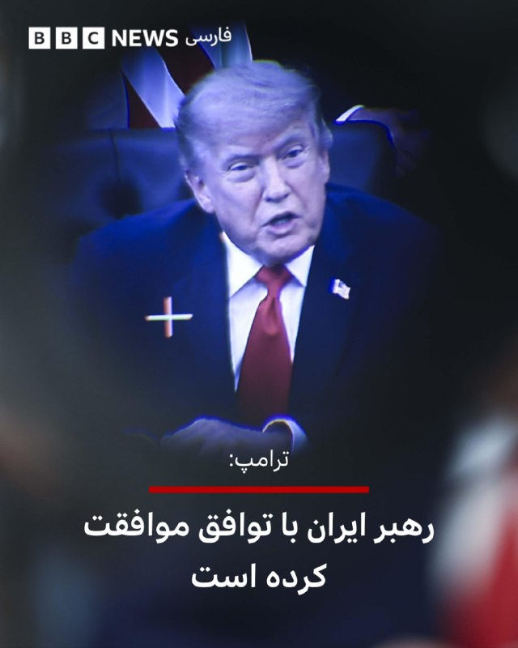

‌ ‌ ‌ ‌
دونالد ترامپ، رئیس‌جمهور آمریکا در ادامه سخنانش در دفتر بیضی کاخ‌ سفید در پاسخ به سوال خبرنگاری که پرسیده آیا رهبر ایران با این توافق موافقت کرده است، او گفت: «آنگونه که من متوجه شدم، پاسخ او مثبت است.»

خبرنگاری از رئیس‌جمهور آمریکا پرسید که چقدر مطمئن است که این آخر هفته با ایران توافقی امضا خواهد شد، پاسخ داد: «به زودی، شاید همین آخر هفته.»

ترامپ گفت به محض امضای توافق، محاصره دریایی تنگه هرمز توسط ایالات متحده فورا برداشته خواهد شد و افزود که ایران همچنین با عدم تولید سلاح هسته‌ای موافقت کرده است.

خبرنگاری اشاره کرد که آقای ترامپ در گذشته گفته بود که آمریکا و ایران به توافق نزدیک هستند و می‌پرسد چرا این بار فرق دارد.

رئیس جمهور آمریکا پاسخ داد: «چون آنها ضربه سختی را تحمل کرده‌اند. ضربه‌ای که کمتر کسی می‌تواند تحمل کند و آنها خیلی بیشتر از من می‌خواهند به توافق برسند.»

آقای ترامپ در پاسخ به سؤالی جداگانه گفت آنچه تغییر کرده «میزان اشتیاق» ایران برای توافق است.

https://bbc.in/4e3FUkL
📷EPA/Shutterstock
@BBCPersian

## alonews — post 127265

  <a href="telegram/content/alonews_127265_1781210013.webm" target="_blank">🎬 Download video</a>

👈بقایی: تا الان ایران به جمع‌بندی نهایی درباره توافق نرسیده است 
✅ @AloNews خبر جنگ

## alonews — post 127264

  <a href="telegram/content/alonews_127264_1781210013.webm" target="_blank">🎬 Download video</a>

👈ترامپ : تنگه بازه؛ ولی این تنگه‌ها از چند ماه پیش هم باز بودن، فقط شما خبر نداشتید

✅ @AloNews خبر جنگ

## alonews — post 127263

  <a href="telegram/content/alonews_127263_1781210014.webm" target="_blank">🎬 Download video</a>

👈بقایی: تا الان ایران به جمع‌بندی نهایی درباره توافق نرسیده است

✅ @AloNews خبر جنگ

## alonews — post 127262

  <a href="telegram/content/alonews_127262_1781210014.webm" target="_blank">🎬 Download video</a>

👈اسپویل نوحه جدید در تجمعات:

برادر برادر امضای آخرو بزن

به رسم عقیله امضای آخرو بزن

غیور دلاور امضای آخرو بزن

به امداد زهرا امضای آخرو بزن

بگو یا علی و امضای آخرو بزن

به اذن ابالفظل امضای آخرو بزن

تموم برگه‌ها رو بزن

از هیچی نگذر و بزن

جای مقررو بزن

حیدر یا حیدر

✅ @AloNews خبر جنگ

---
📅 بروزرسانی: 1405/03/21 23:53
---

## WithYashar — post 14572

دفتر نتانیاهو: رئیس جمهور ترامپ با نخست وزیر نتانیاهو در مورد نهایی شدن یادداشت تفاهم با ایران برای ورود به مذاکرات صحبت کرد.اگرچه اسرائیل طرف این یادداشت تفاهم نیست،نخست وزیر از تعهد رئیس جمهور ترامپ برای اطمینان از اینکه توافق نهایی که در پایان مذاکرات شامل حذف مواد غنی شده،برچیدن زیرساخت‌های غنی سازی،محدودیت تولید و برد موشک و توقف حمایت ایران از گروه‌های تروریستی وابسته به آن در منطقه باشد، ابراز قدردانی کرد.
@withyashar

## WithYashar — post 14571

ادعای نورالدین الدغیر خبرنگار الجزیره در تهران:
دیگر همه چیز قطعی و تمام شده
@withyashar

## WithYashar — post 14570

🚨🚨🚨🚨🚨🚨🚨

دو فروند هواپیمای آواکس E-3B Sentry یکی بر فراز عربستان سعودی دیگری بر فراز خلیج فارس رادار خود را خاموش کرد 
@withyashar

## DEJradio — post 5598

  <a href="telegram/content/DEJradio_5598_1781209396.webm" target="_blank">🎬 Download video</a>

🌞
🔺 ممنوعه شیرین؛ عاشقانه سگ‌ها در برلین

گزارش: ملیکا رضاپور

#سگ #تابستان_برلین
@DEJradio

## VahidOnline — post 76245

  <a href="telegram/content/VahidOnline_76245_1781209396.mp4" target="_blank">🎬 Download video</a>

گزارشگر: ضرب‌الاجل شما برای رسیدن از این مرحله به یک توافق نهایی چیست؟

ترامپ: نمی‌خواهم ضرب‌الاجل بگویم چون بعدش می‌گویید من ضرب‌الاجل را رعایت نکردم.

خیلی مهم نخواهد بود چون قرار است امضا شود.

📡 @VahidOnline

## VahidOnline — post 76244

  <a href="telegram/content/VahidOnline_76244_1781209398.mp4" target="_blank">🎬 Download video</a>

ترامپ: تنگه باز است. تنگه برای چندین ماه است که باز بوده، اما شما فقط از آن خبر نداشتید.

📡 @VahidOnline

## kianmeli1 — post 87945

  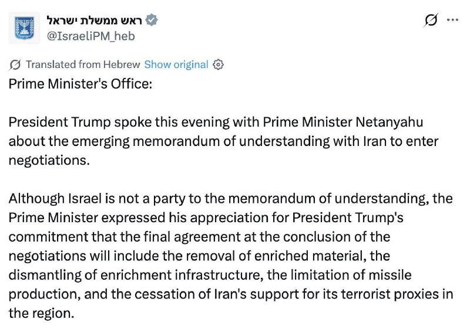

🔴نتانیاهو، نخست وزیر اسرائیل، می‌گوید اسرائیل «طرف» تفاهم‌نامه بین ایالات متحده و ایران نیست.
https://t.me/kianmeli1

## IranianMinds — post 22338

  <a href="telegram/content/IranianMinds_22338_1781209400.mp4" target="_blank">🎬 Download video</a>

🔴 ترامپ :
شاید تا آخر همین هفته (شنبه ، یکشنبه) توافق امضا بشه ، تا اونجایی که من میدونم، مجتبی خامنه‌ای هم تایید کرده.

@IranianMinds

## Dirty_Kids — post 391754

  <a href="telegram/content/Dirty_Kids_391754_1781209401.mp4" target="_blank">🎬 Download video</a>

لباسای محرم رو آماده کردی؟

@Dirty_Kids 👻

## Dirty_Kids — post 391753

  <a href="telegram/content/Dirty_Kids_391753_1781209402.mp4" target="_blank">🎬 Download video</a>

شکیرای وطنی هم رسید

@Dirty_Kids 👻

## Dirty_Kids — post 391752

  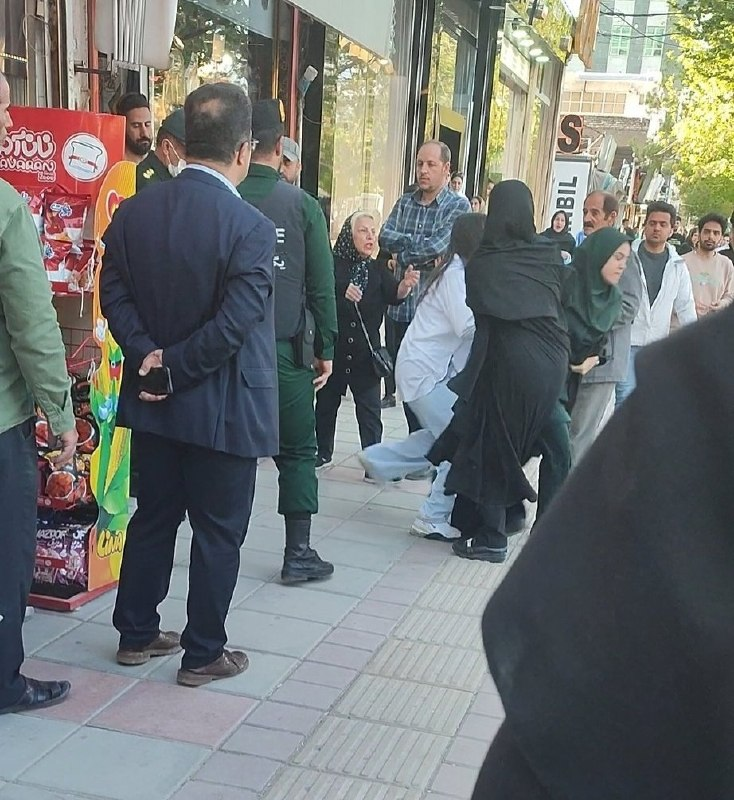

به وقت مادر جندگی

جمهوری عسلامی و عرزشی به تنظیمات کارخانه برگشت

@Dirty_Kids 👻

## alonews — post 127261

  <a href="telegram/content/alonews_127261_1781209404.webm" target="_blank">🎬 Download video</a>

👈ترامپ: می‌خواهید آشوب ببینید؟ می‌خواهید مرگ و ویرانی ببینید بگذارید ایران سلاح هسته‌ای داشته باشد.

✅ @AloNews خبر جنگ

## alonews — post 127260

  <a href="telegram/content/alonews_127260_1781209405.webm" target="_blank">🎬 Download video</a>

👈 ترامپ: آن‌ها در سومالیه قانون اساسی ندارند. آن‌ها پلیس ندارند. همه‌ی چیزی که دارند مردمی است که دور می‌دوند و به یکدیگر شلیک می‌کنند.

✅ @AloNews خبر جنگ

## alonews — post 127259

  <a href="telegram/content/alonews_127259_1781209405.webm" target="_blank">🎬 Download video</a>

👈دفتر نتانیاهو: رئیس جمهور ترامپ با نخست وزیر نتانیاهو در مورد نهایی شدن یادداشت تفاهم با ایران برای ورود به مذاکرات صحبت کرد.اگرچه اسرائیل طرف این یادداشت تفاهم نیست،نخست وزیر از تعهد رئیس جمهور ترامپ برای اطمینان از اینکه توافق نهایی که در پایان مذاکرات شامل حذف مواد غنی شده،برچیدن زیرساخت‌های غنی سازی،محدودیت تولید و برد موشک و توقف حمایت ایران از گروه‌های تروریستی وابسته به آن در منطقه باشد، ابراز قدردانی کرد.

✅ @AloNews خبر جنگ

## alonews — post 127258

  <a href="telegram/content/alonews_127258_1781209405.webm" target="_blank">🎬 Download video</a>

👈مجری شبکه دو:
ما باید از دشمن بفهمیم چه خبر شده

✅ @AloNews خبر جنگ

## alonews — post 127257

  <a href="telegram/content/alonews_127257_1781209405.webm" target="_blank">🎬 Download video</a>

👈ترامپ در مورد ایران : این یک تفاهم‌نامه بسیار قوی است. این کمی مفهومی است، اما چیزی است که قرار است انجام شود.

🔴و اگر به هر دلیلی انجام نشود، که نمی‌توانم تصور کنم که این اتفاق نیفتد، آن‌ها به اندازه من یا بیشتر می‌خواهند آن را امضا کنند. من می‌گویم آن‌ها بیشتر، شاید خیلی بیشتر می‌خواهند آن را امضا کنند.

🔴این یک تفاهم‌نامه بسیار دقیق است که توسط بسیاری از کشورهای دیگر که تأثیر زیادی بر آن‌ها دارند نیز مورد توافق قرار گرفته است. و همه می‌خواهند که انجام شود. پس قرار است انجام شود.

✅ @AloNews خبر جنگ

## alonews — post 127256

  <a href="telegram/content/alonews_127256_1781209405.webm" target="_blank">🎬 Download video</a>

🔴فوری / نورالدین الدغیر خبرنگار الجزیره در تهران: دیگر همه چیز قطعی و تمام شده

✅ @AloNews خبر جنگ

## alonews — post 127255

  <a href="telegram/content/alonews_127255_1781209406.webm" target="_blank">🎬 Download video</a>

👈ترامپ : ایران به‌هیچ‌عنوان و تحت هیچ شرایطی، سلاح هسته‌ای نخواهد ساخت و اقدام به خرید آن نخواهد کرد.»

✅ @AloNews خبر جنگ

## alonews — post 127254

  <a href="telegram/content/alonews_127254_1781209406.webm" target="_blank">🎬 Download video</a>

👈ترامپ درمورد توافقی که از آن حرف میزند: آنها به اندازه من یا حتی بیشتر می‌خواهند آن را امضا کنند. می‌توانم بگویم آنها شاید خیلی بیشتر بخواهند آن را امضا کنند.

🔴این یک یادداشت تفاهم بسیار دقیق است که توسط بسیاری از کشورهای دیگر که نفوذ زیادی بر آنها دارند نیز پذیرفته شده است. و همه می‌خواهند این کار انجام شود. پس این کار انجام خواهد شد.

✅ @AloNews خبر جنگ

---
📅 بروزرسانی: 1405/03/21 23:43
---

## VahidOOnLine — post 245048

♦️دونالد ترامپ، رئیس‌جمهوری آمریکا، در گفتگو با خبرنگاران در دفتر بیضی کاخ سفید، به توافق احتمالی اشاره کرد که می‌تواند به جنگ با ایران پایان دهد؛ او همچنین گفت که این توافق ظرف روزهای آینده نهایی خواهد شد.

ترامپ روز پنجشنبه ۲۱ خرداد گفت: «اسناد در وضعیت تقریبا نهایی هستند، پس باید ببینیم چه می‌شود؛ خواهیم دید.» او در ادامه افزود: «این کار باید خیلی سریع انجام شود.»

رئیس‌جمهوری آمریکا اعلام کرد که انتظار دارد مراسم امضای این سند به‌زودی و احتمالا در اروپا برگزار شود.
‌🇸🇦 Indypersian

🤖 @VahidOOnLine

## VahidOOnLine — post 245047

  

بر اساس گزارش‌های رسیده به ایران‌اینترنشنال، فرشاد محمودیان از معترضان «انقلاب ملی» ۱۷ دی در لردگان بازداشت شد. بنا بر این گزارش، او هنگام بازداشت به شدت مورد ضرب‌وشتم قرار گرفته است و پس از آن خبری از او در دست نیست.

بر اساس این گزارش، او حدود یک هفته پس از بازداشت به زندان شهرکرد منتقل شده است، اما اطلاعاتی از وضعیت پرونده و شرایط فعلی او در دست نیست.

‌🏁 🇬🇧 IranintlTV

🤖 @VahidOOnLine

## VahidOOnLine — post 245046

  <a href="telegram/content/VahidOOnLine_245046_1781208808.mp4" target="_blank">🎬 Download video</a>

♦️بزرگترین جام جهانی تاریخ، روز پنج‌شنبه ۲۱ خرداد ماه با رقابت تیم‌های مکزیک و آفریقای جنوبی در ورزشگاه آزتکا مکزیک آغاز شد.
جشن افتتاحیه با نمایشی از پرچم ۴۸ تیم حاضر در جام‌جهانی و مجسمه غول‌پیکری از جام طلایی محبوب برگزار شد و با اجرای خیره‌کننده و رنگارنگ شکیرا، بورنای بوی و خواننده شهیر آندره‌آ بوچلی به اوج رسید.
همزمان با این جشن، هزاران هوادار مکزیک و آفریقای جنوبی با لباس‌ها و پرچم‌های رنگارنگ و تشویق‌های پرشور در ورزشگاه آزتکا گرد هم آمدند تا شاهد دیدار افتتاحیه جام جهانی ۲۰۲۶ باشند.
‌🇸🇦 Indypersian

🤖 @VahidOOnLine

## VahidOOnLine — post 245045

  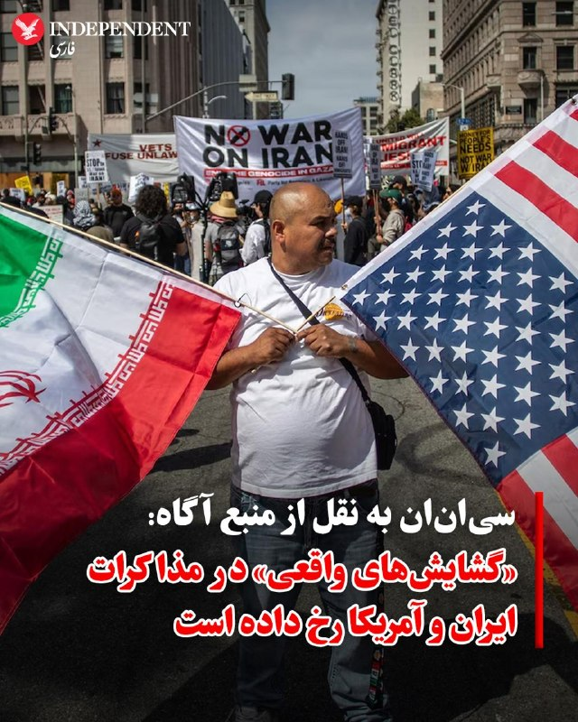

♦️به گفته یک منبع آگاه از روند گفتگوها، در پی پیام دونالد ترامپ، رئیس‌جمهوری آمریکا در شبکه‌های اجتماعی مبنی بر قریب‌الوقوع بودن توافق با تهران، «گشایش‌های واقعی» در مذاکرات صلح میان ایران و ایالات متحده رخ داده است.

این منبع آگاه در گفتگو با شبکه خبری سی‌ان‌ان اعلام کرد که میانجی‌ها نسبت به رسیدن طرفین به خط پایان و نهایی شدن توافق، «به طور محتاطانه‌ای خوش‌بین» هستند. آن‌ها به آخرین دور از گفتگوهایی اشاره کردند که توسط مذاکره‌کنندگان قطری طی روزهای چهارشنبه و پنجشنبه در تهران انجام شد.

به گفته این منبع، واسطه‌های درگیر در مذاکرات سیگنال‌هایی فرستاده‌اند مبنی بر اینکه سفر دیروز مذاکره‌کنندگان قطری به تهران و گفتگوهایی که تا بامداد امروز ادامه داشت، به پیشبرد روند توافق کمک شایانی کرده است؛ آن هم در شرایطی که دو کشور در روزهای گذشته مشغول تبادل آتش و حملات تلافی‌جوایه علیه یکدیگر بودند.

این منبع در پایان تاکید کرد: «میانجی‌ها موفق شده‌اند به گشایش‌های جدی دست پیدا کنند.»

#آمریکا #ایندیپندنت_فارسی
‌🇸🇦 Indypersian

🤖 @VahidOOnLine

## VahidOOnLine — post 245044

  

دونالد ترامپ، رییس جمهوری آمریکا درباره ایران گفت به یک توافق عالی رسیده‌اند و افزود نهایی شدن آن در چند روز آینده ممکن است.

او افزود که با بنیامین نتانیاهو، نخست‌وزیر اسرائیل و رجب طیب اردوغان، رییس جمهوری ترکیه در این رابطه گفت‌وگو کرده است.

ترامپ افزود: «جی‌دی ونس در مراسم امضای توافق حضور خواهد داشت.»

او ادامه داد: «این توافق به معنای آن است که ایران هرگز به سلاح هسته‌ای دست نخواهد یافت.»
‌🏁 🇬🇧 IranintlTV

🤖 @VahidOOnLine

## WithYashar — post 14569

ترامپ در برنامه زنده: همین الان مطلع شدم که مجتبی خامنه‌ای، رهبر ایران با توافق موافقت کرده است. ایران حالا منطقی‌تر عمل می‌کند.

از نظر نظامی در این جنگ پیروز شدیم

ایرانی‌ها فرصتی دارند تا کشورشان را که تا حد زیادی ویران شده است، بازسازی کنند.
@withyashar

## WithYashar — post 14568

تسنیم: منابع ایرانی می گویند هیچ توافقی نهایی نشده است و هر ادعایی در این زمینه تا قبل از تصویب در ایران فاقد اعتبار است.
@withyashar

## FoxNewsTwitter — post 342877

  <a href="telegram/content/FoxNewsTwitter_342877_1781208812.mp4" target="_blank">🎬 Download video</a>

Fox News (Twitter/X)

RT @TheStoryFNC: BREAKING NOW: President Trump announces imminent deal ensures Iran “will never have a nuclear weapon”

## DEJradio — post 5597

  <a href="telegram/content/DEJradio_5597_1781208814.webm" target="_blank">🎬 Download video</a>

🚨
🔸 خبر ۲۱
پنجشنبه ۲۱ خرداد ۱۴۰۵

#خبر۲۱
@DEJradio

## VahidOnline — post 76243

  <a href="telegram/content/VahidOnline_76243_1781208815.mp4" target="_blank">🎬 Download video</a>

خبرنگار نیوزنیشن در کاخ سفید:
از رئیس‌جمهور ترامپ پرسیده شد که آیا می‌تواند این توافق را به سرانجام برساند یا نه، چون پیش‌تر هم به آن نزدیک شده بود. او گفت: «من بسیار مطمئنم.»

او درباره اینکه آیا واقعاً این توافق تا پایان این هفته نهایی می‌شود یا نه، با احتیاط پاسخ داد: «به‌زودی خواهد بود، شاید همین آخر هفته.»

ترامپ در پاسخ به این پرسش که آیا رهبر عالی این توافق را تأیید کرده است، گفت: «برداشت من این است که پاسخ مثبت است.»
KellieMeyerNews

📡 @VahidOnline

## IranIntlTV — post 341798

  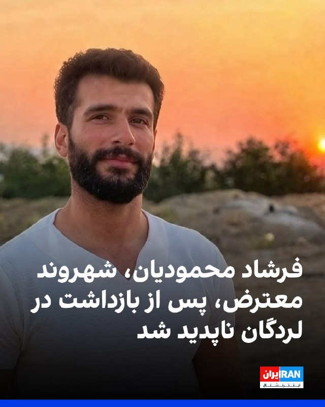

بر اساس گزارش‌های رسیده به ایران‌اینترنشنال، فرشاد محمودیان از معترضان «انقلاب ملی» ۱۷ دی در لردگان بازداشت شد. بنا بر این گزارش، او هنگام بازداشت به شدت مورد ضرب‌وشتم قرار گرفته است و پس از آن خبری از او در دست نیست.

بر اساس این گزارش، او حدود یک هفته پس از بازداشت به زندان شهرکرد منتقل شده است، اما اطلاعاتی از وضعیت پرونده و شرایط فعلی او در دست نیست.

https://iranintl.com/202606113340

## IranIntlTV — post 341797

  <a href="telegram/content/IranIntlTV_341797_1781208816.mp4" target="_blank">🎬 Download video</a>

گروه «همبستگی ملی برای ایران» با انتشار بیانیه‌ای اعلام کرد در ادامه تجمعات اعتراضی شنبه‌ها در ایالات متحده، برای برگزاری یک زنجیره انسانی در شهر واشینگتن فراخوان داده است.

بر اساس این فراخوان، این تجمع در محل یادمان کشته‌شدگان و جان‌باختگان برگزار خواهد شد. برگزارکنندگان اعلام کرده‌اند این برنامه هم‌زمان در حمایت از آزادی زندانیان سیاسی در ایران و مخالفت با صدور و اجرای حکم اعدام برگزار می‌شود.
@iranintltv

## FarsiVOA — post 220422

⚡️ترامپ ساعاتی پس از تهدید به ادامه بمباران و تمایل به تصرف خارک: حملات برنامه‌ریزی شده علیه ایران را لغو کردم
@FarsiVOA

## Persian_Trend_Official — post 16776

  <a href="telegram/content/Persian_Trend_Official_16776_1781208818.webm" target="_blank">🎬 Download video</a>

افزایش تحرکات هوایی آمریکا بر فراز خلیج فارس

بر اساس داده‌های رهگیری پرواز، دست‌کم ۴ فروند هواپیمای سوخت‌رسان نیروی هوایی آمریکا هم‌اکنون بر فراز خلیج فارس در حال فعالیت هستند. همچنین گزارش شده ۴ فروند سوخت‌رسان دیگر نیز تل‌آویو را ترک کرده‌اند.

در همین حال، یک فروند هواپیمای هشدار زودهنگام و کنترل هوابرد E-3B Sentry نیز از پایگاه هوایی پرنس سلطان عربستان برخاسته و به سمت منطقه خلیج فارس در حرکت است.

Phantom

📌 @persian_trend_official پرشین ترند | متفاوت‌ترین کانال نظامی :::

## Persian_Trend_Official — post 16775

خبرنگار: شما قبلاً گفته‌اید که ایران و آمریکا به توافق نزدیک هستند. هنوز این اتفاق نیفتاده است. چرا اینقدر مطمئن هستید که این بار متفاوت است؟

ترامپ: چون آنها ضربه سختی را تحمل کرده‌اند. ضربه‌ای را تحمل کرده‌اند که کمتر کسی می‌تواند تحمل کند. و آنها خیلی بیشتر از من می‌خواهند به توافق برسند.

📝 Amir

📌 @persian_trend_official
پرشین ترند | متفاوت‌ترین کانال نظامی

## Persian_Trend_Official — post 16774

  <a href="telegram/content/Persian_Trend_Official_16774_1781208819.mp4" target="_blank">🎬 Download video</a>

خبرنگار: آیا رهبر ایران این توافق را تأیید کرده است؟

ترامپ: متوجه شدم که پاسخ مثبت است.

خبرنگار: وقتی این توافق امضا شود، آیا ایالات متحده بلافاصله محاصره را لغو خواهد کرد؟

ترامپ: بله، این بخشی از توافق است.

📝 Amir

📌 @persian_trend_official
پرشین ترند | متفاوت‌ترین کانال نظامی

## Persian_Trend_Official — post 16773

کانفینگ اختصاصی پرشین ترند 🔥 ممکن روی بعضی اینترنت ها کار نکنه با اینترنت دیگه ای تست کنید ❤️ vless://187fe33c-adb6-4fbd-b477-c80d621a2732@vs17217.lil01fr.vsys.cloud:443?path=%2Fnews&security=none&encryption=mlkem768x25519plus.native.0rtt.5gpEP8zxxckYyvaAIrtOktYci…

## IranianMinds — post 22337

💰 کانال تلگرام میخرم
بالای ۵۰ کا ( ویو خوب فیک نباشه)

@AmirrPower

## IranianMinds — post 22336

🔴کانال ۱۲ اسرائیل:

ترامپ و نتانیاهو تلفنی صحبت کردند.

@IranianMinds

## BBCPersian — post 283477

  <a href="telegram/content/BBCPersian_283477_1781208821.mp4" target="_blank">🎬 Download video</a>

🔻آخرین خبرهای مهم روز پنجشنبه ۲۱ خرداد ۱۴۰۵
@BBCPersian

## Dirty_Kids — post 391751

  <a href="telegram/content/Dirty_Kids_391751_1781208824.mp4" target="_blank">🎬 Download video</a>

سعیددد داداش چیکار کردی که تبدیلت کرد به نهنگ؟ لیاقت این همه زیبایی و نرمی و لطافت رو نداشتیییی

@Dirty_Kids 👻

## alonews — post 127253

  <a href="telegram/content/alonews_127253_1781208826.webm" target="_blank">🎬 Download video</a>

👈 اسماعیل بقائی سخنگوی وزارت خارجه: از شبیخون حوادث لشکرش در هم شکست، هر که صائب در مقام صلح، طبل جنگ زد

✅ @AloNews خبر جنگ

## alonews — post 127252

  <a href="telegram/content/alonews_127252_1781208827.webm" target="_blank">🎬 Download video</a>

👈ترامپ: عملیات جزیره خارک از دستور کار خارج شد.

✅ @AloNews خبر جنگ

## alonews — post 127251

  <a href="telegram/content/alonews_127251_1781208827.webm" target="_blank">🎬 Download video</a>

👈خبرنگار: وقتی این توافق امضا شود، آیا آمریکا فوراً محاصره را لغو خواهد کرد؟

🔴ترامپ: بله، این بخشی از توافق است.

✅ @AloNews خبر جنگ

## alonews — post 127250

  <a href="telegram/content/alonews_127250_1781208827.mp4" target="_blank">🎬 Download video</a>

👈خبرنگار: آیا رهبر ایران این توافق را تأیید کرده است؟

🔴ترامپ: تا جایی که می‌دانم پاسخ بله است.

✅ @AloNews خبر جنگ

## alonews — post 127249

  <a href="telegram/content/alonews_127249_1781208830.webm" target="_blank">🎬 Download video</a>

👈یک فروند هواپیمای سوخت‌رسان KC-46 Pegasus نیروی هوایی ایالات متحده از مبدأ تل آویو درحال پرواز بر فراز خلیج فارس.

✅ @AloNews خبر جنگ

## alonews — post 127248

  <a href="telegram/content/alonews_127248_1781208830.webm" target="_blank">🎬 Download video</a>

👈 دو فروند هواپیمای ترابری نظامی "C-17A Globemaster III" نیروی هوایی ایالات متحده وارد خاورمیانه شدند.

✅ @AloNews خبر جنگ

## alonews — post 127247

  <a href="telegram/content/alonews_127247_1781208830.webm" target="_blank">🎬 Download video</a>

👈هواپیما جنگ الکترونیک E3 هم در پروازه

✅ @AloNews خبر جنگ

## alonews — post 127246

  <a href="telegram/content/alonews_127246_1781208830.webm" target="_blank">🎬 Download video</a>

👈یه سوخت رسان چسبیده به کیش داره پرواز می‌کنه

✅ @AloNews خبر جنگ

---
📅 بروزرسانی: 1405/03/21 23:33
---

## VahidOOnLine — post 245043

  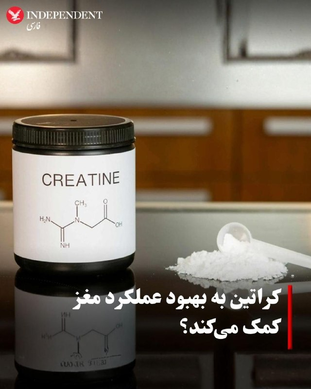

♦️به گفته یک منبع آگاه از روند گفتگوها، در پی پیام دونالد ترامپ، رئیس‌جمهوری آمریکا در شبکه‌های اجتماعی مبنی بر قریب‌الوقوع بودن توافق با تهران، «گشایش‌های واقعی» در مذاکرات صلح میان ایران و ایالات متحده رخ داده است.

این منبع آگاه در گفتگو با شبکه خبری سی‌ان‌ان اعلام کرد که میانجی‌ها نسبت به رسیدن طرفین به خط پایان و نهایی شدن توافق، «به طور محتاطانه‌ای خوش‌بین» هستند. آن‌ها به آخرین دور از گفتگوهایی اشاره کردند که توسط مذاکره‌کنندگان قطری طی روزهای چهارشنبه و پنجشنبه در تهران انجام شد.

به گفته این منبع، واسطه‌های درگیر در مذاکرات سیگنال‌هایی فرستاده‌اند مبنی بر اینکه سفر دیروز مذاکره‌کنندگان قطری به تهران و گفتگوهایی که تا بامداد امروز ادامه داشت، به پیشبرد روند توافق کمک شایانی کرده است؛ آن هم در شرایطی که دو کشور در روزهای گذشته مشغول تبادل آتش و حملات تلافی‌جوایه علیه یکدیگر بودند.

این منبع در پایان تاکید کرد: «میانجی‌ها موفق شده‌اند به گشایش‌های جدی دست پیدا کنند.»
‌🇸🇦 Indypersian

🤖 @VahidOOnLine

## WithYashar — post 14567

## WithYashar — post 14566

کامنتم هم زیر پست ترامپ، کارهای اداریش را انجام بدهد فقط همین رو لایک کنید https://www.instagram.com/p/DZdJ2LZvAza/?carousel_share_child_media_id=3917330556395457754_347696668&comment_id=18055196378739071

## FoxNewsTwitter — post 342876

  <a href="telegram/content/FoxNewsTwitter_342876_1781208203.mp4" target="_blank">🎬 Download video</a>

Fox News (Twitter/X)

JUST IN: President Trump announces a major move to slash seafood costs and generate millions in new business for American fishermen by restoring commercial access to 3 areas of the western Pacific Ocean:

"It's a large amount of space we're talking about that they were restricted. Other countries would use it, but our country couldn't use it."

"You ever hear of anything so stupid?"

## mamlekate — post 103684

  <a href="telegram/content/mamlekate_103684_1781208205.mp4" target="_blank">🎬 Download video</a>

📝 سنتکام: یک نفتکش دیگر ناقض «محاصره دریایی» جمهوری اسلامی را از کار انداختیم

فرماندهی مرکزی ایالات متحده‌ آمریکا، سنتکام، پنج‌شنبه ۲۱ خرداد با انتشار بیانیه‌ای در شبکه اجتماعی ایکس نوشت: «نیروهای آمریکایی ساعت ۱۱:۲۰ شب به وقت شرق آمریکا در ۱۰ ژوئن ۲۰ خرداد، یک نفتکش را در دریای عمان پس از آنکه این کشتی با تلاش برای انتقال نفت ایران، محاصره دریایی علیه ایران را نقض کرد، از کار انداختند. این سومین کشتی تجاری بود که این هفته توسط نیروهای آمریکایی از کار انداخته شد.»

در این بیانیه آمده است: «نفتکش جَلویر را که با پرچم گینه بیسائو در حرکت بود و سعی داشت نفت را از ایران از طریق دریای عمان منتقل کند، از کار انداختیم.»

این بیانیه در تشریح نحوه از کار انداختن این کشتی اشاره کرده است که در پی خودداری مکرر خدمه این شناور از پیروی از دستورالعمل‌های نیروهای آمریکایی یک هواپیمای آمریکایی دو فروند موشک «هل‌فایر» را به سمت موتورخانه آن کشتی شلیک کرد.

سنتکام همچنین یادآور شده است که اوایل این هفته، هواپیماهای آمریکایی نفتکش‌های «مَریوِکس» و «سِتِبِلّو» را که با پرچم پالائو در حرکت بودند به ترتیب در روزهای دوشنبه و سه‌شنبه از کار انداختند. سنتکام تاکید کرده است که «مَریوِکس» با تلاش برای حرکت به سمت یک بندر ایرانی، محاصره دریایی را نقض کرد و «سِتِبِلّو» نیز سعی در انتقال نفت ایران داشت.

@mamlekate

## kianmeli1 — post 87944

  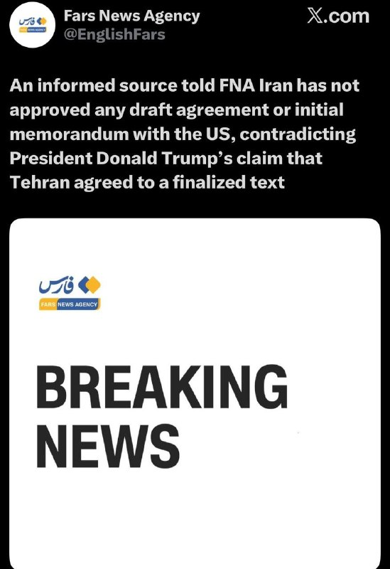

🔴خبرگزاری فارس: ترامپ دروغ می گوید تفاهمی امضا نشده

یک منبع آگاه به خبرگزاری فارس گفت: ایران هیچ پیش‌نویس توافق یا تفاهم‌نامه اولیه‌ای با ایالات متحده را تأیید نکرده است، که با ادعای دونالد ترامپ، رئیس جمهور آمریکا، مبنی بر موافقت تهران با متن نهایی، در تضاد است.
https://t.me/kianmeli1

## IranIntlTV — post 341796

  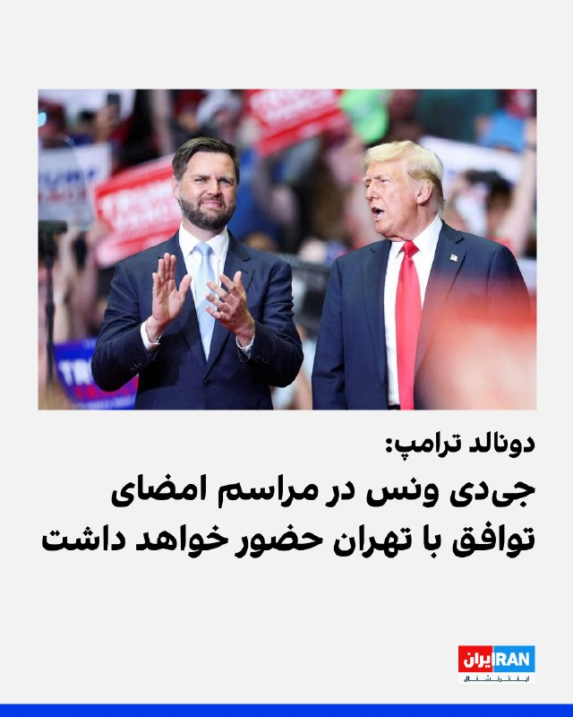

دونالد ترامپ، رییس جمهوری آمریکا درباره ایران گفت به یک توافق عالی رسیده‌اند و افزود نهایی شدن آن در چند روز آینده ممکن است.

او افزود که با بنیامین نتانیاهو، نخست‌وزیر اسرائیل و رجب طیب اردوغان، رییس جمهوری ترکیه در این رابطه گفت‌وگو کرده است.

ترامپ افزود: «جی‌دی ونس در مراسم امضای توافق حضور خواهد داشت.»

او ادامه داد: «این توافق به معنای آن است که ایران هرگز به سلاح هسته‌ای دست نخواهد یافت.»
https://iranintl.com/202606116294

## IranIntlTV — post 341795

  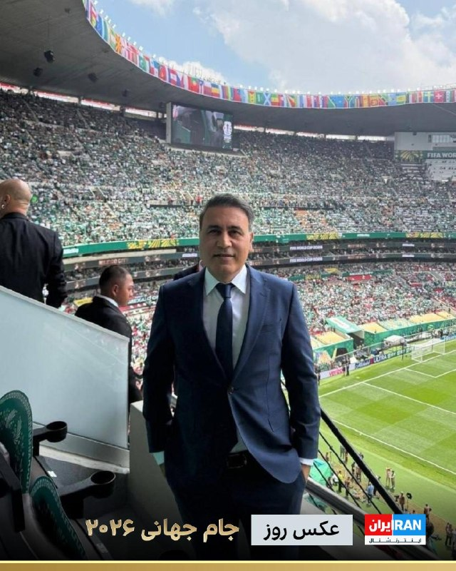

🔻رسانه‌های ایران با انتشار تصویری، از حضور مهدی مهدوی‌کیا، ستاره پیشین تیم ملی فوتبال ایران در مراسم افتتاحیه جام جهانی ۲۰۲۶ در استادیوم آزتکا مکزیک خبر داده‌اند.

@iranintltvsport

## IranIntlTV — post 341794

  <a href="telegram/content/IranIntlTV_341794_1781208208.mp4" target="_blank">🎬 Download video</a>

سیامک آرام، فعال سیاسی و برگزارکننده تجمع‌های واشینگتن، درباره تجمع روز شنبه آینده در این شهر گفت: «استمرار این حضورها ضروری است. تجربه همه جوامع نیز نشان داده که تظاهرات و حضور مستمر در عرصه عمومی می‌تواند افکار عمومی، رسانه‌ها و در نهایت سیاستمداران را تحت تاثیر قرار دهد و بر تصمیم‌گیری حکومت‌ها درباره ایران فشار وارد کند.»
@iranintltv

## FarsiVOA — post 220421

⚡️آغاز جام جهانی ۲۰۲۶ در آمریکا ، مکزیک و کانادا
@FarsiVOA

## Persian_Trend_Official — post 16772

  <a href="telegram/content/Persian_Trend_Official_16772_1781208210.mp4" target="_blank">🎬 Download video</a>

ترامپ در مورد عاصم منیر: ژنرال پاکستان انقدر ژنرال خوبیه که اصلا ژنرال نیست، فیلد مارشال است.

📝 Amir

📌 @persian_trend_official
پرشین ترند | متفاوت‌ترین کانال نظامی

## BBCPersian — post 283476

  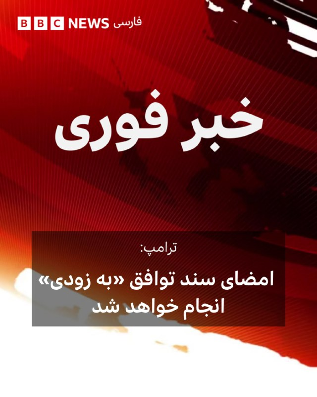

‌ ‌ ‌
دونالد ترامپ، رئیس‌جمهور آمریکا در تازه‌ترین اظهارنظر در خصوص توافق با ایران گفته است که ایالات متحده «به‌تازگی به یک توافق بزرگ در مورد جنگ با ایران رسیده است.»

او گفته است که «ما در حال نهایی کردن اسناد هستیم. این کار باید طی چند روز آینده انجام شود.»

آقای ترامپ می‌گوید که پس از نهایی شدن اسناد، «احتمالا امضا آن شاید در اروپا» انجام خواهد شد و این کار باید «خیلی سریع» انجام شود.

به گفته او «ما توافقی داریم که ایران هرگز سلاح هسته‌ای نخواهد داشت، که هدف اصلی از آنچه که ما برای رسیدن به این هدف طی کردیم، همین بود. بنابراین، این یک چیز بسیار بزرگ است.»

رئیس جمهور ایالات متحده تأکید کرد که توافق «به زودی امضا» انجام خواهد شد و اسناد «تقریبا به شکل نهایی هستند، بنابراین خواهیم دید».

آقای ترامپ همچنین گفت تنگه هرمز نیز «به محض اینکه آن را امضا کنیم» باز خواهد شد.

او همچنین می‌گوید که با رهبران منطقه، از جمله متحدان خلیج فارس و بنیامین نتانیاهو، نخست‌وزیر اسرائیل، صحبت کرده است و افزود: «تمام خاورمیانه بسیار خوشحال است».

https://bbc.in/444ZKWS
@BBCPersian

## alonews — post 127245

  <a href="telegram/content/alonews_127245_1781208212.webm" target="_blank">🎬 Download video</a>

🔴فوری/خبرگزاری فارس:
ترامپ دروغ می گوید تفاهمی امضا نشده

🔴ایران هیچ پیش‌نویس توافق یا تفاهم‌نامه اولیه‌ای با ایالات متحده را تأیید نکرده است، که با ادعای دونالد ترامپ، رئیس جمهور آمریکا، مبنی بر موافقت تهران با متن نهایی، در تضاد است.

✅ @AloNews خبر جنگ

## alonews — post 127244

😳هنوزم ۱۰۰ و ۲۰۰ گیگ رو به اسم نامحدود میفروشن؟! 
🚀 مخصوص جنگ 
😎 @NetAazaad1Bot @NetAazaad1Bot اینجا از اون خبرا نیست 
😎⚡️ 
💎 نامحدود واقعی، بدون استرس تموم شدن حجم
✅ مخصوص این روزایی که اینترنت پایدار از نون شب واجب‌تره 
❤️ 
🚀 فقط امشب با خیال راحت وصل شو و…

## alonews — post 127243

  <a href="telegram/content/alonews_127243_1781208212.webm" target="_blank">🎬 Download video</a>

😳هنوزم ۱۰۰ و ۲۰۰ گیگ رو به اسم نامحدود میفروشن؟!

🚀 مخصوص جنگ 
😎
@NetAazaad1Bot
@NetAazaad1Bot
اینجا از اون خبرا نیست 
😎⚡️

💎 نامحدود واقعی، بدون استرس تموم شدن حجم
✅

مخصوص این روزایی که اینترنت پایدار از نون شب واجب‌تره 
❤️

🚀 فقط امشب با خیال راحت وصل شو و لذت ببر

⌛ ظرفیت هم محدوده، جا نمونی.
✅

@NetAazaad1Bot
@NetAazaad1Bot

## alonews — post 127242

  <a href="telegram/content/alonews_127242_1781208212.webm" target="_blank">🎬 Download video</a>

👈سپاه پاسداران: اگر امریکا تمام خواسته‌های ما را در سندی که ارائه دادیم بپذیرد، به احتمال زیاد ما این توافق را تایید خواهیم کرد.

✅ @AloNews خبر جنگ

---
📅 بروزرسانی: 1405/03/21 23:23
---

## VahidOOnLine — post 245042

  

دونالد ترامپ، رییس‌جمهوری آمریکا، پنجشنبه در کاخ سفید به خبرنگاران گفت که توافق احتمالی با جمهوری اسلامی ممکن است تا چند روز دیگر در اروپا امضا شود.

او افزود که جی‌دی ونس، معاون ربیس‌جمهوری آمریکا، در مراسم امضای توافق احتمالی میان آمریکا و ایران شرکت خواهد کرد.

ترامپ درباره ایران گفت به یک توافق عالی رسیده‌اند و افزود نهایی شدن آن در چند روز آینده ممکن است.
‌🏁 🇬🇧 IranintlTV

🤖 @VahidOOnLine

## WithYashar — post 14565

## WithYashar — post 14564

العربیه: آمریکا قبول کرده تحریم‌های ایران رو کاهش بده و محاصره دریایی رو برداره.
@withyashar

## WithYashar — post 14563

۳پا: اگر امریکا تمام خواسته‌های ما را در سندی که ارائه دادیم بپذیرد، به احتمال زیاد ما این توافق را تایید خواهیم کرد.
@withyashar

## WithYashar — post 14562

ترامپ از عاصم منیر پاکستان تمجید می‌کند:

من او را ژنرال می‌نامم. او یک ژنرال است. او یک ژنرال بزرگ است—آنقدر بزرگ که در واقع یک مارشال میدانی است، یک درجه بالاتر.
@withyashar

## WithYashar — post 14561

ترامپ: ما به‌زودی توافق را امضا خواهیم کرد و اسناد در وضعیت تقریباً نهایی هستند. باید خیلی سریع انجام شود.
همه بسیار خوشحال هستند. کل خاورمیانه خوشحال است. و فراتر از خاورمیانه نیز همین‌طور.
@withyashar

## WithYashar — post 14560

ترامپ: من نمی توانم در مراسم امضای قرارداد شرکت کنم و ونس در امضای توافقنامه ایران حضور خواهد داشت.
امضای توافقنامه با ایران ممکن است به زودی و شاید در آخر هفته انجام شود.
@withyashar

## WithYashar — post 14559

ترامپ: توافق به دستیابی به توافق در روزهای آینده بستگی دارد و ممکن است امضای توافق ایران در اروپا انجام شود.

تنگه بلافاصله پس از امضای توافق باز می شود.
@withyashar

## mwarmonitor — post 10744

«ما به تازگی به یک توافق عالی برای پایان دادن به جنگ با ایران دست یافته‌ایم. در حال حاضر کار روی نهایی کردن اسناد و مدارک جریان دارد که احتمالاً طی چند روز آینده به پایان خواهد رسید. همچنین ممکن است مراسم امضای این توافق در اروپا برگزار شود.
این اتفاق بسیار بزرگی است؛ بازار بورس ۱۰۰۰ واحد رشد داشته و این نشان‌دهنده استقبال و رضایت آن‌ها از این توافق است. وقتی بازار بورس بالا می‌رود یعنی از توافق راضی هستند و اگر افت کند یعنی آن را نمی‌پسندند. اما روند بازار صعودی بوده است. قیمت نفت کاهش یافته و فکر می‌کنم حتی از سطح قبلی خود نیز پایین‌تر خواهد آمد. پیش از این وقتی در ایالت آیووا بودم، قیمت هر گالن نفت ۱ دلار و ۸۵ سنت بود. مطمئن نیستم که دقیقاً به آن رقم برسیم، اما به آن بسیار نزدیک خواهیم شد. قیمت‌ها کاهش می‌یابد و با افت قیمت نفت، هزینه‌های دیگر نیز پایین می‌آید.
از همه مهم‌تر، ما به توافقی رسیده‌ایم که بر اساس آن ایران هرگز به سلاح هسته‌ای دست پیدا نخواهد کرد؛ این تمام هدفی بود که برای دستیابی به آن تلاش می‌کردیم و مسیر سختی را پشت سر گذاشتیم. این یک دستاورد بسیار بزرگ است. به زودی مراسم امضا برقرار خواهد شد و اسناد در مراحل پایانی خود قرار دارند. باید منتظر ماند و دید چه می‌شود. روند کار بسیار خوب است، کار رو به اتمام است و به سرعت نهایی خواهد شد. آن‌ها نیز به اندازه دیگران خواهان این توافق بودند. فکر می‌کنم این موضوع می‌تواند سرآغاز روابط خوب بسیاری در آینده باشد.
من به تازگی با رهبران بسیاری از کشورهایی که نامشان در بیانیه آمده صحبت کرده‌ام؛ با بی‌بی (بنیامین نتانیاهو) و همچنین رهبران بزرگ کشورهایی چون قطر، امارات، عربستان سعودی، بحرین، کویت و دیگران گفتگو داشتم. همچنین قرار است با رئیس‌جمهور اردوغان از ترکیه صحبت کنیم که شخص فوق‌العاده‌ای است. روحیه همکاری بسیار خوبی حاکم است. کشور پاکستان نیز عملکرد فوق‌العاده‌ای داشت؛ نخست‌وزیر و کسی که من او را ژنرال می‌نامم — او یک ژنرال است، یک ژنرال عالی‌رتبه، و در واقع او یک فیلد مارشال (ارتشبد) است، یک درجه بالاتر.
همه آن‌ها بسیار خرسند هستند. تمام منطقه خاورمیانه و حتی فراتر از آن خوشحال هستند. به محض اینکه توافق امضا شود، تنگه نیز بازگشایی خواهد شد.»

@mwarmonitor

## mwarmonitor — post 10743

  <a href="telegram/content/mwarmonitor_10743_1781207598.mp4" target="_blank">🎬 Download video</a>

🎬 Video

## mamlekate — post 103683

این ویدیویی که از معرفی ایران توی افتتاحیه جام جهانی وایرال شده تولید هوش مصنوعیه، و مراسم افتتاحیه جام جهانی نیست. هم پرچم خرچنگ نشان داره هم شیروخورشید (روی سقف). سایر پرچم‌ها اصلا معلوم نیست کدوم کشور هستند.

@mamlekate

## IranIntlTV — post 341793

  <a href="telegram/content/IranIntlTV_341793_1781207600.mp4" target="_blank">🎬 Download video</a>

فرزین ندیمی، پژوهشگر ارشد امور دفاعی و امنیتی، گفت: «کنترل آمریکا و ایران بر تنگه هرمز نسبی است، اما از نظر نظارت بر کشتیرانی و مدیریت عبور و مرور در منطقه، آمریکا تقریبا کنترل کامل را دارد.»

او افزود: «البته این به معنای از بین رفتن توان جمهوری اسلامی نیست و حکومت می‌تواند با استفاده از پهپادها یا دیگر سامانه‌های خود به کشتی‌ها حمله کند یا به آنها آسیب برساند.»
@iranintltv

## IranIntlTV — post 341790

🔻تیم ملی فوتبال مکزیک، نخستین گل جام جهانی ۲۰۲۶ را در دقیقه ۹ بازی افتتاحیه در برابر آفریقای جنوبی به ثمر رساند.

🔹گل اول آزتک‌ها روی اشتباه گلر آفریقای جنوبی توسط خولیان کینیونس زده شد.

🔹با وجود اینکه مکزیک تاکنون در ۶ افتتاحیه جام جهانی حاضر بوده است، اما این نخستین‌بار است که مکزیک اولین گل تورنمنت را به ثمر می‌رساند.

🔹بعد از گل دقیقه ۶ فیلیپ لام به کاستاریکا، این سریع‌ترین گل ۲۰ سال اخیر افتتاحیه‌های جام جهانی است.

@iranintltvsport

## IranIntlTV — post 341789

  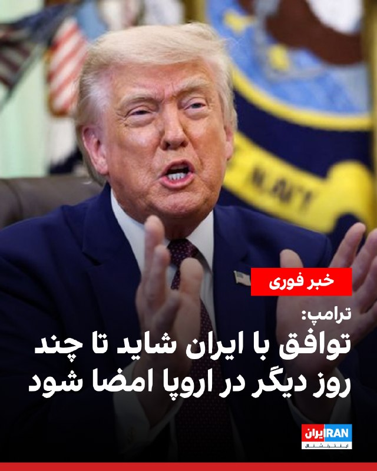

دونالد ترامپ، رییس‌جمهوری آمریکا، پنجشنبه در کاخ سفید به خبرنگاران گفت که توافق احتمالی با جمهوری اسلامی ممکن است تا چند روز دیگر در اروپا امضا شود.

او افزود که جی‌دی ونس، معاون ربیس‌جمهوری آمریکا، در مراسم امضای توافق احتمالی میان آمریکا و ایران شرکت خواهد کرد.

ترامپ درباره ایران گفت به یک توافق عالی رسیده‌اند و افزود نهایی شدن آن در چند روز آینده ممکن است.
https://iranintl.com/202606110784

## Persian_Trend_Official — post 16771

  <a href="telegram/content/Persian_Trend_Official_16771_1781207603.mp4" target="_blank">🎬 Download video</a>

ترامپ: ما بعضی شب‌ها 25 کشتی را هدف قرار دادیم؛ بعضی شب‌ها 25 کشتی. در 4 یا 5 شب گذشته 25، 22، 21، 26، 18 و 14 کشتی را هدف قرار دادیم.

چه کسی دیگری این اعداد را میداند؟ هیچ‌کس.

📝 Amir

📌 @persian_trend_official
پرشین ترند | متفاوت‌ترین کانال نظامی

## Dirty_Kids — post 391750

  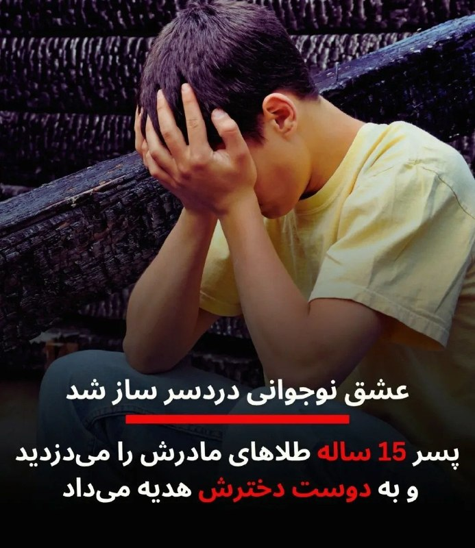

🔴 مواظب طلاهاتون باشید

یه پسر ۱۵ ساله کرجی کل طلاهای مامانشو دزدیده و به دوس دختر ۱۳ سالش هدیه داده!

بعد اینکه فهمیدن، به خونوادش گفته دوس دخترم کل زندگیمه و حتی جونمم براش میدم.

@Dirty_Kids 👻

## alonews — post 127241

  <a href="telegram/content/alonews_127241_1781207606.webm" target="_blank">🎬 Download video</a>

👈ترامپ در مورد عاصم منیر:
«من او را "ژنرال" صدا می‌زنم. او یک ژنرال است. او ژنرال بزرگی است؛ آن‌قدر بزرگ که در واقع یک فیلد مارشال است، یعنی یک درجه بالاتر.»

✅ @AloNews خبر جنگ

## alonews — post 127240

  <a href="telegram/content/alonews_127240_1781207607.webm" target="_blank">🎬 Download video</a>

👈سی‌بی‌اس: احتمالاً تفاهم‌نامه آمریکا و ایران هفته آتی امضا می‌شود

✅ @AloNews خبر جنگ

## alonews — post 127239

  <a href="telegram/content/alonews_127239_1781207607.mp4" target="_blank">🎬 Download video</a>

👈ترامپ درباره ایران:
ما در برخی شب‌ها ۲۵ کشتی، در برخی شب‌ها ۱۵ کشتی را از بین بردیم. در ۴ یا ۵ شب گذشته، به ترتیب ۲۵، ۲۲، ۲۱، ۲۶، ۱۸ و ۱۴ کشتی را زدیم.

🔴چه کسی دیگر این اعداد را به خاطر می‌آورد؟ هیچ‌کس

✅ @AloNews خبر جنگ

## alonews — post 127238

  <a href="telegram/content/alonews_127238_1781207609.webm" target="_blank">🎬 Download video</a>

🔴فوری / منابع شبکه العربیه: طبق توافق، آمریکا تحریم‌ها علیه ایران را کاهش می‌دهد و محاصره را برمی‌دارد

✅ @AloNews خبر جنگ

## alonews — post 127237

  <a href="telegram/content/alonews_127237_1781207609.webm" target="_blank">🎬 Download video</a>

👈 ترامپ: با نتانیاهو صحبت کردم

🔴من نمی‌توانم در مراسم امضای توافق شرکت کنم، اما معاون من، جی دی ونس، در اروپا حضور خواهد داشت

✅ @AloNews خبر جنگ

---
📅 بروزرسانی: 1405/03/21 23:13
---

## VahidOOnLine — post 245041

  

بر اساس گزارش‌های رسیده به ایران‌اینترنشنال، جاوید (رضا) قلی‌پور شامگاه پنج‌شنبه ۱۸ دی، حوالی ساعت ۱۱ شب، در حصارک اسلامشهر و در جریان انقلاب ملی با گلوله جنگی نیروهای حکومتی کشته شد.

بنا بر این گزارش، خانواده او برای تحویل پیکرش در کهریزک ناچار شدند خودروی خود را بفروشند و پس از پرداخت پول، موفق به دریافت پیکر شدند.

پیکر جاوید (رضا) قلی‌پور پس از تحویل به خانواده، در زادگاهش، یکی از روستاهای بخش شوقان در استان خراسان شمالی به خاک سپرده شد.
‌🏁 🇬🇧 IranintlTV

🤖 @VahidOOnLine

## VahidOOnLine — post 245040

  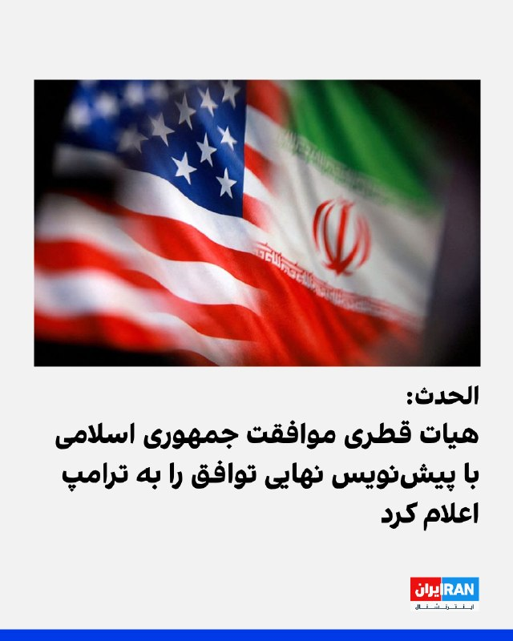

الحدث به نقل از یک مقام ارشد گزارش داد هیات قطری که از تهران بازگشت، موافقت جمهوری اسلامی با پیش‌نویس نهایی توافق را اعلام کرد.

همچنین دفتر امیر قطر اعلام کرد که تمیم بن حمد آل ثانی، امیر این کشور، و دونالد ترامپ، رییس‌جمهوری ایالات متحده، پنج‌شنبه در یک تماس تلفنی نتایج رایزنی‌های آمریکا و ایران را که به پیشرفت در تفاهم‌نامه پیشنهادی در چارچوب یک مسیر مذاکراتی منجر شده بود، بررسی کردند.

دفتر امیر قطر در بیانیه‌ای افزود که ترامپ به امیر قطر گفته است تلاش‌ها برای تکمیل مراحل نهایی پیش از اعلام ترتیبات مربوط به امضای یک توافق ادامه دارد.
‌🏁 🇬🇧 IranintlTV

🤖 @VahidOOnLine

## VahidOOnLine — post 245039

  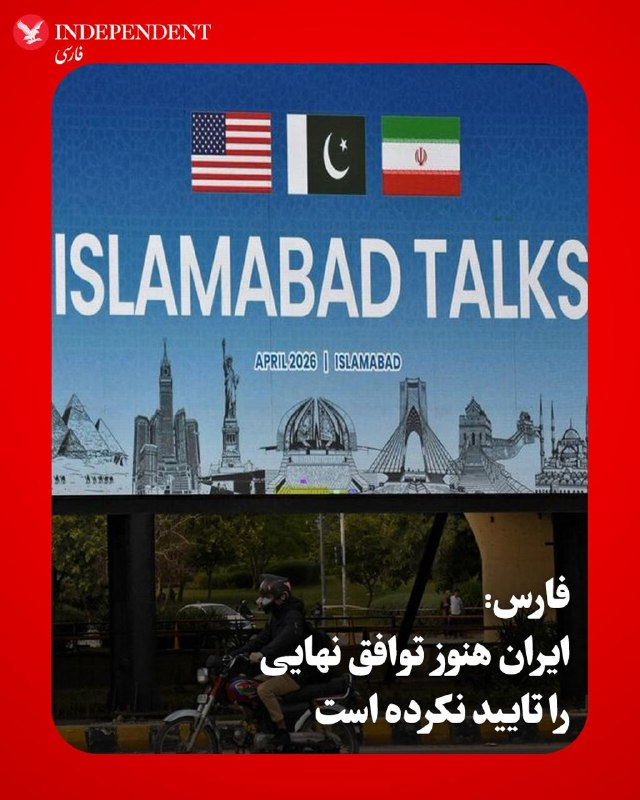

♦️به گزارش خبرگزاری فارس، یک منبع آگاه نزدیک به تیم مذاکره‌کننده جمهوری اسلامی ایران اعلام کرد که هنوز هیچ متنی برای یادداشت تفاهم اولیه با آمریکا تایید نشده است. فارس تهدید ترامپ به انجام حملات گسترده در پنجشنبه‌شب و سپس لغو آن را یک «عملیات رسانه‌ای» توصیف کرده و نوشت که او قصد دارد سناریوی «تسلیم ایران در برابر بمباران» را بسازد.

بر اساس گزارش فارس، حدود دو هفته پیش متن پیش‌نویس تفاهم‌نامه میان مذاکره‌کنندگان تقریبا نهایی شده بود، اما ترامپ برخلاف توافق قبلی، خواستار اضافه شدن بندهای جدیدی شد، اما با تشدید تنش‌ها در تنگه هرمز و حمله به بیروت، روند مذاکرات مسکوت ماند. فارس می‌گوید آمریکا از اضافه کردن این بندها منصرف شده و به متن اولیه که دو هفته قبل به تایید جمهوری اسلامی رسیده بود، بازگشته است. بر این اساس، فارس تصویب متن تفاهم‌نامه از سوی مقام‌های جمهوری اسلامی را محتمل ارزیابی کرده است.
‌🇸🇦 Indypersian

🤖 @VahidOOnLine

## WithYashar — post 14558

ترامپ: ما به توافقی دست یافتیم که ایران را از داشتن سلاح هسته ای باز می دارد.
من همین الان با نتانیاهو صحبت کردم.
اسناد ایران تقریباً در مرحله نهایی است.
من فقط با رهبران قطر، امارات و عربستان سعودی صحبت کردم.
@withyashar

## WithYashar — post 14557

دفتر امیر قطر:
ترامپ تأیید کرد که تفاهمات ایالات متحده آمریکا و ایران مورد تأیید همه طرف‌ها است
@withyashar

## mwarmonitor — post 10742

🔴ترامپ می‌گوید: این توافق باید طی چند روز آینده نهایی شود—احتمالاً مراسم امضا در اروپا برگزار خواهد شد و این اتفاق یک چیز بسیار خوب است. بازار سهام بالا رفته است. بازار سهام این توافق را دوست دارد. اگر پایین برود یعنی آن را نمی‌پسندد.

@mwarmonitor

## FoxNewsTwitter — post 342875

  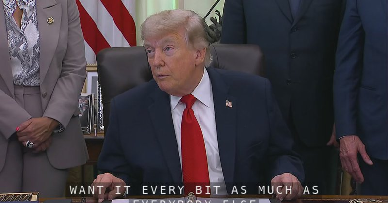

Fox News (Twitter/X)

WATCH LIVE: President Trump signs a proclamation at the White House https://twitter.com/i/broadcasts/1vJpPPVdRqmJE

## FoxNewsTwitter — post 342874

  <a href="telegram/content/FoxNewsTwitter_342874_1781207024.mp4" target="_blank">🎬 Download video</a>

Fox News (Twitter/X)

NEW: President Trump is nominating former SEC Chairman Jay Clayton as Director of National Intelligence, following pushback from lawmakers over Bill Pulte, who was named to serve as acting DNI, @markpmeredith reports. | @AmericaRpts @johnrobertsFox

## iaghapour — post 2669

  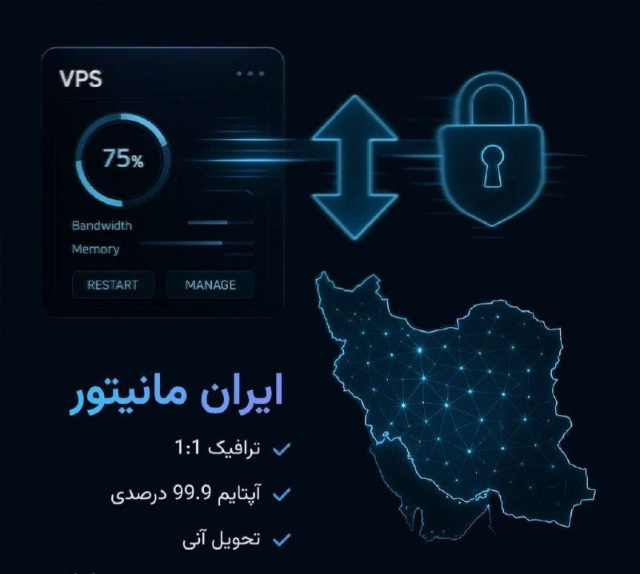

🎯 سرور مجازی با ترافیک واقعی ۱ به ۱ – ویژه تانل سری no-bcp38

مجموعه ایران مانیتور ارائه‌دهنده زیرساخت پایدار وی‌پی‌اس، با شرایط ویژه برای کاربران حساس به کیفیت و قیمت

• 🟦 دیتاسنتر شاتل رنج ۹۴:
🔵 ترافیک واقعی ۱ به ۱
🔵 ماندگاری کامل ترافیک — حجم مصرف‌نشده‌ در پایان ماه صفر نمی‌شوند

✅ بازگشت وجه کامل تا ۷ روز بی قید و شرط
✅ پایداری ۹۹.۹۹٪
خدمات ایران مانیتور مناسب برای کاربرانی است که به کیفیت و پشتیبانی حرفه‌ای اهمیت می‌دهند.

🌐 https://iranmonitor.net/services/vps
📞 ارتباط از طریق وبسایت یا پیام مستقیم برای دریافت مشاوره و سفارش @IranMonitorAdmin
ایران مانیتور – انتخاب حرفه‌ای‌ها

## VahidOnline — post 76242

  <a href="telegram/content/VahidOnline_76242_1781207027.mp4" target="_blank">🎬 Download video</a>

ترامپ درباره ایران: ممکن است آخر هفته در اروپا قراردادی امضا شود. من نمی‌توانم آنجا باشم، اما جی دی ونس آنجا خواهد بود.

## VahidOnline — post 76241

  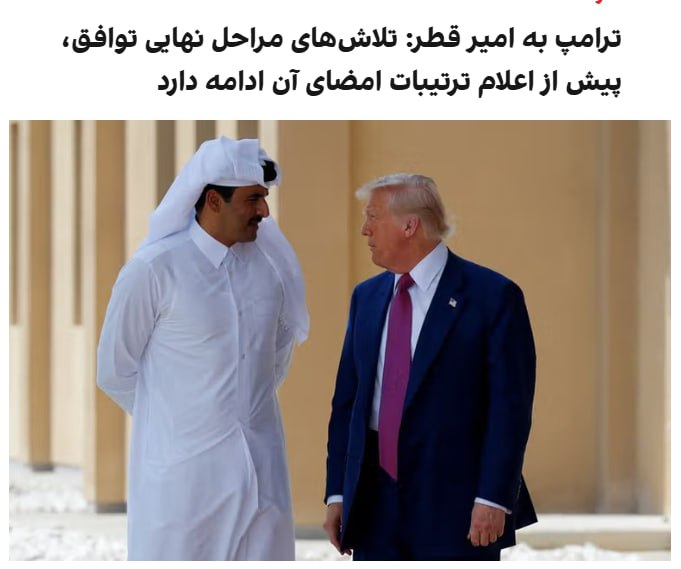

دفتر امیر قطر اعلام کرد که تمیم بن حمد آل ثانی، امیر این کشور، و دونالد ترامپ، رییس‌جمهوری ایالات متحده، پنج‌شنبه در یک تماس تلفنی نتایج رایزنی‌های آمریکا و ایران را که به پیشرفت در تفاهم‌نامه پیشنهادی در چارچوب یک مسیر مذاکراتی منجر شده بود، بررسی کردند.

دفتر امیر قطر در بیانیه‌ای افزود که ترامپ به امیر قطر گفته است تلاش‌ها برای تکمیل مراحل نهایی پیش از اعلام ترتیبات مربوط به امضای یک توافق ادامه دارد.

📡 @VahidOnline

## IranIntlTV — post 341788

  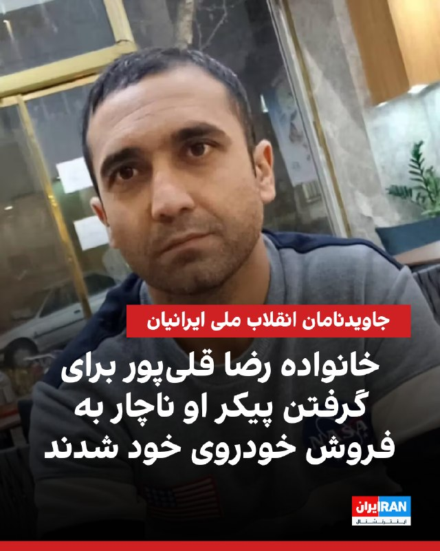

بر اساس گزارش‌های رسیده به ایران‌اینترنشنال، جاوید (رضا) قلی‌پور شامگاه پنج‌شنبه ۱۸ دی، حوالی ساعت ۱۱ شب، در حصارک اسلامشهر و در جریان انقلاب ملی با گلوله جنگی نیروهای حکومتی کشته شد.

بنا بر این گزارش، خانواده او برای تحویل پیکرش در کهریزک ناچار شدند خودروی خود را بفروشند و پس از پرداخت پول، موفق به دریافت پیکر شدند.

پیکر جاوید (رضا) قلی‌پور پس از تحویل به خانواده، در زادگاهش، یکی از روستاهای بخش شوقان در استان خراسان شمالی به خاک سپرده شد.
https://iranintl.com/202606111854

## IranIntlTV — post 341787

  <a href="telegram/content/IranIntlTV_341787_1781207029.mp4" target="_blank">🎬 Download video</a>

یک لنچ ایرانی در آب‌های عمان هدف یک پهپاد قرار گرفت. یکی از سرنشینان این لنچ در ویدیویی که در صفحه اینستاگرامش منتشر کرده می‌گوید: نمی‌دانیم پهپاد متعلق به چه کشوری بود. او ادامه می دهد لنج با همه بارش غرق شد اما یک قایق موتوری کوچک همه سرنشینان را نجات داده و آن‌ها سالم هستند.
@iranintltv

## IranIntlTV — post 341786

  

الحدث به نقل از یک مقام ارشد گزارش داد هیات قطری که از تهران بازگشت، موافقت جمهوری اسلامی با پیش‌نویس نهایی توافق را اعلام کرد.

همچنین دفتر امیر قطر اعلام کرد که تمیم بن حمد آل ثانی، امیر این کشور، و دونالد ترامپ، رییس‌جمهوری ایالات متحده، پنج‌شنبه در یک تماس تلفنی نتایج رایزنی‌های آمریکا و ایران را که به پیشرفت در تفاهم‌نامه پیشنهادی در چارچوب یک مسیر مذاکراتی منجر شده بود، بررسی کردند.

دفتر امیر قطر در بیانیه‌ای افزود که ترامپ به امیر قطر گفته است تلاش‌ها برای تکمیل مراحل نهایی پیش از اعلام ترتیبات مربوط به امضای یک توافق ادامه دارد.
https://iranintl.com/202606114783

## FarsiVOA — post 220420

  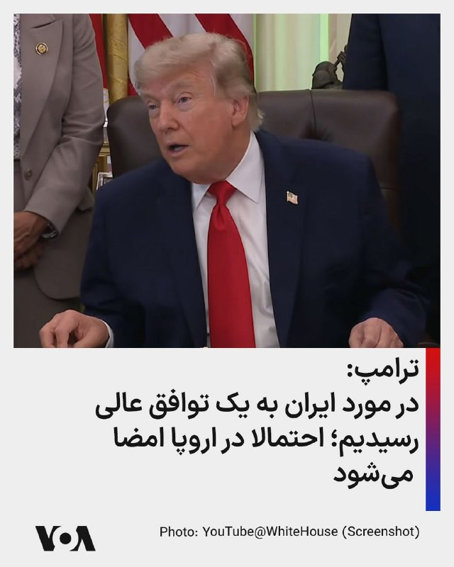

⚡️دونالد ترامپ، رئيس جمهوری آمریکا دقایقی قبل گفت: «ما به تازگی به یک توافق عالی در مورد جنگ با [جمهوری اسلامی] ایران رسیده‌ایم و قرار است اسناد نهایی شوند که باید طی چند روز آینده انجام شود. احتمالاً در اروپا امضا خواهیم داشت و این چیز خوبی است.»
آقای ترامپ افزود جی‌دی ونس، معاون رئیس جمهوری برای توافق به اروپا می‌رود. او افزود بر اساس آن جمهوری اسلامی سلاح هسته‌ای نخواهد داشت و تنگه هرمز باز می‌شود.
@FarsiVOA

## Persian_Trend_Official — post 16770

  <a href="telegram/content/Persian_Trend_Official_16770_1781207032.mp4" target="_blank">🎬 Download video</a>

ترامپ در مورد توافق با ایران: ممکن است آخر هفته در اروپا توافق امضا شود. من نمی‌توانم آنجا باشم، اما جی دی ونس آنجا خواهد بود.

همه آنها بسیار خوشحال هستند. تمام خاورمیانه خوشحال است. و خیلی فراتر از خاورمیانه. به محض اینکه آن را امضا کنیم، تنگه هرمز باز خواهد شد.

📝 Amir

📌 @persian_trend_official
پرشین ترند | متفاوت‌ترین کانال نظامی

## Persian_Trend_Official — post 16769

  <a href="telegram/content/Persian_Trend_Official_16769_1781207035.mp4" target="_blank">🎬 Download video</a>

ترامپ در مورد توافق با ایران: ما توافقی داریم که ایران هرگز به سلاح هسته‌ای دست نخواهد یافت، که تمام هدف ما از انجام این کار همین بود.

ابه زودی شاهد امضای آن خواهیم بود و اسناد در وضعیت تقریباً نهایی قرار دارند. پس خواهیم دید.

📝 Amir

📌 @persian_trend_official
پرشین ترند | متفاوت‌ترین کانال نظامی

## Persian_Trend_Official — post 16768

کانال رسمی پرشین ترند pinned «https://youtube.com/live/8dAoddRvNkw?feature=share»

## Persian_Trend_Official — post 16767

  <a href="telegram/content/Persian_Trend_Official_16767_1781207038.webm" target="_blank">🎬 Download video</a>

ترامپ در مورد توافق با ایران: ما به تازگی به یک توافق عالی در مورد جنگ با ایران دست یافتیم و قرار است اسناد نهایی شوند. باید طی چند روز آینده این کار را انجام دهیم.

احتمالاً در اروپا قراردادی امضا خواهیم کرد و این اتفاق خوبی است. بازار سهام 1000 واحد افزایش یافته است. این یعنی آنها از این توافق خوششان آمده است.

📝 Amir

📌 @persian_trend_official
پرشین ترند | متفاوت‌ترین کانال نظامی

## Persian_Trend_Official — post 16766

https://youtube.com/live/8dAoddRvNkw?feature=share

## BBCPersian — post 283475

  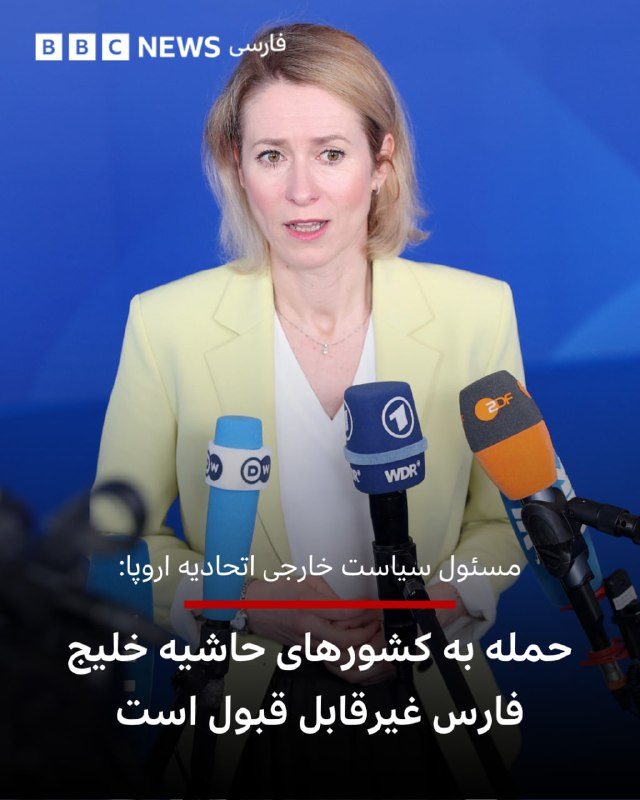

‌ ‌ ‌ ‌
کایا کالاس، مسئول سیاست خارجی اتحادیه اروپا، در پیامی در شبکه اجتماعی ایکس اعلام کرد که با عباس عراقچی، وزیر امور خارجه ایران، صحبت تلفنی کرده است.

او افزوده است: «از سرگیری حملات به کشورهای حاشیه خلیج فارس و زیرساخت‌های حیاتی آن‌ها غیرقابل قبول است.»

او همچنین گفته است که با شیخ جراح جابر الاحمد الصباح، وزیر امور خارجه کویت، نیز درتماس بوده است.

خانم کالاس تاکید کرده است: «بازگشت به یک جنگ تمام‌عیار، هزینه‌ای سنگین برای سراسر منطقه در پی خواهد داشت.»

مسئول سیاست خارجی اتحادیه اروپا گفته است «مسیر دیپلماتیک» بهترین راه پایان دادن به این جنگ است.

در عین حال آقای عراقچی گفته است که او در گفت‌وگو با خانم کالاس حملات اخیر آمریکا را محکوم کرده و آن را «نقض آشکار منشور سازمان ملل و حقوق بین‌الملل» دانسته است.

آقای عراقچی اضافه کرده است که این حملات وضعیت آتش‌بس را «بی‌اثر» کرده است.

https://bbc.in/43qVEIu
📷EPA/Shutterstock
@BBCPersian

## Dirty_Kids — post 391749

  <a href="telegram/content/Dirty_Kids_391749_1781207040.mp4" target="_blank">🎬 Download video</a>

ترامپ درباره ایران: ممکن است آخر هفته در اروپا قراردادی امضا شود. من نمی‌توانم آنجا باشم، اما جی دی ونس آنجا خواهد بود.

@Dirty_Kids 👻

## Dirty_Kids — post 391748

  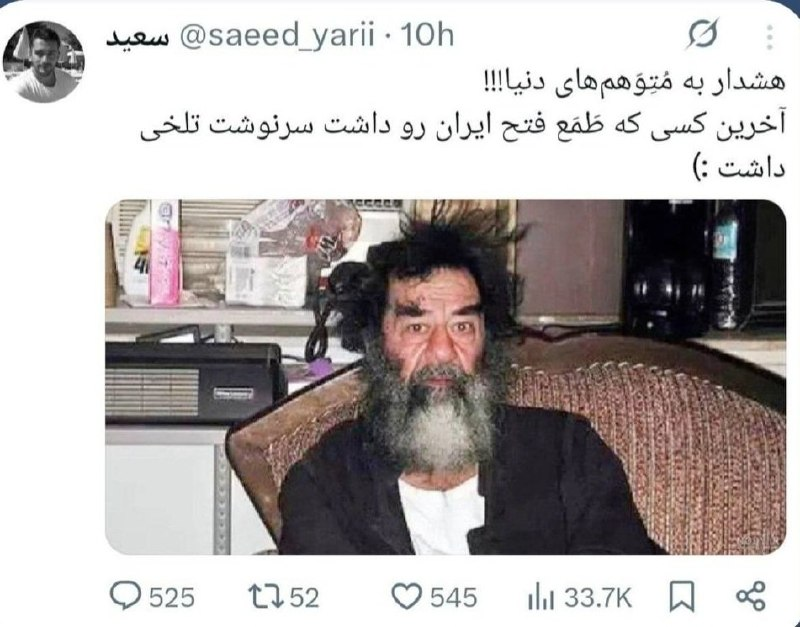

یکی به این عقب مونده بگه که آمریکا صدام رو به این روز انداخت

#عقل_عرزشی

@Dirty_Kids 👻

## alonews — post 127236

  <a href="telegram/content/alonews_127236_1781207041.webm" target="_blank">🎬 Download video</a>

👈ادامه کاهش قیمت نفت در پی اعلام توافق توسط ترامپ

✅ @AloNews خبر جنگ

## alonews — post 127235

  <a href="telegram/content/alonews_127235_1781207041.webm" target="_blank">🎬 Download video</a>

👈ترامپ: تنگه هرمز بلافاصله پس از امضای توافق باز خواهد شد.

🔴ما توافقی داریم که بر اساس آن، ایران هرگز سلاح هسته‌ای در اختیار نخواهد داشت.

✅ @AloNews خبر جنگ

## alonews — post 127234

  <a href="telegram/content/alonews_127234_1781207041.webm" target="_blank">🎬 Download video</a>

👈ترامپ: موضوع توافق در روزهای آینده حل و فصل خواهد شد. احتمالاً امضای توافق ایران در اروپا خواهد بود/به زودی امضا خواهیم کرد، این باید انجام شود و به سرعت انجام خواهد شد 
✅ @AloNews خبر جنگ

## alonews — post 127233

  <a href="telegram/content/alonews_127233_1781207042.webm" target="_blank">🎬 Download video</a>

👈قطر: رایزنی‌ها میان آمریکا و ایران به احراز پیشرفت در تفاهمات مطرح شده منجر شد

✅ @AloNews خبر جنگ

## alonews — post 127232

  <a href="telegram/content/alonews_127232_1781207042.webm" target="_blank">🎬 Download video</a>

👈ترامپ: موضوع توافق در روزهای آینده حل و فصل خواهد شد. احتمالاً امضای توافق ایران در اروپا خواهد بود/به زودی امضا خواهیم کرد، این باید انجام شود و به سرعت انجام خواهد شد

✅ @AloNews خبر جنگ

## alonews — post 127231

  <a href="telegram/content/alonews_127231_1781207042.webm" target="_blank">🎬 Download video</a>

👈سی‌بی‌اس: احتمالاً تفاهم‌نامه آمریکا و ایران هفته آتی امضا می‌شود

✅ @AloNews خبر جنگ

---
📅 بروزرسانی: 1405/03/21 23:03
---

## VahidOOnLine — post 245038

  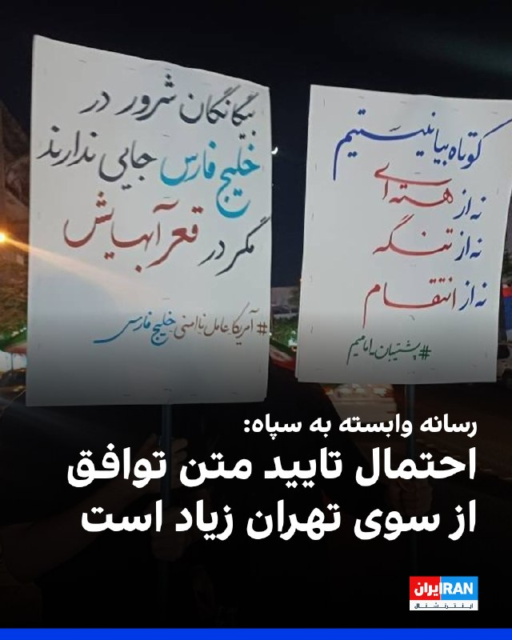

خبرگزاری فارس، وابسته به سپاه پاسداران، گزارش داد که چهارشنبه، تیم قطری برای میانجی‌گری وارد میدان شد و خبر از «عقب‌نشینی آمریکا از اضافه بندهای جدید» داد و این یعنی بازگشت به همان متن اولیه‌ای که هنوز منتظر تایید نهایی در ایران بود.

فارس اضافه کرد که متن فعلی قابل توافق میان جمهوری اسلامی و آمریکا، متعلق به دو هفته پیش است.

این رسانه وابسته به سپاه ادامه دا که تا این لحظه، نه تنها جمهوری اسلامی پاسخ نهایی نداده، بلکه این آمریکا بوده که به خواسته قبلی خود بازگشته است.

خبرگزاری فارس افزود: «با توجه به اینکه آمریکا متن پیشنهادی جمهوری اسلامی را پذیرفته، احتمال تایید این متن در مراجع اصلی نظام بالا است.»
‌🏁 🇬🇧 IranintlTV

🤖 @VahidOOnLine

## WithYashar — post 14556

  <a href="telegram/content/WithYashar_14556_1781206396.mp4" target="_blank">🎬 Download video</a>

🎬 Video

## WithYashar — post 14555

🚨🚨🚨🚨🚨🚨🚨

## mwarmonitor — post 10741

اسرائیل بعد از دیدن پست ترامپ @mwarmonitor

## mwarmonitor — post 10740

🔴منبعی نزدیک به تیم مذاکره‌کننده به خبرگزاری فارس گفته است که ایران هنوز هیچ متنی را برای یک پیش‌نویس اولیه تفاهم‌نامه (MoU) با آمریکا تأیید نکرده است. 🔸این تکذیب پس از آن منتشر شد که ترامپ ادعا کرده بود ایران «در بالاترین سطح» با چنین متنی موافقت کرده و…

## mamlekate — post 103682

📝 ترامپ پس از لغو دستور حمله: تقریبا همه چیز بین واشینگتن و تهران نهایی و جمع‌بندی شده است

دونالد ترامپ، رییس جمهوری آمریکا، پنج شنبه ۲۱ خرداد، پس از اعلام لغو دستور حمله به جمهوری اسلامی و نزدیک بودن به دستیابی به توافق مورد قبول همه طرف های درگیر در جنگ ایران، به روزنامه نیویورک پست گفت تقریبا همه چیز بین واشینگتن و تهران نهایی و جمع بندی شده است.

📝 سنتکام: تنگه هرمز برای عبور و مرور باز است

@mamlekate

## VahidOnline — post 76240

سی‌بی‌اس:
احتمالاً اوایل هفته آینده یادداشت تفاهمی بین ایالات متحده و ایران امضا خواهد شد که راه را برای مذاکرات بیشتر در مورد یک توافق بلندمدت هموار می‌کند.
CBSNews

📡 @VahidOnline

## RadioFarda — post 158198

  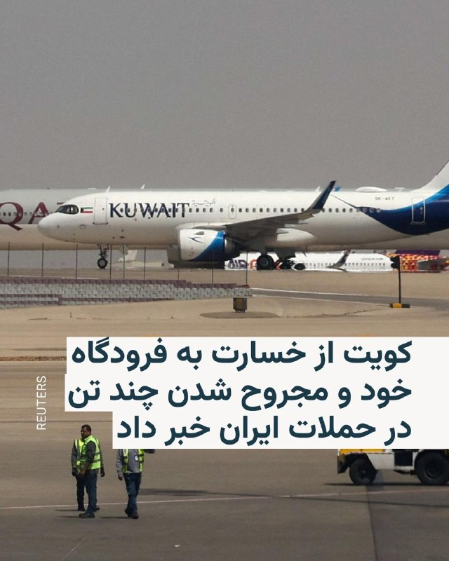

🔸کویت اعلام کرد که حملات ایران که بامداد پنج‌شنبه خاک این کشور را هدف قرار داد، به رادار فرودگاه پایتختش آسیب رسانده و موجب مجروح شدن شماری از افراد شده است.

🔸سازمان هوانوردی کشوری کویت در نامه‌ای خطاب به سازمان بین‌المللی هوانوردی غیرنظامی، ایکائو، اعلام کرد: «رادار فرودگاه صبح امروز هدف حمله قرار گرفت.»

🔸این نهاد همچنین افزود که این حمله «موجب مجروح شدن افرادی شده و خسارات و زیان‌های مادی قابل توجهی به تأسیسات راداری، تجهیزات و سامانه‌های مدیریت ترافیک هوایی وارد کرده است.»

🔸ایران در واکنش به حملات آمریکا به اهدافی در سراسر خاک خود، بامداد پنجشنبه به کویت و بحرین حمله کرد. مقام‌های ایرانی می‌گویند پایگاه‌ها و اموال آمریکا در خاورمیانه را هدف قرار می‌دهند.

@RadioFarda

## Dirty_Kids — post 391747

  <a href="telegram/content/Dirty_Kids_391747_1781206398.mp4" target="_blank">🎬 Download video</a>

چون مکزیک میزبان و افتتاحیه جام‌جهانی رو برگزار کرده و اولین گل جام هم زده، بهش میرسه یدونه فن‌ مکزیکی رو ببینیم

@Dirty_Kids 👻

## alonews — post 127230

  <a href="telegram/content/alonews_127230_1781206400.webm" target="_blank">🎬 Download video</a>

👈دفتر امیر قطر:
ترامپ تأیید کرد که تفاهمات ایالات متحده آمریکا و ایران مورد تأیید همه طرف‌ها است

✅ @AloNews خبر جنگ

## alonews — post 127229

  <a href="telegram/content/alonews_127229_1781206400.webm" target="_blank">🎬 Download video</a>

👈اسرائیل هیوم : انتظار میره ترامپ با نتانیاهو گفت‌وگو کنه

✅ @AloNews خبر جنگ

## alonews — post 127228

  <a href="telegram/content/alonews_127228_1781206401.webm" target="_blank">🎬 Download video</a>

👈سی‌ان‌ان: یک منبع اسرائیلی می‌گوید پست ترامپ در شبکه‌های اجتماعی درباره توافق با ایران، نتانیاهو را شگفت‌زده کرده است

✅ @AloNews خبر جنگ

---
📅 بروزرسانی: 1405/03/21 22:52
---

## VahidOOnLine — post 245037

  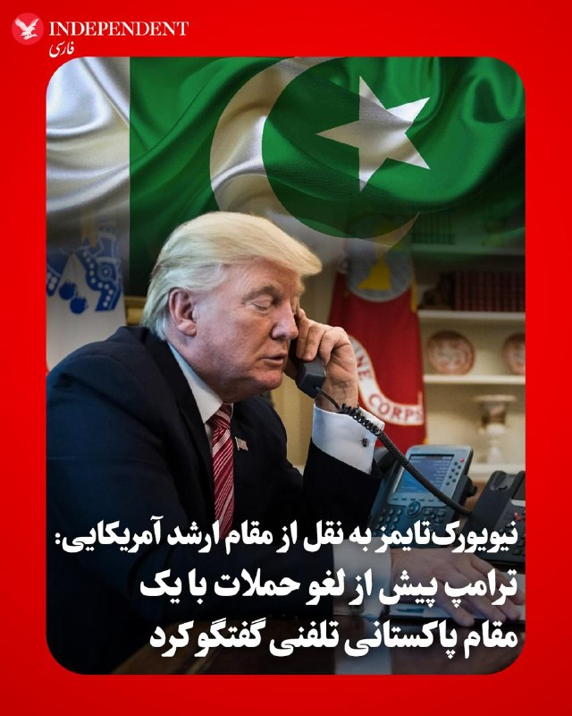

♦️نیویورک‌تایمز به نقل از یک مقام ارشد دولت آمریکا گزارش داد که دونالد ترامپ، رئیس‌جمهوری این کشور، مدت کوتاهی پیش از لغو حملات پنجشنبه‌شب علیه ایران، با مقامات پاکستانی که نقش میانجی را میان واشینگتن و تهران ایفا می‌کنند، گفتگو کرده است. این مقام مسئول اظهار داشت که طرف پاکستانی در این گفتگو به ترامپ اعلام کرده است: «ما با ایران به توافق رسیده‌ایم.»

با این حال، هنوز مقام‌های جمهوری اسلامی واکنشی به اظهارات ترامپ درباره توافق احتمالی نشان نداده‌اند و مشخص نیست این توافق شامل چه بندهایی خواهد بود.
‌🇸🇦 Indypersian

🤖 @VahidOOnLine

## WithYashar — post 14554

## mwarmonitor — post 10739

  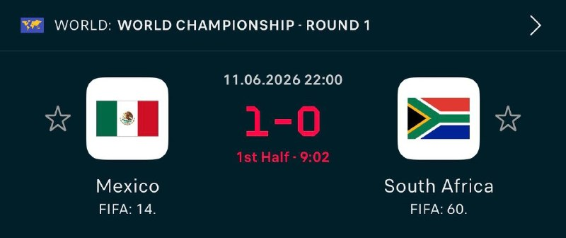

اولین گل جام جهانی زده شد.

@mwarmonitor

## VahidOnline — post 76239

  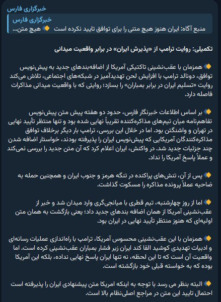

خبرگزاری فارس در پستی جدید نوشته:
"بنظر می رسد با توجه به اینکه امریکا متن پیشنهادی ایران را پذیرفته است احتمال تایید این متن در مراجع اصلی‌نظام بالا است‌."

📡 @VahidOnline

## VahidOnline — post 76238

الحدث به نقل از یک مقام ارشد گزارش داد هیات قطری که از تهران بازگشت، موافقت جمهوری اسلامی با پیش‌نویس نهایی توافق را اعلام کرد
IranIntlbrk

📡 @VahidOnline

## IranIntlTV — post 341785

  

خبرگزاری فارس، وابسته به سپاه پاسداران، گزارش داد که چهارشنبه، تیم قطری برای میانجی‌گری وارد میدان شد و خبر از «عقب‌نشینی آمریکا از اضافه بندهای جدید» داد و این یعنی بازگشت به همان متن اولیه‌ای که هنوز منتظر تایید نهایی در ایران بود.

فارس اضافه کرد که متن فعلی قابل توافق میان جمهوری اسلامی و آمریکا، متعلق به دو هفته پیش است.

این رسانه وابسته به سپاه ادامه دا که تا این لحظه، نه تنها جمهوری اسلامی پاسخ نهایی نداده، بلکه این آمریکا بوده که به خواسته قبلی خود بازگشته است.

خبرگزاری فارس افزود: «با توجه به اینکه آمریکا متن پیشنهادی جمهوری اسلامی را پذیرفته، احتمال تایید این متن در مراجع اصلی نظام بالا است.»
https://iranintl.com/202606115012

## IranIntlTV — post 341784

  <a href="telegram/content/IranIntlTV_341784_1781205773.mp4" target="_blank">🎬 Download video</a>

ران جانسون، سناتور جمهوری‌خواه، به مرضیه حسینی، خبرنگار ایران‌اینترنشنال، گفت: «دستیابی ایران به سلاح هسته‌ای را یک تهدید موجودیتی برای آمریکا می‌دانم. همه روسای‌جمهور آمریکا، از زمان بیل کلینتون تا امروز، گفته‌اند که ایالات متحده نمی‌تواند اجازه دهد ایران به یک قدرت هسته‌ای تبدیل شود، اما به اعتقاد من هیچ‌یک از آنها اقدام موثری در این زمینه انجام ندادند. به همین دلیل بود که دونالد ترامپ ناچار شد تصمیمی سخت بگیرد.»

او افزود: «امیدوارم بتوانیم سرانجام این آیت‌الله‌ها را به قعر تاریخ بسپاریم. فقط تصور کنید نبودن آنها چه تاثیری می‌تواند بر صلح و ثبات جهانی داشته باشد.»
@iranintltv

## FarsiVOA — post 220419

🔺استعفای وزیر دفاع بریتانیا؛ اشاره به تهدیدهای امنیتی فزاینده جهانی و کاهش بودجه

◾️جان هیلی، وزیر دفاع بریتانیا، روز پنج‌شنبه ۲۰ خرداد از مقام خود استعفا کرد و گفت که دولت در زمانی که تهدیدها افزایش یافته‌اند، بودجه کافی برای ارتش اختصاص نمی‌دهد.

⬇️ بیشتر بخوانید:
https://ir.voanews.com/a/britain-healey-defense-budget-nato-uk-military/8159819.html
@FarsiVOA

## DW_Farsi — post 125835

📸 افتتاح جام جهانی فوتبال ۲۰۲۶ با جشنی رنگارنگ در مکزیک

ورزشگاه آزتکا در مکزیکو سیتی میزبان جشن افتتاحیه جام جهانی فوتبال ۲۰۲۶ بود. در این مراسم ۸۰ هزار تماشاگر حضور داشتند. شکیرا، ستاره معروف کلمبیایی ترانه رسمی جام جهانی را در این مراسم اجرا کرد.
@dw_farsi

## Persian_Trend_Official — post 16765

  <a href="telegram/content/Persian_Trend_Official_16765_1781205775.webm" target="_blank">🎬 Download video</a>

بچه ها بلند شدن
مجتبی امضا نکنی ... 😄

## Persian_Trend_Official — post 16764

تا دقایقی دیگه لایو رو آغاز میکنیم

## Dirty_Kids — post 391746

  <a href="telegram/content/Dirty_Kids_391746_1781205776.mp4" target="_blank">🎬 Download video</a>

بله از کشور استانبول تشریف اوردن خانم دکتر پرستو
فقط زول زولای فیک و تغییر مود ثانیه ایش :))

@Dirty_Kids 👻

## Dirty_Kids — post 391745

  <a href="telegram/content/Dirty_Kids_391745_1781205778.mp4" target="_blank">🎬 Download video</a>

حتما ایرانیها توو جنگ خیلی استرس دارن!!!!
ایرانی‌ها 👆

@Dirty_Kids 👻

## Hranews — post 113549

  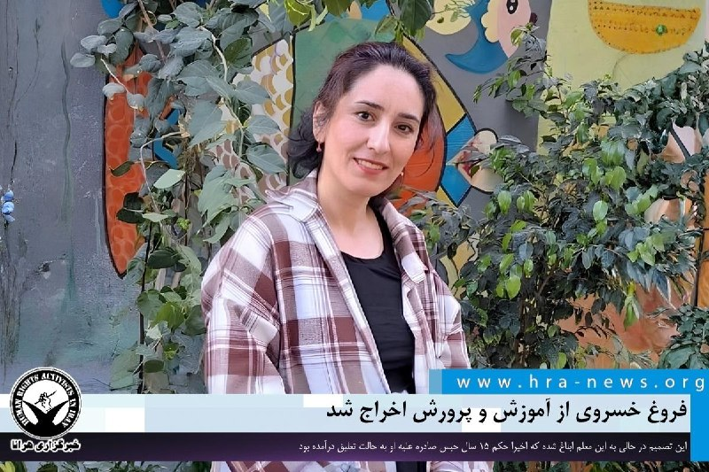

فروغ خسروی، معلم از آموزش و پرورش اخراج شد

❗️
❗️
❗️
❗️
❗️– فروغ خسروی، معلم مقطع ابتدایی اهل بهبهان و شاغل در مدارس آغاجاری، با حکم «لغو پیمان» از آموزش و پرورش اخراج شد. این تصمیم در حالی ابلاغ شده که وی پیش‌تر به چهار ماه انفصال موقت از خدمت محکوم شده بود.

به گزارش هرانا، ارگان خبری مجموعه فعالان حقوق بشر در ایران، آموزش و پرورش آغاجاری حکم ۴ ماه انفصال از خدمت خانم خسروی را به «لغو پیمان» تبدیل کرده است.

یک منبع مطلع در این رابطه به هرانا گفت: «روند اخراج خانم خسروی بدون طی مراحل قانونی با فشار مستقیم نهادهای امنیتی و تنها طی یک نامه محرمانه انجام شده است که مسئولان مربوطه حتی از ارائه آن به خود این معلم خودداری کرده‌اند. در حکم کارگزینی جدید وی نیز عبارت “لغو پیمان” درج شده است.»

ادامه مطلب

#فروغ_خسروی

↘️
@hranews_bot تماس ✉️ - @Hranews کانال هرانا 🆑

## alonews — post 127227

  <a href="telegram/content/alonews_127227_1781205780.webm" target="_blank">🎬 Download video</a>

🔴فوری/فارس: احتمال تایید توافق توسط رهبری بالاست

✅ @AloNews خبر جنگ

## alonews — post 127226

  <a href="telegram/content/alonews_127226_1781205780.mp4" target="_blank">🎬 Download video</a>

👈وزیر امور خارجه مارکو روبیو و مدیر عامل یو‌اف‌سی دانا وایت در وزارت امور خارجه بر سر دیپلماسی ورزشی و گسترش هنرهای رزمی ترکیبی در سراسر جهان، یک یادداشت تفاهم امضا کردند.

✅ @AloNews خبر جنگ

## alonews — post 127225

  <a href="telegram/content/alonews_127225_1781205782.mp4" target="_blank">🎬 Download video</a>

👈وزیر امور خارجه مارکو روبیو شوخی می‌کند دربارهٔ رینگ یو‌‌اف‌سی در کاخ سفید: دونالد ترامپ تهدید می‌کند که آن را رها کند.

🔴شاید فقط میزبان مبارزات هفتگی بین افراد در سیاست باشیم و امتیازاتمان را به این روش تسویه کنیم.

✅ @AloNews خبر جنگ

---
📅 بروزرسانی: 1405/03/21 22:43
---

## VahidOOnLine — post 245036

  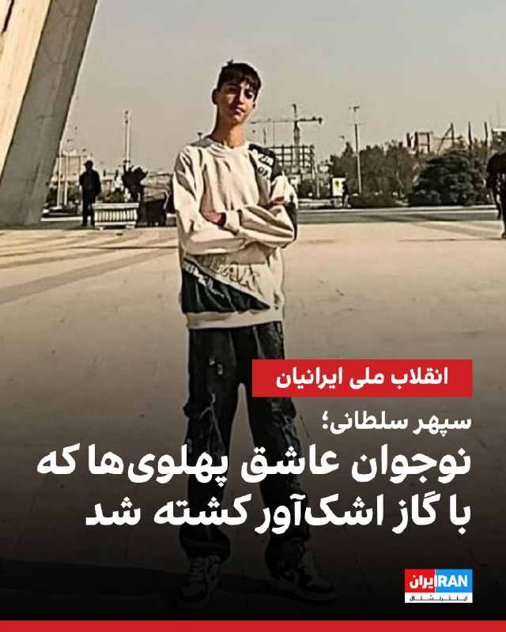

اطلاعات رسیده به ایران اینترنشنال نشان می‌دهد سپهر سلطانی، کودک ۱۵ ساله مبتلا به مشکل تنفسی، در جریان اعتراضات انقلاب ملی به دلیل پرتاب گاز اشک‌آور در ملک‌شهر اصفهان مصدوم شد و جان باخت.

نزدیکانش گفته‌اند او «عاشق محمدرضا شاه و رضاشاه بود و آرزویش پرچم شیر و خورشید بود.»

طبق اطلاعات رسیده،‌ جاویدنام سپهر سلطانی در انقلاب مهسا آرمان و هدفش آزادی ایران بود و با وجود مشکل تنفسی در همه فراخوان‌های انقلاب دی‌ماه با اصرار و پافشاری شرکت کرد. او وقتی متوجه تیراندازی ماموران شد به سمت کوچه‌ای دوید که به دلیل پر بودن فضای آن از غبار و گاز اشک‌آور به روی زمین افتاد و دچار خفگی شد.
‌🏁 🇬🇧 IranintlTV

🤖 @VahidOOnLine

## WithYashar — post 14553

زاکانی: مراسم تشییع جنازه علی خامنه‌ای در دهه دوم محرم برگزار خواهد شد.
@withyashar 😂

## mwarmonitor — post 10738

🔴منبعی نزدیک به تیم مذاکره‌کننده به خبرگزاری فارس گفته است که ایران هنوز هیچ متنی را برای یک پیش‌نویس اولیه تفاهم‌نامه (MoU) با آمریکا تأیید نکرده است. 🔸این تکذیب پس از آن منتشر شد که ترامپ ادعا کرده بود ایران «در بالاترین سطح» با چنین متنی موافقت کرده و…

## pm_afshaa — post 93648

گزارش های محلی از پیشروی ارتش اسرائیل در جنوب لبنان و رسیدن به دروازه های شهر نبطیه، بزرگ ترین پایگاه حزب الله در جنوب لبنان می‌باشد

💧 Rainbet.com the #1 Non-KYC Crypto Casino & Sportsbook @rainbetcom

😁 @Pm_Afshaa

## VahidOnline — post 76237

نیویورک‌تایمز: ‌قبل از لغو حملات برنامه‌ریزی‌شده به ایران در روز پنج‌شنبه، ترامپ با میانجی‌گران پاکستانی صحبت کرد که به او گفتند با ایران «توافقی» دارند.
clashreport

📡 @VahidOnline

## VahidOnline — post 76236

  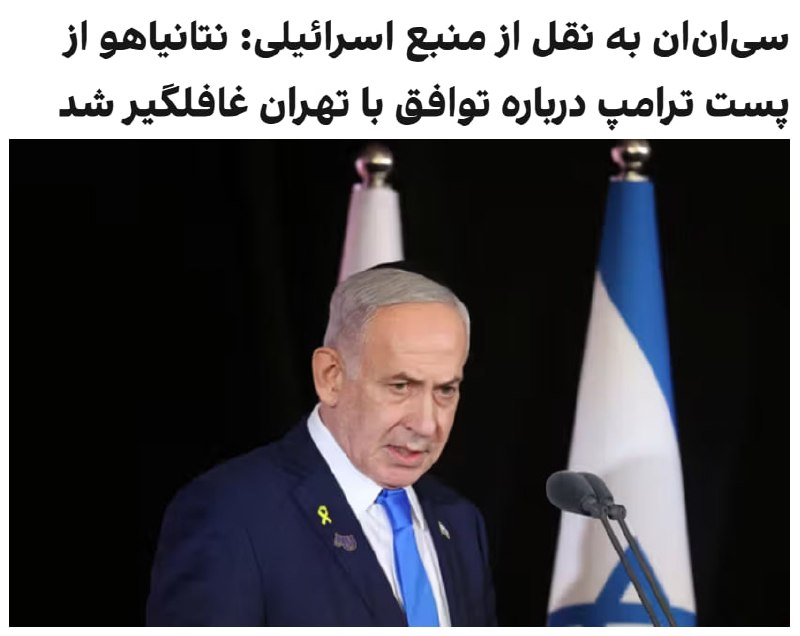

سی‌ان‌ان به نقل از یک منبع اسرائیلی گزارش داد پست دونالد ترامپ در تروث سوشال درباره نزدیک بودن توافق با تهران، بنیامین نتانیاهو را غافلگیر کرد؛ در حالی که او در میانه یک نشست امنیتی درباره ایران حضور داشت.
سی‌ان‌ان افزود که این کشور از وجود هرگونه توافق قریب‌الوقوع با جمهوری اسلامی یا تایید آن بی‌اطلاع بوده است.
@VahidOOnLine

📡 @VahidOnline

## IranIntlTV — post 341783

  

اطلاعات رسیده به ایران اینترنشنال نشان می‌دهد سپهر سلطانی، کودک ۱۵ ساله مبتلا به مشکل تنفسی، در جریان اعتراضات انقلاب ملی به دلیل پرتاب گاز اشک‌آور در ملک‌شهر اصفهان مصدوم شد و جان باخت.

نزدیکانش گفته‌اند او «عاشق محمدرضا شاه و رضاشاه بود و آرزویش پرچم شیر و خورشید بود.»

طبق اطلاعات رسیده،‌ جاویدنام سپهر سلطانی در انقلاب مهسا آرمان و هدفش آزادی ایران بود و با وجود مشکل تنفسی در همه فراخوان‌های انقلاب دی‌ماه با اصرار و پافشاری شرکت کرد. او وقتی متوجه تیراندازی ماموران شد به سمت کوچه‌ای دوید که به دلیل پر بودن فضای آن از غبار و گاز اشک‌آور به روی زمین افتاد و دچار خفگی شد.
https://iranintl.com/202606119840

## FarsiVOA — post 220418

🔺گفت‌و‌گوی صدای آمریکا با گروگان سابق اسرائیلی پس از دیدارش با پرزیدنت ترامپ

◾️یک گروگان سابق اسرائیلی که مهر ۱۴۰۴ از اسارت در غزه نحات یافت، به طور اختصاصی با صدای آمریکا درباره دیدار خصوصی خود با دونالد ترامپ، رئیس‌ جمهوری آمریکا، در کاخ سفید در روز سه‌شنبه ۱۹ خرداد صحبت کرد. این دیدار همان زمانی انجام شد که پرزیدنت ترامپ در حال واکنش نشان دادن به سرنگونی یک بالگرد آمریکایی توسط رژیم ایران بود و برای صدور دستور حملات تلافی‌جویانه آمریکا علیه جمهوری اسلامی آماده می‌شد.

⬇️ بیشتر بخوانید:
https://ir.voanews.com/a/iran-us-trump-hostage-israel-oval-office-october7th/8159730.html
@FarsiVOA

## RadioFarda — post 158197

  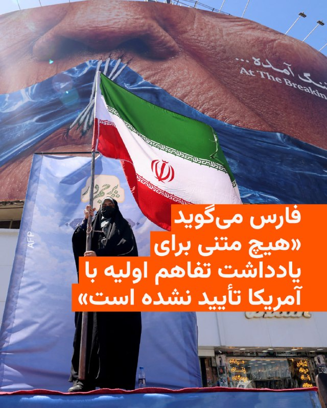

🔸خبرگزاری فارس، نزدیک به سپاه پاسداران، ساعتی پس از پیام دونالد ترامپ دربارهٔ مذاکرات با ایران، مدعی شد که «هیچ متنی برای یادداشت تفاهم اولیه با آمریکا تأیید نشده است».

🔸فارس ادعای خود را با استناد به اظهارات «یک منبع آگاه نزدیک به تیم مذاکره‌کننده جمهوری اسلامی ایران» بیان کرده است.

🔸رئیس‌جمهور ایالات متحده که روز پنجشنبه ابتدا گفته بود امشب حملات شدیدی به ایران صورت خواهد گرفت، ساعاتی بعد اعلام کرد که به‌دلیل پیشرفت مذاکرات با «بالاترین سطح رهبری» جمهوری اسلامی،‌ این حملات را لغو کرده است.

🔸رئیس‌جمهور آمریکا به جزئیات بیشتری درباره این توافق اشاره نکرد اما افزود: «زمان و مکان امضای این توافق به‌زودی اعلام خواهد شد».

@RadioFarda

## IranianMinds — post 22335

  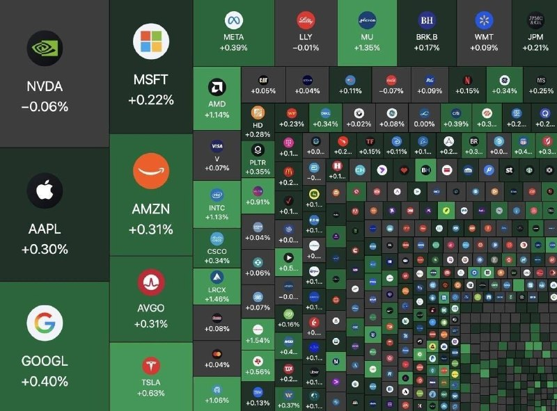

اینم وضعیت بورس آمریکا.
سبز شد.

@IranianMinds

## Hranews — post 113548

  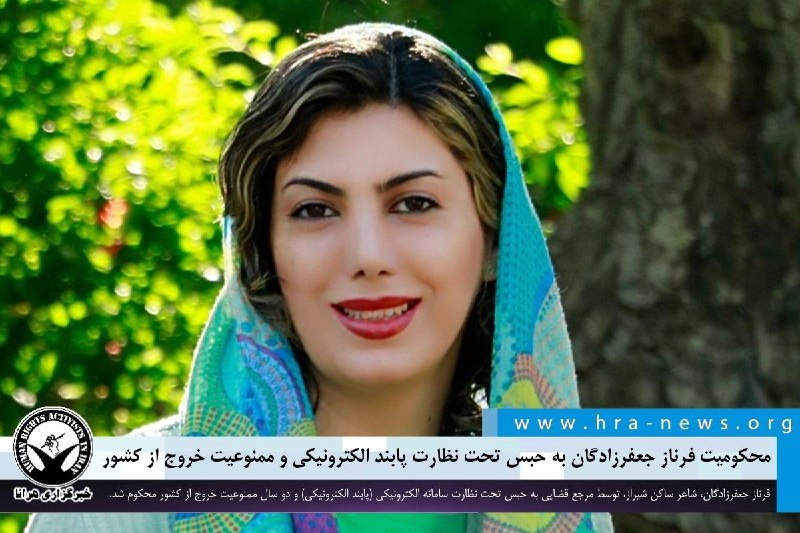

محکومیت فرناز جعفرزادگان به حبس تحت نظارت پابند الکترونیکی و ممنوعیت خروج از کشور

❗️
❗️
❗️
❗️
❗️– فرناز جعفرزادگان، شاعر ساکن شیراز، توسط مرجع قضایی به حبس تحت نظارت سامانه الکترونیکی (پابند الکترونیکی) و دو سال ممنوعیت خروج از کشور محکوم شد.

به گزارش خبرگزاری هرانا، ارگان خبری مجموعه فعالان حقوق بشر در ایران، فرناز جعفرزادگان توسط مرجع قضایی محکوم شده است.

بر اساس حکم صادره، خانم جعفرزادگان به دلیل فعالیت‌هایی از جمله مشارکت در کارزاری در مخالفت با خشونت علیه زنان، کشف حجاب، مخالفت با حجاب اجباری و مجازات اعدام به حبس تحت نظارت سامانه الکترونیکی و دو سال ممنوعیت خروج از کشور محکوم شده است. همچنین در این حکم، بخشی از اشعار، نوشته‌ها و نقدهای ادبی وی، از جمله آثاری که پیش‌تر با مجوز رسمی وزارت فرهنگ و ارشاد اسلامی منتشر شده‌اند، مصداق «نشر اکاذیب» و «تشویش اذهان عمومی» عنوان شده است.

ادامه مطلب

#فرناز_جعفرزادگان

↘️
@hranews_bot تماس ✉️ - @Hranews کانال هرانا 🆑

## alonews — post 127224

  <a href="telegram/content/alonews_127224_1781205188.mp4" target="_blank">🎬 Download video</a>

👈 اقدام جدید در جام جهانی 2026؛ بازیکنان ذخیره هم در مراسم پیش از شروع بازی شرکت می‌کنند و سرود می‌خوانند

✅ @AloNews خبر جنگ

## alonews — post 127223

  <a href="telegram/content/alonews_127223_1781205190.webm" target="_blank">🎬 Download video</a>

👈کانال ۱۲ عبری: از توافق امریکا و ایران بی‌اطلاعیم و از اینکه رهبران ایران موافقت کرده‌اند متحیریم

✅ @AloNews خبر جنگ

## alonews — post 127219

  <a href="telegram/content/alonews_127219_1781205190.webm" target="_blank">🎬 Download video</a>

👈تصاویری از مراسم افتتاحیه جام جهانی

✅ @AloNews خبر جنگ

---
📅 بروزرسانی: 1405/03/21 22:33
---

## VahidOOnLine — post 245035

  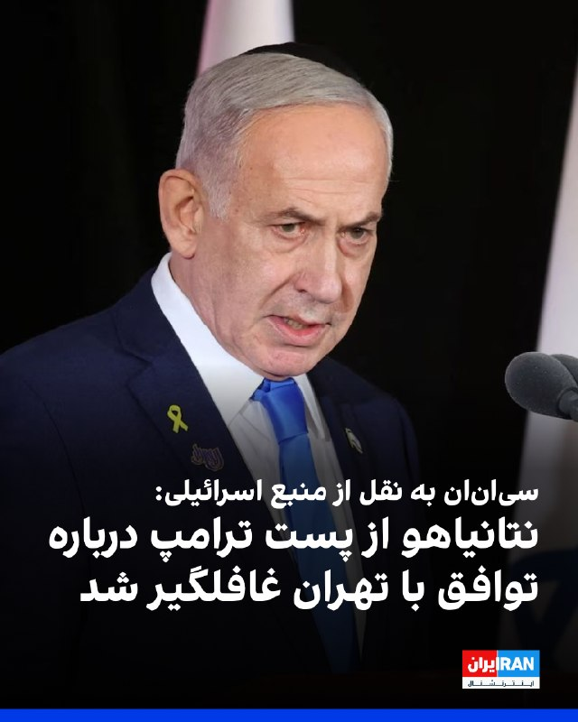

سی‌ان‌ان به نقل از یک منبع اسرائیلی گزارش داد پست دونالد ترامپ در تروث سوشال درباره نزدیک بودن توافق با تهران، بنیامین نتانیاهو را غافلگیر کرد؛ در حالی که او در میانه یک نشست امنیتی درباره ایران حضور داشت.

سی‌ان‌ان افزود که اسرائیل از وجود هرگونه توافق قریب‌الوقوع با جمهوری اسلامی یا تایید آن بی‌اطلاع بوده است.
‌🏁 🇬🇧 IranintlTV

🤖 @VahidOOnLine

## VahidOOnLine — post 245034

  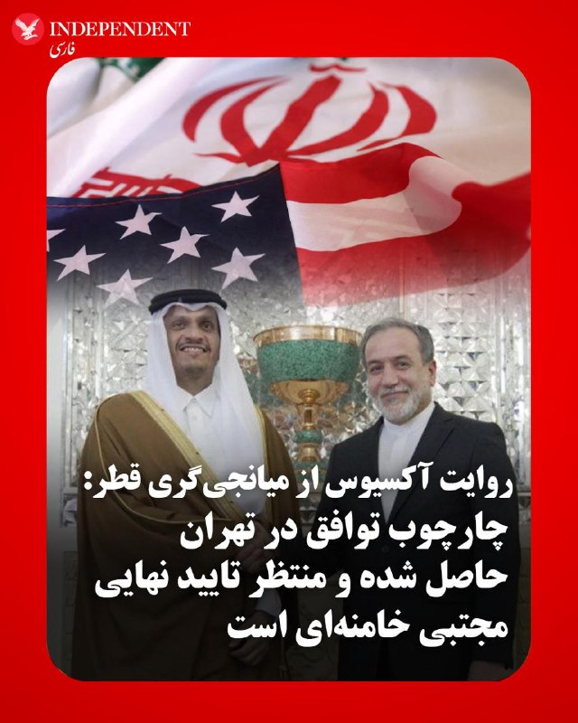

♦️همزمان با عقب‌نشینی دونالد ترامپ از تهدید حمله به زیرساخت‌های نفتی ایران، رسانه آکسیوس، روز دوشنبه ۲۱ خرداد ماه به نقل از منابع آگاه گزارش داد که مذاکرات میان ایران و آمریکا تا شامگاه چهارشنبه در تهران ادامه داشت و علی الثوادی، فرستاده قطر و عباس عراقچی، وزیر امور خارجه ایران، برای رفع اختلافات باقی‌مانده میان دو طرف تلاش می‌کردند.
بر اساس این گزارش، سه منبع مطلع از روند مذاکرات گفته‌اند که مقام‌های قطری و ایرانی روز چهارشنبه بر این باور بودند که به متن مورد توافقی دست یافته‌اند که آمریکا نیز آن را خواهد پذیرفت.
به گفته این منابع، اختلافات بر سر سه موضوع اصلی کاهش یافته بود: سازوکار آزادسازی دارایی‌های مسدودشده ایران که مهم‌ترین مطالبه تهران محسوب می‌شود، نحوه بازگشایی تنگه هرمز در دوره آتش‌بس ۶۰ روزه و چگونگی ادامه مذاکرات درباره برنامه هسته‌ای ایران در طول این دوره.
آکسیوس همچنین به نقل از منابع خود گزارش داد مقام‌های ایرانی روز پنجشنبه به چند کشور اطلاع داده‌اند که مذاکرات تهران به یک چهارچوبی برای توافق منجر شده است، اما این توافق همچنان نیازمند تایید نهایی مجتبی خامنه‌ای است.
این منابع افزودند که مقام‌های ایرانی و قطری پس از حملات شبانه آمریکا تاکید کرده‌اند که این اقدام تردیدهای تهران درباره نیت واقعی دونالد ترامپ را به‌طور قابل توجهی افزایش داده است. ترامپ ساعاتی پیش از این حملات اعلام کرده بود که آمریکا «امشب ضربه بسیار سختی به ایران وارد خواهد کرد.»
‌🇸🇦 Indypersian

🤖 @VahidOOnLine

## WithYashar — post 14552

ادعای الحدث: هیئت قطری در بازگشت از تهران، موافقت ایران با پیش‌نویس نهایی را منتقل کرد
@withyashar

## WithYashar — post 14551

خبرنگار نیویورک‌پست: ترامپ همین الان به من گفت که توافقی با ایران کاملاً نهایی شده
@withyashar

## IranIntlTV — post 341782

  

سی‌ان‌ان به نقل از یک منبع اسرائیلی گزارش داد پست دونالد ترامپ در تروث سوشال درباره نزدیک بودن توافق با تهران، بنیامین نتانیاهو را غافلگیر کرد؛ در حالی که او در میانه یک نشست امنیتی درباره ایران حضور داشت.

سی‌ان‌ان افزود که اسرائیل از وجود هرگونه توافق قریب‌الوقوع با جمهوری اسلامی یا تایید آن بی‌اطلاع بوده است.
https://iranintl.com/202606118596

## IranIntlTV — post 341781

  <a href="https://t.me/IranintlTV/341781" target="_blank">📎 Download file</a>

🎧نسخه صوتی دومینو: ایران میان جنگ و آتش‌بس
@iranintlTV

## FarsiVOA — post 220417

🔺تداوم سرکوب مردم ایران توسط رژیم؛ از صدور احکام حبس تازه تا ادامه بلاتکلیفی معترضان بازداشت‌شده

◾️همزمان با ادامه فشارهای اقتصادی و معیشتی مردم در ایران و در حالی که به دنبال اقدامات ماجراجویانه رژیم در منطقه اقدامات نظامی علیه رژیم حاکم بر ایران از سر گرفته شده است، جمهوری اسلامی از تداوم سرکوب مردم ایران دست برنداشته است.

⬇️ بیشتر بخوانید:

https://ir.voanews.com/a/political-prisoners-continued-repression-human-rights-iran/8159785.html

## DW_Farsi — post 125834

  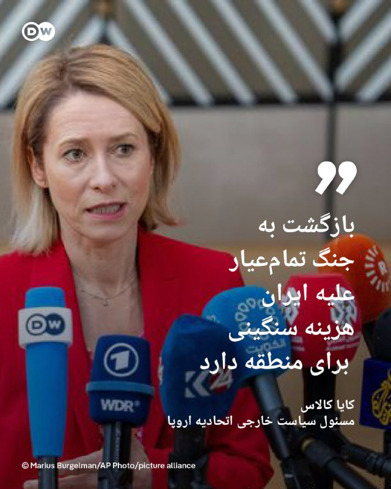

🔶 کالاس: بازگشت به جنگ تمام‌عیار علیه ایران هزینه سنگینی برای منطقه دارد

کایا کالاس، مسئول سیاست خارجی اتحادیه اروپا می‌گوید، درباره آخرین تنش‌ها در خلیج فارس و وضعیت مذاکرات مربوط به جنگ ایران با عباس عراقچی‌، وزیر خارجه جمهوری اسلامی گفت‌وگو کرده است.
 
او در این پیام که پنج‌شنبه ۲۱ خرداد (۱۱ ژوئن) در شبکه ایکس منتشر کرد با اشاره به این که با شیخ جراح جابر الاحمد الصباح، وزیر خارجه کویت نیز در این رابطه تماس گرفته ازسرگیری حملات به کشورهای حوزه خلیج فارس و زیرساخت‌های حیاتی آن‌ها را "غیرقابل قبول است" دانست.
 
کالاس با تأکید بر اهمیت مسیر دیپلماتیک به عنوان "بهترین راه" خروج از جنگ ایران پیام خود را این‌گونه به پایان برد: «بازگشت به یک جنگ تمام‌عیار، هزینه سنگینی برای کل منطقه به همراه خواهد داشت.»
@dw_farsi

## IranianMinds — post 22334

  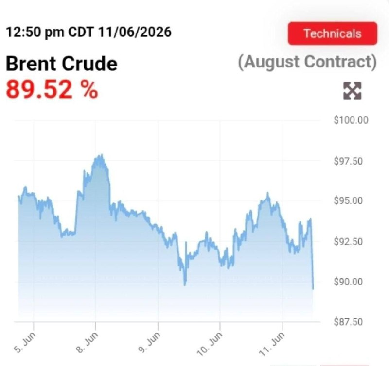

🔴قیمت نفت زیر ۹۰ دلار رسید.

@IranianMinds

## Dirty_Kids — post 391744

  <a href="telegram/content/Dirty_Kids_391744_1781204640.mp4" target="_blank">🎬 Download video</a>

تو دنياى خداداد عزيزى «رشید مظاهری» باش.

@Dirty_Kids 👻

## Hranews — post 113547

  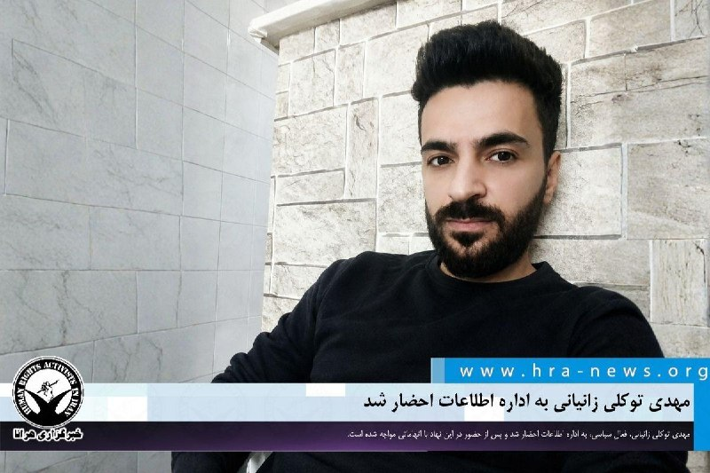

مهدی توکلی زانیانی به اداره اطلاعات احضار شد

❗️
❗️
❗️
❗️
❗️– مهدی توکلی زانیانی، فعال سیاسی، به اداره اطلاعات شهرکرد احضار شد و پس از حضور در این نهاد با اتهاماتی مواجه شده است.

به گزارش خبرگزاری هرانا، ارگان خبری مجموعه فعالان حقوق بشر در ایران، مهدی توکلی زانیانی به اداره اطلاعات شهرکرد احضار شده است.

یک منبع مطلع در این خصوص به هرانا گفت: در جریان این احضار اتهاماتی از جمله فعالیت‌های موسوم به «براندازانه»، جذب نیرو و سازماندهی گروه‌هایی برای شناسایی نیروهای امنیتی به او نسبت داده شده است. مهدی تمامی این اتهامات را رد کرده و آنها را «کذب محض» عنوان کرده است.
#مهدی_توکلی_زانیانی

ادامه مطلب

↘️
@hranews_bot تماس ✉️ - @Hranews کانال هرانا 🆑

## alonews — post 127218

  <a href="telegram/content/alonews_127218_1781204642.webm" target="_blank">🎬 Download video</a>

👈الحدث: هیئت قطری در بازگشت از تهران، موافقت ایران با پیش‌نویس نهایی را منتقل کرد

✅ @AloNews خبر جنگ

## alonews — post 127217

  <a href="telegram/content/alonews_127217_1781204643.webm" target="_blank">🎬 Download video</a>

👈سخنگوی کمیسیون امنیت ملی و سیاست خارجی، ابراهیم رضایی: من یکی از کسانی هستم که خارک و نیروهای پشتیبان آن را از نزدیک دیده‌ام؛ پاهای ناپاک شما به آنجا نخواهند رسید و اگر بیایید، زنده برنخواهید گشت.

✅ @AloNews خبر جنگ

---
📅 بروزرسانی: 1405/03/21 22:23
---

## VahidOOnLine — post 245033

  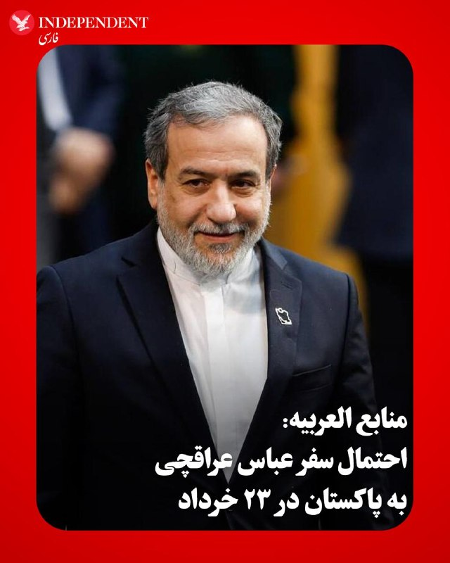

♦️العربیه به نقل از منابع خود از احتمال سفر عباس عراقچی، وزیر امور خارجه جمهوری اسلامی به پاکستان در روز شنبه، ۲۳ خرداد خبر داد. این خبر ساعتی پس از آن منتشر می‌شود که ترامپ با اعلام توافق بر سر «نکات نهایی»، حملات برنامه‌ریزی‌شده برای پنجشنبه‌شب را لغو کرد.
‌🇸🇦 Indypersian

🤖 @VahidOOnLine

## VahidOOnLine — post 245032

  

♦️شکیرا و بورنا بوی، خواننده نیجریه‌ای، در مراسم افتتاحیه جام جهانی ۲۰۲۶ در ورزشگاه آزتکا، تماشاگران را به وجد آوردند و پیش از آغاز بازی افتتاحیه میان مکزیکِ میزبان و آفریقای جنوبی، شور و هیجانی وصف‌ناپذیر در استادیوم ایجاد کردند.

این رقابت‌های ۴۸ تیمی که ایالات متحده و کانادا نیز به طور مشترک میزبانی آن را بر عهده دارند، شامل ۱۰۴ بازی خواهد بود و در نهایت با برگزاری مسابقه فینال در ۱۹ ژوئیه در نیوجرسی به پایان می‌رسد.

در این مراسم، رقصندگان به دور ماکت غول‌پیکری از جام جهانی به اجرای نمایش پرداختند و هم‌زمان، آسمان این ورزشگاه تاریخی و ۸۰ هزار نفری غرق در نورافشانی شد؛ استادیومی خاطره‌انگیز که پیش از این میزبان فینال جام‌های جهانی ۱۹۷۰ و ۱۹۸۶ بوده و برای رقابت‌های امسال کاملا بازسازی شده است.

در جذاب‌ترین بخش این مراسم، شکیرا، ستاره کلمبیایی، به همراه بورنا بوی ترانه «Dai Dai» (سرود رسمی این مسابقات) را اجرا کردند که با تشویق بی‌امان و فریادهای شادی تماشاگران همراه شد.
‌🇸🇦 Indypersian

🤖 @VahidOOnLine

## VahidOOnLine — post 245031

  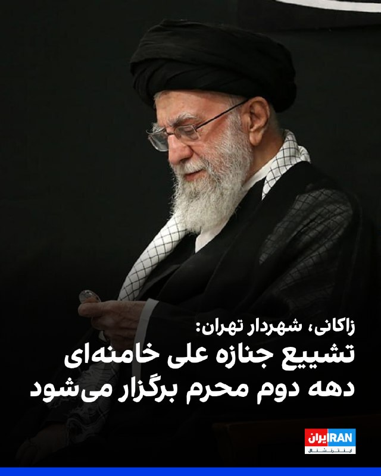

علیرضا زاکانی، شهردار تهران گفت که تشییع جنازه علی خامنه‌ای، به واسطه برگزاری مراسم عزاداری امام سوم شیعیان، در دهه دوم محرم برگزار خواهد شد.

او ادامه داد که این تشییع، «عهد و پیمانی« دوباره با آرمان‌های علی خامنه‌ای و «تجدید بیعت» با مجتبی خامنه‌ای خواهد بود.
‌🏁 🇬🇧 IranintlTV

🤖 @VahidOOnLine

## WithYashar — post 14550

کامنتم هم زیر پست ترامپ، کارهای اداریش را انجام بدهد فقط همین رو لایک کنید

https://www.instagram.com/p/DZdJ2LZvAza/?carousel_share_child_media_id=3917330556395457754_347696668&comment_id=18055196378739071

## mwarmonitor — post 10737

🔴سی‌ان‌ان به نقل از یک منبع مطلع: ایران پیش‌تر از طریق میانجی‌های قطری، تازه‌ترین پیش‌نویس توافق پیشنهادی با ایالات متحده را منتقل کرده است.

@mwarmonitor

## IranIntlTV — post 341771

🔻جام جهانی ۲۰۲۶ فیفا با مراسمی پرستاره در استادیوم آزتکا مکزیکوسیتی آغاز شد.

🔹بلیندا و گروه کومبیای لس آنجلس آزولس با اجرای مشترک «Por Ella (FIFA World Cup 2026)» اولین هیجان رات به تماشاگران دادند.

🔹در ادامه گروه پاپ-راک مکزیکی مانا با اجرای آهنگ محبوب سال ۱۹۹۲ خود، «Oye Mi Amor»، تماشاگران را همخوان کرد.

🔹خواننده کلمبیایی جی بالوین با رپر و خواننده کلمبیایی رایان کاسترو مجموعه‌ای پرانرژی از آثارشان را در مراسم افتتاحیه اجرا کردند.

🔹شکیرا و برنا بوی اجرای اصلی نخستین جشن جام جهانی را بر عهده داشتند.

🔹شکیرا پس از اجرای جی بالوین روی صحنه آمد و برای نخستین بار قطعه «Dai Dai» را اجرا کرد. سپس برنا بوی به او پیوست و این دو در میان تشویق تماشاگران با هم همخوانی کردند.

🔹این قطعه، آهنگ رسمی جام جهانی ۲۰۲۶ است و از صندوق آموزش جهانی فیفا حمایت می‌کند. اجرای آن‌ها با شعار «Dale, allez, let's go!» به پایان رسید.

@iranintltvsport

## FarsiVOA — post 220416

روم براسلاوسکی، گروگان اسرائیلی آزادشده از تجربه دیدار با پرزیدنت ترامپ به صدای آمریکا می‌گوید

## FarsiVOA — post 220415

  <a href="telegram/content/FarsiVOA_220415_1781204030.mp4" target="_blank">🎬 Download video</a>

ارتش اسرائیل اعلام کرد اعضای حزب‌الله که در حال خروج از یک شبکه تونلی در نزدیکی قلعه بوفور در جنوب لبنان بودند، در حمله نیروی هوایی اسرائیل کشته شدند.

به گفته ارتش اسرائیل، نیروهای یگان کماندویی این افراد را پیش‌تر با استفاده از یک پهپاد در داخل مسیرهای زیرزمینی شناسایی کرده بودند.

@FarsiVOA

## Persian_Trend_Official — post 16763

  <a href="telegram/content/Persian_Trend_Official_16763_1781204031.webm" target="_blank">🎬 Download video</a>

کانفینگ اختصاصی پرشین ترند 🔥 ممکن روی بعضی اینترنت ها کار نکنه با اینترنت دیگه ای تست کنید ❤️ vless://187fe33c-adb6-4fbd-b477-c80d621a2732@vs17217.lil01fr.vsys.cloud:443?path=%2Fnews&security=none&encryption=mlkem768x25519plus.native.0rtt.5gpEP8zxxckYyvaAIrtOktYci…

## IranianMinds — post 22333

👑 فقط امیدوارم بعد این همه سختی که هممون داریم میکشیم روشنایی باشه و روزای خوب خستگی همه‌مون رو از بین ببره :)

@IranianMinds

## IranianMinds — post 22332

🚨 ترامپ بزودی :

با کمک سپاه پاسداران قصد حمله به اسرائیل را داریم.

@IranianMinds

## Dirty_Kids — post 391743

یعنی با قاتل:

💔سید علی خامنه‌ای رهبر جمهوری اسلامی
💔همسر و دختر و نوه خامنه‌ای
💔سپهبد غلامعلی رشید، فرمانده قرارگاه
مرکزی رسول اعظم
💔سپهبد محمد حسین باقری، رئیس ستاد کل نیروهای مسلح
💔 سپهبد حسین سلامی، فرمانده کل سپاه پاسداران انقلاب اسلامی
💔سرلشکر امیرعلی حاجی‌زاده، فرمانده نیروی هوافضای سپاه
💔 سرلشکر سید عبدالرحیم موسوی رئیس ستاد کل نیروهای مسلح
💔علی شمخانی دبیر شورای دفاع کشور
💔سرلشکر محمد پاکپور فرمانده کل سپاه
💔 سرتیپ عزیز نصیرزاده وزیر دفاع
💔حسن نصرالله دبیر کل حزب الله
💔 اسماعیل هنیه
💔یحنی سنوار
💔قاسم سلیمانی فرمانده سپاه قدس
💔سرتیپ محمد شیرازی رئیس دفتر فرمانده کل قوا
💔سرتیپ پاسدار اکبر ابراهیم‌زاده جانشین رئیس دفتر فرمانده کل قوا
💔سرتیپ پاسدار محمدصالح اسدی معاون اطلاعات و امنیت ستاد کل نیروهای مسلح
💔سرتیپ محسن دره‌باغی معاون آماد و پشتیبانی ستاد کل نیروهای مسلح
💔سرتیپ پاسدار حسنعلی تاجیک رئیس اداره آماد ستاد کل نیروهای مسلح
💔سرتیپ پاسدار حسین جبل عاملیان معاون پژوهشی وزیر دفاع
💔سرتیپ  رضا مظفری‌نیا معاون آموزشی وزیر دفاع
💔غلامرضا رضائیان رئیس سازمان اطلاعات فراجا
💔محمد باصری مقام ارشد وزارت اطلاعات
💔سرتیپ پاسدار داود عسگری (علیزاده) فرمانده عملیات نیروی قدس سپاه
💔سرتیپ پاسدار ابوالقاسم بابائیان رئیس دفتر فرمانده کل قوا
💔سرتیپ‌دوم پاسدار اسدالله بادفر رئیس اداره بسیج ستاد کل نیروهای مسلح
💔سرتیپ عبدالله جلالی‌نسب معاون اطلاعات ارتش
💔سرتیپ غلامرضا سلیمانی رئیس سازمان بسیج مستضعفین

توافق کردن؟؟؟؟

@Dirty_Kids 👻

## Dirty_Kids — post 391742

  <a href="telegram/content/Dirty_Kids_391742_1781204032.mp4" target="_blank">🎬 Download video</a>

عادل فردوسی پور و جواد نکونام روی دیبالا کراش زدن😂😂😂😂😂

عادل و جواد نکونام تو ویژه برنامه جام‌جهانی فوتبال ۳۶۰ رو دیبالا کراش زدن

@Dirty_Kids 👻

## alonews — post 127216

  <a href="telegram/content/alonews_127216_1781204033.webm" target="_blank">🎬 Download video</a>

👈نفت برنت: ۸۷.۹۳ دلار

✅ @AloNews خبر جنگ

## alonews — post 127215

  

🙂
🙂 شمارش معکوس برای بزرگ‌ترین رویداد فوتبالی جهان آغاز شده…

🙂
🙂افتتاحیه جام جهانی ۲۰۲۶، همراه با تمام حواشی، اتفاقات ویژه، تصاویر اختصاصی، اخبار فوری و پوشش لحظه‌ای مسابقات را در ورزش پلاس دنبال کنید.

🙂
⚫ از مراسم افتتاحیه تا آخرین سوت فینال، همه چیز را سریع‌تر و کامل‌تر از هر زمان دیگری پوشش خواهیم داد.

⚡ @Vaarzesh_Plus

⚡ @Vaarzesh_Plus

⚡ @Vaarzesh_Plus

---
📅 بروزرسانی: 1405/03/21 22:13
---

## VahidOOnLine — post 245030

  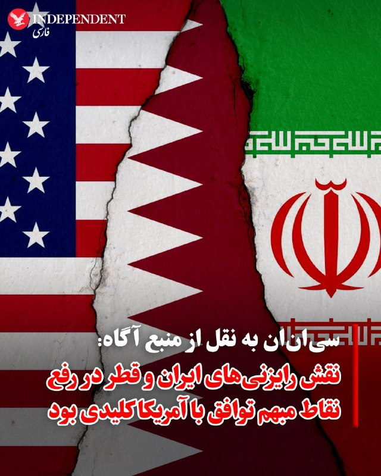

♦️سی‌ان‌ان به نقل از یک منبع آگاه گزارش داد مقامات آمریکایی بر این باورند که نشست‌های این هفته میان مقامات ایران و قطر در تهران، به حل برخی از نقاط مبهم و کلیدی باقی‌مانده در توافق با ایالات متحده کمک کرده است. این اختلافات عمدتا شامل جزئیات نحوه پیشبرد مذاکرات آینده در قبال برنامه هسته‌ای ایران و ترتیب زمان‌بندی لغو تحریم‌ها و گشایش‌های مالی برای تهران بوده است.

بر اساس این گزارش، ایران اواسط این هفته جدیدترین پیش‌نویس توافق پیشنهادی خود با آمریکا را از طریق میانجی‌های قطری ارسال کرد. این در حالی است که حدود دو هفته پیش، دونالد ترامپ با اعمال تغییراتی در متن، خواستار سخت‌گیرانه‌تر شدن لحن توافق در بخش هسته‌ای شده بود و از طولانی شدن پاسخ ایران ابراز نارضایتی می‌کرد.

با این وجود، رایزنی‌های این هفته از طریق قطر باعث کاهش شکاف‌ها شد. مقامات آمریکایی در تمام این مدت در تماس مداوم با میانجی‌ها بودند؛ حتی در روزهایی که واشنگتن و تهران به طور پی‌درپی در حال تبادل آتش و حملات نظامی به یکدیگر بودند.
‌🇸🇦 Indypersian

🤖 @VahidOOnLine

## WithYashar — post 14549

  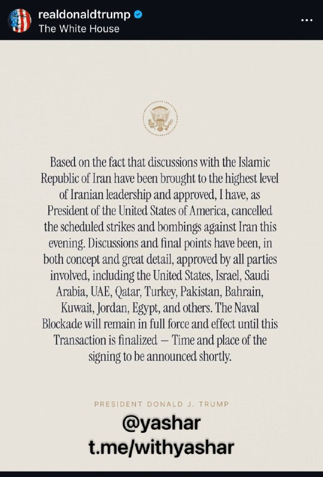

ترامپ در اینستاگرام : «با توجه به این‌که گفت‌وگوها با جمهوری اسلامی ایران به بالاترین سطح رهبری ایران ارجاع شده و مورد تأیید قرار گرفته است، من به عنوان رئیس‌جمهور ایالات متحده آمریکا، حملات و بمباران‌های برنامه‌ریزی‌شده علیه ایران را که قرار بود امشب انجام شود، لغو کرده‌ام.

مباحث مطرح‌شده و نکات نهایی توافق، هم از نظر اصول کلی و هم از نظر جزئیات کامل، به تأیید تمامی طرف‌های درگیر رسیده است؛ از جمله ایالات متحده، اسرائیل، عربستان سعودی، امارات متحده عربی، قطر، ترکیه، پاکستان، بحرین، کویت، اردن، مصر و دیگران.

محاصره دریایی تا زمان نهایی شدن این توافق، با تمام قدرت و به طور کامل برقرار خواهد ماند.

زمان و محل امضای توافق به‌زودی اعلام خواهد شد.»
دونالد جی. ترامپ، رئیس‌جمهور ایالات متحده آمریکا
@withyashar

## WithYashar — post 14548

آکسیوس: منابع ایرانی امروز به کشورهای منطقه اطلاع دادند که توافق «اصولی» در مورد یادداشت تفاهم حاصل شده است، اما تأیید رهبری همچنان لازم است
@withyashar

## WithYashar — post 14547

شبکه 13 اسرائیل :مقامات اسرائیل توافق با ایران را به رسمیت نمی‌شناسند.
@withyashar

## FoxNewsTwitter — post 342873

  <a href="telegram/content/FoxNewsTwitter_342873_1781203434.mp4" target="_blank">🎬 Download video</a>

Fox News (Twitter/X)

NEW: President Trump is nominating former SEC Chairman Jay Clayton as Director of National Intelligence after withdrawing acting DNI Bill Pulte's nomination following pushback from lawmakers, @markpmeredith reports.

## VahidOnline — post 76235

خبرگزاری فارس، وابسته به سپاه پاسداران، به نقل از یک منبع آگاه نوشت جمهوری اسلامی هنوز هیچ متنی را برای توافق تایید نکرده است.

فارس افزود این منبع آگاه نزدیک به تیم مذاکره‌کننده گفته بر خلاف اظهارات ترامپ، هیچ متنی برای یادداشت تفاهم اولیه با آمریکا تایید نشده است.

پیش‌تر دونالد ترامپ گفته بود توافق با تهران تقریبا نهایی شده است.
@VahidOOnLine

📡 @VahidOnline

## IranIntlTV — post 341770

  

علیرضا زاکانی، شهردار تهران گفت که تشییع جنازه علی خامنه‌ای، به واسطه برگزاری مراسم عزاداری امام سوم شیعیان، در دهه دوم محرم برگزار خواهد شد.

او ادامه داد که این تشییع، «عهد و پیمانی« دوباره با آرمان‌های علی خامنه‌ای و «تجدید بیعت» با مجتبی خامنه‌ای خواهد بود.
https://iranintl.com/202606110983

## IranIntlTV — post 341769

  <a href="telegram/content/IranIntlTV_341769_1781203438.mp4" target="_blank">🎬 Download video</a>

۲۴ با فرداد فرحزاد
@iranintltv

## Shin_Persian — post 6962

Shin ✓ @hey_itsmyturn
Thu, 11 Jun 2026 18:33:48 UTC

IRGC-owned Fars News:

"Source: Iran Has Not Yet Approved Any Text for an Agreement

A well-informed source close to the Islamic Republic of Iran's negotiating team informed Fars News Agency that no text for an initial memorandum of understanding with the United States has been approved.

Earlier, the President of the United States claimed in a message on the social media platform Truth Social that Iran had agreed to a text for an initial memorandum of understanding at the highest level.

Minutes later, in similar remarks to the American newspaper New York Post, he stated that the aforementioned text had been finalized.

Trump's claim comes as Iran and the United States endured one of their most intense confrontations since the ceasefire announcement early Thursday."

ترجمه خودکار فارسی

خبرگزاری فارس، متعلق به سپاه پاسداران:

«منبع: ایران هنوز هیچ متنی را برای توافق تایید نکرده است

یک منبع آگاه نزدیک به تیم مذاکره‌کننده جمهوری اسلامی ایران به خبرگزاری فارس اطلاع داد که هیچ متنی برای یادداشت تفاهم اولیه با ایالات متحده تایید نشده است.

پیش از این، رئیس‌جمهور ایالات متحده در پیامی در شبکه اجتماعی «تروث سوشال» مدعی شده بود که ایران با متنی برای یادداشت تفاهم اولیه در بالاترین سطح موافقت کرده است.

دقایقی بعد، وی در اظهاراتی مشابه با روزنامه آمریکایی نیویورک‌پست، بیان کرد که متن مذکور نهایی شده است.

ادعای ترامپ در حالی مطرح می‌شود که ایران و ایالات متحده یکی از شدیدترین تقابل‌های خود را از زمان اعلام آتش‌بس در اوایل پنجشنبه پشت سر گذاشته‌اند.»

𝕏 · @shin_persian

## FarsiVOA — post 220414

بیش از ۶۰ روز از تعطیلی صحن علنی مجلس شورای اسلامی می‌گذرد. مقام‌های حکومتی دلیل آن را نگرانی‌های امنیتی عنوان می‌کنند، اما برخی نمایندگان می‌گویند این وضعیت عملاً مجلس را از نظارت بر دولت و تأثیرگذاری بر روند مذاکرات با آمریکا کنار گذاشته است.

## FarsiVOA — post 220413

ترفند جمهوری اسلامی برای به دام انداختن روزنامه‌نگاران با جعل ناشیانه صدای علی جوانمردی

## DW_Farsi — post 125833

  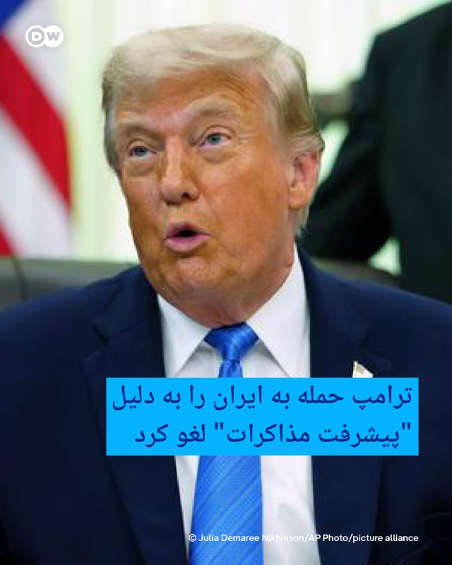

🔶 ترامپ حمله به ایران را به دلیل "پیشرفت مذاکرات" لغو کرد
 
دونالد ترامپ که پیش از این خبر داده بود که حملات هوایی به ایران امشب ۲۱ خرداد نیز مانند دو شب اخیر ادامه خواهد یافت، در پیامی تازه از لغو حملات  "برنامه‌ریزی‌شده" به این دلیل خبر داد که مذاکرات به "بالاترین سطح رهبری ایران" کشانده شده و مورد تأیید قرار گرفته است.
 
رئیس‌ جمهور آمریکا در این پیام در تروث سوشال نوشت: «گفت‌وگوها و نکات نهایی، هم از نظر کلیات و هم با جزئیات فراوان، مورد تأیید تمامی طرف‌های درگیر، از جمله ایالات متحده، اسرائیل، عربستان سعودی، امارات متحده عربی، قطر، ترکیه، پاکستان، بحرین، کویت، اردن، مصر و دیگران قرار گرفته است.»
 
ترامپ تصریح کرد، اما محاصره دریایی بنادر ایران تا زمان نهایی شدن این توافق "با تمام قدرت و به طور کامل" به قوت خود باقی خواهد ماند: «زمان و مکان امضای آن به‌زودی اعلام خواهد شد.»
@dw_farsi

## Dirty_Kids — post 391741

اجرای کامل شکیرا تو جام جهانی

@Dirty_Kids 👻

## Dirty_Kids — post 391737

شات هایی زیبا از مراسم افتتاحیه جام جهانی🔥

@Dirty_Kids 👻

## Dirty_Kids — post 391736

من عادت ندارم بازیکنا ازم کوچیک‌تر باشن، منو برگردونید به جام‌جهانی ۲۰۰۲ کره و ژاپن.

@Dirty_Kids 👻

## Dirty_Kids — post 391735

  <a href="telegram/content/Dirty_Kids_391735_1781203440.mp4" target="_blank">🎬 Download video</a>

🔴 این واقعی ترین کلیپ از جنگه، اگه میخواین بدونین نزدیک‌تون یا جایی که هستین موشک بخوره چه اتفاقی میوفته حتما این کلیپ رو ببینین.

در نارمک تهران ۱۸ اسفند ۱۴۰۴

@Dirty_Kids 👻

## Dirty_Kids — post 391734

۲ درصد میرن خیابون اونا مردمم شدن
۹۸ درصد مخالفتونن راضی به اینکه مالیات بدن اون بچه‌ها پرچم بیارن و بسوزون

مالیات هم فقط ما ۹۸ درصد میدیم
اون ۲ درصدیا که کار نمیکنن جیره خوره حکومتن

یه جوری میگن فلان دانشجو با پول این مردم رفته دانشگاه انگار اینا اونارو بورسیه کردن😂مثل راهزنای سرگردنه مالیات از پدر و مادرشون گرفتین،پول نفتشون هم هزینه بچه آخوند و بچه فلسطینا کردین حالا طلبکار هم هستین!؟یه عمر از جیب پدر ‌ و مادراشون زدین که اگر ...


@Dirty_Kids 👻

## alonews — post 127214

  <a href="telegram/content/alonews_127214_1781203442.webm" target="_blank">🎬 Download video</a>

👈ادعای اکسیوس: منابع ایرانی امروز به کشورهای منطقه اطلاع دادند که توافق «اصولی» در مورد یادداشت تفاهم حاصل شده است، اما تأیید رهبر انقلاب همچنان لازم است.

✅ @AloNews خبر جنگ

## alonews — post 127213

  <a href="telegram/content/alonews_127213_1781203442.webm" target="_blank">🎬 Download video</a>

👈نظرسنجی شبکه ۱۲ اسرائیل : ۶۲٪ از اسرائیلی‌ها به ترامپ اعتماد ندارن

✅ @AloNews خبر جنگ

---
📅 بروزرسانی: 1405/03/21 22:04
---

## VahidOOnLine — post 245029

  <a href="telegram/content/VahidOOnLine_245029_1781202841.mp4" target="_blank">🎬 Download video</a>

♦️پنتاگون به قرنطینه و تدابیر امنیتی شدیدی که به دلیل وجود یک «مشکل در کیفیت هوا» ایجاد شده بود، پایان داد.

شان پارنل، سخنگوی ارشد پنتاگون، با انتشار پیامی در شبکه‌های اجتماعی اعلام کرد: «آزمایش‌های بعدی تایید کرد که هیچ خطری وجود ندارد و فعالیت‌های عادی ساختمان از سر گرفته شده است.»

این قرنطینه حدود دو ساعت به طول انجامید و منجر به اعزام تیم‌های مقابله با مواد خطرناک (Hazmat) وابسته به نیروی پلیس داخلی پنتاگون و همچنین تیم امداد و نجات منطقه مجاور یعنی آرلینگتون در ایالت ویرجینیا به محل حادثه شد.
‌🇸🇦 Indypersian

🤖 @VahidOOnLine

## VahidOOnLine — post 245028

  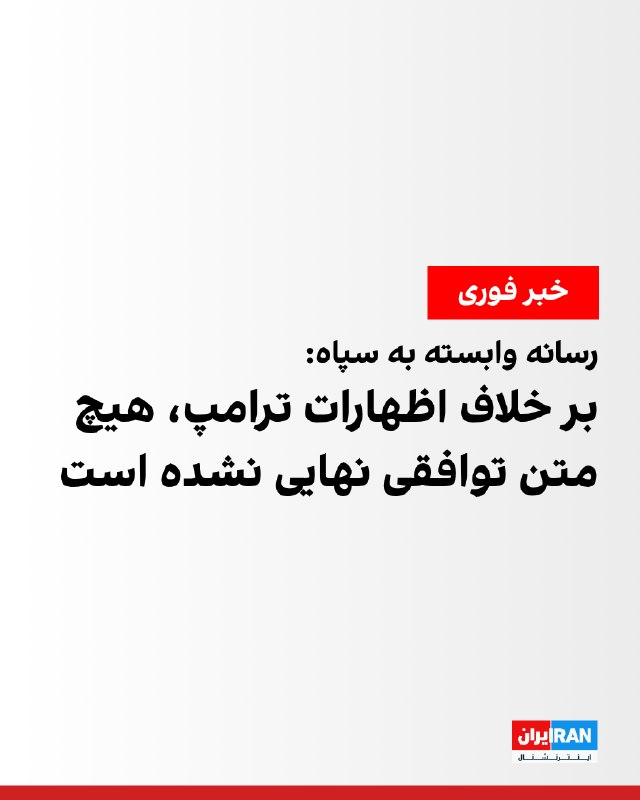

خبرگزاری فارس، وابسته به سپاه پاسداران، به نقل از یک منبع آگاه نوشت جمهوری اسلامی هنوز هیچ متنی را برای توافق تایید نکرده است.

فارس افزود این منبع آگاه نزدیک به تیم مذاکره‌کننده گفته بر خلاف اظهارات ترامپ، هیچ متنی برای یادداشت تفاهم اولیه با آمریکا تایید نشده است.

پیش‌تر دونالد ترامپ گفته بود توافق با تهران تقریبا نهایی شده است.
‌🏁 🇬🇧 IranintlTV

🤖 @VahidOOnLine

## WithYashar — post 14546

فارس به نقل از یک منبع آگاه نزدیک به تیم مذاکره‌کننده اعلام کرد که جمهوری اسلامی هنوز هیچ متنی را برای توافق با آمریکا تایید نکرده است.

این منبع اظهارات دونالد ترامپ درباره نهایی شدن قریب‌الوقوع توافق را رد کرده و گفته تاکنون هیچ یادداشت تفاهمی میان دو طرف مورد تایید قرار نگرفته است..
@withyashar

## WithYashar — post 14545

## mwarmonitor — post 10736

⚠️اطلاعیه رسمی کانال ⚠️ 🔸بدین‌وسیله به اطلاع همراهان گرامی می‌رسد که کانال خبری ما در پلتفرم X (توییتر سابق) راه‌اندازی شد. 🔸از این پس، آخرین اخبار و تحلیل‌های نظامی، سیاسی و همچنین مسائل اجتماعی ایران و جهان به‌صورت منظم در آن منتشر خواهد شد. 🔸از شما عزیزان…

## mwarmonitor — post 10735

بر اساس این واقعیت که گفتگوها با جمهوری اسلامی ایران به بالاترین سطح رهبری ایران ارجاع داده شده و مورد موافقت قرار گرفته است، من به عنوان رئیس‌جمهور ایالات متحده آمریکا، حملات و بمباران‌های برنامه‌ریزی‌شده علیه ایران برای امشب را لغو کردم. گفتگوها و نکات نهایی،…

## FoxNewsTwitter — post 342872

  <a href="telegram/content/FoxNewsTwitter_342872_1781202843.mp4" target="_blank">🎬 Download video</a>

Fox News (Twitter/X)

The Trump administration is cutting off tens of millions of dollars in federal funding to a Los Angeles agency that provides services to the homeless as it investigates potential fraud.

According to a letter first obtained by Fox News, the Los Angeles Homeless Services Authority (LAHSA) has received nearly $1 billion in taxpayer funding from the Department of Housing and Urban Development since 2021.

Federal funding for the agency has now been halted while HUD investigates potential offenses by the agency and its leadership, @davidspunt reports.

## IranIntlTV — post 341768

  

خبرگزاری فارس، وابسته به سپاه پاسداران، به نقل از یک منبع آگاه نوشت جمهوری اسلامی هنوز هیچ متنی را برای توافق تایید نکرده است.

فارس افزود این منبع آگاه نزدیک به تیم مذاکره‌کننده گفته بر خلاف اظهارات ترامپ، هیچ متنی برای یادداشت تفاهم اولیه با آمریکا تایید نشده است.

پیش‌تر دونالد ترامپ گفته بود توافق با تهران تقریبا نهایی شده است.
https://iranintl.com/202606111151

## FarsiVOA — post 220412

از تنگه هرمز تا اوکراین؛ بحران‌هایی که بر اجلاس جی۷ سایه انداخته‌اند

## Persian_Trend_Official — post 16762

ترامپ: با توجه به اینکه مذاکرات با جمهوری اسلامی ایران به بالاترین سطح رهبری ایران رسیده و تأیید شده است. من به عنوان رئیس جمهور ایالات متحده آمریکا، حملات و بمباران‌های برنامه‌ریزی شده علیه ایران را امشب لغو کردم. مذاکرات و نکات نهایی، هم از نظر مفهومی و…

## Persian_Trend_Official — post 16761

فارس به نقل از منبع آگاه: ایران هنوز هیچ متنی را برای توافق تایید نکرده است.

هیچ متنی برای یادداشت تفاهم اولیه با آمریکا تایید نشده است؛ این را یک منبع آگاه نزدیک به تیم مذاکره‌کننده جمهوری اسلامی ایران به خبرنگار فارس گفت.

📝 Amir

📌 @persian_trend_official
پرشین ترند | متفاوت‌ترین کانال نظامی

## Persian_Trend_Official — post 16760

به گزارش I24News، مقامات اسرائیلی از اعلام توقف بمباران ایران توسط رئیس جمهور ترامپ غافلگیر شدند. یک مقام اسرائیلی به i24news گفت که مقامات در حال حاضر به اظهارات عمومی ترامپ تکیه می کنند و گفت که اسرائیل باید قبل از تعیین دقیق بودن ارزیابی رئیس جمهور، پاسخ…

## Persian_Trend_Official — post 16759

  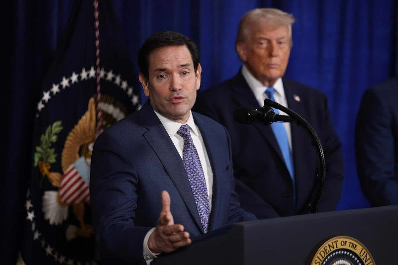

مارکو روبیو، وزیر امور خارجه امریکا: امروز من شرکت انرژی دولتی کوبا (CUPET) را طبق فرمان اجرایی 14404 رئیس جمهور ترامپ تحریم می‌کنم.

نخبگان کمونیست کوبا، انرژی را به عنوان ابزاری برای کنترل اجتماعی و سود دزدسالارانه به سلاح تبدیل کرده‌اند. رئیس جمهور ترامپ آینده‌ای جدید با آزادی و فرصت‌های اقتصادی و سیاسی بیشتر برای مردم کوبا می‌خواهد.

تا آن زمان، ما به هدف قرار دادن توانایی رژیم کمونیستی در استفاده از تجارت انرژی خود برای پیشبرد دستور کار فاسد خود و سرکوب خشونت‌آمیز مردم کوبا ادامه خواهیم داد.

📝 Amir

📌 @persian_trend_official
پرشین ترند | متفاوت‌ترین کانال نظامی

## IranianMinds — post 22331

  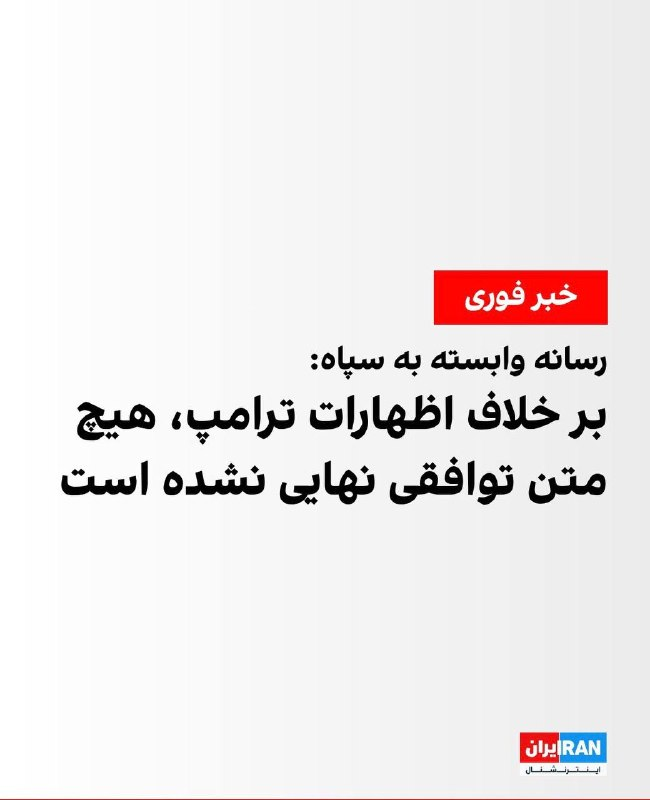

@IranianMinds

## BBCPersian — post 283467

🔻 نخستین مراسم افتتاحیه جام جهانی در مکزیکوسیتی، پایتخت مکزیک برگزار شد.
شکیرا و برنا بوی از جمله خواننده‌هایی بودند که در ورزشگاه آزتکا اجرا کردند.
از آن‌جا که جام جهانی ۲۰۲۶ در سه کشور برگزار می‌شود، سه مراسم افتتاحیه خواهد داشت. دو مراسم دیگر در کانادا و آمریکا نیز برنامه‌ریزی شده است.
نخست مسابقه جام جهانی ۲۰۲۶ بین مکزیک و آفریقای جنوبی امشب برگزار می‌شود.

📸Getty Images
@BBCPersian

## alonews — post 127212

  <a href="telegram/content/alonews_127212_1781202847.webm" target="_blank">🎬 Download video</a>

👈رسانه اسرائیلی : همه چیز در پست رئیس‌جمهور درست نیست!

🔴هیچ توافقی بین سپاه پاسداران و اسرائیل وجود ندارد و اسرائیل ۱۰۰٪ هرگز آن را تأیید نکرده است.

🔴تنها چیزی که برای گفتن باقی می‌ماند این است - به اعمال او قضاوت کنید نه به کلماتش!

✅ @AloNews خبر جنگ

## alonews — post 127211

  <a href="telegram/content/alonews_127211_1781202848.webm" target="_blank">🎬 Download video</a>

👈طبق منابع العربیه، عباس عراقچی، وزیر امور خارجه ایران، ممکن است در ۱۳ ژوئن به پاکستان سفر کند

✅ @AloNews خبر جنگ

## alonews — post 127210

  <a href="telegram/content/alonews_127210_1781202848.webm" target="_blank">🎬 Download video</a>

👈فارس : منبع آگاه: ایران هنوز هیچ متنی را برای توافق تایید نکرده است

✅ @AloNews خبر جنگ

---
📅 بروزرسانی: 1405/03/21 21:53
---

## VahidOOnLine — post 245027

  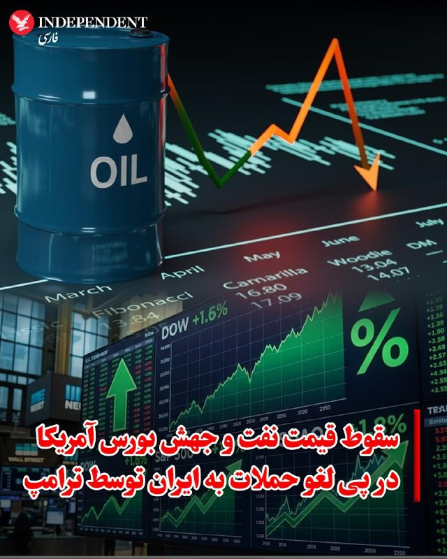

♦️به دنبال اظهارات دونالد ترامپ مبنی بر لغو حملات برنامه‌ریزی‌شده علیه ایران، بازار جهانی نفت با افت قیمت مواجه شد و شاخص‌های اصلی بورس وال‌استریت در روز پنجشنبه ۲۱ خرداد جهش شدیدی را تجربه کردند.

شاخص داوجونز، یک روز پس از تجربه بدترین روز سال خود، با رشد ۸۱۰ واحدی (۱.۶۲ درصد) همراه شد. همچنین شاخص اس‌اندپی ۵۰۰ حدود ۱.۳ درصد و شاخص فناوری نزدک ۱.۸ درصد صعود کردند. در بازار انرژی، قیمت نفت خام برنت با ریزش ۳.۷ درصدی به کانال کمتر از ۹۰ دلار در هر بشکه سقوط کرد و نفت خام آمریکا نیز با کاهش ۳.۶ درصدی، به رقم کمتر از ۸۷ دلار رسید.

در روزهای گذشته، تشدید تنش‌ها میان واشنگتن و تهران معامله‌گران را به شدت نگران کرده بود؛ اما کاهش قیمت نفت، از دغدغه‌های مربوط به تورم کاست و منجر به افت بازدهی اوراق قرضه خزانه‌داری آمریکا شد. با این حال، برخی تحلیل‌گران معتقدند معامله‌گران صرفا بر اساس عادت همیشگی خرید در زمان افت بازار (Buy the dip) به بیانیه‌های ترامپ واکنش نشان داده‌اند.
‌🇸🇦 Indypersian

🤖 @VahidOOnLine

## VahidOOnLine — post 245026

  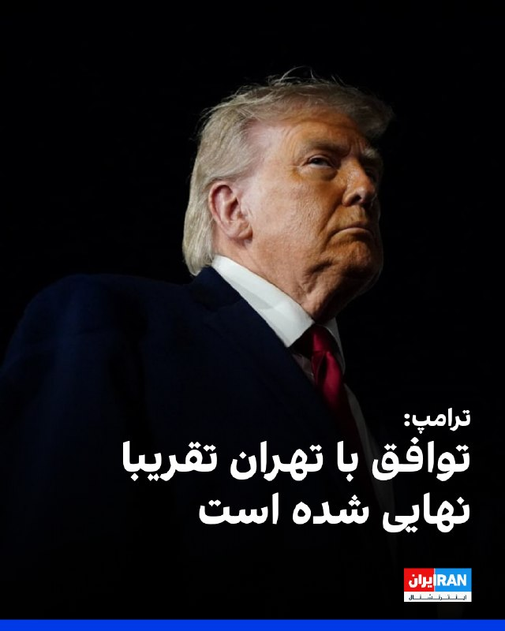

دونالد ترامپ، رییس‌جمهوری آمریکا، پنج‌شنبه به نیویورک‌پست گفت که توافق مورد انتظار برای آغاز مذاکرات هسته‌ای با تهران «تقریبا نهایی» شده است.

او گفت: ««تقریبا همه‌چیز نهایی و جمع‌بندی شده است.»
‌🏁 🇬🇧 IranintlTV

🤖 @VahidOOnLine

## VahidOOnLine — post 245025

  <a href="telegram/content/VahidOOnLine_245025_1781202226.mp4" target="_blank">🎬 Download video</a>

♦️میثم پیرفلک، پدر کیان پیرفلک، روز دوشنبه ۲۱ خرداد ماه با انتشار تصاویری در شبکه اجتماعی اینستاگرام، از برگزاری سالگرد تولد این کودک کشته شده در جریان خیزش سراسری سال ۱۴۰۱ بر مزار او خبر داد.
پدر کیان، تصاویری از حضور ماه‌منیر مادر کیان، رادین دیگر فرزند پسر خانواده و خودش در گورستان ایذه منتشر کرد و نوشت: «به نام خدای رنگین کمان، خدای پویا خدای کیان، رادین ۹ساله کنارِ کیان ۹ ساله، پسرای عزیزم ، زاد روزت خجسته باد کیانِ بابا».
کیان پیرفلک کودک ۹ ساله ایرانی ساکن ایذه در خوزستان بود که در شامگاه ۲۵ آبان ۱۴۰۱، در جریان خیزش ۱۴۰۱ ایران، در حالیکه با والدین و برادر خردسالش در خودرو بودند، هدف گلوله سرکوبگران جمهوری اسلامی قرار گرفت و کشته شد.
کیان در حافظه جمعی ایرانیان با جمله «به نام خدای رنگین‌ کمان» ماندگار شده است.
‌🇸🇦 Indypersian

🤖 @VahidOOnLine

## WithYashar — post 14544

شبکه آی۲۴: مقامات اسرائیلی از پست ترامپ غافلگیر شدن و فعلا برای ارزیابی وضعیت به اظهارات علنی رئیس‌جمهور آمریکا تکیه دارن.
به گفته یک مقام اسرائیلی، تل‌آویو پیش از قضاوت درباره صحت ارزیابی ترامپ، منتظر موضع رسمی جمهوری اسلامیه و تجربه‌های گذشته نشون داده که صحبتهای ترامپ همیشه دقیق نبودن.
@withyashar

## DEJradio — post 5596

  <a href="telegram/content/DEJradio_5596_1781202228.webm" target="_blank">🎬 Download video</a>

🔺🎤 «جمهوری اسلامی سقوط خواهد کرد»

گفت‌وگو با بن سبطی، کارشناس مسائل ایران و خاورمیانه

#جمهوری_اسلامی #جنگ #سقوط
@DEJradio

## mamlekate — post 103681

📝 ترامپ: حمله را لغو کردم؛ مذاکرات به بالاترین سطح رهبری رژیم ایران رسیده است

رئیس جمهوری آمریکا می‌گوید از آن جا که مذاکرات به بالاترین سطح رهبری رژیم ایران رسیده او حملاتی را که برای شامگاه پنج‌شنبه برنامه‌ریزی‌شده بود، لغو کرده است، او با این حال تاکید کرد که محاصره تا نهایی شدن توافق ادامه خواهد داشت.

@mamlekate

## IranIntlTV — post 341767

  

دونالد ترامپ، رییس‌جمهوری آمریکا، پنج‌شنبه به نیویورک‌پست گفت که توافق مورد انتظار برای آغاز مذاکرات هسته‌ای با تهران «تقریبا نهایی» شده است.

او گفت: ««تقریبا همه‌چیز نهایی و جمع‌بندی شده است.»
https://iranintl.com/202606111632

## Persian_Trend_Official — post 16758

  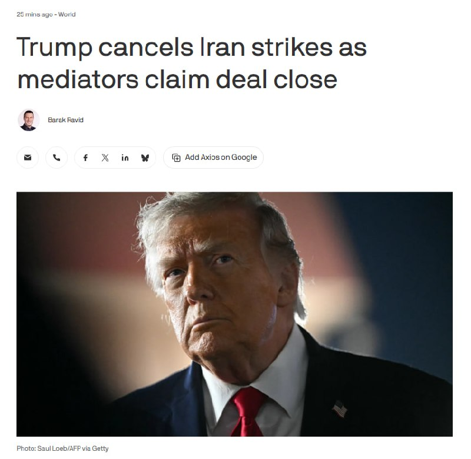

اکسیوس: مذاکره‌کنندگان قطری و ایرانی پس از کاهش اختلافات در سه موضوع کلیدی، آزادسازی دارایی‌های مسدود شده ایران، ترتیبات بازگشایی تنگه هرمز در طول آتش‌بس و چارچوب مذاکرات هسته‌ای معتقد هستند که به متنی مورد قبول ایالات متحده رسیده‌اند.

با این حال، مقامات ایرانی گفتند که این توافق هنوز نیاز به تأیید نهایی از سوی مجتبی خامنه‌ای، رهبر معظم انقلاب دارد.

این منابع افزودند که حملات اخیر ایالات متحده، علیرغم پیشرفت در مذاکرات، بی‌اعتمادی ایران نسبت به نیات ترامپ را افزایش داده است.

📝 Amir

📌 @persian_trend_official
پرشین ترند | متفاوت‌ترین کانال نظامی

## Hranews — post 113545

سقز؛ یک شهروند بر اثر انفجار مین کشته شد

❗️
❗️
❗️
❗️
❗️– انفجار یک #مین برجای مانده از جنگ ایران و عراق در مناطق مرزی شهرستان سقز، منجر به کشته شدن یک شهروند شد.

ادامه مطلب

↘️
@hranews_bot تماس ✉️ - @Hranews کانال هرانا 🆑

## alonews — post 127209

  <a href="telegram/content/alonews_127209_1781202230.webm" target="_blank">🎬 Download video</a>

👈دیبالا تو ویژه برنامه جام جهانی فوتبال360: من عاشق ایرانم!

✅ @AloNews خبر جنگ

## alonews — post 127208

  <a href="telegram/content/alonews_127208_1781202230.webm" target="_blank">🎬 Download video</a>

👈وال استریت ژورنال: توافق قطعی است

✅ @AloNews خبر جنگ

---
📅 بروزرسانی: 1405/03/21 21:44
---

## VahidOOnLine — post 245024

  

اکسیوس به نقل از سه منبع آگاه گزارش داد اختلافات اصلی تهران و واشینگتن برای رسیدن به یک تفاهم‌نامه، چهارشنبه در جریان گفت‌وگو میان مقام‌های جمهوری اسلامی و میانجی‌های قطری برطرف شده است.

بر اساس این گزارش، مقام‌های ایرانی پنج‌شنبه به چند کشور اعلام کرده‌اند مذاکرات تهران به توافقی اصولی منجر شده، اما مجتبی خامنه‌ای باید تایید نهایی را صادر کند.

این منابع خاطرنشان کردند که هم ایرانی‌ها و هم قطری‌ها تاکید کرده‌اند که حملات آمریکا در طول شامگاه چهارشنبه، تردیدهای ایران نسبت به نیت واقعی ترامپ را به شکل قابل توجهی افزایش داده است.
‌🏁 🇬🇧 IranintlTV

🤖 @VahidOOnLine

## WithYashar — post 14543

سه منبع آگاه از مذاکرات به اکسیوس ادعا کردند که اختلافات کلیدی در جریان گفتگوهای روز چهارشنبه بین مقامات ایرانی و میانجی‌های قطری حل شده است.
@withyashar

## mwarmonitor — post 10734

  <a href="telegram/content/mwarmonitor_10734_1781201669.mp4" target="_blank">🎬 Download video</a>

اسرائیل بعد از دیدن پست ترامپ

@mwarmonitor

## FoxNewsTwitter — post 342871

Fox News (Twitter/X)

BREAKING: Trump nominates former SEC Chairman Jay Clayton to replace Tulsi Gabbard as next director of national intelligence

## pm_afshaa — post 93647

نیویورک‌پست: ترامپ همین الان به من گفت که توافقی با ایران کاملاً نهایی شده

💧 Rainbet.com the #1 Non-KYC Crypto Casino & Sportsbook @rainbetcom

😁 @Pm_Afshaa

## IranIntlTV — post 341766

  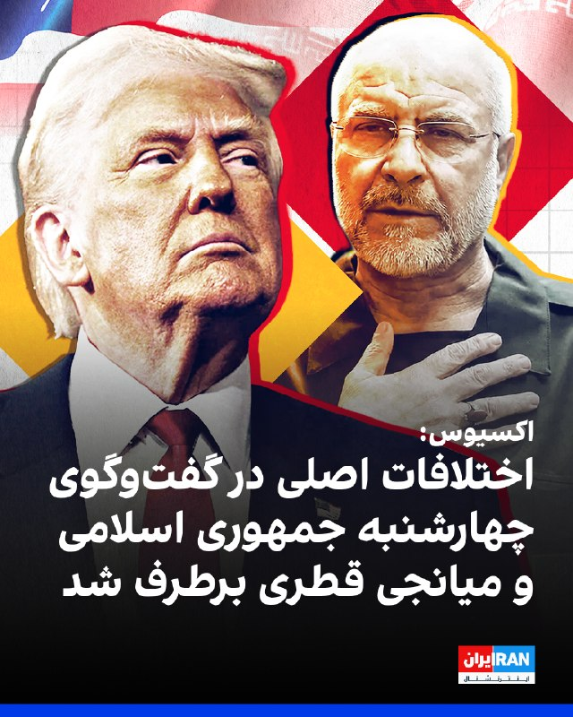

اکسیوس به نقل از سه منبع آگاه گزارش داد اختلافات اصلی تهران و واشینگتن برای رسیدن به یک تفاهم‌نامه، چهارشنبه در جریان گفت‌وگو میان مقام‌های جمهوری اسلامی و میانجی‌های قطری برطرف شده است.

بر اساس این گزارش، مقام‌های ایرانی پنج‌شنبه به چند کشور اعلام کرده‌اند مذاکرات تهران به توافقی اصولی منجر شده، اما مجتبی خامنه‌ای باید تایید نهایی را صادر کند.

این منابع خاطرنشان کردند که هم ایرانی‌ها و هم قطری‌ها تاکید کرده‌اند که حملات آمریکا در طول شامگاه چهارشنبه، تردیدهای ایران نسبت به نیت واقعی ترامپ را به شکل قابل توجهی افزایش داده است.
https://iranintl.com/202606119062

## FarsiVOA — post 220411

🔺آمریکا شرکت نفت حکومتی کوبا را تحریم کرد

▪️مارکو روبیو، وزیر امور خارجه ایالات متحده، روز پنجشنبه ۲۱ خرداد اعلام کرد که دولت آمریکا شرکت انرژی حکومتی کوبا، «یونیون کوبا-پترولئو»، را بر اساس فرمان اجرایی ۱۴۴۰۴ رئیس جمهوری دونالد ترامپ تحریم کرده است.

⬇️ بیشتر بخوانید:

https://ir.voanews.com/a/us-sanctions-cubas-state-owned-energy-company-/8159794.html

## FarsiVOA — post 220410

هشدار ملونی به جمهوری اسلامی و تاکید بر موضع واحد اروپا در مذاکرات با روسیه

## Persian_Trend_Official — post 16757

  <a href="telegram/content/Persian_Trend_Official_16757_1781201671.webm" target="_blank">🎬 Download video</a>

به گزارش I24News، مقامات اسرائیلی از اعلام توقف بمباران ایران توسط رئیس جمهور ترامپ غافلگیر شدند.

یک مقام اسرائیلی به i24news گفت که مقامات در حال حاضر به اظهارات عمومی ترامپ تکیه می کنند و گفت که اسرائیل باید قبل از تعیین دقیق بودن ارزیابی رئیس جمهور، پاسخ رسمی ایران را بشنود و خاطرنشان کرد که تجربه گذشته نشان می دهد که ممکن است همیشه اینطور نباشد.

📝 Amir

📌 @persian_trend_official
پرشین ترند | متفاوت‌ترین کانال نظامی

## Persian_Trend_Official — post 16756

رویترز: ایران پیش‌نویس نهایی توافق را از طریق قطر به ایالات متحده ارسال کرده است.

یک منبع نزدیک به مقامات ارشد ایران اعلام کرد که متن این توافق شامگاه چهارشنبه نهایی شده و در صورت دریافت تأیید نهایی، روند اجرای آن آغاز خواهد شد.

📝 Amir

📌 @persian_trend_official
پرشین ترند | متفاوت‌ترین کانال نظامی

## IranianMinds — post 22330

🔴 ترامپ به نیویورک پست : توافق «بلند مدت» با ایران تقریبا نهایی شده.

@IranianMinds

## IranianMinds — post 22329

🔴 آکسیوس شب گذشته: مذاکرات فرو پاشیده و به پایان رسیده است

🔴 آکسیوس امشب: اختلافات کاهش یافته و توافق قریب‌الوقوع است

@IranianMinds

## alonews — post 127207

  <a href="telegram/content/alonews_127207_1781201672.webm" target="_blank">🎬 Download video</a>

👈سه منبع به اکسيوس می‌گویند که شکاف‌های کلیدی در مذاکرات ایران در جریان مذاکرات چهارشنبه با میانجیگران قطری حل شده است. 
✅ @AloNews خبر جنگ

## alonews — post 127206

  <a href="telegram/content/alonews_127206_1781201673.webm" target="_blank">🎬 Download video</a>

👈مقامات اسرائیلی از توییت ترامپ غافلگیر شدند.

🔴یکی از مقامات به i24NEWS گفت که مقامات اسرائیلی در حال حاضر به اظهارات علنی ترامپ متکی هستند و تأکید کرد که اسرائیل پیش از تعیین صحت ارزیابی رئیس‌جمهور آمریکا، نیاز دارد ببیند پاسخ رسمی ایران چه بوده

🔴او خاطرنشان کرد که تجربه گذشته نشان می‌دهد این ارزیابی ممکن است همیشه دقیق نباشد

✅ @AloNews خبر جنگ

## alonews — post 127205

  <a href="telegram/content/alonews_127205_1781201673.webm" target="_blank">🎬 Download video</a>

🔴فووووووووووووووووووودی

## alonews — post 127204

🔴فووووووووووووووووووودی

---
📅 بروزرسانی: 1405/03/21 21:34
---

## VahidOOnLine — post 245023

  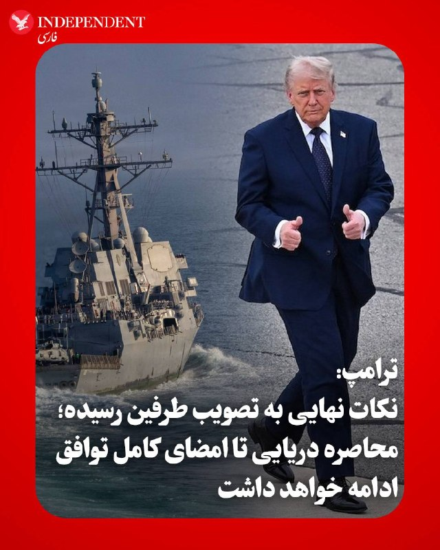

♦️دونالد ترامپ، رئیس‌جمهوری آمریکا، با انتشار پیامی در شبکه اجتماعی تروث سوشال اعلام کرد که حملات و بمباران‌های برنامه‌ریزی‌شده امشب علیه ایران را لغو کرده است. ترامپ دلیل این تصمیم را ارجاع گفتگوها به بالاترین سطح از رهبری ایران و موافقت طرفین دانست و تاکید کرد که نکات نهایی توافق، هم در کلیات و هم در جزئیات دقیق، به تایید تمامی کشورهای درگیر از جمله آمریکا، ایران، اسرائیل و متحدان منطقه‌ای رسیده است.

با این حال، او تصریح کرد که محاصره دریایی ایران تا زمان نهایی شدن و امضای کامل این معامله، با قدرت در جای خود باقی خواهد ماند. به گفته ترامپ، زمان و مکان امضای این توافق به‌زودی اعلام می‌شود.
‌🇸🇦 Indypersian

🤖 @VahidOOnLine

## VahidOOnLine — post 245022

  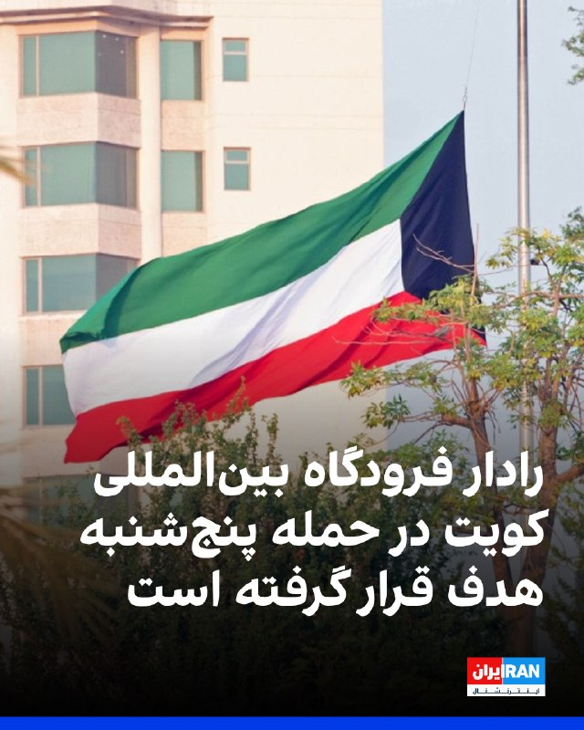

سازمان هواپیمایی کشوری کویت اعلام کرد سومین نامه اعتراضی خود را درباره هدف قرار گرفتن رادار فرودگاه کویت به سازمان بین‌المللی هوانوردی غیرنظامی ارسال کرده است.

بر اساس گزارش این سازمان، رادار فرودگاه بین‌المللی کویت صبح پنج‌شنبه هدف قرار گرفته است.

سازمان هواپیمایی کویت افزود که این حمله به زخمی شدن افرادی و وارد آمدن خسارات جدی مادی به تاسیسات راداری و تجهیزات مدیریت ترافیک هوایی منجر شده است.
‌🏁 🇬🇧 IranintlTV

🤖 @VahidOOnLine

## WithYashar — post 14542

خبرنگار نیویورک پست: ترامپ همین الان به من گفت که توافقی با ایران "تقریباً کاملاً نهایی شده است.
@withyashar

## WithYashar — post 14541

LIVE ON INSTAGRAM جام جهانی ۲۰۲۶
INSTAGRAM.com/YASHAR

## WithYashar — post 14540

🎬 Video

## mwarmonitor — post 10733

بر اساس این واقعیت که گفتگوها با جمهوری اسلامی ایران به بالاترین سطح رهبری ایران ارجاع داده شده و مورد موافقت قرار گرفته است، من به عنوان رئیس‌جمهور ایالات متحده آمریکا، حملات و بمباران‌های برنامه‌ریزی‌شده علیه ایران برای امشب را لغو کردم. گفتگوها و نکات نهایی،…

## FoxNewsTwitter — post 342870

  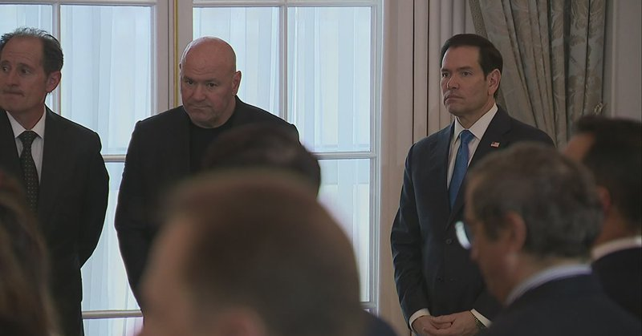

Fox News (Twitter/X)

WATCH LIVE: Secretary of State Marco Rubio and UFC launch new sports diplomacy partnership https://twitter.com/i/broadcasts/1nKOLLdkeEXGR

## pm_afshaa — post 93646

🤴
🤴

## pm_afshaa — post 93645

ترامپ مادرتو گاییدم

## VahidOnline — post 76234

اکسیوس به نقل از سه منبع آگاه گزارش داد شکاف‌های اصلی در جریان گفت‌وگو میان مقام‌های جمهوری اسلامی و میانجی‌های قطری روز چهارشنبه برطرف شده است

اکسیوس: طرف‌های ایرانی و قطری چهارشنبه به این جمع‌بندی رسیدند که به متن مورد توافقی دست یافته‌اند که آمریکا نیز آن را می‌پذیرد

اکسیوس: مقام‌های ایرانی پنج‌شنبه به چند کشور اعلام کرده‌اند مذاکرات تهران به توافقی اصولی منجر شده، اما مجتبی خامنه‌ای باید تایید نهایی را صادر کند
IranIntlbrk
انتخاب:‌ ادعای نیویورک پست
ایران پیش‌نویس یک توافقنامه را از طریق میانجی‌های قطری به ایالات متحده ارائه کرده است.
منابع می‌گویند این متن نهایی‌سازی و برای بررسی به واشنگتن ارسال شده است.
یک منبع آمریکایی دریافت این پیش‌نویس را تأیید کرده است، هرچند جزئیاتی فاش نشده است.

📡 @VahidOnline

## IranIntlTV — post 341765

  

سازمان هواپیمایی کشوری کویت اعلام کرد سومین نامه اعتراضی خود را درباره هدف قرار گرفتن رادار فرودگاه کویت به سازمان بین‌المللی هوانوردی غیرنظامی ارسال کرده است.

بر اساس گزارش این سازمان، رادار فرودگاه بین‌المللی کویت صبح پنج‌شنبه هدف قرار گرفته است.

سازمان هواپیمایی کویت افزود که این حمله به زخمی شدن افرادی و وارد آمدن خسارات جدی مادی به تاسیسات راداری و تجهیزات مدیریت ترافیک هوایی منجر شده است.
https://iranintl.com/202606117584

## FarsiVOA — post 220406

ناسا تصاویر جدیدی از ماموریت آرتمیس ۲ را منتشر کرده است؛ تصاویری که پیش‌تر منتشر نشده بودند.

به گفته ناسا، این تصاویر ۱۷ فروردین ثبت شده‌اند؛ زمانی که چهار فضانورد فضاپیمای اوریون در بخشی از ماموریت ۱۰ روزه خود از کنار ماه عبور کردند.

@FarsiVOA

## FarsiVOA — post 220405

کمتر از شش ماه پس از اجرایی شدن قانون جدید بریتانیا برای مجازات افرادی که جان مهاجران را در عبور از کانال مانش به خطر می‌اندازند، دو مرد اهل افغانستان و سودان به زندان محکوم شدند.

## DW_Farsi — post 125832

  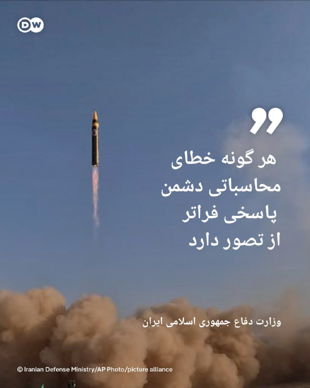

🔶 وزارت دفاع ایران: هر گونه خطای محاسباتی دشمن پاسخی فراتر از تصور دارد
 
وزارت دفاع جمهوری اسلامی طی بیانیه‌ای هشدار داد که هر گونه "خطای محاسباتی" طرف درگیر با ایران، "پاسخی غیرقابل تصور" خواهد داشت.
 
در این بیانیه که پنج‌شنبه ۲۱ خرداد به مناسبت اولین سالگرد جنگ ۱۲روزه منتشر شد آمده است: «بی‌تردید نیروهای مسلح جمهوری اسلامی ایران امروز از آمادگی، توانمندی و قدرت دفاعی قوی‌تر از گذشته برخوردارند و هرگونه خطای محاسباتی یا تعرض به امنیت و تمامیت ارضی کشور با پاسخی قاطع، پشیمان‌کننده و فراتر از تصور غلط دشمنان مواجه خواهد شد.»
 
وزارت دفاع می‌گوید، تجربه جنگی که سال گذشته با حملات اسرائيل به ایران آغاز شد و سرانجام با حمله آمریکا به سه مرکز کلیدی اتمی ایران پایان یافت اهمیت "توسعه قدرت دفاعی، خودکفایی نظامی و تقویت بازدارندگی" را نشان داد و این‌ وزارت‌خانه با ادامه راه در این مسیر  به "تجهیز نیروهای مسلح به فناوری‌ها و سامانه‌های پیشرفته" ادامه خواهد داد.
 
@dw_farsi

## DW_Farsi — post 125831

🎥 به یاد کیان پیرفلک، کودکی که امروز تولدش بود

روز پنجشنبه ۲۱ خردادماه شماری از ایرانیان ساکن هامبورگ به مناسبت تولد کیان پیرفلک تجمعی برگزار کردند و یادش را گرامی داشتند. کیان پیرفلک کودک ۹ ساله، در جریان اعتراضات ۱۴۰۱ در حالی که با والدین و برادر خردسالش در خودروشان در حال بازگشت به خانه بود، هدف گلوله ماموران حکومتی جمهوری اسلامی قرار گرفت و کشته شد.
@dw_farsi

## Persian_Trend_Official — post 16755

  <a href="telegram/content/Persian_Trend_Official_16755_1781201056.mp4" target="_blank">🎬 Download video</a>

کان نیوز: ترکیه اخیراً تلاش کرده است تا احمد الشرع، رئیس جمهور سوریه، وارد درگیری مستقیم با حزب الله در لبنان نشود.

یک منبع سوری نزدیک به دولت دمشق گفت که در هفته‌های اخیر ترکیه به الشرع توصیه کرده است که وارد درگیری با حزب الله در داخل لبنان نشود. به عبارت دیگر، به تلاش اسرائیل و دولت لبنان برای تضعیف حزب الله که دولت جدید سوریه آن را دشمن سرسخت خود می‌داند کمک نکند.

به گفته همان منبع سوری، از نظر ترکیه، اگر حزب الله به طور کامل حذف شود، منجر به تقویت اسرائیل خواهد شد، که از دیدگاه ترک‌ها نتیجه نامطلوب‌تری است.

📝 Amir

📌 @persian_trend_official
پرشین ترند | متفاوت‌ترین کانال نظامی

## IranianMinds — post 22328

یعنی گیر دوتا دروغگوی کسکش افتادیم
نمیدونیم چطور به حقیقت برسیم

ترامپ : جمهوری اسلامی مشتاق توافقه

جمهوری اسلامی : کص میگه ما اصلا توافق نمیخوایم

ترامپ : اونا تسلیم شدن و تموم شد فردا امضا میشه

جمهوری اسلامی : کص میگه توافقی نکردیم

## IranianMinds — post 22327

بیشتر از ترامپ این جمهوری اسلامیه که داره به وعده هاش عمل میکنه

تنها کسی که حرفاشو علیه رژیم اجرایی کرده ‌بی‌بی بوده

## Dirty_Kids — post 391732

  <a href="telegram/content/Dirty_Kids_391732_1781201059.mp4" target="_blank">🎬 Download video</a>

حکومت برای موندن وبقا چها که نمیکنه

@Dirty_Kids 👻

## alonews — post 127203

  <a href="telegram/content/alonews_127203_1781201061.webm" target="_blank">🎬 Download video</a>

👈سه منبع به اکسيوس می‌گویند که شکاف‌های کلیدی در مذاکرات ایران در جریان مذاکرات چهارشنبه با میانجیگران قطری حل شده است.

✅ @AloNews خبر جنگ

## alonews — post 127202

  <a href="telegram/content/alonews_127202_1781201061.webm" target="_blank">🎬 Download video</a>

👈نفت به زیر ۹۰ دلار رسید

✅ @AloNews خبر جنگ

---
📅 بروزرسانی: 1405/03/21 21:24
---

## VahidOOnLine — post 245021

  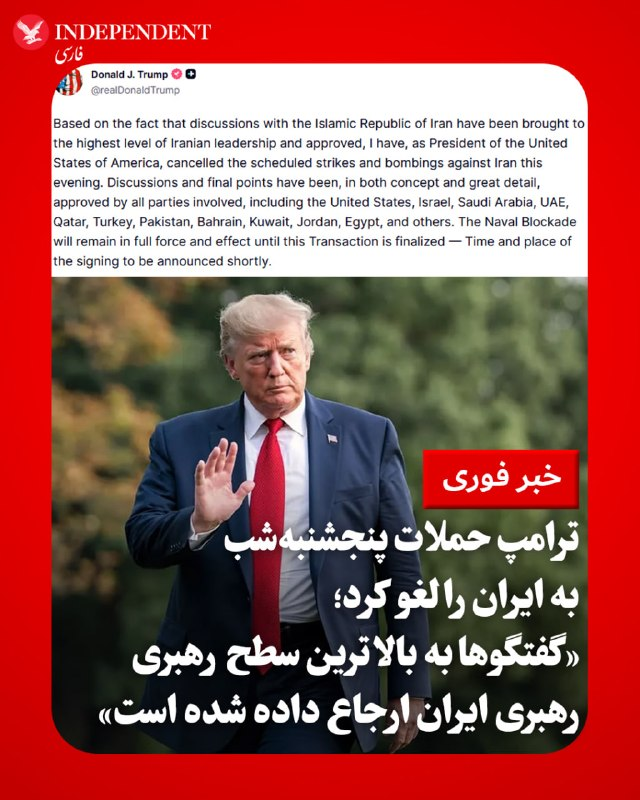

♦️ دونالد ترامپ، رئیس‌جمهوری آمریکا، اعلام کرد حملات هوایی علیه ایران را که ساعت‌ها پیش خبر از اجرای آن‌ها در پنجشنبه‌شب ۲۱ خرداد داده بود، به دلیل تایید و تصویب «نکات نهایی» یک توافق با این کشور، لغو کرده است.

ترامپ در شبکه اجتماعی «تروث سوشال» نوشت: «با توجه به اینکه گفتگوها با جمهوری اسلامی ایران به بالاترین سطح از رهبری ایران ارجاع داده شده و مورد موافقت قرار گرفته است، من به عنوان رئیس‌جمهوری ایالات متحده آمریکا، حملات و بمباران‌های برنامه‌ریزی‌شده امشب علیه ایران را لغو کردم.»

او در ادامه افزود: «بحث‌ها و نکات نهایی، هم در کلیات و هم در جزئیات دقیق، توسط تمامی طرف‌های درگیر به تصویب رسیده است.»

رئیس‌جمهوری آمریکا از کشورهای ایالات متحده، اسرائیل، عربستان سعودی، امارات، قطر، ترکیه، پاکستان، بحرین، کویت، اردن و مصر به عنوان کشورهایی نام برد که در فرآیند این موافقت و تایید حضور داشته‌اند.

ترامپ همچنین تاکید کرد: «محاصره دریایی تا زمان نهایی شدن کامل این توافق و معامله، با قدرت و به طور کامل در جای خود باقی خواهد ماند.»
وی تصریح کرد: «زمان و مکان امضای این توافق به‌زودی اعلام خواهد شد.»
‌🇸🇦 Indypersian

🤖 @VahidOOnLine

## FoxNewsTwitter — post 342869

‌Fox News (Twitter/X)

https://www.foxnews.com/live-news/us-iran-war-trump-israel-june-11

## FoxNewsTwitter — post 342868

Fox News (Twitter/X)

BREAKING: Pentagon operations back to normal after shelter-in-place orders, no hazard found, spokesman says

## FoxNewsTwitter — post 342867

  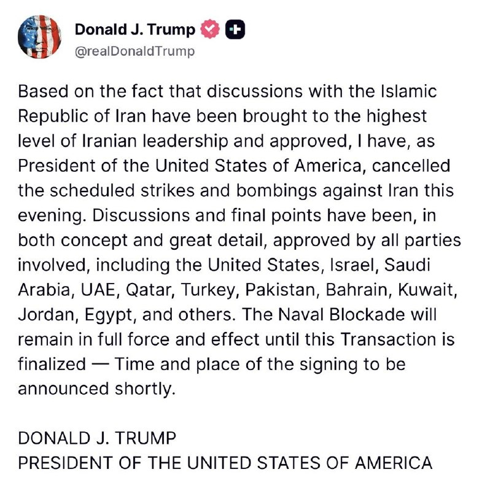

Fox News (Twitter/X)

BREAKING: President Trump announces he is cancelling planned strikes and bombings on Iran.

The move comes as the president says discussions with the "highest level of Iranian leadership" have taken a positive turn, and that "final points have been, in both concept and great detail, approved by all parties involved."

## pm_afshaa — post 93644

ترامپ مادرتو گاییدم

## pm_afshaa — post 93643

  <a href="telegram/content/pm_afshaa_93643_1781200453.webm" target="_blank">🎬 Download video</a>

🔴العربیه به نقل از یک مقام اسرائیلی:
پیام روشنی از سمت آمریکا دریافت کردیم مبنی بر اینکه در حملات علیه جمهوری اسلامی دخالت نکنیم.

💧 Rainbet.com the #1 Non-KYC Crypto Casino & Sportsbook @rainbetcom

😁 @Pm_Afshaa

## IranIntlTV — post 341764

  <a href="telegram/content/IranIntlTV_341764_1781200454.mp4" target="_blank">🎬 Download video</a>

جام جهانی ۲۰۲۶؛
چه بر سر رابطهٔ مردم و تیم ملی ایران آمد؟

جام جهانی ۲۰۲۶ در حالی آغاز می‌شود که رابطهٔ بخشی از جامعهٔ ایران با تیم ملی فوتبال دیگر مانند گذشته نیست. تیمی که زمانی یکی از معدود نمادهای وفاق ملی بود، امروز برای بسیاری به موضوعی سیاسی و هویتی تبدیل شده است.

کامبیز حسینی در مونولوگ امشب «برنامه» به این موضوع می‌پردازد.

«یک ایران صدای شما را می‌شنود»
دوشنبه تا پنجشنبه ۱۱ شب تهران
از تلویزیون ایران اینترنشنال

تماشای نسخه کامل این قسمت از «برنامه» در یوتیوب:
https://youtu.be/4oY_ozN6ER8
@iranintltv

## FarsiVOA — post 220404

  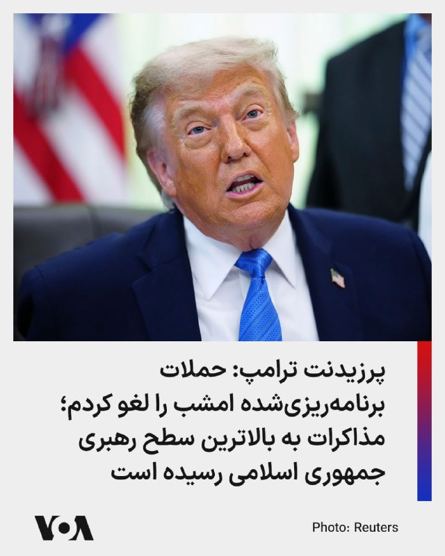

⚡️رئیس جمهوری آمریکا می‌گوید از آن جا که مذاکرات به بالاترین سطح رهبری رژیم ایران رسیده او حملاتی را که برای شامگاه پنج‌شنبه برنامه‌ریزی‌شده بود، لغو کرده است، او با این حال تاکید کرد که محاصره تا نهایی شدن توافق ادامه خواهد داشت.

## Persian_Trend_Official — post 16754

  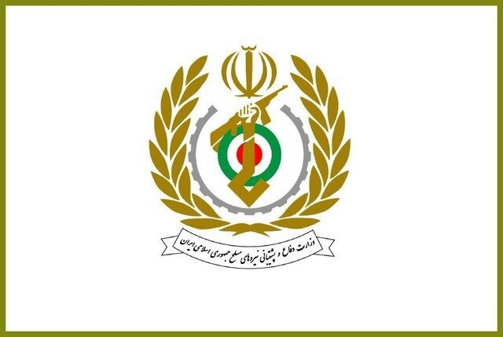

وزارت دفاع: هرگونه خطای محاسباتی یا تعرض به با پاسخی قاطع و پشیمان کننده مواجه خواهد شد!

بی‌تردید نیروهای مسلح جمهوری اسلامی ایران امروز از آمادگی، توانمندی و قدرت دفاعی قوی‌تر از گذشته برخوردارند.

هرگونه خطای محاسباتی یا تعرض به امنیت و تمامیت ارضی کشور با پاسخی قاطع، پشیمان‌کننده و فراتر از تصور غلط دشمنان مواجه خواهد شد.

📝 Amir

📌 @persian_trend_official
پرشین ترند | متفاوت‌ترین کانال نظامی

## RadioFarda — post 158195

🔸مرکز فرماندهی ارتش آمریکا، سنتکام، در پیامی در شبکه اجتماعی ایکس نوشت که تنگهٔ هرمز برای عبور باز است و ایران کنترلی بر آن ندارد.

🔸سنتکام روز پنجشنبه ۲۱ خرداد با بیان این‌که «مسیرهای امن برای کشتی‌های تجاری که از تنگهٔ هرمز عبور می‌کنند، ایجاد شده است»، نوشت: «این مسیرها برای همه کشتی‌هایی که محاصره علیه ایران را نقض نکنند، در دسترس است».

🔸این فرماندهی اعلام کرده که در دو ماه گذشته، صدها کشتی از این مسیر عبور کرده‌اند و افزوده که «نیروهای ایالات متحده برای دفاع در برابر اقدامات تهاجمی ایران در آماده‌باش هستند».

🔸به گفتهٔ سنتکام، «ایران کنترلی بر تنگهٔ هرمز ندارد».

🔸تنگهٔ هرمز که آبراهی استراتژیک بین دو کشور ایران و عمان است و حدود ۲۰ درصد از صادرات نفت و گاز جهان از آن عبور می‌کند، از زمان جنگ آمریکا و اسرائیل با ایران در ۹ اسفند پارسال از سوی سپاه پاسداران بسته بوده است.

🔸در حالی که ایران در محاصرهٔ دریایی ایالات متحده است، دونالد ترامپ رئیس‌جمهور آمریکا می‌گوید که با حمایت نظامی واشینگتن، تاکنون بیش از ۱۰۰ میلیون بشکه نفت از این تنگه عبور کرده است.

@RadioFarda

## RadioFarda — post 158194

  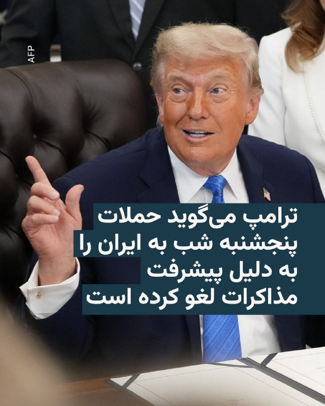

🔸دونالد ترامپ، رئیس‌جمهور آمریکا، ساعاتی بعد از اعلام قصدش برای حملات شدید به ایران در شامگاه پنجشنبه، گفت به دلیل پیشرفت مذاکرات با «بالاترین سطح رهبری» جمهوری اسلامی،‌ این حملات را لغو کرده است.

🔸او در شبکه اجتماعی خود، تروث سوشال، نوشت: «با توجه به اینکه گفت‌وگوها با جمهوری اسلامی ایران به بالاترین سطح رهبری ایران ارجاع شده و مورد تأیید قرار گرفته است، من به عنوان رئیس‌جمهور ایالات متحده آمریکا، حملات و بمباران‌های برنامه‌ریزی‌شده علیه ایران را که قرار بود امشب انجام شود، لغو کرده‌ام.»

🔸ترامپ خبر داد کلیات و جزئیات توافق با ایران «به تأیید تمامی طرف‌های درگیر رسیده است؛ از جمله ایالات متحده، اسرائیل، عربستان سعودی، امارات متحده عربی، قطر، ترکیه، پاکستان، بحرین، کویت، اردن، مصر و دیگران.»

🔸رئیس‌جمهور آمریکا به جزئیات بیشتری درباره این توافق اشاره نکرد اما افزود: «زمان و مکان امضای این توافق به‌زودی اعلام خواهد شد.»

🔸او همچنین تصریح کرد که محاصره دریایی علیه ایران تا زمان نهایی شدن این توافق پابرجا خواهد بود.

@RadioFarda

## IranianMinds — post 22326

هیچ پیروزی برای آمریکا وجود نداره ، دیشب آمریکا گفت بعد از تماس جمهوری اسلامی حمله رو متوقف کردیم، اما همون بعدش جمهوری اسلامی حمله کرد به پایگاه های آمریکا

اگر تماس گرفته حمله نکن، پس چطور حمله کرد؟ اگر تو انقدر برتری داری چرا پاسخ میگیری؟

الان هم که جا زد و گفت مذاکرات درحال پیشرفته
حرفی که ۱۰ هزاربار زده

الانم تروریست های سپاه اومدن اینو گفتن :

فارس:
ترامپ یک بار دیگه عقب‌نشینی کرد.
سپاه: خطایی از آمریکا ببینیم تنبیهش می‌کنیم.

خب الان اگر تو بر موضوع سواری پس این حرفا چیه؟
امیدوارم که چیزی تو اون کله پوکش باشه

## BBCPersian — post 283466

  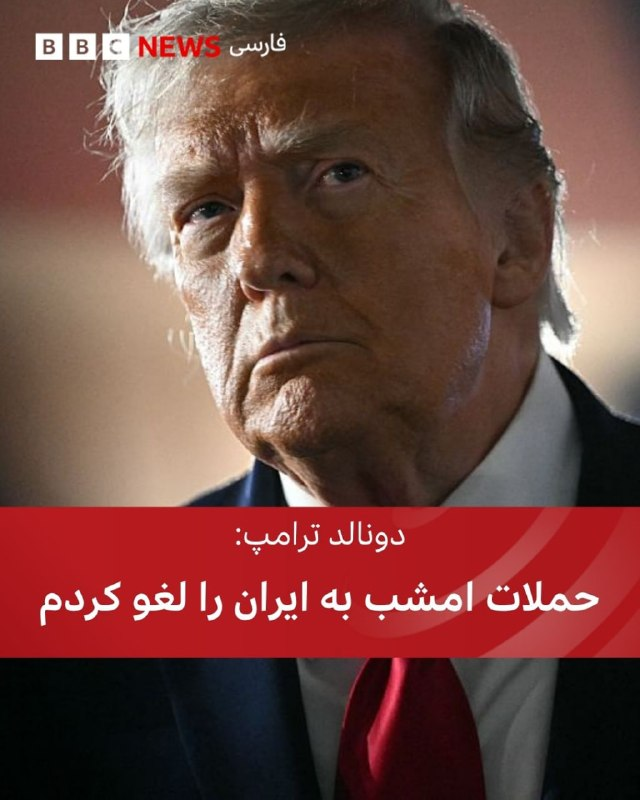

🔻 دونالد ترامپ، رئیس‌جمهور آمریکا، اعلام کرد که حملات برنامه‌ریزی شده امشب به ایران را لغو کرده است.

او در پستی در شبکه اجتماعی‌اش تروث‌سوشال نوشت: «با توجه به این‌که گفت‌وگوها با جمهوری اسلامی ایران به بالاترین سطح رهبری ایران ارجاع شده و مورد تأیید قرار گرفته است، من به‌عنوان رئیس‌جمهور ایالات متحده آمریکا، حملات و بمباران‌های برنامه‌ریزی‌شده علیه ایران را که قرار بود امشب انجام شود، لغو کرده‌ام.»

او اضافه کرده است: «مباحث و نکات نهایی این توافق، هم از نظر کلیات و هم در جزئیات گسترده، به تأیید تمامی طرف‌های درگیر رسیده است. از جمله به آمریکا، اسرائیل، عربستان سعودی، امارات متحده عربی، قطر، ترکیه، پاکستان، بحرین، کویت، اردن، مصر و دیگران.»

رئیس‌جمهور آمریکا اما تاکید کرده که محاصره دریایی تا زمان نهایی‌شدن این توافق همچنان به‌طور کامل برقرار و نافذ خواهد ماند.

او بدون ارائه جزئیات بیشتر افزوده است که زمان و مکان امضای توافق نیز به‌زودی اعلام خواهد شد.
📸Getty Images
@BBCPersian

## Dirty_Kids — post 391731

  <a href="telegram/content/Dirty_Kids_391731_1781200460.mp4" target="_blank">🎬 Download video</a>

این بانو تراپیست جدیدمون داره میشه کم‌کم

@Dirty_Kids 👻

## Dirty_Kids — post 391730

  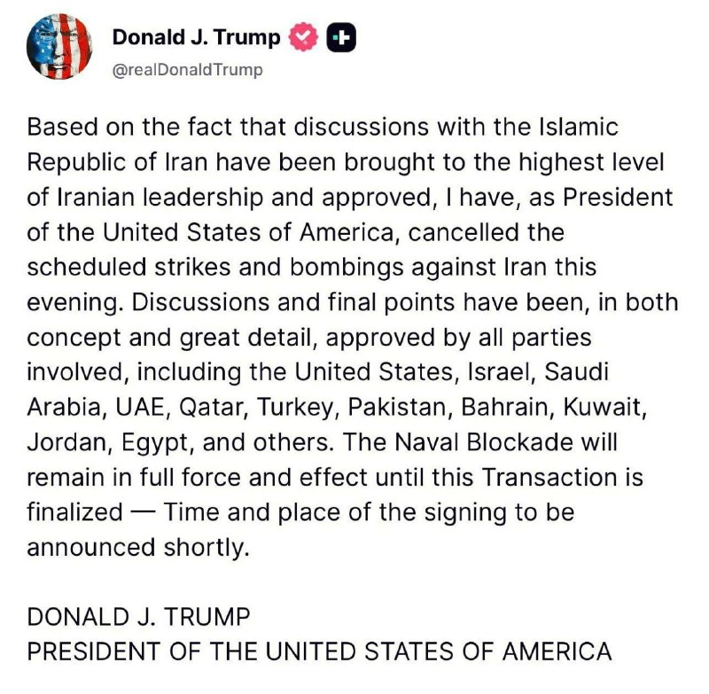

ترامپ: حمله‌ی امشب کنسله

با توجه به اینکه مذاکرات با جمهوری اسلامی ایران به بالاترین سطح رهبری ایران رسیده و تأیید شده است، من به عنوان رئیس جمهور ایالات متحده آمریکا، حملات و بمباران‌های برنامه‌ریزی شده علیه ایران را امشب لغو کردم.
مذاکرات و نکات نهایی، هم از نظر مفهومی و هم از نظر جزئیات، توسط همه طرف‌های درگیر، از جمله ایالات متحده، اسرائیل، عربستان سعودی، امارات متحده عربی، قطر، ترکیه، پاکستان، بحرین، کویت، اردن، مصر و دیگران تأیید شده است.
محاصره دریایی تا زمان نهایی شدن این معامله به قوت خود باقی خواهد ماند. زمان و مکان امضا به زودی اعلام خواهد شد.



@Dirty_Kids 👻

## alonews — post 127201

  <a href="telegram/content/alonews_127201_1781200464.webm" target="_blank">🎬 Download video</a>

👈سپاه : ما کاملاً آمادایم تا به هر اشتباه یا اقدام طرف مقابل، با قاطعیت پاسخ بدیم

✅ @AloNews خبر جنگ

## alonews — post 127200

  <a href="telegram/content/alonews_127200_1781200464.webm" target="_blank">🎬 Download video</a>

👈قیمت تتر ۱۷۶ هزار تومان شد

✅ @AloNews خبر جنگ

## alonews — post 127199

  <a href="telegram/content/alonews_127199_1781200464.webm" target="_blank">🎬 Download video</a>

👈صداوسیما:
ترامپ بازم عقب نشینی کرد، الله اکبر

✅ @AloNews خبر جنگ

---
📅 بروزرسانی: 1405/03/21 21:14
---

## VahidOOnLine — post 245011

  <a href="telegram/content/VahidOOnLine_245011_1781199862.mp4" target="_blank">🎬 Download video</a>

تهدید دونالد ترامپ درباره «گرفتن جزیره خارک» بار دیگر توجه‌ها را به مهم‌ترین شریان صادرات نفت ایران جلب کرده است.
خارک تنها یک جزیره کوچک در خلیج فارس نیست؛ مرکزی است که بخش عمده صادرات نفت خام ایران از آن انجام می‌شود و دهه‌هاست نقشی کلیدی در اقتصاد کشور و بازار جهانی انرژی دارد.
اما آیا تصرف یا کنترل این جزیره واقعاً امکان‌پذیر است؟ و اگر چنین سناریویی رخ دهد، پیامدهای آن برای ایران، منطقه و بازار جهانی نفت چه خواهد بود؟ ورق بزنید.
‌🏁 🇬🇧 ManotoTV

🤖 @VahidOOnLine

## VahidOOnLine — post 245010

  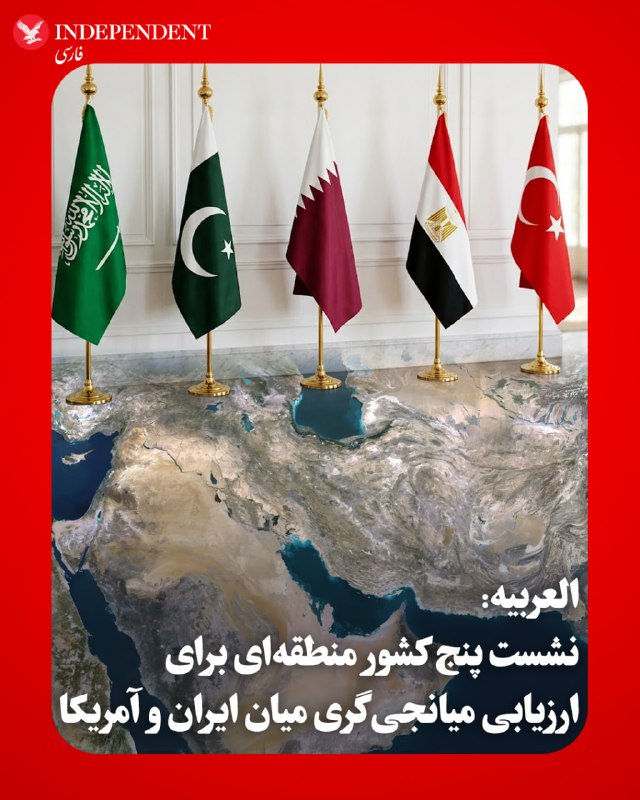

♦️ العربیه به نقل از منابع خود گزارش داد که قرار است نشستی میان کشورهای عربستان سعودی، پاکستان، قطر، مصر و ترکیه برای ارزیابی تلاش‌های میانجی‌گرانه میان ایالات متحده و جمهوری اسلامی ایران برگزار شود.

این منابع اعلام کردند که هدف اصلی از این نشست، بررسی و ارزیابی تضمین‌های لازم برای اجرای صحیح و کامل توافق احتمالی میان واشنگتن و تهران است.
‌🇸🇦 Indypersian

🤖 @VahidOOnLine

## VahidOOnLine — post 245009

  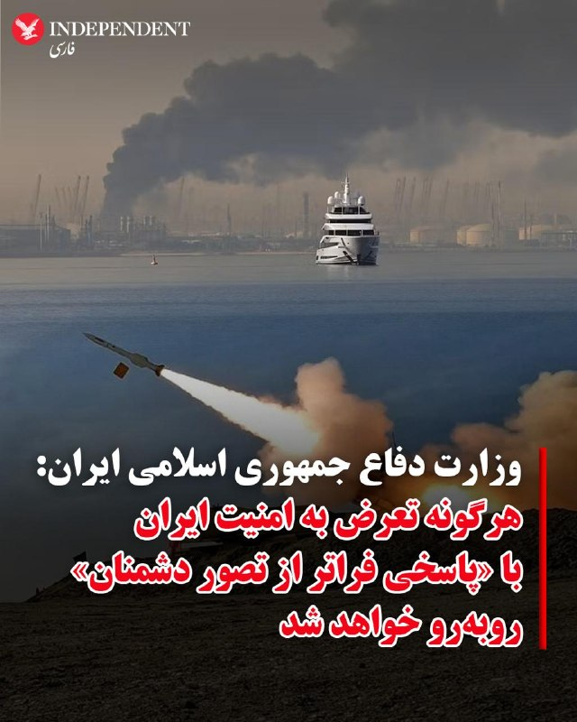

♦️با بالاگرفتن جدال لفظی میان مقام‌های ایران و آمریکا، وزارت دفاع و پشتیبانی نیروهای مسلح جمهوری اسلامی ایران، روز پنجشنبه ۲۱ خرداد ماه با انتشار بیانیه‌ای هشدار داد: «هرگونه خطای محاسباتی یا تعرض به امنیت کشور با پاسخی قاطع و فراتر از تصور دشمنان مواجه خواهد شد.»
به گزارش تسنیم، وزارت دفاع اعلام کرد: «فرزندان ملت در صنعت دفاعی کشور همچنان با تمام توان در پشتیبانی نیروهای مسلح و ارتقای قدرت بازدارندگی جمهوری اسلامی ایران گام برخواهند داشت.»
وزارت دفاع همچنین تاکید کرد نیروهای مسلح جمهوری اسلامی ایران امروز از آمادگی، توانمندی و قدرت دفاعی بیشتری نسبت به گذشته برخوردارند.
در ادامه این بیانیه آمده است: «بی‌تردید هرگونه خطای محاسباتی یا تعرض به امنیت و تمامیت ارضی کشور با پاسخی قاطع، پشیمان‌کننده و فراتر از تصور غلط دشمنان مواجه خواهد شد.»
این بیانیه پس از اعلام دونالد ترامپ مبنی بر حمله به زیرساخت‌های نفتی ایران در جزیره خارگ و واکنش گسترده نهادهای وابسته به نیروهای مسلح جمهوری اسلامی منتشر شده است.
‌🇸🇦 Indypersian

🤖 @VahidOOnLine

## VahidOOnLine — post 245008

  

دونالد ترامپ در شبکه تروث سوشال نوشت پس از تایید گفت‌وگوها در بالاترین سطح رهبری در ایران، حملات برنامه‌ریزی‌شده شامگاه پنج‌شنبه علیه جمهوری اسلامی را لغو کرده است.

ترامپ نوشت نکات نهایی توافق با تایید آمریکا، اسرائیل، عربستان سعودی، امارات متحده عربی، قطر، ترکیه، پاکستان، بحرین، کویت، اردن و مصر همراه بوده و محاصره دریایی تا نهایی شدن توافق ادامه خواهد داشت.

او همچنین گفت که زمان و مکان امضای توافق به‌زودی اعلام خواهد شد.
‌🏁 🇬🇧 IranintlTV

🤖 @VahidOOnLine

## VahidOOnLine — post 245007

  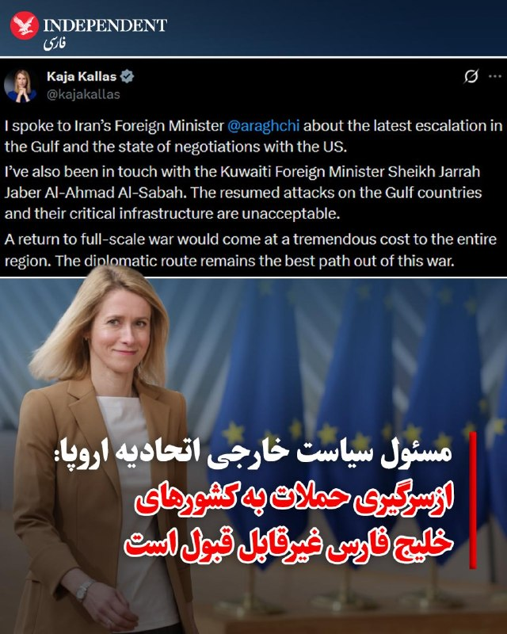

♦️کایا کالاس، مسئول سیاست خارجی اتحادیه اروپا، پس از گفتگو با عباس عراقچی، وزیر امور خارجه جمهوری اسلامی ایران، با انتشار پیامی در شبکه اجتماعی ایکس هشدار داد که «ازسرگیری حملات به کشورهای خلیج فارس و زیرساخت‌های حیاتی آن‌ها به هیچ وجه قابل قبول نیست.»

کالاس در این پیام اعلام کرد که علاوه بر گفتگو با عراقچی درباره آخرین تنش‌ها در خلیج فارس و وضعیت مذاکرات با ایالات متحده، با شیخ جراح جابر الاحمد الصباح، وزیر امور خارجه کویت نیز در ارتباط بوده است.

مسئول سیاست خارجی اتحادیه اروپا با ابراز نگرانی شدید از وخامت اوضاع، تاکید کرد: «بازگشت به یک جنگ تمام‌عیار، هزینه‌های فوق‌العاده سنگینی برای کل منطقه به همراه خواهد داشت. مسیر دیپلماتیک همچنان بهترین راه برای خروج از این جنگ است.»

این موضع‌گیری در پی حملات موشکی و پهپادی اخیر تهران به اهدافی در اردن، بحرین و کویت، در پاسخ به بمباران‌های سنگین ارتش آمریکا علیه زیرساخت‌های پدافندی و راداری ایران صورت می‌گیرد.
‌🇸🇦 Indypersian

🤖 @VahidOOnLine

## WithYashar — post 14538

  

ترامپ در تروث : با توجه به اینکه مذاکرات با جمهوری اسلامی ایران به بالاترین سطح رهبری ایرانیان برده شده و تایید شده است، من به عنوان رئیس‌جمهور ایالات متحده آمریکا، حملات و بمباران‌های برنامه‌ریزی شده علیه ایران امشب را لغو کردم. مذاکرات و نکات نهایی، هم از نظر مفهوم و هم با جزئیات فراوان، توسط تمام طرف‌های درگیر، از جمله ایالات متحده، اسرائیل، عربستان سعودی، امارات متحده عربی، قطر، ترکیه، پاکستان، بحرین، کویت، اردن، مصر و دیگران، تایید شده است. محاصره دریایی تا زمان نهایی شدن این معامله به طور کامل و با اثر باقی خواهد ماند زمان و مکان امضا به زودی اعلام خواهد شد.
@withyashar

## WithYashar — post 14537

ترامپ: بمباران امشب را لغو کردم
@withyashar

## mwarmonitor — post 10732

بر اساس این واقعیت که گفتگوها با جمهوری اسلامی ایران به بالاترین سطح رهبری ایران ارجاع داده شده و مورد موافقت قرار گرفته است، من به عنوان رئیس‌جمهور ایالات متحده آمریکا، حملات و بمباران‌های برنامه‌ریزی‌شده علیه ایران برای امشب را لغو کردم. گفتگوها و نکات نهایی،…

## mwarmonitor — post 10731

  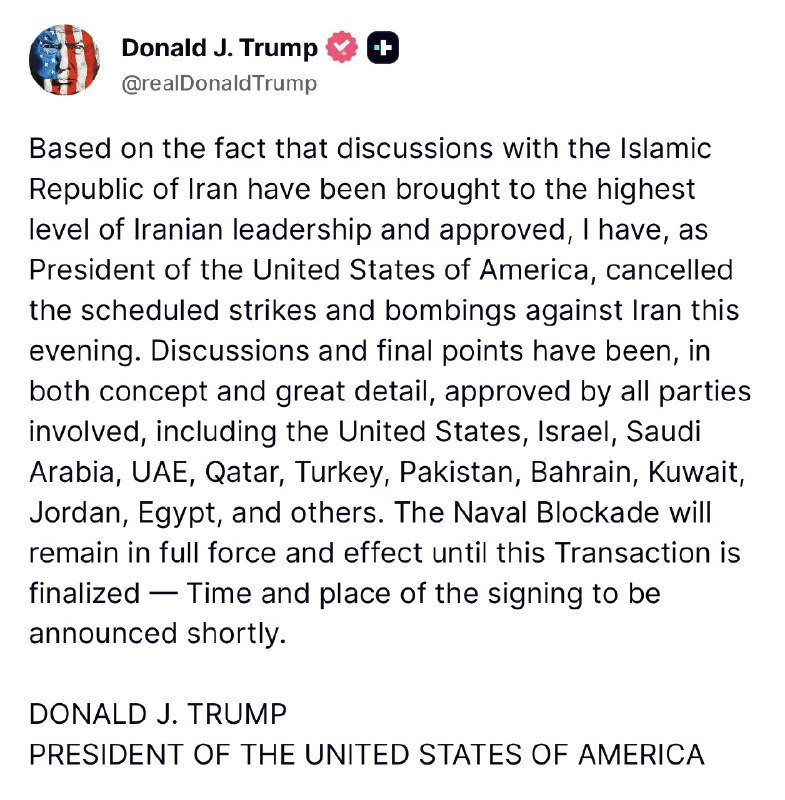

بر اساس این واقعیت که گفتگوها با جمهوری اسلامی ایران به بالاترین سطح رهبری ایران ارجاع داده شده و مورد موافقت قرار گرفته است، من به عنوان رئیس‌جمهور ایالات متحده آمریکا، حملات و بمباران‌های برنامه‌ریزی‌شده علیه ایران برای امشب را لغو کردم. گفتگوها و نکات نهایی، هم از نظر کلیات و هم با جزئیات کامل، مورد تایید تمامی طرف‌های درگیر، از جمله ایالات متحده، اسرائیل، عربستان سعودی، امارات، قطر، ترکیه، پاکستان، بحرین، کویت، اردن، مصر و دیگران قرار گرفته است. محاصره دریایی تا زمان نهایی شدن این توافق (معامله) با قدرت و قوت خود باقی خواهد ماند — زمان و مکان امضا به‌زودی اعلام خواهد شد.

دونالد جی. ترامپ
رئیس‌جمهور ایالات متحده آمریکا

@mwarmonitor

## FoxNewsTwitter — post 342866

Fox News (Twitter/X)

BREAKING: Trump reveals he canceled 'scheduled strikes and bombings' on Iran, time and place of potential deal-signing 'to be announced shortly'

## pm_afshaa — post 93642

اماده باش در اسراییل

💧 Rainbet.com the #1 Non-KYC Crypto Casino & Sportsbook @rainbetcom

😁 @Pm_Afshaa

## pm_afshaa — post 93641

  <a href="telegram/content/pm_afshaa_93641_1781199868.webm" target="_blank">🎬 Download video</a>

🔴پست جدید ترامپ:

با توجه به اینکه مذاکرات با جمهوری اسلامی ایران به بالاترین سطح رهبری ایرانیان برده شده و تایید شده، من به عنوان رئیس‌جمهور آمریکا، حملات و بمباران‌های برنامه‌ریزی شده علیه ایران امشب رو لغو کردم. مذاکرات و نکات نهایی، هم از نظر مفهوم و هم با جزئیات فراوان، توسط تمام طرف‌های درگیر، از جمله ایالات متحده، اسرائیل، عربستان سعودی، امارات متحده عربی، قطر، ترکیه، پاکستان، بحرین، کویت، اردن، مصر و دیگران، تایید شده. محاصره دریایی تا زمان نهایی شدن این معامله به طور کامل و با اثر باقی خواهد ماند زمان و مکان امضا به‌زودی اعلام خواهد شد.

💧 Rainbet.com the #1 Non-KYC Crypto Casino & Sportsbook @rainbetcom

😁 @Pm_Afshaa

## pm_afshaa — post 93640

  <a href="telegram/content/pm_afshaa_93640_1781199869.webm" target="_blank">🎬 Download video</a>

🔴ترامپ: حملات و بمباران های برنامه ریزی شده عصر امروز علیه ایران رو لغو کردم.

💧 Rainbet.com the #1 Non-KYC Crypto Casino & Sportsbook @rainbetcom

😁 @Pm_Afshaa

## VahidOnline — post 76233

  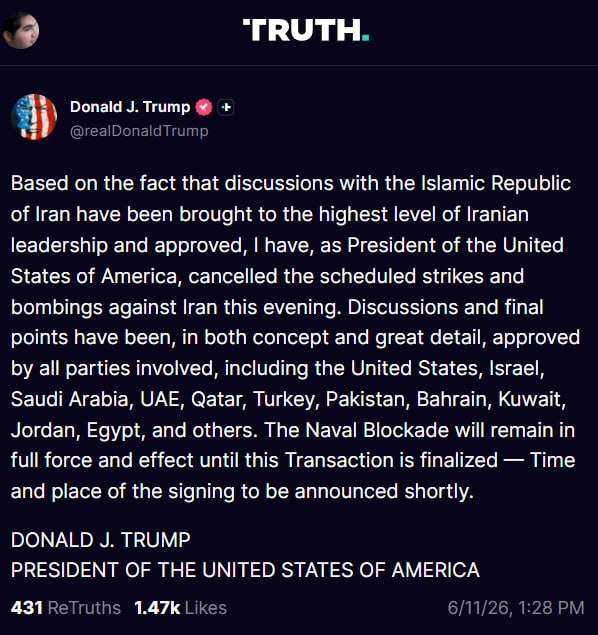

☄️ ترامپ: حمله امشب را لغو کردم چون بالاترین سطح جمهوری اسلامی توافق را تایید کرد

پست ترامپ، ترجمه ماشین:
با توجه به این واقعیت که گفت‌وگوها با جمهوری اسلامی ایران به عالی‌ترین سطح رهبری ایران رسانده شده و مورد تأیید قرار گرفته است، من، به‌عنوان رئیس‌جمهور ایالات متحده آمریکا، حملات و بمباران‌های برنامه‌ریزی‌شده علیه ایران در شامگاه امروز را لغو کرده‌ام.

گفت‌وگوها و نکات نهایی، هم در کلیات و هم با جزئیات فراوان، به تأیید همه طرف‌های دخیل رسیده است؛ از جمله ایالات متحده، اسرائیل، عربستان سعودی، امارات متحده عربی، قطر، ترکیه، پاکستان، بحرین، کویت، اردن، مصر و دیگران.

محاصره دریایی تا زمانی که این توافق نهایی شود، با تمام قدرت و به‌طور کامل برقرار خواهد ماند — زمان و مکان امضا به‌زودی اعلام خواهد شد.

دونالد جی. ترامپ
رئیس‌جمهور ایالات متحده آمریکا
realDonaldTrump

📡 @VahidOnline

## IranIntlTV — post 341763

  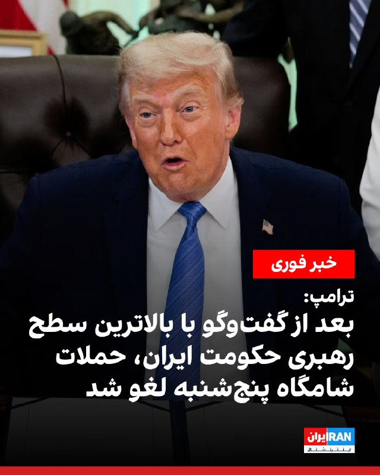

دونالد ترامپ در شبکه تروث سوشال نوشت پس از تایید گفت‌وگوها در بالاترین سطح رهبری در ایران، حملات برنامه‌ریزی‌شده شامگاه پنج‌شنبه علیه جمهوری اسلامی را لغو کرده است.

ترامپ نوشت نکات نهایی توافق با تایید آمریکا، اسرائیل، عربستان سعودی، امارات متحده عربی، قطر، ترکیه، پاکستان، بحرین، کویت، اردن و مصر همراه بوده و محاصره دریایی تا نهایی شدن توافق ادامه خواهد داشت.

او همچنین گفت که زمان و مکان امضای توافق به‌زودی اعلام خواهد شد.
https://iranintl.com/202606118469

## Shin_Persian — post 6961

Shin ✓ @hey_itsmyturn
Thu, 11 Jun 2026 17:35:24 UTC

IRGC-Owned Fars News:

"Elon Musk @elonmusk's Companies on Iran's Military Target List"
"Starlink ground stations located in occupied territories, Qatar, Jordan, the UAE, and Oman, alongside SpaceX shareholders including infrastructure from "Alpha Dhabi" and "Mubadala" companies, are among Iran's potential new targets."

Meanwhile, FarsNews (@FarsNews_Agency) and lookalikes, as well as IRGC terror commanders are enjoying X!

ترجمه خودکار فارسی

خبرگزاری فارس متعلق به سپاه پاسداران (IRGC):

«شرکت‌های ایلان ماسک @elonmusk در فهرست اهداف نظامی ایران»
«ایستگاه‌های زمینی استارلینک واقع در سرزمین‌های اشغالی، قطر، اردن، امارات متحده عربی و عمان، در کنار سهامداران اسپیس‌اکس از جمله زیرساخت‌های شرکت‌های «آلفا ظبی» و «مباداله»، در میان اهداف بالقوه و جدید ایران هستند.»

در همین حال، خبرگزاری فارس (@FarsNews_Agency) و حساب‌های مشابه و همچنین فرماندهان تروریست سپاه پاسداران از پلتفرم ایکس لذت می‌برند!

𝕏 · @shin_persian

## ManotoTV — post 106025

  <a href="telegram/content/ManotoTV_106025_1781199872.mp4" target="_blank">🎬 Download video</a>

تهدید دونالد ترامپ درباره «گرفتن جزیره خارک» بار دیگر توجه‌ها را به مهم‌ترین شریان صادرات نفت ایران جلب کرده است.
خارک تنها یک جزیره کوچک در خلیج فارس نیست؛ مرکزی است که بخش عمده صادرات نفت خام ایران از آن انجام می‌شود و دهه‌هاست نقشی کلیدی در اقتصاد کشور و بازار جهانی انرژی دارد.
اما آیا تصرف یا کنترل این جزیره واقعاً امکان‌پذیر است؟ و اگر چنین سناریویی رخ دهد، پیامدهای آن برای ایران، منطقه و بازار جهانی نفت چه خواهد بود؟ ورق بزنید.

## FarsiVOA — post 220403

🔺سنتکام: تنگه هرمز برای عبور و مرور باز است

▪️فرماندهی مرکزی ایالات متحده آمریکا می‌گوید تنگه هرمز باز است و عبور و مرور برای شناورهایی که محاصره را نقض نکنند، جریان دارد.

⬇️ بیشتر بخوانید:
https://ir.voanews.com/a/escalating-conflicts-iran-america-centcom-strait-of-hormuz/8159771.html

## IranianMinds — post 22325

  

صالح بعد صالح.

@IranianMinds

## BBCPersian — post 283465

  <a href="telegram/content/BBCPersian_283465_1781199873.mp4" target="_blank">🎬 Download video</a>

به مناسبت افتتاح جدیدترین برج کلیسای ساگرادا فامیلیا در بارسلونا توسط پاپ لئون چهاردهم، آتش‌بازی باشکوهی برپا شد. این ویدیو را ببینید.

@BBCPersian

## Dirty_Kids — post 391729

  <a href="telegram/content/Dirty_Kids_391729_1781199875.mp4" target="_blank">🎬 Download video</a>

اين كارو همه‌ی ما بايد انجام بديم ✌🏼

@Dirty_Kids 👻

## Dirty_Kids — post 391728

  

این خودش انقدر آروم و معصوم، خواهراش چرا انقدر وحشی‌ان؟!

@Dirty_Kids 👻

## Dirty_Kids — post 391727

نزدیک محرم هستیم
خواستم بگم هرکس تو کربلا کشته شده
تقصیر امام حسین بوده
نباید فراخوان میداد!

@Dirty_Kids 👻

## Hranews — post 113544

اعدام ۴ زندانی در زندان‌های مختلف/ افزایش شمار اعدام‌شدگان در دو زندان دیگر

❗️
❗️
❗️
❗️
❗️– حکم اعدام چهار زندانی در زندان‌های عادل‌آباد شیراز، خرم‌آباد و شیروان اجرا شد. همچنین با احراز هویت دو زندانی دیگر، شمار اعدام‌شدگان روز سه‌شنبه در زندان‌های دستگرد اصفهان و دیزل‌آباد کرمانشاه به چهار تن رسید. این زندانیان پیشتر در پرونده‌های جداگانه از بابت اتهامات مرتبط با جرائم مواد مخدر و قتل به اعدام محکوم شده بودند.

ادامه مطلب

#فرهاد_مینایی #حسین_صالح‌پور #کرامت_منصوری #رضا_قنبرلو #داریوش_قبادی #احمدرضا_ترابی

↘️
@hranews_bot تماس ✉️ - @Hranews کانال هرانا 🆑

## manototv — post 106025

  <a href="telegram/content/manototv_106025_1781199878.mp4" target="_blank">🎬 Download video</a>

تهدید دونالد ترامپ درباره «گرفتن جزیره خارک» بار دیگر توجه‌ها را به مهم‌ترین شریان صادرات نفت ایران جلب کرده است.
خارک تنها یک جزیره کوچک در خلیج فارس نیست؛ مرکزی است که بخش عمده صادرات نفت خام ایران از آن انجام می‌شود و دهه‌هاست نقشی کلیدی در اقتصاد کشور و بازار جهانی انرژی دارد.
اما آیا تصرف یا کنترل این جزیره واقعاً امکان‌پذیر است؟ و اگر چنین سناریویی رخ دهد، پیامدهای آن برای ایران، منطقه و بازار جهانی نفت چه خواهد بود؟ ورق بزنید.

## alonews — post 127198

  <a href="telegram/content/alonews_127198_1781199878.webm" target="_blank">🎬 Download video</a>

👈شبکه کان به نقل از یک مقام اسرائیلی:
آمریکایی‌ها هنوز از مسیر مذاکرات با ایران دست نکشیده‌اند

✅ @AloNews خبر جنگ

---
📅 بروزرسانی: 1405/03/21 21:03
---

## VahidOOnLine — post 245006

  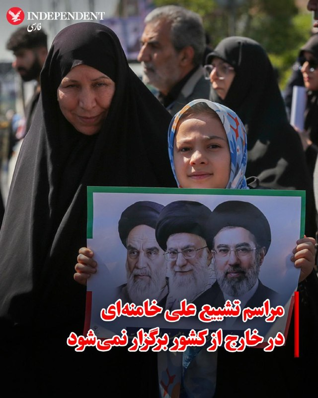

♦️دبیر ستاد آیین تشییع و وداع، که برای ترتیب دادن مراسم تشییع و خاکسپاری علی خامنه‌ای، رهبر پیشین جمهوری اسلامی تشکیل شده، روز پنجشنبه ۲۱ خرداد اعلام کرد که در خارج از کشور، مراسم تشییع انجام نخواهد شد. به گزارش تسنیم، او در پاسخ به سوالی درباره زمان دقیق مراسم تشییع در ایران گفت: «هر زمان که بیت ایشان مصلحت بدانند مراسم در داخل برگزار می‌شود».

این در حالی است که بیش از سه ما (۱۰۲ روز) ه از کشته شدن علی خامنه‌ای گذشته و مجتبی خامنه‌ای، پسر و جانشین او نیز در این مدت در انظار عمومی ظاهر نشده و صدا یا تصویر جدیدی نیز از او منتشر نشده است. این فاصله طولانی میان زمان مرگ و زمان تشییع، که در گذشته سابقه نداشت، پیش از این در مورد حسن نصرالله، دبیرکل پیشین حزب‌الله لبنان نیز رخ داد. در مورد نصرالله به دلیل ملاحظات امنیتی، مراسم تشییع و خاکسپاری رسمی، ۱۴۹ روز یعنی بعد از زمان مرگ او انجام شد.
‌🇸🇦 Indypersian

🤖 @VahidOOnLine

## VahidOOnLine — post 245005

  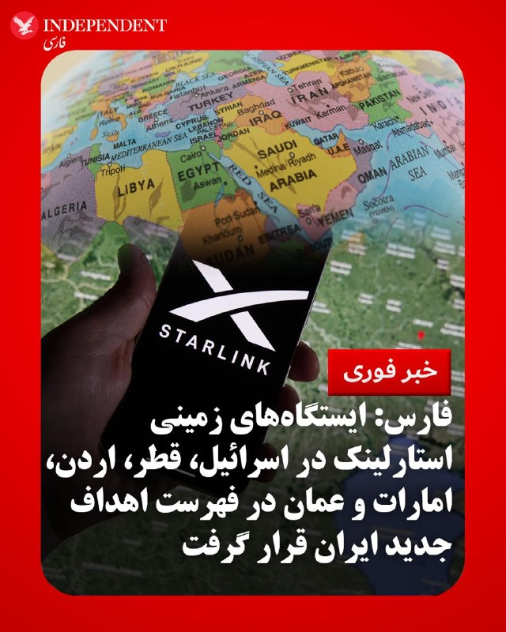

♦️خبرگزاری فارس، وابسته به سپاه پاسداران، روز دوشنبه ۲۱ خرداد ماه در گزارشی اعلام کرد ایستگاه‌های زمینی استارلینک در اسرائیل، قطر، اردن، امارات و عمان به همراه سهامداران شرکت اسپیس‌ایکس و زیرساخت‌های شرکت‌های «الفیظابی» و «مبادله» به فهرست اهداف نظامی جمهوری اسلامی ایران اضافه شده‌اند.
فارس مدعی شد این تصمیم پس از به دست آمدن شواهدی مبنی بر استفاده ارتش‌های آمریکا و اسرائیل از زیرساخت‌های تحت مدیریت ایلان ماسک، از جمله شبکه اینترنت ماهواره‌ای استارلینک، اتخاذ شده است.
بر اساس این گزارش، «ایستگاه‌های زمینی استارلینک» در اسرائیل، قطر، اردن، امارات و عمان، به همراه سهامداران شرکت اسپیس‌ایکس و همچنین زیرساخت‌های شرکت‌های «الفیظابی» و «مبادله» در فهرست جدید اهداف ایران قرار گرفته‌اند.
فارس نوشت: «ایستگاه‌های زمینی استارلینک واقع در اسرائیل، قطر، اردن، امارات و عمان، به همراه سهامداران اسپیس‌ایکس و همچنین زیرساخت‌های دو شرکت الفیظابی و مبادله، از جمله مکان‌های جدید در فهرست اهداف ایران هستند.»
این گزارش از سوی خبرگزاری حکومتی فارس در حالی منتشر می‌شود که سپاه پاسداران در روزهای گذشته و در جریان تبادل آتش با نیروهای آمریکایی در خلیج فارس، بارها کشورهای کویت و بحرین را هدف قرار داده است. بر اساس بیانیه جدید، امارات متحده عربی بار دیگر در فهرست اهداف نیروهای مسلح ایران قرار گرفته است.
‌🇸🇦 Indypersian

🤖 @VahidOOnLine

## WithYashar — post 14536

صدا و سیما: ویدیو انیمیشن انفجار اتمی که نیمه‌شب از صدا و سیما پخش شده بود، بابت خطا در تدوین بوده
@withyashar

## mwarmonitor — post 10730

🔴جک رید، عضو ارشد دموکرات در کمیته نیروهای مسلح، پیش‌بینی می‌کند که اگر رئیس‌جمهور ترامپ نیروهایی را برای تصرف جزیره خارک ایران اعزام کند، تلفات قابل توجهی رخ خواهد داد.

🔴او گفت: «هنگام پیاده شدن نیروها در ساحل، تلفات سنگینی خواهید داشت. علاوه بر این، این منطقه در برد توپخانه‌های ساحلی آن‌ها قرار دارد، بنابراین حتی زمانی که جزیره را اشغال کنید، آن‌ها همچنان شما را گلوله‌باران خواهند کرد. در نتیجه نیروها نه تنها هنگام پیاده شدن یا درگیری اولیه آسیب می‌بینند، بلکه در معرض آتش مداوم یا دست‌کم حملات مکرر خواهند بود.»

@mwarmonitor

## VahidOnline — post 76232

  

خبرگزاری فارس، وابسته به سپاه پاسداران، در گزارشی اعلام کرد ایستگاه‌های زمینی استارلینک در اسرائیل، قطر، اردن، امارات و عمان به همراه سهامداران شرکت اسپیس‌ایکس و زیرساخت‌های شرکت‌های «الفیظابی» و «مبادله» به فهرست اهداف نظامی جمهوری اسلامی ایران اضافه شده‌اند.
فارس مدعی شد این تصمیم پس از به دست آمدن شواهدی مبنی بر استفاده ارتش‌های آمریکا و اسرائیل از زیرساخت‌های تحت مدیریت ایلان ماسک، از جمله شبکه اینترنت ماهواره‌ای استارلینک، اتخاذ شده است.
بر اساس این گزارش، «ایستگاه‌های زمینی استارلینک» در اسرائیل، قطر، اردن، امارات و عمان، به همراه سهامداران شرکت اسپیس‌ایکس و همچنین زیرساخت‌های شرکت‌های «الفیظابی» و «مبادله» در فهرست جدید اهداف ایران قرار گرفته‌اند.
فارس نوشت: «ایستگاه‌های زمینی استارلینک واقع در اسرائیل، قطر، اردن، امارات و عمان، به همراه سهامداران اسپیس‌ایکس و همچنین زیرساخت‌های دو شرکت الفیظابی و مبادله، از جمله مکان‌های جدید در فهرست اهداف ایران هستند.»
این گزارش از سوی خبرگزاری حکومتی فارس در حالی منتشر می‌شود که سپاه پاسداران در روزهای گذشته و در جریان تبادل آتش با نیروهای آمریکایی در خلیج فارس، بارها کشورهای کویت و بحرین را هدف قرار داده است. بر اساس بیانیه جدید، امارات متحده عربی بار دیگر در فهرست اهداف نیروهای مسلح ایران قرار گرفته است.
@VahidOOnLine

📡 @VahidOnline

## VahidOnline — post 76231

  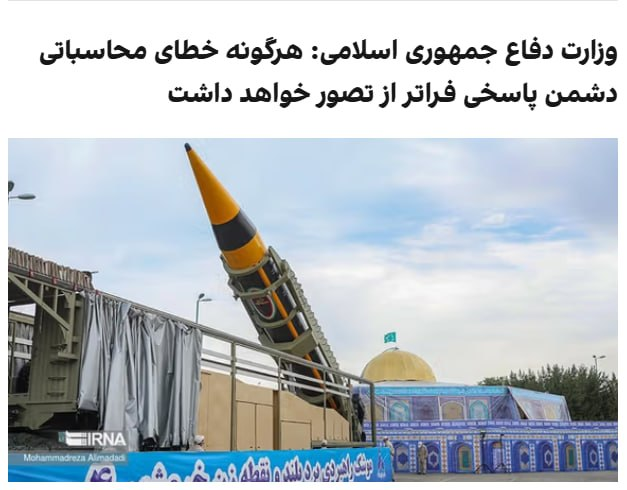

وزارت دفاع جمهوری اسلامی در بیانیه‌ای اعلام کرد «هرگونه خطای محاسباتی یا تعرض به امنیت و تمامیت ارضی کشور با پاسخی قاطع، پشیمان‌کننده و فراتر از تصور غلط دشمنان مواجه خواهد شد.»

در بخشی از این بیانیه آمده است: «بی‌تردید نیروهای مسلح جمهوری اسلامی امروز از آمادگی، توانمندی و قدرت دفاعی قوی‌تر از گذشته برخوردارند.»
@VahidOOnLine

📡 @VahidOnline

## VahidOnline — post 76230

  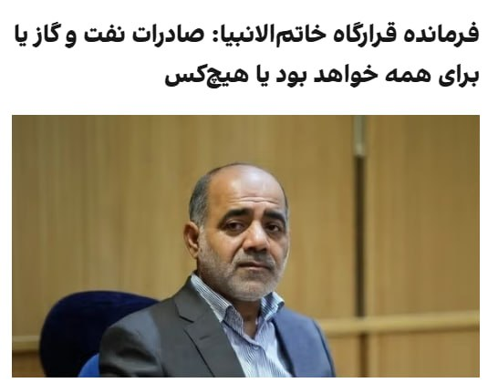

علی عبداللهی، فرمانده قرارگاه مرکزی خاتم‌الانبیا، در خصوص تهدید زیرساخت‌های نفتی ایران از سوی دونالد ترامپ گفت: «یا صادرات نفت و گاز برای همه برقرار خواهد بود یا برای هیچ‌کس امکان‌پذیر نخواهد بود.»

او ادامه داد: «در صورت تکرار حملات آمریکا، پاسخی شدیدتر خواهیم داد و آتش جنگ می‌تواند گسترده‌تر شود.»

فرمانده قرارگاه مرکزی خاتم‌الانبیا اضافه کرد: «تناقض در گفتار و رفتار آمریکا عامل اصلی ناامنی در منطقه است و امنیت تجارت بین‌المللی، به‌ویژه در تنگه هرمز، را به خطر انداخته است.»

او گفت سران آمریکا با «عدم شناخت ملت ایران و نیروهای مسلح» در دور باطل قرار دارند و با جنگ رسانه‌ای نمی‌توانند «شکست‌های پی‌درپی» خود را پنهان کنند.
@VahidOOnLine

📡 @VahidOnline

## kianmeli1 — post 87943

🔴فوری

ترامپ: بمباران امشب را لغو کردم
https://t.me/kianmeli1

## IranIntlTV — post 341762

  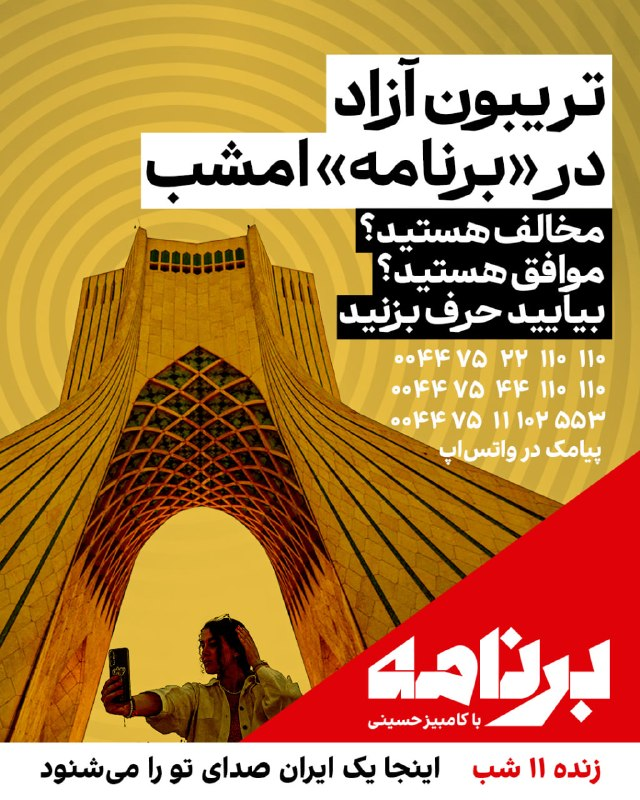

برنامهٔ امشب، «تریبون آزاد» شماست.
اگر فقط یک جمله فرصت داشتید با ایران حرف بزنید، چه می‌گفتید؟
چه چیزی هنوز دلتان را گرم نگه می‌دارد؟
نگرانی‌تان چیست؟
از چه چیزی عصبانی هستید؟
حرفی دارید که در دلتان مانده و جایی برای گفتنش نبوده؟
اگر صدایتان به گوش یک ایران برسد، پیام‌تان چیست؟
از خودتان بگویید؛ از امیدها و ترس‌هایتان،
از رؤیایی که هنوز زنده است یا از چیزی که از دست رفته است.
بیایید روی خط «برنامه» و با ایران حرف بزنید.
اگر در ایران هستید و به اینترنت دسترسی دارید،
مشاهدات‌تان را بگویید، روایت‌تان را ثبت کنید.
تاریخ با صدای شما نوشته می‌شود.
برای شرکت در برنامه، همین حالا در واتس‌اپ پیام بدهید:
۰۰۴۴۷۵۲۲۱۱۰۱۱۰
۰۰۴۴۷۵۴۴۱۱۰۱۱۰
۰۰۴۴۷۵۱۱۱۰۲۵۵۳
«برنامه با کامبیز حسینی»
«یک ایران، صدای شما را می‌شنود»
@iranintltv

## Shin_Persian — post 6960

  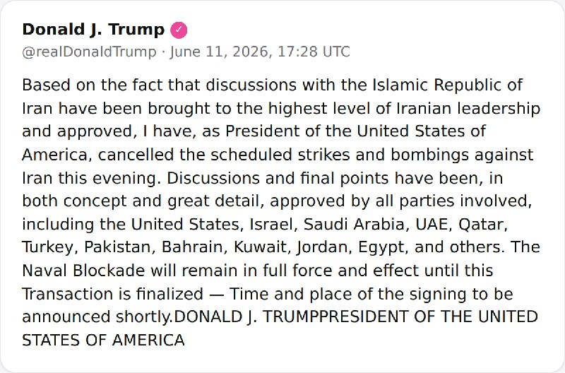

Shin ✓ @hey_itsmyturn Thu, 11 Jun 2026 17:30:15 UTC POTUS: "Based on the fact that discussions with the Islamic Republic of Iran have been brought to the highest level of Iranian leadership and approved, I have, as President of the United States of America…

## Shin_Persian — post 6959

Shin ✓ @hey_itsmyturn
Thu, 11 Jun 2026 17:30:15 UTC

POTUS:
"Based on the fact that discussions with the Islamic Republic of Iran have been brought to the highest level of Iranian leadership and approved, I have, as President of the United States of America, cancelled the scheduled strikes and bombings against Iran this evening. Discussions and final points have been, in both concept and great detail, approved by all parties involved, including the United States, Israel, Saudi Arabia, UAE, Qatar, Turkey, Pakistan, Bahrain, Kuwait, Jordan, Egypt, and others. The Naval Blockade will remain in full force and effect until this Transaction is finalized — Time and place of the signing to be announced shortly.DONALD J. TRUMPPRESIDENT OF THE UNITED STATES OF AMERICA"

ترجمه خودکار فارسی

رئیس‌جمهور ایالات متحده (POTUS):
«بر اساس این واقعیت که گفتگوها با جمهوری اسلامی ایران به بالاترین سطح رهبری ایران رسیده و مورد تایید قرار گرفته است، من به عنوان رئیس‌جمهور ایالات متحده آمریکا، حملات و بمباران‌های برنامه‌ریزی شده علیه ایران در عصر امروز را لغو کردم. گفتگوها و نکات نهایی، هم در مفهوم و هم با جزئیات کامل، توسط تمام طرف‌های درگیر از جمله ایالات متحده، اسرائیل (ارتش دفاعی اسرائیل)، عربستان سعودی، امارات متحده عربی، قطر، ترکیه، پاکستان، بحرین، کویت، اردن، مصر و دیگران تایید شده است. محاصره دریایی تا زمان نهایی شدن این توافق با قوت و اعتبار کامل باقی خواهد ماند — زمان و مکان امضا به زودی اعلام خواهد شد. دونالد جی. ترامپ، رئیس‌جمهور ایالات متحده آمریکا»

𝕏 · @shin_persian

## Iliaen — post 4478

  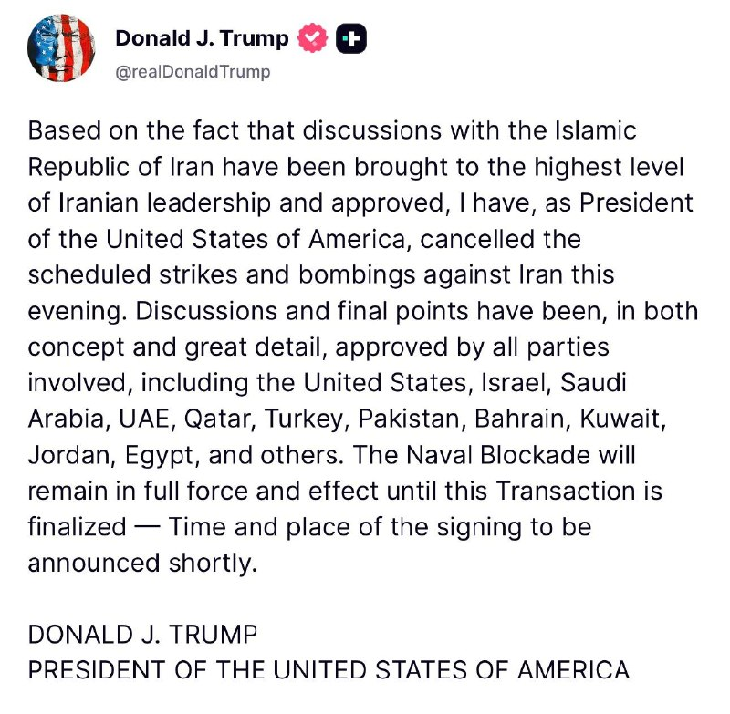

ترامپ می‌گوید دستور لغو حملات امشب را صادر کرد:

با توجه به اینکه مذاکرات با جمهوری اسلامی ایران به بالاترین سطح رهبری ایران رسیده و تأیید شده است، من به عنوان رئیس جمهور ایالات متحده آمریکا، حملات و بمباران‌های برنامه‌ریزی شده علیه ایران را امشب لغو کردم.

مذاکرات و نکات نهایی، هم از نظر مفهومی و هم از نظر جزئیات، توسط همه طرف‌های درگیر، از جمله ایالات متحده، اسرائیل، عربستان سعودی، امارات متحده عربی، قطر، ترکیه، پاکستان، بحرین، کویت، اردن، مصر و دیگران تأیید شده است.

محاصره دریایی تا زمان نهایی شدن این معامله به قوت خود باقی خواهد ماند. زمان و مکان امضا به زودی اعلام خواهد شد.

@iliaen

## Persian_Trend_Official — post 16753

  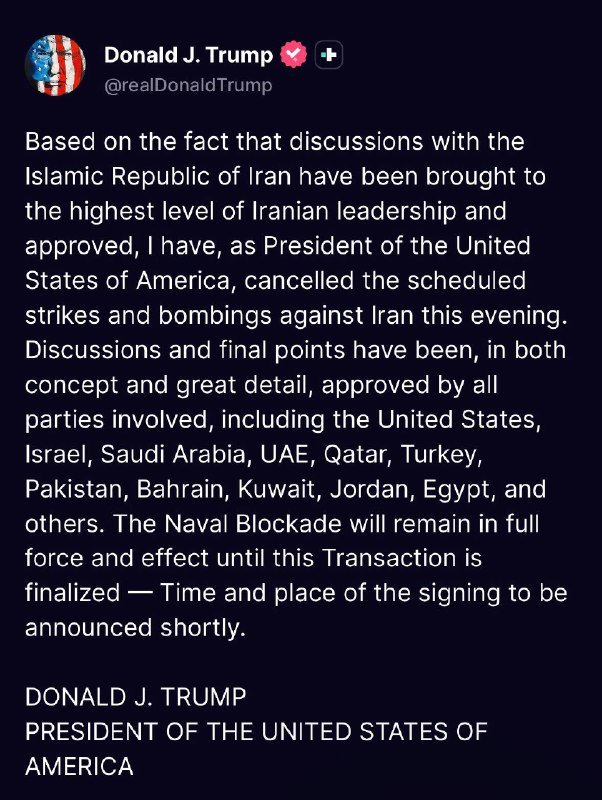

ترامپ: با توجه به اینکه مذاکرات با جمهوری اسلامی ایران به بالاترین سطح رهبری ایران رسیده و تأیید شده است. من به عنوان رئیس جمهور ایالات متحده آمریکا، حملات و بمباران‌های برنامه‌ریزی شده علیه ایران را امشب لغو کردم.

مذاکرات و نکات نهایی، هم از نظر مفهومی و هم از نظر جزئیات، توسط همه طرف‌های درگیر، از جمله ایالات متحده، اسرائیل، عربستان سعودی، امارات متحده عربی، قطر، ترکیه، پاکستان، بحرین، کویت، اردن، مصر و دیگران تأیید شده است.

محاصره دریایی تا زمان نهایی شدن این معامله به قوت خود باقی خواهد ماند، زمان و مکان امضا به زودی اعلام خواهد شد.

📝 Amir

📌 @persian_trend_official
پرشین ترند | متفاوت‌ترین کانال نظامی

## Persian_Trend_Official — post 16752

  <a href="telegram/content/Persian_Trend_Official_16752_1781199230.webm" target="_blank">🎬 Download video</a>

کان نیوز: آمریکا به اسرائیل پیام داد که حملات به ایران فعلاً تنها توسط خود آمریکا انجام شود تا مذاکرات پیشرفت کند.

یک مقام ارشد اسرائیلی گفت: پیام واضحی دریافت کردیم که دخالت نکنیم؛ چراغ قرمز است. آمریکا نمی‌خواهد درگیری گسترش یابد و همچنان امیدوار است با مذاکره ایران را در پرونده هسته‌ای عقب‌نشینی دهد.

ارتش اسرائیل آماده است تا در صورت صدور چراغ سبز توسط آمریکا، عملیات طلوع شیران را مجدداً اجرا کند.

📝 Amir

📌 @persian_trend_official
پرشین ترند | متفاوت‌ترین کانال نظامی

## Persian_Trend_Official — post 16751

  <a href="telegram/content/Persian_Trend_Official_16751_1781199231.mp4" target="_blank">🎬 Download video</a>

ارتش سوریه در حال انتقال تسلیحات زرهی به مرز خود با لبنان در پی افزایش سطح تنش با حزب الله است.

📝 Amir

📌 @persian_trend_official
پرشین ترند | متفاوت‌ترین کانال نظامی

## IranianMinds — post 22324

🔴 فوری ترامپ :

امشب دیگر ایران بمباران نخواهد شد

با توجه به اینکه مذاکرات با جمهوری اسلامی ایران به بالاترین سطح رهبری ایران رسیده و مورد تأیید قرار گرفته، من به‌عنوان رئیس‌جمهور ایالات متحده آمریکا، حملات و بمباران‌های برنامه‌ریزی‌شده علیه ایران را برای امشب لغو کردم.

مذاکرات و نکات نهایی، هم از نظر مفهومی و هم در جزئیات، توسط تمام طرف‌های درگیر از جمله آمریکا، اسرائیل، عربستان سعودی، امارات، قطر، ترکیه، پاکستان، بحرین، کویت، اردن، مصر و دیگران تأیید شده است.

محاصره دریایی همچنان به‌طور کامل برقرار خواهد ماند تا این معامله نهایی شود. زمان و مکان امضای توافق به‌زودی اعلام خواهد شد.

@IranianMinds

## IranianMinds — post 22323

🔴 ترامپ:

ما در واقع برای کردها اسلحه فرستادیم و از کردها بسیار ناامید شدیم. کردها ما را ناامید کردند.

فکر می کنم آنها را برای خود نگه داشته اند. به نظر من این مایه شرمساری است. اما من این را به خاطر خواهم داشت، کردها. من آن را به خاطر خواهم آورد.

@IranianMinds

## IranianMinds — post 22322

  <a href="telegram/content/IranianMinds_22322_1781199232.mp4" target="_blank">🎬 Download video</a>

🔴 نیروهای ارتش اسرائیل در قلب تأسیسات زیر زمینی حزب الله در بوفور جنوب لبنان.

@IranianMinds

## IranianMinds — post 22321

🔴 العربیه به نقل از یک مقام اسرائیلی:

پیام روشنی از سمت آمریکا دریافت کردیم مبنی بر اینکه در حملات علیه جمهوری اسلامی دخالت نکنیم.

@IranianMinds

## IranianMinds — post 22320

🔴 قالیباف رئیس مجلس ایران:

استراتژی های اشتباه و تصمیمات تکانشی کل هیئت مدیره را به حالت بدتر تغییر می دهد، زیرساخت ها و بازارهای انرژی را منفجر می کند و باتلاقی بی پایان ایجاد می کند که سال ها در آن گرفتار خواهید شد.

ایران متفاوتی را خواهید دید.

@IranianMinds

## IranianMinds — post 22319

🟢 خفن‌ ترین و جذابترین بونوس های ویژه #جام_جهانی و بدون قیدو شرط فقط در سایت جهانی رومابت

🇪🇺 https://trentivo6402.bar

## IranianMinds — post 22318

  <a href="telegram/content/IranianMinds_22318_1781199233.webm" target="_blank">🎬 Download video</a>

⭕️ ⚽ مکزیک 🟢 - آفریقای جنوبی

💳 حسابتو برای این بازی در #رومابت با ارز دیجیتال شارژ کن 
🅰️
🅰️
🅰️ شارژ اضافی بگیر ✅

🎁20% بونوس برای شارژ با رمز ارز

💰 10% کش بک روی تیم محبوبت

💰   100% بونوس خوشامدگویی

🎁 20% کش بک بازی های کازینویی و انفجار

🔥   همراه با درگاه‌ #ریالی
#RomaBet

📣‌ #بدون_احراز_هویت

1️⃣
2️⃣
3️⃣
4️⃣   
1️⃣
2️⃣
3️⃣
4️⃣

⛔در صورت فیلتر بودن از طریق VPN غیر از سرور انگلیس ( سرور 
🇺🇸 
🇩🇪 
🇨🇦
🇫🇮
🇹🇷
👇
👇 )

🇪🇺 https://trentivo6402.bar

✅کانال تلگرامی #رومابت 21
👇

🔵 @Romabet_official

## alonews — post 127197

  <a href="telegram/content/alonews_127197_1781199233.webm" target="_blank">🎬 Download video</a>

🔴فوری / ترامپ: حملات امشب رو لغو کردم

🔴با توجه به اینکه مذاکرات با جمهوری اسلامی ایران به بالاترین سطح رهبری ایرانیان برده شده و تایید شده است، من به عنوان رئیس‌جمهور ایالات متحده آمریکا، حملات و بمباران‌های برنامه‌ریزی شده علیه ایران امشب را لغو کردم. مذاکرات و نکات نهایی، هم از نظر مفهوم و هم با جزئیات فراوان، توسط تمام طرف‌های درگیر، از جمله ایالات متحده، اسرائیل، عربستان سعودی، امارات متحده عربی، قطر، ترکیه، پاکستان، بحرین، کویت، اردن، مصر و دیگران، تایید شده است. محاصره دریایی تا زمان نهایی شدن این معامله به طور کامل و با اثر باقی خواهد ماند — زمان و مکان امضا به زودی اعلام خواهد شد.

✅ @AloNews خبر جنگ

## alonews — post 127196

  <a href="telegram/content/alonews_127196_1781199234.webm" target="_blank">🎬 Download video</a>

👈کان: یک کشور منطقه‌ای در طول تشدید تنش‌ها با ایران این هفته و در جریان حملات هوایی نیروی هوایی اسرائیل، مانع استفاده اسرائیل از حریم هوایی خود شد.

🔴این اقدام برای مقامات ارشد اسرائیلی که انتظار همکاری مشابه درگیری‌های قبلی با ایران را داشتند، غافلگیرکننده بود.

✅ @AloNews خبر جنگ

## alonews — post 127195

  <a href="telegram/content/alonews_127195_1781199234.webm" target="_blank">🎬 Download video</a>

👈العربیه به نقل از یک مقام اسرائیلی:
پیام روشنی از سوی آمریکا دریافت کرده‌ایم مبنی بر اینکه در حملات علیه ایران دخالت نکنیم

✅ @AloNews خبر جنگ

## alonews — post 127194

  <a href="telegram/content/alonews_127194_1781199234.mp4" target="_blank">🎬 Download video</a>

👈 ترامپ درباره ایران: اولویت من همیشه تصرف جزیره خارک بوده است. راستش را بخواهید، نمی‌دانم آمریکا توان تحمل آن را دارد یا نه.

✅ @AloNews خبر جنگ

---
📅 بروزرسانی: 1405/03/21 20:53
---

## VahidOOnLine — post 245004

  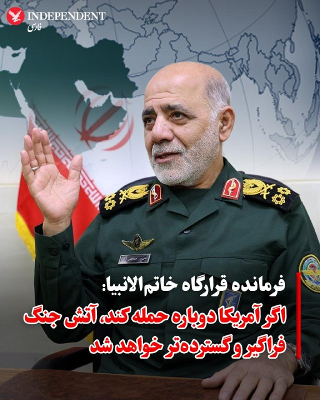

♦️خبرگزاری تسنیم، وابسته به سپاه پاسداران به نقل از علی عبدالهی فرمانده قرارگاه مرکزی خاتم‌الانبیا با انتقاد از سیاست‌های واشنگتن، رفتار آمریکا را متناقض توصیف کرد و گفت که آن‌ها از یک‌سو در بیان حرف از مذاکره می‌زنند و هم‌زمان با انجام شرارت، عامل اصلی ناامنی منطقه و به خطر افتادن امنیت تجارت بین‌المللی در تنگه هرمز است. او افزود سران آمریکا به دلیل شناخت نداشتن از ملت و نیروهای مسلح ایران، دور تسلسل باطلی را طی می‌کنند و با جنگ رسانه‌ای نمی‌توانند شکست‌های خود را پنهان کنند.

این فرمانده سپاه با هشدار قاطع به کاخ سفید تاکید کرد: «چنانچه آمریکا بار دیگر بخواهد حملاتی را علیه ایران انجام دهد، پاسخی شدیدتر از قبل دریافت خواهد کرد و آتش جنگ علاوه بر ناامنی در منطقه، فراگیر و گسترده‌تر خواهد شد.»

او همچنین در واکنش مستقیم به تهدیدهای اخیر دونالد ترامپ علیه زیرساخت‌های انرژی کشور تصریح کرد: «با توجه به تهدیدهای آمریکا علیه زیرساخت‌های نفت ایران، اعلام می‌کنیم که یا صادرات نفت و گاز برای همه است و یا برای هیچ‌کس امکان نخواهد داشت.»
‌🇸🇦 Indypersian

🤖 @VahidOOnLine

## VahidOOnLine — post 245003

  

وزارت دفاع جمهوری اسلامی در بیانیه‌ای اعلام کرد «هرگونه خطای محاسباتی یا تعرض به امنیت و تمامیت ارضی کشور با پاسخی قاطع، پشیمان‌کننده و فراتر از تصور غلط دشمنان مواجه خواهد شد.»

در بخشی از این بیانیه آمده است: «بی‌تردید نیروهای مسلح جمهوری اسلامی امروز از آمادگی، توانمندی و قدرت دفاعی قوی‌تر از گذشته برخوردارند.»
‌🏁 🇬🇧 IranintlTV

🤖 @VahidOOnLine

## DEJradio — post 5595

  <a href="telegram/content/DEJradio_5595_1781198632.webm" target="_blank">🎬 Download video</a>

🔺📢 تبعات سیاست جمهوری اسلامی؛ شبیخون به آشپزخانه

*عطا حسینیان، روزنامه‌نگار اقتصادی

#اقتصاد #تورم
@DEJradio

## VahidOnline — post 76229

  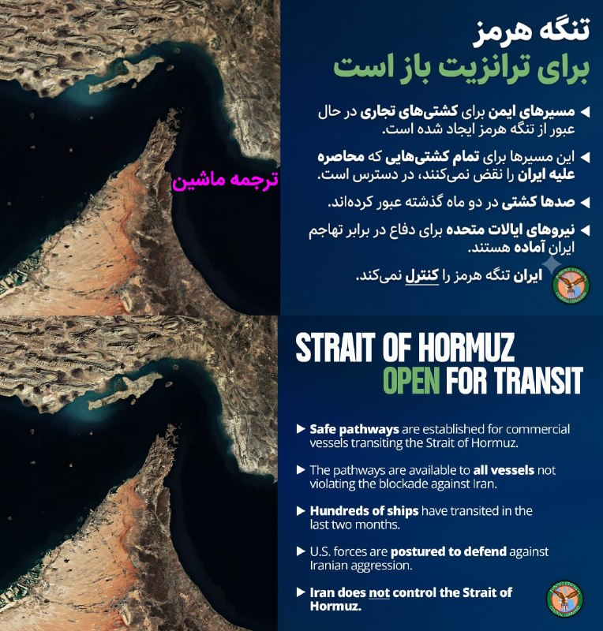

پست سنتکام، ترجمه ماشین:
"تنگه هرمز برای عبور و مرور باز است
مسیرهای امنی برای کشتی‌های تجاری که از تنگه هرمز عبور می‌کنند ایجاد شده است.
این مسیرها برای همه کشتی‌هایی که محاصره علیه ایران را نقض نمی‌کنند، در دسترس است.
صدها کشتی در دو ماه گذشته از این مسیر عبور کرده‌اند.
نیروهای آمریکا برای دفاع در برابر تجاوز ایران در موضع آمادگی قرار دارند.
ایران کنترل تنگه هرمز را در اختیار ندارد."
CENTCOM

📡 @VahidOnline

## IranIntlTV — post 341761

  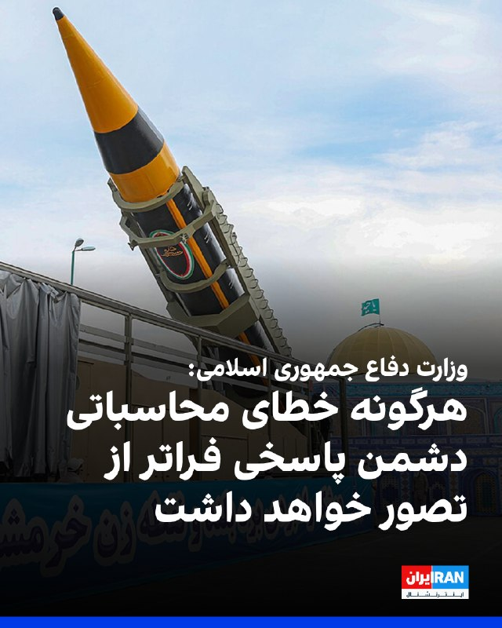

وزارت دفاع جمهوری اسلامی در بیانیه‌ای اعلام کرد «هرگونه خطای محاسباتی یا تعرض به امنیت و تمامیت ارضی کشور با پاسخی قاطع، پشیمان‌کننده و فراتر از تصور غلط دشمنان مواجه خواهد شد.»

در بخشی از این بیانیه آمده است: «بی‌تردید نیروهای مسلح جمهوری اسلامی امروز از آمادگی، توانمندی و قدرت دفاعی قوی‌تر از گذشته برخوردارند.»
https://iranintl.com/202606118239

## FarsiVOA — post 220402

🔺اسرائیل: آینده لبنان متعلق به لبنانی‌ها است، نه جمهوری اسلامی و نیابتی‌هایش

▪️اسرائیل می‌گوید که گروه حزب‌الله آینده لبنان را قربانی اهداف خود کرده است و در خدمت منافع جمهوری اسلامی عمل می‌کند.

⬇️ بیشتر بخوانید:
https://ir.voanews.com/a/israel-persian-says-lebanon-not-belonging-to-iran-hezbollah/8159778.html

## DW_Farsi — post 125830

  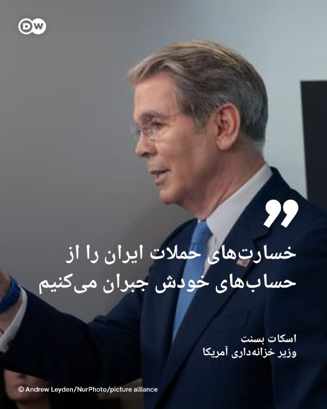

🔶 بسنت: خسارت‌های حملات ایران را از حساب‌های خودش جبران می‌کنیم
 
اسکات بسنت، وزیر خزانه‌داری آمریکا می‌گوید، جمهوری اسلامی در "بازی با حاصل‌جمع‌ صفری" که به راه انداخته است، بازنده خواهد شد.
 
بسنت در پیامی در روز پنج‌شنبه ۲۱ خرداد (۱۱ ژوئن) در شبکه ایکس نوشت: «هرگونه خسارتی که [حکومت ایران] به متحدان ما در خلیح فارس وارد کند، از محل مبالغ برداشت‌شده از حساب‌های ایران پرداخت خواهد شد.»
 
به گفته او، هرگونه عوارضی که به "سازمان تنگه خلیج فارس" پرداخت شود نیز با برداشت از حساب‌های آن‌ها جبران می‌شود.
 
وزیر خزانه‌داری آمریکا افزود، هر حمله‌ای که ایران آغاز کند، تنها باعث خواهد شد که پیامدهای اقتصادی و مالی که با آن مواجه است عمیق‌تر شود.
 
سخنان اسکات بسنت با استقبال مایک هاکبی، سفیر آمریکا در اسرائيل روبرو شده است.
 
هاکبی در شبکه ایکس با بازنشر پیام بسنت نوشت، واقعا به وزیر خزانه‌داری آمریکا به دلیل این طرح "فوق‌العاده" که ایران را مجبور می‌کند تا بخشی از زیان‌هایی که در این جنگ به بار آورده را خود پرداخت کند "افتخار" می‌کند.
@dw_farsi

## Persian_Trend_Official — post 16750

شبکه 13 اسرائیل: نتانیاهو برای رایزنی با کابینه‌ امنیتی، در سایه تشدید تنش‌های میان آمریکا و ایران، تشکیل جلسه داد.

📝 Amir

📌 @persian_trend_official
پرشین ترند | متفاوت‌ترین کانال نظامی

## BBCPersian — post 283464

رئیس جمهوری آمریکا در پستی در شبکه اجتماعی تروث سوشیال نوشته ارتش این کشور امشب، سهمگین‌تر به ایران حمله خواهد کرد. دونالد ترامپ همچنین از برنامه تصرف جزیره خارک و تصاحب منابع نفت و گاز ایران در آینده نزدیک هم خبر داده.

 او اما چند ساعت بعد در گفتگو با فاکس درباره عملی شدن چنین اقدامی ابراز تردید کرد و گفت که مطمئن نیست آمریکا «آمادگی» یا «اشتها»ی ورود به چنین عملیات نظامی را داشته باشد. 

گفتگو با آیدین اخوان، تحلیلگر روابط بین‌الملل

## alonews — post 127193

  <a href="telegram/content/alonews_127193_1781198634.webm" target="_blank">🎬 Download video</a>

👈روزنامه هاآرتص به نقل از منابع آگاه نوشت: ارتش اسرائیل برای اولین بار از زمان امضای توافق اسلو، در حال تأسیس یک پایگاه نظامی دائمی در شهر جنین است.

✅ @AloNews خبر جنگ

---
📅 بروزرسانی: 1405/03/21 20:43
---

## VahidOOnLine — post 245002

  

علی عبداللهی، فرمانده قرارگاه مرکزی خاتم‌الانبیا، در خصوص تهدید زیرساخت‌های نفتی ایران از سوی دونالد ترامپ گفت: «یا صادرات نفت و گاز برای همه برقرار خواهد بود یا برای هیچ‌کس امکان‌پذیر نخواهد بود.»

او ادامه داد: «در صورت تکرار حملات آمریکا، پاسخی شدیدتر خواهیم داد و آتش جنگ می‌تواند گسترده‌تر شود.»

فرمانده قرارگاه مرکزی خاتم‌الانبیا اضافه کرد: «تناقض در گفتار و رفتار آمریکا عامل اصلی ناامنی در منطقه است و امنیت تجارت بین‌المللی، به‌ویژه در تنگه هرمز، را به خطر انداخته است.»

او گفت سران آمریکا با «عدم شناخت ملت ایران و نیروهای مسلح» در دور باطل قرار دارند و با جنگ رسانه‌ای نمی‌توانند «شکست‌های پی‌درپی» خود را پنهان کنند.
‌🏁 🇬🇧 IranintlTV

🤖 @VahidOOnLine

## WithYashar — post 14535

شبکه ۱۳ اسرائیل : نتانیاهو یه جلسه امنیتی فوری با مقاماتش برگزار می‌کنه
@withyashar

## mwarmonitor — post 10729

  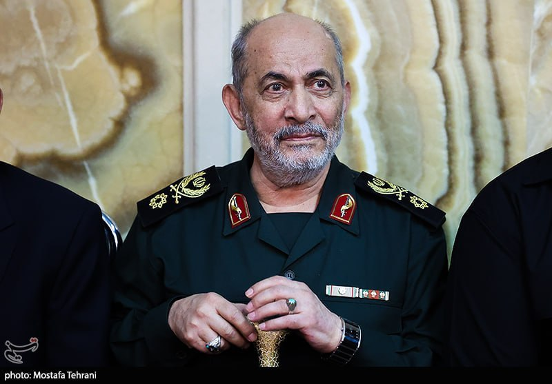

ساعت دست رفیق‌دوست مدل Rado Integral ؟

## pm_afshaa — post 93639

  <a href="telegram/content/pm_afshaa_93639_1781198018.webm" target="_blank">🎬 Download video</a>

🔴شبکه 13 اسرائیل: نتانیاهو یه جلسه امنیتی فوری با مقاماتش برگزار میکنه.

💧 Rainbet.com the #1 Non-KYC Crypto Casino & Sportsbook @rainbetcom

😁 @Pm_Afshaa

## kianmeli1 — post 87942

🔴قرارگاه خاتم

حمله جدید به ایران به معنای جنگ فراتر از منطقه ای خواهد بود
https://t.me/kianmeli1

## kianmeli1 — post 87941

  <a href="telegram/content/kianmeli1_87941_1781198019.mp4" target="_blank">🎬 Download video</a>

🔴ترامپ به فاکس نیوز:

«این می‌تواند بزرگ‌ترین معامله در تاریخ باشد.

آنها می‌توانند پرچم سفید تسلیم را بالا ببرند و بگویند «الحمدلله»، و رسانه‌های جعلی خواهند گفت که این یک پیروزی بزرگ برای ایران بود.

این دیوانه‌کننده‌ترین چیزی است که دیده‌ام. ما آنها را نابود می‌کنیم.»
https://t.me/kianmeli1

## IranIntlTV — post 341760

  <a href="telegram/content/IranIntlTV_341760_1781198021.mp4" target="_blank">🎬 Download video</a>

۲۲ کشور، از جمله ایالات متحده، بریتانیا، آلمان و فرانسه، در بیانیه‌ای مشترک خواستار توقف اقدامات مرگبار جمهوری اسلامی در خاک کشورهای خود شدند. در این بیانیه، طرح‌ها و اقدامات سازمان اطلاعات سپاه، نیروی قدس و وزارت اطلاعات علیه ایرانیان مخالف حکومت، روزنامه‌نگاران و جوامع و منافع یهودی به‌شدت محکوم شده است.

گزارش مرضیه حسینی، خبرنگار ایران‌اینترنشنال
@iranintltv

## IranIntlTV — post 341759

  <a href="telegram/content/IranIntlTV_341759_1781198022.mp4" target="_blank">🎬 Download video</a>

وزیر خزانه‌داری آمریکا گفت ایران با مسیری که انتخاب کرده، در نهایت بازنده خواهد بود. اسکات بسنت هشدار داد هرگونه خسارت به متحدان آمریکا در خلیج فارس و هرگونه عوارض پرداختی بابت تردد از تنگه هرمز از دارایی‌های ایران جبران خواهد شد.

گزارش اردوان روزبه، خبرنگار ایران‌اینترنشنال
@iranintltv

## IranIntlTV — post 341758

  <a href="telegram/content/IranIntlTV_341758_1781198023.mp4" target="_blank">🎬 Download video</a>

🔻سکوت اعضای تیم ملی فوتبال در برابر جنایات جمهوری اسلامی در دی‌ماه سال گذشته، این تیم را در پایین‌ترین سطح از محبوبیت در بین مردم قرار داده اما گروهی نیز اعتقاد دارند نتایج این تیم در تاریخ صرف‌نظر از مواضع اعضای آن، با نام ایران گره خواهد خورد. این دوگانگی حتی بازتاب‌هایی در رسانه‌های نیوزیلند داشته است.

🔹توضیحات رها پوربخش در هت‌تریک

@iranintltvsport

## IranIntlTV — post 341757

  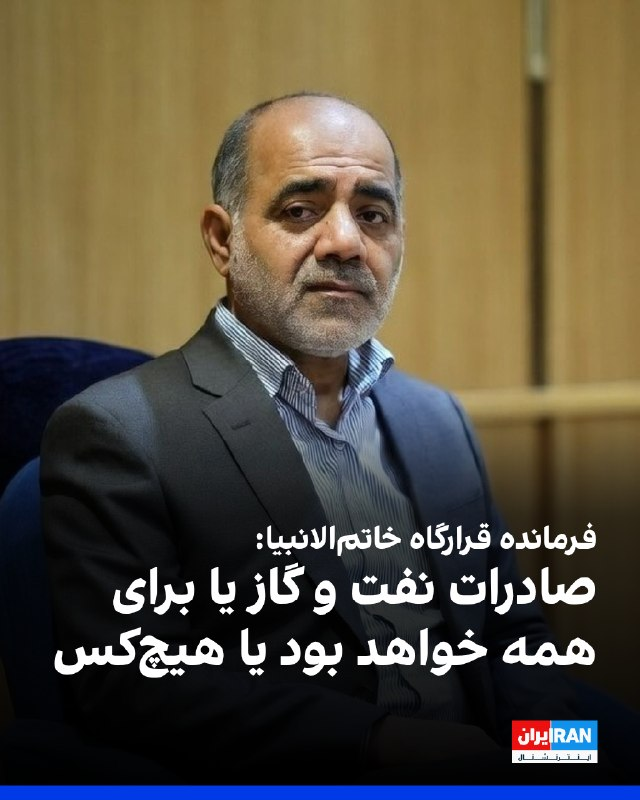

علی عبداللهی، فرمانده قرارگاه مرکزی خاتم‌الانبیا، در خصوص تهدید زیرساخت‌های نفتی ایران از سوی دونالد ترامپ گفت: «یا صادرات نفت و گاز برای همه برقرار خواهد بود یا برای هیچ‌کس امکان‌پذیر نخواهد بود.»

او ادامه داد: «در صورت تکرار حملات آمریکا، پاسخی شدیدتر خواهیم داد و آتش جنگ می‌تواند گسترده‌تر شود.»

فرمانده قرارگاه مرکزی خاتم‌الانبیا اضافه کرد: «تناقض در گفتار و رفتار آمریکا عامل اصلی ناامنی در منطقه است و امنیت تجارت بین‌المللی، به‌ویژه در تنگه هرمز، را به خطر انداخته است.»

او گفت سران آمریکا با «عدم شناخت ملت ایران و نیروهای مسلح» در دور باطل قرار دارند و با جنگ رسانه‌ای نمی‌توانند «شکست‌های پی‌درپی» خود را پنهان کنند.
https://iranintl.com/202606118048

## FarsiVOA — post 220401

🔺بسنت: غرامت آسیب‌های وارده به متحدان آمریکا از محل «حساب‌های» رژیم پرداخت خواهد شد

▪️مسابقات جام جهانی فیفا ۲۰۲۶ روز پنجشنبه ۲۱ خرداد، با مراسم افتتاحیه‌ای باشکوه آغاز می‌شود و پس از آن اولین دیدار این رقابت‌ها بین مکزیک، یکی از کشورهای میزبان، و آفریقای جنوبی برگزار می‌شود.

⬇️ بیشتر بخوانید:

https://ir.voanews.com/a/opening-of-the-world-cup-fifa-mexico-city-usa/8159744.html

## Persian_Trend_Official — post 16749

  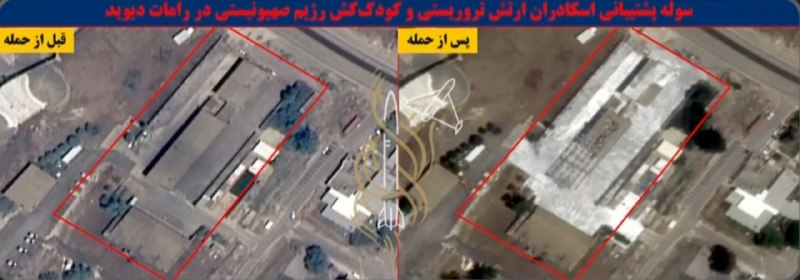

رادیو ارتش اسرائیل: نیروی هوایی اسرائیل هنوز در حال بررسی دقیق این است که دقیقاً چه چیزی به پایگاه رامات دیوید برخورد کرده است، اگرچه ارزیابی‌های اولیه نشان می‌دهد که احتمالاً یک قطعه رهگیری شده بوده است. این برخورد در یک منطقه غیر عملیاتی پایگاه که برای…

## BBCPersian — post 283463

  <a href="telegram/content/BBCPersian_283463_1781198026.mp4" target="_blank">🎬 Download video</a>

داور جام جهانی فوتبال از سومالی که از ورود به ایالات متحده منع شده بود، به موگادیشو بازگشت و مورد استقبال مردم و مقام‌های رسمی قرار گرفت.
عمر ارتان که قرار بود نخستین سومالیایی باشد که در مرحله نهایی جام جهانی قضاوت می‌کند، روز دوشنبه (۸ ژوئن) با وجود داشتن گذرنامه دیپلماتیک و ویزای یک‌بار ورود، در فرودگاه بین‌المللی میامی از ورود به آمریکا منع شد و از فهرست داوران کنار گذاشته شد.
مقام‌های مهاجرتی ایالات متحده دلیلی برای بازگرداندن آقای آرتان اعلام نکرده‌اند، اما سومالی یکی از چند کشوری است که در فهرست ممنوعیت سفر دولت دونالد ترامپ قرار دارد.
ارتان گفت که در بدو ورود به آمریکا ۱۱ ساعت مورد «مصاحبه مهاجرتی» قرار گرفته و چندین ساعت در بازداشت بوده است.
فدراسیون جهانی فوتبال (فیفا) پس از گفت‌وگو با مقام‌های آمریکا اعلام کرد که ارتان این رقابت‌ها را از دست خواهد داد.

@BBCPersian
https://bbc.in/4e2JNX8

## BBCPersian — post 283462

  <a href="telegram/content/BBCPersian_283462_1781198027.mp4" target="_blank">🎬 Download video</a>

⚽️کارلیسا پردومو، معلمی در لس‌آنجلس، عاشق پروپاقرص فوتبال است؛ عشقی که از جام جهانی ۱۹۹۴ و ظهور یک ستاره جهانی مثل دیوید بکام شکل گرفته است.

او می‌گوید بکام باعث شد لیگ برتر آمریکا بیشتر دیده شود و تیم محبوبش، ال‌ای گلکسی، رنگ‌و‌بوی جهانی بگیرد.
@bbcpersian

## BBCPersian — post 283461

  <a href="https://t.me/bbcpersian/283461" target="_blank">📎 Download file</a>

پادکست برنامه جام جهان‌نما، پنج‌شنبه ۲۱ خرداد ۱۴۰۵

این برنامه رادیویی را می‌توانید هر شب ساعت ۲۰ به وقت ایران، روی موج متوسط ۷۰۲ کیلوهرتز و موج کوتاه ۹۴۶۵ کیلوهرتز بشنوید.

تکرار برنامه را هم می‌توانید ساعت ۲۱:۳۰ روی موج متوسط ۷۰۲ کیلوهرتز و موج کوتاه ۵۳۹۵ کیلوهرتز گوش کنید.

@BBCPersian

## alonews — post 127192

  <a href="telegram/content/alonews_127192_1781198030.mp4" target="_blank">🎬 Download video</a>

🔴فوری / انتقال تعداد زیادی از ادوات زرهی توسط ارتش سوریه به مرز لبنان!

✅ @AloNews خبر جنگ

## alonews — post 127191

  <a href="telegram/content/alonews_127191_1781198031.webm" target="_blank">🎬 Download video</a>

👈شبکه ۱۳ اسرائیل : نتانیاهو یه جلسه امنیتی فوری با مقاماتش برگزار می‌کنه

✅ @AloNews خبر جنگ

---
📅 بروزرسانی: 1405/03/21 20:34
---

## VahidOOnLine — post 245001

  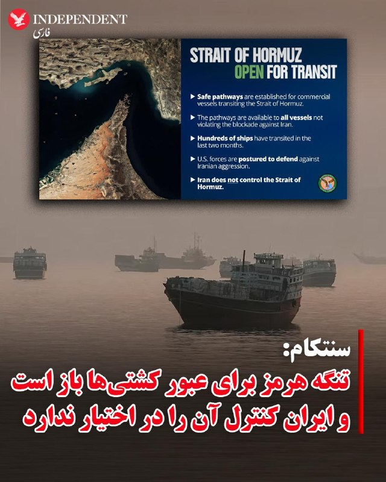

♦️ستاد فرماندهی مرکزی ایالات متحده (سنتکام) روز پنجشنبه ۲۱ خرداد با انتشار یک بیانیه تصویری اعلام کرد تنگه هرمز برای عبور و مرور کشتی‌های تجاری باز است و مسیرهای امنی برای تردد شناورها در این آبراه راهبردی ایجاد شده است.
سنتکام در این بیانیه تاکید کرد این مسیرها در اختیار همه کشتی‌هایی قرار دارد که تحریم‌ها و محاصره اعمال‌شده علیه ایران را نقض نکنند.
بر اساس این بیانیه، طی دو ماه گذشته صدها کشتی از تنگه هرمز عبور کرده‌اند. فرماندهی مرکزی آمریکا همچنین اعلام کرد نیروهای این کشور برای مقابله با «تجاوزگری ایران» در وضعیت آماده‌باش قرار دارند.
سنتکام در بخش دیگری از این بیانیه تصریح کرد که ایران کنترل تنگه هرمز را در اختیار ندارد.
خبرگزاری صداوسیما صبح پنجشنبه و پس از آنکه قرارگاه خاتم‌الانبیا (ستاد فرماندهی جنگ جمهوری اسلامی) اعلام کرد تنگه هرمز بسته شده است، مدعی شد هیچ کشتی از این آبراه تردد نمی‌کند.
‌🇸🇦 Indypersian

🤖 @VahidOOnLine

## VahidOOnLine — post 245000

  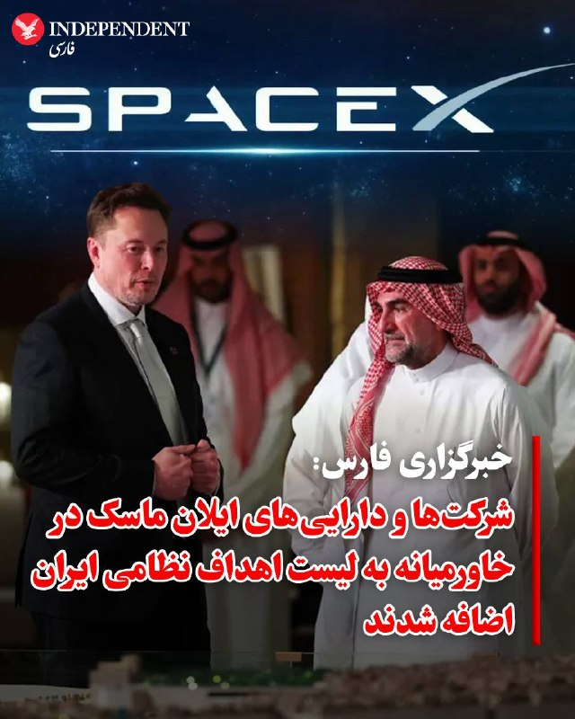

♦️به گزارش خبرگزاری فارس، نزدیک به سپاه پاسداران، شرکت‌ها و دارایی‌های ایلان ماسک در منطقه خاورمیانه به لیست اهداف نظامی جمهوری اسلامی ایران اضافه شده است. این خبرگزاری مدعی شد که تصمیم مذکور در پی به دست آمدن شواهدی مبنی بر استفاده ارتش‌های آمریکا و اسرائیل از زیرساخت‌های تحت مدیریت ایلان ماسک، از جمله اینترنت ماهواره‌ای «استارلینک»، اتخاذ شده است.

فارس در گزارش خود نوشت: «ایستگاه‌های زمینی استارلینک واقع در اراضی اشغالی [اسرائیل]، قطر، اردن، امارات و عمان، به همراه سهام‌داران اسپیس‌وکس و همچنین زیرساخت‌های دو شرکت الفیظابی و مبادله، از جمله مکان‌های جدید در لیست اهداف ایران هستند.»

اگرچه سپاه پاسداران و مقامات رسمی جمهوری اسلامی هنوز این گزارش را تایید یا تکذیب نکرده‌اند، اما رسانه‌های جمهوری اسلامی در روزهای گذشته گزارش روزنامه «وال‌استریت ژورنال» درباره اسپیس‌ایکس را به طور گسترده بازنشر کردند که به نظر می‌رسد مبنای ادعای خبرگزاری فارس بوده است.
‌🇸🇦 Indypersian

🤖 @VahidOOnLine

## mwarmonitor — post 10728

  <a href="telegram/content/mwarmonitor_10728_1781197469.mp4" target="_blank">🎬 Download video</a>

📝 کمدیِ سیاه و تهوع‌آورِ این روزها دیدنی است؛ کار به جایی رسیده که برای لاشه منجمد شده و رو به متلاشی آن دجال، تمام دغدغه‌شان این شده که نکند موتور آن یخچالِ قراضه بسوزد، برق قطع شود و با تلی از کپک و گوشتِ گندیده روبه‌رو شوند... زودتر مراسم برگزار کنیم! مضحک‌تر از همه، لکنتِ زبانِ این پادوی بخت‌برگشته است که با وقاحتِ تمام، خوابِ یک سیرکِ بزرگ را می‌بیند. او مدعی است که برای تشییع این کفتارِ بوگرفته، قرار است کل بدنه مفلوکِ نیروهای مسلح، کارمندانِ فلک‌زده و اجباریِ ادارات، گله‌ی ساندیس‌خورهای گوش‌به‌فرمان، و حتی مواجب‌بگیرانِ عاریتیِ حشدالشعبی، فاطمیون و زینبیون را به خط کنند. این ارتشِ پوشالی قرار است گِردِ تابوتِ یک شیطانِ متعفن، شیونِ فرمایشی سر دهند؛ نمایشی مشمئزکننده برای پنهان کردنِ این حقیقت که بوی تعفنِ این پیرمرد و کل نظامش، خیلی وقت است که از درزهای آن یخچال نشت کرده و تمام کشور را برداشته است.

@mwarmonitor

## pm_afshaa — post 93638

  <a href="telegram/content/pm_afshaa_93638_1781197472.webm" target="_blank">🎬 Download video</a>

🔴معاون امنیتی وزیر کشور:
مراسم تشییع علی خامنه‌ای در خارج از کشور برگزار نخواهد شد. هر زمانی که بیت خامنه‌ای مصلحت بدونه، مراسم در داخل برگزار میشه.

💧 Rainbet.com the #1 Non-KYC Crypto Casino & Sportsbook @rainbetcom

😁 @Pm_Afshaa

## VahidOnline — post 76228

  <a href="telegram/content/VahidOnline_76228_1781197472.mp4" target="_blank">🎬 Download video</a>

ترامپ: ما هواپیماها را وسط تهران به پرواز درمی‌آوریم و آن‌ها حتی خبر ندارند. تمام رادارها و پدافندهایشان نابوده شده. آنها تمام شده‌اند... برایشان سخت است چون مغرور هستند. ۴۷ سال قلدر خاورمیانه بوده‌اند...

ویدیوهایی است از این مصاحبه فاکس‌نیوز با ترجمه و زیرنویس هوش مصنوعی

📡 @VahidOnline

## IranIntlTV — post 341756

  <a href="telegram/content/IranIntlTV_341756_1781197473.mp4" target="_blank">🎬 Download video</a>

🔻یک هوادار ایرانی فوتبال ساکن کالیفرنیا در گفت‌وگو با رضا محدث، خبرنگار ایران اینترنشنال، توضیح می‌دهد که چرا با وجود میزبانی آمریکا از جام جهانی، ترجیح داده تا همزمان با برگزاری مسابقات جام جهانی در مکزیک، به مکزیکوسیتی سفر کرده و بازی‌های فوتبال را در مکزیک تماشا کند.

@iranintltvsport

## FarsiVOA — post 220400

  <a href="telegram/content/FarsiVOA_220400_1781197475.mp4" target="_blank">🎬 Download video</a>

توماج صالحی، خواننده معترض، در پستی تازه با حمله به زیرساخت‌های ایران مخالفت کرد و نوشت: تشدید مشکلات معیشتی مردم برای دستیابی به اهداف سیاسی «نه شرافتمندانه است و نه انسانی.»

او همچنین نوشت «فرضِ اینکه ما نه از روی آگاهی و اراده بلکه فقط در نتیجه‌ی فلاکت و ویرانی دست به تغییر خواهیم زد» توهین‌آمیز است.

@FarsiVOA

## FarsiVOA — post 220399

🔺بسنت: غرامت آسیب‌های وارده به متحدان آمریکا از محل «حساب‌های» رژیم پرداخت خواهد شد

◾️وزیر خزانه‌داری آمریکا با هشدار درباره تبعات رفتارهای مخرب رژیم ایران در منطقه، تاکید کرد که در نهایت جمهوری اسلامی بازنده خواهد بود.

⬇️ بیشتر بخوانید:

https://ir.voanews.com/a/iran-bessent-treasury-persian-gulf-strike/8159745.html

## Persian_Trend_Official — post 16748

فرمانده قرارگاه مرکزی حضرت خاتم الانبیا: آمریکا از یک سو حرف از توافق و مذاکره می زند و از سوی دیگر شرارت می کند و این تناقض آشکار در رفتار و گفتار آمریکا عامل اصلی ناامنی در منطقه است و به همین دلیل امنیت تجارت و اقتصاد بین المللی و کشورها، بویژه تنگه هرمز را به خطر انداخته است.

سران آمریکا به دلیل عدم شناخت درست از ملت شرافتمند و شجاع ایران و نیروهای مسلح مقتدر آن دور تسلسل باطلی را طی می کنند و دروغ های مکرر آمریکا یکی از نشانه های آن است.

آنها با تبلیغات و جنگ رسانه ای هرگز نمی توانند حقارت و شکست های پی در پی خود در جنگ با ایران اسلامی را جبران و یا جنگ افروزی خود را پنهان نمایند.

هشدار می دهیم چنانچه آمریکا بار دیگر بخواهد حملاتی را علیه ایران قهرمان انجام دهد، پاسخی شدیدتر از قبل دریافت خواهد کرد و آتش جنگ علاوه بر ناامنی در منطقه، فراگیر و گسترده تر خواهد شد.

با توجه به تهدیدهای اخیر آمریکا علیه زیرساخت های نفت ایران، اعلام می گردد یا صادرات نفت و گاز برای همه است و یا برای هیچ کس امکان نخواهد داشت.

📝 Amir

📌 @persian_trend_official
پرشین ترند | متفاوت‌ترین کانال نظامی

## RadioFarda — post 158193

  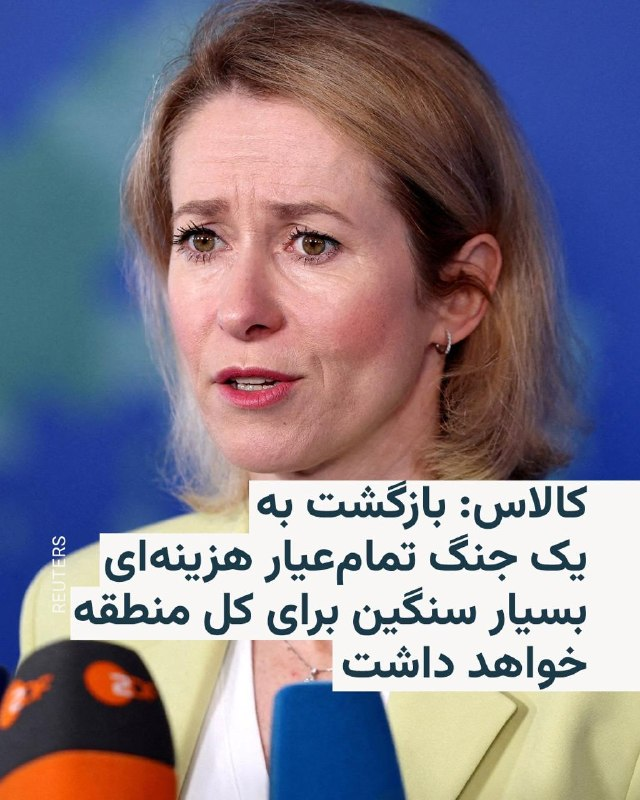

🔸مسئول سیاست خارجی اتحادیه اروپا روز پنج‌شنبه ۲۱ خرداد گفت که درباره تشدید اخیر درگیری در تنگهٔ هرمز با عباس عراقچی، وزیر خارجه ایران، گفت‌وگو کرده و بار دیگر بر ضرورت یافتن راه‌حلی دیپلماتیک برای این بحران تأکید کرده است.

🔸کایا کالاس در شبکه ایکس نوشت: «با عباس عراقچی، وزیر خارجه ایران، درباره آخرین تحولات در خلیج فارس و وضعیت مذاکرات با آمریکا گفت‌وگو کردم. همچنین با شیخ جراح جابر الاحمد الصباح، وزیر خارجه کویت، در تماس بوده‌ام.

🔸ازسرگیری حملات به کشورهای خلیج فارس و زیرساخت‌های حیاتی آن‌ها غیرقابل قبول است».

🔸او افزود: «بازگشت به یک جنگ تمام‌عیار هزینه‌ای بسیار سنگین برای کل منطقه خواهد داشت. مسیر دیپلماتیک همچنان بهترین راه برای خروج از این جنگ است».

@RadioFarda

## alonews — post 127190

  <a href="telegram/content/alonews_127190_1781197477.webm" target="_blank">🎬 Download video</a>

👈وزیر جنگ آمریکا: برای دولت کوبا عاقلانه نخواهد بود که تلاش کند به انواع تسلیحاتی دست یابد که توانایی هدف قرار دادن این پایگاه یا خاک اصلی آمریکا را داشته باشند

🔴آن‌ها در این صورت وارد تقابلی خواهند شد که نه خواهان آن هستند و نه توان تحملش را دارند.

🔴هیچ کشوری در جهان نمی‌تواند با توانایی‌های ایالات متحده آمریکا برابری کند

✅ @AloNews خبر جنگ

## alonews — post 127189

  <a href="telegram/content/alonews_127189_1781197478.webm" target="_blank">🎬 Download video</a>

👈لحظاتی پیش یک قایق ماهیگیری در سیریک هدف یک پهپاد قرار گرفت

🔴مصدومان به بیمارستان منتقل شدند

✅ @AloNews خبر جنگ

---
📅 بروزرسانی: 1405/03/21 20:23
---

## VahidOOnLine — post 244999

  

کاظم غریب‌آبادی، معاون وزارت خارجه جمهوری اسلامی، در واکنش به بیانیه ۲۲ کشور درباره «اقدامات تروریستی» جمهوری اسلامی در شبکه اجتماعی ایکس نوشت: «این بیانیه، مجموعه‌ای از اتهامات سیاسی، بی‌سند و کاملا مردود است.»

او افزود: «هر اقدام خصمانه، هر اتهام‌سازی بی‌سند و هر مشارکت در پروژه فشار علیه جمهوری اسلامی، با پاسخ حقوقی، سیاسی و مقتدرانه و همچنین اقدام متقابل و متناسب آن مواجه خواهد شد.»
‌🏁 🇬🇧 IranintlTV

🤖 @VahidOOnLine

## VahidOOnLine — post 244998

  <a href="telegram/content/VahidOOnLine_244998_1781196806.mp4" target="_blank">🎬 Download video</a>

♦️همزمان با افتتاح جدیدترین و بلندترین برج کلیسای مشهور «ساگرادا فامیلیا» در بارسلونا، آسمان این شهر شامگاه چهارشنبه بیستم خرداد ماه، میزبان جشنی کم‌سابقه با نمایش پهپادها، نورپردازی‌های گسترده و آتش‌بازی بود. بیش از ۱۲۰ هزار نفر از شهروندان و گردشگران در اطراف این بنای نمادین گرد آمدند تا تکمیل برج «عیسی مسیح» را که ساگرادا فامیلیا را به بلندترین کلیسای جهان تبدیل کرده است، جشن بگیرند.
این مراسم به ریاست پاپ لئو چهاردهم و همزمان با صدمین سالگرد درگذشت آنتونی گائودی، معمار برجسته اسپانیایی و طراحی این بنای منحصر به فرد، برگزار شد. پاپ در مراسم عشای ربانی که در فضای داخلی کلیسا برگزار شد، ساگرادا فامیلیا را «شاهکاری معماری» توصیف کرد و سپس صلیب سرامیکی پنج‌طبقه و نورانی نصب‌شده بر فراز مناره جدید را متبرک کرد. پادشاه فیلیپ ششم اسپانیا و همسرش ملکه لیتزیا به همراه پدرو سانچز، نخست‌وزیر این کشور از مهمانان این مراسم بودند.
برج «عیسی مسیح» با ارتفاع ۱۷۲.۵ متر اکنون شاخص‌ترین عنصر در خط افق بارسلونا به شمار می‌رود.
با وجود تکمیل مهم‌ترین برج این مجموعه، ساخت ساگرادا فامیلیا هنوز به پایان نرسیده و بر اساس برنامه‌های اعلام‌شده، کار بر روی بخش‌های تزئینی و برخی سازه‌های جانبی آن در سال‌های آینده ادامه خواهد یافت.
‌🇸🇦 Indypersian

🤖 @VahidOOnLine

## VahidOOnLine — post 244997

  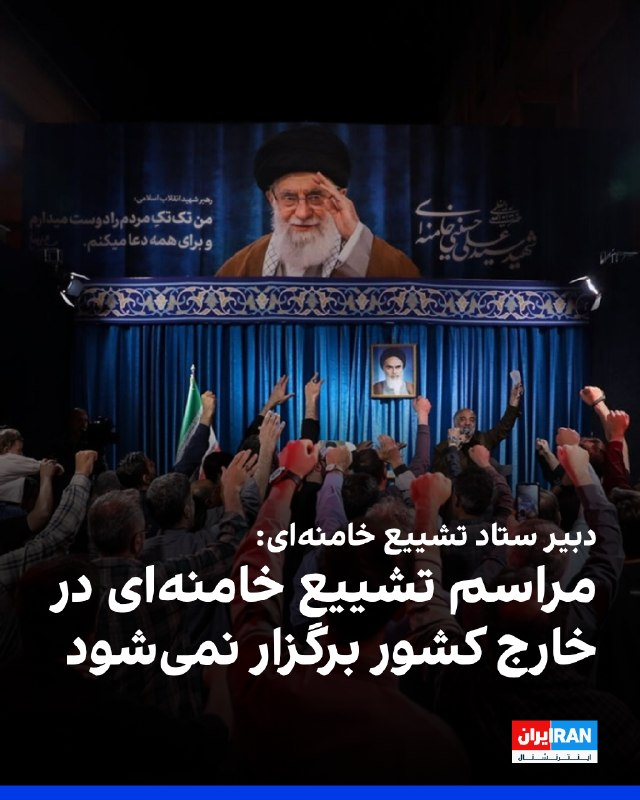

دبیر ستاد تشییع علی خامنه‌ای، رهبر کشته‌شده جمهوری اسلامی گفت که هیچ برنامه‌ای برای برگزاری مراسم تشییع در خارج از کشور وجود ندارد و تمامی تمهیدات در داخل کشور در حال برنامه‌ریزی است.

او افزود دولت با همه امکانات و توان و با محوریت محمدرضا عارف، مراسم تشییع را برنامه‌ریزی کرده است و هر زمان که «بیت» خامنه‌ای مصلحت بدانند، برگزار خواهد شد.

تاکنون مقام‌های جمهوری اسلامی اظهارات ضد و نقیض فراوانی در خصوص زمان برگزاری این مراسم عنوان کرده‌اند.
‌🏁 🇬🇧 IranintlTV

🤖 @VahidOOnLine

## IranIntlTV — post 341755

  <a href="telegram/content/IranIntlTV_341755_1781196809.mp4" target="_blank">🎬 Download video</a>

🔻تیم ملی فوتبال در حالی در آخرین مسابقه خود پیش از آغاز جام جهانی، برابر تیم جوانان تیخوانا با سه گل پیروز شد که قلعه‌نویی در دقایقی از این مسابقه برای شبیه‌سازی بازی با یک بازیکن اخراجی، یکی از بازیکنان تیم خود را از ترکیب خارج کرد تا ده نفره به مسابقه ادامه دهند.

🔹توضیحات علیرضا مدیری، خبرنگار ایران اینترنشنال

@iranintltvsport

## IranIntlTV — post 341754

  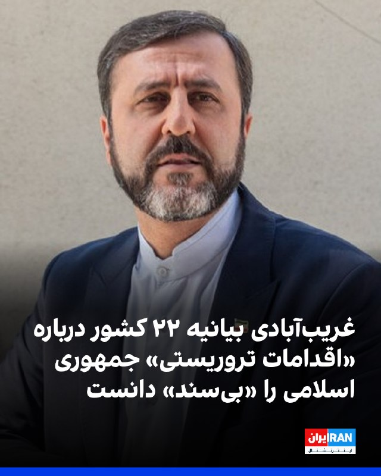

کاظم غریب‌آبادی، معاون وزارت خارجه جمهوری اسلامی، در واکنش به بیانیه ۲۲ کشور درباره «اقدامات تروریستی» جمهوری اسلامی در شبکه اجتماعی ایکس نوشت: «این بیانیه، مجموعه‌ای از اتهامات سیاسی، بی‌سند و کاملا مردود است.»

او افزود: «هر اقدام خصمانه، هر اتهام‌سازی بی‌سند و هر مشارکت در پروژه فشار علیه جمهوری اسلامی، با پاسخ حقوقی، سیاسی و مقتدرانه و همچنین اقدام متقابل و متناسب آن مواجه خواهد شد.»
https://iranintl.com/202606117082

## IranIntlTV — post 341753

  

دبیر ستاد تشییع علی خامنه‌ای، رهبر کشته‌شده جمهوری اسلامی گفت که هیچ برنامه‌ای برای برگزاری مراسم تشییع در خارج از کشور وجود ندارد و تمامی تمهیدات در داخل کشور در حال برنامه‌ریزی است.

او افزود دولت با همه امکانات و توان و با محوریت محمدرضا عارف، مراسم تشییع را برنامه‌ریزی کرده است و هر زمان که «بیت» خامنه‌ای مصلحت بدانند، برگزار خواهد شد.

تاکنون مقام‌های جمهوری اسلامی اظهارات ضد و نقیض فراوانی در خصوص زمان برگزاری این مراسم عنوان کرده‌اند.
https://iranintl.com/202606118427

## Shin_Persian — post 6958

Shin ✓ @hey_itsmyturn
Thu, 11 Jun 2026 16:43:13 UTC

IRGC Khatam terror HQ:

“We issue a stern warning: should the United States once again contemplate attacks against the heroic nation of Iran, it will face a response more severe than any prior engagement. Such actions would not only destabilize the region further but also ignite a widespread and expanding conflict.”

ترجمه خودکار فارسی

قرارگاه تروریستی خاتم سپاه پاسداران انقلاب اسلامی (IRGC):

«ما هشداری قاطع صادر می‌کنیم: در صورتی که ایالات متحده بار دیگر سودای حمله علیه ملت قهرمان ایران را در سر بپروراند، با پاسخی سهمگین‌تر از هر تقابل پیشین روبرو خواهد شد. چنین اقداماتی نه تنها موجب بی‌ثباتی بیشتر منطقه خواهد بود، بلکه آتشی برای یک درگیری گسترده و رو به گسترش را شعله‌ور خواهد کرد.»

𝕏 · @shin_persian

## Persian_Trend_Official — post 16747

کانفینگ اختصاصی پرشین ترند 🔥
ممکن روی بعضی اینترنت ها کار نکنه
با اینترنت دیگه ای تست کنید ❤️

vless://187fe33c-adb6-4fbd-b477-c80d621a2732@vs17217.lil01fr.vsys.cloud:443?path=%2Fnews&security=none&encryption=mlkem768x25519plus.native.0rtt.5gpEP8zxxckYyvaAIrtOktYci-iSC961Hmh8nnt4twA&host=vs17217.lil01fr.vsys.cloud&type=ws#PersianTrend%F0%9F%94%A5

حجم: نامحدود 🔥
تایم: 48 ساعت ❤️

📝 Nick

📌 @persian_trend_official
پرشین ترند | متفاوت‌ترین کانال نظامی

## RadioFarda — post 158192

  <a href="https://t.me/radiofarda/158192" target="_blank">📎 Download file</a>

تحلیلگر کپلر: بیشتر نفت عبوری از تنگه هرمز با حمایت آمریکا متعلق به امارات است

🔸دونالد ترامپ،‌ رئیس‌جمهور آمریکا، شامگاه ۲۰ خرداد خبر داد که بر اساس دستور او، بیش از ۱۰۰ میلیون بشکه نفت و ۲۰۰ کشتی تجاری از ماه گذشته از تنگه هرمز عبور کرده‌اند. دونالد ترامپ در شبکه اجتماعی تروث سوشال نوشت که در ماه مه به نیروهای آمریکایی یک «مأموریت محرمانه» برای حمایت از نفتکش‌ها و سایر کشتی‌های تجاری در تنگه هرمز داده است. همایون فلک‌شاهی رئیس گروه تحلیل داده‌های نفت خام در موسسه کپلر از فرانسه به رادیوفردا می‌گوید تحلیل این موسسه این است که میزان نفت عبوری در چهل روز گذشته حدود ۹۸ میلیون بشکه بوده است، نزدیک به رقم ۱۰۰ میلیون بشکه‌ای که دونالد ترامپ گفته است. در همین حال، ایران بار دیگر بر بسته بودن تنگه هرمز تاکید کرد. ادعایی که سنتکام فرماندهی مرکزی ایالات متحده آن را تایید نکرده است. به گفته آقای فلک‌شاهی حمایت نظامی از نفتکش‌ها و کشتی‌های باربری و خاموش کردن رادار آن‌ها راه‌حل قطعی نیست و این تنگه یا از طریق دیپلماتیک یا نظامی باید گشوده شود.

@RadioFarda

## RadioFarda — post 158191

  <a href="https://t.me/radiofarda/158191" target="_blank">📎 Download file</a>

«تجاوز به کرامت انسانی» زنان افغانستان در گفت‌وگو با بهار جویا

🔸سازمان ملل متحد روز ۲۰ خرداد اعلام کرد که یک پسربچه در جریان یک تجمع در شهر هرات افغانستان، به ضرب گلوله کشته شد. تجمع روز ۱۹خرداد گروهی از مردان در واکنش به بازداشت زنان توسط پلیس اخلاقی دولت طالبان به دلیل نپوشیدن چادر شکل گرفت. پلیس طالبان شلیک به معترضان را تکذیب کرده است اما آنچه در این شهر غربی افغانستان رخ داده موجب شده است که زنان از بیم برخوردهای تنبیهی، از خروج از خانه‌هایشان خودداری می‌کنند. بهار جویا خبرنگار آزاد ساکن بریتانیا درباره آنچه در هرات در جریان است با رادیوفردا گفت‌وگو کرده است.

@RadioFarda

## RadioFarda — post 158190

  <a href="https://t.me/radiofarda/158190" target="_blank">📎 Download file</a>

امیر طاهری: برخلاف نظر ایران، زمان به ضرر جمهوری اسلامی است

🔸تنش میان ایران و ایالات متحده آمریکا هر لحظه افزایش می‌یابد. حالا دو شب درگیری نظامی کنترل‌شده میان طرفین رخ داده و دونالد ترامپ تهدید به حمله در سومین شب کرده است. حتی بار دیگر درباره سناریوی تصرف جزیره خارک هم گزارش‌هایی منتشر شده و شبکه خبری سی‌ان‌ان روز پنجشنبه به نقل از یک مقام ارشد پنتاگون و دو مقام دولت آمریکا اعلام کرد که طرح‌های ارتش ایالات متحده برای تصرف جزیره خارگ در جنوب ایران از «ماه‌ها پیش» تهیه شده، اما به دلیل «بیش از حد پرخطر بودن» کنار گذاشته شده‌اند. و دراین میان مشخص نیست که طرفین آیا پیشرفتی در جبهه دیپلماتیک به دست آورده بودند یا این‌که گره کار دقیقا کجاست. امیر طاهری، روزنامه‌نگار و تحلیلگر سیاسی، به پرسش‌های رادیوفردا در این‌باره پاسخ داده است.

@RadioFarda

## RadioFarda — post 158189

  <a href="https://t.me/radiofarda/158189" target="_blank">📎 Download file</a>

📻بشنوید: ایستگاه ۱۹ با رادیوفردا، ۲۱ خرداد ۱۴۰۵

@RadioFarda

## alonews — post 127188

  <a href="telegram/content/alonews_127188_1781196813.webm" target="_blank">🎬 Download video</a>

👈خبرنگار الجزیره: حملات پهپادی اسرائیل به شهرهای کفر و تبنین در منطقه بنت جبیل در جنوب لبنان

✅ @AloNews خبر جنگ

---
📅 بروزرسانی: 1405/03/21 20:13
---

## VahidOOnLine — post 244996

  

حسین سیمایی صراف، وزیر علوم جمهوری اسلامی، با اشاره به برافراشته شدن پرچم شیروخورشید در دانشگاه‌ها، گفت: «کسانی که پرچم جمهوری اسلامی را آتش زدند، پرونده آن‌ها در کمیته‌ها و شوراهای انضباطی بررسی شده و در مراجع قضایی به مجازات خواهند رسید.»

پیش‌تر نیز قوه قضاییه جمهوری اسلامی بر تشکیل پرونده قضایی علیه دانشجویان معترض تاکید کرده بود.
‌🏁 🇬🇧 IranintlTV

🤖 @VahidOOnLine

## pm_afshaa — post 93637

  <a href="telegram/content/pm_afshaa_93637_1781196205.webm" target="_blank">🎬 Download video</a>

🔴سنتکام:
تنگه هرمز همچنان برای عبور و مرور بازه. مسیرهای امنی برای کشتی‌های تجاری که از تنگه هرمز عبور میکنن ایجاد شده.

مسیرها برای همه کشتی‌هایی که محاصره تحمیل شده علیه ایران رو نقض نمی‌کنن در دسترس است. ایران کنترل تنگه هرمز رو نداره.

💧 Rainbet.com the #1 Non-KYC Crypto Casino & Sportsbook @rainbetcom

😁 @Pm_Afshaa

## kianmeli1 — post 87940

  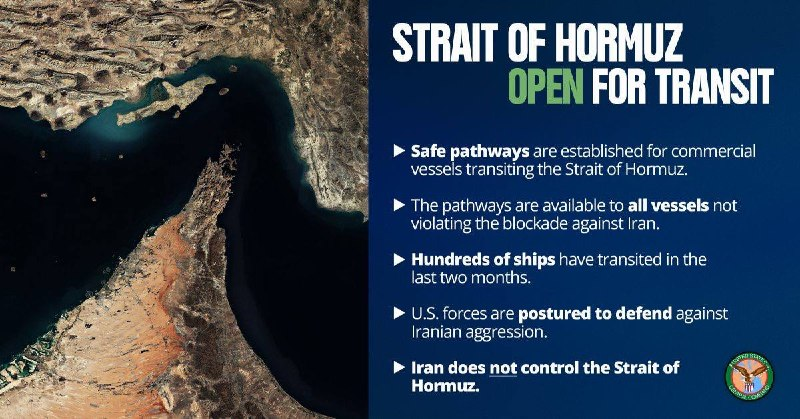

🔴ستاد فرماندهی مرکزی ایالات متحده (سنتکام) اعلام کرد که تنگه هرمز علیرغم ادعاهای ایران باز است و اظهار داشت که «صدها کشتی» طی دو ماه گذشته از آن عبور کرده‌اند.
https://t.me/kianmeli1

## kianmeli1 — post 87939

  <a href="telegram/content/kianmeli1_87939_1781196206.mp4" target="_blank">🎬 Download video</a>

🔴وزیر علوم: اون دانشجویانی که پرچم پهلوی گرفتن تو دست و پرچم جمهوری اسلامیو اتیش زدن تحت تعقیبن قراره مجازات و اخراج بشن
https://t.me/kianmeli1

## IranIntlTV — post 341752

  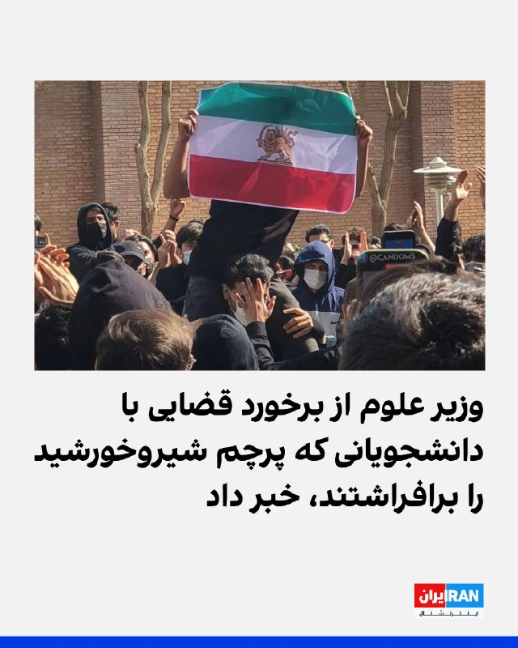

حسین سیمایی صراف، وزیر علوم جمهوری اسلامی، با اشاره به برافراشته شدن پرچم شیروخورشید در دانشگاه‌ها، گفت: «کسانی که پرچم جمهوری اسلامی را آتش زدند، پرونده آن‌ها در کمیته‌ها و شوراهای انضباطی بررسی شده و در مراجع قضایی به مجازات خواهند رسید.»

پیش‌تر نیز قوه قضاییه جمهوری اسلامی بر تشکیل پرونده قضایی علیه دانشجویان معترض تاکید کرده بود.
https://iranintl.com/202606115886

## FarsiVOA — post 220398

آذر یاهو و فائزه صالح‌آبادی؛ زنانی که به خاطر استوری اینستاگرام و استیکر در زندان‌اند

## FarsiVOA — post 220397

میدان: فاطمه سپهری در چه شرایطی است و چرا در وضعیت جنگی و با مشکلات سلامتی اجازه مرخصی ندارد؟

## DW_Farsi — post 125829

  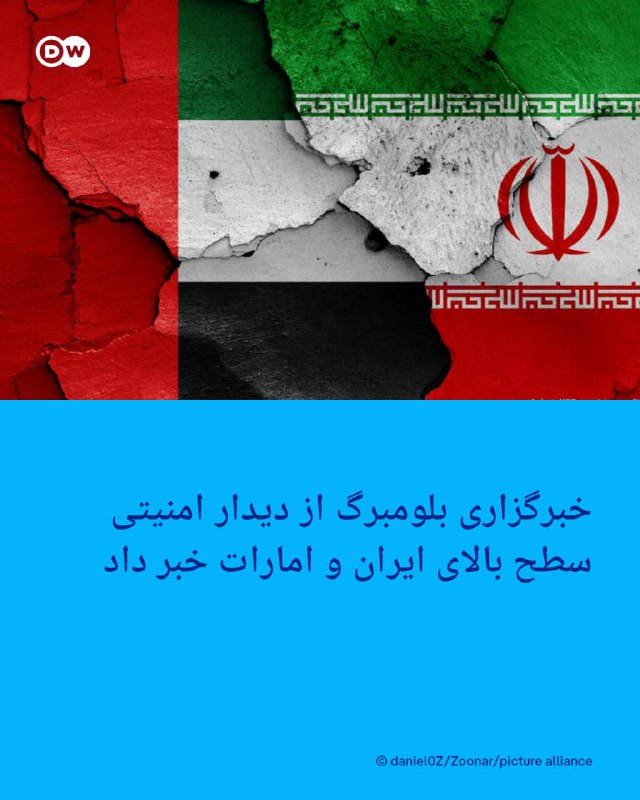

🔶 بلومبرگ از دیدار امنیتی سطح بالای ایران و امارات خبر داد
 
خبرگزاری بلومبرگ به نقل از منابع آگاه از دیدار مستقیم مقام‌های ارشد امنیت ملی امارات متحده عربی و ایران در هفته جاری خبر داد.
 
به گفته این خبرگزاری، این نخستین بار از زمان آغاز جنگ آمریکا و اسرائیل علیه ایران در اواخر فوریه بوده که مقام‌های این دو کشور به صورت رو در رو با یکدیگر ملاقات کرده‌اند.
 
این منابع که به دلیل حساسیت موضوع خواستند نامشان فاش نشود این دیدار را نشان‌دهنده "تغییر رویکرد هر دو کشور" دانسته‌اند، چرا که آن‌ها به ارزش بهبود روابط دوجانبه پی برده‌اند.
 
بلومبرگ نوشت، امارات متحده عربی به دنبال حفظ اهداف اقتصادی خود است که شامل سرمایه‌گذاری میلیاردها دلار در توسعه تولید نفت و مراکز داده هوش مصنوعی می‌شود.
 
از دیگر سو، حکومت ایران نیز این رابطه را مهم ارزیابی می‌کند، چرا که امارات پیش از آغاز جنگ، یکی از بزرگترین شرکای تجاری جمهوری اسلامی بود و به عنوان کانال اصلی برای نفت تحریم‌شده ایران عمل می‌کرد. 
@dw_farsi

## BBCPersian — post 283460

  <a href="telegram/content/BBCPersian_283460_1781196208.mp4" target="_blank">🎬 Download video</a>

خشونت‌ها در نقاط مختلف شهر بلفاست، مرکز ایرلند شمالی در بریتانیا پس از آن شدت گرفت که شامگاه دوشنبه (۸ ژوئن‌‌/۱۸ خرداد) مردی در پی حمله با چاقو در شمال این شهر دچار جراحات شدید و به بیمارستان منتقل شد.
یک مهاجر ۳۰ ساله اهل سودان، در محل حادثه در ارتباط با این حمله بازداشت و روز چهارشنبه در دادگاه به اتهام اقدام به قتل رسماً متهم شد.
این حادثه موجب اعتراضات گروه‌هایی از افراد علیه مهاجران و اقلیت‌ها شد که به خشونت کشیده شد.
در جریان ناآرامی‌های دو شب قبل چندین خانه و خودرو به آتش کشیده شدند.
برخی گزارش‌ها حاکی از آن است که شماری از ساکنان بر اساس رنگ پوست خود هدف قرار گرفته‌اند.

@BBCPersian

## alonews — post 127187

  <a href="telegram/content/alonews_127187_1781196210.mp4" target="_blank">🎬 Download video</a>

👈کمتر از ۳ ساعت تا شروع جام جهانی؛
درب‌های ورزشگاه تاریخی آزتکا مکزیکوسیتی برای ورود هواداران باز شد

✅ @AloNews خبر جنگ

---
📅 بروزرسانی: 1405/03/21 20:03
---

## VahidOOnLine — post 244995

  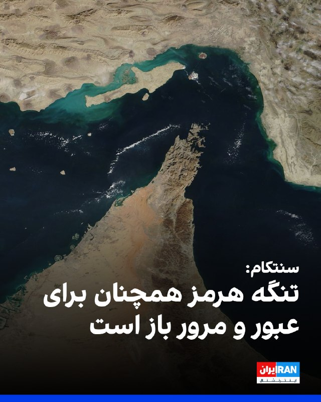

ستاد فرماندهی مرکزی آمریکا، سنتکام، در شبکه ایکس نوشت تنگه هرمز همچنان برای عبور و مرور باز است.

سنتکام افزود که مسیرهای امن برای کشتی‌های تجاری در تنگه هرمز تعیین شده و این مسیرها برای همه کشتی‌هایی که محاصره علیه ایران را نقض نمی‌کنند در دسترس است.

بر اساس اعلام سنتکام، طی دو ماه گذشته صدها کشتی از تنگه هرمز عبور کرده‌اند و نیروهای آمریکا آماده دفاع در برابر اقدام‌های جمهوری اسلامی هستند.

سنتکام تاکید کرد جمهوری اسلامی کنترل تنگه هرمز را در اختیار ندارد.
‌🏁 🇬🇧 IranintlTV

🤖 @VahidOOnLine

## VahidOOnLine — post 244994

  

اسماعیل قاآنی، فرمانده نیروی قدس سپاه پاسداران، در پیامی نوشت: «حزب‌الله به عنوان نماد مقاومت و عزت امت اسلامی، همچنان در خط مقدم دفاع از لبنان و مقابله با زیاده‌خواهی‌های اسرائیل باقی خواهد ماند و وعده الهی مبنی بر پیروزی حق بر باطل تحقق خواهد یافت.»

او افزود: «اسرائیل باید بداند که اشغالگری، تجاوز و جنایات علیه مردم جنوب لبنان هرگز اراده ملت مقاوم لبنان و رزمندگان حزب‌الله را در هم نخواهد شکست.»
‌🏁 🇬🇧 IranintlTV

🤖 @VahidOOnLine

## VahidOOnLine — post 244993

  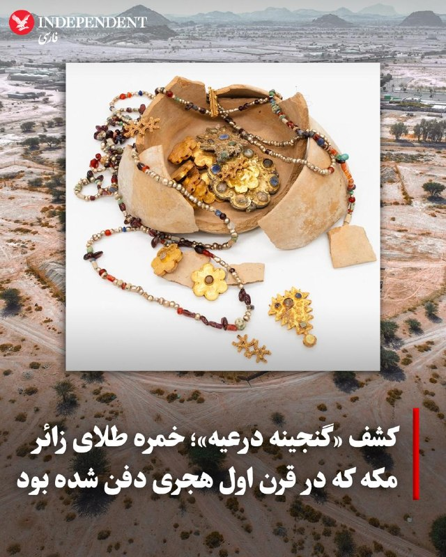

♦️باستان‌شناسان در عربستان سعودی یک کوزه سفالی باستانی حاوی بیش از ۱۰۰ قطعه جواهر طلا، نقره و سنگ‌های قیمتی را کشف کردند که احتمالا در قرن نخست هجری توسط زائری در مسیر مکه دفن شده بود.

این گنجینه بی‌نظیر که «گنجینه درعیه» نام گرفته، در جریان ششمین فصل کاوش‌ها در منطقه القصیم و در یک ایستگاه کلیدی از مسیر حج بصره (بین عراق و مکه) یافت شد؛ منطقه‌ای که قدمت سکونتگاه‌های آن به سال‌های ۷۴۳ تا ۷۵۳ میلادی برمی‌گردد.

به گفته کمیسیون میراث عربستان سعودی، این خمره سرامیکی شامل قطعات طلای دوران اوایل خلافت عباسی (حدود سال ۷۵۰ میلادی)، آثار نقره‌ای و مس اکسیدشده است. طلاهای یافت‌شده با نقوش اسلیمی پیچیده و طرح‌های هندسی ظریفی تزیین شده‌اند که حکایت از مهارت بالای فلزکاران آن دوران در ساخت، برجسته‌کاری و مرصع‌کاری با سنگ‌های نیمه‌قیمتی دارد.

این یافته‌های ارزشمند علاوه بر نمایش هنر برجسته صدر اسلام، دانش ما را درباره سکونتگاه‌های انسانی و رونق مسیرهای کلیدی زیارتی و تجاری باستان افزایش می‌دهد. قطعات کشف‌شده اکنون در آزمایشگاه‌های مرمت عربستان سعودی در حال بازسازی هستند.
‌🇸🇦 Indypersian

🤖 @VahidOOnLine

## FoxNewsTwitter — post 342865

  <a href="telegram/content/FoxNewsTwitter_342865_1781195614.mp4" target="_blank">🎬 Download video</a>

Fox News (Twitter/X)

NEW: Video released by the Philadelphia Police Department shows the two suspects wanted in the murder of a Penn State student who was shot while returning home from an NBA Finals watch party.

22-year-old Billy Schmidt was killed during what investigators say was an armed robbery attempt early Saturday morning, suffering a shot to the chest and pronounced dead shortly after arriving at a hospital.

Authorities also say the two suspects discarded their sweatshirts and masks as they fled the scene.

The Philadelphia Police Department is offering a $20,000 reward for information that leads to an arrest and conviction, asking anyone with information about the suspects to contact it.

## FoxNewsTwitter — post 342864

‌Fox News (Twitter/X)

https://www.foxnews.com/us/vance-boelter-changes-plea-guilty-minn-lawmaker-shootings-killed-rep-melissa-hortman-husband

## pm_afshaa — post 93636

  <a href="telegram/content/pm_afshaa_93636_1781195615.webm" target="_blank">🎬 Download video</a>

🔴سخنگوی سپاه:
کسی که یک مورد تجربه شده رو دوباره بخواد تجربه کنه، پشیمان میشه. اگر آمریکا میخواد شکست‌های قبلی خودش رو دوباره تجربه کنه، پشیمان خواهد شد.

💧 Rainbet.com the #1 Non-KYC Crypto Casino & Sportsbook @rainbetcom

😁 @Pm_Afshaa

## pm_afshaa — post 93635

شاعر میگه که منو از چی میترسونی از جنگ تن به تن!؟
من یک به هزار جنگیدم بیا چنگ بزن به من

## IranIntlTV — post 341751

  

ستاد فرماندهی مرکزی آمریکا، سنتکام، در شبکه ایکس نوشت تنگه هرمز همچنان برای عبور و مرور باز است.

سنتکام افزود که مسیرهای امن برای کشتی‌های تجاری در تنگه هرمز تعیین شده و این مسیرها برای همه کشتی‌هایی که محاصره علیه ایران را نقض نمی‌کنند در دسترس است.

بر اساس اعلام سنتکام، طی دو ماه گذشته صدها کشتی از تنگه هرمز عبور کرده‌اند و نیروهای آمریکا آماده دفاع در برابر اقدام‌های جمهوری اسلامی هستند.

سنتکام تاکید کرد جمهوری اسلامی کنترل تنگه هرمز را در اختیار ندارد.
https://iranintl.com/202606112612

## IranIntlTV — post 341750

  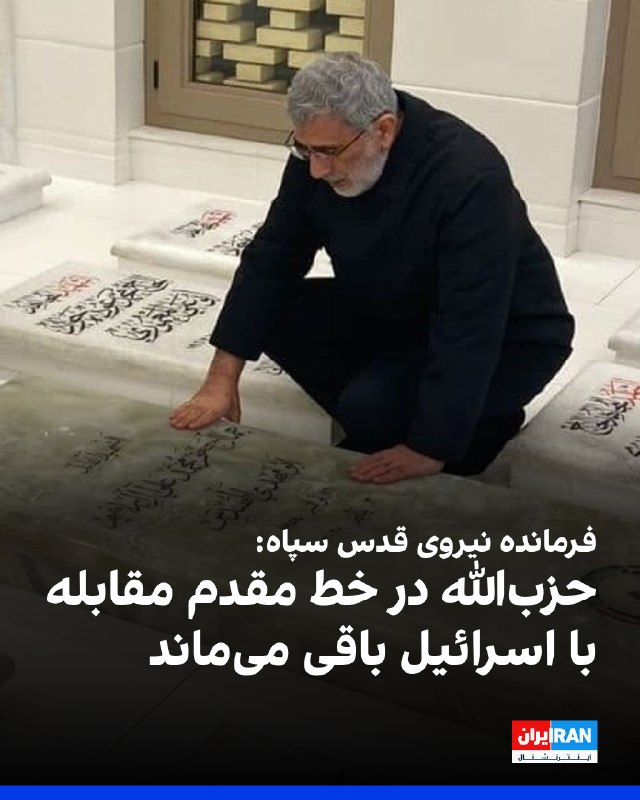

اسماعیل قاآنی، فرمانده نیروی قدس سپاه پاسداران، در پیامی نوشت: «حزب‌الله به عنوان نماد مقاومت و عزت امت اسلامی، همچنان در خط مقدم دفاع از لبنان و مقابله با زیاده‌خواهی‌های اسرائیل باقی خواهد ماند و وعده الهی مبنی بر پیروزی حق بر باطل تحقق خواهد یافت.»

او افزود: «اسرائیل باید بداند که اشغالگری، تجاوز و جنایات علیه مردم جنوب لبنان هرگز اراده ملت مقاوم لبنان و رزمندگان حزب‌الله را در هم نخواهد شکست.»
https://iranintl.com/202606119256

## Shin_Persian — post 6957

  <a href="telegram/content/Shin_Persian_6957_1781195617.mp4" target="_blank">🎬 Download video</a>

Zaryon OSINT ✓ @zarGEOINT
Thu, 11 Jun 2026 16:26:33 UTC

🇮🇷🛰️ Today's satellite imagery shows an aircraft destroyed at Iran's Bandar Abbas Airport following the latest U.S. strikes.

📍 Geolocation: 27.20909, 56.36896

@GeoConfirmed @FaytuksNetwork @EpicFuryMap

ترجمه خودکار فارسی

🇮🇷🛰️ تصاویر ماهواره‌ای امروز هواپیمایی را نشان می‌دهد که در پی آخرین حملات ایالات متحده در فرودگاه بندرعباس ایران منهدم شده است.

📍 موقعیت جغرافیایی: 27.20909, 56.36896

@GeoConfirmed @FaytuksNetwork @EpicFuryMap

𝕏 · @shin_persian

## FarsiVOA — post 220396

  <a href="telegram/content/FarsiVOA_220396_1781195618.mp4" target="_blank">🎬 Download video</a>

ارتش اسرائیل ویدیویی منتشر کرده که به گفته این نهاد، اعضای حزب‌الله در داخل یک تونل زیرزمینی در جنوب لبنان را نشان می‌دهد.

ارتش اسرائیل می‌گوید این تونل در جریان عملیات در منطقه بوفور شناسایی شده و در آن انواع سلاح‌ها از جمله خمپاره، نارنجک، راکت‌انداز آر‌پی‌جی، موشک‌های کورنت، تیربار و سلاح کلاشنیکف کشف شده است.

در این ویدیو فردی نیز دیده می‌شود که به گفته ارتش اسرائیل به سمت یک پهپاد اسرائیلی شلیک می‌کند.

@FarsiVOA

## FarsiVOA — post 220395

🔺کایا کالاس پس از تماس با وزیران امور خارجه کویت و جمهوری اسلامی: حملات رژیم به کشورهای منطقه غیرقابل قبول است

▪️نماینده عالی اتحادیه اروپا در امور خارجی تداوم حملات رژیم ایران به کشورهای خلیج فارس را غیرقابل قبول دانست و بر لزوم پرهیز از جنگ تمام‌عیار و پایبندی به دیپلماسی تاکید کرد.

⬇️ بیشتر بخوانید:

https://ir.voanews.com/a/kaya-kallas-iranian-regime-attacks-persian-gulf-countries-iran/8159761.html/?nocach=1

## FarsiVOA — post 220394

🔺هشدار پرزیدنت ترامپ به جمهوری اسلامی: توافق نشود حملات تشدید خواهد شد

▪️دونالد ترامپ، رئیس جمهوری ایالات متحده، روز پنجشنبه ۲۱ خرداد در گفت‌وگویی با فاکس نیوز اعلام کرد حملات آمریکا علیه رژیم ایران ادامه خواهد یافت و حتی ممکن است در ساعات آینده گسترش پیدا کند. او همچنین گفت جمهوری اسلامی به دنبال توافق است، اما رسانه‌های آمریکا تصویر نادرستی از وضعیت ارائه می‌دهند.

⬇️ بیشتر بخوانید:

https://ir.voanews.com/a/president-trump-military-operation-fox-news-interview/8159755.html/?nocach=1

## Persian_Trend_Official — post 16746

ترامپ: ترجیح من تصرف جزیره خارک است. اما مطمئن نیستم که ایالات متحده توانایی یا تمایل آن را داشته باشد. من از ایران ناامید نیستم، این توافق خوب است و ممکن است بزرگترین توافق تاریخ باشد. ایران در تبلیغات خوب است اما در جنگیدن خوب نیست. هواپیماهای ما بر فراز…

## alonews — post 127186

  <a href="telegram/content/alonews_127186_1781195619.webm" target="_blank">🎬 Download video</a>

👈ایران تو گروهش در جام جهانی دوم بشه و آمریکا هم دوم بشه در مرحله یک شانزدهم نهایی جام جهانی باید باهم تقابل داشته باشن

🔴و بدین شکل ایران و آمریکا در 3 تورنمنت متفاوت با یکدیگر رقابت خواهند داشت :

🔴جنگ ایران و آمریکا؛ هرشب ساعت 12 شب به بعد؛ از جنوب ایران

🔴والیبال ایران و آمریکا پنجشنبه 4 تیر

🔴 فوتبال ایران و آمریکا: جمعه 12 تیر

✅ @AloNews خبر جنگ

---
📅 بروزرسانی: 1405/03/21 19:56
---

## VahidOOnLine — post 244992

♦️محمد مهدی نبی، نایب‌رئیس فدراسیون فوتبال ایران، روز پنجشنبه ۲۱ خرداد ماه، از احتمال حل شدن مشکل ویزای بیش از نیمی از ۱۵ عضو تیم ملی خبر داد و گفت تعدادی از این افراد برای مراجعه به کنسولگری آمریکا فراخوانده شده‌اند.
نبی، بعد از ظهر دوشنبه در گفتگو با صداوسیمای جمهوری اسلامی گفت: «حدود یک ساعت پیش به ما اعلام کردند که تعدادی از آن ۱۵ نفر می‌توانند به کنسولگری آمریکا در شهر تیخوانا مراجعه کنند. اسامی آنها هنوز به من اعلام نشده، اما فکر می‌کنم از آن ۱۵ نفر، بیش از نیمی‌شان مشکل ویزایشان حل شود، چون جزو ارکان اصلی تیم ملی هستند.»
او همچنین درباره زمان سفر تیم ملی به آمریکا توضیح داد که بر اساس اعلام فیفا، تیم باید یک روز پیش از مسابقه در محل برگزاری حاضر باشد، اما مسئولان تیم در تلاش‌اند زودتر راهی آمریکا شوند.
وزارت خارجه آمریکا، بامداد شنبه ۱۶ خرداد ماه برای ۲۶ بازیکن تیم ملی ایران ویزا صادر کرد اما درخواست ویزای مهدی تاج، رئیس فدراسیون فوتبال ایران، و بیش از ۱۲ نفر از اعضای کادر مدیریتی، اجرایی، رسانه‌ای و پشتیبانی تیم ملی رد شد.
همچنین گزارش‌ها از صدور «ویزای ساعتی» برای ورود و خروج تیم ملی فوتبال ایران به خاک آمریکا حکایت داشت.
مسابقات مرحله گروهی جام جهانی ۲۰۲۶ با میزبانی مشترک آمریکا، کانادا و مکزیک، در خاک ایالات متحده برگزار خواهد شد.
‌🇸🇦 Indypersian

🤖 @VahidOOnLine

## WithYashar — post 14534

  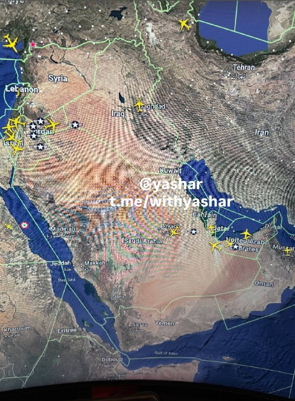

سوخترسانها از اسرائیل بلند شدند و کم کم صحنه برای اپرای امشب در حال شلوغ شدن است.🚨🚨🚨🚨🚨
@withyashar

## FoxNewsTwitter — post 342863

Fox News (Twitter/X)

BREAKING: Vance Boelter changes plea to guilty in 2025 Minnesota lawmaker shootings

## kianmeli1 — post 87938

  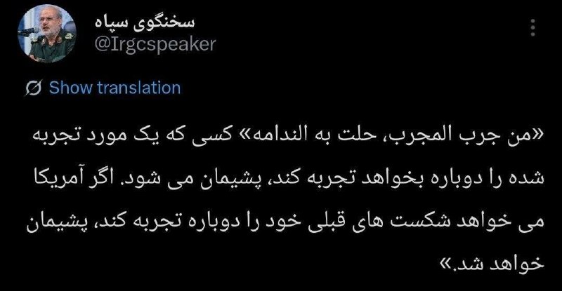

🔴سخنگوی سپاه

اگر آمریکا می‌خواهد شکست‌های قبلی خود را دوباره تجربه کند، پشیمان خواهد شد.
https://t.me/kianmeli1

## Shin_Persian — post 6956

  <a href="telegram/content/Shin_Persian_6956_1781195169.mp4" target="_blank">🎬 Download video</a>

Shin ✓ @hey_itsmyturn
Thu, 11 Jun 2026 16:14:02 UTC

Jet activity over Bandar Abbas, Hormozgan Province, #Iran

ترجمه خودکار فارسی

فعالیت جنگنده‌ها بر فراز بندرعباس، استان هرمزگان، #Iran

𝕏 · @shin_persian

## Persian_Trend_Official — post 16745

  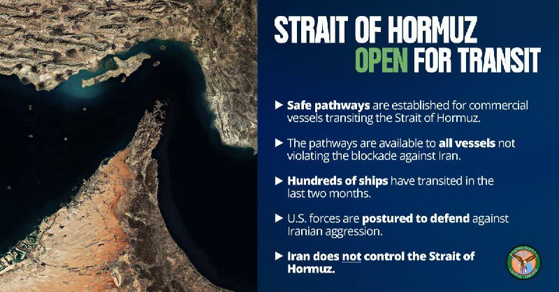

فرماندهی مرکزی ایالات متحده: تنگه هرمز برای ترانزیت تجاری همچنان باز است و مسیرهای امن تعیین‌شده برای همه کشتی‌هایی که محاصره ایران را نقض نمی‌کنند، در دسترس است.

سنتکام می‌گوید که صدها کشتی طی دو ماه گذشته از این مسیرها استفاده کرده‌اند و نیروهای آمریکایی برای دفاع در برابر حملات ایران آماده شده‌اند و تأکید می‌کند که ایران تنگه را کنترل نمی‌کند.

📝 Amir

📌 @persian_trend_official
پرشین ترند | متفاوت‌ترین کانال نظامی

## Persian_Trend_Official — post 16744

  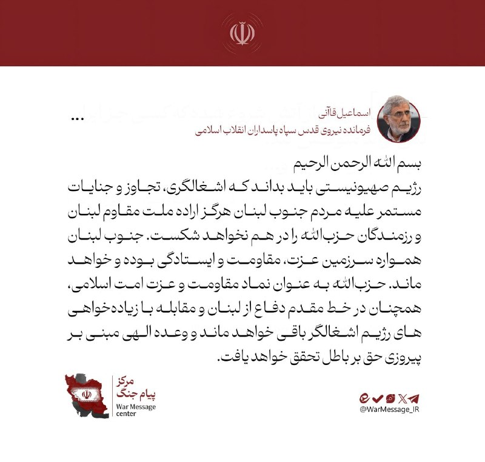

سردار قاآنی: تجاوز و جنایات اراده ملت مقاوم لبنان و رزمندگان حزب‌الله را در هم نخواهد شکست.

فرمانده نیروی قدس سپاه پاسداران انقلاب اسلامی: رژیم صهیونیستی باید بداند که اشغالگری، تجاوز و جنایات مستمر علیه مردم جنوب لبنان هرگز اراده ملت مقاوم لبنان و رزمندگان حزب‌الله را در هم نخواهد شکست.

جنوب لبنان همواره سرزمین عزت، مقاومت و ایستادگی بوده و خواهد ماند. حزب‌الله به عنوان نماد مقاومت و عزت امت اسلامی، همچنان در خط مقدم دفاع از لبنان و مقابله با زیاده‌خواهی‌های رژیم اشغالگر باقی خواهد ماند و وعده الهی مبنی بر پیروزی حق بر باطل تحقق خواهد یافت.

📝 Amir

📌 @persian_trend_official
پرشین ترند | متفاوت‌ترین کانال نظامی

## BBCPersian — post 283459

  <a href="telegram/content/BBCPersian_283459_1781195173.mp4" target="_blank">🎬 Download video</a>

🎶 تامارا، خواننده، آهنگساز و ترانه‌نویس جوان ایرانی، در «رنگآهنگ» این هفته از مسیری می‌گوید که برای رسیدن به رویایش طی کرده؛ مسیری که از همان ابتدا با موانع مختلف، از جمله مخالفت خانواده‌اش، همراه بوده است. او تعریف می‌کند که در سال‌های اول، پنهانی به استودیو می‌رفته، چون پدر و مادرش فکر می‌کردند فضای استودیوها امن نیست و این راه آینده‌ی روشنی ندارد؛ روزهایی که حالا برایش به خاطراتی رنگ‌پریده تبدیل شده‌اند.

رویای او امروز به واقعیت تبدیل شده و او حالا به‌عنوان یک موزیسین فعال، با ناشران شناخته‌شده همکاری می‌کند و آثارش مخاطبان قابل توجهی در شبکه‌های اجتماعی دارد.

داستان تامارا در دل تجربه‌ی گسترده‌تری قرار می‌گیرد؛ تجربه‌ی خوانندگان زن موسیقی ایران که با وجود محدودیت‌های چند دهه‌ای، صدای خود را حفظ کرده‌اند. در سال‌های اخیر، نسل تازه‌ای از این هنرمندان با تکیه بر شبکه‌های اجتماعی و ابزارهای آنلاین توانسته‌اند بدون مجوز رسمی آثارشان را منتشر کنند و موسیقی را به ابزاری برای بیان تبدیل کنند.

📅 پخش اصلی:
پنجشنبه ۲۰:۳۰ ایران

📅 تکرار:
جمعه ۱۲:۳۰ – ۱۷:۳۰ – ۲۳:۳۰
شنبه ۱۴:۰۰
یکشنبه ۱۰:۳۰ – ۱۹:۳۰

@BBCPersian

## Dirty_Kids — post 391726

  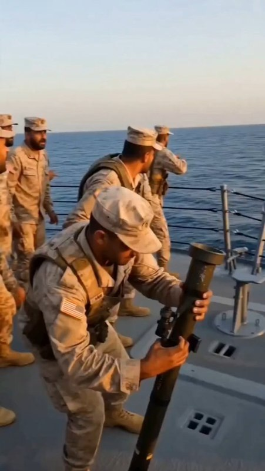

تا جنگ شروع نشده اینو سریع بگم. یه فیلمی با Ai ساختن از لحظه ساقط کردن بالگرد آپاچی آمریکا توسط سپاه که ۲۴ساعته خوراک جق عرازش شده، بعد روی بازوی نیروها پرچم آمریکا زده شده :)))
یعنی یه دونه، حتی دونه آدم با آی‌کیوی بالای ۱۰ تو اینا پیدا نمیشه

@Dirty_Kids 👻

## Dirty_Kids — post 391725

  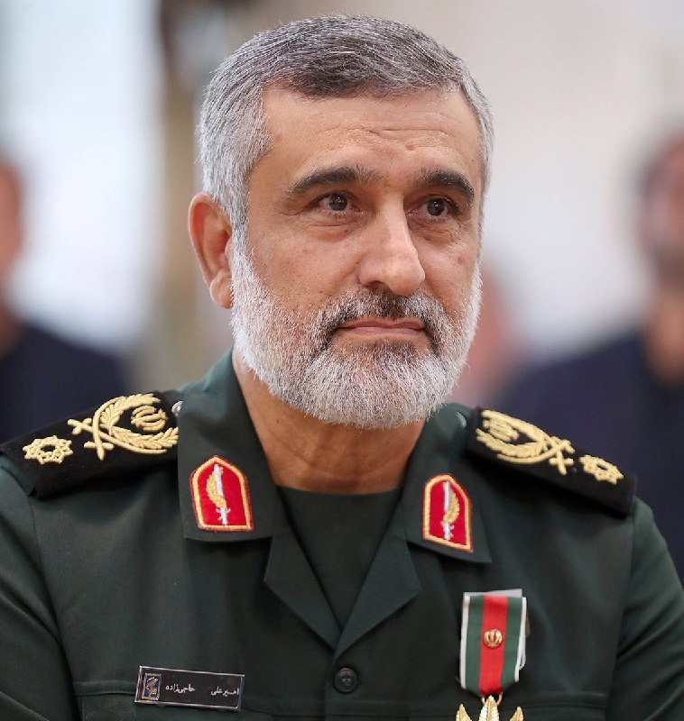

سالگرد حاجی‌زاده‌ست.
فرمانده‌ای که یک عمر خودش رو برای جنگ با اسراییل آماده کرد و لحظه اول جنگ پودر شد.

@Dirty_Kids 👻

## Dirty_Kids — post 391724

🔥 #جام_جهانی شروع شده و میدون مال توئه! 
🔽 هر اتفاقی توی زمین چمن، می‌تونه برگت رو ببره بالا. حالا وقتشه قهرمان روز باشی و بزرگ بازی کنی! 👑 ⚽️ این جام جهانی رو فقط باید توی بت فیدو پیش‌بینی کنی 
😀 با ۵۰ میلیون تومان شرط روزانه ← ۴ میلیون تومان اعتبار شرط‌بندی…

## Dirty_Kids — post 391723

  

🔥 #جام_جهانی شروع شده و میدون مال توئه! 
🔽

هر اتفاقی توی زمین چمن، می‌تونه برگت رو ببره بالا. حالا وقتشه قهرمان روز باشی و بزرگ بازی کنی! 👑

⚽️ این جام جهانی رو فقط باید توی بت فیدو پیش‌بینی کنی

😀 با ۵۰ میلیون تومان شرط روزانه ← ۴ میلیون تومان اعتبار شرط‌بندی رایگان

🏅 با ۱۰۰ میلیون تومان شرط روزانه ← ۸ میلیون تومان اعتبار شرط‌بندی رایگان
G20

💸 هرچی بزرگ‌تر بازی کنی، جایزه‌ت بزرگ‌تره!
همین حالا پیش بینیتو ثبت کن✏️
https://fido874vt.click
https://fido874vt.click

📤
📤
📤
📤
📤
📤
📤
📤
(ورود با وی-پی-ان غیر اروپایی)

😀 کانال تلگرام 👇
https://t.me/+dySI_QFj0T0xZGVk

## Dirty_Kids — post 391722

  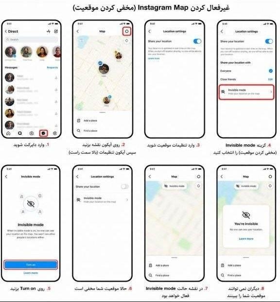

توی آپدیت جدید اینستاگرام 
📱 قسمتی به اسم «instagram map» به برنامه اضافه شده که موقعیت مکانی شما رو به فالوورهاتون نشون میده.

معمولا به صورت پیش فرض خاموشه ولی اگه برای شما روشن شده میتونید از این طریقی که گفته شده موقعیت مکانیتون رو غیرفعال کنید.

برای دوستاتونم بفرستید تا اگه لوکیشنشون فعال شده؛ غیرفعالش کنن.

@Dirty_Kids 👻

## Dirty_Kids — post 391721

  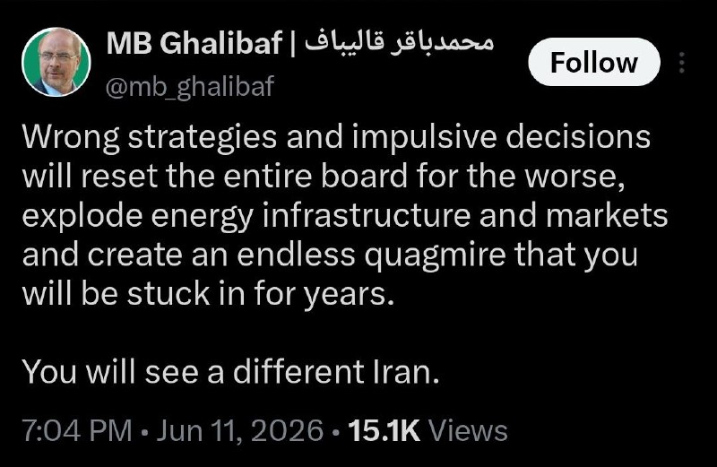

🔴 رجزخونی شغال طرقبه (قالیباف) برای ترامپ:

اگه استراتژی‌های غلط بزنی و تصمیم‌های عجولانه بگیری، همه چیز رو از نو به بدترین شکل ریست می‌کنی.
زیرساخت انرژی و بازارها می‌ترکه، یه باتلاق بی‌پایان درست می‌شه که سال‌ها توش گیر می‌افتی.

اون موقع یک ایران دیگه می‌بینی.

@Dirty_Kids 👻

## alonews — post 127185

  <a href="telegram/content/alonews_127185_1781195180.webm" target="_blank">🎬 Download video</a>

👈سخنگوی سپاه: اگر آمریکا می‌خواهد شکست‌های قبلی خود را دوباره تجربه کند، پشیمان خواهد شد

✅ @AloNews خبر جنگ

---
### ⚠️ کانال‌های با خطا در این بروزرسانی

* FarsiVOA
* officialrezapahlavi

دلایل احتمالی: مسدود بودن کانال، حذف کانال، یا خطای شبکه.
---

---
📅 بروزرسانی: 1405/03/21 19:43
---

## VahidOOnLine — post 244991

  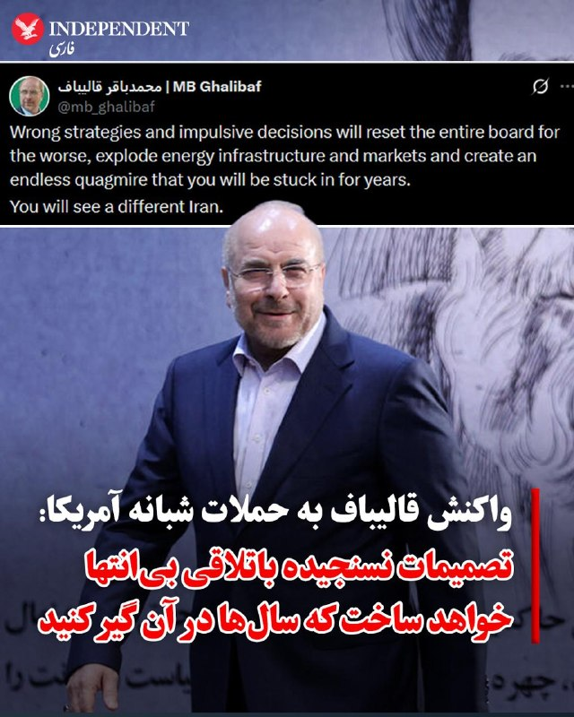

♦️محمدباقر قالیباف، رئیس مجلس شورای اسلامی، در واکنش به حملات شبانه ایالات متحده و تهدیدهای اخیر دونالد ترامپ مبنی بر تشدید بمباران زیرساخت‌های کشور، با انتشار پیامی در شبکه اجتماعی ایکس به واشنگتن هشدار داد.

قالیباف در این پیام نوشت: «راهبردهای نادرست و تصمیمات نسنجیده، کل صفحه بازی را به شکلی بسیار بدتر بازنشانی خواهد کرد، زیرساخت‌های انرژی و بازارها را به انفجار خواهد کشید و باتلاقی بی‌انتها خواهد ساخت که سال‌ها در آن گیر خواهید کرد.»

رئیس مجلس شورای اسلامی در پایان پیام خود به طور قاطع تاکید کرد: «شما ایران متفاوتی را خواهید دید.»

این موضع‌گیری پس از آن صورت می‌گیرد که ارتش آمریکا بامداد امروز حملات گسترده‌ای را علیه رادارها و پدافند هوایی ایران در نزدیک تنگه هرمز انجام داد و ترامپ نیز هشدار داد که بمباران‌های بزرگ‌تری در راه خواهد بود.
‌🇸🇦 Indypersian

🤖 @VahidOOnLine

## VahidOOnLine — post 244990

  

پایگاه اطلاع‌رسانی جمعیت هلال‌احمر اعلام کرد در پی «تهدیدات دشمن مبنی بر تداوم حملات هوایی»، این سازمان با هدف «ارتقای سطح آمادگی و تسریع در پاسخ به حوادث احتمالی»، تمامی ظرفیت‌های عملیاتی و لجستیکی خود را در سراسر کشور در وضعیت آماده‌باش کامل قرار داده است.

به گفته هلال‌احمر، تیم‌های تخصصی امداد و نجات، مراکز عملیاتی، پایگاه‌های امدادی و ناوگان لجستیکی این جمعیت، آماده ارائه خدمات امدادی هستند.
‌🏁 🇬🇧 IranintlTV

🤖 @VahidOOnLine

## mwarmonitor — post 10727

  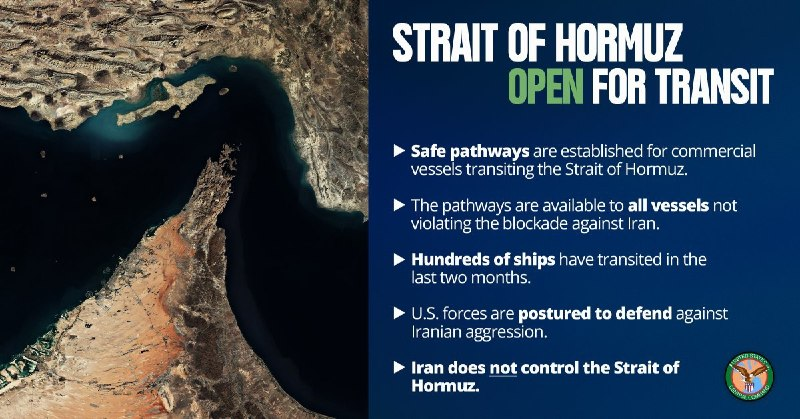

🔴فرماندهی سنت کام

تنگه هرمز همچنان برای عبور و مرور باز است.

مسیرهای امنی برای کشتی‌های تجاری که از تنگه هرمز عبور می‌کنند ایجاد شده است.

این مسیرها برای همه کشتی‌هایی که تحریم/محاصره اعمال‌شده علیه ایران را نقض نکنند، در دسترس است.

صدها کشتی در دو ماه گذشته عبور کرده‌اند.

نیروهای آمریکایی در حالت آماده‌باش برای دفاع در برابر هرگونه اقدام تهاجمی ایران هستند.

ایران کنترل تنگه هرمز را در دست ندارد.

@mwarmonitor

## FoxNewsTwitter — post 342862

‌Fox News (Twitter/X)

https://www.foxnews.com/politics/severe-pentagon-lockdown-sparks-emergency-response-hazmat-teams-sweep-area

## FoxNewsTwitter — post 342861

  <a href="telegram/content/FoxNewsTwitter_342861_1781194424.mp4" target="_blank">🎬 Download video</a>

Fox News (Twitter/X)

RT @FaulknerFocus: 🚨BREAKING NEWS

The Arlington County Fire Department is monitoring a hazmat situation at the Pentagon.

Stay tuned on @FoxNews as we learn more.

## iaghapour — post 2668

  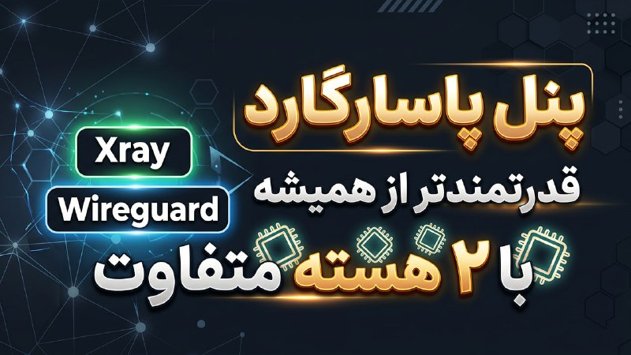

⭕️ راهنمای ساخت فیلترشکن شخصی با ۲ هسته در پنل پاسارگارد 🔥

🔹تو این ویدیو قراره با هم یاد بگیریم چطوری یه فیلترشکن شخصی فوق‌العاده با استفاده از پنل پاسارگارد بسازیم. این پنل از 2 هسته Xray و وایرگارد ساپورت میکنه و همینطور از قابلیت نود هم پشتیبانی میکنه.

🔗 تماشا ویدیو در یوتیوب

#آموزش #فیلترشکن #پاسارگارد #pasarguard #vpn
برای دور زدن فیلترینگ و آموزش تکنولوژی و هوش مصنوعی ما رو دنبال کنید 💚
🆔@iaghapour

## VahidOnline — post 76227

  

خبرگزاری بلومبرگ روز پنجشنبه ۱۹ خرداد به نقل از «منابع آگاه» گزارش داد که مقام‌های ارشد امنیت ملی امارات متحده عربی و ایران برای نخستین بار از زمان آغاز جنگ آمریکا و اسرائیل علیه تهران، حضوری با یکدیگر دیدار کردند.

این دیدار که در هفته جاری انجام شد، به نوشتهٔ بلومبرگ، نشان‌دهندهٔ چرخشی قابل توجه در رویکرد دو طرف است و در شرایطی صورت می‌گیرد که هر دو کشور بیش از پیش به اهمیت روابط دوجانبه آرام‌تر پی برده‌اند.
این خبرگزاری می‌گوید که منابع آن به‌دلیل حساسیت موضوع نخواستند نامشان فاش شود.

بر اساس این گزارش، رهبران امارات می‌خواهند برنامه‌های بلندپروازانهٔ اقتصادی خود، از جمله سرمایه‌گذاری میلیاردی در افزایش تولید نفت و ایجاد مراکز دادهٔ هوش مصنوعی، بدون اختلال ادامه یابد. این رابطه برای تهران نیز اهمیت دارد، زیرا امارات پیش از آغاز جنگ یکی از بزرگ‌ترین شرکای تجاری تهران و مسیر مهمی برای انتقال نفت تحریم‌شده ایران بود.

به گفتهٔ منابع بلومبرگ، تماس اخیر ابوظبی با ایران عمدتاً با هدف دستیابی به نوعی تنش‌زدایی با حکومتی انجام شده که آن را دشمن می‌داند.

از زمان آغاز جنگ خاورمیانه در ۹ اسفند پارسال، ایران بیش از هر کشور دیگری امارات را هدف حملات خود قرار داده است.
ابوظبی نیز در چندین نوبت پاسخ داده و در میان همسایگان عرب خود تهاجمی‌ترین موضع را در قبال ایران اتخاذ کرده است.
با این حال، به نظر می‌رسد امارات اکنون مسیری مشابه قطر و عربستان سعودی را در پیش گرفته که با وجود هدف قرار گرفتن توسط ایران و نیروهای وابسته آن، در پی کاهش تنش از طریق دیپلماسی هستند.

به نوشتهٔ بلومبرگ، عربستان که تأسیسات انرژی و پایگاه‌های نظامی‌اش هدف قرار گرفته، از اوایل ماه آوریل تماس‌ها با تهران را در سطح وزیران خارجه از سر گرفته است.
قطر که تأسیسات بزرگ گاز طبیعی راس لفان آن هدف حمله قرار گرفت، بیش از همه در پی آشتی بوده و اواخر ماه گذشته میزبان هیأتی از ایران شد و به‌طور فزاینده‌ای به‌عنوان میانجی میان واشینگتن و تهران نقش‌آفرینی می‌کند.
بلومبرگ تأکید کرده که هر سه کشور عربی به ضرورت همزیستی با همسایه‌ای در آن سوی خلیج فارس، با جمعیتی ۹۰ میلیونی و توان نظامی قابل توجه، واقف هستند؛ حتی با وجود خسارات گسترده‌ای که از بمباران آمریکا و اسرائیل متحمل شده است.
@VahidHeadline

📡 @VahidOnline

## VahidOnline — post 76226

  

شبکه خبری سی‌ان‌ان روز پنجشنبه به نقل از یک مقام ارشد پنتاگون و دو مقام دولت آمریکا اعلام کرد که طرح‌های ارتش ایالات متحده برای تصرف جزیره خارگ در جنوب ایران از «ماه‌ها پیش» تهیه شده، اما به دلیل «بیش از حد پرخطر بودن» کنار گذاشته شده‌اند.

دونالد ترامپ، رئیس‌جمهور آمریکا، ساعتی پیش از تمایل خود برای در اختیار گرفتن این جزیره به عنوان یکی از مهم‌ترین زیرساخت‌های صادرات نفت ایران خبر داد.

سی‌ان‌ان به نقل از مقام‌های آمریکایی نوشت: «دیدگاه غالب در کاخ سفید و پنتاگون این است که تصرف جزیره خارگ یا نابود کردن زیرساخت‌های انرژی این جزیره، عملاً ایران را ورشکسته خواهد کرد و توانایی‌های آن را تا حدی کاهش می‌دهد که دیگر قادر به ادامه جنگ نباشد.»
در عین حال مقام‌های دولتی به رئیس‌جمهور آمریکا گفته‌اند که چنین عملیاتی نیاز به نیروهای زمینی پرشمار خواهد داشت و «ممکن است به تلفات سنگین نیروهای آمریکایی منجر شود».

سی‌ان‌ان ادعا کرده که پنتاگون و کاخ سفید هرگونه اقدام برای تصرف جزیره خارگ را به عنوان یک «گزینه نهایی» در نظر گرفته‌اند؛ اقدامی که به گفته مقام‌های آمریکایی «می‌تواند موازنه جنگ را تغییر دهد، اما هزینه بسیار بالایی خواهد داشت».
@VahidHeadline

📡 @VahidOnline

## VahidOnline — post 76225

  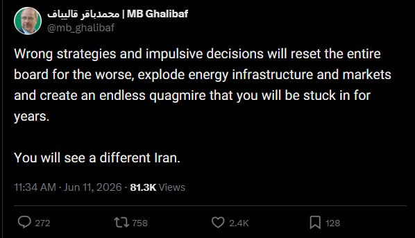

توییت قالیباف، ترجمه ماشین:
راهبردهای نادرست و تصمیم‌های شتاب‌زده، کل صحنه را به شکلی بدتر از نو تنظیم خواهد کرد، زیرساخت‌ها و بازارهای انرژی را منفجر خواهد کرد و باتلاقی بی‌پایان خواهد ساخت که سال‌ها در آن گرفتار خواهید ماند.
شما با ایرانی متفاوت روبه‌رو خواهید شد.
mb_ghalibaf

📡 @VahidOnline

## IranIntlTV — post 341749

  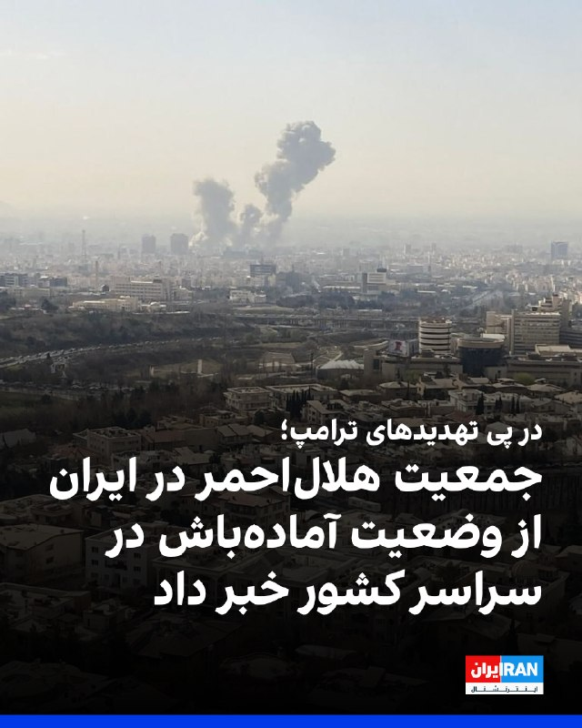

پایگاه اطلاع‌رسانی جمعیت هلال‌احمر اعلام کرد در پی «تهدیدات دشمن مبنی بر تداوم حملات هوایی»، این سازمان با هدف «ارتقای سطح آمادگی و تسریع در پاسخ به حوادث احتمالی»، تمامی ظرفیت‌های عملیاتی و لجستیکی خود را در سراسر کشور در وضعیت آماده‌باش کامل قرار داده است.

به گفته هلال‌احمر، تیم‌های تخصصی امداد و نجات، مراکز عملیاتی، پایگاه‌های امدادی و ناوگان لجستیکی این جمعیت، آماده ارائه خدمات امدادی هستند.
https://iranintl.com/202606114797

## Shin_Persian — post 6955

  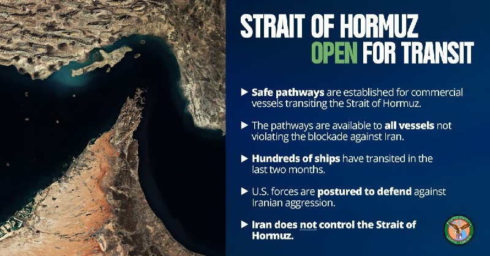

Shin ✓ @hey_itsmyturn
Thu, 11 Jun 2026 16:03:19 UTC

U.S. Central Command says the Strait of Hormuz remains open for transit with safe pathways established for commercial vessels. U.S. forces are postured to defend against Iranian aggression in the waterway.

Source: @CENTCOM
https://x.com/CENTCOM/status/2065102542791401782

ترجمه خودکار فارسی

فرماندهی مرکزی ایالات متحده (سنتکام) می‌گوید تنگه هرمز برای تردد باز باقی مانده و مسیرهای امنی برای شناورهای تجاری ایجاد شده است. نیروهای ایالات متحده برای دفاع در برابر تجاوزات ایران در این آبراه مستقر شده‌اند.

منبع: @CENTCOM
https://x.com/CENTCOM/status/2065102542791401782

𝕏 · @shin_persian

## FarsiVOA — post 220393

  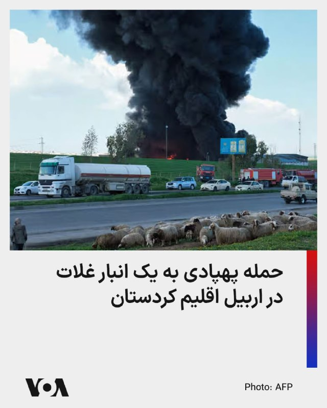

⚡️نهاد مبارزه با تروریسم اقلیم کردستان اعلام کرد که حوالی ظهر روز پنج‌شنبه ۲۱ خرداد یک انبار ذخیره غلات در شهرستان قوشتپه از توابع استان اربیل، با استفاده از دو پهپاد بمب‌گذاری‌شده از نوع «حدید ۱۱۰» هدف حمله قرار گرفت.

در نتیجه این حمله، خسارات مادی سنگینی به انبار وارد شده است، اما هیچ‌گونه تلفات جانی گزارش نشده است.

نهاد مبارزه با تروریسم اقلیم کردستان ضمن محکوم کردن این حمله، تأکید کرد که این‌گونه اقدامات تروریستی که اماکن و اهداف غیرنظامی را مورد حمله قرار می‌دهند، به‌شدت محکوم است.

## DW_Farsi — post 125828

  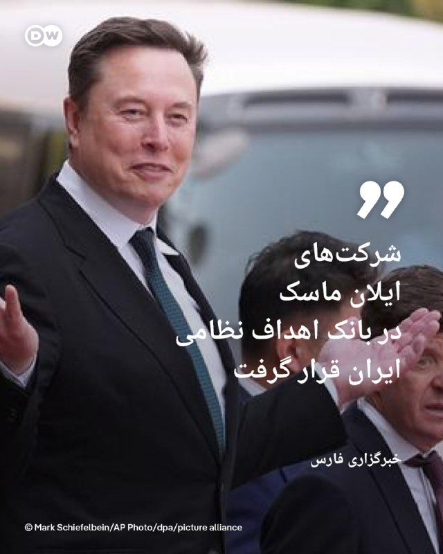

🔶 فارس: شرکت‌های ایلان ماسک در بانک اهداف نظامی ایران قرار گرفت
 
خبرگزاری فارس، وابسته به سپاه پاسداران در خبری اعلام کرد، منافع مرتبط با هلدینگ‌های اقتصادی تحت مدیریت ایلان ماسک در غرب آسیا، از جمله در کشورهای عربی و اسرائيل در "بانک اهداف نظامی جدید" ایران قرار گرفته است.
 
فارس روز پنج‌شنبه ۲۱ خرداد نوشت که این اقدام "در پی اثبات استفاده ارتش آمریکا و اسرائيل از زیرساخت تحت مدیریت" این میلیاردر آمریکایی حوزه فناوری، از جمله استارلینک است.
 
به گفته این خبرگزاری، ایستگاه زمینی استارلینک واقع در اسرائيل، قطر، اردن، امارات، و عمان در کنار سهام‌داران اسپیس‌ایکس از جمله زیرساخت دو شرکت "آلفاظبی" و "مبادله" تعدادی از اهداف جدید جمهوری اسلامی محسوب می‌شوند.
 
فارس همچنین به نقل از یک منبع آگاه مدعی شد که ارتش آمریکا "با پشتیبانی شرکت‌های مرتبط با ماسک دست به جنایات جنگی از جمله حمله به زیرساخت آبی در جنوب ایران زده" و از این رو جمهوری اسلامی "حق حمله به تمامی تأسیسات مرتبط با هلدینگ‌های تحت مدیریت ماسک در منطقه" و همچنین در اسرائيل را محفوظ می‌داند.
@dw_farsi

## Hranews — post 113543

گزارشی از بازداشت و بی‌خبری از وضعیت هیرش شریفیان نوجوان ۱۷ ساله

❗️
❗️
❗️
❗️
❗️– هیرش شریفیان، نوجوان ۱۷ ساله اهل شهرستان کامیاران در تاریخ ۱۶ خردادماه پس از مراجعه به اداره اطلاعات این شهرستان بازداشت و به مکان نامعلومی منتقل شده است. بی‌خبری از سرنوشت این شهروند، افزایش نگرانی‌های خانواده و بستگان او را در پی داشته است.

#هیرش_شریفیان

ادامه مطلب

↘️
@hranews_bot تماس ✉️ - @Hranews کانال هرانا 🆑

## alonews — post 127184

  <a href="telegram/content/alonews_127184_1781194433.webm" target="_blank">🎬 Download video</a>

👈سنتکام: تنگه هرمز باز باقی میمونه

✅ @AloNews خبر جنگ

## alonews — post 127183

  <a href="telegram/content/alonews_127183_1781194433.webm" target="_blank">🎬 Download video</a>

👈مدیرکل مدیریت بحران استانداری آذربایجان شرقی: حادثه خروج قطار خاوران از ریل در ایستگاه ترکمانچای رخ داده است.

🔴 این قطار از تبریز به سمت تهران در حال حرکت بود و در این حادثه یک نفر مصدوم گزارش شده است

✅ @AloNews خبر جنگ

## alonews — post 127182

  <a href="telegram/content/alonews_127182_1781194433.mp4" target="_blank">🎬 Download video</a>

👈پنتاگون در وضعیت قرنطینه؛ تیم‌های هازمت برای حادثه مواد خطرناک وارد شدند

🔴پنتاگون ساعاتی قبل به دلیل «حادثه مواد خطرناک» در قرنطینه قرار گرفته و تیم‌های اضطراری هازمت (مواد خطرناک) برای بررسی وارد ساختمان شده‌اند.

🔴طبق اعلام آژانس آتش‌نشانی و خدمات اضطراری شهرستان آرلینگتون، واحدهای این آژانس از جمله تیم مواد خطرناک، در حمایت از تیم هازمت PFPA (پلیس پنتاگون) در محل حادثه حضور دارند

✅ @AloNews خبر جنگ

## alonews — post 127181

  <a href="telegram/content/alonews_127181_1781194436.webm" target="_blank">🎬 Download video</a>

👈اورژانس تهران: آتش‌سوزی در یک واحد مسکونی که محل نگهداری بنزین بود

🔴 در این حادثه یک تن جان باخت و پنج نفر به مراکز درمانی انتقال یافتند

✅ @AloNews خبر جنگ

---
📅 بروزرسانی: 1405/03/21 19:33
---

## VahidOOnLine — post 244989

  

کایا کالاس، مسئول سیاست خارجی اتحادیه اروپا، در شبکه ایکس نوشت با عباس عراقچی، وزیر خارجه جمهوری اسلامی، درباره تشدید اخیر تنش‌ها در خلیج فارس و وضعیت مذاکرات با آمریکا گفت‌وگو کرده است.

کایا کالاس افزود با وزیر خارجه کویت در تماس بوده است و تاکید کرد ازسرگیری حملات به کشورهای خلیج فارس و زیرساخت‌های حیاتی آن‌ها غیرقابل قبول است.

او افزود: «بازگشت به جنگ تمام‌عیار هزینه‌ای بسیار سنگین برای کل منطقه خواهد داشت و مسیر دیپلماتیک همچنان بهترین راه برای خروج از این جنگ است.»
‌🏁 🇬🇧 IranintlTV

🤖 @VahidOOnLine

## pm_afshaa — post 93634

  <a href="telegram/content/pm_afshaa_93634_1781193805.webm" target="_blank">🎬 Download video</a>

🔴قالیباف: استراتژی‌های اشتباه و تصمیمات بدون فکر، صحنه بازی رو به شکلی فاجعه‌بار به نقطه صفر برمیگردونه؛ زیرساخت‌های انرژی و بازارها رو به انفجار میکشونه و مردابی بی‌پایان پدید میاره که سال‌ها در آن گرفتار خواهید شد. ایرانی متفاوت خواهید دید!

💧 Rainbet.com the #1 Non-KYC Crypto Casino & Sportsbook @rainbetcom

😁 @Pm_Afshaa

## IranIntlTV — post 341748

  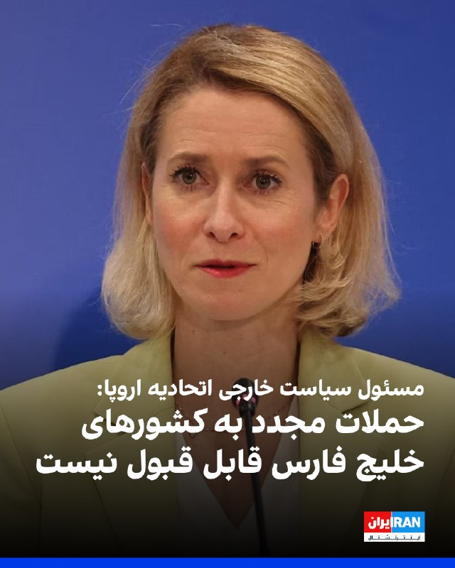

کایا کالاس، مسئول سیاست خارجی اتحادیه اروپا، در شبکه ایکس نوشت با عباس عراقچی، وزیر خارجه جمهوری اسلامی، درباره تشدید اخیر تنش‌ها در خلیج فارس و وضعیت مذاکرات با آمریکا گفت‌وگو کرده است.

کایا کالاس افزود با وزیر خارجه کویت در تماس بوده است و تاکید کرد ازسرگیری حملات به کشورهای خلیج فارس و زیرساخت‌های حیاتی آن‌ها غیرقابل قبول است.

او افزود: «بازگشت به جنگ تمام‌عیار هزینه‌ای بسیار سنگین برای کل منطقه خواهد داشت و مسیر دیپلماتیک همچنان بهترین راه برای خروج از این جنگ است.»
https://iranintl.com/202606110698

## FarsiVOA — post 220392

  <a href="telegram/content/FarsiVOA_220392_1781193806.mp4" target="_blank">🎬 Download video</a>

ارتش اسرائیل اعلام کرد نیروهای تیپ ۷ زرهی و یگان کماندویی یک عملیات را در منطقه وادی سلوکی در جنوب لبنان، در حدود ۱۰ کیلومتری مرز اسرائیل، به پایان رسانده‌اند.

به گفته ارتش اسرائیل، در این عملیات صدها موضع مرتبط با حزب‌الله هدف قرار گرفت و بیش از ۵۰ نفر از نیروهای این گروه کشته شدند.

ارتش اسرائیل همچنین اعلام کرد موشک‌های ضدزره و مواد منفجره در این منطقه کشف و ضبط شده است. اسرائیل می‌گوید حزب‌الله از این منطقه برای حملات پهپادی و راکتی علیه نیروهای اسرائیلی استفاده می‌کرد.

@FarsiVOA

## FarsiVOA — post 220391

آماده‌باش منطقه‌ای؛ هشدارهای امنیتی آمریکا برای عراق و اردن هم‌زمان صادر شد

## Persian_Trend_Official — post 16743

  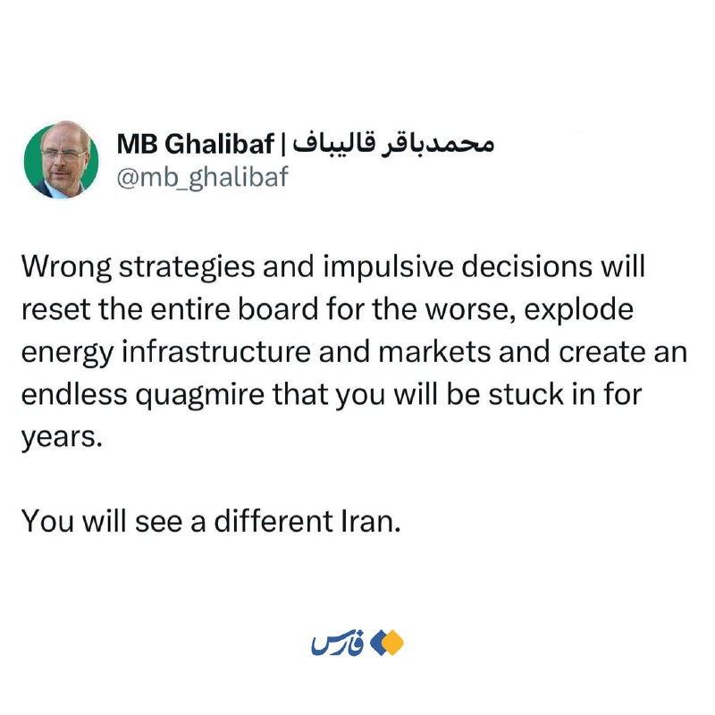

قالیباف: تصمیمات بدون فکر، زیرساخت‌ های انرژی و بازارها را به انفجار می‌کشاند. این کارها مردابی بی‌پایان پدید می‌آورد که سال‌ها در آن گرفتار خواهید شد.

ایرانی متفاوت خواهید دید!

📝 Amir

📌 @persian_trend_official
پرشین ترند | متفاوت‌ترین کانال نظامی

## RadioFarda — post 158188

  <a href="telegram/content/RadioFarda_158188_1781193809.mp4" target="_blank">🎬 Download video</a>

🔸توماج صالحی، خواننده معترض، با انتشار ویدئویی از خود که به نظر می‌رسد ۲۲ بهمن سال گذشته ضبط شده باشد به ادامه بازداشت معترضان ۱۴۰۴ اعتراض کرد.

🔸آقای صالحی که خود چندبار بازداشت شده و به زندان افتاده، همراه با این ویدئو اعتراضی نوشته است:« ما خودِ دی‌ماهیم، ما خون‌های جاری در جوب‌های شهریم، ما مقاومتِ مادام در مقابل جنایت و کشتاریم، ما صداهایی هستیم که هرگز خفه نمی‌شوند.»

🔸او در ادامه می‌نویسد: «نقطه‌ی شروعِ تمام جنبش‌های ایران تا به امروز کرامت‌خواهی بوده، این باید نشانه‌ای باشد تا احترام بیشتری به جامعه‌ی آزادی‌خواه ایران گذاشته شود.»

🔸توماج صالحی که در جریان اعتراضات سال ۱۴۰۱ بازداشت شده بود در اردیبهشت ۱۴۰۳ از سوی دادگاه انقلاب جمهوری اسلامی به اعدام محکوم شد اما دیوان عالی کشور این حکم را نقض کرد و آقای صالحی در آذرماه ۱۴۰۳ پس گذراندن یک سال حکم حبس از زندان آزاد شد.

@RadioFarda

## alonews — post 127180

  <a href="telegram/content/alonews_127180_1781193810.mp4" target="_blank">🎬 Download video</a>

👈برخورد یک پهپاد انتحاری سپاه در منطقه‌ای در اربیل کردستان عراق

✅ @AloNews خبر جنگ

---
📅 بروزرسانی: 1405/03/21 19:23
---

## VahidOOnLine — post 244988

ویدیوی رسیده به ایران اینترنشنال زاویه‌ای دیگر از تجمع بسیار بزرگ مردم در شامگاه ۱۹ دی در منطقه پونک تهران را نشان می‌دهد. حکومت در شب دوم اعتراضات برق منطقه را قطع کرده بود و مردم با روشن کردن چراغ‌قوه گوشی‌های موبایل خود به فریاد و شعار دادن پرداختند.
‌🏁 🇬🇧 IranintlTV

🤖 @VahidOOnLine

## VahidOOnLine — post 244987

♦️ویدیوی اختصاصی رسیده به ایندیپندنت فارسی حاکی از آن است که گروهی از ایرانیان ساکن اروپا در پاسداشت جاویدنامان انقلاب ملی دی ماه و زندانیان سیاسی در خطر اعدام، گردهم آمده‌اند.
بر اساس اظهارات ضبط کننده این تصاویر، ایرانیان فرانکفورت با هدف انعکاس «صدای بی‌صدایان» و اعتراض مردم داخل کشور، برای شش روز متوالی تحصن برگزار کرده‌اند.
‌🇸🇦 Indypersian

🤖 @VahidOOnLine

## VahidOOnLine — post 244986

  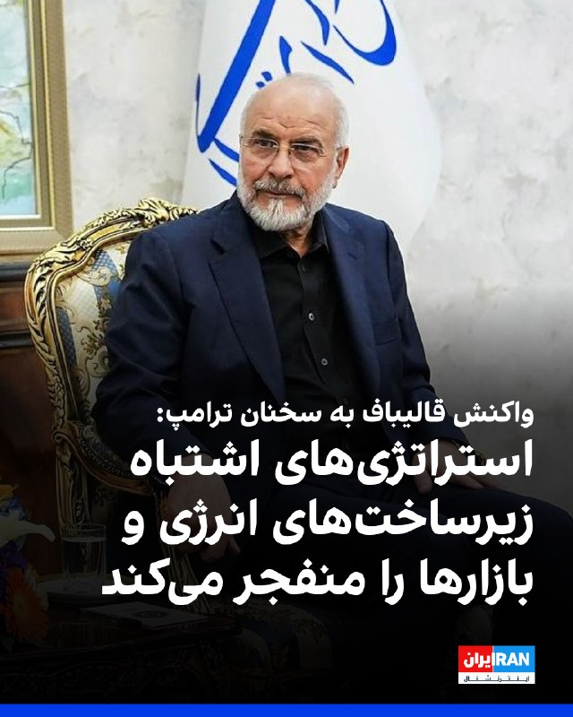

در پی اظهارات ترامپ مبنی بر احتمال حمله مجدد به اهدافی در ایران، محمدباقر قالیباف، رییس مجلس در شبکه ایکس نوشت: «استراتژی‌های اشتباه و تصمیمات عجولانه، کل اوضاع را به سمت بدتر شدن تغییر می‌دهد، زیرساخت‌های انرژی و بازارها را منفجر می‌کند و باتلاقی بی‌پایان ایجاد می‌کند که سال‌ها در آن گیر خواهید کرد.»

او ادامه داد: «شما ایران متفاوتی را خواهید دید.»
‌🏁 🇬🇧 IranintlTV

🤖 @VahidOOnLine

## WithYashar — post 14533

  <a href="telegram/content/WithYashar_14533_1781193205.mp4" target="_blank">🎬 Download video</a>

تصاویر ماهواره‌ای امروز نشان می‌دهد که تأسیسات غنی‌سازی هسته‌ای نطنز ایران که در جریان بمباران امروز نیروهای آمریکایی مورد اصابت قرار گرفت، خسارات زیادی دیده است.
@withyashar

## mwarmonitor — post 10726

🔸مجلس نمایندگان آمریکا موفق نشد تمدید کوتاه‌مدت «قانون نظارت بر اطلاعات خارجی» (FISA) را تصویب کند؛ قانونی که قرار است روز جمعه منقضی شود. اگر کنگره نتواند این تمدید را تصویب کند، این نخستین بار از زمان تصویب آن در سال ۲۰۰۸ خواهد بود که این قانون منقضی می‌شود.

@mwarmonitor

## DEJradio — post 5594

  <a href="telegram/content/DEJradio_5594_1781193206.webm" target="_blank">🎬 Download video</a>

🔺📢 شماری از پرسنل ارتش با ارسال رسید دریافت حقوق خود بعد از جنگ ۴۰ روزه از تبعیض و بی‌عدالتی شکایت دارند.

یکی از آنها می‌گوید: «من از پرسنل نیروی دریایی ارتش منطقه ... هستم، با وجود حضور ۲۴ ساعته من و همکارانم، فقط حدود سه میلیون تومان پاداش جنگ را گرفتیم، دلیل هم روشن است، پاداش‌ها و سهم‌ها رو فرماندهان و ارشد نظامی منطقه می‌خورند و می‌دزدند، این سیستم تا عمق وجودش دزد است.»

#ارتش #جنگ
@DEJradio

## IranIntlTV — post 341747

  <a href="telegram/content/IranIntlTV_341747_1781193207.mp4" target="_blank">🎬 Download video</a>

سنتکام روز پنج‌شنبه اعلام کرد نیروهای آمریکایی نفتکشی با پرچم گینه بیسائو را در دریای عمان هدف قرار دادند و از کار انداختند؛ اقدامی که پس از تلاش این کشتی برای دور زدن محاصره بنادر ایران و سرپیچی مکرر خدمه آن از دستورها انجام شد. سنتکام در بیانیه خود گفت ارتش آمریکا با شلیک دو موشک هلفایر از جنگنده، موتورخانه این کشتی را هدف قرار داده است. این سومین حمله از این نوع در هفته جاری و نهمین مورد از آغاز محاصره محسوب می‌شود.
@iranintltv

## IranIntlTV — post 341746

ویدیوی رسیده به ایران اینترنشنال زاویه‌ای دیگر از تجمع بسیار بزرگ مردم در شامگاه ۱۹ دی در منطقه پونک تهران را نشان می‌دهد. حکومت در شب دوم اعتراضات برق منطقه را قطع کرده بود و مردم با روشن کردن چراغ‌قوه گوشی‌های موبایل خود به فریاد و شعار دادن پرداختند.

## IranIntlTV — post 341745

  

در پی اظهارات ترامپ مبنی بر احتمال حمله مجدد به اهدافی در ایران، محمدباقر قالیباف، رییس مجلس در شبکه ایکس نوشت: «استراتژی‌های اشتباه و تصمیمات عجولانه، کل اوضاع را به سمت بدتر شدن تغییر می‌دهد، زیرساخت‌های انرژی و بازارها را منفجر می‌کند و باتلاقی بی‌پایان ایجاد می‌کند که سال‌ها در آن گیر خواهید کرد.»

او ادامه داد: «شما ایران متفاوتی را خواهید دید.»
https://iranintl.com/202606118933

## Shin_Persian — post 6954

خوب دیگه کسشعر بسه، ببخشید اسپم شد :)) من رفتم تا صدای انفجار بعدی

## Shin_Persian — post 6953

  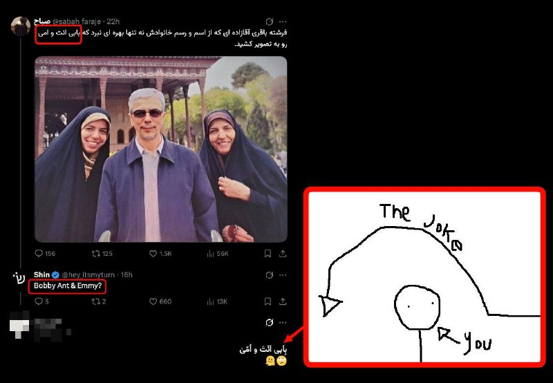

📷 Photo

## FarsiVOA — post 220390

🔺دومین نامه پرزیدنت ترامپ به خانواده یکی از کشته‌شدگان اعتراضات دی‌ ۱۴۰۴ ایران

▪️رئیس جمهوری ایالات متحده برای دومین بار به مجید مقدسی، دایی محمدعرفان فرجی از کشته‌شدگان اعتراضات دی ۱۴۰۴ ایران نامه نوشت و بر «بازدارندگی نیروهای نظامی آمریکا در برابر تهدیدها» تاکید کرد.

⬇️ بیشتر بخوانید:

https://ir.voanews.com/a/president-trump-letter-about-executed-iranian-protester/8159731.html/?nocach=1

## Persian_Trend_Official — post 16742

  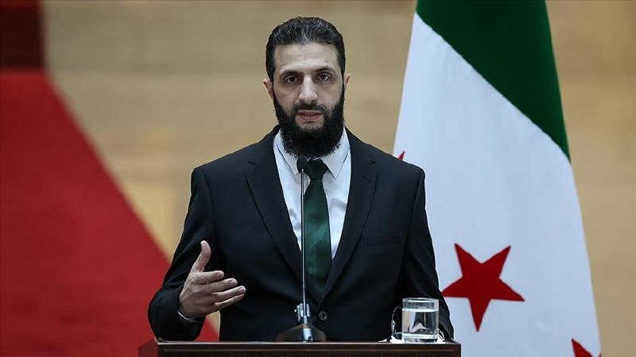

العربیه: به گفته یک منبع دیپلماتیک که خبرگزاری فرانسه به آن استناد کرده است، احمد الشرع، رئیس جمهور سوریه، دعوتنامه‌ای برای سفر به ایالات متحده در 14 ژوئن دریافت کرده است.

این منبع تأیید نکرد که آیا الشرع این دعوت را خواهد پذیرفت یا خیر. این دعوت پس از اشارات اخیر ترامپ به تمایل سوریه برای مداخله علیه حزب الله در لبنان صورت گرفته است.

الشرع پیش از این در نوامبر گذشته در اولین سفر یک رئیس دولت سوریه از زمان استقلال سوریه، با ترامپ در کاخ سفید دیدار کرده بود.

📝 Amir

📌 @persian_trend_official
پرشین ترند | متفاوت‌ترین کانال نظامی

## IranianMinds — post 22317

  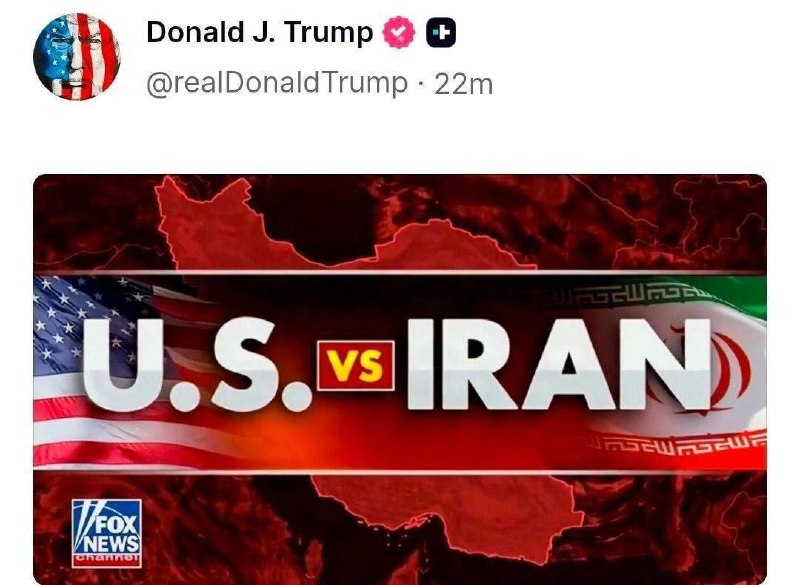

🔴پست جدید ترامپ.

@IranianMinds

## BBCPersian — post 283458

🔻خشونت‌ها در نقاط مختلف شهر بلفاست، مرکز ایرلند شمالی در بریتانیا پس از آن شدت گرفت که شامگاه دوشنبه (۸ ژوئن‌‌/۱۸ خرداد) مردی در پی حمله با چاقو در شمال این شهر دچار جراحات شدید و به بیمارستان منتقل شد.

یک مهاجر ۳۰ ساله اهل سودان، در محل حادثه در ارتباط با این حمله بازداشت و روز چهارشنبه در دادگاه به اتهام اقدام به قتل رسماً متهم شد.

این حادثه موجب اعتراضات گروه‌هایی از افراد علیه مهاجران و اقلیت‌ها شد که به خشونت کشیده شد.

در جریان ناآرامی‌های دو شب قبل چندین خانه و خودرو به آتش کشیده شدند.

برخی گزارش‌ها حاکی از آن است که شماری از ساکنان بر اساس رنگ پوست خود هدف قرار گرفته‌اند.

بیشتر بخوانید:

https://bbc.in/3Szc8vK
@BBCPersian

---
📅 بروزرسانی: 1405/03/21 19:13
---

## VahidOOnLine — post 244985

  

سی‌ان‌ان گزارش داد جمهوری اسلامی ماه‌هاست برای احتمال عملیات آمریکا جهت تصرف جزیره خارک آماده شده و با استقرار پدافند هوایی، سامانه‌های دوش‌پرتاب زمین به هوا و مین‌گذاری در ساحل، دفاع خود را تقویت کرده است.

بر اساس این گزارش، تقویت تدابیر دفاعی جمهوری اسلامی شامل استقرار سامانه‌های موشکی هدایت‌شونده زمین به هوا و دوش‌پرتاب در این جزیره بوده است.

سی‌ان‌ان نوشت که جمهوری اسلامی همچنین با استفاده از مین‌های ضدنفر و ضدزره، از جمله در نوار ساحلی که ممکن است محل پیاده‌سازی نیروهای آمریکایی در صورت صدور دستور عملیات زمینی از سوی ترامپ باشد، اقدام به تله‌گذاری کرده است.
‌🏁 🇬🇧 IranintlTV

🤖 @VahidOOnLine

## WithYashar — post 14532

خالیباف: استراتژی‌های اشتباه و تصمیمات بدون فکر، صحنه بازی را به شکلی فاجعه‌بار به نقطه صفر برمی‌گرداند؛ زیرساخت‌های انرژی و بازارها را به انفجار می‌کشاند و مردابی بی‌پایان پدید می‌آورد که سال‌ها در آن گرفتار خواهید شد.
ایرانی متفاوت خواهید دید!
@withyashar

## mwarmonitor — post 10725

🔴 قالیباف

🔸«استراتژی‌های اشتباه و تصمیم‌های شتاب‌زده، کل صفحه بازی را به سمت بدتر شدن وضعیت بازتنظیم می‌کنند، زیرساخت‌های انرژی و بازارها را نابود می‌کنند و یک باتلاق بی‌پایان ایجاد می‌کنند که سال‌ها در آن گرفتار خواهید شد.

شما ایران متفاوتی را خواهید دید.»

@mwarmonitor

## pm_afshaa — post 93633

  

پست جدید ترامپ در تروث سوشال

💧 Rainbet.com the #1 Non-KYC Crypto Casino & Sportsbook @rainbetcom

😁 @Pm_Afshaa

## DEJradio — post 5593

  <a href="telegram/content/DEJradio_5593_1781192604.mp4" target="_blank">🎬 Download video</a>

🔺🎥 تهران؛ از پلیس دیپلمات فقط خاطره مونده

یکی از مخاطبان دژ با ارسال ویدیویی از ویرانه‌های ساختمان پلیس دیپلمات تخت‌طاووس نوشت: "از پلیس دیپلمات فقط خاطره مونده"

این مرکز در جنگ ۴۰ روزه هدف قرار گرفت.

#جنگ۴۰روزه #جنگ
@DEJradio

## IranIntlTV — post 341744

  <a href="https://t.me/IranintlTV/341744" target="_blank">📎 Download file</a>

🎧نسخه صوتی اخبار شبانگاهی | پنجشنبه ۲۱ خرداد
@iranintlTV

## IranIntlTV — post 341743

  <a href="telegram/content/IranIntlTV_341743_1781192607.mp4" target="_blank">🎬 Download video</a>

آرش آرامش، حقوقدان و کارشناس امنیت ملی، در گفت‌وگو با ایران‌اینترنشنال، با اشاره به حملات اخیر آمریکا، گفت ایالات متحده باید هدف نهایی خود را بر سرنگونی جمهوری اسلامی متمرکز کند، نه دستیابی به توافق با این حکومت. او امضای هرگونه توافق با جمهوری اسلامی را اشتباه دانست.
@iranintltv

## IranIntlTV — post 341742

  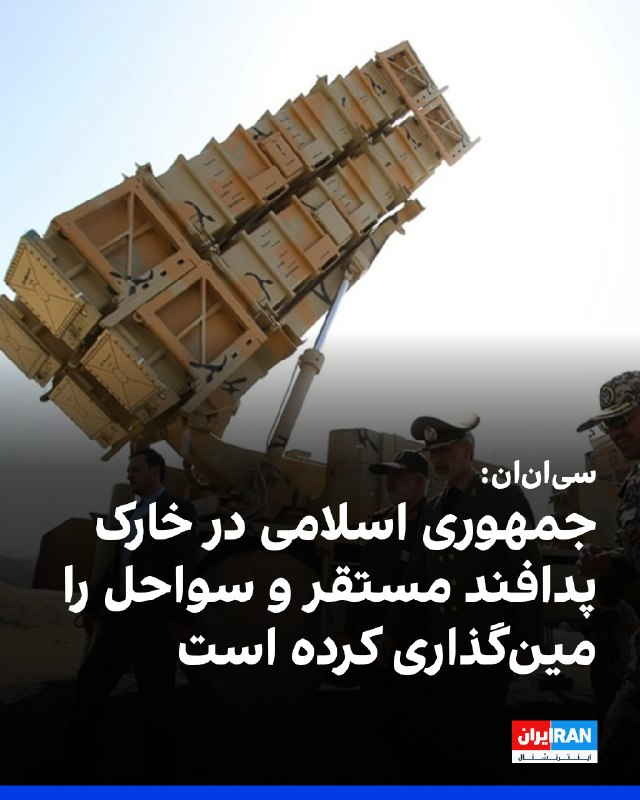

سی‌ان‌ان گزارش داد جمهوری اسلامی ماه‌هاست برای احتمال عملیات آمریکا جهت تصرف جزیره خارک آماده شده و با استقرار پدافند هوایی، سامانه‌های دوش‌پرتاب زمین به هوا و مین‌گذاری در ساحل، دفاع خود را تقویت کرده است.

بر اساس این گزارش، تقویت تدابیر دفاعی جمهوری اسلامی شامل استقرار سامانه‌های موشکی هدایت‌شونده زمین به هوا و دوش‌پرتاب در این جزیره بوده است.

سی‌ان‌ان نوشت که جمهوری اسلامی همچنین با استفاده از مین‌های ضدنفر و ضدزره، از جمله در نوار ساحلی که ممکن است محل پیاده‌سازی نیروهای آمریکایی در صورت صدور دستور عملیات زمینی از سوی ترامپ باشد، اقدام به تله‌گذاری کرده است.
https://iranintl.com/202606118776

## Shin_Persian — post 6952

  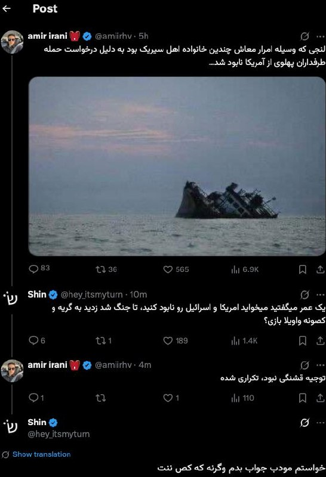

جدی اینا خودشون میخارن

## Shin_Persian — post 6951

  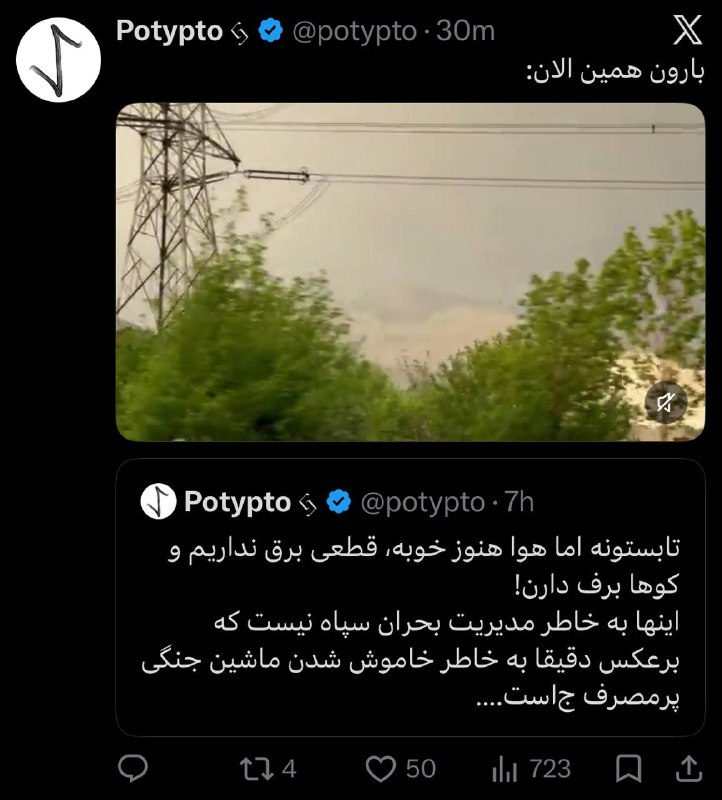

Shin ✓ @hey_itsmyturn Thu, 11 Jun 2026 15:23:05 UTC . @Vahid has the same idea ترجمه خودکار فارسی .@Vahid هم همین ایده را دارد 𝕏 · @shin_persian

## DW_Farsi — post 125827

  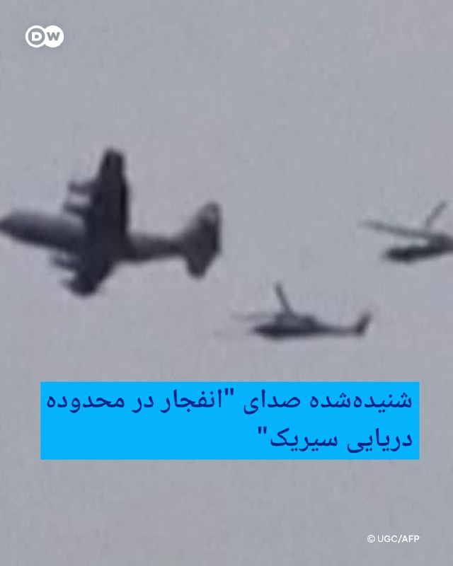

🔶 شنیده‌شده صدای "انفجار در محدوده دریایی سیریک"
 
خبرگزاری مهر به نقل از ساکنان و منابع محلی از شنیده‌شدن صدای انفجارهایی در محدوده دریایی شهرستان سیریک در استان هرمزگان خبر داده است.
 
این خبرگزاری عصر پنج‌شنبه ۲۱ خرداد با اعلام این خبر از قول خبرنگار خود نوشت: «هنوز هیچ‌ یک از نهادهای رسمی نظامی و انتظامی تا این لحظه درباره علت وقوع این صداها اظهارنظری نکرده‌اند.»
 
در ادامه آمده است: «به نظر می‌رسد این صداها مربوط به درگیری‌ها یا تبادل آتش در خلیج فارس و تنگه هرمز باشد.»
 
این خبر در حالی منتشر می‌شود که دونالد ترامپ، رئيس‌ جمهور آمریکا روز پنج‌شنبه برای سومین روز متوالی خبر داده که کشورش به تلافی سرنگون‌شدن یک هلی‌کوپتر آپاچی آمریکایی در تنگه هرمز باز هم امشب به مواضعی در ایران حمله خواهد کرد.
@dw_farsi

## Persian_Trend_Official — post 16740

  <a href="telegram/content/Persian_Trend_Official_16740_1781192611.mp4" target="_blank">🎬 Download video</a>

ساعتی پیش دو فروند پهپاد انتحاری به احتمال زیاد از نوع شاهد-136 ایرانی به انبار گروهک های کرد مستقر در جنوب اربیل اصابت کردند.

📝 Amir

📌 @persian_trend_official
پرشین ترند | متفاوت‌ترین کانال نظامی

## alonews — post 127179

  <a href="telegram/content/alonews_127179_1781192612.webm" target="_blank">🎬 Download video</a>

👈قالیباف:
استراتژی‌های اشتباه و تصمیمات بدون فکر، صحنه بازی را به شکلی فاجعه‌بار به نقطه صفر برمی‌گرداند؛ زیرساخت‌های انرژی و بازارها را به انفجار می‌کشاند و مردابی بی‌پایان پدید می‌آورد که سال‌ها در آن گرفتار خواهید شد.
ایرانی متفاوت خواهید دید

✅ @AloNews خبر جنگ

## alonews — post 127177

🔥 هنوزم ۱۰۰ و ۲۰۰ گیگ رو به اسم نامحدود میفروشن؟! 
🚀 مخصوص جنگ 
😎 
💙 5 سال فعالیت مداوم 
🛡حتی بدون قطعی تو دوران جنگ 
🌐 با ما همراه شو و در زمان قطعی وصل بمون 😎 
✅بقیه هنوز VPN حجمی میفروشن اونم با قیمتای نجومی 
🚀 💥بدون محدودیت حجم
⬇️
⬇️
⬇️ @NetAazaadBot @NetAazaadBot

## alonews — post 127176

  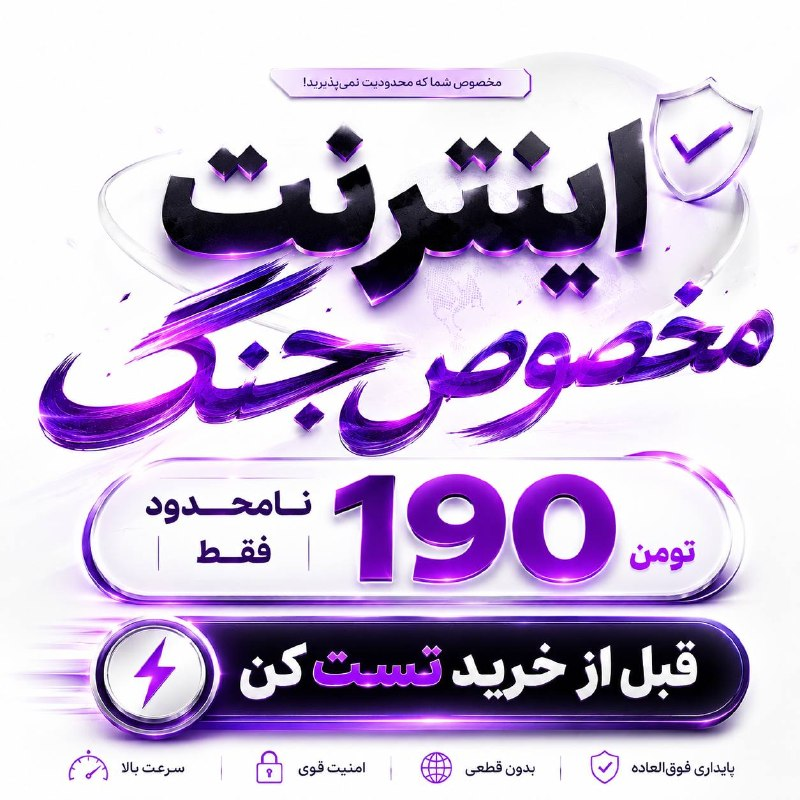

🔥 هنوزم ۱۰۰ و ۲۰۰ گیگ رو به اسم نامحدود میفروشن؟!

🚀 مخصوص جنگ 
😎

💙 5 سال فعالیت مداوم

🛡حتی بدون قطعی تو دوران جنگ

🌐 با ما همراه شو و در زمان قطعی
وصل بمون 😎

✅بقیه هنوز VPN حجمی میفروشن
اونم با قیمتای نجومی 
🚀

💥بدون محدودیت حجم
⬇️
⬇️
⬇️
@NetAazaadBot
@NetAazaadBot

## alonews — post 127175

  <a href="telegram/content/alonews_127175_1781192613.mp4" target="_blank">🎬 Download video</a>

👈 هم‌اکنون ، طوفان و رعد و برق در تهران

✅ @AloNews خبر جنگ

## alonews — post 127174

  <a href="telegram/content/alonews_127174_1781192615.webm" target="_blank">🎬 Download video</a>

👈هلال احمر: امشب در آماده باش کامل هستیم

✅ @AloNews خبر جنگ

---
📅 بروزرسانی: 1405/03/21 19:03
---

## VahidOOnLine — post 244984

  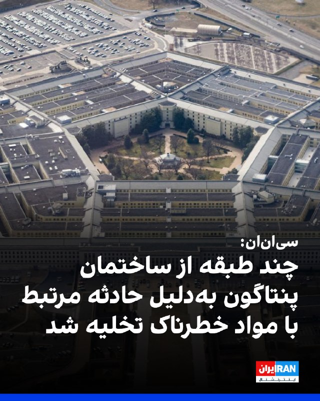

مقام‌های آتش‌نشانی و امداد شهرستان آرلینگتون اعلام کردند آتش‌نشانان روز پنجشنبه، در حال بررسی یک حادثه مرتبط با مواد خطرناک در ساختمان پنتاگون هستند.

سی‌ان‌ان به نقل از چند منابع گزارش داد این ساختمان در وضعیت قرنطینه قرار گرفته و چندین طبقه آن تخلیه شده است.

سخنگوی پنتاگون تایید کرد سامانه‌های داخلی «مشکل کیفیت هوا» را شناسایی کرده‌اند که مستلزم اقدامات احتیاطی تا زمان روشن شدن اهمیت آن است.
‌🏁 🇬🇧 IranintlTV

🤖 @VahidOOnLine

## VahidOOnLine — post 244983

  

♦️ مقامات آتش‌نشانی و امداد و نجات شهرستان آرلینگتون در شبکه اجتماعی ایکس اعلام کردند که ماموران آتش‌نشانی در حال بررسی حادثه‌ای مربوط به مواد خطرناک (Hazardous Materials) در ساختمان پنتاگون هستند.

شبکه خبری سی‌ان‌ان نیز به نقل از منابع ناشناس گزارش داد که این ساختمان تحت قرنطینه و تدابیر شدید امنیتی قرار گرفته و کارکنان چندین طبقه از آن تخلیه شده‌اند.

در همین حال، سخنگوی پنتاگون در این باره اعلام کرد: «پنتاگون متوجه مشکلی در کیفیت هوای ساختمان شده است که تا زمان تعیین میزان اهمیت و خطر آن، اتخاذ اقدامات پیشگیرانه را ضروری ساخته است.»

او در ادامه افزود: «وزارت دفاع در حال اجرای پروتکل‌های حفاظتی استاندارد است؛ این اقدامات شامل صدور دستور پناه‌گیری در محل (Shelter-in-place) برای بخش‌های آسیب‌دیده ساختمان می‌شود.»
‌🇸🇦 Indypersian

🤖 @VahidOOnLine

## FoxNewsTwitter — post 342860

  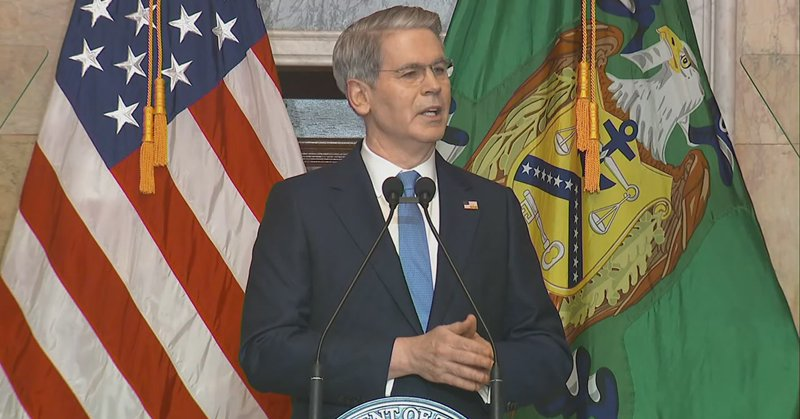

Fox News (Twitter/X)

WATCH LIVE: First Lady Melania Trump launches Fostering the Future Accounts for youth in foster care https://twitter.com/i/broadcasts/1RJjppRjERoKw

## FoxNewsTwitter — post 342859

Fox News (Twitter/X)

BREAKING: 'Hazardous materials incident' reported at Pentagon by emergency officials in Arlington, Virginia

## pm_afshaa — post 93632

  <a href="telegram/content/pm_afshaa_93632_1781192023.webm" target="_blank">🎬 Download video</a>

🔴الحدث: پاکستان، قطر، عربستان سعودی، مصر و ترکیه برای ارزیابی تلاش‌های میانجی‌گری تشکیل جلسه میدن.

نشست پنج‌جانبه به دنبال یافتن تضمین‌هایی برای اجرای توافق بین آمریکا و ایران است.

💧 Rainbet.com the #1 Non-KYC Crypto Casino & Sportsbook @rainbetcom

😁 @Pm_Afshaa

## VahidOnline — post 76223

  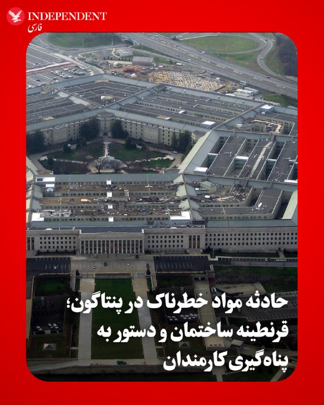

♦️ مقامات آتش‌نشانی و امداد و نجات شهرستان آرلینگتون در شبکه اجتماعی ایکس اعلام کردند که ماموران آتش‌نشانی در حال بررسی حادثه‌ای مربوط به مواد خطرناک (Hazardous Materials) در ساختمان پنتاگون هستند.

شبکه خبری سی‌ان‌ان نیز به نقل از منابع ناشناس گزارش داد که این ساختمان تحت قرنطینه و تدابیر شدید امنیتی قرار گرفته و کارکنان چندین طبقه از آن تخلیه شده‌اند.

در همین حال، سخنگوی پنتاگون در این باره اعلام کرد: «پنتاگون متوجه مشکلی در کیفیت هوای ساختمان شده است که تا زمان تعیین میزان اهمیت و خطر آن، اتخاذ اقدامات پیشگیرانه را ضروری ساخته است.»

او در ادامه افزود: «وزارت دفاع در حال اجرای پروتکل‌های حفاظتی استاندارد است؛ این اقدامات شامل صدور دستور پناه‌گیری در محل (Shelter-in-place) برای بخش‌های آسیب‌دیده ساختمان می‌شود.»
@VahidOOnLine

📡 @VahidOnline

## kianmeli1 — post 87937

🔴هلال احمر

امشب در آماده باش کامل هستیم
https://t.me/kianmeli1

## IranIntlTV — post 341741

  

مقام‌های آتش‌نشانی و امداد شهرستان آرلینگتون اعلام کردند آتش‌نشانان روز پنجشنبه، در حال بررسی یک حادثه مرتبط با مواد خطرناک در ساختمان پنتاگون هستند.

سی‌ان‌ان به نقل از چند منابع گزارش داد این ساختمان در وضعیت قرنطینه قرار گرفته و چندین طبقه آن تخلیه شده است.

سخنگوی پنتاگون تایید کرد سامانه‌های داخلی «مشکل کیفیت هوا» را شناسایی کرده‌اند که مستلزم اقدامات احتیاطی تا زمان روشن شدن اهمیت آن است.
https://iranintl.com/202606111419

## Shin_Persian — post 6950

  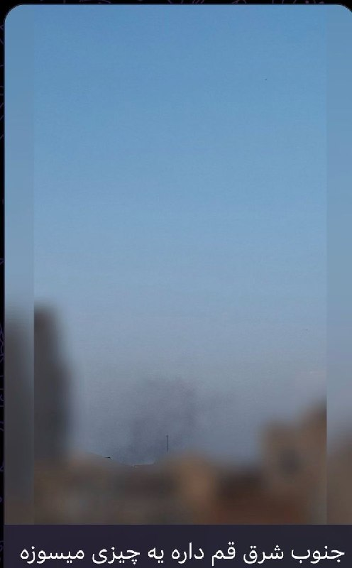

Shin ✓ @hey_itsmyturn
Thu, 11 Jun 2026 15:32:08 UTC

Fire broke out in southeastern Qom, nature is unclear as of now

ترجمه خودکار فارسی

𝕏 · @shin_persian

## Shin_Persian — post 6949

  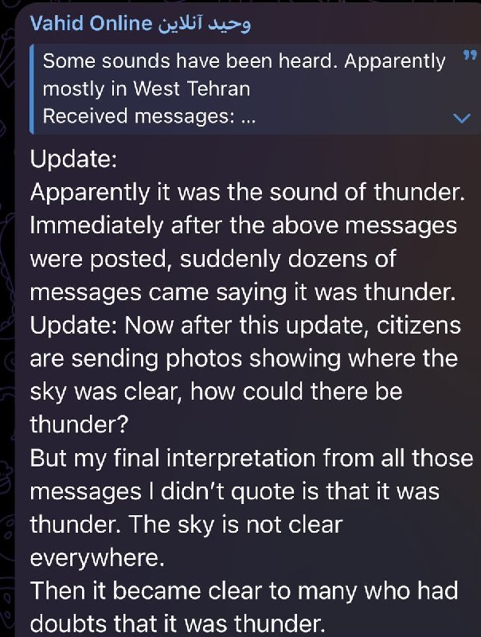

Shin ✓ @hey_itsmyturn
Thu, 11 Jun 2026 15:23:05 UTC

. @Vahid has the same idea

ترجمه خودکار فارسی

.@Vahid هم همین ایده را دارد

𝕏 · @shin_persian

## DW_Farsi — post 125826

  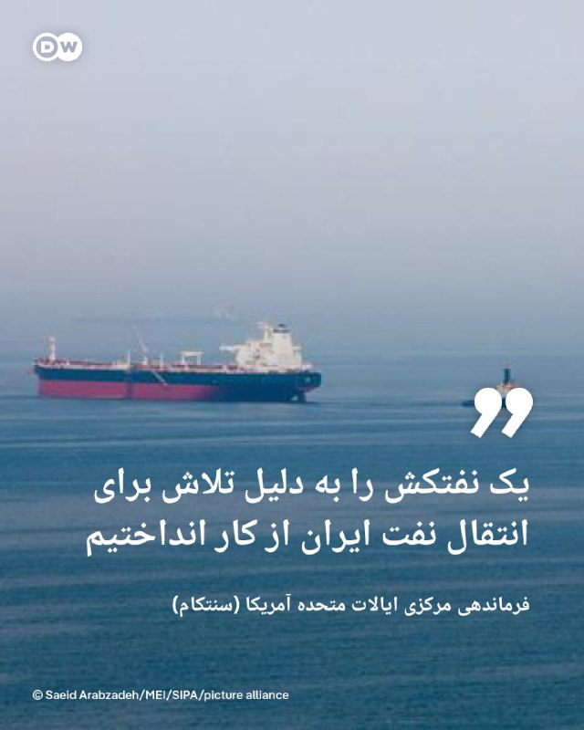

🔶 سنتکام: یک نفتکش را به دلیل تلاش برای انتقال نفت ایران از کار انداختیم

فرماندهی مرکزی ایالات متحده آمریکا (سنتکام) در بیانیه‌ای تأیید کرد که چهارشنبه ۱۰ ژوئن یک نفتکش به نام "ام‌/‌تی جالویر" (M/T Jalveer) که با پرچم گینه‌ بیسائو در دریای عمان در حرکت بود را متوقف کرده است.
 
سنتکام در این بیانیه گفت که به این نفتکش به این دلیل حمله کرده که تلاش داشت نفت ایران را منتقل کرده و به این ترتیب محاصره دریایی آمریکا علیه بنادر ایران را نقض کند.
 
سنتکام اعلام کرد: «خدمه این کشتی به‌طور مکرر از اجرای دستورات نیروهای آمریکایی خودداری کردند؛ در پی آن، یک هواپیمای آمریکایی دو موشک هلفایر به بخش موتورخانه کشتی شلیک کرد.»
 
به گفته سنتکام، این سومین کشتی تجاری است که در این هفته توسط نیروهای آمریکا، در چارچوب عملیات محدودکردن انتقال نفت ایران، از کار انداخته شده است.
 
آمریکا پیش‌تر دو کشتی "ماریوکس" و "سته‌بلو" را در این چارچوب از کار انداخته بود.
@dw_farsi

## Persian_Trend_Official — post 16739

  <a href="telegram/content/Persian_Trend_Official_16739_1781192027.mp4" target="_blank">🎬 Download video</a>

حزب‌الله لبنان ویدیویی از لحظه برخورد یک پرتابه FPV به یک سرباز ارتش اسرائیل در خیام منتشر کرد.

📝 Amir

📌 @persian_trend_official
پرشین ترند | متفاوت‌ترین کانال نظامی

## Persian_Trend_Official — post 16738

ساختمان پنتاگون در وضعیت قرنطینه قرار گرفت! به گزارش CNN، ساختمان پنتاگون در وضعیت قرنطینه قرار گرفته است، همچنین نیروهای واحدهای مواد خطرناک و آتش نشانی به محل اعزام شده‌اند و در حال رسیدگی به وضعیت هستند. 📝 Amir 📌 @persian_trend_official پرشین ترند |…

## Persian_Trend_Official — post 16737

  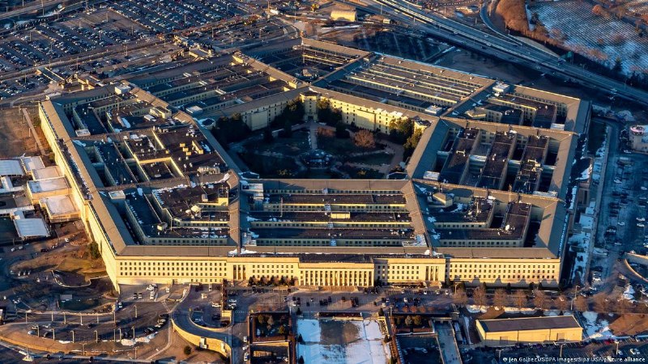

ساختمان پنتاگون در وضعیت قرنطینه قرار گرفت!

به گزارش CNN، ساختمان پنتاگون در وضعیت قرنطینه قرار گرفته است، همچنین نیروهای واحدهای مواد خطرناک و آتش نشانی به محل اعزام شده‌اند و در حال رسیدگی به وضعیت هستند.

📝 Amir

📌 @persian_trend_official
پرشین ترند | متفاوت‌ترین کانال نظامی

## IranianMinds — post 22316

  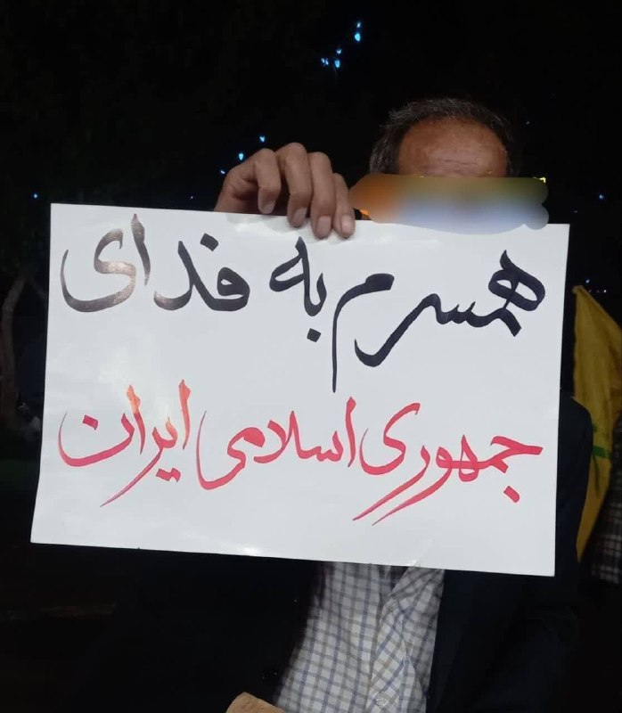

پس خودت چی؟

@IranianMinds

## Dirty_Kids — post 391720

  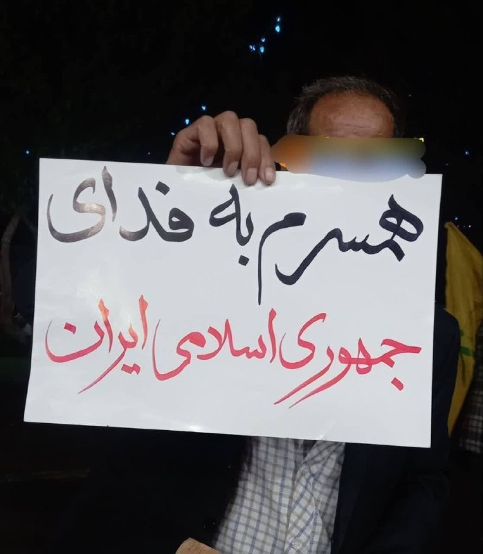

داداش اون دیگه پیرشده
دختراتو فدا کن😑😂😂😂

@Dirty_Kids 👻

## Dirty_Kids — post 391719

  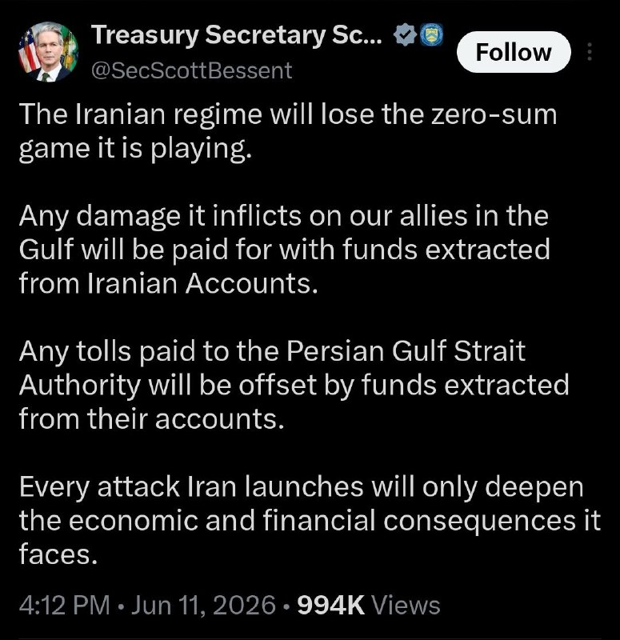

🔴بسنت، وزیر خزانه‌داری آمریکا:

رژیم ایران داره یه بازی باخت-باخت بازی می‌کنه و قطعاً می‌بازه؛

هر آسیبی که به متحدان ما در خلیج فارس بزنن و هر عوارضی که برای تنگه هرمز بگیرن، جبرانش رو با پول‌های بلوکه‌ شدشون پرداخت میکنیم.

هر حمله‌ای که ایران انجام بده، فقط عمق فاجعه اقتصادی و مالی خودش رو بیشتر می‌کنه.

@Dirty_Kids 👻

## alonews — post 127173

  <a href="telegram/content/alonews_127173_1781192031.webm" target="_blank">🎬 Download video</a>

👈الحدث: ترکیه، مصر، پاکستان، عربستان سعودی و قطر قراره جلسه‌ای فوری برای جلوگیری از شعله‌ور شدن جنگ میان ایران و آمریکا و پیدا کردن راهی برای توافق بین این دو کشور، تشکیل بدن.

✅ @AloNews خبر جنگ

## alonews — post 127172

  <a href="telegram/content/alonews_127172_1781192031.webm" target="_blank">🎬 Download video</a>

👈پست جدید ترامپ در تروث سوشال!

✅ @AloNews خبر جنگ

---
📅 بروزرسانی: 1405/03/21 18:53
---

## VahidOOnLine — post 244982

🗣روایت شما از زندگی در دوران پس از انقلاب ملی و جنگ - پنجشنبه ۲۱ خرداد ۱۴۰۵

🔹هشتگرد: همین الان ۲۱ خرداد ساعت ۱۸:۳۰ صدای جنگنده، پنجشنبه
🔹صدای سه انفجار در غرب تهران ساعت ۱۸:۲۵ پنجشنبه
🔹از تهران: فعالیت پدافند در غرب تهران، شهرزیبا و طرشت
🔹الان پنجشنبه ساعت ۱۸:۱۷ تهران رو داره می‌زنه.
🔹شنیده شدن صدای عبور جنگنده بر فراز رودسر در ساعت ۶:۱۵ عصر
‌🏁 🇬🇧 IranintlTV

🤖 @VahidOOnLine

## VahidOOnLine — post 244981

  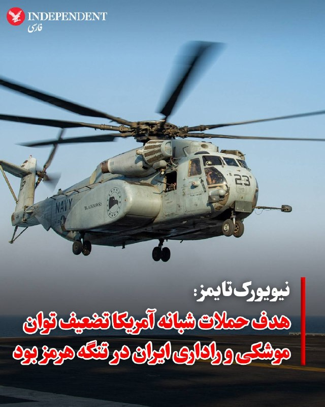

♦️نیویورک‌تایمز به نقل از یک مقام ارشد آمریکایی گزارش داد که حملات اواخر وقت چهارشنبه ایالات متحده علیه رادارها، پدافند هوایی و دیگر اهداف نظامی جمهوری اسلامی ایران، با هدف کاهش توانایی تهران در شناسایی و حمله به کشتی‌های تجاری در تنگه هرمز انجام شده است. این درگیری‌ها در حالی تشدید شده که تلاش‌ها برای دستیابی به توافق صلح همچنان ادامه دارد و دونالد ترامپ نیز روز پنجشنبه ۲۱ خرداد تهدید به اقدامات نظامی بیشتر کرد.

ستاد فرماندهی مرکزی آمریکا (سنتکام) درباره این حملات که بامداد پنجشنبه آغاز شد، اعلام کرد نیروهای دریایی، هوایی و تفنگداران این کشور، سیستم‌های نظارتی، ارتباطی و پدافندی ایران را که تهدیدی برای نیروهای آمریکایی و کشتی‌های تجاری بودند، هدف قرار دادند.

به گفته این مقام ارشد، حملات روزهای گذشته جنگنده‌های آمریکایی که به تلافی سرنگونی بالگرد آپاچی ارتش آمریکا انجام شده بود، اولویت متفاوتی داشت و بر نابودی ایستگاه‌های زمینی هدایت پهپاد و رادارهای ایران در نزدیکی تنگه هرمز متمرکز بود.
‌🇸🇦 Indypersian

🤖 @VahidOOnLine

## VahidOOnLine — post 244980

  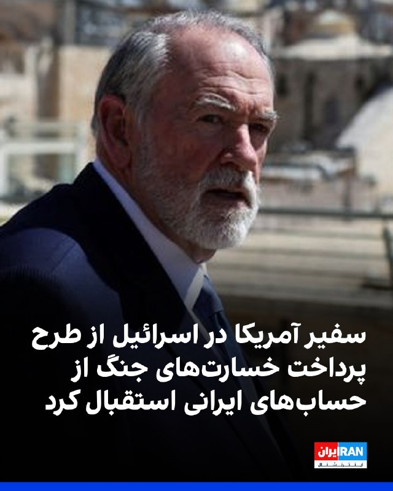

مایک هاکبی، سفیر آمریکا در اسرائیل، با بازنشر پست وزیر خزانه‌داری آمریکا در شبکه ایکس نوشت: «به اسکات بسنت بابت طرحی درخشان برای وادار کردن جمهوری اسلامی به پرداخت بخشی از خسارت‌های این جنگ افتخار می‌کنم.»

بسنت پیش‌تر نوشته بود «هر خسارتی که جمهوری اسلامی به متحدان آمریکا در خلیج فارس وارد کند، با برداشت از حساب‌های ایرانی جبران خواهد شد.»
‌🏁 🇬🇧 IranintlTV

🤖 @VahidOOnLine

## WithYashar — post 14531

گزارش CNN: کابینه ترامپ تصرف جزیره خارک را به‌عنوان آخرین گزینهٔ بازی درنظر گرفته

پنتاگون در وضعیت قرنطینه امنیتی قرار گرفته
@withyashar

## mwarmonitor — post 10724

فعال شدن پدافند در جنوب

## FoxNewsTwitter — post 342858

‌Fox News (Twitter/X)

https://www.foxnews.com/politics/vice-president-jd-vances-chief-staff-set-depart-white-house-role

## IranIntlTV — post 341740

🗣روایت شما از زندگی در دوران پس از انقلاب ملی و جنگ - پنجشنبه ۲۱ خرداد ۱۴۰۵

🔹هشتگرد: همین الان ۲۱ خرداد ساعت ۱۸:۳۰ صدای جنگنده، پنجشنبه
🔹صدای سه انفجار در غرب تهران ساعت ۱۸:۲۵ پنجشنبه
🔹از تهران: فعالیت پدافند در غرب تهران، شهرزیبا و طرشت
🔹الان پنجشنبه ساعت ۱۸:۱۷ تهران رو داره می‌زنه.
🔹شنیده شدن صدای عبور جنگنده بر فراز رودسر در ساعت ۶:۱۵ عصر

## IranIntlTV — post 341739

  

مایک هاکبی، سفیر آمریکا در اسرائیل، با بازنشر پست وزیر خزانه‌داری آمریکا در شبکه ایکس نوشت: «به اسکات بسنت بابت طرحی درخشان برای وادار کردن جمهوری اسلامی به پرداخت بخشی از خسارت‌های این جنگ افتخار می‌کنم.»

بسنت پیش‌تر نوشته بود «هر خسارتی که جمهوری اسلامی به متحدان آمریکا در خلیج فارس وارد کند، با برداشت از حساب‌های ایرانی جبران خواهد شد.»
https://iranintl.com/202606111598

## Shin_Persian — post 6948

یک صداهایی شنیده شده. گویا بیشتر در غرب تهران
پیام‌های دریافتی:

سلام وحید پونک سردار جنگل همین الان انفجار وحشتناک

۱۸:۲۹ یه صدای وحشتناک سمت پونک اومد

داداش صدا اومد الان، هوا هم ابری نیست، شمال تهران

سلام غرب تهران (صادقیه) ۳تا صدا اومد

توی پونک اشرفی اصفهانی صدای انفجار اومد

صدا میاد شدید ولی هوا صافه

سلام وحید جان
تهران ساعت ۱۸:۲۹
صدای چندین انفجار پشت سر هم
من از محدوده تجریش شنیدم

سلام‌ وحید جان
خیابان جلفا ۲ تا صدای انفجار اومد از دورتر
ساعت ۱۸:۳۰، ۲۱ خرداد

اندرزگو یه صدا خیلی دور اومد
شبیه رعد وبرق ولی ابری نیست

سلام آقا وحید تهران انفجار شد یا توهم زدیم؟

میرداماد همین الان صدای انفجار اومد

سلام وحید جان ساعت ۱۸:۱۷ ما سمت مختاری هستیم اول خیابان ولیعصر صدای انفجار اومد ولی خیلی نزدیک نبود خیلی هم دور نبود

صدای موشک و‌انفجار بود انگار
نمیدونممااا من از صداش خواب بودم خوابش رو دیدم بعدش بیدارشدم صدای انفجار شندیدم
من غرب تهرانم بقیه رو چک کن

آپدیت:
گویا صدای رعد و برق بود.
بلافاصله بعد از انتشار پیام‌های بالا یهو ده‌ها پیام اومد که صدای رعد و برق بود.
آپدیت: حالا بعد از این آپدیت هم شهروندانی دارند عکس می‌فرستند که هوا به این صافی رعد و برق کجا بود.
ولی برداشت نهایی من از اون همه پیام‌های که نقل نکردم همون رعد و برقه. آسمون هم همه جا صاف نیست.
📡 @VahidOnline

## alonews — post 127171

  <a href="telegram/content/alonews_127171_1781191429.webm" target="_blank">🎬 Download video</a>

🔴 فوری/ سی ان ان: پنتاگون در وضعیت قفل (لاک‌داون) قرار گرفته، یگان‌های مقابله با مواد خطرناک و بمب گذاری (هزمت) در محل حادثه حاضر شده‌اند. 
✅ @AloNews خبر جنگ

## alonews — post 127170

  <a href="telegram/content/alonews_127170_1781191429.webm" target="_blank">🎬 Download video</a>

👈منابع الحدث: نشست قریب‌الوقوع کشورهای میانجی‌گر واشنگتن و تهران

✅ @AloNews خبر جنگ

## alonews — post 127169

  <a href="telegram/content/alonews_127169_1781191429.webm" target="_blank">🎬 Download video</a>

👈وزیر خزانه‌ داری آمریکا: هر آسیبی که به متحدان ما در خلیج فارس وارد کند، با وجوهی که از حساب‌ های ایرانی برداشت می‌شود، جبران خواهد شد! 
✅ @AloNews خبر جنگ

---
📅 بروزرسانی: 1405/03/21 18:45
---

## VahidOOnLine — post 244979

  <a href="telegram/content/VahidOOnLine_244979_1781190916.mp4" target="_blank">🎬 Download video</a>

بهنام ایزدی، جوان ۳۵ ساله اهل نورآباد، شامگاه ۱۸ دی در جریان اعتراضات ممسنی هدف تیراندازی سرکوبگران قرار گرفت. خودروی پیکان این جاویدنام با آثار گلوله، میان نزدیکانش به نماد شجاعت بهنام تبدیل شده است.
‌🏁 🇬🇧 IranintlTV

🤖 @VahidOOnLine

## VahidOOnLine — post 244978

  

آنتونیو گوترش، دبیرکل سازمان ملل متحد، در شبکه اجتماعی ایکس اعلام کرد که از انحصار سلاح در لبنان در اختیار دولت این کشور به طور کامل حمایت می‌کند.

گوترش گفت: «همه طرف‌ها باید برای دستیابی به راه‌حل دیپلماتیک که به طور کامل به تمامیت ارضی، حاکمیت و استقلال سیاسی لبنان احترام بگذارد تلاش کنند.»

او افزود: «از ماه مارس شاهد تشدید جدی تنش‌ها بوده‌ایم؛ زیرا اسرائیل عملیات خود را در خاک لبنان گسترش داده و حزب‌الله نیز حملات خود را به عمق اسرائیل افزایش داده است.»
‌🏁 🇬🇧 IranintlTV

🤖 @VahidOOnLine

## VahidOOnLine — post 244977

♦️علیرضا جهانبخش، کاپیتان تیم ملی فوتبال ایران، با حضور در یک برنامه تلویزیونی، خاطره‌ای عجیب از مواجهه خود و همراهانش با افراد مسلح و کارتل‌ها در کشور مکزیک را روایت کرد.
جهانبخش در این گفتگو، پس از اشاره به برقراری اردوی تیم ملی فوتبال در شهر ناامن تیخوانا در مکزیک گفت به گمان او خطری از جانب گروه‌های تبهکار مکزیکی بازیکنان ایران را تهدید نمی‌کند.
با اشاره به سفری که به منطقه تولوم در مکزیک داشته است، اظهار داشت که در طول مسیر، خودروی آن‌ها توسط افراد مسلحی که صورت‌های خود را کاملا پوشانده بودند متوقف شد. این مهاجم تیم ملی تشریح کرد که مردان مسلح آن‌ها را از ماشین پیاده کرده و با قرار دادن دست‌هایشان روی خودرو، شروع به تفتیش بدنی و جستجوی اموالشان کردند. به گفته او وقتی اعضای گروه‌های جنایتکار مکزیکی از ایرانی‌ بودن او و همراهانش مطللع شدند، رفتارشان تغییر کرد و فقط با برداشتن ۳۰ یورو پول نقد، اجازه حرکت و آزادی آن‌ها را صادر کردند.
این سخنان در حالی مطرح می‌شود که تیم ملی فوتبال ایران، به دلیل صادر نشدن ویزای طولانی مدت برای اقامت در خاک آمریکا مجبور شده است، اردوی خود را در شهر مرزی تیخوانا در مکزیک برپا کند. شهرهای مرزی مکزیک مانند تیخوانا، سال‌هاست به عنوان شاهراه اصلی و میدان نبرد خونین میان بزرگ‌ترین کارتل‌های جهان شناخته می‌شوند.
‌🇸🇦 Indypersian

🤖 @VahidOOnLine

## WithYashar — post 14530

Voice message

## mwarmonitor — post 10723

🔴 «پنتاگون به دلیل یک حادثه امنیتی مرتبط با مواد خطرناک مشکوک تعطیل شد، و یک تیم تخصصی مواد خطرناک در حال رسیدگی به این حادثه است.» @mwarmonitor

## mwarmonitor — post 10722

🔴 «پنتاگون به دلیل یک حادثه امنیتی مرتبط با مواد خطرناک مشکوک تعطیل شد، و یک تیم تخصصی مواد خطرناک در حال رسیدگی به این حادثه است.»

@mwarmonitor

## FoxNewsTwitter — post 342857

  

Fox News (Twitter/X)

A Somali World Cup referee was denied entry into the U.S. after CBP says inspectors uncovered information linking him to suspected members of terror organizations.

Omar Artan arrived at Miami International Airport on Saturday and was turned away despite reportedly receiving a U.S. visa just days earlier.

He was expected to join other referees in Miami ahead of the tournament, but has now returned home to Somalia.

"President Trump's administration will not allow any security threat to enter our country — full stop," a Trump administration official tells Fox News.

## pm_afshaa — post 93631

  <a href="telegram/content/pm_afshaa_93631_1781190921.webm" target="_blank">🎬 Download video</a>

🔴بلومبرگ: مقام‌های ارشد امنیتی امارات و جمهوری اسلامی برای نخستین بار از زمان آغاز جنگ آمریکا و اسرائیل علیه ایران، دیداری حضوری برگزار کردن. این دیدار نشانه‌ای از تلاش دو طرف برای کاهش تنش‌ها و حرکت به سمت روابطی آرام‌تر ارزیابی میشه.

💧 Rainbet.com the #1 Non-KYC Crypto Casino & Sportsbook @rainbetcom

😁 @Pm_Afshaa

## VahidOnline — post 76222

یک صداهایی شنیده شده. گویا بیشتر در غرب تهران
پیام‌های دریافتی:

سلام وحید پونک سردار جنگل همین الان انفجار وحشتناک

۱۸:۲۹ یه صدای وحشتناک سمت پونک اومد

داداش صدا اومد الان، هوا هم ابری نیست، شمال تهران

سلام غرب تهران (صادقیه) ۳تا صدا اومد

توی پونک اشرفی اصفهانی صدای انفجار اومد

صدا میاد شدید ولی هوا صافه

سلام وحید جان
تهران ساعت ۱۸:۲۹
صدای چندین انفجار پشت سر هم
من از محدوده تجریش شنیدم

سلام‌ وحید جان
خیابان جلفا ۲ تا صدای انفجار اومد از دورتر
ساعت ۱۸:۳۰، ۲۱ خرداد

اندرزگو یه صدا خیلی دور اومد
شبیه رعد وبرق ولی ابری نیست

سلام آقا وحید تهران انفجار شد یا توهم زدیم؟

میرداماد همین الان صدای انفجار اومد

سلام وحید جان ساعت ۱۸:۱۷ ما سمت مختاری هستیم اول خیابان ولیعصر صدای انفجار اومد ولی خیلی نزدیک نبود خیلی هم دور نبود

صدای موشک و‌انفجار بود انگار
نمیدونممااا من از صداش خواب بودم خوابش رو دیدم بعدش بیدارشدم صدای انفجار شندیدم
من غرب تهرانم بقیه رو چک کن

آپدیت:
بلافاصله بعد از انتشار پیام‌های بالا یهو ده‌ها پیام اومد که صدای رعد و برق بود. حالا بعد از این آپدیت هم خیلی‌ها عکس می‌فرستند که هوا به این صافی رعد و برق کجا بود. ولی برداشت نهایی من از پیام‌ها همون رعد و برقه فعلا.
📡 @VahidOnline

## kianmeli1 — post 87936

🔴تحلیل گران معتقدند امشب در ایران وضعیت متفاوت است در جای امن باشید
https://t.me/kianmeli1

## kianmeli1 — post 87935

🔴فوری

انفجار شدید پونک تهران
https://t.me/kianmeli1

## IranIntlTV — post 341738

  <a href="telegram/content/IranIntlTV_341738_1781190922.mp4" target="_blank">🎬 Download video</a>

بهنام ایزدی، جوان ۳۵ ساله اهل نورآباد، شامگاه ۱۸ دی در جریان اعتراضات ممسنی هدف تیراندازی سرکوبگران قرار گرفت. خودروی پیکان این جاویدنام با آثار گلوله، میان نزدیکانش به نماد شجاعت بهنام تبدیل شده است.

## IranIntlTV — post 341737

  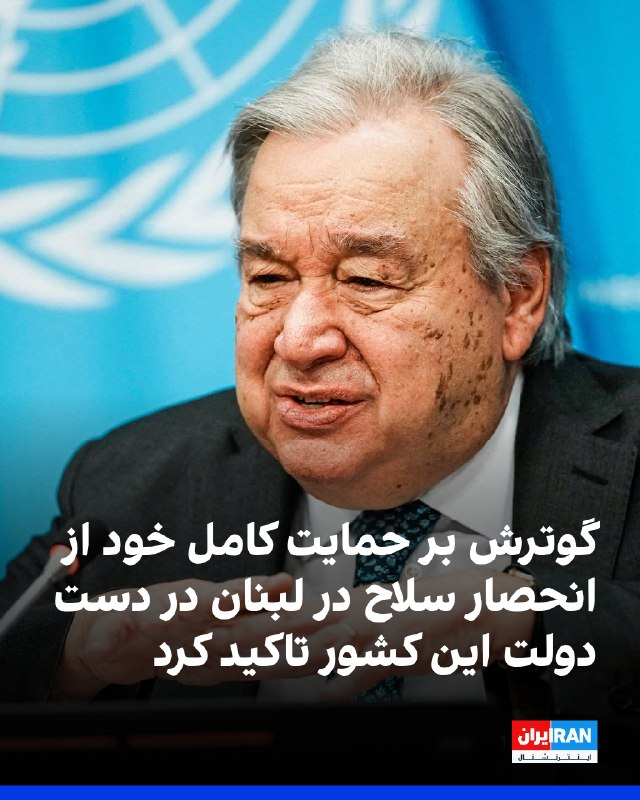

آنتونیو گوترش، دبیرکل سازمان ملل متحد، در شبکه اجتماعی ایکس اعلام کرد که از انحصار سلاح در لبنان در اختیار دولت این کشور به طور کامل حمایت می‌کند.

گوترش گفت: «همه طرف‌ها باید برای دستیابی به راه‌حل دیپلماتیک که به طور کامل به تمامیت ارضی، حاکمیت و استقلال سیاسی لبنان احترام بگذارد تلاش کنند.»

او افزود: «از ماه مارس شاهد تشدید جدی تنش‌ها بوده‌ایم؛ زیرا اسرائیل عملیات خود را در خاک لبنان گسترش داده و حزب‌الله نیز حملات خود را به عمق اسرائیل افزایش داده است.»
https://iranintl.com/202606116076

## Shin_Persian — post 6947

Shin ✓ @hey_itsmyturn
Thu, 11 Jun 2026 15:05:52 UTC

No blast in Tehran YET, it’s just thunder
(Some TG channels reported blast sounds)

ترجمه خودکار فارسی

هنوز انفجاری در تهران رخ نداده است، فقط صدای رعد و برق است.
(برخی از کانال‌های تلگرامی گزارش‌هایی از شنیده شدن صدای انفجار منتشر کرده‌اند)

𝕏 · @shin_persian

## Iliaen — post 4477

امشب را در خانه بمانید.

@iliaen

## FarsiVOA — post 220389

وحید آنلاین ویدیویی از لحظه انفجار در پیشوا در استان تهران را منتشر کرده است.

این انفجار حدود ساعت ۴ صبح پنجشنبه ۲۱ خرداد رخ داد.

بنا بر گزارش‌ها دود ناشی از این انفجار در نقاطی از جمله ورامین و پاکدشت هم مشاهده شد.

@FarsiVOA

## DW_Farsi — post 125825

🔶 بانک مرکزی اروپا: جنگ ایران رشد اقتصادی را کاهش می‌دهد
 
بانک مرکزی اروپا (EZB) در تازه‌ترین ارزیابی خود پیش‌بینی کرده است که نرخ تورم در سال جاری به طور میانگین به ۳ درصد برسد. این رقم به‌طور قابل توجهی بالاتر از هدف میان‌مدت ۲ درصدی بانک مرکزی اروپا است؛ سطحی که این نهاد آن را برای حفظ ثبات ارزش یورو و قدرت خرید شهروندان ضروری می‌داند.
 
بانک مرکزی اروپا در دسامبر گذشته نرخ تورم سال ۲۰۲۶ را ۱.۹ درصد برآورد کرده بود، اما در ماه مارس این پیش‌بینی را به ۲.۶ درصد افزایش داد. اکنون نیز این نهاد افزایش بهای انرژی در پی جنگ در خاورمیانه را عامل اصلی رشد تورم عنوان کرده است.
 
بر اساس پیش‌بینی جدید، نرخ تورم در سال ۲۰۲۷ نیز به ۲.۳ درصد خواهد رسید و همچنان بالاتر از هدف تعیین‌شده باقی خواهد ماند. بانک مرکزی اروپا انتظار دارد نرخ تورم تنها در سال ۲۰۲۸ به‌طور دقیق به سطح ۲ درصد بازگردد.
 
در همین حال، چشم‌انداز رشد اقتصادی منطقه یورو نیز تضعیف شده است. بانک مرکزی اروپا اکنون رشد اقتصادی سال جاری را ۰.۸ درصد و رشد سال ۲۰۲۷ را ۱.۲ درصد پیش‌بینی می‌کند.
 
این نهاد پیش‌تر در ماه مارس برای سال ۲۰۲۶ رشد ۰.۹ درصدی و برای سال ۲۰۲۷ رشد ۱.۳ درصدی را پیش‌بینی کرده بود، اما به دلیل پیامدهای جنگ و افزایش قیمت انرژی، برآوردهای خود را کاهش داده است.
@dw_farsi

## RadioFarda — post 158187

🔸شبکه خبری سی‌ان‌ان روز پنجشنبه به نقل از یک مقام ارشد پنتاگون و دو مقام دولت آمریکا اعلام کرد که طرح‌های ارتش ایالات متحده برای تصرف جزیره خارگ در جنوب ایران از «ماه‌ها پیش» تهیه شده، اما به دلیل «بیش از حد پرخطر بودن» کنار گذاشته شده‌اند. 🔸دونالد ترامپ،…

## RadioFarda — post 158186

  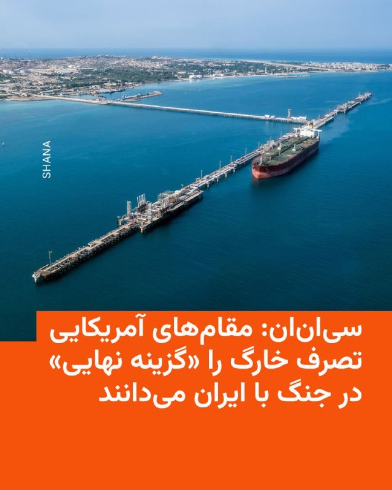

🔸شبکه خبری سی‌ان‌ان روز پنجشنبه به نقل از یک مقام ارشد پنتاگون و دو مقام دولت آمریکا اعلام کرد که طرح‌های ارتش ایالات متحده برای تصرف جزیره خارگ در جنوب ایران از «ماه‌ها پیش» تهیه شده، اما به دلیل «بیش از حد پرخطر بودن» کنار گذاشته شده‌اند.

🔸دونالد ترامپ، رئیس‌جمهور آمریکا، ساعتی پیش از تمایل خود برای در اختیار گرفتن این جزیره به عنوان یکی از مهم‌ترین زیرساخت‌های صادرات نفت ایران خبر داد.

🔸سی‌ان‌ان به نقل از مقام‌های آمریکایی نوشت: «دیدگاه غالب در کاخ سفید و پنتاگون این است که تصرف جزیره خارگ یا نابود کردن زیرساخت‌های انرژی این جزیره، عملاً ایران را ورشکسته خواهد کرد و توانایی‌های آن را تا حدی کاهش می‌دهد که دیگر قادر به ادامه جنگ نباشد.»

🔸در عین حال مقام‌های دولتی به رئیس‌جمهور آمریکا گفته‌اند که چنین عملیاتی نیاز به نیروهای زمینی پرشمار خواهد داشت و «ممکن است به تلفات سنگین نیروهای آمریکایی منجر شود».

@RadioFarda

## IranianMinds — post 22315

🔴تحلیلگران می‌گویند امشب در ایران وضعیت بسیار متفاوت است و در جای امن باشید.

@IranianMinds

## Hranews — post 113542

  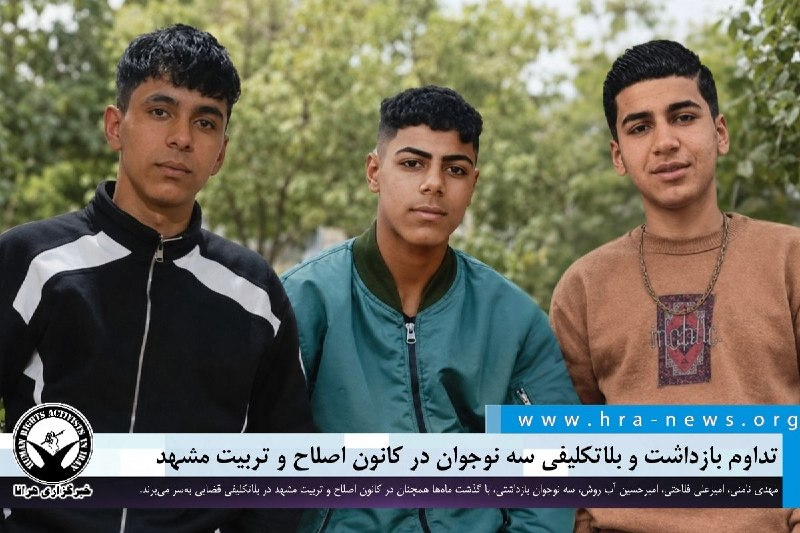

تداوم بازداشت و بلاتکلیفی سه نوجوان در کانون اصلاح و تربیت مشهد

❗️
❗️
❗️
❗️
❗️– مهدی نامنی، امیرعلی فلاحتی و امیرحسین آب روش، سه نوجوان بازداشتی، با گذشت ماه‌ها همچنان در کانون اصلاح و تربیت مشهد در بلاتکلیفی قضایی به‌سر می‌برند. مهدی نامنی و امیرحسین آب روش از بازداشت‌شدگان اعتراضات دی‌ماه ۱۴۰۴ و امیرعلی فلاحتی در رابطه با درگیری‌های نظامی اخیر بازداشت شده اند.

به گزارش خبرگزاری هرانا، ارگان خبری مجموعه فعالان حقوق بشر در ایران، سه نوجوان در بازداشت به‌سر می‌برند.

بر اساس اطلاعات دریافتی هرانا، مهدی نامنی، ۱۶ ساله، امیرحسین آب روش، ۱۷ ساله و امیرعلی فلاحتی در حال حاضر به‌صورت بلاتکلیف در کانون اصلاح و تربیت مشهد نگهداری می‌شوند و رسیدگی قضایی نتیجه‌بخشی به پرونده آنها صورت نگرفته است.

#مهدی_نامنی #امیرعلی_فلاحتی #امیرحسین_آب_روش

ادامه مطلب

↘️
@hranews_bot تماس ✉️ - @Hranews کانال هرانا 🆑

## alonews — post 127167

  <a href="telegram/content/alonews_127167_1781190929.webm" target="_blank">🎬 Download video</a>

🔴 فوری/ سی ان ان: پنتاگون در وضعیت قفل (لاک‌داون) قرار گرفته، یگان‌های مقابله با مواد خطرناک و بمب گذاری (هزمت) در محل حادثه حاضر شده‌اند.

✅ @AloNews خبر جنگ

---
📅 بروزرسانی: 1405/03/21 18:33
---

## VahidOOnLine — post 244976

  

ابراهیم عزیزی، رییس کمیسیون امنیت ملی مجلس، در جمع خبرنگاران گفت: «اگر دونالد ترامپ اقدام محاسبه‌نشده‌ای انجام دهد، پاسخی دریافت خواهد کرد که در تاریخ ثبت شود.»

عزیزی ادامه داد: «رییس‌جمهوری آمریکا دچار توهم شده، توان رزمی ما در جزیره خارک بسیار بالاست و برای مقابله با هرگونه تهدیدی آماده هستیم.»
‌🏁 🇬🇧 IranintlTV

🤖 @VahidOOnLine

## VahidOOnLine — post 244975

  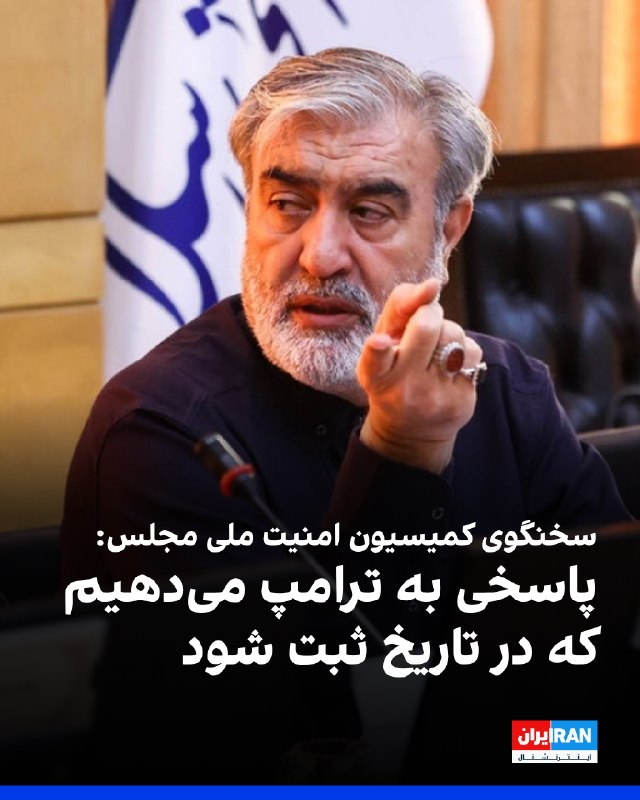

ابراهیم عزیزی، سخنگوی کمیسیون امنیت ملی مجلس، در جمع خبرنگاران گفت: «اگر دونالد ترامپ اقدام محاسبه‌نشده‌ای انجام دهد، پاسخی دریافت خواهد کرد که در تاریخ ثبت شود.»

عزیزی ادامه داد: «رییس‌جمهوری آمریکا دچار توهم شده، توان رزمی ما در جزیره خارک بسیار بالاست و برای مقابله با هرگونه تهدیدی آماده هستیم.»
‌🏁 🇬🇧 IranintlTV

🤖 @VahidOOnLine

## mwarmonitor — post 10721

  <a href="telegram/content/mwarmonitor_10721_1781190221.mp4" target="_blank">🎬 Download video</a>

🔴نیروهای آمریکا: سومین نفتکش متخلف در خلیج عمان را از کار انداختیم تَمپا، فلوریدا — فرماندهی مرکزی آمریکا (CENTCOM) اعلام کرد نیروهای آمریکایی ساعت ۱۱:۲۰ شب به وقت شرق آمریکا در ۱۰ ژوئن، یک نفتکش را در خلیج عمان از کار انداختند؛ این کشتی با نقض «محاصره علیه…

## FoxNewsTwitter — post 342856

Fox News (Twitter/X)

BREAKING: Vice President JD Vance's chief of staff set to depart White House role

## pm_afshaa — post 93630

فارس: به‌دلیل استفاده ارتش آمریکا از زیرساخت‌های متعلق به ایلان ماسک، از جمله استارلینک، نیروهای نظامی ایران در حال بررسی هدف قرار دادن هلدینگ‌ها و شرکت‌های تحت مدیریت اون در حملات احتمالی آینده هستن.

💧 Rainbet.com the #1 Non-KYC Crypto Casino & Sportsbook @rainbetcom

😁 @Pm_Afshaa

## IranIntlTV — post 341736

  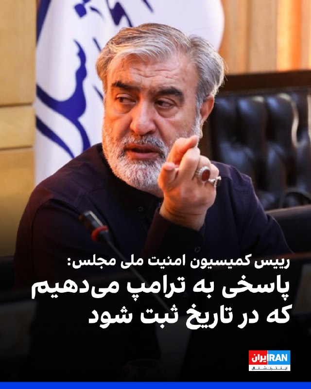

ابراهیم عزیزی، رییس کمیسیون امنیت ملی مجلس، در جمع خبرنگاران گفت: «اگر دونالد ترامپ اقدام محاسبه‌نشده‌ای انجام دهد، پاسخی دریافت خواهد کرد که در تاریخ ثبت شود.»

عزیزی ادامه داد: «رییس‌جمهوری آمریکا دچار توهم شده، توان رزمی ما در جزیره خارک بسیار بالاست و برای مقابله با هرگونه تهدیدی آماده هستیم.»
https://iranintl.com/202606117205

## IranIntlTV — post 341735

  <a href="telegram/content/IranIntlTV_341735_1781190222.mp4" target="_blank">🎬 Download video</a>

قانون‌گذاران بریتانیا در مجلس اعیان پنج‌شنبه از دولت این کشور خواستند لایحه جدید مقابله با تهدیدهای دولتی را هرچه سریع‌تر از پارلمان عبور دهد. اعضای مجلس اعیان با اشاره به حملات منتسب به جمهوری اسلامی علیه یهودیان و روزنامه‌نگاران در بریتانیا، خواستار پیشبرد این طرح شدند.
لرد جان کرایر سپاه پاسداران را «آدم‌کش‌های روانی» توصیف کرد و از وزیران خواست این لایحه را «هرچه سریع‌تر» پیش ببرند. او به محکومیت اخیر دو مرد به دلیل حمله با چاقو به پوریا زراعتی، خبرنگار ایران اینترنشنال، اشاره کرد.
دیوید هنسون، وزیر کشور بریتانیا، گفت در صورت تصویب این لایحه در هر دو مجلس پارلمان، افراد محکوم به جرایم مرتبط با تهدیدهای دولتی ممکن است با مجازات حداکثر ۱۴ سال زندان روبه‌رو شوند.
@iranintltv

## IranIntlTV — post 341733

  <a href="telegram/content/IranIntlTV_341733_1781190224.mp4" target="_blank">🎬 Download video</a>

دونالد ترامپ، رییس‌جمهوری آمریکا، برای دومین شب پیاپی اعلام کرد: «ایالات متحده امشب بسیار سخت به ایران حمله خواهد کرد.» او همچنین گفت آمریکا در آینده کنترل جزیره خارک و برخی زیرساخت‌های نفتی ایران را در دست خواهد گرفت.

جزییات بیشتر با بابک اسحاقی و سمیرا قرایی، خبرنگاران ایران‌اینترنشنال
@iranintltv

## FarsiVOA — post 220388

  <a href="telegram/content/FarsiVOA_220388_1781190225.mp4" target="_blank">🎬 Download video</a>

فرخنده پیمانی در میدان: زنان افغانستان می‌گویند طالبان در سرکوب زنان از شیوه‌های جمهوری اسلامی الهام می‌گیرند!

## BBCPersian — post 283457

از خیابان تا جام جهانی چقدر فاصله است؟
توپ پلاستیکی رو یادتون می آد، راستی گل کوچیک هنوز هست؟

گل‌کوچیک اسم‌اش ساده است، اما برای خیلی‌ها یک دنیا خاطره است. یک کوچه باریک، دوتا سنگ که می‌شد دروازه و یک توپ پلاستیکی.
با سلاطین گل کوچیک آشنا بشوید.

🔻برنامه این هفته آپارات
«سلاطین گل کوچیک»؛ از خیابان تا جام جهانی
ساخته امیر زوینی

🔻ساعات پخش به وقت ایران

جمعه ۹ شب
شنبه ۱ بامداد
شنبه ۶ صبح
شنبه ۱۲ ظهر
دوشنبه ۲ بامداد
دوشنبه ۸:۳۰ شب
تکرار جمعه ۱۱:۳۰ صبح

🔻از برنامه آپارات همیشه فیلم متفاوت ببینید.
@BBCPersian

## idfinfarsi — post 11838

⭕️کسب کنترل عملیاتی در منطقه شمال رودخانه السلوکی: فعالیت نیروهای تیم رزمی تیپ ۷ در جنوب لبنان

⭕️نیروهای تیم رزمی تیپ ۷ و واحد اگوز، تحت فرماندهی لشکر ۳۶، عملیات دستیابی به کنترل عملیاتی و پاکسازی منطقه شمال رودخانه السلوکی در خط دفاعی مقدم را تکمیل کردند. این اقدام در چارچوب تلاش لشکری برای تقویت کنترل عملیاتی در جنوب لبنان و رفع تهدید مستقیم علیه شهرک‌های جلیل و متولا انجام شد.

⭕️منطقه رودخانه السلوکی توسط سازمان تروریستی حزب‌الله به‌عنوان زیرساختی برای به‌کارگیری پهپادهای انفجاری و شلیک‌های منحنی‌زن علیه نیروهای ارتش اسرائیل در این منطقه مورد استفاده قرار می‌گیرد. در جریان این عملیات، نیروها با همکاری نیروی هوایی، صدها زیرساخت تروریستی را منهدم کرده و بیش از ۵۰ تروریست را به هلاکت رساندند. همچنین چندین نوع تسلیحات از جمله مواد انفجاری، موشک‌های ضد زره و سکوهای پرتاب آن شناسایی شد.

⭕️ارتش اسرائیل به فعالیت خود برای رفع هرگونه تهدید علیه کشور اسرائیل ادامه خواهد داد.

## Dirty_Kids — post 391718

  <a href="telegram/content/Dirty_Kids_391718_1781190226.mp4" target="_blank">🎬 Download video</a>

اوج حماقت و توهم در تصویر! حرفی ندارم!

@Dirty_Kids 👻

## Dirty_Kids — post 391717

  

اگه تو این پرواز باشی کدوم صندلی رو برای نشستن انتخاب میکنی؟

@Dirty_Kids 👻

## alonews — post 127166

  <a href="telegram/content/alonews_127166_1781190228.webm" target="_blank">🎬 Download video</a>

👈جنگنده‌های اسرائیلی در حمله‌ای جدید، شهرک «مجدل زون» واقع در شهرستان صور در جنوب لبنان را هدف قرار دادند

✅ @AloNews خبر جنگ

## alonews — post 127165

  <a href="telegram/content/alonews_127165_1781190228.webm" target="_blank">🎬 Download video</a>

👈منابع عراقی از اصابت دو پهپاد انتحاری شاهد ۱۳۶ به یک انبار گروه‌های تجزیه‌طلب در منطقه «قوش تپه» واقع در شمال اربیل خبر دادند

✅ @AloNews خبر جنگ

---
📅 بروزرسانی: 1405/03/21 18:23
---

## VahidOOnLine — post 244974

🗣روایت شما از زندگی در دوران پس از انقلاب ملی و جنگ - پنجشنبه ۲۱ خرداد ۱۴۰۵

🔹از شیراز: داروهای هورمونی بارداری از جمله استرادیول والرات، استروژن و داروهای غدد به دشواری پیدا می‌شن. الان دو هفته هست که دنبال قرص استرادیول هستم.

🔹من یه دختر ۱۴ ساله‌ام، واقعا گرونی بیداد می‌کنه، خجالت می‌کشم از پدرم چیزی بخوام... به امید روزهای بهتر

🔹از کرج: خیلی گرونی شده، در حدی که ۵ تا تخم‌مرغ شده ۱۰۰ هزار تومان یا یه موتور که اون موقع ۶۰۰ میلیون بود، الان شده ۳ میلیارد یا بیشتر.

🔹قبلا صبح‌ها تهران شلوغ بود و ترافیک، چون همه می‌رفتن سر کار. الان ساعت ۷ صبح همه‌جا خلوت، اصلا کسی تو شهر نیست، مردم همه بیکار شدن.

🔹از کرمان: فرزندم قرار عمل بشه، دکتر برای دستمزد ۲۰۰ میلیون تومان خواسته، بیمارستان هم ۱۷۰ میلیون تومان هزینه خواسته و با بیمه تکمیلی‌ام قرارداد نداره. بازنشسته هستم، نمی‌دونم از کجا باید هزینه‌ش رو تامین کنم.

🔹واقعا از جمهوری اسلامی متنفرم، واقعا تبعیض جنسیتی تا کی می‌خواد ادامه‌دار باشه؟ به زن‌ها گواهینامه موتورسواری نمی‌دن و اگه شما رو با موتور ببینن، موتور رو توقیف می‌کنن.

🔹از کرمانشاه: به عنوان یه دختر ۱۶ ساله می‌گم که در مملکت ما خرید یه گوشی هم حسرت شده. یه گوشی شده ۸۰ میلیون تومان. با این وضعیت نمی‌شه زندگی کرد، حالِ ایران بده.

🔹از فیروزآباد: آرزوی یه موتور ۲۰۰ سی‌سی به دلم مونده، چون در عرض یک ماه از ۱۶۰ میلیون شد ۵۲۰ میلیون تومان.
‌🏁 🇬🇧 IranintlTV

🤖 @VahidOOnLine

## kianmeli1 — post 87934

🔴برای تصرف کردن جزیره خارک از ماهها پیش طرح‌ریزی شده است./CNN
https://t.me/kianmeli1

## Persian_Trend_Official — post 16736

بلومبرگ: امارات متحده عربی و ایران اولین نشست امنیتی در سطح بالا را از زمان آغاز جنگ آمریکا و اسرائیل علیه ایران برگزار کردند که نشان دهنده حرکتی به سوی کاهش تنش‌ها پس از ماه‌ها درگیری است.

علیرغم اینکه امارات متحده عربی ایران را یک تهدید منطقه‌ای می‌داند، به طور فزاینده‌ای ثبات را برای محافظت از اقتصاد، بخش مالی، صنعت گردشگری و سرمایه‌گذاری‌های عمده در زیرساخت‌های نفت و هوش مصنوعی خود در اولویت قرار می‌دهد.

ایران نیز به بهبود روابط علاقه‌مند است، زیرا امارات متحده عربی قبل از جنگ یکی از مهمترین شرکای تجاری آن بود.

📝 Amir

📌 @persian_trend_official
پرشین ترند | متفاوت‌ترین کانال نظامی

## RadioFarda — post 158185

🔸خبرگزاری بلومبرگ روز پنجشنبه ۱۹ خرداد به نقل از «منابع آگاه» گزارش داد که مقام‌های ارشد امنیت ملی امارات متحده عربی و ایران برای نخستین بار از زمان آغاز جنگ آمریکا و اسرائیل علیه تهران، حضوری با یکدیگر دیدار کردند. 🔸این دیدار که در هفته جاری انجام شد، به…

## RadioFarda — post 158184

  

🔸خبرگزاری بلومبرگ روز پنجشنبه ۱۹ خرداد به نقل از «منابع آگاه» گزارش داد که مقام‌های ارشد امنیت ملی امارات متحده عربی و ایران برای نخستین بار از زمان آغاز جنگ آمریکا و اسرائیل علیه تهران، حضوری با یکدیگر دیدار کردند.

🔸این دیدار که در هفته جاری انجام شد، به نوشتهٔ بلومبرگ، نشان‌دهندهٔ چرخشی قابل توجه در رویکرد دو طرف است و در شرایطی صورت می‌گیرد که هر دو کشور بیش از پیش به اهمیت روابط دوجانبه آرام‌تر پی برده‌اند.

🔸این خبرگزاری می‌گوید که منابع آن به‌دلیل حساسیت موضوع نخواستند نامشان فاش شود.

🔸بر اساس این گزارش، رهبران امارات می‌خواهند برنامه‌های بلندپروازانهٔ اقتصادی خود، از جمله سرمایه‌گذاری میلیاردی در افزایش تولید نفت و ایجاد مراکز دادهٔ هوش مصنوعی، بدون اختلال ادامه یابد. این رابطه برای تهران نیز اهمیت دارد، زیرا امارات پیش از آغاز جنگ یکی از بزرگ‌ترین شرکای تجاری تهران و مسیر مهمی برای انتقال نفت تحریم‌شده ایران بود.

🔸به گفتهٔ منابع بلومبرگ، تماس اخیر ابوظبی با ایران عمدتاً با هدف دستیابی به نوعی تنش‌زدایی با حکومتی انجام شده که آن را دشمن می‌داند.

@RadioFarda

## Dirty_Kids — post 391715

جمهوری اسهالی قبلا با آخوند مردم رو فریب میداد الان با اینا میخواد فریب بده

@Dirty_Kids 👻

## Dirty_Kids — post 391714

  

جی‌لو پیش خودش گفته: "حالا که پولدارم، چطوری هم اکس‌هامو حرص بدم هم یه نکس بزنم؟". بعد هم یک فیلم سفارشی ساخته که دو ساعت تمام خودش را از زوایای مختلف نشون میدن؛ با لباس‌های خیره‌کننده، نورهای هندی‌طور و کلی شکوه و جلال. هیچی دیگه! فن‌های خانم جی‌لو ببینن...
#پیشنهاد_فیلم

@Dirty_Kids 👻

## alonews — post 127164

  <a href="telegram/content/alonews_127164_1781189603.webm" target="_blank">🎬 Download video</a>

👈پلاکاردی عجیب در تجمعات شبانه

✅ @AloNews خبر جنگ

## alonews — post 127163

  <a href="telegram/content/alonews_127163_1781189603.webm" target="_blank">🎬 Download video</a>

👈پزشکیان: باید از وضعیت نه جنگ نه صلح خارج شویم اما مگر در خواب، تسلیم شدن ما را ببینند

✅ @AloNews خبر جنگ

---
📅 بروزرسانی: 1405/03/21 18:14
---

## VahidOOnLine — post 244973

  

یک مقام ارشد پنتاگون و دو مقام دولت آمریکا به سی‌ان‌ان گفتند طرح‌هایی برای تلاش ارتش آمریکا جهت تصرف جزیره خارک از ماه‌ها پیش تهیه شده، اما به طور مداوم کنار گذاشته شده است، زیرا این عملیات بسیار پرریسک ارزیابی شده است.

سی‌ان‌ان به نقل از این مقام‌های آمریکایی نوشت دیدگاه در کاخ سفید و پنتاگون این است که تصرف جزیره خارک یا نابودی زیرساخت‌های انرژی آن عملا جمهوری اسلامی را ورشکسته می‌کند و توانایی آن برای ادامه جنگ را به شدت کاهش می‌دهد.

بر اساس این گزارش، مقام‌های آمریکایی به دونالد ترامپ اطلاع داده‌اند که چنین عملیاتی احتمالا به شمار قابل توجهی نیروی زمینی نیاز دارد و می‌تواند به تلفات سنگین نیروهای آمریکایی منجر شود.

سی‌ان‌ان نوشت که پنتاگون و کاخ سفید هرگونه اقدام برای تصرف جزیره خارک را گزینه «مرحله پایانی» یا آخرین راه‌حل دانسته‌اند.
‌🏁 🇬🇧 IranintlTV

🤖 @VahidOOnLine

## VahidOOnLine — post 244972

  

بلومبرگ گزارش داد مقام‌های ارشد امنیت ملی امارات متحده عربی و جمهوری اسلامی برای نخستین بار از زمان آغاز جنگ آمریکا و اسرائیل علیه تهران، دیدار حضوری برگزار کردند.

بلومبرگ نوشت این دیدار که این هفته انجام شد، چرخشی قابل توجه در روابط دو طرف محسوب می‌شود و در شرایطی صورت گرفته که هر دو طرف بیش از پیش به اهمیت روابط دوجانبه آرام‌تر اذعان دارند.
‌🏁 🇬🇧 IranintlTV

🤖 @VahidOOnLine

## VahidOOnLine — post 244971

  

♦️ اسکات بسنت، وزیر خزانه‌داری ایالات متحده، روز پنجشنبه ۲۱ خرداد با انتشار پیامی در شبکه اجتماعی ایکس به تهران هشدار داد که راهبرد کنونی‌اش در خلیج فارس، هزینه‌های سنگین اقتصادی و مالی در پی خواهد داشت و هرگونه اقدام خصمانه با پاسخ تنبیهی علیه دارایی‌های ایران مواجه می‌شود. بسنت تاکید کرد: «رژیم ایران در بازی با حاصل جمع صفر (بازی بی‌حاصل) که راه انداخته، بازنده خواهد شد.»

وزیر خزانه‌داری آمریکا در ادامه افزود: «هرگونه خسارتی که ایران به متحدان ما در خلیج فارس وارد کند، از طریق منابع مالی که از حساب‌های ایران برداشت می‌شود، جبران خواهد شد.» او همچنین هشدار داد هرگونه باج یا عوارضی که به «اداره تنگه هرمز» پرداخت شود، از حساب‌های خود آن‌ها کسر و تلافی می‌شود.

این تهدیدات در حالی مطرح می‌شود که روز یکشنبه، کاظم غریب‌آبادی، معاون وزیر امور خارجه جمهوری اسلامی ایران، در واکنش به گزارش‌هایی مبنی بر احتمال استفاده آمریکا از دارایی‌های مسدودشده ایران برای جبران خسارت‌های جنگی متحدانش، تاکید کرده بود که دولت‌های منطقه در جایگاهی نیستند که تقاضای غرامت کنند.
‌🇸🇦 Indypersian

🤖 @VahidOOnLine

## WithYashar — post 14529

  <a href="telegram/content/WithYashar_14529_1781189070.mp4" target="_blank">🎬 Download video</a>

کپشن با شما 🥴
@withyashar

## WithYashar — post 14528

سی‌ان‌ان: برنامه‌های نظامی آمریکا برای تلاش جهت تصرف جزیره خارک ماه‌هاست که تدوین شده، اما به دلیل این که این عملیات بسیار پرریسک تلقی میشد، به تعویق افتاده. این خبر رو یک مقام ارشد پنتاگون و دو مقام دولتی به سی‌ان‌ان گفتن.

مقامات به دونالد ترامپ گفتن که چنین عملیاتی احتمالاً به تعداد قابل توجهی نیروی زمینی نیاز داره و به طور بالقوه میتونه منجر به تلفات سنگین آمریکایی‌ها بشه.

پنتاگون و کاخ سفید هرگونه اقدام برای تصرف جزیره خارک رو به عنوان یک گزینه «پایان‌بازی» در نظر گرفتن، آخرین راه حلی که میتونه موازنه جنگ رو تغییر بده، اما با هزینه‌ای بالا.
نظامیان آمریکایی پیش از این حملات هوایی زیادی بر تأسیسات نظامی جزیره خارک انجام دادن، اما در این حملات عمداً از ضربه به زیرساخت انرژی این جزیره خودداری کردن.
@withyashar

## WithYashar — post 14527

## IranIntlTV — post 341732

🗣روایت شما از زندگی در دوران پس از انقلاب ملی و جنگ - پنجشنبه ۲۱ خرداد ۱۴۰۵

🔹از شیراز: داروهای هورمونی بارداری از جمله استرادیول والرات، استروژن و داروهای غدد به دشواری پیدا می‌شن. الان دو هفته هست که دنبال قرص استرادیول هستم.

🔹من یه دختر ۱۴ ساله‌ام، واقعا گرونی بیداد می‌کنه، خجالت می‌کشم از پدرم چیزی بخوام... به امید روزهای بهتر

🔹از کرج: خیلی گرونی شده، در حدی که ۵ تا تخم‌مرغ شده ۱۰۰ هزار تومان یا یه موتور که اون موقع ۶۰۰ میلیون بود، الان شده ۳ میلیارد یا بیشتر.

🔹قبلا صبح‌ها تهران شلوغ بود و ترافیک، چون همه می‌رفتن سر کار. الان ساعت ۷ صبح همه‌جا خلوت، اصلا کسی تو شهر نیست، مردم همه بیکار شدن.

🔹از کرمان: فرزندم قرار عمل بشه، دکتر برای دستمزد ۲۰۰ میلیون تومان خواسته، بیمارستان هم ۱۷۰ میلیون تومان هزینه خواسته و با بیمه تکمیلی‌ام قرارداد نداره. بازنشسته هستم، نمی‌دونم از کجا باید هزینه‌ش رو تامین کنم.

🔹واقعا از جمهوری اسلامی متنفرم، واقعا تبعیض جنسیتی تا کی می‌خواد ادامه‌دار باشه؟ به زن‌ها گواهینامه موتورسواری نمی‌دن و اگه شما رو با موتور ببینن، موتور رو توقیف می‌کنن.

🔹از کرمانشاه: به عنوان یه دختر ۱۶ ساله می‌گم که در مملکت ما خرید یه گوشی هم حسرت شده. یه گوشی شده ۸۰ میلیون تومان. با این وضعیت نمی‌شه زندگی کرد، حالِ ایران بده.

🔹از فیروزآباد: آرزوی یه موتور ۲۰۰ سی‌سی به دلم مونده، چون در عرض یک ماه از ۱۶۰ میلیون شد ۵۲۰ میلیون تومان.

## IranIntlTV — post 341731

  

یک مقام ارشد پنتاگون و دو مقام دولت آمریکا به سی‌ان‌ان گفتند طرح‌هایی برای تلاش ارتش آمریکا جهت تصرف جزیره خارک از ماه‌ها پیش تهیه شده، اما به طور مداوم کنار گذاشته شده است، زیرا این عملیات بسیار پرریسک ارزیابی شده است.

سی‌ان‌ان به نقل از این مقام‌های آمریکایی نوشت دیدگاه در کاخ سفید و پنتاگون این است که تصرف جزیره خارک یا نابودی زیرساخت‌های انرژی آن عملا جمهوری اسلامی را ورشکسته می‌کند و توانایی آن برای ادامه جنگ را به شدت کاهش می‌دهد.

بر اساس این گزارش، مقام‌های آمریکایی به دونالد ترامپ اطلاع داده‌اند که چنین عملیاتی احتمالا به شمار قابل توجهی نیروی زمینی نیاز دارد و می‌تواند به تلفات سنگین نیروهای آمریکایی منجر شود.

سی‌ان‌ان نوشت که پنتاگون و کاخ سفید هرگونه اقدام برای تصرف جزیره خارک را گزینه «مرحله پایانی» یا آخرین راه‌حل دانسته‌اند.
https://iranintl.com/202606119910

## IranIntlTV — post 341730

  

بلومبرگ گزارش داد مقام‌های ارشد امنیت ملی امارات متحده عربی و جمهوری اسلامی برای نخستین بار از زمان آغاز جنگ آمریکا و اسرائیل علیه تهران، دیدار حضوری برگزار کردند.

بلومبرگ نوشت این دیدار که این هفته انجام شد، چرخشی قابل توجه در روابط دو طرف محسوب می‌شود و در شرایطی صورت گرفته که هر دو طرف بیش از پیش به اهمیت روابط دوجانبه آرام‌تر اذعان دارند.
https://iranintl.com/202606117705

## IranIntlTV — post 341729

  <a href="telegram/content/IranIntlTV_341729_1781189075.mp4" target="_blank">🎬 Download video</a>

سرخط خبرهای پنجشنبه ۲۱ خرداد
@iranintltv

## FarsiVOA — post 220387

🔺حمایت سناتور گراهام از اظهارات پرزیدنت ترامپ درباره تصرف جزیره خارک

▪️لیندزی گراهام، سناتور ارشد جمهوری‌خواه از ایالت کارولینای جنوبی، از اظهارات دونالد ترامپ، رئیس جمهوری ایالات متحده، درباره احتمال تصرف جزیره خارک در صورت عدم دستیابی به توافق با جمهوری اسلامی حمایت کرد.

⬇️ بیشتر بخوانید:

https://ir.voanews.com/a/sen-graham-says-president-trump-right-to-take-kharg-island/8159722.html

## DW_Farsi — post 125824

  

🔶 ترامپ: امشب حمله بسیار سختی به ایران می‌کنیم؛ خارک را ‌در آینده می‌گیریم
 
دونالد ترامپ، رئیس‌ جمهور آمریکا در تازه‌ترین پیام خود در شبکه تروث سوشال در روز پنج‌شنبه ۲۱ خرداد (۱۱ ژوئن) نوشت، آمریکا امشب به ایران "حمله بسیار سختی" خواهد کرد.
 
اظهارات ترامپ نشان می‌دهند حملات نظامی ایالات متحده به مواضعی در ایران ظاهرا ادامه خواهند یافت. موج جدید حملات از دو شب پیش آغاز شدند. آغازگر آن به گفته آمریکا، سرنگونی یک هلی‌کوپتر آپاچی این کشور در تنگه هرمز توسط ایران بوده است.

ترامپ در این پیام با تأکید بر انهدام "نیروی دریایی، نیروی هوایی، سامانه‌های راداری، پدافند ضدهوایی و تمامی اشکال دیگر دفاعی و عمده توان تهاجمی" جمهوری اسلامی افزود: «در مقطعی در آینده‌ای نه‌چندان دور، ما جزیره خارک و دیگر نقاط زیرساختی نفت [آن‌ها] را تصرف خواهیم کرد و کنترل کامل بازارهای نفت و گاز آن‌ها را به دست خواهیم گرفت؛ درست مانند کاری که با ونزوئلا انجام داده‌ایم که برای هر دو کشور ونزوئلا و ایالات متحده آمریکا نتایج درخشانی داشته است.»
 
طی دو شب گذشته هم قصد آمریکا برای حمله به ایران ابتدا توسط ترامپ اعلام شده بود.
@dw_farsi

## Persian_Trend_Official — post 16735

  <a href="telegram/content/Persian_Trend_Official_16735_1781189077.mp4" target="_blank">🎬 Download video</a>

ترامپ در مورد ایران: مشکل این است که این می‌تواند بزرگترین توافق تاریخ باشد.

آنها می‌توانند پرچم سفید تسلیم را تکان دهند و بگویند "الحمدلله" و اخبار جعلی بگویند "این یک پیروزی بزرگ برای ایران بود". این دیوانه‌وارترین چیزی است که تا به حال دیده‌ام. ما داریم آنها را می‌کشیم.

📝 Amir

📌 @persian_trend_official
پرشین ترند | متفاوت‌ترین کانال نظامی

## IranianMinds — post 22314

  <a href="telegram/content/IranianMinds_22314_1781189080.mp4" target="_blank">🎬 Download video</a>

😂😂😂

@IranianMinds

## Hranews — post 113541

یک کولبر در پی تیراندازی نیروهای نظامی در بانه زخمی شد

❗️
❗️
❗️
❗️
❗️– امروز پنجشنبه، تیراندازی نیروهای نظامی در مناطق مرزی شهرستان بانه، به زخمی شدن یک #کولبر انجامید.

ادامه مطلب
↘️
@hranews_bot تماس ✉️ - @Hranews کانال هرانا 🆑

## alonews — post 127162

  <a href="telegram/content/alonews_127162_1781189082.webm" target="_blank">🎬 Download video</a>

👈بلومبرگ: امارات و ایران اولین دیدار امنیتی رو در رو در سطح بالا را از زمان آغاز جنگ آمریکا و اسرائیل علیه ایران برگزار کرده‌اند.

🔴این اقدام نشانه‌ای از حرکت به سمت کاهش تنش‌ها پس از ماه‌ها درگیری است

✅ @AloNews خبر جنگ

## alonews — post 127161

  <a href="telegram/content/alonews_127161_1781189083.webm" target="_blank">🎬 Download video</a>

👈ارتش اسرائیل اعلام کرد از ابتدای ماه مارس گذشته، 30 نظامی اسرائیلی (افسر و نظامی) کشته شده‌اند و همچنین 1302 نفر نیز زخمی شده‌اند.

✅ @AloNews خبر جنگ

## alonews — post 127160

  <a href="telegram/content/alonews_127160_1781189083.webm" target="_blank">🎬 Download video</a>

🔴فوری / خبرگزاری فارس : ایران داره بررسی می‌کنه که دارایی‌ها و کسب‌وکارهای مرتبط با ایلان ماسک تو خاورمیانه؛

🔴 از جمله تجهیزات استارلینک و سرمایه‌گذاری‌های مرتبط با اسپیس‌ایکس، رو به فهرست اهداف نظامی خودش اضافه کنه!

✅ @AloNews خبر جنگ

---
📅 بروزرسانی: 1405/03/21 18:03
---

## VahidOOnLine — post 244970

♦️رئیس کمیسیون امنیت ملی و سیاست خارجی مجلس شورای اسلامی در واکنش به سخنان اخیر دونالد ترامپ در مورد احتمال تصرف جزیره خارگ و هدف قرار دادن زیرساخت‌های نفتی ایران گفت هرگونه اقدام محاسبه‌نشده آمریکا با پاسخی به‌مراتب «پشیمان‌کننده‌تر و قاطع‌تر از گذشته» روبرو خواهد شد.
ابراهیم عزیزی، روز دوشنبه ۲۱ خرداد در حاشیه مراسمی حکومتی و در گفتگو با خبرگزاری فارس گفت: «رئیس‌جمهور آمریکا همواره به زیاده‌گویی و بیان موضوعاتی برگرفته از توهمات پرداخته است.»
او با ادعای آنکه ترامپ به دلیل «دست خالی» ناچار به طرح این تهدیدات است، متقابلا تهدید کرد: «در صورت هرگونه اقدام سنجش‌نشده از سوی دشمن، قطعا پاسخی پشیمان‌کننده‌تر، دردناک‌تر و قاطع‌تر به آن‌ها داده خواهد شد و رئیس‌جمهوری آمریکا نیز به‌خوبی می‌داند که پاسخ نیروهای مسلح ایران برای او غیرقابل تحمل خواهد بود.»

این اظهارات پس از آن مطرح شد که دونالد ترامپ، بعد از ظهر پنجشنبه در گفتگو با شبکه خبری فاکس و انتشار متنی در شبکه اجتماعی تروث سوشال اعلام کرد، ارتش این کشور زیرساخت‌های نفتی ایران را هدف قرار خواهد داد. رئیس جمهوری آمریکا همچنین از احتمال ارسال نیروی پیاده نظام برای تصرف جزیره خارگ سخن گفته است.
‌🇸🇦 Indypersian

🤖 @VahidOOnLine

## VahidOOnLine — post 244969

  

دونالد ترامپ، رییس‌جمهوری ایالات متحده به فاکس‌نیوز گفت کردها مانع تلاش او برای مسلح کردن مردم ایران شدند و افزود هرگز این موضوع را فراموش نخواهد کرد.

ترامپ افزود: «ما برای کردها سلاح فرستادیم اما آن‌ها ما را ناامید کردند و سلاح‌ها را تحویل معترضان ندادند.»

دونالد ترامپ پیش‌تر نیز گفته بود مردم ایران می‌خواهند اعتراض کنند، اما سلاحی ندارند. ما تصور می‌کردیم می‌توانیم از طریق کردها به آن‌ها کمک کنیم و سلاح برسانیم، اما کردها ما را ناامید کردند.
‌🏁 🇬🇧 IranintlTV

🤖 @VahidOOnLine

## WithYashar — post 14526

## WithYashar — post 14525

گزارش CNN: ایران در حالی که ارتش این کشور در حال انتقال محموله‌های موشکی است، سامانه‌های پدافند هوایی خود را در جزیره خارک نوسازی کرده است.
ایران همچنین در امتداد خط ساحلی جزیره خارک مین‌گذاری انجام داده است
@withyashar

## WithYashar — post 14524

همکنون ایران با پهپادهای کامیکازه شروع به حمله به گروه‌های مخالف کرد ایرانی در در شمال عراق کرده است 🚨
@withyashar

## pm_afshaa — post 93629

  <a href="telegram/content/pm_afshaa_93629_1781188398.webm" target="_blank">🎬 Download video</a>

🔴سی‌ان‌ان: برنامه‌های نظامی آمریکا برای تلاش جهت تصرف جزیره خارک ماه‌هاست که تدوین شده، اما به دلیل این که این عملیات بسیار پرریسک تلقی میشد، به تعویق افتاده. این خبر رو یک مقام ارشد پنتاگون و دو مقام دولتی به سی‌ان‌ان گفتن. مقامات به دونالد ترامپ گفتن که…

## pm_afshaa — post 93628

  <a href="telegram/content/pm_afshaa_93628_1781188399.webm" target="_blank">🎬 Download video</a>

🔴سی‌ان‌ان: برنامه‌های نظامی آمریکا برای تلاش جهت تصرف جزیره خارک ماه‌هاست که تدوین شده، اما به دلیل این که این عملیات بسیار پرریسک تلقی میشد، به تعویق افتاده. این خبر رو یک مقام ارشد پنتاگون و دو مقام دولتی به سی‌ان‌ان گفتن.

مقامات به دونالد ترامپ گفتن که چنین عملیاتی احتمالاً به تعداد قابل توجهی نیروی زمینی نیاز داره و به طور بالقوه میتونه منجر به تلفات سنگین آمریکایی‌ها بشه.

پنتاگون و کاخ سفید هرگونه اقدام برای تصرف جزیره خارک رو به عنوان یک گزینه «پایان‌بازی» در نظر گرفتن، آخرین راه حلی که میتونه موازنه جنگ رو تغییر بده، اما با هزینه‌ای بالا.
نظامیان آمریکایی پیش از این حملات هوایی زیادی بر تأسیسات نظامی جزیره خارک انجام دادن، اما در این حملات عمداً از ضربه به زیرساخت انرژی این جزیره خودداری کردن.

💧Rainbet.com the #1 Non-KYC Crypto Casino & Sportsbook @rainbetcom

😁 @Pm_Afshaa

## VahidOnline — post 76221

  <a href="telegram/content/VahidOnline_76221_1781188400.mp4" target="_blank">🎬 Download video</a>

'لحظه انفجار حمله حدود ۴ صبح به پیشوا در استان تهران'
ویدیوی دریافتی، پنج‌شنبه ۲۱ خرداد
Vahid

📡 @VahidOnline

## VahidOnline — post 76214

  <a href="telegram/content/VahidOnline_76214_1781188400.mp4" target="_blank">🎬 Download video</a>

دونالد ترامپ، رییس‌جمهوری آمریکا، در گفت‌وگو با شبکه فاکس‌نیوز گفت آمریکا همچنان با جمهوری اسلامی در حال گفت‌وگو است.
او در عین حال تاکید کرد جنگ تنها با «تسلیم جمهوری اسلامی» متوقف خواهد شد.
ترامپ همچنین گفت آمریکا هنوز «با تمام قدرت» به ایران حمله نکرده است.
رییس‌جمهوری آمریکا بار دیگر از جزیره خارک نام برد و گفت ترجیح او این است که آمریکا این جزیره را در اختیار بگیرد.
او افزود با وجود ادامه درگیری‌ها، ترجیح می‌دهد آمریکا زیرساخت‌های غیرنظامی ایران را هدف قرار ندهد.
@VahidOOnLine
دونالد ترامپ، رئیس‌جمهوری آمریکا روز پنجشنبه ۲۱ خرداد در جریان گفتگوی تلفنی زنده با فاکس‌نیوز، اعلام کرد که اگرچه پیش‌تر درباره هدف قرار دادن زیرساخت‌ها در ایران هشدار داده بود، ترجیح می‌دهد که این کار را انجام ندهد.
ترامپ درباره تهدیدهای پیشین علیه پل‌ها و نیروگاه‌ها در ایران گفت: «بله، اینها جزو اهداف بعدی هستند اما ترجیح می‌دهم این کار را نکنم، چون به محض این‌که چنین کاری کنید، مردم آسیب می‌بینند. من می‌توانم این کار را در یک دقیقه انجام دهم اما در آن صورت مردم دیگر قادر به نوشیدن آب هم نخواهند بود.»
ترامپ در ادامه در پاسخ به پرسش مجری فاکس‌نیوز که از او خواست پیامی به مردم ایران بدهد، گفت: «می‌دانم که آن‌ها می‌ترسند چون هیچ اسلحه‌‌ای ندارند. آن‌ها تجمع می‌کنند و به گلوله بسته می‌شوند. شاید باورتان نشود ولی آن‌ها یک کشتی‌گیر تراز اول و دو دوستش را اعدام کردند؛ آن‌ها را از جرثقیل آویزان کردند. دست‌کم ۴۰ تا ۵۰ هزار نفر را کشتند. وقتی تک‌تیرانداز از بالای ساختمان شما را به گلوله می‌بندد، به راه انداختن تجمع و تظاهرات کار سختی است.»
@VahidOOnLine
دونالد ترامپ، رئیس‌جمهوری ایالات متحده، روز پنجشنبه ۲۱ خرداد، در تماس تلفنی با فاکس‌نیوز، اعلام کرد که در جریان حملات شب گذشته به مواضعی در ایران، بمب‌هایی به ارزش ۲۵۰ میلیون دلار مورد استفاده قرار گرفته است.
ترامپ با تایید این‌که قصد دارد این حملات را به شکلی «سنگین‌تر» در پنجشنبه‌شب ادامه دهد، گفت: «آن‌ها هیچ نیروی دفاعی ندارند، کاری نمی‌توانند در مقابل انجام دهند. تنها چیزی که آن‌ها دارند اخبار جعلی و پروپگاندا است.»
@VahidOOnLine
دونالد ترامپ در شبکه تروث سوشال نوشت که در مقطعی در آینده‌ای نه چندان دور، ما جزیره خارک و سایر نقاط زیرساخت نفتی را تصرف خواهیم کرد و کنترل کامل بازارهای نفت و گاز آن‌ها را به دست خواهیم گرفت، مانند کاری که با ونزوئلا انجام دادیم، که به طرز درخشانی برای ونزوئلا و ما نتیجه می‌دهد.
ترامپ همچنین در مصاحبه با فاکس‌نیوز گفت که آمریکا همچنان با جمهوری اسلامی در حال گفت‌وگو است، اما ترجیح او این است که آمریکا جزیره خارک را در اختیار بگیرد.
@VahidOOnLine
دونالد ترامپ، رئیس‌جمهوری آمریکا، در گفتگو با برنامه «فاکس و دوستان» (Fox & Friends) تایید کرد که دور جدید حملات هوایی ایالات متحده علیه علیه مواضعی در ایران، پنجشنبه‌شب نیز ادامه خواهد داشت.
ترامپ اعلام کرد: «امشب بمباران‌های بیشتری در کار خواهد بود؛ این حملات بزرگ‌تر، گسترده‌تر و بسیار قدرتمندتر خواهند بود.»
رئیس‌جمهوری آمریکا در بخش دیگری از اظهارات خود با تاکید بر توانمندی بالای نظامی واشنگتن گفت: «ما می‌توانیم همین فردا وارد آنجا شویم. می‌توانیم با گروه کوچکی از سربازان، کل آن سرزمین را تحت کنترل درآوریم.»
با این حال، او تاکید کرد که تمایلی به اعزام نیروی زمینی و حضور مستقیم سربازان آمریکایی در خاک ایران ندارد.
@VahidOOnLine

📡 @VahidOnline

## VahidOnline — post 76213

  

«اسکات بسنت»، وزیر دارایی ایالات متحده، در شبکه ایکس نوشت که جمهوری اسلامی ایران در «بازی با حاصل جمع صفر» شکست خواهد خورد.

بسنت در این پست توضیح دادکه خساراتی که حملات موشکی و پهپادی جمهوری اسلامی به کشورهای عربی به‌عنوان «متحدان آمریکا در خلیج فارس» وارد می‌کند از محل دارایی‌های بلوکه شده در آمریکا برداشت خواهد شد.

وزیر دارایی آمریکا همچنین نوشت که هرگونه عوارضی که از کشتی‌ها برای عبور از تنگه هرمز دریافت شود، با برداشت از حساب‌های ایران جبران خواهد شد.
@VahidHeadline

📡 @VahidOnline

## IranIntlTV — post 341728

  

🔻فدراسیون جهانی فوتبال، فیفا، طرح لباس تیم ملی هائیتی را در آستانه آغاز رقابت‌های جام جهانی ۲۰۲۶ رد کرد. مسئولان فیفا اعلام کردند که برخی از نمادهای حک‌شده روی این پیراهن‌ ماهیت سیاسی دارند و مغایر با قوانین مسابقات هستند. این تصمیم در حالی اتخاذ شد که تیم ملی هائیتی باید روز یک‌شنبه در اولین دیدار خود در مرحله گروهی به مصاف اسکاتلند برود.

🔹شرکت پوشاک ورزشی «سائتا»، سازنده این لباس‌ها، با انتشار بیانیه‌ای اعلام کرد که برای حل این مشکل با فیفا همکاری کرده است. این شرکت تشریح کرد که هدف اصلی طراحان، ارج نهادن به تاریخ، ایستادگی و روحیه مردم هائیتی بوده و آن‌ها هرگز به دنبال ارسال پیام‌های سیاسی نبوده‌اند.

🔹فیفا با طرحی مینیاتوری روی سمت راست پیراهن هائیتی که تصاویری از «نبرد ورتیر» و انقلاب آزادی‌خواهانه هائیتی را به تصویر می‌کشید، مخالفت کرده است.

🔹این نماد به واقعه تاریخی سال ۱۸۰۳ اشاره دارد؛ زمانی که «ژان-ژاک دسالین»، رهبر انقلابی این کشور، نوار سفید را از پرچم فرانسه جدا کرد تا اولین جمهوری مستقل سیاه‌پوستان را در جهان پایه‌گذاری کند.

@iranintltvsport

## IranIntlTV — post 341727

  

دونالد ترامپ، رییس‌جمهوری ایالات متحده به فاکس‌نیوز گفت کردها مانع تلاش او برای مسلح کردن مردم ایران شدند و افزود هرگز این موضوع را فراموش نخواهد کرد.

ترامپ افزود: «ما برای کردها سلاح فرستادیم اما آن‌ها ما را ناامید کردند و سلاح‌ها را تحویل معترضان ندادند.»

دونالد ترامپ پیش‌تر نیز گفته بود مردم ایران می‌خواهند اعتراض کنند، اما سلاحی ندارند. ما تصور می‌کردیم می‌توانیم از طریق کردها به آن‌ها کمک کنیم و سلاح برسانیم، اما کردها ما را ناامید کردند.
https://iranintl.com/202606114586

## DW_Farsi — post 125823

  <a href="telegram/content/DW_Farsi_125823_1781188403.mp4" target="_blank">🎬 Download video</a>

🎥 حملات پهپادی ایران به بحرین؛ یک کودک ۱۱ ساله زخمی شد
 
وزارت کشور بحرین اعلام کرد در پی حملات جمهوری اسلامی ایران، یک کودک ۱۱ ساله زخمی شده و شماری از خودروها و ساختمان‌های مسکونی در شهرهای منامه و حمد آسیب دیده‌اند. مقام‌های بحرینی می‌گویند این خسارت‌ها بر اثر سقوط بقایای پهپادهای رهگیری‌شده ایجاد شده است.
@dw_farsi

## Persian_Trend_Official — post 16734

وال استریت ژورنال به نقل از مقامات آمریکایی: ایالات متحده هر شب به ایران حمله خواهد کرد تا زمانی که توافق حاصل شود.

📝 Amir

📌 @persian_trend_official
پرشین ترند | متفاوت‌ترین کانال نظامی

## Persian_Trend_Official — post 16733

  

به گزارش سی‌ان‌ان، ایران ماه‌هاست که برای عملیات احتمالی ایالات متحده با هدف تصرف جزیره خارک آماده می‌شود.

ایران پس از حملات نظامی قبلی ایالات متحده، دفاع از این جزیره را تقویت کرده است، از جمله استقرار پرسنل بیشتر، پدافند هوایی و موشک‌های دوش‌پرتاب زمین به هوا. ایران همچنین مین‌های ضد نفر و ضد زره، از جمله در امتداد خط ساحلی، را در انتظار عملیات احتمالی فرود، مستقر کرده است.

مقامات و کارشناسان نظامی ایالات متحده پیش از این هشدار داده بودند که هرگونه عملیاتی با هدف تصرف این جزیره، خطرات قابل توجهی از جمله تلفات سنگین نیروهای آمریکایی را به همراه خواهد داشت.

📝 Amir

📌 @persian_trend_official
پرشین ترند | متفاوت‌ترین کانال نظامی

## IranianMinds — post 22313

🔴 خبرگزاری فارس :

ایران در حال بررسی اضافه کردن دارایی‌ها و کسب‌وکارهای مرتبط با ایلان ماسک در خاورمیانه — از جمله زیرساخت‌های استارلینک و سرمایه‌گذاری‌های مرتبط با اسپیس‌ایکس — به فهرست اهداف نظامی خود است.

@IranianMinds

## Dirty_Kids — post 391713

  

جدول مسابقات هفته‌ اول جام جهانی 2026

@Dirty_Kids 👻

## Dirty_Kids — post 391712

  <a href="telegram/content/Dirty_Kids_391712_1781188406.mp4" target="_blank">🎬 Download video</a>

بعد از مدت‌ها ترامپ یاد خاطراتش با سلیمانی افتاد و کلی در مورد کتلت صحبت کرد:

«چون ما داریم جلوی یه رژیم قحبه‌ی بسیار شرور رو می‌گیریم. رژیمی که هزاران نفر از مردم ما رو کشته. بی‌دست، بی‌پا، با صورت‌های از بین رفته. [ابرفضره؟]

می‌دونی، همه‌ی کارایی که با بمب‌های کنار جاده‌ای کردن. سلیمانی [کتلت]، همونی که من کشتمش. کتلت ژنرال ارشد اونا بود. ژنرال باهوشی کیری بود، یه ژنرال کیری شرور، یه پدرخراب کیری شرور. اما ژنرال کیری باهوشی بود، یه ژنرال خشن پدرقحبه بود و پدر بمب‌های کنار جاده‌ای به حساب میومد.

اونا هزاران هزار از این بمب‌ها رو فرستادن و هر وقت که یه سرباز رو می‌بینی که پا نداره، یا دست و پا نداره و حتی بدتر از اون، همه‌ش کار کتلت قحبه‌ست.

اینجوری بگم عزیز جان، ۹۵ درصدش کار کتلت پدرخرابه. خلاصه من حساب اون رو رسیدم و حالا ما روافض قحبه رو تو یه موقعیتِ، چطوری بگم، تو یه موقعیت نهایی و بن‌بست قرار دادیم.

اون قحبه‌ها هیچ چاره‌ی دیگه‌ای ندارن. تنه...

@Dirty_Kids 👻

## Dirty_Kids — post 391711

  <a href="telegram/content/Dirty_Kids_391711_1781188407.mp4" target="_blank">🎬 Download video</a>

بخش دیگه‌ای از مصاحبه‌ ترامپ

مجری: آیا امشب هم بمباران‌های بیشتری در کار خواهد بود؟

ترامپ: آره، امشب هم بمبارون‌های بیشتری انجام می‌شه. این یکی بزرگتر، وسیع‌تر و خیلی قدرتمندتر خواهد بود. فراموش نکنید که ما تمام پدافندهای ضدهوایی‌شون رو گاییدیم. اونا دیگه هیچ دفاع ضدهوایی ندارن، هیچی.
منظورم اینه که شاید با یه سلاح دوش‌پرتابی چیزی بتونن یه شانس تخمی داشته باشن، اما در کل و واسه بخش عمده‌ی قضیه، می‌دونی اونا هیچ دفاعی ندارن.

مجری: نماینده‌ها توی تماس تلفنی که باهاشون داشتید چی می‌گن؟

ترامپ اونا کارشون تمومه عزیز جان....

@Dirty_Kids 👻

## alonews — post 127159

  <a href="telegram/content/alonews_127159_1781188409.webm" target="_blank">🎬 Download video</a>

👈گزارش CNN: ایران در حالی که ارتش این کشور در حال انتقال محموله‌های موشکی است، سامانه‌های پدافند هوایی خود را در جزیره خارک نوسازی کرده است.

🔴ایران همچنین در امتداد خط ساحلی جزیره خارک مین‌گذاری انجام داده است

✅ @AloNews خبر جنگ

---
📅 بروزرسانی: 1405/03/21 17:52
---

## VahidOOnLine — post 244968

  

دونالد ترامپ در مصاحبه با فاکس‌نیوز، همدردی خود را با مردم ایران ابراز کرد و گفت شهروندان عادی زیر سرکوب حکومت زندگی می‌کنند.

رییس جمهوری ایالات متحده اضافه کرد: «مردم ایران می‌ترسند چون اسلحه ندارند اما طرف مقابل مسلح است و در تجمع‌ها به مردم شلیک می‌کند.»

ترامپ ادامه داد که با وجود ادامه درگیری‌ها، ترجیح می‌دهد آمریکا زیرساخت‌های غیرنظامی ایران را هدف قرار ندهد.
ترامپ گفت: «ترجیح می‌دهم آمریکا پل‌ها و نیروگاه‌های ایران را هدف قرار ندهد.»

او در توضیح این موضع افزود: «مردم ایران نمی‌توانند آب بنوشند، من نمی‌خواهم این کار را بکنم.»
‌🏁 🇬🇧 IranintlTV

🤖 @VahidOOnLine

## VahidOOnLine — post 244967

  

♦️ دونالد ترامپ، رئیس‌جمهوری آمریکا، در گفتگو با برنامه «فاکس و دوستان» (Fox & Friends) تایید کرد که دور جدید حملات هوایی ایالات متحده علیه علیه مواضعی در ایران، پنجشنبه‌شب نیز ادامه خواهد داشت. ترامپ اعلام کرد: «امشب بمباران‌های بیشتری در کار خواهد بود؛ این حملات بزرگ‌تر، گسترده‌تر و بسیار قدرتمندتر خواهند بود.»

رئیس‌جمهوری آمریکا در بخش دیگری از اظهارات خود با تاکید بر توانمندی بالای نظامی واشنگتن گفت: «ما می‌توانیم همین فردا وارد آنجا شویم. می‌توانیم با گروه کوچکی از سربازان، کل آن سرزمین را تحت کنترل درآوریم.» با این حال، او تاکید کرد که تمایلی به اعزام نیروی زمینی و حضور مستقیم سربازان آمریکایی در خاک ایران ندارد.
‌🇸🇦 Indypersian

🤖 @VahidOOnLine

## VahidOOnLine — post 244959

  <a href="telegram/content/VahidOOnLine_244959_1781187775.mp4" target="_blank">🎬 Download video</a>

جمهوری اسلامی می‌گوید در جریان حملات آمریکا دو مخزن آب در استان هرمزگان آسیب دیده و هزاران نفر با مشکل تأمین آب مواجه شده‌اند. آمریکا می‌گوید اهداف حملات، تأسیسات نظامی و راداری بوده‌اند.

در نبود ارزیابی‌های مستقل، قضاوت قطعی دشوار است. آنچه فعلاً وجود دارد، دو روایت متضاد از یک رویداد واحد است؛ روایتی که می‌تواند از خطای جنگی و خسارت جانبی تا بهره‌برداری سیاسی و تبلیغاتی را در بر بگیرد. ورق بزنید.
‌🏁 🇬🇧 ManotoTV

🤖 @VahidOOnLine

## VahidOOnLine — post 244958

  

آنتونیو کوستا، رییس شورای اروپا، در شبکه ایکس نوشت در گفت‌وگو با پادشاه بحرین، همبستگی کامل اتحادیه اروپا را پس از حملات اخیر جمهوری اسلامی ابراز کرده و خواستار کاهش فوری تنش و تداوم مسیر دیپلماتیک شده است.

کوستا تاکید کرد اتحادیه اروپا به حمایت از بحرین ادامه می‌دهد.
‌🏁 🇬🇧 IranintlTV

🤖 @VahidOOnLine

## WithYashar — post 14523

رئیس کمیسیون امنیت ملی مجلس ایران در پاسخ به تهدیدات ترامپ: «او پاسخی حتی قوی‌تر و دردناک‌تر دریافت خواهد کرد»
@withyashar

## mwarmonitor — post 10720

🔴گزارش CNN: ایران در حالی که ارتش این کشور در حال انتقال محموله‌های موشکی است، سامانه‌های پدافند هوایی خود را در جزیره خارک نوسازی کرده است.
ایران همچنین در امتداد خط ساحلی جزیره خارک مین‌گذاری انجام داده است.

@mwarmonitor

## FoxNewsTwitter — post 342855

  <a href="telegram/content/FoxNewsTwitter_342855_1781187776.mp4" target="_blank">🎬 Download video</a>

Fox News (Twitter/X)

"I will move heaven and hell to go find these kids."

DHS Secretary Markwayne Mullin swears to "right the wrongs" of the Biden administration's disastrous border policies that he says allowed unvetted sponsors to pick up 450,000 kids on our borders.

The secretary slammed the handling of unaccompanied minors over the last four years, detailing horrific reports of sexual assault and a complete lack of wellness checks for hundreds of thousands of children brought across the border.

"We're going to enforce our nation's laws, and we're going to right the wrongs that the Biden administration turned a blind eye to... As a father of six with three young girls, I'll do whatever I have to do.

## FoxNewsTwitter — post 342854

  

Fox News (Twitter/X)

NEW: Kharg Island. The Strait of Hormuz. Iranian retaliation. A growing blockade.

Bill Hemmer breaks down the entire picture, explaining why the fight over Kharg Island isn't just about territory — it's about the economic lifeline of Iran.

“The reason why this is so significant is because if you take control of Kharg Island, you will take control yet again of the economy of Iran... But if you take Kharg Island, you have to control it. And that means you put U.S. men and women in danger of taking fire on behalf of Iran.” | @AmericaNewsroom

## DEJradio — post 5592

  <a href="telegram/content/DEJradio_5592_1781187779.webm" target="_blank">🎬 Download video</a>

🚨
❗️ هموطنان گرامی، با توجه به احتمال حمله مجدد آمریکا، توصیه می‌شود در محدوده پادگان‌ها، مراکز نظامی و ایست‌های بازرسی تردد نکنید.

به‌ویژه حومه شهرها بسیار پرخطر است، زیرا انبار مهمات و زاغه‌های موشکی در آن نواحی قرار دارد.
توجه کنید سـ.ـپاه تعداد زیادی از لانچرهای موشک و پهپاد را در شهرک‌های صنعتی مستقر کرده است.

#هشدار #جنگ
@DEJradio

## IranIntlTV — post 341726

  <a href="telegram/content/IranIntlTV_341726_1781187779.mp4" target="_blank">🎬 Download video</a>

مجلس اعیان بریتانیا در بخشی از جلسه پنجشنبه ۲۱ خرداد، موضوع تدوین لایحه‌ای برای ایجاد چارچوب قانونی به منظور «تروریستی» اعلام کردن سپاه پاسداران را بررسی کرد. این نشست پس از آن برگزار شد که دولت بریتانیا «لایحه امنیت ملی» را به پارلمان ارائه کرد.

گفت‌وگو با امید شمس، حقوق‌دان و تحلیل‌گر امور بین‌الملل
@iranintltv

## IranIntlTV — post 341725

  

دونالد ترامپ در مصاحبه با فاکس‌نیوز، همدردی خود را با مردم ایران ابراز کرد و گفت شهروندان عادی زیر سرکوب حکومت زندگی می‌کنند.

رییس جمهوری ایالات متحده اضافه کرد: «مردم ایران می‌ترسند چون اسلحه ندارند اما طرف مقابل مسلح است و در تجمع‌ها به مردم شلیک می‌کند.»

ترامپ ادامه داد که با وجود ادامه درگیری‌ها، ترجیح می‌دهد آمریکا زیرساخت‌های غیرنظامی ایران را هدف قرار ندهد.
ترامپ گفت: «ترجیح می‌دهم آمریکا پل‌ها و نیروگاه‌های ایران را هدف قرار ندهد.»

او در توضیح این موضع افزود: «مردم ایران نمی‌توانند آب بنوشند، من نمی‌خواهم این کار را بکنم.»
https://iranintl.com/202606119130

## IranIntlTV — post 341724

  

آنتونیو کوستا، رییس شورای اروپا، در شبکه ایکس نوشت در گفت‌وگو با پادشاه بحرین، همبستگی کامل اتحادیه اروپا را پس از حملات اخیر جمهوری اسلامی ابراز کرده و خواستار کاهش فوری تنش و تداوم مسیر دیپلماتیک شده است.

کوستا تاکید کرد اتحادیه اروپا به حمایت از بحرین ادامه می‌دهد.
https://iranintl.com/202606119833

## IranIntlTV — post 341723

  

🔻اتحادیه فوتبال اروپا، یوفا، اعلام کرد عمر آرتان، داور ۳۴ ساله سومالیایی، که از سوی دولت ایالات متحده اجازه حضور در آمریکا و قضاوت در جام جهانی را پیدا نکرد، به‌عنوان داور دیدار پاری‌سن‌ژرمن و استون‌ویلا در سوپرجام اروپا انتخاب شد.

🔹یوفا در بیانیه خود نوشت: «پس از رایزنی با کنفدراسیون فوتبال آفریقا، عمر آرتان، داور اهل سومالی، برای قضاوت دیدار سوپرجام اروپا ۲۰۲۶ انتخاب شده است. این مسابقه روز ۲۱ مرداد در سالزبورگ میان پاری‌سن‌ژرمن، قهرمان لیگ قهرمانان اروپا و استون‌ویلا، فاتح لیگ اروپا، برگزار خواهد شد.»

🔹اتحادیه فوتبال اروپا دراین‌باره افزود: «انتصاب آرتان برای قضاوت سوپرجام اروپا در چارچوب تفاهم‌نامه همکاری اخیر میان یوفا و کنفدراسیون فوتبال آفریقا انجام شده است؛ توافقی که با هدف گسترش همکاری در حوزه‌های مختلف از جمله داوری به امضا رسیده است. یوفا و کنفدراسیون فوتبال آفریقا بر توسعه فوتبال در همه سطوح و ترویج ارزش‌هایی چون وحدت، برابری و عدم تبعیض تاکید دارند.»

@iranintltvsport

## Shin_Persian — post 6946

Shin ✓ @hey_itsmyturn
Thu, 11 Jun 2026 14:17:58 UTC

Jet activity over Khorram Abad, Lorestan Province, #Iran

ترجمه خودکار فارسی

فعالیت جت‌ها بر فراز خرم‌آباد، استان لرستان، #Iran

𝕏 · @shin_persian

## ManotoTV — post 106017

  <a href="telegram/content/ManotoTV_106017_1781187782.mp4" target="_blank">🎬 Download video</a>

جمهوری اسلامی می‌گوید در جریان حملات آمریکا دو مخزن آب در استان هرمزگان آسیب دیده و هزاران نفر با مشکل تأمین آب مواجه شده‌اند. آمریکا می‌گوید اهداف حملات، تأسیسات نظامی و راداری بوده‌اند.

در نبود ارزیابی‌های مستقل، قضاوت قطعی دشوار است. آنچه فعلاً وجود دارد، دو روایت متضاد از یک رویداد واحد است؛ روایتی که می‌تواند از خطای جنگی و خسارت جانبی تا بهره‌برداری سیاسی و تبلیغاتی را در بر بگیرد. ورق بزنید.

## Dirty_Kids — post 391710

  <a href="telegram/content/Dirty_Kids_391710_1781187783.mp4" target="_blank">🎬 Download video</a>

بخشی از مصاحبه‌ی دقایق پیش شیر گاینده‌ی خدا با
برنامه‌ی Fox & Friends از شبکه‌ی فاکس‌نیوز:

«…ولی روافض قحبه واقعاً تسلیم شدن، فقط هنوز خودشون هم خبر ندارن.بذار باهات رک باشم، اونا هنوز خودشون هم نمی‌دونن.ما هم داریم باهاشون حرف می‌زنیم. اما خب ببین اولویت و ترجیح من همیشه این بوده که جزیره خارک رو بگیریم. این رو برایان هم می‌دونه، خیلی وقت پیش باهاش صحبت کردم. لارنس هم می‌دونه، خیلی وقت پیش بهش گفتم. گفتم اولویت من این کاره.

اما اگه بخوام باهات روراست باشم، نمی‌دونم آمریکا دل و جرأت یا کشش این کار رو داره یا نه.
می‌دونی، ثروت کلانی توشه، ولی نمی‌دونم آمریکا کششش رو داره یا نه.
فکر کنم ترجیح می‌دن ما برگردیم خونه. ولی خب ما این کار رو با ونزوئلا کردیم. قضیه ونزوئلا واسه همه عالی جواب داد. ما میلیون‌ها میلیون بشکه نفت از ونزوئلا کشیدیم بیرون و آوردیمشون به هیوستون و جاهای مختلف دیگه مثل لوئیزیانا، جایی که توش پالایشگاه‌های فوق‌العاده‌ای داریم. دارن ۲۴ ساعته کار...

@Dirty_Kids 👻

## Dirty_Kids — post 391709

  

پست ترامپ که همین حرف های بالا رو دوباره تکرار کرده؛

آمریکا امشب ضربه بسیار سنگینی به ایران وارد خواهد کرد.

ایرانی که نیروی دریایی، نیروی هوایی، رادارها، پدافند ضدهوایی و تقریباً همه سامانه‌های دفاعی و همچنین بخش زیادی از توان تهاجمیش رو از دست داده!
تو آینده‌ای نه‌چندان دور، ما جزیره خارک و سایر نقاط مهم زیرساختی نفتی ایران رو در اختیار خواهیم گرفت و کنترل کامل بازارهای نفت و گاز اون را رو دست خواهیم آورد!

همان‌طور که این کار رو با ونزوئلا انجام دادیم و این موضوع واسه ونزوئلا و ایالات متحده فوق‌العاده موفق بود.

@Dirty_Kids 👻

## manototv — post 106017

  <a href="telegram/content/manototv_106017_1781187785.mp4" target="_blank">🎬 Download video</a>

جمهوری اسلامی می‌گوید در جریان حملات آمریکا دو مخزن آب در استان هرمزگان آسیب دیده و هزاران نفر با مشکل تأمین آب مواجه شده‌اند. آمریکا می‌گوید اهداف حملات، تأسیسات نظامی و راداری بوده‌اند.

در نبود ارزیابی‌های مستقل، قضاوت قطعی دشوار است. آنچه فعلاً وجود دارد، دو روایت متضاد از یک رویداد واحد است؛ روایتی که می‌تواند از خطای جنگی و خسارت جانبی تا بهره‌برداری سیاسی و تبلیغاتی را در بر بگیرد. ورق بزنید.

## alonews — post 127158

  <a href="telegram/content/alonews_127158_1781187785.webm" target="_blank">🎬 Download video</a>

👈سخنگوی کمیسیون امنیت ملی مجلس: آمریکا یا باید تسلیم موشک‌های جمهوری اسلامی شود یا دیپلمات‌هایش...

✅ @AloNews خبر جنگ

## alonews — post 127157

  <a href="telegram/content/alonews_127157_1781187785.webm" target="_blank">🎬 Download video</a>

👈سی‌ان‌ان: مقامات ارشد ترامپ تصرف جزیره خارگ را به عنوان گزینه «بازی نهایی» دیده‌اند

✅ @AloNews خبر جنگ

---
📅 بروزرسانی: 1405/03/21 17:43
---

## mwarmonitor — post 10719

🔴پهپادها مواضع گروه‌های اپوزیسیون کردِ ایرانی را در شهرستان قوش‌تپه در استان اربیل هدف قرار دادند.

@mwarmonitor

## IranIntlTV — post 341722

  <a href="https://t.me/IranintlTV/341722" target="_blank">📎 Download file</a>

🎧نسخه صوتی اخبار نیمروزی | پنج‌شنبه ۲۱ خرداد
@iranintlTV

## IranIntlTV — post 341721

  <a href="telegram/content/IranIntlTV_341721_1781187198.mp4" target="_blank">🎬 Download video</a>

جورجا ملونی، نخست‌وزیر ایتالیا، گفت اگر جمهوری اسلامی در مسیر اشتباه باقی بماند، اروپا باید تحریم‌های جدیدی علیه آن اعمال کند.

علی حسن‌پور، خبرنگار ایران‌اینترنشنال، گزارش می‌دهد
@iranintltv

## FarsiVOA — post 220386

  

مرکز فضایی جانسون ناسا با انتشار تصویری از یک توپ فوتبال در ایستگاه فضایی بین‌المللی اعلام کرد در حاشیه جشنواره هواداران جام جهانی فوتبال در هیوستون، نمایشگاهی برای معرفی فعالیت‌های فضایی برپا خواهد کرد.

بازدیدکنندگان می‌توانند با پژوهش‌های ایستگاه فضایی بین‌المللی و تاثیر فناوری‌های فضایی بر زندگی روی زمین آشنا شوند.

ناسا همچنین اعلام کرده است اعضای ماموریت آرتمیس ۲ پس از سفر به دور ماه، در این رویداد با مردم دیدار خواهند کرد.

@FarsiVOA

## DW_Farsi — post 125822

  

🔶 آلمان: آماده تأمین امنیت تنگه هرمز بعد از جنگیم؛ هشدار ایتالیا به ایران
 
در حالی که آلمان اعلام کرده که حاضر است بعد از پایان جنگ ایران در تأمین امنیت تنگه هرمز مشارکت کند ایتالیا هشدار داد، در صورتی که جمهوری اسلامی به حل بحران کمک نکند باید آماده تحریم‌های جدیدی باشد.
 
فریدریش مرتس، صدراعظم آلمان روز پنج‌شنبه ۲۱ خرداد طی بیانیه‌ای رسمی در پارلمان این کشور از آمادگی کشورش برای امنیت‌بخشی به تنگه هرمز  "به محض فراهم شدن شرایط لازم" سخن گفت.
 
به تأکید او، هدف اصلی همچنان این است که ایران برنامه هسته‌ای خود را به صورت قابل راستی‌آزمایی و برای همیشه متوقف کند. علاوه بر این، امنیت اسرائیل و کل منطقه نیز باید تضمین شود، چرا که به گفته او، در غیر این صورت "هیچ صلحی در منطقه برقرار نخواهد شد".
 
همزمان جورجا ملونی، نخست‌وزیر ایتالیا روز پنج‌شنبه به ایران هشدار داد که اگر به خاتمه بحران خاورمیانه کمک نکند باید آماده تحریم‌های جدید باشد.
 
ملونی در پارلمان این کشور گفت: «اگر تهران به حرکت در مسیر اشتباه ادامه دهد، اتحادیه اروپا باید آماده باشد تا از طریق اقدامات هدفمند جدید، فشارها را افزایش دهد.»
@dw_farsi

## RadioFarda — post 158183

🔸رئیس اتحادیه ملی محصولات کشاورزی ایران می‌گوید پس از از دست رفتن بازار کشورهای حاشیه خلیج فارس، هنوز بازار جایگزینی برای صادرات سبزیجات و صیفی‌جات ایران پیدا نشده و بسیاری از تولیدکنندگان با زیان روبه‌رو شده‌اند.

🔸رضا نورانی به «نود اقتصادی» گفت بسیاری از تولیدکنندگان سبزیجات و صیفی‌جات در استان البرز بیکار شده‌اند یا محصولاتشان روی دستشان مانده است.

🔸او دلیل این وضعیت را از دست رفتن بازارهای اصلی حوزه خلیج فارس عنوان کرد و افزود این کشورها پیش از این مقصد اصلی صادرات این محصولات بودند.

🔸به گفته رئیس اتحادیه ملی محصولات کشاورزی، در حال حاضر تنها بخش محدودی از این محصولات به روسیه صادر می‌شود و ایران به دلیل تعرفه‌های سنگین و عضونبودن در سازمان تجارت جهانی، حضور مؤثری در بازار اروپا ندارد.

🔸آقای نورانی همچنین گفت شماری از تجار و سرمایه‌گذاران ایرانی که در امارات متحده عربی و برخی دیگر از کشورهای منطقه فعالیت می‌کردند، پس از جنگ اقامت خود را از دست داده‌اند و متحمل خسارت‌های مالی شده‌اند.

@RadioFarda

## IranianMinds — post 22312

  

🔴پست ابراهیم رضایی:

ملت بزرگ ایران تسلیم‌ناپذیر است. بدون شک ، این امریکا هست که باید در این جنگ تسلیم شود. ترامپ بیشتر از دو راه ندارد، یا باید تسلیم شود، یا باید تسلیم شود.

@IranianMinds

## BBCPersian — post 283456

🔻خبرگزاری مهر: صدای چند انفجار در سیریک شنیده شد

خبرگزاری مهر گزارش داده است که صدای چند انفجار در حوالی شهر سیریک در ایران، که در مجاورت تنگه هرمز قرار دارد، شنیده شده است.

نه ایالات متحده و نه مقام‌های رسمی ایران درباره انجام شدن یا نشدن چنین حمله‌ای اظهار نظر نکرده‌اند.

بی‌بی‌سی به‌طور مستقل قادر به تایید این گزارش نیست.

https://bbc.in/4v5B0d7
@BBCPersian

## BBCPersian — post 283455

  

🔻اسکات بسنت، وزیر دارایی آمریکا، در شبکه ایکس نوشت که جمهوری اسلامی ایران در «بازی با حاصل جمع صفر» شکست خواهد خورد.

او گفت که هرگونه خسارتی را که ایران به متحدان آمریکا در خلیج فارس وارد کند، از محل دارایی‌هایش پرداخت خواهد شد.

آقای بسنت همچنین نوشت که هرگونه عوارضی که از کشتی‌ها برای عبور از تنگه هرمز دریافت شود، با برداشت از حساب‌های ایران جبران خواهد شد.

وزیر دارایی آمریکا هشدار داد که هر حمله‌ای که ایران انجام دهد، پیامدهای اقتصادی و مالی بیشتری برای تهران در پی خواهد داشت.

📸 Reuters

https://bbc.in/4v5B0d7
@BBCPersian

## Hranews — post 113540

  

اعتراضات سراسری ۱۴۰۴؛ احمد لجم اورک به حبس محکوم شد

❗️
❗️
❗️
❗️
❗️– احمد لجم اورک، از بازداشت‌شدگان اعتراضات سراسری ۱۴۰۴ در ایذه، در مرحله تجدیدنظر به دو سال و یک روز حبس محکوم شد. دادگاه تجدیدنظر استان خوزستان ضمن تأیید حکم صادره در مرحله بدوی، یک سال از این مجازات را به مدت دو سال به حالت تعلیق درآورد.

به گزارش خبرگزاری هرانا، ارگان خبری مجموعه فعالان حقوق بشر در ایران، حکم صادره علیه احمد لجم اورک در دادگاه تجدیدنظر تأیید شد.

بر اساس حکمی که توسط شعبه ۱۴ دادگاه تجدیدنظر استان خوزستان صادر و به حسین علی حاتمی، وکیل مدافع این شهروند ابلاغ شده است، آقای لجم اورک از بابت اتهام «اخلال در نظم عمومی» با استناد به تبصره ماده ۲۸۶ قانون مجازات اسلامی به دو سال و یک روز حبس محکوم شده است. همچنین دادگاه یک سال از این مجازات را به مدت دو سال به حالت تعلیق درآورده است.

#احمد_لجم_اورک

ادامه مطلب

↘️
@hranews_bot تماس ✉️ - @Hranews کانال هرانا 🆑

## alonews — post 127156

  <a href="telegram/content/alonews_127156_1781187204.webm" target="_blank">🎬 Download video</a>

👈آکسیوس: تهدید مجدد ترامپ به بمباران ایران با هدف اعمال فشار بر این کشور برای نشان دادن انعطاف‌پذیری بیشتر در مذاکرات بر سر برنامه هسته‌ای‌اش است

✅ @AloNews خبر جنگ

## alonews — post 127155

  <a href="telegram/content/alonews_127155_1781187205.webm" target="_blank">🎬 Download video</a>

👈جوزف عون در مصاحبه با رویترز : آینده لبنان در دست مردم لبنان است، نه در دست ایران یا اسرائیل.

🔴ما نمی‌پذیریم که ایران به ما دیکته کند چه کار کنیم. ما یک کشور مستقل هستیم و ایران حق ندارد از طرف ما صحبت کند.

🔴ما نمی‌پذیریم که لبنان به عرصه جنگ دیگران تبدیل شود و مصمم هستیم که مسیر دیپلماتیک را دنبال کنیم؛ هیچ راه حل نظامی وجود ندارد.

🔴 ما چاره‌ای جز مذاکره برای پایان دادن به این درگیری نداریم، و اسرائیلی‌ها هم همینطور.

✅ @AloNews خبر جنگ

## alonews — post 127154

  <a href="telegram/content/alonews_127154_1781187205.webm" target="_blank">🎬 Download video</a>

👈ایران ماه‌هاست که برای یک عملیات احتمالی آمریکا با هدف کنترل جزیره خارگ آماده می‌شود، گزارش سی‌ان‌ان.

🔴ایران پس از حملات نظامی قبلی آمریکا، دفاع‌های جزیره را تقویت کرده است، از جمله استقرار نیروی انسانی بیشتر، سامانه‌های دفاع هوایی و موشک‌های شانه‌پرتاب (MANPADS).

🔴ایران همچنین مین‌های ضد نفر و ضد زره، از جمله در امتداد خط ساحلی، برای مقابله با عملیات احتمالی فرود قرار داده است.

🔴مقامات و کارشناسان نظامی آمریکا پیش‌تر هشدار داده‌اند که هر عملیاتی با هدف تصرف جزیره، خطرات قابل توجهی از جمله تلفات سنگین احتمالی آمریکا به همراه خواهد داشت.

✅ @AloNews خبر جنگ

---
📅 بروزرسانی: 1405/03/21 17:33
---

## VahidOOnLine — post 244957

  

وزارت بهداشت لبنان اعلام کرد از تاریخ ۱۱ اسفند تاکنون در حملات اسرائیل به این کشور ۳۷۱۱ نفر کشته و ۱۱۴۸۳ نفر زخمی شده‌اند.

در این آمار مشخص نیست که چند کشته متعلق به نیروهای حزب‌الله است.
‌🏁 🇬🇧 IranintlTV

🤖 @VahidOOnLine

## VahidOOnLine — post 244956

  

♦️ دونالد ترامپ، رئیس‌جمهوری آمریکا روز پنجشنبه ۲۱ خرداد در جریان گفتگوی تلفنی زنده با فاکس‌نیوز، اعلام کرد که اگرچه پیش‌تر درباره هدف قرار دادن زیرساخت‌ها در ایران هشدار داده بود، ترجیح می‌دهد که این کار را انجام ندهد. ترامپ درباره تهدیدهای پیشین علیه پل‌ها و نیروگاه‌ها در ایران گفت: «بله، اینها جزو اهداف بعدی هستند اما ترجیح می‌دهم این کار را نکنم، چون به محض این‌که چنین کاری کنید، مردم آسیب می‌بینند. من می‌توانم این کار را در یک دقیقه انجام دهم اما در آن صورت مردم دیگر قادر به نوشیدن آب هم نخواهند بود.»

ترامپ در ادامه در پاسخ به پرسش مجری فاکس‌نیوز که از او خواست پیامی به مردم ایران بدهد، گفت: «می‌دانم که آن‌ها می‌ترسند چون هیچ اسلحه‌‌ای ندارند. آن‌ها تجمع می‌کنند و به گلوله بسته می‌شوند. شاید باورتان نشود ولی آن‌ها یک کشتی‌گیر تراز اول و دو دوستش را اعدام کردند؛ آن‌ها را از جرثقیل آویزان کردند. دست‌کم ۴۰ تا ۵۰ هزار نفر را کشتند. وقتی تک‌تیرانداز از بالای ساختمان شما را به گلوله می‌بندد، به راه انداختن تجمع و تظاهرات کار سختی است.»
‌🇸🇦 Indypersian

🤖 @VahidOOnLine

## VahidOOnLine — post 244955

  

دونالد ترامپ در شبکه تروث سوشال نوشت که در مقطعی در آینده‌ای نه چندان دور، ما جزیره خارک و سایر نقاط زیرساخت نفتی را تصرف خواهیم کرد و کنترل کامل بازارهای نفت و گاز آن‌ها را به دست خواهیم گرفت، مانند کاری که با ونزوئلا انجام دادیم، که به طرز درخشانی برای ونزوئلا و ما نتیجه می‌دهد.

ترامپ همچنین در مصاحبه با فاکس‌نیوز گفت که آمریکا همچنان با جمهوری اسلامی در حال گفت‌وگو است، اما ترجیح او این است که آمریکا جزیره خارک را در اختیار بگیرد.
‌🏁 🇬🇧 IranintlTV

🤖 @VahidOOnLine

## VahidOnline — post 76212

  

رئیس‌جمهور آمریکا روز پنجشنبه اعلام کرد که ارتش این کشور امشب بار دیگر ایران را به سختی مورد حمله قرار خواهد داد و از برنامه ایالات متحده برای به دست آوردن کنترل جزیره خارگ ایران خبر داد.

دونالد ترامپ با انتشار پیامی در شبکه اجتماعی تروث سوشال نوشت: «ایالات متحده امشب ضربات بسیار سختی به ایران وارد خواهد کرد؛ کشوری که نیروی دریایی، نیروی هوایی، سامانه‌های راداری، پدافند ضدهوایی و تمامی دیگر اشکال دفاعی آن، به همراه بخش عمده توان تهاجمی‌اش، از بین رفته‌اند!»

آقای ترامپ در ادامه پیام خود نوشت: «در مقطعی در آینده‌ای نه‌چندان دور، ما جزیره خارگ و دیگر زیرساخت‌های نفتی را در اختیار خواهیم گرفت و کنترل کامل بازارهای نفت و گاز ایران را به دست خواهیم آورد؛ همان‌گونه که در مورد ونزوئلا انجام داده‌ایم، اقدامی که نتایج فوق‌العاده‌ای هم برای ونزوئلا و هم برای ایالات متحده آمریکا داشته است».
@VahidHeadline

📡 @VahidOnline

## VahidOnline — post 76211

  

دبیرکل سازمان ملل متحد، آنتونیو گوترش، در پیامی تازه درباره وضعیت خاورمیانه هشدار داد که این منطقه «هر روز بیشتر به سمت بحران عمیق‌تر کشیده می‌شود» و تأکید کرد پیامدهای آن فراتر از مرزهای منطقه خواهد بود.
@VahidHeadline

📡 @VahidOnline

## VahidOnline — post 76210

  

وزارت امور خارجه جمهوری اسلامی با صدور بیانیه‌ای در واکنش به حملات ارتش آمریکا به اهدافی در ایران، این اقدام را نقض قوانین بین‌المللی خوانده و گفته است این حملات آتش‌بس ۱۹ فروردین را عملا بی‌معنی کرده است.

در بیانیه وزارت خارجه ایران بار دیگر به کشورهای حاشیه خلیج‌فارس درباره استفاده ارتش آمریکا از قلمرو، امکانات و منابع آنها هشدار داده شده است.
@VahidHeadline

📡 @VahidOnline

## VahidOnline — post 76209

  <a href="telegram/content/VahidOnline_76209_1781186595.mp4" target="_blank">🎬 Download video</a>

پست سنتکام، ترجمه ماشین: نیروهای آمریکا سومین نفتکش ناقض محاصره را در خلیج عمان از کار انداختند

تامپا، فلوریدا — نیروهای آمریکا ساعت ۱۱:۲۰ شب به وقت شرق آمریکا در ۱۰ ژوئن، پس از آنکه یک نفتکش با تلاش برای انتقال نفت ایران محاصره علیه ایران را نقض کرد، این شناور را در خلیج عمان از کار انداختند. این سومین کشتی تجاری است که این هفته توسط نیروهای آمریکایی از کار انداخته می‌شود.
فرماندهی مرکزی آمریکا، سنتکام، علیه نفتکش M/T Jalveer با پرچم گینه بیسائو اقدام کرد؛ این کشتی در تلاش بود نفت را از ایران از مسیر خلیج عمان منتقل کند. یک هواپیمای آمریکایی پس از آنکه خدمه کشتی بارها از اجرای دستورهای نیروهای آمریکایی سر باز زدند، دو موشک هلفایر به اتاق موتور کشتی شلیک کرد.
اوایل این هفته، هواپیماهای آمریکایی به‌ترتیب در روزهای دوشنبه و سه‌شنبه دو کشتی با پرچم پالائو، یعنی M/T Marivex و M/T Settebello، را از کار انداختند. مارویکس با تلاش برای حرکت به‌سوی یک بندر ایرانی محاصره را نقض کرد و ستبِلو نیز تلاش داشت نفت ایران را منتقل کند.
از زمان آغاز محاصره در ۱۳ آوریل، نیروهای سنتکام ۹ شناور نافرمان را از کار انداخته‌اند، ۱۳۵ کشتی را که از دستورها پیروی کردند تغییر مسیر داده‌اند و اجازه عبور به ۴۲ شناور حامل کمک‌های بشردوستانه داده‌اند.
این محاصره به‌طور بی‌طرفانه علیه شناورهای همه کشورها که وارد بنادر و مناطق ساحلی ایران می‌شوند یا از آن‌ها خارج می‌شوند، اجرا می‌شود؛ از جمله همه بنادر ایران در «خلیج عربی» و خلیج عمان.
@VahidHeadline

📡 @VahidOnline

## VahidOnline — post 76208

  

عبدالرحیم سلیمانی اردستانی، عضو مجمع مدرسین و محققین حوزه علمیه قم، توسط دادگاه ویژه روحانیت به شش سال حبس، خلع لباس روحانیت و پرداخت جزای نقدی محکوم شد.

نزدیکان آقای سلیمانی اردستانی اعلام کردند که وی تنها به شرط برگزاری دادگاه علنی حاضر به اعتراض به این حکم است و در غیر اینصورت، حکم را بدون اعتراض می‌پذیرد.

او به اتهاماتی چون توهین به مقدسات، توهین به علی و مجتبی خامنه‌ای، توهین به مقدسات تشیع، توهین به مراجع دینی و هتک حیثیت روحانیت شیعه متهم شده است.

سلیمانی اردستانی در فروردین ماه توسط نیروهای امنیتی بازداشت و به زندان ساحلی قم منتقل شد.

او پیش از بازداشت و در تحلیل نخستین پیام مجتبی خامنه‌ای که به تجلیل از علی خامنه‌ای پرداخته بود، نوشت: «مهم‌ترین هنر والد شما این بود که مخالفان و منتقدان خود را بی‌بصیرت یا مزدور بیگانگان می‌خواند و هر برخوردی را با آنان روا می‌دانست! از صفات اخلاقی ایشان دو صفت لجبازی و کینه‌توزی را بسیار برجسته یافتم.»
@VahidHeadline

📡 @VahidOnline

## IranIntlTV — post 341720

  

وزارت بهداشت لبنان اعلام کرد از تاریخ ۱۱ اسفند تاکنون در حملات اسرائیل به این کشور ۳۷۱۱ نفر کشته و ۱۱۴۸۳ نفر زخمی شده‌اند.

در این آمار مشخص نیست که چند کشته متعلق به نیروهای حزب‌الله است.
https://iranintl.com/202606112864

## IranIntlTV — post 341719

  

دونالد ترامپ در شبکه تروث سوشال نوشت که در مقطعی در آینده‌ای نه چندان دور، ما جزیره خارک و سایر نقاط زیرساخت نفتی را تصرف خواهیم کرد و کنترل کامل بازارهای نفت و گاز آن‌ها را به دست خواهیم گرفت، مانند کاری که با ونزوئلا انجام دادیم، که به طرز درخشانی برای ونزوئلا و ما نتیجه می‌دهد.

ترامپ همچنین در مصاحبه با فاکس‌نیوز گفت که آمریکا همچنان با جمهوری اسلامی در حال گفت‌وگو است، اما ترجیح او این است که آمریکا جزیره خارک را در اختیار بگیرد.
https://iranintl.com/202606114494

## FarsiVOA — post 220385

🔺اسرائیل: حزب‌الله با حمله پهپادی مرتکب «نقض آشکار آتش‌بس» شد

▪️اسرائیل از نقض آشکار آتش‌بس توسط حزب‌الله، نیروی نیابتی جمهوری اسلامی، با شلیک پهپاد به اسرائیل از خاک لبنان خبر داد.

⬇️ بیشتر بخوانید:

https://ir.voanews.com/a/rocket-launch-ceasefire-failure-israel-lebanon-attack/8159703.html/?nocach=1

## IranianMinds — post 22311

🔴وال‌استریت‌ژورنال:

ایالات متحده آمریکا از این به بعد هر شب به ایران حمله خواهد کرد، تا آنها به توافق برسند.

@IranianMinds

## BBCPersian — post 283454

🔻هند دیپلمات ارشد آمریکا را احضار کرد

پس از آنکه سه ملوان هندی در حمله آمریکا به یک نفتکش در نزدیکی عمان کشته شدند، وزارت خارجه هند یک دیپلمات ارشد آمریکایی را احضار کرد.

بر اساس اعلام وزارت امور خارجه هند، جیسون میکس، معاون رئیس هیئت نمایندگی سفارت آمریکا در دهلی‌نو برای ابلاغ «اعتراض شدید» دولت هند، احضار شده است.

سه ملوان هندی که در حمله به نفتکش «ام‌تی سته‌بلو»» با پرچم پالائو کشته شدند، دانشجوی عرشه، تعمیرکار موتورو مهندس ارشد کشتی بودند.

وزیر کشتیرانی هند کشته شدن این افراد را «ضایعه‌ای جبران‌ناپذیر» توصیف کرد و گفت از شنیدن این «حادثه تراژیک» عمیقا اندوهگین شده است.

https://bbc.in/4v5B0d7
@BBCPersian

## alonews — post 127153

  <a href="telegram/content/alonews_127153_1781186597.webm" target="_blank">🎬 Download video</a>

👈حزب‌الله : یه پهپاد هیرون اسرائیل تو بقاع سرنگون کردیم

✅ @AloNews خبر جنگ

## alonews — post 127152

  <a href="telegram/content/alonews_127152_1781186597.mp4" target="_blank">🎬 Download video</a>

👈رئیس‌جمهور ترکیه اردوغان:
اسرائیل تحت مدیریت فعلی خود به کارخانه‌ای از تفرقه تبدیل شده است که تنها مواد اولیه آن خون و اشک است و چیزی جز بی‌ثباتی و هرج‌ومرج تولید نمی‌کند

✅ @AloNews خبر جنگ

## alonews — post 127151

  <a href="telegram/content/alonews_127151_1781186599.webm" target="_blank">🎬 Download video</a>

👈شنیده شدن صدای انفجار در استان اربیل در شمال عراق

✅ @AloNews خبر جنگ

## alonews — post 127150

  <a href="telegram/content/alonews_127150_1781186599.webm" target="_blank">🎬 Download video</a>

👈تلویزیون سوریه: احمد الشرع، رئیس جمهور سوریه سه روز دیگه تو کاخ سفید با ترامپ دیدار میکنه!

✅ @AloNews خبر جنگ

---
📅 بروزرسانی: 1405/03/21 17:23
---

## VahidOOnLine — post 244954

♦️در پی درگیری‌های نظامی بامداد پنجشنبه در منطقه خلیج فارس، وزارت کشور بحرین روز پنجشنبه ۲۱ خرداد تصاویری از خودروهای سوخته و ساختمان‌های آسیب‌دیده در منامه منتشر کرد. در این تصاویر، آتش‌نشانان در حال عملیات در محل حادثه و بقایای پراکنده‌شده بر روی زمین دیده می‌شوند.
وزارت کشور بحرین اعلام کرد در پی برخورد بقایای پهپادهای سرنگون‌شده ایرانی به شهرهای حمد و منامه، چند ساختمان مسکونی و خودرو آسیب دیدند. براساس این بیانیه، یک دختربچه ۱۱ ساله نیز دچار جراحت جزئی شد و در محل تحت درمان قرار گرفت.
پیشتر، روابط عمومی سپاه پاسداران اعلام کرده بود در واکنش به حملات بامداد پنج‌شنبه آمریکا به برخی واحدهای خدماتی و پاسگاه‌های ساحلی سپاه، فرماندهی انتظامی و محوطه فرودگاه بندرعباس، طی دو موج عملیات، ۱۸ هدف متعلق به ارتش آمریکا در پایگاه‌های هوایی علی السالم و احمد الجابر در کویت و شیخ عیسی در بحرین را هدف قرار داده است.
‌🇸🇦 Indypersian

🤖 @VahidOOnLine

## VahidOOnLine — post 244953

  

اسماعیل کوثری، عضو کمیسیون امنیت ملی مجلس، به خبرگزاری ایلنا گفت: «اگر نمایندگان کنگره آمریکا بخواهند به معنای واقعی وظایف خود را انجام دهند، ابتدا باید ترامپ را محاکمه کنند که چرا بدون مجوز کنگره جنگ را علیه ایران آغاز کرده است؛ زیرا خود کنگره چنین قانونی را تصویب کرده است که جنگ بدون مجوز غیرقانونی است.»

او اضافه کرد: «تمام فشار این جنگ بر اقتصاد آمریکا، به‌ویژه بر مردم عادی، وارد شده است برای همین به ما هم فشار وارد می‌کند تا بتواند به اهداف کثیف خود برسد و در این میان مشکلاتی هم برای ما به وجود آمده است.»
‌🏁 🇬🇧 IranintlTV

🤖 @VahidOOnLine

## WithYashar — post 14522

  <a href="telegram/content/WithYashar_14522_1781185983.mp4" target="_blank">🎬 Download video</a>

ترامپ درباره ارسال سلاح به معترضان ایرانی از طریق کردها:

ما در واقع به آن‌ها سلاح فرستادیم و صادقانه بگویم از کردها بسیار ناامید شدیم. کردها ما را ناامید کردند.

من با این تصمیم مخالف بودم. می‌دانید، من می‌گفتم، «نه، باور ندارم که آن‌ها سلاح‌ها را تحویل دهند.

فکر می‌کنم آن‌ها سلاح‌ها را برای خود نگه داشتند. فکر می‌کنم این یک ننگ است. اما من این را به یاد خواهم سپرد، کردها. من این را به یاد خواهم سپرد.
@withyashar

## WithYashar — post 14521

لشکر ۸۲ هوابرد ملقب به تمام آمریکایی
@withyashar

## FoxNewsTwitter — post 342853

  

Fox News (Twitter/X)

WATCH LIVE: Blanche, Mullin announce effort to end child trafficking https://twitter.com/i/broadcasts/1nxnRRnjjeExO

## mamlekate — post 103680

📝 ترامپ: امشب حملات بسیار شدیدی به رژیم ایران خواهیم کرد

دونالد ترامپ، رئیس جمهوری ایالات متحده، روز پنجشنبه ۲۱ خرداد در پیامی در شبکه اجتماعی تروث سوشال اعلام کرد آمریکا قصد دارد حملات بسیار شدیدی علیه جمهوری اسلامی انجام دهد.

@mamlekate

## IranIntlTV — post 341718

  <a href="telegram/content/IranIntlTV_341718_1781185985.mp4" target="_blank">🎬 Download video</a>

سارباناندا سونووال، وزیر کشتیرانی هند، روز پنج‌شنبه اعلام کرد سه ملوان هندی که پس از حمله نظامی آمریکا به یک نفتکش در نزدیکی سواحل عمان مفقود شده بودند، جان باخته‌اند.

هویت جان‌باختگان نفتکش با پرچم پالائو، آدیتیا شارما، کارآموز عرشه از ایالت هیماچال پرادش، شیواناند چوراسیا، تکنسین موتور، و پاتنالا سورش، مهندس ارشد، اعلام شده است. بستگان شیواناند چوراسیا روز پنج‌شنبه در شهر دئوریا هند در سوگ او عزاداری کردند.

آمریکا اعلام کرده این حمله «دقیق» را به شناوری انجام داده که به گفته واشینگتن از دستورهای نیروهای آمریکایی پیروی نکرده و حامل نفت ایران بوده است. منابع هندی نیز به رویترز گفته‌اند دهلی‌نو در اعتراض به این حمله، معاون رئیس هیئت دیپلماتیک آمریکا را احضار کرده و «اعتراضی شدید» را به ثبت رسانده است.
@iranintltv

## IranIntlTV — post 341717

  <a href="telegram/content/IranIntlTV_341717_1781185986.mp4" target="_blank">🎬 Download video</a>

جام جهانی فوتبال ۲۰۲۶ به طور رسمی با بازی تیم‌های مکزیک و آفریقای جنوبی آغاز خواهد شد. محمد تقوی، عضو تحریریه ورزشی ایران‌اینترنشنال، گفت بازیکنان تیم فوتبال ایران مهره‌های حکومتی هستند که می‌خواهند در جام جهانی روایت خودشان را توضیح بدهند و برای فوتبال نمی‌روند، چرا که این تیم تیم ایران نیست.
@iranintltv

## IranIntlTV — post 341716

  

اسماعیل کوثری، عضو کمیسیون امنیت ملی مجلس، به خبرگزاری ایلنا گفت: «اگر نمایندگان کنگره آمریکا بخواهند به معنای واقعی وظایف خود را انجام دهند، ابتدا باید ترامپ را محاکمه کنند که چرا بدون مجوز کنگره جنگ را علیه ایران آغاز کرده است؛ زیرا خود کنگره چنین قانونی را تصویب کرده است که جنگ بدون مجوز غیرقانونی است.»

او اضافه کرد: «تمام فشار این جنگ بر اقتصاد آمریکا، به‌ویژه بر مردم عادی، وارد شده است برای همین به ما هم فشار وارد می‌کند تا بتواند به اهداف کثیف خود برسد و در این میان مشکلاتی هم برای ما به وجود آمده است.»
https://iranintl.com/202606119321

## DW_Farsi — post 125821

🔶 کاهش شمار پناهجویان در جهان برای نخستین‌بار در ۱۰ سال اخیر
 
بر اساس گزارش تازه کمیساریای عالی پناهندگان سازمان ملل (UNHCR)، شمار افرادی که به دلیل جنگ، خشونت، نقض حقوق بشر و ناامنی ناچار به ترک خانه‌های خود شده‌اند، برای نخستین‌بار در یک دهه گذشته کاهش یافته است.
 
این نهاد اعلام کرد که در آغاز سال ۲۰۲۶ حدود ۱۱۸ میلیون نفر در سراسر جهان در وضعیت آوارگی به سر می‌بردند؛ رقمی که نسبت به سال قبل ۵.۴ میلیون نفر، معادل چهار درصد، کاهش یافته است.
 
به گفته کمیساریای عالی پناهندگان سازمان ملل، دلیل اصلی این کاهش، افزایش شمار افرادی است که در سال گذشته به محل زندگی یا کشورهای خود بازگشته‌اند. بیش از ۱۰ میلیون آواره داخلی و نزدیک به ۴.۴ میلیون پناهنده در سال ۲۰۲۵ به مناطق یا کشورهای مبدا خود بازگشتند که یکی از بالاترین نرخ‌های بازگشت ثبت‌شده تاکنون به شمار می‌رود.
 
بیشترین شمار بازگشت‌کنندگان از سوریه، افغانستان و سودان بوده‌اند. با این حال، برهم صالح، کمیسر عالی پناهندگان سازمان ملل، تاکید کرد که بسیاری از این بازگشت‌ها داوطلبانه نبوده است. او به‌ویژه به وضعیت افغانستان اشاره کرد و گفت شمار زیادی از پناهجویان از ایران و پاکستان اخراج یا ناچار به بازگشت شده‌اند.
 
طبق این گزارش، از مجموع آوارگان جهان، ۶۸.۷ میلیون نفر آوارگان داخلی و ۳۵.۶ میلیون نفر پناهنده هستند. همچنین شمار متقاضیان پناهندگی که هنوز در انتظار تصمیم‌گیری درباره پرونده‌های خود هستند، به حدود ۹ میلیون نفر رسیده است.
@dw_farsi

## BBCPersian — post 283453

  

🔻سفارت روسیه در تهران اعلام کرده است که از کلیسای ارتدوکس سنت نیکولاس روسیه در تهران سرقت شده است. این کلیسا در جریان دور اول حملات آمریکا و اسرائیل علیه ایران خسارت دیده بود.

سفارت روسیه در تهران در بیانیه‌ای گفت: «از همه از کسانی که راه خطا پیموده و مرتکب این اقدام موهن و هتک‌حرمت‌آمیز شده‌اند، درخواست می‌کند که شمایل‌ها و اشیای مقدس ربوده‌شده را به کلیسا بازگردانند و بار گناه را بیش از این بر دوش خود نیفزایند.»

این کلیسا در نزدیکی سفارت سابق ایالات متحده در تهران قرار دارد و گزارش شده بود که در جریان حملات آمریکا و اسرائیل به ایران خسارات‌هایی به آن وارد شده بود.

سفارت روسیه می‌گوید که «ما هرگز باور نمی‌کردیم که در ایران افرادی پیدا شوند که چنین رفتاری با مقدسات مسیحی داشته باشند و به ایمانی به خدای یگانه که این کلیسا دهه‌ها پاسدار و حافظ آن بوده است، اهانت کنند.»
روسیه کلیسای سنت نیکولاس در تهران را «یکی از قدیمی‌ترین عبادتگاه‌های مسیحی در ایران و تنها کلیسای ارتدوکس روسی در پایتخت ایران» توصیف کرده است.

📸 ایسنا

https://bbc.in/4v5B0d7
@BBCPersian

---
📅 بروزرسانی: 1405/03/21 17:12
---

## VahidOOnLine — post 244952

  <a href="telegram/content/VahidOOnLine_244952_1781185373.mp4" target="_blank">🎬 Download video</a>

♦️دونالد ترامپ، رئیس‌جمهوری آمریکا، روز دوشنبه ۲۱ خرداد ماه، در گفتگوی زنده تلفنی با برنامه «فاکس و دوستان» از شبکه فاکس‌نیوز، اعلام کرد که ترجیح شخصی او همواره تصرف جزیره استراتژیک خارگ بوده است.

ترامپ تاکید کرد که این اقدام ثروت و سودآوری کلانی برای آمریکا به همراه خواهد داشت. با این حال، او درباره آنکه جامعه آمریکا در حال حاضر آمادگی روانی، سیاسی یا ظرفیت لازم برای ورود به چنین درگیری بزرگی را داشته باشد، ابراز تردید کرد.

جزیره خارگ به عنوان اصلی‌ترین پایانه صادرات نفت ایران در خلیج فارس، نقشی حیاتی در زنجیره تامین انرژی منطقه دارد. نیروهای سنتکام در جریان جنگ جاری حملات گسترده‌ای به جزیره خارج داشته‌اند.
‌🇸🇦 Indypersian

🤖 @VahidOOnLine

## mwarmonitor — post 10718

🔴وزیر خزانه‌داری آمریکا:

🔸رژیم ایران در بازی حاصل‌جمع صفر که در حال انجام آن است، بازنده خواهد بود.

🔹هرگونه خسارتی که به متحدان ما در خلیج فارس وارد کند، از محل منابعی که از حساب‌های ایران برداشت می‌شود، جبران خواهد شد.

🔸هرگونه عوارضی که به «سازمان تنگه خلیج فارس» پرداخت شود، با برداشت از حساب‌های آن‌ها خنثی خواهد شد.

🔹هر حمله‌ای که ایران انجام دهد، تنها پیامدهای اقتصادی و مالی‌ای را که با آن روبه‌روست، عمیق‌تر خواهد کرد.

@mwarmonitor

## IranIntlTV — post 341715

  <a href="telegram/content/IranIntlTV_341715_1781185375.mp4" target="_blank">🎬 Download video</a>

علی‌حسین قاضی‌زاده، عضو تحریریه ایران‌اینترنشنال، با اشاره به حملات اخیر آمریکا به امکانات نظارتی، سامانه‌های ارتباطی و مراکز پدافند هوایی نیروهای مسلح جمهوری اسلامی گفت راهبرد دونالد ترامپ برای وادار کردن جمهوری اسلامی به مذاکره از طریق این حملات، از قدرت و کارایی لازم برخوردار نیست و به نتیجه‌ای که رییس‌جمهوری آمریکا در پی آن است، منجر نخواهد شد.
@iranintltv

## IranIntlTV — post 341714

مجلس اعیان بریتانیا لایحه مرتبط با تروریستی خواندن سپاه پاسداران را بررسی کرد

مجلس اعیان بریتانیا در بخشی از جلسه پنج‌شنبه ۲۱ خرداد، موضوع تدوین لایحه‌ای برای ایجاد چارچوبی قانونی به‌منظور تروریستی اعلام کردن سپاه پاسداران بررسی کرد. این نشست پس از آن برگزار شد که دولت بریتانیا سه‌شنبه «لایحه امنیت ملی» (تهدیدات دولتی)، را به پارلمان ارائه کرد.

این قانون در صورت تصویب، به وزیر کشور بریتانیا امکان می‌دهد برخی سازمان‌های مرتبط با دولت‌ها، از جمله سپاه پاسداران، را به‌عنوان تهدیدی برای امنیت ملی معرفی کند. این لایحه ممکن است از ماه آینده میلادی اجرایی شود.

سپاه پاسداران در فهرست گروه‌های تروریستی شماری از کشورها از جمله آمریکا، کانادا، استرالیا و کشورهای عضو اتحادیه اروپا قرار دارد اما بریتانیا تا کنون از انجام چنین کاری خودداری کرده است.

دیوید هنسن، وزیر مشاور در امور امنیت ملی وزارت کشور بریتانیا، در پاسخ به پرسش اعضای مجلس اعیان گفت دولت بریتانیا «کاملا از تهدیدهای ناشی از حکومت ایران در خاک بریتانیا آگاه است».

او افزود: «ما تهدیدهای ایران را بسیار جدی می‌گیریم و به نظارت بر آن ادامه خواهیم داد.»

هنسن گفت لایحه امنیت ملی که سه‌شنبه به پارلمان ارائه شد، اختیار تازه‌ای به وزیر کشور می‌دهد تا نهادهایی را که در فعالیت‌های تهدیدآمیز مرتبط با دولت‌های خارجی مشارکت دارند، تعیین و مشمول محدودیت کند.

او تاکید کرد دولت بریتانیا می‌خواهد این لایحه هرچه سریع‌تر به قانون تبدیل شود تا وزیر کشور اختیار لازم را برای تصمیم‌گیری درباره تهدیدات دولتی داشته باشد.

به گفته هنسن، در صورت تصویب این لایحه در هر دو مجلس، محکومان مرتبط با این تهدیدها ممکن است با مجازات حداکثر ۱۴ سال حبس روبه‌رو شوند.

شماری از اعضای مجلس اعیان بریتانیا در این جلسه از ارائه این لایحه استقبال کردند.

جان کرایر، عضو مجلس اعیان بریتانیا، با اشاره به محکومیت دو نفر در ارتباط با حمله به خبرنگار ایران‌اینترنشنال گفت: «خوشحالم که دولت در حال ارائه این لایحه است، اما این اقدام بسیار دیر انجام می‌شود.»

هنری بلینگهام، عضو مجلس اعیان بریتانیا، نیز با استقبال از لایحه تهدیدات امنیتی گفت استفاده از نیروهای نیابتی، که به گفته او «کشورهایی مانند جمهوری اسلامی آشکارا پشت آن‌ها پنهان می‌شوند»، خسارت‌های گسترده‌ای به همراه دارد.

او افزود موضوع فقط سپاه پاسداران نیست، بلکه گروه مرتبط با حکومت ایران، «حرکت اصحاب الاسلامیه»، نیز مسئولیت برخی از حملات اخیر یهودستیزانه را بر عهده گرفته است.

استوارت پولاک، عضو مجلس اعیان بریتانیا، با اشاره به گزارش‌ها درباره ارتباط برخی موسسات خیریه در بریتانیا با سپاه پاسداران گفت: «موضوع فقط سپاه پاسداران و فعالیت‌های آن نیست، بلکه مسائلی است که در حوزه موسسات خیریه در این کشور جریان دارد.»

کدام کشورها سپاه را سازمانی تروریستی می‌دانند؟
در سال‌های اخیر و به‌ویژه پس از انقلاب ملی ایرانیان، کنشگران و مخالفان جمهوری اسلامی با اشاره به نقش این نهاد نظامی در سرکوب معترضان در داخل کشور و همچنین دست داشتن آن در طراحی و اجرای حملات تروریستی در بسیاری از کشورهای جهان، بارها خواستار قرار گرفتن نام سپاه پاسداران در فهرست گروه‌های تروریستی شده‌اند.

بحرین و عربستان سعودی از اولین کشورهایی بودند که در پاییز ۱۳۹۷ سپاه پاسداران را در لیست سازمان‌های تروریستی قرار دادند.

ایالات متحده نیز در فروردین ۹۸ سپاه پاسداران را یک سازمان تروریستی معرفی کرد. این اولین بار بود که دولت آمریکا یک نیروی نظامی رسمی وابسته به یک دولت حاکم را تروریستی اعلام می‌کرد.

دولت پاراگوئه اردیبهشت سال جاری رسما سپاه پاسداران را به‌عنوان سازمان تروریستی معرفی کرد.

دولت کانادا نیز خرداد گذشته اعلام کرد سپاه پاسداران را در فهرست سازمان‌های تروریستی طبقه‌بندی خواهد کرد.

دولت اکوادور ۲۵ شهریور سپاه پاسداران، حماس و حزب‌الله لبنان را به‌عنوان «گروه‌های تروریستی و جنایت‌کار سازمان‌یافته» معرفی کرد.

در استرالیا، دولت ۱۶ آذر سپاه پاسداران را در فهرست «تروریسم دولتی» قرار داد و اعلام کرد این نهاد نظامی-امنیتی جمهوری اسلامی مسئول طراحی حملات علیه جامعه یهودیان این کشور در سال ۲۰۲۴ بوده است.

در آرژانتین نیز، خاویر میلی، رییس‌جمهوری این کشور، ۲۷ دی با امضای فرمانی نیروی قدس سپاه پاسداران و ۱۳ فرد مرتبط با شاخه برون‌مرزی سپاه پاسداران را «تروریستی» اعلام کرد.

به این ترتیب در صورت اضافه شدن اتحادیه اروپا، می‌توان گفت به جز بریتانیا، سپاه پاسداران در لیست سازمان‌های تروریستی تمام کشورهای بلوک غرب قرار گرفته است.

🔗متن کامل گزارش را اینجا بخوانید
@iranintltv

## FarsiVOA — post 220382

سازمان یو‌اف‌سی تصاویری از آماده‌سازی محل برگزاری رقابت‌های «یو‌اف‌سی فریدم ۲۵۰» در محوطه کاخ سفید منتشر کرد.

در این پست آمده است که این رویداد یکشنبه ۲۴ خرداد ساعت ۸ شب به وقت شرق آمریکا برگزار و به صورت زنده پخش خواهد شد.

کاخ سفید نیز این پست را بازنشر کرده است.

@FarsiVOA

## BBCPersian — post 283452

  <a href="telegram/content/BBCPersian_283452_1781185377.mp4" target="_blank">🎬 Download video</a>

🔻سرخط خبرها، پنج‌شنبه ۲۱ خرداد ۱۴۰۵

@BBCPersian

## BBCPersian — post 283450

  <a href="telegram/content/BBCPersian_283450_1781185378.mp4" target="_blank">🎬 Download video</a>

ویدویی از یک لنج باری منتشر شده که در آن یکی از اهالی جنوب ایران از حمله پهپادی به لنج اهالی سیریک خبر می‌دهد. فرماندار سیریک «اصابت یک پرتابه آمریکایی به یک فروند لنج باری» را تایید کرده است.
رسناک که اخبار بلوچستان را پوشش می‌دهد، ضمن انتشار این ویدیو نوشته است: «تمامی سرنشینان، صیادان و ملوانان حاضر در لنج، پس از وقوع حادثه با ارسال علائم درخواست کمک موفق شدند توجه یک قایق موتوری کوچک را جلب کنند و توسط آن از آب نجات یافته و به خشکی منتقل شوند.»

رضا شهیدیان، فرماندار شهرستان سیریک در استان هرمزگان، اعلام کرده که که این لنج ۱۵۰ تنی پنج خدمه داشته و حامل کالاهای اساسی بوده است.
او درباره این واقعه توضیح داد: «حدود ساعت پنج بامداد امروز یک فروند لنج باری متعلق به شهرستان سیریک در آب‌های دریای عمان هدف حمله آمریکا قرار گرفت و غرق شد.»

او با اشاره به اینکه خسارت سنگینی به این لنج وارد شده و تمامی محموله آن از بین رفته، افزود: «این لنج از بندر خصب عمان به مقصد سیریک در حال حرکت بود. دستگاه‌های مسئول در حال بررسی ابعاد و جزئیات این رخداد هستند.»

@BBCPersian
https://bbc.in/4os3iw0

## Hranews — post 113539

اعتراضات دی‌ماه ۱۴۰۴؛ صدور کیفرخواست برای مالک و کارکنان یک واحد صنفی

❗️
❗️
❗️
❗️
❗️– رئیس دادگستری شهرستان البرز از صدور کیفرخواست برای مالک و شماری از کارکنان یک واحد صنفی در شهر الوند در ارتباط با اعتراضات دی‌ماه ۱۴۰۴ خبر داد. به گفته وی، برخی از متهمان این پرونده همچنان در بازداشت به سر می‌برند. این واحد صنفی نیز پیشتر با قرار نظارت قضایی به مدت سه ماه تعطیل شده بود و پرونده آن هم‌اکنون در مرحله رسیدگی دادگاه قرار دارد.

#اعتراضات_دی‌ماه

ادامه مطلب

↘️
@hranews_bot تماس ✉️ - @Hranews کانال هرانا 🆑

## alonews — post 127149

  <a href="telegram/content/alonews_127149_1781185380.webm" target="_blank">🎬 Download video</a>

👈وال استریت ژورنال: از این به بعد آمریکا «هر شب» به ایران حملهِ میکنه، تا زمانی که به توافق برسن

✅ @AloNews خبر جنگ

---
📅 بروزرسانی: 1405/03/21 17:03
---

## VahidOOnLine — post 244951

🗣روایت شما از زندگی در دوران پس از انقلاب ملی و جنگ - پنجشنبه ۲۱ خرداد

🔹واقعا از جمهوری‌اسلامی متنفرم، تبعیض جنسیتی تا کی می‌خواد ادامه‌دار باشه؟ به زنان گواهینامه موتورسواری نمی‌دن و اگه شما رو با موتور ببینن، موتور رو توقیف می‌کنن. کی باید ما هم به حق خودمون برسیم؟

🔹 آموزش‌وپرورش گفته هنرستانی‌ها از ۲۳ خرداد باید برای دروس تخصصی و پودمانی برن مدرسه. تا حالا که شرایط عادی بود یادشون نبود، به‌محض شروع حملات گفتن باید برید مدرسه. برای دانش‌آموزان نمی‌تونن تصمیم بگیرن چه برسه به کشور.

🔹با تمام مشکلات و سختی‌هایی که وجود داره، مطمئن باشید مردم ایران این دیو رو از کشور بیرون خواهند کرد.

🔹در حالی که تمام دنیا در شور و هیجان جام جهانی هستن، جوانان ایران برای تامین نیازهای اولیه مثل لباس، کفش و لوازم بهداشتی باید صبح تا شب کار کنن. از طرفی غم از دست دادن هموطنان زخم عمیقی بر دل‌هامون گذاشته و هیچ شادی از ته دلی نداریم.

🔹من یک دانش‌آموز دوازدهمی هستم که هیچ آینده‌ای در ایران ندارم. گرانی بیداد می‌کنه و با این وضع مملکت هیچ کاری نمی‌شه کرد. تنها امیدمون رفتن این دولت جنایتکار هست.

🔹جمهوری‌اسلامی محکوم به سقوطه و سر سوزن شک ندارم که دیر یا زود توسط ما مردم ایران به حقیرترین شکل ممکن سرنگون می‌شه. تنها غمم اینه که جاویدنامان شجاعمون نیستن که روز آزادی رو ببینن، یادشون تا ابد در قلب و ذهن ماست.

🔹ما دهه هشتادی‌های شیراز نهایت تفریحمون اینه که بریم یه کافه و چند ساعت دور هم باشیم. اون‌وقت هم‌سن‌وسال‌های ما در خیلی از کشورهای دنیا دغدغه‌شون اینه که برای جام جهانی کدوم کشور برن، چه سفری بچینن و چه تجربه‌ای کسب کنن.

🔹به‌عنوان یه دختر شانزده‌ساله خیلی چیزها خواستم ولی روم نشده به خانوادم بگم، نه فقط امسال بلکه حتی از سال‌های قبل هم همین‌طور بوده.

🔹ما اصلا ناامید نیستیم، می‌دونیم آزادی تاوان داره و مردم شجاع و دلیر ایران با گوشت و پوست و استخوان خودشون این هزینه رو پرداخت کردن. به امید بازپس‌گیری ایران عزیزمون.

🔹چرا باید من ۱۵ ساله این همه استرس و فشار روم باشه در حالی که در خارج هم‌سن‌های من دنبال عشق و حال هستن یا به فکر رفتن به مکزیک برای جام جهانی؟ ما چه گناهی کردیم که در ایران زندگی کردیم؟
‌🏁 🇬🇧 IranintlTV

🤖 @VahidOOnLine

## VahidOOnLine — post 244950

  

تعدادی از مخاطبان در پیام‌‌هایی به کارزار «‌کشف حقیقت» درباره جنایت‌های دی ماه در نورآباد‌ ممسنی اعلام کردند که برخی از کشته‌شدگان اعتراض‌ها در این شهر در قبرستان‌های غیررسمی و بدون نشان دفن شده‌اند. پیام‌های متعدد رسیده به ایران اینترنشنال عدد کشته‌شدگان در این شهر را بیش از ۷۰ نفر برآورد کرده‌اند.

‌🏁 🇬🇧 IranintlTV

🤖 @VahidOOnLine

## VahidOOnLine — post 244949

  

♦️ دونالد ترامپ، رئیس‌جمهوری ایالات متحده، روز پنجشنبه ۲۱ خرداد، در تماس تلفنی با فاکس‌نیوز، اعلام کرد که در جریان حملات شب گذشته به مواضعی در ایران، بمب‌هایی به ارزش ۲۵۰ میلیون دلار مورد استفاده قرار گرفته است. ترامپ با تایید این‌که قصد دارد این حملات را به شکلی «سنگین‌تر» در پنجشنبه‌شب ادامه دهد، گفت: «آن‌ها هیچ نیروی دفاعی ندارند، کاری نمی‌توانند در مقابل انجام دهند. تنها چیزی که آن‌ها دارند اخبار جعلی و پروپگاندا است.»

ترامپ در گفتگوی تلفنی دیگری با خبرنگار فاکس‌نیوز که همزمان با حملات شبانه انجام شده بود، گفت: «همین الآن مقام‌های ایران با من تماس گرفتند که حملات را متوقف کنند. جت‌های جنگنده ما بر فراز کشورشان پرواز می‌کنند و آن‌ها نمی‌توانند از خاک خود دفاع کنند».
‌🇸🇦 Indypersian

🤖 @VahidOOnLine

## WithYashar — post 14520

ترامپ خطاب به مجری:
مثلاً شنیدم که به (زدن زیرساخت) آب اشاره کردی؛ قطع کردن آب واقعاً یک ضربه ویران‌کننده برای اوناست. من میتونم این کار رو تو یک دقیقه انجام بدم و سیستم آب اونارو قطع کنم اما مشکل اینجاس که مردم دیگه نمیتونن آب بنوشن. منظورم اینه که پس اونا باید چیکار کنن؟»

مجری:
«پیام شما به مردم ایران چیه؟ اونا الان به اینترنت دسترسی دارند.»

دونالد ترامپ:
«خب، پیام من به مردم ایران اینه که اونا ترسیدن. چون هیچ اسلحه‌ای ندارن و طرف مقابل اسلحه داره. اونا تجمع (تظاهرات) برگزار میکنن و به اونا شلیک میشه. اونا اون کشتی‌گیر و دو نفر از دوستانش رو دار زدن؛ باور کنید یا نه، اونارو با جرثقیل دار زدن؛ با خشونت تمام. اون یک کشتی‌گیر بسیار مطرح بود و اونا اونو اعدام کردن.»
«اونا حداقل ۴۰ تا ۵۰ هزار نفر رو کشتن و مردم ترسیدن. میدونی، وقتی یک مسلسل به سمت صورتت نشانه رفته باشه، یا وقتی چهار تک‌تیرانداز روی چهار ساختمان مختلف مستقر باشن و به سر مردم شلیک کنن، سخته که تجمع برگزار کنی؛ متوجهی؟»
@withyashar

## WithYashar — post 14519

## pm_afshaa — post 93627

  <a href="telegram/content/pm_afshaa_93627_1781184806.mp4" target="_blank">🎬 Download video</a>

🔴ترامپ: امشب بمباران‌های بیشتری انجام خواهد شد. این حملات بزرگ‌تر، قوی‌تر و قدرتمندتر خواهند بود.

فراموش نکنید، ما تمام سامانه‌های پدافند هوایی آنها رو از کار انداختیم و دیگه هیچ چیزی ندارن؛ ممکنه یکی دو مورد استثنایی مثل سلاح‌های قابل حمل داشته باشن، اما در کل هیچ دفاعی ندارن. آنها تمام شدن، اما رسانه‌ها از نوشتن این موضوع خودداری می‌کنند.

ما میتونیم فردا وارد بشیم و نیرو اعزام کنیم، اما من فعلا نمیخوام نیروی زمینی بفرستم، اما اگر بخوام، میتونیم یک گروه کوچک نیرو بفرستیم و کل منطقه رو کنترل کنیم.

💧 Rainbet.com the #1 Non-KYC Crypto Casino & Sportsbook @rainbetcom

😁 @Pm_Afshaa

## kianmeli1 — post 87933

🔴رویترز:

لشکر 82 هوابرد آمریکا ملقب به لشکر شیطان به زودی جزایر نفتی ایران را تصرف خواهند کرد.
https://t.me/kianmeli1

## IranIntlTV — post 341707

🔻تیم ملی مکزیک و آفریقای جنوبی نخستین بازی جام‌جهانی ۲۰۲۶ را امشب ساعت ۲۲:۳۰ در ورزشگاه تاریخی آزتکا در مکزیکو سیتی برگزار می‌کنند.

🔹این بازی، تکرار دقیق بازی افتتاحیه جام‌جهانی ۲۰۱۰ به میزبانی آفریقای جنوبی است؛ مسابقه‌ای که در آن شلیک تماشایی سیپیوه تشابالالا با گل تساوی‌بخش رافائل مارکز پاسخ داده شد و در نهایت دو تیم به تساوی ۱-۱ رضایت دادند.

🔹استادیوم غول‌پیکر آزتکا امشب با حضور بیش از ۸۰ هزار تماشاگر، یک رکورد بی‌نظیر را ثبت می‌کند. این ورزشگاه به نخستین استادیوم تاریخ فوتبال تبدیل می‌شود که سه بار در سال‌های ۱۹۷۰، ۱۹۸۶ و ۲۰۲۶ میزبان بازی افتتاحیه جام‌جهانی است.

🔹جزئیات بیشتر را در سایت ایران اینترنشنال بخوانید.

@iranintltvsport

## IranIntlTV — post 341706

🗣روایت شما از زندگی در دوران پس از انقلاب ملی و جنگ - پنجشنبه ۲۱ خرداد

🔹واقعا از جمهوری‌اسلامی متنفرم، تبعیض جنسیتی تا کی می‌خواد ادامه‌دار باشه؟ به زنان گواهینامه موتورسواری نمی‌دن و اگه شما رو با موتور ببینن، موتور رو توقیف می‌کنن. کی باید ما هم به حق خودمون برسیم؟

🔹 آموزش‌وپرورش گفته هنرستانی‌ها از ۲۳ خرداد باید برای دروس تخصصی و پودمانی برن مدرسه. تا حالا که شرایط عادی بود یادشون نبود، به‌محض شروع حملات گفتن باید برید مدرسه. برای دانش‌آموزان نمی‌تونن تصمیم بگیرن چه برسه به کشور.

🔹با تمام مشکلات و سختی‌هایی که وجود داره، مطمئن باشید مردم ایران این دیو رو از کشور بیرون خواهند کرد.

🔹در حالی که تمام دنیا در شور و هیجان جام جهانی هستن، جوانان ایران برای تامین نیازهای اولیه مثل لباس، کفش و لوازم بهداشتی باید صبح تا شب کار کنن. از طرفی غم از دست دادن هموطنان زخم عمیقی بر دل‌هامون گذاشته و هیچ شادی از ته دلی نداریم.

🔹من یک دانش‌آموز دوازدهمی هستم که هیچ آینده‌ای در ایران ندارم. گرانی بیداد می‌کنه و با این وضع مملکت هیچ کاری نمی‌شه کرد. تنها امیدمون رفتن این دولت جنایتکار هست.

🔹جمهوری‌اسلامی محکوم به سقوطه و سر سوزن شک ندارم که دیر یا زود توسط ما مردم ایران به حقیرترین شکل ممکن سرنگون می‌شه. تنها غمم اینه که جاویدنامان شجاعمون نیستن که روز آزادی رو ببینن، یادشون تا ابد در قلب و ذهن ماست.

🔹ما دهه هشتادی‌های شیراز نهایت تفریحمون اینه که بریم یه کافه و چند ساعت دور هم باشیم. اون‌وقت هم‌سن‌وسال‌های ما در خیلی از کشورهای دنیا دغدغه‌شون اینه که برای جام جهانی کدوم کشور برن، چه سفری بچینن و چه تجربه‌ای کسب کنن.

🔹به‌عنوان یه دختر شانزده‌ساله خیلی چیزها خواستم ولی روم نشده به خانوادم بگم، نه فقط امسال بلکه حتی از سال‌های قبل هم همین‌طور بوده.

🔹ما اصلا ناامید نیستیم، می‌دونیم آزادی تاوان داره و مردم شجاع و دلیر ایران با گوشت و پوست و استخوان خودشون این هزینه رو پرداخت کردن. به امید بازپس‌گیری ایران عزیزمون.

🔹چرا باید من ۱۵ ساله این همه استرس و فشار روم باشه در حالی که در خارج هم‌سن‌های من دنبال عشق و حال هستن یا به فکر رفتن به مکزیک برای جام جهانی؟ ما چه گناهی کردیم که در ایران زندگی کردیم؟

## IranIntlTV — post 341705

  

تعدادی از مخاطبان در پیام‌‌هایی به کارزار «‌کشف حقیقت» درباره جنایت‌های دی ماه در نورآباد‌ ممسنی اعلام کردند که برخی از کشته‌شدگان اعتراض‌ها در این شهر در قبرستان‌های غیررسمی و بدون نشان دفن شده‌اند. پیام‌های متعدد رسیده به ایران اینترنشنال عدد کشته‌شدگان در این شهر را بیش از ۷۰ نفر برآورد کرده‌اند.

https://iranintl.com/202606110687

## RadioFarda — post 158182

اوپک بار دیگر پیش‌بینی رشد تقاضای جهانی نفت در سال ۲۰۲۶ را کاهش داد

🔸اوپک روز پنج‌شنبه ۲۱ خرداد در گزارش ماهانه خود، پیش‌بینی رشد تقاضای جهانی نفت در سال ۲۰۲۶ را ۹۷۰ هزار بشکه دیگر در روز کاهش داد.

🔸این دومین کاهشی پیاپی در بازنگری سازمان کشورهای صادرکننده نفت محسوب می‌شود.

🔸اوپک می‌گوید که تأثیر جنگ ایران بر مصرف، کمتر از آنچه بوده که سایر نهادها مانند اداره اطلاعات انرژی آمریکا و آژانس بین‌المللی انرژی برآورد کرده بودند.

🔸به گفته این سازمان، مصرف در ادامه بهبود خواهد یافت و پیش‌بینی رشد تقاضا برای سال ۲۰۲۷ را افزایش داد.

🔸جنگ آمریکا و اسرائیل با ایران که ۹ اسفند پارسال آغاز شد و دو ماه پیش با یک آتش‌بس شکننده خاتمه یافت، عملاً تنگه هرمز، یکی از مهم‌ترین مسیرهای انتقال نفت در جهان، را مسدود و عرضه میلیون‌ها بشکه‌ نفت از خاورمیانه را محدود کرده است.

🔸جهش قیمت سوخت ناشی از این وضعیت نیز به مصرف‌کنندگان و کسب‌وکارها در سراسر جهان فشار وارد کرده است.

🔸در پیش‌بینی جدید اوپک، رشد مورد انتظار تقاضای نفت در سال جاری نسبت به رقم قبلی یک میلیون و ۱۷۰ هزار بشکه در روز کاهش یافته است.

🔸برای سال ۲۰۲۷، اوپک انتظار دارد تقاضای نفت یک میلیون و ۱۷۳ هزار بشکه در روز افزایش یابد که ۱۹۰ هزار بشکه در روز بیشتر از برآورد قبلی است.

🔸اوپک در گزارش خود اعلام کرد: «عملکرد اقتصاد جهانی در نیمه نخست سال ۲۰۲۶، با وجود تنش‌های ژئوپلیتیکی جاری، همچنان مقاوم باقی مانده است» و پیش‌بینی‌های رشد اقتصادی خود را بدون تغییر نگه داشت.

🔸 گزارش کامل را در وب‌سایت رادیوفردا بخوانید.

@RadioFarda

## IranianMinds — post 22310

🔴 دونالد ترامپ :

ترجیح می‌دم همین حالا به توافق برسیم، چون کمتر از سه یا چهار هفته وقت باقی مونده. چون وقتی این کار رو بکنی، می‌تونی یه قدم جلوتر بری.

نمی‌دونم آمریکا اشتهایی برای کاری که واقعاً ترجیح می‌دم انجام بدم داره یا نه. تو دو تا جنگ ۱۳ سرباز از دست دادیم — تو ونزوئلا هیچ‌کدوم رو از دست ندادیم و کشور رو گرفتیم. تو ایران هم ۱۳ تا از دست دادیم.

تو ویتنام صدها هزار نفر رو از دست دادیم. الان دارن دیوونه می‌شن چون من سه ماهه تو ایرانم و کشور رو نابود کردم.

اون‌ها گفتن گفتی زودتر خارج می‌شی. خب، الان موضوع خیلی بزرگ‌تر شده، چون بهتر از چیزی که کسی فکرش رو می‌کرد کار رو انجام دادیم.

نگاه کنید، ۱۹ سال تو ویتنام بودیم و کار رو تموم نکردیم، چون خداییش رهبری درست و حسابی نداشتیم. اگه من اونجا بودم، اون جنگ رو تو سه چهار ماه تموم می‌کردم.

@IranianMinds

## IranianMinds — post 22309

  

🚀 فیلترشکن پرسرعت و پایدار
🔥 بدون محدودیت تعداد کاربر

✅ سرعت بالا و اتصال پایدار
✅ مناسب تلگرام، اینستاگرام، یوتیوب، ترید و گیم
✅ قابل استفاده روی تمامی دستگاه‌ها

💰 هر گیگ فقط ۱۰ هزار تومان

⚡ سرعت بالا | پایداری عالی | بدون محدودیت کاربر ⚡

📩 خرید:
@rahavpnnet_bot

## IranianMinds — post 22308

  

اکانت اسرائیل به فارسی:

یک سال و دو روز پیش این تروریست هنوز زنده بود و تهدید می‌کرد.
نور بر تاریکی پیروز خواهد شد، شک نکنید.

@IranianMinds

## BBCPersian — post 283449

  <a href="https://t.me/bbcpersian/283449" target="_blank">📎 Download file</a>

تازه‌ترین خبرهای جهان پنج‌شنبه ۲۱ خرداد ۱۴۰۵

## BBCPersian — post 283448

🔻انتقادها از دعوت طالبان به بروکسل؛ «مشروعیت‌بخشی به رژیمی که زنان را سرکوب می‌کند»

دعوت احتمالی نمایندگان حکومت طالبان به بروکسل برای گفت‌وگو درباره بازگرداندن مهاجران افغان، با واکنش‌های انتقادی شماری از سیاستمداران اروپایی و فعالان حقوق بشر روبه‌رو شده است. کمیسیون اروپا ماه گذشته از تلاش برای برگزاری گفت‌وگوهای فنی با مقام‌های طالبان درباره «مسائل مهاجرتی و بازگشت برخی شهروندان افغان» خبر داد.

https://bbc.in/4ejtPXA
@BBCPersian

## BBCPersian — post 283447

  <a href="telegram/content/BBCPersian_283447_1781184812.mp4" target="_blank">🎬 Download video</a>

⚽️اندرو جولیانی، رئیس کارگروه ویژه کاخ سفید برای جام جهانی چهارشنبه ۲۰ خرداد گفت که به خواست دونالد ترامپ، رئیس‌جمهور این کشور به بازیکنان و مربیان ایران این «فرصت» داده می‌شود که مسابقه دهند اما آنها یک روز قبل از هر بازی می‌توانند از تیخوانا به آمریکا بیایند و بعد دوباره به کمپ‌شان برگردند. آنها پس از حذف از مسابقات هم باید آمریکا را ترک کنند.

جانی اینفانتینو با ابراز مسرت از ورود تیم ملی ایران به مکزیک گفت که اگر لازم بود خودش با اتوبوس تیم ایران را به جام جهانی می‌رساند.

فدراسیون فوتبال ایران اعلام کرده است که با «لغو سهمیه ۸ درصدی» امکان بلیت‌فروشی به هواداران تیم ملی را ندارد.

ایجاد محدودیت ورود از جمله عدم اعطای ویزا موجب اعتراض تماشاگران از جمله بعضی از هواداران تیم ملی اسکاتلند هم شده که پس از خرید بلیت هواپیما و رزرو محل اقامت دریافته‌اند ویزای آمریکای آنها رد شده است.

@BBCPersian

## BBCPersian — post 283446

🔻فرماندار سیریک: یک لنج باری در دریای عمان هدف حمله آمریکا قرار گرفت

فرماندار شهرستان سیریک در استان هرمزگان از هدف قرار گرفتن یک لنج باری حامل کالا در دریای عمان خبر داد و گفت که این «شناور در پی این حادثه غرق شده و محموله آن به‌طور کامل از بین رفته است.»

رضا شهیدیان گفت که این لنج ۱۵۰ تنی حدود ساعت پنج بامداد امروز در مسیر حرکت از بندر خصب عمان به سمت سیریک، بر اثر حمله در آب‌های دریای عمان دچار حادثه شد.

به گفته او این شناور هدف اصابت «پرتابه یک پهپاد آمریکایی» قرار گرفت.

آقای شهیدیان همچنین افزود پنج خدمه این لنج که همگی از اهالی سیریک بودند، با کمک شناورهای عبوری نجات پیدا کردند.و برای دریافت خدمات به کشور عمان منتقل شده‌اند.

فرماندار سیریک همچنین گفت بررسی‌های لازم درباره ابعاد و جزئیات این حادثه همچنان در حال انجام است.

https://bbc.in/4v5B0d7
@BBCPersian

## BBCPersian — post 283445

🔻پدر ملوان هندی کشته‌شده: وقتی آخرین بار با پسرم صحبت کردم همه چیز خوب بود

پدر یک ملوان که در حمله آمریکا به کشتی «ام‌تی سته‌بلو» کشته شده است، می‌گوید که آخرین بار دو روز پیش با پسرش صحبت کرده و «همه چیز خوب بود.»

رامجی چاوراسیا به خبرگزاری رویترز گفت که پسرش هشت یا نه ماه پیش خانه را ترک کرده بود.

آقای جاوراسیا می‌گوید که به او اطلاع دادند که یک بمب به کشتی اصابت کرده و چندین نفر از خدمه هم مفقود شده‌اند.

در پاسخ به این سوال که چه اطلاعاتی از پسرش دریافت کرده است، پدر این ملوان با گریه اختیارش را از دست داد و دیگر قادر به ادامه صحبت نبود.

https://bbc.in/4v5B0d7
@BBCPersian

## Dirty_Kids — post 391708

  

ادعای اسکات بنست، وزیر خزانه داری آمریکا:

رژیم ایران در این بازی با حاصل جمع صفر خواهد باخت. هرگونه خسارتی که به متحدان ما در خلیج فارس وارد کند، با استفاده از وجوه توقیف شده از حساب‌های ایران جبران خواهد شد. هرگونه هزینه‌ای که به «نهاد مدیریت خلیج فارس» پرداخت شود، با وجوه توقیف شده از حساب‌های آنها جبران خواهد شد. هر حمله‌ای که ایران انجام دهد، تنها عواقب اقتصادی و مالی پیش روی آن را تشدید می‌کند.
.
پ.ن: نهاد مدیریت آبراهه خلیج‌فارس همان نهادی است که ایران برای مدیریت تنگه هرمز از جمله با اخذ عوارض تشکیل داده است.

@Dirty_Kids 👻

## Dirty_Kids — post 391704

🔴 آخرین تلاش فوت فتیشا، طرف پست گذاشته دخترا عکس لاک پاتون رو کامنت کنین و دخترا هم برای فوت فتیشا بهشت راه انداختن
💅

@Dirty_Kids 👻

## Dirty_Kids — post 391703

ترامپ: دیشب ۲۵۰ میلیون دلار بمب روی سرشان ریختیم

امشب نیز وحشتناک حمله خواهیم کرد
تصمیم ندارم نیروی زمینی اعزام کنم ولی مجبورم این کار رو در اینده انجام بدم.

@Dirty_Kids 👻

## alonews — post 127148

  <a href="telegram/content/alonews_127148_1781184815.mp4" target="_blank">🎬 Download video</a>

👈ترامپ درباره کرد ها: ما واقعاً برای معترضان ایران سلاح فرستادیم و صادقانه بگویم از کردها خیلی ناامید شدیم. کردها ما را ناامید کردند.

من با این تصمیم موافق نبودم. می‌گفتم: “نه، فکر نمی‌کنم آن‌ها این سلاح‌ها را تحویل بدهند.”
فکر می‌کنم آن‌ها سلاح‌ها را برای خودشان نگه داشتند. به نظر من این یک رسوایی است. اما من این موضوع را فراموش نمی‌کنم، کردها را فراموش نمی‌کنم.

✅ @AloNews خبر جنگ

---
📅 بروزرسانی: 1405/03/21 16:53
---

## VahidOOnLine — post 244948

  

اسکات بسنت، وزیر خزانه‌داری آمریکا در شبکه ایکس نوشت که حکومت ایران در بازی حاصل‌جمع صفر که در پیش گرفته، شکست خواهد خورد.

او افزود: «هر خسارتی که جمهوری اسلامی به متحدان آمریکا در خلیج فارس وارد کند، با برداشت از حساب‌های ایرانی جبران خواهد شد.»

بسنت گفت که هر عوارضی بابت تنگه هرمز پرداخت شود، با برداشت از حساب‌های آن‌ها (جمهوری اسلامی) جبران خواهد شد.

او ادامه داد: «هر حمله جمهوری اسلامی پیامدهای اقتصادی و مالی بیشتری برای تهران به دنبال خواهد داشت.»
‌🏁 🇬🇧 IranintlTV

🤖 @VahidOOnLine

## WithYashar — post 14518

## WithYashar — post 14517

## WithYashar — post 14516

ترامپ: ایران بزودی به پایان می‌رسد، امشب هم بشدت بمباران خواهند شد!
@withyashar

## mwarmonitor — post 10717

گزارشگر:
«خب، شما می‌گویید... یعنی دارید اعلام می‌کنید که امشب ضربه بسیار سختی به آن‌ها خواهید زد. چه عواملی باعث شد این پست را بگذارید؟»
دونالد ترامپ:
«خب، این هم یکی از همان چیزهاست، آن‌ها هیچ دفاعی ندارند، هیچ کاری نمی‌توانند در موردش بکنند. آن‌ها... تنها چیزی که دارند اخبار جعلی است. می‌دانید، مثلاً نیویورک تایمز طوری می‌نویسد که انگار وضعیت آن‌ها عالی است، در حالی که اینطور نیست، آن‌ها نابود شده‌اند.
سی‌ان‌ان (CNN) و... آن ام‌اس‌ان‌بی‌سی (MSNBC) یا هر چیزی که این روزها صدایش می‌کنند... ان‌بی‌سی (NBC) مجبور شد خودش را از شر آن خلاص کند چون برای شهرتشان بد بود.
اما... تبلیغات و رسانه‌ای که در اختیار دارند باورنکردنی است. انگار دارند خوب عمل می‌کنند، در حالی که دارند تارومار می‌شوند، دقیقاً تارومار می‌شوند. آن‌ها به‌شدت تشنه توافق هستند، خیلی زیاد می‌خواهند توافق کنند.
اما خب، وقتی نیویورک تایمز را می‌خوانید، یا وال استریت ژورنال را می‌خوانید که خیلی جعلی است... منظورم این است، می‌دانم که این رسانه متعلق به شماست [خطاب به فاکس نیوز]، اما واقعاً یک تکه زباله است. وقتی وال استریت ژورنال را می‌خوانید، می‌بینید که امروز سرمقاله‌ای نوشتند درباره اینکه ما به اندازه کافی به آن‌ها ضربه نمی‌زنیم! منظورم این است... به اندازه کافی ضربه نمی‌زنیم؟ ما دیشب به ارزش ۲۵۰ میلیون دلار بمب روی سرشان ریختیم. می‌دانید، کل این ماجرا دیوانه‌کننده است.
و آن‌ها واقعاً تسلیم شده‌اند. فقط خودشان هنوز این را نمی‌دانند! خب؟ برای اینکه با شما صادق باشم، آن‌ها هنوز این را نمی‌دانند.
و ما داریم با آن‌ها صحبت می‌کنیم و همه این‌ها... اما می‌دانید... ببینید، ترجیح من همیشه این بوده که کارگیل (Cargill) و... را بگیریم. برایان این را می‌داند، خیلی وقت پیش با او صحبت کردم. لارنس هم این را می‌داند، خیلی وقت پیش با او هم صحبت کردم. گفتم ترجیح من این خواهد بود.
اما برای اینکه صادق باشم، نمی‌دانم آیا آمریکا طاقت و تحملش را دارد یا نه. می‌دانید، ثروت زیادی به دست می‌آید، اما نمی‌دانم آمریکا این طاقت را دارد یا نه. فکر می‌کنم آن‌ها دوست دارند بازگشت ما به خانه را ببینند.»

@mwarmonitor

## mwarmonitor — post 10716

  <a href="telegram/content/mwarmonitor_10716_1781184197.mp4" target="_blank">🎬 Download video</a>

🎬 Video

## mwarmonitor — post 10715

مجری شبکه فاکس نیوز:
اما آیا امشب بمباران بیشتری صورت خواهد گرفت؟
دونالد ترامپ:
بله، امشب بمباران بیشتری در کار خواهد بود. این بار بزرگ‌تر و قدرتمندتر خواهد بود. فراموش نکنید، ما تمام پدافند ضدهوایی آن‌ها را از کار انداخته‌ایم. آن‌ها هیچ ضدهوایی ندارند، هیچ‌چیز ندارند. منظورم این است که شاید با یک سلاح دوش‌پرتاب یا چیزی شبیه به آن شانس بیاورند، اما در کل، می‌دانید که آن‌ها هیچ دفاعی ندارند.
مجری دیگر:
نمایندگان در تماس تلفنی‌شان با شما چه گفتند؟
دونالد ترامپ:
کار آن‌ها تمام است. معذرت می‌خواهم، کارشان تمام است. اما روزنامه‌ها و رسانه‌ها از نوشتن این موضوع خودداری می‌کنند؛ کار آن‌ها تمام است. ما می‌توانیم همین فردا وارد آنجا شویم. ما می‌توانیم سرباز بفرستیم؛ البته من مایل به اعزام نیروی زمینی نیستم، اما اگر می‌خواستم، می‌توانستیم گروه کوچکی از سربازان را بفرستیم و کنترل کل منطقه را به دست بگیریم.

@mwarmonitor

## mwarmonitor — post 10714

  <a href="telegram/content/mwarmonitor_10714_1781184199.mp4" target="_blank">🎬 Download video</a>

🎬 Video

## FoxNewsTwitter — post 342852

  <a href="telegram/content/FoxNewsTwitter_342852_1781184200.mp4" target="_blank">🎬 Download video</a>

Fox News (Twitter/X)

BREAKING: President Trump confirms that “bigger, more powerful” bombings against Iran will take place tonight.

The president also telling @foxandfriends the U.S. could go into Iran with a small group of soldiers and “take over the whole place,” but also says he doesn’t want to have American boots on the ground.

"There will be more bombing tonight. It'll be bigger, bigger, more powerful."

"We can walk in there tomorrow. We could take soldiers - I don't want to have boots on the ground - but if I wanted to, we could put a small group of soldiers and take over the whole place."

## FoxNewsTwitter — post 342851

  <a href="telegram/content/FoxNewsTwitter_342851_1781184202.mp4" target="_blank">🎬 Download video</a>

Fox News (Twitter/X)

BREAKING: "My message to the Iranian people is they're afraid because they have no guns, and the other side has guns, and they have a rally and they get shot."

President Trump expressed sympathy for the Iranian people while discussing the U.S. pressure campaign against Tehran, arguing ordinary citizens are the ones living under the regime's repression.

When @kilmeade asked whether bridges, power plants, or other infrastructure could be targeted next, Trump emphasized the human cost.

"I'd rather not do it because once you do that the people suffer."

## pm_afshaa — post 93626

  <a href="telegram/content/pm_afshaa_93626_1781184204.webm" target="_blank">🎬 Download video</a>

🔴ترامپ: مردم ایران میترسن چون اسلحه ندارن، و طرف مقابل اسلحه داره، و آنها تجمع میکنن و تیر می‌خورن..

آنها حداقل ۴۰٬۰۰۰ تا ۵۰٬۰۰۰ نفر رو کشتن و مردم می‌ترسن. میدونید، وقتی یک مسلسل روبروی صورت شما باشه یا وقتی چهار تک‌تیرانداز در چهار ساختمان مختلف به سر مردم شلیک می‌کنند، برگزاری تجمع سخته.

💧 Rainbet.com the #1 Non-KYC Crypto Casino & Sportsbook @rainbetcom

😁 @Pm_Afshaa

## pm_afshaa — post 93625

  <a href="telegram/content/pm_afshaa_93625_1781184204.webm" target="_blank">🎬 Download video</a>

🔴ترامپ: کار ایران تمام شده و میتونیم از فردا نیروهامون رو وارد کنیم، اما فعلا قصد اعزام نیروی زمینی ندارم.

💧 Rainbet.com the #1 Non-KYC Crypto Casino & Sportsbook @rainbetcom

😁 @Pm_Afshaa

## pm_afshaa — post 93624

  <a href="telegram/content/pm_afshaa_93624_1781184204.webm" target="_blank">🎬 Download video</a>

🔴وزیر خزانه‌داری آمریکا: واشنگتن از پول‌های ایران برای جبران خسارات متحدانش در خلیج استفاده خواهد کرد.

ایران بازی‌ای که انجام میده رو خواهد باخت و هر آسیبی که به متحدان ما در خلیج فارس وارد کنه، از حساب‌هایش پرداخت خواهد شد.

💧 Rainbet.com the #1 Non-KYC Crypto Casino & Sportsbook @rainbetcom

😁 @Pm_Afshaa

## kianmeli1 — post 87932

  

🔴فوری-ترامپ در تماس تلفنی با فاکس نیوز تأیید کرد که حملات «بزرگتر، بزرگتر و قدرتمندتر» امشب انجام خواهد شد.

همچنین گفت در صورت نیاز، نیروهای آمریکایی می‌توانند برای «تسخیر کل منطقه» مورد استفاده قرار گیرند و اظهارات قبلی خود در مورد استفاده از نیروهای زمینی علیه ایران را تکرار کرد.

## IranIntlTV — post 341704

  

اسکات بسنت، وزیر خزانه‌داری آمریکا در شبکه ایکس نوشت که حکومت ایران در بازی حاصل‌جمع صفر که در پیش گرفته، شکست خواهد خورد.

او افزود: «هر خسارتی که جمهوری اسلامی به متحدان آمریکا در خلیج فارس وارد کند، با برداشت از حساب‌های ایرانی جبران خواهد شد.»

بسنت گفت که هر عوارضی بابت تنگه هرمز پرداخت شود، با برداشت از حساب‌های آن‌ها (جمهوری اسلامی) جبران خواهد شد.

او ادامه داد: «هر حمله جمهوری اسلامی پیامدهای اقتصادی و مالی بیشتری برای تهران به دنبال خواهد داشت.»
https://iranintl.com/202606111472

## Shin_Persian — post 6945

  <a href="telegram/content/Shin_Persian_6945_1781184206.mp4" target="_blank">🎬 Download video</a>

🔁 Quoting above tweet:
Shin ✓ @hey_itsmyturn
Thu, 11 Jun 2026 13:14:43 UTC

Idk man, “ALL” is a big word, wingmen of IRIAF Phantoms were spotted over Bandar Abbas earlier today

ترجمه خودکار فارسی

نمی‌دانم پسر، «همه» واژه بزرگی است، وینگ‌من‌های فانتوم‌های نیروی هوایی ارتش جمهوری اسلامی ایران (نهاجا) اوایل امروز بر فراز بندرعباس دیده شدند.

𝕏 · @shin_persian

## Shin_Persian — post 6944

  

↩️ Quoted tweet: Shin ✓ @hey_itsmyturn Thu, 11 Jun 2026 12:25:46 UTC POTUS: "The United States will be hitting Iran (Whose Navy, Air Force, Radar, Anti Aircraft, and all other forms of Defense, together with most of its offensive capability, are GONE!),…

## Shin_Persian — post 6943

↩️ Quoted tweet:
Shin ✓ @hey_itsmyturn
Thu, 11 Jun 2026 12:25:46 UTC

POTUS:
"The United States will be hitting Iran (Whose Navy, Air Force, Radar, Anti Aircraft, and all other forms of Defense, together with most of its offensive capability, are GONE!), VERY HARD TONIGHT. At some point in the not too distant future, we will be taking Kharg

↩️ توییت نقل‌قول شده — برای پاسخ، پست زیر را ببینید.

ترجمه خودکار فارسی

رئیس‌جمهور ایالات متحده (POTUS):
«ایالات متحده امشب بسیار سخت به ایران (که نیروی دریایی، نیروی هوایی، رادار، پدافند هوایی و تمام اشکال دیگر دفاعی آن، به همراه بیشتر توانمندی تهاجمی‌اش از بین رفته است!) ضربه خواهد زد. در مقطعی در آینده‌ای نه‌چندان دور، ما جزیره خارگ را خواهیم گرفت.»

𝕏 · @shin_persian

## Shin_Persian — post 6940

↩️ Quoted tweet:
Shin ✓ @hey_itsmyturn
Thu, 11 Jun 2026 12:25:46 UTC

POTUS:
"The United States will be hitting Iran (Whose Navy, Air Force, Radar, Anti Aircraft, and all other forms of Defense, together with most of its offensive capability, are GONE!), VERY HARD TONIGHT. At some point in the not too distant future, we will be taking Kharg

↩️ توییت نقل‌قول شده — برای پاسخ، پست زیر را ببینید.

ترجمه خودکار فارسی

رئیس‌جمهور ایالات متحده:
«ایالات متحده امشب بسیار سخت به ایران (که نیروی دریایی، نیروی هوایی، رادار، ضدهوایی و تمام اشکال دیگر دفاعی آن، به همراه بیشتر توانایی تهاجمی‌اش از بین رفته است!) ضربه خواهد زد. در مقطعی در آینده نه‌چندان دور، ما جزیره خارگ را خواهیم گرفت.»

𝕏 · @shin_persian

## FarsiVOA — post 220381

  <a href="telegram/content/FarsiVOA_220381_1781184208.mp4" target="_blank">🎬 Download video</a>

پرسش میدان: تحولات به کدام سو می‌رود؟ توافق یا جنگ؟ و وضعیت مردم در هر یک از این سناریوها چه خواهد بود؟

## FarsiVOA — post 220380

  <a href="telegram/content/FarsiVOA_220380_1781184209.mp4" target="_blank">🎬 Download video</a>

فرماندهی مرکزی ایالات متحده، سنتکام، اعلام کرد نیروهای آمریکایی یک نفتکش حامل نفت را در خلیج عمان هدف قرار داده و از کار انداخته‌اند.

در این گزارش آمده است که نفتکش « جَلویر» با پرچم گینه بیسائو پس از نادیده گرفتن دستورات نیروهای آمریکایی هدف قرار گرفت.

این بیانیه همچنین می‌گوید از آغاز اجرای محاصره در ۲۴ فرودین، ۹ شناور از کار افتاده، ۱۳۵ کشتی تغییر مسیر داده‌اند و ۴۲ شناور حامل کمک‌های بشردوستانه اجازه عبور دریافت کرده‌اند.

@FarsiVOA

## Persian_Trend_Official — post 16732

ترامپ در مصاحبه با فاکس نیوز: ما در حال مذاکره با ایران هستیم. 📝 Amir 📌 @persian_trend_official پرشین ترند | متفاوت‌ترین کانال نظامی

## Persian_Trend_Official — post 16731

  <a href="telegram/content/Persian_Trend_Official_16731_1781184209.webm" target="_blank">🎬 Download video</a>

ابراهیم رضایی سخنگوی کمیسیون امنیت ملی مجلس: ملت بزرگ ایران تسلیم‌ناپذیر است، قطعاً آنکه در این نبرد باید تسلیم شود آمریکاست. ترامپ هم دو راه بیشتر ندارد: یا باید تسلیم شود یا باید تسلیم شود.

📝 Amir

📌 @persian_trend_official
پرشین ترند | متفاوت‌ترین کانال نظامی

## RadioFarda — post 158181

  

🔸وزیر خزانه‌داری ایالات متحده می‌گوید که «رژیم ایران در بازی حاصل جمع صفر» که به گفتهٔ او، در پیش گرفته است، «شکست خواهد خورد».

🔸اسکات بسنت روز پنجشنبه ۲۱ خرداد در پیامی در شبکهٔ اجتماعی ایکس نوشت: هر خسارتی که ایران به متحدان ما در خلیج فارس وارد کند، از محل منابعی که از حساب‌های ایران برداشت می‌شود جبران خواهد شد.

🔸به گفتهٔ او، هرگونه عوارضی که به «سازمان تنگهٔ خلیج فارس» پرداخت شود، با برداشت از حساب‌های آن‌ها جبران می‌گردد.

🔸وزیر خزانه‌داری آمریکا افزود: هر حمله‌ای که ایران انجام دهد، تنها پیامدهای اقتصادی و مالی را که با آن روبه‌روست، عمیق‌تر خواهد کرد.

@RadioFarda

## IranianMinds — post 22307

🔴 ترامپ :

امشب بمباران بیشتری خواهیم داشت. بزرگ‌تر، بزرگ‌تر و خیلی قدرتمندتر. فراموش نکنید که ما تمام پدافند هوایی‌شان را از بین برده‌ایم. آن‌ها هیچ چیزی ندارند.

یعنی شاید با یک سلاح شانه‌ای یا چیزی شبیه آن خوش‌شانس باشند، اما در کل هیچ دفاعی ندارند.

آن‌ها تمام شده‌اند. ولی رسانه‌ها این را نمی‌نویسند. ما می‌توانیم فردا آنجا برویم.

می‌توانستیم سرباز ببریم. من دوست ندارم نیروهای زمینی داشته باشیم، اما اگر بخواهم می‌توانیم یک گروه کوچک از سربازان را بفرستیم و کل آنجا را تصرف کنیم.

@IranianMinds

## BBCPersian — post 283444

  

🔻دونالد ترامپ، رئیس جمهور آمریکا می‌گوید که آمریکا امشب ایران را هدف حمله «بسیار شدید» قرار خواهد داد.

او در در پستی جدید در سوشال تروٍث نوشت: «ایالات متحده امشب ایران را (که نیروی دریایی، هوایی، رادار، سامانه‌های پدافند هوایی و سایر اشکال دفاعی آن، همراه با بیشتر توان تهاجمی‌اش، از بین رفته‌اند!) به‌شدت هدف حمله قرار خواهد داد.»

آقای ترامپ همچنین گفت: «در آینده‌ای نه چندان دور، ما جزیره خارگ و سایر نقاط زیرساختی نفتی را تصرف خواهیم کرد و کنترل کامل بازارهای نفت و گاز آن‌ها را در دست خواهیم گرفت؛ همان کاری که با ونزوئلا انجام دادیم که برای هر دو کشور ونزوئلا و ایالات متحده آمریکا به‌خوبی در حال نتیجه دادن است.»

از آغاز این درگیری، آقای ترامپ بارها تهدید کرده است که جزیره خارک را که در سواحل ایران که محل یک پایانه بزرگ نفتی است، تصرف خواهد کرد.

📸 Getty

https://bbc.in/4v5B0d7
@BBCPersian

## alonews — post 127147

  <a href="telegram/content/alonews_127147_1781184211.webm" target="_blank">🎬 Download video</a>

👈وزیر خزانه‌ داری آمریکا:
هر آسیبی که به متحدان ما در خلیج فارس وارد کند، با وجوهی که از حساب‌ های ایرانی برداشت می‌شود، جبران خواهد شد!

✅ @AloNews خبر جنگ

---
📅 بروزرسانی: 1405/03/21 16:43
---

## VahidOOnLine — post 244947

  

♦️ محسن رضایی، عضو مجمع تشخیص مصلحت نظام و مشاور نظامی مجتبی خامنه‌ای، روز پنجشنبه ۲۱ خرداد، با انتشار پیامی در شبکه اجتماعی ایکس، موقعیت آمریکا در جنگ با ایران را به «باتلاق» تشبیه کرد و نوشت: «رئیس‌جمهور مجنون آمریکا تصور می‌کند که بمب‌ها می‌توانند او را از باتلاقی که خودش ایجاد کرده نجات دهند؛ اما موشک‌های ایرانی او را حتی بیشتر از قبل در آن غرق خواهند کرد.»

او در پایان با هشدار به دولتمردان آمریکایی افزود: «واشنگتن باید میان پذیرش شروط ایران و از دست دادن آخرین بقایای اعتبار خود در جهان، یکی را انتخاب کند.»

این اظهارات پس از تبادل آتش سنگین میان آمریکا و جمهوری اسلامی ایران در چهارشنبه‌شب و بامداد پنجشنبه بیان شد. همزمان دونالد ترامپ، رئیس‌جمهوری آمریکا نیز هشدار داد که حملات سنگین‌تری در راه است و آمریکا «در آینده‌ای نه‌چندان دور» جزیره خارگ و زیرساخت‌های نفتی ایران را در اختیار خواهد گرفت.
‌🇸🇦 Indypersian

🤖 @VahidOOnLine

## VahidOOnLine — post 244946

  <a href="telegram/content/VahidOOnLine_244946_1781183595.mp4" target="_blank">🎬 Download video</a>

روز ۲۱ خرداد سالگرد تولد کیان پیرفلک است؛ کودک اهل ایذه که در جریان اعتراضات ۱۴۰۱ با گلوله کشته شد و نام و روایت زندگی کوتاهش با عبارت «به نام خدای رنگین کمان» در حافظه بسیاری از ایرانیان جای گرفت
‌🏁 🇬🇧 IranintlTV

🤖 @VahidOOnLine

## WithYashar — post 14515

ترامپ: مسئله ایران تمام شده است و ما می‌توانیم فردا نیروهایمان را بیاوریم، اما نمی‌خواهم نیروی زمینی اعزام کنم مطمئن نیستم
@withyashar

## WithYashar — post 14514

ترامپ: دیشب ۲۵۰ میلیون دلار بمب روی سرشان ریختیم

امشب وحشتناک حمله خواهیم کرد
@withyashar

## WithYashar — post 14513

ترامپ: ما برای معترضان ایرانی سلاح فرستادیم، اما از کردها بسیار ناامید شدیم زیرا آنها سلاح ها را به معترضان تحویل ندادند
@withyashar

## WithYashar — post 14512

ترامپ: ایرانی‌ها بسیار مغرور هستن حتی در مذاکرات، اما من دوست دارم همین الان با هم توافق کنیم.

اگر ایرانی ها توافق رو امضا نکنند، بشدت بمباران خواهند شد؛ عجله کنید، هنوز می‌توانیم به بزرگترین توافق تاریخ برسیم!

ما هواپیماهایمان را بر فراز قلب تهران به پرواز در می‌آوریم

تاکنون به اندازه کافی به ایران حمله نکرده‌ایم.

پل‌ها هدف بعدی حملات ما هستند! اما من نمی‌خواهم این کار را انجام دهم زیرا وقتی این کار را می‌کنم، مردم رنج می‌برند.
@withyashar

## mwarmonitor — post 10713

مجری (برایان کیلمید):
«و یک موردی که دیروز به آن اشاره کردید این است که اهداف بعدی، پل‌ها و نیروگاه‌های برق خواهند بود. آیا گام بعدی همین است؟ و...»
دونالد ترامپ:
«بله، اما من ترجیح می‌دهم این کار را نکنم، چون وقتی این کار را با مردم می‌کنی، آن‌ها زجر می‌کشند. مثلاً شنیدم که به آب اشاره کردی؛ قطع کردن آب واقعاً یک ضربه ویران‌کننده برای آن‌هاست. من می‌توانم این کار را در یک دقیقه انجام دهم، آن‌ها سیستم آب را قطع می‌کنند...»
مجری (برایان کیلمید):
«پیام شما برای مردم ایران چیست؟»
دونالد ترامپ:
«اما مشکل اینجاست که مردم دیگر قادر نخواهند بود آب بنوشند. منظورم این است که، می‌دانی، پس آن‌ها چکار باید بکنند؟»
مجری (برایان کیلمید):
«اما پیام شما به مردم ایران چیست؟ آقای رئیس‌جمهور، آن‌ها اکنون به اینترنت دسترسی دارند.»
دونالد ترامپ:
«خب، پیام من به مردم ایران این است که آن‌ها ترسیده‌اند. چون آن‌ها هیچ اسلحه‌ای ندارند و طرف مقابل اسلحه دارد. آن‌ها تجمع (تظاهرات) برگزار می‌کنند و به آن‌ها شلیک می‌شود. آن‌ها آن کشتی‌گیر و دو نفر از دوستانش را دار زدند؛ باور بکنید یا نه، آن‌ها را با جرثقیل به دار آویختند؛ با خشونت تمام. او یک کشتی‌گیر بسیار مطرح بود و آن‌ها او را دار زدند.»
«آن‌ها حداقل ۴۰ تا ۵۰ هزار نفر را کشته‌اند و مردم ترسیده‌اند. می‌دانی، وقتی یک مسلسل به سمت صورتت نشانه رفته باشد، یا وقتی چهار تک‌تیرانداز روی چهار ساختمان مختلف مستقر باشند و به سر مردم شلیک کنند، سخت است که تجمع برگزار کنی؛ متوجهی؟»

@mwarmonitor

## mwarmonitor — post 10712

  <a href="telegram/content/mwarmonitor_10712_1781183597.mp4" target="_blank">🎬 Download video</a>

🎬 Video

## mwarmonitor — post 10711

«این می‌تواند بزرگترین توافق در تاریخ باشد. آنها می‌توانند پرچم سفید تسلیم را تکان دهند. آنها می‌توانند بگویند ما تسلیم شدیم، ما تسلیم شدیم، کارمان تمام است، دیگر کشش نداریم، ایالات متحده بزرگترین قدرت است، الحمدلله (سپاس از آنِ الله). و آنها می‌توانند همه این‌ها را انجام دهند، می‌توانند آن را بلند و واضح بگویند و رسانه‌های دروغگو خواهند گفت این یک پیروزی بزرگ برای ایران بود! منظورم اینه که این احمقانه‌ترین چیزیه که تا به حال دیدم.
ما داریم نابودشون می‌کنیم. داریم نابودشون می‌کنیم. آنها هیچ نیروی دریایی ندارند، هیچ نیروی هوایی ندارند، هیچ پدافند ضد هوایی ندارند. می‌دانید، ما داریم با هواپیماها وسط تهران پرواز می‌کنیم و آنها هیچ، هیچ ایده‌ای ندارند که ما آنجا هستیم. ما تمام رادارهای آنها و تمام پدافند ضد هوایی‌شان را از کار انداخته‌ایم. بیشتر موشک‌های آنها... احتمالا کمتر از ۲۰ درصد باقی مانده، خب فکر می‌کنیم حدود ۲۰ درصد. بیشترِ پرتابگرهای آنها، پرتابگرهای موشکی که بسیار هم مهم هستند.
ظرفیت پهپادی آنها به شدت کاهش یافته است. شما دارید این را می‌بینید. منظورم اینه که خیلی افت کرده، حملات آنها بسیار جزئی هستند. کارشان تمام است.»

@mwarmonitor

## mwarmonitor — post 10710

  <a href="telegram/content/mwarmonitor_10710_1781183599.mp4" target="_blank">🎬 Download video</a>

🎬 Video

## FoxNewsTwitter — post 342850

  <a href="telegram/content/FoxNewsTwitter_342850_1781183601.mp4" target="_blank">🎬 Download video</a>

Fox News (Twitter/X)

BREAKING: President Trump says Iran could “wave the white flag of surrender” whenever they want after the U.S. took out the Islamic Republic’s Navy, air force, and anti-aircraft, but slams the mainstream media on how they would cover the victory.

“It could be the greatest deal in history. They could wave the white flag of surrender. They could say, ‘We surrender, we surrender. We're finished. We've had it. The United States is the greatest power. Praise be to Allah.’ And they could do all of this. They could say it loud and clear. And the fake news would say it was a great victory for Iran.” | @foxandfriends

## pm_afshaa — post 93623

  <a href="telegram/content/pm_afshaa_93623_1781183602.webm" target="_blank">🎬 Download video</a>

🔴ترامپ: امشب هم بشدت بمباران خواهند شد!

💧 Rainbet.com the #1 Non-KYC Crypto Casino & Sportsbook @rainbetcom

😁 @Pm_Afshaa

## pm_afshaa — post 93622

  <a href="telegram/content/pm_afshaa_93622_1781183603.webm" target="_blank">🎬 Download video</a>

🔴ترامپ: دیشب 250 میلیون دلار بمب روی آن‌ها ریختیم.

💧 Rainbet.com the #1 Non-KYC Crypto Casino & Sportsbook @rainbetcom

😁 @Pm_Afshaa

## pm_afshaa — post 93621

  <a href="telegram/content/pm_afshaa_93621_1781183603.webm" target="_blank">🎬 Download video</a>

🔴ترامپ: ترجیح میدم پل‌ها و نیروگاه‌ها رو هدف قرار ندم چون مردم نمیتونن آب بنوشند و رنج می‌برن، من نمیخوام این کار رو کنم.

💧 Rainbet.com the #1 Non-KYC Crypto Casino & Sportsbook @rainbetcom

😁 @Pm_Afshaa

## pm_afshaa — post 93620

  <a href="telegram/content/pm_afshaa_93620_1781183604.webm" target="_blank">🎬 Download video</a>

🔴ترامپ به فاکس نیوز: ترجیح میدم جزیره خارک رو تصرف کنیم، اما مطمئن نیستم که تمایلی به انجام این کار داشته باشیم.

💧 Rainbet.com the #1 Non-KYC Crypto Casino & Sportsbook @rainbetcom

😁 @Pm_Afshaa

## IranIntlTV — post 341703

  <a href="telegram/content/IranIntlTV_341703_1781183604.mp4" target="_blank">🎬 Download video</a>

همزمان با افزایش تنش‌ها میان ایران و آمریکا، وضعیت مبهم «نه جنگ، نه صلح» به یکی از موضوعات پرتکرار در شبکه‌های اجتماعی تبدیل شده است. در این فضا، بسیاری از کاربران با لحنی انتقادی و گاه طنزآمیز به این بلاتکلیفی طولانی‌مدت و پیامدهای آن در زندگی روزمره واکنش نشان داده‌اند.

آیه دریس، عضو تحریریه ایران‌اینترنشنال، از واکنش کاربران می‌گوید
@iranintltv

## Shin_Persian — post 6939

Shin ✓ @hey_itsmyturn
Thu, 11 Jun 2026 13:07:51 UTC

Islamic Regime source denies CNN report on new Iran-US negotiations amid Thursday morning clashes as per state-owned Mehr News

ترجمه خودکار فارسی

منبع رژیم اسلامی گزارش سی‌ان‌ان (CNN) درباره مذاکرات جدید ایران و آمریکا در بحبوحه درگیری‌های صبح پنجشنبه را طبق گزارش خبرگزاری دولتی مهر تکذیب کرد.

𝕏 · @shin_persian

## Persian_Trend_Official — post 16730

ترامپ در مصاحبه با فاکس نیوز: ما در حال مذاکره با ایران هستیم. 📝 Amir 📌 @persian_trend_official پرشین ترند | متفاوت‌ترین کانال نظامی

## Persian_Trend_Official — post 16729

  

ترامپ در مصاحبه با فاکس نیوز: ما در حال مذاکره با ایران هستیم. 📝 Amir 📌 @persian_trend_official پرشین ترند | متفاوت‌ترین کانال نظامی

## IranianMinds — post 22306

  

🌈 امروز ۲۱ خرداد، سالگرد تولد کیان پیرفلک...

@IranianMinds

## IranianMinds — post 22305

🔴 ترامپ :

پل‌ها هدف بعدی حملات ما هستند! اما من نمی‌خواهم این کار را انجام دهم زیرا وقتی این کار را می‌کنم، مردم رنج می‌برند

@IranianMinds

## BBCPersian — post 283436

🖌نازنین کیان، روزنامه‌نگار

🔻جانی اینفانتینو، رییس فیفا، ۲۰ اسفند ۱۴۰۴ در کاخ سفید با دونالد ترامپ دیدار کرد. موضوع اصلی این نشست، به گفته خود اینفانتینو، ایران بود؛ کشوری که تیم ملی‌اش قرار است در جام جهانی ۲۰۲۶ که میزبانی آن را آمریکا، کانادا و مکزیک برعهده دارند، حضور داشته باشد.

ترامپ در پایان این دیدار اعلام کرد که تیم ملی ایران می‌تواند در رقابت‌ها شرکت کند. یک هفته پیش از این اما رئیس‌جمهور آمریکا گفته بود که «واقعا مناسب نمی‌بیند» ایران در جام جهانی حضور داشته باشد؛ دلیلی که برای این موضع آورده بود، نگرانی از «امنیت جانی» بازیکنان ایرانی بود.

این تغییر موضع ده روزه، نه یک چرخش ساده سیاسی، بلکه نشانه‌ای از یک بازی پیچیده دیپلماتیک است که پشت صحنه رقابت‌های فوتبال جریان دارد. جریانی که این روزها در یک شهر مرزی در شمال مکزیک به چشم می‌آید.

📸GettyImages

https://bbc.in/4gjXSki
@BBCPersian

## BBCPersian — post 283435

  

🔻سفارت روسیه در تهران اعلام کرده است که از کلیسای سنت نیکولای ارتدوکس روسیه در تهران سرقت شده است. این کلیسا در جریان دور اول حملات آمریکا و اسرائیل علیه ایران خسارت دیده بود.

سفارت روسیه در تهران در بیانیه‌ای گفت: «از همه از کسانی که راه خطا پیموده و مرتکب این اقدام موهن و هتک‌حرمت‌آمیز شده‌اند، درخواست می‌کند که شمایل‌ها و اشیای مقدس ربوده‌شده را به کلیسا بازگردانند و بار گناه را بیش از این بر دوش خود نیفزایند.»

این کلیسا در نزدیکی سفارت سابق ایالات متحده در تهران قرار دارد و گزارش شده بود که در جریان حملات آمریکا و اسرائیل به ایران خسارات‌هایی به آن وارد شده بود.

سفارت روسیه می‌گوید که «ما هرگز باور نمی‌کردیم که در ایران افرادی پیدا شوند که چنین رفتاری با مقدسات مسیحی داشته باشند و به ایمانی به خدای یگانه که این کلیسا دهه‌ها پاسدار و حافظ آن بوده است، اهانت کنند.»

روسیه کلیسای سنت نیکولا در تهران را «یکی از قدیمی‌ترین عبادتگاه‌های مسیحی در ایران و تنها کلیسای ارتدوکس روسی در پایتخت ایران» توصیف کرده است.

📸 ایسنا

https://bbc.in/4v5B0d7
@BBCPersian

## Dirty_Kids — post 391702

رویترز: لشکر 82 هوابرد آمریکا ملقب به لشکر شیطان به‌زودی جزایر نفتی ایران رو تصرف خواهند کرد
💥

@Dirty_Kids 👻

## Hranews — post 113538

صدور احکام انضباطی برای ۲۲ دانشجوی دانشگاه سوره؛ دستکم ۴ دانشجو با اخراج مواجه شدند

❗️
❗️
❗️
❗️
❗️– حدود ۲۲ دانشجو دانشگاه سوره، با صدور احکام بدوی کمیته انضباطی مواجه شده‌اند. این احکام شامل دستکم چهار مورد اخراج و شماری احکام منع موقت از تحصیل است.

#دانشجویان

ادامه مطلب

↘️
@hranews_bot تماس ✉️ - @Hranews کانال هرانا 🆑

## alonews — post 127146

  <a href="telegram/content/alonews_127146_1781183608.webm" target="_blank">🎬 Download video</a>

👈ترامپ به فاکس نیوز: پل‌ها هدف بعدی حملات ما هستند

🔴ما برای معترضان ایرانی سلاح فرستادیم، اما از کردها بسیار ناامید شدیم زیرا آنها سلاح ها را به معترضان تحویل ندادند.

🔴مسئله ایران تمام شده است و ما می‌توانیم فردا نیروهایمان را بیاوریم، اما نمی‌خواهم نیروی زمینی اعزام کنم.

✅ @AloNews خبر جنگ

---
📅 بروزرسانی: 1405/03/21 16:33
---

## VahidOOnLine — post 244945

♦️همزمان با بالاگرفتن تنش‌ها میان تهران و واشنگتن و رد و بدل کردن سنگین آتش میان دو طرف در شامگاه چهارشنبه و بامداد پنجشنبه ۲۱ خرداد ماه، سپاه پاسداران انقلاب اسلامی، ویدیویی را منتشر کرد که به گفته این نهاد، شلیک موشک به سمت پایگاه‌های آمریکا در منطقه را نشان می‌دهد.
همزمان، تهران اعلام کرد آتش‌بس شکننده‌ای که پس از سه ماه درگیری در خاورمیانه برقرار شده بود، در پی حملات تازه آمریکا «عملا بی‌معنا» شده است.
این تحولات پس از آن رخ داد که آمریکا حملات جدیدی را علیه اهدافی در ایران انجام داد و تهران نیز با حملات موشکی به چندین پایگاه و مواضع مرتبط با آمریکا در منطقه واکنش نشان داد.
دونالد ترامپ، رئیس جمهوری آمریکا، روز پنجشنبه با انتشار پیامی در شبکه اجتماعی تروث سوشال تهدید کرد، آمریکا به زودی جزیره خارک و زیرساخت‌های نفتی ایران را تصرف خواهد کرد.
‌🇸🇦 Indypersian

🤖 @VahidOOnLine

## VahidOOnLine — post 244944

  

دونالد ترامپ، رییس‌جمهوری آمریکا، در مصاحبه با فاکس‌نیوز گفت جنگ تنها با تسلیم جمهوری اسلامی متوقف خواهد شد و افزود آمریکا هنوز با تمام قدرت به ایران حمله نکرده است.
او تاکید کرد با وجود ادامه گفت‌وگوها با تهران، ترجیح می‌دهد آمریکا جزیره خارک را تصرف کند.
ترامپ پیش‌تر در تروت سوشال نوشت ایالات متحده «امشب ایران را بسیار شدید هدف قرار خواهد داد» و بار دیگر مدعی شد بخش عمده توان دفاعی و تهاجمی جمهوری اسلامی از بین رفته است.
‌🏁 🇬🇧 IranintlTV

🤖 @VahidOOnLine

## WithYashar — post 14511

رویترز: لشکر 82 هوابرد آمریکا ملقب به لشکر شیطان به‌زودی جزایر نفتی ایران رو تصرف خواهند کرد.🚨
@withyashar

## WithYashar — post 14510

ترامپ به فاکس نیوز:
ما در حال مذاکره با ایران هستیم

ترجیح می‌دهم جزیره خارک را در اختیار داشته باشم
ما هنوز به اندازه کافی به ایران ضربه نزده‌ایم
من از ایران ناامید نیستم، این توافق خوب است و ممکن است بزرگترین توافق تاریخ باشد
هواپیماهای ما بر فراز قلب تهران پرواز می‌کنند
ایران در تبلیغات خوب است اما در جنگیدن خوب نیست
@withyashar

## WithYashar — post 14509

وزیر خزانه‌داری آمریکا، اسکات بسنت:
«رژیم ایران در بازی با حاصل جمع صفر که واردش شده، بازنده خواهد بود.
هر خسارتی که ایران به متحدان ما در خلیج فارس وارد کند، از محل دارایی‌های ایران جبران خواهد شد.
هرگونه عوارض یا هزینه‌ای که برای عبور از تنگه خلیج فارس دریافت شود، با برداشت از حساب‌های ایران خنثی خواهد شد.
هر حمله‌ای که ایران انجام دهد، فقط پیامدهای اقتصادی و مالی سنگین‌تری برای این کشور به همراه خواهد داشت.
@withyashar

## FoxNewsTwitter — post 342849

  <a href="telegram/content/FoxNewsTwitter_342849_1781183022.mp4" target="_blank">🎬 Download video</a>

Fox News (Twitter/X)

BREAKING: President Trump puts Iran on notice after warning the regime he'll hit them "VERY HARD" today.

"They have no defense. They can't do anything about it... We dropped $250 million worth of bombs on them last night."

Speaking on @foxandfriends, Trump argued Iran is already feeling the effects of the strikes.

"They're in submission, they just don't know it yet."

## pm_afshaa — post 93619

  <a href="telegram/content/pm_afshaa_93619_1781183025.webm" target="_blank">🎬 Download video</a>

🔴ترامپ به فاکس نیوز: امشب بمباران بیشتری علیه ایران انجام خواهد شد و این بمباران بزرگتر و قدرتمندتر خواهد بود.

💧 Rainbet.com the #1 Non-KYC Crypto Casino & Sportsbook @rainbetcom

😁 @Pm_Afshaa

## pm_afshaa — post 93618

  <a href="telegram/content/pm_afshaa_93618_1781183025.webm" target="_blank">🎬 Download video</a>

🔴ترامپ: اگر ایرانی‌ها توافق رو امضا نکنن، بشدت بمباران خواهند شد؛ عجله کنید، هنوز میتونیم به بزرگترین توافق تاریخ برسیم!

ایرانی‌ها بسیار متکبر و مغرور هستند حتی در مذاکرات، اما من دوست دارم همین الان با هم توافق کنیم.

💧 Rainbet.com the #1 Non-KYC Crypto Casino & Sportsbook @rainbetcom

😁 @Pm_Afshaa

## pm_afshaa — post 93617

  <a href="telegram/content/pm_afshaa_93617_1781183026.webm" target="_blank">🎬 Download video</a>

🔴ترامپ: ما با جنگنده و هواپیما‌های خود بر فراز تهران پرواز می‌کنیم و ایرانی‌ها از آن خبر ندارن. ایران در تبلیغات خوبه اما در جنگیدن خوب نیست.

💧 Rainbet.com the #1 Non-KYC Crypto Casino & Sportsbook @rainbetcom

😁 @Pm_Afshaa

## pm_afshaa — post 93616

تو کانال زاپاسمون حتما جوین شین همین الان

👇
👇

https://t.me/pmtvzapas
https://t.me/pmtvzapas

## pm_afshaa — post 93615

  <a href="telegram/content/pm_afshaa_93615_1781183027.webm" target="_blank">🎬 Download video</a>

🔴فاکس نیوز: ترامپ میگه ایالات متحده در حال مذاکره با جمهوری اسلامیه.

💧 Rainbet.com the #1 Non-KYC Crypto Casino & Sportsbook @rainbetcom

😁 @Pm_Afshaa

## kianmeli1 — post 87931

  <a href="telegram/content/kianmeli1_87931_1781183028.mp4" target="_blank">🎬 Download video</a>

🔴ویدیوی دوربین مداربسته یک نمایندگی خودرو از لحظه بمباران در نارمک تهران
۱۸ اسفند ۱۴۰۴
https://t.me/kianmeli1

## IranIntlTV — post 341702

  <a href="telegram/content/IranIntlTV_341702_1781183030.mp4" target="_blank">🎬 Download video</a>

روز ۲۱ خرداد سالگرد تولد کیان پیرفلک است؛ کودک اهل ایذه که در جریان اعتراضات ۱۴۰۱ با گلوله کشته شد و نام و روایت زندگی کوتاهش با عبارت «به نام خدای رنگین کمان» در حافظه بسیاری از ایرانیان جای گرفت

## IranIntlTV — post 341701

  

دونالد ترامپ، رییس‌جمهوری آمریکا، در مصاحبه با فاکس‌نیوز گفت جنگ تنها با تسلیم جمهوری اسلامی متوقف خواهد شد و افزود آمریکا هنوز با تمام قدرت به ایران حمله نکرده است.
او تاکید کرد با وجود ادامه گفت‌وگوها با تهران، ترجیح می‌دهد آمریکا جزیره خارک را تصرف کند.
ترامپ پیش‌تر در تروت سوشال نوشت ایالات متحده «امشب ایران را بسیار شدید هدف قرار خواهد داد» و بار دیگر مدعی شد بخش عمده توان دفاعی و تهاجمی جمهوری اسلامی از بین رفته است.
https://iranintl.com/202606115204

## Persian_Trend_Official — post 16728

ترامپ در مصاحبه با فاکس نیوز: ما در حال مذاکره با ایران هستیم. 📝 Amir 📌 @persian_trend_official پرشین ترند | متفاوت‌ترین کانال نظامی

## IranianMinds — post 22304

🔴 سناتور لیندسی گراهام درباره ایران: ‏امیدوارم امشب شاهد تغییر رفتار باشیم. ‏اگر این [مذاکرات] آنها را به پای میز مذاکره نیاورد، باید استراتژی خود را تغییر دهید. با تمام قوا وارد عمل شوید. آنها را از میدان به در کنید. ‏بگذارید مردم ایران به مرور زمان کشور…

## IranianMinds — post 22303

  <a href="telegram/content/IranianMinds_22303_1781183034.mp4" target="_blank">🎬 Download video</a>

🔴 سناتور لیندسی گراهام درباره ایران:
‏امیدوارم امشب شاهد تغییر رفتار باشیم.

‏اگر این [مذاکرات] آنها را به پای میز مذاکره نیاورد، باید استراتژی خود را تغییر دهید. با تمام قوا وارد عمل شوید. آنها را از میدان به در کنید.

‏بگذارید مردم ایران به مرور زمان کشور خود را پس بگیرند و پس از توافق با ایران، به سمت صلح بین عربستان و اسرائیل حرکت کنند.

@IranianMinds

## IranianMinds — post 22302

🔴 فوری ترامپ هواپیماهای آمریکایی بر فراز تهران در حال پرواز هستند و آن‌ها از این موضوع بی‌خبرند. @IranianMinds

## IranianMinds — post 22301

🔴 فوری ترامپ

هواپیماهای آمریکایی بر فراز تهران در حال پرواز هستند و آن‌ها از این موضوع بی‌خبرند.

@IranianMinds

## IranianMinds — post 22300

🔴 دونالد ترامپ به فاکس‌نیوز:

آمریکا در حال مذاکره با ایران است. او افزود که ترجیحش این است که جزیره خارک را تصرف کنند، هرچند نسبت به تمایل آمریکا برای انجام چنین اقدامی تردید دارد.

@IranianMinds

## BBCPersian — post 283434

🔻تشدید درگیری ایران و آمریکا موجب افت بورس هند شد

تشدید درگیری میان ایران و آمریکا و نگرانی از تداوم نرخ‌های بالای بهره در ایالات متحده، بازار سهام هند را برای دومین روز متوالی با افت روبه‌رو کرد.

شاخص نیفتی ۵۰، روز پنجشنبه ۰/۲۳ درصد و شاخص سنسکس ۰/۲ درصد کاهش یافتند.

همچنین بیشتر شاخص‌های بخشی از بازار و سهام شرکت‌های کوچک و متوسط نیز با افت همراه بودند.

این کاهش در حالی بود که ایران و آمریکا برای دومین روز متوالی به تبادل حملات پرداختند.

دونالد ترامپ، رئیس‌جمهور آمریکا، هشدار داده است در صورتی که تهران با توافق صلح موافقت نکند، حملات بیشتری در راه خواهد بود.

به گزارش رویترز در همین حال آمارهای تازه نشان می‌دهد که تورم مصرف‌کننده در آمریکا در ماه مه با سریع‌ترین آهنگ در سه سال گذشته افزایش یافته است؛ موضوعی که احتمال تداوم نرخ‌های بالای بهره را تقویت کرده و می‌تواند بر جریان سرمایه‌گذاری در بازارهای نوظهور از جمله هند تاثیر بگذارد.

در میان گروه‌های مختلف، سهام شرکت‌های فناوری اطلاعات ۱/۶ درصد کاهش یافت و برای هفتمین جلسه متوالی در مسیر نزولی قرار گرفت. تحلیلگران علاوه بر نگرانی‌های اقتصادی، افزایش نگرانی‌ها درباره تاثیر هوش مصنوعی بر صنعت نرم‌افزار را نیز از عوامل فشار بر این بخش می‌دانند.

در مقابل، سهام بانک‌های خصوصی با رشد ۰/۶ درصدی بخشی از افت بازار را جبران کرد.

https://bbc.in/4v5B0d7
@BBCPersian

## Dirty_Kids — post 391701

تعداد حضورم توی جنگا داره از حضرت علیم بیشتر میشه.

@Dirty_Kids 👻

## Dirty_Kids — post 391700

  <a href="telegram/content/Dirty_Kids_391700_1781183036.mp4" target="_blank">🎬 Download video</a>

این کلیپ واقعا شاهکاره، هادی رو حتما باید برای نگهبانی اماکن مهم استخدام کنن😂

@Dirty_Kids 👻

---
📅 بروزرسانی: 1405/03/21 16:23
---

## VahidOOnLine — post 244943

  

خبرگزاری فارس، وابسته به سپاه پاسداران، نوشت قرار گرفتن منافع مرتبط با هلدینگ‌های اقتصادی تحت مدیریت ایلان ماسک در غرب آسیا، از جمله در کشورهای عربی و اسرائیل، در «بانک اهداف» جدید جمهوری اسلامی در حال بررسی است.
این رسانه افزود این اقدام پس از آن مطرح شده که به نوشته فارس، استفاده ارتش آمریکا و اسرائیل از زیرساخت‌های تحت مدیریت ایلان ماسک، از جمله استارلینک، اثبات شده است.
فارس همچنین نوشت ایستگاه‌های زمینی استارلینک در اسرائیل، قطر، اردن، امارات متحده عربی و عمان و نیز برخی سهام‌داران اسپیس‌ایکس از جمله زیرساخت دو شرکت «آلفاظبی» و «مبادله» از اهداف جدید جمهوری اسلامی محسوب می‌شوند.
‌🏁 🇬🇧 IranintlTV

🤖 @VahidOOnLine

## VahidOOnLine — post 244942

  

♦️ عباس عراقچی، وزیر امور خارجه جمهوری اسلامی ایران، روز پنجشنبه ۲۱ خرداد، در یک تماس تلفنی با کایا کالاس، مسئول سیاست خارجی اتحادیه اروپا، به بررسی آخرین تحولات پس از حملات ایالات متحده به ایران و حملات متقابل تهران به اردن، بحرین و کویت پرداخت.

عراقچی در این گفتگو با محکومیت شدید حملات واشنگتن، این اقدامات را نقض آشکار منشور سازمان ملل متحد و قوانین بین‌المللی دانست. او بار دیگر تاکید کرد که اقدامات آمریکا عملا آتش‌بس را بی‌اثر کرده و ایالات متحده مسئول عواقب و پیامدهای خطرناک آن است.

وزیر امور خارجه جمهوری اسلامی همچنین با انتقاد از سکوت کشورهای عضو سازمان ملل در قبال حملات ایالات متحده، هشدار داد که انفعال جامعه جهانی به تشدید ناامنی در سطوح منطقه‌ای و جهانی منجر خواهد شد.
‌🇸🇦 Indypersian

🤖 @VahidOOnLine

## WithYashar — post 14508

## mwarmonitor — post 10709

🔴ترامپ: گزینه من تصرف کردن جزیره خارک است.

@mwarmonitor

## mwarmonitor — post 10708

🔴ترامپ می‌گوید ایالات متحده در حال گفت‌وگو با ایران است - فاکس نیوز

@mwarmonitor

## FoxNewsTwitter — post 342848

‌Fox News (Twitter/X)

https://www.foxnews.com/live-news/us-iran-war-trump-israel-june-11

## FoxNewsTwitter — post 342847

  

Fox News (Twitter/X)

BREAKING: President Trump says the U.S. will hit Iran ‘VERY HARD TONIGHT,’ claiming the regime’s Navy, Air Force, radar, air defenses and much of its offensive capability are completely “GONE.”

Trump also floated taking Kharg Island and other oil infrastructure points, saying the U.S. would “assume total control” of Iran’s oil and gas markets.

The statement marks a sharp escalation as tensions remain centered on Iran’s military infrastructure, oil exports, and the Strait of Hormuz.

## FoxNewsTwitter — post 342846

Fox News (Twitter/X)

BREAKING: Trump vows to hit Iran 'VERY HARD TONIGHT,' take Kharg Island in the future

## FoxNewsTwitter — post 342845

  <a href="telegram/content/FoxNewsTwitter_342845_1781182389.mp4" target="_blank">🎬 Download video</a>

Fox News (Twitter/X)

BREAKING: U.S. forces disabled an oil tanker in the Gulf of Oman overnight after it allegedly violated the naval blockade against Iran.

CENTCOM says the Guinea-Bissau flagged tanker M/T Jalveer was attempting to transport Iranian oil through the Gulf of Oman when U.S. aircraft fired two Hellfire missiles into the ship’s engine room after the crew repeatedly failed to comply with instructions.

The action follows similar operations against two other tankers earlier this week as the U.S. ramps up enforcement of the blockade.

## pm_afshaa — post 93614

  <a href="telegram/content/pm_afshaa_93614_1781182390.webm" target="_blank">🎬 Download video</a>

🔴رویترز: لشکر 82 هوابرد آمریکا ملقب به لشکر شیطان به‌زودی جزایر نفتی ایران رو تصرف خواهند کرد.

💧 Rainbet.com the #1 Non-KYC Crypto Casino & Sportsbook @rainbetcom

😁 @Pm_Afshaa

## pm_afshaa — post 93613

خلاصه توییت ترامپ: امشب هم به ایران ضربه سخت و سنگینی میزنیم و بزودی زود جزیره خارک و دیگر مراکز زیرساختی نفتی رو در اختیار و کنترل میگیریم. 
💧 Rainbet.com the #1 Non-KYC Crypto Casino & Sportsbook @rainbetcom 
😁 @Pm_Afshaa

## pm_afshaa — post 93612

  <a href="telegram/content/pm_afshaa_93612_1781182391.webm" target="_blank">🎬 Download video</a>

🔴نتانیاهو: نیروهای حزب‌الله رو از بین میبریم و امنیت رو به مناطق شمالی برمیگرونیم.

💧 Rainbet.com the #1 Non-KYC Crypto Casino & Sportsbook @rainbetcom

😁 @Pm_Afshaa

## kianmeli1 — post 87930

  

🔴در اخرین پست ترامپ سه هدف را به وضوح و شفاف نوشت

۱-نفت ایران را می خواهم
۲-زمین میخواهم(خاک)
۳-روش ونزوئلا نفت را بدهید حکومت کنید
https://t.me/kianmeli1

## IranIntlTV — post 341700

  

خبرگزاری فارس، وابسته به سپاه پاسداران، نوشت قرار گرفتن منافع مرتبط با هلدینگ‌های اقتصادی تحت مدیریت ایلان ماسک در غرب آسیا، از جمله در کشورهای عربی و اسرائیل، در «بانک اهداف» جدید جمهوری اسلامی در حال بررسی است.
این رسانه افزود این اقدام پس از آن مطرح شده که به نوشته فارس، استفاده ارتش آمریکا و اسرائیل از زیرساخت‌های تحت مدیریت ایلان ماسک، از جمله استارلینک، اثبات شده است.
فارس همچنین نوشت ایستگاه‌های زمینی استارلینک در اسرائیل، قطر، اردن، امارات متحده عربی و عمان و نیز برخی سهام‌داران اسپیس‌ایکس از جمله زیرساخت دو شرکت «آلفاظبی» و «مبادله» از اهداف جدید جمهوری اسلامی محسوب می‌شوند.
https://iranintl.com/202606110815

## Shin_Persian — post 6938

الان ثبت نامی های کمپین جان فدا دارن بدو بدو دنبال نامه از پزشک میگردن

## FarsiVOA — post 220379

  

⚡️دونالد ترامپ، رئیس جمهوری آمریکا، پنج‌شنبه ۲۱ خرداد با اشاره به از بین رفتن توان نظامی و دفاعی رژیم ایران، اعلام کرد که ایالات متحده «امشب به ایران ضربه بسیار سختی خواهد زد» و «در آینده‌ای نه چندان دور، جزیره خارک و سایر نقاط زیرساخت نفتی را» مانند ونزوئلا «تصرف خواهیم کرد.»

## Persian_Trend_Official — post 16727

  <a href="telegram/content/Persian_Trend_Official_16727_1781182393.webm" target="_blank">🎬 Download video</a>

ترامپ در مصاحبه با فاکس نیوز: ما در حال مذاکره با ایران هستیم.

📝 Amir

📌 @persian_trend_official
پرشین ترند | متفاوت‌ترین کانال نظامی

## Persian_Trend_Official — post 16726

  

بنظر می‌رسد نیازی به تصاویر ماهواره ای نیست، رادار مستقر در این منطقه در جریان حملات پهپادی صبح ارتش منهدم شده است.

📝 Amir

📌 @persian_trend_official
پرشین ترند | متفاوت‌ترین کانال نظامی

## Persian_Trend_Official — post 16725

  

اسکات بسنت، وزیر خزانه‌داری ایالات متحده: رژیم ایران بازی حاصل جمع صفری را که در پیش گرفته خواهد باخت.

هرگونه خسارتی که به متحدان ما در خلیج فارس وارد کند، با برداشت وجه از حساب‌های ایران جبران خواهد شد.

هرگونه عوارضی که به اداره تنگه خلیج فارس پرداخت شود، با برداشت وجه از حساب‌های آنها جبران خواهد شد. هر حمله‌ای که ایران انجام دهد، تنها عواقب اقتصادی و مالی پیش روی آن را تشدید خواهد کرد.

📝 Amir

📌 @persian_trend_official
پرشین ترند | متفاوت‌ترین کانال نظامی

## Persian_Trend_Official — post 16722

تهاجم پهپادی ارتش علیه ناوگان پنجم آمریکا در بحرین ارتش: در پی نقض آتش‌بس و تجاوز ارتش تروریستی آمریکا به مناطقی از جنوب کشور، ارتش جمهوری اسلامی ایران با انواع پهپادهای انهدامی، ناوگان پنجم این کشور در بحرین را آماج حملات پهپادی خود، قرار داد. در این موج…

## RadioFarda — post 158180

  

🔸رئیس‌جمهور آمریکا روز پنجشنبه اعلام کرد که ارتش این کشور امشب بار دیگر ایران را به سختی مورد حمله قرار خواهد داد و از برنامه ایالات متحده برای به دست آوردن کنترل جزیره خارگ ایران خبر داد.

🔸دونالد ترامپ با انتشار پیامی در شبکه اجتماعی تروث سوشال نوشت: «ایالات متحده امشب ضربات بسیار سختی به ایران وارد خواهد کرد؛ کشوری که نیروی دریایی، نیروی هوایی، سامانه‌های راداری، پدافند ضدهوایی و تمامی دیگر اشکال دفاعی آن، به همراه بخش عمده توان تهاجمی‌اش، از بین رفته‌اند!»

🔸این اعلام در حالی است که آمریکا طی دو شب گذشته نیز نقاطی در مناطق مختلف ایران را در تلافی سرنگون شدن یک بالگرد آپاچی ارتش این کشور در تنگه هرمز هدف قرار داده بود.

🔸آقای ترامپ در ادامه پیام خود نوشت: «در مقطعی در آینده‌ای نه‌چندان دور، ما جزیره خارگ و دیگر زیرساخت‌های نفتی را در اختیار خواهیم گرفت و کنترل کامل بازارهای نفت و گاز ایران را به دست خواهیم آورد؛ همان‌گونه که در مورد ونزوئلا انجام داده‌ایم، اقدامی که نتایج فوق‌العاده‌ای هم برای ونزوئلا و هم برای ایالات متحده آمریکا داشته است».
@RadioFarda

## IranianMinds — post 22299

🔴 وزیر خزانه‌داری آمریکا، اسکات بسنت:

رژیم ایران در بازی مجموع صفری که در حال انجام آن است، بازنده خواهد شد.

هر آسیبی که به متحدان ما در خلیج وارد کند، از محل وجوه برداشت‌شده از حساب‌های ایرانی جبران خواهد شد.

هرگونه عوارضی که به سازمان تنگه خلیج فارس پرداخت شود، با برداشت از حساب‌های آن‌ها جبران خواهد شد.

هر حمله‌ای که ایران انجام دهد، تنها پیامدهای اقتصادی و مالی آن را عمیق‌تر خواهد کرد.

@IranianMinds

## alonews — post 127145

  <a href="telegram/content/alonews_127145_1781182396.webm" target="_blank">🎬 Download video</a>

👈ترامپ به فاکس نیوز:
ما در حال مذاکره با ایران هستیم

🔴ترجیح می‌دهم جزیره خارک را در اختیار داشته باشم

🔴ما هنوز به اندازه کافی به ایران ضربه نزده‌ایم

🔴من از ایران ناامید نیستم، این توافق خوب است و ممکن است بزرگترین توافق تاریخ باشد

✅ @AloNews خبر جنگ

## alonews — post 127144

  <a href="telegram/content/alonews_127144_1781182396.webm" target="_blank">🎬 Download video</a>

👈ونس، درباره نتانیاهو : ببین، قطعاً یه جاهایی اشتباهاتی داشته

🔴ولی راستش بعضی از این بحث‌ها بهتره توی فضای خصوصی بمونه

🔴چیزی که می‌خوام بگم اینه که در کل شریک خوبی بوده

- ما به همکاری ادامه می‌دیم، ولی هر جا منافع‌مون از هم جدا بشه،

🔴آمریکا کار خودش رو بر اساس بهترین منافع کشورش جلو می‌بره

✅ @AloNews خبر جنگ

---
📅 بروزرسانی: 1405/03/21 16:13
---

## VahidOOnLine — post 244941

  

♦️دونالد ترامپ، رئیس‌جمهوری آمریکا، روز دوشنبه ۲۱ خرداد ماه، در پیامی در شبکه اجتماعی تروث سوشال اعلام کرد ایالات متحده «امشب ضربات بسیار سنگینی» به ایران وارد خواهد کرد.
ترامپ در این پیام نوشت نیروی دریایی، نیروی هوایی، سامانه‌های راداری، پدافند هوایی و بخش عمده‌ای از توان تهاجمی ایران از بین رفته است.
رئیس‌جمهوری آمریکا همچنین نوشت واشنگتن در آینده‌ای نه‌چندان دور جزیره خارک و دیگر زیرساخت‌های نفتی ایران را تصرف خواهد کرد و کنترل کامل بازارهای نفت و گاز ایران را به دست خواهد آورد.
او در ادامه این اقدام را با سیاست آمریکا در قبال ونزوئلا مقایسه کرد و گفت این رویکرد برای هر دو کشور «نتایج بسیار خوبی» به همراه داشته است.
‌🇸🇦 Indypersian

🤖 @VahidOOnLine

## VahidOOnLine — post 244940

  

دونالد ترامپ، رییس‌جمهوری آمریکا، پنجشنبه ۲۱ خرداد در پیامی در تروت سوشال با تاکید بر از بین رفتن توان دفاعی و تهاجمی جمهوری اسلامی اعلام کرد ایالات متحده «امشب ایران را بسیار شدید هدف قرار خواهد داد.»

دونالد ترامپ همچنین نوشت در آینده‌ای نه چندان دور، آمریکا جزیره خارک و دیگر زیرساخت‌های نفتی جمهوری اسلامی را در اختیار خواهد گرفت و «کنترل کامل بازارهای نفت و گاز» را به دست خواهد آورد. او این اقدام را مشابه سیاست واشینگتن در قبال ونزوئلا توصیف کرد.

ترامپ با اشاره به توان نظامی جمهوری اسلامی نوشت: «نیروی دریایی، نیروی هوایی، رادارها، سامانه‌های ضدهوایی و همه اشکال دیگر دفاعی آن، همراه با بخش اعظم توان تهاجمی‌اش، از بین رفته‌اند.»
‌🏁 🇬🇧 IranintlTV

🤖 @VahidOOnLine

## WithYashar — post 14507

یاشار چرا شبا میزنه

## WithYashar — post 14506

🚨🚨🚨🚨🚨🚨🚨🚨🚨🚨
اعلام جنگ دوباره ترامپ: امشب بدجور میزنیم و به زودی خارک را هم میگیریم.
@withyashar
اتاق جنگ با یاشار : امشب شامپاین هم میزارم رو میز‌ آماده 😁🍾🥂

## mwarmonitor — post 10707

  

🔴ترامپ در سوشال تروث «ایالات متحده امشب به ایران (که نیروی دریایی، نیروی هوایی، رادار، پدافند هوایی و همه اشکال دیگر دفاعی آن، همراه با بیشتر توان تهاجمی‌اش از بین رفته است!) به‌طور بسیار سخت و شدیدی حمله خواهد کرد. در زمانی نه‌چندان دور، ما جزیره خارک…

## DEJradio — post 5591

  <a href="telegram/content/DEJradio_5591_1781181798.webm" target="_blank">🎬 Download video</a>

🚨
⭕️ هشدار دوبارۀ ترامپ: امشب بازهم حملاتی سنگین به مواضع جمهوری اسلامی انجام می‌دهیم

دونالد ترامپ، رئیس جمهوری آمریکا با انتشار پیامی در شبکۀ اجتماعی تروث گفت که شامگاه پنج‌شنبه به وقت آمریکا، حملات بسیار سنگینی به مواضع رژیم انجام می‌شود.
رئیس جمهوری آمریکا همچنین هشدار داد که واشینگتن به‌زودی کنترل جزیرۀ خارگ و تمام زیرساخت‌ها و بازار نفت و گاز ایران را به دست می‌گیرد.
رئیس جمهوری آمریکا در این پیام بازهم یادآور شد که نیروی دریایی، هوایی، رادارها، پدافند هوایی و سایر توانایی‌های دفاعی رژیم، همراه با بخش اعظم نیروی تهاجمی آن نابود شده است.
ارتش آمریکا در بامداد پنج‌شنبه نیز چندین زیرساخت نظامی جمهوری اسلامی را در حملات هوایی هدف گرفته بود.

#خبر #دژ #حمله #ترامپ
@DEJradio

## IranIntlTV — post 341699

  

دونالد ترامپ، رییس‌جمهوری آمریکا، پنجشنبه ۲۱ خرداد در پیامی در تروت سوشال با تاکید بر از بین رفتن توان دفاعی و تهاجمی جمهوری اسلامی اعلام کرد ایالات متحده «امشب ایران را بسیار شدید هدف قرار خواهد داد.»

دونالد ترامپ همچنین نوشت در آینده‌ای نه چندان دور، آمریکا جزیره خارک و دیگر زیرساخت‌های نفتی جمهوری اسلامی را در اختیار خواهد گرفت و «کنترل کامل بازارهای نفت و گاز» را به دست خواهد آورد. او این اقدام را مشابه سیاست واشینگتن در قبال ونزوئلا توصیف کرد.

ترامپ با اشاره به توان نظامی جمهوری اسلامی نوشت: «نیروی دریایی، نیروی هوایی، رادارها، سامانه‌های ضدهوایی و همه اشکال دیگر دفاعی آن، همراه با بخش اعظم توان تهاجمی‌اش، از بین رفته‌اند.»
https://iranintl.com/202606113566

## DW_Farsi — post 125820

  

🔶"حمله" آمریکا به یک لنج باری متعلق به اهالی سیریک در دریای عمان

خبرگزاری مهر به نقل از رضا شهیدیان، فرماندار سیریک گزارش داد که یک لنج باری از این شهرستان که در دریای عمان در تردد بود، بامداد پنجشنبه ۱۱ ژوئن (۲۱ خرداد) "مورد اصابت یک پرتابه آمریکایی قرار گرفته است".

به گفته او این لنج باری که کالاهای اساسی حملی می‌کرده، ساعت ۵ صبح از شهر خصب کشور عمان به سمت شهرستان سیریک در حرکت بود که در ۵ مایلی بندر خصب مورد اصابت پرتابه قرار گرفت.

فرماندار سیریک افزود که این لنج ۵ خدمه داشت که پس از اصابت پرتابه با کمک‌های شناوری عبوری نجات پیدا کرده و به عمان انتقال داده شدند.

از سوی دیگر خبرگزاری فرانسه به نقل از سازمان عملیات تجارت دریایی بریتانیا گزارش داد که یک نفتکش در نزدیکی سواحل عمان دچار آتش‌سوزی شده است. به گفته این نهاد، آتش‌سوزی در فاصله ۲۱ مایل دریایی شمال شرق عمان روی داده است.

تا کنون جزییات بیشتری در مورد علت این آتش‌سوزی منتشر نشده است.

@dw_farsi

## IranianMinds — post 22298

پزشکیان : خو اومد خارکو گرفت، گوه خوری کنیم، تهرانم میگیره

@IranianMinds

## IranianMinds — post 22297

نه داداش تو جام جهانی جنگ نمیشه 🫪

## Dirty_Kids — post 391699

  

ترامپ: آمریکا امشب هم به ایران حمله می‌کنیم و جزیره خارگ را تصرف خواهیم کرد

دونالد ترامپ دقایقی قبل در یک توییت جدید نوشت: «ایالات متحده امشب هم ضربات بسیار سنگینی به ایران وارد خواهد کرد؛ حکومتی که نیروی دریایی، نیروی هوایی، رادارها، سامانه‌های پدافند هوایی و سایر ابزارهای دفاعی آن، به همراه بخش عمده‌ای از توان تهاجمی‌اش از بین رفته‌اند.

در آینده‌ای نه‌چندان دور، ما جزیره خارک و دیگر زیرساخت‌های نفتی آنان را در اختیار خواهیم گرفت و کنترل کامل بازارهای نفت و گاز آن‌ها را به دست خواهیم آورد؛ همان‌طور که در مورد ونزوئلا انجام داده‌ایم. اقدامی که به شکلی فوق‌العاده هم به سود ونزوئلا و هم به سود ایالات متحده آمریکا بوده است.»

@Dirty_Kids 👻

## Dirty_Kids — post 391698

صدای انفجار از سمت دریا در محدوده سیریک

## Dirty_Kids — post 391697

نفتکش M/T Jalveer متعلق به ناوگان سایه ایران در خلیج عمان پس از آنکه یک هواپیمای آمریکایی دو موشک هلفایر را به موتورخانه آن شلیک کرد، از کار افتاد. این سومین نفت‌کشیه که در هفتهٔ اخیر مورد هدف آمریکا قرار گرفته @Dirty_Kids 👻

## Dirty_Kids — post 391696

  <a href="telegram/content/Dirty_Kids_391696_1781181801.mp4" target="_blank">🎬 Download video</a>

نفتکش M/T Jalveer متعلق به ناوگان سایه ایران در خلیج عمان پس از آنکه یک هواپیمای آمریکایی دو موشک هلفایر را به موتورخانه آن شلیک کرد، از کار افتاد.

این سومین نفت‌کشیه که در هفتهٔ اخیر مورد هدف آمریکا قرار گرفته

@Dirty_Kids 👻

## Hranews — post 113537

خشونت خانگی؛ گزارشی از قتل سه زن و یک مرد در شهرهای مختلف

❗️
❗️
❗️
❗️
❗️– سه زن در شهرهای آق‌قلا، لاهیجان و تهران توسط همسران خود به قتل رسیدند. در یکی از این موارد، متهم پس از اعتراف به قتل همسرش اعلام کرد که جسد وی را در محدوده شهرستان آستانه اشرفیه رها کرده است. با این حال، جسد این زن تاکنون کشف نشده است. همچنین در یزد، یک مرد با مشارکت همسر، پدر و مادر همسرش و فردی دیگر به قتل رسید. عاملان این پرونده به سوزاندن جسد مقتول اعتراف کرده‌اند. متهمان این پرونده‌‌ها در بازداشت به سر می‌برند.

#خشونت_خانگی

ادامه مطلب

↘️
@hranews_bot تماس ✉️ - @Hranews کانال هرانا 🆑

## alonews — post 127143

  <a href="telegram/content/alonews_127143_1781181802.webm" target="_blank">🎬 Download video</a>

👈اصابت پهپاد انتحاری ایران به رادار هشدار زود هنگام آمریکا در جبل الدخان بحرین

✅ @AloNews خبر جنگ

## alonews — post 127142

  <a href="telegram/content/alonews_127142_1781181802.mp4" target="_blank">🎬 Download video</a>

⚽️ویدیو رسمی فیفا برای شروع جام جهانی با نورپردازی خوشگل ☺️😍

@AloSport

## alonews — post 127141

😳هنوزم ۱۰۰ و ۲۰۰ گیگ رو به اسم نامحدود میفروشن؟! 
🚀 مخصوص جنگ 
😎 @NetAazaad1Bot @NetAazaad1Bot اینجا از اون خبرا نیست 
😎⚡️ 
💎 نامحدود واقعی، بدون استرس تموم شدن حجم
✅ مخصوص این روزایی که اینترنت پایدار از نون شب واجب‌تره 
❤️ 
🚀 فقط امشب با خیال راحت وصل شو و…

## alonews — post 127140

  <a href="telegram/content/alonews_127140_1781181805.webm" target="_blank">🎬 Download video</a>

😳هنوزم ۱۰۰ و ۲۰۰ گیگ رو به اسم نامحدود میفروشن؟!

🚀 مخصوص جنگ 
😎
@NetAazaad1Bot
@NetAazaad1Bot
اینجا از اون خبرا نیست 
😎⚡️

💎 نامحدود واقعی، بدون استرس تموم شدن حجم
✅

مخصوص این روزایی که اینترنت پایدار از نون شب واجب‌تره 
❤️

🚀 فقط امشب با خیال راحت وصل شو و لذت ببر

⌛ ظرفیت هم محدوده، جا نمونی.
✅

@NetAazaad1Bot
@NetAazaad1Bot

## alonews — post 127139

  <a href="telegram/content/alonews_127139_1781181805.webm" target="_blank">🎬 Download video</a>

👈وزیر خارجه بحرین می گوید صبح امروز 36 فروند پهپاد ایرانی را منهدم کرده

✅ @AloNews خبر جنگ

## alonews — post 127138

  <a href="telegram/content/alonews_127138_1781181805.webm" target="_blank">🎬 Download video</a>

⭕️ الونیوز فقط در تلگرام 
💬 و توییتر 
❌ فعال هستش

🔴سایر شبکه های اجتماعی چه داخلی چه خارجی که با نام الونیوز فعالیت می‌کنند مرتبط به ما نیست و پیشنهاد میکنم که لفت بدید.

✅@AloNews

---
📅 بروزرسانی: 1405/03/21 16:03
---

## VahidOOnLine — post 244939

  

♦️شبکه الحدث، روز پنجشنبه ۲۱ خرداد ماه به نقل از منابع خود گزارش داد ایران پاسخ خود به پیامی که هفته گذشته توسط محسن نقوی، وزیر کشور پاکستان به تهران منتقل شده بود را تحویل داده است.
وزیر کشور پاکستان پیش‌تر، در چارچوب تلاش‌های میانجی‌گرانه اسلام‌آباد میان تهران و واشنگتن، پیامی برای مجتبی خامنه‌ای را به مقامات جمهوری اسلامی تحویل داده بود.
یک منبع ارشد دیپلماتیک در گفتگو با الحدث اظهار داشت گزارش‌های مربوط به شکست مذاکرات آمریکا و ایران بی‌اساس است. این منبع ارشد دیپلماتیک روز پنجشنبه، با ذکر آنکه پاکستان و قطر در ساعات اخیر تلاش‌های خود را برای پیشبرد توافق تشدید کرده‌اند، تاکید کرد مذاکرات در مورد توافق بین ایران و آمریکا ادامه دارد.
این گزارش در حالی مطرح می‌شود که آتش‌بس شکننده میان ایران و آمریکا در شامگاه چهارشنبه، با رد و بدل کردن سنگین آتش میان دو طرف در خلیج فارس شکسته شد.
‌🇸🇦 Indypersian

🤖 @VahidOOnLine

## WithYashar — post 14505

  

ترامپ در تروث :«ایالات متحده امشب ضربه‌ای بسیار سخت و سنگین به ایران وارد خواهد کرد؛ ایرانی که نیروی دریایی، نیروی هوایی، سامانه‌های راداری، پدافند هوایی و دیگر بخش‌های دفاعی آن، به همراه بخش عمده توان تهاجمی‌اش، از میان رفته‌اند!

در آینده‌ای نه‌چندان دور، ما جزیره خارک و دیگر مراکز زیرساختی نفتی را در اختیار خواهیم گرفت و کنترل کامل بازارهای نفت و گاز آن‌ها را به دست خواهیم آورد؛ همان‌گونه که این کار را در ونزوئلا انجام داده‌ایم؛ اقدامی که برای هر دو کشور، یعنی ونزوئلا و ایالات متحده آمریکا، نتایج بسیار خوبی به همراه داشته است.

از توجه شما به این موضوع سپاسگزارم!

دونالد جی. ترامپ
رئیس‌جمهور ایالات متحده آمریکا»
@withyashar

## mwarmonitor — post 10706

نظامی - سیاسی pinned a photo

## mwarmonitor — post 10705

  

🔴ترامپ در سوشال تروث

«ایالات متحده امشب به ایران (که نیروی دریایی، نیروی هوایی، رادار، پدافند هوایی و همه اشکال دیگر دفاعی آن، همراه با بیشتر توان تهاجمی‌اش از بین رفته است!) به‌طور بسیار سخت و شدیدی حمله خواهد کرد.

در زمانی نه‌چندان دور، ما جزیره خارک و دیگر نقاط زیرساختی نفتی را نیز تحت کنترل خواهیم گرفت و کنترل کامل بازارهای نفت و گاز آن‌ها را در دست خواهیم گرفت؛ همان‌طور که با ونزوئلا انجام دادیم، که هم برای ونزوئلا و هم برای ایالات متحده بسیار خوب پیش می‌رود.

از توجه شما به این موضوع سپاسگزارم!»

@mwarmonitor

## pm_afshaa — post 93610

🔴فوری از پست جدید ترامپ: ایالات متحده امشب ضربه‌ای بسیار سخت و سنگین به ایران وارد خواهد کرد؛ ایرانی که نیروی دریایی، نیروی هوایی، سامانه‌های راداری، پدافند هوایی و دیگر بخش‌های دفاعی آن، به همراه بخش عمده توان تهاجمی‌اش، از میان رفتند! در آینده‌ای نه‌چندان…

## pm_afshaa — post 93609

  

🔴فوری از پست جدید ترامپ:

ایالات متحده امشب ضربه‌ای بسیار سخت و سنگین به ایران وارد خواهد کرد؛ ایرانی که نیروی دریایی، نیروی هوایی، سامانه‌های راداری، پدافند هوایی و دیگر بخش‌های دفاعی آن، به همراه بخش عمده توان تهاجمی‌اش، از میان رفتند!

در آینده‌ای نه‌چندان دور، ما جزیره خارک و دیگر مراکز زیرساختی نفتی رو در اختیار خواهیم گرفت و کنترل کامل بازارهای نفت و گاز آن‌ها رو به دست خواهیم آورد؛ همان‌گونه که این کار رو در ونزوئلا انجام دادیم؛ اقدامی که برای هر دو کشور، یعنی ونزوئلا و آمریکا، نتایج بسیار خوبی به همراه داشته.

💧 Rainbet.com the #1 Non-KYC Crypto Casino & Sportsbook @rainbetcom

😁 @Pm_Afshaa

## DEJradio — post 5590

⭕️ صادرات فرش ایرانی در یک دهۀ اخیر ۹۸ درصد افت کرد

بر پایۀ آمارهای رسمی صادرات فرش ایرانی از حدود ۴۰۰ میلیون دلار در یک دهۀ پیش به کمتر از ۴۲ میلیون دلار در سال پیشین رسید.
خبرگزاری حکومتی رکنا گزارش داد فرش ایرانی پس از بازگشت تحریم‌ها در سال ۱۳۹۷ بازار اصلی خود در آمریکا را از دست داد.
بنا بر این گزارش، صنعت فرش ایرانی اکنون زیر فشار رقبا، سیاست‌های ارزی جمهوری اسلامی، افت گردشگری و کاهش قدرت خرید داخلی، برای یافتن مشتری داخلی در تلاش است.
در حالی که صادرات فرش ایرانی به پایین‌ترین رقم تاریخ خود رسیده، ترکیه در سال پیشین معادل نزدیک به سه میلیارد دلار فرش را به ۱۸۲ کشور صادر کرد.

#خبر #دژ #فرش #صادرات
@DEJradio

## kianmeli1 — post 87929

🔴فوری

ترامپ :امشب به ایران حمله میکنیم و جزیره نفتی خارک را تصرف میکنیم
https://t.me/kianmeli1

## Shin_Persian — post 6937

  

Shin ✓ @hey_itsmyturn Thu, 11 Jun 2026 12:25:46 UTC POTUS: "The United States will be hitting Iran (Whose Navy, Air Force, Radar, Anti Aircraft, and all other forms of Defense, together with most of its offensive capability, are GONE!), VERY HARD TONIGHT.…

## Shin_Persian — post 6936

Shin ✓ @hey_itsmyturn
Thu, 11 Jun 2026 12:25:46 UTC

POTUS:
"The United States will be hitting Iran (Whose Navy, Air Force, Radar, Anti Aircraft, and all other forms of Defense, together with most of its offensive capability, are GONE!), VERY HARD TONIGHT. At some point in the not too distant future, we will be taking Kharg Island, and other oil infrastructure points, and assume total control of their Oil and Gas Markets, much like we have with Venezuela, which is working out brilliantly for both Venezuela and the United States of America. Thank you for your attention to this matter! President DONALD J. TRUMP"

ترجمه خودکار فارسی

رئیس‌جمهور ایالات متحده (POTUS):
«ایالات متحده امشب بسیار سخت به ایران (که نیروی دریایی، نیروی هوایی، رادار، پدافند هوایی و تمامی دیگر اشکال دفاعی آن، به همراه بخش اعظم توانمندی تهاجمی‌اش از بین رفته است!) ضربه خواهد زد. در زمانی نه چندان دور در آینده، ما جزیره خارگ و سایر نقاط زیرساختی نفت را تصرف خواهیم کرد و کنترل کامل بازارهای نفت و گاز آن‌ها را به دست خواهیم گرفت؛ بسیار شبیه به کاری که با ونزوئلا انجام داده‌ایم، که به شکلی عالی هم برای ونزوئلا و هم برای ایالات متحده آمریکا در حال نتیجه دادن است. از توجه شما به این موضوع سپاسگزارم! رئیس‌جمهور دونالد جی. ترامپ»

𝕏 · @shin_persian

## Shin_Persian — post 6935

Shin ✓ @hey_itsmyturn
Thu, 11 Jun 2026 12:25:14 UTC

Wait a minute, did POTUS just say US will seize the Kharg island?

ترجمه خودکار فارسی

یک لحظه صبر کنید، آیا رئیس‌جمهور ایالات متحده (POTUS) همین الآن گفت که آمریکا جزیره خارگ را تصرف خواهد کرد؟

𝕏 · @shin_persian

## Shin_Persian — post 6934

Shin ✓ @hey_itsmyturn
Thu, 11 Jun 2026 12:24:41 UTC

POTUS says there will be strikes on Iran again tonight.

ترجمه خودکار فارسی

رئیس‌جمهور ایالات متحده (POTUS) می‌گوید امشب بار دیگر حملاتی علیه ایران انجام خواهد شد.

𝕏 · @shin_persian

## FarsiVOA — post 220378

🔺سنتکام: یک نفتکش دیگر ناقض «محاصره دریایی» جمهوری اسلامی را از کار انداختیم

▪️سنتکام اعلام کرد که نیروهایش یک نفتکش دیگر را که تلاش کرده بود محاصره دریایی ایالات متحده علیه جمهوری اسلامی را نقض کند، از کار انداخته است.

⬇️ بیشتر بخوانید:

https://ir.voanews.com/a/naval-blockade-centcom-sea-of-oman-oil-tanker/8159709.html/?nocach=1

## Persian_Trend_Official — post 16721

  <a href="telegram/content/Persian_Trend_Official_16721_1781181220.webm" target="_blank">🎬 Download video</a>

🎬 Video

## Persian_Trend_Official — post 16720

  

ترامپ: ایالات متحده امشب ضربات بسیار سنگینی به ایران وارد خواهد کرد؛ کشوری که نیروی دریایی، نیروی هوایی، رادارها، پدافند هوایی و بخش عمده توان تهاجمی آن از بین رفته است.

در آینده‌ای نه‌چندان دور، جزیره خارک و دیگر زیرساخت‌های نفتی ایران را در اختیار خواهیم گرفت و کنترل کامل بازارهای نفت و گاز آن را به دست خواهیم آورد؛ مشابه کاری که با ونزوئلا انجام داده‌ایم.

📝 Amir

📌 @persian_trend_official
پرشین ترند | متفاوت‌ترین کانال نظامی

## Persian_Trend_Official — post 16719

  <a href="telegram/content/Persian_Trend_Official_16719_1781181221.webm" target="_blank">🎬 Download video</a>

فایننشال تایمز: لاکهید مارتین به متحدان ایالات متحده هشدار داده است که نمی‌تواند جدول زمانی تحویل موشک‌های رهگیر پاتریوت PAC-3 را تضمین کند، زیرا اولویت‌های تخصیص را دولت ایالات متحده، نه تولیدکننده، تعیین می‌کند.

تقاضای فزاینده ناشی از درگیری‌ها در اوکراین و ایران، ذخایر موجود را به شدت تحت فشار قرار داده و آلمان، ژاپن، لهستان، عربستان سعودی و امارات متحده عربی را با عدم قطعیت قابل توجهی در مورد تحویل‌های آینده مواجه کرده است، زیرا واشنگتن توزیع ذخایر محدود موشک را کنترل می‌کند.

📝 Amir

📌 @persian_trend_official
پرشین ترند | متفاوت‌ترین کانال نظامی

## RadioFarda — post 158179

🔸سنتکام تأیید کرد که ارتش ایالات متحده صبح پنج‌شنبه ۲۱ خرداد نفتکش دیگری را با شلیک موشک در خلیج عمان از کار انداختند. 🔸بر اساس بیانیهٔ فرماندهی مرکزی ارتش آمریکا، این کشتی با نام «ام‌تی جالویر» با پرچم گینه بیسائو در تلاش برای انتقال نفت ایران و نقض محاصرهٔ…

## RadioFarda — post 158178

  <a href="telegram/content/RadioFarda_158178_1781181222.mp4" target="_blank">🎬 Download video</a>

🔸سنتکام تأیید کرد که ارتش ایالات متحده صبح پنج‌شنبه ۲۱ خرداد نفتکش دیگری را با شلیک موشک در خلیج عمان از کار انداختند.

🔸بر اساس بیانیهٔ فرماندهی مرکزی ارتش آمریکا، این کشتی با نام «ام‌تی جالویر» با پرچم گینه بیسائو در تلاش برای انتقال نفت ایران و نقض محاصرهٔ دریایی اعمال‌شده از سوی آمریکا علیه بنادر و کشتیرانی ایران بود.

🔸سنتکام گفته است پس از سر باز زدن خدمهٔ این نفتکش از اجرای دستور سنتکام، یک هواپیمای آمریکایی با شلیک دو موشک هلفایر به موتورخانهٔ کشتی مانع از ادامهٔ حرکت آن شد.

🔸بر اساس اعلام سنتکام، این سومین کشتی است که این هفته توسط نیروهای آمریکایی در تلاش برای شکستن محاصرهٔ دریایی ایران از کار انداخته شده است.

🔸به‌گفتۀ فرماندهی مرکزی ارتش آمریکا از زمان آغاز محاصره، «۹ کشتی متخلف از کار انداخته شده، ۱۳۵ کشتی تغییر مسیر داده شده و به ۴۲ کشتی حامل کمک‌های بشردوستانه اجازهٔ عبور داده‌ شده است».

@RadioFarda

## IranianMinds — post 22296

جانفدایان عزیز
وقتشه برید خارک
ماهم براتون دعا میکنیم

## IranianMinds — post 22295

🔴 فوری ترامپ

بزودی خارک را تصرف خواهیم کرد

«ایالات متحده امشب بسیار سخت به ایران (که نیروی دریایی، نیروی هوایی، رادار، پدافند هوایی و تمامی دیگر اشکال دفاعی آن، به همراه بخش اعظم توانمندی تهاجمی‌اش از بین رفته است!) ضربه خواهد زد. در زمانی نه چندان دور در آینده، ما جزیره خارگ و سایر نقاط زیرساختی نفت را تصرف خواهیم کرد و کنترل کامل بازارهای نفت و گاز آن‌ها را به دست خواهیم گرفت؛ بسیار شبیه به کاری که با ونزوئلا انجام داده‌ایم، که به شکلی عالی هم برای ونزوئلا و هم برای ایالات متحده آمریکا در حال نتیجه دادن است. از توجه شما به این موضوع سپاسگزارم! رئیس‌جمهور دونالد جی. ترامپ»

@IranianMinds

## BBCPersian — post 283433

  

ارتش اردن روز پنج‌شنبه اعلام کرد که «۲۰ موشک» شلیک‌شده از سوی ایران را رهگیری و منهدم کرده است؛ سپاه پاسداران هم پیش‌تر گفته بود که یک مرکز فرماندهی آمریکا در آن کشور را هدف حمله قرار داده است.

در بیانیه ارتش اردن آمده است که «بامداد روز پنج‌شنبه، سامانه‌های پدافند هوایی و نیروی هوایی سلطنتی اردن ۲۰ موشک شلیک‌شده از ایران به سمت منطقه ازرق در استان زرقاء را رهگیری و سرنگون کردند.»

این منطقه در فاصله حدود ۸۰ کیلومتری شرق امان، پایتخت اردن، واقع شده است.

در این بیانیه همچنین گفته شده است که در نتیجه رهگیری موشک‌ها، تعدادی از قطعات آن‌ها در مناطق مختلف سقوط کرده، اما هیچ‌گونه تلفات انسانی یا خسارت مادی در پی نداشته است.

📸 Reuters

https://bbc.in/4v5B0d7
@BBCPersian

## alonews — post 127137

  <a href="telegram/content/alonews_127137_1781181225.webm" target="_blank">🎬 Download video</a>

🔴فووری/ترامپ:
ایالات متحده امشب به ایران ضربه‌ای بسیار سخت خواهد زد (ناوگان دریایی، نیروی هوایی، رادار، ضد هوایی و تمام اشکال دیگر دفاعی آن، همراه با بیشتر توان تهاجمی‌اش، از بین رفته‌اند!)
در آینده‌ای نه چندان دور، ما جزیره خارک و دیگر نقاط زیرساخت نفتی را تصرف خواهیم کرد و کنترل کامل بازارهای نفت و گاز آن‌ها را به دست خواهیم گرفت، درست مانند کاری که با ونزوئلا انجام داده‌ایم، که برای هر دو کشور ونزوئلا و ایالات متحده آمریکا بسیار موفقیت‌آمیز بوده است. از توجه شما به این موضوع سپاسگزاریم!

✅ @AloNews خبر جنگ

## alonews — post 127136

  <a href="telegram/content/alonews_127136_1781181225.webm" target="_blank">🎬 Download video</a>

👈خبرگزاری معتبر فارس:
ادعای سی‌ان‌ان درباره مذاکرات جدید ایران و آمریکا تکذیب شد

✅ @AloNews خبر جنگ

---
📅 بروزرسانی: 1405/03/21 15:52
---

## VahidOOnLine — post 244938

  

خبرگزاری فارس، وابسته به سپاه پاسداران، به نقل از منبعی نزدیک به تیم مذاکره‌کننده جمهوری اسلامی گزارش شبکه سی‌ان‌ان درباره مذاکرات جدید میان تهران و واشینگتن در جریان تحولات بامداد پنج‌شنبه ۲۰ خرداد را رد کرد.
این منبع گفت جمهوری اسلامی در مذاکرات بر مواضع و خطوط قرمز اعلام‌شده خود ایستادگی کرده و از مطالبات اصلی عقب‌نشینی نکرده است.
به گفته این منبع، همان متنی که پیش‌تر مورد تاکید تهران بوده همچنان مبنای مواضع جمهوری اسلامی است و در نهایت طرف آمریکایی ناچار خواهد شد چارچوب‌های اصلی آن را بپذیرد.
‌🏁 🇬🇧 IranintlTV

🤖 @VahidOOnLine

## mwarmonitor — post 10704

📌دعوت کاخ سفید از «ابو محمد الجولانی» ریس جمهور سوریه برای اواسط ماه ژوئن جاری .

@mwarmonitor

## DEJradio — post 5589

⭕️ رسانه‌های غربی می‌گویند مذاکرات تهران و واشینگتن با وجود حملات نظامی ادامه یافت

شبکۀ تلویزیونی سی‌ان‌ان به نقل از یک منبع دیپلماتیک گزارش داد مذاکرات جمهوری اسلامی و آمریکا با وجود درگیری‌های نظامی اخیر همچنان ادامه دارد.
رویترز نیز به نقل از منابع ایرانی نوشت گفت‌وگوها برای دستیابی به یک توافق اولیه و همچنین بررسی سازوکار آزادسازی دارایی‌های مسدودشدۀ جمهوری اسلامی ادامه یافته است.
در سوی دیگر خبرگزاری فرانسه گزارش داد هیئت قطری که برای میانجی‌گری به تهران رفته بود، پس از گفت‌وگوهای فشرده با مقام‌های جمهوری اسلامی، بامداد پنج‌شنبه ایران را ترک کرد.
دونالد ترامپ روز چهارشنبه اعلام کرده بود تهران فرصت دستیابی به توافق را هدر داد و باید بهایش را بپردازد.

#خبر #دژ #مذاکرات
@DEJradio

## kianmeli1 — post 87928

🔴تبادل اتش در تنگه هرمز گزارش شده است.
https://t.me/kianmeli1

## IranIntlTV — post 341698

  

خبرگزاری فارس، وابسته به سپاه پاسداران، به نقل از منبعی نزدیک به تیم مذاکره‌کننده جمهوری اسلامی گزارش شبکه سی‌ان‌ان درباره مذاکرات جدید میان تهران و واشینگتن در جریان تحولات بامداد پنج‌شنبه ۲۰ خرداد را رد کرد.
این منبع گفت جمهوری اسلامی در مذاکرات بر مواضع و خطوط قرمز اعلام‌شده خود ایستادگی کرده و از مطالبات اصلی عقب‌نشینی نکرده است.
به گفته این منبع، همان متنی که پیش‌تر مورد تاکید تهران بوده همچنان مبنای مواضع جمهوری اسلامی است و در نهایت طرف آمریکایی ناچار خواهد شد چارچوب‌های اصلی آن را بپذیرد.
https://iranintl.com/202606118057

## Shin_Persian — post 6933

Shin ✓ @hey_itsmyturn
Thu, 11 Jun 2026 12:21:21 UTC

State-owned Mehr News:

"Explosion sounds reported from sea direction near Sirik,
Hormozgan Province, #Iran

"Sounds appear related to clashes or exchange of fire in Persian Gulf/Strait of Hormuz."

[Or BM launch from Sirik?]

ترجمه خودکار فارسی

خبرگزاری دولتی مهر:

«گزارش‌هایی از شنیده شدن صدای انفجار از سمت دریا در نزدیکی سیریک، استان هرمزگان، #Iran

به نظر می‌رسد صداها مربوط به درگیری یا تبادل آتش در خلیج فارس/تنگه هرمز باشد.»

[یا شلیک موشک بالستیک از سیریک؟]

𝕏 · @shin_persian

## Shin_Persian — post 6931

Shin ✓ @hey_itsmyturn
Thu, 11 Jun 2026 12:20:05 UTC

MOI Bahrain: An Iranian aggression struck civilian areas. A child was injured, vehicles caught fire, and homes were damaged. #Bahrain 🇧🇭

Source: @moi_bahrain
https://x.com/moi_bahrain/status/2065046262089404845

ترجمه خودکار فارسی

وزارت کشور بحرین: تجاوزات ایران به مناطق غیرنظامی اصابت کرد. یک کودک مجروح شد، خودروها آتش گرفتند و خانه‌ها آسیب دیدند. #Bahrain 🇧🇭

منبع: @moi_bahrain
https://x.com/moi_bahrain/status/2065046262089404845

𝕏 · @shin_persian

## FarsiVOA — post 220377

  <a href="telegram/content/FarsiVOA_220377_1781180580.mp4" target="_blank">🎬 Download video</a>

ارتش اسرائیل با انتشار ویدیویی اعلام کرد نیروهای لشکر ۹۱ یک سکوی پرتاب موشک ضدزره را در جنوب لبنان منهدم کرده‌اند.

ارتش اسرائیل گفت این سکو در میان بوته‌ها پنهان شده بود و برای حمله به نیروهای اسرائیلی مورد استفاده قرار می‌گرفت.

ارتش اسرائیل همچنین اعلام کرد که نیروهای لشکر ۹۱ طی هفته گذشته بیش از ۳۵ عضو حزب‌الله را در جنوب لبنان هدف قرار داده‌اند.

@FarsiVOA

## DW_Farsi — post 125819

  

🔶 رویترز: تشدید تلاش ایران و آمریکا برای رسیدن به توافق

رویترز با استناد به اظهارت سه منبع ایرانی و یک مقام اروپایی که نامشان فاش نشد، گزارش داد، با وجود حملاتی که از سوی هر دو طرف انجام شده، تلاش‌ها برای کسب توافقی اولیه میان جمهوری اسلامی و ایالات متحده شدت گرفته و ایران در پی سازوکاری برای آزادسازی دارایی‌های مسدودشده است.

به گفته منابع ایرانی یک تفاهم سیاسی حاصل شده است، اما برخی مسائل همچنان باید به‌صورت جزئی بررسی شود، از جمله سازوکار آزادسازی ده‌ها میلیارد دلار درآمد نفتی ایران که در بانک‌های خارجی مسدود شده است.

یکی از این منابع به رویترز گفت، "جمهوری اسلامی خواهان آزادسازی ۶ تا ۱۲ میلیارد دلار از دارایی‌های مسدودشده است، در حالی که واشنگتن خواهان آزادسازی مرحله‌ای این منابع برای کالاهای بشردوستانه است و بازگرداندن کامل پول را رد می‌کند".

بنا بر اظهارات منابع ایرانی جمهوری اسلامی "برای بقای خود، نه به دنبال یک توافق جامع، بلکه یک چارچوب است که بتواند از طریق آزادسازی دارایی‌های مسدودشده و پایان جنگ، حداقل فضا و فرصت تنفس را برای خود ایجاد کند".

@dw_farsi

## Persian_Trend_Official — post 16718

  

گفتگوی عراقچی با مسئول سیاست خارجی اتحادیه اروپا

صداوسیما: سید عباس عراقچی، وزیر امور خارجه جمهوری اسلامی در تماس تلفنی ظهر امروز پنجشنبه با کایا کالاس، مسئول سیاست خارجی اتحادیه اروپا، در خصوص آخرین تحولات منطقه‌ای در پی حملات تجاوزکارانه آمریکا به نقاطی از ایران گفت‌وگو کرد.

وزیر خارجه در این تماس، تجاوز اخیر آمریکا را به‌شدت محکوم کرده و آن را نقض آشکار منشور سازمان ملل و حقوق بین‌الملل دانسته و اعلام کرده که این اقدامات وضعیت آتش‌بس را بی‌اثر کرده و مسئولیت پیامدهای خطرناک آن بر عهده آمریکا است.

عراقچی با انتقاد از سکوت  کشورهای عضو سازمان ملل در برابر این اقدامات، هشدار داد که انفعال جهانی موجب افزایش ناامنی منطقه‌ای و جهانی خواهد شد.

📝 Amir

📌 @persian_trend_official
پرشین ترند | متفاوت‌ترین کانال نظامی

## Persian_Trend_Official — post 16717

  

نهاد مدیریت آبراه خلیج فارس: با توجه به تنش‌های ایجادشده توسط نیروهای متجاوز آمریکا در منطقه و اطلاعیه نیروهای مسلح ایران در شب گذشته، تا اطلاع ثانوی تنگه هرمز بسته خواهد بود.

از متقاضیانی که مجوز عبور دریافت کرده‌اند تقاضا می‌شود صبور بوده و منتظر راهنمایی‌های آتی پی‌جی‌اس‌ای باشند.

📝 Amir

📌 @persian_trend_official
پرشین ترند | متفاوت‌ترین کانال نظامی

## Persian_Trend_Official — post 16716

  

وزیر دفاع انگلیس استعفا داد.

جان هیلی، وزیر دفاع انگلیس در اعتراض به بودجه دفاعی نخست وزیر استعفا کرد.

📝 Amir

📌 @persian_trend_official
پرشین ترند | متفاوت‌ترین کانال نظامی

## RadioFarda — post 158177

  <a href="https://t.me/radiofarda/158177" target="_blank">📎 Download file</a>

🔸 در ویژه برنامه «کافه فردا، به وقت جام جهانی» به خبرها و حواشی اولین روز این رویداد و ارائه پیش‌بازی مسابقه افتتاحیه بین مکزیک و آفریقای جنوبی و پس از آن مسابقه بین جمهوری چک و کره جنوبی می‌پردازیم.

🔸 برای تماس با ما می‌توانید به شناسه کافه فردا در تلگرام صوت و متن بفرستید.
📻 کافه فردا

## IranianMinds — post 22294

  

رهبران جمهوری اسلامی

@IranianMinds

## IranianMinds — post 22293

⚠️ خیلیا نمیدونن که اگه ثبت‌نامشون رو با لینک زیر انجام بدن... 
⁉️

💥 بونوس خوش‌آمد گویی تا %220 بیشتر میگیرن!
فقط کافیه به لینک زیر مراجعه کنید و وارد ملبت بشید و به راحتی ثبتنام کنید! 👌

🌐 لینک بدون فیلتر سایت معتبر ملبت 👇

🌐 www.MelBet1.com

🎁 بعد از ثبتنام، وارد حسابت شو و توی بخش "بونوس‌ها" فعالش کن 
🎚️

نکته: فقط این هفته فعاله، پس از دستش نده 
🙂

🎁 کد هدیه 100 دلاری فراموش نشه: Sport100

✅ معرفی سایت و اپلیکیشن مل‌بت

💯 ورود به سایت مل‌بت (فیلترشکن خاموش)

## IranianMinds — post 22291

  

🔴گمرک ارمنستان کامیونی حاوی چند صد بسته موی زن توقیف کرده.
اما این نشانگر چیست؟ اعتراف آشکار به جنایت علیه زنان معترض دی ، تجاوز ، شکنجه و سپس اعدام و فروش اعضای بدن.

@IranianMinds

## BBCPersian — post 283432

🔻ایران در جام جهانی؛ از بازی پشت پرده تاج، اینفانتینو و ترامپ چه می‌دانیم؟

🖌نازنین کیان, روزنامه‌نگار

جانی اینفانتینو، رییس فیفا، ۲۰ اسفند ۱۴۰۴ در کاخ سفید با دونالد ترامپ دیدار کرد. موضوع اصلی این نشست، به گفته خود اینفانتینو، ایران بود؛ کشوری که تیم ملی‌اش قرار است در جام جهانی ۲۰۲۶ که میزبانی آن را آمریکا، کانادا و مکزیک برعهده دارند، حضور داشته باشد.

https://bbc.in/4usvikc
@BBCPersian

## alonews — post 127134

  <a href="telegram/content/alonews_127134_1781180584.webm" target="_blank">🎬 Download video</a>

👈دو آتش سوزی در نقاط مختلف پایگاه هوایی شیخ عیسی بحرین بعد از دو راند اصابت

✅ @AloNews خبر جنگ

---
📅 بروزرسانی: 1405/03/21 15:43
---

## VahidOOnLine — post 244937

  

رضا طلایی‌نیک، سخنگوی وزارت دفاع جمهوری اسلامی، گفت هرگونه عبور از خطوط قرمز جمهوری اسلامی با «پاسخ قاطع، پشیمان‌کننده و تنبیهی سخت» مواجه خواهد شد.
او افزود دشمنان جمهوری اسلامی باید بپذیرند راه‌حل مسائل منطقه تداوم «تجاوز و جنگ‌افروزی» نیست و ناگزیرند آتش‌بس و توقف اقدامات «خصمانه» را در همه جبهه‌ها بپذیرند.
طلایی‌نیک با اشاره به دو جنگ اخیر گفت نیروهای مسلح در برابر تهدید و فشار عقب‌نشینی نخواهند کرد و در دفاع از «امنیت ملی، استقلال و تمامیت ارضی» با هیچ طرفی تعارف ندارند.
‌🏁 🇬🇧 IranintlTV

🤖 @VahidOOnLine

## pm_afshaa — post 93608

  <a href="telegram/content/pm_afshaa_93608_1781179998.webm" target="_blank">🎬 Download video</a>

🔴فارس: یک منبع نزدیک به تیم مذاکره‌کننده، ادعای سی‌ان‌ان دربارهٔ مذاکرات جدید جمهوری اسلامی و آمریکا رو تکذیب کرد.

💧 Rainbet.com the #1 Non-KYC Crypto Casino & Sportsbook @rainbetcom

😁 @Pm_Afshaa

## DEJradio — post 5588

⭕️ رسانۀ آمریکایی: دولت ترامپ تحقیق دربارۀ رئیس پیشین نایاک را آغاز کرد

وب‌سایت آمریکایی فری‌پرس، به نقل از منابع آگاه گزارش داد وزارت امور خارجۀ آمریکا بررسی فعالیت‌های تریتا پارسی، بنیان‌گذار و رئیس پیشین نایاک، را سرگرفته است.
بنا بر این گزارش، این بررسی‌ها در مسیر اخراج احتمالی بنیان‌گذار نایاک از خاک آمریکا به پیش می‌رود.
تریتا پارسی که به‌ویژه در دوران ریاست جمهوری حسن روحانی برای ارتباط میان مقامات تهران و واشینگتن و امضای برجام فعال بود، از بناینگذاران مؤسسۀ کوئینسی نیز به‌شمار می‌رود.
بر اساس این گزارش، مؤسسه کوئینسی برای جلوگیری از بازداشت احتمالی یا اخراج تریتا پارسی، اقدامات حقوقی پیش‌گیرانه را آغاز کرده است.
فری‌پرس نوشت برخی مقام‌های دولت ترامپ بر این باورند که پروندۀ افرادی که در راستای منافع جمهوری اسلامی فعالیت می‌کنند، باید تحت بررسی قرار گیرد.
وزارت امور خارجۀ آمریکا از زمان بازگشت ترامپ به قدرت، برنامۀ اخراج وابستگان و هواداران جمهوری اسلامی را از خاک آمریکا در دستور کار قرار داد.
تاکنون چندتن از وابستگان حکومت، از جمله خانوادۀ عیسی هاشمی فرزند معصومۀ ابتکار ودو تن از بستگان قاسم سلیمانی، از خاک آمریکا اخراج شده‌اند.
نایاک، شورای ملی ایرانیان آمریکا، که در سال ۲۰۰۲ توسط تریتا پارسی بنیان گذاشته شد، همواره روابطی نزدیک با اعضای حزب دموکرات ایالات متحده برقرار کرده است.
این نهاد زیر عنوان «مخالفت با جنگ» عموما در پی «سازش دیپلماتیک» میان واشینگتن و تهران بوده است.
تریتا پارسی که از ۲۵ سال پیش در آمریکا زندگی می‌کند، گرین کارت اقامت در این کشور را در اختیار دارد و شهروند آمریکا به‌شمار نمی‌رود.
روزبه پارسی، برادر تریتا پارسی که ساکن سوئد است نیز به لابی‌گری برای جمهوری اسلامی، متهم شده است.

#خبر #دژ #نایاک
@DEJradio

## IranIntlTV — post 341697

  

رضا طلایی‌نیک، سخنگوی وزارت دفاع جمهوری اسلامی، گفت هرگونه عبور از خطوط قرمز جمهوری اسلامی با «پاسخ قاطع، پشیمان‌کننده و تنبیهی سخت» مواجه خواهد شد.
او افزود دشمنان جمهوری اسلامی باید بپذیرند راه‌حل مسائل منطقه تداوم «تجاوز و جنگ‌افروزی» نیست و ناگزیرند آتش‌بس و توقف اقدامات «خصمانه» را در همه جبهه‌ها بپذیرند.
طلایی‌نیک با اشاره به دو جنگ اخیر گفت نیروهای مسلح در برابر تهدید و فشار عقب‌نشینی نخواهند کرد و در دفاع از «امنیت ملی، استقلال و تمامیت ارضی» با هیچ طرفی تعارف ندارند.
https://iranintl.com/202606115067

## IranIntlTV — post 341696

  <a href="telegram/content/IranIntlTV_341696_1781180000.mp4" target="_blank">🎬 Download video</a>

عباس عراقچی در گفت‌وگو با مسئول سیاست خارجی اتحادیه اروپا گفت حملات اخیر آمریکا به جمهوری اسلامی می‌تواند آتش‌بس را تضعیف کرده و ناامنی منطقه‌ای و جهانی را افزایش دهد

گفت‌وگو با لیلی نیک‌فر، خبرنگار ایران‌اینترنشنال
@iranintltv

## Shin_Persian — post 6930

  

Shin ✓ @hey_itsmyturn
Thu, 11 Jun 2026 12:03:49 UTC

Kuwait Ministry of Defence: Armed forces intercepted 24 hostile Iranian UAVs in Kuwaiti airspace over the last 48 hours.

Air defenses continue to engage ballistic missiles, cruise missiles, and drone attacks.

#Kuwait 🇰🇼

ترجمه خودکار فارسی

وزارت دفاع کویت: نیروهای مسلح در ۴۸ ساعت گذشته ۲۴ پهپاد متخاصم ایرانی را در حریم هوایی کویت رهگیری کردند.

پدافند هوایی به مقابله با حملات موشک‌های بالستیک، موشک‌های کروز و پهپادها ادامه می‌دهد.

#Kuwait 🇰🇼

𝕏 · @shin_persian

## FarsiVOA — post 220376

نگاه کاربران شبکه‌های اجتماعی به احتمال توافق و یا تشدید درگیری‌ها

## Persian_Trend_Official — post 16715

  <a href="telegram/content/Persian_Trend_Official_16715_1781180004.mp4" target="_blank">🎬 Download video</a>

جی دی ونس، معاون رئیس جمهور امریکا: نتانیاهو بدون تردید در برخی موارد اشتباهاتی داشته است، اما در مجموع فکر می‌کنم بهتر است برخی از این اختلاف‌نظرها و گفت‌وگوها به‌صورت خصوصی باقی بمانند.

ما به همکاری با یکدیگر ادامه خواهیم داد، اما هر جا که منافع دو طرف از هم فاصله بگیرد، ایالات متحده در راستای تأمین منافع ملی خود اقدام خواهد کرد.»

📝 Amir

📌 @persian_trend_official
پرشین ترند | متفاوت‌ترین کانال نظامی

## Persian_Trend_Official — post 16714

  <a href="telegram/content/Persian_Trend_Official_16714_1781180006.mp4" target="_blank">🎬 Download video</a>

جی‌ دی ونس، معاون رئیس‌جمهور آمریکا: نتانیاهو رهبری کشوری را بر عهده دارد که بدون تردید یکی از نزدیک‌ترین شرکای ایالات متحده بوده است.

اما حتی میان شرکای نزدیک نیز گاهی منافع کاملاً همسو هستند و گاهی با یکدیگر اختلاف دارند. نتانیاهو با قاطعیت از منافع کشور خود دفاع می‌کند؛ گاهی این موضوع باعث می‌شود در یک مسیر قرار بگیریم و گاهی هم نه.

اسرائیل از جهات زیادی شریک بسیار خوبی برای ما بوده است، اما در نهایت ما باید بر آنچه به نفع آمریکا است تمرکز کنیم. هر جا که منافع دو طرف از یکدیگر فاصله بگیرد، ناچاریم جانب مردم آمریکا را بگیریم؛ کاری که همیشه انجام می‌دهیم.

📝 Amir

📌 @persian_trend_official
پرشین ترند | متفاوت‌ترین کانال نظامی

## Persian_Trend_Official — post 16713

  <a href="telegram/content/Persian_Trend_Official_16713_1781180009.webm" target="_blank">🎬 Download video</a>

ستاد کل ارتش کویت اعلام کرد در 48 ساعت اخیر 24 پهپاد انتحاری را شناسایی و رهگیری کرده و خسارات محدودی به بار آوردند.

📝 Amir

📌 @persian_trend_official
پرشین ترند | متفاوت‌ترین کانال نظامی

## RadioFarda — post 158176

کانادا لایحه ممنوعیت دسترسی کودکان زیر ۱۶ سال به شبکه‌های اجتماعی را ارائه کرد

🔸دولت کانادا لایحه‌ای را به پارلمان این کشور ارائه کرده که بر اساس آن استفادهٔ افراد زیر ۱۶ سال از شبکه‌های اجتماعی ممنوع می‌شود و همزمان مقررات تازه‌ای برای افزایش ایمنی چت‌بات‌های هوش مصنوعی وضع خواهد شد.

🔸بر اساس این لایحه که روز چهارشنبه ۲۰ خرداد ارائه شد، پلتفرم‌هایی که نتوانند استانداردهای تعیین‌شدهٔ ایمنی را رعایت کنند، ممکن است با جریمه‌ای تا سقف ۱۰ میلیون دلار کانادا یا معادل سه درصد درآمد جهانی خود روبه‌رو شوند.

🔸مارک میلر، وزیر هویت و فرهنگ کانادا، گفت شبکه‌های اجتماعی و چت‌بات‌های هوش مصنوعی برای جلب توجه کاربران طراحی شده‌اند و به منبع اضطراب، انزوا، افسردگی و دیگر مشکلات سلامت روان برای بسیاری از جوانان کانادایی تبدیل شده‌اند.

🔸این لایحه همچنین ایجاد یک نهاد ناظر دیجیتال را پیش‌بینی می‌کند که مسئول تدوین و اجرای استانداردهای ایمنی برای چت‌بات‌های هوش مصنوعی خواهد بود.
اقدام کانادا در حالی صورت می‌گیرد که نگرانی دولت‌ها دربارهٔ تأثیر شبکه‌های اجتماعی بر سلامت روان و امنیت کودکان در سال‌های اخیر افزایش یافته است.

🔸استرالیا آذرماه پارسال نخستین کشور جهان بود که دسترسی افراد زیر ۱۶ سال به شبکه‌های اجتماعی را ممنوع و شرکت‌های فناوری را موظف کرد حساب‌های کاربران زیر این سن را مسدود کنند یا با جریمه‌های سنگین روبه‌رو شوند.
قانون استرالیا با مخالفت شرکت‌های بزرگ فناوری و برخی

🔸مدافعان آزادی بیان مواجه شد و برخی منتقدان هم هشدار دادند که چنین محدودیت‌هایی ممکن است به حریم خصوصی کاربران آسیب بزند یا به دولت‌ها ابزار بیشتری برای کنترل دسترسی به اینترنت بدهد.

🔸 گزارش کامل را در وب‌سایت رادیوفردا بخوانید.

@RadioFarda

## IranianMinds — post 22290

🔴آیت‌الله جوادی آملی:

نتانیاهو و ترامپ باید فورأ کشته بشوند😂

@IranianMinds

## BBCPersian — post 283431

🔻عربستان سعودی حملات ایران به بحرین، اردن و کویت را محکوم کرد

عربستان سعودی حملات شب گذشته ایران به بحرین، اردن و کویت را محکوم کرد و خواستار ازسرگیری مذاکرات با میانجی‌گری پاکستان و قطر برای پایان دادن به جنگ در خاورمیانه شد.

وزارت امور خارجه عربستان در بیانیه‌ای بر ضرورت «کاهش تنش و خویشتنداری» تأکید کرد و از همه طرف‌ها خواست با بازگشت به مسیر دیپلماسی، گفت‌وگوهای سازنده‌ای را که با حمایت پاکستان و در کنار تلاش‌های قطر در جریان است، از سر بگیرند.

https://bbc.in/4v5B0d7
@BBCPersian

## Dirty_Kids — post 391695

  <a href="telegram/content/Dirty_Kids_391695_1781180010.mp4" target="_blank">🎬 Download video</a>

همیشه معلم جغرافیامون میگفت خط استوا رو پیدا کنید 😂 بعد از سال ها بالاخره پیداش کردم:

@Dirty_Kids 👻

## Dirty_Kids — post 391694

‏جامعه پاداشش رو به برون‌گراها میده
به کسایی که بلندتر حرف میزنن، سریع‌تر ارتباط میگیرن و همیشه وسط صحنه هستن.

@Dirty_Kids 👻

## Dirty_Kids — post 391693

  <a href="telegram/content/Dirty_Kids_391693_1781180011.mp4" target="_blank">🎬 Download video</a>

​​چشم نیست که لیزره

@Dirty_Kids 👻

<!-- MSG END -->

<!-- NAV START -->

<a href="https://github.com/ProAlit/aio-downloader/blob/main/telegram/content/archive_1.md" style="display:inline-block; padding:6px 12px; margin:0 4px; background-color:#2ea44f; color:white; text-decoration:none; border-radius:4px; font-weight:bold;">صفحه بعد</a>

<!-- NAV END -->
