# خواننده تلگرام

<!-- TOP_NAV START -->

<!-- TOP_NAV END -->

<!-- MSG START -->

---
📅 بروزرسانی: 1405/03/23 17:42
---

## VahidOOnLine — post 245314

  <a href="telegram/content/VahidOOnLine_245314_1781359966.mp4" target="_blank">🎬 Download video</a>

ایرانیان ملبورن در استرالیا روز شنبه برای زادروز مجیدرضا رهنورد، جانباخته خیزش انقلابی ۱۴۰۱، و ۴۰ هزار جاویدنام انقلاب ملی پرچم شیروخورشید را برای ۴۰ هزار ثانیه برافراشتند.
‌🏁 🇬🇧 IranintlTV

🤖 @VahidOOnLine

## DEJradio — post 5657

👑🎥 پاریس؛ برگزاری مراسم یادبود شاهدخت لیلا پهلوی

#پهلوی #شاهدخت_لیلا_پهلوی
@DEJradio

## kianmeli1 — post 87969

  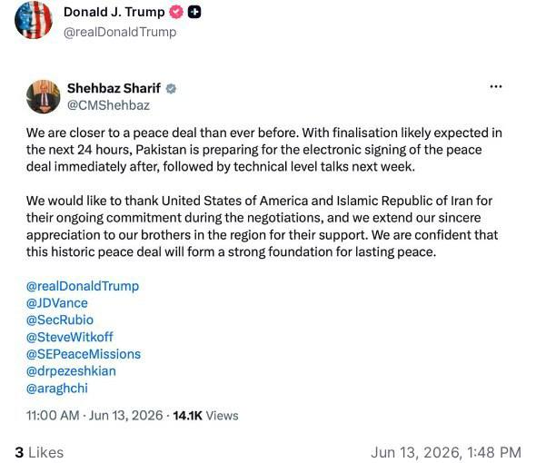

🔴ترامپ توییت نخست وزیر پاکستان مبنی بر احتمال امضای توافق ظرف ۲۴ ساعت را بازنشر کرد
https://t.me/kianmeli1

## IranIntlTV — post 342063

  <a href="telegram/content/IranIntlTV_342063_1781359969.mp4" target="_blank">🎬 Download video</a>

سرخط خبرهای شنبه ۲۳ خرداد

@iranintltv

## IranIntlTV — post 342062

  <a href="telegram/content/IranIntlTV_342062_1781359970.mp4" target="_blank">🎬 Download video</a>

ایرانیان ملبورن در استرالیا روز شنبه برای زادروز مجیدرضا رهنورد، جانباخته خیزش انقلابی ۱۴۰۱، و ۴۰ هزار جاویدنام انقلاب ملی پرچم شیروخورشید را برای ۴۰ هزار ثانیه برافراشتند.

## FarsiVOA — post 220582

Farsi VOA pinned a photo

## FarsiVOA — post 220581

  

📸اینستاگرام صدای آمریکا را هم اکنون فالو کنید تا از آخرین خبرها مطلع بمانید:
https://www.instagram.com/voafarsi/

📡همچنین جهت اطلاع از بروزترین فرکانسهای ماهواره‌ای صدای آمریکا به لینک زیر مراجعت فرمایید:
https://ir.voanews.com/satellite

این پست را با دوستانتان به اشتراک بگذارید
@FarsiVOA

## FarsiVOA — post 220580

  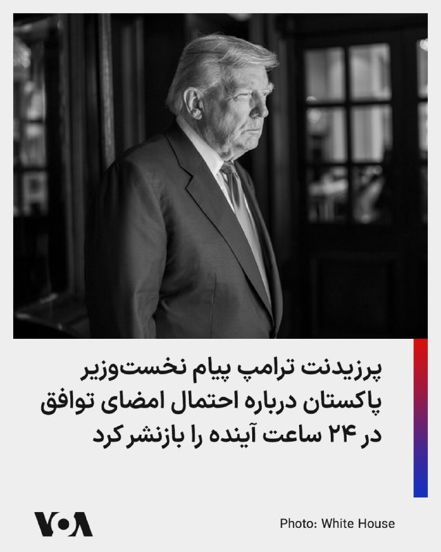

⚡️پرزیدنت ترامپ روز شنبه ۲۳ خرداد پیام نخست‌وزیر پاکستان در شبکه اجتماعی ایکس را که در آن نوشته بود توافق صلح میان آمریکا و جمهوری اسلامی احتمالاً ظرف ۲۴ ساعت آینده امضا خواهد شد، بازنشر کرد.

## RadioFarda — post 158265

تیم ملی فوتبال؛ دوگانهٔ عشق به ایران و خشم از حکومت

🔸جام جهانی فوتبال ۲۰۲۶ برای ایران فقط یک تورنمنت فوتبالی نیست؛ به‌خصوص اگر پای بازی در آمریکا و حضور پررنگ ایرانیان مهاجر در میان باشد، تیم ملی دوباره به صحنه‌ای تبدیل می‌شود که در آن فوتبال، خاطره، سیاست، تبعید، خشم و عشق به ایران در کنار هم قرار می‌گیرند.

🔸برای بخشی از ایرانیان، نام ایران روی پیراهن تیم ملی هنوز یادآور چیزی فراتر از حکومت است. برای بخشی دیگر اما همین پیراهن از سایهٔ حکومت جدا دیده نمی‌شود. میان این دو نگاه، یک کشور زخمی ایستاده است؛ کشوری که حتی شادی ورزشی‌اش هم دیگر بی‌دردسر نیست.

🔸گزارش وحید پوراستاد را در وب‌سایت رادیوفردا بخوانید.

@RadioFarda

## IranianMinds — post 22469

  <a href="telegram/content/IranianMinds_22469_1781359973.mp4" target="_blank">🎬 Download video</a>

🔴اکانت اسرائیل به فارسی:

یکی از بهترین ویدئوهای جنگ ۱۲ روزه 😂😂😂

@IranianMinds

## IranianMinds — post 22468

🔴آقای عراقچی ، حالم ازت به هم می‌خوره، خودم میکشمت.

@IranianMinds

## alonews — post 127635

  <a href="telegram/content/alonews_127635_1781359975.webm" target="_blank">🎬 Download video</a>

‌
👈عراقچی فردا راهی پاکستان می‌شود

الحدث به نقل از منابع آگاه:

🔴منابع حاکی از آن است که یک هیئت ایرانی، شامل وزیر امور خارجه، فردا وارد پاکستان خواهد شد.

🔴هیئت ایرانی بر مذاکرات فنی مربوط به این توافق نظارت خواهد داشت.

✅ @AloNews خبر جنگ

## alonews — post 127634

  <a href="telegram/content/alonews_127634_1781359975.webm" target="_blank">🎬 Download video</a>

👈ایرانسل همچنان اینترنت ۴۰ هزار تومانی می‌فروشد!

🔴با وجود انتقادها به اینترنت پرو و گرانی چند برابری آن، ایرانسل همچنان بسته یک‌ساله اینترنت پرو را به قیمت ۸ میلیون تومان عرضه می‌کند.

✅ @AloNews خبر جنگ

---
📅 بروزرسانی: 1405/03/23 17:32
---

## VahidOOnLine — post 245313

  <a href="telegram/content/VahidOOnLine_245313_1781359377.mp4" target="_blank">🎬 Download video</a>

♦️ جمعه شب، ۲۲ خرداد، سیل خروشان هواداران تیم ملی فوتبال برزیل به میدان تایمز نیویورک سرازیر شد تا در آستانه نخستین بازی تیم‌شان در جام جهانی ۲۰۲۶، شور و هیجان فوتبالی را به اوج برسانند.

هواداران با تن‌پوش‌های سبزو‌زردِ قناری، گرد هم آمدند تا پیش از بازی افتتاحیه خود در روز شنبه (۲۳ خرداد) مقابل مراکش در ورزشگاه نیویورک/نیوجرسی، برای سلسائو آرزوی موفقیت کنند. تنها یک روز پس از آنکه مکزیکوسیتی در بازی افتتاحیه (پنجشنبه ۲۱ خرداد) میزبان رقابت‌ها بود و مکزیک توانست با نتیجه ۲ بر ۰ آفریقای جنوبی را شکست دهد، حال و هوای جام جهانی به وضوح در بزرگ‌ترین شهر ایالات متحده لمس می‌شد.

در این تجمع، طبل‌نوازان می‌نواختند و جمعیت با رقص و پایکوبی و سر دادن سرودهای حماسی، برد پرگلی را برابر مراکش در گام نخست پیش‌بینی می‌کردند. بیشتر هوادارانی که خبرگزاری رویترز با آن‌ها گفتگو کرده، برای تماشای این رقابت‌ها از برزیل به آمریکا سفر کرده بودند، در حالی که برخی دیگر مقیم ایالات متحده بودند. هدف همگی آن‌ها یکی بود: حمایت از برزیل به امید فتح ششمین جام و ثبت یک رکورد تاریخی.
‌🇸🇦 Indypersian

🤖 @VahidOOnLine

## WithYashar — post 14721

  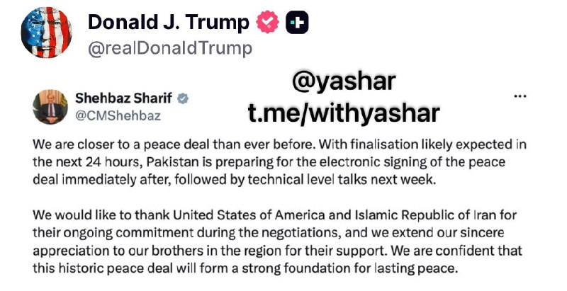

ترامپ توییت شهباز شریف نخست وزیر پاکستان را در‌تروث منتشر کرد :
شهباز شریف: «ما اکنون بیش از هر زمان دیگری به دستیابی به یک توافق صلح نزدیک شده‌ایم. با توجه به اینکه انتظار می‌رود این توافق طی ۲۴ ساعت آینده نهایی شود، پاکستان در حال آماده‌سازی برای امضای الکترونیکی توافق صلح بلافاصله پس از نهایی شدن آن است و پس از آن نیز گفت‌وگوهای فنی و کارشناسی در هفته آینده برگزار خواهد شد. مایلیم از ایالات متحده آمریکا و جمهوری اسلامی ایران به دلیل تعهد و همکاری مستمرشان در طول مذاکرات قدردانی کنیم و همچنین از برادران خود در منطقه بابت حمایت‌هایشان صمیمانه سپاسگزاری نماییم. ما اطمینان داریم که این توافق صلح تاریخی، بنیانی محکم برای صلحی پایدار و ماندگار فراهم خواهد کرد.»
@withyashar

## FoxNewsTwitter — post 342931

Fox News (Twitter/X)

President Trump's name is being removed from the Kennedy Center after a federal appeals court denied the board's request for an administrative stay.

Crowds gathered outside as workers erected scaffolding to begin removing the signage.

## IranIntlTV — post 342061

  <a href="telegram/content/IranIntlTV_342061_1781359379.mp4" target="_blank">🎬 Download video</a>

جمشید برزگر، تحلیلگر سیاسی، درباره اظهارات نخست‌وزیر پاکستان مبنی بر احتمال امضای تفاهم میان تهران و واشینگتن در ۲۴ ساعت آینده، گفت: «آنچه در جریان است، تلاشی برای عادی‌سازی روابط جمهوری اسلامی با آمریکا نیست، بلکه مقدمه‌ای برای پایان دادن به جنگ است.»
@iranintltv

## Persian_Trend_Official — post 16948

  <a href="telegram/content/Persian_Trend_Official_16948_1781359381.webm" target="_blank">🎬 Download video</a>

کانال های خبرگزاری فارس، بابک زنجانی، صرافی نوبیتکس، والکس، رمزینکس و بیت‌پین که در یوتیوب فعالیت میکردند، به علت تحریم‌های آمریکا همگی مسدود شدند.

👺Phantom

📌 @persian_trend_official
پرشین ترند | متفاوت‌ترین کانال نظامی

## RadioFarda — post 158257

🔸بازیکنان تیم ملی فوتبال ایران در جریان تمرینات خود در مرکز تمرینی «سنترُو شولوایتسکوینتله» در شهر تیخوانای مکزیک، برای رقابت‌های جام جهانی ۲۰۲۶ آماده می‌شوند.

🔸تیم ملی ایران نخستین دیدار خود در مرحله گروهی این رقابت‌ها را روز ۲۶ خرداد برابر نیوزیلند در ورزشگاه سوفای شهر لس‌آنجلس برگزار خواهد کرد.

@RadioFarda

## IranianMinds — post 22467

  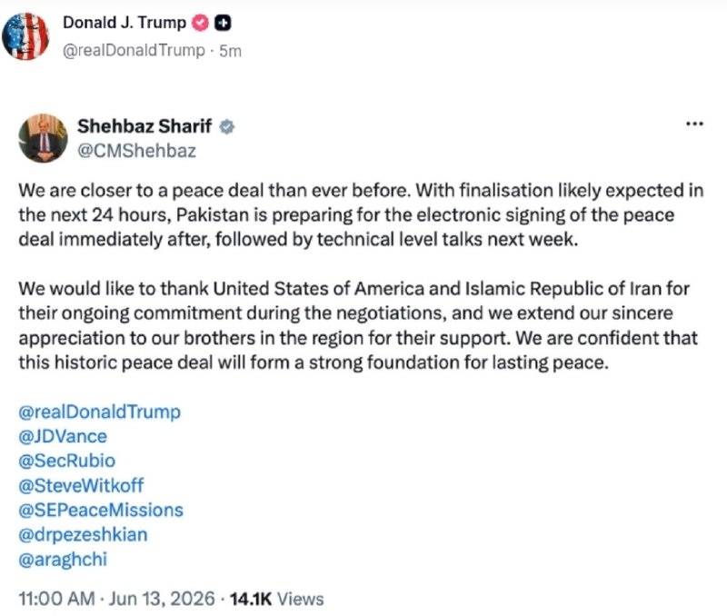

ترامپ توییت نخست‌وزیر پاکستان درمورد امضای دیجیتال یادداشت تفاهم ایران و آمریکا تا ۲۴ ساعت آینده را بازنشر کرد

@IranianMinds

## Hranews — post 113584

  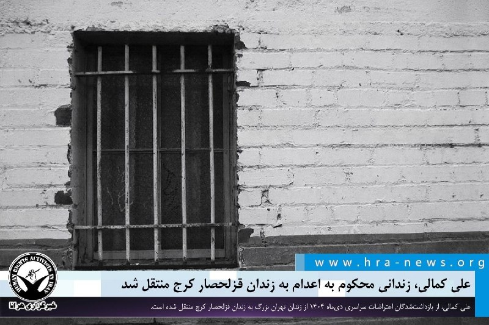

اعتراضات دی‌ماه؛ علی کمالی، زندانی محکوم به اعدام به زندان قزلحصار کرج منتقل شد

❗️
❗️
❗️
❗️
❗️– علی کمالی، از بازداشت‌شدگان اعتراضات سراسری دی‌ماه ۱۴۰۴ از زندان تهران بزرگ به زندان قزلحصار کرج منتقل شده است. انتقال این زندانی با توجه به محکومیت وی به #اعدام، موجب افزایش نگرانی خانواده و نزدیکان او شده است.

به گزارش خبرگزاری هرانا، ارگان خبری مجموعه فعالان حقوق بشر در ایران، علی کمالی، از بازداشت شدگان اعتراضات سراسری دی‌ماه، به زندان قزلحصار کرج منتقل شده است.

براساس اطلاعات دریافتی هرانا، آقای کمالی از زندان تهران بزرگ خارج و به زندان قزلحصار کرج منتقل شده است. یک منبع مطلع نزدیک به خانواده آقای کمالی با تایید این خبر به هرانا گفت: “انتقال این زندانی محکوم به اعدام، باعث افزایش نگرانی خانواده و نزدیکانش در خصوص وضعیت او شده است.”

ادامه مطلب

#علی_کمالی

↘️
@hranews_bot تماس ✉️ -  @Hranews  کانال هرانا 🆑

## alonews — post 127633

  <a href="telegram/content/alonews_127633_1781359382.webm" target="_blank">🎬 Download video</a>

👈امشب تو دروازه شمیران برنامه‌ها هست......

✅ @AloNews خبر جنگ

## alonews — post 127632

  <a href="telegram/content/alonews_127632_1781359382.webm" target="_blank">🎬 Download video</a>

👈ترامپ توییت نخست‌وزیر پاکستان درمورد امضای دیجیتال یادداشت تفاهم ایران و آمریکا تا ۲۴ ساعت آینده را بازنشر کرد

✅ @AloNews خبر جنگ

## alonews — post 127631

  <a href="telegram/content/alonews_127631_1781359382.webm" target="_blank">🎬 Download video</a>

👈واقعا خرن؟ یا خودشون به خریت زدن؟

🔴اگر توافقی بشه همه میدونن تصمیم کلیت نظام جمهوری اسلامی هست اما عده‌ای دارن میگن وای ببینید عراقچی رفت مذاکره و همه کاره اینه! واقعا خر هستید که فک میکنید دولت صفر تا صد توافق رو رفته؟ سیبل رو اشتباه گرفتی برادر من

✅ @AloNews خبر جنگ

---
📅 بروزرسانی: 1405/03/23 17:22
---

## WithYashar — post 14720

کانال های خبرگزاری فارس، بابک زنجانی، صرافی نوبیتکس، والکس، رمزینکس و بیت‌پین که تو یوتیوب فعالیت میکردن، به علت تحریمای آمریکا همگی مسدود شدن
@withyashar

## DEJradio — post 5656

  <a href="telegram/content/DEJradio_5656_1781358767.webm" target="_blank">🎬 Download video</a>

🔺📷 در جریان جنگ ۴۰ روزه، بیشتر کلانتری‌های تهران و بسیاری از کلانتری‌های سایر شهرها بمباران و تخریب شدند؛ اما با گذشت چند هفته از «آتش‌بس»، حتی عملیات آواربرداری برخی از این مراکز نیز آغاز نشده است.

یک منبع آگاه به «دژ» می‌گوید مهم‌ترین مانع آغاز عملیات بازسازی، «کمبود بودجه» است. با این حال، در سطوح عالی تصمیم‌گیری درباره اصل بازسازی این مراکز نیز اختلاف نظر وجود دارد. به گفته این منبع، برخی مقامات و فرماندهان بانفوذ معتقدند تا زمانی که تکلیف جنگ به‌طور کامل مشخص نشده، بازسازی مراکز نظامی و انتظامی با ریسک بالایی همراه است؛ زیرا احتمال هدف قرار گرفتن و بمباران مجدد آن‌ها وجود دارد.

در حال حاضر، به دلیل تخریب ساختمان‌های کلانتری‌ها، مأموران انتظامی در کانکس‌ها به انجام وظیفه مشغول هستند. این کانکس‌ها نه از سیستم تهویه مناسب برخوردارند و نه امکانات اولیه‌ای مانند سرویس بهداشتی دارند. در نتیجه، مأموران در ساعات خدمت با شرایط دشوار و نامناسبی مواجه هستند.

#جنگ۴۰روزه #آتشبس
@DEJradio

## BBCPersian — post 283695

  <a href="telegram/content/BBCPersian_283695_1781358767.mp4" target="_blank">🎬 Download video</a>

⭕️سرخط خبرها، شنبه ۲۳ خرداد ۱۴۰۵
@BBCPersian

## Dirty_Kids — post 391883

  <a href="telegram/content/Dirty_Kids_391883_1781358769.mp4" target="_blank">🎬 Download video</a>

یادش بخیر! پارسال این موقع رافضی هر ۸ساعت یه دونه اف۳۵ میزد 😂😂😂😂😂😂

@Dirty_Kids 👻

## Dirty_Kids — post 391882

  <a href="telegram/content/Dirty_Kids_391882_1781358770.mp4" target="_blank">🎬 Download video</a>

🔴 یاس انگار از آینده اومده، ۱ سال پیش توی آهنگ «باغ» دقیقا وضعیت این روزا رو مو به مو پیش بینی کرده بود!!!

@Dirty_Kids 👻

## alonews — post 127630

  <a href="telegram/content/alonews_127630_1781358770.webm" target="_blank">🎬 Download video</a>

👈آرزوی یک تندرو: ایشالا عراقچی بمیره

✅ @AloNews خبر جنگ

## alonews — post 127629

  <a href="telegram/content/alonews_127629_1781358770.webm" target="_blank">🎬 Download video</a>

👈قطر بسته‌ای به ارزش ۱۲ میلیارد دلار را در مورد دارایی‌های مسدود شده ایران در جریان مذاکرات پیشنهاد داد که شامل آزادسازی ۶ میلیارد دلار از وجوه ایرانی نگهداری شده در قطر و یک خط اعتباری اضافی ۶ میلیارد دلاری است، طبق گزارش خبرگزاری مهر.

ایران در ابتدا پیشنهاد دریافت نیمی از دارایی‌های مسدود شده خود را در مراحل اولیه مذاکرات و مابقی را پس از توافق نهایی ارائه داد، اما ایالات متحده آن طرح را رد کرد. سپس قطر بسته جایگزین را برای کمک به شکستن بن‌بست ارائه داد.

۶ میلیارد دلار از دارایی‌های ایرانی نگهداری شده در قطر همچنان مشروط به محدودیت‌های استفاده بشردوستانه خواهد بود.

۶ میلیارد دلار اضافی به عنوان وام یا خط اعتباری مدیریت شده توسط قطر ارائه خواهد شد و ایران تعیین می‌کند که چگونه از آن استفاده شود.

✅ @AloNews خبر جنگ

## alonews — post 127628

  <a href="telegram/content/alonews_127628_1781358771.mp4" target="_blank">🎬 Download video</a>

👈قابل توجه جبهه پایداری🙂

✅ @AloNews خبر جنگ

---
📅 بروزرسانی: 1405/03/23 17:12
---

## VahidOOnLine — post 245312

  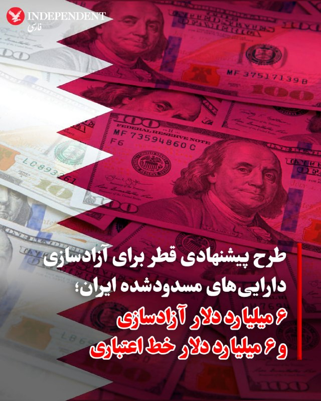

♦️ خبرگزاری مهر، متعلق به سازمان تبلیغات اسلامی، روز شنبه ۲۳ خرداد گزارشی از جزئیات طرح پیشنهادی قطر برای آزادسازی دارایی‌های ایران منتشر کرد. بر اساس این گزارش حجم دارایی‌های بلوکه‌شده ایران در خارج از کشور حدود ۲۴ میلیارد دلار برآورد می‌شود. در جریان مذاکرات، پیشنهاد تهران برای آزادسازی گام‌به‌گام این منابع توسط آمریکا رد شد. مهر می‌نویسد که برای رفع این بن‌بست، قطر طرحی ۱۲ میلیارد دلاری ارائه کرد که شامل آزادسازی ۶ میلیارد دلار از دارایی‌های ایران در قطر و ۶ میلیارد دلار دیگر در قالب خط اعتباری است.

در همین راستا، طی سفر محمدباقر قالیباف و عباس عراقچی به دوحه، پیش‌نویس دو یادداشت تفاهم میان ایران و قطر تهیه شده که اجرای آن‌ها مشروط به نهایی شدن توافق جمهوری اسلامی و آمریکا در چارچوب توافق اسلام‌آباد است.

طبق این طرح، ۶ میلیارد دلار دارایی ایران در قطر (مربوط به توافق سال ۲۰۲۳) همچنان تابع همان چارچوب قبلی و صرفا برای امور بشردوستانه خواهد بود. این منابع در حساب سه بانک ایرانی نزد دو بانک قطری است و برداشت مستقیم از آن‌ها ممکن نیست.
‌🇸🇦 Indypersian

🤖 @VahidOOnLine

## mwarmonitor — post 10829

  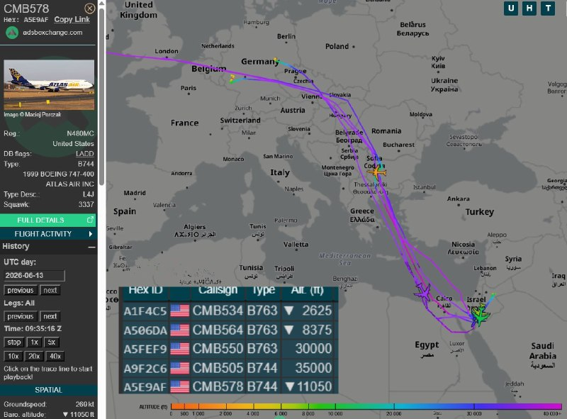

✈️ از صبح امروز، تعداد قابل‌توجهی پرواز باری چارترِ فرماندهی ترابری ایالات متحده (U.S. Transportation Command / USTRANSCOM) در فرودگاه ملک حسین در عقبهِ اردن (King Hussein International Airport) به زمین نشسته‌اند.

✈️ CMB534
✈️ CMB550
✈️ CMB564
✈️ CMB578

@mwarmonitor

## Persian_Trend_Official — post 16947

  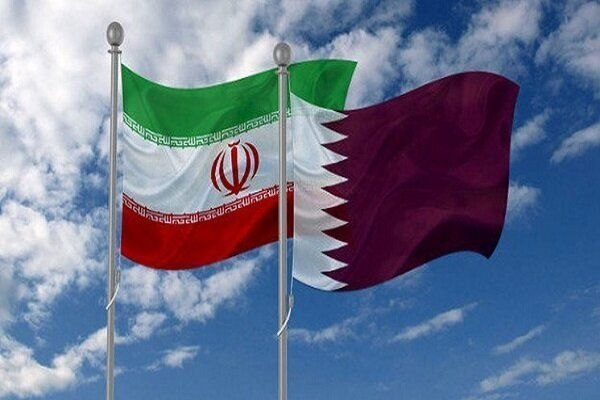

جزئیات پیشنهاد قطر برای آزادسازی دارایی‌های بلوکه‌شده ایران به ادعای خبرگزاری مهر

مهر: در جریان مذاکرات، ایران پیشنهاد کرده بود که نیمی از این منابع در مراحل اولیه مذاکرات و نیم دیگر در توافق نهایی آزاد شود، اما این پیشنهاد از سوی طرف آمریکایی پذیرفته نشد. در ادامه و برای رفع بن‌بست ایجاد شده، قطر طرحی را ارائه کرد که بر اساس آن 12 میلیارد دلار در اختیار ایران قرار گیرد؛ شامل آزادسازی 6 میلیارد دلار از دارایی‌های بلوکه‌شده ایران در قطر و 6 میلیارد دلار دیگر در قالب وام یا خط اعتباری.

بر اساس توافق سال 2023 (1402) میان ایران و آمریکا (در زمان دول رئیسی) 6 میلیارد دلار از دارایی‌های ایران در قطر باید صرف امور بشردوستانه شود. همچنین مقرر شده است که نحوه هزینه‌کرد این منابع همچنان تابع همان چارچوب توافق قبلی باشد.

بخش دوم این بسته مالی، شامل 6 میلیارد دلار خط اعتباری است که نزد طرف قطری باقی می‌ماند و ایران محل مصرف آن را تعیین خواهد کرد.

📝 Amir

📌 @persian_trend_official
پرشین ترند | متفاوت‌ترین کانال نظامی

## BBCPersian — post 283694

🔻گزارش‌ها از اصابت پرتابه به یک نفتکش در نزدیکی عمان

سازمان عملیات تجارت دریایی بریتانیا می‌گوید که یک نفتکش در نزدیکی سواحل عمان بر اثر برخورد یک پرتابه ناشناس به بخش جلویی بدنه آن آسیب دیده است.

به گفته این نهاد ناظر وابسته به نیروی دریایی بریتانیا، این حادثه دیروز و در فاصله حدود ۱۱ کیلومتری در شرق سواحل عمان رخ داده است.

بر اساس گزارش‌ها، تمامی خدمه نفتکش در سلامت هستند و هیچ‌گونه آلودگی یا خسارت زیست‌محیطی گزارش نشده است.

گفته شده است که این کشتی به مسیر خود به سمت بندر مقصد ادامه داده است.

جزئیات بیشتری از منشا این پرتابه منتشر نشده است.

https://bbc.in/4vRWDh3
@BBCPersian

## alonews — post 127627

  <a href="telegram/content/alonews_127627_1781358161.webm" target="_blank">🎬 Download video</a>

👈تجمع برخی از مردم تبریز در اعتراض به توافق با قاتل رهبر سابق

✅ @AloNews خبر جنگ

## alonews — post 127626

  <a href="telegram/content/alonews_127626_1781358162.mp4" target="_blank">🎬 Download video</a>

👈معاون اول ترامپ؛ ونس :
اگه برگردیم به جنگ جهانی دوم یا هر جنگ بزرگ دیگه‌ای توی تاریخ، آخرش همه‌شون با مذاکره و توافق تموم شدن

✅ @AloNews خبر جنگ

---
📅 بروزرسانی: 1405/03/23 17:03
---

## mwarmonitor — post 10828

🚨رسانه‌های اسرائیلی: حادثه‌ای غیرعادی در آسمان مجارستان: یک هواپیمای اسرائیلی ارتباط خود را با کنترل ترافیک هوایی از دست داد. @mwarmonitor

## mwarmonitor — post 10827

🔴مارک لوین: ما اینجا با کسی هستیم که من او را «ژنرالِ آمریکا» می‌نامم؛ ژنرال چهارستاره بازنشسته ارتش، جک کین. شما او را بارها در این شبکه دیده‌اید و البته دلیل خوبی هم دارد. با تغییر اوضاع و دگرگونی در روند مذاکرات، ژنرال کین، نظر شما درباره وضعیت فعلی چیست؟ ابتدا اعلام می‌شود که به توافق رسیده‌ایم، سپس اعلام می‌شود توافقی که آن‌ها از آن صحبت می‌کنند، آن توافق مدنظر نیست و در مورد آن دروغ می‌گویند. شاید توافق دیگری داشته باشیم و بعد اگر تفاهم‌نامه (MOU) نهایی و امضا شود، ۶۰ روز دیگر برای مذاکره و مسائل دیگر زمان هست... برداشت شما از اتفاقاتی که در حال حاضر رخ می‌دهد چیست؟

🔰ژنرال جک کین: خب، مشخصاً رئیس‌جمهور مسیر دیپلماتیک را انتخاب کرده است و مطمئناً این مسیر چالش‌برانگیز خواهد بود. من کاملاً با محتوای صحبت‌هایی که در تک‌گویی (مونولوگ) خود مطرح کردید، موافقم.
ما با یک رژیم شیطانی و ایدئولوژی‌محور مواجه هستیم که اولویت اولش بقا است و در مرتبه دوم، به شکل بنیادین به ایدئولوژی خود متعهد است. این مسئله باعث می‌شود دو سؤال مهم ایجاد شود:
آیا آن‌ها اصلاً توانایی دستیابی به یک توافق را دارند؟
آیا هرگز به اصول و مفاد چنین توافقی پایبند خواهند بود و آن را اجرا خواهند کرد؟
دلیل بدبینی ما به این موضوع همین است؛ چرا که این کار با ایدئولوژی آن‌ها همخوانی ندارد. این واقعیتی است که با آن روبرو هستیم و نشان می‌دهد که چالش در این مسیر دیپلماتیک چقدر جدی است. من و شما گزینه دیگر را ترجیح می‌دادیم؛ یعنی تضعیف آن‌ها با تمام توان نظامی ممکن. اینکه آن‌ها را از نظر نظامی و اقتصادی چنان ضعیف کنیم که در مسیر فروپاشی تدریجی قرار بگیرند، تا جایی که مردم خودشان بتوانند به مرور زمان اقدام کنند و رهبری و رژیم دیگری را جایگزین نمایند.
اما این مسیری نیست که اکنون در آن قرار داریم؛ ما در مسیر دیگری هستیم و این مسیر قطعاً چالش‌برانگیز خواهد بود. با این حال، به عقیده من رئیس‌جمهور تن به یک توافق بد نخواهد داد و به همین دلیل است که اگر قرار باشد کسی با ایرانی‌ها توافق کند، آن شخص خود اوست. ساختار این توافق باید فراتر از دوران ریاست‌جمهوری او ادامه داشته باشد و باید دارای ضمانت‌های اجرایی باشد تا ایرانی‌ها را نسبت به اصول توافق پاسخگو نگه دارد.
قطعاً این کار بسیار چالش‌برانگیز خواهد بود. نگاه کنید با چه کسانی طرف هستیم؛ ایرانی‌ها در این زمینه ثبات دارند که بخشی از حکومتشان می‌گوید «موافقم» و بخش دیگر می‌گوید «موافق نیستم». وقتی به رفتار و اقدامات آن‌ها نگاه می‌کنیم — که عملکردشان بسیار بیشتر از حرف‌هایشان هویت واقعی آن‌ها را نشان می‌دهد — می‌بینیم که از زمان آتش‌بس در ۸ آوریل چه کارهایی انجام داده‌اند: حملات مکرر در تنگه هرمز، حمله به پایگاه‌های آمریکا، و حمله به متحدان و شرکای ما؛ که همگی نقض آشکار آتش‌بس هستند.
و بعد نگاه کنید در لبنان چه می‌گذرد؛ آن‌ها حزب‌الله را در داخل لبنان آزاد گذاشته‌اند تا بیش از ۲۰۰۰ راکت و پهپاد را به شمال اسرائیل شلیک کند که این امر منجر به تخلیه آن شهرها و روستاها شده و بیش از ۳۰۰ مجروح برجای گذاشته است. فراتر از این‌ها، ایران ۱۱ موشک بالستیک به سمت اسرائیل شلیک کرده است. تمام این اقدامات، نقض کامل و آشکار آتش‌بس به شمار می‌روند.

@mwarmonitor

## mwarmonitor — post 10826

  <a href="telegram/content/mwarmonitor_10826_1781357580.mp4" target="_blank">🎬 Download video</a>

🎬 Video

## DW_Farsi — post 125928

  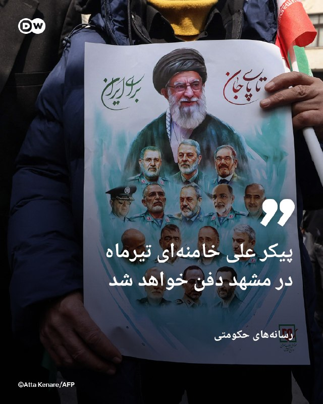

🔶رسانه‌های حکومتی: پیکر علی خامنه‌ای تیرماه در مشهد دفن خواهد شد

رسانه‌های حکومتی ایران گزارش دادند مراسم مربوط به خاکسپاری علی خامنه‌ای از ماه ژوئیه آغاز خواهد شد. بر اساس این گزارش‌ها، روزهای ۱۳ و ۱۴ ژوئیه مراسم وداع در تهران برگزار می‌شود و پس از آن، ۱۵ ژوئیه مراسم تشییع در تهران و ۱۶ ژوئیه مراسم دیگری در قم برگزار خواهد شد.

بر اساس این گزارش، قرار است ۱۸ ژوئیه نیز مراسم دیگری در مشهد برگزار شود.

پس از این مراسم، پیکر علی خامنه‌ای در حرم امام رضا در شهر مشهد دفن خواهد شد.

بنیامین نتانیاهو، نخست وزیر اسرائیل شامگاه شنبه ۲۸ فوریه (۹ اسفند) در یک سخنرانی تلویزیونی گفت: «امروز صبح در یک حمله غافلگیرانه عظیم، تأسیسات متعلق به علی خامنه‌ای، این دیکتاتور، را در قلب تهران نابود کردیم (...) و نشانه‌های فراوانی وجود دارد که این دیکتاتور دیگر در قید حیات نیست.»

پس از آن صداوسیمای حکومت ایران این خبر را تایید کرد.

بنیامین نتانیاهو در ادامه اعلام کرد که در جریان این حملات، شماری از فرماندهان سپاه پاسداران انقلاب اسلامی و مقام‌های ارشد برنامه هسته‌ای ایران نیز کشته شده‌اند.

@dw_farsi

## Persian_Trend_Official — post 16946

  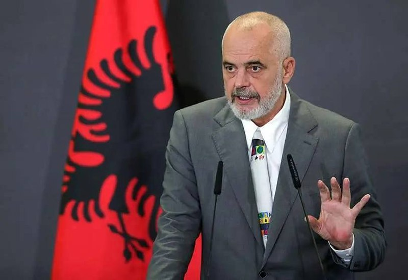

ادی راما، نخست وزیر آلبانی تهران را به دست داشتن در اعتراضات اخیر بر سر یک پروژه تفریحی لوکس پیشنهادی مرتبط با جرد کوشنر متهم کرد.

نخست وزیر آلبانی همچنین افزود ایران تنها کشور متخاصمی است که آلبانی با آن روبه‌روست.

📝 Amir

📌 @persian_trend_official
پرشین ترند | متفاوت‌ترین کانال نظامی

## RadioFarda — post 158256

  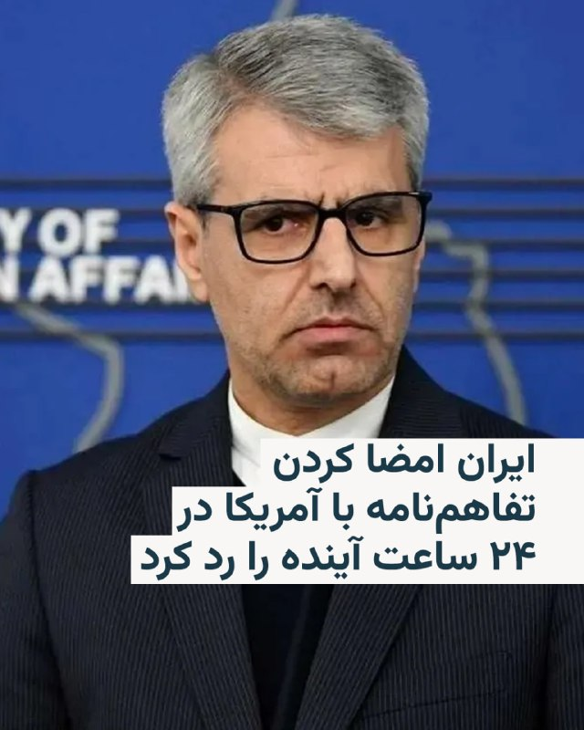

🔸اسماعیل بقائی، سخنگوی وزارت امور خارجه ایران، روز شنبه با رد اظهارات نخست‌وزیر پاکستان درباره زمان نهایی شدن تفاهم‌نامه با آمریکا برای پایان دادن به جنگ، اعلام کرد که زمان امضای تفاهم‌نامه «فردا نخواهد بود»

🔸شهباز شریف، نخست وزیر پاکستان، ساعتی پیش گفت که تهران و واشینگتن بر سر متن نهایی تفاهم‌نامه به توافق رسیده‌اند و این تفاهم‌نامه در عرض ۲۴ ساعت آینده «احتمالا نهایی می‌شود» و بلافاصله پس از آن «به صورت الکترونیکی» امضا خواهد شد.

🔸بقائی در اظهاراتی که در رسانه‌های حکومتی منتشر شد، بدون اشاره به بیانیه شهباز شریف گفت: «درباره زمان دقیق امضا تفاهم‌نامه باید منتظر بمانیم، اگرچه فردا نخواهد بود اما احتمال اینکه در روزهای آتی این اتفاق رقم بخورد منتفی نیست.»

🔸او افزود که به دلیل «تزلزل طرف مقابل» باید در مورد هرگونه اظهارنظر درباره تاریخ امضا با احتیاط عمل کرد.

@RadioFarda

## RadioFarda — post 158255

  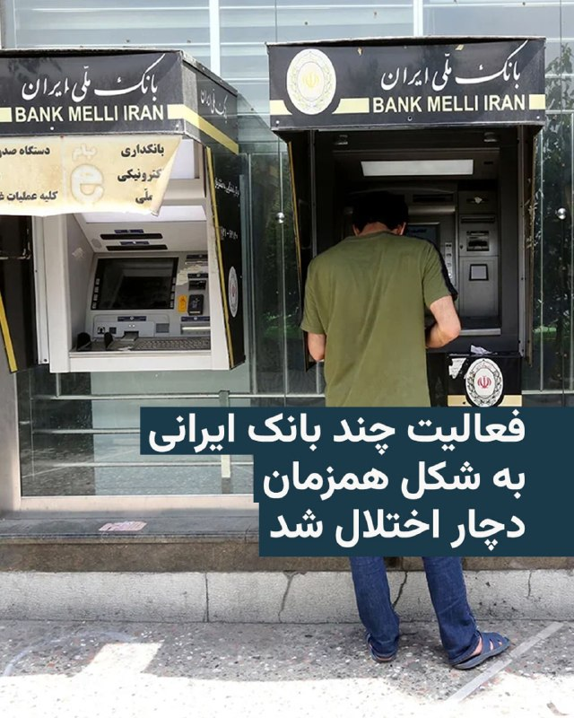

🔸رسانه‌ها و مقام‌های ایرانی روز شنبه خبر دادند که خدمات چند بانک ایرانی به شکل همزمان دچار مشکل شده و این اختلال تا بعدازظهر همچنان ادامه دارد.

🔸خبرگزاری ایسنا اعلام کرد که «بانک‌های ملی، تجارت، صادرات و پاسارگاد» از جمله بانک‌هایی بودند که همراه‌بانک و دستگاه‌های خودپرداز آنها مختل شده است.

🔸خبرگزاری فارس در این‌باره نوشت بانک «توسعه صادرات» نیز اختلال مشابهی دارد و افزود که «برخی منابع از احتمال وقوع حمله سایبری خبر داده‌اند، اما تاکنون هیچ مقام رسمی این موضوع را تأیید یا رد نکرده است».

🔸ساعتی بعد علیرضا قیطاسی، دبیر شورای هماهنگی بانک‌های دولتی در گفت‌وگو با صداوسیما بدون اشاره به جزئیات درباره دلایل این اتفاق گفت: «رفع اختلال از خدمات بانک‌های ملی، صادرات، تجارت و توسعه صادرات در دست انجام است.»

🔸حملات به شبکه بانکی ایران در سال‌های اخیر سابقه دارد و بارها اطلاعات مشتریان بانک‌های مختلف ایران هدف رخنهٔ سایبری قرار گرفته و در فضای مجازی و اینترنت خرید و فروش شده است.

@RadioFarda

## alonews — post 127625

  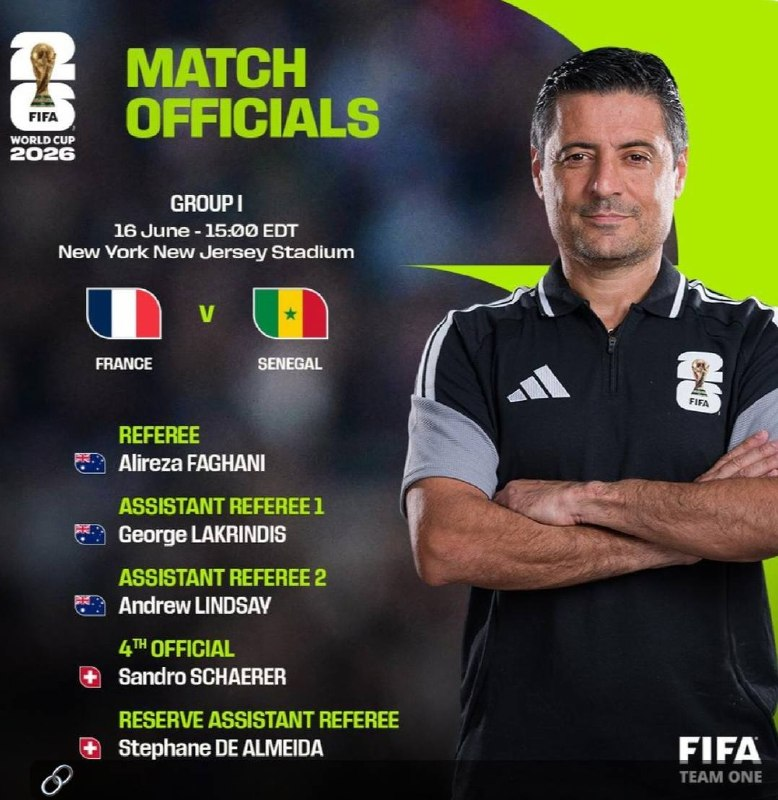

🇫🇷🇸🇳علیرضا فغانی داور بازی فرانسه و سنگال شد
@AloSport

---
📅 بروزرسانی: 1405/03/23 16:52
---

## VahidOOnLine — post 245311

  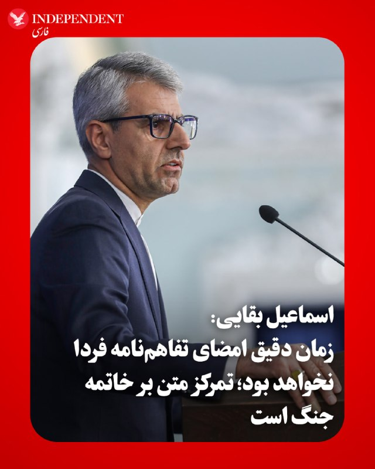

♦️ اسماعیل بقایی، سخنگوی وزارت امور خارجه، روز شنبه ۲۳ خرداد با تشریح آخرین وضعیت مذاکرات اعلام کرد: «یادداشت تفاهم اسلام‌آباد که در حال پیگیری است، به طور مشخص بر خاتمه جنگ تمرکز دارد و در این مرحله تصمیم بر این شده که هیچ بحثی در مورد موضوع هسته‌ای صورت نگیرد.»

بقایی درباره گمانه‌زنی‌های مربوط به زمان امضای این سند گفت: «درباره زمان دقیق امضای تفاهم‌نامه باید منتظر بمانیم؛ اگرچه این رویداد فردا نخواهد بود، اما احتمال اینکه ظرف روزهای آتی رقم بخورد کاملا منتفی نیست.»

بقایی ایالات متحده را به «تزلزل و بی‌ثباتی در اظهارنظرها» متهم کرد و گفت: «به دلیل تزلزل و عدم ثبات طرف مقابل در اظهارنظرها، باید در هرگونه موضع‌گیری درباره این روند محتاط باشیم.»
‌🇸🇦 Indypersian

🤖 @VahidOOnLine

## mwarmonitor — post 10825

🚨رسانه‌های اسرائیلی: حادثه‌ای غیرعادی در آسمان مجارستان: یک هواپیمای اسرائیلی ارتباط خود را با کنترل ترافیک هوایی از دست داد.

@mwarmonitor

## pm_afshaa — post 93761

کانال های خبرگزاری فارس، بابک زنجانی، صرافی نوبیتکس، والکس، رمزینکس و بیت‌پین که تو یوتیوب فعالیت میکردن، به علت تحریمای آمریکا همگی مسدود شدن

💧 Rainbet.com the #1 Non-KYC Crypto Casino & Sportsbook @rainbetcom

😁 @Pm_Afshaa

## DEJradio — post 5654

  <a href="telegram/content/DEJradio_5654_1781356956.webm" target="_blank">🎬 Download video</a>

🔺🎤 چگونه از خود در برابر دیپ‌فیک و سرقت هویت محافظت کنیم؟

گفت‌وگو با آرتم لاورنکوف، کارشناس فناوری اطلاعات

#فناوری_اطلاعات #دیپ_فیک
@DEJradio

## IranIntlTV — post 342060

  <a href="telegram/content/IranIntlTV_342060_1781356957.mp4" target="_blank">🎬 Download video</a>

در آستانه بزرگداشت روز شیر و خورشید و در پاسخ به فراخوان شاهزاده رضا پهلوی، جمعی از ایرانیان برلین مقابل ساختمان پارلمان آلمان گرد هم آمده‌اند.

تجمع‌کنندگان در اقدامی نمادین و به یاد جاویدنامان انقلاب ملی، به مدت ۴۰ هزار ثانیه، معادل بیش از ۱۱ ساعت، پرچم شیر و خورشید را بالا نگه می‌دارند.

گزارش علی حسن‌پور، خبرنگار ایران‌اینترنشنال
@iranintltv

## IranIntlTV — post 342059

  <a href="telegram/content/IranIntlTV_342059_1781356958.mp4" target="_blank">🎬 Download video</a>

بررسی‌های ایران‌اینترنشنال نشان می‌دهد جمهوری اسلامی حدود ۳۰ پایگاه موشکی در نقاط مختلف ایران دارد؛ مجموعه‌ای از تونل‌ها و تاسیسات زیرزمینی که سپاه پاسداران از آن‌ها با عنوان «شهرهای موشکی» یاد می‌کند.

بر اساس این بررسی، مراکز اصلی تحقیق، توسعه و مونتاژ موشکی در مرکز و شرق ایران قرار دارند و این شهرهای موشکی، علاوه بر تونل‌های زیرزمینی، شامل پناهگاه‌های بتنی، سامانه‌های ارتباطی، تجهیزات سوخت‌گیری و مراکز هدایت عملیات موشکی نیز هستند.

جزییات بیشتر با امیرهادی انواری، عضو تحریریه ایران‌اینترنشنال
@iranintltv

## Persian_Trend_Official — post 16943

  <a href="telegram/content/Persian_Trend_Official_16943_1781356960.mp4" target="_blank">🎬 Download video</a>

یک سال پیش در چنین ساعاتی موساد تصاویری از عملیات حیرت آور خود در عمق خاک ایران و حتی پایتخت کشور، تهران منتشر کرد.

در این عملیات به گفته خود منابع عبری و غربی، کماندوهای ایرانی آموزش دیده به دست اسرائیل با رهبری موساد و استفاده از پرتابه های چون کوادکوپتر، پهپادهای کوچیک و حتی موشک های ضد زره از جمله اسپایک در همان دقایق اول آغاز عملیات طلوع شیران مواضع پدافندی، راداری و حتی موشکی ارتش و سپاه پاسداران را در هم کوبیدند تا راه برای هواگردهای اسرائیلی باز و همچنین نرخ شلیک موشک های بالستیک و پهپادهای انتحاری علیه اسرائیل را کاهش بدهند‌.

اینکه به چه شکل این تجهیزات به راحتی وارد کشور شدند و در نزدیکی سایت های نظامی استراتژیک کشور مستقر شدند جای خود دارد و در این پست به آن نمی‌پردازیم. در ویدیو اول شاهد حمله یک پرتابه FPV اسرائیلی به لانچر یک موشک بالستیک و در ویدیو دوم و سوم شاهد حمله موشک ضد زره اسپایک به پدافند موشکی طبس سپاه و رادار نجم-804 پدافند هوایی ارتش در تهران هستیم.

📝 Amir

📌 @persian_trend_official
پرشین ترند | متفاوت‌ترین کانال نظامی

## IranianMinds — post 22466

🔴 کانال های خبرگزاری فارس، بابک زنجانی، صرافی نوبیتکس، والکس، رمزینکس و بیت‌پین که تو یوتیوب فعالیت میکردن، به علت تحریمای آمریکا همگی مسدود شدن

@IranianMinds

## IranianMinds — post 22465

  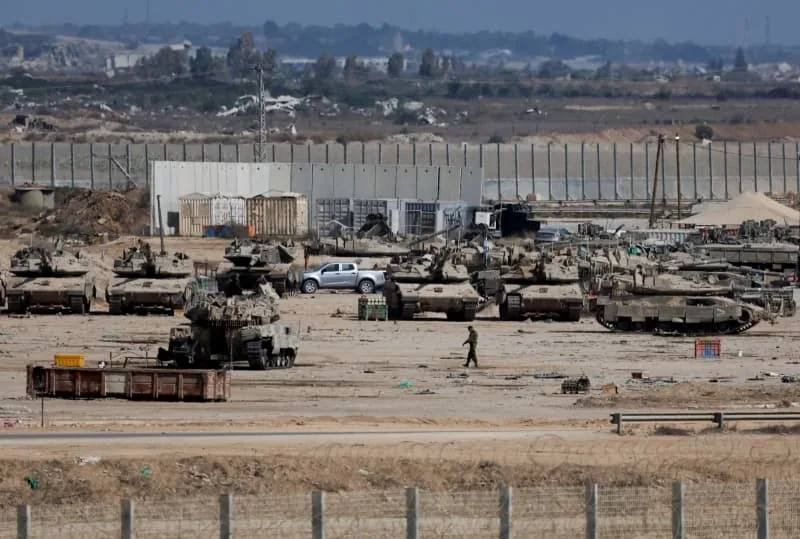

🔴 ارتش آمریکا شروع به ساخت یک پایگاه بزرگ در نزدیکی حصار پیرامونی غزه، نزدیک به پایگاه نظامی ریم در جنوب اسرائیل کرده است، طبق گزارش اسرائیل هیوم.

گفته می‌شود این تأسیسات به عنوان ستاد نظامی و غیرنظامی برای سازمان‌ها و پرسنل بین‌المللی فعال در منطقه در نظر گرفته شده است.

این پایگاه می‌تواند از اجرای طرح موسوم به «طرح ترامپ» حمایت کند، جایگزین ستاد چندملیتی که قبلاً در کریات گات قرار داشت.

@IranianMinds

## IranianMinds — post 22464

  <a href="telegram/content/IranianMinds_22464_1781356961.webm" target="_blank">🎬 Download video</a>

🆕 اپلیکیشن MelBet 
🔄

🎁 کد هدیه 100 دلاری: Sport100

🔵 کاملترین برنامه موبایل

🤝 اسپانسر رسمی لالیگا

☄️ صرافی معتبر

🤖 ربات راهنما

🇮🇷 برای تغییر زبان برنامه، زبان موبایل خود را تغییر دهید.

✅ ورود به اپلیکیشن بدون فیلترشکن

## IranianMinds — post 22463

💛 هنوز توی MelBet با این همه آپشن خفن و ضرایب فوق العاده ثبتنام نکردی 
⁉️

بعد میاید سوال میکنید کدوم سایت معتبره 
❗️

👀 اگه میخواید توی شرطبندی موفق باشید و درآمد کسب کنید در اولین قدم باید سایتی با آپشن های بی نظیر و ضرایب استاندارد و امنیت مالی بالا داشته باشید 
✔️

🎚️ همین حالا از طریق لینک زیر ثبتنام کنید و وارد دنیای جدیدی از شرطبندی بشید 
🆕

🎁 کد هدیه 100 دلاری: Sport100

✅ معرفی سایت و اپلیکیشن مل‌بت

💛 ورود به سایت مل‌بت (فیلترشکن خاموش)

## alonews — post 127624

  <a href="telegram/content/alonews_127624_1781356961.mp4" target="_blank">🎬 Download video</a>

👈حمزه صفوی: اگر تهران را با بمب اتم بزنند؛ ایران به مدت ۱۰ سال تنگه هرمز و خلیج فارس را ناامن خواهد کرد

پ.ن:
😐

✅ @AloNews خبر جنگ

## alonews — post 127623

  <a href="telegram/content/alonews_127623_1781356963.webm" target="_blank">🎬 Download video</a>

👈کانال های خبرگزاری معتبر فارس، بابک زنجانی، صرافی نوبیتکس، والکس، رمزینکس و بیت‌پین که تو یوتیوب فعالیت میکردن، به علت تحریمای آمریکا همگی مسدود شدن.

✅ @AloNews خبر جنگ

---
📅 بروزرسانی: 1405/03/23 16:42
---

## VahidOOnLine — post 245310

  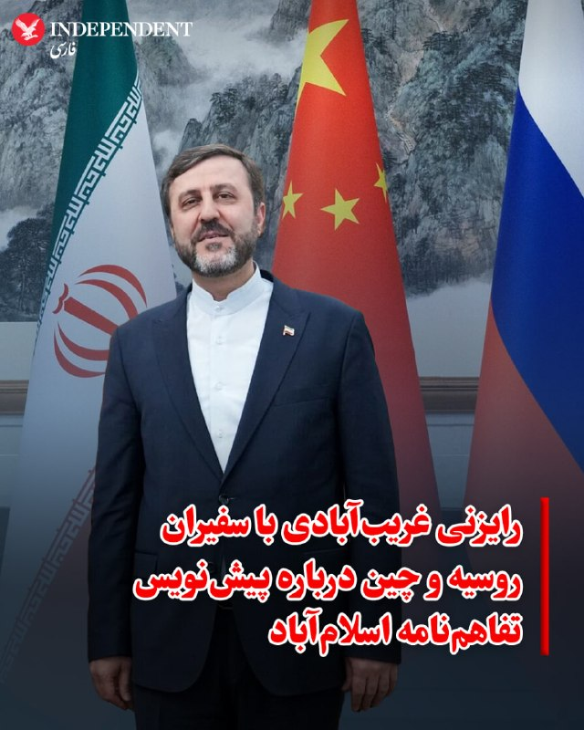

♦️ کاظم غریب‌آبادی، معاون وزیر امور خارجه جمهوری اسلامی، روز شنبه ۲۳ خرداد، در تهران با سفیران روسیه و چین تشکیل جلسه داد تا درباره «آخرین تحولات» مربوط به پیشنهاد توافق احتمالی با ایالات متحده گفتگو کند.

به گزارش ایسنا، در این نشست مشترک سه‌جانبه، طرفین به تبادل نظر و رایزنی درباره آخرین وضعیت پیش‌نویس یادداشت تفاهم اسلام‌آباد پرداختند. غریب‌آبادی در بیانیه‌ای پس از این دیدار تاکید کرد: «شراکت راهبردی میان ایران، چین و روسیه و همچنین هماهنگی و همکاری میان این سه کشور با قدرت ادامه خواهد یافت.»

این رایزنی‌های دیپلماتیک در شرایطی صورت می‌گیرد که طی روزهای گذشته، مقامات آمریکا، ایران و پاکستان همگی بیانیه‌هایی را در خصوص وجود یک یادداشت تفاهم میان تهران و واشنگتن صادر کرده‌اند؛ تفاهم‌نامه‌ای که جزئیات و مفاد دقیق آن هنوز به طور رسمی و عمومی منتشر نشده است.
‌🇸🇦 Indypersian

🤖 @VahidOOnLine

## VahidOOnLine — post 245309

  <a href="telegram/content/VahidOOnLine_245309_1781356372.mp4" target="_blank">🎬 Download video</a>

ایرانیان اسپانیا روز شنبه به یاد جانباختگان راه آزادی در مادرید تجمع کرده و پرچم شیروخورشید را بالا بردند.
‌🏁 🇬🇧 IranintlTV

🤖 @VahidOOnLine

## WithYashar — post 14719

وزارت خارجه آمریکا بار دیگر درخواست ویزای مهدی محمدنبی سرپرست تیم جمهوری اسلامی و مهدی تاج رییس فدراسیون فوتبال رو رد کرد.
@withyashar

## WithYashar — post 14718

  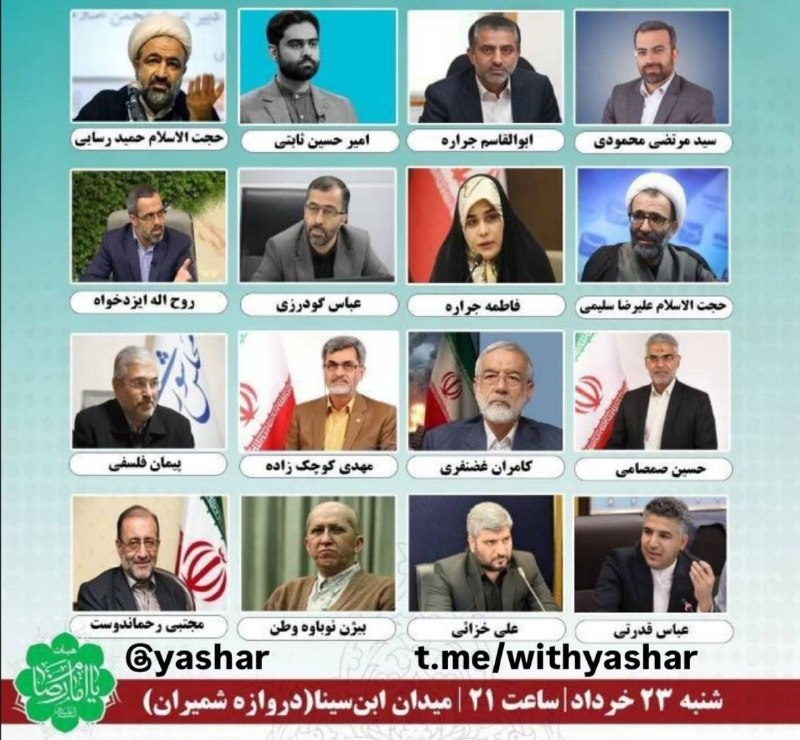

16 تا نماینده مجلس به همراه قشر تندرو امشب جلوی وزارت خارجه تجمع اعتراضی برگزار میکنن و به روند مذاکرات اعتراض میکنن‌.
@withyashar

## mwarmonitor — post 10824

🔴ایالات متحده و ایران به گفته مقاماتی که با مذاکرات آشنا هستند، به توافقی برای پایان دادن به جنگ نزدیک شده‌اند. فاکس نیوز

@mwarmonitor

## pm_afshaa — post 93760

  <a href="telegram/content/pm_afshaa_93760_1781356376.webm" target="_blank">🎬 Download video</a>

🔴وزارت خارجه آمریکا بار دیگر درخواست ویزای مهدی محمدنبی سرپرست تیم جمهوری اسلامی و مهدی تاج رییس فدراسیون فوتبال رو رد کرد.

💧 Rainbet.com the #1 Non-KYC Crypto Casino & Sportsbook @rainbetcom

😁 @Pm_Afshaa

## IranIntlTV — post 342058

  <a href="telegram/content/IranIntlTV_342058_1781356377.mp4" target="_blank">🎬 Download video</a>

ایرانیان اسپانیا روز شنبه به یاد جانباختگان راه آزادی در مادرید تجمع کرده و پرچم شیروخورشید را بالا بردند.

## DW_Farsi — post 125927

🔶اونروا ۷۰ کارمند خود در غزه را اخراج کرد

اونروا اعلام کرد ۷۰ نفر از کارکنان خود در غزه را اخراج کرده است. سرپرست موقت این نهاد، کریستین ساندرز، گفت این تصمیم در پی ارزیابی وضعیت ایمنی و امنیت عملیات آنروا در غزه اتخاذ شده و هدف آن کاهش خطرات امنیتی برای پناهجویان بوده است.

در بیانیه اونروا آمده است این تصمیم بخشی از یک روند انضباطی نیست و به هیچ‌وجه به معنای تایید ادعاهای مطرح‌شده علیه این کارکنان نیست.

این نهاد همچنین گفت بارها از مقام‌های اسرائیلی خواسته اطلاعات و شواهد لازم را برای اثبات اتهام‌های مطرح‌شده علیه کارکنان خود در غزه ارائه کنند، اما تا کنون پاسخی دریافت نکرده است.

@dw_farsi

## BBCPersian — post 283693

  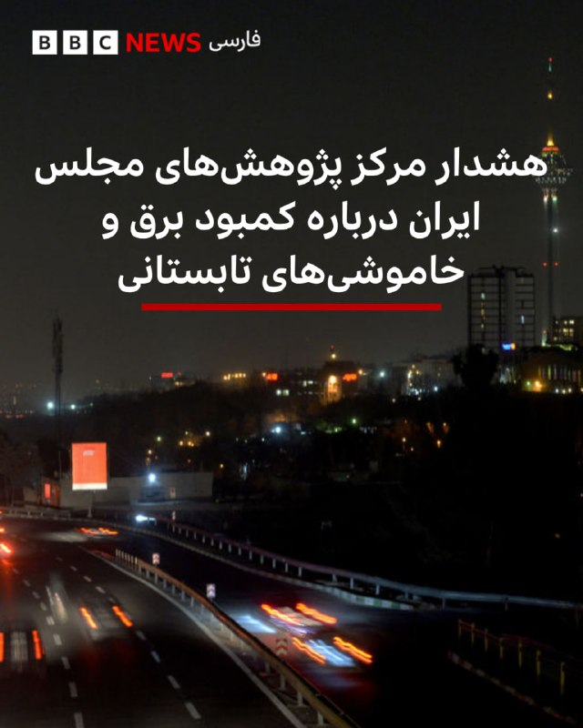

🔻مرکز پژوهش‌های مجلس شورای اسلامی درباره کمبود تولید برق در ایران هشدار داده و برای تابستان پیش رو، خاموشی و قطع برق پیش‌بینی کرده است.

در گزارش این نهاد مطالعاتی پارلمان ایران آمده است: «توجه به ناترازی تولید برق خورشیدی در شب و ادامه‌دار بودن تعمیرات نیروگاهی در آغاز فصل گرم، احتمال تشدید کمبود برق وجود دارد و اجرای فوری مدیریت مصرف، منابع آبی و پیک بار ضروری است.»

مرکز پژوهش های مجلس ایران گفته است که «در سناریوی واقع‌بینانه میزان کسری برق در اوج مصرف تابستان به حدود ۱۳ هزار و ۶۰۰ مگاوات خواهد رسید.»

بر اساس برآورد این نهاد، توان تأمین هم‌زمان شبکه برق ایران حدود ۶۸ هزار و ۴۰۰ مگاوات و میزان تقاضا بیش از ۸۱ هزار مگاوات است.

ایران در چند سال اخیر در تابستان با کمبود برق و در فصل زمستان با کمبود گاز مواجه بوده است.

مسعود پزشکیان، رئیس‌جمهور ایران، در هفته‌های اخیر چند بار درباره کمبود انرژی هشدار داد و خواستار صرفه‌جویی شهروندان و موسسات دولتی شد.

📸Anadolu Agency via Getty Images

https://bbc.in/4vJGYQy
@BBCPersian

## Hranews — post 113583

  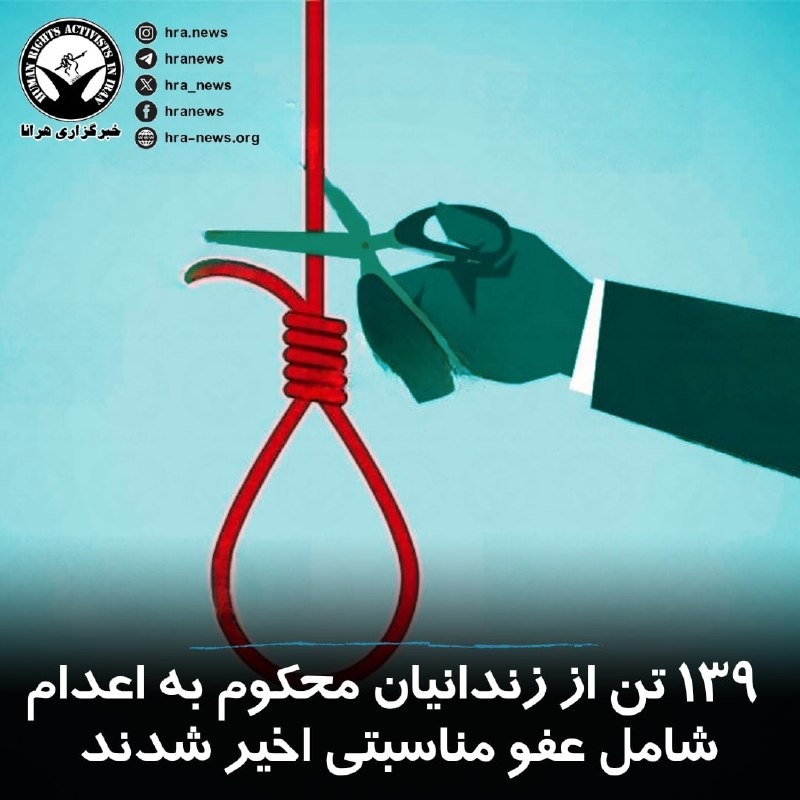

سخنگوی قوه قضائیه، روز جاری در یک نشست خبری اعلام کرد که ۱۳۹ تن از زندانیان محکوم به #اعدام، شامل عفو مناسبتی اخیر شده‌اند. به گفته اصغر جهانگیر، عفو رهبری مشمول زندانیانی شده است که فاقد شاکی خصوصی و سابقه جرایم امنیتی بوده اند و افرادی که دارای اتهامات امنیتی هستند و یا در اعتراضات سراسری دی‌ماه نقش داشته‌اند، از این عفو مناسبتی مستثنی هستند.

↘️
@hranews_bot تماس ✉️ -  @Hranews  کانال هرانا 🆑

## alonews — post 127622

  <a href="telegram/content/alonews_127622_1781356381.webm" target="_blank">🎬 Download video</a>

👈یه اسپویل کنم؟ جبهه منحوس پایداری بزودی دیلیت میشه. خبر دارم که میگم😉

✅ @AloNews خبر جنگ

## alonews — post 127621

  <a href="telegram/content/alonews_127621_1781356381.webm" target="_blank">🎬 Download video</a>

👈تمسخر لهجه مشهدی و حمله به قالیباف توسط مالک شریعتی نماینده پایداری مجلس

✅ @AloNews خبر جنگ

---
📅 بروزرسانی: 1405/03/23 16:33
---

## pm_afshaa — post 93759

  

در اواخر بهمن ماه پارسال، ترامپ مصاحبه شمخانی را که گفته بود اگر آمریکایی‌ها سر حرفشون باشند ما می‌توانیم رابطه خوبی دلشته باشیم، بازنشر کرده بود ولی چند روز بعد شمخانی کشته شد.
و دیشب هم پست عراقچی را بازنشر کرده

💧 Rainbet.com the #1 Non-KYC Crypto Casino & Sportsbook @rainbetcom

😁 @Pm_Afshaa

## IranianMinds — post 22462

  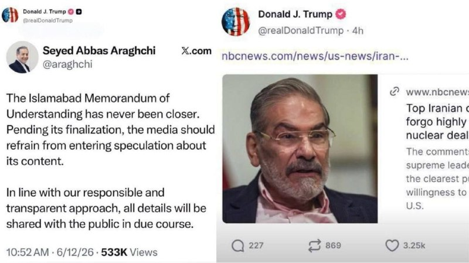

🔴جالبه که بدونید:
در اواخر بهمن ماه پارسال، ترامپ مصاحبه شمخانی را که گفته بود اگر آمریکایی‌ها سر حرفشون باشند ما می‌توانیم رابطه خوبی داشته باشیم، بازنشر کرده بود ولی چند روز بعد شمخانی کشته شد.
و دیشب هم پست عراقچی را بازنشر کرده.

@IranianMinds

## Hranews — post 113581

  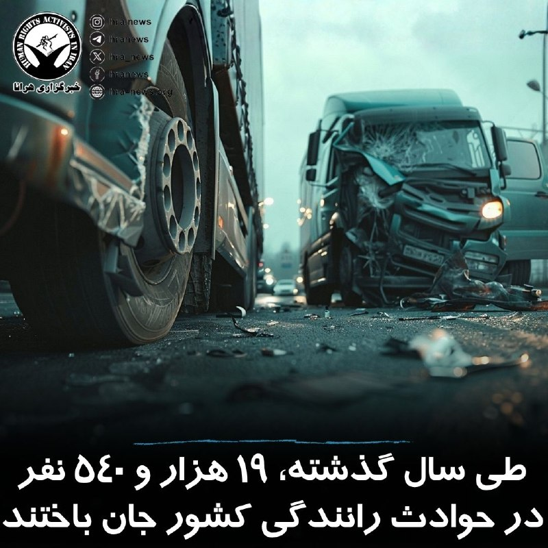

بر اساس اعلام سازمان پزشکی قانونی کشور، طی سال گذشته ۱۹ هزار و ۵۴۰ نفر در حوادث رانندگی جان خود را از دست دادند که از این تعداد، ۱۵ هزار و ۶۶۰ نفر مرد و سه هزار و ۸۸۰ نفر زن بودند. همچنین ۳۷۸ هزار و ۷۲۹ نفر در پی تصادفات رانندگی مصدوم شدند. در این مدت، استان‌های تهران، فارس و سیستان و بلوچستان بیشترین آمار تصادفات را به خود اختصاص دادند و استان‌های ایلام، کهگیلویه و بویراحمد و قم به ترتیب کمترین شمار تصادفات را ثبت کردند.

↘️
@hranews_bot تماس ✉️ -  @Hranews  کانال هرانا 🆑

## alonews — post 127620

  <a href="telegram/content/alonews_127620_1781355784.webm" target="_blank">🎬 Download video</a>

👈بقایی: زمان امضای تفاهم‌نامه فردا نخواهد بود

🔴تفاهم‌نامه اسلام‌آباد بر پایان جنگ متمرکز است و در این مرحله موضوع هسته‌ای در دستور کار مذاکرات قرار ندارد

✅ @AloNews خبر جنگ

---
📅 بروزرسانی: 1405/03/23 16:22
---

## VahidOOnLine — post 245308

  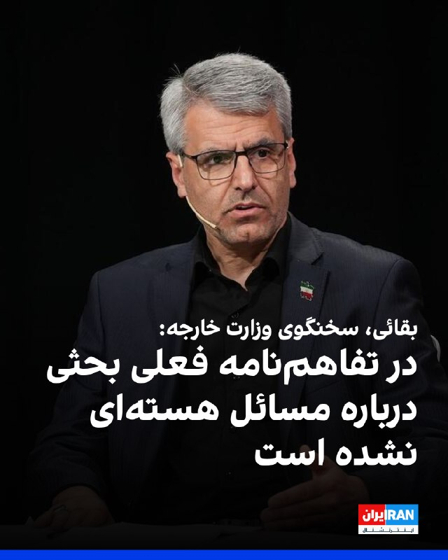

اسماعیل بقائی، سخنگوی وزارت خارجه جمهوری اسلامی در نشستی در همدان، گفت: «تفاهم نامه اسلام‌آباد که در حال پیگیری است، بر خاتمه جنگ در همه جبهه‌ها، از جمله لبنان تمرکز دارد و در این مرحله تصمیم بر این شده که بحثی در مورد موضوع هسته‌ای نشود.»

او ادامه داد: «درباره زمان دقیق امضا باید منتظر بمانیم؛ اگرچه فردا نخواهد بود اما احتمال اینکه در روزهای آتی این اتفاق رقم بخورد، منتفی نیست.»

بقائی افزود: «به دلیل تزلزل طرف مقابل در هرگونه اظهارنظر درباره این روند باید محتاط باشیم.»

او اضافه کرد: «طرف مقابل به هیچ عنوان عملکرد مناسبی در ایفای تعهدات خود نداشته و ما نیز باید متناسب با آن پیش‌بینی‌های لازم را انجام دهیم.»
‌🏁 🇬🇧 IranintlTV

🤖 @VahidOOnLine

## WithYashar — post 14717

بقائی، سخنگوی وزارت خارجه:
درباره زمان دقیق امضای تفاهم‌نامه باید منتظر بمونیم؛ اگرچه فردا نیست اما احتمال اینکه در روزهای آتی این اتفاق رقم بخوره منتفی نیست.
@withyashar

## pm_afshaa — post 93758

  <a href="telegram/content/pm_afshaa_93758_1781355154.webm" target="_blank">🎬 Download video</a>

🔴بقائی، سخنگوی وزارت خارجه:
درباره زمان دقیق امضای تفاهم‌نامه باید منتظر بمونیم؛ اگرچه فردا نیست اما احتمال اینکه در روزهای آتی این اتفاق رقم بخوره منتفی نیست.

💧 Rainbet.com the #1 Non-KYC Crypto Casino & Sportsbook @rainbetcom

😁 @Pm_Afshaa

## IranIntlTV — post 342057

  

اسماعیل بقائی، سخنگوی وزارت خارجه جمهوری اسلامی در نشستی در همدان، گفت: «تفاهم نامه اسلام‌آباد که در حال پیگیری است، بر خاتمه جنگ در همه جبهه‌ها، از جمله لبنان تمرکز دارد و در این مرحله تصمیم بر این شده که بحثی در مورد موضوع هسته‌ای نشود.»

او ادامه داد: «درباره زمان دقیق امضا باید منتظر بمانیم؛ اگرچه فردا نخواهد بود اما احتمال اینکه در روزهای آتی این اتفاق رقم بخورد، منتفی نیست.»

بقائی افزود: «به دلیل تزلزل طرف مقابل در هرگونه اظهارنظر درباره این روند باید محتاط باشیم.»

او اضافه کرد: «طرف مقابل به هیچ عنوان عملکرد مناسبی در ایفای تعهدات خود نداشته و ما نیز باید متناسب با آن پیش‌بینی‌های لازم را انجام دهیم.»
https://iranintl.com/202606138676

## FarsiVOA — post 220579

  <a href="telegram/content/FarsiVOA_220579_1781355155.mp4" target="_blank">🎬 Download video</a>

ارتش اسرائیل اعلام کرد در روز جمعه، بیش از هفتاد موضع حزب‌الله را در جنوب لبنان هدف‌گیری کرد.

بنابر بیانیه ارتش اسرائیل علاوه بر زیرساخت‌ها، نیروهای حزب‌الله نیز شناسایی و حذف شدند. زیرساخت‌های منهدم شده شامل سکوهای پرتاب موشک و ساختمان‌های متعلق به سازمان تروریستی حزب‌الله است که با هدف آسیب رساندن به مردم و ارتش اسرائیل استفاده می‌شد.

ارتش اسرائیل تاکید کرد به حملات خود به مواضع و نیروهای حزب‌الله در این مناطق ادامه می‌دهد.

## Persian_Trend_Official — post 16942

  <a href="telegram/content/Persian_Trend_Official_16942_1781355157.mp4" target="_blank">🎬 Download video</a>

ویدیویی از هدف قرار گرفتن لانچر راکت انداز Tos-1 روسی توسط پرتابه FPV ارتش اوکراین

در 0:07 مشاهده میکنیم که این واحد راکت انداز توس-1 اکثر راکت های لود شده خود را قبل انهدام شلیک کرده است.

📝 Amir

📌 @persian_trend_official
پرشین ترند | متفاوت‌ترین کانال نظامی

## RadioFarda — post 158254

  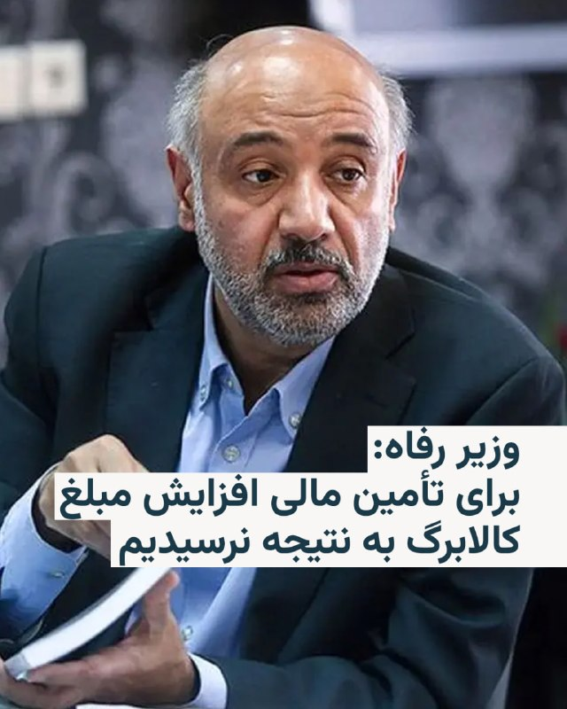

🔸احمد میدری، وزیر کار و رفاه جمهوری اسلامی، روز شنبه اعلام کرد به رغم دستور مسعود پزشکیان برای افزایش مبلغ کالابرگ، محدودیت‌های مالی وجود دارد و هنوز نتیجه‌ای حاصل نشده است.

🔸رئیس‌جمهور ایران روز ۱۷ خرداد در نشست شورای هماهنگی اقتصادی دولت گفته بود که «حداقل شش دهک پایین درآمدی باید از افزایش اعتبار کالابرگ بهره‌مند شوند».

🔸با این حال میدری اعلام کرد به دلیل «محدودیت‌های درآمدی» ناشی از جنگ اخیر «برای تأمین منابع مالی هنوز به نتیجه نرسیدیم».

🔸او وعده داد که دولت در جست‌وجوی منابع مالی برای افزایش مبلغ کالابرگ است. دولت پزشکیان سال گذشته با حدف ارز ترجیحی، اقدام به توزیع کالابرگ به شکل ماهانه در کشور کرد.

🔸این در حالی است که آمارهای بانک مرکزی و مرکز آمار ایران حاکی از افزایش شدید نرخ تورم در ماه‌های اخیر و بخصوص افزایش شدید قیمت مواد غذایی است.

@RadioFarda

## BBCPersian — post 283692

  <a href="telegram/content/BBCPersian_283692_1781355159.mp4" target="_blank">🎬 Download video</a>

🔻پس از آن که اعتراضات هفته گذشته زنان افغان در هرات به خشونت کشیده شد، عده‌ای از افغان‌های ساکن ایران برای حمایت از آن‌ها به خیابان آمدند.

براساس گزارش‌ها، تجمع‌ها در ایران روز چهارشنبه (۲۰ خرداد) بعد از برخورد خشن طالبان با زنان در هرات برگزار شده است.

زنان معترض با حمل پلاکاردها شعار «کار، تحصیل، آبادی» را سر داده و خواستار آزادی، آموزش، عدالت و حقوق برابر برای تمام مردم افغانستان شدند.

براساس گزارش‌ها، این تجمع ساعتی بعد با حضور نیروهای انتظامی جمهوری اسلامی ایران پایان یافت. معترضان می‌گویند که به آنان گفته شد که تجمع نیاز به مجوز دارد و در نهایت آنان متفرق شدند.

تظاهرات هفته گذشته در هرات به فراخوان شماری از زنان و در اعتراض به «بی‌عدالتی» برگزار شد و در جریان تیراندازی به سوی معترضان در آن، دست‌کم دو نفر کشته و چندین نفر هم مجروح شدند.

منابع محلی در هرات همچنین به بی‌بی‌سی گفته‌اند که دست‌کم چهار نفر روز جمعه (۲۲ خرداد) پس از تلاش برای برگزاری تظاهرات در مقابل دفتر والی بازداشت شدند.

https://bbc.in/49XtQiw
@BBCPersian

## BBCPersian — post 283691

  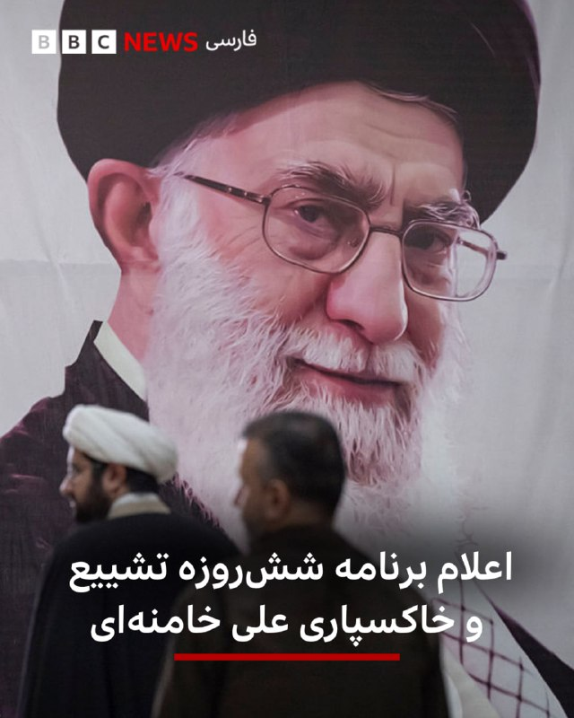

🔻بیش از سه ماه پس از کشته شدن علی خامنه‌ای در حمله آمریکا و اسرائیل، دفتر نشر آثار رهبر سابق جمهوری اسلامی، برنامه تشییع و خاکسپاری او را اعلام کرد.

بر اساس اطلاعیه دفتر نشر آثار علی خامنه‌ای مراسم تشییع او از ۱۳ تیر ماه در تهران آغاز می‌شود و با خاکسپاریش در ۱۸ تیرماه در حرم امام رضا در مشهد به پایان می‌رسد.

مراسم تشییع و خاکسپاری شماری دیگر از اعضای خانواده آقای خامنه‌ای هم که همراه او در حملات آمریکا و اسرائيل به تهران در نهم اسفند کشته شدند، همزمان برگزار می‌شود.

قرار است این مراسم در شهرهای تهران، قم و مشهد برگزار شود.

محمدامین توکلی‌زاده، معاون فرهنگی و اجتماعی شهرداری تهران پیش‌تر گفته بود که متولی مراسم سپاه پاسداران است و سه روز «بدرقه مردمی» در‌نظر گرفته شده است.

آقای توکلی‌زاده همچنین گفته بود: «در حال تدارک برای جمعیتی بیش از ۱۵ تا ۲۰ میلیون نفر در پایتخت هستیم.»

📸NurPhoto via Getty Images

https://bbc.in/49ZGZaP
@BBCPersian

## alonews — post 127619

  <a href="telegram/content/alonews_127619_1781355161.mp4" target="_blank">🎬 Download video</a>

👈این صحبت‌های عراقچی به شدت وایرال شده

🔴اصرار بر مقاومت و غنی سازی باعث جنگ شده

✅ @AloNews خبر جنگ

---
📅 بروزرسانی: 1405/03/23 16:12
---

## VahidOOnLine — post 245307

  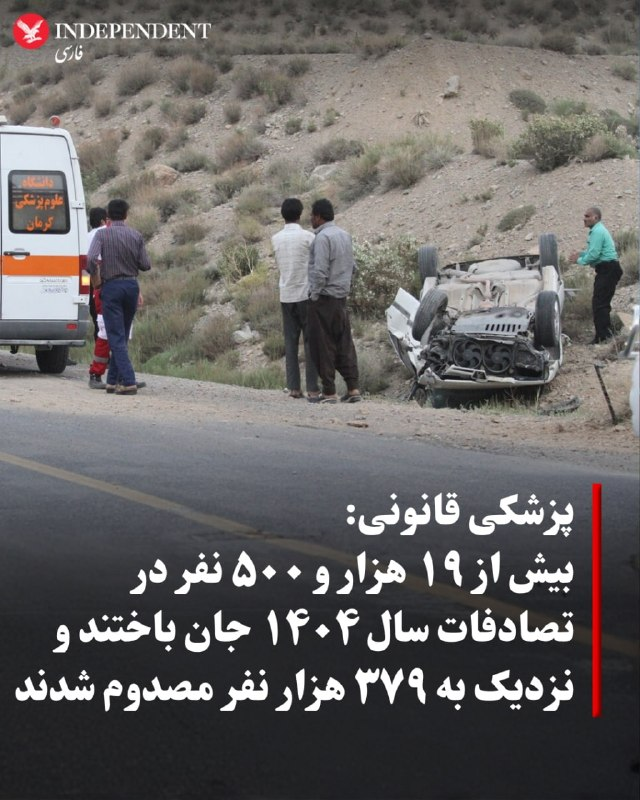

♦️سازمان پزشکی قانونی اعلام کرد در سال ۱۴۰۴، ۱۹ هزار و ۵۴۰ نفر در حوادث رانندگی جان خود را از دست داده‌اند؛ آماری که نسبت به سال قبل تغییر محسوسی نداشته و همچنان از تداوم بحران تلفات جاده‌ای حکایت دارد.
بر اساس این گزارش، از مجموع جان‌باختگان، ۱۵ هزار و ۶۶۰ نفر مرد و سه هزار و ۸۸۰ نفر زن بوده‌اند. استان‌های تهران، فارس و سیستان و بلوچستان بیشترین آمار فوتی و استان‌های ایلام، کهگیلویه و بویراحمد و قم کمترین تعداد قربانیان را ثبت کرده‌اند.
بیشترین تلفات با ۱۳ هزار و ۳۸۲ فوتی در محورهای برون‌شهری رخ داده است. همچنین در تصادفات درون‌شهری ۴ هزار و ۹۷۹ نفر و در محورهای روستایی هزار و ۷۳ نفر جان خود را از دست داده‌اند.
آمارها نشان می‌دهد شهریورماه با ثبت ۲ هزار و ۶۲ فوتی مرگبارترین ماه سال و دی‌ماه با هزار و ۱۷۰ فوتی کم‌تلفات‌ترین ماه بوده است.
در همین حال، تعداد مصدومان حوادث رانندگی در سال گذشته به ۳۷۸ هزار و ۷۲۹ نفر رسید که نسبت به سال قبل ۰.۷ درصد کاهش داشته است. همچنین آمار فوتی‌های اسفندماه با کاهش ۴.۸ درصدی و تعداد مصدومان این ماه با کاهش ۳۱.۷ درصدی نسبت به اسفند سال قبل همراه بوده است.
‌🇸🇦 Indypersian

🤖 @VahidOOnLine

## Shin_Persian — post 7017

Shin ✓ @hey_itsmyturn
Sat, 13 Jun 2026 12:40:19 UTC

Asked Claude to install the latest Win 11 on a local VM, hilariously it bypassed the Microsoft Account requirement with no sweat, I didn't even ask it to do so! I was away from the computer for a few mins, came back and saw everything's done and it was in the desktop already!

ترجمه خودکار فارسی

از کلود (Claude) خواستم آخرین نسخه ویندوز ۱۱ را روی یک ماشین مجازی (VM) محلی نصب کند؛ به طرز خنده‌داری بدون هیچ دردسری الزام حساب کاربری مایکروسافت را دور زد، در حالی که من حتی از او نخواسته بودم این کار را انجام دهد! چند دقیقه از پای کامپیوتر دور شدم، وقتی برگشتم دیدم همه چیز انجام شده و سیستم در دسکتاپ است!

𝕏 · @shin_persian

## IranianMinds — post 22461

  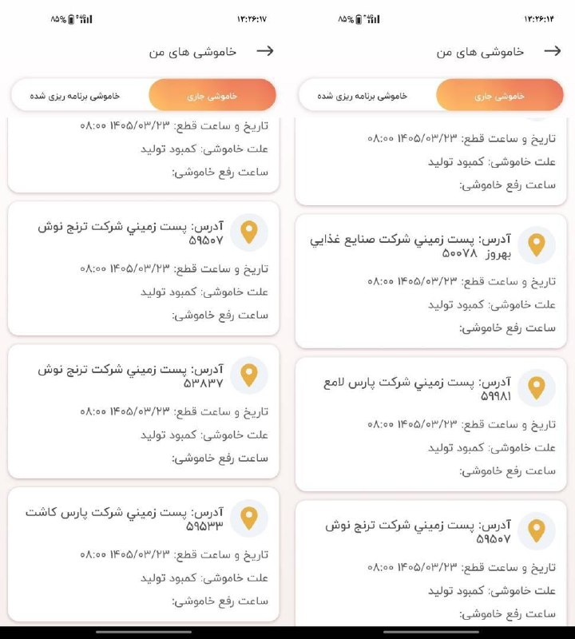

🔴با اینکه هنوز دو هفته به شروع تابستون مونده، در بعضی از مناطق کشور، قطعی‌های دو تا چهار ساعته شروع شده.

@IranianMinds

## alonews — post 127618

  <a href="telegram/content/alonews_127618_1781354566.webm" target="_blank">🎬 Download video</a>

👈حملات اسرائیل به لبنان ادامه دارد

✅ @AloNews خبر جنگ

---
📅 بروزرسانی: 1405/03/23 16:02
---

## VahidOOnLine — post 245306

  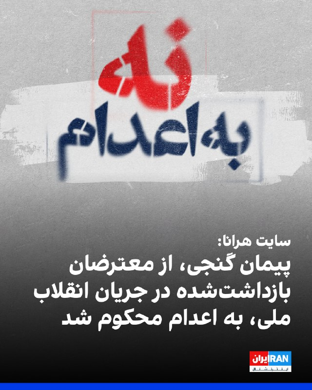

سایت هرانا گزارش داد پیمان گنجی، از بازداشت‌شدگان انقلاب ملی ایرانیان در دی‌ماه ۱۴۰۴، از سوی شعبه ۲۶ دادگاه انقلاب تهران به اتهام «محاربه» به اعدام محکوم شده است.

بر اساس این گزارش، این حکم به ریاست ایمان افشاری صادر شده و پرونده گنجی هم‌اکنون در شعبه ۹ دیوان عالی کشور در دست بررسی است.

هرانا به نقل از یک منبع آگاه نوشت در این پرونده، «سوزاندن اموال عمومی» به‌عنوان مصداق اتهام منتسب به گنجی مطرح شده است.

پیمان گنجی ۳۳ ساله است و پس از بازداشت در دی‌ماه ۱۴۰۴ به زندان تهران بزرگ منتقل شد.
‌🏁 🇬🇧 IranintlTV

🤖 @VahidOOnLine

## FoxNewsTwitter — post 342930

‌Fox News (Twitter/X)

👉 Full story here:

## FoxNewsTwitter — post 342929

Fox News (Twitter/X)

TANVI RATNA: Trump's multi-front pressure campaign takes aim at Russia's energy empire — sanctions, tariffs, and drone strikes have knocked 700,000 barrels per day of refining capacity offline while Europe locks in a binding legal phase-out of Russian gas. Putin retains buyers in China and India, but the system that once converted oil into geopolitical power is being dismantled piece by piece.

## IranIntlTV — post 342056

  

سایت هرانا گزارش داد پیمان گنجی، از بازداشت‌شدگان انقلاب ملی ایرانیان در دی‌ماه ۱۴۰۴، از سوی شعبه ۲۶ دادگاه انقلاب تهران به اتهام «محاربه» به اعدام محکوم شده است.

بر اساس این گزارش، این حکم به ریاست ایمان افشاری صادر شده و پرونده گنجی هم‌اکنون در شعبه ۹ دیوان عالی کشور در دست بررسی است.

هرانا به نقل از یک منبع آگاه نوشت در این پرونده، «سوزاندن اموال عمومی» به‌عنوان مصداق اتهام منتسب به گنجی مطرح شده است.

پیمان گنجی ۳۳ ساله است و پس از بازداشت در دی‌ماه ۱۴۰۴ به زندان تهران بزرگ منتقل شد.
https://iranintl.com/202606138701

## DW_Farsi — post 125926

🔶رهبر باند مواد مخدر ونزوئلایی در حمله آمریکا کشته شد

دونالد ترامپ، رئیس‌ جمهور آمریکا طی پیامی از کشته شدن رهبر باند بدنام ونزوئلایی مواد مخدر "ترن د آراگوا" در حمله ارتش ایالات متحده خبر داد.

ترامپ در این پیام که شنبه ۱۳ ژوئن در شبکه تروث سوشال منتشر شد "ترن د آراگوا" را "از خون‌بارترین سازمان‌های تروریستی روی زمین" خواند و نوشت که این عملیات به دستور او و توسط فرماندهی جنوبی ارتش آمریکا انجام شده است.

همچنین به گفته ترامپ، دولت ونزوئلا از این "حمله سریع و مرگبار" علیه نینو گررو، "رهبر بدنام" این گروه و قاچاقچی مواد مخدر حمایت کرده است: «این اقدام با هماهنگی نزدیک با دوستان ما در ونزوئلا انجام شد که با آن‌ها همکاری بسیار خوبی داریم.»

@dw_farsi

## alonews — post 127617

  <a href="telegram/content/alonews_127617_1781353964.webm" target="_blank">🎬 Download video</a>

👈بلومبرگ: ایران بخش‌های گسترده‌ای از زرادخانه موشکی خود را بازسازی کرده است

✅ @AloNews خبر جنگ

## alonews — post 127616

  <a href="telegram/content/alonews_127616_1781353964.webm" target="_blank">🎬 Download video</a>

👈با اینکه هنوز حدود ۲هفته تا شروع تابستون مونده، قطعی‌های ۲ تا ۴ ساعته برق تو بعضی از استان‌های کشور شروع شده

✅ @AloNews خبر جنگ

---
📅 بروزرسانی: 1405/03/23 15:53
---

## VahidOOnLine — post 245305

  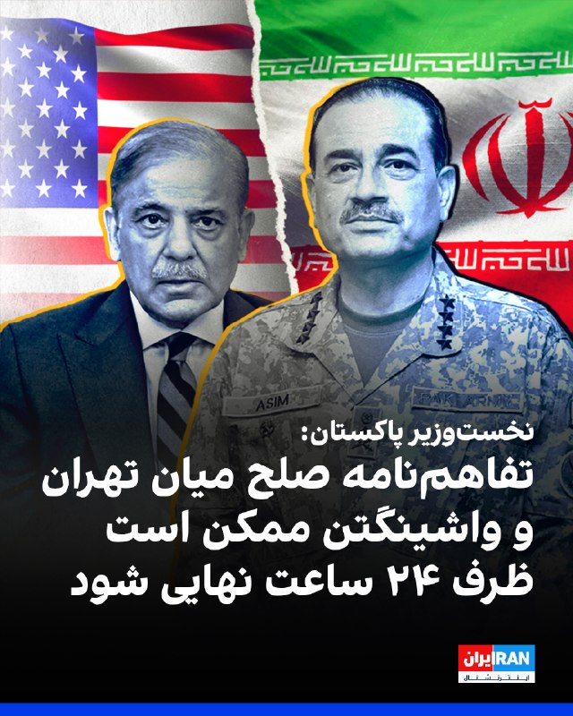

شهباز شریف، نخست‌وزیر پاکستان، در شبکه ایکس نوشت تهران و واشینگتن بیش از هر زمان دیگری به تفاهم‌نامه صلح نزدیک شدند و احتمال نهایی شدن آن در ۲۴ ساعت آینده وجود دارد.

او همچنین نوشت پاکستان برای امضای الکترونیکی تفاهم‌نامه صلح میان آمریکا و جمهوری اسلامی، بلافاصله پس از نهایی شدن آن، آماده می‌شود.
‌🏁 🇬🇧 IranintlTV

🤖 @VahidOOnLine

## VahidOOnLine — post 245304

  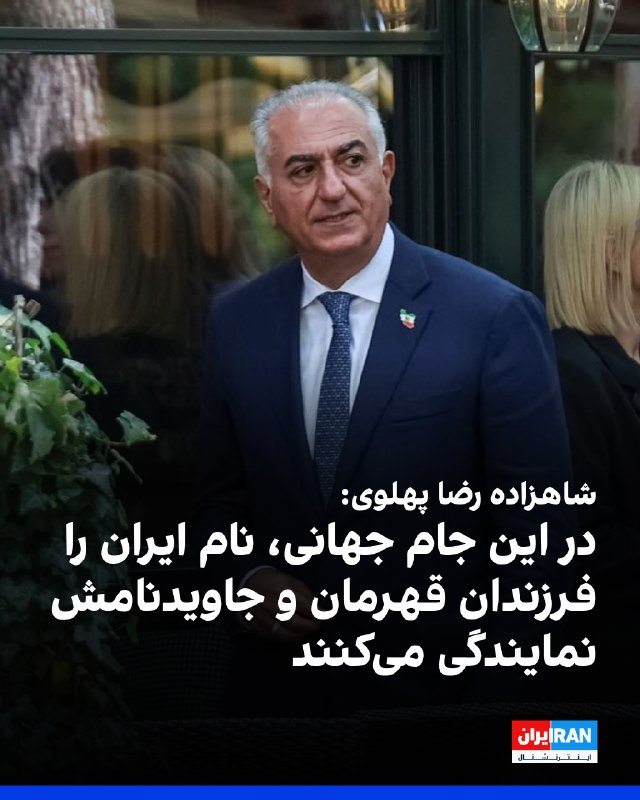

شاهزاده رضا پهلوی با اشاره به برگزاری مسابقات فوتبال جام جهانی ۲۰۲۶، در شبکه ایکس نوشت «در این جام جهانی، نام ایران را فرزندان قهرمان و جاویدنامش نمایندگی می‌کنند.»

او همچنین از ایرانیان خواست پیراهن‌های منقش به تصاویر جاویدنامان ایران را به ورزشگاه‌ها و خیابان‌ها ببرند و افزود: «بگذارید جهان بداند تیم واقعی ایران، مردم شجاع ایران‌اند؛ نه نمایندگان رژیم جنایتکار و اشغالگر ایران.»
‌🏁 🇬🇧 IranintlTV

🤖 @VahidOOnLine

## IranIntlTV — post 342054

  <a href="telegram/content/IranIntlTV_342054_1781353382.mp4" target="_blank">🎬 Download video</a>

حزب زنان ایران اعلام کرد، شنبه ۲۳ خرداد، دیوار جاویدنامان انقلاب ملی ایرانیان، در مرکز شهر گوتنبرگ سوئد افتتاح خواهد شد.

گفت‌وگوی مهران عباسیان، خبرنگار ایران‌اینترنشنال، با دست‌اندرکاران دیوار جاویدنامان گوتبرگ
@iranintltv

## IranIntlTV — post 342053

  

شاهزاده رضا پهلوی با اشاره به برگزاری مسابقات فوتبال جام جهانی ۲۰۲۶، در شبکه ایکس نوشت «در این جام جهانی، نام ایران را فرزندان قهرمان و جاویدنامش نمایندگی می‌کنند.»

او همچنین از ایرانیان خواست پیراهن‌های منقش به تصاویر جاویدنامان ایران را به ورزشگاه‌ها و خیابان‌ها ببرند و افزود: «بگذارید جهان بداند تیم واقعی ایران، مردم شجاع ایران‌اند؛ نه نمایندگان رژیم جنایتکار و اشغالگر ایران.»
https://iranintl.com/202606136475

## IranIntlTV — post 342052

  <a href="https://t.me/IranintlTV/342052" target="_blank">📎 Download file</a>

🎧نسخه صوتی اخبار نیمروزی | شنبه ۲۳ خرداد
@iranintlTV

## Shin_Persian — post 7016

  

🔁 Quoting above tweet:
Shin ✓ @hey_itsmyturn
Sat, 13 Jun 2026 12:17:38 UTC

𝕏 · @shin_persian

## Shin_Persian — post 7014

Shin ✓ @hey_itsmyturn
Sat, 13 Jun 2026 12:12:04 UTC

Ali Khamenei’s burial set for July 9 (131 days after his death) in Imam Reza Shrine in Mashhad, Razavi Khorasan Province of Iran.

ترجمه خودکار فارسی

مراسم تدفین علی خامنه‌ای برای ۹ جولای (۱۳۱ روز پس از مرگ او) در حرم امام رضا در مشهد، استان خراسان رضوی ایران برنامه‌ریزی شده است.

𝕏 · @shin_persian

## FarsiVOA — post 220578

🔺اصابت پرتابه ناشناس به یک نفت‌کش در شرق عمان؛ تنش دریایی در آستانه توافق احتمالی

▪️سازمان عملیات تجارت دریایی بریتانیا اعلام کرد یک نفت‌کش در حدود ۶ مایل دریایی شرق عمان هدف اصابت یک پرتابه ناشناس قرار گرفته است.

⬇️ بیشتر بخوانید:

https://ir.voanews.com/a/8160427.html/?nocach=1

## DW_Farsi — post 125925

  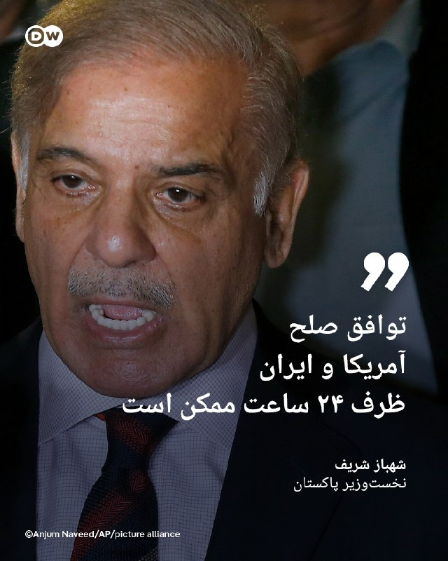

🔶شهباز شریف: توافق صلح آمریکا و ایران ظرف ۲۴ ساعت ممکن است

شهباز شریف، نخست‌وزیر پاکستان اعلام کرد که پس از ماه‌ها مذاکرات توافق صلح میان آمریکا و ایران ممکن است ظرف ۲۴ ساعت آینده نهایی شود.

نخست‌وزیر پاکستان روز شنبه ۲۳ خرداد (۱۳ ژوئن) در پیامی در شبکه اجتماعی ایکس گفت پاکستان در حال آماده‌سازی برای امضای الکترونیکی این توافق بلافاصله پس از نهایی شدن آن است و سپس هفته آینده مذاکرات فنی آغاز خواهد شد.

شریف همچنین پیش‌تر گفته بود "متن نهایی و مورد توافق" میان دو طرف حاصل شده و پاکستان در حال همکاری نزدیک با هر دو طرف برای تکمیل مراحل بعدی است.

نخست‌وزیر پاکستان از آمریکا و ایران به‌خاطر تعهد در مذاکرات و همچنین از کشورهای منطقه برای حمایت‌شان قدردانی کرد و گفت این توافق می‌تواند پایه‌ای برای صلحی پایدار باشد.

@dw_farsi

## BBCPersian — post 283690

  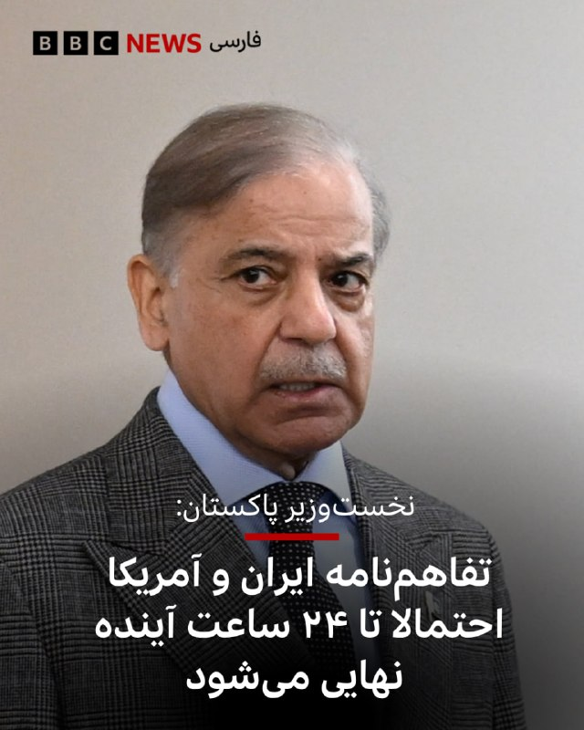

🔺نخست‌وزیر پاکستان: تفاهم‌نامه ایران و آمریکا احتمالا تا ۲۴ ساعت آینده نهایی می‌شود

نخست‌وزیر پاکستان می‌گوید ایران و آمریکا بیش از هر زمانی به توافق صلح نزدیک‌تر شده‌اند.

شهباز شریف دقایقی پیش در پستی در شبکه ایکس نوشت که انتظار می‌رود تفاهم‌نامه ایران و آمریکا ظرف ۲۴ ساعت آینده نهایی شود.

او گفت که پاکستان در حال فراهم کردن تدارکات لازم برای «امضای الکترونیکی» این سند است و پس از آن هم «گفت‌و‌گوهای فنی» آغاز خواهد شد.

پیشتر مقام‌های بلندپایه آمریکا و ایران گفته‌ بودند که دو طرف به امضای توافقی نزدیک‌ شده‌اند که از جمله به بازگشایی تنگه هرمز منجر خواهد شد.

انتظار می‌رود که پس از امضای این تفاهم‌نامه، دور جدیدی از گفت‌و‌گو در مورد موضوعات اصلی مورد اختلاف، از جمله برنامه هسته‌ای ایران و رفع تحریم‌ها، انجام شود.

📸Reuters

https://bbc.in/4xqfelV
@BBCPersian

---
📅 بروزرسانی: 1405/03/23 15:42
---

## WithYashar — post 14716

نماینده مجلس خطاب به عراقچی وزیر امور خارجه:
مذاکره بعد از حمله نظامی، دیپلماسی نیست، مستعمره شدن است
@withyashar

## mwarmonitor — post 10823

⚠️اطلاعیه رسمی کانال ⚠️ 🔸بدین‌وسیله به اطلاع همراهان گرامی می‌رسد که کانال خبری ما در پلتفرم X (توییتر سابق) راه‌اندازی شد. 🔸از این پس نیز ، آخرین اخبار و تحلیل‌های نظامی، سیاسی و همچنین مسائل اجتماعی ایران و جهان به‌صورت منظم در آن منتشر خواهد شد. 🔸از…

## FoxNewsTwitter — post 342928

  <a href="telegram/content/FoxNewsTwitter_342928_1781352756.mp4" target="_blank">🎬 Download video</a>

Fox News (Twitter/X)

"We will find these vicious murderers and drug lords anytime, anyplace, and send them to the depths of hell where they belong."

President Trump issued the warning after announcing that U.S. Southern Command carried out a strike that killed Tren de Aragua leader Niño Guerrero.

Trump says the operation was coordinated with Venezuelan authorities and marks a major blow against the gang that U.S. officials have accused of spreading violence, extortion, drug trafficking, and terror across the region.

With Guerrero dead, Trump is signaling that other cartel and gang leaders are now on notice.

## FoxNewsTwitter — post 342924

Fox News (Twitter/X)

## FoxNewsTwitter — post 342920

Fox News (Twitter/X)

History was made Friday night as Team USA rolled past Paraguay 4-1 in its 2026 FIFA World Cup opener in Southern California.

The victory was historic in more ways than one. It was the first time the U.S. had won a World Cup match by three goals since 1930 — when America also defeated Paraguay.

The four-goal outburst also marked the first time the United States has scored at least four goals in a World Cup match. Folarin Balogun, 24, also made history, becoming the first American player since 1930 to score multiple goals in a World Cup game.

## FarsiVOA — post 220577

  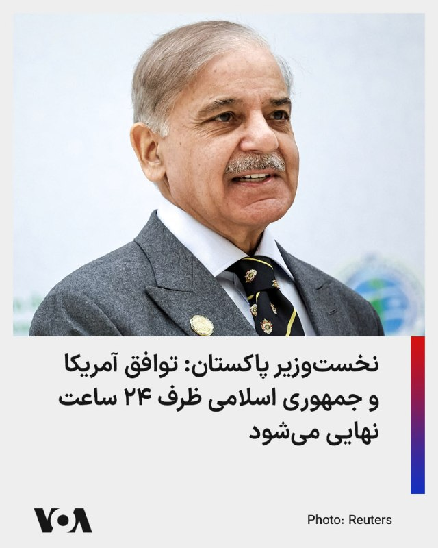

⚡️بلومبرگ به نقل از شهباز شریف، نخست‌وزیر پاکستان، گزارش داد که توافق صلح میان آمریکا و جمهوری اسلامی ایران احتمالاً ظرف ۲۴ ساعت آینده نهایی خواهد شد.

شریف گفته دو طرف بر سر چارچوب توافقی که هدف آن پایان دادن به جنگ چندماهه در خاورمیانه است، به تفاهم رسیده‌اند و متن نهایی توافق نیز آماده شده است.

به گفته نخست‌وزیر پاکستان، اسلام‌آباد اکنون در حال آماده‌سازی برای امضای الکترونیکی توافق است؛ امضایی که انتظار می‌رود ظرف ۲۴ ساعت انجام شود. پس از آن، گفت‌وگوهای فنی میان طرف‌ها در هفته آینده دنبال خواهد شد.

پاکستان در ماه‌های گذشته نقش میانجی را در مذاکرات ایالات متحده و جمهوری اسلامی ایفا کرده است. شریف این تحول را نشانه نزدیک شدن طرف‌ها به پایان جنگ دانسته است.

## BBCPersian — post 283676

تیم ملی ایران چهار روز دیگر در نخستین مسابقه خود در جام جهانی ۲۰۲۶ مقابل نیوزلند در لس‌آنجلس به میدان می‌رود.

این تیم که کمپ خود را برای دور زدن محدودیت‌های صدور ویزای آمریکا به شهر مرزی تیخوانا در مکزیک منتقل کرده، چند روزی است مشغول آماده‌سازی و تمرین است.

آمریکا به ۱۵ عضو کاروان ورزشی تیم ملی فوتبال ایران در جام جهانی ویزای ورود به کشورش را نداد و شنیده‌ها درباره «صدور ویزا برای نیمی از آنها» هنوز رنگ واقعیت نگرفته است.

مهدی محمدنبی، سرپرست کاروان تیم ملی که خود از این دسته است، گفت: «رئیس فیفا نتوانسته به وعده‌هایش برای تأمین دسترسی کامل فدراسیون فوتبال ایران به سه بازی تیم در ایالات متحده عمل کند.»
📸 Getty
@BBCPersian

## BBCPersian — post 283670

## Dirty_Kids — post 391881

  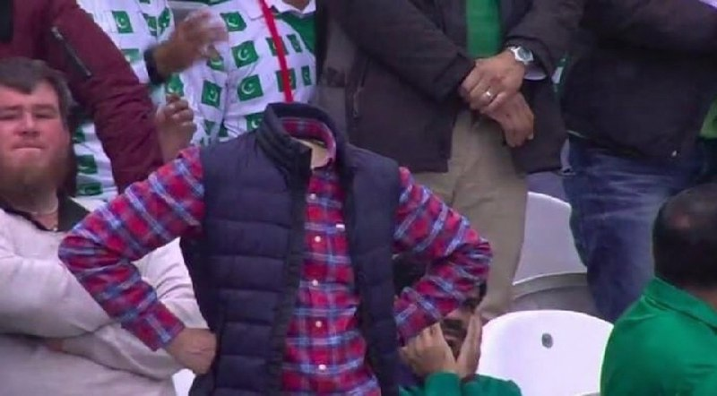

شمخانی وقتی میبینه هم توافق شد هم اورانیوم رو دادن

@Dirty_Kids 👻

## Dirty_Kids — post 391880

  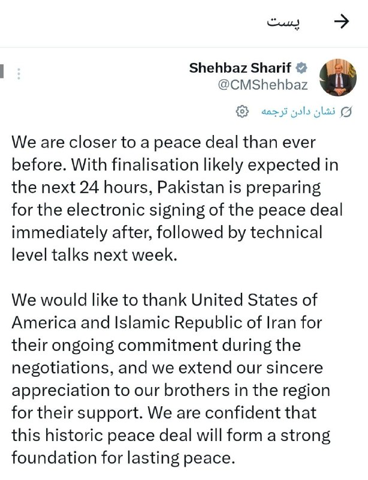

توافق صلح آمریکا و ایران تا ۲۴ ساعت آینده نهایی می‌شود

شهباز شریف، نخست‌وزیر پاکستان:

«ما بیش از هر زمان دیگری به توافق صلح نزدیک هستیم. با توجه به اینکه احتمالاً نهایی شدن آن در ۲۴ ساعت آینده پیش‌بینی می‌شود، پاکستان در حال آماده‌سازی برای امضای الکترونیکی توافق‌نامه صلح بلافاصله پس از آن است و پس از آن مذاکرات فنی در هفته آینده برگزار خواهد شد.
ما مایلیم از ایالات متحده آمریکا و جمهوری اسلامی ایران به خاطر تعهد مداومشان در طول مذاکرات تشکر کنیم و از برادرانمان در منطقه به خاطر حمایتشان صمیمانه قدردانی می‌کنیم. ما اطمینان داریم که این توافق‌نامه صلح تاریخی، پایه محکمی برای صلح پایدار ایجاد خواهد کرد.»


@Dirty_Kids 👻

## alonews — post 127615

  <a href="telegram/content/alonews_127615_1781352758.mp4" target="_blank">🎬 Download video</a>

👈لحظه هدف قرار گرفتن راکت انداز Tos-1A روسی توسط پرتابه FPV اوکراینی

✅ @AloNews خبر جنگ

---
📅 بروزرسانی: 1405/03/23 15:32
---

## Shin_Persian — post 7013

  <a href="telegram/content/Shin_Persian_7013_1781352165.mp4" target="_blank">🎬 Download video</a>

Shin ✓ @hey_itsmyturn
Sat, 13 Jun 2026 11:56:55 UTC

"They all end with some kind of negotiation"?

IDK man, Hitler seems pretty dead to me, as well as the rest of the douchebags who refused to surrender UNCONDITIONALLY.

ترجمه خودکار فارسی

«همه آن‌ها با نوعی مذاکره به پایان می‌رسند»؟

نمی‌دانم پسر، هیتلر به نظر من کاملاً مرده می‌رسد، و همچنین بقیه آن تفاله‌هایی که از تسلیمِ بدون قید و شرط خودداری کردند.

𝕏 · @shin_persian

## FarsiVOA — post 220576

🔺اوکراین زیرساخت‌های نفتی روسیه را هدف گرفت؛ تشدید حملات دو طرف در ۴۸ ساعت اخیر

▪️ارتش اوکراین اعلام کرد یک تأسیسات فرآوری و پمپاژ نفت در منطقه ولگوگراد روسیه را هدف قرار داده و این حمله باعث آتش‌سوزی شده است.

▪️بر اساس این اعلام، این مرکز در فرآوری، انتقال و پمپاژ نفت از طریق خطوط لوله به پالایشگاه‌ها و زیرساخت‌های صادراتی روسیه نقش دارد.

▪️در حمله‌ای جداگانه، مقام‌های روسیه گفتند یک پهپاد اوکراینی به پایانه دریایی بندر تمریوک در منطقه کراسنودار برخورد کرده، یک نفر کشته شده و آتش‌سوزی رخ داده است.

▪️این حملات ادامه موجی است که در ۴۸ ساعت اخیر شدت گرفته است. اوکراین روز پیش اعلام کرده بود دو پالایشگاه‌ در تاتارستان را هدف قرار داده و وقوع آتش‌سوزی در هر دو مرکز را تأیید کرده است.

⬇️ بیشتر بخوانید:
https://ir.voanews.com/a/8160425.html

## IranianMinds — post 22460

  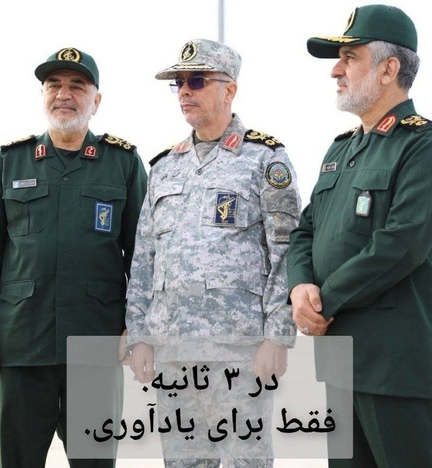

🔴اکانت اسرائیل به فارسی:

یک سال پیش در چنین روزی.

@IranianMinds

## BBCPersian — post 283668

🔻اختلال در خدمات الکترونیکی شماری از بانک‌ها در ایران

رسانه‌های ایران از اخلال در ارائه خدمات الکترونیکی شماری از بانک‌های این کشور خبر داده‌اند.

بر اساس این گزارش‌ها، بانک‌هایی مانند ملی، تجارت، صادرات و توسعه صادرات از صبح امروز دچار این اختلال شده‌اند.

گزارش شده است که این اختلال در بخش‌های مختلف، از جمله «موبایل‌بانک، اینترنت‌بانک، خودپردازها، پایانه‌های فروش (کارتخوان) و برخی خدمات کارتی» ایجاد شده است.

خبرگزاری فارس گفته است که برخی منابع از احتمال وقوع حمله سایبری خبر داده‌اند، هر چند هنوز این موضوع از سوی مقامات تایید یا رد نشده است.

گفته شده که تلاش برای فعال کردن و بازگردندان خدمات بانکی به وضعیت عادی در جریان است.

https://bbc.in/4v7uCBU
@BBCPersian

## Hranews — post 113580

  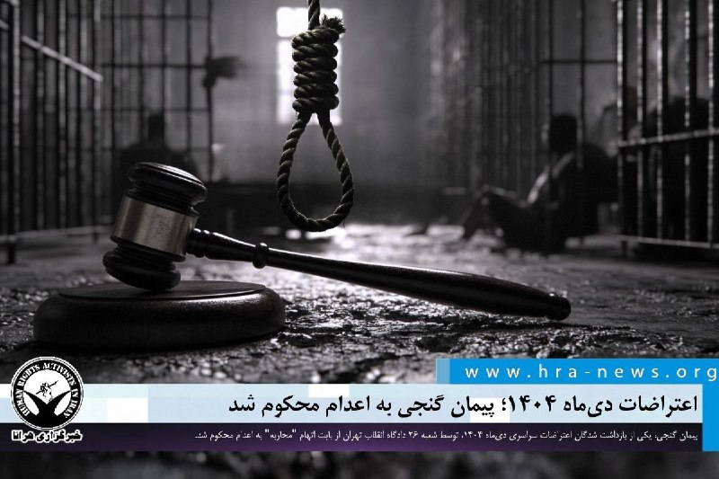

اعتراضات دی‌ماه ۱۴۰۴؛ پیمان گنجی به اعدام محکوم شد

❗️
❗️
❗️
❗️
❗️ – پیمان گنجی، جوان ۳۳ ساله و یکی از بازداشت شدگان اعتراضات سراسری دی‌ماه ۱۴۰۴ که در زندان تهران بزرگ محبوس است، توسط شعبه ۲۶ دادگاه انقلاب تهران از بابت اتهام “#محاربه” به #اعدام محکوم شد.

به گزارش خبرگزاری هرانا، ارگان خبری مجموعه فعالان حقوق بشر در ایران، پیمان گنجی، یکی از بازداشت شدگان اعتراضات سراسری دی‌ماه ۱۴۰۴ به اعدام محکوم شد.

بر اساس اطلاعات دریافتی هرانا، آقای گنج، ۳۳ ساله، توسط شعبه ۲۶ دادگاه انقلاب تهران به ریاست قاضی ایمان افشاری از بابت اتهام “محاربه” به اعدام محکوم شده و هم اکنون پرونده وی در شعبه ۹ دیوان عالی کشور در دست بررسی است.
یک منبع مطلع از پرونده این زندانی به هرانا گفت: “عباس جعفری دولت‌آبادی، دادستان پیشین تهران، وکالت آقای گنجی را در این پرونده بر عهده دارد. همچنین، در این پرونده سوزاندن اموال عمومی به عنوان مصداق اتهام منتسب به آقای گنجی عنوان شده است.”

ادامه مطلب

#پیمان_گنجی

↘️
@hranews_bot تماس ✉️ -  @Hranews  کانال هرانا 🆑

## alonews — post 127614

  <a href="telegram/content/alonews_127614_1781352168.webm" target="_blank">🎬 Download video</a>

👈کانال دلار هرات توسط تلگرام مسدود شد

✅ @AloNews خبر جنگ

## alonews — post 127613

  <a href="telegram/content/alonews_127613_1781352168.webm" target="_blank">🎬 Download video</a>

👈رایزنی غریب آبادی با سفرای چین و روسیه درباره پیش نویس یادداشت تفاهم اسلام آباد

✅ @AloNews خبر جنگ

---
📅 بروزرسانی: 1405/03/23 15:22
---

## VahidOOnLine — post 245303

  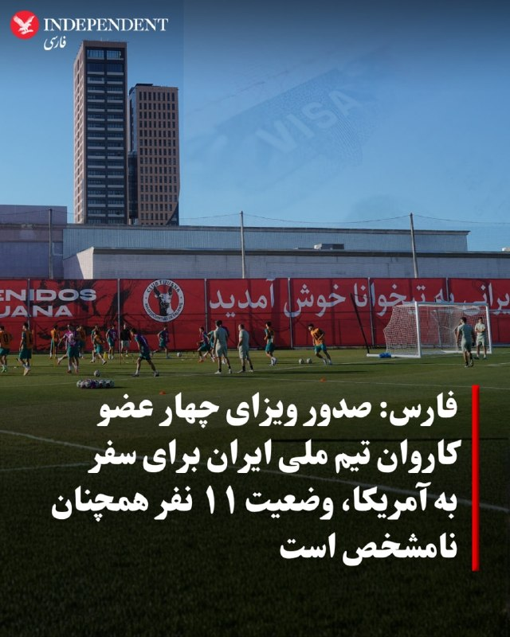

♦️در فاصله دو روز تا سفر تیم ملی فوتبال ایران به لس‌آنجلس برای آغاز رقابت‌های جام جهانی ۲۰۲۶، چهار عضو کاروان ایران موفق به دریافت ویزای آمریکا شدند.
خبرگزاری فارس، روز شنبه ۲۳ خرداد ماه با اعلام این خبر گزارش کرد، وزارت خارجه آمریکا برای امید جمالی، رئیس دپارتمان بین‌الملل فدراسیون، علی افضلی، کارشناس بین‌الملل، مسعود اردشیر، افسر امنیتی تیم ملی و مهرپویا اسدی، آنالیزور تیم، روادید سفر به ایالات متحده صادر کرده است.
با این حال، وضعیت ویزای ۱۱ نفر دیگر از اعضای کاروان ایران همچنان نامشخص است. مهدی تاج، رئیس فدراسیون فوتبال، هدایت ممبینی، دبیرکل فدراسیون، مهدی محمدنبی، مدیر تیم ملی، مهدی خراطی، مدیر اجرایی تیم ملی، محسن معتمدکیا، مدیر رسانه‌ای تیم ملی، سیامک قلیچ‌خانی، عضو بخش رسانه‌ای، مهدی ملک‌آباد، رئیس حراست فدراسیون، سروش سلماسی، آنالیزور تیم ملی و رضا جاودان، عضو کادر تدارکات، از جمله افرادی هستند که هنوز ویزای آمریکا را دریافت نکرده‌اند.
به گزارش فارس، تیم ملی ایران که در شهر تیخوانای مکزیک حضور دارد، طبق برنامه روز دوشنبه پس از صرف ناهار در محل اردو راهی فرودگاه خواهد شد تا به لس‌آنجلس سفر کند.
‌🇸🇦 Indypersian

🤖 @VahidOOnLine

## Persian_Trend_Official — post 16941

  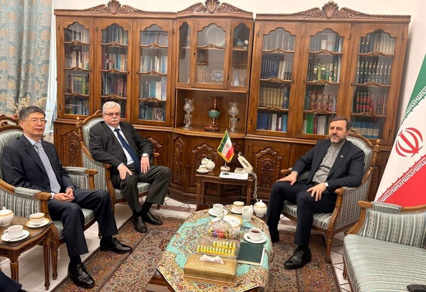

دیدار غریب‌آبادی با سفیران چین و روسیه در تهران

معاون وزیر امور خارجه در پیامی نوشت: شراکت راهبردی ایران، چین و روسیه و هماهنگی‌ها و تعاملات میان سه کشور با قوت تداوم خواهد یافت.

📝 Amir

📌 @persian_trend_official
پرشین ترند | متفاوت‌ترین کانال نظامی

## RadioFarda — post 158253

  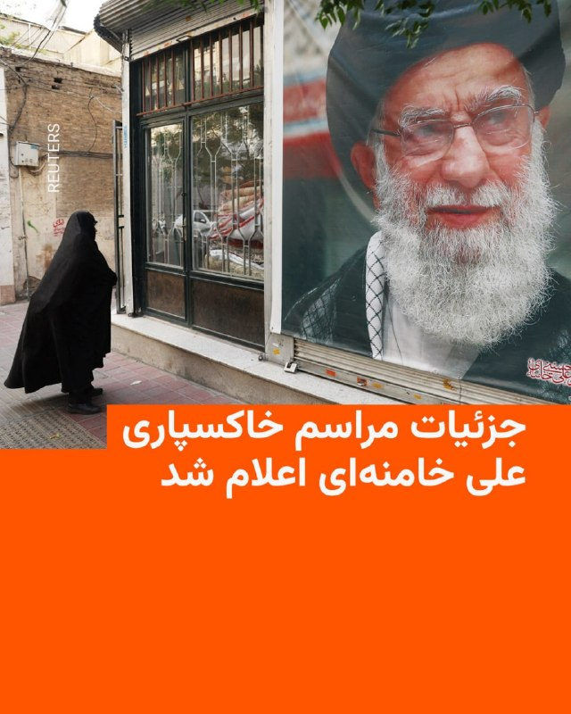

🔸ستاد برگزاری مراسم خاکسپاری علی خامنه‌ای، رهبر پیشین جمهوری اسلامی، روز شنبه ۲۳ خرداد با انتشار اطلاعیه‌ای، جزئیات برنامه‌های تشییع و تدفین او را اعلام کرد.

🔸طبق برنامه اعلام‌شده، مراسم تشییع علی خامنه‌ای در روزهای ۱۳ و ۱۴ تیرماه در مصلای تهران برگزار می‌شود.

🔸پس از آن، پیکر رهبر پیشین جمهوری اسلامی برای ادامه آیین‌های تشییع در روزهای ۱۵ و ۱۶ تیر به شهر قم و سپس مشهد منتقل می‌شود.

🔸بر اساس اعلام مسئولان، محل خاکسپاری او در محل دفن امام هشتم شیعیان پیش‌بینی شده، اما زمان دقیق این مراسم به‌صورت جداگانه و پس از برگزاری مراسم‌های تشییع اعلام خواهد شد.

🔸علی خامنه‌ای، رهبر جمهوری اسلامی، نهم اسفند ۱۴۰۴ در نخستین دقایق حمله هوایی آمریکا و اسرائیل به ایران کشته ‌شد.

@RadioFarda

## IranianMinds — post 22459

🔴کیهان:

اگر تنگه هرمز را باز کنید، دشمن دوباره حمله می‌کند. هیچ آدم عاقلی نقطه قوت خود را پای میز مذاکره نمی‌برد.

@IranianMinds

## Dirty_Kids — post 391879

  <a href="telegram/content/Dirty_Kids_391879_1781351570.mp4" target="_blank">🎬 Download video</a>

تراپی

ولی دختر تنگسیری خوب چیزیه، چقدرم آرایش کرده پدرسوخته

@Dirty_Kids 👻

## alonews — post 127612

  <a href="telegram/content/alonews_127612_1781351571.webm" target="_blank">🎬 Download video</a>

👈تداوم تنش آبی در ۲۳ استان

🔴مدیرعامل شرکت مهندسی آب و فاضلاب کشور : بررسی‌ها نشان می‌دهد ۲۳ استان کشور با تنش آبی مواجه‌اند و در برخی کلانشهرها از جمله تهران ضرورت مدیریت مصرف و استفاده از تجهیزات کاهنده بیش از گذشته احساس می‌شود

✅ @AloNews خبر جنگ

## alonews — post 127611

  <a href="telegram/content/alonews_127611_1781351572.webm" target="_blank">🎬 Download video</a>

👈واشنگتن پست به نقل از یک مقام دولت ترامپ: تعیین میزان پولی که ایران می‌تواند به طور بالقوه دریافت کند دشوار است زیرا بستگی به آنچه آنها ارائه می‌دهند دارد

✅ @AloNews خبر جنگ

---
📅 بروزرسانی: 1405/03/23 15:12
---

## VahidOOnLine — post 245302

  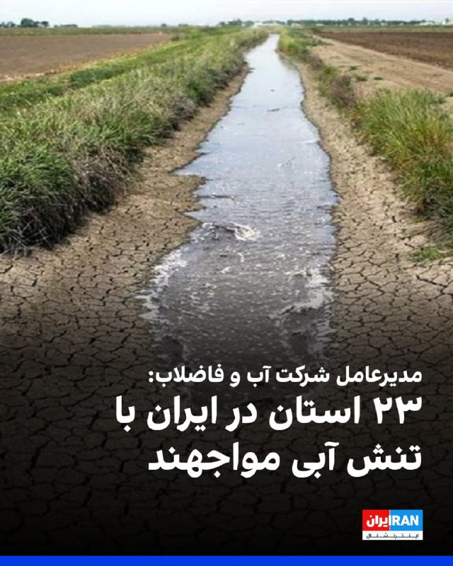

هاشم امینی، مدیرعامل شرکت آب و فاضلاب کشور، با اشاره به کاهش بارندگی‌ها در سال آبی جاری گفت ۲۳ استان ایران با تنش آبی مواجه‌اند. همزمان، عباس علی‌آبادی، وزیر نیرو جمهوری اسلامی، اعلام کرد طرح‌های انتقال آب به برخی مناطق، استفاده از تجهیزات کاهنده مصرف و برنامه‌های صرفه‌جویی در مصرف آب در حال اجرا و پیگیری است.

پیش‌تر خبرگزاری ایلنا گزارش داد ۳۳ درصد از ظرفیت مجموع سدهای کشور خالی است. بر اساس این گزارش، تا ۱۶ خرداد سدهای دوستی و طرق در خراسان رضوی، بارزو در خراسان شمالی و ساوه در استان مرکزی در «وضعیت قرمز» قرار داشتند.
iranintl
‌🏁 🇬🇧 IranintlTV

🤖 @VahidOOnLine

## VahidOOnLine — post 245301

  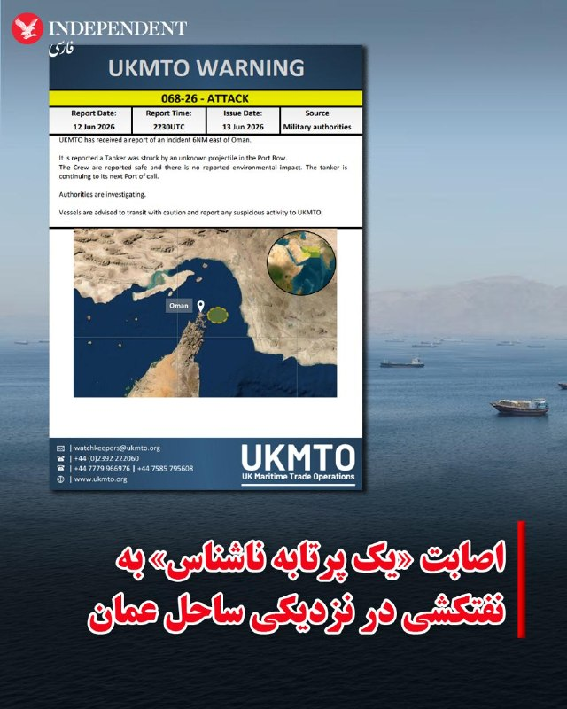

♦️مرکز عملیات تجارت دریایی بریتانیا (UKMTO) روز شنبه ۲۳ خرداد ماه کرد یک نفتکش در نزدیکی سواحل عمان هدف اصابت یک پرتابه ناشناس قرار گرفته است.
بر اساس هشدار منتشرشده از سوی این نهاد، حادثه در فاصله حدود ۱۱ کیلومتری شرق عمان رخ داده و گزارش‌های اولیه نشان می‌دهد پرتابه‌ای ناشناس به بخش جلویی سمت چپ نفتکش برخورد کرده است.
مرکز عملیات تجارت دریایی بریتانیا اعلام کرد تمامی خدمه کشتی در سلامت هستند و تاکنون هیچ‌گونه آلودگی یا خسارت زیست‌محیطی ناشی از این حادثه گزارش نشده است. همچنین نفتکش پس از حادثه به مسیر خود به سمت مقصد بعدی ادامه داده است.
مرکز عملیات تجارت دریایی بریتانیا از شناورهای عبوری خواسته است هنگام عبور از منطقه با احتیاط عمل کرده و هرگونه فعالیت مشکوک را به این مرکز گزارش دهند.
‌🇸🇦 Indypersian

🤖 @VahidOOnLine

## WithYashar — post 14715

وزیر آموزش و پرورش: به خاطر اهمیت حضور دانش آموزان در مراسم تشییع، تقویم امتحانات نهایی بازنگری میشه و احتمالا تاریخ امتحانات عقب میوفته
@withyashar

## WithYashar — post 14714

بعد از پخش آهنگ امیر تتلو از زندان که پشت تلفن اجرا شده بود، زندان تهران بزرگ تلفن او را مسدود کرد و تنها دلخوشی او هم گرفته شد.
@withyashar

## WithYashar — post 14713

بلومبرگ: جمهوری اسلامی به‌احتمال زیاد در جریان آتش‌بس، سلاح‌های پیشرفته روسی رو به ذخایر تسلیحاتی خودش اضافه کرده.
@withyashar

## mwarmonitor — post 10822

🔸روزنامه واشنگتن‌پست: قطر در اوایل جنگ، از طریق کانال‌های محرمانه با ایران وارد گفت‌وگو شده تا مجموعه گازی «راس لافان» را از فهرست اهداف حمله تهران خارج کند؛ بر اساس گفته مقام‌های خاورمیانه‌ای و غربی که در جریان اطلاعات امنیتی قرار داشته‌اند.

🔹به گفته این مقام‌ها، قطر پیشنهاد داده بود تولید گاز را متوقف کند؛ اقدامی که می‌توانست باعث افزایش شدید قیمت جهانی انرژی شود و آمریکا و اسرائیل را برای کوتاه‌تر کردن جنگ تحت فشار قرار دهد، در ازای اینکه ایران به این تأسیسات حمله نکند.

🔹قطر هرگونه توافق پنهانی را رد کرده و گفته است که توقف فعالیت‌ها صرفاً به دلیل تهدیدهای معتبر علیه کارکنان و زیرساخت‌ها انجام شده است.

🔹این گزارش همچنین می‌گوید مقام‌های آمریکایی از این اطلاعات امنیتی مطلع بوده‌اند و در ادامه، تأسیسات راس لافان در ۱۸ مارس هدف حملات ایران قرار گرفته که به زیرساخت‌هایی مرتبط با حدود ۲۰٪ صادرات LNG قطر آسیب زده است.

@mwarmonitor

## pm_afshaa — post 93757

  <a href="telegram/content/pm_afshaa_93757_1781350972.webm" target="_blank">🎬 Download video</a>

🔴کیهان: اگه تنگه هرمز رو باز کنید دشمن دوباره حمله میکنه؛ هیچ آدم عاقلی نقطه قوت خودش رو پای میز مذاکره نمی‌بره.

💧 Rainbet.com the #1 Non-KYC Crypto Casino & Sportsbook @rainbetcom

😁 @Pm_Afshaa

## IranIntlTV — post 342051

  

هاشم امینی، مدیرعامل شرکت آب و فاضلاب کشور، با اشاره به کاهش بارندگی‌ها در سال آبی جاری گفت ۲۳ استان ایران با تنش آبی مواجه‌اند. همزمان، عباس علی‌آبادی، وزیر نیرو جمهوری اسلامی، اعلام کرد طرح‌های انتقال آب به برخی مناطق، استفاده از تجهیزات کاهنده مصرف و برنامه‌های صرفه‌جویی در مصرف آب در حال اجرا و پیگیری است.

پیش‌تر خبرگزاری ایلنا گزارش داد ۳۳ درصد از ظرفیت مجموع سدهای کشور خالی است. بر اساس این گزارش، تا ۱۶ خرداد سدهای دوستی و طرق در خراسان رضوی، بارزو در خراسان شمالی و ساوه در استان مرکزی در «وضعیت قرمز» قرار داشتند.
iranintl.com/202606138629

## FarsiVOA — post 220575

  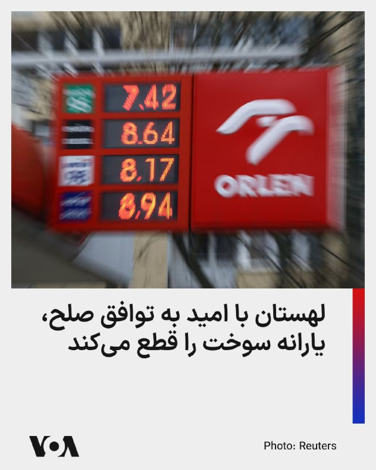

بلومبرگ گزارش داد دونالد توسک، نخست‌وزیر لهستان، گفته دولت این کشور در تابستان به برنامه حمایت از سوخت پایان خواهد داد. این تصمیم با افزایش امیدها به توافق میان آمریکا و جمهوری اسلامی و کاهش فشار بازار انرژی هم‌زمان شده است.

این برنامه در ماه مارس، پس از جهش بهای نفت در پی جنگ آمریکا و جمهوری اسلامی، آغاز شد.

دولت لهستان برای مهار فشار بر مصرف‌کنندگان، مالیات بر ارزش افزوده سوخت را کاهش داد، عوارض سوخت را پایین آورد و سقف قیمت روزانه تعیین کرد.

برآورد اولیه وزارت دارایی لهستان نشان می‌داد هزینه این بسته معادل تقریبی ۴۳۶ میلیون دلار است که در برآورد بعدی دولت، هزینه ماهانه معادل حدود ۴۱۰ میلیون دلار، اعلام شد.

دولت همچنین برای جبران بخشی از این هزینه، مالیات بادآورده‌ای از شرکت‌های انرژی را بررسی کرده بود که می‌توانست حدود ۱.۶۴ میلیارد دلار درآمد ایجاد کند.
@FarsiVOA

## DW_Farsi — post 125924

  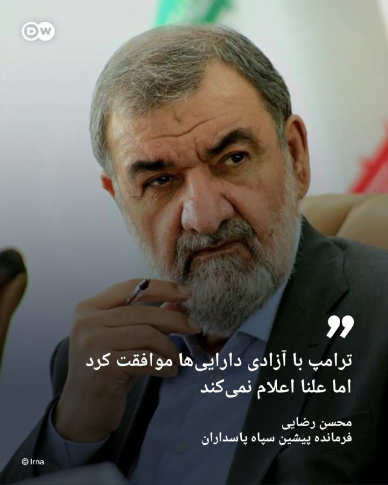

🔶 محسن رضایی: ترامپ با آزادی دارایی‌ها موافقت کرد اما علنا اعلام نمی‌کند
 
محسن رضایی، فرمانده پیشین سپاه پاسداران مدعی شد که دونالد ترامپ با آزادسازی بخشی از دارایی‌های بلوکه‌شده ایران، از جمله حدود ۲۴ میلیارد دلار، موافقت کرده اما این موضوع را به‌صورت علنی اعلام نکرده است.
 
رضایی همچنین مدعی شد توان بازدارندگی ایران به سطحی رسیده که حتی ترامپ از مذاکره با ایران هراس دارد.
او در ادامه به آن چه که "موفقیت ایران در مقابله با جنگنده‌ها و تجهیزات پیشرفته آمریکایی" خواند اشاره کرد و گفت "جنگ نامتقارن باعث برتری پهپادها و توان دریایی ایران در برابر تجهیزات گران‌قیمت شده است".
 
این در حالی است که جی‌دی ونس، معاون رئیس‌ جمهوری آمریکا، در پیامی در شبکه ایکس گزارش‌ها درباره توافق احتمالی با ایران را نادرست خواند و تأکید کرد ایران در برابر امضای توافق یا شرکت در مذاکرات، هیچ پول نقدی دریافت نخواهد کرد و آزادسازی منابع مالی نیز صرفا با امضای توافق انجام نمی‌شود.

@dw_farsi

## RadioFarda — post 158252

  <a href="https://t.me/radiofarda/158252" target="_blank">📎 Download file</a>

📻بشنوید: ساعت ۱۴ با رادیوفردا، ۲۳ خرداد ۱۴۰۵‌

@RadioFarda

## IranianMinds — post 22458

🔴نخست‌وزیر پاکستان:

من اطمینان دارم که توافق تاریخی بین تهران و واشنگتن، پایه و اساس صلح پایدار را بنا خواهد کرد.

@IranianMinds

## BBCPersian — post 283659

⚽️گروه دی ‌(D) جام جهانی؛ سامورایی‌های آبی

پاراگوئه بعد از شانزده سال غیبت به جام جهانی بازگشته و با سبک سنتی‌اش، یعنی دفاع منسجم، جنگندگی و انضباط تاکتیکی، به دنبال تکرار موفقیت‌های گذشته است. در مرحله مقدماتی، سه سرمربی مختلف هدایت تیم را بر عهده داشتند تا سرانجام گوستاوو آلفارو توانست ثبات را به تیم بازگرداند. او به «شکارچی» معروف است و کتاب «شکارچیان آرمان‌شهرهای ناممکن» را نوشته است.

گوستاوو گومز، کاپیتان پاراگوئه و رهبر خط دفاعی، یکی از بهترین مدافعان آمریکای جنوبی است. بازی هوایی، جنگندگی و توانایی رهبری این ستاره تیم از مهم‌ترین نقاط قوت تیم به شمار می‌رود.

آمریکا پس از ناکامی در صعود به جام جهانی ۲۰۱۸، با نسل جدیدی از بازیکنان مستعد و تحت هدایت مائوریسیو پوچتینو امیدوار است در جام جهانی خانگی ۲۰۲۶ به موفقیتی بزرگ دست یابد.

فولارین بالوگون، ستاره تیم، تجربه بازی در تورنمنت‌های بزرگ را دارد و می‌تواند مهاجم اصلی آمریکا در جام جهانی باشد. او می‌توانست برای انگلیس یا نیجریه بازی کند اما در نهایت آمریکا را انتخاب کرد.

📲ادامه مطلب در لینک زیر 🔽

📸GettyImages

https://bbc.in/4fJqYJM
@BBCPersian

## Hranews — post 113579

  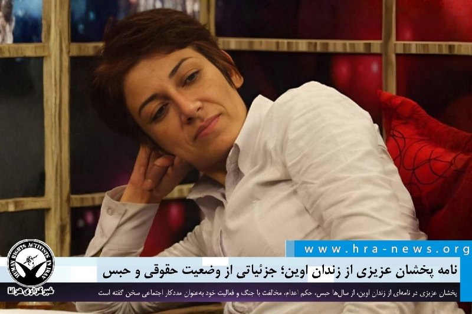

نامه پخشان عزیزی از زندان اوین؛ «من آنی‌ام که برای زندگی می‌میرم، نه آنکه برای مرگ زندگی کنم»

❗️
❗️
❗️
❗️
❗️ – پخشان عزیزی، زندانی سیاسی محکوم به #اعدام، با نگارش نامه‌ای از بند زنان زندان اوین که نسخه‌ای از آن برای هرانا ارسال شده، به تشریح دیدگاه‌های خود درباره وضعیت پرونده‌اش، اتهامات منتسب به وی، جنگ و تحولات منطقه و آنچه «بازی‌های سیاسی» پیرامون پرونده‌اش خوانده، پرداخته است. وی در بخشی از این نامه با اشاره به وضعیت حقوقی خود نوشته است: «تا کنون هیچ توقف حکمی که از آن گفته می‌شود، چه به من و چه به وکیلم ابلاغ نشده است.» او همچنین ادامه وضعیت خود را در چارچوب بلاتکلیفی قضایی توصیف کرده است.

به گزارش خبرگزاری هرانا، ارگان خبری مجموعه فعالان حقوق بشر در ایران، پخشان عزیزی در این نامه که در تاریخ ۲۰ خردادماه ۱۴۰۵ از بند زنان زندان اوین نگاشته شده، با اشاره به وضعیت خود به عنوان یک زندانی سیاسی محکوم به اعدام، از فشارهای ناشی از سال‌ها حبس و صدور و تایید مکرر حکم اعدام سخن گفته است. او همچنین تاکید کرده است که تاکنون هیچ ابلاغ رسمی مبنی بر توقف اجرای حکم به وی یا وکیلش ارائه نشده است.

وی در بخش دیگری از این نامه، ضمن رد اتهامات مرتبط با عضویت در گروه‌های سیاسی و تجزیه‌طلبی، فعالیت‌های خود را در چارچوب مددکاری اجتماعی و همکاری با آوارگان جنگی در سوریه توصیف کرده و با محکوم کردن جنگ و حملات علیه غیرنظامیان، بر ضرورت گفت‌وگو، صلح و احقاق حقوق جوامع مختلف در چارچوبی غیرتجزیه‌طلبانه تاکید کرده است.

متن کامل این نامه را به نقل از هرانا در ادامه بخوانید

#پخشان_عزیزی

↘️
@hranews_bot تماس ✉️ -  @Hranews  کانال هرانا 🆑

## alonews — post 127610

  <a href="telegram/content/alonews_127610_1781350976.webm" target="_blank">🎬 Download video</a>

👈 حمله هوایی اسرائیل به شهر انصار در جنوب لبنان

✅ @AloNews خبر جنگ

## alonews — post 127609

  <a href="telegram/content/alonews_127609_1781350976.webm" target="_blank">🎬 Download video</a>

👈جزئیات مراسم وداع، تشییع و تدفین رهبر 
🔴شنبه و یکشنبه ۱۳ و ۱۴ تیر (۱۹ و ۲۰ محرم): مراسم وداع در مصلای امام خمینی(ره) تهران 
🔴دوشنبه ۱۵ تیر (۲۱ محرم): مراسم تشییع در تهران 
🔴سه‌شنبه ۱۶ تیر (۲۲ محرم): مراسم تشییع در شهر قم 
🔴پنجشنبه ۱۸ تیر مراسم تشییع در مشهد…

---
📅 بروزرسانی: 1405/03/23 15:03
---

## VahidOOnLine — post 245300

  

‌🏁 🇬🇧 IranintlTV

🤖 @VahidOOnLine

## WithYashar — post 14712

سازمان UKMTO گزارشی از وقوع یک حادثه در فاصله ۶ مایل دریایی (6NM) در شرق عمان دریافت کرده است.

گزارش شده است که یک کشتی نفت‌کش در بخش جلو و سمت چپ بدنه (Port Bow) مورد اصابت پرتابه ناشناس قرار گرفته است.
@withyashar

## mwarmonitor — post 10821

🔰نخست وزیر پاکستان

🔴ما به توافق صلح بیش از هر زمان دیگری نزدیک هستیم. انتظار می‌رود نهایی‌سازی آن ظرف ۲۴ ساعت آینده انجام شود و پاکستان بلافاصله پس از آن برای امضای الکترونیکی این توافق صلح آماده می‌شود، و سپس مذاکرات فنی در هفته آینده آغاز خواهد شد.

🔴از ایالات متحده آمریکا و جمهوری اسلامی ایران بابت تعهد مستمرشان در طول مذاکرات تشکر می‌کنیم و همچنین قدردانی صمیمانه خود را از برادرانمان در منطقه برای حمایتشان ابراز می‌داریم. ما مطمئن هستیم که این توافق تاریخی صلح، پایه‌ای محکم برای صلح پایدار خواهد بود.

@mwarmonitor

## mwarmonitor — post 10820

  <a href="telegram/content/mwarmonitor_10820_1781350391.mp4" target="_blank">🎬 Download video</a>

حمله سایبری به چهار بانک در ایران

## mwarmonitor — post 10819

  <a href="telegram/content/mwarmonitor_10819_1781350394.mp4" target="_blank">🎬 Download video</a>

🚨 فوری — هشدار تخلیه به ساکنان لبنان 🔸به ساکنان حاضر در روستاها و شهرک‌های زیر هشدار فوری داده می‌شود: غسانیه، الزراریه، مزرعه کوثرية الرز، صیر غربی 🔸 در پی نقض توافق آتش‌بس از سوی «حزب‌الله تروریستی»، ارتش دفاعی اسرائیل ناچار است علیه آن با قدرت اقدام کند.…

## pm_afshaa — post 93756

  <a href="telegram/content/pm_afshaa_93756_1781350396.webm" target="_blank">🎬 Download video</a>

🔴بلومبرگ: جمهوری اسلامی به‌احتمال زیاد در جریان آتش‌بس، سلاح‌های پیشرفته روسی رو به ذخایر تسلیحاتی خودش اضافه کرده.

💧 Rainbet.com the #1 Non-KYC Crypto Casino & Sportsbook @rainbetcom

😁 @Pm_Afshaa

## pm_afshaa — post 93755

  <a href="telegram/content/pm_afshaa_93755_1781350396.webm" target="_blank">🎬 Download video</a>

🔴با اینکه هنوز حدود دو هفته تا آغاز تابستان باقی مونده، جمهوری اسلامی در برخی استان‌های کشور قطعی‌های 2 تا 4 ساعته برق رو شروع کرده!

💧 Rainbet.com the #1 Non-KYC Crypto Casino & Sportsbook @rainbetcom

😁 @Pm_Afshaa

## pm_afshaa — post 93754

جزییات کامل مراسم دفن جنازه علی خامنه‌ای به نقل از خبرگزاری فارس:

- روزهای شنبه ۱۳ و یکشنبه ۱۴ تیرماه: مراسم وداع با جنازه در مصلای خمینی.
- روز دوشنبه ۱۵ تیرماه: مراسم تشییع در تهران.
روز سه‌شنبه ۱۶ تیرماه: مراسم تشییع در شهر قم.
- روز پنج‌شنبه ۱۸ تیرماه: مراسم تشییع در مشهد و تدفین در حرم امام‌رضا

💧Rainbet.com the #1 Non-KYC Crypto Casino & Sportsbook @rainbetcom

😁 @Pm_Afshaa

## pm_afshaa — post 93753

  <a href="telegram/content/pm_afshaa_93753_1781350397.webm" target="_blank">🎬 Download video</a>

🔴شهباز شریف، نخست‌وزیر پاکستان:
آمریکا و ایران با یک چارچوب برای توافق صلح که به ماه‌ها درگیری در خاورمیانه پایان میده، موافقت کردن.

امضای توافق بین ایران و آمریکا به‌صورت الکترونیکی انجام خواهد شد.

💧 Rainbet.com the #1 Non-KYC Crypto Casino & Sportsbook @rainbetcom

😁 @Pm_Afshaa

## mamlekate — post 103701

📞 الو سلام الان ساعت ۱۲:۱۶ روز شنبه ۲۳ خرداد. الان نیم ساعتی هست که همه ی همراه بانکا قطع شده و کار نمیکنه، معلوم نیست باز چه گوهی دارن میخورن
۶ تا همراه بانک دارم و هیچکدوم نمیره داخلشون ، اخطار خطای داخلی میاره
ملی ، صادرات،مسکن،توسعه تعاون،کشاورزی،سپه
اینارو من رو گوشیم دارم

📞 اینجا هم قطع شده وسط اوج روز کاری روز شنبه که همه سر کارن. دم مغازه از ساعت ۱۰ کارتای تجارت ، ملی و صادرات همشون قطعه تا الان که هنوزم اینجوریه

یکجا میگن حمله سایبری بوده یکجا میگن بروزرسانی زیرساخت.
آخه بروزرسانی اونم توی این ساعت؟

📞 الو اینترنت بانک سامان هم قطع شده. حرف مذاکره شد همه چیو قطع کردن که کسی نتونه پول بزنه خیلی ارز نریزه

📞 درود . وقت خوش. شنیده شدن صدای پرواز هواپیما و صدای تک انفجار امروز شنبه ۲۳ خردا د ۱۴۰۵ ساعت ۱۳:۲۰ شهر همدان

## IranIntlTV — post 342050

  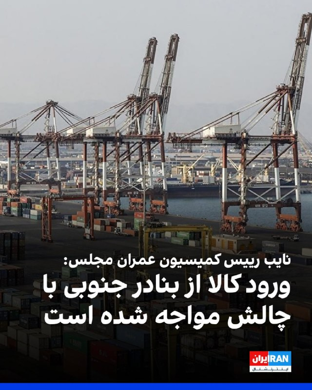

📷 Photo

## Shin_Persian — post 7012

Shin ✓ @hey_itsmyturn
Sat, 13 Jun 2026 11:30:03 UTC

Jet activity over Baghdad, #Iraq 🇮🇶

ترجمه خودکار فارسی

فعالیت جنگنده‌ها بر فراز بغداد، #Iraq 🇮🇶

𝕏 · @shin_persian

## FarsiVOA — post 220574

  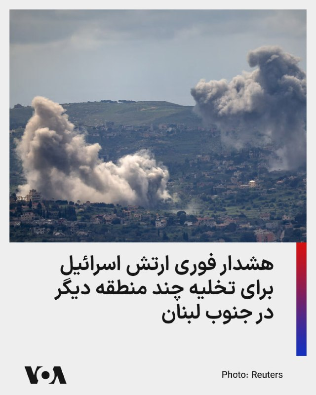

ارتش اسرائیل با صدور هشدار فوری از ساکنان غسانیه، زراریه، مزرعه کوثریه الرز و صیر غربیه در جنوب لبنان خواست فوراً خانه‌های خود را ترک کرده و به شمال رود زهرانی بروند.

در این هشدار آمده است که به‌دلیل نقض توافق آتش‌بس از سوی حزب‌الله، ارتش اسرائیل ناچار است با قدرت علیه مواضع این گروه اقدام کند.

ارتش اسرائیل تأکید کرده حضور در نزدیکی نیروها، تأسیسات و تجهیزات جنگی حزب‌الله، جان غیرنظامیان را در معرض خطر قرار می‌دهد.
@FarsiVOA

## RadioFarda — post 158251

  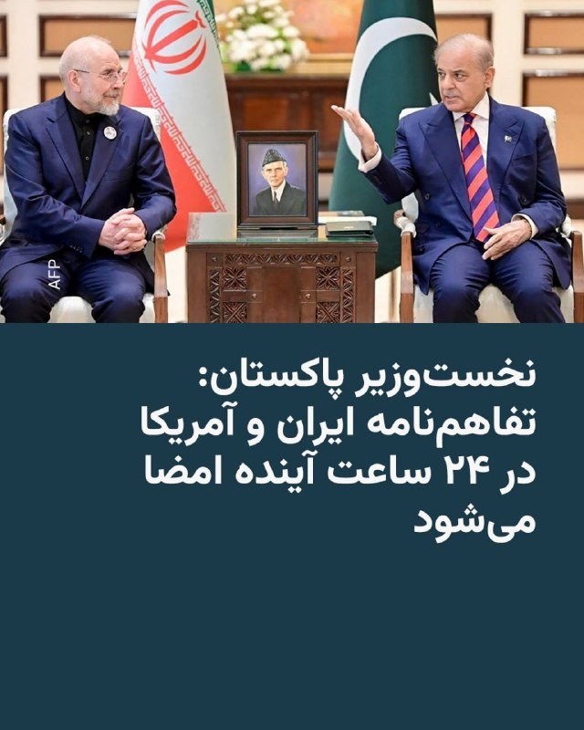

🔸شهباز شریف، نخست‌وزیر پاکستان، روز شنبه ۲۳ خرداد اعلام کرد که تهران و واشینگتن بر سر متن نهایی تفاهم‌نامه به توافق رسیده‌اند.

🔸به گفته این مقام عالی‌رتبه پاکستانی که نقش میانجی را میان ایران و آمریکا داشته است، این تفاهم‌نامه در عرض ۲۴ ساعت آینده «به صورت الکترونیکی» امضا خواهد شد.

🔸شریف ادامه داده است که در پی امضای تفاهم‌نامه، دو طرف در هفته جاری پس از تعطیلات آخر هفته میلادی «مذاکرات فنی» خود را آغاز خواهند کرد.

🔸عباس عراقچی، وزیر خارجه جمهوری اسلامی، پیشتر در مصاحبه‌ای تلویزیونی گفته بود که پس از نهایی‌ شدن پیش‌نویس توافق، مراسم امضا به طور «غیر حضوری» و «از راه دور» انجام خواهد شد.

🔸او پس از آن این توضیح را داد که دونالد ترامپ، رئیس جمهور آمریکا، روز پنجشنبه گفت که این مراسم، احتمالاً در یک کشور اروپایی و با حضور جی‌دی ونس برگزار خواهد شد.

@RadioFarda

## IranianMinds — post 22457

  

🔴۱۶ نفر از نماینده مجلس، امشب جلوی وزارت خارجه تجمع اعتراضی برقرار می‌کنند.

@IranianMinds

## alonews — post 127608

  <a href="telegram/content/alonews_127608_1781350402.webm" target="_blank">🎬 Download video</a>

👈 نخست وزیر پاکستان:  ما اکنون به یک توافق صلح نزدیک‌تر از هر زمان دیگری هستیم. 
🔴با احتمال نهایی‌سازی در ۲۴ ساعت آینده، پاکستان در حال آماده‌سازی برای امضای الکترونیکی توافق صلح بلافاصله پس از آن است 
✅ @AloNews خبر جنگ

## alonews — post 127607

  <a href="telegram/content/alonews_127607_1781350402.webm" target="_blank">🎬 Download video</a>

👈سازمان UKMTO گزارشی از وقوع یک حادثه در فاصله ۶ مایل دریایی (6NM) در شرق عمان دریافت کرده است.

🔴گزارش شده است که یک کشتی نفت‌کش در بخش جلو و سمت چپ بدنه (Port Bow) مورد اصابت پرتابه ناشناس قرار گرفته است.

✅ @AloNews خبر جنگ

---
📅 بروزرسانی: 1405/03/23 14:53
---

## VahidOOnLine — post 245299

  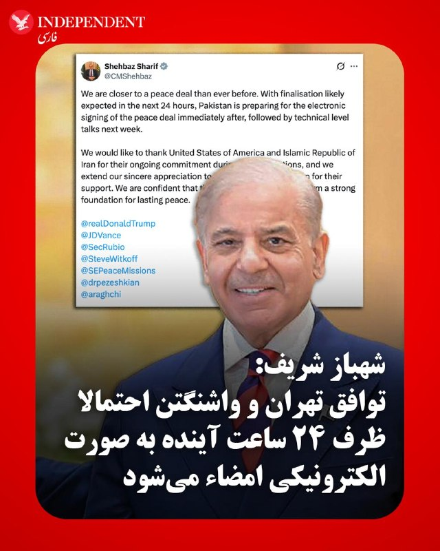

♦️شهباز شریف، نخست‌وزیر پاکستان، روز شنبه ۲۳ خرداد ماه در پیامی در شبکه اجتماعی ایکس اعلام کرد که تهران و واشنگتن «بیش از هر زمان دیگری به دستیابی به توافق صلح» نزدیک شده‌اند و احتمال می‌رود متن نهایی این توافق ظرف ۲۴ ساعت آینده نهایی شود.
شریف نوشت: «ما بیش از هر زمان دیگری به توافق صلح نزدیک شده‌ایم. انتظار می‌رود نهایی‌سازی توافق در ۲۴ ساعت آینده انجام شود و پاکستان در حال آماده‌سازی برای امضاء الکترونیکی توافق بلافاصله پس از آن است.»
او افزود پس از امضاء توافق، گفتگوهای فنی در سطح کارشناسی طی هفته آینده برگزار خواهد شد.
نخست‌وزیر پاکستان همچنین از ایالات متحده و جمهوری اسلامی ایران به دلیل ادامه تعهد به روند مذاکرات قدردانی کرد و از کشورهای منطقه نیز به خاطر حمایت از این روند تشکر کرد.
شهباز شریف در پایان ابراز اطمینان کرد که این «توافق صلح تاریخی» می‌تواند پایه‌ای مستحکم برای برقراری صلحی پایدار در منطقه باشد.
نخست وزیر پاکستان در پایان این پیام، حساب‌های کاربری دونالد ترامپ، جی دی ونس، مارکو روبیو، استیو ویتکاف، عباس عراقچی و محمد باقر قالیباف را اضافه کرد.
‌🇸🇦 Indypersian

🤖 @VahidOOnLine

## VahidOOnLine — post 245298

  

آویگدور لیبرمن، رهبر حزب راستگرای «اسرائیل، خانه ما» و وزیر پیشین دفاع این کشور، در شبکه ایکس نوشت: «توافقی که در حال شکل‌گیری با تهران است، یک پیروزی کامل برای آیت‌الله‌ها و از دیدگاه اسرائیل یک فاجعه است.»

او اضافه کرد: «مسئولیت چنین توافقی برعهده بنیامین نتانیاهو است.»
iranintl
‌🏁 🇬🇧 IranintlTV

🤖 @VahidOOnLine

## VahidOOnLine — post 245297

  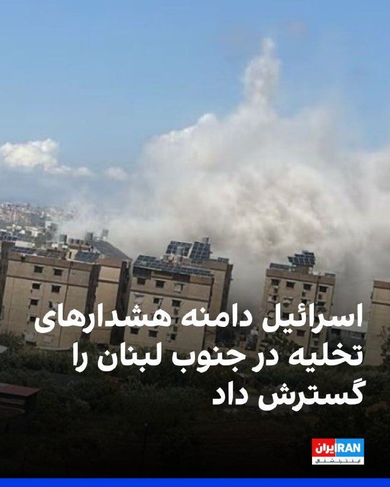

ارتش اسرائیل از ساکنان غسانیه، زراریه، مزرعه کوثریه الرز و صیر الغربیه در جنوب لبنان خواست فورا خانه‌های خود را ترک کنند و به شمال رودخانه زهرانی منتقل شوند. ارتش اسرائیل اعلام کرد در پی نقض توافق آتش‌بس از سوی حزب‌الله، علیه این گروه اقدام خواهد کرد.

ارتش همچنین هشدار داد حضور در نزدیکی نیروها و تاسیسات حزب‌الله جان غیرنظامیان را به خطر می‌اندازد.

ارتش اسرائیل پیش‌تر نیز برای ساکنان روستاهای صرفند، تفاحتا و مزرعه سینا در جنوب لبنان هشدار تخلیه صادر کرده بود.
iranintl
‌🏁 🇬🇧 IranintlTV

🤖 @VahidOOnLine

## VahidOOnLine — post 245296

  

شهباز شریف، نخست‌وزیر پاکستان، در شبکه ایکس نوشت تهران و واشینگتن بیش از هر زمان دیگری به تفاهم‌نامه صلح نزدیک شدند و احتمال نهایی شدن آن در ۲۴ ساعت آینده وجود دارد.

او همچنین نوشت پاکستان برای امضای الکترونیکی تفاهم‌نامه صلح میان آمریکا و جمهوری اسلامی، بلافاصله پس از نهایی شدن آن، آماده می‌شود.
iranintl
‌🏁 🇬🇧 IranintlTV

🤖 @VahidOOnLine

## VahidOOnLine — post 245290

  <a href="telegram/content/VahidOOnLine_245290_1781349785.mp4" target="_blank">🎬 Download video</a>

آیا یوتیوب از کانال‌های مرتبط با نهادها و افراد تحریم‌شده جمهوری اسلامی درآمد کسب می‌کند؟

گزارش تازه وایرد به نقل از یک پژوهش مستقل می‌گوید ده‌ها کانال مرتبط با افراد و نهادهای تحت تحریم آمریکا همچنان در یوتیوب فعال بوده‌اند و تبلیغات برندهای بزرگ روی ویدیوهای آن‌ها نمایش داده شده است.

گوگل می‌گوید به قوانین تحریم‌ها پایبند است و علیه حساب‌های ناقض سیاست‌هایش اقدام کرده، اما هنوز مشخص نیست آیا بخشی از درآمد تبلیغات به این کانال‌ها پرداخت شده است یا نه.
‌🏁 🇬🇧 ManotoTV

🤖 @VahidOOnLine

## mwarmonitor — post 10818

حمله‌ای به یک کشتی در دریای عمان.

## mwarmonitor — post 10817

🔴نخست‌وزیر پاکستان: امضای توافق بین ایران و ایالات متحده به‌صورت الکترونیکی انجام خواهد شد. @mwarmonitor

## mwarmonitor — post 10816

حمله‌ای به یک کشتی در دریای عمان.

## IranIntlTV — post 342049

  <a href="telegram/content/IranIntlTV_342049_1781349786.mp4" target="_blank">🎬 Download video</a>

گزارش سازمان کشورهای صادرکننده نفت، اوپک، نشان می‌دهد تولید نفت ایران در ماه گذشته میلادی به کمترین میزان از سال ۲۰۲۱ و دوران همه‌گیری کرونا رسیده است.

عطا حسینیان، روزنامه‌نگار اقتصادی و حوزه انرژی، گفت: «جمهوری اسلامی در یک ماه گذشته هیچ درآمدی از محل صادرات نفت، محصولات پتروشیمی و فولاد نداشته و در حال حاضر کشور را با استفاده از پس‌اندازها اداره می‌کند.»

@iranintltv

## IranIntlTV — post 342048

  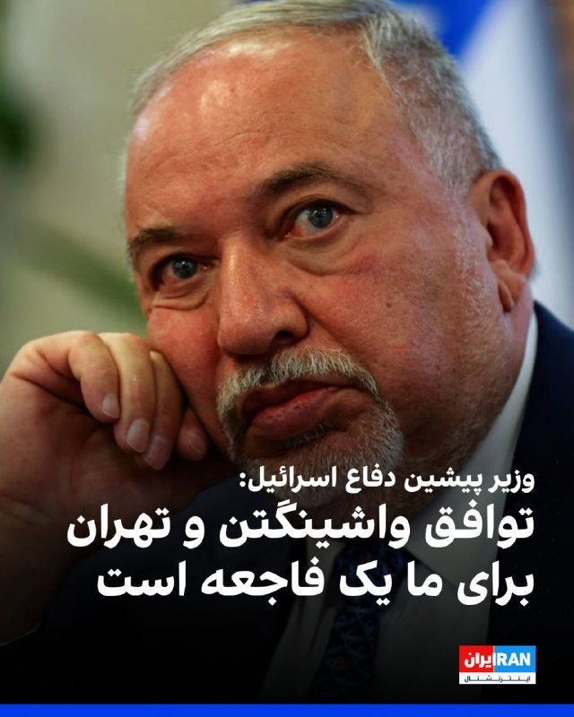

آویگدور لیبرمن، رهبر حزب راستگرای «اسرائیل، خانه ما» و وزیر پیشین دفاع این کشور، در شبکه ایکس نوشت: «توافقی که در حال شکل‌گیری با تهران است، یک پیروزی کامل برای آیت‌الله‌ها و از دیدگاه اسرائیل یک فاجعه است.»

او اضافه کرد: «مسئولیت چنین توافقی برعهده بنیامین نتانیاهو است.»
iranintl.com/202606139088

## IranIntlTV — post 342047

  

ارتش اسرائیل از ساکنان غسانیه، زراریه، مزرعه کوثریه الرز و صیر الغربیه در جنوب لبنان خواست فورا خانه‌های خود را ترک کنند و به شمال رودخانه زهرانی منتقل شوند. ارتش اسرائیل اعلام کرد در پی نقض توافق آتش‌بس از سوی حزب‌الله، علیه این گروه اقدام خواهد کرد.

ارتش همچنین هشدار داد حضور در نزدیکی نیروها و تاسیسات حزب‌الله جان غیرنظامیان را به خطر می‌اندازد.

ارتش اسرائیل پیش‌تر نیز برای ساکنان روستاهای صرفند، تفاحتا و مزرعه سینا در جنوب لبنان هشدار تخلیه صادر کرده بود.
iranintl.com/202606138499

## IranIntlTV — post 342046

  

شهباز شریف، نخست‌وزیر پاکستان، در شبکه ایکس نوشت تهران و واشینگتن بیش از هر زمان دیگری به تفاهم‌نامه صلح نزدیک شدند و احتمال نهایی شدن آن در ۲۴ ساعت آینده وجود دارد.

او همچنین نوشت پاکستان برای امضای الکترونیکی تفاهم‌نامه صلح میان آمریکا و جمهوری اسلامی، بلافاصله پس از نهایی شدن آن، آماده می‌شود.
iranintl.com/202606139832

## IranIntlTV — post 342045

  <a href="telegram/content/IranIntlTV_342045_1781349790.mp4" target="_blank">🎬 Download video</a>

مروری بر رسانه‌ها و خبرگزاری‌ها در ایران، شنبه ۲۳ خرداد، با مجتبی هاشمی، روزنامه‌نگار
@iranintltv

## IranIntlTV — post 342044

  <a href="telegram/content/IranIntlTV_342044_1781349793.mp4" target="_blank">🎬 Download video</a>

آرش آزرمی، دبیر بخش اقتصادی ایران‌اینترنشنال، درباره اختلال و قطعی خدمات در بانک‌های ملی، صادرات، تجارت و توسعه صادرات گفت: «بانکداری اسلامی که حکومت تلاش کرد از ابتدا اجرا کند، با نظام بانکداری روز جهان سازگاری و تطابق نداشت و همین موضوع، چه از نظر فنی و چه از نظر مالی، مشکلات متعددی ایجاد کرده است.»

@iranintltv

## IranIntlTV — post 342043

  <a href="telegram/content/IranIntlTV_342043_1781349795.mp4" target="_blank">🎬 Download video</a>

دیوار جاویدنامان انقلاب ملی ایرانیان در شهر گوتنبرگ سوئد افتتاح شد. این یادمان که بیش از ۱۰۰ تصویر از جان‌باختگان راه آزادی ایران را در بر می‌گیرد، با هدف پاسداشت یاد و نام افرادی برپا شده است که برای آزادی، حقوق بشر و دستیابی به آینده‌ای سکولار و انسانی جان خود را از دست دادند.

گزارش مهران عباسیان، خبرنگار ایران‌اینترنشنال و گفت‌وگوی او با ویدا تهرانی، دبیرنخست سپیدار حزب زنان ایران
@iranintltv

## Shin_Persian — post 7011

  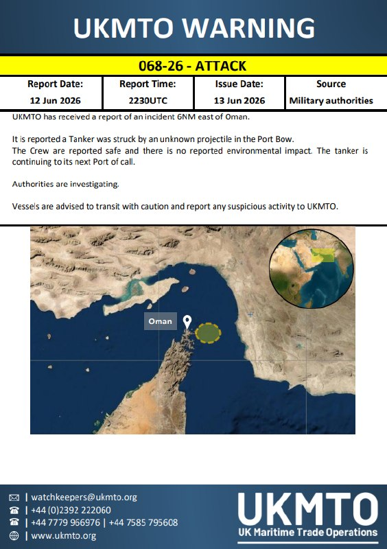

UKMTO Operations Centre @UK_MTO
Sat, 13 Jun 2026 11:14:18 UTC

UKMTO WARNING 068-26

Click here to view the full warning.⤵️
https://www.ukmto.org/-/media/ukmto/products/20260613-ukmto_warning_attack_068_26.pdf?rev=138c37f827c14de6b10e25e72f5a8f66
#MaritimeSecurity #MarSec

ترجمه خودکار فارسی

هشدار یو‌کی‌ام‌تی‌او (UKMTO) ۰۶۸-۲۶

برای مشاهده متن کامل هشدار اینجا کلیک کنید.⤵️
https://www.ukmto.org/-/media/ukmto/products/20260613-ukmto_warning_attack_068_26.pdf?rev=138c37f827c14de6b10e25e72f5a8f66
#MaritimeSecurity #MarSec_

𝕏 · @shin_persian

## ManotoTV — post 106045

  <a href="telegram/content/ManotoTV_106045_1781349798.mp4" target="_blank">🎬 Download video</a>

آیا یوتیوب از کانال‌های مرتبط با نهادها و افراد تحریم‌شده جمهوری اسلامی درآمد کسب می‌کند؟

گزارش تازه وایرد به نقل از یک پژوهش مستقل می‌گوید ده‌ها کانال مرتبط با افراد و نهادهای تحت تحریم آمریکا همچنان در یوتیوب فعال بوده‌اند و تبلیغات برندهای بزرگ روی ویدیوهای آن‌ها نمایش داده شده است.

گوگل می‌گوید به قوانین تحریم‌ها پایبند است و علیه حساب‌های ناقض سیاست‌هایش اقدام کرده، اما هنوز مشخص نیست آیا بخشی از درآمد تبلیغات به این کانال‌ها پرداخت شده است یا نه.

## FarsiVOA — post 220573

  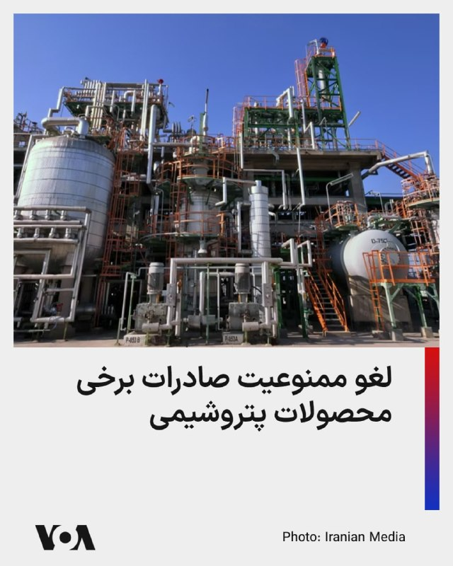

مدیرعامل شرکت ملی صنایع پتروشیمی می‌گوید برای بخشی از محصولات پتروشیمی که مازاد تولید دارند و انبارها از آن‌ها پر شده، مجوز صادرات صادر شد.

جمهوری اسلامی در پی هدف قرار گرفتن مجتمع‌های پتروشیمی ماهشهر و عسلویه در جنگ ۳۹ روزه، صادرات محصولات پتروشیمی را ممنوع کرده بود و طی هفته‌های گذشته گزارش‌های زیادی از کمبود و جهش قیمت محصولات پتروشیمی، خصوصا کودهای کشاورزی و محصولات بسته‌بندی دارو و مواد غذایی منتشر شده است.

حسن عباس‌زاده مدیرعامل شرکت ملی صنایع پتروشیمی همچنین گفته است تاکنون ۳۸ درصد از پتروشیمی‌هایی که مورد هدف قرار گرفته یا تولید آنها مختل شده بود، به مدار تولید بازگشته است.

او تصریح کرد برای محصولاتی که همچنان با محدودیت عرضه روبه‌رو هستند، ممنوعیت صادرات برقرار است.
@FarsiVOA

## Persian_Trend_Official — post 16940

  

حمله به یک کشتی در تنگهٔ هرمز

سازمان عملیات تجارت دریایی انگلیس: یک نفتکش در 6 مایلی شرق عمان هدف اصابت یک پرتابهٔ ناشناخته قرار گرفته است.

📝 Amir

📌 @persian_trend_official
پرشین ترند | متفاوت‌ترین کانال نظامی

## Persian_Trend_Official — post 16939

  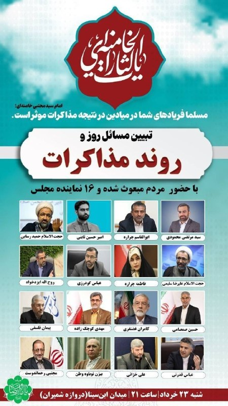

💢16 تا نماینده مجلس (از جمله ثابتی و رسایی) به همراه قشر تندرو امشب جلوی وزارت خارجه تجمع اعتراضی برگزار میکنن و به روند مذاکرات اعتراض میکنن‌.

👺Phantom

📌 @persian_trend_official
پرشین ترند | متفاوت‌ترین کانال نظامی

## Persian_Trend_Official — post 16938

شهباز شریف: بیش از هر زمان دیگری به توافق صلح میان ایران و آمریکا نزدیک شده‌ایم.

احتمال می‌رود روند نهایی‌سازی توافق ظرف 24 ساعت آینده تکمیل شود. پاکستان در حال آماده‌سازی برای امضای الکترونیکی توافق بلافاصله پس از نهایی شدن آن است.

مذاکرات فنی و کارشناسی درباره جزئیات اجرای توافق از هفته آینده آغاز خواهد شد.

📝 Amir

📌 @persian_trend_official
پرشین ترند | متفاوت‌ترین کانال نظامی

## Persian_Trend_Official — post 16937

  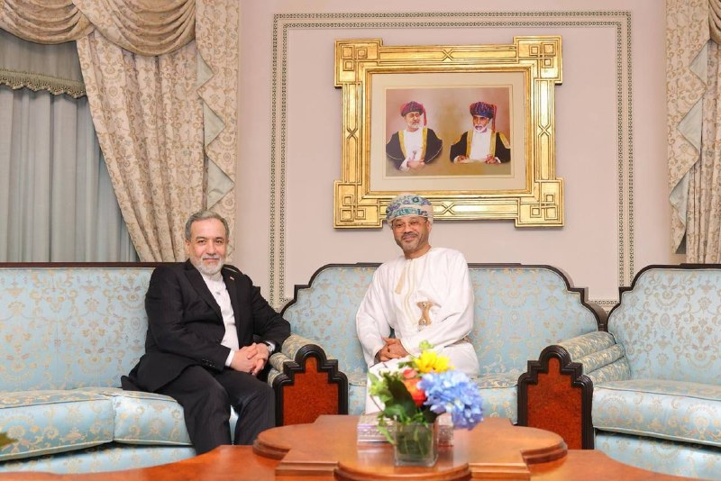

عراقچی: ایران و عمان بیانیه مشترکی درباره تنگه هرمز صادر می‌کنند.

👺Phantom

📌 @persian_trend_official
پرشین ترند | متفاوت‌ترین کانال نظامی

## Persian_Trend_Official — post 16935

تصاویر ماهواره ای جدید از پایگاه موفق السلطی اردن چندین اصابت در این پایگاه در جریان حملات موشکی چند شب پیش سپاه تأیید می‌کند.

اکثر موشک ها به دلیل خطای بالا به چند ده متری هدف اصابت کرده اند.

📝 Amir

📌 @persian_trend_official
پرشین ترند | متفاوت‌ترین کانال نظامی

## manototv — post 106045

  <a href="telegram/content/manototv_106045_1781349802.mp4" target="_blank">🎬 Download video</a>

آیا یوتیوب از کانال‌های مرتبط با نهادها و افراد تحریم‌شده جمهوری اسلامی درآمد کسب می‌کند؟

گزارش تازه وایرد به نقل از یک پژوهش مستقل می‌گوید ده‌ها کانال مرتبط با افراد و نهادهای تحت تحریم آمریکا همچنان در یوتیوب فعال بوده‌اند و تبلیغات برندهای بزرگ روی ویدیوهای آن‌ها نمایش داده شده است.

گوگل می‌گوید به قوانین تحریم‌ها پایبند است و علیه حساب‌های ناقض سیاست‌هایش اقدام کرده، اما هنوز مشخص نیست آیا بخشی از درآمد تبلیغات به این کانال‌ها پرداخت شده است یا نه.

## alonews — post 127606

  <a href="telegram/content/alonews_127606_1781349802.webm" target="_blank">🎬 Download video</a>

🔴 فوری/ نخست‌وزیر پاکستان: متن نهایی توافقنامه صلح بین ایران و آمریکا به دست آمد 
✅ @AloNews خبر جنگ

---
📅 بروزرسانی: 1405/03/23 14:42
---

## WithYashar — post 14711

نخست‌وزیر پاکستان: متن نهایی توافقنامه صلح بین ایران و آمریکا به دست آمد
@withyashar

## mwarmonitor — post 10815

🚨 یک منبع آگاه به شبکه العربیه گفته است که امضای تفاهم‌نامه (MoU) بین آمریکا و ایران در ژنو انجام نخواهد شد و به‌جای آن، به صورت غیرحضوری (از راه دور) انجام می‌شود. @mwarmonitor

## IranianMinds — post 22456

  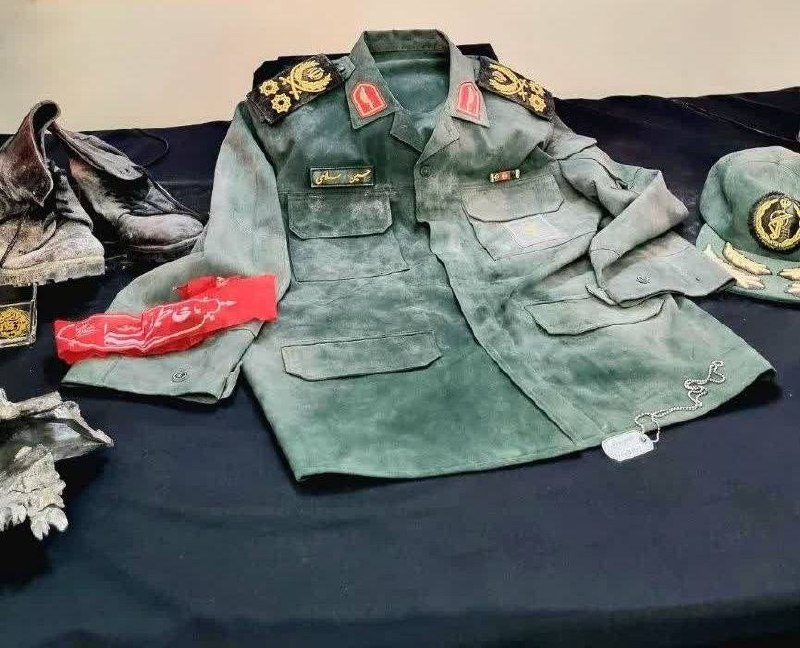

🔴اکانت اسرائیل به فارسی:

تاریخ خلق تصویر: یک سال پیش.

@IranianMinds

## alonews — post 127605

  <a href="telegram/content/alonews_127605_1781349161.webm" target="_blank">🎬 Download video</a>

👈یوتیوب صفحهٔ خبرگزاری فارس رو به خاطر تحریم "مسدود" کرد

✅ @AloNews خبر جنگ

---
📅 بروزرسانی: 1405/03/23 14:32
---

## VahidOOnLine — post 245289

  <a href="telegram/content/VahidOOnLine_245289_1781348577.mp4" target="_blank">🎬 Download video</a>

جمعی از ایرانیان مقیم نیوزیلند شنبه ۲۳ خرداد همزمان با زادروز مجیدرضا رهنورد، جانباخته خیزش انقلابی ۱۴۰۱، با تشکیل یک زنجیره انسانی و سخنرانی در شهر اوکلند یاد او را گرامی داشتند.
‌🏁 🇬🇧 IranintlTV

🤖 @VahidOOnLine

## VahidOOnLine — post 245288

  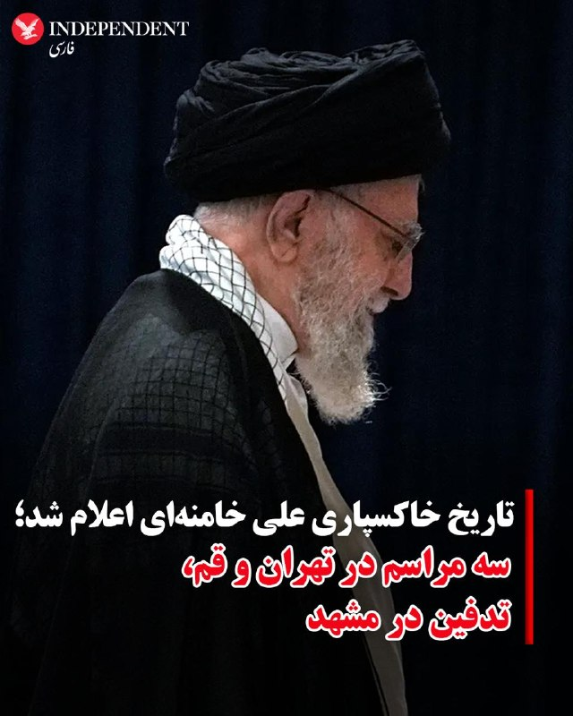

♦️«ستاد بزرگداشت رهبر شهید» که برای خاکسپاری علی خامنه‌ای، دومین رهبر جمهوری اسلامی تشکیل شده است، روز شنیه ۲۳ خرداد ماه با انتشار بیانیه‌ای برنامه مراسم تشییع و خاکسپاری او را اعلام کرد.
بر اساس این بیانیه روزهای شنبه و یکشنبه ۱۴ و۱۳ تیرماه، در مصلای امام خمینی تهران مراسمی تحت عنوان «وداع» برگزار خواهد شد، اما مراسم تشییع علی خامنه‌ای در تهران، در روز بعد یعنی دوشنبه ۱۵ تیر برگزار می‌شود.
این بیانیه همچنین اعلام کرده است که مراسم تشییع دیگری روز سه‌شنبه ۱۶ تیرماه در شهر قم برگزار خواهد شد.
بر اساس برنامه منتشرشده، آخرین مرحله خاکسپاری علی خامنه‌ای، روز پنج‌شنبه ۱۸ تیرماه در مشهد برگزار می‌شود و او در حرم امام هشتم شیعیان به خاک سپرده خواهد شد.
علی خامنه‌ای، دومین رهبر جمهوری اسلامی روز نهم اسفندماه سال ۱۴۰۴ در موج اول حملات هوایی آمریکا و اسرائیل به بیت رهبر به همراه تعدادی از اعضای خانواده و مقام‌های ارشد سیاسی و نظامی حکومت کشته شد.
با گذشت بیش از ۱۰۰ روز از کشته شدن رهبر پیشین جمهوری اسلامی، مجتبی خامنه‌ای، پسر و جانشین او در انظار عمومی ظاهر نشده و حضور او در مراسم تدفین پدرش در هاله‌ای از ابهام قرار دارد.
‌🇸🇦 Indypersian

🤖 @VahidOOnLine

## mwarmonitor — post 10814

  

✈️هواپیمای A-10 وارهاگ نیروی هوایی آمریکا (USAF) در حال بازگشت از خاورمیانه به بریتانیا دیده شده است، در حالی که روی بدنه آن چندین «نشان شکار» (Kill marks) دیده می‌شود؛ از جمله به نظر می‌رسد دو فروند قایق تندرو نیروی دریایی سپاه پاسداران (IRGC-N) نیز در میان آن‌ها باشد.

@mwarmonitor

## DEJradio — post 5653

  <a href="telegram/content/DEJradio_5653_1781348580.webm" target="_blank">🎬 Download video</a>

🚨
⭕️ اختصاصی؛
هشدار پزشکیان در جلسه خصوصی شورای‌‌عالی امنیت ملی:
اداره کشور با وضعیت فعلی ممکن نیست

اختلاف درون حکومت بر «توافق کردن یا نکردن» با آمریکا بالا گرفته است. سندی که ترامپ روی آن اصرار دارد «تسلیم جمهوری اسلامی» است. گروهی از فرماندهان ســ.ـپاه و چهره‌هایی مثل پزشکیان و عراقچی به دنبال توافق‌اند و گروهی دیگر همچنان منفعت حکومت را در «مقاومت» می‌بینند.

مخالفان توافق مدعی‌اند مفاد پیش‌نویس برخلاف نظر مجتبی خامنه‌ای است اما عراقچی می‌گوید، «شورای‌عالی امنیت ملی بر روند مذاکرات اشراف دارد.»

دولت پزشکیان به هر قیمتی به دنبال توافق است اما نهادهای نظامی و بخشی از مجلس معتقدند تسلیم برابر آمریکا به تهدید برای اصل نظام است.

اکنون هواداران نظام که بیش از ۱۰۰ شب در خیابان مانده‌اند نمی‌دانند قرار است حکومت تسلیم آمریکا شود یا جنگ ادامه خواهد داشت اما آنچه کاملاً مشهود است، کمبود شدید منابع مالی برای اداره امورات کشور است بویژه آنکه ترامپ قویاً بر ادامه محاصره دریایی تأکید دارد. گفته می‌شود پزشکیان در جلسات محرمانه شورای‌عالی امنیت ملی هشدار داده با وضعیت فعلی بودجه اداره کشور ممکن نیست.

#پزشکیان #مذاکرات #توافق
@DEJradio

## IranIntlTV — post 342042

  <a href="telegram/content/IranIntlTV_342042_1781348580.mp4" target="_blank">🎬 Download video</a>

جمعی از ایرانیان مقیم نیوزیلند شنبه ۲۳ خرداد همزمان با زادروز مجیدرضا رهنورد، جانباخته خیزش انقلابی ۱۴۰۱، با تشکیل یک زنجیره انسانی و سخنرانی در شهر اوکلند یاد او را گرامی داشتند.

## IranIntlTV — post 342041

  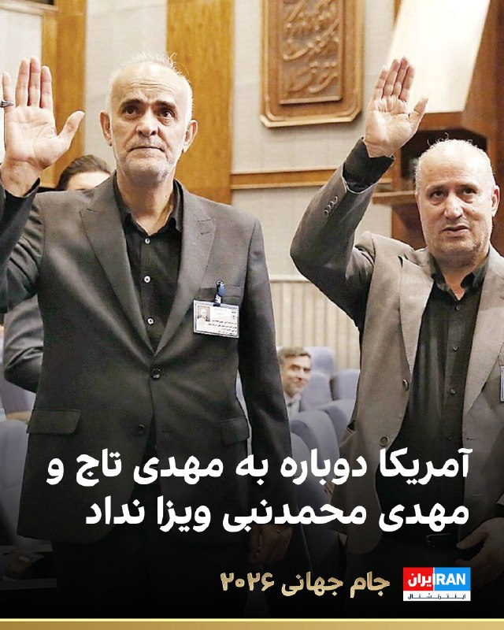

🔻ورزش سه خبر داد که وزارت خارجه آمریکا برای چهار عضو تیم ملی ایران از میان ۱۵ نفری که هنوز ویزا دریافت نکرده بودند، ویزا صادر کرده است. این در حالی است که درخواست مجدد ویزا برای مهدی تاج و مهدی محمدنبی رییس و نایب رییس فدراسیون فوتبال رد شد.

🔹بر اساس گزارش ورزش سه، ویزای امید جمالی، مسئول بین‌الملل، مسعود اردشیر، مسئول امنیتی، علی افضلی، مسئول بین‌الملل، و مهرپویا اسدی، آنالیزور تیم ملی، به اردوی تیم ملی رسیده است.

🔹با این حال، دولت آمریکا برای برخی از مدیران ارشد فوتبال جمهوری اسلامی از جمله مهدی تاج، رییس فدراسیون فوتبال جمهوری اسلامی، هدایت ممبینی، دبیرکل فدراسیون، و مدیر تیم ملی ویزا صادر نکرده است و آنها نمی‌توانند تیم ملی را در آمریکا همراهی کنند.

@iranintltvsport

## DW_Farsi — post 125923

  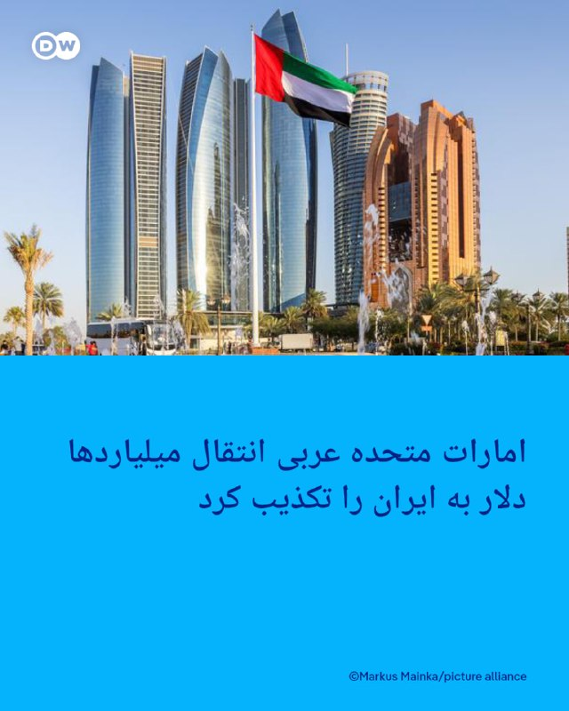

🔶 امارات متحده عربی انتقال میلیاردها دلار به ایران را تکذیب کرد

وزارت خارجه امارات متحده عربی روز جمعه ۲۲ خرداد (۱۲ ژوئن) در شبکه اجتماعی ایکس اعلام کرد گزارش‌های مربوط به آزادسازی و انتقال چندین میلیارد دلار برای ایران صحت ندارد.

چهار منبع ناشناس در محافل دیپلماتیک به رویترز گفته بودند که موضوع آزادسازی میلیاردها دلار از درآمدهای نفتی ایران مطرح بوده که به دلیل تحریم‌های آمریکا در بانک‌های خارجی مسدود شده است.

به گفته دو منبع، رقم مورد بحث حدود ۱۰ میلیارد دلار بوده که بیش از ۳ میلیارد دلار آن پیش‌تر پرداخت شده است.

دو منبع دیگر نیز رقم ۲۰ میلیارد دلار را مطرح کرده‌اند.

همچنین گفته شده است که این اقدام در ازای توقف حملات ایران به کشورهای حوزه خلیج فارس از جمله امارات متحده عربی انجام شده است.

این تحولات در شرایطی اتفاق می‌افتد که آمریکا و جمهوری اسلامی درباره پایان جنگ در حال مذاکره هستند.

@dw_farsi

## Persian_Trend_Official — post 16934

  <a href="telegram/content/Persian_Trend_Official_16934_1781348583.webm" target="_blank">🎬 Download video</a>

⚡️ ارتش اسرائیل: هشدار برای تخلیه ۴ شهر در جنوب لبنان و هدایت ساکنان آنها به شمال رودخانه زهرانی صادر کرد

## BBCPersian — post 283658

  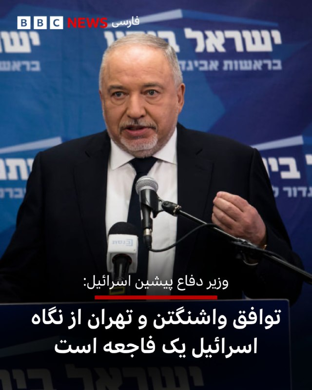

🔺وزیر دفاع پیشین اسرائیل: توافق واشنگتن و تهران از نگاه اسرائیل یک فاجعه است

آویگدور لیبرمن، رهبر حزب راستگرای «اسرائیل خانه ما» و وزیر دفاع پیشین اسرائیل، توافق احتمالی آمریکا و ایران را «یک پیروزی کامل برای آیت الله‌ها» خوانده است.

او در پیامی در شبکه ایکس نوشت که این توافق از نگاه اسرائیل «یک فاجعه» است.

آقای لیبرمن همچنین تاکید کرد که «صد در صد مسئولیت» چنین توافقی برعهده بنیامین نتانیاهو است.

اسرائیل کاتس، وزیر دفاع هم پیش‌تر گفته بود که دونالد ترامپ از منظر منافع آمریکا به دنبال رسیدن به توافق با ایران است.

آقای کاتس همچنین تاکید کرد که اسرائیل باید اطمینان حاصل کند که به طور مستقل می‌تواند مانع دستیابی ایران به سلاح هسته‌ای شود.

📸GettyImages

https://bbc.in/3Q2VSCC
@BBCPersian

## Dirty_Kids — post 391878

  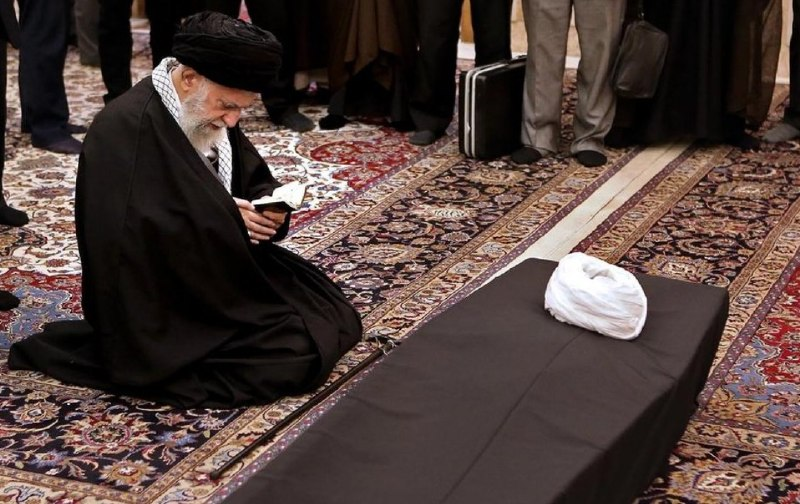

🔴 فوری، بالاخره جزئیات مراسم و دفن خامنه‌ای مشخص شد.

13 و 14 تیر: وداع توی مصلای امام خمینی.
15 تیر: مراسم تشییع توی تهران.
16 تیر: مراسم تشییع در قم.
18 تیر: تشییع در مشهد و دفن شدن تو حرم امام رضا.

@Dirty_Kids 👻

## Dirty_Kids — post 391877

  <a href="telegram/content/Dirty_Kids_391877_1781348584.mp4" target="_blank">🎬 Download video</a>

هیچوقت فک نمی‌کردم ریاضی انقد شیرین باشه و انقد بادقت بشینم بهش گوش کنم.

@Dirty_Kids 👻

## Hranews — post 113578

تایید حکم ۲ سال حبس علی طاهری‌کیا در دادگاه تجدیدنظر

❗️
❗️
❗️
❗️
❗️ – حکم دو سال #حبس علی طاهری‌کیا، دانشجوی کارشناسی ارشد رشته کارگردانی دانشکده هنرهای زیبای دانشگاه تهران، توسط دادگاه تجدیدنظر عینا تایید شد.

ادامه مطلب

#علی_طاهری‌کیا

↘️
@hranews_bot تماس ✉️ -  @Hranews  کانال هرانا 🆑

## Hranews — post 113577

قتل ناموسی در مشهد؛ یک زن جوان توسط همسرش به قتل رسید/ متهم بازداشت شد

❗️
❗️
❗️
❗️
❗️ – یک زن ۲۹ ساله در روستای پری‌آباد مشهد، توسط همسرش به #قتل رسید. متهم به قتل که متواری شده بود، توسط پلیس بازداشت شد. وی در بازجویی‌ها مدعی شد که سوءظن به وجود “رابطه‌ای نامتعارف” میان همسرش و مردی دیگر، انگیزه ارتکاب این قتل بوده و قصد داشته فرد مذکور را نیز به قتل برساند.

#خشونت_خانگی

ادامه مطلب

↘️
@hranews_bot تماس ✉️ -  @Hranews  کانال هرانا 🆑

## alonews — post 127604

  <a href="telegram/content/alonews_127604_1781348585.webm" target="_blank">🎬 Download video</a>

🔴 فوری/ نخست‌وزیر پاکستان: متن نهایی توافقنامه صلح بین ایران و آمریکا به دست آمد

✅ @AloNews خبر جنگ

## alonews — post 127603

  <a href="telegram/content/alonews_127603_1781348586.mp4" target="_blank">🎬 Download video</a>

👈 وزیر رفاه: همه موافق افزایش رقم کالابرگ هستند اما برای تامین منابع مالی به نتیجه نرسیده‌ایم

✅ @AloNews خبر جنگ

## alonews — post 127602

  <a href="telegram/content/alonews_127602_1781348587.webm" target="_blank">🎬 Download video</a>

👈ارتش اسرائیل: هشدار تخلیه ۴ شهر در جنوب لبنان، ساکنان به سمت شمال رودخانه زهرانی می‌روند.

✅ @AloNews خبر جنگ

## alonews — post 127601

  <a href="telegram/content/alonews_127601_1781348587.webm" target="_blank">🎬 Download video</a>

🔴امام زمان (عج) فعال در شبکه های اجتماعی

✅@AloNews

---
📅 بروزرسانی: 1405/03/23 14:22
---

## VahidOOnLine — post 245287

⭕️ ستاره‌های کوچک، رویاهای بزرگ؛
تب جام جهانی در زمین‌های فوتبال ایران

♦️همزمان با آغاز رقابت‌های جام جهانی فوتبال، زمین‌های خاکی و چمن‌های کوچک در گوشه‌وکنار ایران نیز سرشار از شور و هیجان شده‌اند. کودکان و نوجوانانی که با یک توپ، رویاهای بزرگ خود را دنبال می‌کنند و هر پاس و هر گل برایشان گامی به سوی آینده‌ای روشن‌تر است.
این مجموعه عکس از خبرگزاری ایرنا، لحظه‌هایی ناب از عشق به فوتبال را در نقاط مختلف کشور به تصویر می‌کشد. در روزهایی که نگاه میلیون‌ها نفر به جام جهانی دوخته شده، زمین‌های فوتبال ایران نیز میزبان ستاره‌های کوچک فردا هستند؛ کودکانی که با لباس‌های ساده اما با انگیزه‌ای بزرگ، رویای حضور در بزرگ‌ترین آوردگاه فوتبال جهان را در سر می‌پرورانند.
‌🇸🇦 Indypersian

🤖 @VahidOOnLine

## WithYashar — post 14710

جزئیات مراسم تشییع و تدفین علی خامنه ای رسما اعلام شد
شنبه و یکشنبه 13 و 14 تیر (19 و 20 محرم): مراسم وداع با پیکر در مصلای خمینی تهران
دوشنبه 15 تیر (21 محرم): مراسم تشییع در تهران
سه شنبه 16 تیر (22 محرم): مراسم تشییع در شهر قم
پنجشنبه 18 تیر (24 محرم، شب شهادت امام سجاد ): تشییع در مشهد مقدس و سپس خاکسپاری در حرم امام رضا
@withyashar

## WithYashar — post 14709

بلومبرگ به نقل از یک مقام آمریکایی:
در صورت تحقق شرایط، واشنگتن تحریم‌های ایران را کاهش داده و اجازه ادغام این کشور در اقتصاد جهانی را خواهد داد.
@withyashar

## mwarmonitor — post 10813

  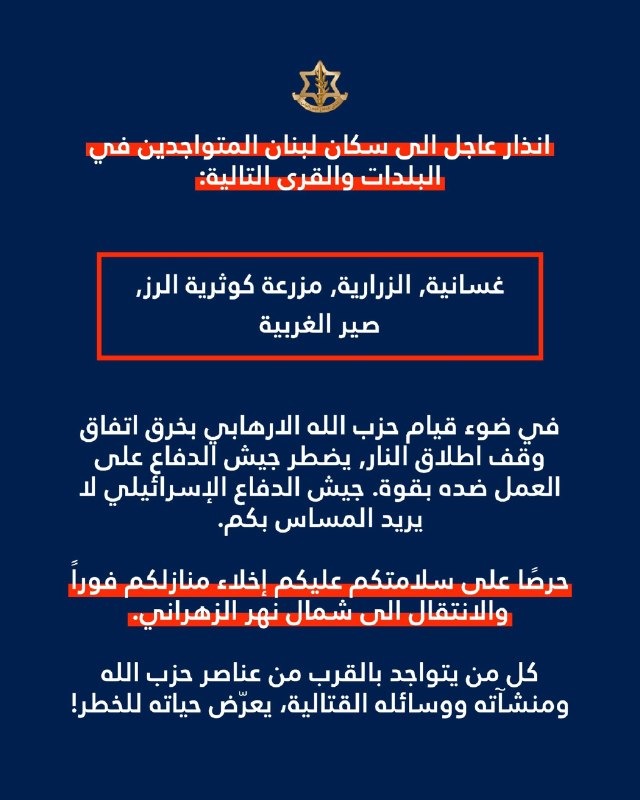

🚨 فوری — هشدار تخلیه به ساکنان لبنان

🔸به ساکنان حاضر در روستاها و شهرک‌های زیر هشدار فوری داده می‌شود: غسانیه، الزراریه، مزرعه کوثرية الرز، صیر غربی

🔸 در پی نقض توافق آتش‌بس از سوی «حزب‌الله تروریستی»، ارتش دفاعی اسرائیل ناچار است علیه آن با قدرت اقدام کند. ارتش قصد آسیب رساندن به شما را ندارد.

🔸 برای حفظ جان خود، باید فوراً خانه‌های خود را تخلیه کرده و به شمال رودخانه الزهرانی منتقل شوید.

🔸 هر فردی که در نزدیکی اعضای حزب‌الله، تأسیسات یا تجهیزات نظامی آن‌ها باشد، جان خود را در معرض خطر قرار می‌دهد.

@mwarmonitor

## mwarmonitor — post 10812

‌
🔴جزئیات مراسم وداع، تشییع و تدفین رهبر شهید انقلاب

◾️شنبه و یکشنبه ۱۳ و ۱۴ تیر (۱۹ و ۲۰ محرم): مراسم وداع با پیکر مطهر در مصلای امام خمینی(ره) تهران

◾️دوشنبه ۱۵ تیر (۲۱ محرم): مراسم تشییع در تهران

◾️سه‌شنبه ۱۶ تیر (۲۲ محرم): مراسم تشییع در شهر مقدس قم

◾️پنجشنبه ۱۸ تیر (۲۴ محرم و شب شهادت امام سجاد(ع)): مراسم تشییع در مشهد مقدس و تدفین در حرم مطهر امام رضا(ع)

📝برنامه‌ریزی این «تور کشوری تشییع جنازه» واقعاً شاهکار است؛ آن‌قدر فرآیند را لفت داده‌اند که قشنگ داشت سالگرد می‌رسید و می‌گذاشتید همان موقع سنگین‌تر بود!

🔸شنبه و یکشنبه تهران، دوشنبه، سه‌شنبه قم، پنجشنبه مشهد... واقعاً خسته نباشید. وسط این گرما، یک هفته تمام برنامه چیده‌اند تا لاشه را دور ایران بچرخانند؛ لابد با این تصور که با این کار، برای جنازه متعفن، یک‌ذره آبرو جمع کنند.
این نمایشِ وداع و تدفینِ طولانی، دقیقاً مثل همان عکس معروف امیر شهر نویی است که آستین کتش را عمداً بالا زده بود تا ساعت رولکسش معلوم شود. این تورِ دور ایران هم همان‌قدر وقیحانه و صرفاً برای شوآف و نمایش است؛ کپی برابر اصل، فقط در ورژنِ حکومتی!

@mwarmonitor

## IranIntlTV — post 342040

  <a href="telegram/content/IranIntlTV_342040_1781347969.mp4" target="_blank">🎬 Download video</a>

روز دوم جام جهانی ۲۰۲۶ با برگزاری دو دیدار افتتاحیه در تورنتو و لس‌آنجلس به پایان رسید. کانادا در اولین مسابقه خود به مصاف بوسنی و هرزگوین رفت و آمریکا با ارائه نمایشی تماشایی، پاراگوئه را شکست داد.

محمد تقوی، ایران‌اینترنشنال، معتقد است آمریکا یکی از بهترین بازی‌های تاریخ فوتبال خود را به نمایش گذاشته است.
@iranintltv

## FarsiVOA — post 220572

  

گاردین گزارش داد چهار فعال گروه «اقدام فلسطین» به‌دلیل تخریب پهپادها و تجهیزات شرکت تسلیحاتی اسرائیلی «البیت سیستمز بریتانیا» در گلاسترشر، به احکام طولانی زندان محکوم شدند.

این افراد در ارتباط با ورود و تخریب در کارخانه این شرکت در سال ۲۰۲۴ مجرم شناخته شده بودند.

قاضی دادگاه وولیچ اعلام کرد جرم آن‌ها دارای «ارتباط تروریستی» بوده، زیرا به گفته او با هدف پیشبرد یک انگیزه سیاسی یا ایدئولوژیک و برای تحت فشار گذاشتن دولت بریتانیا و بخشی از جامعه انجام شده است.

شارلوت هد و لئونا کامیئو هرکدام به پنج سال زندان، فاطمه راجوانی به چهار سال و هشت ماه، و ساموئل کورنر، که به آسیب بدنی شدید به یک مأمور پلیس نیز محکوم شده بود، به هفت سال و هشت ماه زندان محکوم شدند.

دادستانی خسارت حمله را حدود ۱.۲ میلیون پوند اعلام کرده است.
@FarsiVOA

## Persian_Trend_Official — post 16933

  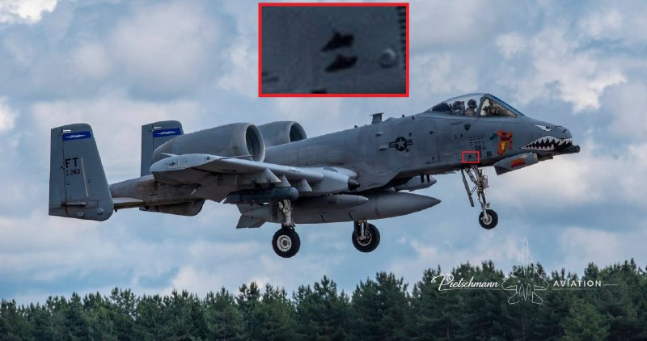

تصویری جالب از کیل مارک 2 شناور به روی جنگنده A-10 که تایید میکند این جنگنده 2 شناور تندرو سپاه پاسداران را طی عملیات خشم حماسی هدف قرار داده است.

📝 Amir

📌 @persian_trend_official
پرشین ترند | متفاوت‌ترین کانال نظامی

## IranianMinds — post 22455

  <a href="telegram/content/IranianMinds_22455_1781347973.mp4" target="_blank">🎬 Download video</a>

🔴 میثاقی :

هرکسی که تیم ملی رو تخریب میکنه کصکشه !

@IranianMinds

## Dirty_Kids — post 391876

  <a href="telegram/content/Dirty_Kids_391876_1781347975.mp4" target="_blank">🎬 Download video</a>

کی فكرشو می‌كرد، در حالى كه جنازه خامنه‌اى تو يخچاله،
زنان مملکت بدون حجاب اجبارى ترانه بخونن.
«اين رژيم هم مُرده، ولى مثل رهبرش هنوز دفن نشده»

@Dirty_Kids 👻

---
📅 بروزرسانی: 1405/03/23 14:12
---

## VahidOOnLine — post 245286

  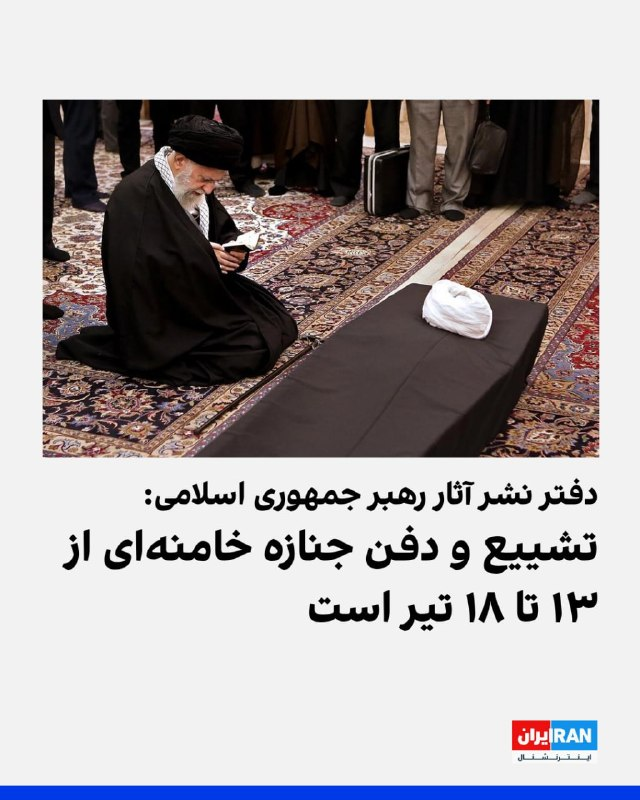

دفتر نشر آثار علی خامنه‌ای جزییات مراسم تشییع و تدفین او را اعلام کرد. بر اساس این گزارش، مراسم تشییع روزهای ۱۳ تا ۱۶ تیرماه در تهران و قم برگزار می‌شود و جنازه او روز ۱۸ تیرماه در مشهد و در حرم امام هشتم شیعیان دفن می‌شود.

غلامرضا مظفری، استاندار خراسان رضوی، پیش‌تر گفت حداقل برآورد حضور در مراسم تشییع علی خامنه‌ای در مشهد بین هشت تا ۱۰ میلیون نفر است.

علی خامنه‌ای ۹ اسفند ۱۴۰۴ در حمله هوایی اسرائیل و آمریکا به دفتر کارش کشته شد. اعلام زمان برگزاری مراسم تشییع و تدفین او ۱۰۶ روز پس از کشته شدنش صورت می‌گیرد.
iranintl
‌🏁 🇬🇧 IranintlTV

🤖 @VahidOOnLine

## WithYashar — post 14708

فارس از احتمال حملات سایبری به ۴ بانک خبر داد
@withyashar

## mwarmonitor — post 10811

🔴دو طرف در زمینه ایجاد سازوکارهایی برای آزادسازی پول‌های نقد ایران، بازگشایی تنگه و همچنین اشاره‌ها به برنامه هسته‌ای ایران پیشرفت‌هایی داشته‌اند — به نقل از وال‌استریت ژورنال (WSJ).

@mwarmonitor

## IranIntlTV — post 342039

  

دفتر نشر آثار علی خامنه‌ای جزییات مراسم تشییع و تدفین او را اعلام کرد. بر اساس این گزارش، مراسم تشییع روزهای ۱۳ تا ۱۶ تیرماه در تهران و قم برگزار می‌شود و جنازه او روز ۱۸ تیرماه در مشهد و در حرم امام هشتم شیعیان دفن می‌شود.

غلامرضا مظفری، استاندار خراسان رضوی، پیش‌تر گفت حداقل برآورد حضور در مراسم تشییع علی خامنه‌ای در مشهد بین هشت تا ۱۰ میلیون نفر است.

علی خامنه‌ای ۹ اسفند ۱۴۰۴ در حمله هوایی اسرائیل و آمریکا به دفتر کارش کشته شد. اعلام زمان برگزاری مراسم تشییع و تدفین او ۱۰۶ روز پس از کشته شدنش صورت می‌گیرد.
iranintl.com/202606134991

## FarsiVOA — post 220571

  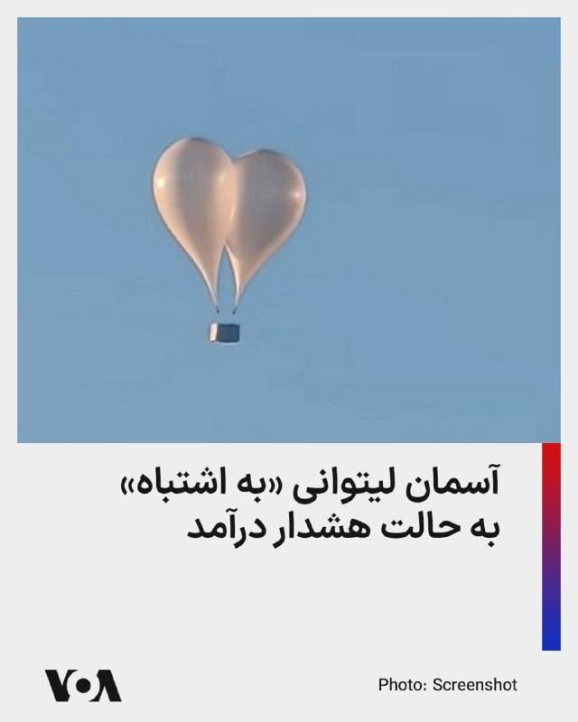

لیتوانی روز شنبه به‌طور موقت به ساکنان پایتخت درباره احتمال ورود یک پهپاد نظامی به حریم هوایی این کشور هشدار داد.

ساعاتی بعد، مرکز ملی مدیریت بحران لیتوانی اعلام کرد که جنگنده‌های ناتو روز شنبه برای رهگیری این شیء مشکوک به پرواز درآمدند و مشخص شد که شیء دیده شده در واقع یک بالن هواشناسی است.

منطقه بالتیک در پی مجموعه‌ای از نقض‌ حریم هوایی در وضعیت آماده‌باش بالا قرار دارد. اخیراً شماری از پهپادهای دوربرد اوکراینی پس از ناکامی در اصابت به اهداف خود در روسیه، وارد حریم هوایی کشورهای همسایه شده بودند.
@FarsiVOA

## Persian_Trend_Official — post 16932

  <a href="telegram/content/Persian_Trend_Official_16932_1781347354.webm" target="_blank">🎬 Download video</a>

گویا قراره تا دقایقی دیگر جزئیات مراسم تدفین آقای خامنه‌ای منتشر شود.....

## Persian_Trend_Official — post 16929

  <a href="telegram/content/Persian_Trend_Official_16929_1781347354.webm" target="_blank">🎬 Download video</a>

اشغال آرام غزه

تصاویر ماهواره‌ای که واحد منابع باز الجزیره تا مه ۲۰۲۶ تحلیل کرده، نشان می‌دهد اسرائیل در حالی که بر اساس آتش‌بس اکتبر ۲۰۲۵ موظف به خروج کامل از غزه بود، به‌طور پنهانی ۴۰ پایگاه نظامی در سراسر این نوار احداث یا تقویت کرده است؛ ۸ مورد از این پایگاه‌ها پس از آتش‌بس از صفر ساخته شده و یکی هنوز در دست احداث است.

پایگاه‌های جدید در شمال، مرکز و جنوب غزه پراکنده‌اند و یکی از آن‌ها مستقیماً بر روی قبرستان شرقی خان‌یونس بنا شده که خاک‌برداری آن از نوامبر ۲۰۲۵ آغاز و تا مه ۲۰۲۶ به پایگاهی کاملاً عملیاتی تبدیل شده است. در همین بازه زمانی، یک پایگاه موجود شرق غزه‌سیتی نیز ۷۰ درصد گسترش یافته و به مناطق استقرار زرهی و سنگرهای تقویت‌شده مجهز شده است.

این روند با اظهارات رسمی نتانیاهو همخوانی دارد؛ وی اخیراً گفت: «ما ۶۰ درصد خاک غزه را کنترل می‌کنیم» و در واکنش به درخواست الحاق کامل افزود: «گام به گام — اول ۷۰ درصد.» تحلیلگر سیاسی فلسطینی عبدالله عقرباوی این ساخت‌وسازها را زیرساخت «بازگشت به جنگ نابودی» توصیف کرد. از آغاز جنگ اکتبر ۲۰۲۳ تاکنون نزدیک به ۷۳ هزار فلسطینی کشته و در هفت ماه پس از آتش‌بس نیز حداقل ۹۲۹ نفر دیگر جان باخته‌اند. | الجزیره

👺Phantom

📌 @persian_trend_official
پرشین ترند | متفاوت‌ترین کانال نظامی

## RadioFarda — post 158250

  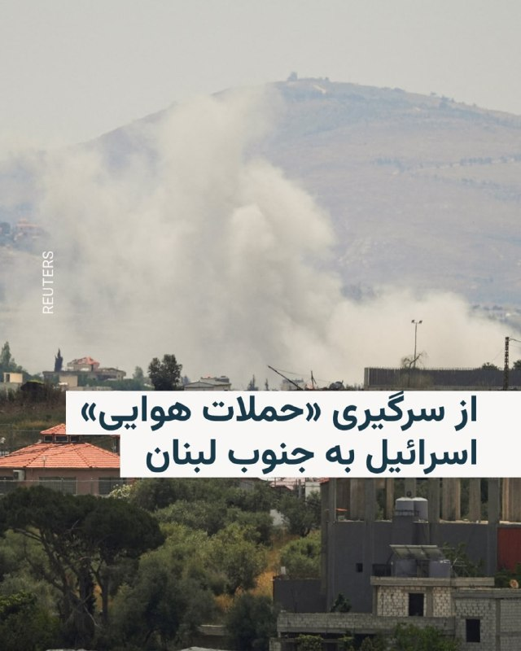

🔸خبرگزاری رسمی لبنان روز شنبه ۲۳ خرداد خبر داد که ساعتی پس از صدور هشدار به مردم ساکن جنوب لبنان، ارتش اسرائیل به چند نقطه در این منطقه حمله هوایی کرده است.

🔸ارتش اسرائیل روز شنبه صبح به ساکنان ۲۰ نقطه در جنوب لبنان از جمله شهر نبطیه هشدار داد که باید محل سکونت خود را ترک کرده و به شمال رود لیتانی بروند.

🔸حال خبرگزاری ملی لبنان می‌گوید که هواپیماهای جنگنده اسرائیل چند نقطه از جمله دو روستای سجود و ریحان را در نزدیکی شهر نبطیه بمباران کرده‌اند.

🔸اسرائیل در ماه گذشته میلادی تمام مناطق در جنوب رود لیتانی را «منطقه جنگی» اعلام کرد و از آن زمان این نقاط را بمباران کرده است.

🔸اوایل ماه مارس یعنی تنها یکی دو هفته پس از حمله مشترک آمریکا و اسرائیل به خاک ایران،‌ گروه حزب‌الله در حمایت از جمهوری اسلامی به اسرائیل حمله کرد، حمله‌ای که بلافاصله پاسخ ارتش اسرائیل را به دنبال داشت.

🔸درگیری این دو هنوز ادامه دارد و حتی پس از برقراری آتش‌بسی در ماه آوریل گذشته، حدود دو ماه پیش، هم ادامه یافته است.

@RadioFarda

## IranianMinds — post 22454

@IranianMindsGroup

ایدی گروه کامنتا ( تو کامنتا خیلی درخواست داده بودید )

## IranianMinds — post 22453

  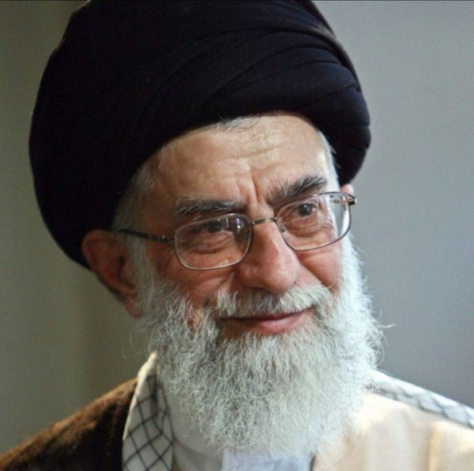

🔴 بر اساس اطلاعیه منتشرشده، مراسم تشییع خامنه ای از ۱۵ تیر ۱۴۰۵ آغاز می‌شود و مراسم دفن در ۱۸ تیر ۱۴۰۵ در مشهد برگزار خواهد شد.

@IranianMinds

## BBCPersian — post 283657

🔻بازداشت چهار معترض در هرات؛ والی، حبس زنان برای حجاب را تکذیب کرد

منابع محلی در هرات به بی‌بی‌سی گفته‌اند که دست‌کم چهار نفر روز جمعه (۲۲ جوزا) پس از تلاش برای برگزاری تظاهرات در مقابل دفتر والی بازداشت شدند.

گفته شده که ده‌ها نفر برای مدت کوتاهی مقابل دفتر والی تجمع کرده بودند، اما پلیس با شلیک هوایی به سرعت آن‌ها را متفرق کرد و به کسی آسیب نرسیده است.

یکی از شاهدان عینی که تجمع این افراد را از نزدیک دیده است، به بی‌بی‌سی گفت: «حدود ۳۰ نفر بودند، سر و صدا راه انداختند و شعار تکبیر سر دادند. پلیس به دنبالشان رفت، شلیک هوایی کرد و برخی از آن‌ها فرار کردند. خودروهای پلیس از حوزه چهارم نیز رسیدند، چند نفر را بازداشت کرده و به حوزه بردند.»

📲ادامه خبر در لینک زیر⏬

https://bbc.in/4vjRo9K
@BBCPersian

## Dirty_Kids — post 391875

  <a href="telegram/content/Dirty_Kids_391875_1781347355.mp4" target="_blank">🎬 Download video</a>

این مادر شهید میگه حرف از آتش بس و مذاکره بزنید، خودتون میدونیداا!

میگه بچه هامون به‌درک انتقام عاقااااااا! میگه فقط اخراج آمریکا، نابودی اسرائیل و دلار....
ننگ بر شما سردار گاز انبری چه مذاکره ای با قاتلان عاقا....
حیدرررر وای حیدررررر
ممد باقر خجالت بکش

@Dirty_Kids 👻

## Hranews — post 113576

  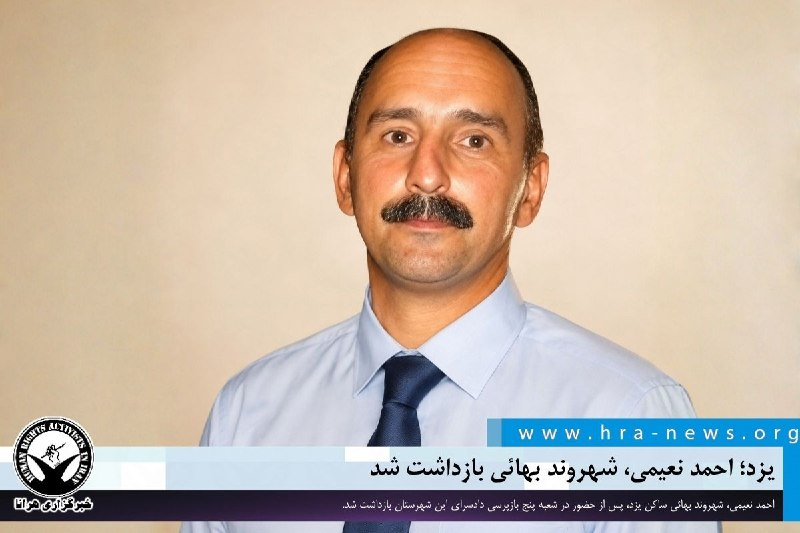

یزد؛ احمد نعیمی، شهروند بهائی بازداشت شد

❗️
❗️
❗️
❗️
❗️ – امروز شنبه ۲۳ خردادماه، احمد نعیمی، شهروند بهائی ساکن یزد، پس از حضور در شعبه ۵ بازپرسی دادسرای این شهرستان #بازداشت شد.

به گزارش خبرگزاری هرانا، ارگان خبری مجموعه فعالان حقوق بشر در ایران، احمد نعیمی، شهروند بهائی بازداشت شد.

بر اساس اطلاعات دریافتی هرانا، این شهروند بهائی امروز شنبه ۲۳ خردادماه، پس از حضور در شعبه ۵ بازپرسی دادسرای یزد بازداشت شده است.

ادامه مطلب

#احمد_نعیمی

↘️
@hranews_bot تماس ✉️ -  @Hranews  کانال هرانا 🆑

## alonews — post 127600

  <a href="telegram/content/alonews_127600_1781347357.webm" target="_blank">🎬 Download video</a>

👈بلومبرگ به نقل از یک مقام آمریکایی:
در صورت تحقق شرایط، واشنگتن تحریم‌های ایران را کاهش داده و اجازه ادغام این کشور در اقتصاد جهانی را خواهد داد.

✅ @AloNews خبر جنگ

## alonews — post 127599

  <a href="telegram/content/alonews_127599_1781347357.webm" target="_blank">🎬 Download video</a>

👈دفتر حفظ و نشر آثار رهبر: تا دقایقی دیگه تاریخ مراسم خداحافظی و تشییع رهبر رو اعلام میکنیم 
✅ @AloNews خبر جنگ

---
📅 بروزرسانی: 1405/03/23 14:03
---

## VahidOOnLine — post 245285

  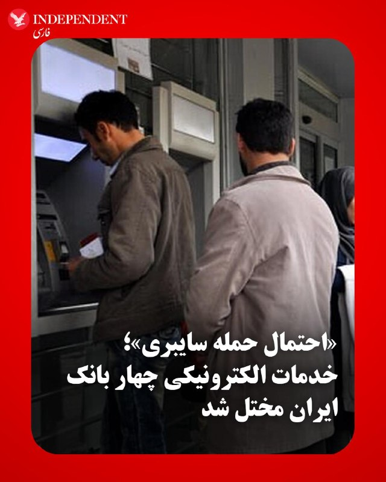

♦️خدمات الکترونیکی بانک‌های‌ ملی، تجارت، صادرات و توسعه صادرات در ایران، از صبح شنبه ۲۳ خرداد ماه با اختلال مواجه شده است و مشتریان در استفاده از برخی سرویس‌های بانکی با مشکل روبه‌رو هستند.
به گزارش خبرگزاری حکومتی فارس، اختلال در بخش‌هایی از جمله موبایل‌بانک، اینترنت‌بانک، دستگاه‌های خودپرداز، پایانه‌های فروش (کارتخوان) و برخی خدمات کارتی این چهار بانک مشاهده شده است.
فارس با گزارش آنکه «برخی منابع از احتمال وقوع حمله سایبری خبر داده‌اند» گزارش کرد، تاکنون هیچ مقام رسمی این موضوع را تایید یا رد نکرده و علت اختلال به طور رسمی اعلام نشده است.
‌🇸🇦 Indypersian

🤖 @VahidOOnLine

## FarsiVOA — post 220570

  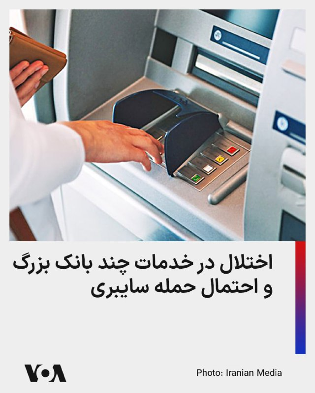

گزارش‌ها از بروز اختلال در خدمات الکترونیکی چند بانک بزرگ کشور از صبح شنبه، ۲۳ خرداد، حکایت دارد. بر اساس گزارش رسانه‌های داخلی، خدمات بانکی در بانک‌های ملی، تجارت و صادرات با اختلال یا قطعی مواجه شده و در برخی گزارش‌ها از بانک توسعه صادرات نیز نام برده شده است.

این اختلال در بخش‌هایی از جمله همراه‌بانک، اینترنت‌بانک، خودپردازها، پایانه‌های فروش و برخی خدمات کارتی گزارش شده است.

برخی منابع احتمال حمله سایبری را مطرح کرده‌اند، اما تا لحظه تنظیم این خبر، هیچ مقام رسمی این موضوع را تأیید یا رد نکرده و بانک مرکزی، بانک‌های درگیر یا نهادهای مسئول امنیت سایبری توضیح روشنی درباره علت اختلال منتشر نکرده‌اند.

برخی پیگیری‌های رسانه‌ای نیز منشأ اختلال را به زیرساخت‌های بانکی و ارتباطات بین‌بانکی، از جمله شبکه شتاب، مرتبط دانسته‌اند؛ نه لزوماً شرکت‌های پرداخت یا دستگاه‌های کارت‌خوان.
@FarsiVOA

## IranianMinds — post 22452

🔴 دفتر حفظ و نشر آثار رهبر:

تا دقایقی دیگه تاریخ مراسم خداحافظی و تشییع خامنه ای رو اعلام میکنیم.

@IranianMinds

## Dirty_Kids — post 391873

  <a href="telegram/content/Dirty_Kids_391873_1781346787.mp4" target="_blank">🎬 Download video</a>

خدایا شکرت؛ فصل سوم عشق ابدی (لجنزار ابدی) بزودی با مجری گری «سحر قریشی» پخش میشه.

@Dirty_Kids 👻

## alonews — post 127598

  <a href="telegram/content/alonews_127598_1781346788.webm" target="_blank">🎬 Download video</a>

👈دفتر حفظ و نشر آثار رهبر: تا دقایقی دیگه تاریخ مراسم خداحافظی و تشییع رهبر رو اعلام میکنیم

✅ @AloNews خبر جنگ

## alonews — post 127597

  <a href="telegram/content/alonews_127597_1781346788.webm" target="_blank">🎬 Download video</a>

👈16 تا نماینده مجلس به همراه قشر تندرو امشب جلوی وزارت خارجه تجمع اعتراضی برگزار میکنن و به روند مذاکرات اعتراض میکنن‌

✅ @AloNews خبر جنگ

---
📅 بروزرسانی: 1405/03/23 13:52
---

## VahidOOnLine — post 245284

  

روزنامه جوان، نزدیک به سپاه پاسداران، نوشت که برخی سخنرانان در تجمعات شبانه، ارکان و نهادهای تصمیم‌گیر نظام را به کلی زیرسوال برده و حتی تهدید به خراب کردن مجلس و وزارت خارجه، بر سر مسئولان آن می‌کنند.

این روزنامه اضافه کرد: «آن‌ها خواستار انحلال شورای عالی امنیت ملی می‌شوند و به‌جای پرداختن به شکست‌ها و رسوایی‌ها و دروغ‌های دشمن، نوک پیکان حملات را به‌سوی مسئولان دولت، تیم مذاکره‌کننده و حتی فرماندهان نظامی می‌گیرند.»

روزنامه جوان این افراد را «تفرقه‌افکن» خواند و نوشت: «این گروه رهبری کشور را ضعیف و بی‌اختیار و بی‌اطلاع جلوه می‌دهند و همه مسئولانی که در شدیدترین خطرات امنیتی مشغول تمشیت امور هستند، خائن و تسلیم‌شده معرفی می‌کنند.»
‌🏁 🇬🇧 IranintlTV

🤖 @VahidOOnLine

## VahidOOnLine — post 245283

  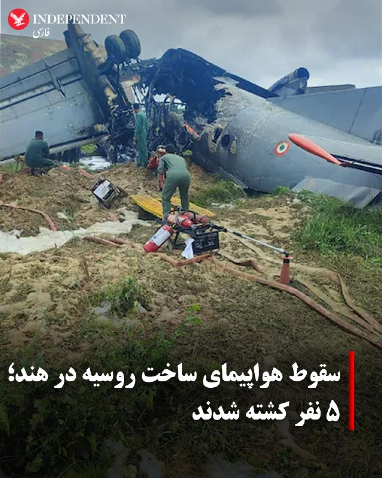

♦️نیروی هوایی هند، روز شنبه ۲۳ خرداد ماه اعلام کرد در پی سقوط یک هواپیمای نظامی هنگام فرود در پایگاهی در شمال‌شرق این کشور، پنج نفر از نیروهای این نهاد کشته شدند.
مقام‌های نظامی جزئیاتی درباره تعداد سرنشینان هواپیما یا شمار بازماندگان ارائه نکرده‌اند. با این حال، یک مقام نیروی هوایی که نخواست نامش فاش شود، به خبرگزاری فرانسه گفت کمک‌خلبان این هواپیما از حادثه جان سالم به در برده است.
تصاویر منتشرشده از محل حادثه، ستون غلیظی از دود سیاه و بقایای هواپیمایی را نشان می‌دهد که پس از سقوط به چند بخش تقسیم شده است.
نیروی هوایی هند اعلام کرد این هواپیمای آنتونفِ ساخت روسیه در حال انجام ماموریتی عادی بود که هنگام فرود دچار سانحه شد.
به گزارش خبرگزاری فرانسه، هواپیمای آنتونفِ دو موتوره آ-ان ۳۲ (An-32) برای عملیات در ارتفاعات بالا و شرایط آب‌وهوایی سخت طراحی شده و نیروی هوایی هند حدود ۱۰۰ فروند از این هواپیما را برای انتقال تجهیزات نظامی و کمک‌رسانی در مناطق کوهستانی و دورافتاده به کار می‌گیرد.
آخرین سانحه بزرگ این هواپیما در هند به سال ۲۰۱۹ بازمی‌گردد که در ایالت آروناچال پرادش در نزدیکی مرز چین سقوط کرد و ۱۳ نفر جان باختند.
‌🇸🇦 Indypersian

🤖 @VahidOOnLine

## WithYashar — post 14707

تا دقایقی دیگر نحوه و زمان خاکسپاری خامنه ای را قرار رسانه های رژیم اعلام کنند.
@withyashar

## mwarmonitor — post 10810

  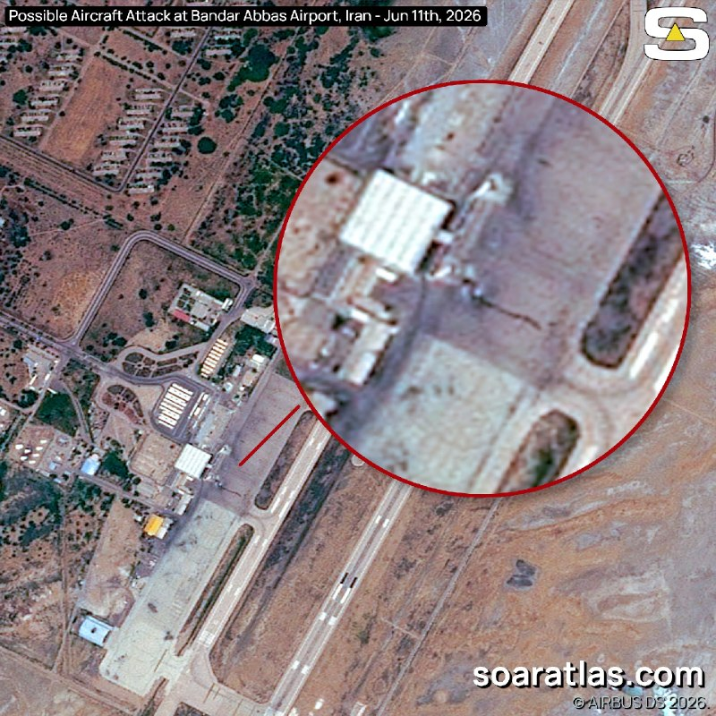

🛰شرکت Soar Atlas تصاویر جدید با وضوح بالا را از تاریخ ۱۱ ژوئن برای بررسی یک احتمال «حمله به یک هواپیما» در فرودگاه بندرعباس در ایران منتشر کرده است.

🛰در این تصاویر ممکن است لاشه هواپیما قابل مشاهده باشد و همچنین ردی از نشت سوخت در نزدیکی آن دیده شود.

@mwarmonitor

## mwarmonitor — post 10809

🔴 واشنگتن پست به نقل از یک مقام در دولت ترامپ: تعیین ارزش پول‌هایی که ایران ممکن است دریافت کند دشوار است، زیرا این موضوع به آنچه ایران ارائه می‌دهد بستگی دارد.

@mwarmonitor

## IranIntlTV — post 342038

  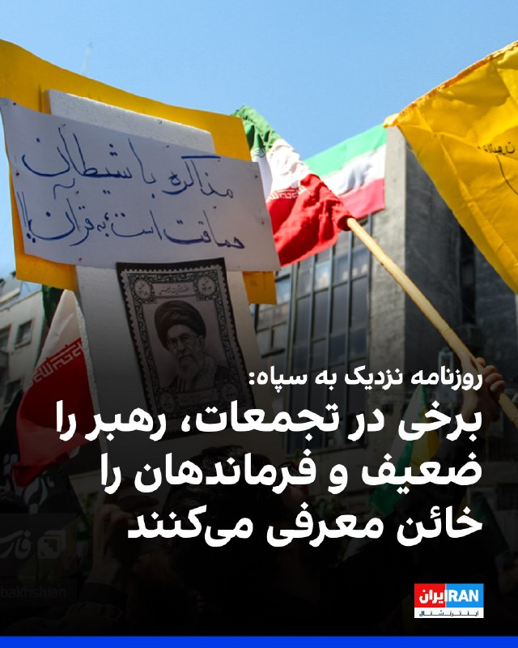

روزنامه جوان، نزدیک به سپاه پاسداران، نوشت که برخی سخنرانان در تجمعات شبانه، ارکان و نهادهای تصمیم‌گیر نظام را به کلی زیرسوال برده و حتی تهدید به خراب کردن مجلس و وزارت خارجه، بر سر مسئولان آن می‌کنند.

این روزنامه اضافه کرد: «آن‌ها خواستار انحلال شورای عالی امنیت ملی می‌شوند و به‌جای پرداختن به شکست‌ها و رسوایی‌ها و دروغ‌های دشمن، نوک پیکان حملات را به‌سوی مسئولان دولت، تیم مذاکره‌کننده و حتی فرماندهان نظامی می‌گیرند.»

روزنامه جوان این افراد را «تفرقه‌افکن» خواند و نوشت: «این گروه رهبری کشور را ضعیف و بی‌اختیار و بی‌اطلاع جلوه می‌دهند و همه مسئولانی که در شدیدترین خطرات امنیتی مشغول تمشیت امور هستند، خائن و تسلیم‌شده معرفی می‌کنند.»
https://iranintl.com/202606137488

## DW_Farsi — post 125922

🔶 هشدار وزیر کشور آلمان درباره حمله پهپادی به پارلمان این کشور

الکساندر دوبرینت، وزیر کشور آلمان خطر حملات احتمالی پهپادی به پارلمان فدرال (بوندستاگ) و ساختمان‌های سایر نهادهای قانون اساسی این کشور را رو به افزایش می‌داند.

به گزارش روزنامه "راینیشه پست"، دوبرینت در نامه‌ای به یولیا کلوکنر، رئیس بوندستاگ نوشته است که افزایش شمار مشاهده پهپادها در ماه‌های گذشته، حساسیت نهادهای امنیتی را به‌شدت برانگیخته است.

او معتقد است که برای حفاظت از املاک و ساختمان‌های نهادهای قانون اساسی فدرال برخورداری از "توانایی مقابله دائمی با پهپادها" امری ضروری است: «حفاظت از نهادهای قانون اساسی با توجه به وضعیت تهدیدات کلی، اهمیت ویژه‌ای دارد.»

@dw_farsi

## Persian_Trend_Official — post 16928

  <a href="telegram/content/Persian_Trend_Official_16928_1781346155.webm" target="_blank">🎬 Download video</a>

🤔

## Persian_Trend_Official — post 16927

  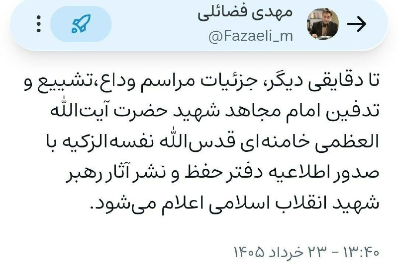

🤔

## Persian_Trend_Official — post 16926

  <a href="telegram/content/Persian_Trend_Official_16926_1781346156.webm" target="_blank">🎬 Download video</a>

اسرائیل هیوم: ارتش ایالات متحده ساخت یک پایگاه بزرگ در نزدیکی حصار مرزی غزه، نزدیک به پایگاه نظامی ریم در جنوب اسرائیل را آغاز کرده است.

ظاهراً این تأسیسات به عنوان یک ستاد نظامی و غیرنظامی برای سازمان‌ها و پرسنل بین‌المللی فعال در منطقه در نظر گرفته شده است. این پایگاه می‌تواند از اجرای به اصطلاح طرح ترامپ پشتیبانی کند و جایگزین یک ستاد چندملیتی شود که قبلاً در کریات گات قرار داشت.

📝 Amir

📌 @persian_trend_official
پرشین ترند | متفاوت‌ترین کانال نظامی

## IranianMinds — post 22451

  

نماینده های تندروی مجلس جمهوری اسلامی فراخوان دادن و میخوان جلوی مجلس با عرزشیا به روند مذاکرات اعتراض کنن.

@IranianMinds

## alonews — post 127596

  <a href="telegram/content/alonews_127596_1781346157.webm" target="_blank">🎬 Download video</a>

👈حمله‌ به الرابیه در نبطیه

✅ @AloNews خبر جنگ

---
📅 بروزرسانی: 1405/03/23 13:46
---

## WithYashar — post 14706

واشنگتن پست به نقل از یک مقام دولت ترامپ: تعیین میزان پولی که ایران می‌تواند به طور بالقوه دریافت کند دشوار است زیرا بستگی به آنچه آنها ارائه می‌دهند دارد.
@withyashar

## pm_afshaa — post 93752

🔴رویترز:نیروهای آمریکایی چندین پهپاد تهاجمی یک طرفه ایرانی را که به سمت تنگه هرمز در حرکت بودند، سرنگون کردن

💧 Rainbet.com the #1 Non-KYC Crypto Casino & Sportsbook @rainbetcom

😁 @Pm_Afshaa

## pm_afshaa — post 93751

🔴تحلیلگر ارشد اسرائیلی: ایالات متحده به جنگ باز خواهد گشت

💧 Rainbet.com the #1 Non-KYC Crypto Casino & Sportsbook @rainbetcom

😁 @Pm_Afshaa

## DEJradio — post 5652

  <a href="telegram/content/DEJradio_5652_1781345808.webm" target="_blank">🎬 Download video</a>

🚨📢 بر اساس گزارش‌های دریافتی از صبح روز شنبه ۲۳ خرداد، «سیستم بانکی سه بانک ملی، صادرات و تجارت دچار اختلال و قطعی شده و تا زمان ارسال این خبر همچنان مشکل ادامه دارد».

علت این اختلال هنوز مشخص نیست.

برخی مشتریان بانک‌ها اخیرا گزارش داده‌اند به حساب‌هایشان دسترسی ندارند و اپ‌ها کارها نمی‌کنند.

#بانکداری #بانک_ملی
@DEJradio

## IranIntlTV — post 342037

  <a href="telegram/content/IranIntlTV_342037_1781345809.mp4" target="_blank">🎬 Download video</a>

امین‌الله حبیبی، کارشناس ارشد روابط بین‌الملل، درباره پیامدهای سرکوب و بازداشت زنان معترض در افغانستان برای طالبان گفت: «تاوان این اقدام برای طالبان بیشتر از دستاوردی بود که می‌خواست با سرکوب به دست بیاورد. درد و زجری که زنان در افغانستان متحمل می‌شوند، جهانی شد.»

@iranintltv

## FarsiVOA — post 220569

  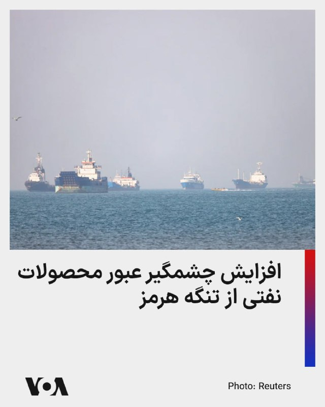

داده‌های شرکت ردیابی نفتکش‌ها، وُرتکسا، نشان می‌دهد که صادرات روزانه محصولات نفتی عربستان، کویت و امارات از تنگه هرمز در ماه گذشته به ۶۰۰ هزار بشکه رسیده است.

این رقم دو برابر ترانزیت محصولات نفتی از تنگه هرمز در ماه گذشته است، اما باز هم نسبت به دوران پیش از انسداد تنگه هرمز توسط جمهوری اسلامی -روزانه ۴ میلیون بشکه- در سطح بسیار پایینی است.

بلومبرگ می‌نویسد عربستان از طریق دریای سرخ نیز روزانه حدود ۶۷ هزار بشکه صادرات محصولات نفتی دارد که تغییر چندانی نسبت به سال گذشته نداشته است.

این گزارش همچنین از افزایش صادرات نفت خام کشورهای عرب منطقه با کمک نیروهای نظامی آمریکا از تنگه هرمز خبر داده است.
@FarsiVOA

## RadioFarda — post 158249

  <a href="telegram/content/RadioFarda_158249_1781345814.mp4" target="_blank">🎬 Download video</a>

🔸یکی از مجریان شناخته‌شده فوتبال در برنامه زنده تلویزیونی که به مناسبت جام جهانی ۲۰۲۶ از صداوسیمای جمهوری اسلامی پخش شد، به مخالفان تیم ملی فوتبال ایران توهین کرد.

🔸محمدحسین میثاقی در ویژه برنامه زنده تلویزیون مخالفان تیم ملی فوتبال ایران را «مفت‌بَر» خواند و افزود: «آدم مفت‌بر از جاخالی، جاخالی‌تر است.»

🔸اشاره این مجری به ترانه جدید رپ یک خواننده رپ به نام «شایع» است که در آن الفاظ رکیک و جنسیت‌زده بسیاری استفاده شده است.

🔸سکوت اعضای تیم ملی فوتبال ایران درباره کشتار دی‌ماه ۱۴۰۴ با واکنش‌های زیادی همراه شد.

@RadioFarda

## BBCPersian — post 283656

  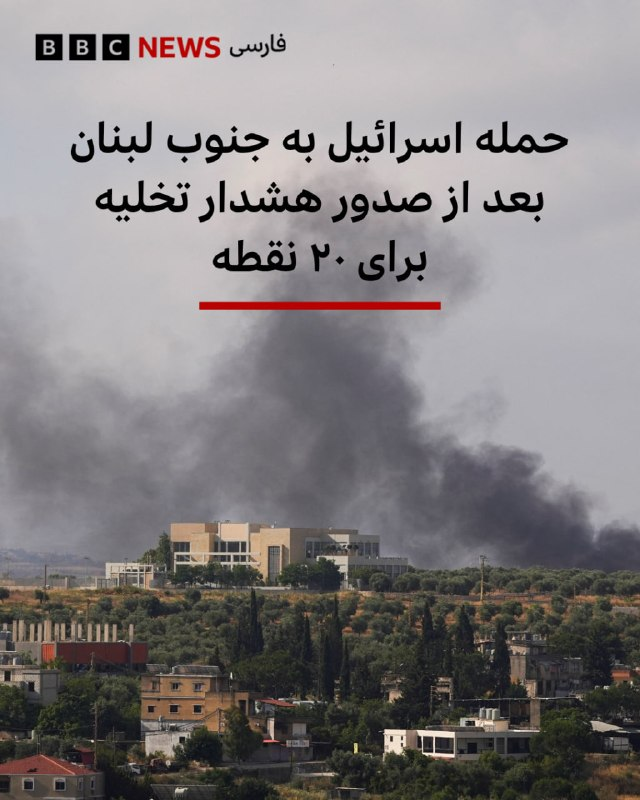

🔻رسانه‌های دولتی لبنان از حملات اسرائیل به جنوب آن کشور خبر داده‌اند.

این حملات پس از آن انجام می‌گیرد که ارتش اسرائیل برای ۲۰ نقطه در جنوب لنبان، از جمله شهر نبطیه، هشدار تخلیه صادر کرد.

به گزارش خبرگزاری ملی لبنان، شماری از مناطقی که برایشان هشدار تخلیه صادر شده بود، هدف حمله قرار گرفته‌اند؛ از جمله روستاهای ریحان و سجد که در نزدیکی شهر نبطیه واقع هستند.

دیروز حزب‌الله از درگیری نیروهایش با سربازان اسرائیلی که به سوی شهری مرزی در جنوب لبنان پیشروی می‌کردند، خبر داد.

در بیانیه حزب‌الله آمده بود که سربازان اسرائیلی در حال پیشروی به سمت شهرک مرزی مجدل زون بودند که «با حملات مکرر راکتی وادار به عقب نشینی شدند.»

ادامه درگیری میان ارتش اسرائیل و حزب‌الله لبنان در حالی است که ایران و آمریکا از نزدیک شدن به امضای یک تفاهم‌نامه برای پایان دادن به جنگ خبر داده‌اند.

جزئیات این توافق رسما اعلام نشده است اما ایران همواره اصرار داشته است که هرگونه توافق صلح باید لبنان را هم در بر بگیرد.

📸Reuters

https://bbc.in/49U3BcP
@BBCPersian

## Dirty_Kids — post 391872

🔴 این کافه ویدیو هاش وایرال شده بود‌ رو به خاطر بی‌حجابی پلمپ شد.

+ خودشون ایونت میگیرن از اون طرفم الکی دو روز میبندن نه سیخ بسوزه نه کباب

@Dirty_Kids 👻

## alonews — post 127595

  <a href="telegram/content/alonews_127595_1781345818.webm" target="_blank">🎬 Download video</a>

👈گزارش شده است که ارتش آمریکا شروع به ساخت یک پایگاه بزرگ در نزدیکی حصار پیرامونی غزه، نزدیک به پایگاه نظامی ریم در جنوب اسرائیل کرده است، طبق گزارش اسرائیل هیوم.

🔴 گفته می‌شود این تأسیسات به عنوان ستاد نظامی و غیرنظامی برای سازمان‌ها و پرسنل بین‌المللی فعال در منطقه در نظر گرفته شده است.

🔴 این پایگاه می‌تواند از اجرای طرح موسوم به «طرح ترامپ» حمایت کند، جایگزین ستاد چندملیتی که قبلاً در کیریات گات قرار داشت

✅ @AloNews خبر جنگ

## alonews — post 127594

  <a href="telegram/content/alonews_127594_1781345818.webm" target="_blank">🎬 Download video</a>

👈روزنامه عبری یدیعوت آحارونوت:
میان برداشتی که ما از خودمان داریم و تصویری که از ما در خارج ترسیم می‌شود، شکاف بسیار بزرگی وجود دارد.

🔴در خارج از کشور، اسرائیل به‌ عنوان قلدرِ محله دیده می‌شود و تهدیدی برای ثبات و صلح جهانی تلقی می‌گردد.

✅ @AloNews خبر جنگ

---
### ⚠️ کانال‌های با خطا در این بروزرسانی

* Persian_Trend_Official
* IranianMinds

دلایل احتمالی: مسدود بودن کانال، حذف کانال، یا خطای شبکه.
---

---
📅 بروزرسانی: 1405/03/23 13:32
---

## VahidOOnLine — post 245282

  <a href="telegram/content/VahidOOnLine_245282_1781344970.mp4" target="_blank">🎬 Download video</a>

گروهی از ایرانیان ساکن آلمان شنبه ۲۳ خرداد همزمان با زادروز مجیدرضا رهنورد، جانباخته خیزش انقلابی ۱۴۰۱، یاد او را با برگزاری تجمعی در شهر هامبورگ گرامی داشتند.
‌🏁 🇬🇧 IranintlTV

🤖 @VahidOOnLine

## VahidOOnLine — post 245281

  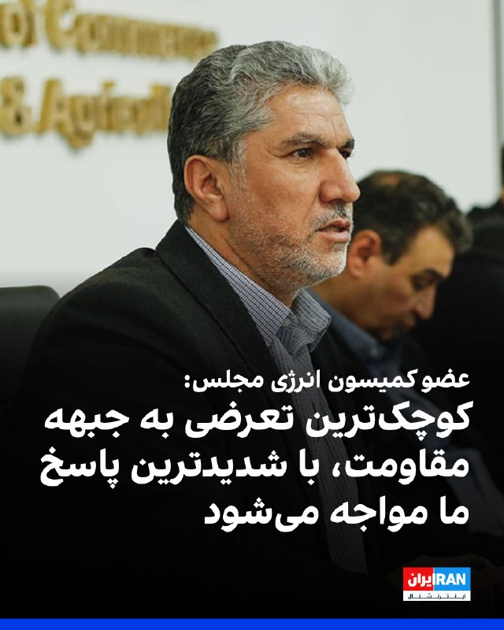

رمضانعلی سنگدوینی، عضو کمیسون انرژی مجلس گفت: «به دشمن آمریکایی و اسرائیلی هشدار می‌دهیم اگر کوچک‌ترین تعرضی به جبهه مقاومت صورت گیرد، پاسخ ما در همان لحظه و با شدیدترین وجه ممکن خواهد بود.»

او ادامه داد: «دنیا باید بداند که خلیج فارس، حیاط خلوت قلدرمآبی‌های واشینگتن نیست.»

این نماینده مجلس اضافه کرد: «آثار مدیریت تنگه هرمز و حالا انسداد کامل آن از سوی نیروهای مسلح، بر فروپاشی اقتصادی و تهدید امنیت غذایی آمریکا و متحدانش نمایان است.»
‌🏁 🇬🇧 IranintlTV

🤖 @VahidOOnLine

## VahidOOnLine — post 245280

  

عباس صوفی، نایب رییس کمیسیون عمران مجلس، گفت که ورود کالا از بنادر جنوبی، به‌دلیل محاصره دریایی با چالش‌هایی روبه‌رو شده است.

او افزود: «تلاش‌های صورت‌گرفته موجب شده که وضعیت تامین کالاهای اساسی در شرایط پایداری قرار داشته باشد و روند خدمات‌رسانی بدون وقفه ادامه یابد.»

در همین حال بلومبرگ در گزارشی با اشاره به ادامه محاصره دریایی بندرهای جنوبی ایران از سوی آمریکا، نوشت با گرفتار شدن کشتی‌ها و کاهش درآمدهای نفتی، تهران با انتخاب‌های دشواری روبه‌رو شده است.
iranintl
‌🏁 🇬🇧 IranintlTV

🤖 @VahidOOnLine

## WithYashar — post 14705

دولت عراق خواستار تحویل سلاح نیابتی های سپاه وخروج هرچه سریعتر نیروهای سپاه از خاک عراق شد
@withyashar

## IranIntlTV — post 342036

  <a href="telegram/content/IranIntlTV_342036_1781344973.mp4" target="_blank">🎬 Download video</a>

محمدجواد اکبرین، عضو تحریریه ایران‌اینترنشنال، درباره احتمال امضای تفاهم‌نامه میان تهران و واشینگتن گفت: «کشورهای منطقه به‌خوبی می‌دانند قدرت جمهوری اسلامی تا چه اندازه افول کرده است و می‌دانند اکنون قادر هستند جنگ را مدیریت کنند.» او افزود: «منطقه وارد دوران نظم پسادیکتاتور شده است.»
@iranintltv

## IranIntlTV — post 342035

  <a href="telegram/content/IranIntlTV_342035_1781344975.mp4" target="_blank">🎬 Download video</a>

گروهی از ایرانیان ساکن آلمان شنبه ۲۳ خرداد همزمان با زادروز مجیدرضا رهنورد، جانباخته خیزش انقلابی ۱۴۰۱، یاد او را با برگزاری تجمعی در شهر هامبورگ گرامی داشتند.

## IranIntlTV — post 342034

  

رمضانعلی سنگدوینی، عضو کمیسون انرژی مجلس گفت: «به دشمن آمریکایی و اسرائیلی هشدار می‌دهیم اگر کوچک‌ترین تعرضی به جبهه مقاومت صورت گیرد، پاسخ ما در همان لحظه و با شدیدترین وجه ممکن خواهد بود.»

او ادامه داد: «دنیا باید بداند که خلیج فارس، حیاط خلوت قلدرمآبی‌های واشینگتن نیست.»

این نماینده مجلس اضافه کرد: «آثار مدیریت تنگه هرمز و حالا انسداد کامل آن از سوی نیروهای مسلح، بر فروپاشی اقتصادی و تهدید امنیت غذایی آمریکا و متحدانش نمایان است.»
https://iranintl.com/202606139738

## IranIntlTV — post 342033

  

عباس صوفی، نایب رییس کمیسیون عمران مجلس، گفت که ورود کالا از بنادر جنوبی، به‌دلیل محاصره دریایی با چالش‌هایی روبه‌رو شده است.

او افزود: «تلاش‌های صورت‌گرفته موجب شده که وضعیت تامین کالاهای اساسی در شرایط پایداری قرار داشته باشد و روند خدمات‌رسانی بدون وقفه ادامه یابد.»

در همین حال بلومبرگ در گزارشی با اشاره به ادامه محاصره دریایی بندرهای جنوبی ایران از سوی آمریکا، نوشت با گرفتار شدن کشتی‌ها و کاهش درآمدهای نفتی، تهران با انتخاب‌های دشواری روبه‌رو شده است.
iranintl.com/202606137874

## FarsiVOA — post 220568

🔺هشدار بازوی پژوهشی مجلس؛ خاموشی شبانه بازمی‌گردد

▪️مرکز پژوهش‌های مجلس در گزارشی تازه درباره وضعیت برق در تابستان ۱۴۰۵ هشدار داده است که با وجود بهبود نسبی ظرفیت تولید، ناترازی برق همچنان پابرجاست و خطر خاموشی، به‌ویژه در ساعات شب، جدی است.

▪️بر اساس برآورد دفتر مطالعات انرژی، صنعت و معدن این مرکز، در سناریوی واقع‌بینانه، ناترازی برق در زمان اوج مصرف تابستان به حدود ۱۳.۶ هزار مگاوات می‌رسد.

▪️در این سناریو، توان تأمین هم‌زمان شبکه حدود ۶۸.۴ هزار مگاوات و تقاضای برق بیش از ۸۱ هزار مگاوات برآورد شده است.

▪️مرکز پژوهش‌ها در سناریوی خوش‌بینانه نیز کسری حدود ۱۰ هزار مگاواتی و در سناریوی بدبینانه، ناترازی نزدیک به ۱۸.۷ هزار مگاواتی را محتمل دانسته است.

⬇️ بیشتر بخوانید:
https://ir.voanews.com/a/8160422.html

## FarsiVOA — post 220567

🔺نفت به زیر ۹۰ دلار سقوط کرد؛ قیمت‌گذاری بازار روی توافق صلح

▪️قیمت نفت در پی افزایش امیدها به توافق میان آمریکا و جمهوری اسلامی و احتمال بازگشایی کامل مسیرهای انرژی در خلیج فارس، به پایین‌ترین سطح چهار ماهه رسید.

▪️بر اساس داده‌های بازار، نفت برنت دریای شمال در معاملات ۱۲ ژوئن با افت ۳.۳۷ درصدی روی ۸۷ دلار و ۳۳ سنت بسته شد؛ پایین‌ترین سطح از اوایل مارس. نفت خام وست تگزاس اینترمدیت آمریکا نیز با افت ۳.۲۳ درصدی به ۸۴ دلار و ۸۸ سنت رسید؛ پایین‌ترین سطح از ۱۷ آوریل.

▪️این افت، عقب‌نشینی مهمی از قیمت‌های اوج بحران است. پس از آغاز جنگ آمریکا و اسرائیل با جمهوری اسلامی و تشدید اختلال در تردد انرژی، قیمت برنت از حدود ۷۰ دلار پیش از جنگ تا حدود ۱۱۳ دلار بالا رفت.

⬇️ بیشتر بخوانید:
https://ir.voanews.com/a/8160421.html

## Persian_Trend_Official — post 16925

فارس: اختلال در خدمات 4 بانک کشور، تلاش برای فعال‌سازی سامانه‌های پشتیبان
 
از صبح امروز خدمات الکترونیکی برخی بانک‌های کشور از جمله ملی، تجارت، صادرات و توسعه صادرات با اختلال مواجه شده. این اختلال در بخش‌های مختلفی از جمله موبایل‌بانک، اینترنت‌بانک، خودپردازها، پایانه‌های فروش (کارتخوان) و برخی خدمات کارتی مشاهده شده است.

برخی منابع از احتمال وقوع حمله سایبری خبر داده‌اند، اما تاکنون هیچ مقام رسمی این موضوع را تأیید یا رد نکرده و اطلاعات کافی برای اظهار نظر قطعی در این زمینه وجود ندارد.

تیم‌های فنی بانک‌های درگیر در حال تلاش برای فعال‌سازی سامانه‌های پشتیبان و بازگرداندن خدمات به وضعیت عادی هستند.

📝 Amir

📌 @persian_trend_official
پرشین ترند | متفاوت‌ترین کانال نظامی

## Persian_Trend_Official — post 16924

  <a href="telegram/content/Persian_Trend_Official_16924_1781344978.mp4" target="_blank">🎬 Download video</a>

ترامپ می‌گوید ارتش ایالات متحده رهبر باند قاچاقی ترن د آراگوا را در ونزوئلا ترور کرده است.

دونالد ترامپ: به دستور من، فرماندهی جنوبی ایالات متحده یک حمله سریع و مرگبار انجام داد تا نینو گوئررو، رهبر بدنام ترن د آراگوآ، یکی از خونخوارترین سازمان‌های تروریستی روی سیاره زمین را با موفقیت اعدام کند. قبل از بازگشت من به دفتر کار، جو بایدن مرز جنوبی ما را به روی میلیون‌ها جنایتکار غیرقانونی باز کرد و به این ارتش خارجی اجازه داد تا شهروندان آمریکایی را با مصونیت کامل مورد تجاوز، ضرب و شتم و قتل قرار دهد.

در اوایل دولتم، به وعده‌ام عمل کردم و ترن د آراگوا را به عنوان یک سازمان تروریستی خارجی معرفی کردم، هزاران جنایتکار شرور را اخراج کردم و علیه کارتل‌هایی که مدت‌هاست علیه شهروندان ما جنگیده‌اند، جنگیدم، در حالی که رهبران ضعیف، آمریکا را درمانده و در حالت تدافعی رها کرده‌اند. این اقدام با هماهنگی نزدیک دوستانمان در ونزوئلا انجام شد، که با آنها بسیار خوب همکاری می‌کنیم.

📝 Amir

📌 @persian_trend_official
پرشین ترند | متفاوت‌ترین کانال نظامی

## IranianMinds — post 22449

  <a href="telegram/content/IranianMinds_22449_1781344979.mp4" target="_blank">🎬 Download video</a>

این‌ وسط فصل جدید این جن** نه ببخشید عشق ابدیم قراره بزودی شروع شه با مجری گری سحر قریشی

@IranianMinds

## Dirty_Kids — post 391871

  <a href="telegram/content/Dirty_Kids_391871_1781344981.mp4" target="_blank">🎬 Download video</a>

الان یکی میخواد بگه مگه مجبورید
آره مجبوریم جا نیست😂

@Dirty_Kids 👻

## Dirty_Kids — post 391870

  <a href="https://t.me/Dirty_Kids/391870" target="_blank">📎 Download file</a>

✈️ اپلیکیشن MelBet 
🥇

🎁 کد هدیه 100 دلاری: Sport100

🔒 برای تعیین رمز ورود حداقل از 8 کاراکتر و حروف بزرگ و کوچک انگلیسی و اعداد انگلیسی استفاده کنید، مانند Hamid120

🇮🇷 برای تغییر زبان برنامه، زبان موبایل خود را تغییر دهید.

✅ ورود به اپلیکیشن بدون فیلترشکن

## Dirty_Kids — post 391869

چرا این روزها همه سایت جهانی MelBet رو انتخاب میکنن 
⁉️

🎁 شارژ هدیه 130 دلاری اولین واریز

🎁 شارژ هدیه 100 دلاری در روز های یکشنبه و چهارشنبه

🎁 و ده ها بانس ارزنده دیگر...

🥇 متنوع ترین آپشن های ورزشی

🖥 پخش زنده مسابقات

🎮 بیش از 80 نوع ورزش مجازی با پخش زنده

⭐ کاملترین کازینو آنلاین

🛡 امنیت فوق العاده بالا

💵 واریز آنی جوایز با بیش از 30 روش شارژ و برداشت، از جمله کارت بکارت

🌐 اسپانسر رسمی لالیگای اسپانیا

😀 مورد تایید سازمان Gambling Judge

✅ معرفی سایت و اپلیکیشن مل‌بت

💯 ورود به سایت مل‌بت (فیلترشکن خاموش)

## Dirty_Kids — post 391868

اختلال گسترده بانکی در چند بانک‌ داخلی
از صبح امروز شنبه ۲۳ خردادماه، سیستم بانکی تعدادی از بانک‌های داخلی دچار اختلال و قطعی شده و تا زمان ارسال این خبر همچنان مشکل ادامه دارد.

@Dirty_Kids 👻

## alonews — post 127593

  <a href="telegram/content/alonews_127593_1781344983.webm" target="_blank">🎬 Download video</a>

👈گفت‌وگو میان وزیران امور خارجه پاکستان و سوئیس

✅ @AloNews خبر جنگ

---
📅 بروزرسانی: 1405/03/23 13:22
---

## VahidOOnLine — post 245279

  

غلامحسین محسنی اژه‌ای، رییس قوه قضاییه، در پیامی به مناسبت سالروز آغاز جنگ ۱۲ روزه، در شبکه ویراستی نوشت: «همگان بدانند ما به آمریکایی‌ها، مطلقا اعتمادی نداریم.»

محسنی اژه‌ای اضافه کرد رزم و نبرد ما با «جبهه اشقیا و مستکبران» را پایانی نیست.
iranintl
‌🏁 🇬🇧 IranintlTV

🤖 @VahidOOnLine

## VahidOOnLine — post 245278

  

رسانه‌های ایران گزارش دادند از صبح شنبه، خدمات الکترونیکی برخی بانک‌های کشور از جمله ملی، تجارت، صادرات و توسعه صادرات با اختلال مواجه شده است.

بنا بر این گزارش این اختلال در بخش‌های مختلفی از جمله موبایل‌بانک، اینترنت‌بانک، خودپردازها، پایانه‌های فروش (کارتخوان) و برخی خدمات کارتی مشاهده شده است.

خبرگزاری فارس اعلام کرد برخی منابع از احتمال وقوع حمله سایبری خبر داده‌اند، اما تاکنون هیچ مقام رسمی این موضوع را تایید یا رد نکرده است.
iranintl
‌🏁 🇬🇧 IranintlTV

🤖 @VahidOOnLine

## VahidOOnLine — post 245277

  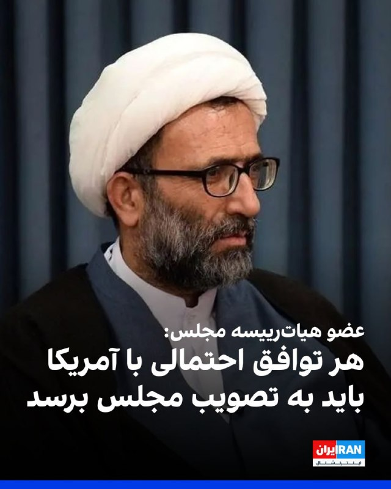

علیرضا سلیمی، عضو هیات‌رییسه مجلس، گفت اگر تفاهم‌نامه میان جمهوری اسلامی و آمریکا به توافق‌نامه، معاهده یا موارد مشابه تبدیل شود، حتما باید در مجلس بررسی شود.

سلیمی افزود: «هیچ توافقی نباید مغایر با قانون اقدام راهبردی برای لغو تحریم‌ها و صیانت از حقوق مردم باشد.»
iranintl
‌🏁 🇬🇧 IranintlTV

🤖 @VahidOOnLine

## VahidOOnLine — post 245276

  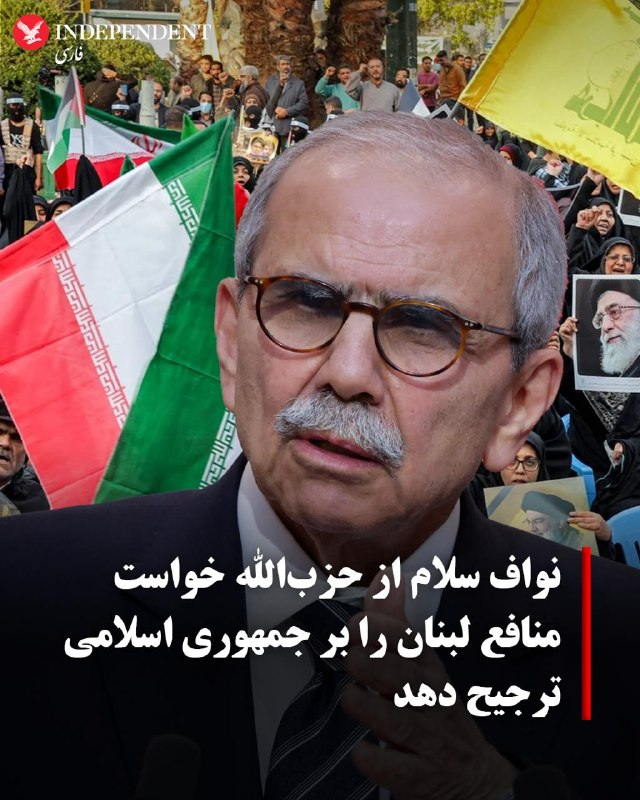

♦️نواف سلام، نخست‌وزیر لبنان، از حزب‌الله خواست برای نجات کشور، منافع لبنان را بر منافع ایران ترجیح دهد و در مسیر مذاکراتی که دولت لبنان با میانجی‌گری آمریکا دنبال می‌کند، در کنار دولت قرار گیرد.
نخست وزیر لبنان، روز شنبه ۲۳ خرداد ماه در گفتگو با خبرگزاری رویترز گفت: «حزب‌الله باید از ما جلوتر باشد یا دست‌کم با همان سرعت حرکت کند و حمایت خود را از مذاکراتی که در واشنگتن انجام می‌دهیم اعلام کند.»
یک منبع لبنانی آگاه به رویترز گفته است تهران از تصمیم بیروت برای مذاکره مستقل با اسرائیل خشمگین شده، زیرا این اقدام را به منزله از دست رفتن یکی از اهرم‌های مهم ایران در رویارویی با واشنگتن می‌داند.
سلام با تاکید بر استقلال لبنان در روند مذاکرات گفت: «هیچ‌کس به جای لبنان مذاکره نمی‌کند.» او در عین حال اذعان کرد که تحولات منطقه و مذاکرات جاری میان آمریکا و ایران بر لبنان تاثیرگذار است.
نخست‌وزیر لبنان همچنین خواستار اجرای تعهدات حزب‌الله شد و گفت جنوب لبنان باید منطقه‌ای عاری از سلاح باشد. او افزود: «بیانیه دولت بر انحصار سلاح در اختیار دولت و بازگرداندن تصمیم جنگ و صلح به حاکمیت لبنان تاکید دارد و از حزب‌الله چیزی فراتر از اجرای همین تعهدات خواسته نمی‌شود.»
حزب‌الله پیشتر با طرح آتش‌بس مورد توافق دولت‌های لبنان و اسرائیل مخالفت کرده بود. نعیم قاسم، دبیرکل حزب‌الله، مذاکرات را «خفت‌بار» خواند و گفت طرح ارائه‌شده از سوی واشنگتن «نقشه راهی برای نابودی بخشی از مردم لبنان و به بردگی کشاندن بقیه» است.
سلام در بخش دیگری از سخنان خود خطاب به حزب‌الله گفت: «اگر واقعاً نگران جامعه حامی خود و رنج‌های آن هستید، تنها کاری که باید انجام دهید عمل به تعهداتتان است.»
او همچنین تاکید کرد که مشکل دولت لبنان با حزب‌الله، سلاح این گروه است و نه نقش سیاسی آن. به گفته سلام، حزب‌الله یک نیروی سیاسی لبنانی است و دولت تنها انتظار دارد به تعهدات خود در قبال لبنان پایبند باشد.
‌🇸🇦 Indypersian

🤖 @VahidOOnLine

## pm_afshaa — post 93750

🔴دولت عراق خواستار تحویل سلاح نیابتی های سپاه وخروج هرچه سریعتر نیروهای سپاه از خاک عراق شد

💧 Rainbet.com the #1 Non-KYC Crypto Casino & Sportsbook @rainbetcom

😁 @Pm_Afshaa

## IranIntlTV — post 342032

  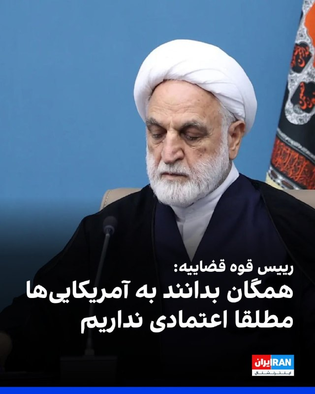

غلامحسین محسنی اژه‌ای، رییس قوه قضاییه، در پیامی به مناسبت سالروز آغاز جنگ ۱۲ روزه، در شبکه ویراستی نوشت: «همگان بدانند ما به آمریکایی‌ها، مطلقا اعتمادی نداریم.»

محسنی اژه‌ای اضافه کرد رزم و نبرد ما با «جبهه اشقیا و مستکبران» را پایانی نیست.
iranintl.com/202606136435

## IranIntlTV — post 342031

  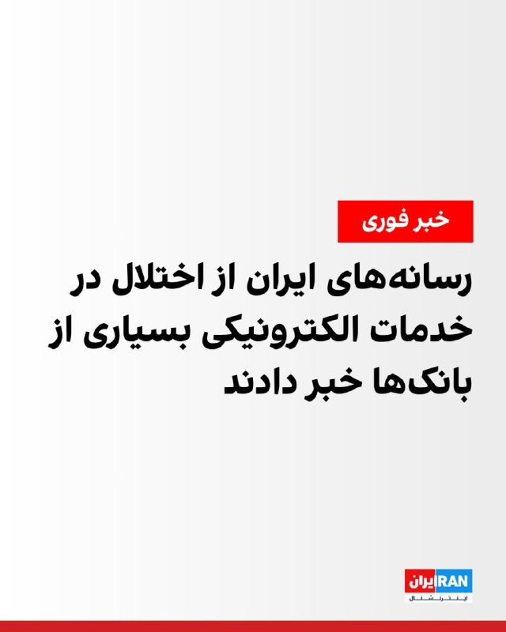

رسانه‌های ایران گزارش دادند از صبح شنبه، خدمات الکترونیکی برخی بانک‌های کشور از جمله ملی، تجارت، صادرات و توسعه صادرات با اختلال مواجه شده است.

بنا بر این گزارش این اختلال در بخش‌های مختلفی از جمله موبایل‌بانک، اینترنت‌بانک، خودپردازها، پایانه‌های فروش (کارتخوان) و برخی خدمات کارتی مشاهده شده است.

خبرگزاری فارس اعلام کرد برخی منابع از احتمال وقوع حمله سایبری خبر داده‌اند، اما تاکنون هیچ مقام رسمی این موضوع را تایید یا رد نکرده است.
iranintl.com/202606138538

## IranIntlTV — post 342030

  

علیرضا سلیمی، عضو هیات‌رییسه مجلس، گفت اگر تفاهم‌نامه میان جمهوری اسلامی و آمریکا به توافق‌نامه، معاهده یا موارد مشابه تبدیل شود، حتما باید در مجلس بررسی شود.

سلیمی افزود: «هیچ توافقی نباید مغایر با قانون اقدام راهبردی برای لغو تحریم‌ها و صیانت از حقوق مردم باشد.»
iranintl.com/202606138058

## DW_Farsi — post 125921

  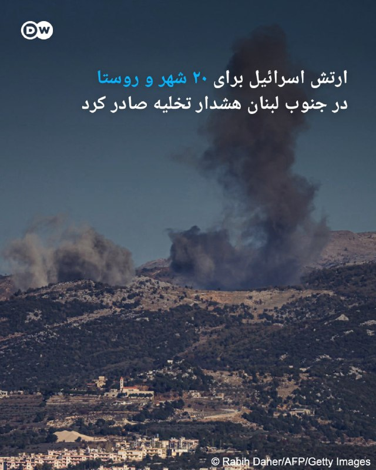

🔶 ارتش اسرائیل برای ۲۰ شهر و روستا در جنوب لبنان هشدار تخلیه صادر کرد

ارتش اسرائیل پیش از حملات برنامه‌ریزی‌شده علیه حزب‌الله، برای ساکنان ۲۰ شهر و روستا در جنوب لبنان، از جمله مناطق اطراف شهر نبطیه، دستور تخلیه صادر کرده است.

آویخای ادرعی، سخنگوی عربی‌زبان ارتش اسرائیل، در پیامی در شبکه اجتماعی ایکس خطاب به ساکنان این مناطق نوشت: «برای حفظ جانتان، فورا خانه‌های خود را ترک کرده و به شمال رودخانه زهرانی منتقل شوید.»

او ضمن متهم‌ کردن حزب‌الله لبنان به نقض آتش‌بس، اعلام کرد که حضور در نزدیکی تاسیسات یا تجهیزات نظامی این گروه، جان افراد را به خطر می‌اندازد.

طبق گزارش‌ها صبح روز شنبه ۲۳ خرداد (۱۳ ژوئن) یک "شی پرنده ناشناس" از طرف لبنان وارد اسرائیل شده بود.

رسانه‌های دولتی لبنان گزارش داده‌اند که ارتش اسرائیل ساعتی پس از صدور هشدار تخلیه حملاتی را به این مناطق انجام داده است.

خبرگزاری ملی لبنان نیز از هدف قرار گرفتن چندین منطقه هشدار تخلیه توسط جنگنده‌های اسرائیل خبر دادند.

@dw_farsi

## Persian_Trend_Official — post 16923

  <a href="telegram/content/Persian_Trend_Official_16923_1781344357.webm" target="_blank">🎬 Download video</a>

به گزارش CNN، به نقل از منابع آگاه به اطلاعات آمریکا، ایران با تخریب ورودی‌های تونل‌ها و قرار دادن مین‌های انفجاری در اطراف آنها، سطح حفاظت سایت‌های زیرزمینی حاوی اورانیوم با غنای 60 درصد خود را تقویت کرده است.

این اقدامات پس از بحث عمومی در مورد عملیات احتمالی ایالات متحده برای ربودن این مواد انجام شد و دسترسی به آنها را به طور قابل توجهی دشوارتر و خطرناک‌تر کرده است. اعتقاد بر این است که بیشتر این ذخایر در تونل‌هایی در مرکز فناوری هسته‌ای اصفهان نگهداری می‌شوند.

دفاعات جدید می‌تواند هرگونه توافق آینده‌ای را که ایران را ملزم به تسلیم اورانیوم غنی‌شده خود کند، پیچیده کند، زیرا تأیید، بازیابی و حذف این ذخایر اکنون ممکن است بسیار چالش‌برانگیزتر باشد.

مقامات آمریکایی و ایرانی همچنان روایت‌های متفاوتی از وضعیت و شرایط هرگونه توافق احتمالی ارائه می‌دهند.

📝 Amir

📌 @persian_trend_official
پرشین ترند | متفاوت‌ترین کانال نظامی

## BBCPersian — post 283655

🔻رئيس کمیسیون امنیت ملی مجلس ایران: طرح مدیریت تنگه هرمز اقدامی ماندگار مانند ملی شدن صنعت نفت است

رئیس کمیسیون امنیت ملی مجلس گفته است که در طرح «مدیریت تنگه هرمز» همه موضوعات از جمله «نحوه تردد » پیش‌بینی شده است و اگر این طرح به «قانون تبدیل شود یک قانون کامل و جامع» خواهد بود.

ابراهیم عزیزی گفت که این طرح یک اقدام ماندگار مثل «ملی شدن صنعت نفت» است.

این نماینده مجلس ایران همچنین گفت که در پاسخ به تهدیدات بر مبنای «منافع ملی عمل می‌کنیم و واکنشی برخورد نمی‌کنیم. و فعالیت‌های ما از منطق و هوشمندی برخوردار است .»

مجلس ایران پیش‌تر از اعلام وصول طرح سه فوریتی نمایندگان برای مدیریت تنگه هرمز خبر داده بود.

به گفته نمایندگان مجلس این طرح در پاسخ به «تجاوزات بیگانگان» تدوین شده تا مدیریت این گذرگاه استراتژیک به طور کامل در اختیار ایران قرار گیرد.

جمهوری اسلامی ایران از زمان شروع جنگ در اسفند ماه ۱۴۰۴، کنترل تنگه هرمز را در اختیار گرفته و عمدتا به کشتی‌های تجاری و نفتکش‌ها امکان تردد آزاد را نمی‌دهد.

https://bbc.in/4eDQgbc
@BBCPersian

## Hranews — post 113575

سه زندانی در زندان‌های مختلف اعدام شدند

❗️
❗️
❗️
❗️
❗️ – طی روزهای اخیر، حکم سه زندانی که پیشتر در پرونده‌های جداگانه از بابت اتهامات مرتبط با جرائم مواد مخدر و قتل به #اعدام محکوم شده بودند، در زندان‌های خوی، وکیل آباد مشهد و تبریز به اجرا درآمد.

ادامه مطلب

↘️
@hranews_bot تماس ✉️ -  @Hranews  کانال هرانا 🆑

---
📅 بروزرسانی: 1405/03/23 13:12
---

## VahidOOnLine — post 245275

  <a href="telegram/content/VahidOOnLine_245275_1781343771.mp4" target="_blank">🎬 Download video</a>

مصطفی رمضانی، زندانی سیاسی پادشاهی‌خواه، در پیامی صوتی از زندان قزل‌حصار زادروز مجیدرضا رهنورد، جانباخته خیزش انقلابی ۱۴۰۱ را گرامی داشت و آن را به مردم ایران و خاندان پهلوی تبریک گفت.
‌🏁 🇬🇧 IranintlTV

🤖 @VahidOOnLine

## VahidOOnLine — post 245274

🗣روایت شما از زندگی در دوران پس از انقلاب ملی و جنگ - شنبه ۲۳ خرداد ۱۴۰۵

🔹تمام کارت‌ها از کار افتاده‌اند، نه آنلاین می‌شود کارت‌به‌کارت کرد، نه از دستگاه.

🔹از صبح امروز شنبه ۲۳ خردادماه، سیستم بانکی سه بانک ملی، صادرات و تجارت دچار اختلال و قطعی شده است.

🔹تمام بانک‌های ایران قطع شده‌اند، هیچی نمی‌توانیم بخریم، از ساعت ۱۱:۳۰.

🔹از مشهد، ۲۳ خرداد، همه بانک‌ها از صبح اختلال دارند.

🔹سلام، الان رفتم مغازه، بانک ملی، ملت و تجارت هیچ‌کدام جواب نمی‌دهند.

🔹 امروز شنبه ۲۳ خرداد ۱۴۰۵ نزدیک به ۹۰درصد بانک‌ها ۴ساعت است که قطع شده‌اند و من یک مغازه‌دار هستم و مردم دیگر نمی‌توانند از مغازه خرید کنند و دستگاه پوز خطای صادرکننده می‌دهد.
‌🏁 🇬🇧 IranintlTV

🤖 @VahidOOnLine

## WithYashar — post 14704

از صبح امروز شنبه ۲۳ خردادماه، سیستم بانکی سه بانک ملی، صادرات و تجارت دچار اختلال و قطعی شده و تا زمان ارسال این خبر همچنان مشکل ادامه دارد @withyashar

## DEJradio — post 5651

  <a href="telegram/content/DEJradio_5651_1781343774.webm" target="_blank">🎬 Download video</a>

🚨📢 بر اساس گزارش‌های دریافتی از صبح روز شنبه ۲۳ خرداد، «سیستم بانکی سه بانک ملی، صادرات و تجارت دچار اختلال و قطعی شده و تا زمان ارسال این خبر همچنان مشکل ادامه دارد».

علت این اختلال هنوز مشخص نیست.

برخی مشتریان بانک‌ها اخیرا گزارش داده‌اند به حساب‌هایشان دسترسی ندارند و اپ‌ها کارها نمی‌کنند.

#بانکداری #بانک_ملی

## DEJradio — post 5650

⭕️ جمهوری اسلامی تونل‌های دستیابی به اورانیوم را منفجر و مین‌گذاری کرد

شبکۀ سی‌ان‌ان، به نقل از منابع آگاه گزارش داد جمهوری اسلامی در هفته‌های اخیر برای جلوگیری از دسترسی به ذخایر اورانیوم غنی‌شده، تونل‌های زیرزمینی برخی تأسیسات هسته‌ای را تخریب و ورودی آن‌ها را مین‌گذاری کرده است.
بر پایۀ این گزارش، درحدود ۴۴۰ کیلوگرم اورانیوم با غنای بالا در سایت‌های فردو، نطنز و اصفهان نگهداری می‌شود.
در نتیجۀ مین‌گذاری توسط رژیم، دسترسی به ذخایر اورانیوم اکنون بسیار دشوارتر و خطرناک‌تر از یک ماه پیش شده است.
سی‌ان‌ان همچنین گزارش داد ارتش آمریکا پیش‌تر گزینۀ عملیات زمینی برای انتقال این مواد به خارج از ایران را بررسی کرده بود، اما دونالد ترامپ در آخرین لحظه با اجرای آن مخالفت کرد.
بنا بر گزارش‌ها، موضوع سرنوشت ذخایر اورانیوم غنی‌شده، از مهم‌ترین محورها در مذاکرات میان واشینگتن و تهران به‌شمار می‌رود.

#اورانیوم #غنی_سازی
@DEJradio

## DEJradio — post 5649

⭕️ اکسیوس نوشت ترامپ در آخرین لحظه مانع حمله گستردۀ اسرائیل به مواضع زیرساختی جمهوری اسلامی شد

وب‌سایت خبری اکسیوس گزارش داد دونالد ترامپ در هفتۀ پیشین طی تماس با بنیامین نتانیاهو، مانع حملات گستردۀ اسرائیل به زیرساخت‌ها و تأسیسات انرژی در ایران شده است.
به نوشتۀ اکسیوس، ترامپ به نتانیاهو گفته بود انتظار دارد در روزهای آتی تفاهمنامه‌ای با رژیم امضا شود.
این رسانۀ آمریکایی نوشت ترامپ به نخست‌وزیر اسرائیل گفت زمان پایان دادن به جنگ فرا رسیده است.
یک مقام ارشد آمریکایی به اکسیوس گفته است که نتانیاهو مخالفتی جدی با درخواست ترامپ بروز نداده است.
بنا بر ادعای این منبع، نخست‌وزیر اسرائیل در عمل نقشی در مذاکرات میان تهران و واشینگتن ایفا نمی‌کند.
این در حالی است که بنیامین نتانیاهو اعلام کرده بین او و دونالد ترامپ، درمورد جلوگیری از هسته‌ای شدن جمهوری اسلامی توافق کامل برقرار است.
نخست‌وزیر اسرائیل شامگاه آدینه اعلام کرد تا زمانی که بر سر کار است، اجازه نمی‌دهد رژیم حاکم بر ایران به بمب هسته‌ای دست یابد.

#اسرائیل #حمله #جمهوری_اسلامی
@DEJradio

## IranIntlTV — post 342029

  <a href="telegram/content/IranIntlTV_342029_1781343775.mp4" target="_blank">🎬 Download video</a>

مصطفی رمضانی، زندانی سیاسی پادشاهی‌خواه، در پیامی صوتی از زندان قزل‌حصار زادروز مجیدرضا رهنورد، جانباخته خیزش انقلابی ۱۴۰۱ را گرامی داشت و آن را به مردم ایران و خاندان پهلوی تبریک گفت.

## IranIntlTV — post 342028

🗣روایت شما از زندگی در دوران پس از انقلاب ملی و جنگ - شنبه ۲۳ خرداد ۱۴۰۵

🔹تمام کارت‌ها از کار افتاده‌اند، نه آنلاین می‌شود کارت‌به‌کارت کرد، نه از دستگاه.

🔹از صبح امروز شنبه ۲۳ خردادماه، سیستم بانکی سه بانک ملی، صادرات و تجارت دچار اختلال و قطعی شده است.

🔹تمام بانک‌های ایران قطع شده‌اند، هیچی نمی‌توانیم بخریم، از ساعت ۱۱:۳۰.

🔹از مشهد، ۲۳ خرداد، همه بانک‌ها از صبح اختلال دارند.

🔹سلام، الان رفتم مغازه، بانک ملی، ملت و تجارت هیچ‌کدام جواب نمی‌دهند.

🔹 امروز شنبه ۲۳ خرداد ۱۴۰۵ نزدیک به ۹۰درصد بانک‌ها ۴ساعت است که قطع شده‌اند و من یک مغازه‌دار هستم و مردم دیگر نمی‌توانند از مغازه خرید کنند و دستگاه پوز خطای صادرکننده می‌دهد.

## Shin_Persian — post 7010

  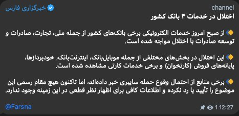

Shin ✓ @hey_itsmyturn
Sat, 13 Jun 2026 09:32:44 UTC

Fars News confirms:
Interruptions in Melli, Tejarat, Saderat and Tose'e Saderat banking systems including Mobile Bank, Internet Bank, ATM machines and POS terminals.

ترجمه خودکار فارسی

خبرگزاری فارس تایید کرد:
اختلال در سامانه‌های بانکی بانک‌های ملی، تجارت، صادرات و توسعه صادرات شامل همراه بانک، اینترنت بانک، دستگاه‌های خودپرداز (ATM) و پایانه‌های فروش (POS).

𝕏 · @shin_persian

## Hranews — post 113574

یک شهروند توسط نیروهای امنیتی در پیشوا بازداشت شد

❗️
❗️
❗️
❗️
❗️ – یک شهروند در پیشوا به دلیل آنچه که “ارسال تصاویر اصابت موشک به اماکن نظامی برای رسانه‌های خارج از کشور” عنوان شده، توسط ماموران اطلاعات سپاه این شهرستان #بازداشت شد.

ادامه مطلب

↘️
@hranews_bot تماس ✉️ -  @Hranews  کانال هرانا 🆑

## alonews — post 127592

  <a href="telegram/content/alonews_127592_1781343778.webm" target="_blank">🎬 Download video</a>

👈ترامپ در نظر دارد از هواپیمای جدید ایرفورس وان که هدیه قطر است برای پرواز افتتاحیه در سفر برنامه‌ریزی شده‌اش به کوه راشمور در ۳ ژوئیه به مناسبت جشن‌های ۲۵۰ سالگی آمریکا استفاده کند، گزارش ان‌بی‌سی نیوز.

🔴 هنوز تصمیم نهایی گرفته نشده است، اما بازسازی این هواپیمای ۴۰۰ میلیون دلاری پس از چندین ماه تقریباً کامل شده است

✅ @AloNews خبر جنگ

## alonews — post 127591

  <a href="telegram/content/alonews_127591_1781343778.webm" target="_blank">🎬 Download video</a>

🔴فوری / فارس: برخی منابع از احتمال وقوع حمله سایبری خبر داده‌اند، اما تاکنون هیچ مقام رسمی این موضوع را تأیید یا رد نکرده

✅ @AloNews خبر جنگ

## alonews — post 127590

  <a href="telegram/content/alonews_127590_1781343779.webm" target="_blank">🎬 Download video</a>

👈سلیمی، عضو هیئت‌رئیسه مجلس :
هر توافقی که احتمالاً با آمریکا انجام بشه، باید اول به تأیید و تصویب مجلس برسه

✅ @AloNews خبر جنگ

---
📅 بروزرسانی: 1405/03/23 13:02
---

## VahidOOnLine — post 245273

ویدیویی که به تازگی از انقلاب ملی ایرانیان در دی‌ماه به ایران اینترنشنال رسیده نشان می‌دهد یکی از معترضان در فولادشهر اصفهان پرچم شیروخورشید را بالای تابلوی راهنمایی و رانندگی برده و به اهتزاز در آورده است.
‌🏁 🇬🇧 IranintlTV

🤖 @VahidOOnLine

## WithYashar — post 14703

  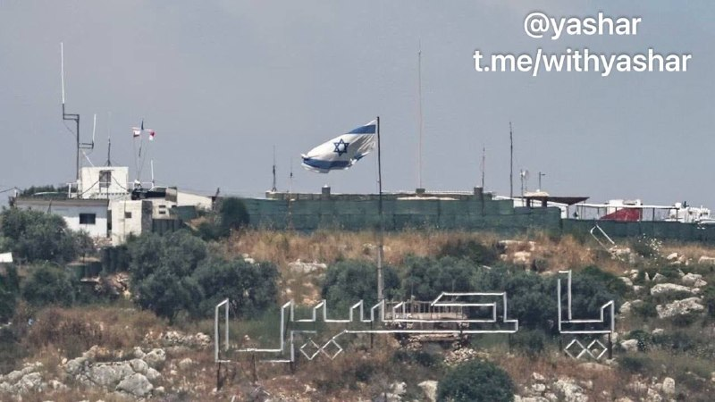

در جنوب لبنان؛ ارتش اسرائیل پرچم این کشور رو روی تپه العویدات و کنار سازه «یا حسین» نصب کرده
@withyashar

## mwarmonitor — post 10808

حمله سایبری به چهار بانک در ایران

## pm_afshaa — post 93749

🔴سی ان ان :ایران از ترس اینکه آمریکا یهو زمینی بیاد اورانیومش رو ببره؛ رفته تمام تونل های زیرزمینی هسته ای رو با انفجار مین تخریب کرده و همه راه های منتهی به اورانیوم رو مسدود کرده

💧 Rainbet.com the #1 Non-KYC Crypto Casino & Sportsbook @rainbetcom

😁 @Pm_Afshaa

## pm_afshaa — post 93748

🔴پس از حملات سایبری گسترده ساعتی قبل به سیستم بانکی کشور، اکثر بانک‌ها دچار اختلال شدند یا به صورت موقت از کار افتادن

💧 Rainbet.com the #1 Non-KYC Crypto Casino & Sportsbook @rainbetcom

😁 @Pm_Afshaa

## IranIntlTV — post 342027

ویدیویی که به تازگی از انقلاب ملی ایرانیان در دی‌ماه به ایران اینترنشنال رسیده نشان می‌دهد یکی از معترضان در فولادشهر اصفهان پرچم شیروخورشید را بالای تابلوی راهنمایی و رانندگی برده و به اهتزاز در آورده است.

## DW_Farsi — post 125920

  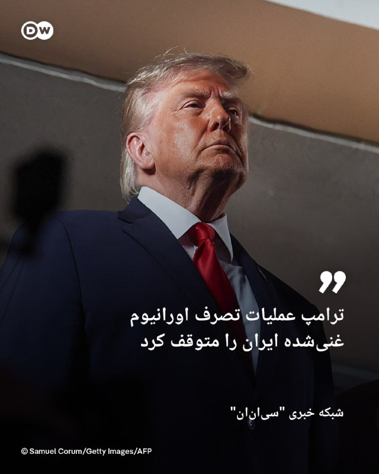

🔶 سی‌ان‌ان: ترامپ عملیات تصرف اورانیوم غنی‌شده ایران را متوقف کرد

شبکه خبری "سی‌ان‌ان" صبح روز شنبه ۲۳ خرداد (۱۳ ژوئن) به نقل از منابع آگاه گزارش داد ارتش آمریکا ظاهرا قصد داشته یک عملیات زمینی در ایران برای تصرف و ایمن‌سازی ذخایر اورانیوم غنی‌شده انجام دهد، اما دونالد ترامپ، رئیس‌ جمهور آمریکا، این عملیات را درست پیش از آغاز آن متوقف کرده است.

بر اساس این گزارش، دولت آمریکا تقریبا در آستانه صدور مجوز نهایی برای این عملیات بوده و حتی مسئولان مرتبط را نیز برای آغاز کار آماده کرده بود، با این حال ترامپ در لحظه آخر این طرح را وتو کرده است.

سی‌ان‌ان در ادامه گزارش خود به این موضوع هم اشاره کرده است که رئیس‌ جمهور آمریکا نگران تلفات بالای نیروهای آمریکایی بوده است و چنین اقدامی "احتمالا با واکنش شدید ایران، طولانی‌تر شدن جنگ و وارد شدن اقتصاد جهانی به بحران‌های بیشتر همراه می‌شد".

این شبکه خبری افزوده است که ترامپ در شرایطی که توافقی میان آمریکا و ایران در حال نهایی شدن بوده، حاضر نشده چنین ریسک بزرگی را بپذیرد.

@dw_farsi

## RadioFarda — post 158248

🔸بر اساس گزارش‌ها فریدون فراهانی، مدرس دانشگاه و فعال موسیقی ایرانی، بازداشت شد.

🔸کانال تلگرام دانشجویان متحد روز شنبه ۲۳ خرداد ضمن اعلام این خبر گفت که تاکنون از وضعیت و محل نگهداری آقای فراهانی اطلاعاتی به دست نیامده است.

🔸بر اساس اطلاعات رسیده به رادیو فردا انتشار چند پست مربوط به اعتراضات دی ماه ۱۴۰۴ از دلایل بازداشت این استاد دانشگاه بوده است.

🔸فریدون فراهانی هم‌زمان با اعتراضات دی ۱۴۰۴ اجرایی از خود از ترانه عارف قزوینی در «ستایش آزادی‌خواهی ملت» در اینستاگرام خود منتشر کرد.

🔸او ۱۵ بهمن گفته بود: «معیار سنجش هنرمند و ارزش‌گذاری بر او شهرت و محبوبیت کاذبی نیست که رانت‌ها در شبکه‌های قدرت توتالیتر به او داده‌اند، هنرمند را بیش از همه باید با اندیشه و منش او شناخت که در چنین بزنگاه‌هایی بیش از همه نمایان می‌شود.»

🔸آقای فراهانی سوم اسفند هم‌زمان با اعتراضات دانشجویی نوشته بود: «به احترام دانشجویانی که دانشگاه را جان دوباره بخشیدند و به پیکر این چهار دیواری‌های از معنا تهی‌شده نفسی تازه دمیدند.»

@RadioFarda

## alonews — post 127589

  <a href="telegram/content/alonews_127589_1781343179.mp4" target="_blank">🎬 Download video</a>

👈عقب نشینی نفر‌بر‌‌های M-۱۱۳ ارتش لبنان از شهر نبطیه

✅ @AloNews خبر جنگ

## alonews — post 127588

  <a href="telegram/content/alonews_127588_1781343181.webm" target="_blank">🎬 Download video</a>

👈نواف سلام، نخست وزیر لبنان، به رویترز گفت: حزب‌الله باید سریع‌تر از ما یا با همان سرعت عمل کند و حمایت خود را از مذاکرات ما در واشنگتن اعلام کند.

🔴ما با حزب‌الله در تماس مداوم هستیم و تنها چیزی که از آنها خواسته می‌شود، عمل به تعهداتشان است.

🔴مشکل ما با حزب‌الله، سلاح‌های آن است و ما این حزب را یک نیروی سیاسی لبنانی می‌دانیم.

🔴ما تحت تأثیر روند مذاکرات در اسلام آباد هستیم و نتایج آن در سرزمین ما مشهود است، اما هیچ کس از طرف لبنان مذاکره نمی‌کند.

🔴قرار است جنوب لبنان منطقه عاری از سلاح باشد.

✅ @AloNews خبر جنگ

---
📅 بروزرسانی: 1405/03/23 12:52
---

## VahidOOnLine — post 245272

  <a href="telegram/content/VahidOOnLine_245272_1781342545.mp4" target="_blank">🎬 Download video</a>

مصطفی رمضانی، زندانی سیاسی پادشاهی‌خواه، در پیامی صوتی از زندان قزل‌حصار زادروز مجیدرضا رهنورد، جانباخته خیزش انقلابی ۱۴۰۱ را گرامی داشت و آن را به مردم ایران و خاندان پهلوی تبریک گفت.
‌🏁 🇬🇧 IranintlTV

🤖 @VahidOOnLine

## DEJradio — post 5648

  <a href="telegram/content/DEJradio_5648_1781342547.webm" target="_blank">🎬 Download video</a>

🔺📢 پس از ۴۰ روز جنگ، موجی از نارضایتی نیروهای مسلح جمهوری اسلامی را فراگرفته است. مبلغی که به عنوان «پاداش جنگ» به حساب پرسنل واریز شده حتی برای خرید یک کیلو گوشت کافی نیست. یک مرزبان با ارسال رسید واریزی خود به حساب سپه که فقط مبلغ یک میلیون تومان بود گفت، «در مرزبانی ۴۰ روز زیر آتش بودیم، بقیه سال هم به دلیل ناامنی فرقی با شرایط جنگ ندارد، کلا یک میلیون تومان برای ما واریز شده است.»

این مرزبان که ۱۶ سال سابقه خدمت دارد می‌گوید: «رادان دزد است، پول‌ها را بالا کشیده است.»
نه تنها پرسنل ارتش و انتظامی بلکه بسیاری از سـ.ـپاهی‌ها نیز نسبت به عدم واریز یا پایین بودن مبلغ «پاداش» اعتراض دارند. آن‌هم در شرایطی که فرماندهان حواله‌های سنگین دریافت کردند.

#جنگ #پاداش_جنگ #احمدرضا_رادان
@DEJradio

## DEJradio — post 5647

⭕️
🛩️ اسرائیل مواضع حزب‌الله در جنوب لبنان را بمباران کرد؛ هشدار تخلیه برای ده‌ها شهر و روستا

ارتش اسرائیل روز شنبه در پی صدور هشدار تخلیه برای چندین شهر و روستا در جنوب لبنان، حملات به مواضع شبه‌نظامیان حزب‌الله را در این مناطق ازسرگرفت.
بنا بر گزارش‌ها، جنگنده‌های اسرائیلی مواضع و امکانات حزب‌الله را در مناطقی از جمله روستای سجود و ریحان در نزدیکی نبطیه، هدف گرفتند.
ارتش اسرائیل اعلام کرد این عملیات در واکنش به فعالیت‌های حزب‌الله و نقض آتش‌بس انجام می‌شود.
اسرائیل از ساکنان این مناطق خواسته که به شمال رود زهرانی بروند.
ارتش همچنین از رهگیری دومین پهپاد نیروهای حزب‌الله در شبانه‌روز پیشین که به سوی خاک اسرائیل پرتاب شده بود، خبر داد.
ارتش اسرائیل هشدار داد ادامۀ حملات پهپادی حزب‌الله می‌تواند دامنۀ درگیری را گسترش بدهد.

#اسرائیل #حزب_الله #لبنان
@DEJradio

## kianmeli1 — post 87968

🔴سامانه‌های بانکی ایران از جمله خدمات بانکداری الکترونیک و دستگاه‌های خودپرداز، امروز صبح در سراسر کشور دچار اختلال شده است.
https://t.me/kianmeli1

## kianmeli1 — post 87967

  <a href="telegram/content/kianmeli1_87967_1781342547.mp4" target="_blank">🎬 Download video</a>

🔴رئیس کمیسیون امنیت ملی مجلس: طرح مدیریت تنگه هرمز یک اقدام ماندگار مثل ملی شدن صنعت نفت است
https://t.me/kianmeli1

## IranIntlTV — post 342026

  <a href="telegram/content/IranIntlTV_342026_1781342549.mp4" target="_blank">🎬 Download video</a>

ارتش اسرائیل برای ساکنان ۲۰ شهر و روستا در جنوب لبنان هشدار تخلیه صادر کرد. سخنگوی ارتش اسرائیل از ساکنان این مناطق خواست فورا خانه‌های خود را ترک کنند و به مناطق شمالی رود زهرانی منتقل شوند. این هشدار پس از آن صادر شد که صبح یک شیء پرنده از خاک لبنان وارد…

## Shin_Persian — post 7009

Shin ✓ @hey_itsmyturn
Sat, 13 Jun 2026 09:17:35 UTC

Citna writes:

"As of Saturday morning, June 13th, the banking systems of Melli, Saderat,Tejarat banks have experienced disruptions and outages. The issues persist at the time of this report."

https://www.citna.ir/node/337708

ترجمه خودکار فارسی

سیتنا می‌نویسد:

«از صبح روز شنبه ۲۳ خردادماه، سیستم‌های بانکی بانک‌های ملی، صادرات و تجارت با اختلال و قطعی مواجه شده‌اند. این مشکلات در زمان انتشار این گزارش همچنان ادامه دارد.»

https://www.citna.ir/node/337708

𝕏 · @shin_persian

## FarsiVOA — post 220566

🔺گوگل کانال‌های حکومتی مرتبط با جمهوری اسلامی در یوتیوب را مسدود کرد

▪️گوگل اعلام کرده که پس از بررسی گزارش‌هایی درباره فعالیت ده‌ها کانال یوتیوب مرتبط با اشخاص و نهادهای حکومتی تحت تحریم آمریکا، علیه شماری از حساب‌های ناقض سیاست‌های خود اقدام کرده است.

▪️تحقیق تازه «پروژه شفافیت فناوری» که ابتدا در وایرد منتشر شد، نشان می‌دهد ده‌ها کانال یوتیوب مرتبط با افراد، رسانه‌ها و نهادهای تحریم‌شده ایرانی همچنان روی این پلتفرم فعال بوده‌اند و در برخی موارد تبلیغات تجاری روی ویدئوهای آن‌ها نمایش داده می‌شده است.

▪️این موضوع از منظر حقوق تحریم‌ها حساس است، زیرا حتی ارائه خدمات تبلیغاتی یا زیرساختی به اشخاص و نهادهای تحریم‌شده می‌تواند برای شرکت‌های آمریکایی مسئله‌ساز شود.

⬇️ بیشتر بخوانید:
https://ir.voanews.com/a/8160420.html

## Persian_Trend_Official — post 16919

  <a href="telegram/content/Persian_Trend_Official_16919_1781342551.mp4" target="_blank">🎬 Download video</a>

ظاهراً فردی به نام امید دانا، که بیشتر با چرخش‌های لحظه‌ای، مواضع زیگزاگی و خدمت‌گزاری‌های متناقض به جریان‌های مختلف شناخته می‌شود، مدعی شده پرشین ترند از مطالب ایشان کپی‌برداری کرده است!

حقیقتاً تماشای حتی چند ثانیه از بریده‌صحبت‌های این فرد در فضای مجازی برای من دشوار است. نه از شدت اهمیت، بلکه از حجم شگفت‌انگیز اعتمادبه‌نفس در کنار فقر تحلیلی.

کسی که در طول سال‌ها بارها و بارها میان مواضع متضاد رفت‌وآمد کرده و هر بار در قامت خدمت‌گزار یک جریان تازه ظاهر شده، حالا مدعی «مرجعیت فکری» شده است. ادعایی آن‌قدر بزرگ که بیشتر از آن‌که نیازمند پاسخ باشد، نیازمند لبخند است.

پرشین ترند برای تولید محتوا نیازی به کپی‌برداری از ذهن‌های آشفته، تحلیل‌های سطحی و نمایش‌های رسانه‌ای افراد کم‌ثبات ندارد.

پرشین ترند با رصد روزانه، پیگیری مداوم و اعتماد مخاطبانش ساخته شده؛ نه با وام گرفتن از حرف‌های سطحی و نمایش‌های خنده دار و معلوم الحال !

## alonews — post 127587

  <a href="telegram/content/alonews_127587_1781342552.webm" target="_blank">🎬 Download video</a>

👈وزیر علوم: امیدوارم بتوانیم طرح سه ساله شدن دوره کارشناسی را به طور آزمایشی در چند دانشگاه اجرا کنیم

✅ @AloNews خبر جنگ

## alonews — post 127586

  <a href="telegram/content/alonews_127586_1781342553.webm" target="_blank">🎬 Download video</a>

👈شاخص کل بورس با رشد ۱۰۳ هزار واحدی در پایان معاملات امروز به ۴ میلیون و ۶۹۶ هزار واحد رسید.

✅ @AloNews خبر جنگ

---
📅 بروزرسانی: 1405/03/23 12:42
---

## VahidOOnLine — post 245271

  

♦️تیم ملی فوتبال انگلستان، روز شنبه ۲۳ خرداد و پیش از ورود به کانزاس‌سیتی آمریکا با یک اتفاق غیرمنتظره در آستانه نخستین رقابتش در جام‌جهانی ۲۰۲۶ روبه‌رو شد: بخشی از تجهیزات این تیم در جریان انتقال به محل تمرینات به سرقت رفت.
به گزارش سرویس ورزشی بی‌بی‌سی جهانی، خودروهای حامل تجهیزات تیم انگلستان که در حال انتقال وسایل به مجموعه «سووپ ساکر ویلیج» در کانزاس‌سیتی بودند، هدف سرقت قرار گرفتند. گفته می‌شود توپ‌ها، کفش‌های فوتبال و برخی دیگر از تجهیزات تمرینی ممکن است در میان اقلام به سرقت رفته باشند.
اتحادیه فوتبال انگلیس (FA) اعلام کرده در حال بررسی ابعاد این حادثه و مشخص کردن دقیق وسایل مفقودشده است.
توماس توخل، سرمربی تیم ملی انگلستان و بازیکنان این تیم قرار است عصر شنبه وارد کانزاس‌سیتی شوند و قرار بود تجهیزات مورد نیاز پیش از ورود آن‌ها در محل تمرین مستقر شده باشد.
پلیس کانزاس‌سیتی که تحقیقات درباره این حادثه را آغاز کرده، اعلام کرده است که دو نفر در ارتباط با این پرونده بازداشت شده‌اند.
سخنگوی پلیس کانزاس‌سیتی گفت: «در حال بررسی احتمال سرقت تجهیزات از یکی از خودروهای تیمی هستیم که امشب با کمبود برخی اقلام وارد کانزاس‌سیتی شده است. تحقیقات همچنان ادامه دارد.»
این حادثه ممکن است بخشی از برنامه‌های آماده‌سازی توماس توخل برای نخستین دیدار «سه شیرها» در جام جهانی ۲۰۲۶ برابر کرواسی را تحت تاثیر قرار دهد. بازیکنان انگلستان نخستین جلسه کامل تمرینی خود را روز یکشنبه برگزار خواهند کرد.
‌🇸🇦 Indypersian

🤖 @VahidOOnLine

## WithYashar — post 14702

از صبح امروز شنبه ۲۳ خردادماه، سیستم بانکی سه بانک ملی، صادرات و تجارت دچار اختلال و قطعی شده و تا زمان ارسال این خبر همچنان مشکل ادامه دارد
@withyashar

## WithYashar — post 14701

هوش مصنوعی رقیب جدید مدرک شد
نتایج نظرسنجی موسسه پژوهش‌های اقتصادی «ایفو» نشان می‌دهد :
۲۰ درصد از شرکت‌های آلمانی استفاده‌کننده از هوش مصنوعی معتقدند که می‌توانند کارکنان دارای مدرک دانشگاهی را با نیروهای مجهز به ابزارهای هوش مصنوعی و بدون تحصیلات دانشگاهی جایگزین کنند.
@withyashar

## DEJradio — post 5646

⭕️ وزیر انرژی آمریکا اعلام کرد صادرات نفت جمهوری اسلامی به صفر رسیده است

کریس رایت، وزیر انرژی آمریکا اعلام کرد روزانه درحدود هفت میلیون بشکه نفت با حمایت نظامی ایالات متحده از خلیج فارس خارج می‌شود، اما صادرات نفت توسط جمهوری اسلامی به «صفر بشکه» رسیده است.
کریس رایت گفت آمریکا می‌خواهد جریان صادرات نفت از مسیر خلیج فارس ادامه پیدا کند، اما محاصرۀ نفتی جمهوری اسلامی تا زمان نهایی شدن توافق احتمالی، حفظ می‌شود.
رایت افزود با وجود تهدیدهای جمهوری اسلامی علیه کشتیرانی در منطقه، اکنون نفتکش‌ها بیش از پیش از تنگۀ هرمز عبور می‌کنند.
وزیر انرژی دولت ترامپ اعلام کرد نیروهای آمریکایی با بسیاری از حملات جمهوری اسلامی علیه کشتی‌های تجاری مقابله کرده‌اند.

#نفت #جمهوری_اسلامی #تنگه_هرمز
@DEJradio

## kianmeli1 — post 87966

‏🔴روزنامه کیهان: به محض بازگشایی تنگه هرمز، دشمن حمله و ترور را از سر خواهد گرفت
https://t.me/kianmeli1

## FarsiVOA — post 220565

🔺تخریب تونل‌ها و مین‌گذاری جمهوری اسلامی در تأسیسات نگه‌داری اورانیوم

▪️شبکه سی‌ان‌ان گزارش داده که جمهوری اسلامی اخیراً تونل‌های تأسیسات نگه‌داری اورانیوم با غنای بالا را عمداً تخریب و ورودی‌ها را مین‌گذاری کرده است.

▪️پنج منبع آگاه به این رسانه گفته‌اند که جمهوری اسلامی بعد از تهدید دونالد ترامپ برای تصرف ذخایر اورانیوم ۶۰ درصدی ایران، تلاش‌ها برای مسدود کردن این مواد را افزایش داده است.

▪️این گزارش می‌افزاید اقدامات جمهوری اسلامی باعث شده دسترسی به حدود نیم تُن اورانیوم با غنای بالا اکنون بسیار دشوارتر، خطرناک‌تر و زمان‌برتر از یک ماه پیش باشد.

▪️نهادهای غربی بر این باورند که بخش عمده این ذخایر در تونل‌های فروریخته در مجتمع هسته‌ای اصفهان قرار دارد.

⬇️ بیشتر بخوانید:
https://ir.voanews.com/a/iran-sealed-uranium-cache-and-placed-mines-amid-fears-of-us-operation-to-seize-material/8160419.html

## DW_Farsi — post 125919

  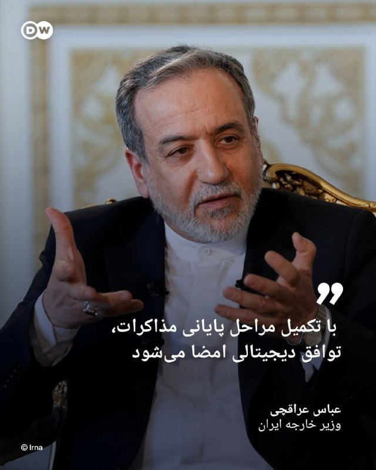

🔶 عراقچی: با تکمیل مراحل پایانی مذاکرات، توافق دیجیتالی امضا می‌شود

عباس عراقچی، وزیر خارجه ایران نسبت به دستیابی به یک توافق صلح با ایالات متحده در آینده نزدیک ابراز خوش‌بینی کرده است.

عراقچی شب گذشته (۲۲ خرداد) در تلویزیون دولتی ایران گفت: «به محض اینکه مراحل پایانی مذاکرات ما تکمیل شود، این توافق امضا و اعلام خواهد شد.»

عراقچی همچنین اعلام کرده است که امضای توافق "در مرحله اول به‌صورت دیجیتال" انجام خواهد شد و توضیح داده است که هر طرف به‌صورت غیرحضوری (از راه دور) امضا خواهد کرد.

طبق گفته عراقچی سپس اعلام می‌شود که این توافق و یا تفاهمنامه توسط هر دو طرف امضا شده است. وزیر خارجه جمهوری اسلامی خاطرنشان کرد که این ممکن است قریب‌الوقوع باشد و در روزهای آینده رخ دهد و تاکید کرده که او "بسیار خوش‌بین" است.

@dw_farsi

## IranianMinds — post 22448

🔴 روزنامه خراسان، نزدیک به قالیباف:

تفاهم جمهوری اسلامی و آمریکا اختلافات رو حل نمی‌کنه؛ فقط فرصتی برای آماده‌شدن برای جنگ بعدیه.

@IranianMinds

## Hranews — post 113573

اعتراضات سراسری ۱۴۰۴؛ مهدی پاک‌مهر به ۶ سال حبس و ۸۰ ضربه شلاق محکوم شد

❗️
❗️
❗️
❗️
❗️ – مهدی پاک‌مهر، از بازداشت‌شدگان اعتراضات دی‌ماه ۱۴۰۴، در دو پرونده جداگانه توسط دادگاه انقلاب و دادگاه کیفری بجنورد، مجموعا به شش سال #حبس تعزیری و ۸۰ ضربه #شلاق محکوم شد.

ادامه مطلب

#مهدی_پاک‌مهر

↘️
@hranews_bot تماس ✉️ -  @Hranews  کانال هرانا 🆑

## alonews — post 127585

  <a href="telegram/content/alonews_127585_1781341952.webm" target="_blank">🎬 Download video</a>

👈از صبح امروز شنبه ۲۳ خردادماه، سیستم بانکی سه بانک ملی، صادرات و تجارت دچار اختلال و قطعی شده و تا زمان ارسال این خبر همچنان مشکل ادامه دارد

✅ @AloNews خبر جنگ

## alonews — post 127584

👈ضرب الاجل جمهوریخواهان به ترامپ: تا ۱۶ شهریور جنگ با ایران پایان یابد

🔴همزمان با نزدیک شدن به انتخابات میاندوره ای کنگره، بسیاری از جمهوریخواهان در گفت گو با نشریه پولیتیکو به ترامپ تا ۱۶ شهریور برای پایان یافتن جنگ آمریکا علیه ایران فرصت داده اند.

✅ @AloNews خبر جنگ

---
📅 بروزرسانی: 1405/03/23 12:33
---

## VahidOOnLine — post 245270

⭕️ عضو پیشین تیم هسته‌ای:
متخصصان ما، احتمال آغاز جنگ با ترور رهبری را مطرح کرده بودند

♦️علی باقری کنی، عضو شورای راهبردی روابط خارجی و از اعضای پیشین تیم مذاکره‌کننده هسته‌ای، با اشاره به ارزیابی‌های امنیتی پیش از آغاز جنگ، مدعی شد که جمع‌بندی برخی متخصصان این بوده که سناریوی آغاز درگیری با «ترور رهبر جمهوری اسلامی» همراه خواهد بود.
او با بیان اینکه در تاریخ ۹ اسفند و در جریان نشستی با موضوع جنگ، رئیس اطلاعات سپاه نیز حضور داشته است، گفت یکی از تحلیل‌های مطرح‌شده این بود که فاصله زمانی میان پایان جنگ در بهار و آغاز درگیری در زمستان، به تلاش طرف مقابل برای اطمینان از موفقیت در اجرای چنین سناریویی مربوط بوده است.
باقری همچنین ادعا کرد هدف اصلی آمریکا و اسرائیل از طراحی این سناریو، «براندازی» بوده و برنامه‌ریزی‌های انجام‌شده در همین چارچوب صورت گرفته است.
علی خامنه‌ای در ۹ اسفند ۱۴۰۴ در حمله آمریکا و اسرائیل کشته شد.
‌🇸🇦 Indypersian

🤖 @VahidOOnLine

## DEJradio — post 5645

⭕️ عراقچی گفت مراسم امضای توافق با آمریکا مجازی برگزار می‌شود

عباس عراقچی، وزیر امور خارجۀ جمهوری اسلامی اعلام کرد در صورت نهایی شدن توافق با آمریکا، مراسم امضای تفاهم‌نامه به‌صورت غیرحضوری و از راه دور انجام می‌شود.
او همچنین گفت مدعی شد که از نظر تهران، تنها راه برای حل موضوع ذخایر اورانیوم غنی‌شده، رقیق‌سازی آن در داخل ایران است.
وزیر امور خارجۀ دولت پزشکیان ادعا کرد نظام با خروج اورانیوم از کشور مخالفت است.
عباس عراقچی همچنین با متهم کردن اسرائیل به تلاش برای برهم زدن روند توافق با واشینگتن، ادعا کرد اسرائیل در صدر فهرست مخالفان این تفاهمنامه قرار دارد.
وزیر امور خارجۀ جمهوری اسلامی همچنین مدعی شد جمهوری اسلامی در جنگ اخیر پیروز شده و توافق احتمالی تنها گام نخست در روند مذاکرات به‌شمار می‌رود.

#عراقچی #توافق
@DEJradio

## IranIntlTV — post 342025

  <a href="telegram/content/IranIntlTV_342025_1781341399.mp4" target="_blank">🎬 Download video</a>

ارتش اسرائیل برای ساکنان ۲۰ شهر و روستا در جنوب لبنان هشدار تخلیه صادر کرد. سخنگوی ارتش اسرائیل از ساکنان این مناطق خواست فورا خانه‌های خود را ترک کنند و به مناطق شمالی رود زهرانی منتقل شوند.
این هشدار پس از آن صادر شد که صبح یک شیء پرنده از خاک لبنان وارد حریم هوایی اسرائیل شد.

اشکان صفایی، خبرنگار ایران‌اینترنشنال، گزارش می‌دهد
@iranintltv

## IranIntlTV — post 342024

  <a href="telegram/content/IranIntlTV_342024_1781341401.mp4" target="_blank">🎬 Download video</a>

🔻همزمان با نخستین بازی تیم‌های فوتبال نیوزیلند و ایران در جام جهانی ۲۰۲۶، تجمع‌هایی در شهرهای مختلف جهان، از جمله اوکلند نیوزیلند، در حمایت از پرچم شیر و خورشید و گرامیداشت یاد مجیدرضا رهنورد و دیگر جان‌باختگان راه آزادی ایران برگزار می‌شود. روزی که برای بسیاری از ایرانیان، فقط در زمین فوتبال معنا پیدا نمی‌کند.

🔹علیرضا محبی، خبرنگار ایران‌اینترنشنال گزارش می دهد

@iranintltvsport

## Shin_Persian — post 7008

Shin ✓ @hey_itsmyturn
Sat, 13 Jun 2026 08:51:45 UTC

Widespread interruption in Iranian banking systems including e-banking and ATM machines.

ترجمه خودکار فارسی

اختلال گسترده در سیستم‌های بانکی ایران از جمله بانکداری الکترونیک و دستگاه‌های خودپرداز (ATM).

𝕏 · @shin_persian

## DW_Farsi — post 125918

🔶 آغاز مذاکرات پیوستن اوکراین و مولداوی به اتحادیه اروپا

اتحادیه اروپا روز دوشنبه ۱۵ ژوئن اولین دور از گفت‌وگوهای پیوستن اوکراین و مولداوی به این اتحادیه را آغاز می‌کند.

این تصمیم در نشست روز جمعه ۱۲ ژوئن کشورهای عضو اتحادیه اروپا در بروکسل گرفته شده است.

در پی این نشست، اورسولا فون در لاین، رئیس کمیسیون اروپا و آنتونیو کوستا، رئیس شورای اروپا در بیانیه‌ای مشترک اعلام کردند: «همه کشورهای عضو موافقت کرده‌اند که اولین بخش مذاکرات را در چارچوب گفت‌وگوهای الحاق با اوکراین و مولداوی آغاز کنند.»

فون در لاین و کوستا می‌گویند که آغاز اولین دور از مذاکرات الحاق، "قدردانی از قاطعیت، شجاعت و تلاش سختی است که هر دو کشور در اجرای اصلاحات، حتی در مواجهه با چالش‌های عظیم، از خود نشان داده‌اند."

آن‌ها گسترش اتحادیه اروپا را یک "تصمیم استراتژیک" خوانده‌ و تأکید کرده‌اند که یک اتحادیه اروپای بزرگ‌تر "در جهانی که با عدم قطعیت فزاینده‌ای روبروست" به "نفع همه ما" خواهد بود.

@dw_farsi

## alonews — post 127583

  <a href="telegram/content/alonews_127583_1781341404.webm" target="_blank">🎬 Download video</a>

👈توی جنوب لبنان؛ ارتش اسرائیل پرچم این کشور رو روی تپه العویدات و کنار سازه «یا حسین» نصب کرده

✅ @AloNews خبر جنگ

---
📅 بروزرسانی: 1405/03/23 12:22
---

## WithYashar — post 14700

️اسکات بسنت، وزیر خزانه داری آمریکا اعلام کرد که با توجه به روند پیشرفت مذاکرات، انتظار می‌رود توافق صلح با ایران «احتمالا تا پایان همین هفته (میلادی) یا اوایل هفته آینده نهایی شود.»
@withyashar

## mwarmonitor — post 10807

🔴ساکنان و گردشگرانی که در سواحل جنوبی ایلات در اسرائیل حضور دارند، از شنیده شدن صدای تیراندازی از سمت دریا خبر می‌دهند.

@mwarmonitor

## DEJradio — post 5644

⭕️
⭕️ امارات آزادی سازی دارایی و انتقال پول به جمهوری اسلامی را تکذیب کرد

وزارت امور خارجۀ امارات متحدۀ عربی، روز شنبه با انتشار بیانیه‌ای همۀ گزارش‌ها دربارۀ رساندن پول به تهران، از جمله انتقال ۳ میلیارد دلار را نادرست خواند.
خبرگزاری رویترز پیش‌تر به نقل از منابع آگاه گزارش داده بود امارات با آزادسازی بخشی از دارایی‌های مسدودشدۀ جمهوری اسلامی موافقت کرده است.
بر اساس این گزارش، ارزش دارایی‌های مورد توافق بین ۱۰ تا ۲۰ میلیارد دلار برآورد شده و به گفتۀ برخی منابع، سه میلیارد دلار آن نیز تاکنون منتقل شده است.
در روزهای پیشین خبری در مورد فرود یک هواپیمای اماراتی در فرودگاه تبریز منتشر شده بود.

#امارات #مذاکرات #توافق
@DEJradio

## DEJradio — post 5643

⭕️ جمهوری اسلامی دستور توقیف اموال ۱۰۰ شهروند دیگر را در اصفهان صادر کرد

رئیس کل دادگستری اصفهان از صدور دستور شناسایی و توقیف اموال ۱۰۰ شهروند به اتهام آنچه «همکاری با دشمن» نامید، خبر داد.
این اقدام در ادامۀ موج تازۀ برخوردهای قضایی و مالی جمهوری اسلامی علیه منتقدان، فعالان و مخالفان حکومت انجام می‌شود.
پیش‌تر سخنگوی قوه قضاییه اعلام کرده بود بیش از ۳۱۰۰ نفر در این راستا تحت تعقیب قرار گرفته‌اند.
دستگاه قضائی جمهوری اسلامی همچنین از بازداشت بیش از ۲۴۰۰ نفر و توقیف اموال صدها تن از شهروندان خبر داده بود.
نهادهای حقوق بشری می‌گویند این روند بخشی از فشار اقتصادی و قضائی رژیم علیه مخالفان برای ساکت کردن آنها است.

#باجگیری #جمهوری_اسلامی
@DEJradio

## DEJradio — post 5642

  <a href="telegram/content/DEJradio_5642_1781340743.webm" target="_blank">🎬 Download video</a>

⭕️
🔺 پادگان‌های نظامی در تهران به زیر زمین منتقل می‌شود

عبدالمطهر محمدخانی، سخنگوی شهرداری تهران اعلام کرد بازنگری در طرح توسعۀ فضاهای زیرزمینی پایتخت که بخشی از آن به استقرار مراکز و تأسیسات نظامی در زیر زمین مربوط می‌شود، آغاز شده است.
به گفته عبدالمطهر محمدخانی، این برنامه با همکاری نهادهای نظامی و در واکنش به شرایط امنیتی و ادامۀ تهدیدهای نظامی خارجی دنبال می‌شود.
او گفت برخی از مراکز نظامی در تهران ممکن است به فضاهای زیر زمینی منتقل شود.
محمدخانی همچنین خبر داد نخستین پارکینگ-پناهگاه تهران در منطقۀ ۱۰ شهری، به‌زودی گشایش می‌یابد.
به گفتۀ سخنگوی شهرداری تهران، در طرح زیرزمینی جدید، فضاهای پدافندی نظامی، امدادی و درمانی پیش‌بینی شده است.

#پادگان_زیرزمینی #تهران
@DEJradio

## IranIntlTV — post 342023

  <a href="telegram/content/IranIntlTV_342023_1781340744.mp4" target="_blank">🎬 Download video</a>

حسین آقایی، عضو تحریریه ایران‌اینترنشنال، گفت: «دولت دونالد ترامپ به محض امضای هرگونه توافق با جمهوری اسلامی، وارد یک دام دیپلماتیک خواهد شد.» او افزود: «الگوی رفتاری جمهوری اسلامی مبتنی بر دیپلماسی فریب و خریدن زمان است.»
@iranintltv

## IranIntlTV — post 342022

  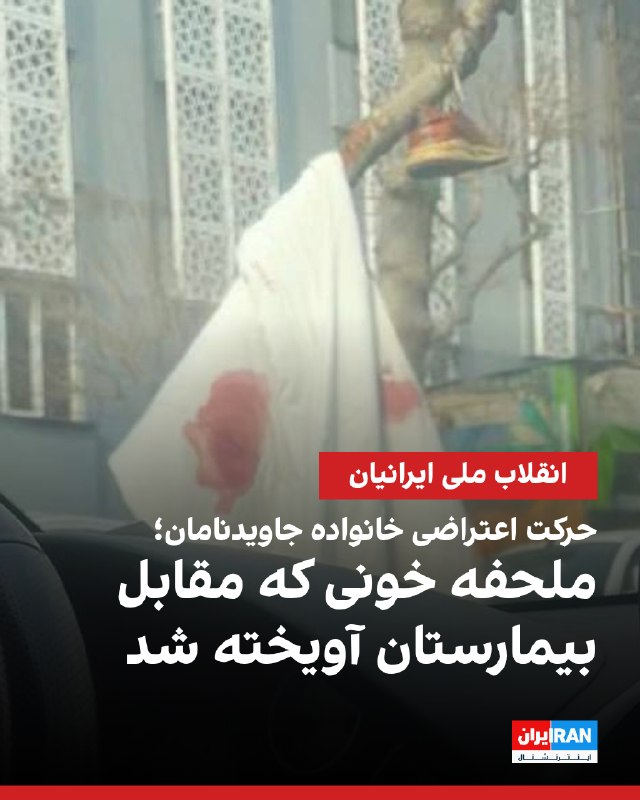

یک مخاطب با ارسال تصویری به ایران اینترنشنال نوشت در جریان انقلاب ملی ایرانیان، روز ۱۹ دی‌ماه، خانواده‌های جاویدنامان در حرکتی اعتراضی ملحفه‌ای خونی را در مقابل بیمارستانی در منطقه تهرانپارس تهران روی درخت قرار داده بودند.

در آن زمان شهروندان برای یادبود جاویدنامان مقابل بیمارستان تهرانپارس شمع نیز روشن کرده بودند.
https://iranintl.com/202606137511

## FarsiVOA — post 220564

  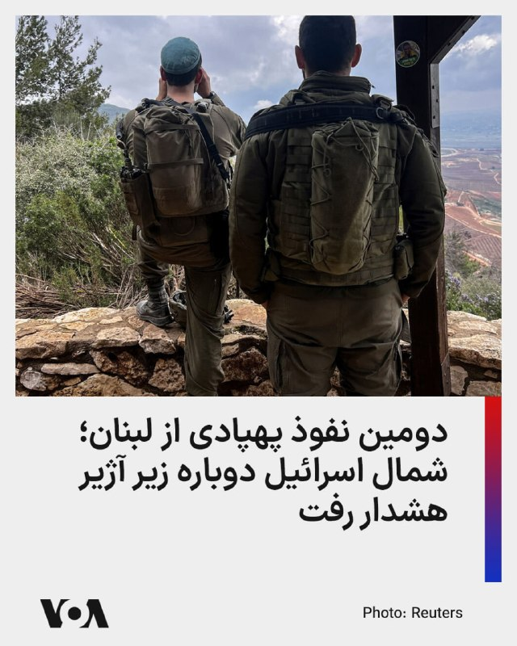

ارتش دفاعی اسرائیل اعلام کرد پس از به صدا درآمدن آژیرها در مناطق متولا و میسگاو عم، نیروی هوایی اسرائیل یک هدف هوایی مشکوک را که از لبنان وارد خاک اسرائیل شده بود، رهگیری کرد.

به گفته ارتش اسرائیل، هشدارهای موشکی و راکتی به‌دلیل عملیات رهگیری فعال شده بود.

این دومین بار در ۲۴ ساعت گذشته است که پهپادی وابسته به حزب‌الله از لبنان وارد خاک اسرائیل می‌شود. تکرار این نفوذ هوایی در فاصله‌ای کوتاه، بار دیگر تنش در مرزهای شمالی اسرائیل را بالا برده است.

مقام‌های سیاسی اسرائیل پیش‌تر هشدار داده‌اند در صورت ادامه چنین حملاتی، پاسخ اسرائیل می‌تواند به بیروت نیز کشیده شود.
@FarsivOA

## IranianMinds — post 22447

تمامی بانک های کشور دچار اختلال شدن

@IranianMinds

## alonews — post 127582

  <a href="telegram/content/alonews_127582_1781340746.webm" target="_blank">🎬 Download video</a>

👈تماس تلفنی وزیر خارجه پاکستان با همتای مصری خود درباره تلاش‌های جاری برای پایان دادن به جنگ علیه ایران

✅ @AloNews خبر جنگ

---
📅 بروزرسانی: 1405/03/23 12:12
---

## VahidOOnLine — post 245269

  <a href="telegram/content/VahidOOnLine_245269_1781340160.mp4" target="_blank">🎬 Download video</a>

ویدیوی رسیده به ایران اینترنشنال نشان می‌دهد که شامگاه ۲۲ خرداد در دزفول، یک شهروند معترض روی دیوار شعار «زن مرد آزادی، شاه میهن آبادی» را نوشت.
‌🏁 🇬🇧 IranintlTV

🤖 @VahidOOnLine

## DEJradio — post 5641

⭕️
🚀 سرنگونی دوبارۀ پهپادهای جمهوری اسلامی توسط آمریکا؛ تنگه هرمز باز است

ستاد فرماندهی مرکزی ارتش آمریکا روز شنبه اعلام کرد نیروهای این کشور چندین پهپاد تهاجمی جمهوری اسلامی را که به سمت کشتی‌های تجاری در تنگۀ هرمز در حرکت بود، سرنگون کرده‌اند.
به گزارش سنتکام، همه این پهپادها در بامداد شنبه نابود شد و عبور کشتی‌ها از تنگۀ هرمز بدون مشکل ادامه دارد.
در بیانیۀ سنتکام تأکید شد که آبراه هرمز برای عبور و مرور بین‌المللی تجاری، همچنان باز است.

#پهپاد #تنگه_هرمز #سنتکام
@DEJradio

## IranIntlTV — post 342021

  <a href="telegram/content/IranIntlTV_342021_1781340163.mp4" target="_blank">🎬 Download video</a>

ویدیوی رسیده به ایران اینترنشنال نشان می‌دهد که شامگاه ۲۲ خرداد در دزفول، یک شهروند معترض روی دیوار شعار «زن مرد آزادی، شاه میهن آبادی» را نوشت.

## IranianMinds — post 22446

  

دیشب توی بازی آمریکا تو جام جهانی «لانا رودز» و «میا خلیفه» هم توی ورزشگاه حضور داشتن.

@IranianMinds

## BBCPersian — post 283654

🔻وزارت علوم ایران از تدوین آیین‌نامه استفاده از هوش مصنوعی در دانشگاه‌ها خبر داد

معاون آموزشی وزارت علوم، تحقیقات و فناوری از تدوین آیین‌نامه‌ای برای نحوه استفاده از هوش مصنوعی در دانشگاه‌ها خبر داده است.

ابوالفضل واحدی با اشاره به این که استفاده از هوش مصنوعی در برخی موارد می‌تواند به «سوءاستفاده منجر شود، به‌ویژه در امتحانات مجازی»، گفت که در شرایط «نبود نظارت کافی، برخی دانشجویان ممکن است از این ابزار برای دسترسی به پاسخ‌ها استفاده کنند.» موضوعی که به گفته او در بررسی‌ها هم دیده شده است.

او همچنین افزود: «حذف کامل هوش مصنوعی نه ممکن است و نه مطلوب، اما باید با تدوین کدهای اخلاقی، تقویت نظارت و ایجاد سازوکارهای کنترلی، استفاده صحیح از آن مدیریت شود.»

https://bbc.in/4onLYbc
@BBCPersian

## Dirty_Kids — post 391867

  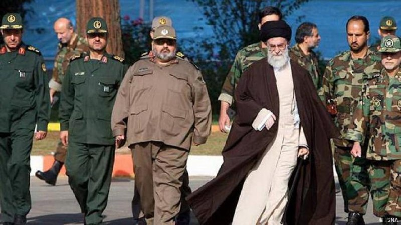

این یارو فیروزآبادی حقیقتاً یکی از ترازترین انتصابات آخوندها بود. بدون حتی یک روز سابقه‌ی نظامیگری بهش درجه‌ی سرلشکری داده بودن و کرده بودنش رئیس ستاد کل نیروهای مسلح، اونم برای ۲۷ سال.

@Dirty_Kids 👻

## Dirty_Kids — post 391866

درس خوندن تو خارج نعمته @Dirty_Kids 👻

## Dirty_Kids — post 391865

  <a href="telegram/content/Dirty_Kids_391865_1781340166.mp4" target="_blank">🎬 Download video</a>

درس خوندن تو خارج نعمته

@Dirty_Kids 👻

## Hranews — post 113572

  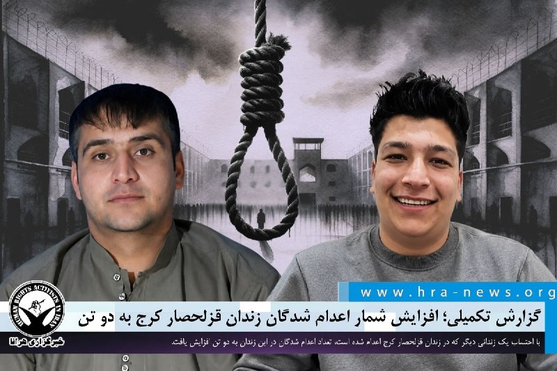

گزارش تکمیلی؛ افزایش شمار اعدام شدگان زندان قزلحصار کرج به دو تن

❗️
❗️
❗️
❗️
❗️ – با احتساب یک زندانی دیگر که سحرگاه امروز شنبه ۲۳ خردادماه، در زندان قزلحصار کرج #اعدام شده است، تعداد اعدام شدگان روز جاری در این زندان به دو تن افزایش یافت.

به گزارش خبرگزاری هرانا، ارگان خبری مجموعه فعالان حقوق بشر در ایران، امروز شنبه ۲۳ خرداد ۱۴۰۵، دو زندانی در زندان قزلحصار کرج اعدام شدند.

علاوه بر اجرای حکم سیداکبر بنی‌هاشم، حکم اعدام یک زندانی دیگر نیز در این زندان اجرا شده است. هویت وی، امیرعباس دکاوند توسط هرانا احراز شده است.

ادامه مطلب

#امیرعباس_دکاوند

↘️
@hranews_bot تماس ✉️ -  @Hranews  کانال هرانا 🆑

## alonews — post 127578

  <a href="telegram/content/alonews_127578_1781340167.mp4" target="_blank">🎬 Download video</a>

👈پهپادهای اوکراینی به پالایشگاه‌های نفت TANECO و TAIF-NK روسیه حمله کردن

✅ @AloNews خبر جنگ

## alonews — post 127577

  <a href="telegram/content/alonews_127577_1781340168.mp4" target="_blank">🎬 Download video</a>

👈انفجار مهیب تانکر حامل سوخت قاچاق در مکزیک

✅ @AloNews خبر جنگ

## alonews — post 127576

  <a href="telegram/content/alonews_127576_1781340170.mp4" target="_blank">🎬 Download video</a>

👈رئیس کمیسیون امنیت ملی مجلس: طرح مدیریت تنگه هرمز یک اقدام ماندگار مثل ملی شدن صنعت نفت است

✅ @AloNews خبر جنگ

## alonews — post 127575

  <a href="telegram/content/alonews_127575_1781340172.mp4" target="_blank">🎬 Download video</a>

👈 وسط اتوبان حکیم تهران، پیاده موبایل یه نفر رو دزدیدن

✅ @AloNews خبر جنگ

---
📅 بروزرسانی: 1405/03/23 12:02
---

## VahidOOnLine — post 245268

♦️ابراهیم عزیزی، رئیس کمیسیون امنیت ملی و سیاست خارجی مجلس شورای اسلامی، روز شنبه ۲۳ خرداد ماه در حاشیه یک رویداد حکومتی با دفاع از طرح مدیریت تنگه هرمز، آن را اقدامی ماندگار و هم‌تراز با ملی شدن صنعت نفت توصیف کرد.
ابراهیم عزیزی در گفتگو با رسانه حکومتی باشگاه خبرنگاران جوان گفت همه موضوعات مرتبط با طرح مدیریت تنگه هرمز، از جمله نحوه تردد و حقوق حقه ملت ایران، در این طرح دیده شده و در صورت تبدیل شدن به قانون، یک قانون کامل و جامع خواهد بود.
او همچنین با اشاره به طرح تامین امنیت، توسعه و پیشرفت خلیج فارس و تنگه هرمز گفت: «این طرح یک اقدام ماندگار مانند ملی شدن صنعت نفت است و می‌تواند نقش مهمی در صیانت از منافع ملی کشور ایفا کند.»
رئیس کمیسیون امنیت ملی و سیاست خارجی مجلس در ادامه ادعا کرد جمهوری اسلامی ایران در مواجهه با تهدیدات بر اساس منافع ملی عمل می‌کند و رویکردی واکنشی ندارد.
‌🇸🇦 Indypersian

🤖 @VahidOOnLine

## mwarmonitor — post 10806

🔴در هفته‌های اخیر، ایران به‌طور چشمگیری تلاش‌های خود را برای مسدود کردن دسترسی به ذخایر اورانیوم غنی‌شده افزایش داده است. 🔸بر اساس گفته‌های پنج منبع آگاه از اطلاعات آمریکا، ایران به‌صورت عمدی باعث ریزش تونل‌ها شده و با استفاده از مواد منفجره، ورودی‌های آن‌ها…

## mwarmonitor — post 10805

📰 بلومبرگ:
ایران به‌احتمال زیاد در جریان آتش‌بس، سلاح‌های پیشرفته روسی را به ذخایر تسلیحاتی خود اضافه کرده است.

@mwarmonitor

## IranIntlTV — post 342020

  <a href="telegram/content/IranIntlTV_342020_1781339544.mp4" target="_blank">🎬 Download video</a>

«#سیاست با #مراد_ویسی»؛ شنبه تا چهارشنبه ساعت ۰۰:۳۰ تهران 

در اینجا به سیاست، «آنگونه که هست» و نه « آنگونه که برای ما می‌خوانند» نگاه خواهیم کرد.

دسترسی به سایر قسمت‌ها در کانال یوتیوب و اپلیکیشن اینتل‌پلاس

https://www.youtube.com/playlist?list=PLrqEUp1jEA7XbyLZn3GVY3skYdN7lMN8K

@iranintltv

## FarsiVOA — post 220563

🔺تشکیل پرونده قضایی برای چند وزیر؛ رد آلودگی هوا از کابینه تا خیابان

▪️سخنگوی قوه قضائیه، اعلام کرد در پنج سال گذشته برای «چند وزیر و معاون وزیر» به‌دلیل ترک فعل در اجرای قانون هوای پاک پرونده تشکیل شده است.

▪️او گفت سازمان بازرسی کل کشور و دادستانی، همچنین برخی کارخانه‌ها و شرکت‌های آلاینده را نیز موظف کرده‌اند از فیلتر و تجهیزات کنترل آلودگی استفاده کنند.

▪️این نخستین بار نیست که پرونده آلودگی هوا به سطح مدیران ارشد می‌رسد. پیشتر گزارش‌هایی از تشکیل پرونده برای وزرای سابق نفت و کشور و رئیس وقت سازمان حفاظت محیط زیست منتشر شده بود.

▪️قانون هوای پاک، مسئولیت آلودگی را میان چند نهاد تقسیم کرده است؛ از جمله سازمان محیط زیست، وزارت نفت، وزارت صمت و وزارت کشور.

⬇️ بیشتر بخوانید:
https://ir.voanews.com/a/8160418.html

---
📅 بروزرسانی: 1405/03/23 11:52
---

## VahidOOnLine — post 245267

🗣روایت شما در واکنش به احتمال توافق میان جمهوری اسلامی و آمریکا - شنبه ۲۳ خرداد ۱۴۰۵

🔹آقای ترامپ، شما که می‌گفتید پشت مردم ایران هستم، چرا توی این بندهای توافق هیچ بندی برای رفاه مردم در نظر گرفته نشده؟ چرا ما از قبل از حمله شما بیشتر تحت فشاریم؟ فقط می‌خواستید مردم بدبخت‌تر از قبل باشن؟

🔹ما این همه جوون از دست دادیم، چه توافقی؟

🔹ما که سال‌هاست دست جمهوری اسلامی برامون رو شده، ولی شما ارزشی‌ها از این همه تناقض رگ‌به‌رگ نمی‌شید! همش می‌گن انتقام، بعد دارن توافق کنن، آن‌هم با شرایط آمریکا که قبل از دو جنگ می‌تونستن قبول کنن!

🔹ایران رو ظرف ۴۷ سال نابود کردن، طوری که تنها چیزی که توش اول هستیم، رکورد اعدام و قطعی طولانی اینترنت هست. حیف.

🔹اگر همه دنیا پشت جمهوری اسلامی باشند، ملت ایران اجازه ماندنش را نمی‌دهد. دیگر منتظر کسی نیستیم. چشم به فراخوان شاهزاده داریم و برای آزادی ایران می‌ایستیم. ناامید نشوید؛ این حکومت رفتنی است. زنده باد آزادی، زنده باد ایران.

🔹نگران توافق نباشید، توافق پیش‌زمینه خلع سلاح و پایان حکومت است. باید مذاکره کنن که بتونن سلاح‌ها رو ازشون بگیرن. آدم‌های سرسخت حذف شدن، حالا تحت فشار اقتصادی مجبورن توافق کنن و در نهایت تسلیم و پایان کار.

🔹ایرانی‌ها همون‌طور که کارتر و اوباما و بایدن رو فراموش نکردن، ترامپ رو هم فراموش نمی‌کنن، مطمئناً.
‌🏁 🇬🇧 IranintlTV

🤖 @VahidOOnLine

## mwarmonitor — post 10804

🔴در هفته‌های اخیر، ایران به‌طور چشمگیری تلاش‌های خود را برای مسدود کردن دسترسی به ذخایر اورانیوم غنی‌شده افزایش داده است.

🔸بر اساس گفته‌های پنج منبع آگاه از اطلاعات آمریکا، ایران به‌صورت عمدی باعث ریزش تونل‌ها شده و با استفاده از مواد منفجره، ورودی‌های آن‌ها را مین‌گذاری کرده است.

🔸به گفته این منابع، دسترسی به ذخایر اورانیوم غنی‌شده اکنون دشوارتر و خطرناک‌تر شده و نسبت به فقط یک ماه پیش، به زمان بیشتری نیاز دارد.

@mwarmonitor

## DEJradio — post 5640

  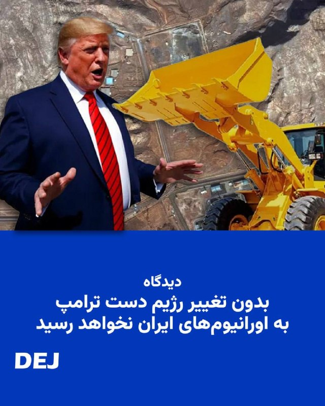

🔺📢 سی‌ان‌ان به نقل از منابع آگاه امنیتی آمریکا به اسم «اطلاعات محرمانه» گزارش داد، جمهوری اسلامی ایران در هفته‌های اخیر اقدامات خود برای مسدودسازی انبار اورانیوم غنی‌شده با خلوص بالای خود را به طرز چشم‌گیری افزایش داده و عمداً تونل‌ها و ورودی‌ها را تخریب و اطراف انبارها را مین‌گذاری کرده است.
کارشناسان به سی‌ان‌ان گفته‌اند دسترسی به حدود نیم تُن اورانیوم ۶۰ درصدی اکنون بسیار دشوارتر، خطرناک‌تر و زمان‌برتر از یک ماه پیش شده است.

احتمالاً دستگاه‌های امنیتی آمریکا خواب بودند، یا اطلاعات سوخته به ترامپ دادند و یا با این اطلاعات قصد تأثیرگذاری در تصیم‌ها را دارند اما واقعیت آن است که سال‌هاست پولی که باید در سفره مردم ایران قرار بگیرد، صرف غنی‌سازی و حفاظت از تاسیسات و اورانیوم‌های خروجی می‌شود.

اورانیوم‌ها زیر کوه‌ها مدفون است و اگر سربازان آمریکایی بخواهند برای تصاحب آن وارد ایران شوند، باید علاوه بر اسلحه بیل و کلنگ هم بیاورند! احتمالاً اگر آنها از حمله نظامی زمینی برای تصاحب اورانیوم‌ها منصرف شدند به این دلیل بود که به این فکر کردند که وسط بیابان‌ با سـ.ـپاه و ارتش بجنگند یا لودر و بولدوزر و راننده پیدا کنند؟

خارج کردن اورانیوم از ایران نیازمند همکاری متخصصان تحت نظارت اداره ملی امنیت هسته‌ای آمریکاست. اصلا شرایط برای ورود آمریکایی‌ها به ایران آنهم برای یک پروژه امنیتی فراهم نیست.

ترامپ اگر اورانیوم‌ها را می‌خواهد راهی جز حمایت از مردم ایران برای «تغییر رژیم» ندارد.

#ترامپ #اورانیوم

## mamlekate — post 103697

یه جوری این عکسای مارو بگیر، این ساعته حتما بیفته.

DauiiiNaser
@mamlekate

## mamlekate — post 103696

  <a href="telegram/content/mamlekate_103696_1781338969.mp4" target="_blank">🎬 Download video</a>

از مکزیک مهاجرت کرد و در سال ۲۰۱۵ یک شغل جوشکاری قراردادی با حقوق ۲۸ دلار در ساعت گرفت.
حتی نمی‌دانست اسپیس‌ایکس چیست.
آنها به او ۱۰،۰۰۰ دلار سهام دادند و اجازه دادند از طریق کسر حقوق، سهام بیشتری بخرد.
ارزش آن سهام اکنون ۸۸۰،۰۰۰ دلار است.

Ecnmic
@mamlekate

## IranIntlTV — post 342019

🗣روایت شما در واکنش به احتمال توافق میان جمهوری اسلامی و آمریکا - شنبه ۲۳ خرداد ۱۴۰۵

🔹آقای ترامپ، شما که می‌گفتید پشت مردم ایران هستم، چرا توی این بندهای توافق هیچ بندی برای رفاه مردم در نظر گرفته نشده؟ چرا ما از قبل از حمله شما بیشتر تحت فشاریم؟ فقط می‌خواستید مردم بدبخت‌تر از قبل باشن؟

🔹ما این همه جوون از دست دادیم، چه توافقی؟

🔹ما که سال‌هاست دست جمهوری اسلامی برامون رو شده، ولی شما ارزشی‌ها از این همه تناقض رگ‌به‌رگ نمی‌شید! همش می‌گن انتقام، بعد دارن توافق کنن، آن‌هم با شرایط آمریکا که قبل از دو جنگ می‌تونستن قبول کنن!

🔹ایران رو ظرف ۴۷ سال نابود کردن، طوری که تنها چیزی که توش اول هستیم، رکورد اعدام و قطعی طولانی اینترنت هست. حیف.

🔹اگر همه دنیا پشت جمهوری اسلامی باشند، ملت ایران اجازه ماندنش را نمی‌دهد. دیگر منتظر کسی نیستیم. چشم به فراخوان شاهزاده داریم و برای آزادی ایران می‌ایستیم. ناامید نشوید؛ این حکومت رفتنی است. زنده باد آزادی، زنده باد ایران.

🔹نگران توافق نباشید، توافق پیش‌زمینه خلع سلاح و پایان حکومت است. باید مذاکره کنن که بتونن سلاح‌ها رو ازشون بگیرن. آدم‌های سرسخت حذف شدن، حالا تحت فشار اقتصادی مجبورن توافق کنن و در نهایت تسلیم و پایان کار.

🔹ایرانی‌ها همون‌طور که کارتر و اوباما و بایدن رو فراموش نکردن، ترامپ رو هم فراموش نمی‌کنن، مطمئناً.

## FarsiVOA — post 220562

  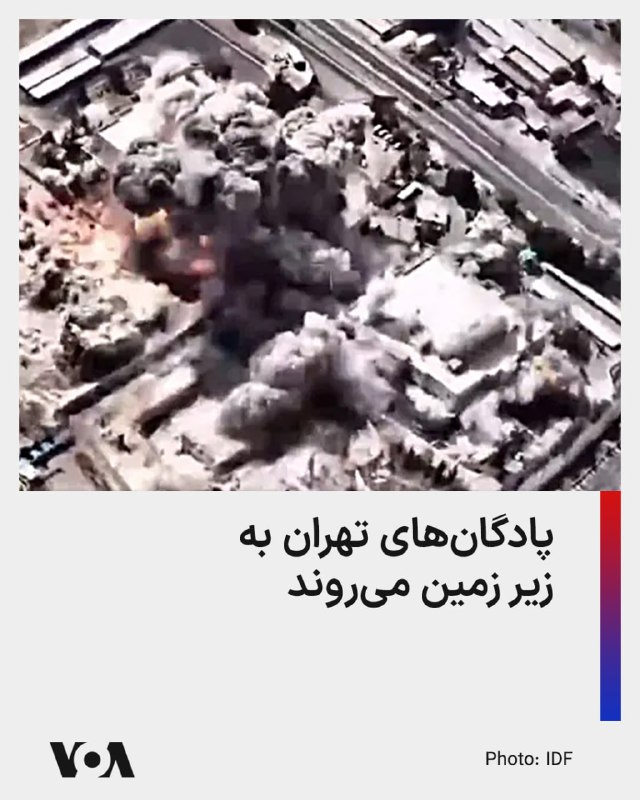

روزنامه شرق به نقل از عبدالمطهر محمدخانی، سخنگوی شهردار تهران، گزارش داد شهرداری مأموریت بازنگری در بخشی از طرح تفصیلی تهران و همچنین «طرح تفصیلی زیرزمینی» شهر را آغاز کرده است؛ بازنگری‌ای که بخشی از آن به جانمایی فضاهایی برای فعالیت‌ها و نیازهای نظامی مربوط می‌شود.

محمدخانی گفت این روند با تعامل مجموعه‌های نظامی و با توجه به «شرایط خاص کشور» و استمرار تهدیدهای خارجی دنبال می‌شود.

او تأکید کرد برداشت اینکه شهرداری قصد دارد همه مراکز نظامی را از شهر خارج کند درست نیست، اما ممکن است برخی از این مراکز به فضاهای زیرزمینی منتقل شوند و برخی دیگر در نقاط مشخصی از شهر جانمایی شوند.

سخنگوی شهردار تهران، همچنین از آماده‌سازی زیرساخت‌های ایمن شهری خبر داد و گفت نخستین پارکینگ-پناهگاه تهران در منطقه ۱۰ طی هفته‌های آینده افتتاح می‌شود. محمدخانی افزود در طرح تفصیلی زیرزمینی تهران، فضاهای امدادی، درمانی، بیمارستانی و ایمنی با نگاه پدافند غیرعامل پیش‌بینی شده‌اند.
@FarsiVOA

## alonews — post 127574

  <a href="telegram/content/alonews_127574_1781338972.webm" target="_blank">🎬 Download video</a>

👈اژه‌ای: به آمریکایی‌ها مطلقاً اعتماد نداریم

✅ @AloNews خبر جنگ

## alonews — post 127573

  <a href="telegram/content/alonews_127573_1781338972.webm" target="_blank">🎬 Download video</a>

👈شبکه سی‌ان‌ان به نقل از پنج منبع آگاه از سازمان اطلاعات آمریکا: ایران در هفته‌های اخیر تلاش‌های خود را برای پلمپ انبار اورانیوم با غنای بالا، به طور چشمگیری افزایش داده و عمداً دهانه تونل‌ها و ورودی‌ها را با انفجار مسدود کرده است

✅ @AloNews خبر جنگ

## alonews — post 127572

  <a href="telegram/content/alonews_127572_1781338972.webm" target="_blank">🎬 Download video</a>

👈آخرین قیمت دلار ۱۷۲ هزار تومان

✅ @AloNews خبر جنگ

## alonews — post 127571

  <a href="telegram/content/alonews_127571_1781338973.webm" target="_blank">🎬 Download video</a>

👈اسکات بسنت، وزیر خزانه داری آمریکا اعلام کرد که با توجه به روند پیشرفت مذاکرات، انتظار می‌رود توافق صلح با ایران «احتمالا تا پایان همین هفته (میلادی) یا اوایل هفته آینده نهایی شود.»

🔴 وی درباره پیامدهای جنگ علیه ایران افزود: «ما درک می‌کنیم که در ماه‌های اخیر شرایط سختی سپری شد و افزایش بهای انرژی بخش زیادی از رشد دستمزدها را بلعید، اما ما در حال عبور از این وضعیت بحرانی هستیم.»

✅ @AloNews خبر جنگ

---
📅 بروزرسانی: 1405/03/23 11:42
---

## VahidOOnLine — post 245266

  

بر اساس گزارش «دانشجویان متحد»، فریدون فراهانی، استاد موسیقی و استاد مدعو معماری دانشگاه پارس، بازداشت شده است. تاکنون اطلاعاتی درباره دلیل بازداشت، محل نگهداری یا وضعیت او منتشر نشده است.
به گزارش این رسانه فراهانی پیش‌تر با انتشار مطلبی در اینستاگرام از اعتراضات دانشجویی حمایت کرد و نوشت: «دانشگاه آرمانی جمهوری اسلامی، قلعه‌ای ایزوله از جامعه بود؛ مانند کارخانه‌ای برای تولید مدرک و عنوان که قلم و اندیشه را سال‌ها به اسارت گرفته بود. در این چرخه باطل، نه آگاهی سیاسی جایی داشت و نه اندیشه با تعهد اجتماعی. امروز دیواری که میان جامعه و دانشگاه کشیده بودند، فرو ریخت.»
‌🏁 🇬🇧 IranintlTV

🤖 @VahidOOnLine

## WithYashar — post 14699

روزنامه خراسان (نزدیک به قالیباف): تفاهم ایران و امریکا قرار نیست اختلافات را حل کند؛ فقط یک فرصت است که طرفین خود را برای جنگی دیگر آماده کنند
@withyashar

## IranIntlTV — post 342018

  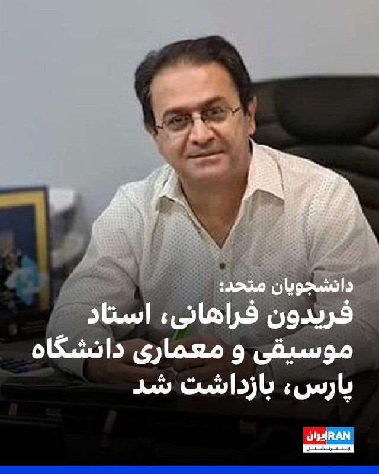

بر اساس گزارش «دانشجویان متحد»، فریدون فراهانی، استاد موسیقی و استاد مدعو معماری دانشگاه پارس، بازداشت شده است. تاکنون اطلاعاتی درباره دلیل بازداشت، محل نگهداری یا وضعیت او منتشر نشده است.
به گزارش این رسانه فراهانی پیش‌تر با انتشار مطلبی در اینستاگرام از اعتراضات دانشجویی حمایت کرد و نوشت: «دانشگاه آرمانی جمهوری اسلامی، قلعه‌ای ایزوله از جامعه بود؛ مانند کارخانه‌ای برای تولید مدرک و عنوان که قلم و اندیشه را سال‌ها به اسارت گرفته بود. در این چرخه باطل، نه آگاهی سیاسی جایی داشت و نه اندیشه با تعهد اجتماعی. امروز دیواری که میان جامعه و دانشگاه کشیده بودند، فرو ریخت.»

## FarsiVOA — post 220561

  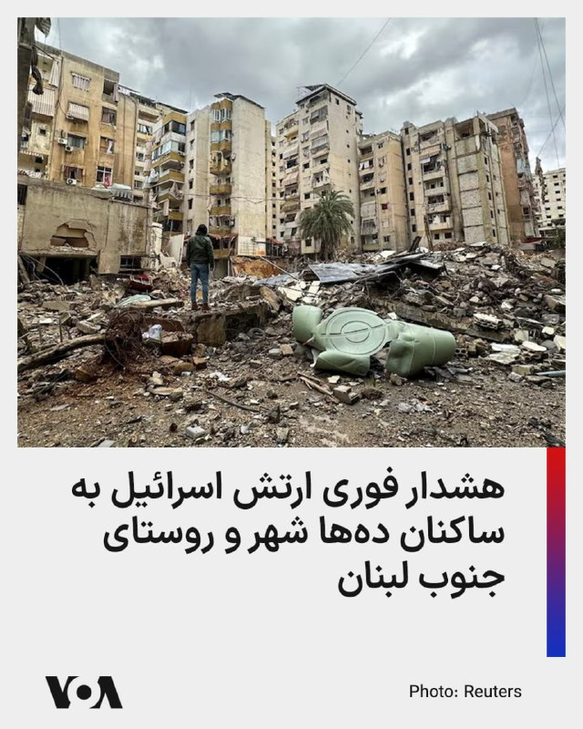

ارتش اسرائیل با صدور هشدار فوری از ساکنان شماری از شهرها و روستاهای جنوب لبنان خواست فوراً خانه‌های خود را ترک کرده و به شمال رود زهرانی بروند.

در این هشدار نام مناطقی از جمله دیرالزهرانی، نمیریه، شرقیه، دویر، حاروف، حبوش، کفرجوز، زبدین، نبطیه تحتا، نبطیه فوقا، کفررمان، محمودیه، سجد، ریحان، عرمتی، کفرحونه، ملیخ، لویزه، جرجوع و عربصالیم آمده است.

ارتش اسرائیل اعلام کرده این اقدام در پی نقض توافق آتش‌بس از سوی حزب‌الله صورت می‌گیرد و تأکید کرده حضور در نزدیکی نیروها، تأسیسات و تجهیزات جنگی حزب‌الله می‌تواند جان غیرنظامیان را در معرض خطر قرار دهد.
@FarsiVOA

## DW_Farsi — post 125917

  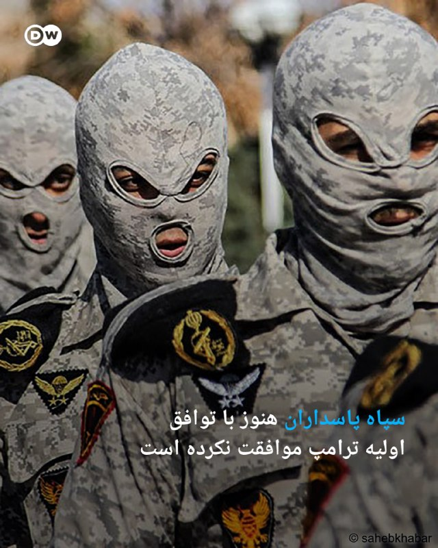

🔶 سپاه پاسداران هنوز با توافق اولیه ترامپ موافقت نکرده است

شبکه خبری "ان‌ت‌فاو " آلمان روز شنبه ۲۳ خرداد (۱۳ ژوئن) به نقل از میانجی‌ها گزارش داد که سپاه پاسداران هنوز با توافق اولیه پیشنهادی دونالد ترامپ، رئیس‌ جمهور آمریکا برای پایان جنگ، موافقت نکرده است.

بر اساس این گزارش هدف مذاکرات، رسیدن به یک توافق حداقلی است که به درگیری‌ها پایان دهد، تنگه هرمز را باز کند و زمینه را برای گفت‌وگوهای بعدی درباره مسائل پیچیده‌تر فراهم سازد.

این شبکه آلمانی همچنین گفته است میانجی‌ها از زمان برقراری یک آتش‌بس شکننده، در تلاش برای پیشبرد مذاکرات هستند. بر این اساس، در کاهش اختلافات، از جمله در موضوع هسته‌ای پیشرفت‌هایی حاصل شده و برخی مقام‌های ارشد ایرانی نیز با این روند همراه هستند.

با این حال، "پیش‌نویس توافق اولیه" همچنان در حال بررسی توسط جریان‌های تندرو در ساختار امنیتی جمهوری اسلامی است.

برای نخستین‌بار عباس عراقچی، وزیر خارجه ایران نیز تائید کرد که "تفاهم‌نامه اسلام‌آباد هیچ‌گاه تا این حد به نهایی شدن نزدیک نبوده است".

این پیام عراقچی را که در شبکه ایکس منتشر شده بود دونالد ترامپ هم در پلتفرم خود در "تروث سوشال" بازنشر کرده است.

@dw_farsi

## Persian_Trend_Official — post 16918

  

⭕️ و بله، سرمایه ایلان ماسک حالا از مجموع ثروت 4 فرد ثروتمند پس از خودش بیشتر شد و او به اولین تريليونر تاریخ بشر تبدیل شد.

📝 Nick

📌 @persian_trend_official
پرشین ترند | متفاوت‌ترین کانال نظامی

## alonews — post 127570

  <a href="telegram/content/alonews_127570_1781338364.webm" target="_blank">🎬 Download video</a>

👈سی‌ان‌ان به نقل از منابع: ارتش آمریکا برای اجرای مأموریت زمینی به منظور تصرف اورانیوم ایران در اصفهان، تجهیزات را سریعاً آماده کرد

🔴اما ترامپ پس از آنکه به او هشدار داده شد که این اقدام به احتمال زیاد منجر به واکنش خشونت‌آمیز ایران خواهد شد که باعث طولانی شدن جنگ و افزایش بی‌ثباتی اقتصاد جهانی می‌گردد، این گام را به‌طور موقت متوقف کرد

✅ @AloNews خبر جنگ

## alonews — post 127569

  <a href="telegram/content/alonews_127569_1781338365.mp4" target="_blank">🎬 Download video</a>

👈 عباس عراقچی: مسئولیت مذاکرات توسط نظام به قالیباف سپرده شده.

✅ @AloNews خبر جنگ

## alonews — post 127568

  <a href="telegram/content/alonews_127568_1781338367.webm" target="_blank">🎬 Download video</a>

👈 هشدار سیلاب و تگرگ در ۹ استان؛ گرمای غیرمتعارف در شرق کشور

🔴 امروز (شنبه ۲۳ خرداد) شمال غرب کشور به‌ویژه استان اردبیل با بارش‌های سنگین و خطر سیلاب مواجه است.

🔴 همچنین در نیمه شرقی آذربایجان شرقی، ارتفاعات البرز، مازندران، سمنان، گلستان و بخش‌هایی از خراسان شمالی و رضوی رگبار، رعدوبرق و تگرگ پیش‌بینی می‌شود. فردا از شدت بارش‌ها کاسته می‌شود.

🔴 وزش باد و گردوخاک در تهران، قم، خوزستان و یزد ادامه دارد و گرمای غیرمتعارف در نیمه شرقی کشور ماندگار است.

✅ @AloNews خبر جنگ

---
📅 بروزرسانی: 1405/03/23 11:32
---

## IranIntlTV — post 342017

  <a href="telegram/content/IranIntlTV_342017_1781337774.mp4" target="_blank">🎬 Download video</a>

عمیق‌ترین رکود صنعتی ایران را این بار نه منتقدان حکومت، که آمار رسمی اتاق بازرگانی ثبت کرده است. در این قسمت چرتکه، محمد ماشین‌چیان کارنامه صنعت ایران پس از جنگ را بررسی می‌کند.

تماشای نسخه کامل این برنامه در یوتیوب:

https://youtu.be/5_cvWJFAHOY

@iranintltv

## FarsiVOA — post 220560

Farsi VOA pinned an audio file

## FarsiVOA — post 220559

  <a href="https://t.me/farsivoa/220559" target="_blank">📎 Download file</a>

🔴📢‌ پادکست خبری جمعه ۲۲خرداد ۱۴۰۵

🛜در صورتی که با مشکل اینترنت مواجه هستید میتوانید اخبار صدای آمریکا را از نسخه‌های پادکست خبری ما روزانه دنبال کنید و یا اخبار را از نسخه سبک وب‌سایت ما پیگیر باشید:
https://ir.voanews.com/lite

📡بروزترین فرکانسهای ماهواره‌ای را نیز میتوانید از صفحه زیر پیگیری کنید:
https://ir.voanews.com/satellite

🔔دیگر شبکه‌های اجتماعی ما را هم دنبال کنید:
https://linktr.ee/voafarsi

ما را به اشتراک بگذارید
@farsivoa

## DW_Farsi — post 125916

  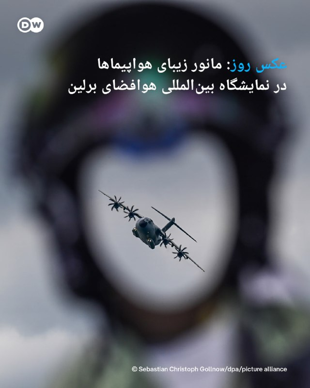

📸 عکس روز: مانور زیبای هواپیماها در نمایشگاه بین‌المللی هوافضای برلین

تصویر پرواز یک هواپیمای اِی۴۰۰ام اطلس در جریان نمایشگاه بین‌المللی هوافضا در برلین. اطلس، یک هواپیمای ترابری سنگین نظامی چندمنظوره است که توسط شرکت چندملیتی ایرباس تولید می‌شود. این غول پرنده برای انجام عملیات‌های پیچیده نظامی و امدادرسانی ساخته شده است. در قسمتی از این نمایشگاه یک ماکت مقوایی خلبان تعبیه شده که بازدیدکنندگان می‌توانند سر خود را از داخل آن بیرون آورده و عکس یادگاری بگیرند.

@dw_farsi

## RadioFarda — post 158247

  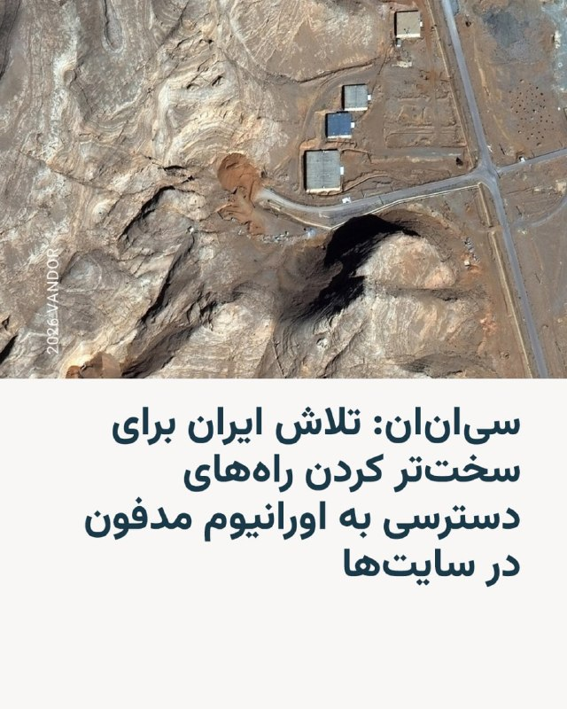

🔸شبکه تلویزیونی سی‌ان‌ان در گزارشی اختصاصی که روز شنبه، ۲۳ خردادماه، منتشر شد می‌گوید که حکومت ایران در هفته‌های اخیر بر تلاش خود برای سخت‌تر کردن راه‌های دسترسی به اورانیوم غنی‌شده مدفون در سایت‌های بمباران‌شده‌اش افزوده است.

🔸این گزارش به نقل از پنج منبع «آشنا با اطلاعات و ارزیابی‌های دولت ایالات متحده» نوشته شده، اما به نام و منصب آنها اشاره نکرده است.

🔸اورانیوم با غنای بالای ایران که مقدار آن نزدیک به هزار پوند یا ۴۴۰ کیلوگرم عنوان شده یک سال است که در تونل‌های زیرزمینی سایت‌های بمباران‌شده ایران در نطنز و فردو و اصفهان مدفون است.

🔸در مذاکراتی که گفته می‌شود تهران و واشینگتن همین روزها در حال نهایی کردن آن هستند این مواد غنی‌شده که به گفته کارشناسان می‌تواند در ساخت ده بمب اتمی به کار برود یکی از موضوعات اصلی است.

🔸حال سی‌ان‌ان در گزارش خود نوشته است که جمهوری اسلامی در هفته‌های اخیر این تونل‌های زیرزمینی را منفجر کرده و در ورودی آنها مین کار گذاشته است تا دسترسی به آنها را هر چه بیشتر دشوار سازد.

@RadioFarda

## BBCPersian — post 283653

🔺قیمت نفت در پی احتمال توافق صلح، به پایین‌ترین حد خود از حدود چهار ماه پیش رسید

قیمت نفت خام برنت به پایین‌ترین سطح خود از اوایل ماه مارس (حدود چهار ماه پیش) رسید؛ زیرا معامله‌گران بیش از پیش به دستیابی قریب‌الوقوع به یک توافق صلح میان ایالات متحده آمریکا و ایران اطمینان پیدا کردند.

قیمت نفت برنت به ۸۷٫۳۳ دلار در هر بشکه رسیده است که نسبت به روز قبل ۳٫۰۵ دلار (معادل ۳٫۴ درصد) کاهش داشته است.

نفت خام وست تگزاس اینترمدیت آمریکا هم به ۸۴٫۸۸ دلار در هر بشکه رسید که ۲٫۸۳ دلار یا ۳٫۲ درصد کاهش داشت. این پایین‌ترین سطح قیمت نفت خام تگزاس از آوریل (حدود سه ماه پیش) تاکنون است.

جان کیلداف، شریک شرکت سرمایه‌گذاری اگین کپیتال گفت: ««عاملی که بازار را به سمت کاهش قیمت سوق داده، اظهارات ایرانی‌ها مبنی بر وجود یک یادداشت تفاهم با آمریکا است.»

https://bbc.in/4gcUmIA
@BBCPersian

## alonews — post 127567

  <a href="telegram/content/alonews_127567_1781337778.webm" target="_blank">🎬 Download video</a>

👈تحلیل روزنامه ( خراسان) نزدیک به قالیباف: تفاهم ایران و امریکا قرار نیست اختلافات را حل کند؛ فقط یک فرصت است که طرفین خود را برای جنگی دیگر آماده کنند

✅ @AloNews خبر جنگ

## alonews — post 127566

  <a href="telegram/content/alonews_127566_1781337778.webm" target="_blank">🎬 Download video</a>

👈آخرین قیمت نفت ۸۷.۳۳ دلار

✅ @AloNews خبر جنگ

---
📅 بروزرسانی: 1405/03/23 11:22
---

## VahidOOnLine — post 245265

  

روزنامه جمهوری اسلامی در یادداشتی نوشت: «حمله به پایگاه‌های آمریکا در بحرین و کویت که مبدأ آتشباری آمریکا بودند، اقدامی کاملا طبیعی بود.»

این روزنامه افزود: «رفتن به سراغ پایگاه آمریکایی، مقر هواپیماهای جنگی ارتش آمریکا در اردن، نیز یک ضرورت بود.»

جمهوری اسلامی تاکید کرد: «اگر آتش‌بس را پذیرفته‌ایم و به مذاکره روی خوش نشان می‌دهیم، به این معنا نیست که نمی‌خواهیم انتقام جنایات آمریکا را بگیریم.»
‌🏁 🇬🇧 IranintlTV

🤖 @VahidOOnLine

## WithYashar — post 14698

  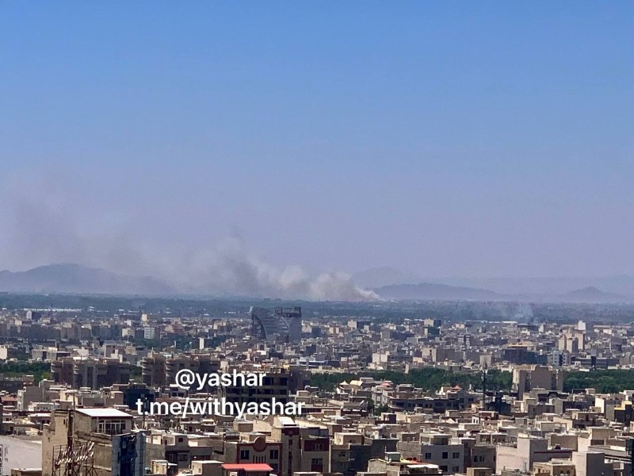

ستون دود الان کرج
@withyashar

## IranIntlTV — post 342016

  <a href="telegram/content/IranIntlTV_342016_1781337170.mp4" target="_blank">🎬 Download video</a>

جاویدنامان انقلاب ملی ایرانیان
«علی نوری» نوجوان ۱۷ساله، شامگاه ۱۸ دی‌ماه در اعتراضات شهر اراک با شلیک گلوله به دست نیروهای خامنه‌ای کشته شد. نامش در حافظه‌ این سرزمین می‌ماند و یادش چراغ راه آزادی‌خواهان است.
@iranintltv

## IranIntlTV — post 342015

  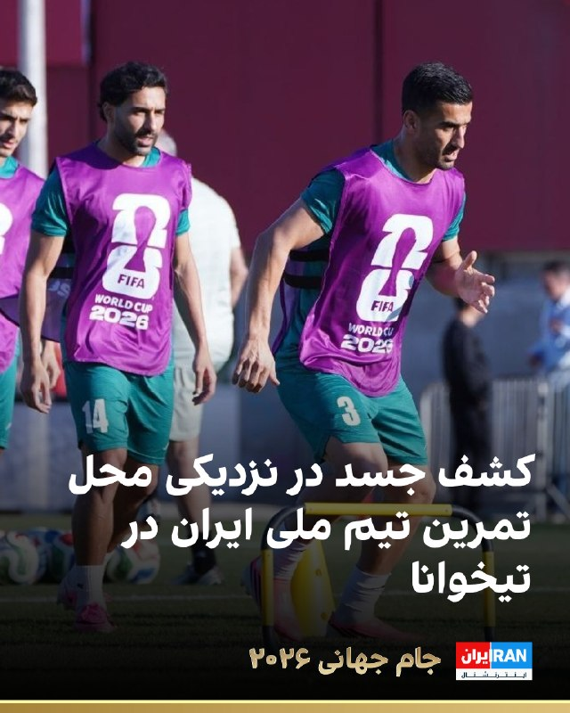

🔻کشف یک جسد در نزدیکی محل تمرین تیم ملی فوتبال ایران در جام جهانی ۲۰۲۶، نگرانی‌هایی را درباره وضعیت امنیتی محل اقامت و تمرین ملی‌پوشان ایران در شهر تیخوانای مکزیک به وجود آورده است.

🔹رسانه آلمانی اسپورت ۱ گزارش داد که یک جسد در حال تجزیه در نزدیکی کمپ تیم ملی ایران در جام جهانی پیدا شده است.

🔹بر اساس این گزارش، پلیس مکزیک جسد را در صندوق عقب یک خودرو در نزدیکی ورزشگاه استادیو کالینته در شهر تیخوانا کشف کرد؛ جایی که تیم ملی ایران این روزها تمرینات خود را برگزار می‌کند. خبرنگاران خبرگزاری فرانسه نیز که در محل حضور داشتند، این اتفاق را تایید کردند.

🔹خودروی مورد نظر، یک شاسی‌بلند با پلاک ایالت کالیفرنیای آمریکا بود که در نزدیکی یک سوپرمارکت مقابل محل تمرین تیم ملی پارک شده بود. ماموران پلیس پس از بازرسی خودرو، جسدی را که در یک کیسه پلاستیکی سیاه‌رنگ پیچیده شده بود، در صندوق عقب پیدا کردند.

🔹یکی از منابع پلیس محلی به خبرگزاری فرانسه گفت: «در جریان بازرسی خودرو، جسدی که داخل کیسه‌ای سیاه قرار داشت، در صندوق عقب کشف شد. آثار ضرب‌وجرح نیز روی جسد مشاهده شده است.»

🔹جزییات بیشتر را اینجا بخوانید

@iranintltvsport

## Persian_Trend_Official — post 16917

  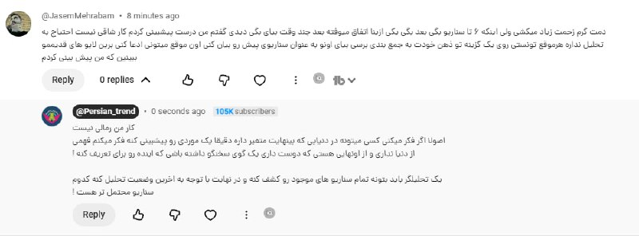

اگر شبهه شما هم هست ...

## Persian_Trend_Official — post 16916

  <a href="telegram/content/Persian_Trend_Official_16916_1781337174.webm" target="_blank">🎬 Download video</a>

طبق گزارش شبکه المنار، وابسته به حزب الله، نیروی زمینی ارتش اسرائیل در پوشش گلوله باران گسترده توپخانه، حمله خود به سمت جنوب شهر نبطیه، پایتخت حزب‌الله در جنوب لبنان را آغاز کرده است. خودرو های زرهی اسرائیلی به صورت گسترده در حال هجوم به سمت جنوب شهر نبطیه…

## IranianMinds — post 22445

  <a href="telegram/content/IranianMinds_22445_1781337175.mp4" target="_blank">🎬 Download video</a>

🔴عراقچی: مسئولیت مذاکرات توسط نظام به آقای قالیباف سپرده شد

@IranianMinds

## Hranews — post 113571

دستور توقیف اموال ۱۰۰ شهروند در استان اصفهان صادر شد

❗️
❗️
❗️
❗️
❗️ – رئیس کل دادگستری استان اصفهان از صدور دستور #توقیف_اموال ۱۰۰ شهروند در این استان به دلیل آنچه «حمایت از دشمن» عنوان کرده، خبر داد.

ادامه مطلب

↘️
@hranews_bot تماس ✉️ -  @Hranews  کانال هرانا 🆑

## alonews — post 127565

  <a href="telegram/content/alonews_127565_1781337177.webm" target="_blank">🎬 Download video</a>

👈خبرنگار الجزیره: حمله پهپادی اسرائیل به شهر آرامتا در شهرستان جزین در جنوب لبنان

✅ @AloNews خبر جنگ

## alonews — post 127564

  <a href="telegram/content/alonews_127564_1781337178.webm" target="_blank">🎬 Download video</a>

👈یک مقام ارشد آمریکایی به نیویورک تایمز گفت: «میانجی‌گران و مقامات نظامی ایرانی تأیید کردند که رهبر ایران از توافق راضی است».

✅ @AloNews خبر جنگ

---
📅 بروزرسانی: 1405/03/23 11:12
---

## VahidOOnLine — post 245264

  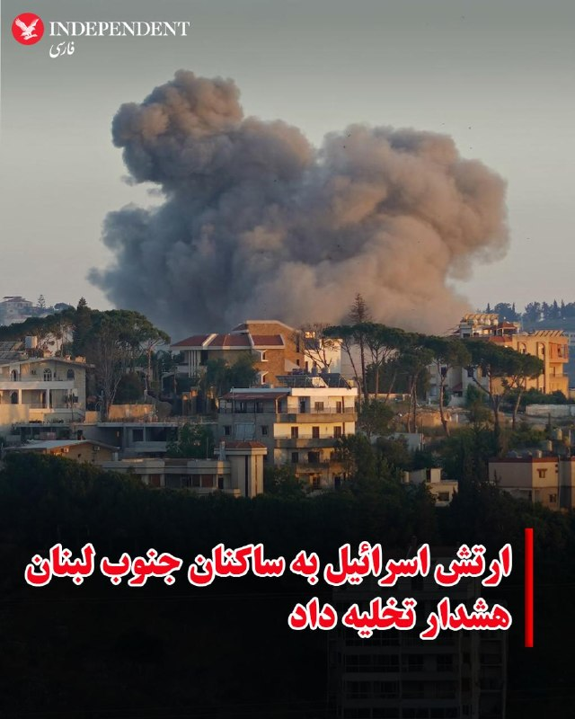

♦️ارتش اسرائیل روز شنبه ۲۳ خرداد با صدور هشداری از ساکنان ۲۰ شهر و روستا در جنوب لبنان، از جمله مناطق اطراف شهر نبطیه، خواست «فورا» محل سکونت خود را ترک کنند و نسبت به حملات قریب‌الوقوع هشدار داد.
آویخای ادرعی، سخنگوی عرب‌زبان ارتش اسرائیل، در پیامی در شبکه اجتماعی ایکس اعلام کرد: «برای حفظ امنیت خود، فورا خانه‌هایتان را تخلیه کرده و به شمال رودخانه زهرانی منتقل شوید.»
او همچنین یادآور شد هر فردی که در نزدیکی تاسیسات یا تجهیزات نظامی حزب‌الله حضور داشته باشد، جان خود را به خطر می‌اندازد.
حزب‌الله لبنان روز جمعه در بیانیه‌ای اعلام کرده بود نیروهایش با نظامیان اسرائیلی که به سمت یکی از شهرهای جنوب لبنان پیشروی می‌کردند، درگیر شده‌اند.
در حالیکه آتش‌بس در لبنان از شروط اصلی تهران برای مذاکرات پایان جنگ با آمریکاست، اسرائیل و حزب‌الله یکدیگر را به نقض آتش‌بس متهم می‌کنند.
‌🇸🇦 Indypersian

🤖 @VahidOOnLine

## IranIntlTV — post 342014

  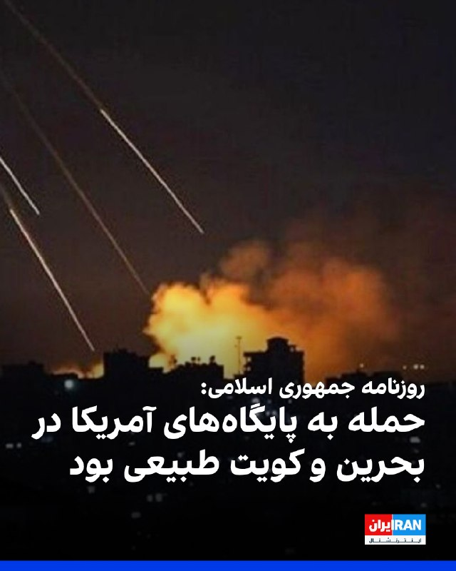

روزنامه جمهوری اسلامی در یادداشتی نوشت: «حمله به پایگاه‌های آمریکا در بحرین و کویت که مبدأ آتشباری آمریکا بودند، اقدامی کاملا طبیعی بود.»

این روزنامه افزود: «رفتن به سراغ پایگاه آمریکایی، مقر هواپیماهای جنگی ارتش آمریکا در اردن، نیز یک ضرورت بود.»

جمهوری اسلامی تاکید کرد: «اگر آتش‌بس را پذیرفته‌ایم و به مذاکره روی خوش نشان می‌دهیم، به این معنا نیست که نمی‌خواهیم انتقام جنایات آمریکا را بگیریم.»
https://iranintl.com/202606137197

## FarsiVOA — post 220558

Farsi VOA pinned a photo

## FarsiVOA — post 220557

  

📸اینستاگرام صدای آمریکا را هم اکنون فالو کنید تا از آخرین خبرها مطلع بمانید:
https://www.instagram.com/voafarsi/

📡همچنین جهت اطلاع از بروزترین فرکانسهای ماهواره‌ای صدای آمریکا به لینک زیر مراجعت فرمایید:
https://ir.voanews.com/satellite

این پست را با دوستانتان به اشتراک بگذارید
@FarsiVOA

## RadioFarda — post 158246

  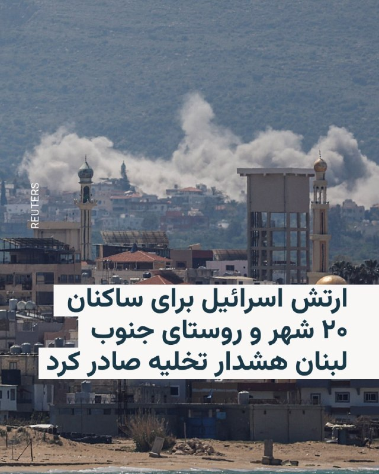

🔸 ارتش اسرائیل روز شنبه ۲۳ خرداد، با وجود آتش‌بس در جنگ با حزب‌الله، نسبت به حملات قریب‌الوقوع به جنوب لبنان هشدار داد و به ساکنان ۲۰ شهر و روستا در نزدیکی شهر نبطیه گفت که این مناطق را تخلیه کنند.

🔸 ارتش اسرائیل اعلام کرد این هشدار در پی نقض آتش‌بس از سوی حزب‌الله لبنان، صادر شده است.

🔸 آویخای ادرعی، سخنگوی عرب‌زبان ارتش، در متنی در شبکه اجتماعی ایکس نوشت: «برای امنیت خود، باید فوراً خانه‌های خود را تخلیه کرده و به شمال رودخانه زهرانی نقل مکان کنید.»

🔸 او افزود: «هر کسی که در مجاورت تأسیسات یا تجهیزات جنگی حزب‌الله باشد، جان خود را به خطر می‌اندازد.» و این جنبش را به نقض آتش‌بس متهم کرد.

🔸 اسرائیل و ایران روز ۱۸ خرداد پس از درخواست دونالد ترامپ، رئیس‌جمهور آمریکا، برای توقف درگیری‌ها، حملات مستقیم به یکدیگر را متوقف کردند. اما تهران اعلام کرد اگر اسرائیل به حمله به متحدش، شبه‌نظامیان حزب‌الله در لبنان، ادامه دهد، درگیری‌ها را از سر خواهد گرفت.

@RadioFarda

## BBCPersian — post 283643

⭕️چرا روحانیون مسلمان در روسیه بازداشت می‌شوند؟

✍️بخش مانیتورینگ
بی‌بی‌سی

چندین روحانی مسلمان و شماری از چهره‌های اجتماعی اخیرا توسط نیروهای امنیتی روسیه بازداشت شده‌اند. در حالی که رسانه‌های دولتی کمتر به این بازداشت‌ها پرداختند، در فضای آنلاین روایت‌های متعددی درباره آن‌ها شکل گرفته است.

برای رسانه‌ها و کانال‌های راست افراطی، این بازداشت‌ها آغاز کارزاری بود که مدت‌ها در انتظارش بودند. کارزاری برای برچیدن اداره دینی مسلمانان فدراسیون روسیه، نهادی مورد حمایت کرملین که مسئول نمایندگی مسلمانان در این کشور است.

📲بی‌بی‌سی مانیتورینگ موج بازداشت‌ها، واکنش روحانیون محلی و پیامدهای احتمالی آن برای جوامع مسلمان در روسیه را بررسی کرده است.🔽

📸GettyImages/ TELEGRAM/ Anadolu via Getty Images/ RBC/ SPIRITUAL ADMINISTRATION OF MUSLIMS (DUM) WEBSITE/ AFP via Getty Images/ TSARGRAD

https://bbc.in/4fJ8olc
@BBCPersian

## Dirty_Kids — post 391864

  

دختر زیبای مکزیکی تا اینجای جام جهانی
باید صبر کرد و بقیه گزینه ها رو دید و نظر دختر شایسته جام جهانی رو داد

@Dirty_Kids 👻

## Dirty_Kids — post 391863

  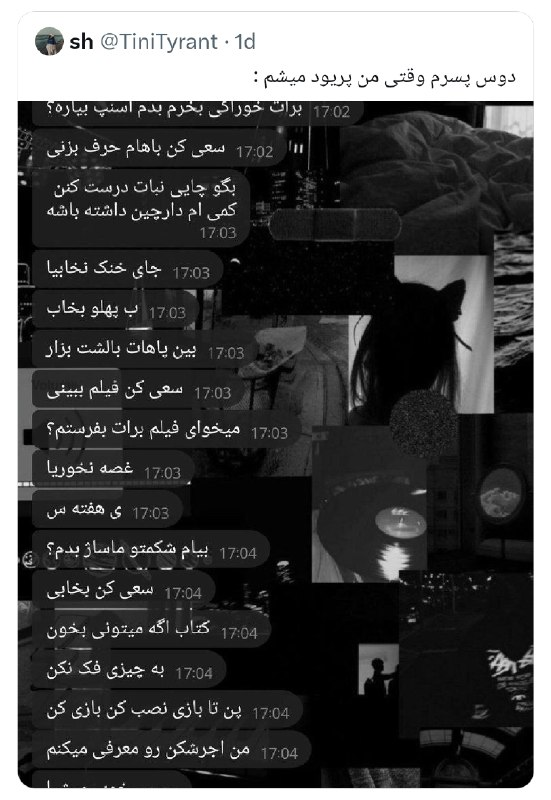

فکرکن پریود هستی، یکیم انقدر زر بزنه

@Dirty_Kids 👻

## Hranews — post 113570

فریدون فراهانی بازداشت شد

❗️
❗️
❗️
❗️
❗️ – فریدون فراهانی، استاد موسیقی و استاد مدعو معماری دانشگاه پارس تهران، توسط نیروهای امنیتی #بازداشت شد.

ادامه مطلب

#فریدون_فراهانی

↘️
@hranews_bot تماس ✉️ -  @Hranews  کانال هرانا 🆑

## alonews — post 127563

  <a href="telegram/content/alonews_127563_1781336567.mp4" target="_blank">🎬 Download video</a>

👈حمله اسرائیل به جنوب لبنان

✅ @AloNews خبر جنگ

## alonews — post 127562

  <a href="telegram/content/alonews_127562_1781336569.mp4" target="_blank">🎬 Download video</a>

👈تو هند، یه هواپیمای روسی نظامی آن-۳۲ سقوط کرد

✅ @AloNews خبر جنگ

## alonews — post 127561

  <a href="telegram/content/alonews_127561_1781336572.webm" target="_blank">🎬 Download video</a>

👈عراقچی: مذاکره منجر به جنگ نمیشه بلکه مقاومت منجر به جنگ میشه

✅ @AloNews خبر جنگ

## alonews — post 127560

  <a href="telegram/content/alonews_127560_1781336572.webm" target="_blank">🎬 Download video</a>

👈روزنامه وال‌استریت ژورنال به نقل از منابع آگاه گزارش داد که سفر یک هیئت دیپلماتیک قطری به تهران، به چند روز حملات متقابل میان ایالات متحده و ایران پس از سقوط یک بالگرد آپاچی آمریکایی پایان داد و رئیس‌جمهور آمریکا، دونالد ترامپ، را متقاعد کرد که حملات شدیدی را که علیه ایران در نظر گرفته بود، لغو کند

✅ @AloNews خبر جنگ

---
📅 بروزرسانی: 1405/03/23 11:02
---

## VahidOOnLine — post 245263

  <a href="telegram/content/VahidOOnLine_245263_1781335941.mp4" target="_blank">🎬 Download video</a>

⭕️ ربات‌های انسان‌نما در هنگ‌کنگ به سبک مایکل جکسون رقصیدند

♦️ربات‌های انسان‌نمای پیشرفته در یک مرکز خرید در هنگ‌کنگ با اجرای حرکات نمادین مایکل جکسون و بازی فوتبال با کودکان، توجه بازدیدکنندگان را به خود جلب کردند.
این رویداد که در مرکز خرید «وامپوآ ورلد» برگزار شد، میزبان ربات‌های انسان‌نمای (Accelerated Evolution K1) بود؛ ربات‌هایی که توسط پژوهشگران دانشگاه تسینگ‌هوا چین توسعه یافته‌اند. این ربات‌ها با دقت بالا حرکات معروف مایکل جکسون را تقلید کردند و سپس در بخشی دیگر از برنامه، وارد زمین بازی شده و با کودکان فوتبال بازی کردند.
نمایش توانایی‌های حرکتی، حفظ تعادل و تعامل با انسان‌ها، بخشی از پیشرفت‌های جدید در حوزه رباتیک هوشمند را به نمایش گذاشت؛ فناوری‌ای که می‌تواند در آینده کاربردهای گسترده‌ای در آموزش، خدمات، سرگرمی و حتی زندگی روزمره داشته باشد.
‌🇸🇦 Indypersian

🤖 @VahidOOnLine

## WithYashar — post 14697

به ادعای CNN: ایران بخش‌هایی از ذخیره اورانیوم بسیار غنی‌شده خود را با ریزش تونل‌ها و مین‌های انفجاری در اطراف ورودی‌ها مسدود کرده است. این اقدامات در پی نگرانی‌ها از احتمال عملیات آمریکا برای تصرف این مواد، دسترسی به اورانیوم را به‌طور قابل‌توجهی دشوارتر و خطرناک‌تر کرده و تلاش‌ها برای حذف یا نابودی ذخیره تحت هر توافق آینده را پیچیده می‌کند
@withyashar

## WithYashar — post 14696

خبرنگار آکسیوس باراک راوید: نتانیاهو امیدوار بود که جنگ منجر به تغییر رژیم در ایران شود، اما رقبایش اکنون او را متهم می‌کنند که با پذیرفتن شرایط آمریکا، اسرائیل را به (دولت دست‌نشانده) تبدیل کرده است.
@withyashar

## DEJradio — post 5639

  <a href="telegram/content/DEJradio_5639_1781335943.mp4" target="_blank">🎬 Download video</a>

🚨
🔸 خانم محمودی کراش موشتباه در بیمارستان به ملاقات او میره اما هل میشه وقتی اون رو میبینه، حرف‌هایی میزنه که رهبر مقوایی رو عصبانی می‌کنه.

#موشتبا #بیمارستان
@DEJradio

## DEJradio — post 5634

  <a href="telegram/content/DEJradio_5634_1781335945.webm" target="_blank">🎬 Download video</a>

🔺📌 هرچند منابع مالی برای بریز و بپاش در تجمعات شبانه کاهش یافته و تعداد حاضرین در مقایسه با هفته‌های نخست کمتر شده است، اما همچنان برای به خط کرد «پرستوها» تأمین مالی می‌شود. یکی از عناصر اصلی برای کشاندن حامیان نظام به این تجمعات فراهم کردن بستر چشم‌چرانی برای بـ.ـسیجی‌ها و پادوها بود. شمار زیادی از بلاگرهایی که منشاء فعالیت‌ها مرتبط با بنگاه‌های مالی حکومت است در شهرهای مختلف به خیابان آورده شدند.

بررسی‌ها نشان می‌دهد در میان «داف‌های با چفیه» که پرچم جمهوری اسلامی به‌دست گرفته بودند، لایف استایلرهایی حضور داشتند که تا پیش از این جریانات جور دیگری بازارگرمی می‌کردند اما بنا بر مقتضیات زمان «سینه چاک» ولایت شدند.

نیروهای مسلح، و خانواده‌های آنها این واقعیت‌ها را ببینند. اگر شما پایبند آزادی فردی هستید پس چرا هزاران دختر قربانی تحجر و باورهای قرون وسطی ملاها شدند؟ و اگر به دین و ارزش‌های اسلامی باور دارید سو استفاده‌‌ی حکومت از عروسک‌های اجاره‌ای باعث تردید‌ شما نسبت به تهی بودن شعارها و ارزش‌های ۴۷ سال تبلیغی نمی‌شود؟

غیرانسانی است، هزاران دختر جوان، به خاطر آزادی پوشش سرکوب شده باشند، اما از همان پوشش برای تبلیغات نظام در خیابان سازماندهی شده بهره‌برداری کنند. اینها در واقع به نفع حکومت خون‌شویی می‌کنند. قبلا می‌گفتند «حججی رفت که حجاب نرود» امروز چطور؟ همه می‌دانیم حکومت برای بقا، برای آنکه زهر قتل‌عام را خنثی کند، دست به هر کاری می‌زند.

#تجمعات_حکومتی #پرستو #جمهوری_اسلامی
@DEJradio

## IranIntlTV — post 342013

  <a href="telegram/content/IranIntlTV_342013_1781335946.mp4" target="_blank">🎬 Download video</a>

یک مخاطب با ارسال ویدیویی به ایران اینترنشنال گفت که یک بسته چیپس ساده نمکی با ۶۵ گرم وزن به ۷۰ هزار تومان رسیده است و در ادامه برای مقام‌های جمهوری اسلامی آرزوی مرگ کرد.

## IranIntlTV — post 342012

  <a href="telegram/content/IranIntlTV_342012_1781335948.mp4" target="_blank">🎬 Download video</a>

روزنامه کیهان در واکنش به گزارش‌ها درباره توافق احتمالی میان جمهوری اسلامی و آمریکا نوشت: «آمریکا در موضع ضعف قرار دارد» و دستگاه دیپلماسی جمهوری اسلامی نباید در برابر تهدیدهای واشینگتن هیچ‌گونه امتیازی بدهد.

علی شیرازی، عضو تحریریه ایران‌اینترنشنال، گفت کیهان می‌داند شروط توافق از سوی مجتبی خامنه‌ای پذیرفته شده است، اما همچنان در حال آخرین تلاش‌ها برای مخالفت با آن است.
@iranintltv

## DW_Farsi — post 125915

🎥 اردوی تیم ملی ایران در تیخوانا زیر تدابیر شدید امنیتی

تیم ملی فوتبال ایران خود را در اردوی تیخوانا مکزیک برای دیدارهای جام جهانی آماده می‌کند. همکارمان فرید اشرفیان از این محل گزارش می‌دهد.

@dw_farsi

## Persian_Trend_Official — post 16915

  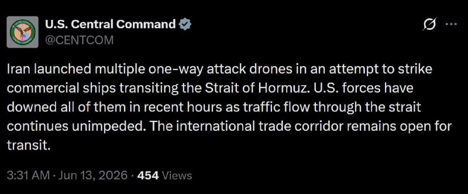

سنتکام: ایران چندین پهپاد تهاجمی را در تلاش برای هدف قرار دادن کشتی‌های تجاری در حال عبور از تنگه هرمز به کار گرفته بود که توسط نیرو‌های ما سرنگون شدند.

📝 Amir

📌 @persian_trend_official
پرشین ترند | متفاوت‌ترین کانال نظامی

---
📅 بروزرسانی: 1405/03/23 10:52
---

## WithYashar — post 14695

ارتش اسرائیل، هشدار فوری تخلیه برای ساکنان ۲۰ روستا در جنوب لبنان صادر کرد!و پیشروی در لبنان به سرعت ادامه دارد
@withyashat

## DEJradio — post 5633

  <a href="telegram/content/DEJradio_5633_1781335353.webm" target="_blank">🎬 Download video</a>

⚽️
🔺 الاغ شماره ۱۰
مستند فوتبالی سیاسی، دیکتاتورهای عاشق فوتبال، قذافی‌ها چگونه از فوتبال برای تحکیم قدرت در لیبی استفاده می‌کردند و مردم از میادین فوتبال برای مبارزه؟

#قذافی #فوتبال #جام_جهانی
@DEJradio

## Persian_Trend_Official — post 16914

  <a href="telegram/content/Persian_Trend_Official_16914_1781335354.webm" target="_blank">🎬 Download video</a>

وقتی میگم اگر توافق رو امضا کنن ممکنه نظام به سمت فروپاشی بره
منظورم این هست

## alonews — post 127559

  <a href="telegram/content/alonews_127559_1781335355.webm" target="_blank">🎬 Download video</a>

👈سرمایه ایلان ماسک حالا از مجموع ثروت ۴ فرد ثروتمند پس از خودش بیشتر است

✅ @AloNews خبر جنگ

---
📅 بروزرسانی: 1405/03/23 10:42
---

## WithYashar — post 14694

  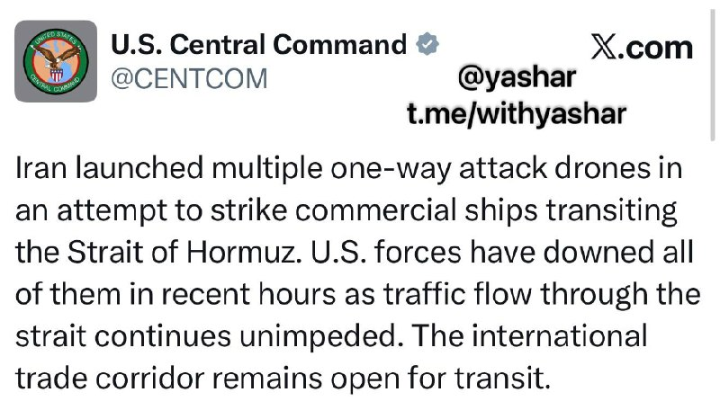

سنتکام (فرماندهی مرکزی ایالات متحده):

«ایران چندین پهپاد انتحاری (یک‌بار مصرف) را با هدف حمله به کشتی‌های تجاری در حال عبور از تنگه هرمز به پرواز درآورد.
نیروهای ایالات متحده در ساعات اخیر همه آن‌ها را سرنگون کرده‌اند و جریان تردد دریایی از طریق تنگه هرمز بدون هیچ‌گونه اختلالی همچنان ادامه دارد.
این گذرگاه بین‌المللی تجارت همچنان برای عبور و مرور کشتی‌ها باز است.»
@withyashar

## DEJradio — post 5632

  <a href="telegram/content/DEJradio_5632_1781334742.webm" target="_blank">🎬 Download video</a>

🔺📢 بامداد شنبه ۲۳ خرداد ۱۴۰۵ برای چندمین شب پیاپی صدای انفجار در قشم و سیریک شنیده شد. منابع داخلی گزارش دادند احتمال درگیری در دریا میان نیروهای آمریکا و سـ.ـپاه وجود دارد.

#جنگ #تنگه_هرمز
@DEJradio

## DEJradio — post 5631

  <a href="telegram/content/DEJradio_5631_1781334743.webm" target="_blank">🎬 Download video</a>

🚨📢 یک مقام ارشد دولت آمریکا به سی‌ان‌ان می‌گوید جمهوری اسلامی با نابودی و خروج مواد هسته‌ای، برچیدن برنامه هسته‌ای، بازگشایی تنگه هرمز و توقف حمایت مالی از گروه‌های نیابتی که آمریکا آن‌ها را تروریستی می‌داند موافقت کرده است اما متنی که عمومی کرده برخلاف توافق است.

دونالد ترامپ در شبکه تروث سوشال نوشت مفادی که جمهوری اسلامی در اختیار رسانه‌ها قرار داده، هیچ ارتباطی با مفادی که به صورت مکتوب بر سر آن توافق شده ندارد.

ترامپ اضافه کرد: «آنچه آن‌ها گفته‌اند، از جمله بیانیه ضعیف و رقت‌انگیزشان درباره توافق، هیچ ارتباطی با واقعیت ندارد.»
رییس جمهوری آمریکا مقام‌های جمهوری اسلامی را «بسیار بی‌آبرو» خواند و افزود با آن‌ها چیزی به نام مذاکره با حسن نیت وجود ندارد.

#جنگ #تنگه_هرمز #توافق
@DEJradio

## DEJradio — post 5630

  <a href="telegram/content/DEJradio_5630_1781334743.webm" target="_blank">🎬 Download video</a>

🔺📢 فریبرز کرمی‌زند، افسر پیشین پلیس، با اشاره به تلفات سنگین نیروهای نظامی در جنگ برابر آمریکا و اسرائیل خطاب به پرسنل می‌گوید «در جمهوری اسلامی آنها تا وقتی زنده‌اند از کم‌ترین اهمیت برخوردارند، اما وقتی در میدان کشته می‌شوند حکومت برای تبلیغات به سراغ خانواده و فرزندانشان می‌رود و برای پیگیری حق و حقوق‌شان وعده می‌دهد اما یک هفته بعد تمام این وعده‌ها به باد فراموشی سپرده می‌شود.

#جنگ #سپر_انسانی
@DEJradio

## IranIntlTV — post 342011

  <a href="telegram/content/IranIntlTV_342011_1781334744.mp4" target="_blank">🎬 Download video</a>

شیخ محمد بن عبدالرحمن آل ثانی، وزیر خارجه قطر، و هاکان فیدان، وزیر خارجه ترکیه، در یک تماس تلفنی از پیشرفت گفت‌وگوها میان آمریکا و جمهوری اسلامی و نهایی شدن متن توافق احتمالی ابراز خرسندی کردند.

فرزیا ثابتی، خبرنگار ایران‌اینترنشنال، گزارش می‌دهد
@iranintltv

## DW_Farsi — post 125914

  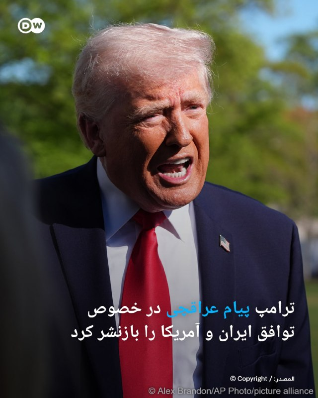

🔶 ترامپ پیام عراقچی در خصوص توافق ایران و آمریکا را بازنشر کرد

دونالد ترامپ، رئیس‌ جمهور آمریکا، روز جمعه پیام عباس عراقچی، وزیر خارجه جمهوری اسلامی را در شبکه اجتماعی "تروث سوشال" خود بازنشر کرد.

عراقچی روز جمعه ۲۲ خرداد در شبکه اجتماعی ایکس نوشته بود: «تفاهم‌نامه اسلام‌آباد هیچ‌گاه تا این حد به نهایی‌شدن نزدیک نبوده است. تا زمان تکمیل و نهایی شدن آن، رسانه‌ها باید از گمانه‌زنی درباره محتوای آن خودداری کنند.»

وزیر خارجه ایران در ادامه پیام خود همچنین تاکید کرده بود: «در راستای رویکرد مسئولانه و شفاف ما، تمامی جزئیات در زمان مقتضی با عموم مردم به اشتراک گذاشته خواهد شد.»

خبرگزاری دولتی ایرنا همچنین نوشته است جی‌دی ونس، معاون ترامپ وعده داده است: «این توافق می‌تواند منطقه را دگرگون کند و به صلحی پایدار منجر شود.»

@dw_farsi

## RadioFarda — post 158245

🔸معاون محیط زیست طبیعی مازندران روز شنبه ۲۳ خرداد از ثبت ۲۰ مورد تلفات فوک خزری از ابتدای فروردین تا ۲۳ خرداد امسال در سواحل استان خبر داد.

🔸به گفته روح‌الله اسماعیلی در سال ۱۴۰۴ مجموعاً ۵۱ قلاده فوک خزری تلف شدند، اما تا ۱۹ خرداد امسال ۲۰ مورد تلفات ثبت شده است؛ در حالی که در مدت مشابه سال گذشته این رقم به ۳۶ قلاده رسیده بود.

🔸فوک‌ خزری تنها پستاندار بزرگترین دریاچه جهان و یکی از معروف‌ترین موجودات دریای کاسپین است.

🔸بر اساس اعلام اتحادیه بین‌المللی حفاظت از طبیعت، فوک خزری در فهرست جانوران آسیب‌پذیر قرار داشته و نیاز شدید به حفاظت دارد.

🔸 اما این حفاظت فقط مختص ایران نیست و باید کشورهای روسیه، ترکمنستان، قزاقستان و جمهوری آذربایجان نیز به عنوان همسایگان خزر در این زمینه مشارکت کنند.

@RadioFarda

## IranianMinds — post 22444

  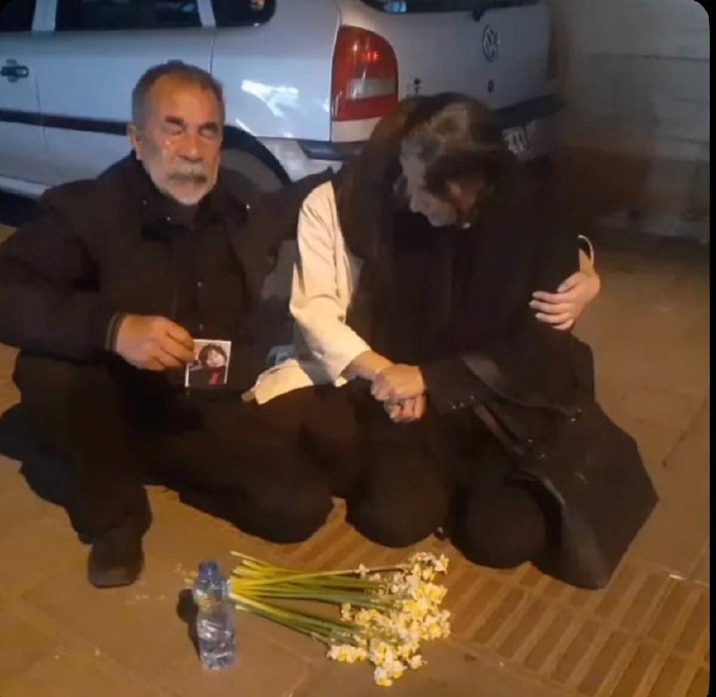

خوانواده رها بهلولی‌پور رفتن جایی که دخترشون در اعتراضات دی ماه گلوله خورد و کشته شد گل گذاشتن :)

@IranianMinds

## alonews — post 127558

  <a href="telegram/content/alonews_127558_1781334746.webm" target="_blank">🎬 Download video</a>

👈لیبرمن، وزیر جنگ اسبق اسرائیل:
توافق، پیروزی ایران و فاجعه‌ای برای اسرائیل است

🔴 بنیامین نتانیاهو، نخست‌وزیر اسرائیل، مسئولیت کامل این وضعیت را بر عهده دارد.

✅ @AloNews خبر جنگ

---
📅 بروزرسانی: 1405/03/23 10:32
---

## VahidOOnLine — post 245262

  <a href="telegram/content/VahidOOnLine_245262_1781334169.mp4" target="_blank">🎬 Download video</a>

♦️غوغا تابان، یکی از آوازخوانان افغان، در واکنش به سرکوب اعتراض‌های مردمی در هرات، آهنگ مشهور «من دختر هراتم» را بازخوانی کرد. 

این بازخوانی با استقبال گسترده کاربران شبکه‌های اجتماعی روبه‌رو شد و بسیاری از کاربران همبستگی او با معترضان هرات را ستودند. 

غوغا تابان همچنین شعار «کار، آزادی» را، که از شعارهای معترضان هرات است، همراه با این آهنگ منتشر کرده است. 

این اقدام در حالی صورت می‌گیرد که طالبان هفته گذشته اعتراض ساکنان شهرک جبرئیل در هرات را با شلیک گلوله سرکوب کردند. این اعتراض‌ها پس از آن آغاز شد که محتسبان/ماموران امر به معروف طالبان شماری از زنان و دختران را به دلیل نپوشیدن برقع یا چادر نماز و ماسک بازداشت کردند. 

اقدام محتسبان طالبان با واکنش و اعتراض ساکنان شهرک جبرئیل مواجه شد و تنش میان معترضان و نیروهای طالبان را در پی داشت.
‌🇸🇦 Indypersian

🤖 @VahidOOnLine

## FarsiVOA — post 220556

🔺تداوم مصادره اموال مخالفان؛ دستور توقیف اموال ۱۰۰ نفر در اصفهان صادر شد

▪️خبرگزاری میزان گزارش داد اسدالله جعفری، رئیس کل دادگستری استان اصفهان، از صدور دستور شناسایی و توقیف اموال ۱۰۰ نفر خبر داده است.

▪️این اقدام در ادامه موج تازه‌ای از برخوردهای قضایی و مالی علیه افرادی است که مقام‌های جمهوری اسلامی آن‌ها را «همکار دشمن»، «وطن‌فروش» یا «حامی رژیم صهیونیستی» معرفی می‌کنند.

▪️پیشتر اصغر جهانگیر، سخنگوی قوه قضاییه، اعلام کرده بود ۳۱۲۱ نفر به اتهام همکاری با دشمن تحت تعقیب قرار گرفته‌اند و از این تعداد ۲۴۰۶ نفر بازداشت شده‌اند. به گفته او، برای حدود هزار نفر کیفرخواست صادر شده و اموال «صدها نفر» نیز شناسایی و توقیف شده است.

⬇️ بیشتر بخوانید:
https://ir.voanews.com/a/8160417.html

## IranianMinds — post 22443

  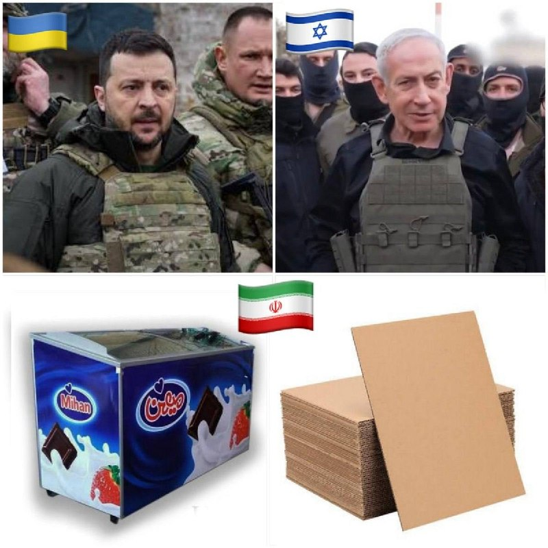

رهبران کشور های دنیا در زمان جنگ :

@IranianMinds

## BBCPersian — post 283642

🔻کشته شدن سه ملوان هندی در حملات دریایی آمریکا، هند اعتراض رسمی دهلی‌نو را به روبیو ابلاغ کرد

پس از کشته شدن سه ملوان هندی در حملات آمریکا به کشتی‌های تجاری در نزدیکی سواحل عمان، سوبرامانیام جایشانکار، وزیر امور خارجه، در تماس با مارکو روبیو، وزیر خارجه آمریکا، اعتراض شدید دولت هند را اعلام کرد.

این تماس پس از آن انجام شد که دولت هند برای دومین بار یک دیپلمات ارشد آمریکایی را در پایتخت هند احضار کرد.

جایشانکار در پیامی در شبکه اجتماعی ایکس نوشت: « با مارکو روبیو، وزیر امور خارجه ایالات متحده، گفت‌وگو کردم. اعتراض شدید هند را نسبت به حملات نیروی دریایی آمریکا در خلیج فارس که به کشته شدن سه دریانورد هندی منجر شد، تکرار کردم. چنین اقدامات مرگباری علیه کشتیرانی تجاری قابل توجیه نیست.»

روز چهارشنبه گذشته (۲۰ خرداد/۱۰ ژوئن)، سه ملوان هندی در حمله آمریکا به نفتکش «سته‌بلو» با پرچم پالائو در سواحل عمان کشته شدند.

این حادثه پس از حمله ۸ ژوئن (۱۸ خرداد) به نفتکش «ماریوکس» دیگر نفتکش دارای پرچم پالائو، رخ داد. مقام‌های عمانی ۲۴ ملوان هندی را از این کشتی تخلیه و به محل امن منتقل کردند.

همچنین روز پنجشنبه (۲۱ خرداد/۱۱ژوئن) یک نفتکش با پرچم گینه بیسائو هدف حمله دیگری قرار گرفت. دهلی‌نو اعلام کرد خدمه این کشتی، از جمله ۲۰ ملوان هندی، نجات یافته‌اند.

https://bbc.in/4eDI1Mi
@BBCPersian

## Hranews — post 113569

  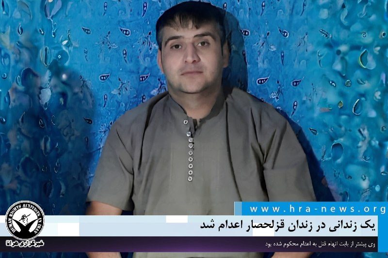

یک زندانی در زندان قزلحصار اعدام شد

❗️
❗️
❗️
❗️
❗️ – حکم یک زندانی که پیشتر از بابت اتهام قتل به #اعدام محکوم شده بود، سحرگاه امروز شنبه در زندان قزلحصار کرج به اجرا درآمد.

به گزارش خبرگزاری هرانا، ارگان خبری مجموعه فعالان حقوق بشر در ایران، یک زندانی در زندان قزلحصار کرج اعدام شد.

هویت این زندانی که سحرگاه امروز شنبه ۲۳ خردادماه، به چوبه دار آویخته شد، سیداکبر بنی‌هاشم، توسط هرانا احراز شده است.

ادامه مطلب

#سیداکبر_بنی‌هاشم

↘️
@hranews_bot تماس ✉️ -  @Hranews  کانال هرانا 🆑

## alonews — post 127557

  <a href="telegram/content/alonews_127557_1781334173.webm" target="_blank">🎬 Download video</a>

👈سی‌ان‌ان: ایران بخش‌هایی از ذخیره اورانیوم بسیار غنی‌شده خود را با ریزش تونل‌ها و مین‌های انفجاری در اطراف ورودی‌ها مسدود کرده است. این اقدامات در پی نگرانی‌ها از احتمال عملیات آمریکا برای تصرف این مواد، دسترسی به اورانیوم را به‌طور قابل‌توجهی دشوارتر و خطرناک‌تر کرده و تلاش‌ها برای حذف یا نابودی ذخیره تحت هر توافق آینده را پیچیده می‌کند

✅ @AloNews خبر جنگ

---
📅 بروزرسانی: 1405/03/23 10:22
---

## VahidOOnLine — post 245261

  

مهدی جهانبخشی، رییس شورای صنفی مرکزی کارمندان دانشگاه‌ها و مراکز وابسته به وزارت علوم، گفت حقوق کارکنان دانشگاه‌ها حتی با دریافت مزایای مختلف به خط فقر نزدیک نمی‌شود و خواستار افزایش حقوق متناسب با نرخ تورم، اجرای کامل فوق‌العاده‌های شغلی و بازنگری در افزایش سن بازنشستگی شد.

او در گفت‌وگو با خبرگزاری ایلنا، با اشاره به اینکه «با حقوق کارمندی، حتی حداقل‌های یک سبد معیشت آبرومندانه را هم نمی‌توان تامین کرد»، گفت: «حقوق کارکنان دولت به بخش ناچیزی از هزینه‌های واقعی زندگی تنزل یافته است.»
‌🏁 🇬🇧 IranintlTV

🤖 @VahidOOnLine

## IranIntlTV — post 342010

  <a href="telegram/content/IranIntlTV_342010_1781333549.mp4" target="_blank">🎬 Download video</a>

ایرانیان مقیم اوکلند نیوزیلند در پاسخ به فراخوان شاهزاده رضا پهلوی و همزمان با سالروز تولد مجیدرضا رهنورد، با برگزاری راهپیمایی، تشکیل زنجیره انسانی و برافراشتن پرچم شیر و خورشید، یاد جان‌باختگان راه آزادی ایران را گرامی داشتند. شرکت‌کنندگان همچنین بر ادامه حمایت خود از مبارزات مردم ایران برای دستیابی به آزادی تاکید کردند.

گزارش علیرضا محبی، خبرنگار ایران‌اینترنشنال
@iranintltv

## IranIntlTV — post 342009

  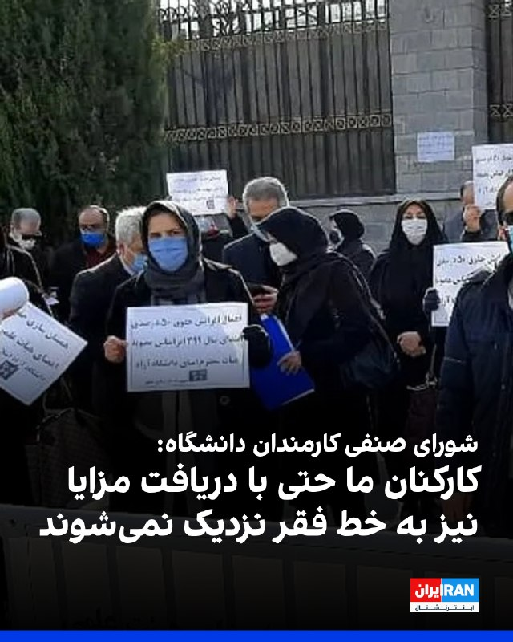

مهدی جهانبخشی، رییس شورای صنفی مرکزی کارمندان دانشگاه‌ها و مراکز وابسته به وزارت علوم، گفت حقوق کارکنان دانشگاه‌ها حتی با دریافت مزایای مختلف به خط فقر نزدیک نمی‌شود و خواستار افزایش حقوق متناسب با نرخ تورم، اجرای کامل فوق‌العاده‌های شغلی و بازنگری در افزایش سن بازنشستگی شد.

او در گفت‌وگو با خبرگزاری ایلنا، با اشاره به اینکه «با حقوق کارمندی، حتی حداقل‌های یک سبد معیشت آبرومندانه را هم نمی‌توان تامین کرد»، گفت: «حقوق کارکنان دولت به بخش ناچیزی از هزینه‌های واقعی زندگی تنزل یافته است.»
https://iranintl.com/202606131795

## FarsiVOA — post 220555

  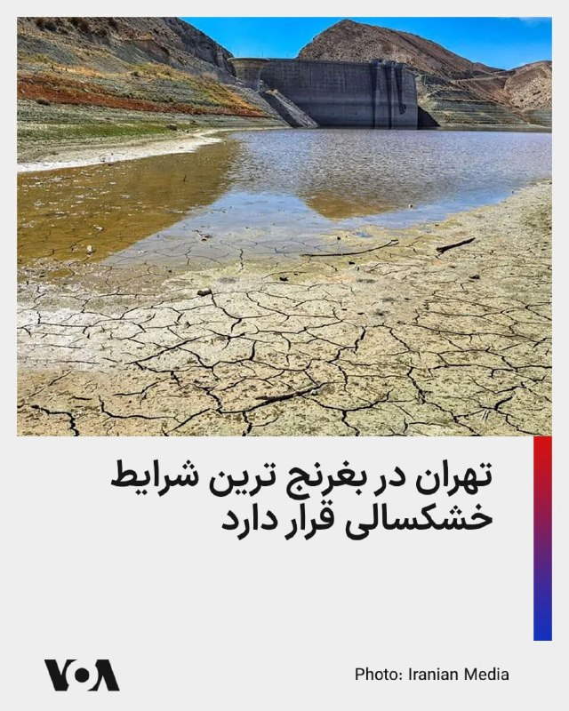

خبرگزاری ایلنا با انتشار گزارشی اعلام کرد که استان‌های تهران، قم، سمنان و مرکزی، بدترین وضعیت خشکسالی را دارند و تهران دارای بغرنج‌ترین شرایط است.

در گزارش فوق با استناد به داده‌‌های آماری مربوط به سدهای کشور تا ۱۶ خرداد، آمده است که میزان ورودی سدها نسبت به سال گذشته ۷۵ درصد و در قیاس به متوسط ۱۰ ساله، ۱۲ درصد افزایش یافته است. با این وجود، ۳۳ درصد حجم مجموع سدهای کشور همچنان خالی است.

سدهای دوستی و طرق در خراسان رضوی، بارزه در خراسان شمالی و ساوه در استان مرکزی در وضعیت قرمز قرار داشته و ۹۱ درصد سد لار نیز خالی است.

در گزارش فوق آمده است که در میان استان‌ های کشور، چهارمحال و بختیاری، اصفهان، کهگیلویه و بویراحمد، یزد، گیلان، قزوین، مرکزی، سمنان، قم و تهران همچنان در خشکسالی به سر می‌برند.
@FarsiVOA

## IranianMinds — post 22442

🔴 سی ان ان :

ایران از ترس اینکه آمریکا یهو زمینی بیاد اورانیومش رو ببره؛ رفته تمام تونل های زیرزمینی هسته ای رو با انفجار مین تخریب کرده و همه راه های منتهی به اورانیوم رو مسدود کرده.

جوری اینارو‌‌ تخریب کردن که دیگه خودشونم‌ نمیتونن وارد شن :)

@IranianMinds

## alonews — post 127556

  <a href="telegram/content/alonews_127556_1781333553.webm" target="_blank">🎬 Download video</a>

👈 باراک راوید خبرنگار آکسیوس: نتانیاهو امیدوار بود که جنگ منجر به تغییر رژیم در ایران شود، اما رقبایش اکنون او را متهم می‌کنند که با پذیرفتن شرایط آمریکا، اسرائیل را به «دولت دست‌نشانده» تبدیل کرده است.

✅ @AloNews خبر جنگ

## alonews — post 127555

  <a href="telegram/content/alonews_127555_1781333554.webm" target="_blank">🎬 Download video</a>

👈 رویترز: ونس توافق‌نامه صلح با ایران را امضا خواهد کرد

🔴خبرگزاری رویترز به نقل از مقامات آگاه ادعا کرد که معاون رئیس جمهور آمریکا توافقنامه صلح با ایران را امضا خواهد کرد

✅ @AloNews خبر جنگ

## alonews — post 127554

  <a href="telegram/content/alonews_127554_1781333554.webm" target="_blank">🎬 Download video</a>

👈بورس باز نشده ۹۸ هزار واحد رشد کرد

✅ @AloNews خبر جنگ

---
📅 بروزرسانی: 1405/03/23 10:12
---

## VahidOOnLine — post 245260

  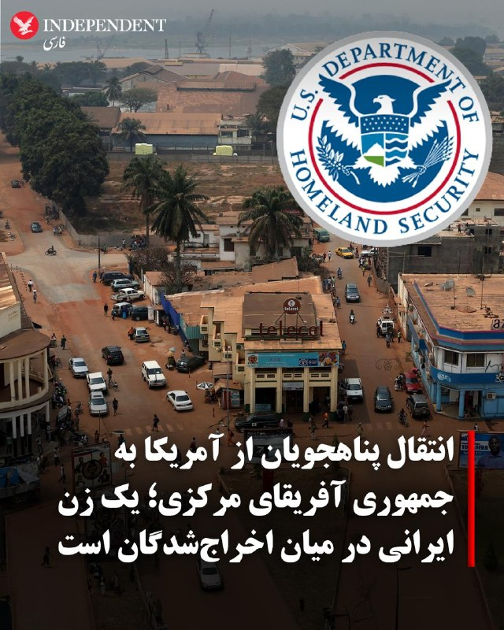

♦️گروهی از مهاجران و پناهجویان اخراج‌شده از ایالات متحده، از جمله یک زن ایرانی، روز جمعه ۲۲ خرداد وارد بانگی، پایتخت جمهوری آفریقای مرکزی شدند؛ اقدامی که در چارچوب سیاست دولت دونالد ترامپ برای انتقال مهاجران به کشورهای ثالث انجام شده است.
به گزارش آسوشیتدپرس، هواپیمای حامل دست‌کم ۲۴ مهاجر و پناهجو از کشورهای مختلفی از جمله ایران، اردن، ارمنستان، ترکیه، گرجستان و افغانستان، از ایالت لوییزیانا به جمهوری آفریقای مرکزی منتقل شد.
در میان اخراج‌شدگان یک زن ایرانی حضور دارد که به گفته وکلای مهاجرت، در صورت بازگشت به ایران با خطر آزار و تعقیب روبه‌رو است. وکلا اعلام کردند در ابتدا قرار بود سه زن ایرانی در این پرواز حضور داشته باشند، اما دو نفر از آن‌ها توانستند با دریافت احکام اضطراری از دادگاه‌های آمریکا، اخراج خود را به طور موقت متوقف کنند تا پرونده‌هایشان دوباره بررسی شود.
بر اساس این گزارش، هر سه زن پیش‌تر از دادگاه‌های مهاجرت آمریکا حکم «ممنوعیت اخراج به ایران» دریافت کرده بودند؛ حکمی که به دلیل خطرات احتمالی در کشور مبدا صادر می‌شود. با این حال دولت آمریکا با استناد به امکان انتقال این افراد به یک کشور ثالث، آن‌ها را به جمهوری آفریقای مرکزی فرستاده است.
این اقدام بخشی از سیاست گسترده‌تر دولت ترامپ برای کنترل مهاجرت غیرقانونی و انتقال مهاجران به کشورهای ثالث است. بر اساس گزارش‌ها، واشنگتن در ماه‌های اخیر توافق‌هایی را با چندین کشور، از جمله برخی کشورهای آفریقایی، برای پذیرش مهاجران اخراجی امضا کرده است.
جمهوری آفریقای مرکزی یکی از فقیرترین و بی‌ثبات‌ترین کشورهای جهان به شمار می‌رود و سال‌هاست با ناامنی و درگیری‌های داخلی دست‌وپنجه نرم می‌کند. برخی فعالان حقوق بشر و کارشناسان مهاجرت نسبت به سرنوشت پناهجویان منتقل‌شده به این کشور ابراز نگرانی کرده‌اند.
علی رهنما، مدیر موقت صندوق دفاع حقوقی ایرانی-آمریکایی، نیز با اشاره به نفوذ گسترده نیروهای وابسته به روسیه در ساختار امنیتی جمهوری آفریقای مرکزی هشدار داده است که روابط نزدیک امنیتی و نظامی میان تهران و مسکو می‌تواند نگرانی‌هایی را درباره امنیت پناهجویان ایرانی در این کشور ایجاد کند.
گزارش‌ها حاکی است مهاجران پس از ورود به بانگی به صورت جداگانه اسکان داده شده‌اند و بخشی از آن‌ها به طور موقت در ساختمانی نزدیک سفارت در حال ساخت آمریکا مستقر شده‌اند. سازمان بین‌المللی مهاجرت (IOM) نیز اعلام کرده است که به درخواست مقام‌های محلی، کمک‌های بشردوستانه اولیه را در اختیار این افراد قرار خواهد داد.
‌🇸🇦 Indypersian

🤖 @VahidOOnLine

## WithYashar — post 14693

صدای انفجار دزفول ناشی از امحای مهمات است
از ساعت ۱۰ تا ۱۳ امروز شنبه ۲۳ خرداد، انفجارهای کنترل‌شده در برخی نقاط شهرستان دزفول و خارج از محدوده شهری انجام می‌شود.
@withyashar

## mamlekate — post 103695

📝 تصاویر ماهواره‌ای نشان می‌دهند بیش از ۵۰ پایگاه نظامی ایران از آغاز جنگ در حملات آمریکا آسیب دیده‌اند

تصاویر ماهواره‌ای نشان می‌دهند که از زمان آغاز جنگ، بیش از ۵۰ پایگاه نظامی ایران، از جمله مقر فرماندهی سپاه پاسداران انقلاب اسلامی، در حملات آمریکا و اسرائیل آسیب دیده‌اند.

@mamlekate

## IranIntlTV — post 342008

  <a href="telegram/content/IranIntlTV_342008_1781332956.mp4" target="_blank">🎬 Download video</a>

یک مخاطب با ارسال ویدیویی به ایران اینترنشنال ضمن انتقاد از گرانی دارو گفت: «لعنت به جمهوری اسلامی. مردم دیگر توان خرید هیچ چیز را ندارند.»

## DW_Farsi — post 125913

  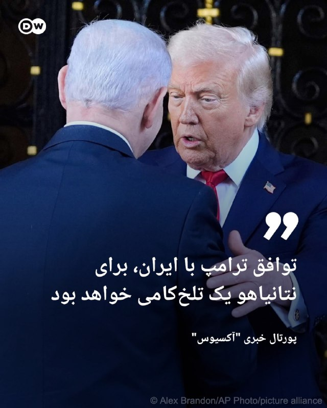

🔶 آکسیوس: توافق ترامپ با ایران، برای نتانیاهو یک تلخ‌کامی خواهد بود

پورتال خبری "آکسیوس" شامگاه جمعه ۲۲ خرداد (۱۲ ژوئن) به نقل از مقام‌های آمریکایی نوشت دونالد ترامپ، رئیس جمهور آمریکا در تماس تلفنی با بنیامین نتانیاهو، نخست‌وزیر اسرائیل به او گفته است که انتظار دارد ظرف چند روز آینده توافقی با ایران امضا شود.

نتانیاهو که امیدوار بود درگیری‌ها به تغییر حکومت در ایران بیانجامد، در حال حاضر با توافقی مواجه شده است که با اهداف او فاصله دارد.

در گزارش آکسیوس همچنین به این موضوع هم اشاره شده است که نخست‌وزیر اسرائیل در تماس تلفنی خود با ترامپ مخالفت جدی با توافق ابراز نکرده و به نظر می‌رسد پذیرفته است که نمی‌تواند مانع امضای آن شود.

این پورتال خبری آمریکایی در ادامه نوشته است که در روزهای اخیر ترامپ مانع اجرای حملات گسترده برنامه‌ریزی‌شده اسرائیل علیه تاسیسات انرژی و زیرساختی ایران شده است.

طبق داده‌های آکسیوس برخی مقام‌های اسرائیلی ضمن مخالفت نسبت به توافق احتمالی با ایران نگران‌ هستند که جمهوری اسلامی پس از پایان جنگ و رفع فشارها، بدون دادن امتیازهای اساسی در زمینه برنامه هسته‌ای، مذاکرات را طولانی کند.

هنوز مشخص نیست که بدون همراهی اسرائیل آیا توافق ایران با آمریکا امکان‌پذیر خواهد بود یا نه؟

برخی کارشناسان پیش از این در پاسخ به این پرسش که آیا بدونرضایت اسرائیل امکان توافق میان آمریکا و جمهوری اسلامی وجود دارد، گفته‌اند چنین توافقی از نظر فنی ممکن است، اما بدون همراهی ورضایت اسرائیل چندان پایدار و جدی نخواهد بود.

@dw_farsi

## Persian_Trend_Official — post 16913

  <a href="telegram/content/Persian_Trend_Official_16913_1781332959.webm" target="_blank">🎬 Download video</a>

🌟حزب‌الله با استفاده از چند فروند راکت، شهرک‌های متولا و میسگاو عام در شمال فلسطین اشغالی را مورد هدف قرار داد. سامانه‌های پدافندی ارتش رژیم صهیونیستی جهت رهگیری راکت‌ها فعال شده‌اند. 
👺Phantom 
📌 @persian_trend_official پرشین ترند | متفاوت‌ترین کانال نظامی

## Persian_Trend_Official — post 16912

  <a href="telegram/content/Persian_Trend_Official_16912_1781332960.webm" target="_blank">🎬 Download video</a>

نیروی دریایی تفنگداران آمریکا اجرای مانورهای هلی‌برن را در دستور کار قرار داده است.

🔹 تصاویر و گزارش‌های منتشرشده از تمرینات اخیر، استقرار نیروها از طریق بالگرد و اجرای عملیات هلی‌برن در مقیاس قابل توجه را نشان می‌دهد.

Phantom

📌 @persian_trend_official
پرشین ترند | متفاوت‌ترین کانال نظامی

## IranianMinds — post 22441

  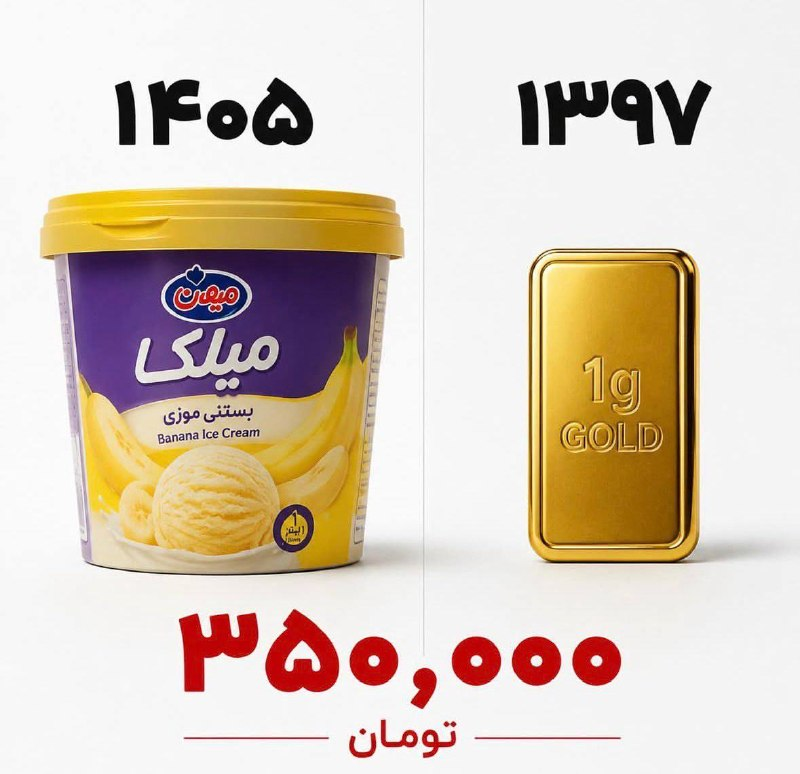

@IranianMinds

## BBCPersian — post 283641

  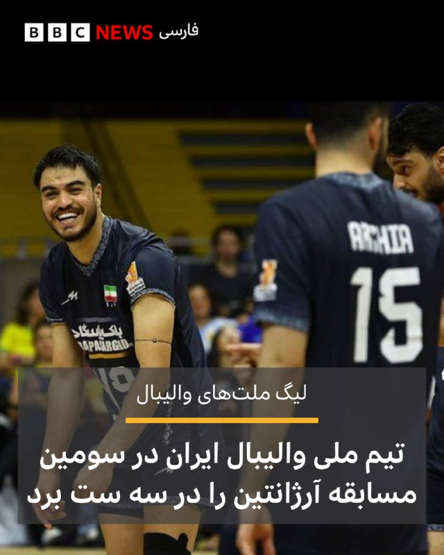

🏐تیم ملی والیبال ایران در سومین مسابقه خود از هفته اول لیگ ملت‌ها،‌ آرژانتین را در سه ست پیاپی شکست.
این اولین برد تیم ملی والیبال در این دور از مسابقات است.

ملی پوشان ایران آخرین مسابقه خود در هفته اول را فردا یکشنبه در مقابل بلژیک انجام خواهند داد.
ایران تاکنون در اولین و دومین مسابقه از هفته اول در مقابل تیم های برزیل و بلغارستان شکست خورد.

مرحله مقدماتی لیگ ملت‌های مردان سال ۲۰۲۶ با حضور ۱۸ تیم ایران، ایتالیا، آرژانتین، صربستان، کوبا، ژاپن، برزیل، ترکیه، بلغارستان، آلمان، فرانسه، آمریکا، کانادا، لهستان، اسلوونی، اوکراین، چین و بلژیک برگزار می‌شود.

دیدارهای هفته اول از ۲۰ تا ۲۴ خرداد به میزبانی اوتاوا (کانادا)، برزیلیا (برزیل) و لین یی (چین) برگزار می‌شود.

📸ISNA

https://bbc.in/4xx5SVE
@BBCPersian

## Dirty_Kids — post 391862

  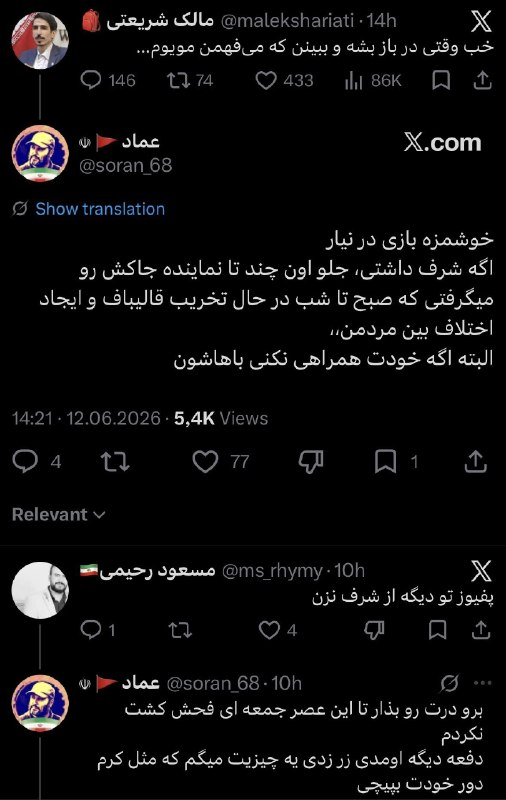

طرفداران نظام هم گیج شدن دارن بی دلیل فحش میدن به همدیگه

@Dirty_Kids 👻

## Dirty_Kids — post 391861

  

دو مهمانان ویژه بازی امریکا پاراگوئه، یا بهتر بگم دو عامل برد قاطع امریکا🥵🇺🇸⚽💥

@Dirty_Kids 👻

## Dirty_Kids — post 391860

  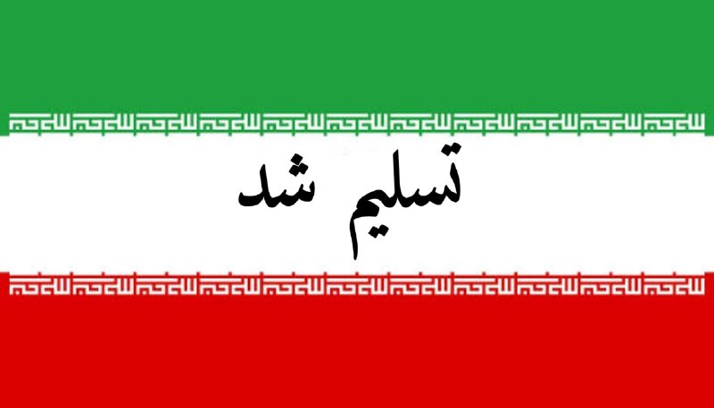

چه قدر آسان بود تسلیم شدنت ... ✌️

@Dirty_Kids 👻

## alonews — post 127553

  <a href="telegram/content/alonews_127553_1781332964.webm" target="_blank">🎬 Download video</a>

👈آحارونوت: احتمالا توافق تهران-واشنگتن شامل آتش‌بس در لبنان هم باشد

✅ @AloNews خبر جنگ

## alonews — post 127552

  <a href="telegram/content/alonews_127552_1781332964.webm" target="_blank">🎬 Download video</a>

🔴فوری / ارتش اسرائیل، هشدار فوری تخلیه برای ساکنان ۲۰ روستا در جنوب لبنان صادر کرد!

✅ @AloNews خبر جنگ

---
📅 بروزرسانی: 1405/03/23 10:02
---

## VahidOOnLine — post 245259

  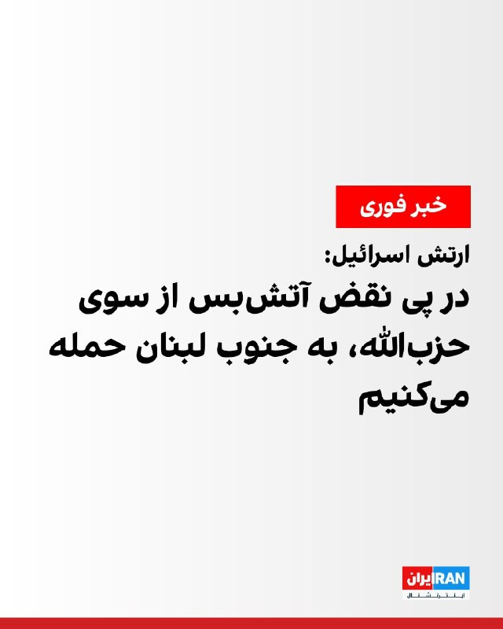

ارتش اسرائیل اعلام کرد در پی نقض آتش‌بس از سوی حزب‌الله لبنان، علیه این گروه اقدام خواهد کرد. در همین رابطه برای شهرهای جنوب لبنان هشدار تخلیه صادر شد.آویخای ادرعی، سخنگوی عربی‌زبان ارتش اسرائیل، به ساکنان چندین شهر و روستای جنوب لبنان هشدار داد فورا خانه‌های خود را ترک کرده و به شمال رود زهرانی منتقل شوند.
‌🏁 🇬🇧 IranintlTV

🤖 @VahidOOnLine

## VahidOOnLine — post 245258

  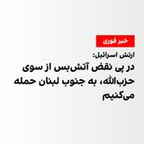

ارتش اسرائیل اعلام کرد در پی نقض آتش‌بس از سوی حزب‌الله لبنان، علیه این گروه اقدام خواهد کرد. در همین رابطه برای شهرهای جنوب لبنان هشدار تخلیه صادر شد. آویخای ادرعی، سخنگوی عربی‌زبان ارتش اسرائیل، به ساکنان چندین شهر و روستای جنوب لبنان هشدار داد فورا خانه‌های خود را ترک کرده و به شمال رود زهرانی منتقل شوند.
‌🏁 🇬🇧 IranintlTV

🤖 @VahidOOnLine

## WithYashar — post 14692

اکسیوس:برخی در واشنگتن معتقدند حتی اگر توافق اجرایی شود، نتانیاهو ممکن است بازهم بتواند نقش یک اخلالگر را ایفا کند
@withyashar

## pm_afshaa — post 93747

کیهان: اگر تنگه هرمز را باز کنید دشمن دوباره حمله می‌کند، هیچ آدم عاقلی نقطه قوت خود را پای میز مذاکره نمی‌برد

💧 Rainbet.com the #1 Non-KYC Crypto Casino & Sportsbook @rainbetcom

😁 @Pm_Afshaa

## mamlekate — post 103693

📝 آنتروپیک دو مدل پیشرفته هوش مصنوعی خود را به دستور دولت آمریکا متوقف کرد

دستور کنترل صادرات با استناد به نگرانی‌‌های مرتبط با امنیت ملی، دسترسی «اتباع خارجی» را، چه داخل و چه خارج از آمریکا، ممنوع کرده است.

@mamlekate

## mamlekate — post 103692

📝 سی‌ان‌ان: ایران اطراف محل نگهداری اورانیوم غنی‌شده را مین‌گذاری کرده است

سی‌ان‌ان به نقل از منابع آگاه گزارش داد جمهوری اسلامی با تخریب تونل‌ها و مین‌گذاری ورودی‌ها، حفاظت از ذخایر اورانیوم غنی‌شده را افزایش داده است. این اقدام می‌تواند اجرای توافق احتمالی با آمریکا و انتقال یا راستی‌آزمایی ذخایر هسته‌ای ایران را دشوارتر و زمان‌برتر کند.

📝 وزیر انرژی آمریکا: ۷ میلیون بشکه نفت روزانه به کمک آمریکا از خلیج فارس خارج می‌شود؛ میزان خروجی نفت از ایران «صفر بشکه» است

وزیر انرژی آمریکا، کریس رایت، روز جمعه ۲۲ خرداد در مراسمی در هوستون واقع در ایالت تگزاس گفت: حدود ۷ میلیون بشکه نفت در روز با کمک نظامی ایالات متحده، از خلیج فارس خارج می‌شود. او گفت در حال حاضر به میزان «صفر بشکه» نفت از ایران خارج می‌شود.

طبق این گزارش، کشتی‌های بیشتری با خاموش‌ کردن ترانسپوندرهای خود، خطر عبور از تنگه هرمز را در سایه حملات خصمانه جمهوری اسلامی به کشتیرانی تجاری، می‌پذیرند. ایالات متحده با بسیاری از این حملات مقابله کرده است.

@mamlekate

## IranIntlTV — post 342007

  

ارتش اسرائیل اعلام کرد در پی نقض آتش‌بس از سوی حزب‌الله لبنان، علیه این گروه اقدام خواهد کرد. در همین رابطه برای شهرهای جنوب لبنان هشدار تخلیه صادر شد.آویخای ادرعی، سخنگوی عربی‌زبان ارتش اسرائیل، به ساکنان چندین شهر و روستای جنوب لبنان هشدار داد فورا خانه‌های خود را ترک کرده و به شمال رود زهرانی منتقل شوند.

## DW_Farsi — post 125912

  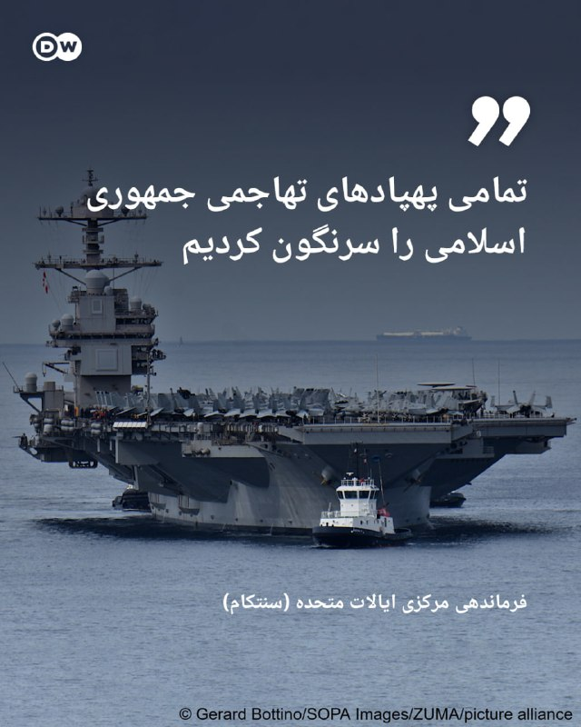

🔶 سنتکام: تمامی پهپادهای تهاجمی جمهوری اسلامی را سرنگون کردیم

فرماندهی مرکزی ایالات متحده (سنتکام) صبح روز شنبه ۲۳ خرداد (۱۳ ژوئن) در شبکه اجتماعی ایکس اعلام کرد ایران چندین پهپاد انتحاری برای هدف قرار دادن کشتی‌های تجاری عبوری از تنگه هرمز به پرواز درآورده بود و نیروهای مسلح ایالات متحده تمامی این پهپادها را سرنگون کرده‌اند.

سنتکام هم‌زمان تاکید کرده است که تردد کشتی‌ها در گذرگاه هرمز همچنان بدون اختلال ادامه دارد و این کریدور بین‌المللی تجارت همچنان برای عبور و مرور باز است.

یک منبع آگاه نیز پیش از این به خبرگزاری رویترز گفته بود که نیروهای آمریکایی چندین پهپاد تهاجمی انفجاری را که به سمت تنگه هرمز در حرکت بودند، سرنگون کردند.

رسانه‌های جمهوری اسلامی هم از جمله خبرگزاری فارس که به نیروهای سپاه پاسداران نزدیک هستند شامگاه جمعه ۲۲ خرداد از "شلیک هشدار به کشتی‌های متخلف" در تنگه هرمز خبر داده بودند.

این خبرگزاری به نقل از ساکنین محل از شنیده‌شدن صدای انفجار در حوالی جزیره قشم و سیریک خبر داده است.

@dw_farsi

## Persian_Trend_Official — post 16911

  <a href="telegram/content/Persian_Trend_Official_16911_1781332349.mp4" target="_blank">🎬 Download video</a>

🌟حزب‌الله با استفاده از چند فروند راکت، شهرک‌های متولا و میسگاو عام در شمال فلسطین اشغالی را مورد هدف قرار داد. سامانه‌های پدافندی ارتش رژیم صهیونیستی جهت رهگیری راکت‌ها فعال شده‌اند.

👺Phantom

📌 @persian_trend_official
پرشین ترند | متفاوت‌ترین کانال نظامی

## alonews — post 127551

  <a href="telegram/content/alonews_127551_1781332351.webm" target="_blank">🎬 Download video</a>

👈احتمال شنیدن صدای انفجار در دزفول

✅ @AloNews خبر جنگ

## alonews — post 127550

  <a href="telegram/content/alonews_127550_1781332351.webm" target="_blank">🎬 Download video</a>

👈طبق گزارش شبکه المنار، وابسته به حزب الله، نیروی زمینی ارتش اسرائیل در پوشش گلوله باران گسترده توپخانه، حمله خود به سمت جنوب شهر نبطیه، پایتخت حزب‌الله در جنوب لبنان را آغاز کرده است.

🔴خودرو های زرهی اسرائیلی به به صورت گسترده در حال هجوم به سمت جنوب شهر نبطیه مشاهده شدند.

✅ @AloNews خبر جنگ

---
📅 بروزرسانی: 1405/03/23 09:52
---

## VahidOOnLine — post 245257

♦️کریستیانو رونالدو و هم‌تیمی‌هایش در تیم ملی پرتغال روز جمعه ۲۲ خرداد وارد ایالات متحده شدند تا خود را برای رقابت‌های جام جهانی ۲۰۲۶ آماده کنند.
رونالدو که در آستانه ثبت ششمین حضور خود در جام جهانی قرار دارد، همراه با کاروان پرتغال در فرودگاه بین‌المللی پالم‌بیچ در ایالت فلوریدا فرود آمد.
پرتغال رقابت‌های خود در گروه K را روز ۲۷ خرداد برابر جمهوری دموکراتیک کنگو در هیوستون آغاز می‌کند. این تیم سپس دوم تیر در همان شهر به مصاف ازبکستان خواهد رفت و در آخرین دیدار مرحله گروهی خود ششم تیر در میامی برابر کلمبیا قرار می‌گیرد.
حضور رونالدو در جام جهانی ۲۰۲۶ او را به یکی از معدود بازیکنان تاریخ فوتبال تبدیل می‌کند که در شش دوره جام جهانی حضور داشته‌اند. لیونل مسی، کاپیتان تیم ملی آرژانتین، نیز در این رقابت‌ها ششمین حضور خود در جام جهانی را تجربه خواهد کرد؛ رکوردی تاریخی که پیش از این هیچ بازیکنی موفق به ثبت آن نشده بود.
‌🇸🇦 Indypersian

🤖 @VahidOOnLine

## VahidOOnLine — post 245256

⭕️ کشف گورستان ۲ هزار ساله یونانی-رومی؛
رازهای تدفین باستانی از دل خاک مصر بیرون آمد

♦️باستان‌شناسان در جریان کاوش‌های محوطه باستانی «تل کوم عزیزه» در استان البحیره مصر، موفق به کشف یک گورستان متعلق به دوره یونانی-رومی شدند؛ کشفی که می‌تواند اطلاعات ارزشمندی درباره آیین‌های تدفین و فرهنگ مردمان این دوره تاریخی ارائه دهد.
بر اساس اعلام وزارت گردشگری و آثار باستانی مصر، در این محوطه انواع مختلفی از شیوه‌های تدفین شناسایی شده است؛ از قبرهای ساده که اجساد مستقیما در خاک دفن شده‌اند تا آرامگاه‌هایی که با آجرهای گلی ساخته شده‌اند. همچنین چندین تابوت سفالی استوانه‌ای‌شکل و تابوت‌های گچی رنگ‌آمیزی‌شده نیز از دل خاک بیرون آمده که از رایج‌ترین انواع تابوت در دوره بطلمیوسی به شمار می‌روند.
کارشناسان اعلام کرده‌اند جهت قرارگیری اجساد نیز متفاوت بوده و برخی در محور شمالی-جنوبی و برخی دیگر در محور شرقی-غربی دفن شده‌اند. علاوه بر این، وضعیت دست‌های متوفیان نیز تنوع قابل توجهی داشته است؛ از قرار گرفتن روی لگن و کنار گردن گرفته تا حالت مشهور «اوزیریسی» با دست‌های ضربدری روی سینه یا قرارگیری در امتداد ران‌ها.
‌🇸🇦 Indypersian

🤖 @VahidOOnLine

## WithYashar — post 14691

مقام اسرائیلی به یدیعوت آحارونوت: ایران هربار تصمیم بگیره در حمایت از حزب‌الله به ما حمله کنه، فوراً بهش پاسخ نظامی می‌دیم.
@withyashar

## RadioFarda — post 158244

🔸بنا بر اعلام پلیس مکزیک، جسدی پیچیده‌شده در یک کیسه سیاه در پارکینگ یک مرکز خرید در تیخوانا پیدا شده است.

🔸این جسد در صندوق عقب یک خودروی تویوتا در فاصله کمتر از ۳۰۰ متری از ورزشگاهی که تیم ملی فوتبال ایران برای جام جهانی در آن تمرین می‌کند، قرار داده شده بود.

🔸این خودرو از روز سه‌شنبه در این پارکینگ پارک شده بود و بوی تندی که از آن می‌آمد، توجه نگهبان پارکینگ را جلب کرد.

🔸به گفته دفتر دادستانی نشانه‌های خشونت روی جسد شناسایی شده است.

🔸این جسد در حالی کشف شده که حضور تیم ملی فوتبال ایران در رقابت‌های جام ‌جهانی ۲۰۲۶ با حواشی بسیاری همراه بوده است.

🔸ایالات متحده از صدور ویزا برای ۱۵ عضو فدراسیون فوتبال ایران به دلایل امنیتی خودداری کرد و این تیم مجبور شد در آخرین لحظه محل تمرین خود را از آریزونای آمریکا به تیخوانا در مکزیک منتقل کند.

🔸ایران روز دوشنبه ۲۵ خرداد در اولین بازی خود در گروه G جام جهانی در خارج از لس‌آنجلس به مصاف نیوزیلند می‌رود.

@RadioFarda

## IranianMinds — post 22440

  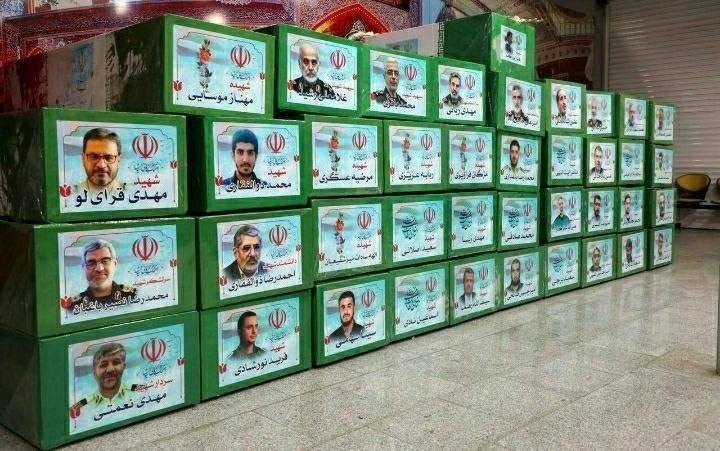

🔴 امروز ۲۳ خرداد سالگرد جنگ ۱۲ روزه است ، روزی که اسرائیل جمهوری اسلامی رو غافلگیر کرد و نیمی از فرمانده های سپاه و دانشمندان هسته ای رو ترور‌ کرد.

@IranianMinds

## alonews — post 127549

  <a href="telegram/content/alonews_127549_1781331756.webm" target="_blank">🎬 Download video</a>

👈کشف ۴۱۸ کیلوگرم تریاک در یزد مأموران پلیس مبارزه با مواد مخدر استان یزد موفق به کشف ۴۱۸ کیلوگرم مواد مخدر از نوع تریاک در شهرستان یزد شدند.

✅ @AloNews خبر جنگ

---
📅 بروزرسانی: 1405/03/23 09:42
---

## IranIntlTV — post 342004

  <a href="telegram/content/IranIntlTV_342004_1781331141.mp4" target="_blank">🎬 Download video</a>

عباس عراقچی، وزیر امور خارجه جمهوری اسلامی، در گفت‌وگو با شبکه خبر گفت یادداشت تفاهم احتمالی میان تهران و واشینگتن، شامل پایان درگیری‌ها در تمامی جبهه‌ها، از جمله لبنان، خواهد بود.

گفت‌وگو با علی رشید، عضو تحریریه ایران‌اینترنشنال
@iranintltv

## IranIntlTV — post 342003

  <a href="telegram/content/IranIntlTV_342003_1781331142.mp4" target="_blank">🎬 Download video</a>

امید معماریان، تحلیل‌گر سیاسی در موسسه دان، گفت: «اگر آمریکا به دنبال دستیابی به توافقی پایدار با جمهوری اسلامی است، باید اطمینان حاصل کند که اسرائیل قادر به برهم زدن آن نخواهد بود.»
او افزود جزییات توافق احتمالی درباره برنامه هسته‌ای جمهوری اسلامی و همچنین آزادسازی دارایی‌های بلوکه‌شده ایران، از مهم‌ترین نگرانی‌های اسرائیل به شمار می‌رود.
@iranintltv

## Persian_Trend_Official — post 16910

🇺🇸 پایان بزرگ‌ترین رزمایش سنتکام با مشارکت ۱۰ کشور

فرماندهی مرکزی ارتش آمریکا:

(CENTCOM) اعلام کرد بزرگ‌ترین تمرین آموزشی خود با کشورهای آسیای مرکزی و جنوبی را به پایان رسانده است.

در این رزمایش دو هفته‌ای، بیش از ۳۵۰ نیروی نظامی از ۱۰ کشور و ۱۰ یگان گارد ملی ایالات متحده حضور داشتند.

سنتکام هدف این تمرین را تقویت هماهنگی عملیاتی، افزایش آمادگی رزمی و گسترش همکاری‌های نظامی میان کشورهای شریک عنوان کرده است.

برگزاری چنین رزمایش‌هایی نشان‌دهنده تلاش آمریکا برای حفظ و تقویت شبکه همکاری‌های امنیتی خود در مناطق راهبردی آسیا و افزایش هماهنگی میان نیروهای هم‌پیمان در سناریوهای مختلف عملیاتی است.

👺 Phantom

📌 @persian_trend_official
پرشین ترند | متفاوت‌ترین کانال نظامی

## BBCPersian — post 283640

  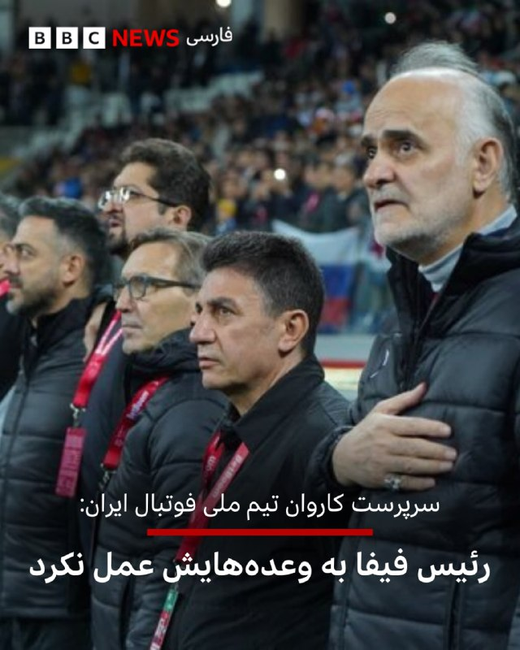

🔺سرپرست کاروان تیم ملی فوتبال ایران نسبت به عمل‌نکردن جیانی اینفانتینو، رئیس فیفا، به وعده‌هایش درباره فدراسیون فوتبال ایران انتقاد کرد.

مهدی محمدنبی که خود از ۱۵ عضو فدراسیون فوتبال ایران است که ویزای سفر به آمریکا را دریافت نکرده‌اند، گفت: «رئیس فیفا، نتوانسته به وعده‌هایش برای تأمین دسترسی کامل فدراسیون فوتبال ایران به سه بازی تیم در ایالات متحده عمل کند.»

او همچنین گفته که «امیدواریم آقای اینفانتینو واقعاً کلمات و وعده‌هایی را که به تیم ملی ایران داده است، عملی کند. مقررات و پروتکل‌های فیفا باید به درستی توسط فدراسیون‌های عضو و میزبانان رعایت شود.»

آقای محمدنبی با اشاره به مشکلات ایجادشده در روند صدور ویزا تأکید کرد که این موضوع روند آماده‌سازی تیم ملی را مختل کرده و ایران را در مقایسه با سایر تیم‌ها در شرایط دشوارتری قرار داده است.

📸ISNA

https://bbc.in/4eqPw8b
@BBCPersian

## alonews — post 127548

  <a href="telegram/content/alonews_127548_1781331145.webm" target="_blank">🎬 Download video</a>

👈کانال ۱۲ عبری از رصد ۳ راکت شلیک شده از لبنان به سمت شهرک‌های صهیونیست‌نشین «المطله» و « مسگاوعام» در شمال اسرائیل خبر داد

✅ @AloNews خبر جنگ

## alonews — post 127547

  <a href="telegram/content/alonews_127547_1781331145.webm" target="_blank">🎬 Download video</a>

👈دانشگاه شریف از امروز به روی ۴۵۰۰ دانشجوی مقاطع تحصیلات تکمیلی باز شد.

✅ @AloNews خبر جنگ

---
📅 بروزرسانی: 1405/03/23 09:32
---

## FarsiVOA — post 220554

  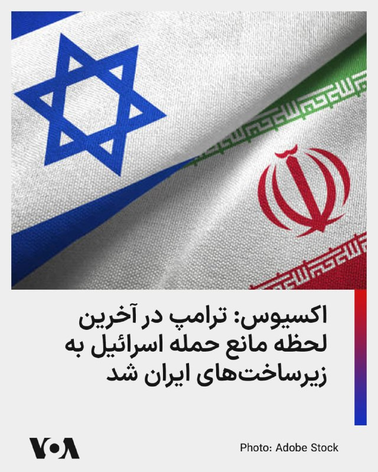

اکسیوس به نقل از منابع آگاه گزارش داد که هم‌زمان با تشدید تبادل حملات میان اسرائیل و جمهوری اسلامی در اوایل هفته، بنیامین نتانیاهو قصد داشت حملات گسترده‌ای علیه تأسیسات انرژی و زیرساختی ایران انجام دهد، اما دونالد ترامپ در آخرین لحظات مانع اجرای این طرح شد.

به نوشته اکسیوس، ترامپ شامگاه پنجشنبه در تماس با نخست‌وزیر اسرائیل به او گفت انتظار دارد ظرف چند روز توافقی با جمهوری اسلامی امضا شود و «زمان پایان دادن به جنگ» فرارسیده است.

یک مقام ارشد آمریکایی به این رسانه گفت نتانیاهو در این تماس مخالفت جدی نکرد، اما از روند گفت‌وگوهای مستقیم ایالات متحده و جمهوری اسلامی عملاً کنار گذاشته شده است.

بر اساس گزارش، نتانیاهو پس از آن برای کسب اطلاعات درباره مذاکرات ترامپ با جمهوری اسلامی با متحدان خود در واشنگتن تماس گرفته است.

اکسیوس نوشت برخی در واشنگتن نگرانند نتانیاهو حتی پس از اجرایی شدن توافق، نقش اخلال‌گر ایفا کند.
@FarsiVOA

## Persian_Trend_Official — post 16909

  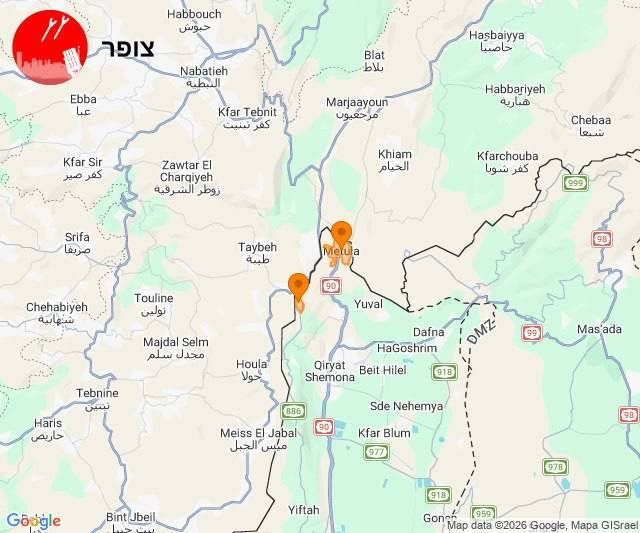

دقایقی‌ قبل، هشدار پهپاد در منطقه گالیل پان هندل، شمال اسرائیل در امتداد مرز لبنان به صدا درآمد.

👺Phantom

📌 @persian_trend_official
پرشین ترند | متفاوت‌ترین کانال نظامی

## alonews — post 127546

  <a href="telegram/content/alonews_127546_1781330551.webm" target="_blank">🎬 Download video</a>

👈نیویورک‌تایمز: ایالات متحده به شرکت آنتروپیک دستور داده است که دسترسی تمامی اتباع خارجی به مدل‌های پیشرفته هوش مصنوعی خود، «Mythos 5» و «Fable 5»، را مسدود کند و دلیل این تصمیم را نگرانی‌های مربوط به امنیت ملی اعلام کرده است.

🔴آنتروپیک اعلام کرد که ناچار شده فوراً دسترسی را غیرفعال کند؛ اقدامی که حتی کارکنان خارجی این شرکت را نیز تحت تأثیر قرار داده است. این شرکت همچنین این وضعیت را «یک سوءتفاهم» توصیف کرد.

✅ @AloNews خبر جنگ

## alonews — post 127545

  <a href="telegram/content/alonews_127545_1781330551.webm" target="_blank">🎬 Download video</a>

🔴فوری/ ترامپ میگوید ایالات متحده امریکا رهبر گروه «ترن د آراگوا» را به قتل رسانده است.

🔴متنی که ترامپ منتشر کرده:به دستور من، فرماندهی جنوبی ایالات متحده یک عملیات ضربتی سریع و کشنده انجام داد تا «نیِنیو گوئررو»، رهبر بدنام گروه ترن د آراگوا، که یکی از خونخوارترین سازمانهای تروریستی روی کره زمین است، با موفقیت ترور شود.

🔴پیش از بازگشت من به دفتر، جو بایدن مرز جنوبی ما را به روی میلیونها جنایتکار غیرقانونی گشود و به این ارتش بیگانه اجازه داد تا با مصونیت کامل، شهروندان آمریکایی را تجاوز، مثله و به قتل برسانند.

🔴در طول مبارزات انتخاباتیام، قول دادم که این هیولاها را از کشورمان بیرون کنم و برای خانوادههای کسانی که به قتل رساندهاند، از جمله «جوسلین نونگارای» ۱۲ ساله عزیز، «لیکن ریلی» ۲۲ ساله و بیشمار روحهای پاک دیگر، عدالت برقرار کنم.

🔴با این اقدام، ارتش ایالات متحده برای آنها، خانوادههایشان و عزیزانشان تلافی کرد. در اوایل دوره ریاستجمهوریام، به قولم عمل کردم و ترن د آراگوا را به عنوان یک سازمان تروریستی خارجی تعیین کردم، هزاران جنایتکار شرور را اخراج کردم و علیه کارتلهایی که مدتهاست با شهروندان ما میجنگند، در حالی که رهبران ضعیف آمریکا را درمانده و دفاعی رها کرده بودند، اعلام جنگ کردم. این اقدام با هماهنگی نزدیک با دوستانمان در ونزوئلا انجام شد که با آنها بسیار خوب کار میکنیم.

🔴در نتیجه، تروریستهای ترن د آراگوا دیگر در ونزوئلا یا هر جای دیگر پناهگاه امنی ندارند و تحت رهبری من، این قاتلان بیرحم و اربابان مواد مخدر را در هر زمان و هر مکان پیدا خواهیم کرد و به اعماق جهنمی که به آن تعلق دارند، خواهیم فرستاد. خدا آمریکا را حفظ کند!

✅ @AloNews خبر جنگ

---
📅 بروزرسانی: 1405/03/23 09:22
---

## IranIntlTV — post 341996

🔻جام جهانی ۲۰۲۶ با برگزاری مراسم افتتاحیه پرشور و پر ستاره در لس‌آنجلس، رسما در آمریکا آغاز شد و آمریکا پس از ۳۲ سال بار دیگر میزبانی این رقابت‌ها را بر عهده گرفت.

🔹این سومین افتتاحیه جام جهانی ۲۰۲۶ بود که به میزبانی آمریکا، مکزیک و کانادا برگزار می‌شود.

🔹کتی پری، خواننده آمریکایی، به همراه تیوس لوکا، خواننده ۱۰ ساله نروژی، دقایقی پیش از ورود بازیکنان به زمین اجرا کرد.

🔹فیوچر، رپر آمریکایی، تایلا، خواننده اهل آفریقای جنوبی، آنیتا، خواننده برزیلی، و لیسا، عضو گروه بلک‌پینک، نیز از دیگر هنرمندان حاضر در مراسم افتتاحیه لس‌آنجلس بودند.

🔹تیم ملی آمریکا پس از این مراسم به مصاف پاراگوئه رفت.

🔹تصاویر بیشتری از افتتاحیه را در صفحه اینستاگرام ایران اینترنشنال ورزشی ببینید.

🔹جزییاتی از مراسم افتتاحیه لس آنجلس را در وب‌سایت ایران اینترنشنال بخوانید.

@iranintltvsport

## IranIntlTV — post 341995

  <a href="https://t.me/IranintlTV/341995" target="_blank">📎 Download file</a>

🎧نسخه صوتی اخبار بامدادی | شنبه ۲۳ خرداد
@iranintlTV

## FarsiVOA — post 220553

  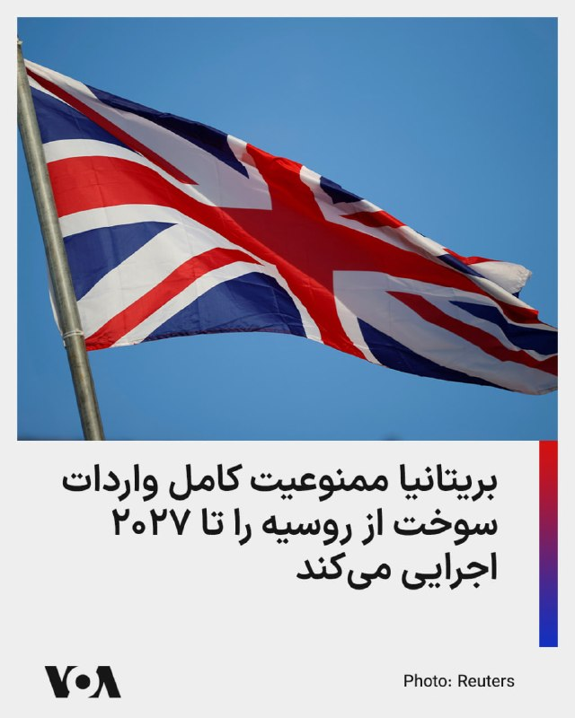

بریتانیا می‌گوید ممنوعیت کامل واردات گازوئیل و سوخت هواپیما از روسیه را تا سال ۲۰۲۷ اجرایی می‌کند.

بریتانیا پیشتر ممنوعیت واردات سوخت از روسیه را به خاطر اخلال در تنگه هرمز و بحران جهانی انرژی تعویق کرده و مجوز موقت برای واردات گازوئیل و سوخت هواپیما از روسیه صادر کرده بود.

اکنون وزارت بازرگانی و تجارت بریتانیا می‌گوید مجوز موقت تا اول ژانویه ۲۰۲۷ منقضی خواهد شد و حتی دولت هر دو هفته یک‌بار این مجوز را مورد بازبینی قرار می‌دهد تا در اسرع وقت امکان لغو آن فراهم شود.

کشورهای غربی تحریم‌های گسترده‌ای علیه روسیه به خاطر تهاجم نظامی به اوکراین وضع کرده‌اند، اما در میانه بحران انرژی اخیر، آمریکا نیز برخی معافیت‌های تحریمی موقت برای واردات انرژی روسیه اعلام کرد.
@FarsiVOA

## alonews — post 127544

  <a href="telegram/content/alonews_127544_1781329936.webm" target="_blank">🎬 Download video</a>

👈گزارش‌ها: یک فروند A-10 آمریکایی به پایگاه بازنگشته است

🔴منابع رصدی گزارش داده‌اند یک فروند هواپیمای تهاجمی A-10C Thunderbolt II با شماره ثبت 78-0614 پس از عملیات اخیر به همراه اسکادران خود به پایگاه بازنگشته است.

🔴بر اساس گمانه‌زنی‌های مطرح‌شده، احتمال دارد این همان هواپیمایی باشد که در جریان عملیات نجات افسر سامانه‌های تسلیحاتی یک فروند F-15E Strike Eagle هدف قرار گرفته و توسط ایران سرنگون شده است.

✅ @AloNews خبر جنگ

## alonews — post 127543

  <a href="telegram/content/alonews_127543_1781329936.webm" target="_blank">🎬 Download video</a>

👈یدیعوت آحارانوت به نقل از منابع اسرائیلی: اگر ایران در صورت هدف قرار گرفتن ضاحیه جنوبی بیروت به ما حمله کند، ما تلافی خواهیم کرد و اتحاد جبهه‌ها را نخواهیم پذیرفت

✅ @AloNews خبر جنگ

---
📅 بروزرسانی: 1405/03/23 09:12
---

## VahidOOnLine — post 245255

  

صفحه فارسی وزارت خارجه اسرائیل در پستی در شبکه ایکس با اشاره به سالگرد جنگ ۱۲ روزه آمریکا و اسرائیل علیه جمهوری اسلامی نوشت: یک سال پیش در چنین روزی، ده‌ها تن از مقامات ارشد رژیم «تروریستی» جمهوری اسلامی در سه ثانیه نخست جنگ کشته شدند.
این صفحه تاکید کرد که این افراد پیش از کشته شدن بارها اسرائیل را تهدید به نابودی و در داخل نیز مردم ایران را سرکوب می‌کردند، در سه ثانیه اول جنگ هدف قرار گرفتند.
‌🏁 🇬🇧 IranintlTV

🤖 @VahidOOnLine

## IranIntlTV — post 341994

  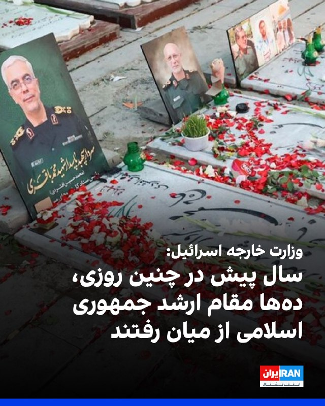

صفحه فارسی وزارت خارجه اسرائیل در پستی در شبکه ایکس با اشاره به سالگرد جنگ ۱۲ روزه آمریکا و اسرائیل علیه جمهوری اسلامی نوشت: یک سال پیش در چنین روزی، ده‌ها تن از مقامات ارشد رژیم «تروریستی» جمهوری اسلامی در سه ثانیه نخست جنگ کشته شدند.
این صفحه تاکید کرد که این افراد پیش از کشته شدن بارها اسرائیل را تهدید به نابودی و در داخل نیز مردم ایران را سرکوب می‌کردند، در سه ثانیه اول جنگ هدف قرار گرفتند.
https://iranintl.com/202606134797

## IranIntlTV — post 341993

  <a href="telegram/content/IranIntlTV_341993_1781329337.mp4" target="_blank">🎬 Download video</a>

دومین روز رقابت‌های جام جهانی ۲۰۲۶ در حالی به پایان رسید که تیم ملی آمریکا در نتیجه‌ای غیرمنتظره، با برتری ۴ بر ۱ برابر پاراگوئه به پیروزی رسید.

گزارش علیرضا مدیری، خبرنگار ایران‌اینترنشنال
@iranintltv

## FarsiVOA — post 220552

🔺گزارش‌ها از تصمیم به محدود شدن عملیات اسرائیل در لبنان؛ دفتر نتانیاهو تکذیب کرد

▪️تایمز اسرائیل به نقل از شبکه کان گزارش داد که هم‌زمان با ادامه درگیری میان اسرائیل و حزب‌الله در جنوب لبنان، دولت اسرائیل به ارتش این کشور دستور داده از اقداماتی که می‌تواند توافقِ رو به نهایی‌شدن میان آمریکا و جمهوری اسلامی را به خطر بیندازد، خودداری کند.

▪️دفتر نخست‌وزیری اسرائیل این گزارش را «خبر جعلی» خوانده و رد کرده است.

▪️پیشتر رسانه اسرائیلی کانال ۱۲ گزارش داده بود که دونالد ترامپ در روزهای اخیر به بنیامین نتانیاهو هشدار داده است در صورت تشدید درگیری با جمهوری اسلامی، اسرائیل ممکن است خود را بدون حمایت کامل بین‌المللی و در شرایطی دشوارتر بیابد.

⬇️ بیشتر بخوانید:
https://ir.voanews.com/a/8160416.html

## FarsiVOA — post 220551

  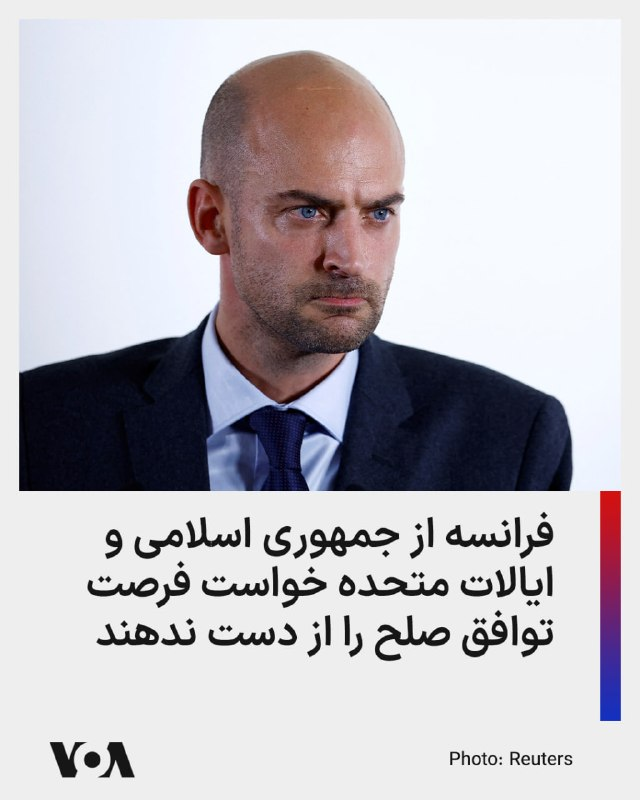

ژان‌نوئل بارو، وزیر خارجه فرانسه، روز جمعه از جمهوری اسلامی و ایالات متحده خواست از فرصت موجود برای پایان دادن به وضعیتی که آن را «غیرقابل دوام» خواند، استفاده کنند و یک توافق اولیه صلح را امضا کنند.

بارو در گفت‌وگو با شبکه فرانسوی ال‌سی‌آی گفت: «ما از دو طرف می‌خواهیم این فرصت را برای پایان دادن به وضعیتی که آشکارا غیرقابل تحمل است و تنها بازنده تولید می‌کند، غنیمت بشمارند.»

او افزود همین پیام را در گفت‌وگوی صبح جمعه با عباس عراقچی، وزیر خارجه جمهوری اسلامی، نیز مطرح کرده است.

وزیر خارجه فرانسه گفت با وجود احتیاط، «نشانه‌های مثبت در حال افزایش است» و احساس می‌کند هر دو طرف اراده رسیدن به توافق را دارند.

این اظهارات در حالی مطرح می‌شود که به گفته یک مقام ارشد دولت آمریکا، توافق اولیه میان دو طرف به امضا نزدیک شده است. او تأکید کرد اکنون زمان تصمیم‌گیری سیاسی است، نه ادامه فرسایش دیپلماتیک بیشتر.
@FarsiVOA

## BBCPersian — post 283630

⚽️ایران در تیخوانا؛ ۱۰ نکته‌ای که باید درباره میزبان تیم ملی در مکزیک بدانید

محل کمپ و استقرار تیم ملی فوتبال ایران برای جام جهانی ۲۰۲۶ شهر مرزی تیخوانا در مکزیک است. از آنجا که تیخوانا جامعه ایرانی قابل توجهی ندارد، ورود تیم ملی ایران برای بسیاری از ساکنان شهر تجربه‌ای تازه خواهد بود.

تیخوانا در مرز مکزیک و آمریکا، درست روبه‌روی شهر سن‌دیگو در ایالت کالیفرنیا قرار گرفته است. بنابراین، هویت تیخوانا پیش از مکزیکی بودن تحت تاثیر مرز است.

گذرگاه مرزی «سن ایسیدرو» که تیخوانا را به سن‌دیگو متصل می‌کند، به‌عنوان پرترددترین گذرگاه زمینی مرزی در نیم‌کره غربی شناخته می‌شود. صف‌های طولانی، بازرسی گذرنامه و ترافیک مرزی، بخشی عادی از زندگی روزمره مردم در این شهر است.

تیخوانا از شهرهای میزبان جام جهانی نیست. این شهر به دلیل نزدیکی به جنوب کالیفرنیا و دسترسی آسان به ورزشگاه‌های محل برگزاری مسابقات در غرب آمریکا انتخاب شده است.

تیخوانا، یکی از خشن‌ترین شهرهای مکزیک بارها در فهرست شهرهای دارای بالاترین نرخ قتل در جهان قرار گرفته است.

📲ادامه مطلب در لینک زیر⬇️

📸GettyImages

https://bbc.in/4xq9vfT
@BBCPersian

## alonews — post 127542

  <a href="telegram/content/alonews_127542_1781329338.webm" target="_blank">🎬 Download video</a>

👈کیهان: اگر تنگه هرمز را باز کنید دشمن دوباره حمله می‌کند!/ هیچ آدم عاقلی نقطه قوت خود را پای میز مذاکره نمی‌برد

✅ @AloNews خبر جنگ

## alonews — post 127541

  <a href="telegram/content/alonews_127541_1781329339.webm" target="_blank">🎬 Download video</a>

👈کارآگاهان پلیس آگاهی شهرستان آستارا، با اقدامات فنی و اطلاعاتی نامحسوس محل احتکار و دپوی غیرقانونی کالا‌های اساسی و موادبهداشتی را شناسائی و افزون بر ۱۵۳ میلیارد ریال ارزاق عمومی در آن کشف کردند

✅ @AloNews خبر جنگ

---
📅 بروزرسانی: 1405/03/23 09:02
---

## VahidOOnLine — post 245254

  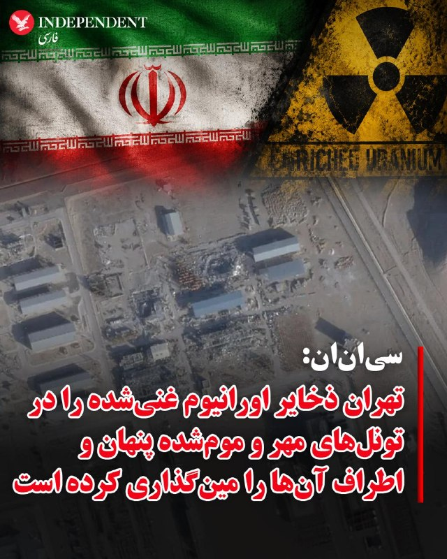

♦️شبکه سی‌ان‌ان به نقل از دو مقام آمریکایی و یک منبع آگاه گزارش داد که ایران پیش از حملات اخیر اسرائیل، ذخایر اورانیوم غنی‌شده خود را به تونل‌های زیرزمینی در مجتمع هسته‌ای اصفهان منتقل کرده و ورودی این تونل‌ها را مهر و موم کرده است.
بر اساس این گزارش، ارزیابی‌های اطلاعاتی آمریکا نشان می‌دهد ایران همچنین در اطراف این تونل‌ها مین کار گذاشته تا دسترسی به آن‌ها دشوارتر شود. به گفته منابع آگاه، این اقدامات بخشی از تلاش تهران برای محافظت از ذخایر اورانیوم با غنای بالا در صورت حمله به تاسیسات هسته‌ای بوده است.
سی‌ان‌ان به نقل از مقام‌های آمریکایی گزارش داد هنوز مشخص نیست چه میزان از ذخایر اورانیوم ایران در این تونل‌ها نگهداری می‌شود، اما واشنگتن و تل‌آویو معتقدند بخش مهمی از مواد هسته‌ای ایران ممکن است از حملات در امان مانده باشد.
این گزارش در حالی منتشر شده که مقام‌های آمریکایی همچنان در حال ارزیابی میزان خسارت واردشده به برنامه هسته‌ای ایران هستند و درباره سرنوشت ذخایر اورانیوم غنی‌شده این کشور ابهام‌هایی وجود دارد. برخی منابع معتقدند تهران پیش از حملات، اقداماتی برای جابه‌جایی یا حفاظت از این مواد انجام داده است.
سی‌ان‌ان همچنین گزارش داد تصاویر ماهواره‌ای نشان‌دهنده فعالیت‌های غیرعادی در اطراف تأسیسات اصفهان پیش از حملات بوده و احتمال می‌رود این تحرکات با انتقال مواد هسته‌ای و آماده‌سازی تونل‌های زیرزمینی مرتبط بوده باشد.
انتقال و یا انهدام بیش از ۴۰۰ کیلوگرم اورانیوم غنی‌شده ایران، بخش پرچالشی در مذاکرات صلح تهران و واشنگتن بوده است.
‌🇸🇦 Indypersian

🤖 @VahidOOnLine

## IranIntlTV — post 341992

  <a href="telegram/content/IranIntlTV_341992_1781328765.mp4" target="_blank">🎬 Download video</a>

ایرانیان مقیم اوکلند نیوزیلند در آستانه سالروز تولد مجیدرضا رهنورد و در پاسخ به فراخوان شاهزاده رضا پهلوی، با برگزاری راهپیمایی، تشکیل زنجیره انسانی و برافراشتن پرچم شیر و خورشید، یاد او و دیگر جان‌باختگان راه آزادی ایران را گرامی داشتند.

علیرضا محبی، خبرنگار ایران‌اینترنشنال، گزارش می‌دهد
@iranintltv

## IranIntlTV — post 341991

  <a href="telegram/content/IranIntlTV_341991_1781328767.mp4" target="_blank">🎬 Download video</a>

هم‌زمان با برگزاری برنامه‌ای برای تماشای دیدار تیم‌های ملی کانادا و بوسنی‌وهرزگوین در شهر کلگری کانادا، شماری از ایرانیان با در دست داشتن پرچم شیر و خورشید در میان جمعیت حضور یافتند.

سپیدار ولیان، خبرنگار ایران‌اینترنشنال، گزارش می‌دهد
@iranintltv

## RadioFarda — post 158243

روز دوم جام جهانی؛ پیروزی پرگل آمریکا مقابل پاراگوئه، تساوی کانادا و بوسنی

🔸دومین روز جام جهانی ۲۰۲۶ با پیروزی پرگل تیم آمریکا، یکی از میزبانان مشترک مسابقات به پایان رسید.

🔸تیم ایالات متحده که در نخستین بازی خود، در لس آنجلس مقابل پاراگوئه به میدان رفته بود، توانست با ارائۀ یک بازی برتر،‌ بخصوص در نیمۀ اول، با نتیجۀ ۴ بر یک به پیروزی برسد.

🔸این مسابقه فعلاً پرگل‌ترین بازی این مسابقات بوده است.

🔸اولین «گل به‌خودی» مسابقات هم در دقیقۀ هفتم این بازی ثبت شد؛‌ زمانی‌که مدافع پاراگوئه با دفع اشتباه توپ، دروازۀ تیم خودی را باز کرد.

🔸همچنین «فولارین جری بالوگون»، بازیکن شماره ۲۰ تیم آمریکا در همین بازی دو گل به ثمر رساند؛‌یکی با پای چپ و یک با پای راست. او فعلاً تنها بازیکن دو گله مسابقات است.

🔸پیش از شروع این مسابقه، کیتی پری خوانندۀ مشهور، به اجرای موسیقی پرداخت. جاستین ترودو، نخست‌وزیر پیشین کانادا و شریک زندگی این‌روزهای کیتی پری هم در ورزشگاه حضور داشت.

🔸از دیگر چهره‌های مشهور حاضر در استادیوم لس‌آنجلس می‌توان به دیوید و ویکتوریا بکام، تام کروز، و بیل گیتز اشاره کرد.

🔸از مقام‌های رسمی دو کشور هم مارکو روبیو وزیر خارجۀ ایالات متحده و سانتیاگو پِنیا رئیس‌جمهور پاراگوئه در کنار جانی اینفانتینو دبیر کل فیفا در جایگاه ویژه حضور داشته و این رقابت را از نزدیک تماشا کردند.

🔸نسخه کامل این گزارش را در وب‌سایت رادیوفردا بخوانید.

@RadioFarda

## alonews — post 127540

  <a href="telegram/content/alonews_127540_1781328769.webm" target="_blank">🎬 Download video</a>

👈سی‌ان‌ان: ایران در بحبوحه نگرانی‌ها از عملیات زمینی ایالات متحده، بخش‌هایی از ذخایر اورانیوم با غنای بالای خود را با تخریب تونل‌ها و کار گذاشتن مین‌های انفجاری در اطراف ورودی‌ها مسدود کرده است.

🔴 این اقدامات دسترسی به اورانیوم را به طور قابل توجهی دشوارتر و خطرناک‌تر کرده و می‌تواند تلاش‌ها برای حذف یا از بین بردن این ذخایر را تحت هرگونه توافق آینده، پیچیده کند.

✅ @AloNews خبر جنگ

## alonews — post 127539

  <a href="telegram/content/alonews_127539_1781328770.webm" target="_blank">🎬 Download video</a>

👈وزیر خارجه فرانسه: ایران و آمریکا از فرصت موجود برای دستیابی به توافق استفاده کنند

✅ @AloNews خبر جنگ

## alonews — post 127538

  <a href="telegram/content/alonews_127538_1781328770.webm" target="_blank">🎬 Download video</a>

👈رویترز: نیروهای آمریکایی چندین پهپاد تهاجمی یک طرفه ایرانی را که به سمت تنگه هرمز در حرکت بودند، سرنگون کرده اند.

✅ @AloNews خبر جنگ

---
📅 بروزرسانی: 1405/03/23 08:52
---

## IranIntlTV — post 341990

  <a href="telegram/content/IranIntlTV_341990_1781328134.mp4" target="_blank">🎬 Download video</a>

رضا گوهرزاد، روزنامه‌نگار و تحلیل‌گر سیاسی، گفت: «هم تهران و هم واشینگتن در حال خریدن زمان هستند. دونالد ترامپ به دنبال ثبت یک پیروزی در کارنامه سیاسی خود است و جمهوری اسلامی نیز می‌کوشد راهی برای خروج از وضعیت استیصال کنونی پیدا کند.» او افزود با توجه به نکات مطرح‌شده، «این تفاهم‌نامه به هیچ‌وجه قابلیت اجرایی ندارد.»
@iranintltv

## BBCPersian — post 283629

🔻حزب‌الله: با نیروهای اسرائیلی در جنوب لبنان درگیر شده‌ایم

حزب‌الله لبنان اعلام کرد که نیروهایش با نظامیان اسرائیلی که به سوی شهرک مرزی مجدل زون در جنوب لبنان پیشروی می‌کردند، درگیر شده‌اند.

این گروه در بیانیه‌ای گفت که شامگاه پنجشنبه با چندین نوبت شلیک راکت به سوی نیروهای اسرائیلی، آنها را وادار به عقب‌نشینی کرده و سپس روز جمعه با استفاده از سلاح‌های سبک، نیمه‌سنگین و راکت با این نیروها درگیر شده است.

حزب‌الله همچنین مدعی انجام حملات دیگری علیه نیروهای اسرائیلی در جنوب لبنان شد.

در همین حال، ارتش اسرائیل برای ساکنان سه روستای جنوب لبنان هشدار تخلیه صادر کرد و رسانه رسمی لبنان از مجموعه‌ای از حملات در مناطق مختلف جنوب آن کشور خبر داد.

خبرگزاری ملی لبنان همچنین از وقوع انفجارهای شدید و گلوله‌باران توپخانه‌ای در نزدیکی تپه‌های علی طاهر، مشرف به شهر نبطیه، گزارش داد.

این درگیری‌ها در حالی ادامه دارد که آتش‌بس اعلام‌شده در ماه آوریل هرگز به طور کامل اجرا نشد و با وجود توافق آتش‌بس مشروطی که هفته گذشته پس از مذاکرات لبنان و اسرائیل در واشنگتن اعلام شد، تبادل آتش میان دو طرف ادامه یافته است.

حزب‌الله این توافق را رد کرد و گفت که این توافق از این گروه می‌خواهد حملات خود را متوقف کند، اما اشاره‌ای به توقف حملات اسرائیل یا خروج نیروهای این کشور از لبنان ندارد.

ایران نیز تاکید کرده است که لبنان باید بخشی از هرگونه توافق برای پایان دادن به جنگ گسترده‌تر در خاورمیانه باشد.

https://bbc.in/4eGU63e
@BBCPersian

## alonews — post 127537

  <a href="telegram/content/alonews_127537_1781328135.webm" target="_blank">🎬 Download video</a>

👈رافائل گروسی برای دبیرکلی سازمان ملل اعلام آمادگی کرد

✅ @AloNews خبر جنگ

## alonews — post 127536

  <a href="telegram/content/alonews_127536_1781328136.webm" target="_blank">🎬 Download video</a>

👈 سی‌بی‌اس: کاهش ۳ درصدی قیمت نفت در پی خوش‌بینی‌ها نسبت به توافق تهران و واشنگتن

✅ @AloNews خبر جنگ

## alonews — post 127535

  <a href="telegram/content/alonews_127535_1781328136.webm" target="_blank">🎬 Download video</a>

👈وال‌استریت‌ژورنال: رفع تحریم در ازای اقدامات ایران در خصوص برنامه هسته‌ای صورت خواهد گرفت

✅ @AloNews خبر جنگ

---
📅 بروزرسانی: 1405/03/23 08:42
---

## VahidOOnLine — post 245253

  

نشریه اسپکتیتور در تحلیلی نوشت دولت دونالد ترامپ بدون درک کامل از ماهیت جمهوری اسلامی وارد رویارویی با حکومت ایران شده و اکنون در موقعیتی قرار دارد که نه از حمایت کافی برای تشدید جنگ برخوردار است و نه می‌تواند تهران را به پذیرش خواسته‌های خود وادار کند.

جاناتان اسپایر، نویسنده این یادداشت، به مواضع متناقض ترامپ درباره ایران اشاره کرده و نوشته است که کاخ سفید میان تهدید نظامی و تلاش برای دستیابی به توافق در نوسان است.

به گفته او، توافق احتمالی مورد بحث بیشتر بر بازگشایی تنگه هرمز و ادامه مذاکرات متمرکز است و نشانه‌ای از محدودیت برنامه موشکی یا شبکه نیروهای هم‌پیمان جمهوری اسلامی در آن دیده نمی‌شود.

اسپایر معتقد است واشینگتن توان نظامی لازم برای افزایش فشار بر ایران را دارد، اما فاقد اراده سیاسی و حمایت عمومی برای گسترش جنگ است.

او در پایان نتیجه می‌گیرد که سردرگمی دولت ترامپ و برخی دولت‌های غربی نشان می‌دهد آنها همچنان درک کاملی از ماهیت و شیوه عمل جمهوری اسلامی ندارند.

‌🏁 🇬🇧 IranintlTV

🤖 @VahidOOnLine

## IranIntlTV — post 341989

  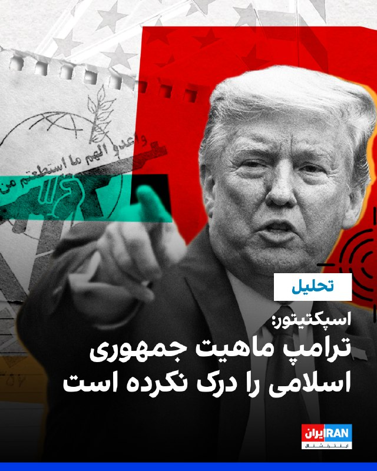

نشریه اسپکتیتور در تحلیلی نوشت دولت دونالد ترامپ بدون درک کامل از ماهیت جمهوری اسلامی وارد رویارویی با حکومت ایران شده و اکنون در موقعیتی قرار دارد که نه از حمایت کافی برای تشدید جنگ برخوردار است و نه می‌تواند تهران را به پذیرش خواسته‌های خود وادار کند.

جاناتان اسپایر، نویسنده این یادداشت، به مواضع متناقض ترامپ درباره ایران اشاره کرده و نوشته است که کاخ سفید میان تهدید نظامی و تلاش برای دستیابی به توافق در نوسان است.

به گفته او، توافق احتمالی مورد بحث بیشتر بر بازگشایی تنگه هرمز و ادامه مذاکرات متمرکز است و نشانه‌ای از محدودیت برنامه موشکی یا شبکه نیروهای هم‌پیمان جمهوری اسلامی در آن دیده نمی‌شود.

اسپایر معتقد است واشینگتن توان نظامی لازم برای افزایش فشار بر ایران را دارد، اما فاقد اراده سیاسی و حمایت عمومی برای گسترش جنگ است.

او در پایان نتیجه می‌گیرد که سردرگمی دولت ترامپ و برخی دولت‌های غربی نشان می‌دهد آنها همچنان درک کاملی از ماهیت و شیوه عمل جمهوری اسلامی ندارند.

https://iranintl.com/202606130091

## RadioFarda — post 158242

  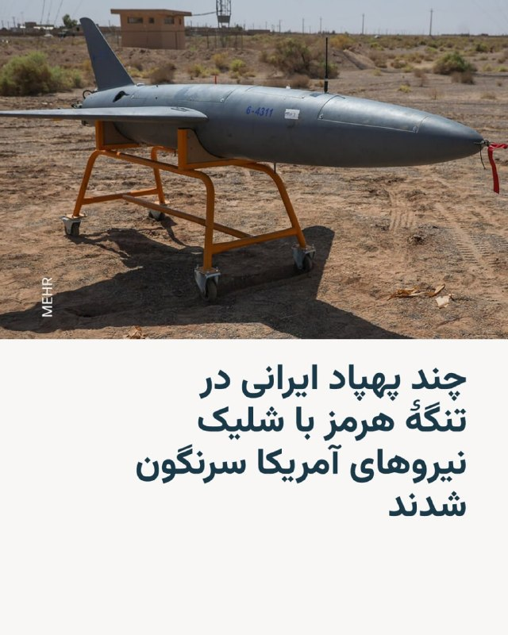

🔸فرماندهی مرکزی نیروهای مسلح ایالات متحده در خاورمیانه، سنتکام، روز شنبه ۲۳ خرداد از هدف‌ قرار دادن و سرنگونی چندین پهپاد تهاجمی ایران در مسیر تنگۀ هرمز در ساعات گذشته خبر داد.

🔸بر اساس مطلبی که از سوی این نهاد در شبکۀ ایکس منتشر شده، این پهپادها تردد کشتی‌های تجاری را با خطر مواجه می‌کرده‌اند.

🔸دونالد ترامپ پیشتر در همین روز به ایران هشدار داده بود که از ارسال پهپادهای تهاجمی به سمت کشتی‌هایی که قصد عبور از تنگۀ هرمز را دارند، اجتناب کند.

🔸رئیس‌جمهور ایالات متحده خطاب به تهران گفته بود: «بهتر است هرچه زودتر خودتان را جمع و جور کنید!»

@RadioFarda

## BBCPersian — post 283628

  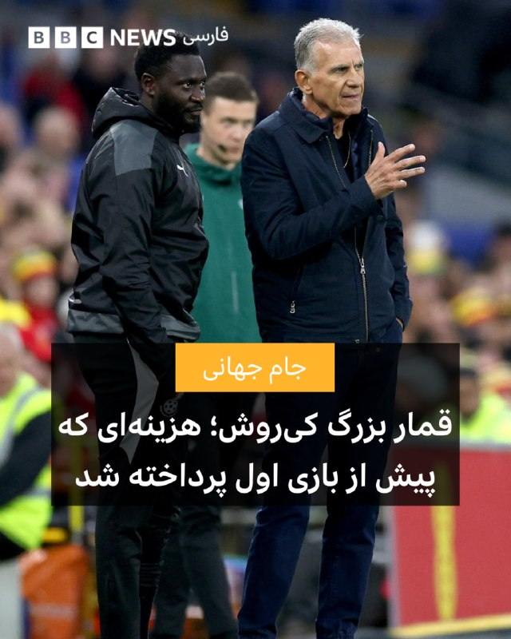

پوریا ژافره - خبرنگار اعزامی بی‌بی‌سی فارسی به جام‌جهانی

با جلوگیری از ورود توماس پارتی، هافبک سرشناس و جنجالی تیم ملی غنا، به کانادا و از دست رفتن اولین بازی این تیم در جام جهانی برای او، به نظر می‌رسد کارلوس کی‌روش پیش از آنکه تیمش حتی به میدان برود، به دردسر خورده است.

فدراسیون فوتبال غنا پس از مجموعه‌ای از نتایج ضعیف و شکست‌های پیاپی در ماه‌های منتهی به جام جهانی، تصمیم گرفت هدایت تیم را به کارلوس کی‌روش بسپارد. سرمربی پرتغالی که پیش از این چهار بار حضور در جام جهانی را تجربه کرده بود؛ یک بار با پرتغال و سه بار با ایران. او در دنیای فوتبال به عنوان مربی‌ای شناخته می‌شود که می‌تواند به تیم‌های بحران‌زده نظم، سازماندهی و انضباط تاکتیکی بدهد؛ ویژگی‌هایی که مسئولان فوتبال غنا امیدوار بودند بتواند اعتمادبه‌نفس از دست‌رفته «ستاره‌های سیاه» را بازگرداند.

https://bbc.in/43y1NTi
@BBCPersian
📷 Reuters

## alonews — post 127534

  <a href="telegram/content/alonews_127534_1781327544.webm" target="_blank">🎬 Download video</a>

👈خبر شوکه‌کننده رسانه فرانسوی؛
کشف جسد در نزدیکی محل تمرین تیم ملی

🔴به گزارش خبرگزاری فرانسوی RMC، دفتر دادستانی تیخوانا در تماس با خبرگزاری فرانسه توضیح داد که یک گشت نظارتی، در صندوق عقب یک خوردو، جسدی در حال تجزیه را کشف کرده است.

🔴این کشف وحشتناک در پارکینگ سوپرمارکتی که مستقیماً روبروی ورزشگاه کالینته، جایی که تیم ایران از زمان ورودش در روز یکشنبه روزانه در آن تمرین می‌کند و با ماشین یک دقیقه از هتل فاصله دارد، رخ داد.

✅ @AloNews خبر جنگ

## alonews — post 127533

  <a href="telegram/content/alonews_127533_1781327545.webm" target="_blank">🎬 Download video</a>

👈 واشنگتن پست: بانک جهانی اعلام کرد: جنگ ایران رشد اقتصادی جهان را به ضعیف‌ترین سطح خود از زمان همه‌گیری کرونا خواهد رساند

✅ @AloNews خبر جنگ

## alonews — post 127532

  <a href="telegram/content/alonews_127532_1781327545.webm" target="_blank">🎬 Download video</a>

👈الحدث به نقل از یک منبع بلندپایه: امضای «اعلامیه اسلام‌آباد» به‌صورت غیرحضوری (از راه دور) انجام خواهد شد و دیدارهای ژنو نیز به‌طور موقت به تعویق افتاده است

✅ @AloNews خبر جنگ

---
📅 بروزرسانی: 1405/03/23 08:32
---

## VahidOOnLine — post 245252

  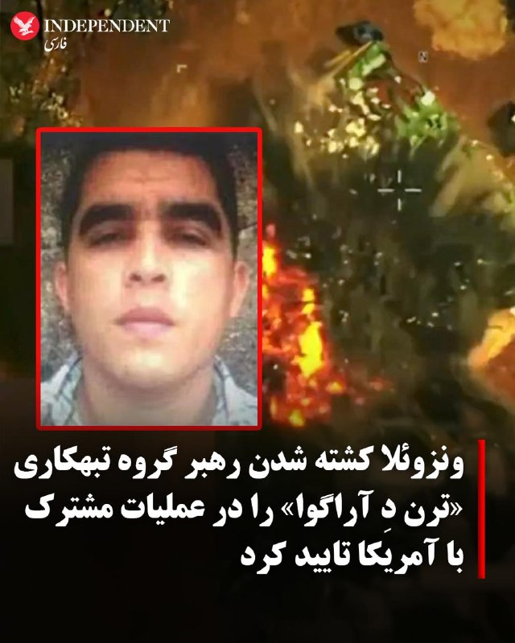

♦️مقام‌های ونزوئلا صبح شنبه ۲۳ خرداد ماه اعلام کردند «هکتور روستنفورد گوئررو فلورس»، معروف به «نینیو گوئررو» و رهبر گروه تبهکاری فراملی «ترن دِ آراگوا»، در جریان یک عملیات مشترک با ایالات متحده کشته شده است.
وزارت ارتباطات ونزوئلا در بیانیه‌ای اعلام کرد: «در جریان درگیری با اعضای این تشکیلات جنایی، هکتور روستنفورد گوئررو فلورس ملقب به نینیو گوئررو از پای درآمد.»
ساعاتی پیش از این اعلام، دونالد ترامپ، رئیس‌جمهور آمریکا، گفته بود نیروهای آمریکایی در یک حمله مرگبار رهبر این باند را هدف قرار داده‌اند. پیت هگست، وزیر دفاع آمریکا نیز تایید کرد که این حمله علیه یک پایگاه متعلق به «ترن دِ آراگوا» در خاک ونزوئلا انجام شده است.
گوئررو که با نام «نینیو گوئررو» شناخته می‌شد، رهبر یکی از بزرگ‌ترین شبکه‌های تبهکاری آمریکای لاتین بود. دولت آمریکا این گروه را یک سازمان تروریستی خارجی معرفی کرده و او را به اتهاماتی از جمله قاچاق مواد مخدر، قاچاق انسان، پول‌شویی و حمایت از فعالیت‌های تروریستی تحت تعقیب قرار داده بود. برای دستگیری او نیز جایزه‌ای تا سقف پنج میلیون دلار تعیین شده بود.
باند «ترن دِ آراگوا» که از یک زندان در ایالت آراگوای ونزوئلا شکل گرفت، طی سال‌های اخیر فعالیت خود را به چندین کشور آمریکای لاتین و همچنین بخش‌هایی از آمریکا و اروپا گسترش داده و به یکی از شناخته‌شده‌ترین شبکه‌های جنایی منطقه تبدیل شده است.
‌🇸🇦 Indypersian

🤖 @VahidOOnLine

## VahidOOnLine — post 245251

  

سی‌ان‌ان به نقل از پنج منبع آگاه از اطلاعات آمریکا گزارش داد جمهوری اسلامی در هفته‌های اخیر با تخریب عمدی برخی تونل‌ها و مین‌گذاری ورودی‌ها، حفاظت از ذخایر اورانیوم با غنای بالا را افزایش داده است. به گفته این منابع، دسترسی به حدود نیم تن اورانیوم غنی‌شده اکنون بسیار دشوارتر و خطرناک‌تر از گذشته شده است.

این گزارش در حالی منتشر شده که دولت دونالد ترامپ در حال مذاکره با تهران بر سر توافقی است که بر اساس آن، اورانیوم غنی‌شده ایران به آمریکا تحویل داده و نابود شود. با این حال، منابع آگاه می‌گویند استحکامات جدید می‌تواند اجرای هرگونه توافق و راستی‌آزمایی آن را پیچیده‌تر کند.

اسکات روکر، رییس پیشین دفتر انتقال مواد هسته‌ای اداره ملی امنیت هسته‌ای آمریکا، هشدار داد در صورت صحت این گزارش‌ها، بازیابی ذخایر اورانیوم با غنای بالا دشوارتر خواهد شد و ممکن است درباره میزان واقعی مواد قابل دسترس ابهام ایجاد شود.

بر اساس این گزارش، بخش عمده ذخایر اورانیوم ایران در مجتمع هسته‌ای اصفهان نگهداری می‌شود و حتی در صورت دستیابی به توافق، خارج کردن این مواد به عملیات پیچیده حفاری، مین‌روبی و مذاکرات فنی گسترده نیاز خواهد داشت.
‌🏁 🇬🇧 IranintlTV

🤖 @VahidOOnLine

## IranIntlTV — post 341988

  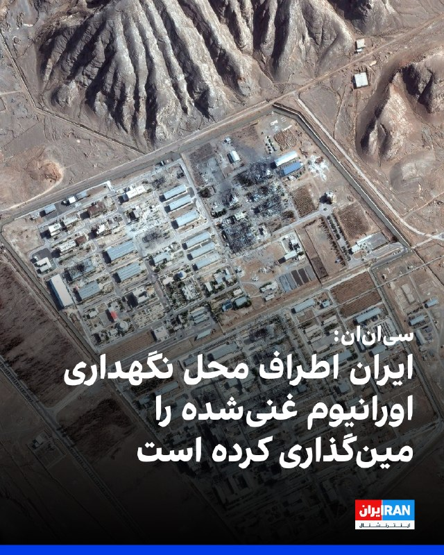

سی‌ان‌ان به نقل از پنج منبع آگاه از اطلاعات آمریکا گزارش داد جمهوری اسلامی در هفته‌های اخیر با تخریب عمدی برخی تونل‌ها و مین‌گذاری ورودی‌ها، حفاظت از ذخایر اورانیوم با غنای بالا را افزایش داده است. به گفته این منابع، دسترسی به حدود نیم تن اورانیوم غنی‌شده اکنون بسیار دشوارتر و خطرناک‌تر از گذشته شده است.

این گزارش در حالی منتشر شده که دولت دونالد ترامپ در حال مذاکره با تهران بر سر توافقی است که بر اساس آن، اورانیوم غنی‌شده ایران به آمریکا تحویل داده و نابود شود. با این حال، منابع آگاه می‌گویند استحکامات جدید می‌تواند اجرای هرگونه توافق و راستی‌آزمایی آن را پیچیده‌تر کند.

اسکات روکر، رییس پیشین دفتر انتقال مواد هسته‌ای اداره ملی امنیت هسته‌ای آمریکا، هشدار داد در صورت صحت این گزارش‌ها، بازیابی ذخایر اورانیوم با غنای بالا دشوارتر خواهد شد و ممکن است درباره میزان واقعی مواد قابل دسترس ابهام ایجاد شود.

بر اساس این گزارش، بخش عمده ذخایر اورانیوم ایران در مجتمع هسته‌ای اصفهان نگهداری می‌شود و حتی در صورت دستیابی به توافق، خارج کردن این مواد به عملیات پیچیده حفاری، مین‌روبی و مذاکرات فنی گسترده نیاز خواهد داشت.

## Persian_Trend_Official — post 16901

🔴 بازگشت A-10های آمریکایی از مأموریت‌های مرتبط با جنگ ایران؛ یک فروند همچنان مفقود است

تصاویر منتشرشده نشان می‌دهد ۱۱ فروند هواپیمای تهاجمی A-10C Thunderbolt II متعلق به اسکادران ۷۵ نیروی هوایی آمریکا به پایگاه RAF Lakenheath بریتانیا بازگشته‌اند. با این حال، یک فروند A-10C با شماره سریال 78-0614 در میان هواپیماهای بازگشته مشاهده نشده است.

🔹 برخی منابع نظامی گمانه‌زنی می‌کنند این هواپیما ممکن است همان A-10C باشد که در جریان عملیات جست‌وجو و نجات خدمه یک فروند F-15E Strike Eagle در منطقه درگیری با ایران از دست رفته است؛ ادعایی که تاکنون به‌طور رسمی تأیید نشده است.

🔹 تصاویر منتشرشده از هواپیماهای بازگشته، استفاده از طیف گسترده‌ای از تسلیحات را نشان می‌دهد؛ از جمله بمب‌های هدایت‌شونده GBU-31(V) و GBU-38، موشک‌های AGM-65 Maverick، راکت‌های Hydra 70 و مهمات ۳۰ میلی‌متری توپ GAU-8 Avenger.

🔹 یکی از نکات قابل توجه، مشاهده فریب‌دهنده‌های پرتاب‌شونده AGM-160 MALD روی برخی از این هواپیماهاست؛ سامانه‌ای که برای فریب رادارها و اشباع شبکه‌های پدافندی طراحی شده و معمولاً در مأموریت‌های سرکوب پدافند هوایی به‌کار می‌رود.

🔹 همچنین روی برخی از A-10ها نشانه‌های مأموریتی مشاهده شده که به گفته ناظران نظامی، به هدف قرار دادن شناورهای ایرانی و خودروهای ترابری و لانچرها در طول عملیات‌های اخیر اشاره دارد.

بازگشت A-10های آمریکایی با نشانه‌های عملیاتی و تسلیحات ویژه مقابله با پدافند، نشان می‌دهد این هواپیماها فراتر از نقش سنتی پشتیبانی نزدیک هوایی، در مأموریت‌های پیچیده‌تری در جریان درگیری اخیر به‌کار گرفته شده‌اند. همزمان، سرنوشت A-10C مفقودشده همچنان یکی از ابهامات مهم این نبرد باقی مانده است.

👺 Phantom

📌 @persian_trend_official
پرشین ترند | متفاوت‌ترین کانال نظامی

---
📅 بروزرسانی: 1405/03/23 08:22
---

## VahidOOnLine — post 245250

  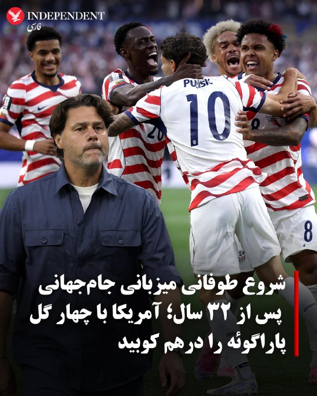

♦️تیم ملی آمریکا، بامداد شنبه ۲۳ خرداد ماه نخستین دیدار در جام جهانی ۲۰۲۶ را با پیروزی قاطع ۴ بر ۱ مقابل پاراگوئه به پایان رساند تا بهترین شروع تاریخ خود در این رقابت‌ها را رقم بزند. این مسابقه نخستین بازی آمریکا در جام جهانی فوتبال در خاک خود پس از ۳۲ سال بود. ایالات متحده در سال ۱۹۹۴ نیز میزبان محبوب‌ترین رقابت‌ورزشی جهان بود.
در دیداری که با حضور ده‌ها هزار تماشاگر برگزار شد، آمریکایی‌ها از همان دقایق ابتدایی بر بازی مسلط شدند. دامیان بوبادییا، هافبک پاراگوئه، در دقیقه هفتم به اشتباه دروازه خودی را باز کرد و میزبان را پیش انداخت. سپس فلورین بالوگون دو بار دروازه پاراگوئه را گشود تا آمریکا نیمه نخست را با برتری ۳ بر صفر به پایان برساند.
کریستین پولیشیچ، کاپیتان آمریکا، در نیمه نخست نقش مهمی در حملات تیمش داشت و با دو پاس گل در برتری تیمش سهیم بود. او بین دو نیمه به دلیل نگرانی از آسیب‌دیدگی از زمین خارج شد.
پاراگوئه که پس از ۱۶ سال دوباره در جام جهانی حضور یافته است، در دقیقه ۷۳ یکی از گل‌ها را جبران کرد، اما نتوانست روند بازی را تغییر دهد. در وقت‌های تلف‌شده نیمه دوم نیز جیو رینا گل چهارم آمریکا را به ثمر رساند تا پیروزی پرگل میزبان کامل شود.
این نخستین بار در تاریخ حضور آمریکا در جام جهانی است که این تیم موفق می‌شود چهار گل در یک مسابقه به ثمر برساند. شاگردان مائوریسیو پوچتینو با این پیروزی صدرنشین موقت گروه د (D) این رقابت‌ها شدند و گام مهمی برای صعود به مرحله حذفی برداشتند.
‌🇸🇦 Indypersian

🤖 @VahidOOnLine

## IranIntlTV — post 341987

  <a href="telegram/content/IranIntlTV_341987_1781326359.mp4" target="_blank">🎬 Download video</a>

سرخط خبرهای شنبه ۲۳ خرداد
@iranintltv

---
📅 بروزرسانی: 1405/03/23 08:12
---

## pm_afshaa — post 93746

🔴سنتکام:اعمال محاصره دریایی علیه بنادر ایران با قاطعیت ادامه خواهد یافت

💧 Rainbet.com the #1 Non-KYC Crypto Casino & Sportsbook @rainbetcom

😁 @Pm_Afshaa

## RadioFarda — post 158241

رویترز: «موافقت امارات متحدۀ عربی» با آزاد کردن دارایی‌های مسدود‌شدۀ ایران

🔸خبرگزاری رویترز در گزارشی اختصاصی که روز شنبه ۲۳ خردادماه، همزمان با سالگرد آغاز جنگ دوازده روزۀ اسرائیل و آمریکا با ایران منتشر کرد، از موافقت امارات متحدۀ عربی با آزاد کردن میلیاردها دلار از دارایی‌هایی مسدود‌شدۀ ایران خبر داد.

🔸رسانه‌ای شدن این خبر، که پیش از این اشاره‌ای به آن نشده بود، همزمان شده با مراحل نهایی مذاکرات ایران و آمریکا برای پایان‌دادن به جنگ؛‌ گفت‌وگوهایی که به اعتقاد دیپلمات‌ها، می‌تواند شامل آزاد شدن ده‌ها میلیارد دلار از درآمدهای نفتی ایران که بر اساس تحریم‌های ایالات متحده، در بانک‌های خارجی مسدود شده‌اند هم باشد.

🔸دو منبع منطقه‌ای به رویترز گفتند که امارات متحدۀ عربی با آزاد کردن مجموعاً ۱۰ میلیارد دلار، «که ۳ میلیارد دلار آن تاکنون منتقل شده»، موافقت کرده است. دو منبع دیگر، مجموع مبلغ مورد توافق را ۲۰ میلیارد دلار اعلام کرده و این اقدام را، در ازای توقف حملات ایران به امارات متحده عربی دانستند.

🔸وزارت خارجۀ امارات متحده عربی اما، در نخستین ساعات شنبه با انتشار بیانیه‌ای همۀ گزارش‌ها دربارۀ انتقال پول به ایران، از جمله «اتهام جابجایی ۳ میلیارد دلار» را، از اساس تکذیب کرد.

🔸گزارش کامل را در وب‌سایت رادیو فردا می‌توانید بخوانید.

@RadioFarda

---
📅 بروزرسانی: 1405/03/23 08:02
---

## VahidOOnLine — post 245249

  

آنتروپیک، سازنده دستیار هوش مصنوعی کلود، اعلام کرد به دنبال دریافت یک دستور کنترل صادرات از دولت آمریکا، دسترسی به دو مدل پیشرفته خود، فِیبل ۵ و مایتوس ۵، را برای همه کاربران متوقف کرده است. این دستور با استناد به ملاحظات امنیت ملی صادر شده و دسترسی اتباع خارجی، حتی کارکنان غیرآمریکایی خود شرکت، را ممنوع می‌کند. آنتروپیک گفت از آنجا که امکان تفکیک فوری کاربران خارجی از سایر کاربران را نداشته، ناچار شده هر دو مدل را به طور کامل از دسترس خارج کند.

بر اساس گزارش‌ها، نگرانی دولت آمریکا پس از آن مطرح شد که یک شرکت دیگر مدعی شد توانسته برخی سازوکارهای ایمنی مایتوس ۵ را دور بزند. آنتروپیک این آسیب‌پذیری‌ها را محدود و از پیش شناخته‌شده توصیف کرده و گفته مدل‌های دیگر نیز با چالش‌های مشابه روبه‌رو هستند.

این نخستین بار است که دولت آمریکا با استفاده از ابزار کنترل صادرات، عرضه یک مدل تجاری پیشرفته هوش مصنوعی را متوقف می‌کند که می‌تواند به سابقه‌ای مهم در نظارت دولت بر فناوری‌های هوش مصنوعی تبدیل شود. آنتروپیک این اقدام را ناشی از یک سوءتفاهم دانسته و اعلام کرده در حال رایزنی برای بازگرداندن دسترسی به این مدل‌هاست.

h
‌🏁 🇬🇧 IranintlTV

🤖 @VahidOOnLine

## IranIntlTV — post 341986

  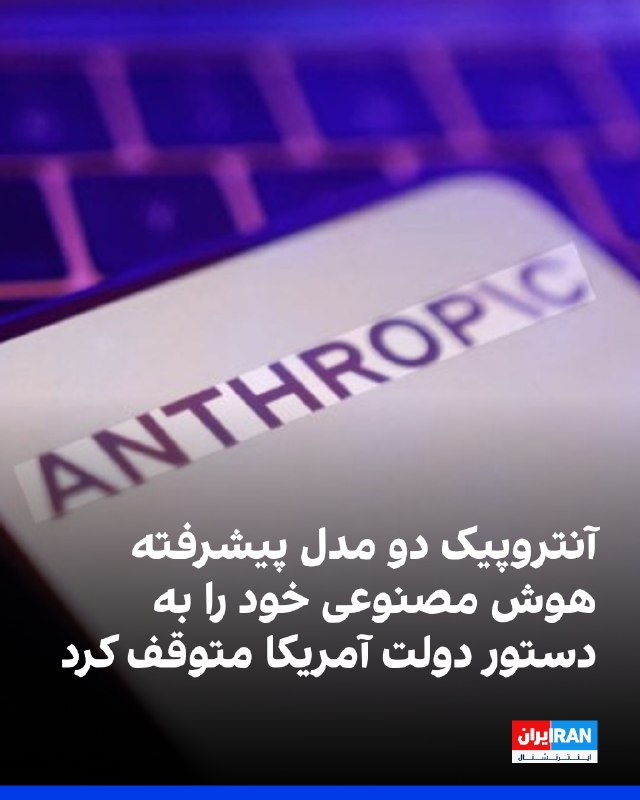

آنتروپیک، سازنده دستیار هوش مصنوعی کلود، اعلام کرد به دنبال دریافت یک دستور کنترل صادرات از دولت آمریکا، دسترسی به دو مدل پیشرفته خود، فِیبل ۵ و مایتوس ۵، را برای همه کاربران متوقف کرده است. این دستور با استناد به ملاحظات امنیت ملی صادر شده و دسترسی اتباع خارجی، حتی کارکنان غیرآمریکایی خود شرکت، را ممنوع می‌کند. آنتروپیک گفت از آنجا که امکان تفکیک فوری کاربران خارجی از سایر کاربران را نداشته، ناچار شده هر دو مدل را به طور کامل از دسترس خارج کند.

بر اساس گزارش‌ها، نگرانی دولت آمریکا پس از آن مطرح شد که یک شرکت دیگر مدعی شد توانسته برخی سازوکارهای ایمنی مایتوس ۵ را دور بزند. آنتروپیک این آسیب‌پذیری‌ها را محدود و از پیش شناخته‌شده توصیف کرده و گفته مدل‌های دیگر نیز با چالش‌های مشابه روبه‌رو هستند.

این نخستین بار است که دولت آمریکا با استفاده از ابزار کنترل صادرات، عرضه یک مدل تجاری پیشرفته هوش مصنوعی را متوقف می‌کند که می‌تواند به سابقه‌ای مهم در نظارت دولت بر فناوری‌های هوش مصنوعی تبدیل شود. آنتروپیک این اقدام را ناشی از یک سوءتفاهم دانسته و اعلام کرده در حال رایزنی برای بازگرداندن دسترسی به این مدل‌هاست.

h

---
📅 بروزرسانی: 1405/03/23 07:52
---

## RadioFarda — post 158240

  <a href="https://t.me/radiofarda/158240" target="_blank">📎 Download file</a>

📻بشنوید: سرخط خبرها با رادیوفردا، ۲۳ خرداد ۱۴۰۵‌

@RadioFarda

---
📅 بروزرسانی: 1405/03/23 07:42
---

## BBCPersian — post 283618

‌ ‌ ‌ ‌
تصاویر ماهواره‌ای نشان می‌دهند که از زمان آغاز جنگ، بیش از ۵۰ پایگاه نظامی ایران، از جمله مقر فرماندهی سپاه پاسداران انقلاب اسلامی، در حملات آمریکا و اسرائیل آسیب دیده‌اند.

تصاویر بررسی‌شده توسط بخش راستی‌آزمایی بی‌بی‌سی نشان می‌دهند پایگاه‌هایی در سراسر ایران در حملات آمریکا به ‌شدت آسیب دیده‌اند و کارشناسان آثار خسارت به جنگنده‌های نیروی هوایی، ناوهای جنگی و تاسیسات موشک‌های بالستیک را شناسایی کرده‌اند.

مقام‌های آمریکایی می‌گویند از زمان آغاز درگیری در ۲۸ فوریه، بیش از ۱۳ هزار نقطه را در سراسر ایران هدف قرار داده‌اند.

https://bbc.in/3PWgMDq
📸GettyImages/ Reuters/ Anadolu via Getty Images/ AFP via Getty Images/ U.S. Navy via Getty Images/ Satellite image (c) 2026 Vantor/ Airbus DS, Vantor/ U.S. Navy via Reuters/ Planet Labs PBC
@BBCPersian

---
📅 بروزرسانی: 1405/03/23 07:32
---

## VahidOOnLine — post 245248

  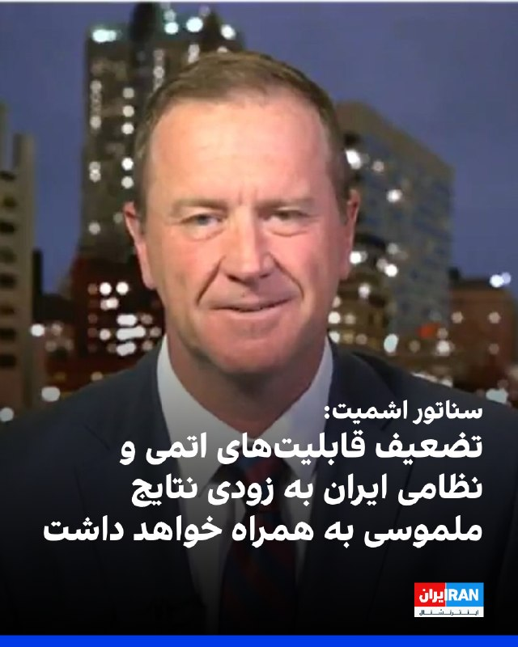

سناتور اریک اشمیت، عضو جمهوری‌خواه مجلس سنای آمریکا، به شبکه خبری فاکس گفت که علمیات نظامی دونالد ترامپ، رییس‌جمهوری ایالات متحده، علیه حکومت ایران، قابلیت‌های اتمی و نظامی تهران را تضعیف کرده و فضایی را برای مذاکراتی ایجاد کرده است که به گفته او، می‌تواند به زودی نتایج ملموسی به همراه داشته باشد.

او افزود که نتیجه مورد انتظار یک توافق، جلوگیری از دستیابی تهران به سلاح هسته‌ای و تضمین باز ماندن کامل تنگه هرمز خواهد بود، و هر دو را دستاوردهای بزرگی برای دولت ترامپ توصیف کرد.

اشمیت گفت: «انتظار این است که تنگه کاملاً باز شود. فکر می‌کنم این برای بسیاری از مردم کشورمان مایه آسودگی خاطر خواهد بود و همچنین اینکه آن‌ها [حکومت ایران] برنامه هسته‌ای خود را نخواهند داشت. بنابراین این‌ها دستاوردهای بزرگی برای رییس‌جمهوری است که استاد معامله‌گری است.»
‌🏁 🇬🇧 IranintlTV

🤖 @VahidOOnLine

## VahidOOnLine — post 245247

  

سناتور اریک اشمیت، عضو جمهوری‌خواه مجلس سنای آمریکا، به شبکه خبری فاکس گفت که علمیات نظامی دونالد ترامپ، رییس‌جمهوری ایالات متحده، علیه حکومت ایران، قابلیت‌های اتمی و نظامی تهران را تضعیف کرده و فضایی را برای مذاکراتی ایجاد کرده است که به گفته او، می‌تواند به زودی نتایج ملموسی به همراه داشته باشد.

او افزود که نتیجه مورد انتظار یک توافق، جلوگیری از دستیابی تهران به سلاح هسته‌ای و تضمین باز ماندن کامل تنگه هرمز خواهد بود، و هر دو را دستاوردهای بزرگی برای دولت ترامپ توصیف کرد.

اشمیت گفت: «انتظار این است که تنگه کاملاً باز شود. فکر می‌کنم این برای بسیاری از مردم کشورمان مایه آسودگی خاطر خواهد بود و همچنین اینکه آن‌ها [حکومت ایران] برنامه هسته‌ای خود را نخواهند داشت. بنابراین این‌ها دستاوردهای بزرگی برای رییس‌جمهوری است که استاد معامله‌گری است.»
‌🏁 🇬🇧 IranintlTV

🤖 @VahidOOnLine

## IranIntlTV — post 341984

  

سناتور اریک اشمیت، عضو جمهوری‌خواه مجلس سنای آمریکا، به شبکه خبری فاکس گفت که علمیات نظامی دونالد ترامپ، رییس‌جمهوری ایالات متحده، علیه حکومت ایران، قابلیت‌های اتمی و نظامی تهران را تضعیف کرده و فضایی را برای مذاکراتی ایجاد کرده است که به گفته او، می‌تواند به زودی نتایج ملموسی به همراه داشته باشد.

او افزود که نتیجه مورد انتظار یک توافق، جلوگیری از دستیابی تهران به سلاح هسته‌ای و تضمین باز ماندن کامل تنگه هرمز خواهد بود، و هر دو را دستاوردهای بزرگی برای دولت ترامپ توصیف کرد.

اشمیت گفت: «انتظار این است که تنگه کاملاً باز شود. فکر می‌کنم این برای بسیاری از مردم کشورمان مایه آسودگی خاطر خواهد بود و همچنین اینکه آن‌ها [حکومت ایران] برنامه هسته‌ای خود را نخواهند داشت. بنابراین این‌ها دستاوردهای بزرگی برای رییس‌جمهوری است که استاد معامله‌گری است.»
https://iranintl.com/202606136852

---
📅 بروزرسانی: 1405/03/23 07:22
---

هیچ پیام جدیدی در این بروزرسانی ارسال نشد.

---
📅 بروزرسانی: 1405/03/23 07:12
---

## VahidOOnLine — post 245246

  <a href="telegram/content/VahidOOnLine_245246_1781322153.mp4" target="_blank">🎬 Download video</a>

⭕️الموت بر فراز صخره‌های البرز؛ میراث هزار ساله حسن صباح در انتظار ثبت جهانی

📌قلعه‌های الموت در قالب شبکه‌ای به‌هم‌پیوسته و از طریق مسیرهای کوهستانی و ارتباطات دیدبانی، اخبار و هشدارها را میان یکدیگر منتقل می‌کردند

♦️بیست‌ودوم خرداد، سالگرد درگذشت حسن صباح، بنیان‌گذار حکومت اسماعیلیان نزاری در الموت است. کسی که نامش در تاریخ با دژهای کوهستانی البرز گره خورده است. او اواخر قرن پنجم هجری با تبدیل قلعه الموت به مرکز حکومت اسماعیلیان نزاری در میان صخره‌های بلند البرز، بنیان حکومتی را گذاشت که پس از مرگ او نیز نزدیک به دو قرن در برابر قدرت‌های بزرگ زمان خود دوام آورد و سرانجام با یورش مغولان در میانه سده هفتم هجری سقوط کرد.

میراث حسن صباح، بنیان‌گذار حکومت اسماعیلیان

حسن صباح، بنیان‌گذار دولت اسماعیلیان نزاری در ایران، در خانواده‌ای شیعه در قم زاده شد و در ری پرورش یافت. او در جوانی با دعوت اسماعیلیان آشنا شد و پس از گرایش به این مذهب، برای تکمیل آموزش‌های دینی و ارتباط با مرکز خلافت فاطمیان به قاهره رفت.

بیشتر بخوانید...
‌🇸🇦 Indypersian

🤖 @VahidOOnLine

## BBCPersian — post 283617

🔻 نشست گروه ۷ زیر سایه ترامپ و مذاکرات صلح با ایران برگزار می‌شود

هنوز اطلاعات چندانی درباره اهداف دونالد ترامپ، رئیس‌جمهوری آمریکا، در نشست هفته آینده گروه هفت در اویان فرانسه در دست نیست؛ جز شاید یک نکته روشن: او برنامه و حال و هوای این نشست را تا حد زیادی تحت تاثیر خود قرار خواهد داد.

به گزارش خبرگزاری فرانسه به نظر می‌رسد که حال و هوای آقای ترامپ تا حد زیادی به سرنوشت مذاکرات درباره توافق صلح با ایران بستگی داشته باشد؛ مذاکراتی که روز جمعه نشانه‌هایی از شتاب گرفتن در آن دیده شد.

لیانا فیکس، پژوهشگر شورای روابط خارجی آمریکا، پیش از این نشست که رهبران آمریکا، فرانسه، آلمان، کانادا، ایتالیا، ژاپن و بریتانیا را گرد هم می‌آورد، به خبرگزاری فرانسه گفت: «دیگر نمی‌توان مانند دوره نخست ریاست‌جمهوری ترامپ، او را مدیریت کرد.»

رهبران بیشتر کشورهای حاضر در این نشست تاکنون هدف تعرفه‌های تجاری، فشارهای دیپلماتیک یا انتقادهای تند ترامپ قرار گرفته‌اند؛ تنها استثنا، سانائه تاکایچی، نخست‌وزیر ژاپن است که به گزارش خبرگزاری فرانسه، اقای ترامپ علاقه ویژه‌ای به او دارد.

این گزارش همچنین حاکیست که تقریبا همه رهبرانی که قرار است در سواحل دریاچه ژنو با ترامپ دیدار کنند، پیش‌تر هدف حملات لفظی، انتقاد یا تمسخر او قرار گرفته‌اند.

https://bbc.in/3S5q8xb
@BBCPersian

---
📅 بروزرسانی: 1405/03/23 07:02
---

## VahidOOnLine — post 245245

  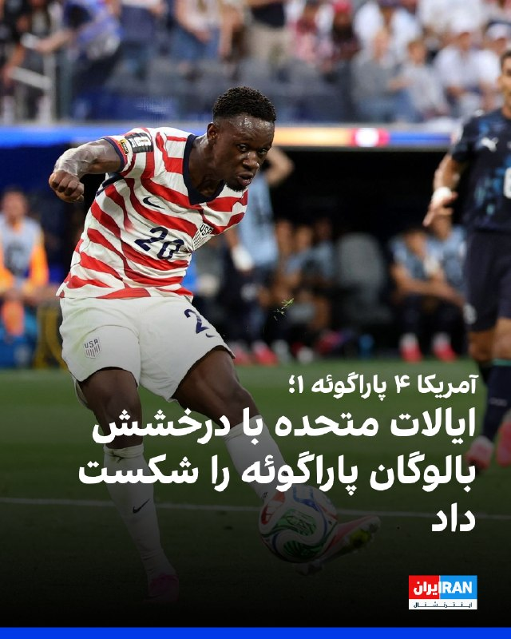

تیم ملی فوتبال آمریکا در نخستین دیدار خود در جام جهانی ۲۰۲۶ با نتیجه ۴ بر ۱ پاراگوئه را شکست داد. فولارین بالوگان با دو گل نقش اصلی را در پیروزی میزبان ایفا کرد؛ هرچند پاراگوئه در نیمه دوم یکی از گل‌ها را جبران کرد.

آمریکا در دقیقه هفتم مسابقه روی گل به خودی دامیان بوبادیا، مدافع پاراگوئه، پیش افتاد. در دقیقه ۲۸ فولارین بالوگان موفق شد بار دیگر دروازه پاراگوئه را باز کند، اما داور این گل را به دلیل آفساید مردود اعلام کرد. سه دقیقه بعد، بالوگان بار دیگر گلزنی کرد و این بار گل او پذیرفته شد تا اختلاف به دو گل افزایش یابد.

مهاجم نیجریه‌تبار آمریکا در وقت‌های اضافه نیمه نخست نیز بار دیگر دروازه حریف را گشود و در دقیقه ۴۵+۴ سومین گل تیمش را به ثمر رساند تا آمریکا با برتری ۳ بر صفر راهی رختکن شود.

پاراگوئه در نیمه دوم تلاش بیشتری برای جبران نتیجه انجام داد و در دقیقه ۷۳ یکی از گل‌های خورده را جبران کرد. مائوریسیو، بازیکنی که از ابتدای نیمه دوم به میدان آمده بود، موفق شد نخستین گل تیمش را به ثمر برساند. با این حال، آمریکا در دقایق پایانی چهارمین گل را زد و سه امتیاز را از آن خود کرد.
‌🏁 🇬🇧 IranintlTV

🤖 @VahidOOnLine

## IranIntlTV — post 341983

  

تیم ملی فوتبال آمریکا در نخستین دیدار خود در جام جهانی ۲۰۲۶ با نتیجه ۴ بر ۱ پاراگوئه را شکست داد. فولارین بالوگان با دو گل نقش اصلی را در پیروزی میزبان ایفا کرد؛ هرچند پاراگوئه در نیمه دوم یکی از گل‌ها را جبران کرد.

آمریکا در دقیقه هفتم مسابقه روی گل به خودی دامیان بوبادیا، مدافع پاراگوئه، پیش افتاد. در دقیقه ۲۸ فولارین بالوگان موفق شد بار دیگر دروازه پاراگوئه را باز کند، اما داور این گل را به دلیل آفساید مردود اعلام کرد. سه دقیقه بعد، بالوگان بار دیگر گلزنی کرد و این بار گل او پذیرفته شد تا اختلاف به دو گل افزایش یابد.

مهاجم نیجریه‌تبار آمریکا در وقت‌های اضافه نیمه نخست نیز بار دیگر دروازه حریف را گشود و در دقیقه ۴۵+۴ سومین گل تیمش را به ثمر رساند تا آمریکا با برتری ۳ بر صفر راهی رختکن شود.

پاراگوئه در نیمه دوم تلاش بیشتری برای جبران نتیجه انجام داد و در دقیقه ۷۳ یکی از گل‌های خورده را جبران کرد. مائوریسیو، بازیکنی که از ابتدای نیمه دوم به میدان آمده بود، موفق شد نخستین گل تیمش را به ثمر برساند. با این حال، آمریکا در دقایق پایانی چهارمین گل را زد و سه امتیاز را از آن خود کرد.
https://iranintl.com/2026061

---
📅 بروزرسانی: 1405/03/23 06:52
---

## BBCPersian — post 283616

🔻 ترامپ: آمریکا رهبر باند ونزوئلایی «ترن د آراگوآ» را در یک حمله نظامی کشت

دونالد ترامپ، رئیس‌جمهوری آمریکا، اعلام کرد که نیروهای آن کشور در عملیاتی که آن را «سریع و مرگبار» توصیف کرد، هکتور روستنفورد گوئررو فلورس، معروف به «نینیو گوئررو»، رهبر گروه ونزوئلایی «ترن د آراگوآ» را کشته‌اند.

آقای ترامپ در شبکه اجتماعی تروث سوشال نوشت که این عملیات به دستور او و توسط فرماندهی جنوبی ارتش آمریکا انجام شده است.

او «ترن د آراگوآ» را «یکی از خونریزترین سازمان‌های تروریستی روی زمین» توصیف کرد و گفت در دوران ریاست‌جمهوری جو بایدن، میلیون‌ها مهاجر غیرقانونی وارد آمریکا شدند و اعضای این گروه مرتکب جرایمی از جمله تجاوز، نقص عضو و قتل شهروندان آمریکایی شدند.

آقای ترامپ گفت که در جریان مبارزات انتخاباتی خود وعده داده بود این افراد را از آمریکا اخراج کند و برای قربانیان آنها عدالت برقرار سازد.

رئیس‌جمهوری آمریکا همچنین گفت که این عملیات «با هماهنگی نزدیک دوستان ما در ونزوئلا» انجام شده و دو کشور «همکاری بسیار خوبی» با یکدیگر دارند.

او افزود: «تروریست‌های ترن د آراگوآ دیگر در ونزوئلا یا هیچ جای دیگری پناهگاه امنی ندارند و تحت رهبری من، این قاتلان بی‌رحم و قاچاقچیان مواد مخدر را هر زمان و هر جا پیدا خواهیم کرد و به اعماق جهنمی که به آن تعلق دارند خواهیم فرستاد.»

https://bbc.in/4vPZJCc
@BBCPersian

---
📅 بروزرسانی: 1405/03/23 06:42
---

## Persian_Trend_Official — post 16900

  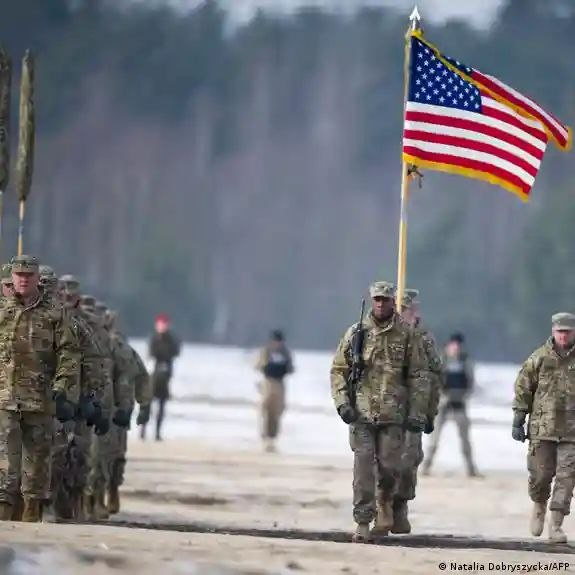

🔴 طرح آمریکا برای کاهش چشمگیر تجهیزات و نیروهای اختصاص‌یافته به ناتو در اروپا

بر اساس گزارش‌ها، ایالات متحده در حال بررسی کاهش قابل‌توجه بخشی از توان نظامی اختصاص‌یافته به عملیات ناتو در اروپاست؛ اقدامی که می‌تواند بخشی از بار دفاعی این ائتلاف را به کشورهای اروپایی منتقل کند.

🔹 طبق جزئیات منتشرشده، تعداد جنگنده‌های F-15 و F-16 اختصاص‌یافته به مأموریت‌های ناتو ممکن است از حدود ۱۵۰ فروند به ۱۰۰ فروند کاهش یابد. همچنین شمار هواپیماهای گشت و شناسایی دریایی نیز از ۲۶ فروند به ۱۵ فروند کاهش پیدا خواهد کرد.

🔹 گزارش‌ها همچنین از احتمال خروج هواپیماهای سوخت‌رسان آمریکایی از مأموریت‌های ناتو در اروپا و جابه‌جایی بخشی از ناوگان دریایی، زیردریایی‌ها و بمب‌افکن‌های راهبردی آمریکا به سایر مناطق خبر می‌دهند.

🎯 :این طرح در صورت اجرا، یکی از بزرگ‌ترین بازآرایی‌های نظامی آمریکا در اروپا طی سال‌های اخیر خواهد بود و می‌تواند کشورهای اروپایی را به افزایش سرمایه‌گذاری دفاعی و کاهش وابستگی به توان نظامی آمریکا وادار کند. همزمان برخی تحلیلگران معتقدند بخشی از منابع آزادشده ممکن است به خاورمیانه و منطقه هند-اقیانوس آرام منتقل شود.

Phantom

📌 @persian_trend_official
پرشین ترند | متفاوت‌ترین کانال نظامی

## BBCPersian — post 283615

  

‌ ‌ ‌ ‌
در چهارمین بازی جام جهانی فوتبال مردان، تیم ملی آمریکا توانست ۴ بر ۱ بر پاراگوئه غلبه کند.

پیش از شروع این بازی سومین افتتاحیه جام جهانی در شهر لس‌آنجلس برگزار شد و هنرمندانی مانند کیتی پری به اجرای برنامه پرداختند.

این بازی با گل به خودی زودهنگام پاراگوئه در دقیقه هفت تقریبا از ابتدا به نفع ایالات متحده پیش رفت و در همان نیمه نخست، فلورین بالوگان در دقایق ۳۱ و ۴۵+۵ دو گل دیگر این تیم را به ثمر رساند.

در نیمه دوم اما پاراگوئه بود که توانست از یکی از معدود موقعیت‌های خود استفاده کند و مائوریسیو در دقیقه ۷۳ تک گل این کشور را به ثمر برساند و در دقیقه ۹۸ آمریکا مجددا توسط جیوانی رینا به گل رسید.

تیم آمریکا در این بازی منظم، با برنامه و با انگیزه بازی کرد و پاراگوئه پس از گل به خودی دقایق ابتدایی نتوانست خطر چندانی برای ایالات متحده ایجاد کند.

در دیگر بازی‌های امروز در گروه بی ابتدا سوئیس و قطر با هم رقابت می‌کنند و پس از آن در گروه سی برزیل و مراکش به مصاف هم خواهند رفت.

📷EPA/Shutterstock
@BBCPersian

---
📅 بروزرسانی: 1405/03/23 06:32
---

## BBCPersian — post 283607

‌ ‌ ‌
می‌گویند عمر آدم را می‌شود با جام‌های جهانی سنجید. چوب‌خط‌هایی چهار ساله بر دیوار زندگی که گذار انسان را از کودکی مبهوت تا نوجوانی غرق در فوتبال و مراحل فراتر از آن ثبت می‌کند. آلبومی زنده از خاطرات فوتبال، از تیم‌هایی که عاشقشان بودیم، قهرمانانی که ستایش می‌کردیم و پیراهن‌های خاطره‌انگیزی که بر تن آن‌ها می‌دیدیم.

امروز ما به همین پیراهن‌ها چشم دوخته‌ایم. لباس‌هایی که داستانی برای گفتن دارند، شاهکارهایی فراتر از زمان. اما چه چیزی یک لباس ورزشی را این‌ چنین ماندگار می‌کند؟

متیو ولف بیشتر برای طراحی لباس‌ بسیار محبوب نیجریه در جام جهانی ۲۰۱۸ میلادی و همین‌ طور پیراهن و شورت فرانسه، قهرمان آن دوره، معروف است.

در کارنامه این طراح آمریکایی، همکاری با پاری‌سن‌ژرمن، تعدادی از تیم‌های لیگ برتر فوتبال مردان و زنان آمریکا و حتی باشگاه «ورمونت گرین» در لیگ اتحادیه فوتبال آمریکا، که خود از بنیان‌گذاران آن بوده است، به چشم می‌خورد. به این ترتیب، او چم‌‌‌‌ و‌خم طراحی لباس‌های ورزشی را به‌خوبی می‌شناسد.

https://bbc.in/4uEqzfv
📸GettyImages
@BBCPersian

---
📅 بروزرسانی: 1405/03/23 06:22
---

## FarsiVOA — post 220550

⚡️گمانه زنی‌ها درباره توافق با جمهوری اسلامی؛ قانون‌گذاران آمریکایی چه نظر دارند؟
@FarsiVOA

---
📅 بروزرسانی: 1405/03/23 06:12
---

## VahidOOnLine — post 245244

  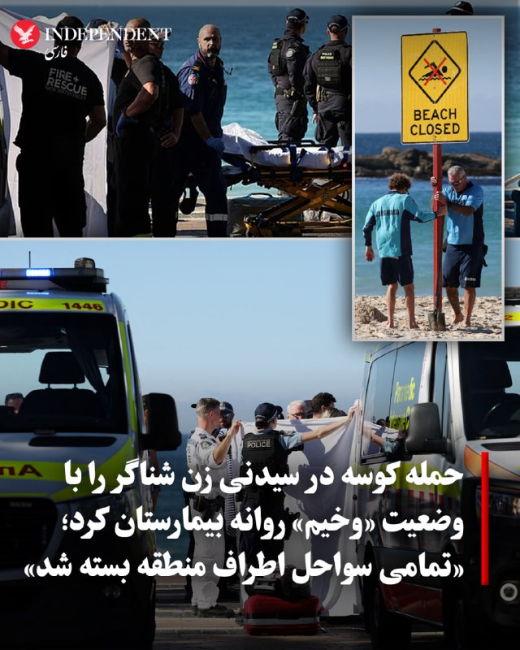

♦️به گزارش دیلی‌میل، حمله یک کوسه در یکی از سواحل بسیار محبوب و شلوغ سیدنی استرالیا، یک زن شناگر حدودا ۳۰ ساله را در وضعیت «وخیم» روانه بیمارستان کرد. این حادثه پیش از ساعت ۱۱:۱۵ صبح روز شنبه در ساحل «کوجی» (Coogee) واقع در حومه شرقی سیدنی رخ داد و قربانی از ناحیه دست و پا دچار جراحات و خونریزی شدید شد. شاهدان عینی بلافاصله این زن را از آب بیرون کشیدند و ماموران پلیس پیش از رسیدن امدادگران، کمک‌های اولیه را روی او انجام دادند. به دلیل وخامت اوضاع، یک هلی‌کوپتر امداد پزشکی برای انتقال سریع مجروح در نزدیکی ساحل به زمین نشست. در پی این حادثه، شورای شهر رند‌ویک برای حفظ امنیت شهروندان، فورا تمامی سواحل اطراف منطقه از جمله کوجی، کلوولی و برونته را تا اطلاع ثانوی به روی عموم بست.
‌🇸🇦 Indypersian

🤖 @VahidOOnLine

## VahidOnline — post 76289

  

اسکات بسنت، وزیر خزانه‌داری ایالات متحده، در گفتگوی با «فاکس‌نیوز» اعلام کرد که با توجه به روند پیشرفت مذاکرات، انتظار می‌رود توافق صلح با ایران «احتمالا تا پایان همین هفته یا روز دوشنبه نهایی شود».

بسنت با اشاره به اینکه تصمیمات دونالد ترامپ برای جلوگیری از دستیابی تهران به سلاح هسته‌ای، هزینه‌ها و فشارهای کوتاه‌مدتی را به بازار سوخت و اقتصاد خانواده‌های آمریکایی وارد کرد، افزود: «ما درک می‌کنیم که در ماه‌های اخیر شرایط سختی سپری شد و افزایش بهای انرژی بخش زیادی از رشد دستمزدها را بلعید، اما ما در حال عبور از این وضعیت بحرانی هستیم.»

وزیر خزانه‌داری آمریکا با تاکید بر اینکه زیرساخت‌های اقتصادی کشور در حال حاضر بسیار قدرتمند عمل می‌کنند و بازار انرژی به خوبی تامین شده است، خاطرنشان کرد که با حل‌وفصل این مناقشه و مهار تورم، بهای جهانی نفت حدود ۲۵ تا ۳۰ درصد و قیمت بنزین در بازار داخلی بیش از ۱۰ درصد از اوج خود کاهش یافته و روند نزولی قیمت‌ها و کاهش هزینه‌های زندگی مردم با قدرت ادامه خواهد یافت.
@VahidOOnLine

📡 @VahidOnline

## VahidOnline — post 76288

  

‌ ‌ ‌ ‌
فرماندهی مرکزی ارتش آمریکا (سنتکام) اعلام کرد که ایران چند پهپاد انتحاری را با هدف حمله به کشتی‌های تجاری در حال عبور از تنگه هرمز به پرواز درآورده است.

سنتکام در شبکه ایکس نوشت که نیروهای آمریکایی در ساعات اخیر همه این پهپادها را سرنگون کرده‌اند و تردد کشتی‌ها در تنگه هرمز بدون اختلال ادامه دارد.

در این پیام آمده است: «ایران چند پهپاد انتحاری را در تلاش برای هدف قرار دادن کشتی‌های تجاری در حال عبور از تنگه هرمز به پرواز درآورد. نیروهای آمریکایی در ساعات اخیر همه آنها را سرنگون کرده‌اند و جریان تردد در تنگه بدون مانع ادامه دارد. این گذرگاه مهم تجارت بین‌المللی همچنان برای عبور و مرور باز است.»

پیش‌تر نیز یک منبع آگاه به رویترز گفته بود نیروهای آمریکایی چند پهپاد ایرانی را که به سمت تنگه هرمز در حرکت بودند سرنگون کرده‌اند. این منبع گفته بود پهپادها تهدیدی برای کشتیرانی تجاری به شمار می‌رفتند.

این رویداد در حالی است که تهران و واشنگتن همزمان از پیشرفت در مذاکرات برای دستیابی به توافقی جهت پایان دادن به درگیری‌ها سخن می‌گویند.
@VahidHeadline

📡 @VahidOnline

---
📅 بروزرسانی: 1405/03/23 06:02
---

## VahidOOnLine — post 245243

  

فوربس گزارش داد دولت دونالد ترامپ به توافقی با جمهوری اسلامی نزدیک شده که می‌تواند شامل کاهش تحریم‌ها و آزادسازی بخشی از دارایی‌های مسدودشده ایران باشد؛ اقدامی که به نوشته این نشریه شباهت‌هایی با برجام دارد، توافقی که ترامپ سال‌ها از آن انتقاد می‌کرد.

بر اساس گزارش‌ها، لغو بخشی از تحریم‌های نفتی و دسترسی تهران به میلیاردها دلار منابع مالی از گزینه‌های مورد بحث است، هرچند مقام‌های دولت آمریکا تاکید دارند هرگونه امتیاز اقتصادی منوط به اجرای تعهدات از سوی جمهوری اسلامی خواهد بود.

جی‌دی ونس و اسکات بسنت گفته‌اند هیچ پولی صرفا با امضای توافق آزاد نخواهد شد و کاهش تحریم‌ها به‌صورت تدریجی انجام می‌شود.

فوربس همچنین به انتقاد چهره‌های جمهوری‌خواه از جمله مایک پمپئو و تد کروز اشاره کرده که نسبت به پیامدهای توافق هشدار داده‌اند.

این گزارش می‌افزاید مذاکرات درباره برنامه هسته‌ای، تنگه هرمز و دارایی‌های ایران همچنان ادامه دارد و با وجود تلاش کاخ سفید برای متفاوت نشان دادن توافق جدید، برخی عناصر مورد انتقاد ترامپ در برجام ممکن است در توافق تازه نیز وجود داشته باشد.
متن کامل را اینجا بخوانید

‌🏁 🇬🇧 IranintlTV

🤖 @VahidOOnLine

## IranIntlTV — post 341982

  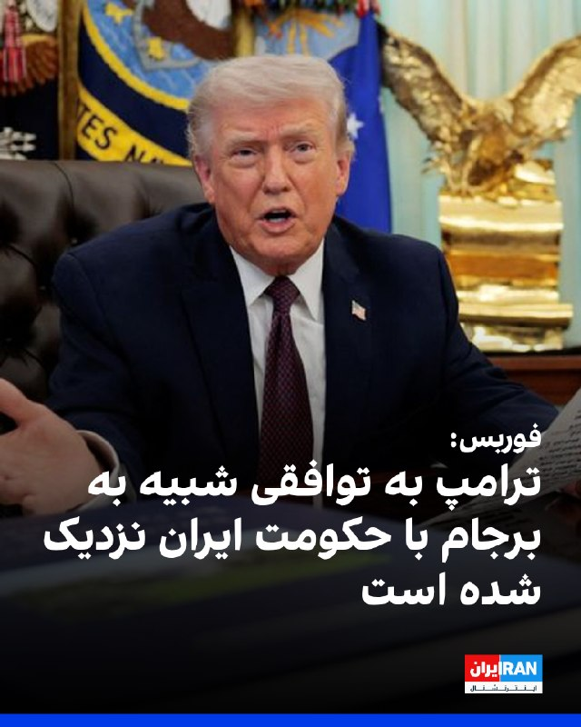

فوربس گزارش داد دولت دونالد ترامپ به توافقی با جمهوری اسلامی نزدیک شده که می‌تواند شامل کاهش تحریم‌ها و آزادسازی بخشی از دارایی‌های مسدودشده ایران باشد؛ اقدامی که به نوشته این نشریه شباهت‌هایی با برجام دارد، توافقی که ترامپ سال‌ها از آن انتقاد می‌کرد.

بر اساس گزارش‌ها، لغو بخشی از تحریم‌های نفتی و دسترسی تهران به میلیاردها دلار منابع مالی از گزینه‌های مورد بحث است، هرچند مقام‌های دولت آمریکا تاکید دارند هرگونه امتیاز اقتصادی منوط به اجرای تعهدات از سوی جمهوری اسلامی خواهد بود.

جی‌دی ونس و اسکات بسنت گفته‌اند هیچ پولی صرفا با امضای توافق آزاد نخواهد شد و کاهش تحریم‌ها به‌صورت تدریجی انجام می‌شود.

فوربس همچنین به انتقاد چهره‌های جمهوری‌خواه از جمله مایک پمپئو و تد کروز اشاره کرده که نسبت به پیامدهای توافق هشدار داده‌اند.

این گزارش می‌افزاید مذاکرات درباره برنامه هسته‌ای، تنگه هرمز و دارایی‌های ایران همچنان ادامه دارد و با وجود تلاش کاخ سفید برای متفاوت نشان دادن توافق جدید، برخی عناصر مورد انتقاد ترامپ در برجام ممکن است در توافق تازه نیز وجود داشته باشد.
متن کامل را اینجا بخوانید

https://iranintl.com/

## BBCPersian — post 283606

  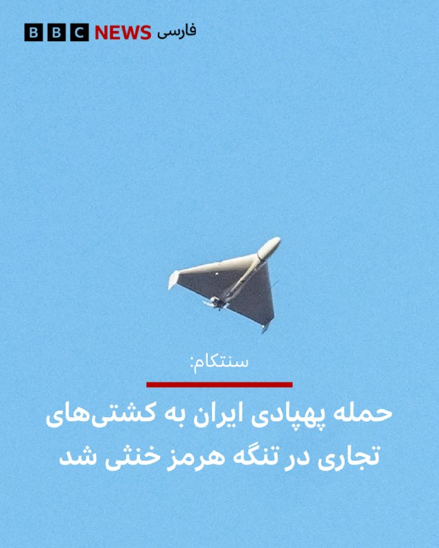

‌ ‌ ‌ ‌
فرماندهی مرکزی ارتش آمریکا (سنتکام) اعلام کرد که ایران چند پهپاد انتحاری را با هدف حمله به کشتی‌های تجاری در حال عبور از تنگه هرمز به پرواز درآورده است.

سنتکام در شبکه ایکس نوشت که نیروهای آمریکایی در ساعات اخیر همه این پهپادها را سرنگون کرده‌اند و تردد کشتی‌ها در تنگه هرمز بدون اختلال ادامه دارد.

در این پیام آمده است: «ایران چند پهپاد انتحاری را در تلاش برای هدف قرار دادن کشتی‌های تجاری در حال عبور از تنگه هرمز به پرواز درآورد. نیروهای آمریکایی در ساعات اخیر همه آنها را سرنگون کرده‌اند و جریان تردد در تنگه بدون مانع ادامه دارد. این گذرگاه مهم تجارت بین‌المللی همچنان برای عبور و مرور باز است.»

پیش‌تر نیز یک منبع آگاه به رویترز گفته بود نیروهای آمریکایی چند پهپاد ایرانی را که به سمت تنگه هرمز در حرکت بودند سرنگون کرده‌اند. این منبع گفته بود پهپادها تهدیدی برای کشتیرانی تجاری به شمار می‌رفتند.

این رویداد در حالی است که تهران و واشنگتن همزمان از پیشرفت در مذاکرات برای دستیابی به توافقی جهت پایان دادن به درگیری‌ها سخن می‌گویند.

https://bbc.in/3RXc7lh
📷Reuters
@BBCPersian

---
📅 بروزرسانی: 1405/03/23 05:52
---

## VahidOOnLine — post 245242

  

مایکل فرومن، رییس شورای روابط خارجی آمریکا، در تحلیلی نوشت جنگ با جمهوری اسلامی نشان داد قدرت نظامی به‌تنهایی قادر به بازطراحی نظم منطقه‌ای نیست.

او سه پیامد اصلی این جنگ را وضعیت تنگه هرمز، تحول در جنگ نامتقارن و تاثیر بر ائتلاف‌های آمریکا در خاورمیانه دانست. فرومن هشدار داد محدود شدن آزادی کشتیرانی در تنگه هرمز می‌تواند به الگویی برای سایر گذرگاه‌های راهبردی جهان تبدیل شود.

او همچنین تاکید کرد که با وجود خسارات سنگین واردشده به توان نظامی جمهوری اسلامی، تهران همچنان توانسته با ابزارهای کم‌هزینه مانند پهپادها و موشک‌ها منافع آمریکا و متحدانش را به چالش بکشد. به گفته او، جنگ اخیر نشان داد تجهیزات ارزان نیز می‌توانند سامانه‌های پیشرفته و پرهزینه را تهدید کنند.

فرومن همچنین نوشت حملات به اهدافی در کشورهای عربی خلیج فارس، نگرانی‌هایی درباره هزینه‌های همکاری امنیتی با آمریکا ایجاد کرده و ممکن است برخی شرکای منطقه‌ای را به سمت نزدیکی بیشتر به روسیه، چین یا توافق مستقیم با جمهوری اسلامی سوق دهد. او نتیجه گرفت که تغییر قواعد بازی با پیروزی در آن یکسان نیست.
متن کامل را اینجا بخوانید
‌🏁 🇬🇧 IranintlTV

🤖 @VahidOOnLine

## IranIntlTV — post 341981

  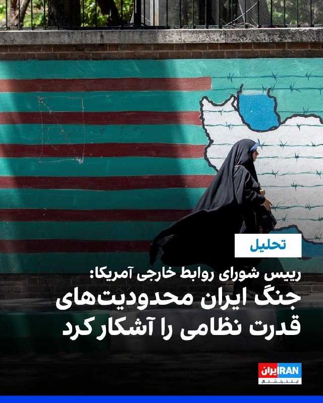

مایکل فرومن، رییس شورای روابط خارجی آمریکا، در تحلیلی نوشت جنگ با جمهوری اسلامی نشان داد قدرت نظامی به‌تنهایی قادر به بازطراحی نظم منطقه‌ای نیست.

او سه پیامد اصلی این جنگ را وضعیت تنگه هرمز، تحول در جنگ نامتقارن و تاثیر بر ائتلاف‌های آمریکا در خاورمیانه دانست. فرومن هشدار داد محدود شدن آزادی کشتیرانی در تنگه هرمز می‌تواند به الگویی برای سایر گذرگاه‌های راهبردی جهان تبدیل شود.

او همچنین تاکید کرد که با وجود خسارات سنگین واردشده به توان نظامی جمهوری اسلامی، تهران همچنان توانسته با ابزارهای کم‌هزینه مانند پهپادها و موشک‌ها منافع آمریکا و متحدانش را به چالش بکشد. به گفته او، جنگ اخیر نشان داد تجهیزات ارزان نیز می‌توانند سامانه‌های پیشرفته و پرهزینه را تهدید کنند.

فرومن همچنین نوشت حملات به اهدافی در کشورهای عربی خلیج فارس، نگرانی‌هایی درباره هزینه‌های همکاری امنیتی با آمریکا ایجاد کرده و ممکن است برخی شرکای منطقه‌ای را به سمت نزدیکی بیشتر به روسیه، چین یا توافق مستقیم با جمهوری اسلامی سوق دهد. او نتیجه گرفت که تغییر قواعد بازی با پیروزی در آن یکسان نیست.
متن کامل را اینجا بخوانید
https://iranintl.com/2026061

## FarsiVOA — post 220549

  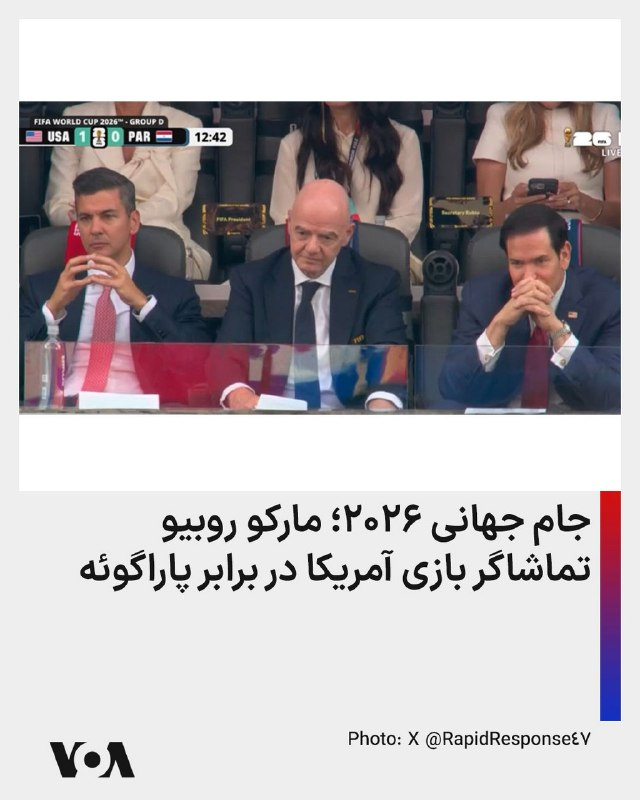

⚡️مارکو روبیو، وزیر امورخارجه آمریکا جمعه شب تماشاگر رقابت تیم‌های ملی آمریکا با پاراگوئه بود. تا لحظه انتشار این خبر، نتیجه بازی ۳ بر صفر به نفع آمریکا است.
@FarsiVOA

## FarsiVOA — post 220548

⚡️کدام کشور خاورمیانه از استفاده مجدد حریم هوایی به اسرائیل برای حمله به جمهوری اسلامی جلوگیری کرد؟
@FarsiVOA

---
📅 بروزرسانی: 1405/03/23 05:42
---

## FarsiVOA — post 220547

  <a href="telegram/content/FarsiVOA_220547_1781316747.mp4" target="_blank">🎬 Download video</a>

⚡️دونالد ترامپ، رئيس جمهوری آمریکا، جمعه شب اعلام کرد نیروهای آمریکایی در عملیاتی به دستور او، «نینیو گوئررو» رهبر کارتل ترن د آراگوا را کشتند. ترامپ این گروه قاچاقچی را از خونریزترین سازمان‌های تروریستی خواند و گفت عملیات با هماهنگی ونزوئلا انجام شد و اعضای این گروه دیگر پناهگاه امنی نخواهند داشت.
@FarsiVOA

## FarsiVOA — post 220546

🔺سنتکام: پهپادهای جمهوری اسلامی را سرنگون کردیم و عبور از طریق تنگه بدون مانع ادامه دارد

▪️ستاد فرماندهی مرکزی آمریکا جمعه شب ۲۲ خرداد به وقت واشنگتن تائيد کرد که جمهوری اسلامی چندین پهپاد تهاجمی یک‌طرفه را که تلاش داشتند به کشتی‌های تجاری در حال عبور از تنگه هرمز به حمله کنند، سرنگون کرد.

⬇️ بیشتر بخوانید:
https://ir.voanews.com/a/8160411.html
@FarsiVOA

## BBCPersian — post 283605

  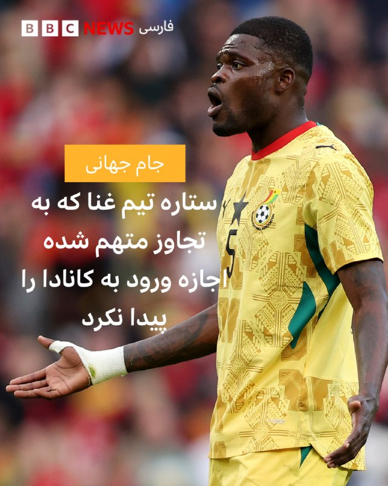

‌ ‌ ‌
سام فرزانه - لس‌آنجلس

کانادا از ورود یکی از بازیکنان تیم ملی غنا به آن کشور جلوگیری کرد. «توماس پارتی»، بازیکن ۳۲ ساله تیم ویارئال در کشور اسپانیاست که به دلیل هفت اتهام تجاوز و یک اتهام تعرض جنسی در بریتانیا باید به دادگاه برود. او اعلام بی‌گناهی کرده است.

نخستین بازی تیم غنا مقابل پاناما در روز چهارشنبه هفته آینده در شهر تورنتو است. کارلوس کی‌روش، سرمربی تیم غنا، در نخستین بازی مرحله گروهی از حضور این هافبک دفاعی خود محروم شده است. آقای کی‌روش که سابقه مربی‌گری تیم ملی فوتبال ایران را هم در کارنامه دارد، گفته که برای دعوت از توماس پارتی به تیم ملی غنا هیچ شکی به دل راه نداده بود. پارتی که زمانی برای تیم آرسنال در لیگ برتر انگلستان بازی می‌کرد از سوی چهار زن متهم شده که بین سال‌های ۲۰۲۰ تا ۲۰۲۲ به آنها تجاوز کرده است.

دادگاه این بازیکن قرار است دوم اکتبر برگزار شود اما احتمال دارد که ادامه رسیدگی به این اتهام‌ها به ماه‌های ابتدایی سال ۲۰۲۷ میلادی موکول شود.

https://bbc.in/3S6329I
📷Ryan Hiscott
@BBCPersian

---
📅 بروزرسانی: 1405/03/23 05:32
---

## VahidOOnLine — post 245241

  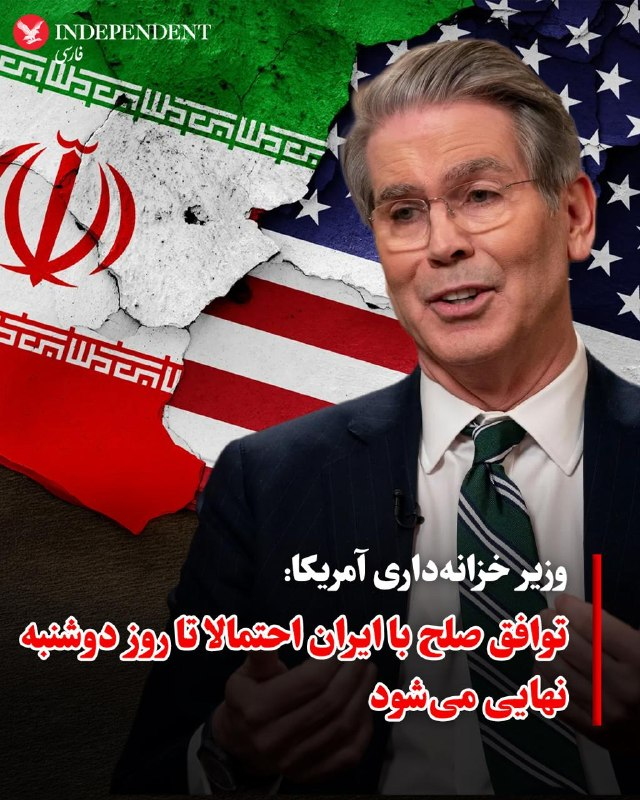

♦️اسکات بسنت، وزیر خزانه‌داری ایالات متحده، در گفتگوی با «فاکس‌نیوز» اعلام کرد که با توجه به روند پیشرفت مذاکرات، انتظار می‌رود توافق صلح با ایران «احتمالا تا پایان همین هفته یا روز دوشنبه نهایی شود». بسنت با اشاره به اینکه تصمیمات دونالد ترامپ برای جلوگیری از دستیابی تهران به سلاح هسته‌ای، هزینه‌ها و فشارهای کوتاه‌مدتی را به بازار سوخت و اقتصاد خانواده‌های آمریکایی وارد کرد، افزود: «ما درک می‌کنیم که در ماه‌های اخیر شرایط سختی سپری شد و افزایش بهای انرژی بخش زیادی از رشد دستمزدها را بلعید، اما ما در حال عبور از این وضعیت بحرانی هستیم.» وزیر خزانه‌داری آمریکا با تاکید بر اینکه زیرساخت‌های اقتصادی کشور در حال حاضر بسیار قدرتمند عمل می‌کنند و بازار انرژی به خوبی تامین شده است، خاطرنشان کرد که با حل‌وفصل این مناقشه و مهار تورم، بهای جهانی نفت حدود ۲۵ تا ۳۰ درصد و قیمت بنزین در بازار داخلی بیش از ۱۰ درصد از اوج خود کاهش یافته و روند نزولی قیمت‌ها و کاهش هزینه‌های زندگی مردم با قدرت ادامه خواهد یافت.
‌🇸🇦 Indypersian

🤖 @VahidOOnLine

## BBCPersian — post 283604

🔻 وکیل یک فعال ایرانی: آمریکا او را به جمهوری آفریقای مرکزی اخراج کرد

وکیل یک فعال طرفدار دموکراسی در ایران گفت که آمریکا این زن ایرانی را به جمهوری آفریقای مرکزی اخراج کرده است؛ اقدامی که او آن را انتقالی «بسیار خطرناک» به کشوری توصیف کرد که این فعال هیچ ارتباطی با آن ندارد.

صندوق دفاع حقوقی ایرانیان آمریکایی روز پنجشنبه هشدار داده بود که سه زن ایرانی متواری از آزار و اذیت، در معرض اخراج قرار دارند؛ از جمله زنی که به مسیحیت گرویده است.

اما امیلی تراسل، وکیل این پرونده به رویترز گفت که در نهایت تنها این فعال ایرانی در پروازی حضور داشت که پنجشنبه شب از ایالت لوئیزیانا برخاست. او در عین حال احتمال اخراج دو زن دیگر را در آینده رد نکرد.

بر اساس داده‌های سامانه رصد پروازهای اداره مهاجرت آمریکا، این هواپیما پس از توقفی در آکرا، پایتخت غنا، اندکی پیش از ساعت ۱۰ شب به وقت محلی در بانگی، پایتخت جمهوری آفریقای مرکزی، به زمین نشست.

هنوز مشخص نیست این افراد در کجا اسکان داده خواهند شد و تا چه مدت اجازه اقامت در جمهوری آفریقای مرکزی را خواهند داشت.

وکیل این فعال ایرانی به رویترز گفت: «آنها هیچ ارتباطی با این کشور ندارند.» او افزود که در اسناد ارائه‌شده به دادگاه بارها درباره خطرات چنین اقدامی هشدار داده بود.

او همچنین گفت: «این افراد از آمریکا اخراج شده و در کشوری رها می‌شوند که در آن هیچ وضعیت قانونی، ارتباط یا شبکه حمایتی ندارند. ما نگرانیم که در نهایت ناچار شوند به کشورهایی بازگردند که پیش‌تر از آنجا گریخته بودند.»

https://bbc.in/4448ext
@BBCPersian

---
📅 بروزرسانی: 1405/03/23 05:22
---

## VahidOOnLine — post 245240

  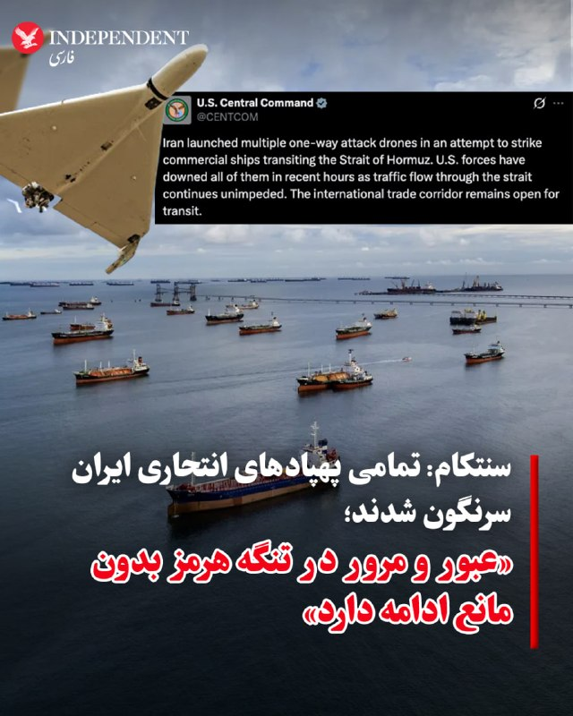

♦️فرماندهی مرکزی ایالات متحده (سنتکام) روز جمعه، با انتشار پیامی در اکس اعلام کرد که ایران چند پهپاد انتحاری را با هدف حمله به کشتی‌های تجاری در حال عبور از تنگه هرمز پرتاب کرده است. سنتکام تاکید کرد که نیروهای آمریکایی در ساعات گذشته تمامی این پهپادها را سرنگون کرده‌اند و جریان عبور و مرور دریایی در این آبراهه راهبردی بدون هیچ‌گونه مانعی ادامه دارد. بر اساس این بیانیه، گذرگاه تجارت بین‌المللی همچنان برای عبور و مرور کشتی‌ها باز است.
‌🇸🇦 Indypersian

🤖 @VahidOOnLine

## VahidOOnLine — post 245239

  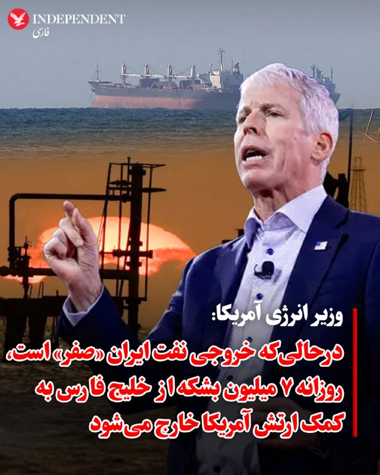

♦️خبرگزاری رویترز، روز جمعه، در گزارشی به نقل از کریس رایت، وزیر انرژی ایالات متحده، اعلام کرد که ارتش آمریکا با مداخله نظامی مستقیم به خروج روزانه حدود ۷ میلیون بشکه نفت از خلیج فارس کمک می‌کند. رایت در یک رویداد اقتصادی در هیوستون تصریح کرد این حجم انتقال، معادل نیمی از جریان نفتی است که از زمان آغاز جنگ آمریکا و اسرائیل با ایران در تنگه هرمز متوقف شده بود. براساس این گزارش، وزیر انرژی آمریکا با فاش کردن این عملیات که پیش از این کمتر درباره آن صحبت شده بود، تاکید کرد در حال حاضر هیچ نفت خامی از سوی ایران اجازه خروج از این آبراهه راهبردی را ندارد و در صورت حصول توافق، جریان آزاد تمامی محصولات انرژی در خلیج فارس از سر گرفته خواهد شد. با این حال، او هشدار داد که حتی در صورت عدم دستیابی به توافق، ارتش آمریکا به تلاش خود برای بازگرداندن کامل این جریان ادامه می‌دهد. بر اساس گزارش رویترز، اعلام رقم ۷ میلیون بشکه در روز، شوک بزرگی برای فعالان بازار بود، چرا که تحلیل‌گران حوزه انرژی با توجه به قیمت فعلی نفت در محدوده ۸۸ دلار، گمان می‌کردند تنها ۳ تا ۴ میلیون بشکه نفت در این شرایط بحرانی از تنگه هرمز عبور می‌کند. رایت همچنین اشاره کرد که در صورت موفقیت مذاکرات، احتمال لغو بخشی از تحریم‌های ایران و اجرای طرح معافیت موقت از مالیات بنزین در آمریکا برای کاهش قیمت‌ها وجود دارد.
‌🇸🇦 Indypersian

🤖 @VahidOOnLine

## VahidOOnLine — post 245238

  

فرماندهی مرکزی ایالات متحده (سنتکام) اعلام کرد: «ایران چندین پهپاد انتحاری را در تلاش برای حمله به کشتی‌های تجاری در حال عبور از تنگه هرمز به پرواز درآورد.»

سنتکام تاکید کرد که نیروهای آمریکایی در ساعات اخیر تمامی آن‌ها را سرنگون کرده‌اند، و گفت این کریدور تجاری بین‌المللی همچنان برای ترانزیت باز است.
‌🏁 🇬🇧 IranintlTV

🤖 @VahidOOnLine

## IranIntlTV — post 341980

  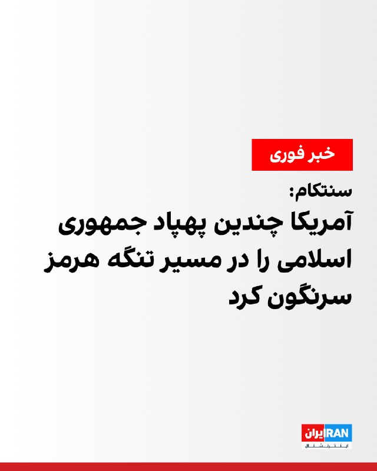

فرماندهی مرکزی ایالات متحده (سنتکام) اعلام کرد: «ایران چندین پهپاد انتحاری را در تلاش برای حمله به کشتی‌های تجاری در حال عبور از تنگه هرمز به پرواز درآورد.»

سنتکام تاکید کرد که نیروهای آمریکایی در ساعات اخیر تمامی آن‌ها را سرنگون کرده‌اند، و گفت این کریدور تجاری بین‌المللی همچنان برای ترانزیت باز است.
https://iranintl.com/202606138583

## FarsiVOA — post 220545

  <a href="telegram/content/FarsiVOA_220545_1781315563.mp4" target="_blank">🎬 Download video</a>

⚡️هواداران جام جهانی ۲۰۲۶ در واشنگتن در منطقه‌ای ویژه در نزدیکی کنگره آمریکا می‌توانند مسابقات جام جهانی را در فضای باز تماشا کنند. روز جمعه پیش از رقابت آمریکا در مقابل پاراگوئه، با وجود طوفان‌های قبلی، طرفداران فوتبال در این منطقه حاضر شدند و هم‌زمان از رنگین کمان و غروب زیبای خورشید لذت بردند.
@FarsiVOA

## FarsiVOA — post 220544

⚡️کی‌یف قصد دارد در نشست گروه تماس دفاعی اوکراین، بسته‌ای ۲۰ میلیارد دلاری برای تقویت پدافند هوایی، پهپادها و تسلیحات دوربرد از متحدان غربی درخواست کند؛ کمک‌هایی که می‌تواند مسیر جنگ روسیه با اوکراین را تحت تأثیر قرار دهد.
@FarsiVOA

---
📅 بروزرسانی: 1405/03/23 05:12
---

## VahidOOnLine — post 245237

  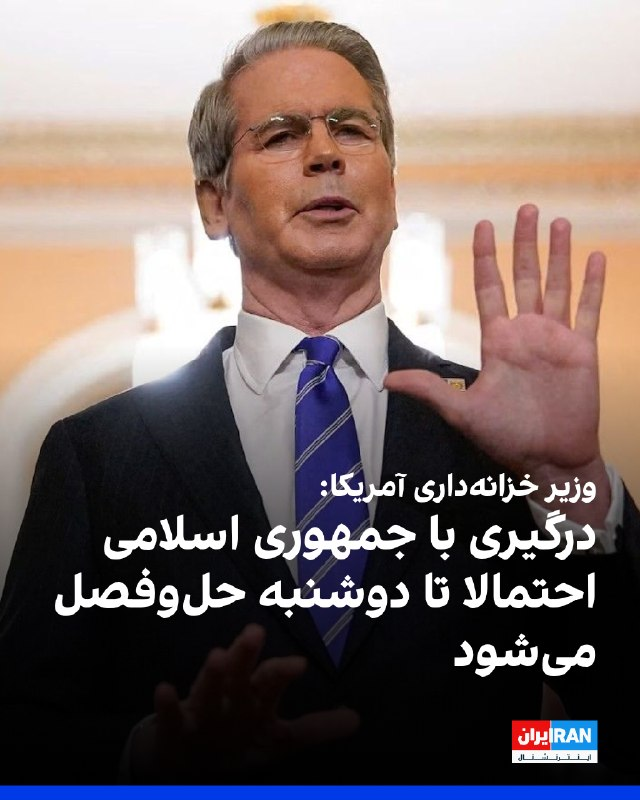

وزیر خزانه‌داری آمریکا در گفت‌وگو با شبکه فاکس‌نیوز گفت در صورت حل‌وفصل تنش‌های مرتبط با جمهوری اسلامی، آمریکایی‌ها ممکن است به‌زودی شاهد کاهش قیمت‌های بالای انرژی باشند.

او افزود این روند ممکن است تا پایان هفته جاری یا اوایل هفته آینده به نتیجه برسد.

وزیر خزانه‌داری آمریکا همچنین با اشاره به وضعیت بازارهای انرژی تاکید کرد که با وجود اختلالات اخیر، عرضه جهانی انرژی همچنان در سطح بالایی قرار دارد و قیمت نفت و بنزین از اوج‌های اخیر خود عقب‌نشینی کرده‌اند.

به گفته او، تحولات اخیر می‌تواند به کاهش فشار بر بازار انرژی و ثبات بیشتر قیمت‌ها کمک کند.
‌🏁 🇬🇧 IranintlTV

🤖 @VahidOOnLine

## VahidOOnLine — post 245236

  <a href="telegram/content/VahidOOnLine_245236_1781314936.mp4" target="_blank">🎬 Download video</a>

♦️دونالد ترامپ، رئیس‌جمهوری ایالات متحده، با انتشار ویدئویی از یک حمله هوایی ارتش آمریکا در حساب کاربری خود در «تروث سوشال»، از هلاکت «نینیو گررو»، رهبر بدنام گروه «ترن د آراگوا» و «یکی از خون‌خوارترین سازمان‌های تروریستی روی زمین» خبر داد. ترامپ با انتقاد شدید از سیاست‌های دولت قبل گفت: «پیش از بازگشت من به کاخ سفید، جو بایدن مرزهای جنوبی را به روی میلیون‌ها جنایتکار غیرقانونی باز کرد و به این ارتش خارجی اجازه داد تا با مصونیت کامل به شهروندان آمریکایی تجاوز کنند، آن‌ها را معلول کنند و به قتل برسانند.» او با تاکید بر اینکه این اقدام نظامی، انتقام و برقراری عدالت برای خانواده‌های قربانیانی چون جاسلین نونگارای ۱۲ ساله و لیکن رایلی ۲۲ ساله بوده است، افزود: «با این اقدام، ارتش آمریکا تقاص آن‌ها و خانواده‌هایشان را گرفت. ما در هماهنگی نزدیک با دوستانمان در ونزوئلا که همکاری بسیار خوبی با آن‌ها داریم، عمل کردیم؛ در نتیجه، تروریست‌های ترن د آراگوا دیگر هیچ پناهگاه امنی در ونزوئلا یا هیچ‌کجای دیگر ندارند
‌🇸🇦 Indypersian

🤖 @VahidOOnLine

## IranIntlTV — post 341979

  

وزیر خزانه‌داری آمریکا در گفت‌وگو با شبکه فاکس‌نیوز گفت در صورت حل‌وفصل تنش‌های مرتبط با جمهوری اسلامی، آمریکایی‌ها ممکن است به‌زودی شاهد کاهش قیمت‌های بالای انرژی باشند.

او افزود این روند ممکن است تا پایان هفته جاری یا اوایل هفته آینده به نتیجه برسد.

وزیر خزانه‌داری آمریکا همچنین با اشاره به وضعیت بازارهای انرژی تاکید کرد که با وجود اختلالات اخیر، عرضه جهانی انرژی همچنان در سطح بالایی قرار دارد و قیمت نفت و بنزین از اوج‌های اخیر خود عقب‌نشینی کرده‌اند.

به گفته او، تحولات اخیر می‌تواند به کاهش فشار بر بازار انرژی و ثبات بیشتر قیمت‌ها کمک کند.
https://iranintl.com/202606134514

## Shin_Persian — post 7007

Shin ✓ @hey_itsmyturn
Sat, 13 Jun 2026 01:32:06 UTC

Iran launched multiple one-way attack drones at commercial ships transiting the Strait of Hormuz. U.S. forces downed all of them; traffic flow continues unimpeded, the corridor remains open.

Source: @CENTCOM
https://x.com/CENTCOM/status/2065608055790637301

ترجمه خودکار فارسی

ایران چندین پهپاد تهاجمی یک‌طرفه را به سمت کشتی‌های تجاری در حال عبور از تنگه هرمز پرتاب کرد. نیروهای ایالات متحده همه آن‌ها را سرنگون کردند؛ جریان تردد بدون وقفه ادامه دارد و کریدور باز باقی مانده است.

منبع: @CENTCOM (فرماندهی مرکزی ایالات متحده)
https://x.com/CENTCOM/status/2065608055790637301

𝕏 · @shin_persian

---
📅 بروزرسانی: 1405/03/23 05:02
---

## VahidOOnLine — post 245235

  <a href="telegram/content/VahidOOnLine_245235_1781314349.mp4" target="_blank">🎬 Download video</a>

♦️مراسم باشکوه و ستاره‌باران افتتاحیه جام‌جهانی ۲۰۲۶ در ایالات متحده، پیش از بازی افتتاحیه این کشور در مقابل پاراگوئه، با حضور تماشاگران و اجرای زنده برجسته‌ترین چهره‌های موسیقی جهان در استادیوم «سوفای» لس‌آنجلس برگزار شد. این رویداد جذاب با رژه درام‌نوازان و اجرای کیتی پری با یک لباس نقره‌ای مجلل و اجرای ترانه «شگفتی» (Wonder) آغاز شد و سپس با ویدئوی انگیزشی تیم ملی آمریکا با روایتگری تام بردی، اسطوره فوتبال آمریکایی، به اوج هیجان رسید. این مراسم باشکوه علاوه بر ستاره‌های موسیقی، میزبان چهره‌های سرشناس سیاسی و ورزشی از جمله مارکو روبیو، وزیر خارجه ایالات متحده، بود که از نزدیک شاهد آغاز این افتتاحیه بودند.
‌🇸🇦 Indypersian

🤖 @VahidOOnLine

---
📅 بروزرسانی: 1405/03/23 04:52
---

## VahidOOnLine — post 245234

  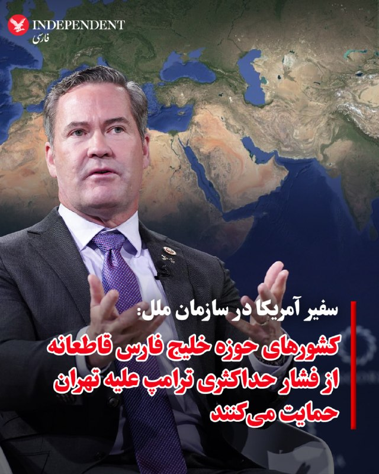

♦️مایک والتز، سفیر ایالات متحده در سازمان ملل متحد، پس از بازگشت از سفر منطقه‌ای خود به بحرین، امارات متحده عربی و بریتانیا، در گفتگو با «فاکس‌نیوز» اعلام کرد که متحدان عرب خلیج فارس به طور قاطع از کارزار محاصره و فشار اقتصادی دونالد ترامپ علیه تهران حمایت می‌کنند. والتز که بلندپایه‌ترین مقام آمریکایی است که از زمان آغاز جنگ به منطقه سفر کرده، تأکید کرد رهبران منطقه بر این باورند که تهران به شدت تحت فشار است؛ به طوری که ارزش پول ملی ایران سقوط کرده، ذخایر ارزی رو به اتمام است و رژیم در پرداخت حقوق نظامیان و کارمندان خود با مشکل جدی مواجه است. او با اشاره به دیدار خود با شیخ محمد بن زاید، رئیس دولت امارات متحده عربی، اظهار داشت که میان واشنگتن و ابوظبی «کمترین اختلاف‌نظری» وجود ندارد و امارات آماده است برای دستیابی به هدف بلندمدتِ توقف برنامه هسته‌ای ایران، هزینه‌های کوتاه‌مدت را بپذیرد. این اظهارات در حالی مطرح می‌شود که یک مقام ارشد آمریکایی روز جمعه اعلام کرد شانس امضای توافق صلح با ایران ظرف چند روز آینده حدود ۸۵ درصد است و این کارزار فشار با هدف به زانو درآوردن تهران در جریان این مذاکرات طراحی شده است.
والتز در بخش دیگری از این گفتگو، ایران را به اتخاذ «تصمیمات به شدت احمقانه» در حمله به همسایگان، هتل‌ها و زیرساخت‌های انرژی متهم کرد. او گفت که در بازدیدش از یک سایت نفتی، شواهدی دیده‌ است که نشان می‌دهد ایران در حملات خود، ابتدا به عمد سیستم‌های اطفای حریق و نیروهای امدادی را هدف قرار داده تا میزان خسارت تانکرهای ذخیره‌سازی را به حداکثر برساند. سفیر آمریکا تصریح کرد با وجود اینکه امارات بیشترین حجم حملات موشکی و پهپادی را متحمل شده، اما به سرعت در حال بازسازی است و به لطف پیمان ابراهیم و ائتلاف با اسرائیل، آرایش دفاعی جدیدی شکل گرفته است. او همچنین با تمجید از بحرین به عنوان میزبان ناوگان پنجم دریایی آمریکا و هم‌پیمانی بریتانیا در شورای امنیت، تاکید کرد که پدافند هوایی متحدان با موفقیت بالای ۹۰ درصد، موشک‌ها و پهپادهای ایرانی را سرنگون کرده و ترامپ، مارکو روبیو و تیم اقتصادی کاخ سفید از این اهرم فشار حداکثری برای پیشبرد منافع خود در مذاکرات جاری نهایت استفاده را خواهند کرد.
‌🇸🇦 Indypersian

🤖 @VahidOOnLine

## FoxNewsTwitter — post 342919

  

Fox News (Twitter/X)

The excitement is impossible to miss at SoFi Stadium.

U.S. fans are showing off their patriotic spirit with face paint and plenty of red, white and blue as they gather for the USMNT's World Cup opener against Paraguay.

It's the first World Cup game on home soil since 1994.

---
📅 بروزرسانی: 1405/03/23 04:42
---

## FarsiVOA — post 220543

🔺وزیر انرژی آمریکا: ۷ میلیون بشکه نفت روزانه به کمک آمریکا از خلیج فارس خارج می‌شود؛ میزان خروجی نفت از ایران «صفر بشکه» است

▪️وزیر انرژی آمریکا، کریس رایت، روز جمعه ۲۲ خرداد در مراسمی در هوستون واقع در ایالت تگزاس گفت: حدود ۷ میلیون بشکه نفت در روز با کمک نظامی ایالات متحده، از خلیج فارس خارج می‌شود.

⬇️ بیشتر بخوانید:
https://ir.voanews.com/a/8160407.html
@FarsiVOA

---
📅 بروزرسانی: 1405/03/23 04:32
---

## VahidOOnLine — post 245233

  

محسن رضایی، مشاور نظامی مجتبی خامنه‌ای، گفت دونالد ترامپ، رییس‌جمهوری آمریکا، آزادسازی ۲۴ میلیارد دلار از دارایی‌های مسدود شده ایران را پذیرفته است، اما با صراحت این موضوع را اعلام نمی‌کند.
‌🏁 🇬🇧 IranintlTV

🤖 @VahidOOnLine

## IranIntlTV — post 341978

  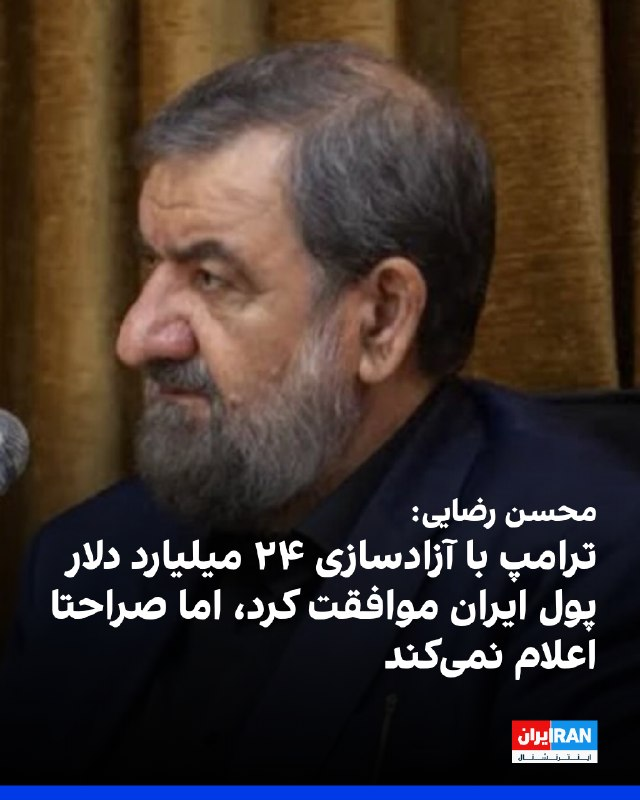

محسن رضایی، مشاور نظامی مجتبی خامنه‌ای، گفت دونالد ترامپ، رییس‌جمهوری آمریکا، آزادسازی ۲۴ میلیارد دلار از دارایی‌های مسدود شده ایران را پذیرفته است، اما با صراحت این موضوع را اعلام نمی‌کند.
https://iranintl.com/202606123453

## FarsiVOA — post 220542

⚡️نزدیک به چهار ماه پس از آغاز تازه‌ترین بحران خاورمیانه و با وجود آتش‌بس شکننده میان آمریکا و جمهوری اسلامی، شورای امنیت سازمان ملل متحد اخیرا در نشستی درباره راه‌حل‌های سیاسی، ثبات منطقه و دیپلماسی گفت‌وگو کرد.
@FarsiVOA

## BBCPersian — post 283603

  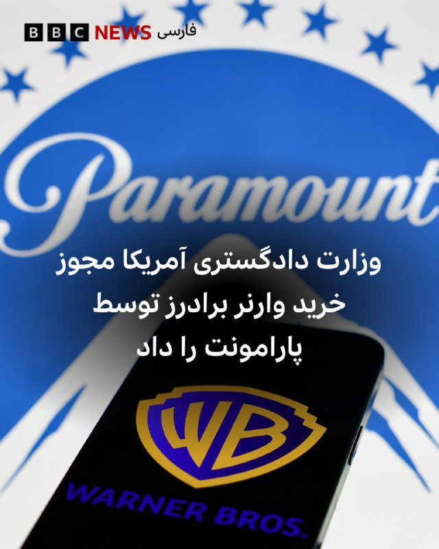

‌ ‌ ‌
وزارت دادگستری ایالات متحده، خرید شرکت وارنر برادرز دیسکاوری توسط پارامونت اسکای‌دنس را تایید کرد.

در این بیانیه وزارت دادگستری آمریکا آمده است که این ادغام «احتمالاً به ضرر رقبا یا مصرف‌کنندگان آمریکایی نخواهد بود.»

این معامله پیشنهادی که به ارزش بیش از ۱۱۰ میلیارد دلار خواهد بود، احتمالا چشم‌انداز رسانه‌ای ایالات متحده را تغییر خواهد داد.

دیوید الیسون، رئیس پارامونت، پسر لری الیسون است که از حامیان مالی دونالد ترامپ، رئیس جمهور آمریکا به حساب می‌آید.

این اقدام باعث می‌شود پارامونت کنترل این استودیوی هالیوودی را که مالک سی‌ان‌ان و اچ‌بی‌او نیز هست، به دست بگیرد.

اما هنوز این معامله قطعی نشده است، زیرا کالیفرنیا یکی از ایالت‌هایی است که ممکن است برای جلوگیری از این خرید شکایت کند.

📷 Jakub Porzycki/NurPhoto via Getty Images
@BBCPersian

---
📅 بروزرسانی: 1405/03/23 04:22
---

## VahidOOnLine — post 245232

  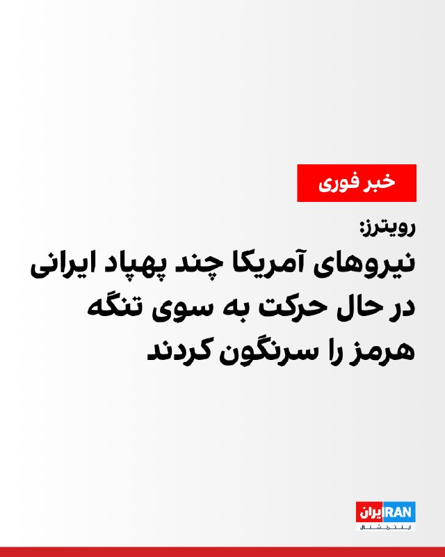

یک منبع آگاه به خبرگزاری رویترز گفت نیروهای آمریکایی چندین پهپاد انتحاری ایران را که به سمت تنگه هرمز در حرکت بودند، رهگیری و سرنگون کرده‌اند.

این منبع که نامش فاش نشده، به رویترز گفته است پهپادهای ایرانی تهدیدی برای تردد کشتی‌های تجاری در تنگه هرمز محسوب می‌شدند.

جزئیات بیشتری درباره تعداد پهپادهای سرنگون‌شده، زمان وقوع این عملیات و محل دقیق رهگیری آنها منتشر نشده است. همچنین مقام‌های آمریکایی و ایرانی تاکنون به این گزارش واکنشی نشان نداده‌اند.

پیش‌تر خبرگزاری فارس، نزدیک به سپاه پاسداران، شامگاه جمعه ۲۲ خرداد از «شلیک هشدار به کشتی‌های متخلف» در تنگه هرمز خبر داده بود.

این خبرگزاری حکومتی نوشته بود: «دقایقی پیش، مردم در قشم، جاسک و سیریک در استان هرمزگان شنیدن صدایی شبیه انفجار گزارش کردند» و افزود: «گزارشی از اصابت در این نقاط مخابره نشده است.»

فارس به نقل از «منابع آگاه» نوشت: «صداهای شنیده شده مربوط به انجام شلیک هشدار به کشتی‌های متخلف در محدوده تنگه هرمز است.»

‌🏁 🇬🇧 IranintlTV

🤖 @VahidOOnLine

## VahidOOnLine — post 245231

  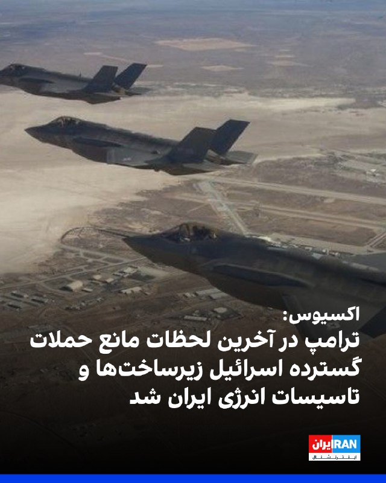

اکسیوس به نقل از «منابع آگاه» نوشت: «برخی مقام‌ها در واشینگتن معتقدند بنیامین نتانیاهو ممکن است حتی در صورت نهایی شدن توافق میان آمریکا و ایران، نقش یک عامل اخلال‌گر را ایفا کند.»

هم‌زمان، اکسیوس به نقل از منابع خود نوشت: «دونالد ترامپ در آخرین لحظات مانع انجام حملات گسترده اسرائیل علیه زیرساخت‌ها و تأسیسات انرژی ایران شده است.»

اکسیوس به نقل از یک مقام آمریکایی نوشت: «اگر حزب‌الله به سوی اسرائیل موشک شلیک کند و ایران به تسلیح این گروه ادامه دهد، این اقدام نقض توافق خواهد بود.»
‌🏁 🇬🇧 IranintlTV

🤖 @VahidOOnLine

## IranIntlTV — post 341977

  

یک منبع آگاه به خبرگزاری رویترز گفت نیروهای آمریکایی چندین پهپاد انتحاری ایران را که به سمت تنگه هرمز در حرکت بودند، رهگیری و سرنگون کرده‌اند.

این منبع که نامش فاش نشده، به رویترز گفته است پهپادهای ایرانی تهدیدی برای تردد کشتی‌های تجاری در تنگه هرمز محسوب می‌شدند.

جزئیات بیشتری درباره تعداد پهپادهای سرنگون‌شده، زمان وقوع این عملیات و محل دقیق رهگیری آنها منتشر نشده است. همچنین مقام‌های آمریکایی و ایرانی تاکنون به این گزارش واکنشی نشان نداده‌اند.

پیش‌تر خبرگزاری فارس، نزدیک به سپاه پاسداران، شامگاه جمعه ۲۲ خرداد از «شلیک هشدار به کشتی‌های متخلف» در تنگه هرمز خبر داده بود.

این خبرگزاری حکومتی نوشته بود: «دقایقی پیش، مردم در قشم، جاسک و سیریک در استان هرمزگان شنیدن صدایی شبیه انفجار گزارش کردند» و افزود: «گزارشی از اصابت در این نقاط مخابره نشده است.»

فارس به نقل از «منابع آگاه» نوشت: «صداهای شنیده شده مربوط به انجام شلیک هشدار به کشتی‌های متخلف در محدوده تنگه هرمز است.»

https://iranintl.com/202606135907

## FarsiVOA — post 220541

  <a href="telegram/content/FarsiVOA_220541_1781311946.mp4" target="_blank">🎬 Download video</a>

⚡️بازیکن سابق تیم ملی فوتبال زنان ایران از شرایط تیم ملی فوتبال در جام جهانی ۲۰۲۶ می‌گوید
@FarsiVOA

---
📅 بروزرسانی: 1405/03/23 04:12
---

## VahidOOnLine — post 245230

  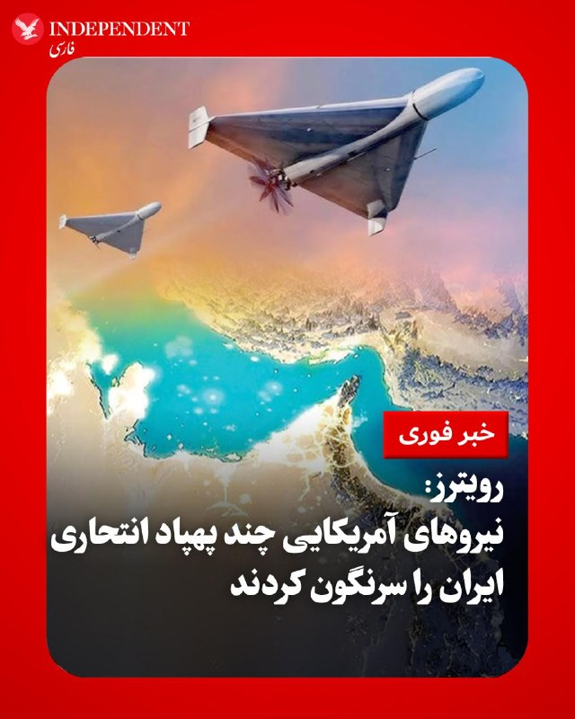

♦️رویترز، بامداد شنبه به نقل از «یک منبع آگاه» اعلام کرد که نیروهای ایالات متحده چند پهپاد انتحاری (یک‌طردفه) ایران را که به سمت تنگه هرمز در حرکت بودند، رهگیری و سرنگون کرده‌اند. این منبع تاکید کرد این پهپادها تهدیدی مستقیم و جدی برای امنیت و عبور و مرور کشتی‌های تجاری در منطقه به شمار می‌رفتند.
‌🇸🇦 Indypersian

🤖 @VahidOOnLine

## IranIntlTV — post 341976

  

اکسیوس به نقل از «منابع آگاه» نوشت: «برخی مقام‌ها در واشینگتن معتقدند بنیامین نتانیاهو ممکن است حتی در صورت نهایی شدن توافق میان آمریکا و ایران، نقش یک عامل اخلال‌گر را ایفا کند.»

هم‌زمان، اکسیوس به نقل از منابع خود نوشت: «دونالد ترامپ در آخرین لحظات مانع انجام حملات گسترده اسرائیل علیه زیرساخت‌ها و تأسیسات انرژی ایران شده است.»

اکسیوس به نقل از یک مقام آمریکایی نوشت: «اگر حزب‌الله به سوی اسرائیل موشک شلیک کند و ایران به تسلیح این گروه ادامه دهد، این اقدام نقض توافق خواهد بود.»
https://iranintl.com/202606126160

## Shin_Persian — post 7006

  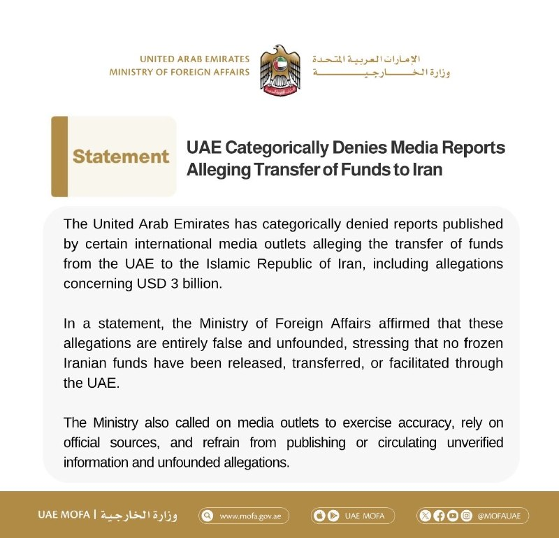

MoFA وزارة الخارجية ✓ @mofauae
Fri, 12 Jun 2026 21:41:50 UTC

UAE Categorically Denies Media Reports Alleging Transfer of Funds to Iran

ترجمه خودکار فارسی

امارات متحده عربی گزارش‌های رسانه‌ای مبنی بر انتقال وجه به ایران را قاطعانه تکذیب کرد

𝕏 · @shin_persian

## FarsiVOA — post 220540

  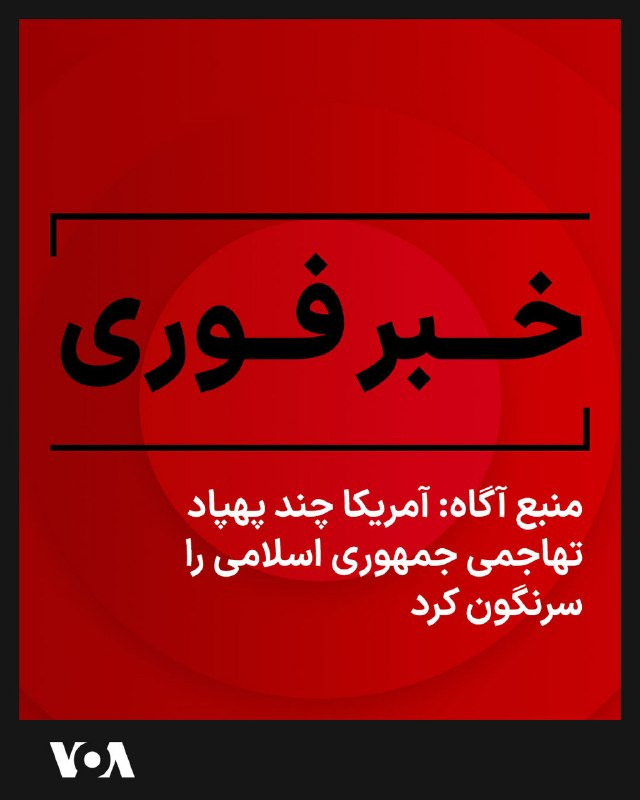

⚡️یک منبع آگاه به رویترز گفت: نیروهای آمریکایی چندین پهپاد تهاجمی یک‌طرفه جمهوری اسلامی را که به سمت تنگه هرمز در حرکت بودند، سرنگون کردند.
@FarsiVOA

---
📅 بروزرسانی: 1405/03/23 04:02
---

## VahidOOnLine — post 245229

  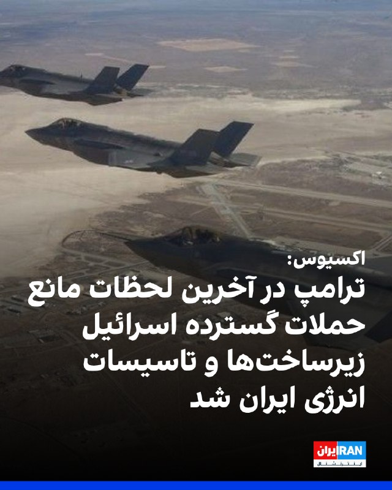

اکسیوس به نقل از «منابع آگاه» نوشت: «برخی مقام‌ها در واشینگتن معتقدند بنیامین نتانیاهو ممکن است حتی در صورت نهایی شدن توافق میان آمریکا و ایران، نقش یک عامل اخلال‌گر را ایفا کند.»

هم‌زمان، اکسیوس به نقل از منابع خود نوشت: «دونالد ترامپ در آخرین لحظات مانع انجام حملات گسترده اسرائیل علیه زیرساخت‌ها و تأسیسات انرژی ایران شده است.»

اکسیوس به نقل از یک مقام آمریکایی نوشت: «اگر حزب‌الله به سوی اسرائیل موشک شلیک کند و ایران به تسلیح این گروه ادامه دهد، این اقدام نقض توافق خواهد بود.»
‌🏁 🇬🇧 IranintlTV

🤖 @VahidOOnLine

## IranIntlTV — post 341975

  

اکسیوس به نقل از «منابع آگاه» نوشت: «برخی مقام‌ها در واشینگتن معتقدند بنیامین نتانیاهو ممکن است حتی در صورت نهایی شدن توافق میان آمریکا و ایران، نقش یک عامل اخلال‌گر را ایفا کند.»

هم‌زمان، اکسیوس به نقل از منابع خود نوشت: «دونالد ترامپ در آخرین لحظات مانع انجام حملات گسترده اسرائیل علیه زیرساخت‌ها و تأسیسات انرژی ایران شده است.»

اکسیوس به نقل از یک مقام آمریکایی نوشت: «اگر حزب‌الله به سوی اسرائیل موشک شلیک کند و ایران به تسلیح این گروه ادامه دهد، این اقدام نقض توافق خواهد بود.»
https://iranintl.com/202606126160

## FarsiVOA — post 220539

  <a href="telegram/content/FarsiVOA_220539_1781310760.mp4" target="_blank">🎬 Download video</a>

⚡️فرزانه روستایی در برنامه تفسیر خبر: هر مذاکره ای بین جمهوری اسلامی و آمریکا یک شریک سومی دارد به اسم اسرائیل
@FarsiVOA

## BBCPersian — post 283602

🔻 اکسیوس: توافق در آستانه آمریکا و ایران واقعیت تلخی برای نتانیاهو است

اکسیوس به نقل از مقام‌های آمریکایی گزارش داده است که دونالد ترامپ در تماس تلفنی با بنیامین نتانیاهو به او گفته که انتظار دارد ظرف چند روز آینده توافقی با ایران امضا شود.

به نوشته اکسیوس، آقای نتانیاهو که از آغاز جنگ امیدوار بود درگیری‌ها به تغییر حکومت در ایران منجر شود، اکنون با توافقی روبه‌رو شده که با اهداف اعلام‌شده او فاصله دارد.

این گزارش می‌گوید که نخست‌وزیر اسرائیل در گفت‌وگو با دونالد ترامپ، مخالفت جدی با توافق ابراز نکرده و به نظر می‌رسد پذیرفته است که نمی‌تواند مانع امضای آن شود.

اکسیوس همچنین گزارش داده است که در روزهای اخیر آقای ترامپ مانع اجرای حملات گسترده برنامه‌ریزی‌شده اسرائیل علیه تاسیسات انرژی و زیرساختی ایران شده است.

به نوشته این رسانه، برخی مقام‌های اسرائیلی در محافل خصوصی نسبت به توافق احتمالی با ایران بدبین هستند و نگرانند که تهران پس از پایان جنگ و رفع فشارها، بدون ارائه امتیازهای اساسی در زمینه برنامه هسته‌ای، مذاکرات را طولانی کند.

با این حال مقام‌های آمریکایی می‌گویند که هرگونه مزایای اقتصادی برای ایران به انجام تعهدات تهران وابسته خواهد بود و کاخ سفید اطمینان دارد که اسرائیل در نهایت با توافق همراه خواهد شد.

https://bbc.in/4uCV59E
@BBCPersian

---
📅 بروزرسانی: 1405/03/23 03:52
---

## VahidOOnLine — post 245228

♦️به گزارش رویترز، ایلان ماسک، بنیان‌گذار شرکت‌های تسلا و اسپیس‌اکس، روز جمعه با ثبت ثروتی معادل ۱.۱۱ تریلیون دلار در فهرست میلیاردرهای «بلومبرگ»، رسما به عنوان نخستین «تریلیونر» تاریخ جهان شناخته شد. این جهش بی‌سابقه در پی عرضه اولیه و طوفانی سهام شرکت هوافضای «اسپیس‌اکس» (با نماد SPCX) در بورس «نزدک» رخ داد؛ جایی که ارزش این شرکت در بزرگ‌ترین عرضه عمومی تاریخ وال‌استریت به ۲.۲ تریلیون دلار رسید و هر سهم آن پس از بازگشایی با قیمت ۱۵۰ دلار، در نهایت در رقم ۱۶۱ دلار بسته شد تا علاوه بر جذب ۷۵ میلیارد دلار سرمایه جدید، بیش از ۴۴۰۰ نفر از کارکنان فعلی و سابق این شرکت نیز میلیونر شوند. براساس این گزارش، ثروت ایلان ماسک اکنون با کل تولید اقتصادی کشورهایی چون لهستان یا سوئیس برابری می‌کند.
‌🇸🇦 Indypersian

🤖 @VahidOOnLine

## FarsiVOA — post 220538

  <a href="telegram/content/FarsiVOA_220538_1781310142.mp4" target="_blank">🎬 Download video</a>

⚡️اجرای قوانین سختگیرانه مهاجرتی در اروپا؛ غربالگری مرزی برای کنترل ورود پناهجویان
@FarsiVOA

---
📅 بروزرسانی: 1405/03/23 03:42
---

## FoxNewsTwitter — post 342918

  <a href="telegram/content/FoxNewsTwitter_342918_1781309560.mp4" target="_blank">🎬 Download video</a>

Fox News (Twitter/X)

RT @FoxUSNews: LISTEN: Father of slain teen Austin Metcalf rips those who 'monetized' his son's death, says the victim's family raised over $600,000 while he was silenced under a gag order.

Jeff Metcalf tells Fox News Digital the race-baiting and false narratives were 'despicable' — all for clicks and money off his dead child.

## Shin_Persian — post 7005

Shin ✓ @hey_itsmyturn
Sat, 13 Jun 2026 00:03:08 UTC

A little opinion piece I wrote about the Iran situation:
https://sh1n.org/news/the-deal-the-trap-and-ghalibaf-waiting-behind-the-curtain

ترجمه خودکار فارسی

یادداشت کوتاهی که درباره وضعیت ایران نوشتم:
https://sh1n.org/fa/news/the-deal-the-trap-and-ghalibaf-waiting-behind-the-curtain
𝕏 · @shin_persian

## alonews — post 127531

  <a href="telegram/content/alonews_127531_1781309563.webm" target="_blank">🎬 Download video</a>

👈اکسیوس:
برخی در واشنگتن معتقدند حتی اگر توافق اجرایی شود، نتانیاهو ممکن است بازهم بتواند نقش یک اخلالگر را ایفا کند

✅ @AloNews خبر جنگ

---
📅 بروزرسانی: 1405/03/23 03:32
---

## VahidOOnLine — post 245227

  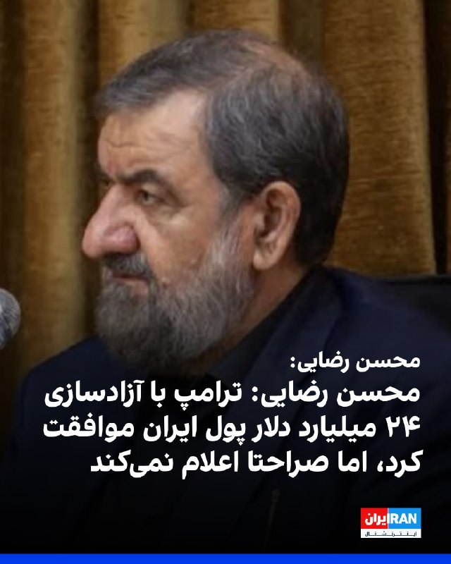

محسن رضایی، مشاور نظامی مجتبی خامنه‌ای، گفت دونالد ترامپ، رییس‌جمهوری آمریکا، آزادسازی ۲۴ میلیارد دلار از دارایی‌های مسدود شده ایران را پذیرفته است، اما با صراحت این موضوع را اعلام نمی‌کند.
‌🏁 🇬🇧 IranintlTV

🤖 @VahidOOnLine

## DEJradio — post 5629

  <a href="telegram/content/DEJradio_5629_1781308959.webm" target="_blank">🎬 Download video</a>

⚽️
🔺 مهدی رستم‌پور در برنامه دژ فوتبالی به بررسی بازیکنان و ورزشکارانی پرداخت که غیرانسانی و به دور از اخلاق به نام ملی‌پوش از زیر قرآن رد شدند و به مسابقات بین‌المللی اعزام شدند اما بی‌شرمانه تجاوز کردند.

ویژه جام جهانی هر شب پس از خبر ۲۱

#دژفوتبالی #جام_جهانی
@DEJradio

## IranIntlTV — post 341974

  

محسن رضایی، مشاور نظامی مجتبی خامنه‌ای، گفت دونالد ترامپ، رییس‌جمهوری آمریکا، آزادسازی ۲۴ میلیارد دلار از دارایی‌های مسدود شده ایران را پذیرفته است، اما با صراحت این موضوع را اعلام نمی‌کند.
https://iranintl.com/202606123453

---
📅 بروزرسانی: 1405/03/23 03:22
---

## VahidOOnLine — post 245226

♦️عباس عراقچی، وزیر امور خارجه جمهوری اسلامی، جمعه‌شب در برنامه «گفتگوی ویژه خبری» صداوسیما اعلام کرد که تنها راه برخورد با اورانیوم غنی‌شده، «رقیق‌سازی آن در داخل ایران» است. این اظهارات درحالی بیان شد که مقامات ایرانی و آمریکایی هم‌زمان تاکید کرده‌اند توافق برای پایان دادن به جنگ در خاورمیانه اکنون بیش از هر زمان دیگری نزدیک و قابل دسترس است.
‌🇸🇦 Indypersian

🤖 @VahidOOnLine

## VahidOOnLine — post 245225

  

وزارت خارجه قطر اعلام کرد شیخ محمد بن عبدالرحمن آل‌ثانی، نخست‌وزیر و وزیر خارجه این کشور، در تماس تلفنی با هاکان فیدان، وزیر خارجه ترکیه، درباره روابط دوجانبه و آخرین تحولات مذاکرات میان آمریکا و ایران گفت‌وگو کرده است.

بر اساس این بیانیه، دو طرف درباره تلاش‌های میانجی‌گرانه میان آمریکا و جمهوری اسلامی تبادل نظر و از پیشرفت حاصل‌شده در مذاکرات ابراز خرسندی کردند.

وزیران خارجه قطر و ترکیه همچنین از اعلام میانجی‌گری پاکستان مبنی بر نهایی شدن متن توافق صلح استقبال کردند. آن‌ها ابراز امیدواری کردند که آمریکا و ایران به‌زودی این توافق را امضا کنند.

دو طرف در ادامه بر حمایت کامل خود از تلاش‌های دیپلماتیک جاری برای حل‌وفصل مسایل باقی‌مانده از طریق گفت‌وگو و راهکارهای مسالمت‌آمیز تأکید کردند و آن را گامی در جهت تقویت امنیت و ثبات منطقه‌ای و بین‌المللی و افزایش فرصت‌های صلح پایدار در منطقه دانستند.
‌🏁 🇬🇧 IranintlTV

🤖 @VahidOOnLine

## mwarmonitor — post 10803

  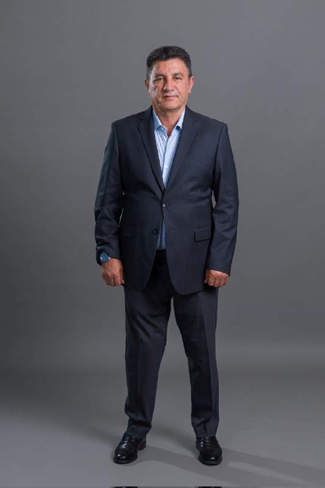

📝 این تصویر، یعنی سندِ زنده و مجسمِ «ابتذال». در عکس با موجودی طرفیم که تمام هستی، شرف و وزنِ وجودی‌اش به چند گرم فلزِ روی مچش بند است؛ آستینی که با آن سن و سال، به طرزی رقت‌انگیز بالا کشانده شده تا به دنیا التماس کند: «خواهش می‌کنم مرا ثروتمند ببینید!»

🔸این اوجِ سقوط و بی‌هویتی است. مردی که پشتِ این کت و شلوارِ بی‌قواره ایستاده، تهی‌تر از آن است که بتوان نام «شخصیت» روی او گذاشت. او نمادِ مطلقِ فقرِ مغزی و فرهنگی است؛ از آن دست رانت‌خوارانی که بوی بدِ تازه‌به‌دوران‌رسیدگی‌شان فضای جامعه را مسموم کرده است. کسی که در این سن، هنوز هویتش را از مارکِ ساعتش گدایی می‌کند، درونش بیابانی از حقارت و نادانی است. کل دارایی این آدم، مالِ حرامی است که به مچش بسته؛ اگر آن ساعت را از او بگیری، تفاله‌ای بیش باقی نمی‌ماند: موجودی فاقدِ شعور، عاری از اصالت و غرق در بلاهت که حتی ارزشِ ترحم هم ندارد. این تصویر، کاریکاتوری است از انسانیت؛ بدنی زنده با مغزی که سال‌هاست بو گرفته و پوسیده است.

@mwarmonitor

## IranIntlTV — post 341973

  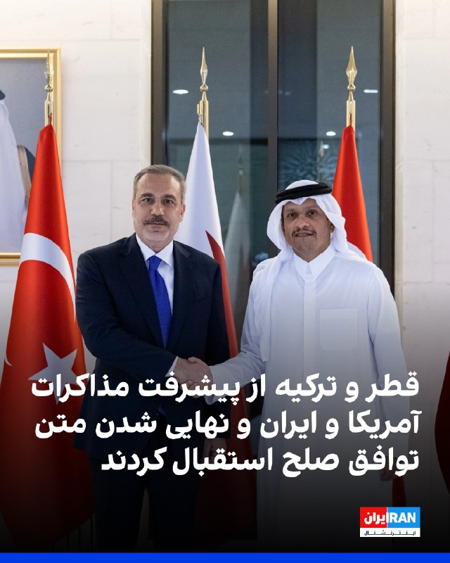

وزارت خارجه قطر اعلام کرد شیخ محمد بن عبدالرحمن آل‌ثانی، نخست‌وزیر و وزیر خارجه این کشور، در تماس تلفنی با هاکان فیدان، وزیر خارجه ترکیه، درباره روابط دوجانبه و آخرین تحولات مذاکرات میان آمریکا و ایران گفت‌وگو کرده است.

بر اساس این بیانیه، دو طرف درباره تلاش‌های میانجی‌گرانه میان آمریکا و جمهوری اسلامی تبادل نظر و از پیشرفت حاصل‌شده در مذاکرات ابراز خرسندی کردند.

وزیران خارجه قطر و ترکیه همچنین از اعلام میانجی‌گری پاکستان مبنی بر نهایی شدن متن توافق صلح استقبال کردند. آن‌ها ابراز امیدواری کردند که آمریکا و ایران به‌زودی این توافق را امضا کنند.

دو طرف در ادامه بر حمایت کامل خود از تلاش‌های دیپلماتیک جاری برای حل‌وفصل مسایل باقی‌مانده از طریق گفت‌وگو و راهکارهای مسالمت‌آمیز تأکید کردند و آن را گامی در جهت تقویت امنیت و ثبات منطقه‌ای و بین‌المللی و افزایش فرصت‌های صلح پایدار در منطقه دانستند.
https://iranintl.com/202606121348

## FarsiVOA — post 220537

  <a href="telegram/content/FarsiVOA_220537_1781308363.mp4" target="_blank">🎬 Download video</a>

⚡️گزارش نرگس صبا از گمانه‌‌زنی‌ها درباره محتوای توافق احتمالی بین جمهوری اسلامی و آمریکا
@FarsiVOA

## alonews — post 127527

  <a href="telegram/content/alonews_127527_1781308364.webm" target="_blank">🎬 Download video</a>

🔴فوری/انفجار در تهران 
✅ @AloNews

---
📅 بروزرسانی: 1405/03/23 03:12
---

هیچ پیام جدیدی در این بروزرسانی ارسال نشد.

---
📅 بروزرسانی: 1405/03/23 03:02
---

## FoxNewsTwitter — post 342917

  <a href="telegram/content/FoxNewsTwitter_342917_1781307148.mp4" target="_blank">🎬 Download video</a>

Fox News (Twitter/X)

RT @FoxUSNews: LISTEN: Jeff Metcalf became emotional while speaking with Fox News Digital about the loss of his son, Austin Metcalf, days after Karmelo Anthony was convicted in Austin's April 2, 2025 murder.

"I just can't believe I'm without one," Metcalf said of losing one of his twin sons.

## FarsiVOA — post 220536

🔺امارات گزارش‌ تحویل ۳ میلیارد دلار پول به جمهوری اسلامی را تکذیب کرد

▪️وزارت امور خارجه امارات اوایل روز شنبه ۲۳ خرداد با انتشار بیانیه‌ای گزارش‌های رسانه‌ای درباره انتقال منابع مالی به جمهوری اسلامی را رد کرد.

⬇️ بیشتر بخوانید:
https://ir.voanews.com/a/8160260.html
@FarsiVOA

## BBCPersian — post 283601

  

پوریا ژافره - استادیوم لس‌آنجلس

فضای مسابقه اول آمریکا در جام جهانی از ساعت‌ها قبل پر شور و هیجان است آن هم در هوای گرم کالیفرنیا و هزاران هوادار تیم ملی آمریکا که سال‌ها منتظر چنین روزی بودند. این نخستین بار است که آنها می‌توانند مسابقات جام جهانی را در خاک کشور خود از نزدیک تجربه کنند.

در این میان، غیبت دونالد ترامپ، رئیس‌جمهوری آمریکا، نیز مورد توجه قرار گرفته است.

او بارها از برگزاری جام جهانی ۲۰۲۶ و بازی‌های المپیک لس‌آنجلس در دوران ریاست‌جمهوری خود به عنوان نشانه‌ای از جایگاه و قدرت آمریکا یاد کرده بود. با این حال، کاخ سفید اعلام کرده که آقای ترامپ در این مسابقه حضور نخواهد داشت.

البته انتظار می‌رود که رئیس جمهور آمریکا به تماشای دیدار فینال جام جهانی برود که قرار است در ورزشگاه مت‌لایف نیوجرسی برگزار شود.

دونالد ترامپ چند روز پیش نیز در یکی از مسابقات فینال لیگ بسکتبال آمریکا حاضر شد که حضورش در سالن مدیسون اسکوئر گاردن نیویورک با واکنش‌های متفاوت تماشاگران روبه‌رو شد. اتفاقی که نشان داد ترامپ، با وجود آنکه در نیویورک متولد و بزرگ شده، همچنان شخصیتی به شدت دو قطبی در این شهر است.

📷 Matt McNulty

---
📅 بروزرسانی: 1405/03/23 02:52
---

## VahidOOnLine — post 245224

  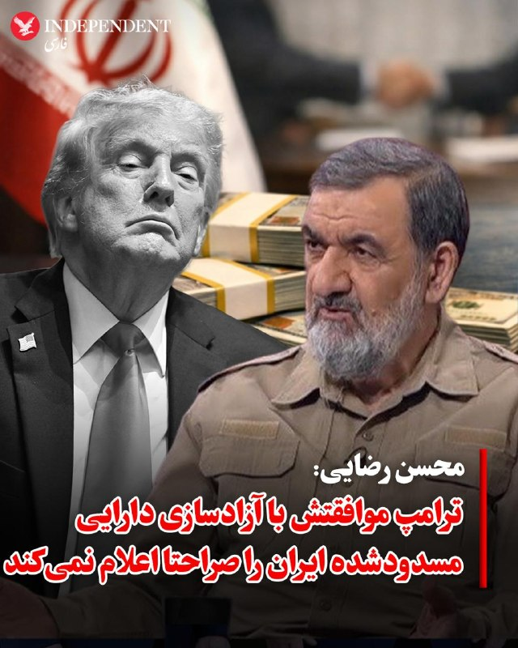

♦️فارس، خبرگزاری وابسته به سپاه، بامداد شنبه، به نقل از محسن رضایی، عضو مجمع تشخیص مصلحت نظام و مشاور نظامی مجتبی خامنه‌ای، نوشت: «ترامپ با آزادسازی ۲۴ میلیارد دلار از دارایی‌های مسدودشده ایران موافقت کرده اما با صراحت این موضوع را اعلام نمی‌کند».
‌🇸🇦 Indypersian

🤖 @VahidOOnLine

## mwarmonitor — post 10802

🔴ترامپ در آستانه توافق با ایران؛ شوک بزرگ و تلخ برای نتانیاهو

📝نویسنده: باراک راوید AXIOS

🔰غروب روز پنجشنبه، پرزیدنت دونالد ترامپ با بنیامین نتانیاهو، نخست‌وزیر اسرائیل تماس گرفت تا خبری را به او بدهد که اصلاً تمایلی به شنیدنش نداشت: ترامپ انتظار دارد ظرف چند روز آینده توافقی را با ایران امضا کند.

🔸یک مقام ارشد آمریکایی نقل کرده که ترامپ به نتانیاهو گفته است:
«توافق همین است. این یک توافق عالی است و زمان آن رسیده که به این جنگ پایان دهیم.»

📌چرا این موضوع اهمیت دارد؟
وقتی نتانیاهو در این جنگ در کنار ترامپ ایستاد، هرگز تصور نمی‌کرد که پایان کار این‌گونه رقم بخورد.

نگاهی به گذشته: نتانیاهو از همان ابتدا آشکارا معتقد بود که این جنگ می‌تواند جرقه تغییر رژیم در تهران را بزند.
فشارهای داخلی: اکنون، در حالی که تنها چهار ماه تا انتخابات اسرائیل باقی مانده، رقبای سیاسی نتانیاهو او را متهم می‌کنند که اسرائیل را به یک «ایالت تحت‌الحمایه و باج‌گزار» تبدیل کرده که صرفاً شروط ترامپ برای صلح را می‌پذیرد.
نقش خرابکارانه؟ برخی در واشنگتن بر این باورند که نتانیاهو ممکن است حتی در صورت اجرایی شدن توافق، نقش خرابکار (Spoiler) را بازی کند.
با این حال، یک مقام آمریکایی به اکسیوس گفت که نتانیاهو در تماس تلفنی با ترامپ به این درک رسیده بود که نمی‌تواند مانع امضای این توافق توسط او شود. در حال حاضر، مقامات تهران و واشنگتن می‌گویند توافق نزدیک است اما هنوز نهایی نشده است.
پشت صحنه تحولات
هم‌زمان با بالا گرفتن تنش‌ها و تبادل آتش با ایران در اوایل این هفته، نتانیاهو قصد داشت حملات گسترده‌ای را علیه تاسیسات انرژی و زیرساختی ایران آغاز کند، اما ترامپ در آخرین لحظه مانع او شد.
یک منبع آمریکایی با آگاهی مستقیم از موضوع گفت از آن زمان به بعد، نتانیاهو تا حد زیادی از جریان امور کنار گذاشته شده و برای کسب اطلاعات درباره مذاکرات ترامپ، با متحدان خود در واشنگتن تماس می‌گیرد. به گفته یک منبع مطلع، پست روز پنجشنبه ترامپ مبنی بر حصول توافق، نتانیاهو را غافلگیر کرد.
یک مقام آمریکایی اعلام کرد وقتی ترامپ یک ساعت بعد با نتانیاهو تماس گرفت، رهبر اسرائیل مقاومت چندانی نکرد و وارد بحث و جدل نشد. او به ترامپ گفت به او اعتماد دارد تا مطمئن شود توافق نهایی به دغدغه‌های مشترک آن‌ها در مورد برنامه هسته‌ای ایران می‌پردازد.
این مقام آمریکایی افزود:
«بی‌بی (نتانیاهو) احتمالاً فهمیده بود که توافق در شرف وقوع است و او توان متوقف کردن آن را ندارد.»
«اسرائیل کاتس»، وزیر دفاع اسرائیل روز جمعه گفت که ترامپ این توافق را «بر اساس ارزیابی خود از منافع آمریکا» دنبال می‌کند، اما اسرائیل انتظار دارد او به «اصول» مشترک حول برنامه هسته‌ای، موشک‌ها و «نیروهای نیابتی تروریستی» ایران پایبند بماند.
نقاط اصطکاک و چالش‌ها
۱. آزادی عمل نظامی اسرائیل:
کاتس همچنین مدعی شد که اسرائیل «توانایی اقدام مستقل برای جلوگیری از دستیابی ایران به سلاح هسته‌ای» را حفظ کرده و بر همین اساس آماده خواهد شد.
۲. جبهه لبنان و حزب‌الله:
مقامات اسرائیلی همچنین نگرانند که چون آتش‌بسِ این توافق شامل لبنان نیز می‌شود، دولت ترامپ آزادی عمل آن‌ها را علیه حزب‌الله محدود کند و مایل باشد که برای هر حمله با واشنگتن مشورت شود.
یک مقام ارشد آمریکایی روز جمعه در جمع خبرنگاران گفت:
«من بدبینی اسرائیل را درک می‌کنم. حزب‌الله تعداد زیادی از اسرائیلی‌های بی‌گناه، به‌ویژه غیرنظامیان را کشته است. بنابراین ما انتظار نداریم هیچ کشوری از حق دفاع مشروع خود بگذرد. انتظاری که داریم این است که اگر ما شرایطی را فراهم کنیم که همه در فرآیند صلح مشارکت کنند، دیگران نیز همین کار را انجام دهند.»
این مقام گفت که کاخ سفید «اطمینان دارد» که در نهایت اسرائیلی‌ها با این روند همراه خواهند شد.
یک مقام ارشد آمریکایی گفت:
«ما احساس می‌کنیم وقتی آن‌ها شرایط کامل توافق را ببینند و متوجه شوند که اساساً کار بر پایه اقدام متقابل است—یعنی ایرانی‌ها باید پیش از دریافت هرگونه امتیازی، تعهدات خود را عملی کنند—با آن کنار خواهند آمد.»
فرجام کار: چه چیزی را باید زیر نظر داشت؟
تحولات در لبنان یکی از عواملی است که می‌تواند توافق را بی‌ثبات کند. نیروهای اسرائیلی همچنان بخش‌های بزرگی از جنوب لبنان را در اشغال خود دارند و تبادل حملات فرامرزی با حزب‌الله ادامه دارد. مقام ارشد آمریکایی گفت اگر حزب‌الله به سمت اسرائیل راکت شلیک کند و ایران به مسلح کردن این گروه شبه‌نظامی ادامه دهد، این اقدام مغایر با توافق خواهد بود.
برای نتانیاهو، پذیرش و امضای توافقی که بدون دستیابی به اهداف اعلام‌شده‌اش به جنگ پایان دهد، یک ضربه استراتژیک و سیاسی بسیار سنگین خواهد بود.


@mwarmonitor

## FoxNewsTwitter — post 342916

  <a href="telegram/content/FoxNewsTwitter_342916_1781306550.mp4" target="_blank">🎬 Download video</a>

Fox News (Twitter/X)

FOX NEWS REPORT: President Trump says a deal to end the Iran war is within reach, and key foreign leaders are signaling optimism, FOX News' Aishah Hasnie reports.

## IranIntlTV — post 341972

  <a href="telegram/content/IranIntlTV_341972_1781306552.mp4" target="_blank">🎬 Download video</a>

واشینگتن از نزدیک شدن به تفاهم با جمهوری اسلامی خبر می‌دهد؛ تفاهمی مرحله‌ای که با باز شدن تنگه هرمز آغاز می‌شود و گشایش‌های اقتصادی آن مشروط به اقدامات عملی تهران خواهد بود. سمیرا قرایی گزارش می‌دهد.
@iranintltv

---
📅 بروزرسانی: 1405/03/23 02:42
---

## VahidOOnLine — post 245223

  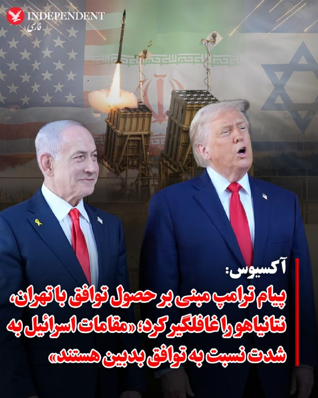

♦️گزارش جدید «آکسیوس» نشان می‌دهد که توافق قریب‌الوقوع دونالد ترامپ با ایران به یک «قرص تلخ» و بحران راهبردی برای بنیامین نتانیاهو تبدیل شده است. بر اساس این گزارش، رئیس‌جمهوری آمریکا در یک تماس تلفنی به نخست‌وزیر اسرائیل اعلام کرده که زمان پایان دادن به این جنگ فرا رسیده و طی روزهای آینده توافق با ایران را امضا خواهد کرد. این در حالی است که نتانیاهو از ابتدای جنگ با تصور سرنگونی حکومت تهران با ترامپ همراه شده بود، اما اکنون در آستانه انتخابات اسرائیل، رقبای سیاسی او را به تبدیل کردن اسرائیل به یک دولتی که صرفا دستورات ترامپ را اجرا می‌کند، متهم می‌کنند. آکسیوس به نقل از منابع آگاه نوشت که در پی تشدید تنش‌ها در روزهای گذشته، نتانیاهو قصد داشت حملات گسترده‌ای را علیه زیرساخت‌های انرژی ایران آغاز کند، اما ترامپ در آخرین لحظه مانع او شد. از آن زمان، نخست‌وزیر اسرائیل که به شدت غافلگیر شده، عملا از روند مذاکرات کنار گذاشته شده و برای کسب اطلاعات ناچار به تماس با متحدانش در واشنگتن شده است. او در تماس با ترامپ نیز لحن تندی نداشته و احتمالا پذیرفته که توانایی متوقف کردن این توافق را ندارد.
پشت صحنه این ماجرا، مقامات اسرائیلی به شدت نسبت به این توافق بدبین هستند و نگرانند که ایران پس از پایان جنگ، مذاکرات را بدون دادن امتیاز واقعی هسته‌ای فرسایشی کند و با فروش نفت، خود را بازسازی نماید. همچنین، شمول آتش‌بس در لبنان مایه نگرانی تل‌آویو است، چرا که آزادی عمل ارتش اسرائیل علیه حزب‌الله را محدود می‌کند. با این حال، مقامات کاخ سفید ضمن رد گزارش رسانه‌های ایران مبنی بر اعطای میلیاردها دلار پول فوری به تهران، به اسرائیلی‌ها اطمینان داده‌اند که هیچ امتیازی پیش از اجرای تعهدات به ایران داده نخواهد شد و حق دفاع مشروع اسرائیل در صورت حملات راکتی حزب‌الله محفوظ است. پذیرش توافقی که هیچ‌یک از اهداف اعلام‌شده نتانیاهو را محقق نکرده، یک ضربه سیاسی و استراتژیک سهمگین برای او خواهد بود.
‌🇸🇦 Indypersian

🤖 @VahidOOnLine

## WithYashar — post 14690

محسن رضایی:
ترامپ با آزادسازی 24 میلیارد دلار از دارایی‌های بلوکه‌شدۀ ایران موافقت کرده اما با صراحت این موضوع رو اعلام نمیکنه.
@withyashar 🥴

## pm_afshaa — post 93745

  <a href="telegram/content/pm_afshaa_93745_1781305943.webm" target="_blank">🎬 Download video</a>

🔴محسن رضایی:
ترامپ با آزادسازی 24 میلیارد دلار از دارایی‌های بلوکه‌شدۀ ایران موافقت کرده اما با صراحت این موضوع رو اعلام نمیکنه.

💧 Rainbet.com the #1 Non-KYC Crypto Casino & Sportsbook @rainbetcom

😁 @Pm_Afshaa

## FarsiVOA — post 220535

  <a href="telegram/content/FarsiVOA_220535_1781305944.mp4" target="_blank">🎬 Download video</a>

⚡️حال و هوای پایتخت آمریکا در روز دوم جام جهانی ۲۰۲۶ و بازی کانادا-بوسنی؛ دیانا دیرلام گزارش می‌دهد
@FarsiVOA

---
📅 بروزرسانی: 1405/03/23 02:32
---

## Dirty_Kids — post 391859

  <a href="https://t.me/Dirty_Kids/391859" target="_blank">📎 Download file</a>

ریتزوبت تنها سایت بین المللی میباشد ، که به صورت هفتگی پرومو کد دریافت میکنید ✅

♦️ آموزش شارژ حساب با کریپتو
♦️ آموزش شارژ حساب ریالی در ریتزوبت
#پیشبینی
🔵ریتزوبت برندی با لایسنس معتبر در صنعت شرطبندی و پیشبینی مسابقات ورزشی و کازینویی 👇

https://t.me/+LB508WZyIr8xNmY0

## Dirty_Kids — post 391858

🚀شاید برای شما سوال شود چرا ریتزوبت ؟!

💠محیطی امن و مطمئن برای کاربران
💠 برداشت جوایز کمتر از 10 دقیقه
💠تحت کاملترین لایسنس شرطبندی
💠فعال در دنیا با 52 زبان +(فارسی)
💠درگاه کارت به کارت و انواع ووچر
💠بونوس 100% هر یکشنبه و چهارشنبه

📮⬅️ این ها تنها بخشی از امکانات سایت بین المللی ریتزوبت میباشد ✅

پشتیبان فارسی ریتزوبت در تلگرام 👇
📲@RitzoBetsupports

➖
➖
➖
➖
➖
➖

🔰لینک ⬅️ سایت بین المللی RitzoBet👇
A22
🌐 RitzoBet.com
🆔 @RitzoBet_ir

## Dirty_Kids — post 391857

  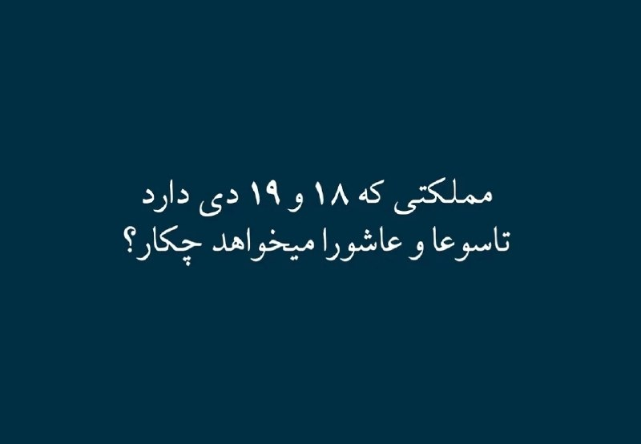

#بخوابیم

@Dirty_Kids 👻

## Dirty_Kids — post 391856

  

هم رو جنازه‌ت عروسی گرفتن هم چالت نکردن هم دارن با قاتلت توافق میکنن.
خلاصه‌ ترامپ تورو کشت، عرزشیا هم گاییدنت.

@Dirty_Kids 👻

## alonews — post 127526

  <a href="telegram/content/alonews_127526_1781305359.webm" target="_blank">🎬 Download video</a>

👈فیلد مارشال محسن‌رضایی: آمریکا با آزادسازی ۲۴ میلیارد دلار از دارایی‌هامون موافقت کرده؛ اما ترامپ نمیخواد اونو علنی کنه.

✅ @AloNews خبر جنگ

---
📅 بروزرسانی: 1405/03/23 02:22
---

## VahidOOnLine — post 245222

  

کانون نویسندگان ایران خبر داد که یوسف انصاری، نویسنده و عضو هیات دبیران این کانون، با حکم شعبه‌ ۲۱ دادگاه انقلاب اسلامی تهران به یک سال حبس (۴ ماه حبس تعزیری و ۸ ماه حبس تعلیقی) محکوم شده است.

این نهاد مدافع آزاد بیان اشاره کرد که این که حکم به اتهام «تبلیغ علیه نظام» صادر شده، ۱۲ خرداد به او ابلاغ شده است.

بر اساس این گزارش، انصاری ۱۸ دی‌ماه سال گذشته در مراسم سالگرد جان باختن بکتاش آبتین، شاعر، بازداشت شد. بازداشت این نویسنده با ضرب‌و‌جرح صورت گرفت و مأموران امنیتی ۱۹ دی‌ماه او را به زندان تهران بزرگ منتقل کردند. انصاری پنجم اسفند‌ در یک جلسه‌‌ چند دقیقه‌ای محاکمه شد.

انصاری پس از دو ماه به قید وثیقه‌ ۷۰۰ میلیون تومانی آزاد شد.
‌🏁 🇬🇧 IranintlTV

🤖 @VahidOOnLine

## IranIntlTV — post 341971

  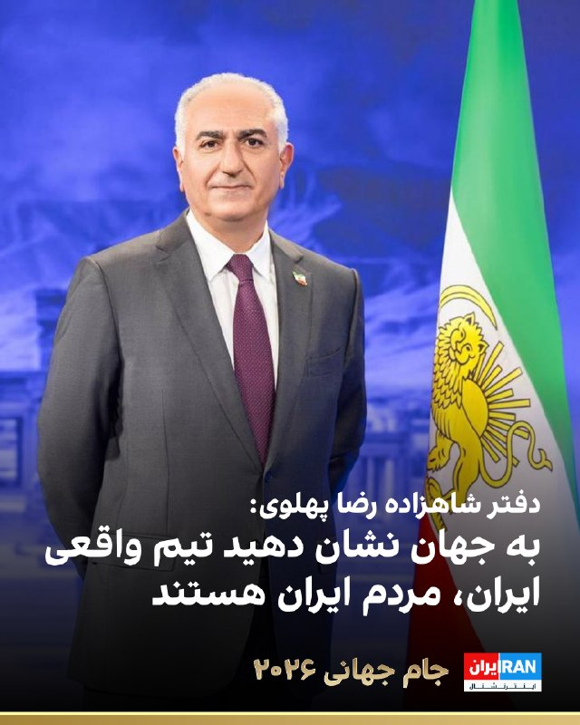

🔻دفتر رسانه‌ای شاهزاده رضا پهلوی با انتشار تصاویری از ورزشکاران و فوتبالیست‌های جاویدنام و بازداشت‌شده در اعتراضات، از مردم خواست تی‌شرت‌هایی منقش به نام و شماره نمادین آنها بپوشند: «این جام جهانی، برای ما یادآور تیم واقعی ایران است. به جهان نشان دهید که تیم واقعی ایران، مردم ایران هستند.»

🔹دفتر رسانه‌ای شاهزاده رضا پهلوی نوشت: «از شما دعوت می‌کنیم تی‌شرت‌های سفید را با نام و شماره نمادینِ فوتبالیست‌ها، ورزشکاران و جوانانی که به دست رژیم جمهوری اسلامی کشته، اعدام یا تحت آزار و سرکوب قرار گرفتند بر تن کنید.»

🔹در ادامه این اطلاعیه آمده است: «روی هر تی‌شرت، یک کیوآرکد قرار دارد که دریچه‌ای است به داستان زندگی هر یک از این قهرمانان ایران. از شما می‌خواهیم پیراهنی با نام آنان بر تن کنید. داستانشان را بازگو کنید.»

@iranintltvsport

## IranIntlTV — post 341970

  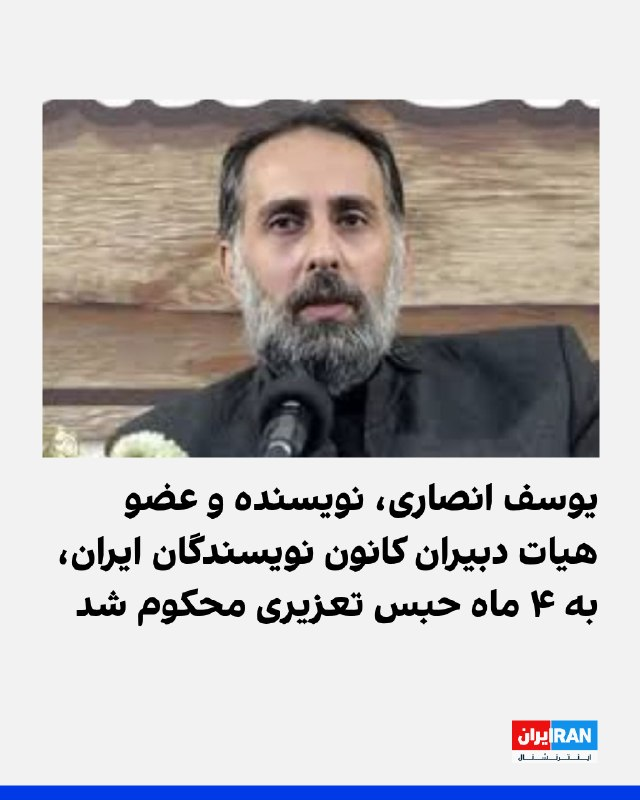

کانون نویسندگان ایران خبر داد که یوسف انصاری، نویسنده و عضو هیات دبیران این کانون، با حکم شعبه‌ ۲۱ دادگاه انقلاب اسلامی تهران به یک سال حبس (۴ ماه حبس تعزیری و ۸ ماه حبس تعلیقی) محکوم شده است.

این نهاد مدافع آزادی بیان اشاره کرد که این که حکم به اتهام «تبلیغ علیه نظام» صادر شده، ۱۲ خرداد به او ابلاغ شده است.

بر اساس این گزارش، انصاری ۱۸ دی‌ماه سال گذشته در مراسم سالگرد جان‌باختن بکتاش آبتین، شاعر، بازداشت شد. بازداشت این نویسنده با ضرب‌و‌جرح صورت گرفت و مأموران امنیتی ۱۹ دی‌ماه او را به زندان تهران بزرگ منتقل کردند. انصاری پنجم اسفند‌ در یک جلسه‌‌ چند دقیقه‌ای محاکمه شد.

انصاری پس از دو ماه به قید وثیقه‌ ۷۰۰ میلیون تومانی آزاد شد.
https://iranintl.com/202606125218

## FarsiVOA — post 220534

⚡️وزارت جنگ آمریکا روز جمعه نخستین تبلیغ ویدیویی این وزارتخانه برای جذب نیرو را منتشر کرد. در این ویدو سخنانی از رئيس جمهوری آمریکا، دونالد ترامپ آمده است که می‌گوید توان بالای نظامی می‌تواند مانع بروز جنگ نیز بشود.
@FarsiVOA

## IranianMinds — post 22439

  

🔴 امارات به‌طور قاطع گزارش‌های رسانه‌ای درباره انتقال پول یا آزادسازی دارایی‌های بلوکه‌شده ایران از طریق امارات، از جمله ادعای انتقال ۳ میلیارد دلار، رو تکذیب کرد.
وزارت خارجه امارات تأکید کرد هیچ‌گونه انتقال یا حواله مالی به ایران انجام نشده و از رسانه‌ها خواست فقط به منابع رسمی استناد کنن.

@IranianMinds

## IranianMinds — post 22438

  <a href="telegram/content/IranianMinds_22438_1781304745.webm" target="_blank">🎬 Download video</a>

📢توم میخوای از مسابقات جام جهانی فوتبال پول دربیاری؟
🥇

✅کانال ورسوس بت کارش تحلیل و پیش بینی مسابقات جام جهانی به صورت حرفه ای
🍑

⚠️توم میتونی از پیش بینی جام جهانی خیلی راحت پول دربیاری فقط کافیه با کانال ورسوس بت همراه شی
📣

🌐ادرس عضویت کانالشون e22:
👇

🔪https://t.me/+vEPd1hF2Y38yMWI0

🔪https://t.me/+vEPd1hF2Y38yMWI0

## BBCPersian — post 283600

  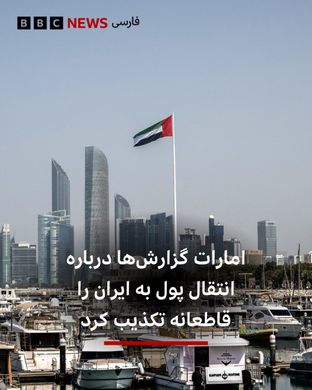

وزارت خارجه امارات متحده عربی گزارش‌های منتشرشده در برخی رسانه‌های بین‌المللی درباره انتقال یا آزادسازی منابع مالی برای ایران را قاطعانه تکذیب کرد.

این وزارتخانه در بیانیه‌ای در شبکه اجتماعی ایکس اعلام کرد که ادعاهای مطرح‌شده درباره انتقال مبالغ مالی از امارات به جمهوری اسلامی ایران، از جمله گزارش‌هایی درباره انتقال ۳ میلیارد دلار، «نادرست» است و هیچ مبنای واقعی ندارد.

پیشتر رویترز به نقل از چهار منبع آگاه گزارش داد که امارات متحده عربی با آزادسازی میلیاردها دلار برای ایران موافقت کرده و بخشی از این منابع مالی نیز در اختیار تهران قرار گرفته است.

اما وزارت خارجه امارات تاکید کرد که هیچ‌گونه دارایی یا منابع مالی ایران از طریق این کشور آزاد یا منتقل نشده است.

در این بیانیه از رسانه‌ها خواسته شده است در انتشار اخبار به منابع رسمی استناد کنند و از بازنشر اطلاعات تاییدنشده خودداری کنند.

https://bbc.in/4vPjV7h
📷Ryan Lim / AFP via Getty Images
@BBCPersian

## Dirty_Kids — post 391855

  <a href="telegram/content/Dirty_Kids_391855_1781304746.mp4" target="_blank">🎬 Download video</a>

​​هر کس که تصویر ترسناکی از اقتصاد بازار آزاد براتون ترسیم کرد، بزنید تو گوشش، حتی اگر شما ندونید چرا زدید، خودش خوب می‌دونه چرا خورده!

@Dirty_Kids 👻

## Dirty_Kids — post 391854

  <a href="telegram/content/Dirty_Kids_391854_1781304749.mp4" target="_blank">🎬 Download video</a>

واقعا جذابه

@Dirty_Kids 👻

## Dirty_Kids — post 391851

عر‌عر و ضجه زدنای عرزشیا شروع شد 😂

@Dirty_Kids 👻

## Dirty_Kids — post 391850

  

‏شما بهش میگید توافق
ما بهش میگیم تسلیم

@Dirty_Kids 👻

## Dirty_Kids — post 391849

  <a href="telegram/content/Dirty_Kids_391849_1781304750.mp4" target="_blank">🎬 Download video</a>

پس‌از چالش "کونتو تکون بده و ویو بگیر" حالا داره چالش "ممه‌هاتو نشون بده و ویو بگیر" ترند جهانی میشه!

@Dirty_Kids 👻

---
📅 بروزرسانی: 1405/03/23 02:12
---

## WithYashar — post 14689

  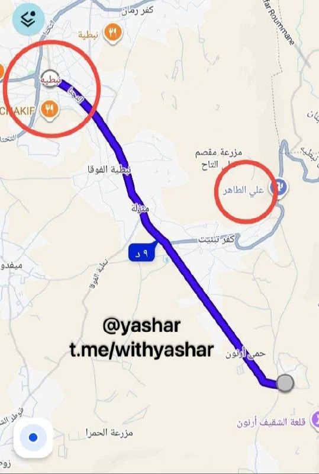

پیشروی ارتش اسرائیل در جنوب لبنان؛ ۶.۷ کیلومتر تا نبطیه
ارتش اسرائیل به شهر ارنون رسیده و هم اکنون در حال حملات توپخانه ای سنگین به تپه علی الطاهر هستند. l بالگرد های آپاچی ۶۴ اسرائیلی نیز به تپه علی الطاهر حمله کردند. با تصرف این تپه مهم رسما تصرف شهر نبطیه برای اسرائیلی ها آسان خواهد شد.
@withyashar

## FarsiVOA — post 220533

  <a href="telegram/content/FarsiVOA_220533_1781304140.mp4" target="_blank">🎬 Download video</a>

⚡️امیرعلی پیروزبخش از بازی اول کانادا در سومین حضور این تیم در رقابت‌های جام جهانی می‌گوید
@FarsiVOA

## Persian_Trend_Official — post 16899

  <a href="telegram/content/Persian_Trend_Official_16899_1781304141.webm" target="_blank">🎬 Download video</a>

فایل صوتی لایو دوم امشب در اسپاتیفای
https://open.spotify.com/episode/6k6OWJoWjKiwwhaLX1m7UF

## Persian_Trend_Official — post 16898

فایل صوتی لایو اول امشب در اسپاتیفای https://open.spotify.com/episode/4etbRLzxUWjhY2UglM8GwW

## IranianMinds — post 22437

  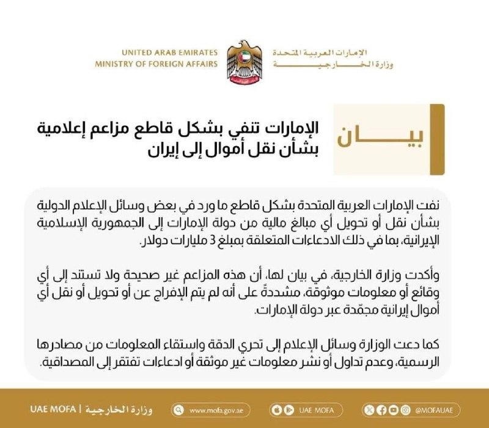

🔴امارات به صورت رسمی اعلام کرد:

ما هیچ‌یک از پول‌های بلوکه شده ایران را آزاد نکردیم، اینکه می‌گویند ۳ میلیارد دلار پول را به ایران تحویل داده‌ایم دروغ محض می‌باشد.

@IranianMinds

## BBCPersian — post 283599

  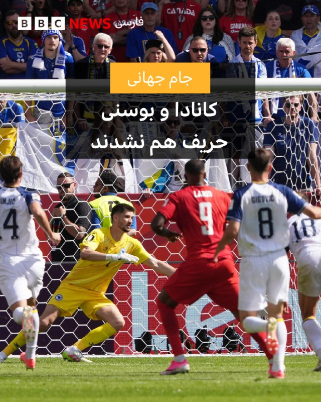

‌ ‌ ‌ ‌
در اولین بازی دومین روز جهام جهانی فوتبال مردان، دومین میزبان این دوره نتوانست از پس حریف اروپایی خود بر بیاید و کانادا و بوسنی و هرزگوین به تقسیم امتیازات رضایت دادند.

این بازی که در شهر تورنتو برگزار شد، ابتدا مراسم افتتاحیه کانادا را به همراه داشت و سپس دو تیم به مصاف هم رفتند.

با وجود حملات اولیه و کنترل بازی توسط کانادا در ابتدای کار اما این بوسنی بود که از یکی از کرنرها خود توانست استفاده کند و یوکو لوکیچ در دقیقه ۲۱ گل اول بازی را به ثمر رساند.

در ادامه کانادا سعی کرد تا با کنترل بیشتر بازی بتواند از شکست بگریزد اما نیمه اول با همین نتیجه به پایان رسید.

در نیمه دوم کانادا به تلاش‌ها خود ادامه داد تا اینکه با تعویض طلایی که مربی این تیم انجام داد در دقیقه ۷۸ کایل لارین میزبان را از شکست نجات داد.

این سومین بازی جام جهانی ۲۰۲۶ و اولین تساوی این مسابقات بود. در دو بازی قبلی مکزیک و کره‌جنوبی توانسته بودند حریفان خود را شکست دهند.

📷 IMAGN IMAGES/Reuters
@BBCPersian

---
📅 بروزرسانی: 1405/03/23 02:02
---

## VahidOOnLine — post 245221

  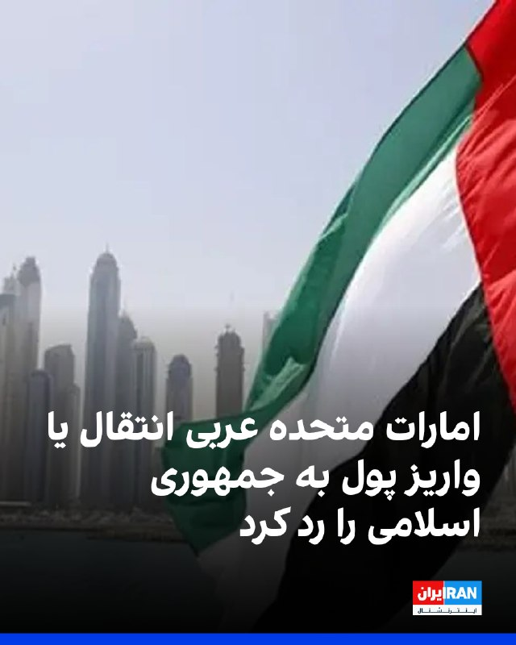

امارات متحده عربی در بیانیه‌ای قاطعانه گزارش‌های منتشرشده در برخی رسانه‌های بین‌المللی درباره انتقال یا واریز هرگونه مبلغ مالی از این کشور به جمهوری اسلامی، از جمله ادعای مربوط به انتقال مبلغ سه میلیارد دلار، را رد کرد.

وزارت خارجه امارات متحده عربی تاکید کرد این ادعاها نادرست است و بر هیچ واقعیت یا اطلاعات موثقی استوار نیست.

این وزارتخانه گفت که هیچ‌گونه دارایی مسدودشده ایران از طریق امارات متحده عربی آزاد، منتقل یا جابه‌جا نشده است.

وزارت خارجه امارات متحده عربی همچنین از رسانه‌ها خواست در انتشار اخبار دقت کنند، اطلاعات را از منابع رسمی دریافت کنند و از انتشار یا بازنشر اطلاعات تاییدنشده یا ادعاهای فاقد اعتبار خودداری کنند.
‌🏁 🇬🇧 IranintlTV

🤖 @VahidOOnLine

## VahidOOnLine — post 245220

♦️خبرگزاری فرانسه، روز جمعه، از کشف یک جسد در صندوق‌عقب خودرویی در مجاورت محل تمرینات تیم ملی فوتبال ایران در جریان مسابقات جام جهانی ۲۰۲۶ خبر داد. بر اساس این گزارش، بازرسان و کارشناسان پزشکی قانونی مکزیک در حال بررسی جسدی هستند که در یک خودروی متوقف‌شده در پارکینگ بیرونی استادیوم «کالینته» در شهر تیخوانا پیدا شده است؛ استادیومی که به عنوان اردوی تمرینی تیم ملی فوتبال ایران در این دوره از رقابت‌ها استفاده می‌شود. این حادثه تکان‌دهنده تنها یک روز پس از افتتاحیه و آغاز رسمی مسابقات جام جهانی ۲۰۲۶ رخ داده و پلیس محلی هنوز جزئیات بیشتری درباره هویت مقتول یا انگیزه احتمالی این جنایت منتشر نکرده است.
‌🇸🇦 Indypersian

🤖 @VahidOOnLine

## pm_afshaa — post 93744

  <a href="telegram/content/pm_afshaa_93744_1781303555.webm" target="_blank">🎬 Download video</a>

🔴آکسیوس: برخی در آمریکا بر این باورند که نتانیاهو ممکنه نقش مخربی داشته باشه حتی اگر توافق انجام بشه.

💧 Rainbet.com the #1 Non-KYC Crypto Casino & Sportsbook @rainbetcom

😁 @Pm_Afshaa

## pm_afshaa — post 93743

  <a href="telegram/content/pm_afshaa_93743_1781303555.webm" target="_blank">🎬 Download video</a>

🔴آکسیوس به نقل یک مقام آمریکایی:
اگر حزب‌الله به اسرائیل موشک شلیک کنه و ایران به تسلیح آن ادامه بده، نقض توافق است.

💧 Rainbet.com the #1 Non-KYC Crypto Casino & Sportsbook @rainbetcom

😁 @Pm_Afshaa

## pm_afshaa — post 93742

  <a href="telegram/content/pm_afshaa_93742_1781303556.webm" target="_blank">🎬 Download video</a>

🔴آکسیوس به نقل از یک مقام آمریکایی:
ترامپ روز پنجشنبه در تماس با نتانیاهو گفت که توافق با ایران فوق العاده است و زمان پایان دادن به جنگ فرا رسیده و انتظار داره ظرف چند روز آینده با ایران به توافق برسه.

پست روز پنجشنبه ترامپ مبنی بر اعلام توافق با ایران، نتانیاهو رو شگفت زده کرد. نتانیاهو به ترامپ گفت که برای اطمینان از رسیدگی به نگرانی‌های مشترک در مورد پرونده هسته ای ایران به او اعتماد داره.

💧 Rainbet.com the #1 Non-KYC Crypto Casino & Sportsbook @rainbetcom

😁 @Pm_Afshaa

## mamlekate — post 103691

📝 سی‌ان‌ان: جمهوری اسلامی تعهد داده که اورانیوم‌های غنی شده را نابود و از ایران خارج کند

یک مقام ارشد دولت آمریکا می‌گوید جمهوری اسلامی با نابودی و خروج مواد هسته‌ای، برچیدن برنامه هسته‌ای، بازگشایی تنگه هرمز و توقف حمایت مالی از گروه‌های نیابتی که آمریکا آن‌ها را تروریستی می‌داند موافقت کرده است.

📝 عراقچی: تفاهم ۱۴ ماده‌ای با آمریکا پس از نهایی شدن به‌صورت دیجیتال امضا خواهد شد

عباس عراقچی، وزیر امور خارجه جمهوری اسلامی، اعلام کرد که یادداشت تفاهم ۱۴ ماده‌ای با آمریکا هنوز نهایی و امضا نشده است. او همچنین گفت در صورت نهایی شدن توافق، امضای آن به‌صورت دیجیتال انجام خواهد شد و موضوعات هسته ای و رفع تحریم ها به مرحله دوم مذاکرات منتقل شده اند.

📝 عضو کمیسیون امنیت ملی مجلس: متن جدید توافق با آمریکا نسبت به دو نسخه قبلی خسارت‌بارتر است

محمود نبویان، عضو کمیسیون امنیت ملی مجلس، در ایکس نوشت متن توافق با آمریکا نسبت به دو نسخه قبلی خسارت‌بارتر شده و میزان عقب‌نشینی‌های ما نیز بیشتر شده است.

@mamlekate

## IranIntlTV — post 341969

  

امارات متحده عربی در بیانیه‌ای قاطعانه گزارش‌های منتشرشده در برخی رسانه‌های بین‌المللی درباره انتقال یا واریز هرگونه مبلغ مالی از این کشور به جمهوری اسلامی، از جمله ادعای مربوط به انتقال مبلغ سه میلیارد دلار، را رد کرد.

وزارت خارجه امارات متحده عربی تاکید کرد این ادعاها نادرست است و بر هیچ واقعیت یا اطلاعات موثقی استوار نیست.

این وزارتخانه گفت که هیچ‌گونه دارایی مسدودشده ایران از طریق امارات متحده عربی آزاد، منتقل یا جابه‌جا نشده است.

وزارت خارجه امارات متحده عربی همچنین از رسانه‌ها خواست در انتشار اخبار دقت کنند، اطلاعات را از منابع رسمی دریافت کنند و از انتشار یا بازنشر اطلاعات تاییدنشده یا ادعاهای فاقد اعتبار خودداری کنند.
https://iranintl.com/202606120991

## IranIntlTV — post 341968

  <a href="telegram/content/IranIntlTV_341968_1781303557.mp4" target="_blank">🎬 Download video</a>

در دومین بازی افتتاحیه جام جهانی ۲۰۲۶، کانادا در تورنتو برابر بوسنی و هرزگوین به تساوی رسید. تا ساعاتی دیگر نیز نخستین مسابقه تیم ملی فوتبال آمریکا، دیگر میزبان جام جهانی، برابر پاراگوئه آغاز خواهد شد.

گزارش نیلوفر منصوری، خبرنگار ایران‌اینترنشنال
@iranintltv

## IranIntlTV — post 341967

  <a href="telegram/content/IranIntlTV_341967_1781303558.mp4" target="_blank">🎬 Download video</a>

اشکان نظام‌آبادی، روزنامه‌نگار اقتصادی، درباره گرانی افسارگسیخته اجاره‌بهای مسکن در ایران گفت: «افزایش شدید قیمت مسکن باعث شده بسیاری از افرادی که پیش‌تر توان خرید خانه داشتند، اکنون از بازار خرید خارج شوند و تنها گزینه پیش روی آنها اجاره باشد.»

او افزود: «ریشه این وضعیت را باید در سیاست‌های کلان اقتصادی دولت و تورم عمومی جست‌وجو کرد.»
@iranintltv

---
📅 بروزرسانی: 1405/03/23 01:52
---

## VahidOOnLine — post 245219

  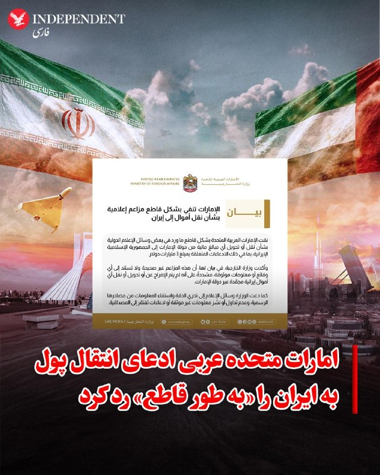

♦️وزارت امور خارجه امارات متحده عربی، روز جمعه با انتشار بیانیه‌ای رسمی، گزارش‌های برخی از رسانه‌های بین‌المللی مبنی بر انتقال یا تسهیل انتقال مبالغ مالی از این کشور به ایران را به طور قاطع تکذیب کرد.
ابوظبی در این بیانیه صریح تاکید کرد که ادعاهای مطرح‌شده در خصوص انتقال مبالغی از جمله گمانه‌زنی‌ها درباره رقم ۳ میلیارد دلار، «کاملا کذب، بی‌اساس و فاقد هرگونه مستندات واقعی» است. وزارت امور خارجه امارات با صراحت اعلام کرد که هیچ‌گونه دارایی مسدودشده متعلق به ایران از طریق خاک یا سیستم مالی امارات آزاد، منتقل یا تسهیل نشده است. مقامات اماراتی در پایان این بیانیه از تمامی رسانه‌ها و خبرگزاری‌ها خواستند تا در نقل اخبار دقت لازم را به خرج داده، تنها به منابع رسمی استناد کنند و از بازنشر یا گردش اطلاعات تاییدنشده و ادعاهای بی‌اساسی که فاقد اعتبار و مصداق هستند، خودداری نمایند.
‌🇸🇦 Indypersian

🤖 @VahidOOnLine

## WithYashar — post 14688

Bombardier E-11A در منطقه توضیح در ویس @withyashar

## IranIntlTV — post 341966

  <a href="telegram/content/IranIntlTV_341966_1781302974.mp4" target="_blank">🎬 Download video</a>

وزیر خارجه جمهوری اسلامی گفت بر اساس یادداشت تفاهم، دارایی‌های مسدودشده ایران آزاد خواهد شد و هیچ‌یک از این دارایی‌ها نباید دوباره بلوکه شود. عراقچی همچنین گفت برای جبران خسارت‌های ایران، طرحی برای بازسازی در نظر گرفته شده است.

گزارش امیر گیتی، عضو تحریریه ایران‌اینترنشنال
@iranintltv

## FarsiVOA — post 220532

  <a href="telegram/content/FarsiVOA_220532_1781302976.mp4" target="_blank">🎬 Download video</a>

⚡️همن سیدی در برنامه تفسیر خبر: ترامپ هم دست جمهوری اسلامی را می‌خواند و هم با همان دست بازی میک‌ند
@FarsiVOA

## Persian_Trend_Official — post 16897

فایل صوتی لایو اول امشب در اسپاتیفای

https://open.spotify.com/episode/4etbRLzxUWjhY2UglM8GwW

## alonews — post 127525

  <a href="telegram/content/alonews_127525_1781302978.mp4" target="_blank">🎬 Download video</a>

توهین‌ناموسی محمدحسین میثاقی نسبت به منتقدان تیم قلعه‌نویی
@AloSport

---
📅 بروزرسانی: 1405/03/23 01:42
---

## VahidOOnLine — post 245218

  

خبرگزاری فارس، نزدیک به سپاه پاسداران، شامگاه جمعه ۲۲ خرداد از «شلیک هشدار به کشتی‌های متخلف» در تنگه هرمز خبر داد.

این خبرگزاری حکومتی نوشت: «دقایقی پیش، مردم در قشم، جاسک و سیریک در استان هرمزگان شنیدن صدایی شبیه انفجار گزارش کردند» و افزود: «گزارشی از اصابت در این نقاط مخابره نشده است.»

فارس به نقل از «منابع آگاه» نوشت: «صداهای شنیده شده مربوط به انجام شلیک هشدار به کشتی‌های متخلف در محدوده تنگه هرمز است.»
‌🏁 🇬🇧 IranintlTV

🤖 @VahidOOnLine

## VahidOOnLine — post 245217

  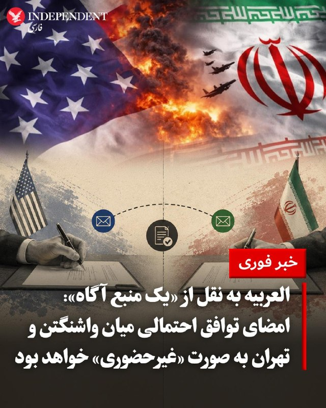

♦️العربیه، روز جمعه، ۲۲ خردادماه، به نقل از یک منبع آگاه گزارش داد که امضای توافق احتمالی میان تهران و واشنگتن در ژنو انجام نخواهد شد. براساس این گزارش، «امضای تفاهم‌نامه به صورت غیرحضوری صورت خواهد گرفت».
‌🇸🇦 Indypersian

🤖 @VahidOOnLine

## WithYashar — post 14686

  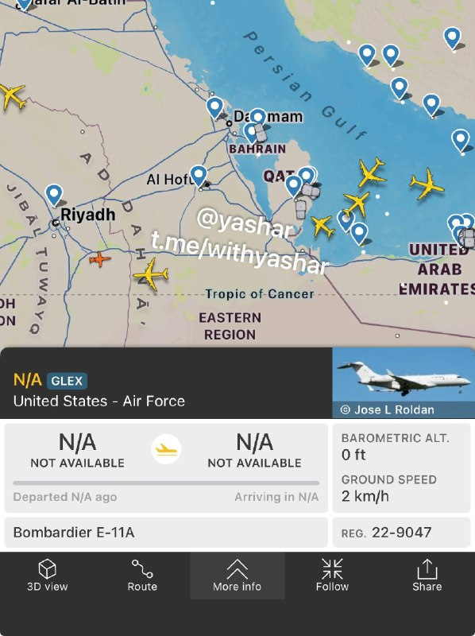

Bombardier E-11A در منطقه توضیح در ویس
@withyashar

## FoxNewsTwitter — post 342915

  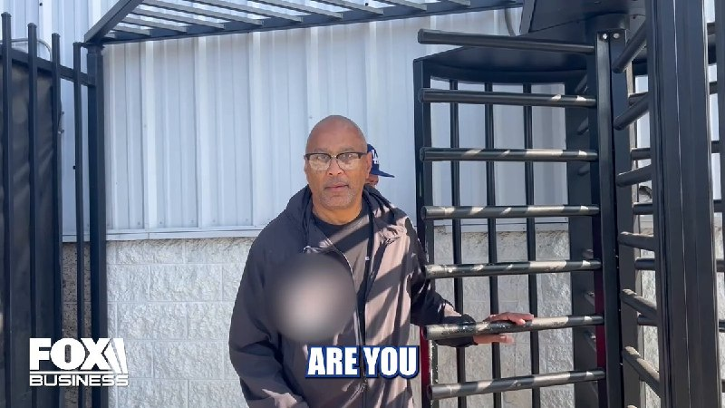

Fox News (Twitter/X)

Elon Musk isn't the only one getting richer from SpaceX going public.

The stock’s surge is estimated to have turned about 4,400 current and former employees into millionaires through equity compensation accumulated during their time at the company.

SpaceX’s long-awaited IPO raised a record $75 billion, valuing the company at roughly $1.8 trillion.

The offering also pushed Musk’s estimated net worth past the $1 trillion mark, further cementing his position as the world’s richest person.

Now Wall Street is watching to see whether the stock's early trading can drive SpaceX’s valuation even higher, rewarding employees and investors who backed the company during its rise.

## IranIntlTV — post 341965

  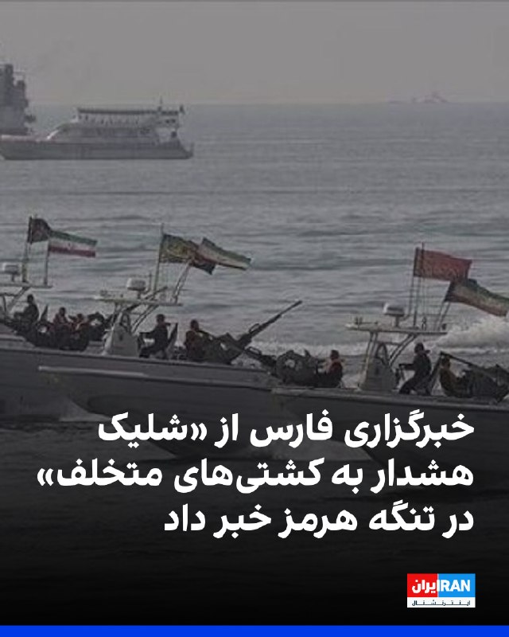

خبرگزاری فارس، نزدیک به سپاه پاسداران، شامگاه جمعه ۲۲ خرداد از «شلیک هشدار به کشتی‌های متخلف» در تنگه هرمز خبر داد.

این خبرگزاری حکومتی نوشت: «دقایقی پیش، مردم در قشم، جاسک و سیریک در استان هرمزگان شنیدن صدایی شبیه انفجار گزارش کردند» و افزود: «گزارشی از اصابت در این نقاط مخابره نشده است.»

فارس به نقل از «منابع آگاه» نوشت: «صداهای شنیده شده مربوط به انجام شلیک هشدار به کشتی‌های متخلف در محدوده تنگه هرمز است.»
https://iranintl.com/202606121250

## FarsiVOA — post 220531

⚡️سازمان عفو بین‌الملل از مقام‌های جمهوری اسلامی خواست فورا اجرای احکام اعدام پنج زندانی سیاسی در زندان شیبان اهواز را متوقف کنند.
@FarsiVOA

## alonews — post 127524

  <a href="telegram/content/alonews_127524_1781302351.webm" target="_blank">🎬 Download video</a>

👈آکسیوس: به نظر میرسد نتانیاهو در جریان تماس تلفنی با ترامپ متوجه شده که نمیتواند مانع از انعقاد توافق با ایران شود‌‌

✅ @AloNews خبر جنگ

---
📅 بروزرسانی: 1405/03/23 01:32
---

## VahidOOnLine — post 245216

  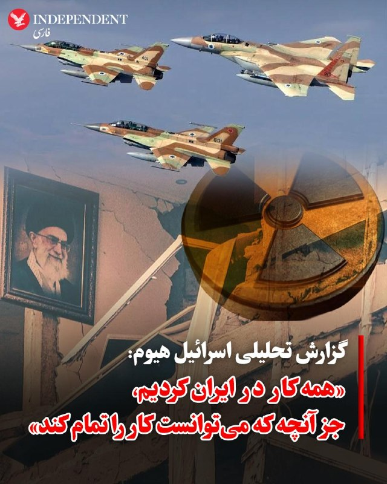

♦️روزنامه «اسرائیل هیوم» در تحلیلی که روز جمعه منتشر کرد، به بررسی پشت‌پرده مناقشات اخیر میان اسرائیل و ایران پرداخته و از یک «فرصت‌سوزی بزرگ» در جریان عملیات نظامی گزارش داد. بر اساس گزارش این رسانه، در جریان تنش‌های خردادماه که خطر نابودی آینده سیاسی بنیامین نتانیاهو را به همراه داشت، دونالد ترامپ با تماس‌ها و پیام‌های متوالی خواستار پاسخ ندادن اسرائیل به حملات موشکی ایران شده بود؛ اما نتانیاهو با نادیده گرفتن این فشارها، دستور پرواز جنگنده‌ها به سمت شرق را صادر کرد. با این حال، مقامات ارشد دفاعی اسرائیل فاش کرده‌اند که بزرگ‌ترین اشتباه راهبردی، تمرکز بر حملات تخریبی گسترده اما بی‌سرانجام به جای اجرای طرح مخفی «تصاحب و مصادره ذخایر اورانیوم غنی‌شده ایران» بود؛ عملیاتی که کاملا در دسترس بود اما به دلیل تردید در تایید آن، ملغی شد و جنگ صرفا با ترور چند متخصص هسته‌ای بدون دستاورد ساختاری و پایدار به پایان رسید تا شانس نابودی واقعی برنامه هسته‌ای تهران از بین برود.
‌🇸🇦 Indypersian

🤖 @VahidOOnLine

## WithYashar — post 14685

## VahidOnline — post 76287

  

خبرگزاری فارس:
امارات آزادسازی دارایی‌های ایران را تکذیب کرد

وزارت خارجۀ امارات در بیانیه‌ای گزارش‌های رسانه‌ای در خصوص موافقت با آزادسازی میلیاردها دلار از دارایی‌های ایران را تکذیب کرد.

در این بیانیه تصریح شده هیچ یک از دارایی‌های ایران منتقل، آزادسازی یا جابه‌جا نشده‌اند.
درباره این خبر

📡 @VahidOnline

## FarsiVOA — post 220530

  <a href="telegram/content/FarsiVOA_220530_1781301753.mp4" target="_blank">🎬 Download video</a>

⚡️ارزیابی وضعیت تیم فوتبال ایران از زبان کوشا دلشاد، مربی فوتبال از برزیل
@FarsiVOA

## FarsiVOA — post 220529

  <a href="telegram/content/FarsiVOA_220529_1781301753.mp4" target="_blank">🎬 Download video</a>

⚡️علم صالح در برنامه تفسیر خبر: بسیاری از نقدهای اپوزسیون به جمهوری اسلامی وارد است
@FarsiVOA

---
📅 بروزرسانی: 1405/03/23 01:22
---

## WithYashar — post 14684

  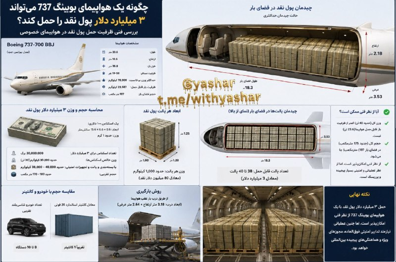

امارات ادعای رویترز بابت آزادسازی دارایی های ایرانو تکذیب کرد
@withyashar

## WithYashar — post 14683

  <a href="https://t.me/withyashar/14683" target="_blank">📎 Download file</a>

🌐 instagram.com/yashar

🌐 t.me/withyashar

## WithYashar — post 14682

## mwarmonitor — post 10801

  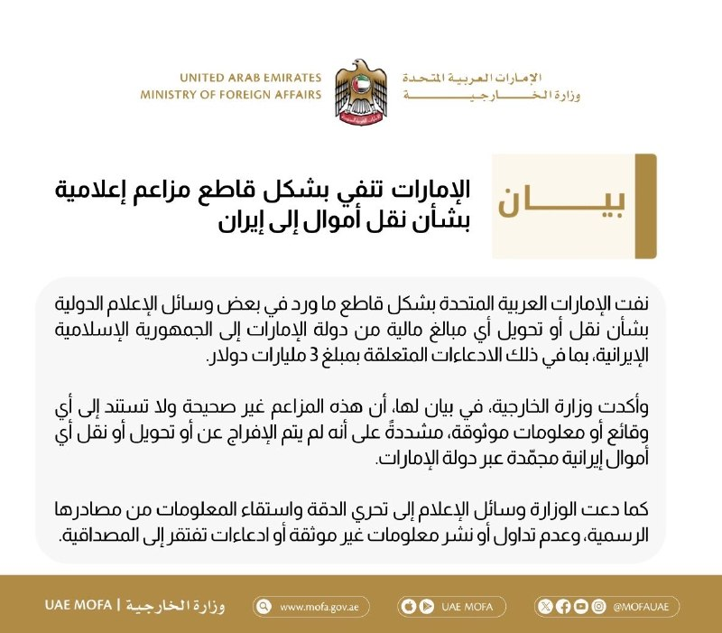

🔴بیانیه | امارات به‌طور قاطع ادعاهای رسانه‌ای درباره انتقال پول به ایران را تکذیب می‌کند
امارات متحده عربی گزارش‌های منتشرشده در برخی رسانه‌های بین‌المللی مبنی بر انتقال یا حواله هرگونه مبالغ مالی از دولت امارات به جمهوری اسلامی ایران، از جمله ادعاهای مربوط به مبلغ ۳ میلیارد دلار را به‌طور قاطع تکذیب کرد.
وزارت امور خارجه در بیانیه‌ای تأکید کرد که این ادعاها صحت ندارند و بر هیچ‌گونه واقعیت یا اطلاعات موثقی استوار نیستند. این وزارتخانه همچنین شديداً تأکید کرد که هیچ‌گونه آزادسازی، حواله یا انتقال اموال بلوکه‌شده ایران از طریق دولت امارات صورت نگرفته است.
این وزارتخانه همچنین از رسانه‌ها خواست تا دقت لازم را به خرج داده، اطلاعات خود را از منابع رسمی دریافت کنند و از بازنشر یا تداول اطلاعات غیرموثق یا ادعاهای فاقد اعتبار خودداری نمایند.

@mwarmonitor

## pm_afshaa — post 93741

  <a href="telegram/content/pm_afshaa_93741_1781301149.webm" target="_blank">🎬 Download video</a>

🔴امارات گزارش‌های رسانه‌‌ها درباره انتقال پول یا آزادسازی دارایی‌های بلوکه‌شده ایران از طریق امارات، از جمله ادعای انتقال 3 میلیارد دلار رو تکذیب کرد.

وزارت خارجه امارات تأکید کرد هیچ‌گونه انتقال یا حواله مالی به ایران انجام نشده و از رسانه‌ها خواست فقط به منابع رسمی استناد کنن.

💧 Rainbet.com the #1 Non-KYC Crypto Casino & Sportsbook @rainbetcom

😁 @Pm_Afshaa

## Persian_Trend_Official — post 16896

https://youtube.com/live/vRHW0Hi3AeQ?feature=share

## BBCPersian — post 283598

  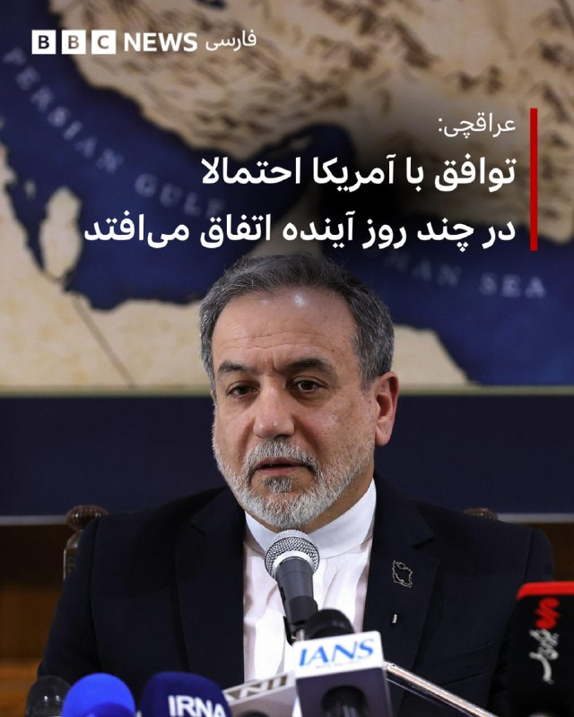

‌ ‌ ‌ ‌
عباس عراقچی، وزیر خارجه ایران در برنامه شامگاهی تلویزیون آن کشور گفت که «بیشتر از همیشه به تفاهم نزدیکیم. یعنی ممکن است در یکی دو روز آینده اتفاق بیفتد، ممکن است در عرض چند روز آینده اتفاق بیفتد.»

او بار دیگر از رسانه‌های کشورش خواست تا از گمانه‌زنی‌هایی که می‌تواند «فضا را به مشوش کند که این فرصت را خدشه دار کند خودداری کنند.»

آقای عراقچی می‌گوید که این یادداشت تفاهم، هرچند از لحاظ حجم دو صفحه یا یک صفحه و نیم است، بیش از دو ماه مورد مذاکره قرار گرفته و تمامی بندها و جملات آن بارها مورد بازبینی قرار گرفته‌اند.

او گفت: «گزارش‌ها به موقع به شورای عالی امنیت ملی و نهادهای امنیتی ارائه شده و نیروهای نظامی نیز بر مباحث مهم، از جمله تنگه هرمز و خاتمه جنگ، نظارت داشته‌اند.»

وزیر امور خارجه ایران می‌گوید: «نتیجه این کار، نتیجه خوبی برای منافع مردم ایران است که پیروزی‌های میدانی کشور را تثبیت می‌کند. این پیروزی‌ها همچنین حضور و اقتدار جمهوری اسلامی ایران را در عرصه داخلی و بین‌المللی تحکیم می‌کند.»

https://bbc.in/3QGilFE
📷EPA/Shutterstock
@BBCPersian

## alonews — post 127523

  <a href="telegram/content/alonews_127523_1781301150.mp4" target="_blank">🎬 Download video</a>

شیوه جدید لب گرفتن و بوسیدن همدیگه توی فیلمای ایرانی:

[@AloTweet]

## alonews — post 127522

  <a href="telegram/content/alonews_127522_1781301151.webm" target="_blank">🎬 Download video</a>

👈امارات گزارش‌های مبنی بر انتقال میلیاردها دلار به ایران از جمله پرداخت ۳ میلیارد دلاری ادعایی را رد کرده و اعلام کرده است که هیچ دارایی مسدود شده ایران آزاد، انتقال یا پردازش نشده است و این اتهامات را نادرست و غیرقابل اثبات می‌داند.

✅ @AloNews خبر جنگ

---
📅 بروزرسانی: 1405/03/23 01:12
---

## WithYashar — post 14681

## mwarmonitor — post 10800

🚨 یک منبع آگاه به شبکه العربیه گفته است که امضای تفاهم‌نامه (MoU) بین آمریکا و ایران در ژنو انجام نخواهد شد و به‌جای آن، به صورت غیرحضوری (از راه دور) انجام می‌شود.

@mwarmonitor

## VahidOnline — post 76285

مالک شریعتی نیاسر، دیگر عضو مجلس شورای اسلامی نوشته:
خب وقتی در باز بشه و ببینن که می‌فهمن مویوم...
malekshariati
این طور برداشت شده که داره میگه قالیباف پشت همه تصمیماتی است که به اسم مجتبی اعلام میشه.
📡 @VahidOnline

## FarsiVOA — post 220528

🔺گزارش | اعدام مهدی قاسمی در زیر سایه جنگ؛ یکی از نخستین اعدام‌شدگان اعتراضات دی در قم

◾️مهدی قاسمی، از معترضان بازداشت‌شده دی، بامداد پنج‌شنبه ۲۸ اسفند ۱۴۰۴ در قم اعدام شد. او به همراه دو تن دیگر از معترضان شهر قم، به نام‌های صالح محمدی و سعید داوودی، اعدام شدند. این سه معترض جوان نخستین افرادی بودند که در ارتباط با اعتراضات دی‌ ۱۴۰۴ حکم اعدام‌شان اجرا شد؛ آن‌هم تنها دو روز پیش از نوروز و در شرایطی که ایران در وضعیت جنگی و خاموشی دیجیتال قرار داشت.

⬇️ بیشتر بخوانید:
https://ir.voanews.com/a/mahdi-report-ghasemi-among-first-dey-protest-executions-executed-in-qom-under-shadow-of-war/8159796.html
@FarsiVOA

## BBCPersian — post 283597

🔻 شنیده شدن صدای انفجار در محدوده سیریک و از «سمت دریا»

رسانه‌های ایران گزارش دادند که دقایقی پیش ساکنان بندر سیریک صدای انفجاری را شنیده‌اند.

به‌گزارش خبرگزاری ایسنا تا این لحظه هیچ مقام رسمی یا نهادهای نظامی و انتظامی منطقه ماهیت این صداها را تایید یا تکذیب نکرده است.

در همین حال برخی گزارش‌های داخلی حاکیست که صدای این انفجار ناشی از «شلیک هشدار به کشتی متخلف در تنگه هرمز است.»

صداوسیمای جمهوری اسلامی هم گزارش داد که «صدا مربوط به مقابله نیرو دریایی ایران با شناورهای متخلف در تنگه هرمز است و ربطی به حملات آمریکا ندارد.»

https://bbc.in/4e8gse2
@BBCPersian

## BBCPersian — post 283596

  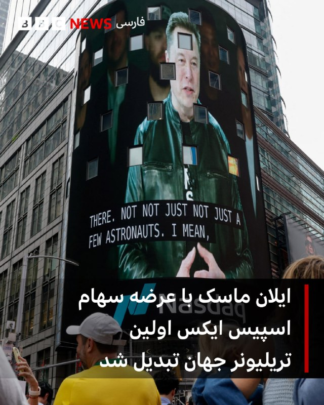

‌ ‌ ‌ ‌
امروز و با شروع به کار بازار بورس نزدک در ایالات متحده، سهام شرکت اسپیس ایکس متعلق به ایلان ماسک برای اولین بار، برای خرید عمومی در دسترس قرار گرفت و او تبدیل به اولین تریلیونر جهان شد.

سهام اسپیس ایکس درست قبل از ظهر به وقت محلی ایالات متحده وارد بازار بورس شد و بلافاصله به قیمت حدود ۱۵۰ دلار برای هر سهم رسید.

پس از آن هم قیمت سهام به سرعت به ۱۶۰ دلار افزایش یافت و پس از آن نشانه‌هایی از افزایش قیمت دیده شد.

با قیمت ۱۶۰ دلار، سهام این شرکت با ۱۸ درصد افزایش نسبت به قیمت تخمینی ۱۳۵ دلار به‌فروش رسید که روز پنجشنبه به اشتراک گذاشته شد.

لحظاتی پیش از شروع معاملات اسپیس ایکس در نیویورک، ایلان ماسک، بنیانگذار و مدیرعامل این شرکت، از دفتر شرکتش در تگزاس سخنان افتتاحیه را ایراد کرد.

آقای ماسک گفت: «قطعاً باور کردن اینکه یک شرکت کوچک که در انباری در ال سگوندو شروع به کار کرده، اکنون با بزرگترین عرضه اولیه سهام تا به امروز رسیده، دشوار است.»

او افزود: «من به اسپیس ایکس کمتر از ۱۰ درصد شانس موفقیت می‌دادم.»

https://bbc.in/4fJlGy4
📷Reuters
@BBCPersian

## alonews — post 127521

  <a href="telegram/content/alonews_127521_1781300543.webm" target="_blank">🎬 Download video</a>

👈استانداری هرمزگان: صدای انفجاری که دقایقی پیش تو بندر سیریک شنیده شد، بخاطر شلیک هشدار به کشتی‌های متخلف تو تنگه هرمز بود.

✅ @AloNews خبر جنگ

---
📅 بروزرسانی: 1405/03/23 01:02
---

## VahidOOnLine — post 245215

  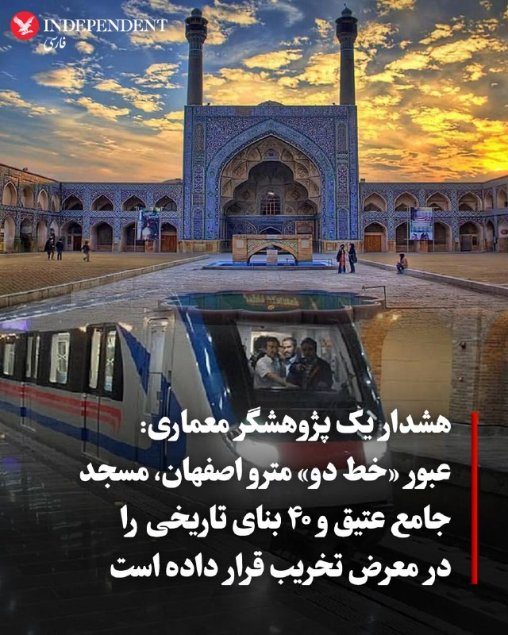

♦️غلامحسین معماریان، معمار و پژوهشگر، با استناد به آخرین مطالعات علمی و تخصصی هشدار داد که اجرای «خط دو» متروی اصفهان در مسیر فعلی، بیش از ۷۰ بنای ارزشمند باستانی را تحت تاثیر قرار داده و می‌تواند مسجد جامع عتیق و ۴۰ بنای تاریخی دیگر این شهر را در معرض خطر تخریب کامل قرار دهد. معماریان در نشستی که بعدازظهر پنجشنبه ۲۱ خرداد در پایگاه جهانی کاخ‌موزه چهلستون برگزار شد، تصریح کرد ارتعاشات مداوم ناشی از عبور مترو از مجاورت بافت تاریخی اصفهان، به ترک‌خوردگی، آسیب‌های شدید سازه‌ای و نابودی تدریجی این آثار منجر خواهد شد. او با نام بردن از شاهکارهای معماری در معرض خطر همچون منار علی، هارونیه، مقبره باباقاسم، عمارت هشت‌بهشت، کاخ چهلستون و مسجد رحیم‌خان، خواستار توقف فوری این روند و بررسی مجدد نتایج مطالعات توسط مسئولان شد تا از وقوع یک «خسارت جبران‌ناپذیر» جلوگیری شود.
این استاد دانشگاه با تاکید بر اینکه تخریب یا آسیب به آثار ثبت جهانی ابعادی فراتر از یک مسئله محلی دارد، یادآور شد که سرنوشت بخشی از مهم‌ترین میراث تاریخی کشور و جهان به تصمیم‌گیری‌های امروز وابسته است
‌🇸🇦 Indypersian

🤖 @VahidOOnLine

## mwarmonitor — post 10799

🔴شنیده شدن صدای انفجار در قشم و سریک و گزارش‌هایی از درگیری‌ها در نزدیکی تنگه هرمز.

## Persian_Trend_Official — post 16895

تا دقایقی دیگه لایو دوم

## Persian_Trend_Official — post 16894

  <a href="telegram/content/Persian_Trend_Official_16894_1781299953.mp4" target="_blank">🎬 Download video</a>

حسرت 💔

📝 Nick

📌 @persian_trend_official
پرشین ترند | متفاوت‌ترین کانال نظامی

## IranianMinds — post 22436

  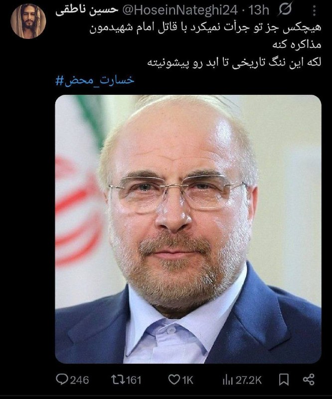

حمله به قالیباف.

@IranianMinds

## Dirty_Kids — post 391848

یحیی سینوار یکسال توی تونلای غزه زندگی میکرد و دقیقا روزی که اومد بیرون، اسرائیل مثل سگ کشتش

این برای همه اونایی که الان زیر تونل قایم شدن هم صدق میکنه

اسرائیل یا راهی خواهد یافت و یا قطعا راهی خواهد ساخت که ازون زیر بیارتتون بیرون :)

@Dirty_Kids 👻

## Dirty_Kids — post 391847

  <a href="telegram/content/Dirty_Kids_391847_1781299955.mp4" target="_blank">🎬 Download video</a>

من و رفیقام وقتی ۵ لیتر عرق تو ماشین جاساز کردیم:

@Dirty_Kids 👻

## Dirty_Kids — post 391846

  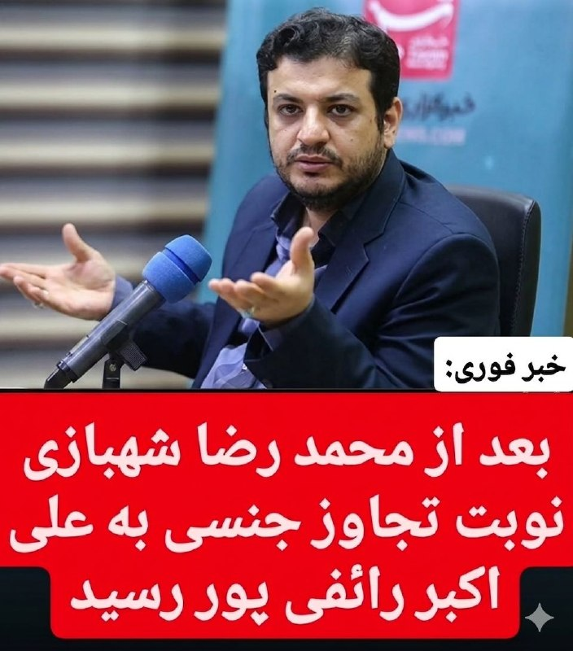

طبق آخرین اخبار، بعد از محمدرضا شهبازی، به استاد رائفی پور هم تجاوز گروهی کردن :))

الان میاد تحلیل می‌کنه که کون من نذاشتن، من کیر دشمنو به اسارت گرفتم.

@Dirty_Kids 👻

## Dirty_Kids — post 391845

ساعت ۰۰:۳۰ بامداد شنبه؛ یک ملوان ایرانی به من اطلاع داد در بیسیم صدای یک ملوان دیگر را با لهجه هندی شنیده است که می‌گوید کشتی آن‌ها در تنگه‌ی هرمز هدف اصابت یک پرتابه از سمت سپاه پاسداران قرار گرفته است.

در ادامه ملوان خارجی اعلام می‌کند هیچکس در کشتی مجروح نشده است اما سمت چپ کشتی آسیب دیده است.

@Dirty_Kids 👻

---
📅 بروزرسانی: 1405/03/23 00:52
---

## VahidOOnLine — post 245214

  

خبرگزاری مهر وابسته به سازمان تبلیغات اسلامی نوشت ساکنان بخش‌هایی از حوالی جزیره قشم و مناطق ساحلی شهرستان سیریک صدای انفجاری را شنیده‌اند.
خبرگزاری صدا و سیمای جمهوری اسلامی نیز نوشت شنیده شدن این صدا احتمالا مربوط به مقابله نیروهای جمهوری اسلامی با شناورها در تنگه هرمز است.
یک منبع آگاه در استانداری هرمزگان نیز اعلام کرد: صدای انفجار در حوالی بندر سیریک ناشی از شلیک هشدار به تنگه هرمز است.
‌🏁 🇬🇧 IranintlTV

🤖 @VahidOOnLine

## VahidOOnLine — post 245213

  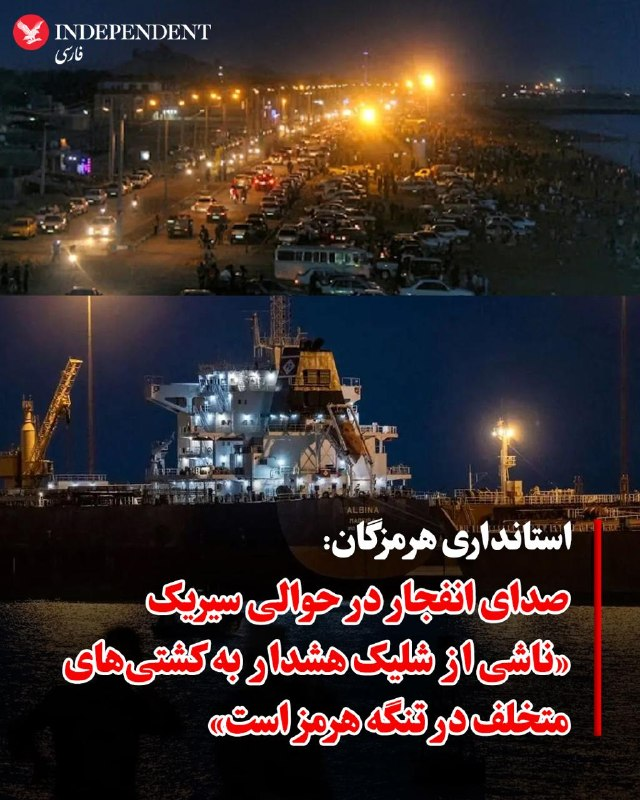

♦️فارس، خبرگزاری وابسته به سپاه، بامداد شنبه، پس از گزارش‌ها از شنیده شدن صدای انفجار در قشم، مناطقی از سیریک و جاسک به نقل از استانداری هرمزگان گزارش داد: «صداهای شنیده شده مربوط به انجام شلیک هشدار به کشتی‌های متخلف در محدوده تنگه هرمز است».
‌🇸🇦 Indypersian

🤖 @VahidOOnLine

## VahidOOnLine — post 245212

  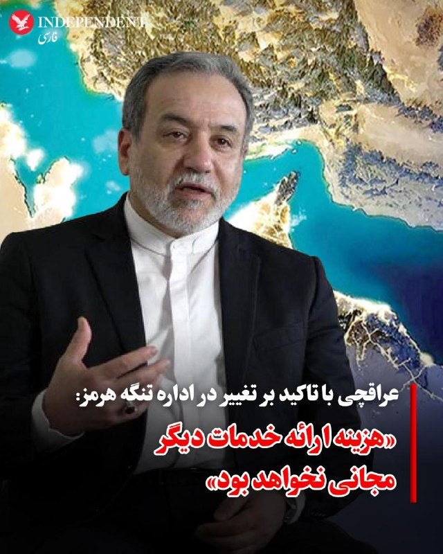

♦️عباس عراقچی، وزیر امور خارجه جمهوری اسلامی ایران، در برنامه «گفتگوی ویژه خبری» صداوسیما با تاکید بر تغییر قطعی در نحوه مدیریت تنگه هرمز اعلام کرد که «اولین بند توافق پیش‌رو، رفع کامل محاصره دریایی آمریکا» است. عراقچی با اشاره به اینکه محدوده تنگه هرمز در آب‌های سرزمینی ایران و عمان قرار دارد، گفت: «حاکمیت جمهوری اسلامی ایران همواره برقرار بوده و در آینده نیز حفظ خواهد شد، اما مدیریت عبور و مرور و ارائه خدمات دیگر مانند گذشته نخواهد بود؛ تا کنون این خدمات رایگان بوده، اما تصمیم قطعی جمهوری اسلامی بر این است که آینده اداره تنگه هرمز با گذشته متفاوت باشد و هزینه خدمات دیگر مجانی نخواهد بود.» او با اشاره به هماهنگی با مسقط و رایزنی با پکن به دلیل اینکه ۴۰ درصد تردد کشتی‌ها متعلق به چین است، افزود: «مشورت‌های نزدیکی با عمان انجام شده و به زودی برنامه و بیانیه‌های مشترکی اعلام خواهد شد.» عراقچی در پایان گفت: «حضور نیروهای مسلح ایران در تنگه هرمز همیشه حفظ خواهد شد و تضمین‌کننده امنیت منطقه است؛ شمشیر ما همیشه بالای سر تنگه هرمز قرار خواهد داشت، این مسلم است و با گذشته فرق خواهد کرد.»
‌🇸🇦 Indypersian

🤖 @VahidOOnLine

## DEJradio — post 5628

⭕️ دو دانشجو به‌دلیل آتش زدن پرچم جمهوری اسلامی اخراج شدند

خبرگزاری حکومتی فارس گزارش داد شورای انضباطی دانشگاه تهران، دو دانشجو را به‌دلیل آتش زدن پرچم جمهوری اسلامی در جریان اعتراضات دانشجویی سال گذشته، از دانشگاه اخراج کرد.
بنا بر این گزارش، این دو دانشجو به اتهام «ایجاد آشوب و اخلال در روند آموزشی» توسط کمیتۀ انضباطی دانشگاه به اخراج محکوم شدند.
در همین راستا وزیر علوم دولت پزشکیان روز پنج‌شنبه اعلام کرده بود با دانشجویانی که پرچم شیر و خورشید را در دانشگاه برافراشتند و نماد جمهوری اسلامی را به آتش کشیدند، برخورد قضایی و انضباطی صورت می‌گیرد.
در اعتراضات دانشجویی سال گذشته در چندین دانشگاه پرچم شیر و خورشید برافراشته و شعارهایی در پشتیبانی از شاهزاده رضا پهلوی سرداده شد.
همچنین پرچم رسمی جمهوری اسلامی در چند دانشگاه به آتش کشیده شده بود.

#دانشجویان #اعتراضات #پرچم
@DEJradio

## IranIntlTV — post 341964

  <a href="telegram/content/IranIntlTV_341964_1781299354.mp4" target="_blank">🎬 Download video</a>

اتحادیه اروپا یکی از بزرگ‌ترین اصلاحات نظام پناهندگی خود را اجرایی کرد؛ اصلاحاتی که می‌تواند مسیر مهاجرت به اروپا را برای هزاران متقاضی دشوارتر کند. آمارها نشان می‌دهد درخواست‌های پناهندگی شهروندان ترکیه در کشورهای اروپایی حدود ۴۰ درصد کاهش یافته است.

گزارش فرزیا ثابتی، خبرنگار ایران‌اینترنشنال
@iranintltv

## IranIntlTV — post 341963

  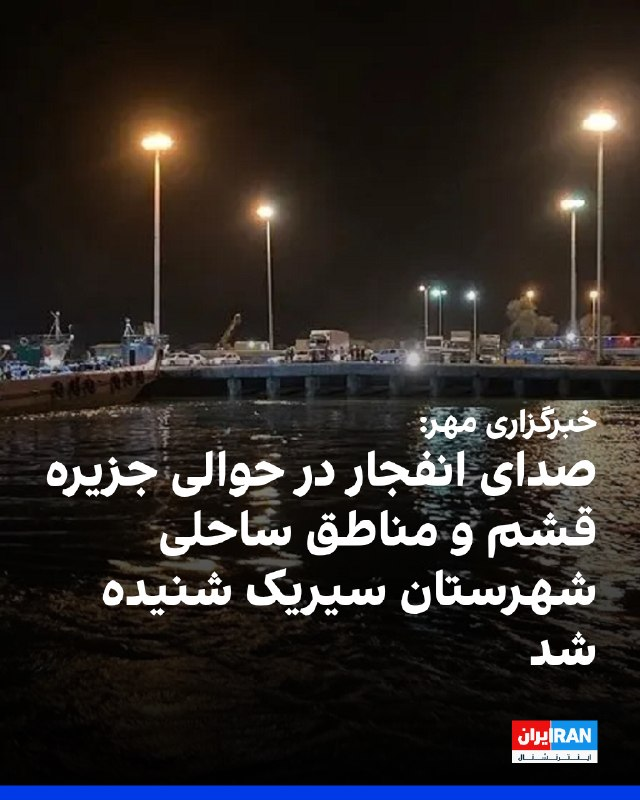

خبرگزاری مهر وابسته به سازمان تبلیغات اسلامی نوشت ساکنان بخش‌هایی از حوالی جزیره قشم و مناطق ساحلی شهرستان سیریک صدای انفجاری را شنیده‌اند.
خبرگزاری صدا و سیمای جمهوری اسلامی نیز نوشت شنیده شدن این صدا احتمالا مربوط به مقابله نیروهای جمهوری اسلامی با شناورها در تنگه هرمز است.
یک منبع آگاه در استانداری هرمزگان نیز اعلام کرد: صدای انفجار در حوالی بندر سیریک ناشی از شلیک هشدار به تنگه هرمز است.
https://iranintl.com/202606120154

## Shin_Persian — post 7004

Shin ✓ @hey_itsmyturn
Fri, 12 Jun 2026 21:19:06 UTC

Initial:
A vessel was hit by an IRGC projectile near the Strait of Hormuz

ترجمه خودکار فارسی

یک شناور توسط پرتابه‌ای متعلق به سپاه پاسداران (IRGC) در نزدیکی تنگه هرمز مورد اصابت قرار گرفت.

𝕏 · @shin_persian

## Persian_Trend_Official — post 16893

  <a href="telegram/content/Persian_Trend_Official_16893_1781299355.webm" target="_blank">🎬 Download video</a>

🎬 Video

## alonews — post 127520

  <a href="telegram/content/alonews_127520_1781299356.webm" target="_blank">🎬 Download video</a>

👈حمله شدید تندروها به قالیباف

✅ @AloNews خبر جنگ

## alonews — post 127519

  <a href="telegram/content/alonews_127519_1781299356.webm" target="_blank">🎬 Download video</a>

👈اعتراف عروس و معشوقه به قتل شوهر؛ راز گم شدن کیارش پس از دو سال فاش شد

🔴دو سال پس از گزارش پدر کیارش مبنی بر ناپدید شدن پسرش، فیلمی از قرار مخفیانه عروس خانواده (ملینا) با مردی غریبه، راز این پرونده را فاش کرد.

🔴پلیس هر دو را بازداشت و آنها بلافاصله به قتل کیارش با همدستی یکدیگر اعتراف کردند.

🔴ملینا گفت که با همدستی بهروز (مرد مورد نظر)، شوهرش را به قتل رسانده است.

✅ @AloNews خبر جنگ

## alonews — post 127517

  <a href="telegram/content/alonews_127517_1781299356.webm" target="_blank">🎬 Download video</a>

👈تصویری جدید از ابوطالب حسینی که خود را شبیه یکی از وحید جلیلی، قائم مقام صدا و سیما در آورده

✅ @AloNews خبر جنگ

## alonews — post 127516

  <a href="telegram/content/alonews_127516_1781299357.webm" target="_blank">🎬 Download video</a>

👈افزایش فعالیت نیروی هوایی آمریکا (USAF) بر فراز خلیج فارس و عربستان سعودی

۵ فروند هواپیمای سوخت‌رسان نیروی هوایی آمریکا اکنون بر فراز خلیج فارس و عربستان سعودی در حال پرواز هستند

۱ فروند هواپیمای هشدار زودهنگام و کنترل E-3B Sentry (آواکس) نیروی هوایی آمریکا در حال پرواز بر فراز شرق عربستان سعودی است

۱ فروند هواپیمای شناسایی و شنود سیگنالی RC-135W Rivet Joint نیروی هوایی آمریکا در حال فعالیت بر فراز خلیج فارس است.

✅ @AloNews خبر جنگ

## alonews — post 127515

---
📅 بروزرسانی: 1405/03/23 00:42
---

## VahidOOnLine — post 245211

  

خبرگزاری مهر وابسته به سازمان تبلیغات اسلامی نوشت ساکنان بخش‌هایی از حوالی جزیره قشم و مناطق ساحلی شهرستان سیریک صدای انفجاری را شنیده‌اند.
خبرگزاری صدا و سیمای جمهوری اسلامی نیز نوشت شنیده شدن این صدا احتمالا مربوط به مقابله نیروهای جمهوری اسلامی با شناورها در تنگه هرمز است.
یک منبع آگاه در استانداری هرمزگان نیز اعلام کرد: صدای انفجار در حوالی بندر سیریک ناشی از شلیک هشدار به تنگه هرمز است.
‌🏁 🇬🇧 IranintlTV

🤖 @VahidOOnLine

## WithYashar — post 14680

⁨ اتاق جنگ با یاشار : باز‌ تنگه دعوا شد ، گزارش عجیب از حضور هواپیماهای جاسوسی آمریکا همه با هم. !!!⁩

https://www.instagram.com/reel/DZgA2cQxrjS/?igsh=cnM5b3ViejIxcm5t

کلیک کنید و کارهای اداری پست را انجام دهید.

## WithYashar — post 14679

کاور @withyashar

## WithYashar — post 14678

۳پا : کشتی هایی سعی کردند بدون مجوز از تنگه هرمز عبور کنند و مورد هدف قرار گرفتند.🚨🚨
@withyashar

## mwarmonitor — post 10798

🔴شنیده شدن صدای انفجار در قشم و سریک و گزارش‌هایی از درگیری‌ها در نزدیکی تنگه هرمز.

## mwarmonitor — post 10797

  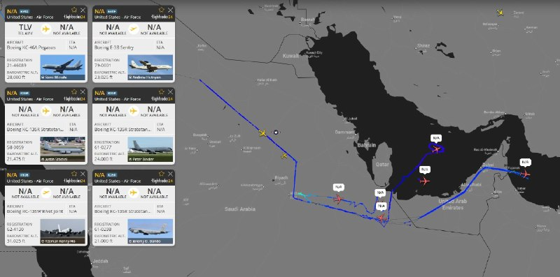

🔴 افزایش فعالیت نیروی هوایی آمریکا (USAF) بر فراز خلیج فارس و عربستان سعودی

• ۵ فروند هواپیمای سوخت‌رسان نیروی هوایی آمریکا اکنون بر فراز خلیج فارس و عربستان سعودی در حال پرواز هستند

• ۱ فروند هواپیمای هشدار زودهنگام و کنترل E-3B Sentry (آواکس) نیروی هوایی آمریکا در حال پرواز بر فراز شرق عربستان سعودی است

• ۱ فروند هواپیمای شناسایی و شنود سیگنالی RC-135W Rivet Joint نیروی هوایی آمریکا در حال فعالیت بر فراز خلیج فارس است.

@mwarmonitor

## DEJradio — post 5627

⭕️ آسوشیتدپرس گزارش داد کنترل جمهوری اسلامی بر تنگۀ هرمز کاهش یافته است

خبرگزاری آسوشیتدپرس در گزارشی تحلیلی نوشت کنترل جمهوری اسلامی بر تنگۀ هرمز در حال کاهش است.
به نوشتۀ این خبرگزاری آمریکایی، همزمان فشار اقتصادی بر تهران به‌شدت افزایش یافته است.
بر اساس این گزارش، صادرات نفت کشورهای عربی خلیج فارس از مسیر هرمز در پی پشتیبانی ارتش آمریکا در حال افزایش است.
این خبرگزاری تأیید کرد که بیش از ۱۰۰ میلیون بشکه نفت طی هفته‌های اخیر از این مسیر وارد بازار جهانی شد.
دونالد ترامپ در روزهای پیشین آماری مشابه را اعلام کرده بود.
آسوشیتدپرس همچنین نوشت محاصرۀ دریایی آمریکا صادرات نفت جمهوری اسلامی را با مشکلات جدی روبه‌رو کرده و تولید نفت ایران از زمان آغاز این محاصره درحدود ۸۰۰ هزار بشکه در روز کاهش یافته است.
بر پایۀ این گزارش، افزایش ذخایر نفتی، کاهش صادرات و محدودیت دسترسی به ارز خارجی، فشار بر جمهوری اسلامی را برای دستیابی به یک راه‌حل دیپلماتیک، بیشتر کرده است.

#تنگه_هرمز #توافق
@DEJradio

## DEJradio — post 5626

⭕️
⭕️ ونس گفت جمهوری اسلامی برای امضای توافق هیچ پولی دریافت نمی‌کند

جی‌دی ونس، معاون رئیس جمهوری آمریکا اعلام کرد جمهوری اسلامی در پی امضای توافق با واشینگتن یا حضور در نشست‌های مذاکره قرار نیست هیچ پولی دریافت کند.
او گفت توافق به‌گونه‌ای طراحی شده که نگرانی‌های آمریکا و متحدانش در اولویت قرار گیرد.
به‌گفتۀ ونس، تنها در صورت اجرای تعهدات از سوی جمهوری اسلامی، دریچه‌های اقتصادی برای کشور و منطقه گشوده می‌شود.
ونس همچنین مدعی شد اگر این توافق به‌دست آید، می‌تواند زمینه‌ساز صلحی پایدار در خاورمیانه باشد.
دونالد ترامپ گزارش‌های منتشرشده توسط تهران دربارۀ مفاد توافقنامه را دروغ و چرند عنوان کرده است.

#مذاکرات #توافق
@DEJradio

## VahidOnline — post 76284

خبرگزاری تسنیم:
استانداری هرمزگان: صدای انفجار در حوالی بندر سیریک ناشی از شلیک هشدار در تنگه هرمز است
خبرگزاری فارس:
شلیک هشدار به کشتی‌های متخلف در تنگۀ هرمز

دقایقی پیش مردم در قشم، جاسک و سیریک در استان هرمزگان شنیدن صدایی شبیه انفجار گزارش کردند؛ گزارشی از اصابت در این نقاط مخابره نشده است.

به گزارش خبرگزاری فارس از بندرعباس، منابع محلی از شنیده شدن صدای انفجار در سه نقطه از هرمزگان خبر می‌دهند.

دقایقی پیش اهالی مسن قشم، مناطقی از سیریک و همینطور جاسک از شنیده شدن صدای انفجارهایی خبر می‌دهند.

بررسی‌های خبرنگار فارس از منابع آگاه حاکی است صداهای شنیده شده مربوط به انجام شلیک هشدار به کشتی‌های متخلف در محدوده تنگه هرمز است.

منابع استانی نیز وقوع انفجار بر اثر اصابت در این ۳ نقطه را رد می‌کنند.

📡 @VahidOnline

## IranIntlTV — post 341962

  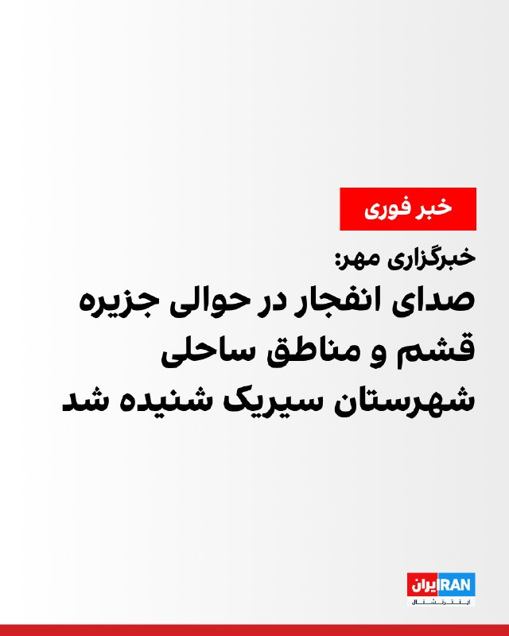

خبرگزاری مهر وابسته به سازمان تبلیغات اسلامی نوشت ساکنان بخش‌هایی از حوالی جزیره قشم و مناطق ساحلی شهرستان سیریک صدای انفجاری را شنیده‌اند.
خبرگزاری صدا و سیمای جمهوری اسلامی نیز نوشت شنیده شدن این صدا احتمالا مربوط به مقابله نیروهای جمهوری اسلامی با شناورها در تنگه هرمز است.
یک منبع آگاه در استانداری هرمزگان نیز اعلام کرد: صدای انفجار در حوالی بندر سیریک ناشی از شلیک هشدار به تنگه هرمز است.
https://iranintl.com/202606120154

## Shin_Persian — post 7003

↩️ Quoted tweet: Shin ✓ @hey_itsmyturn Fri, 12 Jun 2026 20:51:45 UTC State-owned Mehr New: "Explosion sounds heard around Qeshm Island and Sirik, Hormozgan Province. Initial reports suggest a conflict near Strait of Hormuz. No official confirmation authorities…

## Shin_Persian — post 7002

↩️ Quoted tweet:
Shin ✓ @hey_itsmyturn
Fri, 12 Jun 2026 20:51:45 UTC

State-owned Mehr New:
"Explosion sounds heard around Qeshm Island and Sirik, Hormozgan Province.
Initial reports suggest a conflict near Strait of Hormuz. No official confirmation authorities on nature of explosions."

↩️ توییت نقل‌قول شده — برای پاسخ، پست زیر را ببینید.

ترجمه خودکار فارسی

خبرگزاری دولتی مهر:
«صدای انفجار در اطراف جزیره قشم و سیریک، استان هرمزگان شنیده شد.
گزارش‌های اولیه حاکی از درگیری در نزدیکی تنگه هرمز است. هیچ تایید رسمی از سوی مقامات در مورد ماهیت انفجارها صورت نگرفته است.»

𝕏 · @shin_persian

## Shin_Persian — post 7001

  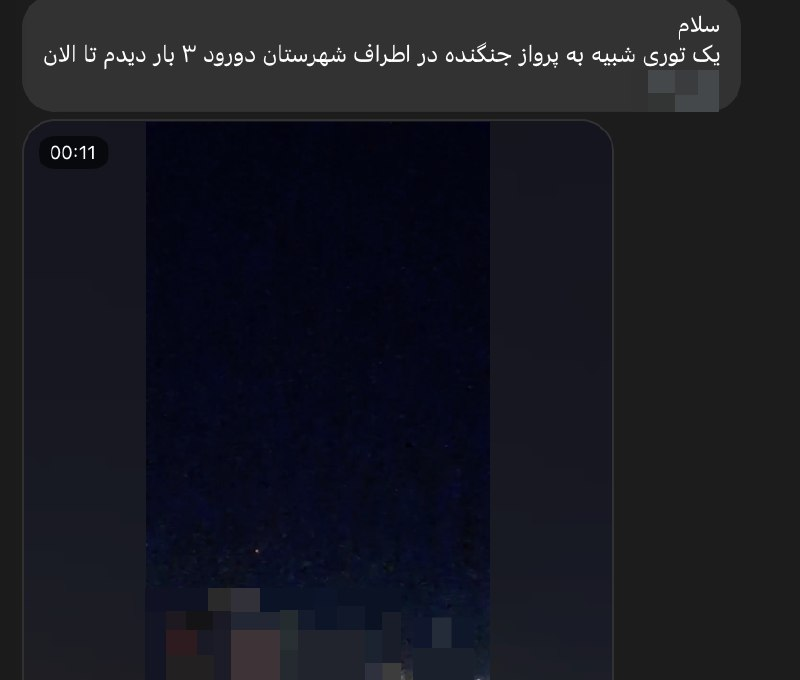

Shin ✓ @hey_itsmyturn
Fri, 12 Jun 2026 21:04:18 UTC

Also spotted in Dorud, Lorestan Province, #Iran
Eyewitness reports they've seen it 3 times tonight.

ترجمه خودکار فارسی

همچنین در دورود، استان لرستان، #Iran مشاهده شده است.
گزارش‌های شاهدان عینی حاکی از آن است که آن‌ها امشب ۳ بار آن را دیده‌اند.

𝕏 · @shin_persian

## Shin_Persian — post 7000

Shin ✓ @hey_itsmyturn
Fri, 12 Jun 2026 21:02:11 UTC

Kiashahr*

ترجمه خودکار فارسی

کیاشهر*

𝕏 · @shin_persian

## Iliaen — post 4479

ساعت ۰۰:۳۰ بامداد شنبه؛ یک ملوان ایرانی به من اطلاع داد در بیسیم صدای یک ملوان دیگر را با لهجه هندی شنیده است که می‌گوید کشتی آن‌ها در تنگه‌ی هرمز هدف اصابت یک پرتابه از سمت سپاه پاسداران قرار گرفته است.

در ادامه ملوان خارجی اعلام می‌کند هیچکس در کشتی مجروح نشده است اما سمت چپ کشتی آسیب دیده است.

@iliaen

## FarsiVOA — post 220527

🔺گزارش | واکنش‌ها به اعدام کریم معروف‌پور: صدای مردم را نمی‌توان اعدام کرد

◾️کریم معروف‌پور، زندانی سیاسی اهل نقده، صبح ۳۱ اردیبهشت ۱۴۰۵ اعدام شد. اگرچه در گزارش‌های رسمی جمهوری اسلامی، محل اجرای حکم اعدام اعلام نشده است، سازمان حقوق بشر ایران گزارش داده است که او به همراه رامین زله، دیگر زندانی سیاسی، در زندان نقده در استان آذربایجان غربی اعدام شده است. این سازمان می‌افزاید که اعدام «به‌صورت مخفیانه و بدون اطلاع قبلی و ملاقات آخر با خانواده انجام شده است.»

⬇️ بیشتر بخوانید:
https://ir.voanews.com/a/iran-iranian-kurd-execution-protest-prison-kurdestan-human-rights/8159789.html
@FarsiVOA

## IranianMinds — post 22435

  

🔴 فعالیت نیروی هوایی آمریکا بر فراز خلیج فارس و عربستان سعودی
۵ فروند هواپیمای سوخت‌رسان نیروی هوایی آمریکا اکنون بر فراز خلیج فارس و عربستان سعودی در حال پرواز هستن

۱ فروند هواپیمای هشدار زودهنگام (آواکس) نیروی هوایی آمریکا در حال پرواز بر فراز شرق عربستان سعودیه

۱ فروند هواپیمای شناسایی و شنود سیگنالی RC-135W Rivet Joint نیروی هوایی آمریکا در حال فعالیت بر فراز خلیج فارسه.

@IranianMinds

## alonews — post 127514

  <a href="telegram/content/alonews_127514_1781298758.webm" target="_blank">🎬 Download video</a>

👈هواپیمای جنگ الکترونیک RC-135W و یک سوخت رسان آمریکایی در نزدیکی ایران

✅ @AloNews خبر جنگ

---
📅 بروزرسانی: 1405/03/23 00:32
---

## VahidOOnLine — post 245210

  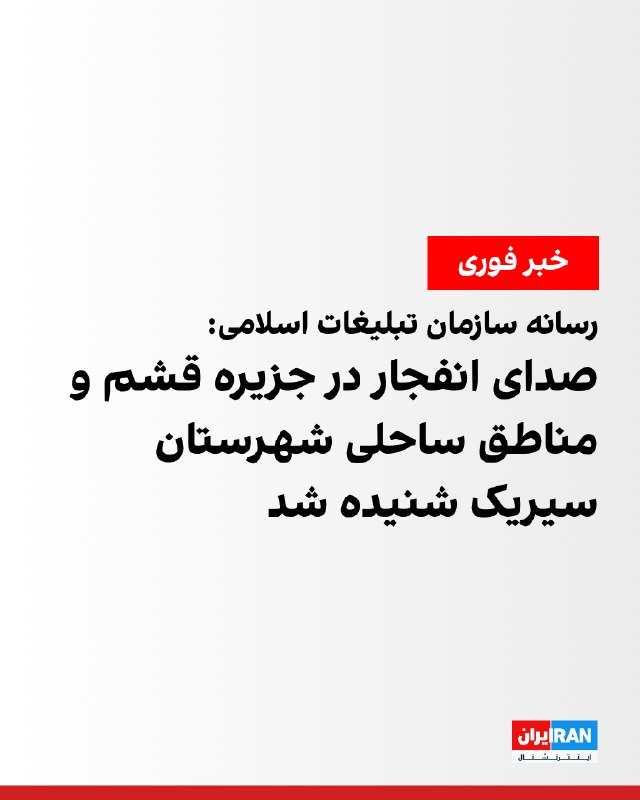

خبرگزاری مهر وابسته به سازمان تبلیغات اسلامی نوشت ساکنان بخش‌هایی از جزیره قشم و مناطق ساحلی شهرستان سیریک صدای انفجاری را شنیده‌اند؛ این رسانه به نقل از بررسی‌های اولیه نوشت انفجاری در سیریک رخ نداده و گمانه‌زنی‌هایی درباره ارتباط این صداها با تحولات دریایی و تنگه هرمز مطرح شده است.
مهر افزود: تاکنون هیچ مقام رسمی ماهیت این صداها را تأیید یا تکذیب نکرده است.

‌🏁 🇬🇧 IranintlTV

🤖 @VahidOOnLine

## VahidOOnLine — post 245209

  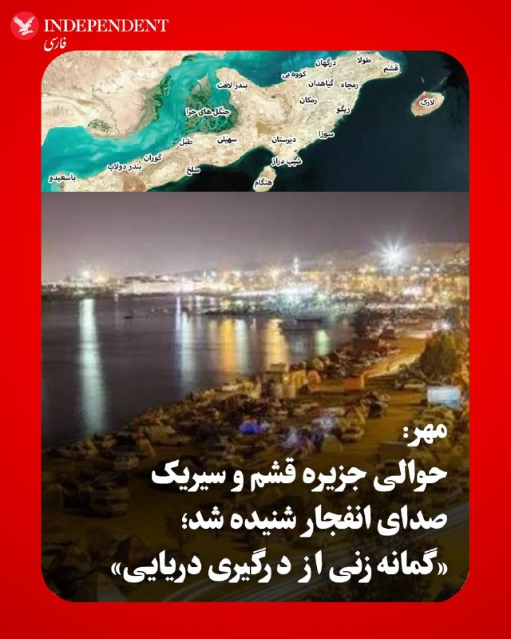

♦️خبرگزاری مهر، بامداد شنبه، ۲۳ خردادماه، از شنیده شدن صدای انفجار در بخش‌هایی از جزیره قشم و برخی نقاط ساحلی سیریک خبر داد. مهر نوشت:‌ «احتمالا صدای شنیده شده تلاشی برای کنترل تنگه هرمز و از سوی دریا بوده است».
‌🇸🇦 Indypersian

🤖 @VahidOOnLine

## WithYashar — post 14677

  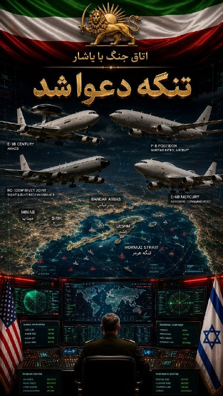

کاور
@withyashar

## WithYashar — post 14676

تو تنگه دعوا شد
@withyashar

## WithYashar — post 14675

مهر : شنیده شدن صدای انفجار در حوالی جزیره قشم و سیریک؛ گمانه‌زنی از درگیری دریایی

بررسی‌های اولیه نشان می‌دهد، در پهنه شهرستان سیریک انفجاری رخ نداده است و احتمالا صدای شنیده شده تلاشی برای کنترل تنگه هرمز و از سوی دریا بوده است.
@withyashar

## pm_afshaa — post 93740

  <a href="telegram/content/pm_afshaa_93740_1781298155.webm" target="_blank">🎬 Download video</a>

🔴مهر: صدای انفجار در حوالی جزیره قشم و سیریک شنیده شده و احتمالا درگیری دریایی برای کنترل تنگه هرمز بوده. 
💧 Rainbet.com the #1 Non-KYC Crypto Casino & Sportsbook @rainbetcom 
😁 @Pm_Afshaa

## pm_afshaa — post 93739

  <a href="telegram/content/pm_afshaa_93739_1781298156.webm" target="_blank">🎬 Download video</a>

🔴مهر: صدای انفجار در حوالی جزیره قشم و سیریک شنیده شده و احتمالا درگیری دریایی برای کنترل تنگه هرمز بوده.

💧 Rainbet.com the #1 Non-KYC Crypto Casino & Sportsbook @rainbetcom

😁 @Pm_Afshaa

## IranIntlTV — post 341961

  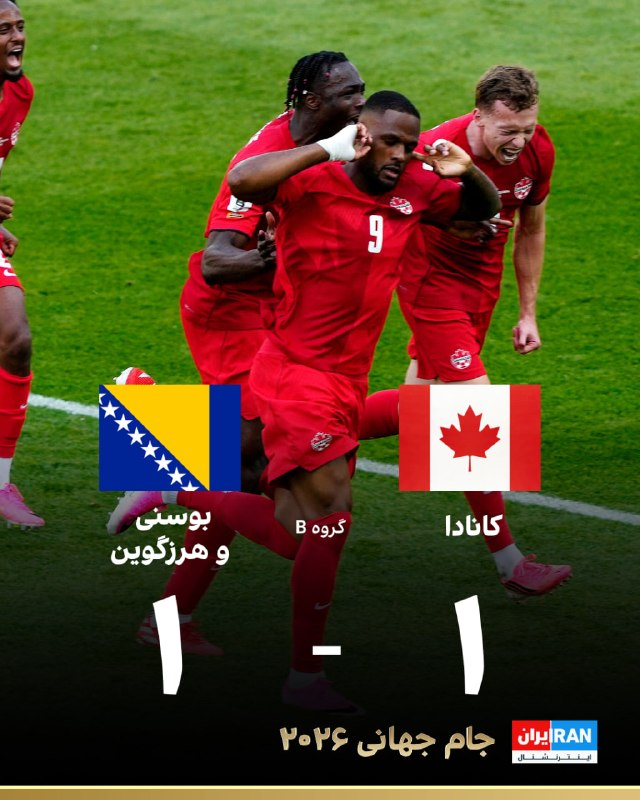

🔻تیم ملی فوتبال کانادا در اولین بازی خود در جام جهانی ۲۰۲۶ برابر بوسنی و هرزگوین به تساوی یک بر یک رسید. یووو لوکیچ در دقیقه ۲۱ برای بوسنی و کایل لارین در دقیقه ۷۸ برای کانادا در این مسابقه گلزنی کردند تا دو تیم با یک امتیاز در رده‌های اول و دوم گروه بی قرار بگیرند.

🔹شاگردان جسی مارش در حضور پرشمار تماشاگران حاضر در استادیوم بی‌ام‌او فیلد شهر تورنتو برخلاف جریان بازی و روی فرصت‌طلبی لوکیچ در دهانه دروازه روی ارسال کرنر، گل اول را دریافت کردند.

🔹تلاش میزبان برای به ثمر رساندن گل تساوی تا یک سوم پایانی نیمه دوم بدون نتیجه بود تا در نهایت ستاره ساوتهمپتون در نقش تعویض طلایی مارش ظاهر شد و سکوهای استادیوم را با باز کردن دروازه نیکولا واسیلی منفجر کرد.

🔹حملات دقایق پایانی کانادا نیز راهی به دروازه پیدا نکرد تا در نهایت دو تیم با تساوی کار خود را در مهم‌ترین رویداد فوتبالی جهان آغاز کنند.

@iranintltvsport

## IranIntlTV — post 341960

  <a href="telegram/content/IranIntlTV_341960_1781298157.mp4" target="_blank">🎬 Download video</a>

یک شهروند با ارسال ویدیویی به ایران‌اینترنشنال در خصوص گرانی‌های شدید در ایران می گوید یک عدد هندوانه را به قیمت ۶۰۰ هزار تومان خریده است.

## IranIntlTV — post 341958

  <a href="telegram/content/IranIntlTV_341958_1781298158.mp4" target="_blank">🎬 Download video</a>

خالد عزیزی، سخنگوی حزب دموکرات کردستان ایران، درباره اظهارات دونالد ترامپ مبنی بر اینکه کردها مانع رسیدن سلاح‌های آمریکایی به مردم ایران شدند، گفت: «طرح چنین ادعاهایی مایه تاسف است و هر زمان که دولت آمریکا خود را در بن‌بست سیاسی یا مذاکراتی می‌بیند، تلاش می‌کند کردها را مسئول ناکامی‌ها یا نبود برنامه‌ریزی برای مبارزه در داخل ایران معرفی کند.»
@iranintltv

## IranIntlTV — post 341957

  <a href="telegram/content/IranIntlTV_341957_1781298160.mp4" target="_blank">🎬 Download video</a>

بیژن کیان، کارشناس امنیت ملی، گفت: «اگر جمهوری اسلامی غنی‌سازی را متوقف کند، اورانیوم غنی‌شده را تحویل دهد، حمایت از نیروهای نیابتی را کنار بگذارد و برنامه موشکی خود را محدود کند، در آن صورت چه چیزی از جمهوری اسلامی باقی می‌ماند؟»

او افزود: «بنابراین، پیش از نامیدن این روند به عنوان "توافق"، باید ماهیت آن روشن شود.»
@iranintltv

## Shin_Persian — post 6999

  <a href="telegram/content/Shin_Persian_6999_1781298162.mp4" target="_blank">🎬 Download video</a>

Shin ✓ @hey_itsmyturn
Fri, 12 Jun 2026 21:00:35 UTC

Earlier @ 1700Z
Kianshahr, Gilan Province, Iran

ترجمه خودکار فارسی

پیش‌تر در ۱۷۰۰ زولو (۲۰:۳۰ به وقت تهران)
کیان‌شهر، استان گیلان، ایران

𝕏 · @shin_persian

## Shin_Persian — post 6998

  <a href="telegram/content/Shin_Persian_6998_1781298164.mp4" target="_blank">🎬 Download video</a>

Shin ✓ @hey_itsmyturn
Fri, 12 Jun 2026 20:56:19 UTC

Regime fans in Tehran tonight:
"In memory of Commanders Salami and Rashid, We will not make peace with the vile enemy!"

Iran.

ترجمه خودکار فارسی

طرفداران رژیم امشب در تهران:
«به یاد فرماندهان سلامی و رشید، با دشمن پست سازش نخواهیم کرد!»

ایران.

𝕏 · @shin_persian

## Shin_Persian — post 6997

Shin ✓ @hey_itsmyturn
Fri, 12 Jun 2026 20:51:45 UTC

State-owned Mehr New:
"Explosion sounds heard around Qeshm Island and Sirik, Hormozgan Province.
Initial reports suggest a conflict near Strait of Hormuz. No official confirmation authorities on nature of explosions."

ترجمه خودکار فارسی

خبرگزاری دولتی مهر:
«صدای انفجار در اطراف جزیره قشم و سیریک در استان هرمزگان شنیده شد.
گزارش‌های اولیه حاکی از وقوع درگیری در نزدیکی تنگه هرمز است. هیچ تاییدیه رسمی از سوی مقامات درباره ماهیت انفجارها ارائه نشده است.»

𝕏 · @shin_persian

## FarsiVOA — post 220526

  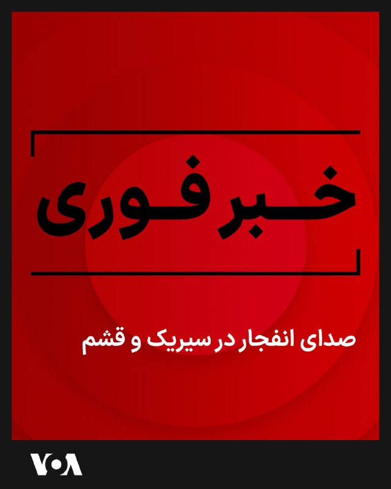

⚡️خبرگزاری حکومتی مهر از شنیده‌شدن صدای انفجار در حوالی جزیره قشمت و سیریک خبر داد. این خبرگزاری به نوعی بیان کرده است که احتمالا نیروهای جمهوری اسلامی به سمت اهدافی در تنگه هرمز شلیک کرده‌اند.
@FarsiVOA

## FarsiVOA — post 220525

⚡️پیمان جدید مهاجرت اروپا شامل تشدید کنترل‌های مرزی، تسریع در بررسی پرونده‌ها، و افزایش روند اخراج مهاجران است.
@FarsiVOA

## Persian_Trend_Official — post 16892

مهمترین بخش های مصاحبه امشب عراقچی، وزیر امور خارجه جمهوری اسلامی با شبکه خبر:

نتیجه مذاکرات یک یادداشت تفاهم 14 بندی است که هنوز امضا نشده و وقتی نهایی شد برای مردم تشریح خواهم کرد.

خاتمه جنگ در همه جبهه ها از جمله لبنان در یادداشت تفاهم و در مرحله اول اعلام خواهد شد، تعهد خواهند داد که دیگر آغازگر جنگ نباشند. بعد از 47 سال آمریکا به حاکمیت ایران اذعان و اعتراف خواهند کرد.

یادداشت تفاهم ایران و امریکا مرحله اول است و موضوع برنامه هسته ای در توافق نهایی بحث خواهیم کرد، برای برنامه هسته ای در مرحله نهایی 60 روز وقت خواهیم داشت.

فعلا هیچ‌یک از متن‌هایی که از توافق بیرون آمده اعتبار ندارد. درخواست می‌کنم که آرامش را برقرار کنند تا بتوانیم به بهترین توافق ممکن برسیم. هیچ توافقی نیست که یک‌طرف 100 را برده باشد و طرف دیگر صفر‌. توافق ایران و آمریکا دشمنانی دارد و اسرائیل در راس این توافق است؛ به دنبال بر هم زدن این توافق و تفاهم هستند.

احتمالا بزودی برنامه مشترکی با عمان درباره مدیریت تنگه هرمز اعلام خواهیم کرد. هزینه خدمات برای تنگه هرمز گرفته می‌شود و دیگر این خدمات رایگان نخواهد بود. این امر مهم تثبیت شده است که هزینه باید پرداخت شود.

خاتمه جنگ به معنی عقب نشینی اسرائیل از مناطق اشغالی لبنان است. اگر آخرین مرحله مذاکرات انجام شود تفاهم از راه دور به امضای دو طرف می‌رسد و اعلام خواهد شد ممکن است در چند روز آینده اتفاق بیفتد.

ممکن است 60 روز مذاکره تمدید شود و ماه ها ادامه داشته باشد. ممکن است تمدید نشود و دیگر مذاکرات را ادامه ندهیم. باید ببینیم بعد از 60 روز با چه فضایی مواجه هستیم.

📝 Amir

📌 @persian_trend_official
پرشین ترند | متفاوت‌ترین کانال نظامی

## IranianMinds — post 22434

🔴مجدد صدای شنیده شدن انفجار در سیریک @IranianMinds

## alonews — post 127513

  <a href="telegram/content/alonews_127513_1781298166.mp4" target="_blank">🎬 Download video</a>

👈مراد ویسی: جمهوری اسلامی رهبرشو کشتن، ۵۲ مقامشو ترور کردن، بعد کشوندنش سر میز و گفتن حالت بتمرگ و امضا کن.

✅ @AloNews خبر جنگ

## alonews — post 127512

  <a href="telegram/content/alonews_127512_1781298168.webm" target="_blank">🎬 Download video</a>

👈صدای انفجار در قشم و سیریک 
✅ @AloNews خبر جنگ

## alonews — post 127511

  <a href="telegram/content/alonews_127511_1781298168.webm" target="_blank">🎬 Download video</a>

👈صدای انفجار در قشم و سیریک

✅ @AloNews خبر جنگ

---
📅 بروزرسانی: 1405/03/23 00:22
---

## pm_afshaa — post 93738

🟠منابع محلی از شنیده شدن صدای انفجار مهیب در دقایق اخیر در روستای مسن  جزیره قشم خبر می‌د

💧 Rainbet.com the #1 Non-KYC Crypto Casino & Sportsbook @rainbetcom

😁 @Pm_Afshaa

## pm_afshaa — post 93737

  <a href="telegram/content/pm_afshaa_93737_1781297539.webm" target="_blank">🎬 Download video</a>

🔴یک مقام کاخ سفید به اسرائیل هیوم:
بر اساس توافق، ایران باید ذخایر اورانیوم غنی‌شده خودش رو نابود کنه.

💧 Rainbet.com the #1 Non-KYC Crypto Casino & Sportsbook @rainbetcom

😁 @Pm_Afshaa

## Shin_Persian — post 6996

Shin ✓ @hey_itsmyturn
Fri, 12 Jun 2026 20:51:21 UTC

State-owned Mehr Newس:

"Explosion sounds heard around Qeshm Island and Sirik, Hormozgan Province
Initial reports suggest a conflict near Strait of Hormuz. No official confirmation authorities on nature of explosions."

ترجمه خودکار فارسی

خبرگزاری دولتی مهر:

«صدای انفجار در اطراف جزیره قشم و سیریک، استان هرمزگان شنیده شد.
گزارش‌های اولیه از وقوع درگیری در نزدیکی تنگه هرمز خبر می‌دهند. هنوز هیچ تاییدیه رسمی از سوی مقامات درباره ماهیت این انفجارها ارائه نشده است.»

𝕏 · @shin_persian

## Persian_Trend_Official — post 16889

  <a href="telegram/content/Persian_Trend_Official_16889_1781297539.mp4" target="_blank">🎬 Download video</a>

تصاویر ماهواره ای جدید از پایگاه شیخ عیسی در بحرین تایید میکند که در جریان حملات اخیر ایران چند مخزن سوخت و یک سازه دیگر در این پایگاه منهدم شده است.

ساعاتی پیش تصاویری از یک اصابت دیگر در گوشه ای از پایگاه در کانال پست شده بود.

📝 Amir

📌 @persian_trend_official
پرشین ترند | متفاوت‌ترین کانال نظامی

## BBCPersian — post 283595

🔻 گفت‌وگوی تلفنی وزرای خارجه پاکستان و سوئیس و احتمال سفر اسحاق‌دار به ژنو

دولت پاکستان اعلام کرد که محمد اسحاق‌دار، معاون نخست‌وزیر و وزیر امور خارجه پاکستان، شامگاه امروز (جمعه) با ایگنازیو کاسیس، وزیر امور خارجه سوئیس، گفت‌وگوی تلفنی کرد.

بنا به اعلامیه وزارت خارجه پاکستان، دو طرف در این گفت‌وگو درباره تحولات منطقه‌ای تبادل نظر کردند و از پیشرفت امیدوارکننده در مسیر دستیابی به تفاهم میان آمریکا و ایران استقبال کردند.

وزارت خارجه پاکستان نوشته که وزیر امور خارجه سوئیس از نقش میانجی‌گرانه و برجسته پاکستان در حمایت از تعاملات دیپلماتیک و تلاش‌های این کشور برای پیشبرد روند صلح و ثبات در منطقه و فراتر از آن قدردانی کرد.

این در حالی است که گزارش‌هایی از احتمال سفر آقای دار به ژنو در ارتباط با تفاهم احتمالی ایران و آمریکا نیز منتشر شده است.

https://bbc.in/4vLXKyL
@BBCPersian

## BBCPersian — post 283594

  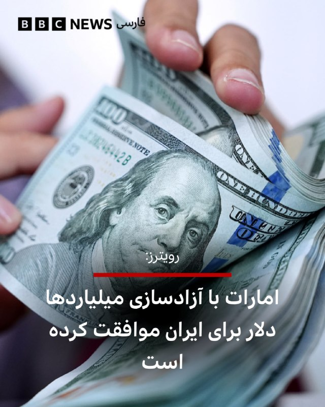

‌ ‌ ‌ ‌ ‌
چهار منبع به رویترز گفته‌اند که امارات متحده عربی با «آزادسازی میلیاردها دلار برای ایران موافقت کرده است.»

به گفته این منابع چنین اقدامی نشان‌دهنده تغییر تاکتیکی در رویکرد ابوظبی پس از هفته‌ها حملات ایران به آن کشور ثروتمند حاشیه خلیج فارس در جریان جنگ آمریکا و اسرائیل با جمهوری اسلامی است.

خبر این اقدام که پیش‌تر گزارش نشده بود، همزمان با مراحل پایانی مذاکرات گسترده‌تر میان تهران و واشنگتن برای پایان دادن به جنگ منتشر می‌شود. دیپلمات‌ها می‌گویند که این مذاکرات ممکن است شامل آزادسازی ده‌ها میلیارد دلار از درآمدهای نفتی ایران باشد که تحت تحریم‌های آمریکا در بانک‌های خارجی مسدود شده است.

این در حالیست که پیشتر جی‌دی ونس، معاون دونالد ترامپ گفته بود که در صورت امضای توافق با ایران هیچ‌گونه پولی از اموال مسدود شده ایران آزاد نخواهد شد.

اما دو منبع منطقه‌ای به رویترز گفتند که امارات با «آزادسازی در مجموع ۱۰ میلیارد دلار موافقت کرده که بیش از ۳ میلیارد دلار آن تاکنون در اختیار ایران قرار گرفته است.»

https://bbc.in/4egAVMj
📷Dimas Ardian/Bloomberg via Getty Images
@BBCPersian

## alonews — post 127510

  <a href="telegram/content/alonews_127510_1781297540.webm" target="_blank">🎬 Download video</a>

👈فاینشنال تایمز: اورانیوم غنی شده ایران، نابود خواهد شد

✅ @AloNews خبر جنگ

---
📅 بروزرسانی: 1405/03/23 00:12
---

## VahidOOnLine — post 245207

  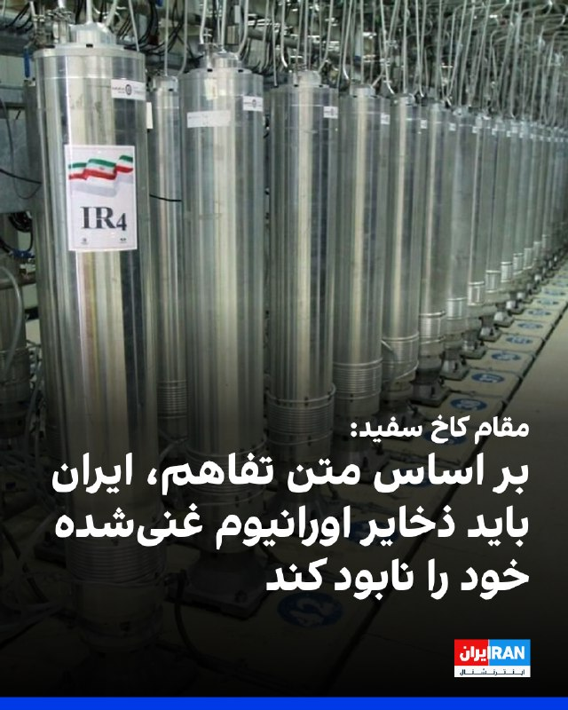

یک مقام کاخ سفید به اسرائیل هیوم گفت: «بر اساس توافق، ایران باید ذخایر اورانیوم غنی‌شده خود را نابود کند، بخش‌هایی از برنامه هسته‌ای خود را برچیند و متعهد شود هرگز به دنبال تولید سلاح هسته‌ای نرود.»

او افزود: «اهداف اصلی توافق شامل بازگشایی تنگه هرمز، رفع تهدید علیه کشتیرانی، نابودی ذخایر اورانیوم غنی‌شده ایران، برچیدن بخش‌های کلیدی برنامه هسته‌ای و ایجاد سازوکار نظارت و راستی‌آزمایی است.»
‌🏁 🇬🇧 IranintlTV

🤖 @VahidOOnLine

## WithYashar — post 14674

## IranIntlTV — post 341956

  <a href="telegram/content/IranIntlTV_341956_1781296938.mp4" target="_blank">🎬 Download video</a>

فرشته پزشک، کارشناس روابط بین‌الملل، گفت: «اگر تفاهم یا توافق به معنای یک وقفه یا فرصتی برای تنفس دو طرف باشد تا بعدا دوباره به نقطه اول بازگردند، شاید بتوان گفت به آن نزدیک شده‌ایم.»

او افزود: «اما اگر منظور این باشد که این تفاهم به تغییری بنیادین در رفتار جمهوری اسلامی منجر شود، ایران وارد نظم بین‌المللی شود، از شعار نابودی آمریکا و اسرائیل دست بردارد و زیرساخت‌های هسته‌ای خود را به طور کامل تعطیل کند، تحقق چنین سناریویی بسیار دشوار به نظر می‌رسد.»
@iranintltv

## IranIntlTV — post 341955

  

یک مقام کاخ سفید به اسرائیل هیوم گفت: «بر اساس توافق، ایران باید ذخایر اورانیوم غنی‌شده خود را نابود کند، بخش‌هایی از برنامه هسته‌ای خود را برچیند و متعهد شود هرگز به دنبال تولید سلاح هسته‌ای نرود.»

او افزود: «اهداف اصلی توافق شامل بازگشایی تنگه هرمز، رفع تهدید علیه کشتیرانی، نابودی ذخایر اورانیوم غنی‌شده ایران، برچیدن بخش‌های کلیدی برنامه هسته‌ای و ایجاد سازوکار نظارت و راستی‌آزمایی است.»
https://iranintl.com/202606120056

## IranianMinds — post 22433

  <a href="telegram/content/IranianMinds_22433_1781296940.mp4" target="_blank">🎬 Download video</a>

حق ترین چیزی که میتونید امروز ببینید

@IranianMinds

## Dirty_Kids — post 391844

  <a href="telegram/content/Dirty_Kids_391844_1781296941.mp4" target="_blank">🎬 Download video</a>

🔴 فووووووری!
آیت‌الله ترامپ رسما توبه کرد!

@Dirty_Kids 👻

## Dirty_Kids — post 391843

  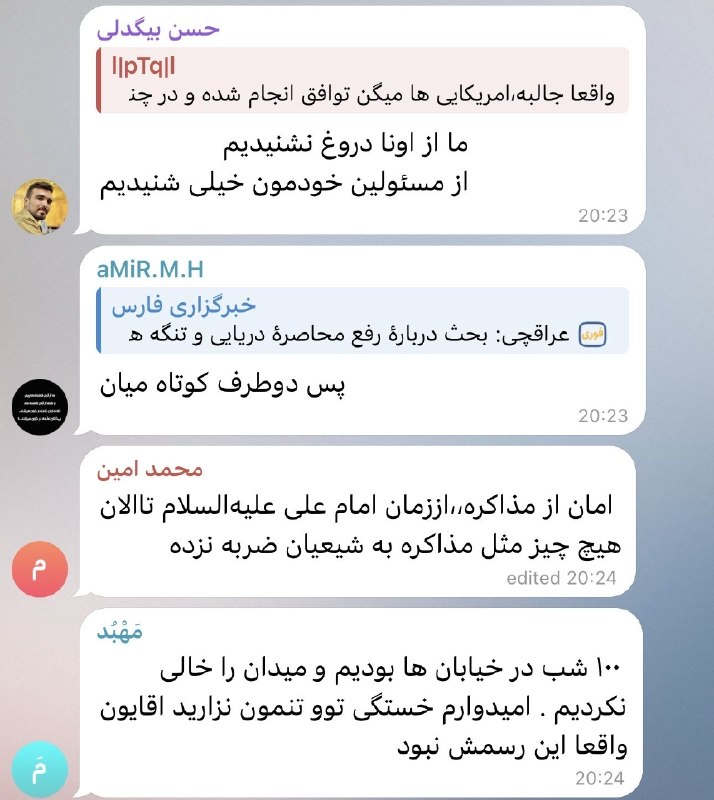

من اطلاع موثق دارم که تیم ممدباقر شغال طرقبه و عراقچی هزارپدر رهبرتون و هر چی سپاهی بود رو با قاتلش معامله کردن که هیچ، هسته‌ای مسته‌ایم دادن رفت.
بی‌پدر بودید، بی‌پدرتر شدید.

اَینَ مُنتقمون بدبختا؟

@Dirty_Kids 👻

## alonews — post 127509

  <a href="telegram/content/alonews_127509_1781296942.webm" target="_blank">🎬 Download video</a>

👈عراقچی: یادداشت تفاهم کمتر از ۲ صفحه است و کلمه‌به‌کلمه آن بارها بالاپایین شده و وزارت خارجه با نهایت دقت تمام موارد خواسته شده را لحاظ کرده.

✅ @AloNews خبر جنگ

## alonews — post 127508

  <a href="telegram/content/alonews_127508_1781296942.mp4" target="_blank">🎬 Download video</a>

میگن این ویدیو باعث شده ترامپ توافق رو قبول کنه

[@AloTweet]

---
📅 بروزرسانی: 1405/03/23 00:02
---

## WithYashar — post 14673

صدای انفجار سیریک 🚨
@withyashar

## IranIntlTV — post 341954

  <a href="https://t.me/IranintlTV/341954" target="_blank">📎 Download file</a>

🎧نسخه صوتی ‌‌‏۲۴ با فرداد فرحزاد: ایران و آمریکا در یک قدمی توافق
@iranintlTV

## IranIntlTV — post 341953

  <a href="telegram/content/IranIntlTV_341953_1781296349.mp4" target="_blank">🎬 Download video</a>

مهدی نخل‌احمدی، روزنامه‌نگار و فعال سیاسی، گفت: «در شرایط کنونی، مساله بقا و اقتصاد برای جمهوری اسلامی اهمیت بیشتری پیدا کرده است.»

او افزود: «این احتمال وجود دارد که دونالد ترامپ امیدوار باشد در صورت رسیدن مذاکرات به مرحله نهایی، دست بالاتری در توافقی جامع‌تر داشته باشد و بتواند روایت پیروزی خود را با سهولت بیشتری به افکار عمومی آمریکا و جهان ارائه کند.»
@iranintltv

## alonews — post 127507

👈گفت و گوی امیر قطر با ترامپ درباره پیشرفت مذاکرات بین آمریکا و ایران

## alonews — post 127506

  <a href="telegram/content/alonews_127506_1781296351.webm" target="_blank">🎬 Download video</a>

👈نبویان: توافقی که با پخت و پز بانیان توافق ننگین برجام باشد حتما خسارت محض است

✅ @AloNews خبر جنگ

<!-- MSG END -->

<!-- NAV START -->

<!-- NAV END -->
