# خواننده تلگرام

<!-- TOP_NAV START -->

<!-- TOP_NAV END -->

<!-- MSG START -->

---
📅 بروزرسانی: 1405/03/27 18:24
---

## FoxNewsTwitter — post 343065

  

Fox News (Twitter/X)

BREAKING: Suspect in deadly hospital shooting in Wilmington, Del., identified by police as 23-year-old John Wallace-Bey, captured Tuesday evening in Philadelphia

## pm_afshaa — post 94265

قیمت های ایران خودرو با 50 درصد افزایش هم قیمت بازار آزاد شد

💧 Rainbet.com the #1 Non-KYC Crypto Casino & Sportsbook @rainbetcom

😁 @Pm_Afshaa

## IranIntlTV — post 342873

  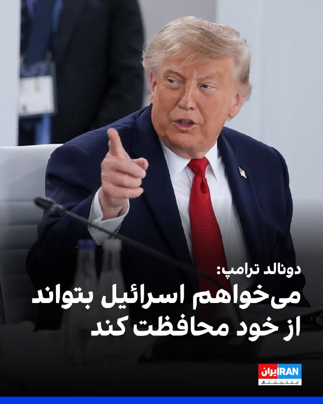

دونالد ترامپ، رییس‌جمهوری آمریکا، گفت از حق اسرائیل برای دفاع از خود حمایت می‌کند، اما انتظار دارد این کشور در تصمیم‌گیری‌هایش «قضاوت درست» داشته باشد.

ترامپ در دیدار با نارندرا مودی، نخست‌وزیر هند، در حاشیه نشست گروه هفت در فرانسه به خبرنگاران گفت: «می‌خواهم اسرائیل بتواند از خود محافظت کند، اما می‌خواهم از قضاوت درست استفاده کند.»

این اظهارات چند روز پس از آن مطرح می‌شود که ارتش اسرائیل در واکنش به آنچه نقض آتش‌بس از سوی حزب‌الله خواند، منطقه ضاحیه جنوبی بیروت را هدف حمله قرار داد.
https://iranintl.com/202606174187

## IranIntlTV — post 342872

  <a href="telegram/content/IranIntlTV_342872_1781708084.mp4" target="_blank">🎬 Download video</a>

دونالد ترامپ، رییس‌جمهوری آمریکا، در حاشیه نشست گروه هفت در فرانسه گفت: «ایرانی‌ها می‌خواهند توافق را امضا کنند. اگر آنها به این توافق پایبند نباشند، دوباره حملات را آغاز می‌کنیم.»

@iranintltv

## IranIntlTV — post 342871

  <a href="telegram/content/IranIntlTV_342871_1781708086.mp4" target="_blank">🎬 Download video</a>

دونالد ترامپ، رییس‌جمهوری آمریکا، در حاشیه نشست گروه هفت اعلام کرد آنچه در رابطه با جمهوری اسلامی در حال جریان است یک تفاهم است نه توافق. او هم‌زمان هشدار داد که در صورت نارضایتی واشینگتن از رفتار تهران، اقدام نظامی از سر گرفته خواهد شد.

جزییات بیشتر با اردوان روزبه، خبرنگار ایران‌اینترنشنال
@iranintltv

## FarsiVOA — post 221028

  <a href="telegram/content/FarsiVOA_221028_1781708089.mp4" target="_blank">🎬 Download video</a>

بر اساس ویدیوهای منتشر شده و به نوشته «حال وش» چهارشنبه ۲۷ خرداد، دومین روز از تجمع مردم در روستای پشموکی از توابع شهرستان فاریاب در استان کرمان، در اعتراض به آنچه «مصادره حق مردم منطقه در بهره‌برداری از معدن کرومیت» عنوان شده، با یورش ماموران به خشونت کشیده شد. درپی حمله ماموران حکومتی و ضرب و شتم معترضان، دست‌کم هفت زن بلوچ مصدوم شدند. همچنین شش شهروند شامل سه زن، بازداشت شدند.

به گزارش حال وش، «معترضان معتقدند امتیاز بهره‌برداری از این معدن که از منابع مهم اقتصادی منطقه محسوب می‌شود، در اختیار افراد دارای نفوذ قرار گرفته و مردم بومی از منافع آن محروم مانده‌اند.»

## FarsiVOA — post 221027

🔺دونالد ترامپ: رژیم ایران سلاح هسته‌ای نخواهد داشت و تنگه هرمز فوراً باز خواهد شد

▪️دونالد ترامپ در مورد شرکت در اجلاس گروه هفت در فرانسه نوشت: «این سفر، یک موفقیت بزرگ بود اما عمدتاً چیزی که مردم می‌خواستند درباره‌اش صحبت کنند این بود که رژیم ایران سلاح هسته‌ای نخواهد داشت و تنگه هرمز فوراً باز خواهد شد!»

⬇️ بیشتر بخوانید:
https://ir.voanews.com/a/iran-us-negotiations-france-g7-trump/8161854.html/?nocach=1

## RadioFarda — post 158433

  <a href="https://t.me/radiofarda/158433" target="_blank">📎 Download file</a>

عبور نفتکش‌های ایرانی از تنگهٔ هرمز در گفت‌وگو با همایون فلک‌شاهی

🔸اولین نفتکش‌های حامل نفت خام ایران از زمان آغاز محاصرۀ دریایی آمریکا، پیشاپیش دیدار نمایندگان ایران و ایالات متحده برای امضای تفاهم‌نامه پایان جنگ، از تنگۀ هرمز عبور کردند. همایون فلک‌شاهی رئیس گروه تحلیل داده‌های نفت خام در موسسه کپلر از فرانسه در این باره با رادیو فردا گفت‌و گو کرده است.

@RadioFarda

## BBCPersian — post 284141

🔻توتال: پالایشگاه عربستان که هدف پهپاد قرار گرفت با ۷۰ درصد ظرفیت کار می‌کند

مدیرعامل شرکت انرژی فرانسوی توتال‌ اعلام کرد پالایشگاه نفت تحت نظارتش در عربستان سعودی که هدف حمله سه پهپاد قرار گرفته بود، با ۷۰ درصد ظرفیت به کار ادامه می‌دهد و تعمیرات کامل آن تا اوایل سال ۲۰۲۷ میلادی به پایان نخواهد رسید.

پاتریک پویانه در جلسه کمیسیون امور اقتصادی پارلمان فرانسه برای بررسی بحران خاورمیانه گفت خسارت‌های این حمله عملکرد این تاسیسات را با مشکل مواجه کرده است.

به گفته او، با وجود ادامه فعالیت، بازگشت کامل پالایشگاه به ظرفیت تولید پیش از حمله زمان بیشتری نیاز دارد و انتظار می‌رود روند تعمیرات تا اوایل سال ۲۰۲۷ ادامه یابد.
https://bbc.in/44e8eLk
@BBCPersian

---
📅 بروزرسانی: 1405/03/27 18:14
---

## VahidOOnLine — post 246029

  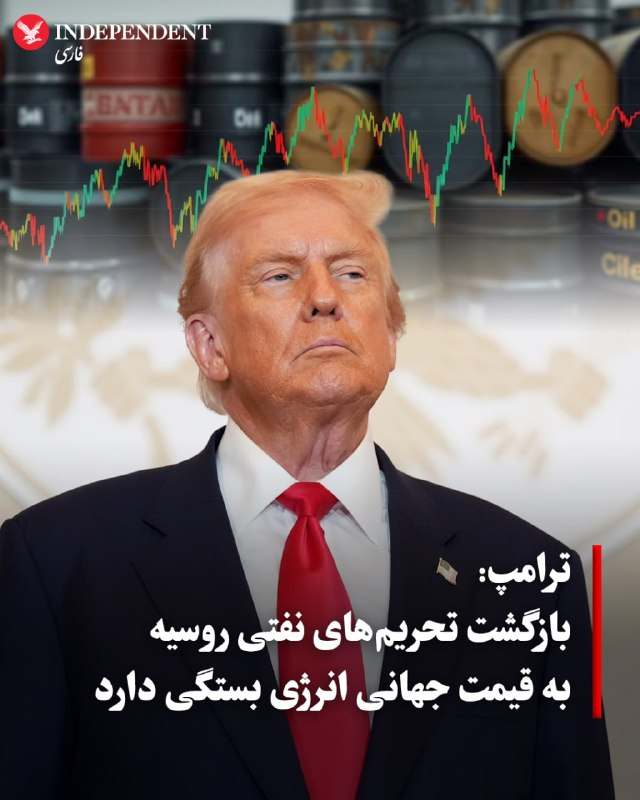

♦️ دونالد ترامپ، رئیس‌جمهوری آمریکا، روز چهارشنبه ۲۷ خرداد در اجلاس سران گروه هفت (G7) اعلام کرد که روند تغییرات قیمت جهانی نفت تعیین خواهد کرد که آیا واشنگتن تحریم‌ها علیه محموله‌های نفت خام روسیه را مجددا اعمال می‌کند یا خیر.

ترامپ با اشاره به کاهش شدید قیمت‌ها پس از اعلام توافق با ایران گفت: «باید ببینیم قیمت نفت تا چه حد پایین می‌آید؛ در حال حاضر قیمت‌ها واقعا در حال ریزش است.» دولت ترامپ در اوایل سال جاری میلادی و با هدف کاهش بحران عرضه انرژی ناشی از جنگ با ایران، تحریم‌های برخی از محموله‌های نفتی روسیه را کاهش داده بود؛ معافیتی موقت که اواخر این هفته منقضی می‌شود و وزارت خزانه‌داری هنوز تصمیمی برای تمدید مجدد آن اعلام نکرده است.

این اظهارات ترامپ در حالی مطرح می‌شود که رهبران گروه هفت روز سه‌شنبه در بیانیه‌ای مشترک بر «حمایت تزلزل‌ناپذیر خود از اوکراین» و تقویت تحریم‌ها علیه بخش نفت و گاز روسیه تاکید کردند. با این حال، هرچند قیمت نفت پس از اعلام خبر توافق میان جمهوری اسلامی ایران و آمریکا سقوط کرده، اما همچنان به مراتب بالاتر از سطوح پیش از آغاز جنگ است.
‌🇸🇦 Indypersian

🤖 @VahidOOnLine

## FoxNewsTwitter — post 343064

  <a href="telegram/content/FoxNewsTwitter_343064_1781707465.mp4" target="_blank">🎬 Download video</a>

Fox News (Twitter/X)

BREAKING: “I think it will be done, they want to sign.”

President Trump announces he’s confident that Iran will formally agree to the latest peace deal that’s set to be adopted on Friday.

“This is a memorandum of understanding, but it's a very strong one. This isn't just like a two paragraph- this is a long, you know, pretty detailed memorandum that goes into a regular contract. I would think they would do it. If they don't, then that's, you know, that's okay. We'll have to start the process again.”

## FoxNewsTwitter — post 343063

  <a href="telegram/content/FoxNewsTwitter_343063_1781707468.mp4" target="_blank">🎬 Download video</a>

Fox News (Twitter/X)

WATCH: President Trump cracks a joke about America's commitment to defending India as long as Prime Minister Narendra Modi is still leading the country:

REPORTER: "Can you speak to the defense relationship between India and the United States?"

TRUMP: "If anybody attacks that man, we're going to be there. Now if there's a new leader, I'm not sure about it."

"If they're attacked and he's the leader, we're going to be there to help."

## pm_afshaa — post 94264

  <a href="telegram/content/pm_afshaa_94264_1781707470.webm" target="_blank">🎬 Download video</a>

🔴ترامپ: هیچکس فکرش رو نمیکرد بشه ولی ما تو همون هفته اول ایران رو‌ از نظر نظامی شکست دادیم.

💧 Rainbet.com the #1 Non-KYC Crypto Casino & Sportsbook @rainbetcom

😁 @Pm_Afshaa

## IranIntlTV — post 342870

  <a href="telegram/content/IranIntlTV_342870_1781707471.mp4" target="_blank">🎬 Download video</a>

یک شهروند اصفهانی با ارسال ویدیویی به ایران اینترنشنال، همزمان با برگزاری رقابت‌های جام جهانی از محدودیت‌های اعمال‌شده برای حضور زنان در ورزشگاه‌ها انتقاد کرد. او گفت از دوران مدرسه به فوتبال علاقه داشته و سال‌ها این ورزش را دنبال کرده است، اما اکنون در ۲۷ سالگی هنگام تلاش برای حضور در ورزشگاه‌ها با موانع مختلفی روبه‌رو می‌شود. به گفته او، محدود شدن سهمیه صندلی‌های زنان یا اعلام تعمیر جایگاه بانوان از جمله بهانه‌هایی است که دسترسی زنان به ورزشگاه‌ها را محدود می‌کند. این شهروند چنین وضعیتی را نشانه تبعیض جنسیتی دانست و افزود که این محدودیت‌ها حتی حوزه ورزش را نیز در بر گرفته است.

## IranIntlTV — post 342869

  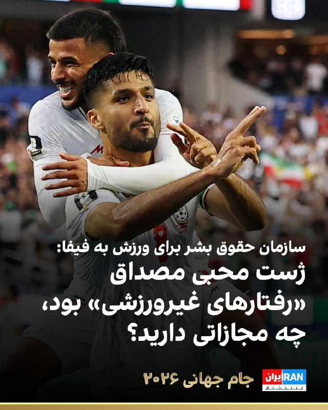

🔻سازمان حقوق بشر برای ورزش در نامه‌ای سرگشاده به کمیته انضباطی فیفا، شادی پس از گل محمد محبی، بازیکن تیم ملی فوتبال ایران، در دیدار مقابل نیوزیلند در جام جهانی ۲۰۲۶ را مصداق «رفتارهای غیرورزشی» دانسته که می‌تواند «موجب بی‌اعتباری فوتبال» شود.

🔹مطابق این آیین‌نامه، رفتارهای غیرورزشی می‌تواند مجازات‌هایی در پی داشته باشد.

🔹محبی پس از زدن گل دوم ایران به نیوزیلند، دست خود را به شکل اسلحه درآورد و به سمت هواداران گرفت.

🔹این سازمان در نامه خود، با استناد به مواد ۱۳، ۱۴ و ۲۵ آیین‌نامه انضباطی فیفا، بر لزوم رعایت اصول بازی جوانمردانه، پرهیز از رفتارهای غیرورزشی و امکان اعمال مجازات در صورت استفاده از حرکات یا نشانه‌هایی که می‌تواند موجب بی‌اعتباری فوتبال شود، تاکید کرده است.

🔹به نوشته سازمان حقوق بشر برای ورزش، نشان دادن ژست «تفنگ» مستقیما در چارچوب مقررات کمیته انضباطی فیفا قرار می‌گیرد و پرسش‌هایی را درباره نحوه اعمال این مقررات در مسابقات رسمی، از جمله جام جهانی ۲۰۲۶، مطرح می‌کند.

🔹جزییات بیشتر این نامه را در سایت بخوانید.

@iranintltvsport

## FarsiVOA — post 221026

  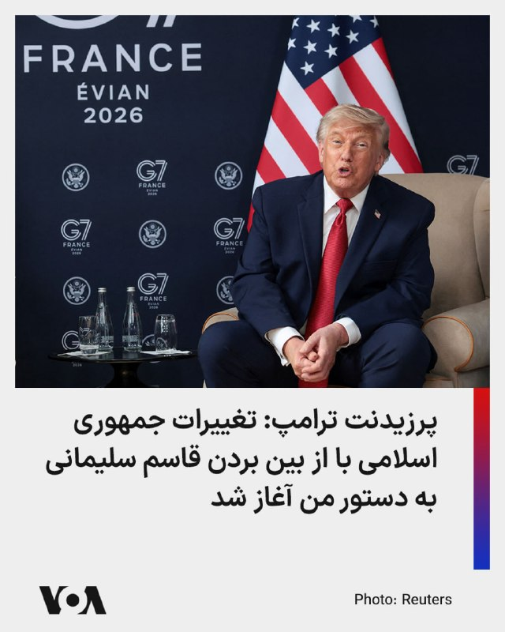

⚡️دونالد ترامپ، رئیس جمهوری آمریکا در دیدار با نخست وزیر هند در حاشیه نشست گروه هفت گفت: تغییرات جمهوری اسلامی با دستور من برای کشتن قاسم سلیمانی آغاز شد.
پرزیدنت ترامپ افزود: جمهوری اسلامی رده اول و دوم رهبری خود را از دست داده و اکنون با توافق من هرگز به سلاح هسته‌ای دست پیدا نخواهند کرد.

## DW_Farsi — post 126109

  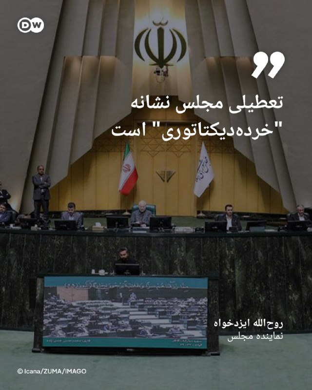

🔶 ایزدخواه: تعطیلی مجلس نشانه "خرده‌دیکتاتوری" است

روح‌الله ایزدخواه، نماینده مجلس، در ویدیویی که از سخنرانی او در جمع تعدادی از تجمع‌کنندگان مقابل مجلس منتشر شده، گفت تعطیلی مجلس تصمیم هیات رئیسه بوده است. او خطاب به معترضان گفت فریاد خود را باید بر سر هیات رئیسه بزنند، نه نماینده‌ای که در جمع آنان حاضر شده است.

ایزدخواه در این سخنان گفت: "مجلس را من تعطیل نکردم؛ هیات رئیسه تعطیل کرده است." او همچنین افزود اداره مجلس در اختیار هیات رئیسه است و حراست نیز از او دستور نمی‌گیرد.

او با لحنی انتقادی گفت: "من مجلس را پلمپ نکردم" و تاکید کرد تعطیلی مجلس تصمیم شخص او نبوده است.

این نماینده مجلس گفت این تعلیق و تعطیلی در تاریخ مجالس ایران ثبت خواهد شد؛ همان‌طور که به توپ بستن مجلس و نیز انحلال مجلس توسط مصدق در تاریخ ثبت شده است.

ایزدخواه همچنین این وضعیت را نشانه "نوعی خرده‌دیکتاتوری" توصیف کرد و گفت روزی روشن خواهد شد که این تصمیم از کجا ناشی شده و چرا به وجود آمده است.
@dw_farsi

## Persian_Trend_Official — post 17354

  <a href="telegram/content/Persian_Trend_Official_17354_1781707476.mp4" target="_blank">🎬 Download video</a>

ترامپ: ما در هفته اول جنگ، ایران را از نظر نظامی شکست دادیم.

هیچ کس فکر نمی‌کرد که این کار شدنی باشد.

📝 Amir

📌 @persian_trend_official
پرشین ترند | متفاوت‌ترین کانال نظامی

## Persian_Trend_Official — post 17353

  <a href="telegram/content/Persian_Trend_Official_17353_1781707479.mp4" target="_blank">🎬 Download video</a>

خبرنگار: آیا می‌خواهید اروپایی‌ها مین‌روب به هرمز بفرستند؟

ترامپ: ما به آن نیازی نداریم، اما اگر آنها بخواهند آن را بفرستند، خوب است.

📝 Amir

📌 @persian_trend_official
پرشین ترند | متفاوت‌ترین کانال نظامی

## IranianMinds — post 22799

🔴 ترامپ :

اگه ایرانیا بخوان بازی کنن باهامو‌ن و‌ در آخر امضا نکنن توافق رو دوباره برمیگردیم به جنگ !

@IranianMinds

## BBCPersian — post 284140

  <a href="telegram/content/BBCPersian_284140_1781707482.mp4" target="_blank">🎬 Download video</a>

🔻محمدحسین خوشوقت، برادر همسر مصطفی خامنه‌ای، می‌گوید کارشناسان امنیتی به مجتبی خامنه‌ای توصیه کرده‌اند «حتی در حد نشر صدا هم خودشان را نشان ندهند.»

آقای خوشوقت در یک مصاحبه تفصیلی با انصاف‌نیوز، در مورد رهبری مجتبی خامنه‌ای گفت: «او راه پدر را با صلابت و عقلانیت ادامه خواهد داد و البته با توجه به شرایط پس از جنگ ممکن است در بعضی موارد با پدر متفاوت باشد.»

او در مورد مذاکره مستقیم با آمریکا گفت: «چند سال پیش از ایشان پرسیدم که به طور مطلق با مذاکره مخالفید یا در شرایط فعلی ملاحظاتی دارید، در پاسخ گفتند من نه تنها با مذاکره بلکه با برقرار روابط سیاسی و تجاری با آمریکا هم موافقم اما به شرط اینکه آمریکا از موضع محترمانه با ما رفتار کند.»

مجتبی خامنه‌ای از زمانی که به عنوان جانشین پدرش انتخاب شده است، در انظار عمومی ظاهر نشده و هیچ عکس و فیلم و صدایی هم از او منتشر نشده است.

https://bbc.in/4uLuDL4
@BBCPersian

## Hranews — post 113677

بازداشت ۶ شهروند در جریان اعتراض به بهره‌برداری از معدن کرومیت پشموکی

❗️
❗️
❗️
❗️
❗️– امروز چهارشنبه ۲۷ خردادماه، مرضیه حوت، ماه‌بی‌بی حوت، صمیه بامری، علی‌بخش بامری، رضا بیگ‌بامری و انور حوت در جریان تجمع اعتراضی شهروندان در روستای پشموکی از توابع شهرستان فاریاب در استان کرمان توسط نیروهای انتظامی و امنیتی بازداشت و به مکان نامعلومی منتقل شدند. اهالی این منطقه برای دومین روز متوالی در اعتراض به نحوه بهره‌برداری از معدن کرومیت در این منطقه تجمع کرده بودند که با دخالت نیروهای انتظامی و امنیتی به خشونت کشیده شد.

ادامه مطلب

#مرضیه_حوت #ماه‌بی‌بی_حوت #صمیه_بامری
#علی‌بخش_بامری #رضا_بیگ‌بامری #انور_حوت

↘️
@hranews_bot تماس ✉️ - @Hranews کانال هرانا 🆑

---
📅 بروزرسانی: 1405/03/27 18:03
---

## VahidOOnLine — post 246028

  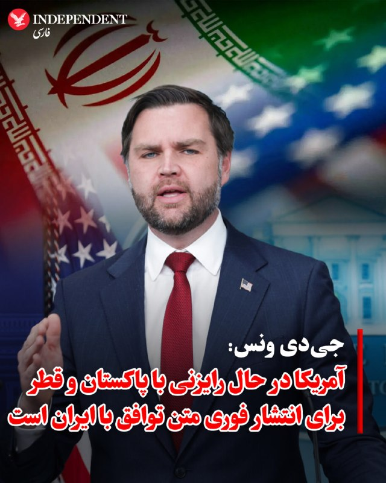

♦️ جی‌دی ونس، معاون رئیس‌جمهوری آمریکا، در گفتگو با برنامه صبحگاهی شبکه سی‌بی‌اس اعلام کرد که واشنگتن در حال فشار بر پاکستان و قطر است تا اجازه دهند متن یادداشت تفاهم با جمهوری اسلامی ایران، ظرف امروز، (چهارشنبه ۲۷ خرداد) به‌طور عمومی منتشر شود.

ونس با اشاره به اینکه آمریکایی‌ها حق دارند از جزئیات این سند باخبر شوند، گفت: «میانجی‌گران از ما خواسته بودند به دلیل برخی پروتکل‌های دیپلماتیک که من خودم هم کاملا آن‌ها را درک نمی‌کنم، انتشار متن را به تاخیر بیندازیم؛ اما ما به آن‌ها فشار می‌آوریم تا همین امروز آن را علنی کنند، زیرا می‌خواهیم به مردم آمریکا بگوییم که این اساسا توافق خوبی برای آن‌هاست.» او روز گذشته نیز به حساسیت‌های موجود در جهان عرب و اسلام و لزوم تنظیم درست توالی اقدامات اشاره کرده بود.

در همین حال، خبرگزاری‌های بلومبرگ و سی‌ان‌ان روز چهارشنبه گزارش دادند که به یکی از پیش‌نویس‌های این تفاهم‌نامه دست یافته و ۱۴ بند از آن را منتشر کرده‌اند. ونس تاکید کرد که متن اصلی سند حداکثر تا روز جمعه به‌طور رسمی منتشر خواهد شد.
‌🇸🇦 Indypersian

🤖 @VahidOOnLine

## VahidOOnLine — post 246027

  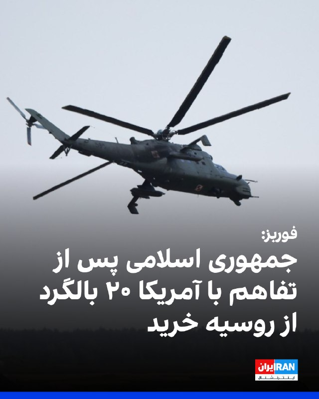

نشریه فوربز گزارش داد مقام‌های جمهوری اسلامی چند روز پس از اعلام تفاهم با آمریکا، در سفر به مسکو قرارداد خرید ۲۰ بالگرد روسی را امضا کردند.

بر اساس این گزارش، پیرحسین کولیوند، رییس جمعیت هلال احمر جمهوری اسلامی، روز چهارشنبه در مسکو قرارداد خرید این بالگردها را با مدیرعامل شرکت روسی هلیکوپترز امضا کرد. خبرگزاری وانا گزارش داد قرار است چهار فروند نخست از این بالگردها تا مارس ۲۰۲۷ تحویل شوند.

فوربز نوشت این بالگردها برای ناوگان پشتیبانی و امداد هوایی هلال احمر خریداری شدند.

این نشریه افزود قرارداد خرید بالگردها در شرایطی امضا شد که جمهوری اسلامی هم‌زمان با اجرای تفاهم با آمریکا، گسترش همکاری‌های اقتصادی با روسیه و نوسازی بخشی از ناوگان هوایی خود را دنبال می‌کند.

عبدالناصر همتی، رییس کل بانک مرکزی جمهوری اسلامی، نیز هم‌اکنون در روسیه به سر می‌برد و در دیدار با مقام‌های روسی خواستار گسترش همکاری‌های بانکی، مالی و تجاری میان تهران و مسکو شده است.
‌🏁 🇬🇧 IranintlTV

🤖 @VahidOOnLine

## VahidOOnLine — post 246026

♦️همدان به عنوان یکی از مهم‌ترین قطب‌های تولید سیر در ایران، هر ساله با آغاز فصل برداشت، میزبان یکی از ارزشمندترین محصولات کشاورزی کشور می‌شود. خاک حاصلخیز، اقلیم مناسب و تجربه چندین نسل از کشاورزان این استان، سیر همدان را به محصولی با کیفیت بالا، طعم مطلوب و ماندگاری قابل توجه تبدیل کرده است؛ ویژگی‌هایی که علاوه بر تامین بازار داخلی، زمینه حضور پررنگ آن را در بازارهای صادراتی نیز فراهم کرده است.
این روزها مزارع سیر قرمز همدان با رنگ‌های چشم‌نواز و تلاش بی‌وقفه کشاورزان، تصویری از پیوند طبیعت، کار و اقتصاد را به نمایش گذاشته‌اند.
سیر قرمز به دلیل دارا بودن ترکیبات زیست‌فعال گوگردی، به‌ویژه ماده «آلیسین» که پس از خرد شدن یا له شدن حبه‌ها تشکیل می‌شود، از ارزش تغذیه‌ای و دارویی بالایی برخوردار است.
این تصاویر را رضا زنگنه ثبت کرده و در خبرگزاری میزان منتشر شده‌اند.
‌🇸🇦 Indypersian

🤖 @VahidOOnLine

## pm_afshaa — post 94263

  <a href="telegram/content/pm_afshaa_94263_1781706817.webm" target="_blank">🎬 Download video</a>

🔴نشریه فوربز: جمهوری اسلامی بعد از تفاهم با آمریکا 20 بالگرد از روسیه خرید.

💧 Rainbet.com the #1 Non-KYC Crypto Casino & Sportsbook @rainbetcom

😁 @Pm_Afshaa

## pm_afshaa — post 94262

  <a href="telegram/content/pm_afshaa_94262_1781706817.mp4" target="_blank">🎬 Download video</a>

🔴ترامپ: هیچوقت نمیدونی قراردادها چه می‌کنند، اما به‌زودی خواهی فهمید. فکر میکنم انجام خواهد شد. آنها میخوان امضا کنند؛ میخوان به زندگی عادی بازگردند.

💧 Rainbet.com the #1 Non-KYC Crypto Casino & Sportsbook @rainbetcom

😁 @Pm_Afshaa

## IranianMinds — post 22798

  <a href="telegram/content/IranianMinds_22798_1781706819.mp4" target="_blank">🎬 Download video</a>

🔴 ترامپ :

هیچکس فکرشو نمیکرد بشه ولی ما تو همون هفته ی اول ایران رو‌ از نظر نظامی شکست دادیم.

@IranianMinds

## IranianMinds — post 22797

  <a href="telegram/content/IranianMinds_22797_1781706821.mp4" target="_blank">🎬 Download video</a>

🔴 ترامپ درباره ایران:

هیچوقت نمی‌شود با قطعیت گفت توافق‌ها چه نتیجه‌ای خواهند داشت، اما خیلی زود متوجه خواهید شد. فکر می‌کنم این توافق انجام خواهد شد.

آن‌ها می‌خواهند توافق را امضا کنند؛ می‌خواهند به یک زندگی عادی برگردند.

@IranianMinds

## BBCPersian — post 284139

🔻از متن تفاهمنامه ایران و آمریکا چه می‌دانیم؟

پس از این که روز یکشنبه اعلام شد ایران و آمریکا به تفاهم رسیده‌اند، خبرگزاری مهر به نقل از یک «منبع نزدیک به تیم مذاکره‌کننده ایرانی جزئیات تازه‌ای از پیش‌نویس تفاهمنامه ۱۴ ماده‌ای ایران و آمریکا» را منتشر کرد.

در این متن خلاصه‌ و موردبندی شده، در بند اول آن بر چند مطالبه کلیدی تاکید شده است: توقف فوری و دائمی جنگ در همه جبهه‌ها، از جمله لبنان؛ رفع کامل محاصره دریایی؛ بازگشایی تنگه هرمز ظرف ۳۰ روز و تعلیق تحریم‌های مربوط به فروش نفت. همچنین ایران بر تعهد خود مبنی بر عدم ساخت سلاح هسته‌ای تأکید می‌کند.

در یکی از بندها نیز آمده است که ۲۴ میلیارد دلار از دارایی‌های بلوکه‌ شده ایران باید طی یک دوره ۶۰ روزه و همزمان با مذاکرات نهایی آزاد شود؛ به‌طوری‌که نیمی از این مبلغ پیش از آغاز مذاکرات در اختیار ایران قرار گیرد.
ادامه مطلب⬇️

https://bbc.in/3SN5sdu
@BBCPersian

## Hranews — post 113676

  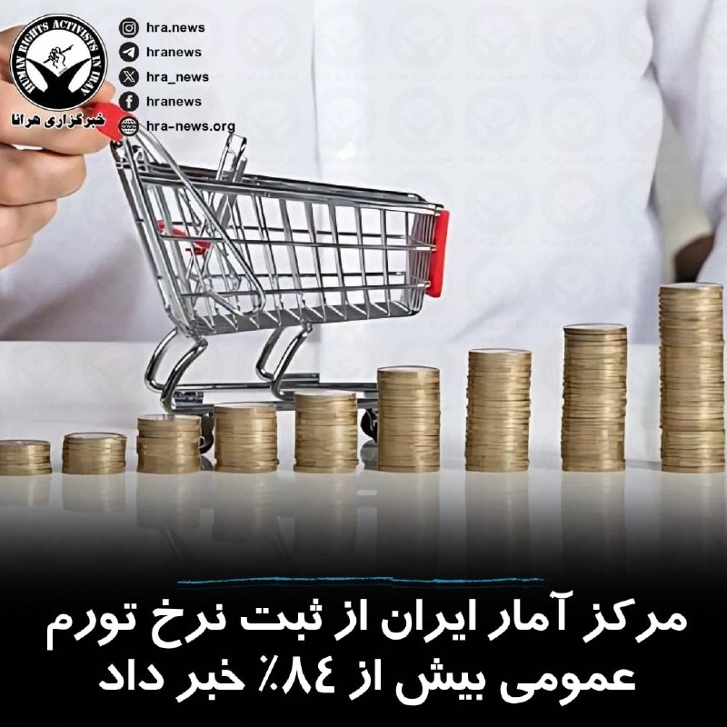

مرکز آمار ایران با انتشار گزارشی از ثبت نرخ تورم عمومی بیش از ۸۴٪ خبر داد. شرایطی که بیانگر تداوم وخامت وضعیت تورمی اقتصاد کشور و تشدید مشکلات معیشتی شهروندان نسبت به گذشته است.

همچنین روزنامه همشهری نیز در گزارشی عنوان کرده است که وقوع #تورم ۸۴ درصدی، علاوه بر پیامدهای ناگوار اقتصادی و تغییر بنیادین ساختارهای رفاهی جامعه، نااطمینانی‌های شدیدی را در محاسبات مالی بنگاه‌های اقتصادی ایجاد کرده و تمایل به سرمایه‌گذاری‌های بلندمدت و توسعه‌ای را به حداقل ممکن کاهش می‌دهد. در این وضعیت، هزینه‌های تأمین مواد اولیه و ماشین‌آلات به صورت روزانه افزایش یافته و کمبود نقدینگی در گردش، کارخانه‌ها را به سمت تعدیل نیرو یا کاهش ظرفیت تولید سوق می‌دهد. از سوی دیگر، شکاف عمیق میان نرخ رشد دستمزدها و شتاب قیمت سبد کالاهای اساسی، اصلی‌ترین پیامد این شاخص بر معیشت عمومی و توزیع عادلانه درآمدها است.

↘️
@hranews_bot تماس ✉️ - @Hranews کانال هرانا 🆑

---
📅 بروزرسانی: 1405/03/27 17:53
---

## WithYashar — post 15156

  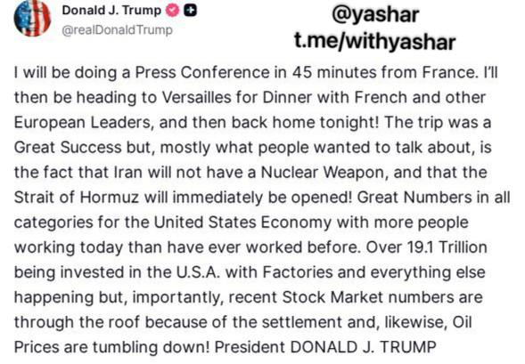

ترامپ در تروث : من در عرض ۴۵ دقیقه از فرانسه یک کنفرانس خبری برگزار خواهم کرد. سپس به ورسای برای صرف شام با رهبران فرانسوی و دیگر رهبران اروپایی خواهم رفت و بعد از آن امشب به خانه بازمی‌گردم!
این سفر یک موفقیت بزرگ بود، اما عمدتاً چیزی که همه می‌خواستند درباره‌اش صحبت کنند این است که ایران سلاح هسته‌ای نخواهد داشت و تنگه هرمز فوراً باز خواهد شد!
شاخص‌های عظیمی در همه بخش‌ها برای اقتصاد ایالات متحده وجود دارد، به طوری که امروز بیشتر از همیشه افراد مشغول به کار هستند.
بیش از ۱۹.۱ تریلیون دلار در آمریکا سرمایه‌گذاری شده است، با تمام کارخانه‌ها و سایر موارد، اما نکته مهم این است که شاخص‌های اخیر بازار سهام به دلیل توافق افزایش یافته‌اند و به همین ترتیب، قیمت نفت به سرعت در حال کاهش است!
@withyashar

## pm_afshaa — post 94261

🔴خبرنگار ایرنا: در حالی که در ابتدا قرار بود مراسم امضا در سوئیس توسط مقامات ارشد ایرانی و آمریکایی برگزار بشه، دیدار ونس و قالیباف لغو شد و هیات ایرانی به ژنو نمیره!

💧 Rainbet.com the #1 Non-KYC Crypto Casino & Sportsbook @rainbetcom

😁 @Pm_Afshaa

## pm_afshaa — post 94260

  <a href="telegram/content/pm_afshaa_94260_1781706233.webm" target="_blank">🎬 Download video</a>

🔴پست جدید ترامپ:

من در عرض 45 دقیقه از فرانسه یک کنفرانس خبری برگزار خواهم کرد. سپس به ورسای برای صرف شام با رهبران فرانسوی و دیگر رهبران اروپایی خواهم رفت و بعد از آن امشب به خانه بازمی‌گردم!

این سفر یک موفقیت بزرگ بود، اما عمدتاً چیزی که همه می‌خواستند درباره‌اش صحبت کنند این است که ایران سلاح هسته‌ای نخواهد داشت و تنگه هرمز فوراً باز خواهد شد!

شاخص‌های عظیمی در همه بخش‌ها برای اقتصاد ایالات متحده وجود دارد، به طوری که امروز بیشتر از همیشه افراد مشغول به کار هستند. بیش از ۱۹.۱ تریلیون دلار در آمریکا سرمایه‌گذاری شده است، با تمام کارخانه‌ها و سایر موارد، اما نکته مهم این است که شاخص‌های اخیر بازار سهام به دلیل توافق افزایش یافته‌اند و به همین ترتیب، قیمت نفت به سرعت در حال کاهش است!

💧Rainbet.com the #1 Non-KYC Crypto Casino & Sportsbook @rainbetcom

😁 @Pm_Afshaa

## VahidOnline — post 76451

  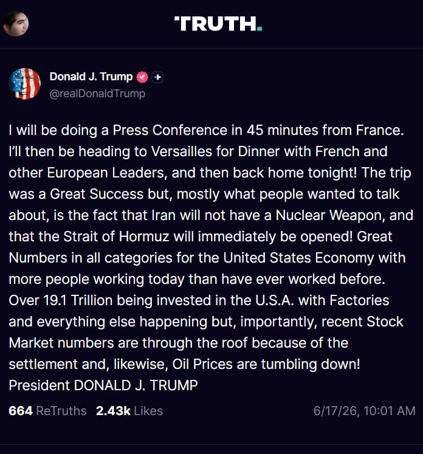

پست ترامپ، ترجمه ماشین:
من ۴۵ دقیقه دیگر از فرانسه یک کنفرانس خبری برگزار خواهم کرد. سپس برای شام با رهبران فرانسه و دیگر رهبران اروپایی به ورسای می‌روم و امشب به خانه بازمی‌گردم! این سفر موفقیتی بزرگ بود، اما مهم‌تر از همه، چیزی که مردم بیشتر می‌خواستند درباره‌اش صحبت کنند این بود که ایران سلاح هسته‌ای نخواهد داشت و تنگه هرمز فوراً باز خواهد شد!

در همه شاخص‌ها، ارقام مربوط به اقتصاد ایالات متحده عالی است؛ امروز شمار افرادی که مشغول به کار هستند از هر زمان دیگری بیشتر است. بیش از ۱۹.۱ تریلیون دلار در آمریکا سرمایه‌گذاری می‌شود، کارخانه‌ها و همه چیزهای دیگر در حال شکل‌گیری است؛ اما نکته مهم این است که ارقام اخیر بازار سهام به خاطر این توافق سر به فلک کشیده و به همین ترتیب، قیمت نفت هم به‌شدت در حال سقوط است!

رئیس‌جمهور دونالد جی. ترامپ
realDonaldTrump

📡 @VahidOnline

## VahidOnline — post 76450

  

جی‌دی ونس، معاون رئیس‌جمهوری آمریکا، در گفتگو با برنامه صبحگاهی شبکه سی‌بی‌اس (CBS)، از سیاست‌های دولت دونالد ترامپ در قبال جمهوری اسلامی ایران دفاع کرد و به انتقاد از کسانی پرداخت که به گفته او، صرفا به دنبال تداوم درگیری نظامی هستند.

ونس با تفکیک میان «ابزار» و «هدف» در سیاست خارجی واشنگتن گفت: «رئیس‌جمهوری از دیپلماسی، اهرم‌های اقتصادی و فشار نظامی استفاده کرد تا مطمئن شود ایران به سلاح هسته‌ای دست پیدا نمی‌کند؛ هدف اصلی همواره همین بوده است». او با انتقاد از تندروها افزود: «بعضی‌ها فقط می‌خواهند بمباران‌ها ادامه داشته باشد، بدون اینکه توجه کنند آیا این کار اصلا دستاوردی برای مردم آمریکا دارد یا خیر».

معاون رئیس‌جمهوری آمریکا در پایان تاکید کرد که هدف ترامپ ایجاد بدبختی و رنج برای مردم ایران نیست، بلکه تمرکز اصلی دولت او، مهار برنامه‌های تسلیحاتی و جلوگیری از دستیابی تهران به سلاح هسته‌ای است.
@VahidOOnLine

📡 @VahidOnline

## IranIntlTV — post 342868

  

نشریه فوربز گزارش داد مقام‌های جمهوری اسلامی چند روز پس از اعلام تفاهم با آمریکا، در سفر به مسکو قرارداد خرید ۲۰ بالگرد روسی را امضا کردند.

بر اساس این گزارش، پیرحسین کولیوند، رییس جمعیت هلال احمر جمهوری اسلامی، روز چهارشنبه در مسکو قرارداد خرید این بالگردها را با مدیرعامل شرکت روسی هلیکوپترز امضا کرد. خبرگزاری وانا گزارش داد قرار است چهار فروند نخست از این بالگردها تا مارس ۲۰۲۷ تحویل شوند.

فوربز نوشت این بالگردها برای ناوگان پشتیبانی و امداد هوایی هلال احمر خریداری شدند.

این نشریه افزود قرارداد خرید بالگردها در شرایطی امضا شد که جمهوری اسلامی هم‌زمان با اجرای تفاهم با آمریکا، گسترش همکاری‌های اقتصادی با روسیه و نوسازی بخشی از ناوگان هوایی خود را دنبال می‌کند.

عبدالناصر همتی، رییس کل بانک مرکزی جمهوری اسلامی، نیز هم‌اکنون در روسیه به سر می‌برد و در دیدار با مقام‌های روسی خواستار گسترش همکاری‌های بانکی، مالی و تجاری میان تهران و مسکو شده است.
https://iranintl.com/202606174841

## IranIntlTV — post 342867

  <a href="telegram/content/IranIntlTV_342867_1781706235.mp4" target="_blank">🎬 Download video</a>

دونالد ترامپ در اوج اعتراضات دی‌ماه به معترضان ایرانی گفت به اعتراضات ادامه بدهید و کمک در راه است. امروز اما از توافق با جمهوری اسلامی دفاع می‌کند و می‌گوید هیچ‌وقت دنبال تغییر حکومت نبوده است. پس چه چیزی تغییر کرده؟ ترامپ؟ سیاست آمریکا؟ یا انتظاراتی که در میان بخشی از ایرانی‌ها ایجاد شده بود؟

مهدی بیگی، عضو تحریریه ایران‌اینترنشنال، در «پیوست» بررسی کرده که ترامپ چطور از وعده کمک به معترضان به توافق با سپاه پاسداران رسید.
@iranintltv

## FarsiVOA — post 221025

🔺کمیته روابط خارجی سنا طرح قانونی حمایت از حقوق بشر و آزادی اینترنت در ایران را بررسی می‌کند

▪️کمیته روابط خارجی سنای آمریکا روز چهارشنبه ۲۷ خرداد، طرحی دوحزبی را برای گسترش آزادی اینترنت در ایران، حمایت از حقوق بشر، و پاسخگو کردن مقام‌های جمهوری اسلامی در برابر سرکوب معترضان و نقض حقوق شهروندان بررسی کرد.

⬇️ بیشتر بخوانید:
https://ir.voanews.com/a/iran-internet-senate-foregn-committees-human-rights/8161844.html/?nocach=1

## DW_Farsi — post 126101

🔶 چرا با افزایش سن پلک‌ها دچار افتادگی می‌شوند؟

شاید متوجه افتادگی پلک‌های خود در یک عکس یا هنگام نگاه کردن در آینه شده باشید: پلک‌های بالایی پایین‌تر از حد معمول قرار گرفته‌اند، پوست اضافه روی چین پلک قرار گرفته است، یا چشم‌ها به اندازه گذشته باز و هوشیار به نظر نمی‌رسند.

برخی از تغییرات در پلک‌ها و ابروها به دلیل افزایش سن و تاثیر جاذبه بر صورت ما طبیعی و قابل انتظار است و این موضوع عمدتا یک مسئله زیبایی به شمار می‌رود. اما اگر پلک یا پوست اضافه شروع به مسدود کردن دید شما کند، افتادگی پلک می‌تواند بر کیفیت بینایی شما نیز تاثیر بگذارد.

@dw_farsi

## Persian_Trend_Official — post 17352

  <a href="telegram/content/Persian_Trend_Official_17352_1781706238.webm" target="_blank">🎬 Download video</a>

اولین سربازان اسرائیلی که پس از اجرای آتش بس زخمی شدند.

ارتش اسرائیل در بیانیه ای اعلام کرد در پی حمله پهپادی حزب الله لبنان، 5 نظامی این کشور زخمی شده اند که حال یکی از آنها وخیم گزارش شده است.

📝 Amir

📌 @persian_trend_official
پرشین ترند | متفاوت‌ترین کانال نظامی

## Persian_Trend_Official — post 17351

  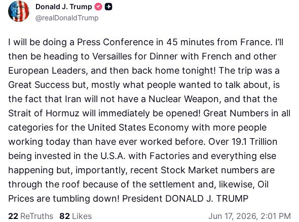

ترامپ در تروث سوشال: 45 دقیقه دیگر در فرانسه کنفرانس مطبوعاتی خواهم داشت. سپس برای صرف شام با رهبران فرانسه و دیگر کشورهای اروپایی به کاخ ورسای می‌روم و امشب به خانه برمی‌گردم!

این سفر موفقیت بزرگی بود، اما چیزی که مردم بیشتر می‌خواستند در مورد آن صحبت کنند این واقعیت بود که ایران سلاح هسته‌ای نخواهد داشت و تنگه هرمز فوراً باز خواهد شد!

او همچنین گفت که در نتیجه توافق، آمار بازار سهام افزایش یافته است، در حالی که قیمت نفت کاهش یافته است.

📝 Amir

📌 @persian_trend_official
پرشین ترند | متفاوت‌ترین کانال نظامی

## Persian_Trend_Official — post 17350

  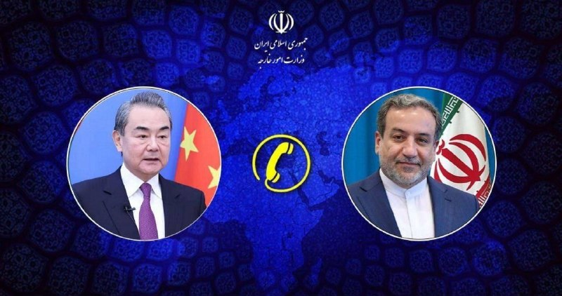

گفتگوی تلفنی عباس عراقچی با وزیر امور خارجه چین

سید عباس عراقچی وزیر امور خارجه جمهوری اسلامی ایران و وانگ یی وزیر امور خارجه جمهوری خلق چین، بعد از ظهر امروز چهارشنبه، طی یک تماس تلفنی گفتگو و تبادل نظر کردند.

📝 Amir

📌 @persian_trend_official
پرشین ترند | متفاوت‌ترین کانال نظامی

## IranianMinds — post 22796

  <a href="telegram/content/IranianMinds_22796_1781706239.mp4" target="_blank">🎬 Download video</a>

🔴پایگاه نظامی جدید آمریکا در نزدیکی غزه.

@IranianMinds

## BBCPersian — post 284138

  <a href="telegram/content/BBCPersian_284138_1781706242.mp4" target="_blank">🎬 Download video</a>

🔻سرخط خبرهای چهارشنبه ۲۷ خرداد ۱۴۰۵
@BBCPersian

## Dirty_Kids — post 392392

  <a href="telegram/content/Dirty_Kids_392392_1781706244.mp4" target="_blank">🎬 Download video</a>

🔴 هم اکنون وضعیت مشهد، تو این گرما و نزدیک تابستون، طوفان و بارون شده.

+ هندزفری بزنین مردم اعصاب ندارن🔞

@Dirty_Kids 👻

---
📅 بروزرسانی: 1405/03/27 17:43
---

## VahidOOnLine — post 246025

  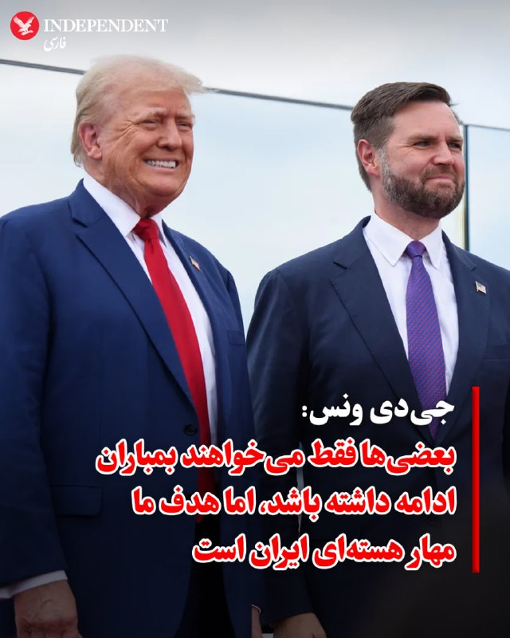

♦️ جی‌دی ونس، معاون رئیس‌جمهوری آمریکا، در گفتگو با برنامه صبحگاهی شبکه سی‌بی‌اس (CBS)، از سیاست‌های دولت دونالد ترامپ در قبال جمهوری اسلامی ایران دفاع کرد و به انتقاد از کسانی پرداخت که به گفته او، صرفا به دنبال تداوم درگیری نظامی هستند.

ونس با تفکیک میان «ابزار» و «هدف» در سیاست خارجی واشنگتن گفت: «رئیس‌جمهوری از دیپلماسی، اهرم‌های اقتصادی و فشار نظامی استفاده کرد تا مطمئن شود ایران به سلاح هسته‌ای دست پیدا نمی‌کند؛ هدف اصلی همواره همین بوده است». او با انتقاد از تندروها افزود: «بعضی‌ها فقط می‌خواهند بمباران‌ها ادامه داشته باشد، بدون اینکه توجه کنند آیا این کار اصلا دستاوردی برای مردم آمریکا دارد یا خیر».

معاون رئیس‌جمهوری آمریکا در پایان تاکید کرد که هدف ترامپ ایجاد بدبختی و رنج برای مردم ایران نیست، بلکه تمرکز اصلی دولت او، مهار برنامه‌های تسلیحاتی و جلوگیری از دستیابی تهران به سلاح هسته‌ای است.
‌🇸🇦 Indypersian

🤖 @VahidOOnLine

## VahidOOnLine — post 246024

  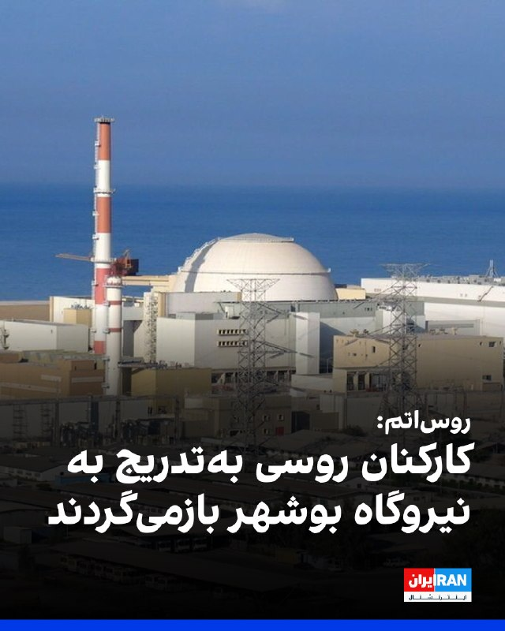

مدیرعامل روس‌اتم گفت متخصصان روسی پس از کاهش خطر حملات نظامی به ایران، به‌صورت مرحله‌ای به نیروگاه هسته‌ای بوشهر بازخواهند گشت.

او افزود با بهبود شرایط امنیتی، روند بازگشت کارکنان روسی به این نیروگاه آغاز خواهد شد.

الکسی لیخاچف، رییس روس‌اتم پیش‌تر از آمادگی این شرکت برای مشارکت در رقیق‌سازی ذخایر اورانیوم با غنای بالای جمهوری اسلامی خبر داده بود.

روسیه از شرکای اصلی جمهوری اسلامی در توسعه و بهره‌برداری از نیروگاه هسته‌ای بوشهر به شمار می‌رود و ده‌ها متخصص روسی در این مجموعه فعالیت می‌کنند.
‌🏁 🇬🇧 IranintlTV

🤖 @VahidOOnLine

## VahidOOnLine — post 246023

  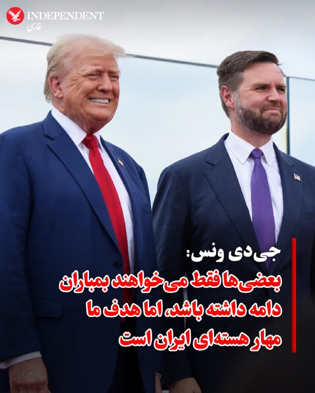

♦️ جی‌دی ونس، معاون رئیس‌جمهوری آمریکا، در گفتگو با برنامه صبحگاهی شبکه سی‌بی‌اس (CBS)، از سیاست‌های دولت دونالد ترامپ در قبال جمهوری اسلامی ایران دفاع کرد و به انتقاد از کسانی پرداخت که به گفته او، صرفا به دنبال تداوم درگیری نظامی هستند.

ونس با تفکیک میان «ابزار» و «هدف» در سیاست خارجی واشنگتن گفت: «رئیس‌جمهوری از دیپلماسی، اهرم‌های اقتصادی و فشار نظامی استفاده کرد تا مطمئن شود ایران به سلاح هسته‌ای دست پیدا نمی‌کند؛ هدف اصلی همواره همین بوده است». او با انتقاد از تندروها افزود: «بعضی‌ها فقط می‌خواهند بمباران‌ها ادامه داشته باشد، بدون اینکه توجه کنند آیا این کار اصلا دستاوردی برای مردم آمریکا دارد یا خیر».

معاون رئیس‌جمهوری آمریکا در پایان تاکید کرد که هدف ترامپ ایجاد بدبختی و رنج برای مردم ایران نیست، بلکه تمرکز اصلی دولت او، مهار برنامه‌های تسلیحاتی و جلوگیری از دستیابی تهران به سلاح هسته‌ای است.
‌🇸🇦 Indypersian

🤖 @VahidOOnLine

## FoxNewsTwitter — post 343062

  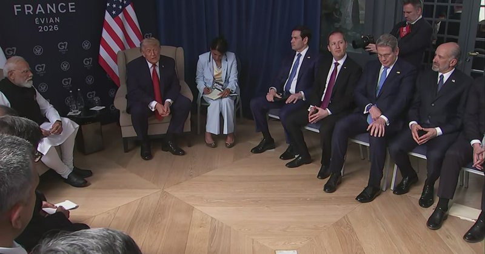

Fox News (Twitter/X)

WATCH LIVE: President Trump meets with India's prime minister at G7 summit https://twitter.com/i/broadcasts/1RKZzzABgRzKB

## pm_afshaa — post 94259

  <a href="telegram/content/pm_afshaa_94259_1781705629.webm" target="_blank">🎬 Download video</a>

🔴خبرنگار صداوسیما: با فروپاشی محاصره دریایی آمریکا، دست‌کم 3 نفتکش ایرانی با ظرفیت 5 میلیون بشکه نفت خام از تنگه هرمز به مقاصد تجاری رسیدن.

💧 Rainbet.com the #1 Non-KYC Crypto Casino & Sportsbook @rainbetcom

😁 @Pm_Afshaa

## IranIntlTV — post 342866

  

مدیرعامل روس‌اتم گفت متخصصان روسی پس از کاهش خطر حملات نظامی به ایران، به‌صورت مرحله‌ای به نیروگاه هسته‌ای بوشهر بازخواهند گشت.

او افزود با بهبود شرایط امنیتی، روند بازگشت کارکنان روسی به این نیروگاه آغاز خواهد شد.

الکسی لیخاچف، رییس روس‌اتم پیش‌تر از آمادگی این شرکت برای مشارکت در رقیق‌سازی ذخایر اورانیوم با غنای بالای جمهوری اسلامی خبر داده بود.

روسیه از شرکای اصلی جمهوری اسلامی در توسعه و بهره‌برداری از نیروگاه هسته‌ای بوشهر به شمار می‌رود و ده‌ها متخصص روسی در این مجموعه فعالیت می‌کنند.
https://iranintl.com/202606176532

## IranIntlTV — post 342865

  <a href="telegram/content/IranIntlTV_342865_1781705630.mp4" target="_blank">🎬 Download video</a>

ارتش اسرائیل اعلام کرد محمد سعید احمد نمروطی و معاویه سلیمان صقر عیادی، دو فرمانده وابسته به حماس و جهاد اسلامی فلسطین، در دو حمله جداگانه کشته شده‌اند. بر اساس بیانیه ارتش اسرائیل، این دو نفر در حمله هفتم اکتبر حماس به اسرائیل نیز مشارکت داشته‌اند.

جزییات بیشتر با بابک اسحاقی، خبرنگار ایران‌اینترنشنال
@iranintltv

## FarsiVOA — post 221023

🔺جی‌دی ونس: متن تفاهم‌نامه حداکثر تا جمعه منتشر خواهد شد

▪️معاون رئیس جمهوری آمریکا می‌گوید که متن تفاهم‌نامه‌ آمریکا و جمهوری اسلامی تا روز جمعه منتشر خواهد شد و توافق مورد نظر برای مردم آمریکا بسیار خوب خواهد بود.

⬇️ بیشتر بخوانید:

https://ir.voanews.com/a/jd-vance-iran-israel-release-text-agreement/8161846.html/?nocach=1

## Persian_Trend_Official — post 17349

ویدیویی از درگیری پلیس اسرائیل با معترضان حریدی

📝 Amir

📌 @persian_trend_official
پرشین ترند | متفاوت‌ترین کانال نظامی

## RadioFarda — post 158432

دادگاهی در آمریکا کیفرخواست علیه بانک ترکیه‌ای به اتهام کمک به دور زدن تحریم‌های ایران را لغو کرد

🔸یک قاضی فدرال آمریکا روز چهارشنبه کیفرخواست وزارت دادگستری ایالات متحده علیه «هالک‌بانک» را رد کرد؛ اقدامی که پس از آن صورت گرفت که دولت دونالد ترامپ به توافقی با این بانک دولتی ترکیه دست یافت و به پرونده‌ای که در سال ۲۰۱۹ مطرح شده بود پایان داد.

🔸به گزارش خبرگزاری رویترز، این تصمیم توسط ریچارد برمن، قاضی دادگاه ناحیه‌ای ایالات متحده در منهتن، اتخاذ شد. توافق یادشده که در ماه مارس اعلام شد، وعده داده بود یکی از عوامل تنش‌زای دیرینه در روابط ترکیه و آمریکا را برطرف کند. اعلام این توافق باعث جهش چشمگیر سهام هالک‌بانک در بورس استانبول شد.

🔸هالک‌بانک در نخستین دوره ریاست‌جمهوری ترامپ به اتهام کمک به ایران برای دور زدن تحریم‌های اقتصادی آمریکا تحت پیگرد قرار گرفته بود. ‌

🔸دادستان‌های آمریکایی هالک‌بانک را متهم کرده بودند که به‌طور مخفیانه ۲۰ میلیارد دلار از منابع مالی مشمول محدودیت را منتقل کرده، درآمدهای نفتی را به طلا و پول نقد تبدیل کرده تا به منافع ایران کمک کند و همچنین اسناد جعلی مربوط به محموله‌های غذایی تهیه کرده تا انتقال درآمدهای نفتی را توجیه کند.

🔸وزارت دادگستری آمریکا اعلام کرده است که کنار گذاشتن این پرونده در راستای منافع ایالات متحده برای محدود کردن حمایت از ایران است.

🔸بر اساس این توافق، هالک‌بانک از انجام هرگونه تراکنشی که به نفع ایران باشد منع می‌شود و همچنین موظف است تحت نظارت یک ناظر مستقل قرار گیرد تا رعایت مقررات تحریمی و قوانین مبارزه با پول‌شویی توسط این بانک را بررسی کند.

🔸در این توافق هیچ مبلغی میان طرفین رد و بدل نمی‌شود و هالک‌بانک نیز هیچ‌گونه تخلف کیفری را نپذیرفته است. این بانک پیش‌تر در این پرونده خود را بی‌گناه دانسته بود.

🔸این پرونده مسیر پیچیده‌ای را در دادگاه‌های آمریکا طی کرده بود. دیوان عالی ایالات متحده در ماه اکتبر سال گذشته تصمیم یک دادگاه پایین‌تر را که اجازه ادامه پیگرد قضایی را داده بود، به قوت خود باقی گذاشت.

🔸هالک‌بانک استدلال کرده بود که به عنوان یک نهاد دولتی متعلق به ترکیه، باید از مصونیت قضایی در برابر اقدامات حقوقی در دادگاه‌های کشورهای دیگر برخوردار باشد.

@RadioFarda

## IranianMinds — post 22795

  <a href="telegram/content/IranianMinds_22795_1781705632.mp4" target="_blank">🎬 Download video</a>

🔴 وضعیت هیئت های تهران که با اسلحه واستادن و دارن عزاداریشونو میکنن.

@IranianMidns

## BBCPersian — post 284137

  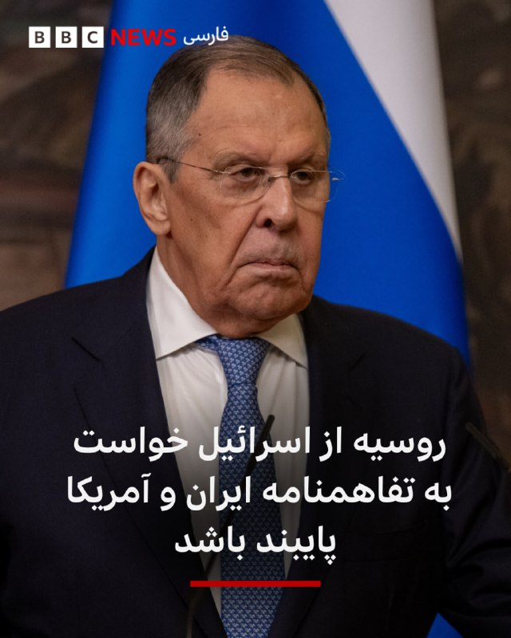

🔻سرگئی لاوروف با اعلام حمایت از تفاهم آمریکا و ایران از اسرائیل خواست به مفاد آن پایبند بماند.

وزیر خارجه روسیه گفت مسکو از هرگونه توافقی که به کاهش تنش‌ در منطقه منجر شود استقبال می‌کند و آن را گامی در جهت ثبات می‌داند.

به گفته او، «برای همه طرف‌ها اجرای کامل این توافق ضروری است و نمی‌توان از برخی کشورها انتظار پایبندی داشت اما دیگران از آن مستثنی باشند.»

اسرائیل امروز صبح به نقاطی در جنوب لبنان حمله کرد. ایران می‌گوید توقف جنگ در لبنان از جمله مواردی است که در تفاهمنامه ایران و آمریکا مطرح شده است.

📸GettyImages
https://bbc.in/4eeqUk7
@BBCPersian

## alonews — post 128680

  <a href="telegram/content/alonews_128680_1781705635.webm" target="_blank">🎬 Download video</a>

👈ترامپ:
من در عرض ۴۵ دقیقه از فرانسه یک کنفرانس خبری برگزار خواهم کرد. سپس به ورسای برای صرف شام با رهبران فرانسوی و دیگر رهبران اروپایی خواهم رفت و بعد از آن امشب به خانه بازمی‌گردم!

🔴این سفر یک موفقیت بزرگ بود، اما عمدتاً چیزی که همه می‌خواستند درباره‌اش صحبت کنند این است که ایران سلاح هسته‌ای نخواهد داشت و تنگه هرمز فوراً باز خواهد شد!

🔴شاخص‌های عظیمی در همه بخش‌ها برای اقتصاد ایالات متحده وجود دارد، به طوری که امروز بیشتر از همیشه افراد مشغول به کار هستند.

🔴بیش از ۱۹.۱ تریلیون دلار در آمریکا سرمایه‌گذاری شده است، با تمام کارخانه‌ها و سایر موارد، اما نکته مهم این است که شاخص‌های اخیر بازار سهام به دلیل توافق افزایش یافته‌اند و به همین ترتیب، قیمت نفت به سرعت در حال کاهش است! رئیس‌جمهور دونالد ج. ترامپ

✅ @AloNews خبر جنگ

---
📅 بروزرسانی: 1405/03/27 17:33
---

## VahidOOnLine — post 246022

  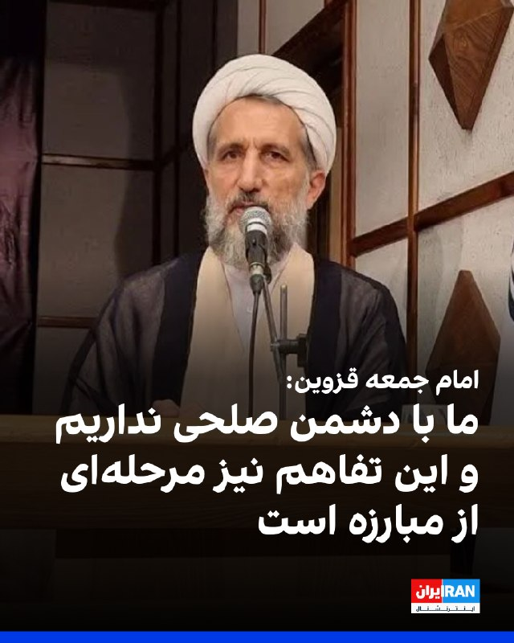

حسین مظفری، امام جمعه قزوین، در جلسه «ستاد پشتیبانی جنگ و بازسازی مناطق آسیب‌دیده» این استان، گفت: «همه می‌دانیم دشمن ذره‌ای قابل اعتماد نیست، حتی در صورت امضای تفاهم‌نامه نیز نباید خیالمان آسوده شود. ما با دشمن صلحی نداریم و این تفاهم نیز مرحله‌ای از مبارزه ما با آنان است.»

او افزود: «این جنگ، جنگ وجودی است، ما به دنبال اضمحلال دشمنان هستیم و دشمن نیز هر از گاهی چنین خواب‌هایی برای ما می‌بیند.»

امام جمعه قزوین ادامه داد: «ما به دنبال خون‌خواهی امام شهیدمان هستیم که آن هم جز با نابودی جبهه کفر و استکبار و خروج کامل نیروهای آمریکایی از منطقه محقق نخواهد شد.»
‌🏁 🇬🇧 IranintlTV

🤖 @VahidOOnLine

## VahidOnline — post 76449

  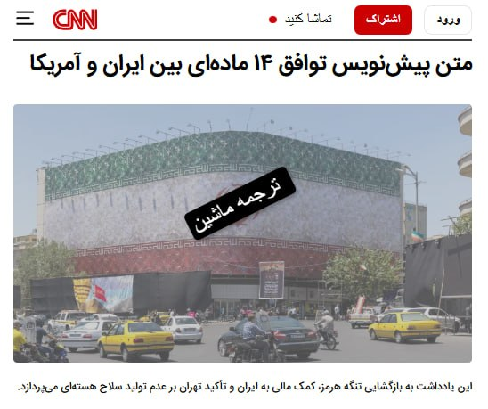

....
مقام آمریکایی گفت این متن بازتاب‌دهنده توافقی است که روز یکشنبه به صورت دیجیتال از سوی دونالد ترامپ جی‌دی ونس و محمدباقر قالیباف امضا شده است:

۱ — جمهوری اسلامی ایران و ایالات متحده، همراه با متحدان خود در جنگ جاری، با امضای این تفاهم‌نامه، پایان فوری و دائمی جنگ در همه جبهه‌ها، از جمله لبنان، را اعلام می‌کنند و متعهد می‌شوند که از این پس هیچ اقدام خصمانه‌ای علیه یکدیگر آغاز نکنند و از تهدید یا استفاده از زور علیه یکدیگر خودداری کنند. توافق نهایی مفاد این ماده و مواد باقی‌مانده را تأیید خواهد کرد.

۲ — جمهوری اسلامی ایران و ایالات متحده متعهد می‌شوند به حاکمیت و تمامیت ارضی یکدیگر احترام بگذارند و از مداخله در امور داخلی یکدیگر خودداری کنند.

۳ — جمهوری اسلامی ایران و ایالات متحده متعهد می‌شوند ظرف حداکثر ۶۰ روز، که با رضایت متقابل قابل تمدید است، مذاکره کرده و به توافق نهایی برسند.

۴ — بلافاصله پس از امضای این تفاهم‌نامه، ایالات متحده محاصره دریایی را لغو می‌کند، از هرگونه مداخله یا مانع‌تراشی علیه جمهوری اسلامی ایران جلوگیری می‌کند و ظرف حداکثر ۳۰ روز، تردد را به ظرفیت کامل خود بازمی‌گرداند؛ تردد کشتی‌ها باید متناسب با حجم تردد جمهوری اسلامی ایران در دوره پیش از جنگ باشد. ایالات متحده همچنین متعهد می‌شود ظرف ۳۰ روز پس از توافق نهایی، نیروهای خود را از مناطق اطراف خارج کند.

۵ — با امضای این تفاهم‌نامه، جمهوری اسلامی ایران فوراً اقداماتی را انجام خواهد داد تا حرکت کشتی‌های تجاری از خلیج فارس به دریای عمان و بالعکس، با در نظر گرفتن نیاز به رفع موانع فنی و خنثی‌سازی مین‌ها از سوی ایران، ظرف ۳۰ روز به حجم پیش از جنگ بازگردد.

۶ — ایالات متحده متعهد می‌شود همراه با شرکای منطقه‌ای خود، طرحی جامع و مورد توافق دو طرف برای بازسازی و توسعه اقتصادی جمهوری اسلامی ایران ایجاد کند و در عین حال تأمین مالی دست‌کم ۳۰۰ میلیارد دلار را تضمین کند. سازوکار اجرای این طرح، به عنوان بخشی از توافق نهایی، ظرف ۶۰ روز تدوین خواهد شد.

۷ — ایالات متحده متعهد می‌شود طبق برنامه زمانی‌ای که به عنوان بخشی از توافق نهایی بر سر آن توافق خواهد شد، همه انواع تحریم‌هایی را که جمهوری اسلامی ایران در حال حاضر با آن روبه‌رو است پایان دهد؛ از جمله قطعنامه‌های شورای امنیت سازمان ملل متحد و شورای حکام آژانس بین‌المللی انرژی اتمی، و همه تحریم‌های یک‌جانبه آمریکا، اعم از اولیه و ثانویه.

۸ — جمهوری اسلامی ایران بار دیگر تأکید می‌کند که هرگز سلاح هسته‌ای تولید نخواهد کرد. جمهوری اسلامی ایران و ایالات متحده توافق کرده‌اند که سرنوشت مواد غنی‌شده و سرنوشت همه مسائل دیگر مرتبط با برنامه هسته‌ای که مورد توافق متقابل قرار می‌گیرند، از جمله نیازهای هسته‌ای ایران، در توافق نهایی به شکلی مناسب مورد رسیدگی قرار گیرد؛ توافق نهایی مفاد این ماده را تأیید خواهد کرد.

۹ — جمهوری اسلامی ایران و ایالات متحده توافق می‌کنند که تا زمان دستیابی به توافق نهایی، وضع موجود را حفظ کنند: ایران وضع موجود برنامه هسته‌ای خود را حفظ خواهد کرد و ایالات متحده تحریم‌های جدیدی علیه ایران وضع نخواهد کرد یا نیروهای خود را در منطقه تقویت نخواهد کرد.

۱۰ — ایالات متحده متعهد می‌شود بلافاصله پس از امضای این تفاهم‌نامه و تا تاریخ لغو تحریم‌ها، وزارت خزانه‌داری آمریکا معافیت‌هایی برای صادرات نفت خام ایران، محصولات پتروشیمی و مشتقات آن‌ها، و همه خدمات مرتبط، از جمله خدمات بانکی، بیمه، حمل‌ونقل و موارد مشابه صادر کند.

۱۱ — ایالات متحده متعهد می‌شود با توجه به پیشرفت مذاکرات به سوی توافق نهایی، وجوه و دارایی‌های مسدود یا محدودشده جمهوری اسلامی ایران آزاد و به طور کامل در دسترس قرار گیرد. این وجوه، چه در حساب اصلی نگهداری شوند و چه منتقل شده باشند، برای هرگونه پرداخت به ذی‌نفع نهایی که بانک مرکزی جمهوری اسلامی ایران تعیین کند استفاده خواهند شد و به طور کامل برای استفاده در دسترس خواهند بود. ایالات متحده متعهد می‌شود همه مجوزها و پروانه‌های لازم را بر این اساس صادر کند.

۱۲ — جمهوری اسلامی ایران و ایالات متحده توافق می‌کنند که سازوکاری اجرایی برای نظارت بر اجرای موفق توافق نهایی و پایبندی آینده به آن ایجاد شود.

۱۳ — پس از امضای این تفاهم‌نامه، و پس از دریافت تضمین‌هایی درباره آغاز اجرای مواد ۴، ۵، ۱۰ و ۱۱ این تفاهم‌نامه و ادامه اجرای این اقدامات، جمهوری اسلامی ایران و ایالات متحده وارد مذاکرات برای توافق نهایی خواهند شد، آن هم صرفاً درباره مواد باقی‌مانده.

۱۴ — توافق نهایی از طریق یک قطعنامه الزام‌آور شورای امنیت سازمان ملل متحد تصویب خواهد شد.
CNN

📡 @VahidOnline

## IranIntlTV — post 342864

  

حسین مظفری، امام جمعه قزوین، در جلسه «ستاد پشتیبانی جنگ و بازسازی مناطق آسیب‌دیده» این استان، گفت: «همه می‌دانیم دشمن ذره‌ای قابل اعتماد نیست، حتی در صورت امضای تفاهم‌نامه نیز نباید خیالمان آسوده شود. ما با دشمن صلحی نداریم و این تفاهم نیز مرحله‌ای از مبارزه ما با آنان است.»

او افزود: «این جنگ، جنگ وجودی است، ما به دنبال اضمحلال دشمنان هستیم و دشمن نیز هر از گاهی چنین خواب‌هایی برای ما می‌بیند.»

امام جمعه قزوین ادامه داد: «ما به دنبال خون‌خواهی امام شهیدمان هستیم که آن هم جز با نابودی جبهه کفر و استکبار و خروج کامل نیروهای آمریکایی از منطقه محقق نخواهد شد.»
https://iranintl.com/202606170575

## IranIntlTV — post 342863

  <a href="telegram/content/IranIntlTV_342863_1781705039.mp4" target="_blank">🎬 Download video</a>

رییس‌جمهور آمریکا در حاشیه نشست گروه هفت و در دیدار با رییس‌جمهور مصر، یادداشت تفاهم با جمهوری اسلامی را بسیار قوی توصیف کرد، اما هشدار داد که این توافق هنوز نهایی نشده و در صورت نارضایتی واشینگتن، اقدام نظامی از سر گرفته خواهد شد.

گزارش مریم رحمتی، خبرنگار ایران‌اینترنشنال
@iranintltv

## DW_Farsi — post 126100

  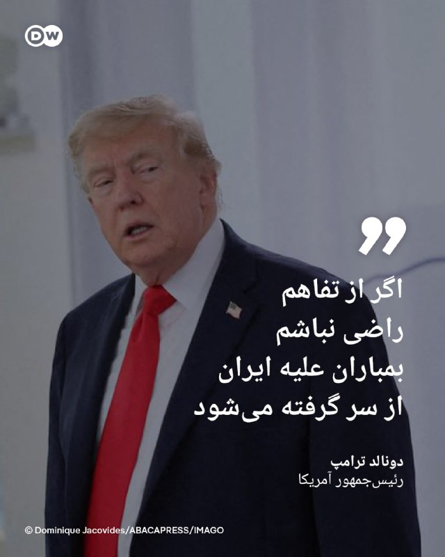

🔶 ترامپ: اگر از تفاهم راضی نباشم بمباران علیه ایران از سر گرفته می‌شود

دونالد ترامپ، رئیس‌جمهور آمریکا، روز چهارشنبه ۱۷ ژوئن (۲۷ خرداد) در شهر اویان فرانسه گفت که توافق موقت با ایران هنوز نهایی نشده است و در صورتی که از آن راضی نباشد یا تهران "رفتار مناسبی" نداشته باشد، ممکن است بار دیگر حملات هوایی علیه ایران را از سر بگیرد.

ترامپ در حاشیه نشست گروه هفت در فرانسه گفت: «این یک یادداشت تفاهم است. اگر از آن خوشم نیاید، دوباره به سمتشان شلیک می‌کنیم و روی سرشان بمب می‌ریزیم. اگر خوشم نیاید، اگر درست رفتار نکنند، دوباره درست وسط سرشان بمب می‌اندازیم، متوجه هستید؟»

ترامپ همچنین گفت که این یادداشت تفاهم با ایران شامل لغو فوری تحریم‌ها علیه ایران نمی‌شود.

او از توافق چارچوبی که دولتش مذاکره کرده به شدت تمجید کرد و گفت: «این یک توافق بسیار قوی است. هیچ‌کس دقیقاً نمی‌داند چیست، اما بسیار قدرتمند است و به نظر می‌رسد بیشتر مردم از آن بسیار خوشحال هستند.»

ترامپ افزود که این توافق برای بازارهای مالی بسیار سودمند خواهد بود.
@dw_farsi

## IranianMinds — post 22794

  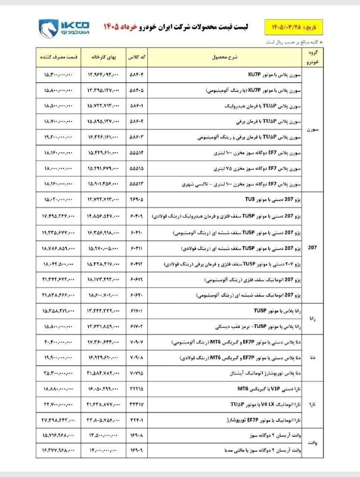

🔴 شرکت ایران خودرو درخواست افزایش قیمت پلاستیکاشو داد. @IranianMinds

## IranianMinds — post 22793

  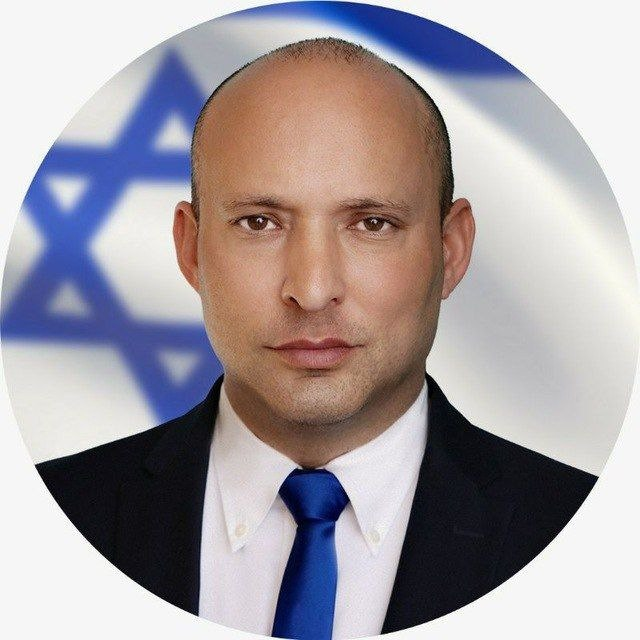

🔴 نفتالی بنت :

رژیم ایران بهتره دعا کنه من نخست وزیر اسرائیل نشم و اگرنه کارش تمومه , دفعه ی بعد که مردم ایران بخوان قیام کنن تمام ابزار لازم رو بهشون میرسونیم.

@IranianMinds

## BBCPersian — post 284136

📽تا همین چند سال پیش، ورزشگاه صد هزار نفری آزادی معروف بود به ورزشگاه صد هزار پسری! چون اجازه نمی دادند زنان برای تماشای فوتبال به این ورزشگاه وارد بشوند.
🔻عشق به فوتبال چیه؟ چیه این ورزشی که کوچک و بزرگ، زن و مرد، پیر و جوان را به دنبال خودش می کشونه؟
🔻با یک دختر «عشق فوتبال» و تلاش‌هاش برای تماشای بازی تیم مورد علاقه‌اش آشنا بشید.

📺برنامه این هفته آپارات
«عشق فوتبال»

🎬ساخته مشترک: شرمین مجتهدزاده و پالیز خوشدل

🔻ساعات پخش به وقت ایران
شنبه ۱:۰۰ بامداد
شنبه ۶:۰۰ صبح
شنبه ۱۱:۳۰ صبح
دوشنبه ۲:۰۰ بامداد
دو‌شنبه ۸:۳۰ شب
تکرار جمعه ۱۱:۰۰ صبح

🔻از برنامه آپارات همیشه فیلم متفاوت ببینید.

@BBCPersian

## Dirty_Kids — post 392391

  <a href="telegram/content/Dirty_Kids_392391_1781705043.mp4" target="_blank">🎬 Download video</a>

قالیشاه اول: دیگه ساختار مدیریتی کشور از فردمحوری خارج شده و گروهی تصمیم میگیریم.
باقر رسما داره میگه آقا مجتبی دیگه تصمیماتش مهم نیست🤣🤣🤣🤣

@Dirty_Kids 👻

## Dirty_Kids — post 392390

  

چشم خدا کور شده
خامنه‌ای بور شده

@Dirty_Kids 👻

## Hranews — post 113675

امروز چهارشنبه ۲۷ خردادماه، ماموران نیروی انتظامی در برخورد خشونت‌آمیز و توهین‌آمیز با شهروندان معترض ساکن روستای پشموکی از توابع شهرستان فاریاب، با استفاده از باتوم، مشت و لگد شماری از زنان را مورد ضرب‌وشتم قرار داده‌اند. در ویدیوهای منتشر شده افراد مسلح به سلاح گرم مشاهده می‌شوند و صدای تیراندازی نیز به گوش می‌رسد. بر پایه گزارش های حال‌وش و رسانک که اخبار مرتبط با استان سیستان و بلوچستان را پوشش می‌دهند، در جریان این واقعه دست‌کم هفت زن مجروح شدند و شش شهروند از جمله سه زن، بازداشت و به مکانی نامعلوم منتقل شده‌اند.

روز جاری گروهی از #زنان و دیگر ساکنان این منطقه، برای دومین روز متوالی در اعتراض به نحوه واگذاری و بهره‌برداری از معدن کرومیت پشموکی، دست به تجمع زدند.
#تجمع_اعتراضی

↘️
@hranews_bot تماس ✉️ - @Hranews کانال هرانا 🆑

## alonews — post 128679

  <a href="telegram/content/alonews_128679_1781705045.webm" target="_blank">🎬 Download video</a>

👈دولت سوئیس:
بیش از ۲۰۰۰ سرباز امنیت محل امضای توافق ایران و آمریکا را تأمین خواهند کرد و منطقه پرواز ممنوع برای تضمین امنیت اعمال خواهد شد.

✅ @AloNews خبر جنگ

---
📅 بروزرسانی: 1405/03/27 17:23
---

## WithYashar — post 15155

️جی‌دی ونس: برخی افراد فقط می‌خواهند بمباران ادامه یابد، صرف نظر از اینکه آیا برای آمریکایی‌ها دستاوردی دارد یا خیر.
ترامپ سعی در ایجاد بدبختی برای مردم ایران ندارد
@withyashar

## FoxNewsTwitter — post 343061

  <a href="telegram/content/FoxNewsTwitter_343061_1781704421.mp4" target="_blank">🎬 Download video</a>

Fox News (Twitter/X)

MLB's pride problems aren't going away.

Senator Josh Hawley is accusing Major League Baseball of religious discrimination after several San Francisco Giants players were warned for writing Bible verses on their Pride Night caps.

The controversy prompted an apology from the Giants to the LGBTQ+ community, while supporters, like Vice President JD Vance, defended the players and argued that athletes should not be forced to display ideological messages they don't agree with, @LucasFoxNews reports.

## FarsiVOA — post 221022

🔺بدون ذره‌ای شفقت؛ نگاهی به ۲۰ پرونده اجرای احکام اعدام در شرایط جنگی

▪️وقتی به آرشیو نام و اطلاعات افرادی که توسط جمهوری اسلامی کشته شده‌اند رجوع می‌کنی، انگار روزنامه نتایج کنکور را در دست گرفته‌ای. مثل همان روزنامه پر است از اسامی و حتی نام‌های خانوادگی مشابه. اما شگفتی دیدن این اسامی در آن است که این‌ها راه‌یافتگان به دانشگاه نیستند، بلکه کشته‌شده‌هایی هستند، گاه با اسامی مشترک، اما از سال‌های مختلف، حتی دهه‌های مختلف، و به روش‌های مختلف: حلق‌آویز کردن، تیرباران، شلیک و …. بدون ذره‌ای شفقت.

⬇️ بیشتر بخوانید:
https://ir.voanews.com/a/iran-judiciary-confession-court-pressure-defendant-protester/8161515.html

## FarsiVOA — post 221021

  <a href="telegram/content/FarsiVOA_221021_1781704423.mp4" target="_blank">🎬 Download video</a>

بنابر اعلام فرماندهی جنوبی ایالات متحده، نیروهای مشترک این فرماندهی روز سه‌شنبه، ۲۶ خرداد، به دستور ژنرال فرانسیس داناوان، یک حمله هدفمند علیه شناور متعلق به سازمان‌های تروریستیِ شناسایی‌شده انجام دادند.

بر اساس داده‌های اطلاعاتی، این شناور در حال حرکت در مسیرهای شناخته‌شده قاچاق مواد مخدر در شرق اقیانوس آرام و انجام عملیات انتقال محموله بود.

در جریان این حمله، یکی از سه قاچاقچی تروریست کشته شد و گارد ساحلی برای بازیابی دو نفر دیگر اقدام کردند. در این عملیات به هیچ‌یک از نیروهای نظامی آمریکا آسیبی نرسید.

## IranianMinds — post 22792

  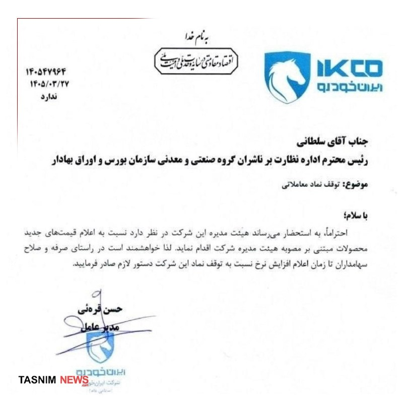

🔴 شرکت ایران خودرو درخواست افزایش قیمت پلاستیکاشو داد.

@IranianMinds

## BBCPersian — post 284135

  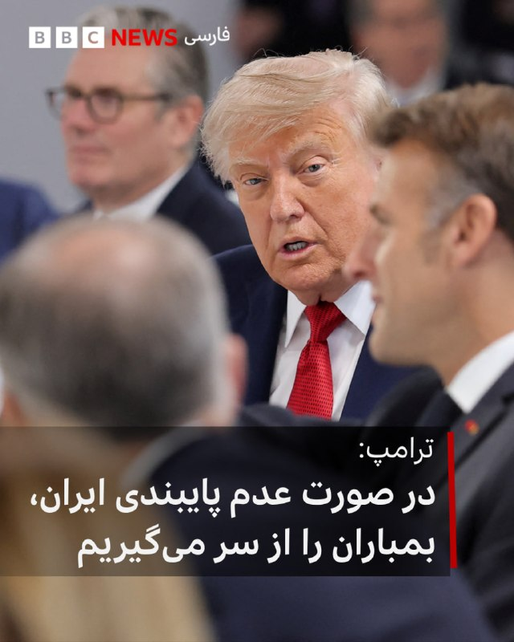

🔻دونالد ترامپ که برای شرکت در نشست سران گروه هفت در فرانسه به سر می‌برد گفت تفاهم‌نامه با ایران هنوز «نهایی نشده» و در صورتی که از اجرای آن رضایت نداشته باشد، ممکن است بمباران را از سربگیرد.

او در حاشیه این نشست گفت: «این یک تفاهم‌نامه است. اگر از آن خوشم نیاید، دوباره شلیک می‌کنیم و بمب بر سرشان می‌ریزیم. اگر خوشم نیاید، اگر درست رفتار نکنند، دوباره مستقیما به بمباران برمی‌گردیم.»

آقای ترامپ در ادامه گفت این تفاهم‌نامه شامل رفع فوری تحریم‌های ایران نمی‌شود و تأکید کرد که در این باره بعدا توضیح بیشتری خواهد داد.

📸REUTERS
https://bbc.in/4xEdeXm
@BBCPersian

---
📅 بروزرسانی: 1405/03/27 17:13
---

## VahidOOnLine — post 246021

  <a href="telegram/content/VahidOOnLine_246021_1781703824.mp4" target="_blank">🎬 Download video</a>

♦️دانش‌آموزان مقطع ابتدایی یکی از مکاتب/مدارس ولایت/استان بلخ، در نمایشگاه آثار دستی‌ خود که با حضور نمایندگان طالبان برگزار شد، با پوشاندن چهره‌هایشان به‌ گونه‌ای که تنها چشمانشان دیده می‌شد، حاضر شدند. 

این دختران لباس‌های سیاه بر تن داشتند و صورتشان را نیز به شکلی پوشانده بودند که تنها چشمانشان معلوم بود. این نوع پوشش با استقبال نمایندگان طالبان روبرو شد. 

رژیم طالبان پوشیدن برقع، چادر سیاه و روبنده را ترویج و تبلیغ می‌کند. اکنون پس از نزدیک به پنج سال از حاکمیت دوباره طالبان، پوشش بخشی از زنان افغانستان به این سبک تغییر کرده است و آنان مطابق خواست این گروه لباس می‌پوشند.
‌🇸🇦 Indypersian

🤖 @VahidOOnLine

## WithYashar — post 15154

اسرائیل پرچم خود را در منطقه‌ای از سوریه برافراشت

منابع خبری در سوریه از نفوذ نظامیان ارتش اسرائیل به روستای «القحطانیه» در استان قنیطره خبر دادند و پرچم خود را برفراشتند
@withyashar

## pm_afshaa — post 94258

  <a href="telegram/content/pm_afshaa_94258_1781703826.webm" target="_blank">🎬 Download video</a>

🔴زاکانی، شهردار تهران: جنازه علی خامنه‌ای در عراق هم تشییع میشه.

💧 Rainbet.com the #1 Non-KYC Crypto Casino & Sportsbook @rainbetcom

😁 @Pm_Afshaa

## pm_afshaa — post 94257

  <a href="telegram/content/pm_afshaa_94257_1781703827.webm" target="_blank">🎬 Download video</a>

🔴جی‌دی ونس، معاون ترامپ:
کاخ سفید میخواد متن توافق با جمهوری اسلامی رو چهارشنبه منتشر کنه.

💧 Rainbet.com the #1 Non-KYC Crypto Casino & Sportsbook @rainbetcom

😁 @Pm_Afshaa

## pm_afshaa — post 94256

  <a href="telegram/content/pm_afshaa_94256_1781703828.webm" target="_blank">🎬 Download video</a>

🔴نفتالی بنت (رقیب نتانیاهو در انتخابات نخست وزیری اسرائیل) تو پخش زنده خطاب به جمهوری اسلامی گفت : باور دارم به‌زودی یه دولت جدید تو اسرائیل میاد و امیدوارم من رهبری اون دولت رو به دست بگیرم و از همینجا به رژیم ایران میگم؛ من قراره بدترین کابوس شما باشم،…

## IranIntlTV — post 342862

  <a href="telegram/content/IranIntlTV_342862_1781703828.mp4" target="_blank">🎬 Download video</a>

سرخط خبرهای چهارشنبه ۲۷ خرداد
@iranintltv

## FarsiVOA — post 221020

  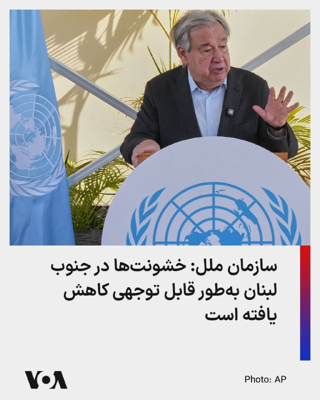

⚡️سازمان ملل اعلام کرد از پایان هفته گذشته، سطح خشونت و تبادل آتش در جنوب لبنان «به‌طور قابل توجهی» کاهش یافته است.

استفان دوجاریک، سخنگوی دبیرکل سازمان ملل، روز سه‌شنبه گفت نیروهای سازمان ملل در لبنان روز گذشته ۳۸ مورد نقض حریم هوایی لبنان از سوی ارتش اسرائیل را ثبت کرده‌اند؛ آماری که نسبت به ۸۳ مورد گزارش‌شده در روز یکشنبه کاهش محسوسی داشته است.

با این حال، دوجاریک تأکید کرد که کاهش خشونت به معنای بازگشت کامل امنیت نیست. به گفته او، هنوز هم گزارش‌هایی از حوادث پراکنده در جنوب لبنان دریافت می‌شود و همین وضعیت بر توانایی مردم برای سر زدن به خانه‌هایشان یا رفت‌وآمد در مناطق آسیب‌دیده اثر مستقیم گذاشته است.

این گزارش در حالی منتشر شده که جنوب لبنان همچنان با پیامدهای درگیری‌های اخیر، تخریب گسترده و آوارگی شمار زیادی از ساکنان روبه‌رو است.

## IranianMinds — post 22791

🔴 زاکانی شهردار تهران :

جنازه علی خامنه‌ای در عراق هم تشییع میشه.

@IranianMinds

## IranianMinds — post 22790

🔴 جی‌ دی ونس معاون ترامپ :

کاخ سفید میخواد متن توافق با جمهوری اسلامی رو چهارشنبه منتشر کنه.

@IranianMinds

## alonews — post 128678

  <a href="telegram/content/alonews_128678_1781703830.webm" target="_blank">🎬 Download video</a>

👈جی‌دی ونس: برخی افراد فقط می‌خواهند بمباران ادامه یابد، صرف نظر از اینکه آیا برای آمریکایی‌ها دستاوردی دارد یا خیر.

🔴ترامپ سعی در ایجاد بدبختی برای مردم ایران ندارد

✅ @AloNews خبر جنگ

## alonews — post 128677

  <a href="telegram/content/alonews_128677_1781703831.mp4" target="_blank">🎬 Download video</a>

👈یک روحانی: من شاااشیدم وسط ایران مذاکرات و دوقطبی‌ای که میگید، مذاکره اوج بیشرفیه

✅ @AloNews خبر جنگ

---
📅 بروزرسانی: 1405/03/27 17:04
---

## VahidOOnLine — post 246020

  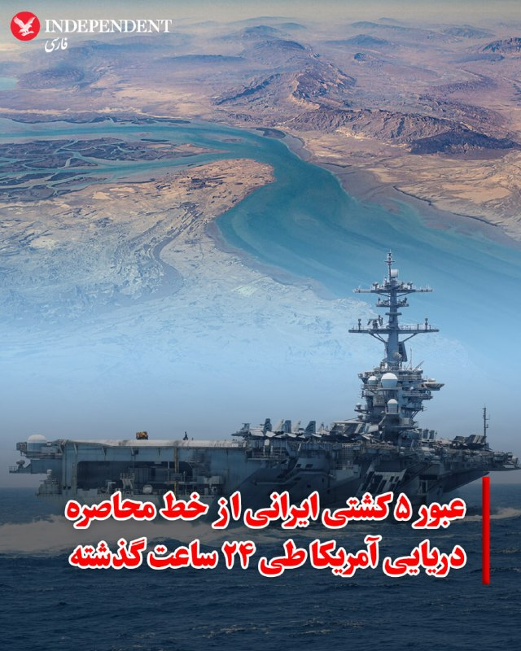

♦️ بر اساس داده‌های رهگیری منبع‌باز سایت «مارین ترافیک»، طی ۲۴ ساعت گذشته پنج کشتی تحریم‌شده ایرانی خط محاصره دریایی ارتش آمریکا را در دریای عمان پشت سر گذاشته‌اند.

این شناورها شامل سه نفت‌کش حامل نفت خام، یک کشتی فله‌بر و یک کشتی کانتینری هستند که با پرچم ایران از بندر چابهار حرکت کرده و پس از عبور از منطقه محاصره در روزهای سه‌شنبه و چهارشنبه، به سمت شرق در حال حرکت هستند. هم‌زمان، گزارش‌ها حاکی است نفت‌کش تحریم‌شده دیگری به نام «استریم» که از بندر کراچی پاکستان حرکت کرده بود، دوشنبه‌شب با نزدیک شدن به منطقه محاصره، سیستم ردیابی خود را خاموش کرده است. همچنین روز چهارشنبه، نفت‌کش «هربی» و فله‌بر «آریس» نیز در حال حرکت از سمت پاکستان به سوی این منطقه ردیابی شده‌اند.

تمام این کشتی‌ها متعلق به شرکت کشتیرانی جمهوری اسلامی ایران (IRISL) یا شرکت ملی نفت‌کش ایران (NITC) هستند که در فهرست تحریم‌های آمریکا قرار دارند.
‌🇸🇦 Indypersian

🤖 @VahidOOnLine

## VahidOOnLine — post 246019

  

جی‌دی ونس، معاون رییس‌جمهوری آمریکا، گفت کاخ سفید در تلاش است متن توافق با جمهوری اسلامی را روز چهارشنبه منتشر کند تا مردم آمریکا از مفاد آن آگاه شوند.

ونس در گفت‌وگو با شبکه سی‌بی‌اس افزود اگر انتشار زودهنگام ممکن نباشد، متن توافق حداکثر تا روز جمعه منتشر خواهد شد. او گفت میانجی‌های قطری و پاکستانی که در دستیابی به این توافق نقش داشتند، از آمریکا خواسته‌اند فعلا متن کامل آن منتشر نشود.

معاون رییس‌جمهوری آمریکا این توافق را «توافقی خوب برای مردم آمریکا» توصیف کرد و گفت برخی روایت‌ها درباره محتوای آن نادرست است.

ونس همچنین گفت توافق، تنگه هرمز را «بلافاصله» بازگشایی خواهد کرد و چارچوبی فراهم می‌کند که در صورت توقف حمایت جمهوری اسلامی از گروه‌های شبه‌نظامی و کنار گذاشتن برنامه دستیابی به سلاح هسته‌ای، تهران بتواند از برخی مزایای اقتصادی از جمله کاهش تحریم‌ها بهره‌مند شود.

او درباره گزارش‌های مربوط به اختصاص صندوق ۳۰۰ میلیارد دلاری و آزادسازی دارایی‌های مسدودشده جمهوری اسلامی نیز گفت هیچ‌یک از این مزایا بدون تغییر اساسی رفتار جمهوری اسلامی محقق نخواهد شد.
‌🏁 🇬🇧 IranintlTV

🤖 @VahidOOnLine

## WithYashar — post 15153

کانال ۱۳ اسرائیل: آمریکا جزئیات توافق با ایران را از اسرائیل مخفی نگه داشته، زیرا نگران است که تل‌آویو محتوای آن را فاش کند و کارزاری رسانه‌ای علیه آن به راه بیندازد
@withyashar

## WithYashar — post 15152

پاکستان خواستار تعویق انتشار متن تفاهم‌نامه شد
جی‌دی ونس، معاون رئیس‌جمهور آمریکا، در گفت‌وگو با CBS اعلام کرد که طرف پاکستانی درخواست کرده است متن کامل یادداشت تفاهم (MOU) فعلاً منتشر نشود.
وی بدون ارائه جزئیات بیشتر گفت که به درخواست پاکستان، متن این سند به‌طور موقت محرمانه باقی خواهد ماند.
@withyashar

## mwarmonitor — post 11070

🔴 «جی. دی. ونس: پاکستان درخواست کرده است که متن کامل یادداشت تفاهم (MOU) میان آمریکا و ایران برای مدتی منتشر نشود.» i24 news

@mwarmonitor

## mwarmonitor — post 11069

  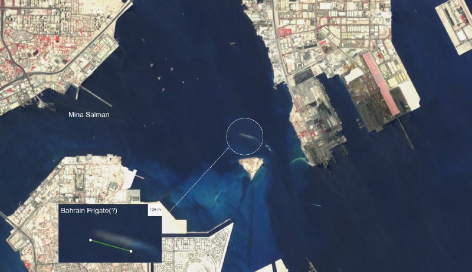

Naval Tracking – Bahrain

🛰تصاویر ماهواره‌ای Sentinel-2 امروز ۱۷ ژوئن نشان می‌دهد یک شناور نظامی در کانال ورودی، در حال حرکت به‌سمت اسکله Mina Salman در بحرین است.

🔴طول شناور حدود ۱۳۶ متر برآورد می‌شود که با مشخصات ناوچه‌های کلاس Oliver Hazard Perry هم‌خوانی دارد.

📌نیروی دریایی بحرین Royal Bahrain Navy دو فروند از این کلاس را در اختیار دارد (RBNS Sabha و RBNS Khalid bin Ali).

📌این اسکله از زمان آغاز تنش‌های منطقه‌ای عمدتاً کم‌تحرک بوده و ورود این شناور یک تغییر قابل توجه محسوب می‌شود. این حرکت می‌تواند:

یک گردش/توقف کوتاه‌مدت باشد، یا

🔸نشانه‌ای از افزایش اطمینان و بازگشت تدریجی به فعالیت‌های عادی بندری تلقی شود.

@mwarmonitor

## FoxNewsTwitter — post 343060

  <a href="telegram/content/FoxNewsTwitter_343060_1781703268.mp4" target="_blank">🎬 Download video</a>

Fox News (Twitter/X)

After the foiled UFC White House attack, former FBI Deputy Director @dbongino says America's biggest security threats may no longer be coming from the ground.

Bongino warns that drones loaded with explosives can bypass many of the barriers and defenses built to stop vehicle attacks.

"You can't put an obstacle that goes up into low space that's going to stop a flying object," Bongino explained.

He says the challenge facing law enforcement and security agencies is developing defenses that can keep pace with rapidly evolving drone technology. | @foxandfriends

## IranIntlTV — post 342861

  <a href="telegram/content/IranIntlTV_342861_1781703270.mp4" target="_blank">🎬 Download video</a>

یک فرمانده حزب دموکرات کردستان ایران با تایید حمله پهپادی به یکی از اردوگاه‌های این حزب در اربیل عراق، به ایران‌اینترنشنال گفت پهپاد مهاجم از منطقه مرزی سردشت به پرواز درآمده بود. به گفته او، جمهوری اسلامی آتش‌بسی با احزاب کرد ایرانی ندارد و حملات علیه این گروه‌ها همچنان ادامه دارد.

تروسکه صادقی، خبرنگار ایران‌اینترنشنال، گزارش می‌دهد
@iranintltv

## IranIntlTV — post 342860

  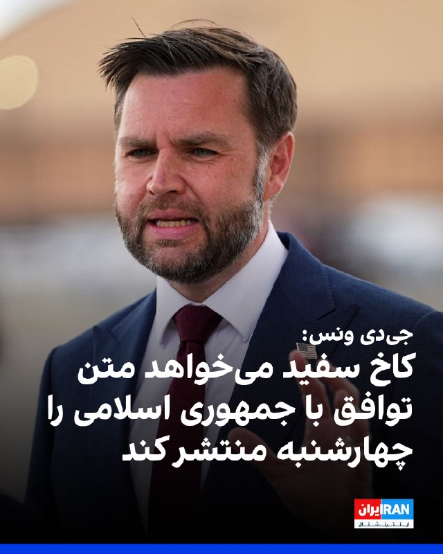

جی‌دی ونس، معاون رییس‌جمهوری آمریکا، گفت کاخ سفید در تلاش است متن توافق با جمهوری اسلامی را روز چهارشنبه منتشر کند تا مردم آمریکا از مفاد آن آگاه شوند.

ونس در گفت‌وگو با شبکه سی‌بی‌اس افزود اگر انتشار زودهنگام ممکن نباشد، متن توافق حداکثر تا روز جمعه منتشر خواهد شد. او گفت میانجی‌های قطری و پاکستانی که در دستیابی به این توافق نقش داشتند، از آمریکا خواسته‌اند فعلا متن کامل آن منتشر نشود.

معاون رییس‌جمهوری آمریکا این توافق را «توافقی خوب برای مردم آمریکا» توصیف کرد و گفت برخی روایت‌ها درباره محتوای آن نادرست است.

ونس همچنین گفت توافق، تنگه هرمز را «بلافاصله» بازگشایی خواهد کرد و چارچوبی فراهم می‌کند که در صورت توقف حمایت جمهوری اسلامی از گروه‌های شبه‌نظامی و کنار گذاشتن برنامه دستیابی به سلاح هسته‌ای، تهران بتواند از برخی مزایای اقتصادی از جمله کاهش تحریم‌ها بهره‌مند شود.

او درباره گزارش‌های مربوط به اختصاص صندوق ۳۰۰ میلیارد دلاری و آزادسازی دارایی‌های مسدودشده جمهوری اسلامی نیز گفت هیچ‌یک از این مزایا بدون تغییر اساسی رفتار جمهوری اسلامی محقق نخواهد شد.
https://iranintl.com/202606175996

## DW_Farsi — post 126099

🔶 چگونه جنگ ایران، جایگاه ابرقدرتی آمریکا را زیر سوال برد

🔻گزارشی از Wesley Rahn

قرار است آمریکا و ایران اواخر این هفته در ژنو یک تفاهم‌نامه امضا کنند. با وجود آنکه جزئیات این توافق هنوز منتشر نشده، ترامپ بعدا گفت تنگه هرمز تنها پس از امضای توافق "به‌طور کامل" باز خواهد شد.

اما گزارش‌های تاییدنشده‌ای که در رسانه‌های نزدیک به حکومت ایران منتشر شده‌اند، حاکی از آن‌اند که نقش آینده تهران در تنگه هرمز همچنان موضوع مذاکره است.

صرف‌نظر از ابهام‌های موجود، روشن است که آمریکا با وجود برتری نظامی عظیم خود، قادر نیست شرایط مربوط به تنگه هرمز را به ایران دیکته کند.

علاوه بر این، توانایی ایران در استفاده از پهپادها، مین‌ها و قایق‌های کوچک برای متوقف کردن عبور آزاد کشتی‌ها، پرسش‌های ناخوشایندی را درباره نقش قدرت آمریکا در حفاظت از آزادی کشتیرانی و تضمین تجارت آزاد مطرح کرده است.
@dw_farsi

## alonews — post 128676

  <a href="telegram/content/alonews_128676_1781703273.webm" target="_blank">🎬 Download video</a>

👈ایرانخودرو بازم قیمت‌ها برد بالا
‼️

🔴ایرانخودروی حرومزاده الان که دلار و طلا کاهشیه و ورق فولاد هم تو بازار زیاد شده چرا بازم گرون میکنی؟

#فساد_گسترده #فساد_سلولی

✅ @AloNews خبر جنگ

---
📅 بروزرسانی: 1405/03/27 16:53
---

## VahidOOnLine — post 246018

  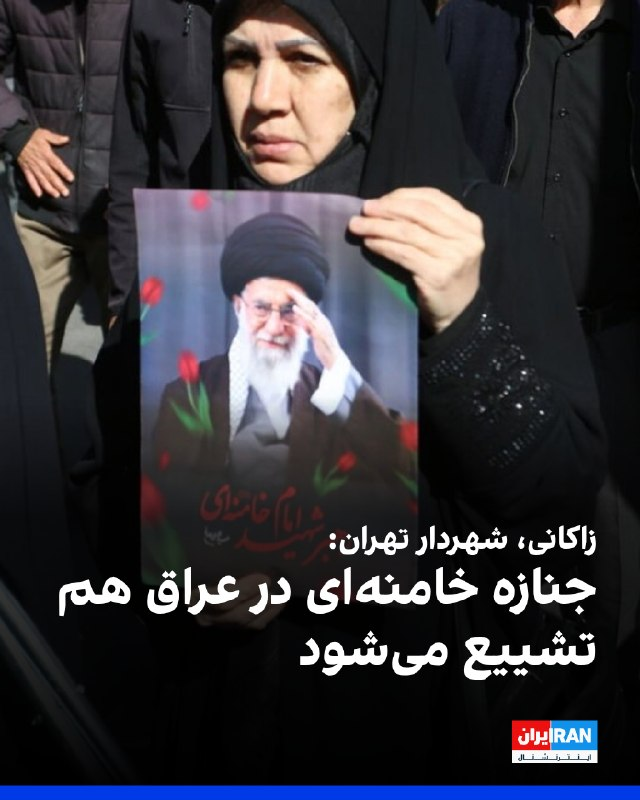

علیرضا زاکانی، شهردار تهران با اشاره به برگزاری مراسم تشییع و تدفین علی خامنه‌ای از روز ۱۳ تا ۱۸ تیر، گفت که روز ۱۷ تیر جنازه رهبر پیشین جمهوری اسلامی در عراق نیز تشییع خواهد شد.

بر اساس برنامه رسمی اعلام‌شده، جنازه علی خامنه‌ای روز ۱۸ تیر در مشهد دفن خواهد شد.

اعلام برگزاری مراسم تشییع خامنه‌ای در عراق در حالی است که پیش‌تر، دبیر ستاد تشییع او گفته بود که هیچ برنامه‌ای برای برگزاری مراسم تشییع در خارج از کشور وجود ندارد و تمامی تمهیدات در داخل کشور در حال برنامه‌ریزی است.
‌🏁 🇬🇧 IranintlTV

🤖 @VahidOOnLine

## IranIntlTV — post 342859

  <a href="telegram/content/IranIntlTV_342859_1781702627.mp4" target="_blank">🎬 Download video</a>

پس از انتشار خبر اعدام جواد زمانی و ابوالفضل ساعدی، دو معترض بازداشت‌شده در جریان انقلاب ملی ایرانیان، شبکه‌های اجتماعی شاهد موجی از واکنش‌ها و ابراز خشم کاربران بود. هم‌زمان، با اعدام این دو نفر، شمار معترضان اعدام‌شده از ۲۸ اسفند تاکنون، بر اساس آمار سازمان حقوق بشر ایران، به دست‌کم ۲۰ نفر رسیده است.

آیه دریس، عضو تحریریه ایران‌اینترنشنال، از واکنش کاربران می‌گوید
@iranintltv

## IranIntlTV — post 342858

  <a href="telegram/content/IranIntlTV_342858_1781702629.mp4" target="_blank">🎬 Download video</a>

دونالد ترامپ، رییس‌جمهوری آمریکا، در حاشیه نشست گروه هفت و در دیدار با عبدالفتاح السیسی، رییس‌جمهوری مصر، یادداشت تفاهم با جمهوری اسلامی را «بسیار قوی» توصیف کرد، اما هشدار داد این توافق هنوز نهایی نشده است. او تاکید کرد اگر واشینگتن از روند اجرای آن رضایت نداشته باشد، اقدام نظامی از سر گرفته خواهد شد.

جزئیات بیشتر با احمد صمدی، خبرنگار ایران‌اینترنشنال
@iranintltv

## IranIntlTV — post 342857

  

علیرضا زاکانی، شهردار تهران با اشاره به برگزاری مراسم تشییع و تدفین علی خامنه‌ای از روز ۱۳ تا ۱۸ تیر، گفت که روز ۱۷ تیر جنازه رهبر پیشین جمهوری اسلامی در عراق نیز تشییع خواهد شد.

بر اساس برنامه رسمی اعلام‌شده، جنازه علی خامنه‌ای روز ۱۸ تیر در مشهد دفن خواهد شد.

اعلام برگزاری مراسم تشییع خامنه‌ای در عراق در حالی است که پیش‌تر، دبیر ستاد تشییع او گفته بود که هیچ برنامه‌ای برای برگزاری مراسم تشییع در خارج از کشور وجود ندارد و تمامی تمهیدات در داخل کشور در حال برنامه‌ریزی است.
https://iranintl.com/202606176478

## FarsiVOA — post 221019

مساله ایران در صدر گفت‌وگوهای پرزیدنت ترامپ در نشست گروه هفت؛ گزارش خبرنگار اعزامی صدای آمریکا

## FarsiVOA — post 221018

ستاد فرماندهی مرکزی ایالات متحده آمریکا، سنتکام، ویدیویی منتشر کرده که در آن ملوانان آمریکایی روی عرشه ناو «‌یواس‌اس دلبرت دی‌بلک» در حال آماده‌سازی یک هلیکوپتر «سی‌هاک ام‌اچ۶۰»برای پرواز در دریای عرب هستند.

## BBCPersian — post 284134

  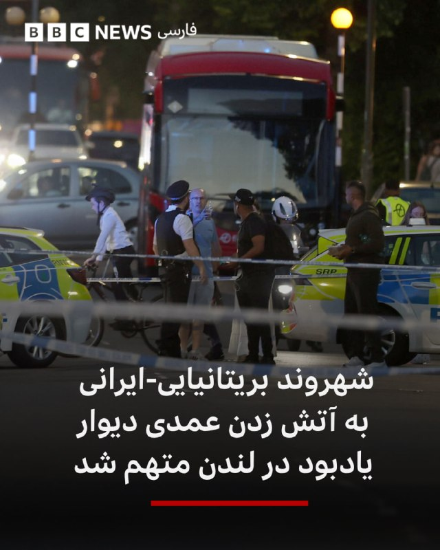

🔻.پلیس بریتانیا اعلام کرد مردی با تابعیت بریتانیایی و ایرانی به دست داشتن در حمله به یک دیوار یادبود متهم شده است.

این حمله در ماه آوریل در منطقه‌ای در شمال لندن اتفاق افتاد که جمعیت قابل توجهی از یهودیان در آن ساکن هستند.

علیرضا فلاحی، ۴۵ ساله، به حمله به دیوار یادبودی در منطقه گولدرز گرین متهم شده است. این دیوار حاوی تصاویر معترضانی بود که در سرکوب اعتراضات دی‌ ۱۴۰۴ کشته شده‌اند. قرار است او روز پنجشنبه در دادگاه وست‌مینستر لندن حاضر شود.

هلن فلانگان، رئیس پلیس مبارزه با تروریسم لندن، گفت: «این اقدام گام رو به جلوی دیگری در یکی از تحقیقات مربوط به مجموعه‌ای از آتش‌ زدن‌های عمدی است که جامعه یهودیان و ایرانیان مهاجر در لندن را هدف قرار داد.»

یک زن ۳۸ ساله که در ارتباط با این آتش‌سوزی بازداشت شده بود، آزاد شده و با اقدام قضائی روبه‌رو نخواهد شد.
این حادثه یکی از چندین مورد آتش‌ زدن عمدی در اماکن مرتبط با جامعه یهودیان در گولدرز گرین بود.

پلیس گفت که در حال بررسی احتمال ارتباط این حملات با ایران است.

📸Getty Images
@BBCPersian

---
📅 بروزرسانی: 1405/03/27 16:43
---

## VahidOOnLine — post 246017

  <a href="telegram/content/VahidOOnLine_246017_1781702022.mp4" target="_blank">🎬 Download video</a>

⭕️ ترامپ: ما صندوق سرمایه‌گذاری در ایران نداریم، اگر همسایگان بخواهند این کار را بکنند، به ما ربطی ندارد

♦️دونالد ترامپ، رئیس جمهوری ایالات متحده، روز چهارشنبه ۲۷ خرداد در حاشیه نشست سران گروه هفت (G7) در اویان-له-بن فرانسه، گزارش‌ها درباره تشکیل یک صندوق ۳۰۰ میلیارد دلاری با مشارکت آمریکا برای سرمایه‌گذاری در ایران را رد کرد و گفت: «ما حتی ۱۰ سنت هم سرمایه‌گذاری نمی‌کنیم.»
ترامپ تاکید کرد اگر کشورهای حوزه خلیج فارس بخواهند به‌صورت مستقل سرمایه‌گذاری کنند، تصمیم خودشان است، اما دولت آمریکا در چنین صندوقی مشارکت ندارد. او همچنین این گزارش‌ها را «داستانی نادرست» خواند و در پایان افزود: «هیچ‌کس به اندازه من در قبال ایران سختگیر نبوده است.»
‌🇸🇦 Indypersian

🤖 @VahidOOnLine

## VahidOOnLine — post 246016

  

مسعود پزشکیان، رییس‌ دولت جمهوری اسلامی، با اشاره به اعتراضات دی‌ماه و انقلاب ملی ایرانیان گفت که این رویدادها قابل پیشگیری بود و بخش قابل توجهی از افرادی که در آنها حضور داشتند، با مشکلاتی مانند بیکاری، محرومیت و دیگر عوامل اجتماعی موثر بر سلامت مواجه بودند.

پزشکیان افزود: «بخش قابل توجهی از کسانی که در این رخدادهای حضور داشتند، با آسیب‌هایی همچون بیکاری، محرومیت و سایر عوامل اجتماعی موثر بر سلامت درگیر بودند.»

پزشکیان پیشتر جان‌باختگان و مجروحان انقلاب ملی ایرانیان را افرادی با «اختلالات روانی» خوانده بود. او گفته بود بخشی از جان‌باختگان و مجروحان اعتراضات اخیر «با مشکلاتی نظیر آسیب‌های روانی، اختلالات سلامت روان یا مسائل مرتبط با اشتغال و محرومیت‌های اجتماعی» مواجه بوده‌اند.
‌🏁 🇬🇧 IranintlTV

🤖 @VahidOOnLine

## WithYashar — post 15151

سوئیس: امضای یادداشت تفاهم ایران و آمریکا با حضور نمایندگان ۴ کشور ایالات متحده، ایران، قطر و پاکستان برگزار خواهد شد.

بیش‌از ۲۰۰۰ سرباز امنیت محل امضا را تأمین خواهند کرد و برای تضمین امنیت، منطقه پرواز ممنوع اعمال خواهد شد.
@withyashar

## WithYashar — post 15150

تسنیم: اختلال خدمات بانکی ادامه دارد , تجهیزات شبکه فرسوده هستند
@withyashar

## FoxNewsTwitter — post 343059

  <a href="telegram/content/FoxNewsTwitter_343059_1781702024.mp4" target="_blank">🎬 Download video</a>

Fox News (Twitter/X)

“I’m the boss.”

President Trump walked into the first session on the final day of the G7 summit in Évian-les-Bains, France, and dropped the line as cameras were rolling.

Fellow world leaders laughed as the moment cut through a summit focused on Ukraine, Iran, trade and global security.

## pm_afshaa — post 94255

  <a href="telegram/content/pm_afshaa_94255_1781702026.webm" target="_blank">🎬 Download video</a>

🔴رضایی، سخنگوی کمیسیون امنیت ملی مجلس: خطوط قرمز جمهوری اسلامی در تفاهم با آمریکا رعایت نشده.

💧 Rainbet.com the #1 Non-KYC Crypto Casino & Sportsbook @rainbetcom

😁 @Pm_Afshaa

## IranIntlTV — post 342856

  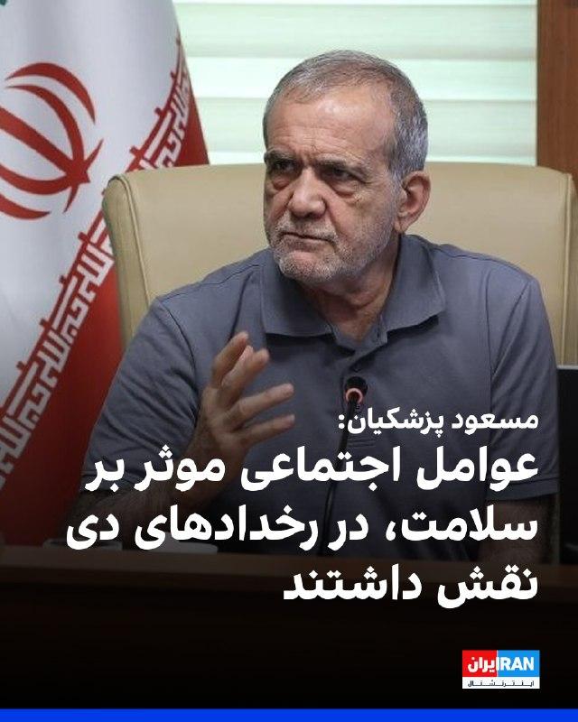

مسعود پزشکیان، رییس‌ دولت جمهوری اسلامی، با اشاره به اعتراضات دی‌ماه و انقلاب ملی ایرانیان گفت که این رویدادها قابل پیشگیری بود و بخش قابل توجهی از افرادی که در آنها حضور داشتند، با مشکلاتی مانند بیکاری، محرومیت و دیگر عوامل اجتماعی موثر بر سلامت مواجه بودند.

پزشکیان افزود: «بخش قابل توجهی از کسانی که در این رخدادهای حضور داشتند، با آسیب‌هایی همچون بیکاری، محرومیت و سایر عوامل اجتماعی موثر بر سلامت درگیر بودند.»

پزشکیان پیشتر جان‌باختگان و مجروحان انقلاب ملی ایرانیان را افرادی با «اختلالات روانی» خوانده بود. او گفته بود بخشی از جان‌باختگان و مجروحان اعتراضات اخیر «با مشکلاتی نظیر آسیب‌های روانی، اختلالات سلامت روان یا مسائل مرتبط با اشتغال و محرومیت‌های اجتماعی» مواجه بوده‌اند.
https://iranintl.com/202606171710

## DW_Farsi — post 126098

  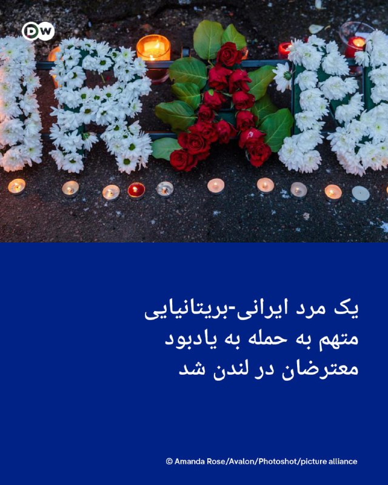

🔶 یک مرد ایرانی-بریتانیایی متهم به حمله به یادبود معترضان در لندن شد

پلیس بریتانیا روز چهارشنبه ۱۷ ژوئن اعلام کرد مردی که دارای تابعیت دوگانه بریتانیایی و ایرانی است، به اتهام دست داشتن در یک حمله آتش‌سوزی عمدی در ماه آوریل امسال به دیوار یادبودی در شمال لندن متهم شده است؛ منطقه‌ای که محل سکونت جمعیت بزرگی از یهودیان است.

علی‌رضا فلاحی، ۴۵ ساله، متهم شده که این حمله را علیه دیوار یادبود در منطقه "گولدرز گرین" انجام داده است. این دیوار شامل تصاویر معترضانی بود که گفته می‌شود در ماه ژانویه توسط حکومت ایران کشته شده‌اند. او قرار است روز پنج‌شنبه ۱۸ ژوئن در دادگاهی در لندن حاضر شود.

هلن فلاناگان، رئیس واحد پلیس مبارزه با تروریسم لندن، گفت: «این اتهام، گام دیگری رو به جلو در یکی از تحقیقات مربوط به مجموعه حملات آتش‌سوزی عمدی است که جامعه یهودیان و ایرانیان مهاجر در لندن را هدف قرار داده‌اند.»

به گفته پلیس یک زن ۳۸ ساله که در ارتباط با این آتش‌سوزی بازداشت شده بود، آزاد شده و هیچ اقدام قانونی بیشتری علیه او صورت نخواهد گرفت.
@dw_farsi

## Hranews — post 113674

  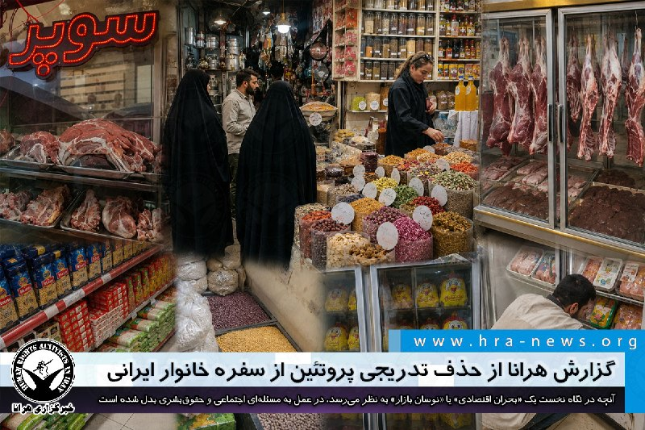

گزارش میدانی هرانا درباره حذف تدریجی پروتئین از سفره خانوار ایرانی و ابعاد حقوق‌بشری آن

❗️
❗️
❗️
❗️
❗️– افزایش مستمر قیمت کالاهای اساسی در ایران طی سال‌های اخیر به کاهش شدید قدرت خرید خانوارها و محدود شدن دسترسی به اقلام ضروری، به‌ویژه منابع پروتئینی، منجر شده است؛ روندی که از حذف تدریجی گوشت قرمز از سفره اقشار کم‌درآمد آغاز شد و اکنون با افزایش قیمت و کاهش دسترسی به مرغ، به اصلی‌ترین منبع پروتئین حیوانی نیز رسیده است. در شرایطی که وابستگی صنعت مرغداری به واردات نهاده‌های دامی، اختلال در زنجیره تأمین در پی جنگ اخیر و محاصره دریایی ایران، جهش نرخ ارز پس از حذف ارز ترجیحی و سیاست‌های قیمت‌گذاری دستوری، تولید را با بحران مواجه کرده است، پیامدهای این وضعیت به شکل کاهش مصرف پروتئین در میان خانواده‌ها و نگرانی‌های جدی درباره سلامت عمومی، به‌ویژه در میان کودکان، زنان باردار و سالمندان، خود را نشان می‌دهد.

به گزارش خبرگزاری هرانا، ارگان خبری مجموعه فعالان حقوق بشر در ایران، آنچه در نگاه نخست یک «بحران اقتصادی» یا «نوسان بازار» به نظر می‌رسد، در عمل به مسئله‌ای اجتماعی و حقوق‌بشری بدل شده است؛ چرا که دسترسی پایدار به غذای کافی و مغذی یکی از حقوق بنیادین شناخته‌شده در اسناد بین‌المللی است و تحلیل (کاهش) آن، سلامت و کرامت بخش بزرگی از جامعه را هدف قرار می‌دهد. این گزارش با تکیه بر مشاهدات و مصاحبه‌های میدانی گزارشگران هرانا با شهروندان، تولیدکنندگان و کارشناسان، و داده‌های منتشرشده از سوی نهادهای رسمی و رسانه‌های داخلی، می‌کوشد ریشه‌ها، سازوکار و پیامدهای این بحران را روشن کند.

ادامه مطلب

#مصرف_پروتئین #سلامت_عمومی

↘️
@hranews_bot تماس ✉️ - @Hranews کانال هرانا 🆑

## alonews — post 128675

  <a href="telegram/content/alonews_128675_1781702028.mp4" target="_blank">🎬 Download video</a>

👈کارشناس صداوسیما : شماها دارید با کسی مذاکره میکنید که به رهبری تهمت همجنسگرایی زده

✅ @AloNews خبر جنگ

---
📅 بروزرسانی: 1405/03/27 16:34
---

## VahidOOnLine — post 246015

  <a href="telegram/content/VahidOOnLine_246015_1781701442.mp4" target="_blank">🎬 Download video</a>

⭕️ زاکانی: علی خامنه‌ای ۱۷ تیر در عراق تشییع می‌شود

♦️علیرضا زاکانی، شهردار تهران روز چهارشنبه ۲۷ خردادماه برای نخستین بار و برخلاف گفته‌های پیشین مقام‌های جمهوری اسلامی اعلام کرد که مراسم تشییع علی خامنه‌ای در عراق هم برگزار می‌شود.

زاکانی به خبرنگاران گفت پس از دو روز مراسم وداع، جسد علی خامنه‌ای در روز ۱۵ تیر در تهران، ۱۶ تیر در قم و ۱۷ تیر در عراق تشییع خواهد شد.

مقام‌های جمهوری اسلامی پیش از این اعلام کرده بودند که رهبر پیشین  در مشهد دفن خواهد شد.
‌🇸🇦 Indypersian

🤖 @VahidOOnLine

## pm_afshaa — post 94254

  <a href="telegram/content/pm_afshaa_94254_1781701444.webm" target="_blank">🎬 Download video</a>

🔴وب‌سایت سمافور:
جی‌دی ونس به چهره اصلی دولت ترامپ برای دفاع از توافق با ایران تبدیل شده.

در مقابل، روبیو که یکی از قوی‌ترین سخنگوهای دولت محسوب میشه، تاکنون عمدتا درباره این توافق سکوت کرده؛ سکوتی که احتمالا ناشی از تردیدهای اون نسبت به این توافقه.

+ وضعیت روبیو تو این چند روز :
(تصویر بالا)

💧 Rainbet.com the #1 Non-KYC Crypto Casino & Sportsbook @rainbetcom

😁 @Pm_Afshaa

## DEJradio — post 5762

  <a href="telegram/content/DEJradio_5762_1781701445.webm" target="_blank">🎬 Download video</a>

🚨
⭕️ دونالد ترامپ:
اگر از تفاهم راضی نباشیم دوباره حمله می‌کنیم

دونالد ترامپ، رئیس‌جمهوری آمریکا، در حاشیه نشست سران کشورهای عضو گروه هفت کشور صنعتی، گفته یادداشت تفاهم آمریکا با جمهوری اسلامی هنوز توافق نهایی نیست و اگر از آن راضی نباشد یا جمهوری اسلامی «درست رفتار نکند»، آمریکا دوباره به حمله و بمباران برخواهد گشت.

▫️او افزوده «این یادداشت تفاهم شامل لغو فوری تحریم‌ها علیه جمهوری اسلامی نیست، اما افزود درباره این موضوع بعداً صحبت خواهد کرد.» و گفته: «در این یادداشت تفاهم قید نشده که ما هیچ پولی به ایران پرداخت کنیم، اما نمی‌توانیم هیچ طرفی را از سرمایه‌گذاری در آنجا منع کنیم. هرکسی خودش مایل باشد می‌تواند در ایران سرمایه‌گذاری کند.»

#ترامپ #توافق #جنگ
@DEJradio

## VahidOnline — post 76448

  <a href="telegram/content/VahidOnline_76448_1781701445.mp4" target="_blank">🎬 Download video</a>

زاکانی: علی خامنه‌ای ۱۷ تیر در عراق تشییع می‌شود

علیرضا زاکانی، شهردار تهران روز چهارشنبه ۲۷ خردادماه برای نخستین بار و برخلاف گفته‌های پیشین مقام‌های جمهوری اسلامی اعلام کرد که مراسم تشییع علی خامنه‌ای در عراق هم برگزار می‌شود.
زاکانی به خبرنگاران گفت پس از دو روز مراسم وداع، جسد علی خامنه‌ای در روز ۱۵ تیر در تهران، ۱۶ تیر در قم و ۱۷ تیر در عراق تشییع خواهد شد.
مقام‌های جمهوری اسلامی پیش از این اعلام کرده بودند که رهبر پیشین  در مشهد دفن خواهد شد.
@VahidOOnLine

📡 @VahidOnline

## FarsiVOA — post 221017

  <a href="telegram/content/FarsiVOA_221017_1781701446.mp4" target="_blank">🎬 Download video</a>

ارتش اسرائیل اعلام کرد دو تروریست را که در کشتار ۷ اکتبر مشارکت داشتند از بین برده است.

بنابر بیانیه ارتش اسرائیل، در حمله روز شنبه به جنوب نوار غزه «محمد سعید احمد نمرُوطی»، یک فرمانده سازمان تروریستی حماس و در حمله‌ای دیگر به مرکز نوار غزه، «معاویه سلیمان زقر عایدی»، یک فرمانده در اردوگاه‌های مرکزی سازمان تروریستی جهاد اسلامی فلسطین، با مهمات دقیق و رصد هوایی، حذف شدند.

ارتش اسرائیل اعلام کرد «نمرُوطی» در جریان کشتار ۷ اکتبر به خاک اسرائیل نفوذ کرده بود و در طول جنگ در نگهداری شمار زیادی از گروگان‌ها در اسارت تونل‌های حماس نقش داشت. همچنین «عایدی» در جریان کشتار ۷ اکتبر به کیبوتص بئری یورش برده بود و در کارگذاری مواد منفجره نقش داشت.

بنابر بیانیه ارتش اسرائیل، هر دو نفر، طرح‌های تروریستی علیه نیروهای ارتش اسرائیل و غیرنظامیان اسرائیلی را پیش برده بودند و تهدیدی فوری برای نیروهای ارتش اسرائیل فعال در نوار غزه محسوب می‌شدند.

## FarsiVOA — post 221016

گزارش نرگس صبا درباره ماهیت نشست «گروه ۷» و پرونده جمهوری اسلامی در این نشست

## FarsiVOA — post 221015

با نزدیک شدن به زمان امضای تفاهم‌نامه با آمریکا، اختلافات درون جمهوری اسلامی ادامه دارد. تندروها به محتوای توافق و تیم مذاکره‌کننده حمله می‌کنند و همزمان از تغییر ادبیات حکومت درباره آمریکا و اسرائیل نگرانند. دستور جمع‌آوری تجمعات شبانه حامیان حکومت نیز بر این انتقادها افزوده است.

## BBCPersian — post 284133

🔻نخست‌وزیر کانادا: توافق آمریکا و ایران می تواند معادلات منطقه را تغییر دهد

نخست‌وزیر کانادا گفت تفاهم آمریکا و ایران برای پایان دادن به جنگ خاورمیانه می‌تواند «معادلات را در منطقه و فراتر از آن تغییر دهد.»

مارک کارنی در سومین روز نشست سران گروه هفت در شهر اویان فرانسه به خبرنگاران گفت: «این احتمال وجود دارد که این تفاهمنانه یک تغییر اساسی ایجاد کند.»

او به گفت‌وگوهای امیدوارکننده‌ای اشاره کرد که در این نشست و با حضور دونالد ترامپ، رئیس‌جمهور آمریکا، درباره اوکراین و لبنان انجام شده است.

سران کشورهای گروه هفت در کنار موضوعات دیگر، «جدی و با جزئیات» درباره وضعیت لبنان هم گفت‌و‌گو کرده‌اند.

در بیانیه مشترک شب گذشته، گروه هفت از «تحول مهم و فرصت موجود در خاورمیانه» استقبال کرد.

در این بیانیه آمده است که این تفاهمنامه «فرصتی تاریخی برای جلوگیری از دستیابی ایران به سلاح هسته‌ای و مقابله با تهدیدهای مرتبط با فعالیت‌های منطقه‌ای و موشکی‌اش» فراهم می‌کند.

تفاهمنامه قرار است روز جمعه (۱۹ ژوئن/۲۹ خرداد) به امضای نمایندگان آمریکا و ایران برسد.
https://bbc.in/44dD4nl
@BBCPersian

## BBCPersian — post 284132

🔻ترامپ: اینجا من رئیسم

سران گروه هفت در فرانسه، در نشستی که میزبان آن رئیس‌جمهور امانوئل مکرون بود، گرد هم آمده‌اند.

مهمان او، دونالد ترامپ در همان ابتدا تردیدی باقی نگذاشت که به نظر خودش چه کسی در این جلسه «رئیس» است.

ترامپ در حالی که به سوی نشست صبحگاهی قدم برمی‌داشت و دیگر رهبران از پیش بر سر جای خود نشسته بودند، گفت: «من رئیس هستم.»

این سخن با خنده حاضران روبه‌رو شد و به نظر می‌رسید آقای مکرون نیز آن را با خونسردی و شوخ‌طبعی پذیرفته است. رئیس‌جمهور فرانسه از او پرسید: «حالت چطور است؟»

امروز آخرین روز این نشست سه روزه در اویان فرانسه است.

https://bbc.in/4euKasE
@BBCPersian

## BBCPersian — post 284131

  <a href="https://t.me/bbcpersian/284131" target="_blank">📎 Download file</a>

تازه‌ترین خبرهای جهان چهارشنبه ۲۷ خرداد ۱۴۰۵ از رادیو بی‌بی‌سی در لندن

## Dirty_Kids — post 392389

  <a href="telegram/content/Dirty_Kids_392389_1781701448.mp4" target="_blank">🎬 Download video</a>

دهه نودی هامون هم خیلی دیگه دارن پله های ترقی رو طی میکنن
هنوز هیچی نشده تتو don't stop زده رو کمرش :)

@Dirty_Kids 👻

## Dirty_Kids — post 392388

  <a href="telegram/content/Dirty_Kids_392388_1781701449.mp4" target="_blank">🎬 Download video</a>

قلعه نویی وقتی قهر میکنه🤣😂

@Dirty_Kids 👻

## Dirty_Kids — post 392387

  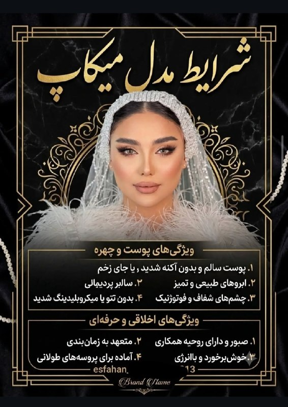

‏حالا کاری به شرایط مدل میکاپ ندارم
ولی خداشاهده فک کردم اعلامیه س((((((:

@Dirty_Kids 👻

## alonews — post 128674

  <a href="telegram/content/alonews_128674_1781701451.mp4" target="_blank">🎬 Download video</a>

👈وزیر دفاع اوکراین، میخایلو فدوروف:
در حال حاضر، ما یک فرصت طلایی داریم و در ۶ ماه آینده، برتری در میدان نبرد خواهیم داشت

✅ @AloNews خبر جنگ

---
📅 بروزرسانی: 1405/03/27 16:23
---

## VahidOOnLine — post 246014

  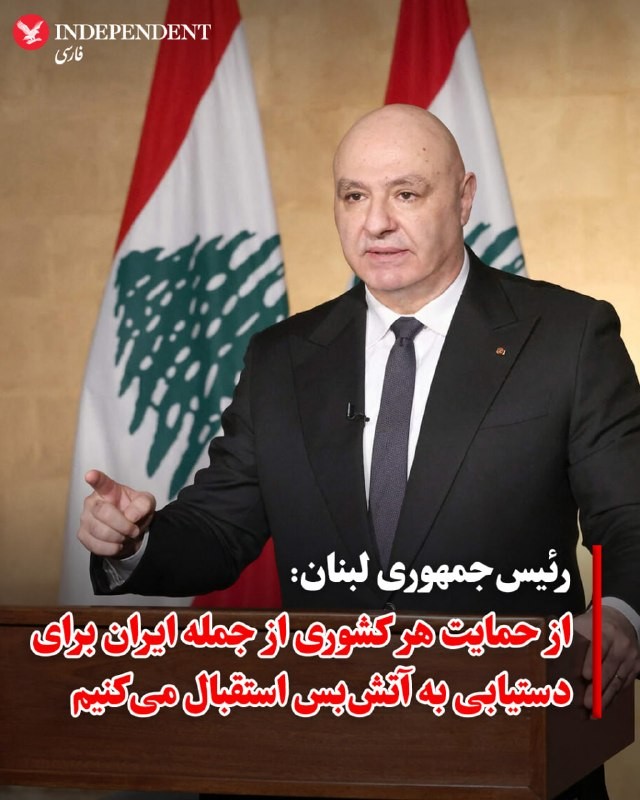

♦️ ژوزف عون، رئیس‌جمهوری لبنان، روز چهارشنبه ۲۷ خرداد اعلام کرد که بیروت از حمایت هر کشوری، از جمله ایران، برای کمک به دستیابی و تضمین آتش‌بس استقبال می‌کند. این اظهارات نشان‌دهنده نرم‌تر شدن لحن علنی موضع بیروت در قبال تهران، پس از هفته‌ها انتقاد تند و تیز است.

پیش از این در همین ماه، عون ایران را متهم کرده بود که از لبنان به عنوان یک کارت بازی (اهرم فشار) در مذاکرات خود با ایالات متحده استفاده می‌کند؛ او گفته بود که مردم لبنان برای تامین منافع ایران کشته می‌شوند.
‌🇸🇦 Indypersian

🤖 @VahidOOnLine

## mwarmonitor — post 11068

  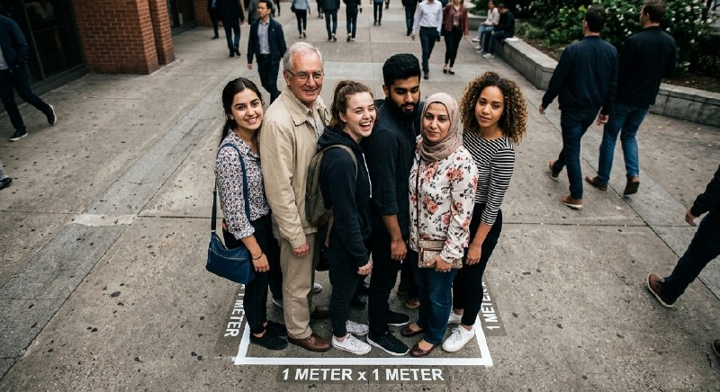

📝 به نظر می‌رسد این نابغه هندسه و انگل مدیریت شهری، چنان با اعتماد به نفس از گنجایش «۲۰ میلیون نفری» صحبت می‌کند که آدم شک می‌کند نکند خیابان دماوند به میدان آزادی در دنیای موازی ایشان، به اندازه قاره آسیا پهنا دارد! اگر این مغز متفکر حتی یک بار ماشین‌حسابِ…

## pm_afshaa — post 94253

  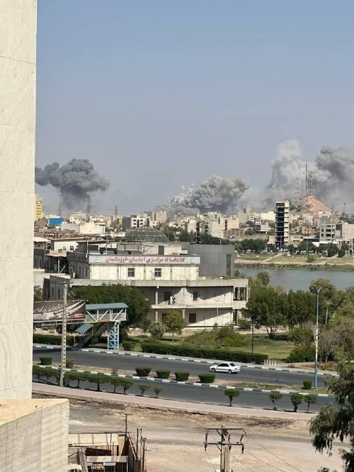

مربوط به جنگ 40 روزه
اهواز

💧 Rainbet.com the #1 Non-KYC Crypto Casino & Sportsbook @rainbetcom

😁 @Pm_Afshaa

## iaghapour — post 2680

  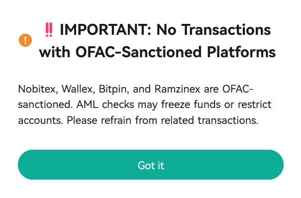

🚨 هشدار خیلی مهم: خطر فریز شدن دارایی‌ها در صرافی‌های خارجی!

بچه‌ها، همونطور که تو تصویر می‌بینید، صرافی‌های خارجی یه اخطار خیلی جدی در مورد تراکنش با پلتفرم‌های تحریم‌شده توسط OFAC (دفتر کنترل دارایی‌های خارجی آمریکا) منتشر کردن.

⚠️ تو این هشدار صراحتاً اسم ۴ تا از صرافی‌های معروف ایرانی آورده شده:
🔹 نوبیتکس (Nobitex)
🔹 والکس (Wallex)
🔹 بیت‌پین (Bitpin)
🔹 رمزینکس (Ramzinex)

❌ مشکل چیه و چه خطری داره؟
این صرافی‌ها اعلام کردن که سیستم‌های ضد پولشویی (AML) به شدت تراکنش‌ها رو بررسی می‌کنن. اگه مستقیم با این پلتفرم‌های ایرانی تراکنشی داشته باشید، ممکنه حسابتون محدود بشه یا حتی کل دارایی‌هاتون رو فریز و مسدود کنن!

💡 حالا باید چیکار کنیم؟
به هیچ‌وجه انتقال مستقیم ارز بین صرافی‌های ایرانی و صرافی‌های خارجی انجام ندید. حتماً از کیف پول‌های شخصی (مثل تراست ولت، متامسک یا ولت‌های سخت‌افزاری) به عنوان واسطه استفاده کنید تا مشکلی برای سرمایه‌تون پیش نیاد.

🆔 @iAghapour

## FarsiVOA — post 221014

🔺ارتش اسرائیل: دو تروریست دیگر حماس را از بین بردیم

▪️ارتش اسرائیل از کشته شدن دو تن دیگر از اعضای سازمان تروریستی حماس که «تهدیدی برای نیروهای اسرائیل در نوار غزه» بودند، خبر داد.

⬇️ بیشتر بخوانید:
https://ir.voanews.com/a/terrorist-hamas-killed-israel/8161835.html/?nocach=1

## DW_Farsi — post 126097

  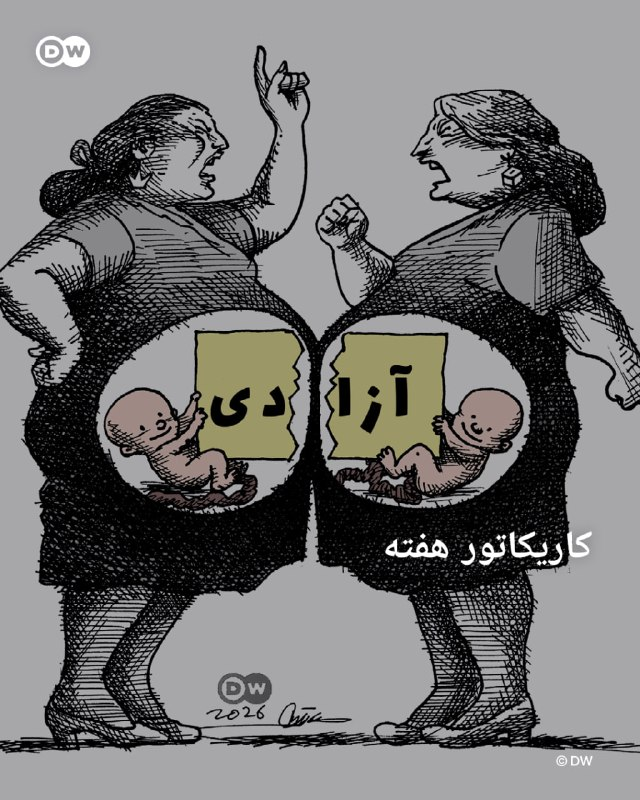

📸 کاریکاتور هفته

هم‌زمان با آشکارتر شدن شکاف‌ها در حاکمیت ایران بر سر نحوه مواجهه با مذاکرات و تفاهم احتمالی با ایالات متحده، برخی اختلاف‌ها و جدال‌های لفظی در میان طیف‌های مختلف اپوزیسیون نیز ادامه دارد.

از این رو، بسیاری از ناظران نسبت به کاهش همبستگی و هدر رفتن انرژی در میان نیروهای خواهان تغییر هشدار می‌دهند و می‌گویند در شرایطی که "جنین آزادی" هنوز در ایران متولد نشده، تداوم چندپارگی می‌تواند چشم‌انداز دستیابی به مطالبات مشترکی چون آزادی و گذار دموکراتیک را با چالش‌های بیشتری روبه‌رو کند.

همین موضوع دستمایه مانا نیستانی در طراحی کاریکاتور هفته برای دویچه وله فارسی قرار گرفته است.
@dw_farsi

## Persian_Trend_Official — post 17348

  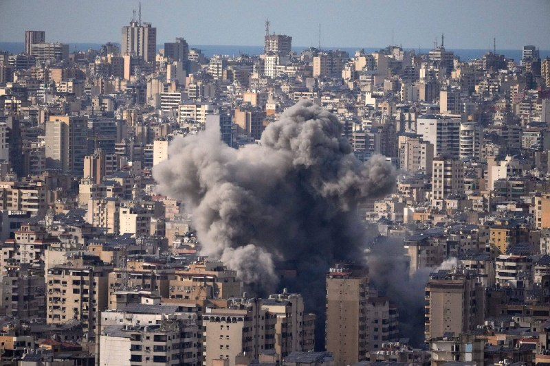

روزنامه معاریو گزارش می‌دهد که اسرائیل در حال آماده شدن برای فروپاشی توافق صلح ایالات متحده و ایران است و به ارتش خود دستور داده است که به توسعه بانک‌های هدف ادامه دهد و برای تشدید تنش در آینده آماده شود.

مقامات اسرائیلی معتقدند که بعید است این توافق دوام بیاورد، با وجود اینکه اذعان دارند به اسرائیل دسترسی کامل به متن نهایی داده نشده است. وزیر زیو الکین می‌گوید اسرائیل کاملاً از مذاکرات کنار گذاشته شده و خود را نسبت به شرایط توافق غیرمتعهد می‌داند و اظهار داشت که یادداشت تفاهم هیچ اختیار الزام‌آوری برای اقدامات اسرائیل ندارد.

📝 Amir

📌 @persian_trend_official
پرشین ترند | متفاوت‌ترین کانال نظامی

## RadioFarda — post 158431

  <a href="telegram/content/RadioFarda_158431_1781700828.mp4" target="_blank">🎬 Download video</a>

🔸محمدباقر قالیباف می‌گوید مسئولان جمهوری اسلامی باید «سنگر را از بچه‌های لانچر» تحویل بگیرند و مردم را از زیر فشار اقتصادی درآورند.

🔸رئيس مجلس شورای اسلامی که در مذاکرات ایران و آمریکا نقش اصلی را داشته است، روز چهارشنبه ۲۷ خرداد در نشستی در اتاق بازرگانی گفت: «وظیفه داریم سنگر را از بچه‌های لانچر تحویل بگیریم، بایستیم، این مردم را از زیر فشار اقتصادی درآوریم.»

🔸اشارهٔ قالیباف به شلیک موشک‌های بالستیک به‌عنوان اصلی‌ترین توان نظامی جمهوری اسلامی ایران است که در جریان جنگ ۴۰ روزه از آن در واکنش به حملات آمریکا و اسرائیل استفاده کرد.

🔸عبور از جنگ و تلاش برای رسیدن به تفاهم با ایالات متحده برای توافق، موضوعی است که اعتراض‌ حامیان تندرو حکومت را نیز در پی داشت. با این حال، برخی مقامات جمهوری اسلامی با اذعان به خسارت‌های گسترده‌ای که جنگ ۴۰ روزه برای اقتصاد کشور ایجاد کرده است، در روزهای اخیر از لزوم رسیدن به توافق برای رسیدگی به وضعیت اقتصادی مردم و عقب‌ماندگی‌ها گفته‌اند.

@RadioFarda

## alonews — post 128673

  <a href="telegram/content/alonews_128673_1781700830.webm" target="_blank">🎬 Download video</a>

👈قالیباف: رابطۀ ایران با چین رابطه یک مشتری یا همتای تجاری نیست بلکه به معنای واقعی کلمه باید شریک باشیم

✅ @AloNews خبر جنگ

## alonews — post 128672

  <a href="telegram/content/alonews_128672_1781700831.mp4" target="_blank">🎬 Download video</a>

👈صدراعظم آلمان، فریدریش مرز، درباره تولید سلاح‌ها: من بسیار سپاسگزارم که رئیس‌جمهور ترامپ و کل هیئت آمریکایی تمایل بالایی به همکاری نشان داده‌اند.

🔴همه ما مشکل این را داریم که در حال حاضر تولیدمان بسیار کم است.

🔴این مشکل می‌تواند از طریق توافق‌های مجوز با شرکت‌هایی که ظرفیت تولید لازم را دارند جبران شود، و این شرکت‌ها هم شرکت‌های اروپایی و هم شرکت‌های اوکراینی هستند.

✅ @AloNews خبر جنگ

---
📅 بروزرسانی: 1405/03/27 16:13
---

## VahidOOnLine — post 246013

  

عباس عبادی، معاون پرستاری وزارت بهداشت، با اشاره به وضعیت منابع انسانی پرستاری در کشور اعلام کرد که در ۱۴ دانشگاه علوم پزشکی، میزان استقبال و تقاضا برای جذب پرستار کمتر از ظرفیت‌ها و مجوزهای اعلام‌شده بوده است؛ موضوعی که به گفته او زنگ هشداری برای نظام سلامت به شمار می‌رود.

این مقام وزارت بهداشت با استناد به نتایج آخرین آزمون استخدامی، کاهش استقبال از فرصت‌های شغلی پرستاری را نشانه‌ای از چالش‌های موجود در این حوزه دانست.

هم‌زمان، احمد نجاتیان، رییس سازمان نظام پرستاری، درباره ادامه خروج نیروهای متخصص از نظام سلامت هشدار داد و گفت بخش قابل توجهی از پرستارانی که شغل خود را ترک کرده‌اند، از نیروهای رسمی بوده‌اند.

نجاتیان افزود ترک خدمت نیروهای رسمی نشان‌دهنده مشکلات معیشتی و شرایط نامناسب کاری در حرفه پرستاری است؛ مسائلی که به گفته او بر توان نظام سلامت در حفظ و جذب نیروی انسانی تاثیر گذاشته است.
‌🏁 🇬🇧 IranintlTV

🤖 @VahidOOnLine

## WithYashar — post 15149

ایران امروز یک تفاهم‌نامه با شرکت سهامی خاص هلی‌کوپترهای روسی برای ۲۰ هلی‌کوپتر سری mi-8/17 امضا کرد (۴ تا از آن‌ها قبلاً قرارداد بسته شده است) که باید تا مارس ۲۰۲۷ تحویل داده شوند تا برای مقاصد اطفاء حریق، انتقال پزشکی و نجات استفاده شوند
@withyashar

## mwarmonitor — post 11067

  <a href="telegram/content/mwarmonitor_11067_1781700211.mp4" target="_blank">🎬 Download video</a>

📝 به نظر می‌رسد این نابغه هندسه و انگل مدیریت شهری، چنان با اعتماد به نفس از گنجایش «۲۰ میلیون نفری» صحبت می‌کند که آدم شک می‌کند نکند خیابان دماوند به میدان آزادی در دنیای موازی ایشان، به اندازه قاره آسیا پهنا دارد!

اگر این مغز متفکر حتی یک بار ماشین‌حسابِ آن تلفن همراه گران‌قیمتِ بیت‌المال را لمس می‌کرد، می‌فهمید که در کل این مسیر ۱۸ کیلومتری با احتساب شروع از تهرانپارس تا میدان آزادی، با عرض حدودی ۲۰ متر، حتی اگر مردم را مثل خیارشور در دبه و با تراکم تخیلیِ ۶ نفر در هر متر مربع بچینیم—آن هم بدون محاسبه ماشین‌ها، تیرهای برق، درخت‌ها و نرده‌ها—کل جمعیت به زور به ۲ میلیون و ۱۶۰ هزار نفر می‌رسد. اما خب، وقتی قرار است یک سیرک بین‌المللی از جیره‌خواران و کاسه‌لیسان عراقی، افغانی، لبنانی، یمنی و آفریقایی راه بیندازید، ریاضیات هم رنگ می‌بازد. شاید هم نقشه جدید این انگ‌زاده‌ها این است که این ارتشِ «جان‌فداهای کرایه‌ای» را به صورت سه طبقه روی سر و کول هم سوار کنند، یا شاید هم مثل همیشه، ارواح و فرشتگان مقرب را هم در لیست حقوق‌بگیران و حاضران این کمدی سیاه جا داده‌اند تا آمارِ تخیلی‌شان جور دربیاید!

@mwarmonitor

## pm_afshaa — post 94252

🔴معاریو:دولت اسرائیل به نهادهای نظامی و امنیتی خود دستور داده است که به توسعه بانک‌های اهداف و آماده‌سازی برای جنگ با ایران ادامه دهند

💧 Rainbet.com the #1 Non-KYC Crypto Casino & Sportsbook @rainbetcom

😁 @Pm_Afshaa

## VahidOnline — post 76447

  <a href="telegram/content/VahidOnline_76447_1781700214.mp4" target="_blank">🎬 Download video</a>

محمدباقر قالیباف، رییس مجلس جمهوری اسلامی و رییس هیات مذاکره‌کننده جمهوری اسلامی با آمریکا، درباره اهمیت روابط اقتصادی با چین گفت جمهوری اسلامی باید از مرحله تقابل عبور کند و بر توسعه اقتصادی متمرکز شود.

قالیباف در نشست همفکری نماینده ویژه در امور چین با اتاق بازرگانی ایران گفت: «باید سنگر را از بچه‌های لانچر تحویل بگیریم، مردم را از زیر فشار اقتصادی دربیاوریم و کشور را بسازیم.»

او با توصیف جایگاه چین به‌عنوان کشوری «منحصربه‌فرد» برای جمهوری اسلامی در حوزه تجارت، افزود پکن باید باور کند که تهران «شریکی به تمام معنا» برای چین است.

رییس مجلس جمهوری اسلامی گفت هر بلوکی که با حضور کشورهای ساحلی خلیج فارس شکل بگیرد، محوریت آن «حتما چین و جمهوری اسلامی» خواهد بود.
@VahidOOnLine

📡 @VahidOnline

## VahidOnline — post 76445

  <a href="telegram/content/VahidOnline_76445_1781700215.mp4" target="_blank">🎬 Download video</a>

دونالد ترامپ می‌گوید اگر از توافق رضایت نداشته باشد و ایران رفتارش را اصلاح نکند، بار دیگر ایران را بمباران خواهد کرد.

رئیس‌جمهور آمریکا که روز چهارشنبه در نشستی خبری همراه با عبدالفتاح السیسی، رئیس‌جمهور مصر، در حاشیه نشست رهبران گروه ۷ در فرانسه صحبت می‌کرد، گفت: «این فقط یک یادداشت تفاهم است. اگر از آن راضی نباشم و رفتارشان را اصلاح نکنند، دوباره به سمت آن‌ها شلیک می‌کنیم و روی سرشان بمب می‌اندازیم.»
دونالد ترامپ همچنین گزارش‌ها دربارهٔ سرمایه‌گذاری ۳۰۰ میلیارد دلاری این کشور در ایران بر اساس تفاهم‌نامه را نادرست خواند، اما گفت که آمریکا مانع سرمایه‌گذاری دیگر کشورها در ایران نخواهد شد.

متن تفاهم‌نامه هنوز منتشر نشده، اما بر اساس یکی از بندهای متنی که برخی رسانه‌های آمریکایی منتشر کرده‌اند، چنین ذکر شده که «ایالات متحده متعهد می‌شود همراه با شرکای منطقه‌ای خود، طرحی جامع و مورد توافق دو طرف برای بازسازی و توسعه اقتصادی جمهوری اسلامی تدوین کند و تأمین مالی دست‌کم ۳۰۰ میلیارد دلار را تضمین نماید. سازوکار اجرای این طرح، به عنوان بخشی از توافق نهایی، ظرف ۶۰ روز تدوین خواهد شد».

رئیس‌جمهور آمریکا همچنین گفت در متن تفاهم‌نامه گفته نشده است که آمریکا پولی به ایران پرداخت می‌کند و وجود بندی دربارهٔ رفع فوری تحریم‌های ایران در متن تفاهم‌نامه را نیز رد کرد.

در متن منتشرشده در رسانه‌های آمریکایی، که صحت آن هنوز مورد تأیید قرار نگرفته، آمده است که «ایالات متحده متعهد می‌شود بر اساس جدول زمانی مورد توافق در توافق نهایی، همهٔ انواع تحریم‌های اعمال‌شده علیه جمهوری اسلامی ایران را لغو کند؛ از جمله قطعنامه‌های شورای امنیت سازمان ملل و شورای حکام آژانس بین‌المللی انرژی اتمی و همچنین تمامی تحریم‌های یکجانبه آمریکا، اعم از اولیه و ثانویه».
@VahidHeadline

📡 @VahidOnline

## IranIntlTV — post 342855

  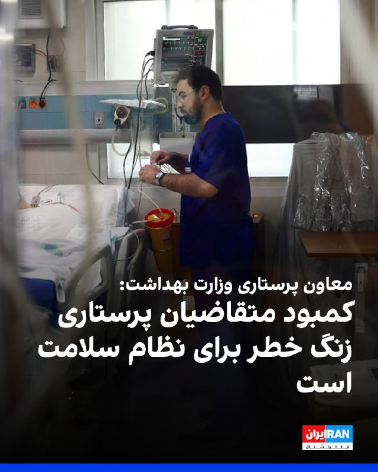

عباس عبادی، معاون پرستاری وزارت بهداشت، با اشاره به وضعیت منابع انسانی پرستاری در کشور اعلام کرد که در ۱۴ دانشگاه علوم پزشکی، میزان استقبال و تقاضا برای جذب پرستار کمتر از ظرفیت‌ها و مجوزهای اعلام‌شده بوده است؛ موضوعی که به گفته او زنگ هشداری برای نظام سلامت به شمار می‌رود.

این مقام وزارت بهداشت با استناد به نتایج آخرین آزمون استخدامی، کاهش استقبال از فرصت‌های شغلی پرستاری را نشانه‌ای از چالش‌های موجود در این حوزه دانست.

هم‌زمان، احمد نجاتیان، رییس سازمان نظام پرستاری، درباره ادامه خروج نیروهای متخصص از نظام سلامت هشدار داد و گفت بخش قابل توجهی از پرستارانی که شغل خود را ترک کرده‌اند، از نیروهای رسمی بوده‌اند.

نجاتیان افزود ترک خدمت نیروهای رسمی نشان‌دهنده مشکلات معیشتی و شرایط نامناسب کاری در حرفه پرستاری است؛ مسائلی که به گفته او بر توان نظام سلامت در حفظ و جذب نیروی انسانی تاثیر گذاشته است.
https://iranintl.com/202606176949

## Persian_Trend_Official — post 17347

  <a href="telegram/content/Persian_Trend_Official_17347_1781700216.mp4" target="_blank">🎬 Download video</a>

صداوسیما امشب گزارشی از حمله F-5 های نهاجا به کویت به گفته خلبانان این عملیات منتشر خواهد کرد.

📝 Amir

📌 @persian_trend_official
پرشین ترند | متفاوت‌ترین کانال نظامی

## Dirty_Kids — post 392386

  

اگه در اسرائیل به دنیا میومدین به احتمال زیاد یهودی میشدین.

اگه توی عربستان بدنیا میومدین مسلمان میشدین.
اگه توی اروپا بدنیا میومدین به احتمال زیاد مسیحی میشدین و اگه توی ژاپن بدنیا میومدین، احتمال زیاد شینتو میشدین.
دین پدیده ایست که جغرافیا براتون تعیین میکنه، پس تعصب برای چیه؟ اونچه که مهمه، اخلاق و انسانیته که محدود به زمان و مکان نیست.

"چارلی چاپلین"

@Dirty_Kids 👻

## Dirty_Kids — post 392385

  <a href="telegram/content/Dirty_Kids_392385_1781700218.mp4" target="_blank">🎬 Download video</a>

🔴 این کلیپ از انرژی بالای زنانه یه دختر حسابی وایرال شده و بالای 20 میلیون بازدید داشته
🤩

@Dirty_Kids 👻

## alonews — post 128671

  <a href="telegram/content/alonews_128671_1781700219.webm" target="_blank">🎬 Download video</a>

👈وزیر خارجه ترکیه: ترامپ به اعتراضات اسرائیل در موضوع توافق با ایران گوش نداد

🔴 امیدواریم که مذاکرات فنی هر چه زودتر پایان یابد و صلح در منطقه برقرار شود

✅ @AloNews خبر جنگ

---
📅 بروزرسانی: 1405/03/27 16:03
---

## FoxNewsTwitter — post 343058

  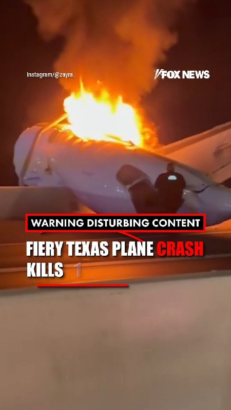

Fox News (Twitter/X)

A desperate rescue effort unfolds after a business jet slams onto a Texas highway and catches fire.

Video shows the aircraft blocking part of Loop 20 in Laredo while first responders and civilians rush toward the burning wreckage, trying to smash cockpit windows and pull people to safety.

Officials say six people were onboard when the plane crashed. One person has died, though authorities have not yet clarified whether the fatality occurred in the aircraft or on the ground.

## VahidOnline — post 76444

  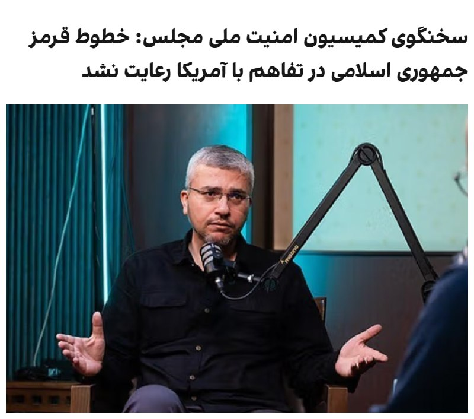

ابراهیم رضایی، سخنگوی کمیسیون امنیت ملی و سیاست خارجی مجلس جمهوری اسلامی، با انتقاد از یادداشت تفاهم میان جمهوری اسلامی و آمریکا، این توافق را «نامتوازن» توصیف کرد و گفت همه خطوط قرمز جمهوری اسلامی در آن رعایت نشد.

رضایی در یک گفت‌وگوی تلویزیونی افزود جنگ پایان نیافته و نباید تصور کرد شرایط از وضعیت تقابل خارج شده است. او گفت: «ما در یک جنگ ترکیبی تمام‌عیار هستیم و باید از فرصت ایجادشده برای قوی‌تر شدن استفاده کنیم.»

سخنگوی کمیسیون امنیت ملی مجلس جمهوری اسلامی همچنین از منتقدان یادداشت تفاهم دفاع کرد و گفت نباید مخالفان تفاهم را «تندرو» خواند. او افزود: «اگر این افراد نبودند، الان سربازان آمریکایی بالای سر ما بودند.»

رضایی پیش‌تر نیز در شبکه اجتماعی ایکس نسبت به نحوه دفاع حامیان توافق از این تفاهم‌نامه انتقاد کرد. او از مقام‌های جمهوری اسلامی خواست از منابع عمومی برای تبلیغ «توافق» استفاده نکنند، منتقدان را تحمل کنند و برای توجیه تصمیم‌گیری‌ها از رهبر جمهوری اسلامی هزینه نکنند.
@VahidOOnLine

📡 @VahidOnline

## VahidOnline — post 76443

  

در ادامهٔ روند کاهشی قیمت ارزهای خارجی در بازار آزاد ایران، روز چهارشنبه ۲۷ خرداد قیمت هر دلار آمریکا به حدود ۱۵۳ هزار تومان رسید و قیمت سکه طلا هم در محدوده ۱۶۰ میلیون تومان اعلام شد.

قیمت دلار آمریکا که در مقطعی تا ۱۹۰ هزار تومان بالا رفته بود، تا کنون حدود ۲۰ درصد کاهش پیدا کرده است.

قیمت هر گرم طلای ۱۸ عیار نیز روز چهارشنبه به ۱۵ میلیون و ۷۶۷ هزار تومان و «سکه امامی» نیز به ۱۵۹ میلیون و ۵۰۰ هزار تومان کاهش یافت.

در مقابل، شاخص بازار سهام بورس تهران از زمان اعلام توافق رشد چشمگیری داشته و روز چهارشنبه با ثبت رکوردی تازه به بیش از ۵ میلیون و ۱۰۰ هزار واحد رسید.
@VahidHeadline

📡 @VahidOnline

## VahidOnline — post 76442

  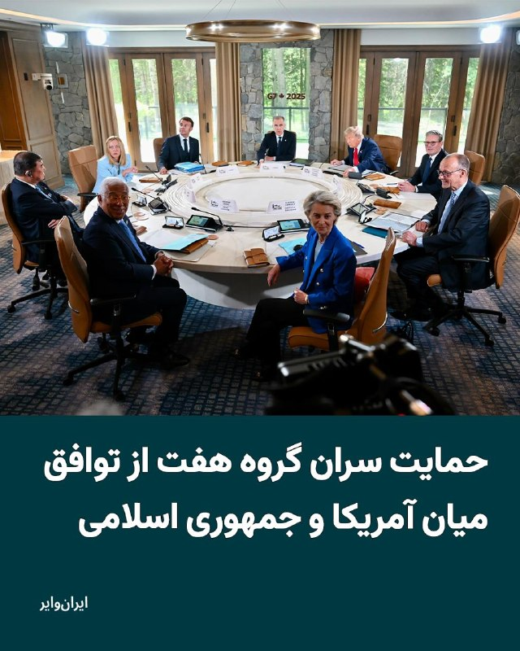

سران هفت کشور صنعتی جهان (G7) در بیانیه پایانی نشست خود از توافق میان ایالات متحده و جمهوری اسلامی حمایت کردند و آن را فرصتی مهم برای جلوگیری از دستیابی حکومت ایران به سلاح هسته‌ای و محدود کردن فعالیت‌های موشکی و منطقه‌ای تهران دانستند.

رهبران آمریکا، کانادا، فرانسه، آلمان، ایتالیا، ژاپن و بریتانیا همچنین اعلام کردند آماده‌اند در روند اجرای این توافق مشارکت داشته باشند.

در بخش دیگری از این بیانیه، بر ضرورت حفظ آزادی کشتیرانی و عبور بدون مانع کشتی‌ها در آبراه‌های بین‌المللی تاکید شده و این موضوع یکی از ارکان اصلی تجارت جهانی توصیف شده است.
@VahidHeadline

📡 @VahidOnline

## VahidOnline — post 76441

  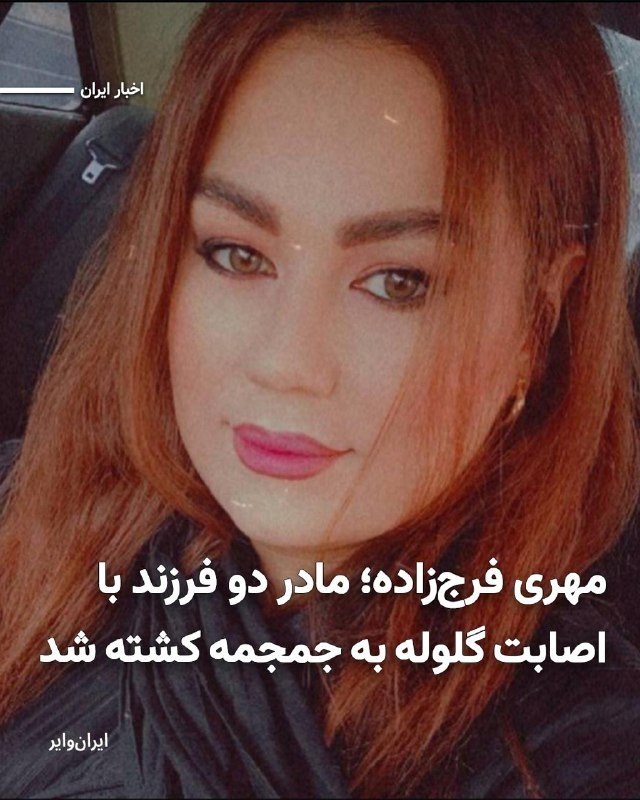

بر اساس اطلاعات رسیده به ایران‌وایر، «مهری فرج‌زاده» ۳۶ ساله، ساکن کرج و مادر دو فرزند، روز جمعه ۱۹ دی‌ماه ۱۴۰۴ در فردیس کرج هدف شلیک گلوله قرار گرفته و جان خود را از دست داده است.

به گفته منابع مطلع، گلوله به ناحیه جمجمه او اصابت کرده بود و مهری فرج‌زاده پیش از رسیدن به بیمارستان «به‌آفرین» فردیس جان باخته بود.

نزدیکان او می‌گویند پس از دو روز پیگیری، پیکر مهری فرج‌زاده را روز ۲۱ دی‌ماه از بهشت سکینه کرج تحویل گرفتند.

مهری فرج‌زاده خانه‌دار بود و دو فرزند داشت. دختری ۱۵ ساله و پسری ۱۰ ساله که با کشته شدن مادرشان با فقدانی جبران‌ناپذیر روبه‌رو شدند.
@VahidHeadline

📡 @VahidOnline

## VahidOnline — post 76440

  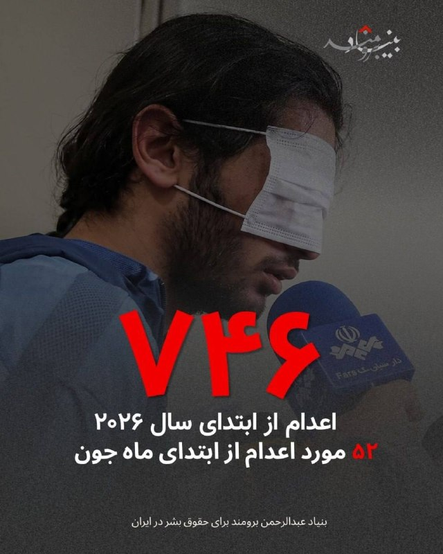

‏🔴بنیاد عبدالرحمن برومند از اول ژانویه ۲۰۲۶ تاکنون، ۷۴۶ مورد اعدام را در ایران مستند کرده است که تنها ۵۲ مورد آن از آغاز ژوئن ۲۰۲۶ به اجرا درآمده است.

‏🔸جمهوری اسلامی در سایه جنگ و در واکنش به اعتراضات سراسری دی ماه ۱۴۰۴ به اجرای اعدام‌های سیاسی شتاب بخشیده است. از ابتدای سال جاری میلادی تاکنون، دست‌کم ۴۵ معترض و زندانی سیاسی متهم به جرایم علیه امنیت ملی، از جمله جاسوسی، اعدام شده‌اند.

‏🔸گزارش‌های رسیده به بنیاد عبدالرحمن برومند نشان می‌دهد که مبنای حقوقی اصلی بسیاری از این احکام اعدام، «اعترافات» اجباری اخذ شده از زندانیان تحت فشارهای جسمی و روحی بوده است؛ امری که نقض آشکار حقوق اولیه دادرسی عادلانه و مصونیت‌های بین‌المللی در برابر شکنجه به شمار می‌رود.
‏⁧ #نه_به_اعدام ⁩
@IranRights

## IranIntlTV — post 342854

  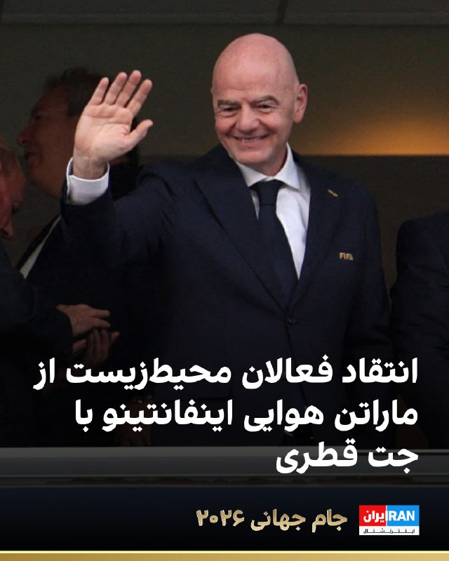

🔻در حالی که جام جهانی ۲۰۲۶ به عنوان یکی از آلوده‌کننده‌ترین رویدادهای تاریخ ورزش با انتقاد فعالان محیط‌زیست مواجه شده است، انتشار خبر سفرهای فشرده جیانی اینفانتینو با جت اختصاصی قطر ایرویز برای تماشای روزانه دو مسابقه، موج تازه‌ای از انتقادها را متوجه رییس فیفا کرده است.

🔹بر اساس گزارش گاردین، جیانی اینفانتینو، رییس فیفا، قصد دارد در طول جام جهانی ۲۰۲۶ هر روز در دو مسابقه حضور پیدا کند. با توجه به پراکندگی ورزشگاه‌ها در آمریکا، مکزیک و کانادا و اختلاف زمانی میان شهرهای میزبان، او برای جابه‌جایی از یک جت اختصاصی متعلق به قطر ایرویز، یکی از اسپانسرهای اصلی فیفا، استفاده می‌کند.

🔹سفرهای اینفانتینو از روز افتتاحیه آغاز شد. او پس از تماشای دیدار مکزیک و آفریقای جنوبی در مکزیکوسیتی، راهی گوادالاخارا شد تا مسابقه کره جنوبی و جمهوری چک را از نزدیک دنبال کند. این روند در روزهای بعد نیز با سفر به لس‌آنجلس، سان‌فرانسیسکو و ونکوور ادامه یافت.

🔹جزییات بیشتر را در سایت بخوانید

@iranintltvsport

## DW_Farsi — post 126096

🔶 سکونت بیش از ۴ میلیون پناهجو و آواره در آلمان

بر اساس گزارشی که اداره فدرال آمار آلمان منتشر کرده است، از سال ۲۰۲۵ تا کنون بیش از ۴ میلیون پناهجو و آواره در آلمان زندگی می‌کنند.

این آمار گرچه مربوط به سال ۲۰۲۵ است اما با توجه به رکود ورود پناهجویان جدید به آلمان در شش ماهه اول سال ۲۰۲۶ فقط باید حدود ۵۰ هزار را نفر به آمار سال ۲۰۲۵ افزود.
@dw_farsi

## Persian_Trend_Official — post 17346

  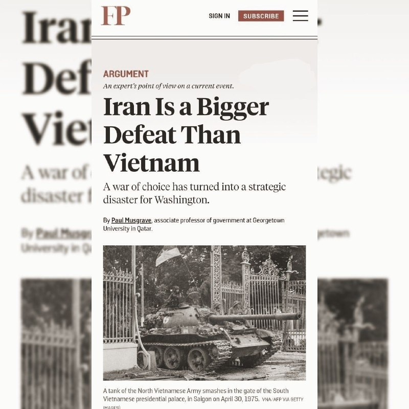

📰 فارین پالیسی: ایران به شکستی بزرگ‌تر از ویتنام برای آمریکا تبدیل شده است

🔹 مجله سیاسی و اقتصادی «فارین پالیسی» در تازه‌ترین تحلیل خود گفته جنگی که با تصمیم واشنگتن شروع شد، حالا به یک دردسر بزرگ و شکست راهبردی برای آمریکا تبدیل شده است.

🔹 این نشریه با مقایسه اتفاقات اخیر با تجربه جنگ ویتنام، می‌گوید هزینه‌های نظامی، سیاسی و ژئوپلیتیکی این درگیری ممکن است در بلندمدت روی جایگاه آمریکا در منطقه و حتی جهان تأثیر بگذارد.

🔹 فارین پالیسی همچنین به تأثیر این تحولات بر اعتبار بازدارندگی آمریکا، هزینه‌های اقتصادی و پیامدهای آن برای سیاست خارجی واشنگتن اشاره کرده است.

🎯 اهمیت این تحول:

مقایسه یک درگیری معاصر با جنگ ویتنام، که یکی از پرهزینه‌ترین و بحث‌برانگیزترین جنگ‌های تاریخ آمریکا محسوب می‌شود، نشان‌دهنده نگرانی بخشی از تحلیلگران غربی نسبت به نتایج و پیامدهای راهبردی این تقابل است. چنین ارزیابی‌هایی می‌تواند بر فضای سیاسی و تصمیم‌گیری‌های آینده در واشنگتن تأثیرگذار باشد.

👺 Phantom

📌 @persian_trend_official
پرشین ترند | متفاوت‌ترین کانال نظامی

## RadioFarda — post 158430

🔸دونالد ترامپ می‌گوید اگر از توافق رضایت نداشته باشد و ایران رفتارش را اصلاح نکند، بار دیگر ایران را بمباران خواهد کرد.

🔸رئیس‌جمهور آمریکا که روز چهارشنبه ۲۹ خرداد در نشستی خبری همراه با عبدالفتاح السیسی، رئیس‌جمهور مصر، در حاشیه نشست رهبران گروه ۷ در فرانسه صحبت می‌کرد، گفت: «این فقط یک یادداشت تفاهم است. اگر از آن راضی نباشم و رفتارشان را اصلاح نکنند، دوباره به سمت آن‌ها شلیک می‌کنیم و روی سرشان بمب می‌اندازیم.»

🔸دونالد ترامپ همچنین گزارش‌ها دربارهٔ سرمایه‌گذاری ۳۰۰ میلیارد دلاری این کشور در ایران بر اساس تفاهم‌نامه را نادرست خواند، اما گفت که آمریکا مانع سرمایه‌گذاری دیگر کشورها در ایران نخواهد شد.

@RadioFarda

## IranianMinds — post 22789

🔴پزشکیان:

خودتون مشکلات خودتونو حل کنید، من که سیاستمدار نیستم، دکتر هستم و برای سلامت مردم اومدم رئیس‌جمهور شدم😂

@IranianMinds

## IranianMinds — post 22788

  <a href="telegram/content/IranianMinds_22788_1781699641.mp4" target="_blank">🎬 Download video</a>

وضعیتمون از این هفته

@IranianMinds

## BBCPersian — post 284130

  <a href="telegram/content/BBCPersian_284130_1781699643.mp4" target="_blank">🎬 Download video</a>

یکی از تماشاگران بازی فوتبال تیم‌های ایران و نیوزیلند که با تی‌شرت دختر آبی و کلاه یادبود کشته‌شدگان ۱۸ و ۱۹ دی در ورزشگاه «سوفا» در لس‌آنجلس حاضر شده بود، گفت که فقط برای گرامی‌داشت یاد آنها. در این ورزشگاه حاضر شده است.

سحر خدایاری، معروف به دختر آبی، هوادار تیم استقلال بود که اسفند ۱۳۹۷ با لباس مبدل به استادیوم آزادی رفت و دستگیر شد. شهریور ۹۸، وقتی او برای پی‌گیری پرونده‌اش رفته بود، پس از خروج از دادسرا در خیابان خودسوزی کرد و جانش را از دست داد.
گفت‌وگوی سام فرزانه، خبرنگار اعزامی بی‌بی‌سی به لس‌آنجلس را، که در حاشیه مسابقه فوتبال ایران و نیوزیلند گرفته شده، ببینید.

https://bbc.in/44dzSIn
@BBCPersian

## Dirty_Kids — post 392384

  

باورنکردنیه، این ۴قطعه گیربکس یه ماشین معمولی چینی ۲۴۰ میلیون تومن

چی به سر ملت دارین میارین

@Dirty_Kids 👻

## Hranews — post 113673

  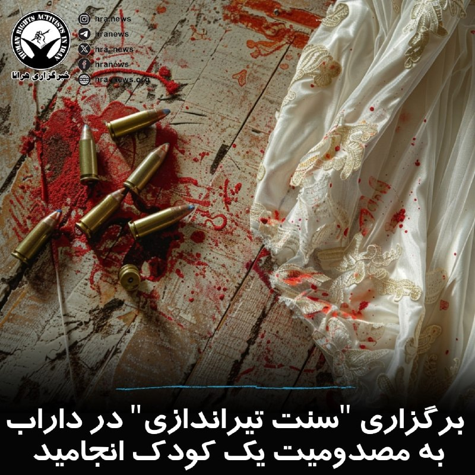

اوایل هفته جاری، به دنبال برگزاری «سنت تیراندازی» در یک مراسم عروسی در شهرستان داراب، یک کودک ۸ ساله مورد اصابت گلوله قرار گرفت و از ناحیه سر و صورت مجروح شد. به گفته سید رحمان هاشمی فرمانده انتظامی داراب، متهم این پرونده ۴۸ ساعت بعد در یکی از روستاهای همجوار بازداشت شده است.

برگزاری سنت تیراندازی در مراسم شادی و عزا در میان بخشی از مردم ایران که بارها حادثه آفریده و جان بسیاری از شهروندان را گرفته، همواره با انتقادهای بسیاری مواجه است. بعلاوه سهولت دسترسی به سلاح برای شهروندان عادی، از جمله انتقاداتی است که به مسئولین و ناظرین مربوطه وارد است.
#سنت_تیراندازی

↘️
@hranews_bot تماس ✉️ - @Hranews کانال هرانا 🆑

## alonews — post 128670

  <a href="telegram/content/alonews_128670_1781699646.webm" target="_blank">🎬 Download video</a>

👈ایران امروز یک تفاهم‌نامه با شرکت سهامی خاص هلی‌کوپترهای روسی برای ۲۰ هلی‌کوپتر سری Mi-8/17 امضا کرد (۴ تا از آن‌ها قبلاً قرارداد بسته شده است) که باید تا مارس ۲۰۲۷ تحویل داده شوند تا برای مقاصد اطفاء حریق، انتقال پزشکی و نجات استفاده شوند.

✅ @AloNews خبر جنگ

## alonews — post 128669

  <a href="telegram/content/alonews_128669_1781699647.webm" target="_blank">🎬 Download video</a>

👈ادعای سی‌ان‌ان درباره مفاد متن توافق ایران و آمریکا

🔴سی‌ان‌ان مدعی شد از طریق یک مقام آمریکایی به تفاهم‌نامه ۱۴ ماده‌ای بین ایران و آمریکا دست یافت و محتوای آن توسط دیپلمات دیگری که این توافق‌نامه را دیده است، تأیید شد:

🔴 آتش‌بس فوری و دائمی بین ایران، آمریکا و متحدانشان در تمام جبهه‌ها، از جمله لبنان، با تعهد هر دو طرف به عدم اقدامات خصمانه یا استفاده از زور در آینده.

🔴 هر دو طرف موافقت می‌کنند که به حاکمیت، تمامیت ارضی یکدیگر احترام بگذارند و از دخالت در امور داخلی خودداری کنند.

🔴 توافق نهایی ظرف ۶۰ روز مذاکره خواهد شد و تمدید آن با رضایت متقابل امکان‌پذیر است.

🔴 ایالات متحده بلافاصله محاصره دریایی را لغو خواهد کرد، ترافیک دریایی را ظرف ۳۰ روز به سطح قبل از جنگ باز خواهد گرداند و نیروها را ظرف ۳۰ روز پس از توافق نهایی از مناطق اطراف خارج خواهد کرد.

🔴 ایران کشتیرانی تجاری از طریق خلیج فارس و دریای عمان را ظرف ۳۰ روز به سطح قبل از جنگ باز خواهد گرداند، از جمله مین‌زدایی و رفع موانع فنی.

🔴 ایالات متحده و شرکای منطقه‌ای یک طرح احیا و توسعه اقتصادی ۳۰۰ میلیارد دلاری برای ایران تدوین خواهند کرد که جزئیات اجرایی آن ظرف ۶۰ روز نهایی می‌شود.

🔴 ایالات متحده متعهد می‌شود که تمام تحریم‌های ایران را تحت یک جدول زمانی توافق‌شده، شامل تحریم‌های سازمان ملل، آژانس بین‌المللی انرژی اتمی و تحریم‌های یکجانبه ایالات متحده، لغو کند.

🔴 ایران تأکید می‌کند که هرگز سلاح هسته‌ای تولید نخواهد کرد. مسائل معوقه در مورد اورانیوم غنی‌شده، مواد هسته‌ای و نیازهای هسته‌ای ایران در توافق نهایی حل و فصل خواهد شد.

🔴 تا زمان دستیابی به توافق نهایی، ایران فعالیت‌های هسته‌ای فعلی خود را حفظ خواهد کرد، در حالی که ایالات متحده از اعمال تحریم‌های جدید یا گسترش حضور نظامی منطقه‌ای خود خودداری خواهد کرد.

🔴 وزارت خزانه‌داری ایالات متحده بلافاصله معافیت‌هایی را صادر خواهد کرد که به ایران اجازه صادرات نفت، پتروشیمی و خدمات بانکی، بیمه و کشتیرانی مرتبط را می‌دهد.

🔴 دارایی‌های مسدود شده ایران به تدریج با پیشرفت مذاکرات آزاد می‌شوند و دسترسی کامل طبق سازوکارهای مورد توافق دو طرف اعطا می‌شود.

🔴 یک سازوکار اجرایی مشترک برای نظارت بر رعایت توافق نهایی ایجاد خواهد شد.

🔴 به محض شروع اجرای مفاد کلیدی - از جمله بازگرداندن کشتیرانی، معافیت از تحریم‌ها و آزادسازی دارایی‌ها - مذاکرات در مورد عناصر باقی‌مانده توافق نهایی ادامه خواهد یافت.

🔴توافق نهایی از طریق قطعنامه الزام‌آور شورای امنیت سازمان ملل متحد تأیید خواهد شد.



✅ @AloNews خبر جنگ

## alonews — post 128668

  <a href="telegram/content/alonews_128668_1781699647.webm" target="_blank">🎬 Download video</a>

👈استرالیا امروز سطح عمومی هشدار سفر برای بحرین، اسرائیل، کویت، قطر و امارات متحده عربی را کاهش داد و از شهروندان خود خواست در مورد ضرورت سفر به این مناطق تجدیدنظر کنند.

✅ @AloNews خبر جنگ

---
📅 بروزرسانی: 1405/03/27 15:53
---

## VahidOOnLine — post 246012

  <a href="telegram/content/VahidOOnLine_246012_1781699016.mp4" target="_blank">🎬 Download video</a>

فاکس‌نیوز گزارش داد به تیم فوتبال ایران دستور داده شده پس از دیدار افتتاحیه جام جهانی مقابل نیوزیلند، خاک آمریکا را ترک کند.

امیر قلعه‌نویی، سرمربی این تیم، با انتقاد از این تصمیم گفت تیمش «مظلوم‌ترین تیم جام جهانی» است، زیرا بدون فرصت کافی برای ریکاوری و با وجود خستگی مجبور به ترک آمریکا شده است
گفت‌وگو با مزدک میرزایی، عضو تحریریه ایران‌اینترنشنال
‌🏁 🇬🇧 IranintlTV

🤖 @VahidOOnLine

## VahidOOnLine — post 246011

  <a href="telegram/content/VahidOOnLine_246011_1781699017.mp4" target="_blank">🎬 Download video</a>

آرش آزرمی، دبیر بخش اقتصادی ایران‌اینترنشنال، گفت مشوق‌های مالی و ارزی در نظر گرفته‌شده برای جمهوری اسلامی در توافق با آمریکا ممکن است هرگز آزاد نشود، زیرا این حکومت نمی‌تواند به‌طور ذاتی در اقتصاد جهانی ادغام شود
‌🏁 🇬🇧 IranintlTV

🤖 @VahidOOnLine

## IranIntlTV — post 342853

  <a href="telegram/content/IranIntlTV_342853_1781699019.mp4" target="_blank">🎬 Download video</a>

فاکس‌نیوز گزارش داد به تیم فوتبال ایران دستور داده شده پس از دیدار افتتاحیه جام جهانی مقابل نیوزیلند، خاک آمریکا را ترک کند.

امیر قلعه‌نویی، سرمربی این تیم، با انتقاد از این تصمیم گفت تیمش «مظلوم‌ترین تیم جام جهانی» است، زیرا بدون فرصت کافی برای ریکاوری و با وجود خستگی مجبور به ترک آمریکا شده است
گفت‌وگو با مزدک میرزایی، عضو تحریریه ایران‌اینترنشنال

## IranIntlTV — post 342852

  <a href="telegram/content/IranIntlTV_342852_1781699020.mp4" target="_blank">🎬 Download video</a>

آرش آزرمی، دبیر بخش اقتصادی ایران‌اینترنشنال، گفت مشوق‌های مالی و ارزی در نظر گرفته‌شده برای جمهوری اسلامی در توافق با آمریکا ممکن است هرگز آزاد نشود، زیرا این حکومت نمی‌تواند به‌طور ذاتی در اقتصاد جهانی ادغام شود

## IranianMinds — post 22787

گزارشگر: گزارش شده که این توافق شامل صندوقی به ارزش ۳۰۰ میلیارد دلار برای ایران هست.

ترامپ: نه، این صحت نداره، ما سرمایه‌گذاری نمی‌کنیم، مردم می‌تونن تصمیم بگیرن که این کار را انجام بدن، اما به خودشون بستگی داره.

@IranianMinds

## alonews — post 128667

  <a href="telegram/content/alonews_128667_1781699022.webm" target="_blank">🎬 Download video</a>

👈اسرائیل در حال آماده‌سازی برای فروپاشی توافق صلح آمریکا و ایران است و به نیروهای نظامی خود دستور داده است تا به توسعه بانک‌های هدف ادامه دهند و برای تشدید احتمالی آینده آماده شوند، معاریو گزارش می‌دهد

🔴مقامات اسرائیلی معتقدند این توافق احتمالاً پایدار نخواهد ماند، اگرچه اذعان دارند که اسرائیل به متن نهایی شده به طور کامل دسترسی نداشته است

✅ @AloNews خبر جنگ

## alonews — post 128666

  <a href="telegram/content/alonews_128666_1781699022.webm" target="_blank">🎬 Download video</a>

👈تسنیم: اختلال خدمات بانکی ادامه دارد/تجهیزات شبکه فرسوده هستند

✅ @AloNews خبر جنگ

## alonews — post 128665

  <a href="telegram/content/alonews_128665_1781699022.webm" target="_blank">🎬 Download video</a>

👈نخست‌وزیر آلمان، مرز، در مورد ایران و لبنان: تنگه هرمز باید بدون هیچ محدودیتی باز بماند، بدون هیچ «اگر» یا «اما»یی، و ایران باید به‌طور دائم و قابل‌تایید برنامه هسته‌ای خود را پایان دهد.

🔴صلح باید برقرار بماند — و این نه تنها به ایران، بلکه همچنین به لبنان، به‌ویژه جنوب لبنان، که درباره وضعیت آن به‌طور مفصل بحث کردیم، نیز اعمال می‌شود.

🔴آلمان کمک خواهد کرد. در منافع ماست که صلح برقرار بماند.

🔴ما به یک خاورمیانه و منطقه نزدیک پایدار نیاز داریم. ما به شفافیت و آزادی در مسیرهای دریایی نیاز داریم. ما به قیمت‌های پایدار انرژی نیاز داریم.

🔴کمک‌ها ممکن است شامل تعهد نظامی نیز باشد. دولت فدرال زمانی که و اگر شرایط لازم برقرار شود، یک مأموریت مناسب را به پارلمان پیشنهاد خواهد کرد.

✅ @AloNews خبر جنگ

## alonews — post 128664

  <a href="telegram/content/alonews_128664_1781699022.webm" target="_blank">🎬 Download video</a>

👈نخست‌وزیر آلمان: همه شرکای G7 مشارکت نظامی و مالی خود را به اوکراین افزایش خواهند داد.

🔴پیام به روسیه روشن است: همه شرکای G7 فشار را بر مسکو افزایش خواهند داد، از جمله از طریق تحریم‌ها.

🔴این امر لحن جدیدی در وحدت و عزم اقیانوس اطلس ایجاد می‌کند.

🔴توافقی که بین رئیس‌جمهور ترامپ و رهبری ایران به دست آمده، موفقیتی واقعاً بزرگ است.

🔴ما همین امروز می‌توانیم آن را ببینیم، برای مثال در قیمت نفت که همچنان در حال کاهش است. این نشانه‌ای خوب است و روابط تأمین به وضوح به صورت سیستماتیک در حال بازسازی هستند.

🔴اکنون باید این توافق با مذاکرات بیشتری دنبال شود، به ویژه دور دوم گفتگوها

✅ @AloNews خبر جنگ

---
📅 بروزرسانی: 1405/03/27 15:43
---

## VahidOOnLine — post 246010

  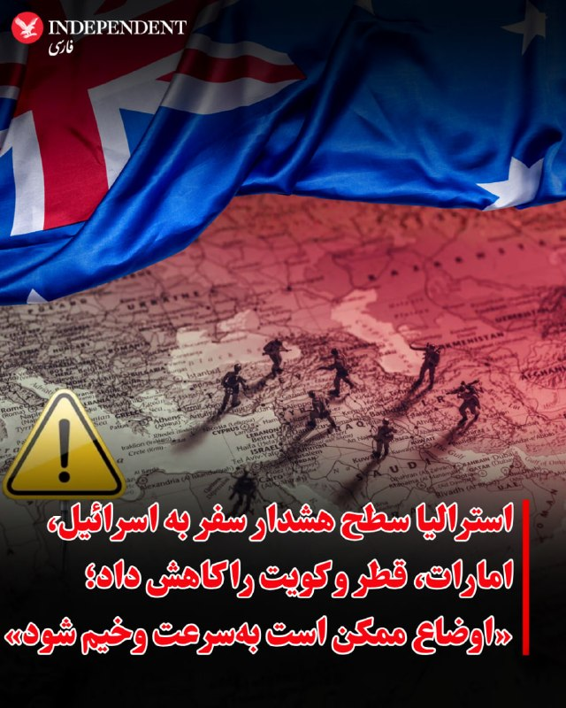

♦️وزارت امور خارجه استرالیا، روز چهارشنبه ۲۷ خرداد با انتشار بیانیه‌ای ضمن استقبال از تفاهم پایان جنگ آمریکا با جمهوری اسلامی ایران اعلام کرد سطح هشدار سفر اتباعش به اسرائیل، امارات متحده عربی، قطر و کویت را از «سفر نکنید/درجه ۴» به درجه ۳ (سفر ضروری و با احتیاط) کاهش داده است.

با این حال در این بیانیه آمده است که شهروندان استرالیایی باید مراقب باشند که شرایط امنیتی در منطقه ممکن است «به سرعت و ناگهان وخیم شود.»

وزارت خارجه استرالیا با وجود کاهش سطح هشدار خطر به شهروندان این کشور اعلام کرد همچنان از سفر به مرزهای اسرائیل با غزه و لبنان سفر نکنند.
‌🇸🇦 Indypersian

🤖 @VahidOOnLine

## mwarmonitor — post 11066

📝 وقتی ممد باقر با آن قیافهٔ چرک افاضه می‌کند که به معنی واقعی کلمه با چین شریک باشیم، آدم یاد نوکرِ دست‌بسته‌ای می‌افتد که خودش با لذت طنابِ دارش را می‌بافد! حقیقت این است که جمهوری اسلامی ، از یک شریک اقتصادی ساده، عملاً به یک شریک جنسیِ بی‌اراده تبدیل شده‌اند که اژدهای چینی هر جور که دلش بخواهد از آن‌ها سواری می‌گیرد و هر استفاده‌ای که فکرش را بکنید از این بی‌کفایت‌ها می‌کند.

از صیادی ترال که مثل یک انگلِ صنعتی تک‌تکِ ماهی‌ها و نان صیادان بومی را بلعیده، تا پیشکش کردنِ بی‌پروای پروژه‌ها و تبدیل کردنِ کل مملکت به سطل زبالهٔ انواع و اقسام جنس بنجول چینی، همگی شاهکارِ این نگاهِ نوکرمآبانه است. البته دوستان برای اینکه متهم به تک‌پرانی نشوند، الباقیِ این لاشهٔ نیمه‌جان را هم دو دستی تقدیم «بابا پوتین» کرده‌اند تا کرملین هم بی‌نصیب نماند! در این حراجِ خفت‌بار، مردم و منافع ملی هرگز حتی یک عددِ اعشاری هم به حساب نیامده‌اند؛ چرا که تنها هدف نظام انگلی و این پادوهای صندلی‌پرست، باج دادن به شرق برای بقای چند روز بیشترِ خودشان است، حتی اگر به قیمتِ ذوب شدنِ کاملِ عزت یک ملت در توالتِ پکن و مسکو باشد.

@mwarmonitor

## pm_afshaa — post 94251

  <a href="telegram/content/pm_afshaa_94251_1781698406.mp4" target="_blank">🎬 Download video</a>

🔴قالیباف: ما باید سنگر رو از بچه‌های لانچر تحویل بگیریم و مردم رو از زیر فشار اقتصادی دربیاریم.

💧 Rainbet.com the #1 Non-KYC Crypto Casino & Sportsbook @rainbetcom

😁 @Pm_Afshaa

## IranIntlTV — post 342851

  <a href="telegram/content/IranIntlTV_342851_1781698408.mp4" target="_blank">🎬 Download video</a>

احمد علم‌الهدی، امام جمعه مشهد، در گفت‌وگو با المیادین گفت اکثریت اعضای مجلس خبرگان از ابتدا به رهبری مجتبی خامنه‌ای تمایل داشته‌اند.

علی شیرازی، عضو تحریریه ایران‌اینترنشنال: «به نظر می‌رسد علم‌الهدی کسی بود که پروژه رهبر شدن مجتبی خامنه‌ای را دنبال می‌کرد و به نتیجه رساند.»
@iranintltv

## FarsiVOA — post 221013

🔺آژانس انرژی از سقوط یک میلیون بشکه‌ای تولید روزانه نفت ایران خبر داد

▪️بر اساس این گزارش، تولید روزانه نفت ایران از ۳ میلیون و ۳۶۰ هزار بشکه در ماه آوریل به ۲.۳ میلیون بشکه در ماه مه کاهش یافته است.

⬇️ بیشتر بخوانید:

https://ir.voanews.com/a/8161831.html/?nocach=1

## Persian_Trend_Official — post 17345

  <a href="telegram/content/Persian_Trend_Official_17345_1781698410.mp4" target="_blank">🎬 Download video</a>

اسرائیل همچنان به بمباران جنوب لبنان ادامه میدهد.

اگر رقم 84 بار نقض آتش بس در بیانیه شب گذشته قرارگاه خاتم‌الانبیا را در نظر بگیریم، میشه گفت آقای خاتم الانبیا اسرائیل تا این لحظه حدودا 90 بار از بعد امضای الکترونیک تفاهم نامه حمله هوایی و توپخانه ای به جنوب لبنان صورت داده است.

📝 Amir

📌 @persian_trend_official
پرشین ترند | متفاوت‌ترین کانال نظامی

## BBCPersian — post 284120

🖋لوسی ویلیامسون
خبرنگار خاورمیانه در بیت‌المقدس

توافق آتش‌بس آمریکا با ایران برای بنیامین نتانیاهو، نخست‌وزیر اسرائیل به یک کابوس سیاسی تبدیل شده است. توافقی که سه ستون اصلی کارنامه سیاسی آقای نتانیاهو را در هم شکسته و او را در یک معضل امنیتی جدید گرفتار کرده است.

چگونه مردی که خود را فردی معرفی می‌کرد که در واشنگتن نفوذ سیاسی دارد و بر سیاستمداران آمریکایی تاثیر می‌گذارد، تا این اندازه کنار گذاشته شده و به این شکل علنی از سوی مهم‌ترین متحد آمریکایی خود تحقیر شده است؟

چگونه مردی که مقابله با ایران را به محور اصلی سیاست امنیتی اسرائیل تبدیل کرده بود، اکنون جنگ با حکومت ایران را در حالی به پایان می‌رساند که می‌توان استدلال کرد این حکومت در موقعیتی قدرتمندتر قرار گرفته است؟

ادامه مطلب⬇️
📸GettyImages/ Reuters/ AFP via
Getty Images/ EPA/Shutterstock/ Bloomberg via Getty Images
https://bbc.in/4vRoZI5
@BBCPersian

## alonews — post 128663

  <a href="telegram/content/alonews_128663_1781698411.webm" target="_blank">🎬 Download video</a>

👈ترامپ درباره سیسی مصر:
او در هتلی بود؛ من با او ملاقات کردم و ما عاشق هم شدیم، عمیقاً عاشق.

🔴شیمی فوق‌العاده‌ای داشتیم. من دو برابر مدت مقرر ماندم

✅ @AloNews خبر جنگ

---
📅 بروزرسانی: 1405/03/27 15:33
---

## VahidOOnLine — post 246009

  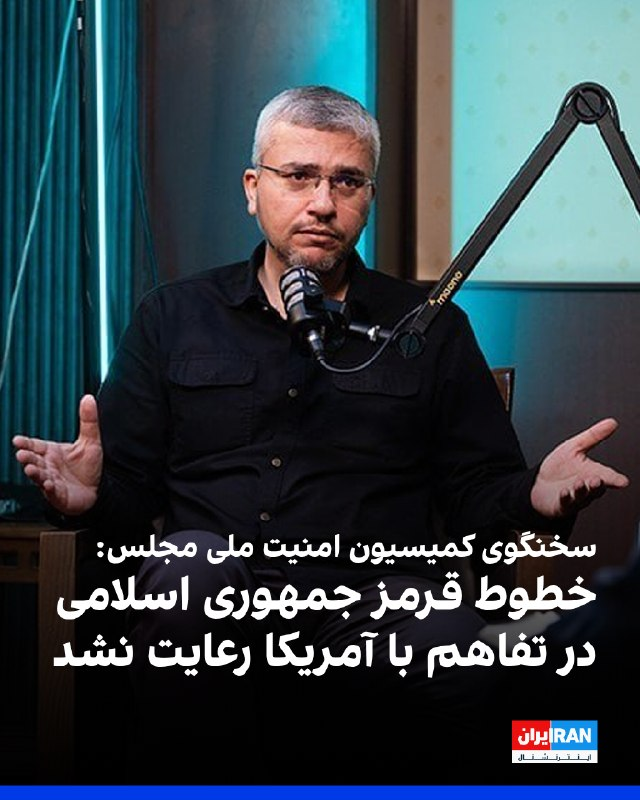

ابراهیم رضایی، سخنگوی کمیسیون امنیت ملی و سیاست خارجی مجلس جمهوری اسلامی، با انتقاد از یادداشت تفاهم میان جمهوری اسلامی و آمریکا، این توافق را «نامتوازن» توصیف کرد و گفت همه خطوط قرمز جمهوری اسلامی در آن رعایت نشد.

رضایی در یک گفت‌وگوی تلویزیونی افزود جنگ پایان نیافته و نباید تصور کرد شرایط از وضعیت تقابل خارج شده است. او گفت: «ما در یک جنگ ترکیبی تمام‌عیار هستیم و باید از فرصت ایجادشده برای قوی‌تر شدن استفاده کنیم.»

سخنگوی کمیسیون امنیت ملی مجلس جمهوری اسلامی همچنین از منتقدان یادداشت تفاهم دفاع کرد و گفت نباید مخالفان تفاهم را «تندرو» خواند. او افزود: «اگر این افراد نبودند، الان سربازان آمریکایی بالای سر ما بودند.»

رضایی پیش‌تر نیز در شبکه اجتماعی ایکس نسبت به نحوه دفاع حامیان توافق از این تفاهم‌نامه انتقاد کرد. او از مقام‌های جمهوری اسلامی خواست از منابع عمومی برای تبلیغ «توافق» استفاده نکنند، منتقدان را تحمل کنند و برای توجیه تصمیم‌گیری‌ها از رهبر جمهوری اسلامی هزینه نکنند.
‌🏁 🇬🇧 IranintlTV

🤖 @VahidOOnLine

## pm_afshaa — post 94250

  <a href="telegram/content/pm_afshaa_94250_1781697832.webm" target="_blank">🎬 Download video</a>

🔴ترامپ: دلیل اینکه قیمت نفت خیلی بالا نرفت این بود که آمریکا مخفیانه هر شب تعداد زیادی از کشتی‌ها رو از بین می‌برد و کسی هم خبر نداشت؛ نیروی دریایی آمریکا بعضی شبا بین 15 تا 25 کشتی رو هدف قرار می‌داد و همین باعث شد قیمت نفت به 300 دلار نرسه و نهایتاً حدود 125 تا 150 دلار بشه.

الان قیمت نفت حدود 72 یا 73 دلاره و شاید حتی کمتر هم شده باشه.

💧 Rainbet.com the #1 Non-KYC Crypto Casino & Sportsbook @rainbetcom

😁 @Pm_Afshaa

## DEJradio — post 5761

  <a href="telegram/content/DEJradio_5761_1781697833.mp4" target="_blank">🎬 Download video</a>

🤡
🔺 ادعای یکی از فرماندهان ارتش:
سرنگونی پهپاد دشمن با بدنه جنگنده!

یکی از فرماندهان ارتش مدعی است در جریان جنگ ۴۰ روزه خلبانان نیروی هوایی ارتش برای محافظت از مقامات عالی رتبه، پهپاد گشتی [دشمن] را با بدنه یک جنگنده سرنگون کردند!

#جنگ۴۰روزه #ارتش #جنگ
@DEJradio

## IranIntlTV — post 342850

  <a href="telegram/content/IranIntlTV_342850_1781697835.mp4" target="_blank">🎬 Download video</a>

رهبران گروه هفت در بیانیه پایانی نشست خود از توافق میان آمریکا و جمهوری اسلامی استقبال کردند و آن را فرصتی برای جلوگیری از دستیابی تهران به سلاح هسته‌ای دانستند. در این بیانیه تاکید شده است که جمهوری اسلامی هرگز نباید به سلاح هسته‌ای دست پیدا کند و مذاکرات آینده باید تضمین‌های لازم را در این زمینه فراهم کند.

لی‌لی نیکفر، خبرنگار ایران‌اینترنشنال، گزارش می‌دهد
@iranintlTV

## IranIntlTV — post 342849

  

ابراهیم رضایی، سخنگوی کمیسیون امنیت ملی و سیاست خارجی مجلس جمهوری اسلامی، با انتقاد از یادداشت تفاهم میان جمهوری اسلامی و آمریکا، این توافق را «نامتوازن» توصیف کرد و گفت همه خطوط قرمز جمهوری اسلامی در آن رعایت نشد.

رضایی در یک گفت‌وگوی تلویزیونی افزود جنگ پایان نیافته و نباید تصور کرد شرایط از وضعیت تقابل خارج شده است. او گفت: «ما در یک جنگ ترکیبی تمام‌عیار هستیم و باید از فرصت ایجادشده برای قوی‌تر شدن استفاده کنیم.»

سخنگوی کمیسیون امنیت ملی مجلس جمهوری اسلامی همچنین از منتقدان یادداشت تفاهم دفاع کرد و گفت نباید مخالفان تفاهم را «تندرو» خواند. او افزود: «اگر این افراد نبودند، الان سربازان آمریکایی بالای سر ما بودند.»

رضایی پیش‌تر نیز در شبکه اجتماعی ایکس نسبت به نحوه دفاع حامیان توافق از این تفاهم‌نامه انتقاد کرد. او از مقام‌های جمهوری اسلامی خواست از منابع عمومی برای تبلیغ «توافق» استفاده نکنند، منتقدان را تحمل کنند و برای توجیه تصمیم‌گیری‌ها از رهبر جمهوری اسلامی هزینه نکنند.
https://iranintl.com/202606171853

## FarsiVOA — post 221012

  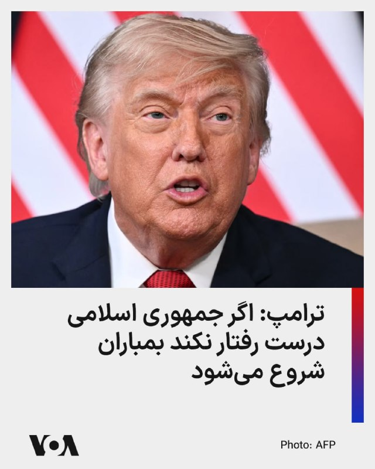

رئیس‌جمهوری آمریکا می‌گوید یادداشت تفاهم واشنگتن با جمهوری اسلامی هنوز توافق نهایی نیست و در صورت رضایت نداشتن از آن، می‌تواند حملات نظامی را از سر بگیرد.

دونالد ترامپ روز چهارشنبه در حاشیه نشست گروه هفت در فرانسه گفت سند موجود «یادداشت تفاهم» است و افزود اگر از آن راضی نباشد یا جمهوری اسلامی «رفتار نکند»، آمریکا دوباره به حمله و بمباران بازخواهد گشت.

به گزارش رویترز، ترامپ همچنین گفت این یادداشت تفاهم شامل لغو فوری تحریم‌ها علیه جمهوری اسلامی نیست، اما افزود درباره این موضوع بعداً صحبت خواهد کرد.
@FarsiVOA

## Persian_Trend_Official — post 17344

قالیباف: رابطۀ ایران با چین رابطه یک مشتری یا همتای تجاری نیست بلکه به معنای واقعی کلمه باید شریک باشیم.

نمایندۀ ویژۀ ایران در امور چین: در هر ائتلاف منطقه‌ای که شکل بگیرد، ایران و چین حضور خواهند داشت و من با قدرت در این مسیر حرکت می‌کنم. ما صرفاً یک مشتری یا یک همتای تجاری برای چین نیستیم، بلکه واقعا یک شریک به تمام معنا برای او هستیم.

با همۀ وجود می‌خواهم شما به من کمک کنید تا تصمیم درست بگیرم، اما بدانید که من فردی نیستیم که بدون تصمیم بمانم و تصمیم خواهم گرفت، البته من هرگز نمی‌خواهم وارد جزئیات شوم و فقط می‌خواهم برای شما تسهیل‌گری کنم هرگز دنبال این که بگویم این کار را بکن یا نکن و از من اجازه بگیر نیستم.

📝 Amir

📌 @persian_trend_official
پرشین ترند | متفاوت‌ترین کانال نظامی

## RadioFarda — post 158429

  <a href="https://t.me/radiofarda/158429" target="_blank">📎 Download file</a>

🔸 در این برنامه به حواشی و متن مسابقات فرانسه- سنگال، نروژ-عراق، آرژانتین- الجزایر و اردن- اتریش می‌پردازیم و در مصاحبه‌ای مفصل بالا و پایین‌های تیم ملی انگلیس را مرور می‌کنیم.

🔸 برای تماس با ما می‌توانید به شناسه کافه فردا در تلگرام صوت و متن بفرستید.

📻 کافه فردا

## IranianMinds — post 22786

🔴ترامپ:

من با ایران یادداشت تفاهم نوشتم، توافق نهایی نکردم.

هر جا هم ازشون راضی نباشم و یا حس کنم که رفتار درستی ندارند، شدیدتر از قبل بمباران میشن.

@IranianMinds

## BBCPersian — post 284119

  <a href="telegram/content/BBCPersian_284119_1781697838.mp4" target="_blank">🎬 Download video</a>

🔻ویدیویی از آتش‌سوزی در جنگل‌های گناوه‌لری گچساران به دست ما رسیده است. به گزارش ایرنا، این آتش‌سوزی که از ظهر سه‌شنبه، ۲۶ خرداد شروع شد، بامداد چهارشنبه، ۲۷ خرداد مهار شده است.
 
به گفته جمال موسویان، مدیرکل منابع طبیعی و آبخیزداری کهگیلویه و بویراحمد، عملیات اطفای حریق به دلیل «سخت‌گذر بودن منطقه، وزش باد شدید و گرمای هوا» دشوار بوده است. او در ادامه گفت که «با توجه به تداوم گرمای هوا و احتمال شعله‌ور شدن مجدد آتش، عملیات پایش، مراقبت و خنک‌سازی عرصه با دقت در حال انجام است.»
 
علت آتش‌سوزی و میزان خسارت هنوز اعلام نشده است.
 
شهرستان گچساران با جمعیت ۱۵۶هزار نفری، در جنوب‌غربی کهگیلویه و بویراحمد قرار دارد.

https://bbc.in/4aWAtC3
@BBCPersian

## Hranews — post 113672

  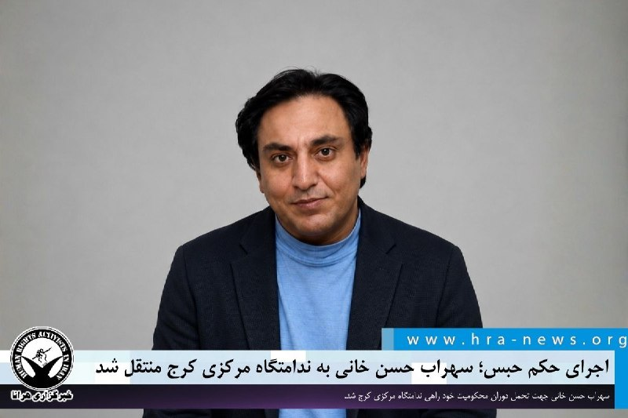

اجرای حکم حبس؛ سهراب حسن خانی به ندامتگاه مرکزی کرج منتقل شد

❗️
❗️
❗️
❗️
❗️– روز گذشته، سهراب حسن خانی جهت تحمل دوران محکومیت خود راهی ندامتگاه مرکزی کرج شد.

به گزارش خبرگزاری هرانا، ارگان خبری مجموعه فعالان حقوق بشر در ایران، روز سه شنبه ۲۶ خردادماه، سهراب حسن خانی جهت تحمل دوران محکومیت خود به ندامتگاه مرکزی کرج منتقل شد.

آقای حسن خانی در آبان ماه سال گذشته، توسط دادگاه تجدید نظر استان تهران، از بابت اتهام اخلال در نظم و آسایش عمومی به هشت ماه حبس و ۴۰ ضربه شلاق و به اتهام نشر اکاذیب به دو سال حبس و پرداخت ۵۰ میلیون تومان جزای نقدی محکوم شده بود.

ادامه مطلب

#سهراب_حسن_خانی

↘️
@hranews_bot تماس ✉️ - @Hranews کانال هرانا 🆑

## alonews — post 128662

  <a href="telegram/content/alonews_128662_1781697840.webm" target="_blank">🎬 Download video</a>

👈ترامپ: من مسابقات جام جهانی را دنبال می‌کنم و کشورهای مختلفی از شمال آفریقا مانند مراکش و مصر را می‌بینم.

🔴آنها بسیار با استعداد و سریع هستند، اما جدا از هم هستند

🔴پرسیدم: چرا کشورهای شمال آفریقا متحد نمی‌شوند تا یک تیم بزرگ تشکیل دهند؟ اگر این کار را می‌کردند، به راحتی قهرمان می‌شدند!

🔴این نشان‌دهنده کمبود رهبری در آنجا است. شاید بعد از اینکه کار نجات آمریکا را تمام کردم، بروم و برای ریاست آفریقا نامزد شوم، ما خیلی راحت پیروز خواهیم شد و قهرمان جام جهانی خواهیم شد!

✅ @AloNews خبر جنگ

---
📅 بروزرسانی: 1405/03/27 15:23
---

## VahidOOnLine — post 246008

  

محمدباقر قالیباف، رییس مجلس جمهوری اسلامی و رییس هیات مذاکره‌کننده جمهوری اسلامی با آمریکا، درباره اهمیت روابط اقتصادی با چین گفت جمهوری اسلامی باید از مرحله تقابل عبور کند و بر توسعه اقتصادی متمرکز شود.

قالیباف در نشست همفکری نماینده ویژه در امور چین با اتاق بازرگانی ایران گفت: «باید سنگر را از بچه‌های لانچر تحویل بگیریم، مردم را از زیر فشار اقتصادی دربیاوریم و کشور را بسازیم.»

او با توصیف جایگاه چین به‌عنوان کشوری «منحصربه‌فرد» برای جمهوری اسلامی در حوزه تجارت، افزود پکن باید باور کند که تهران «شریکی به تمام معنا» برای چین است.

رییس مجلس جمهوری اسلامی گفت هر بلوکی که با حضور کشورهای ساحلی خلیج فارس شکل بگیرد، محوریت آن «حتما چین و جمهوری اسلامی» خواهد بود.

قالیباف این اظهارات را در شرایطی مطرح کرد که یادداشت تفاهم میان آمریکا و جمهوری اسلامی با وجود مخالفت گسترده در داخل حاکمیت امضا شده است و بحث درباره پیامدهای اقتصادی آن همچنان ادامه دارد.
‌🏁 🇬🇧 IranintlTV

🤖 @VahidOOnLine

## VahidOOnLine — post 246007

  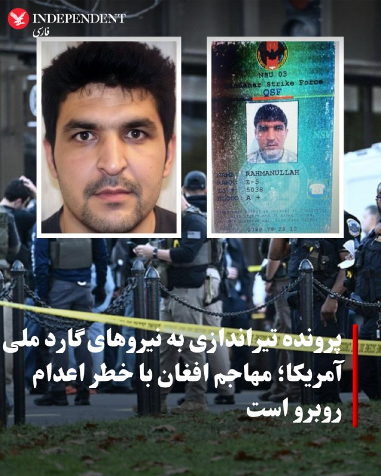

♦️رحمان‌الله لکنوال، شهروند افغانستان و متهم به اجرای حمله مرگبار علیه اعضای گارد ملی آمریکا در مرکز شهر واشنگتن دی‌سی، روز سه‌ شنبه ۲۶ جوزا/خرداد در دادگاه حاضر شد.

با افزایش دامنه اتهامات مطرح‌‌شده علیه او، احتمال صدور حکم اعدام برای این پرونده نیز مطرح ست، با این حال، لکنوال تمامی اتهامات را رد کرده و خود را بی‌گناه دانسته است.

وزارت دادگستری آمریکا چند ساعت پیش از حضور لکنوال در دادگاه، کیفرخواست جدیدی منتشر کرد که دامنه اتهامات را به‌ طور قابل‌توجهی گسترش داد، به طوری که در صورت تصمیم دادستان‌ها برای درخواست مجازات اعدام، زمینه حقوقی صدور چنین حکمی فراهم است.

لکنوال متهم است که در ۵ قوس/آذر ۱۴۰۴ در نزدیکی کاخ سفید، سارا بکستروم، عضو گارد ملی ارتش ایالت ویرجینیای غربی را هدف گلوله قرار داده و به قتل رسانده و اندرو وولف، گروهبان نیروی هوایی آمریکا، را هم به‌شدت زخمی کرده است.
‌🇸🇦 Indypersian

🤖 @VahidOOnLine

## VahidOOnLine — post 246006

  

پلیس بریتانیا چهارشنبه ۲۷ خرداد اعلام کرد علیرضا فلاحی، ۴۵ ساله و دارای تابعیت بریتانیایی و ایرانی، به دست داشتن در آتش‌زدن یادبود جاویدنامان انقلاب ملی ایرانیان در شمال لندن، که تصاویر معترضان کشته‌شده روی آن نصب شده بود، متهم شد.

پلیس بریتانیا همچنین اعلام کرد یک زن ۳۸ ساله که در ارتباط با این پرونده بازداشت شده بود، آزاد شد و با پیگرد قضایی دیگری مواجه نخواهد شد.

هلن فلاناگان، رییس پلیس مبارزه با تروریسم لندن، گفت این اتهام «گام دیگری رو به جلو» در یکی از تحقیقات مربوط به مجموعه حملات آتش‌سوزی است که جامعه یهودیان و ایرانیان مهاجر در لندن را هدف قرار داده‌اند.
‌🏁 🇬🇧 IranintlTV

🤖 @VahidOOnLine

## pm_afshaa — post 94249

  <a href="telegram/content/pm_afshaa_94249_1781697233.webm" target="_blank">🎬 Download video</a>

🔴ترامپ: اوباما‌ برجام رو با ایرانی‌ها امضا کرد و با دادن رشوه سعی کرد خودشو نجات بده؛ اون حتی 1 میلیارد و 700 میلیون دلار پول نقد رو سوار یک هواپیما کرد و به ایران فرستاد، من عکسشو دارم که اونا جلوی هواپیما وایسادن و میگن ببین چه پولایی دادن به ما، در ازاش ایرانی‌ها چیکار کردن؟ به اوباما خندیدن و گفتن این احمق رو نگاه کن.

💧 Rainbet.com the #1 Non-KYC Crypto Casino & Sportsbook @rainbetcom

😁 @Pm_Afshaa

## pm_afshaa — post 94248

🎙️گزارشگر: گزارش شده که این توافق شامل صندوقی به ارزش 300 میلیارد دلار برای ایرانه.

ترامپ: نه، این دروغه. ما سرمایه‌گذاری نمی‌کنیم. مردم میتونن تصمیم بگیرن که این کارو انجام بدن، اما به خودشون بستگی داره.

💧 Rainbet.com the #1 Non-KYC Crypto Casino & Sportsbook @rainbetcom

😁 @Pm_Afshaa

## pm_afshaa — post 94247

  <a href="telegram/content/pm_afshaa_94247_1781697234.webm" target="_blank">🎬 Download video</a>

🔴ترامپ: هیچ‌کس دقیقاً نمیدونه جزئیات توافق ما با ایران چیه، ولی یه توافق خیلی قویه، به نظر میاد اکثر مردم هم ازش راضی و خوشحالن؛

اگه این توافق نباشه، گزینه بعدی میتونه یه رکود اقتصادی جهانی باشه، اونایی که چنین چیزی رو میخوان، آدم‌های احمقی هستن، اول از همه، تنگه (هرمز) هیچ‌وقت باز نمیشد.

این هنوز متن نهایی نیست، فعلاً فقط یه یادداشت تفاهم هست، اگه ازش خوشم نیاد، دوباره برمی‌گردیم به بمباران کردنشون. اگه درست رفتار نکنن، خیلی سریع برمی‌گردیم سراغ بمباران.

💧 Rainbet.com the #1 Non-KYC Crypto Casino & Sportsbook @rainbetcom

😁 @Pm_Afshaa

## pm_afshaa — post 94246

  <a href="telegram/content/pm_afshaa_94246_1781697234.mp4" target="_blank">🎬 Download video</a>

زجه‌های نجم‌الدین شریعتی وسط برنامه شبکه 3 صداوسیما که میگه: من امشب دلم برای آقا (علی خامنه‌ای) تنگ شده.

💧 Rainbet.com the #1 Non-KYC Crypto Casino & Sportsbook @rainbetcom

😁 @Pm_Afshaa

## pm_afshaa — post 94245

  <a href="telegram/content/pm_afshaa_94245_1781697237.webm" target="_blank">🎬 Download video</a>

🔴ترامپ: با احمد الشرع، رهبر سوریه، درباره مقابله با حزب‌الله گفت‌وگو کردم.

💧 Rainbet.com the #1 Non-KYC Crypto Casino & Sportsbook @rainbetcom

😁 @Pm_Afshaa

## IranIntlTV — post 342848

مجموعه مستند «مرگ خامنه‌ای؛ پایان دیکتاتور» به‌زودی از ایران اینترنشال
#پایان_دیکتاتور
@iranintlTV

## IranIntlTV — post 342847

  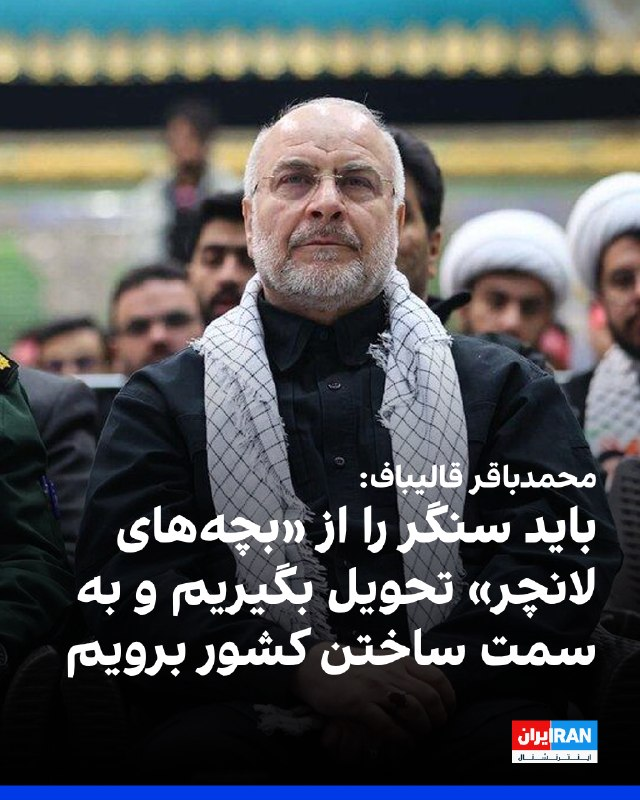

محمدباقر قالیباف، رییس مجلس جمهوری اسلامی و رییس هیات مذاکره‌کننده جمهوری اسلامی با آمریکا، درباره اهمیت روابط اقتصادی با چین گفت جمهوری اسلامی باید از مرحله تقابل عبور کند و بر توسعه اقتصادی متمرکز شود.

قالیباف در نشست همفکری نماینده ویژه در امور چین با اتاق بازرگانی ایران گفت: «باید سنگر را از بچه‌های لانچر تحویل بگیریم، مردم را از زیر فشار اقتصادی دربیاوریم و کشور را بسازیم.»

او با توصیف جایگاه چین به‌عنوان کشوری «منحصربه‌فرد» برای جمهوری اسلامی در حوزه تجارت، افزود پکن باید باور کند که تهران «شریکی به تمام معنا» برای چین است.

رییس مجلس جمهوری اسلامی گفت هر بلوکی که با حضور کشورهای ساحلی خلیج فارس شکل بگیرد، محوریت آن «حتما چین و جمهوری اسلامی» خواهد بود.

قالیباف این اظهارات را در شرایطی مطرح کرد که یادداشت تفاهم میان آمریکا و جمهوری اسلامی با وجود مخالفت گسترده در داخل حاکمیت امضا شده است و بحث درباره پیامدهای اقتصادی آن همچنان ادامه دارد.
https://iranintl.com/202606174349

## IranIntlTV — post 342846

  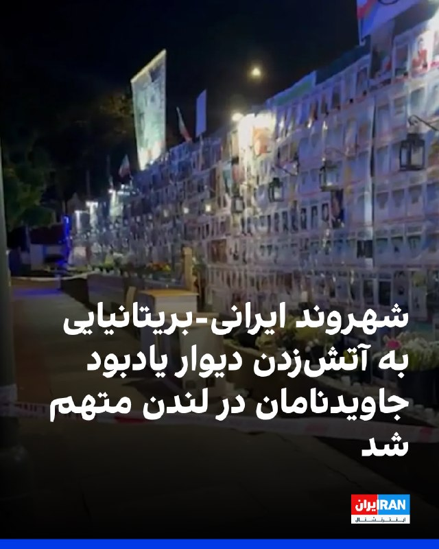

پلیس بریتانیا چهارشنبه ۲۷ خرداد اعلام کرد علیرضا فلاحی، ۴۵ ساله و دارای تابعیت بریتانیایی و ایرانی، به دست داشتن در آتش‌زدن یادبود جاویدنامان انقلاب ملی ایرانیان در شمال لندن، که تصاویر معترضان کشته‌شده روی آن نصب شده بود، متهم شد.

پلیس بریتانیا همچنین اعلام کرد یک زن ۳۸ ساله که در ارتباط با این پرونده بازداشت شده بود، آزاد شد و با پیگرد قضایی دیگری مواجه نخواهد شد.

هلن فلاناگان، رییس پلیس مبارزه با تروریسم لندن، گفت این اتهام «گام دیگری رو به جلو» در یکی از تحقیقات مربوط به مجموعه حملات آتش‌سوزی است که جامعه یهودیان و ایرانیان مهاجر در لندن را هدف قرار داده‌اند.
https://iranintl.com/202606173298

## DW_Farsi — post 126095

🔶 حمایت گروه ۷ از اوکراین و تشدید تحریم‌ها علیه روسیه

کشورهای گروه ۷ قصد دارند با ارسال سلاح‌های بیشتر به اوکراین و اعمال تحریم‌های شدیدتر علیه روسیه فشار بر پوتین را افزایش دهند.

در بیانیه رهبران کشورها و دولت‌های شرکت‌کننده در نشست گروه ۷ در اویان فرانسه آمده است که تحریم‌ها، از جمله در بخش نفت و گاز، تشدید خواهند شد. همچنین توافق شده است که ارسال تسلیحات دوربُرد و سامانه‌های پدافند هوایی به اوکراین گسترش یابد.

به گفته گروه ۷، هدف از افزایش حمایت‌ها، تقویت پویایی جدیدی است که در ماه‌های گذشته به‌واسطه پیشروی‌های اوکراین در خطوط مقدم جنگ ایجاد شده است. علاوه بر این، در بیانیه از "زمانی مناسب" پس از توافق آمریکا با ایران برای بازگشایی تنگه هرمز سخن گفته شده است.

علاوه بر ارسال تسلیحات بیشتر، کشورهای گروه ۷ در بیانیه خود وعده داده‌اند که برای عبور اوکراین از زمستان پیش‌رو حمایت‌های بیشتری به این کشور ارائه خواهند کرد. همچنین اعلام کرده‌اند که امکان اعطای مجوزهایی برای افزایش تولیدات نظامی اوکراین را بررسی خواهند کرد.

@dw_farsi

## Persian_Trend_Official — post 17343

  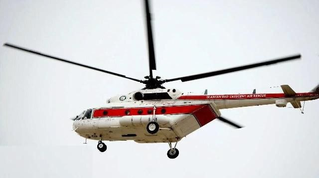

امضای تفاهم‌نامه خرید 20 بالگرد از روسیه

ایرنا: رئیس جمعیت هلال احمر  و مدیرکل شرکت سهامی هلیکوپترهای روسیه،  تفاهم‌نامه خرید 20 فروند بالگرد برای جمهوری اسلامی ایران را امضا کردند.

پیرحسین کولیوند و نیکولای کولسوف، این تفاهم‌نامه را روز چهارشنبه در محل دفتر این شرکت دولتی روس امضا کردند.

رئیس جمعیت هلال احمر جمهوری اسلامی ایران پس از امضای این تفاهم نامه در گفت و گو با خبرنگار ایرنا در مسکو افزود:  امروز تفاهم‌نامه خرید 20 فروند بالگرد به صورت مستقیم از روسیه با هدف تقویت لجستیک و ناوگان امداد هوایی کشورمان امضا شد.

کولیوند از این تفاهم‌نامه به عنوان اقدامی بی‌نظیر در تاریخ جمعیت هلال احمر یاد کرد و افزود: با توجه به قرارداد نهایی شده درباره چهار فروند از این بالگردها، آنها تا قبل از عید نوروز 1406 تحویل ایران می‌شود.

وی با تشکر از پیگیری‌های سفارت ایران در روسیه و حمایت مجلس شورای اسلامی از انعقاد این قرارداد، گفت: این بالگردها مجهز به فناوری مدرن و سیستم دید در شب هستند و امکان پرواز در شب را دارند.

📝 Amir

📌 @persian_trend_official
پرشین ترند | متفاوت‌ترین کانال نظامی

## RadioFarda — post 158428

ادامۀ محدودیت‌های اینترنتی در ایران؛ «۶۸ درصد» کاربران هنوز در اینستاگرام فعال نیستند

🔸گزارشی از یک داده‌کاوی نشان می‌دهد که شمار کاربران فعال اینستاگرام در هفته نخست پس از برقراری نسبی اینترنت در ایران، در مقایسه با هفته اول دی‌ماه ۱۴۰۴، «حدود ۶۸ درصد کاهش یافته است».

🔸وب‌سایت زومیت در گزارش داده‌محوری که به کمک آکادمی لایف‌وب استخراج کرده، به وضعیت پلتفرم‌های مجازی خارجی در ایران قبل و بعد از قطعی اینترنت پرداخته است.

🔸این گزارش نشان می‌دهد «تعداد کاربران فعال اینستاگرام از حدود ۱.۳ میلیون نفر (در هفته اول دی‌ماه) به ۴۲۷ هزار و ۸۷۷ کاربر سقوط کرده که به معنای از دست رفتن بیش از ۶۸ درصد کاربران فعال است.»

🔸داده‌های استخراج‌شده نشان می‌دهد تعداد کل پست‌های منتشرشده در اینستاگرام فارسی از «۳.۳ میلیون در هفته اول دی ۱۴۰۴ به یک میلیون و ۳۲۷ هزار و ۹۷۲ پست کاهش یافته است؛ یعنی افتی در حدود ۶۲ درصد».

🔸از سوی دیگر تعداد لایک‌ها در موارد مورد بررسی، «از حدود ۵.۹ میلیارد لایک در هفته اول دی‌ماه به ۱.۳ میلیارد لایک» ریزش کرده است؛ به عبارت دیگر، «حجم لایک‌ها بیش از ۷۷ درصد کاهش یافته است».

🔸این گزارش کاهش شدید تعامل کاربران را نشانه‌ای از تداوم محدودیت‌های دسترسی به اینترنت و اختلال در ابزارهای عبور از فیلترینگ دانسته و می‌گوید بسیاری از کاربران باقی‌مانده به «کاربران منفعل» تبدیل شده‌اند که بیشتر به مشاهده محتوا می‌پردازند و کمتر در تولید یا تعامل با آن مشارکت می‌کنند.

🔸این گزارش، وضعیت اینترنت در ایران را «کم‌بضاعت» نامیده و نوشته بیشتر از کاربرانِ عادی، این کسب‌وکارهای اینستاگرامی هستند که «فعالیتشان با موج بزرگی را از سر گرفته‌اند. بازگشتی که این آب‌باریکه اینترنت را غنیمتی برای جبران ضرر ۸۸ روز خاموشی می‌بیند».

🔸بر اساس داده‌هایی که از سامانه لایف‌وب استخراج شده، «پس از جاری‌شدن اینترنت ضعیفی که وی‌پی‌ان‌ها را ارزان‌تر از قبل کرده بود، برخلاف رویه مرسوم به‌جای زندگی روزمره و فضای سرگرمی، اینستاگرام حال‌وهوای اقتصادی پیدا کرده و هشتگ‌های آنلاین‌شاپ، کفش، کاشت ناخن، طلا، کتونی، پیراهن، اکسسوری اوج گرفته است.»

🔸داده‌های مربوط به ۵ تا ۱۲ خرداد (هفته اول پس از اتصال نسبی) به‌وضوح نشان می‌دهد که ادعای دولت مبنی بر «وصل بودن و عادی بودن اینترنت» با واقعیت تولید محتوا تطابق ندارد.

🔸نتایج گزارش داده‌کاوی می‌گوید «اگر اینترنت عادی بود، آمار لایک‌ها، پست‌ها و کامنت‌ها در اینستاگرام باید به بازه اول دی‌ماه (وضعیت نسبتاً عادی) نزدیک می‌شد.»

@RadioFarda

## RadioFarda — post 158427

  <a href="https://t.me/radiofarda/158427" target="_blank">📎 Download file</a>

📻بشنوید: ساعت ۱۴ با رادیوفردا، ۲۷ خرداد ۱۴۰۵‌

@RadioFarda

## Dirty_Kids — post 392380

میدان با ما، سکوها با #پورن_استارها!!!!

جمهوری اسلامی بار دیگر تمام دخترانشو فراخوانده، اعم از پرستو و پورن استار و کلاغ و جهادی!!
دفعه ی قبل که «ویتنی رایت» به ایران امده بود، پس از هزینه های هنگفتی که برای اقامتش شده بود،، خیلی ساده گفتند که خبر نداشتیم ایشون چه اینکاره ست!!
اما این بار طبق اطلاعات بدست امده، حساب های ارز دیجیتال وی توسط سپاه پاسداران شارژ شده!!!

+ این بار اول نیست و پیش تر در مراسم دفن قاسم سلیمانی یکی از اون ستاره های لبنانی داغ رو هم فراخوانده بودند!!!!

@Dirty_Kids 👻

## Dirty_Kids — post 392379

  <a href="telegram/content/Dirty_Kids_392379_1781697240.mp4" target="_blank">🎬 Download video</a>

بابای ما یه کیلو تخمه خرید اول جام جهانی
گفت این برای این جام و جام ملت های آسیا بعدی

@Dirty_Kids 👻

## Hranews — post 113671

صدور حکم سبز؛ یک متهم در رباط کریم به مجازات جایگزین حبس محکوم شد

❗️
❗️
❗️
❗️
❗️– رئیس اداره حفاظت محیط زیست شهرستان رباط‌ کریم از صدور رأی سبز قضایی و مجازات #جایگزین_حبس برای مسئول یک واحد غیرمجاز تولید زغال صنعتی در این شهرستان خبر داد. این واحد پیشتر به دلیل فعالیت غیرمجاز و ایجاد آلودگی زیست‌ محیطی با دستور مقام قضایی پلمب شده بود.

ادامه مطلب

↘️
@hranews_bot تماس ✉️ - @Hranews کانال هرانا 🆑

---
📅 بروزرسانی: 1405/03/27 15:13
---

## VahidOOnLine — post 246005

  <a href="telegram/content/VahidOOnLine_246005_1781696608.mp4" target="_blank">🎬 Download video</a>

⭕️ترامپ: با ایران یادداشت تفاهم امضا کردیم نه توافق نهایی، رضایت نداشته باشم، دوباره بر سرشان بمب می‌ریزیم

♦️دونالد ترامپ، رئیس جمهوری آمریکا روز چهارشنبه ۲۷ خرداد و در دیدار با عبدالفتاح سیسی، رئیس جمهوری مصر در حاشیه نشست سران گروه ۷ در اویان فرانسه گفت: «تفاهم‌نامه با ایران توافق نیست و اگر از عملکرد جمهوری اسلامی رضایت نداشته باشم، دوباره بر سرشان بمب می‌ریزیم.»

ترامپ در پاسخ به خبرنگاران گفت: «این توافق نهایی نیست. این یک یادداشت تفاهم است. اگر از آن خوشم نیاید و آن‌ها درست رفتار نکنند، ما قطعا به سراغ انداختن بمب درست وسط سرشان برمی‌گردیم؛ فهمیدید؟ چون آن‌ها ۴۷ سال است که دارند بدرفتاری می‌کنند.»

از زمان انتشار نسخ‌های غیررسمی از سند تفاهم مشترک تهران و واشنگتن،‌ علاوه بر اسرائیل، گروهی از سیاستمداران دموکرات و حتی جمهوریخواه آمریکا هم از آن انتقاد کرده‌اند.
‌🇸🇦 Indypersian

🤖 @VahidOOnLine

## mwarmonitor — post 11065

  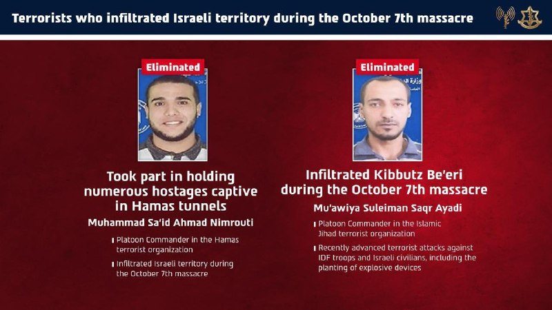

🔴 حذف شد:

📌محمد سعید احمد نمرُوتی، فرمانده یک دسته در حماس که در جریان کشتار ۷ اکتبر وارد خاک اسرائیل شده بود و در نگه‌داری شمار زیادی از گروگان‌ها در تونل‌های حماس مشارکت داشت، از بین رفت.

📌در حمله‌ای جداگانه، معاویه سلیمان صقر عیادی، فرمانده یک دسته در تیپ اردوگاه‌های مرکزی جهاد اسلامی فلسطین که در جریان کشتار ۷ اکتبر به کیبوتص بئری نفوذ کرده و در کارگذاری مواد منفجره نقش داشت، حذف شد.

@mwarmonitor

## pm_afshaa — post 94244

  <a href="telegram/content/pm_afshaa_94244_1781696610.webm" target="_blank">🎬 Download video</a>

🔴واکنش پزشکیان به شایعه استعفا:
برای موندن در مسند ریاست‌جمهوری هیچ تردیدی ندارم. هستم، لازم باشه دوباره هم میام.

💧 Rainbet.com the #1 Non-KYC Crypto Casino & Sportsbook @rainbetcom

😁 @Pm_Afshaa

## pm_afshaa — post 94243

  <a href="telegram/content/pm_afshaa_94243_1781696611.webm" target="_blank">🎬 Download video</a>

🔴کامران غضنفری، نماینده مجلس:
اگر این تفاهم‌نامه جمعه امضا بشه، اسرائیل ظرف چند روز اونو نقض خواهد کرد و دوباره به ایران حمله میکنه.

💧 Rainbet.com the #1 Non-KYC Crypto Casino & Sportsbook @rainbetcom

😁 @Pm_Afshaa

## DEJradio — post 5759

🛩️
🔥 ارتش اسرائیل چهارشنبه ۲۷ خرداد ۱۴۰۵ مواضع حـ.ـزب‌الله در ارتفاعات علی الطاهر و اطراف شهرک نبطیه الفوقا در جنوب لبنان را گلوله باران کرد. مواضع تروریست‌ها در جنوب بیروت نیز هدف حمله قرار گرفت.
این حملات درحالیست که جمهوری اسلامی، توقف حمله با تررویست‌های حزب‌الله را بخشی از توافق با آمریکا می‌داند اما مقام‌های اسرائیل می‌گویند خط‌ونشان‌های حاکمان تهران برای بنیامین نتانیاهو و مقامت این کشور بی‌اعتبار است زیرا اولویت آنها تأمین امنیت اسرائیل است.
در حملات روز گذشته اسرائیل به منطقه ضاحیه در جنوب بیروت دستکم ۹ نیروی حـ.-زب‌الله کشته و زخمی شدند.

این حملات درحالیست که جمهوری اسلامی، توقف حمله با تررویست‌های حزب‌الله را بخشی از توافق با آمریکا می‌داند اما مقام‌های اسرائیل می‌گویند خط‌ونشان‌های حاکمان تهران برای بنیامین نتانیاهو و مقامت این کشور بی‌اعتبار است زیرا اولویت آنها تأمین امنیت اسرائیل است.

در حملات اسرائیل به منطقه ضاحیه در جنوب بیروت دستکم ۹ نیروی حـ.ـزب‌الله کشته و زخمی شدند.

#حزب_الله_لبنان #اسرائیل #جنگ
@DEJradio

## IranIntlTV — post 342845

  <a href="https://t.me/IranintlTV/342845" target="_blank">📎 Download file</a>

🎧نسخه صوتی اخبار نیم‌روزی | چهارشنبه ۲۷ خرداد
@iranintlTV

## Shin_Persian — post 7118

  <a href="telegram/content/Shin_Persian_7118_1781696612.mp4" target="_blank">🎬 Download video</a>

ارتش دفاعی اسرائیل | IDF Farsi ✓ @IDFFarsi
Wed, 17 Jun 2026 11:19:09 UTC

Original text in comments
English translation in comments

𝕏 · @shin_persian

## Shin_Persian — post 7117

Shin ✓ @hey_itsmyturn
Wed, 17 Jun 2026 11:36:30 UTC

Trump called Soleimani an "Evil Genius" 🤣

ترجمه خودکار فارسی

ترامپ سلیمانی را یک «نابغه شرور» نامید 🤣

𝕏 · @shin_persian

## FarsiVOA — post 221011

  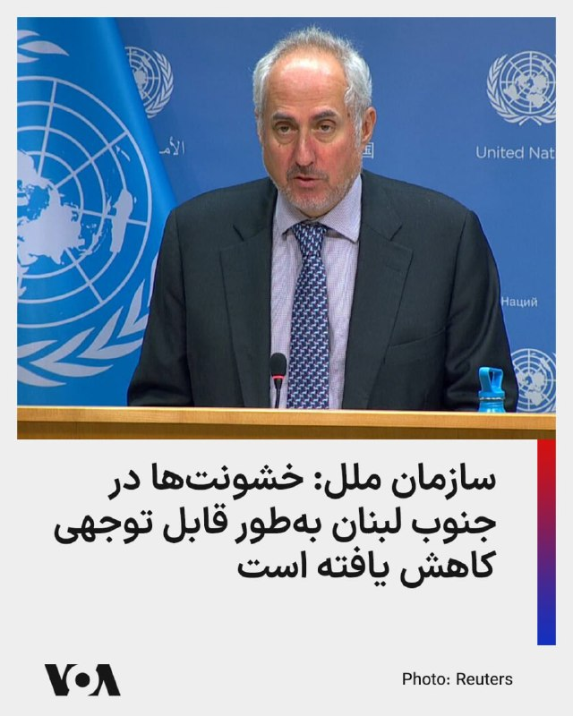

سازمان ملل اعلام کرد از پایان هفته گذشته، سطح خشونت و تبادل آتش در جنوب لبنان «به‌طور قابل توجهی» کاهش یافته است.

استفان دوجاریک، سخنگوی دبیرکل سازمان ملل، روز سه‌شنبه گفت نیروهای سازمان ملل در لبنان روز گذشته ۳۸ مورد نقض حریم هوایی لبنان از سوی ارتش اسرائیل را ثبت کرده‌اند؛ آماری که نسبت به ۸۳ مورد گزارش‌شده در روز یکشنبه کاهش محسوسی داشته است.

با این حال، دوجاریک تأکید کرد که کاهش خشونت به معنای بازگشت کامل امنیت نیست. به گفته او، هنوز هم گزارش‌هایی از حوادث پراکنده در جنوب لبنان دریافت می‌شود و همین وضعیت بر توانایی مردم برای سر زدن به خانه‌هایشان یا رفت‌وآمد در مناطق آسیب‌دیده اثر مستقیم گذاشته است.

این گزارش در حالی منتشر شده که جنوب لبنان همچنان با پیامدهای درگیری‌های اخیر، تخریب گسترده و آوارگی شمار زیادی از ساکنان روبه‌رو است.
@FarsiVOA

## Persian_Trend_Official — post 17342

  <a href="telegram/content/Persian_Trend_Official_17342_1781696614.mp4" target="_blank">🎬 Download video</a>

بن گویر، وزیر امنیت ملی اسرائیل: ما نمی‌توانیم تخریب خانه‌ها در جنوب لبنان را متوقف کنیم. ما نمی‌توانیم متوقف شویم.

ما نمی‌توانیم اجازه دهیم جمعیت جنوب لبنان بازگردند. ما باید به کنترل این منطقه ادامه دهیم، حتی اگر ترامپ مخالف باشد. ما یک کشور مستقل هستیم.

ما باید به فعالیت خود در لبنان ادامه دهیم. ما باید همچنان مستقل باشیم. ما ترامپ را دوست داریم، اما توافقی را که او امضا کرده است، نمی‌پذیریم و باید به مسیر خود ادامه دهیم.

📝 Amir

📌 @persian_trend_official
پرشین ترند | متفاوت‌ترین کانال نظامی

## RadioFarda — post 158426

🔸دونالد ترامپ می‌گوید اگر از توافق رضایت نداشته باشد و ایران رفتارش را اصلاح نکند، بار دیگر ایران را بمباران خواهد کرد. 🔸رئیس‌جمهور آمریکا که روز چهارشنبه ۲۹ خرداد در نشستی خبری همراه با عبدالفتاح السیسی، رئیس‌جمهور مصر، در حاشیه نشست رهبران گروه ۷ در فرانسه…

## RadioFarda — post 158425

  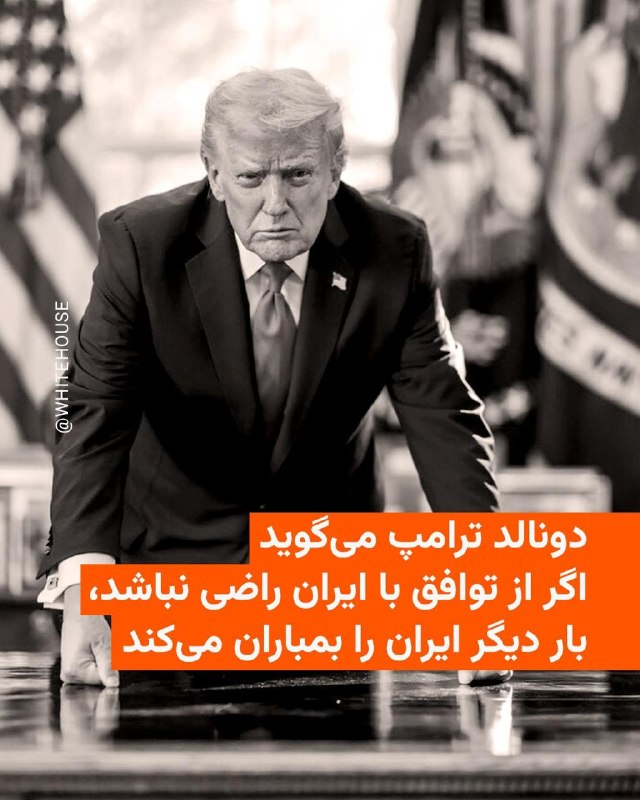

🔸دونالد ترامپ می‌گوید اگر از توافق رضایت نداشته باشد و ایران رفتارش را اصلاح نکند، بار دیگر ایران را بمباران خواهد کرد.

🔸رئیس‌جمهور آمریکا که روز چهارشنبه ۲۹ خرداد در نشستی خبری همراه با عبدالفتاح السیسی، رئیس‌جمهور مصر، در حاشیه نشست رهبران گروه ۷ در فرانسه صحبت می‌کرد، گفت: «این فقط یک یادداشت تفاهم است. اگر از آن راضی نباشم و رفتارشان را اصلاح نکنند، دوباره به سمت آن‌ها شلیک می‌کنیم و روی سرشان بمب می‌اندازیم.»

🔸دونالد ترامپ همچنین گزارش‌ها دربارهٔ سرمایه‌گذاری ۳۰۰ میلیارد دلاری این کشور در ایران بر اساس تفاهم‌نامه را نادرست خواند، اما گفت که آمریکا مانع سرمایه‌گذاری دیگر کشورها در ایران نخواهد شد.

🔸متن تفاهم‌نامه هنوز منتشر نشده، اما بر اساس یکی از بندهای متنی که برخی رسانه‌های آمریکایی منتشر کرده‌اند، چنین ذکر شده که «ایالات متحده متعهد می‌شود همراه با شرکای منطقه‌ای خود، طرحی جامع و مورد توافق دو طرف برای بازسازی و توسعه اقتصادی جمهوری اسلامی تدوین کند و تأمین مالی دست‌کم ۳۰۰ میلیارد دلار را تضمین نماید. سازوکار اجرای این طرح، به عنوان بخشی از توافق نهایی، ظرف ۶۰ روز تدوین خواهد شد».
@RadioFarda

## IranianMinds — post 22785

  <a href="telegram/content/IranianMinds_22785_1781696616.mp4" target="_blank">🎬 Download video</a>

🔴 علی خامنه ای درسال ۱۳۹۸:

با آمریکایی ها مذاکره نکنید. اونا احتیاج دارن به مذاکره با ما تا به کل جهان نشون بدن ما اینا رو کشوندیم سر میز مذاکره.
روزی که اوباما با روحانی تونست تلفنی حرف بزنه جشن گرفتن. یه همچین آدمایین. اصلا مذاکره نکنید با ترامپی که شمشیرو از رو بسته.
اون که اوبامای ظاهرساز بود اینکارو کرد. چه برسه به ترامپ وقیح پرروی بی تربیت.

@IranianMinds

## IranianMinds — post 22784

🔴 ترامپ درباره توافق ایران:

هیچ‌کس دقیق نمی‌دونه چیه، ولی این یک معامله خیلی قویه.

به نظر می‌رسه اکثر مردم خیلی خوشحال و راضی هستن.

@IranianMinds

## IranianMinds — post 22783

  <a href="telegram/content/IranianMinds_22783_1781696618.webm" target="_blank">🎬 Download video</a>

🆕 اپلیکیشن MelBet 
🔄

🎁 کد هدیه 100 دلاری: Sport100

🔵 کاملترین برنامه موبایل

🤝 اسپانسر رسمی لالیگا

☄️ صرافی معتبر

🤖 ربات راهنما

🇮🇷 برای تغییر زبان برنامه، زبان موبایل خود را تغییر دهید.

✅ ورود به اپلیکیشن بدون فیلترشکن

## alonews — post 128660

  <a href="telegram/content/alonews_128660_1781696618.mp4" target="_blank">🎬 Download video</a>

👈جنگنده‌های اسرائیلی حملاتی را در نزدیکی روستای کفر تبنیت در جنوب لبنان انجام می‌دهند، جایی که درگیری‌ها بین مبارزان حزب‌الله و نیروهای اسرائیلی ادامه دارد

✅ @AloNews خبر جنگ

## alonews — post 128659

  <a href="telegram/content/alonews_128659_1781696621.webm" target="_blank">🎬 Download video</a>

👈ترامپ: من با رئیس جمهور سوریه در مورد احتمال جنگ علیه حزب الله صحبت کردم.

✅ @AloNews خبر جنگ

---
📅 بروزرسانی: 1405/03/27 15:04
---

## WithYashar — post 15148

  <a href="telegram/content/WithYashar_15148_1781696054.mp4" target="_blank">🎬 Download video</a>

ترامپ درباره ایران: دلیل پایین ماندن قیمت نفت این است که هر شب کشتی‌هایی را از بین می‌بردیم که حتی شما از آن‌ها خبر نداشتید.
دو روز پیش، سه روز پیش، یک ماه پیش، ۲۲ کشتی را از بین بردیم. به طور متوسط هر شب بین ۱۵ تا ۲۵ کشتی را از بین می‌بردیم. هیچ‌کس این را نمی‌دانست.

نیروی دریایی ما کار بزرگی انجام داد. هیچ‌کس نمی‌دانست چه اتفاقی می‌افتد. به همین دلیل نفت به ۳۰۰ دلار در هر بشکه نرسید؛ بلکه به ۱۲۵ تا ۱۵۰ دلار رسید.

حالا قیمت آن ۷۲، ۷۳ دلار است. شنیده‌ام که الان حتی کمتر از این است
@withyashar

## FoxNewsTwitter — post 343057

‌Fox News (Twitter/X)

Stop scrolling for updates and turn on live alerts.

Get FOX One and get the facts:

https://www.fox.com/stream/fox-news?cmpid=org=fn::ag=owned_other::mc=organicsocial[%E2%80%A6]WITTER::cmp=100_o2_th4::cont=m2_tp1::add=03_17_00_05_13_00_02_A

## pm_afshaa — post 94242

اختلاس 1200میلیاردی از سپرده ی مردم در بانک ملی محسن سیفی کفشگری مدیرعامل بانک ملی به مهر گفت متاسفانه 1200میلیارد تومان سپرده ی حساب ملی در عملیاتی هک و برداشت شده

💧 Rainbet.com the #1 Non-KYC Crypto Casino & Sportsbook @rainbetcom

😁 @Pm_Afshaa

## DEJradio — post 5758

  <a href="telegram/content/DEJradio_5758_1781696058.mp4" target="_blank">🎬 Download video</a>

🔺🎤 مدعی بودند تیم ملی پنج شش پلن تاکتیکی دارد، چه شد؟

گفت‌وگو با داریوش یزدانی

#تیم_ملی #فوتبال #جام_جهانی
@DEJradio

## IranIntlTV — post 342844

  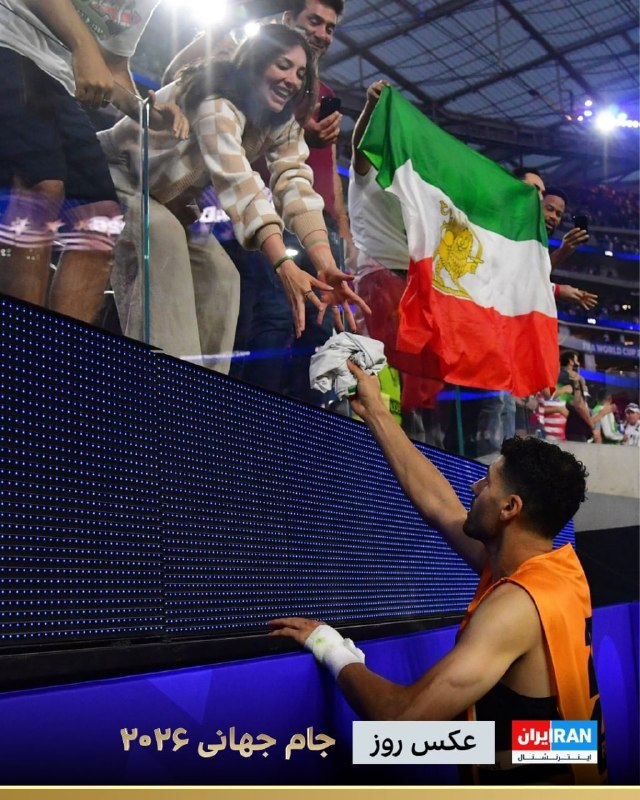

🔻تیم ملی فوتبال ایران در نخستین دیدار خود در جام جهانی ۲۰۲۶ برابر نیوزیلند به تساوی ۲ بر ۲ رسید. در این مسابقه، شماری از ایرانیان حاضر در ورزشگاه سوفای لس‌آنجلس با پرچم‌های شیروخورشید در ورزشگاه حضور داشتند و شعارهایی علیه جمهوری اسلامی سر دادند. همچنین هنگام پخش سرود جمهوری اسلامی، صدای اعتراض و سوت از سکوها شنیده شد.

🔹پس از پایان مسابقه، مهدی طارمی، کاپیتان تیم ملی ایران، به سمت تماشاگران حاضر در ورزشگاه رفت و پیراهن خود را به یکی از هواداران اهدا کرد.

@iranintltvsport

## IranIntlTV — post 342843

  <a href="telegram/content/IranIntlTV_342843_1781696061.mp4" target="_blank">🎬 Download video</a>

هم‌زمان با برگزاری مسابقات تیم فوتبال ایران در جام جهانی، بخشی از ایرانیان مقیم آمریکا با استفاده از این رویداد تلاش کرده‌اند صدای اعتراضات داخل کشور را بازتاب دهند. با وجود ممنوعیت فیفا برای ورود پرچم شیر و خورشید به استادیوم‌ها، گزارش‌ها و پیام‌های رسیده به ایران‌اینترنشنال از تلاش ایرانیان برای رساندن پیام‌های اعتراضی در حاشیه این بازی‌ها حکایت دارد.
جزییات بیشتر با سبا حیدرخانی، عضو تحریریه ایران‌اینترنشنال
@iranintltv

## FarsiVOA — post 221010

  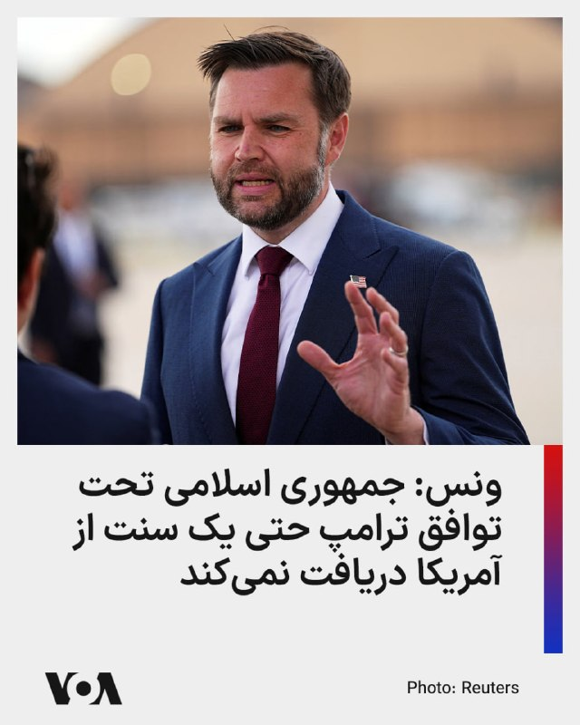

معاون رئیس‌جمهوری آمریکا می‌گوید در چارچوب توافق دولت ترامپ با جمهوری اسلامی، «تحت هیچ شرایطی» حتی یک سنت از پول آمریکا به این حکومت پرداخت نخواهد شد.

جی‌دی ونس این سخنان را در برنامه «د فایو» شبکه فاکس‌نیوز و در پاسخ به انتقاد جسیکا تارلو، تحلیلگر دموکرات این برنامه، بیان کرد.

او گفت اگر جمهوری اسلامی با جهان تعامل کند، آمریکا می‌تواند نحوه ارتباط اقتصاد جهانی با ایران را تغییر دهد؛ اما اگر چنین نکند، از هیچ‌یک از مزایای توافق برخوردار نخواهد شد.

ونس همچنین گفت برنامه هسته‌ای، توان نظامی، برنامه موشکی و پایه صنعتی جمهوری اسلامی پیش‌تر «نابود» شده و به گفته او، آمریکا مسیر خاورمیانه را تغییر داده است.

او مزایای احتمالی توافق را امری اضافه بر این دستاوردها توصیف کرد و گفت پایبندی یا عدم پایبندی جمهوری اسلامی اصل این دستاوردها را تغییر نمی‌دهد.
@FarsiVOA

## FarsiVOA — post 221009

  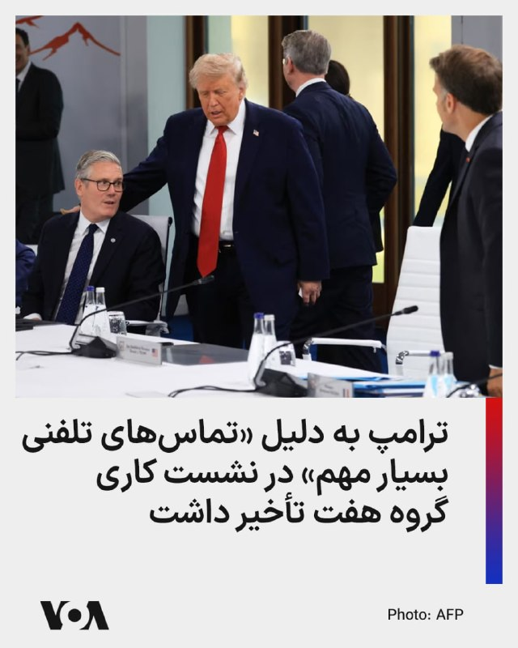

پس از آنکه تأخیر پرزیدنت ترامپ در اولین نشست کاری رهبران گروه هفت در روز چهارشنبه خبرساز شد، یک مقام ارشد کاخ سفید گفت که این تأخیر به دلیل تماس‌های تلفنی بسیار مهم رخ داده است.

دونالد ترامپ روز چهارشنبه تقریباً یک ساعت دیرتر از برنامه به اولین جلسه کاری گروه هفت رسید، جلسه‌ای که بدون حضور او آغاز شده بود.

در این زمینه به گزارش ان‌بی‌سی‌نیوز یک مقام ارشد کاخ سفید در پاسخ به سؤالی در مورد تأخیر آقای ترامپ گفت که او «در حال انجام تماس‌های بسیار مهمی با افرادی در آمریکا بود».

جزئیات بیشتری در این زمینه منتشر نشده است.
@FarsiVOA

## DW_Farsi — post 126094

  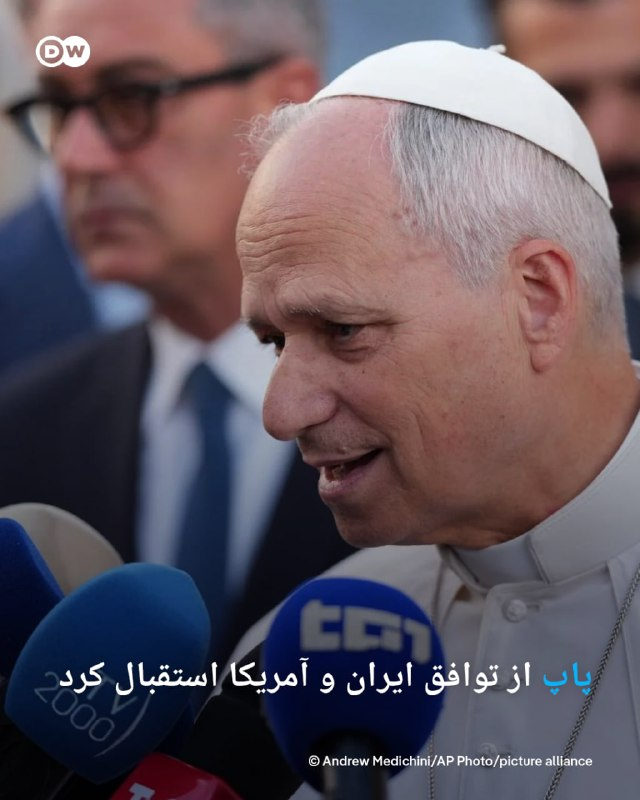

🔶 پاپ از توافق ایران و آمریکا استقبال کرد

پاپ لئو چهاردهم، رهبر کاتولیک‌های جهان روز چهارشنبه ۲۷ خرداد (۱۷ ژوئن) از توافق میان ایران و ایالات متحده برای پایان دادن به جنگ خاورمیانه استقبال کرد و آن را نتیجه "تلاش‌های امیدوارکننده در مسیر گفت‌وگو و مذاکره" دانست.

پاپ در جریان دیدار هفتگی خود در واتیکان، ضمن ابراز قدردانی از کسانی که در روند مذاکرات نقش داشتند، ابراز امیدواری کرد که این توافق بتواند "با تقویت اعتماد متقابل، امنیت و ثبات، مسیرهای گفت‌وگو و همکاری میان ملت‌های خاورمیانهرا گسترش دهد".

پاپ همچنین با اشاره به جنگ اوکراین، از اخبار "دردناک" این درگیری ابراز نگرانی کرد و برای دستیابی به "صلحی عادلانه و پایدار از طریق گفت‌وگو" دعا کرد.

رهبر کاتولیک‌های جهان با اشاره به تلفات گسترده جنگ اوکراین گفت: «بسیاری از غیرنظامیان بی‌گناه، امدادگران و همچنین کلیساها و میراث فرهنگی در آتش جنگ نابود شده‌اند.»

پاپ لئو در پایان افزود که در کنار خانواده‌های داغدار، مجروحان و کسانی است که "در دل خشونت همچنان با شجاعت به خدمت ادامه می‌دهند".

@dw_farsi

## DW_Farsi — post 126093

🔶 بلومبرگ "سند ۱۴ماده‌ای تفاهم‌" آمریکا و ایران را منتشر کرد

قرار است که ایالات متحده آمریکا و ایران در روز جمعه ۱۹ ژوئن در سوئیس به‌طور رسمی یک یادداشت تفاهم را امضا کنند؛ اقدامی که راه را برای ۶۰ روز مذاکرات با هدف پایان دائمی جنگ میان دو کشور و خاتمه دادن به اعمال محدودیت‌های سخت‌گیرانه جدید بر برنامه هسته‌ای ایران را هموار خواهد کرد.

به گزارش رسانه‌ها، محمدباقر قالیباف، مسئول هیات مذاکره‌کننده ایران و جی‌دی ونس، معاون رئیس جمهور آمریکا برای امضای این تفاهم‌نامه در سوئیس حضور خواهند داشت.

هنوز سندی رسمی از سوی ایران و آمریکا درباره مفاد تفاهم‌نامه منتشر نشده است.

متن زیر، پیش‌نویس ۱۴ ماده‌ای این یادداشت تفاهم است که به رؤیت خبرگزاری بلومبرگ رسیده است.

@dw_farsi

## Persian_Trend_Official — post 17341

  <a href="telegram/content/Persian_Trend_Official_17341_1781696066.mp4" target="_blank">🎬 Download video</a>

ترامپ: ما مردی به نام سلیمانی را از بین بردیم. فکر می‌کنید اگر او زنده بود، این اتفاق می‌افتاد؟ او یک نابغه شیطانی بود.

📝 Amir

📌 @persian_trend_official
پرشین ترند | متفاوت‌ترین کانال نظامی

## Persian_Trend_Official — post 17340

  <a href="telegram/content/Persian_Trend_Official_17340_1781696069.mp4" target="_blank">🎬 Download video</a>

ترامپ: دلیل پایین ماندن قیمت نفت این است که ما هر شب کشتی‌هایی را که شما حتی از آنها خبر نداشتید، از آب می‌گرفتیم.

دو روز پیش، سه روز پیش، یک ماه پیش، ما 22 کشتی را از آب بیرون کشیدیم. ما به طور متوسط 15 تا 25 کشتی در هر شب داشتیم. هیچ کس این را نمی‌دانست.

نیروی دریایی ما کار بزرگی انجام داد. هیچ کس نمی‌دانست چه اتفاقی دارد می‌افتد. به همین دلیل است که قیمت نفت به 308 دلار در هر بشکه نرسید؛ به 125 تا 150 دلار رسید.

الان 72 تا 73 دلار است. شنیده‌ام که الان از این هم پایین‌تر است.

📝 Amir

📌 @persian_trend_official
پرشین ترند | متفاوت‌ترین کانال نظامی

## Persian_Trend_Official — post 17339

  <a href="telegram/content/Persian_Trend_Official_17339_1781696072.mp4" target="_blank">🎬 Download video</a>

ترامپ درباره ایران و اوباما: ایرانی‌ها به اوباما خندیدند و گفتند او یک حرامزاده احمق است.

📝 Amir

📌 @persian_trend_official
پرشین ترند | متفاوت‌ترین کانال نظامی

## Persian_Trend_Official — post 17338

  <a href="telegram/content/Persian_Trend_Official_17338_1781696076.mp4" target="_blank">🎬 Download video</a>

ترامپ در مورد توافق ایران: متن نهایی نیست؛ این یک یادداشت تفاهم است.

اگر من آن را دوست نداشته باشم، به بمباران سرشان برمی‌گردیم. اگر آنها درست رفتار نکنند، ما دوباره به بمباران برمی‌گردیم.

📝 Amir

📌 @persian_trend_official
پرشین ترند | متفاوت‌ترین کانال نظامی

## Persian_Trend_Official — post 17337

خبرنگار: گزارش شده است که این توافق شامل یک صندوق 300 میلیارد دلاری برای ایران است.

ترامپ: نه، این دروغ است. ما سرمایه‌گذاری نمی‌کنیم. مردم می‌توانند تصمیم بگیرند که این کار را انجام دهند، اما این به خودشان بستگی دارد.

می‌خواهید بگویم که هیچ‌کس هرگز اجازه سرمایه‌ گذاری در یک کشور را ندارد؟

📝 Amir

📌 @persian_trend_official
پرشین ترند | متفاوت‌ترین کانال نظامی

## Persian_Trend_Official — post 17336

ترامپ درباره توافق ایران: هیچ‌کس نمی‌داند این توافق چیست، اما توافق بسیار قوی‌ است.

به نظر می‌رسد اکثر مردم بسیار خوشحال هستند.

📝 Amir

📌 @persian_trend_official
پرشین ترند | متفاوت‌ترین کانال نظامی

## IranianMinds — post 22782

  <a href="telegram/content/IranianMinds_22782_1781696079.mp4" target="_blank">🎬 Download video</a>

🔴 ترامپ:

فراموش نکنید، هیچ‌کسی تا حالا اینقدر سخت و محکم با ایران برخورد نکرده.

این کار باید خیلی وقت پیش توسط کلینتون و باراک حسین اوباما انجام می‌شد. باید توسط بایدن، بوش و خیلی‌های دیگه انجام می‌شد.

@IranianMinds

## IranianMinds — post 22781

  <a href="telegram/content/IranianMinds_22781_1781696081.mp4" target="_blank">🎬 Download video</a>

🔴 ترامپ:

ما یک نفر به اسم سلیمانی رو از بین بردیم. فکر می‌کنی اگر اون زنده بود، این اتفاق می‌افتاد؟

اون یک نابغه شیطانی بود.

@IranianMinds

## Hranews — post 113670

  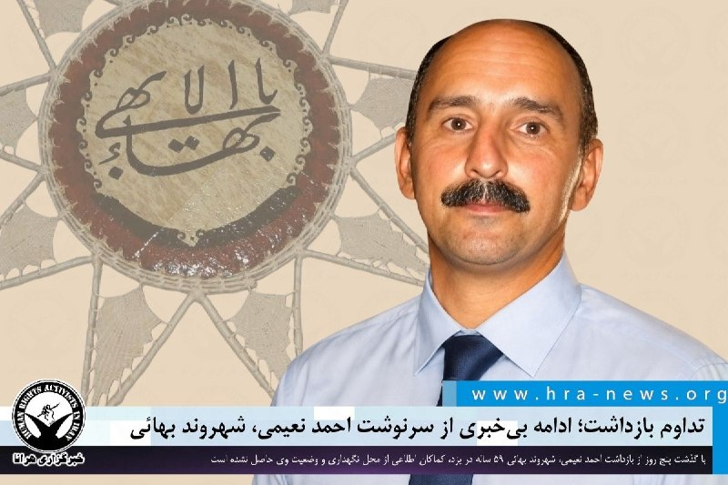

تداوم بازداشت؛ ادامه بی‌خبری از سرنوشت احمد نعیمی، شهروند بهائی

❗️
❗️
❗️
❗️
❗️– با گذشت پنج روز از بازداشت احمد نعیمی، شهروند بهائی ۵۹ ساله در یزد، کماکان اطلاعی از محل نگهداری و وضعیت وی حاصل نشده است. بی‌خبری از وضعیت این شهروند، منجر به افزایش نگرانی‌های خانواده او شده است.

به گزارش خبرگزاری هرانا، ارگان خبری مجموعه فعالان حقوق بشر در ایران، احمد نعیمی، شهروند بهائی در بازداشت بسر میبرد.

براساس اطلاعات دریافتی هرانا، با وجود گذشت پنج روز از زمان بازداشت آقای نعیمی، وی همچنان در وضعیت بلاتکلیف به‌سر می‌برد و از محل نگهداری این شهروند بهائی اطلاعی حاصل نشده است.

یک منبع مطلع نزدیک به خانواده آقای نعیمی، ضمن تایید تداوم بی‌خبری از وضعیت وی گفت که این شهروند بهائی تاکنون تماسی با خانواده خود نداشته است و پیگیری‌های بستگان او از دادسرای یزد برای کسب اطلاع از سرنوشت این شهروند تاکنون بی‌نتیجه مانده است؛ شرایطی که بر نگرانی‌های خانواده افزوده است.

ادامه مطلب

#احمد_نعیمی

↘️
@hranews_bot تماس ✉️ - @Hranews کانال هرانا 🆑

## alonews — post 128658

  <a href="telegram/content/alonews_128658_1781696084.webm" target="_blank">🎬 Download video</a>

👈حزب‌الله فیلمی منتشر کرده که تاریخ آن ۱۴ ژوئن است و نشان می‌دهد نیروهایش با استفاده از پهپاد حمله‌ای ابابیل، یک خودروی زرهی اسرائیلی را در حومه مجدل زون در جنوب لبنان هدف قرار می‌دهند

✅ @AloNews خبر جنگ

---
📅 بروزرسانی: 1405/03/27 14:53
---

## VahidOOnLine — post 246004

  <a href="telegram/content/VahidOOnLine_246004_1781695401.mp4" target="_blank">🎬 Download video</a>

♦️محمدباقر قالیباف، رئیس مجلس و مذاکره‌کننده ارشد جمهوری اسلامی درگفتگوها با آمریکا، روز چهارشنبه ۲۷ خرداد و در دفاع «تلویحی» از تفاهم‌نامه پایان جنگ گفت: باید سنگر را از بچه‌های لانچر تحویل بگیریم و مردم را از زیر فشار اقتصادی دربیاوریم.»

قالیباف این سخنان را در نشست هم‌فکری نماینده ویژه ایران در امور چین با اتاق بازرگانی بیان کرد.

در روزهای گذشته بخش‌های وسیعی از سیاستمداران، نمایندگان مجلس و رسانه‌های جریان‌های متفاوت سیاسی داخل حکومت، از تفاهم‌نامه پایان جنگ با ایران انتقاد کرده‌اند. گروهی از حامیان حکومت یکشنبه شب و همزمان با اعلام امضای توافق قالیباف و عراقچی را به خیانت محکوم کرده بودند.
‌🇸🇦 Indypersian

🤖 @VahidOOnLine

## WithYashar — post 15147

ترامپ: با احمد الشرع، رهبر سوریه، درباره مقابله با حزب‌الله گفت‌وگو کردم.
@withyashar

## pm_afshaa — post 94241

🔴سفیر اسرائیل در سازمان ملل:تاریخ رژیم ایران پر از شکنجه، گورهای دسته‌جمعی و خانواده‌های بدون پاسخ است قربانیان دی‌ماه شایسته عدالت‌اند. جهان نباید ساکت بماند

💧 Rainbet.com the #1 Non-KYC Crypto Casino & Sportsbook @rainbetcom

😁 @Pm_Afshaa

## FarsiVOA — post 221008

🔺اعتراض در لس‌آنجلس، تعقیب قضایی در تهران؛ سایه سرکوب فرامرزی بر جام جهانی

▪️نورنیوز مدعی شد بخشی از افرادی که در جریان دیدار تیم‌های ایران و نیوزیلند در جام جهانی ۲۰۲۶ در آمریکا، به گفته این رسانه، با «سردادن شعارهای توهین‌آمیز»، «ایجاد درگیری» و «هتک حرمت نمادهای ملی» در برگزاری مسابقه اخلال کرده بودند، شناسایی شده‌اند.

▪️این رسانه نزدیک به ساختارهای حکومتی و امنیتی نوشت پرونده این افراد برای پیگیری حقوقی و قضایی در حال تکمیل است و محدودیت‌هایی از جمله بررسی توقیف دارایی‌های مرتبط با آنان در دستور کار قرار گرفته است.

▪️نورنیوز همچنین تهدید کرد در ادامه مسابقات جام جهانی، هرگونه اقدام علیه «منافع کشور»، با شناسایی، تعقیب قضایی و «اشد مجازات‌های مقرر» روبه‌رو خواهد شد.

⬇️ بیشتر بخوانید:
https://ir.voanews.com/a/protest-in-los-angeles-prosecution-in-tehran-shadow-of-cross-border-repression-over-world-cup/8161827.html

## FarsiVOA — post 221007

🔺امارات می‌گوید وابستگی به تنگه هرمز را به «صفر» ‌می‌رساند

▪️امارات متحده عربی می‌گوید در نظر دارد وابستگی تجاری خود به تنگه هرمز را به «صفر» برساند.

▪️این کشور پیشتر خط لوله حبشان-‌فجیره با ظرفیت انتقال روزانه ۱.۹ میلیون بشکه نفت را برای دور زدن تنگه هرمز راه‌اندازی کرده بود و اخیراً توسعه خط لوله‌ جدیدی به همان ظرفیت را شتاب بخشیده تا در سال آینده به بهره‌برداری برساند.

▪️امارات ماه گذشته همچنین از بررسی طرح توسعه خط لوله نفتی سوم نیز خبر داد.

▪️ظرفیت تولید نفت امارات روزانه نزدیک ۵ میلیون بشکه است و پیش از انسداد تنگه هرمز توسط جمهوری اسلامی، روزانه ۳.۵ میلیون بشکه تولید داشت.

⬇️ بیشتر بخوانید:
https://ir.voanews.com/a/uae-moves-to-cut-dependency-on-strait-of-hormuz-to-zero/8161826.html

## DW_Farsi — post 126092

  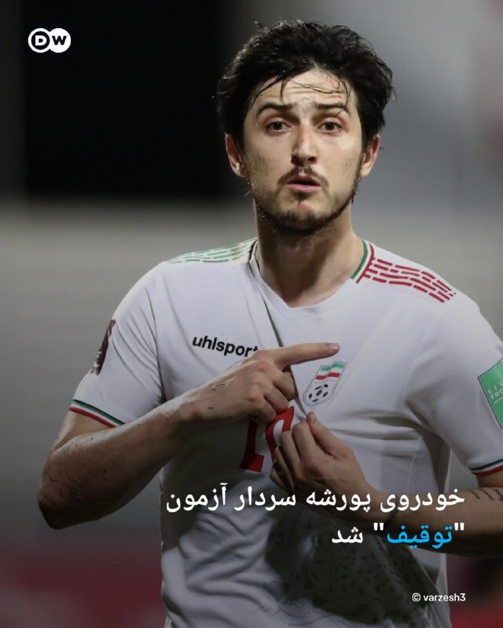

🔶 خودروی پورشه سردار آزمون "توقیف" شد

اکبر نجفی، فرمانده انتظامی شهرستان کرمان از توقیف خودروی پورشه سردار آزمون، فوتبالیست مطرح ایرانی خبر داد.

این مقام انتظامی ادعا کرد این خودرو در فهرست توقیفی‌ها قرار داشته و توسط "گشت‌های محسوس و نامحسوس یگان امداد" شناسایی و پس از طی مراحل قانونی به پارکینگ منتقل شد.

سردار آزمون چندی پیش در مصاحبه با وبسایت "ورش سه" اعلام کرده است که حرف برای گفتن زیاد دارد، اما فعلا هدفش حمایت از تیم ملی فوتبال ایران است.

او در این مصاحبه تلفنی برای هم‌بازی‌های خود آرزوی موفقیت کرد.

@dw_farsi

## idfinfarsi — post 11852

  <a href="telegram/content/idfinfarsi_11852_1781695403.mp4" target="_blank">🎬 Download video</a>

❌برای رفع تهدید: ارتش اسرائیل یک تروریست را که در نگهداری شمار زیادی از ربوده شدگان در اسارت حماس نقش داشت و یک تروریست دیگر را که در 7 اکتبر به کیبوتص بئری یورش برده بود، به هلاکت رساند

⭕️ارتش اسرائیل در پایان هفته گذشته (شنبه) در جنوب نوار غزه حمله کرد و تروریست محمد سعید احمد نمرُوطی، فرمانده دسته در سازمان تروریستی حماس را که در جریان کشتار 7 اکتبر به خاک اسرائیل نفوذ کرده بود، به هلاکت رساند.

در طول جنگ، نمرُوطی در نگهداری شمار زیادی از گروگان‌ها در اسارت تونل‌های حماس نقش داشت.

⭕️در حمله‌ای دیگر در مرکز نوار غزه، ارتش اسرائیل تروریست معاویه سلیمان زقر عایدی، فرمانده دسته در اردوگاه‌های مرکزی سازمان تروریستی جهاد اسلامی فلسطین را به هلاکت رساند. عایدی در جریان کشتار 7 اکتبر به کیبوتص بئری یورش برده بود.

⭕️در طول جنگ و در دوره اخیر، هر دو تروریست طرح‌های تروریستی علیه نیروهای ارتش اسرائیل و غیرنظامیان اسرائیلی را پیش برده بودند؛ عایدی همچنین در کارگذاری مواد منفجره نقش داشت. این تروریست‌ها پس از آنکه تهدیدی فوری برای نیروهای ارتش اسرائیل فعال در نوار غزه محسوب می‌شدند، در حملات دقیق به هلاکت رسیدند.

⭕️پیش از حمله، اقداماتی برای کاهش آسیب به غیرنظامیان انجام شد، از جمله استفاده از مهمات دقیق و رصدهای هوایی.

⭕️نیروهای ارتش اسرائیل تحت فرماندهی جنوب بر اساس توافق در منطقه مستقر هستند و به اقدام برای رفع هرگونه تهدید فوری ادامه خواهند داد.

## alonews — post 128657

  <a href="telegram/content/alonews_128657_1781695405.mp4" target="_blank">🎬 Download video</a>

👈ترامپ درباره ایران: ما مردی به نام سلیمانی را از بین بردیم. فکر می‌کنید اگر او زنده بود، این اتفاق می‌افتاد؟

🔴او نابغه‌ای شرور بود

✅ @AloNews خبر جنگ

## alonews — post 128656

  <a href="telegram/content/alonews_128656_1781695406.mp4" target="_blank">🎬 Download video</a>

👈رئیس‌جمهور مصر سیسی به ترامپ:
نمی‌توانم به اندازه کافی تأکید کنم که چقدر برای شما احترام قائلم

✅ @AloNews خبر جنگ

## alonews — post 128655

  <a href="telegram/content/alonews_128655_1781695408.webm" target="_blank">🎬 Download video</a>

👈ترامپ درباره ایران: دلیل پایین ماندن قیمت نفت این است که هر شب کشتی‌هایی را از بین می‌بردیم که حتی شما از آن‌ها خبر نداشتید.

🔴دو روز پیش، سه روز پیش، یک ماه پیش، ۲۲ کشتی را از بین بردیم. به طور متوسط هر شب بین ۱۵ تا ۲۵ کشتی را از بین می‌بردیم. هیچ‌کس این را نمی‌دانست.

🔴نیروی دریایی ما کار بزرگی انجام داد. هیچ‌کس نمی‌دانست چه اتفاقی می‌افتد. به همین دلیل نفت به ۳۰۰ دلار در هر بشکه نرسید؛ بلکه به ۱۲۵ تا ۱۵۰ دلار رسید.

🔴حالا قیمت آن ۷۲، ۷۳ دلار است. شنیده‌ام که الان حتی کمتر از این است

✅ @AloNews خبر جنگ

## alonews — post 128654

  <a href="telegram/content/alonews_128654_1781695408.webm" target="_blank">🎬 Download video</a>

👈ترامپ: قیمت نفت بلافاصله پس از اعلام توافق با ایران کاهش یافت

✅ @AloNews خبر جنگ

## alonews — post 128653

  <a href="telegram/content/alonews_128653_1781695409.webm" target="_blank">🎬 Download video</a>

👈روزنامه کیهان: مجلس باید جلوی مذاکره پنهانی با آمریکا رو بگیره

✅ @AloNews خبر جنگ

---
📅 بروزرسانی: 1405/03/27 14:43
---

## VahidOOnLine — post 246003

  

دونالد ترامپ، رییس‌جمهوری آمریکا، چهارشنبه ۲۷ خرداد در حاشیه نشست گروه هفت و در دیدار با عبدالفتاح السیسی، رییس‌جمهوری مصر، یادداشت تفاهم با جمهوری اسلامی را «بسیار قوی» توصیف کرد، اما هم‌زمان هشدار داد که این توافق هنوز نهایی نشده و در صورت نارضایتی واشینگتن، اقدام نظامی از سر گرفته خواهد شد.

ترامپ گفت: «این فقط یک یادداشت تفاهم است. اگر از آن راضی نباشم و رفتارشان را اصلاح نکنند، دوباره به سمت آنها شلیک می‌کنیم و روی سرشان بمب می‌اندازیم. چون به مدت ۴۷ سال بدرفتاری کرده‌اند.»

رییس‌جمهوری آمریکا همچنین مدعی شد این تفاهم بیش از ۹۹ درصد امکان دستیابی جمهوری اسلامی به سلاح هسته‌ای را از بین می‌برد و تاکید کرد که تهران هرگز به سلاح هسته‌ای دست نخواهد یافت.

ترامپ افزود یادداشت تفاهم شامل لغو فوری تحریم‌ها نیست، اما این موضوع در مراحل بعدی مذاکرات مورد بحث قرار خواهد گرفت.

او همچنین درباره وضعیت تنگه هرمز گفت این آبراه راهبردی هم‌اکنون به‌طور جزئی بازگشایی شده و انتظار می‌رود طی یک تا دو روز آینده به‌طور کامل باز شود.
‌🏁 🇬🇧 IranintlTV

🤖 @VahidOOnLine

## WithYashar — post 15146

  <a href="telegram/content/WithYashar_15146_1781694796.mp4" target="_blank">🎬 Download video</a>

ترامپ‌ در‌کنار ژنرال السیسی (واقعی): فراموش نکنید، هیچ‌کس هرگز به اندازه من با ایران سخت‌گیر نبوده است.

این کار باید توسط کلینتون و باراک حسین اوباما انجام می‌شد. این کار باید توسط بایدن، بوش و بسیاری از افراد دیگر انجام می‌شد.
@withyashar

## WithYashar — post 15145

ترامپ: قابلیت پرداخت فقط یک حقه دیگر است. آنها کلمه «قابلیت پرداخت» را ساختند
@withyashar

## WithYashar — post 15144

ترامپ: یادداشت با ایران نهایی نیست. اگر از توافق خوشمان نیاید، دوباره به بمباران بازمی‌گردیم @withyashar

## WithYashar — post 15143

ترامپ: یادداشت با ایران نهایی نیست. اگر از توافق خوشمان نیاید، دوباره به بمباران بازمی‌گردیم
@withyashar

## mwarmonitor — post 11064

او همچنین گفت پیشنهاد داده است که اسرائیل اجازه دهد سوریه با حزب‌الله برخورد کند: «اگر اسرائیل نتواند بدون کشتن همه کار را انجام دهد، او [الشرع] این کار را انجام می‌دهد، سوریه انجام می‌دهد.»

## mwarmonitor — post 11063

🔴 دونالد ترامپ، رئیس‌جمهور آمریکا، می‌گوید گزارش مربوط به صندوق ۳۰۰ میلیارد دلاری در توافق با ایران نادرست است و تأکید می‌کند که آمریکا هیچ سرمایه‌گذاری‌ای در آن انجام نمی‌دهد — رویترز

@mwarmonitor

## mwarmonitor — post 11062

  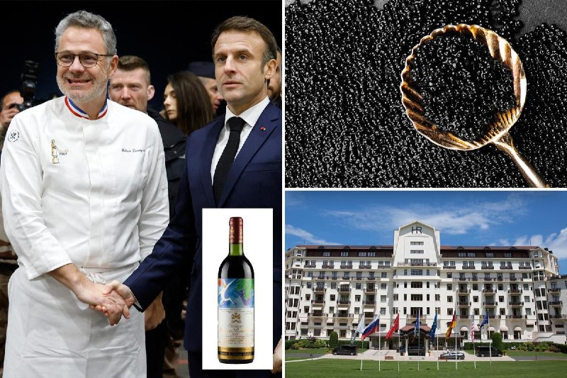

🔴رهبران گروه هفت (G7) بعد از تعهد برای مبارزه با «فقرِ پایدار»، با خاویار و شراب‌های وینتیج ۷ هزار دلاری ضیافت مفصل برگزار کردند. «نیویورک پست»

@mwarmonitor

## FoxNewsTwitter — post 343056

  <a href="telegram/content/FoxNewsTwitter_343056_1781694798.mp4" target="_blank">🎬 Download video</a>

Fox News (Twitter/X)

BREAKING: "If I don't like it, we'll go back to shooting at them, dropping bombs on their head."

President Trump warns Iran that any change to the peace agreement or failure to comply could bring an immediate military response.

"If they don't behave, we'll go right back to dropping bombs right smack in the middle of their head," Trump said.

Trump contrasted the deal with the Obama-era JCPOA, arguing the previous administration tried to "bribe their way out of it."

"You know what the Iranians did? They laughed at Obama and they said, 'he's a stupid son of a b****.'"

## FoxNewsTwitter — post 343055

  <a href="telegram/content/FoxNewsTwitter_343055_1781694800.mp4" target="_blank">🎬 Download video</a>

Fox News (Twitter/X)

NEW: Stocks up. Oil down. President Trump says that's the clearest sign yet that the proposed Iran deal is being welcomed by investors.

Speaking about the agreement, Trump highlighted a market rally, declining energy prices, and progress toward reopening the Strait of Hormuz after weeks of uncertainty.

"The stock market has gone through the roof and oil has come tumbling down."

He argued the deal delivers economic stability while also keeping Iran from obtaining a nuclear weapon.

## DEJradio — post 5755

  <a href="telegram/content/DEJradio_5755_1781694801.webm" target="_blank">🎬 Download video</a>

🚨📢 اختصاصی دژ؛
در بین فرماندهان و نیروهای میدانی سـ.ـپاه بر سر «توافق» با آمریکا اختلاف شدیدتر شده است

هرچند شماری از فرماندهان ارشد سـ.ـپاه پاسداران موافق مذاکره و توافق احتمالی با آمریکا هستند اما شماری از سرداران و همچنین بیشتر نیروهای میدانی سـ.ـپاه این توافق را «ننگ» می‌دانند و با آن مخالف‌اند.

یک منبع مطلع به دژ می‌گوید، «در بین نیروها همه می‌دانند محمدباقر قالیباف با تأیید مجتبی خامنه‌ای مسئول امضاء توافق شده اما فرماندهان و نیروهای میدانی به صورت تمام و کمال از آنها تبعیت نمی‌کنند.

برای نمونه، بعد از تفاهم دستور توقف حملات به کشتی‌ها صادر شد اما با این ادعا که کشتی‌ها از مقررات سرپیچی کرده‌اند با پهپاد و شهپاد به سمت آنها شلیک شده است.»
به‌گفته همین منبع «نیروهای میدانی سـ.ـپاه به اشکال مختلف از اجرای دستورات فرماندهی مبنی بر توقف پرتاب‌ها شانه خالی می‌کنند.»

اکنون بسیاری از نیروها می‌گویند قالیباف و باند او خائن‌اند و همچنین می‌پرسند: «این همه کشته دادیم که آخر با ترامپ توافق کنیم؟»

بخشی از اختلافات بر سر توافق احتمالی، به بدنه نیروهای سرکوبگر سرایت کرده است. مخالفان توافق یک حرف مشترک دارند: «چرا باید با قاتلان رهبر توافق کرد؟» این اختلاف به یگان‌ها کشیده شده است و در مواردی به درگیری فیزیکی کشیده شده است.»

#جنگ #توافق #مذاکرات
@DEJradio

## IranIntlTV — post 342842

  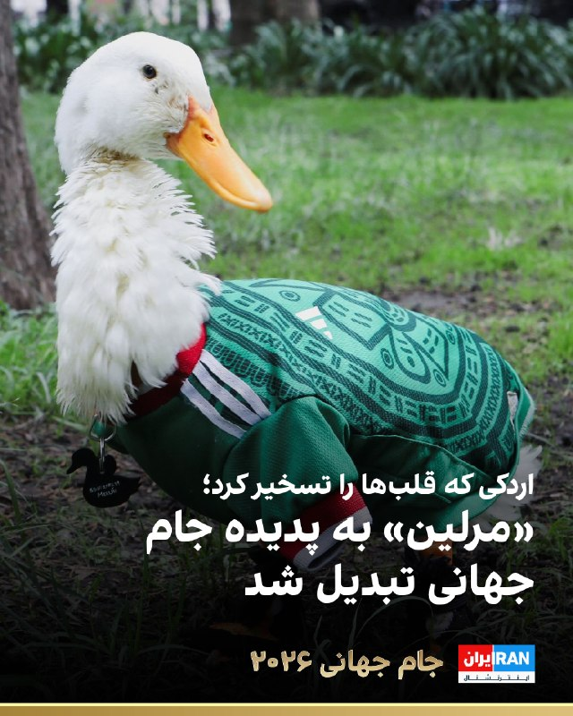

🔻یک اردک خانگی به نام «مرلین» که پیراهن کوچک تیم ملی مکزیک را به تن دارد، به یکی از پدیده‌های غیرمنتظره جام جهانی ۲۰۲۶ تبدیل شده و توجه هواداران فوتبال را به خود جلب کرده است.

🔹شهرت مرلین پس از پیروزی ۲ بر صفر مکزیک مقابل آفریقای جنوبی در دیدار افتتاحیه جام جهانی آغاز شد. در حالی که هواداران در خیابان‌های پایتخت برای گل‌های تیم ملی مکزیک جشن گرفته بودند، این اردک لباس‌پوشیده در میان جمعیت در خیابان معروف رفورما قدم می‌زد.

🔹رهگذران از این صحنه غیرمعمول فیلم گرفتند و تصاویر به سرعت در شبکه‌های اجتماعی فراگیر شد؛ تا جایی که برخی هواداران خواستار انتخاب مرلین به عنوان نماد غیررسمی مکزیک در جام جهانی شدند.

🔹کارلا گومز، صاحب مرلین که به همراه پسرش کریستین در خیابان‌های مکزیکوسیتی نوشیدنی می‌فروشد، گفت هرگز تصور نمی‌کرد اردکش به چنین شهرتی برسد.

🔹او گفت: «آن روز برای ما کاملا عادی بود. فکر می‌کردیم کسی متوجه ما نشده است. واقعا تصور نمی‌کردیم مرلین چنین استقبالی پیدا کند.»

🔹جزییات بیشتر را در سایت بخوانید

@iranintltvsport

## IranIntlTV — post 342841

  <a href="telegram/content/IranIntlTV_342841_1781694802.mp4" target="_blank">🎬 Download video</a>

دونالد ترامپ در حاشیه نشست گروه هفت در فرانسه از در راه بودن «توافقی بسیار قدرتمند» خبر داد و گفت بازارهای مالی نسبت به این روند واکنش مثبت نشان داده‌اند و شاخص‌ها در حال رشد هستند. او با تاکید بر بازگشت بازارها به شرایط پیشین، بار دیگر گفت هدف اصلی این است که ایران به سلاح هسته‌ای دست پیدا نکند و باید دید تهران در ادامه چه تصمیمی خواهد گرفت.
@iranintltv

## IranIntlTV — post 342839

  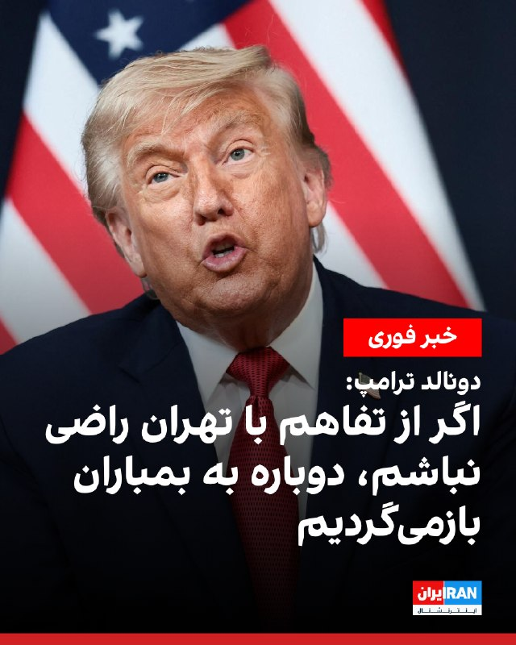

دونالد ترامپ، رییس‌جمهوری آمریکا، چهارشنبه ۲۷ خرداد در حاشیه نشست گروه هفت و در دیدار با عبدالفتاح السیسی، رییس‌جمهوری مصر، یادداشت تفاهم با جمهوری اسلامی را «بسیار قوی» توصیف کرد، اما هم‌زمان هشدار داد که این توافق هنوز نهایی نشده و در صورت نارضایتی واشینگتن، اقدام نظامی از سر گرفته خواهد شد.

ترامپ گفت: «این فقط یک یادداشت تفاهم است. اگر از آن راضی نباشم و رفتارشان را اصلاح نکنند، دوباره به سمت آنها شلیک می‌کنیم و روی سرشان بمب می‌اندازیم. چون به مدت ۴۷ سال بدرفتاری کرده‌اند.»

رییس‌جمهوری آمریکا همچنین مدعی شد این تفاهم بیش از ۹۹ درصد امکان دستیابی جمهوری اسلامی به سلاح هسته‌ای را از بین می‌برد و تاکید کرد که تهران هرگز به سلاح هسته‌ای دست نخواهد یافت.

ترامپ افزود یادداشت تفاهم شامل لغو فوری تحریم‌ها نیست، اما این موضوع در مراحل بعدی مذاکرات مورد بحث قرار خواهد گرفت.

او همچنین درباره وضعیت تنگه هرمز گفت این آبراه راهبردی هم‌اکنون به‌طور جزئی بازگشایی شده و انتظار می‌رود طی یک تا دو روز آینده به‌طور کامل باز شود.
https://iranintl.com/202606176397

## IranIntlTV — post 342838

  <a href="telegram/content/IranIntlTV_342838_1781694804.mp4" target="_blank">🎬 Download video</a>

یک شهروند با ارسال ویدیویی به ایران اینترنشنال گفت که پرداخت نشدن حقوق کارکنان غار علیصدر همدان، آنها را از تأمین مایحتاج زندگی ناتوان کرده و به اعتصاب کشانده است. او افزود که بخش گردشگری این میراث طبیعی ملی در حال تعطیل شدن است.

## Persian_Trend_Official — post 17335

  <a href="telegram/content/Persian_Trend_Official_17335_1781694806.mp4" target="_blank">🎬 Download video</a>

🇱🇧
🇮🇱وزیر دفاع اسرائیل کاتز:
هر کس دست به اقدامی علیه دولت اسرائیل در غزه، لبنان، سوریه یا هر جای دیگری بردارد، بداند که باید بهای آن را بپردازد.
اول از همه، زمین را از دست می‌دهند. خانه را از دست می‌دهند.
Phantom

📌 @persian_trend_official
پرشین ترند | متفاوت‌ترین کانال نظامی

## BBCPersian — post 284118

  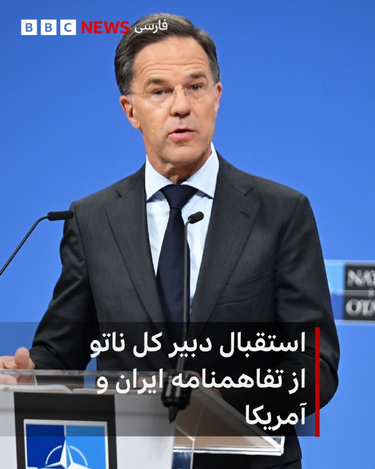

🔻مارک روته، دبیر کل ناتو، از توافق آمریکا و ایران برای پایان دادن به جنگ خاورمیانه استقبال کرد و گفت بازگشایی برنامه‌ریزی‌شده تنگه هرمز «گامی بسیار بزرگ»خواهد بود.

آقای روته در یک کنفرانس خبری در بروکسل گفت: «بازگشت آزادی عبور و مرور از تنگه هرمز یک گام بسیار مهم و رو به جلو خواهد بود. می‌دانم که بسیاری از متحدان، از طریق ابتکاری که به رهبری فرانسه و بریتانیا انجام شده، آماده حمایت هستند.»

📸Anadolu via Getty Images
https://bbc.in/4a7qMjY
@BBCPersian

## BBCPersian — post 284117

  <a href="telegram/content/BBCPersian_284117_1781694808.mp4" target="_blank">🎬 Download video</a>

🔻در  نخستین مسابقه جام جهانی در سیاتل که ۲۵ خرداد (۱۵ ژوئن) بین تیم‌های بلژیک و مصر برگزار شد، نتیجه مسابقه به همراه پرچم هر دو کشور با پهپاد در آسمان این شهر نقش بست.
 
به گفته «ویزیت سیاتل»، مجری این طرح، هدف از این تابلوی امتیازات «خلق تصاویری خیره‌کننده با عنصر میان‌فرهنگی و گرد هم آوردن هواداران فوتبال از نقاط مختلف در سیاتل» است.
 
سیاتل میزبان شش بازی در جام جهانی ۲۰۲۶ خواهد بود که از جمله این بازی‌ها، دیدار بین تیم‌های ایران و مصر در ششم تیر است.
 
این تابلوی امتیازات پهپادی در تمام روزهای برگزاری مسابقات در این شهر به نمایش در خواهد آمد.

https://bbc.in/4oIqYfx
@BBCPersian

## Dirty_Kids — post 392378

  <a href="telegram/content/Dirty_Kids_392378_1781694810.mp4" target="_blank">🎬 Download video</a>

من اون دی جی بودم وقتی زمان جنگ داشتم سعی میکردم حواسم رو صد درصد بذارم رو کارم درحالی که اون پشت املاکی کله زرد با آخوند داشت لاس میزد!

@Dirty_Kids 👻

## Dirty_Kids — post 392377

  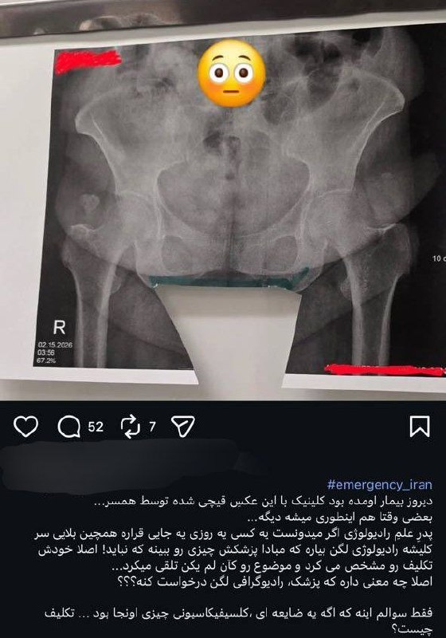

این عجیب ترین چیزی بود که میتونستم امروز ببینیم؛
یه مرد عکس لگن زنشو برده نشون دکتر بده زده ناحیه تناسلی رو با قیچی بریده که دکتر نبینه😐😂
مشخصه اول ماژیک کشیده دیده فایده نداره قیچیش کرده😂

@Dirty_Kids 👻

## alonews — post 128652

  <a href="telegram/content/alonews_128652_1781694812.mp4" target="_blank">🎬 Download video</a>

👈ورود نیروهای اسرائیلی به شهر بیت امر تو شمال الخلیل

✅ @AloNews خبر جنگ

## alonews — post 128651

  <a href="telegram/content/alonews_128651_1781694814.webm" target="_blank">🎬 Download video</a>

👈ترامپ درباره اوباما و ایران: هیچ‌کس نمی‌توانست این توافق را انجام دهد.

🔴برجام توسط اوباما انجام شد؛ او ۱.۷ میلیارد دلار پول نقد سبز از بانک‌ها به آنها داد، آن را در یک بوئینگ ۷۵۷ گذاشت و به ایران پرواز داد. و آنها کنار هواپیما ایستادند. من عکس‌هایی از آن دارم: «وای خدای من. نگاه کن به این پولی که به ما می‌دهد.»

🔴او تلاش کرد با رشوه راه فرار پیدا کند. من این کار را نکردم. هیچ‌کس به این اشاره نمی‌کند.

🔴و می‌دانید ایرانی‌ها چه کردند؟ به اوباما خندیدند و گفتند: «او یک پسر احمق لعنتی است.»

✅ @AloNews خبر جنگ

## alonews — post 128650

  <a href="telegram/content/alonews_128650_1781694814.mp4" target="_blank">🎬 Download video</a>

👈ترامپ: فراموش نکنید، هیچ‌کس هرگز به اندازه من با ایران سخت‌گیر نبوده است.

🔴این کار باید توسط کلینتون و باراک حسین اوباما انجام می‌شد. این کار باید توسط بایدن، بوش و بسیاری از افراد دیگر انجام می‌شد.

✅ @AloNews خبر جنگ

## alonews — post 128649

  <a href="telegram/content/alonews_128649_1781694815.mp4" target="_blank">🎬 Download video</a>

👈ترامپ: قابلیت پرداخت فقط یک حقه دیگر است. آنها کلمه «قابلیت پرداخت» را ساختند

✅ @AloNews خبر جنگ

---
📅 بروزرسانی: 1405/03/27 14:33
---

## VahidOOnLine — post 246002

.♦️خاویر باردم، هنرپیشه سرشناس سینمای جهان، روز چهارشنبه ۲۷ خرداد (سه‌شنبه شب به وقت غرب آمریکا) با برجای گذاشتن رد دستان، پاها و صورتش روی بلوک سیمان نمادین مقابل سالن نمایش «چینی» در بلوار هالیوود، به باشگاه هنرمندان جاودان صنعت سینمای آمریکا پیوست.

باردم اسپانیایی که به‌دلیل مواضع سیاسی چپ‌گرایانه و به‌ویژه حمایت تندوتیز از فلسطینیان در سال‌های گذشته خبرساز بوده در این مراسم گفت: «از اینکه نامش در کنار برخی ستاره‌های بزرگ سینمای جهان جاودانه شده، احساس ویژه‌ای دارد.»
‌🇸🇦 Indypersian

🤖 @VahidOOnLine

## WithYashar — post 15142

  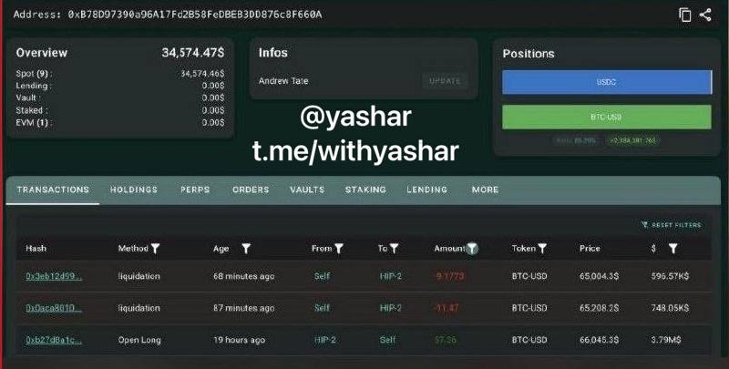

اندرو تیت که ۱۰۷ بار لیکویید شده، دوباره در صرافی هایپرلیکویید با اهرم ۴۰ و حجم حدوداً ۴ میلیون دلار، روی بیت‌کوین پوزیشن لانگ (خرید) باز کرده و باز هم بخشی از سرمایه‌اش (۱.۳۵ میلیون دلار) لیکویید شد.
اگه قیمت به 64,626 هزار دلار برسه کامل لیکویید می‌شه.
نرخ فعلی بیت‌کوین: 64,800$
@withyashar

## mwarmonitor — post 11061

🔴ترامپ می‌گوید یادداشت تفاهم با ایران نهایی نیست:

🔸«اگر از توافق خوشم نیاید، دوباره به بمباران ایران برمی‌گردیم.»

@mwarmonitor

## mwarmonitor — post 11060

🔴ما یک نسخه از توافق بین ایران و آمریکا را به دست آورده‌ایم. این یادداشت تفاهم ۱۴ بندی، شرایط آتش‌بس بین این دو رقیب سرسخت را مشخص می‌کند؛ از جمله بازگشایی تنگه هرمز، برخی امتیازات مالی برای ایران، و تأکید دوباره تهران بر اینکه هرگز سلاح هسته‌ای تولید نخواهد…

## mwarmonitor — post 11059

🔴ما یک نسخه از توافق بین ایران و آمریکا را به دست آورده‌ایم. این یادداشت تفاهم ۱۴ بندی، شرایط آتش‌بس بین این دو رقیب سرسخت را مشخص می‌کند؛ از جمله بازگشایی تنگه هرمز، برخی امتیازات مالی برای ایران، و تأکید دوباره تهران بر اینکه هرگز سلاح هسته‌ای تولید نخواهد کرد. CNN

@mwarmonitor

## pm_afshaa — post 94240

🔴ترامپ: یادداشت با ایران نهایی نیست. اگر از توافق خوشمان نیاید، دوباره به بمب‌گذاری بازمی‌گردیم

💧 Rainbet.com the #1 Non-KYC Crypto Casino & Sportsbook @rainbetcom

😁 @Pm_Afshaa

## pm_afshaa — post 94239

  <a href="telegram/content/pm_afshaa_94239_1781694202.webm" target="_blank">🎬 Download video</a>

سرور نامحدود 5 کاربره فقط 100 هزار تومن کجا میتونین همیچن قیمتی پیدا کنین با این کیفیت!؟ فقط اینجا
👇
👇 @Lex_Server @Lex_Server

## kianmeli1 — post 88045

  <a href="telegram/content/kianmeli1_88045_1781694203.mp4" target="_blank">🎬 Download video</a>

🔴ترامپ درباره توافق با ایران:

هیچ‌کس نمی‌داند [مفاد آن] چیست، اما توافق بسیار قوی‌ای است.
به نظر می‌رسد اکثر مردم بسیار خوشحال هستند.

توافق با ایران به دلایل بسیار از جمله عدم دستیابی آن به سلاح هسته ای خوب است

رئیس جمهور امریکا: تنگه هرمز به صورت جزئی بازگشایی شده و طی دو روز آینده به صورت کامل بازگشایی خواهد شد.

ترامپ: از جمله نتایج توافق با ایران، افزایش شاخص های بازار و کاهش قیمت سوخت است.
https://t.me/kianmeli1

## Shin_Persian — post 7116

Shin ✓ @hey_itsmyturn
Wed, 17 Jun 2026 11:01:45 UTC

Trump on Iran deal:
"No it's not final, it's a memorandum of understanding and If I don't like it, we will go back to shooting at them, dropping bombs on their head. If I don't like it, If they don't behave, we will go right back to dropping bombs right smacking in the middle of their head, cause they misbehaved for 47 years."

ترجمه خودکار فارسی

ترامپ درباره توافق با ایران:
«نه قطعی نیست، این یک یادداشت تفاهم است و اگر از آن خوشم نیاید، دوباره به سراغ شلیک به آن‌ها و ریختن بمب بر سرشان خواهیم رفت. اگر از آن خوشم نیاید، اگر رفتارشان را درست نکنند، مستقیماً به سراغ ریختن بمب درست وسط فرق سرشان برمی‌گردیم، چون آن‌ها برای ۴۷ سال بدرفتاری کرده‌اند.»

𝕏 · @shin_persian

## FarsiVOA — post 221006

  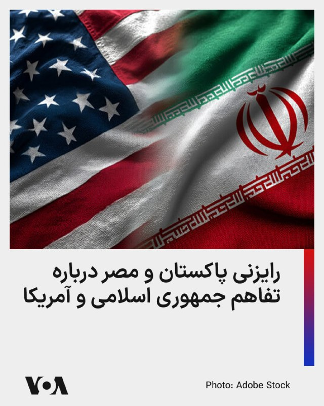

محمد اسحاق‌دار وزیر امور خارجه پاکستان و بدر عبدالعاطی، وزیر امور خارجه مصر، درباره آخرین تحولات منطقه‌ای به ویژه تفاهم‌ جمهوری اسلامی و آمریکا بحث و تبادل نظر کردند.

این دو دیپلمات ارشد، روز چهارشنبه ۲۷ خردادماه، در یک تماس تلفنی، دیدگاه‌های خود را درباره این موضوع و به ویژه امضای قریب‌الوقوع یک یادداشت تفاهم در « بورگن‌اشتوک سوئیس» مطرح کردند.

همچنین طرفین درباره نشست آتی چهار کشور مصر، پاکستان، ترکیه و عربستان طی روزهای آینده مذاکره کردند.

این چهار کشور نقش مهمی در برگزاری نشست اسلام‌آباد، پیش از برقراری آتش‌بس میان آمریکا و جمهوری اسلامی داشتند و قرار است نشست آتی خود را به میزبانی قاهره برگزار کنند.
@FarsiVOA

## DW_Farsi — post 126090

🔶 مشکل ویزای آمریکای مهدی ترابی، مهاجم تیم ملی ایران، رفع شد

فدراسیون فوتبال ایران روز سه‌شنبه ۲۶ خردادماه (۱۶ ژوئن) اعلام کرد که مهدی ترابی، مهاجم تیم ملی ایران، پس از حل مشکل ویزای خود می‌تواند به حضور در جام جهانی ادامه دهد. با این حال، ایالات متحده بار دیگر تأکید کرده است که اعضای تیم باید پس از هر مسابقه خاک آمریکا را ترک کنند.

پیش‌تر ویزای مهدی ترابی، مهاجم تیم ملی ایران پس از نخستین ورودش به خاک آمریکا برای دیدار تیم ایران در جام جهانی مقابل نیوزیلند در روز دوشنبه ۱۵ ژوئن در لس‌آنجلس، نامعتبر اعلام شده بود. این دیدار با نتیجه تساوی ۲ بر ۲ پایان یافت.

در حالی که سایر بازیکنان تیم ملی ایران ویزاهایی با امکان ورود متعدد به آمریکا دریافت کرده بودند، گزارش‌ها حاکی از آن بود که به ترابی تنها مجوز یک بار ورود برای بازی مقابل نیوزیلند داده شده بود. مهدی ترابی در دیدار اول ایران مقابل نیوزیلند به میدان نرفت.

اما اکنون ویزای دومی برای او صادر شده که امکان ورود ترابی به آمریکا برای دیدارهای باقی‌مانده مرحله گروهی ایران مقابل بلژیک در لس‌آنجلس و مصر در سیاتل را بدون مشکل فراهم می‌کند.

@dw_farsi

## RadioFarda — post 158424

  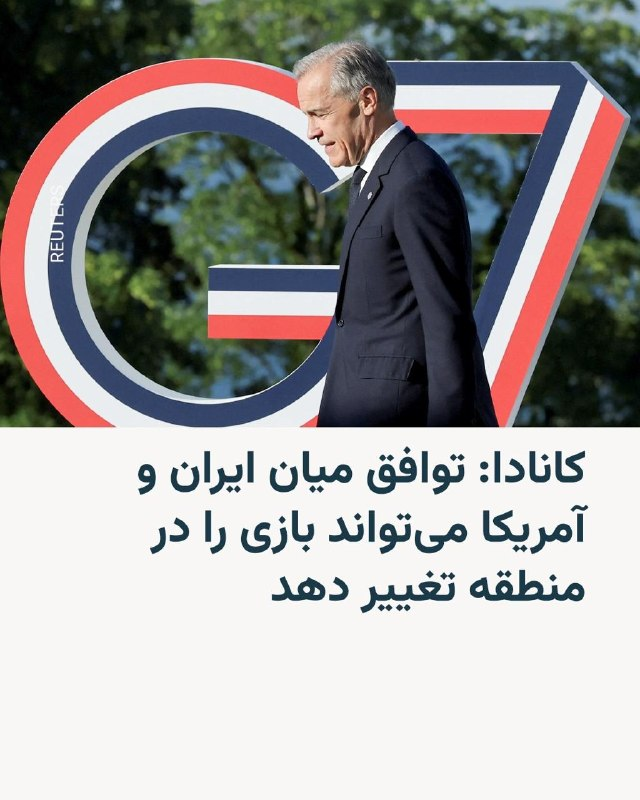

🔸مارک کارنی، نخست‌وزیر کانادا، می‌گوید توافق میان آمریکا و ایران برای پایان دادن به جنگ خاورمیانه، می‌تواند «تغییردهندۀ بازی» در منطقه و فراتر از آن باشد.

🔸کارنی در سومین روز نشست رهبران گروه ۷ در شهر اویان فرانسه، به خبرنگاران گفت باوجود «خطراتی» که وجود دارد، «این توافق باید به اجرا درآید».

🔸او افزود: «نفسِ وجود این توافق ــ و این واقعیت که کشورهای زیادی در تدوین آن مشارکت داشته‌اند و در موفقیت آن ذی‌نفع هستند ــ خود موجب ایجاد پیامدهای جانبی مثبت خواهد شد.»

🔸رهبران گروه ۷ در بیانیه‌ای مشترک در اواخر روز سه‌شنبه اعلام کردند به‌دنبال این توافق، «پیشرفت مهم و فرصتی» در خاورمیانه به وجود آمده است.

🔸آن‌ها افزودند که این یادداشت تفاهم «فرصتی تاریخی برای جلوگیری از دستیابی ایران به هرگونه سلاح هسته‌ای و مقابله با تهدیدهای مرتبط با فعالیت‌های منطقه‌ای و موشک‌های بالستیک آن فراهم می‌کند.»

@RadioFarda

## Hranews — post 113669

  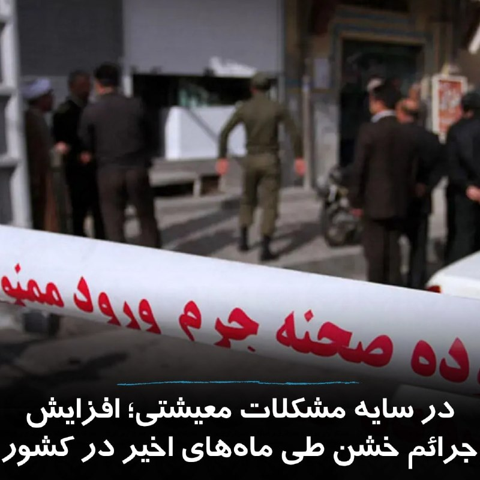

قاسم قاسمی، جرم‌شناس، از افزایش جرائم در کشور به‌ویژه جرائم علیه اموال و جرائم خشن در ماه‌های اخیر خبر داد. وی با بیان اینکه تبیین علل افزایش جرم نیازمند دسترسی به آمار جنایی و بررسی تفکیک جغرافیایی آن است، عواملی همچون نرخ تورم، بیکاری و تعارضات فرهنگی را از مهم‌ترین زمینه‌های افزایش جرائم در کشور دانست. قاسمی همچنین با اشاره به افزایش موارد خشونت خانگی، همزیستی اجباری ناشی از مشکلات معیشتی را از مهم‌ترین دلایل وقوع این نوع جرائم عنوان کرد.

وی همچنین با انتقاد از عدم شفافیت در ارائه آمار جرائم، اظهار داشت: «مجازات با هدف کاهش جرم اعمال می‌شود، اما به نظر می‌رسد دستگاه قضایی در سال‌های اخیر در این زمینه با چالش‌هایی مواجه بوده است. با وجود تلاش‌های صورت‌گرفته برای مقابله با جرائم مالی، این تصور در جامعه شکل گرفته که مرتکبان جرائم اقتصادی از نوعی مصونیت نسبی برخوردارند؛ موضوعی که می‌تواند بر بازدارندگی مجازات‌ها تأثیر بگذارد.»
#خشونت_خانگی #افزایش_جرم

↘️
@hranews_bot تماس ✉️ - @Hranews کانال هرانا 🆑

## alonews — post 128648

  <a href="telegram/content/alonews_128648_1781694205.webm" target="_blank">🎬 Download video</a>

👈بروجردی، عضو کمیسیون امنیت ملی و سیاست خارجی مجلس: تفاهم‌نامه نیازی به تصویب مجلس ندارد/ ایران دانش هسته‌ای را رها نمی‌کند

✅ @AloNews خبر جنگ

## alonews — post 128647

  <a href="telegram/content/alonews_128647_1781694206.webm" target="_blank">🎬 Download video</a>

👈گزارشگر: گزارش شده است که این توافق شامل صندوقی به ارزش ۳۰۰ میلیارد دلار برای ایران است.

🔴ترامپ: نه، این دروغ است. ما سرمایه‌گذاری نمی‌کنیم. مردم می‌توانند تصمیم بگیرند که این کار را انجام دهند، اما این به خودشان بستگی دارد.

🔴آیا می‌خواهید بگویم که هیچ‌کس هرگز مجاز نیست در یک کشور سرمایه‌گذاری کند؟

✅ @AloNews خبر جنگ

## alonews — post 128646

  <a href="telegram/content/alonews_128646_1781694206.mp4" target="_blank">🎬 Download video</a>

👈ترامپ درباره توافق ایران: متن نهایی نیست؛ این یک یادداشت تفاهم است!

🔴اگر از آن خوشم نیاید، دوباره به بمباران سرشان باز خواهیم گشت.

🔴همچنین اگر آنها رفتار مناسبی نداشته باشند، ما دوباره به بمباران باز خواهیم گشت

✅ @AloNews خبر جنگ

## alonews — post 128645

  <a href="telegram/content/alonews_128645_1781694208.webm" target="_blank">🎬 Download video</a>

👈ترامپ: توافق با ایران به دلایل زیادی خوب است، از جمله جلوگیری از دستیابی این کشور به سلاح هسته‌ای، و باز شدن تنگه هرمز تا دو روز اینده

✅ @AloNews خبر جنگ

---
📅 بروزرسانی: 1405/03/27 14:23
---

## VahidOOnLine — post 246001

  

خبرگزاری رسمی لبنان گزارش داد در حملات هوایی روز چهارشنبه ۲۷ خرداد اسرائیل به مناطقی در جنوب لبنان، چندین نفر زخمی شدند. این حملات در حالی رخ داد که مقام‌های جمهوری اسلامی در روزهای اخیر بارها تاکید کرده‌اند حملات اسرائیل به لبنان نقض یادداشت تفاهم با آمریکا محسوب می‌شود.

خبرگزاری ملی لبنان اعلام کرد سه حمله هوایی به شهرهای منصوری و عازیه انجام شده و در پی آن چندین نفر زخمی شده‌اند. این خبرگزاری همچنین از حمله دیگری به منطقه براشیت خبر داد. ارتش اسرائیل تاکنون درباره این گزارش‌ها اظهار نظر نکرده است.

اندکی پس از این حملات، آژیرهای هشدار نفوذ احتمالی پهپاد از لبنان در شهرک مرزی زاریت در شمال اسرائیل به صدا درآمد، اما ارتش اسرائیل اعلام کرد این هشدار ناشی از «خطای تشخیص» بوده است.
‌🏁 🇬🇧 IranintlTV

🤖 @VahidOOnLine

## VahidOOnLine — post 246000

  

خبرگزاری رسمی لبنان گزارش داد در حملات هوایی روز چهارشنبه ۲۷ خرداد اسرائیل به مناطقی در جنوب لبنان، چندین نفر زخمی شدند. این حملات در حالی رخ داد که مقام‌های جمهوری اسلامی در روزهای اخیر بارها تاکید کرده‌اند حملات اسرائیل به لبنان نقض یادداشت تفاهم با آمریکا محسوب می‌شود.

خبرگزاری ملی لبنان اعلام کرد سه حمله هوایی به شهرهای منصوری و عازیه انجام شده و در پی آن چندین نفر زخمی شده‌اند. این خبرگزاری همچنین از حمله دیگری به منطقه براشیت خبر داد. ارتش اسرائیل تاکنون درباره این گزارش‌ها اظهار نظر نکرده است.

اندکی پس از این حملات، آژیرهای هشدار نفوذ احتمالی پهپاد از لبنان در شهرک مرزی زاریت در شمال اسرائیل به صدا درآمد، اما ارتش اسرائیل اعلام کرد این هشدار ناشی از «خطای تشخیص» بوده است.
‌🏁 🇬🇧 IranintlTV

🤖 @VahidOOnLine

## WithYashar — post 15141

  <a href="telegram/content/WithYashar_15141_1781693584.mp4" target="_blank">🎬 Download video</a>

‎بخشی از سخنرانی قالیباف که تو رسانه‌ها وایرال شده

دیگه ساختار مدیریتی کشور از فردمحوری خارج شده و گروهی تصمیم میگیریم.
@withyashar

## WithYashar — post 15140

وزیر دفاع اسرائیل کاتز: تمام روستاهای نزدیک به مرز لبنان به صورت سیستماتیک ویران می‌شوند.
@withyashar

## WithYashar — post 15139

فاکس نیوز: ترامپ به زودی درباره توافق ایران کنفرانس خبری برگزار می‌کند
@withyashar

## mwarmonitor — post 11058

  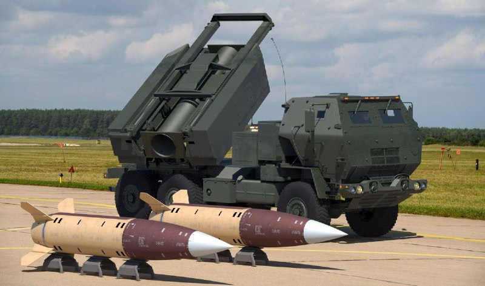

🔴تایوان برای اولین بار سامانه‌های راکتی High Mobility Artillery Rocket Systems (HIMARS) ساخت آمریکا را در ساحل غربی خود و به سمت تنگه مورد مناقشه تایوان شلیک کرد.

🔸این شلیک‌ها بخشی از یک رزمایش بزرگ‌تر بودند که سناریوی تهاجم احتمالی و اقدامات مقابله‌ای را شبیه‌سازی می‌کردند — آکسیوس

@mwarmonitor

## FoxNewsTwitter — post 343054

  <a href="telegram/content/FoxNewsTwitter_343054_1781693586.mp4" target="_blank">🎬 Download video</a>

Fox News (Twitter/X)

BREAKING: Details are beginning to emerge ahead of the U.S.-Iran memorandum signing ceremony, now less than 48 hours away.

The proposed framework reportedly includes reopening the Strait, ending the U.S. blockade, a 60-day negotiation period over Iran's uranium enrichment, sanctions relief, and a ceasefire agreement involving Israel and Hezbollah.

President Trump says he plans to move against Iran's nuclear program on Tuesday, while pointing to the 60-day window for negotiations over Tehran's nuclear ambitions.

Now all eyes are on whether the ceasefires can survive long enough for any deal to take hold.

@TreyYingst breaks down the latest.

## FoxNewsTwitter — post 343053

  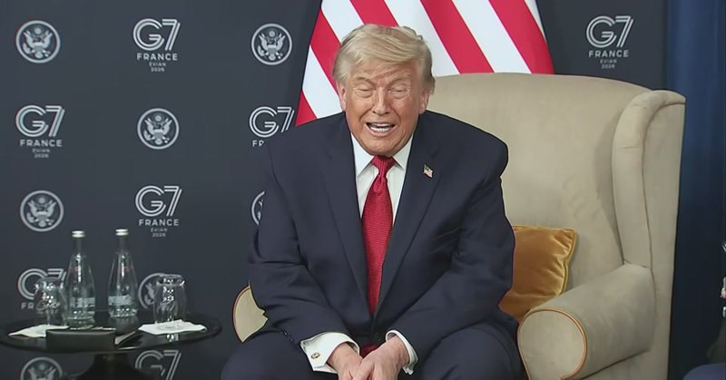

Fox News (Twitter/X)

WATCH LIVE: Trump holds bilateral meeting with the Egyptian president
https://twitter.com/i/broadcasts/1qxvvvqBkPaxB

## kianmeli1 — post 88044

‏🔴علی ربیعی، وزیر سابق کار، تعاون و رفاه اجتماعی جمهوری اسلامی: بر اساس نظرسنجی‌ها، نزدیک به ۷۰ درصد مردم خواهان تغییر درون نظام هستند
https://t.me/kianmeli1

## kianmeli1 — post 88043

  <a href="telegram/content/kianmeli1_88043_1781693588.mp4" target="_blank">🎬 Download video</a>

🔴وزیر دفاع اسرائیل کاتز: تمام روستاهای نزدیک به مرز لبنان به صورت سیستماتیک ویران می‌شوند.
https://t.me/kianmeli1

## kianmeli1 — post 88042

‏🔴عباس موسوی، معاون دفتر پزشکیان: ممکن است دیگر به اورانیوم با غلظت ۶۰ درصد نیاز نداشته باشیم و آن را کاهش دهیم تا امتیازات مورد نیاز خود را بگیریم و این هیچ ایرادی در دنیای سیاست ندارد
https://t.me/kianmeli1

## IranIntlTV — post 342837

  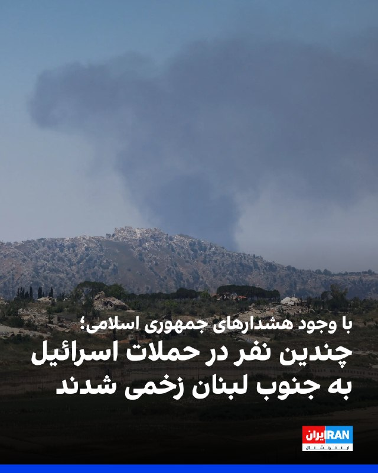

خبرگزاری رسمی لبنان گزارش داد در حملات هوایی روز چهارشنبه ۲۷ خرداد اسرائیل به مناطقی در جنوب لبنان، چندین نفر زخمی شدند. این حملات در حالی رخ داد که مقام‌های جمهوری اسلامی در روزهای اخیر بارها تاکید کرده‌اند حملات اسرائیل به لبنان نقض یادداشت تفاهم با آمریکا محسوب می‌شود.

خبرگزاری ملی لبنان اعلام کرد سه حمله هوایی به شهرهای منصوری و عازیه انجام شده و در پی آن چندین نفر زخمی شده‌اند. این خبرگزاری همچنین از حمله دیگری به منطقه براشیت خبر داد. ارتش اسرائیل تاکنون درباره این گزارش‌ها اظهار نظر نکرده است.

اندکی پس از این حملات، آژیرهای هشدار نفوذ احتمالی پهپاد از لبنان در شهرک مرزی زاریت در شمال اسرائیل به صدا درآمد، اما ارتش اسرائیل اعلام کرد این هشدار ناشی از «خطای تشخیص» بوده است.
https://iranintl.com/202606177467

## IranIntlTV — post 342836

  

خبرگزاری رسمی لبنان گزارش داد در حملات هوایی روز چهارشنبه ۲۷ خرداد اسرائیل به مناطقی در جنوب لبنان، چندین نفر زخمی شدند. این حملات در حالی رخ داد که مقام‌های جمهوری اسلامی در روزهای اخیر بارها تاکید کرده‌اند حملات اسرائیل به لبنان نقض یادداشت تفاهم با آمریکا محسوب می‌شود.

خبرگزاری ملی لبنان اعلام کرد سه حمله هوایی به شهرهای منصوری و عازیه انجام شده و در پی آن چندین نفر زخمی شده‌اند. این خبرگزاری همچنین از حمله دیگری به منطقه براشیت خبر داد. ارتش اسرائیل تاکنون درباره این گزارش‌ها اظهار نظر نکرده است.

اندکی پس از این حملات، آژیرهای هشدار نفوذ احتمالی پهپاد از لبنان در شهرک مرزی زاریت در شمال اسرائیل به صدا درآمد، اما ارتش اسرائیل اعلام کرد این هشدار ناشی از «خطای تشخیص» بوده است.
https://iranintl.com/202606177467

## alonews — post 128644

  <a href="telegram/content/alonews_128644_1781693591.webm" target="_blank">🎬 Download video</a>

👈عضو تیم رسانه‌ای هیئت مذاکره کننده هسته‌ای ایران: ما تعهد هسته‌ای نداده‌ایم/ گفت‌وگوی هسته‌ای در مرحله بعد از اعتمادسازی انجام می‌شود

✅ @AloNews خبر جنگ

---
📅 بروزرسانی: 1405/03/27 14:13
---

## VahidOOnLine — post 245999

⭕️سرگذشت هنر گچ‌بری در ایران؛ از شاهان ساسانی تا اسلیمی‌های اسلامی

📌گچ‌بری ایران از یک هنر فیگوراتیو و روایی در دوران باستان به یک هنر عمدتا انتزاعی و کتیبه‌ای در دوران اسلامی تبدیل شد

♦️هنر گچ‌بری در ایران از روزگار باستان تا امروز، یکی از روشن‌ترین آینه‌های تحولات فرهنگی، مذهبی و سیاسی این سرزمین بوده است. این هنر در دوره‌های هخامنشی، اشکانی و به‌ویژه ساسانی، افزون بر کارکرد تزیینی، ابزاری برای نمایش قدرت سیاسی، روایت‌های اسطوره‌ای و بازنمایی جهان‌بینی حاکم به شمار می‌رفت و با همین رویکرد نیز دیوارهای کاخ‌ها و بناهای اشرافی با نقش شاهان، ایزدان، جانوران اساطیری و صحنه‌های شکار و بزم آراسته می‌شد.

بیشتر بخوانید...

✍️سایه رحیمی
‌🇸🇦 Indypersian

🤖 @VahidOOnLine

## IranIntlTV — post 342835

  <a href="telegram/content/IranIntlTV_342835_1781692985.mp4" target="_blank">🎬 Download video</a>

حسین شریعتمداری، مدیرمسئول کیهان، گفت: «درگیری جمهوری اسلامی و آمریکا ماهوی است و هنگامی پایان می‌پذیرد که یکی از دو طرف تغییر ماهیت بدهد.»
ارزیابی مرتضی کاظمیان، عضو تحریریه ایران‌اینترنشنال، از تفاهم تهران و واشینگتن و چشم‌انداز تحولات ایران
@iranintltv

## FarsiVOA — post 221005

  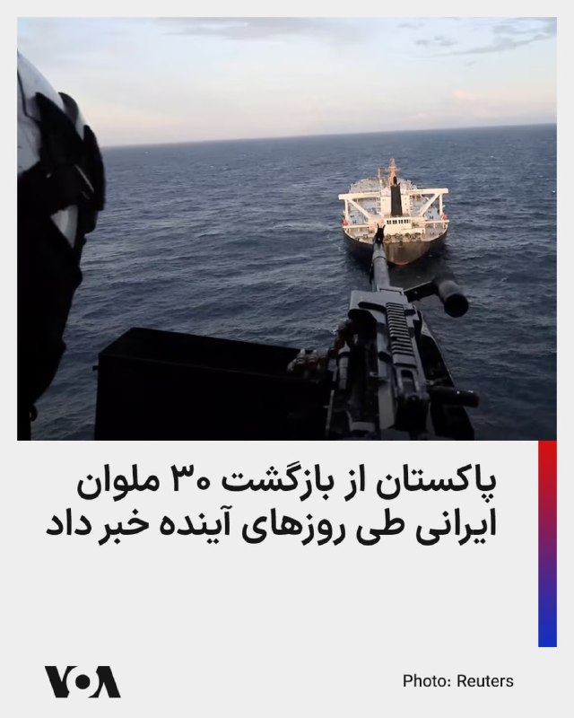

محمد اسحاق‌دار، وزیر امور خارجه پاکستان، از تلاش اسلام‌آباد برای بازگرداندن ۳۰ ملوان ایرانی خبر داد و اعلام کرد که آنها طی روزهای آینده از طریق کراچی به ایران باز می‌گردند.

هشت نفر از این ملوانان ماهی‌گیرانی هستند که توسط یک کشتی بریتانیایی نجات یافتند، اما ۲۲ نفر دیگر خدمه کشتی «ام‌تی داوینا» هستند.

این کشتی که تحت تحریم‌ قرار داشت، روز ۱۵ خردادماه، توسط نیروهای دریایی ایالات متحده و در جریان یک عملیات دریایی در اقیانوس هند توقیف شده است.

وزیر خارجه پاکستان یادآور شد که اسلام‌آباد در هماهنگی نزدیک با مقامات جمهوری اسلامی، ایالات متحده و بریتانیا قرار دارد تا عبور امن و بازگشت این افراد تضمین شود.
@FarsiVOA

## IranianMinds — post 22780

🔴 فاکس نیوز :

بزودی ترامپ درباره توافق با ایران یک‌ کنفرانس خبری برگزار میکنه.

@IranianMinds

## BBCPersian — post 284115

نظرتان درباره حضور تیم ملی فوتبال ایران در جام‌جهانی ۲۰۲۶ چیست؟ حواشی حضور این تیم و اولین مسابقه با نیوزیلند، از نظر شما چه معنایی برای دنیای فوتبال و سیاست داشت؟
تیم ملی فوتبال ایران در شرایط جنگی و بحران روابط ایران و آمریکا، برای تمرین و اردو و بازی تدارکاتی و ویزا با مشکلاتی مواجه بود، فقط یک روز قبل از مسابقه به لس‌آنجلس رسید و مجبور شد بعد از بازی خاک آمریکا را ترک کند. اما در شبکه‌های اجتماعی هم اختلاف نظر و بحث و تقابل مثل کسانی که برای تماشای بازی ایران و نیوزیلند به ورزشگاه رفته بودند در جریان است. نظر شما چیست؟

نظرات و مشاهدات خود درباره حضور ایران در جام‌جهانی ۲۰۲۶ با هشتگ #فوتبال برای ما ارسال کنید:
آی‌مسج و واتس‌اپ: ۰۰۴۴۷۳۴۲۰۳۲۱۱۳
پیامگیر تلگرام t.me/bbcshoma

@BBCPersian
📷 Getty Images
https://bbc.in/3SKW9La

## Dirty_Kids — post 392376

  <a href="telegram/content/Dirty_Kids_392376_1781692987.mp4" target="_blank">🎬 Download video</a>

فشاری که روی لِگ هست، روی زندگیم نیست.

@Dirty_Kids 👻

## alonews — post 128643

  <a href="telegram/content/alonews_128643_1781692988.webm" target="_blank">🎬 Download video</a>

🔴فوری / فاکس نیوز: ترامپ به زودی درباره توافق ایران کنفرانس خبری برگزار می‌کند

✅ @AloNews خبر جنگ

## alonews — post 128642

  <a href="telegram/content/alonews_128642_1781692989.mp4" target="_blank">🎬 Download video</a>

👈دعوت ترامپ از خبرنگاران برای ماندن در جلسه و اخراج آنها توسط مکرون

🔴در نشست سران گروه هفت در فرانسه، ترامپ به خبرنگاران گفت که می توانند در جلسه بمانند، اما مکرون با اشاره آنها را بیرون فرستاد. این لحظه در حالی ثبت شد که مکرون پیشتر در گفتوگویی محرمانه با زلنسکی به تنش با ترامپ اشاره کرده بود.

✅ @AloNews خبر جنگ

---
📅 بروزرسانی: 1405/03/27 14:03
---

## pm_afshaa — post 94238

🔴وزیر دفاع اسرائیل کاتز: تمام روستاهای نزدیک به مرز لبنان به صورت سیستماتیک ویران می‌شوند

💧 Rainbet.com the #1 Non-KYC Crypto Casino & Sportsbook @rainbetcom

😁 @Pm_Afshaa

## DEJradio — post 5754

  <a href="telegram/content/DEJradio_5754_1781692423.webm" target="_blank">🎬 Download video</a>

🤡
🔺 یک نماینده مجلس:
پس از امضای تفاهم‌نامه، اسرائیل دوباره به جمهوری اسلامی حمله می‌کند

کامران غضنفری عضو کمیسیون امور داخلی مجلس، در گفت‌وگو با «سایت دیده‌بان ایران» با انتقاد از تفاهم‌نامه جمهوری اسلامی و آمریکا گفت که در این تفاهم، تکلیف پرداخت غرامت جنگ معلوم نشده و اشاره‌ای نشده که تنگه هرمز تحت اختیار جمهوری اسلامی می‌ماند و کشتی‌ها با تشخیص تهران اجازه عبور دارند.

او گفت تیم مذاکره‌کننده پذیرفته است تنگه هرمز به حالت سابق بازگردد و همه بتوانند در آن تردد کنند. غضنفری این موضوع را «نقض خطوط رهبری» خواند و گفت در چند مورد دیگر نیز دستور مجتبی خامنه‌ای نقض شده است.

غضنفری همچنین با اشاره به اعلام خزانه‌داری آمریکا درباره پرداخت خسارت کشورهای عربی از محل پول‌های مسدودشده ایران گفت آمریکا نه‌تنها قصد آزادسازی این پول‌ها را ندارد، بلکه می‌خواهد آن را به «دشمنان» جمهوری اسلامی پرداخت کند.

#غضنفر #جنگ #توافق #مذاکرات
@DEJradio

## IranIntlTV — post 342834

  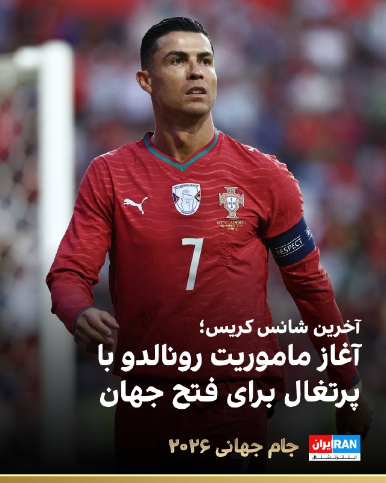

🔻تیم ملی پرتغال امیدوار است با آغاز جام جهانی ۲۰۲۶ به شش دهه انتظار برای فتح بزرگ‌ترین جام فوتبال جهان پایان دهد. شاگردان روبرتو مارتینس در نخستین دیدار خود در گروه K به مصاف جمهوری دموکراتیک کنگو می‌روند. اکنون کریستیانو رونالدو در آخرین حضور خود در این رقابت‌ها به دنبال فتح تنها جام مهمی است که هنوز در کارنامه‌اش دیده نمی‌شود.

🔹بهترین عملکرد پرتغال در جام جهانی به سال ۱۹۶۶ بازمی‌گردد؛ زمانی که با درخشش اوزه‌بیو در نخستین حضور خود به مقام سوم رسید. این تیم تنها یک بار دیگر، در سال ۲۰۰۶، به نیمه‌نهایی راه یافته و در جام جهانی ۲۰۲۲ قطر نیز پس از پیروزی ۶ بر یک مقابل سوئیس، در مرحله یک‌چهارم نهایی برابر مراکش حذف شد.

🔹نسل طلایی فوتبال پرتغال در سال‌های اخیر قهرمانی یورو ۲۰۱۶ و لیگ ملت‌های اروپا را تجربه کرده است، اما جام جهانی همچنان بزرگ‌ترین هدف دست‌نیافته این تیم به شمار می‌رود.

🔹جزییات بیشتر را در سایت بخوانید

@iranintltvsport

## IranIntlTV — post 342833

  <a href="telegram/content/IranIntlTV_342833_1781692424.mp4" target="_blank">🎬 Download video</a>

رییس سازمان نظام پرستاری می‌گوید پرستارانی که پیش‌تر برای مهاجرت اقدام می‌کردند، اکنون ترجیح می‌دهند بیکار بمانند یا به مشاغل غیرپرستاری روی بیاورند. به گفته احمد نجاتیان، شرایط نامناسب کاری و پرداخت‌ها عامل اصلی این وضعیت است.
گفت‌وگو با منصوره حسینی‌یگانه، عضو تحریریه ایران‌اینترنشنال
@iranintltv

## IranIntlTV — post 342832

  <a href="telegram/content/IranIntlTV_342832_1781692427.mp4" target="_blank">🎬 Download video</a>

یک هواپیمای کوچک مسافربری شامگاه سه‌شنبه ۲۶ خرداد در نزدیکی بزرگراه «لوپ ۲۰» در شهر لاریدوِ ایالت تگزاس سقوط کرد. پلیس اعلام کرد چند سرنشین از هواپیما خارج شده‌اند، اما شمار دقیق آن‌ها و وضعیت جسمی‌شان هنوز مشخص نیست. نیروهای امدادی و آتش‌نشانی با توجه به خطر نشت سوخت و مواد خطرناک، محل حادثه را مسدود کردند و تحقیقات درباره علت سقوط ادامه دارد.
@iranintltv

## DW_Farsi — post 126088

  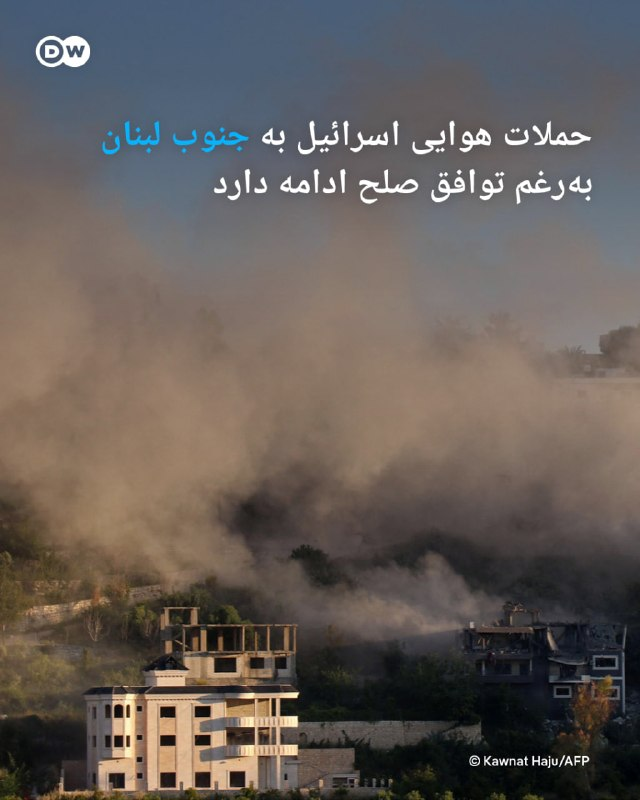

🔶 حملات هوایی اسرائیل به جنوب لبنان به‌رغم توافق صلح ادامه دارد

رسانه‌های دولتی لبنان گزارش دادند که نیروهای اسرائیلی روز چهارشنبه ۲۷ خرداد (۱۷ ژوئن) چندین حمله هوایی به مناطق مختلف جنوب لبنان انجام دادند؛ این در حالی است که "توافق پایان جنگ خاورمیانه، لبنان را نیز در بر می‌گیرد".

خبرگزاری دولتی لبنان اعلام کرد جنگنده‌های اسرائیلی مناطقی در "نبطیه فوقا" و حومه شرقی شهر "کفر تبنیت" را هدف قرار دادند و یک حمله پهپادی نیز به شهر "انصاریه" در منطقه زهرانی گزارش شده است.

با وجود کاهش خشونت‌ها پس از اعلام توافق آمریکا و ایرانبرای پایان جنگ خاورمیانه، حملات اسرائیل به جنوب لبنان از زمان اعلام این توافق تاکنون دست‌کم پنج کشته بر جای گذاشته است.

کاهش درگیری‌ها باعث شده برخی ساکنان جنوب لبنان برای بررسی وضعیت خانه‌ها و روستاهای خود بازگردند، اما ارتش لبنان از مردم خواسته است به دلیل "خطر نقض توافق و حملات اسرائیل" بازگشت خود را به تعویق بیندازند.

@dw_farsi

## DW_Farsi — post 126087

  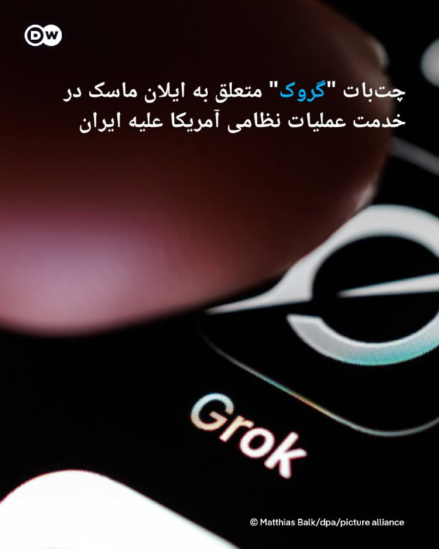

🔶 چت‌بات "گروک" متعلق به ایلان ماسک در خدمت عملیات نظامی آمریکا علیه ایران

چت‌بات هوش مصنوعی "گروک" متعلق به ایلان ماسک در حملات آمریکا علیه ایران مورد استفاده قرار گرفته است؛ این موضوع را دولت ایالات متحده در یک سند حقوقی که به رویت خبرگزاری فرانسه رسیده، فاش کرده است.

در این سند از توربین‌های گازی مورد استفاده در یک مرکز داده عظیم متعلق به شرکت "ایکس‌ای‌آی" دفاع شده است؛ توربین‌هایی که هدف یک شکایت زیست‌محیطی نیز قرار دارند.

وزارت دادگستری آمریکا در این متن استدلال می‌کند که این شکایت "با تلاش برای قطع برق نوآوری‌های هوش مصنوعی که از عملیات نظامی وزارت جنگ پشتیبانی می‌کند، امنیت ملی، اقتصادی و انرژی آمریکا را تهدید می‌کند".

@dw_farsi

## Persian_Trend_Official — post 17334

  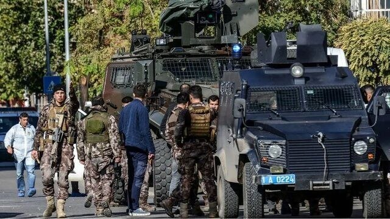

🔴 ترکیه از بازداشت مسئول رسانه‌ای داعش خراسان خبر داد

🔹 منابع امنیتی ترکیه اعلام کردند سازمان اطلاعات ملی این کشور (MIT) در یک عملیات ویژه، «علی احمد کازانچی» ملقب به «ابوعبیده ابوابراهیم» را بازداشت و به ترکیه منتقل کرده است.

🔹 بر اساس گزارش خبرگزاری آناتولی، کازانچی از عناصر ارشد داعش خراسان و مسئول بخش اطلاع‌رسانی و رسانه‌ای این گروه تروریستی بوده است.

🔹 گفته می‌شود وی پس از بازداشت «اوزگور آلتون» معروف به «ابو یاسر الترکی»، مسئولیت هدایت فعالیت‌های رسانه‌ای داعش در ترکیه را بر عهده گرفته بود.

🔹 منابع امنیتی مدعی‌اند کازانچی پس از حضور در مناطق افغانستان و پاکستان و همکاری در انتقال نیروهای داعش، قصد داشت به‌صورت غیرقانونی وارد ترکیه شود تا فعالیت‌های سازمانی خود را ادامه دهد.

🔹 سازمان اطلاعات ترکیه اعلام کرده این فرد در جریان عملیاتی در منطقه مرزی شناسایی و دستگیر شده است.

🎯 اهمیت این تحول:

بازداشت یکی از مسئولان رسانه‌ای داعش خراسان می‌تواند ضربه‌ای به شبکه تبلیغاتی و جذب نیروهای این گروه وارد کند. داعش خراسان طی سال‌های اخیر تلاش کرده از بسترهای رسانه‌ای و فضای مجازی برای گسترش نفوذ و جذب نیرو در منطقه استفاده کند.

👺 Phantom

📌 @persian_trend_official
پرشین ترند | متفاوت‌ترین کانال نظامی

## RadioFarda — post 158423

  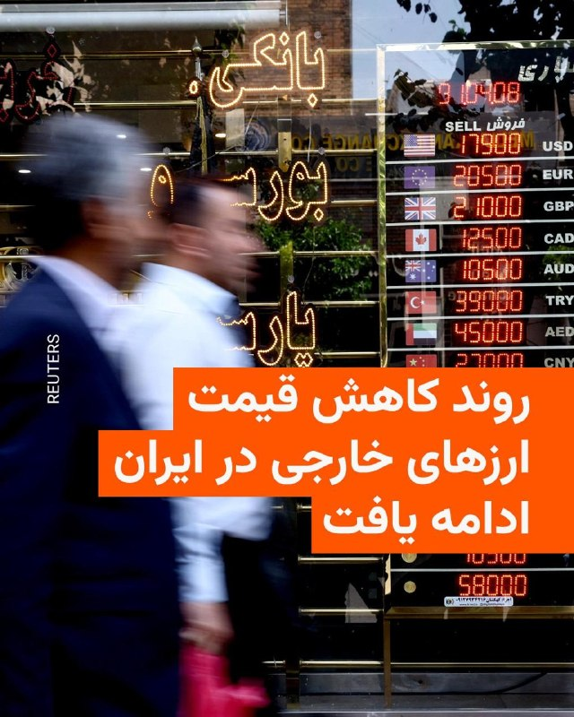

🔸در ادامهٔ روند کاهشی قیمت ارزهای خارجی در بازار آزاد ایران، روز چهارشنبه ۲۷ خرداد قیمت هر دلار آمریکا به حدود ۱۵۳ هزار تومان رسید و قیمت سکه طلا هم در محدوده ۱۶۰ میلیون تومان اعلام شد.

🔸از زمان اعلام توافق ایران و آمریکا برای پایان جنگ، قیمت ارزهای خارجی و سکه طلا در بازار آزاد ایران شاهد کاهش قابل توجهی بوده است.

🔸قیمت دلار آمریکا که در مقطعی تا ۱۹۰ هزار تومان بالا رفته بود، تا کنون حدود ۲۰ درصد کاهش پیدا کرده است.

🔸قیمت هر گرم طلای ۱۸ عیار نیز روز چهارشنبه به ۱۵ میلیون و ۷۶۷ هزار تومان و «سکه امامی» نیز به ۱۵۹ میلیون و ۵۰۰ هزار تومان کاهش یافت.

🔸در مقابل، شاخص بازار سهام بورس تهران از زمان اعلام توافق رشد چشمگیری داشته و روز چهارشنبه با ثبت رکوردی تازه به بیش از ۵ میلیون و ۱۰۰ هزار واحد رسید.

@RadioFarda

## IranianMinds — post 22779

  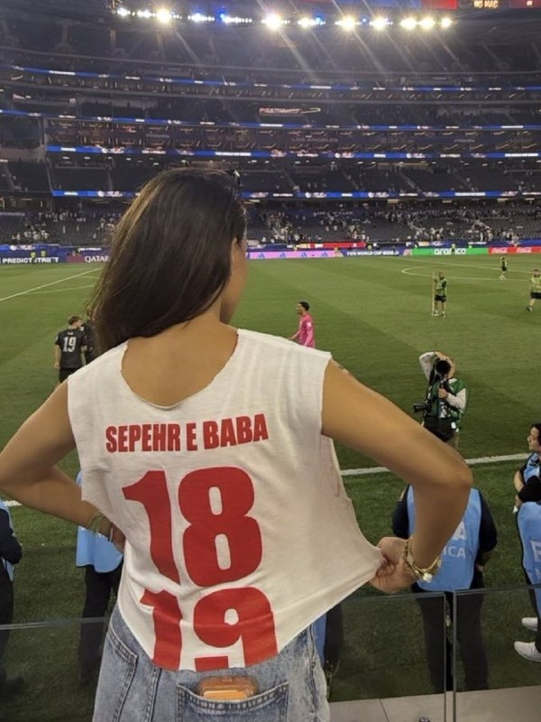

اکانت اسرائیل به فارسی:

سپهر بابا💔

@IranianMinds

## alonews — post 128641

  <a href="telegram/content/alonews_128641_1781692433.webm" target="_blank">🎬 Download video</a>

👈وزیر دفاع اسرائیل کاتز: هر کس دست به اقدامی علیه دولت اسرائیل در غزه، لبنان، سوریه یا هر جای دیگری بردارد، بداند که باید بهای آن را بپردازد.

🔴اول از همه، زمین را از دست می‌دهند. خانه را از دست می‌دهند.

✅ @AloNews خبر جنگ

## alonews — post 128640

  <a href="telegram/content/alonews_128640_1781692433.mp4" target="_blank">🎬 Download video</a>

👈 وزیر دفاع اسرائیل کاتز: تمام روستاهای نزدیک به مرز لبنان به صورت سیستماتیک ویران می‌شوند.

✅ @AloNews خبر جنگ

---
📅 بروزرسانی: 1405/03/27 13:52
---

## VahidOOnLine — post 245998

  

حسن خمینی، نوه روح‌الله خمینی، با اشاره به جنگ اسرائیل و آمریکا علیه جمهوری اسلامی، از آن با عنوان «جهاد اصغر» یاد کرد و گفت «جهاد اکبر» برای حفظ پیروزی و کنار گذاشتن نزاع‌های بی‌حاصل از امروز آغاز می‌شود.

او همچنین گفت جمهوری اسلامی با «تدبیر» از محاصره دریایی عبور کرد و افزود همین اقدام می‌تواند «غول‌های دنیا» را زمین بزند.

این اظهارات در حالی مطرح شد که یادداشت تفاهم میان واشینگتن و تهران، با وجود مخالفت شماری از مقام‌های جمهوری اسلامی از جمله برخی نمایندگان مجلس جمهوری اسلامی، روز یکشنبه ۲۴ خرداد به‌صورت الکترونیکی در اسلام‌آباد امضا شد. قرار است این تفاهم‌نامه روز جمعه نیز با حضور مقام‌های دو طرف در ژنو به‌صورت حضوری امضا شود.
‌🏁 🇬🇧 IranintlTV

🤖 @VahidOOnLine

## kianmeli1 — post 88041

  <a href="telegram/content/kianmeli1_88041_1781691772.mp4" target="_blank">🎬 Download video</a>

🔴تصاویری از پایگاه نظامی‌جدید آمریکا در نزدیکی غزه
https://t.me/kianmeli1

## kianmeli1 — post 88040

  <a href="telegram/content/kianmeli1_88040_1781691774.mp4" target="_blank">🎬 Download video</a>

🔴ترامپ در نشست G۷ : «من رئیس هستم»
https://t.me/kianmeli1

## IranIntlTV — post 342831

  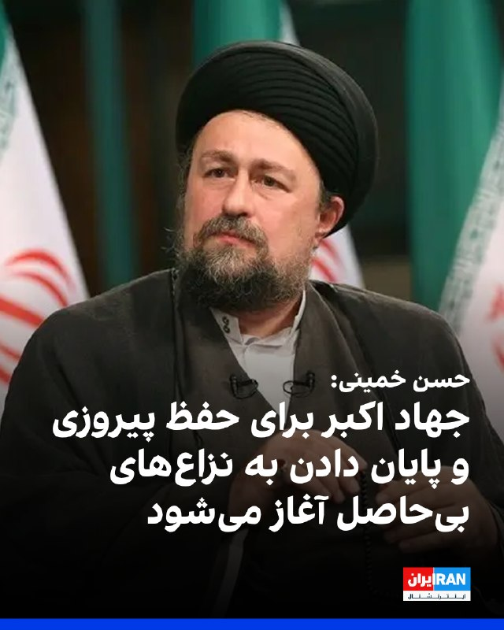

حسن خمینی، نوه روح‌الله خمینی، با اشاره به جنگ اسرائیل و آمریکا علیه جمهوری اسلامی، از آن با عنوان «جهاد اصغر» یاد کرد و گفت «جهاد اکبر» برای حفظ پیروزی و کنار گذاشتن نزاع‌های بی‌حاصل از امروز آغاز می‌شود.

او همچنین گفت جمهوری اسلامی با «تدبیر» از محاصره دریایی عبور کرد و افزود همین اقدام می‌تواند «غول‌های دنیا» را زمین بزند.

این اظهارات در حالی مطرح شد که یادداشت تفاهم میان واشینگتن و تهران، با وجود مخالفت شماری از مقام‌های جمهوری اسلامی از جمله برخی نمایندگان مجلس جمهوری اسلامی، روز یکشنبه ۲۴ خرداد به‌صورت الکترونیکی در اسلام‌آباد امضا شد. قرار است این تفاهم‌نامه روز جمعه نیز با حضور مقام‌های دو طرف در ژنو به‌صورت حضوری امضا شود.
https://iranintl.com/202606177440

## IranIntlTV — post 342830

  <a href="telegram/content/IranIntlTV_342830_1781691775.mp4" target="_blank">🎬 Download video</a>

در پی کشتار معترضان در جریان اعتراضات دی‌ماه، گروهی از زنان و مادران ایرانی در ایالت مریلند آمریکا یک سازمان غیرانتفاعی ایجاد کرده‌اند تا از ایرانیانی که پس از سرکوب‌ها موفق به خروج از کشور شده‌اند حمایت کنند. خدمات این نهاد شامل کمک‌های درمانی، مشاوره و حمایت‌های روانی برای آسیب‌دیدگان است.

گزارش اردوان روزبه، خبرنگار ایران‌اینترنشنال
@iranintltv

## FarsiVOA — post 221004

🔺روته: متحدان اروپایی سهم خود در نیروهای بحران ناتو را افزایش داده‌اند

▪️دبیرکل ناتو، روز چهارشنبه گفت متحدان اروپایی پس از کاهش سهم آمریکا، تعهدات خود را برای تأمین نیروهای آماده در زمان بحران افزایش داده‌اند.

▪️بر اساس گزارش رویترز مارک روته افزود کشورهای اروپایی عضو ناتو برای جبران بخشی از کاهش مشارکت آمریکا، نیروهای بیشتری را در چارچوب «مدل نیروی ناتو» در اختیار این ائتلاف قرار داده‌اند.

▪️این مدل، سازوکاری است که بر اساس آن اعضا مشخص می‌کنند در صورت بروز بحران بزرگ یا حمله نظامی به یک کشور عضو، چه نیروها و قابلیت‌هایی می‌توانند فعال شوند.

▪️آمریکا پیش‌تر به متحدان خود اطلاع داده بود که قصد دارد بخشی از توانایی‌های نظامی متعهد به ناتو در زمان بحران را کاهش دهد.

⬇️ بیشتر بخوانید:
https://ir.voanews.com/a/european-allies-have-increased-pledges-for-nato-crisis-forces-rutte-says/8161824.html

## FarsiVOA — post 221003

🔺ترامپ از بازگشت تحریم‌ نفتی روسیه در آینده نزدیک خبر داد

▪️روزنامه گاردین گزارش داد دونالد ترامپ، رئیس‌جمهوری آمریکا، همزمان با بازگشت موضوع اوکراین به دستور کار اصلی نشست گروه هفت، گفته است واشنگتن می‌تواند به‌زودی تحریم‌ها علیه محموله‌های نفتی روسیه را دوباره اعمال کند.

▪️ترامپ در حاشیه نشست گروه هفت در اویان‌له‌بن فرانسه گفت با بازگشت جریان نفت از مسیر تنگه هرمز، آمریکا در موقعیتی قرار گرفته که بتواند معافیت تحریمی مربوط به نفت روسیه را پایان دهد. او گفت: «به‌زودی می‌توانیم این کار را انجام دهیم، چون نفت حالا در جریان است.»

▪️این معافیت به‌طور موقت و در جریان جنگ آمریکا و جمهوری اسلامی اعمال شده بود تا فشار بر قیمت جهانی نفت کاهش یابد.

⬇️ بیشتر بخوانید:
https://ir.voanews.com/a/ukraine-war-briefing-sanctions-waiver-on-russian-oil-could-end-soon-trump-suggests/8161823.html

## IranianMinds — post 22778

  <a href="telegram/content/IranianMinds_22778_1781691777.mp4" target="_blank">🎬 Download video</a>

دیشب نجم الدین شریعتی برنامه محرم زد زیر گریه و گفت: دلم برای آقا (علی خامنه‌ای) خیلی تنگ شده
بقیه هم همینطوری عر میزدن😂😂😂

@IranianMinds

## BBCPersian — post 284114

🔻آژانس بین‌المللی انرژی: ذخایر نفتی کشورهای سازمان همکاری اقتصادی به کمترین سطح از سال ۱۹۹۰ رسید

آژانس بین‌المللی انرژی اعلام کرده است که ذخایر نفتی کشورهای عضو سازمان همکاری و توسعه اقتصادی به پایین‌ترین سطح از سال ۱۹۹۰ تاکنون رسیده است.

این آژانس می‌گوید به دلیل جنگ، برداشت از ذخایر اضطراری نفت در ماه گذشته میلادی (مه) با سرعت بیشتری انجام شده است.

این نهاد در تازه‌ترین گزارش ماهانه‌اش نوشت که اگر تفاهم آمریکا و ایران حفظ شود، بازار جهانی نفت به‌تدریج پیامدهای بسته شدن تنگه هرمز را پشت سرخواهد گذاشت.

آژانس بین‌المللی انرژی همچنین افزود جنگ در خاورمیانه بزرگ‌ترین اختلال در تاریخ بازار جهانی نفت را به وجود آورده است.

https://bbc.in/4eh9GCQ
@BBBCPersian

## Hranews — post 113668

بوکان؛ علی شکری توسط نیروهای امنیتی بازداشت شد

❗️
❗️
❗️
❗️
❗️– روز سه‌شنبه ۲۶ خردادماه، علی شکری، شهروند اهل بوکان توسط نیروهای امنیتی بازداشت و به یکی از بازداشتگاه های امنیتی ارومیه منتقل شده است.

ادامه مطلب

#علی_شکری

↘️
@hranews_bot تماس ✉️ - @Hranews کانال هرانا 🆑

## alonews — post 128639

  <a href="telegram/content/alonews_128639_1781691777.webm" target="_blank">🎬 Download video</a>

👈 ترامپ اختیارات ویژه‌ای به هگست برای افزایش تولید تسلیحات داد

🔴بر اساس یادداشتی که در اختیار ریانووستی قرار گرفته، دونالد ترامپ، اختیاراتی را به پیت هگست، وزیر جنگ آمریکا واگذار کرده است تا مشکلات موجود در حوزه تولید تسلیحات را برطرف کند

🔴ترامپ تأکید کرده است که استفاده از این سازوکار ضروری است، زیرا آسیب‌پذیری زنجیره‌های تأمین و گلوگاه‌های تولیدی می‌تواند روند تولید مهمات، موشک‌ها و تجهیزات نظامی مورد نیاز برای دفاع کشور را با مشکل مواجه کند.

✅ @AloNews خبر جنگ

---
📅 بروزرسانی: 1405/03/27 13:43
---

## VahidOOnLine — post 245990

  <a href="telegram/content/VahidOOnLine_245990_1781691180.mp4" target="_blank">🎬 Download video</a>

پشتِ توافق احتمالی آمریکا و جمهوری اسلامی، فقط بحث هسته‌ای نیست. مسئله اصلی مسیرهای مالی است، از نفت و دارایی‌های بلوکه‌شده تا صندوق سرمایه‌گذاری ۳۰۰ میلیارد دلاری.
‌🏁 🇬🇧 ManotoTV

🤖 @VahidOOnLine

## VahidOOnLine — post 245989

  <a href="telegram/content/VahidOOnLine_245989_1781691181.mp4" target="_blank">🎬 Download video</a>

بخشی از یک گفت‌وگوی اختصاصی و کمتر دیده‌ شده میان خبرنگار رادیو و تلویزیون ملی ایران در لندن و رئیس اداره اطلاعات و سخنگوی سفارت اتحادجماهیر شوروی.
این مصاحبه در اوج تنش‌های جنگ سرد و پس از اخراج دیپلمات‌های شوروی از بریتانیا انجام شده و دیدگاه رسمی شوروی درباره این بحران را روایت می‌کند.
برای تماشای نسخه کامل این مصاحبه و صدها فیلم آرشیوی نایاب دیگر، کانال یوتیوب Manoto را دنبال کنید.
‌🏁 🇬🇧 ManotoTV

🤖 @VahidOOnLine

## kianmeli1 — post 88039

  <a href="telegram/content/kianmeli1_88039_1781691182.mp4" target="_blank">🎬 Download video</a>

🔴کلینتون در حال تمسخر ترامپ

ترامپ بعد از حمله به ایران گفته که: هیچ‌کس به من نگفته بود که ایرانی‌ها می‌توانند تنگهٔ هرمز را ببندد ٫ تنگه هرمز کجاست.
https://t.me/kianmeli1

## IranIntlTV — post 342829

  <a href="telegram/content/IranIntlTV_342829_1781691183.mp4" target="_blank">🎬 Download video</a>

یک شهروند ساکن مشهد با ارسال ویدیویی به ایران اینترنشنال نشان داد که شامگاه ۲۶ خرداد و در پی توافق میان آمریکا و جمهوری اسلامی، یک جشن حکومتی در منطقه وکیل‌آباد برپا شده است. او گفت: «رهبر قاتل و فرماندهان حکومت کشته شدند و حالا با وجود امتیازدهی فراوان به آمریکا حامیان نظام ادعای پیروزی دارند. اینها نان خود را در خون مردم ایران می‌زنند.»

## IranIntlTV — post 342828

  <a href="telegram/content/IranIntlTV_342828_1781691185.mp4" target="_blank">🎬 Download video</a>

«۲۴ با #فرداد _فرحزاد»؛ دوشنبه تا جمعه ساعت ۲۲:۰۰ تهران

اخبار فوری، گزارش‌ و گفت‌وگوهای عمیق از ایران و جهان

در جریان بمانید!
@iranintltv

## ManotoTV — post 106109

  <a href="telegram/content/ManotoTV_106109_1781691187.mp4" target="_blank">🎬 Download video</a>

پشتِ توافق احتمالی آمریکا و جمهوری اسلامی، فقط بحث هسته‌ای نیست. مسئله اصلی مسیرهای مالی است، از نفت و دارایی‌های بلوکه‌شده تا صندوق سرمایه‌گذاری ۳۰۰ میلیارد دلاری.

## ManotoTV — post 106108

  <a href="telegram/content/ManotoTV_106108_1781691187.mp4" target="_blank">🎬 Download video</a>

بخشی از یک گفت‌وگوی اختصاصی و کمتر دیده‌ شده میان خبرنگار رادیو و تلویزیون ملی ایران در لندن و رئیس اداره اطلاعات و سخنگوی سفارت اتحادجماهیر شوروی.
این مصاحبه در اوج تنش‌های جنگ سرد و پس از اخراج دیپلمات‌های شوروی از بریتانیا انجام شده و دیدگاه رسمی شوروی درباره این بحران را روایت می‌کند.
برای تماشای نسخه کامل این مصاحبه و صدها فیلم آرشیوی نایاب دیگر، کانال یوتیوب Manoto را دنبال کنید.

## Hranews — post 113667

جرائم مواد مخدر؛ یک زندانی در زندان زابل اعدام شد

❗️
❗️
❗️
❗️
❗️– سحرگاه امروز چهارشنبه ۲۷ خردادماه، حکم یک زندانی که پیشتر از بابت اتهامات مرتبط با جرائم مواد مخدر به #اعدام محکوم شده بود، در زندان زابل اجرا شد.

ادامه مطلب

#عارف_براهویی (#عارف_عیدوزهی)

↘️
@hranews_bot تماس ✉️ - @Hranews کانال هرانا 🆑

---
📅 بروزرسانی: 1405/03/27 13:33
---

## mwarmonitor — post 11057

📝 سوالی دارید دایرکت جواب میدم

## Persian_Trend_Official — post 17333

  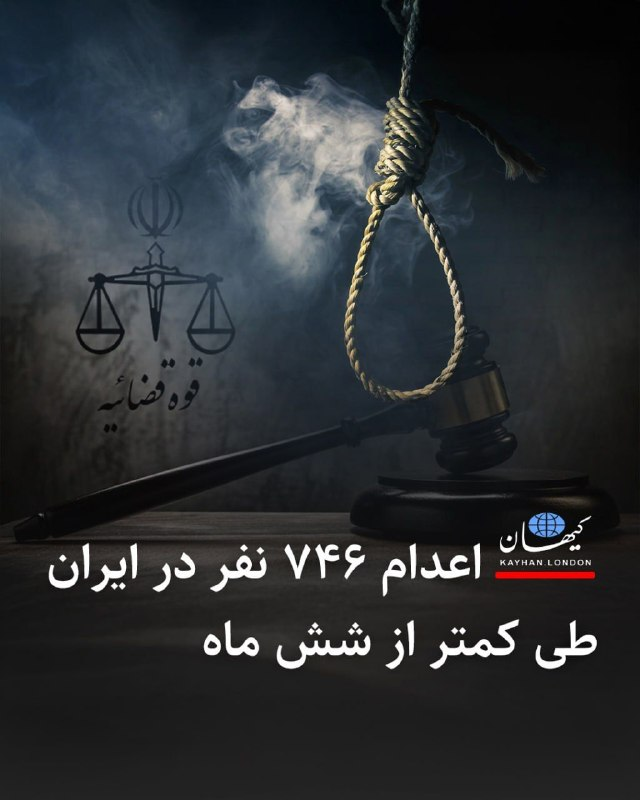

‌‌‏ ‏
‏ ‏ اعدام ۷۴۶ نفر در ایران طی کمتر از شش ماه

بنیاد عبدالرحمن برومند اعلام کرده از آغاز سال ۲۰۲۶ میلادی (۱۱ دی ۱۴۰۴) تا کنون جمهوری اسلامی ۷۴۶ زندانی را به اتهامات سیاسی و غیرسیاسی اعدام کرده است که ۵۲ مورد این اعدام‌ها طی دو هفته گذشته صورت گرفته است.

این بنیاد حقوق بشری تأکید کرده جمهوری اسلامی در سایه جنگ و در واکنش به اعتراضات دی۴۰۴، اجرای احکام اعدام زندانیان سیاسی را شتاب بخشیده به‌طوریکه از ابتدای سال جاری میلادی تاکنون، دست‌کم ۴۵ معترض و زندانی سیاسی به اتهام جرایم علیه امنیت ملی، از جمله جاسوسی، اعدام شده‌اند.

این گزارش تأکید کرده مبنای صدور بسیاری از این احکام اعدام، «اعترافات اجباری» گرفته شده تحت فشارهای جسمی و روحی از زندانیان بوده است؛ امری که نقض آشکار حقوق اولیه دادرسی عادلانه و مصونیت‌های بین‌المللی در برابر شکنجه به شمار می‌رود.

🌎 گزارش از کیهان لندن

👺Phantom 
📖
📖
📖

📌 @persian_trend_official
پرشین ترند | متفاوت‌ترین کانال نظامی

## RadioFarda — post 158422

🔸 در سایت احیا و تکثیر مرال در پناهگاه حیات‌وحش لوندویل آستارا، نخستین گوساله مرال سال ۱۴۰۵ متولد شد. تصاویری که به‌تازگی از این تولد منتشر شده، این نوزاد را در روزهای ابتدایی زندگی‌اش نشان می‌دهد.

🔸 رئیس اداره حفاظت محیط زیست آستارا با اعلام این خبر، تولد این گوساله را اتفاقی ارزشمند برای برنامه‌های حفاظتی و تکثیر مرال در منطقه عنوان کرد.

🔸 مرال که با نام گوزن قرمز ایرانی نیز شناخته می‌شود، بزرگ‌ترین گونه گوزن بومی کشور به شمار می‌آید. این حیوان عمدتاً در جنگل‌های هیرکانی شمال ایران زیست می‌کند، اما فشارهایی مانند نابودی بخشی از زیستگاه‌های طبیعی و شکار غیرمجاز، جمعیت آن را در برخی مناطق کاهش داده است.

🔸 پناهگاه حیات‌وحش لوندویل یکی از مراکز مهم نگهداری و تکثیر مرال در کشور محسوب می‌شود. این مجموعه در نزدیکی آستارا قرار دارد و با اجرای برنامه‌های حفاظتی، در تلاش است زمینه افزایش جمعیت این گونه ارزشمند و حفظ آن برای نسل‌های آینده را فراهم کند

@RadioFarda

## Dirty_Kids — post 392375

  <a href="telegram/content/Dirty_Kids_392375_1781690586.mp4" target="_blank">🎬 Download video</a>

تراپی 🤣🤣🤣🤣🤣
کسخلا رو ببینید لذت ببرید

@Dirty_Kids 👻

## Dirty_Kids — post 392374

  <a href="telegram/content/Dirty_Kids_392374_1781690587.mp4" target="_blank">🎬 Download video</a>

داداش اون گفت اونجا تتو کن تو چرا کردی

چرا پارتنرش پستونک داره😂کاش کات میکرد ولی اینو نمیزد

@Dirty_Kids 👻

## Dirty_Kids — post 392373

⚡️ جام جهانی شروع شده و میدون مال توئه! 
🌟 این #جام_جهانی رو فقط باید توی #بت فیدو پیش‌بینی کنی 
💰 با ۵۰ میلیون تومان شرط روزانه ← ۴ میلیون تومان اعتبار شرط‌بندی رایگان 
📊 با ۱۰۰ میلیون تومان شرط روزانه ← ۸ میلیون تومان اعتبار شرط‌بندی رایگان میدونستی با انتخاب…

## Dirty_Kids — post 392372

  <a href="telegram/content/Dirty_Kids_392372_1781690589.webm" target="_blank">🎬 Download video</a>

⚡️ جام جهانی شروع شده و میدون مال توئه!

🌟 این #جام_جهانی رو فقط باید توی #بت فیدو پیش‌بینی کنی

💰 با ۵۰ میلیون تومان شرط روزانه ← ۴ میلیون تومان اعتبار شرط‌بندی رایگان

📊 با ۱۰۰ میلیون تومان شرط روزانه ← ۸ میلیون تومان اعتبار شرط‌بندی رایگان

میدونستی با انتخاب برد پرتغال مقابل کنگو در نیمع اول با ده میلیون به راحتی ۱۶ میلیون تومن برنده میشی؟!
🇵🇹

💸 هرچی بزرگ‌تر بازی کنی، جایزت بزرگ‌تره!

🥅همین حالا پیش بینیتو ثبت کن
💖
https://fido874vt.click
https://fido874vt.click

👆
👆
👆
👆
👆
(ورود با وی-پی-ان غیر اروپایی)
❌
R27

📲کانال تلگرام 
👇
https://t.me/+dySI_QFj0T0xZGVk

## manototv — post 106109

  <a href="telegram/content/manototv_106109_1781690589.mp4" target="_blank">🎬 Download video</a>

پشتِ توافق احتمالی آمریکا و جمهوری اسلامی، فقط بحث هسته‌ای نیست. مسئله اصلی مسیرهای مالی است، از نفت و دارایی‌های بلوکه‌شده تا صندوق سرمایه‌گذاری ۳۰۰ میلیارد دلاری.

## manototv — post 106108

  <a href="telegram/content/manototv_106108_1781690590.mp4" target="_blank">🎬 Download video</a>

بخشی از یک گفت‌وگوی اختصاصی و کمتر دیده‌ شده میان خبرنگار رادیو و تلویزیون ملی ایران در لندن و رئیس اداره اطلاعات و سخنگوی سفارت اتحادجماهیر شوروی.
این مصاحبه در اوج تنش‌های جنگ سرد و پس از اخراج دیپلمات‌های شوروی از بریتانیا انجام شده و دیدگاه رسمی شوروی درباره این بحران را روایت می‌کند.
برای تماشای نسخه کامل این مصاحبه و صدها فیلم آرشیوی نایاب دیگر، کانال یوتیوب Manoto را دنبال کنید.

## alonews — post 128638

  <a href="telegram/content/alonews_128638_1781690591.webm" target="_blank">🎬 Download video</a>

🔴فوری / حملهِ پهپادی حزب‌الله به اسرائیل

✅ @AloNews خبر جنگ

## alonews — post 128637

  <a href="telegram/content/alonews_128637_1781690592.mp4" target="_blank">🎬 Download video</a>

👈دیشب نجم‌الدین شریعتی وسط ویژه برنامه شبکه 3 برای ماه محرم، یهو زد زیر گریه و گفت ؛ من امشب دلم واسه آقا (علی خامنه‌ای) تنگ شده.

✅ @AloNews خبر جنگ

---
📅 بروزرسانی: 1405/03/27 13:22
---

## VahidOOnLine — post 245988

  

در آستانه دیدار مقام‌های آمریکا و جمهوری اسلامی برای امضای رسمی یادداشت تفاهم در سوئیس، خیابان‌ها و بزرگراه‌های اسلام‌آباد با بیلبوردها و نمایشگرهای دیجیتالی پوشیده شده که پیام‌هایی در حمایت از این توافق را به نمایش می‌گذارند.

این کارزار تبلیغاتی که از سوی اداره شهرداری کلان‌شهر اسلام‌آباد اجرا شده، نمایشگرهای عمومی و بیلبوردهای دیجیتال پایتخت پاکستان را به محلی برای انتشار پیام‌هایی درباره صلح، همبستگی و همکاری بین‌المللی تبدیل کرده است.
در این بیلبوردها شهباز شریف، نخست‌وزیر پاکستان، و عاصم منیر، رییس ستاد نیروهای دفاعی پاکستان دیده می‌شوند.

از این تفاهم با عنوان «توافق صلح» یاد می‌شود؛ توافقی که قرار است به‌طور رسمی در ژنو امضا شود و پاکستان خود را میزبان و تسهیل‌کننده اصلی روند دستیابی به آن معرفی می‌کند.

یکی از پیام‌های منتشرشده بر روی این نمایشگرها می‌گوید: «از اسلام‌آباد به جهان؛ پیامی از صلح، همبستگی و امید.»

‌🏁 🇬🇧 IranintlTV

🤖 @VahidOOnLine

## pm_afshaa — post 94237

  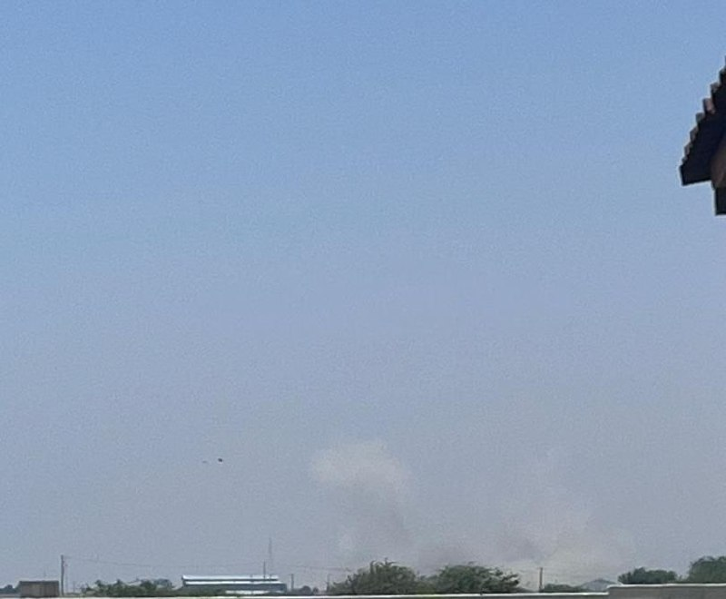

سیریک

💧 Rainbet.com the #1 Non-KYC Crypto Casino & Sportsbook @rainbetcom

😁 @Pm_Afshaa

## pm_afshaa — post 94236

گزارشات مردمی از انفجار در سیریک

💧 Rainbet.com the #1 Non-KYC Crypto Casino & Sportsbook @rainbetcom

😁 @Pm_Afshaa

## pm_afshaa — post 94235

🔴بلومبرگ به نقل از یک منبع آگاه: وزارت خزانه‌داری آمریکا بلافاصله پس از امضای توافق، معافیت‌هایی برای نفت و پتروشیمی ایران صادر خواهد کرد

💧 Rainbet.com the #1 Non-KYC Crypto Casino & Sportsbook @rainbetcom

😁 @Pm_Afshaa

## IranIntlTV — post 342827

  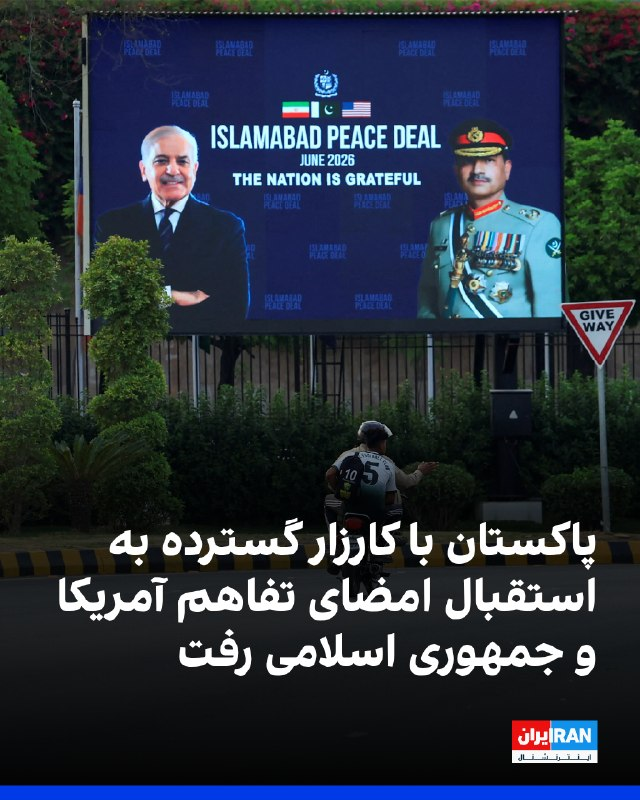

در آستانه دیدار مقام‌های آمریکا و جمهوری اسلامی برای امضای رسمی یادداشت تفاهم در سوئیس، خیابان‌ها و بزرگراه‌های اسلام‌آباد با بیلبوردها و نمایشگرهای دیجیتالی پوشیده شده که پیام‌هایی در حمایت از این توافق را به نمایش می‌گذارند.

این کارزار تبلیغاتی که از سوی اداره شهرداری کلان‌شهر اسلام‌آباد اجرا شده، نمایشگرهای عمومی و بیلبوردهای دیجیتال پایتخت پاکستان را به محلی برای انتشار پیام‌هایی درباره صلح، همبستگی و همکاری بین‌المللی تبدیل کرده است.
در این بیلبوردها شهباز شریف، نخست‌وزیر پاکستان، و عاصم منیر، رییس ستاد نیروهای دفاعی پاکستان دیده می‌شوند.

از این تفاهم با عنوان «توافق صلح» یاد می‌شود؛ توافقی که قرار است به‌طور رسمی در ژنو امضا شود و پاکستان خود را میزبان و تسهیل‌کننده اصلی روند دستیابی به آن معرفی می‌کند.

یکی از پیام‌های منتشرشده بر روی این نمایشگرها می‌گوید: «از اسلام‌آباد به جهان؛ پیامی از صلح، همبستگی و امید.»

https://iranintl.com/202606177182

## FarsiVOA — post 221002

🔺اسموتریچ: اسرائیل حضور خود در جنوب لبنان را عمیق‌تر می‌کند

▪️وزیر دارایی اسرائیل و وزیر در وزارت دفاع این کشور، گفته است اسرائیل از جنوب لبنان عقب‌نشینی نخواهد کرد و حضور نظامی خود را در آنجا گسترش می‌دهد.

▪️او که از چهره‌های راست افراطی در ائتلاف بنیامین نتانیاهو است، گفت اسرائیل «در جنوب لبنان باقی خواهد ماند» و به گفته او، حضور خود را در آنجا «عمیق‌تر» خواهد کرد.

▪️او افزود نیروهای اسرائیلی برای مدتی طولانی در عمق «هشت، ۹ یا ۱۰ کیلومتری» جنوب لبنان خواهند ماند و دستور به واحدها ادامه «رفع هرگونه تهدید» است.

▪️وزیر دارایی اسرائیل همچنین گفت این کشور در لبنان «آزادی عمل کامل» دارد و تا زمانی که حزب‌الله خلع سلاح نشود، عقب‌نشینی در کار نخواهد بود.

⬇️ بیشتر بخوانید:
https://ir.voanews.com/a/finance-minister-smotrich-says-israel-to-deepen-its-presence-in-south-lebanon/8161822.html

## Persian_Trend_Official — post 17332

  <a href="telegram/content/Persian_Trend_Official_17332_1781689980.mp4" target="_blank">🎬 Download video</a>

ویدیویی جالب از تلاش بالگرد کاموف-52 روسی برای سرنگونی پهپاد انتحاری اوکراینی برفراز مسکو

خدمه بالگرد تلاش میکنند پهپاد به ناحیه ای کم تراکم برسد تا انفجار و لاشه پهپاد تلفات انسانی نگیرد.

📝 Amir

📌 @persian_trend_official
پرشین ترند | متفاوت‌ترین کانال نظامی

## IranianMinds — post 22777

  <a href="telegram/content/IranianMinds_22777_1781689980.mp4" target="_blank">🎬 Download video</a>

🔴 کارشناس صداوسیما :

خدایا ما به کی دردمونو بگیم ؟
ترامپ صدبار به رهبرمون گفته همجنسگرا. تهمت های زشت و جنسی بهش میزنه. تهدید به تـرورش میکنه. ما رو به لجن کشیده. همش تحقیرمون میکنه. اونوقت ما خفه خون گرفتیم داریم میریم توافق کنیم .

@IranianMinds

## IranianMinds — post 22776

🔴 ترامپ در دیدار با رهبران گروه هفت :

رئیس اینجا منما !

@IranianMinds

## Dirty_Kids — post 392371

  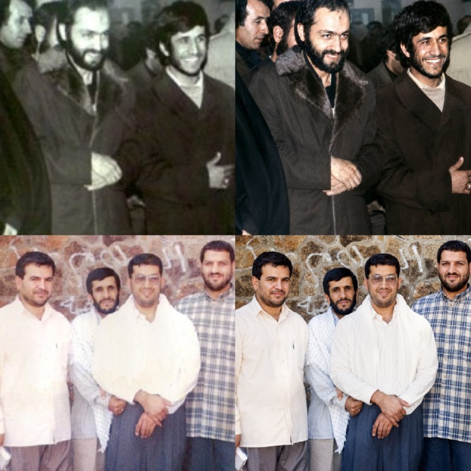

🔴 ترند‌ترین و محبو‌ترین پرامپت هوش مصنوعی تو 2 سال اخیر مربوط به این پرامپته؛

بااین پرامپت میتونی هرعکس قدیمی که از خودت، دوستت یا خانوادت داری و اگه کیفیتش خیلی پایین و رو مخه رو به حداکثر کیفیت برسونی:

- برای اکثر هوش‌های مصنوعی (ChatGPT، Gemini، Midjourney، Flux، Ideogram، Leonardo) این پرامپت نتیجه خیلی خوبی برای بازسازی عکس‌های قدیمی میده، فقط کافیه عکس مدنظرتو همراه با پرامپت زیر براش بفرستی :

Restore and enhance this old low-quality photograph. Recover lost details, remove blur, reduce noise, repair scratches and damage, improve facial features, sharpen eyes, restore realistic skin texture, correct colors naturally, enhance lighting and contrast, preserve original identity and authenticity, professional photo restoration, ultra-realistic, high-definition, true-to-life, 4K resolution, HDR quality, maximum detail.

‌
برای عکس‌های خیلی قدیمی و سیاه‌وسفید :

Professional restoration of an old historical photograph. Remove scratches, dust, stains and damage. Recover missing details, sharpen faces, improve focus, restore natural textures, realistic colorization, preserve historical accuracy, cinematic quality, ultra realistic, 4K HDR, museum-grade restoration.


‌
اگه فقط میخوای فقط کیفیت بالا بره ولی چهره تغییر نکنه :
Do not alter facial identity, preserve original appearance exactly.

+این پست رو یه گوشه ذخیره کن یه روزی حتماً بدرت میخوره.

@Dirty_Kids 👻

## alonews — post 128636

  <a href="telegram/content/alonews_128636_1781689983.mp4" target="_blank">🎬 Download video</a>

👈کارنی، نخست‌وزیر کانادا : من جزو معدود افرادی هستم که متن تفاهم‌نامه آمریکا و ایران رو دیدم

✅ @AloNews خبر جنگ

## alonews — post 128635

  <a href="telegram/content/alonews_128635_1781689985.mp4" target="_blank">🎬 Download video</a>

👈تلاش بالگرد کاموف52 روسی برای رهگیری پهپاد انتحاری اوکراینی بر فراز مسکو طی حمله صبح امروز

✅ @AloNews خبر جنگ

---
📅 بروزرسانی: 1405/03/27 13:12
---

## VahidOOnLine — post 245987

  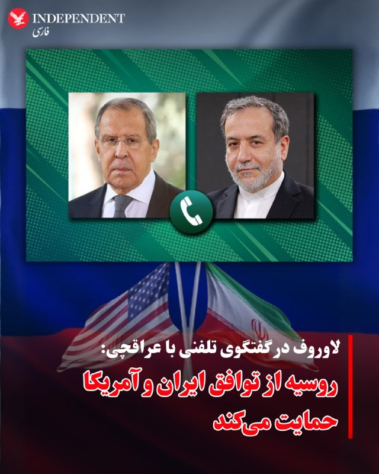

♦️کانال تلگرامی عباس عراقچی، وزیر امور خارجه جمهوری اسلامی، روز چهارشنبه ۲۷ خردادماه از حمایت سرگئی لاوروف، وزیر امور خارجه روسیه از تفاهم پایان جنگ تهران و واشنگتن خبر داد.

سرگئی لاوروف یکی از منتقدان جدی توافق هسته‌ای جمهوری اسلامی و گروه ۵+۱ (برجام) به‌شمار می‌رفت.

کانال تلگرامی عباس عراقچی با اعلام این خبر نوشت:‌‌ «وزیر امور خارجه روسیه نیز ضمن استقبال از نهایی شدن متن یادداشت تفاهم، بر حمایت کامل کشورش از اجرای مفاد آن تصریح کرد.
وزرای امور خارجه دو کشور با اشاره به لزوم حمایت جامعه جهانی و شورای امنیت سازمان ملل متحد از این تفاهم، همچنین بر ضرورت تداوم همکاری های دیپلماتیک بین کشورهای منطقه با هدف تثبیت صلح و ثبات تاکید کردند.»

روسیه در ماه‌های گذشته و پیش از آغاز دور اخیر جنگ آمریکا و اسرائیل و پس از آن، بارها آمادگی خود را برای دریافت ذخایر اورانیوم غنی‌شده ایران اعلام کرده است.
‌🇸🇦 Indypersian

🤖 @VahidOOnLine

## IranIntlTV — post 342826

  <a href="telegram/content/IranIntlTV_342826_1781689378.mp4" target="_blank">🎬 Download video</a>

سرخط خبرهای چهارشنبه ۲۷ خرداد
@iranintltv

## DW_Farsi — post 126085

  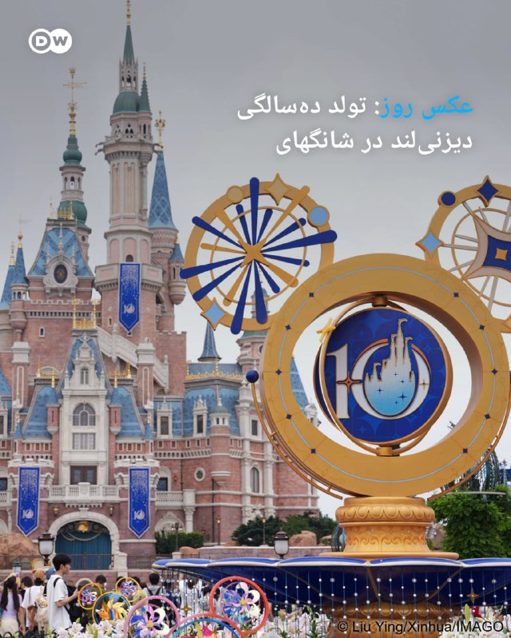

📸 عکس روز: تولد ده‌سالگی دیزنی‌لند در شانگهای

سالگرد افتتاح دیزنی‌لند در شهر شانگهای چین فرارسیده و این تفریحگاه به مناسبت تولد ده سالگی‌اش، با امکانات و سرگرمی‌هایی ویژه مجهز و تزیین شده است. در حال حاضر چندین طرح توسعه در دیزنی‌لند شانگهای در دست انجام است. این تفریحگاه که فرهنگ چینی در آن به شکل پررنگی دیده می‌شود، از پربازدیدترین پارک‌های سرگرمی در جهان به‌شمار می‌رود.

@dw_farsi

## Persian_Trend_Official — post 17331

  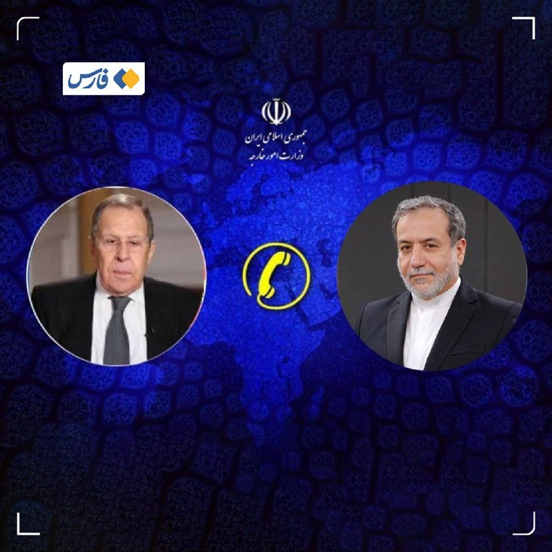

عراقچی دربارهٔ تفاهم اسلام‌آباد با لاوروف گفت‌گو کرد.

وزیر خارجهٔ روسیه در یک تماس تلفنی با همتای ایرانی در خصوص یادداشت تفاهم اسلام‌آباد و برخی موضوعات منطقه‌ای و دوجانبه رایزنی کرد.

صداوسیما: عراقچی در این گفت‌وگو ضمن تشریح جزئیات مربوط به تفاهم‌نامه، بر مسئولیت آمریکا در قبال حسن اجرای بندهای آن و ضرورت توقف کامل تجاوزات رژیم صهیونیستی علیه لبنان تأکید کرد. لاوروف هم ضمن استقبال از نهایی‌شدن متن یادداشت تفاهم، بر حمایت کامل کشورش از اجرای مفاد آن تأکید کرد.

وزرای خارجهٔ ایران و روسیه با اشاره به لزوم حمایت جامعهٔ جهانی و شورای امنیت از این تفاهم، بر ضرورت تداوم همکاری‌های دیپلماتیک بین کشورهای منطقه با هدف تثبیت صلح و ثبات تأکید کردند.

📝 Amir

📌 @persian_trend_official
پرشین ترند | متفاوت‌ترین کانال نظامی

## RadioFarda — post 158421

  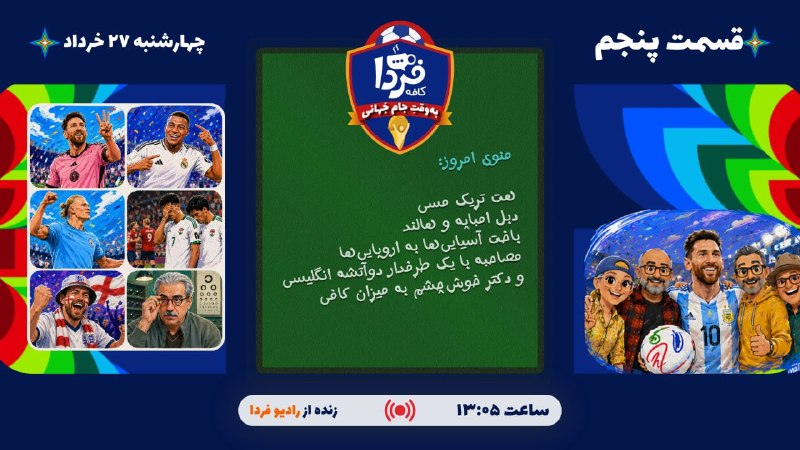

📷 Photo

## BBCPersian — post 284113

🔻حمله اسرائیل به نبطیه در جنوب لبنان

پس از حملات هوایی امروز صبح اسرائیل، ستون‌های دود در آسمان شهر نبطیه دیده می‌شود.

از روز دوشنبه اگرچه حملات اسرائیل به جنوب لبنان همچنان ادامه داشت اما از شدت آن کاسته شده است.

کاهش تنش‌ها باعث شده برخی از ساکنان جنوب لبنان به شهرها و روستاهای خود بازگردند و وضعیت خانه‌هایشان را بررسی کنند، اما ارتش لبنان از مردم خواسته بازگشت خود را به تعویق بیندازند و همچنان از «خطر حملات احتمالی اسرائیل» ابراز نگرانی کرده‌اند.

حزب‌الله تاکنون از روز سه‌شنبه بیانیه‌ای درباره حملات جدید منتشر نکرده است. قرار است نعیم قاسم، رهبر این گروه، روز چهارشنبه سخنرانی تلویزیونی داشته باشد.

به گفته قرارگاه مرکزی خاتم‌الانبیا، اسرائیل در دو روز گذشته دست‌کم ۸۴ بار آتش‌بس را نقض کرده است.
https://bbc.in/4xAnks0
@BBCPersian

## alonews — post 128634

  <a href="telegram/content/alonews_128634_1781689381.webm" target="_blank">🎬 Download video</a>

👈مارک روته دبیرکل ناتو: از توافق حاصل شده توسط رئیس جمهور ترامپ با ایران استقبال می‌کنیم

✅ @AloNews خبر جنگ

---
📅 بروزرسانی: 1405/03/27 13:02
---

## VahidOOnLine — post 245986

  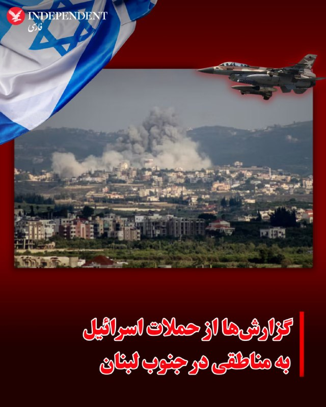

♦️خبرگزاری فرانسه روز چهارشنبه ۲۷ خرداد از حملات اسرائیل به منطقه نبطیه در جنوب لبنان خبر داد.

 رسانه‌های محلی لبنان و شبکه‌ الجزیره پیش از این از حملات توپخانه‌ای و گلوله‌باران چند شهرک و روستا در نبطیه خبر داده بودند.
الجزیره به نقل از خبرنگار خود گزارش کرد که حزب‌الله لبنان پس از این حملات دست‌کم ۱۰ راکت به سوی اسرائیل شلیک کرد.

حملات اسرائیل به جنوب لبنان در حالی ادامه دارد که قرارگاه مرکزی خاتم‌الانبیاء شب گذشته به این کشور هشدار داده بود که در صورت ادامه حملات، با پاسخ سخت مواجه خواهد شد.
‌🇸🇦 Indypersian

🤖 @VahidOOnLine

## WithYashar — post 15138

تسنیم: متن توافقنامه به صورت کامل در روز جمعه و پس از امضا منتشر خواهد شد
یک منبع نزدیک به تیم مذاکره‌کننده گفت: تفاهمنامه همانطور که پیشتر اعلام شده ۱۴ بند است و موضوعات مربوط به ۱۴ بند نیز بارها در رسانه‌ها مطرح شده، اما جزییاتی که در بلومبرگ‌ درباره هر بندی آمده است در موارد قابل توجهی ناقص است.
@withyashar

## IranIntlTV — post 342825

  <a href="telegram/content/IranIntlTV_342825_1781688775.mp4" target="_blank">🎬 Download video</a>

پیام‌های رسیده به ایران‌اینترنشنال از تشدید مشکلات اقتصادی و معیشتی، تعطیلی کسب‌وکارها و افزایش هزینه‌های تولید حکایت دارد. یکی از کشاورزان با اشاره به رشد چندبرابری هزینه‌های کشاورزی گفته است برای تامین معاش ناچار به فروش نخلستان خود شده است.

جزییات بیشتر با لیلا سعادتی، عضو تحریریه ایران‌اینترنشنال
@iranintltv

## IranIntlTV — post 342824

  <a href="telegram/content/IranIntlTV_342824_1781688776.mp4" target="_blank">🎬 Download video</a>

🔻تیم ملی فوتبال نروژ در نخستین دیدار خود در جام جهانی ۲۰۲۶ با نتیجه ۴ بر ۱ عراق را شکست داد. هواداران نروژ نیز در جریان این مسابقه در ورزشگاه بوستون با اجرای شیوه‌ای متفاوت از تشویق، توجه بسیاری را به خود جلب کردند.

🔹هواداران نروژی روی سکوها با تقلید از حرکت پارو زدن وایکینگ‌ها، تیم ملی کشورشان را تشویق کردند؛ حرکتی نمادین که به فرهنگ و تاریخ اسکاندیناوی اشاره دارد و فضای ویژه‌ای در ورزشگاه ایجاد کرد.

@iranintltvsport

## FarsiVOA — post 221001

  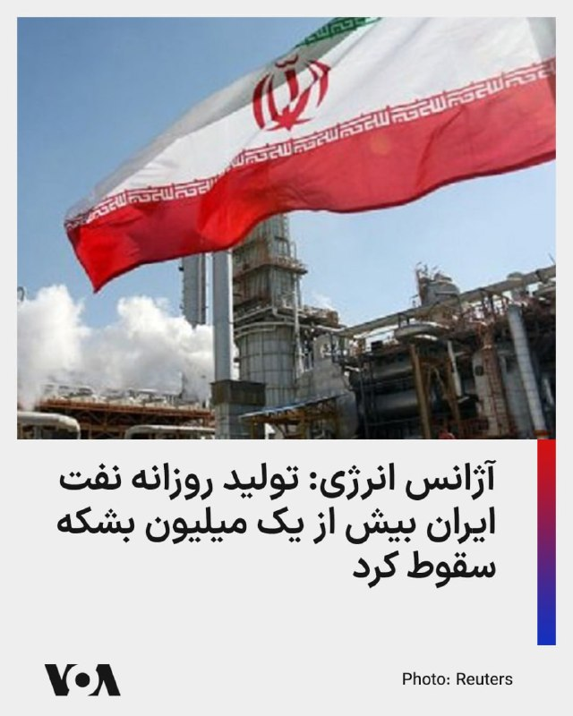

آژانس بین‌المللی انرژی می‌گوید تولید روزانه نفت ایران در ماه گذشته بیش از یک میلیون بشکه سقوط کرده است.

بر اساس این گزارش، تولید روزانه نفت ایران از ۳ میلیون و ۳۶۰ هزار بشکه در ماه آوریل به ۲.۳ میلیون بشکه در ماه مه کاهش یافته است.

ایالات متحده از نیمه آوریل محاصره دریایی جمهوری اسلامی را آغاز کرد و صادرات نفت ایران کلاً قطع شد. طی روزهای گذشته با لغو محاصره دریایی، دوباره ایران صادرات نفت را آغاز کرده است.
@FarsiVOA

## Hranews — post 113666

  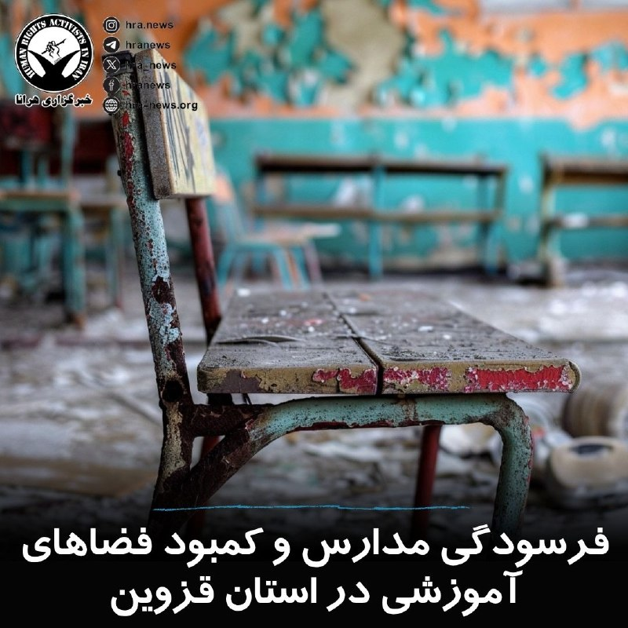

مدیرکل نوسازی مدارس قزوین گفت: این استان دارای ۱٬۶۷۰ فضای آموزشی است که از این میزان، ۵۱٪ مستحکم، ۳۰٪ نیازمند تخریب و بازسازی و ۱۹٪ نیازمند مقاوم‌سازی و بهسازی هستند. مجتبی پورعباسی همچنین اظهار کرد: ۲۱ مدرسه تخریبی، ۵۲ مدرسه نیمه‌تمام و ۳۳ مدرسه مرتبط با کمبود سرانه آموزشی در قالب طرح توسعه عدالت آموزشی استان در حال رسیدگی هستند.

به گفته وی، در برخی مناطق استان قزوین سرانه آموزشی پایین‌تر از میانگین کشوری است و در ناحیه شهری مهرگان نیز این شاخص به حدود نصف میانگین کشور رسیده است. پورعباسی افزود: برای رسیدن به سطح استاندارد، احداث حدود ۲۰ مدرسه جدید در این منطقه ضرورت دارد.

#کمبود_مدرسه #فرسودگی_مدارس

↘️
@hranews_bot تماس ✉️ - @Hranews کانال هرانا 🆑

## alonews — post 128633

  <a href="telegram/content/alonews_128633_1781688778.webm" target="_blank">🎬 Download video</a>

👈یک مقام آمریکایی به بلومبرگ گفت:
«ایران از مزایای توافق بهره‌مند نخواهد شد مگر اینکه به تعهدات خود عمل کند.

🔴تعهدات ایران شامل نداشتن سلاح‌های هسته‌ای، خنثی‌سازی مواد غنی‌شده و تضمین آزادی ناوبری در تنگه هرمز است»

✅ @AloNews خبر جنگ

## alonews — post 128632

  <a href="telegram/content/alonews_128632_1781688779.webm" target="_blank">🎬 Download video</a>

👈صدای شنیده شده در سیریک مربوط به خنثی سازی مهمات جنگی بود

✅ @AloNews خبر جنگ

---
📅 بروزرسانی: 1405/03/27 12:53
---

## WithYashar — post 15137

  

خودرو پورشه سردار آزمون در کرمان توقیف شد

به گزارش تابناک به نقل از ایسنا، سرهنگ اکبر نجفی ۲۶ در تشریح این خبر گفت: خودروی مذکور که به دلیل تخلفات قانونی و برابر با احکام صادره در لیست توقیفی‌های مصادره اموال سردار آزمون قرار داشت، توسط گشت‌های محسوس و نامحسوس یگان امداد شناسایی و پس از طی مراحل قانونی، به پارکینگ منتقل شد.
@withyashar

## Persian_Trend_Official — post 17330

🇺🇸 نیروهای سنتکام پهپادهای که پس از اعلام توافق توسط سپاه به سوی کشتی های تجاری و نظامی شلیک شدند را کنهدم کردند

📰
📺به گزارش ان بی سی و جروزالم حتی پس از امضای تفاهم‌نامه میان تهران و واشنگتن، نیروی قدس سپاه پاسداران چندین پهپاد تهاجمی یک‌طرفه به سمت کشتی‌های تجاری در تنگه هرمز شلیک کرد. نیروهای آمریکایی تمامی آن‌ها را سرنگون کردند و CENTCOM تأیید کرد که تردد دریایی در تنگه بدون اختلال ادامه دارد.

این عملیات عمداً در سکوت خبری انجام شد تا نه بازار انرژی دچار تلاطم شود، نه مسیر مذاکرات مسدود شود

توافق روی کاغذ یک چیز است؛ میدان چیز دیگری. این اقدام سپاه — در فاصله‌ای کوتاه پس از امضای تفاهم‌نامه — یک پیام دوگانه است؛ از یک سو نشان می‌دهد بخش‌هایی از سپاه پاسداران مستقل از مسیر دیپلماتیک عمل می‌کنند، و از سوی دیگر آمریکا با سرنگون کردن پهپادها در سکوت خبری، اراده خود برای حفظ آرامش در مسیر مذاکرات را نشان داده است.

👺Phantom
📌 @persian_trend_official
پرشین ترند | متفاوت‌ترین کانال نظامی

## Persian_Trend_Official — post 17329

بلومبرگ: یادداشت تفاهم پیشنهادی ایالات متحده و ایران، پایان فوری و دائمی جنگ در تمام جبهه‌ها، از جمله لبنان، را ترسیم می‌کند و هر دو طرف متعهد می‌شوند که از اقدامات خصمانه خودداری کنند، به حاکمیت یکدیگر احترام بگذارند و ظرف 60 روز برای رسیدن به یک توافق نهایی…

## BBCPersian — post 284112

  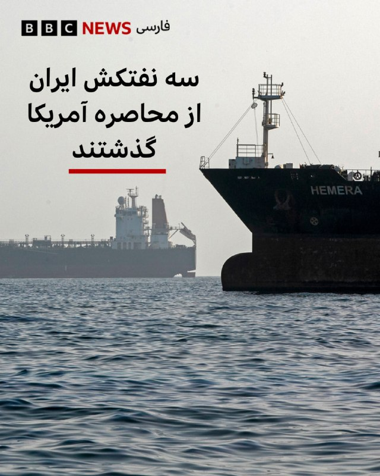

🔻بر اساس وبسایت‌های رهگیری دریایی سه نفتکش ایران برای نخستین بار در دو ماه گذشته از محاصره دریایی آمریکا عبور کرده‌اند.

راستی‌آزمایی بی‌بی‌سی نشان می‌دهد که این نفتکش‌های تحت تحریم متعلق به شرکت ملی نفتکش ایران، با بار کامل از خط محاصره گذشته و وارد دریای عرب شده‌اند.

سامانه‌های اعلام موقعیت این نفتکش‌ها روشن است اما مقصدی را مخابره نمی‌کنند.

📸GettyImages
https://bbc.in/4go6Ltc
@BBCPersian

## alonews — post 128631

  <a href="telegram/content/alonews_128631_1781688186.webm" target="_blank">🎬 Download video</a>

👈خبرگزاری تسنیم : متن تفاهم‌نامه بعد از امضای روز جمعه منتشر میشه

✅ @AloNews خبر جنگ

## alonews — post 128630

  <a href="telegram/content/alonews_128630_1781688186.webm" target="_blank">🎬 Download video</a>

👈همزمان با کاهش قیمت دلار ، مدیرعامل ایران خودرو درخواست افزایش قیمت خودر ها رو ارائه داد!

✅ @AloNews خبر جنگ

## alonews — post 128629

  <a href="telegram/content/alonews_128629_1781688186.webm" target="_blank">🎬 Download video</a>

👈 شاخص کل بورس در پایان معاملات امروز با رشد ۵۱ هزار واحدی به ۵ میلیون و ۱۵۱ هزار واحد رسید

✅ @AloNews خبر جنگ

---
📅 بروزرسانی: 1405/03/27 12:43
---

## VahidOOnLine — post 245985

  

بلومبرگ گزارش داد بر اساس پیش‌نویس یادداشت تفاهم میان آمریکا و جمهوری اسلامی، وزارت خزانه‌داری آمریکا معافیت‌هایی برای صادرات نفت خام و محصولات پتروشیمی ایران صادر خواهد کرد. بر پایه این سند، تهران در چارچوب یک توافق موقت با واشینگتن اجازه خواهد یافت بلافاصله صادرات نفت خود را از سر بگیرد و پس از آغاز مذاکرات برای دستیابی به یک توافق دائمی، به یک برنامه توسعه اقتصادی ۳۰۰ میلیارد دلاری دسترسی پیدا کند.

یک منبع آگاه به بلومبرگ گفت آمریکا متن این توافق موقت را در جریان نشست گروه هفت در فرانسه در اختیار کشورهای متحد خود قرار داده است، اما تاکنون هیچ‌یک از دو طرف به‌طور رسمی این سند را منتشر نکرده‌اند.

فرد دیگری که از محتوای این پیش‌نویس اطلاع دارد و نخواست نامش فاش شود، گفت جزییات فنی توافق همچنان در حال بررسی است و به همین دلیل ممکن است متن نهایی پیش از امضا دستخوش تغییر شود.
‌🏁 🇬🇧 IranintlTV

🤖 @VahidOOnLine

## WithYashar — post 15136

صدای انفجار‌ سیریک🚨
@withyashar

## WithYashar — post 15135

بلومبرگ به نقل از یک منبع آگاه اعلام کرد: واشنگتن شروع به توزیع محتوای تفاهم با ایران به کشورهای متحد در اجلاس گروه ۷ در فرانسه کرده است
@withyashar

## FarsiVOA — post 221000

🔺سهم اقتصاد دیجیتال از تولید ناخالص ملی ایران: کمتر از نصف میانگین جهانی

▪️معاون وزیر ارتباطات ایران مدعی افزایش سهم اقتصاد دیجیتال از تولید ناخالص ملی از ۴.۴۹ درصد در سال ۱۴۰۰ به ۷.۱۴ درصد در سال ۱۴۰۳ شده است.

▪️احسان چیت‌ساز بدون اشاره به محدودیت‌های گسترده اعمال شده بر اینترنت گفته است شکاف میان رشد تقاضا و عقب‌ماندگی عرضه زیرساختی می‌تواند در آینده به یکی از محدودیت‌های اصلی اقتصاد دیجیتال ایران تبدیل شود.

▪️حتی با فرض صحت این ادعا، باز هم سهم اقتصاد دیجیتال از کل اقتصاد کشور کمتر از نصف میانگین جهانی است.

▪️افزایش سهم اقتصاد دیجیتال از تولید ناخالص ملی ایران به کمی بالاتر از ۷ درصد در حالی است که متوسط سهم اقتصاد دیجیتال از اقتصاد جهانی در سال گذشته میلادی ۱۷.۳ درصد بود.

⬇️ بیشتر بخوانید:
https://ir.voanews.com/a/share-of-digital-economy-in-iran-gdp-less-than-half-the-global-average/8161821.html

## DW_Farsi — post 126084

  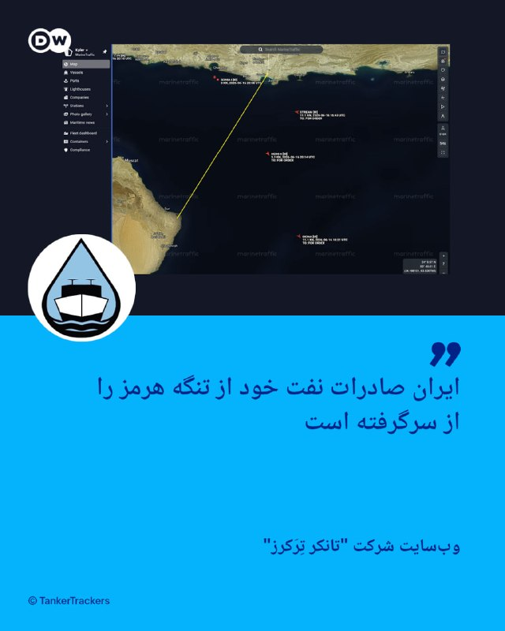

🔶 تانکر ترکرز: ایران صادرات نفت خود از تنگه هرمز را از سرگرفته است

بر اساس گزارش وب‌سایت شرکت "تانکر تِرَکرز" که حمل‌ونقل و ذخیره‌سازی محموله‌های نفتی را رصد می‌کند، صادرات نفت ایران از طریق تنگه هرمز بار دیگر آغاز شده است.

طبق این گزارش، چند نفتکش ایرانی موفق شده‌اند منطقه دریایی‌ای را که پیش‌تر توسط نیروی دریایی آمریکا مسدود شده بود، ترک کنند. به نوشته تانکر ترکرز، این "نخستین صادرات نفت خام ایران در دو ماه گذشته" محسوب می‌شود.

این گزارش می‌افزاید که بر اساس تصاویر ماهواره‌ای، دو ابرنفتکش شرکت ملی نفت ایران به نام‌های "Diona" و "Hero2" با عبور از منطقه‌ای که توسط نیروی دریایی آمریکا محاصره شده، در مجموع حامل ۳.۸ میلیون بشکه نفت خام را به سوی مقاصد خود حمل کرده‌اند.

تانکر ترکرز همچنین نوشت که نفتکش سوم نیز با یک میلیون بشکه نفت از منطقه تحت محاصره دریایی آمریکا عبور کرده است.

@dw_farsi

## RadioFarda — post 158420

جی‌دی ونس: هدف اقدامات ترامپ به قدرت رساندن رضا پهلوی نبود

🔸جی‌دی ونس، معاون رئیس‌جمهور آمریکا، در گفت‌وگویی پیرامون توافق اخیر با ایران، موضوع تغییر رژیم جمهوری اسلامی را رد کرد و گفت: «دونالد ترامپ هرگز نگفت که هدف اقدامات او به قدرت رساندن رضا پهلوی در ایران است.»

🔸ونس شامگاه سه‌شنبه ۲۶ خرداد در ادامه گفت: «آن‌چه دونالد ترامپ گفت این بود که اگر مردم ایران به پا خاسته‌اند و مقابل حکومت خود ایستاده‌اند، خیلی هم خوب است، اما آن‌چه او می‌خواهد، اطمینان یافتن از فعالیت‌های هسته‌ای ایران است چه از طریق دیپلماتیک و چه از طریق جنگ که خب در نهایت راه دوم رخ داد.»

🔸آقای ونس این اظهارات را در گفت‌و‌گوی ویدئویی با مگان کلی، مجری سرشناس آمریکایی، در شبکه رادیویی سیروس ایکس‌ام بیان کرد.

🔸دونالد ترامپ، رئیس جمهور آمریکا، در آغاز حملات به ایران در پیامی خطاب به مردم ایران گفته بود: «وقت آزادی شما فرا رسیده است. وقتی کار ما تمام شد، حکومت خود را در دست بگیرید. این به عهده شما خواهد بود. این احتمالاً تنها فرصت شما برای چندین نسل خواهد بود.»

🔸او پس از برقراری آتش‌بس، موضوع تغییر حکومت به عنوان هدف حملات را رد کرد. رئیس‌جمهور آمریکا روز سه‌شنبه ۲۶ خرداد در حاشیه نشست گروه هفت در فرانسه هم بار دیگر گفت به تغییر رژیم در ایران اعتقادی ندارد و سال‌ها تغییر رژیم‌ها را دیده و به باور او «این کارها جواب نمی‌دهد». او گفت چنین چیزی باید خودش رخ دهد.

🔸این اظهارات در حالی است که شاهزاده رضا پهلوی، روز سه‌شنبه توافق اخیر ایران و آمریکا را «نتیجه معامله و سازش با یک رژیم جنایتکار» خواند و گفت: «توافق با رژیمی که تنها در دو روز، بیش از ۴۰ هزار معترض را به قتل رساند، نه‌تنها از نظر اخلاقی نادرست است، بلکه از منظر راهبردی نیز خطایی فاجعه‌بار خواهد بود.»

🔸آقای پهلوی در گفت‌وگو با مجلهٔ «تایمز» همچنین گفت هر توافقی با جمهوری اسلامی در نهایت شکست خواهد خورد.

🔸او در بخش دیگری از این گفت‌وگو، «تغییر رژیم» را تنها راه‌حل ممکن دانست و گفت جمهوری اسلامی به‌دلیل ماهیت خود «ناسازگار با جهان آزاد» است و مدعی شد که «حملات آمریکا و اسرائیل از سوی بسیاری از ایرانیان به‌عنوان اقدامی آزادی‌بخش تلقی شده است».

🔸 گزارش کامل را در وب‌سایت رادیوفردا بخوانید.

@RadioFarda

## BBCPersian — post 284111

  <a href="https://t.me/bbcpersian/284111" target="_blank">📎 Download file</a>

پادکست برنامه شصت دقیقه سه شنبه ۲۶ خرداد ۱۴۰۵
این نسخه رادیویی برنامه شصت دقیقه تلویزیون فارسی بی‌بی‌سی است که هرشب بعد از پخش، با حجم کم از اپلیکیشن‌های پادگیر و صفحه تلگرام بی‌بی‌سی فارسی در دسترس است.
با هشتگ BBCPersianRadio با ما در ارتباط باشید.

@BBCPersian

## alonews — post 128628

  <a href="telegram/content/alonews_128628_1781687593.webm" target="_blank">🎬 Download video</a>

👈یه زوج پزشک ایرانی ۳۱۳ عمل جراحی رایگان رو به عنوان مهریه ازدواج خود ثبت کردن، یعنی بخوان طلاق بگیرن طرف باید چندسال رایگان کار کنه!

✅ @AloNews خبر جنگ

## alonews — post 128627

  <a href="telegram/content/alonews_128627_1781687593.webm" target="_blank">🎬 Download video</a>

👈عضو کمیسیون اقتصادی مجلس: ۱۳۰ میلیارد دلار ارز صادراتی به کشور برنگشته،
ارزهای برنگشته چند برابر دارایی‌های بلوکه‌شده ایران است!

✅ @AloNews خبر جنگ

---
📅 بروزرسانی: 1405/03/27 12:33
---

## VahidOOnLine — post 245984

  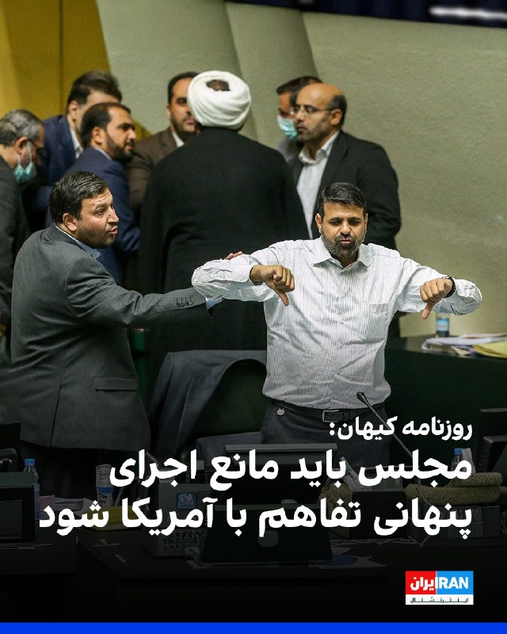

روزنامه کیهان که زیر نظر نماینده رهبر جمهوری اسلامی اداره می‌شود، نوشت هرگونه عهدنامه و موافقت‌نامه بین‌المللی باید به تصویب مجلس برسد و نباید جزئیات تفاهم‌نامه با آمریکا از نمایندگان و مردم پنهان بماند.

کیهان نوشت: «دریغ کردن متن از نمایندگان مایه تاسف است؛ آن هم در شرایطی که دونالد ترامپ صراحتا می‌گوید توافق را برای تصویب به کنگره می‌فرستد! مجلس باید مانع از اجرای پنهانی سندی شود که نمایندگان ملت حتی از محتوای آن بی‌خبرند.»
‌🏁 🇬🇧 IranintlTV

🤖 @VahidOOnLine

## IranIntlTV — post 342823

  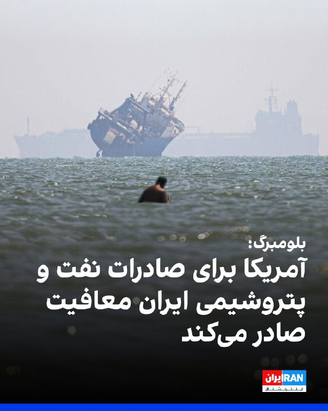

بلومبرگ گزارش داد بر اساس پیش‌نویس یادداشت تفاهم میان آمریکا و جمهوری اسلامی، وزارت خزانه‌داری آمریکا معافیت‌هایی برای صادرات نفت خام و محصولات پتروشیمی ایران صادر خواهد کرد. بر پایه این سند، تهران در چارچوب یک توافق موقت با واشینگتن اجازه خواهد یافت بلافاصله صادرات نفت خود را از سر بگیرد و پس از آغاز مذاکرات برای دستیابی به یک توافق دائمی، به یک برنامه توسعه اقتصادی ۳۰۰ میلیارد دلاری دسترسی پیدا کند.

یک منبع آگاه به بلومبرگ گفت آمریکا متن این توافق موقت را در جریان نشست گروه هفت در فرانسه در اختیار کشورهای متحد خود قرار داده است، اما تاکنون هیچ‌یک از دو طرف به‌طور رسمی این سند را منتشر نکرده‌اند.

فرد دیگری که از محتوای این پیش‌نویس اطلاع دارد و نخواست نامش فاش شود، گفت جزییات فنی توافق همچنان در حال بررسی است و به همین دلیل ممکن است متن نهایی پیش از امضا دستخوش تغییر شود.
https://iranintl.com/202606175151

## IranIntlTV — post 342822

  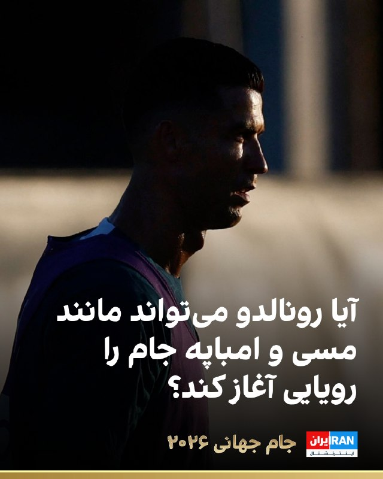

🔻به نظر شما، آیا رونالدو می‌تواند مانند مسی و امباپه جام جهانی ۲۰۲۶ را رویایی آغاز می‌کند؟

🔹لیونل مسی و کیلیان امباپه در گام نخست درخشان ظاهر شدند و ضمن شکستن چندین رکورد، تیم‌هایشان را به پیروزی رساندند. مسی مقابل الجزایر هت‌تریک کرد و امباپه نیز دو گل به سنگال زد.

🔹حال همه نگاه‌ها به بازی امشب پرتغال و کنگو دوخته شده و همه منتظر هنرنمایی کریستیانو رونالدو هستند. این بازی ساعت ۲۰:۳۰ برگزار خواهد شد.

نظر خود را در اینستاگرام ایران اینترنشنال ورزشی ثبت کنید؛👇
https://www.instagram.com/p/DZrl5WFljoe/?igsh=emFuMzFvcDFmdnpi

@iranintltvsport

## IranIntlTV — post 342821

  <a href="telegram/content/IranIntlTV_342821_1781687027.mp4" target="_blank">🎬 Download video</a>

رضا حاجی‌حسینی، روزنامه‌نگار، به ایران‌اینترنشنال گفت به نظر می‌رسد متن تفاهم آمریکا و جمهوری اسلامی به گونه‌ای تنظیم شده که هر دو طرف بتوانند روایت مطلوب خود را ارائه کنند. به گفته او، تعهدات محرمانه تهران برای واشینگتن اهمیت بیشتری از متن علنی توافق دارد.
@iranintltv

## FarsiVOA — post 220999

  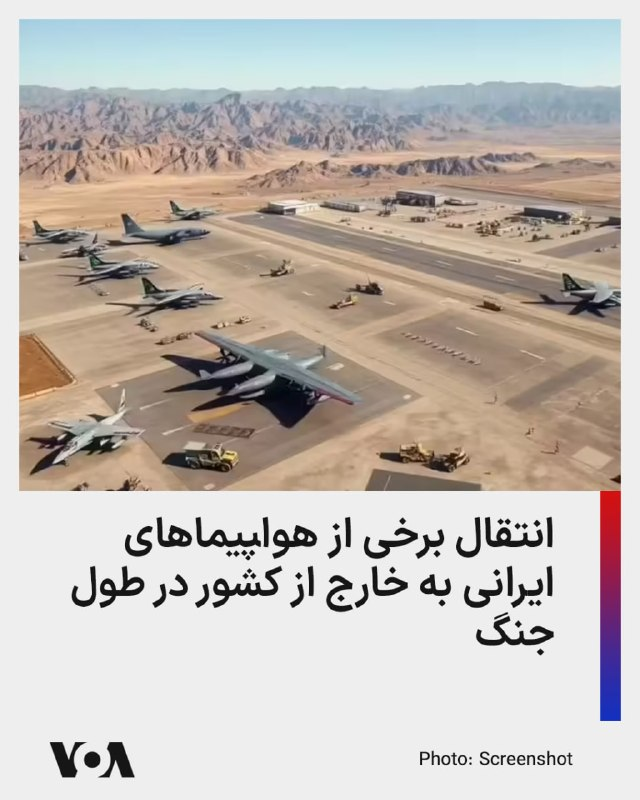

رئیس سازمان هواپیمایی کشوری، از صدور ۳۶ مجوز انتقال هواپیماهای ایرانی به فرودگاه‌های خارج از کشور در طول جنگ ۴۰ روزه خبر داد. او به کشورهای مقصد این هواپیماها اشاره‌ای نکرده است.

ابوذر شیرودی همچنین اعلام کرد که در این مدت ۱۳۳ هواپ‍یمای مستقر در دو فرودگاه تهران با هماهنگی ستاد کل نیروهای مسلح به فرودگاه‌های امن منتقل شدند.

تاکنون سازمان هوا‍پیمایی کشوری، آمار خسارات ناشی از جنگ در این حوزه منتشر نکرده است. اما خبرگزاری ایلنا در ۲۳ فروردین ماه، بر اساس گزارش‌های غیر رسمی از انهدام کامل دست‌کم ۲۰ فرورند هواپیمای مسافرتی و آسیب به ۴۰ فروند هواپیمای دیگر خبر داده بود.

مقصود اسعدی سامانی، دبیر انجمن شرکت‌های هواپیمایی کشور نیز از ۳۰ هزار میلیارد تومان خسارت عدم‌النفع به شرکت‌های هواپیمایی در ایام جنگ خبر داده است.
@FarsiVOA

## FarsiVOA — post 220998

🔺استارمر شلیک هشدار ناو روسی به قایق بریتانیایی را «نگران‌کننده» خواند

▪️نخست‌وزیر بریتانیا، شلیک هشدار یک ناو روسی به نزدیکی یک قایق بادبانی غیرنظامی با پرچم بریتانیا در کانال مانش را «بی‌ملاحظه و عمیقاً نگران‌کننده» خواند.

▪️کی‌یر استارمر گفت ارزیابی وزارت دفاع بریتانیا این است که ناو روسی در حال رانش بوده و تیراندازی انجام‌شده، شلیک هشدار بوده است.

▪️بر اساس اعلام وزارتخانه‌های دفاع بریتانیا و روسیه، این حادثه روز سه‌شنبه رخ داد.

▪️وزارت دفاع روسیه گفت ناو «آدمیرال گریگوروویچ» پس از ناکامی در برقراری تماس رادیویی با قایق، که به گفته مسکو در مسیر برخورد قرار داشت، چند شلیک هشدار از جمله با سلاح سبک انجام داد و قایق سپس مسیر خود را تغییر داد.

⬇️ بیشتر بخوانید:
https://ir.voanews.com/a/starmer-calls-channel-incident-involving-russian-warship-reckless/8161820.html

## Hranews — post 113665

تصادف اتوبوس حامل کارگران در رشت به مصدومیت ۱۴ کارگر انجامید

❗️
❗️
❗️
❗️
❗️– عصر روز گذشته، بر اثر حادثه برخورد یک دستگاه اتوبوس حامل #کارگران با یک دستگاه کامیون در محور جاده تهران-رشت، ۱۴ کارگر مصدوم شدند.

ادامه مطلب

↘️
@hranews_bot تماس ✉️ - @Hranews کانال هرانا 🆑

## alonews — post 128626

  <a href="telegram/content/alonews_128626_1781687030.webm" target="_blank">🎬 Download video</a>

👈بلومبرگ به نقل از یک منبع آگاه اعلام کرد: واشنگتن شروع به توزیع محتوای تفاهم با ایران به کشورهای متحد در اجلاس گروه ۷ در فرانسه کرده است

✅ @AloNews خبر جنگ

## alonews — post 128625

  <a href="telegram/content/alonews_128625_1781687030.webm" target="_blank">🎬 Download video</a>

👈وزارت خارجه: عراقچی در تماسی با لاوروف درباره یادداشت تفاهم با واشنگتن گفت‌وگو کرد

✅ @AloNews خبر جنگ

---
📅 بروزرسانی: 1405/03/27 12:23
---

## VahidOOnLine — post 245983

شاهزاده رضا پهلوی در گفت‌وگو با شبکه تلویزیونی آی‌تی‌وی بریتانیا، با انتقاد از روند مذاکرات میان آمریکا و جمهوری اسلامی گفت مطالبات اصلی مردم ایران، از جمله آزادی، رهایی و دموکراسی، به شکلی عجیب در این مذاکرات هیچ جایگاهی ندارد.

سعید بشیرتاش، عضو شورای مرکزی جبهه هفت آبان، به ایران‌اینترنشنال گفت تاکید شاهزاده رضا پهلوی بر غیراخلاقی و ناپایدار بودن هرگونه توافق میان جمهوری اسلامی و آمریکا است
‌🏁 🇬🇧 IranintlTV

🤖 @VahidOOnLine

## VahidOOnLine — post 245982

  <a href="telegram/content/VahidOOnLine_245982_1781686394.mp4" target="_blank">🎬 Download video</a>

منابع امنیتی پاکستان گفتند تلاش‌های اسلام‌آباد برای تسهیل دیپلماسی میان واشینگتن و تهران، تنها با هدف تامین منافع ملی پاکستان نبوده و با هدف «کمک به ثبات منطقه‌ای» انجام شده است

گفت‌وگو با جواد همدانی، خبرنگار ایران‌اینترنشنال
‌🏁 🇬🇧 IranintlTV

🤖 @VahidOOnLine

## VahidOOnLine — post 245981

  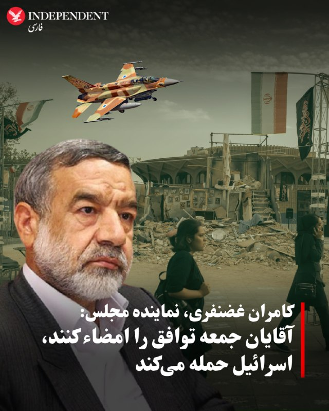

♦️کامران غضنفری، نماینده مجلس شورای اسلامی روز چهارشنبه ۲۷ خرداد با انتقاد شدید از عملکرد مذاکره‌کنندگان جمهوری اسلامی به پایگاه خبری «دیده‌بان ایران» گفت: «یقین بدانید اگر جمعه آقایان توافق‌نامه را امضاء کنند و قول و قرار بگذارند به چند روز نمی‌شود که اسرائیل مجددا حمله می‌کند، ضربه می‌زند و این توافق را اصلا رعایت نمی‌کند. آمریکا هم به انحای مختلف زیر قول و قرارهای خودش می‌زند. من فکر نمی‌کنم این توافق به هر حال به سرانجامی برسد.»

این عضو مجلس شورای اسلامی گفته است که سه روز پیش قرار بود به اسرائیل در پاسخ به حملات لبنان موشک شلیک کنیم اما این تصمیم در لحظات آخر و احتمالا با دستور شورای عالی امنیت ملی متوقف شد.

۶۰ عضو مجلس شورای اسلامی روز سه‌شنبه ۲۶ خرداد با انتقاد شدید از روند مذاکرات تهران و واشنگتن، خواستار دریافت تضمین «واقعی برای تمام بندهای» سند تفاهم مشترک جمهوری اسلامی و آمریکا شده بودند.
‌🇸🇦 Indypersian

🤖 @VahidOOnLine

## VahidOOnLine — post 245980

  <a href="telegram/content/VahidOOnLine_245980_1781686396.mp4" target="_blank">🎬 Download video</a>

وال‌استریت ژورنال به نقل از منابع آگاه گزارش داد آمریکا در چارچوب تفاهم با جمهوری اسلامی، به ایران اجازه خواهد داد فروش نفت خود را بلافاصله از سر بگیرد.

مهرداد قاسم‌فر، روزنامه‌نگار، به ایران‌اینترنشنال گفت متنی که قرار است منتشر شود، برای هر دو طرف کارکرد آتش‌بس دارد، زیرا هر دو به آن نیاز دارند
‌🏁 🇬🇧 IranintlTV

🤖 @VahidOOnLine

## mwarmonitor — post 11056

🔴 سفیر آمریکا در اسرائیل مایک هاکبی

🔸ایران خواستار آن است که اسرائیل دفاع از مرزهای خود در برابر حزب‌الله را متوقف کند. طرح صلح غزه به خلع سلاح شدن حماس بستگی دارد. ایده: تمام اعضای حزب‌الله و حماس به «سفینه مادر» در ایران دیپورت شوند. نتیجه؟ لبنان و اسرائیل از نیابتی‌های تروریستی ایران رها می‌شوند. به صلح یک شانس بدهید!

@mwarmonitor

## IranIntlTV — post 342820

  

روزنامه کیهان که زیر نظر نماینده رهبر جمهوری اسلامی اداره می‌شود، نوشت هرگونه عهدنامه و موافقت‌نامه بین‌المللی باید به تصویب مجلس برسد و نباید جزئیات تفاهم‌نامه با آمریکا از نمایندگان و مردم پنهان بماند.

کیهان نوشت: «دریغ کردن متن از نمایندگان مایه تاسف است؛ آن هم در شرایطی که دونالد ترامپ صراحتا می‌گوید توافق را برای تصویب به کنگره می‌فرستد! مجلس باید مانع از اجرای پنهانی سندی شود که نمایندگان ملت حتی از محتوای آن بی‌خبرند.»
https://iranintl.com/202606171153

## IranIntlTV — post 342819

  <a href="telegram/content/IranIntlTV_342819_1781686399.mp4" target="_blank">🎬 Download video</a>

شاهزاده رضا پهلوی در گفت‌وگو با شبکه تلویزیونی آی‌تی‌وی بریتانیا، با انتقاد از روند مذاکرات میان آمریکا و جمهوری اسلامی گفت مطالبات اصلی مردم ایران، از جمله آزادی، رهایی و دموکراسی، به شکلی عجیب در این مذاکرات هیچ جایگاهی ندارد.

سعید بشیرتاش، عضو شورای مرکزی جبهه هفت آبان، به ایران‌اینترنشنال گفت تاکید شاهزاده رضا پهلوی بر غیراخلاقی و ناپایدار بودن هرگونه توافق میان جمهوری اسلامی و آمریکا است

## IranIntlTV — post 342818

  <a href="telegram/content/IranIntlTV_342818_1781686401.mp4" target="_blank">🎬 Download video</a>

منابع امنیتی پاکستان گفتند تلاش‌های اسلام‌آباد برای تسهیل دیپلماسی میان واشینگتن و تهران، تنها با هدف تامین منافع ملی پاکستان نبوده و با هدف «کمک به ثبات منطقه‌ای» انجام شده است

گفت‌وگو با جواد همدانی، خبرنگار ایران‌اینترنشنال

## alonews — post 128624

  <a href="telegram/content/alonews_128624_1781686403.webm" target="_blank">🎬 Download video</a>

👈بلومبرگ به نقل از یک منبع آگاه: وزارت خزانه‌داری آمریکا بلافاصله پس از امضای توافق، معافیت‌هایی برای نفت و پتروشیمی ایران صادر خواهد کرد

✅ @AloNews خبر جنگ

---
📅 بروزرسانی: 1405/03/27 12:13
---

## IranIntlTV — post 342817

  <a href="telegram/content/IranIntlTV_342817_1781685798.mp4" target="_blank">🎬 Download video</a>

وال‌استریت ژورنال به نقل از منابع آگاه گزارش داد آمریکا در چارچوب تفاهم با جمهوری اسلامی، به ایران اجازه خواهد داد فروش نفت خود را بلافاصله از سر بگیرد.

مهرداد قاسم‌فر، روزنامه‌نگار، به ایران‌اینترنشنال گفت متنی که قرار است منتشر شود، برای هر دو طرف کارکرد آتش‌بس دارد، زیرا هر دو به آن نیاز دارند

## FarsiVOA — post 220997

  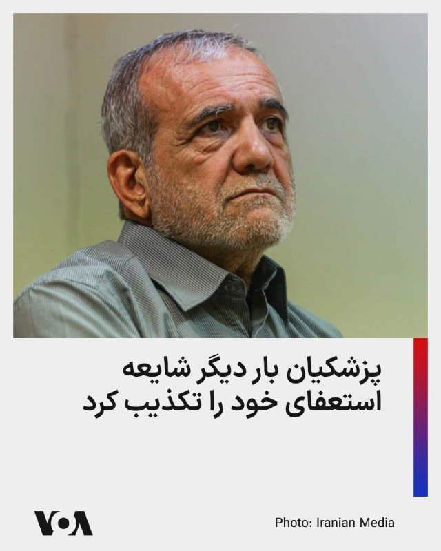

مسعود پزشکیان، رئیس جمهوری دولت جمهوری اسلامی، بار دیگر «شایعات متعدد درباره استعفا» خود را تکذیب کرد.

پزشکیان در دیدار با فعالان رسانه‌ای مدعی شده که «هستم و لازم باشد دوباره هم می‌آیم». او در پاسخ به پرسش یکی از خبرنگاران، مدعی شده که برای ماندن در مسند ریاست جمهوری هیچ تردیدی ندارد.

طی ماه‌های اخیر گمانه‌زنی‌های متعددی درباره احتمال کناره‌گیری مسعود پزشکیان به دلیل ناتوانی دولت در اداره کشور و بی‌اطلاعی رئيس‌جمهور از تصمیمات کلان کشور مطرح شده بود.

از زمان روی کار آمدن پزشکیان، جمهوری اسلامی درگیر دو جنگ و تورم ۸۴ درصدی شده است.
@FarsiVOA

## Persian_Trend_Official — post 17325

  

TankerTrackers:
نفت خام پس از یک محاصره دریایی دو ماهه از ایران خارج شد.

🔹 بر اساس داده‌های AIS و گزارش منتشرشده توسط TankerTrackers، دست‌کم دو نفتکش بسیار بزرگ متعلق به شرکت ملی نفتکش ایران (NITC) پس از حدود دو ماه از محدوده‌ای که «محاصره دریایی» توصیف شده خارج شده‌اند.

🔹 این نفتکش‌ها با نام‌های DIONA (9569695) و HERO2 (9362073) در مجموع حدود ۳.۸ میلیون بشکه نفت خام ایران را حمل می‌کردند.

🔹 طبق این گزارش، این نخستین صادرات نفت خام ایران در بازه دو ماه اخیر محسوب می‌شود.

🔹 همچنین نفتکش دیگری با نام STREAM (9569633) در نزدیکی مسیر بازگشت و در محدوده منطقه اقتصادی انحصاری پاکستان مشاهده شده که طی هفته‌های گذشته در انتظار ورود به آب‌های ایران بوده است.

این جابه‌جایی می‌تواند نشانه‌ای از تغییر در شرایط امنیتی مسیرهای کشتیرانی یا کاهش محدودیت‌های عملیاتی در منطقه باشد. همچنین داده‌های AIS نشان می‌دهد که مسیرهای نفتی ایران همچنان تحت رصد دقیق بین‌المللی قرار دارند.

👺 Phantom

@persian_trend_officialپرشین ترند | متفاوت‌ترین کانال نظامی

## Dirty_Kids — post 392370

  <a href="telegram/content/Dirty_Kids_392370_1781685803.mp4" target="_blank">🎬 Download video</a>

ببینید این خوش‌چشم چقد کصخل که عادلم میرینه بهش

بعد عرزشیا میشینن پای تحلیلای این میان واسه ما رجز میخونن :)))))

@Dirty_Kids 👻

## Dirty_Kids — post 392369

  

همه با امپاپه و مایکل اولیسه طرفدار فرانسه‌ میشن تو جامجهانی من ولی من با ایشون

@Dirty_Kids 👻

## alonews — post 128623

  <a href="telegram/content/alonews_128623_1781685805.webm" target="_blank">🎬 Download video</a>

👈هاآرتص: به ارتش اسرائیل دستور داده شده که از حملات گسترده در لبنان خودداری و بر حفاظت از نیرو‌های خود تمرکز کند.

🔴 ممکن است ارتش ناچار شود به «خط زرد» در جنوب لبنان عقب‌نشینی کند

✅ @AloNews خبر جنگ

## alonews — post 128622

  <a href="telegram/content/alonews_128622_1781685805.webm" target="_blank">🎬 Download video</a>

👈بلومبرگ: تعدادی از کشتی‌های مرتبط با ایران، همزمان با آماده شدن تهران برای امضای توافق، موقعیت‌های خود را جهت فروش نفت تغییر داده‌اند

🔴 دو کشتی حمل فله، یک کشتی حمل گاز طبیعی مایع و یک کشتی کانتینری، در حال حرکت به سمت خارج از تنگه هرمز یا خلیج عمان مشاهده شده‌اند

✅ @AloNews خبر جنگ

## alonews — post 128621

  <a href="telegram/content/alonews_128621_1781685805.webm" target="_blank">🎬 Download video</a>

👈در بریتانیا به‌زودی استفاده از ۱۰ شبکه اجتماعی معروف برای نوجوانان زیر ۱۶ سال ممنوع خواهد شد: تیک‌تاک، یوتیوب، اسنپ‌چت، اینستاگرام، ایکس، ردیت، فیسبوک، توئیچ، کیک و تردز 
✅ @AloNews خبر جنگ

---
📅 بروزرسانی: 1405/03/27 12:03
---

## VahidOOnLine — post 245979

  

مایک هاکبی، سفیر آمریکا در اسرائیل، در پیامی در شبکه اجتماعی ایکس با اشاره به یادداشت تفاهم ایالات متحده و جمهوری اسلامی نوشت که حکومت ایران خواستار آن است که اسرائیل دفاع از مرزهای خود در برابر حزب‌الله را متوقف کند، در حالی که اجرای طرح صلح در غزه به خلع سلاح حماس وابسته است.

هاکبی افزود: «همه اعضای حزب‌الله و حماس به "کشور مادر" خود، یعنی ایران، منتقل شوند.»

او نوشت در صورت تحقق چنین اقدامی، لبنان و اسرائیل از «نیروهای نیابتی مورد حمایت ایران» رها خواهند شد.

هاکبی در پایان پیام خود نوشت: «به صلح فرصت بدهید.»
‌🏁 🇬🇧 IranintlTV

🤖 @VahidOOnLine

## IranIntlTV — post 342816

  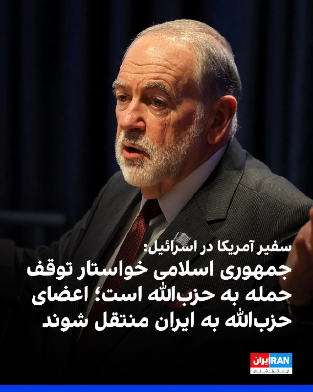

مایک هاکبی، سفیر آمریکا در اسرائیل، در پیامی در شبکه اجتماعی ایکس با اشاره به یادداشت تفاهم ایالات متحده و جمهوری اسلامی نوشت که حکومت ایران خواستار آن است که اسرائیل دفاع از مرزهای خود در برابر حزب‌الله را متوقف کند، در حالی که اجرای طرح صلح در غزه به خلع سلاح حماس وابسته است.

هاکبی افزود: «همه اعضای حزب‌الله و حماس به "کشور مادر" خود، یعنی ایران، منتقل شوند.»

او نوشت در صورت تحقق چنین اقدامی، لبنان و اسرائیل از «نیروهای نیابتی مورد حمایت ایران» رها خواهند شد.

هاکبی در پایان پیام خود نوشت: «به صلح فرصت بدهید.»
https://iranintl.com/202606174815

## Persian_Trend_Official — post 17324

  

📰 اف‌بی‌آی: حمله به رویدادی با حضور ترامپ خنثی شد
🔹دفتر اف‌بی‌آی ادعا کرده است که حمله‌ای برنامه‌ریزی‌شده به مسابقات هنرهای رزمی ترکیبی در کاخ سفید که ترامپ در آن حضور داشت را در روزهای اخیر خنثی کرده و پنج نفر را در ارتباط با آن دستگیر کرده است.

👺Phantom

📌 @persian_trend_official
پرشین ترند | متفاوت‌ترین کانال نظامی

## Hranews — post 113664

دو شهروند در تالش بازداشت شدند

❗️
❗️
❗️
❗️
❗️– دو شهروند در شهرستان تالش به اتهام آنچه «تشویش اذهان عمومی» در فضای مجازی عنوان شده، توسط نیروهای انتظامی #بازداشت و به مرجع قضایی معرفی شدند.

ادامه مطلب

↘️
@hranews_bot تماس ✉️ - @Hranews کانال هرانا 🆑

## alonews — post 128620

  <a href="telegram/content/alonews_128620_1781685228.webm" target="_blank">🎬 Download video</a>

👈در بریتانیا به‌زودی استفاده از ۱۰ شبکه اجتماعی معروف برای نوجوانان زیر ۱۶ سال ممنوع خواهد شد: تیک‌تاک، یوتیوب، اسنپ‌چت، اینستاگرام، ایکس، ردیت، فیسبوک، توئیچ، کیک و تردز

✅ @AloNews خبر جنگ

## alonews — post 128619

  <a href="telegram/content/alonews_128619_1781685229.webm" target="_blank">🎬 Download video</a>

👈کارشناس صدا و سیما: جمهوری اسلامی قوی ترین حکومت تاریخ ایرانه

✅ @AloNews خبر جنگ

---
📅 بروزرسانی: 1405/03/27 11:53
---

## VahidOOnLine — post 245978

  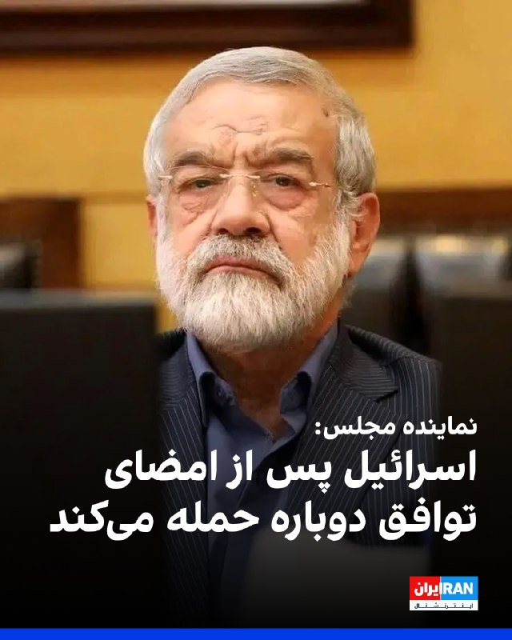

کامران غضنفری، عضو کمیسیون امور داخلی مجلس، با انتقاد از تفاهم‌ میان جمهوری اسلامی و آمریکا گفت اگر این تفاهم‌نامه جمعه امضا شود، اسرائیل ظرف چند روز آن را نقض خواهد کرد و دوباره به جمهوری اسلامی حمله می‌کند.

این نماینده مجلس همچنین گفت در این توافق به ممنوعیت ورود ناوهای نظامی خارجی به خلیج فارس و محدودیت تردد کشتی‌های اسرائیلی اشاره نشده است.
‌🏁 🇬🇧 IranintlTV

🤖 @VahidOOnLine

## IranIntlTV — post 342815

  

کامران غضنفری، عضو کمیسیون امور داخلی مجلس، با انتقاد از تفاهم‌ میان جمهوری اسلامی و آمریکا گفت اگر این تفاهم‌نامه جمعه امضا شود، اسرائیل ظرف چند روز آن را نقض خواهد کرد و دوباره به جمهوری اسلامی حمله می‌کند.

این نماینده مجلس همچنین گفت در این توافق به ممنوعیت ورود ناوهای نظامی خارجی به خلیج فارس و محدودیت تردد کشتی‌های اسرائیلی اشاره نشده است.
https://iranintl.com/202606174626

## alonews — post 128618

  <a href="telegram/content/alonews_128618_1781684607.webm" target="_blank">🎬 Download video</a>

👈غضنفری، نماینده مجلس : اسرائیل بعد امضای توافق، دوباره حملهِ میکنه

✅ @AloNews خبر جنگ

## alonews — post 128617

  <a href="telegram/content/alonews_128617_1781684608.webm" target="_blank">🎬 Download video</a>

👈ترامپ : تحریم‌های روسیه که تا حدودی به دلیل جنگ ایران و با هدف کاهش قیمت نفت لغو شده بود، می‌تواند بار دیگر اعمال شود

🔴 دونالد ترامپ رئیس‌جمهوری آمریکا در نشست گروه هفت از احتمال بازگرداندن تحریم‌های نفتی علیه روسیه پس از دوبار معافیت خبر داد

✅ @AloNews خبر جنگ

---
📅 بروزرسانی: 1405/03/27 11:43
---

## FarsiVOA — post 220996

  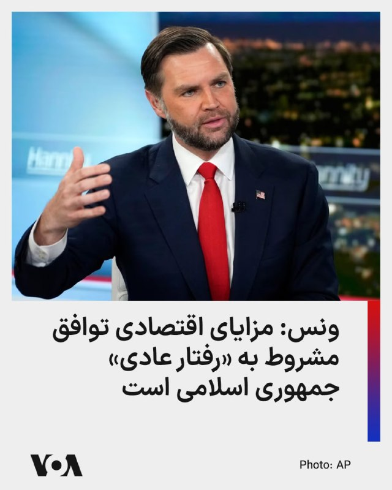

جی‌دی ونس، معاون رئیس‌جمهوری آمریکا، در مصاحبه با فاکس‌نیوز دیجیتال از چارچوب توافق دولت ترامپ با جمهوری اسلامی دفاع کرد و گفت هرگونه منفعت اقتصادی برای جمهوری اسلامی به تغییر رفتار این رژیم بستگی دارد.

ونس گفت جمهوری اسلامی وارد یک دوره آزمایشی ۶۰ روزه می‌شود و باید با عمل، نه وعده، نشان دهد دنبال سلاح هسته‌ای نیست، اجازه بازگشت بازرسان را می‌دهد، ذخایر اورانیوم غنی‌شده را از بین می‌برد و از حمایت از گروه‌های تروریستی دست می‌کشد.

او تأکید کرد اگر جمهوری اسلامی مانند «یک کشور عادی» رفتار کند، آمریکا می‌تواند رابطه خود را تغییر دهد و زمینه بازگشت آن به اقتصاد جهانی را فراهم کند.

ونس همچنین گفت هیچ پولی از مالیات‌دهندگان آمریکایی پرداخت نخواهد شد و مزایا فقط در صورت اجرای تعهدات داده می‌شود.
@FarsiVOA

## RadioFarda — post 158419

معاون وزیر کشور: ۶۰ درصد مردم ایران تحمل فشار اقتصادی بیش از این را ندارند

🔸یک مقام ارشد وزارت کشور می‌گوید «۶۰ درصد» شهروندان ایران «تحمل» فشار اقتصادی بیش از این را ندارند و «به بهبود شرایط آینده» هم امیدوار نیستند.

🔸محمد بطحائی، رئیس سازمان امور اجتماعی ایران، سه‌شنبه ۲۶ خرداد، در یک نشست خبری این آمار را بر اساس یک پیمایش انجام‌شده در خرداد امسال ارائه کرد.

🔸رادیو فردا به‌طور مستقل قادر به تأیید این آمار نیست و راستی‌آزمایی آمارهای وزارت کشور نیز به‌دلیل ماهیت اطلاعات و نوع کاربری آن‌ها با تردیدها از سوی نهادهای نظارتی، کارشناسان مستقل و افکار عمومی مواجه است.

🔸با این حال، انتشار آماری از این دست از سوی منابع رسمی در شرایط جنگ و فشارهای اقتصادی و روانی بر شهروندان ایران دارای اهمیت تلقی می‌شود.

🔸بطحائی در ادامه اظهارات خود افزوده که بر اساس نتایج پیمایش‌های دولتی، «حدود ۶۰ درصد مردم» درباره «بهبود شرایط» در آینده امیدوار نیستند و در پیمایش انجام‌شده در سال گذشته، «تصور مثبتی نسبت به بهتر شدن وضعیت نداشته‌اند».

🔸او می‌گوید همچنین میزان رضایت اجتماعی جامعه آماری یکی از پیمایش‌ها، در بازه صفر تا صد، حدود ۳۸ درصد برآورد شده است؛ «به بیان دیگر، حدود ۶۲ درصد مردم از شرایط اجتماعی رضایت ندارند.»

🔸این مقام دولتی با این حال درباره دلایل عدم رضایت این میزان از جمعیت کشور بر اساس جامعه آماری این پیمایش‌ها اشاره‌ای نکرد.

🔸گزارش‌های رسانه‌ای و شهروندی از ایران در ماه‌های اخیر حاکی از افزایش سرسام‌آور قیمت کالاها و خدمات و رکوردشکنی نرخ تورم و طلا و ارز، به‌دنبال حملات اسرائیل و آمریکا به کشور و محاصره بنادر ایران بوده است.

🔸 گزارش کامل را در وب‌سایت رادیوفردا بخوانید.

@RadioFarda

## BBCPersian — post 284110

  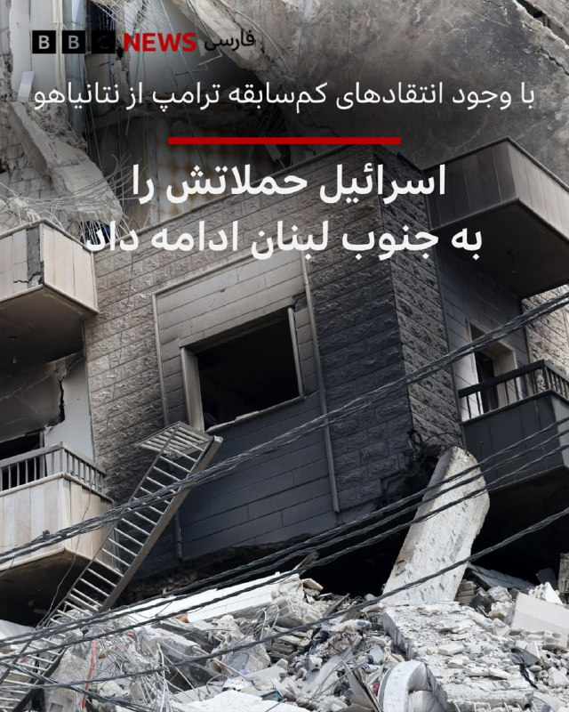

🔻حملات امروز اسرائیل به نقاطی در جنوب لبنان در حالی رخ داد که دونالد ترامپ دیروز در اظهاراتی کم‌سابقه و صریح از عملکرد بنیامین نتانیاهو در لبنان انتقاد کرد.

آقای ترامپ در حاشیه اجلاس گروه هفت در اویان فرانسه گفت که از حمله اسرائیل به بیروت دو ساعت پیش از اعلام تفاهم ایران و آمریکا ناراضی است هرچند که روابطش با بنیامین نتانیاهو خیلی خوب است.

آقای ترامپ گفت: «اسرائیل بیش از حد طولانی با حزب‌الله جنگیده است و بیش از حد مردم کشته شده‌اند. شما نباید هر وقت دنبال کسی هستید کل مجتمع آپارتمانی را پایین بیاورید چون مردم زیادی در آن آپارتمان‌ها زندگی می‌کنند و همه‌شان حز‌ب‌الله نیستند.»

او همچنین گفت برای مقابله با حزب‌الله احمد شرع عملکرد بهتری داشته است.

ایران هشدار داده است که هرگونه حمله اسرائیل به لبنان را نقض تفاهم با آمریکا تلقی‌ می‌کند.

عباس عراقچی، وزیر خارجه ایران گفت که از نظر تهران، یک طرف تفاهمنامه حاصل‌شده ایران و حزب‌الله است، و طرف دیگر آمریکا و اسرائیل.
ادامه مطلب⬇️

📸EPA/Shutterstock
https://bbc.in/4vaQP21
@BBCPersian

## Hranews — post 113663

بخش دیگری از اموال سردار آزمون، بازیکن فوتبال توقیف شد

❗️
❗️
❗️
❗️
❗️– فرمانده انتظامی شهرستان کرمان از توقیف یک دستگاه خودرو متعلق به سردار آزمون، بازیکن فوتبال ساکن خارج از کشور، در ادامه روند اجرای پرونده توقیف اموال وی خبر داد. پیشتر نیز بخشی از دارایی‌های او توقیف شده بود.

ادامه مطلب

#سردار_آزمون #توقیف_اموال

↘️
@hranews_bot تماس ✉️ - @Hranews کانال هرانا 🆑

## alonews — post 128616

  <a href="telegram/content/alonews_128616_1781683995.webm" target="_blank">🎬 Download video</a>

👈نخست‌وزیر کانادا: توافق ایران و آمریکا قاعده بازی را تغییر داده

🔴نخست وزیر کانادا در گفت و گو با شبکه خبری سی ان ان با اعلام اینکه نسخه ای از توافق ایران و آمریکا را دیده، گفت که این سند قاعده بازی را تغییر داده و "ورق را بر می گرداند. "

✅ @AloNews خبر جنگ

## alonews — post 128615

  <a href="telegram/content/alonews_128615_1781683996.webm" target="_blank">🎬 Download video</a>

👈دلار در بازار آزاد تهران، 154 هزار و 500 تومان معامله شد

✅ @AloNews خبر جنگ

---
📅 بروزرسانی: 1405/03/27 11:34
---

## VahidOOnLine — post 245977

  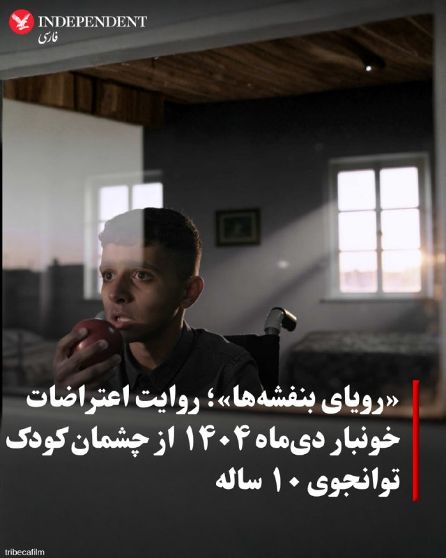

♦️فیلم «رویای بنفشه‌ها» به کارگردانی اشکان و پویا کوشانژاد، با درونمایه اعتراضات خونین دی‌ماه ۱۴۰۴، در جشنواره ترابیکا در شهر نیویورک به نمایش درآمد.

این فیلم که با هوش مصنوعی ساخته شده، ماجرای بزرگ‌تری سرکوب تاریخ معاصر ایران را از چشمان یک کودک توانجوی ۱۰ ساله که روی صندلی چرخدار است، روایت می‌کند. رویای بنفشه‌ها علاوه بر محتوا، در شکل (فرم) هم توجه منتقدان سینما را برانگیخته است.

«رویای بنفشه‌ها» در استودیوی فانتین او (Fountain 0) در لندن ساخته شده است. این اولین بار است که یک فیلم بلند تولید شده با هوش مصنوعی در یک جشنواره فیلم بزرگ پذیرفته شده است. «رویای بنفشه‌ها» هفته گذشته و در بخش رقابتی جشنواره ترابیکا به نمایش درآمد.

به گزارش هالیوود ریپورتر جین روزنتال، از بنیانگذاران جشنواره ترایبکا، گفت: «این جشنواره مدت‌هاست که از هنرمندانی حمایت می‌کند که با جابه‌جایی مرزهای داستان‌سرایی دورنماهای خلاقانه جدیدی را کشف می‌کنند. فیلم «رویای بنفشه‌ها» ساخته‌ فیلمسازان تازه‌کار، اشکان و پویا کوشا، نمونه قدرتمندی از چگونگی کاربرد فناوری‌های نوین مانند هوش مصنوعی نه تنها به عنوان ابزار، بلکه به عنوان وسیله‌ای برای داستان‌سرایی عمیقا انسانی است.»

رابرت دونیرو، ستاره سینمای هالیوود و جهان بنیانگذار اصلی این جشنواره فیلم مستقل است.

به گزارش هالیوود ریپورتر، «رویای بنفشه‌ها» یک «داستانی-مستند» ۷۵ دقیقه‌ای است که در سه ماه و با هزینه ۲۰۰۰ دلار ساخته شده است. برادران کوشانژاد، بازیگران، صحنه‌ها و دوربین‌ها را با مدل‌های هوش مصنوعی جایگزین کرده‌اند.

براساس این گزارش، اشکان کوشانژاد که پیش از آن با ساخت موسیقی فیلم «گربه‌های ایرانی» بهمن قبادی شناخته شده بود، مدتی است که در لندن فعالیت حرفه‌ای خود را دنبال می‌کند.
‌🇸🇦 Indypersian

🤖 @VahidOOnLine

## WithYashar — post 15134

خبرگزاری فرانسه: یک گزارش حقوقی دولت آمریکا نشان می‌دهد ارتش این کشور از ابزار هوش مصنوعی گروک متعلق به شرکت اسپیس ایکس تحت مالکیت ایلان ماسک، میلیاردر حوزه فناوری در جنگ علیه ایران استفاده کرده است
@withyashar

## mwarmonitor — post 11055

🔸ماساد بولوس، مشاور ارشد آمریکا در امور عربی و آفریقایی، در حال تلاش برای میانجی‌گری یک توافق تقسیم قدرت میان دولت‌های رقیب شرق و غرب لیبی است. هدف این طرح، تشکیل یک دولت واحد و ادغام نهادهای دولتی برای تثبیت وضعیت کشور و جذب سرمایه‌گذاری انرژی آمریکا است – به گزارش فایننشال تایمز (FT).

@mwarmonitor

## mwarmonitor — post 11054

🔴درباره صندوق ادعایی ۳۰۰ میلیارد دلاری ایران، متنی که من دارم می‌گوید «مکانیزم اجرای آن به توافق نهایی با تهران بستگی دارد». این در واقع تأییدی بر چیزی است که دیروز گفتم؛ این‌که بدون رفع گسترده/کامل تحریم‌های آمریکا، این پول عملاً جابه‌جا نخواهد شد. «لارنس نورمن خبرنگار وال‌استریت ژورنال»

@mwarmonitor

## FarsiVOA — post 220995

  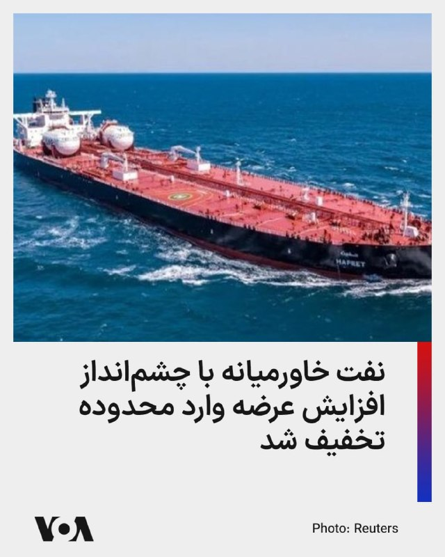

رویترز گزارش داد بازار نفت خاورمیانه پس از چارچوب توافق آمریکا و جمهوری اسلامی برای بازگشایی تنگه هرمز، به‌شدت تضعیف شده و برخی شاخص‌های اصلی منطقه وارد محدوده تخفیف شده‌اند.

بر اساس داده‌های رویترز، پریمیوم شاخص دبی نسبت به سوآپ‌ها روز سه‌شنبه به تخفیف ۴۶ سنتی رسید؛ نخستین ساختار کونتانگو از ژانویه. شاخص‌های عمان و موربان نیز به‌ترتیب با تخفیف ۶۷ و ۴۹ سنت معامله شدند.

کونتانگو به معنای ارزان‌تر بودن محموله‌های فوری نسبت به تحویل‌های بعدی است و معمولاً نشانه افزایش عرضه کوتاه‌مدت تلقی می‌شود.

تحلیلگران می‌گویند بازگشایی رسمی هرمز می‌تواند میلیون‌ها بشکه نفتی را که در ذخیره‌سازی شناور مانده آزاد کند و فشار نزولی بر قیمت نفت منطقه وارد آورد.

در بازار جهانی، افت نفت ادامه یافت و برنت زیر ۸۰ دلار رفت؛ موضوعی که نگرانی تورمی را کاهش داد و بازده اوراق را پایین آورد.
@FarsiVOA

## alonews — post 128614

  <a href="telegram/content/alonews_128614_1781683460.webm" target="_blank">🎬 Download video</a>

👈یوهان واده‌فول وزیر امور خارجه آلمان اعلام کرد کشورش در صورت شکل‌گیری عملیات مین‌روبی در تنگه هرمز آمادگی مشارکت دارد، اما این اقدام تنها با موافقت هم‌زمان ایالات متحده و ایران، وجود چارچوب حقوقی بین‌المللی و تایید نهادهای اروپایی و پارلمان آلمان امکان‌پذیر خواهد بود.

✅ @AloNews خبر جنگ

## alonews — post 128613

  <a href="telegram/content/alonews_128613_1781683461.webm" target="_blank">🎬 Download video</a>

👈طبق اعلام وزیر خارجه پاکستان محمد اسحاق‌دار، با کمک این کشور ۳۰ تبعه ایرانی، شامل خدمه یک کشتی توقیف شده توسط آمریکا به ایران برگشتند.

✅ @AloNews خبر جنگ

---
📅 بروزرسانی: 1405/03/27 11:22
---

## VahidOOnLine — post 245976

  

علیرضا کاظمی، وزیر آموزش و پرورش دولت جمهوری اسلامی، با تاکید بر «رعایت معیشت خانواده‌ها و ترویج فرهنگ قناعت» گفت استفاده دانش‌آموزان از لباس فرم مدرسه سه‌ساله می‌شود.

او همچنین گفت در مدارس نمونه دولتی، برگزاری هرگونه آزمون یا مصاحبه برای پذیرش دانش‌آموزان پایه هفتم ممنوع است.
‌🏁 🇬🇧 IranintlTV

🤖 @VahidOOnLine

## IranIntlTV — post 342814

  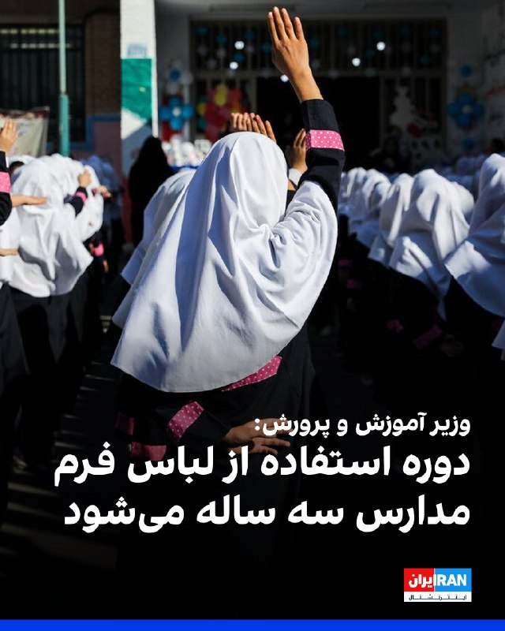

علیرضا کاظمی، وزیر آموزش و پرورش دولت جمهوری اسلامی، با تاکید بر «رعایت معیشت خانواده‌ها و ترویج فرهنگ قناعت» گفت استفاده دانش‌آموزان از لباس فرم مدرسه سه‌ساله می‌شود.

او همچنین گفت در مدارس نمونه دولتی، برگزاری هرگونه آزمون یا مصاحبه برای پذیرش دانش‌آموزان پایه هفتم ممنوع است.
https://iranintl.com/202606176619

## RadioFarda — post 158418

سازمان هواپیمایی کشوری انتقال هواپیما در ابتدای جنگ به فرودگاه‌های خارجی را تأیید کرد

🔸رئیس سازمان هواپیمایی کشوری ایران می‌گوید بعد از شروع حملات آمریکا و اسرائیل در جنگ ۴۰ روزه، «مجوز انتقال و گسترش استقرار ۳۶ هواپیما» در فرودگاه‌های خارجی صادر شد که «بخشی از آن‌ها با موفقیت اجرایی شد».

🔸ابوذر شیرودی با این حال به‌طور دقیق مشخص نکرد که چه تعدادی از این هواپیماها و در فرودگاه‌های کدام کشورها مستقر شدند.

🔸اواسط اردیبهشت‌ماه، شبکه تلویزیونی «سی‌بی‌اس» به نقل از مقام‌های آمریکایی، گزارش داد که هواپیماهای ایران، در میانهٔ جنگ، در یک پایگاه نظامی در نزدیکی شهر راوِلپندی پارک شده بودند.

🔸بر اساس این گزارش، با استقرار هواپیماهای ایران در پایگاه «نور خان» در پاکستان، پاکستان عملاً از این ناوگان در برابر حملات آمریکا حفاظت کرده است.

🔸وزارت خارجه پاکستان روز ۲۲ اردیبهشت با انتشار بیانیه‌ای گزارش سی‌بی‌اس را «گمراه‌کننده و اغراق‌آمیز» خواند، اما اصل گزارش یعنی حضور هواپیماهای ایران در پایگاه هوایی نورخان را تکذیب نکرد.

🔸رئیس سازمان هواپیمایی کشوری روز سه‌شنبه ۲۶ خرداد در بخش دیگری از اظهاراتش گفت که آمریکا و اسرائیل از همان ابتدای جنگ ۴۰ روزه قصد داشتند زیرساخت‌های هوانوردی ایران را هدف قرار دارند و «نخستین نشانه این رویکرد، حمله به هواپیمای ایرباس جمهوری اسلامی ایران در فرودگاه بوشهر بود».

🔸او افزوده که پس از آغاز حملات، علاوه بر اجرای طرح توقف عملیات پروازی، «پروازهای عبوری نیز به مسیرهای جایگزین در کشورهای همسایه منتقل شدند».

🔸رئیس سازمان هواپیمایی کشوری افزوده که این حملات موجب شد که با هماهنگی ستاد کل نیروهای مسلح و بخش پدافندی کشور، تصمیم به «پراکندگی» ناوگان هوایی گرفته شد.

🔸بر اساس اظهارات او، «در این راستا ۱۳۳ جابه‌جایی هواپیما از فرودگاه‌های امام خمینی و مهرآباد به فرودگاه‌های امن‌تر انجام شد.»

@RadioFarda

## IranianMinds — post 22775

  <a href="telegram/content/IranianMinds_22775_1781682773.mp4" target="_blank">🎬 Download video</a>

وقتی با یکی حال نمیکنی ولی مجبوری سلامو علیک داشته باشی :

@IranianMinds

## Hranews — post 113662

یک زندانی در زندان سنندج اعدام شد

❗️
❗️
❗️
❗️
❗️– روز گذشته، حکم یک زندانی که پیشتر از بابت اتهام قتل به #اعدام محکوم شده بود، در زندان سنندج اجرا شد.

ادامه مطلب

#محمد_احمدی

↘️
@hranews_bot تماس ✉️ - @Hranews کانال هرانا 🆑

## alonews — post 128612

  <a href="telegram/content/alonews_128612_1781682774.webm" target="_blank">🎬 Download video</a>

👈خبرگزاری فرانسه: یک گزارش حقوقی دولت آمریکا نشان می‌دهد ارتش این کشور از ابزار هوش مصنوعی گروک متعلق به شرکت اسپیس ایکس تحت مالکیت ایلان ماسک، میلیاردر حوزه فناوری در جنگ غیرقانونی علیه ایران استفاده کرده است

✅ @AloNews خبر جنگ

---
📅 بروزرسانی: 1405/03/27 11:13
---

## VahidOOnLine — post 245975

  <a href="telegram/content/VahidOOnLine_245975_1781682190.mp4" target="_blank">🎬 Download video</a>

⭕️حمله پهپادی اوکراین به بزرگ‌ترین پالایشگاه نفتی مسکو

♦️سرگئی سوبیانین، شهردار مسکو سه‌شنبه شب ۲۶ خردادماه اعلام کرد، در جریان یک حمله پهپادی اوکراین، بخشی از پالایشگاه نفتی مسکو متعلق به شرکت «گازپروم‌» آسیب دیده است.
رویترز تصاویری از خسارت‌های واردشده به این پالایشگاه را منتشر کرد.

پالایشگاه مسکو بزرگ‌ترین پالایشگاه منطقه پایتخت روسیه محسوب می‌شود و در سال ۲۰۲۴ حدود ۱۱.۶ میلیون تُن نفت خام را فرآوری کرده بود.

ولودیمیر زلنسکی، رئیس‌جمهوری اوکراین نیز حمله به این تاسیسات را تایید کرده است.

از ابتدای سال ۲۰۲۶، حملات پهپادی اوکراین به پالایشگاه‌ها و زیرساخت‌های انرژی روسیه افزایش یافته است. این حملات در برخی موارد به توقف کامل یا کاهش ظرفیت تولید پالایشگاه‌ها منجر شده و بر تولید بنزین، گازوئیل و سوخت هواپیما در روسیه تاثیر گذاشته است.
‌🇸🇦 Indypersian

🤖 @VahidOOnLine

## VahidOOnLine — post 245974

  <a href="telegram/content/VahidOOnLine_245974_1781682192.mp4" target="_blank">🎬 Download video</a>

ویدیوی ارسالی به ایران اینترنشنال نشان می‌دهد که در اطراف ورزشگاه محل دیدار تیم‌های فوتبال ایران و نیوزیلند، گروهی از ایرانیان آمریکا در حمایت از شاهزاده رضا پهلوی و علیه جمهوری اسلامی شعار سردادند.
‌🏁 🇬🇧 IranintlTV

🤖 @VahidOOnLine

## VahidOOnLine — post 245973

  

اسحاق دار، وزیر خارجه پاکستان، چهارشنبه ۲۷ خرداد اعلام کرد این کشور بازگشت ۳۰ شهروند ایرانی به ایران را تسهیل می‌کند. این افراد شامل ۲۲ خدمه نفتکش «داوینا» هستند که از سوی آمریکا توقیف شده بود.

دار در پیامی در شبکه اجتماعی ایکس نوشت این گروه شامل هشت ماهیگیر ایرانی نیز می‌شود که پس از به گل نشستن قایقشان در دریا، توسط کشتی بریتانیایی «ام‌ام‌ای ولور» نجات یافته‌اند. به گفته او، انتظار می‌رود هر دو گروه در روزهای آینده از طریق کراچی به ایران بازگردند.

وزیر خارجه پاکستان گفت اسلام‌آباد در هماهنگی نزدیک با مقام‌های جمهوری اسلامی، آمریکا و بریتانیا برای تضمین انتقال امن و بازگشت سریع این شهروندان ایرانی همکاری می‌کند. او افزود پاکستان به همکاری‌های بشردوستانه متعهد است و هرگونه کمک ممکن را در اختیار شهروندان ایرانی قرار خواهد داد.

ارتش آمریکا ۱۵ خرداد اعلام کرد نفتکش تحریم‌شده «داوینا» را در اقیانوس هند توقیف کرده است. این نفتکش که با نام «لنور» نیز شناخته می‌شود، توانایی حمل حدود دو میلیون بشکه نفت خام را دارد و در اکتبر ۲۰۲۴ به دلیل مشارکت در تجارت نفت ایران تحت تحریم آمریکا قرار گرفت.
‌🏁 🇬🇧 IranintlTV

🤖 @VahidOOnLine

## VahidOOnLine — post 245972

  <a href="telegram/content/VahidOOnLine_245972_1781682196.mp4" target="_blank">🎬 Download video</a>

ویدیوی ارسال‌شده به ایران‌اینترنشنال نشان می‌دهد یک شهروند رو به حامیان حکومت در تجمع شبانه‌ با طعنه و خنده علیه قالیباف و عراقچی شعار می‌دهد و از آنها می‌پرسد مگر توافق نشده؟ یکی از حامیان جمهوری اسلامی جواب می‌دهد: «فقط ده شرط رهبری.»
‌🏁 🇬🇧 IranintlTV

🤖 @VahidOOnLine

## mwarmonitor — post 11053

🔴 خبرنگار الجزیره: حمله‌ای از سوی یک پهپاد اسرائیلی به شهرک المنصوری در منطقه صور در جنوب لبنان انجام شده است.

@mwarmonitor

## pm_afshaa — post 94234

  

فرمانده انتظامی کرمان از توقیف یک دستگاه پورشه متعلق به سردار آزمون خبر داد

💧 Rainbet.com the #1 Non-KYC Crypto Casino & Sportsbook @rainbetcom

😁 @Pm_Afshaa

## pm_afshaa — post 94233

بانو سویینی شاتای جدید از بدن خودش منتشر کرده

مشاهده

💧 Rainbet.com the #1 Non-KYC Crypto Casino & Sportsbook @rainbetcom

😁 @Pm_Afshaa

## DEJradio — post 5753

  <a href="telegram/content/DEJradio_5753_1781682198.mp4" target="_blank">🎬 Download video</a>

👑📌 دل‌های ما خون شده، اما انتقام خون جوان‌ها رو می‌گیریم...

#جنگ #خون_جوانان_وطن #دی۱۴۰۴
@DEJradio

## IranIntlTV — post 342813

  <a href="telegram/content/IranIntlTV_342813_1781682201.mp4" target="_blank">🎬 Download video</a>

حاشیه‌های نخستین دیدار تیم فوتبال ایران برابر نیوزیلند ادامه دارد. حضور گسترده ایرانیان مخالف جمهوری اسلامی با پرچم‌های شیر و خورشید در داخل و خارج از ورزشگاه، بازتاب گسترده‌ای در رسانه‌های جهان و شبکه‌های اجتماعی داشته است.

گزارش علیرضا مدیری، خبرنگار ایران‌اینترنشنال
@iranintltv

## IranIntlTV — post 342812

  <a href="telegram/content/IranIntlTV_342812_1781682203.mp4" target="_blank">🎬 Download video</a>

ویدیوی ارسالی به ایران اینترنشنال نشان می‌دهد که در اطراف ورزشگاه محل دیدار تیم‌های فوتبال ایران و نیوزیلند، گروهی از ایرانیان آمریکا در حمایت از شاهزاده رضا پهلوی و علیه جمهوری اسلامی شعار سردادند.

## IranIntlTV — post 342811

  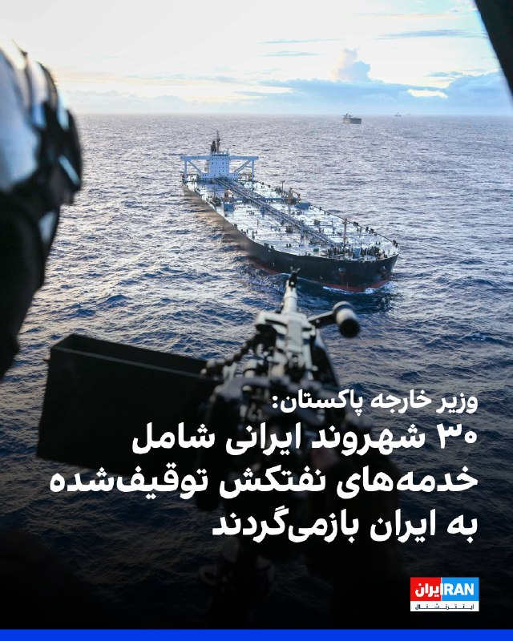

اسحاق دار، وزیر خارجه پاکستان، چهارشنبه ۲۷ خرداد اعلام کرد این کشور بازگشت ۳۰ شهروند ایرانی به ایران را تسهیل می‌کند. این افراد شامل ۲۲ خدمه نفتکش «داوینا» هستند که از سوی آمریکا توقیف شده بود.

دار در پیامی در شبکه اجتماعی ایکس نوشت این گروه شامل هشت ماهیگیر ایرانی نیز می‌شود که پس از به گل نشستن قایقشان در دریا، توسط کشتی بریتانیایی «ام‌ام‌ای ولور» نجات یافته‌اند. به گفته او، انتظار می‌رود هر دو گروه در روزهای آینده از طریق کراچی به ایران بازگردند.

وزیر خارجه پاکستان گفت اسلام‌آباد در هماهنگی نزدیک با مقام‌های جمهوری اسلامی، آمریکا و بریتانیا برای تضمین انتقال امن و بازگشت سریع این شهروندان ایرانی همکاری می‌کند. او افزود پاکستان به همکاری‌های بشردوستانه متعهد است و هرگونه کمک ممکن را در اختیار شهروندان ایرانی قرار خواهد داد.

ارتش آمریکا ۱۵ خرداد اعلام کرد نفتکش تحریم‌شده «داوینا» را در اقیانوس هند توقیف کرده است. این نفتکش که با نام «لنور» نیز شناخته می‌شود، توانایی حمل حدود دو میلیون بشکه نفت خام را دارد و در اکتبر ۲۰۲۴ به دلیل مشارکت در تجارت نفت ایران تحت تحریم آمریکا قرار گرفت.
https://iranintl.com/2

## FarsiVOA — post 220994

  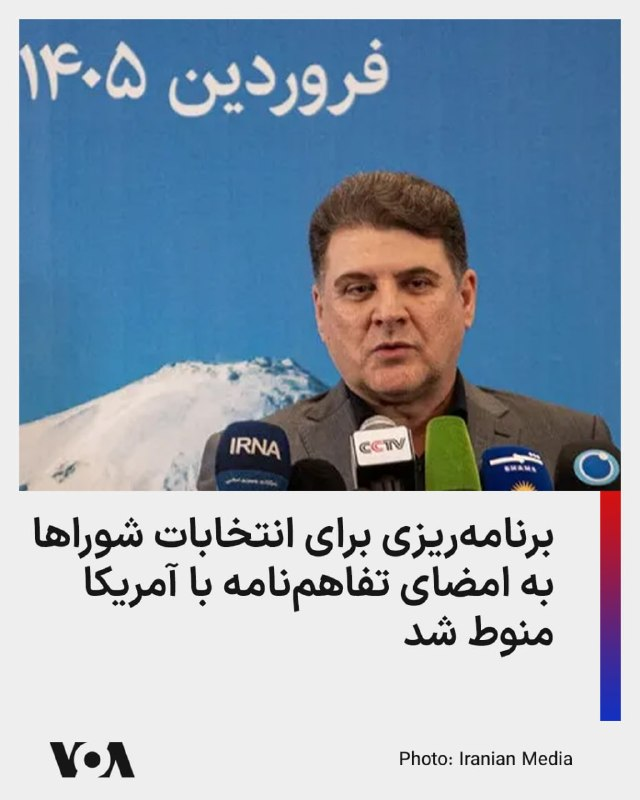

رئیس ستاد انتخابات کشور، اعلام کرد که در صورت امضای تفاهم‌‌نامه با آمریکا در روز جمعه ۲۹ خردادماه، تلاش می‌شود تا در فاصله ۶۰ روزه، انتخابات شوراها برگزار شود.

علی زینی‌‌وند، در گفت‌‌وگویی با صداوسیمای جمهوری اسلامی، با اشاره به عدم برگزاری انتخابات به دلیل شرایط جنگی، اعلام که شورای امنیت ملی، مجوز برگزاری انتخابات را دو ماه پس از پایان جنگ، صادر کرده است.

او یادآور شد که با وجود آمادگی‌های لازم برای برگزاری این دوره از انتخابات، تحقق آن به بررسی‌های بیشتر و تصمیم‌‌گیری‌ نهادهای بالادستی نیاز دارد.

پیشتر قرار بود که هفتمین دوره انتخابات شوراها در روز ۱۱ اردیبهشت برگزار شود.
@FarsiVOA

## Dirty_Kids — post 392368

  <a href="telegram/content/Dirty_Kids_392368_1781682206.mp4" target="_blank">🎬 Download video</a>

اولین بار هم ویدیو میبینم هم عکس...
خسته‌شو حاجب خسته‌شو یه پلک بزن

@Dirty_Kids 👻

## Dirty_Kids — post 392367

  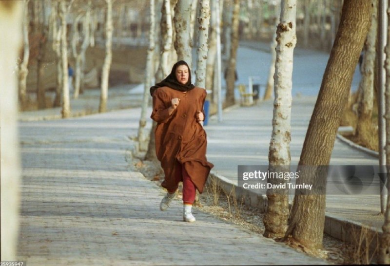

خانمی درحال ورزش صبح‌گاهی در پارکی در تهران، ۱۳۷۲ خورشیدی

@Dirty_Kids 👻

## alonews — post 128611

  <a href="telegram/content/alonews_128611_1781682209.webm" target="_blank">🎬 Download video</a>

👈وضعیت مارکو روبیو پس از اعلام خبر توافق تو این چند روز

✅ @AloNews خبر جنگ

## alonews — post 128610

  <a href="telegram/content/alonews_128610_1781682209.mp4" target="_blank">🎬 Download video</a>

👈ادامه حملات ارتش اسرائیل به نبطیه در جنوب لبنان

✅ @AloNews خبر جنگ

## alonews — post 128609

  <a href="telegram/content/alonews_128609_1781682211.webm" target="_blank">🎬 Download video</a>

👈نفت برنت با ادامه روند کاهشی خود امروز ۷۸ دلار معامله شد

✅ @AloNews خبر جنگ

---
📅 بروزرسانی: 1405/03/27 11:03
---

## WithYashar — post 15133

پمپئو وزیر خارجه سابق به فاکس می‌گوید اگر برداشت ایران از موضع آمریکا درست باشد و تصمیم‌گیران اصلی (سپاه و رهبری) واقعاً تغییر رفتار بدهند، می‌توان به عادی‌سازی و حتی ورود سرمایه‌گذاری فکر کرد، اما احتمال چنین تغییری را بسیار پایین می‌داند. او تأکید می‌کند نباید هیچ پولی—چه مستقیم، چه از طریق واسطه یا حتی
آزادسازی دارایی‌ها—به ایران داده شود، چون به‌جای رفاه مردم، صرف تقویت برنامه موشکی، سپاه و خرید تسلیحات از روسیه و چین می‌شود. در عین حال می‌گوید اگر واقعاً تغییر واقعی رخ دهد، از آن استقبال خواهد کرد.
@withyashar

## WithYashar — post 15132

  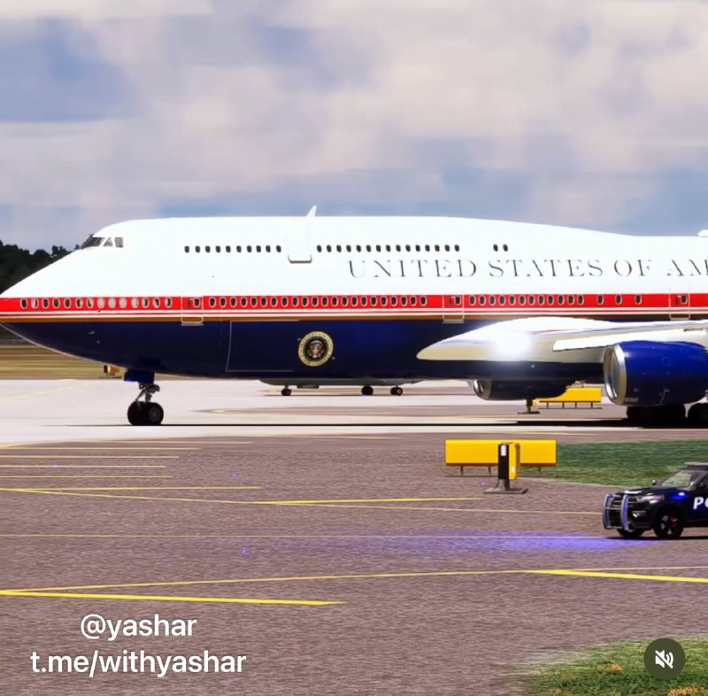

«ایرباس موقت ایر فورس وان که توسط قطر اهدا شده، رنگ‌آمیزی شده و در نیویورک آماده است — درست همزمان با تعهد سرمایه‌گذاری ۱ میلیارد دلاری قطر که دیروز اعلام شد، بعد از آنچه برخی آن را تسلیم کامل آمریکا در برابر خواسته‌های قطر و ایران می‌دانند.»
@withyashar

## WithYashar — post 15131

یديعوت احرونوت ادعا کرده بالای ۵۰درصد از پول‌های بلوکه شده ایران دست چین و عراقه

رقمش هم کم نیست؛ حداقل ۳۵میلیارد دلاره!
@withyashar

## mwarmonitor — post 11052

🔴مایک پمپئو (وزیر خارجه سابق آمریکا) در مصاحبه با فاکس نیوز

🔹« اگر بیانیه معاون رئیس‌جمهور دقیق باشد و ایرانی‌ها — که این نکته مهمی است — و ایرانی‌ها هم موضوع را همین‌طور متوجه شده باشند؛ چیزی که البته هنوز باید منتظر ماند و دید.

🔸به هر حال، منظورم فقط کل ایرانی‌ها نیست، بلکه افرادی است که قدرت دستشان است؛ نه آن کسی که قرار است توافق‌نامه را امضا کند، بلکه سپاه پاسداران (IRGC) که کنترل واقعی را در دست دارد و آیت‌الله.

🔹اگر این افراد تصمیم بگیرند که می‌خواهند به یک ملت عادی تبدیل شوند، من را هم در لیست کسانی قرار دهید که موافق رفتن سرمایه‌گذاران به آنجا هستند. اما جان، باید به تو بگویم که به نظر من احتمال رخ دادن چنین چیزی بسیار کم است.

🔹پس، منصفانه است؛ آن‌ها هیچ پولی دریافت نخواهند کرد. آنچه امیدوارم اتفاق نیفتد این است که در حالی که ما این شانس را داریم تا به نتیجه‌ای فوق‌العاده برای ایالات متحده آمریکا دست یابیم، پای خود را از روی گلوی آن‌ها برداریم. پرزیدنت ترامپ شرایط را برای این کار مهیا کرده بود.

🔹دادن پول به آن‌ها — چه از طریق انتقال مستقیم، چه انتقال از طریق یک شخص ثالث (کشور واسط) و چه حتی آزاد کردن دارایی‌هایی که ادعا می‌کنند "پول خودِ ایرانی‌هاست" — یک اشتباه خواهد بود. چون جان، تو قبلاً هم این را دیده‌ای؛ ما این فیلم بد را قبلاً هم دیده‌ایم. آن پول قرار نیست صرف بهداشت و درمان، دارو و غذای مردم ایران شود؛ بلکه صرف بازسازی برنامه موشکی‌شان، تقویت سپاه پاسداران، و خرید سیستم‌های تسلیحاتی بیشتر از روسیه و چین خواهد شد.

🔹پولی که به رژیم ایران برسد، صرف اهداف مخرب خواهد شد. اما اگر من اشتباه کنم و ایرانی‌ها واقعاً تغییر رویه داده باشند (اصطلاحاً ورق برگشته باشد)، هیچ‌کس خوشحال‌تر از من نخواهد بود.»

@mwarmonitor

## pm_afshaa — post 94231

  <a href="telegram/content/pm_afshaa_94231_1781681585.webm" target="_blank">🎬 Download video</a>

قسمتای جدید سریال های نمایش خانگی در کانال زیر قرار گرفت
👇
👇

https://t.me/pm_seriesi
https://t.me/pm_seriesi

## DEJradio — post 5752

  <a href="telegram/content/DEJradio_5752_1781681586.webm" target="_blank">🎬 Download video</a>

🔺📢 اعتراض میان نظامی‌ها به وضعیت معیشتی و دستمزد پایین آن‌هم بعد از ۴۰ روز جنگ به شدت افزایش یافته است. یکی از آنها با پیامک واریز حقوق خود در خردادماه می‌گوید دو ماه جنگ و آماده‌باش بودیم، حقوق ما ۲۵ میلیون تومان است.

بیشتر نظامی‌ها هفته‌ها به خانه نرفتند و در یگان‌ها آماده باش بودند. بسیاری از آنها مجبور شدند در مناطق عملیاتی خانواده خود را به شهرستان‌ها بفرستند تا امنیت‌شان بیشتر باشد. اکنون اما پول‌ها سرازیر سایر ارگان‌ها شده است بدون توجه به آنکه آنها زیر بمباران بودند.

هرچند بسیاری از مردم معتقدند مقصر وضعیت بد زندگی نظامی‌ها خود آنها هستند که از رژیم دفاع می‌کنند. رژیمی که دستش به خون مردم ایران آلوده است.

این نگاه به‌ویژه در مورد پرسنل نیروی انتظامی جدی‌تر است زیرا مستقیم در سرکوب مشارکت داشتند، هرچند که بسیاری می‌گویند سکوت ارتشی‌ها در برابر قتل‌عام مردم فرق زیادی با دخالت مستقیم در سرکوب ندارد.

#جنگ #ارتش #نیروی_انتظامی
@DEJradio

## DEJradio — post 5751

  <a href="telegram/content/DEJradio_5751_1781681586.mp4" target="_blank">🎬 Download video</a>

🔺📢 یک شهروند از مشهد در ویدیویی که برای دژ ارسال شده می‌گوید، وقتی به حرم می‌رود آرامش می‌گیرد، اما اگر خامنه‌ای را آنجا دفن کنند نجس می‌شود.

#زیارت #موشعلی
@DEJradio

## IranIntlTV — post 342810

  <a href="telegram/content/IranIntlTV_342810_1781681588.mp4" target="_blank">🎬 Download video</a>

ویدیوی ارسال‌شده به ایران‌اینترنشنال نشان می‌دهد یک شهروند رو به حامیان حکومت در تجمع شبانه‌ با طعنه و خنده علیه قالیباف و عراقچی شعار می‌دهد و از آنها می‌پرسد مگر توافق نشده؟ یکی از حامیان جمهوری اسلامی جواب می‌دهد: «فقط ده شرط رهبری.»

## Shin_Persian — post 7114

  <a href="telegram/content/Shin_Persian_7114_1781681589.mp4" target="_blank">🎬 Download video</a>

Open Source Intel ✓ @Osint613
Wed, 17 Jun 2026 07:00:35 UTC

Lebanon report: Strikes reported in Nabatieh al-Fawqa and a drone strike in Ansariyeh in southern Lebanon.

ترجمه خودکار فارسی

گزارش لبنان: حملاتی در نبطیه الفوقا و یک حمله پهپادی در انصاریه در جنوب لبنان گزارش شده است.

𝕏 · @shin_persian

## DW_Farsi — post 126083

  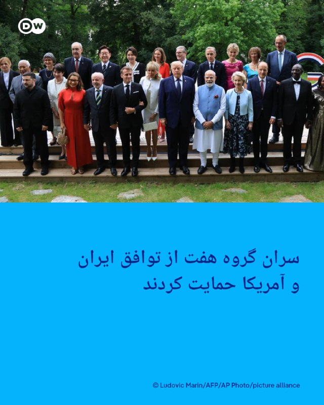

🔶 سران گروه هفت از توافق ایران و آمریکا حمایت کردند

سران کشورهای گروه هفت (آمریکا، کانادا، فرانسه، آلمان، ایتالیا، ژاپن و بریتانیا) بامداد روز چهارشنبه ۲۷ خرداد (۱۷ ژوئن) در بیانیه‌ای از توافق میان ایالات متحده و جمهوری اسلامی ایران حمایت کردند.

این بیانیه توافق یادشده را "فرصتی تاریخی" برای جلوگیری از دستیابی ایران به سلاح هسته‌ای و مهار تهدیدهای منطقه‌ای و موشکی نامیدند و آمادگی خود را برای مشارکت در اجرای این توافق اعلام کردند.

در این بیانیه بر اهمیت آزادی "تردد کشتی‌ها در آبراه‌های بین‌المللی بدون محدودیت و عوارض" به‌عنوان یکی از پایه‌های تجارت جهانی تاکید شده است.

@dw_farsi

## RadioFarda — post 158417

ماجرای تخریب جنجالی یک کلیسا در مشهد چیست؟

🔸در روزهای اخیر تخریب یک کلیسا در مشهد موجی از واکنش‌ها را به‌دنبال داشت و بار دیگر موضوع نقض حقوق اقلیت‌های دینی و همچنین تخریب آثار میراث فرهنگی اعم از اسلامی و غیراسلامی را پیش کشید.

🔸بر اساس آن چه خبرگزاری رسمی جمهوری اسلامی، ایرنا، گزارش داده، تخریب کلیسای انجیلی مشهد واقع در بافت قدیمی و مرکزی این شهر به صورت شبانه در اولین ساعات روز ۱۴ خرداد امسال با بولدوزر رخ داد و اکنون این موضوع به یک پروندهٔ حقوقی، میراثی و حتی حقوق بشری تبدیل شده است.

🔸کلیسای انجیلی، نام یک کلیسای تاریخی مربوط به دورهٔ پهلوی اول بود و در شهرستان مشهد، شهر مشهد، خیابان جنت، کوچهٔ گلستان، جنب سوپر کوهسار، پلاک ۵۳ واقع شده و این اثر در تاریخ ۲۵ مرداد ۱۳۸۴ با شمارهٔ ثبت ۱۳۳۷۵ به‌عنوان یکی از آثار ملی ایران به ثبت رسیده‌ بود.

🔸فرد پطروسیان، روزنامه‌نگار در بروکسل که اخیرا کتابی را با عنوان «چرا نوکیشان مسیحی از ایران می‌گریزند» منتشر کرده، دربارهٔ پیشینهٔ حضور مسیحیان در مشهد به رادیو فردا می‌گوید: «از منظر تاریخی، ورود میسیونرهای مسیحی به مشهد به اوایل قرن بیستم باز می‌گردد. گفته می‌شود در سال ۱۹۱۱ فعالیت‌های میسیونری در این شهر آغاز شد و به تدریج به تأسیس مراکزی درمانی و آموزشی مانند بیمارستان آمریکایی مشهد انجامید؛ مجموعه‌ای که به‌دلیل کیفیت خدمات، مورد استفاده افراد از ادیان و اقوام مختلف قرار می‌گرفت. همچنین این مراکز در برخی مناطق اطراف مشهد خدمات درمانی و اجتماعی گسترده‌ای، از جمله در حوزه بیماری‌هایی مانند جذام، ارائه می‌دادند».

🔸این پژوهشگر ادامه می‌دهد که در منابع تاریخی همچنین به فضای متناقض اجتماعی آن دوره اشاره شده است؛ از یک سو محدودیت‌ها و فشارهایی علیه نوکیشان مسیحی وجود داشته و از سوی دیگر، نمونه‌هایی از تعامل و گفت‌وگوی دینی میان برخی روحانیون و میسیونرها نیز گزارش شده است.

🔸 گزارش کامل را در وب‌سایت رادیوفردا بخوانید.

@RadioFarda

## Hranews — post 113661

یک شهروند در سقز توسط نیروهای امنیتی بازداشت شد

❗️
❗️
❗️
❗️
❗️– روز دوشنبه ۲۵ خردادماه، اشکان آبخو، شهروند اهل سقز توسط نیروهای امنیتی در این شهرستان بازداشت و به مکانی نامعلوم منتقل شده است.

ادامه مطلب

#اشکان_آبخو

↘️
@hranews_bot تماس ✉️ - @Hranews کانال هرانا 🆑

## alonews — post 128608

  <a href="telegram/content/alonews_128608_1781681591.webm" target="_blank">🎬 Download video</a>

👈ای بی سی: رضا پهلوی ۱۰مرتبه درخواست دیدار با ترامپ را داشته که تمام درخواست‌ها رد شده

✅ @AloNews خبر جنگ

---
📅 بروزرسانی: 1405/03/27 10:52
---

## mwarmonitor — post 11051

🔴گزارش روزنامه New York Post می‌گوید که پلیس فدرال آمریکا (FBI) پنج نفر را به اتهام طراحی یک حمله به رویداد «UFC Freedom 250» که قرار بود در محوطه چمن جنوبی کاخ سفید برگزار شود، بازداشت کرده است. گفته می‌شود این طرح شامل استفاده از پهپادهای انفجاری، تک‌تیراندازها…

## pm_afshaa — post 94230

  <a href="telegram/content/pm_afshaa_94230_1781680971.webm" target="_blank">🎬 Download video</a>

هنوز میرین گیگی 10 15 هزار تومن پول سرور میدین!؟ بیاین از اینجا سرعت بالاش رو بخرین فقط گیگی 3 هزار تومن
👇
👇
👇 
⚡️ @Lex_Server 
⚡️ @Lex_Server

## DEJradio — post 5750

  <a href="telegram/content/DEJradio_5750_1781680972.webm" target="_blank">🎬 Download video</a>

⚽️
🔺 مهدی رستم‌پور در دژ فوتبالی با اشاره به صحبت‌های قلعه‌نوعی در کنفرانس خبری که گفت «ایران» مظلوم‌ترین تیم تاریخ جام جهانی است، گفت: «مطالبات قلعه‌نوعی از انتقام خون خامنه‌ای رسید به ریکاوری در لس‌آنجلس.»

#دژفوتبالی #جام_جهانی #فوتبال
@DEJradio

## DEJradio — post 5749

  <a href="telegram/content/DEJradio_5749_1781680972.webm" target="_blank">🎬 Download video</a>

🔺📌 در سایه حکمرانی شیخ تمیم بن حمد آل ثانی قطر بهشت تروریست‌هاست، القاعده، طالبان و حماس روابط بسیار محکمی با قطری‌ها دارند. آنها ۴۷ سال است عاشقانه پشتیبان ملاها هستند، سودش را هم برده‌اند. این پشتیبانی فقط خلاصه به دیپلماسی نیست، پشت پرده قطر عملاً برای بقای ملاها پول جور می‌کند.

آکسیوس گزارش داد قطر طرح «صندوق شکوفایی» را کرده است. صندوقی که قرار است در آن میلیاردها دلار پول ریخته شود تا در صورت توافق جمهوری اسلامی و آمریکا به اسم «بازسازی ایران» صرف پشتیبانی از رژیم شود.
این پول صرف رفا مردم می‌شود؟ خیر سـ.ـپاه، بـ.ـسیج، ارتش و دستگاه امنیتی جمهوری اسلامی میلیاردها دلار طی جنگ ۴۰ روزه خسارت دید و حالا باید برای بازسازی آن پول جور کرد.

قطر عملاً با سیاست‌های خودش که در بسیاری موارد مورد پذیرش غربی‌هاست عملا نقش رابط با گروه‌ها و رژیم‌های تروریست را ایفا می‌کند.

آنها اکنون تلاش می‌کنند طی ۶۰ روز مهلت برای توافق جمهوری اسلامی آزادانه نفت بفروشد.
دولت قطر میلیاردها دلار به سازمان‌ها و افرادی پرداخت کرده که در فهرست سیاه تروریسم بسیاری از کشورها قرار دارند. آیا دولت‌های غربی یا آمریکا این واقعیت‌ها را نمی‌دانند؟ حتما می‌دانند، اتفاقا این نقشی است که مورد تأیید آنهاست.\

پس از قتل‌عام ۴۲ هزار نفر از شهروندان ایرانی، هرگونه کمک سیاسی و اقتصادی به ملاها برای بقا خون‌شویی است کاری که شیخ تمیم می‌کند.

#دی۱۴۰۴ #خونشویی #قطر
@DEJradio

## IranIntlTV — post 342809

  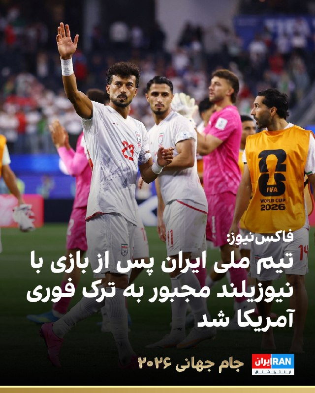

🔻به گزارش فاکس‌نیوز، در پی یک تغییر برنامه غیرمنتظره، به تیم ملی فوتبال ایران دستور داده شد پس از بازی افتتاحیه خود در جام جهانی مقابل نیوزیلند، هرچه سریع‌تر خاک آمریکا را ترک کند. این در حالی است که پیش از این قرار بود ملی‌پوشان ایران شب را برای ریکاوری در لس‌آنجلس سپری کنند.

🔹امیر قلعه‌نویی، سرمربی تیم ملی ایران، گفت تنها چند ساعت پس از تساوی ۲-۲ مقابل نیوزیلند در یک بازی پرتنش، به آن‌ها دستور داده شد به کمپ تمرینی خود در تیخوانای مکزیک بازگردند. قلعه‌نویی با «بسیار عجیب» خواندن این وضعیت گفت: «آن‌ها حتی به ما زمان ریکاوری ندادند و گفتند باید فورا سوار هواپیما شوید. تصمیم‌گیری‌ها برای ما در جای دیگری انجام می‌شود و فکر می‌کنم تیم ما مظلوم‌ترین تیم جام جهانی است.» او مشخص نکرد چه نهادی این دستور را صادر کرده است.

🔹همچنین مهدی طارمی، کاپیتان تیم ملی ایران، با اشاره به بازرسی‌های امنیتی شدید ۵ ساعته در مسیر ورود به آمریکا، شرایط را یک «فاجعه» نامید و خواستار کمک بیشتر فیفا شد.

@iranintltvsport

## IranIntlTV — post 342808

«#تیتر_اول با #نیوشا_صارمی»؛ شنبه تا چهارشنبه ساعت ۲۰:۰۰ تهران 

از خبرهای فوری تا راستی‌آزمایی موضوعات بحث‌برانگیز در «#زیر_ذره‌بین»؛

در جریان بمانید! 
@iranintltv

## FarsiVOA — post 220993

  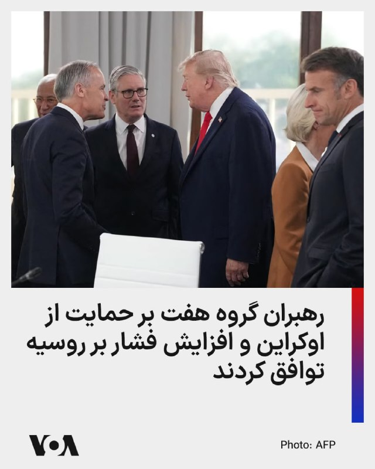

رویترز گزارش داد رهبران کشورهای گروه هفت روز چهارشنبه در بیانیه‌ای مشترک اعلام کردند در حمایت از اوکراین، از جمله تمامیت ارضی این کشور، متحد هستند و برای افزایش فشار بر اقتصاد جنگی روسیه توافق کرده‌اند.

رهبران گروه هفت که برای نشست سران در اویان-له-بن فرانسه گرد آمده‌اند، گفتند در این چارچوب تحریم‌ها علیه روسیه، از جمله تحریم‌های مربوط به بخش‌های نفت و گاز، را تقویت خواهند کرد.

رویترز نوشت این موضع در بیانیه‌ای مشترک مطرح شد که هدف آن نشان دادن وحدت کشورهای گروه هفت در برابر مسکو است.

در بخش جداگانه‌ای از بیانیه، رهبران گروه هفت از توافق میان آمریکا و جمهوری اسلامی استقبال کردند و گفتند آماده‌اند در اجرای آن مشارکت کنند.

آنها همچنین اعلام کردند برای کاهش آسیب‌پذیری بازارهای جهانی، تلاش‌ها برای متنوع‌سازی مسیرهای تأمین انرژی، کاهش وابستگی به تنگه هرمز و افزایش ذخایر انرژی را پیگیری خواهند کرد.
@FarsiVOA

## alonews — post 128607

  <a href="telegram/content/alonews_128607_1781680974.mp4" target="_blank">🎬 Download video</a>

👈وزیر دارایی اسرائیل، بزالل اسموتریچ:
در غزه، ما همچنان به پیشروی خود ادامه می‌دهیم. امروز کمی جلوتر رفتیم. ما در حال حاضر به 70 درصد نزدیک می‌شویم.

🔴ما تقریباً 70 درصد نوار غزه را کنترل می‌کنیم.

🔴غزه ویران شده است.

🔴بدون غیرنظامی شدن، هیچ بازسازی‌ای وجود نخواهد داشت.

🔴ما اکنون در حال آماده‌سازی چندین طرح هستیم زیرا باید حماس را نابود کنیم.

✅ @AloNews خبر جنگ

---
📅 بروزرسانی: 1405/03/27 10:42
---

## WithYashar — post 15130

خبرنگار اسرائیلی : این یک اشتباه تاریخی است.
پرداخت میلیاردها دلار به بزرگترین حامی دولتی تروریسم در جهان، فقط باعث تأمین مالی راکت‌های بیشتر، پهپاد‌های بیشتر و حملات بیشتری علیه اسرائیل و غرب خواهد شد. این سیاست «آمریکا در اولویت اول» نیست.
@withyashar

## mwarmonitor — post 11049

🔴رسانه یونانی: نیروی دریایی یونان در حال آماده‌سازی برای استقرار دو واحد دریایی در نزدیکی تنگه هرمز است.

@mwarmonitor

## pm_afshaa — post 94229

🔴وزیر دارایی اسرائیل، بزالئل سموتریچ:هیچ عقب‌نشینی از لبنان صورت نخواهد گرفت—نه تا جمعه و نه بعد از جمعه 
💧 Rainbet.com the #1 Non-KYC Crypto Casino & Sportsbook @rainbetcom 
😁 @Pm_Afshaa

## pm_afshaa — post 94228

🔴وزیر دارایی اسرائیل، بزالئل سموتریچ:هیچ عقب‌نشینی از لبنان صورت نخواهد گرفت—نه تا جمعه و نه بعد از جمعه

💧 Rainbet.com the #1 Non-KYC Crypto Casino & Sportsbook @rainbetcom

😁 @Pm_Afshaa

## IranIntlTV — post 342807

  <a href="https://t.me/IranintlTV/342807" target="_blank">📎 Download file</a>

🎧نسخه صوتی اخبار بامدادی | چهارشنبه ۲۷ خرداد
@iranintlTV

## IranIntlTV — post 342806

  <a href="telegram/content/IranIntlTV_342806_1781680373.mp4" target="_blank">🎬 Download video</a>

یک شهروند با ارسال ویدیویی به ایران‌اینترنشنال در چهارشنبه ۲۷ خرداد، صف طولانی خودروها را در یکی از جاده‌های استان تهران برای دریافت گازوئیل نشان می‌دهد.

## FarsiVOA — post 220992

  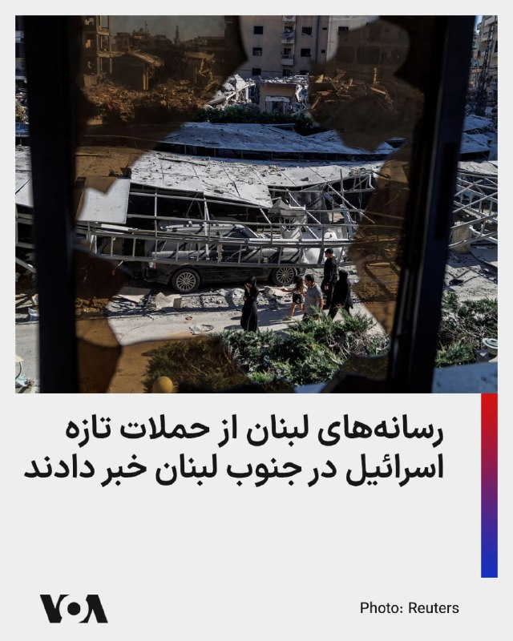

رسانه‌های لبنان گزارش دادند که ارتش اسرائیل حملات تازه‌ای را در جنوب لبنان انجام داده است.

بر اساس این گزارش،خبرگزاری ملی لبنان اعلام کرد جنگنده‌های اسرائیلی منطقه نبطیه‌الفوقا در جنوب لبنان را هدف قرار دادند و یک حمله پهپادی نیز روستای انصاریه، در ساحل جنوب لبنان، را هدف گرفت.

تایمز اسرائیل نوشت ارتش اسرائیل تا زمان انتشار این گزارش درباره این حملات اظهار نظر نکرده است.

این گزارش در حالی منتشر می‌شود که در روزهای گذشته نیز جنوب لبنان شاهد حملات هوایی و پهپادی اسرائیل بوده است.

رویترز روز سه‌شنبه به نقل از خبرگزاری ملی لبنان گزارش داده بود حملات پهپادی اسرائیل به سه خودرو در جنوب لبنان دست‌کم چهار کشته و شماری زخمی بر جا گذاشت.

جزئیات بیشتری درباره تلفات احتمالی حملات تازه، هدف‌های مورد اصابت، یا واکنش رسمی ارتش اسرائیل اعلام نشده است.
@FarsiVOA

## alonews — post 128606

  <a href="telegram/content/alonews_128606_1781680376.webm" target="_blank">🎬 Download video</a>

👈انهدام مهمات عمل‌نکرده در تبریز

✅ @AloNews خبر جنگ

---
📅 بروزرسانی: 1405/03/27 10:33
---

## VahidOOnLine — post 245971

  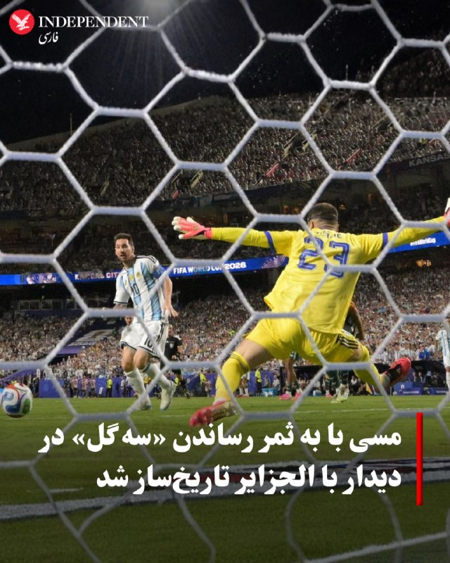

♦️لیونل مسی، مهاجم ۳۸ ساله تیم ملی آرژانتین پس از آنکه سه بار دروازه الجزایر را در نخستین دیدار جام جهانی باز کرد، رکورد بهترین گل‌ زن تاریخ جام جهانی را در کنار میروسلاو کلوزه آلمانی به دست آورد.

این اولین «هت‌تریک» (سه‌ گل در یک بازی) مسی در جام جهانی بود، شاهکاری که تنها کریستیانو رونالدو به آن دست یافته است.

جادوگر آلبی‌سلسته‌ها در دقیقه ۷۹ در میان تشویق و احترام تماشاگران تعویض شد.
‌🇸🇦 Indypersian

🤖 @VahidOOnLine

## WithYashar — post 15129

  <a href="telegram/content/WithYashar_15129_1781679810.mp4" target="_blank">🎬 Download video</a>

مایک پنس، معاون سابق ترامپ: «به نظر من بهتر است به نیروهای مسلح ایالات متحده اجازه دهیم کار را تمام کنند، تنگه را باز کنند و قابلیت‌های تهاجمی ایرانیان را از بین ببریم و به مردم ایران فرصتی واقعی برای آزادی بدهیم.»
@withyashar

## pm_afshaa — post 94227

  <a href="telegram/content/pm_afshaa_94227_1781679813.webm" target="_blank">🎬 Download video</a>

هنوز میرین گیگی 10 15 هزار تومن پول سرور میدین!؟
بیاین از اینجا سرعت بالاش رو بخرین فقط گیگی 3 هزار تومن
👇
👇
👇

⚡️ @Lex_Server

⚡️ @Lex_Server

## DW_Farsi — post 126082

  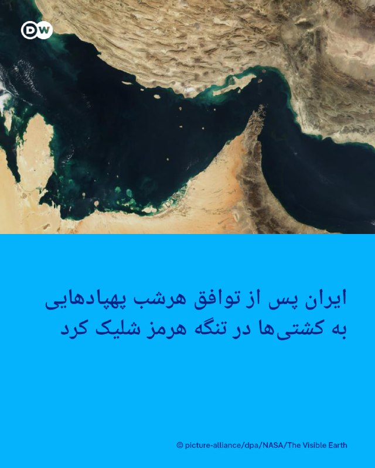

🔶 "ایران پس از توافق هرشب پهپادهایی به کشتی‌ها در تنگه هرمز شلیک کرد"

شبکه "ان‌بی‌سی‌ نیوز" روز چهارشنبه ۲۷ خرداد (۱۷ ژوئن) گزارش داد جمهوری اسلامی از زمان امضای یادداشت تفاهم میان آمریکا و ایران در روز یکشنبه ۱۴ ژوئن، "هر شب پهپادهایی را به سمت کشتی‌های تجاری در تنگه هرمز شلیک کرده است".

یک مقام آمریکایی به این رسانه گفته است که ارتش آمریکا پهپادهای شلیک‌شده توسط سپاه پاسداران را "پیش از آنکه بتوانند کشتی‌ها یا نیروهای حاضر در منطقه را تهدید کنند، سرنگون می‌کند".

این‌همه در حالی است که واشنگتن و تهران در حال آماده‌سازی برای امضای رسمی چارچوب یک توافق در روز جمعه ۱۹ ژوئن هستند. طبق گزارش‌ها و بنا بر گفته مقامات کاخ سفید، این توافق پیش‌تر به‌صورت دیجیتالی در روز یکشنبه ۱۴ ژوئن امضا شده است.

@dw_farsi

## alonews — post 128605

  <a href="telegram/content/alonews_128605_1781679814.webm" target="_blank">🎬 Download video</a>

👈بلومبرگ: آمریکا آماده است در توافق صلح، منافع مالی گسترده‌ای به ایران ارائه کند؛ مانند حق فروش فوری نفت، دسترسی به صندوق توسعه‌ ۳۰۰ میلیارد دلاری و دارایی‌های مسدود شده خود

✅ @AloNews خبر جنگ

---
📅 بروزرسانی: 1405/03/27 10:22
---

## VahidOOnLine — post 245970

  <a href="telegram/content/VahidOOnLine_245970_1781679165.mp4" target="_blank">🎬 Download video</a>

جی‌دی ونس، معاون رییس‌جمهوری آمریکا، ادعای پرداخت پول از سوی واشینگتن به تهران را رد کرد و گفت جمهوری اسلامی تا زمانی که به حمایت مالی از حزب‌الله و دیگر گروه‌های مورد حمایت خود ادامه دهد، از مزایای اقتصادی توافق بهره‌مند نخواهد شد.

گزارش مریم رحمتی، خبرنگار ایران‌اینترنشنال
‌🏁 🇬🇧 IranintlTV

🤖 @VahidOOnLine

## IranIntlTV — post 342804

  <a href="telegram/content/IranIntlTV_342804_1781679167.mp4" target="_blank">🎬 Download video</a>

جی‌دی ونس، معاون رییس‌جمهوری آمریکا، ادعای پرداخت پول از سوی واشینگتن به تهران را رد کرد و گفت جمهوری اسلامی تا زمانی که به حمایت مالی از حزب‌الله و دیگر گروه‌های مورد حمایت خود ادامه دهد، از مزایای اقتصادی توافق بهره‌مند نخواهد شد.

گزارش مریم رحمتی، خبرنگار ایران‌اینترنشنال

## alonews — post 128604

  <a href="telegram/content/alonews_128604_1781679168.webm" target="_blank">🎬 Download video</a>

👈وزیر خارجه چین: توافق فعلی بین ایران و آمریکا آغاز راه است، نه نقطه پایان

🔴وانگ یی در گفت‌و‌گو با همتای پاکستانی خود: توافق فعلی، آغاز راه است، نه نقطه پایان؛ از این رو، تداوم صلح در خاورمیانه و منطقه خلیج فارس همچنان به تداوم تلاش‌های همه طرف‌ها نیاز دارد.

🔴چین نیز به روش خود به میانجیگری بین ایران و آمریکا پرداخته است

✅ @AloNews خبر جنگ

## alonews — post 128603

  <a href="telegram/content/alonews_128603_1781679168.mp4" target="_blank">🎬 Download video</a>

👈مایک پنس، معاون سابق ترامپ: «به نظر من بهتر است به نیروهای مسلح ایالات متحده اجازه دهیم کار را تمام کنند، تنگه را باز کنند و قابلیت‌های تهاجمی ایرانیان را از بین ببریم و به مردم ایران فرصتی واقعی برای آزادی بدهیم.»

✅ @AloNews خبر جنگ

## alonews — post 128602

👈سرقت خودپرداز بانک با لیفتراک در بریتانیا

🔴 سارقان با یک لیفتراک تلسکوپی شبانه به شعبه بانک در کمبریج‌شایر رفتند و دستگاه خودپرداز را از دیوار کندند. پلیس اعلام کرد لیفتراک هم سرقتی بوده است

✅ @AloNews خبر جنگ

---
📅 بروزرسانی: 1405/03/27 10:12
---

## VahidOOnLine — post 245969

🗣روایت شما از بحران اقتصادی و زندگی بعد از توافق- چهارشنبه ۲۷ خرداد:

🔹زیر سایه این حکومت سوختیم. چشم‌مون را روی همه آرزوهامون بستیم. مثل تراکتور کار کردیم، تنها دلخوشی‌مون خانواده بود تا یک زندگی بسازیم به‌بهای برباد رفتن جوونی‌مون. حالا که بچه‌ها بزرگ شدند، دردمون هزار برابر شده با خرج‌های کمرشکن و دغدغه آینده بچه‌ها.

🔹هزینه‌های پزشکی مخصوصا ارتوپدی کمرشکن شده؛ یک صندل و کفی برای کفش شده ۹ میلیون و ۵۰۰ هزار تومان. کف پای دخترم صافه و هزینه عمل می‌شه ۲۵۰ میلیون تومان.

🔹بعد از اختلالی که در بانک تجارت پیش اومد، مبالغی که از پوز تجارت کارت کشیده شده به حسابمون برنگشته. دزدی در روز روشن؟

🔹من یه دست‌فروش خرده‌فروشم. کل سرمایه‌ام همون جنسیه که هر روز می‌فروشم. حالا که بانک تجارت پولی که مشتریام کارت کشیدن رو به حسابم واریز نمی‌کنه، چطور جنس جدید بیارم؟ سه روزه نمی‌تونم برم بازار.

🔹بیمار قلبی هستم؛ طی کمتر از یک ماه، قیمت داروهایم از ۳.۵ میلیون به ۱۴ میلیون و ۷۰۰ هزار تومان رسیده است.

🔹یک شانه تخم‌مرغ شده ۴۹۵ هزار تومان، نیم کیلو گوشت چرخ کرده مخلوط گوسفند و گوساله ۶۲۵ هزار تومان، یه رب گوجه ۴۰۰ گرمی ۱۰۰ هزار تومان.
‌🏁 🇬🇧 IranintlTV

🤖 @VahidOOnLine

## pm_afshaa — post 94225

🔴ارتش اسراییل: 4تروریست حزب‌الله که از حمایت ایران برخوردار بودند، در حملات جدید نیروهای دفاعی اسرائیل در جنوب لبنان کشته شدن

💧 Rainbet.com the #1 Non-KYC Crypto Casino & Sportsbook @rainbetcom

😁 @Pm_Afshaa

## IranIntlTV — post 342803

🗣روایت شما از بحران اقتصادی و زندگی بعد از توافق- چهارشنبه ۲۷ خرداد:

🔹زیر سایه این حکومت سوختیم. چشم‌مون را روی همه آرزوهامون بستیم. مثل تراکتور کار کردیم، تنها دلخوشی‌مون خانواده بود تا یک زندگی بسازیم به‌بهای برباد رفتن جوونی‌مون. حالا که بچه‌ها بزرگ شدند، دردمون هزار برابر شده با خرج‌های کمرشکن و دغدغه آینده بچه‌ها.

🔹هزینه‌های پزشکی مخصوصا ارتوپدی کمرشکن شده؛ یک صندل و کفی برای کفش شده ۹ میلیون و ۵۰۰ هزار تومان. کف پای دخترم صافه و هزینه عمل می‌شه ۲۵۰ میلیون تومان.

🔹بعد از اختلالی که در بانک تجارت پیش اومد، مبالغی که از پوز تجارت کارت کشیده شده به حسابمون برنگشته. دزدی در روز روشن؟

🔹من یه دست‌فروش خرده‌فروشم. کل سرمایه‌ام همون جنسیه که هر روز می‌فروشم. حالا که بانک تجارت پولی که مشتریام کارت کشیدن رو به حسابم واریز نمی‌کنه، چطور جنس جدید بیارم؟ سه روزه نمی‌تونم برم بازار.

🔹بیمار قلبی هستم؛ طی کمتر از یک ماه، قیمت داروهایم از ۳.۵ میلیون به ۱۴ میلیون و ۷۰۰ هزار تومان رسیده است.

🔹یک شانه تخم‌مرغ شده ۴۹۵ هزار تومان، نیم کیلو گوشت چرخ کرده مخلوط گوسفند و گوساله ۶۲۵ هزار تومان، یه رب گوجه ۴۰۰ گرمی ۱۰۰ هزار تومان.

## BBCPersian — post 284109

🔻تورم ماهانه بریتانیا در ماه مه، تحت تاثیر جنگ آمریکا و اسرائیل با ایران، همچنان ۲.۸ درصد باقی ماند

نرخ تورم سالانه در بریتانیا در ماه مه بدون تغییر نسبت به ماه قبل همچنان ۲.۸ درصد باقی مانده است.

بنابر این گزارش، قیمت بنزین و سوخت در بریتانیا به خاطر جنگ آمریکا و اسرائیل با ایران بالا رفته است. اما در همان زمان، قیمت مواد غذایی پایین آمده و این کاهش، اثر گرانی سوخت را تا حدی خنثی کرده است.

اداره ملی آمار بریتانیا روز چهارشنبه اعلام کرد شاخص قیمت مصرف‌کننده با رقم ثبت‌شده در ماه آوریل برابر بوده است.

این در حالی است که تحلیلگران پیش‌بینی می‌کردند این شاخص تا سطح ۳ درصد افزایش یابد.
https://bbc.in/4vZEZrP
@BBCPersian

## Dirty_Kids — post 392366

  <a href="telegram/content/Dirty_Kids_392366_1781678567.mp4" target="_blank">🎬 Download video</a>

قسط یک ماه کاوازاکی نینجا ۶۵۰ سی‌سی رو میشه با روزی ۶ ساعت کار کردن تو سوئیس دراورد!

+ مادرتو گاییدم آخوند که مردم ایران روی گنج خوابیدن ولی برای جوونا این موتور آرزوی دست نیافتنیه!

@Dirty_Kids 👻

## Dirty_Kids — post 392365

  <a href="telegram/content/Dirty_Kids_392365_1781678568.mp4" target="_blank">🎬 Download video</a>

اینوری خیلی قشنگه ولی اونوریه انقد قشنگه که به چشم نمیاد

@Dirty_Kids 👻

## alonews — post 128601

  <a href="telegram/content/alonews_128601_1781678570.webm" target="_blank">🎬 Download video</a>

👈ونس: اگر ایران همان راهی را که عربستان سعودی رفت طی کند، ایالات متحده کمک خواهد کرد که کشوری موفق باشد.

✅ @AloNews خبر جنگ

## alonews — post 128600

  <a href="telegram/content/alonews_128600_1781678570.webm" target="_blank">🎬 Download video</a>

👈وزیر دارایی اسرائیل:توافق با ایران بد است

🔴 ترامپ از منافع کشور خودش محافظت می‌کند و ما از منافع خودمان

🔴 باید بدانیم که چگونه این بحران را مدیریت کنیم و در عین حال، بر مواضع خود بایستیم

✅ @AloNews خبر جنگ

---
📅 بروزرسانی: 1405/03/27 10:03
---

## VahidOOnLine — post 245968

  <a href="telegram/content/VahidOOnLine_245968_1781678017.mp4" target="_blank">🎬 Download video</a>

♦️تصاویر «دست دادن با اکراه» دونالد ترامپ، رئیس جمهوری آمریکا با امانوئل مکرون، رئیس جمهوری فرانسه در جریان نشست سران گروه ۷ (جی ۷) خبرساز شده است.

در این ویدیو دیده می‌شود که در زمان گرفتن عکس رهبران دو کشور، مکرون پس از درخواست خبرنگاران، دستش را به سوی دونالد ترامپ دراز می‌کند اما رئیس جمهوری آمریکا، برخلاف دست دادن‌های طولانی و «پرفشار» سابق، این بار با بی‌میلی تمام با همتای فرانسوی دست می‌دهد.

خبرنگار شبکه ب‌اف‌ام فرانسه، این وضعیت را با دست دادن طولانی‌مدت و گرم ترامپ با برژیت مکرون در جریان همین اجلاس مقایسه کرد.
‌🇸🇦 Indypersian

🤖 @VahidOOnLine

## FarsiVOA — post 220991

  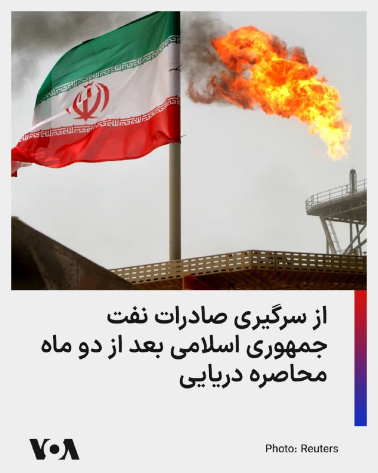

در حالی مقامات جمهوری اسلامی از کسری فزاینده گاز به خاطر آنچه «آسیب‌های جنگ به تاسیسات گازی عسلویه» خبر می‌دهند که صادرات گاز کشور به ترکیه کماکان روند صعودی چشمگیری را تجربه می‌کند.

گزارش جدید اداره تنظیم بازار انرژی ترکیه نشان می‌دهد ایران در ماه ابتدایی جنگ، مارس، ۸۲۳ میلیون متر مکعب گاز تحویل ترکیه داده که ۴۶ درصد بیشتر از ماه مشابه پارسال است. در ماه آوریل این رقم حتی به ۹۴۵ میلیون متر مکعب اوج گرفته است.

در مجموع طی چهار ماه ابتدایی ۲۰۲۶ ایران حدود ۲.۷ میلیارد متر مکعب گاز تحویل ترکیه داده که ۷۶ درصد بیشتر از دور مشابه پارسال است.

توافق ۲۵ ساله صادرات گاز ایران ترکیه در ماه آینده به پایان می‌رسد و هنوز ترکیه تصمیمی برای تمدید آن نگرفته است.
@FarsiVOA

## FarsiVOA — post 220990

  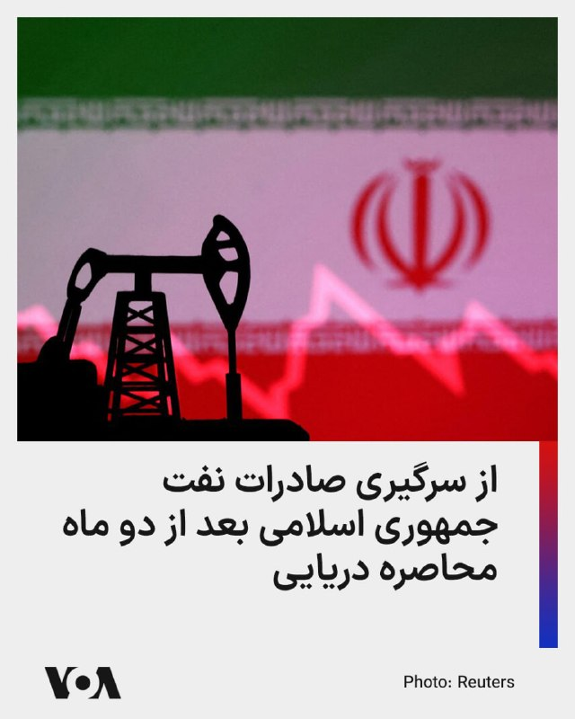

شرکت‌های ردیابی نفتکش‌ها از سرگیری صادرات نفت جمهوری اسلامی بعد از دو ماه محاصره دریایی توسط ایالات متحده خبر دادند.

تانکر ترکرز می‌گوید دست‌کم دو نفتکش متعلق به شرکت ملی نفتکش ایران با نام‌های «دیونا» و «هرو ۲» از محاصره دریایی آمریکا عبور کرده و یک نفتکش دیگر با نام «استریم» در حال نزدیک شدن به خط محاصره در نزدیکی آب‌های پاکستان است.

طبق برآورد شرکت‌های ردیابی نفتکش‌ها، از جمله کپلر، بیش از ۶۰ میلیون بشکه نفت ایران در آب‌های جنوب طی دو ماه گذشته گرفتار محاصره دریایی شده‌ است.

اخیراً دونالد ترامپ رئیس‌جمهور آمریکا در چهارچوب توافق با جمهوری اسلامی، دستور رفع محاصره دریایی علیه رژیم حاکم ایران را صادر کرد.
@FarsiVOA

## BBCPersian — post 284108

🔻گزارش‌ها از حملات هوایی اسرائیل به چندین نقطه در جنوب لبنان

نیروهای اسرائیلی چهارشنبه چندین نقطه در جنوب لبنان را بمباران کردند.

رسانه‌های دولتی لبنان گزارش دادند که این حملات در حالی انجام شده که توافق آتش‌بس مرتبط با جنگ خاورمیانه، لبنان را نیز در بر می‌گیرد.

خبرگزاری ملی لبنان اعلام کرد جنگنده‌های اسرائیلی در این حملات مناطقی از جمله نبطیه را هدف قرار دادند.

بر اساس گزارش این خبرگزاری، اسرائیل همچنین با استفاده از پهپاد شهر انصاریه در منطقه زهرانی را هم هدف قرار داده است.

https://bbc.in/43Bd6dr
@BBCPersian

## alonews — post 128599

  <a href="telegram/content/alonews_128599_1781678021.mp4" target="_blank">🎬 Download video</a>

👈وضعیت جوریه که حتی رهبر جمهوری خواهان سنا هم مثل من و شما از مفاد تفاهم نامه خبر نداره!

✅ @AloNews خبر جنگ

---
📅 بروزرسانی: 1405/03/27 09:53
---

## VahidOOnLine — post 245967

⭕️۱۴ بند یادداشت تفاهم تهران و واشنگتن به روایت بلومبرگ؛ تا دستیابی به توافق نهایی، ایران سطح کنونی برنامه هسته‌ای را حفظ می‌کند

📌آمریکا متعهد می‌شود با توجه به پیشرفت مذاکرات رسیدن به توافق نهایی،منابع مالی مسدود شده ایران آزاد شوند؛این منابع،چه در حساب‌های اصلی نگهداری شوند و چه منتقل شوند،برای پرداخت به هر ذی‌نفع نهایی که بانک مرکزی ایران تعیین کند، مورد استفاده قرار می‌گیرند

♦️انتظار می‌رود نمایندگان آمریکا و حکومت ایران روز جمعه یک یادداشت تفاهم امضا کنند که راه را برای ۶۰ روز مذاکره با هدف پایان دادن به جنگ و اعمال محدودیت‌های جدید بر برنامه هسته‌ای ایران هموار می‌کند.
بلومبرگ می‌گوید نسخه‌ای از این یادداشت تفاهم را مشاهده کرده و ۱۴ بند آن را به این ترتیب شرح داده است:

بیشتر بخوانید...
‌🇸🇦 Indypersian

🤖 @VahidOOnLine

## IranIntlTV — post 342802

  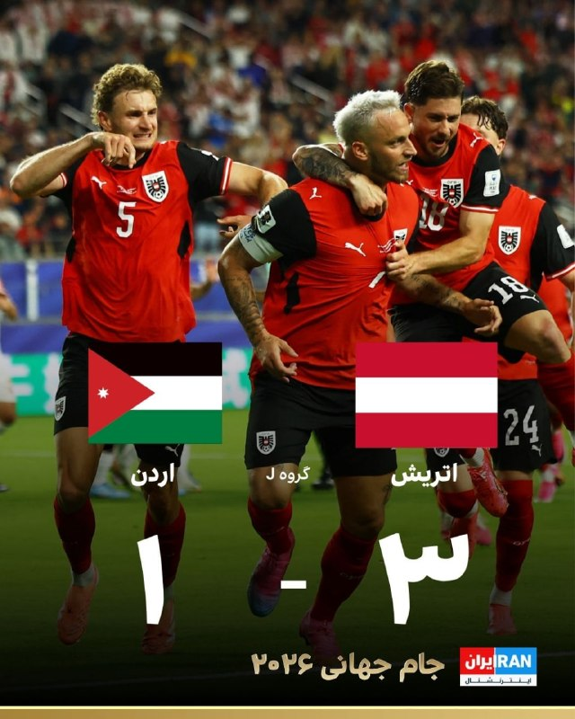

🔻تیم ملی فوتبال اتریش در اولین دیدار خود در جام جهانی ۲۰۲۶ از گروه J این رقابت‌ها با نتیجه ۳-۱ اردن را شکست داد.

🔹در این بازی ابتدا اشمید در دقیقه ۲۰ اتریش را پیش انداخت اما در دقیقه ۵۰ علی عولان گل تساوی را برای اردن به ثمر رساند.

🔹در ادامه همچنین علی عرب بازیکن اردن در دقیقه ۷۶ به اشتباه دروازه خودی را باز کرد. اما این پایان کار نبود و آرناتوویچ در دقیقه ۱۲+۹۰ از روی نقطه پنالتی گل سوم اتریش را وارد دروازه اردن کرد تا اتریش جام جهانی را با پیروزی قاطع آغاز کند.

@iranintltvsport

## DW_Farsi — post 126081

  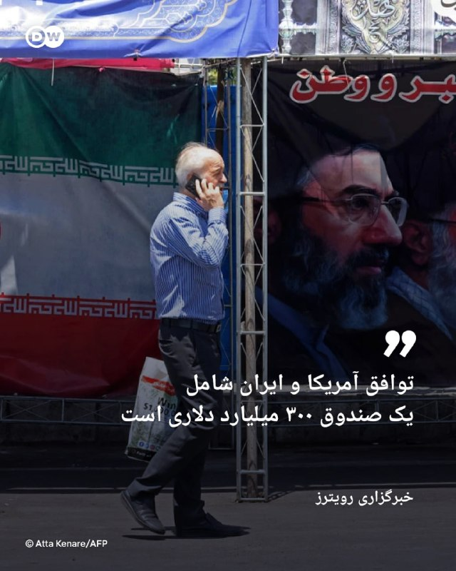

🔶 رویترز: توافق آمریکا و ایران شامل یک صندوق ۳۰۰ میلیارد دلاری است

خبرگزاری رویترز بر اساس اطلاعات منابع آگاه گزارش داده است که در چارچوب توافق برنامه‌ریزی‌شده میان آمریکا و ایران، یک صندوق سرمایه‌گذاری خصوصی به ارزش "۳۰۰ میلیارد دلار" برای بازسازی این کشور در نظر گرفته شده است.

یک منبع آگاه که نامش فاش نشده، به خبرگزاری رویترز گفت که تاکنون درباره بیش از نیمی از این مبلغ، تعهدهای لازم داده شده است. هدف از تاسیس این صندوق "ایجاد انگیزه اقتصادی برای هر دو طرف جهت نهایی‌سازی توافق" عنوان شده است.

آمریکا و ایران روز یکشنبه ۲۴ خرداد (۱۴ ژوئن) بر سر چارچوب پایان دادن به درگیری‌ای که از ماه فوریه ادامه داشته، به توافق رسیدند و اکنون برای امضای آن در روز جمعه ۱۹ ژوئن آماده می‌شوند.

طبق گزارش رویترز "صندوق بازسازی و توسعه" ابزاری برای سرمایه‌گذاری خصوصی است و "شامل هیچ‌گونه بودجه یا کمک دولتی نمی‌شود".

@dw_farsi

## Persian_Trend_Official — post 17323

  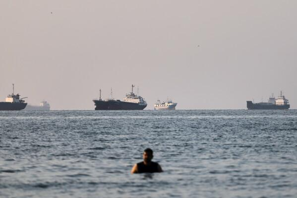

بلومبرگ: یادداشت تفاهم پیشنهادی ایالات متحده و ایران، پایان فوری و دائمی جنگ در تمام جبهه‌ها، از جمله لبنان، را ترسیم می‌کند و هر دو طرف متعهد می‌شوند که از اقدامات خصمانه خودداری کنند، به حاکمیت یکدیگر احترام بگذارند و ظرف 60 روز برای رسیدن به یک توافق نهایی مذاکره کنند.

پیش‌نویس این چارچوب خواستار لغو محاصره دریایی ایالات متحده، احیای کامل ناوبری تجاری از طریق تنگه هرمز، کاهش مرحله‌ای تحریم‌ها، معافیت از صادرات نفت ایران و آزادسازی تدریجی دارایی‌های مسدود شده ایران است. همچنین یک طرح توسعه اقتصادی 300 میلیارد دلاری برای ایران با حمایت ایالات متحده و شرکای منطقه‌ای پیشنهاد شده است.

بر اساس این سند، ایران تأکید می‌کند که هرگز سلاح هسته‌ای تولید نخواهد کرد، در حالی که هر دو طرف موافقند که مسائلی از جمله ذخایر اورانیوم غنی‌شده و ترتیبات گسترده‌تر هسته‌ای در یک توافق نهایی که از طریق یک مکانیسم اجرایی نظارت می‌شود و در نهایت توسط قطعنامه شورای امنیت سازمان ملل تأیید می‌شود، حل و فصل خواهد شد.

📝 Amir

📌 @persian_trend_official
پرشین ترند | متفاوت‌ترین کانال نظامی

## Persian_Trend_Official — post 17322

  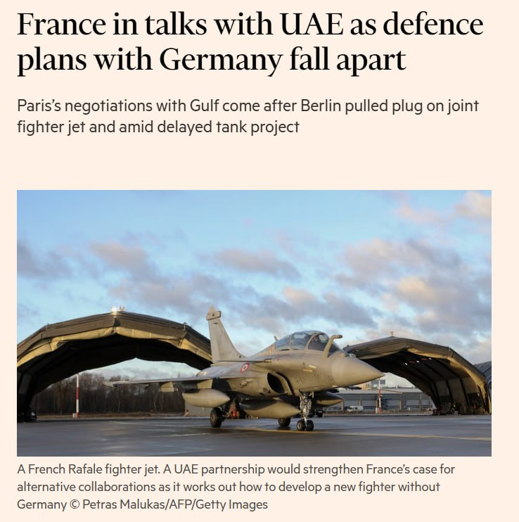

🇫🇷فرانسه درباره توسعه نسل آینده جنگنده رافال با امارات وارد مذاکره شد.

📰 روزنامه فایننشال تایمز گزارش داده است که فرانسه، در پی بروز اختلافات و کندی پیشرفت برنامه جنگنده نسل آینده اروپا (FCAS)، مذاکراتی را با امارات متحده عربی برای همکاری در توسعه و ارتقای نسل جدید جنگنده «رافال» آغاز کرده است.

⚔️این گفت‌وگوها بر بسته ارتقایی جدید رافال متمرکز است؛ نسخه‌ای که پیش‌بینی می‌شود در حدود سال ۲۰۳۰ وارد خدمت عملیاتی شود.

اگرچه نسخه آینده رافال جایگزین مستقیم پروژه FCAS نخواهد بود و از تمامی ویژگی‌های نسل ششم، از جمله قابلیت‌های پیشرفته پنهانکاری، بهره‌مند نیست، اما می‌تواند به عنوان بستری برای توسعه فناوری‌ها و جنگنده‌های آینده فرانسه در دهه ۲۰۴۰ مورد استفاده قرار گیرد.

⚔️ امارات متحده عربی، به عنوان یکی از بزرگ‌ترین کاربران خارجی جنگنده رافال، طی سال‌های اخیر قراردادهای مهمی برای خرید این هواپیما با فرانسه منعقد کرده است.

⚔️ همکاری احتمالی میان ابوظبی و پاریس می‌تواند منابع مالی، فنی و صنعتی مورد نیاز برای تداوم توسعه مستقل فناوری‌های رزمی هوایی فرانسه را تأمین کند.

⚔️این مذاکرات می‌تواند نشانه‌ای از تلاش فرانسه برای کاهش وابستگی به پروژه‌های مشترک اروپایی و حرکت به سمت همکاری‌های دوجانبه با شرکای ثروتمند خاورمیانه باشد. در صورت موفقیت، امارات ممکن است به یکی از شرکای اصلی توسعه نسل آینده توان هوایی فرانسه تبدیل شود.

👺 Phantom

📌 @persian_trend_official
پرشین ترند | متفاوت‌ترین کانال نظامی

## RadioFarda — post 158416

  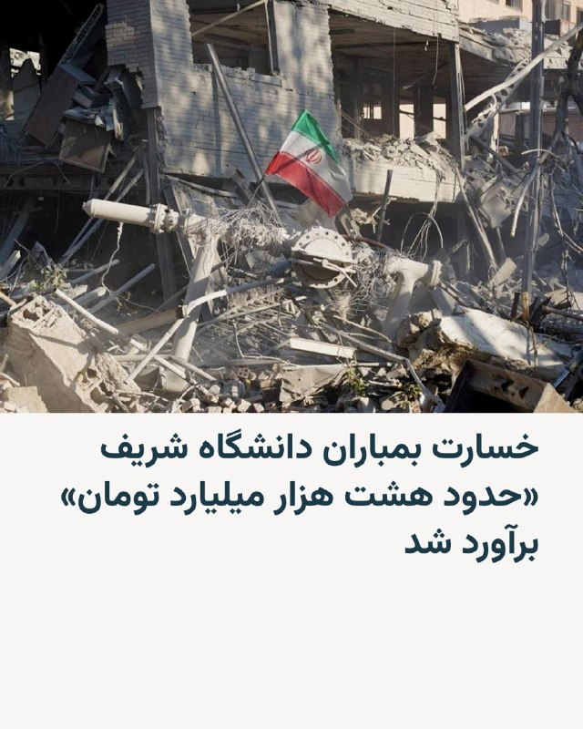

🔸رئیس دانشگاه صنعتی شریف می‌گوید در جنگ ۴۰ روزه، حدود هشت هزار میلیارد تومان به تجهیزات و زیرساخت‌های فناوری این دانشگاه خسارت وارد شده و مبلغ اختصاص‌یافته از سوی دولت برای بازسازی تنها یک‌چهارم منابع مورد نیاز این دانشگاه را پوشش می‌دهد.

🔸مسعود تجریشی روز چهارشنبه ۲۷ خرداد گفت: «بخش قابل توجهی از امکانات فناورانهٔ دانشگاه از بین رفته و در حال حاضر دانشگاه با حداقل امکانات به ارائهٔ خدمات ادامه می‌دهد، به‌گونه‌ای که برخی خدمات از جمله زیرساخت‌های هوش مصنوعی در دسترس نیست و ظرفیت محاسبات سریع نیز به حدود ۱۰ درصد کاهش یافته است.»

🔸رئیس دانشگاه شریف همچنین گفت ایستگاه اصلی گاز دانشگاه از مدار خارج شده و برآوردها نشان می‌دهد که بازسازی آن، پس از تحویل زمین و انجام سفارش‌های مورد نیاز، بیش از سه ماه زمان خواهد برد.

🔸این در حالی است که به‌گفتهٔ تجریشی، وزارت علوم تنها دو هزار و ۵۰۰ میلیارد تومان منابع مالی برای جبران خسارت به این دانشگاه اختصاص داده که فقط حدود یک‌چهارم منابع مورد نیاز دانشگاه را پوشش می‌دهد.

@RadioFarda

## BBCPersian — post 284107

💢«بداهه‌سرایی پای میز مذاکره»؛ قطار دیپلماسی بدون دیپلمات به کجا می‌رسد؟
🖌مهرنوش پورضیایی، بی‌بی‌سی، واشنگتن

بیش از صد روز از آغاز جنگی که قرار بود چند روزه باشد می‌گذرد؛ جنگی که در هفته‌های اخیر با تبادل حملات میان ایران، اسرائیل و آمریکا بار دیگر نشان داد آتش‌بس بیش از آنکه پایان بحران باشد، نامی موقت بر وضعیتی ناپایدار و آماده انفجار است. با این حال، در روزهای اخیر نشانه‌هایی از پیشرفت در مذاکرات برای پایان دادن به جنگ ظاهر شده و مقام‌های ایران، آمریکا و پاکستان از نزدیک شدن یک تفاهم احتمالی سخن گفته‌اند.
ناوهای آمریکایی همچنان در خلیج فارس حضور دارند، ایران و اسرائیل یکدیگر را به نقض آتش‌بس متهم می‌کنند و فضای بی‌اعتمادی همچنان بر روابط طرف‌ها سایه انداخته است. در عین حال، گزارش‌ها از نهایی شدن متن یک تفاهم‌نامه و احتمال امضای آن در روزهای آینده حکایت دارد؛ توافقی که در صورت تحقق می‌تواند نخستین گام جدی برای پایان دادن به بحرانی باشد که بیش از سه ماه منطقه را درگیر کرده است.
دیدارها دیگر تب‌وتاب روزهای نخست را ندارند، اما کانال‌های مستقیم و غیرمستقیم مذاکره همچنان فعال‌اند. پس از ماه‌ها بن‌بست و تشدید تنش، اکنون برای نخستین بار زمزمه‌های دستیابی به توافقی پایدار بیش از گذشته شنیده می‌شود؛ هرچند با توجه به سابقه مواضع متغیر و گاه غیرقابل پیش‌بینی دونالد ترامپ، بسیاری از تحلیلگران همچنان با دیده تردید به ادعاهای مطرح‌شده درباره نزدیک بودن پایان بحران می‌نگرند.
ادامه مطلب⬇️
https://bbc.in/3Q7zfwV
@BBCPersian

---
📅 بروزرسانی: 1405/03/27 09:43
---

## WithYashar — post 15128

چند ساعت پیش، دونالد ترامپ با استناد به قانون تولید دفاعی (یک قانون از سال ۱۹۵۰ در دوران جنگ سرد)، دستور داد تا تولید مهمات، موشک‌ها و تجهیزات دفاعی آمریکا سریع‌تر شود. این فرمان در ۱۱ ژوئن به وزیر دفاع پیته هگست ارسال شد و مشکلات سیستمی در صنعت مهمات را هدف گرفت: ظرفیت تولید محدود، زنجیره‌های تأمین ضعیف، وابستگی‌های طولانی‌مدت و گلوگاه‌های تولید.
هدف اصلی: تسریع تولید مهمات حیاتی، موشک‌ها و تجهیزات دفاعی برای دفاع ملی آمریکا.
نحوه اجرا: قانون به ترامپ اجازه می‌دهد با شرکت‌های خصوصی توافق‌های داوطلبه ایجاد کند، تولید را اولویت‌دار کند و زنجیره‌های تأمین را تقویت نماید.
توافق مهم: شرکت لاکهید مارتین اعلام کرد با دولت آمریکا برای چهار برابر کردن تولید مهمات حیاتی به توافق رسیده است.
دلیل اقدام: کاهش ذخایر تسلیحاتی آمریکا پس از جنگ با ایران و استفاده از مهمات در ایران و ونزوئلا، که باعث افزایش سفارشات مهمات شد.
@withyashar

## FarsiVOA — post 220989

  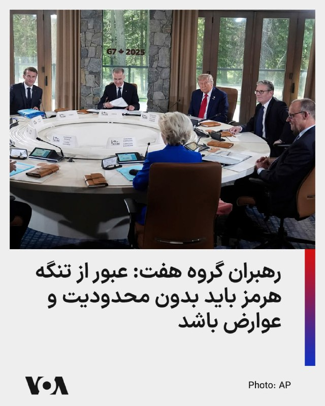

رهبران گروه هفت در بیانیه‌ای رسمی اعلام کردند حق عبور از مسیرهای دریایی، از جمله تنگه هرمز، باید بدون محدودیت و بدون دریافت عوارض باقی بماند و آن را از پایه‌های تجارت بین‌المللی دانستند.

در این بیانیه که پس از اعلام توافق آمریکا و جمهوری اسلامی منتشر شد، رهبران گروه هفت از بازگشایی تنگه هرمز حمایت کردند و گفتند آماده‌اند در اجرای این روند مشارکت کنند.

آنها همچنین از ابتکار دفاعی فرانسه و بریتانیا برای کمک به ازسرگیری تردد دریایی در هرمز پشتیبانی کردند؛ طرحی که هدف آن حفاظت از کشتی‌های تجاری، اطمینان‌بخشی به شرکت‌های کشتیرانی و کمک به راستی‌آزمایی پاک‌سازی مین‌ها عنوان شده است.

گروه هفت همچنین بر ضرورت کاهش آسیب‌پذیری جهانی در برابر اختلال در تنگه هرمز و متنوع‌سازی مسیرهای تأمین انرژی تأکید کرد.
@FarsiVOA

## Persian_Trend_Official — post 17321

  <a href="telegram/content/Persian_Trend_Official_17321_1781676782.mp4" target="_blank">🎬 Download video</a>

ارتش آمریکا روز گذشته یک کشتی مظنون به قاچاق مواد مخدر را در شرق اقیانوس آرام هدف حمله پهپادی خود قرار داد.

از سه سرنشین قایق، یکی از سرنشینان کشته و دو سرنشین دیگر موفق به فرار شدند، گارد ساحلی امریکا عملیات جستجو و نجات فوری برای یافتن آن دو قاچاقچی آغاز کرده است.

📝 Amir

📌 @persian_trend_official
پرشین ترند | متفاوت‌ترین کانال نظامی

## BBCPersian — post 284097

🖋بخش پادکست‌
بی‌بی‌سی روسی

ایران و آمریکا برای پایان دادن به جنگ به تفاهم رسیده‌اند. دونالد ترامپ، رئیس‌جمهور آمریکا، با اعلام این خبر گفت: «بگذارید نفت جاری شود.» مقام‌های ایرانی نیز در مقابل از پیروزی بر آمریکا سخن گفته‌اند. با این حال، هنوز اطلاعات بسیار اندکی درباره محتوای این توافق منتشر شده است. این مصالحه دقیقا چیست؟ کدام طرف از آن بیشتر سود می‌برد؟ و آیا این صلح پایدار خواهد بود؟

سوا بویکو، مجری پادکست سرویس روسی بی‌بی‌سی، این پرسش‌ها را با نیکیتا اسماگین، ایران‌شناس و صاحب کانال تلگرامی «اسلام‌گرایی از زبان یک عامل خارجی»، در میان گذاشته است. دولت روسیه آقای اسماگین را در فهرست «عوامل خارجی» ثبت کرده است.
ادامه مطلب⬇️

📸GettyImages/ Reuters/ AFP via Getty Images/ U.S. Navy via Getty Images/ NurPhoto via Getty Images
https://bbc.in/4aAHsAu
@BBCPersian

## alonews — post 128598

  <a href="telegram/content/alonews_128598_1781676783.mp4" target="_blank">🎬 Download video</a>

👈ونس درباره ایران: دلیل اینکه متن تفاهم‌نامه را منتشر نکرده‌ایم این است که برخی از میانجی‌های ما؛ پاکستانی‌ها و قطری‌ها؛ از ما خواسته‌اند که این موضوع را به ترتیب درست انجام دهیم.

🔴 حساسیت‌هایی در جهان عرب و مسلمان وجود دارد که ما در تلاشیم به آن‌ها پاسخ دهیم.

✅ @AloNews خبر جنگ

## alonews — post 128597

  <a href="telegram/content/alonews_128597_1781676785.mp4" target="_blank">🎬 Download video</a>

👈ونس درباره ایران: ایرانی‌ها در موقعیتی هستند که می‌گویند می‌خواهند تعهدات بلندمدتی به ایالات متحده و کشورهای عرب خلیج فارس بدهند تا رابطه‌شان را تغییر دهند.

✅ @AloNews خبر جنگ

---
📅 بروزرسانی: 1405/03/27 09:33
---

## WithYashar — post 15127

  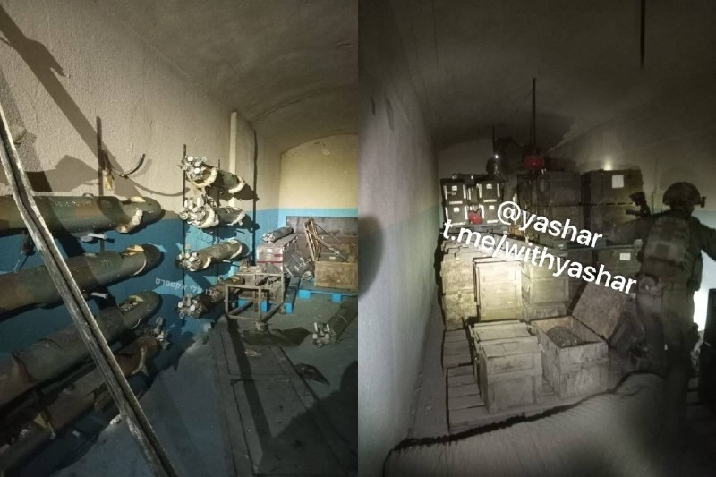

️ارتش اسرائیل اعلام کرد یک انبار تسلیحات جدید حزب‌الله حاوی ۵ تن مواد منفجره و ده‌ها پهپاد انتحاری را کشف کرده است
@withyashar

## WithYashar — post 15126

## VahidOnline — post 76439

  <a href="telegram/content/VahidOnline_76439_1781676217.mp4" target="_blank">🎬 Download video</a>

یک جت خصوصی تو یک اتوبان در تگزاس سقوط کرده، راننده‌ها رفتن کمک سرنشینها
J74wabx
یک نفر کشته شد؛ پنج نفر به دلیل استنشاق دود در بیمارستان بستری شدند.
AZ_Intel_

📡 @VahidOnline

## IranIntlTV — post 342801

  <a href="telegram/content/IranIntlTV_342801_1781676219.mp4" target="_blank">🎬 Download video</a>

رویترز گزارش داد شرکت‌هایی از آمریکا، کشورهای عربی حاشیه خلیج فارس، آسیا، آفریقا و آمریکای جنوبی متعهد شده‌اند بیش از ۱۵۰ میلیارد دلار از منابع صندوق ۳۰۰ میلیارد دلاری بازسازی و توسعه ایران را تامین کنند
@iranintltv

## RadioFarda — post 158415

  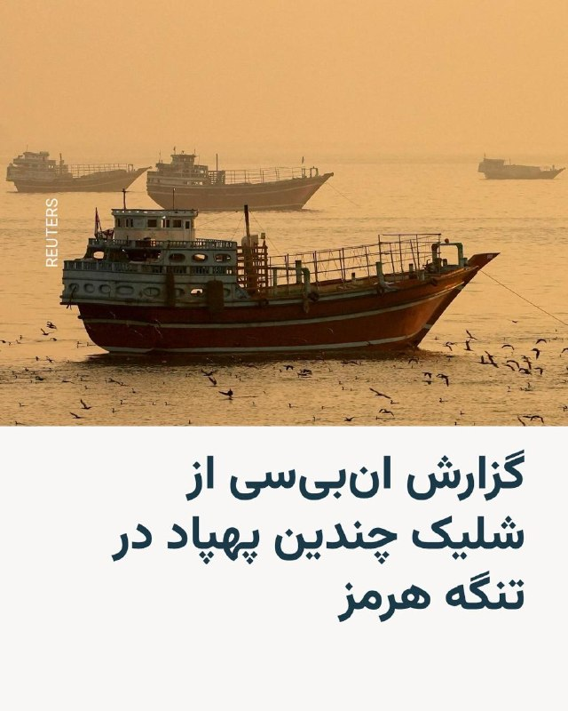

🔸شبکه خبری ان‌بی‌سی به نقل از یک مقام آمریکایی گزارش داد که حکومت ایران پس از اعلام توافق با آمریکا برای پایان جنگ، به سمت کشتی‌های تجاری در تنگه هرمز چندین پهپاد پرتاب کرده است.

🔸این مقام آمریکایی که نام و سمتش اعلام نشده، گفت که ارتش آمریکا این پهپادها را قبل از این‌که بتوانند کشتی‌های تجاری و خدمهٔ نظامی آمریکایی در منطقه را تهدید کنند، سرنگون کرده است.

🔸به‌ادعای این مقام آمریکایی، سپاه پاسداران انقلاب اسلامی از زمان امضای دیجیتالی یادداشت تفاهم در روز یکشنبه، هر شب چندین پهپاد شلیک کرده است.

🔸 بر اساس این گزارش، ارتش آمریکا همچنان در هماهنگی با شرکت‌های کشتیرانی برای پشتیبانی از کشتی‌هایی است که در تنگه هرمز رفت‌وآمد می‌کنند.

🔸حکومت ایران هنوز واکنشی به این گزارش نشان نداده است، اما در دو شب اخیر گزارش‌های پراکنده و تأییدنشده‌ای از شنیده شدن صدای انفجار در نزدیکی تنگه هرمز منتشر شده بود.

@RadioFarda

## alonews — post 128596

  <a href="telegram/content/alonews_128596_1781676222.mp4" target="_blank">🎬 Download video</a>

👈هواپیمای "سسنا ۶۸۰ سایتیشن لاتیتود" هنگام ورود به تگزاس منفجر شد

🔴 تیم‌های اورژانس به سرعت به محل حادثه رفتند.

🔴 ورود به پنجره کابین خلبان

✅ @AloNews خبر جنگ

---
📅 بروزرسانی: 1405/03/27 09:23
---

## WithYashar — post 15125

تنکر ترکرز: ۳.۸ میلیون بشکه نفت خام ایران از محاصره آمریکا عبور کرد تارنمای تنکر ترکز بامداد چهارشنبه گزارش داد، دو ابرنفتکش ایران که مجموعا حامل ۳.۸ میلیون بشکه نفت خام هستند، از محاصره آمریکا عبور کردند @withyashar

## WithYashar — post 15124

خبرنگار العربیه: جنگنده‌های اسرائیلی دو بار به شهرک‌های «انصاریه» و «المنصوره» در جنوب لبنان حمله کردند.
@withyashar

## DW_Farsi — post 126080

  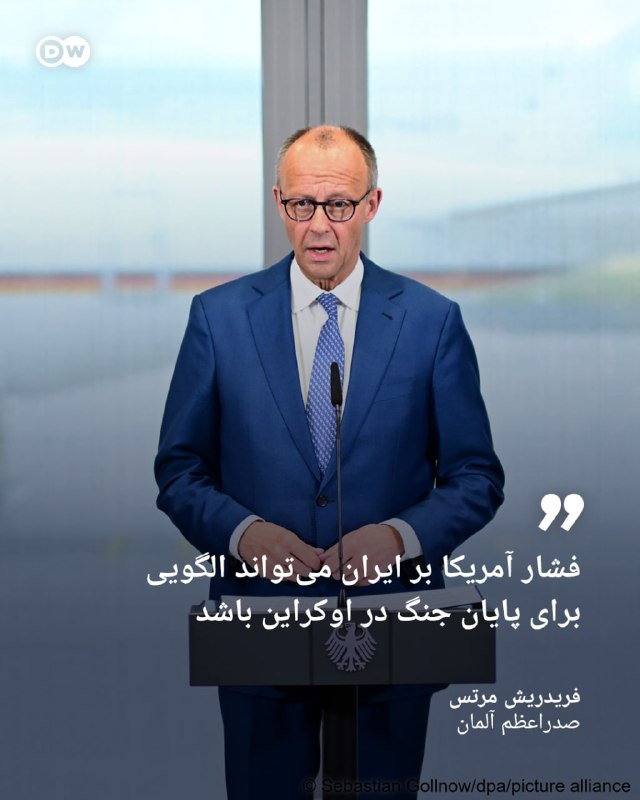

🔶 مرتس: فشار آمریکا بر ایران می‌تواند الگویی برای پایان جنگ در اوکراین باشد

فریدریش مرتس، صدراعظم آلمان، توافق میان آمریکا و ایران را به‌عنوان الگویی برای پایان جنگ در اوکراین توصیف کرد.

مرتس شامگاه سه‌شنبه ۲۶ خرداد (۱۶ ژوئن) در حاشیه نشست گروه هفت در شهر اویان فرانسه گفت این توافق "فرصتی بزرگ برای ثبات منطقه و بهبود اقتصاد جهانی" ایجاد می‌کند. او در این رابطه به کاهش قیمت نفت و رشد بازارهای سهام اشاره کرد.

صدراعظم آلمان همچنین افزود: «من مطمئن هستم که این توافق پایدار خواهد ماند.» او با اشاره به چارچوب توافق گفت: «آنچه از ایران می‌شنویم نشان می‌دهد که این کشور نیز آن را می‌پذیرد، زیرا باید بپذیرد که برتری نظامی آمریکا انتخاب دیگری باقی نگذاشته است.»

@dw_farsi

## Persian_Trend_Official — post 17320

  <a href="telegram/content/Persian_Trend_Official_17320_1781675591.mp4" target="_blank">🎬 Download video</a>

انفجار مهیب جت شخصی در تگزاس؛ کابین خلبان شکسته و ۱ نفر کشته شد.

👺Phantom

📌 @persian_trend_official
پرشین ترند | متفاوت‌ترین کانال نظامی

## RadioFarda — post 158414

رکوردهای بی‌نظیر مسی و فغانی در جام جهانی؛ عراق، اولین ناکام در جمع آسیایی‌ها

🔸دور اول مرحلۀ گروهی جام جهانی فوتبال با سه مسابقۀ دیگر و ثبت دو رکورد خارق‌العاده دنبال شد.

🔸سه‌شنبه‌شب در دیداری حساس از گروه ۹ مسابقات، که قضاوتش را علیرضا فغانی عهده‌دار بود، تیم‌های فرانسه و سنگال در مقابل هم قرار گرفتند.

🔸فرانسۀ پرستاره در نیمۀ اول بازی کم‌فروغ ظاهر شد و بازیکنان سنگال دو بار تا آستانۀ باز کردن دروازۀ این تیم هم پیش رفتند.

🔸نیمۀ دوم بازی هم کم و بیش پایاپای ادامه داشت، تا اینکه در دقیقه ۶۶، اِمباپه فوق ستارۀ خروس‌ها دروازۀ سنگال را گشود و جریان بازی را تغییر داد.

🔸شانزده دقیقۀ بعد، بارکولا که تنها دو دقیقۀ قبل به‌جای عثمان دمبله به میدان آمده بود، دومین گل فرانسه را به ثمر رساند تا خیال دیدیه دِشان را از ثبت نخستین پیروزی راحت کند.

🔸 گزارش کامل را در وب‌سایت رادیوفردا بخوانید.

@RadioFarda

## BBCPersian — post 284096

  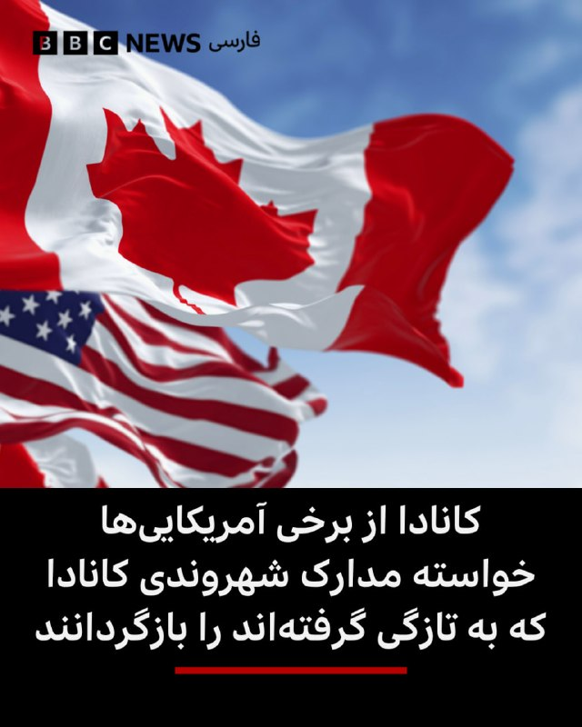

🔻شماری از شهروندان آمریکایی که به تازگی مدارک اثبات شهروندی کانادا را دریافت کرده‌اند، از سوی مقام‌های کانادایی نامه‌ای دریافت کرده‌اند مبنی بر این که تا زمان تکمیل بررسی‌های بیشتر، گواهی‌های جدید شهروندی خود را تحویل دهند؛ اقدامی که موجب سردرگمی و ناامیدی افراد مشمول و وکلای آنها شده است.

در نامه‌هایی که از سوی وزارت مهاجرت کانادا ارسال شده و نسخه‌هایی از آن در اختیار بی‌بی‌سی قرار گرفته، آمده است که دریافت‌کنندگان «ممکن است واجد شرایط دریافت گواهی شهروندی نباشند» و از آنها خواسته شده است مدارک خود را بازگردانند.

این نامه‌ها برای شمار نامعلومی از افرادی ارسال شده که بر اساس یک قانون مصوب ماه دسامبر و از طریق پیوندهای خانوادگی با کانادا، موفق به دریافت شهروندی شده بودند.

سخنگوی وزارت مهاجرت کانادا در بیانیه‌ای به بی‌بی‌سی تایید کرد که «تعداد محدودی از پرونده‌ها» در حال بازبینی هستند.
ادامه مطلب⬇️
📸GettyImages
https://bbc.in/3Swvlyd
@BBCPersian

## alonews — post 128595

  <a href="telegram/content/alonews_128595_1781675594.mp4" target="_blank">🎬 Download video</a>

👈 هم‌اکنون حمله هوایی اسرائیل به النبطیه الفوقا و شلیک موشک به اطراف کفرتبنیه در جنوب لبنان

✅ @AloNews خبر جنگ

---
📅 بروزرسانی: 1405/03/27 09:13
---

## IranIntlTV — post 342800

  <a href="telegram/content/IranIntlTV_342800_1781674987.mp4" target="_blank">🎬 Download video</a>

جی‌دی ونس، معاون رییس‌جمهوری آمریکا، ادعای پرداخت پول از سوی واشینگتن به تهران را رد کرد و گفت جمهوری اسلامی تا زمانی که به حمایت مالی از حزب‌الله و دیگر گروه‌های مورد حمایت خود ادامه دهد، از مزایای اقتصادی توافق بهره‌مند نخواهد شد.

گزارش مریم رحمتی، خبرنگار ایران‌اینترنشنال
@iranintltv

## Persian_Trend_Official — post 17319

  <a href="telegram/content/Persian_Trend_Official_17319_1781674989.webm" target="_blank">🎬 Download video</a>

منابع لبنانی گزارش میدهند نیروی هوایی اسرائیل چندین نقطه در منطقه کفر تبنیت در جنوب لبنان را بمباران‌ کرد.

📝 Amir

📌 @persian_trend_official
پرشین ترند | متفاوت‌ترین کانال نظامی

## Persian_Trend_Official — post 17318

  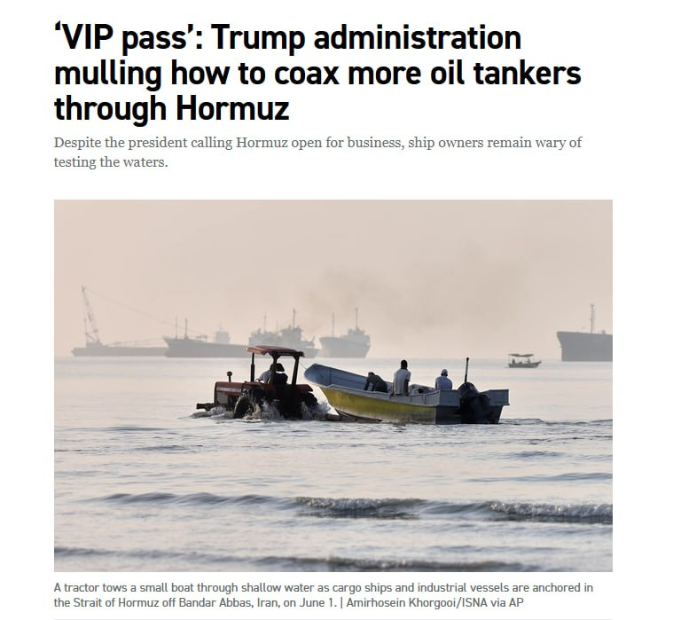

پولیتیکو: دولت ترامپ در حال بررسی اقداماتی برای احیای کامل تردد نفتکش‌ها از تنگه هرمز است، از جمله پیشنهادی که به مالکان کشتی اجازه می‌دهد هزینه عبور سریع همراه با اسکورت‌های دریایی ایالات متحده را بپردازند.

ترامپ و سوزی وایلز، رئیس دفتر کاخ سفید، به مقامات دستور داده‌اند تا همزمان با ادامه مذاکرات ایالات متحده و ایران، راه‌هایی برای تشویق شرکت‌های کشتیرانی و بیمه‌ها به از سرگیری فعالیت از طریق این آبراه پیدا کنند.

یکی از پیشنهادهای مورد بحث، ایجاد یک سیستم گذرنامه VIP مبتنی بر هزینه است که امکان ترانزیت اولویت‌دار و احتمالاً حفاظت نظامی را فراهم می‌کند. ایده دیگری که در حال بررسی است، استفاده از قانون تولید دفاعی برای الزام شرکت‌های بیمه مستقر در ایالات متحده به ارائه پوشش بیمه‌ای برای کشتی‌های فعال در منطقه است.

این پیشنهادها همچنین با هدف تشویق مشارکت بیشتر اروپایی‌ها در عملیات امنیتی دریایی در منطقه ارائه می‌شود.

📝 Amir

📌 @persian_trend_official
پرشین ترند | متفاوت‌ترین کانال نظامی

## Persian_Trend_Official — post 17317

◾️ خارگ در جنگ اخیر هدف حملات گسترده قرار گرفت: بخشدار ویژه خارگ اعلام کرد باوجود حملات مکرر به این جزیره، صادرات نفت ایران بدون وقفه ادامه یافته است.

◾️ سقوط بمب‌افکن B-52H آمریکا: یک فروند بمب‌افکن راهبردی B-52H پس از برخاستن از پایگاه ادواردز کالیفرنیا سقوط کرد و هر ۸ سرنشین آن جان باختند.

◾️ دلار وارد کانال ۱۵۰ هزار تومان شد: قیمت دلار در بازار آزاد به حدود ۱۵۶ هزار تومان رسید.

◾️ طلا در کانال ۱۵ میلیون تومان: هر گرم طلای ۱۸ عیار به حدود ۱۵ میلیون و ۹۸۶ هزار تومان افزایش یافت.

◾️ امتحانات نهایی از ۲۰ تیر آغاز می‌شود: وزارت آموزش‌وپرورش زمان برگزاری امتحانات نهایی را از ۱۳ تیر به ۲۰ تیرماه تغییر داد.

◾️ چین: مسیر توافق هنوز طولانی است: وانگ یی، وزیر خارجه چین، اعلام کرد توافق اولیه تنها نقطه آغاز است و مرحله دوم مذاکرات ایران و آمریکا به‌مراتب دشوارتر خواهد بود.

◾️ ترکیه از توافق ایران و آمریکا حمایت کرد: هاکان فیدان، وزیر خارجه ترکیه، گفت واشنگتن باوجود مخالفت‌های اسرائیل مسیر توافق با تهران را ادامه داده و این روند باید حفظ شود.

◾️ ترامپ: توافق را برای بررسی به کنگره می‌فرستم: رئیس‌جمهور آمریکا اعلام کرد توافق صلح و مذاکرات هسته‌ای با ایران جهت بررسی در اختیار کنگره قرار خواهد گرفت.

◾️ ترامپ: هیچ پولی به ایران پرداخت نمی‌شود: ترامپ گزارش‌ها درباره پرداخت مستقیم پول از سوی آمریکا به ایران را رد کرد و آن را «اخبار جعلی» خواند.

◾️ واشنگتن بخشی از تجهیزات نظامی خود را از اسرائیل خارج می‌کند: رسانه‌های اسرائیلی گزارش دادند آمریکا در حال بررسی کاهش بخشی از استقرار هواپیماهای سوخت‌رسان خود در اسرائیل پس از تفاهم اخیر با ایران است.

◾️ آلمان برای بازگشایی کامل کشتیرانی در هرمز اعلام آمادگی کرد: برلین از آمادگی خود برای مشارکت در عملیات احتمالی مین‌روبی و تأمین امنیت دریانوردی در تنگه هرمز خبر داد.

◾️ قدردانی حزب‌الله از نقش ایران در مذاکرات: شیخ نعیم قاسم، دبیرکل حزب‌الله، از تیم مذاکره‌کننده جمهوری اسلامی و حمایت ایران از لبنان و مقاومت قدردانی کرد.

◾️ گفت‌وگوی تلفنی وزرای خارجه ایران و عمان: دو طرف درباره روند اجرای تفاهم اخیر، تحولات منطقه و ادامه همکاری‌های دوجانبه رایزنی کردند.

◾️ ترامپ: نتانیاهو باید در قبال لبنان مسئولیت‌پذیرتر باشد: رئیس‌جمهور آمریکا خواستار مدیریت محتاطانه‌تر تحولات لبنان از سوی دولت اسرائیل شد.

◾️ تردد نفتکش‌ها در خلیج فارس افزایش یافت: پس از اعلام تفاهم ایران و آمریکا، گزارش‌ها از آغاز تدریجی بازگشت برخی نفتکش‌ها و کشتی‌های تجاری به مسیرهای عادی تردد حکایت دارد.

👺Phantom

📌 @persian_trend_official
پرشین ترند | متفاوت‌ترین کانال نظامی

## Persian_Trend_Official — post 17316

📍 بولتن خبری ۲۴ ساعت اخیر پرشین ترند

🗓 ۲۷ خرداد ۱۴۰۵

◾️ سوئیس میزبان امضای توافق ایران و آمریکا: وزارت خارجه سوئیس اعلام کرد مراسم امضای یادداشت تفاهم ایران و آمریکا روز جمعه در مجتمع «بورگن‌اشتوک» برگزار خواهد شد.

◾️ عراقچی: جمعه مذاکرات مرحله دوم آغاز می‌شود: وزیر امور خارجه اعلام کرد پس از امضای یادداشت تفاهم، مذاکرات ۶۰ روزه برای دستیابی به توافق نهایی درباره پرونده هسته‌ای و لغو تحریم‌ها آغاز خواهد شد.

◾️ ترامپ: متن تفاهم‌نامه را منتشر می‌کنم: رئیس‌جمهور آمریکا گفت متن توافق را به صورت عمومی منتشر کرده و برای بررسی به کنگره ارسال خواهد کرد.

◾️ ترامپ: توافق با ایران عادلانه است: ترامپ تأکید کرد توافق نهایی شده و وارد مرحله دوم خواهد شد؛ مرحله‌ای که به گفته او آسان‌تر از مرحله نخست است.

◾️ اکسیوس: برخی نهادهای اطلاعاتی آمریکا تردید دارند: اکسیوس گزارش داد جان رتکلیف، رئیس سیا، درباره میزان آمادگی ایران برای اجرای تعهدات هسته‌ای مورد نظر واشنگتن ابراز تردید کرده است.

◾️ رئیس سیا نسبت به نیت ایران ابراز تردید کرد: گزارش‌ها حاکی است ارزیابی‌های اطلاعاتی آمریکا همچنان پرسش‌هایی درباره اهداف و نیت واقعی تهران در روند مذاکرات مطرح می‌کنند.

◾️ صندوق ۳۰۰ میلیارد دلاری در دستور کار: رویترز و فایننشال تایمز گزارش دادند بیش از نیمی از سرمایه صندوق خصوصی ۳۰۰ میلیارد دلاری پیش‌بینی‌شده برای سرمایه‌گذاری و بازسازی ایران تاکنون تعهد شده است.

◾️ ونس: دسترسی ایران مشروط به پایبندی است: معاون رئیس‌جمهور آمریکا تأکید کرد استفاده ایران از منابع صندوق سرمایه‌گذاری تنها در صورت اجرای کامل تعهدات توافق امکان‌پذیر خواهد بود.

◾️ وال‌استریت ژورنال: فروش نفت ایران بلافاصله آغاز می‌شود: این رسانه گزارش داد آمریکا در چارچوب تفاهم اخیر اجازه ازسرگیری فوری صادرات نفت و سوخت ایران را خواهد داد.

◾️ عبور نفتکش‌ها از منطقه محاصره: منابع ایرانی از عبور چند نفتکش و کشتی تجاری از خطوط محاصره دریایی و ازسرگیری تردد دریایی خبر دادند.

◾️ ۳.۸ میلیون بشکه نفت ایران از محاصره عبور کرد: تانکر ترکرز گزارش داد دو ابرنفتکش ایرانی حامل مجموعاً ۳.۸ میلیون بشکه نفت خام از محاصره دریایی عبور کرده‌اند.

◾️ صنعت کشتیرانی هنوز محتاط است: سی‌ان‌ان گزارش داد باوجود اعلام بازگشایی تنگه هرمز، صدها نفتکش و شناور همچنان در انتظار کاهش ریسک‌های امنیتی منطقه هستند.

◾️ ارزیابی اطلاعاتی آمریکا درباره تنگه هرمز: به گزارش سی‌ان‌ان، نهادهای اطلاعاتی آمریکا معتقدند ایران اکنون توانایی بیشتری برای کنترل یا اختلال در تردد تنگه هرمز در اختیار دارد.

◾️ آلمان آماده مشارکت در مین‌روبی هرمز: وزیر خارجه آلمان از آمادگی برلین برای حمایت از عملیات مین‌روبی و بازگشایی کامل مسیر کشتیرانی در تنگه هرمز خبر داد.

◾️ حملات اسرائیل به جنوب لبنان ادامه دارد: توپخانه و پهپادهای اسرائیلی مناطقی در جنوب لبنان از جمله العیشیه و میفادون را هدف قرار دادند.

◾️ عراقچی: حمله به لبنان نقض تفاهم است: وزیر خارجه ایران تأکید کرد هرگونه اقدام نظامی اسرائیل علیه لبنان نقض مستقیم یادداشت تفاهم محسوب می‌شود.

◾️ فرمانده نیروی هوایی اسرائیل: یک ساعت تا حمله گسترده فاصله داشتیم: عومر تیشلر مدعی شد تمامی مقدمات حمله وسیع به اهدافی در ایران آماده شده بود اما عملیات متوقف شد.

◾️ کانال ۱۲ اسرائیل: آمریکا بخشی از هواپیماهای سوخت‌رسان را خارج می‌کند: رسانه‌های اسرائیلی از برنامه واشنگتن برای کاهش حضور ده‌ها هواپیمای سوخت‌رسان در فرودگاه بن‌گوریون خبر دادند.

◾️ اسرائیل به متن تفاهم‌نامه دسترسی نیافت: کانال ۱۲ اسرائیل گزارش داد درخواست تل‌آویو برای مشاهده متن یادداشت تفاهم ایران و آمریکا رد شده است.

◾️ ترامپ: ایران هرگز سلاح هسته‌ای نخواهد داشت: رئیس‌جمهور آمریکا مدعی شد توافق جدید تضمین می‌کند ایران به سلاح هسته‌ای دست پیدا نکند.

◾️ ترامپ: به تغییر حکومت اعتقادی ندارم: ترامپ اعلام کرد تجربه تغییر رژیم در کشورهای مختلف موفق نبوده و از چنین سیاستی حمایت نمی‌کند.

◾️ هاکان فیدان: ترامپ به مخالفت اسرائیل توجه نکرد: وزیر خارجه ترکیه گفت آمریکا باوجود اعتراضات اسرائیل مسیر توافق با ایران را ادامه داده است.

◾️ وانگ یی: مرحله دوم مذاکرات دشوارتر خواهد بود: وزیر خارجه چین هشدار داد رسیدن به توافق نهایی از مرحله نخست پیچیده‌تر و چالش‌برانگیزتر است.

◾️ بن‌گویر سفر به آمریکا را لغو کرد: رسانه‌های اسرائیلی گزارش دادند وزیر امنیت ملی اسرائیل به دلیل مشکلات صدور ویزا سفر برنامه‌ریزی‌شده خود به آمریکا را لغو کرده است.

👺Phantom

📌 @persian_trend_official
پرشین ترند | متفاوت‌ترین کانال نظامی

## RadioFarda — post 158413

  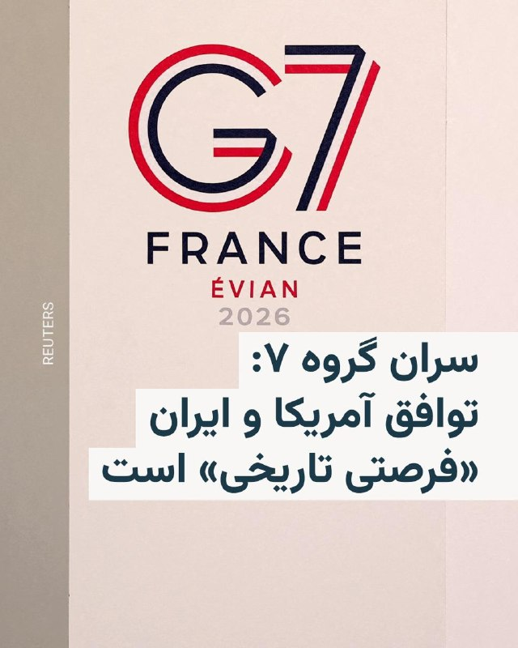

🔸رهبران گروه ۷ چارچوب توافق میان ایالات متحده و ایران را «فرصتی تاریخی» برای ممانعت از دستیابی تهران به سلاح هسته‌ای می‌بینند.

🔸این موضوع در بیانیه‌ای که از طرف اعضای گروه در نخستین ساعات بامداد چهارشنبه ۲۷ خردادماه منتشر شد،‌ آمده است.

🔸سران هفت کشور دموکراتیک صنعتی در این بیانیه می‌گویند توافق بین واشینگتن و تهران، که قرار است روز جمعه در مراسمی رسمی در سوئیس به امضای نمایندگان ارشد دو کشور برسد، می‌تواند «برای همۀ منطقه صلح و آرامش را به ارمغان بیاورد».

🔸سران این کشورها با تأکید بر حمایت‌شان از اجرای مفاد توافق،‌ از آمادگی برای کمک به تسهیل این روند خبر دادند.
در این بیانیه در مورد تنگۀ هرمز هم آمده که «حق تردد آزادانه بدون مانع و نیاز به پرداخت عوارض، زیربنای تجارت بین‌المللی است».

🔸سران این گروه در مورد درگیری میان اسرائیل و گروه حزب‌الله لبنان هم،‌ ضمن تأکید بر حمایت از تلاش‌های رهبری سیاسی لبنان برای خلع سلاح حزب‌الله از طریق «یک آتش‌بس فوری و محکم»، خواستار حفظ یکپارچگی سرزمینی لبنان «با تضمین‌های امنیتی مناسب و بین‌المللی» شدند.

@RadioFarda

## alonews — post 128594

👈شریعتمداری: درگیری ما و امریکا، ماهوی و وجودی است؛ تفاهم اخیر، اصل درگیری ما را تغییر نمی‌دهد!

✅ @AloNews خبر جنگ

## alonews — post 128593

  <a href="telegram/content/alonews_128593_1781674991.webm" target="_blank">🎬 Download video</a>

👈با فعال شدن کریدور جدید دریایی بین قشم و عمان پس از جنگ، محموله‌های خودروهای خارجی به این جزیره سرازیر شده است

✅ @AloNews خبر جنگ

## alonews — post 128592

  <a href="telegram/content/alonews_128592_1781674992.webm" target="_blank">🎬 Download video</a>

👈 ارتش اسرائیل اعلام کرد یک انبار تسلیحات جدید حزب‌الله حاوی ۵ تن مواد منفجره و ده‌ها پهپاد انتحاری را کشف کرده است

✅ @AloNews خبر جنگ

---
📅 بروزرسانی: 1405/03/27 09:03
---

## WithYashar — post 15123

بلومبرگ: به گفته مقامات آمریکایی، معافیت فروش نفت ایران فقط شامل محموله‌های نفتی می‌شود که قبلاً بارگیری شده است و شامل مجوز گسترده‌تر برای از سرگیری فروش نفت ایران نمی‌شود @withyashar

## WithYashar — post 15122

## FarsiVOA — post 220988

  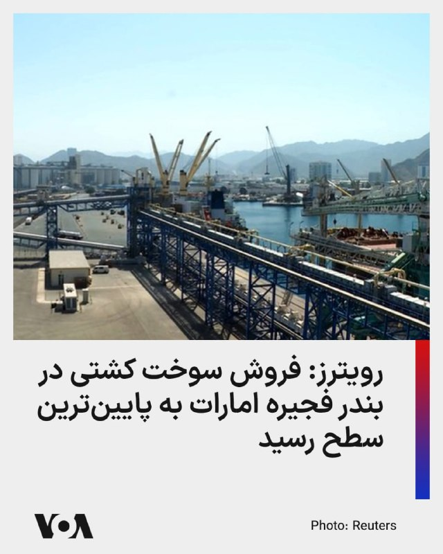

رویترز گزارش داد فروش سوخت کشتی در بندر فجیره امارات در ماه مه کاهش خود را ادامه داد و به پایین‌ترین سطح ثبت‌شده رسید.

داده‌ها نشان می‌دهد محدودیت در جایگزینی محموله‌ها پس از جنگ خاورمیانه و اختلال در ارسال سوخت از مسیر تنگه هرمز، این مرکز مهم سوخت‌رسانی دریایی را تحت فشار گذاشته است.

بر اساس داده‌های منطقه صنعتی نفت فجیره که اس‌اندپی گلوبال منتشر کرده، فروش سوخت دریایی، بدون احتساب روان‌کننده‌ها، در ماه مه به ۹۶ هزار و ۷۲۱ متر مکعب، معادل حدود ۹۵ هزار و ۸۰۰ تن، رسید.

فروش سوخت کم‌گوگرد کشتی نسبت به ماه قبل ۲۷ درصد و فروش سوخت پرگوگرد ۱۵ درصد کاهش یافت.

فجیره در ماه‌های اخیر نیز از پیامدهای امنیتی جنگ آسیب دیده بود.

رویترز پیش‌تر گزارش داده بود که مقام‌های امارات از آتش‌سوزی در منطقه صنعتی نفت فجیره پس از حمله پهپادی جمهوری اسلامی خبر داده بودند.
@FarsiVOA

## DW_Farsi — post 126079

  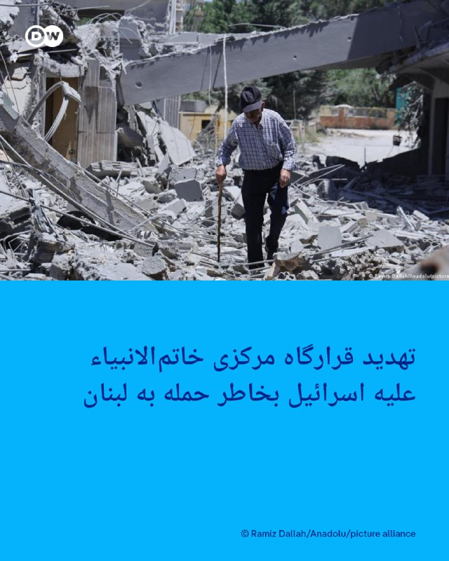

🔶 تهدید قرارگاه مرکزی خاتم‌الانبیاء علیه اسرائیل بخاطر حمله به لبنان

قرارگاه مرکزی خاتم‌الانبیاء، شامگاه سه‌شنبه ۲۶ خرداد (۱۶ ژوئن) با صدور بیانیه‌ای هشدار‌آمیز ادعا کرد که ارتش اسرائیل طی دو روز گذشته، "پس از اعلام پایان جنگ از سوی رئیس‌جمهور آمریکا، ۸۴ بار آتش‌بس در جنوب لبنان را نقض کرده است".

این قرارگاه در ادامه با لحنی تهدیدآمیز هشدار داده است که در صورت ادامه اینگونه اقدامات، اسرائیل "باید منتظر پاسخ سخت نیروهای مسلح جمهوری اسلامی ایران باشد".

مقام‌های جمهوری اسلامی می‌گویند تفاهم‌نامه ایران با آمریکا شامل لبنان هم می‌شود اما در سوی مقابل، اسرائیل ضمن رد این موضوع می‌گوید که موضوع لبنان ربطی به ایران ندارد و ارتش این کشور مواضع حزب‌الله را هدف قرار می‌دهد.

@dw_farsi

## RadioFarda — post 158412

  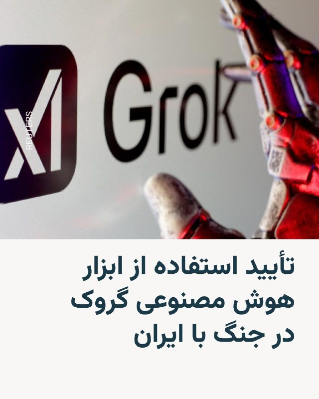

🔸دولت ایالات متحده در سندی که به رویت خبرگزاری فرانسه رسیده، تأیید کرده که در جریان حملاتش به ایران، از ابزار هوش مصنوعی ایلان ماسک، موسوم به «گروک» استفاده کرده است.

🔸در آستانۀ آغاز جنگ آمریکا و ایران، پس از آن‌که شرکت آنتروپیک حاضر نشد مجوز استفاده از ابزارهای هوش مصنوعی‌اش برای استفاده در حملات کاملاً خودکار، یا نظارت گسترده بر شهروندان آمریکا را به دولت ایالات متحده بدهد، کاخ سفید قراردادش با این شرکت را لغو کرد.

🔸پنتاگون سپس برای پیگیری برنامه‌هایش در زمینۀ استفاده از هوش مصنوعی به سراغ رقیبان آنتروپیک رفت؛ از جمله گوگل، اوپن اِی‌آی، و اِکس‌اِی‌آی.

🔸در گوگل بیش از ششصد تن از کارکنان از شرکت خواستند که ابزار هوش مصنوعی را برای عملیات طبقه‌بندی‌شده در اختیار ارتش قرار ندهد. سایر شرکت‌ها هم دربارۀ تهدیدات ناشی از استفادۀ نظامی از هوش مصنوعی ابراز نگرانی جدی کردند.

🔸حرکت ارتش آمریکا به سمت توسعۀ هوش مصنوعی اختصاصی‌اش، بیش از زمان پیش‌بینی‌شده طول کشیده و فروردین‌ماه گذشته، دولت ناچار شد اذعان کند که همچنان از ابزار «کلاود» در جنگ ایران استفاده می‌کرده است.

@RadioFarda

## alonews — post 128591

  <a href="telegram/content/alonews_128591_1781674391.mp4" target="_blank">🎬 Download video</a>

👈تیراندازی مرگبار در بیمارستان ویلیمینگتون ایالت دِلاوِر آمریکا، یک قربانی برجای گذاشت و عامل مسلح حادثه همچنان متواری است.

🔴پلیس اعلام کرد نیروهای امنیتی در حال انجام عملیات برای یافتن و بازداشت فرد مهاجم هستند و تحقیقات درباره جزئیات این تیراندازی ادامه دارد.

✅ @AloNews خبر جنگ

## alonews — post 128590

  <a href="telegram/content/alonews_128590_1781674393.mp4" target="_blank">🎬 Download video</a>

👈فرماندهی جنوبی ارتش آمریکا از حملۀ مرگبار به یک شناور در آب‌های شرق اقیانوس آرام خبر داد؛ اقدامی که جان یک سرنشین را گرفت

✅ @AloNews خبر جنگ

---
📅 بروزرسانی: 1405/03/27 08:53
---

## WithYashar — post 15121

دنی دانون، سفیر اسرائیل در سازمان ملل، با بازنشر گزارشی از شبکه 14 اسرائیل درباره کشتار دی‌ماه، در ایکس نوشت:
«قربانیان سرکوب در ایران و خانواده‌های آن‌ها شایسته حقیقت، شفافیت و پاسخگویی هستند. جامعه بین‌المللی نباید در برابر این وضعیت بی‌تفاوت بماند.»
او گفت: «تاریخ حکومت ایران با رنج مردم خود نوشته شده است؛ اتاق‌های شکنجه، گورهای دسته‌جمعی، ناپدیدسازی اجباری و خانواده‌هایی که بدون پاسخ رها شده‌اند.»
@withyashar

## WithYashar — post 15120

منابع عربی: اسرائیل حومۀ شهرک نبطیه‌الفوقا در جنوب لبنان را هدف حملات قرار داد
@withyashar

## WithYashar — post 15119

وبسایت خبری سمافور: مارکو روبیو، وزیر خارجه دولت ترامپ با انعقاد یادداشت تفاهم نامه با ایران مخالفت کرده و هیچ اظهار نظری درباره رسیدن به توافق با ایران نمی‌کند.

وزیر خارجه آمریکا امیدی به رسیدن به توافق هسته‌ای در مذاکرات با ایران پس از امضای یادداشت تفاهم نامه ندارد و تاکنون درباره امضای یادداشت تفاهم نامه با ایران کاملاً سکوت کرده است
@withyashar

## WithYashar — post 15118

  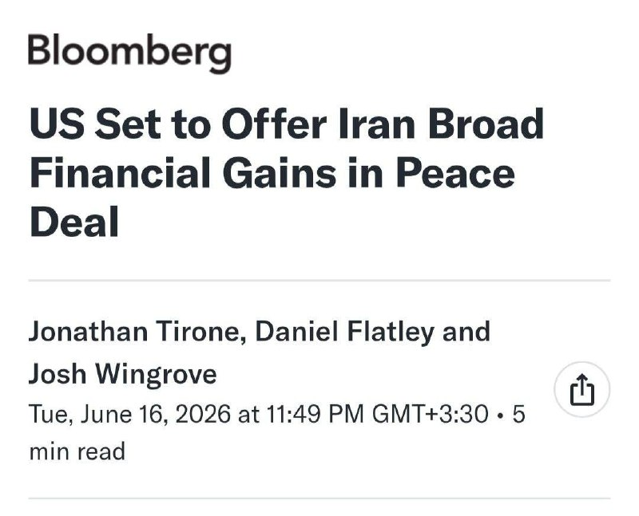

بلومبرگ: به گفته مقامات آمریکایی، معافیت فروش نفت ایران فقط شامل محموله‌های نفتی می‌شود که قبلاً بارگیری شده است و شامل مجوز گسترده‌تر برای از سرگیری فروش نفت ایران نمی‌شود
@withyashar

## WithYashar — post 15117

  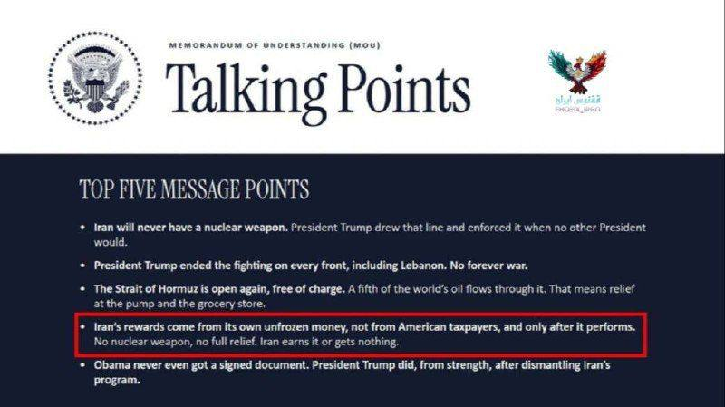

کاخ سفید:
«نه سلاح هسته‌ای، نه لغو کامل تحریم‌ها, نه پول»
@withyashar

## VahidOnline — post 76438

  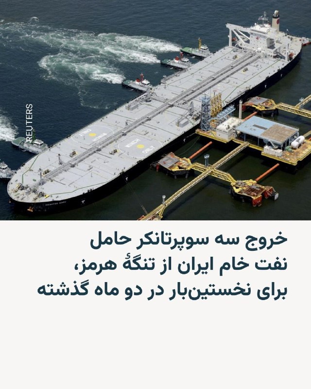

نخستین نفتکش‌های حامل نفت خام ایران از زمان آغاز محاصرۀ دریایی آمریکا، از تنگۀ هرمز خارج شدند. این موضوع را صبح چهارشنبه یکی از وب‌سایت‌های ردیابی کشتی‌ها اعلام کرد.

وبسایت «تنکر ترکِرز» (Tanker Trackers) که ذخیره و حمل‌ونقل محموله‌های نفتی را دنبال می‌کند، بر اساس داده‌های دیجیتال منطبق با تصاویر ماهواره‌ای، «اولین صادرات نفت خام ایران در دو ماه اخیر» را تأیید کرده است.
@VahidHeadline

📡 @VahidOnline

## Persian_Trend_Official — post 17315

قرارگاه خاتم الانبیا: اگر اسرائیل به نقض آتش بد ادامه دهد به آن پاسخ خواهیم داد. قرارگاه مرکزی خاتم‌الانبیا: ارتش تروریستی رژیم صهیونیستی طی دو روز گذشته پس از اعلام پایان جنگ توسط رئیس جمهور آمریکا، 84 بار آتش بس در جنوب لبنان را نقض نموده و همچنان به جنایات…

## RadioFarda — post 158411

  

🔸نخستین نفتکش‌های حامل نفت خام ایران از زمان آغاز محاصرۀ دریایی آمریکا، از تنگۀ هرمز خارج شدند. این موضوع را صبح چهارشنبه یکی از وب‌سایت‌های ردیابی کشتی‌ها اعلام کرد.

🔸این در حالی‌است که قرار است روز جمعه، دو روز دیگر، نمایندگان ارشد ایران و آمریکا در سوئیس توافق اولیه با هدف پایان جنگ را امضا کنند.

🔸وبسایت «تنکر ترکِرز» (Tanker Trackers) که ذخیره و حمل‌ونقل محموله‌های نفتی را دنبال می‌کند، بر اساس داده‌های دیجیتال منطبق با تصاویر ماهواره‌ای، «اولین صادرات نفت خام ایران در دو ماه اخیر» را تأیید کرده است.

🔸«تنکر ترکرز» با انتشار مطلبی در شبکه ایکس نوشت: «دست‌کم دو نفتکش شرکت ملی نفتکش ایران، شامل دو سوپرتانکر بسیار بزرگ حمل نفت خام به نام‌های «دیونا» و «هیرو ۲» با عبور از منطقۀ محاصرۀ دریایی نیروی دریایی ایالات متحده، در مجموع ۳ میلیون و ۸۰۰ هزار بشکه نفت خام ایران را از پایانه‌های این کشور بارگیری کرده و به سمت مقاصد خود در حرکتند».

🔸این شرکت سپس از عبور سومین نفتکش ایرانی از محدودۀ محاصره دریایی آمریکا هم خبر داد.

@RadioFarda

## alonews — post 128589

  <a href="telegram/content/alonews_128589_1781673806.webm" target="_blank">🎬 Download video</a>

👈تنکر ترکرز: ۳.۸ میلیون بشکه نفت خام ایران از محاصره آمریکا عبور کرد

🔴 تارنمای تنکر ترکز بامداد چهارشنبه گزارش داد، دو ابرنفتکش ایران که مجموعا حامل ۳.۸ میلیون بشکه نفت خام هستند، از محاصره آمریکا عبور کردند

✅ @AloNews خبر جنگ

## alonews — post 128588

  <a href="telegram/content/alonews_128588_1781673807.webm" target="_blank">🎬 Download video</a>

👈منابع عربی: اسرائیل حومۀ شهرک نبطیه‌الفوقا در جنوب لبنان را هدف حملات قرار داد

✅ @AloNews خبر جنگ

---
📅 بروزرسانی: 1405/03/27 08:43
---

## FarsiVOA — post 220987

  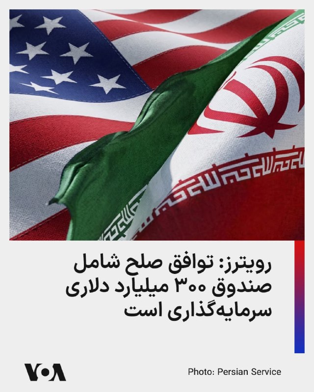

رویترز به نقل از یک منبع آگاه گزارش داد چارچوب توافق آمریکا و جمهوری اسلامی شامل ایجاد یک صندوق خصوصی ۳۰۰ میلیارد دلاری برای جذب سرمایه‌گذاری در اقتصاد ایران است و بیش از نیمی از این مبلغ تاکنون تعهد شده است.

این منبع که نامش فاش نشده، گفت صندوق یادشده با هدف ایجاد انگیزه اقتصادی برای دو طرف در مسیر رسیدن به توافق نهایی طراحی شده و شامل پول دولتی، کمک بلاعوض یا برنامه جبران خسارت جنگی نخواهد بود.

به گفته این منبع، شرکت‌هایی از آمریکا، کشورهای عربی خلیج فارس، آسیا، آمریکای جنوبی و آفریقا برای تأمین مالی پروژه‌هایی در بخش انرژی، حمل‌ونقل، تولید و زیرساخت اعلام آمادگی کرده‌اند.

رویترز نوشت این سازوکار مالی از مذاکرات جداگانه درباره رفع تحریم‌های آمریکا و آزادسازی دارایی‌های مسدودشده جمهوری اسلامی مستقل است و تنها پس از امضای توافق نهایی فعال خواهد شد.

به نوشته رویترز جمهوری اسلامی در ابتدا ۴۰۰ میلیارد دلار به عنوان غرامت خسارات جنگ از آمریکا درخواست کرده بود، اما واشنگتن با آن مخالفت کرد.
@FarsiVOA

## RadioFarda — post 158410

  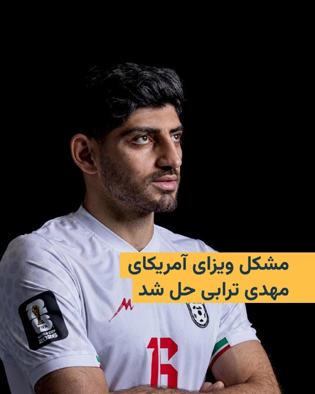

🔸فدراسیون فوتبال ایران اعلام کرد که با حل‌شدن مشکل ویزای مهدی ترابی، این بازیکن برای همراهی تیم ملی در بازی‌های بعدی در مقابل بلژیک و مصر، و احیاناً مرحله حذفی جام جهانی مشکلی نخواهد داشت.

🔸تیم ملی فوتبال ایران که اردوی خود را در شهر مرزی تیخوانای مکزیک برپا کرده، باید در آستانۀ هریک از دیدارهای مرحلۀ گروهی خود، که همگی در آمریکا برگزار می‌شوند، به این کشور سفر کرده و پس از مسابقه، به مکزیک بازگردد.

🔸ایالات متحده برای همۀ بازیکنان تیم ملی ایران بجز مهدی ترابی ویزای ورود چندگانه صادر کرده بود؛ اما این بازیکن، که به طرفداری از حکومت و داشتن ارتباطاتی با سپاه پاسداران مشهور است، ویزایی برای یک مرتبه ورود دریافت کرده بود.

🔸مهدی ترابی در مسابقۀ ایران و نیوزیلند که در لس‌آنجلس برگزار شد، ذخیره بود و به میدان نرفت؛ با وجود این در زمان بازگشت تیم یه تیخوانا به او یادآوری شد که روادیدش منقضی شده و امکان بازگشت به آمریکا را نخواهد داشت.

🔸ساعاتی بعد اما فدراسیون فوتبال جمهوری اسلامی تأیید کرد که با همراهی و مساعدت فیفا، ایالات متحده برای مهدی ترابی ویزای ورود چندگانه صادر کرده

@RadioFarda

## alonews — post 128587

  <a href="telegram/content/alonews_128587_1781673183.webm" target="_blank">🎬 Download video</a>

👈وبسایت خبری سمافور: مارکو روبیو، وزیر خارجه دولت ترامپ با انعقاد یادداشت تفاهم نامه با ایران مخالفت کرده و هیچ اظهار نظری درباره رسیدن به توافق با ایران نمی‌کند.

🔴وزیر خارجه آمریکا امیدی به رسیدن به توافق هسته‌ای در مذاکرات با ایران پس از امضای یادداشت تفاهم نامه ندارد و تاکنون درباره امضای یادداشت تفاهم نامه با ایران کاملاً سکوت کرده است

✅ @AloNews خبر جنگ

## alonews — post 128586

  <a href="telegram/content/alonews_128586_1781673183.webm" target="_blank">🎬 Download video</a>

👈 بلومبرگ: به گفته مقامات آمریکایی، معافیت فروش نفت ایران فقط شامل محموله‌های نفتی می‌شود که قبلاً بارگیری شده است و شامل مجوز گسترده‌تر برای از سرگیری فروش نفت ایران نمی‌شود

✅ @AloNews خبر جنگ

---
📅 بروزرسانی: 1405/03/27 08:33
---

## Persian_Trend_Official — post 17314

  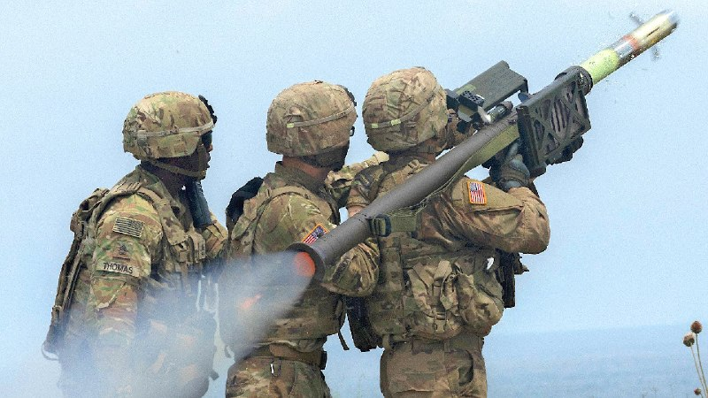

برزیل 100 موشک دوش پرتاب استینگر آمریکایی را خریداری کرد.

آمریکا با فروش احتمالی 100 فروند موشک دوش‌پرتاب پدافندی FIM-92K استینگر به برزیل به ارزش تقریبی 330 میلیون دلار موافقت کرد.

این قرارداد علاوه بر موشک‌ها، شامل سامانه‌های پرتاب، تجهیزات پشتیبانی، آموزش، خدمات فنی و پشتیبانی لجستیکی نیز خواهد بود.

این موشک‌های دوش پرتاب قرار است جایگزین موشک های دوش پرتاب ایگلا ساخت شوروی ارتش برزیل شوند.

📝 Amir

📌 @persian_trend_official
پرشین ترند | متفاوت‌ترین کانال نظامی

## RadioFarda — post 158409

  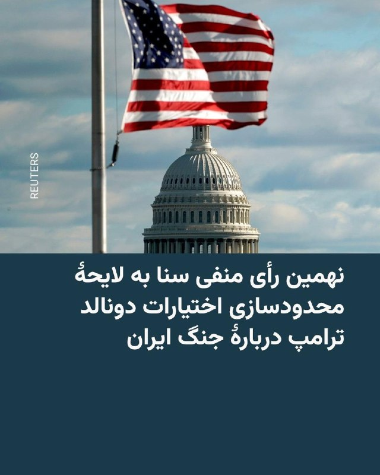

🔸سنای ایالات متحده برای نهمین بار به طرح دموکرات‌ها برای محدودکردن اختیارات دونالد ترامپ در زمینۀ جنگ رأی منفی داد.

🔸سناتورهای دموکرات از زمان آغاز جنگ اسرائیل و آمریکا با ایران در نهم اسفندماه ۱۴۰۴ با ارائۀ ۹ طرح مختلف تلاش کرده‌اند که جلوی ادامۀ مشارکت ایالات متحده در جنگ با ایران را گرفته و آن‌را به موافقت کنگره منوط کنند.

🔸در رأی‌گیری سه‌شنبه، طرحی که از سوی رافائل وارناک، سناتور جورجیا معرفی شده بود، با تنها یک‌رای اختلاف؛ ۴۸ به ۴۷ شکست خورد. در این رأی‌گیری ۵ سناتور شامل دو جمهوری‌خواه از جمله میچ مک‌کانِل، دو دموکرات و همینطور برنی سندرز، سناتور باسابقۀ مستقل شرکت نکردند.

🔸رأی‌گیری تازه در حالی انجام شد که قانون‌گذاران آمریکایی منتظر هستند که دونالد ترامپ رئیس‌جمهور ایالات متحده جزئیات طرح توافق با ایران را با آنها در میان بگذارد.

🔸به تازگی مجلس نمایندگان هم به لایحۀ مشابهی، رأی منفی داد.

🔸حزب جمهوریخواه با اختلافی اندک، اکثریت هم دو مجلس کنگره را در اختیار دارد.
@RadioFarda

## RadioFarda — post 158408

  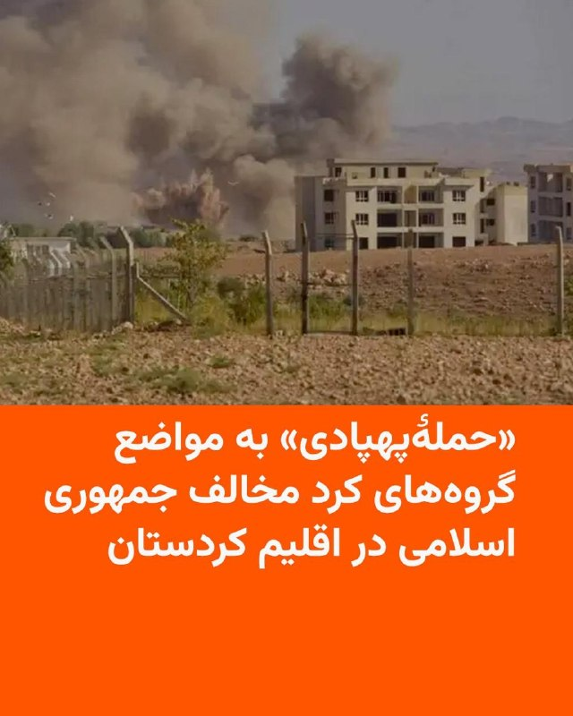

🔸برخی منابع امنیتی از وقوع یک حملۀ پهپادی به یک اردوگاه گروه‌های کرد مخالف جمهوری اسلامی در شرق اربیل در اقلیم کردستان عراق خبر می‌دهند.

🔸هنوز جزئیات بیشتری از این موضوع منتشر نشده است، اما طی هفته‌ها و ماه‌های گذشته، نیروهای مسلح جمهوری اسلامی به‌‌ویژه سپاه پاسداران بارها با پهپاد و موشک‌های بالستیک، مواضع شبه‌نظامیان کرد مخالف جمهوری اسلامی مستقر در کردستان عراق را هدف قرار داده‌اند.

@RadioFarda

---
📅 بروزرسانی: 1405/03/27 08:23
---

## VahidOOnLine — post 245966

  <a href="telegram/content/VahidOOnLine_245966_1781671997.mp4" target="_blank">🎬 Download video</a>

سرخط خبرهای چهارشنبه ۲۷ خرداد
‌🏁 🇬🇧 IranintlTV

🤖 @VahidOOnLine

## IranIntlTV — post 342799

  <a href="telegram/content/IranIntlTV_342799_1781671999.mp4" target="_blank">🎬 Download video</a>

سرخط خبرهای چهارشنبه ۲۷ خرداد

## FarsiVOA — post 220986

  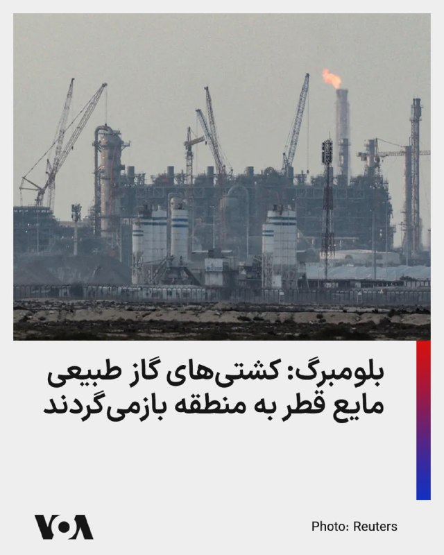

بلومبرگ گزارش داد قطر همزمان با آمادگی برای افزایش تولید و صادرات گاز طبیعی مایع پس از بازگشایی احتمالی تنگه هرمز، شماری از کشتی‌های خود را به خاورمیانه بازمی‌گرداند.

بر اساس داده‌های ردیابی کشتی‌ها، دست‌کم چهار کشتی خالی حامل گاز طبیعی مایع متعلق به قطر پس از مدتی توقف یا حرکت در مسیرهای دیگر، به سوی منطقه بازگشته‌اند و یک کشتی اجاره‌شده دیگر نیز در راه است.

همه این کشتی‌ها مجتمع راس لفان، بزرگ‌ترین مرکز صادرات گاز طبیعی مایع جهان، را به‌عنوان مقصد بعدی ثبت کرده‌اند.

این اقدام پس از گزارشی دیگر از بلومبرگ صورت می‌گیرد که بر اساس آن، قطر قصد دارد پس از بازگشت عبور ایمن از هرمز، ظرف یک ماه تولید را به حدود ۵۰ درصد ظرفیت و تا دو ماه به نزدیک ۸۰ درصد برساند.

بازگشت صادرات قطر می‌تواند بخشی از فشار کمبود جهانی عرضه را کاهش دهد، هرچند قیمت‌ها در اروپا و آسیا همچنان بالاتر از سطح پیش از جنگ مانده‌اند.
@FarsiVOA

---
📅 بروزرسانی: 1405/03/27 08:13
---

## VahidOOnLine — post 245965

  

دنی دانون، سفیر اسرائیل در سازمان ملل، با بازنشر گزارشی از شبکه ۱۴ اسرائیل درباره کشتار دی‌ماه، در ایکس نوشت: «قربانیان سرکوب در ایران و خانواده‌های آن‌ها شایسته حقیقت، شفافیت و پاسخگویی هستند. جامعه بین‌المللی نباید در برابر این وضعیت بی‌تفاوت بماند.»
او گفت: «تاریخ حکومت ایران با رنج مردم خود نوشته شده است؛ اتاق‌های شکنجه، گورهای دسته‌جمعی، ناپدیدسازی اجباری و خانواده‌هایی که بدون پاسخ رها شده‌اند.»

‌🏁 🇬🇧 IranintlTV

🤖 @VahidOOnLine

## Persian_Trend_Official — post 17313

صبحتون بخیر 🌄
TU-160 Blackjack

📌 @persian_trend_official
پرشین ترند | متفاوت‌ترین کانال نظامی

---
📅 بروزرسانی: 1405/03/27 08:03
---

## IranIntlTV — post 342798

  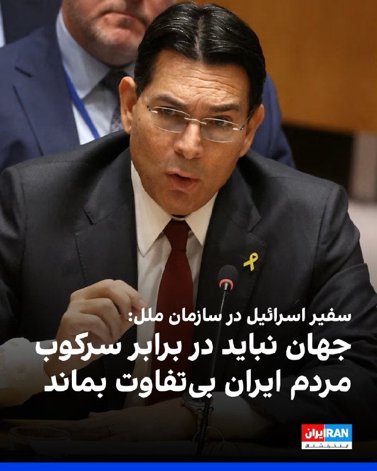

دنی دانون، سفیر اسرائیل در سازمان ملل، با بازنشر گزارشی از شبکه ۱۴ اسرائیل درباره کشتار دی‌ماه، در ایکس نوشت: «قربانیان سرکوب در ایران و خانواده‌های آن‌ها شایسته حقیقت، شفافیت و پاسخگویی هستند. جامعه بین‌المللی نباید در برابر این وضعیت بی‌تفاوت بماند.»
او گفت: «تاریخ حکومت ایران با رنج مردم خود نوشته شده است؛ اتاق‌های شکنجه، گورهای دسته‌جمعی، ناپدیدسازی اجباری و خانواده‌هایی که بدون پاسخ رها شده‌اند.»

https://iranintl.com/202606170389

## RadioFarda — post 158407

  <a href="https://t.me/radiofarda/158407" target="_blank">📎 Download file</a>

📻بشنوید: سرخط خبرها با رادیوفردا، ۲۷ خرداد ۱۴۰۵‌

@RadioFarda

## BBCPersian — post 284086

‌ ‌ ‌
ران بیشاپ می‌دانست که دروغ می‌گوید.

او ۱۴ ساله بود و در برابر قاضی به‌عنوان شاهد اصلی در یک محاکمه قتل ایستاده بود. این پرونده مربوط به سه نوجوان متهم به قتل بهترین دوست او، دویت داکت، در نوامبر ۱۹۸۳ بود.

آقای بیشاپ علیه آلفرد چستنات، اندرو استوارت و رنسوم واتکینز شهادت می‌داد. با شهادت سه شاهد دیگر، پرونده دادستانی مستحکم به‌ نظر می‌رسید. آقای بیشاپ می‌ترسید که اگر با آن‌ها مخالفت کند، چه اتفاقی خواهد افتاد.

او به بی‌بی‌سی گفت: «اگر حقیقت را می‌گفتم، با همه‌شان مخالفت کرده بودم. سه شاهد گفته بودند که آن سه نفر مقصرند. و من فکر می‌کردم هیئت منصفه فکر می‌کند من دروغ می‌گویم.»

دروغ‌هایی که آن روز در دادگاه بالتیمور گفته شد، به محکومیت سه نوجوان سیاه‌پوست به حبس ابد منجر شد.

https://bbc.in/4eOhxYs
📷 GettyImages/ Ron Bishop
@BBCPersian

---
📅 بروزرسانی: 1405/03/27 07:52
---

هیچ پیام جدیدی در این بروزرسانی ارسال نشد.

---
📅 بروزرسانی: 1405/03/27 07:43
---

هیچ پیام جدیدی در این بروزرسانی ارسال نشد.

---
📅 بروزرسانی: 1405/03/27 07:33
---

## IranIntlTV — post 342797

  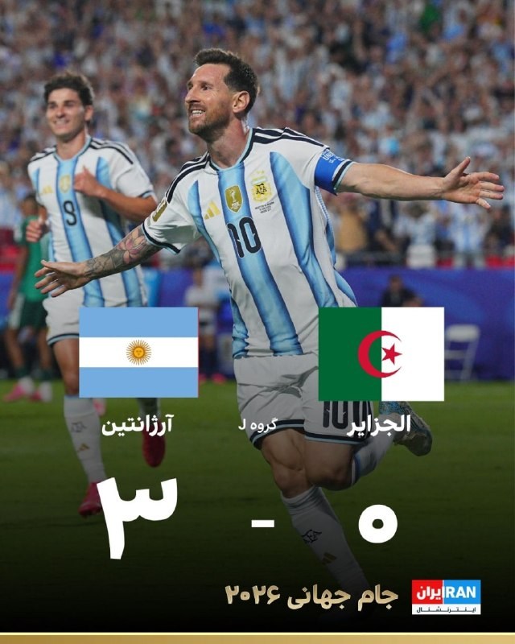

🔻تیم فوتبال آرژانتین، قهرمان دوره گذشته جام جهانی در اولین دیدار خود در جام جهانی ۲۰۲۶ با نتیجه ۳-۰ الجزایر را شکست داد.

🔹در این بازی لیونل مسی هر سه گل آلبی سلسته را به ثمر رساند و تعداد گل‌هایش در ادوار جام جهانی را به عدد ۱۶ رساند و به رکورد میروسلاو کلوزه، بهترین گلزن تاریخ جام جهانی رسید.

@iranintltvsport

## IranIntlTV — post 342796

  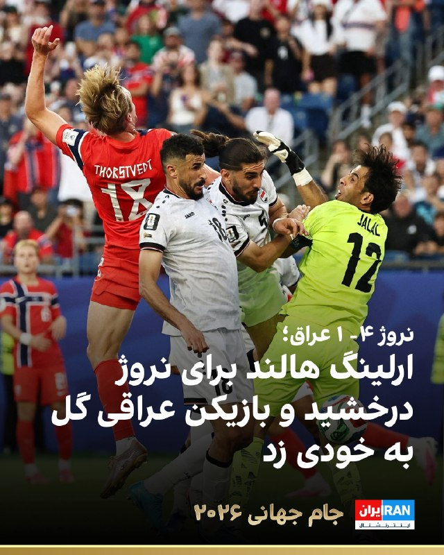

ارلینگ هالند در نخستین حضورش در جام جهانی، در دقایق ۲۹ و ۴۳ با زدن دو گل در نیمه نخست، نقش مهمی در پیروزی ۴ بر ۱ نروژ مقابل عراق در نخستین دیدار گروه I برای هر دو تیم داشت.
در این مسابقه که سه‌شنبه در فاکسبورو، ایالت ماساچوست برگزار شد، ایمن حسین در دقیقه ۳۹ برای عراق گل زد. لئو اوستیگارد از تیم نروژ که به‌عنوان بازیکن تعویضی وارد زمین شده بود، در دقیقه ۷۶ نتیجه را ۳ بر ۱ کرد. گل چهارم نروژ نیز در ششمین دقیقه وقت‌های تلف‌شده نیمه دوم با گل به خودی ایمن حسین رقم خورد.

https://iranintl.com/202606178155

---
📅 بروزرسانی: 1405/03/27 07:23
---

هیچ پیام جدیدی در این بروزرسانی ارسال نشد.

---
📅 بروزرسانی: 1405/03/27 07:13
---

## VahidOOnLine — post 245964

♦️سعید آجرلو، عضو تیم رسانه‌ای هیئت مذاکره‌کننده جمهوری اسلامی، با اشاره به منتشر نشدن متن یادداشت تفاهم با آمریکا گفت طرف آمریکایی از هدف و نیت مذاکره‌کنندگان ایرانی در به‌کار بردن برخی واژه‌ها و عبارات در متن آگاه نیست و به همین دلیل نباید این موارد علنی شود.
او با اشاره به انتقادها از برخی واژه‌های به‌کاررفته در متن گفت: «آمریکا مراد و قصد ما را از آوردن این کلمات نمی‌داند و نیتمان را نباید افشا کنیم.»
آجرلو همچنین گفت پس از روز جمعه امکان صحبت شفاف‌تر درباره متن تفاهم‌نامه وجود خواهد داشت و مدعی شد مقایسه نسخه‌های مختلف متن نشان می‌دهد آخرین نسخه تفاهم‌نامه نسبت به متن‌های اولیه، برای جمهوری اسلامی شرایط بهتری دارد.
‌🇸🇦 Indypersian

🤖 @VahidOOnLine

---
📅 بروزرسانی: 1405/03/27 07:03
---

## BBCPersian — post 284085

🔻 قیمت نفت اندکی افزایش یافت

خبرگزاری رویترز گزارش کرده که قیمت نفت در معاملات اولیه روز چهارشنبه افزایش یافته است.

به نوشته رویترز «سرمایه‌گذاران در حال ارزیابی این موضوع هستند که آیا جنگ علیه ایران واقعا پایان خواهد یافت و تنگه هرمز بازگشایی خواهد شد یا خیر.»

قیمت نفت خام برنت با ۴۷ سنت افزایش به ۷۹/۴۳ دلار در هر بشکه رسید، در حالی که قیمت نفت وست تگزاس اینترمدیت آمریکا با ۴۸ سنت افزایش به ۷۶/۵۳ دلار در هر بشکه رسید.

https://bbc.in/4ovVFoh
@BBCPersian

---
📅 بروزرسانی: 1405/03/27 06:53
---

هیچ پیام جدیدی در این بروزرسانی ارسال نشد.

---
📅 بروزرسانی: 1405/03/27 06:43
---

## FoxNewsTwitter — post 343052

  <a href="telegram/content/FoxNewsTwitter_343052_1781666000.mp4" target="_blank">🎬 Download video</a>

Fox News (Twitter/X)

"If you believe that Jesus is the son of God, rose from the dead on the third day, there are a lot of progressives who will say you're a crazy person."

VP JD Vance took aim at what he called "progressive atheistic culture," arguing that many on the left dismiss traditional religious beliefs while embracing ideas he considers far less believable.

"Actually, you believe something that's far crazier and clearly a violation of nature." @Gutfeldfox

## BBCPersian — post 284084

🔻جام جهانی؛ ویزای جدید برای مهدی ترابی صادر شد

پس از آن که گزارش شد مهدی ترابی، هافبک تیم ملی ایران، بعد از مسابقه برابر نیوزیلند مطلع شده که ویزای او برای ورود به خاک آمریکا یک بار اعتبار داشته و با بازگشت به کمپ تیم در تیخوآنا مکزیک، باطل خواهد شد، ساعتی قبل فدراسیون فوتبال ایران از صدور مجدد ویزا برای ترابی خبر داد.

بنابر این گزارش، این بار ویزای ورود متعدد برای آقای ترابی صادر شده و او در مسابقات بعدی تیم ملی ایران مشکلی برای ورود و خروج از خاک آمریکا نخواهد داشت.

ایران که روز گذشته در نخستین مسابقه خود طی یک مسابقه پر فراز و نشیب و متاثر از حواشی سیاسی، برابر نیوزیلند ۲-۲ مساوی کرد، در مسابقه دوم باید دوباره از تیخوآنا به لس‌آنجلس برود اما برای مسابقه آخر برابر مصر پرواز این تیم از مرز مکزیک به سیاتل در شمال کرانه غربی آمریکا، طولانی‌تر خواهد بود و اگر مانند مسابقه دیروز این تیم ناچار به ترک خاک آمریکا بلافاصله بعد از پایان دیدار با مصر باشد، سفر بازگشت انها از سیاتل به تیخوآنا خسته کننده‌تر از دو مسابقه اول خواهد بود.

https://bbc.in/4vXHNFS
@BBCPersian

---
📅 بروزرسانی: 1405/03/27 06:33
---

## VahidOOnLine — post 245963

♦️تیم ملی فوتبال نروژ در نخستین دیدار خود در جام جهانی ۲۰۲۶، موفق شد با نتیجه ۴ بر ۱ تیم ملی عراق را در ورزشگاه شهر بوستون آمریکا شکست دهد. این مسابقه از آن جهت اهمیت ویژه‌ای داشت که نروژ پس از ۲۸ سال و عراق پس از ۴ دهه انتظار بار دیگر در این تورنمنت بزرگ حضور یافته بودند.
به گزارش رویترز، ارلینگ هالند، ستاره ۲۵ ساله نروژ و آقای گل فصل گذشته لیگ برتر انگلیس که به او لقب «ترمیناتور» داده‌اند، قفل دروازه‌ها را در دقیقه ۲۸ باز کرد. اگرچه ایمن حسین، مهاجم ۳۰ ساله عراق در دقیقه ۳۹ بازی را به تساوی کشاند، اما هالند تنها سه دقیقه بعد گل دوم خود و نروژ را به ثمر رساند. در نیمه دوم نیز لئو اوستیگارد در دقیقه ۷۶ و کریستین ثورستود در وقت‌های تلف‌شده، پیروزی قاطع نروژ را کامل کردند. در دیدارهای بعدی این گروه که روز دوشنبه ۱ تیر برگزار می‌شود، عراق به مصاف فرانسه می‌رود و نروژ برابر سنگال صف‌آرایی خواهد کرد.
‌🇸🇦 Indypersian

🤖 @VahidOOnLine

## BBCPersian — post 284083

‌ ‌ ‌ ‌ تیم‌های فوتبال آرژانتین و الجزایر از گروه جی در شهر کانزاس به مصاف هم رفتند که با برتری قدرتمندانه آرژانتین همراه بود. لیونل مسی، کاپیتان تیم فوتبال آژانتین با بازی در این مسابقه به رکورد حضور در پنج دوره از جام جهانی رسید و با زدن هر سه گل آرژانتین…

## BBCPersian — post 284082

  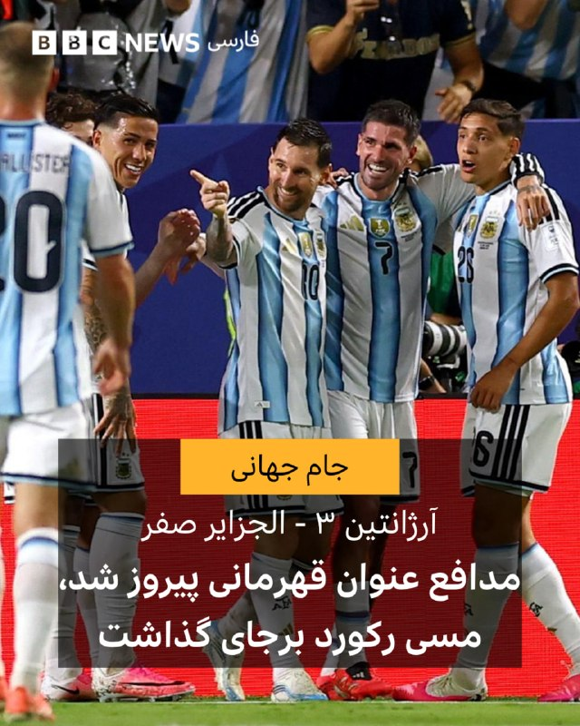

‌ ‌ ‌ ‌
تیم‌های فوتبال آرژانتین و الجزایر از گروه جی در شهر کانزاس به مصاف هم رفتند که با برتری قدرتمندانه آرژانتین همراه بود.

لیونل مسی، کاپیتان تیم فوتبال آژانتین با بازی در این مسابقه به رکورد حضور در پنج دوره از جام جهانی رسید و با زدن هر سه گل آرژانتین به رکورد ۱۶ گل زده در کل دوره‌های حضورش در این رقابت‌ها رسید و همراه با میروسلاو کلوزه آلمانی بر جایگاه نخست نشست.

در ابتدای این بازی ابتدا الجزایر بود که موفق به باز کردن دروازه آرژانتین در دقیقه ۹ شد اما کمک‌داور ویدیویی این گل را مردود اعلام کرد تا آرژانتین به مسابقه بازگردد و مسی در دقیقه ۱‍۷ اولین گل بازی را به ثمر رساند و نیمه اول با همین نتیجه پایان یافت.

در نیمه دوم آرژانتین با چند تعویض سعی در کنترل بیشتر بازی گرفت و در دقیقه ۶۰ مسی مجددا موفق شد روی دفع ناقص توپ توسط دروازه‌بان الجزایر گلزنی کند.

در دقیقه ۷۶ هم مجددا این فوق ستاره آرژانتینی گل دیدنی دیگری زد تا با هت‌تریک (هتریک) چهار دقیقه بعد تعویض شده و زمین را ترک کند.

📷Reuters
@BBCPersian

---
📅 بروزرسانی: 1405/03/27 06:23
---

## FoxNewsTwitter — post 343051

  <a href="telegram/content/FoxNewsTwitter_343051_1781664806.mp4" target="_blank">🎬 Download video</a>

Fox News (Twitter/X)

"What really does bother me is that they don't show gratitude for the United States of America."

VP JD Vance blasted Democrats serving in public office during an appearance on @Gutfeldfox, arguing that too many spend their time criticizing the country rather than appreciating it.

Vance said he was raised to love America and be grateful for the opportunities it provides, calling patriotism a core value that shaped his upbringing.

He contrasted that outlook with what he sees from many on the left, saying a lack of appreciation for the country has become increasingly common in American politics.

## FarsiVOA — post 220985

🔺یادداشت رئيس‌جمهوری آمریکا تولید مهمات جنگی را سرعت می‌بخشد

▪️بر اساس یک یادداشت ریاست‌جمهوری آمریکا که روز سه‌شنبه منتشر شد، رئیس‌جمهوری ایالات متحده، دونالد ترامپ، برای رفع محدودیت‌های موجود در تولید مهمات، به «قانون تولید دفاعی» استناد کرده است.

⬇️ بیشتر بخوانید:
https://ir.voanews.com/a/8161816.html
@FarsiVOA

---
📅 بروزرسانی: 1405/03/27 06:12
---

## FoxNewsTwitter — post 343050

Fox News (Twitter/X)

"Honestly Greg, I expected them to be absolutely vicious, and they were only a little bit vicious."

VP JD Vance is looking back on his recent appearance on The View and says it went better than he expected.

While appearing on @Gutfeldfox, Vance joked that "it wasn't as bad as I thought it was gonna be" despite sparring with the show's co-hosts over immigration, race, and his past "childless cat ladies" comments.

He even revealed what happened once the cameras stopped rolling: "Joy Behar even said during the break, not joking, she said, 'You know what, you're pretty good for a Republican.'"

## FarsiVOA — post 220984

⚡️اوکراین و توافق واشنگتن با جمهوری اسلامی در کانون توجه نشست سران گروه هفت
@FarsiVOA

---
📅 بروزرسانی: 1405/03/27 06:03
---

## FoxNewsTwitter — post 343049

  <a href="telegram/content/FoxNewsTwitter_343049_1781663589.mp4" target="_blank">🎬 Download video</a>

Fox News (Twitter/X)

"Honestly Greg, I expected them to be absolutely vicious, and they were only a little bit vicious."

VP JD Vance is looking back on his recent appearance on The View and says it went better than he expected.

While appearing on Gutfeldfox, Vance joked that "it wasn't as bad as I thought it was gonna be" despite sparring with the show's co-hosts over immigration, race, and his past "childless cat ladies" comments.

He even revealed what happened once the cameras stopped rolling: "Joy Behar even said during the break, not joking, she said, 'You know what, you're pretty good for a Republican.'"

## FarsiVOA — post 220983

  <a href="telegram/content/FarsiVOA_220983_1781663591.mp4" target="_blank">🎬 Download video</a>

⚡️نمایشگاه سئول فود ۲۰۲۶ با حضور بیش از ۱۸۰۰ شرکت از ۴۹ کشور برگزار شد. آمریکا به‌عنوان مهمان ویژه، همزمان با ۲۵۰ سالگی استقلال خود، محصولات غذایی و کشاورزی‌اش را به نمایش گذاشت؛ رویدادی برای نمایش تنوع، نوآوری و همکاری‌های بین‌المللی.
@FarsiVOA

## FarsiVOA — post 220982

  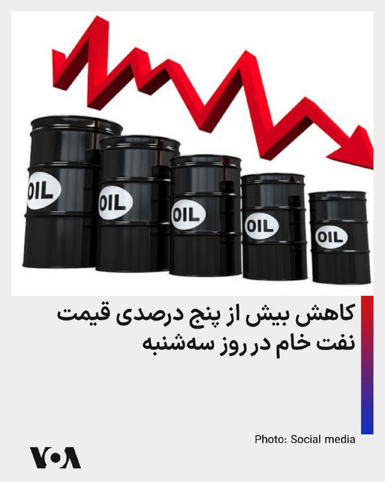

⚡️قیمت نفت خام روز سه‌شنبه بیش از ۵ درصد کاهش یافت؛ به این ترتیب کاهش قیمت‌ نفت در این هفته ادامه یافت. کاهش قیمت نفت با ادامه خوش‌بینی‌ها در مورد توافق اولیه آمریکا و جمهوری اسلامی صورت می‌گیرد. این توافق اولیه مسیر مذاکرات دشوارتر برای رسیدن به یک توافق هسته‌ای را فراهم می‌کند. رویترز گزارش داد که قیمت نفت خام برنت ۴ دلار و ۲۱ سنت (۵.۱ درصد) کاهش یافت و به قیمت ۷۸ دلار و ۹۶ سنت رسید. دونالد ترامپ، رئیس‌جمهوری آمریکا پیشتر وعده داده بود که با رسیدن به یک توافق، قیمت‌ها به سرعت پایین می‌آید.
@FarsiVOA

---
📅 بروزرسانی: 1405/03/27 05:52
---

## VahidOOnLine — post 245962

  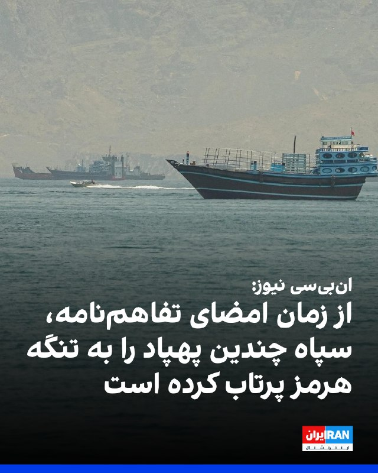

ان‌بی‌سی نیوز به نقل از یک مقام آمریکایی گزارش داد از زمان امضای یادداشت تفاهم جمهوری اسلامی و آمریکا، سپاه هر شب چندین پهپاد را به سمت کشتی‌های تجاری در تنگه هرمز پرتاب کرده، اما نیروهای آمریکا آنها را رهگیری کرده‌اند.
این مقام گفت ارتش آمریکا همچنان برای حمایت از عبور ایمن کشتی‌ها از تنگه هرمز، با شرکت‌های کشتیرانی تجاری هماهنگی می‌کند.

‌🏁 🇬🇧 IranintlTV

🤖 @VahidOOnLine

## FoxNewsTwitter — post 343048

  <a href="telegram/content/FoxNewsTwitter_343048_1781662974.mp4" target="_blank">🎬 Download video</a>

Fox News (Twitter/X)

"Donald Trump did exactly what he came to do."

VP JD Vance touted the administration's Iran strategy during an appearance on @Gutfeldfox, arguing that the U.S. achieved its core objectives and now holds the leverage moving forward.

"We accomplished what we set out to accomplish and now we have, as the president says, all the cards."

Vance pointed to the destruction of Iran's nuclear infrastructure and the ongoing negotiations with Tehran, saying any future economic benefits for Iran will depend entirely on whether it follows through on its commitments.

## IranIntlTV — post 342795

  

ان‌بی‌سی نیوز به نقل از یک مقام آمریکایی گزارش داد از زمان امضای یادداشت تفاهم جمهوری اسلامی و آمریکا، سپاه هر شب چندین پهپاد را به سمت کشتی‌های تجاری در تنگه هرمز پرتاب کرده، اما نیروهای آمریکا آنها را رهگیری کرده‌اند.
این مقام گفت ارتش آمریکا همچنان برای حمایت از عبور ایمن کشتی‌ها از تنگه هرمز، با شرکت‌های کشتیرانی تجاری هماهنگی می‌کند.

https://iranintl.com/202606172267

## FarsiVOA — post 220981

⚡️هشدار کارزار «سه‌شنبه‌های نه به اعدام» به افزایش تعداد اعدام‌ها در ایران توسط جمهوری‌ اسلامی
@FarsiVOA

## FarsiVOA — post 220980

🔺مخالفت سناتور ریک اسکات با آزادسازی منابع رژیم ایران: اگر پولی از آنها داریم باید به خاطر «خشم حماسی» و به سرعقل درآوردنشان بگیریم

▪️ریک اسکات با آزادسازی دارایی‌های مسدود شده مخالف است و می‌گوید این پول باید برای پرداخت هزینه عملیات خشم حماسی استفاده شود

⬇️ بیشتر بخوانید:
https://ir.voanews.com/a/8161815.html
@FarsiVOA

---
📅 بروزرسانی: 1405/03/27 05:42
---

## VahidOOnLine — post 245961

  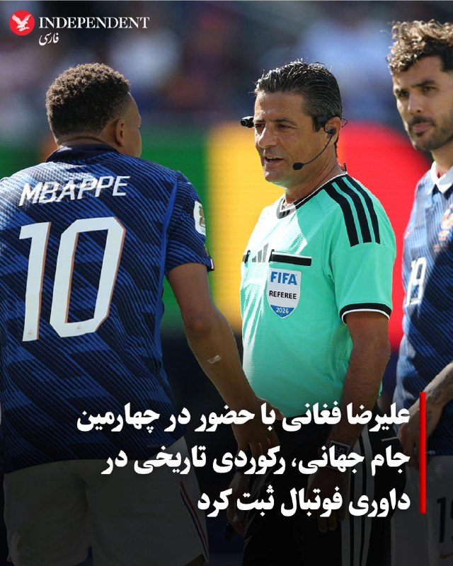

♦️علیرضا فغانی، داور بین‌المللی فوتبال، با قضاوت دیدار فرانسه و سنگال در جام جهانی ۲۰۲۶، به یکی از نخستین داوران تاریخ فوتبال مردان تبدیل شد که در چهار دوره جام جهانی حضور داشته‌اند.
این داور باسابقه که در جام‌های جهانی ۲۰۱۴، ۲۰۱۸ و ۲۰۲۲ نیز حضور داشت، در سال ۲۰۱۴ به عنوان داور چهارم و در دو دوره بعدی به عنوان داور وسط در این رقابت‌ها فعالیت کرد. فغانی این بار پس از مهاجرت به استرالیا و خروج از فهرست داوران بین‌المللی ایران، به عنوان نماینده فدراسیون فوتبال استرالیا دیدار فرانسه و سنگال را قضاوت کرد.
این رکورد تاریخی در حالی ثبت شد که قوه قضاییه جمهوری اسلامی چند ماه پیش از توقیف اموال علیرضا فغانی به دلیل مخالفت با سیاست‌های حکومت خبر داده بود.
‌🇸🇦 Indypersian

🤖 @VahidOOnLine

## FarsiVOA — post 220979

⚡️تمدید مأموریت یوناما؛ افغانستان میان بحران بشردوستانه و چالش‌های منطقه‌ای
@FarsiVOA

## BBCPersian — post 284081

  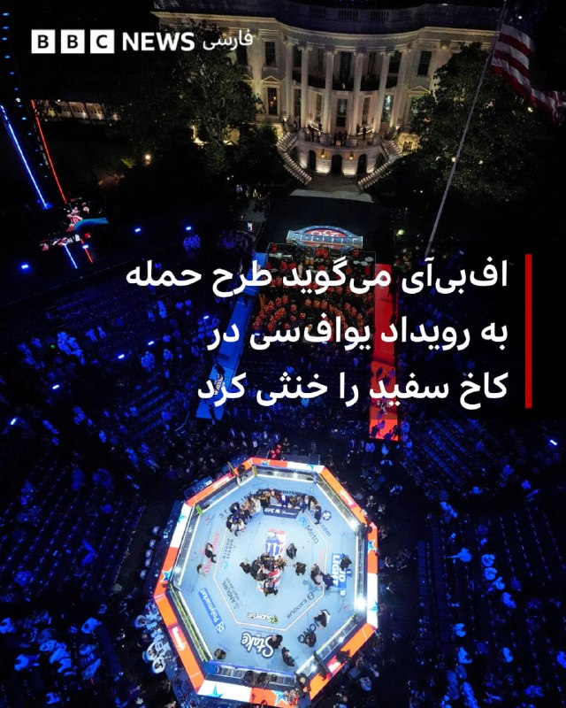

‌ ‌ ‌
وزارت دادگستری آمریکا روز سه‌شنبه اعلام کرد اف‌بی‌آی یک طرح برای حمله به رویداد یو‌اف‌سی که روز یکشنبه در محوطه مقابل کاخ‌سفید برگزار شد را خنثی کرده و پنج نفر را در ارتباط با این پرونده بازداشت کرده است.

دادستان‌ها می‌گویند بخشی از این طرح شامل حمله به ساختمان‌های اطراف با پهپادهای حامل مواد منفجره و تیراندازی به «اشخاص مهم» بوده است.

یکی از مظنونان هفته گذشته در ایالت اوهایو بازداشت شد. بازرسان پس از دسترسی به پیام‌های رمزگذاری شده او، به دیگر افراد دخیل در این طرح رسیدند. دادستان‌ها در اسناد قضایی گفته‌اند متهمان دیدگاه‌های «افراطی مذهبی و ضد دولتی» ابراز کرده بودند.

بر اساس اسناد دادگاه، طراحان حمله قصد داشتند با استفاده از پهپادها موجب وحشت و فرار جمعیت شوند و سپس افراد را به سمت تیمی از تک تیراندازها هدایت کنند. همچنین گروهی دیگر قرار بود در مرحله دوم به دروازه‌های کاخ سفید یورش ببرند.

حدود چهار هزار و ۳۰۰ نفر در این مراسم که فقط با دعوت ویژه امکان رفتن به آن وجود داشت و در محوطه جنوبی کاخ سفید برگزار شد حضور داشتند.

https://bbc.in/4vUg9te
📷Reuters
@BBCPersian

---
📅 بروزرسانی: 1405/03/27 05:33
---

## VahidOOnLine — post 245960

  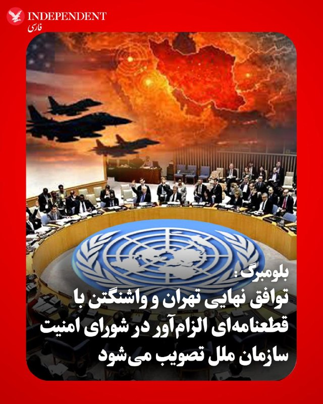

♦️خبرگزاری بلومبرگ در گزارشی اختصاصی، متن پیش‌نویس یک یادداشت تفاهم ۱۴ ماده‌ای میان ایالات متحده و ایران را منتشر کرد. بر اساس این گزارش، این تفاهم‌نامه مسیر را برای یک دوره ۶۰ روزه گفتگو با هدف پایان دادن به جنگ و اعمال محدودیت‌های جدید بر برنامه هسته‌ای ایران هموار می‌کند.
در بند چهاردهم این پیش‌نویس آمده است که ایران و آمریکا سازوکاری برای نظارت بر اجرای توافق نهایی و تعهدات آینده ایجاد خواهند کرد و توافق نهایی نیز از طریق یک قطعنامه الزام‌آور شورای امنیت سازمان ملل تایید خواهد شد.
بر اساس این سند، تهران و واشنگتن همچنین متعهد می‌شوند ظرف ۶۰ روز برای دستیابی به توافق نهایی مذاکره کنند و در این مدت وضعیت کنونی برنامه هسته‌ای ایران و تحریم‌های آمریکا حفظ شود.
‌🇸🇦 Indypersian

🤖 @VahidOOnLine

---
📅 بروزرسانی: 1405/03/27 05:23
---

## FarsiVOA — post 220978

  <a href="telegram/content/FarsiVOA_220978_1781661185.mp4" target="_blank">🎬 Download video</a>

⚡️شکاف در بدنه جمهوری اسلامی بر سر توافق با آمریکا
@FarsiVOA

---
📅 بروزرسانی: 1405/03/27 05:12
---

## VahidOnline — post 76437

  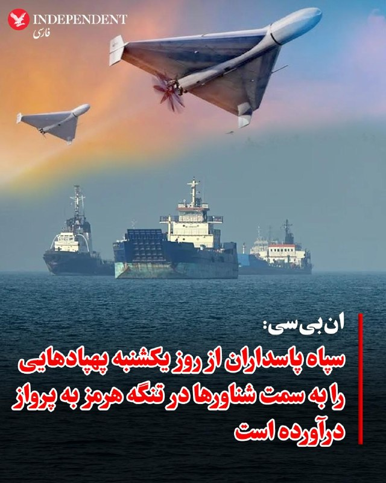

♦️به گزارش ان‌بی‌سی، حکومت ایران پس از اعلام یادداشت تفاهم با آمریکا، همچنان تعداد «زیادی» پهپاد به سمت شناورهای تجاری در تنگه هرمز پرتاب کرده است.
شبکه ان‌بی‌سی به نقل از یک مقام آمریکایی گزارش داده که سپاه پاسداران پهپادهایی پرتاب کرده که آمریکا توانسته آنها را پیش از آنکه تهدیدی برای شناورهای تجاری، کشتی‌های نظامی و خدمه حاضر در منطقه ایجاد کنند، رهگیری کند.
بر اساس این گزارش، سپاه پاسداران از زمان امضای «الکترونیکی» یادداشت تفاهم در روز یکشنبه، هر شب اقدام به پرتاب پهپاد کرده است.
@VahidOOnLine

📡 @VahidOnline

## FarsiVOA — post 220977

  <a href="telegram/content/FarsiVOA_220977_1781660574.mp4" target="_blank">🎬 Download video</a>

⚡️نشست گروه هفت؛ مهار انحصار پکن و راهبرد ترامپ در ثبات بازارهای مالی
@FarsiVOA

## FarsiVOA — post 220976

🔺سناتور گراهام می‌گوید نسبت به مذاکرات پیش‌رو با جمهوری اسلامی بدبین است اما ارزش امتحان کردن را دارد

▪️سناتور جمهوری‌خواه آمریکا، لیندزی گراهام، گفت نسبت به مذاکرات آینده آمریکا با جمهوری اسلامی تا حد زیادی بدبین است.

⬇️ بیشتر بخوانید:
https://ir.voanews.com/a/8161814.html
@FarsiVOA

---
📅 بروزرسانی: 1405/03/27 05:03
---

هیچ پیام جدیدی در این بروزرسانی ارسال نشد.

---
📅 بروزرسانی: 1405/03/27 04:53
---

## VahidOOnLine — post 245959

  

♦️به گزارش ان‌بی‌سی، حکومت ایران پس از اعلام یادداشت تفاهم با آمریکا، همچنان تعداد «زیادی» پهپاد به سمت شناورهای تجاری در تنگه هرمز پرتاب کرده است.
شبکه ان‌بی‌سی به نقل از یک مقام آمریکایی گزارش داده که سپاه پاسداران پهپادهایی پرتاب کرده که آمریکا توانسته آنها را پیش از آنکه تهدیدی برای شناورهای تجاری، کشتی‌های نظامی و خدمه حاضر در منطقه ایجاد کنند، رهگیری کند.
بر اساس این گزارش، سپاه پاسداران از زمان امضای «الکترونیکی» یادداشت تفاهم در روز یکشنبه، هر شب اقدام به پرتاب پهپاد کرده است.
‌🇸🇦 Indypersian

🤖 @VahidOOnLine

## FarsiVOA — post 220975

⚡️ادامه اعدام‌های سیاسی در ایران با اتهام‌های مبهم «محاربه» و «افساد فی‌الارض»؛ گفت‌وگو با شیوا محبوبی
@FarsiVOA

## FarsiVOA — post 220974

  <a href="telegram/content/FarsiVOA_220974_1781659382.mp4" target="_blank">🎬 Download video</a>

⚡️شب فوتبالی پاریس؛ تماشای نبرد فرانسه و سنگال از کافه‌های شانزلیزه
@FarsiVOA

## FarsiVOA — post 220973

  <a href="telegram/content/FarsiVOA_220973_1781659382.mp4" target="_blank">🎬 Download video</a>

⚡️بستن کافه‌ها و مصادره اموال مخالفان حکومت وجاهت قانونی دارد؟ گفت‌وگو با سینا یوسفی
@FarsiVOA

## BBCPersian — post 284080

‌ ‌ ‌ ‌ خبرگزاری رویترز در خبری اختصاصی گزارش کرده که توافق با ایران شامل صندوقی ۳۰۰ میلیارد دلاری است؛ صندوقی که بیش از نیمی از منابع آن پیشاپیش تامین شده است. یک منبع آگاه به خبرگزاری رویترز گفته است که توافق چارچوبی میان آمریکا و ایران شامل ایجاد یک صندوق…

## BBCPersian — post 284079

  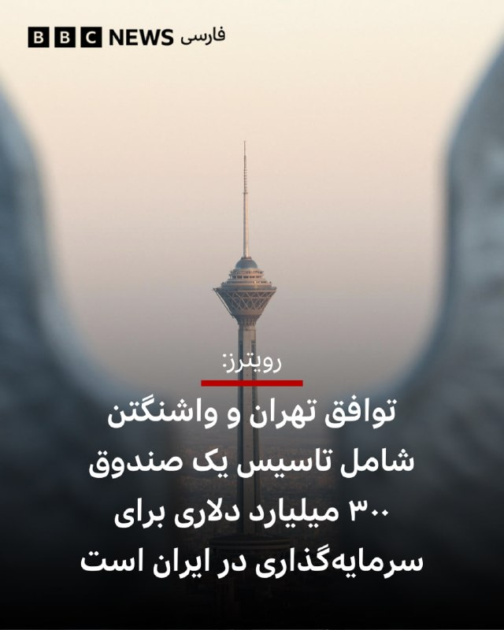

‌ ‌ ‌ ‌
خبرگزاری رویترز در خبری اختصاصی گزارش کرده که توافق با ایران شامل صندوقی ۳۰۰ میلیارد دلاری است؛ صندوقی که بیش از نیمی از منابع آن پیشاپیش تامین شده است.

یک منبع آگاه به خبرگزاری رویترز گفته است که توافق چارچوبی میان آمریکا و ایران شامل ایجاد یک صندوق خصوصی ۳۰۰ میلیارد دلاری برای جذب سرمایه گذاری در ایران است و بیش از نیمی از این مبلغ از قبل تعهد شده است.

به گفته این منبع، این صندوق با هدف ایجاد انگیزه اقتصادی برای دو طرف به منظور دستیابی به یک توافق نهایی طراحی شده و قرار است «صندوق بازسازی و توسعه» نام داشته باشد.

این منبع در گفت‌وگو با رویترز تاکید کرده است که صندوق یادشده یک برنامه غرامت یا بازسازی دولتی نیست و هیچ بودجه یا کمک مالی دولتی در آن وجود نخواهد داشت. منابع مالی آن قرار است از سوی شرکت هایی در آمریکا، کشورهای عربی خلیج فارس، آسیا، آمریکای جنوبی و آفریقا تامین شود.

سرمایه‌گذاری‌های پیش بینی شده حوزه هایی مانند انرژی، حمل و نقل، لجستیک و تولید را در بر می‌گیرد.

https://bbc.in/4a2RtpX
📷Reuters
@BBCPersian

---
📅 بروزرسانی: 1405/03/27 04:43
---

## VahidOOnLine — post 245958

♦️محسن قاصد، مستندساز و فعال محیط زیست، با انتشار ویدیویی از ورود دسته بزرگی از فلامینگوها به دریاچه ارومیه نوشت: «این تصاویر همراه با گریه ثبت شد، با گریه تدوین شد و با گریه هم منتشر می‌شود؛ نه از غم، بلکه گریه‌هایی از جنس شوق، امید و آرزو. به خانه خوش آمدید ای غریب‌هایی که هیچ‌وقت از یادمان نرفتید. دریاچه وان ترکیه هرچند پرآب و مناسب زیستن برای شما بود، اما هرگز وطن نبود. شما برگشتید تا بگویید هنوز مادری زنده است به نام دریاچه ارومیه.»
افزایش سطح آب دریاچه ارومیه در سال جاری شرایط مناسب‌تری را برای بازگشت پرندگان مهاجر فراهم کرده است. پیش از این نیز گزارش‌هایی از لانه‌گذاری کاکایی‌ها در جزایر حفاظت‌شده این دریاچه منتشر شده بود.
تصاویر ثبت‌شده توسط محسن قاصد یکی از پرشمارترین حضورهای فلامینگوها در سال‌های اخیر را نشان می‌دهد؛ صحنه‌ای که برای بسیاری از دوستداران محیط زیست یادآور روزهای پررونق نگین فیروزه‌ای آذربایجان است.
‌🇸🇦 Indypersian

🤖 @VahidOOnLine

## FarsiVOA — post 220972

  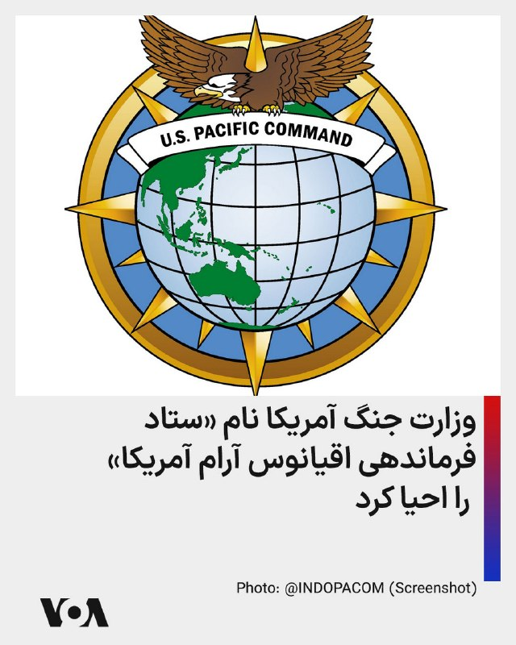

⚡️وزارت جنگ روز سه‌شنبه اعلام کرد که «ستاد فرماندهی اقیانوس هند - آرام آمریکا» به‌طور رسمی نام خود را به «ستاد فرماندهی اقیانوس آرام آمریکا» باز گرداند.

این ستاد فرماندهی در اول ژانویه ۱۹۴۷ با دستور رئیس جمهوری آمریکا، هری ترومن تأسیس شد و قدیمی‌ترین و بزرگترین ستاد فرماندهی‌ رزمی متحد ایالات متحده است.

مقامات گفتند که بازگشت به نام «ستاد فرماندهی اقیانوس آرام آمریکا» «ریشه‌های عمیق تاریخی این فرماندهی را گرامی می‌دارد و حس غرور و روحیه جمعی را در میان کسانی که در اقیانوس آرام خدمت می‌کنند، تقویت» می‌کند.
@FarsiVOA

## FarsiVOA — post 220971

⚡️بازتاب دیپلماسی ترامپ و چالش‌های اقتصادی «گروه هفت» در رسانه‌های جهان
@FarsiVOA

## FarsiVOA — post 220970

  <a href="telegram/content/FarsiVOA_220970_1781658795.mp4" target="_blank">🎬 Download video</a>

⚡️توافق در آستانه انتشار؛ واکنش‌ها در کنگره آمریکا
@FarsiVOA

---
📅 بروزرسانی: 1405/03/27 04:33
---

## FarsiVOA — post 220969

  <a href="telegram/content/FarsiVOA_220969_1781658185.mp4" target="_blank">🎬 Download video</a>

⚡️ادعادی «وحدت» جمهوری اسلامی در سایه اعدام معترضان چقدر حقیقت دارد؟ گفت‌وگو با مهرداد درویش‌پور
@FarsiVOA

---
📅 بروزرسانی: 1405/03/27 04:23
---

## FarsiVOA — post 220968

⚡️دکترین تام باراک برای عراق: توسعه، ثبات و پایان نفوذ جمهوری اسلامی
@FarsiVOA

---
📅 بروزرسانی: 1405/03/27 04:12
---

## VahidOOnLine — post 245957

  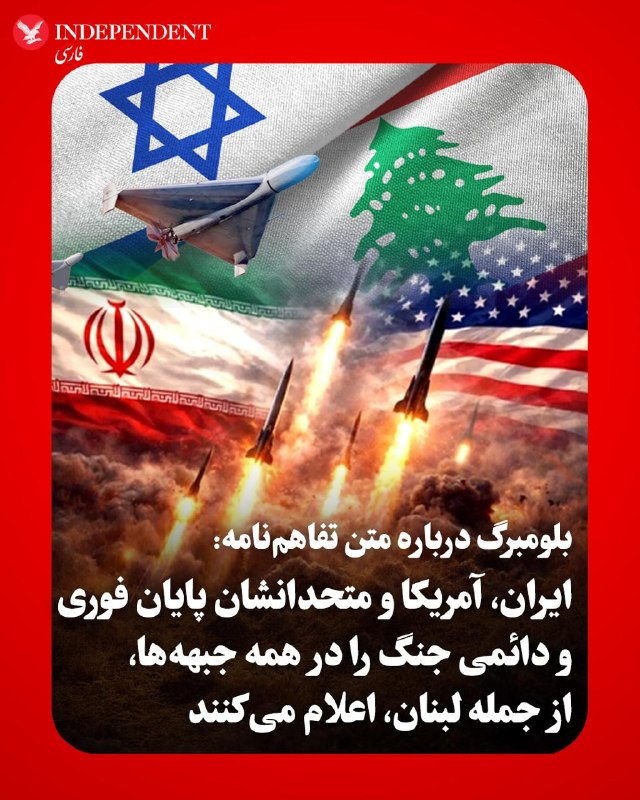

♦️بلومبرگ سه‌شنبه ۲۶ خرداد متن پیش‌نویس ۱۴ ماده‌ای تفاهم‌نامه میان ایران و آمریکا را منتشر کرد؛ سندی که بر اساس آن، دو کشور قرار است ۲۹ خرداد (۱۹ ژوئن) در سوئیس آن را به امضا برسانند.
بر اساس این پیش‌نویس، تهران، واشنگتن و متحدان دو طرف با امضای تفاهم‌نامه «پایان فوری و دائمی جنگ در همه جبهه‌ها، از جمله لبنان» را اعلام می‌کنند و متعهد می‌شوند از هرگونه اقدام خصمانه، تهدید یا استفاده از زور علیه یکدیگر خودداری کنند.
در این سند همچنین آمده است که ایران و آمریکا ظرف ۶۰ روز برای دستیابی به توافق نهایی مذاکره خواهند کرد. رفع محاصره دریایی ایران، ازسرگیری صادرات نفت، آزادسازی دارایی‌های مسدودشده ایران، لغو تدریجی تحریم‌ها و تاکید جمهوری اسلامی بر عدم تولید سلاح هسته‌ای از دیگر مفاد این پیش‌نویس است.
بر اساس متن منتشرشده، توافق نهایی نیز با قطعنامه الزام‌آور شورای امنیت سازمان ملل تایید خواهد شد.
‌🇸🇦 Indypersian

🤖 @VahidOOnLine

## FarsiVOA — post 220967

  <a href="telegram/content/FarsiVOA_220967_1781656967.mp4" target="_blank">🎬 Download video</a>

⚡️جمع‌آوری پرچم شیروخورشید در ورزشگاه؛ اجرای قانون فیفا یا محدودیت؟ گفت‌وگو با محمد اولیایی فرد
@FarsiVOA

## IranianMinds — post 22774

  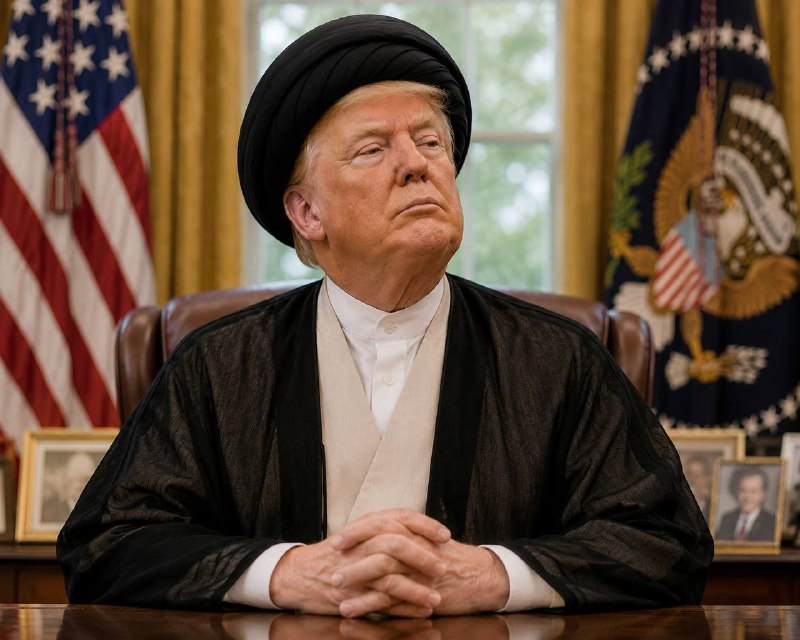

🔴 جی‌دی ونس:

اگر ترامپ رهبر معظم ایران هم میشد، بازم دموکرات‌ها میگفتن که ترامپ جلوی ایران شکست خورده.

@IranianMinds

## IranianMinds — post 22773

  <a href="telegram/content/IranianMinds_22773_1781656968.webm" target="_blank">🎬 Download video</a>

✅ اپلیکیشن حرفه ای اندروید سایت بین المللی دربی بت

✅اسپانسر لیگ انگلستان

💰اولین سایت جهانی با امکان شارژ و برداشت با کارت بانکی

◻️ برای ورود فیلترشکن روشن کرده روی کانادا یا سنگاپور یا آلمان و ....
📢

😀Telegram Channel
👇
https://t.me/+bcynkEgSW2dlYTc0

## IranianMinds — post 22772

  

😤میخوای جام جهانی پیش بینی کنی؟!

🔹پس نیاز داری به یه سایت بین المللی و معتبر
🔹

⛔دربی بت همون انتخاب  100%

💎ویژگی های سایت جهانی Derby Bet:

⬅️امکان شارژ امن با کارت بانکی

⬅️واریز اول دوبل شارژ می شوید(بونوس۱۰۰٪)

⬅️پر اپشن ترین سایت فعال در ایران

⬅️تسویه حساب کمتر از 5 دقیقه

⬅️برگشت بخشی از باخت به صورت هفتگی

⭐دارای لایسنس و مجوز anjuan

🚨کد هدیه ثبت نام:GG007

⚠️برای دانلود اپلکیشن کلیک کنید
👉

🔔کانال دربی بت ea26:
👇

✅https://t.me/+bcynkEgSW2dlYTc0

---
📅 بروزرسانی: 1405/03/27 04:02
---

## BBCPersian — post 284078

  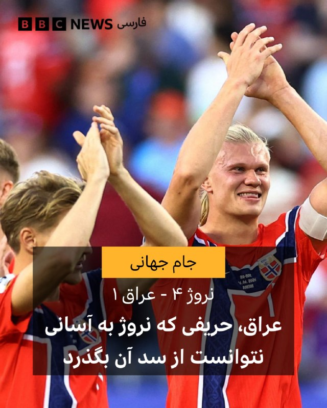

‌ ‌ ‌ ‌
در ادامه نخستین مسابقات تیم‌ها در مرحله گروهی جام جهانی، نروژ عصر سه‌شنبه به وقت آمریکا توانست با درخشش ارلینگ هالند، فوق ستاره خود، عراق را شکست دهد.

گل اول را نروژ زد اما عراق عقب ننشست و ایمن حسین ده دقیقه بعد از گل هالند را جواب داد یعنی در دقیقه ۳۹.

۴ دقیقه بعد باز هالند خودنمایی کرد و نروژ را برنده راهی رختکن کرد.

در نیمه دوم و و حدود دقیقه ۷۵ و در حالی که مدافعان عراق حواس‌شان به هالند بود لئو اوستیگارد گل سوم را با ضربه سر وارد دروازه عراق کرد. چهارمین گل نروژ هم در دقایق تلف شده به ثمر رسید تا نروژ بالاتر از فرانسه صدرنشین گروه شود.

عراق اگر چه نخستین بازنده اردوی آسیایی‌ها در جام امسال شد اما بازی شجاعانه و درگیرانه این تیم زنگ خطری است برای دیگر دو تیم گروه آی است.

ساعتی پیش از این مسابقه هم فرانسه با نتیجه‌ای مشابه و در پی درخشش کلیان امباپه و دبل او موفق شد سه بر یک سنگال را شکست دهد و آغازی امیدوارکننده داشته باشد اما با توجه به برد ۴-۱ نروژ فعلا دوم گروه خواهد بود.

📷Reuters
@BBCPersian

---
📅 بروزرسانی: 1405/03/27 03:53
---

## VahidOOnLine — post 245956

  <a href="telegram/content/VahidOOnLine_245956_1781655802.mp4" target="_blank">🎬 Download video</a>

جیانی اینفانتینو، رییس فیفا، در صفحه اینستاگرام خود ویدیویی منتشر کرده است که لحظاتی صمیمی و خوش را در کنار مهدی مهدوی‌کیا، ستاره پیشین تیم ملی فوتبال ایران، نشان می‌دهد.
او در توضیح این ویدیو، به حضور مهدوی‌کیا به‌عنوان نماینده ایران در صحنه جهانی و همچنین گل خاطره‌انگیز او در جام جهانی ۱۹۹۸ اشاره کرده است.
‌🏁 🇬🇧 IranintlTV

🤖 @VahidOOnLine

## IranIntlTV — post 342794

  <a href="telegram/content/IranIntlTV_342794_1781655804.mp4" target="_blank">🎬 Download video</a>

جیانی اینفانتینو، رییس فیفا، در صفحه اینستاگرام خود ویدیویی منتشر کرده است که لحظاتی صمیمی و خوش را در کنار مهدی مهدوی‌کیا، ستاره پیشین تیم ملی فوتبال ایران، نشان می‌دهد.
او در توضیح این ویدیو، به حضور مهدوی‌کیا به‌عنوان نماینده ایران در صحنه جهانی و همچنین گل خاطره‌انگیز او در جام جهانی ۱۹۹۸ اشاره کرده است.

## FarsiVOA — post 220966

🔺جمهوری اسلامی یک بار دیگر اسرائيل را تهدید به حمله کرد

▪️جمهوری اسلامی، روز سه‌شنبه اسرائيل را بار دیگر تهدید کرد که در صورت ادامه حملاتش به جنوب لبنان، پاسخ سختی دریافت خواهد کرد.

⬇️ بیشتر بخوانید:
https://ir.voanews.com/a/8161800.html
@FarsiVOA

---
📅 بروزرسانی: 1405/03/27 03:43
---

## VahidOOnLine — post 245955

♦️در اقدامی بی‌سابقه، مایک هاکبی، سفیر ایالات متحده در اسرائیل، به اظهارات دونالد ترامپ مبنی بر اینکه «اگر آمریکا نبود اسرائیل وجود نداشت» واکنش نشان داد و بر پیوند بنیادین و متقابل میان دو کشور تاکید کرد.
سفیر ایالات متحده در اسرائیل، مایک هاکبی، سه‌شنبه ۲۶ خرداد در مراسم افتتاحیه کنفرانس بین‌المللی «میراث اسرائیلی در یهودا و سامره» که در هرودیون و با رهبری وزارت میراث و وزیر آمیحای الیاهو برگزار شد، سخنرانی کرد. او در این مراسم بر اهمیت اسرائیل و میراث یهودی برای ایالات متحده تأکید کرد.
هاکبی خطاب به وزیر اسرائیلی اعلام کرد که وظیفه او یادآوری اهمیت اسرائیل برای ایالات متحده است و گفت: «این بدون شک میراث شماست، اما وزیر محترم، این میراث ایالات متحده نیز هست.» سفیر آمریکا در اسرائیل گفت: «اگر یهودیان به آمریکا نیامده بودند و بدون اسرائیل و پایه‌های یهودی، آمریکا اصلا وجود نمی‌داشت؛ ما کل موجودیت خود را مدیون اتفاقاتی هستیم که در این سرزمین رخ داده است.»
‌🇸🇦 Indypersian

🤖 @VahidOOnLine

## FarsiVOA — post 220965

  <a href="telegram/content/FarsiVOA_220965_1781655182.mp4" target="_blank">🎬 Download video</a>

⚡️صعود یا حذف؟ ارزیابی مهرداد بحری از آینده تیم فوتبال ایران در جام جهانی

@FarsiVOA

---
📅 بروزرسانی: 1405/03/27 03:33
---

## VahidOOnLine — post 245954

  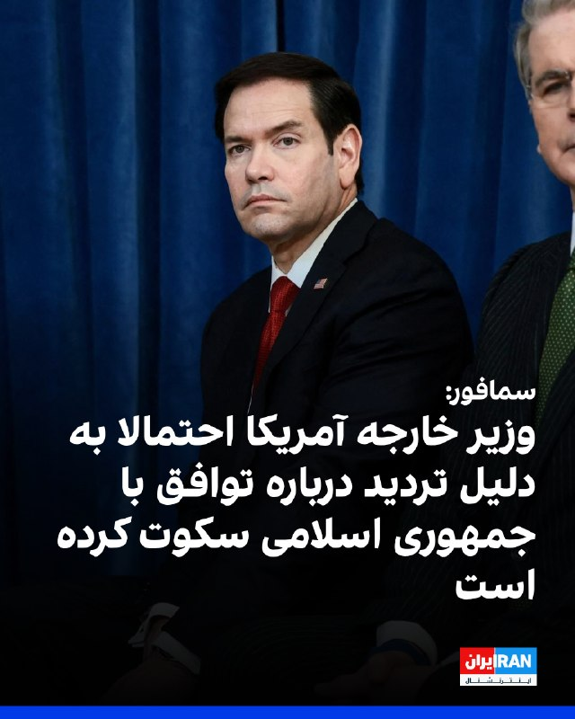

وب‌سایت خبری «سمافور »گزارش داد جی‌دی ونس به اصلی‌ترین چهره دولت ترامپ برای دفاع از توافق با حکومت ایران تبدیل شده، در حالی که مارکو روبیو تاکنون نقش محدودی در حمایت علنی از این توافق داشته است و احتمالا به دلیل تردیدهایش در این مورد سکوت کرده است.
طبق این گزارش، مارکو روبیو که از او به‌عنوان یکی از توانمندترین سخنگویان سیاسی دولت ترامپ یاد می‌شود، درباره توافق با جمهوری اسلامی عمدتا سکوت کرده است و غیبت او در دفاع رسانه‌ای از توافق ممکن است به تردیدهای او درباره این توافق در جریان نهایی شدن آن مرتبط باشد.

‌🏁 🇬🇧 IranintlTV

🤖 @VahidOOnLine

## IranIntlTV — post 342793

  

وب‌سایت خبری «سمافور »گزارش داد جی‌دی ونس به اصلی‌ترین چهره دولت ترامپ برای دفاع از توافق با حکومت ایران تبدیل شده، در حالی که مارکو روبیو تاکنون نقش محدودی در حمایت علنی از این توافق داشته است و احتمالا به دلیل تردیدهایش در این مورد سکوت کرده است.
طبق این گزارش، مارکو روبیو که از او به‌عنوان یکی از توانمندترین سخنگویان سیاسی دولت ترامپ یاد می‌شود، درباره توافق با جمهوری اسلامی عمدتا سکوت کرده است و غیبت او در دفاع رسانه‌ای از توافق ممکن است به تردیدهای او درباره این توافق در جریان نهایی شدن آن مرتبط باشد.

https://iranintl.com/202606161167

---
📅 بروزرسانی: 1405/03/27 03:23
---

هیچ پیام جدیدی در این بروزرسانی ارسال نشد.

---
📅 بروزرسانی: 1405/03/27 03:13
---

## VahidOnline — post 76436

  <a href="telegram/content/VahidOnline_76436_1781653381.mp4" target="_blank">🎬 Download video</a>

جی‌دی ونس، معاون دونالد ترامپ که روز جمعه در سوئیس تفاهم‌نامه پایان جنگ با ایران را امضاء خواهد کرد، گفته مفاد این توافق اولیه در یک جمله چنین خلاصه می‌شود که اگر ایران به تعهدات خود در چارچوب این توافق عمل کند ایالات متحده آماده فراهم کردن زمینه برای بازگشت این کشور به صحنه اقتصاد جهانی است.

آقای ونس روز سه‌شنبه در گفت‌و‌گو شبکه رادیویی سیروس ایکس‌ام گفت: «دونالد ترامپ هرگز نگفت که هدف اقدامات او به قدرت رساندن رضا پهلوی در ایران است. آنچه گفت این بود که اگر مردم ایران بپا خواسته‌اند و مقابل حکومت خود ایستاده‌اند، خیلی هم خوب است اما آنچه او می‌خواهد اطمینان یافتن از فعالیت‌های هسته‌ای ایران است چه از طریق دیپلماتیک و چه از طریق جنگ که خب در نهایت راه دوم روی داد».

معاون رئیس جمهور آمریکا همچنین تصریح کرد که خواسته منتقدان آقای ترامپ مبنی بر ادامه جنگ با ایران با آن چه دونالد ترامپ به مردم آمریکا همیشه وعده داده و قصد اجرای آن را دارد، «همسو نبوده و نیست.»

آقای ونس در این مصاحبه چند بار تاکید کرد که آنچه به لحاظ اقتصادی ایران از آن منتفع خواهد شد «به هیچ وجه» از منابع و دارایی‌های آمریکا پرداخت نخواهد شد بلکه در صورت همکاری ایران و اجرای همه مفاد توافق، آمریکا با رفع تحریم‌ها به سرمایه‌گذاری در ایران «فرصت» خواهد داد.
@VahidHeadline

📡 @VahidOnline

## FarsiVOA — post 220964

⚡️ابهام در امضای تفاهم‌نامه جمهوری اسلامی و واشنگتن؛ از گمانه‌زنی محل مراسم تا اختلاف بر سر اجرا
@FarsiVOA

## FarsiVOA — post 220963

🔺لیندزی گراهام: عملکرد وزیر جنگ آمریکا در مورد جمهوری اسلامی فوق‌العاده بود؛ تلاش برای افزایش بودجه نظامی

▪️لیندزی گراهام، سناتور جمهوری‌خواه آمریکایی روز سه‌شنبه با وزیر جنگ آمریکا، پیت هگست دیدار و گفت‌وگو کرد.

⬇️ بیشتر بخوانید:
https://ir.voanews.com/a/8161590.html
@FarsiVOA

---
📅 بروزرسانی: 1405/03/27 03:02
---

## BBCPersian — post 284077

‌ ‌ ‌ ‌ جی‌دی ونس، معاون دونالد ترامپ که روز جمعه در سوئیس تفاهم‌نامه پایان جنگ با ایران را امضاء خواهد کرد، گفته مفاد این توافق اولیه در یک جمله چنین خلاصه می‌شود که اگر ایران به تعهدات خود در چارچوب این توافق عمل کند ایالات متحده آماده فراهم کردن زمینه…

## BBCPersian — post 284076

  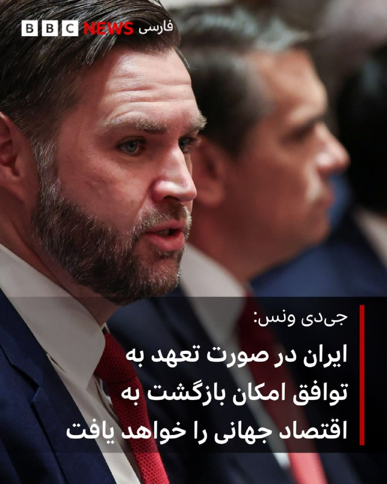

‌ ‌ ‌ ‌
جی‌دی ونس، معاون دونالد ترامپ که روز جمعه در سوئیس تفاهم‌نامه پایان جنگ با ایران را امضاء خواهد کرد، گفته مفاد این توافق اولیه در یک جمله چنین خلاصه می‌شود که اگر ایران به تعهدات خود در چارچوب این توافق عمل کند ایالات متحده آماده فراهم کردن زمینه برای بازگشت این کشور به صحنه اقتصاد جهانی است.

آقای ونس روز سه‌شنبه در گفت‌و‌گو شبکه رادیویی سیروس ایکس‌ام گفت: «دونالد ترامپ هرگز نگفت که هدف اقدامات او به قدرت رساندن رضا پهلوی در ایران است. آنچه گفت این بود که اگر مردم ایران بپا خواسته‌اند و مقابل حکومت خود ایستاده‌اند، خیلی هم خوب است اما آنچه او می‌خواهد اطمینان یافتن از فعالیت‌های هسته‌ای ایران است چه از طریق دیپلماتیک و چه از طریق جنگ که خب در نهایت راه دوم روی داد».

معاون رئیس جمهور آمریکا همچنین تصریح کرد که خواسته منتقدان آقای ترامپ مبنی بر ادامه جنگ با ایران با آن چه دونالد ترامپ به مردم آمریکا همیشه وعده داده و قصد اجرای آن را دارد، «همسو نبوده و نیست.»

https://bbc.in/4uEzj58
📷EPA/Shutterstock
@BBCPersian

---
📅 بروزرسانی: 1405/03/27 02:53
---

## WithYashar — post 15116

🔴اگه میخوای بدونی قیمت دلار طلا خودرو .... درسال جدید چقدر میشه این چنل تمام پیشبینی ها همراه تاریخ وقوع رو گفته

🕯 @link 🕯
🕯 @link 🕯
🕯 @link 🕯

## IranIntlTV — post 342792

  <a href="telegram/content/IranIntlTV_342792_1781652186.mp4" target="_blank">🎬 Download video</a>

آرمان تجرد، کمدین: با وجود تلاش فیفا، ورزشگاه لس آنجلس پر از پرچم‌های شیر و خورشید بود

«یک ایران صدای شما را می‌شنود»

دوشنبه تا پنجشنبه ۱۱ شب تهران

از تلویزیون ایران‌اینترنشنال

تماشای نسخه کامل این قسمت از «برنامه» در یوتیوب:

https://youtu.be/BkAr0eHIGII
@iranintltv

## FarsiVOA — post 220962

  <a href="telegram/content/FarsiVOA_220962_1781652189.mp4" target="_blank">🎬 Download video</a>

⚡️جدال موافقان و مخالفان جمهوری اسلامی در ورزشگاه لس‌آنجلس؛ آرمیتا آزاد گزارش می‌دهد
@FarsiVOA

## BBCPersian — post 284075

  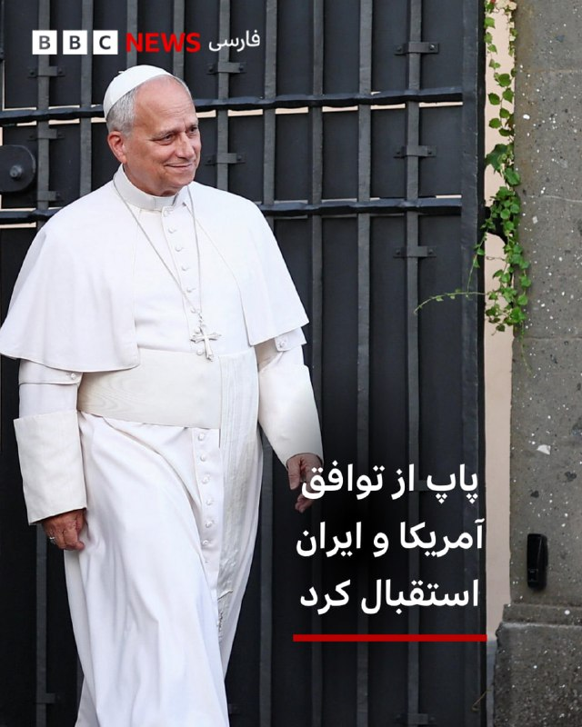

‌ ‌ ‌ ‌
پاپ لئون، رهبر کاتولیک‌های جهان، روز سه شنبه از توافق موقت میان ایالات متحده و ایران برای پایان دادن به جنگ در خاورمیانه استقبال کرد و گفت: «خدا را شکر» که دو طرف قرار است روز جمعه این توافق را به طور رسمی نهایی کنند.

پاپ لئون که پیش‌تر به دلیل انتقاد از جنگ با ایران با واکنش منفی دونالد ترامپ، رئیس‌جمهور آمریکا، روبه رو شده بود، ابراز امیدواری کرد که این توافق به پایان دائمی درگیری‌ها منجر شود.

او در گفت‌وگو با خبرنگاران گفت: «هنوز چندین موضوع باقی مانده که باید حل و فصل شوند، اما همیشه بهتر است این مسائل از طریق گفت‌وگو و مذاکره حل شوند و نه با بازگشت به جنگ.»

نخستین پاپ آمریکایی تاریخ کلیسای کاتولیک افزود: «امیدوارم این توافق واقعا راه حلی برای جنگ باشد، جنگ واقعا پایان‌یافته باشد و بتوانیم به جلو حرکت کنیم.»

https://bbc.in/4uZFt0d
📷REUTERS
@BBCPersian

---
📅 بروزرسانی: 1405/03/27 02:42
---

## WithYashar — post 15115

  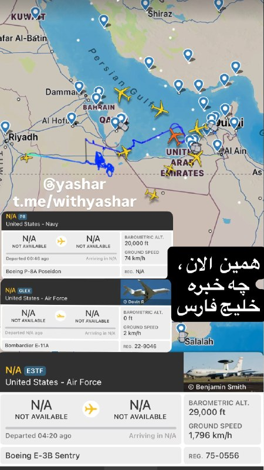

همین الان ، چه خبره خلیج فارس
@withyashar

## IranIntlTV — post 342791

  <a href="telegram/content/IranIntlTV_342791_1781651564.mp4" target="_blank">🎬 Download video</a>

دلواپس‌ها علیه توافق؛وقتی سازندگان شعار، قربانی شعار می‌شوند

سال‌ها جمهوری اسلامی به هوادارانش گفت آمریکا «شیطان بزرگ» است، مذاکره خیانت است و سازش یعنی تسلیم. به همین دلیل، نسلی از نیروهای وفادار و دلواپس پرورش یافت که با هرگونه مذاکره و توافق مخالفت می‌کردند.

حالا اما همان نیروها از مسئولان جمهوری اسلامی می‌پرسند: «پس آن همه شعار چه شد؟» و «اگر مذاکره بد بود، چرا حالا توافق می‌کنید؟»

کامبیز حسینی در «برنامه» به این موضوع می‌پردازد.

«یک ایران صدای شما را می‌شنود»

دوشنبه تا پنجشنبه ۱۱ شب تهران

از تلویزیون ایران‌اینترنشنال

تماشای نسخه کامل این قسمت از «برنامه» در یوتیوب:

https://youtu.be/BkAr0eHIGII
@iranintltv

## IranIntlTV — post 342790

  <a href="telegram/content/IranIntlTV_342790_1781651565.mp4" target="_blank">🎬 Download video</a>

شاهو از تهران:ترامپ هرگز با جمهوری اسلامی به توافق نمی‌رسد؛بزودی ورق به نفع مردم برمی‌گردد

«یک ایران صدای شما را می‌شنود»

دوشنبه تا پنجشنبه ۱۱ شب تهران

از تلویزیون ایران‌اینترنشنال

تماشای نسخه کامل این قسمت از «برنامه» در یوتیوب:

https://youtu.be/BkAr0eHIGII
@iranintltv

## IranIntlTV — post 342789

  <a href="telegram/content/IranIntlTV_342789_1781651567.mp4" target="_blank">🎬 Download video</a>

بهروز رضوی درگذشت؛صدای ماندگار حافظه فرهنگی ایرانیان

بهروز رضوی، از ماندگارترین صداهای رادیو و تلویزیون ایران، متولد ۱۳۲۶ بود و بیش از پنج دهه در عرصه گویندگی، اجرای برنامه‌های فرهنگی و ترویج ادبیات فارسی فعالیت کرد. تسلط بر زبان فارسی، فن بیان کم‌نظیر و احترام عمیق به کلمه از برجسته‌ترین ویژگی‌های او بود.

او در ۲۴ خرداد درگذشت، اما صدایش همچنان بخشی از حافظه فرهنگی چند نسل از ایرانیان باقی خواهد ماند.

یادش گرامی.

«یک ایران صدای شما را می‌شنود»

دوشنبه تا پنجشنبه ۱۱ شب تهران

از تلویزیون ایران‌اینترنشنال

تماشای نسخه کامل این قسمت از «برنامه» در یوتیوب:

https://youtu.be/BkAr0eHIGII
@iranintltv

## IranIntlTV — post 342788

  <a href="telegram/content/IranIntlTV_342788_1781651568.mp4" target="_blank">🎬 Download video</a>

جواد زمانی و ابوالفضل ساعدی؛

بین دو نیمهٔ بازی دیشب، دو نفر را اعدام کردند

در حالی که میلیون‌ها نفر سرگرم تماشای بازی ایران و نیوزیلند بودند، جواد زمانی و ابوالفضل ساعدی در ایران اعدام شدند. دو نامی که بسیاری از مردم حتی فرصت شنیدن داستان زندگی‌شان را پیدا نکردند.

کامبیز حسینی در «برنامه» به این موضوع می پردازد.

«یک ایران صدای شما را می‌شنود»

دوشنبه تا پنجشنبه ۱۱ شب تهران

از تلویزیون ایران اینترنشنال

تماشای نسخه کامل این قسمت از «برنامه» در یوتیوب:

https://youtu.be/BkAr0eHIGII
@iranintltv

## FarsiVOA — post 220961

⚡️اعدام معترضان در ایران در آستانه امضای توافق جمهوری اسلامی و آمریکا ادامه دارد
@FarsiVOA

## Persian_Trend_Official — post 17312

  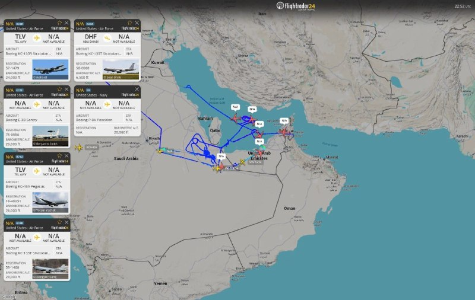

تداوم فعالیت هواگردهای آمریکایی بر فراز خلیج فارس

هم‌اکنون چندین هواپیمای پشتیبانی و شناسایی نیروی هوایی و نیروی دریایی آمریکا در منطقه خلیج فارس فعال هستند.
✈️ در میان این هواگردها، سوخت‌رسان‌های KC-135 Stratotanker و KC-46A Pegasus، هواپیمای هشدار زودهنگام E-3G Sentry و هواپیمای گشت دریایی و شناسایی P-8A Poseidon مشاهده شده‌اند.

## alonews — post 128585

  <a href="telegram/content/alonews_128585_1781651570.webm" target="_blank">🎬 Download video</a>

👈کاخ سفید:
«نه سلاح هسته‌ای، نه لغو کامل تحریم‌ها, نه پول»

✅ @AloNews خبر جنگ

---
📅 بروزرسانی: 1405/03/27 02:33
---

## WithYashar — post 15114

سنا با محدودکردن اختیارات جنگی ترامپ در قبال ایران مخالفت کرد.
@withyashar 🚨

## pm_afshaa — post 94223

  <a href="telegram/content/pm_afshaa_94223_1781650987.webm" target="_blank">🎬 Download video</a>

🔴طرح «محدود کردن اختیارات جنگی ترامپ» بعد از 7 تلاش ناموفق، بالاخره با 47 مخالف و 50 موافق، تصویب شد! سنای آمریکا یه طرحی رو جلو برد که میگه ترامپ واسه ادامه درگیری نظامی با ایران، باید مجوز رسمی کنگره رو داشته باشه و نمیتونه خودسر وارد جنگ بشه. 
💧 Rainbet.com…

## IranIntlTV — post 342787

  <a href="telegram/content/IranIntlTV_342787_1781650988.mp4" target="_blank">🎬 Download video</a>

دیوید هیل، دیپلمات برجسته موسسه خاورمیانه، در نشست عمومی ایران‌اینترنشنال در واشینگتن دی‌سی گفت: «بدترین اشتباه در برابر یک قیام مردمی این است که در ظاهر از معترضان حمایت و آن‌ها را تشویق کنید، اما در عمل تنهاشان بگذارید.»
تماشای نسخه کامل این نشست در یوتیوب ایران‌اینترنشنال:

https://youtu.be/D6e4ychQWgk

@iranintltv

## BBCPersian — post 284074

  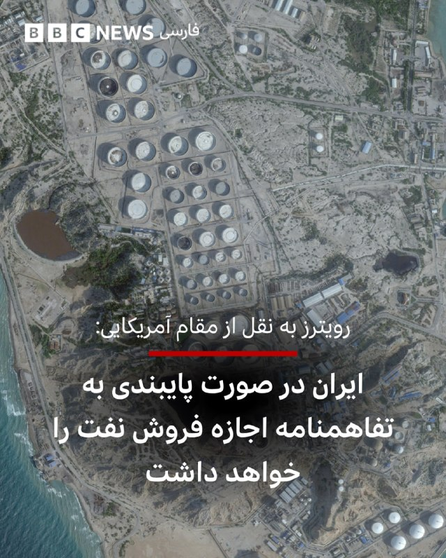

‌ ‌ ‌ ‌
یک مقام ارشد آمریکایی به رویترز گفته است که آمریکا به ایران اجازه خواهد داد تا براساس تفاهمنامه بدست آمده، بلافاصله فروش نفت و سوخت خود را آغاز کند.

این مقام که نامی از او برده نشده است، گفت که بند مربوط به لغو تحریم‌ها علیه فروش نفت ایران از زمانی که این تفاهمنامه در هفته جاری امضا شود، اجرایی خواهد شد و همچنین خدماتی مانند بانکداری، حمل‌ونقل و بیمه را که برای تسهیل این فروش‌ها لازم است را هم شامل می‌شود.

با این حال، این مقام آمریکایی تأکید کرد که این توافق مشروط است.

به گفته این مقام آمریکایی «این یک تفاهمنامه مبتنی بر عملکرد است. یعنی ایران فقط در صورتی می‌تواند از مزایای این تفاهم‌نامه بهره‌مند شود که به همه تعهداتش عمل کند از جمله نداشتن سلاح هسته‌ای، رقیق کردن اورانیوم غنی شده و اجازه تردد آزاد به کشتی‌ها در تنگه هرمز.»

https://bbc.in/4a4v3EM
📷Reuters
@BBCPersian

## Dirty_Kids — post 392364

🙂همه شنیدید 
💖 ترامپ قمار باز 
💖 میدونی سرمایه چند صد ملیون دلاری ترامپ از شرط بندی چطور جمع شده 
⁉️ 
✔️من بهت نه چیزی میخوام بفروشم نه پولی ازت میگیرم من بهت پول دراوردن رو رایگان آموزش میدم https://t.me/+lCR7HeYTU15iNjM0 https://t.me/+lCR7HeYTU15iNjM0 A26…

## Dirty_Kids — post 392363

  

🙂همه شنیدید 
💖 ترامپ قمار باز 
💖

میدونی سرمایه چند صد ملیون دلاری ترامپ از شرط بندی چطور جمع شده 
⁉️

✔️من بهت نه چیزی میخوام بفروشم نه پولی ازت میگیرم من بهت پول دراوردن رو رایگان آموزش میدم

https://t.me/+lCR7HeYTU15iNjM0
https://t.me/+lCR7HeYTU15iNjM0
A26
عضو کانال شو تا بفهمی 
✅

## Dirty_Kids — post 392362

  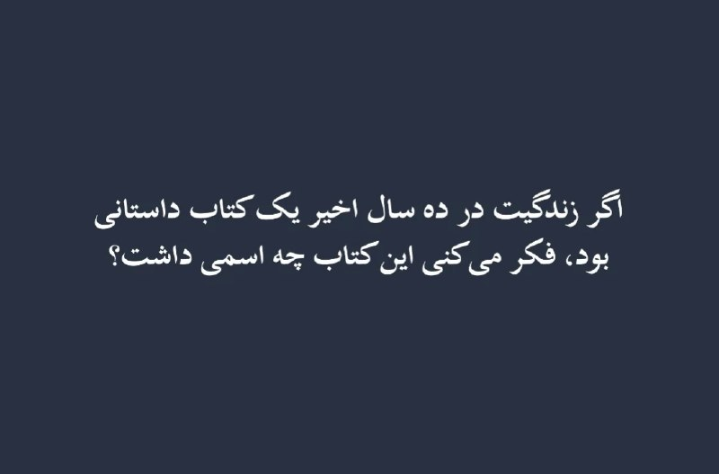

#بخوابیم

@Dirty_Kids 👻

## Dirty_Kids — post 392361

  <a href="telegram/content/Dirty_Kids_392361_1781650991.mp4" target="_blank">🎬 Download video</a>

بابای پسره تبدیل به دشمنِ جدید مرد آهنی شد، تو قسمت بعدی باهاش میجنگه.

@Dirty_Kids 👻

## Dirty_Kids — post 392360

  <a href="telegram/content/Dirty_Kids_392360_1781650992.mp4" target="_blank">🎬 Download video</a>

🔴 توی آذربایجان و توی هوای به شدت بارونی، یه نفر با تمام وجودش سعی می‌کنه تا یه توله سگ رو که افتاده داخل فاضلاب نجات بده و مادرِ توله ام نگران بالا سرش وایساده.

مرد تمام تلاششو کرد، اما بی فایده بود و نتیجش جز غم چیزی نبود...

@Dirty_Kids 👻

## Dirty_Kids — post 392359

  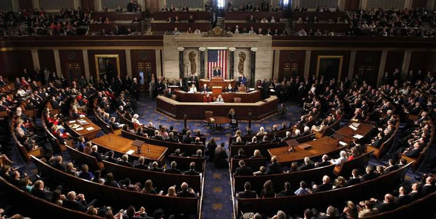

سنای آمریکا اجازه نداد اختیارات ترامپ برای اقدام نظامی علیه ایران محدود بشه.

@Dirty_Kids 👻

## Dirty_Kids — post 392358

  

جی‌دی ونس:
اگر ترامپ رهبر معظم ایران هم میشد، بازم دموکرات‌ها میگفتن که ترامپ جلوی ایران شکست خورده.

@Dirty_Kids 👻

---
📅 بروزرسانی: 1405/03/27 02:23
---

## VahidOOnLine — post 245953

  <a href="telegram/content/VahidOOnLine_245953_1781650401.mp4" target="_blank">🎬 Download video</a>

علی عبدی از کارشناسان حکومتی و چهره‌ رسانه‌ای جمهوری اسلامی در مصاحبه‌ای که یک‌ماه پیش منتشر شده، اما اکنون در شبکه‌های اجتماعی مورد توجه قرار گرفته، به مقایسه رفتار دونالد ترامپ با شی جین‌پینگ، رییس‌جمهوری چین، و جمهوری اسلامی اشاره کرد و گفت اراده‌ای برای فهم این تفاوت وجود ندارد.
او افزود جمهوری اسلامی در شرایطی با آمریکا مذاکره می‌کند که ترامپ هر روز به جمهوری اسلامی توهین می‌کند، آن را تحقیر می‌کند و به گفته او، «به لجن می‌کشد.»
عبدی گفت ترامپ حتی رهبر جدید جمهوری اسلامی را به ترور تهدید کرده و اتهام‌ جنسی مطرح کرده است، اما صدایی از کسی درنمی‌آید.
‌🏁 🇬🇧 IranintlTV

🤖 @VahidOOnLine

## iaghapour — post 2679

  

🚀 سرور ابری رو از هر جای دنیا و با هر ارزی که دوست داری بخر!

🌍 دیگه نیازی نیست برای خرید سرور از دیتاسنترهای معتبر جهانی دغدغه پرداخت یا محدودیت لوکیشن داشته باشی. در دوپراکس (Doprax)، بهترین زیرساخت‌های ابری دنیا در یک پنل اختصاصی زیر دست شماست!

با دوپراکس می‌تونی از غول‌های تکنولوژی مثل Google Cloud, DigitalOcean, Hetzner, Vultr و چندین پروایدر دیگر، سرور تهیه کنی.

✨ چرا دوپراکس بهترین انتخاب شماست؟
📍 تنوع لوکیشن: دسترسی به ده‌ها لوکیشن مختلف در اروپا، آمریکا، آسیا.
💳 پرداخت بدون مرز: امکان پرداخت آسان با ریال و یا رمزارز.
⏱️ پرداخت ساعتی: فقط به اندازه‌ای که مصرف می‌کنی پول بده!
🔄 امکان تعویض IP: قابلیت تغییر آی‌پی در اکثر دیتاسنترها.

همین حالا وارد سایت شو و اولین سرورت رو با کانفیگ دلخواهت بساز 👇

🌐 وب‌سایت: www.doprax.com

💬 پشتیبانی و اخبار در کانال ما:
@dopraxcloud

## IranIntlTV — post 342786

  <a href="telegram/content/IranIntlTV_342786_1781650403.mp4" target="_blank">🎬 Download video</a>

علی عبدی از کارشناسان حکومتی و چهره‌ رسانه‌ای جمهوری اسلامی در مصاحبه‌ای که یک‌ماه پیش منتشر شده، اما اکنون در شبکه‌های اجتماعی مورد توجه قرار گرفته، به مقایسه رفتار دونالد ترامپ با شی جین‌پینگ، رییس‌جمهوری چین، و جمهوری اسلامی اشاره کرد و گفت اراده‌ای برای فهم این تفاوت وجود ندارد.
او افزود جمهوری اسلامی در شرایطی با آمریکا مذاکره می‌کند که ترامپ هر روز به جمهوری اسلامی توهین می‌کند، آن را تحقیر می‌کند و به گفته او، «به لجن می‌کشد.»
عبدی گفت ترامپ حتی رهبر جدید جمهوری اسلامی را به ترور تهدید کرده و اتهام‌ جنسی مطرح کرده است، اما صدایی از کسی درنمی‌آید.

## FarsiVOA — post 220960

🔺دونالد ترامپ: قطر بیش از هزار میلیارد دلار در آمریکا سرمایه‌گذاری می‌کند

▪️دونالد ترامپ، رئیس جمهوری آمریکا، گفت قطر قرار است بیش از هزار میلیارد دلار در ایالات متحده سرمایه‌گذاری کند.

⬇️ بیشتر بخوانید:
https://ir.voanews.com/a/iran-qatar-g7-france-negotiations-investment-trump-/8161561.html
@FarsiVOA

## Dirty_Kids — post 392354

گویا «جادوگر جنگل‌های نیوانگلند»، خانم آنیا تیلور-جوی، پشت پرده قهرمانی دوره قبل آرژانتینه. ببینیم قهرمانی این دوره رو هم تضمین می‌کنن. :)

@Dirty_Kids 👻

## Dirty_Kids — post 392353

  <a href="telegram/content/Dirty_Kids_392353_1781650405.mp4" target="_blank">🎬 Download video</a>

جی‌دی ونس، معاون ترامپ خطاب به مردم ایران :

ترامپ هیچ‌وقت نگفته هدفش اینه که رضا پهلوی رو رهبر بعدی ایران کنه؛

حرفش این بوده که اگه مردم ایران بخوان علیه حکومتشون قیام کنن، اون دیگه مسئله خود مردم ایرانه و به آمریکا ربطی نداره.
چیزی که ما دنبالشیم، متوقف شدن برنامه هسته‌ای ایرانه.

@Dirty_Kids 👻

## alonews — post 128584

  <a href="telegram/content/alonews_128584_1781650407.webm" target="_blank">🎬 Download video</a>

👈سنای آمریکا به محدود شدن اختیارات رئیس جمهور در جنگ رای نداد

✅ @AloNews خبر جنگ

## alonews — post 128583

  <a href="telegram/content/alonews_128583_1781650408.webm" target="_blank">🎬 Download video</a>

👈کاملا هریس،معاون رئیس جمهور پیشین آمریکا:
«هر مذاکره‌ای که در جریان باشد ترامپ به نقطه‌ای خواهد رسید که در برجام به ان رسیدیم و این چیزی بود که خودش پاره‌اش کرد»

✅ @AloNews خبر جنگ

---
📅 بروزرسانی: 1405/03/27 02:12
---

## VahidOOnLine — post 245952

  

ارتش عراق در پاسخ به پرسش العربیه درباره خلع سلاح گروه‌های شبه‌نظامی در این کشور گفت پس از برقراری ثبات امنیتی، دیگر توجیهی برای حضور گروه‌های مسلح وجود ندارد.
ارتش عراق با تاکید بر اینکه تصمیم‌های امنیتی در این کشور صرفا عراقی خواهد بود و هیچ‌گونه دخالت خارجی در آن پذیرفته نخواهد شد، گفت در پرونده انحصار سلاح، همه طرف‌ها تابع حاکمیت قانون خواهند بود.

‌🏁 🇬🇧 IranintlTV

🤖 @VahidOOnLine

## VahidOOnLine — post 245951

  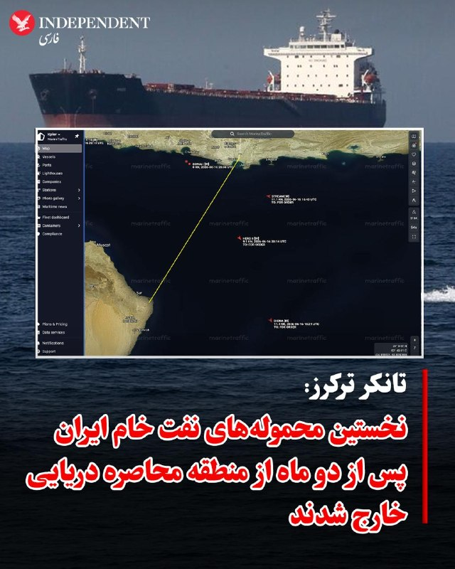

♦️تانکر ترکرز، سامانه رصد تردد نفتکش‌ها، سه‌شنبه ۲۶ خرداد اعلام کرد دست‌کم دو نفتکش غول‌پیکر شرکت ملی نفتکش ایران با مجموع حدود ۳ میلیون و ۸۰۰ هزار بشکه نفت خام، از محدوده محاصره دریایی نیروی دریایی آمریکا خارج شده‌اند.
بر اساس این گزارش، این نخستین صادرات نفت خام ایران در دو ماه گذشته به شمار می‌رود. تانکر ترکرز اعلام کرد اطلاعات مربوط به حرکت این نفتکش‌ها را با استفاده از داده‌های رهگیری دریایی و تصاویر ماهواره‌ای تایید کرده است.
این موسسه همچنین گزارش داد یک نفتکش دیگر شرکت ملی نفتکش ایران که طی هفت هفته گذشته در منطقه اقتصادی پاکستان منتظر ورود به آب‌های ایران بوده، در حال نزدیک شدن به خط محاصره دریایی است.
‌🇸🇦 Indypersian

🤖 @VahidOOnLine

## IranIntlTV — post 342785

  <a href="telegram/content/IranIntlTV_342785_1781649772.mp4" target="_blank">🎬 Download video</a>

رابرت ساتلوف، مدیر اجرایی موسسه واشینگتن، در نشست عمومی ایران‌اینترنشنال در واشینگتن دی‌سی گفت: «حمله جمهوری اسلامی به کشورهای منطقه، بهترین فرصت برای دونالد ترامپ، رییس‌جمهوری آمریکا، است تا ائتلافی منطقه‌ای علیه جمهوری اسلامی شکل دهد و این کشورها را بیش از پیش با آمریکا همراه کند.»

تماشای نسخه کامل این نشست در یوتیوب ایران‌اینترنشنال:

https://youtu.be/D6e4ychQWgk

@iranintltv

## IranIntlTV — post 342784

  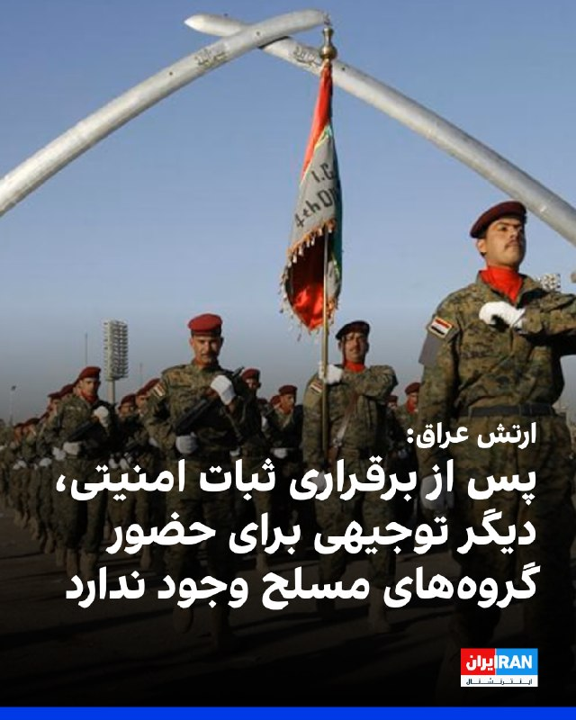

ارتش عراق در پاسخ به پرسش العربیه درباره خلع سلاح گروه‌های شبه‌نظامی در این کشور گفت پس از برقراری ثبات امنیتی، دیگر توجیهی برای حضور گروه‌های مسلح وجود ندارد.
ارتش عراق با تاکید بر اینکه تصمیم‌های امنیتی در این کشور صرفا عراقی خواهد بود و هیچ‌گونه دخالت خارجی در آن پذیرفته نخواهد شد، گفت در پرونده انحصار سلاح، همه طرف‌ها تابع حاکمیت قانون خواهند بود.

https://iranintl.com/202606160021

## IranIntlTV — post 342783

  <a href="telegram/content/IranIntlTV_342783_1781649774.mp4" target="_blank">🎬 Download video</a>

بن سبطی، پژوهشگر ایران و اسرائیل، درباره نقش لبنان و حزب‌الله به‌عنوان مانعی در مسیر توافق تهران و واشینگتن گفت: «جمهوری اسلامی وقتی در طرف آمریکایی نشانه‌ای از انعطاف می‌بیند، تلاش می‌کند مفاد این توافق را گسترش دهد.»
@iranintltv

## FarsiVOA — post 220959

  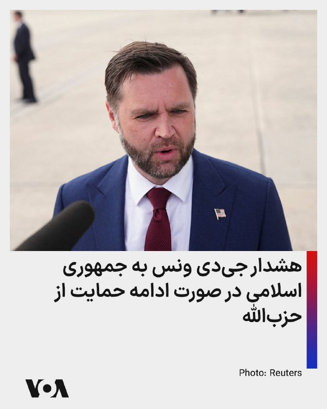

⚡️جی‌دی ونس، معاون رئیس‌جمهوری آمریکا، در مصاحبه‌ای با «شوی مگان کلی» گفت که اگر جمهوری اسلامی ایران به تامین مالی گروه حزب‌الله در لبنان ادامه دهد، ایالات متحده آمریکا، دارایی‌های مسدود‌شده آن را آزاد نخواهد کرد.
@FarsiVOA

## FarsiVOA — post 220958

⚡️ریزش قیمت دلار تا کجا ادامه دارد
@FarsiVOA

## Persian_Trend_Official — post 17311

  <a href="telegram/content/Persian_Trend_Official_17311_1781649775.mp4" target="_blank">🎬 Download video</a>

شبتون بخیر 🌌
F-16 Falcon

📌 @persian_trend_official
پرشین ترند | متفاوت‌ترین کانال نظامی

---
📅 بروزرسانی: 1405/03/27 02:03
---

## VahidOOnLine — post 245950

  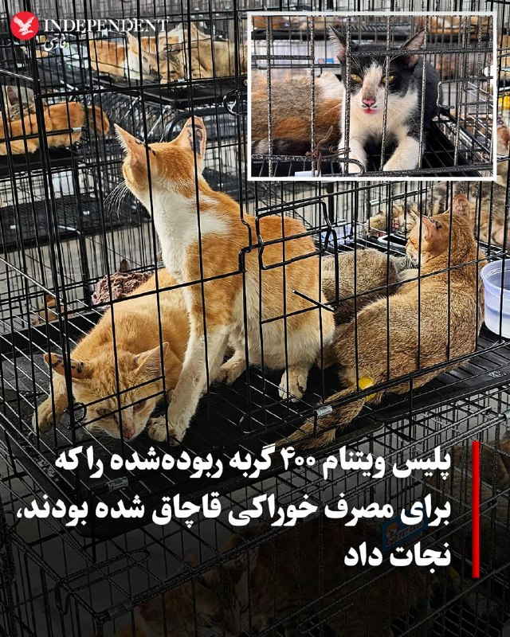

♦️محتوای این خبر ممکن است برای برخی مخاطبان آزاردهنده باشد.
به گزارش خبرگزاری فرانسه، پلیس ویتنام با متلاشی کردن یک باند بزرگ سرقت حیوانات خانگی در هوشی‌مین، بیش از ۴۰۰ گربه زنده را که برای ذبح و مصرف خوراکی قاچاق شده بودند، نجات داد. بر اساس بیانیه انجمن حمایت از حقوق حیوانات، تاکنون دست‌کم ۴۰ گربه ربوده‌شده به صاحبانشان بازگردانده شده‌اند. پلیس در جریان این عملیات، ۹ نفر را بازداشت و علاوه بر حیوانات زنده، جسد یخ‌زده ۸۰ گربه را نیز کشف و ضبط کرده است.
اگرچه مصرف گوشت سگ و گربه در ویتنام قانونی است و رستوران‌ها مجوز فروش آن را دارند، اما فروشندگان ملزم به ارائه گواهی اصالت و منشأ قانونی حیوانات هستند. متهمان این پرونده اعتراف کرده‌اند که طی سه سال گذشته به سرقت و به دام انداختن گربه‌ها در سراسر جنوب ویتنام مشغول بوده‌اند. با وجود موفقیت‌آمیز بودن این عملیات، گزارش‌ها حاکی از آن است که حدود ۱۰۰ قلاده از گربه‌های نجات‌یافته به دلیل شرایط سخت اسارت تلف شده‌اند و تلاش‌ها برای نجات و نگهداری مبرم بقیه حیوانات در ایستگاه پلیس ادامه دارد.
‌🇸🇦 Indypersian

🤖 @VahidOOnLine

## FoxNewsTwitter — post 343047

  <a href="telegram/content/FoxNewsTwitter_343047_1781649181.mp4" target="_blank">🎬 Download video</a>

Fox News (Twitter/X)

RT @SpecialReport: WATCH: "The only way you can get this done is to nuke the legislative filibuster. And this is not something that we have anywhere close to the votes to do. So we have had votes... We will continue to put the Democrats on record. The Democrats are voting against an issue that 80 to 85% of the American people are for."

Following President Trump’s ultimatum to attach the SAVE America Act to the pending surveillance renewal package, @LeaderJohnThune walks @BretBaier through the unyielding floor math confronting Republican leadership. While strongly endorsing the voter validation measures, Thune gives a realistic assessment of institutional boundaries and explains why the upper chamber lacks the votes to force a rules change.

---
📅 بروزرسانی: 1405/03/27 01:52
---

## VahidOOnLine — post 245949

  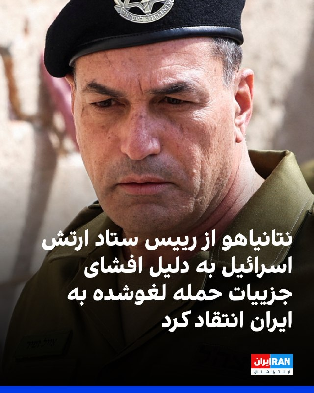

وای‌نت گزارش داد نتانیاهو روز سه‌شنبه ایال زمیر، رییس ستاد ارتش اسرائیل، را به دلیل افشای جزئیات جدید درباره یک حمله گسترده برنامه‌ریزی‌شده علیه جمهوری اسلامی که اندکی پیش از آغاز عملیات لغو شده بود، مورد انتقاد قرار داد.
نتانیاهو گفت: «او نباید این موضوع را می‌نوشت. این یک اشتباه ملی است و به وحدت ما آسیب می‌زند. همچنین باعث شرمندگی در برابر ترامپ می‌شود.»
طبق گزارش وای‌نت، فرمانده نیروی هوایی اسرائیل در نامه‌ای از یک موج حملات بزرگ علیه جمهوری اسلامی خبر داده بود که حدود یک ساعت پیش از برخاستن جنگنده‌ها متوقف شد.

‌🏁 🇬🇧 IranintlTV

🤖 @VahidOOnLine

## IranIntlTV — post 342782

  <a href="telegram/content/IranIntlTV_342782_1781648568.mp4" target="_blank">🎬 Download video</a>

الکس وطن‌خواه، پژوهشگر ارشد موسسه خاورمیانه، در نشست عمومی ایران‌اینترنشنال در واشینگتن دی‌سی گفت در دکترین جدید دفاعی جمهوری اسلامی، حمله به حزب‌الله، حشدالشعبی و دیگر نیروهای نیابتی تهران به‌منزله حمله به خاک ایران تلقی می‌شود؛ رویکردی که به گفته او می‌تواند به جنگی بی‌پایان منجر شود.

تماشای نسخه کامل این نشست در یوتیوب ایران‌اینترنشنال:

https://youtu.be/D6e4ychQWgk

@iranintltv

## IranIntlTV — post 342781

  

وای‌نت گزارش داد نتانیاهو روز سه‌شنبه ایال زمیر، رییس ستاد ارتش اسرائیل، را به دلیل افشای جزئیات جدید درباره یک حمله گسترده برنامه‌ریزی‌شده علیه جمهوری اسلامی که اندکی پیش از آغاز عملیات لغو شده بود، مورد انتقاد قرار داد.
نتانیاهو گفت: «او نباید این موضوع را می‌نوشت. این یک اشتباه ملی است و به وحدت ما آسیب می‌زند. همچنین باعث شرمندگی در برابر ترامپ می‌شود.»
طبق گزارش وای‌نت، فرمانده نیروی هوایی اسرائیل در نامه‌ای از یک موج حملات بزرگ علیه جمهوری اسلامی خبر داده بود که حدود یک ساعت پیش از برخاستن جنگنده‌ها متوقف شد.

https://iranintl.com/202606169175

## Persian_Trend_Official — post 17310

  <a href="telegram/content/Persian_Trend_Official_17310_1781648571.mp4" target="_blank">🎬 Download video</a>

عادل فردوسی‌پور: بدنچال دکترخوش چشم فوتبال هستم
دکتر خوش چشم هر چه میگوید بر عکس میشود.

👺Phantom

📌 @persian_trend_official
پرشین ترند | متفاوت‌ترین کانال نظامی

## IranianMinds — post 22771

  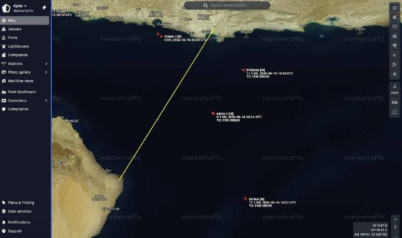

بعد از حدود دو ماه محاصره دو نفتکش ایرانی از تنگه هرمز رد شدن.

@IranianMinds

## Dirty_Kids — post 392352

  <a href="telegram/content/Dirty_Kids_392352_1781648572.mp4" target="_blank">🎬 Download video</a>

تو ورزش نکنی سالمتر میمونی:)))
نباید میخندیدم

@Dirty_Kids 👻

## Dirty_Kids — post 392351

  

🔴 تحقیقات جدید نشون میده که مغزتون به چهره‌ی بهترین دوستتون، دقیقا مثل خوردن غذای مورد علاقتون واکنش نشون میده.

وقتی شما چهره دوست صمیمی‌تون رو می بینین، بخش هایی از مغزتون فعال میشه که باعث لذت و آرامش میشه، دقیقا مثل خوردن غذای مورد علاقه‌مون.
نگاه کردن به دوست صمیمی‌مون می‌تونه باعث ترشح دوپامین و اکسی‌توسین بشه و درنتیجه، افزایش آرامش، کاهش استرس و حس امنیت رو همراه داشته باشه.

@Dirty_Kids 👻

## Dirty_Kids — post 392350

محبی بازی بدی رو شروع کردش

@Dirty_Kids 👻

## alonews — post 128582

  <a href="telegram/content/alonews_128582_1781648573.mp4" target="_blank">🎬 Download video</a>

یا رب روا مدار روزی گدا معتبر شود

@AloSport

---
📅 بروزرسانی: 1405/03/27 01:43
---

## FoxNewsTwitter — post 343046

  <a href="telegram/content/FoxNewsTwitter_343046_1781647989.mp4" target="_blank">🎬 Download video</a>

Fox News (Twitter/X)

"I guarantee that when Barack Obama was president, or Joe Biden was pretending to be president, that you had Republicans who still said they're proud of America."

VP Vance said he wished Democrats would be proud of their country, even when their party is out of power, telling @TheFive he rejected the idea that patriotic pride should rise and fall with politics.

## IranIntlTV — post 342780

  <a href="https://t.me/IranintlTV/342780" target="_blank">📎 Download file</a>

🎧نسخه صوتی برنامه با کامبیز حسینی؛ آیا جمهوری اسلامی با «قاتل خامنه‌ای» آشتی کرد؟
@iranintlTV

## FarsiVOA — post 220957

⚡️مهدی عربشاهی در گفت‌وگو با صدای آمریکا گفت غیبت مجتبی خامنه‌ای، تصمیم‌گیری‌های بزرگ در جمهوری اسلامی را دشوار کرده و حتی درون حکومت این پرسش را ایجاد کرده است که چه کسانی به نام او تصمیم می‌گیرند.
@FarsiVOA

## FarsiVOA — post 220956

🔺هشدار نهادهای حقوق بشری درباره خطر اعدام قریب‌الوقوع سه معترض ایرانی توسط جمهوری اسلامی

▪️سازمان عفو بین‌الملل با ابراز نگرانی از خطر اعدام قریب‌الوقوع علی فتاح و محمد نقی‌زاده، خواستار توقف فوری اجرای احکام این دو معترض شد.

⬇️ بیشتر بخوانید:
https://ir.voanews.com/a/human-rights-organnization-warn-of-the-imminent-execution-of-three-iranan-protesters-by-the-islamic-republic/8161564.html
@FarsiVOA

## alonews — post 128581

  <a href="telegram/content/alonews_128581_1781647993.webm" target="_blank">🎬 Download video</a>

👈طبق گزارش شبکه خبری ان‌بی‌سی، سپاه پاسداران انقلاب اسلامی از زمان امضای دیجیتال تفاهم‌نامه در روز یکشنبه، هر شب پهپادهای متعددی را پرتاب کرده است

🔴یک مقام آمریکایی می‌گوید که این پهپادها توسط سپاه پاسداران انقلاب اسلامی پرتاب می‌شوند، در حالی که نیروهای آمریکایی آن‌ها را قبل از اینکه بتوانند به کشتیرانی تجاری، کشتی‌های نظامی ایالات متحده یا پرسنل در منطقه تهدید کنند، رهگیری کرده‌اند.

✅ @AloNews خبر جنگ

---
📅 بروزرسانی: 1405/03/27 01:32
---

## VahidOOnLine — post 245948

در پاسخ به فراخوان شاهزاده رضا پهلوی، ایرانیان نیوکاسل روز ۲۶ خرداد پرچم شیر و خورشید ایران را در تجمعی برافراشتند و نقاشی چهره مجیدرضا رهنورد را در زادروزش به نمایش گذاشتند.
‌🏁 🇬🇧 IranintlTV

🤖 @VahidOOnLine

## pm_afshaa — post 94222

🟢تو این روزهای سر سبز بورس، گزارش‌ها و سرخطی‌های این کانال قطعا به دردتون میخوره و به‌شدت سود آوره؛

رادار بورس، اخبار و سرخطی بازار :

➡️https://t.me/BorsRadar

➡️https://t.me/BorsRadar

## IranIntlTV — post 342779

در پاسخ به فراخوان شاهزاده رضا پهلوی، ایرانیان نیوکاسل روز ۲۶ خرداد پرچم شیر و خورشید ایران را در تجمعی برافراشتند و نقاشی چهره مجیدرضا رهنورد را در زادروزش به نمایش گذاشتند.

## alonews — post 128580

  <a href="telegram/content/alonews_128580_1781647375.mp4" target="_blank">🎬 Download video</a>

👈تیکه عادل به خوش چشم

✅ @AloNews خبر جنگ

---
📅 بروزرسانی: 1405/03/27 01:22
---

## VahidOOnLine — post 245947

  <a href="telegram/content/VahidOOnLine_245947_1781646766.mp4" target="_blank">🎬 Download video</a>

سعید آجرلو، عضو تیم رسانه‌ای مذاکره‌کننده جمهوری اسلامی، با اشاره به اینکه بعد از جمعه می‌توان راحت‌تر درباره متن یادداشت تفاهم با آمریکا صحبت کرد، گفت آمریکا مراد و قصد مذاکره‌کنندگان را از آوردن «فلان کلمه» در متن نمی‌داند.
به گفته او، اگر مردم متن نهایی درباره تنگه هرمز را با متن اولیه‌ای که از سوی آمریکا یا جمهوری اسلامی ارائه شده بود مقایسه کنند، تایید خواهند کرد که متن کنونی بهتر است.
دونالد ترامپ، رییس‌جمهوری آمریکا، پیش‌تر رهبران جدید ایران را «بسیار باهوش» توصیف کرده بود.
‌🏁 🇬🇧 IranintlTV

🤖 @VahidOOnLine

## pm_afshaa — post 94221

  <a href="telegram/content/pm_afshaa_94221_1781646767.mp4" target="_blank">🎬 Download video</a>

🔴جی‌دی ونس، معاون ترامپ:
حتی اگه دونالد ترامپ به عنوان رهبر معظم ایران انتخاب میشد، دموکرات‌ها همچنان می‌گفتن که آمریکا شکست خورده.

💧 Rainbet.com the #1 Non-KYC Crypto Casino & Sportsbook @rainbetcom

😁 @Pm_Afshaa

## pm_afshaa — post 94220

  <a href="telegram/content/pm_afshaa_94220_1781646769.webm" target="_blank">🎬 Download video</a>

🔴تسنیم: به گفته منابع اطلاعاتی آمریکا، این احتمال وجود داره که جمهوری اسلامی در واکنش به حملات اسرائیل در لبنان، بدون هیچ هشدار قبلی یک حمله غافلگیرکننده علیه اسرائیل انجام بده.

💧 Rainbet.com the #1 Non-KYC Crypto Casino & Sportsbook @rainbetcom

😁 @Pm_Afshaa

## pm_afshaa — post 94219

  <a href="telegram/content/pm_afshaa_94219_1781646770.webm" target="_blank">🎬 Download video</a>

🔴زاکانی، شهردار تهران: پیش‌بینی میشه دست‌کم 15 تا 20 میلیون نفر در تهران در مراسم تشییع جنازه علی خامنه‌ای شرکت کنن.

💧 Rainbet.com the #1 Non-KYC Crypto Casino & Sportsbook @rainbetcom

😁 @Pm_Afshaa

## IranIntlTV — post 342778

  <a href="telegram/content/IranIntlTV_342778_1781646770.mp4" target="_blank">🎬 Download video</a>

سعید آجرلو، عضو تیم رسانه‌ای مذاکره‌کننده جمهوری اسلامی، با اشاره به اینکه بعد از جمعه می‌توان راحت‌تر درباره متن یادداشت تفاهم با آمریکا صحبت کرد، گفت آمریکا مراد و قصد مذاکره‌کنندگان را از آوردن «فلان کلمه» در متن نمی‌داند.
به گفته او، اگر مردم متن نهایی درباره تنگه هرمز را با متن اولیه‌ای که از سوی آمریکا یا جمهوری اسلامی ارائه شده بود مقایسه کنند، تایید خواهند کرد که متن کنونی بهتر است.
دونالد ترامپ، رییس‌جمهوری آمریکا، پیش‌تر رهبران جدید ایران را «بسیار باهوش» توصیف کرده بود.

## IranIntlTV — post 342777

  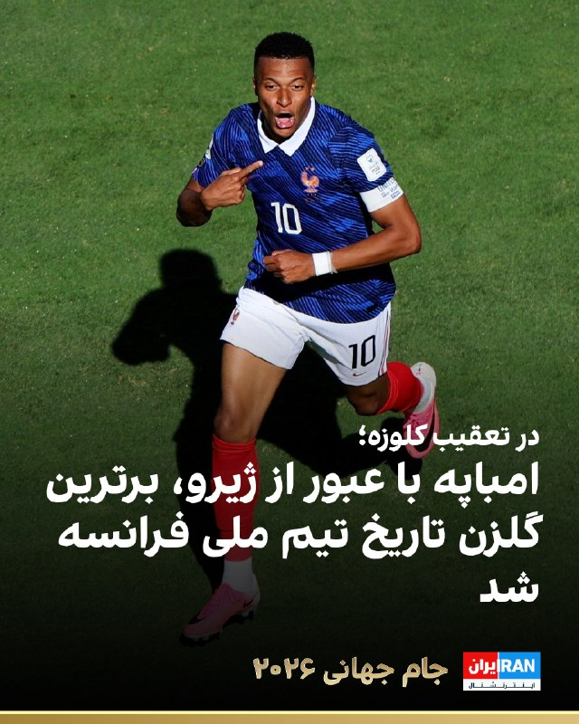

🔻کیلیان امباپه در جریان پیروزی ۳ بر ۱ تیم ملی فرانسه مقابل سنگال در نخستین دیدار خروس‌ها در جام جهانی ۲۰۲۶، با دو گلی که به ثمر رساند چند رکورد مهم را جابه‌جا کرد و نام خود را در تاریخ فوتبال فرانسه و جام‌های جهانی ماندگار ساخت.

🔹ام‌باپه با این دبل و ثبت ۵۸ گل ملی، از اولیویه ژیرو عبور کرد و به بهترین گلزن تاریخ فرانسه تبدیل شد. او همچنین شمار گل‌های خود در ادوار جام جهانی را نیز به ۱۴ رساند و با پشت سر گذاشتن ژوست فونتن (۱۳ گل)، عنوان بهترین گلزن تاریخ فرانسه در جام‌های جهانی را از آن خود کرد.

🔹امباپه همچنین با رسیدن به ۱۴ گل در جام جهانی، از رکوردهای لیونل مسی و پله عبور کرد و در کنار گرد مولر، اسطوره فوتبال آلمان، در رتبه سوم جدول برترین گلزنان تاریخ این رقابت‌ها ایستاد. او اکنون تنها دو گل با رکورد ۱۶ گله میروسلاو کلوزه، بهترین گلزن تاریخ جام جهانی، فاصله دارد.

@iranintltvsport

## BBCPersian — post 284073

  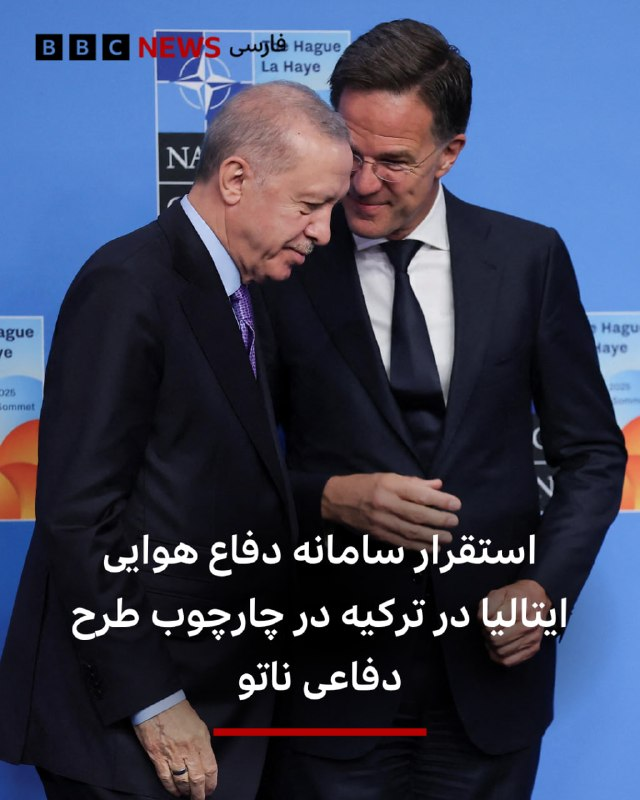

‌ ‌ ‌
وزارت دفاع ترکیه اعلام کرد که ایتالیا قرار است یک سامانه دفاع هوایی را در مرکزآن کشور و در چارچوب طرح دفاعی ناتو مستقر کند.

در بیانیه این وزارتخانه آمده است: «در چارچوب طرح دفاعی ناتو و با هدف تقویت دفاع هوایی ائتلاف، یک سامانه دفاع هوایی متعلق به ایتالیا در فرماندهی پایگاه هوایی سوم در قونیه مستقر خواهد شد.»

سامانه «سامپ-تی» یک سیستم موشکی زمین به هوا متحرک است که به‌صورت پروژه مشترک فرانسه و ایتالیا توسعه یافته است.

این سامانه می‌تواند علیه جنگنده‌ها، پهپادها، موشک‌های کروز و برخی تهدیدهای موشک‌های بالستیک به کار گرفته شود.

نیروهای ناتو مستقر در ترکیه از زمان آغاز جنگ خاورمیانه ، چهار بار موشک‌های بالستیک شلیک‌شده از ایران را رهگیری کرده‌اند؛ «این موضوع باعث شد ناتو یک واحد جدید سامانه موشکی پاتریوت را در پایگاه هوایی اینجرلیک در جنوب ترکیه مستقر کند.»

مارک روته، دبیرکل ناتو، در سفر خود به آنکارا در آوریل گذشته گفته بود که این ائتلاف «هر آن چه برای دفاع از اعضای خود لازم باشد» انجام خواهد داد، از جمله دفاع از ترکیه.

https://bbc.in/4oCBQM6
📷 Reuters
@BBCPersian

## Dirty_Kids — post 392349

  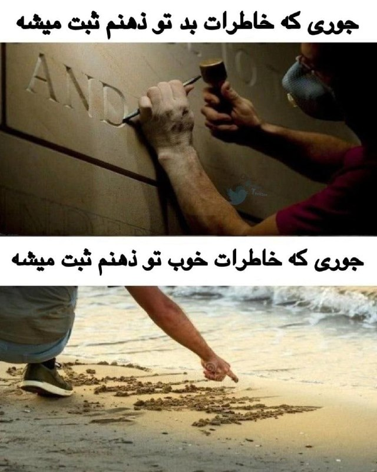

فکت:

@Dirty_Kids 👻

## Dirty_Kids — post 392348

ریلز طنز میبینم، میخندم، لایکش میکنم، یهو مردک با اون هندونش میاد ته ویدئو، دیگه به نظرم خنده‌دار نیست و لایک رو برمیدارم.

@Dirty_Kids 👻

## alonews — post 128579

  <a href="telegram/content/alonews_128579_1781646773.webm" target="_blank">🎬 Download video</a>

👈خبرگزاری نیمه معتبر تسنیم: به گفته منابع اطلاعاتی آمریکا، این احتمال وجود داره که جمهوری اسلامی در واکنش به حملات اسرائیل در لبنان، بدون هیچ هشدار قبلی یک حمله غافلگیرکننده علیه اسرائیل انجام بده.

✅ @AloNews خبر جنگ

---
📅 بروزرسانی: 1405/03/27 01:13
---

## FoxNewsTwitter — post 343045

  <a href="telegram/content/FoxNewsTwitter_343045_1781646188.mp4" target="_blank">🎬 Download video</a>

Fox News (Twitter/X)

"I do think the political violence and rhetoric in this country is completely out of control."

Speaking on @TheFive, VP JD Vance reacted to news that the FBI disrupted an alleged drone and sniper plot targeting the White House UFC Freedom 250 event.

Vance said the suspects never came close to carrying out the attack and credited law enforcement for stopping the plot before it reached the point of execution.

## FarsiVOA — post 220955

⚡️جی دی ونس: تفاهم‌نامه با جمهوری اسلامی یعنی رهبری آن قدم پیش بگذارد و رفتارش را تغییر دهد
@FarsiVOA

## FarsiVOA — post 220954

  <a href="telegram/content/FarsiVOA_220954_1781646191.mp4" target="_blank">🎬 Download video</a>

⚡️شادی گل محمد محبی جنجال‌ساز شد؛ موج واکنش‌ها در بین حاضرین در استادیوم
@FarsiVOA

## FarsiVOA — post 220953

🔺سنای آمریکا قطعنامه جدید محدود کردن اختیارات جنگی دونالد ترامپ علیه جمهوری اسلامی را رد کرد

▪️سنای آمریکا روز سه‌شنبه ۲۶ خرداد قطعنامه‌ای درباره اختیارات جنگی در قبال جمهوری اسلامی ایران را رد کرد.

⬇️ بیشتر بخوانید:
https://ir.voanews.com/a/8161573.html
@FarsiVOA

## alonews — post 128578

  <a href="telegram/content/alonews_128578_1781646192.mp4" target="_blank">🎬 Download video</a>

👈جون بولتون:

به نظر من این برای ایالات متحده معامله بسیار بدی است.

ترامپ به پیامدهای ژئواستراتژیک این معامله فکر نمی‌کند.

او فقط به یک چیز فکر می‌کند. او می‌خواهد تنگه باز بماند. او می‌خواهد نفت خلیج فارس در بازارهای بین‌المللی عرضه شود.

او می‌خواهد قیمت بنزین در پمپ‌ها پایین بیاید. این تنها چیزی است که برایش مهم است.

ما نمی‌دانیم در این معامله چه چیزی وجود دارد. اگر معامله‌ای عالی بود، در دسترس عموم قرار می‌گرفت.

به نظر من این تقریباً همان چیزی را به شما می‌گوید که نیاز به دانستن آن دارید.

✅ @AloNews خبر جنگ

---
📅 بروزرسانی: 1405/03/27 01:03
---

## WithYashar — post 15113

  <a href="telegram/content/WithYashar_15113_1781645584.mp4" target="_blank">🎬 Download video</a>

ونس : اگه دونالد ترامپ حتی به عنوان رهبر معظم انقلاب در ایران هم انتخاب می‌شد، دموکرات‌ها باز هم می‌گفتن آمریکا شکست خورده
@withyashar

## WithYashar — post 15112

  <a href="telegram/content/WithYashar_15112_1781645586.mp4" target="_blank">🎬 Download video</a>

معاون رئیس جمهور جی دی ونس:

پرزیدنت ترامپ هرگز نگفت که هدفش نصب رضا پهلوی برای تبدیل شدن به رهبر جدید ایران است.

آنچه گفته این است که اگر مردم ایران بخواهند قیام کنند ، عالی است. این کار اوناست این بین آنها و دولتشان است.
چیزی که ما می خواهیم توقف برنامه هسته ای آنهاست.‌‌
@withyashar

## FoxNewsTwitter — post 343044

  <a href="telegram/content/FoxNewsTwitter_343044_1781645588.mp4" target="_blank">🎬 Download video</a>

Fox News (Twitter/X)

"Not a single cent of American money."

VP JD Vance pushed back on claims that the Iran deal will hand Tehran billions of dollars in U.S. funding, arguing that critics are misrepresenting what's actually on the table.

Speaking on @TheFive, Vance said any economic benefits would come only if Iran completely changes its behavior and meets U.S. demands.

## FoxNewsTwitter — post 343043

  <a href="telegram/content/FoxNewsTwitter_343043_1781645590.mp4" target="_blank">🎬 Download video</a>

Fox News (Twitter/X)

"How real are they? How fake are they?"

Vice President JD Vance tells @TheFive that the Iran deal signing won't just be a photo opportunity — their compliance is what really matters.

## pm_afshaa — post 94218

  <a href="telegram/content/pm_afshaa_94218_1781645592.webm" target="_blank">🎬 Download video</a>

🔴جی‌دی ونس، معاون ترامپ:
ترامپ هیچوقت نگفته که هدفش اینه که رضا پهلوی رو به عنوان رهبر جدید ایران منصوب کنه. چیزی که اون گفته اینه که اگر مردم ایران بخوان قیام کنن، عالی میشه. این کار خودشونه و این موضوع بین مردم و دولتشونه. چیزی که ما میخوایم، توقف برنامه هسته‌ای ایرانه.

💧 Rainbet.com the #1 Non-KYC Crypto Casino & Sportsbook @rainbetcom

😁 @Pm_Afshaa

## Dirty_Kids — post 392345

  <a href="telegram/content/Dirty_Kids_392345_1781645593.mp4" target="_blank">🎬 Download video</a>

🔴 رسما و شرعا «تهران» منطقه آزاد شد و هر ماشینی خواستین میتونین وارد کنین. فعلا برای فرودگاه امام خمینی اجرایی شده و گفته شده بزودی در سراسر تهران اجرا میشه!

لندکروز ۲۰۲۵: پلاک ملی ۶۳-۶۸ میلیارد
پلاک منطقه آزاد: ۱۶-۱۹ میلیارد
لکسوس Lx600: پلاک ملی ۹۵-۱۰۵ میلیارد
پلاک منطقه آزاد: ۲۵-۳۰ میلیارد!

@Dirty_Kids 👻

## alonews — post 128577

  <a href="telegram/content/alonews_128577_1781645593.mp4" target="_blank">🎬 Download video</a>

👈مجری : گزارش‌هایی هست که می‌گن قطری‌ها دارن به ایرانی‌ها پول می‌دن درسته؟

🔴ونس : درست نیست، من اون گزارش رو دیدم

🔴مجری : هیچ پولی جابه‌جا نشده؟ ایران حتی یک دلار هم از کشورهای حاشیه خلیج فارس نگرفته؟

🔴ونس : درسته

✅ @AloNews خبر جنگ

---
📅 بروزرسانی: 1405/03/27 00:52
---

## WithYashar — post 15111

  <a href="telegram/content/WithYashar_15111_1781644958.mp4" target="_blank">🎬 Download video</a>

عادل فردوسی پور در به در دنبال دکتر خوش چشم هستم که او را به صنعت فوتبال وارد کنم
@withyashar

## FarsiVOA — post 220952

  <a href="telegram/content/FarsiVOA_220952_1781644960.mp4" target="_blank">🎬 Download video</a>

⚡️مهدیه گلرو در برنامه تفسیر خبر: پرسش این است که آیا امروز حرف آخر بزنی در جمهوری اسلامی وجود دارد؟
@FarsiVOA

## BBCPersian — post 284072

  

‌ ‌ ‌
اولین دیدار امروز رقابت‌های جام‌جهانی به وقت ایالات متحده میان تیم‌های فوتبال فرانسه و سنگال در شهر نیوجرسی برگزار شد که با پیروزی فرانسه همراه بود.

در نیمه اول این مسابقه سنگال پرقدرت ظاهر شد و توانست خطرات جدی را برای گلزنی ایجاد کند و فرانسه بسیار پایین‌تر از تصورات بود.

اما بازی در نیمه دوم روند دیگری گرفت و فرانسه توانست خود را بازیافته و کنترل بازی را به دست بگیرد.

یکی از صحنه‌های مهم این بازی سرنگون شدن کیلیان امپابه در محوطه جریمه سنگال بود که علیرضا فغانی، داور ایرانی‌اصل بازی اعتقاد به خطای پنالتی نداشت.

در ادامه اما امپابه در دقیقه ۶۶ گل اول فرانسه را به ثمر رساند و پس از آن هم بردلی بارکولا در دقیقه ۸۲ گل دوم فرانسه را زد.

سنگال اما تسلیم نشده بود و در دقیقه ۹۵ ابراهیم امبایه گل اول سنگال را به ثمر رساند که امیدها برای این کشور زنده شود، اما کیلیان امپابه یک دقیقه بعد گل دوم خود و گل سوم فرانسه را به ثمر رساند.

📷 Reuters
@BBCPersian

## Dirty_Kids — post 392344

  <a href="telegram/content/Dirty_Kids_392344_1781644962.mp4" target="_blank">🎬 Download video</a>

حماسه‌ای جدید از مادران آینده‌ی این سرزمین
قرار دعوا رو این دفعه تو مترو گذاشتن

@Dirty_Kids 👻

## alonews — post 128576

  <a href="telegram/content/alonews_128576_1781644964.mp4" target="_blank">🎬 Download video</a>

👈ونس : اگه دونالد ترامپ حتی به عنوان رهبر عالی ایران هم انتخاب می‌شد، دموکرات‌ها باز هم می‌گفتن آمریکا شکست خورده

✅ @AloNews خبر جنگ

## alonews — post 128575

  <a href="telegram/content/alonews_128575_1781644965.webm" target="_blank">🎬 Download video</a>

👈جی دی ونس : روز جمعه مراسم امضای رسمی انجام می‌شه و این موضوع عملاً شروع این مذاکرات رو کلید می‌زنه

✅ @AloNews خبر جنگ

## alonews — post 128574

  <a href="telegram/content/alonews_128574_1781644965.mp4" target="_blank">🎬 Download video</a>

👈لیندسی گراهام: صادقانه بگویم، عربستان سعودی و اسرائیل خیلی به ترامپ بدهکارند.

اگر این دو کشور با هم صلح کنند و روابط اقتصادی و تجاری برقرار کنند، این اتفاق هم برای منطقه و هم برای جهان مفید خواهد بود.

✅ @AloNews خبر جنگ

## alonews — post 128573

  <a href="telegram/content/alonews_128573_1781644967.webm" target="_blank">🎬 Download video</a>

👈سناتور لیندسی گراهام: مطمئنم که رئیس‌جمهور ترامپ توافق بدی را امضا نخواهد کرد 
🔴یادداشت تفاهم (MOU) آن‌طور که معاون رئیس‌جمهور و دولت توضیح داده‌اند، بسیار امیدوارکننده به نظر می‌رسد. 
🔴من ترجیح می‌دهم مسئله برنامه هسته‌ای ایران از راه دیپلماتیک حل شود. تردید…

## alonews — post 128572

  <a href="telegram/content/alonews_128572_1781644967.webm" target="_blank">🎬 Download video</a>

👈سناتور لیندسی گراهام: مطمئنم که رئیس‌جمهور ترامپ توافق بدی را امضا نخواهد کرد

🔴یادداشت تفاهم (MOU) آن‌طور که معاون رئیس‌جمهور و دولت توضیح داده‌اند، بسیار امیدوارکننده به نظر می‌رسد.

🔴من ترجیح می‌دهم مسئله برنامه هسته‌ای ایران از راه دیپلماتیک حل شود. تردید من به خود ایران مربوط است.

🔴یک توافق خوب چه شکلی دارد؟ هیچ غنی‌سازی‌ای نباید وجود داشته باشد.

🔴باز شدن مسیرهای کشتیرانی و توقف درگیری‌ها به‌خودی‌خود یک موفقیت است، اما اینکه بتوانیم به مرحله دوم برسیم یا نه، نمی‌دانم.

🔴در مورد برنامه هسته‌ای، بله، قانون می‌گوید که کنگره باید آن را تأیید کند. و ترامپ هم گفته که توافق را برای بررسی به کنگره خواهد فرستاد. پس بله

✅ @AloNews خبر جنگ

---
📅 بروزرسانی: 1405/03/27 00:42
---

## VahidOOnLine — post 245946

  <a href="telegram/content/VahidOOnLine_245946_1781644361.mp4" target="_blank">🎬 Download video</a>

ایرانیان ساکن هانوفر سه‌شنبه ۲۶ خرداد در گردهمایی‌ای به مناسبت زادروز جاویدنام مجیدرضا رهنورد، به اعدام‌ها در ایران اعتراض کرده و از شاهزاده رضا پهلوی حمایت کردند.
‌🏁 🇬🇧 IranintlTV

🤖 @VahidOOnLine

## VahidOOnLine — post 245945

  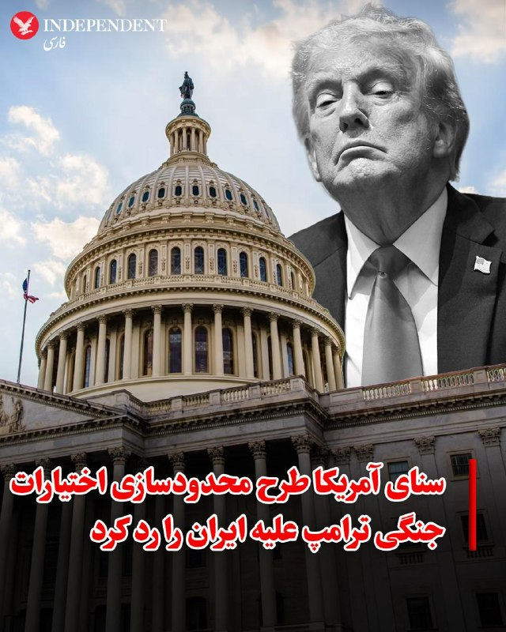

♦️مجلس سنای ایالات متحده روز سه‌شنبه ۲۶ خرداد، با اختلافی ناچیز (۴۷ رای موافق در برابر ۴۸ رای مخالف)، قطعنامه دموکرات‌ها برای محدود کردن اختیارات جنگی دونالد ترامپ علیه ایران را رد کرد. این رای‌گیری در شرایطی انجام شد که رئیس‌جمهوری آمریکا به تازگی از دستیابی به یک توافق اولیه با تهران برای پایان دادن به درگیری‌های چندماهه خبر داده است، اما جزئیات این توافق همچنان مخفی نگاه داشته شده و با انتقاد نمایندگانی روبه‌رو است که خواهان بررسی متن آن در کنگره هستند.
به گزارش سی‌بی‌اس نیوز، این قطعنامه که توسط سناتور دموکرات رافائل وارناک رهبری می‌شد، به دنبال آن بود تا رئیس‌جمهوری را ملزم به خارج کردن نیروهای مسلح آمریکا از هرگونه درگیری نظامی علیه ایران کند، مگر آنکه اعلام جنگ یا مجوز صریح نظامی از سوی کنگره صادر شده باشد.
بر اساس این گزارش کاخ سفید با تکیه بر تفاسیر حقوقی خود، قانون اختیارات جنگی مصوب ۱۹۷۳ را مغایر قانون اساسی می‌داند و بر این باور است که مهلت ۶۰ روزه قانونی برای توقف استفاده از نیروی نظامی، با اعلام آتش‌بس در اوایل فروردین متوقف شده است؛ موضوعی که با اعتراض دموکرات‌ها روبه‌رو شده است.
‌🇸🇦 Indypersian

🤖 @VahidOOnLine

## WithYashar — post 15110

همکنون انفجار های مهیب در جنوب لبنان،
گزارش های محلی از شلیک گسترده تانک های اسرائیلی و درگیری شدید با نیرو های حزب الله در تلاش برای پیشروی در جنوب لبنان.🚨
@withyashar

## pm_afshaa — post 94217

  <a href="telegram/content/pm_afshaa_94217_1781644364.webm" target="_blank">🎬 Download video</a>

🔴پس از دو ماه محاصره دریایی، نخستین محموله‌های نفت خام از ایران خارج شد.

طبق داده‌های ردیابی، دست‌کم دو نفتکش غول‌پیکر ایرانی مجموعا حدود 3.8 میلیون بشکه نفت رو حمل میکنن. همچنین یک نفتکش دیگر هم از نزدیکی پاکستان در حال حرکت به سمت مسیر ورود به ایرانه.

💧 Rainbet.com the #1 Non-KYC Crypto Casino & Sportsbook @rainbetcom

😁 @Pm_Afshaa

## IranIntlTV — post 342776

  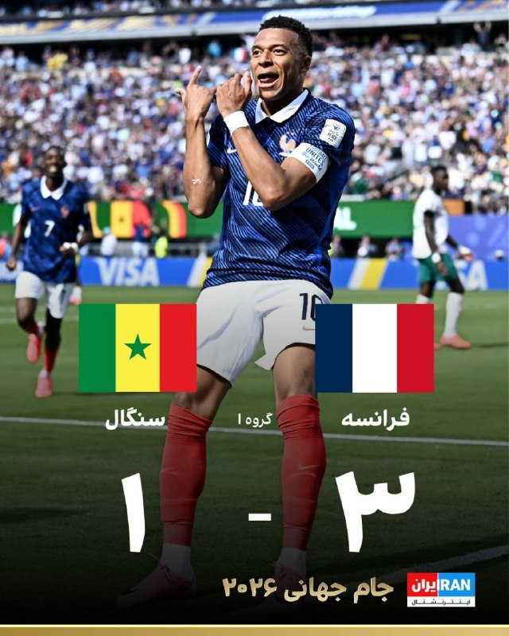

🔻تیم ملی فوتبال فرانسه در نخستین دیدار خود در جام جهانی ۲۰۲۶ با نتیجه ۳-۱ سنگال را شکست داد. در این مسابقه، کیلیان ام‌باپه و بردلی بارکولا گل‌های شاگردان دیدیه دشان را به ثمر رساندند.

🔹این دیدار را علیرضا فغانی قضاوت کرد. فغانی با قضاوت بازی فرانسه و سنگال در جام جهانی ۲۰۲۶، به رکوردی تاریخی در داوری فوتبال جهان دست یافت و به نخستین داوری تبدیل شد که در چهار دوره جام جهانی سوت زده است.

🔹نیمه نخست این مسابقه بدون گل به پایان رسید، اما فرانسه در دقیقه ۶۶ با گل کیلیان ام‌باپه روی پاس میشل اولیسه از حریف خود پیش افتاد.

🔹سنگال دو دقیقه بعد توسط نیکلاس جکسون دروازه فرانسه را باز کرد، اما این گل به دلیل آفساید مردود اعلام شد.

🔹در ادامه، بردلی بارکولا که به جای عثمان دمبله وارد زمین شده بود، تنها دو دقیقه پس از حضور در میدان گل دوم فرانسه را به ثمر رساند.

🔹سنگال در ادامه بازی حملاتی را روی دروازه فرانسه ایجاد کرد تا بالاخره ابراهیم ام‌بایه در دقیقه ۹۵ توانست گلزنی کند.

🔹اما این پایان کار نبود و در دقیقه ۹۶ کیلیان ام‌باپه با یک شوت از راه دور یک سوپرگل را به ثمر رساند تا فرانسه ۳-۱ پیروز شود.

@iranintl

## IranIntlTV — post 342775

  <a href="telegram/content/IranIntlTV_342775_1781644365.mp4" target="_blank">🎬 Download video</a>

ایرانیان ساکن هانوفر سه‌شنبه ۲۶ خرداد در گردهمایی‌ای به مناسبت زادروز جاویدنام مجیدرضا رهنورد، به اعدام‌ها در ایران اعتراض کرده و از شاهزاده رضا پهلوی حمایت کردند.

## FarsiVOA — post 220951

⚡️پوشش ویژه | پاسخ‌های پرزیدنت ترامپ به پرسش خبرنگاران درباره ایران در حاشیه دیدار با حاکم امارات
@FarsiVOA

## FarsiVOA — post 220950

  <a href="telegram/content/FarsiVOA_220950_1781644367.mp4" target="_blank">🎬 Download video</a>

⚡️جنجال بر سر شادی پس از گل محمد محبی و بازتاب بین المللی بازی ایران و نیوزیلند
@FarsiVOA

## Persian_Trend_Official — post 17309

  <a href="telegram/content/Persian_Trend_Official_17309_1781644368.mp4" target="_blank">🎬 Download video</a>

سناتور گراهام: عربستان سعودی و اسرائیل، صادقانه بگویم، مدیون رئیس جمهور ترامپ هستند.

برای منطقه و جهان خوب است که این دو کشور با هم صلح کنند و با هم تجارت کنند.

📝 Amir

📌 @persian_trend_official
پرشین ترند | متفاوت‌ترین کانال نظامی

---
📅 بروزرسانی: 1405/03/27 00:32
---

## FarsiVOA — post 220949

⚡️علی جوانمردی: توافقی کە خاورمیانە را تغییر می‌دهد
@FarsiVOA

## Persian_Trend_Official — post 17308

سناتور گراهام: فکر نمی‌کنم شما رهبر ایران باشید، مگر اینکه جنبشی را که آیت‌الله در سال 1979 ایجاد کرد، بپذیرید، جنبشی که هدفش پاکسازی اسلام، نابودی اسرائیل و بیرون راندن غرب از خاورمیانه است.

اگر آنها از تمایل خود برای ساخت سلاح هسته‌ای دست کشیده باشند، که فکر می‌کنم از آن استفاده خواهند کرد، این یک تغییر اساسی در خاورمیانه خواهد بود. با این اوصاف، آنها هنوز هم می‌توانند آن اهداف را داشته باشند و به آنها عمل نکنند. می‌توان آنها را در یک جعبه قرار داد.

من فکر می‌کنم رئیس جمهور بیش از هر رئیس جمهور دیگری از سال 1979 تاکنون، برای خنثی کردن تهدیدی که ایران برای جهان ایجاد می‌کند، تلاش کرده است.

📝 Amir

📌 @persian_trend_official
پرشین ترند | متفاوت‌ترین کانال نظامی

## Persian_Trend_Official — post 17307

سناتور گراهام: من مطمئنم که رئیس جمهور ترامپ توافق بدی امضا نخواهد کرد.

توافقنامه‌ای که معاون رئیس جمهور و دولت توصیف کرده‌اند، بسیار امیدوارکننده به نظر می‌رسد. من دوست دارم یک راه حل دیپلماتیک برای جاه‌طلبی‌های هسته‌ای ایران داشته باشم. تردید من خود ایران است. یک توافق خوب چگونه خواهد بود؟ بدون غنی‌سازی.

ما در حال باز کردن خیابان‌ها هستیم و خصومت‌ها را متوقف می‌کنیم. این خود یک موفقیت است، اما اینکه آیا می‌توانیم به مرحله دوم برسیم یا نه، نمی‌دانم.

📝 Amir

📌 @persian_trend_official
پرشین ترند | متفاوت‌ترین کانال نظامی

## Persian_Trend_Official — post 17306

  <a href="telegram/content/Persian_Trend_Official_17306_1781643769.mp4" target="_blank">🎬 Download video</a>

جی دی ونس: ترامپ هرگز نگفت که هدفش روی کار آوردن رضا پهلوی برای رهبری جدید ایران است.

آنچه او گفت این بود که اگر مردم ایران می‌خواهند قیام کنند، عالی است. این به خودشان مربوط است. این بین آنها و دولتشان است.

آنچه ما می‌خواهیم توقف برنامه هسته‌ای آنهاست.

📝 Amir

📌 @persian_trend_official
پرشین ترند | متفاوت‌ترین کانال نظامی

## IranianMinds — post 22770

آنچه او گفته این است که اگر مردم ایران بخواهند علیه حکومت خود قیام کنند، بسیار خوب؛ این موضوع به خودشان و دولتشان مربوط است.

## alonews — post 128571

  <a href="telegram/content/alonews_128571_1781643771.webm" target="_blank">🎬 Download video</a>

👈معاون رئیس جمهور جی دی ونس:
پرزیدنت ترامپ هرگز نگفت که هدفش نصب رضا پهلوی برای تبدیل شدن به رهبر جدید ایران است.

🔴آنچه گفته این است که اگر مردم ایران بخواهند قیام کنند ، عالی است. این کار اوناست این بین آنها و دولتشان است.

🔴چیزی که ما می خواهیم توقف برنامه هسته ای آنهاست.‌‌

✅ @AloNews خبر جنگ

## alonews — post 128570

  <a href="telegram/content/alonews_128570_1781643772.mp4" target="_blank">🎬 Download video</a>

👈جی‌دی ونس درباره ایران:

در حال حاضر افرادی هستند که می‌گویند باید نیروهای زمینی به ایران اعزام کنیم.

آن‌ها می‌خواهند دونالد ترامپ صدها هزار نیروی نظامی را وارد ایران کند.

ما به افرادی نیاز داریم که از داخل همین جریان، در برابر این دیدگاه مقاومت کنند و با آن مخالفت کنند.

✅ @AloNews خبر جنگ

## alonews — post 128569

  <a href="telegram/content/alonews_128569_1781643774.mp4" target="_blank">🎬 Download video</a>

👈جی‌دی ونس:

اگر ایران حزب‌الله را تامین مالی می‌کند، ما اجازه نخواهیم داد که مجموعه‌ای از دارایی‌های مصادره‌‌شده به ایرانی‌ها منتقل شود.

✅ @AloNews خبر جنگ

## alonews — post 128568

  <a href="telegram/content/alonews_128568_1781643776.mp4" target="_blank">🎬 Download video</a>

👈جی‌دی ونس درباره ایران:

در حال حاضر افرادی هستند که می‌گویند باید نیروهای زمینی به ایران اعزام کنیم.

آن‌ها می‌خواهند دونالد ترامپ صدها هزار نیروی نظامی را وارد ایران کند.

ما به افرادی نیاز داریم که از داخل همین جریان، در برابر این دیدگاه مقاومت کنند و با آن مخالفت کنند.

✅ @AloNews خبر جنگ

---
📅 بروزرسانی: 1405/03/27 00:22
---

## WithYashar — post 15109

اورشلیم پست: ماهواره‌های اسرائیلی در طول حدود ۴۰ روز اجرای عملیات «غرش شیران» بیش از ۵۰ هزار بار از ایران تصویربرداری کردند

میانگین هر روز بیش از هزار تصویربرداری
@withyashar

## mwarmonitor — post 11048

  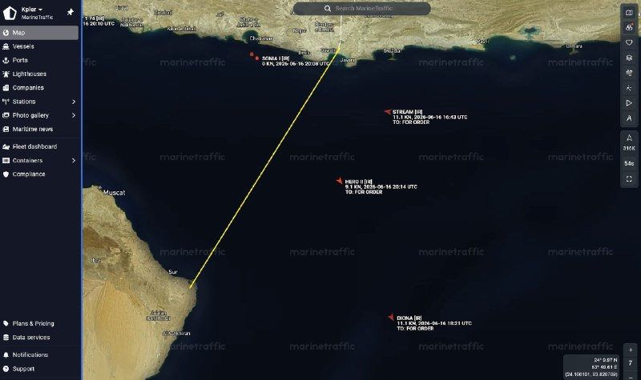

🔴 پس از یک محاصره دریایی دوماهه، نفت خام از ایران خارج شد.

🔸بر اساس داده‌های AIS که دیروز (۱۵ ژوئن ۲۰۲۶) با تصاویر ماهواره‌ای نیز آن را تأیید کردیم، دست‌کم دو نفتکش غول‌پیکر VLCC متعلق به National Iranian Tanker Company (NITC) با نام‌های DIONA (9569695) و HERO2 (9362073) از محدوده محاصره نیروی دریایی United States Navy خارج شده‌اند و مجموعاً حدود ۳.۸ میلیون بشکه نفت خام ایران را حمل می‌کنند.

🔸این نخستین صادرات نفت خام ایران طی دو ماه گذشته است.

🔸همچنین مشاهده می‌شود نفتکش STREAM (9569633) متعلق به NITC از منطقه اقتصادی انحصاری Pakistan به سمت خط محاصره در حرکت است؛ جایی که طی ۷ هفته گذشته منتظر ورود به ایران بوده است.

@mwarmonitor

## FoxNewsTwitter — post 343042

‌Fox News (Twitter/X)

Read more 👉

## FoxNewsTwitter — post 343041

  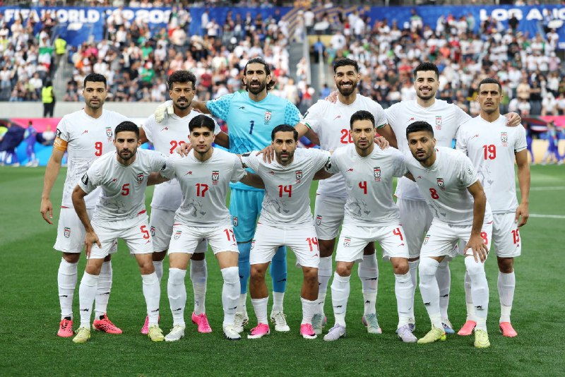

Fox News (Twitter/X)

Iran was ordered to leave the U.S. and return to Mexico directly after their first match of the World Cup.

The team had expected to spend the night in California, but was told after their match that everyone must immediately get on a plane for the 140-mile trip back to Tijuana, Mexico.

Coach Amir Ghalenoei says the team was ordered to leave the U.S. but did not say why or who ordered them to leave earlier than planned.

"I think our team is perhaps the most oppressed in the World Cup."

## Persian_Trend_Official — post 17305

  <a href="telegram/content/Persian_Trend_Official_17305_1781643170.mp4" target="_blank">🎬 Download video</a>

جی دی ونس با اشاره به صحبت‌های سناتور لیندسی گراهام: یکی گفت، یادم نیست چه کسی، اما یکی گفت، می‌دانید، این مثل انجام طرح مارشال است وقتی که نازی‌ها هنوز کنترل اوضاع را در دست دارند. این از چند جهت اشتباه است.

اول اینکه، طرح مارشال مقدار زیادی پول مالیات آمریکایی‌ها بود. این پول مالیات آمریکایی‌ها نیست. دوم اینکه، ما می‌گوییم شما فقط در صورتی از مزایای این معامله بهره‌مند می‌شوید که رفتارتان را تغییر دهید.

📝 Amir

📌 @persian_trend_official
پرشین ترند | متفاوت‌ترین کانال نظامی

## Persian_Trend_Official — post 17304

جی دی ونس: امارات متحده عربی را درنظر بگیرید، که یکی از بهترین متحدان ما در منطقه است.

فرض کنید آنها می‌خواهند در یک نیروگاه هسته‌ای در ایران سرمایه‌گذاری کنند. آنها واقعاً نمی‌توانند این کار را بدون لغو برخی از تحریم‌های موجود در سیستم مالی جهانی برای امکان‌پذیر کردن این امر انجام دهند.

حالا، آیا اماراتی‌ها در ایران سرمایه‌گذاری خواهند کرد یا آمریکا به آنها اجازه سرمایه‌گذاری در ایران را می‌دهد؟ مگر اینکه ایرانی‌ها رفتار خود را تغییر دهند؟ نه.

بنابراین همه این افراد می‌گویند: خب، می‌دانید، شما به ایران پول می‌دهید. نه، نه، نه. ما می‌گوییم اگر ایرانی‌ها رفتار خود را تغییر دهند، ما به برخی از این کشورهای دیگر اجازه می‌دهیم در بازسازی کشور خود و ایجاد رفاه برای مردم خود سرمایه‌گذاری کنند.

📝 Amir

📌 @persian_trend_official
پرشین ترند | متفاوت‌ترین کانال نظامی

## Persian_Trend_Official — post 17303

  <a href="telegram/content/Persian_Trend_Official_17303_1781643172.mp4" target="_blank">🎬 Download video</a>

جی دی ونس درباره توافق با ایران: این یک توافق صلح منطقه‌ای است. شامل خلیج فارس، اسرائیل و لبنان خواهد شد.

اگر ایران حزب الله را تأمین مالی می‌کند، ما اجازه نخواهیم داد که انبوهی از دارایی‌های آزاد شده به دست ایرانی‌ها برسد.

📝 Amir

📌 @persian_trend_official
پرشین ترند | متفاوت‌ترین کانال نظامی

## Persian_Trend_Official — post 17302

  <a href="telegram/content/Persian_Trend_Official_17302_1781643174.mp4" target="_blank">🎬 Download video</a>

جی دی ونس درباره ایران: ما هرگز قرار نبود در باتلاقی که بسیاری از مردم درباره آن هشدار می‌دادند، گرفتار شویم، زیرا دونالد ترامپ، جورج بوش نیست.

ما الان یک حوزه انتخابیه داریم که می‌گوید ما قصد داریم نیروی زمینی اعزام کنیم. آنها می‌خواهند دونالد ترامپ صدها هزار نیروی زمینی به ایران بفرستد.

📝 Amir

📌 @persian_trend_official
پرشین ترند | متفاوت‌ترین کانال نظامی

## IranianMinds — post 22769

  <a href="telegram/content/IranianMinds_22769_1781643175.mp4" target="_blank">🎬 Download video</a>

🔴 جی‌دی ونس درباره ایران:

ترامپ هیچوقت نگفته که هدفش روی کار آوردن رضا پهلوی به‌عنوان رهبر جدید ایران است.

آنچه او گفته این است که اگر مردم ایران بخواهند علیه حکومت خود قیام کنند، بسیار خوب؛ این موضوع به خودشان و دولتشان مربوط است.

آنچه ما می‌خواهیم، پایان برنامه هسته‌ای ایران است.

تمرکز رئیس‌جمهور همواره بر جلوگیری از دستیابی ایران به سلاح هسته‌ای بوده، نه تغییر حکومت به ما ربطی نداره.

@IranianMinds

## IranianMinds — post 22768

🔴 شاهزاده رضا پهلوی :

سوال مردم ایران از ایالات متحده الان این است که چرا بمباران متوقف شد ؟ مردم ایران میخواستن این ادامه پیدا کنه.

@IranianMinds

## BBCPersian — post 284071

  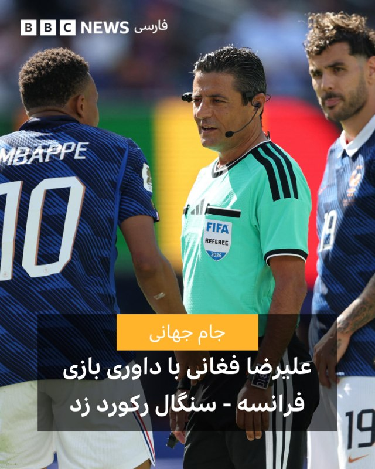

‌ ‌ ‌ ‌
در دیدار امروز تیم‌های فوتبال فرانسه و سنگال در چارچوب بازی‌های جام‌جهانی، علیرضا فغانی، داور ایرانی‌الاصل و نماینده فدراسیون فوتبال استرالیا در جام جهانی توانست به رکورد داوری در چهار دوره جام جهانی برسد.

آقای فغانی پیشتر در جام‌های جهانی ۲۰۱۴ و ۲۰۱۸ و ۲۰۲۲ هم قضاوت کرده بود.

او در سال ۲۰۰۸ تنها یک سال پس از قضاوت در لیگ برتر فوتبال ایران به فهرست داوران الیت فیفا پیوست و اولین حضورش در جام جهانی به عنوان داور چهارم بازی افتتاحیه جام جهانی ۲۰۱۴ بین برزیل و کرواسی بود.

📷IMAGN IMAGES/Reuters
@BBCPersian

## alonews — post 128567

  <a href="telegram/content/alonews_128567_1781643178.mp4" target="_blank">🎬 Download video</a>

👈آمار فاجعه بار ستاد مبارزه با مواد مخدر از مبتلایان به HIV در کشور

🔴از هر ۸ نفر معتاد ۱ نفرشان مبتلا به ویروس اچ‌آی‌وی است.

✅ @AloNews خبر جنگ

---
📅 بروزرسانی: 1405/03/27 00:12
---

## VahidOOnLine — post 245944

  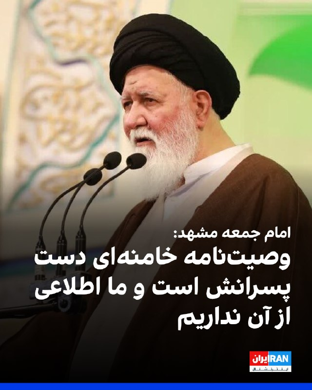

احمد علم‌الهدی، امام جمعه مشهد گفت که ما از وصیت‌نامه علی خامنه‌ای هیچ اطلاعی نداریم، چون هنوز اعلام نشده و نزد پسران اوست و به دست ما نرسیده است.

او در پاسخ به سوالی درباره علت دفن علی خامنه‌ای در مشهد، به شبکه المیادین گفت: «ما مشهدی‌ها هر جا بمیریم، سعی می‌کنیم جنازه‌مان بیاید مشهد و این طبیعی هست.»

علم‌الهدی ادامه داد: «خود رهبری گفته بود که آقای طبسی برای من قبری معین کرده، اما نگفته بود که من حتما آنجا دفن شوم.»
‌🏁 🇬🇧 IranintlTV

🤖 @VahidOOnLine

## VahidOOnLine — post 245943

  

احمد علم‌الهدی، امام جمعه مشهد گفت که ما از وصیت‌نامه علی خامنه‌ای هیچ اطلاعی نداریم، چون هنوز اعلام نشده و نزد پسران اوست و به دست ما نرسیده است.

او در پاسخ به سوالی درباره علت دفن علی خامنه‌ای در مشهد، به شبکه المیادین گفت: «ما مشهدی‌ها هر جا بمیریم، سعی می‌کنیم جنازه‌مان بیاید مشهد و این طبیعی هست.»

علم‌الهدی ادامه داد: «خود رهبری گفته بود که آقای طبسی برای من قبری معین کرده، اما نگفته بود که من حتما آنجا دفن شوم.»
‌🏁 🇬🇧 IranintlTV

🤖 @VahidOOnLine

## VahidOOnLine — post 245942

  

احمد علم‌الهدی، امام جمعه مشهد گفت که ما از وصیت‌نامه علی خامنه‌ای هیچ اطلاعی نداریم، چون هنوز اعلام نشده و نزد پسران اوست و به دست ما نرسیده است.

او در پاسخ به سوالی درباره علت دفن علی خامنه‌ای در مشهد، به شبکه المیادین گفت: «ما مشهدی‌ها هر جا بمیریم، سعی می‌کنیم جنازه‌مان بیاید مشهد و این طبیعی هست.»

علم‌الهدی ادامه داد: «خود رهبری گفته بود که آقای طبسی برای من قبری معین کرده، اما نگفته بود که من حتما آنجا دفن شوم.»
‌🏁 🇬🇧 IranintlTV

🤖 @VahidOOnLine

## VahidOOnLine — post 245941

  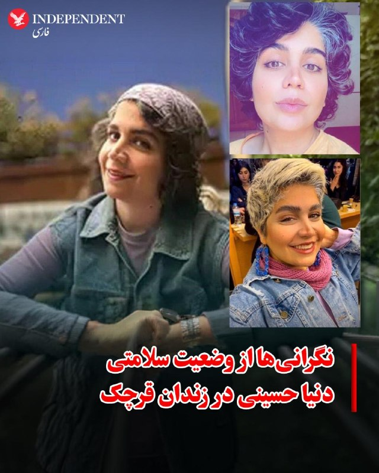

♦️بر اساس اطلاعات رسیده به ایندیپندنت فارسی از نزدیکان دنیا حسینی، این زندانی سیاسی و بلاگر معترض به جمهوری اسلامی که به دلیل ابتلا به بیماری صرع در مرخصی درمانی به سر می‌برد، با وجود ادامه مشکلات جسمی و نیاز به مراقبت‌های تخصصی پزشکی، برای تحمل ادامه دوران محکومیت خود به زندان زنان قرچک (تهران بزرگ) فراخوانده شده است.

دنیا حسینی پیش‌تر به دلیل انتقاد از مقامات جمهوری اسلامی و حضور در تحمع‌های اعتراضی، با اتهام «اجتماع و تبانی» به تحمل ۳ سال و ۸ ماه حبس محکوم شده بود و در ماه‌های اخیر از مرخصی درمانی استفاده می‌کرد. به گفته این منابع، مطابق روال پیشین قرار بود مرخصی درمانی او تا پایان تابستان ادامه داشته باشد، اما مسئولان زندان پیش از موعد مقرر دستور بازگشت او را صادر کرده‌اند.

نزدیکان این زندانی سیاسی می‌گویند که او همچنان با عوارض ناشی از بیماری صرع دست‌وپنجه نرم می‌کند و به مراقبت‌های مستمر پزشکی نیاز دارد. بازگرداندن او به زندان در چنین شرایطی نگرانی خانواده و فعالان حقوق بشر را برانگیخته است
‌🇸🇦 Indypersian

🤖 @VahidOOnLine

## WithYashar — post 15108

جی‌دی ونس: برخی خواهان اعزام صدها هزار نیروی آمریکایی به ایران هستند
ترامپ جورج بوش نیست؛ در باتلاق ایران گرفتار نمی‌شویم
@withyashar

## WithYashar — post 15107

واکنش آمیت سیگال خبرنگار کانال 12 اسرائیل به توافق ترامپ:

ممکنه دشمنی با آمریکا خطرناک باشه، اما دوستی با آمریکا مرگباره!
@withyashar

## pm_afshaa — post 94216

  <a href="telegram/content/pm_afshaa_94216_1781642558.webm" target="_blank">🎬 Download video</a>

🔴واکنش آمیت سیگال خبرنگار کانال 12 اسرائیل به توافق ترامپ:

ممکنه دشمنی با آمریکا خطرناک باشه، اما دوستی با آمریکا مرگباره!

💧 Rainbet.com the #1 Non-KYC Crypto Casino & Sportsbook @rainbetcom

😁 @Pm_Afshaa

## IranIntlTV — post 342772

  

احمد علم‌الهدی، امام جمعه مشهد گفت که ما از وصیت‌نامه علی خامنه‌ای هیچ اطلاعی نداریم، چون هنوز اعلام نشده و نزد پسران اوست و به دست ما نرسیده است.

او در پاسخ به سوالی درباره علت دفن علی خامنه‌ای در مشهد، به شبکه المیادین گفت: «ما مشهدی‌ها هر جا بمیریم، سعی می‌کنیم جنازه‌مان بیاید مشهد و این طبیعی هست.»

علم‌الهدی ادامه داد: «خود رهبری گفته بود که آقای طبسی برای من قبری معین کرده، اما نگفته بود که من حتما آنجا دفن شوم.»
https://iranintl.com/202606160652

## IranIntlTV — post 342771

  <a href="https://t.me/IranintlTV/342771" target="_blank">📎 Download file</a>

🎧نسخه صوتی ۲۴ با فرداد فرحزاد: تهدید قرارگاه خاتم‌الانبیا به حمله به اسرائیل
@iranintlTV

## IranIntlTV — post 342770

  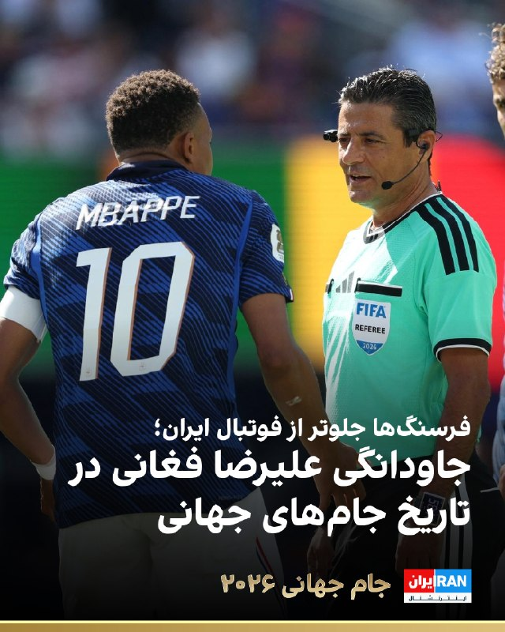

🔻علیرضا فغانی با قضاوت دیدار فرانسه و سنگال در جام جهانی ۲۰۲۶، به رکوردی تاریخی در داوری فوتبال جهان دست یافت؛ داور ۴۸ ساله که به نمایندگی از استرالیا در فهرست بین‌المللی فیفا حضور دارد، برای چهارمین دوره متوالی در جام جهانی حاضر شد و به رکورددار حضور در ادوار جام جهانی تبدیل شد.

🔹فغانی پیش از این در جام‌های جهانی ۲۰۱۴، ۲۰۱۸ و ۲۰۲۲ نیز در جمع داوران منتخب فیفا قرار داشت و حالا با حضور در این دوره، نام خود را در تاریخ این رقابت‌ها ماندگار کرده است.

🔹فغانی در جام جهانی ۲۰۱۸ چهار مسابقه از جمله دیدار رده‌بندی را سوت زد و در جام جهانی ۲۰۲۲ نیز قضاوت دو مسابقه مرحله گروهی را بر عهده داشت. او در جام جهانی ۲۰۱۴ در جمع داوران حاضر در تورنمنت بود اما به عنوان داور وسط مسابقه‌ای را قضاوت نکرد. با احتساب دیدار فرانسه و سنگال در جام جهانی ۲۰۲۶، شمار مسابقات جام جهانی که فغانی به عنوان داور وسط قضاوت کرده به هفت بازی رسیده است؛ آماری که او را در میان باتجربه‌ترین داوران تاریخ این رقابت‌ها قرار می‌دهد.

🔹جزییات بیشتر را اینجا بخوانید

@iranintltvsport

## FarsiVOA — post 220948

  <a href="telegram/content/FarsiVOA_220948_1781642560.mp4" target="_blank">🎬 Download video</a>

⚡️نازیلا گلستان در برنامه تفسیر خبر: جمهوری اسلامی امروز جمهوری اسلامی دیروز و پریروز نیست
@FarsiVOA

## FarsiVOA — post 220947

🔺از ۵۰ هزار به ۷.۵ میلیون فالوئر در یک شب! معجزه دروازه‌بان کیپ‌ورد با تساوی در برابر اسپانیا

▪️تساوی بدون گل کیپ‌ورد برابر اسپانیا، یکی از مدعیان قهرمانی جام جهانی، ژوزیمار «وُزینیا» دیاس، دروازه‌بان این تیم را به یکی از چهره‌های غیرمنتظره مراحل ابتدایی این رقابت‌ها تبدیل کرد.

⬇️ بیشتر بخوانید:
https://ir.voanews.com/a/vozinha-shines-against-spain/8161552.html
@FarsiVOA

---
📅 بروزرسانی: 1405/03/27 00:03
---

## IranianMinds — post 22767

  <a href="telegram/content/IranianMinds_22767_1781641987.mp4" target="_blank">🎬 Download video</a>

🔴 جی‌دی ونس درباره ایران:

الان یه سری از حامی‌هامون هستن که می‌گن باید بریم سرباز پیاده بفرستیم رو زمین.

اونا می‌خوان دونالد ترامپ صدها هزار نیروی زمینی به ایران بفرسته.

ما به آدمایی نیاز داریم که از داخل سیستم به این حرف‌ها فشار بیارن و مخالفت کنن.

@IranianMinds

## IranianMinds — post 22766

  <a href="telegram/content/IranianMinds_22766_1781641990.mp4" target="_blank">🎬 Download video</a>

🔴 جی‌دی ونس درباره ایران:

ما هیچ‌وقت قرار نبود وارد اون باتلاقی بشیم که خیلی‌ها هشدار می‌دادن ( جنگ تمام عیار و زمینی ) چون دونالد ترامپ اصلا جورج بوش نیست.

@IranianMinds

## BBCPersian — post 284070

  <a href="https://t.me/bbcpersian/284070" target="_blank">📎 Download file</a>

پادکست برنامه شصت دقیقه سه شنبه ۲۶ خرداد ۱۴۰۵
این نسخه رادیویی برنامه شصت دقیقه تلویزیون فارسی بی‌بی‌سی است که هرشب بعد از پخش، با حجم کم از اپلیکیشن‌های پادگیر و صفحه تلگرام بی‌بی‌سی فارسی در دسترس است.
با هشتگ BBCPersianRadio با ما در ارتباط باشید.

@BBCPersian

## BBCPersian — post 284069

  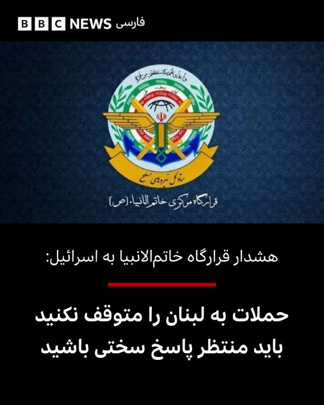

‌ ‌ ‌
قرارگاه مرکزی خاتم الانبیا، در بیانیه‌ای هشدار داده است که اگر اسرائیل حملات خود به جنوب لبنان را متوقف نکند، باید منتظر پاسخ سختی از سوی نیروهای مسلح ایران باشد.

در این بیانیه گفته شده است: «اسرائيل پس از اعلام پایان جنگ توسط رئیس جمهور آمریکا، ۸۴ بار آتش‌بس در جنوب لبنان را نقض کرده است.»

در این بیانیه همچنین آمده چنانچه اسرائيل به «شرارت در جنوب لبنان پایان ندهد، باید منتظر پاسخ سخت نیروهای مسلح جمهوری اسلامی ایران باشد.»

عباس عراقچی، وزیر خارجه ایران، هم پیش‌تر گفت که پایان این درگیری بدون «خروج نیروهای اسرائیلی از سرزمین‌هایی که در این جنگ اشغال کرده‌اند» کامل نخواهد بود.

او افزود: «هرگونه حمله نظامی رژیم صهیونیستی به لبنان از این پس و ادامه اشغال سرزمین‌های لبنان از نظر ما نقض تفاهمنامه خواهد بود.»

ایران می‌گوید که بند اول تفاهمنامه درمورد پایان جنگ ازجمله در لبنان است.

https://bbc.in/4fL96hG
📷خانه ملت
@BBCPersian

## alonews — post 128566

  <a href="telegram/content/alonews_128566_1781641995.webm" target="_blank">🎬 Download video</a>

👈 سوال: آیا ترامپ در حال فروپاشی است؟ او تازه ۸۰ ساله شده است.

🔴 هیلاری کلینتون: فکر می‌کنم او قطعاً همان چیزی نیست که قبلاً بود.

🔴دونالد ترامپ این روزها مدام در حال خوابیدن است. او این روزها خواب کافی نمی‌بیند.

🔴جو بایدنِ بیچاره!

✅ @AloNews خبر جنگ

<!-- MSG END -->

<!-- NAV START -->

<!-- NAV END -->
