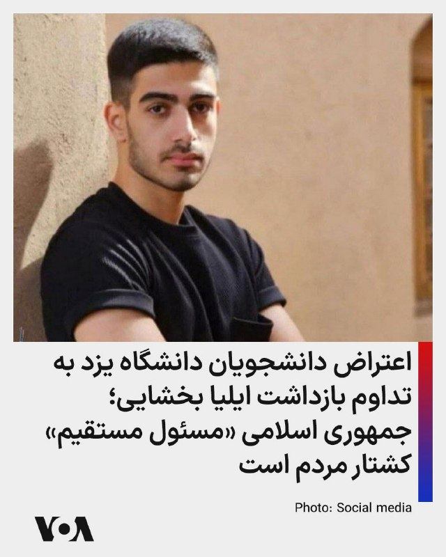
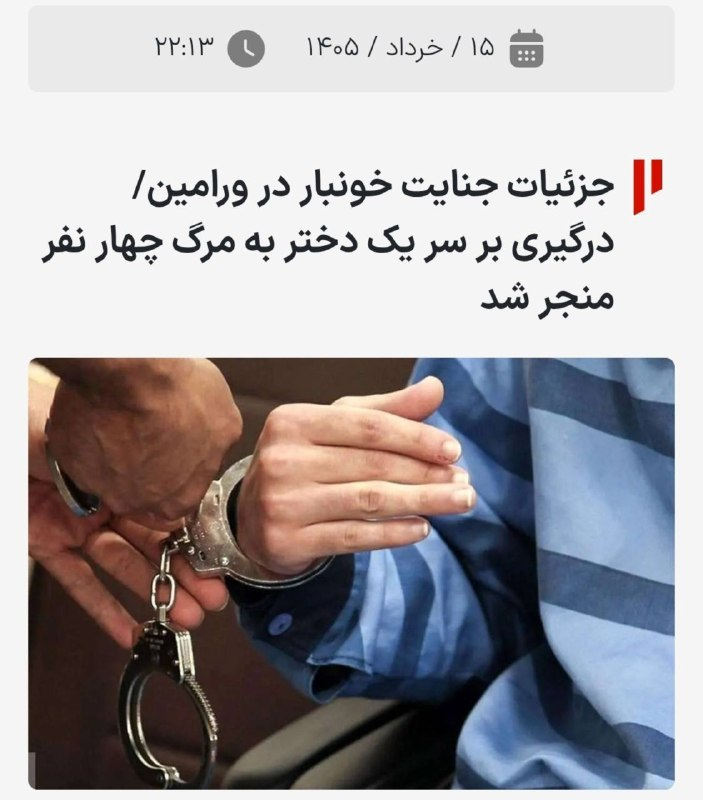
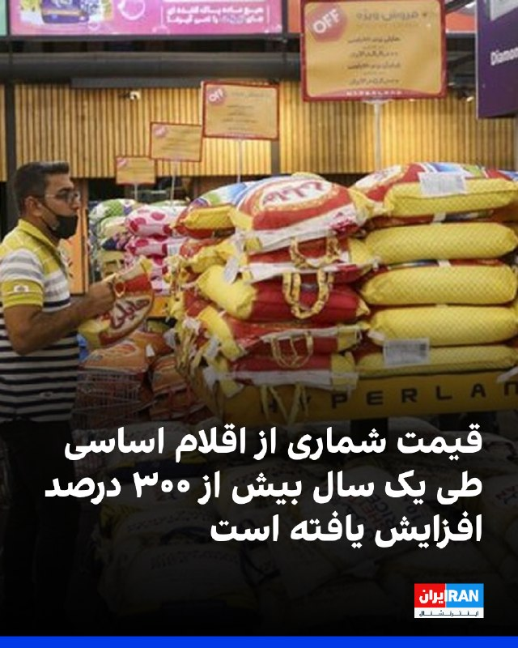

# خواننده تلگرام

<!-- TOP_NAV START -->

<!-- TOP_NAV END -->

<!-- MSG START -->

---
📅 بروزرسانی: 1405/03/17 00:33
---

## mwarmonitor — post 10233

🔴ایالات متحده از ابزارهایی برای در دسترس قرار دادن دارایی‌های ایران جهت استفاده متحدانش در خلیج فارس برای حمایت از بازسازی و تعمیر خسارت‌های احتمالی آینده ناشی از ایران استفاده خواهد کرد.

🔸وزیر خزانه‌داری آمریکا، بسنت، به تیم خود دستور داده است تا شرایط میان متحدان خلیج فارس را بررسی کرده و هزینه خسارات واردشده از سوی ایران را ارزیابی کنند.

🔹آمریکا همچنین بررسی خواهد کرد که آیا دارایی‌های ایران می‌توانند برای تأمین هزینه‌های تعمیر خسارات گذشته مورد استفاده قرار گیرند یا خیر. رویترز

@mwarmonitor

## FarsiVOA — post 219811

  

⚡️خبرنامه امیرکبیر اعلام کرد دانشجویان و دانش‌آموختگان دانشگاه یزد ضمن اعتراض به تداوم بازداشت ایلیا بخشایی، آزادی فوری او را خواستار شدند. ایلیا بخشایی، دانشجوی رشته علوم ورزشی و ورودی سال ۱۴۰۱ دانشگاه یزد، در جریان اعتراضات سراسری ۱۴۰۴ در تهران بازداشت شد و هم اکنون نیز در بازداشت به سر می‌برد.
دانشجویان و دانش‌آموختگان دانشگاه یزد همچنین حکومت جمهوری اسلامی را مسئول «مستقیم و آگاهانه» کشتار مردم و دانشجویان و «قاتل همکلاسی‌های خود» دانستند و تاکید کردند «حکومتی که به دانشجویان شلیک می‌کند، فاقد هرگونه مشروعیت برای ادامه حکمرانی» است.

این دانشجویان گفتند که «داغدار و اندوه دیده» از کشته شدن دانشجویان معترض هستند و یاد جان‌باختگان اعتراضات دی‌ماه ۱۴۰۴، مصطفی سرافراز، متین رنجکش، گلناز شریفی و رضا ریزوندی را گرامی می‌دارند.
@FarsiVOA

## IranianMinds — post 21526

  

بس کن مردک

چرا زنش نمیزنه تو سرش بگه اینکارارو نکن؟

@IranianMinds

## Dirty_Kids — post 391166

  

🔴خبرکوتاه بود و دردناک:

طبق کشف جدید دانشمندا، پرنده‌ها هم جق میزنن!

@Dirty_Kids 👻
euronews persian

## alonews — post 125660

  

👈درپی درگیری میان پنج دوست صمیمی در ورامین بخاطر یک دختر، چهار نفر از آنها به قتل رسیدند

✅ @AloNews خبر جنگ

## alonews — post 125659

  

👈ترامپ به انتشار پست های عجیب با هوش مصنوعی ادامه میدهد

✅ @AloNews خبر جنگ

---
📅 بروزرسانی: 1405/03/17 00:22
---

## VahidOOnLine — post 244004

♦️ماموستا هیوا پالانی، امام جمعه الیاسی از توابع سرپل ذهاب، در واکنشی تند به بازتاب اخبار آسیب شدید دو دختربچه سنندجی، خواستار مداخله فوری دستگاه‌های ذی‌ربط برای تعیین تکلیف حضانت این کودکان شد. او با تقبیح شدید رفتار پدر و نامادری و اشاره به جزییات هولناک آزارها نظیر شکستن فک و سوزاندن پای بچه‌ها، بر لزوم بازگرداندن فوری حضانت به مادر تاکید کرد. این روحانی با «انسان‌نما» خواندن عاملان این جنایت خانگی، تصریح کرد که نباید از خطای این پدر و نامادری گذشت و مراجع قضایی باید آن‌ها را به «اشد مجازات» محکوم کنند.
پیش از این، مادر نارین (۱۵ ساله) و آیلین (۷ ساله)، در گفتگوی اختصاصی با «هفت صبح» پرده از ماه‌ها اسارت و شکنجه پنهان فرزندانش در سرویس بهداشتی خانه برداشت. او با رد شایعات تجاوز، تایید کرد که همسر سابقش با شلنگ و لگد فک و پوست سر دختر بزرگتر را مجروح کرده و موهای او را فروریخته است. این مادر که پیش از این دو بار درخواست بی‌نتیجه برای حضانت داده بود، ضمن تقدیر از همسایگان و اورژانس اجتماعی برای مداخله به موقع، با قاطعیت خواستار اشد مجازات، شکنجه و اعدام همسر سابق و نامادری بچه‌ها شد.
‌🇸🇦 Indypersian

🤖 @VahidOOnLine

## VahidOOnLine — post 244003

  

اسکان‌نیوز در گزارشی با عنوان «انفجار قیمت مواد غذایی در یک سال» نوشت: بررسی‌ها از بازه اردیبهشت ۱۴۰۴ تا اردیبهشت سال جاری نشان می‌دهد که برخی اقلام اساسی با «جهش قیمتی بی‌سابقه‌ای» مواجه شده‌اند.

بر اساس این گزارش، قیمت شماری از اقلام اساسی بیش از ۳۰۰ درصد افزایش یافته است. برای مثال، قیمت روغن نباتی در این مدت ۴۳۱ درصد افزایش یافته و روغن مایع نیز رشد ۳۵۳ درصدی را ثبت کرده است.

همچنین قیمت تخم‌مرغ به عنوان یکی از اصلی‌ترین منابع پروتئین خانوارهای کم‌درآمد، ۳۴۲ درصد افزایش داشته است.

قیمت مرغ نیز در همین بازه زمانی رشدی ۳۴۲.۹ درصدی را تجربه کرده است.
‌🏁 🇬🇧 IranintlTV

🤖 @VahidOOnLine

## WithYashar — post 13652

  

پست جدید ترامپ در تروث شبیه آخر ویدیوی هست که پست کردم شبه حمله 😃
@withyashar

## IranIntlTV — post 340886

  <a href="telegram/content/IranIntlTV_340886_1780779159.mp4" target="_blank">🎬 Download video</a>

ارتش اسرائیل با صدور هشداری فوری از ساکنان چند شهر و روستا در جنوب لبنان خواست خانه‌های خود را ترک کنند. این ارتش اعلام کرد این اقدام در پی نقض آتش‌بس از سوی حزب‌الله و ادامه فعالیت‌های نظامی این گروه صورت گرفته است.

گفت‌وگو با منشه امیر، کارشناس امور خاورمیانه
@iranintltv

## IranIntlTV — post 340885

  

اسکان‌نیوز در گزارشی با عنوان «انفجار قیمت مواد غذایی در یک سال» نوشت: بررسی‌ها از بازه اردیبهشت ۱۴۰۴ تا اردیبهشت سال جاری نشان می‌دهد که برخی اقلام اساسی با «جهش قیمتی بی‌سابقه‌ای» مواجه شده‌اند.

بر اساس این گزارش، قیمت شماری از اقلام اساسی بیش از ۳۰۰ درصد افزایش یافته است. برای مثال، قیمت روغن نباتی در این مدت ۴۳۱ درصد افزایش یافته و روغن مایع نیز رشد ۳۵۳ درصدی را ثبت کرده است.

همچنین قیمت تخم‌مرغ به عنوان یکی از اصلی‌ترین منابع پروتئین خانوارهای کم‌درآمد، ۳۴۲ درصد افزایش داشته است.

قیمت مرغ نیز در همین بازه زمانی رشدی ۳۴۲.۹ درصدی را تجربه کرده است.
https://iranintl.com/202606068705

## FarsiVOA — post 219810

Farsi VOA pinned an audio file

## FarsiVOA — post 219809

  <a href="https://t.me/farsivoa/219809" target="_blank">📎 Download file</a>

🔴📢‌ پادکست خبری شنبه ۱۷خرداد ۱۴۰۵

🛜در صورتی که با مشکل اینترنت مواجه هستید میتوانید اخبار صدای آمریکا را از نسخه‌های پادکست خبری ما روزانه دنبال کنید و یا اخبار را از نسخه سبک وب‌سایت ما پیگیر باشید:
https://ir.voanews.com/lite

📡بروزترین فرکانسهای ماهواره‌ای را نیز میتوانید از صفحه زیر پیگیری کنید:
https://ir.voanews.com/satellite

🔔دیگر شبکه‌های اجتماعی ما را هم دنبال کنید:
https://linktr.ee/voafarsi

ما را به اشتراک بگذارید
@farsivoa

## Dirty_Kids — post 391165

  <a href="https://t.me/Dirty_Kids/391165" target="_blank">📎 Download file</a>

📎 Document

## Dirty_Kids — post 391163

  <a href="telegram/content/Dirty_Kids_391163_1780779161.mp4" target="_blank">🎬 Download video</a>

🔴 ایرانیِ بی‌درد، اگه نمی‌دونی بدون؛ اون چالش مزخرف روسیِ کون نشون دادن دیگه تموم شده؛

الان این ریمیکس آهنگ ترکی (Ta Ki Seni Görene Kadar) مثل خوره افتاده به جون فضای مجازی، مخصوصاً اینستاگرام، ملت هم با این آهنگ از خودشون، بدنشون، ماشینشون و هر چیز دیگه‌ای فیلم می‌گیرن و پست می‌کنن :


@Dirty_Kids 👻

## alonews — post 125658

  <a href="telegram/content/alonews_125658_1780779163.webm" target="_blank">🎬 Download video</a>

👈ثبت ۵۰۰ مورد ابتلا به ابولا در آفریقا!

🔴سازمان بهداشت جهانی در بحبوحه نگرانی‌های فزاینده در مورد گسترش بیماری همه‌گیر گزارش داد که تاکنون نزدیک به ۵۰۰ مورد ابتلا به ابولا در منطقه مرکزی آفریقا تأیید شده است.

✅ @AloNews خبر جنگ

---
📅 بروزرسانی: 1405/03/17 00:12
---

## mwarmonitor — post 10232

  

🔴حدود ۸۰ قایق تندرو نیروی دریایی سپاه پاسداران انقلاب اسلامی بر اساس تصاویر ماهواره‌ای Sentinel-2 در حال گشت‌زنی در تنگه هرمز مشاهده شده‌اند (06/06/2026).

📌مختصات: 26.73572, 56.77468

@mwarmonitor

## pm_afshaa — post 92414

  <a href="telegram/content/pm_afshaa_92414_1780778580.webm" target="_blank">🎬 Download video</a>

🔴محمدجواد لاریجانی: مردم بدونن که به هیچ وجه برنامه هسته‌ای رو رها نمی‌کنیم.

💧 Rainbet.com the #1 Non-KYC Crypto Casino & Sportsbook @rainbetcom

😁 @Pm_Afshaa

## pm_afshaa — post 92413

  <a href="telegram/content/pm_afshaa_92413_1780778580.webm" target="_blank">🎬 Download video</a>

🔴محسن نقوی، وزیر کشور پاکستان وارد تهران شد و پس از ورود با اسکندر مومنی، وزیر کشور دیدار کرد. 
💧 Rainbet.com the #1 Non-KYC Crypto Casino & Sportsbook @rainbetcom 
😁 @Pm_Afshaa

## FarsiVOA — post 219808

⚡️مراسم هشتادودومین سالگرد عملیات نورماندی
@FarsiVOA

## RadioFarda — post 157985

  <a href="https://t.me/radiofarda/157985" target="_blank">📎 Download file</a>

📻بشنوید: سرخط خبرهای نیمه‌شب با رادیوفردا، ۱۷ خرداد ۱۴۰۵‌

@RadioFarda

## alonews — post 125657

  <a href="telegram/content/alonews_125657_1780778582.webm" target="_blank">🎬 Download video</a>

👈پست جدید ترامپ در تروث سوشال

✅ @AloNews خبر جنگ

---
📅 بروزرسانی: 1405/03/17 00:02
---

## WithYashar — post 13651

## FoxNewsTwitter — post 342680

  

Fox News (Twitter/X)

82 years after D-Day, WWII veteran Arthur Rose returned to Normandy and read a letter he wrote to his family just days after the invasion.

As Allied forces prepared for the assault, Rose recalled the massive buildup taking place across the English Channel.

"Thousands of ships and landing craft of every description filled the harbor. Everyone worked day and night preparing fuel, provisions, ammunition and secret material."

As the operation drew closer, Rose recalled: "Then came the word: D-Day will be June 6th."

When the fleet finally sailed for France, "everyone expected bombing, submarines, battleships, and all hell to break loose at any moment."

Near the French coast, Rose remembered, "We could see flashes in the distance and hear the explosions continuously."

## IranIntlTV — post 340884

  <a href="telegram/content/IranIntlTV_340884_1780777963.mp4" target="_blank">🎬 Download video</a>

علی نیکزاد، نایب‌ رییس مجلس جمهوری اسلامی، مواضع آمریکایی‌ها درباره آتش‌بس و تنگه هرمز را متناقض خواند و گفت جمهوری اسلامی در این‌باره مبنای فکری مشخصی دارد.

او افزود: «بمب اتم جمهوری اسلامی، تنگه هرمز است.»
@iranintltv

## BBCPersian — post 283002

  

🔻همزمان با تشدید درگیری در خلیج فارس وزیر کشور پاکستان به تهران سفر کرده است.

با توجه نقش پاکستان به‌عنوان میانجی اصلی در گفت‌وگوهای ایران و آمریکا، دیدارهایش از تهران زیر ذره بین رسانه‌هاست.

به گفته رسانه‌های ایران او مقام‌های ایران از جمله عباس عراقچی دیدار می‌کند.

برخی رسانه‌ها در ایران می‌گویند محسن نقوی حامل پیامی برای مجتبی خامنه‌ای رهبر جمهوری اسلامی است.

آقای نقوی ۳۰ اردیبهشت هم برای دومین بار در یک هفته به ایران رفته بود و در این سفرها با رئیس‌جمهور‌، رئیس مجلس، وزیر خارجه و وزیر کشور ایران ملاقات کرده بود.

پاکستان میانجی اصلی در گفت‌وگوهای ایران و آمریکاست.

پیش از سفر امروز، آقای نقوی با شهباز شریف، نخست‌وزیر پاکستان دیدار کرد و دستوالعمل‌هایی برای سفر به تهران دریافت کرد.

او همچنین گزارشی از سفرش به نشست وزرای کشور سازمان همکاری شانگهای در قرقیزستان داد.

در حاشیه آن سفر آقای نقوی دوبار در روزهای پنج‌شنبه و جمعه با اسکندر مومنی وزیر کشور ایران دیدار کرد.

📸ICANA News Agency via Getty Images
https://bbc.in/4uTPCvX
@BBCPersian

## Dirty_Kids — post 391162

  <a href="telegram/content/Dirty_Kids_391162_1780777965.mp4" target="_blank">🎬 Download video</a>

قشنگ ترین ویدیویی که در طول سال دیدم .هزار بار هم‌این ویدیو را ببینی خسته نخواهی شد

@Dirty_Kids 👻

## Dirty_Kids — post 391160

مونا آذر، پورن استار معروف ایرانی اعلام کرد به زودی برمیگرده ایران پیش بکناش

@Dirty_Kids 👻

## alonews — post 125655

  <a href="telegram/content/alonews_125655_1780777966.webm" target="_blank">🎬 Download video</a>

👈اسرائیل اعلام کرد امروز دو سرباز دیگرش در جنوب لبنان توسط حزب الله کشته شدند

✅ @AloNews خبر جنگ

## alonews — post 125654

  <a href="telegram/content/alonews_125654_1780777966.webm" target="_blank">🎬 Download video</a>

👈تصویر ماهواره‌ای پایگاه دریایی شهید محلاتی بوشهر قبل و بعد از حمله

🔴 تصویر توسط پهپاد Q4 تریتون امریکایی از فاصله ۶۰ کیلومتری گرفته شده است

✅ @AloNews خبر جنگ

<!-- MSG END -->

<!-- NAV START -->

<!-- NAV END -->
