# خواننده تلگرام

<!-- TOP_NAV START -->

<a href="https://github.com/ProAlit/aio-downloader/blob/main/telegram/content/archive_1.md" style="display:inline-block; padding:6px 12px; margin:0 4px; background-color:#2ea44f; color:white; text-decoration:none; border-radius:4px; font-weight:bold;">صفحه بعد</a>

<!-- TOP_NAV END -->

<!-- MSG START -->

---
📅 بروزرسانی: 1405/03/28 16:14
---

## WithYashar — post 15250

## mwarmonitor — post 11114

📝 متن توافق دقیقاً کپی برابر اصلِ آثار اصغر فرهادی است؛ یک متنِ پایان‌باز و پر از تعلیق که جملاتش را طوری چیده‌اند تا هر کسی بتواند آن را به نفع خودش تفسیر کند. حالا مدیا را که باز می‌کنی، سیرک کارشناسان راه افتاده است؛ هر کدام برگه‌ای دست گرفته‌اند و خط به خطش را به میل خود معنا می‌کنند. آمریکایی‌ها با کت‌وشلوار اتوکشیده می‌گویند طرف مقابل را لوله کرده‌اند و درام را برده‌اند، و رژیم هم با سگ و سیله‌هایش در منطقه، آن را فتح‌الفتوح جلوه می‌دهند و به نفع خود هورا می‌کشند. این وسط، تنها چیزی که واقعیت دارد بازی دادنِ ملت است؛ یک سناریوی تکراری و فرسایشی که قرار است مردم را یک ۶۰ روزِ دیگر هم معطل و سرگرم کند تا در نهایت، تماشاگرانِ خسته در تاریکیِ سینما بمانند و تورم، مثل قهرمانِ مظلومِ فیلم‌های فرهادی، جیبشان را خالی کند.

@mwarmonitor

## alonews — post 128907

  <a href="telegram/content/alonews_128907_1781786692.webm" target="_blank">🎬 Download video</a>

👈صداوسیما: ۱۱ فروند کشتی از محاصره آمریکایی‌ها عبور کرده‌اند

✅ @AloNews خبر جنگ

---
📅 بروزرسانی: 1405/03/28 16:04
---

## VahidOOnLine — post 246199

  <a href="telegram/content/VahidOOnLine_246199_1781786099.mp4" target="_blank">🎬 Download video</a>

♦️در حالیکه ارتش اوکراین در عملیاتی بی‌سابقه با چندصد پهپاد به مسکو، پایتخت روسیه حمله کرد و یکی از پالایشگاه‌های نفت شهر را به آتش کشید، ولودیمیر زلنسکی، تهدید کرد که در صورت ادامه جنگ، پایتخت روسیه را در آتش خواهد سوزاند.

ارتش اوکراین در هفته‌های اخیر حملات به تاسیسات و زیرساخت‌های انرژی روسیه در در غرب و مرکز این کشور دوچندان کرده است.

روسیه می‌گوید بدون پذیرش شرایط مسکو، حاضر به پایان جنگ نیست.
‌🇸🇦 Indypersian

🤖 @VahidOOnLine

## WithYashar — post 15249

آموزش و پرورش: ثبت‌نام برای ترمیم نمرات تا پایان هفته جاری امکان‌پذیر خواهد شد
@withyashar

## WithYashar — post 15248

  <a href="telegram/content/WithYashar_15248_1781786101.mp4" target="_blank">🎬 Download video</a>

درست خوندم؟ Porngraph?

## WithYashar — post 15247

  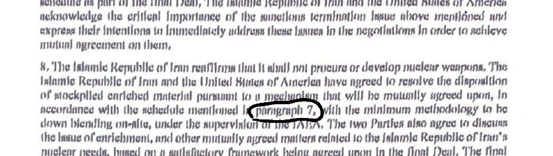

درست خوندم؟
Porngraph?

## FoxNewsTwitter — post 343116

  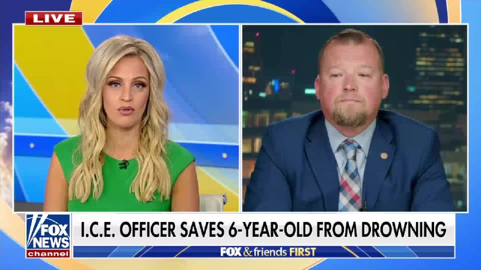

Fox News (Twitter/X)

"I'm just glad this kid gets a second chance at life."

An ICE officer reveals what went through his mind when he spotted an unconscious child in a swimming pool before he dove in to save the boy.

Gregory Simmons says he acted on instinct when he saw the 6-year-old in distress at a Pasco County, Florida, pool.

After pulling the child from the water, Simmons immediately began CPR as bystanders looked on.

The child survived thanks to the rapid rescue, with surveillance footage capturing every moment of the dramatic save. | @FoxFriendsFirst @CarleyShimkus

## FoxNewsTwitter — post 343112

Fox News (Twitter/X)

More than 10,000 NYPD officers. Drones overhead. K9 units on the ground. Heavy weapons teams standing by.

That's the security plan for the Knicks' championship parade as New York prepares to celebrate its first NBA title in more than five decades.

Police say it will be the largest deployment ever for a planned event, with lower Manhattan effectively transformed into a massive security zone after unrest and arrests erupted following the Finals win.

The victory parade will bring sweeping street closures across lower Manhattan, while the scale of the security response is already sparking questions about costs, manpower, and how cities handle modern championship celebrations after multiple arrests over the weekend.

## IranIntlTV — post 343030

  <a href="telegram/content/IranIntlTV_343030_1781786104.mp4" target="_blank">🎬 Download video</a>

یک شهروند در بهارستان اصفهان با ارسال ویدیویی به ایران اینترنشنال گزارش داد که شامگاه ۲۷ خرداد، نیروهای نظامی و خانواده‌های آنان پس از پایان یک «شب‌نشینی» با طبل‌زنی و رژه در کوچه‌های مسکونی حضور یافتند. به گفته او، صدای بسیار بلند طبل‌ها باعث لرزش شیشه خانه‌ها شده و بدون توجه به شرایط بیماران و ساکنان محله ادامه یافته است.

## Iliaen — post 4493

  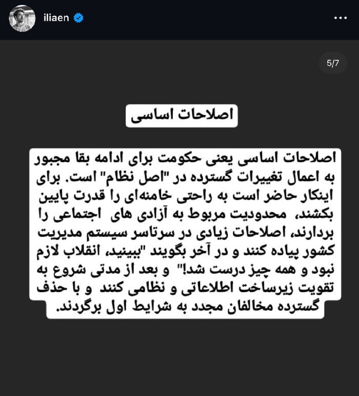

حدود ۴ سال قبل، یک پست را (در اینستاگرام) منتشر کردم با عنوان “تصمیم ها، قبل از سقوط” و به چند سناریو در شرایط پیشاسقوط اشاره کردم.

در این تصویر، شما اسلاید شماره ۵ را می‌بینید.

لینک کامل مطلب جهت مطالعه:
https://www.instagram.com/p/Cmw1JVHLHVM

@iliaen

## FarsiVOA — post 221106

  <a href="telegram/content/FarsiVOA_221106_1781786106.mp4" target="_blank">🎬 Download video</a>

ارتش اسرائیل ویدیویی منتشر کرده که به گفته این نهاد، لحظه هدف قرار دادن یک پرتابگر راکت حزب‌الله در جنوب لبنان را نشان می‌دهد.

ارتش اسرائیل اعلام کرد این پرتابگر دقایقی پیش از حمله، راکت‌هایی را به سمت نیروهای اسرائیلی شلیک کرده بود و برای شلیک راکت‌های بیشتر آماده می‌شد.

به گفته ارتش اسرائیل، در جریان این حمله، راکت‌های باقی‌مانده در پرتابگر نیز شلیک شدند و در مناطق باز جنوب لبنان فرود آمدند.

@FarsiVOA

## alonews — post 128906

  <a href="telegram/content/alonews_128906_1781786107.webm" target="_blank">🎬 Download video</a>

👈وزارت امور خارجه قطر: نخست وزیر و وزیر امور خارجه در تماسی با وزیر امور خارجه عربستان سعودی درباره توافق واشنگتن و تهران گفتگو کردند

✅ @AloNews خبر جنگ

## alonews — post 128904

  <a href="telegram/content/alonews_128904_1781786107.webm" target="_blank">🎬 Download video</a>

🔴فوری / رئیس جمهور پزشکیان متن اصلی تفاهم‌نامه بین جمهوری اسلامی و آمریکا رو منتشر کرد.

✅ @AloNews خبر جنگ

## alonews — post 128903

  <a href="telegram/content/alonews_128903_1781786108.webm" target="_blank">🎬 Download video</a>

👈سی‌ان‌ان‌: نتانیاهو در تلاش است که بر توافق نهایی ایران و آمریکا، از طریق سناتور‌های حامی اسرائیل تأثیر بگذارد و بر ترامپ فشار وارد کند

✅ @AloNews خبر جنگ

---
📅 بروزرسانی: 1405/03/28 15:54
---

## VahidOOnLine — post 246198

  

سی‌ان‌ان به نقل از یک منبع اسرائیلی گزارش داد بنیامین نتانیاهو، نخست‌وزیر اسرائیل، در تلاش است بر توافق نهایی میان آمریکا و جمهوری اسلامی اثر بگذارد و برای اعمال فشار بر دونالد ترامپ، رییس‌جمهوری آمریکا، از چهره‌های راست‌گرا و سناتورهای همسو کمک بگیرد.
بر اساس این گزارش، نتانیاهو روی حمایت سناتورهای نزدیک به اسرائیل برای متقاعد کردن ترامپ حساب باز کرده است.
با این حال، سی‌ان‌ان نوشت برخی از این چهره‌ها، از جمله لیندزی گراهام، سناتور جمهوری‌خواه، موضع خود را تغییر دادند. گراهام پیش‌تر خواهان حملات بیشتر به مواضع جمهوری اسلامی بود، اما اکنون از جمله افرادی است که دیگر از تشدید درگیری‌ها حمایت نمی‌کند.
‌🏁 🇬🇧 IranintlTV

🤖 @VahidOOnLine

## WithYashar — post 15246

## IranIntlTV — post 343029

  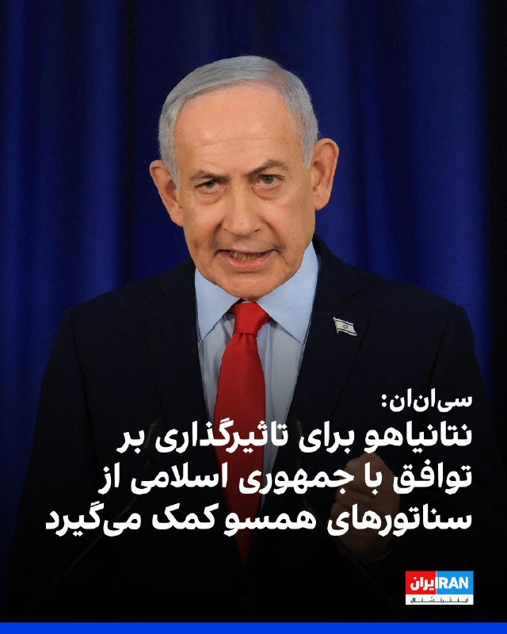

سی‌ان‌ان به نقل از یک منبع اسرائیلی گزارش داد بنیامین نتانیاهو، نخست‌وزیر اسرائیل، در تلاش است بر توافق نهایی میان آمریکا و جمهوری اسلامی اثر بگذارد و برای اعمال فشار بر دونالد ترامپ، رییس‌جمهوری آمریکا، از چهره‌های راست‌گرا و سناتورهای همسو کمک بگیرد.
بر اساس این گزارش، نتانیاهو روی حمایت سناتورهای نزدیک به اسرائیل برای متقاعد کردن ترامپ حساب باز کرده است.
با این حال، سی‌ان‌ان نوشت برخی از این چهره‌ها، از جمله لیندزی گراهام، سناتور جمهوری‌خواه، موضع خود را تغییر دادند. گراهام پیش‌تر خواهان حملات بیشتر به مواضع جمهوری اسلامی بود، اما اکنون از جمله افرادی است که دیگر از تشدید درگیری‌ها حمایت نمی‌کند.
https://iranintl.com/202606185002

## IranIntlTV — post 343028

  <a href="telegram/content/IranIntlTV_343028_1781785475.mp4" target="_blank">🎬 Download video</a>

رسانه‌های عربی از نگرانی عمیق کشورهای خلیج فارس نسبت به تفاهم میان واشینگتن و تهران خبر می‌دهند.

تروسکه صادقی و بابک اسحاقی، خبرنگاران ایران‌اینترنشنال، از واکنش کشورهای عربی و اسرائیل به توافق ایران و آمریکا می‌گویند.
@iranintltv

## BBCPersian — post 284267

  <a href="telegram/content/BBCPersian_284267_1781785477.mp4" target="_blank">🎬 Download video</a>

یک زن جوان اوکراینی پس از بیش از چهار سال دوری، دوباره به خانواده‌اش پیوست. مادر، برادر و خواهر او برای مراقبت از مادربزرگ بیمارشان در مناطق تحت کنترل روسیه مانده بودند.
حدود یک‌پنجم از خاک اوکراین پس از تهاجم گسترده روسیه در فوریه ۲۰۲۲ همچنان در کنترل مسکو است.
تصاویری از لحظه دیدار دوباره این خانواده را ببینید.
@BBCPersian
https://bbc.in/4vVvMR0

## Dirty_Kids — post 392487

  <a href="telegram/content/Dirty_Kids_392487_1781785478.mp4" target="_blank">🎬 Download video</a>

میگن فاصله این دو تا کلیپ فقط سه روزه!

@Dirty_Kids 👻

## alonews — post 128902

  <a href="telegram/content/alonews_128902_1781785479.webm" target="_blank">🎬 Download video</a>

👈یک منبع اسرائیلی به سی‌ان‌ان گفت:
نتانیاهو معتقد است ایران با محدودیت‌هایی بر برنامه هسته‌ای خود موافقت نخواهد کرد.

✅ @AloNews خبر جنگ

## alonews — post 128901

  <a href="telegram/content/alonews_128901_1781785480.webm" target="_blank">🎬 Download video</a>

👈وزیر جنگ آمریکا: کشور‌هایی که از تنگه هرمز بهره‌مند می‌شوند، برای باز نگه داشتن آن اقدام کنند؛ ما به این گذرگاه وابسته نیستیم

🔴مذاکرات با ایران، حول موضوع عدم دستیابی به سلاح هسته‌ای خواهد بود

🔴حضور ما در خاورمیانه به میزان پایبندی تهران به یادداشت تفاهم بستگی دارد

✅ @AloNews خبر جنگ

---
📅 بروزرسانی: 1405/03/28 15:44
---

## VahidOOnLine — post 246197

  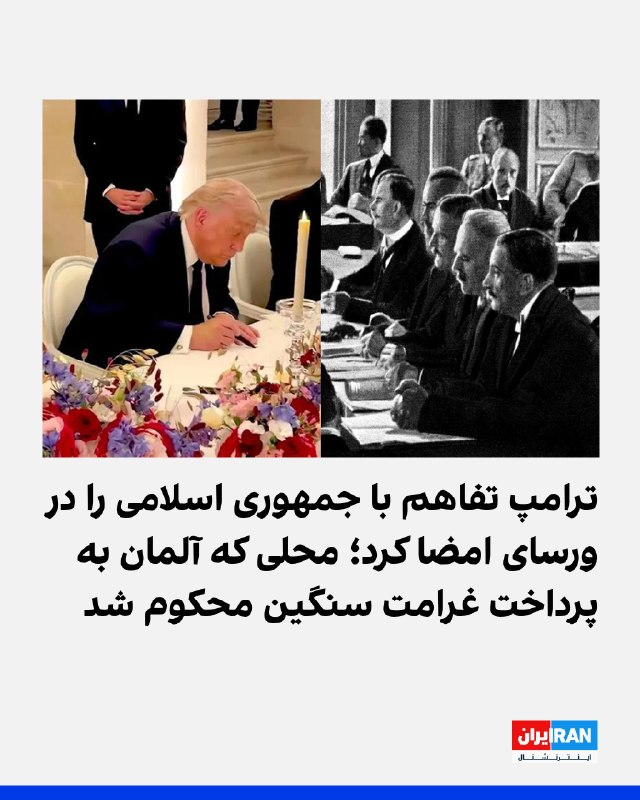

تفاهم‌نامه میان آمریکا و جمهوری اسلامی که دونالد ترامپ، رییس‌جمهوری آمریکا، چهارشنبه ۲۷ خرداد آن را امضا کرد، در همان مکانی به امضا رسید که بیش از یک قرن پیش پیمان ورسای برای پایان دادن به جنگ جهانی اول امضا شده بود.
پیمان ورسای ۲۸ ژوئن ۱۹۱۹ در کاخ ورسای فرانسه از سوی نمایندگان آلمان و رهبران کشورهای متفق، از جمله آمریکا، بریتانیا و فرانسه، امضا شد و به طور رسمی به جنگ جهانی اول پایان داد.
با این حال، بسیاری از تاریخ‌نگاران این توافق را یکی از عوامل بی‌ثباتی‌های بعدی در اروپا می‌دانند. آلمان در این پیمان مسئول آغاز جنگ شناخته شد، بخشی از قلمرو خود را از دست داد، به پرداخت غرامت سنگین محکوم شد و محدودیت‌های گسترده‌ای بر توان نظامی آن اعمال شد.
به باور بسیاری از پژوهشگران، نارضایتی گسترده از مفاد پیمان ورسای بعدها به رشد حمایت از آدولف هیتلر کمک کرد و زمینه‌ساز وقوع جنگ جهانی دوم شد.
‌🏁 🇬🇧 IranintlTV

🤖 @VahidOOnLine

## VahidOOnLine — post 246196

  <a href="telegram/content/VahidOOnLine_246196_1781784882.mp4" target="_blank">🎬 Download video</a>

ویدیوی رسیده به ایران اینترنشنال نشان می‌دهد که یک معترض در تهران، شعار «جاوید شاه» را روی یکی از دیوارهای پایتخت نوشت.
‌🏁 🇬🇧 IranintlTV

🤖 @VahidOOnLine

## IranIntlTV — post 343027

  

تفاهم‌نامه میان آمریکا و جمهوری اسلامی که دونالد ترامپ، رییس‌جمهوری آمریکا، چهارشنبه ۲۷ خرداد آن را امضا کرد، در همان مکانی به امضا رسید که بیش از یک قرن پیش پیمان ورسای برای پایان دادن به جنگ جهانی اول امضا شده بود.
پیمان ورسای ۲۸ ژوئن ۱۹۱۹ در کاخ ورسای فرانسه از سوی نمایندگان آلمان و رهبران کشورهای متفق، از جمله آمریکا، بریتانیا و فرانسه، امضا شد و به طور رسمی به جنگ جهانی اول پایان داد.
با این حال، بسیاری از تاریخ‌نگاران این توافق را یکی از عوامل بی‌ثباتی‌های بعدی در اروپا می‌دانند. آلمان در این پیمان مسئول آغاز جنگ شناخته شد، بخشی از قلمرو خود را از دست داد، به پرداخت غرامت سنگین محکوم شد و محدودیت‌های گسترده‌ای بر توان نظامی آن اعمال شد.
به باور بسیاری از پژوهشگران، نارضایتی گسترده از مفاد پیمان ورسای بعدها به رشد حمایت از آدولف هیتلر کمک کرد و زمینه‌ساز وقوع جنگ جهانی دوم شد.
https://iranintl.com/202606185464

## IranIntlTV — post 343026

  <a href="telegram/content/IranIntlTV_343026_1781784885.mp4" target="_blank">🎬 Download video</a>

ویدیوی رسیده به ایران اینترنشنال نشان می‌دهد که یک معترض در تهران، شعار «جاوید شاه» را روی یکی از دیوارهای پایتخت نوشت.

## RadioFarda — post 158460

  <a href="https://t.me/radiofarda/158460" target="_blank">📎 Download file</a>

🔸 در این کافه فردا به مرور بازی‌های شب گذشته مثل پرتغال- کنگو و کرواسی- انگلیس می‌پردازیم، سرنوشت رکوردهای جابه‌جا شده بازیکنان بزرگ در ادوار جام جهانی را مرور می‌کنیم و در مسابقات شب هشتم مسابقات حرف می‌زنیم.

🔸 برای تماس با ما می‌توانید به شناسه کافه فردا در تلگرام صوت و متن بفرستید.

📻 کافه فردا

## BBCPersian — post 284266

  <a href="telegram/content/BBCPersian_284266_1781784887.mp4" target="_blank">🎬 Download video</a>

🔻این ویدیوها از صدای انفجار و تیراندازی در روستاهای کفر جوز و کفر رمان در منطقه نبطیه در جنوب لبنان در نخستین ساعات بامداد پنجشنبه ۲۸ خرداد منتشر شده است.

ارتش اسرائیل روز پنج‌شنبه اعلام کرد که نیروهایش در یک «منطقه امنیتی» به عمق حدود ۱۰ کیلومتر (۶ مایل) در جنوب لبنان در حال عملیات هستند.

این در حالی است که یکی از مفاد تفاهمنامه آمریکا و ایران که اکنون اجرایی شده، توقف فوری عملیات نظامی در لبنان است.

ارتش اسرائیل اعلام کرد که این استقرار بر اساس نیازهای عملیاتی انجام شده و نیروهایش همچنان در محدوده تعیین‌شده برای عملیات مستقرند.

با وجود مفاد توافق موقت آمریکا و ایران درباره توقف درگیری‌ها در لبنان، اسرائیل گفته است که به حضور و فعالیت نظامی خود در جنوب لبنان ادامه می‌دهد و علت آن را ناشی از ملاحظات عملیاتی و امنیتی خوانده است.

https://bbc.in/4vR5Ohx
@BBCPersian

## alonews — post 128900

  <a href="telegram/content/alonews_128900_1781784888.webm" target="_blank">🎬 Download video</a>

👈توقیف کشتی حامل ۶۶۰ هزار لیتر گازوئیل قاچاق در خلیج فارس

🔴 محکومیت متهمان به ۴۲ میلیارد جزای نقدی و حبس

✅ @AloNews خبر جنگ

---
📅 بروزرسانی: 1405/03/28 15:35
---

## VahidOOnLine — post 246195

  <a href="telegram/content/VahidOOnLine_246195_1781784318.mp4" target="_blank">🎬 Download video</a>

ترامپ در ادامه سخنانش در نشست جی‌۷ گفت توافق با جمهوری اسلامی باید به پایان «تهاجم ایران» و جنگ و ترور در لبنان منجر شود. او پرونده لبنان را «بخش کوچک اما پرسر و صدای پازل» خواند و تأکید کرد مسئله اصلی، توافق با ایران است.

ترامپ در عین حال گفت حزب‌الله هنوز باید «به هر شکل» مهار شود و از نقش احتمالی اسرائیل و سوریه در این روند سخن گفت. او همچنین افزود که پس از توافق با ایران، گسترش پیمان ابراهیم می‌تواند گام بعدی باشد.
‌🏁 🇬🇧 ManotoTV

🤖 @VahidOOnLine

## VahidOOnLine — post 246194

آمریکا شاید بحران را متوقف کرده باشد، اما زبان تفاهم‌نامه بیش از آنکه نشانه شکست جمهوری اسلامی باشد، مسیر تنفس و بازسازی موقعیت تهران را باز می‌کند
‌🏁 🇬🇧 ManotoTV

🤖 @VahidOOnLine

## VahidOOnLine — post 246193

  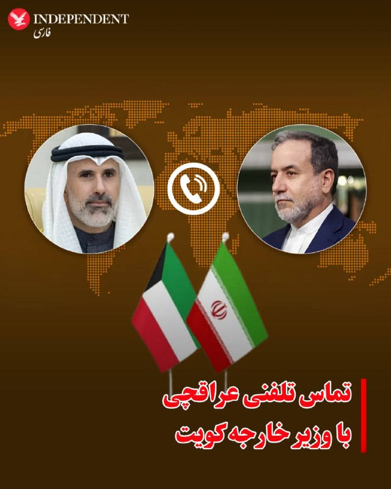

♦️عباس عراقچی، وزیر امور خارجه جمهوری اسلامی روز پنجشنبه ۲۸ خردادماه با شیخ جراح جابر الاحمد الصباح وزیر امور خارجه کویت تلفنی گفتگو کرد.

جمهوری اسلامی دو هفته پیش و در جریان یکی از آخرین موارد تبادل آتش با نیروهای نظامی آمریکا با شلیک موشک و پهپاد به کویت باعث کشته شدن یک تبعه خارجی و آسیب شدید ترمینال یک فرودگاه بین‌المللی کویت شده بود.

کانال تلگرامی عباس عراقچی با اعلام خبر این گفتگو نوشت: «دو طرف درباره یادداشت تفاهم اسلام آباد، تحولات منطقه ای و روابط دوجانبه گفتگو و رایزنی کردند.»

عراقچی در همین پیام به آنچه «اهتمام جمهوری اسلامی ایران به سیاست حسن همسایگی» خواند تاکید و ابراز امیدواری کرد «که این توافق به احیای صلح و ثبات در منطقه منجر شود و بر ضرورت گفت‌وگو با کشورهای حاشیه خلیج فارس به منظور ارتقای تعاملات و رفع ابهامات موجود تاکید کرد.»
‌🇸🇦 Indypersian

🤖 @VahidOOnLine

## VahidOOnLine — post 246192

مارک روته، دبیرکل ناتو پنجشنبه در نشست وزرای دفاع ناتو در بروکسل گفت اقدام ایالات متحده برای جلوگیری از دستیابی جمهوری اسلامی به سلاح هسته‌ای و تضعیف توانمندی موشک‌های بالستیک تهران، امنیت را برای همه افزایش داده است.
او افزود توافقی که با ابتکار دونالد ترامپ، رییس‌جمهوری آمریکا، حاصل شده فرصتی ایجاد کرده است تا اطمینان حاصل شود جمهوری اسلامی هرگز به سلاح هسته‌ای دست نخواهد یافت.
روته این اظهارات را یک روز پس از انتشار متن توافق‌نامه موقت میان آمریکا و جمهوری اسلامی مطرح کرد؛ توافقی که به امضای روسای دولت‌های دو کشور رسیده و با هدف پایان دادن به درگیری میان تهران و واشینگتن تنظیم شده است.
دبیرکل ناتو همچنین بر اهمیت اجرای تعهدات مندرج در این توافق تاکید کرد.
اظهارات او در حالی مطرح می‌شود که دونالد ترامپ هشدار داده است در صورت پایبند نبودن جمهوری اسلامی به تعهدات خود، حملات نظامی از سر گرفته خواهد شد.
‌🏁 🇬🇧 IranintlTV

🤖 @VahidOOnLine

## WithYashar — post 15245

شبکه کان اسرائیل: موضوع عقب‌نشینی از لبنان هفته آینده با هیئت لبنانی در واشنگتن مورد بررسی قرار خواهد گرفت
@withyashar

## FoxNewsTwitter — post 343111

‌Fox News (Twitter/X)

Read more:
https://www.foxnews.com/politics/white-house-ufc-terror-plot-ringleader-mexican-illegal-immigrant-dhs-confirms

## FoxNewsTwitter — post 343110

  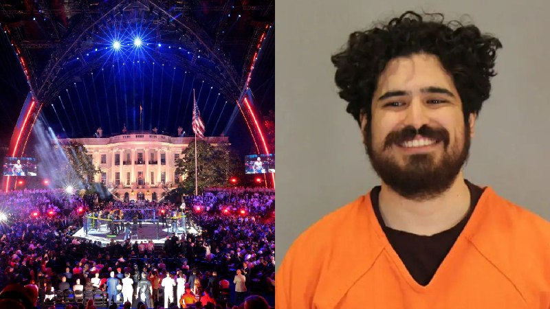

Fox News (Twitter/X)

The terror plot targeting UFC Freedom 250 at the White House was allegedly led by an illegal immigrant, according to DHS.

Officials say Mexican national Abraham Hermosillo Alvarez was arrested by the FBI in Omaha on the day of the event before ICE lodged a detainer against him.

The administration says Alvarez was the ringleader of the failed attack and will face justice before being deported from the U.S.

Alvarez came to the United States as a child and was granted deportation relief through DACA by the Obama administration in 2014 after he failed to leave the country when his B2 visa expired in 2001.

## IranIntlTV — post 343025

مارک روته، دبیرکل ناتو پنجشنبه در نشست وزرای دفاع ناتو در بروکسل گفت اقدام ایالات متحده برای جلوگیری از دستیابی جمهوری اسلامی به سلاح هسته‌ای و تضعیف توانمندی موشک‌های بالستیک تهران، امنیت را برای همه افزایش داده است.
او افزود توافقی که با ابتکار دونالد ترامپ، رییس‌جمهوری آمریکا، حاصل شده فرصتی ایجاد کرده است تا اطمینان حاصل شود جمهوری اسلامی هرگز به سلاح هسته‌ای دست نخواهد یافت.
روته این اظهارات را یک روز پس از انتشار متن توافق‌نامه موقت میان آمریکا و جمهوری اسلامی مطرح کرد؛ توافقی که به امضای روسای دولت‌های دو کشور رسیده و با هدف پایان دادن به درگیری میان تهران و واشینگتن تنظیم شده است.
دبیرکل ناتو همچنین بر اهمیت اجرای تعهدات مندرج در این توافق تاکید کرد.
اظهارات او در حالی مطرح می‌شود که دونالد ترامپ هشدار داده است در صورت پایبند نبودن جمهوری اسلامی به تعهدات خود، حملات نظامی از سر گرفته خواهد شد.

## IranIntlTV — post 343024

  <a href="telegram/content/IranIntlTV_343024_1781784322.mp4" target="_blank">🎬 Download video</a>

رهبران ۲۷ کشور عضو اتحادیه اروپا در نشست بروکسل، علاوه بر جنگ روسیه و اوکراین، تفاهم‌نامه میان آمریکا و جمهوری اسلامی را نیز بررسی می‌کنند. کشورهای اروپایی تاکید کرده‌اند هرگونه توافق با تهران باید آزادی کشتیرانی در تنگه هرمز را تضمین کند و نگرانی‌های مرتبط با برنامه هسته‌ای ایران را برطرف سازد.

گزارش لی‌لی نیکفر، خبرنگار ایران‌اینترنشنال
@iranintltv

## ManotoTV — post 106149

  <a href="telegram/content/ManotoTV_106149_1781784325.mp4" target="_blank">🎬 Download video</a>

ترامپ در ادامه سخنانش در نشست جی‌۷ گفت توافق با جمهوری اسلامی باید به پایان «تهاجم ایران» و جنگ و ترور در لبنان منجر شود. او پرونده لبنان را «بخش کوچک اما پرسر و صدای پازل» خواند و تأکید کرد مسئله اصلی، توافق با ایران است.

ترامپ در عین حال گفت حزب‌الله هنوز باید «به هر شکل» مهار شود و از نقش احتمالی اسرائیل و سوریه در این روند سخن گفت. او همچنین افزود که پس از توافق با ایران، گسترش پیمان ابراهیم می‌تواند گام بعدی باشد.

## ManotoTV — post 106148

آمریکا شاید بحران را متوقف کرده باشد، اما زبان تفاهم‌نامه بیش از آنکه نشانه شکست جمهوری اسلامی باشد، مسیر تنفس و بازسازی موقعیت تهران را باز می‌کند

## FarsiVOA — post 221105

  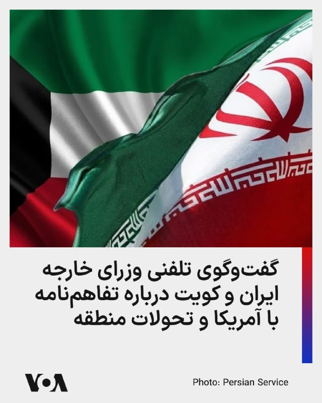

وزیران خارجه جمهوری اسلامی روز پنج‌شنبه در یک تماس تلفنی درباره تفاهم‌نامه میان حکومت ایران و آمریکا، تحولات منطقه‌ای و روابط دوجانبه گفت‌وگو کردند.

بر اساس بیانیه وزارت خارجه جمهوری اسلامی، عباس عراقچی در این گفت‌وگو جراح جابر الاحمد الصباح را در جریان مفاد و آخرین تحولات مرتبط با تفاهم‌نامه با آمریکا قرار داد.

وزیر خارجه جمهوری اسلامی ابراز امیدواری کرد که این تفاهم به «تقویت صلح و ثبات در منطقه» منجر شود و همچنین بر «ضرورت تداوم گفت‌وگو و رایزنی با کشورهای حاشیه خلیج فارس با هدف گسترش همکاری‌ها و رفع سوءتفاهم‌ها و ابهامات موجود» تأکید کرد.

این گفت‌وگو در حالی انجام ‌شد که روابط جمهوری اسلامی و کویت در ماه‌های اخیر به دلیل حملات جمهوری اسلامی به کشورهای منطقه تحت تأثیر تنش‌های فزاینده قرار داشت.

کویت از جمله کشورهای عربی حوزه خلیج فارس بوده که نسبت به این حملات جمهوری اسلامی در خاک خود و دیگر کشورهای منطقه ابراز نگرانی کرد و در مقاطع مختلف خواستار احترام به امنیت و حاکمیت کشورها شد.
@FarsiVOA

## DW_Farsi — post 126141

🔶 محکومیت پرستو احمدی و هشت عضو دیگر کنسرت "کاروانسرا" به شلاق

پرستو احمدی، خواننده و هشت تن دیگر از دست‌اندرکاران و نوازندگان "کنسرت کاروانسرا" به ۷۴ ضربه شلاق تعزیری، دو سال ممنوع‌الخروجی و دو سال محرومیت از فعالیت هنری خبر داد.

بر اساس گزارش‌ها، دادگاه کیفری استان قم، این افراد را به "جریحه‌دار کردن عفت عمومی از طریق تولید و انتشار محتوای مبتذل و خلاف اخلاق در بستر فضای مجازی" متهم کرده است.

به نوشته مرکز مشاوره و آموزش حقوقی "دادبان"، محمد شیری، رئیس شعبه رسیدگی‌کننده، دفاعیات متهمان را وارد ندانسته و حکم محکومیت آنان را صادر کرده است.

گفته می‌شود این حکم بدوی و در مهلت قانونی قابل تجدیدنظرخواهی است.

@dw_farsi

## RadioFarda — post 158459

  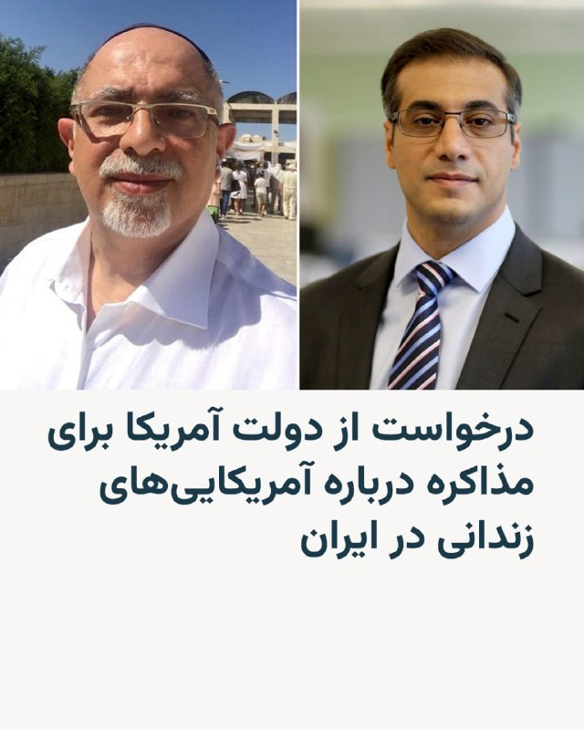

رضا ولی‌زاده (سمت راست) و کامران حکمتی، دو شهروند آمریکایی زندانی در ایران

🔸 بنیاد میراث جیمز فولی، با استقبال از تلاش‌ها برای پایان دادن به خصومت‌ها میان ایالات متحده و ایران و کاهش خطر تشدید بیشتر تنش‌ها، نسبت به وضعیت آمریکایی‌های زندانی در ایران ابراز نگرانی کرد.

🔸این بنیاد در بیانیه خود افزوده: «عمیقاً نگران است که آمریکایی‌های زندانی در ایران یا افرادی که از خروج از کشور منع شده‌اند، ظاهراً در تفاهم‌نامه گزارش‌شده مورد اشاره قرار نگرفته باشند.»

🔸بنیاد میراث جیمز فولی برآورد کرده که دست‌کم پنج شهروند آمریکایی یا به‌طور ناعادلانه در ایران زندانی هستند یا مشمول ممنوعیت‌های غیرمنصفانه خروج از کشور شده‌اند که مانع بازگشت آنها به خانه می‌شود.

🔸دو نفر از این افراد، رضا ولی‌زاده، روزنامه‌نگار سابق رادیو فردا، و کامران حکمتی، از سوی مارکو روبیو، وزیر خارجه به‌عنوان «بازداشت‌شدگان ناعادلانه» معرفی شده‌اند و همچنان در زندان اوین در ایران نگهداری می‌شوند.

@RadioFarda

## Dirty_Kids — post 392486

  <a href="telegram/content/Dirty_Kids_392486_1781784329.mp4" target="_blank">🎬 Download video</a>

🔴 صحبتای مهم و جالب این خانوم ایرانی رو حتما گوش بدین.

@Dirty_Kids 👻

## Dirty_Kids — post 392485

  <a href="telegram/content/Dirty_Kids_392485_1781784330.mp4" target="_blank">🎬 Download video</a>

"به نظرم به اندازه كافى در كشور برنامه وجود دارد. تيم خاصى هم ندارم. فكر خاصى هم براى دولت آينده نكرده‏ام. چرا كه من از بهمن ماه وارد صحنه شده‏ام و فرصت زيادى براى تعميق نداشتم، انشاءالله اگر راى بياورم، بعد از پيروزى، مفصل راجع به آن فكر خواهم كرد. وى سپس افزود: من فكر مى‏كنم كشور احتياج به نظم و اقتدار دارد. بايد راجع همه امور حساب كشى كرد. هر كس بايد بفهمد جايگاهش چيست و مردم ديگر از نيروهاى سياسى كاملا خسته شده‏اند. شما نمى‏بينيد در تاكسى و ساندويچ فروشى مردم مى‏گويند خدا پدر رضاخان را بيامرزد. كشور نيازمند يك رضاخان است و من رضاخانِ حزب‌اللهى هستم."

محمدباقر قالیباف ۱۸ اردیبهشت ۱۳۸۴

@Dirty_Kids 👻

## manototv — post 106149

  <a href="telegram/content/manototv_106149_1781784331.mp4" target="_blank">🎬 Download video</a>

ترامپ در ادامه سخنانش در نشست جی‌۷ گفت توافق با جمهوری اسلامی باید به پایان «تهاجم ایران» و جنگ و ترور در لبنان منجر شود. او پرونده لبنان را «بخش کوچک اما پرسر و صدای پازل» خواند و تأکید کرد مسئله اصلی، توافق با ایران است.

ترامپ در عین حال گفت حزب‌الله هنوز باید «به هر شکل» مهار شود و از نقش احتمالی اسرائیل و سوریه در این روند سخن گفت. او همچنین افزود که پس از توافق با ایران، گسترش پیمان ابراهیم می‌تواند گام بعدی باشد.

## manototv — post 106148

آمریکا شاید بحران را متوقف کرده باشد، اما زبان تفاهم‌نامه بیش از آنکه نشانه شکست جمهوری اسلامی باشد، مسیر تنفس و بازسازی موقعیت تهران را باز می‌کند

## alonews — post 128899

  <a href="telegram/content/alonews_128899_1781784334.webm" target="_blank">🎬 Download video</a>

🔴فوری/طبق گزارش CNN: نتانیاهو به ترامپ اطلاع داده است که اسرائیل خود را متعهد به یادداشت تفاهم آمریکا و ایران نمی‌داند، همچنین جنگ در لبنان را نیز متوقف نخواهد کرد و نیرو های ارتش اسرائیل از جنوب لبنان عقب نشینی نخواهند کرد.

✅ @AloNews خبر جنگ

---
📅 بروزرسانی: 1405/03/28 15:24
---

## WithYashar — post 15244

خبرگزاری CNN : نتانیاهو معتقده توافقی حاصل نمیشه و جمهوری اسلامی با پایان دادن به موضوع هسته‌ای موافقت نمیکنه
@withyashar

## mwarmonitor — post 11113

  <a href="telegram/content/mwarmonitor_11113_1781783680.mp4" target="_blank">🎬 Download video</a>

🔴«عبور و مرور تأییدشده همچنان در پایین‌ترین سطح تاریخی قرار دارد

🔸تا تاریخ ۱۷ ژوئن، شرکت Kpler شش عبور تأییدشده را در منطقه تحت نظارت مشاهده کرده است. ترافیک عمدتاً از شرق به غرب متمرکز بوده و بیشتر کشتی‌ها از مسیرهای دریایی ساحلی و شناخته‌شده ایران استفاده کرده‌اند. یک کشتی تحت تحریم به نام Ostria شناسایی شده که در مسیر شرق به غرب و بدون بار (ballast) در حال عبور بوده است. از ۱۰ مه تاکنون هیچ حمله فیزیکی دیگری تأیید نشده و بنابراین وضعیت ریسک دریایی به‌طور کلی بدون تغییر باقی مانده است. تحرکات اخیر همزمان با ادامه مذاکرات آمریکا و ایران درباره یک یادداشت تفاهم پیشنهادی ۶۰ روزه است که هدف آن حمایت از امنیت دریایی و حفظ چارچوب آتش‌بس فعلی است. با اینکه تردد ادامه دارد، حجم نسبتاً پایین عبورها نشان می‌دهد الگوهای کشتیرانی همچنان محتاطانه است و هنوز به حالت عادی بازنگشته است.»

@mwarmonitor

## pm_afshaa — post 94332

  <a href="telegram/content/pm_afshaa_94332_1781783682.webm" target="_blank">🎬 Download video</a>

🔴دولت سوئیس رسما اعلام کرد که روز جمعه نشستی با حضور نمایندگان آمریکا، ایران، پاکستان، قطر و دیگر کشورهای مرتبط برگزار خواهد شد تا مذاکرات مقدماتی انجام بشه.

💧 Rainbet.com the #1 Non-KYC Crypto Casino & Sportsbook @rainbetcom

😁 @Pm_Afshaa

## pm_afshaa — post 94331

خبرگزاری CNN : نتانیاهو معتقده توافقی حاصل نمیشه و جمهوری اسلامی با پایان دادن به موضوع هسته‌ای موافقت نمیکنه

💧 Rainbet.com the #1 Non-KYC Crypto Casino & Sportsbook @rainbetcom

😁 @Pm_Afshaa

## pm_afshaa — post 94328

  <a href="telegram/content/pm_afshaa_94328_1781783683.webm" target="_blank">🎬 Download video</a>

🔴پزشکیان سند اصلی تفاهم‌نامه رو منتشر کرد :

💧 Rainbet.com the #1 Non-KYC Crypto Casino & Sportsbook @rainbetcom

😁 @Pm_Afshaa

## IranIntlTV — post 343017

🔻برنامه هفته دوم جام جهانی ۲۰۲۶

🔹ساعت‌ها به وقت ایران

@iranintltvsport

## FarsiVOA — post 221104

پس از ۸ سال دوباره انگلیس و کرواسی در جام جهانی مقابل یکدیگر قرار گرفتند و این بار انگلیس با برتری مطلق خاطره‌ساز شد

## BBCPersian — post 284265

  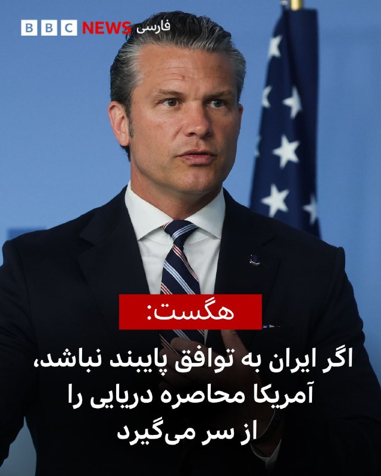

🔻پیت هگست، وزیر دفاع آمریکا، هشدار داد در صورتی که ایران به تعهدات خود در تفاهمنامه عمل نکند، ایالات متحده قادر است مجددا «محاصره‌ای سخت‌گیرانه» علیه ایران را از سر بگیرد و در صورت لزوم، حتی عملیات نظامی را هم دوباره آغاز کند.

آمریکا در چارچوب توافق اخیر پذیرفته است به محاصره دریایی ایران پایان دهد که مانع تردد کشتی‌های ایران می‌شد.

هگست گفت: «اگر ایران به آنچه گفته عمل نکند» و از آنچه او «جاه‌طلبی‌های تسلیحات هسته‌ای» ایران خواند، دست نکشد، «وزارت جنگ [آمریکا] آماده است در صورت لزوم عملیات نظامی را دوباره آغاز کند.

او تاکید کرد که مذاکرات آینده آمریکا بر برنامه هسته‌ای ایران متمرکز خواهد بود.

وزیر دفاع آمریکا همچنین گفت که برخی کشورهای اروپایی آماده‌اند در عملیات پاکسازی مین‌ها در تنگه هرمز مشارکت کنند.

هگست در عین حال از بریتانیا خواست نقش گسترده‌تری ایفا کند و گفت که این کشور باید «گام بیشتری بردارد.»

📸 EPA

https://bbc.in/4fNU3nt
@BBCPersian

## BBCPersian — post 284264

  <a href="telegram/content/BBCPersian_284264_1781783685.mp4" target="_blank">🎬 Download video</a>

🎶 گوشه‌ای از دونوازی بداهه پیمان یزدانیان و بیلی پاد در جشنواره جز لندن را می‌بینید.

پیمان یزدانیان، آهنگساز و پیانیست معاصر ایرانی، برای بسیاری با موسیقی متن فیلم‌هایش شناخته می‌شود و با کارگردانانی چون عباس کیارستمی، اصغر فرهادی، مسعود کیمیایی، جعفر پناهی، نیکی کریمی، محمد رسول‌اف و سعید روستایی همکاری داشته است.

موسیقی او، که تلفیقی از موسیقی کلاسیک و معاصر غربی با الهام از موسیقی ایرانی است، چنان با تصویر گره خورده که حتی آثاری که بیرون از دنیای سینما خلق می‌کند نیز گویی موسیقی متن فیلمی نادیده‌اند؛ کافی است شنونده چشمانش را ببندد و در خیال غوطه‌ور شود و تصاویر خود را بر این صداها بنشاند.

نمونه‌ای از این رویکرد را می‌توان در بداهه‌نوازی او در جشنواره جز لندن ۲۰۲۵ دید؛ جایی که آقای یزدانیان با همراهی بیلی پاد، نوازنده سازهای کوبه‌ای، به سفری ناشناخته با مقصدی نامعلوم قدم می‌گذارد.

اجرای کامل او در جشنواره جز لندن را این هفته از تلویزیون و یوتیوب بی‌بی‌سی ببینید.
https://bbc.in/4uKgVrN

@BBCPersian

## BBCPersian — post 284263

  <a href="telegram/content/BBCPersian_284263_1781783688.mov" target="_blank">🎬 Download video</a>

🔻این هفته در پرگار: تیم ملی ایران یا «تیم جمهوری اسلامی»؟

🔻تیم ایران در جام جهانی فوتبال، تیم ملی ایران است یا تیم جمهوری اسلامی؟ این تیم آمال مردم در رقابت‌های جهانی را نمایندگی می‌کند یا جمهوری اسلامی را؟

میهمان‌ها:
مهرزاد بروجردی، استاد دانشگاه
امید شمس، حقوقدان

@BBCPersian

## Hranews — post 113702

  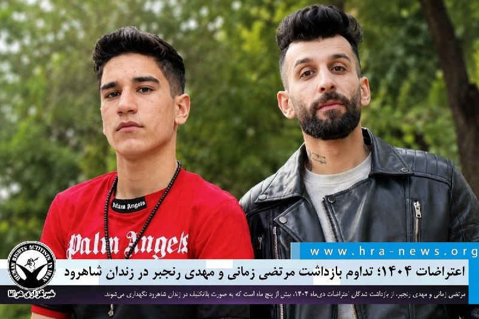

اعتراضات دی‌ماه ۱۴۰۴؛ تداوم بازداشت مرتضی زمانی و مهدی رنجبر در زندان شاهرود

❗️
❗️
❗️
❗️
❗️– مرتضی زمانی و مهدی رنجبر، از بازداشت شدگان اعتراضات دی‌ماه ۱۴۰۴ که یک پرونده قضایی مشترک دارند، بیش از پنج ماه است، به‌صورت بلاتکلیف در زندان شاهرود نگهداری می‌شوند.

به گزارش خبرگزاری هرانا، ارگان خبری مجموعه فعالان حقوق بشر در ایران، مرتضی زمانی و مهدی رنجبر در بازداشت به‌سر می‌برند.

بر اساس اطلاعات دریافتی هرانا، ۱۶۲ روز از بازداشت این افراد می‌گذرد و آنها هم اکنون به صورت بلاتکلیف در زندان شاهرود نگهداری می‌شوند. یک منبع مطلع نزدیک به خانواده این شهروندان ضمن تایید این خبر به هرانا گفت: “علت بازداشت مرتضی و مهدی، تخریب و آتش زدن اموال عمومی عنوان شده است و آنها یک پرونده قضایی مشترک دارند.”

#مرتضی_زمانی #مهدی_رنجبر

ادامه مطلب

↘️
@hranews_bot تماس ✉️ - @Hranews کانال هرانا 🆑

## alonews — post 128898

  <a href="telegram/content/alonews_128898_1781783692.webm" target="_blank">🎬 Download video</a>

👈شبکه کان اسرائیل: موضوع عقب‌نشینی از لبنان هفته آینده با هیئت لبنانی در واشنگتن مورد بررسی قرار خواهد گرفت

✅ @AloNews خبر جنگ

## alonews — post 128897

  <a href="telegram/content/alonews_128897_1781783692.webm" target="_blank">🎬 Download video</a>

👈فرهیختگان: گفتن اینکه توافق با مهر تأیید رهبر است و یا تحمیل توافق به رهبر؛ هر دو خطاست

✅ @AloNews خبر جنگ

---
📅 بروزرسانی: 1405/03/28 15:14
---

## VahidOOnLine — post 246191

  <a href="telegram/content/VahidOOnLine_246191_1781783068.mp4" target="_blank">🎬 Download video</a>

♦️تصاویری که روز چهارشنبه ۲۷ مردادماه برای ایندیپندنت فارسی ارسال شده، لحظاتی از رقص جاویدنام حسین غریب را نشان می‌دهد.
جاویدنام حسین غریب، شامگاه پنجشنبه ۱۸ دی‌ماه و همزمان با انقلاب ملی ایرانیان، به‌ضرب دو گلوله جنگی (یکی به گردن و دیگری به سینه)، مقابل کلانتری ۱۱ شهرستان شاهرود کشته شد.
‌🇸🇦 Indypersian

🤖 @VahidOOnLine

## WithYashar — post 15241

پزشکان نسخه اصل سند امضاشده را منتشر کردند.
@withyashar

## WithYashar — post 15240

  <a href="telegram/content/WithYashar_15240_1781783070.mp4" target="_blank">🎬 Download video</a>

شاهزاده رضا پهلوی :
40 هزار ایرانی تو عرض دو روز برای یه توافق هسته‌ای یا باز موندن تنگه هرمز جونشون رو از دست ندادن.
اون‌ها برای آزادی و دموکراسی جونشون رو فدا کردن. اما عجیب اینجاست که تو هیچ‌کدوم از این مذاکرات، اصلاً دیده نشدن و هیچ اسمی ازشون نبوده.
@withyashar

## mwarmonitor — post 11112

🔴سی‌ان‌ان به نقل از یک منبع اسرائیلی: نتانیاهو معتقد است توافق نهایی شکل نخواهد گرفت و تهران با محدود کردن برنامه هسته‌ای خود موافقت نخواهد کرد. نتانیاهو تلاش می‌کند از طریق رسانه‌های راست‌گرا و اعضای کنگره بر توافق با ایران تأثیر بگذارد.

@mwarmonitor

## FoxNewsTwitter — post 343109

  <a href="telegram/content/FoxNewsTwitter_343109_1781783072.mp4" target="_blank">🎬 Download video</a>

Fox News (Twitter/X)

NEW: The U.S.-Iran deal is already having an impact far beyond the negotiating table.

As President Trump formally marked the extension of the ceasefire, oil and gas prices continued falling amid expectations that global energy supplies could stabilize if the agreement holds.

The memorandum launches a 60-day push toward a final deal, with provisions that include reopening key shipping routes, easing sanctions, access to frozen Iranian funds, and renewed negotiations over Iran's nuclear program.

Trump says the clock is now ticking. If talks fail to produce the outcome his administration wants, he warned the U.S. could "go back to bombing."

For now, markets are reacting to the prospect of a wider peace deal — and lower energy prices are one of the first visible results.

@TreyYingst

## pm_afshaa — post 94327

  <a href="telegram/content/pm_afshaa_94327_1781783074.webm" target="_blank">🎬 Download video</a>

🔴گروسی، مدیرکل آژانس انرژی اتمی:

وقت اینه که با تیم‌های آمریکایی و ایرانی بشینیم تا گام‌های ملموسی برداریم.
ما در مذاکراتی که در سوئیس بین واشنگتن و تهران برگزار خواهد شد، شرکت خواهیم کرد.
گزینه‌های زیادی در رابطه با ذخایر اورانیوم ایران وجود داره. تماس با ایران در پایین ترین سطح خود قرار داره
اگر تنگه هرمز تا پایان ژوئن باز نشه، اقتصاد جهانی در قرمز خواهد بود.

💧Rainbet.com the #1 Non-KYC Crypto Casino & Sportsbook @rainbetcom

😁 @Pm_Afshaa

## pm_afshaa — post 94326

  <a href="telegram/content/pm_afshaa_94326_1781783075.mp4" target="_blank">🎬 Download video</a>

شاهزاده رضا پهلوی :40 هزار ایرانی تو عرض دو روز برای یه توافق هسته‌ای یا باز موندن تنگه هرمز جونشون رو از دست ندادن.

اون‌ها برای آزادی و دموکراسی جونشون رو فدا کردن.

اما عجیب اینجاست که تو هیچ‌کدوم از این مذاکرات، اصلاً دیده نشدن و هیچ اسمی ازشون نبوده.

💧 Rainbet.com the #1 Non-KYC Crypto Casino & Sportsbook @rainbetcom

😁 @Pm_Afshaa

## DEJradio — post 5788

  <a href="telegram/content/DEJradio_5788_1781783077.webm" target="_blank">🎬 Download video</a>

🔺📢 "پیام دارم برای بچه پاسدار و بسیجی مزدور. توجه کنید، اینا برای توافق با ترامپ، خامنه‌ای رو به هیچ گرفتن، شما که دیگه دوزار نمی‌ارزید.

پیام دریافتی

#بسیجی #ترامپ #توافق #موشعلی
@DEJradio

## FarsiVOA — post 221103

  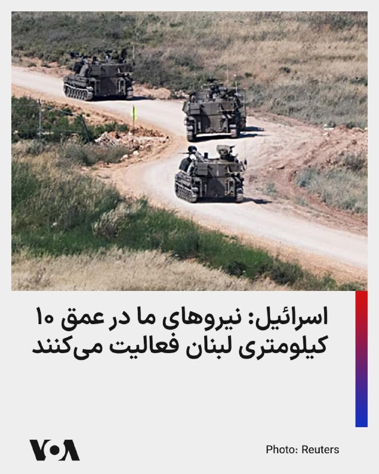

ارتش اسرائیل اعلام کرد که نیروهایش در یک منطقه امنیتی با عمیق حدود ۱۰ کیلومتر در داخل جنوب لبنان فعالیت می‌کنند.

ارتش اسرائیل روز پنج‌شنبه اعلام کرد که استقرار این نیروها بنا بر نیازهای عملیاتی تعیین شده است و نیروها همچنان در منطقه عملیاتی تعیین‌شده خود مستقر هستند.

این در حالی است که یکی از مفاد توافق موقت آمریکا و حکومت ایران خواستار توقف فوری عملیات نظامی در لبنان است.

پیشتر وال‌استریت ژورنال گزارش داد که دونالد ترامپ، رئیس‌جمهوری آمریکا، در یک تماس تلفنی با نخست‌وزیر اسرائیل، بنیامین نتانیاهو، درباره لبنان، از او خواست که به «منفجر کردن ساختمان‌ها» پایان دهد.

آقای ترامپ در روزهای اخیر به‌طور فزاینده‌ای در عرصه عمومی از نتانیاهو انتقاد کرده است.
@FarsiVOA

## FarsiVOA — post 221102

  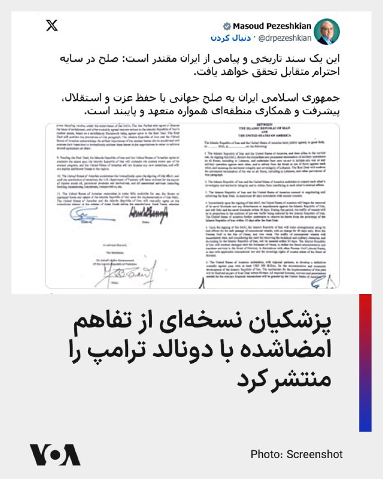

مسعود پزشکیان، رئیس دولت جمهوری اسلامی، تصویری از تفاهم‌نامه امضاشده توسط او و دونالد ترامپ، رئیس‌جمهور آمریکا را در شبکه اجتماعی ایکس منتشر کرد.

این سند که سند تفاهم اسلام‌آباد نام گرفته و امضای نواز شریف، نخست‌‌وزیر و میانجی پاکستانی مذاکرات دست‌یابی به تفاهم را بر خود دارد، در حالی منتشر شده که بخش‌های در نظر گرفته شده در متن تفاهم‌نامه برای مکان امضای سند و تاریخ امضا خالی است.

تفاهم‌نامه جمهوری اسلامی و ایالات متحده نخست قرار بود روز جمعه در ژنو سوئیس توسط محمدباقر قالیباف و جی‌دی ونس، مذاکره‌کنندگان ارشد دو کشور امضا شود، اما چهارشنبه شب و به طور ناگهانی به صورت دیجیتال توسط رؤسای جمهور دو کشور امضا شد.

قالیباف و ونس پیشتر در شامگاه یکشنبه این سند تفاهم را امضا کرده بودند.

پزشکیان تفاهم‌نامه تهران و واشنگتن را «یک سند تاریخی» خوانده و مدعی شده که امضای این سند، پیامی از سوی جمهوری اسلامی مبنی بر تحقق «صلح در سایه احترام» است.
@FarsiVOA

## RadioFarda — post 158458

  <a href="https://t.me/radiofarda/158458" target="_blank">📎 Download file</a>

📻بشنوید: ساعت ۱۴ با رادیوفردا، ۲۸ خرداد ۱۴۰۵‌

@RadioFarda

## RadioFarda — post 158457

  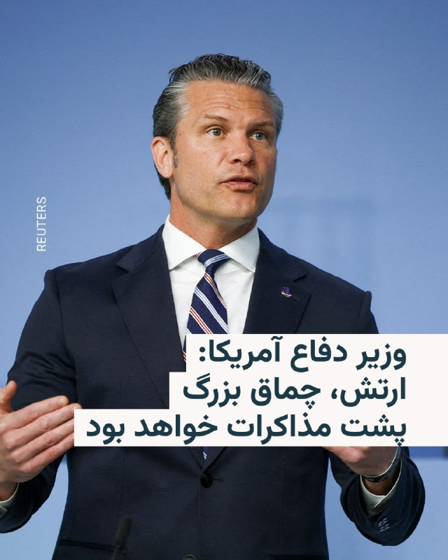

🔸 پیت هگست، وزیر دفاع آمریکا، روز پنج‌شنبه ۲۸ خرداد در یک موضع‌گیری درباره تفاهم‌نامه اسلام‌آباد تأکید کرد که ارتش آمریکا قرار است «چماق بزرگ پشت مذاکرات» باشد.

🔸 او همچنین تأکید کرد که هر گونه تغییر در اندازه حضور نظامی آمریکا در خاورمیانه «بسته به شرایط» خواهد بود.

🔸 این نخستین اظهار نظر هگست در پی امضای تفاهم‌نامه اسلام‌آباد میان تهران و واشینگتن است که بامداد پنج‌شنبه توسط رئیس جمهور ایران هم امضا شد و رسمیت یافت. دونالد ترامپ ساعتی پیش از مسعود پزشکیان سند را امضا کرده بود.

🔸 متن تفاهم‌نامه‌ای که دولت آمریکا به امضایش رضایت داد حتی از چند روز پیش از امضا شدن هم انتقادهایی در پی داشت، انتقادهایی که با انتشار متن کامل آن افزایش یافت.

🔸 به نظر می‌رسد که سخنان وزیر دفاع آمریکا هم تا اندازه‌ای پاسخ به همین انتقادها باشد.

🔸 به گفته پیت هگست،‌ آمریکا «از موضع قدرت به توافق با ایران رسید».

@RadioFarda

## IranianMinds — post 22878

  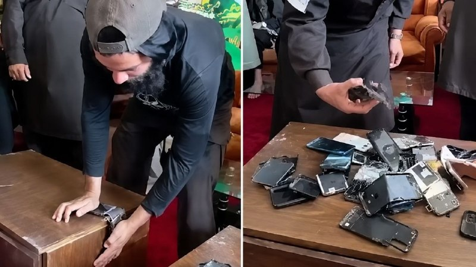

🔴 بعد از اینکه توی افغانستان اعتراضات شکل گرفت طالبان دستور داد گوشی های هوشمند تمامی کارمندای دولتی نابود بشه و برای امنیت کشور کسی حق نداره گوشی هوشمند ببره سرکار.

@IranianMinds

## BBCPersian — post 284262

🔻رئیس صندوق بین‌المللی پول: شاهد افت شدید قیمت نفت نخواهیم بود

رئیس صندوق بین‌المللی پول روز پنجشنبه گفت که با از سرگیری حمل و نقل از طریق تنگه هرمز و هم‌زمان پر کردن ذخایر توسط کشورها، احتمالاً قیمت نفت کاهش خواهد یافت اما «شاهد افت شدید قیمت نفت نخواهیم بود.»

کریستالینا جورجیوا گفت: «بازگشت ترافیک دریایی از طریق تنگه هرمز به حالت عادی زمان خواهد برد و با افزایش تحویل نفت، کشورها به دنبال جایگزینی ذخایر کاهش یافته و احتمالاً افزایش آنها نسبت به قبل خواهند بود.»

https://bbc.in/4fNU3nt
@BBCPersian

---
📅 بروزرسانی: 1405/03/28 15:04
---

## mwarmonitor — post 11111

  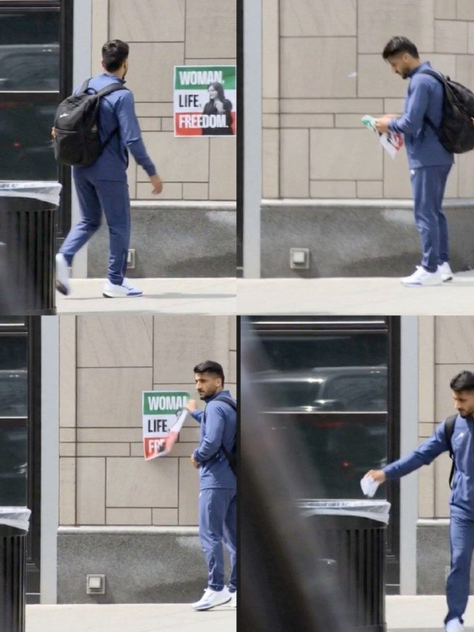

📝 تصویر نکبت‌بار ثبت‌شده اوج حقارت و دست‌بوسی قدرت را به نمایش می‌گذارد؛ جایی که این زنازاده نطفه شیطان، محمد محبی، مثل یک پادو دست دراز می‌کند تا عکس مهسا امینی را از رو دیوار بردارد، مچاله کند و به سطل آشغال بیندازد. چقدر حیوان و جیره‌خوارید که فکر کردید یه توافق با یه کله‌زرد امضا کردید و تموم شد همه چی؟ این خشم فروخورده دی‌ماه هر روز در سینه این ملت خسته انباشته میشه و بهمن مخربی خواهد شد که تمام کاخ‌های پوشالی‌تان را ویران می‌کند. خودفروختگی امروز شما، سوخت فرداست؛ مادر تک‌تک شما را به عزاتون خواهیم نشاند و این بار، در دادگاه خشم این مردم، هیچ‌کدومتون قسر در نخواهید رفت.

@mwarmonitor

## pm_afshaa — post 94325

  <a href="telegram/content/pm_afshaa_94325_1781782482.mp4" target="_blank">🎬 Download video</a>

شاهزاده رضا پهلوی :من همیشه و تو هر شرایط سیاسی، از تیم ملی‌مون حمایت کردم؛ چون تیم ملی خودمونه، حالا چه تو المپیک باشه چه هر جای دیگه.

اما این اولین باره که می‌تونم بهتون بگم احساسات خیلی متناقضی نسبت به این موضوع وجود داره، حتی میشه گفت یه جور دودستگی یا تردید جدی به وجود اومده.

💧 Rainbet.com the #1 Non-KYC Crypto Casino & Sportsbook @rainbetcom

😁 @Pm_Afshaa

## pm_afshaa — post 94321

  <a href="telegram/content/pm_afshaa_94321_1781782485.mp4" target="_blank">🎬 Download video</a>

🔴اوکراین دیشب با حملات پهپادی به پالایشگاه نفت مسکو، همچین صحنه‌ای رو خلق کرد :

💧 Rainbet.com the #1 Non-KYC Crypto Casino & Sportsbook @rainbetcom

😁 @Pm_Afshaa

## pm_afshaa — post 94320

🔴پیت هگست وزیر جنگ آمریکا: به جمهوری اسلامی اعتماد نداریم و درصورت رفتار خارج از بندهای تفاهم، جنگ رو آغاز میکنیم

💧 Rainbet.com the #1 Non-KYC Crypto Casino & Sportsbook @rainbetcom

😁 @Pm_Afshaa

## pm_afshaa — post 94319

  <a href="telegram/content/pm_afshaa_94319_1781782487.webm" target="_blank">🎬 Download video</a>

🔴قالیباف: خود امام زمان میاد و انتقام رهبر شهیدمون رو میگیره، ما که کاره‌ای نیستیم.

💧 Rainbet.com the #1 Non-KYC Crypto Casino & Sportsbook @rainbetcom

😁 @Pm_Afshaa

## FarsiVOA — post 221101

  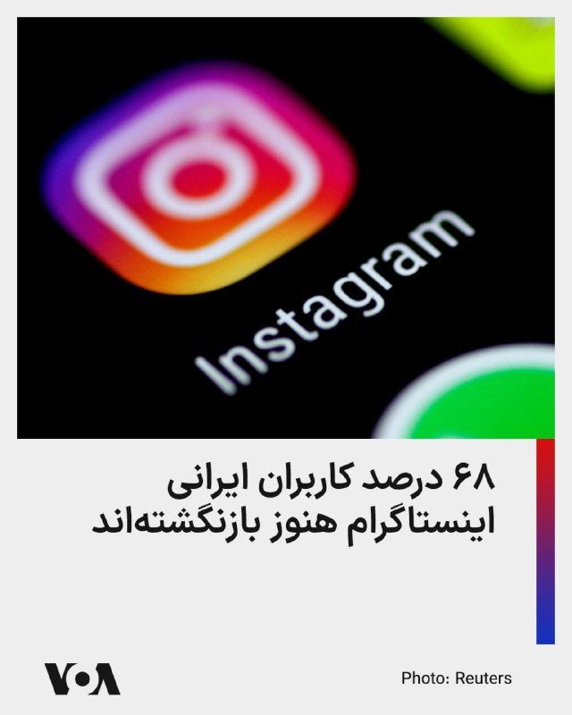

وب‌سایت سیتنا اعلام کرد که هنوز حدود ۶۸ درصد از کاربران ایرانی فعال در اینستاگرام به این شبکه اجتماعی بازنگشته‌اند.

این رسانه که به طور تخصصی اخبار حوزه فناوری اطلاعات را پوشش می‌دهد، با بررسی ترافیک اینترنت بین‌الملل اعلام کرد که تاکنون این ترافیک به سطح پیش از قطع بازنگشته است.

سیتنا همچنین کاهش تعداد کاربران ایرانی شبکه ایکس را حدود سه درصد اعلام و یادآور شد «این تفاوت نشان می‌دهد محدودیت‌های فعلی بیشتر پلتفرم‌های تصویر و ویدئومحور را تحت تأثیر قرار داده است.»

جمهوری اسلامی از نهم اسفند ۱۴۰۴ تا ‍پنجم خرداد ۱۴۰۵، اینترنت بین‌المللی را به صورت سراسری قطع کرد.

علیرغم فیلتر بودن اینستاگرام در ایران از سال ۱۴۰۱، بسیاری از کسب‌وکارها فعالیت‌های خود را به این پلتفرم منتقل کرده و اتحادیه کسب‌و‌کارهای مجازی، تعداد فروشگاه‌های اینستاگرامی ایرانی را حدود «یک میلیون فروشگاه» برآورد کرده بود. ۶۰ درصد این تعداد را زنان مدیریت می‌کردند.
@FarsiVOA

## DW_Farsi — post 126140

  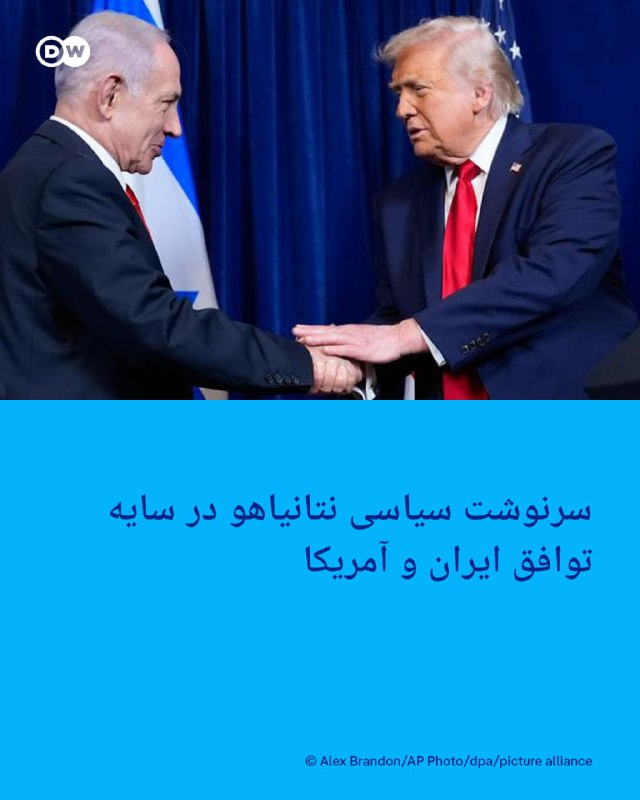

🔶 سرنوشت سیاسی نتانیاهو در سایه توافق ایران و آمریکا

با گذشت چهار ماه جنگ و آتش‌بس و مذاکره، نتیجه به دست آمده از رویارویی آمریکا با ایران برای بنیامین نتانیاهو ، نخست‌وزیر اسرائیل ناامیدکننده به نظر می‌رسد. نتانیاهو اکنون تحت فشار شدید داخلی قرار دارد. انتخابات در اسرائیل به زودی برگزار می‌شود و او به هر قیمتی می‌خواهد در آن پیروز شود.

امضای تفاهم‌نامه آمریکا و ایران در شرایطی صورت می‌گیرد که نتانیاهو به شهروندان اسرائیل، وعده یک پیروزی فراگیر بر جمهوری اسلامی را داده بود و در آغاز جنگ ، اهدافی حداکثری از جمله از بین بردن تهدید هسته‌ای و موشکی ایران و همچنین تضعیف پایدار و شاید حتی سرنگونی رهبری حکومت ایران را مطرح کرده بود.

به گزارش خبرگزاری آلمان (dpa) اما اکنون، نزدیک به چهار ماه بعد، ارزیابی‌ها ناامیدکننده است. به عقیده بسیاری از منتقدان، اهداف بلندپروازانه او در جنگ محقق نشده‌اند. دنی سیترینوویچ، کارشناس شناخته‌شده مسائل ایران، حتی از "شکست اسرائیل در مقابل ایران" سخن می‌گوید.

@dw_farsi

## Persian_Trend_Official — post 17462

کانال رسمی پرشین ترند pinned «https://youtube.com/live/3RR2b-cdXqU?feature=share»

## Persian_Trend_Official — post 17461

https://youtube.com/live/3RR2b-cdXqU?feature=share

## IranianMinds — post 22876

🔴 سی ان ان : بنیامین نتانیاهو داره تلاش می‌کنه با کمک چهره‌های رسانه‌ای راست‌گرا و سناتورهای طرفدار اسرائیل، روی توافق نهایی آمریکا و ایران تاثیر بگذاره و به پرزیدنت ترامپ فشار بیاره. اون از طریق افرادی مثل «مارک لوین» انتقادها رو علیه این توافق شدیدتر…

## IranianMinds — post 22875

  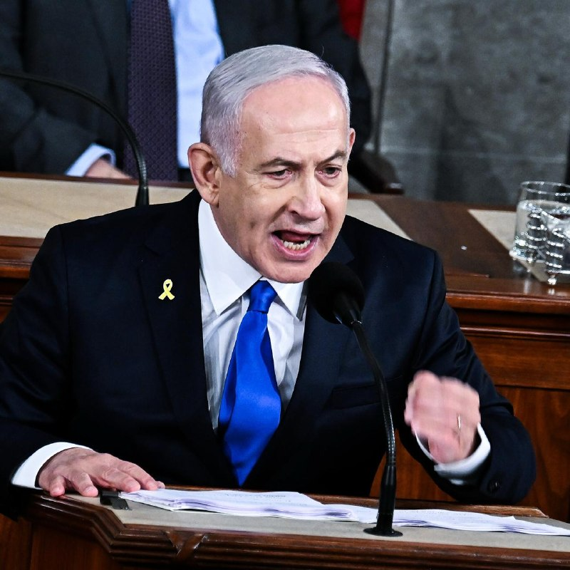

🔴 لحظه امضای تفاهم نامه توافق آمریکا و جمهوری اسلامی توسط ترامپ در کاخ ورسای @IranianMinds

## IranianMinds — post 22874

  <a href="telegram/content/IranianMinds_22874_1781782490.mp4" target="_blank">🎬 Download video</a>

🔴 لحظه امضای تفاهم نامه توافق آمریکا و جمهوری اسلامی توسط ترامپ در کاخ ورسای

@IranianMinds

## Dirty_Kids — post 392484

  <a href="telegram/content/Dirty_Kids_392484_1781782492.mp4" target="_blank">🎬 Download video</a>

این چی بود شبکه پویا پخش کرده؟؟؟
شستشوی مغزی از برنامه کودک شروع کردن:)))))

@Dirty_Kids 👻

## alonews — post 128896

  <a href="telegram/content/alonews_128896_1781782495.webm" target="_blank">🎬 Download video</a>

👈امارات متحده عربی با تصویب قانونی جدید، حداقل سن مجاز برای فعالیت در شبکه‌های اجتماعی را به ۱۵ سال افزایش داد

✅ @AloNews خبر جنگ

## alonews — post 128895

  <a href="telegram/content/alonews_128895_1781782496.webm" target="_blank">🎬 Download video</a>

👈بقایی: بازگشایی تنگه هرمز صراحتاً بر عهده ایران است

✅ @AloNews خبر جنگ

---
📅 بروزرسانی: 1405/03/28 14:54
---

## VahidOOnLine — post 246190

  <a href="telegram/content/VahidOOnLine_246190_1781781850.mp4" target="_blank">🎬 Download video</a>

⭕️ساسان حیدری معروف به «ساسی» در ورزشگاه لس‌آنجلس تماشاگر بازی ایران و نیوزیلند بود

♦️ساسان حیدری با اسم هنری «ساسی»، خواننده سرشناس موسیقی رپ و پاپ ایران، ویدیویی از حضور خود در ورزشگاه سوفای لس‌آنجلس در جریان دیدار تیم ملی ایران و نیوزیلند را منتشر کرد.
ایران پس از تساوی ۲-۲ با نیوزیلند روز ۳۱ خرداد در ورزشگاه اینگلوود لس‌آنجلس به مصاف بلژیک می‌رود.
‌🇸🇦 Indypersian

🤖 @VahidOOnLine

## FoxNewsTwitter — post 343108

  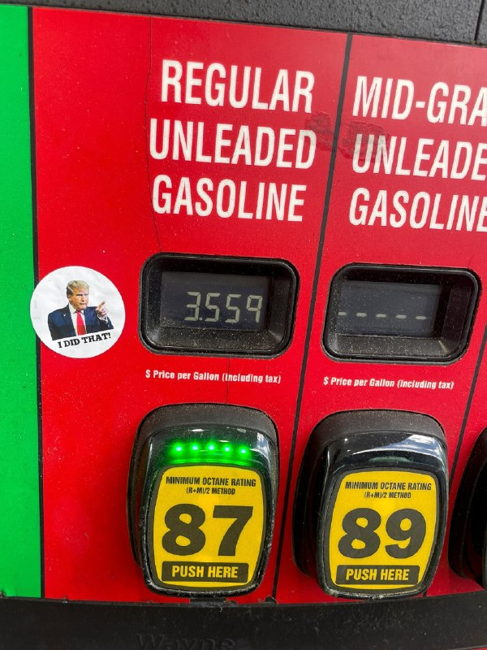

Fox News (Twitter/X)

For the first time in months, the national average gas price has fallen below $4 per gallon after topping $4.51 just a month ago, according to AAA.

Drivers in states like Georgia, Virginia, Kentucky, Missouri, and Minnesota are seeing even lower prices.

At the same time, oil is heading lower as additional supply hits the market. While the trend is welcome news for consumers, prices remain significantly higher than they were this time last year.

The price changes come as President Trump says Americans should expect to see gas and oil get even cheaper thanks to the administration’s new deal with Iran.

## IranIntlTV — post 343016

  <a href="telegram/content/IranIntlTV_343016_1781781852.mp4" target="_blank">🎬 Download video</a>

کارزار مردمی ایران‌اینترنشنال برای کشف حقیقت درباره ابعاد سرکوب اعتراضات دی‌ماه، به اطلاعات تازه‌ای از وقایع نورآباد ممسنی دست یافته است. بر اساس اطلاعات رسیده به این کارزار، شمار زیادی از شهروندانی که در جریان اعتراضات این شهر مجروح شده بودند، همچنان آثار زخم‌ها و جراحت‌های ناشی از آن سرکوب را بر بدن خود دارند.

جزییات بیشتر با فرنوش فرجی، عضو تحریریه ایران‌اینترنشنال
@iranintltv

## DW_Farsi — post 126139

  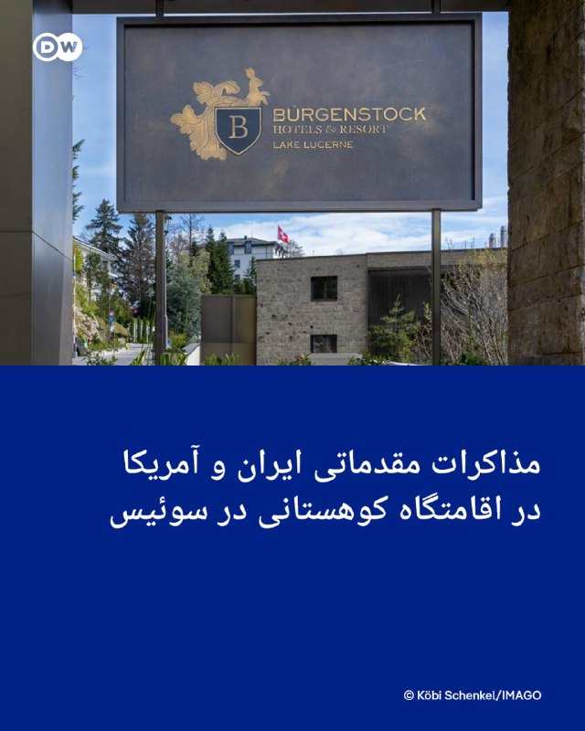

🔶 مذاکرات مقدماتی ایران و آمریکا در اقامتگاه کوهستانی در سوئیس

وزارت امور خارجه سوئیس اعلام کرد که گفت‌و‌گو‌ها میان آمریکا و ایران طبق برنامه روز جمعه ۱۹ ژوئن (۲۹ خرداد) در اقامتگاه کوهستانی بورگن‌اشتوک (Bürgenstock) در سوئیس برگزار خواهد شد. این اقامتگاه لوکس پنج ستاره در نزدیکی دریاچه لوسرن قرار دارد.

بنا بر اعلام این وزارتخانه در حال حاضر، برنامه همچنان این است که آمریکا و ایران به همراه میانجی‌گران، پاکستان و قطر و دیگر کشور‌های درگیر، فردا [جمعه] در بورگن‌اشتوک برای مذاکرات اولیه درباره اجرای توافق دیدار کنند.

این وزارتخانه به در پاسخ به تماس خبرگزاری رویترز گفت که تا کنون جزییات و اطلاعات بیشتری در مورد این دیدار در دسترس نیست.

تفاهم‌نامه ایران و آمریکا که به امضای رؤسای جمهور دو کشور رسیده، فاز اول محسوب می‌شود و با تحقق آن اکنون مرحله دوم شروع است؛ بازه‌ای زمانی بالغ بر ۶۰ روز که طرفین قصد دارند در طی آن به توافقی نهایی دست یابند.

@dw_farsi

## Persian_Trend_Official — post 17460

  <a href="telegram/content/Persian_Trend_Official_17460_1781781854.mp4" target="_blank">🎬 Download video</a>

وزارت امور خارجه چین: چین و ایران شرکای استراتژیک جامعی هستند.

چین برای تحکیم و ارتقای اعتماد متقابل سیاسی، تعمیق همکاری های سودمند متقابل در امور مختلف، و ادامه پیشبرد مشارکت استراتژیک جامع چین و ایران تلاش خواهد کرد.

📝 Amir

📌 @persian_trend_official
پرشین ترند | متفاوت‌ترین کانال نظامی

## IranianMinds — post 22873

  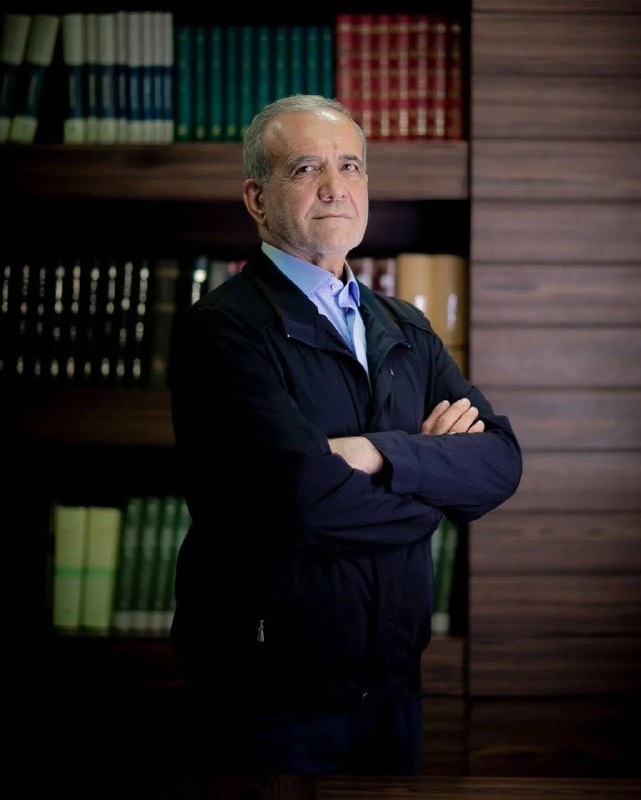

🔴 پزشکیان در مورد توافق :

این یه سند تاریخی و پیامی از ایرانی مقتدره.

@IranianMinds

## IranianMinds — post 22872

  <a href="telegram/content/IranianMinds_22872_1781781857.mp4" target="_blank">🎬 Download video</a>

🔴خامنه ای سال سال 1397 : اگر روزی بخواهیم با آمریکا مذاکره کنیم هم با دولت ترامپ هرگز مذاکره نمیکنیم !

+ در نهایت توسط دولت ترامپ ترور و شد حکومتش هم با همین دولت مذاکره کرد

@IranianMinds

## BBCPersian — post 284253

🖌لوئیس باروچو, سرویس جهانی بی‌بی‌سی:

🔻پس از هفته‌ها مذاکره، آمریکا و ایران به توافقی اولیه رسیده‌اند، اما توجه‌ها از همین الان به چالش‌های بزرگی معطوف شده که بر سر راه پایان جنگ قرار دارد.

در حالی که قرار بود این تفاهم‌نامه روز جمعه به صورت رسمی در سوئیس امضا شود، پیش از موعد مقرر و به صورت غیرحضوری، به امضای دونالد ترامپ، رئیس‌جمهور آمریکا، و مسعود پزشکیان، رئیس‌جمهور ایران، رسید. این تفاهم‌نامه راه را برای دستیابی به «توافق نهایی» ظرف «حداکثر ۶۰ روز، با امکان تمدید در صورت توافق دو طرف» هموار می‌کند.

این توافق شامل تعهد به آغاز روند رفع محاصره دریایی آمریکا، ازسرگیری کشتیرانی از مسیر تنگه هرمز و مذاکره برای لغو «همه انواع تحریم‌ها» علیه ایران است. این سند همچنین ایجاد صندوقی با حداقل ۳۰۰ میلیارد دلار برای بازسازی و توسعه اقتصادی ایران را پیش‌بینی می‌کند و در کنار آن، تهران بار دیگر متعهد شده است که به دنبال توسعه سلاح هسته‌ای نخواهد رفت.

📸GettyImages/ EPA/Shutterstock/ AFP via Getty Images/ Satellite image (c) 2026 Vantor

https://bbc.in/3Q8vsiT
@BBCPersian

## alonews — post 128894

  <a href="telegram/content/alonews_128894_1781781858.webm" target="_blank">🎬 Download video</a>

👈مدنی‌زاده، وزیر اقتصاد مملکت: قرار نیست توافق با آمریکا، اقتصاد ایران رو به شرایط کاملا عادی برگردونه.

🔴حتی اگر جنگ هم نمی‌شد، با چند صد هزار میلیارد تومان کسری بودجه روبه‌رو بودیم؛ الان شرایط سخت‌تر هم شده.

🔴دولت چهاردهم بعد از جنگ ۱۰۰ هزار میلیارد تومان از بانک مرکزی گرفته و آثار تورمی اون در ماه‌های آینده نمایان می‌شه

✅ @AloNews خبر جنگ

## alonews — post 128893

  <a href="telegram/content/alonews_128893_1781781858.webm" target="_blank">🎬 Download video</a>

👈سخنگوی وزارت صمت: ر اعلام قیمت از سوی شرکت ایران‌خودرو، نسبت به آنچه که توسط سازمان حمایت محاسبه شده، اختلافی وجود دارد و ایران‌خودرو رقم بیشتری را اعلام کرده است که آن را هم اصلاح می‌کند و اصلاح‌شده آن را قریب‌الوقوع و امروز به بورس اعلام خواهد کرد.

🔴دیروز چهارشنبه شرکت ایران‌خودرو بین ۳۰ تا ۵۰ درصد قیمت محصولاتش را گران کرد. این خودروساز از پارسال تاکنون ۴ بار قیمت محصولاتش را افزایش داده است.

✅ @AloNews خبر جنگ

---
📅 بروزرسانی: 1405/03/28 14:44
---

## VahidOOnLine — post 246189

  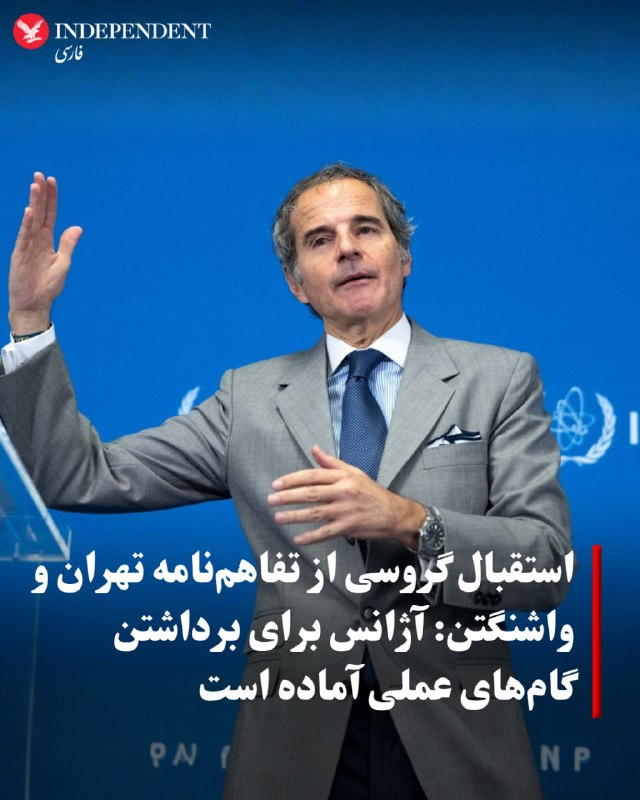

♦️رافائل گروسی، دبیرکل آژانس بین‌المللی انرژی اتمی صبح پنجشبه ۲۸ خردادماه با استقبال از امضای تفاهم‌نامه پایان جنگ میان جمهوری اسلامی ایران و ایالات متحده آمریکا گفت که زمان اقدامات عملی فرار سیده است.

به گزارش رویترز گروسی به خبرنگاران گفت «کار فنی آغاز شده است و اکنون باید با همکاران ایرانی و آمریکایی بنشینیم و مراحل انجام کارهای مشخص را عملی کنیم.»
‌🇸🇦 Indypersian

🤖 @VahidOOnLine

## WithYashar — post 15239

## WithYashar — post 15238

راستی از لحظه ای که ادمین بیارم به شما اطلاع میدم ولی دایرکت و لیست کاربر ها رو هیچ وقت به هیچ کسی دسترسیش رو نمیدم و پیامهای شما تا ابد فقط دست شخص خودم امن خواهد ماند.

## WithYashar — post 15237

دنبال شخصی هستم که برام ویکیپدیا بیاره بالا خیلی کم لطفیه بعد از حدود ۲۵ سال فعالیت در حوزه تک و کارهای انقلابی بسیار بزرگ، صفحه ویکیپدیا نداشته باشم و افرادی که خودم به مارکت آوردم و معروف کردم داشته باشند. امیدوارم یک فرد فوق‌العاده قوی در این زمینه کمک کنه و واسم بسازه.

## mwarmonitor — post 11110

  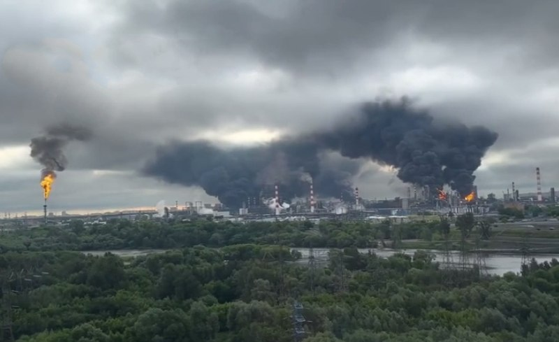

🔴ویدئویی از برخورد یک پهپاد تهاجمی اوکراینی به پالایشگاه نفت مسکو که از پیش در آتش می‌سوخت، در صبح امروز منتشر شده است. @mwarmonitor

## DEJradio — post 5787

  <a href="telegram/content/DEJradio_5787_1781781269.mp4" target="_blank">🎬 Download video</a>

🚨🎥 شناسایی فرمانده انتظامی فاریاب، عامل سرکوب زنان بی‌دفاع

منابع محلی فرمانده انتظامی و رئیس پاسگاه سرگریچ فاریاب را که زنان معترض بی‌دفاع را در روستای پشموکی مورد ضرب و شتم قرار داده بودند، شناسایی کردند.

در ویدیویی که از برخورد فیزیکی ماموران از جمله فرمانده انتظامی فاریاب منتشر شد او با سیلی در گوش زنان می‌زند.
بر اساس اعلام منابع شبکه اسناد، در سرکوب زنان بلوچ «امین امیرمحمدی» فرمانده انتظامی شهرستان فاریاب و «محمد حاجبی» رئیس پاسگاه سرگریچ فاریاب حضور داشتند.

به گفته منابع شبکه اسناد، اعتراضات در روزهای اخیر شدت گرفته است. ساکنان فاریاب می‌گویند بودجه‌ای که قرار بود صرف عمران و آبادانی منطقه شود، به نتیجه نرسیده و در عوض، تخریب محیط زیست، تصرف زمین‌ها، نابودی اراضی کشاورزی و خشک‌شدن چشمه‌های آب را در پی داشته است. اهالی روستا نسبت به این اقدام بارها اعتراض کردند اما مسئولین مربوطه حاضر به پاسخگویی نبودند.

به گفته منابع، نیروهای نظامی در جریان سرکوب زنان و دختران، به سمت مردان روستا تیراندازی کردند و اجازه نزدیک شدن به آنها را ندادند. همچنین حدود سه ماه پیش نیز دست‌کم ۳۰ تن از مردان این روستا توسط نیروهای نظامی بازداشت شده بودند که با تودیع قرار وثیقه آزاد شدند.

#کرمان #سرکوب #فاریاب
@DEJradio

## FarsiVOA — post 221100

  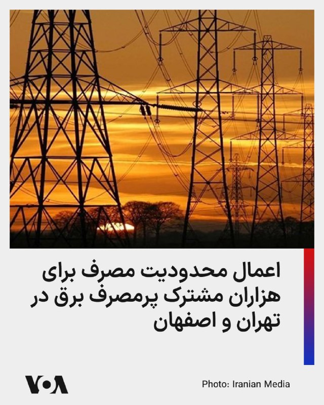

کامبیز ناظریان مدیرعامل شرکت توزیع نیروی برق تهران بزرگ، اعلام کرد از ابتدای خرداد سال جاری برای بیش از سه هزار مشترک خانگی و تجاری بسیار پرمصرف در پایتخت محدودیت مصرف برق اعمال شده است.

همزمان در استان اصفهان، محمد مرادی مدیرعامل شرکت توزیع نیروی برق استان اصفهان نیز از اعمال محدودیت برای بیش از هزار و ۷۰۰ مشترک خانگی بسیار پرمصرف خبر داده است.

به گفته مسئولان، این اقدامات با استفاده از سامانه‌های هوشمند مدیریت و پایش مصرف انجام شده و هدف آن کنترل بار شبکه و جلوگیری از فشار در ساعات اوج مصرف عنوان شده است.

براساس اعلام این شرکت‌ها، مشترکان پرمصرف به ‌صورت مستمر تحت پایش قرار دارند و در صورت ادامه مصرف خارج از الگوی تعیین‌ شده، با محدودیت‌های بیشتری مواجه خواهند شد.

پیشتر مرکز پژوهش‌های مجلس در گزارشی درباره وضعیت برق در تابستان ۱۴۰۵ از تداوم ناترازی میان تولید و مصرف برق خبر داده بود و میزان این ناترازی را در اوج مصرف حدود ۱۳ هزار مگاوات برآورد کرده است.

همچنین در این گزارش نسبت به احتمال فشار بر شبکه و خاموشی‌های احتمالی، به‌ویژه در ساعات شب، هشدار داده شده بود.
@FarsiVOA

## FarsiVOA — post 221099

  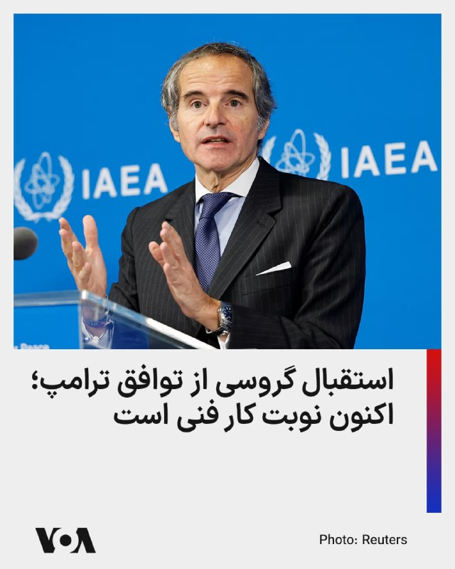

رافائل گروسی، مدیرکل آژانس بین‌المللی انرژی اتمی از امضای توافق میان جمهوری اسلامی و آمریکا استقبال کرد.

او روز پنج‌شنبه به خبرنگاران گفت «وجود این تفاهم‌نامه خوب است، اما از اینجا به بعد کار فنی آغاز می‌شود. ما معتقدیم به رسمیت شناخته شدن نقش ضروری آژانس بین‌المللی انرژی اتمی، نقطه آغاز مناسبی است».

گروسی در ادامه گفت اکنون باید با همکاران آمریکایی و ایرانی خود پشت میز بنشینیم و گام‌های عملی و مشخصی را که باید برداشته شود، تدوین کنیم.

⬇️ بیشتر بخوانید:
https://ir.voanews.com/a/un-nuclear-watchdog-chief-welcomes-iran-us-peace-deal/8162231.html

## DW_Farsi — post 126138

  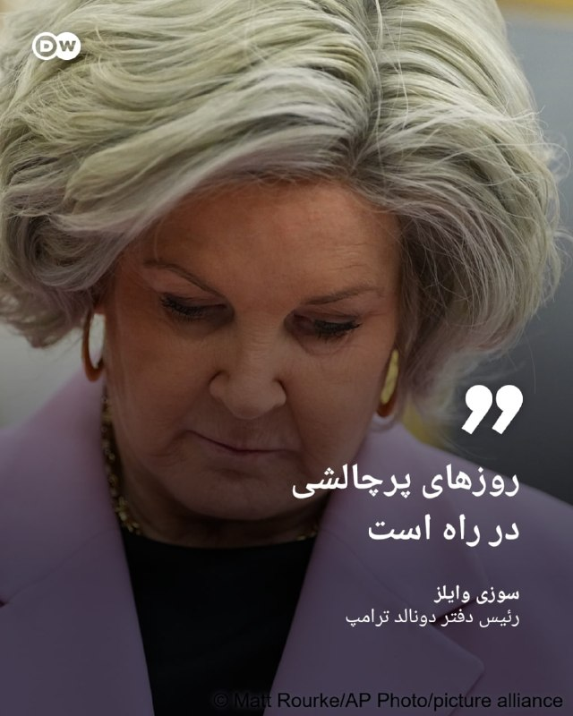

🔶 رئیس دفتر ترامپ: روزهای پرچالشی در راه است

سوزی وایلز، رئیس دفتر دونالد ترامپ با انتشار پستی در شبکه ایکس (توئیتر سابق) امضای تفاهم‌نامه ایالات متحده و جمهوری اسلامی را "گامی مهم برای آمریکا و جهان دانست" و در عین حال تصریح کرد: «۶۰ روز آینده با چالش همراه خواهد بود.»

یکی از مفاد این یاداشت تفاهم به ادامه مذاکرات طرفین اختصاص دارد. طبق آن، تهران و واشنگتن متعهد شده‌اند، ظرف حداکثر ۶۰ روز که با رضایت متقابل قابل تمدید است، به مذاکره ادامه دهند و به یک توافق نهایی دست یابند.

اشاره رئیس دفتر رئیس جمهور آمریکا به "روزهای پرچالش" دور از انتظار نیست، زیرا برنامه هسته‌ای و موشکی ایران و همچنین پشتیبانی جمهوری اسلامی از گروه‌های نیابتی چون حزب‌الله همچنان از مسائل مورد اختلاف میان طرفین است.

وایلز در پست خود در شبکه ایکس همچنین تصاویری ضمیمه کرده و از جمله نوشت، سفر دونالد ترامپ به فرانسه [برای حضور در نشست گروه ۷] "با دستاوردهای مختلفی همراه بود". این سفر با ضیافت شام و جشن تولد ترامپ در کاخ ورسای به پایان رسید و رئیس جمهور آمریکا نسخه‌ای از تفاهم‌نامه با ایران را امضا کرد.

تفاهم‌نامه امضاءشده میان تهران و واشنگتن با انتقادات زیادی در آمریکا روبرو شده است. جوئل رابین، یکی از مقامات ارشد اسبق وزارت خارجه آمریکا و عضو حزب دموکرات، این یادداشت تفاهم را "یک فضاحت استراتژیک با ابعادی حماسی" دانست.

او تصریح کرد، این تفاهم‌نامه به معنای پایان‌دادن به سیاست پنج دهه‌ای آمریکا در قبال جمهوری است که هر دو حزب جمهوری‌خواه و دموکرات آن را پیش برده‌اند.

رابین که در وزارت خارجه آمریکا در دوران ریاست جمهوری باراک اوباما فعالیت داشت، نسبت به "دراختیار گذاشتن صدها میلیارد دلار پول به ایران بدون هیچ گونه محدودیتی" هشدار داد.

طبق یاداشت تفاهم، ایالات متحده متعهد شده است همراه با شرکای منطقه‌ای خود، یک طرح جامع مورد توافق دو طرف برای بازسازی و توسعه اقتصادی جمهوری اسلامی ایران تدوین کند و تأمین مالی حداقل ۳۰۰ میلیارد دلار را تضمین نماید. سازوکار اجرایی این طرح، به‌عنوان بخشی از توافق نهایی، ظرف ۶۰ روز تدوین خواهد شد.

@dw_farsi

## RadioFarda — post 158456

🔸عملکرد موفق تیم‌هایی مانند مراکش و کشور جزیره‌ای کیپ ورد در غرب آفریقا در جام جهانی ۲۰۲۶ بار دیگر توجه‌ها را به پدیده‌ای جلب کرده که در سال‌های اخیر چهرهٔ فوتبال جهان را تغییر داده است؛ استفاده از بازیکنانی که در کشوری دیگر متولد شده‌اند اما برای سرزمین اجدادی یا کشور دوم خود به میدان می‌روند.

🔸مراکش در دیدار نخست خود برابر برزیل به تساوی رسید و کیپ ورد نیز اسپانیا را متوقف کرد؛ موفقیتی که بخشی از آن به حضور بازیکنان متولد و پرورش‌یافته در کشورهای اروپایی بازمی‌گردد.

🔸در جام جهانی ۲۰۲۶ نزدیک به یک‌چهارم بازیکنان حاضر در مسابقات برای کشوری بازی می‌کنند که در آن متولد نشده‌اند.

🔸در این روزها که جام جهانی در جریان است بسیاری از علاقه‌مندان به فوتبال دوست دارند بدانند که آیا بازیکنان فوتبال می‌توانند برای تیم ملی کشوری دیگر بازی کنند و سازوکار پیوستن به تیم یک کشور دیگر چگونه خواهد بود؟

🔸گزارش کامل را در وب‌سایت رادیو فردا می‌توانید بخوانید.

@RadioFarda

## IranianMinds — post 22871

  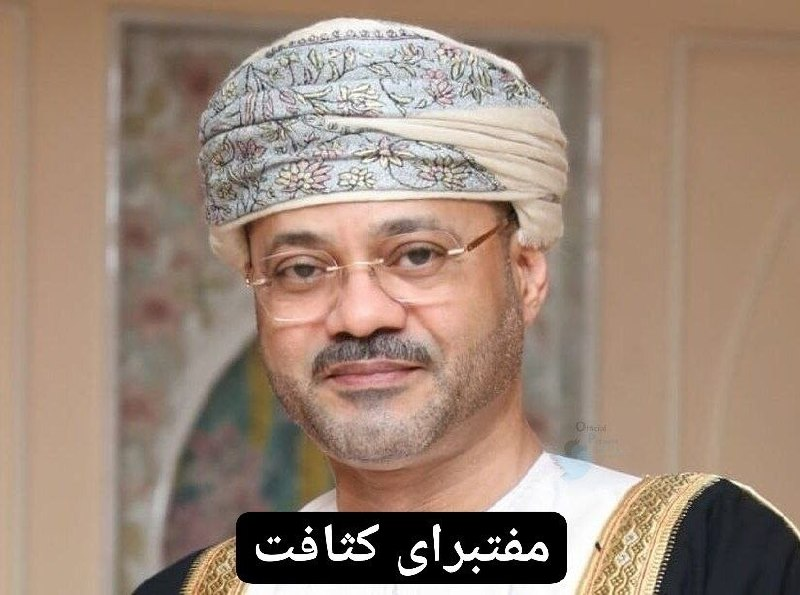

فقط این بدبخت که این همه خودشو گایید آخرشم زدن به نام پاکستان :))

@IranianMinds

## IranianMinds — post 22870

  <a href="telegram/content/IranianMinds_22870_1781781274.mp4" target="_blank">🎬 Download video</a>

🔴 ویدیویی پشم ریزون از حملات امروز اوکراین به مسکو رو ببینید.

@IranianMinds

## Dirty_Kids — post 392483

  <a href="telegram/content/Dirty_Kids_392483_1781781276.mp4" target="_blank">🎬 Download video</a>

گفت، آنچه که باید می‌گفت …

@Dirty_Kids 👻

## Dirty_Kids — post 392482

قالیباف، ۲۰ بهمن ۱۴۰۳:
آقا فرمودند ما با آمریکا مذاکره نمی‌کنیم. این روشن است. تمام. این‌که حضرت آقا می‌فرمایند مذاکره با آمریکا شرافتمندانه نیست. مگه آدم با قاتل قاسم سلیمانی مذاکره میکنه؟

قالیباف، ۲۷ خرداد ۱۴۰۵:
مرحوم حرفش بتخم ماست، فعلا میریم مذاکره میکنیم و هر وقت قدس رو گرفتیم انتقامش تکمیل میشه.

@Dirty_Kids 👻

## alonews — post 128892

  <a href="telegram/content/alonews_128892_1781781278.mp4" target="_blank">🎬 Download video</a>

👈وزارت امور خارجه چین درباره روسیه و اوکراین: ما حتی یک قطعه سلاح کشنده به هیچ یک از طرف‌های درگیر ارائه نکرده‌ایم و کنترل سختگیرانه‌ای بر کالاهای دو منظوره اعمال کرده‌ایم.

🔴زمان آن رسیده است که ناتو برداشت نادرست خود از چین را اصلاح کند

✅ @AloNews خبر جنگ

---
📅 بروزرسانی: 1405/03/28 14:34
---

## VahidOOnLine — post 246188

🗣روایت شما از توافق میان جمهوری‌اسلامی و آمریکا - پنجشنبه ۲۸ خرداد

🔹اگر قرار بود توافق بشه، این همه خسارت برای چی به ایران وارد شد؟ آیا ترامپ خبر داره با این بمباران‌ها، گرانی کمر مردم رو شکسته، اجاره‌خانه سرسام‌آور شده؟

🔹خواستم بگم اگه توافق امضا بشه، ولی در شرایط زندگی ما مردم تغییری ایجاد نشه چه فایده‌ای داره؟ دوباره برمی‌گردیم سر خونه اول، شاید هم بدتر.

🔹از روز اول می‌دانستم ترامپ به مردم ایران خیانت می‌کند. آقای ترامپ، تو بدترین رئیس‌جمهور آمریکا هستی و این کار تو در تاریخ و حافظه مردم ایران ثبت خواهد شد.

🔹تنها راه نجات مردم ایران تغییر رژیم است و بس. ده تا توافق هم بشه، ذات پلید جمهوری اسلامی را نمی‌شود عوض کرد. تا جمهوری اسلامی هست، مردم روی خوشی نخواهند دید.

🔹قالیباف و پاسدارانش از سال‌ها قبل این کودتای نرم را برنامه‌ریزی کرده بودند. کشتن خامنه‌ای و سران دیگر هم به ظاهر برای مردم و در اصل برنامه این طیف بود.

🔹واقعا این توافق بین جمهوری اسلامی و آمریکا برای تمام مردم ایران شوکه‌کننده و کلافه‌کننده است. مردم تمام سختی‌ها را به امید حمایت‌های بین‌المللی تحمل کردند. ما در آخر، خون جاویدنامان‌مان پایمال شد.

🔹هر روز داره تعداد اعدامی‌ها بیشتر می‌شه. هر روز قیمت کالا تغییر می‌کنه. اگر جمهوری اسلامی ایران را گلستان هم کند، ما نمی‌خواهیم. اون موقع که حیدرحیدرکنان شلیک می‌کردید به جون‌هامون، باید به فکر این‌جاش بودید.

🔹با توافق یا بدون توافق، میان ما و شما دریایی از خون است. خودتون هم می‌دونید که رفتنی هستید.

🔹ما از گنده‌گوی منطقه که برای همه شاخ‌وشونه کشید و آخرش به چال کردن هم نرسید، رد شدیم. قالیباف و اصلاح‌طلبان که عددی نیستن. ما از روی همه‌تون رد می‌شیم. قسم به خون یاران، ایستاده‌ایم تا پایان.
‌🏁 🇬🇧 IranintlTV

🤖 @VahidOOnLine

## VahidOOnLine — post 246187

  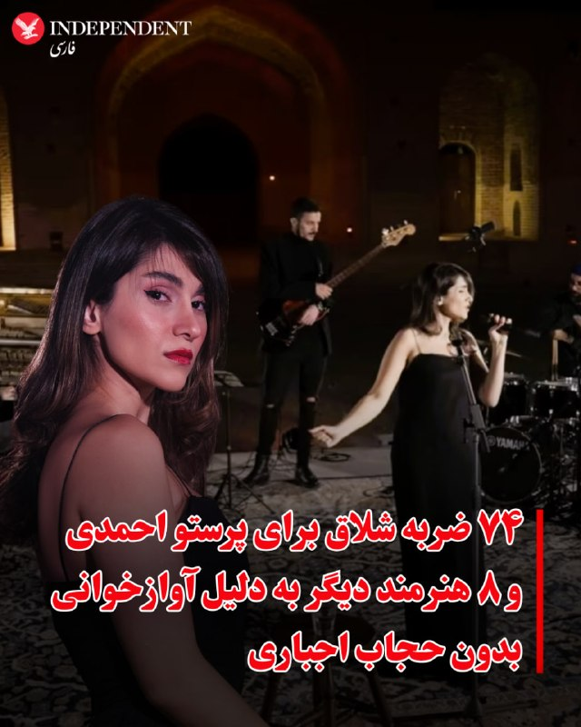

⭕️۷۴ ضربه شلاق برای پرستو احمدی و ۸ هنرمند دیگر به دلیل آوازخوانی بدون حجاب اجباری

♦️بر اساس اطلاعات رسیده به ایندیپندنت فارسی، پرستو احمدی، خواننده معترض ساکن ایران، به همراه ۸ نفر از نوازندگان و عوامل اجرایی پروژه «کنسرت کاروانسرا» از سوی دادگاه کیفری استان قم به ۷۴ ضربه شلاق، دو سال ممنوع‌الخروجی و دو سال محرومیت از فعالیت هنری محکوم شده‌اند.

این احکام در پی رسیدگی به پرونده‌ای صادر شده است که پس از انتشار ویدیوی «کنسرت کاروانسرا» در آذر ۱۴۰۳ علیه دست‌اندرکاران این برنامه تشکیل شد. شعبه رسیدگی‌کننده دفاعیات متهمان را نپذیرفته و آنان را به اتهام «جریحه‌دار کردن عفت عمومی» از طریق تولید و انتشار محتوای به‌اصطلاح «خلاف اخلاق» در فضای مجازی مجرم شناخته است.

ویدیوی این اجرای موسیقی که در کاروانسرای تاریخی دیرگچین ضبط و در یوتیوب منتشر شد، با حضور پرستو احمدی به‌عنوان خواننده گروه و بدون رعات حجاب اجباری، با استقبال گسترده ایرانیان روبه‌رو شده بود. پس از انتشار این برنامه، پرستو احمدی و همکارانش بازداشت شدند و محل برگزاری کنسرت نیز پلمب شد.

پرستو احمدی پیش‌تر در توضیح این اجرا نوشته بود: «من، پرستو، دختری که می‌خواهم برای مردمی که دوستشان دارم بخوانم. این حقی است که نمی‌توانستم از آن چشم بپوشم.»
‌🇸🇦 Indypersian

🤖 @VahidOOnLine

## VahidOOnLine — post 246186

  <a href="telegram/content/VahidOOnLine_246186_1781780689.mp4" target="_blank">🎬 Download video</a>

‌
دونالد ترامپ در ادامه سخنانش در نشست جی۷ بار دیگر گفت بخش‌های اصلی رهبری جمهوری اسلامی از میان رفته‌اند و گروه تازه‌ای از رهبران روی کار آمده که به گفته او «کمتر رادیکال» هستند.

او گفت: «صادقانه بگویم، فکر می‌کنم این تغییر رژیم است.» ترامپ همچنین تأکید کرد ادامه جنگ می‌توانست به یک فاجعه اقتصادی منجر شود؛ فاجعه‌ای که به گفته او با توقف درگیری از آن جلوگیری شده است.
‌🏁 🇬🇧 ManotoTV

🤖 @VahidOOnLine

## VahidOOnLine — post 246185

  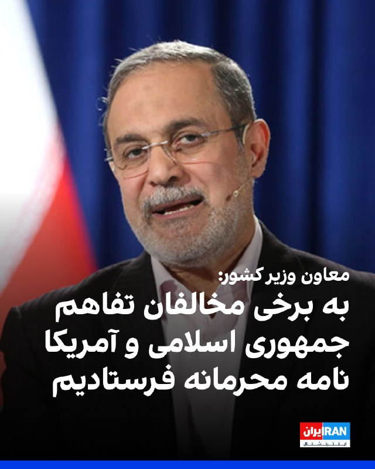

محمد بطحایی، معاون وزیر کشور جمهوری اسلامی، گفت به افرادی که در تجمعات شبانه با موضع‌گیری‌ها و اظهارنظرهای خود، به گفته او، موجب «دوقطبی‌سازی» می‌شدند، تذکر محرمانه داده شد.
او در جمع خبرنگاران افزود این تذکرها در سه مورد صادر شد؛ یک مورد مربوط به یک تشکل و دو مورد مربوط به افراد بود. به گفته بطحایی، برای این افراد نامه‌های محرمانه و «همراه با احترام و تکریم» ارسال شده است.
معاون وزیر کشور جمهوری اسلامی گفت در این نامه‌ها تاکید شد که چنین موضع‌گیری‌هایی می‌تواند انسجام ملی مورد تاکید مجتبی خامنه‌ای و دیگر مقام‌های جمهوری اسلامی را در معرض خطر قرار دهد.
‌🏁 🇬🇧 IranintlTV

🤖 @VahidOOnLine

## WithYashar — post 15236

## WithYashar — post 15235

فقط ‌یک پیغام

## WithYashar — post 15234

  <a href="telegram/content/WithYashar_15234_1781780691.mp4" target="_blank">🎬 Download video</a>

اگه سر حال هستین بریم برای مرحله بعدی کارا و گسترده تر کنیم 👍یه ریکشن لایک بدین پر ریزون باشه تا بگم

## mwarmonitor — post 11109

  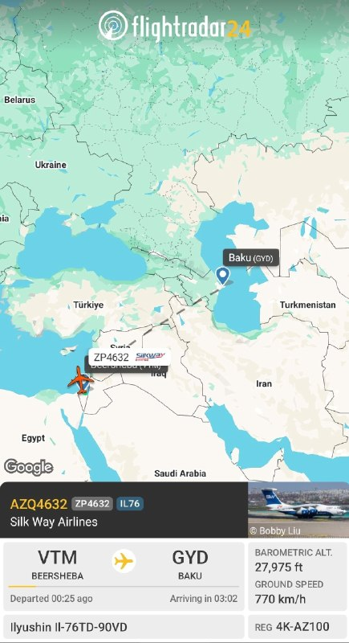

🔴آذربایجان به همکاری نظامی خود با اسرائیل ادامه می‌دهد:

✈️ هواپیمای Il-76TD (4K-AZ100) از باکو در پایگاه هوایی نواتیم فرود آمد و اکنون در حال ترک آن است.

@mwarmonitor

## DEJradio — post 5786

  <a href="telegram/content/DEJradio_5786_1781780693.webm" target="_blank">🎬 Download video</a>

🚨📢 آلمان، فرانسه و ایتالیا آماده اعزام کشتی‌های مین‌روب به تنگه هرمز می‌شوند

روزنامه «نیویورک‌تایمز» گزارش داد، کشورهای اروپایی آماده‌اند کشتی‌های خود را برای حفاظت از کشتیرانی به تنگه هرمز اعزام کنند؛ اما تنها زمانی که مطمئن شوند آتش‌بس جدید میان ایالات متحده و جمهوری اسلامی ایران به‌ درستی اجرا می‌شود.

بر اساس این گزارش مین‌روب‌های ایتالیایی در سواحل جیبوتی در شرق آفریقا مستقر هستند. یک مین‌روب آلمانی و یک کشتی پشتیبانی لجستیک نیز در شرق مدیترانه حضور دارند. ناو هواپیمابر هسته‌ای فرانسه تنها دو تا سه روز دریانوردی با تنگه هرمز فاصله دارد. بریتانیا نیز ناوشکن «دراگون» را به منطقه اعزام کرده تا پس از از سر گرفته شدن تردد کشتی‌ها، در تأمین امنیت تنگه مشارکت کند.

امانوئل ماکرون رئیس‌جمهور فرانسه پیشتر اعلام کرده بود که فرانسه و بریتانیا «آماده‌اند بسیار سریع وارد عمل شوند». او گفت این دو کشور و متحدانشان «هر کاری لازم باشد» انجام خواهند داد تا حمل‌ و نقل عادی نفت و سایر کالاها در جهان بدون نگرانی از حملات یا پرداخت عوارض عبور از سر گرفته شود.

وزیر دفاع آلمان نیز گفت برای مشارکت در عملیات مین‌روبی در تنگه هرمز به مجوز پارلمان نیاز داریم. او افزود دو کشتی آلمانی در راه دریای سرخ هستند و ماموریت احتمالی آن‌ها در تنگه هرمز خواهد بود.

#تنگه_هرمز #آتشبس #جنگ

## DEJradio — post 5785

  <a href="telegram/content/DEJradio_5785_1781780693.webm" target="_blank">🎬 Download video</a>

🤡
🔺 استقبال مریم رجوی از تفاهم ترامپ با جمهوری اسلامی

مریم رجوی رهبر سازمان «مجاهدین خلق» همسو با رهبران اسلامگرای دولت‌های منطقه از تفاهم دونالد ترامپ با رزیم ملاها استقبال کرده است.

او مدعی شده «صلح» تهدیدی بزرگتر از رویارویی نظامی برای بقای رژیم ایران است. او مدعی شد جنگ، سپر رژیم در برابر قیام‌های مردمی است.

#مریم_رجوی #صدام #توافق
@DEJradio

## IranIntlTV — post 343015

🗣روایت شما از توافق میان جمهوری‌اسلامی و آمریکا - پنجشنبه ۲۸ خرداد

🔹اگر قرار بود توافق بشه، این همه خسارت برای چی به ایران وارد شد؟ آیا ترامپ خبر داره با این بمباران‌ها، گرانی کمر مردم رو شکسته، اجاره‌خانه سرسام‌آور شده؟

🔹خواستم بگم اگه توافق امضا بشه، ولی در شرایط زندگی ما مردم تغییری ایجاد نشه چه فایده‌ای داره؟ دوباره برمی‌گردیم سر خونه اول، شاید هم بدتر.

🔹از روز اول می‌دانستم ترامپ به مردم ایران خیانت می‌کند. آقای ترامپ، تو بدترین رئیس‌جمهور آمریکا هستی و این کار تو در تاریخ و حافظه مردم ایران ثبت خواهد شد.

🔹تنها راه نجات مردم ایران تغییر رژیم است و بس. ده تا توافق هم بشه، ذات پلید جمهوری اسلامی را نمی‌شود عوض کرد. تا جمهوری اسلامی هست، مردم روی خوشی نخواهند دید.

🔹قالیباف و پاسدارانش از سال‌ها قبل این کودتای نرم را برنامه‌ریزی کرده بودند. کشتن خامنه‌ای و سران دیگر هم به ظاهر برای مردم و در اصل برنامه این طیف بود.

🔹واقعا این توافق بین جمهوری اسلامی و آمریکا برای تمام مردم ایران شوکه‌کننده و کلافه‌کننده است. مردم تمام سختی‌ها را به امید حمایت‌های بین‌المللی تحمل کردند. ما در آخر، خون جاویدنامان‌مان پایمال شد.

🔹هر روز داره تعداد اعدامی‌ها بیشتر می‌شه. هر روز قیمت کالا تغییر می‌کنه. اگر جمهوری اسلامی ایران را گلستان هم کند، ما نمی‌خواهیم. اون موقع که حیدرحیدرکنان شلیک می‌کردید به جون‌هامون، باید به فکر این‌جاش بودید.

🔹با توافق یا بدون توافق، میان ما و شما دریایی از خون است. خودتون هم می‌دونید که رفتنی هستید.

🔹ما از گنده‌گوی منطقه که برای همه شاخ‌وشونه کشید و آخرش به چال کردن هم نرسید، رد شدیم. قالیباف و اصلاح‌طلبان که عددی نیستن. ما از روی همه‌تون رد می‌شیم. قسم به خون یاران، ایستاده‌ایم تا پایان.

## IranIntlTV — post 343014

  <a href="telegram/content/IranIntlTV_343014_1781780694.mp4" target="_blank">🎬 Download video</a>

یک شهروند با ارسال پیامی صوتی به ایران اینترنشنال ضمن انتقاد از توافق میان آمریکا و جمهوری اسلامی گفت که دونالد ترامپ، رییس‌جمهور آمریکا، «مرگ دموکراسی»را امضا کرد.

## IranIntlTV — post 343013

  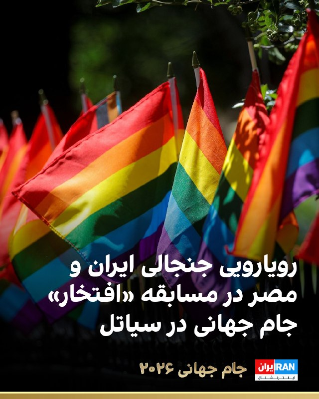

🔻خبرگزاری آسوشیتدپرس در گزارشی به چالش‌ها و تنش‌های پیش‌رو بازی تیم‌ ملی ایران و مصر پرداخته، بازی که با جشن‌ جامعه رنگین‌کمانی در جام جهانی ۲۰۲۶ در سیاتل همزمان شده است.

🔹مصر و ایران از سرکوبگرترین نقاط جهان برای همجنس‌گرایان هستند. با این حال، بر حسب یک اتفاق، این دو تیم قرار است در جریان مسابقات جام جهانی، در یک بازی ویژه موسوم به «مسابقه افتخار» در سیاتل به مصاف هم بروند؛ رویدادی که با جشن‌های سالانه جامعه +LGBTQ در این شهر هم‌زمان شده است.

🔹این تقارن از هم‌اکنون شرایط را به‌شدت پر‌تنش کرده و هر دو کشور خواستار لغو این برنامه‌ها شده‌اند. ایران، جایی که روابط همجنس‌خواهانه غیرقانونی است و مردان همجنس‌گرا با اتهام لواط اعدام می‌شوند پیش از این به‌دلیل جنگ در خاورمیانه، به‌طور جداگانه خواستار انتقال بازی‌های خود به خارج از خاک آمریکا شده بود؛ درخواستی که از سوی فیفا رد شد.

🔹مصر نیز همجنس‌گرایان را بر اساس قوانین مبهم «منافی عفت» بازداشت و محاکمه می‌کند و هرگونه ابراز علنی این نمادها، به‌ویژه برافراشتن پرچم‌های رنگین‌کمان را سرکوب می‌کند.

🔹جزئیات بیشتر را اینجا بخوانید.

@iranintltvsport

## IranIntlTV — post 343012

  

محمد بطحایی، معاون وزیر کشور جمهوری اسلامی، گفت به افرادی که در تجمعات شبانه با موضع‌گیری‌ها و اظهارنظرهای خود، به گفته او، موجب «دوقطبی‌سازی» می‌شدند، تذکر محرمانه داده شد.
او در جمع خبرنگاران افزود این تذکرها در سه مورد صادر شد؛ یک مورد مربوط به یک تشکل و دو مورد مربوط به افراد بود. به گفته بطحایی، برای این افراد نامه‌های محرمانه و «همراه با احترام و تکریم» ارسال شده است.
معاون وزیر کشور جمهوری اسلامی گفت در این نامه‌ها تاکید شد که چنین موضع‌گیری‌هایی می‌تواند انسجام ملی مورد تاکید مجتبی خامنه‌ای و دیگر مقام‌های جمهوری اسلامی را در معرض خطر قرار دهد.
https://iranintl.com/202606183694

## ManotoTV — post 106147

  <a href="telegram/content/ManotoTV_106147_1781780698.mp4" target="_blank">🎬 Download video</a>

‌
دونالد ترامپ در ادامه سخنانش در نشست جی۷ بار دیگر گفت بخش‌های اصلی رهبری جمهوری اسلامی از میان رفته‌اند و گروه تازه‌ای از رهبران روی کار آمده که به گفته او «کمتر رادیکال» هستند.

او گفت: «صادقانه بگویم، فکر می‌کنم این تغییر رژیم است.» ترامپ همچنین تأکید کرد ادامه جنگ می‌توانست به یک فاجعه اقتصادی منجر شود؛ فاجعه‌ای که به گفته او با توقف درگیری از آن جلوگیری شده است.

## FarsiVOA — post 221098

🔺هگست: اگر جمهوری اسلامی به تعهداتش پایبند نباشد، اقدام نظامی ‌دوباره آغاز می‌شود

▪️وزیر جنگ آمریکا اعلام کرد که اگر جمهوری اسلامی به تعهداتش، آمریکا آماده است دوباره اقدام نظامی را آغاز کند و محاصره دریایی را نیز دوباره اعمال کند.

▪️هگست روز سه‌شنبه پس از دیدار با وزیران دفاع ناتو در بروکسل به خبرنگاران گفت: «رئیس‌جمهور اشاره کرده است که ما آماده خواهیم بود در صورتی که در چارچوب زمانی این مذاکرات، ایران آنچه را که می‌گوید انجام ندهد، عملیات را از سر بگیریم.»

▪️پیشتر دونالد ترامپ با تأکید بر این که جمهوری اسلامی هرگز به به سلاح هسته‌ای دست پیدا نخواهد کرد افزود که این فقط یک تفاهم‌نامه است و اگر به نتیجه نرسید برخلاف میلمان مجبور به بمباران مجدد حکومت ایران خواهیم شد.

⬇️ بیشتر بخوانید:
https://ir.voanews.com/a/8162225.html

## FarsiVOA — post 221097

  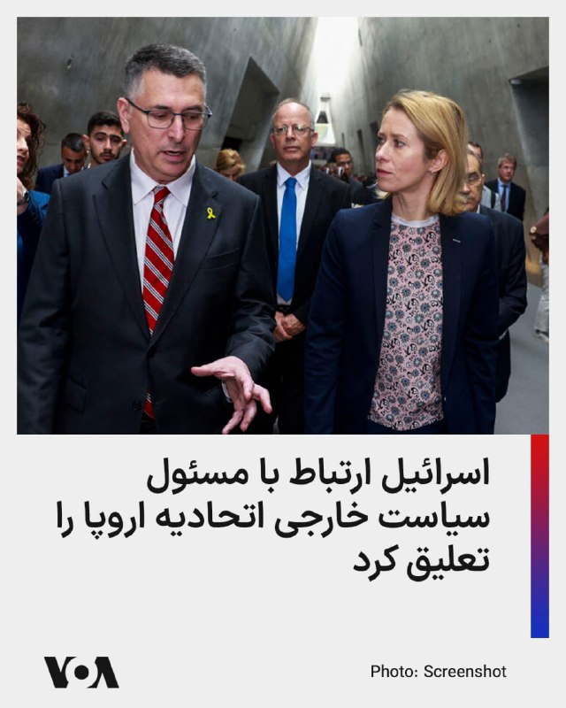

در پی انتشار گزارش‌هایی درباره اظهارات مسئول سیاست خارجی اتحادیه اروپا، درباره مقایسه اسرائیل با رژیم آپارتاید آفریقای جنوبی، وزیر خارجه اسرائیل اعلام کرد تمامی تماس‌های رسمی با کایا کالاس را تعلیق می‌کند.

گیدئون سعار، در شبکه اجتماعی ایکس اعلام کرد که به دلیل آنچه «اظهارات غیرمنصفانه و غیرقابل قبول علیه اسرائیل» در جریان سفر کالاس به مکزیک، تصمیم گرفته است تمامی ارتباطات دیپلماتیک با او را قطع کند.

او گفت که این توقف تا زمانی خواهد بود که کالاس «از این اتهام خونینی که به تنها دولت یهودی جهان، که همچنین تنها دموکراسی در خاورمیانه است، عقب‌نشینی کند.»

این موضع پس از آن مطرح شد که گزارش‌هایی در رسانه‌ها منتشر شد مبنی بر اینکه کالاس در جریان سفر خود به مکزیک، اسرائیل را با رژیم آپارتاید در آفریقای جنوبی مقایسه کرده است؛ ادعایی که واکنش تند مقامات اسرائیلی و برخی چهره‌های اروپایی را در پی داشته است.

همچنین این تصمیم در حالی اتخاذ شده که تنش‌ها میان اسرائیل و اتحادیه اروپا در ماه‌های اخیر بر سر جنگ غزه و تحولات کرانه باختری افزایش یافته است.
@FarsiVOA

## DW_Farsi — post 126137

  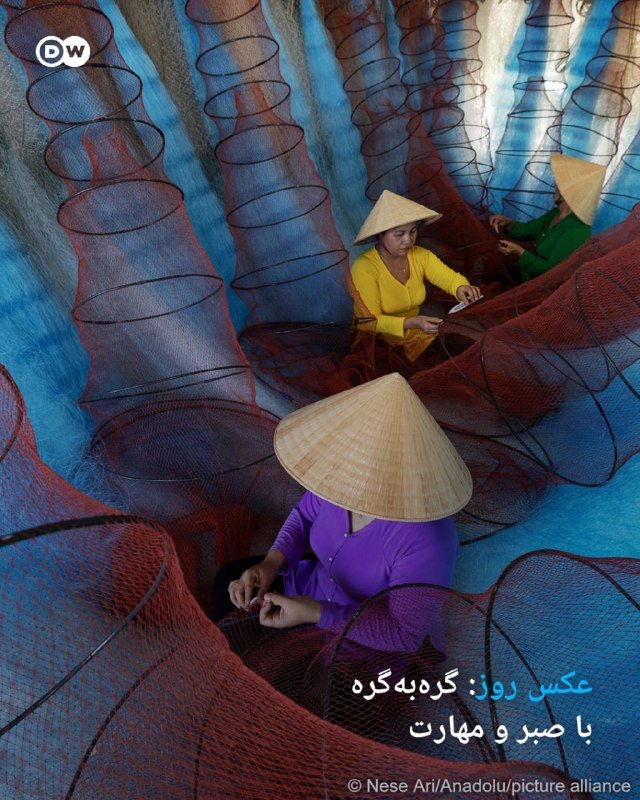

📸 عکس روز: گره‌به‌گره با صبر و مهارت

در روستاهای ساحلی ویتنام کار ماهیگیران پس از بازگشت از دریا تمام نمی‌شود. تورها ابتدا با دقت شسته می‌شوند تا از نمک و شن پاک شوند. بعد زنان محلی با صبر، مهارت و استفاده از ابزارهای دستی، بخش‌های پاره یا فرسوده تورها را گره‌به‌گره ترمیم می‌کنند تا دوباره قابل استفاده باشند. این سنت نه تنها عمر تجهیزات ماهیگیری را افزایش می‌دهد، بلکه این میراث فرهنگی را نیز زنده نگه می‌دارد.

@dw_farsi

## Persian_Trend_Official — post 17459

وعده ما نیم ساعت دیگه
چنل یوتیوب پرشین ترند
لایو تحلیل توافق

## IranianMinds — post 22869

  <a href="telegram/content/IranianMinds_22869_1781780702.mp4" target="_blank">🎬 Download video</a>

🔴 شاهزاده رضا پهلوی :

۴۰ هزار ایرانی تو عرض دو روز برای یه توافق هسته‌ای یا باز موندن تنگه هرمز جونشون رو از دست ندادن.

اون‌ها برای آزادی و دموکراسی جونشون رو فدا کردن.

اما عجیب اینجاست که تو هیچ‌کدوم از این مذاکرات، اصلاً دیده نشدن و هیچ اسمی ازشون نبوده.

@IranianMinds

## IranianMinds — post 22868

  <a href="telegram/content/IranianMinds_22868_1781780705.mp4" target="_blank">🎬 Download video</a>

🔴 شاهزاده رضا پهلوی :

من همیشه و تو هر شرایط سیاسی، از تیم ملی‌مون حمایت کردم؛ چون تیم ملی خودمونه، حالا چه تو المپیک باشه چه هر جای دیگه.

اما این اولین باره که می‌تونم بهتون بگم احساسات خیلی متناقضی نسبت به این موضوع وجود داره، حتی میشه گفت یه جور دودستگی یا تردید جدی به وجود اومده.

@IranianMinds

## IranianMinds — post 22867

  <a href="telegram/content/IranianMinds_22867_1781780707.mp4" target="_blank">🎬 Download video</a>

🔴 «پیت هگست»، درباره توافق با ایران:

یه تفاوت کلیدی که حتماً باید بهش اشاره کرد اینه که این توافق از موضع قدرت شکل گرفت؛ نتیجه‌ی اقدام قاطع آمریکا بود.

برجام حاصل یه مشت التماس و حرف زدن بود، اما این توافق بعد از ماه‌ها بمباران و یه محاصره‌ی همه‌جانبه و نفوذناپذیر به دست اومد.

ایران تو موقعیتی قرار گرفت که چاره‌ای نداشت جز اینکه بیاد پای میز مذاکره و این شرایط رو قبول کنه.

@IranianMinds

## IranianMinds — post 22866

  <a href="telegram/content/IranianMinds_22866_1781780710.mp4" target="_blank">🎬 Download video</a>

🔴 ترامپ درباره ایران:

اصلا شوخی نیست اگه کسی بخواد بهشون سلاح هسته‌ای بفروشه؛ چون هر کشوری این کار رو بکنه، خودش هدف حمله هسته‌ای قرار می‌گیره و نابود میشه.

واقعا با خاک یکسان میشن. کار فوق‌العاده خطرناکیه که کسی بخواد به ایران سلاح هسته ای بفروشه.

@IranianMinds

## IranianMinds — post 22859

🔴ایران‌اینترنشنال در کارزار مردمی نورآباد ممسنی، توانسته تاکنون هویت ۱۶ تن از جاویدنامان این شهر را شناسایی کند. بر اساس گزارش‌های رسیده، حکومت پیکر کشته‌شدگان را به‌تدریج و گاه روزانه تنها به چند خانواده تحویل می‌داد. خانواده‌ها مجبور بودند تعهد کتبی بدهند، مراسم خاکسپاری را پیش از ساعت شش یا هفت صبح برگزار کنند و مانع از تجمع مردم شوند.

@IranianMinds

## manototv — post 106147

  <a href="telegram/content/manototv_106147_1781780713.mp4" target="_blank">🎬 Download video</a>

‌
دونالد ترامپ در ادامه سخنانش در نشست جی۷ بار دیگر گفت بخش‌های اصلی رهبری جمهوری اسلامی از میان رفته‌اند و گروه تازه‌ای از رهبران روی کار آمده که به گفته او «کمتر رادیکال» هستند.

او گفت: «صادقانه بگویم، فکر می‌کنم این تغییر رژیم است.» ترامپ همچنین تأکید کرد ادامه جنگ می‌توانست به یک فاجعه اقتصادی منجر شود؛ فاجعه‌ای که به گفته او با توقف درگیری از آن جلوگیری شده است.

## alonews — post 128891

  <a href="telegram/content/alonews_128891_1781780715.webm" target="_blank">🎬 Download video</a>

👈میانگین قیمت بنزین در آمریکا برای نخستین بار از ۳۰ مارس (۱۰ فروردین) به زیر ۴ دلار در هر گالن کاهش یافت؛ موضوعی که همزمان با افت قیمت نفت و تحولات اخیر در بازارهای انرژی با امضای تفاهم‌نامه میان ایران و آمریکا رخ داده است

✅ @AloNews خبر جنگ

## alonews — post 128890

  <a href="telegram/content/alonews_128890_1781780715.webm" target="_blank">🎬 Download video</a>

👈بلومبرگ: به گفته چهار مقام آگاه، وزارت دادگستری ایالات متحده در حال تحقیق در مورد چگونگی ایجاد یک سبد سرمایه‌گذاری جهانی گسترده توسط مجتبی خامنه‌ای، رهبر جمهوری اسلامی، با اتکا به بانک‌های وال استریت است.

✅ @AloNews خبر جنگ

## alonews — post 128889

  <a href="telegram/content/alonews_128889_1781780715.webm" target="_blank">🎬 Download video</a>

👈پزشکیان: این یک سند تاریخی و پیامی از ایران مقتدر است

✅ @AloNews خبر جنگ

---
📅 بروزرسانی: 1405/03/28 14:23
---

## WithYashar — post 15233

وزیر جنگ آمریکا: به طرف ایرانی اعتماد نداریم و آماده هستیم در صورت لزوم حملات علیه ایران را از سر بگیریم
@withyashar

## FoxNewsTwitter — post 343107

‌Fox News (Twitter/X)

Read more:

## DEJradio — post 5784

⭕️ سرشکستگی تن‌دادن به تفاهم با ترامپ، دامن رهبر نامرئی را هم گرفت

منابع دژ از تهران می‌گویند امضای تفاهمنامه میان مسعود پزشکیان و دونالد ترامپ، دامن مجتبی خامنه‌ای، رهبر دیده نشدۀ جمهوری اسلامی را هم گرفته است.
برخی از این افراد می‌گویند در حالی که جنازۀ علی خامنه‌ای هنوز دفن نشده، انتشار تصویر قاتل او با خودنویس و کراوات روی میز شام کاخ ورسای که در حال امضای تفاهمنامه بود، سبب پرتاب ترکش‌ها به سوی مجتبی خامنه‌ای شده است.
به گزارش تلویزیون دژ، شماری از نظامیان و سیاستمداران وابسته به بیت، مجتبی خامنه‌ای را عامل سازش با آمریکا می‌دانند و او را به دلیل کنار آمدن با قاتل قاسم سلیمانی و پدر خود سرزنش می‌کنند.
به گفتۀ منابع دژ، برخی از منتقدان درون حکومتی این پرسش را مطرح کردند که چرا مجتبی خامنه‌ای پیش از دفن پدرش با «قاتل او» کنار آمده است.
این اخبار در حالی است که در روزهای اخیر برخی از نزدیکان بیت خامنه‌ای نیز تلاش کردند چهره‌ای نرمخویانه را از مجتبی خامنه‌ای ارائه بدهند.
برادر همسر مصطفی خامنه‌ای در گفت‌وگویی مدعی شده است که مجتبی خامنه‌ای «به رابطه با آمریکا نیز باور دارد».
در سوی دیگر، منابعی می‌گویند انتساب تصمیمات کلان اخیر به مجتبی خامنه‌ای که وضعیت مناسبی هم ندارد، نقشۀ باند قالیباف و بخشی از سپاه است.
این منابع می‌گویند باند قالیباف و دوستان، می‌خواهد پشت مجتبی خامنه‌ای نامرئی، برنامه‌های خود را در منطقه و دنیا به‌پیش ببرد.
منبع دژ گفت این چند دستگی از سویی و قابل پیش‌بینی نبودن ترامپ در اظهارات و عملکردش از سوی دیگر، سبب نگرانی بسیاری از مقامات نظام شده است.
تفاهم‌نامه ۱۴ بندی میان آمریکا و جمهوری اسلامی شامگاه چهارشنبه توسط دونالد ترامپ و مسعود پزشکیان امضا شد. ترامپ این سند را در جریان ضیافت شام با حضور رهبران شماری از کشورها در کاخ ورسای فرانسه امضا کرد.
رئیس جمهوری آمریکا در ماه‌های پیشین در مورد وضعیت جسمی ناگوار مجتبی خامنه‌ای اظهار نظر کرده بود اما در هفته‌های اخیر در مورد او به‌روشنی سخن نگفته است.
دونالد ترامپ می‌گوید مسیر تغییرات در جمهوری اسلامی با دستور او برای کشتن قاسم سلیمانی آغاز شده بود.
محمدباقر قالیباف به‌تازگی گفت به دلیل کشته شدن سلیمانی به‌فرمان ترامپ، مایل نبود با رئیس جمهوری آمریکا مذاکره کند.

#تفاهم #موشتبا
@DEJradio

## IranianMinds — post 22858

🔴 قالیباف ۲۰ بهمن ۱۴۰۳:
حضرت آقا فرمودن با آمریکا مذاکره نمیکنیم. این‌ برای همه روشنه و تموم.
به من میگن به نظرت فرقی هست که «کاملا هریس» بشه رئیس جمهور آمریکا یا «دونالد ترامپ»؟! منم میگم حتما فرقی هست. ترامپ قاتل سردار سلیمانیه. برای همین حضرت آقا گفتن شرافتمندانه نیست. پس شرافتمندانه نیست.

همین قالیباف ۲۷ خرداد ۱۴۰۵:
خیلی برام سخت بود با قاتل سلیمانی مذاکره کنم ولی مجبور بودم.
چقدر شعار بدیم؟! با شعار مملکت قوی نمیشه. باید مذاکره کنیم و کشور رو دوباره بسازیم. همه توی تصمیمات به من کمک کنید.

@IranianMinds

## BBCPersian — post 284252

  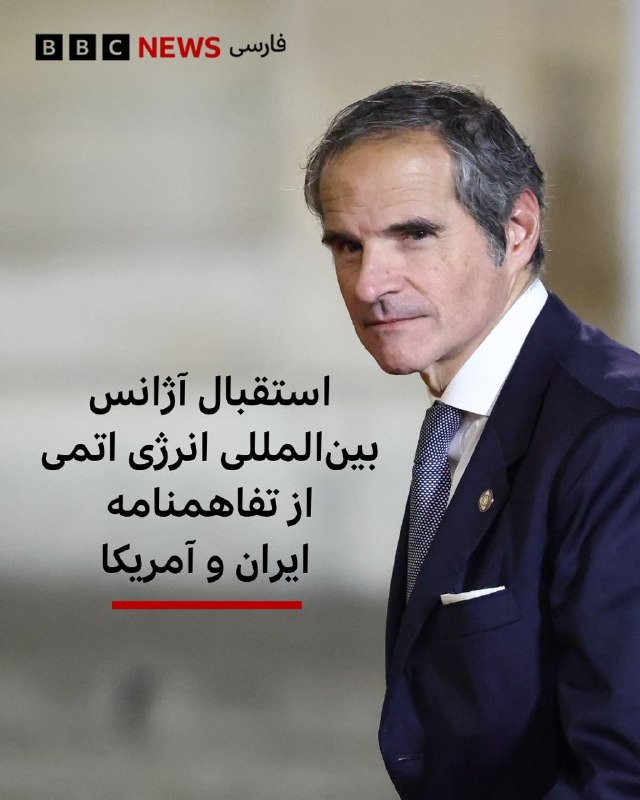

🔻آژانس بین‌المللی انرژی اتمی روز پنجشنبه از تفاهمنامه ایران و آمریکا برای پایان دادن به جنگ استقبال کرد.

رافائل گروسی، رئیس آژانس بین‌المللی انرژی اتمی، در ژنو به خبرنگاران گفت: «خوب است که این تفاهم‌نامه وجود دارد و اکنون کار فنی آغاز شده است.»

او گفت که آژانس آماده است تا تعریف «گام‌های مشخص» و لازم برای اجرای توافق آمریکا و ایران را آغاز کند.

رافائل گروسی همچنین گفت: «اکنون نوبت ماست که با همکاران آمریکایی و ایرانی خود بنشینیم و تدوین این گام‌های مشخص را آغاز کنیم.»

📸 Getty

https://bbc.in/4fNU3nt
@BBCPersian

## Dirty_Kids — post 392481

  <a href="telegram/content/Dirty_Kids_392481_1781780038.mp4" target="_blank">🎬 Download video</a>

این آخوند دوزاریا به سیم آخر زدن
ولی اون گنده‌هاشون تخم نمیکنن حرف بزنن:)))

مگه منتظر امام زمان نبودین، همینه امام ترامپ اومده،جمعه هم اومده😂🙌

@Dirty_Kids 👻

## Hranews — post 113701

  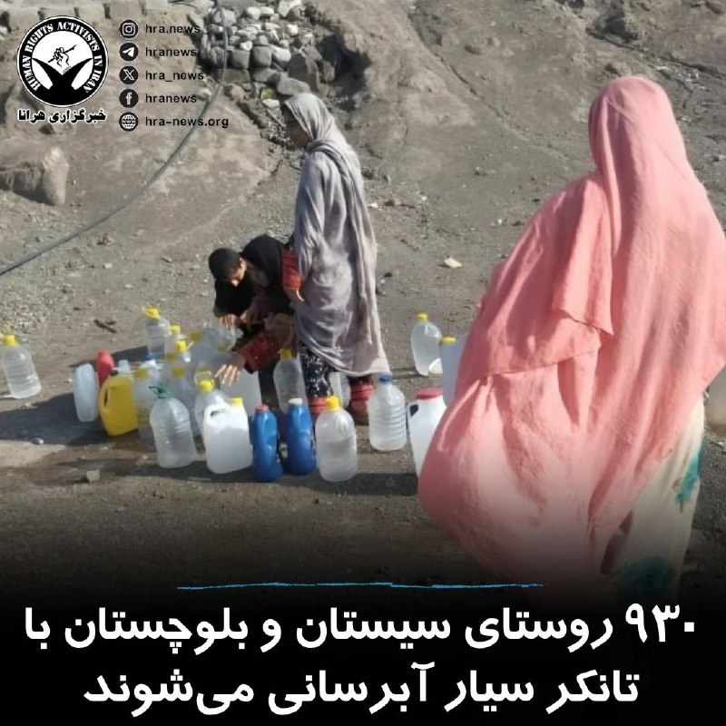

مدیرعامل شرکت آب و فاضلاب سیستان و بلوچستان اعلام کرد که در حال حاضر ۹۳۰ روستای این استان آب مورد نیاز خود را از طریق تانکرهای سیار دریافت می‌کنند. فرهاد سرگلزایی در ادامه گفت: «از مجموع پنج هزار و ۵۷۷ روستای استان، حدود سه هزار و ۴۰۰ روستا در حال حاضر تحت پوشش خدمات آبفا قرار دارند و از آب شرب پایدار بهره‌مند هستند.» این اظهارات نشان می‌دهد که حدود دو هزار و ۱۷۷ روستای سیستان و بلوچستان همچنان از دسترسی به آب شرب پایدار محروم هستند.

↘️
@hranews_bot تماس ✉️ - @Hranews کانال هرانا 🆑

## alonews — post 128888

  <a href="telegram/content/alonews_128888_1781780040.webm" target="_blank">🎬 Download video</a>

👈بهرام پارسائی نماینده سابق مجلس:اگر کشور بی در و پیکر نبود این حرام خوارها بی کیفیت ترین خودروهای جهان را ناگهانی ۵۰ درصد گران نمی کردند اگر آنقدر که برای مذاکره دست و پا می زنید و با هم رقابت می کنید کمی به حقوق ملت اهمیت می دادید در این کارخانه های غارتگر مال و جان و عزت مردم را تخته می کردید

✅ @AloNews خبر جنگ

## alonews — post 128887

  <a href="telegram/content/alonews_128887_1781780041.webm" target="_blank">🎬 Download video</a>

👈به نقل از المیادین، یک تحلیلگر اسرائیلی در مقاله‌ای در روزنامه «یدیعوت آحارانوت» از آنچه «شکست راهبردی ایالات متحده» در نتیجه توافق با ایران برای پایان دادن به جنگ خواند، سخن گفت و مدعی شد: «این توافق، جایگاه ایران و حزب‌الله را تقویت می‌کند.»

✅ @AloNews خبر جنگ

## alonews — post 128886

  <a href="telegram/content/alonews_128886_1781780041.webm" target="_blank">🎬 Download video</a>

👈زلنسکی: اگر اوکراین بسوزد، مسکو هم خواهد سوخت

✅ @AloNews خبر جنگ

---
📅 بروزرسانی: 1405/03/28 14:13
---

## VahidOOnLine — post 246184

  

بلومبرگ گزارش داد وزارت دادگستری آمریکا در حال بررسی نقش احتمالی برخی بانک‌های آمریکایی در جابه‌جایی منابع مالی مرتبط با شبکه اقتصادی مجتبی خامنه‌ای، رهبر جمهوری اسلامی، است.
بر اساس این گزارش، این تحقیقات بخشی از پرونده‌ای گسترده درباره اتهام‌های پول‌شویی و فساد مالی است و مقام‌های آمریکایی تراکنش‌هایی را بررسی می‌کنند که از طریق بانک‌های واسطه آمریکایی، از جمله «جی‌پی مورگان» و «سیتی‌گروپ»، انجام شده‌اند.
به نوشته بلومبرگ، هدف این تحقیقات شناسایی ساختار شبکه مالی رهبر جمهوری اسلامی و بررسی خلاهای احتمالی در سازوکارهای نظارتی بانک‌های آمریکایی است که ممکن است انتقال این منابع مالی را امکان‌پذیر کرده باشد.
بر اساس این گزارش تحقیقات وزارت دادگستری آمریکا همچنین فعالیت بانک‌ها و موسسات مالی در اروپا و خاورمیانه، و پرداخت‌های مرتبط با املاک و دارایی‌های این شبکه به برخی برندهای بین‌المللی را زیر ذره‌بین قرار داده است.
بلومبرگ نوشت آغاز این تحقیقات به معنای طرح اتهام یا صدور کیفرخواست نیست، اما مجتبی خامنه‌ای هدف اصلی این پرونده به شمار می‌رود.
‌🏁 🇬🇧 IranintlTV

🤖 @VahidOOnLine

## IranIntlTV — post 343011

  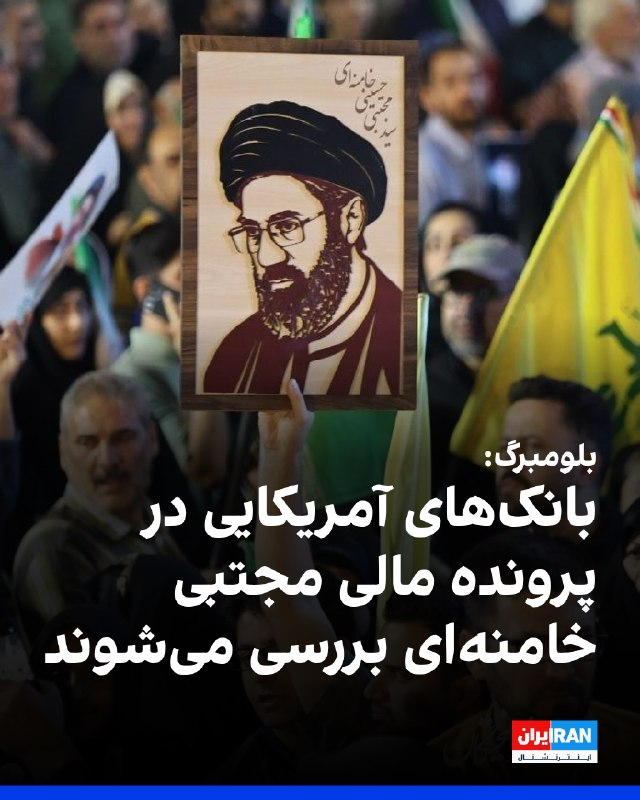

بلومبرگ گزارش داد وزارت دادگستری آمریکا در حال بررسی نقش احتمالی برخی بانک‌های آمریکایی در جابه‌جایی منابع مالی مرتبط با شبکه اقتصادی مجتبی خامنه‌ای، رهبر جمهوری اسلامی، است.
بر اساس این گزارش، این تحقیقات بخشی از پرونده‌ای گسترده درباره اتهام‌های پول‌شویی و فساد مالی است و مقام‌های آمریکایی تراکنش‌هایی را بررسی می‌کنند که از طریق بانک‌های واسطه آمریکایی، از جمله «جی‌پی مورگان» و «سیتی‌گروپ»، انجام شده‌اند.
به نوشته بلومبرگ، هدف این تحقیقات شناسایی ساختار شبکه مالی رهبر جمهوری اسلامی و بررسی خلاهای احتمالی در سازوکارهای نظارتی بانک‌های آمریکایی است که ممکن است انتقال این منابع مالی را امکان‌پذیر کرده باشد.
بر اساس این گزارش تحقیقات وزارت دادگستری آمریکا همچنین فعالیت بانک‌ها و موسسات مالی در اروپا و خاورمیانه، و پرداخت‌های مرتبط با املاک و دارایی‌های این شبکه به برخی برندهای بین‌المللی را زیر ذره‌بین قرار داده است.
بلومبرگ نوشت آغاز این تحقیقات به معنای طرح اتهام یا صدور کیفرخواست نیست، اما مجتبی خامنه‌ای هدف اصلی این پرونده به شمار می‌رود.
https://iranintl.com/202606180269

## DW_Farsi — post 126127

📸 هتل بورگن اشتوک، محل مذاکره ایران و آمریکا به روایت تصویر

وزارت امور خارجه سوئیس اعلام کرد مذاکرات برنامه‌ریزی شده بین ایالات متحده آمریکا و ایران در تفرجگاه کوهستانی بورگن‌استوک برگزار می‌شود.

این مجموعه ۶۰ هکتاری در فاصله هشت کیلومتری شهر لوسرن و در ارتفاع ۴۵۰ متری از سطح دریاچه قرار گرفته و شامل چند هتل، ویلا، اقامتگاه خصوصی، رستوان، مراکز سلامتی و آب‌درمانی است.

در مجموع بیش از ۳۶۰ اتاق و سوئیت در این مجموعه قرار دارد و حدود ۷۰۰ کارمند از مهمانان پذیرایی می‌کنند.

از سال ۲۰۰۷ این مجموعه در مالکیت شرکت Katara Hospitality، متعلق به دولت قطر، قرار دارد. مالک جدید چندین سال به بازسازی این اقامتگاه پرداخت و سرانجام آن را در سال ۲۰۱۷ بازگشایی کرد.

هزینه یک اتاق معمولی از شبی ۳۱۰ فرانک سوئیس (حدود ۳۳۷ یورو) آغاز می‌شود و سوئیت سلطنتی با چشم‌انداز دریاچه بیش از ۱۹ هزار و ۵۰۰ فرانک هزینه دارد.

این هتل بیش از ۱۵۰ سال است که میزبان ستارگان، رؤسای کشورها و ثروتمندان جهان بوده است.
@dw_farsi

## Persian_Trend_Official — post 17458

  <a href="telegram/content/Persian_Trend_Official_17458_1781779438.mp4" target="_blank">🎬 Download video</a>

قاب های عجیب و آخرالزمانی از مسکو!

ارتش روسیه حلقه اصلی ورودی به مسکو را مسدود کرده و سربازان روس با هرچه که در دست دارند از اسلحه گرفته تا موشک دوش پرتاب برای انهدام پهپادهای انتحاری اوکراین تلاش می‌کنند.

📝 Amir

📌 @persian_trend_official
پرشین ترند | متفاوت‌ترین کانال نظامی

## IranianMinds — post 22854

تصاویری از محمد محبی بازیکن تیم ملی جمهوری اسلامی که پوستری از مهسا امینی که روی دیوار هتل محل اقامت تیم ملی در تیخوانا مکزیک‌ هست رو میکشه پایین و میندازه توی سطل آشغال.

@IranianMinds

## IranianMinds — post 22853

  <a href="telegram/content/IranianMinds_22853_1781779438.webm" target="_blank">🎬 Download video</a>

▶️ دیدار فوووق جذااااب سوئیس و بوسنی رو با آپشن های تخصصی در MelBet پیشبینی کنید! ⚽️
🔥

💵 امکان شارژ کارت بکارت و هات ووچر

🎁 قرعه کشی و آفر های جذاب با جوایز ویژه

📱 کاملترین برنامه موبایل

🤝 اسپانسر رسمی لالیگا

🇮🇷 پشتیبانی از زبان فارسی

✍️ حرفه ای، مطمئن و در کلاس جهانی پیشبینی کنید!
Er28
برای ورود به سایت فیلترشکن خود را خاموش کنید!
‌
🌐 Link 🔜 MelBet1.net

🌐‌ Link 🔜 MelBet1.net

---
📅 بروزرسانی: 1405/03/28 14:04
---

## VahidOOnLine — post 246177

ایران‌اینترنشنال در کارزار مردمی نورآباد ممسنی، توانسته تاکنون هویت ۱۶ تن از جاویدنامان این شهر را شناسایی کند. بر اساس گزارش‌های رسیده، حکومت پیکر کشته‌شدگان را به‌تدریج و گاه روزانه تنها به چند خانواده تحویل می‌داد. خانواده‌ها مجبور بودند تعهد کتبی بدهند، مراسم خاکسپاری را پیش از ساعت شش یا هفت صبح برگزار کنند و مانع از تجمع مردم شوند.
‌🏁 🇬🇧 IranintlTV

🤖 @VahidOOnLine

## VahidOOnLine — post 246176

  

شاهزاده رضا پهلوی درباره دیدار خود با پریتی پتل، وزیر خارجه دولت سایه بریتانیا، توضیحاتی منتشر کرد.
او گفت در این دیدار تاکید کرده است که چهار دهه سیاست مماشات با جمهوری اسلامی نتوانسته رفتار این حکومت را تغییر دهد و امنیت منطقه و جهان را افزایش دهد.
شاهزاده رضا پهلوی همچنین گفت در گفت‌وگو با پتل بر این موضوع تاکید کرده که مردم ایران باید در مرکز هرگونه سیاست‌گذاری و تصمیم‌گیری درباره جمهوری اسلامی قرار گیرند.

او افزود جمهوری اسلامی همچنان تهدیدی علیه مردم ایران و امنیت کشورهای دموکراتیک، از جمله بریتانیا، به شمار می‌رود.
شاهزاده رضا پهلوی گفت حمایت از ملت ایران و ایستادگی در برابر آنچه «شبکه‌های سرکوب و تروریسم» جمهوری اسلامی خواند، موثرترین راه برای دستیابی به ثبات، امنیت و صلح پایدار است.
‌🏁 🇬🇧 IranintlTV

🤖 @VahidOOnLine

## VahidOOnLine — post 246175

  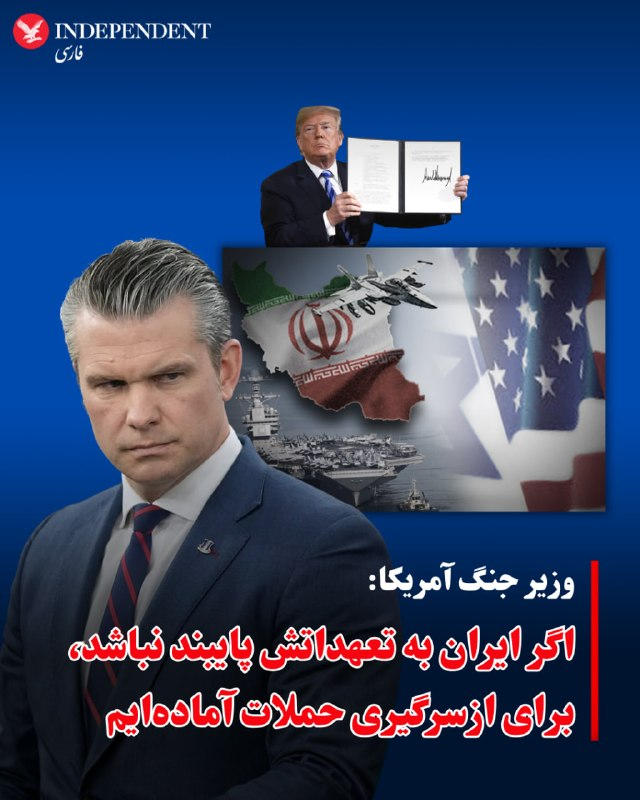

⭕️وزیر جنگ آمریکا: اگر ایران به تعهداتش پایبند نباشد، برای ازسرگیری حملات آماده‌ایم

♦️پیت هگست، وزیر جنگ آمریکا، روز پنج‌شنبه اعلام کرد که ایالات متحده در صورت پایبند نبودن ایران به تعهداتش، آمادگی ازسرگیری عملیات نظامی علیه تهران را دارد. این اظهارات پس از امضای تفاهم‌نامه میان دونالد ترامپ، رئیس‌جمهور آمریکا، و مسعود پزشکیان، رئیس‌جمهور ایران، مطرح شد.

هگست در گفت‌وگو با خبرنگاران تاکید کرد که آمریکا از نیروها و توانایی‌های لازم برای انجام دوباره حملات علیه ایران برخوردار است و در صورت عدم اجرای مفاد توافق از سوی تهران، می‌تواند فشارهای سختگیرانه، از جمله بازگرداندن محاصره و اقدامات تنبیهی، را از سر بگیرد.
او همچنین گفت توافق با ایران «از موضع قدرت» به دست آمده و واشنگتن در جریان مذاکرات، رویکردی سختگیرانه در پیش گرفته است. به گفته وزیر دفاع آمریکا، اگر ایران از جاه‌طلبی‌های هسته‌ای خود دست نکشد، گزینه اقدام نظامی همچنان روی میز خواهد بود.

هگست بار دیگر تاکید کرد که ایالات متحده اجازه نخواهد داد ایران به سلاح هسته‌ای دست یابد و افزود تنگه هرمز یک آبراه بین‌المللی است که آزادی کشتیرانی در آن باید حفظ شود.

وزیر جنگ آمریکا همچنین اظهار داشت که واشنگتن در صورت بروز هرگونه تحول مرتبط با تنگه هرمز، وضعیت و آرایش نیروهای خود در منطقه را بررسی خواهد کرد.
‌🇸🇦 Indypersian

🤖 @VahidOOnLine

## WithYashar — post 15232

  <a href="telegram/content/WithYashar_15232_1781778854.mp4" target="_blank">🎬 Download video</a>

محمد محبی فوتبالیست تیم جمهوری اسلامی که در خوشحالی زدن گل به تیم نیوزلند، به مردم شلیک کرد، رفته و عکس مهسا امینی رو کنده و انداخته توی سطل زباله...
@withyashar

## mamlekate — post 103737

⚡️ مقاله ظریف در فارن افرز روز ۱۴ فروردین ۱۴۰۵

🏁 چگونه ایران باید به جنگ پایان دهد
توافقی که تهران می‌تواند بپذیرد

💎 بررسی تطبیقی میان حرف‌های محمدجواد ظریف در مقاله «چگونه ایران باید به جنگ پایان دهد» و مفاد «یادداشت تفاهم اسلام‌آباد»، نشان‌دهنده یک هم‌پوشانی ساختاری قوی است؛ به طوری که می‌توان این یادداشت تفاهم را نسخه اجرایی و حقوقیِ متنی دانست که ظریف دو ماه پیش منتشر کرده است.
t.me/mamlekate/103733

❌ واکنش‌ها به ظریف درباره پیشنهادش برای پایان دادن به جنگ؛ «سه روز فرصت دارد بگوید غلط کردم»

مقاله محمدجواد ظریف، وزیر خارجه پیشین، در مجله آمریکایی فارین افرز که در آن پیشنهاد پایان دادن به جنگ در ازای پذیرش برخی از محدودیت ها در برنامه اتمی را داده، با واکنش‌های موافق و مخالف رو به رو شده است.

@mamlekate

## IranIntlTV — post 343004

ایران‌اینترنشنال در کارزار مردمی نورآباد ممسنی، توانسته تاکنون هویت ۱۶ تن از جاویدنامان این شهر را شناسایی کند. بر اساس گزارش‌های رسیده، حکومت پیکر کشته‌شدگان را به‌تدریج و گاه روزانه تنها به چند خانواده تحویل می‌داد. خانواده‌ها مجبور بودند تعهد کتبی بدهند، مراسم خاکسپاری را پیش از ساعت شش یا هفت صبح برگزار کنند و مانع از تجمع مردم شوند.

## IranIntlTV — post 343003

  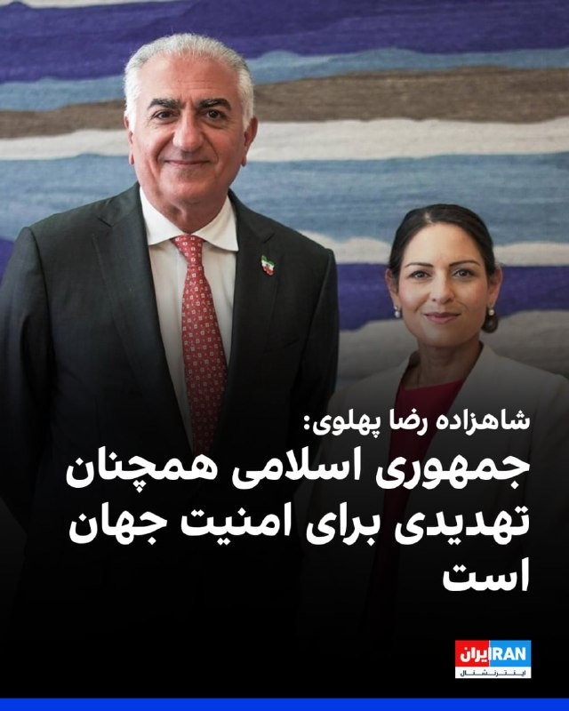

شاهزاده رضا پهلوی درباره دیدار خود با پریتی پتل، وزیر خارجه دولت سایه بریتانیا، توضیحاتی منتشر کرد.
او گفت در این دیدار تاکید کرده است که چهار دهه سیاست مماشات با جمهوری اسلامی نتوانسته رفتار این حکومت را تغییر دهد و امنیت منطقه و جهان را افزایش دهد.
شاهزاده رضا پهلوی همچنین گفت در گفت‌وگو با پتل بر این موضوع تاکید کرده که مردم ایران باید در مرکز هرگونه سیاست‌گذاری و تصمیم‌گیری درباره جمهوری اسلامی قرار گیرند.

او افزود جمهوری اسلامی همچنان تهدیدی علیه مردم ایران و امنیت کشورهای دموکراتیک، از جمله بریتانیا، به شمار می‌رود.
شاهزاده رضا پهلوی گفت حمایت از ملت ایران و ایستادگی در برابر آنچه «شبکه‌های سرکوب و تروریسم» جمهوری اسلامی خواند، موثرترین راه برای دستیابی به ثبات، امنیت و صلح پایدار است.

## IranIntlTV — post 343002

  <a href="telegram/content/IranIntlTV_343002_1781778857.mp4" target="_blank">🎬 Download video</a>

پرستو احمدی، خواننده، به ۷۴ ضربه شلاق تعزیری، دو سال ممنوع‌الخروجی و دو سال محرومیت از فعالیت هنری محکوم شد.

جزییات بیشتر در گفت‌وگو با منصوره حسینی یگانه، عضو تحریریه ایران‌اینترنشنال
@iranintltv

## Persian_Trend_Official — post 17457

پیت هگست در مورد ایران: وقتی محاصره به طور کامل باز شود، ما عقب‌نشینی خواهیم کرد و اجازه می‌دهیم تجارت جریان داشته باشد.

اما اگر ایران رعایت نکند، ما می‌توانیم محاصره‌ای سخت‌گیرانه را دوباره اعمال کنیم. ما مدت‌هاست که در آن منطقه پایگاه داریم. بسیاری از آنها به همین شکل باقی خواهند ماند. و ما بررسی خواهیم کرد که به چه تعداد نیرو در منطقه نیاز داریم و بر اساس آن برنامه‌ریزی خواهیم کرد.

📝 Amir

📌 @persian_trend_official
پرشین ترند | متفاوت‌ترین کانال نظامی

## Persian_Trend_Official — post 17456

  <a href="telegram/content/Persian_Trend_Official_17456_1781778859.mp4" target="_blank">🎬 Download video</a>

پیت هگست در مورد توافق: به نظر من یک تفاوت کلیدی که باید بین این توافق و سایر توافقات به آن اشاره کنید این است که این توافق از قدرت ناشی شده است.

برجام از التماس و صحبت حاصل شد. این توافق پس از ماه‌ها بمباران و محاصره‌ای که غیرقابل نفوذ بود، حاصل شد. ایران در موقعیتی قرار گرفت که مجبور شد به میز مذاکره بیاید و این کار را انجام دهد.

📝 Amir

📌 @persian_trend_official
پرشین ترند | متفاوت‌ترین کانال نظامی

## Persian_Trend_Official — post 17455

  <a href="telegram/content/Persian_Trend_Official_17455_1781778863.webm" target="_blank">🎬 Download video</a>

وزیر امور خارجه عربستان، فیصل بن فرحان آل سعود: اسرائیل بخشی از منطقه است. این بدان معناست که آنها باید بخشی از گفتگوی منطقه‌ای باشند، اما فلسطین نیز بخشی از منطقه است.

حمله ایران به پادشاهی و کشورهای شورای همکاری خلیج فارس، اعتماد متقابل را سلب کرد. پس از تفاهم پکن و آغاز روند عادی‌سازی روابط، ما در آستانه گشایش همکاری‌های اقتصادی بودیم، اما اکنون عقب‌نشینی کرده‌ایم.

پیش از هر بحثی درباره سرمایه‌گذاری یا همکاری، باید درباره بازسازی اعتماد و رابطه گفتگو کنیم؛ این مسئله برای بسیاری از کشورهای شورای همکاری نیز صادق است.

📝 Amir

📌 @persian_trend_official
پرشین ترند | متفاوت‌ترین کانال نظامی

## BBCPersian — post 284251

🔻ترامپ و پزشکیان توافق پایان دادن به جنگ را امضا کردند

روسای جمهور آمریکا و ایران یک توافق اولیه صلح را با هدف پایان دادن به جنگ، امضا کرده‌اند؛ توافقی که بلافاصله اجرایی می‌شود.

https://bbc.in/44iErBe
@BBCPersian

## Dirty_Kids — post 392477

🔴 امضای منحصر به فرد پزشکیان، حسابی سوژه کاربران توییتر شده :

@Dirty_Kids 👻

## Dirty_Kids — post 392476

  <a href="telegram/content/Dirty_Kids_392476_1781778863.mp4" target="_blank">🎬 Download video</a>

👑 شاهزاده رضا پهلوی :
40 هزار ایرانی تو این دو روز کشته نشدن که آخرش دوباره برگردیم سر یه توافق هسته‌ای یا فقط بحث باز موندن تنگه هرمز باشه؛

اینا برای آزادی، دموکراسی و سرنگونی جمهوری اسلامی جونشونو از دست دادن و متأسفانه تو این مذاکرات اصلاً حرفی از خواسته مردم زده نمیشه.
ترامپ امروز میگه رهبران جمهوری اسلامی آدم‌های منطقی‌ای هستن، ولی من صبر می‌کنم ببینم چند ساعت دیگه چی توییت میزنه؛ چون بارها دیدیم حرف‌هاش مدام عوض میشه.
اینکه بعضیا میگن چرا از حملات آمریکا به ایران انتقاد نمی‌کنم، باید بگم مقصر اصلی جمهوری اسلامیه. همون‌طور که حماس تو غزه مردم رو سپر انسانی می‌کنه، این حکومت هم مردم رو وسط خطر قرار میده.

@Dirty_Kids 👻

## alonews — post 128885

  <a href="telegram/content/alonews_128885_1781778866.webm" target="_blank">🎬 Download video</a>

👈فیصل بن فرحان آل سعود، وزیر خارجه عربستان: «حمله ایران به پادشاهی و کشورهای شورای همکاری خلیج فارس، اعتماد متقابل را سلب کرد. پس از تفاهم پکن و آغاز روند عادی‌سازی روابط، ما در آستانه گشایش همکاری‌های اقتصادی بودیم، اما اکنون عقب‌نشینی کرده‌ایم.

🔴 پیش از هر بحثی درباره سرمایه‌گذاری یا همکاری، باید درباره بازسازی اعتماد و رابطه گفتگو کنیم؛ این مسئله برای بسیاری از کشورهای شورای همکاری نیز صادق است.»

✅ @AloNews خبر جنگ

## alonews — post 128884

  <a href="telegram/content/alonews_128884_1781778866.webm" target="_blank">🎬 Download video</a>

👈پزشکیان نخستین رئیس‌جمهور، جمهوری اسلامیست که امضایش کنار رئیس‌جمهور آمریکا برای پایان یک جنگ قرار می‌گیرد

✅ @AloNews خبر جنگ

---
📅 بروزرسانی: 1405/03/28 13:53
---

## VahidOOnLine — post 246174

  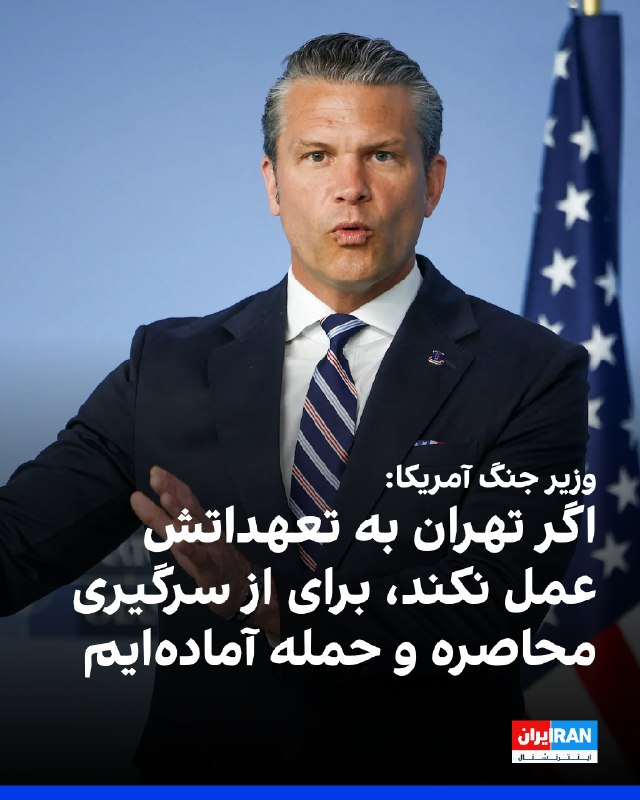

پیت هگست، وزیر دفاع آمریکا، اعلام کرد ایالات متحده در صورتی که جمهوری اسلامی به تعهدات خود در چارچوب تفاهم‌نامه با واشینگتن عمل نکند، آماده است علاوه بر اعمال دوباره محاصره دریایی، عملیات نظامی علیه جمهوری اسلامی را از سر بگیرد.

او در جمع خبرنگاران پس از حضور در نشست ناتو گفت تفاهم با جمهوری اسلامی از «موضع قدرت» آمریکا به دست آمده است.

او افزود: «رییس‌جمهوری تصریح کرده است که اگر در طول این مذاکرات ایران به آنچه گفته انجام خواهد داد عمل نکند؛ یعنی از سلاح هسته‌ای صرف‌نظر نکند، جاه‌طلبی‌های هسته‌ای خود را کنار نگذارد، مواد هسته‌ای خود را واگذار نکند و تاسیسات هسته‌ای خود را تعطیل نکند، ما آماده از سرگیری عملیات خواهیم بود. وزارت دفاع در صورت لزوم آماده آغاز دوباره عملیات است. ترجیح می‌دهیم چنین کاری نکنیم، اما برای آن آماده و مهیا هستیم.»

وزیر دفاع آمریکا همچنین درباره محاصره دریایی گفت: «زمانی که محاصره به‌طور کامل برداشته شود، عقب خواهیم نشست و اجازه خواهیم داد تجارت جریان پیدا کند. اما اگر ایران به تعهدات خود عمل نکند، کاملا قادر خواهیم بود یک محاصره سختگیرانه و کامل را دوباره اعمال کنیم.»
https://iran
‌🏁 🇬🇧 IranintlTV

🤖 @VahidOOnLine

## mwarmonitor — post 11108

  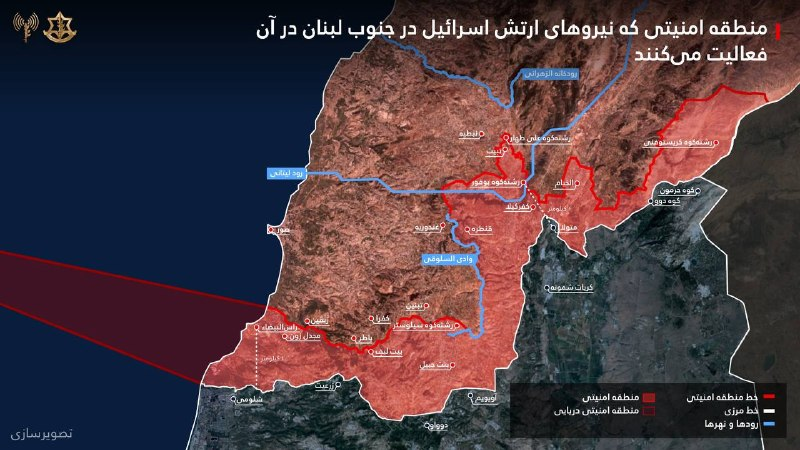

🔴منطقه امنیتی در جنوب لبنان: نقشه محدوده‌ای که نیروهای ارتش اسرائیل در جنوب لبنان در آن فعالیت می‌کنند*

⭕️بر اساس نیاز عملیاتی، ارتش اسرائیل در منطقه امنیتی، حدود ۱۰ کیلومتر در داخل خاک لبنان، مستقر شده است.

⭕️نیروهای ارتش اسرائیل در منطقه فعالیت خود در جنوب لبنان استقرار یافته‌اند و به اقدامات خود برای رفع تهدیدها و تقویت دفاع از ساکنان شمال ادامه می‌دهند.

## IranIntlTV — post 343001

  

پیت هگست، وزیر دفاع آمریکا، اعلام کرد ایالات متحده در صورتی که جمهوری اسلامی به تعهدات خود در چارچوب تفاهم‌نامه با واشینگتن عمل نکند، آماده است علاوه بر اعمال دوباره محاصره دریایی، عملیات نظامی علیه جمهوری اسلامی را از سر بگیرد.

او در جمع خبرنگاران پس از حضور در نشست ناتو گفت تفاهم با جمهوری اسلامی از «موضع قدرت» آمریکا به دست آمده است.

او افزود: «رییس‌جمهوری تصریح کرده است که اگر در طول این مذاکرات ایران به آنچه گفته انجام خواهد داد عمل نکند؛ یعنی از سلاح هسته‌ای صرف‌نظر نکند، جاه‌طلبی‌های هسته‌ای خود را کنار نگذارد، مواد هسته‌ای خود را واگذار نکند و تاسیسات هسته‌ای خود را تعطیل نکند، ما آماده از سرگیری عملیات خواهیم بود. وزارت دفاع در صورت لزوم آماده آغاز دوباره عملیات است. ترجیح می‌دهیم چنین کاری نکنیم، اما برای آن آماده و مهیا هستیم.»

وزیر دفاع آمریکا همچنین درباره محاصره دریایی گفت: «زمانی که محاصره به‌طور کامل برداشته شود، عقب خواهیم نشست و اجازه خواهیم داد تجارت جریان پیدا کند. اما اگر ایران به تعهدات خود عمل نکند، کاملا قادر خواهیم بود یک محاصره سختگیرانه و کامل را دوباره اعمال کنیم.»
https://iran

## IranIntlTV — post 343000

  <a href="telegram/content/IranIntlTV_343000_1781778229.mp4" target="_blank">🎬 Download video</a>

وب‌سایت حقوق بشری حال‌وش گزارش داد که زنان بلوچ روستای پشموکی در استان کرمان در اعتراض به نحوه بهره‌برداری از معدن کرومیت و همچنین فقر و بیکاری در این منطقه، تجمع اعتراضی برگزار کردند. ویدیوهای منتشرشده نشان می‌دهد نیروهای امنیتی به معترضان یورش برده و آنها را ضرب‌وجرح کرده‌اند.

جزییات بیشتر در گفت‌وگو با مهدی نخل‌احمدی، روزنامه‌نگار و فعال سیاسی
@iranintltv

## RadioFarda — post 158455

🔸یک شرکت اماراتی اقدام به ساخت یک ربات نمازخوان به نام «بوسنیده» کرده است.

🔸مهم‌ترین هدف از ساخت این ربات «آموزش‌های دینی به کودکان» عنوان شده است.

🔸سازنده این ربات می‌گوید که تا یکی دو دهه آینده ربات‌ها در همه جا خواهند بود و ساخت ربات نمازخوان به بچه‌های اماراتی کمک می‌کند که به فناوری‌های جدید نزدیک شوند.

🔸ساخت ربات نمازخوان با واکنش‌های بسیاری در شبکه‌های اجتماعی همراه شده، برخی کاربران از ترکیب سنت و فناوری اماراتی تمجید کردند و برخی دیگر حضور ربات در نماز را زیر سئوال بردند.

🔸سازنده این ربات در پاسخ به منتقدان تاکید کرده که یک ربات نمی‌تواند مسلمان باشد یا به هیچ دینی تعلق داشته باشد، بلکه ابزاری برای کمک به سالمندان، آموزش کودکان و پشتیبانی از بخش مهمان‌نوازی است.

@RadioFarda

## BBCPersian — post 284249

🔻متن کامل تفاهم‌نامه ایران و آمریکا که به امضای مسعود پزشکیان و ترامپ رسیده، منتشر شده است.

بر اساس این توافق‌ ۱۴ ماده‌ای که به عنوان تفاهم‌نامه شناخته می‌شود، ایران هرگز سلاح هسته‌ای نخواهد داشت و همچنین ۳۰۰ میلیارد دلار بودجه برای «بازسازی و توسعه اقتصادی» این کشور اختصاص پیدا می‌کند.

عادی شدن عبور و مرور در تنگه هرمز بدون دریافت عوارض و لغو محاصره دریایی بنادر ایران از سوی آمریکا از بخش‌های دیگر این توافق است.

دو طرف همچنین متعهد شده‌اند از این پس هیچ جنگ یا عملیات نظامی علیه یکدیگر آغاز نکنند.

لغو تحریم‌های آمریکا علیه ایران و آزادسازی اموال بلوکه شده ایران هم از بخش‌های دیگر این توافقنامه است که زمان بندی آن در توافق نهایی تعیین خواهد شد.

نظر شما در مورد مفاد این توافق چیست؟ چقدر به اجرای کامل آن امیدوارید و به نظرتان در صورت اجرا تا چه میزان می‌تواند موجب تغییر شرایط اقتصادی و سیاسی در ایران شود؟

نظر خود را به صورت متن، ویدیو یا فایل صوتی با هشتگ #توافق برای ما بفرستید:

واتس‌اپ:
۰۰۴۴۷۳۴۲۰۳۲۱۱۳
تلگرام:
@BBCShoma

📷 Getty Images / Reuters
@BBCPersian

## Hranews — post 113700

  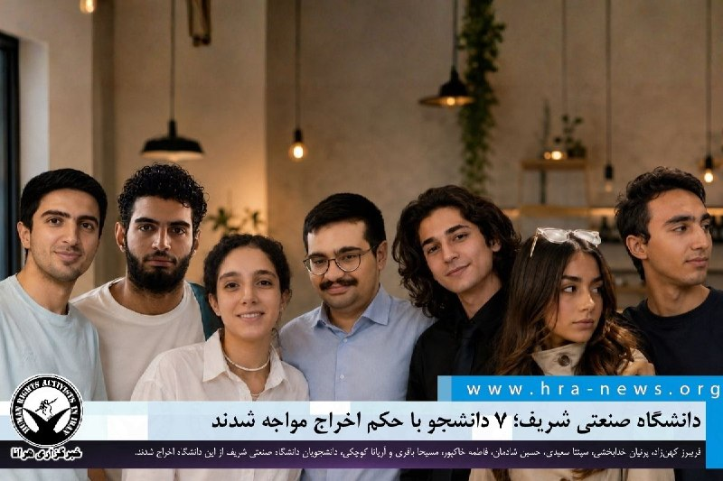

دانشگاه صنعتی شریف؛ ۷ دانشجو با حکم اخراج مواجه شدند

❗️
❗️
❗️
❗️
❗️– فریبرز کهن‌زاد، پرنیان خدابخشی، سپنتا سعیدی، حسین شادمان، فاطمه خاکپور، مسیحا باقری و آریانا کوچکی، #دانشجویان دانشگاه صنعتی شریف در ارتباط با انتشار مطالبی در فضای مجازی و پرونده‌های مرتبط با اعتراضات سراسری دی‌ماه ۱۴۰۴، با حکم کمیته بدوی انضباطی این دانشگاه اخراج شدند.

#فریبرز_کهن‌زاد #پرنیان_خدابخشی #سپنتا_سعیدی #حسین_شادمان
#فاطمه_خاکپور #مسیحا_باقری #آریانا_کوچکی

ادامه مطلب

↘️
@hranews_bot تماس ✉️ - @Hranews کانال هرانا 🆑

---
📅 بروزرسانی: 1405/03/28 13:44
---

## VahidOOnLine — post 246173

  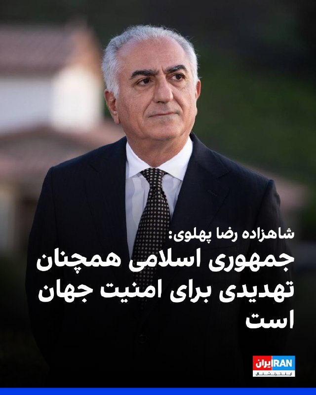

شاهزاده رضا پهلوی درباره دیدارش با پریتی پتل، وزیر خارجه دولت سایه بریتانیا، گفت در این دیدار بر ناکارآمدی چهار دهه سیاست مماشات با جمهوری اسلامی تاکید کرده است.
او افزود که به باورش، این سیاست نه به تغییر رفتار جمهوری اسلامی منجر شده و نه امنیت منطقه و جهان را افزایش داده است.
شاهزاده رضا پهلوی همچنین گفت در این دیدار تاکید کرده است که مردم ایران باید در مرکز هرگونه سیاست‌گذاری درباره جمهوری اسلامی قرار گیرند.
او جمهوری اسلامی را تهدیدی علیه مردم ایران و امنیت کشورهای دموکراتیک، از جمله بریتانیا، دانست و افزود حمایت از ملت ایران و ایستادگی در برابر شبکه‌های سرکوب و تروریسم جمهوری اسلامی، موثرترین راه برای دستیابی به ثبات، امنیت و صلح پایدار است.
‌🏁 🇬🇧 IranintlTV

🤖 @VahidOOnLine

## VahidOOnLine — post 246172

  <a href="telegram/content/VahidOOnLine_246172_1781777654.mp4" target="_blank">🎬 Download video</a>

بر اساس اطلاعات و ویدیوی رسیده به ایران اینترشنال، چهارشنبه ۲۷ خرداد در پی برخورد خشونت‌آمیز نیروهای نظامی با معترضان معدن کرومیت پشموکی در شهرستان فاریاب استان کرمان، دست‌کم هفت زن بلوچ مجروح و شش شهروند، از جمله سه زن، بازداشت و به مکان نامعلومی منتقل شدند.

به گزارش حال‌وش، نیروها با باتوم، مشت و لگد به معترضان حمله کردند؛ شهروندانی که برای دومین روز متوالی به نحوه واگذاری معدن و محروم ماندن مردم بومی از منافع آن اعتراض داشتند.
‌🏁 🇬🇧 IranintlTV

🤖 @VahidOOnLine

## WithYashar — post 15231

اگه سر حال هستین بریم برای مرحله بعدی کارا و گسترده تر کنیم 👍یه ریکشن لایک بدین پر ریزون باشه تا بگم

## IranIntlTV — post 342999

  

شاهزاده رضا پهلوی درباره دیدارش با پریتی پتل، وزیر خارجه دولت سایه بریتانیا، گفت در این دیدار بر ناکارآمدی چهار دهه سیاست مماشات با جمهوری اسلامی تاکید کرده است.
او افزود که به باورش، این سیاست نه به تغییر رفتار جمهوری اسلامی منجر شده و نه امنیت منطقه و جهان را افزایش داده است.
شاهزاده رضا پهلوی همچنین گفت در این دیدار تاکید کرده است که مردم ایران باید در مرکز هرگونه سیاست‌گذاری درباره جمهوری اسلامی قرار گیرند.
او جمهوری اسلامی را تهدیدی علیه مردم ایران و امنیت کشورهای دموکراتیک، از جمله بریتانیا، دانست و افزود حمایت از ملت ایران و ایستادگی در برابر شبکه‌های سرکوب و تروریسم جمهوری اسلامی، موثرترین راه برای دستیابی به ثبات، امنیت و صلح پایدار است.
https://iranintl.com/202606189508

## IranIntlTV — post 342998

  <a href="telegram/content/IranIntlTV_342998_1781777657.mp4" target="_blank">🎬 Download video</a>

بر اساس اطلاعات و ویدیوی رسیده به ایران اینترشنال، چهارشنبه ۲۷ خرداد در پی برخورد خشونت‌آمیز نیروهای نظامی با معترضان معدن کرومیت پشموکی در شهرستان فاریاب استان کرمان، دست‌کم هفت زن بلوچ مجروح و شش شهروند، از جمله سه زن، بازداشت و به مکان نامعلومی منتقل شدند.

به گزارش حال‌وش، نیروها با باتوم، مشت و لگد به معترضان حمله کردند؛ شهروندانی که برای دومین روز متوالی به نحوه واگذاری معدن و محروم ماندن مردم بومی از منافع آن اعتراض داشتند.

## Persian_Trend_Official — post 17454

  <a href="telegram/content/Persian_Trend_Official_17454_1781777659.webm" target="_blank">🎬 Download video</a>

معاون رئیس جمهور امریکا، جی دی ونس در مورد مسلح کردن معترضان ایرانی: در واقع تا حدودی دشوار است. می‌دانید، نمی‌توانید همین‌طوری از آسمان سلاح پرتاب کنید. واقعاً زیرساخت لازم برای رساندن سلاح به قلب مردم ایران وجود ندارد.

یکی از چیزهایی که رئیس جمهور را بسیار نگران می‌کرد، همه این معترضان بی‌گناهی بودند که توسط افرادی که چند ماه پیش مسئول بودند، قتل عام می‌شدند. آن افراد اکنون رفته‌اند. اما خواهیم دید: آیا این رهبران جدید با مردم متفاوت رفتار می‌کنند؟ مطمئناً امیدواریم که اینطور باشد.

و اگر اینطور نباشد، می‌توانیم وقتی رفتار واقعی آنها را ببینیم، بفهمیم.

📝 Amir

📌 @persian_trend_official
پرشین ترند | متفاوت‌ترین کانال نظامی

## Persian_Trend_Official — post 17453

  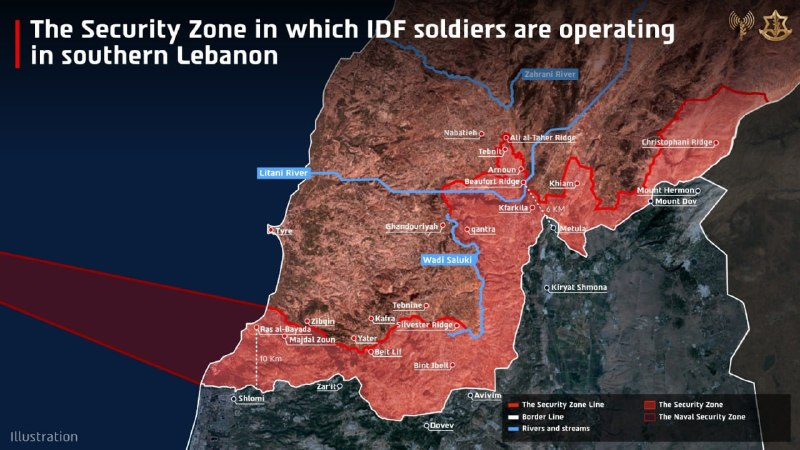

ارتش اسرائیل اینفوگرافیکی از منطقه امنیتی و حائل خود در جنوب لبنان منتشر کرد.

📝 Amir

📌 @persian_trend_official
پرشین ترند | متفاوت‌ترین کانال نظامی

## Persian_Trend_Official — post 17452

زلنسکی درباره عملیات حمله به مسکو: اگر اوکراین بسوزد، مسکوی شما هم خواهد سوخت.

اگر پوتین نخواهد این جنگ را پایان دهد و بخواهد آن را ادامه دهد، ما ساکت نخواهیم نشست. ما پاسخ خواهیم داد.

📝 Amir

📌 @persian_trend_official
پرشین ترند | متفاوت‌ترین کانال نظامی

## IranianMinds — post 22852

🔴 قالیباف :

شما نگران‌ نباشید انتقام حضرت آقارو خود امام‌ زمان میاد میگیره.

@IranianMinds

## IranianMinds — post 22851

  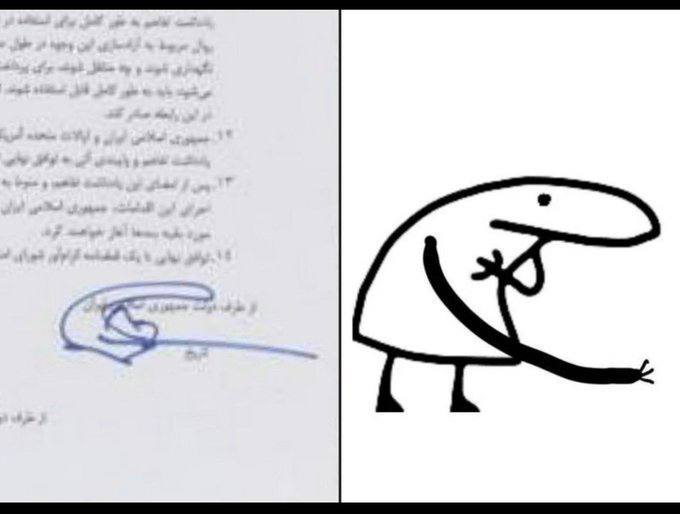

🔴امضاء پزشکیان😂

@IranianMinds

## idfinfarsi — post 11856

  

🔴منطقه امنیتی در جنوب لبنان: نقشه محدوده‌ای که نیروهای ارتش اسرائیل در جنوب لبنان در آن فعالیت می‌کنند*

⭕️بر اساس نیاز عملیاتی، ارتش اسرائیل در منطقه امنیتی، حدود ۱۰ کیلومتر در داخل خاک لبنان، مستقر شده است.

⭕️نیروهای ارتش اسرائیل در منطقه فعالیت خود در جنوب لبنان استقرار یافته‌اند و به اقدامات خود برای رفع تهدیدها و تقویت دفاع از ساکنان شمال ادامه می‌دهند.

## Hranews — post 113699

گزارشی از بازداشت یک شهروند در شهرستان سیب و سوران

❗️
❗️
❗️
❗️
❗️– یاسین محمودزهی، شهروند اهل شهرستان سیب و سوران روز دوشنبه ۲۵ خردادماه توسط نیروهای امنیتی در این شهرستان بازداشت و به مکان نامعلومی منتقل شده است.

#یاسین_محمودزهی

ادامه مطلب

↘️
@hranews_bot تماس ✉️ - @Hranews کانال هرانا 🆑

## alonews — post 128883

  <a href="telegram/content/alonews_128883_1781777662.webm" target="_blank">🎬 Download video</a>

👈وزیر جنگ آمریکا: به طرف ایرانی اعتماد نداریم و آماده هستیم در صورت لزوم حملات علیه ایران را از سر بگیریم

✅ @AloNews خبر جنگ

---
📅 بروزرسانی: 1405/03/28 13:34
---

## VahidOOnLine — post 246171

  <a href="telegram/content/VahidOOnLine_246171_1781777051.mp4" target="_blank">🎬 Download video</a>

یک شهروند در ویدیویی که به ایران اینترنشنال فرستاد، با اشاره به تداوم افزایش قیمت کالاها گفت که گرانی حتی شامل اجناس تخفیف‌دار نیز می‌شود. او افزود که با وجود خرید صرفه‌جویانه و انتخاب کالاهای دارای تخفیف، همچنان باید برای تهیه چند قلم جنس مبلغ قابل توجهی پرداخت کرد.
‌🏁 🇬🇧 IranintlTV

🤖 @VahidOOnLine

## VahidOOnLine — post 246170

  <a href="telegram/content/VahidOOnLine_246170_1781777053.mp4" target="_blank">🎬 Download video</a>

‌
دونالد ترامپ در جریان سخنرانی خود در نشست جی۷ گفت تفاهم‌نامه آمریکا با جمهوری اسلامی به پایان درگیری، بازگشایی تنگه هرمز و جلوگیری از دستیابی ایران به سلاح هسته‌ای منجر می‌شود.

او همچنین گفت بازارها با احتمال صلح رشد کرده‌اند و قیمت نفت کاهش یافته است. ترامپ این توافق را نتیجه سال‌ها فشار بر جمهوری اسلامی دانست؛ از کشته شدن قاسم سلیمانی تا حملات اخیر آمریکا، او در عین حال افزود ادامه جنگ می‌توانست به یک فاجعه اقتصادی و اختلال گسترده در کشتیرانی خلیج فارس منجر شود.

ترامپ گفت در صورت ادامه حملات، تنگه هرمز باز نمی‌ماند و کشتی‌های میلیارددلاری زیر تهدید موشک‌ها از خلیج فارس عبور نمی‌کردند.
‌🏁 🇬🇧 ManotoTV

🤖 @VahidOOnLine

## WithYashar — post 15230

آژانس بین‌المللی انرژی اتمی اعلام کرد:
در حال حاضر، سطح تماس‌ها و ارتباطات با ایران در پایین‌ترین حد خود قرار دارد.
@withyashar

## IranIntlTV — post 342997

  <a href="telegram/content/IranIntlTV_342997_1781777054.mp4" target="_blank">🎬 Download video</a>

یک شهروند در ویدیویی که به ایران اینترنشنال فرستاد، با اشاره به تداوم افزایش قیمت کالاها گفت که گرانی حتی شامل اجناس تخفیف‌دار نیز می‌شود. او افزود که با وجود خرید صرفه‌جویانه و انتخاب کالاهای دارای تخفیف، همچنان باید برای تهیه چند قلم جنس مبلغ قابل توجهی پرداخت کرد.

## IranIntlTV — post 342996

  <a href="telegram/content/IranIntlTV_342996_1781777056.mp4" target="_blank">🎬 Download video</a>

علی حسین‌قاضی‌زاده، عضو تحریریه ایران‌اینترنشنال، گفت امضای آنلاین توافق به‌جای برگزاری مراسم مشترک، نشانه‌ای از تلاش جمهوری اسلامی برای کاهش تنش با آمریکا بدون نمایش علنی تغییر رویکرد سیاسی است. به گفته او، خودداری از حضور نمایندگان دو طرف در یک قاب مشترک و امضای حضوری، بیانگر آن است که حکومت با وجود پذیرش توافق، همچنان نگران پیامدهای نمادین و ایدئولوژیک این تغییر برای پایگاه اجتماعی خود است.
@iranintltv

## ManotoTV — post 106146

  <a href="telegram/content/ManotoTV_106146_1781777057.mp4" target="_blank">🎬 Download video</a>

‌
دونالد ترامپ در جریان سخنرانی خود در نشست جی۷ گفت تفاهم‌نامه آمریکا با جمهوری اسلامی به پایان درگیری، بازگشایی تنگه هرمز و جلوگیری از دستیابی ایران به سلاح هسته‌ای منجر می‌شود.

او همچنین گفت بازارها با احتمال صلح رشد کرده‌اند و قیمت نفت کاهش یافته است. ترامپ این توافق را نتیجه سال‌ها فشار بر جمهوری اسلامی دانست؛ از کشته شدن قاسم سلیمانی تا حملات اخیر آمریکا، او در عین حال افزود ادامه جنگ می‌توانست به یک فاجعه اقتصادی و اختلال گسترده در کشتیرانی خلیج فارس منجر شود.

ترامپ گفت در صورت ادامه حملات، تنگه هرمز باز نمی‌ماند و کشتی‌های میلیارددلاری زیر تهدید موشک‌ها از خلیج فارس عبور نمی‌کردند.

## FarsiVOA — post 221096

  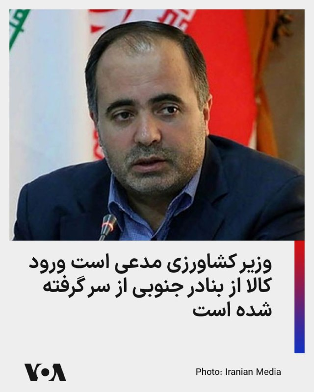

پس از آنکه رئیس‌جمهور آمریکا، در چهارچوب توافق با جمهوری اسلامی، دستور رفع محاصره دریایی علیه رژیم حاکم ایران را صادر کرد، وزیر کشاورزی مدعی است که ورود کالا از طریق بنادر جنوبی ایران از سر گرفته شده است.

غلامرضا نوری قزلجه اعلام کرده که هم‌اکنون ورود کالاها از طریق بنادر جنوبی به ‌راحتی در حال انجام است.

ایالات متحده در فروردین ماه و پس از شکست ابتدایی مذاکرات اسلام‌آباد، محاصره بنادر جنوبی ایران را آغاز کرد.

با تشدید محاصره دریایی آمریکا، مقامات جمهوری اسلامی به دنبال جایگزنی مسیرهای تجاری از جمله مسیرهای ریلی و مرزهای زمینی بودند که همین امر منجر به افزایش هزینه‌های حمل و نقل و قیمت کالاها شد.

طرح‌ جایگزینی مسیرهای حمل‌ونقل، به دلیل مشکلات لجستیک، نبود ارز کافی و گسترش تنش و از دست دادن دسترسی به یکی از اصلی‌ترین شرکای تجاری جمهوری اسلامی یعنی امارات، کارآیی لازم را نداشت.
@FarsiVOA

## Dirty_Kids — post 392475

  <a href="telegram/content/Dirty_Kids_392475_1781777059.mp4" target="_blank">🎬 Download video</a>

عروس خانوم کجاست؟

@Dirty_Kids 👻

## Dirty_Kids — post 392474

ناله کنید کونکشا 🤣
دوستان ناامید نباشید، ترامپ زبل اینا رو انداخته به جون هم، کارشو خوب بلده

@Dirty_Kids 👻

## Dirty_Kids — post 392473

  <a href="telegram/content/Dirty_Kids_392473_1781777061.mp4" target="_blank">🎬 Download video</a>

معادل گل خریدن برای پسرا چیه که باعث خوشحالیشون بشه؟
مورد ۲ رو حتما جدی بگیرید

@Dirty_Kids 👻

## Dirty_Kids — post 392472

  <a href="https://t.me/Dirty_Kids/392472" target="_blank">📎 Download file</a>

✈️ اپلیکیشن MelBet 
🥇

🎁 کد هدیه 100 دلاری: Sport100

🔒 برای تعیین رمز ورود حداقل از 8 کاراکتر و حروف بزرگ و کوچک انگلیسی و اعداد انگلیسی استفاده کنید، مانند Hamid120

🇮🇷 برای تغییر زبان برنامه، زبان موبایل خود را تغییر دهید.

✅ ورود به اپلیکیشن بدون فیلترشکن

## Dirty_Kids — post 392471

چرا این روزها همه سایت جهانی MelBet رو انتخاب میکنن 
⁉️

🎁 شارژ هدیه 130 دلاری اولین واریز

🎁 شارژ هدیه 100 دلاری در روز های یکشنبه و چهارشنبه

🎁 و ده ها بانس ارزنده دیگر...

🥇 متنوع ترین آپشن های ورزشی

🖥 پخش زنده مسابقات

🎮 بیش از 80 نوع ورزش مجازی با پخش زنده

⭐ کاملترین کازینو آنلاین

🛡 امنیت فوق العاده بالا

🌐 اسپانسر رسمی جام جهانی

💵 واریز آنی جوایز با بیش از 30 روش شارژ و برداشت، از جمله کارت بکارت

🎁 کد هدیه 100 دلاری: Sport100

✅ معرفی سایت و اپلیکیشن مل‌بت

💯 ورود به سایت مل‌بت (فیلترشکن خاموش)

## manototv — post 106146

  <a href="telegram/content/manototv_106146_1781777063.mp4" target="_blank">🎬 Download video</a>

‌
دونالد ترامپ در جریان سخنرانی خود در نشست جی۷ گفت تفاهم‌نامه آمریکا با جمهوری اسلامی به پایان درگیری، بازگشایی تنگه هرمز و جلوگیری از دستیابی ایران به سلاح هسته‌ای منجر می‌شود.

او همچنین گفت بازارها با احتمال صلح رشد کرده‌اند و قیمت نفت کاهش یافته است. ترامپ این توافق را نتیجه سال‌ها فشار بر جمهوری اسلامی دانست؛ از کشته شدن قاسم سلیمانی تا حملات اخیر آمریکا، او در عین حال افزود ادامه جنگ می‌توانست به یک فاجعه اقتصادی و اختلال گسترده در کشتیرانی خلیج فارس منجر شود.

ترامپ گفت در صورت ادامه حملات، تنگه هرمز باز نمی‌ماند و کشتی‌های میلیارددلاری زیر تهدید موشک‌ها از خلیج فارس عبور نمی‌کردند.

## alonews — post 128882

  <a href="telegram/content/alonews_128882_1781777064.webm" target="_blank">🎬 Download video</a>

👈رشیدی کوچی، نماینده پیشین مجلس: متن تفاهم‌نامه ایران و آمریکا بیرون آمد؛ آقایان پر مدعا؛ دقیقا کجای این متن ما را مستعمره آمریکا می‌کند؟

🔴آقایان فحاش؛ کدام بند مغایر با منافع کشور بود که اتهام جاسوسی به مردان میدان دیپلماسی زدید؟

🔴شرم بر شما که این‌گونه به خاطر بغض‌ها و کینه‌های سیاسی، امنیت ملی را به بازی گرفتید؛ رو سیاهان تاریخ شدید

✅ @AloNews خبر جنگ

---
📅 بروزرسانی: 1405/03/28 13:23
---

## VahidOOnLine — post 246169

  

رویترز گزارش داد سه ابرنفتکش با پرچم عربستان سعودی که مجموعا شش میلیون بشکه نفت خام حمل می‌کنند، پنج‌شنبه ۲۸ خرداد از تنگه هرمز عبور کردند.
بر اساس داده‌های ردیابی کشتی‌ها، این عبور چند ساعت پس از امضای توافق میان دونالد ترامپ، رییس‌جمهوری آمریکا، و جمهوری اسلامی برای پایان دادن به جنگ میان دو طرف انجام شد.
رویترز نوشت این بزرگ‌ترین محموله نفتی خارج‌شده از مسیر تنگه هرمز در هفته‌های اخیر به شمار می‌رود. عربستان سعودی در طول جنگ، بخش عمده صادرات نفت خود را از طریق پایانه ینبع در دریای سرخ انجام می‌داد.
همزمان، چند نفتکش و کشتی حامل گاز طبیعی مایع نیز پس از هفته‌ها پنهان کردن مسیر حرکت خود، عبور از تنگه هرمز را از سر گرفتند.
‌🏁 🇬🇧 IranintlTV

🤖 @VahidOOnLine

## IranIntlTV — post 342995

  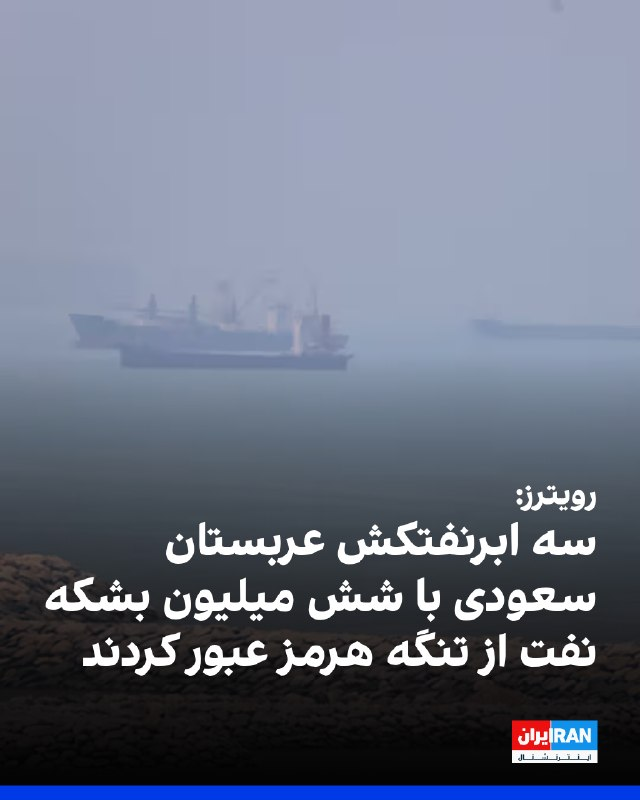

رویترز گزارش داد سه ابرنفتکش با پرچم عربستان سعودی که مجموعا شش میلیون بشکه نفت خام حمل می‌کنند، پنج‌شنبه ۲۸ خرداد از تنگه هرمز عبور کردند.
بر اساس داده‌های ردیابی کشتی‌ها، این عبور چند ساعت پس از امضای توافق میان دونالد ترامپ، رییس‌جمهوری آمریکا، و جمهوری اسلامی برای پایان دادن به جنگ میان دو طرف انجام شد.
رویترز نوشت این بزرگ‌ترین محموله نفتی خارج‌شده از مسیر تنگه هرمز در هفته‌های اخیر به شمار می‌رود. عربستان سعودی در طول جنگ، بخش عمده صادرات نفت خود را از طریق پایانه ینبع در دریای سرخ انجام می‌داد.
همزمان، چند نفتکش و کشتی حامل گاز طبیعی مایع نیز پس از هفته‌ها پنهان کردن مسیر حرکت خود، عبور از تنگه هرمز را از سر گرفتند.
https://iranintl.com/202606187261

## BBCPersian — post 284248

  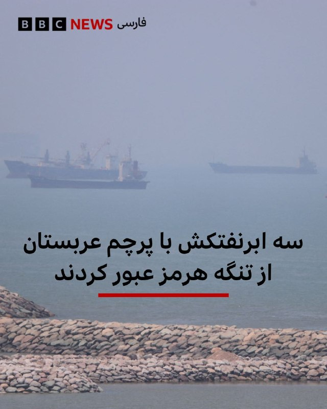

🔻داده‌های رهگیری کشتی‌ها در روز پنجشنبه نشان داد که سه ابرنفتکش با پرچم عربستان سعودی و حامل شش میلیون بشکه نفت خام، ساعاتی پس از امضای تفاهمنامه میان ایران و آمریکا از تنگه هرمز عبور کردند.

خبرگزاری رویترز عبور این سه ابرنفتکش را بزرگ‌ترین خروج نفتکش‌ها از بنادر عربستان از طریق تنگه هرمز در چند هفته اخیر توصیف کرده است.

عربستان سعودی در طول درگیری که از ۲۸ فوریه آغاز شد، به‌طور عمده از پایانه نفتی ینبع در ساحل دریای سرخ برای صادرات نفت استفاده کرده است. این درگیری مانع از خروج صدها میلیون بشکه نفت از بنادر تولیدکنندگان نفت در خلیج فارس از طریق تنگه هرمز شده بود.

📸 Reuters

https://bbc.in/4fNU3nt
@BBCPersian

## alonews — post 128881

  <a href="telegram/content/alonews_128881_1781776422.webm" target="_blank">🎬 Download video</a>

👈وزیر دفاع آمریکا: تنگه هرمز یک آبراه بین المللی و برای بسیاری از کشورهای جهان حیاتی است، اما ما به آن متکی نیستیم

✅ @AloNews خبر جنگ

## alonews — post 128880

  <a href="telegram/content/alonews_128880_1781776423.webm" target="_blank">🎬 Download video</a>

👈 حملات هوایی ارتش اسرائیل به جنوب لبنان

✅ @AloNews خبر جنگ

---
📅 بروزرسانی: 1405/03/28 13:13
---

## VahidOOnLine — post 246168

  

پیت هگست، وزیر جنگ آمریکا، با انتقاد شدید از برخی اعضای ناتو به دلیل مواضعشان در جنگ با جمهوری اسلامی، گفت برخی متحدان آمریکا در آزمون حمایت از واشینگتن «مردود» شدند.
هگست در نشست وزیران دفاع ناتو در بروکسل گفت برخی کشورهای اروپایی در جریان جنگ با جمهوری اسلامی محدودیت‌هایی برای نیروهای آمریکایی اعمال کردند و این اقدام جان نیروهای آمریکا را به خطر انداخت.
او افزود: «دونالد ترامپ به متحدان ما فرصت داد تا در زمان درخواست کمک از آمریکا حمایت کنند، اما تعداد زیادی از آنها در این آزمون شکست خوردند.»
وزیر جنگ آمریکا همچنین گفت مشارکت مالی واشینگتن در هزینه‌های ناتو در آینده به میزان افزایش بودجه دفاعی کشورهای عضو بستگی خواهد داشت. او گفت پنتاگون طی شش ماه آینده حضور نظامی آمریکا در اروپا را بازبینی می‌کند.
‌🏁 🇬🇧 IranintlTV

🤖 @VahidOOnLine

## DEJradio — post 5783

⭕️ ناخشنودی درون حکومتی از تفاهم با ترامپ؛ امضای «قاتل خامنه‌ای» خشم بخشی از نظام را برانگیخت

برخی از نیروهای درون حکومت، امضای تفاهمنامۀ تهران و واشینگتن توسط دونالد ترامپ، را عاملی بر سرشکستگی نظام جمهوری اسلامی عنوان کردند.
یک منبع به دژ گفت برخی از نیروهای امنیتی و سیاسی بر این باورند که انتشار ویدئوی امضای تفاهمنامه توسط قاتل علی خامنه‌ای و قاسم سلیمانی، در آیندۀ نزدیک سبب بحرانی عمیق درون حاکمیت می‌شود.
منبع دژ گفت نظر برخی از تحلیلگران درون حاکمیت بر این است که نظام از این پس به دلیل تن دادن به تفاهم با قاتل خامنه‌ای، با دودستگی بنیادین مواجه می‌شود.
این منبع گفت از همین حالا نیز برخی منتقدان می‌گویند «امضای تفاهمنامه به هر قیمتی» انجام شد، تا سبب شکاف میان نیروهای درون نظام بشود.
دونالد ترامپ، رئیس‌ جمهوری آمریکا روز سه‌شنبه گفته بود مسیر تغییرات در نظام جمهوری اسلامی با فرمان او برای کشتن قاسم سلیمانی آغاز شد.

#موشعلی #تفاهمنامه
@DEJradio

## IranIntlTV — post 342993

  <a href="telegram/content/IranIntlTV_342993_1781775824.mp4" target="_blank">🎬 Download video</a>

سرخط خبرهای پنجشنبه ۲۸ خرداد
@iranintltv

## IranIntlTV — post 342992

  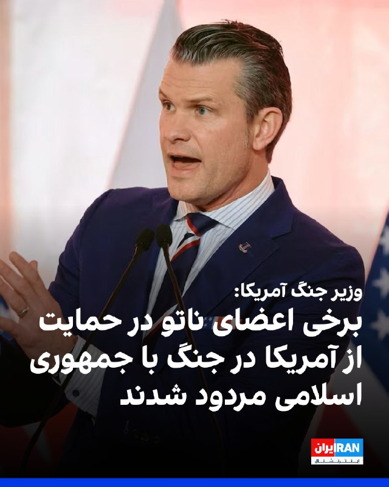

پیت هگست، وزیر جنگ آمریکا، با انتقاد شدید از برخی اعضای ناتو به دلیل مواضعشان در جنگ با جمهوری اسلامی، گفت برخی متحدان آمریکا در آزمون حمایت از واشینگتن «مردود» شدند.
هگست در نشست وزیران دفاع ناتو در بروکسل گفت برخی کشورهای اروپایی در جریان جنگ با جمهوری اسلامی محدودیت‌هایی برای نیروهای آمریکایی اعمال کردند و این اقدام جان نیروهای آمریکا را به خطر انداخت.
او افزود: «دونالد ترامپ به متحدان ما فرصت داد تا در زمان درخواست کمک از آمریکا حمایت کنند، اما تعداد زیادی از آنها در این آزمون شکست خوردند.»
وزیر جنگ آمریکا همچنین گفت مشارکت مالی واشینگتن در هزینه‌های ناتو در آینده به میزان افزایش بودجه دفاعی کشورهای عضو بستگی خواهد داشت. او گفت پنتاگون طی شش ماه آینده حضور نظامی آمریکا در اروپا را بازبینی می‌کند.
https://iranintl.com/202606185184

## FarsiVOA — post 221095

🔺ادعای شریعتمداری درباره احیای «۸۹ درصدی» پتروشیمی‌ها به رغم سقوط تولید

▪️مدیرعامل پتروشیمی خلیج فارس مدعی شد حدود ۸۹ درصد از واحدهایی که در جریان جنگ از مدار تولید خارج شدند، دوباره به چرخه تولید بازگشته‌اند.

▪️محمد شریعتمداری توضیح نداد این رقم مربوط به پتروشیمی‌های زیرمجموعه هلدینگ خلیج فارس است یا کل پتروشیمی‌های آسیب‌دیده کشور را در نظر می‌گیرد.

▪️هلدینگ تحت مدیریت او سهمی ۳۸ درصدی در تولید پتروشیمی کشور دارد و به غیر از پالایشگاه گاز بیدبلند، همه زیرمجموعه‌های آن فروردین امسال مورد هدف قرار گرفتند.

▪️پتروشیمی‌های آسیب‌دیده تحت مدیریت هلدینگ خلیج فارس شامل نوری، پارس، تندگویان، بندرامام، اروند، بوعلی‌سینا در فروردین و اردیبهشت امسال فقط با ۱۳ درصد ظرفیت کار کرده‌اند.

⬇️ بیشتر بخوانید:
https://ir.voanews.com/a/8162223.html

## FarsiVOA — post 221094

🔺ترامپ از مخالفان تفاهم با جمهوری اسلامی به شدت انتقاد کرد

▪️رئیس‌جمهور آمریکا، با یادآوری دستاوردهای تفاهم و توافق با جمهوری اسلامی، به منتقدان تفاهم اخیر واکنش نشان داد.

▪️دونالد ترامپ در اظهارنظری در شبکه تروت‌سوشال نوشت که «این احمق‌ها که فکر می‌کنند من به اندازه کافی با ایران سرسخت نبوده‌ام—آن هم درست در حالی که بازار سهام (والمارت/وال‌استریت) همین حالا به یک حد نصاب بی‌سابقه (رکورد تاریخی) دست یافته و قیمت نفت به شدت در حال سقوط و پایین آمدن است—یا حسودند، یا آدم‌های بدی هستند، یا احمق!»

▪️در روزهای اخیر برخی از اعضای کنگره آمریکا از تفاهم میان جمهوری اسلامی و آمریکا انتقاد کردند و برخی گفته‌اند این سند هنوز توافق نهایی با رژیم ایران محسوب نمی‌شود.

⬇️ بیشتر بخوانید:
https://ir.voanews.com/a/trump-strongly-criticizes-opponents-of-iran-deal/8162222.html

## alonews — post 128879

  <a href="telegram/content/alonews_128879_1781775826.webm" target="_blank">🎬 Download video</a>

👈وزیر امور خارجه اسرائیل اعلام کرد: پس از آنکه کایا کالاس، اسرائیل را با رژیم آپارتاید مقایسه کرد، روابط خود را با او قطع خواهیم کرد

✅ @AloNews خبر جنگ

## alonews — post 128878

  <a href="telegram/content/alonews_128878_1781775826.webm" target="_blank">🎬 Download video</a>

👈دار و دسته رائفی پور بُت سوزوندن😐 
✅ @AloNews خبر جنگ

## alonews — post 128877

  <a href="telegram/content/alonews_128877_1781775826.webm" target="_blank">🎬 Download video</a>

👈خبرنگار وال استریت ژورنال: چه عکس جالبی. امانوئل مکرون که کاملاً اروپایی‌ها را در مورد ایران نادیده گرفته و مخالفت آنها با جنگش را سرزنش کرده بود، موفق شد دونالد ترامپ را وادار به امضای تفاهم‌نامه در ورسای کند

✅ @AloNews خبر جنگ

---
📅 بروزرسانی: 1405/03/28 13:04
---

## VahidOOnLine — post 246167

  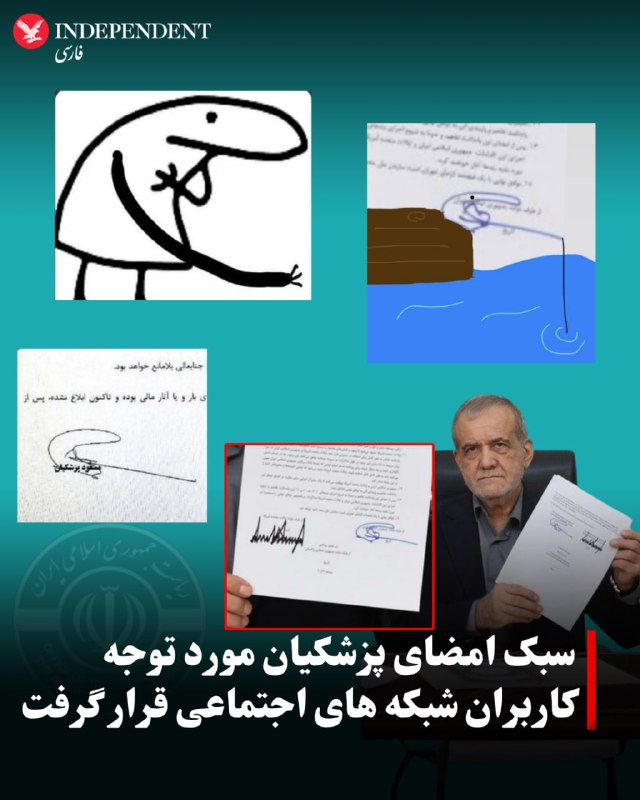

♦️امضای مسعود پزشکیان روی سند تفاهم‌نامه مشترک جمهوری اسلامی ایران و آمریکا برای پایان جنگ، مورد توجه کاربران شبکه‌های اجتماعی قرار گرفته است.
برخی کاربران امضای پزشکیان را با شکل یک شخصیت کارتونی مقایسه کرده‌اند.
‌🇸🇦 Indypersian

🤖 @VahidOOnLine

## VahidOOnLine — post 246166

  

علی مدنی‌زاده، وزیر اقتصاد جمهوری اسلامی، گفت قرار نیست توافق با آمریکا، اقتصاد ایران را به شرایط کاملا عادی باز گرداند.
او درباره وضعیت مالی دولت گفت حتی بدون وقوع جنگ نیز با چند صد هزار میلیارد تومان کسری بودجه روبه‌رو بودیم و اکنون شرایط دشوارتر شده است.
مدنی‌زاده گفت دولت چهاردهم، علاوه بر کسری بودجه موجود، در پی جنگ ۱۰۰ هزار میلیارد تومان از بانک مرکزی دریافت کرده است که آثار تورمی این اقدام در ماه‌های آینده نمایان خواهد شد.
‌🏁 🇬🇧 IranintlTV

🤖 @VahidOOnLine

## VahidOOnLine — post 246165

  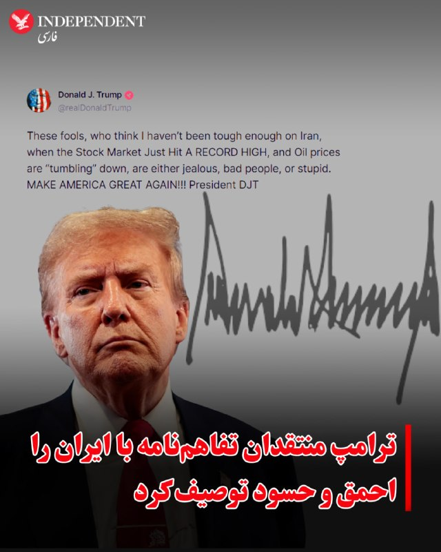

♦️دونالد ترامپ، رئیس جمهوری آمریکا روز پنجشنبه ۲۸ خردادماه با انتشار پیامی در تروث سوشال به شدت از منتقدان امضای تفاهم‌نامه پایان جنگ با جمهوری اسلامی ایران انتقاد کرد.

پیام در این پیام نوشت: «این احمق‌هایی که فکر می‌کنند من در مورد ایران به اندازه کافی سخت‌گیر نبوده‌ام، در حالی که بازار سهام به بالاترین حد خود رسیده و قیمت نفت در حال «سقوط» است، یا حسودند، یا آدم‌های بدی هستند، یا احمق. عظمت را به آمریکا باز گردانید!»
‌🇸🇦 Indypersian

🤖 @VahidOOnLine

## VahidOOnLine — post 246164

  

محمد اسحاق‌دار، وزیر خارجه پاکستان، پنجشنبه ۲۸ خرداد با انتشار تصویری اعلام کرد محمد شهباز شریف، نخست‌وزیر پاکستان، به عنوان میانجی، یادداشت تفاهم میان جمهوری اسلامی و آمریکا موسوم به «یادداشت تفاهم صلح اسلام‌آباد» را امضا کرده است.

این یادداشت تفاهم شامگاه چهارشنبه به امضای دونالد ترامپ، رییس‌جمهوری آمریکا، و مسعود پزشکیان، رییس دولت جمهوری اسلامی، نیز رسیده است.
‌🏁 🇬🇧 IranintlTV

🤖 @VahidOOnLine

## WithYashar — post 15229

## kianmeli1 — post 88063

  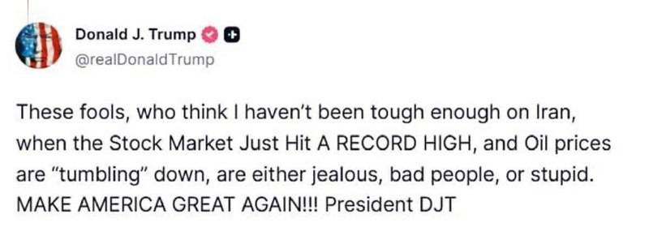

🔴دونالد ترامپ: این احمق‌هایی که فکر می‌کنند من در برابر ایران به اندازه کافی سخت‌گیر نبوده‌ام، در حالی که بازار سهام همین الان به «رکورد جدیدی» دست یافته و قیمت نفت در حال «سقوط» است، یا حسودند، یا آدم‌های بدی هستند و یا احمق! آمریکا را دوباره باشکوه کنیم
https://t.me/kianmeli1

## IranIntlTV — post 342991

  <a href="telegram/content/IranIntlTV_342991_1781775246.mp4" target="_blank">🎬 Download video</a>

همزمان با ادامه رقابت‌های جام جهانی ۲۰۲۶، تمامی تیم‌های حاضر در این مسابقات نخستین بازی خود را انجام دادند. در این میان، انگلستان شروعی قدرتمند داشت، اما پرتغال برابر حریفش متوقف شد.

گفت‌وگو با آیدین مقیمی، ایران‌اینترنشنال
@iranintltv

## IranIntlTV — post 342990

  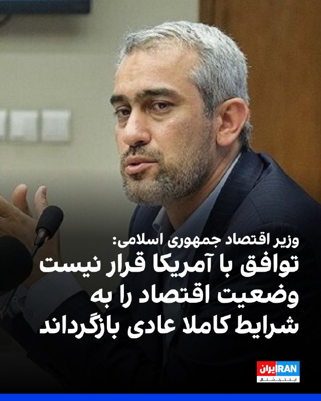

علی مدنی‌زاده، وزیر اقتصاد جمهوری اسلامی، گفت قرار نیست توافق با آمریکا، اقتصاد ایران را به شرایط کاملا عادی باز گرداند.
او درباره وضعیت مالی دولت گفت حتی بدون وقوع جنگ نیز با چند صد هزار میلیارد تومان کسری بودجه روبه‌رو بودیم و اکنون شرایط دشوارتر شده است.
مدنی‌زاده گفت دولت چهاردهم، علاوه بر کسری بودجه موجود، در پی جنگ ۱۰۰ هزار میلیارد تومان از بانک مرکزی دریافت کرده است که آثار تورمی این اقدام در ماه‌های آینده نمایان خواهد شد.
https://iranintl.com/202606187174

## FarsiVOA — post 221093

🔺انتقاد شدید هگست از اعضای ناتو به دلیل موضع «شرم‌آور» در قبال جنگ با جمهوری اسلامی

▪️وزیر جنگ آمریکا به‌شدت از برخی اعضای ناتو به‌دلیل میزان هزینه‌های دفاعی و مواضع‌شان درباره جنگ علیه جمهوری اسلامی انتقاد و اعلام کرد که بسیاری از متحدان در ناتو «به شکل شرم‌آوری» از حمایت از ایالات متحده در جنگ با جمهوری اسلامی سر باز زدند.

▪️پیت هگست روز پنجشنبه در جریان نشست وزرای دفاع ناتو در بروکسل در این زمینه افزود که ممانعت این کشورها برای دسترسی، استقرار و عبور پروازی (پرواز از حریم هوایی) نیروهای آمریکایی «شرم‌آور» بود.

▪️وزیر جنگ آمریکا همچنین تأکید کرد که متحدان این کشور در اروپا باید رهبری دفاع از قاره خود را بر عهده بگیرند و کمک کنند ناتو به «یک اتحاد نظامی سخت‌گیرانه واقعی» تبدیل شود.

⬇️ بیشتر بخوانید:
https://ir.voanews.com/a/many-nato-allies-failed-to-support-us-on-iran-in-shameful-denial-hegseth-says/8162217.html

## DW_Farsi — post 126126

  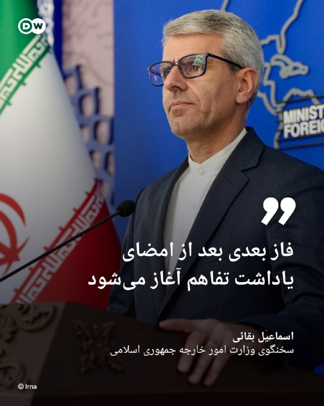

🔶 بقائی: فاز بعدی بعد از امضای یاداشت تفاهم آغاز می‌شود

اسماعیل بقائی، سخنگوی وزارت امور خارجه جمهوری اسلامی، صبح پنجشنبه ۲۸ خرداد (۱۸ ژوئن) ضمن اعلام امضای یاداشت تفاهم ایران و آمریکا به دو زبان فارسی و انگلیسی، در رابطه با تغییر شیوه امضا از نشست حضوری در سوئیس به امضای مجازی گفت: «بعد از مشورت‌های صورت‌گرفته، به این نتیجه رسیدیم که بهتر است متن یادداشت تفاهم توسط رؤسای جمهور دو کشور و بدون نیاز به حضور فیزیکی امضا شود.»

او یکی از دلایل این تصمیم را "افزایش هزینه سیاسی نقض توافق در صورت امضای مستقیم سران دو کشور" عنوان کرد.

سخنگوی وزارت خارجه ایران در رابطه با برنامه برنامه نشست بعدی سوئیس و آغاز فاز بعدی مذاکرات بعد از امضای تفاهم‌نامه گفت: «برگزاری نشست سوئیس همچنان در دستور کار قرار دارد، اما تصمیم‌گیری نهایی بعد از مشورت با میانجی‌ها اعلام خواهد شد.»

تفاهم‌نامه میان تهران و واشنگتن پیشتر قرار بود روز جمعه ۲۹ خرداد (۱۹ ژوئن) در سوئیس به امضاء برسد که این امر زودتر از موعد مقرر انجام گرفت.

در این میان سوئیس اعلام کرد که دیدار رسمی میان هیئت ایرانی و آمریکایی که برای روز جمعه برنامه‌ریزی شده، طبق برنامه برگزار می‌شود و نمایندگان دو کشور به همین منظور راهی سوئیس شده‌اند. وزارت خارجه این کشور اضافه کرده است، تعیین مضمون و کم‌وکیف این دیدار بر عهده طرفین خواهد بود.

@dw_farsi

## alonews — post 128876

  <a href="telegram/content/alonews_128876_1781775249.webm" target="_blank">🎬 Download video</a>

👈شبکه المنار اعلام کرد که حملات اسرائیل به شهرکهای کفرتبنیت و حداثا در جنوب لبنان همچنان ادامه دارد

✅ @AloNews خبر جنگ

---
📅 بروزرسانی: 1405/03/28 12:51
---

## VahidOOnLine — post 246155

  <a href="telegram/content/VahidOOnLine_246155_1781774481.mp4" target="_blank">🎬 Download video</a>

روز گذشته، تفاهم‌نامه آمریکا و جمهوری اسلامی به مهم‌ترین موضوع سیاسی و امنیتی منطقه تبدیل شد. متنی که فقط درباره توقف جنگ نیست، بلکه مسیر امتیازها، کاهش فشارها و مذاکرات بعدی را هم مشخص می‌کند.
‌🏁 🇬🇧 ManotoTV

🤖 @VahidOOnLine

## WithYashar — post 15228

وزیر امور خارجه اسرائیل : روابط با مسئول سیاست خارجی اتحادیه اروپا را قطع خواهیم کرد.
@withyashar

## mwarmonitor — post 11107

📌این گزارش از روزنامه Maariv می‌گوید:

🔸مقامات اسرائیلی نگران هستند که فشارهای رئیس‌جمهور دونالد ترامپ بر نخست‌وزیر بنیامین نتانیاهو برای عقب‌نشینی از جنوب لبنان تنها به تفاهم‌نامه آمریکا–ایران (MoU) محدود نماند و در مرحله مذاکرات نهایی حتی تشدید شود.

🔸طبق این گزارش، این فشار ممکن است از تأخیر در ارسال تسلیحات فراتر برود و حتی به اقداماتی نزدیک شود که شبیه یک تحریم تسلیحاتی غیررسمی علیه اسرائیل تلقی شود.

@mwarmonitor

## kianmeli1 — post 88062

  <a href="telegram/content/kianmeli1_88062_1781774484.mp4" target="_blank">🎬 Download video</a>

🔴ترامپ: اگر به بمباران ایران ادامه می دادیم، کشتی‌ها دیگر نمی‌توانستند تردد کنند

ذخایر نفت ما هم حدود ۴ هفته دیگر تمام می‌شد. ذخایر جهان واقعاً تمام می‌شد.
https://t.me/kianmeli1

## kianmeli1 — post 88061

  <a href="telegram/content/kianmeli1_88061_1781774486.mp4" target="_blank">🎬 Download video</a>

🔴مسکو، پایتخت روسیه پس از حملات امروز اوکراین
https://t.me/kianmeli1

## kianmeli1 — post 88060

  <a href="telegram/content/kianmeli1_88060_1781774487.mp4" target="_blank">🎬 Download video</a>

🔴حمله پهپادی اوکراین به پالایشگاه مسکو
https://t.me/kianmeli1

## IranIntlTV — post 342989

  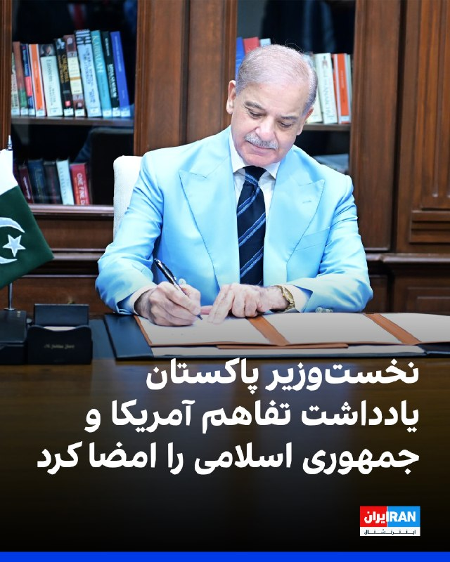

محمد اسحاق‌دار، وزیر خارجه پاکستان، پنجشنبه ۲۸ خرداد با انتشار تصویری اعلام کرد محمد شهباز شریف، نخست‌وزیر پاکستان، به عنوان میانجی، یادداشت تفاهم میان جمهوری اسلامی و آمریکا موسوم به «یادداشت تفاهم صلح اسلام‌آباد» را امضا کرده است.

این یادداشت تفاهم شامگاه چهارشنبه به امضای دونالد ترامپ، رییس‌جمهوری آمریکا، و مسعود پزشکیان، رییس دولت جمهوری اسلامی، نیز رسیده است.
https://iranintl.com/202606184792

## IranIntlTV — post 342988

  <a href="telegram/content/IranIntlTV_342988_1781774489.mp4" target="_blank">🎬 Download video</a>

اختلال در خدمات چند بانک در ایران ادامه دارد و مشکلات گسترده‌ای در زندگی روزمره مردم ایجاد کرده است. شهروندان در پیام‌هایی به ایران‌اینترنشنال از ناتوانی در دسترسی به حساب‌ها و برداشت پول‌های خود خبر می‌دهند.

جزییات بیشتر با لیلا سعادتی، عضو تحریریه ایران‌اینترنشنال
@iranintltv

## IranIntlTV — post 342987

  <a href="telegram/content/IranIntlTV_342987_1781774492.mp4" target="_blank">🎬 Download video</a>

یک شهروند با ارسال ویدیویی به ایران اینترنشنال گفت که ساعت ۱۱:۳۰ شامگاه ۲۷ خرداد، آلودگی صوتی شدید ناشی از صدای بلندگوها و طبل‌زنی در یکی از کوچه‌های تهران موجب سلب آرامش ساکنان شد. به گفته او، این صداها که در جریان ماه محرم از سوی گروه‌های حکومتی و یا عزاداران مذهبی ایجاد می‌شود، مانع خواب اهالی شده و برای ساکنان ایجاد مزاحمت کرده است.

## ManotoTV — post 106137

  <a href="telegram/content/ManotoTV_106137_1781774495.mp4" target="_blank">🎬 Download video</a>

روز گذشته، تفاهم‌نامه آمریکا و جمهوری اسلامی به مهم‌ترین موضوع سیاسی و امنیتی منطقه تبدیل شد. متنی که فقط درباره توقف جنگ نیست، بلکه مسیر امتیازها، کاهش فشارها و مذاکرات بعدی را هم مشخص می‌کند.

## Persian_Trend_Official — post 17451

  <a href="telegram/content/Persian_Trend_Official_17451_1781774497.mp4" target="_blank">🎬 Download video</a>

شهباز شریف، نخست‌وزیر پاکستان به‌عنوان میانجی، سند تفاهم موسوم به یادداشت تفاهم اسلام‌آباد میان ایران و آمریکا را در اسلام‌آباد امضا کرد.

📝 Amir

📌 @persian_trend_official
پرشین ترند | متفاوت‌ترین کانال نظامی

## Persian_Trend_Official — post 17450

العربیه: نخستین دور از مذاکرات فنی مستقیم واشینگتن و تهران فردا در زوریخ سوئیس برگزار می‌شود.

به گفته منابع این مذاکرات فنی میان ایران و آمریکا شامل جنبه‌های حقوقی و قانونی مربوط به رفع تحریم‌ها علیه ایران خواهد بود. منابع العربیه خاطرنشان کردند گفت‌وگوهای فنی ایران و آمریکا پرونده دارایی‌ها و وجوه مسدودشده ایران در قطر و همچنین پرونده هسته‌ای ایران را در بر می‌گیرد.

قرار است در نشست‌های مذاکراتی غیرعلنی و اعلام‌نشده، پرونده‌های مرتبط با لبنان و حزب‌الله نیز مورد بحث و بررسی قرار گیرد.

📝 Amir

📌 @persian_trend_official
پرشین ترند | متفاوت‌ترین کانال نظامی

## RadioFarda — post 158454

دیپلمات آمریکایی: تفاهم حاصل شد، اما آینده جمهوری اسلامی روشن نیست

🔸پس از ۱۱۰ روز جنگ و درگیری، دونالد ترامپ، رئیس‌جمهور آمریکا، و مسعود پزشکیان، رئیس‌جمهور ایران، یک یادداشت تفاهم ۱۴ بندی امضا کردند که چارچوبی برای پایان دادن به خصومت‌ها، بازگشایی تنگه هرمز، رفع محدودیت‌های کلیدی بر صادرات نفت ایران و تضمین جلوگیری از دستیابی تهران به سلاح هسته‌ای توصیف شده است.

🔸این توافق که ۲۷ خرداد امضا شد، قرار است پلی برای رسیدن به یک توافق گسترده‌تر باشد که طی ۶۰ روز آینده دربارهٔ آن مذاکره خواهد شد. حامیان این تفاهم آن را پیشرفتی مهم در یکی از پرتنش‌ترین رویارویی‌های جهان می‌دانند. منتقدان اما تردید دارند که رهبران حکومت ایران بتوانند یا بخواهند تعهدات مندرج در این سند را اجرا کنند.

🔸لینکلن بلومفیلد، معاون پیشین وزیر خارجه آمریکا و فرستادهٔ ویژهٔ ریاست‌جمهوری در دولت جورج دبلیو بوش، در گفت‌وگو با رادیو اروپای آزاد/رادیو آزادی دربارهٔ اهمیت دیپلماتیک این تفاهم، پیامدهای آن برای امنیت دریایی، آیندهٔ نیروهای نیابتی جمهوری اسلامی در منطقه و چشم‌انداز دستیابی به صلحی پایدار صحبت کرده است.

🔸او می‌گوید باور ندارد که مقامات جمهوری اسلامی واقعاً بتوانند با تبدیل شدن به یک کشور عادی و صلح‌طلب و کنار گذاشتن سیاست‌های کنونی خود موافقت کنند. او همچنین تأکید می‌کند جنبش انقلابی در ایران دوباره اوج خواهد گرفت، زیرا این حکومت توانایی ادارهٔ کشور را ندارد.

🔸گزارش کامل را در وب‌سایت رادیو فردا می‌توانید بخوانید.

@RadioFarda

## Hranews — post 113698

گزارشی از بازداشت کومار حسین‌زاده در بوکان

❗️
❗️
❗️
❗️
❗️– کومار حسین‌زاده، شهروند اهل بوکان، توسط ماموران اداره اطلاعات در این شهرستان بازداشت و به مکان نامعلومی منتقل شد.

#کومار_حسین‌زاده

ادامه مطلب

↘️
@hranews_bot تماس ✉️ - @Hranews کانال هرانا 🆑

## manototv — post 106137

  <a href="telegram/content/manototv_106137_1781774500.mp4" target="_blank">🎬 Download video</a>

روز گذشته، تفاهم‌نامه آمریکا و جمهوری اسلامی به مهم‌ترین موضوع سیاسی و امنیتی منطقه تبدیل شد. متنی که فقط درباره توقف جنگ نیست، بلکه مسیر امتیازها، کاهش فشارها و مذاکرات بعدی را هم مشخص می‌کند.

## alonews — post 128875

  <a href="telegram/content/alonews_128875_1781774501.webm" target="_blank">🎬 Download video</a>

👈دانش آموزها دایرکت سوراخ کردن که اینو بزاریم، ماهم گذاشتیم

✅ @AloNews خبر جنگ

## alonews — post 128874

  <a href="telegram/content/alonews_128874_1781774502.webm" target="_blank">🎬 Download video</a>

👈آژانس بین‌المللی انرژی اتمی اعلام کرد:
در حال حاضر، سطح تماس‌ها و ارتباطات با ایران در پایین‌ترین حد خود قرار دارد.

✅ @AloNews خبر جنگ

## alonews — post 128873

  <a href="telegram/content/alonews_128873_1781774502.webm" target="_blank">🎬 Download video</a>

👈به گزارش بلومبرگ، هنگ‌کنگ در راستای تلاش‌های پکن برای بین‌المللی کردن یوان و جذب سرمایه‌های خارجی، آماده راه‌اندازی معاملات آتی (Futures) اوراق قرضه دولتی چین می‌شود. این اقدام گام مهمی برای تقویت جایگاه پول ملی چین در بازارهای مالی جهان و تسهیل ورود سرمایه‌گذاران بین‌المللی به بازار بدهی این کشور محسوب می‌شود.

✅ @AloNews خبر جنگ

## alonews — post 128872

  <a href="telegram/content/alonews_128872_1781774503.webm" target="_blank">🎬 Download video</a>

👈قالیباف: انتقام آقا رو، امام زمان میگیره

✅ @AloNews خبر جنگ

## alonews — post 128871

  <a href="telegram/content/alonews_128871_1781774503.webm" target="_blank">🎬 Download video</a>

👈شهباز شریف نخست وزیر پاکستان به عنوان میانجی، یادداشت تفاهم اسلام‌آباد را امضا کرد.

✅ @AloNews خبر جنگ

---
📅 بروزرسانی: 1405/03/28 12:34
---

## VahidOOnLine — post 246154

  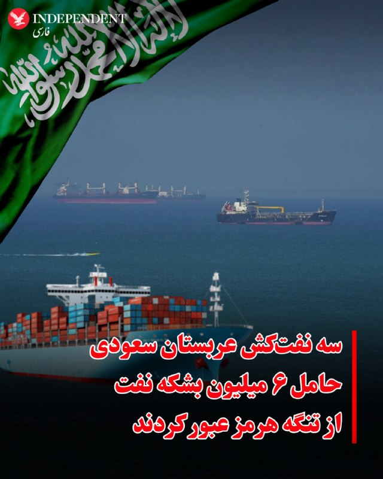

♦️تلویزیون العربیه روز پنجشنبه ۲۸ خردادماه به نقل از مقام‌های دریانوردی اعلام کرد یک نفتکش عربستان سعودی حامل ۶ میلیون بشکه نفت خام از تنگه هرمز عبور کرد و وارد دریای عمان شد.

در پی امضای تفاهم‌نامه پایان جنگ میان آمریکا و جمهوری اسلامی ایران، تنگه هرمز باز شده است.
‌🇸🇦 Indypersian

🤖 @VahidOOnLine

## VahidOOnLine — post 246153

  <a href="telegram/content/VahidOOnLine_246153_1781773468.mp4" target="_blank">🎬 Download video</a>

♦️شهباز شریف، نخست وزیر پاکستان و میانجی رسمی مذاکرات آمریکا با جمهوری اسلامی ایران روز پنجشنبه ۲۸ خرداد تفاهم‌نامه پایان جنگ را امضا کرد.
ساعاتی پیش از این، دونالد ترامپ و مسعود پزشکیان، روسای جمهوری آمریکا و ایران این سند را «از راه دور» امضا کرده بودند.
‌🇸🇦 Indypersian

🤖 @VahidOOnLine

## WithYashar — post 15227

منابع العربیه گزارش دادند «نخستین دور از مذاکرات فنی مستقیم واشینگتن و تهران فردا در زوریخ سوئیس برگزار می‌شود.»
به گفته منابع این مذاکرات فنی میان ایران و آمریکا شامل جنبه‌های حقوقی و قانونی مربوط به رفع تحریم‌ها علیه ایران خواهد بود.
منابع العربیه خاطرنشان کردند گفت‌وگوهای فنی ایران و آمریکا پرونده دارایی‌ها و وجوه مسدودشده ایران در قطر و همچنین پرونده هسته‌ای ایران را در بر می‌گیرد.
قرار است در نشست‌های مذاکراتی غیرعلنی و اعلام‌نشده، پرونده‌های مرتبط با لبنان و حزب‌الله نیز مورد بحث و بررسی قرار گیرد.
@withyashar

## IranIntlTV — post 342986

  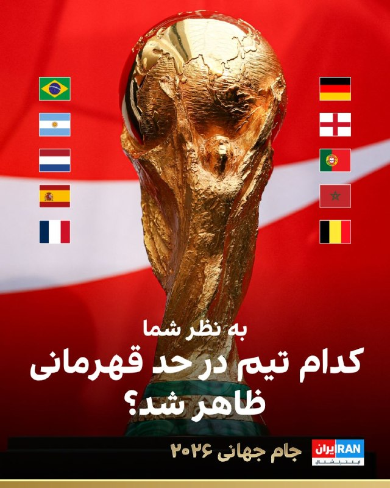

🔻به نظر شما کدام تیم در حد قهرمانی ظاهر شد؟

🔹تمامی ۲۴ مسابقه دور اول مرحله گروهی انجام شد و مدعیان قهرمانی نخستین بازی خود را انجام دادند. آرژانتین با هت‌تریک لیونل مسی ۳ بر صفر الجزایر را شکست داد. فرانسه با دبل امباپه ۳ بر ۱ از سد سنگال گذشت و انگلیس هم با دبل هری کین، کرواسی را از پیش رو برداشت. آلمان تیم نه‌چندان قدرتمند کوراسائو را ۷ بر ۱ درهم کوبید.

🔹دیدار برزیل و مراکش مساوی شد. اسپانیا و پرتغال، دیگر مدعیان قهرمانی هم، شروع چندان موفقی نداشتند و برابر رقبای خود تن به تساوی دادند.

🔹برای شرکت در این نظرخواهی به صفحه اینستاگرام ایران اینترنشنال ورزشی مراجعه کنید👇
https://www.instagram.com/p/DZuKlVVAwAT/?igsh=Z3p6d2d5bGtudGhv

@iranintltvsport

## IranIntlTV — post 342985

  <a href="telegram/content/IranIntlTV_342985_1781773473.mp4" target="_blank">🎬 Download video</a>

محمدجواد اکبرین، عضو تحریریه ایران‌اینترنشنال، درباره مخالفت گروهی از طرفداران جمهوری اسلامی با توافق با آمریکا گفت: «قراری که حکومت با طرفدارانش داشت، اطاعت بی چون‌وچرا بود؛ اما حالا که آنها وارد پرسشگری شده‌اند، هزینه این تغییر را می‌پردازند.»
@iranintltv

## FarsiVOA — post 221092

  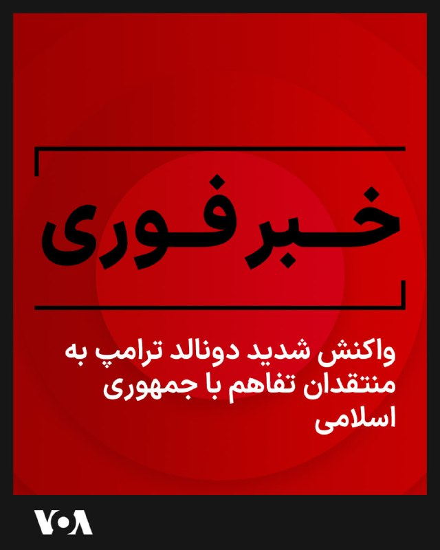

دونالد ترامپ، رئیس‌جمهور آمریکا، در اظهارنظری شدید‌اللحن و با یادآوری دستاوردهای تفاهم و توافق با جمهوری اسلامی، به منتقدان تفاهم اخیر واکنش نشان داد.

آقای ترامپ در اظهارنظری در شبکه اجتماعی تروت‌سوشال نوشت که «این احمق‌ها که فکر می‌کنند من به اندازه کافی با ایران سرسخت نبوده‌ام—آن هم درست در حالی که بازار سهام (والمارت/وال‌استریت) همین حالا به یک حد نصاب بی‌سابقه (رکورد تاریخی) دست یافته و قیمت نفت به شدت در حال سقوط و پایین آمدن است—یا حسودند، یا آدم‌های بدی هستند، یا احمق!»

او این اظهارنظر را با این پیام پایان داد که «آمریکا را دوباره بزرگ کنیم!!!»
@FarsiVOA

## DW_Farsi — post 126125

  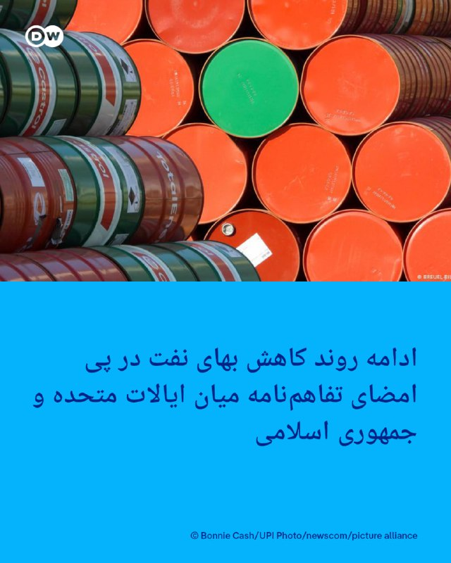

🔶 ادامه روند کاهش بهای نفت

در پی امضای تفاهم‌نامه میان ایالات متحده و جمهوری اسلامی، بهای نفت در بازارهای جهانی به سیر نزولی خود ادامه داد. به گزارش خبرگزاری فرانسه روز پنجشنبه ۱۸ ژوئن (۲۸ خرداد) بهای هر بشکه نفت برنت دریای شمال با کاهشی معادل ۳.۰۲ درصد به ۷۷ دلار و ۱۵ سنت رسید. بهای نفت شاخص وست تگزاس اینترمیدیت نیز با کاهشی ۳.۴ درصدی به ۷۴ دلار و ۱۸ سنت در ازای هر بشکه رسید.

در پی بحران تنگه هرمز و همچنین اعمال محاصره دریایی آمریکا علیه جمهوری اسلامی، بهای نفت در هفته‌های گذشته به شدت افزایش یافته و بحرانی جدی را در عرصه تأمین انرژی در سطح جهانی پدید آورده بود. پاکستان که میانجی‌گری میان تهران و واشنگتن را بر عهده دارد، اعلام کرده که تفاهم‌نامه امضا‌ءشده میان طرفین فورا اجرایی شده است. از جمله مهم‌ترین مفاد این تفاهم‌نامه بازگشایی تنگه هرمز و پایان محاصره دریایی آمریکا است.

@dw_farsi

## Persian_Trend_Official — post 17449

  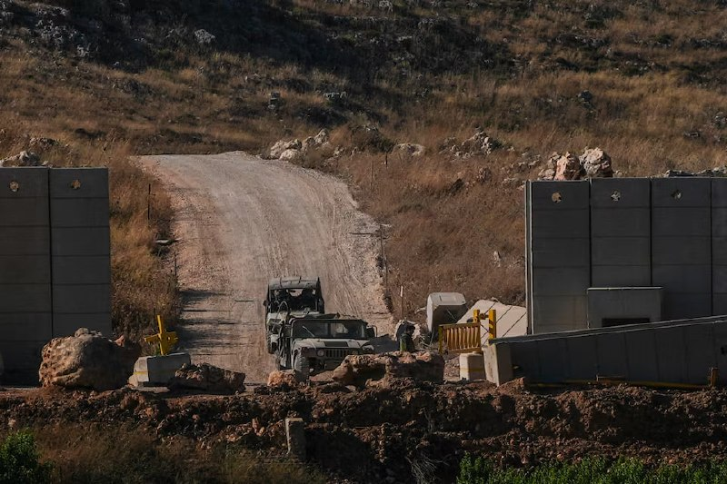

رویترز: اسرائیل در حال مذاکره با واشنگتن برای حفظ استقرار نیروهای خود در جنوب لبنان است.

یک مقام ارشد اسرائیلی نزدیک به نتانیاهو می‌گوید اسرائیل در حال انجام مذاکرات سرسختانه با واشنگتن است و از حفظ نیروها در جنوب رودخانه لیتانی عقب‌نشینی نخواهد کرد.

اسرائیل سرزمین‌های تصرف‌شده خود در لبنان، غزه و سوریه را مناطق حائل توصیف می‌کند. نتانیاهو تمام درخواست‌ها برای عقب‌نشینی را رد کرده است.

یک مقام اسرائیلی دیگر می‌گوید نتیجه کاملاً به این بستگی دارد که آیا ترامپ تصمیم می‌گیرد با تهدید به عواقب ناشی از سرپیچی اسرائیل از مفاد تفاهم‌نامه، مسئله را تحمیل کند.

📝 Amir

📌 @persian_trend_official
پرشین ترند | متفاوت‌ترین کانال نظامی

## Persian_Trend_Official — post 17448

  <a href="telegram/content/Persian_Trend_Official_17448_1781773479.webm" target="_blank">🎬 Download video</a>

به گزارش رویترز، رافائل گروسی، مدیرکل آژانس بین‌المللی انرژی اتمی، می‌گوید این آژانس آماده است تا پس از توافق ایران و آمریکا، گام‌های مشخصی برای رسیدگی به برنامه هسته‌ای ایران بردارد.

گروسی می‌گوید آژانس ایده نسبتاً خوبی از سایت‌ها و موادی که باید به آنها دسترسی پیدا کند، دارد، اما می‌گوید که هنوز برای پیشبرد این روند زود است.

او گفت: ما در آستانه مرحله تعیین‌کننده گفتگوهای فنی هستیم. او افزود که فرض می‌کند همه طرف‌ها با حسن نیت عمل می‌کنند.

📝 Amir

📌 @persian_trend_official
پرشین ترند | متفاوت‌ترین کانال نظامی

## Persian_Trend_Official — post 17447

  <a href="telegram/content/Persian_Trend_Official_17447_1781773479.webm" target="_blank">🎬 Download video</a>

محمد مرندی، عضو تیم مذاکره: آقای خوش‌چشم درست میگفت، ترامپ بالاخره کوتاه اومد.

👺Phantom

📌 @persian_trend_official
پرشین ترند | متفاوت‌ترین کانال نظامی

## alonews — post 128870

  <a href="telegram/content/alonews_128870_1781773480.webm" target="_blank">🎬 Download video</a>

👈منابع العربیه گزارش دادند «نخستین دور از مذاکرات فنی مستقیم واشینگتن و تهران فردا در زوریخ سوئیس برگزار می‌شود.»

🔴 به گفته منابع این مذاکرات فنی میان ایران و آمریکا شامل جنبه‌های حقوقی و قانونی مربوط به رفع تحریم‌ها علیه ایران خواهد بود.

🔴 منابع العربیه خاطرنشان کردند گفت‌وگوهای فنی ایران و آمریکا پرونده دارایی‌ها و وجوه مسدودشده ایران در قطر و همچنین پرونده هسته‌ای ایران را در بر می‌گیرد.

🔴 قرار است در نشست‌های مذاکراتی غیرعلنی و اعلام‌نشده، پرونده‌های مرتبط با لبنان و حزب‌الله نیز مورد بحث و بررسی قرار گیرد.

✅ @AloNews خبر جنگ

---
📅 بروزرسانی: 1405/03/28 12:23
---

## VahidOOnLine — post 246152

  

دونالد ترامپ، رییس‌جمهوری آمریکا، در پیامی منتقدان رویکرد خود در قبال ایران را هدف قرار داد و گفت افرادی که معتقدند او به اندازه کافی در برابر جمهوری اسلامی سختگیر نبوده، «یا حسود هستند، یا آدم‌های بدی هستند، یا احمق».

ترامپ با اشاره به عملکرد بازارهای مالی و قیمت انرژی نوشت که بازار سهام آمریکا به رکوردی تازه رسیده و قیمت نفت در حال کاهش است.

او در این پیام افزود: «این احمق‌ها که فکر می‌کنند من در قبال ایران به اندازه کافی سختگیر نبوده‌ام، در حالی که بازار سهام همین حالا به بالاترین رکورد تاریخی خود رسیده و قیمت نفت در حال سقوط است، یا حسود هستند، یا آدم‌های بدی هستند، یا احمق.»

رییس‌جمهوری آمریکا در پایان پیام خود بار دیگر شعار انتخاباتی‌ خود، «آمریکا را دوباره عظمت ببخشیم»، را تکرار کرد.
‌🏁 🇬🇧 IranintlTV

🤖 @VahidOOnLine

## VahidOOnLine — post 246151

  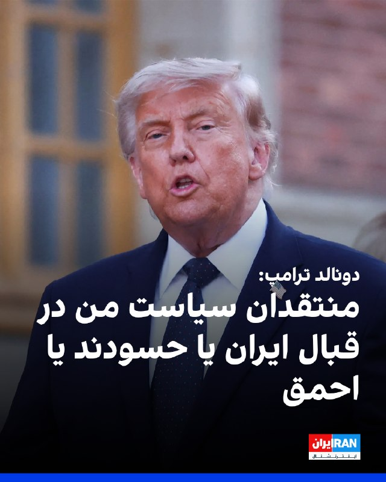

دونالد ترامپ، رییس‌جمهوری آمریکا، در پیامی منتقدان رویکرد خود در قبال ایران را هدف قرار داد و گفت افرادی که معتقدند او به اندازه کافی در برابر جمهوری اسلامی سختگیر نبوده، «یا حسود هستند، یا آدم‌های بدی هستند، یا احمق».

ترامپ با اشاره به عملکرد بازارهای مالی و قیمت انرژی نوشت که بازار سهام آمریکا به رکوردی تازه رسیده و قیمت نفت در حال کاهش است.

او در این پیام افزود: «این احمق‌ها که فکر می‌کنند من در قبال ایران به اندازه کافی سختگیر نبوده‌ام، در حالی که بازار سهام همین حالا به بالاترین رکورد تاریخی خود رسیده و قیمت نفت در حال سقوط است، یا حسود هستند، یا آدم‌های بدی هستند، یا احمق.»

رییس‌جمهوری آمریکا در پایان پیام خود بار دیگر شعار انتخاباتی‌ خود، «آمریکا را دوباره عظمت ببخشیم»، را تکرار کرد.
‌🏁 🇬🇧 IranintlTV

🤖 @VahidOOnLine

## WithYashar — post 15226

  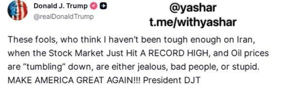

ترامپ در‌تروث: این احمق‌ها که فکر می‌کنند من در قبال ایران به اندازه کافی سختگیر نبودم، در حالی که بازار سهام به تازگی به بالاترین حد خود رسیده و قیمت نفت «به سرعت در حال سقوط» است، یا حسودند، آدم‌های بد یا احمق. آمریکا را دوباره بزرگ خواهیم کرد!!!
@withyashar

## mwarmonitor — post 11106

  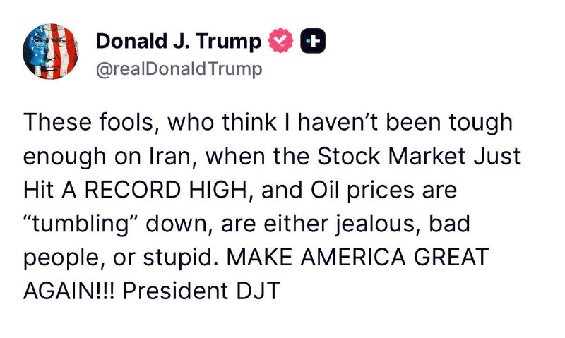

«این احمق‌ها که فکر می‌کنند من به اندازه کافی با ایران سخت‌گیر نبوده‌ام، آن هم در حالی که بازار بورس همین حالا به بالاترین رکورد تاریخی خود رسیده و قیمت نفت در حال "سقوط" است، یا حسودند، یا آدم‌های بدی هستند و یا نادان. عظمت را دوباره به آمریکا بازگردانید!!!

رئیس‌جمهور دونالد جی ترامپ (DJT)»

@mwarmonitor

## mwarmonitor — post 11105

🔴 وزیر خارجه اسرائیل، گیدئون سعار، اعلام کرده است که تمام روابط خود را با مسئول سیاست خارجی اتحادیه اروپا کایا کالاس قطع می‌کند.

🔸او این تصمیم را در واکنش به اظهارات کالاس مبنی بر تشبیه اسرائیل به رژیم آپارتاید در آفریقای جنوبی محکوم کرده و گفته است تا زمانی که او این اظهارات را پس نگیرد، تماس‌ها از سر گرفته نخواهد شد.i24

@mwarmonitor

## DEJradio — post 5782

  <a href="telegram/content/DEJradio_5782_1781772822.mp4" target="_blank">🎬 Download video</a>

🤡
🔺 در مشهد حامیان نظان جشن پیروزی گرفتند.

آنها بدون در نظر گرفتن اینکه هنوز جسد علی خامنه‌ای دفن نشده، احساس پیروزی می‌کنند!

#موشعلی #جشن_پیروزی #مشهد
@DEJradio

## IranIntlTV — post 342984

  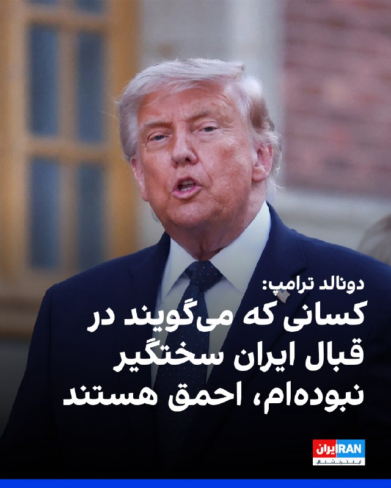

دونالد ترامپ، رییس‌جمهوری آمریکا، در پیامی منتقدان رویکرد خود در قبال ایران را هدف قرار داد و گفت افرادی که معتقدند او به اندازه کافی در برابر جمهوری اسلامی سختگیر نبوده، «یا حسود هستند، یا آدم‌های بدی هستند، یا احمق».

ترامپ با اشاره به عملکرد بازارهای مالی و قیمت انرژی نوشت که بازار سهام آمریکا به رکوردی تازه رسیده و قیمت نفت در حال کاهش است.

او در این پیام افزود: «این احمق‌ها که فکر می‌کنند من در قبال ایران به اندازه کافی سختگیر نبوده‌ام، در حالی که بازار سهام همین حالا به بالاترین رکورد تاریخی خود رسیده و قیمت نفت در حال سقوط است، یا حسود هستند، یا آدم‌های بدی هستند، یا احمق.»

رییس‌جمهوری آمریکا در پایان پیام خود بار دیگر شعار انتخاباتی‌ خود، «آمریکا را دوباره عظمت ببخشیم»، را تکرار کرد.
https://iranintl.com/202606181080

## FarsiVOA — post 221091

  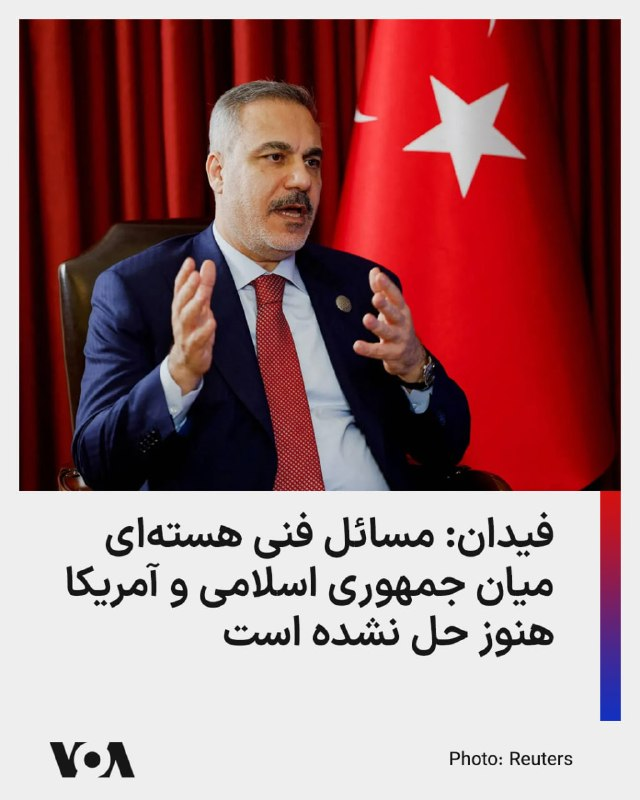

وزیر خارجه ترکیه کرد اگرچه جمهوری اسلامی و آمریکا بر سر عناصر کلیدی یک توافق به تفاهم اصولی رسیده‌اند، اما مسائل فنی از جمله سرنوشت اورانیوم غنی‌شده ایران و نحوه اجرای توقف احتمالی غنی‌سازی در آینده همچنان حل‌نشده باقی مانده است.

هاکان فیدان روز پنج‌شنبه گفت مشخص نیست ۴۰۰ کیلوگرم اورانیوم ۶۰ درصدی ایران چگونه رقیق، نظارت و راستی‌آزمایی خواهد شد و اصولاً چه کسی آن را انجام خواهد داد.

او همچنین بر لزوم مذاکرات مستقیم میان آمریکا و جمهوری اسلامی اشاره کرد و گفت پیشتر نیز طرفین را به مذاکرات مستقیم تشویق کرده است.

او با اشاره به مشکلات مذاکرات غیرمستقیم جمهوری اسلامی و ایالات متحده با میانجی‌گری پاکستان، ترکیه، قطر و مصر طی ماه‌های گذشته گفت در حالی که طرف آمریکایی می‌توانست ظرف یک ساعت پاسخ دهد، گاهی ایرانی‌ها برای پاسخ‌گویی به یک هفته زمان نیاز داشتند.
@FarsiVOA

## Persian_Trend_Official — post 17446

  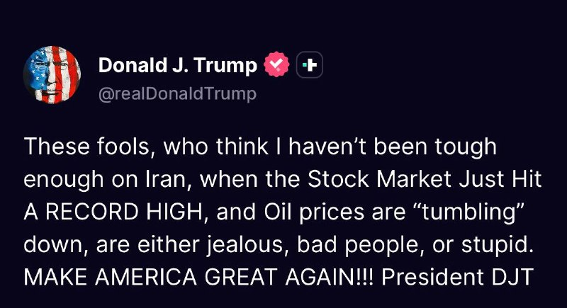

رئیس جمهور ایالات متحده، ترامپ: این احمق‌ها که فکر می‌کنند من به اندازه کافی در مورد ایران سخت‌گیر نبوده‌ام، در حالی که بازار سهام به بالاترین حد خود رسیده و قیمت نفت در حال سقوط است، یا حسودند، یا آدم‌های بدی هستند، یا احمق. آمریکا را دوباره باشکوه می‌کنیم!!!

📝 Amir

📌 @persian_trend_official
پرشین ترند | متفاوت‌ترین کانال نظامی

## IranianMinds — post 22850

  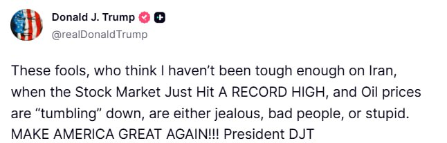

🔴ترامپ:
این احمق‌ها که فکر می‌کنند من به اندازه کافی در برابر ایران سخت‌گیر نبوده‌ام، در حالی که بازار سهام به رکورد بالایی رسیده و قیمت نفت در حال «سقوط» است، یا حسودند، یا آدم‌های بدی هستند، یا احمق.

@IranianMinds

## alonews — post 128869

  <a href="telegram/content/alonews_128869_1781772825.webm" target="_blank">🎬 Download video</a>

👈وال‌استریت ژورنال: اپل تایید کرد ، قیمت آیفون افزایش می‌یابد

✅ @AloNews خبر جنگ

---
📅 بروزرسانی: 1405/03/28 12:13
---

## WithYashar — post 15225

شهباز شریف هم یادداشت تفاهم ایران و آمریکا را امضا کرد @withyashar

## DEJradio — post 5781

  <a href="telegram/content/DEJradio_5781_1781772214.mp4" target="_blank">🎬 Download video</a>

🚨🎥 بر اساس ویدیوهایی که در شبکه‌های اجتماعی منتشر شده انفجاری مهیب در مخازن نفتی شهر مسکو باعث یک آتش‌سوزی مهیب شد.

هم‌زمان ولودیمیر زلنسکی رئیس جمهوری اوکراین، در «ایکس» نوشت: «دست ما به دورترین مناطق مسکو رسید و برای دومین بار در این هفته، پالایشگاه نفت مسکو هدف قرار گرفت. همچنین اهدافی در منطقه روستوف و در سرزمین‌های موقتا اشغال‌شده اوکراین مورد اصابت قرار گرفتند. این پاسخی کاملا موجه به حملات روسیه علیه شهرها و جوامع ماست و همچنین یکی دیگر از نتایج مهم فعالیت رزمندگان ما علیه تأسیساتی است که ماشین جنگی روسیه را سرپا نگه می‌دارند.»

#روسیه #اوکراین
@DEJradio

## IranIntlTV — post 342983

  

دونالد ترامپ، رییس‌جمهوری آمریکا، در پیامی منتقدان رویکرد خود در قبال ایران را هدف قرار داد و گفت افرادی که معتقدند او به اندازه کافی در برابر جمهوری اسلامی سختگیر نبوده، «یا حسود هستند، یا آدم‌های بدی هستند، یا احمق».

ترامپ با اشاره به عملکرد بازارهای مالی و قیمت انرژی نوشت که بازار سهام آمریکا به رکوردی تازه رسیده و قیمت نفت در حال کاهش است.

او در این پیام افزود: «این احمق‌ها که فکر می‌کنند من در قبال ایران به اندازه کافی سختگیر نبوده‌ام، در حالی که بازار سهام همین حالا به بالاترین رکورد تاریخی خود رسیده و قیمت نفت در حال سقوط است، یا حسود هستند، یا آدم‌های بدی هستند، یا احمق.»

رییس‌جمهوری آمریکا در پایان پیام خود بار دیگر شعار انتخاباتی‌ خود، «آمریکا را دوباره عظمت ببخشیم»، را تکرار کرد.
https://iranintl.com/202606181080

## DW_Farsi — post 126124

  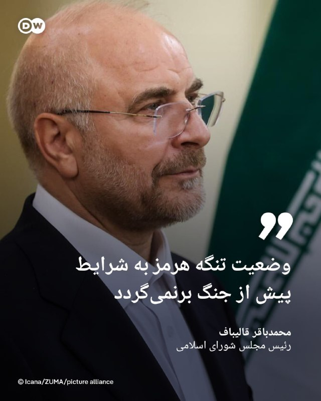

🔶 قالیباف: وضعیت تنگه هرمز به شرایط پیش از جنگ برنمی‌گردد

محمدباقر قالیباف، رئیس مجلس شورای اسلامی و مذاکره‌کننده ارشد ایران چهارشنبه ۲۷ خرداد (۱۷ ژوئن) در گفت‌وگویی تلویزیونی با اشاره به تفاهم‌نامه امضاءشده میان تهران و واشنگتن تصریح کرد: «وضعیت تنگه هرمز به شرایط پیش از جنگ برنمی‌گردد، اما این به معنای اقدام خلاف قوانین بین‌المللی و کشتیرانی نیست. ما در چارچوب قوانین بین‌المللی عمل می‌کنیم.»

قالیباف در این مصاحبه با اشاره به اینکه "پرداخت هزینه خدمات عبور از  تنگه هرمز  در تفاهم‌نامه تثبیت شده" گفت، کشورهای ساحلی تنگه‌ها در قوانین بین المللی حقوق و وظایفی دارند از جمله این که دیگران باید هزینه خدمات‌شان را بپردازند. او افزود که جمهوری اسلامی "در تنگه هرمز حق حاکمیتی دارد و طبیعتا در قبال خدمات، هزینه دریافت خواهیم کرد".

او مذاکره را "یک روش مبارزه" دانست و مدعی شد، هر آنچه را ایران می‌خواست با اقدام نظامی به دست بیاورد "چندین برابر آن را که اصلا قابل قیاس نیست، از طریق مذاکره به دست آورده است".

@dw_farsi

## RadioFarda — post 158453

  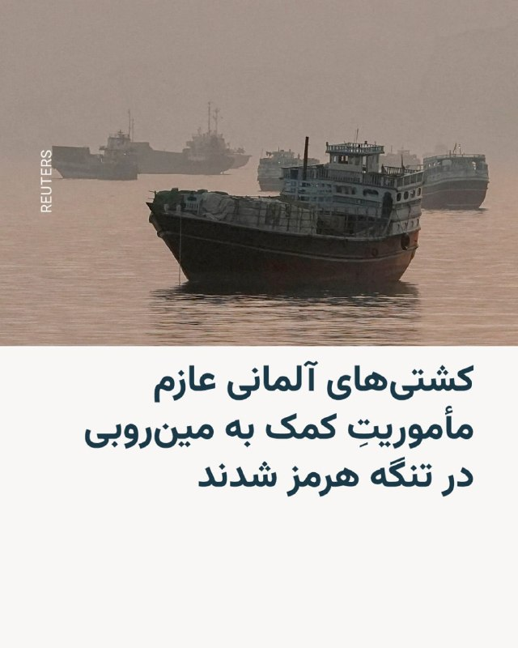

🔸بوریس پیستوریوس، وزیر دفاع آلمان، اعلام کرد که برلین در حال اعزام دو کشتی به دریای سرخ است تا برای یک مأموریت نظامی احتمالی در تنگه هرمز آماده شوند.

🔸او هنگام ورود به بروکسل برای شرکت در نشست با همتایان خود در ناتو، به خبرنگاران گفت: «در همین لحظه، ناو مین‌روب فولدا و کشتی پشتیبانی موزل ما از کانال سوئز عبور کرده و به سمت دریای سرخ در حرکت هستند.»

🔸با این حال پیستوریوس گفت که پیش از هرگونه مشارکت در عملیات مین‌روبی، موافقت ایران و عمان ضروری خواهد بود.

🔸او همچنین افزود که انجام هر مأموریتی همچنین به روند و نتایج مذاکرات بیشتر میان ایران و ایالات متحده بستگی دارد.

🔸چند روز پیش از این بلومبرگ گزارش داده بود که رهبران اروپایی آماده‌اند پس از اجرای توافق اعلام‌شده میان آمریکا و جمهوری اسلامی، تجهیزات و نیروهای دریایی خود را برای کمک به بازگشایی تنگه هرمز مستقر کنند.

@RadioFarda

## IranianMinds — post 22849

  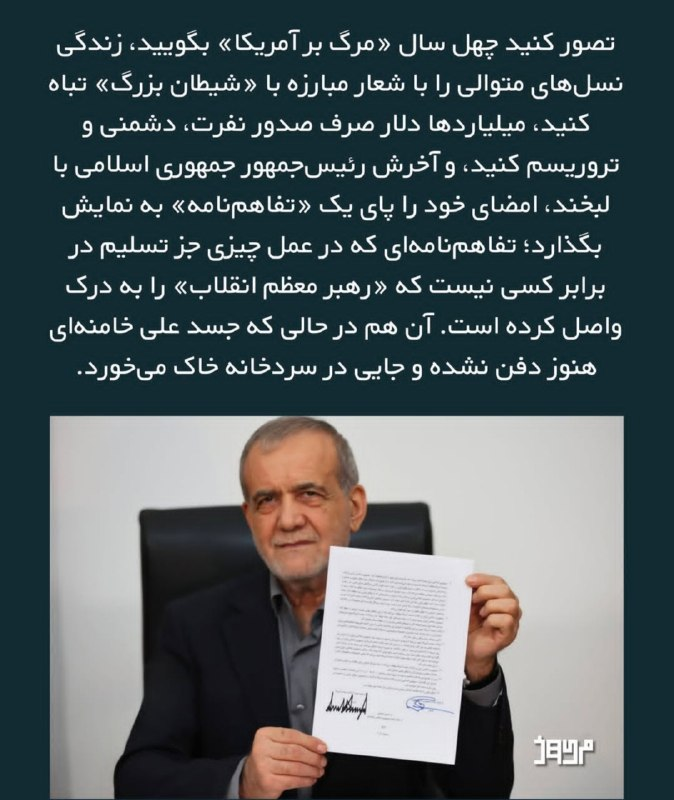

@IranianMinds

## Dirty_Kids — post 392470

  <a href="telegram/content/Dirty_Kids_392470_1781772218.mp4" target="_blank">🎬 Download video</a>

راهپیمایی کاروان «جن» در اصفهان در مراسم روز دوم محرم

@Dirty_Kids 👻

## Dirty_Kids — post 392469

  <a href="telegram/content/Dirty_Kids_392469_1781772219.mp4" target="_blank">🎬 Download video</a>

این حجم از خلاقیت و استعداد حقیقتا شگفت انگیزه واسم

@Dirty_Kids 👻

## Dirty_Kids — post 392468

  <a href="telegram/content/Dirty_Kids_392468_1781772221.mp4" target="_blank">🎬 Download video</a>

١٠٠ شب يونجه علف خورديد. خب اينم نتيجش
۴۷ ساله كه همتون رو سر كار گذاشتن😁

@Dirty_Kids 👻

## alonews — post 128868

  <a href="telegram/content/alonews_128868_1781772222.webm" target="_blank">🎬 Download video</a>

👈ترامپ: این احمق‌ها که فکر می‌کنند من در قبال ایران به اندازه کافی سختگیر نبودم، در حالی که بازار سهام به تازگی به بالاترین حد خود رسیده و قیمت نفت «به سرعت در حال سقوط» است، یا حسودند، آدم‌های بد یا احمق. آمریکا را دوباره بزرگ خواهیم کرد!!!

✅ @AloNews خبر جنگ

---
📅 بروزرسانی: 1405/03/28 12:03
---

## VahidOOnLine — post 246150

  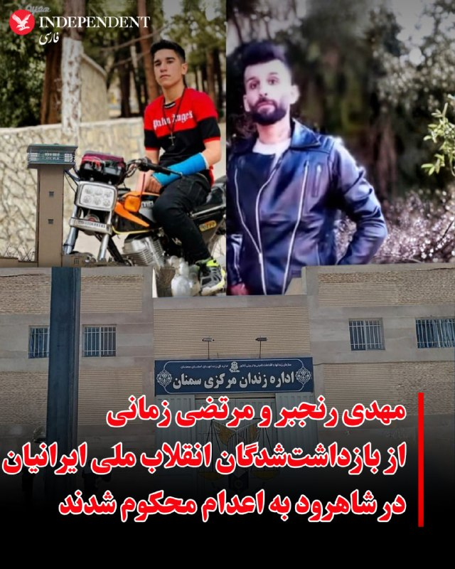

♦️براساس اطلاعات رسیده به ایندیپندنت فارسی، مهدی رنجبر ۱۸ ساله و مرتضی زمانی ۲۷ ساله، از بازداشت شدگان انقلاب ملی ایرانیان در تظاهرات ۱۸ دی‌ماه در شاهرود به اعدام محکوم شده‌اند.

این دو شهروند ایرانی در حال حاضر در زندان مرکزی سمنان به سر می‌برند.

قوه قضائیه جمهوری اسلامی روز سه‌شنبه ۲۶ خردادماه جواد زمانی و ابولفضل ساعدی، دو تن از معترضان انقلاب ملی ایرانیان را در شاهرود اعدام کرده بود.

به گفته‌ شورای حقوق بشر سازمان ملل متحد از دی‌ماه ۱۴۰۴ تاکنون دست‌کم ۲۰ نفر از بازداشتی‌های اعتراضات به بهانه ارتکاب جرایم علیه امنیت ملی اعدام شده‌اند.
‌🇸🇦 Indypersian

🤖 @VahidOOnLine

## WithYashar — post 15224

  <a href="telegram/content/WithYashar_15224_1781771624.mp4" target="_blank">🎬 Download video</a>

شهباز شریف هم یادداشت تفاهم ایران و آمریکا را امضا کرد
@withyashar

## mwarmonitor — post 11104

🔴 آژانس بین‌المللی انرژی اتمی از توافق صلح موقت امضا شده میان ایالات متحده و ایران در شامگاه چهارشنبه استقبال کرد و اعلام کرد که اکنون «کار فنی آغاز می‌شود».

@mwarmonitor

## DEJradio — post 5780

  <a href="telegram/content/DEJradio_5780_1781771625.mp4" target="_blank">🎬 Download video</a>

🔺📢 یک شهروند با شکایت از گرانی مواد خوراکی می‌گوید، روغن در یک هفته ۲۰۰ هزار تومان گران شد.

#تورم #گرانی
@DEJradio

## IranIntlTV — post 342982

  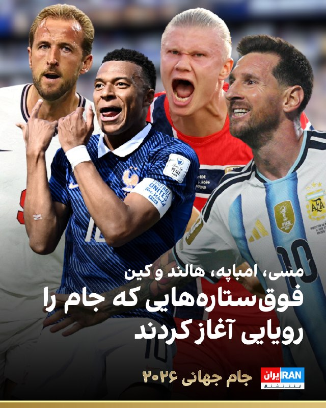

🔻لیونل مسی در بازی مقابل الجزایر شبی تاریخی را رقم زد. ابرستاره آرژانتینی در آستانه ۳۹ سالگی و در دویستمین بازی ملی خود، با ثبت نخستین هت‌تریکش در جام جهانی، به نخستین بازیکن تاریخ تبدیل شد که ۶ دوره این تورنمنت را تجربه کرده است.

🔹کیلیان امباپه در پیروزی ۳ بر ۱ فرانسه مقابل سنگال، با به ثمر رساندن دو گل تاریخ‌سازی کرد. کاپیتان فرانسه ابتدا در دقیقه ۶۶ گلزنی کرد تا با رکورد ۵۷ گل اولیویه ژیرو برابری کند و سپس در دقیقه ۹۶ با شوتی تماشایی، پنجاه‌وهشتمین گل ملی خود را به ثمر رساند تا به تنهایی بهترین گلزن تاریخ فرانسه شود.

🔹برای ارلینگ هالند هیچ صحنه‌ای بزرگ نیست. ستاره نروژ پس از درخشش در نخستین بازی‌های خود در لیگ قهرمانان اروپا، بوندسلیگا و لیگ برتر، این بار در نخستین بازی خود در جام جهانی مقابل عراق دو گل به ثمر رساند تا پیروزی ۴ بر ۱ تیمش را رقم بزند.

هری کین، کاپیتان ۳۲ ساله انگلستان، با به ثمر رساندن دو گل در پیروزی ۴ بر ۲ مقابل کرواسی، به رکورد تاریخی ۱۰ گل گری لینه‌کر در جام جهانی رسید.

🔹این گزارش را اینجا بخوانید

@iranintltvsport

## Persian_Trend_Official — post 17445

  

بدین‌وسیله، با فرمان مستقیم شخصِ خودم، پادشاه پرشین ترند، دستور پایان سری لایوهای «اتاق جنگ» را صادر می‌کنم!

البته شهروندان وفادار قلمرو پرشین ترند بدانند که ما همچنان به حواشی سیاسی، تحولات روز و اتفاقات مهم خواهیم پرداخت؛ و اگر شرایط ایجاب کند، اتاق جنگ با یک فرمان اضطراری دوباره فعال خواهد شد.

اما فعلاً تصمیم دربار بر این است که دوباره برگردیم به مسیر ویدیوهای تاریخی ـ نظامی سابق؛ همان حال‌وهوایی که بخش مهمی از هویت پرشین ترند بود و حالا وقتش رسیده با شکوه بیشتری به کانال برگردد.

## IranianMinds — post 22848

  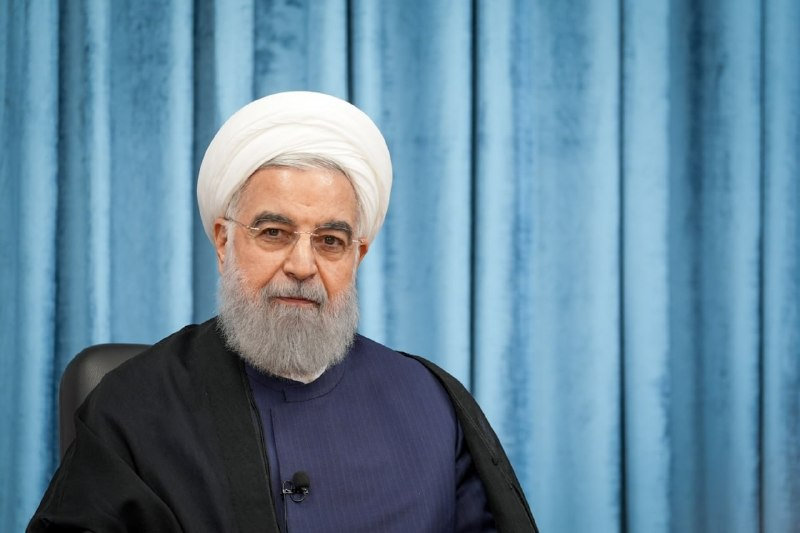

پیام حسن روحانی بعد از امضای تفاهم ایران و آمریکا :

باید از دستاورد تفاهم اولیه، حراست کرد

باید نسبت به توطئه و عهدشکنی دشمن هوشیار بود

امروز هر ایرانی در هر گوشه دنیا، به ایرانی بودن خود می‌بالد

رهبری نظام با صلابت و درایت و حکمت، انسجام ملت و نظام را مدیریت نمود

نیروهای مسلح جان برکف حسرت پیروزی نظامی را بر دل دشمنان گذاشتند

دولت خدمتگزار لحظه‌ای میدان خدمت به مردم را ترک نکرد

همسایگان ما می‌توانند با مشارکت و تضمین این توافق، از ثمرات امنیت و توسعه مشترک منطقه بهره‌مند شوند.

@IranianMinds

## BBCPersian — post 284247

🔻استقبال چین از امضای تفاهمنامه ایران و آمریکا برای پایان دادن به جنگ

چین با استقبال از امضای تفاهمنامه ایران و آمریکا برای پایان دادن به جنگ خاورمیانه از دو طرف خواست همکاری خود را در دور دوم مذاکرات ادامه دهند.

لین جیان، سخنگوی وزارت خارجه چین، امروز در یک نشست خبری ابراز امیدواری کرد که «همه طرف‌های ذی‌ربط، از جمله آمریکا و ایران، به روح این توافق پایبند باشند و به‌طور جدی تعهداتشان را اجرا کنند.»

او همچنین از واشنگتن و تهران خواست در مرحله بعدی گفت‌وگوها «با یکدیگر راه بیایند.»

دیروز عباس عراقچی، وزیر خارجه ایران در تماس تلفنی با وانگ یی همتای چینی خود«از نقش سازنده پکن در پیشبرد مذاکرات و دستیابی به توافق» قدردانی کرد.

بعدتر وانگ یی در گفتگوی تلفنی با محمد اسحاق‌ دار، وزیر امور خارجه پاکستان گفت که «چین نیز به روش خود به میانجیگری بین ایران و آمریکا پرداخته است» و ادامه داد که «توافق فعلی، آغاز راه است، نه نقطه پایانی.»

او در گفتگو با همتای پاکستانی خود گفت که «مذاکرات مرحله دوم نسبت به مرحله اول موانع بیشتری خواهد داشت.»

https://bbc.in/4fNU3nt
@BBCPersian

## alonews — post 128867

  <a href="telegram/content/alonews_128867_1781771628.mp4" target="_blank">🎬 Download video</a>

👈جی‌دی ونس درباره مسلح کردن معترضان ایرانی: در واقع کمی دشوار است. می‌دانید، نمی‌توان فقط سلاح‌ها را از آسمان رها کرد. واقعاً زیرساختی برای رساندن سلاح به قلب مردم ایران وجود ندارد.

🔴یکی از چیزهایی که رئیس‌جمهور را بسیار ناراحت کرده بود، همه این معترضان بی‌گناهی بود که چند ماه پیش توسط کسانی که در قدرت بودند به قتل می‌رسیدند.

🔴آن افراد اکنون رفته‌اند. اما خواهیم دید: آیا این رهبران جدید با مردم رفتار متفاوتی دارند؟ قطعاً امیدواریم چنین باشد.

🔴و اگر چنین نباشد، وقتی رفتارشان را ببینیم، می‌توانیم بفهمیم

✅ @AloNews خبر جنگ

---
📅 بروزرسانی: 1405/03/28 11:53
---

## VahidOOnLine — post 246149

  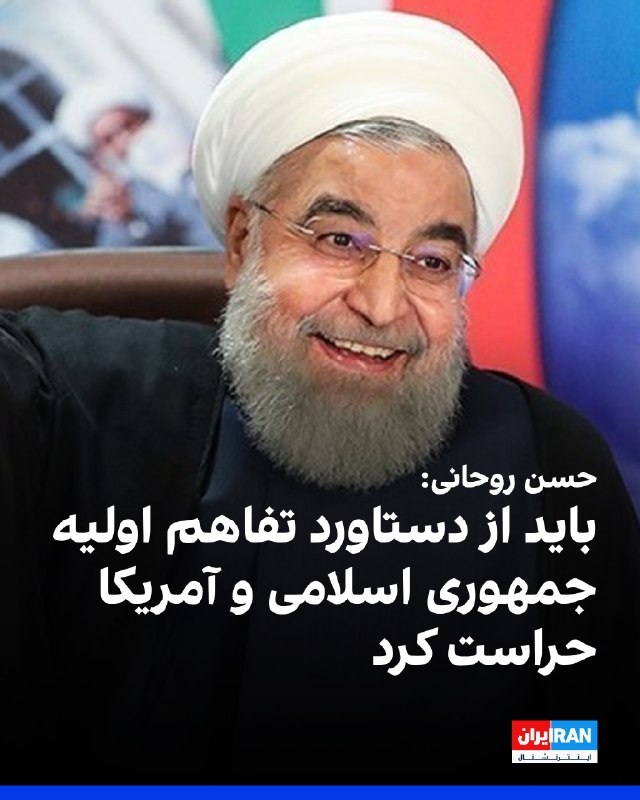

حسن روحانی، رییس پیشین دولت در جمهوری اسلامی، در پیامی پس از امضای یادداشت تفاهم میان تهران و واشینگتن، بر اهمیت حفظ و حراست از دستاوردهای این توافق اولیه تاکید کرد. او گفت: «باید از دستاورد تفاهم اولیه حراست کرد.»

روحانی همچنین هشدار داد که جمهوری اسلامی باید نسبت به هرگونه «توطئه» و عهدشکنی احتمالی از سوی طرف مقابل هوشیار باشد.

او در ادامه به نقش کشورهای منطقه اشاره کرد و گفت همسایگان ایران می‌توانند با تضمین و حمایت از اجرای این «توافق»، از مزایای امنیت و توسعه مشترک در منطقه بهره‌مند شوند.

اظهارات روحانی در حالی مطرح می‌شود که مقام‌های جمهوری اسلامی و آمریکا از آغاز مرحله جدیدی از مذاکرات پس از امضای یادداشت تفاهم خبر داده‌اند و قرار است گفت‌وگوهای فنی درباره اجرای مفاد آن در هفته‌های آینده ادامه یابد.
‌🏁 🇬🇧 IranintlTV

🤖 @VahidOOnLine

## VahidOOnLine — post 246148

  <a href="telegram/content/VahidOOnLine_246148_1781771012.mp4" target="_blank">🎬 Download video</a>

ویدیوی منتشرشده در شبکه‌های اجتماعی نشان می‌دهد که در کنار دسته عزاداران ماه محرم، مادر جاویدنام مانی صفرپور با در دست داشتن تصویر فرزندش برای او سوگواری و سینه‌زنی می‌کند.

مانی صفرپور، ۱۸ ساله و اهل لاهیجان، ۱۸ دی در جریان اعتراضات تهران در منطقه سلسبیل با شلیک مستقیم گلوله‌های جنگی به دست نیروهای سرکوب کشته شد.
‌🏁 🇬🇧 IranintlTV

🤖 @VahidOOnLine

## WithYashar — post 15223

حسن روحانی هم اومد:
اسرائیل احتمالاً سعی می‌کنه با ایجاد تنش( در لبنان و …)، توافق ایران و آمریکا رو به هم بزنه؛ همون‌طور که قبلاً هم برای ضربه زدن به برجام تلاش کرده بود…
@withyashar

## WithYashar — post 15222

وزیر دفاع آلمان اعلام کرد این کشور در حال اعزام دو کشتی مین روب به دریای سرخ است تا برای یک مأموریت نظامی احتمالی در تنگه هرمز آماده شود.
@withyashar

## pm_afshaa — post 94318

🔴وزیر دفاع اسراییل کاتز:کون لق تفاهم ایران و آمریکا ما به عملیات خودمون تو لبنان ادامه میدیم

💧 Rainbet.com the #1 Non-KYC Crypto Casino & Sportsbook @rainbetcom

😁 @Pm_Afshaa

## IranIntlTV — post 342981

  

حسن روحانی، رییس پیشین دولت در جمهوری اسلامی، در پیامی پس از امضای یادداشت تفاهم میان تهران و واشینگتن، بر اهمیت حفظ و حراست از دستاوردهای این توافق اولیه تاکید کرد. او گفت: «باید از دستاورد تفاهم اولیه حراست کرد.»

روحانی همچنین هشدار داد که جمهوری اسلامی باید نسبت به هرگونه «توطئه» و عهدشکنی احتمالی از سوی طرف مقابل هوشیار باشد.

او در ادامه به نقش کشورهای منطقه اشاره کرد و گفت همسایگان ایران می‌توانند با تضمین و حمایت از اجرای این «توافق»، از مزایای امنیت و توسعه مشترک در منطقه بهره‌مند شوند.

اظهارات روحانی در حالی مطرح می‌شود که مقام‌های جمهوری اسلامی و آمریکا از آغاز مرحله جدیدی از مذاکرات پس از امضای یادداشت تفاهم خبر داده‌اند و قرار است گفت‌وگوهای فنی درباره اجرای مفاد آن در هفته‌های آینده ادامه یابد.
https://iranintl.com/202606180592

## IranIntlTV — post 342980

  <a href="telegram/content/IranIntlTV_342980_1781771015.mp4" target="_blank">🎬 Download video</a>

محمدباقر قالیباف، رییس هیات مذاکره‌کننده جمهوری اسلامی، گفت: «من دیپلمات نیستم، اما خوب می‌دانم چطور آمریکا را وادار کنم بفهمد.» او همچنین افزود اگر دشمن بخواهد بدعهدی کند، «آن وقت بچرخ تا بچرخیم.»
@iranintltv

## IranIntlTV — post 342979

  <a href="telegram/content/IranIntlTV_342979_1781771016.mp4" target="_blank">🎬 Download video</a>

ویدیوی منتشرشده در شبکه‌های اجتماعی نشان می‌دهد که در کنار دسته عزاداران ماه محرم، مادر جاویدنام مانی صفرپور با در دست داشتن تصویر فرزندش برای او سوگواری و سینه‌زنی می‌کند.

مانی صفرپور، ۱۸ ساله و اهل لاهیجان، ۱۸ دی در جریان اعتراضات تهران در منطقه سلسبیل با شلیک مستقیم گلوله‌های جنگی به دست نیروهای سرکوب کشته شد.

## FarsiVOA — post 221090

  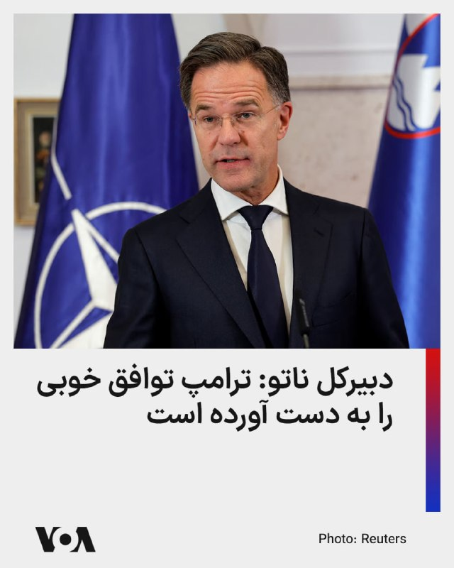

دبیرکل ناتو از توافق موقت میان ایالات متحده و جمهوری اسلامی که با هدف پایان دادن به جنگ امضا شد، استقبال کرد.

مارک روته، پیش از نشست وزرای دفاع ناتو در روز پنج‌شنبه در بروکسل به خبرنگاران گفت: «فکر می‌کنم رئیس‌جمهور ترامپ توافق خوبی را به دست آورده است.»

او از تلاش‌های آمریکا برای محدود کردن توانمندی‌های هسته‌ای و موشک‌های بالستیک جمهوری اسلامی در این توافق استقبال کرد.

بر اساس توافق که میان ایالات متحده و جمهوری اسلامی، تنگه هرمز دوباره باز خواهد شد و دو کشور بار دیگر به میز مذاکره درباره برنامه هسته‌ای جمهوری اسلامی بازمی‌گردند.
@FarsiVOA

## FarsiVOA — post 221089

  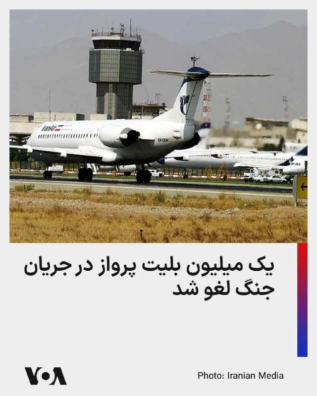

رئیس سازمان هواپیمایی کشوری می‌گوید در پی بسته شدن حریم هوایی کشور در جریان جنگ اخیر، حدود یک میلیون بلیت پرواز لغو شده است.

ابوذر شیرودی اعلام کرد که تاکنون ۹۵ درصد وجوه بلیت‌های لغوشده به مسافران بازگردانده شده و روند پرداخت مطالبات باقی‌مانده ادامه دارد.

پروازهای داخلی و خارجی ایران پس از بسته شدن حریم هوایی کشور از ۹ اسفند ۱۴۰۴ متوقف شد و این محدودیت تا اواخر فروردین ۱۴۰۵ ادامه داشت.

در ماه‌های گذشته، موضوع بازپرداخت هزینه بلیت‌های لغوشده با انتقاد شماری از مسافران و فعالان صنعت گردشگری همراه بود.

حرمت الله رفیعی رئیس انجمن صنفی دفاتر خدمات مسافرتی پیش‌تر اعلام کرده بود که بخشی از هزینه پروازها و اقامت‌های لغوشده هنوز به مشتریان بازگردانده نشده و صدها میلیارد تومان از مطالبات مسافران همچنان پرداخت نشده است.
@FarsivOA

## FarsiVOA — post 221088

  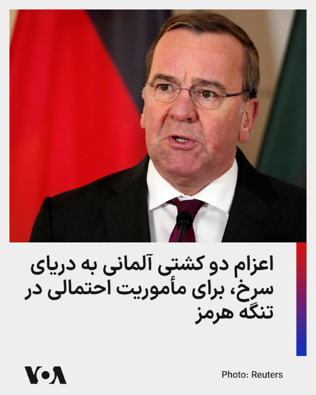

وزیر دفاع آلمان اعلام کرد این کشور در حال اعزام دو کشتی به دریای سرخ است تا برای یک مأموریت نظامی احتمالی در تنگه هرمز آماده شود.

بوریس پیستوریوس، روز پنجشنبه هنگام ورود به نشست با همتایان خود در مقر ناتو در بروکسل به خبرنگاران گفت: «در همین لحظه، مین‌روب ما فولدا و کشتی پشتیبانی موسل در حال عبور از کانال سوئز به سمت دریای سرخ هستند.»

او افزود که برای هرگونه مشارکت در عملیات مین‌روبی، دریافت تأیید حکومت ایران و عمان ضروری خواهد بود.

به گفته وزیر دفاع آلمان، همچنین هر مأموریتی در این زمینه، به تحولات مذاکرات آتی میان جمهوری اسلامی و ایالات متحده بستگی خواهد داشت.

پیشتر کشورهای اروپایی از جمله بریتانیا و فرانسه برای اعزام نیروهای مین‌روب به تنگه هرمز پس از پایان جنگ اعلام آمادگی کرده بودند.
@FarsiVOA

## Hranews — post 113697

جلسه دادگاه رسیدگی به اتهامات رضا مسلمی برگزار شد

❗️
❗️
❗️
❗️
❗️– جلسه دادگاه رسیدگی به اتهامات رضا مسلمی، فعال صنفی معلمان همدان در شعبه دوم دادگاه انقلاب این شهرستان برگزار شد.

#رضا_مسلمی

ادامه مطلب

↘️
@hranews_bot تماس ✉️ - @Hranews کانال هرانا 🆑

## alonews — post 128866

  <a href="telegram/content/alonews_128866_1781771019.webm" target="_blank">🎬 Download video</a>

👈پیت هگست: حق عضویت سالانه ما در ناتو منوط به این خواهد بود که سایر کشورها به اهداف هزینه‌های دفاعی خود عمل کنند.

🔴 در جایی که سایر متحدان با فوریت هزینه نکنند، سهم ما از حق عضویت کاهش خواهد یافت.ناتو یک خیابان دو طرفه خواهد بود.

🔴من امروز یک بررسی شش ماهه وزارت جنگ را اعلام می‌کنم که وضعیت نیروها و پایگاه‌های آمریکا در اروپا را بررسی خواهد کرد. تا شش ماه - می‌تواند کمتر باشد.بیایید آن را بررسی ناتو ۳.۰ بنامیم.

✅ @AloNews خبر جنگ

## alonews — post 128865

  <a href="telegram/content/alonews_128865_1781771019.webm" target="_blank">🎬 Download video</a>

👈رویترز به نقل از یک مقام اسرائیلی نزدیک به بنیامین نتانیاهو، نخست وزیر اسرائیل، گزارش داد: اسرائیل در حال انجام مذاکرات پیچیده‌ای با واشنگتن در مورد حضورش در جنوب لبنان است

✅ @AloNews خبر جنگ

---
📅 بروزرسانی: 1405/03/28 11:43
---

## WithYashar — post 15221

  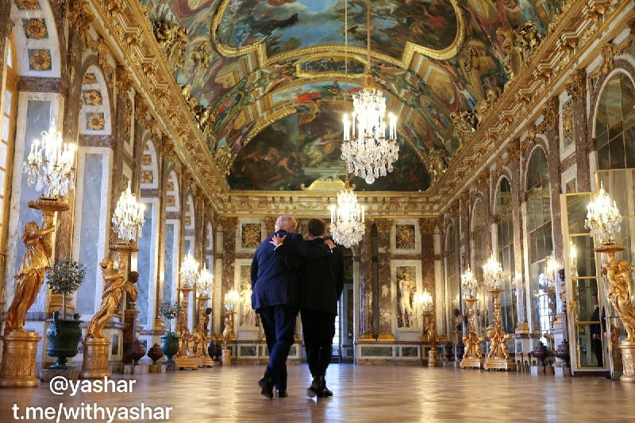

تصویری متفاوت از ترامپ و مکرون در ورسای
@withyashar

## WithYashar — post 15220

رویترز: اسرائیل قصد عقب‌نشینی از مواضع خود در جنوب لبنان را ندارد.
@withyashar

## DEJradio — post 5779

  <a href="telegram/content/DEJradio_5779_1781770419.webm" target="_blank">🎬 Download video</a>

🚨
🔸 جام جهانی ۱۹۷۸ آرژانتین زیرِ سایه کودتای نظامی سال ۱۹۷۶ به رهبری سپهبد خورخه رافائل ویدلا قرار داشت.

ژنرال ویدلا از این تورنمنت به عنوان ابزاری تبلیغاتی برای تطهیر چهره کودتای نظامی و سرپوش گذاشتن بر شکنجه و ناپدید شدن هزاران مخالف سیاسی استفاده کرد.

#جام_جهانی #آرژانتین
@DEJradio

## Persian_Trend_Official — post 17444

کانال رسمی پرشین ترند pinned «سلام دوستان من برگشتم و میبینم که یه روز نبودم توافق کردید 😄 چای کرک رو زدم و اومدم ببینیم چه خبره و تا یکی دو ساعت دیگه یک لایو بریم در مورد توافق و واکنش ها و هر سوالی که شما در مورد توافق دارید رو سعی میکنم پاسخ بدم سوالاتتون رو توی کامنت ها بنویسید …»

## Persian_Trend_Official — post 17443

سلام دوستان
من برگشتم و میبینم که یه روز نبودم توافق کردید 😄
چای کرک رو زدم و اومدم ببینیم چه خبره و تا یکی دو ساعت دیگه یک لایو بریم در مورد توافق و واکنش ها و هر سوالی که شما در مورد توافق دارید رو سعی میکنم پاسخ بدم

سوالاتتون رو توی کامنت ها بنویسید
ارادتمند
الیاس فرخ

## RadioFarda — post 158452

  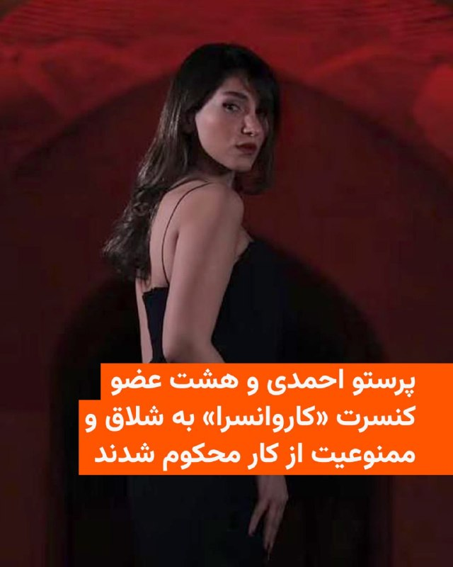

🔸دادگاه کیفری استان قم، پرستو احمدی، خواننده، و هشت نفر دیگر از دست‌اندرکاران و نوازندگان «کنسرت کاروانسرا» را به‌طور جداگانه به ۷۴ ضربه شلاق تعزیری، دو سال ممنوع‌الخروجی و دو سال ممنوعیت از فعالیت هنری محکوم کرد.

🔸این دادگاه با استناد به موادی از قانون مجازات اسلامی از جمله ماده ۶۳۸ این قانون و ماده ۷۴۳ قانون جرایم رایانه‌ای، تأکید کرده که این ۹ نفر برای دو سال اجازه هیچ نوع فعالیت صنفی را در امور موسیقی و هنری ندارند و بر اساس حکم، رأی محکومیت آن‌ها نیز باید در رسانه‌های جمعی کشور منتشر شود.

🔸اتهام این هنرمندان در این حکم قضایی، که رادیو فردا نیز آن را رؤیت کرده، «جریحه‌دار کردن عفت عمومی از طریق تولید و انتشار محتوای مبتذل و خلاف اخلاق در بستر فضای مجازی» عنوان شده است.

🔸حکم صادرشده در دادگاه کیفری قم بدوی است و در مهلت قانونی قابل تجدیدنظرخواهی است.

🔸پرستو احمدی ۲۱ آذر سال ۱۴۰۳، به همراه گروهی از نوازندگان مَرد شامل احسان بیرقدار، سهیل فقیه‌نصیری، امین طاهری و امیرعلی پیرنیا، در کانال یوتیوب خود ویدئویی بدون حجاب اجباری، از «کنسرت کاروانسرا» یا «کنسرت فرضی» را منتشر کرد.

@RadioFarda

## alonews — post 128864

👈پیت هگست وزیر جنگ آمریکا: برای مدت طولانی، ناتو یک ببر کاغذی و یک خیابان یک طرفه بوده است.دیگر نه

✅ @AloNews خبر جنگ

## alonews — post 128863

  <a href="telegram/content/alonews_128863_1781770421.webm" target="_blank">🎬 Download video</a>

👈باراک راوید خبرنگار ارشد آکسیوس:
ترامپ به توافقی با ایران رضایت داده که بسیار کمتر از چیزی است که در ابتدا امیدوار بود به آن دست یابد

✅ @AloNews خبر جنگ

## alonews — post 128862

  <a href="telegram/content/alonews_128862_1781770421.webm" target="_blank">🎬 Download video</a>

👈دونالد ترامپ اعلام کرد پروژه ساخت سالن جدید کاخ سفید با سرعت مطلوب در حال اجراست و برخلاف پروژه ساختمان فدرال رزرو، هم طبق زمان‌بندی و هم با هزینه‌ای کمتر از بودجه پیش می‌رود.

🔴او همچنین گفت این پروژه شامل زیرساخت‌های امنیتی و نظامی مختلف از جمله یک «درون‌پورت» (محل استقرار و عملیات پهپادها) خواهد بود و آن را برای امنیت ملی آمریکا ضروری دانست.
ترامپ در ادامه از شکایت حقوقی مطرح‌شده علیه این پروژه انتقاد کرد و مدعی شد شاکی هیچ جایگاه قانونی برای طرح این پرونده ندارد

✅ @AloNews خبر جنگ

---
📅 بروزرسانی: 1405/03/28 11:34
---

## VahidOOnLine — post 246147

  

رافائل گروسی، مدیرکل آژانس بین‌المللی انرژی اتمی، اعلام کرد آژانس در مذاکرات آینده میان آمریکا و جمهوری اسلامی نقش خواهد داشت. او گفت: «اکنون نوبت آن است که با آمریکا و ایران خود پای میز مذاکره بنشینیم و گام‌های عملی و مشخصی را که باید برداشته شود، تدوین کنیم.»

گروسی گفت امضای تفاهم‌نامه میان دو طرف اقدامی مثبت بوده و اکنون مرحله فنی اجرای آن آغاز می‌شود. او افزود ممکن است جمعه در نشست مربوط به امضای یادداشت تفاهم میان آمریکا و جمهوری اسلامی حضور داشته باشد.

مدیرکل آژانس بین‌المللی انرژی اتمی در واکنش به انتقادهای عباس عراقچی و دیگر مقام‌های جمهوری اسلامی از گزارش‌های آژانس تاکید کرد فعالیت این نهاد بین‌المللی بر پایه اصول حرفه‌ای و بی‌طرفانه انجام می‌شود.

گروسی گفت این انتقادها تاثیری بر عملکرد آژانس نخواهد داشت و افزود: «هیچ‌کس نمی‌تواند باور کند که گزارش آژانس باعث جنگ شده است.» او بار دیگر بر نقش آژانس در راستی‌آزمایی و نظارت بر تعهدات هسته‌ای در چارچوب مذاکرات آینده تاکید کرد.
‌🏁 🇬🇧 IranintlTV

🤖 @VahidOOnLine

## VahidOOnLine — post 246146

♦️هما میرافشار، شاعر و ترانه‌سرای جاودان سال‌های طلایی موسیقی ایران، روز چهارشنبه ۲۷ خرداد و در غربت در لس‌انجلس آمریکا به خاک سپرده شد.

هما میرافشار، شاعر، ترانه‌سرا و کارشناس موسیقی که خرداد ۱۴۰۵ در ۸۹ سالگی درگذشت، از جمله ترانه‌سرایانی بود که آثارش در حافظه چند نسل از ایرانیان ماندگار شده است. از «دو راهی» با صدای ابی و «دل من» با صدای داریوش گرفته تا «ساغر هستی» هایده، «دل کوچولو» مهستی، «از سفر اومده بود» ستار و نیز ترانه‌های شاد و خاطره‌انگیزی چون «حلقه طلا» از معین و «با تو بیدار می‌شم» با صدای حسن شماعی‌زاده، به همراه صدها ترانه ماندگار دیگر حاصل قریحه شاعری او هستند.
‌🇸🇦 Indypersian

🤖 @VahidOOnLine

## VahidOOnLine — post 246145

🗣روایت شما از توافق میان آمریکا و جمهوری‌اسلامی - پنجشنبه ۲۸ خرداد

🔹ترامپ یک تاجره که در درجه اول سود و منفعت خودش و کشورش رو می‌بینه و اصلا براش مهم نیست چه اتفاقی افتاده یا خواهد افتاد. این هم از تفاهم‌نامه‌ای که بر جنازه فرزندان ایران امضا شد؛ ۴۲ هزار جان شیرین و آینده‌ساز.

🔹به ترامپ بگویید خیانت تو چنان در قلب و ذهن‌مان ماند که اگر روزی آمریکا و اروپا به یاری مردم ایران نیاز داشتند، هرگز حتی یک نفر سمت‌تان نخواهد آمد. آن روز را می‌بینید.

🔹آقای قالیباف، در همین سخنرانی که گفتی اقتصاد مردم را درست کنیم، چندین برابر مردم ایران، درباره لبنان حرف زدی و گفتی اولین بند توافق‌نامه هم لبنان است.

🔹جاویدنام دادیم، قحطی و فقر بیشتر را تحمل کردیم، جنگ شد، بیشتر از آرزوهای‌مان دور شدیم، آسیب دیدیم، به ناحق کشته شدیم، اما «اورانیوم» هدف اصلی بود. در این چند بند توافق‌نامه، هیچ حرفی از مردم ایران نبود.

🔹فریب پروپاگاندای رژیم را نمی‌خوریم. تفاهم‌نامه فعلی میان ایران و آمریکا، یک شکست قطعی برای سیاست ۴۷ ساله جمهوری اسلامی بود. منتظر قدم‌های بعدی ترامپ و از هم پاشیده شدن بیشتر جمهوری اسلامی باشید.

🔹صبور باشید، تغییر حکومت در حال اتفاق است، اگرچه با سرعتی ملایم. فقط متحد بمانید و به همدیگر امیدواری بدهید. بدون شک جمهوری اسلامی نابودشدنی است.

🔹بارها در فیلم‌ها این سکانس رو دیدیم: سربازی وسط جنگ و شلوغی، بعد از کلی مبارزه ناگهان شوک‌زده می‌ایسته و اشک می‌ریزه و فقط نگاه می‌کنه به همه‌چیز. توصیف حال ما مردم ایران با اخبار مذاکره همین‌طور شده.

🔹هیچ‌وقت فکر نمی‌کردم ترامپ که این همه اوباما را مسخره می‌کرد، خودش از او هم بدتر بشه. چرا هیچ جای جهان یک نفر پیدا نشد که بگه ما مردم ایران حق زندگی داشتیم؟ چرا تمام مردم جهان حقوق‌بشرشان باید رعایت بشه جز ایران؟

🔹آقای ترامپ، قالیباف همون کسی هست که دانشجویان را با چشم و دست بسته از بالای ساختمان دانشگاه به پایین پرت کرد. لااقل بدان با چه کسی عکس یادگاری می‌گیری و توافق می‌کنی.

🔹پرچمی‌ها، دیدید که قالیباف گفت در سفر به پاکستان با مقامات آمریکایی سه مذاکره رودررو داشته؟ پس تقاص خون رهبرتون چی؟

🔹قالیباف با آمریکا و اسرائیل بست و تمام خاندان خامنه‌ای و اطرافیان مهم را به کشتن داد و کودتا کرد. حالا هم به تدریج شروع می‌کنه به حذف فیزیکی افراد در پست‌های مهم، مخصوصا پایداری‌ها. اما بین ما و ماندگان نظام، دریایی از خون فاصله است.

🔹این قالیباف دروغگو میگه ما می‌خواهیم ایران رو بسازیم. هرچی در ۴۷ سال گذشته ساختی، الان هم می‌سازی. در شهرداری هم پول‌هایی که باید برای عمران و آبادی شهر خرج می‌کردی، دادی به نیروی قدس سپاه.
‌🏁 🇬🇧 IranintlTV

🤖 @VahidOOnLine

## VahidOOnLine — post 246144

  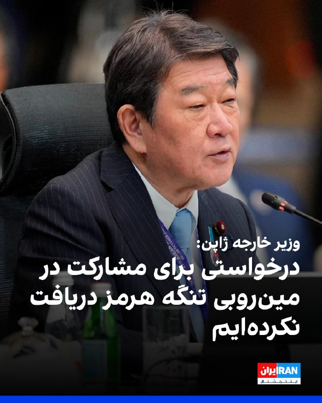

توشیمیتسو موتگی، وزیر خارجه ژاپن، گفت از دریافت هرگونه درخواست مشخص برای مشارکت این کشور در عملیات احتمالی پاکسازی مین در تنگه هرمز اطلاعی ندارد. او افزود هنوز اطلاعات قطعی در دست نیست که نشان دهد اساسا مینی در تنگه هرمز کار گذاشته شده است یا نه.

وزیر خارجه ژاپن به روند مذاکرات میان تهران و واشینگتن اشاره کرد و گفت موضوعاتی از جمله پرونده هسته‌ای جمهوری اسلامی و لغو تحریم‌ها همچنان حل‌نشده باقی مانده‌اند. موتگی افزود ژاپن مایل است همراه با جامعه بین‌المللی از مسیر دیپلماتیک برای پیشبرد این روند حمایت کند.

او همچنین گفت در صورت دستیابی به توافق نهایی میان تهران و واشینگتن، ژاپن آماده است در راستای صلح و ثبات خاورمیانه و نیز بازسازی و احیای منطقه نقش ایفا کند.

وزیر خارجه ژاپن همچنین اعلام کرد در گفت‌وگو با عباس عراقچی، وزیر خارجه جمهوری اسلامی، «صریح و قاطعانه» تاکید کرده است که تردد کشتی‌ها در تنگه هرمز نباید هیچ‌گونه بار مالی برای ژاپن به همراه داشته باشد.
‌🏁 🇬🇧 IranintlTV

🤖 @VahidOOnLine

## WithYashar — post 15219

گروسی (مدیر کل آژانس بین‌المللی انرژی اتمی) : در مذاکرات سوئیس شرکت خواهیم کرد
@withyashar

## mwarmonitor — post 11103

🔴یک مقام ارشد اسرائیلی نزدیک به بنیامین نتانیاهو به رویترز گفت که اسرائیل در حال انجام «مذاکراتی سرسختانه» با ایالات متحده بر سر حضور نظامی آن در جنوب لبنان است و هیچ قصدی برای عقب‌نشینی از مواضع خود ندارد.

@mwarmonitor

## mwarmonitor — post 11102

  

📝 وقتی قبل از ورود به اتاق بهت می‌گن «فقط امضا کن، لبخند نزن، جملات قصارِ توخالی تف کن وگرنه به سرنوشت رفسنجانی و استخر فرح دچار می‌شی»، نتیجتش می‌شه همین پرتره ماندگار در تصویر یک مهره تسلیم‌شده با لبخندی خشک‌شده و کاغذی در دست، که رسماً سند نخودی بودن خودش را به دوربین‌ها نشان می‌دهد. حالا طبق تعهدات سفت و سخت بند یک و دو همین عهدنامه کذایی، در روز تشییع لاشه موشعلی دیگر کسی حق ندارد حنجره‌اش را برای شعار کلیشه‌ای «مرگ بر آمریکا» پاره کند؛ وظیفه مضحک و تحقیرآمیز شما این است که طبق ضوابط مصوب، پشت تابوت راه بروید، شیون استراتژیک سر بدهید و با لحنی فیلسوفانه بگویید او نمرده، بلکه در راستای اقتصاد مقاومتی تنفسش را تعلیق کرده است! در واقع این عکس با آن دو قابِ بالای سر، پیش‌نویس بیانیه‌ای است که با دست لرزان امضا کردید تا ثابت کنید شنا بلد نیستید و ترجیح می‌دهید برای بقا، این خیمه‌شب‌بازی تند و تیز را تا پرده آخر بازی کنید.

@mwarmonitor

## IranIntlTV — post 342978

  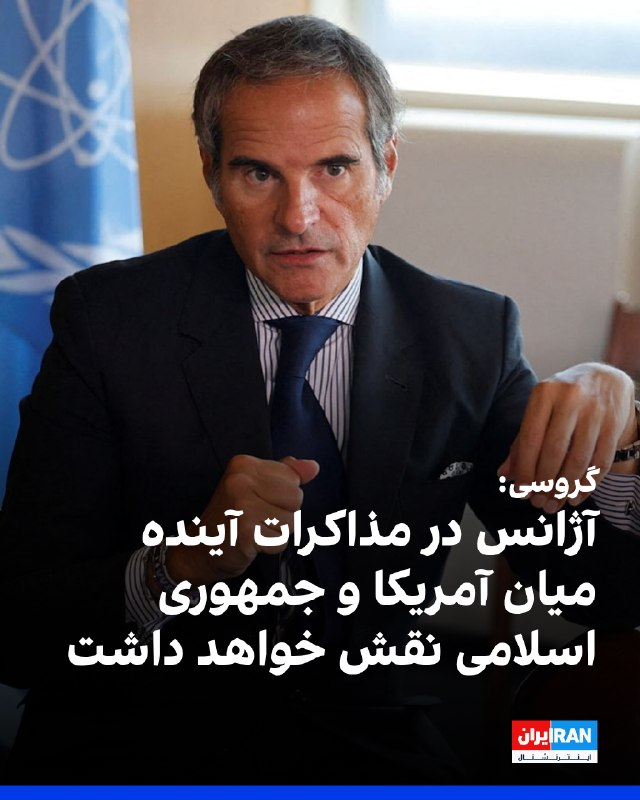

رافائل گروسی، مدیرکل آژانس بین‌المللی انرژی اتمی، اعلام کرد آژانس در مذاکرات آینده میان آمریکا و جمهوری اسلامی نقش خواهد داشت. او گفت: «اکنون نوبت آن است که با آمریکا و ایران خود پای میز مذاکره بنشینیم و گام‌های عملی و مشخصی را که باید برداشته شود، تدوین کنیم.»

گروسی گفت امضای تفاهم‌نامه میان دو طرف اقدامی مثبت بوده و اکنون مرحله فنی اجرای آن آغاز می‌شود. او افزود ممکن است جمعه در نشست مربوط به امضای یادداشت تفاهم میان آمریکا و جمهوری اسلامی حضور داشته باشد.

مدیرکل آژانس بین‌المللی انرژی اتمی در واکنش به انتقادهای عباس عراقچی و دیگر مقام‌های جمهوری اسلامی از گزارش‌های آژانس تاکید کرد فعالیت این نهاد بین‌المللی بر پایه اصول حرفه‌ای و بی‌طرفانه انجام می‌شود.

گروسی گفت این انتقادها تاثیری بر عملکرد آژانس نخواهد داشت و افزود: «هیچ‌کس نمی‌تواند باور کند که گزارش آژانس باعث جنگ شده است.» او بار دیگر بر نقش آژانس در راستی‌آزمایی و نظارت بر تعهدات هسته‌ای در چارچوب مذاکرات آینده تاکید کرد.
https://iranintl.com/202606183065

## IranIntlTV — post 342977

🗣روایت شما از توافق میان آمریکا و جمهوری‌اسلامی - پنجشنبه ۲۸ خرداد

🔹ترامپ یک تاجره که در درجه اول سود و منفعت خودش و کشورش رو می‌بینه و اصلا براش مهم نیست چه اتفاقی افتاده یا خواهد افتاد. این هم از تفاهم‌نامه‌ای که بر جنازه فرزندان ایران امضا شد؛ ۴۲ هزار جان شیرین و آینده‌ساز.

🔹به ترامپ بگویید خیانت تو چنان در قلب و ذهن‌مان ماند که اگر روزی آمریکا و اروپا به یاری مردم ایران نیاز داشتند، هرگز حتی یک نفر سمت‌تان نخواهد آمد. آن روز را می‌بینید.

🔹آقای قالیباف، در همین سخنرانی که گفتی اقتصاد مردم را درست کنیم، چندین برابر مردم ایران، درباره لبنان حرف زدی و گفتی اولین بند توافق‌نامه هم لبنان است.

🔹جاویدنام دادیم، قحطی و فقر بیشتر را تحمل کردیم، جنگ شد، بیشتر از آرزوهای‌مان دور شدیم، آسیب دیدیم، به ناحق کشته شدیم، اما «اورانیوم» هدف اصلی بود. در این چند بند توافق‌نامه، هیچ حرفی از مردم ایران نبود.

🔹فریب پروپاگاندای رژیم را نمی‌خوریم. تفاهم‌نامه فعلی میان ایران و آمریکا، یک شکست قطعی برای سیاست ۴۷ ساله جمهوری اسلامی بود. منتظر قدم‌های بعدی ترامپ و از هم پاشیده شدن بیشتر جمهوری اسلامی باشید.

🔹صبور باشید، تغییر حکومت در حال اتفاق است، اگرچه با سرعتی ملایم. فقط متحد بمانید و به همدیگر امیدواری بدهید. بدون شک جمهوری اسلامی نابودشدنی است.

🔹بارها در فیلم‌ها این سکانس رو دیدیم: سربازی وسط جنگ و شلوغی، بعد از کلی مبارزه ناگهان شوک‌زده می‌ایسته و اشک می‌ریزه و فقط نگاه می‌کنه به همه‌چیز. توصیف حال ما مردم ایران با اخبار مذاکره همین‌طور شده.

🔹هیچ‌وقت فکر نمی‌کردم ترامپ که این همه اوباما را مسخره می‌کرد، خودش از او هم بدتر بشه. چرا هیچ جای جهان یک نفر پیدا نشد که بگه ما مردم ایران حق زندگی داشتیم؟ چرا تمام مردم جهان حقوق‌بشرشان باید رعایت بشه جز ایران؟

🔹آقای ترامپ، قالیباف همون کسی هست که دانشجویان را با چشم و دست بسته از بالای ساختمان دانشگاه به پایین پرت کرد. لااقل بدان با چه کسی عکس یادگاری می‌گیری و توافق می‌کنی.

🔹پرچمی‌ها، دیدید که قالیباف گفت در سفر به پاکستان با مقامات آمریکایی سه مذاکره رودررو داشته؟ پس تقاص خون رهبرتون چی؟

🔹قالیباف با آمریکا و اسرائیل بست و تمام خاندان خامنه‌ای و اطرافیان مهم را به کشتن داد و کودتا کرد. حالا هم به تدریج شروع می‌کنه به حذف فیزیکی افراد در پست‌های مهم، مخصوصا پایداری‌ها. اما بین ما و ماندگان نظام، دریایی از خون فاصله است.

🔹این قالیباف دروغگو میگه ما می‌خواهیم ایران رو بسازیم. هرچی در ۴۷ سال گذشته ساختی، الان هم می‌سازی. در شهرداری هم پول‌هایی که باید برای عمران و آبادی شهر خرج می‌کردی، دادی به نیروی قدس سپاه.

## IranIntlTV — post 342976

  <a href="telegram/content/IranIntlTV_342976_1781769843.mp4" target="_blank">🎬 Download video</a>

کانال ۱۲ اسرائیل گزارش داد یادداشت تفاهم میان جمهوری اسلامی و آمریکا با موجی از انتقاد در محافل سیاسی و امنیتی این کشور روبه‌رو شده است. مخالفان این توافق آن را حتی بدتر از برجام ۲۰۱۵ توصیف کرده‌اند؛ توافقی که دونالد ترامپ در دوره ریاست‌جمهوری خود آن را «بدترین توافق تاریخ» خوانده بود.

گزارش بابک اسحاقی، خبرنگار ایران‌اینترنشنال
@iranintltv

## IranIntlTV — post 342975

  

توشیمیتسو موتگی، وزیر خارجه ژاپن، گفت از دریافت هرگونه درخواست مشخص برای مشارکت این کشور در عملیات احتمالی پاکسازی مین در تنگه هرمز اطلاعی ندارد. او افزود هنوز اطلاعات قطعی در دست نیست که نشان دهد اساسا مینی در تنگه هرمز کار گذاشته شده است یا نه.

وزیر خارجه ژاپن به روند مذاکرات میان تهران و واشینگتن اشاره کرد و گفت موضوعاتی از جمله پرونده هسته‌ای جمهوری اسلامی و لغو تحریم‌ها همچنان حل‌نشده باقی مانده‌اند. موتگی افزود ژاپن مایل است همراه با جامعه بین‌المللی از مسیر دیپلماتیک برای پیشبرد این روند حمایت کند.

او همچنین گفت در صورت دستیابی به توافق نهایی میان تهران و واشینگتن، ژاپن آماده است در راستای صلح و ثبات خاورمیانه و نیز بازسازی و احیای منطقه نقش ایفا کند.

وزیر خارجه ژاپن همچنین اعلام کرد در گفت‌وگو با عباس عراقچی، وزیر خارجه جمهوری اسلامی، «صریح و قاطعانه» تاکید کرده است که تردد کشتی‌ها در تنگه هرمز نباید هیچ‌گونه بار مالی برای ژاپن به همراه داشته باشد.
https://iranintl.com/202606183174

## IranIntlTV — post 342974

  <a href="telegram/content/IranIntlTV_342974_1781769846.mp4" target="_blank">🎬 Download video</a>

یک شهروند با ارسال ویدیویی به ایران اینترنشنال گفت که قیمت روغن دو لیتری آفتابگردان فقط در یک هفته ۲۰۰ هزار تومان گران‌تر شده است.

## DW_Farsi — post 126123

🎥 چالش حمایت از تیم ملی؛ دودستگی در میان ایرانیان

طرفداری یا عدم حمایت از تیم ملی فوتبال ایران در جام جهانی ۲۰۲۶، چالشی شکاف‌برانگیز در میان ایرانیان در سراسر جهان است. همکارمان فرید اشرفیان از نظرهای متفاوت ایرانیان در لس‌آنجلس در این مورد گزارش می‌دهد.

@dw_farsi

## Persian_Trend_Official — post 17442

  <a href="telegram/content/Persian_Trend_Official_17442_1781769848.mp4" target="_blank">🎬 Download video</a>

تصاویر از حملات اوکراین به مخازن پالایشگاه نفت کاپوتنه موسکو مهار آتش از کنترل خارج شده کم‌کم‌باید منتظر اورشنیک ها باشیم.

👺Phantom

📌 @persian_trend_official
پرشین ترند | متفاوت‌ترین کانال نظامی

## Persian_Trend_Official — post 17439

  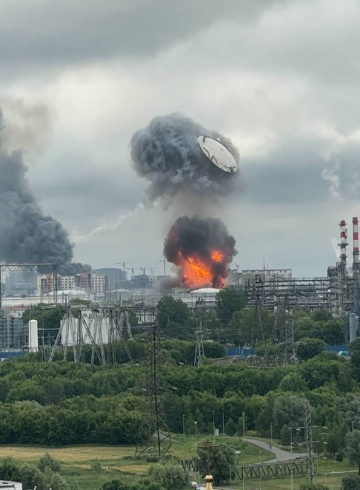

تصویری عجیب و غریب از مسکو
لحظه انهدام انبار نفتی و صحنه ای جالب از پرت شدن درب دهانه عظیم انبار نفتی...

👺Phantom

📌 @persian_trend_official
پرشین ترند | متفاوت‌ترین کانال نظامی

## IranianMinds — post 22847

  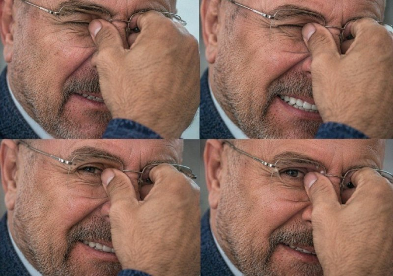

قالیباف حین مذاکره با قاتل قاسم سلیمانی:

@IranianMinds

## BBCPersian — post 284246

🔻سوئیس: فردا هیئت‌های ایران و آمریکا و همچنین میانجی‌گران برای مذاکرات اولیه گردهم می‌آیند

سوئیس که میزبان مراسم رسمی دیدار هیئت‌های ایرانی و آمریکایی است، در بیانیه‌ای ترتیبات برگزاری این برنامه را اعلام کرده است.

بنابر اعلام سوئیس «در حال حاضر، برنامه این است که فردا ایالات متحده و ایران، به همراه پاکستان و قطر به عنوان میانجی‌گران و همچنین دیگر کشورهای درگیر»، در بئرگن‌اشتوک برای مذاکرات اولیه درباره اجرای این تفاهمنامه گرد هم آیند.

در ادامه این بیانیه آمده است که «در حال حاضر اطلاعات بیشتری درباره زمان‌بندی و جزئیات این نشست در دست نیست.»

https://bbc.in/4fNU3nt
@BBCPersian

## alonews — post 128861

  <a href="telegram/content/alonews_128861_1781769851.webm" target="_blank">🎬 Download video</a>

👈 ️سناتور جمهوری خواه بیل کسیدی در مورد تفاهم نامه ترامپ: ریگان در قبر در حال لرزیدن به خود است....این بدترین سیاست خارجه آمریکا در چندین دهه اخیر است

✅ @AloNews خبر جنگ

## alonews — post 128860

  <a href="telegram/content/alonews_128860_1781769852.mp4" target="_blank">🎬 Download video</a>

👈شبکه سی‌ان‌بی‌سی: فدرال رزرو آمریکا ارسال محموله های ماهانه ۱ تا ۲ میلیارد دلاری نقد به بغداد را تا تشکیل دولت جدید و قطع دسترسی گروه‌ های تحت تحریم به ارز متوقف کرده است.

🔴 بر اساس سازوکار مالی پس از ۲۰۰۳، درآمدهای نفتی عراق مستقیماً به حسابی در نیویورک واریز می‌شود و دولت آمریکا کنترل توزیع نقدینگی آن را در دست دارد.

🔴 با توجه به اینکه نفت ۹۰ درصد بودجه عراق را تأمین می‌کند، این تعلیق بازار ارز را با بحران مواجه کرده و پرداخت حقوق ۷ میلیون کارمند و بازنشسته عراقی را در معرض خطر جدی قرار می‌دهد

✅ @AloNews خبر جنگ

## alonews — post 128859

  <a href="telegram/content/alonews_128859_1781769854.webm" target="_blank">🎬 Download video</a>

👈 محمد مرندی عضو تیم مذاکره کننده ایرانی: استاد خوش‌چشم درست می‌گوید؛ ترامپ کوتاه آمد!

✅ @AloNews خبر جنگ

## alonews — post 128858

  <a href="telegram/content/alonews_128858_1781769855.webm" target="_blank">🎬 Download video</a>

👈وال‌استریت ژورنال: به نظر می‌رسد رابطه ترامپ و نتانیاهو به طور فزاینده‌ای تیره شده است

✅ @AloNews خبر جنگ

## alonews — post 128857

  <a href="telegram/content/alonews_128857_1781769855.webm" target="_blank">🎬 Download video</a>

👈پیام حسن روحانی پس از امضای یادداشت تفاهم ایران و آمریکا: باید از دستاورد تفاهم اولیه، حراست کرد

🔴 باید نسبت به توطئه و عهدشکنی دشمن هوشیار بود

🔴 امروز هر ایرانی در هر گوشه دنیا، به ایرانی بودن خود می‌بالد

🔴 رهبری نظام با صلابت و درایت و حکمت، انسجام ملت و نظام را مدیریت نمود

🔴 نیروهای مسلح جان برکف حسرت پیروزی نظامی را بر دل دشمنان گذاشتند

🔴 دولت خدمتگزار لحظه‌ای میدان خدمت به مردم را ترک نکرد

🔴 همسایگان ما می‌توانند با مشارکت و تضمین این توافق، از ثمرات امنیت و توسعه مشترک منطقه بهره‌مند شوند.

✅ @AloNews خبر جنگ

## alonews — post 128856

  <a href="telegram/content/alonews_128856_1781769855.webm" target="_blank">🎬 Download video</a>

👈گروسی: در مذاکرات سوئیس شرکت خواهیم کرد

✅ @AloNews خبر جنگ

---
📅 بروزرسانی: 1405/03/28 11:13
---

## pm_afshaa — post 94317

  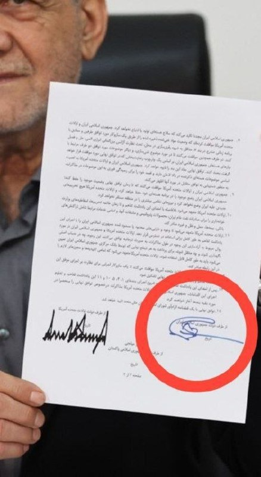

بند اول این توافق بخونید جمهوری اسلامی مجدد تأکید می‌کند که سلاح هسته‌ای تولید یا اشباع نخواهد کرد

💧 Rainbet.com the #1 Non-KYC Crypto Casino & Sportsbook @rainbetcom

😁 @Pm_Afshaa

## DEJradio — post 5778

  <a href="telegram/content/DEJradio_5778_1781768637.webm" target="_blank">🎬 Download video</a>

🔺📢 بر اساس گزارش منابع اختصاصی دژ، دخالت سـ.ـپاه پاسداران در تصمیمات مسعود پزشکیان به حدی رسیده است که احمد وحیدی و مهدی طائب به مسعود پزشکیان اجازه نداده‌اند مصطفی پورمحمدی را به عنوان وزیر اطلاعات معرفی کند.

اسماعیل خطیب ۲۷ اسفند ۱۴۰۴ در جنگ ۴۰ روزه کشته شد و از آن زمان تاکنون وزارت اطلاعات وزیر ندارد.

بر اساس گزارش همین منبع، گزینه اول پزشکیان از همان ابتدا پورمحمدی بود اما در سـ.ـپاه با آن مخالفت شد.
بعد از جنگ ۴۰ روزه دخالت‌های سـ.ـپاه در تصمیمات و امورات محوله به دولت به شدت افزایش داشت و عملاً پزشکیان با به یک «رئیس دولت» بی‌اختیار تبدیل کرده است.

#جنگ #مصطفی_پورمحمدی #IRGCterrorists
@DEJradio

## DEJradio — post 5777

  <a href="telegram/content/DEJradio_5777_1781768638.webm" target="_blank">🎬 Download video</a>

🔺🎤 پشت پرده تفاهم تهران و واشنگتن؛ چه امتیازهایی رد و بدل شده است؟

گفت‌وگو با شهرام خلدی، پژوهشگر مطالعات خاورمیانه

#توافق #جنگ #مذاکرات
@DEJradio

## FarsiVOA — post 221087

  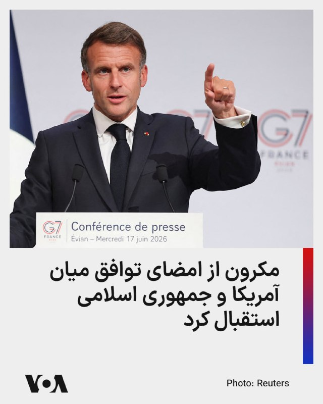

امانوئل مکرون، رئیس‌جمهور فرانسه از امضای توافق میان آمریکا و جمهوری اسلامی استقبال کرد.

او با انتشار فیلمی از امضای این توافق به دست دونالد ترامپ رئیس‌جمهوری آمریکا در کاخ ورسای، نوشت: «این توافق راه را برای صلحی پایدار هموار می‌کند و امکان بازگشایی تنگه هرمز را فراهم می‌سازد.»

رئیس‌جمهوری فرانسه افزود: «این گامی مهم در مسیر درست برای هم‌میهنان ماست که به‌زودی موجب کاهش قیمت انرژی خواهد شد.»

پیشتر کاخ سفید پیشتر چهارشنبه عصر به وقت واشنگتن اعلام کرد که آقای ترامپ یادداشت تفاهم میان آمریکا و جمهوری اسلامی برای پایان دادن به درگیری‌‌های نظامی را به‌صورت الکترونیکی امضا کرد.
@FarsiVOA

## Persian_Trend_Official — post 17438

  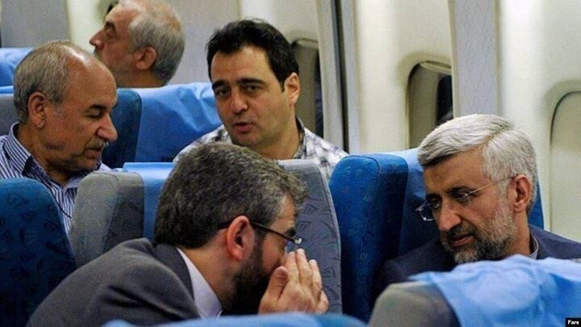

✌ دوئل علی باقری و سعید جلیلی در شورای عالی امنیت ملی/ صندلی لرزان رئیس دولت سایه

▫️این روزها در حالی خبرها بار دیگر حول محور سعید جلیلی می‌چرخد که علی‌رغم همه تکذیبیه‌ها، زمزمه‌ها و شنیده‌ها حکایت از حذف او از مهم‌ترین نهادی دارد که در یک صبح پاییزی به دبیری آن منصوب شده بود، اما چه کسی قرار است بر صندلی رئیس دولت سایه تکیه بزند؟

▫️سال گذشته، زمانی که با حکم مسعود پزشکیان، علی لاریجانی به دبیرخانه شورای عالی امنیت ملی بازگشت تا مسئولیت مذاکرات هسته‌ای را بر عهده بگیرد، طی حکمی علی باقری را به معاونت خود در شعام منصوب کرد. حکمی که روزگاری شنیدن آن عجیب به نظر می‌رسید، اما حقیقتی را از جدایی باقری و جلیلی در دل خود پنهان کرده بود.

▫️با کشته شدن علی لاریجانی، دبیر شورای عالی امنیت ملی، در جنگ رمضان، محمدرضا ذوالقدر جای او را در دبیرخانه شعام گرفت. بررسی‌ها نیز نشان می‌دهد که همکاری سعید جلیلی با این نهاد امنیتی در یک سال گذشته فراز و فرودهایی داشته و بنابر برخی شنیده‌ها، او به جلسات شعام دعوت نمی‌شده است. شاید علت این مسئله نیز تفاوت دیدگاه‌ها و عدم همسویی او با برخی تصمیمات مهم نظام بوده باشد.

▫️به نظر می‌رسد همین عدم همسویی جلیلی با برخی تصمیمات نظام و مخالفت‌هایی که از سوی جریان‌های تندرو شکل گرفته، زمینه حذف او از شعام را فراهم کرده باشد؛ اقدامی که در صورت تحقق، می‌تواند به حضور علی باقری به عنوان نماینده رهبر انقلاب در جایگاه او منجر شود.

👺Phantom

📌 @persian_trend_official
پرشین ترند | متفاوت‌ترین کانال نظامی

## IranianMinds — post 22846

  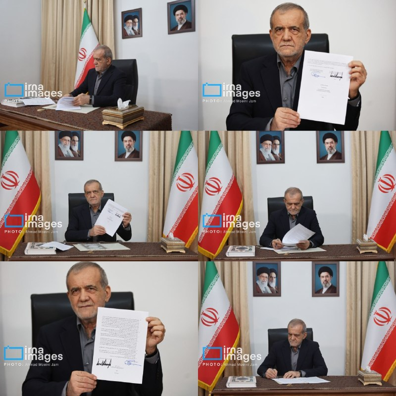

" کسی مثل ما با کسی مثل یزید بیعت نمیکند "

@IranianMinds

## Dirty_Kids — post 392467

  

خواستم بگم:
مامی شده فرست لیدی

@Dirty_Kids 👻

## Dirty_Kids — post 392466

  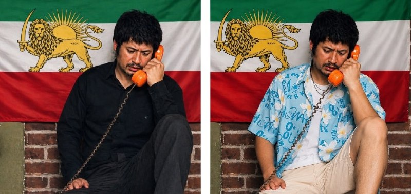

سلامتی؛ محرمه مشکیمو درآوردم.

@Dirty_Kids 👻

## Hranews — post 113696

انفجار مین در سراوان یک کشته بر جای گذاشت

❗️
❗️
❗️
❗️
❗️– روز چهارشنبه ۲۸ خردادماه، یک مرزبان هنگ مرزی سراوان بر اثر انفجار مین، جان خود را از دست داد.

ادامه مطلب

↘️
@hranews_bot تماس ✉️ - @Hranews کانال هرانا 🆑

## alonews — post 128855

  <a href="telegram/content/alonews_128855_1781768642.webm" target="_blank">🎬 Download video</a>

👈جی‌دی ونس درباره اسرائیل: اسرائیل حق دفاع از خود را دارد. هیچ‌کس نمی‌تواند به دولت دیگری بگوید که اجازه ندارد از مردم خود دفاع کند

✅ @AloNews خبر جنگ

## alonews — post 128854

  <a href="telegram/content/alonews_128854_1781768642.webm" target="_blank">🎬 Download video</a>

🔴فوری / نتانیاهو: اسرائیل به بند لبنان در توافق ایران و آمریکا پایبند نیست!

✅ @AloNews خبر جنگ

---
📅 بروزرسانی: 1405/03/28 11:03
---

## mwarmonitor — post 11101

  <a href="telegram/content/mwarmonitor_11101_1781768017.mp4" target="_blank">🎬 Download video</a>

🔥پالایشگاه نفت مسکو که بامداد امروز هدف حملات متعدد پهپادی اوکراین قرار گرفت، اکنون در حال سوختن ستونی عظیم از دود است که بر فراز پایتخت روسیه اوج گرفته است. @mwarmonitor

## pm_afshaa — post 94316

  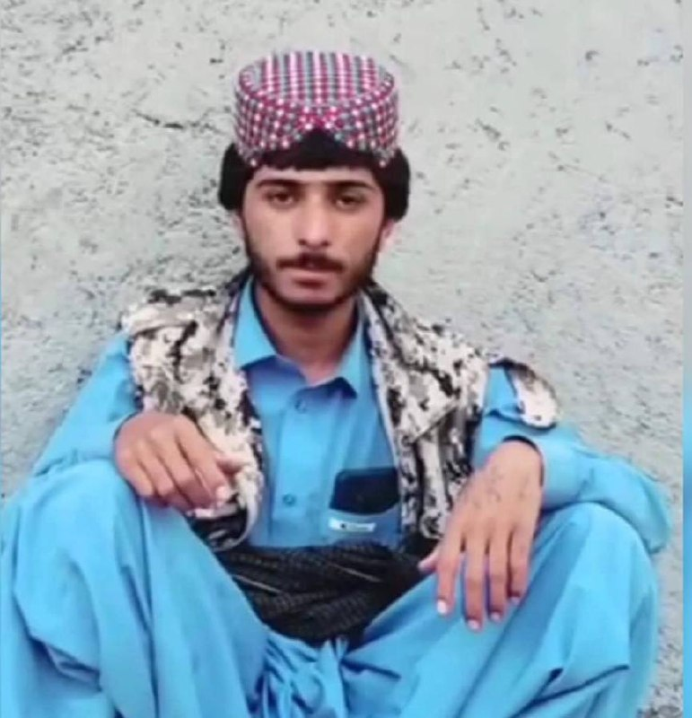

فرزاد ملازهی نوجوان 15 ساله بلوچ شامگاه روز گذشته چهارشنبه در نزدیکی بیمارستان ایرانمهر سراوان توسط نیروهای امنیتی سپاه،بدون ایست و هشدار قبلی هدف تیراندازی قرار گرفته و گلوله به ناحیه سر وی اصابت کرده

+نیروهای حاضر پس از مجروح شدن این نوجوان، با وجود نزدیکی محل حادثه به بیمارستان ایرانمهر، از انتقال فوری وی به مرکز درمانی جلوگیری کرده و مانع نزدیک شدن شهروندان برای کمک‌رسانی به او شده

💧 Rainbet.com the #1 Non-KYC Crypto Casino & Sportsbook @rainbetcom

😁 @Pm_Afshaa

## IranIntlTV — post 342973

روح‌الله رحیم‌پور، روزنامه‌نگار و تحلیلگر سیاسی، در گفت‌وگو با ایران‌اینترنشنال با اشاره به امضای تفاهم‌نامه میان آمریکا و جمهوری اسلامی گفت بخش مهم این توافق به تفاهم‌های پشت‌پرده درباره برنامه موشکی و آینده برنامه هسته‌ای ایران مربوط می‌شود. او همچنین تاکید کرد پرسش اصلی این است که آیا جمهوری اسلامی توان و اراده ایجاد یک تغییر پارادایمی در ساختار خود برای اجرای این توافق‌ها را دارد یا نه.
@iranintltv

## IranIntlTV — post 342972

  <a href="telegram/content/IranIntlTV_342972_1781768019.mp4" target="_blank">🎬 Download video</a>

دونالد ترامپ، رییس‌جمهور آمریکا، متن یادداشت تفاهم با جمهوری اسلامی را امضا کرد. هم‌زمان رسانه‌های ایران از امضای این توافق از سوی مسعود پزشکیان نیز خبر دادند. قرار است نمایندگان دو کشور روز جمعه در سوئیس درباره نحوه اجرای توافق گفت‌وگو کنند.

مرتضی کاظمیان، عضو تحریریه ایران‌اینترنشنال، با اشاره به این توافق پس از ۴۷ سال تنش و جنگ ۴۰ روزه، از ابهام‌ها و چالش‌های پیش‌روی اجرای آن در ماه‌های آینده می‌گوید.
@iranintltv

## Persian_Trend_Official — post 17437

  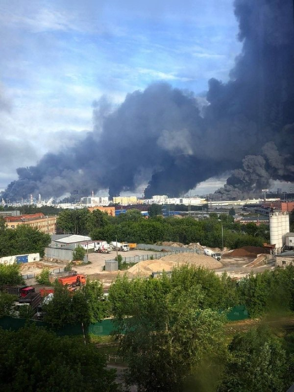

Moscow 
👀

## alonews — post 128853

  <a href="telegram/content/alonews_128853_1781768022.webm" target="_blank">🎬 Download video</a>

🔴فوری / گزارشات از پیشروی ارتش اسرائیل به سمت ورودی علی الطاهر در لبنان 
✅ @AloNews خبر جنگ

## alonews — post 128852

  <a href="telegram/content/alonews_128852_1781768022.mp4" target="_blank">🎬 Download video</a>

👈وقتی آقازاده‌ها میفهمن بعد توافق قراره پول بیاد به کشور

✅ @AloNews

## alonews — post 128851

  <a href="telegram/content/alonews_128851_1781768023.webm" target="_blank">🎬 Download video</a>

🔴فوری / گزارشات از پیشروی ارتش اسرائیل به سمت ورودی علی الطاهر در لبنان

✅ @AloNews خبر جنگ

## alonews — post 128850

  <a href="telegram/content/alonews_128850_1781768023.webm" target="_blank">🎬 Download video</a>

👈آکسیوس: رسانه‌های نزدیک به نتانیاهو به دلیل توافق با ایران، حمله به دولت ترامپ را آغاز کردند

✅ @AloNews خبر جنگ

## alonews — post 128849

  <a href="telegram/content/alonews_128849_1781768023.webm" target="_blank">🎬 Download video</a>

👈ناتو: توافق ایران گامی مثبت به سوی ثبات است

✅ @AloNews خبر جنگ

---
📅 بروزرسانی: 1405/03/28 10:54
---

## VahidOOnLine — post 246143

  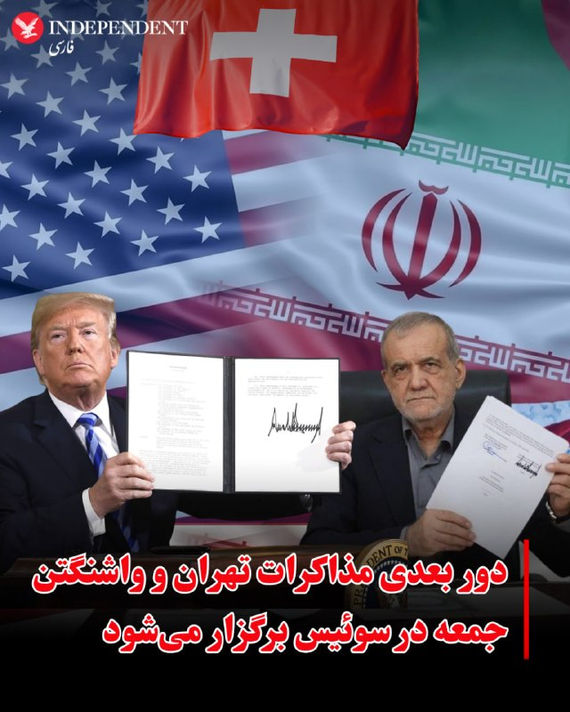

♦️وزارت امور خارجه سوییس روز پنجشنبه ۲۸ خردادماه با انتشار بیانیه‌ای اعلام کرد نمایندگان جمهوری اسلامی ایران، ایالات متحده آمریکا، قطر، پاکستان و سایر کشورهای «علاقه‌مند» دور بعدی مذاکرات را در این کشور برگزار می‌کنند.

همزمان با انتشار این خبر، اسماعیل بقایی، سخنگوی وزارت امور خارجه جمهوری اسلامی هم اعلام کرد نمایندگان تهران و واشنگتن و میانجی‌های پاکستان و قطر روز جمعه برای دور بعدی مذاکرات به سوییس می‌روند.
‌🇸🇦 Indypersian

🤖 @VahidOOnLine

## VahidOOnLine — post 246142

  

بهنام سعیدی، عضو هیات رییسه کمیسیون امنیت ملی و سیاست خارجی مجلس، به خبرگزاری مهر گفت دونالد ترامپ، رییس‌جمهوری آمریکا، قابل اعتماد نیست.

او افزود موضوع تفاهم با آمریکا با «بی‌اعتمادی کامل» و با در نظر گرفتن همه جوانب دنبال شده است.

سعیدی گفت جمهوری اسلامی هیچ‌گاه نسبت به آمریکا خوش‌بین نخواهد بود.

او همچنین تاکید کرد هر اقدامی از سوی جمهوری اسلامی منوط به اجرای تعهدات طرف آمریکایی خواهد بود.

به گفته این عضو کمیسیون امنیت ملی مجلس، روند اجرای تفاهم میان جمهوری اسلامی و آمریکا به‌صورت گام‌به‌گام و متقابل دنبال می‌شود.
‌🏁 🇬🇧 IranintlTV

🤖 @VahidOOnLine

## WithYashar — post 15218

## WithYashar — post 15217

اتاق جنگ با شما : درود و خسته نباشید
ما که می دونیم به قاهره نزدیک میشیم
حالا تو این راه تفاهم امضا بشه یکم از لحاظ اقتصادی و گرونی بهتر بشه
به نفع مردمه که یخورده تو این مدت نفس بکشن
@withyashar

## WithYashar — post 15216

## mwarmonitor — post 11100

🔴(رویترز) — ولودیمیر زلنسکی، رئیس‌جمهور اوکراین، روز پنج‌شنبه در نشست «گروه تماس دفاعی اوکراین»—ائتلافی که کمک‌های نظامی به کی‌یف ارائه می‌کند—در مقر ناتو در بروکسل شرکت خواهد کرد. این خبر را دبیرکل ناتو، مارک روته اعلام کرد.

@mwarmonitor

## mwarmonitor — post 11099

🔴کاهش مشارکت آمریکا در نیروهای واکنش بحرانی ناتو بلافاصله اجرایی شد؛ روتِه می‌گوید

🔸بروکسل، ۱۸ ژوئن (رویترز) — دبیرکل ناتو، مارک روته، روز پنج‌شنبه اعلام کرد کاهش سهم آمریکا در نیروهای واکنش بحرانی ناتو از همین حالا اجرایی شده است و افزود سایر متحدان برای جبران خلأ ناشی از این اقدام آمریکا در حال افزایش مشارکت خود هستند.

🔸روته پیش از نشست وزیران دفاع ناتو در بروکسل به خبرنگاران گفت: «دیروز این سؤال مطرح شد که آیا این موضوع فوری است یا نه؟ پاسخ این است که بله، فوری است.»

🔸او افزود: «با این حال، کمی مردد هستم که این را به‌طور مطلق بیان کنم، چون این یک ابزار برنامه‌ریزی است. بنابراین در عمل چه اتفاقی می‌افتد؟ اگر جنگی آغاز شود... همه متحدان، از جمله آمریکا، حداکثر توان خود را به کار خواهند گرفت تا اطمینان حاصل شود که می‌توانیم در جنگ بجنگیم.»

@mwarmonitor

## mwarmonitor — post 11098

  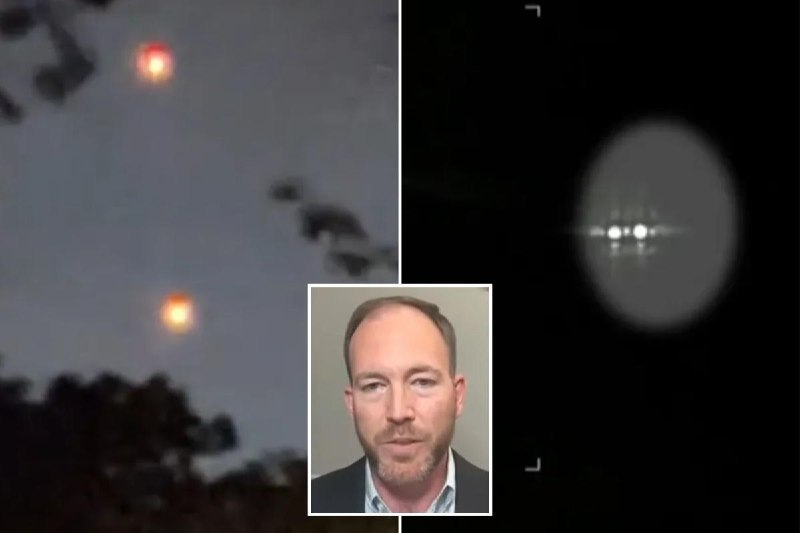

🛸اسناد تازه منتشرشده مربوط به یوفوها ادعا می‌کنند که چین و روسیه اشیای پرنده ناشناسِ سقوط‌کرده (UAP) را بازیابی کرده‌اند و تلاش داشته‌اند آن‌ها را مهندسی معکوس کنند. « نیویورک پست »

@mwarmonitor

## mwarmonitor — post 11097

🔴 دولت سوئیس اعلام کرد که آمریکا و ایران روز جمعه در بورگن‌اشتوک دیدار خواهند کرد تا درباره اجرای تفاهم‌نامه (MoU) مذاکره کنند. i24 news

@mwarmonitor

## DEJradio — post 5776

  <a href="telegram/content/DEJradio_5776_1781767450.webm" target="_blank">🎬 Download video</a>

🕐
🔺 دونالد ترامپ می‌گوید توافق با جمهوری اسلامی ۴۸ ساعت دیگر امضا می‌شود. طرفین چهارشنبه شب متن ۱۴ بندی توافق احتمالی را منتشر کردند. بندها مبهم بود و موارد اختلافی زیاد.
بخشی از حامیان نظام از جمله در سـ.ـپاه و بــ.ــسیج با «توافق» مخالف‌اند. آنها می‌گویند ۴۰ روز زیر بمباران کشته ندادیم که در نهایت با قاتل خامنه‌ای، سـ.ـلیمانی و سلامی و دیگران توافق کنیم.
مخالفت‌ها به گوش قالیباف رسیده است. او چهارشنبه‌شب ۲۷ خردادماه در مصاحبه‌ای که همزمان با انتشار مفاد تفاهم‌نامه جمهوری اسلامی و آمریکا از صداوسیما پخش شد، گفت برای حضور در مذاکرات با دولت دونالد ترامپ تمایلی نداشت و به دلیل نقش ترامپ در کشتن قاسم سلیمانی، «کراهت شدید» برای ورود به این روند احساس می‌کرد. او افزود که با وجود این مخالفت شخصی، به درخواست مقام‌های جمهوری اسلامی مسئولیت مذاکرات را پذیرفت.
قالیباف از دو سو با تهدید روبه‌روست: مخالفان سرسخت توافق با آمریکا درون نظام و اسرائیل
هر دو طرف به اندازه کافی انگیزه برای حذف قالیباف را دارند. از یک سو هواداران متعصب نظام که او را به دلیل توافق با آمریکا «خائن» می‌دانند و از سوی دیگر اسرائیل.
پیش‌تر عباس پاپی‌زاده، عضو هیات رییسه مجلس گفته بود، «قالیباف، به‌عنوان رییس هیات مذاکره‌کننده ما، تا الان چند بار مورد ترور به‌صورت مستقیم و هدفمند قرار گرفته و الان هم مکان‌هایی که او بوده و با موشک زدند، مشخص است اما در نهایت نتوانستند قالیباف را ترور کنند.»

#توافق #جنگ #ترامپ #قالیباف
@DEJradio

## DEJradio — post 5775

  <a href="telegram/content/DEJradio_5775_1781767451.webm" target="_blank">🎬 Download video</a>

🔺📷 هم‌زمان با امضاء سند توافق توسط ترامپ در کاخ ورسای، در تهران مسعود پزشکیان زیر همان سند را امضاء کرد. نماینده حکومت در مذاکرات محمدباقر قالیباف بود اما از نظر قانونی رئیس دولت باید زیر سند را امضاء می‌کرد. یک تحلیلگر سیاسی به دژ می‌گوید: «برادران خدوم سـ.ـپاه هنوز جنازه خامنه‌ای دفن نشده با قاتل توافق کردند.»

با امضا این توافق موجی از انتقاد میان طرفداران نظام به راه افتاد. آنها از توافق با آمریکا بسیار خشمگین هستند.
پزشکیان با چهره‌ای پر از اضطراب با برگه امضاء شده عکس گرفت.

#توافق #جنگ
@DEJradio

## IranIntlTV — post 342971

  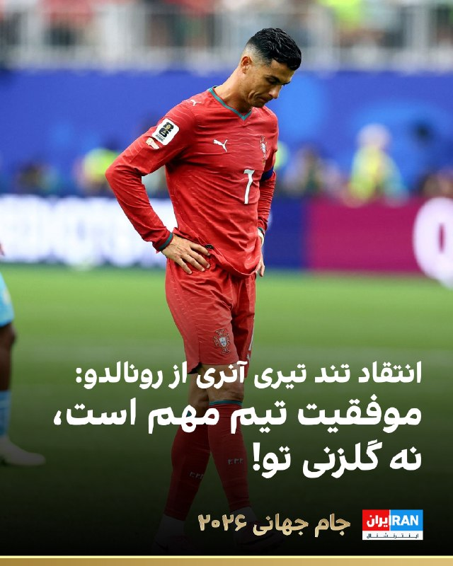

🔻در پی تساوی ۱ بر ۱ تیم ملی پرتغال مقابل جمهوری دموکراتیک کنگو در جام جهانی، کریستیانو رونالدو به دلیل عملکرد ضعیف خود هدف انتقادهای شدیدی قرار گرفته است. در این میان، اظهارات بی‌پرده تیری آنری، اسطوره فوتبال فرانسه، بیش از همه جلب توجه کرده است. رونالدوی ۴۱ ساله در این مسابقه مقابل مدافعان کنگو، از جمله شانسل امبمبا و اکسل توانزبه، با مشکل مواجه شد.

🔹آنری در تحلیل خود در استودیوی شبکه فاکس گفت: «آنچه اهمیت دارد این است که تیم به گل برسد، نه شخص تو. رونالدو اصرار زیادی به گلزنی دارد و با ایستادن در مسیر پاس‌های رو به عقب، عملا فضا را از برونو فرناندز می‌گیرد. وقتی دو بازیکن در یک نقطه قرار می‌گیرند، کار برای مدافعان حریف بسیار راحت‌تر می‌شود.»

🔹آنری با تحلیل حرکات هجومی پرتغال تاکید کرد که جابه‌جایی‌های رونالدو در این دیدار بیش از آنکه به سود تیم باشد، به ضرر آن تمام شده است و ساختن یک سیستم حول محور تنها یک ستاره، ریسک بزرگی برای پرتغال خواهد بود. این نمایش ضعیف، بار دیگر مقایسه او با لیونل مسی را در رسانه‌های جهان مطرح کرده است.

@iranintltvsport

## IranIntlTV — post 342970

  <a href="telegram/content/IranIntlTV_342970_1781767452.mp4" target="_blank">🎬 Download video</a>

پس از چهل روز جنگ و ماه‌ها تنش میان آمریکا و جمهوری اسلامی، توافق میان تهران و واشینگتن به دنبال پذیرش شروط دونالد ترامپ از سوی جمهوری اسلامی به صورت غیرحضوری امضا شد. امید معماریان، تحلیل‌گر سیاسی، به ایران‌اینترنشنال گفت هرگونه توافق احتمالی همچنان با ابهام و بی‌اعتمادی جدی روبه‌روست و سرنوشت آن بیش از هر چیز به اراده سیاسی دو طرف بستگی دارد.
@iranintltv

## IranIntlTV — post 342969

  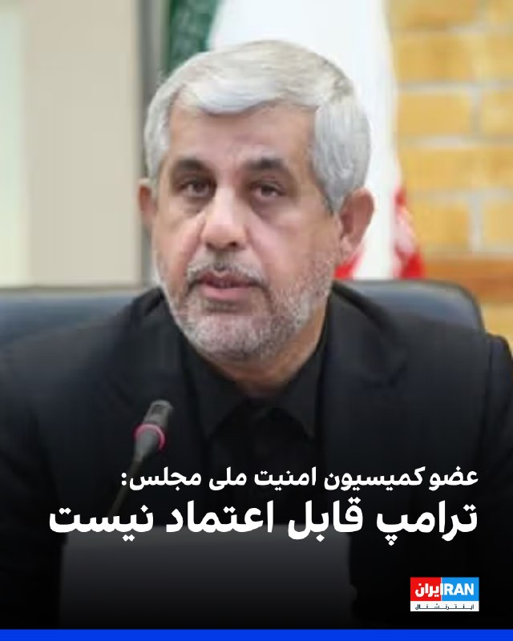

بهنام سعیدی، عضو هیات رییسه کمیسیون امنیت ملی و سیاست خارجی مجلس، به خبرگزاری مهر گفت دونالد ترامپ، رییس‌جمهوری آمریکا، قابل اعتماد نیست.

او افزود موضوع تفاهم با آمریکا با «بی‌اعتمادی کامل» و با در نظر گرفتن همه جوانب دنبال شده است.

سعیدی گفت جمهوری اسلامی هیچ‌گاه نسبت به آمریکا خوش‌بین نخواهد بود.

او همچنین تاکید کرد هر اقدامی از سوی جمهوری اسلامی منوط به اجرای تعهدات طرف آمریکایی خواهد بود.

به گفته این عضو کمیسیون امنیت ملی مجلس، روند اجرای تفاهم میان جمهوری اسلامی و آمریکا به‌صورت گام‌به‌گام و متقابل دنبال می‌شود.
https://iranintl.com/202606180971

## FarsiVOA — post 221086

  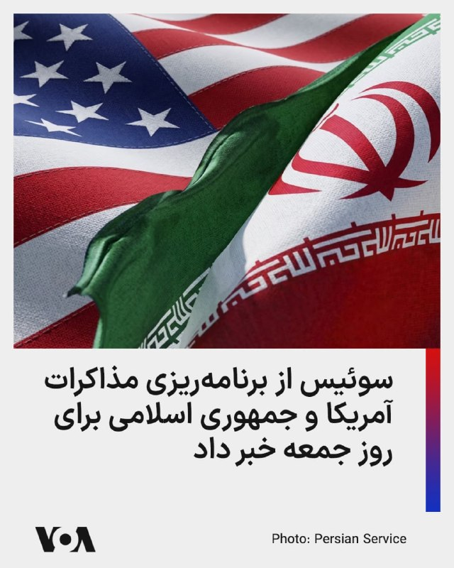

دولت سوئیس اعلام کرد که قرار است نخستین گفت‌وگوهای میان ایالات متحده و حکومت ایران روز جمعه در اقامتگاه کوهستانی بورگن‌اشتاک در سوئیس برگزار شود.

این مذاکرات پس از امضای توافق آتش‌بس میان جمهوری اسلامی و واشنگتن انجام می‌شود.

وزارت خارجه سوئیس روز پنجشنبه در بیانیه نوشت: «در وضعیت کنونی، برنامه همچنان این است که آمریکا و [رژیم] ایران، به همراه میانجی‌گران پاکستان و قطر و دیگر کشورهای درگیر، فردا در بورگن‌اشتاک برای مذاکرات اولیه درباره اجرای این توافق دیدار کنند.»

در این بیانیه افزوده شده است: «در حال حاضر اطلاعات بیشتری درباره زمان‌بندی و جزئیات این نشست در دسترس نیست.»
@FarsiVOA

## DW_Farsi — post 126122

  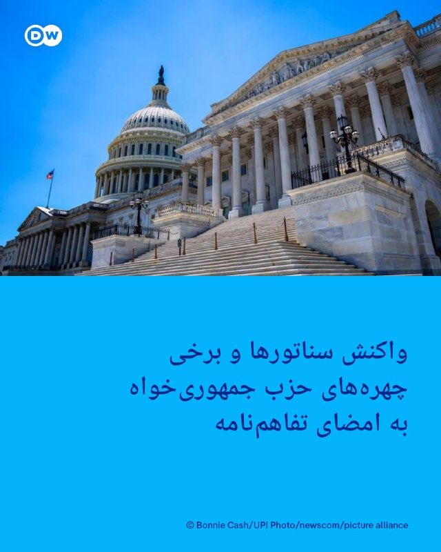

🔶 واکنش سناتورها و برخی چهره‌های حزب جمهوری‌خواه به امضای تفاهم‌نامه

چند سناتور و چهره سیاسی حزب جمهوری‌خواه آمریکا به تفاهم‌نامه منتشرشده میان تهران و واشنگتن واکنش نشان داده و برخی از آن انتقاد کرده‌اند. شماری نیز تصریح کرده‌اند که این تفاهم‌نامه توافق نهایی با حکومت جمهوری اسلامی محسوب نمی‌شود. تفاهم‌نامه مزبور که مفاد آن روز چهارشنبه ۱۷ ژوئن (۲۷ خرداد) منتشر شده بود، شامگاه همان روز از راه دور به امضای دونالد ترامپ و مسعود پزشکیان رسید.

لیندزی گراهام، سناتور جمهوری‌خواه که از چهر‌ه‌های پرنفوذ این حزب محسوب می‌شود، با انتشار پستی در شبکه ایکس (توئیتر سابق) نوشت، پس از "صحبت‌هایی طولانی و سازنده" با استیو ویتکاف، نماینده ویژه ترامپ در امور صلح به این نتیجه رسیده که امضای تفاهم‌نامه میان ایالات متحده و جمهوری اسلامی می‌تواند "به نفع" واشنگتن و در راستای گسترش صلح در خاورمیانه باشد. به گفته او "بازگشایی تنگه هرمز و پایان درگیری‌ها با ایران از مهم‌ترین مزایای این تفاهم‌نامه خواهد بود".

گراهام در پیام خود نوشت: «هنوز مشخص نیست که آیا آمریکا می‌تواند به توافقی قابل قبول و قابل راستی‌آزمایی در باره برنامه هسته‌ای ایران و دیگر مسایل دست یابد یا نه، اما تلاش برای رسیدن به چنین توافقی زیان چندانی ندارد.»

@dw_farsi

## Persian_Trend_Official — post 17429

فهرست پایگاه‌های کلیدی سنتکام در منطقه که در گزارش‌ها به آن‌ها اشاره شده است

در برخی گزارش‌های رسانه‌ای و تحلیلی، مجموعه‌ای از تأسیسات نظامی ایالات متحده در منطقه خلیج فارس و غرب آسیا به‌عنوان مراکز مهم فرماندهی و پشتیبانی عملیاتی سنتکام معرفی شده‌اند.

فهرست پایگاه‌ها:

🔹 Camp Buehring (کویت) — اردوگاه بوهرینگ
🔹 Ali Al Salem Air Base (کویت) — پایگاه هوایی علی السالم
🔹 Camp Arifjan (کویت) — اردوگاه عریفجان
🔹 NSA Bahrain (بحرین) — پایگاه پشتیبانی دریایی آمریکا در بحرین
🔹 Isa Air Base (بحرین) — پایگاه هوایی عیسی
🔹 Al Dhafra Air Base (امارات) — پایگاه هوایی الظفره
🔹 سایت‌های راداری و پدافندی برد بلند در نقاط مختلف منطقه

این پایگاه‌ها در زنجیره پشتیبانی، لجستیک، شناسایی و عملیات هوایی آمریکا در منطقه نقش کلیدی دارند و در سناریوهای مختلف نظامی به‌عنوان نقاط حساس عملیاتی شناخته می‌شوند.

👺 Phantom

📌 @persian_trend_official
پرشین ترند | متفاوت‌ترین کانال نظامی

---
📅 بروزرسانی: 1405/03/28 10:44
---

## VahidOOnLine — post 246141

  

محمدصالح جوکار، رییس کمیسیون امور داخلی کشور و شوراهای مجلس، گفت تمام تلاش نظام بر این است که به وضعیت ناپایدار «نه جنگ، نه صلح» پایان داده شود و امضای تفاهم‌نامه با آمریکا نیز در همین چارچوب انجام شده است.

او تاکید کرد امضای تفاهم با آمریکا به معنای پایان خصومت‌های این کشور با جمهوری اسلامی نیست.

جوکار افزود آمریکا حتی در شرایطی که درگیری نظامی مستقیمی با ایران ندارد، از ابزارهای مختلف برای محدودسازی و جلوگیری از پیشرفت جمهوری اسلامی استفاده می‌کند.
‌🏁 🇬🇧 IranintlTV

🤖 @VahidOOnLine

## mwarmonitor — post 11096

  <a href="telegram/content/mwarmonitor_11096_1781766853.mp4" target="_blank">🎬 Download video</a>

🔥پالایشگاه نفت مسکو که بامداد امروز هدف حملات متعدد پهپادی اوکراین قرار گرفت، اکنون در حال سوختن ستونی عظیم از دود است که بر فراز پایتخت روسیه اوج گرفته است.

@mwarmonitor

## DEJradio — post 5774

  <a href="telegram/content/DEJradio_5774_1781766854.webm" target="_blank">🎬 Download video</a>

🚨📢 دونالد ترامپ تفاهم‌نامه جمهوری اسلامی ایران و آمریکا را امضا کرد. امضاء این تفاهم‌نامه در جریان مهمانی شام با امانوئل ماکرون رییس‌جمهوری فرانسه، در کاخ ورسای انجام شد.

گفته شد مسعود پزشکیان، نیز این سند را از طرف جمهوری اسلامی ایران امضا کرده است.

رویترز گزارش داد با اجرایی شدن توافق میان دو کشور برای پایان جنگ، مراسم اصلی امضای توافق که قرار بود در ژنو برگزار شود، لغو شده است.

اسماعیل بقایی، سخنگوی وزارت خارجه جمهوری اسلامی اعلام کرد که با وجود لغو مراسم رسمی امضا، برنامه سفر تیم‌های مذاکره‌کننده به ژنو همچنان برقرار است.

#توافق #جنگ
@DEJradio

## IranIntlTV — post 342968

  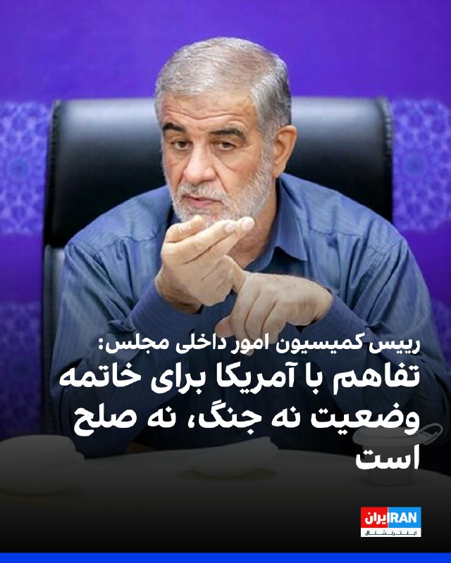

محمدصالح جوکار، رییس کمیسیون امور داخلی کشور و شوراهای مجلس، گفت تمام تلاش نظام بر این است که به وضعیت ناپایدار «نه جنگ، نه صلح» پایان داده شود و امضای تفاهم‌نامه با آمریکا نیز در همین چارچوب انجام شده است.

او تاکید کرد امضای تفاهم با آمریکا به معنای پایان خصومت‌های این کشور با جمهوری اسلامی نیست.

جوکار افزود آمریکا حتی در شرایطی که درگیری نظامی مستقیمی با ایران ندارد، از ابزارهای مختلف برای محدودسازی و جلوگیری از پیشرفت جمهوری اسلامی استفاده می‌کند.
https://iranintl.com/202606184031

## BBCPersian — post 284245

🔻«اسرائیل نسخه‌ای از تفاهمنامه را دریافت کرده است»

دونالد ترامپ، رئیس‌جمهور آمریکا، گفته است واشنگتن «پیش‌تر نسخه‌ای» از تفاهمنامه خود با ایران برای پایان دادن به جنگ در خاورمیانه را برای اسرائیل ارسال کرده است. رسانه‌های اسرائیلی چهارشنبه گزارش کرده بودند که این تفاهمنامه را اسرائیل رؤیت نکرده است.

اکنون دونالد ترامپ کرده است که رابطه او با بنیامین نتانیاهو، نخست‌وزیر اسرائیل، خوب است، اما بار دیگر از عملیات نظامی اسرائیل علیه حزب‌الله در لبنان انتقاد کرده و آن را «قابل انجام به شکلی بسیار بهتر» توصیف کرده است.

او در عین حال از «همکاری بسیار خوب» خود با بنیامین نتانیاهو گفت و او را «مردی خوب، اما گاهی کمی عصبی» توصیف کرد. ترامپ همچنین اختلاف خود با نخست وزیر اسرائیل را بر سر موضوع لبنان، «یک اختلاف کوچک» توصیف کرد.

ترامپ روز سه‌شنبه نیز از نحوه عملکرد اسرائیل در لبنان ابراز نارضایتی کرده بود. او در حاشیه نشست گروه هفت در فرانسه گفته بود: «افراد زیادی کشته شده‌اند. لازم نیست هر بار که به دنبال یک فرد هستید، یک ساختمان مسکونی کامل را ویران کنید، چون افراد زیادی در آن ساختمان‌ها هستند و همه آن‌ها حزب‌الله نیستند.» او همچنین از نتانیاهو خواسته بود در قبال لبنان «مسئولیت‌پذیرتر» عمل کند.

https://bbc.in/4fNU3nt
@BBCPersian

## BBCPersian — post 284244

  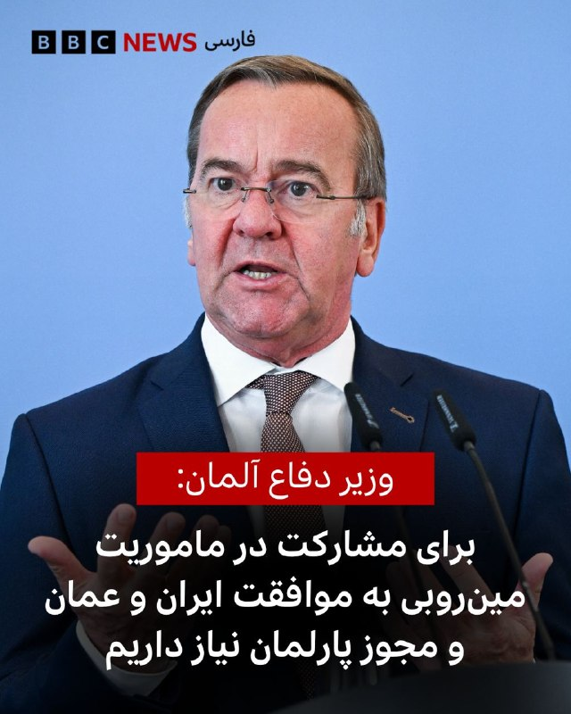

🔻بوریس پیستوریوس، وزیر دفاع آلمان می‌گوید این کشور تنها در صورتی می‌تواند در ماموریت مین‌روبی در آب‌های منطقه‌ای مشارکت کند که «فضای مساعدی» فراهم باشد. او مشارکت آلمان در این عملیات را مشروط به موافقت ایران و عمان و مجوز پارلمان کشورش مشروط دانست.

بوریس پیستوریوس این موضوع را در واکنش به گزارش‌هایی درباره احتمال مشارکت نیروهای آلمانی در عملیات‌های امنیت دریایی خلیج فارس و دریای عمان مطرح و تاکید کرد بدون این شروط، اعزام نیرو امکان‌پذیر نخواهد بود.

به گفته وزیر دفاع آلمان، «ما به یک فضای مساعد نیاز داریم. برای مشارکت در عملیات مین‌روبی، موافقت ایران و عمان و همچنین تصویب پارلمان آلمان ضروری است.»

در طول جنگ چهل روزه گمانه‌زنی‌هایی گسترده‌ای مطرح شد که ایران برای کنترل و مسدود کردن تنگه هرمز از مین‌ دریایی استفاده کرده است. مقام‌های رسمی ایران اما این موضوع را به صورت رسمی تایید نکرده‌اند.

📸 Reuters

https://bbc.in/4fNU3nt
@BBCPersian

## alonews — post 128848

  <a href="telegram/content/alonews_128848_1781766856.webm" target="_blank">🎬 Download video</a>

👈سازمان هواپیمایی: یک میلیون بلیت پرواز در ایام جنگ لغو شد

✅ @AloNews خبر جنگ

## alonews — post 128847

  <a href="telegram/content/alonews_128847_1781766856.mp4" target="_blank">🎬 Download video</a>

👈ترامپ بعد از امضای توافقنامه با انگشت اشاره می کنه و میگه: نفت پایین، بورس بالا

✅ @AloNews خبر جنگ

## alonews — post 128846

  <a href="telegram/content/alonews_128846_1781766858.webm" target="_blank">🎬 Download video</a>

👈وزیر دفاع بلژیک: ما یک کشتی مین‌روب داریم که آماده است به محض فراهم شدن شرایط، در عملیات پاکسازی مین در تنگه هرمز شرکت کند

✅ @AloNews خبر جنگ

## alonews — post 128845

  <a href="telegram/content/alonews_128845_1781766858.webm" target="_blank">🎬 Download video</a>

👈بقایی: اسقاط تحریم نفتی ایران از امروز آغاز می‌شود

✅ @AloNews خبر جنگ

---
📅 بروزرسانی: 1405/03/28 10:34
---

## WithYashar — post 15215

آکسیوس: رسانه‌های نزدیک به نتانیاهو به دلیل توافق با ایران، حمله به دولت ترامپ را آغاز کردند

مجری شبکه ۱۴ اسرائیل: ویتکاف و کوشنر یهودستیز هستند و اسرائیل را فروخته‌اند
@withyashar

## FarsiVOA — post 221085

  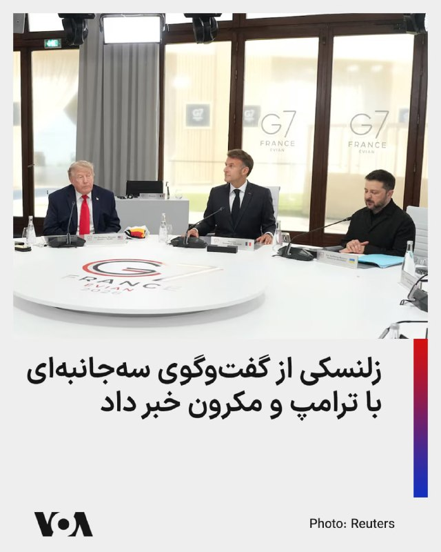

رئیس‌جمهوری اوکراین از برگزاری یک گفت‌وگوی سه‌جانبه با رهبران آمریکا و فرانسه در حاشیه نشست سران گروه هفت خبر داد.

ولودیمیر زلنسکی در کانال تلگرام خود اعلام کرد: «این یک گفت‌وگوی مهم برای هماهنگی بود که می‌تواند تفاوت بزرگی ایجاد کند. ما گفت‌وگوهای خود در نشست گروه هفت را جمع‌بندی کردیم».

او همچنین از دونالد ترامپ، رئیس‌جمهوری ایالات متحده، به خاطر توجهش به اوکراین و تمایلش برای کمک به برقراری صلح، و از امانوئل مکرون، رئیس‌جمهور فرانسه، به خاطر سازمان‌دهی این نشست قدردانی کرد.

زلنسکی ادامه داد: «صلح مورد نیاز است. و ما هر کاری که بتوانیم انجام می‌دهیم تا صلح را نزدیک‌تر کنیم.»

زلنسکی پس از فرانسه وارد بروکسل شد و قرار است با مارک روته، دبیرکل ناتو، و بارت دی وور، نخست‌وزیر بلژیک، دیدار کند.
@FarsiVOA

## Persian_Trend_Official — post 17427

  <a href="telegram/content/Persian_Trend_Official_17427_1781766271.mp4" target="_blank">🎬 Download video</a>

حملات پهپادی اوکراینی به پالایشگاه نفت مسکو
Bravo UK 
❤️
🇺🇦

👺Phantom

📌 @persian_trend_official
پرشین ترند | متفاوت‌ترین کانال نظامی

## Persian_Trend_Official — post 17426

  <a href="telegram/content/Persian_Trend_Official_17426_1781766272.mp4" target="_blank">🎬 Download video</a>

🇺🇦
🇺🇦فیلمی که لحظه سرنگونی یک پهپاد اوکراینی توسط موشک پدافند هوایی روسیه را درست پیش از پالایشگاه نفت مسکو نشان می‌دهد، که باعث سقوط و انفجار آن روی یک ساختمان مجاور شد.

❤️
❤️

👺Phantom

📌 @persian_trend_official
پرشین ترند | متفاوت‌ترین کانال نظامی

## Persian_Trend_Official — post 17424

  <a href="telegram/content/Persian_Trend_Official_17424_1781766273.mp4" target="_blank">🎬 Download video</a>

🇺🇦حملات متقابل از سوی پهپادهای اوکراینی که مسکو را مورد حمله قرار دادند.
👍

چندین پهپاد دیگر به پالایشگاه نفت مسکو حمله کردند که منجر به آتش‌سوزی بزرگی شد، در حالی که چندین آتش‌سوزی دیگر در مناطق اطراف به دلیل فعالیت دفاع هوایی و سقوط بقایای آن در حال سوختن است.

👺Phantom

📌 @persian_trend_official
پرشین ترند | متفاوت‌ترین کانال نظامی

## Persian_Trend_Official — post 17422

  <a href="telegram/content/Persian_Trend_Official_17422_1781766273.mp4" target="_blank">🎬 Download video</a>

فیلمی که نشان می‌دهد ۴ موشک بالستیک روسی اسکندر-ام مجهز به کلاهک‌های خوشه‌ای به تأسیسات اوکرگازپروم‌بود در حومه شمال شرقی شهر پولتاوا اصابت می‌کنند.

داده‌های ناسا FIRMS نشان می‌دهد که پس از این حملات دو آتش‌سوزی بزرگ رخ داده است.

اوکرگازپروم‌بود شاخه ساخت و نصب اوکرترانس‌گاز است و در ساخت، تعمیرات اساسی و نگهداری خطوط لوله اصلی گاز و تأسیسات سیستم انتقال گاز فعالیت دارد.

مختصات: 49.62276, 34.6551

👺Phantom

📌 @persian_trend_official
پرشین ترند | متفاوت‌ترین کانال نظامی

## Persian_Trend_Official — post 17421

  <a href="telegram/content/Persian_Trend_Official_17421_1781766274.mp4" target="_blank">🎬 Download video</a>

پس از سه حمله موشکی بالستیک اسکندر-ام، آتشی در بخش جنوب شرقی کی‌یف مشاهده میشود.

👺Phantom

📌 @persian_trend_official
پرشین ترند | متفاوت‌ترین کانال نظامی

## Persian_Trend_Official — post 17420

  <a href="telegram/content/Persian_Trend_Official_17420_1781766275.mp4" target="_blank">🎬 Download video</a>

یک موشک رهگیر پاتریوت دیده می‌شود که در رهگیری موشک بالستیک روسی اسکندر-ام ناکام می‌ماند. اسکندر-ام درست در کنار جایی که موشک رهگیر پاتریوت خود را منفجر می‌کند، برخورد می‌کند.

👺Phantom

📌 @persian_trend_official
پرشین ترند | متفاوت‌ترین کانال نظامی

## Hranews — post 113695

یک زندانی در زندان زاهدان اعدام شد

❗️
❗️
❗️
❗️
❗️– سحرگاه روز چهارشنبه ۲۷ خردادماه، حکم یک زندانی که پیشتر از بابت اتهامات مرتبط با جرائم مواد مخدر به اعدام محکوم شده بود، در زندان زاهدان اجرا شد.

#عبدالله_جلالی

ادامه مطلب

↘️
@hranews_bot تماس ✉️ - @Hranews کانال هرانا 🆑

## alonews — post 128844

  <a href="telegram/content/alonews_128844_1781766276.webm" target="_blank">🎬 Download video</a>

👈آکسیوس: رسانه‌های نزدیک به نتانیاهو به دلیل توافق با ایران، حمله به دولت ترامپ را آغاز کردند

🔴 مجری شبکه ۱۴ اسرائیل: ویتکاف و کوشنر یهودستیز هستند و اسرائیل را فروخته‌اند

✅ @AloNews خبر جنگ

---
📅 بروزرسانی: 1405/03/28 10:24
---

## WithYashar — post 15214

  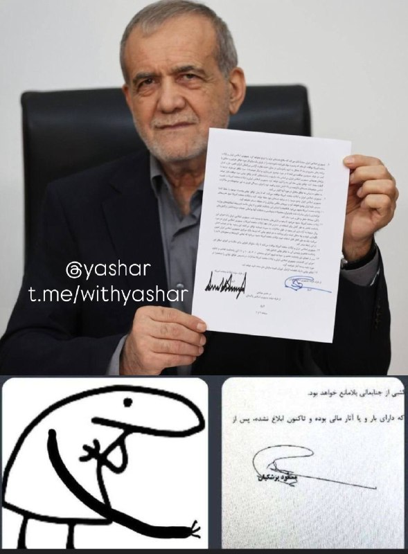

امضای مضحک پزشکیان که مانند یک شکلک کارتونی با دماغ بزرگ و دست دراز شده برای گدایی است.
@withyashar

## WithYashar — post 15213

دولت سوئیس اعلام کرد که روز جمعه نشستی با حضور نمایندگان آمریکا، ایران، پاکستان، قطر و دیگر کشورهای مرتبط برگزار خواهد شد تا مذاکرات مقدماتی انجام شود.
@withyashar

## IranIntlTV — post 342967

  <a href="https://t.me/IranintlTV/342967" target="_blank">📎 Download file</a>

🎧نسخه صوتی اخبار بامدادی | پنجشنبه ۲۸ خرداد
@iranintlTV

## RadioFarda — post 158451

ذخایر اورانیوم ایران ممکن است قزاقستان را به کانون یک توافق هسته‌ای تبدیل کند

🔸 در حالی که مذاکرات بر سر برنامهٔ هسته‌ای ایران ادامه دارد، سرنوشت ذخایر اورانیوم با غنای بالای تهران همچنان یکی از دشوارترین مسائل باقی مانده است.

🔸 پیش از حملات هوایی آمریکا و اسرائیل به تأسیسات هسته‌ای ایران در تابستان ۱۴۰۴، آژانس بین‌المللی انرژی اتمی برآورد کرده بود که ایران ۴۴۰ کیلوگرم اورانیوم با غنای ۶۰ درصد در اختیار دارد. این ماده اگرچه در سطح تسلیحاتی نیست، اما به‌طور قابل توجهی به سطح ۹۰ درصدی که معمولاً با تولید سلاح هسته‌ای مرتبط است نزدیک است.

🔸 اکنون پرسش اصلی پیش روی مذاکره‌کنندگان این است که در چارچوب یک توافق گسترده‌تر میان تهران و واشینگتن، چه باید بر سر این ذخایر بیاید. در هفته‌های اخیر، از قزاقستان به‌عنوان گزینه‌ای برای نگهداری این مواد توسط یک طرف ثالث نام برده شده است.

🔸 رافائل گروسی، مدیرکل آژانس، ماه گذشته گفت که نگاه قاسم‌ جومارت توقایف، رئیس‌جمهور قزاقستان، به طرح نگهداری اورانیوم ایران مثبت است و بعداً آستانه نیز اعلام آمادگی کرد.

🔸گزارش کامل را در وب‌سایت رادیوفردا می‌توانید بخوانید.

@RadioFarda

## BBCPersian — post 284235

🖌فرناندو دوآرته, بی‌بی‌سی:

🔻در ماه نوامبر امسال، فضاپیمای «وویجر ۱»، یکی از دو کاوشگر دوقلوی ناسا که در سال ۱۹۷۷ به فضا پرتاب شدند، به فاصله یک «روز نوری» از زمین خواهد رسید. این فاصله‌ای است که نور در طول یک روز طی می‌کند و نزدیک به ۲۶ میلیارد کیلومتر است.

وویجر ۱ تاکنون دورتر از هر ساخته دست بشر دیگری پیش رفته است. اما شگفت‌انگیزتر از مسافتی که پیموده، این است که ناسا همچنان از خود این کاوشگر خبر دریافت می‌کند.

این دو فضاپیما که برای پنج سال فعالیت طراحی شده بودند، پس از نزدیک به نیم قرن حضور در فضا هنوز هم فعال‌اند و اطلاعاتی ارزشمند درباره جهان در اختیار اخترشناسان قرار می‌دهند، آن هم با تکیه بر فناوری‌هایی که در مقایسه با استانداردهای امروزی بسیار ابتدایی به نظر می‌رسد.

📸GettyImages/ Nasa/JPL-Caltech/ Universal Images Group via Getty Images/ Suzette Cummings/Nasa/ Heritage Images/Getty Images/ AFP via Getty Images/ Nasa/JPL

https://bbc.in/3Q6jA0Q
@BBCPersian

## alonews — post 128843

  <a href="telegram/content/alonews_128843_1781765678.webm" target="_blank">🎬 Download video</a>

👈اسرائیل به حومهٔ شهرک کفرتبنیت از توابع النطبیه در جنوب لبنان حملهٔ پهپادی کرد

✅ @AloNews خبر جنگ

## alonews — post 128841

  <a href="telegram/content/alonews_128841_1781765678.mp4" target="_blank">🎬 Download video</a>

👈مسکو در دود و آتش

🔴 حمله پهپادی وسیع اوکراین به پالایشگاه مسکو

✅ @AloNews خبر جنگ

---
📅 بروزرسانی: 1405/03/28 10:14
---

## WithYashar — post 15212

وال استریت ژورنال: ترامپ در حال از دست دادن تندروهایی است که زمانی از جنگ ایران دفاع می‌کردن
@withyashar
الجزیره: موجی از خشم سیاسی واشنگتن را بر سر توافق با ایران فرا گرفته

## WithYashar — post 15211

سناتور بلومنتال: سنا قطعا توافق با ایران را تصویب نمی‌کند

محکومیت دو حزبی برای یک توافق ننگین عجیب نیست که شبیه «تسلیم بی‌قید و شرط» است، نه توسط ایران، آنطور که ترامپ خواسته بود، بلکه توسط آمریکا.
بیش از ۳۰۰ میلیارد دلار ثروت بادآورده، لغو تحریم‌ها، فروش نامحدود نفت، عدم بازرسی یا تأیید کامل. همه اینها به خاطر وعده‌های مبهم و غیرقابل اجرا در مورد تسلیحات هسته‌ای است که ادعای ایران برای پیروزی در برابر شیطان بزرگ را تقویت می‌کند.
هر چیزی شبیه به این توافق به محض ورود به سنا از بین خواهد رفت. برای اینکه اثر اجرایی داشته باشد، باید در اینجا تصویب شود.
@withyashar

## WithYashar — post 15210

بلومبرگ از عبور یک نفتکش و یک کشتی حامل گاز مایع از تنگه هرمز پس از توافق آمریکا و ایران خبر داد.
@withyashar

## pm_afshaa — post 94315

🔴وال استریت ژورنال: ترامپ در حال از دست دادن تندروهایی است که زمانی از جنگ ایران دفاع می‌کردن

💧 Rainbet.com the #1 Non-KYC Crypto Casino & Sportsbook @rainbetcom

😁 @Pm_Afshaa

## pm_afshaa — post 94314

🔴الجزیره: موجی از خشم سیاسی واشنگتن را بر سر توافق با ایران فرا گرفته

💧 Rainbet.com the #1 Non-KYC Crypto Casino & Sportsbook @rainbetcom

😁 @Pm_Afshaa

## FarsiVOA — post 221084

  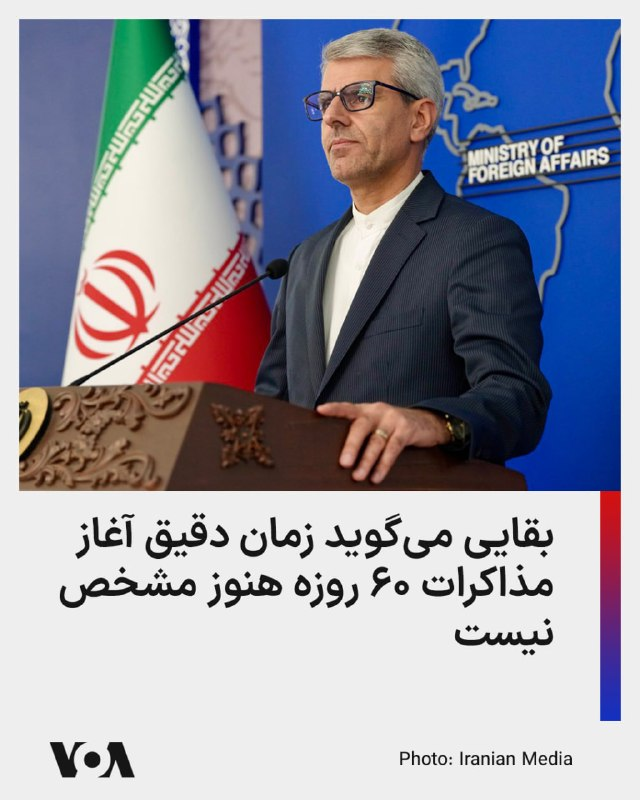

پس از آنکه تفاهم‌نامه جمهوری اسلامی و ایالات متحده توسط روسای جمهور دو کشور امضا شد، و سخنگوی وزارت خارجه جمهوری اسلامی می‌گوید مراسم امضای تفاهم‌نامه که قرار بود جمعه به میزبانی سوئیس برگزار شود لغو شده، و هنوز زمان دقیق آغاز مذاکرات دو طرف مشخص نیست.

اسماعیل بقایی در یک گفتگوی تلویزیونی اعلام کرد که به این نتیجه رسیدیم بهتر است این تفاهم‌نامه «بدون اینکه نیاز به حضور در جای خاصی باشد»، امضا شود.

او درباره زمان آغاز مذاکرات ۶۰ روزه نیز اعلام کرد که این نشست در سوئیس هنوز در دستور کار است، باید ببینیم که در ساعات آینده طرفین از طریق میانجی‌ها به چه نتیجه‌ای می‌رسند.

پیشتر عباس عراقچی، وزیر امور خارجه جمهوری اسلامی اعلام کرده بود که روز جمعه ۲۹ خرداد و همزمان با امضای رسمی یادداشت تفاهم «پایان جنگ»، مذاکرات با آمریکا برای رسیدن به توافق نهایی آغاز خواهد شد.

بر اساس تفاهم‌نامه تهران و واشنگتن، دو طرف متعهد شدند حداکثر ظرف ۶۰ روز درباره توافق نهایی مذاکره کنند که این مهلت قابل تمدید خواهد بود.
@FarsiVOA

## Persian_Trend_Official — post 17419

  <a href="telegram/content/Persian_Trend_Official_17419_1781765050.mov" target="_blank">🎬 Download video</a>

لحظه برخورد دو موشک بالستیک روسی اسکندر-ام در جنوب شرقی کی‌یف..

👺Phantom

📌 @persian_trend_official
پرشین ترند | متفاوت‌ترین کانال نظامی

## Persian_Trend_Official — post 17418

  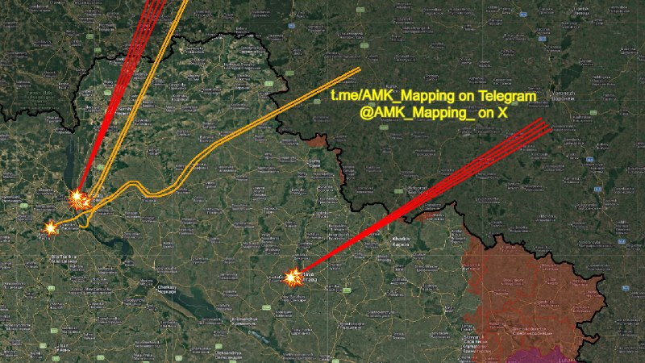

🇷🇺
🇺🇦حملات موشکی و پهپادی روسیه به کی‌یف و پولتاوا

🇷🇺 در جریان حملات شبانه، نیروهای روسیه چندین موشک بالستیک «اسکندر-ام» و پهپادهای جت «باندرول» را علیه اهدافی در استان‌های کی‌یف و پولتاوا به کار گرفتند.

☠️ بر اساس گزارش‌ها، ۴ فروند موشک بالستیک اسکندر-ام که از استان بریانسک شلیک شده بودند، اهدافی را در شرق کی‌یف هدف قرار دادند. گفته می‌شود سامانه‌های پدافندی اوکراین موفق به رهگیری یکی از این موشک‌ها شده‌اند.
🔹 همزمان ۴ فروند دیگر از موشک‌های اسکندر-ام مجهز به کلاهک خوشه‌ای از استان ورونژ به سمت شهر پولتاوا شلیک شدند و تأسیسات «اوکرگازپروم‌بود» و برخی زیرساخت‌های برق در حومه این شهر را هدف قرار دادند.
🔹 همچنین ۴ پهپاد جت «باندرول» از مناطق مرزی روسیه به پرواز درآمدند که دو فروند آن‌ها به اهدافی در شرق کی‌یف اصابت کردند. سرنوشت سایر پهپادها به‌طور کامل مشخص نشده است.

👺Phantom
📌 @persian_trend_official
پرشین ترند | متفاوت‌ترین کانال نظامی

## Persian_Trend_Official — post 17417

  <a href="telegram/content/Persian_Trend_Official_17417_1781765051.webm" target="_blank">🎬 Download video</a>

📺فاکس نیوز به نقل از مقام کاخ سفید:

🇺🇸 مراسم امضای رسمی تفاهم‌نامه که قرار بود در ژنو انجام شود، پس از امضای آن توسط ترامپ و پزشکیان، لغو شد. این توافق هم اکنون لازم‌الاجرا شده و باید منتظر عملکرد طرفین به مفاد توافق بود.

👺Phantom

📌 @persian_trend_official
پرشین ترند | متفاوت‌ترین کانال نظامی

## Dirty_Kids — post 392465

  <a href="telegram/content/Dirty_Kids_392465_1781765052.mp4" target="_blank">🎬 Download video</a>

به نظرتون به حاج مهدی‌ رسولی بگیم تسلیم شدن با زوده؟🤭

@Dirty_Kids 👻

## Dirty_Kids — post 392464

  <a href="telegram/content/Dirty_Kids_392464_1781765054.mp4" target="_blank">🎬 Download video</a>

اثبات «گنده گوزان دو‌ عالم» از سوی مراد عزیزمون!

@Dirty_Kids 👻

## Dirty_Kids — post 392463

  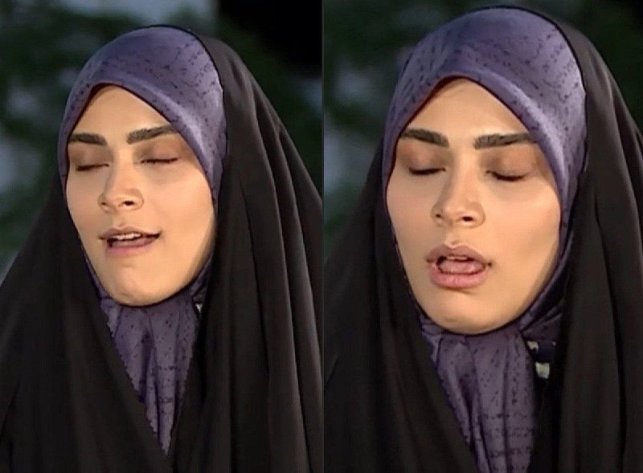

۳۷ سال خامنه‌ای رهبر بود، ۲ ماه هم بابای من، این جرمه؟

@Dirty_Kids 👻

## alonews — post 128840

  <a href="telegram/content/alonews_128840_1781765057.webm" target="_blank">🎬 Download video</a>

👈وال استریت ژورنال: ترامپ در حال از دست دادن تندروهایی است که زمانی از جنگ ایران دفاع می‌کردند

🔴بسیاری از محافظه‌کارانی که از رئیس جمهور حمایت می‌کردند، نگرانند که توافق صلح به اندازه کافی برای بازدارندگی ایران کافی نباشد

✅ @AloNews خبر جنگ

---
📅 بروزرسانی: 1405/03/28 10:04
---

## VahidOOnLine — post 246140

  <a href="telegram/content/VahidOOnLine_246140_1781764447.mp4" target="_blank">🎬 Download video</a>

⭕️وزارت دفاع روسیه: ۵۵۵ پهپاد اوکراینی را در آسمان مسکو رهگیری کردیم

♦️وزارت دفاع روسیه صبح پنجشنبه ۲۸ خرداد اعلام کرد ۵۵۵ پهپاد ارتش اوکراین را در آسمان مسکو رهگیری کرده است.

این خبر در حالی اعلام می‌شود که یکی از پالایشگاه‌های نفت پایتخت روسیه در پی اصابت پهپادهای اوکراینی دچار حریق شد و عبورو و مرور خودروها در بخشی از مسکو مختل شده است.

اوکراین در روزهای گذشته حملات به زیرساخت‌های انرژی روسیه را به‌شدت افزایش داده است.
‌🇸🇦 Indypersian

🤖 @VahidOOnLine

## FarsiVOA — post 221083

  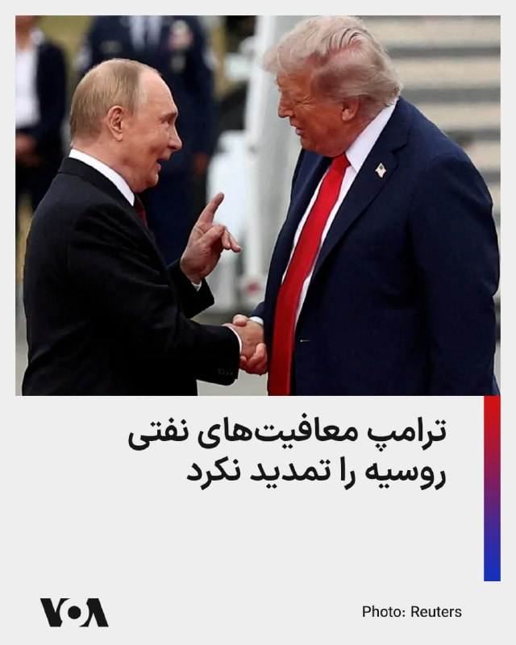

دونالد ترامپ رئیس‌جمهور آمریکا در پی امضای توافق پایان جنگ با جمهوری اسلامی در شامگاه چهارشنبه، معافیت‌های نفتی روسیه را تمدید نکرد.

ایالات متحده آمریکا برای کاهش تبعات انسداد تنگه هرمز توسط جمهوری اسلامی، سه بار معافیت‌های تحریمی یک ماهه برای افزایش صادرات نفت روسیه اعمال کرده بود. زمان انقضای سومین معافیت ماهانه، روز چهارشنبه ۱۷ ژوئن بود و دیگر تمدید نشد.

در پی این معافیت‌ها صادرات روزانه نفت روسیه از ۴.۹ میلیون بشکه در ماه فوریه به ۶ میلیون بشکه در ماه گذشته افزایش یافت.

دونالد ترامپ اخیراً در حاشیه دیدار با رهبران گروه هفت نیز اعلام کرد با بازگشت جریان نفت از مسیر تنگه هرمز، آمریکا در موقعیتی قرار گرفته که بتواند معافیت تحریمی مربوط به نفت روسیه را پایان دهد. او گفت: «به‌زودی می‌توانیم این کار را انجام دهیم، چون نفت حالا در جریان است.»
@FarsiVOA

## RadioFarda — post 158450

پایان دور اول مرحلۀ گروهی جام جهانی: غرش «سه شیر» و کریس رونالدویی که بود، اما نبود

🔸آخرین روز دور اول مرحلۀ گروهی مسابقات جام جهانی ۲۰۲۶، شاهد برگزاری یکی از زیباترین و پرهیجان‌ترین دیدارها بود؛ رویارویی حساس انگلیس و کرواسی از گروه دوازدهم.

🔸انگلیس با تیمی پرستاره، بخصوص در خطوط حمله و میانی وارد این دوره از مسابقات شده و در سوی دیگر، کرواسی، تیم سوم دورۀ قبلی مسابقات با چهره‌هایی آشنا، با تجربه و البته در مواردی پا به سن گذاشته همچون لوکا مودریچ، ایوان پریشیچ، دومینیک لیواکوویچ و آندری کراماریچ رقابت‌ها را شروع کرد.

🔸دو تیم به‌رغم حساسیت مسابقه، از همان نخستین دقیقه، یک بازی سرعتی و تهاجمی را در دستور کار داشتند و هر بار که توپ را در اختیار می‌گرفتند، حمله‌ای جدی را روی دروازۀ حریف تدارک می‌دیدند؛ شیوه‌ای که باعث شد تماشاگران در همان نیمۀ اول شاهد چهار گل زیبا باشند.

🔸ساعاتی پیش از این دو دیدار، پرتغال با کریستیانو رونالدو و برونو فرناندز و دیگر ستارگانش در مقابل جمهوری دموکراتیک کنگو قرار گرفت که تنها دومین حضورش در جام جهانی را تجربه می‌کند.

🔸پرتغال در ششمین دقیقۀ مسابقه با ضربۀ سر «نِوِس» دروازۀ حریف را فرو ریخت تا به علاقمندانش نوید شبی رویایی را بدهد. بر خلاف انتظار اما، رونالدوی ۴۱ ساله که همچون لیونل مسی به ششمین جام جهانی خود رسیده، اصلاً به چشم نیامد و نه گلی زد، نه حرکت موثری نشان داد و نه در نقش کاپیتان توانست تیمش را به سوی موفقیت رهبری کند.

🔸گزارش کامل را در وب‌سایت رادیو فردا می‌توانید بخوانید.

@RadioFarda

## alonews — post 128839

  <a href="telegram/content/alonews_128839_1781764451.webm" target="_blank">🎬 Download video</a>

👈دولت سوئیس اعلام کرد که روز جمعه نشستی با حضور نمایندگان آمریکا، ایران، پاکستان، قطر و دیگر کشورهای مرتبط برگزار خواهد شد تا مذاکرات مقدماتی انجام شود.

✅ @AloNews خبر جنگ

---
📅 بروزرسانی: 1405/03/28 09:54
---

## alonews — post 128838

  <a href="telegram/content/alonews_128838_1781763858.webm" target="_blank">🎬 Download video</a>

👈سناتور بلومنتال: سنا قطعا توافق با ایران را تصویب نمی‌کند

🔴 محکومیت دو حزبی برای یک توافق ننگین عجیب نیست که شبیه «تسلیم بی‌قید و شرط» است، نه توسط ایران، آنطور که ترامپ خواسته بود، بلکه توسط آمریکا.

🔴 بیش از ۳۰۰ میلیارد دلار ثروت بادآورده، لغو تحریم‌ها، فروش نامحدود نفت، عدم بازرسی یا تأیید کامل. همه اینها به خاطر وعده‌های مبهم و غیرقابل اجرا در مورد تسلیحات هسته‌ای است که ادعای ایران برای پیروزی در برابر شیطان بزرگ را تقویت می‌کند.

🔴هر چیزی شبیه به این توافق به محض ورود به سنا از بین خواهد رفت. برای اینکه اثر اجرایی داشته باشد، باید در اینجا تصویب شود.

✅ @AloNews خبر جنگ

---
📅 بروزرسانی: 1405/03/28 09:44
---

## VahidOOnLine — post 246139

  <a href="telegram/content/VahidOOnLine_246139_1781763264.mp4" target="_blank">🎬 Download video</a>

⭕️مهدی طارمی پیراهن خود را به هواداران ایرانی در ورزشگاه لس‌آنجلس تقدیم کرد

♦️مهدی طارمی، مهاجم تیم ملی فوتبال ایران پس از بازی با نیوزیلند در ورزشگاه سوفای لس‌آنجلس، به سوی تماشاگران رفت و پیراهنش را به یکی از هواداران هدیه داد.

در ویدیویی که از این حرکت در شبکه‌های اجتماعی منتشر شده، پرچم ملی شیروخورشیدنشان ایران در کنار این هوادار دیده می‌شود.

بسیاری از هواداران تیم ملی در بازی با نیوزیلند با وجود ممنوعیت‌ اعلام شده از سوی فیفا، پرچم شیروخورشیدنشان را در ورزشگاه سوفا به اهتزاز درآوردند.
‌🇸🇦 Indypersian

🤖 @VahidOOnLine

## WithYashar — post 15209

  <a href="telegram/content/WithYashar_15209_1781763267.mp4" target="_blank">🎬 Download video</a>

لحظه امضا توسط ترامپ در مراسم شام کاخ ورسای
@withyashar

## WithYashar — post 15208

  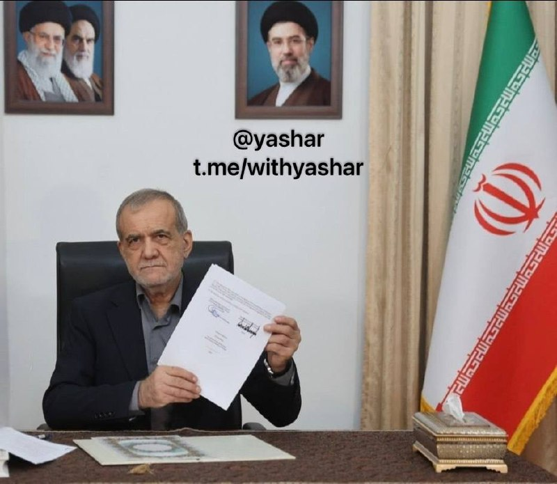

امضای تفاهم‌نامه توسط ‌پژشکیان

@withyashar

## Shin_Persian — post 7127

↩️ Quoted tweet: Open Source Intel ✓ @Osint613 Wed, 17 Jun 2026 18:14:47 UTC PROS of the MOU • Iran pinky promises not to develop a nuclear weapon. • The Strait of Hormuz reopens, with commercial shipping passing toll free for 60 days. CONS of the MOU…

## Shin_Persian — post 7126

↩️ Quoted tweet:
Open Source Intel ✓ @Osint613
Wed, 17 Jun 2026 18:14:47 UTC

PROS of the MOU

• Iran pinky promises not to develop a nuclear weapon.

• The Strait of Hormuz reopens, with commercial shipping passing toll free for 60 days.

CONS of the MOU

• Broad sanctions relief for Iran.

• Frozen Iranian assets are unfrozen.

• Hezbollah appears

↩️ توییت نقل‌قول شده — برای پاسخ، پست زیر را ببینید.

ترجمه خودکار فارسی

مزایای تفاهم‌نامه (MOU)

• ایران قول شرف می‌دهد که سلاح هسته‌ای تولید نکند.

• تنگه هرمز بازگشایی می‌شود و کشتیرانی تجاری به مدت ۶۰ روز بدون پرداخت حق عبور مرور می‌کند.

معایب تفاهم‌نامه (MOU)

• رفع گسترده تحریم‌ها علیه ایران.

• دارایی‌های مسدود شده ایران آزاد می‌شوند.

• حزب‌الله ظاهر می‌شود

𝕏 · @shin_persian

## FarsiVOA — post 221082

🔺وال‌استریت ژورنال: ترامپ از نتانیاهو خواست به «منفجر کردن ساختمان‌ها» پایان دهد

▪️وال‌استریت ژورنال گزارش داد که دونالد ترامپ، رئیس‌جمهوری آمریکا، در یک تماس تلفنی با نخست‌وزیر اسرائیل، بنیامین نتانیاهو، درباره لبنان، از او خواست که به «منفجر کردن ساختمان‌ها» پایان دهد.

▪️منابع آگاهی که از این تماس اطلاع داشتند به این روزنامه گفتند که ترامپ در این تماس که اخیراً برقرار شد، گفت: «چرا ساختمان‌ها را منفجر می‌کنی؟ منفجر کردن ساختمان‌ها را متوقف کن.»

▪️یکی از مقام‌های ارشد دولت آمریکا که از تماس‌های ترامپ و نتانیاهو اطلاع داشت گفت این تماس‌ها معمولاً شامل درخواست نخست‌وزیر اسرائیل برای اقدامات نظامی بیشتر بوده و ترامپ از این وضعیت خسته شده است.

⬇️ بیشتر بخوانید:
https://ir.voanews.com/a/trump-urged-netanyahu-to-stop-blowing-up-buildings/8162214.html

## alonews — post 128837

  <a href="telegram/content/alonews_128837_1781763271.webm" target="_blank">🎬 Download video</a>

👈تصویری متفاوت از ترامپ و مکرون در ورسای

✅ @AloNews خبر جنگ

---
📅 بروزرسانی: 1405/03/28 09:34
---

## FarsiVOA — post 221081

  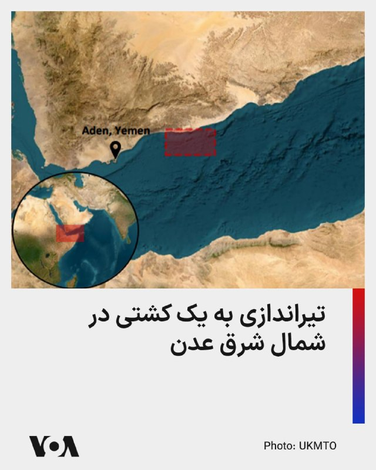

سازمان عملیات تجارت دریایی بریتانیا از حمله افراد مسلح با دو قایق تندرو به یک کشتی تجاری در ۱۰۵ مایل دریایی شمال شرق عدن خبر داد.

این حادثه روز چهارشنبه، ساعاتی پیش از امضای تفاهم پایان جنگ میان رؤسای جمهور ایران و آمریکا انجام شده است.

بر اساس این گزارش، دو قایق تندرو حامل افراد مسلح تا فاصله ۴ متری یک کشتی نزدیک شده و به سوی آن تیراندازی کرده‌اند. با تیراندازی متقابل تیم امنیتی کشتی، قایق‌های مهاجم متواری شده و در فاصله بیش از ۴ مایل دریایی از کشتی قرار گرفته‌اند. تمامی خدمه کشتی در سلامت هستند.

حوثی‌های یمن، مورد حمایت جمهوری اسلامی، طی هفته‌های گذشته حملات به کشتی‌ها را شدت بخشیدند.
@FarsiVOA

## BBCPersian — post 284226

🖌سرویس جهانی بی‌بی‌سی

🔻موتورسیکلت کوچک مزار آن‌قدر با دبه‌های پلاستیکی پر از بنزین بارگیری شده که به زحمت جایی برای نشستن خودش باقی مانده است.

موتور فرسوده او پنج مخزن ۷۰ لیتری حمل می‌کند که مجموع وزن سوخت داخل آن‌ها حدود ۲۷۰ کیلوگرم است.

مخازن سوخت به شکلی خطرناک از دو طرف موتور آویزان شده‌اند و تنها با طناب و ریسمان مهار شده‌اند.

او این سوخت را از بازار روباز سوخت در مستونگ، واقع در بلوچستان، بزرگ‌ترین و فقیرترین ایالت پاکستان، خریده است. خود او هم در همان منطقه زندگی می‌کند.

وانت‌هایی که با مخازن پلاستیکی بارگیری شده‌اند، سوختی را که از آن‌سوی مرز و از ایران قاچاق شده، برای فروش به این بازار می‌آورند.

📸 BBC/ Getty

https://bbc.in/3QS7lFj
@BBCPersian

## alonews — post 128836

  <a href="telegram/content/alonews_128836_1781762667.webm" target="_blank">🎬 Download video</a>

👈روزنامه خراسان: مراقب باشید در مذاکرات ژنو، ترامپ یا ونس با مقامات ایرانی عکس یادگاری نگیرن!

✅ @AloNews خبر جنگ

---
📅 بروزرسانی: 1405/03/28 09:23
---

## IranIntlTV — post 342966

  <a href="telegram/content/IranIntlTV_342966_1781762021.mp4" target="_blank">🎬 Download video</a>

🔻تیم ملی فوتبال درحالی باید روز یکشنبه دومین و احتمالا دشوارترین دیدار خود در جام جهانی ۲۰۲۶ را در استادیوم سوفای لس‌آنجلس در برابر بلژیک انجام دهد که بلافاصله پس از بازی با نیوزیلند، حتی بدون فرصتی برای ریکاوری، خاک آمریکا را ترک کرد.

🔹این درحالی است که فاکس‌نیوز گزارش داده که در پی یک تغییر برنامه غیرمنتظره، به تیم ملی فوتبال ایران دستور داده شد پس از بازی افتتاحیه خود در جام جهانی مقابل نیوزیلند، هرچه سریع‌تر خاک آمریکا را ترک کند.

🔹وزارت امنیت داخلی آمریکا پیش‌تر اعلام کرده بود که «به لطف سخاوت رئیس‌جمهور ترامپ، تیم ایران خواهد توانست یک روز پیش از مسابقات خود وارد شود.»

@iranintltvsport

## DW_Farsi — post 126121

  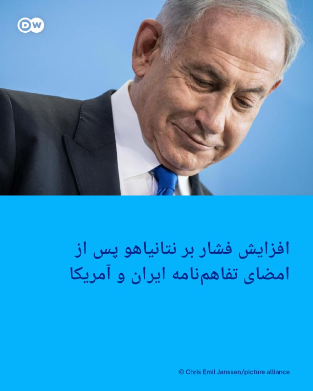

🔶 افزایش فشار بر نتانیاهو پس از امضای تفاهم‌نامه ایران و آمریکا

در پی امضای تفاهم‌نامه ایران و آمریکا، انتقادها از بنیامین نتانیاهو تشدید شده و فشار بر نخست‌وزیر اسرائیل افزایش یافته است. مخالفان و منتقدان او را متهم می‌‌کنند، اهدافی را که در آغاز جنگ با ایران اعلام کرده بوده، محقق نکرده است، از جمله رفع تهدید هسته‌ای و موشکی از سوی جمهوری اسلامی و هچنین تضعیف درازمدت رهبری ایران.

رسانه‌ها در عین حال از تیرگی روابط نتانیاهو با دونالد ترامپ، رئیس جمهور آمریکا خبر داده‌اند که رویکردی متفاوت در قبال جمهوری اسلامی دارند. به باور ناظران سیاسی، نتانیاهو با توجه به انتخابات پارلمانی اسرائیل که اواخر اکتبر امسال برگزار خواهد شد، در عرصه سیاست داخلی به شدت زیر فشار است.

شبکه تلویزیونی اسرائیلی "آی۲۴ نیوز" هفته گذشته (۱۰ ژوئن / ۲۰ خرداد) گزارش داده بود، نتانیاهو ابراز آمادگی کرده که در صورت لزوم به تنهایی و بدون پشتیبانی نظامی آمریکا دست به مقابله نظامی با جمهوری اسلامی بزند. بنا بر این گزارش نخست‌وزیر اسرائیل در یک نشست کابینه امنیتی اسرائیل تصریح کرده بود: «ممکن است ما در شرایطی قرار گیریم که مجبور شویم به تنهایی و بدون پشتیبانی ایالات متحده با ایران روبرو شود با تمامی بهایی که ممکن است در ازای آن بپردازیم: هزینه‌های نظامی و انزوای بین‌المللی.»

@dw_farsi

## RadioFarda — post 158449

  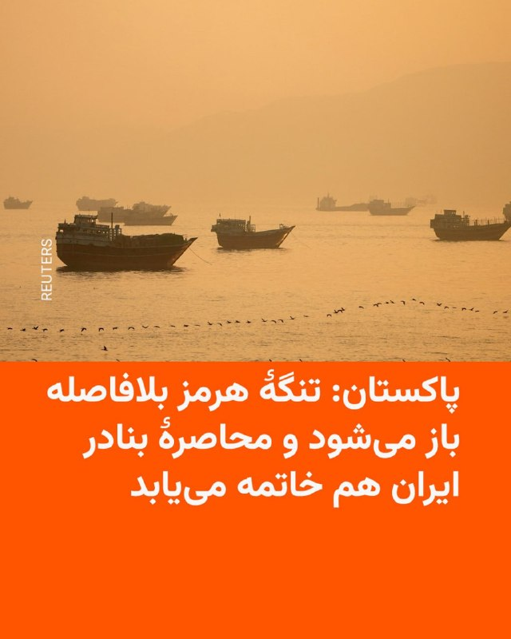

🔸پاکستان به‌عنوان میانجی اصلی میان ایران و ایالات متحده می‌گوید در پی امضای روسای جمهور دو کشور، توافق‌نامۀ اولیه تهران و واشینگتن بلافاصله اجرایی شده است.

🔸شهباز شریف نخست‌وزیر پاکستان صبح پنجشنبه ۲۸ خرداد در شبکۀ ایکس نوشت: «ایران بدون فوت وقت تنگۀ هرمز را باز می‌کند و ایالات متحده هم بی‌درنگ محاصرۀ دریایی بنادر ایران را برمی‌چیند».

🔸شهباز شریف در ادامه نوشته بود که پاکستان به همراه قطر، دیگر میانجی بین دو کشور، روز جمعه در سوئیس میزبان مراسم رسمی مربوط به «این تحول تاریخی» خواهد بود تا گفت‌وگوهای فنی دو کشور آغاز شود.

🔸دقایقی بعد اما بخش مربوط به سوئیس از این مطلب حذف شد. به نظر می‌رسد این موضوع به ابراز تردید ایران دربارۀ نیاز به برگزاری مراسمی رسمی، با توجه به امضا شدن اسناد به‌دست روسای جمهور ایران و آمریکا باشد.

🔸مقام‌های ایرانی البته تأکید کرده‌اند که مذاکرات فنی، بلافاصله در سوئیس آغاز خواهد شد.

@RadioFarda

## BBCPersian — post 284225

  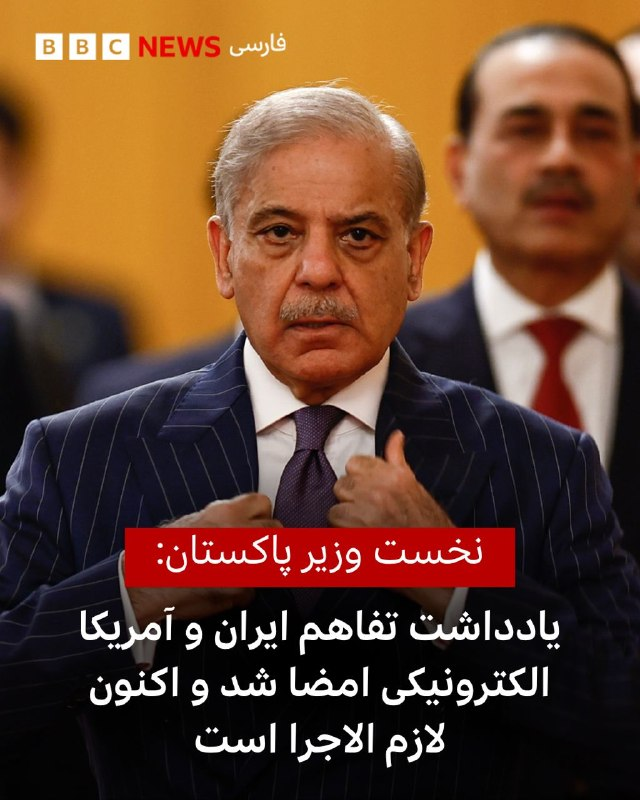

🔻شهباز شریف، نخست‌وزیر پاکستان، اعلام کرده است که «یادداشت تفاهم اسلام‌آباد» میان آمریکا و ایران به‌صورت الکترونیکی امضا شده است.

او در پستی مفصل در شبکه اجتماعی ایکس نوشت: «امضای این توافق در بالاترین سطوح دو دولت نشان‌دهنده تعهد طرفین مناقشه به یافتن راه‌حلی دیپلماتیک برای اختلافات است. یادداشت تفاهم اسلام‌آباد فورا اجرایی خواهد شد و به‌عنوان نخستین گام، با اقدام ایران تنگه هرمز بازگشایی خواهد شد و همزمان آمریکا هم فوراً محاصره دریایی را پایان می‌دهد.»

در این بیانیه آمده است که پاکستان با همکاری قطر، که در این روند نقش پشتیبان میانجی را بر عهده داشت، در ۱۹ ژوئن ۲۰۲۶ میلادی (۲۹ خرداد ۱۴۰۵ شمسی) میزبان مراسمی در سوئیس خواهد بود که به مناسبت این رویداد مهم و همچنین برای آغاز مذاکرات در سطح فنی، برگزار می‌شود.

📸 Reuters

https://bbc.in/4fNU3nt
@BBCPersian

## alonews — post 128835

  <a href="telegram/content/alonews_128835_1781762025.webm" target="_blank">🎬 Download video</a>

👈فاکس نیوز به نقل از یک مقام کاخ سفید:
امضای رسمی که قرار بود در ژنو انجام شود، پس از امضا در ورسای لغو شد.

✅ @AloNews خبر جنگ

## alonews — post 128834

  <a href="telegram/content/alonews_128834_1781762025.webm" target="_blank">🎬 Download video</a>

👈تاکر کارلسون: توافق ایران به امپراطوری آمریکا پایان داد

✅ @AloNews خبر جنگ

---
📅 بروزرسانی: 1405/03/28 09:14
---

## pm_afshaa — post 94313

👌
💕

## pm_afshaa — post 94312

👌
💕

## alonews — post 128833

  <a href="telegram/content/alonews_128833_1781761445.webm" target="_blank">🎬 Download video</a>

👈ارتش اسرائیل: کشته شدن یک سرباز اسرائیلی در جنوب لبنان

✅ @AloNews خبر جنگ

## alonews — post 128832

  <a href="telegram/content/alonews_128832_1781761446.webm" target="_blank">🎬 Download video</a>

👈الجزیره: موجی از خشم سیاسی واشنگتن را بر سر توافق با ایران فرا گرفته است

✅ @AloNews خبر جنگ

## alonews — post 128831

  <a href="telegram/content/alonews_128831_1781761446.webm" target="_blank">🎬 Download video</a>

👈 سخنگوی وزارت خارجه: مذاکرات جمعه ایران و آمریکا در سوئیس قطعی نیست

✅ @AloNews خبر جنگ

---
📅 بروزرسانی: 1405/03/28 09:04
---

## DW_Farsi — post 126120

  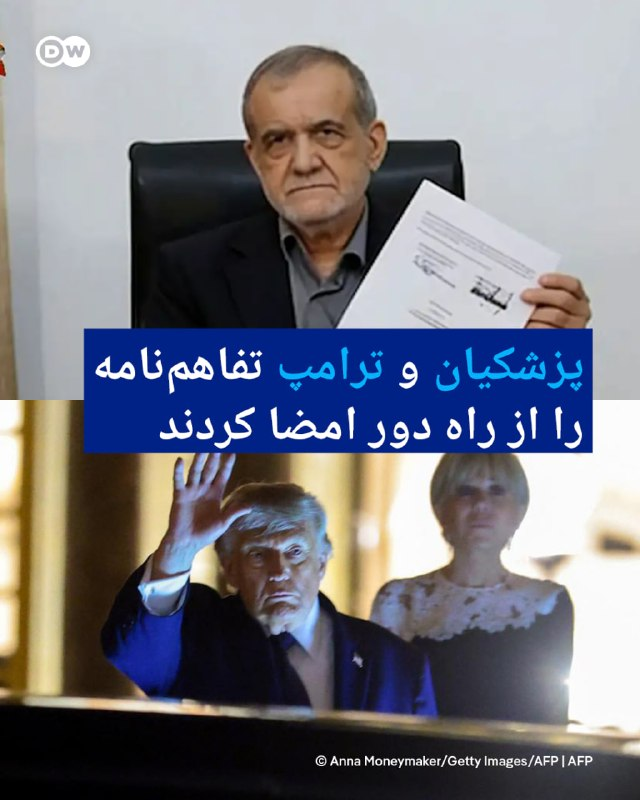

🔶 تفاهم‌نامه آمریکا و ایران به امضای ترامپ و پزشکیان رسید

تهران و واشنگتن تفاهم‌نامه برای پایان جنگ و بازگشایی تنگه هرمز را زودتر از قرار موعد به امضا رساندند.

دونالد ترامپ، رئیس جمهور آمریکا که برای حضور در نشست گروه هفت در فرانسه است و چهارشنبه شب (۱۷ ژوئن / ۲۷ خرداد) مهمان ضیافت شام با امانوئل مکرون، همتای فرانسوی خود بود نسخه نهایی و منتشرشده تفاهم‌نامه با ایران را در کاخ ورسای امضاء کرد. از سوی جمهوری اسلامی نیز همتای او، مسعود پزشکیان این سند را از راه دور به امضاء رساند.

شهباز شریف، نخست‌وزیر پاکستان، اعلام کرد یادداشت تفاهم اسلام‌آباد میان تهران و واشنگتن به‌صورت الکترونیکی توسط رؤسای جمهور دو کشور امضا شده و از سوی پاکستان به‌عنوان میانجی مورد تایید قرار گرفته است.

@dw_farsi

## Persian_Trend_Official — post 17416

  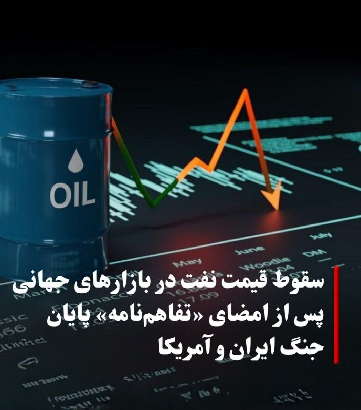

📹 لحظهٔ امضای نسخهٔ فارسی تفاهم‌نامه ایران و آمریکا از سوی ترامپ 
👺Phantom 📌 @persian_trend_official پرشین ترند | متفاوت‌ترین کانال نظامی

## RadioFarda — post 158448

  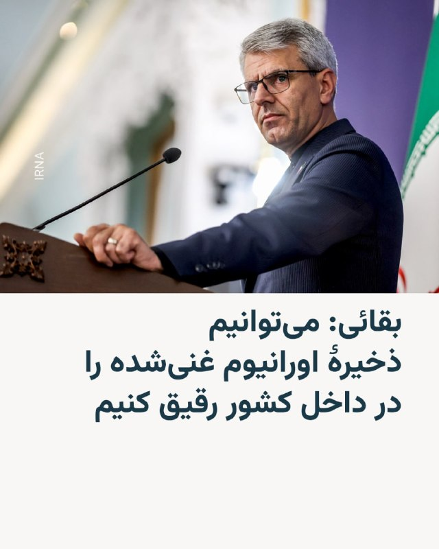

🔸 اسماعیل بقایی در بخش دیگری از سخنانش، با تأکید بر این‌که «مواد هسته‌ای ایران از کشور خارج نخواهد شد»، گفت بر اساس توافق، می‌توانیم اورانیوم غنی‌شده تا سطح بالا را، در داخل کشور رقیق کنیم.

🔸 پیشتر دونالد ترامپ هم به وجود چنین گزینه‌ای، البته با نظارت کارشناسان آمریکا و آژانس بین‌المللی انرژی اتمی اشاره کرده بود.

🔸 سخنگوی وزارت خارجۀ ایران تأکید کرد که در شصت روز آتی، ایالات متحده نباید به حضور نظامی خود در منطقه بیافزاید و یا تحریم‌های جدیدی را علیه ایران اعمال کند.

🔸 به گفتۀ اسماعیل بقایی، همچنین ایران باید بتواند از همین امروز، به عنوان روز نخست دورۀ شصت‌روزه، فروش نفت خود را بدون دردسر و نگرانی از تحریم آغاز کند و از خدمات مورد نیاز مانند بیمه و حمل و نقل استفاده کرده و به درآمد ناشی از آن هم دسترسی مستقیم داشته باشد.

🔸 آقای بقایی همچنین تأکید کرد که ایالات متحده باید همۀ موانع برای دسترسی ایران به پول‌های بلوکه‌شده‌اش را برطرف کند.

🔸 سخنگوی وزارت خارجۀ ایران در مورد مدیریت تنگۀ هرمز هم گفت، مسئولیت این موضوع با ایران و عمان است و دو طرف سازوکار مناسب برای آن را تهیه خواهند کرد.

@RadioFarda

## alonews — post 128830

  <a href="telegram/content/alonews_128830_1781760853.webm" target="_blank">🎬 Download video</a>

👈نفت خام برنت ۷۸ دلار شد

✅ @AloNews خبر جنگ

## alonews — post 128829

  <a href="telegram/content/alonews_128829_1781760853.webm" target="_blank">🎬 Download video</a>

👈کانال ۱۲ عبری: افزایش نارضایتی‌ها از نتانیاهو در دولت ترامپ

🔴برخی از اعضای کاخ سفید می‌پرسند آیا نتانیاهو خواستار طولانی‌تر شدن جنگ با ایران بوده تا موقعیت سیاسی خود را تقویت کند؟

✅ @AloNews خبر جنگ

## alonews — post 128828

  <a href="telegram/content/alonews_128828_1781760853.webm" target="_blank">🎬 Download video</a>

👈ترامپ : در گفت‌وگو با وال‌استریت ژورنال: بنیامین نتانیاهو فردی فوق‌العاده است، اما گاهی بیش از اندازه شتاب‌زده عمل می‌کند.

🔴 در برخی جنبه‌های جنگ، نتانیاهو اهداف متفاوتی را دنبال می‌کرد و اسرائیل به ایران نزدیک‌تر است و به همین دلیل در برخی ابعاد این جنگ، اهداف و ملاحظات متفاوتی داشت

✅ @AloNews خبر جنگ

---
📅 بروزرسانی: 1405/03/28 08:54
---

## VahidOOnLine — post 246138

  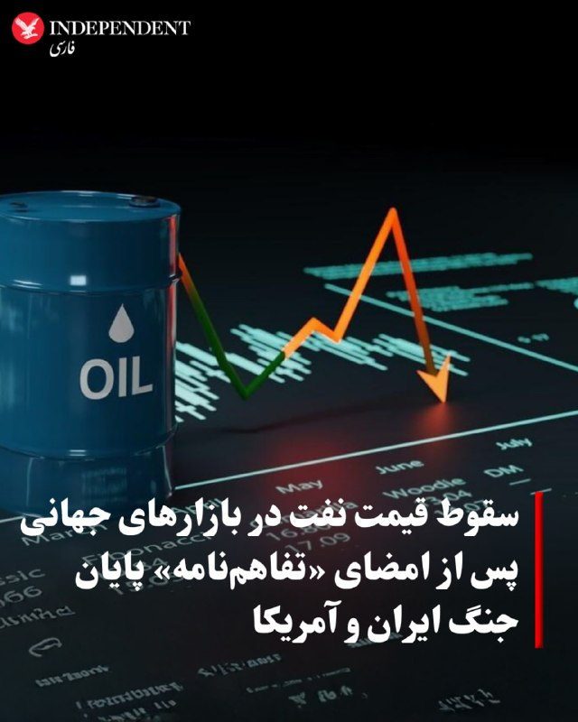

♦️قیمت نفت در بازارهای جهانی همزمان با امضای «تفاهم‌نامه» پایان جنگ جمهوری اسلامی ایران و آمریکا در تهران و پاریس بیش از دو درصد کاهش یافت و عملا به محدوده قیمت پیش از ۹ اسفند، روز شروع جنگ بازگشت.

قیمت هر بشکه نفت خام برنت دریای شمال برای تحویل در ماه  در آخرین ساعات کاری بازار‌های آسیایی با ۲.۲۹ درصد کاهش به  ۷۷ دلار و ۸۲ سنت رسید. احتمالا در ساعات آینده و با بازگشایی بورس‌های اروپایی، این روند کاهشی با اعتماد به تقویت ذخایر نفتی، ادامه خواهد داشت.
‌🇸🇦 Indypersian

🤖 @VahidOOnLine

## Persian_Trend_Official — post 17415

  <a href="telegram/content/Persian_Trend_Official_17415_1781760245.mp4" target="_blank">🎬 Download video</a>

📹 لحظهٔ امضای نسخهٔ فارسی تفاهم‌نامه ایران و آمریکا از سوی ترامپ

👺Phantom

📌 @persian_trend_official
پرشین ترند | متفاوت‌ترین کانال نظامی

## Persian_Trend_Official — post 17411

تصاویر لحظۀ امضای رئیس جمهور ایران پای یادداشت تفاهم نامۀ اسلام‌آباد

👺Phantom

📌 @persian_trend_official
پرشین ترند | متفاوت‌ترین کانال نظامی

## Persian_Trend_Official — post 17410

  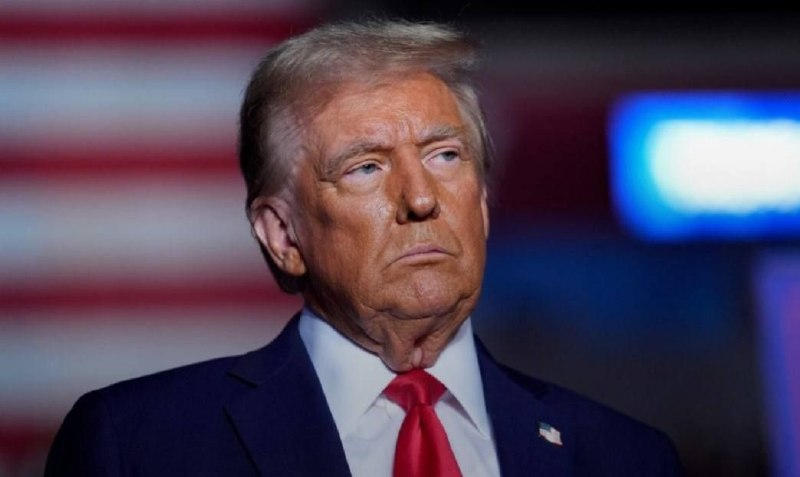

ترامپ تأیید کرد که با ایران تفاهم‌نامه‌ای را امضا کرده است

🔸پیش از این، اسماعیل بقایی، سخنگوی وزارت امور خارجه ایران، پنجشنبه شب اعلام کرد که این توافق‌نامه از راه دور امضا شده است.

🔸انتظار می‌رفت این توافق‌نامه در 19 ژوئن در ژنو منعقد شود. همانطور که واشنگتن خاطرنشان کرد، کشتیرانی در تنگه هرمز در آن روز به طور کامل از سر گرفته خواهد شد.

🔸طبق این تفاهم‌نامه، طرفین متعهد می‌شوند که به حاکمیت و تمامیت ارضی یکدیگر احترام بگذارند و از دخالت در امور داخلی یکدیگر خودداری کنند.

🔸ایالات متحده آمریکا و متحدان خاورمیانه‌ای آن باید یک برنامه بازسازی حداقل 300 میلیارد دلاری برای ایران تهیه کنند.

🔸واشنگتن متعهد می‌شود که تحریم‌های تهران را در یک بازه زمانی که طرفین در توافق نهایی توافق کرده‌اند، لغو کند.

🔸ایران سلاح هسته‌ای تولید یا به دست نخواهد آورد.

🔸طرفین موضوع مواد هسته‌ای را تحت نظارت آژانس بین‌المللی انرژی اتمی حل و فصل خواهند کرد.

🔸جمهوری اسلامی ایران متعهد می‌شود که به مدت 60 روز از دریافت هزینه برای کشتی‌های عبوری از هرمز صرف نظر کند.

Phantom

📌 @persian_trend_official
پرشین ترند | متفاوت‌ترین کانال نظامی

## alonews — post 128827

  <a href="telegram/content/alonews_128827_1781760248.webm" target="_blank">🎬 Download video</a>

👈ترامپ: ممکن است رسیدن به توافق نهایی با ایران بیشتر از ۶۰ روز طول بکشد

✅ @AloNews خبر جنگ

## alonews — post 128826

  <a href="telegram/content/alonews_128826_1781760249.webm" target="_blank">🎬 Download video</a>

👈شهباز شریف، نخست وزیر پاکستان: توافق تاریخی اسلام‌آباد میان ایران و آمریکا با امضای روسای جمهور لازم‌الاجرا شد

✅ @AloNews خبر جنگ

## alonews — post 128825

  <a href="telegram/content/alonews_128825_1781760249.webm" target="_blank">🎬 Download video</a>

👈واکنش مکرون به امضای تفاهم‌نامه میان ایران و آمریکا : این اقدام راه را برای صلح پایدار هموار کرده، گامی مهم در مسیر درست برای هموطنان ما است و به زودی به کاهش قیمت انرژی منجر خواهد شد

✅ @AloNews خبر جنگ

---
📅 بروزرسانی: 1405/03/28 08:43
---

## IranIntlTV — post 342965

  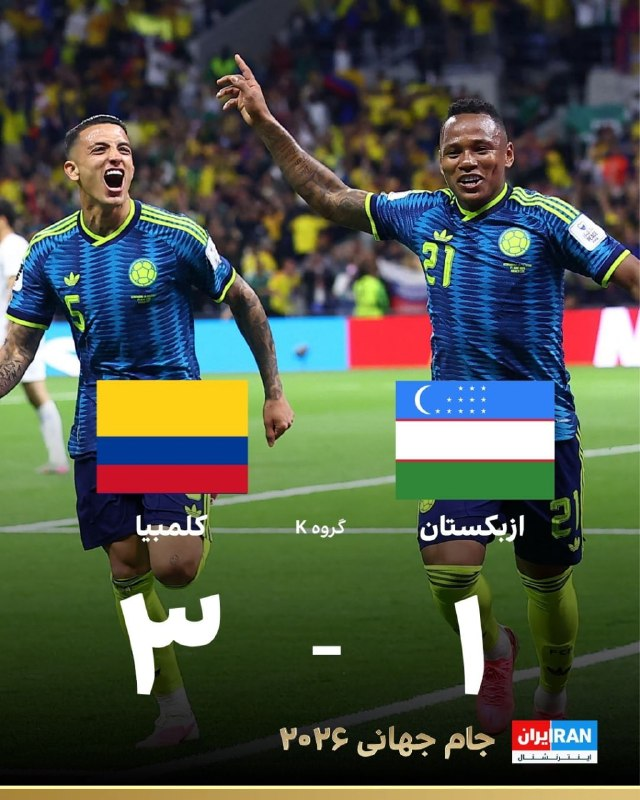

🔻تیم ملی کلمبیا با پیروزی ۳ بر ۱ مقابل ازبکستان، رقابت‌های جام جهانی ۲۰۲۶ را با سه امتیاز آغاز کرد. ازبکستان که نخستین حضور خود در تاریخ جام جهانی را تجربه می‌کرد، با وجود جبران اولین گل خورده، در ادامه نتوانست برابر تیم پرستاره آمریکای جنوبی امتیازی کسب کند.

🔹تیم‌های ملی کلمبیا و ازبکستان در نخستین دیدار خود در گروه K جام جهانی ۲۰۲۶ در ورزشگاه مکزیکوسیتی به مصاف هم رفتند؛ دیداری که در نهایت با برتری ۳ بر ۱ کلمبیا به پایان رسید.

🔹کلمبیا که پیش از آغاز مسابقات در رده سیزدهم رده‌بندی فیفا قرار داشت، با تکیه بر تجربه بازیکنان سرشناس خود بازی را هجومی آغاز کرد. در مقابل، ازبکستانِ فابیو کاناوارو که برای نخستین بار حضور در جام جهانی را تجربه می‌کرد، با انگیزه بالا و آرایش دفاعی منظم برابر حریف ایستاد.

🔹جزییات بیشتر را اینجا بخوانید

@iranintltvsport

## IranIntlTV — post 342964

  <a href="telegram/content/IranIntlTV_342964_1781759628.mp4" target="_blank">🎬 Download video</a>

با کشف شبکه‌ای موسوم به «مزدوران اجاره‌ای»، پرونده تیراندازی به کنسولگری آمریکا و مراکز یهودی در تورنتو وارد مرحله تازه‌ای شده است. پلیس کانادا از بازداشت چند مظنون و کشف تسلیحات مرتبط با ۲۷ تیراندازی خبر داده و مقام‌های کانادایی با همکاری اف‌بی‌آی در حال بررسی احتمال ارتباط حمله به کنسولگری آمریکا با فعالیت این شبکه فراملی هستند.

گزارش مهسا مرتضوی، خبرنگار ایران‌اینترنشنال
@iranintltv

## Persian_Trend_Official — post 17408

  <a href="telegram/content/Persian_Trend_Official_17408_1781759629.mp4" target="_blank">🎬 Download video</a>

هشدار مستقیم ناو آمریکایی به شناورهای سپاه در تنگه هرمز
🔹 گزارش‌های منتشرشده در فضای مجازی مدعی هستند بامداد پنجشنبه و در ساعت ۰۳:۱۸ به وقت محلی، چند شناور منتسب به نیروی دریایی سپاه پاسداران در تنگه هرمز در حال انجام عملیاتی نامشخص بوده‌اند.
🔹 بر اساس این ادعا، یک ناو آمریکایی از طریق بی‌سیم و به زبان فارسی پیامی هشدارآمیز خطاب به این شناورها مخابره کرده است.
💬 متن ادعایی پیام:
«جمهوری اسلامی کنترلی بر تنگه ندارد، عملیات را متوقف کنید و به بندر بازگردید؛ در غیر این صورت نیروی دریایی ایالات متحده به شناور شما حمله خواهد کرد.»
🔹 تاکنون هیچ مقام رسمی در ایران یا ایالات متحده صحت این مکالمه رادیویی را تأیید نکرده و جزئیات مستقلی درباره این ادعا منتشر نشده است.
🎯 اهمیت این تحول:
در صورت صحت، این رخداد نشان‌دهنده سطح بالای تنش و رویارویی مستقیم میان نیروهای دریایی ایران و آمریکا در یکی از حساس‌ترین آبراه‌های جهان خواهد بود. تنگه هرمز همچنان یکی از مهم‌ترین نقاط راهبردی تجارت انرژی جهان محسوب می‌شود و هرگونه برخورد یا تهدید متقابل در این منطقه می‌تواند پیامدهای امنیتی و اقتصادی گسترده‌ای به همراه داشته باشد.

👺 Phantom
📌 @persian_trend_official
پرشین ترند | متفاوت‌ترین کانال نظامی

## RadioFarda — post 158447

🔸کاخ سفید و خبرگزاری رسمی جمهوری اسلامی، ایرنا، تصاویری از امضای سند کاغذی توافق به‌دست روسای جمهوری دو کشور منتشر کردند.

🔸دونالد ترامپ درست قبل از ضیافت شام امانوئل مکرون، رئیس جمهور فرانسه، تفاهم‌نامه با ایران را در کاخ ورسای امضا کرد.

🔸توافق میان ایران و آمریکا قرار بود ابتدا قرار بود توسط جی‌دی ونس، معاون ترامپ و محمد باقر قالیباف، رئیس مجلس شورای اسلامی که در مذاکرات ایران و آمریکا نقش اصلی را داشته است، انجام شود اما اسماعیل بقایی، سخنگوی وزارت خارجۀ جمهوری اسلامی، شامگاه چهارشنبه ۲۷ خرداد اعلام کرد که در نهایت تصمیم بر این شد که «بالاترین مقام‌های اجرایی دو کشور» آن ‌را به شکل الکترونیکی امضا کنند.

🔸اسماعیل بقایی تأکید کرد که گرچه دیگر نیازی به برگزاری مراسم ویژه برای امضای تفاهم وجود ندارد، اما هیأت‌های نمایندگی دو کشور بر اساس برنامۀ قبلی برای آغاز مرحلۀ دوم مذاکرات، در سوئیس حاضر خواهند شد.

@RadioFarda

---
📅 بروزرسانی: 1405/03/28 08:33
---

## IranIntlTV — post 342963

  <a href="telegram/content/IranIntlTV_342963_1781759035.mp4" target="_blank">🎬 Download video</a>

هم‌زمان با امضای تفاهم‌نامه میان آمریکا و جمهوری اسلامی، گزارش‌هایی درباره مشارکت شرکت‌های آسیایی در یک صندوق ۳۰۰ میلیارد دلاری برای بازسازی ایران بازتاب گسترده‌ای داشته است. رویترز از حضور احتمالی شرکت‌هایی از ژاپن، کره جنوبی، مالزی و سنگاپور خبر داده است، اما تاکنون هیچ مقام رسمی این گزارش را تایید نکرده است.

گزارش توماج طاهباز، خبرنگار ایران‌اینترنشنال
@iranintltv

## IranIntlTV — post 342962

  <a href="telegram/content/IranIntlTV_342962_1781759037.mp4" target="_blank">🎬 Download video</a>

امضای تفاهم میان آمریکا و جمهوری اسلامی با واکنش رسانه‌های بین‌المللی همراه شده است. شماری از رسانه‌های آسیا و اقیانوسیه، با نگاهی انتقادی، مفاد این تفاهم را امتیازدهی به تهران توصیف کرده‌اند و نسبت به پیامدهای امنیتی و تاثیرات منطقه‌ای آن هشدار داده‌اند.

گزارش علیرضا محبی، خبرنگار ایران‌اینترنشنال
@iranintltv

---
📅 بروزرسانی: 1405/03/28 08:23
---

## VahidOOnLine — post 246137

  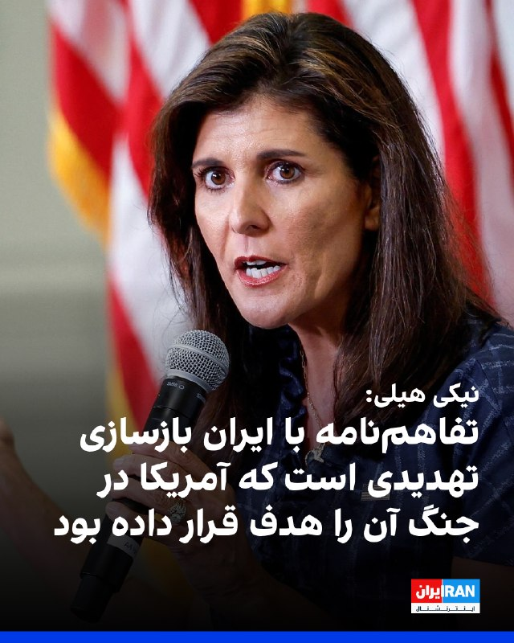

نیکی هیلی، سفیر پیشین آمریکا در سازمان ملل در دولت اول ترامپ، با انتقاد از تفاهم‌نامه میان آمریکا و جمهوری اسلامی، آن را «اشتباهی بزرگ» توصیف کرد و گفت این توافق به معنای پرداخت پول برای بازسازی تهدیدی است که آمریکا در جنگ آن را هدف قرار داده بود.
نیکی هیلی در شبکه‌های اجتماعی نوشت: «این یک اشتباه بزرگ است که برای بازسازی تهدیدی که تازه نابود کرده‌ایم پول پرداخت کنیم.»
هیلی گفت: «حمله به تاسیسات هسته‌ای و موشکی حکومت ایران اقدام درستی بود. این حکومت شعار مرگ بر آمریکا سر می‌دهد، نیروهای ما را می‌کشد و تلاش کرده است آمریکایی‌ها را در خاک آمریکا ترور کند.»
او افزود: «اکنون قرار است میلیاردها دلار آزاد شود و تحریم‌ها برداشته شوند، با این وعده که پول بیشتری هم در راه باشد.» هیلی نوشت جمهوری اسلامی این منابع را مانند گذشته صرف برنامه هسته‌ای و حمایت از گروه‌های نیابتی خواهد کرد.
پیش‌تر نیز مایک پنس، معاون پیشین دونالد ترامپ، تفاهم‌نامه میان آمریکا و جمهوری اسلامی را «مماشات» با تهران توصیف کرده بود.

‌🏁 🇬🇧 IranintlTV

🤖 @VahidOOnLine

## VahidOOnLine — post 246136

♦️یکی از اهالی استان کرمان با انتشار ویدیویی در شبکه‌های اجتماعی می‌گوید که کشاورزان در استان کرمان به‌دلیل چند برابر شدن هزینه‌ها و نصف شدن قیمت خرما، مجبور به فروش نخلستان‌ها شده‌اند.

محمدرضا کرم‌نژاد که این ویدیو را در اینستاگرام منتشر کرده می‌گوید باغداران شرق استان کرمان که زندگیشان بر کشاورزی خرما استوار است «یک سال برای بار آوردن محصولشان زحمت کشیده‌اند اما به دلیل رکود بازار، محصول سال پیش همچنان در سردخانه‌ها است.»
‌🇸🇦 Indypersian

🤖 @VahidOOnLine

## IranIntlTV — post 342961

  <a href="telegram/content/IranIntlTV_342961_1781758417.mp4" target="_blank">🎬 Download video</a>

هم‌زمان با ادامه اختلال در خدمات چهار بانک ملی، صادرات، تجارت و توسعه صادرات برای پنجمین روز پیاپی، مهدی صارمی‌فر، روزنامه‌نگار حوزه علم و فناوری، به ایران‌اینترنشنال گفت گزارش‌های ضدونقیض درباره علت این اختلال‌ها و ادعاهای مطرح‌شده از سوی برخی مقام‌ها، ابهام‌ها و پرسش‌های جدی درباره این ماجرا ایجاد کرده است.
@iranintltv

## IranIntlTV — post 342960

  

نیکی هیلی، سفیر پیشین آمریکا در سازمان ملل در دولت اول ترامپ، با انتقاد از تفاهم‌نامه میان آمریکا و جمهوری اسلامی، آن را «اشتباهی بزرگ» توصیف کرد و گفت این توافق به معنای پرداخت پول برای بازسازی تهدیدی است که آمریکا در جنگ آن را هدف قرار داده بود.
نیکی هیلی در شبکه‌های اجتماعی نوشت: «این یک اشتباه بزرگ است که برای بازسازی تهدیدی که تازه نابود کرده‌ایم پول پرداخت کنیم.»
هیلی گفت: «حمله به تاسیسات هسته‌ای و موشکی حکومت ایران اقدام درستی بود. این حکومت شعار مرگ بر آمریکا سر می‌دهد، نیروهای ما را می‌کشد و تلاش کرده است آمریکایی‌ها را در خاک آمریکا ترور کند.»
او افزود: «اکنون قرار است میلیاردها دلار آزاد شود و تحریم‌ها برداشته شوند، با این وعده که پول بیشتری هم در راه باشد.» هیلی نوشت جمهوری اسلامی این منابع را مانند گذشته صرف برنامه هسته‌ای و حمایت از گروه‌های نیابتی خواهد کرد.
پیش‌تر نیز مایک پنس، معاون پیشین دونالد ترامپ، تفاهم‌نامه میان آمریکا و جمهوری اسلامی را «مماشات» با تهران توصیف کرده بود.

https://iranintl.com/202606189722

## IranIntlTV — post 342959

پرونده هالک‌بانک ترکیه، یکی از مهم‌ترین اختلافات میان آنکارا و واشینگتن، با رای یک قاضی فدرال آمریکا مختومه شد. این پرونده به اتهام کمک این بانک دولتی به دور زدن تحریم‌های آمریکا علیه جمهوری اسلامی تشکیل شده بود.

گزارش فرزیا ثابتی، خبرنگار ایران‌اینترنشنال
@iranintltv

## IranIntlTV — post 342958

  <a href="telegram/content/IranIntlTV_342958_1781758419.mp4" target="_blank">🎬 Download video</a>

هم‌زمان با انتشار متن رسمی یادداشت تفاهم میان آمریکا و جمهوری اسلامی، محمدباقر قالیباف گفت دریافت مبالغ در ازای ارائه خدمات به کشتی‌های عبوری از تنگه هرمز و مدیریت آن در این تفاهم ذکر شده است. هوشنگ حسن‌یاری، کارشناس خاورمیانه و امور نظامی، به ایران‌اینترنشنال گفت این تفاهم، اگرچه می‌تواند از تنش‌های نظامی بکاهد، اما همچنان با ابهام‌ها و پرسش‌های بی‌پاسخ بسیاری همراه است.
@iranintltv

## RadioFarda — post 158446

📻بشنوید: سرخط خبرها با رادیوفردا، ۲۸ خرداد ۱۴۰۵‌

@RadioFarda

## alonews — post 128824

  <a href="telegram/content/alonews_128824_1781758421.mp4" target="_blank">🎬 Download video</a>

👈لحظه امضای یادداشت تفاهم از سوی ترامپ

🔴متنی که ترامپ در این فیلم در حال امضای آن است به زبان فارسی است.

✅ @AloNews خبر جنگ

## alonews — post 128823

  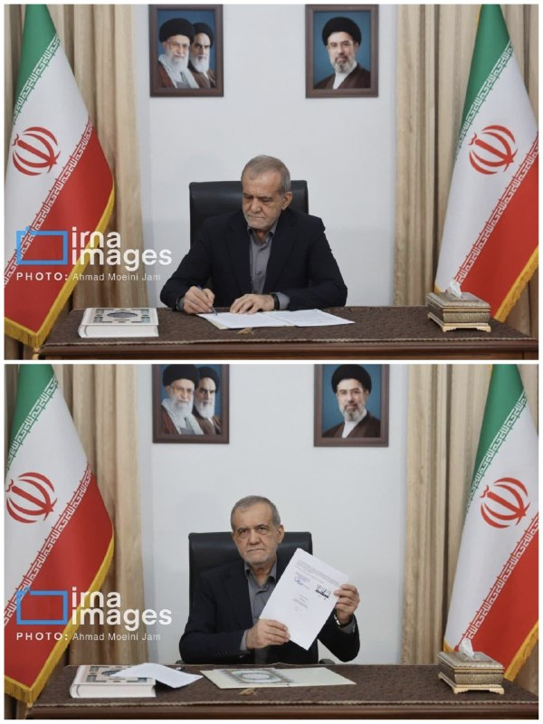

👈لحظۀ امضای مسعود پزشکیان، یادداشت تفاهم‌نامۀ اسلام‌آباد

✅ @AloNews خبر جنگ

---
📅 بروزرسانی: 1405/03/28 08:13
---

## Persian_Trend_Official — post 17407

  <a href="telegram/content/Persian_Trend_Official_17407_1781757822.mp4" target="_blank">🎬 Download video</a>

صبحتون بخیر 🌄
B-1 Lancer

📌 @persian_trend_official
پرشین ترند | متفاوت‌ترین کانال نظامی

---
📅 بروزرسانی: 1405/03/28 08:04
---

## IranIntlTV — post 342957

سرخط خبرهای پنجشنبه ۲۸ خرداد
@iranintltv

## BBCPersian — post 284224

  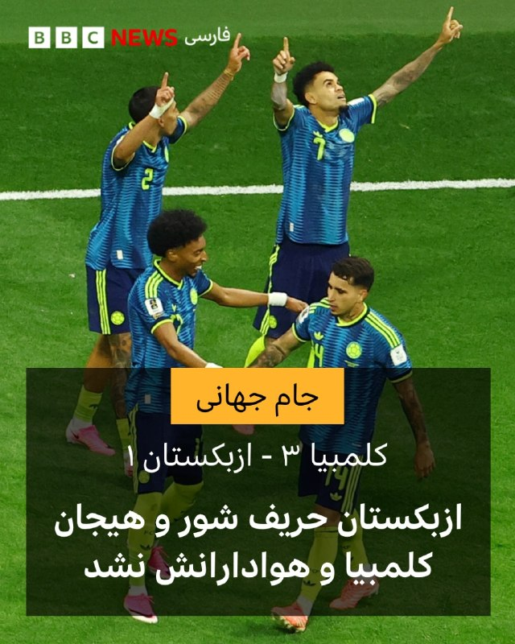

‌⚽ کلمبیا ۳ - ازبکستان ۱

🔸در آخرین مسابقه روز چهارشنبه ازبکستان که چند بازیکن آن از جمله ستاره جوان آن رستون اورونوف در لیگ ایران بازی می‌کند، برابر کلمبیا قرار گرفت و با نتیجه سه بر یک مغلوب شد.

این دیدار در مکزیکوسیتی، پایتخت مکزیک، برگزار شد و با وجود بازی قدرتی ازبک‌ها برابر کلمبیا تکنیکی، دانیل مونز در دقیقه ۴۰ توانست دروازه ازبکستان را باز کند.

در نیمه دوم ابتدا فاضلایوف نتیجه را به تساوی کشاند اما تنها چند دقیقه بعد دیاز که پاس گل اول کلمبیا را داده بود با زدن گل دوم، شب به یاد ماندنی خود را تکمیل کرد.

گل سوم را هم کامپز در آخرین لحظات وقت‌های تلف شده زد.

علاوه بر اورنوف که ستاره پرسپولیس است، ایگور سرگیف، مهاجم ازبکستان هم بعد از پیوستن به قرمزها در نقل و انتقال زمستانی، به صورت قرضی جدا شد.

رستم آشورماتوف هم دیگر ملی‌پوش ازبکستان است که در لیگ ایران بازی می‌کند و در کنار جلال‌الدین ماشاریپوف، از بازیکنان موثر آبی‌های پایتخت است.

اودیل خامروبکوف، مدافع ازبکستان هم این فصل به تراکتور - قهرمان سال گذشته لیگ ایران - پیوسته است.

📷Reuters
https://bbc.in/4xIe85d

@BBCPersian

---
📅 بروزرسانی: 1405/03/28 07:53
---

## VahidOOnLine — post 246135

  

آنتونی آلبانیزی، نخست‌وزیر استرالیا، با استقبال از تفاهم‌نامه میان جمهوری اسلامی و آمریکا، آن را «یک پیشرفت واقعا مهم» توصیف کرد و گفت این توافق به کاهش تنش‌ها و بازگشایی تنگه هرمز کمک می‌کند.
او در عین حال هشدار داد پیامدهای جنگ، از جمله تاثیر آن بر قیمت سوخت، ممکن است برای مدتی ادامه داشته باشد.
آنتونی آلبانیزی با اشاره به بند مربوط به سلاح هسته‌ای گفت استرالیا همواره مخالف دستیابی جمهوری اسلامی به سلاح هسته‌ای بوده است. او افزود این تفاهم‌نامه را چارچوبی برای ادامه روند دیپلماتیک و کاهش تنش‌ها در منطقه می‌داند.

‌🏁 🇬🇧 IranintlTV

🤖 @VahidOOnLine

## IranIntlTV — post 342956

  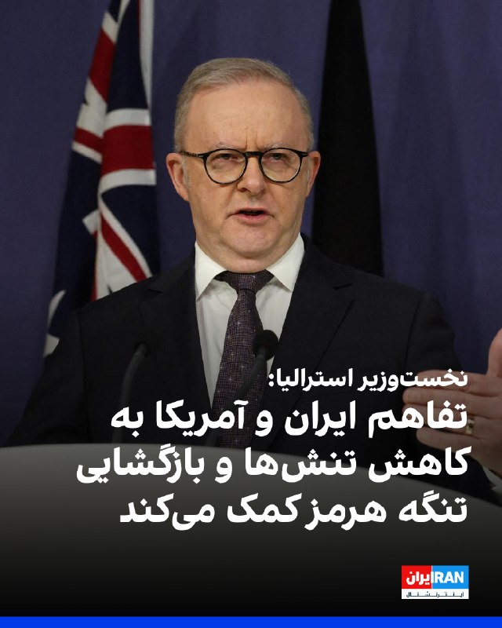

آنتونی آلبانیزی، نخست‌وزیر استرالیا، با استقبال از تفاهم‌نامه میان جمهوری اسلامی و آمریکا، آن را «یک پیشرفت واقعا مهم» توصیف کرد و گفت این توافق به کاهش تنش‌ها و بازگشایی تنگه هرمز کمک می‌کند.
او در عین حال هشدار داد پیامدهای جنگ، از جمله تاثیر آن بر قیمت سوخت، ممکن است برای مدتی ادامه داشته باشد.
آنتونی آلبانیزی با اشاره به بند مربوط به سلاح هسته‌ای گفت استرالیا همواره مخالف دستیابی جمهوری اسلامی به سلاح هسته‌ای بوده است. او افزود این تفاهم‌نامه را چارچوبی برای ادامه روند دیپلماتیک و کاهش تنش‌ها در منطقه می‌داند.

https://iranintl.com/202606183253

---
📅 بروزرسانی: 1405/03/28 07:43
---

## mamlekate — post 103735

  <a href="telegram/content/mamlekate_103735_1781756023.mp4" target="_blank">🎬 Download video</a>

📝 ترامپ یادداشت تفاهم را در کاخ ورسای امضا کرد، پزشکیان در تهران؛ مفاد توافق بلافاصله اجرایی می‌شوند

دونالد ترامپ، رئیس‌جمهوری آمریکا، چهارشنبه شب در جریان ضیافت شام در کاخ تاریخی ورسای با امانوئل مکرون رئیس‌جمهوری فرانسه و بریژیت مکرون بانوی اول فرانسه که مطابق سنت اروپایی ساعت ۱۰ شب آغاز شد، یادداشت تفاهم با تهران را امضا کرد.

ساعاتی قبل متن توافق نیز پس از وقفه‌ای چهار روزه به صورت عمومی منتشر شده بود.

@mamlekate

---
📅 بروزرسانی: 1405/03/28 07:33
---

## VahidOOnLine — post 246134

♦️خبرگزاری فرانسه گزارش داد امپراتور ژاپن ناروهیتو و همسرش، ملکه ماساکو، در جریان سفر رسمی به هلند، مهمان ضیافت پادشاه ویلم-الکساندر و ملکه ماکسیما در کاخ سلطنتی آمستردام شدند.

بر اساس این گزارش، حدود ۲۰۰ نفر چهارشنبه‌شب در این مراسم حضور داشتند. اعضای خانواده سلطنتی هلند، مقام‌های دولتی و افرادی که سال‌ها در گسترش روابط و تبادلات میان دو کشور نقش داشته‌اند، از جمله میهمانان این ضیافت بودند. امپراتور ژاپن در سخنرانی خود بر روابط بیش از ۴۰۰ ساله ژاپن و هلند تاکید کرد و با اشاره به جنگ جهانی دوم، خواستار انتقال تجربه‌ها و درس‌های آن دوران به نسل‌های آینده شد. او همچنین به تساوی ۲ بر ۲ تیم‌های ملی ژاپن و هلند در جام جهانی فوتبال اشاره کرد و گفت این مسابقه به تقویت پیوندهای میان مردم دو کشور کمک کرده است. امپراتور و ملکه ژاپن روز شنبه به بلژیک می‌روند.
‌🇸🇦 Indypersian

🤖 @VahidOOnLine

---
📅 بروزرسانی: 1405/03/28 07:24
---

## VahidOOnLine — post 246133

  <a href="telegram/content/VahidOOnLine_246133_1781754841.mp4" target="_blank">🎬 Download video</a>

♦️دونالد ترامپ، رئیس‌جمهوری ایالات متحده آمریکا، پیش از حضور در ضیافت شام رسمی چهارشنبه ۲۷ خرداد، به همراه امانوئل مکرون، رئیس‌جمهوری فرانسه، و همسرش بریژیت مکرون، از بخش‌های مختلف کاخ تاریخی ورسای بازدید کرد.
این ضیافت شام و بازدید ویژه پس از پایان نشست سران گروه ۷ (G7) در شهر اویان فرانسه برگزار شد. سفر ترامپ به فرانسه با تحولات دیپلماتیک مهمی همراه بود و این بازدید از کاخ ورسای پیش از بازگشت او به واشنگتن انجام شد.
کاخ ورسای که ساخت آن در قرن هفدهم میلادی به دستور لویی چهاردهم آغاز شد، بیش از سه قرن است که به عنوان یکی از مهم‌ترین نمادهای تاریخ، معماری و قدرت سیاسی فرانسه شناخته می‌شود.
همزمان با حضور ترامپ در کاخ ورسای، تفاهم‌نامه میان تهران و واشنگتن نیز به امضای طرفین رسید؛ توافقی که به گفته مقام‌های دو طرف، چارچوبی برای پایان جنگ و آغاز مرحله جدیدی از مذاکرات میان ایران و آمریکا فراهم می‌کند.
‌🇸🇦 Indypersian

🤖 @VahidOOnLine

## VahidOOnLine — post 246132

  

مارک لوین، مفسر محافظه‌کار و از چهره‌های نزدیک به جریان راست آمریکا، از تفاهم‌نامه میان جمهوری اسلامی و آمریکا انتقاد کرد. او گفت شخصا با این «توافق»، اختلاف‌نظر دارد و معتقد است جمهوری اسلامی به هیچ یک از تعهدات خود پایبند نخواهد ماند.
لوین همچنین نسبت به اجرای مفاد این تفاهم‌نامه از سوی تهران نیز ابراز تردید کرد.
این اظهارات در حالی مطرح می‌شود که توافق اخیر با واکنش‌های متفاوتی در میان جمهوری‌خواهان و دموکرات‌های آمریکا روبه‌رو شده است.

‌🏁 🇬🇧 IranintlTV

🤖 @VahidOOnLine

## IranIntlTV — post 342955

  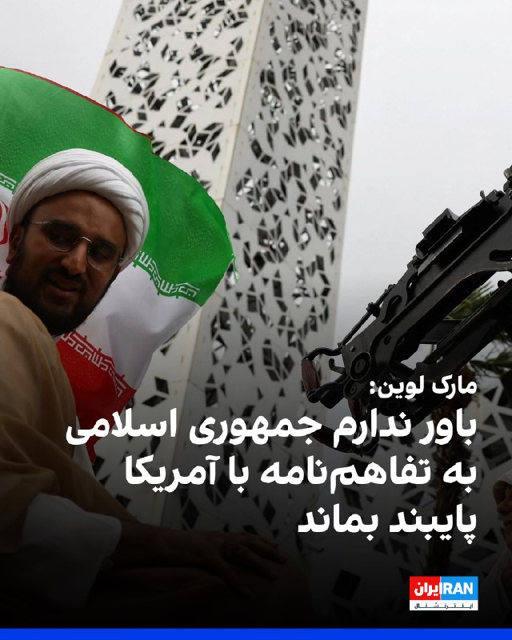

مارک لوین، مفسر محافظه‌کار و از چهره‌های نزدیک به جریان راست آمریکا، از تفاهم‌نامه میان جمهوری اسلامی و آمریکا انتقاد کرد. او گفت شخصا با این «توافق»، اختلاف‌نظر دارد و معتقد است جمهوری اسلامی به هیچ یک از تعهدات خود پایبند نخواهد ماند.
لوین همچنین نسبت به اجرای مفاد این تفاهم‌نامه از سوی تهران نیز ابراز تردید کرد.
این اظهارات در حالی مطرح می‌شود که توافق اخیر با واکنش‌های متفاوتی در میان جمهوری‌خواهان و دموکرات‌های آمریکا روبه‌رو شده است.

https://iranintl.com/202606188020

## BBCPersian — post 284217

‌🖊امیر عظیمی
سردبیر ارشد، بی‌بی‌سی فارسی

🔻رهبران ایران تلاش می‌کنند تفاهم‌نامه در حال شکل‌گیری با آمریکا را نه به عنوان یک مصالحه، بلکه به عنوان یک پیروزی در نتیجه مقاومت معرفی کنند. اما جا انداختن چنین روایتی حتی در میان برخی گروه‌های حامی حکومت هم کار آسانی نیست.

ایران هم‌اکنون در مرحله آتش‌بس جنگی پرهزینه است، اقتصاد زیر فشار شدیدی قرار دارد و بخش‌هایی از پایگاه حمایتی‌اش ماه‌هاست که هرگونه سازش با واشنگتن را در گردهمایی‌های شبانه در شهرها محکوم کرده‌اند.

در عین حال گروهی از ایرانیان معترض، در داخل کشور و خارج از آن، این بحران را نه فرصتی برای دیپلماسی، بلکه زمینه‌ای برای تغییر حکومت می‌دانند.

تهران اکنون تلاش می‌کند در چنین فضای چندپاره‌ای، توافق با آمریکا را به عنوان گزینه‌ای قابل قبول به افکار عمومی عرضه کند.

مقام‌های ارشد جمهوری اسلامی این توافق را یک پیروزی توصیف کرده‌اند.

متن کامل خبر را از لینک زیر بخوانید:

📷GettyImages/ Reuters/ NurPhoto via Getty Images/ EPA/Shutterstock/ LightRocket via Getty Images/ AFP via Getty Images/ Anadolu via Getty Images

https://bbc.in/3QmQXwr

@BBCPersian

---
📅 بروزرسانی: 1405/03/28 07:13
---

هیچ پیام جدیدی در این بروزرسانی ارسال نشد.

---
📅 بروزرسانی: 1405/03/28 07:03
---

## BBCPersian — post 284216

🔻ایران: حضور اسرائیل در لبنان نقض توافق خواهد بود

🔻وزارت امور خارجه ایران اعلام کرده است که ادامه حضور اسرائیل در خاک لبنان «نقض» توافق برای پایان دادن به جنگ خواهد بود.

بر اساس گزارش تلویزیون دولتی ایران، اسماعیل بقایی، سخنگوی وزارت امور خارجه این کشور، گفته است اگر اسرائیل به «اشغال» لبنان ادامه دهد، «اقدامات لازم» اتخاذ خواهد شد.

لبنان به یکی از اصلی‌ترین نقاط اختلاف در توافق تبدیل شده است. اسرائیل می‌گوید لبنان بخشی از این توافق نیست، در حالی که جوزف عون، رئیس جمهور لبنان، تاکید کرده است که گفت‌وگوهای کشورش با اسرائیل «مستقل» از توافق میان آمریکا و ایران است.

با این حال، ایران و پاکستان که نقش میانجی را ایفا کرده است، اصرار دارند که آتش‌بس در لبنان همچنان یکی از محورهای اصلی تفاهم‌نامه‌ای است که ممکن است ظرف دو روز آینده توسط مقام‌های آمریکا و ایران امضا شود.

نسخه آمریکایی این توافق که از سوی مقام‌های ارشد ایالات متحده در اختیار بی‌بی‌سی قرار گرفته، خواستار «پایان فوری و دائمی عملیات نظامی در همه جبهه ها، از جمله لبنان» شده است.

https://bbc.in/4a22Hes
@|BBCPersian

## alonews — post 128822

  <a href="telegram/content/alonews_128822_1781753636.webm" target="_blank">🎬 Download video</a>

👈ترامپ: عادلانه نیست تمام کشورها موشک داشته باشند اما ایران نداشته باشد

🔴آنها باید بتوانند دفاع کنند

✅ @AloNews خبر جنگ

---
📅 بروزرسانی: 1405/03/28 06:53
---

## IranIntlTV — post 342954

  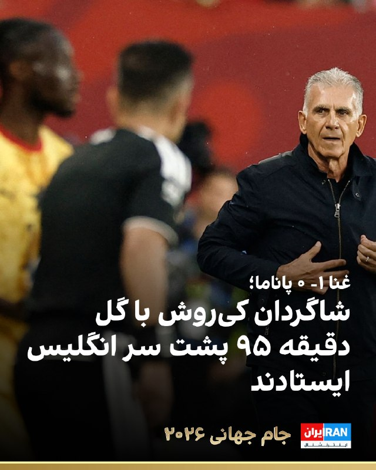

در ادامه رقابت‌های جام جهانی ۲۰۲۶، تیم‌های ملی غنا و پاناما چهارشنبه‌شب در ورزشگاه بی‌ام‌او فیلد شهر تورنتو در نخستین دیدار خود در گروه L به مصاف هم رفتند؛ مسابقه‌ای که با وجود برتری نسبی پاناما در جریان بازی، در نهایت با پیروزی یک بر صفر غنا به پایان رسید.

پاناما در بیشتر دقایق مالکیت توپ و ابتکار عمل را در اختیار داشت و چندین بار دروازه غنا را تهدید کرد، اما نتوانست از فرصت‌های خود استفاده کند.

در مقابل، غنا که بیشتر بر دفاع و ضدحمله تکیه داشت، در پنجمین دقیقه وقت‌های تلف‌شده نیمه دوم به گل رسید.

کالب ییرنکی در دقیقه ۹۵ تک‌گل مسابقه را به ثمر رساند تا نماینده آفریقا هر سه امتیاز این دیدار را کسب کند.

با این نتیجه، غنا نخستین پیروزی خود در جام جهانی ۲۰۲۶ را به دست آورد و پس از انگلیس که پیش‌تر کرواسی را ۴ بر ۲ شکست داده بود، با سه امتیاز در رده دوم جدول گروه L قرار گرفت.
https://iranintl.com/202606184170

---
📅 بروزرسانی: 1405/03/28 06:43
---

## VahidOOnLine — post 246131

  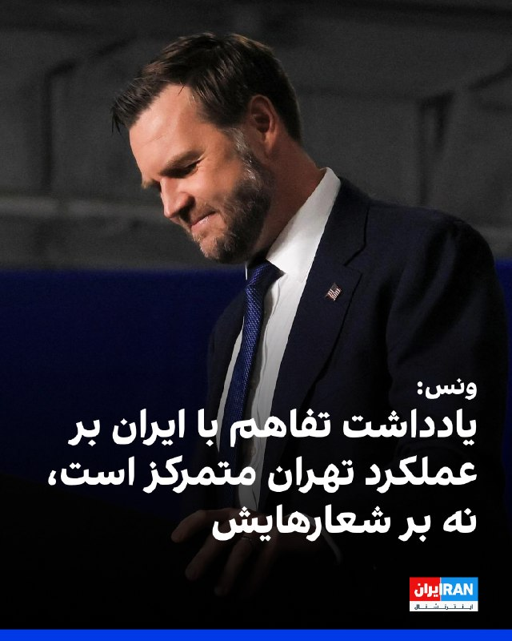

جی‌دی ونس، معاون رییس‌جمهوری آمریکا، به سی‌بی‌ان نیوز گفت یکی از نقاط قوت اصلی یادداشت تفاهم با ایران این است که بر رفتار متمرکز است، نه بر شعارها و اظهارات. او گفت رهبری جدید ایران بر اساس عملکردش قضاوت خواهد شد.
او افزود: «یکی از مسائلی که رییس‌جمهوری و کل دولت را بسیار نگران کرده بود، کشتار همه آن معترضان بی‌گناه به دست افرادی بود که تا چند ماه پیش در قدرت بودند.»
ونس گفت: «آن افراد اکنون دیگر در قدرت نیستند. اما باید ببینیم چه اتفاقی می‌افتد. آیا این رهبران جدید با مردم به شکل متفاوتی رفتار می‌کنند؟ ما قطعا امیدواریم که چنین باشد. اگر هم این‌طور نباشد، با مشاهده عملکرد واقعی آن‌ها می‌توانیم قضاوت کنیم. به همین دلیل است که می‌گویم نکته مثبت این یادداشت تفاهم این است که درباره حرف‌ها نیست، بلکه درباره رفتار آن‌هاست.»

‌🏁 🇬🇧 IranintlTV

🤖 @VahidOOnLine

## VahidOOnLine — post 246130

  

راف چیکونی، رییس کمیته مشترک اطلاعات و امنیت پارلمان استرالیا، از تفاهم‌نامه تهران و واشینگتن استقبال کرد، اما گفت موضوع مردم ایران و مطالبات آنان برای آزادی نباید در حاشیه قرار گیرد و جامعه جهانی نباید نسبت به سرکوب داخلی در ایران بی‌تفاوت بماند.
راف چیکونی گفت هنوز راه زیادی تا بازگشت کامل ثبات باقی مانده است.

‌🏁 🇬🇧 IranintlTV

🤖 @VahidOOnLine

## IranIntlTV — post 342953

  

جی‌دی ونس، معاون رییس‌جمهوری آمریکا، به سی‌بی‌ان نیوز گفت یکی از نقاط قوت اصلی یادداشت تفاهم با ایران این است که بر رفتار متمرکز است، نه بر شعارها و اظهارات. او گفت رهبری جدید ایران بر اساس عملکردش قضاوت خواهد شد.
او افزود: «یکی از مسائلی که رییس‌جمهوری و کل دولت را بسیار نگران کرده بود، کشتار همه آن معترضان بی‌گناه به دست افرادی بود که تا چند ماه پیش در قدرت بودند.»
ونس گفت: «آن افراد اکنون دیگر در قدرت نیستند. اما باید ببینیم چه اتفاقی می‌افتد. آیا این رهبران جدید با مردم به شکل متفاوتی رفتار می‌کنند؟ ما قطعا امیدواریم که چنین باشد. اگر هم این‌طور نباشد، با مشاهده عملکرد واقعی آن‌ها می‌توانیم قضاوت کنیم. به همین دلیل است که می‌گویم نکته مثبت این یادداشت تفاهم این است که درباره حرف‌ها نیست، بلکه درباره رفتار آن‌هاست.»

https://iranintl.com/202606181595

## IranIntlTV — post 342952

  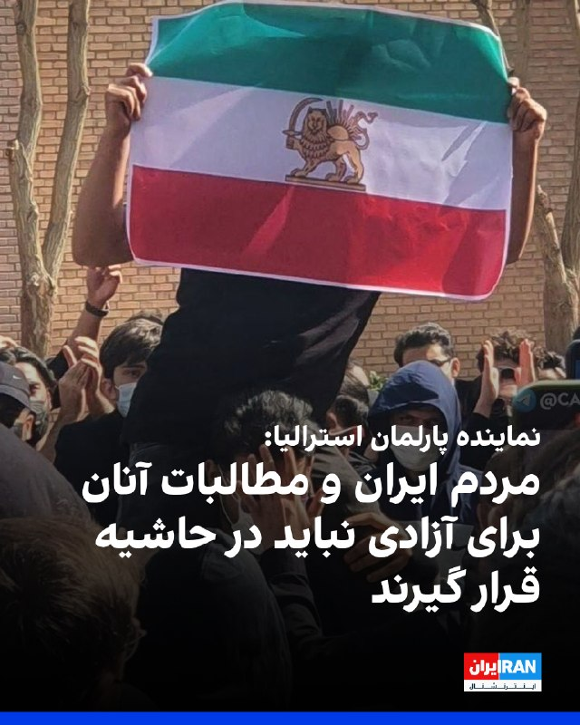

راف چیکونی، رییس کمیته مشترک اطلاعات و امنیت پارلمان استرالیا، از تفاهم‌نامه تهران و واشینگتن استقبال کرد، اما گفت موضوع مردم ایران و مطالبات آنان برای آزادی نباید در حاشیه قرار گیرد و جامعه جهانی نباید نسبت به سرکوب داخلی در ایران بی‌تفاوت بماند.
راف چیکونی گفت هنوز راه زیادی تا بازگشت کامل ثبات باقی مانده است.

https://iranintl.com/202606181384

## Shin_Persian — post 7125

  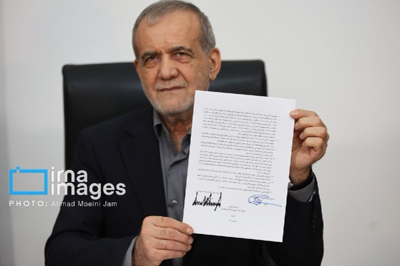

Shin ✓ @hey_itsmyturn
Thu, 18 Jun 2026 03:12:34 UTC

Islamic Regime's president, Masoud Pezeshkian holding the MOU, signed by himself and Trump.

ترجمه خودکار فارسی

مسعود پزشکیان، رئیس‌جمهور رژیم اسلامی، در حالی که یادداشت تفاهم (MOU) امضا شده توسط خودش و ترامپ را در دست دارد.

𝕏 · @shin_persian

## Shin_Persian — post 7124

Shehbaz Sharif ✓ @CMShehbaz
Thu, 18 Jun 2026 00:27:27 UTC

I am honoured to announce that the historic ‘Islamabad Memorandum of Understanding’ has been electronically signed today between the United States of America and the Islamic Republic of Iran. The Memorandum has been signed by honourable Presidents of both the countries and also endorsed by me as the mediator. The signing of this agreement at the highest level of the respective governments demonstrates the commitment of both sides to a diplomatic resolution of the conflict. Islamabad MoU shall enter into force with immediate effect and as a first step, Islamic Republic of Iran will instantly reopen the Strait of Hormuz and the United States of America will immediately lift the naval blockade.

I offer my heartfelt congratulations and sincere appreciation to the President of the United States, Donald J. Trump whose steadfast commitment to diplomacy and preference for peaceful resolution have once again helped end a conflict that could have led to devastating consequences for the region and beyond. I also commend the dedication and tireless efforts of the United States negotiating team, including J.D. Vance, Steve Witkoff and Jared Kushner, for their invaluable contributions to this achievement.

I express my profound respect and appreciation to His Eminence Ayatollah Seyyed Mojtaba Hosseini Khamenei, the Supreme Leader of Islamic Republic of Iran and President Masoud Pezeshkian for their wisdom, foresight and statesmanship in embracing the cause of peace. I also wish to recognize the efforts of the Iranian negotiating team, including Mohammad Bagher Ghalibaf, Abbas Araghchi and Eskandar Momeni, whose patience, perseverance and commitment to constructive engagement were instrumental in bringing this agreement to fruition.

I would especially like to acknowledge the sincere efforts and constructive engagement of the leadership of the State of Qatar in helping reach this point. I also highly commend the leadership of the Kingdom of Saudi Arabia, the Republic of Türkiye and the Arab Republic of Egypt for their indispensable role and invaluable contributions in this regard.

I would also like to make special mention of Field Marshal Syed Asim Munir, whose tireless efforts, selfless dedication and instrumental role were critical in facilitating this breakthrough and advancing the cause of peace and regional stability.

May this Memorandum of Understanding serve as an enduring foundation for greater understanding, mutual respect and shared prosperity for the complete region.

@realDonaldTrump
@JDVance
@SecRubio
@SteveWitkoff
@SEPeaceMissions
@drpezeshkian
@mb_ghalibaf
@araghchi

ترجمه خودکار فارسی در بخش نظرات

𝕏 · @shin_persian

---
📅 بروزرسانی: 1405/03/28 06:33
---

## VahidOOnLine — post 246129

♦️محمدحسین خوشوقت، برادر همسر مصطفی خامنه‌ای، پسر بزرگ علی خامنه‌ای، در گفتگو با انصاف‌نیوز درباره وضعیت خانواده خامنه‌ای پس از کشته شدن او گفت همسر علی خامنه‌ای در زمان حمله در بیمارستان بستری بوده است.
خوشوقت با اشاره به شرایط جسمی خجسته خامنه‌ای گفت: «ما اول فکر می‌کردیم که ایشان منزل هستند و قطعا ایشان هم کشته شده‌اند، ولی بعد مشخص شد در بیمارستان بستری بوده‌اند.» او افزود همسر خامنه‌ای در سال‌های اخیر چندین بار بستری شده و حتی به کما رفته بود.
‌🇸🇦 Indypersian

🤖 @VahidOOnLine

---
📅 بروزرسانی: 1405/03/28 06:23
---

## VahidOOnLine — post 246128

  <a href="telegram/content/VahidOOnLine_246128_1781751228.mp4" target="_blank">🎬 Download video</a>

♦️تصاویر منتشرشده در شبکه‌های اجتماعی نشان می‌دهد که هم‌زمان با برگزاری مراسم محرم در ایران، مادر جاویدنام مانی صفرپور با در دست داشتن عکس فرزندش، در مقابل یک هیئت عزاداری حضور یافته است. مانی صفرپور، جوان ۱۸ ساله‌ای بود که در جریان اعتراضات، روز پنجشنبه ۱۸ دی‌ماه در محله سلسبیل تهران به ضرب گلوله نیروهای سرکوبگر جمهوری اسلامی کشته شد.
‌🇸🇦 Indypersian

🤖 @VahidOOnLine

## Shin_Persian — post 7123

  <a href="telegram/content/Shin_Persian_7123_1781751230.mp4" target="_blank">🎬 Download video</a>

Shin ✓ @hey_itsmyturn
Thu, 18 Jun 2026 02:46:57 UTC

Last night @ 2348Z, a number of IRGC boats were warned by the US Navy in Persian:
"Islamic Republic has no control over the Strait [of Hormuz], Abort your mission, Or the USN will target your vessel[s]"
Via @IliaHashemicom's Telegram Channel

ترجمه خودکار فارسی

دیشب در ساعت ۲۳۴۸ زولو (۰۳:۱۸ به وقت تهران)، تعدادی از قایق‌های سپاه پاسداران انقلاب اسلامی (IRGC) توسط نیروی دریایی ایالات متحده به زبان فارسی هشدار دریافت کردند:
«جمهوری اسلامی هیچ کنترلی بر تنگه [هرمز] ندارد، ماموریت خود را متوقف کنید، وگرنه نیروی دریایی آمریکا شناور[های] شما را هدف قرار خواهد داد»
از طریق کانال تلگرام @IliaHashemicom

𝕏 · @shin_persian

## FarsiVOA — post 221080

⚡️دولت بریتانیا می‌گوید کی‌یر استارمر در حاشیه نشست گروه هفت بیش از ۱.۳ میلیارد پوند سرمایه‌گذاری خارجی جذب کرده است؛ سرمایه‌گذاری‌هایی که به گفته دولت بیش از ۱۴۰۰ شغل جدید در حوزه‌های انرژی پاک و هوش مصنوعی ایجاد می‌کند.
@FarsiVOA

## BBCPersian — post 284215

  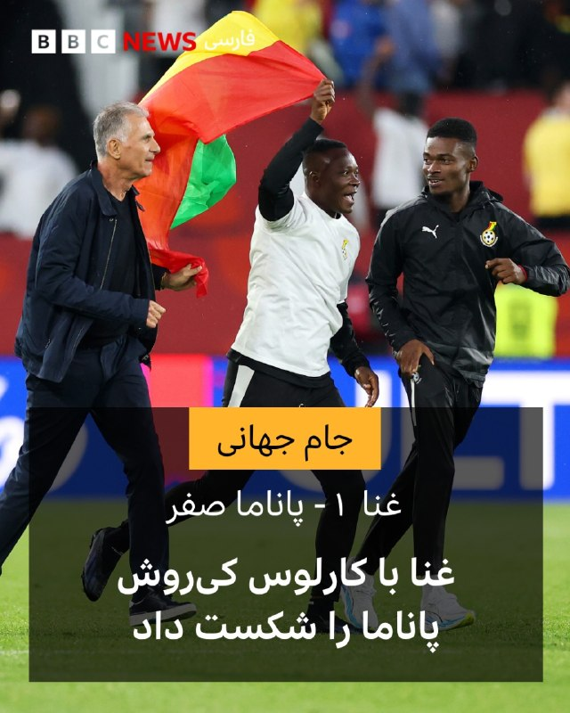

‌⚽ غنا ۱ - پاناما صفر

🔸تیم فوتبال غنا که با سرمربی‌گری کارلوس کی‌روش به جام جهانی امسال رفته، توانست در نخستین دیدار گروهی خود با یک گل پاناما را شکست دهد.

دو تیم تا اواخر نیمه دوم بدون گل مساوی بودند و بازی تقریبا برابری را به نمایش گذاشته بودند.

با این برد، غنا هم مانند انگلیس سه امتیازی شد و با توجه به شکست کرواسی در رتبه دوم جدول قرار گرفت و می‌تواند امیدوار باشد که تنها با یک تساوی برای انگلیس یا کرواسی دست کم به عنوان یکی از تیم‌های سوم به مرحله بعد صعود کند.

📷Getty Images
https://bbc.in/4a3ovX8

@BBCPersian

---
📅 بروزرسانی: 1405/03/28 06:14
---

هیچ پیام جدیدی در این بروزرسانی ارسال نشد.

---
📅 بروزرسانی: 1405/03/28 06:08
---

## FarsiVOA — post 221079

⚡️چند خانواده در ایتالیا از متا و تیک‌تاک شکایت کرده‌اند و این شرکت‌ها را به آسیب‌رساندن به نوجوانان از طریق الگوریتم‌های شبکه‌های اجتماعی متهم می‌کنند. این اقدام پس از خودکشی یک دختر ۱۲ ساله مطرح شده است.
@FarsiVOA

## FarsiVOA — post 221078

  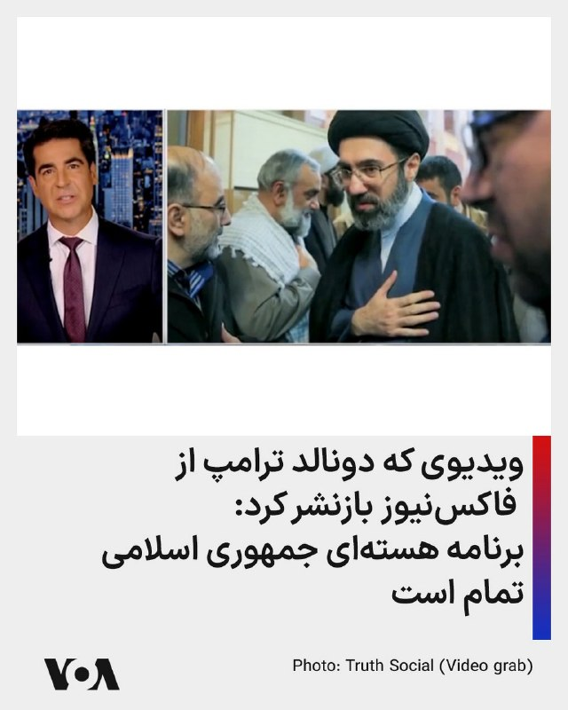

⚡️دونالد ترامپ، رئیس‌جمهوری آمریکا،‌ ویدیویی از شبکه فاکس‌نیوز درباره توافق با جمهوری اسلامی را در حساب کاربری تروت‌سوشال خود بازنشر کرد که در آن، مجری برنامه می‌گوید که تصویری از توافقی که رئيس‌جمهوری آمریکا امضا کرد، برای «آیت‌الله همجنسگرا» ایمیل شد. اشاره مجری فاکس‌نیوز به مجتبی خامنه‌ای، رهبر جمهوری اسلامی است.

او با تمسخر گفت از آنجایی که رهبر جدید جمهوری اسلامی اینترنت «وای‌فای» ندارد، احتمالا این متن توافق روز جمعه به‌دستش خواهد رسید. مجری فاکس‌نیوز گفت با این توافق، برنامه هسته‌ای جمهوری اسلامی «تمام شد.» مجری برنامه گفت «ملاها» توافق کردند که اورانیوم غنی‌شده در محل نابود شود.
@FarsiVOA

## BBCPersian — post 284214

🔻قالیباف: چندین برابر اقدام نظامی در مذاکرات بدست آوریم

🔻محمدباقر قالیباف، رئیس مجلس ایران که ریاست هیئت مذاکره‌کننده ایرانی با نمایندگان آمریکا را برعهده داشت، عصر چهارشنبه در مصاحبه‌ای مفصل به نهایی شدن تفاهمنامه میان تهران و واشنگتن واکنش نشان داده و آن را موفقیتی بسیار بزرگتر از مقابله نظامی با ایالات متحده دانسته است.

برخی از اظهارات آقای قالیباف را به طور خلاصه در زیر می‌توانید بخوانید:

▪️هر آنچه را که با اقدام نظامی می‌خواستیم به دست بیاوریم، چندین برابر آن را از طریق مذاکره گرفتیم؛ اصلاً قابل قیاس نبود

▪️هر جنگی ممکن است پیروزی‌هایی داشته باشد، اما اگر این پیروزی‌ها در نهایت به یک سند حقوقی و سیاسی منجر نشود و ثبت نگردد، هیچ منفعتی نخواهد داشت؛ نه در تاریخ و نه در تثبیت دستاوردهای میدانی

▪️باید با عقلانیت پیش برویم و گره‌ای که می‌شود با دست وا کرد، لازم نیست با دندان باز کنیم. شعار به تنهایی قدرت نیست و دو بار شعار بدهید و عمل نداشته باشید، این رویه کمک به دشمن است

▪️مذاکره به معنای وادادگی نیست، عین عقلانیت و هوشمندی است/ در جایگاهی هستیم که چک‌هایمان را نقد می‌کنیم

▪️تنگه هرمز ظرفیت بالقوه ای بود که دشمن با اقدامات خود این ظرفیت را بالفعل کرد. مدیریت و کنترل تنگه هرمز متعلق به کشورهای ساحلی تنگه است و ما حق حاکمیتی در آن داریم و طبیعتاً برای خدمات باید هزینه دریافت کنیم

▪️اقدام در مقابل اقدام، در بند ۱۳ تعریف شده است. ما برای این موضوع ناظر تعیین کرده‌ایم؛ یعنی باید با هم توافق کنیم که افرادی به عنوان ناظر در اینجا حضور داشته باشند. حتی درباره میانجی‌ها هم باید با یکدیگر توافق کنیم و ممکن است کشورهای دیگری این کار را انجام دهند. اما مطمئن باشید به فضل الهی، اگر آن‌ها اقدامی انجام ندهند، ما هم اقدام متقابل انجام نخواهیم داد.

@BBCPersian

---
📅 بروزرسانی: 1405/03/28 05:53
---

## VahidOOnLine — post 246127

♦️دونالد ترامپ، رئیس‌جمهوری آمریکا، چهارشنبه ۲۷ خردادماه در حاشیه نشست گروه هفت (G7) با اشاره به نخستین دیدارش با عبدالفتاح السیسی، رئیس‌جمهوری مصر، گفت از همان ملاقات اول رابطه نزدیکی میان آن‌ها شکل گرفت. ترامپ گفت: «با او دیدار کردم و خیلی زود با هم صمیمی شدیم؛ آن‌قدر که حتی نمی‌خواست هیلاری کلینتون را ببیند.»

ترامپ افزود این دیدار در جریان رقابت‌های انتخاباتی سال ۲۰۱۶ و در هتلی که السیسی در آن اقامت داشت انجام شد. او گفت رئیس‌جمهوری مصر از همان زمان به پیروزی او در انتخابات باور داشت و به او گفته بود: «تو برنده خواهی شد.» ترامپ همچنین تاکید کرد از همان نخستین دیدار «تفاهم فوق‌العاده‌ای» میان او و السیسی شکل گرفت.
‌🇸🇦 Indypersian

🤖 @VahidOOnLine

## VahidOOnLine — post 246126

♦️درحالی که گفته شده مراسم تشییع علی خامنه‌ای، رهبر کشته شده حکومت ایران قرار است از ۱۳ تیرماه برگزار شود، محمدحسین خوشوقت، برادر همسر مصطفی خامنه‌ای، پسر بزرگ علی خامنه‌ای، در مصاحبه‌ای با انصاف‌نیوز گفت که «کارشناسان توصیه اکید کرده‌اند که مطلقا هیچ تصویری از مجتبی خامنه‌ای دیده نشود و حتی پیام صوتی هم ندهد.» مجتبی خامنه‌ای اواخر سال گذشته و چند روز پس از کشته شدن پدرش، به عنوان سومین رهبر نظام معرفی شد، اما از آن زمان به بعد هیچ صدا و تصویری از او منتشر نشده و چند بیانیه کتبی منسوب به او در صداوسیما خوانده شده است. اظهارات خوشوقت درباره توصیه اکید «کارشناسان» به مخفی ماندن مجتبی خامنه‌ای در حالی مطرح می‌شود که انتظار می‌رود او در مراسم تشییع پدرش حاضر باشد. در صورتی که طبق گفته خوشوقت، مجتبی خامنه‌ای زنده باشد و غیبت او در مراسم تشییع علی خامنه‌ای هم ادامه پیدا کند، مهر تاییدی بر سناریوی زندگی زیرزمینی او خواهد بود، مشابه حسن نصرالله، رهبر کشته شده حزب‌الله. نصرالله برای سال‌ها زندگی مخفیانه داشت و در نهایت در حمله اسرائیل به پناهگاه زیرزمینی که در آن حضور داشت، کشته شد.
‌🇸🇦 Indypersian

🤖 @VahidOOnLine

## VahidOnline — post 76475

  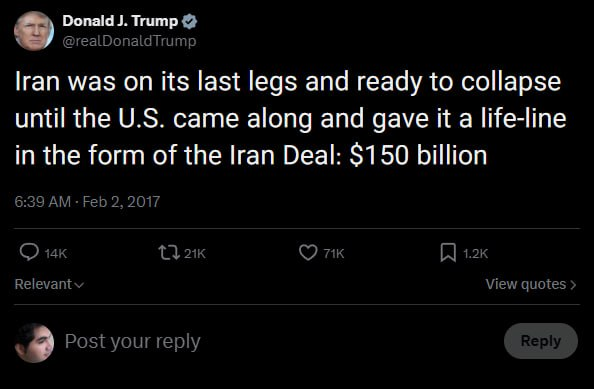

این توییت ۹ سال پیش ترامپ داره توجه می‌گیره:
ایران در آخرین نفس‌هایش بود و آماده‌ی فروپاشی، تا این‌که آمریکا از راه رسید و در قالب توافق ایران به آن یک طناب نجات داد: ۱۵۰ میلیارد دلار.
realDonaldTrump

📡 @VahidOnline

## FarsiVOA — post 221077

⚡️نقشه راه واشنگتن برای بغداد؛ گشایش اقتصادی به شرط خلع سلاح شبه نظامیان وابسته به جمهوری اسلامی
@FarsiVOA

---
📅 بروزرسانی: 1405/03/28 05:44
---

هیچ پیام جدیدی در این بروزرسانی ارسال نشد.

---
📅 بروزرسانی: 1405/03/28 05:33
---

## BBCPersian — post 284210

🔻ایرنا - خبرگزاری دولت ایران هم بامداد پنجشنبه مجموعه تصاویری از لحظه امضای تفاهمنامه توسط مسعود پزشکیان منتشر کرد تا هر دو سو رسما به آن سندیت ببخشند.

در تصاویر ایرنا رئیس جمهور ایران در کنار امضای دونالد ترامپ امضاء کرده است. تصاویر امضای رئیس جمهور آمریکا را هم دقایقی پیش‌تر کاخ سفید منتشر کرده بود که در آن آقای ترامپ در حالی که کنار امانوئل مکرون و سر میز شام در کاخ الیزه نشسته سند را امضاء می‌کند.

ساعتی قبل از این، اسماعیل بقایی، سخنگوی وزارت خارجه ایران گفت: «به این نتیجه رسیدیم متن یادداشت تفاهم به امضا روسای جمهور ایران و آمریکا برسد و برگزاری مراسم روز جمعه هنوز در دستور کار است اما باید ببینیم ظرف ساعات آینده به چه نتیجه‌ای می‌رسیم. به هر حال باید فاز بعدی مذاکرات آغاز شود. این نشست در سوئیس هنوز در دستور کار است که برگزار شود. باید ببینیم که در ساعات آینده طرفین از طریق میانجی‌ها به نتیجه‌ای می‌رسند.»

آقای بقایی و همچنین مقام‌های در کاخ‌سفید تایید کرده‌اند که همزمان با امضای روسای‌جمهور در زیر تفاهمنامه، این سند لازم الاجرا شده است.

📷IRNA
@BBCPersian

## Dirty_Kids — post 392459

لحظه‌ای که ترامپ، سند تفاهم با ایران رو سرِ میز شام امضا کرد ؛ بعدشم همه واسش دست زدن... @Dirty_Kids 👻

## Dirty_Kids — post 392458

  <a href="telegram/content/Dirty_Kids_392458_1781748235.mp4" target="_blank">🎬 Download video</a>

لحظه‌ای که ترامپ، سند تفاهم با ایران رو سرِ میز شام امضا کرد ؛

بعدشم همه واسش دست زدن...

@Dirty_Kids 👻

---
📅 بروزرسانی: 1405/03/28 05:23
---

## FarsiVOA — post 221076

⚡️ارتباط دیپلمات جوان روس با پرونده حمله به خانه‌های نخست‌وزیر بریتانیا؛ گفت‌وگو با اولگا مالچفسک
@FarsiVOA

---
📅 بروزرسانی: 1405/03/28 05:13
---

هیچ پیام جدیدی در این بروزرسانی ارسال نشد.

---
📅 بروزرسانی: 1405/03/28 05:03
---

## VahidOOnLine — post 246125

  <a href="telegram/content/VahidOOnLine_246125_1781746413.mp4" target="_blank">🎬 Download video</a>

♦️امانوئل مکرون، رئیس‌جمهوری فرانسه، بامداد پنجشنبه ۲۸ خردادماه ویدیویی از لحظه امضای توافق تهران و واشنگتن در کاخ ورسای منتشر کرد. در این ویدیو، دونالد ترامپ، رئیس‌جمهوری آمریکا، سند توافق را در حضور مقام‌های آمریکایی و فرانسوی امضا می‌کند.

مکرون در پیامی همراه این ویدیو نوشت ترامپ توافق میان ایران و ایالات متحده را در ورسای امضا کرده است. او افزود این توافق راه را برای «صلحی پایدار» هموار می‌کند و امکان بازگشایی تنگه هرمز را فراهم می‌سازد. رئیس‌جمهوری فرانسه همچنین ابراز امیدواری کرد که این توافق به کاهش قیمت انرژی در آینده نزدیک منجر شود.
‌🇸🇦 Indypersian

🤖 @VahidOOnLine

## VahidOOnLine — post 246124

  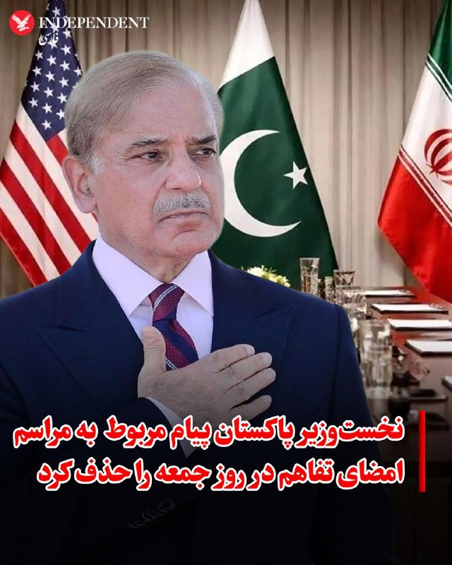

♦️شهباز شریف، نخست‌وزیر پاکستان، در شبکه اکس نوشته بود که پس از آنکه دو طرف پیش‌تر یادداشت توافق را امضا کرده‌اند، همچنان قرار است روز جمعه یک مراسم رسمی امضا برگزار شود.
اما شریف مدت کوتاهی بعد آن پیام را حذف کرد. سپس همان متن را با تغییراتی دوباره منتشر کرد، اما اشاره به مراسم روز جمعه را از آن حذف کرد.
پیش‌تر گفته شده بود که قرار است دو طرف مراسم رسمی امضا توافق را روز جمعه در سوئیس برگزار کنند و دونالد ترامپ نیز به احتمال حضور در این مراسم اشاره کرده بود.
‌🇸🇦 Indypersian

🤖 @VahidOOnLine

## IranianMinds — post 22845

  <a href="telegram/content/IranianMinds_22845_1781746414.mp4" target="_blank">🎬 Download video</a>

🔴 قالیباف:

بدبینی و بی‌اعتمادی من به ایالات متحده از هر کس دیگری بیشتر است.

حتی اگر توافق نهایی حاصل شود و توسط قطعنامه شورای امنیت سازمان ملل متحد تأیید شود، باز هم قابل اعتماد نیست. تضمین ما قدرت ایران است.

@IranianMinds

## IranianMinds — post 22844

جام جهانی ینی اوج هیجان و پول دراوردن پس بیا توی کانال ورسوس بت و پول دراوردن شروع کن👌

## IranianMinds — post 22843

  <a href="telegram/content/IranianMinds_22843_1781746416.webm" target="_blank">🎬 Download video</a>

📢توم میخوای از مسابقات جام جهانی فوتبال پول دربیاری؟
🥇

✅کانال ورسوس بت کارش تحلیل و پیش بینی مسابقات جام جهانی به صورت حرفه ای
🍑

⚠️توم میتونی از پیش بینی جام جهانی خیلی راحت پول دربیاری فقط کافیه با کانال ورسوس بت همراه شی
📣

🌐ادرس عضویت کانالشون ea27:
👇

🔪https://t.me/+vEPd1hF2Y38yMWI0

🔪https://t.me/+vEPd1hF2Y38yMWI0

---
📅 بروزرسانی: 1405/03/28 04:53
---

## VahidOOnLine — post 246123

  

مکرون با انتشار ویدیویی از لحظه امضای یادداشت تهران و واشینگتن از سوی ترامپ نوشت: «این توافق راه را برای صلحی پایدار هموار می‌کند و امکان بازگشایی تنگه هرمز را فراهم می‌سازد. این گامی مهم در مسیر درست برای هم‌وطنان ماست که به‌زودی کاهش قیمت انرژی را امکان‌پذیر خواهد کرد.»
‌🏁 🇬🇧 IranintlTV

🤖 @VahidOOnLine

## IranIntlTV — post 342951

  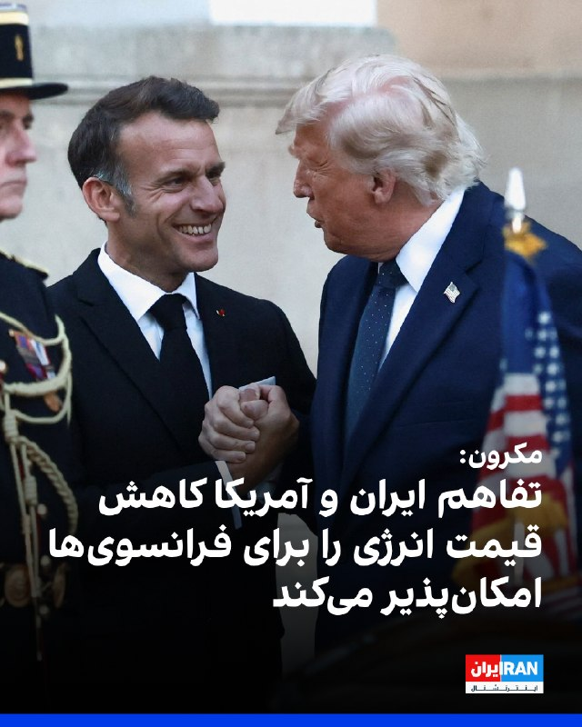

مکرون با انتشار ویدیویی از لحظه امضای یادداشت تهران و واشینگتن از سوی ترامپ نوشت: «این توافق راه را برای صلحی پایدار هموار می‌کند و امکان بازگشایی تنگه هرمز را فراهم می‌سازد. این گامی مهم در مسیر درست برای هم‌وطنان ماست که به‌زودی کاهش قیمت انرژی را امکان‌پذیر خواهد کرد.»
https://iranintl.com/202606189424

---
📅 بروزرسانی: 1405/03/28 04:43
---

## FoxNewsTwitter — post 343106

  <a href="telegram/content/FoxNewsTwitter_343106_1781745231.mp4" target="_blank">🎬 Download video</a>

Fox News (Twitter/X)

A curious shark turns an ordinary surf session into a tense standoff off the California coast.

Drone footage shows the shark tracking a surfer from below the surface, circling near his board as the unaware surfer floats in open water.

After spotting the danger, the drone operator used his drone to warn the surfer, who quickly paddled for shore.

The shark eventually peeled away, but not before creating a moment that left even the person filming it on edge.

## VahidOnline — post 76474

  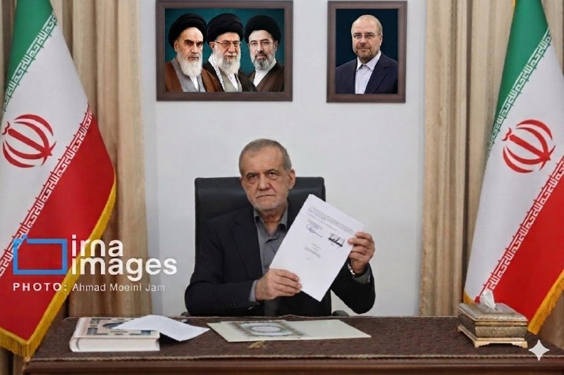

درستش کردم
MahvashJebeli

📡 @VahidOnline

## FarsiVOA — post 221075

  <a href="telegram/content/FarsiVOA_221075_1781745234.mp4" target="_blank">🎬 Download video</a>

⚡️جشن ۲۵۰ سالگی استقلال آمریکا در مراکش
@FarsiVOA

## FarsiVOA — post 221074

  <a href="telegram/content/FarsiVOA_221074_1781745236.mp4" target="_blank">🎬 Download video</a>

⚡️انتقادها از غیبت ترودو در تورنتو؛ حال‌وهوای شهر میزبان جام جهانی
@FarsiVOA

## FarsiVOA — post 221073

🔺پاکستان می‌گوید در پی امضای تفاهم‌نامه، جمهوری اسلامی باید «تنگه هرمز» را فورا باز کند

▪️شهباز شریف، نخست‌وزیر پاکستان در بیانیه‌ای که در شبکه‌های اجتماعی منتشر کرد گفت امضای تفاهم‌نامه پایان درگیری‌ها میان آمریکا و جمهوری اسلامی، به این معنا است که جمهوری اسلامی تنگه هرمز را فوراً بازگشایی خواهد کرد و محاصره دریایی بنادر ایران از سوی آمریکا نیز بلافاصله پایان می‌یابد.

⬇️ بیشتر بخوانید:
https://ir.voanews.com/a/8162199.html
@FarsiVOA

## BBCPersian — post 284209

🔻ساعتی بعد از تایید امضای تفاهمنامه میان ایران و آمریکا از سوی دونالد ترامپ و مسعود پزشکیان، کاخ‌سفید ویدیو لحظه امضاء کردن آقای ترامپ را که به نظر می‌رسد بر سر میز ضیافت شام در کاخ ورسای صورت گرفته را منتشر کرد.

در این ویدیو امانوئل مکرون هم کنار آقای ترامپ دیده می‌شود و او برگه‌ای که مارکو روبیو، وزیرخارجه به او داده را امضاء می‌کند.

خبرگزاری دولتی ایران - ایرنا - هم دقایقی بعد عکسی از مسعود پزشکیان منتشر کرد که در آن رئیس جمهور ایران برگه امضاء شده تفاهمنامه را مقابل دوربین گرفته است و امضای دونالد ترامپ هم در یک طرف آن دیده می‌شود.

برای خواندن متن کامل این تفاهمنامه به وبسایت ما سر بزنید یا در آلبومی که برایتان همینجا منتشر کردیم مراجعه کنید.

@BBCPersian

---
📅 بروزرسانی: 1405/03/28 04:33
---

## VahidOOnLine — post 246122

♦️دونالد ترامپ، رئیس‌جمهوری آمریکا، بامداد پنج‌شنبه ۲۸ خرداد پس از شرکت در نشست سران گروه هفت (G7) در فرانسه و حضور در ضیافت شام با امانوئل مکرون، رئیس‌جمهوری فرانسه، در کاخ ورسای، این کشور را به مقصد آمریکا ترک کرد.
به گزارش رویترز، سفر ترامپ در حالی پایان یافت که هم‌زمان تفاهم‌نامه میان آمریکا و ایران برای پایان جنگ به امضای طرفین رسید. ترامپ هنگام ترک ورسای در پاسخ به پرسش خبرنگاران گفت: «امضا شده است؛ ما آن را در ورسای امضا کردیم.»
‌🇸🇦 Indypersian

🤖 @VahidOOnLine

## IranianMinds — post 22842

  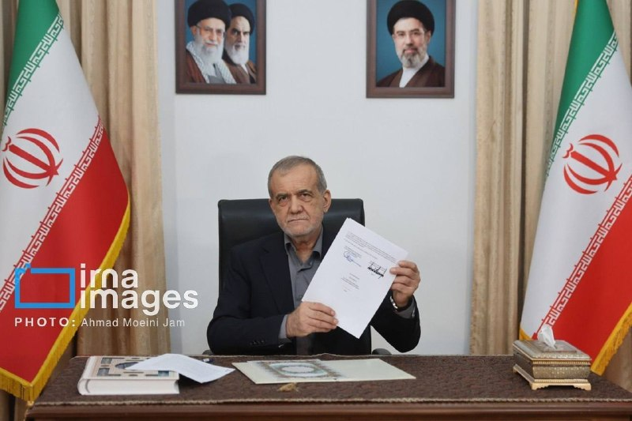

🔴این هم امضای یادداشت تفاهم‌نامه از سوی پزشکیان.

@IranianMinds

---
📅 بروزرسانی: 1405/03/28 04:23
---

## VahidOOnLine — post 246121

  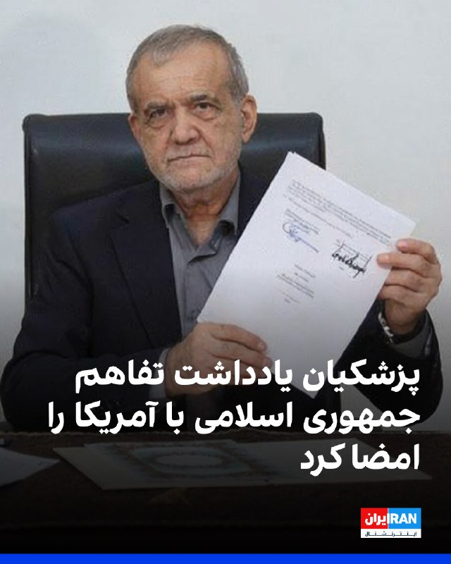

رسانه‌های جمهوری اسلامی تصویر پزشکیان را هنگام امضای یادداشت تفاهم با آمریکا منتشر کردند. از سوی دیگر، ترامپ نیز در کاخ ورسای فرانسه این یادداشت تفاهم را امضا کرد.
‌🏁 🇬🇧 IranintlTV

🤖 @VahidOOnLine

## VahidOOnLine — post 246120

  <a href="telegram/content/VahidOOnLine_246120_1781744016.mp4" target="_blank">🎬 Download video</a>

♦️دونالد ترامپ، رئیس‌جمهوری آمریکا، بامداد پنجشنبه ۲۸ خردادماه پس از ضیافت شام در کاخ ورسای، همراه با امانوئل مکرون، رئیس‌جمهوری فرانسه، این کاخ را ترک کرد.

ترامپ هنگام خروج از کاخ ورسای در پاسخ به پرسش خبرنگاران، امضای توافق تهران و واشنگتن را تایید کرد و گفت: «امضا شده است.»
‌🇸🇦 Indypersian

🤖 @VahidOOnLine

## IranIntlTV — post 342950

  

رسانه‌های جمهوری اسلامی تصویر پزشکیان را هنگام امضای یادداشت تفاهم با آمریکا منتشر کردند. از سوی دیگر، ترامپ نیز در کاخ ورسای فرانسه این یادداشت تفاهم را امضا کرد.
https://iranintl.com/202606187211

## FarsiVOA — post 221072

🔺شلاق، ممنوعیت خروج و ممنوعیت کار، حکم یک خواننده زن و اعضای گروهش در ایران؛ دادگاه قم: «عفت عمومی» جریحه‌‌دار شد

▪️جمهوری اسلامی، پرستو احمدی، خواننده و برگزارکننده « کنسرت کاروانسرا» و هشت تن دیگر از دست‌اندرکاران و نوازندگان این برنامه را به ۷۴ ضربه شلاق، دو سال ممنوعیت خروج از کشور و دو سال ممنوعیت از فعالیت هنری محکوم کرد.

⬇️ بیشتر بخوانید:
https://ir.voanews.com/a/female-singer-and-her-band-members-sentenced-to-flogging-travel-bans-and-employment-restrictions/8161985.html
@FarsiVOA

## FarsiVOA — post 221071

⚡️گزارش‌های رسانه‌‌ای درباره مفاد تفاهم اولیه آمریکا با جمهوری اسلامی
@FarsiVOA

## BBCPersian — post 284208

🔻سه نکته اصلی که از توافق آمریکا و ایران برجسته می‌شود
🖋️گری او‌دوناهیو - خبرنگار ارشد آمریکای شمالی

🔻در واشنگتن شاهد یک نشست توجیهی فوق‌العاده با مقام‌های ارشد آمریکایی بودیم که متن تفاهم‌نامه با ایران را کلمه به کلمه برای ما قرائت کردند.

سه نکته اصلی از این سند برای من برجسته بود:

نخست، درباره موضوع هسته‌ای. مقام‌های ارشد آمریکایی می‌گویند ایران متعهد شده است که سلاح هسته‌ای تولید نکند یا به دست نیاورد. دونالد ترامپ از زمان آغاز جنگ در ماه فوریه، این موضوع را مهم‌ترین شرط خود برای دستیابی به توافق عنوان کرده بود.

آنها همچنین گفتند ذخایر اورانیوم غنی‌شده ایران در داخل کشور و تحت نظارت آژانس بین‌المللی انرژی اتمی رقیق‌سازی خواهد شد. آمریکا در ابتدا خواستار خروج این مواد از ایران بود، بنابراین این یک تحول جدید محسوب می‌شود.

دوم، درباره بازگشایی تنگه هرمز. مقام‌های آمریکایی گفتند که به مدت ۶۰ روز هیچ‌گونه عوارضی از کشتی‌های عبوری دریافت نخواهد شد. پس از آن، ایران و کشورهای همسایه باید درباره نحوه مدیریت این موضوع مذاکره کنند.

این مسئله این احتمال را باز می‌گذارد که در آینده عوارضی برای عبور از تنگه هرمز تعیین شود؛ در حالی که پیش از آغاز درگیری‌ها چنین هزینه‌ای وجود نداشت.

سوم، صندوق بحث‌برانگیز ۳۰۰ میلیارد دلاری برای بازسازی ایران است. ترامپ پیش‌تر گزارش‌های مربوط به آن را «اخبار جعلی» توصیف کرده بود، اما این صندوق در متن توافق گنجانده شده است.

مقام‌های ارشد آمریکایی تاکید کردند که آمریکا مجبور نیست «حتی یک سنت» به این صندوق پرداخت کند و اجرای آن به رفتار ایران و پایبندی تهران به تعهداتش بستگی خواهد داشت.

این توافق در روزهای آینده بند به بند مورد بررسی و موشکافی قرار خواهد گرفت. اما پرسش اصلی این خواهد بود که آمریکا دقیقا از جنگ با ایران چه دستاوردی به دست آورده است؟

https://bbc.in/4vPb8lA
@BBCPersian

---
📅 بروزرسانی: 1405/03/28 04:13
---

## pm_afshaa — post 94310

  <a href="telegram/content/pm_afshaa_94310_1781743421.mp4" target="_blank">🎬 Download video</a>

لحظه امضای تفاهم‌نامه بین پزشکیان و ترامپ

💧 Rainbet.com the #1 Non-KYC Crypto Casino & Sportsbook @rainbetcom

😁 @Pm_Afshaa

---
📅 بروزرسانی: 1405/03/28 04:04
---

## VahidOOnLine — post 246119

  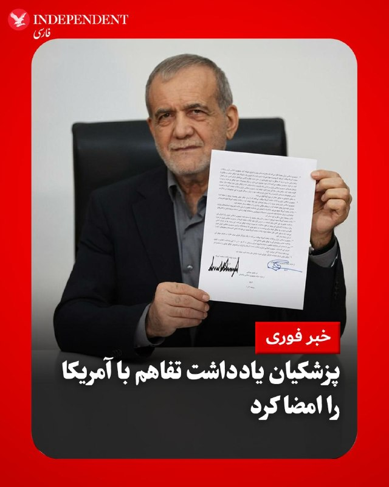

♦️ بامداد پنجشنبه، مسعود پزشکیان، رئیس‌جمهوری اسلامی ایران یادداشت تفاهم با آمریکا را امضا کرد. همزمان دونالد ترامپ، رئیس‌جمهوری آمریکا که در کاخ ورسای حضور داشت نیز این یادداشت تفاهم را امضا کرد. ایرنا نوشت:پزشکیان و ترامپ در فاصله زمانی کوتاهی متن یادداشت تفاهم اسلام‌آباد را به‌صورت دیجیتال و غیرحضوری امضا کردند.
‌🇸🇦 Indypersian

🤖 @VahidOOnLine

---
📅 بروزرسانی: 1405/03/28 03:59
---

## VahidOOnLine — post 246118

  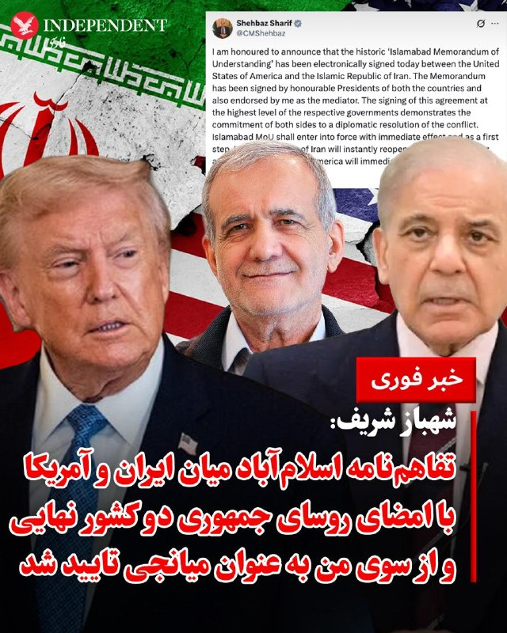

♦️شهباز شریف، نخست‌وزیر پاکستان، با انتشار پیامی در شبکه اکس اعلام کرد «تفاهم‌نامه اسلام‌آباد» میان ایالات متحده و جمهوری اسلامی ایران به‌صورت الکترونیکی و با امضای روسای جمهوری دو کشور نهایی شده و بلافاصله اجرایی شده است.
او نوشت بر اساس این تفاهم‌نامه، جمهوری اسلامی ایران تنگه هرمز را فوراً بازگشایی خواهد کرد و ایالات متحده نیز محاصره دریایی را بلافاصله لغو می‌کند. شریف همچنین گفت پاکستان با همکاری قطر، روز ۲۹ خرداد در سوئیس میزبان مراسم رسمی این توافق و آغاز گفتگوهای فنی خواهد بود.
نخست‌وزیر پاکستان در این پیام از دونالد ترامپ، مسعود پزشکیان، مجتبی حسینی خامنه‌ای، مقام‌های قطری و اعضای تیم‌های مذاکره‌کننده دو طرف به‌دلیل نقش‌آفرینی در دستیابی به این توافق قدردانی کرد.
‌🇸🇦 Indypersian

🤖 @VahidOOnLine

## VahidOOnLine — post 246117

  

مقام‌های ارشد آمریکایی درباره برنامه ۳۰۰ میلیارد دلاری بازسازی ایران در یادداشت تفاهم به خبرنگاران گفتند این بند آمریکا را متعهد به پرداخت هیچ پولی به ایران نمی‌کند و نقش آمریکا صرفا فراهم کردن امکان سرمایه‌گذاری و صدور مجوزهای لازم خواهد بود.
به گفته این مقام‌ها، اگر حکومت ایران به تعهدات خود عمل کند، کشورهای دیگر خواهند توانست در پروژه‌های اقتصادی ایران سرمایه‌گذاری کنند.
این مقام‌ها درباره رفع تحریم‌ها گفتند مهم‌ترین سوءبرداشت درباره تفاهم‌نامه این است که تصور شود همه تحریم‌ها بلافاصله لغو خواهند شد. آنها تاکید کردند که طبق این بند هیچ رفع تحریمی بدون اجرای تعهدات هسته‌ای ایران انجام نخواهد شد.
مقام‌های ارشد آمریکایی درباره بند مربوط به نظارت بر اجرای تفاهم‌نامه گفتند این سازوکار علاوه بر نظارت بر اجرای تعهدات، ابزارهای لازم برای راستی‌آزمایی و پیگیری نقض احتمالی توافق را نیز در بر خواهد گرفت.

‌🏁 🇬🇧 IranintlTV

🤖 @VahidOOnLine

## WithYashar — post 15207

دلار و طلا تا بفروشیم یا بالا میره؟ سوالی که اکثر مخاطبین کانال در چند روز اخیر می‌پرسند اول پاییز اعلام کردیم که دلار تا اخر سال به ۱۹۰ هزا تومان می‌رسد و طلای ۲۲ میلیونی را به درستی همانند قبل پیشبینی کرده بودیم الان هم قیمت قطعی دلار و طلا تا پایان تابستان…

## WithYashar — post 15206

دلار و طلا تا بفروشیم یا بالا میره؟ سوالی که اکثر مخاطبین کانال در چند روز اخیر می‌پرسند

اول پاییز اعلام کردیم که دلار تا اخر سال به ۱۹۰ هزا تومان می‌رسد و طلای ۲۲ میلیونی را به درستی همانند قبل پیشبینی کرده بودیم
الان هم قیمت قطعی دلار و طلا تا پایان تابستان و بعد از آن را در کانال زیر اعلام کردیم ، حتما عضو شوید تا با آگاهی از قیمت دقیق در روزهای آینده تمام سرمایه گذاری های خود را مدیریت کنید و از تورم جا نمانید👇
https://t.me/+hLt81qXCGTQzOWQ0
https://t.me/+hLt81qXCGTQzOWQ0

## VahidOnline — post 76471

امضای پزشکیان
📡 @VahidOnline

## IranIntlTV — post 342949

  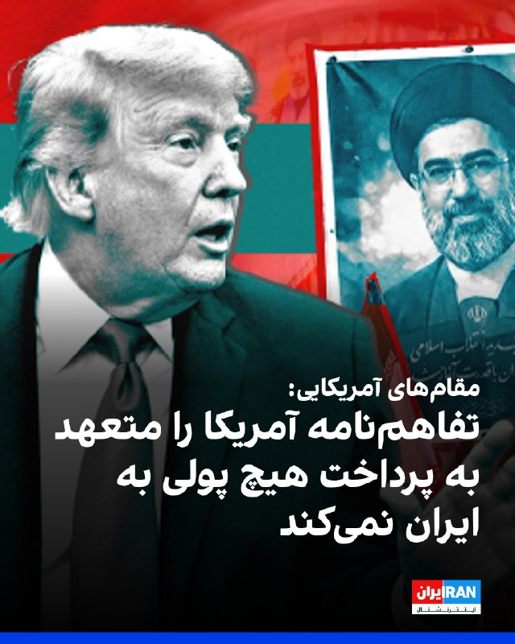

مقام‌های ارشد آمریکایی درباره برنامه ۳۰۰ میلیارد دلاری بازسازی ایران در یادداشت تفاهم به خبرنگاران گفتند این بند آمریکا را متعهد به پرداخت هیچ پولی به ایران نمی‌کند و نقش آمریکا صرفا فراهم کردن امکان سرمایه‌گذاری و صدور مجوزهای لازم خواهد بود.
به گفته این مقام‌ها، اگر حکومت ایران به تعهدات خود عمل کند، کشورهای دیگر خواهند توانست در پروژه‌های اقتصادی ایران سرمایه‌گذاری کنند.
این مقام‌ها درباره رفع تحریم‌ها گفتند مهم‌ترین سوءبرداشت درباره تفاهم‌نامه این است که تصور شود همه تحریم‌ها بلافاصله لغو خواهند شد. آنها تاکید کردند که طبق این بند هیچ رفع تحریمی بدون اجرای تعهدات هسته‌ای ایران انجام نخواهد شد.
مقام‌های ارشد آمریکایی درباره بند مربوط به نظارت بر اجرای تفاهم‌نامه گفتند این سازوکار علاوه بر نظارت بر اجرای تعهدات، ابزارهای لازم برای راستی‌آزمایی و پیگیری نقض احتمالی توافق را نیز در بر خواهد گرفت.

https://iranintl.com/202606171881

## FarsiVOA — post 221070

  <a href="telegram/content/FarsiVOA_221070_1781742564.mp4" target="_blank">🎬 Download video</a>

⚡️دن اسکاوینو، دستیار رئیس جمهوری‌ آمریکا ویدیویی از دونالد ترامپ در حال امضای تفاهم‌نامه با جمهوری اسلامی را منتشر کرد. او گفت این امضا پیش از شام چهارشنبه‌شب در کاخ ورسای فرانسه، به میزبانی امانوئل مکرون امضا شد. اسکاوینو گفت آقای ترامپ، تفاهم‌نامه را به محض دریافت ازمارکو روبیو امضا کرد.
@FarsiVOA

## FarsiVOA — post 221069

⚡️سراب متناسب‌سازی حقوق و واقعیت سفره‌ها؛ پشت پرده رقم ۱۴۰ هزار میلیارد تومانی تامین اجتماعی
@FarsiVOA

## IranianMinds — post 22841

  <a href="telegram/content/IranianMinds_22841_1781742565.mp4" target="_blank">🎬 Download video</a>

🔴ترامپ پاریس را به مقصد واشینگتن ترک می‌کند.

@IranianMinds

## IranianMinds — post 22840

  <a href="telegram/content/IranianMinds_22840_1781742568.mp4" target="_blank">🎬 Download video</a>

🔴لحظه امضای یادداشت تفاهم‌نامه از سوی ترامپ.

@IranianMinds

---
📅 بروزرسانی: 1405/03/28 03:47
---

## VahidOOnLine — post 246116

  <a href="telegram/content/VahidOOnLine_246116_1781741856.mp4" target="_blank">🎬 Download video</a>

دونالد ترامپ، رییس‌جمهوری آمریکا، چهارشنبه ۲۷ خرداد، پیش از ضیافت شامی که به میزبانی امانوئل مکرون، رییس‌جمهوری فرانسه، در کاخ ورسای برگزار شد، یادداشت تفاهم با ایران را امضا کرد.
در ویدیویی که کاخ سفید منتشر کرده، ترامپ در حال امضای سند فارسی‌زبان دیده می‌شود و پس از امضا به نظر می‌رسد از مارکو روبیو، وزیر خارجه آمریکا، می‌خواهد خودکار را برای طرف مقابل ارسال کند.
‌🏁 🇬🇧 IranintlTV

🤖 @VahidOOnLine

## VahidOOnLine — post 246115

  <a href="telegram/content/VahidOOnLine_246115_1781741859.mp4" target="_blank">🎬 Download video</a>

♦️دن اسکاوینو، دستیار رئیس‌جمهوری آمریکا، بامداد پنجشنبه ۲۸ خردادماه تصاویری از لحظه امضای توافق تهران و واشنگتن توسط دونالد ترامپ در کاخ ورسای فرانسه منتشر کرد. این تصاویر نشان می‌دهد ترامپ در جریان مراسمی رسمی، سند توافق را امضا می‌کند.

این مراسم با حضور امانوئل مکرون، رئیس‌جمهوری فرانسه، ژان نوئل بارو، وزیر خارجه فرانسه، بریژیت مکرون و مارکو روبیو، وزیر خارجه آمریکا، برگزار شد. در تصاویر منتشرشده، حاضران پس از امضای توافق ترامپ را تشویق می‌کنند. اسکاوینو در توضیح این تصاویر نوشت که این توافق پیش از ضیافت شام رسمی در کاخ ورسای امضا شد و آن را «لحظه‌ای بسیار مهم در تاریخ» خواند.
‌🇸🇦 Indypersian

🤖 @VahidOOnLine

## WithYashar — post 15205

  <a href="telegram/content/WithYashar_15205_1781741861.mp4" target="_blank">🎬 Download video</a>

ساعت ۳:۱۹ صبح امروز (کمی پیش) چند قایق متعلق به سپاه پاسدارن درحال اقدامی نامشخص در تنگه هرمز هستند.

ناو آمریکایی در بیسیم به زبان فارسی متنی هشدار آمیز را پخش می‌کند که می‌گوید:
جمهوری اسلامی کنترلی بر تنگه ندارد، عملیات را متوقف کنید و به بندر باز گردید، وگرنه نیروی دریایی ایالات متحده به کشتی شما حمله خواهد کرد.
@withyashar

## FoxNewsTwitter — post 343105

  <a href="telegram/content/FoxNewsTwitter_343105_1781741863.mp4" target="_blank">🎬 Download video</a>

Fox News (Twitter/X)

Trump boards Air Force One after a major diplomatic breakthrough in France.

As he departed Versailles, the president confirmed he had signed the Iran memorandum of understanding, saying, “It’s signed. We signed it in Versailles. We just signed it.”

## FoxNewsTwitter — post 343104

  <a href="telegram/content/FoxNewsTwitter_343104_1781741865.mp4" target="_blank">🎬 Download video</a>

Fox News (Twitter/X)

The moment President Trump signs the Iran deal at the Palace of Versailles.

The agreement was finalized during a dinner hosted by French President Emmanuel Macron inside the historic palace.

The signing marked a major diplomatic milestone after months of negotiations aimed at ending the conflict between the U.S. and Iran.

## IranIntlTV — post 342948

  <a href="telegram/content/IranIntlTV_342948_1781741868.mp4" target="_blank">🎬 Download video</a>

دونالد ترامپ، رییس‌جمهوری آمریکا، چهارشنبه ۲۷ خرداد، پیش از ضیافت شامی که به میزبانی امانوئل مکرون، رییس‌جمهوری فرانسه، در کاخ ورسای برگزار شد، یادداشت تفاهم با ایران را امضا کرد.
در ویدیویی که کاخ سفید منتشر کرده، ترامپ در حال امضای سند فارسی‌زبان دیده می‌شود و پس از امضا به نظر می‌رسد از مارکو روبیو، وزیر خارجه آمریکا، می‌خواهد خودکار را برای طرف مقابل ارسال کند.

## Iliaen — post 4492

  <a href="telegram/content/Iliaen_4492_1781741871.mp4" target="_blank">🎬 Download video</a>

ساعت ۰۳:۱۸ صبح پنجشنبه؛ چند قایق متعلق به سپاه پاسدارن درحال اقدامی نامشخص در تنگه هرمز هستند.

ناو آمریکایی در بیسیم به زبان فارسی متنی هشدار آمیز را پخش می‌کند که می‌گوید:

“جمهوری اسلامی کنترلی بر تنگه ندارد، عملیات را متوقف کنید و به بندر باز گردید، وگرنه نیروی دریایی ایالات متحده به کشتی شما حمله خواهد کرد.

@iliaen

## FarsiVOA — post 221068

⚡️دادگاه کیفری استان قم پرستو احمدی و هشت نفر از دست‌اندرکاران و نوازندگان «کنسرت کاروانسرا» را به ۷۴ ضربه شلاق تعزیری، دو سال ممنوع‌الخروجی و دو سال ممنوعیت از فعالیت هنری محکوم کرده است.
@FarsiVOA

## FarsiVOA — post 221067

  <a href="telegram/content/FarsiVOA_221067_1781741872.mp4" target="_blank">🎬 Download video</a>

⚡️لیونل مسی؛ ستاره‌ای که سال‌ها مرزهای ممکن را جابه‌جا کرده است

@FarsiVOA

## FarsiVOA — post 221066

🔺واکنش‌ها در کنگره به یادداشت تفاهم‌با جمهوری اسلامی؛ سناتور کروز: دادن میلیاردها دلار «به دیوانه‌های حکومت دینی» ایده خوبی نیست

▪️چند سناتور جمهوری‌خواه آمریکا نسبت به تفاهم‌نامه منتشر شده میان ایالات متحده و جمهوری اسلامی ایران ابراز تردید و انتقاد کردند و برخی گفته‌اند این سند هنوز توافق نهایی با رژیم ایران محسوب نمی‌شود.

⬇️ بیشتر بخوانید:
https://ir.voanews.com/a/8161984.html
@FarsiVOA

---
📅 بروزرسانی: 1405/03/28 03:34
---

## VahidOOnLine — post 246114

  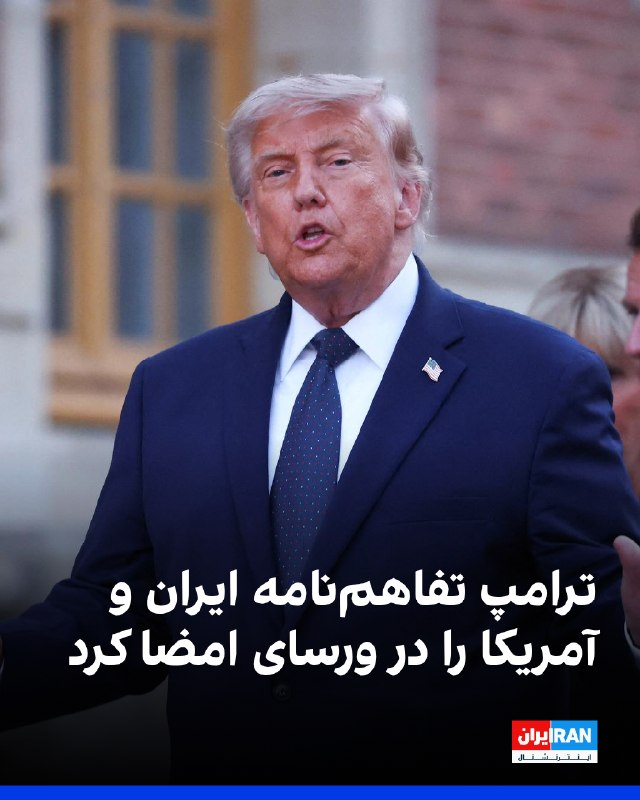

یک مقام کاخ سفید اعلام کرد دونالد ترامپ، رییس‌جمهوری آمریکا، روز چهارشنبه تفاهم‌نامه میان ایران و آمریکا را شخصا امضا کرده است.

به گفته این مقام، ترامپ این سند را در جریان ضیافت شام با امانوئل مکرون، رییس‌جمهوری فرانسه، در کاخ ورسای امضا کرد. همچنین تصویری از توافق برای مقام‌های ایرانی و کشورهای میانجی ارسال شده است.

این مقام افزود که هنگام خروج از مراسم شام، مکرون به کاخ ورسای اشاره کرد و دو رهبر پس از در آغوش گرفتن یکدیگر خداحافظی کردند. ترامپ نیز در پاسخ به پرسش خبرنگاران فرانسوی درباره امضای سند گفت: «امضا شده است. ما آن را در ورسای امضا کردیم. همین حالا آن را امضا کردیم.»

رویترز گزارش داد با اجرایی شدن توافق میان دو کشور برای پایان جنگ، مراسم اصلی امضای توافق که قرار بود در ژنو برگزار شود، لغو شده است. بر اساس این گزارش، مسعود پزشکیان، رییس‌جمهور جمهوری اسلامی، نیز این سند را از طرف ایران امضا کرده است.

اسماعیل بقایی، سخنگوی وزارت خارجه جمهوری اسلامی، روز چهارشنبه اعلام کرد که با وجود لغو مراسم رسمی امضا، برنامه سفر تیم‌های مذاکره‌کننده به ژنو همچنان برقرار است.
‌🏁 🇬🇧 IranintlTV

🤖 @VahidOOnLine

## VahidOOnLine — post 246113

  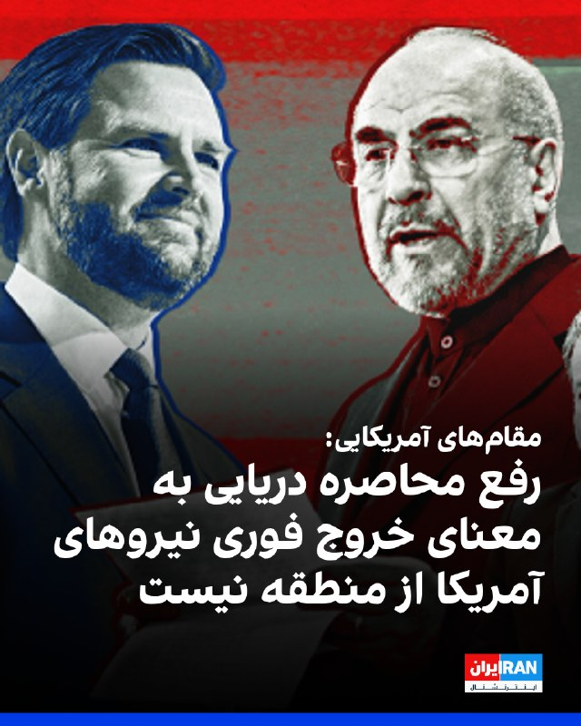

چند مقام ارشد آمریکا درباره رفع تدریجی محاصره دریایی به خبرنگاران گفتند این بند به معنای خروج فوری نیروهای آمریکا از منطقه نیست و منظور از این بند صرفا بازگرداندن آرایش نظامی آمریکا به وضعیت پیش از آغاز جنگ است و این اقدام تنها در صورت رسیدن به توافق نهایی انجام خواهد شد.
مقام‌های آمریکایی در ارتباط با بند مربوط به عبور رایگان کشتی‌ها از تنگه هرمز گفتند حکومت ایران عملا پذیرفته است برای ۶۰ روز هیچ عوارضی از کشتی‌های تجاری دریافت نکند.
این مقام‌ها درباره تعیین تکلیف ذخایر اورانیوم غنی‌شده گفتندطبق این بند، جمهوری اسلامی بار دیگر اعلام می‌کند که به دنبال تولید یا دستیابی به سلاح هسته‌ای نخواهد رفت و دو طرف توافق می‌کنند درباره نحوه تعیین تکلیف ذخایر اورانیوم غنی‌شده و سایر موضوعات هسته‌ای مذاکره کنند.
آنها تاکید کردند که رقیق‌سازی تنها «حداقل» تعهد ایران است و آمریکا در مذاکرات نهایی به دنبال محدودیت‌های گسترده‌تر، بازرسی‌های شدیدتر و برچیدن بخش‌های بیشتری از برنامه هسته‌ای خواهد بود.

‌🏁 🇬🇧 IranintlTV

🤖 @VahidOOnLine

## VahidOnline — post 76470

  <a href="telegram/content/VahidOnline_76470_1781741068.mp4" target="_blank">🎬 Download video</a>

لحظه امضای یادداشت تفاهم از سوی ترامپ

دونالد ترامپ، رئیس جمهور آمریکا که چهارشنبه شب در کاخ الیزه میهمان ضیافت شام با امانوئل مکرون بود نسخه نهایی و منتشر شده تفاهم‌نامه با جمهوری اسلامی ایران را امضاء کرده است. مسعود پزشکیان نیز این سند را امضاء کرده است.
@VahidHeadline

📡 @VahidOnline

## kianmeli1 — post 88059

  <a href="telegram/content/kianmeli1_88059_1781741068.mp4" target="_blank">🎬 Download video</a>

لحظه امضای یادداشت تفاهم از سوی ترامپ

دونالد ترامپ، رئیس جمهور آمریکا که چهارشنبه شب در کاخ الیزه میهمان ضیافت شام با امانوئل مکرون بود نسخه نهایی و منتشر شده تفاهم‌نامه با جمهوری اسلامی ایران را امضاء کرده است. مسعود پزشکیان نیز این سند را امضاء کرده است.
https://t.me/kianmeli1

## IranIntlTV — post 342947

  

یک مقام کاخ سفید اعلام کرد دونالد ترامپ، رییس‌جمهوری آمریکا، روز چهارشنبه تفاهم‌نامه میان ایران و آمریکا را شخصا امضا کرده است.

به گفته این مقام، ترامپ این سند را در جریان ضیافت شام با امانوئل مکرون، رییس‌جمهوری فرانسه، در کاخ ورسای امضا کرد. همچنین تصویری از توافق برای مقام‌های ایرانی و کشورهای میانجی ارسال شده است.

این مقام افزود که هنگام خروج از مراسم شام، مکرون به کاخ ورسای اشاره کرد و دو رهبر پس از در آغوش گرفتن یکدیگر خداحافظی کردند. ترامپ نیز در پاسخ به پرسش خبرنگاران فرانسوی درباره امضای سند گفت: «امضا شده است. ما آن را در ورسای امضا کردیم. همین حالا آن را امضا کردیم.»

رویترز گزارش داد با اجرایی شدن توافق میان دو کشور برای پایان جنگ، مراسم اصلی امضای توافق که قرار بود در ژنو برگزار شود، لغو شده است. بر اساس این گزارش، مسعود پزشکیان، رییس‌جمهور جمهوری اسلامی، نیز این سند را از طرف ایران امضا کرده است.

اسماعیل بقایی، سخنگوی وزارت خارجه جمهوری اسلامی، روز چهارشنبه اعلام کرد که با وجود لغو مراسم رسمی امضا، برنامه سفر تیم‌های مذاکره‌کننده به ژنو همچنان برقرار است.
https://iranintl.com/202606178908

## IranIntlTV — post 342946

  

چند مقام ارشد آمریکا درباره رفع تدریجی محاصره دریایی به خبرنگاران گفتند این بند به معنای خروج فوری نیروهای آمریکا از منطقه نیست و منظور از این بند صرفا بازگرداندن آرایش نظامی آمریکا به وضعیت پیش از آغاز جنگ است و این اقدام تنها در صورت رسیدن به توافق نهایی انجام خواهد شد.
مقام‌های آمریکایی در ارتباط با بند مربوط به عبور رایگان کشتی‌ها از تنگه هرمز گفتند حکومت ایران عملا پذیرفته است برای ۶۰ روز هیچ عوارضی از کشتی‌های تجاری دریافت نکند.
این مقام‌ها درباره تعیین تکلیف ذخایر اورانیوم غنی‌شده گفتندطبق این بند، جمهوری اسلامی بار دیگر اعلام می‌کند که به دنبال تولید یا دستیابی به سلاح هسته‌ای نخواهد رفت و دو طرف توافق می‌کنند درباره نحوه تعیین تکلیف ذخایر اورانیوم غنی‌شده و سایر موضوعات هسته‌ای مذاکره کنند.
آنها تاکید کردند که رقیق‌سازی تنها «حداقل» تعهد ایران است و آمریکا در مذاکرات نهایی به دنبال محدودیت‌های گسترده‌تر، بازرسی‌های شدیدتر و برچیدن بخش‌های بیشتری از برنامه هسته‌ای خواهد بود.

https://iranintl.com/202606171881

## FarsiVOA — post 221065

  <a href="telegram/content/FarsiVOA_221065_1781741071.mp4" target="_blank">🎬 Download video</a>

⚡️دونالد ترامپ به خبرنگاران: تفاهم‌نامه با جمهوری اسلامی را در کاخ ورسای امضا کردم
@FarsiVOA

## BBCPersian — post 284207

  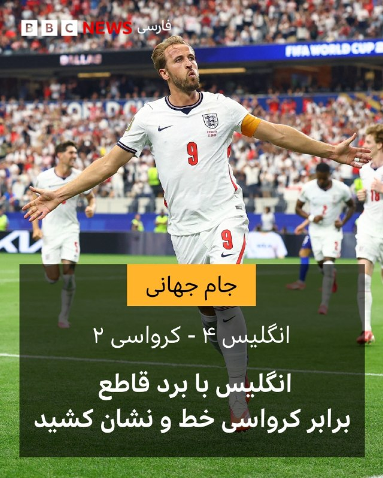

⚽ انگلیس ۴ - کرواسی ۲

🔸تیم فوتبال انگلیس در نخستین مسابقه خود برابر کرواسی که عنوان سومی جام جهانی را یدک می‌کشد نمایشی بسیار موفق داشت و توانست در نهایت با نتیجه چهار بر دو پیروز شود.

گل های «سه شیر» با دبل هری کین، رابرت رشفورد و جو بلینگام رقم خورد.

برای کرواسی هم مارتین باتورینا و پتار موسا دو بار گل زدند تا نتیجه را در همان نیمه اول به تساوی بکشند اما جود بلینگام در همان دقایق اول نیمه دوم گل سوم انگلیس را زد و بعد عم رشفورد با گل چهارم توماس توخل آلمانی را از اضطراب دقایق پایانی نجات داد.

تیم ملی انگلیس با یکی از پرستاره‌ترین ترکیب‌های تاریخ خود وارد جام جهانی ۲۰۲۶ شده است. «سه‌شیر» این بار با هدایت توماس توخل به دنبال پایان دادن به طلسم و انتظار طولانی فتح جام جهانی از سال ۱۹۶۶هستند.

https://bbc.in/4aaDdvs
📷Reuters

@BBCPersian

---
📅 بروزرسانی: 1405/03/28 03:24
---

## VahidOOnLine — post 246112

  <a href="telegram/content/VahidOOnLine_246112_1781740449.mp4" target="_blank">🎬 Download video</a>

♦️خبرگزاری فرانسه بامداد پنجشنبه ۲۸ خردادماه گزارش داد دونالد ترامپ، رئیس‌جمهوری آمریکا، امضای توافق با ایران برای پایان دادن به جنگ را تایید کرده است. ترامپ هنگام ترک کاخ ورسای در پاسخ به پرسش خبرنگاران درباره امضای تفاهم‌نامه گفت: «امضا شده است.»

به گزارش خبرگزاری فرانسه، ترامپ همچنین تایید کرد که این توافق در کاخ ورسای به امضا رسیده و گفت: «بله، ما آن را در ورسای امضا کردیم. همین الان امضا کردیم.» این اظهارات پس از دیدار و ضیافت شام او با امانوئل مکرون، رئیس‌جمهوری فرانسه، در کاخ ورسای مطرح شد.
‌🇸🇦 Indypersian

🤖 @VahidOOnLine

## FoxNewsTwitter — post 343103

  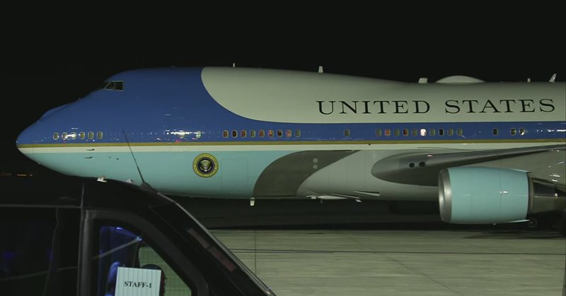

Fox News (Twitter/X)

WATCH LIVE: President Trump leaves France after Versailles dinner with French President Macron https://twitter.com/i/broadcasts/1yKAPPBvpjaxb

## BBCPersian — post 284206

🔻تردید در برگزاری مراسم رسمی امضای تفاهمنامه در سوئیس

🔻پس از آن که کاخ سفید و وزارت خارجه ایران از امضای تفاهمنامه میان مسعود پزشکیان و دونالد ترامپ خبر دادند، به نظر می‌رسد برگزاری مراسم تشریفات رسمی برای امضای این سند که اعلام شده بود روز جمعه در سوئیس برگزار شود، لغو شده یا دست کم در زمان اعلام شده برگزار نخواهد شد.

ساعتی قبل اسماعیل بقایی، سخنگوی وزارت خارجه ایران ضمن توضیحاتی درباره متن منتشر شده و امضای روسای جمهور ایران و آمریکا، تلویحا گفت که تهران تمایل خاصی برای مراسم سوئیس ندارد.

خبرگزاری دولتی ایرنا درباره امضای آقایان پزشکیان و ترامپ و به نقل از آقای بقایی نوشت: «وقتی متن به امضای بالاترین مقام‌های دو کشور برسد، قاعدتا نقض آن هزینه‌های بیشتری دارد و ما با توجه به تجربه‌هایی که داریم ترجیح دادیم که این اتفاق بیافتد. ضمن اینکه تشخیص دادیم برگزاری مراسم هم چندان جایی [در برنامه ما] ندارد.»

https://bbc.in/4vdn6Wl
@BBCPersian

---
📅 بروزرسانی: 1405/03/28 03:14
---

## VahidOOnLine — post 246111

♦️محمدباقر قالیباف، رئیس مجلس شورای اسلامی که اکنون نام او به عنوان مذاکره‌کننده اصلی با آمریکا مطرح است، در سخنرانی و مجموعه‌ اظهارنظرهایی که چهارشنبه شب، همزمان با انتشار متن یادداشت تفاهم انجام شد، از نقش خود در مجموعه تحولات اخیر صحبت کرد و تاکید کرد که یا دیگران با او برای تصمیم‌گیری همراه می‌شوند یا خودش تصمیم می‌گیرد. قالیباف همچنین گفت سیستم «مدیریتی» و «نظامی» کشور از «فرد محوری» خارج شده است. تا پیش از کشته شدن علی خامنه‌ای، رهبر سابق جمهوری اسلامی در حمله آمریکا و اسرائیل، او درباره همه امور تصمیم می‌گرفت. قالیباف افزود که برای همه سناریو‌ها، از جمله کشته شدن علی خامنه‌ای هم برنامه‌ریزی شده بود. اظهارات قالیباف در حالی مطرح می‌شود که هنوز با گذشت بیش از سه ماه از معرفی مجتبی خامنه‌ای به عنوان رهبر جدید نظام، هیچ تصویر یا حتی صدای ضبط شده‌ای از او منتشر نشده است.
‌🇸🇦 Indypersian

🤖 @VahidOOnLine

## VahidOOnLine — post 246110

  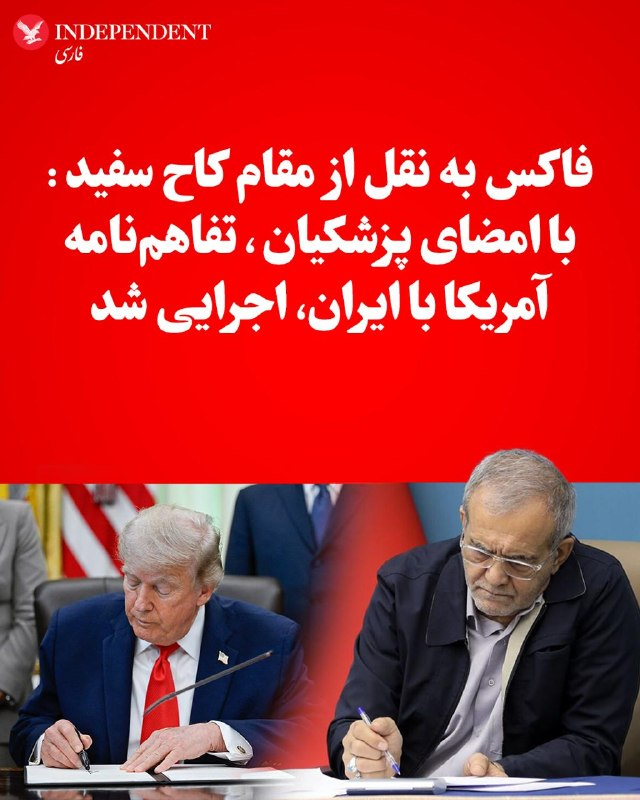

♦️فاکس‌نیوز به نقل از یک مقام کاخ سفید گزارش داد دونالد ترامپ، رئیس‌جمهوری آمریکا، بامداد پنجشنبه ۲۸ خرداد در جریان ضیافت شام با امانوئل مکرون، رئیس‌جمهوری فرانسه، در کاخ ورسای، تفاهم‌نامه میان آمریکا و ایران را شخصا امضا کرد.
بر اساس این گزارش، پس از امضای مسعود پزشکیان، رئیس‌جمهوری ایران، این تفاهم‌نامه اجرایی شده است. یک نسخه از سند امضاشده نیز برای ایران و کشورهای میانجی ارسال شده است.
فاکس‌نیوز همچنین گزارش داد با اجرایی شدن این توافق، مراسم اصلی امضای تفاهم‌نامه که قرار بود در ژنو برگزار شود، لغو شده است. با این حال، اسماعیل بقایی، سخنگوی وزارت امور خارجه جمهوری اسلامی، اعلام کرد برنامه حضور تیم‌های مذاکره‌کننده در ژنو همچنان پابرجاست.
‌🇸🇦 Indypersian

🤖 @VahidOOnLine

## FoxNewsTwitter — post 343102

  <a href="telegram/content/FoxNewsTwitter_343102_1781739879.mp4" target="_blank">🎬 Download video</a>

Fox News (Twitter/X)

"It's signed."

President Trump told reporters he signed the Iran memorandum of understanding in Versailles as he departed the palace following a dinner with French President Emmanuel Macron.

A White House official says a photo of the signed agreement was sent to Iran and the mediating countries, to formally put the deal into effect.

## FoxNewsTwitter — post 343098

Fox News (Twitter/X)

President Trump tours the Palace of Versailles alongside French President Emmanuel Macron and his wife, Brigitte Macron, just before a major development in the Iran negotiations.

The dinner meeting inside the historic French landmark ended with Trump signing the Iran memorandum of understanding, according to the White House.

The gathering at Versailles was intended to celebrate the historic ties between the U.S and France during America's 250th birthday celebration.

## FarsiVOA — post 221064

⚡️گفت‌وگوهای احتمالی اروپا با طالبان؛ اخراج مهاجران افغان از آلمان و چالش‌های حقوقی و سیاسی آن
@FarsiVOA

## BBCPersian — post 284196

🔻کاخ سفید متن یادداشت تفاهم ایران و آمریکا را منتشر کرد. این سند که به طور الکترونیکی امضا شده است، قرار است روز جمعه در مراسمی در سوئیس به امضای مقامات ایرانی و آمریکایی برسد. متن منتشر شده ۱۴ بند دارد و مقامات آمریکایی توضیحاتی در کنار برخی موارد نوشتند.

آلبوم را ورق بزنید و مفاد این تفاهمنامه را بخوانید و توضیخات بیشتر را از لینک زیر در وبسایت بی‌بی‌سی فارسی بخوانید:

https://bbc.in/4vdkMP7
📷Getty Images/ Anadolu via Getty Images/ Sygma via Getty Images/ Bloomberg via Getty Images

@BBCPersian

---
📅 بروزرسانی: 1405/03/28 03:03
---

## VahidOOnLine — post 246109

  <a href="telegram/content/VahidOOnLine_246109_1781739195.mp4" target="_blank">🎬 Download video</a>

محمدباقر قالیباف، رییس هیات مذاکره‌کننده جمهوری اسلامی با آمریکا، گفت داوطلب این مسئولیت نبوده و حتی «کراهت شدید» نسبت به آن داشته است زیرا دونالد ترامپ در کشته شدن قاسم سلیمانی نقش داشت.
او افزود با وجود این، چون مسئولان بر حضور او تاکید داشتند این مسئولیت را از سر وظیفه پذیرفت.
‌🏁 🇬🇧 IranintlTV

🤖 @VahidOOnLine

## IranIntlTV — post 342945

  <a href="telegram/content/IranIntlTV_342945_1781739198.mp4" target="_blank">🎬 Download video</a>

از موشک تا معیشت؛ تغییر ناگهانی روایت؛
قالیباف: سنگر را از «بچه‌های لانچر» تحویل می‌گیریم!

قالیباف می‌گوید: «باید سنگر را از لانچرها تحویل بگیریم و به سمت ساختن کشور برویم.»

تا دیروز می‌گفتند اولویت کشور موشک است، نه معیشت. هر صدای منتقدی را با «مقاومت» و «امنیت» ساکت می‌کردند. حالا از اقتصاد، توسعه و برداشتن فشار از دوش مردم حرف می‌زنند.

اگر اقتصاد امروز اولویت شده، پس چهار دهه گذشته صرف چه شد؟ چه کسانی کشور را به این نقطه رساندند؟ و آیا قرار است میلیاردها دلار سرمایه و منابع تازه، دوباره در اختیار همان ساختارهایی قرار بگیرد که کشور را به این وضعیت رسانده‌اند؟

کامبیز حسینی در «برنامه» به این موضوع می‌پردازد.

«یک ایران صدای شما را می‌شنود»
دوشنبه تا پنجشنبه ۱۱ شب تهران
از تلویزیون ایران اینترنشنال

تماشای نسخه کامل این قسمت از «برنامه» در یوتیوب:
https://youtu.be/VniCfgW1sPQ
@iranintltv

## IranIntlTV — post 342944

  <a href="telegram/content/IranIntlTV_342944_1781739200.mp4" target="_blank">🎬 Download video</a>

مهستی از لندن: این بازی دو نیمه دارد؛ برای نیمه دوم، مردم ایران باید آماده باشند

«یک ایران صدای شما را می‌شنود»
دوشنبه تا پنجشنبه ۱۱ شب تهران
از تلویزیون ایران اینترنشنال

تماشای نسخه کامل این قسمت از «برنامه» در یوتیوب:
https://youtu.be/VniCfgW1sPQ
@iranintltv

## IranIntlTV — post 342943

  <a href="telegram/content/IranIntlTV_342943_1781739204.mp4" target="_blank">🎬 Download video</a>

چیدا از خرم‌آباد: ما لرها حامی ایرانیم و سال‌ها برای یک تکه نان در سرزمین خودمان جان داده‌ایم

«یک ایران صدای شما را می‌شنود»
دوشنبه تا پنجشنبه ۱۱ شب تهران
از تلویزیون ایران اینترنشنال

تماشای نسخه کامل این قسمت از «برنامه» در یوتیوب:
https://youtu.be/VniCfgW1sPQ
@iranintltv

## IranIntlTV — post 342942

  <a href="telegram/content/IranIntlTV_342942_1781739206.mp4" target="_blank">🎬 Download video</a>

امید از تهران: آخر کار را ما تعیین می‌کنیم، نه ترامپ و نه هیچ‌کس دیگر؛ حق‌مان را می‌گیریم

«یک ایران صدای شما را می‌شنود»
دوشنبه تا پنجشنبه ۱۱ شب تهران
از تلویزیون ایران اینترنشنال

تماشای نسخه کامل این قسمت از «برنامه» در یوتیوب:
https://youtu.be/VniCfgW1sPQ
@iranintltv

## IranIntlTV — post 342941

  <a href="telegram/content/IranIntlTV_342941_1781739208.mp4" target="_blank">🎬 Download video</a>

زهرا از رشت: باید به ترامپ فشار می‌آوردند که دست‌کم زندانی‌های ما را آزاد کند

«یک ایران صدای شما را می‌شنود»
دوشنبه تا پنجشنبه ۱۱ شب تهران
از تلویزیون ایران اینترنشنال

تماشای نسخه کامل این قسمت از «برنامه» در یوتیوب:
https://youtu.be/VniCfgW1sPQ
@iranintltv

## IranIntlTV — post 342940

  <a href="telegram/content/IranIntlTV_342940_1781739211.mp4" target="_blank">🎬 Download video</a>

محمدباقر قالیباف، رییس هیات مذاکره‌کننده جمهوری اسلامی با آمریکا، گفت داوطلب این مسئولیت نبوده و حتی «کراهت شدید» نسبت به آن داشته است زیرا دونالد ترامپ در کشته شدن قاسم سلیمانی نقش داشت.
او افزود با وجود این، چون مسئولان بر حضور او تاکید داشتند این مسئولیت را از سر وظیفه پذیرفت.

## FarsiVOA — post 221063

  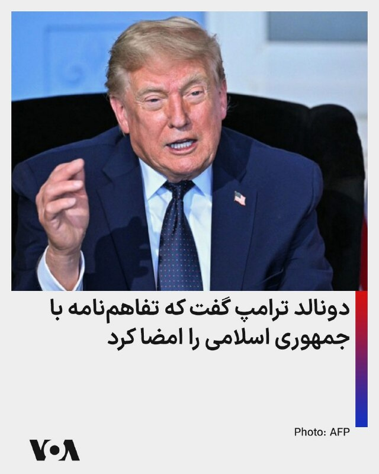

⚡️دونالد ترامپ، در پاسخ به سوال خبرنگاران که آیا تفاهم‌نامه با جمهوری اسلامی را امضا کرده است پاسخ داد: «بله امضا کردم...در ورسای امضا کرد.»
@FarsiVOA

## BBCPersian — post 284195

🔻کاخ سفید متن یادداشت تفاهم ایران و آمریکا را منتشر کرد. این سند که به طور الکترونیکی امضا شده است، قرار است روز جمعه در مراسمی در سوئیس به امضای مقامات ایرانی و آمریکایی برسد. متن منتشر شده ۱۴ بند دارد و مقامات آمریکایی توضیحاتی در کنار برخی موارد نوشتند.

توضیحات تفاهمنامه را در لینک زیر بخوانید:

https://bbc.in/4xCgJxh
@BBCPersian

---
📅 بروزرسانی: 1405/03/28 02:43
---

## VahidOOnLine — post 246108

  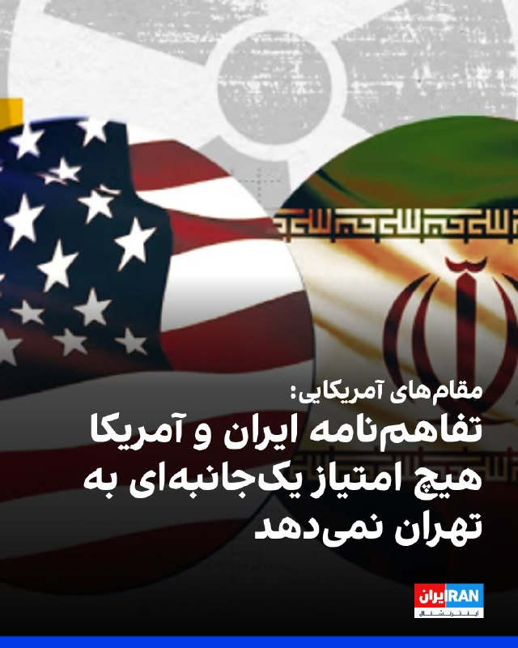

چند مقام ارشد دولت آمریکا در یک نشست توجیهی با خبرنگاران تاکید کردند که هیچ‌یک از امتیازهای اقتصادی پیش‌بینی‌شده در یادداشت تفاهم تهران و واشینگتن بدون اجرای تعهدات حکومت ایران عملی نخواهد شد و همه مراحل به صورت تدریجی، قابل راستی‌آزمایی و مشروط به رفتار تهران خواهد بود.
این مقام‌های آمریکایی درباره بند نخست تفاهم‌نامه درباره پایان فوری و دائمی عملیات نظامی در همه جبهه‌ها از جمله لبنان، گفتند این بند هیچ تعهد تازه‌ای برای واشینگتن ایجاد نمی‌کند، بلکه چارچوبی طراحی شده است که هرگونه گشایش اقتصادی در آینده تنها در صورتی اتفاق بیفتد که حکومت ایران به تعهدات خود عمل کند.
این مقامات درباره بند سوم در ارتباط با ضرب‌الاجل ۶۰ روزه برای توافق نهایی، تاکید کردند که تفاهم‌نامه، خود توافق نهایی نیست و هر یک از طرفین تا زمان دستیابی به توافق جامع می‌توانند از مذاکرات خارج شوند.

‌🏁 🇬🇧 IranintlTV

🤖 @VahidOOnLine

## VahidOOnLine — post 246107

  <a href="telegram/content/VahidOOnLine_246107_1781738039.mp4" target="_blank">🎬 Download video</a>

♦️اسماعیل بقایی، سخنگوی وزارت امور خارجه جمهوری اسلامی، بامداد پنجشنبه ۲۸ خردادماه گفت گزینه رقیق‌سازی مواد غنی‌شده در داخل ایران از ابتدای مذاکرات هسته‌ای مطرح بوده و موضوع تازه‌ای نیست. او افزود این گزینه برای جلوگیری از طرح پیشنهادهایی مانند انتقال مواد غنی‌شده به خارج از ایران مطرح شده است و تاکید کرد: «انتقال مواد غنی‌شده به خارج از ایران برای ما قابل قبول نیست.»
‌🇸🇦 Indypersian

🤖 @VahidOOnLine

## WithYashar — post 15204

مذاکرات جمعه ایران و آمریکا در سوئیس الان قطعی نیست

بقایی، سخنگوی وزارت خارجه:
جلسه جمعه تا چند ساعت قبل قطعی بود ولی وقتی قرار شد روسای جمهور دو طرف (ایران و آمریکا) تفاهمنامه را امضا کنند، قرار شد درباره جلسه جمعه فعلاً تامل شود.
@withyashar

## mwarmonitor — post 11095

  <a href="telegram/content/mwarmonitor_11095_1781738040.mp4" target="_blank">🎬 Download video</a>

📝 هنر والای «ربط دادن گوز به شقیقه» دقیقاً از همین‌جا شکل می‌گیرد؛ جایی که ممدباقر طرقبه‌چی با استشمام بوی شیرین دلار، حتی اگر کل هیمنه و رهبران مقاومت هم روی هوا بروند، با وقاحت تمام ایستاده و برای حفظ صندلی‌اش معامله می‌کند. او در این مصاحبه خفت‌بار ، با یک پاس‌کاری فلسفی-انتحاری، پرونده «انتقام سخت» را رسماً بست و صورت‌حساب خون موشعلی را حواله داد به امام زمان تا خودش بیاید و حساب کند! منطقِ مملی این است که کشتن صد تا نتانیاهو هم به اندازه بند کفش رهبرشان ارزش ندارد و اصلاً اگر شمر را همان موقع می‌کشتند مگر انتقام امام حسین گرفته می‌شد!!! اینجاست که مجری فلک‌زده با چشم‌های از حدقه درآمده، دو سکته ناقص را رد می‌کند و غرق در این شاهکارِ ماست‌مالی می‌شود. بی‌غیرتی ممدباقر در ترانسفر کردنِ وظیفه جنگیدن به دوش مقدسات، اوج رذالت است که نشان می‌دهد این جماعت چطور خون می‌فروشند و به ریش عالم و آدم می‌خندند.

@mwarmonitor

## FoxNewsTwitter — post 343097

  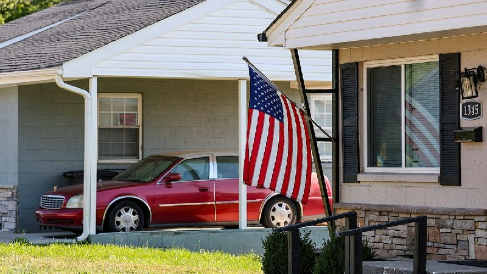

Fox News (Twitter/X)

The American flag is flying over a new political divide.

Just 27% of Democrats say they'll display a U.S. flag this July 4, according to a new poll, compared with 64% among Republicans.

The survey also found major differences in how Americans view the holiday itself. Nearly two-thirds of Republicans (65%) said July 4 is "a day where I celebrate the United States of America," while only 24% of Democrats agreed.

What was once one of the country's most universal symbols is increasingly being viewed through a partisan lens as Americans prepare to celebrate Independence Day.

## FoxNewsTwitter — post 343096

  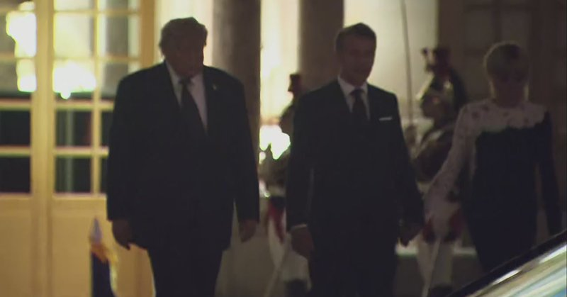

Fox News (Twitter/X)

WATCH LIVE: Trump arrives in Paris ahead of meetings with French President Macron https://twitter.com/i/broadcasts/1XGyggyZZEgxM

## IranIntlTV — post 342939

  

چند مقام ارشد دولت آمریکا در یک نشست توجیهی با خبرنگاران تاکید کردند که هیچ‌یک از امتیازهای اقتصادی پیش‌بینی‌شده در یادداشت تفاهم تهران و واشینگتن بدون اجرای تعهدات حکومت ایران عملی نخواهد شد و همه مراحل به صورت تدریجی، قابل راستی‌آزمایی و مشروط به رفتار تهران خواهد بود.
این مقام‌های آمریکایی درباره بند نخست تفاهم‌نامه درباره پایان فوری و دائمی عملیات نظامی در همه جبهه‌ها از جمله لبنان، گفتند این بند هیچ تعهد تازه‌ای برای واشینگتن ایجاد نمی‌کند، بلکه چارچوبی طراحی شده است که هرگونه گشایش اقتصادی در آینده تنها در صورتی اتفاق بیفتد که حکومت ایران به تعهدات خود عمل کند.
این مقامات درباره بند سوم در ارتباط با ضرب‌الاجل ۶۰ روزه برای توافق نهایی، تاکید کردند که تفاهم‌نامه، خود توافق نهایی نیست و هر یک از طرفین تا زمان دستیابی به توافق جامع می‌توانند از مذاکرات خارج شوند.

https://iranintl.com/202606171881

## IranIntlTV — post 342938

  <a href="telegram/content/IranIntlTV_342938_1781738043.mp4" target="_blank">🎬 Download video</a>

در بندهای ۷ و ۸ تفاهم‌نامه آمریکا و جمهوری اسلامی تاکید شده است که ایران متعهد شده به دنبال غنی‌سازی نرود. یک مقام ارشد آمریکایی این بند را «پیروزی بزرگ» آمریکا توصیف کرده و گفته ایران پذیرفته است ذخایر اورانیوم خود را نابود کند و لغو تحریم‌ها نیز مستقیماً به حل‌وفصل موضوع هسته‌ای گره خورده است.
در یکی دیگر از بندهای این تفاهم‌نامه نیز به پایان درگیری‌ها در همه جبهه‌ها، از جمله لبنان، اشاره شده است.

گفت‌وگو با آرام حسامی، استاد علوم سیاسی، و جمشید برزگر، روزنامه‌نگار و تحلیل‌گر سیاسی
@iranintltv

## FarsiVOA — post 221062

⚡️نگاهی به مفاد تفاهمنامه بین دولت پرزیدنت ترامپ و جمهوری اسلامی ایران
@FarsiVOA

## Dirty_Kids — post 392452

⚡️ جام جهانی شروع شده و میدون مال توئه! 
🌟 این #جام_جهانی رو فقط باید توی #بت فیدو پیش‌بینی کنی 
💰 با ۵۰ میلیون تومان شرط روزانه ← ۴ میلیون تومان اعتبار شرط‌بندی رایگان 
📊 با ۱۰۰ میلیون تومان شرط روزانه ← ۸ میلیون تومان اعتبار شرط‌بندی رایگان 
💸 هرچی بزرگ‌تر…

## Dirty_Kids — post 392451

  <a href="telegram/content/Dirty_Kids_392451_1781738045.webm" target="_blank">🎬 Download video</a>

⚡️ جام جهانی شروع شده و میدون مال توئه!

🌟 این #جام_جهانی رو فقط باید توی #بت فیدو پیش‌بینی کنی

💰 با ۵۰ میلیون تومان شرط روزانه ← ۴ میلیون تومان اعتبار شرط‌بندی رایگان

📊 با ۱۰۰ میلیون تومان شرط روزانه ← ۸ میلیون تومان اعتبار شرط‌بندی رایگان

💸 هرچی بزرگ‌تر بازی کنی، جایزت بزرگ‌تره!

🥅همین حالا پیش بینیتو ثبت کن
💖
https://fido874vt.click
https://fido874vt.click

👆
👆
👆
👆
👆
(ورود با وی-پی-ان غیر اروپایی)
❌
A27

📲کانال تلگرام 
👇
https://t.me/+dySI_QFj0T0xZGVk

## Dirty_Kids — post 392450

  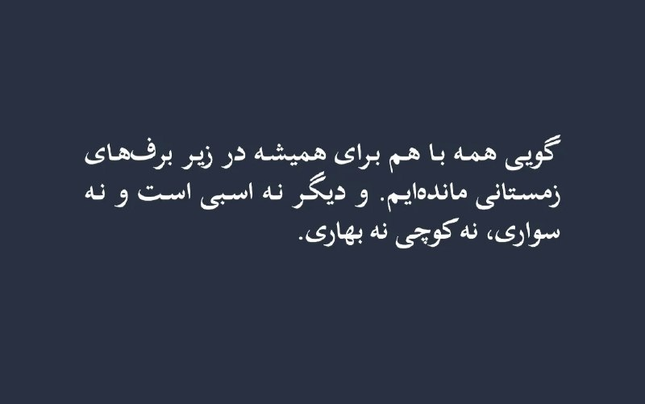

#بخوابیم

@Dirty_Kids 👻

## Dirty_Kids — post 392447

اگه فوتبال نمیبینی شاید وقتش رسیده پیگیری کنی...

@Dirty_Kids 👻

## Dirty_Kids — post 392446

  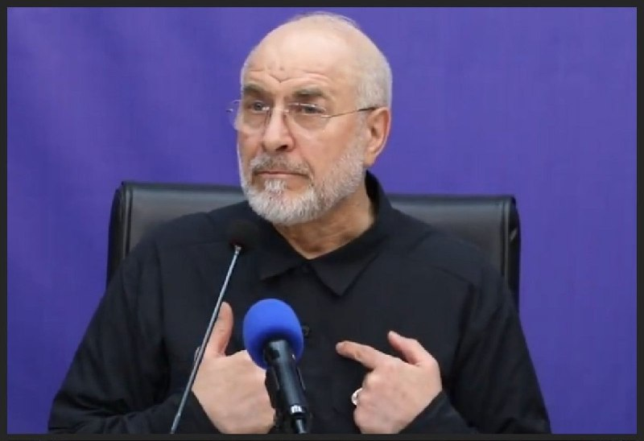

زنده یاد مانوکیان خدا بخشیان ...

یک السیس ایرانی وارد بازی میشه کودتا میکنه و بعد
به فروپاشی نظام کمک میکنه و بعد قدرت انقالی رو
به یک شخص دیگ واگذار میکنه ... )

@Dirty_Kids 👻

## Dirty_Kids — post 392445

لاریجانی بی خود ترور نشد
با وجود لاریجانی قالیباف نمیتونست اینجور وسط معرکه بیاد،در واقع لاریجانی به نظر گروه دوم از حاکمان بود که ترامپ گفت چون باما راه نیومدن کشته شدن و حالا با گروه سوم یعنی قالیباف سروکار داریم.

@Dirty_Kids 👻

## Dirty_Kids — post 392444

کسانی که فرزندان ایران کشتند مولایشان حسین بود، کصمادر هر کسی که در این روزها برای حسین عزاداری می‌کند

@Dirty_Kids 👻

---
📅 بروزرسانی: 1405/03/28 02:34
---

## VahidOOnLine — post 246106

  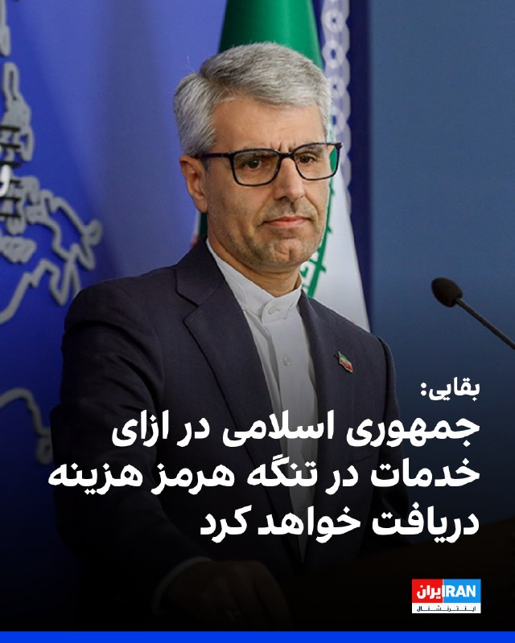

اسماعیل بقایی، سخنگوی وزارت خارجه جمهوری اسلامی، گفت: «سازوکارهای مدیریت تنگه هرمز تا حدود زیادی با عمان بسته شده است و جمهوری اسلامی در ازای خدمات در تنگه هرمز هزینه دریافت خواهد کرد. تردد ایمن با حفظ حاکمیت جمهوری اسلامی بر تنگه هرمز خواهد بود.»
‌🏁 🇬🇧 IranintlTV

🤖 @VahidOOnLine

## IranIntlTV — post 342937

  

اسماعیل بقایی، سخنگوی وزارت خارجه جمهوری اسلامی، گفت: «سازوکارهای مدیریت تنگه هرمز تا حدود زیادی با عمان بسته شده است و جمهوری اسلامی در ازای خدمات در تنگه هرمز هزینه دریافت خواهد کرد. تردد ایمن با حفظ حاکمیت جمهوری اسلامی بر تنگه هرمز خواهد بود.»
https://iranintl.com/202606174561

## IranIntlTV — post 342936

  <a href="telegram/content/IranIntlTV_342936_1781737461.mp4" target="_blank">🎬 Download video</a>

با وجود اینکه مقام‌های جمهوری اسلامی تفاهم با آمریکا را زمینه‌ساز گشایش اقتصادی عنوان می‌کنند، یک مقام ارشد دولت آمریکا گفته است این توافق، ایالات متحده را به هیچ تعهد مالی مستقیمی ملزم نمی‌کند.

گفت‌وگو با آرش آرامش، حقوقدان و کارشناس امنیت ملی، و امید معماریان، تحلیل‌گر سیاسی در موسسه دان
@iranintltv

## BBCPersian — post 284194

  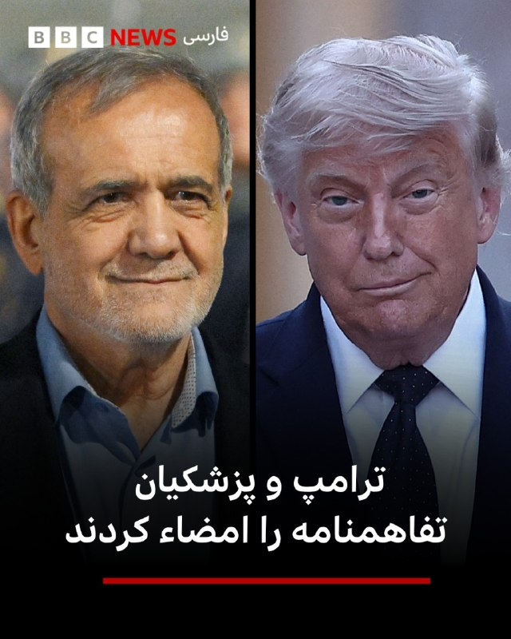

🔻دونالد ترامپ، رئیس جمهور آمریکا که چهارشنبه شب در کاخ الیزه میهمان ضیافت شام با امانوئل مکرون بود نسخه نهایی و منتشر شده تفاهمنامه با ایران را امضاء کرده است و از طرف ایران هم همتای او، مسعود پزشکیان این سند را امضاء کرده است.

یک مقام کاخ سفید در همین رابطه عصر چهارشنبه به خبرنگاران گفت: «تفاهم نامه روز یکشنبه به صورت دیجیتال توسط جی دی ونس، معاون رئیس جمهور آمریکا، و محمدباقر قالیباف، رئیس مجلس شورای اسلامی، امضا شد و دونالد ترامپ، رئیس جمهور آمریکا، نیز به عنوان شاهد در آن حضور داشت. اکنون این تفاهم نامه به امضای دونالد ترامپ و مسعود پزشکیان، رئیس جمهور ایران، نیز رسیده است.»

📷AFP via Getty Images/ ٍEPA
https://bbc.in/4xCfJcv

@BBCPersian

---
📅 بروزرسانی: 1405/03/28 02:23
---

## VahidOOnLine — post 246105

  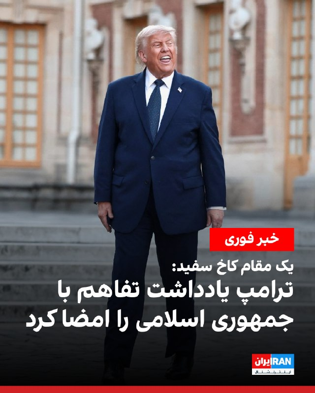

یک مقام کاخ سفید به رویترز گفت: «ترامپ چهارشنبه یادداشت تفاهمی را که با هدف پایان دادن به جنگ با ایران تدوین شده است، امضا کرد.»
خبرگزاری تسنیم، وابسته به سپاه، نیز به نقل از یک منبع نزدیک به تیم مذاکره‌کننده گزارش داد که متن فارسی این تفاهم‌نامه به عنوان یک سند رسمی به امضای دو طرف آمریکا و جمهوری اسلامی رسیده است.

‌🏁 🇬🇧 IranintlTV

🤖 @VahidOOnLine

## mwarmonitor — post 11094

  <a href="telegram/content/mwarmonitor_11094_1781736834.mp4" target="_blank">🎬 Download video</a>

📝در این قاب از ویدیو، شاهکار دیپلماسی ترامپ را می‌بینیم که با همان وقاحت همیشگی پشت تریبون اعلام می‌کند اگر کارها خوب پیش برود افتخارش برای اوست و اگر خراب شود، تقصیر جی‌دی ونس است! اما اوج کمدی سیاه این صحنه، قیافه مارکو روبیو در سمت راست است؛ مردی که انگار روح از بدنش خارج شده و با فکی منقبض و نگاهی خیره به افق، به مرز جنون رسیده است. چهره عصبانی و مستأصل او دقیقاً شبیه کسی است که متوجه شده در گروگان یک کله‌زرد روان‌پریش است، اما برای حفظ ظاهر مجبور است مثل یک مجسمه دکوری بایستد و سقوط آزاد کشورش را تماشا کند.

@mwarmonitor

## FoxNewsTwitter — post 343095

  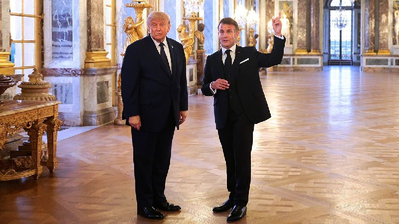

Fox News (Twitter/X)

A dinner at Versailles just became the setting for a major diplomatic breakthrough.

President Trump personally signed the Iran memorandum of understanding Wednesday while meeting with French President Emmanuel Macron, a White House official confirmed.

The agreement, which Iranian President Masoud Pezeshkian also signed, is now in effect to end the war and cancels the formal signing ceremony that had been scheduled in Geneva.

## IranIntlTV — post 342935

  

یک مقام کاخ سفید به رویترز گفت: «ترامپ چهارشنبه یادداشت تفاهمی را که با هدف پایان دادن به جنگ با ایران تدوین شده است، امضا کرد.»
خبرگزاری تسنیم، وابسته به سپاه، نیز به نقل از یک منبع نزدیک به تیم مذاکره‌کننده گزارش داد که متن فارسی این تفاهم‌نامه به عنوان یک سند رسمی به امضای دو طرف آمریکا و جمهوری اسلامی رسیده است.

https://iranintl.com/202606174397

## IranIntlTV — post 342934

  <a href="telegram/content/IranIntlTV_342934_1781736836.mp4" target="_blank">🎬 Download video</a>

بر اساس بند پنجم تفاهم‌نامه جمهوری اسلامی و آمریکا، ایران متعهد شده است عبور ایمن کشتی‌های تجاری را بدون دریافت هیچ هزینه‌ای و فقط برای مدت ۶۰ روز از خلیج فارس به دریای عمان و بالعکس فراهم کند.

پس از این دوره، ایران و عمان با مشورت سایر کشورهای حاشیه خلیج فارس درباره مدیریت آینده و خدمات دریایی تنگه هرمز گفت‌وگو خواهند کرد.

گفت‌وگو با رضا گوهرزاد، روزنامه‌نگار و تحلیل‌گر سیاسی، و شهرام خلدی، پژوهشگر تاریخ خاورمیانه و روابط بین‌الملل
@iranintltv

---
📅 بروزرسانی: 1405/03/28 02:14
---

## VahidOOnLine — post 246104

  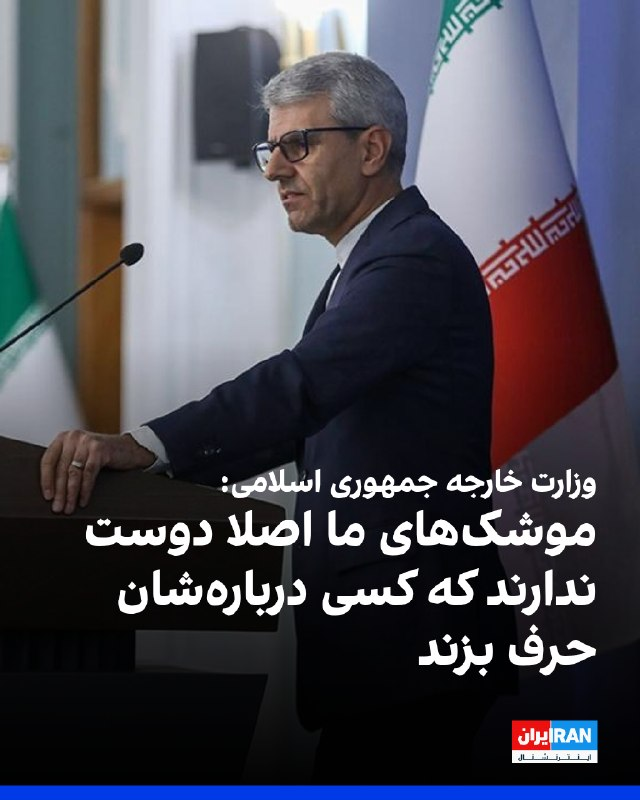

اسماعیل بقایی، سخنگوی وزارت خارجه جمهوری اسلامی، گفت: «موشک‌های ایران فقط برای شلیک شدن هستند نه برای مذاکره. موشک‌های ما اصلا دوست ندارند که کسی درباره‌شان حرف بزند درباره توانایی دفاعی ایران در هیچ روندی و با هیچ طرفی صحبت نخواهد شد.»
‌🏁 🇬🇧 IranintlTV

🤖 @VahidOOnLine

## IranIntlTV — post 342933

  

اسماعیل بقایی، سخنگوی وزارت خارجه جمهوری اسلامی، گفت: «موشک‌های ایران فقط برای شلیک شدن هستند نه برای مذاکره. موشک‌های ما اصلا دوست ندارند که کسی درباره‌شان حرف بزند درباره توانایی دفاعی ایران در هیچ روندی و با هیچ طرفی صحبت نخواهد شد.»
https://iranintl.com/202606178175

## Dirty_Kids — post 392440

بانو Comatozze، رنک اول پورن هاب به صورت اختصاصی از ایرانیا تشکر کرده!

اون گفته اکثر مخاطبانش ایرانین و هر روز کلی پیام محبت آمیز ازشون دریافت میکنه.

@Dirty_Kids 👻

---
📅 بروزرسانی: 1405/03/28 02:04
---

## VahidOOnLine — post 246103

  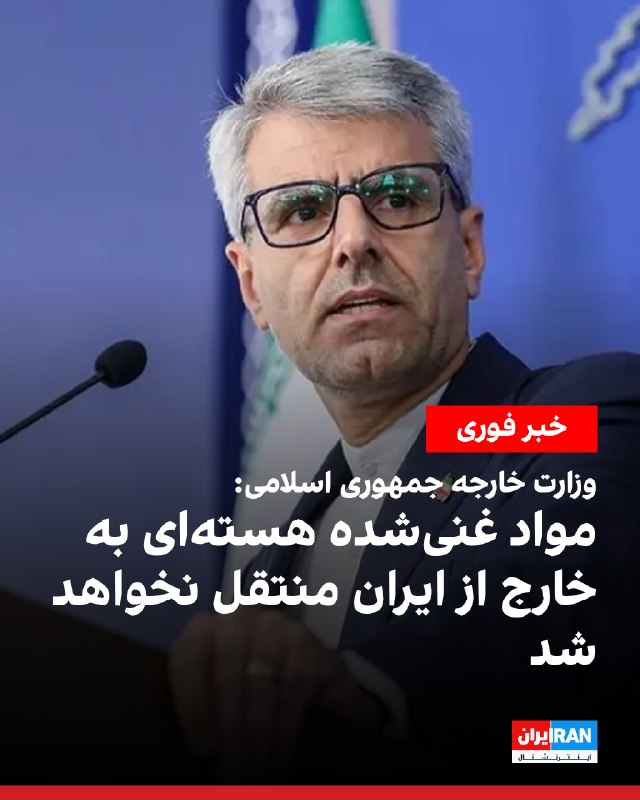

اسماعیل بقایی، سخنگوی وزارت خارجه جمهوری اسلامی، گفت: «از ابتدا گفته‌ایم که مواد غنی‌شده هسته‌ای به خارج از ایران منتقل نخواهد شد. رقیق‌سازی مواد غنی‌شده گزینه جدیدی نیست، الان هم به عنوان یک گزینه معرفی شده است تا راه را بر گزینه‌های دیگر ببندیم.»
او افزود: «گزینه غیرقابل قبول برای ما، انتقال مواد غنی‌شده هسته‌ای به خارج از کشور است.»

‌🏁 🇬🇧 IranintlTV

🤖 @VahidOOnLine

## WithYashar — post 15203

## IranIntlTV — post 342932

  

اسماعیل بقایی، سخنگوی وزارت خارجه جمهوری اسلامی، گفت: «از ابتدا گفته‌ایم که مواد غنی‌شده هسته‌ای به خارج از ایران منتقل نخواهد شد. رقیق‌سازی مواد غنی‌شده گزینه جدیدی نیست، الان هم به عنوان یک گزینه معرفی شده است تا راه را بر گزینه‌های دیگر ببندیم.»
او افزود: «گزینه غیرقابل قبول برای ما، انتقال مواد غنی‌شده هسته‌ای به خارج از کشور است.»

https://iranintl.com/202606175498

## Dirty_Kids — post 392439

  

باراک راوید | آکسیوس:
ایران و آمریکا تفاهمنامه رو از راه دور امضا کردن.

@Dirty_Kids 👻

---
📅 بروزرسانی: 1405/03/28 01:54
---

## VahidOOnLine — post 246102

  <a href="telegram/content/VahidOOnLine_246102_1781735042.mp4" target="_blank">🎬 Download video</a>

محمدباقر قالیباف، رییس هیات مذاکره‌کننده جمهوری اسلامی با آمریکا، گفت هر پیروزی در جنگ اگر در نهایت به یک سند حقوقی و سیاسی منتهی نشود و ثبت نشود، هیچ منفعتی نخواهد داشت.
او افزود جمهوری اسلامی در جنگ ۴۰ روزه پیروز شده و دستاورد این پیروزی در مذاکره شکل می‌گیرد.
به گفته قالیباف، این تفاهم‌نامه «کارنامه شکست آمریکا» است؛ تعبیری که او آن را نقل‌قولی از غربی‌ها دانست.
‌🏁 🇬🇧 IranintlTV

🤖 @VahidOOnLine

## VahidOOnLine — post 246101

  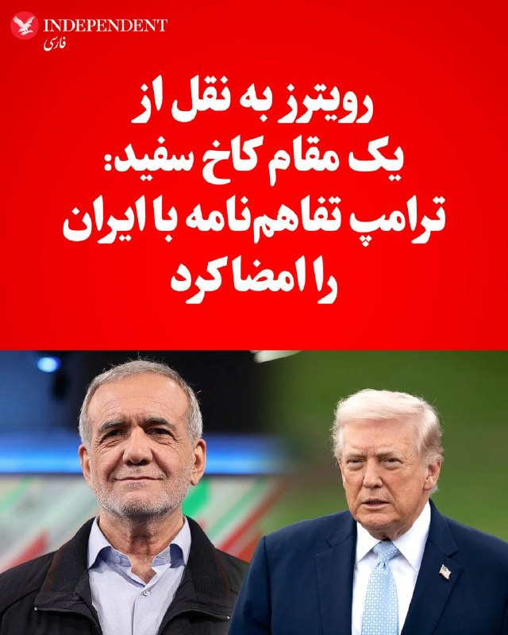

♦️خبرگزاری رویترز به نقل از یک مقام کاخ سفید گزارش داد دونالد ترامپ، رئیس‌جمهوری آمریکا، چهارشنبه ۲۷ خرداد تفاهم‌نامه با ایران را که با هدف پایان دادن به جنگ میان دو کشور تدوین شده است، امضا کرد.
این مقام کاخ سفید جزئیات بیشتری درباره روند امضا یا مفاد تازه این تفاهم‌نامه ارائه نکرد. پیش‌تر اسماعیل بقایی، سخنگوی وزارت امور خارجه جمهوری اسلامی، اعلام کرد توافق ایران و آمریکا به امضای روسای جمهوری دو کشور رسیده است.
‌🇸🇦 Indypersian

🤖 @VahidOOnLine

## WithYashar — post 15202

https://x.com/yasharrapfa

## mwarmonitor — post 11093

  <a href="telegram/content/mwarmonitor_11093_1781735044.mp4" target="_blank">🎬 Download video</a>

📝 این بازجوخبرنگار دوزاری که مثل محتوای تخم‌مرغ شانسی از هر سوراخی بیرون می‌پره، این‌بار با یک سناریوی بالیوودی جدید برگشته تا حماسه بمباران پایگاه آمریکا با لگن‌های پرنده F-5 را به خورد ملت بده. داستان از این قراره که وقتی شبکه ABC آمریکا یک خط خبر رفت، اتاق فرمان صداوسیما سریع عوامل فیلم «تاپ‌گان مناطق محروم» را به خط کرد؛ خلبان‌های بی‌نوایی که روح‌شون هم از این حماسه خبر نداشت و وسط مصاحبه جوری نگاه می‌کردند که انگار تازه فهمیده‌اند دیشب در خواب کویت را فتح کرده‌اند! رضوانی با آن قیافه حق‌به‌جانب جوری از این «عملیات کم‌نظیر» حرف می‌زند که انگار با جنگنده‌های نسل ششم به قلب پنتاگون زده‌اند، در حالی که تنها دستاورد واقعی این نوابغ هوانوردی، حمله اشتباهی به قطر و زدن دو فروند از هواپیماهای خودی بود؛ مأموریتی چنان طوفانی و آبروبر که هنوز که هنوزه از سرنوشت خلبان‌های غیور و همیشه در صحنه خبری در دست نیست!

@mwarmonitor

## DEJradio — post 5773

  <a href="telegram/content/DEJradio_5773_1781735046.mp4" target="_blank">🎬 Download video</a>

⚽️
🔺 جام‌جهانی ۲۰۲۶؛ بررسی قضاوت علیرضا فغانی از نگاه برادرش؛

#جام_جهانی #دژفوتبالی
@DEJradio

## IranIntlTV — post 342931

  <a href="telegram/content/IranIntlTV_342931_1781735048.mp4" target="_blank">🎬 Download video</a>

محمدباقر قالیباف، رییس هیات مذاکره‌کننده جمهوری اسلامی با آمریکا، گفت هر پیروزی در جنگ اگر در نهایت به یک سند حقوقی و سیاسی منتهی نشود و ثبت نشود، هیچ منفعتی نخواهد داشت.
او افزود جمهوری اسلامی در جنگ ۴۰ روزه پیروز شده و دستاورد این پیروزی در مذاکره شکل می‌گیرد.
به گفته قالیباف، این تفاهم‌نامه «کارنامه شکست آمریکا» است؛ تعبیری که او آن را نقل‌قولی از غربی‌ها دانست.

## IranIntlTV — post 342930

مارک وارنر، سناتور دموکرات، به مرضیه حسینی، خبرنگار ایران‌اینترنشنال، گفت: «من هنوز توافق را ندیده‌ام و فکر نمی‌کنم این توافق شامل برنامه موشک‌های بالستیک ایران یا مسیر عملی و مشخصی برای حل مساله هسته‌ای باشد.»

او افزود: «این جنگی انتخابی بود و آمریکا را قوی‌تر نکرد. این یک اشتباه بود.»
@iranintltv

## IranIntlTV — post 342929

  <a href="https://t.me/IranintlTV/342929" target="_blank">📎 Download file</a>

🎧نسخه صوتی برنامه با کامبیز حسینی؛ تفاهم با آمریکا و ۳۰۰ میلیارد دلار برای جمهوری اسلامی
@iranintlTV

## FarsiVOA — post 221061

🔺خبرنگاران بلومبرگ و آکسیوس: دونالد ترامپ تفاهم‌نامه با جمهوری اسلامی را الکترونیکی امضا کرد

▪️خبرنگاران خبرگزاری بلومبرگ و آکسیوس چهارشنبه عصر به وقت واشنگتن گزارش دادند که یادداشت تفاهم میان آمریکا و جمهوری اسلامی برای پایان دادن به درگیری‌‌های نظامی، به‌صورت الکترونیکی ساعاتی قبل امضا شد.

⬇️ بیشتر بخوانید:
https://ir.voanews.com/a/8161966.html
@FarsiVOA

---
📅 بروزرسانی: 1405/03/28 01:44
---

## VahidOOnLine — post 246100

  

اسماعیل بقایی، سخنگوی وزارت خارجه جمهوری اسلامی، گفت: «احتمالا اکنون متن تفاهم‌نامه اسلام آباد به امضای روسای جمهور ایران و آمریکا رسیده باشد. متن این تفاهم‌نامه الان رسما نهایی شده است، چرا که دو طرف آن را امضا کرده‌اند. این تفاهم‌نامه قرار شد که به صورت دیجیتال امضا شود.»
او افزود: وقتی تفاهم‌نامه به امضای روسای جمهوری دو کشور برسد نقض آن هزینه بیشتری خواهد داشت.

‌🏁 🇬🇧 IranintlTV

🤖 @VahidOOnLine

## WithYashar — post 15201

## WithYashar — post 15200

کاخ سفید: ترامپ تفاهم‌نامه با ایران را امضا کرد
@withyashar

## pm_afshaa — post 94309

  <a href="telegram/content/pm_afshaa_94309_1781734451.webm" target="_blank">🎬 Download video</a>

🔴رویترز: یک مقام کاخ سفید تأیید کرد که ترامپ یادداشت تفاهم با جمهوری اسلامی رو امضا کرده.

💧 Rainbet.com the #1 Non-KYC Crypto Casino & Sportsbook @rainbetcom

😁 @Pm_Afshaa

## kianmeli1 — post 88058

  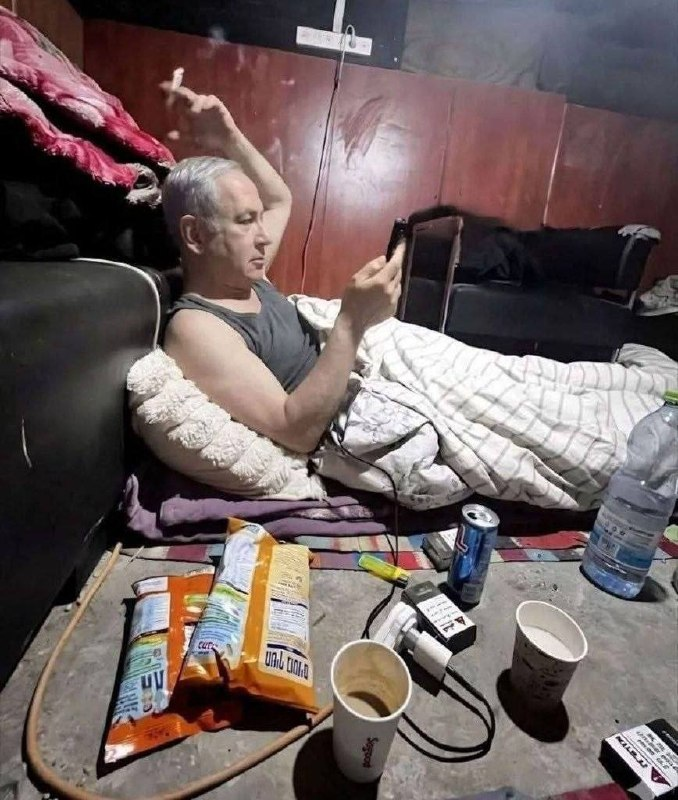

🔴وضعیت نتانیاهو
https://t.me/kianmeli1

## kianmeli1 — post 88057

🔴وزارت امور خارجه ایران اعلام کرد که لغو تحریم‌های نفتی ایران از امروز آغاز می‌شود.
https://t.me/kianmeli1

## IranIntlTV — post 342928

  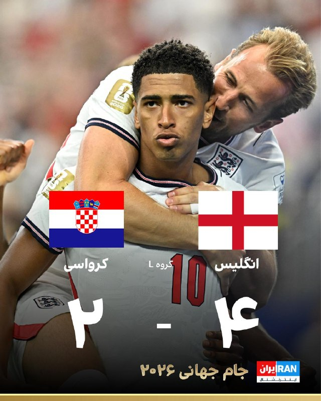

🔻تیم ملی فوتبال انگلیس در نخستین دیدار خود در گروه L جام جهانی ۲۰۲۶، کرواسی را در ورزشگاه شهر دالاس آمریکا با نتیجه ۴ بر ۲ شکست داد.

🔹گل‌های انگلیس را هری کین در دقایق ۱۱ (پنالتی) و ۴۱، جود بلینگام در دقیقه ۴۷ و مارکوس رشفورد در دقیقه ۸۵ به ثمر رساندند.

🔹گل‌های کرواسی نیز توسط مارتین باتورینا در دقیقه ۳۶ و پتر موسا در دقیقه ۵+۴۵ به ثمر رسید.

🔹هری کین تاکنون در جام‌های جهانی پنج گل از روی نقطه پنالتی (بدون احتساب ضربات پنالتی پایان بازی) به ثمر رسانده است. او اکنون رکورددار گلزنی از روی نقطه پنالتی در تاریخ جام جهانی است.

@iranintltvsport

---
📅 بروزرسانی: 1405/03/28 01:34
---

## VahidOOnLine — post 246099

  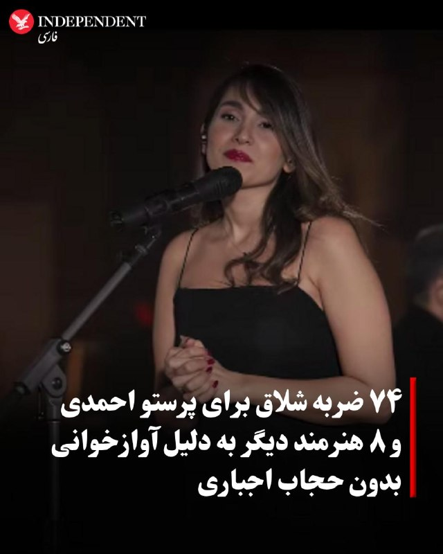

♦️بر اساس اطلاعات رسیده به ایندیپندنت فارسی، پرستو احمدی، خواننده معترض ساکن ایران، به همراه ۸ نفر از نوازندگان و عوامل اجرایی پروژه «کنسرت کاروانسرا» از سوی دادگاه کیفری استان قم به ۷۴ ضربه شلاق، دو سال ممنوع‌الخروجی و دو سال محرومیت از فعالیت هنری محکوم شده‌اند.

این احکام در پی رسیدگی به پرونده‌ای صادر شده است که پس از انتشار ویدیوی «کنسرت کاروانسرا» در آذر ۱۴۰۳ علیه دست‌اندرکاران این برنامه تشکیل شد. شعبه رسیدگی‌کننده دفاعیات متهمان را نپذیرفته و آنان را به اتهام «جریحه‌دار کردن عفت عمومی» از طریق تولید و انتشار محتوای به‌اصطلاح «خلاف اخلاق» در فضای مجازی مجرم شناخته است.

ویدیوی این اجرای موسیقی که در کاروانسرای تاریخی دیرگچین ضبط و در یوتیوب منتشر شد، با حضور پرستو احمدی به‌عنوان خواننده گروه و بدون رعات حجاب اجباری، با استقبال گسترده ایرانیان روبه‌رو شده بود. پس از انتشار این برنامه، پرستو احمدی و همکارانش بازداشت شدند و محل برگزاری کنسرت نیز پلمب شد.

پرستو احمدی پیش‌تر در توضیح این اجرا نوشته بود: «من، پرستو، دختری که می‌خواهم برای مردمی که دوستشان دارم بخوانم. این حقی است که نمی‌توانستم از آن چشم بپوشم.»
‌🇸🇦 Indypersian

🤖 @VahidOOnLine

## VahidOOnLine — post 246098

  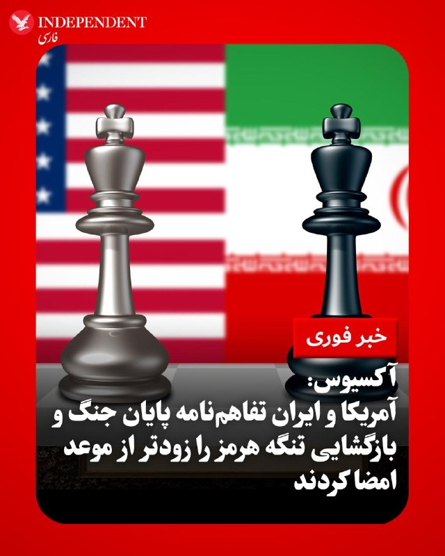

♦️وب‌سایت آکسیوس بامداد پنجشنبه ۲۸ خردادماه به نقل از دو مقام آمریکایی گزارش داد آمریکا و ایران تفاهم‌نامه پایان جنگ و بازگشایی تنگه هرمز را زودتر از موعد پیش‌بینی‌شده و به‌صورت غیرحضوری امضا کرده‌اند و این توافق اکنون اجرایی شده است. به گفته یکی از این مقام‌ها، دونالد ترامپ شخصاً این سند را امضا کرده است.

آکسیوس نوشت قرار بود این تفاهم‌نامه روز جمعه در سوئیس امضا شود، اما دو طرف برای تسریع اجرای توافق و بازگشایی زودتر تنگه هرمز، روند امضا را جلو انداختند. وزارت خارجه جمهوری اسلامی نیز اعلام کرد دو طرف توافق کرده‌اند سند را به‌صورت الکترونیکی و توسط روسای جمهوری امضا کنند. با این حال، نشست هیات‌های آمریکایی و ایرانی به ریاست جی‌دی ونس و محمدباقر قالیباف همچنان طبق برنامه روز جمعه در سوئیس برگزار خواهد شد و انتظار می‌رود آغاز مذاکرات درباره برنامه هسته‌ای ایران محور اصلی این دیدار باشد.
‌🇸🇦 Indypersian

🤖 @VahidOOnLine

## VahidOOnLine — post 246097

  <a href="telegram/content/VahidOOnLine_246097_1781733856.mp4" target="_blank">🎬 Download video</a>

♦️اسماعیل بقایی، سخنگوی وزارت امور خارجه جمهوری اسلامی ایران، در گفتگو با صداوسیما گفت متن توافق ایران و آمریکا بامداد پنج‌شنبه ۲۸ خرداد به امضای روسای جمهوری دو کشور رسیده است.
بقایی با اشاره به برنامه‌ریزی‌های انجام‌شده برای امضای این توافق گفت: «همین الان که در حال صحبت هستیم، متن رسما به امضای روسای جمهوری دو کشور رسیده است.»
او گفت: «وقتی متن به امضای بالاترین مقام‌های دو کشور برسد، قاعدتا نقض آن هزینه‌های بیشتری دارد و ما با توجه به تجربه‌هایی که داریم ترجیح دادیم که این اتفاق بیافتد. ضمن اینکه تشخیص دادیم برگزاری مراسم هم چندان جایی [در برنامه ما] ندارد.»
‌🇸🇦 Indypersian

🤖 @VahidOOnLine

## mwarmonitor — post 11092

🔸ترامپ:

۹ مارس: «ما حالا کاملاً از خاورمیانه مستقل هستیم. ما به نفت آن‌ها نیازی نداریم.»

۱ آوریل: «واقعاً روی ما تأثیری ندارد. ما نفت بسیار زیادی داریم. نفت و گاز فوق‌العاده زیادی داریم، خیلی بیشتر از نیازمان.»

۱۷ ژوئن: اگر من با یادداشت تفاهم (MOU) موافقت نمی‌کردم، «حدوداً ظرف ۴ هفته ذخایرمان تمام می‌شد… واقعاً به پایان می‌رسید، و زمانی می‌آمد که دیگر نمی‌توانستید به آن دسترسی داشته باشید.»

@mwarmonitor

## mwarmonitor — post 11091

🔴فوری: به گفته دو مقام آمریکایی به آکسیوس، ایالات متحده و ایران یادداشت تفاهم (MOU) پایان‌دهنده جنگ را به‌صورت الکترونیکی امضا کرده‌اند و این توافق اکنون لازم‌الاجرا شده است. @mwarmonitor

## pm_afshaa — post 94308

  <a href="telegram/content/pm_afshaa_94308_1781733859.webm" target="_blank">🎬 Download video</a>

🔴اکسیوس به نقل از مقام آمریکایی:
آمریکا و ایران روز چهارشنبه به‌صورت از راه دور تفاهمنامه پایان جنگ رو امضا کردن و این توافق از حالا لازم‌الاجرا است.

ترامپ شخصاً یک نسخه از این توافق رو طی شام با رئیس‌جمهور فرانسه در کاخ ورسای امضا کرد. عکس نسخهٔ امضا‌ شده هم برای ایرانی‌ها و کشورهای میانجی ارسال شد.

💧 Rainbet.com the #1 Non-KYC Crypto Casino & Sportsbook @rainbetcom

😁 @Pm_Afshaa

## pm_afshaa — post 94307

  <a href="telegram/content/pm_afshaa_94307_1781733859.webm" target="_blank">🎬 Download video</a>

🔴بقایی، سخنگوی وزارت خارجه: متن تفاهمنامه ایران و آمریکا رسما نهایی شده چون دو طرف اون رو امضا کردن. 
💧 Rainbet.com the #1 Non-KYC Crypto Casino & Sportsbook @rainbetcom 
😁 @Pm_Afshaa

## kianmeli1 — post 88056

  <a href="telegram/content/kianmeli1_88056_1781733860.mp4" target="_blank">🎬 Download video</a>

🔴خبر مهم ترامپ

ترامپ آزادسازی پول‌های ایران را تایید کرد

«خب، موضوع آزاد کردن پول‌ها پاسخ دادنش ساده است.
ما مقدار زیادی از پول آن‌ها را گرفته‌ایم، و ما — پول خودشان را از آن‌ها گرفته‌ایم.
وقتی پول مال ما نیست، پولِ خودِ آن‌هاست، و ما در یک مقطع زمانی آن را مسدود کردیم.
فکر می‌کنم ناچاریم آن را پس بدهیم، می‌دانید؟
اگر آن را پس ندهیم، دیگر هیچ‌کس هرگز روی دلار سرمایه‌گذاری نخواهدکرد.»
https://t.me/kianmeli1

## kianmeli1 — post 88055

🔴اسماعیل بقایی:

برای اینکه دشمن بدعهدی نکند علاوه بر متن انگلیسی متن فارسی هم امضا شد
https://t.me/kianmeli1

## IranIntlTV — post 342927

  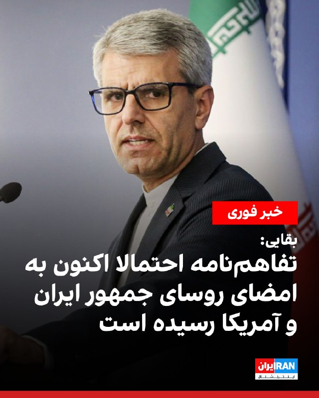

اسماعیل بقایی، سخنگوی وزارت خارجه جمهوری اسلامی، گفت: «احتمالا اکنون متن تفاهم‌نامه اسلام آباد به امضای روسای جمهور ایران و آمریکا رسیده باشد. متن این تفاهم‌نامه الان رسما نهایی شده است، چرا که دو طرف آن را امضا کرده‌اند. این تفاهم‌نامه قرار شد که به صورت دیجیتال امضا شود.»
او افزود: وقتی تفاهم‌نامه به امضای روسای جمهوری دو کشور برسد نقض آن هزینه بیشتری خواهد داشت.

https://iranintl.com/202606176742

## BBCPersian — post 284193

🔻قالیباف: به میانجی گفتیم موضوع لبنان و پول‌های بلوکه شده از محورهای مذاکرات است

🔻محمدباقر قالیباف، رئیس مجلس ایران و مذاکره‌کننده ارشد ایران در مذاکرات ایران با آمریکا در یک مصاحبه مفصل با صدا و سیما جزئیاتی از مذاکرات ایران و آمریکا در اسلام‌آباد پاکستان و روندی که به تفاهمنامه منجر شد را شرح داد.

او درباره لحاظ کردن لبنان به محور مذاکرات گفت: «وقتی اظهارات ونس را هنگام سوار شدن به هواپیما دیدم که درباره لبنان صحبت کرده بود، پیش از پرواز و در فرودگاه توئیت زدم که تا وضعیت لبنان روشن نشود، مذاکره را آغاز نخواهیم کرد و اگر وارد مذاکره شویم، پیش از هر موضوعی باید درباره لبنان صحبت شود.»

او همچنین می‌گوید که داوطلب حضور در تیم مذاکره کننده نبوده و حتی برای اینکار «کراهت هم داشته است.»

آقای قالیباف درباره علت این مساله شامگاه چهارشنبه در یک مصاحبه با صدا و سیما گفت: «یکی از دلایل من برای عدم پذیرش این مسئولیت این بود که ترامپ طراح، آمر و ناظر ترور حاج قاسم است. سردار سلیمانی برای همه جهان اسلام عزیز بود اما حتما برای شخص من متفاوت بود. شما فکر می‌کنید این که بخواهم با چنین فردی، متنی را جمع کنم، کار راحتی است؟»

او همچنین گفت: «بدبینی و بی‌اعتمادی من به آمریکا از همه بیشتر است.»

متن کامل خبر در لینک زیر:
https://bbc.in/4vhrXFR

@BBCPersian

## BBCPersian — post 284192

  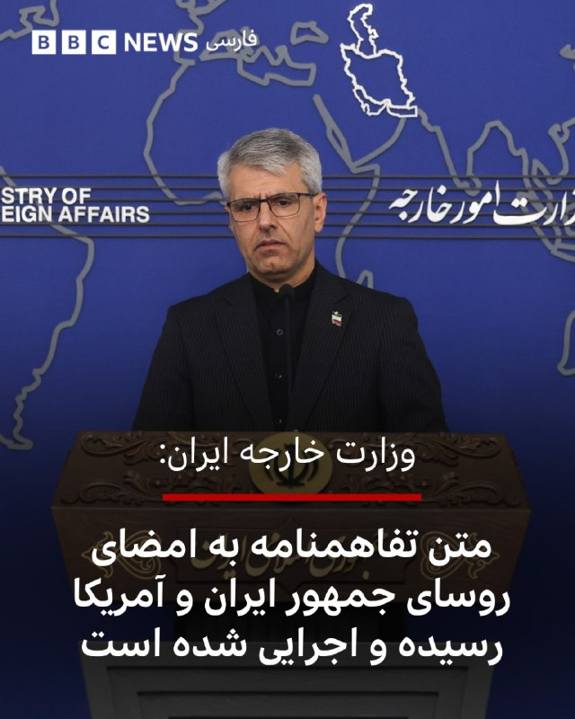

🔻اسماعیل بقایی، سخنگوی وزارت خارجه ایران در گفت‌وگو با خبرنگاران درباره تفاهمنامه امضاء شده میان ایران و آمریکا توضیحات مفصلی داده و چهارشنبه شب گفته است: «الان که با شما صحبت می‌کنم احتمالاً متن تفاهم نامه اسلام آباد به امضای روسای جمهور ایران و آمریکا رسیده باشد.»

به گفته سخنگوی وزارت خارجه ایران: «به این نتیجه رسیدیم متن یادداشت تفاهم به امضا روسای جمهور ایران و آمریکا برسد و برگزاری مراسم روز جمعه هنوز در دستور کار است اما باید ببینیم ظرف ساعات آینده به چه نتیجه‌ای می‌رسیم. به هر حال باید فاز بعدی مذاکرات آغاز شود. این نشست در سوئیس هنوز در دستور کار است که برگزار شود. باید ببینیم که در ساعات آینده طرفین از طریق میانجی‌ها به نتیجه‌ای می‌رسند.»

آقای بقایی و همچنین مقام‌های در کاخ‌سفید تایید کرده‌اند که همزمان با امضای روسای‌جمهور در زیر تفاهمنامه، این سند لازم الاجرا شده است.

متن کامل خبر در لینک زیر:

📷LightRocket via Getty Images
https://bbc.in/4epTP3r

@BBCPersian

---
📅 بروزرسانی: 1405/03/28 01:23
---

## pm_afshaa — post 94306

بقائی:تفاهم‌نامه به‌صورت الکترونیکی بین پزشکیان و ترامپ امضا شده. جمعه هم خبری از مراسم رسمی نیست و فقط هیئت‌های ایران و آمریکا به سرپرستی قالیباف و جی‌دی ونس تو سوئیس دور اول مذاکرات فنی 30 روزه برای اجرای تفاهم‌نامه رو شروع می‌کنن

💧 Rainbet.com the #1 Non-KYC Crypto Casino & Sportsbook @rainbetcom

😁 @Pm_Afshaa

## pm_afshaa — post 94305

  <a href="telegram/content/pm_afshaa_94305_1781733235.mp4" target="_blank">🎬 Download video</a>

پیش بینی 2 سال پیش شاهین نجفی در مورد قالیباف

💧 Rainbet.com the #1 Non-KYC Crypto Casino & Sportsbook @rainbetcom

😁 @Pm_Afshaa

## IranianMinds — post 22839

  <a href="telegram/content/IranianMinds_22839_1781733235.mp4" target="_blank">🎬 Download video</a>

🔴 پشماتون بریزه ببینید شاهین نجفی ۲ سال پیش راجب قالیباف چی گفته بوده

@IranianMinds

## Dirty_Kids — post 392438

  <a href="telegram/content/Dirty_Kids_392438_1781733236.mp4" target="_blank">🎬 Download video</a>

عزیزان ببخشید وسط فوتبال مزاحم شدم،

ممدباقر (شغال طرقبه) خونخواهی موشعلی رو حواله داد به آزادی قدس و گفت ۱۰۰ نتانیاهو بند کفش موشعلی ما هم نمی‌شه،

این در حالیه که موشعلی هزارپدر نعلین می‌پوشید و نمی‌دونست بند کفش اصلا چی چی هست.

@Dirty_Kids 👻

## Dirty_Kids — post 392437

  <a href="telegram/content/Dirty_Kids_392437_1781733238.mp4" target="_blank">🎬 Download video</a>

انتقام رهبرتونم رفت پيش انتقام قاسم و هنیه و سنوار و نصراله 😁

@Dirty_Kids 👻

## alonews — post 128821

  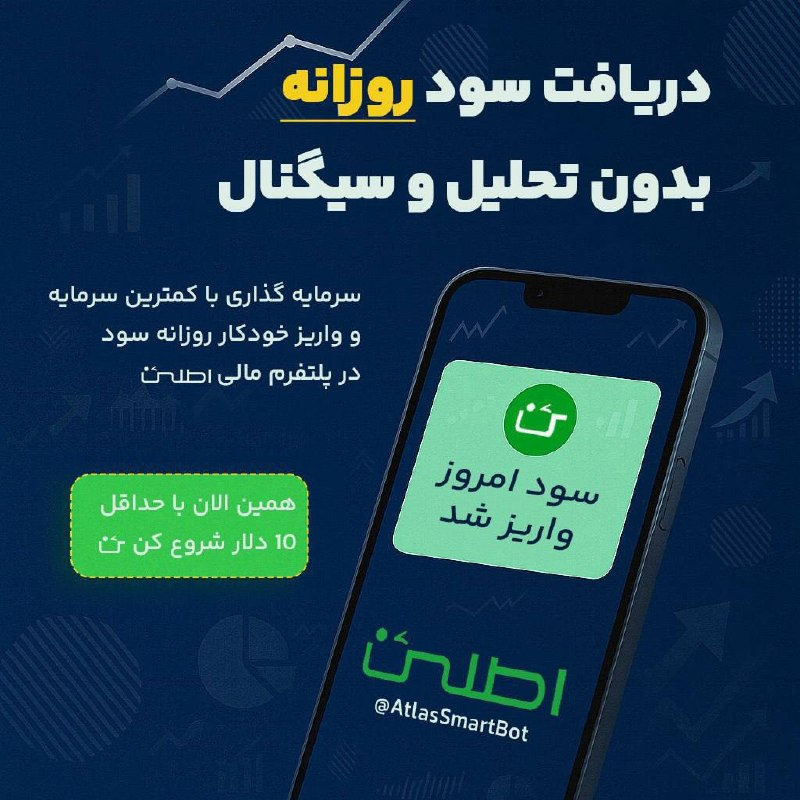

📉
📈 بازار می‌ریزد؛ اما آربیتراژ متوقف نمی‌شود

وقتی معامله‌گران از ریزش بازار ضرر می‌کنند، ربات هوشمند اطلس اختلاف قیمت بین صرافی‌ها را به فرصت سود تبدیل می‌کند.

✅ برداشت سود روزانه

✅ گزارش لحظه ای معاملات آربیتراژ

✅ شروع سرمایه‌گذاری از ۵ دلار

✅ بدون نیاز به دانش ترید

🚀 مشاهده عملکرد اطلس:
@AtlasSmartBot
اطلاعات بیشتر در کانال تلگرام

---
📅 بروزرسانی: 1405/03/28 01:13
---

## VahidOOnLine — post 246096

  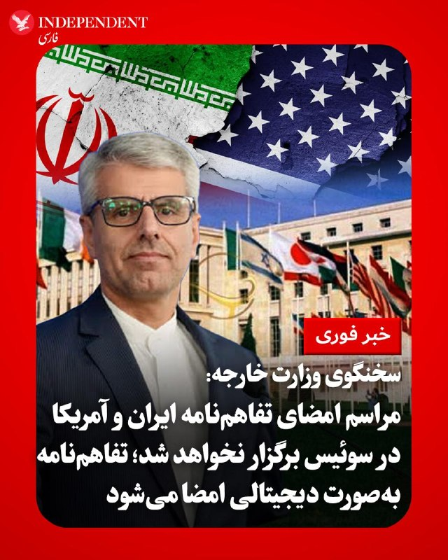

♦️اسماعیل بقایی، سخنگوی وزارت امور خارجه جمهوری اسلامی، چهارشنبه ۲۷ خرداد در گفتگو با صداوسیما اعلام کرد مراسم امضای تفاهم‌نامه ایران و آمریکا که قرار بود در سوئیس برگزار شود، انجام نخواهد شد و این سند به‌صورت دیجیتالی به امضای دو طرف خواهد رسید.
بقایی گفت تصمیم اولیه بر برگزاری نشستی در سوئیس و امضای رسمی متن از سوی دو طرف بود، اما پس از بررسی‌های انجام‌شده، ترجیح داده شد این سند توسط روسای جمهوری دو کشور و به‌صورت مجازی امضا شود. به گفته او، امضای سند توسط بالاترین مقام‌های دو کشور، هزینه نقض آن را افزایش می‌دهد.
سخنگوی وزارت امور خارجه همچنین تاکید کرد که با وجود لغو مراسم امضا، برنامه حضور تیم‌های مذاکره‌کننده و ادامه گفتگوها در سوئیس همچنان در دستور کار قرار دارد.
‌🇸🇦 Indypersian

🤖 @VahidOOnLine

## WithYashar — post 15199

طبق گزارش Axios، رئیس‌جمهور ترامپ شخصاً نسخه‌ای از توافقنامه را در حین صرف شام با رئیس‌جمهور فرانسه ماکرون در کاخ ورسای امضا کرد.

عکسی از توافقنامه امضا شده به ایرانی‌ها و کشورهای میانجی ارسال شد.
@withyashar

## WithYashar — post 15198

تسنیم: متن فارسی تفاهمنامه نیز به عنوان سند رسمی به امضای ایران و آمریکا رسیده است
@withyashar

## mwarmonitor — post 11090

🔴فوری: به گفته دو مقام آمریکایی به آکسیوس، ایالات متحده و ایران یادداشت تفاهم (MOU) پایان‌دهنده جنگ را به‌صورت الکترونیکی امضا کرده‌اند و این توافق اکنون لازم‌الاجرا شده است.

@mwarmonitor

## pm_afshaa — post 94304

  <a href="telegram/content/pm_afshaa_94304_1781732637.webm" target="_blank">🎬 Download video</a>

🔴بقایی، سخنگوی وزارت خارجه:
متن تفاهمنامه ایران و آمریکا رسما نهایی شده چون دو طرف اون رو امضا کردن.

💧 Rainbet.com the #1 Non-KYC Crypto Casino & Sportsbook @rainbetcom

😁 @Pm_Afshaa

## pm_afshaa — post 94303

  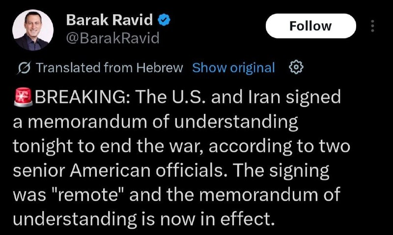

🔴باراک راوید، آکسیوس: ایران و آمریکا تفاهمنامه رو از راه دور امضا کردن.

💧 Rainbet.com the #1 Non-KYC Crypto Casino & Sportsbook @rainbetcom

😁 @Pm_Afshaa

## IranIntlTV — post 342926

  <a href="telegram/content/IranIntlTV_342926_1781732638.mp4" target="_blank">🎬 Download video</a>

عملیات گسترده پلیس تورنتو برای بازداشت مظنونان حمله به کنسولگری آمریکا به درگیری خونین و کشف یک شبکه بزرگ جنایی منجر شد.

مقام‌های کانادایی با همکاری اف‌بی‌آی در حال بررسی این احتمال هستند که حمله به کنسولگری آمریکا بخشی از فعالیت‌های این شبکه تروریستی فراملی بوده باشد.

گزارش مهسا مرتضوی، خبرنگار ایران‌اینترنشنال
@iranintltv

## FarsiVOA — post 221060

⚡️گزارش نرگس صبا در برنامه تفسیر خبر در باره نتایج یک تحقیق تازه: مخالفان توافق با آمریکا از چه طیف‌هایی هستند؟
@FarsiVOA

## IranianMinds — post 22838

🔴 مذاکرات هنوز کامل نهایی نشده و از امروز به بعد مذاکرات ۶۰ روزه برای توافق نهایی شروع میشه ، طبق گفته ترامپ این مذاکرات قابل تمدید هم هست زمانش.

برگشتیم سر پله ی اول عملا

@IranianMinds

## alonews — post 128820

  <a href="telegram/content/alonews_128820_1781732639.webm" target="_blank">🎬 Download video</a>

👈هم اکنون ریزش شدید تتر و طلا

تتر 152000

طلا 15میلیون

✅ @AloNews خبر جنگ

## alonews — post 128819

  <a href="telegram/content/alonews_128819_1781732639.webm" target="_blank">🎬 Download video</a>

👈قاضی زاده، عضو تحریریه اینترنشنال: کجای راه را اشتباه رفتیم؟

✅ @AloNews خبر جنگ

## alonews — post 128818

  <a href="telegram/content/alonews_128818_1781732640.webm" target="_blank">🎬 Download video</a>

👈باراک راوید، خبرنگار آکسیوس: ترامپ شخصاً یه نسخه از توافق رو توی یه مهمونی شام با مکرون تو کاخ ورسای امضا کرد و عکسِ اون توافق امضا شده رو هم برای ایران و کشورهای میانجی فرستادن

✅ @AloNews خبر جنگ

## alonews — post 128817

  <a href="telegram/content/alonews_128817_1781732640.webm" target="_blank">🎬 Download video</a>

👈سناتور لیندسی گراهام: انتظار بسیار بالاتری از این توافق داشتم و فعلا نظری ندارم!

✅ @AloNews خبر جنگ

---
📅 بروزرسانی: 1405/03/28 01:04
---

## VahidOOnLine — post 246095

  <a href="telegram/content/VahidOOnLine_246095_1781732075.mp4" target="_blank">🎬 Download video</a>

♦️دونالد ترامپ، رئیس‌جمهوری آمریکا، روز چهارشنبه ۲۷ خردادماه در پاریس گفت اگر کشورهای دیگر به موشک‌های بالستیک دسترسی دارند، محروم کردن ایران از این توانمندی «کمی ناعادلانه» است. او تاکید کرد که موشک‌های بالستیک با برنامه هسته‌ای تفاوت دارند و نباید این دو موضوع با یکدیگر خلط شوند.

ترامپ در پاسخ به سوالی درباره اظهارات پیشین خود گفت: «اگر کشورهای دیگر این موشک‌ها را دارند، کمی ناعادلانه است که ایران هیچ‌کدام را نداشته باشد.» او افزود: «اگر عربستان سعودی، قطر و کشورهای دیگر چنین موشک‌هایی دارند، فکر می‌کنم در یک تناسب نسبی، داشتن آن‌ها اشکالی ندارد.» ترامپ همچنین گفت موشک‌های بالستیک با موضوع سلاح هسته‌ای متفاوت‌اند و تفاهم‌نامه اخیر تهران و واشینگتن بر جلوگیری از دستیابی ایران به سلاح هسته‌ای متمرکز است.
‌🇸🇦 Indypersian

🤖 @VahidOOnLine

## VahidOOnLine — post 246094

  <a href="telegram/content/VahidOOnLine_246094_1781732077.mp4" target="_blank">🎬 Download video</a>

محمدباقر قالیباف، رییس هیات مذاکره‌کننده جمهوری اسلامی با آمریکا، گفت طرف مقابل حاضر نیست بپذیرد متجاوز بوده است، زیرا در این صورت باید همه خسارت‌ها را بپردازد.
او افزود به‌جای پرداخت خسارت، در متن بر مفاهیمی چون «بازسازی» و «توسعه اقتصادی» تاکید شده است.
به گفته قالیباف، در همین چارچوب ۳۰۰ میلیارد دلار سرمایه‌گذاری پیش‌بینی شده که بخشی از آن صرف بازسازی و جبران خسارت‌ها خواهد شد.
‌🏁 🇬🇧 IranintlTV

🤖 @VahidOOnLine

## WithYashar — post 15197

  <a href="telegram/content/WithYashar_15197_1781732079.mp4" target="_blank">🎬 Download video</a>

بقایی: همین الان که در حال صحبت هستیم متن توافق رسما به امضا رئیس جمهور های دو طرف رسیده است

قرار بود که بامداد روز ۲۸ خرداد ماه رئیس جمهور دو کشور این متن و توافق رو امضا کنند.
@withyashar

## kianmeli1 — post 88054

🔴به گزارش اکسیوس، ایران و آمریکا به صورت الکترونیکی تفاهم‌نامه‌ای برای پایان دادن به جنگ امضا کردند.
https://t.me/kianmeli1

## IranIntlTV — post 342925

  <a href="telegram/content/IranIntlTV_342925_1781732081.mp4" target="_blank">🎬 Download video</a>

محمدباقر قالیباف، رییس هیات مذاکره‌کننده جمهوری اسلامی با آمریکا، گفت طرف مقابل حاضر نیست بپذیرد متجاوز بوده است، زیرا در این صورت باید همه خسارت‌ها را بپردازد.
او افزود به‌جای پرداخت خسارت، در متن بر مفاهیمی چون «بازسازی» و «توسعه اقتصادی» تاکید شده است.
به گفته قالیباف، در همین چارچوب ۳۰۰ میلیارد دلار سرمایه‌گذاری پیش‌بینی شده که بخشی از آن صرف بازسازی و جبران خسارت‌ها خواهد شد.

## FarsiVOA — post 221059

  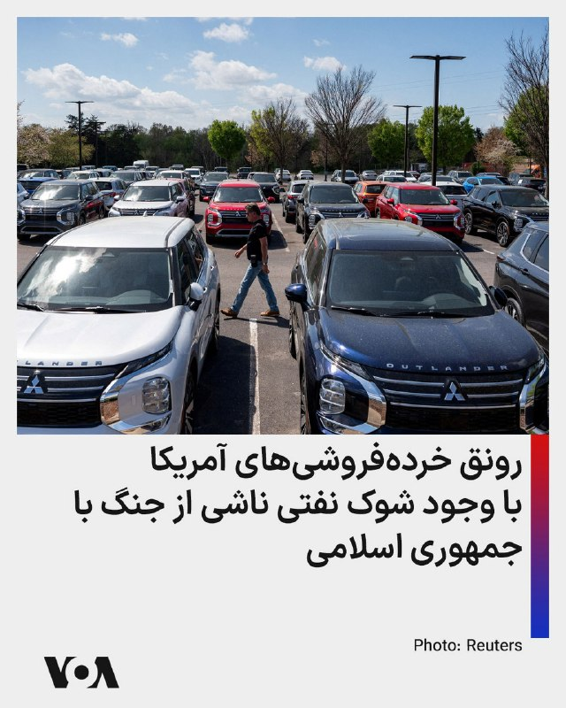

⚡️آمار وزارت بازرگانی آمریکا در روز چهارشنبه نشان می‌دهد که اقتصاد آمریکا با وجود جنگ با جمهوری اسلامی و شوک ناشی از افزایش قیمت نفت، شاهد افزایش فراتر از انتظار فروش خرده‌فروشی‌ها بود.
به گزارش رویترز، خانوارهای آمریکایی با وجود قیمت بالاتر بنزین خودروهای بیشتری خریدند. فروش قوی خرده‌فروشی در ایالات متحده، نشان‌دهنده‌ انعطاف‌پذیری اقتصاد این کشور علیرغم جنگ با جمهوری اسلامی است.
@FarsiVOA

## Persian_Trend_Official — post 17406

  <a href="telegram/content/Persian_Trend_Official_17406_1781732084.mp4" target="_blank">🎬 Download video</a>

شبتون بخیر 🌃
F-18 Super Hornet

📌 @persian_trend_official
پرشین ترند | متفاوت‌ترین کانال نظامی

## Persian_Trend_Official — post 17405

  <a href="telegram/content/Persian_Trend_Official_17405_1781732086.mp4" target="_blank">🎬 Download video</a>

بدون شرح...

📝 Nick

📌 @persian_trend_official
پرشین ترند | متفاوت‌ترین کانال نظامی

## IranianMinds — post 22837

🔴 قالیباف : برای من کار راحتی نبود با ترامپ قاتل سردار سلیمانی مذاکره کنم نفر دومی جز من برای مذاکره نبود! @IranianMinds

## IranianMinds — post 22836

  <a href="telegram/content/IranianMinds_22836_1781732088.mp4" target="_blank">🎬 Download video</a>

🔴 قالیباف : برای من کار راحتی نبود با ترامپ قاتل سردار سلیمانی مذاکره کنم
نفر دومی جز من برای مذاکره نبود!

@IranianMinds

## IranianMinds — post 22835

🔴 آکسیوس :

آمریکا و ایران «تفاهم‌نامه (MOU) پایان جنگ» را به‌صورت الکترونیکی امضا کرده‌اند.

این توافق اکنون وارد مرحله اجرا شده است.

با این حال، قرار است یک مراسم رسمی امضا نیز روز جمعه در سوئیس برگزار شود.

برخی مفاد عملی توافق، از جمله مسائل مربوط به تنگه هرمز و اقدامات متقابل دو طرف، پس از مراحل بعدی اجرایی خواهند شد.

@IranianMinds

## alonews — post 128816

  <a href="telegram/content/alonews_128816_1781732090.webm" target="_blank">🎬 Download video</a>

👈رسایی: فاجعه‌ای بدتر از برجام رخ داده

✅ @AloNews خبر جنگ

## alonews — post 128815

  <a href="telegram/content/alonews_128815_1781732090.webm" target="_blank">🎬 Download video</a>

👈سخنگوی وزارت خارجه:
قرار بود طی ۳۰ روز محاصره برداشته شود و متقابلاً ایران هم درباره تنگه هرمز این کار را انجام دهیم. اما بعد از تحولات مربوط به حمله رژیم صهیونیستی به ضاحیه و تهدیدات جدی که از سوی ایران انجام گرفت، مذاکرات فوری انجام گرفت و قرار شد آمریکا تعهداتش را فوری انجام دهد.

🔴در رصدی که انجام شد مشخص شد کشتی‌های ما بدون مشکلی وارد بنادر شدند و خارج شدند و این تعهد {آمریکا به رفع محاصره} شروع شد. تعهدات ما ‍بس از امضای این سند شروع خواهد شد.

✅ @AloNews خبر جنگ

## alonews — post 128814

  <a href="telegram/content/alonews_128814_1781732090.webm" target="_blank">🎬 Download video</a>

👈تسنیم: متن فارسی تفاهمنامه نیز به عنوان سند رسمی به امضای ایران و آمریکا رسیده است

✅ @AloNews خبر جنگ

## alonews — post 128813

حسینی با یزیدی صلح یک ساعت نخواهد کرد
کسی مانند ما با مثل او بیعت نخواهد کرد

## alonews — post 128812

  <a href="telegram/content/alonews_128812_1781732091.webm" target="_blank">🎬 Download video</a>

👈سخنگوی وزارت خارجه: در متن تفاهمنامه تاکید شده است که فقط منحصراً در موضوع هسته‌ای و رفع تحریم‌ها مذاکره می‌کنیم.

🔴از زمان اجرای تفاهمنامه، که الان است، ظرف 60 روز درباره موضوع هسته‌ای و تحریم‌ها مذاکره کنیم. اگر زودتر هم مذاکره به نتیجه برسد، بهتر است. ولی با توجه به پیچیدگی موضوع، عدد 60 روز منطقی است و اگر لازم باشد، این زمان تمدید می‌شود.

✅ @AloNews خبر جنگ

## alonews — post 128811

عرازش برید خونه‌هاتون

## alonews — post 128810

  <a href="telegram/content/alonews_128810_1781732091.webm" target="_blank">🎬 Download video</a>

👈خبرنگار اکسیوس: دو مقام آمریکایی به من گفتند که ایالات متحده و ایران روز چهارشنبه تفاهم‌نامه پایان جنگ را به صورت الکترونیکی امضا کرده‌اند و اکنون لازم‌الاجرا است.

✅ @AloNews خبر جنگ

---
📅 بروزرسانی: 1405/03/28 00:54
---

## VahidOnline — post 76459

☄️ تسنیم:
بقایی: الان که با شما صحبت می‌کنم احتمالاً متن تفاهم نامه اسلام آباد به امضای روسای جمهور ایران و آمریکا رسیده باشد.

بقایی: متن تفاهمنامه ایران و آمریکا الان رسماً نهایی شده است چرا که دو طرف آن را امضا کرده‌اند.
📡 @VahidOnline

## IranianMinds — post 22834

🔴 سخنگوی وزارت خارجه :

جنگ به پایان رسید.

@IranianMinds

## IranianMinds — post 22833

🔴 سخنگوی‌ وزارت خارجه :

متن تفاهم نامه توسط دو طرف امضا شد و توافق نهایی شد.

@IranianMinds

## alonews — post 128809

  <a href="telegram/content/alonews_128809_1781731454.webm" target="_blank">🎬 Download video</a>

🔴فوری و رسمی/تفاهم نامه توسط ترامپ و پزشکیان امضا شد 
✅ @AloNews خبر جنگ

## alonews — post 128808

  <a href="telegram/content/alonews_128808_1781731455.webm" target="_blank">🎬 Download video</a>

🔴فوری و رسمی/تفاهم نامه توسط ترامپ و پزشکیان امضا شد

✅ @AloNews خبر جنگ

## alonews — post 128807

  <a href="telegram/content/alonews_128807_1781731455.webm" target="_blank">🎬 Download video</a>

🔴فوری/بقایی: الان که با شما صحبت می‌کنم احتمالاً متن تفاهم نامه اسلام آباد به امضای روسای جمهور ایران و آمریکا رسیده باشد. 
✅ @AloNews خبر جنگ

---
📅 بروزرسانی: 1405/03/28 00:43
---

## VahidOOnLine — post 246093

♦️دونالد ترامپ، رئیس‌جمهوری آمریکا، چهارشنبه ۲۷ خرداد پس از شرکت در نشست سران گروه هفت (G7)، برای حضور در ضیافت شام رسمی راهی کاخ ورسای شد و مورد استقبال امانوئل مکرون، رئیس‌جمهوری فرانسه، قرار گرفت.
به گزارش رویترز، مکرون در بدو ورود ترامپ از او در کاخ تاریخی ورسای استقبال کرد. دو رهبر قرار است در این اقامتگاه تاریخی در ضیافت شام رسمی شرکت کنند.
‌🇸🇦 Indypersian

🤖 @VahidOOnLine

## WithYashar — post 15196

## pm_afshaa — post 94302

  <a href="telegram/content/pm_afshaa_94302_1781730838.webm" target="_blank">🎬 Download video</a>

🔴قالیباف: در قوانین ایران هیچ مانعی برای حضور و سرمایه‌گذاری شرکت‌های آمریکایی در داخل ایران وجود نداره!

💧 Rainbet.com the #1 Non-KYC Crypto Casino & Sportsbook @rainbetcom

😁 @Pm_Afshaa

## kianmeli1 — post 88053

  <a href="telegram/content/kianmeli1_88053_1781730838.mp4" target="_blank">🎬 Download video</a>

🔴قالیباف: بند 6 تفاهم‌نامه 300 میلیارد دلار برای موضوع بازسازی و توسعه اقتصادی در ایران تعیین شده!

در این بند 300 میلیارد دلار تعیین شده تا در ایران سرمایه گذاری بشه که بخشی از آن صرف بازسازی خواهد شد.
https://t.me/kianmeli1

## IranIntlTV — post 342924

  <a href="telegram/content/IranIntlTV_342924_1781730840.mp4" target="_blank">🎬 Download video</a>

در ادامه حواشی دیدار ایران و نیوزیلند در جام جهانی فوتبال، سازمان حقوق بشر برای ورزش در نامه‌ای به فیفا، شادی پس از گل محمد محبی را رفتاری غیرورزشی خواند و خواستار بررسی آن شد.

جزییات بیشتر در گفت‌وگو با رضا محدث، خبرنگار ایران‌اینترنشنال
@iranintltv

## IranIntlTV — post 342923

  <a href="telegram/content/IranIntlTV_342923_1781730842.mp4" target="_blank">🎬 Download video</a>

دونالد ترامپ تفاهم با جمهوری اسلامی را «بسیار قوی» توصیف کرد اما گفت هنوز نهایی نشده و در صورت نقض تعهدات، گزینه نظامی روی میز خواهد بود. ترامپ گفته این توافق بیش از ۹۹ درصد توان هسته‌ای ایران را از بین می‌برد. همزمان منابع ایرانی می‌گویند سفر هیات مذاکره‌کننده به سوئیس لغو نشده و جزئیات تفاهم همچنان در حال بررسی است.
@iranintltv

## FarsiVOA — post 221058

⚡️هشدار کارشناسان سازمان ملل متحد درباره وضعیت جسمی ‌زوج بریتانیایی محبوس در زندان اوین
@FarsiVOA

## BBCPersian — post 284183

⚽️گروه جی (J) جام جهانی؛ آخرین ماموریت مسی

تیم ملی آرژانتین به عنوان مدافع عنوان قهرمانی، وارد رقابت‌های جام جهانی ۲۰۲۶ می‌شود. لیونل اسکالونی، معمار دوران طلایی جدید آرژانتین، پس از قهرمانی در جام جهانی ۲۰۲۲ همچنان با اقتدار تیم ملی را هدایت می‌کند. بزرگ‌ترین ویژگی او مدیریت فوق‌العاده بازیکنان و ایجاد اتحاد در تیم است.

تیم ملی اتریش پس از ۲۸ سال غیبت، با امیدهای فراوان راهی جام جهانی ۲۰۲۶ می‌شود. بزرگ‌ترین نقطه قوت اتریش، توانایی اجرای دقیق برنامه‌های تاکتیکی و عملکرد خوب برابر تیم‌های قدرتمند است ولی در مقابل تیم‌های ضعیف‌تر که باید ابتکار عمل را در دست بگیرد و دفاع‌های فشرده را باز کند، گاهی دچار مشکل می‌شود.

تیم ملی الجزایر یکی از غیر قابل‌ پیش‌بینی‌ترین تیم‌های حاضر در جام جهانی ۲۰۲۶ است. روی کاغذ، «روباه‌های صحرا» مجموعه‌ای از بازیکنان تکنیکی و خلاق هستند که توانایی رقابت با بسیاری از تیم‌های بزرگ را دارند.

تیم ملی اردن برای نخستین بار به جام جهانی صعود کرده و این بزرگ‌ترین دستاورد تاریخ فوتبال این کشور است. نقطه قوت اصلی اردن روحیه جنگندگی آن است.

📸GettyImages
@BBCPersian

## Dirty_Kids — post 392435

🔴 خدایا شکرت، میا خلیفه، پورن استار معروف، در حمایت از طارمی و تیم ملی، استوری گذاشته.

@Dirty_Kids 👻

## Dirty_Kids — post 392434

  <a href="telegram/content/Dirty_Kids_392434_1781730843.mp4" target="_blank">🎬 Download video</a>

زشته به خدا! اخه اینجا جای این کاراست؟ لطفا برید توی حرم امام انجامش بدید.
لطفا بیشتر از این کارها بکنیدد

@Dirty_Kids 👻

## Dirty_Kids — post 392433

  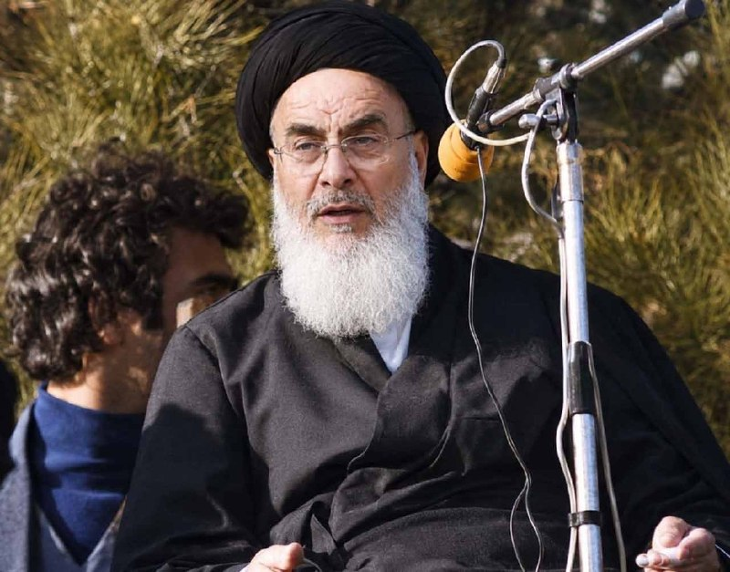

قالیباف: من دولت تعیین موکونوم! من با مشت توی دهن این دولت موزونوم... من به پشتوانه ی چین دولت تعیین موکونوم! من به واسطۀ اینکه ترامپ مرا قبول دارد، دولت تعیین موکونوم.

#کودتا

@Dirty_Kids 👻

## alonews — post 128806

  <a href="telegram/content/alonews_128806_1781730845.webm" target="_blank">🎬 Download video</a>

🔴فوری/بقایی:
الان که با شما صحبت می‌کنم احتمالاً متن تفاهم نامه اسلام آباد به امضای روسای جمهور ایران و آمریکا رسیده باشد.

✅ @AloNews خبر جنگ

## alonews — post 128805

👈وضعیت

✅ @AloNews خبر جنگ

## alonews — post 128804

  <a href="telegram/content/alonews_128804_1781730846.webm" target="_blank">🎬 Download video</a>

👈سناتور جمهوری خواه بیل کسیدی در مورد تفاهم نامه ترامپ:
ریگان در قبر در حال لرزیدن به خود است....این بدترین سیاست خارجه آمریکا در چندین دهه اخیر است

✅ @AloNews خبر جنگ

## alonews — post 128803

  <a href="telegram/content/alonews_128803_1781730846.mp4" target="_blank">🎬 Download video</a>

👈یک آسیب دیده جنگ: خونه ما موشک خورده و کامل تخریب شده اما مسئولان اصلا براشون مهم نیست و وقتی میریم پیششون نگاه هم نمیکنن مارو

🔴الان ما آواره شدیم و چیزی نداریم

✅ @AloNews خبر جنگ

## alonews — post 128802

  <a href="telegram/content/alonews_128802_1781730848.mp4" target="_blank">🎬 Download video</a>

👈قالیباف با بغض: برای من کار راحتی نبود با ترامپ قاتل سردار سلیمانی مذاکره کنم / نفر دومی جز من برای مذاکره نبود

✅ @AloNews خبر جنگ

## alonews — post 128801

  <a href="telegram/content/alonews_128801_1781730850.webm" target="_blank">🎬 Download video</a>

👈استوری میا خلیفه بازیگر مشهور لبنانی برای مهدی طارمی:

✅ @AloNews خبر جنگ

## alonews — post 128799

  <a href="telegram/content/alonews_128799_1781730850.mp4" target="_blank">🎬 Download video</a>

👈جرمی کلارکسون از مستندساز های ماشینی معروف که در ایران طرفدار زیادی دارد اعلام کرد به سرطان مبتلا شده است

جرمی کلارکسون:
سرطان پروستات دارم، ده درصد از پروستاتم را برداشته اند و اگر همه چیز طبق برنامه پیش برود، در فصل ششم «مزرعه کلارکسون» می‌بینمتان. اگر نه که مشخص است مرده ام. مراقب خودتان باشید.

✅ @AloNews خبر جنگ

## alonews — post 128798

🔴کسانی که در خیابان فرزندان ایران را به گلوله بستند و شکنجه کردند، مولایشان حسین بود.

## alonews — post 128797

  <a href="telegram/content/alonews_128797_1781730851.webm" target="_blank">🎬 Download video</a>

👈معاون وزیر کشور: ۶۰ درصد مردم ایران امیدی به بهبود آینده ندارن

✅ @AloNews خبر جنگ

## alonews — post 128796

  <a href="telegram/content/alonews_128796_1781730851.mp4" target="_blank">🎬 Download video</a>

👈قالیباف: ما میتونیم تنگه هرمز رو بر ضد آمریکا تبدیل کنیم. هیچ کس به کمک آمریکا نیومد. این موضوع که باید عوارض تردد در تنگه هرمز پرداخت بشه، تثبیت شده در تفاهم نامه.

✅ @AloNews خبر جنگ

---
📅 بروزرسانی: 1405/03/28 00:23
---

## WithYashar — post 15195

## FoxNewsTwitter — post 343094

  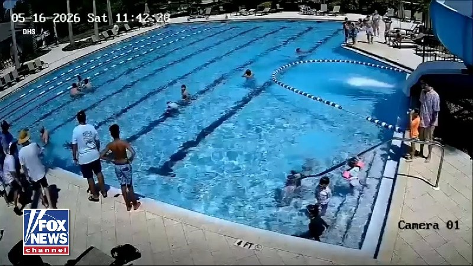

Fox News (Twitter/X)

A 6-year-old boy was found floating unconscious in a Florida pool. Seconds later, an ICE officer jumped in to save him.

ICE law enforcement officer Gregory Simmonds spotted the child in distress in Pasco County on May 16 and immediately pulled him from the water.

The child wasn't breathing, and Simmonds began life-saving CPR at the scene until the boy regained consciousness.

Local authorities say the child is expected to make a full recovery, a rescue DHS is calling an act of bravery.

## pm_afshaa — post 94301

  <a href="telegram/content/pm_afshaa_94301_1781729633.mp4" target="_blank">🎬 Download video</a>

🔴قالیباف: ما میتونیم تنگه هرمز رو بر ضد آمریکا تبدیل کنیم. هیچ کس به کمک آمریکا نیومد. این موضوع که باید عوارض تردد در تنگه هرمز پرداخت بشه، تثبیت شده در تفاهم نامه.

💧 Rainbet.com the #1 Non-KYC Crypto Casino & Sportsbook @rainbetcom

😁 @Pm_Afshaa

## pm_afshaa — post 94300

  <a href="telegram/content/pm_afshaa_94300_1781729635.mp4" target="_blank">🎬 Download video</a>

🔴قالیباف: بند 6 تفاهم‌نامه 300 میلیارد دلار برای موضوع بازسازی و توسعه اقتصادی در ایران تعیین شده!

در این بند 300 میلیارد دلار تعیین شده تا در ایران سرمایه گذاری بشه که بخشی از آن صرف بازسازی خواهد شد.

💧 Rainbet.com the #1 Non-KYC Crypto Casino & Sportsbook @rainbetcom

😁 @Pm_Afshaa

## pm_afshaa — post 94299

  <a href="telegram/content/pm_afshaa_94299_1781729638.mp4" target="_blank">🎬 Download video</a>

🔴قالیباف: پول‌ها ر‌و باید بگیریم و در حساب ما و در خط اعتباری قرار بگیره.

هر کجا دشمن نسبت به این موضوعات بدقولی کنه، خلاصه بچرخ تا بچرخیم. تا جایی که تعهد دادیم هستیم، و هر کجا دشمن خلاف وعده عمل کند دست به ماشه هستیم.

💧 Rainbet.com the #1 Non-KYC Crypto Casino & Sportsbook @rainbetcom

😁 @Pm_Afshaa

## kianmeli1 — post 88052

  <a href="telegram/content/kianmeli1_88052_1781729640.mp4" target="_blank">🎬 Download video</a>

🔴کارشناس فاکس نیوز: حدود ۴۸ ساعت پیش این یادداشت تفاهم ایران و آمریکا رو خواندم و باورم نمی‌شد. وقتی اون رو دیدم، فکر کردم یکی داره سرِ کارم می‌گذاره یا برام یک چیز جعلی فرستاده، باورنکردنیه
https://t.me/kianmeli1

## IranianMinds — post 22832

🔴 قالیباف:

در قوانین ایران هیچ مانعی برای حضور و سرمایه‌گذاری شرکت‌های آمریکایی در داخل ایران وجود ندارد!

@IranianMinds

## Dirty_Kids — post 392432

‏عرق خور نیستم؟ قمار نمیکنم؟ عیاشی نکردم؟
به تو چه
این ده روزو می‌خوام یزیدی باشم

@Dirty_Kids 👻

## Dirty_Kids — post 392431

  <a href="telegram/content/Dirty_Kids_392431_1781729642.mp4" target="_blank">🎬 Download video</a>

این ویدیو در تاریخ ۳۱ خرداد ۱۴۰۳ ضبط شده یعنی ۲ سال قبل

@Dirty_Kids 👻

## Dirty_Kids — post 392430

  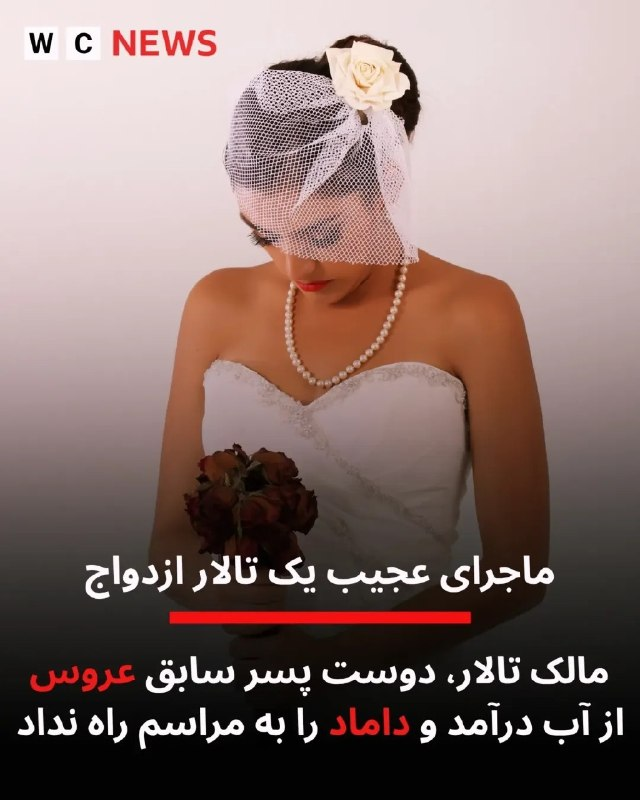

سکوت میکنم که سکوت منطقی تره

دختری شب ازدواج متوجه می‌شود صاحب تالار، دوست پسر سابقش است و داماد را به سالن راه نمیدهد. این درحالیست که تمام مهمان‌ها مست کرده‌اند و روی میزها میرقصند.
بزرگان فامیل به اتاق مدیریت تالار میروند تا وساطتت کنند، که ناگهان داماد را با پسر لخت در اتاق می‌بینند. وقتی دلیل را جویا میشوند میفهمند داماد از توقعات دختر بیچاره شده و برای گرفتن عروسی زیر بدهکاریست. برای همین با مالک تالار روی هم ریخته تا قسمتی از خرج زندگی را دربیاورد.

@Dirty_Kids 👻

## alonews — post 128795

  <a href="telegram/content/alonews_128795_1781729643.mp4" target="_blank">🎬 Download video</a>

👈قالیباف: بند 6 تفاهم‌نامه 300 میلیارد دلار برای موضوع بازسازی و توسعه اقتصادی در ایران تعیین شده!

🔴در این بند 300 میلیارد دلار تعیین شده تا در ایران سرمایه گذاری بشه که بخشی از آن صرف بازسازی خواهد شد.

✅ @AloNews خبر جنگ

## alonews — post 128794

  <a href="telegram/content/alonews_128794_1781729646.mp4" target="_blank">🎬 Download video</a>

👈پیت هگست، ژنرال 10 ستاره هم کماکان در حال گذراندن تمرینات آمادسازی برای قبل از مراسم برکناری خود در سمت وزارت جنگ مشاهده شده است.

✅ @AloNews خبر جنگ

## alonews — post 128793

  <a href="telegram/content/alonews_128793_1781729647.webm" target="_blank">🎬 Download video</a>

👈ترامپ برای شرکت در یک شام رسمی که توسط رئیس‌جمهور امانوئل مکرون و بانوی اول بریژیت مکرون برگزار شده است، به کاخ ورسای رفت.

✅ @AloNews خبر جنگ

## alonews — post 128792

  <a href="telegram/content/alonews_128792_1781729647.webm" target="_blank">🎬 Download video</a>

👈قالیباف:
در قوانین ایران هیچ مانعی برای حضور و سرمایه‌گذاری شرکت‌های آمریکایی در داخل ایران وجود ندارد!

✅ @AloNews خبر جنگ

## alonews — post 128791

🔴کسانی که در خیابان فرزندان ایران را به گلوله بستند و شکنجه کردند، مولایشان حسین بود.

---
📅 بروزرسانی: 1405/03/28 00:13
---

## VahidOOnLine — post 246092

♦️محمدباقر قالیباف، رئیس مجلس شورای اسلامی و مذاکره‌کننده ارشد جمهوری اسلامی، چهارشنبه‌شب ۲۷ خردادماه در مصاحبه‌ای که همزمان با انتشار مفاد تفاهم‌نامه تهران و واشنگتن از صداوسیما پخش شد، گفت برای حضور در مذاکرات با دولت دونالد ترامپ تمایلی نداشت و به دلیل نقش ترامپ در کشتن قاسم سلیمانی، «کراهت شدید» برای ورود به این روند احساس می‌کرد. او افزود که با وجود این مخالفت شخصی، به درخواست مقام‌های جمهوری اسلامی مسئولیت مذاکرات را پذیرفت.

قالیباف در این مصاحبه گفت: «ترامپ طراح کشتن قاسم سلیمانی بود و بر آن عملیات نظارت کرد، برای من سخت بود که با چنین فردی بنشینم.» او اضافه کرد که بارها پیشنهاد داده افراد دیگری مسئولیت مذاکرات را بر عهده بگیرند، اما همه مسئولان تنها نام او را مطرح کردند. قالیباف گفت: «وقتی دیدم همه مسئولین فقط من را می‌خواهند، احساس کردم وظیفه است و باید آنچه را وظیفه‌مان است انجام دهیم، نه آنچه را دوست داریم.»
‌🇸🇦 Indypersian

🤖 @VahidOOnLine

## VahidOOnLine — post 246091

  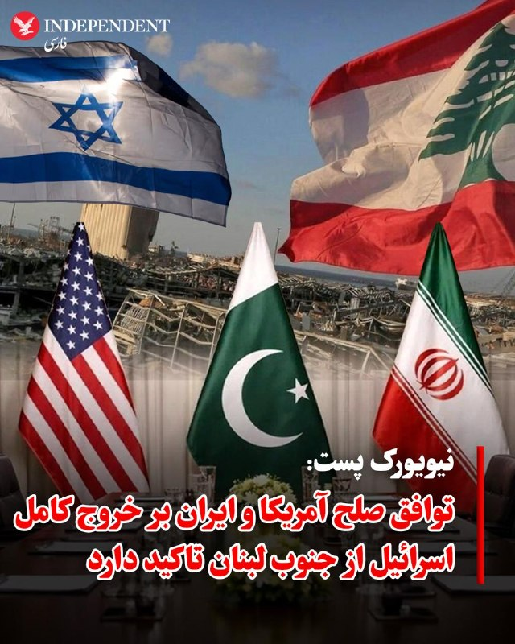

♦️نیویورک پست با استناد به متن کامل تفاهم‌نامه میان ایران و آمریکا گزارش داد که این توافق بر «پایان فوری و دائمی عملیات نظامی در همه جبهه‌ها، از جمله لبنان» و همچنین احترام به تمامیت ارضی و حاکمیت لبنان تاکید دارد؛ موضوعی که به نوشته این روزنامه می‌تواند اسرائیل را به خروج کامل از جنوب لبنان ملزم کند.
بر اساس این گزارش، در متن تفاهم‌نامه آمده است که ایران، آمریکا و متحدان دو طرف متعهد می‌شوند از هرگونه اقدام نظامی، تهدید یا استفاده از زور علیه یکدیگر خودداری کنند و حاکمیت و تمامیت ارضی لبنان را محترم بشمارند.
نیویورک پست همچنین نوشت این بندها با موضع دولت اسرائیل مبنی بر ادامه حضور نیروهایش در مناطق امنیتی جنوب لبنان در تضاد است. اسرائیل کاتز، وزیر دفاع اسرائیل، پیش‌تر گفته بود که این کشور از مناطق امنیتی مورد نظر خود عقب‌نشینی نخواهد کرد.
‌🇸🇦 Indypersian

🤖 @VahidOOnLine

## mwarmonitor — post 11089

  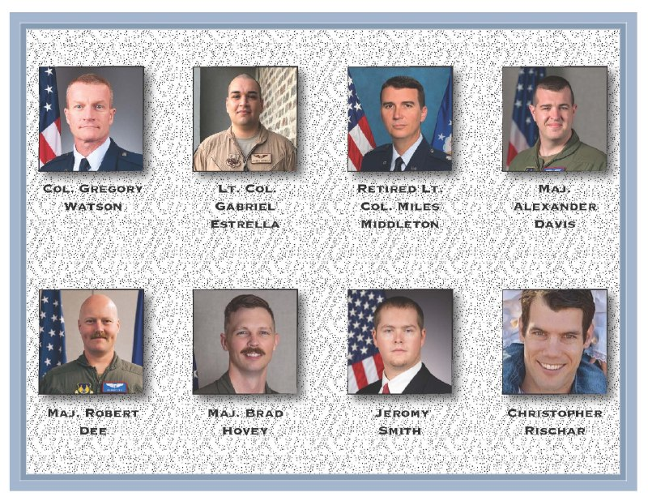

🚨✈️یک فروند بمب‌افکن B-52 استراتوفورترس متعلق به نیروی هوایی آمریکا، اندکی پس از برخاستن از پایگاه نیروی هوایی ادواردز و حوالی ساعت ۱۱:۲۰ صبح سقوط کرد. هنوز جزئیاتی درباره تلفات احتمالی یا علت این سانحه منتشر نشده است. @mwarmonitor

## pm_afshaa — post 94298

  <a href="telegram/content/pm_afshaa_94298_1781729022.webm" target="_blank">🎬 Download video</a>

🔴العربیه: قالیباف میگه تنگه هرمز دیگه به وضعیت قبل از جنگ برنمی‌گرده. ایران از این پس به‌صورت طبیعی بابت خدمات و عبور در تنگه هرمز عوارض دریافت خواهد کرد.

💧 Rainbet.com the #1 Non-KYC Crypto Casino & Sportsbook @rainbetcom

😁 @Pm_Afshaa

## pm_afshaa — post 94297

  <a href="telegram/content/pm_afshaa_94297_1781729022.webm" target="_blank">🎬 Download video</a>

🔴ترامپ: ظرف 48 ساعت آینده توافق با ایران امضا خواهد شد و احتمالا برای مدتی ارتش رو در خلیج فارس نگه خواهیم داشت.

💧 Rainbet.com the #1 Non-KYC Crypto Casino & Sportsbook @rainbetcom

😁 @Pm_Afshaa

## pm_afshaa — post 94296

  <a href="telegram/content/pm_afshaa_94296_1781729023.webm" target="_blank">🎬 Download video</a>

🔴قالیباف: ترامپ قاتل قاسم سلیمانیه و برای من مذاکره با اون سخت بود.

💧 Rainbet.com the #1 Non-KYC Crypto Casino & Sportsbook @rainbetcom

😁 @Pm_Afshaa

## pm_afshaa — post 94295

  <a href="telegram/content/pm_afshaa_94295_1781729023.webm" target="_blank">🎬 Download video</a>

🔴قالیباف: چیزی که با مذاکره به دست آوردیم، چندین برابر چیزی بود که با اقدام نظامی می‌تونستیم به دست بیاریم.

ترامپ تا 2 بامداد شخصا برای برقراری آتش‌بس وارد عمل شد و همین نشان میده مذاکره هم یک روش مبارزه‌ست.

بدون موشک، شجاعت و حمایت مردم، چنین دستاوردی ممکن نبود.

💧 Rainbet.com the #1 Non-KYC Crypto Casino & Sportsbook @rainbetcom

😁 @Pm_Afshaa

## mamlekate — post 103734

  <a href="telegram/content/mamlekate_103734_1781729024.mp4" target="_blank">🎬 Download video</a>

کارشناس فاکس نیوز: حدود ۴۸ ساعت پیش این یادداشت تفاهم ایران و آمریکا رو خواندم و باورم نمی‌شد. وقتی اون رو دیدم، فکر کردم یکی داره سرِ کارم می‌گذاره یا برام یک چیز جعلی فرستاده، باورنکردنیه!

NR2OH
@mamlekate

## mamlekate — post 103733

📝 متن کامل تفاهم‌نامه ۱۴ بندی ایران و آمریکا برای پایان دادن به جنگ منتشر شد

یک مقام ارشد آمریکایی روز چهارشنبه ۲۷ خرداد متن توافق موقت میان آمریکا و ایران برای توقف جنگ در ایران و بازگشایی تنگه هرمز را برای خبرنگاران قرائت کرد.

@mamlekate

## mamlekate — post 103732

  <a href="telegram/content/mamlekate_103732_1781729025.mp4" target="_blank">🎬 Download video</a>

☝️ گزارش نشست رسانه‌ای ترامپ

🚨 ترامپ: «بنابراین ما روی یک تلاش موازی با کشورهای حاشیه خلیج [فارس] کار خواهیم کرد تا به موضوعات غیرهسته‌ای بپردازیم، مانند موشک‌های بالستیک متعارف که درباره‌شان صحبت خواهیم کرد و حمایت... یعنی بالاخره آن‌ها هم باید یک چیزهایی داشته باشند، چون بقیه هم دارند. بالاخره باید یک چیزی داشته باشند.
یک کسی می‌گفت: "شما نباید به آن‌ها هیچ موشکی بدهید..." من آدم‌هایی دارم... من بعضی از این آدم‌ها را دوست دارم. اما فکر نمی‌کنم باهوش... فکر نمی‌کنم باهوش باشند.
"قربان، شما نباید بگذارید آن‌ها هیچ موشکی داشته باشند."
من گفتم: "خب، پس من باید چکار کنم؟ آیا باید بگذارم عربستان سعودی موشک داشته باشد اما آن‌ها نداشته باشند؟"
"بله قربان."
این‌طوری کار درست نمی‌شود، می‌دانید؟ این‌طوری کار پیش نمی‌رود. و موشک‌ها مشکل اصلی نیستند؛ موشک‌ها... آن‌ها به یک موقعیت مکانی کوچک آسیب می‌زنند اما همه‌چیز را نابود نمی‌کنند...»

🚨این اظهارات ترامپ و متن سند مماشات شرم آور ترامپ در برابر رژیم جمهوری اسلامی چیزی جز ننگ و رسوایی برای این دولت نیست. چه خبر از اراجیفی چون تله، دام و عملیات فریب ای کلاش های کاسب؟ حتمن می خواهید برای توجیه این فضاحت و سرپوش گذاشتن بر دروغ هایی که به مردم گفتید به طور فریبکارانه و به روش حقه بازی همیشگی پشت واژه هایی چون «ناامید نکردن مردم» و «حالا چه کار کنیم» و «صبور باشید» و «داره دون مپاشه» قایم شوید؟ بجای توجیه سیاست های فاجعه آمیز و حتی مفاد کثیف این سند رسوایی، سعی کنید به این سند مماشات ترامپ که در حال حاضر بدتر از مماشات چمبرلین در برابر آلمان نازی است اعتراض مسالمت آمیز کنید. میدانم بسیاری از اصلاح طلبان از فرصت استفاده می کنند که بگویند صبور باشید خیلی هم فاجعه آمیز نیست.

Haghaie
@mamlekate

## FarsiVOA — post 221057

⚡️حمایت «گروه هفت» از تفاهم‌نامه آمریکا و جمهوری اسلامی و چشم‌انداز توافق؛ گفت‌وگو با ابراهیم روشندل
@FarsiVOA

---
📅 بروزرسانی: 1405/03/28 00:06
---

## WithYashar — post 15194

ترامپ: ظرف ۴۸ ساعت آینده توافق با ایران امضا خواهد شد و احتمالا برای مدتی ارتش رو در خلیج فارس نگه خواهیم داشت.
@withyashar

## mwarmonitor — post 11088

🔴 مذاکره‌کننده ارشد ایران می‌گوید تنگه هرمز به وضعیت قبل از جنگ باز نخواهد گشت.

🔴 محمدباقر قالیباف می‌گوید ایران به‌طور طبیعی برای خدمات در تنگه هرمز هزینه عوارض دریافت خواهد کرد. العربیه

@mwarmonitor

## FoxNewsTwitter — post 343093

  <a href="telegram/content/FoxNewsTwitter_343093_1781728574.mp4" target="_blank">🎬 Download video</a>

Fox News (Twitter/X)

Like father, like son... almost.

A Ring doorbell camera captured the moment a dad landed a smooth kickflip in his driveway while his 2-year-old son tried to follow suit on a small bicycle.

Seconds later, the toddler launched himself right over the handlebars in a hilarious attempt to match dad’s skateboard skills.

## Persian_Trend_Official — post 17404

  <a href="telegram/content/Persian_Trend_Official_17404_1781728578.mp4" target="_blank">🎬 Download video</a>

قالیباف، رئیس تیم مذاکره‌کننده ایرانی: بند 6 تفاهم‌نامه 300 میلیارد دلار برای موضوع بازسازی و توسعه اقتصادی در ایران تعیین شده است، در دنیایی که قانون جنگل حاکم است ما باید با قدرت خود مسائل را دنبال کنیم.

سازمان ملل حتی یک بیانیه که آمریکا را متجاوز اعلام کند، منتشر نکرد و لذا نمی پذیرند که متجاوز هستند. در دنیایی که قانون جنگل حاکم است ما باید با قدرت خود، مسائل را دنبال کنیم.

البته در تفاهم نامه بند 6 برای این موضوع آمده که در آن از لفظ بازسازی و توسعه اقتصادی استفاده شده است. در این بند 300 میلیارد دلار تعیین شده تا در ایران سرمایه گذاری شود که بخشی از آن صرف بازسازی خواهد شد.

📝 Amir

📌 @persian_trend_official
پرشین ترند | متفاوت‌ترین کانال نظامی

## Persian_Trend_Official — post 17403

  <a href="telegram/content/Persian_Trend_Official_17403_1781728581.mp4" target="_blank">🎬 Download video</a>

قالیباف، رئیس تیم مذاکره‌کننده ایرانی: پرداخت هزینه خدمات عبور از تنگه هرمز در تفاهم‌نامه تثبیت شده است!

کشورهای ساحلی تنگه ها در قوانین بین المللی حقوق و وظایفی دارند از جمله این که دیگران باید هزینه خدمات شان را پرداختند کنند. دشمنان ایران را خدا از احمق ها آفریده و باعث شدند ظرفیت بالقوه ایران در تنگه هرمز بالفعل شود.

ایران در تنگه هرمز حق حاکمیتی دارد و طبیعتا در قبال خدمات، هزینه دریافت خواهیم کرد.

📝 Amir

📌 @persian_trend_official
پرشین ترند | متفاوت‌ترین کانال نظامی

## BBCPersian — post 284182

  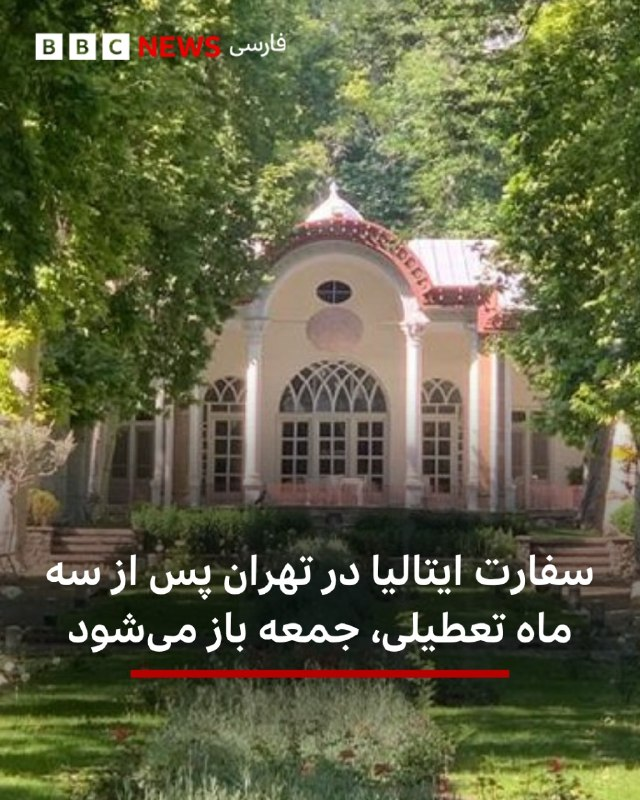

🔻وزارت خارجه ایتالیا روز چهارشنبه اعلام کرد که سفارت این کشور در تهران روز جمعه فعالیت خود را از سر خواهد گرفت. بیش از سه ماه از تعطیلی سفارت ایتالیا به دلیل جنگ آمریکا و اسرائیل با ایران می‌گذرد.

آنتونیو تاجانی،‌ وزیر خارجه ایتالیا به پارلمان این کشور گفت: «سفارت ما در تهران روز جمعه درهایش را دوباره باز خواهد کرد.»

ایتالیا اوایل ماه مارس،‌ اسفند ماه پس از اینکه آمریکا و اسرائیل با حملات هوایی علیه ایران جنگ را آغاز کردند،‌ به دلایل امنیتی سفارت خود را در تهران به طور موقت تعطیل کرد و دیپلمات‌ها و کارکنان سفارت را به جمهوری آذربایجان،‌ همسایه ایران منتقل کرد.

آقای تاجانی گفت: «سفیر ما به همراه همه دیپلمات‌ها و مقامات وزارت امور خارجه به پایتخت ایران بازخواهند گشت.»

او افزود: «در یک منطقه پیچیده مانند خاورمیانه،‌ احتیاط ضروری است. اما این نخستین بار پس از هفته‌ها جنگ و مذاکراتی که با دشواری پیش می‌رفت است، که نشانه‌ای ملموس از صلح در حال ظهور است.»

📷Italian Embassy Website
https://bbc.in/3S6tPmr

@BBCPersian

## BBCPersian — post 284181

🔻ایرنا متن تفاهم نامه را منتشر کرد؛ نسخه ایران و آمریکا تقریبا یکسان هستند

🖋️غنچه حبیبی‌آزاد، بی‌بی‌سی فارسی

🔻خبرگزاری جمهوری اسلامی ایران - ایرنا - دقایقی پیش نسخه‌ای از تفاهم نامه میان ایران و آمریکا را منتشر کرد.

مقایسه نسخه منتشر شده از سوی ایرنا با نسخه‌ای که بی‌بی‌سی به آن دست یافته است، نشان می‌دهد دو نسخه از این توافق ۱۴ بندی تقریبا به طور کامل یکسانند.

تنها تفاوت جزئی در بند ششم دیده می‌شود؛ بندی که با این عبارت آغاز می‌شود:

«ایالات متحده آمریکا متعهد می‌شود با همکاری شرکای منطقه‌ای، یک برنامه نهایی مورد توافق طرفین با حداقل ۳۰۰ میلیارد دلار برای بازسازی و توسعه اقتصادی جمهوری اسلامی ایران تدوین کند. سازوکار اجرای این برنامه به عنوان بخشی از توافق نهایی، ظرف ۶۰ روز نهایی خواهد شد.»

آخرین جمله این بند در نسخه آمریکایی چنین است:

«تمام مجوزها، معافیت‌ها و اجازه‌های لازم برای انجام معاملات اولیه مرتبط، از سوی ایالات متحده آمریکا صادر خواهد شد.»

اما در نسخه منتشر شده توسط ایرنا، واژه «اولیه» از این جمله حذف شده است.

با این حال، به نظر نمی‌رسد این تفاوت جزئی تغییری اساسی در مفهوم یا محتوای توافق ایجاد کند.

https://bbc.in/4oCftGn
@BBCPersian

## alonews — post 128790

  <a href="telegram/content/alonews_128790_1781728585.webm" target="_blank">🎬 Download video</a>

👈قالیباف: وقتی اظهارات ونس را هنگام سوار شدن به هواپیما دیدم که درباره لبنان صحبت کرده بود، پیش از پرواز و در فرودگاه توئیت زدم که تا وضعیت لبنان روشن نشود، مذاکره را آغاز نخواهیم کرد

✅ @AloNews خبر جنگ

## alonews — post 128789

  <a href="telegram/content/alonews_128789_1781728586.webm" target="_blank">🎬 Download video</a>

👈قالیباف: برخی متون تفاهنمامه به خاطر حساسیت های حقوقی ساعات ها در موردش بحث شد.

🔴 برخی دوستان نگران بودند که آیا بعد از ۳۰ روز محاصره رفع خواهد شد؟ اما به لطف خدا طی سه روز محاصره لغو شد

✅ @AloNews خبر جنگ

## alonews — post 128788

  <a href="telegram/content/alonews_128788_1781728586.webm" target="_blank">🎬 Download video</a>

👈قالیباف: سازمان ملل حتی یک بیانیه که آمریکا را متجاوز اعلام کند، منتشر نکرد و لذا نمی‌پذیرند که متجاوز هستند. در دنیایی که قانون جنگل حاکم است ما باید با قدرت خود، مسائل را دنبال کنیم.

🔴البته در تفاهم نامه بند ۶ برای این موضوع آمده که در آن از لفظ بازسازی و توسعه اقتصادی استفاده شده است.

🔴در این بند ۳۰۰ میلیارد دلار تعیین شده تا در ایران سرمایه گذاری شود که بخشی از آن صرف بازسازی خواهد شد

✅ @AloNews خبر جنگ

## alonews — post 128787

  <a href="telegram/content/alonews_128787_1781728586.webm" target="_blank">🎬 Download video</a>

👈قالیباف: کشورهای ساحلی تنگه ها در قوانین بین المللی حقوق و وظایفی دارند از جمله این که دیگران باید هزینه خدمات شان را پرداختند کنند.

🔴 دشمنان ایران را خدا از احمق ها آفریده و باعث شدند ظرفیت بالقوه ایران در تنگه هرمز بالفعل شود.

🔴 ایران در تنگه هرمز حق حاکمیتی دارد و طبیعتا در قبال خدمات، هزینه دریافت خواهیم کرد.

🔴پول‌های بلوکه شده ایران باید در حساب‌های ما و در اختیار بانک مرکزی قرار گیرد. خط اعتباری یعنی بانک مرکزی می‌تواند هر لحظه برای هر کس خواست، ال سی باز کند.

🔴 این را اطمینان می‌دهم که هر کجا دشمن به تعهداتش عمل نکند، سیاست ما بچرخ تا بچرخیم است اما اگر به تعهدات عمل کند ما هم عمل خواهیم کرد.

🔴 اگر دشمن بخواهد خیانت کند ما مردم میدان هستیم و فاصله من از میدان مبارزه دیپلماسی تا میدان مبارزه نظامی زیاد نیست و دست مان روی ماشه است.

🔴 به کسی که منطق را نفهمد با قدرت، منطق را تفهیم خواهیم کرد. من دیپلمات نیستم اما خوب می دانم چطور باید به آمریکا تفهیم کنم که باید چه اقدامی انجام دهد.

🔴ایران پول‌های بلوکه شده را دریافت خواهد کرد؛ اما این به معنای این نیست که پلت پول بیاوریم. این پول اما باید در اختیار ایران باشد

✅ @AloNews خبر جنگ

---
📅 بروزرسانی: 1405/03/27 23:53
---

## mwarmonitor — post 11087

🔴 ترامپ: ظرف ۴۸ ساعت آینده توافق با ایران امضا خواهد شد و احتمالاً برای مدتی ارتش را در خلیج فارس نگه خواهیم داشت.

@mwarmonitor

## Persian_Trend_Official — post 17401

  <a href="telegram/content/Persian_Trend_Official_17401_1781727830.webm" target="_blank">🎬 Download video</a>

یه سفر کوتاه اومدم به امید باز شدن گره ها 😄

## alonews — post 128786

  <a href="telegram/content/alonews_128786_1781727831.webm" target="_blank">🎬 Download video</a>

👈توضیحات قالیباف در مورد فرآیند مذاکرات اسلام آباد

🔴 طی ۲۴ ساعت ۳ دور مذاکرات با متن و ۳ دور مذاکرات سه جانبه با حضور میانجی برگزار شد

✅ @AloNews خبر جنگ

---
📅 بروزرسانی: 1405/03/27 23:43
---

## VahidOOnLine — post 246090

  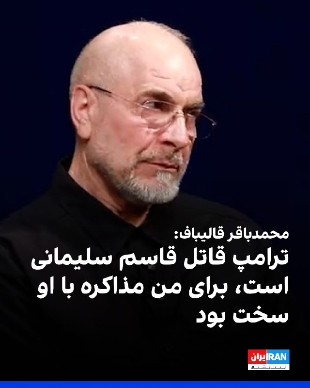

محمدباقر قالیباف، رییس هیات مذاکره‌کننده جمهوری اسلامی گفت: «ترامپ طراح کشتن قاسم سلیمانی بود و بر آن عملیات نظارت کرد، برای من سخت بود که با چنین فردی بنشینم، اما همه مسئولان فقط اسم من را آوردند و از من خواستند وارد عرصه شوم.»

او ادامه داد: «من برای شرکت در مذاکرات کراهت داشتم و دلم نمی‌خواست وارد شوم.»
‌🏁 🇬🇧 IranintlTV

🤖 @VahidOOnLine

## VahidOOnLine — post 246089

  <a href="telegram/content/VahidOOnLine_246089_1781727236.mp4" target="_blank">🎬 Download video</a>

♦️محمدباقر قالیباف، رئیس مجلس شورای اسلامی و مذاکره‌کننده ارشد جمهوری اسلامی، در مصاحبه‌ای که همزمان با انتشار مفاد تفاهم‌نامه تهران و واشنگتن از صداوسیما پخش شد، به حمله اسرائیل به بیروت در آستانه امضای تفاهم‌نامه تهران و واشنگتن اشاره کرد.

قالیباف در پاسخ به سوال مجری درباره علت انجام نشدن حمله متقابل به مواضع اسرائیل از سوی نیروهای نظامی جمهوری اسلامی، مذاکره را نیز یک «روش مبارزه» خواند و گفت: «هر آن‌چه را که می‌خواستیم با اقدام نظامی به‌دست بیاوریم، چندین برابرش را که اصلا قابل مقایسه نیست از طریق مذاکره به‌دست آوردیم.»

او با اشاره به اظهارات ترامپ در گفتگو با آکسیوس که با الفاظ تندی از نتانیاهو انتقاد کرده بود، گفت: «شما دیدید که ترامپ، تا ساعت دو بامداد برای برقراری آتش‌بس نه در ضاحیه بلکه در سراسر لبنان وارد عمل شد و با آن ادبیات با نتانیاهو صحبت کرد.»
‌🇸🇦 Indypersian

🤖 @VahidOOnLine

## IranIntlTV — post 342922

  

محمدباقر قالیباف، رییس هیات مذاکره‌کننده جمهوری اسلامی گفت: «ترامپ طراح کشتن قاسم سلیمانی بود و بر آن عملیات نظارت کرد، برای من سخت بود که با چنین فردی بنشینم، اما همه مسئولان فقط اسم من را آوردند و از من خواستند وارد عرصه شوم.»

او ادامه داد: «من برای شرکت در مذاکرات کراهت داشتم و دلم نمی‌خواست وارد شوم.»
https://iranintl.com/202606171938

## FarsiVOA — post 221056

🔺چهارده بند یادداشت تفاهم میان ایالات متحده و جمهوری اسلامی

▪️یک مقام ارشد دولت ایالات متحده روز چهارشنبه ۲۷ خرداد ۱۴۰۵ مفاد اجمالی یادداشت تفاهم میان ایالات متحده آمریکا و جمهوری اسلامی ایران را برای صدای آمریکا ارسال کرد. بر این اساس، مفاد توافق به این شرح است.

⬇️ بیشتر بخوانید:
https://ir.voanews.com/a/us-iran-mou-full-text/8161939.html
@FarsiVOA

## Persian_Trend_Official — post 17400

امشب متاسفانه لایو نداریم و نمیتونم در خدمتتون باشم

## alonews — post 128785

  <a href="telegram/content/alonews_128785_1781727237.webm" target="_blank">🎬 Download video</a>

👈قالیباف: اگر می‌خواستیم محاصره دریایی را با موشک بشکنیم باید جنگی بزرگتر از جنگ ۴۰ روزه رقم میزدیم

✅ @AloNews خبر جنگ

## alonews — post 128784

  <a href="telegram/content/alonews_128784_1781727238.webm" target="_blank">🎬 Download video</a>

🔴فوری / جمهوری اسلامی ایران و ایالات متحده آمریکا، به طور مشترک و با حسن نیت، در تاریخ ۲۸ خرداد ۱۴۰۵ نسبت به موارد زیر توافق کردند: 
🔴1️⃣جمهوری اسلامی ایران و ایالات متحده آمریکا و متحدین آنها در جنگ حاضر، با امضای این یادداشت تفاهم خاتمه فوری و دائمی عملیات‌های…

## alonews — post 128783

👈جهت رزرو تبلیغات در الونیوز به اینجا مراجعه کنید
⬇️

https://t.me/ads_alonews
https://t.me/ads_alonews

## alonews — post 128782

  <a href="telegram/content/alonews_128782_1781727238.webm" target="_blank">🎬 Download video</a>

👈قالیباف: ما حتما باید با عقلانیت حرکت کنیم، شعار قدرت نیست، گرهی که با دست باز می‌شود را لازم نیست با دندان باز کنیم. اگر دوبار شعار بدهیم ولی قدرت نداشته باشیم یعنی بی اعتباری و کمک به دشمن

✅ @AloNews خبر جنگ

---
📅 بروزرسانی: 1405/03/27 23:34
---

## VahidOOnLine — post 246088

  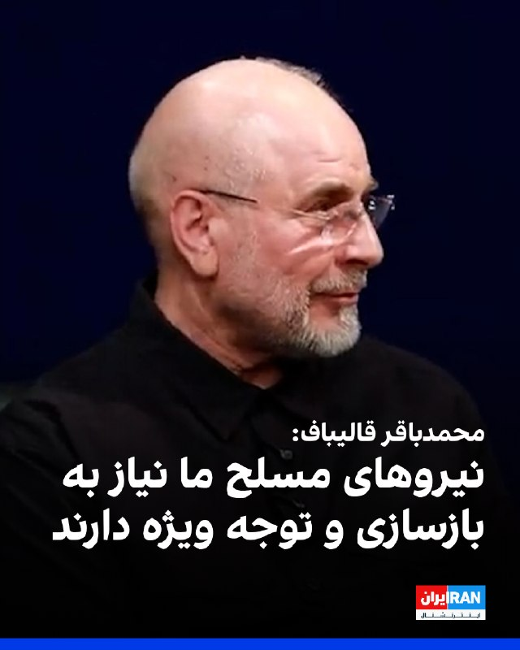

محمدباقر قالیباف، رییس مجلس در شبکه خبر صداوسیما گفت: «نیروهای مسلح ما نیاز به بازسازی و توجه ویژه دارند.»

او ادامه داد: «شغل من مذاکره نیست، من رزمنده‌ام و با رزمندگی دیپلماسی را دنبال می‌کنم. من بی‌اعتمادترین فرد به آمریکا هستم، به جی‌دی ونس هم گفتم که کمترین اعتمادی به شما ندارم.»

او افزود: «اگر مذاکره نبود، به هدفمان نمی‌رسیدیم، هر آنچه را که می‌خواستیم با اقدام نظامی به دست بیاوریم، چندین برابر آن را که اصلا قابل قیاس نیست، از طریق مذاکره به دست آوردیم.»
‌🏁 🇬🇧 IranintlTV

🤖 @VahidOOnLine

## WithYashar — post 15193

@withyashar Reeee

## WithYashar — post 15191

مجری شبکه خبر : چرا ایران در روز آخر مذاکره حمله به اسرائیل را متوقف کرد؟

قالیباف: ما هر آنچه که می‌خواستیم با حمله بگیریم را چندین برابرش را با مذاکره گرفتیم. ساعت ۲ صبح ترامپ آتش‌بس را در کل لبنان داد و با آن ادبیات با نتانیاهو صحبت کرد.

قرار بود آمریکا محاصره را ظرف ۳۰ روز بردارد اما ترامپ گفت همین امشب محاصره را برمی‌داریم
@withyashar

## IranIntlTV — post 342921

  

محمدباقر قالیباف، رییس مجلس در شبکه خبر صداوسیما گفت: «نیروهای مسلح ما نیاز به بازسازی و توجه ویژه دارند.»

او ادامه داد: «شغل من مذاکره نیست، من رزمنده‌ام و با رزمندگی دیپلماسی را دنبال می‌کنم. من بی‌اعتمادترین فرد به آمریکا هستم، به جی‌دی ونس هم گفتم که کمترین اعتمادی به شما ندارم.»

او افزود: «اگر مذاکره نبود، به هدفمان نمی‌رسیدیم، هر آنچه را که می‌خواستیم با اقدام نظامی به دست بیاوریم، چندین برابر آن را که اصلا قابل قیاس نیست، از طریق مذاکره به دست آوردیم.»
https://iranintl.com/202606172843

## Persian_Trend_Official — post 17399

قالیباف، رئیس تیم مذاکره‌کننده ایرانی: لبنان بخشی از جبهه مقاومت است. در تفاهم‌نامه نیز ایران پشتیبان جبهه مقاومت و آمریکا حامی و متحد رژیم صهیونیستی است.

زمانی که رژیم صهیونیستی ضاحیه را هدف قرار داد، ما آمریکا را تهدید کردیم و اولتیماتوم دادیم که باید خواسته‌های ما پذیرفته شود؛ در غیر این صورت واکنش نشان خواهیم داد. ترامپ ناچار شد توئیت بزند و به نتانیاهو بگوید که باید آتش را متوقف کند و دیگر حق ندارد ضاحیه را هدف قرار دهد.

روز یکشنبه در حال مذاکره با میانجی‌ها بودیم که حادثه ضاحیه رخ داد. همان‌جا، در میانه مذاکرات، بلافاصله توئیت زدم که حتماً به حمله به ضاحیه پاسخ خواهیم داد. پس از آن، فضای مذاکرات به‌طور کامل تغییر کرد. ما صریحاً اعلام کردیم که تحت هر شرایطی پاسخ خواهیم داد. دوستان ما در میدان نیز آماده بودند و فرمان لازم را در اختیار داشتند.

آن‌ها گفتند پاسخ ندهید، اما ما گفتیم حتماً پاسخ خواهیم داد و اگر واکنشی نشان دهید، دامنه پاسخ را گسترش خواهیم داد. این همان فرهنگ مذاکره به‌عنوان یک روش مبارزه است.

📝 Amir

📌 @persian_trend_official
پرشین ترند | متفاوت‌ترین کانال نظامی

## BBCPersian — post 284180

  <a href="https://t.me/bbcpersian/284180" target="_blank">📎 Download file</a>

پادکست برنامه ۶۰ دقیقه چهارشنبه ۲۷ خرداد ۱۴۰۵

این نسخه رادیویی برنامه شصت دقیقه تلویزیون فارسی بی‌بی‌سی است که هرشب بعد از پخش، با حجم کم از اپلیکیشن‌های پادگیر و صفحه تلگرام بی‌بی‌سی فارسی در دسترس است.

@BBCPersian

## Dirty_Kids — post 392429

  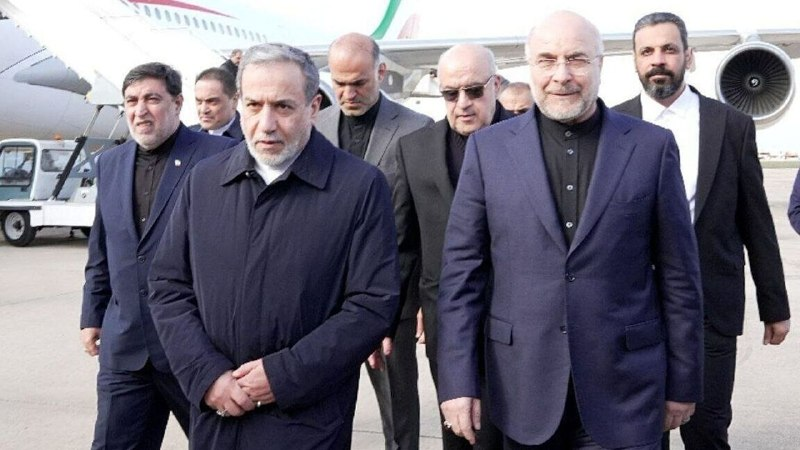

قالیباف:
اگه مذاکره نمی‌کردیم، به هدف هامون نمی‌رسیدیم.

ما از راه مذاکره چندین برابر بیشتر از چیزی که می خواستیم با عملیات نظامی به دست بیاریم، نتیجه گرفتیم؛ اون قدر بیشتر که اصلاً قابل مقایسه نیستن!

@Dirty_Kids 👻

## Dirty_Kids — post 392428

  <a href="telegram/content/Dirty_Kids_392428_1781726644.mp4" target="_blank">🎬 Download video</a>

باور کنید شاه برگشته به ما نمیگن

@Dirty_Kids 👻

## Dirty_Kids — post 392427

  <a href="telegram/content/Dirty_Kids_392427_1781726645.mp4" target="_blank">🎬 Download video</a>

این ویدیو از یه پسر بچه ایرانی قبل و بعد از خوردن شیر، بالای ۱۰ میلیون بازدید داشته😂

@Dirty_Kids 👻

## alonews — post 128781

  <a href="telegram/content/alonews_128781_1781726647.webm" target="_blank">🎬 Download video</a>

👈قالیباف: بدبینی و بی اعتمادی من به آمریکا از همه بیشتر است، حتی اگر توافق نهایی باشد و آن به تایید قطعنامه شورای امنیت برسد بازهم اصلا قابل اعتماد نیست، تضمین ما قدرت ایران است

✅ @AloNews خبر جنگ

## alonews — post 128780

  <a href="telegram/content/alonews_128780_1781726647.webm" target="_blank">🎬 Download video</a>

👈قالیباف: در مذاکرات به ونس گفتم ما کاملا به شما بی اعتمادیم

🔴بند ۱۴ تفاهم نامه این است که باید به تصویب شورای امنیت برسد و تبدیل به قطعنامه شود

✅ @AloNews خبر جنگ

## alonews — post 128779

  <a href="telegram/content/alonews_128779_1781726647.webm" target="_blank">🎬 Download video</a>

👈قالیباف: رئیس مجلس لبنان به من می‌گفت ایران مایهٔ افتخار جهان اسلام شده است.

✅ @AloNews خبر جنگ

---
📅 بروزرسانی: 1405/03/27 23:23
---

## VahidOOnLine — post 246087

  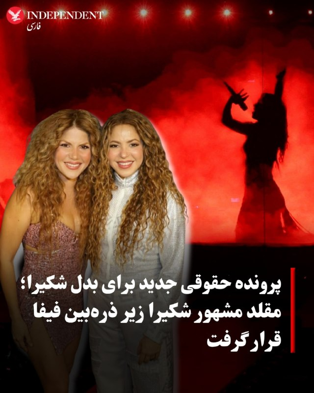

♦️فدراسیون بین‌المللی فوتبال، فیفا، تحقیقاتی را درباره ریبکا مایلانو، خواننده و مقلد ونزوئلایی مشهور به «شاکیبکا»، آغاز کرده است؛ تحقیقاتی که به دلیل استفاده بدون مجوز از تصاویر، نمادها و علائم تجاری رسمی جام جهانی ۲۰۲۶ انجام می‌شود و در صورت اثبات تخلف، می‌تواند به جریمه مالی سنگینی برای این هنرمند منجر شود.
براساس گزارش رسانه‌های اسپانیایی، این پرونده پس از اجرای نمایشی الهام‌گرفته از ترانه رسمی جام جهانی ۲۰۲۶ با عنوان «دای دای» شکل گرفته است؛ اثری که توسط شکیرا، خواننده سرشناس کلمبیایی، با همکاری برنا بوی اجرا شده است. گفته می‌شود شاکیبکا در این اجرا از عناصر بصری، گرافیک‌ها و نشان‌های تبلیغاتی متعلق به فیفا و جام جهانی بدون دریافت مجوز رسمی استفاده کرده است.
ریبکا مایلانو بیش از دو دهه است که با تقلید از سبک، صدا و حرکات شکیرا فعالیت می‌کند و توانسته با اجراهای خود بیش از ۶۵۰ هزار دنبال‌کننده در شبکه‌های اجتماعی جذب کند.
‌🇸🇦 Indypersian

🤖 @VahidOOnLine

## VahidOOnLine — post 246086

  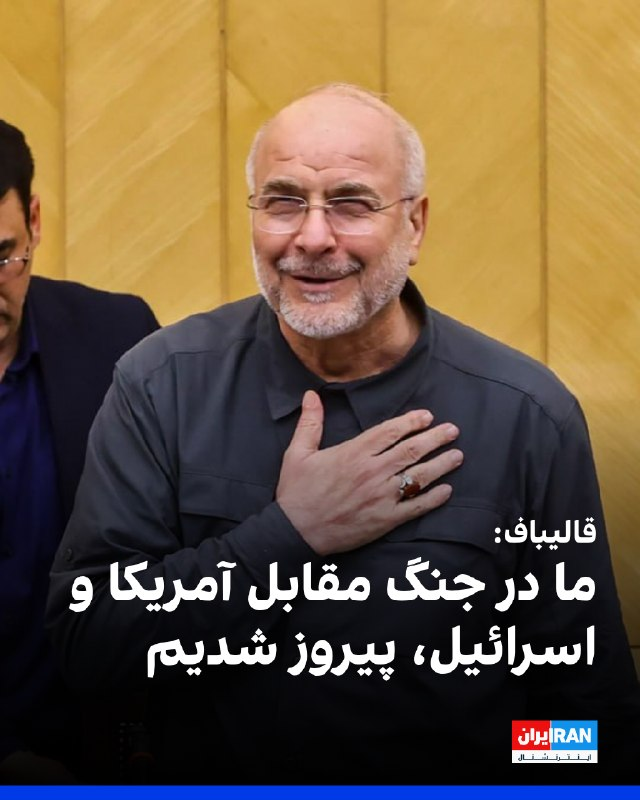

محمدباقر قالیباف، رییس هیات مذاکره‌کننده جمهوری اسلامی، در گفت‌وگو با شبکه خبر صدا و سیما گفت: «جنگ اخیر، جنگ جبهه حق و باطل بود.»

قالیباف گفت: «ما در جنگ مقابل آمریکا و اسرائیل، پیروز شدیم.»

او افزود: «اجازه ندادیم آمریکا و اسرائیل به ۹ هدفی که از آغاز جنگ مطرح کردند، برسند، وقتی حرف از مذاکره و دیپلماسی می‌زنم، منظورم دیپلماسی اقتدار است.»

قالیباف گفت: «زمان برجام هم گفتم که با مذاکره مخالف نیستم، اما تاکید کردم با مذاکره‌ای موافقم که خودش یک شیوه مبارزه باشد.»
‌🏁 🇬🇧 IranintlTV

🤖 @VahidOOnLine

## WithYashar — post 15190

@withyashar

## FoxNewsTwitter — post 343092

  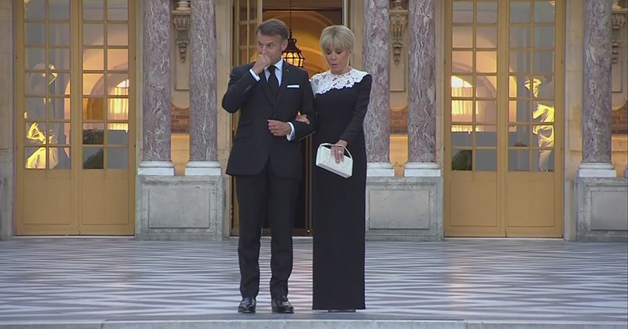

Fox News (Twitter/X)

WATCH LIVE: President Trump arrives at Palace of Versailles for dinner with French President Macron https://twitter.com/i/broadcasts/1XxyggyMkYEGM

## pm_afshaa — post 94294

  <a href="telegram/content/pm_afshaa_94294_1781726011.webm" target="_blank">🎬 Download video</a>

🔴قالیباف: شغل من دیپلماسی نیست؛ من یه رزمنده‌ام ولی با رزمندگی و فرهنگ رزمندگی کار دیپلماسی رو دنبال میکنم.

💧 Rainbet.com the #1 Non-KYC Crypto Casino & Sportsbook @rainbetcom

😁 @Pm_Afshaa

## pm_afshaa — post 94293

  <a href="telegram/content/pm_afshaa_94293_1781726011.webm" target="_blank">🎬 Download video</a>

🔴قالیباف: ما در جنگ مقابل آمریکا و اسرائیل پیروز شدیم.

💧 Rainbet.com the #1 Non-KYC Crypto Casino & Sportsbook @rainbetcom

😁 @Pm_Afshaa

## DEJradio — post 5772

  <a href="telegram/content/DEJradio_5772_1781726012.webm" target="_blank">🎬 Download video</a>

⚽️
🔺 برنامه دژ فوتبالی

*مهدی رستم‌پور، خبرنگار ورزشی

#دژفوتبالی #جام_جهانی
@DEJradio

## IranIntlTV — post 342920

  <a href="https://t.me/IranintlTV/342920" target="_blank">📎 Download file</a>

🎧نسخه صوتی ‌‌‏۲۴ با فرداد فرحزاد: رمزگشایی از توافق جنجالی ترامپ با جمهوری‌اسلامی
@iranintlTV

## IranIntlTV — post 342910

🔻کریستیانو رونالدو، فوق‌ستاره فوتبال جهان، پس از تساوی تیم ملی پرتغال در نخستین بازی‌اش در جام جهانی ۲۰۲۶ و ناکامی در گل‌زنی، با چهره‌ای درهم و نگران راهی رختکن شد.

🔹رونالدو در حالی نتوانست در آغاز ششمین حضورش در جام جهانی گل بزند و همراه با تیم ملی پرتغال به پیروزی برسد که شب گذشته لیونل مسی، اسطوره فوتبال آرژانتین، که او نیز ششمین جام جهانی خود را تجربه می‌کند، در نخستین بازی آلبی‌سلسته هت‌تریک کرد و کیلیان امباپه، ستاره تیم ملی فرانسه، و ارلینگ هالند، ستاره تیم ملی نروژ، هر کدام دو گل به ثمر رساندند.

@iranintltvsport

## FarsiVOA — post 221055

  <a href="telegram/content/FarsiVOA_221055_1781726013.mp4" target="_blank">🎬 Download video</a>

⚡️آمادگی مشروط اروپا برای نقش‌آفرینی در بحران ایران و تاکید آلمان بر دیپلماسی
@FarsiVOA

## FarsiVOA — post 221054

⚡️جی دی ونس: حکومت ایران در چارچوب توافق با دولت آمریکا حتی یک سنت از پول آمریکا را دریافت نخواهد کرد
@FarsiVOA

## IranianMinds — post 22831

🔴 متن کامل تفاهم‌نامه آمریکا و جمهوری اسلامی منتشر شد طبق گزارش آکسیوس، متن کامل تفاهم‌نامه (Memorandum of Understanding) میان ایالات متحده آمریکا و جمهوری اسلامی ایران منتشر شده است. این سند که توسط یک مقام ارشد دولت آمریکا به خبرنگاران خوانده شده، به عنوان…

## Hranews — post 113694

پرستو احمدی و عوامل «کنسرت کاروانسرا» به شلاق و محرومیت از فعالیت هنری محکوم شدند

❗️
❗️
❗️
❗️
❗️ – پرستو احمدی، خواننده، به همراه هشت نفر از دست‌اندرکاران و نوازندگان «کنسرت کاروانسرا» توسط دادگاه کیفری استان قم به ۷۴ ضربه #شلاق تعزیری، دو سال ممنوع‌الخروجی و دو سال محرومیت از فعالیت هنری محکوم شدند.

ادامه مطلب

#پرستو_احمدی

↘️
@hranews_bot تماس ✉️ -  @Hranews  کانال هرانا 🆑

## alonews — post 128778

  <a href="telegram/content/alonews_128778_1781726014.webm" target="_blank">🎬 Download video</a>

👈قالیباف: تو مذاکره به ترامپ اولتیماتوم دادیم

🔴آتش‌بس رو هم آمریکا درخواست کرد و دنبال کرد

✅ @AloNews خبر جنگ

## alonews — post 128777

  <a href="telegram/content/alonews_128777_1781726014.webm" target="_blank">🎬 Download video</a>

👈 قالیباف: فرق مذاکرات الان با دوره‌های قبل در این است که امروز علمِ پیروزیِ میدان، پشتوانه مذاکرات است/ در مذاکره‌ به روش مبارزه وادادگی و شعارزدگی وجود ندارد

🔴وقتی حرف از مذاکره و دیپلماسی می‌زنم، منظورم دیپلماسیِ اقتدار است.

🔴 زمان برجام هم گفتم که با مذاکره مخالف نیستم، اما تأکید کردم که با مذاکره‌ای موافقم که خودش یک شیوه مبارزه باشد.

🔴 فرق مذاکرات الان با دوره‌های قبل در این است که امروز این علمِ پیروزیِ میدان، که هم دشمنان و هم دوستان به آن اعتراف کرده‌اند، پشتوانه مذاکره است. نیروهای مسلح ما در مقابل این دشمنِ سراپا مجهز، پیروز شدند.

🔴 در مذاکره‌ای که یک روش مبارزه است، وادادگی وجود ندارد و در کنار آن، شعارزدگی هم جایی ندارد. اگر شعارها را مدام تکرار کنیم، دشمن می‌فهمد که تهدیدها توخالی است و این موضوع باعث می‌شود جسورتر و گستاخ‌تر شود.

🔴همزمان با مذاکرات به تمام اقدامات دشمن در خلیج فارس پاسخ مناسب دادیم

🔴 در جنگ تحمیلی سوم، برای مثال اتفاقاتی که در خلیج فارس در دوران آتش‌بس رخ داد، قابل توجه است. در آن مقطع، این دشمن بود که پیگیر آتش‌بس بود و ما در ابتدا آن را نمی‌پذیرفتیم.

🔴 به هر حال، وقتی آتش‌بس اجرا شد، دیدید که دشمن اقداماتی را در خلیج فارس انجام داد و ما نیز بلافاصله واکنش نشان دادیم. آخرین نمونه آن، حادثه بالگرد آمریکایی‌ها بود. همچنین دو ناوچه دشمن که قصد عبور از تنگه هرمز را داشتند، مورد اصابت قرار گرفتند و دچار آتش‌سوزی گسترده شدند؛ موضوعی که تصاویر ماهواره‌ای نیز آن را تأیید کرد.

🔴 از سوی دیگر، هر فرودگاهی در هر کشوری که جنگنده‌های دشمن از آن به پرواز درمی‌آمدند، مورد اصابت قرار گرفت. همه این اتفاقات در شرایطی رخ داد که ما همزمان در حال مذاکره نیز بودیم.

✅ @AloNews خبر جنگ

---
📅 بروزرسانی: 1405/03/27 23:14
---

## VahidOOnLine — post 246085

  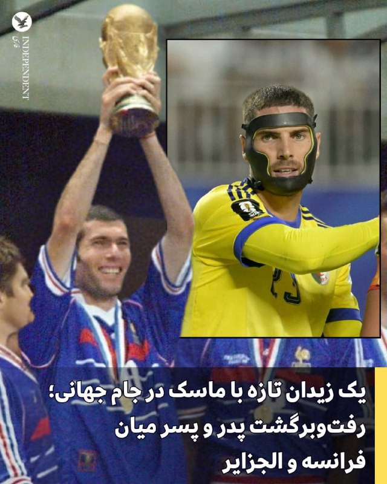

♦️لوکا زیدان، پسر زین‌الدین زیدان، در نخستین مسابقه الجزایر برابر آرژانتین با یک ماسک محافظ درون دروازه ایستاد و هشتمین بازی ملی خود را برای تیم ملی الجزایر انجام داد.
زین‌الدین زیدان، پدر لوکا، یکی از بزرگ‌ترین چهره‌های تاریخ فوتبال فرانسه است؛ بازیکنی که در جام جهانی ۱۹۹۸، در خاک فرانسه، نقش اصلی را در نخستین قهرمانی تیم ملی این کشور در جام جهانی ایفا کرد. حالا پسر او با پیراهن الجزایر، مسیر دیگری را انتخاب کرده است.
لوکا زیدان ۲۸ ساله در رده‌های پایه برای فرانسه بازی کرده بود، اما در سال ۲۰۲۵ تصمیم گرفت تابعیت خود را تغییر دهد و برای الجزایر بازی کند.
لوکا زیدان در گفت‌وگو با اتلتیک درباره این تصمیم گفته بود: «ما از کودکی در فرهنگ الجزایری زندگی کرده‌ایم.»
زیدان در این مسابقات با ماسکی غیرمعمول نیز دیده می‌شود. او چند ماه پیش، در یک بازی باشگاهی دچار شکستگی چانه و فک شد و جراحی بیش از یک ماه او را از میدان دور کرد.
‌🇸🇦 Indypersian

🤖 @VahidOOnLine

## VahidOOnLine — post 246084

  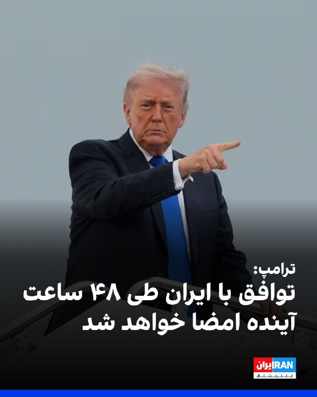

دونالد ترامپ، رییس‌جمهوری آمریکا در پاریس گفت مهلت ۶۰ روزه برای دستیابی به توافق نهایی با جمهوری اسلامی یک ضرب‌الاجل قطعی نیست.

او افزود: «توافق با ایران طی ۴۸ ساعت آینده امضا خواهد شد.»

ترامپ گفت نیروهای نظامی آمریکا را «برای مدتی» در منطقه خلیج فارس حفظ خواهد کرد.
‌🏁 🇬🇧 IranintlTV

🤖 @VahidOOnLine

## VahidOOnLine — post 246083

  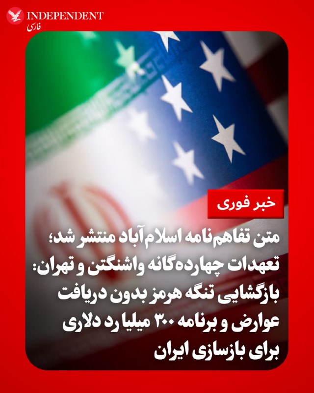

♦️ متن کامل «یادداشت تفاهم اسلام‌آباد» میان جمهوری اسلامی ایران و ایالات متحده آمریکا که با هدف خاتمه دادن به جنگ جاری نهایی شده است، چهارشنبه‌شب، ۲۷ خرداد رسما انتشار یافت. این سند ۱۴ بندی بر پایه حسن نیت طرفین، نقشه راهی را برای توقف درگیری‌ها و آغاز مذاکرات جامعِ ۶۰ روزه برای دستیابی به توافق نهایی ترسیم می‌کند.

بر اساس مفاد این یادداشت تفاهم، دو طرف خاتمه فوری و دائمی عملیات‌های نظامی را در تمامی جبهه‌ها از جمله لبنان اعلام کرده و تعهد می‌کنند که از تهدید یا توسل به زور علیه یکدیگر خودداری کنند. طبق این سند، ایالات متحده موظف است بلافاصله پس از امضا، روند رفع محاصره دریایی ایران را آغاز کرده و ظرف ۳۰ روز آن را کاملاً خاتمه دهد. در مقابل، ایران متعهد می‌شود تا حداکثر توان خود را برای عبور ایمن و بدون هزینه کشتی‌های تجاری از خلیج فارس و تنگه هرمز ظرف۶۰ روز به کار گیرد.

در بخش‌های اقتصادی و مالی تفاهم‌نامه، آمریکا متعهد شده است با همکاری شرکای منطقه‌ای، برنامه‌ای با تامین حداقل ۳۰۰ میلیارد دلار برای بازسازی و توسعه اقتصادی ایران ایجاد کند.
‌🇸🇦 Indypersian

🤖 @VahidOOnLine

## FoxNewsTwitter — post 343091

‌Fox News (Twitter/X)

👉 Full story here:

## FoxNewsTwitter — post 343090

  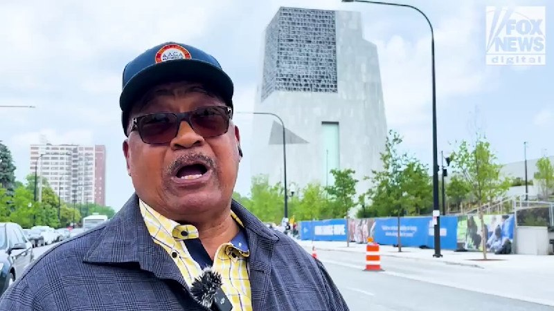

Fox News (Twitter/X)

MILLIONS OWED: Some minority-owned and local subcontractors who helped build the Obama Presidential Center say they're owed millions and face financial ruin as the campus prepares to open on Juneteenth.

A Fox News Digital investigation found claimed losses ranging from hundreds of thousands to tens of millions of dollars, including among some minority-owned firms the project was intended to help.

"What sense is celebrating Juneteenth if our Black contractors are not getting their money?" African American Contractors Association President Omar Shareef told Fox News Digital.

The Obama Foundation said it paid Lakeside Alliance, the project's construction manager, which was responsible for hiring and paying subcontractors. Lakeside said outstanding project matters are still being worked through.

🎥 Story and video by Michael Dorgan / @M_Dorgan

## FoxNewsTwitter — post 343089

  <a href="telegram/content/FoxNewsTwitter_343089_1781725463.mp4" target="_blank">🎬 Download video</a>

Fox News (Twitter/X)

NEW: U.S. Attorney Jeanine Pirro announces a major 21-count drug-trafficking indictment against 14 defendants operating an alleged narcotics ring dangerously close to a local elementary school.

Surveillance footage captured the shocking moment a woman purchased cocaine just feet away from a five-year-old child before casually walking away with the minor.

"It's one thing to have a prosecution of dirtbags who are selling drugs in the area of schools 1000ft from a damn elementary school."

"It's a whole other level of crime, as far as I'm concerned, for this woman to bring a child to a cocaine sale and then walk along with the child while she's got the drugs on her."

## IranIntlTV — post 342909

  

محمدباقر قالیباف، رییس هیات مذاکره‌کننده جمهوری اسلامی، در گفت‌وگو با شبکه خبر صدا و سیما گفت: «جنگ اخیر، جنگ جبهه حق و باطل بود.»

قالیباف گفت: «ما در جنگ مقابل آمریکا و اسرائیل، پیروز شدیم.»

او افزود: «اجازه ندادیم آمریکا و اسرائیل به ۹ هدفی که از آغاز جنگ مطرح کردند، برسند، وقتی حرف از مذاکره و دیپلماسی می‌زنم، منظورم دیپلماسی اقتدار است.»

قالیباف گفت: «زمان برجام هم گفتم که با مذاکره مخالف نیستم، اما تاکید کردم با مذاکره‌ای موافقم که خودش یک شیوه مبارزه باشد.»
https://iranintl.com/202606170068

## IranIntlTV — post 342908

  <a href="telegram/content/IranIntlTV_342908_1781725466.mp4" target="_blank">🎬 Download video</a>

بخش‌های محرمانه توافق ایران و آمریکا چیست؟!

چشم‌انداز با مهدی مهدوی‌آزاد

نسخه کامل این برنامه در یوتیوب:
https://youtu.be/KWQ9PK5opB0
@iranintltv

## IranIntlTV — post 342907

  <a href="https://t.me/IranintlTV/342907" target="_blank">📎 Download file</a>

🎧نسخه صوتی چشم‌انداز: بخش‌های محرمانه توافق ایران و آمریکا چیست؟!
@iranintlTV

## IranIntlTV — post 342906

  

دونالد ترامپ، رییس‌جمهوری آمریکا در پاریس گفت مهلت ۶۰ روزه برای دستیابی به توافق نهایی با جمهوری اسلامی یک ضرب‌الاجل قطعی نیست.

او افزود: «توافق با ایران طی ۴۸ ساعت آینده امضا خواهد شد.»

ترامپ گفت نیروهای نظامی آمریکا را «برای مدتی» در منطقه خلیج فارس حفظ خواهد کرد.
https://iranintl.com/202606178693

## FarsiVOA — post 221053

🔺ارتش اسرائیل: دو عضو سازمان تروریستی حماس را از بین بردیم

▪️ارتش اسرائیل روز چهارشنبه ۲۷ خرداد از کشته شدن دو عضو سازمان تروریستی حماس، که در حمله تروریستی ۷ اکتبر به اسرائیل دست داشتند، خبر داد. ارتش اسرائیل ساعاتی پیش نیز از کشته شدن دو تن از اعضای سازمان تروریستی حماس در روزهای گذشته خبر داده بود.

⬇️ بیشتر بخوانید:
https://ir.voanews.com/a/israeli-army-attacks-terrorist-organization-hamas/8161887.html
@FarsiVOA

## DW_Farsi — post 126119

  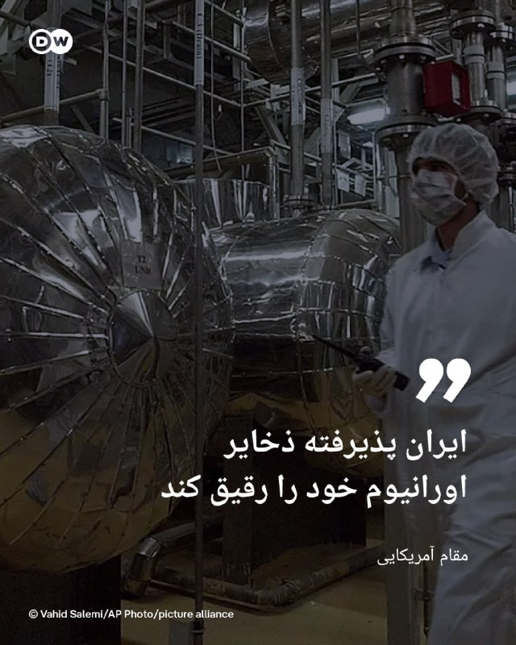

🔶 مقام‌ آمریکایی: ایران پذیرفته ذخایر اورانیوم خود را رقیق کند

ایران پذیرفته است که ذخایر اورانیوم غنی‌شده خود را طبق توافق موقت با ایالات متحده رقیق کند. مقام‌های ارشد دولت آمریکا هنگام انتشار متنی که آن را متن توافق اعلام کردند، این موضوع را بیان کردند.

یکی از مقام‌های آمریکایی در تماس تلفنی با خبرنگاران درباره موضوع هسته‌ای گفت: «اینکه آن‌ها پذیرفته‌اند چنین کاری انجام دهند، یک پیروزی بسیار بزرگ، بسیار بزرگ برای ایالات متحده آمریکا است.»

این توافق همچنین باعث بازگشایی تنگه هرمز و امکان فروش نفت ایران خواهد شد. در عین حال، آمریکا و متحدانش نیز برنامه‌هایی برای ایجاد یک صندوق ۳۰۰ میلیارد دلاری بازسازی ایران تهیه خواهند کرد.

مقام‌های آمریکایی پس از چند روز ابهام درباره مفاد واقعی توافقی که دونالد ترامپ روز یکشنبه اعلام کرده بود، متن آن را در یک تماس کنفرانس تلفنی برای خبرنگاران قرائت کردند.

این توافق اولیه با ۶۰ روز مذاکره برای رسیدن به یک توافق نهایی دنبال خواهد شد؛ پس از آن ترامپ گفته است اگر ایران موافقت نکند، واشنگتن می‌تواند دوباره به "بمباران" بازگردد.
@dw_farsi

## Persian_Trend_Official — post 17398

  <a href="telegram/content/Persian_Trend_Official_17398_1781725469.mp4" target="_blank">🎬 Download video</a>

قالیباف، رئیس تیم مذاکره‌کننده ایرانی: همزمان با مذاکرات به تمام اقدامات دشمن در خلیج فارس پاسخ مناسب دادیم.

در جنگ تحمیلی سوم، برای مثال اتفاقاتی که در خلیج فارس در دوران آتش‌بس رخ داد، قابل توجه است. در آن مقطع، این دشمن بود که پیگیر آتش‌بس بود و ما در ابتدا آن را نمی‌پذیرفتیم.

به هر حال، وقتی آتش‌بس اجرا شد، دیدید که دشمن اقداماتی را در خلیج فارس انجام داد و ما نیز بلافاصله واکنش نشان دادیم. آخرین نمونه آن، حادثه بالگرد آمریکایی‌ها بود. همچنین دو ناوچه دشمن که قصد عبور از تنگه هرمز را داشتند، مورد اصابت قرار گرفتند و دچار آتش‌سوزی گسترده شدند؛ موضوعی که تصاویر ماهواره‌ای نیز آن را تأیید کرد.

از سوی دیگر، هر فرودگاهی در هر کشوری که جنگنده‌های دشمن از آن به پرواز درمی‌آمدند، مورد اصابت قرار گرفت. همه این اتفاقات در شرایطی رخ داد که ما همزمان در حال مذاکره نیز بودیم.

📝 Amir

📌 @persian_trend_official
پرشین ترند | متفاوت‌ترین کانال نظامی

## Persian_Trend_Official — post 17397

  <a href="telegram/content/Persian_Trend_Official_17397_1781725471.mp4" target="_blank">🎬 Download video</a>

قالیباف، رئیس تیم مذاکره‌کننده ایرانی: ما بر آمریکا و رژیم صهیونیستی که قدرت های اول نظامی جهان هستند پیروز شدیم و اجازه ندادیم به هیچ کدام از 9 هدفی که اعلام کردند برسند.

جنگ امروز در 4 میدان مبارزه نظامی، میدان مبارزه مردم در خیابان، میدان مبارزه دیپلماسی و میدان خدمت به مردم در جریان است.

مردم از سحرگاه روز 10 اسفند وارد خیابان شدند و به تعبیر رهبر شهید انقلاب مبعوث شدند و وارد میدان مبارزه شدند. این 4 میدان به صورت دقیق با هم ارتباط دارند به گونه ای که پرچم مبارزه با دشمن، هر لحظه به تناسب شرایط بین این میادین مبارزه درحال جابه جا شدن بود و همه این میادین درحال شکل دادن پیروزی ایران هستند.

📝 Amir

📌 @persian_trend_official
پرشین ترند | متفاوت‌ترین کانال نظامی

## Persian_Trend_Official — post 17396

  <a href="telegram/content/Persian_Trend_Official_17396_1781725473.mp4" target="_blank">🎬 Download video</a>

قالیباف، رئیس تیم مذاکره‌کننده ایرانی: در جنگ اخیر مردم ایران در برابر جنگی که قدرت اول نظامی و اقتصادی جهان و رژیم صهیونیستی به ما تحمیل کردند، ایستادند.

ممکن است تحولات، منطقه ای باشد اما تاثیرات آن جهانی است.

📝 Amir

📌 @persian_trend_official
پرشین ترند | متفاوت‌ترین کانال نظامی

## Persian_Trend_Official — post 17395

7. ایالات متحده آمریکا متعهد می‌شود به تمامی انواع تحریم‌ها علیه جمهوری اسلامی ایران، از جمله قطعنامه‌های شورای امنیت سازمان ملل متحد، قطعنامه‌های شورای حکام آژانس بین‌المللی انرژی اتمی، و تمامی تحریم‌های یکجانبه آمریکا، اعم از اولیه و ثانویه، برابر یک برنامه…

## Persian_Trend_Official — post 17394

متن یادداشت تفاهم اسلام‌آباد بین جمهوری اسلامی ایران و ایالات متحده آمریکا 1. جمهوری اسلامی ایران و ایالات متحده آمریکا و متحدین آنها در جنگ حاضر، با امضای این یادداشت تفاهم خاتمه فوری و دائمی عملیات‌های نظامی را در تمامی جبهه‌ها، از جمله در لبنان، اعلام…

## Persian_Trend_Official — post 17393

  <a href="telegram/content/Persian_Trend_Official_17393_1781725475.webm" target="_blank">🎬 Download video</a>

متن یادداشت تفاهم اسلام‌آباد بین جمهوری اسلامی ایران و ایالات متحده آمریکا

1. جمهوری اسلامی ایران و ایالات متحده آمریکا و متحدین آنها در جنگ حاضر، با امضای این یادداشت تفاهم خاتمه فوری و دائمی عملیات‌های نظامی را در تمامی جبهه‌ها، از جمله در لبنان، اعلام کرده و تعهد می‌کنند از این پس هیچ جنگ یا هیچ عملیات نظامی علیه یکدیگر آغاز نکنند و از تهدید یا استفاده از زور علیه یکدیگر خودداری کنند و تمامیت ارضی و حاکمیت لبنان را تضمین کنند. توافق نهایی خاتمه دائمی جنگ در تمامی جبهه‌ها، از جمله در لبنان، و بقیه مفاد این بند را تایید خواهد کرد.

2. جمهوری اسلامی ایران و ایالات متحده آمریکا متعهد می‌شوند که به حاکمیت و تمامیت ارضی یکدیگر احترام بگذارند و از مداخله در امور داخلی یکدیگر خودداری کنند.

3. جمهوری اسلامی ایران و ایالات متحده آمریکا به انجام مذاکرات و حصول به یک توافق نهایی در مدت حداکثر 60 روز، قابل تمدید با رضایت طرفین، متعهد می‌شوند.

4. بلافاصله با امضای این یادداشت تفاهم، ایالات متحده آمریکا شروع به رفع محاصره دریایی خود و هرگونه مزاحمت یا ممانعت علیه جمهوری اسلامی ایران می‌کند، و ظرف 30 روز به محاصره دریایی به طور کامل خاتمه خواهد داد. در طول این مدت، تردد کشتی‌ها متناسب با تعداد ترافیک قبل از جنگ که از سوی جمهوری اسلامی ایران برقرار می‌شود، خواهد بود. ایالات متحده آمریکا همچنین متعهد می‌شود تا ظرف 30 روز پس از توافق نهایی، نیروهای نظامی خود را از حوزه پیرامونی جمهوری اسلامی ایران خارج کند.

5. با امضای این یادداشت تفاهم، جمهوری اسلامی ایران ترتیباتی را با حداکثر تلاش خود برای عبور ایمن کشتی‌های تجاری، بدون هزینه فقط برای 60 روز، از خلیج فارس به دریای عمان و بالعکس، اتخاذ خواهد کرد. تردد کشتی‌های تجاری بلافاصله آغاز، و با توجه به ضرورت رفع موانع فنی و نظامی و مین‌زدایی توسط جمهوری اسلامی ایران، ظرف 30 روز برقرار خواهد شد. جمهوری اسلامی ایران با سلطنت عمان برای تعیین اداره آینده و خدمات دریایی در تنگه هرمز، مطابق با حقوق بین الملل قابل اجرا و حقوق حاکمیتی کشورهای ساحلی تنگه هرمز، گفتگو خواهند کرد و با دیگر کشورهای ساحلی خلیج فارس نیز تبادل نظر می‌کنند.

6. ایالات متحده آمریکا متعهد می‌شود، با شرکای منطقه‌ای خود، برای بازسازی و توسعه اقتصادی جمهوری اسلامی ایران یک برنامه قطعی مورد توافق طرفین را با تامین حداقل 300 میلیارد دلار ایجاد کند. سازوکار اجرایی‌سازی این برنامه، به عنوان بخشی از توافق نهایی ظرف 60 روز نهایی خواهد شد. تمامی تائیدیه‌ها، اسقاطیه‌ها و مجوزهای مورد نیاز برای تراکنش‌های مالی مربوطه توسط ایالات متحده آمریکا ارائه خواهد شد.

📝 Amir

📌 @persian_trend_official
پرشین ترند | متفاوت‌ترین کانال نظامی

## RadioFarda — post 158445

متن کامل تفاهم‌نامه ۱۴ بندی ایران و آمریکا برای پایان دادن به جنگ منتشر شد

🔸یک مقام ارشد آمریکایی روز چهارشنبه ۲۷ خرداد متن توافق موقت میان آمریکا و ایران برای توقف جنگ در ایران و بازگشایی تنگه هرمز را برای خبرنگاران قرائت کرد.

🔸این توافق در ۱۴ بند چارچوبی کلی از تفاهم میان دو طرف را ترسیم می‌کند و بسیاری از دشوارترین مسائل، از جمله نحوه برچیدن برنامه هسته‌ای ایران، را تا زمان دستیابی به توافق نهایی به تعویق می‌اندازد.

🔸با این حال بعد از امضای این تفاهم‌نامه بر باز شدن تنگه هرمز و همچنین رفع محاصره دریایی آمریکا علیه بنادر ایرانی تأکید شده است.

🔸این سند همچنین زمینه را برای یک دوره مذاکرات گسترده‌تر ۶۰ روزه که قرار است روز جمعه در سوئیس آغاز شود، فراهم می‌کند.

🔸متن کامل این سند که «یادداشت تفاهم اسلام‌آباد میان ایالات متحده آمریکا و جمهوری اسلامی ایران» نام دارد، را در وب‌سایت رادیوفردا بخوانید.

@RadioFarda

## IranianMinds — post 22830

🔴 طبق گزارش آکسیوس در صورت نهایی شدن توافق تمامی تحریم های ایران برداشته میشود.

@IranianMinds

## IranianMinds — post 22829

🔴 متن کامل تفاهم‌نامه آمریکا و جمهوری اسلامی منتشر شد

طبق گزارش آکسیوس، متن کامل تفاهم‌نامه (Memorandum of Understanding) میان ایالات متحده آمریکا و جمهوری اسلامی ایران منتشر شده است.

این سند که توسط یک مقام ارشد دولت آمریکا به خبرنگاران خوانده شده، به عنوان چارچوبی برای پایان جنگ، بازگشایی تنگه هرمز، مذاکرات هسته‌ای ۶۰ روزه و مشوق‌های اقتصادی گسترده عمل می‌کند.

خلاصه و نکات کلیدی تفاهم‌نامه:

۱. پایان جنگ:
دو طرف و متحدانشان اعلام می‌کنند که عملیات نظامی در همه جبهه‌ها (از جمله لبنان) فوراً و به طور دائم متوقف می‌شود. تعهد به عدم آغاز جنگ یا عملیات نظامی علیه یکدیگر و احترام به تمامیت ارضی لبنان.

۲. احترام به حاکمیت:
آمریکا و ایران متعهد به احترام به حاکمیت و تمامیت ارضی یکدیگر و عدم دخالت در امور داخلی هم شدند.

۳. مذاکرات نهایی:
مذاکرات برای دستیابی به توافق نهایی حداکثر ظرف ۶۰ روز (قابل تمدید با توافق متقابل) انجام خواهد شد.

۴. برداشته شدن محاصره:
آمریکا بلافاصله محاصره دریایی را کاهش می‌دهد و ظرف ۳۰ روز به طور کامل برمی‌دارد. نیروهای آمریکایی نیز پس از توافق نهایی از نزدیکی ایران دور خواهند شد.

۵. تنگه هرمز:
ایران ترتیبات لازم برای عبور امن کشتی‌های تجاری از خلیج فارس به دریای عمان (و بالعکس) بدون هزینه برای ۶۰ روز فراهم می‌کند. ترافیک تجاری ظرف ۳۰ روز برقرار می‌شود. ایران با عمان و دیگر کشورهای ساحلی برای مدیریت آینده تنگه گفت‌وگو خواهد کرد.

۶. طرح اقتصادی:
آمریکا با شرکای منطقه‌ای، برنامه‌ای حداقل ۳۰۰ میلیارد دلاری برای بازسازی و توسعه اقتصادی ایران تدوین خواهد کرد.

۷. لغو تحریم‌ها:
آمریکا متعهد به لغو همه انواع تحریم‌ها (از جمله قطعنامه‌های شورای امنیت، آژانس بین‌المللی انرژی اتمی و تحریم‌های یک‌جانبه) طبق زمان‌بندی توافق نهایی است.

۸. برنامه هسته‌ای:
ایران مجدداً تأیید می‌کند که سلاح هسته‌ای تولید یا توسعه نخواهد داد. موضوع مواد غنی‌شده با نظارت آژانس و روش‌هایی مانند رقیق‌سازی در محل حل خواهد شد. غنی‌سازی و نیازهای هسته‌ای ایران در توافق نهایی بررسی می‌شود.

۹. حفظ وضعیت موجود:
تا توافق نهایی، ایران برنامه هسته‌ای فعلی را حفظ می‌کند و آمریکا تحریم جدید اعمال نمی‌کند یا نیروهای بیشتری به منطقه اعزام نمی‌نماید.

۱۰. معافیت فروش نفت:
آمریکا بلافاصله معافیت‌هایی برای صادرات نفت خام، محصولات نفتی و خدمات مرتبط (بانکی، بیمه، حمل‌ونقل) صادر می‌کند.

۱۱. آزادسازی دارایی‌ها:
دارایی‌های مسدود یا محدود شده ایران قابل استفاده خواهد شد و آمریکا مجوزهای لازم را صادر می‌کند.

۱۲. مکانیسم نظارت:
مکانیسمی اجرایی برای نظارت بر اجرای تفاهم‌نامه و توافق نهایی ایجاد می‌شود.

۱۳. شروع مذاکرات:
پس از اجرای برخی بندها، مذاکرات بر روی سایر بخش‌ها آغاز خواهد شد.

۱۴. تصویب نهایی:
توافق نهایی با قطعنامه الزام‌آور شورای امنیت سازمان ملل تأیید خواهد شد.
 
@IranianMinds

## IranianMinds — post 22828

  <a href="telegram/content/IranianMinds_22828_1781725476.mp4" target="_blank">🎬 Download video</a>

🔴 قالیباف با صحبت های امروزش رسما گفت همه کاره منم :

همه بیایید برای من تصمیم سازی کنید تا من تصمیم درست بگیرم. من هرگز وارد جزئیات نمیشم و بگم اینکارو کنید و اونکارو کنید و از من اجازه بگیرید.

@IranianMinds

## IranianMinds — post 22827

  <a href="telegram/content/IranianMinds_22827_1781725477.mp4" target="_blank">🎬 Download video</a>

🔴 گزارشگر: آیا ۶۰ روز را به عنوان مهلت نهایی برای توافق نهایی می‌بینید؟

ترامپ: نه، اینطور نیست. ممکنه بیشتر هم طول بکشه.
تا وقتی که اونا درست رفتار کنن، واقعاً برام زیاد مهم نیست.

@IranianMinds

## BBCPersian — post 284179

  <a href="telegram/content/BBCPersian_284179_1781725479.mp4" target="_blank">🎬 Download video</a>

🔻آخرین خبرهای مهم روز چهارشنبه ۲۷ خرداد ۱۴۰۵
@BBCPersian

## BBCPersian — post 284178

  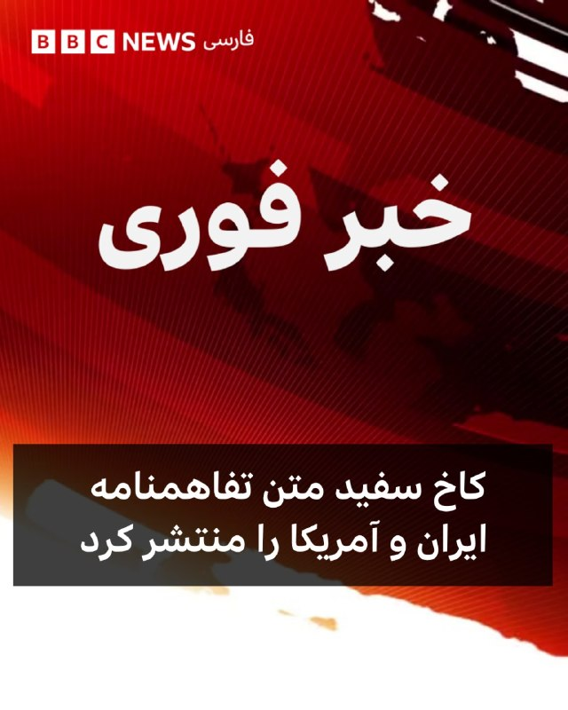

🔻کاخ سفید متن یادداشت تفاهم ایران و آمریکا را منتشر کرد. این سند که به طور الکترونیکی امضا شده است، قرار است روز جمعه در مراسمی در سوئیس به امضای مقامات ایرانی و آمریکایی برسد.

متن منتشر شده ۱۴ بند دارد.

در بند اول آمده که آمریکا و جمهوری اسلامی ایران و متحدان آنها در جنگ جاری با امضای این یادداشت تفاهم،‌ پایان فوری و دائمی عملیات نظامی در تمامی جبههها از جمله لبنان را اعلام میکنند و متعهد میشوند که از این پس هیچ حمله یا عملیات نظامی علیه یکدیگر آغاز نکنند و از تهدید یا استفاده از زور علیه یکدیگر خودداری کنند و تمامیت ارضی و حاکمیت لبنان را تضمین کنند.

در این تفاهمنامه آمده: «توافق نهایی،‌ پایان دائمی جنگ در همه جبهه‌ها از جمله لبنان و سایر مفاد این بند را تایید خواهد کرد.»

«تعهد به عدم مداخله در امور داخلی یکدیگر» بند دوم این تفاهمنامه است.

متن کامل خبر را از لینک زیر بخوانید:

https://bbc.in/4oDvTOT

@BBCPersian

## Hranews — post 113693

دستکم ۵ تجمع اعتراضی برگزار شد

❗️
❗️
❗️
❗️
❗️ – امروز چهارشنبه ۲۷ خردادماه، شماری از کشاورزان و دیگر شهروندان ساکن شهرستان‌های گرمسار و آرادان دست به #تجمع اعتراضی زدند. گروهی از زنان و دیگر ساکنان روستای پشموکی از توابع شهرستان فاریاب نیز روز گذشته و امروز، با برگزاری تجمعات اعتراضی خواستار رسیدگی به مطالبات خود شدند. تجمع اعتراضی اهالی روستای پشموکی با دخالت نیروهای انتظامی و امنیتی به خشونت کشیده شد و چند تن بازداشت شدند. روز گذشته نیز شماری از رانندگان و دارندگان خودروهای سنگین در شهرستان راسک و جمعی از زنان در روستای سرسیاه از توابع تفتان، تجمع اعتراضی برگزار کردند.

ادامه مطلب

↘️
@hranews_bot تماس ✉️ -  @Hranews  کانال هرانا 🆑

## alonews — post 128776

  <a href="telegram/content/alonews_128776_1781725481.webm" target="_blank">🎬 Download video</a>

👈🔟 ایالات متحده آمریکا متعهد می‌شود بلافاصله با امضای این یادداشت تفاهم و تا زمان خاتمه تحریم‌ها، اسقاطیه‌های وزارت خزانه‌داری را برای صادرات نفت خام ایران، محصولات پتروشیمی و مشتقات آنها، و تمامی خدمات مرتبط شامل تراکنش‌های بانکی، بیمه‌ها، حمل و نقل و غیره صادر کند.

🔴1️⃣1️⃣ ایالات متحده آمریکا متعهد می‌شود تا وجوه و دارایی‌های محدود یا مسدود شده جمهوری اسلامی ایران را با اجرای این یادداشت تفاهم به طور کامل برای استفاده در دسترس قرار دهد. ایالات متحده آمریکا و جمهوری اسلامی ایران در مورد روال مربوط به آزادسازی این وجوه در طول مذاکرات، به صورت دوجانبه توافق می‌کنند. این وجوه، چه در حساب اصلی نگهداری شوند و چه منتقل شوند، برای پرداخت به هر ذینفع نهایی که توسط بانک مرکزی جمهوری اسلامی ایران تعیین می‌شود، باید به طور کامل قابل استفاده شوند. ایالات متحده آمریکا متعهد می‌شود که تمامی تاییدیه ها و مجوزهای لازم را در این رابطه صادر کند.

🔴2️⃣1️⃣ جمهوری اسلامی ایران و ایالات متحده آمریکا موافقت می‌کنند تا یک سازوکار اجرایی برای نظارت بر اجرای موفق این یادداشت تفاهم و پایبندی آتی به توافق نهایی تشکیل شود.

🔴 3️⃣1️⃣ پس از امضای این یادداشت تفاهم و منوط به شروع اجرای بندهای ۱، ۴، ۵، ۱۰ و ۱۱ این یادداشت تفاهم و تداوم اجرای این اقدامات، جمهوری اسلامی ایران و ایالات متحده آمریکا مذاکرات درخصوص توافق نهایی را منحصرا در مورد بقیه بندها آغاز خواهند کرد.

🔴4️⃣1️⃣ توافق نهایی با یک قطعنامه الزام‌آور شورای امنیت سازمان ملل متحد تایید خواهد شد.

(امضاء) از طرف دولت جمهوری اسلامی ایران
تاریخ
(امضاء) از طرف دولت ایالات متحده آمریکا
تاریخ
( امضاء) در حضور میانجی
از طرف دولت جمهوری اسلامی پاکستان
تاریخ

✅ @AloNews خبر جنگ

## alonews — post 128775

  <a href="telegram/content/alonews_128775_1781725482.webm" target="_blank">🎬 Download video</a>

🔴فوری / جمهوری اسلامی ایران و ایالات متحده آمریکا، به طور مشترک و با حسن نیت، در تاریخ ۲۸ خرداد ۱۴۰۵ نسبت به موارد زیر توافق کردند:

🔴1️⃣جمهوری اسلامی ایران و ایالات متحده آمریکا و متحدین آنها در جنگ حاضر، با امضای این یادداشت تفاهم خاتمه فوری و دائمی عملیات‌های نظامی را در تمامی جبهه‌ها، از جمله در لبنان، اعلام کرده و تعهد می‌کنند از این پس هیچ جنگ یا هیچ عملیات نظامی علیه یکدیگر آغاز نکنند و از تهدید یا استفاده از زور علیه یکدیگر خودداری کنند و تمامیت ارضی و حاکمیت لبنان را تضمین کنند. توافق نهایی خاتمه دائمی جنگ در تمامی جبهه‌ها، از جمله در لبنان، و بقیه مفاد این بند را تایید خواهد کرد.

🔴 2️⃣جمهوری اسلامی ایران و ایالات متحده آمریکا متعهد می‌شوند که به حاکمیت و تمامیت ارضی یکدیگر احترام بگذارند و از مداخله در امور داخلی یکدیگر خودداری کنند.

🔴 3️⃣جمهوری اسلامی ایران و ایالات متحده آمریکا به انجام مذاکرات و حصول به یک توافق نهایی در مدت حداکثر ۶۰ روز، قابل تمدید با رضایت طرفین، متعهد می‌شوند.

🔴 4️⃣بلافاصله با امضای این یادداشت تفاهم، ایالات متحده آمریکا شروع به رفع محاصره دریایی خود و هرگونه مزاحمت یا ممانعت علیه جمهوری اسلامی ایران می‌کند، و ظرف ۳۰ روز به محاصره دریایی به طور کامل خاتمه خواهد داد. در طول این مدت، تردد کشتی‌ها متناسب با تعداد ترافیک قبل از جنگ که از سوی جمهوری اسلامی ایران برقرار می‌شود، خواهد بود. ایالات متحده آمریکا همچنین متعهد می‌شود تا ظرف ۳۰ روز پس از توافق نهایی، نیروهای نظامی خود را از حوزه پیرامونی جمهوری اسلامی ایران خارج کند.

🔴5 با امضای این یادداشت تفاهم، جمهوری اسلامی ایران ترتیباتی را با حداکثر تلاش خود برای عبور ایمن کشتی‌های تجاری، بدون هزینه فقط برای ۶۰ روز، از خلیج فارس به دریای عمان و بالعکس، اتخاذ خواهد کرد. تردد کشتی‌های تجاری بلافاصله آغاز، و با توجه به ضرورت رفع موانع فنی و نظامی و مین‌زدایی توسط جمهوری اسلامی ایران، ظرف ۳۰ روز برقرار خواهد شد. جمهوری اسلامی ایران با سلطنت عمان برای تعیین اداره آینده و خدمات دریایی در تنگه هرمز، مطابق با حقوق بین الملل قابل اجرا و حقوق حاکمیتی کشورهای ساحلی تنگه هرمز، گفتگو خواهند کرد و با دیگر کشورهای ساحلی خلیج فارس نیز تبادل نظر می‌کنند.

🔴 6️⃣ ایالات متحده آمریکا متعهد می‌شود، با شرکای منطقه‌ای خود، برای بازسازی و توسعه اقتصادی جمهوری اسلامی ایران یک برنامه قطعی مورد توافق طرفین را با تامین حداقل ۳۰۰ میلیارد دلار ایجاد کند. سازوکار
اجرایی‌سازی این برنامه، به عنوان بخشی از توافق نهایی ظرف ۶۰ روز نهایی خواهد شد. تمامی تائیدیه‌ها، اسقاطیه‌ها و مجوزهای مورد نیاز برای تراکنش‌های مالی مربوطه توسط ایالات متحده آمریکا ارائه خواهد شد.

🔴7️⃣ ایالات متحده آمریکا متعهد می‌شود به تمامی انواع تحریم‌ها علیه جمهوری اسلامی ایران، از جمله قطعنامه‌های شورای امنیت سازمان ملل متحد، قطعنامه‌های شورای حکام آژانس بین‌المللی انرژی اتمی، و تمامی تحریم‌های یکجانبه آمریکا، اعم از اولیه و ثانویه، برابر یک برنامه زمانی مورد توافق به عنوان بخشی از توافق نهایی، خاتمه دهد. جمهوری اسلامی ایران و ایالات متحده آمریکا به اهمیت اساسی موضوع خاتمه تحریم‌ها که در بالا ذکر شده است اذعان دارند و قصد خود را برای رسیدگی فوری به این موضوعات در مذاکرات، به منظور دستیابی به توافق متقابل در مورد آنها اظهار می‌کنند.

🔴8️⃣ جمهوری اسلامی ایران مجدداً تایید می‌کند که سلاح هسته‌ای تولید یا ابتیاع نخواهد کرد. جمهوری اسلامی ایران و ایالات متحده آمریکا موافقت کرده‌اند که وضعیت مواد غنی‌شده ذخیره شده را از طریق یک سازوکار مورد توافق طرفین و مطابق با برنامه زمانی مندرج در بند ۷، حداقل به شیوه رقیق‌سازی در محل، تحت نظارت آژانس بین‌المللی انرژی اتمی، حل و فصل کنند. دو طرف همچنین موافقت می‌کنند تا در مورد موضوع غنی‌سازی، و دیگر موضوعات مورد توافق دو طرف مرتبط با نیازهای هسته‌ای جمهوری اسلامی ایران، بر اساس یک چارچوب رضایت‌بخش که در توافق نهایی مورد موافقت قرار خواهد گرفت، بحث کنند. توافق نهایی مفاد این بند را تایید خواهد کرد. جمهوری اسلامی ایران و ایالات متحده آمریکا به اهمیت اساسی موضوعات هسته‌ای ذکرشده در بالا اذعان دارند و قصد خود را برای رسیدگی فوری به این موضوعات در مذاکرات، به منظور دستیابی به توافق متقابل در مورد آنها اظهار می‌کنند.

🔴9️⃣ جمهوری اسلامی ایران و ایالات متحده آمریکا موافقت می‌کنند که تا زمان توافق نهایی وضعیت موجود را حفظ کنند؛ جمهوری اسلامی ایران وضع موجود را در برنامه هسته‌ای خود حفظ خواهد کرد، و ایالات متحده آمریکا هیچ تحریم‌های جدیدی علیه ایران وضع نخواهد کرد و نیروهای نظامی بیشتری را در منطقه مستقر نخواهد کرد.

✅ @AloNews خبر جنگ

## alonews — post 128774

  <a href="telegram/content/alonews_128774_1781725482.webm" target="_blank">🎬 Download video</a>

👈صدا سیما : انتشار متن تفاهم‌نامه ایران و آمریکا تا دقایقی دیگر

✅ @AloNews خبر جنگ

---
📅 بروزرسانی: 1405/03/27 22:54
---

## WithYashar — post 15189

۹. جمهوری اسلامی ایران و ایالات متحده آمریکا موافقت می‌کنند که تا زمان توافق نهایی وضعیت موجود را حفظ کنند؛ جمهوری اسلامی ایران وضع موجود را در برنامه هسته‌ای خود حفظ خواهد کرد، و ایالات متحده آمریکا هیچ تحریم‌های جدیدی علیه ایران وضع نخواهد کرد و نیروهای نظامی بیشتری را در منطقه مستقر نخواهد کرد.
@withyashar
۱۰. ایالات متحده آمریکا متعهد می‌شود بلافاصله با امضای این یادداشت تفاهم و تا زمان خاتمه تحریم‌ها، اسقاطیه‌های وزارت خزانه‌داری را برای صادرات نفت خام ایران، محصولات پتروشیمی و مشتقات آنها، و تمامی خدمات مرتبط شامل تراکنش‌های بانکی، بیمه‌ها، حمل و نقل و غیره صادر کند.

۱۱. ایالات متحده آمریکا متعهد می‌شود تا وجوه و دارایی‌های محدود یا مسدود شده جمهوری اسلامی ایران را با اجرای این یادداشت تفاهم به طور کامل برای استفاده در دسترس قرار دهد. ایالات متحده آمریکا و جمهوری اسلامی ایران در مورد روال مربوط به آزادسازی این وجوه در طول مذاکرات، به صورت دوجانبه توافق می‌کنند. این وجوه، چه در حساب اصلی نگهداری شوند و چه منتقل شوند، برای پرداخت به هر ذینفع نهایی که توسط بانک مرکزی جمهوری اسلامی ایران تعیین می‌شود، باید به طور کامل قابل استفاده شوند. ایالات متحده آمریکا متعهد می‌شود که تمامی تاییدیه ها و مجوزهای لازم را در این رابطه صادر کند.
@withyashar
۱۲. جمهوری اسلامی ایران و ایالات متحده آمریکا موافقت می‌کنند تا یک سازوکار اجرایی برای نظارت بر اجرای موفق این یادداشت تفاهم و پایبندی آتی به توافق نهایی تشکیل شود.

۱۳. پس از امضای این یادداشت تفاهم و منوط به شروع اجرای بندهای ۱، ۴، ۵، ۱۰ و ۱۱ این یادداشت تفاهم و تداوم اجرای این اقدامات، جمهوری اسلامی ایران و ایالات متحده آمریکا مذاکرات درخصوص توافق نهایی را منحصرا در مورد بقیه بندها آغاز خواهند کرد.

۱۴. توافق نهایی با یک قطعنامه الزام‌آور شورای امنیت سازمان ملل متحد تایید خواهد شد.

(امضاء) از طرف دولت جمهوری اسلامی ایران
تاریخ

(امضاء) از طرف دولت ایالات متحده آمریکا
تاریخ

( امضاء) در حضور میانجی
از طرف دولت جمهوری اسلامی پاکستان
تاریخ
@withyashar

## WithYashar — post 15188

یادداشت تفاهم اسلام‌آباد بین جمهوری اسلامی ایران و ایالات متحده آمریکا

به گزارش تسنیم، متن تفاهم‌نامه ایران و آمریکا به شرح ذیل است:

جمهوری اسلامی ایران و ایالات متحده آمریکا، به طور مشترک و با حسن نیت، در تاریخ ۲۸ خرداد ۱۴۰۵ نسبت به موارد زیر توافق کردند:
@withyashar
۱. جمهوری اسلامی ایران و ایالات متحده آمریکا و متحدین آنها در جنگ حاضر، با امضای این یادداشت تفاهم خاتمه فوری و دائمی عملیات‌های نظامی را در تمامی جبهه‌ها، از جمله در لبنان، اعلام کرده و تعهد می‌کنند از این پس هیچ جنگ یا هیچ عملیات نظامی علیه یکدیگر آغاز نکنند و از تهدید یا استفاده از زور علیه یکدیگر خودداری کنند و تمامیت ارضی و حاکمیت لبنان را تضمین کنند. توافق نهایی خاتمه دائمی جنگ در تمامی جبهه‌ها، از جمله در لبنان، و بقیه مفاد این بند را تایید خواهد کرد.

۲. جمهوری اسلامی ایران و ایالات متحده آمریکا متعهد می‌شوند که به حاکمیت و تمامیت ارضی یکدیگر احترام بگذارند و از مداخله در امور داخلی یکدیگر خودداری کنند.
@withyashar
۳. جمهوری اسلامی ایران و ایالات متحده آمریکا به انجام مذاکرات و حصول به یک توافق نهایی در مدت حداکثر ۶۰ روز، قابل تمدید با رضایت طرفین، متعهد می‌شوند.

۴. بلافاصله با امضای این یادداشت تفاهم، ایالات متحده آمریکا شروع به رفع محاصره دریایی خود و هرگونه مزاحمت یا ممانعت علیه جمهوری اسلامی ایران می‌کند، و ظرف ۳۰ روز به محاصره دریایی به طور کامل خاتمه خواهد داد. در طول این مدت، تردد کشتی‌ها متناسب با تعداد ترافیک قبل از جنگ که از سوی جمهوری اسلامی ایران برقرار می‌شود، خواهد بود. ایالات متحده آمریکا همچنین متعهد می‌شود تا ظرف ۳۰ روز پس از توافق نهایی، نیروهای نظامی خود را از حوزه پیرامونی جمهوری اسلامی ایران خارج کند.

۵. با امضای این یادداشت تفاهم، جمهوری اسلامی ایران ترتیباتی را با حداکثر تلاش خود برای عبور ایمن کشتی‌های تجاری، بدون هزینه فقط برای ۶۰ روز، از خلیج فارس به دریای عمان و بالعکس، اتخاذ خواهد کرد. تردد کشتی‌های تجاری بلافاصله آغاز، و با توجه به ضرورت رفع موانع فنی و نظامی و مین‌زدایی توسط جمهوری اسلامی ایران، ظرف ۳۰ روز برقرار خواهد شد. جمهوری اسلامی ایران با سلطنت عمان برای تعیین اداره آینده و خدمات دریایی در تنگه هرمز، مطابق با حقوق بین الملل قابل اجرا و حقوق حاکمیتی کشورهای ساحلی تنگه هرمز، گفتگو خواهند کرد و با دیگر کشورهای ساحلی خلیج فارس نیز تبادل نظر می‌کنند.
@withyashar
۶. ایالات متحده آمریکا متعهد می‌شود، با شرکای منطقه‌ای خود، برای بازسازی و توسعه اقتصادی جمهوری اسلامی ایران یک برنامه قطعی مورد توافق طرفین را با تامین حداقل ۳۰۰ میلیارد دلار ایجاد کند. سازوکار اجرایی‌سازی این برنامه، به عنوان بخشی از توافق نهایی ظرف ۶۰ روز نهایی خواهد شد. تمامی تائیدیه‌ها، اسقاطیه‌ها و مجوزهای مورد نیاز برای تراکنش‌های مالی مربوطه توسط ایالات متحده آمریکا ارائه خواهد شد.

۷. ایالات متحده آمریکا متعهد می‌شود به تمامی انواع تحریم‌ها علیه جمهوری اسلامی ایران، از جمله قطعنامه‌های شورای امنیت سازمان ملل متحد، قطعنامه‌های شورای حکام آژانس بین‌المللی انرژی اتمی، و تمامی تحریم‌های یکجانبه آمریکا، اعم از اولیه و ثانویه، برابر یک برنامه زمانی مورد توافق به عنوان بخشی از توافق نهایی، خاتمه دهد. جمهوری اسلامی ایران و ایالات متحده آمریکا به اهمیت اساسی موضوع خاتمه تحریم‌ها که در بالا ذکر شده است اذعان دارند و قصد خود را برای رسیدگی فوری به این موضوعات در مذاکرات، به منظور دستیابی به توافق متقابل در مورد آنها اظهار می‌کنند.
۸. جمهوری اسلامی ایران مجدداً تایید می‌کند که سلاح هسته‌ای تولید یا ابتیاع نخواهد کرد. جمهوری اسلامی ایران و ایالات متحده آمریکا موافقت کرده‌اند که وضعیت مواد غنی‌شده ذخیره شده را از طریق یک سازوکار مورد توافق طرفین و مطابق با برنامه زمانی مندرج در بند ۷، حداقل به شیوه رقیق‌سازی در محل، تحت نظارت آژانس بین‌المللی انرژی اتمی، حل و فصل کنند. دو طرف همچنین موافقت می‌کنند تا در مورد موضوع غنی‌سازی، و دیگر موضوعات مورد توافق دو طرف مرتبط با نیازهای هسته‌ای جمهوری اسلامی ایران، بر اساس یک چارچوب رضایت‌بخش که در توافق نهایی مورد موافقت قرار خواهد گرفت، بحث کنند. توافق نهایی مفاد این بند را تایید خواهد کرد. جمهوری اسلامی ایران و ایالات متحده آمریکا به اهمیت اساسی موضوعات هسته‌ای ذکرشده در بالا اذعان دارند و قصد خود را برای رسیدگی فوری به این موضوعات در مذاکرات، به منظور دستیابی به توافق متقابل در مورد آنها اظهار می‌کنند.
@withyashar

## FoxNewsTwitter — post 343088

  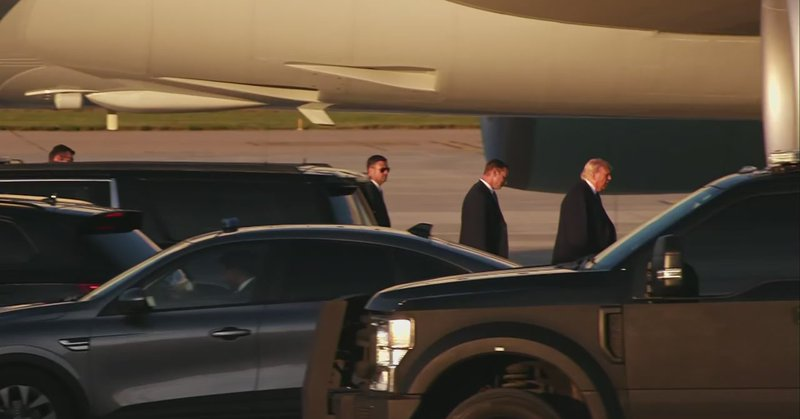

Fox News (Twitter/X)

WATCH LIVE: President Trump arrives in Paris after giving update on Iran deal https://twitter.com/i/broadcasts/1yxBeeBZqgyJN

## VahidOnline — post 76458

"متن کامل یادداشت تفاهم اسلام‌آباد بین جمهوری اسلامی ایران و ایالات متحده آمریکا"

به نقل از منابع حکومتی:
https://telegra.ph/mou-06-17-2

📡 @VahidOnline

## FarsiVOA — post 221052

⚡️پرزیدنت ترامپ در یک کنفرانس خبری پس از نشست گروه هفت گفت: اگر رفتار جمهوری اسلامی درست نباشد دوباره می‌زنیمشان؛ این برای ما کاری ندارد. برشی از پوشش ویژه با ترجمه همزمان پژواک کیومرثی

@FarsiVOA

## DW_Farsi — post 126118

  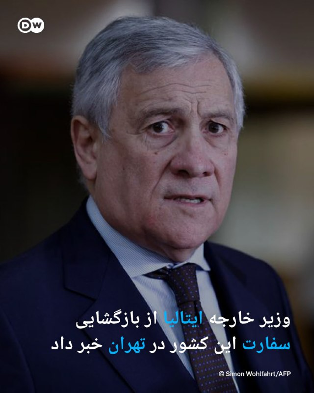

🔶 وزیر خارجه ایتالیا از بازگشایی سفارت این کشور در تهران خبر داد

وزیر امور خارجه ایتالیا روز چهارشنبه ۱۷ ژوئن (۲۷ خرداد) اعلام کرد سفارت این کشور در تهران که از اوایل اسفند سال گذشته و در پی جنگ آمریکا و اسرائیل با ایران تعطیل شده بود، روز جمعه (۲۹ خرداد ۱۴۰۵) بازگشایی خواهد شد.

آنتونیو تایانی در پارلمان ایتالیا گفت سفیر این کشور به همراه همه دیپلمات‌ها و مقام‌های وزارت خارجه به پایتخت ایران بازمی‌گردند.

تایانی گفت ایتالیا در اوایل مارس، به دلیل ملاحظات امنیتی، تصمیم گرفته بود سفارت خود در تهران را به‌طور موقت تعطیل کند و کارکنانش را به جمهوری آذربایجان منتقل کند.

او افزود اکنون سفیر ایتالیا همراه با تمامی دیپلمات‌ها و مقام‌های وزارت خارجه به تهران بازخواهد گشت و سفارت از روز جمعه دوباره فعالیت خود را آغاز می‌کند.

وزیر خارجه ایتالیا گفت در منطقه‌ای پیچیده مانند خاورمیانه، احتیاط همچنان ضروری است، اما برای نخستین بار پس از هفته‌ها جنگ و مذاکرات پرنوسان، نشانه‌ای ملموس از صلح در حال شکل‌گیری است.
@dw_farsi

## Persian_Trend_Official — post 17392

  <a href="telegram/content/Persian_Trend_Official_17392_1781724287.webm" target="_blank">🎬 Download video</a>

ترامپ: توافق ایران طی 48 ساعت آینده امضا خواهد شد.

اگر کشورهای دیگر موشک‌های بالستیک دارند، کمی ناعادلانه است که ایران تعدادی از آنها را نداشته باشد. موشک بالستیک با سلاح هسته‌ای یکسان نیست.

اگر عربستان سعودی و قطر، و همه آنها مقداری دارند، فکر می‌کنم به طور نسبی اشکالی ندارد که ایران مقداری داشته باشد.

📝 Amir

📌 @persian_trend_official
پرشین ترند | متفاوت‌ترین کانال نظامی

## IranianMinds — post 22826

  <a href="telegram/content/IranianMinds_22826_1781724288.mp4" target="_blank">🎬 Download video</a>

🔴 ترامپ :

اگر کشورهای دیگه موشک بالستیک دارن، کمی غیرعادلانه‌ست که ایران هیچی نداشته باشه.

موشک بالستیک با سلاح هسته‌ای فرق داره.

اگر عربستان سعودی و قطر و بقیه دارن، فکر می‌کنم به نسبت منطقی باشه که ایران هم تعدادی داشته باشه.

@IranianMinds

## IranianMinds — post 22825

⭕️ دوستان کانفیگتونو از ربات دریافت کنید تا در صورت قطع شدن اینترنت ها دسترسیتون به اینترنت بین الملل حفظ بشه

💸 پول به کانفیگ نده وقتی این ربات هست

## IranianMinds — post 22824

⭕️
⭕️ کانفیگای این ربات تو نت ملی وصله به محض استارت ۱ گیگابایت کانفیگ میده
بدون هیچ هزینه ای و رفرالی کانفیگ رو تحویلتون میده با بهترین سرعت و بدون قطعی

⭕️ ربات دریافت کانفیگ رایگان | @daeijoonbot

⭕️ ربات دریافت کانفیگ رایگان | @daeijoonbot

## IranianMinds — post 22823

  <a href="telegram/content/IranianMinds_22823_1781724290.mp4" target="_blank">🎬 Download video</a>

🔴 خبرنگار : تا کی اطراف خلیج فارس میخواین نگه دارید نیروهای آمریکایی رو ؟

ترامپ : هنوز بهش فکر نکردیم ، فک کنم برای مدتی فعلا بمونیم چون جای خیلی خوبی برای موندنه.

@IranianMinds

## idfinfarsi — post 11855

  <a href="telegram/content/idfinfarsi_11855_1781724292.mp4" target="_blank">🎬 Download video</a>

⭕️در عرض چند دقیقه: ارتش اسرائیل پرتابگری را که حزب‌الله دقایقی پیش از آن به سمت نیروهای ارتش اسرائیل راکت شلیک کرده بود، منهدم کرد

🔸دقایقی پس از آنکه سازمان تروریستی حزب‌الله به سمت نیروهای ارتش اسرائیل راکت شلیک کرد، نیروی هوایی پرتابگری را که مسلح و آماده شلیک راکت‌های بیشتر بود، هدف قرار داد. در پی این حمله، راکت‌های دیگری از پرتابگر رها شده و در منطقه‌ای باز در جنوب لبنان اقابت کردند.

## Dirty_Kids — post 392426

اینجارو ببین روبیو حتی به شوخی های ترامپ هم نمیخنده :|

@Dirty_Kids 👻

## Dirty_Kids — post 392425

🔴 لیندسی گراهام سناتور مخالف سرسخت جمهوری اسلامی: بنظرم این توافقنامه به نفع آمریکاست چون تنگه هرمز باز میشه و جنگ هم تموم میشه.

@Dirty_Kids 👻

## Hranews — post 113692

گزارشی از بازداشت یک شهروند در مهاباد

❗️
❗️
❗️
❗️
❗️ – روز پنجشنبه ۲۱ خردادماه، مصطفی پیروتی، شهروند ساکن مهاباد توسط نیروهای امنیتی در این شهر #بازداشت و به یکی از بازداشتگاه‌های امنیتی در ارومیه منتقل شد.

ادامه مطلب

#مصطفی_پیروتی

↘️
@hranews_bot تماس ✉️ -  @Hranews  کانال هرانا 🆑

## Hranews — post 113691

اجرای یک حکم اعدام همزمان با رهایی یک زندانی از چوبه دار/ افزایش اعدام‌شدگان در یزد

❗️
❗️
❗️
❗️
❗️ – مورخ ۱۲ خردادماه، حکم یک زندانی که پیشتر از بابت اتهامات مرتبط با جرائم مواد مخدر به #اعدام محکوم شده بود، در زندان یزد اجرا شد. از سوی دیگر، یک زندانی محکوم به اعدام در استان گیلان با گذشت اولیای دم از چوبه دار رهایی یافت. همچنین شمار اعدام‌شدگان امروز در زندان‌ یزد به هشت تن رسید.

ادامه مطلب

↘️
@hranews_bot تماس ✉️ -  @Hranews  کانال هرانا 🆑

---
📅 بروزرسانی: 1405/03/27 22:44
---

## VahidOOnLine — post 246082

  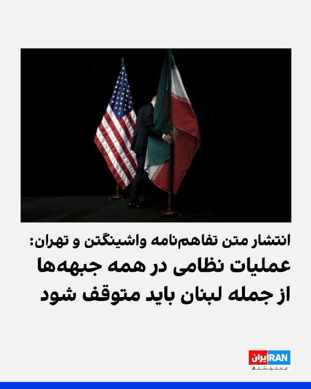

سی‌ان‌ان گزارش داد دولت آمریکا متن رسمی تفاهم‌نامه مورد توافق با جمهوری اسلامی را منتشر کرده است. بر اساس این سند ۱۴ بندی، دو طرف و متحدانشان متعهد می‌شوند عملیات نظامی در همه جبهه‌ها، از جمله لبنان، متوقف شود و هیچ‌یک علیه دیگری اقدام نظامی انجام ندهند.

این تفاهم‌نامه همچنین آغاز رفع محاصره دریایی ایران، تضمین عبور امن کشتی‌های تجاری از تنگه هرمز از سوی جمهوری اسلامی و مذاکره برای دستیابی به توافق نهایی ظرف ۶۰ روز را پیش‌بینی می‌کند.

در بخش هسته‌ای، جمهوری اسلامی بار دیگر متعهد شده به دنبال تولید سلاح هسته‌ای نرود و دو طرف درباره نحوه تعیین تکلیف ذخایر اورانیوم غنی‌شده در مذاکرات آینده تصمیم‌گیری کنند.

رفع تدریجی تحریم‌ها، صدور مجوز صادرات نفت ایران، آزادسازی دارایی‌های مسدودشده جمهوری اسلامی و طرحی دست‌کم ۳۰۰ میلیارد دلاری برای بازسازی و توسعه اقتصادی ایران نیز از دیگر مفاد این تفاهم‌نامه است.
‌🏁 🇬🇧 IranintlTV

🤖 @VahidOOnLine

## VahidOOnLine — post 246081

⭕️ میلیاردها دلار پول مسدودشده ایران در کدام کشورها قرار دارند؟

📌برآوردها درباره ارزش دارایی‌های ایران در خارج از کشور متفاوت است. تهران می‌گوید این رقم دست‌کم ۱۰۰ میلیارد دلار است، اما برخی کارشناسان رقم بسیار کمتری را مطرح می‌کنند. اولویت تهران در حال حاضر آزادسازی مرحله‌ای ۲۴ میلیارد دلار از این دارایی‌ها است

♦️جمهوری اسلامی با هدف دستیابی به جایزه‌ای بزرگ وارد مذاکرات با دولت ترامپ شده است: ده‌ها میلیارد دلار دارایی مسدودشده در خارج از کشور که می‌تواند به احیای اقتصاد بحران‌زده ایران کمک کند.

وال‌‌استریت ژورنال در مطلبی فهرستی از کشورهایی که دارایی‌های بلوکه‌شده ایران در آن‌ها قرار دارند ارائه می‌دهد. برخی از این دارایی‌ها تقریبا به اندازه عمر جمهوری اسلامی مسدود بوده‌اند. اما بخش عمده این دارایی‌های بلوکه‌شده مربوط به پرداخت‌های به‌نسبت جدید حاصل از فروش نفت ایران به چین، هند، کره جنوبی و ژاپن است، و پس از خروج دونالد ترامپ از برجام و بازگشت تحریم‌ها علیه ایران در سال ۲۰۱۸، مسدود شد.

بیشتر بخوانید...
‌🇸🇦 Indypersian

🤖 @VahidOOnLine

## WithYashar — post 15187

طبق برخی گزارش ها نیروهای ارتش جولانی در سوریه برای ورود به لبنان و مبارزه با حزب اللّه آماده میشوند🚨
@withyashar

## WithYashar — post 15186

شبکه خبر: انتشار متن تفاهم نامه ایران و آمریکا تا دقایقی دیگر
@withyashar

## IranIntlTV — post 342905

  

سی‌ان‌ان گزارش داد دولت آمریکا متن رسمی تفاهم‌نامه مورد توافق با جمهوری اسلامی را منتشر کرده است. بر اساس این سند ۱۴ بندی، دو طرف و متحدانشان متعهد می‌شوند عملیات نظامی در همه جبهه‌ها، از جمله لبنان، متوقف شود و هیچ‌یک علیه دیگری اقدام نظامی انجام ندهند.

این تفاهم‌نامه همچنین آغاز رفع محاصره دریایی ایران، تضمین عبور امن کشتی‌های تجاری از تنگه هرمز از سوی جمهوری اسلامی و مذاکره برای دستیابی به توافق نهایی ظرف ۶۰ روز را پیش‌بینی می‌کند.

در بخش هسته‌ای، جمهوری اسلامی بار دیگر متعهد شده به دنبال تولید سلاح هسته‌ای نرود و دو طرف درباره نحوه تعیین تکلیف ذخایر اورانیوم غنی‌شده در مذاکرات آینده تصمیم‌گیری کنند.

رفع تدریجی تحریم‌ها، صدور مجوز صادرات نفت ایران، آزادسازی دارایی‌های مسدودشده جمهوری اسلامی و طرحی دست‌کم ۳۰۰ میلیارد دلاری برای بازسازی و توسعه اقتصادی ایران نیز از دیگر مفاد این تفاهم‌نامه است.
https://iranintl.com/202606173518

## IranIntlTV — post 342904

  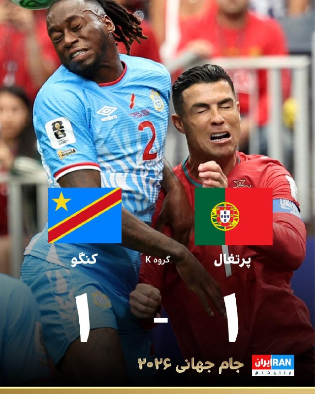

🔻تیم ملی فوتبال پرتغال در نخستین بازی خود در جام جهانی ۲۰۲۶، در هیوستون آمریکا به تساوی یک بر یک با جمهوری دموکراتیک کنگو رسید و متوقف شد.

🔹تک گل پرتغال را ژائو نوس در دقیقه ۶ و گل کنگو را یوان ویسا در دقیقه ۵+۴۵ به ثمر رساندند.

🔹کریس رونالدو، فوق ستاره پرتغال، ۹۰ دقیقه بازی کرد، اما در گلزنی، ناکام بود.

🔹رونالدوی ۴۱ ساله با بازی امروز برای پرتغال، ششمین جام جهانی خود را تجربه کرد. این بیست‌وسومین حضور او در مسابقات جام جهانی در طول شش دوره مختلف این رقابت‌ها بود.

🔹او با حضور در جام جهانی ۲۰۲۶ در کنار لیونل مسی به تنها بازیکنان مردی تبدیل شد که در شش دوره جام جهانی به میدان رفته‌اند.

🔹از سوی دیگر، یوان ویسا اولین گل تاریخ کنگو در جام جهانی را به ثمر رساند.

🔹این نخستین بار از جام جهانی ۲۰۰۶ است که اولین گل تاریخ یک کشور در جام جهانی توسط بازیکنی از لیگ برتر انگلیس به ثمر می‌رسد.

@iranintltvsport

## Persian_Trend_Official — post 17391

  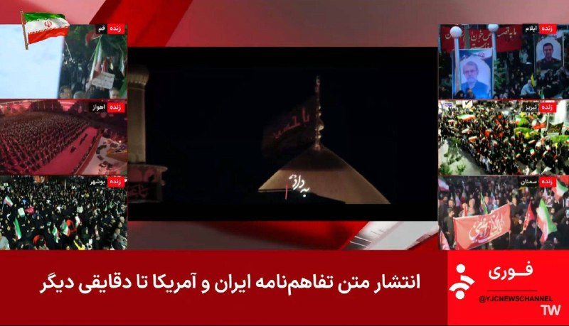

⭕️ شبکه خبر: انتشار متن تفاهم‌نامه ایران و آمریکا تا دقایقی دیگر

📝 Nick

📌 @persian_trend_official
پرشین ترند | متفاوت‌ترین کانال نظامی

## IranianMinds — post 22822

  <a href="telegram/content/IranianMinds_22822_1781723675.mp4" target="_blank">🎬 Download video</a>

🔴 ترامپ :

توافق با ایران در ۴۸ ساعت آینده امضا میشه.

@IranianMinds

## IranianMinds — post 22821

  <a href="telegram/content/IranianMinds_22821_1781723676.mp4" target="_blank">🎬 Download video</a>

🔴شاهزاده رضا پهلوی:

صرف‌نظر از نتیجه این به اصطلاح مذاکرات، این توافق پایدار نخواهد بود.

@IranianMinds

## BBCPersian — post 284177

  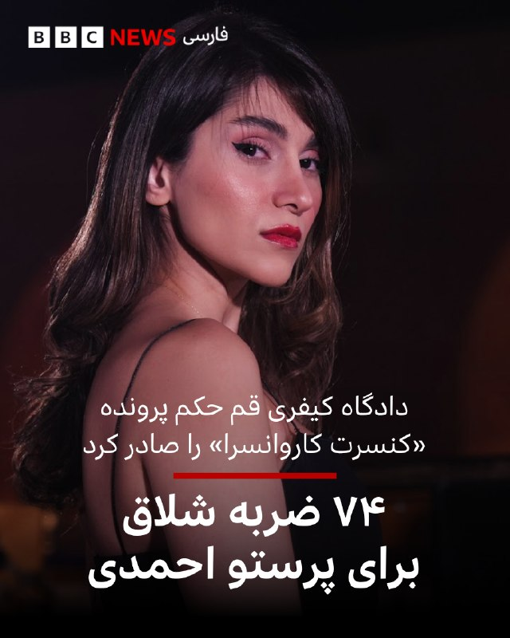

🔻 پرستو احمدی، خواننده، به همراه هشت نفر دیگر از دست‌اندرکاران و نوازندگان «کنسرت کاروانسرا» به ۷۴ ضربه شلاق تعزیری، دو سال ممنوع‌الخروجی و دو سال ممنوعیت از فعالیت هنری محکوم شدند.

این حکم از سوی دادگاه کیفری استان قم صادر شده و محمد شیری، رئیس شعبه رسیدگی‌کننده، دفاعیات این نه نفر را وارد ندانسته است.

اتهام مطرح‌شده علیه آنان «جریحه‌دار کردن عفت عمومی از طریق تولید و انتشار محتوای مبتذل و خلاف اخلاق در بستر فضای مجازی» عنوان شده است.

ویدئوی «کنسرت کاروانسرا» در آذرماه ۱۴۰۳ در کانال یوتیوب پرستو احمدی منتشر شد و با واکنش‌های گسترده‌ای در شبکه‌های اجتماعی همراه بود. او در این «کنسرت مجازی» بدون حجاب اجباری روی صحنه خوانده بود.

در پی انتشار این ویدئو، قوه قضائیه برای دست‌اندرکاران این برنامه پرونده قضایی تشکیل داد و کاروانسرای تاریخی «دیرگچین» ـ محل اجرای این برنامه موسیقی ـ را پلمپ کرد.

پرستو احمدی پیش‌تر درباره این کنسرت در کانال یوتیوب خود نوشته بود: «من، پرستو؛ دختری که می‌خواهم برای مردمی که دوستشان دارم بخوانم. این حقی است که نمی‌توانستم از آن چشم بپوشم.»

@BBCPersian

## Dirty_Kids — post 392424

  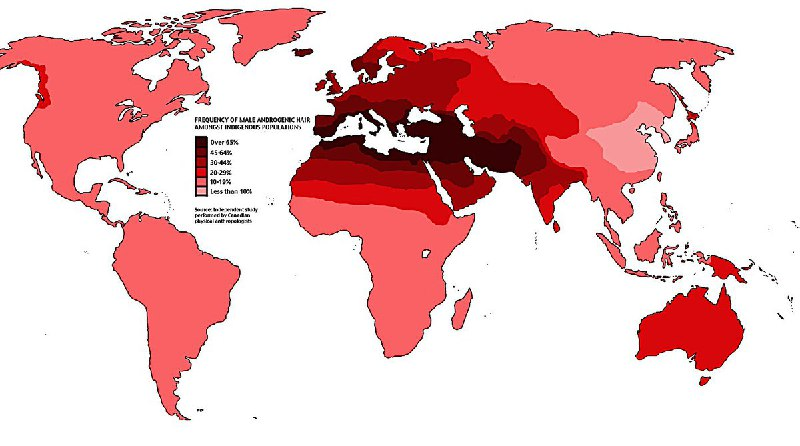

نقشه پراکندگی پشمالو بودن مردان جهان.
تیره تر یعنی پشمالو تر.
مناطقی که در طول تاریخ تحت کنترل ایرانیان بوده پشمالو شدن، پشم صادر کردیم.

@Dirty_Kids 👻

---
📅 بروزرسانی: 1405/03/27 22:34
---

## WithYashar — post 15185

شبکه i24News اسرائیل:

متن رسمی یادداشت تفاهم ایران و آمریکا منتشر شده و طبق این توافق، همه درگیری‌ها از جمله در لبنان باید فورا متوقف بشه.
همچنین یک برنامه اقتصادی 300 میلیارد دلاری برای جمهوری اسلامی در نظر گرفته شده.
بر اساس گزارش، ذخایر اورانیوم با غنای بالای ایران داخل کشور و تحت نظارت آژانس رقیق خواهد شد.
@withyashar

## DEJradio — post 5771

  <a href="telegram/content/DEJradio_5771_1781723086.mp4" target="_blank">🎬 Download video</a>

🚨
🔸 خبر ۲۱
چهارشنبه ۲۷ خرداد ۱۴۰۵

#خبر۲۱
@DEJradio

## Dirty_Kids — post 392423

  <a href="telegram/content/Dirty_Kids_392423_1781723089.mp4" target="_blank">🎬 Download video</a>

بحران اقتصادی جمهوری اسلامی و دزدی و کم فروشی شرکتهای تولیدی صنایع غذایی

این قسمت : بیسکوئیت !!!!!

@Dirty_Kids 👻

## Dirty_Kids — post 392422

  <a href="telegram/content/Dirty_Kids_392422_1781723090.mp4" target="_blank">🎬 Download video</a>

از وقتی ترامپ داره با جمهوری‌عسلامی لاس میزنه، تصوراتم نسبت به سربازای امریکایی اینشکلی شده:

حرفای عمو مانوک محفوظه ولی فعلا اینجویم

@Dirty_Kids 👻

## alonews — post 128773

  <a href="telegram/content/alonews_128773_1781723091.webm" target="_blank">🎬 Download video</a>

👈سخنگوی وزارت خارجه: تعهد ما این است که در مدت مشخصی، ترافیک دریایی را تنگهٔ هرمز به حالت عادی برگردانیم

🔴برای تدوین سازوکار مدیریت تنگهٔ هرمز و خدمات دریایی، ایران و عمان همکاری خواهند کرد.

✅ @AloNews خبر جنگ

---
📅 بروزرسانی: 1405/03/27 22:24
---

## VahidOOnLine — post 246080

  <a href="telegram/content/VahidOOnLine_246080_1781722466.mp4" target="_blank">🎬 Download video</a>

♦️ دونالد ترامپ، رئیس‌جمهوری آمریکا، در نشست خبری مشترک با نارندرا مودی در شهر اویان فرانسه، با لحنی عامیانه و ستایش‌آمیز به توصیف ویژگی‌های شخصیتی و مهارتی نخست‌وزیر هند در مذاکرات پرداخت.

ترامپ با اشاره به ظاهر موقر مودی گفت: «او زیباترین چهره را دارد و مثل یک فرشته به‌نظر می‌رسد؛ اما در واقع یک قاتل [سیاسی] و به‌شدت سرسخت است.» او با تاکید بر اینکه ظاهر مهربان مودی نباید کسی را در مذاکرات غافلگیر کند، افزود: «مردم فکر می‌کنند او فقط یک مرد مهربان است، اما من به آن‌ها گفتم نه، او در معامله و مذاکره بسیار ترسناک و سرسخت است.»
‌🇸🇦 Indypersian

🤖 @VahidOOnLine

## WithYashar — post 15184

## WithYashar — post 15183

  <a href="telegram/content/WithYashar_15183_1781722469.mp4" target="_blank">🎬 Download video</a>

ترامپ با هواپیما به سمت کاخ ورسای رفت، تا مکرون و رهبران کشوران اروپایی شام بخوره
@withyashar

## pm_afshaa — post 94292

  <a href="telegram/content/pm_afshaa_94292_1781722470.webm" target="_blank">🎬 Download video</a>

🔴شبکه اسرائیلی i24News:

متن رسمی یادداشت تفاهم ایران و آمریکا منتشر شده و طبق این توافق، همه درگیری‌ها از جمله در لبنان باید فورا متوقف بشه.

همچنین یک برنامه اقتصادی 300 میلیارد دلاری برای جمهوری اسلامی در نظر گرفته شده.

بر اساس گزارش، ذخایر اورانیوم با غنای بالای ایران داخل کشور و تحت نظارت آژانس رقیق خواهد شد.

💧 Rainbet.com the #1 Non-KYC Crypto Casino & Sportsbook @rainbetcom

😁 @Pm_Afshaa

## kianmeli1 — post 88051

🔴یک مقام کاخ سفید متن رسمی تفاهم‌نامه بین ایالات متحده و ایران را برای خبرنگاران منتشر کرد:

— آتش‌بس فوری و دائمی بین آمریکا، ایران و متحدانشان در تمام جبهه‌ها، از جمله لبنان، با انزوا از اقدامات نظامی آینده از سوی هر دو طرف و تضمین حاکمیت لبنان.

— احترام متقابل به حاکمیت و تمامیت ارضی، بدون دخالت در امور داخلی یکدیگر.

— توافق نهایی باید ظرف ۶۰ روز به دست آید و با رضایت متقابل قابل تمدید است.

— آمریکا بلافاصله محاصره دریایی را لغو کرده و ظرف ۳۰ روز به طور کامل آن را برمی‌دارد؛ ایران به تدریج کشتیرانی را بازسازی می‌کند. آمریکا همچنین نیروهای نزدیک خود را ظرف ۳۰ روز پس از توافق نهایی خارج خواهد کرد.

— ایران کشتیرانی تجاری آزاد و ایمن را بین خلیج فارس و دریای عمان برای ۶۰ روز تضمین می‌کند، با بازگرداندن کامل ترافیک ظرف ۳۰ روز پس از پاکسازی مین‌ها و حذف موانع.

— ایران و عمان در مورد حکمرانی آینده و چیدمان‌های دریایی تنگه هرمز، در مشورت با کشورهای منطقه و تحت قوانین بین‌المللی، بحث خواهند کرد.

— آمریکا و شرکای منطقه‌ای طرح توسعه اقتصادی ۳۰۰+ میلیارد دلاری برای ایران را ایجاد می‌کنند، با توافق جزئیات اجرا ظرف ۶۰ روز و صدور تمام مجوزهای لازم.

— تمام تحریم‌های علیه ایران طبق زمان‌بندی توافق شده لغو شود، از جمله تحریم‌های سازمان ملل، آژانس بین‌المللی انرژی اتمی، اولیه و ثانویه آمریکا، با اولویت موضوع تسکین تحریم‌ها در مذاکرات.

— ایران تأکید می‌کند که سلاح‌های هسته‌ای توسعه نخواهد داد. انباشته‌های اورانیوم غنی‌شده از طریق مکانیسمی که به طور متقابل توافق شده است، حداقل شامل رقیق‌سازی در محل تحت نظارت آژانس بین‌المللی انرژی اتمی، مورد توجه قرار خواهد گرفت. نیازهای غنی‌سازی و هسته‌ای آینده در توافق نهایی حل و فصل خواهد شد.

— وضعیت موجود تا رسیدن به توافق نهایی حفظ می‌شود: ایران وضعیت هسته‌ای فعلی خود را منجمد می‌کند، در حالی که آمریکا تحریم‌های جدیدی اعمال نمی‌کند و نیروهای منطقه‌ای اضافی مستقر نمی‌کند.

— معافیت‌های فوری تحریم‌های آمریکا برای نفت ایران، محصولات نفتی، مشتقات و تمام خدمات بانکی، بیمه، کشتیرانی و تجاری مرتبط.

— دارایی‌های منجمد تحت رویه‌های توافق شده در دسترس قرار می‌گیرند، با استفاده مجاز توسط بانک مرکزی ایران و حمایت از تمام مجوزها و پروانه‌های مورد نیاز.

— یک مکانیسم مشترک اجرا و نظارت بر انطباق با تفاهم‌نامه و هر توافق نهایی آینده نظارت خواهد کرد.

مذاکرات در مورد توافق نهایی پس از اجرای بندهای کلیدی ادامه خواهد یافت و توافق نهایی از طریق قطعنامه‌ای الزام‌آور شورای امنیت تأیید خواهد شد.

## DW_Farsi — post 126117

🎥 ۵۰ هزار دلار برای تماشای تمام بازی‌های جام جهانی

دو تماشگر فوتبال از میان ۶ هزار متقاضی انتخاب شده‌اند تا همه ۱۰۴ بازی جام جهانی را از داخل یک اتاقک شیشه‌ای در میدان تایمز نیویورک تماشا کنند؛ شغلی با دستمزد ۵۰ هزار دلاری.
@dw_farsi

## Persian_Trend_Official — post 17390

  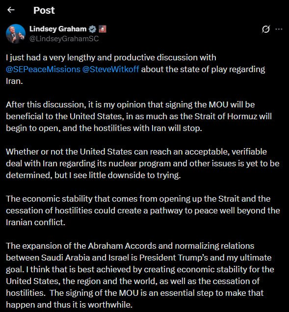

سناتور گراهام: به نظر من امضای تفاهم‌نامه برای ایالات متحده مفید خواهد بود، به این دلیل که تنگه هرمز شروع به باز شدن خواهد کرد و خصومت‌ها با ایران متوقف خواهد شد.

اینکه آیا ایالات متحده می‌تواند به یک توافق قابل قبول و قابل تأیید با ایران در مورد برنامه هسته‌ای و سایر مسائل دست یابد یا خیر، هنوز مشخص نیست، اما من جنبه منفی چندانی برای تلاش در این زمینه نمی‌بینم.

📝 Amir

📌 @persian_trend_official
پرشین ترند | متفاوت‌ترین کانال نظامی

## Persian_Trend_Official — post 17389

  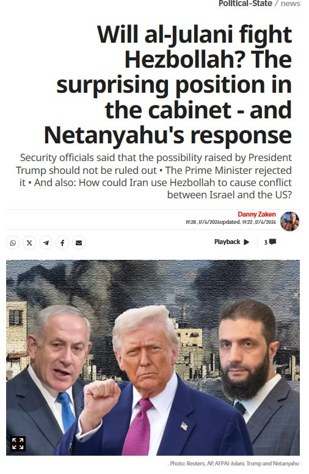

به گزارش اسرائیل هیوم، مقامات امنیتی اسرائیل پیشنهادی را که توسط رئیس جمهور ترامپ مطرح شده بود، مورد بحث قرار دادند مبنی بر اینکه نیروهای سوریه می‌توانند به خلع سلاح حزب‌الله در لبنان کمک کنند.

برخی از مقامات امنیتی با اشاره به اثربخشی اخیر نیروهای سوریه علیه عناصر حزب‌الله در سوریه و انگیزه آنها برای مقابله با این گروه، استدلال کردند که این ایده نباید رد شود.

با این حال، بنیامین نتانیاهو، نخست وزیر، این پیشنهاد را رد کرد، زیرا نگرانی‌هایی وجود داشت که استقرار نیروهای سوری به رهبری اسلام‌گرایان سنی در لبنان می‌تواند این کشور را بی‌ثبات کند و تلاش‌های دیپلماتیک را از مسیر خود خارج کند.

📝 Amir

📌 @persian_trend_official
پرشین ترند | متفاوت‌ترین کانال نظامی

## Persian_Trend_Official — post 17388

⭕️ فوری: ایالات متحده متن رسمی تفاهم‌نامه (MoU) که در آخر هفته با ایران به دست آمده را منتشر کرد.

— آتش‌بس فوری و دائمی بین ایالات متحده، ایران و متحدانشان در تمام جبهه‌ها، از جمله لبنان، با تعهد دو طرف به عدم اقدام نظامی در آینده و تضمین حاکمیت لبنان.

— احترام متقابل به حاکمیت و تمامیت ارضی و عدم مداخله در امور داخلی یکدیگر.

— توافق نهایی ظرف ۶۰ روز با امکان تمدید با توافق دو طرف حاصل خواهد شد.

— آمریکا فوراً و به طور کامل ظرف ۳۰ روز محاصره دریایی را لغو می‌کند؛ ایران به تدریج تردد کشتی‌ها را از سر می‌گیرد. آمریکا همچنین ظرف ۳۰ روز پس از توافق نهایی، نیروهای خود را از منطقه خارج خواهد کرد.

— ایران به مدت ۶۰ روز عبور و مرور آزاد و امن کشتیرانی تجاری بین خلیج فارس و دریای عمان را تضمین می‌کند و پس از پاک‌سازی مین و برطرف شدن موانع، تردد کامل ظرف ۳۰ روز از سر گرفته می‌شود.

— ایران و عمان درباره ترتیبات آینده حاکمیتی و دریایی تنگه هرمز، با مشورت کشورهای منطقه و بر اساس حقوق بین‌الملل، گفت‌وگو خواهند کرد.

— آمریکا و شرکای منطقه‌ای یک برنامه توسعه اقتصادی به ارزش بیش از ۳۰۰ میلیارد دلار برای ایران ایجاد خواهند کرد که جزئیات اجرایی آن ظرف ۶۰ روز توافق و تمام مجوزهای لازم صادر خواهد شد.

— کلیه تحریم‌های ایران بر اساس جدول زمانی مورد توافق لغو می‌شود، شامل تحریم‌های سازمان ملل، آژانس بین‌المللی انرژی اتمی، تحریم‌های اولیه و ثانویه آمریکا، و لغو تحریم‌ها به عنوان اولویت مذاکرات تعیین شده است.

— ایران تأکید می‌کند که سلاح هسته‌ای تولید نخواهد کرد. ذخایر اورانیوم غنی‌شده از طریق سازوکاری مورد توافق دو طرف، که حداقل شامل رقیق‌سازی در محل تحت نظارت آژانس بین‌المللی انرژی اتمی است، تعیین تکلیف می‌شود. نیازهای آینده غنی‌سازی و هسته‌ای در توافق نهایی حل‌وفصل خواهد شد.

— وضع موجود تا زمان توافق نهایی حفظ می‌شود: ایران وضعیت هسته‌ای فعلی خود را تثبیت می‌کند و آمریکا نیز تحریم جدیدی اعمال نکرده و نیروی منطقه‌ای جدیدی مستقر نمی‌کند.

— معافیت فوری تحریم‌های آمریکا برای نفت، فرآورده‌های نفتی، مشتقات و کلیه خدمات مرتبط بانکی، بیمه، کشتیرانی و تجاری ایران.

— دارایی‌های مسدودشده ایران بر اساس رویه‌های مورد توافق قابل دسترسی می‌شود و استفاده کامل از آن با مجوز بانک مرکزی ایران و با پشتیبانی کلیه مجوزها و پروانه‌های مورد نیاز آمریکا صورت می‌گیرد.

— یک سازوکار مشترک اجرا و نظارت بر اجرای این تفاهم‌نامه و هر توافق نهایی آینده نظارت خواهد کرد.

— مذاکرات درباره توافق نهایی پس از اجرایی شدن مفاد کلیدی آغاز می‌شود و توافق نهایی از طریق یک قطعنامه الزام‌آور شورای امنیت سازمان ملل تصویب خواهد شد.

📝 Nick

📌 @persian_trend_official
پرشین ترند | متفاوت‌ترین کانال نظامی

## Dirty_Kids — post 392421

  <a href="telegram/content/Dirty_Kids_392421_1781722472.mp4" target="_blank">🎬 Download video</a>

پشت پرده اختلال در بانک‌های مملکت

@Dirty_Kids 👻

## alonews — post 128772

  <a href="telegram/content/alonews_128772_1781722474.webm" target="_blank">🎬 Download video</a>

👈وزیر خارجه ایتالیا پس از تماس با عراقچی: توافق ایران و آمریکا گامی مهم برای ثبات منطقه است

✅ @AloNews خبر جنگ

## alonews — post 128771

  <a href="telegram/content/alonews_128771_1781722474.webm" target="_blank">🎬 Download video</a>

👈مدیرعامل سایپا: ما قرار نیست ماشینامونو گرون کنیم بیاید از خودمون بخرید!

✅ @AloNews خبر جنگ

---
📅 بروزرسانی: 1405/03/27 22:14
---

## VahidOOnLine — post 246079

  

محمدباقر قالیباف در نشست همفکری نماینده ویژه در امور چین با اتاق بازرگانی ایران گفت: «تحریم کاغذپاره نیست، اما اگر معنایش این باشد که برای رفع تحریم‌ها باید تسلیم شویم، هرگز.»

او ادامه داد: «ما رشد اقتصادی صنعت را در ابتدای دهه ۸۰ دیده‌ایم و امروز، با وجود همه زحماتی که کشیده‌شده، شاهد رشد منفیِ نیم هستیم.»

رییس مجلس در همین نشست گفته بود: «باید سنگر را از بچه‌های لانچر تحویل بگیریم، مردم را از زیر فشار اقتصادی دربیاوریم و کشور را بسازیم.»
‌🏁 🇬🇧 IranintlTV

🤖 @VahidOOnLine

## WithYashar — post 15182

  

سناتور لیندسی گراهام: به نظر من امضای این تفاهم‌نامه به نفع آمریکا خواهد بود، چون تنگه هرمز شروع به بازگشایی میکنه و درگیری‌ها با ایران متوقف میشه.

اینکه آیا آمریکا میتونه با ایران بر سر برنامه هسته‌ای و سایر مسائل به توافقی قابل قبول و قابل راستی‌آزمایی برسه یا نه، هنوز مشخص نیست، اما من تلاش برای رسیدن به چنین توافقی رو کم‌هزینه می‌بینم.
@withyashar

## FoxNewsTwitter — post 343087

  

Fox News (Twitter/X)

WATCH LIVE: Fed Chair Warsh holds press conference after announcing decision on interest rates https://twitter.com/i/broadcasts/1pJdRRreZovKW

## IranIntlTV — post 342903

  <a href="telegram/content/IranIntlTV_342903_1781721873.mp4" target="_blank">🎬 Download video</a>

۲۴ با فرداد فرحزاد
@iranintltv

## IranIntlTV — post 342902

  

محمدباقر قالیباف در نشست همفکری نماینده ویژه در امور چین با اتاق بازرگانی ایران گفت: «تحریم کاغذپاره نیست، اما اگر معنایش این باشد که برای رفع تحریم‌ها باید تسلیم شویم، هرگز.»

او ادامه داد: «ما رشد اقتصادی صنعت را در ابتدای دهه ۸۰ دیده‌ایم و امروز، با وجود همه زحماتی که کشیده‌شده، شاهد رشد منفیِ نیم هستیم.»

رییس مجلس در همین نشست گفته بود: «باید سنگر را از بچه‌های لانچر تحویل بگیریم، مردم را از زیر فشار اقتصادی دربیاوریم و کشور را بسازیم.»
https://iranintl.com/202606174186

## alonews — post 128770

  <a href="telegram/content/alonews_128770_1781721875.mp4" target="_blank">🎬 Download video</a>

👈ترامپ با هواپیما به سمت کاخ ورسای رفت، تا مکرون شام بخوره

✅ @AloNews خبر جنگ

---
📅 بروزرسانی: 1405/03/27 22:04
---

## VahidOOnLine — post 246078

  

لیندزی گراهام، سناتور جمهوری‌خواه آمریکا، در شبکه ایکس نوشت پس از گفت‌وگویی طولانی با استیو ویتکاف به این نتیجه رسیده که امضای تفاهم‌نامه با جمهوری اسلامی به نفع آمریکا خواهد بود، زیرا به بازگشایی تنگه هرمز و توقف درگیری‌ها با ایران کمک می‌کند.

لیندزی گراهام افزود: «هنوز مشخص نیست آیا آمریکا می‌تواند به توافقی قابل راستی‌آزمایی و قابل قبول با جمهوری اسلامی درباره برنامه هسته‌ای و سایر موضوعات دست یابد یا نه، اما تلاش برای دستیابی به چنین توافقی زیان چندانی ندارد.»

او ادامه داد: «ثبات اقتصادی ناشی از بازگشایی تنگه هرمز و توقف درگیری‌ها می‌تواند مسیری برای صلحی فراتر از مناقشه کنونی با جمهوری اسلامی ایجاد کند.»

لیندزی گراهام گفت گسترش پیمان ابراهیم و عادی‌سازی روابط میان عربستان سعودی و اسرائیل هدف نهایی دونالد ترامپ و او است.

لیندزی گراهام گفت امضای تفاهم‌نامه میان آمریکا و جمهوری اسلامی گامی ضروری برای تحقق ثبات منطقه‌ای و پیشبرد روند صلح در خاورمیانه است.
‌🏁 🇬🇧 IranintlTV

🤖 @VahidOOnLine

## WithYashar — post 15181

وزارت امور خارجه ایران: ادامه اشغال جنوب لبنان توسط اسرائیل، نقض تفاهم‌نامه است و ما اقدامات لازم را انجام خواهیم داد

ایالات متحده متعهد شده است که تمام تحریم‌ها از جمله تحریم‌های شورای امنیت سازمان ملل را در یک جدول زمانی که در طول مذاکرات مورد بحث قرار خواهد گرفت، لغو کند
@withyashar

## mwarmonitor — post 11085

🔴 روزنامه «اسرائیل هیوم» به نقل از منابع: اسرائیل خواهان تسریع در برقراری تماس با لبنان و رسیدن به توافق است، پیش از آن‌که واشنگتن و تهران به یک توافق کامل دست پیدا کنند.

@mwarmonitor

## pm_afshaa — post 94291

  <a href="telegram/content/pm_afshaa_94291_1781721279.webm" target="_blank">🎬 Download video</a>

🔴سناتور لیندسی گراهام: به نظر من امضای این تفاهم‌نامه به نفع آمریکا خواهد بود، چون تنگه هرمز شروع به بازگشایی میکنه و درگیری‌ها با ایران متوقف میشه.

اینکه آیا آمریکا میتونه با ایران بر سر برنامه هسته‌ای و سایر مسائل به توافقی قابل قبول و قابل راستی‌آزمایی برسه یا نه، هنوز مشخص نیست، اما من تلاش برای رسیدن به چنین توافقی رو کم‌هزینه می‌بینم.

💧 Rainbet.com the #1 Non-KYC Crypto Casino & Sportsbook @rainbetcom

😁 @Pm_Afshaa

## iaghapour — post 2683

اکانت‌های هوش مصنوعی رو با یک‌دهم قیمت بخر 
🛍

🌐 Kiro.dev Pro
(جایگزین اقتصادی Claude)
- ایجنت برنامه‌نویسی شرکت آمازون
- پشتیبانی از تمامی مدل‌های Claude
- مناسب فقط برنامه‌نویسان
- مصرف کردیت کمتر نسبت به Claude
- ارزان، اقتصادی و با کیفیت

🏳️‍🌈 Gemini Pro:
- پلن مشابه GPT Plus از شرکت گوگل
- پشتیبانی از Antigravity
- ساخت عکس و ویدیوی فارسی
- تجزیه‌ و تحلیل و تحقیق عمیق
- فعال‌سازی روی ایمیل شما (اتوماتیک)
- کاملا اختصاصی (فمیلی نیست)

🔆 Codex 2500 Credits:
- اکانت کدکس شامل 2500 کردیت
- امکان ارسال 625 الی 3200 پیام
- مخصوص فقط برنامه نویسی
- دسترسی به GPT5.5
- کاملا اختصاصی

خرید و توضیحات بیشتر از ربات:

🤖 @ChatGPT_StoreBOT
رضایت مشتری 
💎

## DEJradio — post 5770

  <a href="telegram/content/DEJradio_5770_1781721280.webm" target="_blank">🎬 Download video</a>

👑
🔺 شاهزاده رضا پهلوی در دومین روز سفر خود به بریتانیا با اندرو میچل، نماینده پارلمان و معاون پیشین وزیر امور خارجه بریتانیا، که سال‌ها از حامیان و دوستان ملت ایران بوده است، دیدار و گفت‌وگو کرد.

در این دیدار، آخرین تحولات ایران و ضرورت حمایت از مبارزه ملت ایران برای دستیابی به دموکراسی، آزادی و آینده‌ای فراتر از جمهوری اسلامی مورد بحث و تبادل نظر قرار گرفت.

#شاهزاده_رضا_پهلوی #بریتانیا
@DEJradio

## RadioFarda — post 158444

🔸دونالد ترامپ، رئیس‌جمهور آمریکا، روز چهارشنبه در جریان کنفرانس خبری پایان نشست سران گروه ۷ در فرانسه، درباره احتمال آزادسازی دارایی‌های مسدود شده ایران گفت که این دارایی‌ها در اصل متعلق به ایران هستند. 🔸او اعلام کرد: «ما مقدار زیادی از پول آن‌ها را گرفته‌ایم.…

## RadioFarda — post 158443

  

🔸دونالد ترامپ، رئیس‌جمهور آمریکا، روز چهارشنبه در جریان کنفرانس خبری پایان نشست سران گروه ۷ در فرانسه، درباره احتمال آزادسازی دارایی‌های مسدود شده ایران گفت که این دارایی‌ها در اصل متعلق به ایران هستند.

🔸او اعلام کرد: «ما مقدار زیادی از پول آن‌ها را گرفته‌ایم. ما پول آن‌ها را گرفته‌ایم؛ این پول ما نیست، پول خودشان است و ما در مقطعی آن را مسدود کردیم. فکر می‌کنم در نهایت باید آن را به آن‌ها برگردانیم.»

🔸ترامپ در مورد تحریم‌ها نیز موضعی نسبتاً انعطاف‌پذیر در قبال ایران ابراز کرد، مشروط بر اینکه ایران به مفاد توافق پایبند بماند: «در مورد تحریم‌ها، در مقطعی باید به این موضوع فکر کرد. ما تحریم‌هایی داریم که هرگز اجازه بازسازی به آن‌ها نخواهد داد. آن‌ها هیچ پولی نخواهند داشت و در فقر خواهند بود.»

@RadioFarda

## Dirty_Kids — post 392419

پسر قالیباف امروز در قطر دیده شده

@Dirty_Kids 👻

## Hranews — post 113690

  

حبس بدون تصمیم؛ تداوم بلاتکلیفی پژمان زارع، شهروند بهائی در زندان عادل آباد

❗️
❗️
❗️
❗️
❗️ – پژمان زارع، شهروند بهائی ساکن شیراز، علیرغم گذشت بیش از سه ماه از زمان دستگیری، کماکان به صورت بلاتکلیف در زندان عادل آباد این شهر به‌سر می‌برد.

به گزارش هرانا، ارگان خبری مجموعه فعالان حقوق بشر در ایران، پژمان زارع کماکان در بازداشت به‌سر می‌برد.

یک منبع مطلع نزدیک به خانواده این شهروند بهائی ضمن تایید این موضوع به هرانا گفت: پژمان زارع ۹۵ روز است که به‌صورت بلاتکلیف در زندان عادل آباد شیراز نگهداری می شود. همچنین با دستور مسئولین مربوطه خانواده آقای زارع از پیگیری پرونده فرزندشان از مراجع قضایی منع شده‌اند. این در حالی است که او طی مدت زمان بازداشت از حق دسترسی به وکیل محروم مانده و تاکنون نیز رسیدگی مؤثر و نتیجه‌بخشی به پرونده این شهروند بهائی صورت نگرفته است.

ادامه مطلب

#پژمان_زارع

↘️
@hranews_bot تماس ✉️ -  @Hranews  کانال هرانا 🆑

## alonews — post 128769

  <a href="telegram/content/alonews_128769_1781721281.webm" target="_blank">🎬 Download video</a>

👈سناتور لیندسی گراهام: به نظر من امضای این تفاهم‌نامه به نفع ایالات متحده خواهد بود، زیرا تنگه هرمز شروع به بازگشایی می‌کند و درگیری‌ها با ایران متوقف می‌شود.

🔴اینکه آیا آمریکا می‌تواند با ایران بر سر برنامه هسته‌ای و سایر مسائل به توافقی قابل قبول و قابل راستی‌آزمایی برسد یا نه، هنوز مشخص نیست، اما من تلاش برای رسیدن به چنین توافقی را کم‌هزینه می‌بینم.

✅ @AloNews خبر جنگ

---
📅 بروزرسانی: 1405/03/27 21:54
---

## VahidOOnLine — post 246077

  

♦️ دونالد ترامپ، رئیس‌جمهوری آمریکا، روز چهارشنبه ۲۷ خرداد اشاره کرد که ممکن است سفر خود را تمدید کند و برای شرکت در مراسم روز جمعه جهت امضای یادداشت تفاهم با جمهوری اسلامی ایران، در اروپا بماند.

ترامپ در پاسخ به این پرسش که چرا برای مراسم امضای این توافق در منطقه نمی‌ماند، گفت: «شاید هم ماندم.»

با این حال، رئیس‌جمهوری آمریکا خاطرنشان کرد هرچند این یادداشت تفاهم «بسیار مهم» است، اما ممکن است از «آن دست اسنادی» نباشد که او به عنوان رئیس‌جمهوری ایالات متحده شخصا نیاز به امضای آن داشته باشد. بر اساس برنامه‌ریزی‌های انجام‌شده، انتظار می‌رود جی‌دی ونس، معاون رئیس‌جمهوری، روز جمعه در مراسم حضوری و رسمی امضای این سند شرکت کند.
‌🇸🇦 Indypersian

🤖 @VahidOOnLine

## pm_afshaa — post 94290

🔴آمریکا متن رسمی تفاهم‌نامه‌ای که با ایران بهش رسیده رو منتشر کرد :

جنگ و درگیری بین ایران، آمریکا و متحدانشون متوقف میشه و دو طرف متعهد میشن که دیگه علیه هم اقدام نظامی نکنن.
آمریکا محاصره دریایی رو برمی‌داره، تحریم‌ها رو به‌تدریج لغو میکنه و در صورت نهایی شدن توافق، نیروهای اضافی خودش رو از منطقه خارج میکنه.
فروش نفت ایران دوباره آزاد میشه، دارایی‌های بلوکه‌شده ایران در دسترس قرار میگیره و آمریکا مجوزهای لازم برای مبادلات بانکی، بیمه، حمل‌ونقل و تجارت رو صادر میکنه. قرار شده بالای 300 میلیارد دلار برای رونق دادن و سر و سامون دادن به اقتصاد ایران هزینه بشه.
ایران دوباره تأکید کرده که دنبال ساخت سلاح هسته‌ای نیست، درباره ذخایر اورانیوم غنی‌شده و آینده غنی‌سازی هم قراره تو مذاکرات بعدی تصمیم نهایی گرفته بشه.
تا زمان توافق نهایی، ایران وضعیت فعلی برنامه هسته‌ای خودش رو حفظ میکنه و آمریکا هم نه تحریم جدیدی اعمال میکنه و نه نیروی نظامی بیشتری به منطقه میفرسته.
ایران هم متعهد میشه امنیت کشتیرانی تجاری تو خلیج فارس و دریای عمان رو تأمین کنه و مسیرهای دریایی رو به حالت عادی برگردونه. دو طرف حداکثر طی 60 روز آینده باید روی توافق نهایی به نتیجه برسن و در صورت توافق، قراره این توافق با قطعنامه الزام‌آور شورای امنیت سازمان ملل تأیید بشه.

💧Rainbet.com the #1 Non-KYC Crypto Casino & Sportsbook @rainbetcom

😁 @Pm_Afshaa

## iaghapour — post 2682

💰 مدیرعامل همراه اول: قیمت فعلی اینترنت با قیمت واقعی آن هیچ سنخیتی ندارد!

مهدی اخوان، مدیرعامل همراه اول، در مجمع عمومی سالانه این اپراتور با گلایه از تعرفه‌های فعلی اعلام کرد که هزینه‌های سرمایه‌گذاری ارزی آن‌ها کاملاً مشابه اپراتورهای منطقه است، اما قیمت هر گیگابایت اینترنت در ایران بسیار پایین‌تر از آن کشورهاست.

پ.ن: جناب مدیرعامل! اتفاقاً تو این مملکت خیلی چیزها هست که هیچ سنخیتی با هم ندارن؛ از کیفیت اینترنت شما و چیزی که واقعاً به دست ما می‌رسه بگیر تا درآمد بالای مردم منطقه و حقوق‌های پایین ما! از همه مهم‌تر، بین زندگی و رفاه شما و واقعیتِ زندگی مردم هیچ سنخیتی نیست!

اگه واقعاً کار براتون نمی‌صرفه ما هم راضی به ضررتون نیستیم، کلاً درِ این اپراتورها رو تخته کنید و جرم‌انگاری استارلینک رو بردارید تا ببینیم تو یه بازار آزاد اصلاً می‌تونید باهاشون رقابت کنید یا نه! واقعیت اینه که سودهای کلان این اینترنت انحصاری (پرو) حسابی به دهنتون مزه کرده و حالا با گرون کردن‌های نجومی و پشت‌سرهم، به هر دری می‌زنید تا جیب مردم رو خالی‌تر کنید. وگرنه این چیزی که دارید به ما می‌فروشید اصلاً اسمش اینترنت نیست؛ هر وقت یه اینترنت واقعی و بدون فیلتر دست مردم دادید، اون‌وقت پولش رو هم بگیرید.

🆔 @iAghapour

## DEJradio — post 5769

  <a href="telegram/content/DEJradio_5769_1781720670.webm" target="_blank">🎬 Download video</a>

👑
🔺 شاهزاده رضا پهلوی در دومین روز سفر خود به بریتانیا با پریتی پتل، وزیر امور خارجه کابینه‌ی سایه این کشور، دیدار و گفت‌وگو کرد.

در این دیدار، دو طرف بر این موضوع تأکید کردند با وجود آنکه در جریان سرکوب‌های خونین دی ماه، بیش از ۴۰ هزار نفر از مردم ایران جان باختند، از مذاکرات و رایزنی‌های جاری جامعه بین‌المللی درباره ایران کنار گذاشته شده‌اند. شاهزاده رضا پهلوی و خانم پتل همچنین درباره راهکارهای عملی برای حمایت از مردم ایران و خواسته‌های ایرانیان گفت‌وگو کردند.
شاهزاده رضا پهلوی و پریتی پتل همچنین تهدید مستقیم جمهوری اسلامی علیه امنیت ملی بریتانیا را مورد بررسی قرار دادند و بر ضرورت قرار گرفتن سپاه پاسداران انقلاب اسلامی در فهرست سازمان‌های تروریستی تأکید کردند.

#شاهزاده_رضا_پهلوی #بریتانیا
@DEJradio

## VahidOnline — post 76457

ویدیوی کنفرانس خبری ترامپ با زیرنویس فارسی

⚠️ یک ساعت و ده دقیقه، ۱۱۰ مگابایت
(نسخه یک گیگابایتی)

📡 @VahidOnline

## IranIntlTV — post 342901

  

لیندزی گراهام، سناتور جمهوری‌خواه آمریکا، در شبکه ایکس نوشت پس از گفت‌وگویی طولانی با استیو ویتکاف به این نتیجه رسیده که امضای تفاهم‌نامه با جمهوری اسلامی به نفع آمریکا خواهد بود، زیرا به بازگشایی تنگه هرمز و توقف درگیری‌ها با ایران کمک می‌کند.

لیندزی گراهام افزود: «هنوز مشخص نیست آیا آمریکا می‌تواند به توافقی قابل راستی‌آزمایی و قابل قبول با جمهوری اسلامی درباره برنامه هسته‌ای و سایر موضوعات دست یابد یا نه، اما تلاش برای دستیابی به چنین توافقی زیان چندانی ندارد.»

او ادامه داد: «ثبات اقتصادی ناشی از بازگشایی تنگه هرمز و توقف درگیری‌ها می‌تواند مسیری برای صلحی فراتر از مناقشه کنونی با جمهوری اسلامی ایجاد کند.»

لیندزی گراهام گفت گسترش پیمان ابراهیم و عادی‌سازی روابط میان عربستان سعودی و اسرائیل هدف نهایی دونالد ترامپ و او است.

لیندزی گراهام گفت امضای تفاهم‌نامه میان آمریکا و جمهوری اسلامی گامی ضروری برای تحقق ثبات منطقه‌ای و پیشبرد روند صلح در خاورمیانه است.
https://iranintl.com/202606173194

## IranIntlTV — post 342900

  <a href="https://t.me/IranintlTV/342900" target="_blank">📎 Download file</a>

🎧نسخه صوتی تیتراول با نیوشا صارمی: شمارش معکوس تا امضای تفاهم‌نامه تهران و واشینگتن؛ اسراییل همچنان در حاشیه
@iranintlTV

## IranIntlTV — post 342899

  <a href="telegram/content/IranIntlTV_342899_1781720671.mp4" target="_blank">🎬 Download video</a>

مهدی مهدوی‌آزاد در برنامه «چشم‌انداز» گفت: «درخواست کشورهای منطقه برای انتشار مرحله‌ای توافق آمریکا و جمهوری اسلامی شاید نشانگر این باشد که جمهوری اسلامی امتیازهای بزرگی، از جمله به رسمیت شناختن اسرائیل، داده است. سفر محمدباقر قالیباف به پاکستان برای دیدار با جی‌دی ونس نیز نشان می‌دهد این سردار سابق سپاه پاسداران شاید برای دادن امتیازهایی تعیین‌کننده به آمریکا راهی اسلام‌آباد شده بود.»
@iranintltv

## IranIntlTV — post 342898

  <a href="telegram/content/IranIntlTV_342898_1781720673.mp4" target="_blank">🎬 Download video</a>

🔻علیرضا فغانی با قضاوت دیدار فرانسه و سنگال در جام جهانی ۲۰۲۶، به رکوردی تاریخی در داوری فوتبال جهان دست یافت. او برای چهارمین دوره متوالی در جام جهانی حاضر شد و به رکورددار حضور در ادوار جام جهانی تبدیل شد.

🔹توضیحات مزدک میرزایی، ایران‌اینترنشنال در برنامه هت‌تریک

@iranintltvsport

## FarsiVOA — post 221051

🔺سناتور گراهام: امضای یادداشت تفاهم با حکومت ایران می‌تواند راه را برای صلح گسترده‌تر در خاورمیانه هموار کند

▪️سناتور گراهام می‌گوید پس از گفت‌وگویی «طولانی و سازنده» با استیو ویتکاف، نماینده ویژه رئیس جمهوری آمریکا در امور صلح، به این نتیجه رسیده است که امضای یادداشت تفاهم میان ایالات متحده و حکومت ایران می‌تواند به سود آمریکا و در راستای گسترش صلح در خاورمیانه باشد.

⬇️ بیشتر بخوانید:
https://ir.voanews.com/a/sen-graham-says-signing-iran-mou-paves-way-to-regional-peace/8161906.html/?nocach=1

## FarsiVOA — post 221050

🔺پرزیدنت ترامپ: برای تفاهم هیچ پولی به جمهوری اسلامی نمی‌دهیم

▪️رئیس جمهوری آمریکا روز چهارشنبه ۲۷ خرداد در یک کنفرانس خبری در حاشیه اجلاس «گروه ۷» در فرانسه گفت که توافق کنونی با رژیم ایران «یک یادداشت تفاهم است که فردا یا پس‌فردا امضا می‌شود و ما هیچ پولی بابت این تفاهم به جمهوری اسلامی نمی‌دهیم.»

⬇️ بیشتر بخوانید:
https://ir.voanews.com/a/iran-us-trump-negotiations/8161904.html

## FarsiVOA — post 221049

علی جوانمردی: کدام گروه‌های مخالف جمهوری اسلامی با توافق تضعیف می‌شوند؟

## DW_Farsi — post 126116

  

🔶 مرتس: برای تصمیم‌گیری درباره مشارکت آلمان در ماموریت هرمز، فشار زمانی وجود ندارد

فریدریش مرتس، صدراعظم آلمان، روز چهارشنبه ۱۷ ژوئن (۲۷ خرداد) در حاشیه نشست گروه هفت در اویان فرانسه گفت برای تصمیم‌گیری درباره مشارکت احتمالی ارتش آلمان در ماموریتی برای تامین امنیت تنگه هرمز، شتابی وجود ندارد.

او گفت هرگونه مشارکت آلمان به مجموعه‌ای از پیش‌شرط‌ها وابسته است که هنوز برآورده نشده‌اند و به همین دلیل، در این زمینه "هیچ فوریت مستقیمی" وجود ندارد.

مرتس گفت دولت آلمان در هفته‌های گذشته از قبل برای چنین ماموریتی یک چارچوب ماموریتی آماده کرده است.

او افزود اگر تصمیم نهایی در این‌باره گرفته شود، پارلمان آلمان می‌تواند به آن رسیدگی کند. به گفته او، این موضوع احتمالا در آخرین هفته کاری پارلمان پیش از تعطیلات تابستانی، یعنی از ۶ تا ۱۰ ژوئیه، مطرح خواهد شد.

صدراعظم آلمان با اشاره به نشست گروه هفت گفت شرکت‌کنندگان درباره هدف اصلی کاملا اتفاق نظر دارند: تنگه هرمز باید بدون هیچ محدودیتی باز بماند.
@dw_farsi

## IranianMinds — post 22820

سایت های خارجی که بازی های جام جهانیو رایگان میزارنو بفرسین
@AmirrPower

## Dirty_Kids — post 392415

  <a href="telegram/content/Dirty_Kids_392415_1781720675.mp4" target="_blank">🎬 Download video</a>

سلبریتی ولایی‌ها و فاحشه‌های روسی

جمهوری سوم!!!

@Dirty_Kids 👻

---
📅 بروزرسانی: 1405/03/27 21:44
---

## VahidOOnLine — post 246076

♦️دونالد ترامپ، روز چهارشنبه ۲۷ خرداد در حاشیه نشست سران گروه هفت (G7) در فرانسه و در پاسخ به پرسش خبرنگاران درباره تفاوت میان «پرداخت پول به ایران» و «آزادسازی دارایی‌های مسدود‌شده ایران»، تاکید کرد که منابع مالی مسدودشده متعلق به ایران است و بازگرداندن آن برای حفظ اعتبار نظام مالی آمریکا و جایگاه جهانی دلار ضروری خواهد بود.
ترامپ با بیان اینکه «ما پول آن‌ها را گرفته‌ایم، اما این پول متعلق به خودشان است، نه ما»، گفت این دارایی‌ها در مقطعی مسدود شده‌اند و احتمالا باید به ایران بازگردانده شوند. او افزود: «اگر این پول را پس ندهیم، دیگر هیچ کشوری حاضر نخواهد شد به دلار اعتماد کند یا دارایی‌هایش را در نظام مالی آمریکا نگهداری کند.»
رئیس‌جمهوری آمریکا با اشاره به گفتگوی خود با اسکات بسنت، وزیر خزانه‌داری، اظهار داشت که حتی خودش نیز درباره چرایی بازگرداندن این پول‌ها سوال کرده، اما در نهایت به این نتیجه رسیده که بسیاری از کشورها، حتی کشورهایی که با واشنگتن اختلاف دارند، دارایی‌های خود را در آمریکا نگهداری می‌کنند و مصادره یا بازنگرداندن آن‌ها می‌تواند اعتماد جهانی به دلار را خدشه‌دار کند.
‌🇸🇦 Indypersian

🤖 @VahidOOnLine

## VahidOOnLine — post 246075

  

شبکه اسرائیلی آی۲۴ نیوز به نقل از یک مقام ارشد آمریکایی گزارش داد متن رسمی یادداشت تفاهم منتشر شده و بر اساس آن، همه درگیری‌ها از جمله در لبنان فورا متوقف می‌شود.

بر اساس این گزارش، این توافق همچنین یک برنامه اقتصادی ۳۰۰ میلیارد دلاری برای جمهوری اسلامی پیش‌بینی می‌کند.

آی۲۴ نیوز گزارش داد طبق متن رسمی یادداشت تفاهم، ذخایر اورانیوم با غنای بالای ایران در داخل کشور و تحت نظارت آژانس بین‌المللی انرژی اتمی رقیق خواهد شد.
‌🏁 🇬🇧 IranintlTV

🤖 @VahidOOnLine

## WithYashar — post 15180

  <a href="telegram/content/WithYashar_15180_1781720065.webm" target="_blank">🎬 Download video</a>

🔴کانالی که ترور هنیه و نصرالله رو دقیق پیشبینی کرده بود، دلار ۱۶۰ تومنی رو هم دو ماه پیش اعلام کرده بود از تاریخ و نحوه حمله ایران به اسرائیل پرده برداشت!!!

🚨نمیدونم به کجا وصله ولی از همه چی خبر داره بیا خودت ببین
👇
👇

🔴LINK - CHANNEL🔴

## FoxNewsTwitter — post 343086

  

Fox News (Twitter/X)

WATCH LIVE: Pirro announces 21-count drug-trafficking indictment https://twitter.com/i/broadcasts/1dxYllvbXmZJX

## pm_afshaa — post 94289

  <a href="telegram/content/pm_afshaa_94289_1781720066.mp4" target="_blank">🎬 Download video</a>

🔴صحبت‌های جدید قالیباف که یه سریا میگن رسما با این حرفاش داره میگه من رهبرم!

میگه همه باید برای من تصمیم سازی کنن تا من تصمیم درست رو بگیرم!

💧 Rainbet.com the #1 Non-KYC Crypto Casino & Sportsbook @rainbetcom

😁 @Pm_Afshaa

## pm_afshaa — post 94288

  <a href="telegram/content/pm_afshaa_94288_1781720067.mp4" target="_blank">🎬 Download video</a>

🔴خلاصه صحبت‌های قالیباف:
من مثل خامنه‌ای نیستم که جلوی شما بایستم بگم «این کار رو بکنید، اون کار رو نکنید»

+ فقط تعداد من هایی که میگه رو بشمارید...

💧 Rainbet.com the #1 Non-KYC Crypto Casino & Sportsbook @rainbetcom

😁 @Pm_Afshaa

## IranIntlTV — post 342897

  

شبکه اسرائیلی آی۲۴ نیوز به نقل از یک مقام ارشد آمریکایی گزارش داد متن رسمی یادداشت تفاهم منتشر شده و بر اساس آن، همه درگیری‌ها از جمله در لبنان فورا متوقف می‌شود.

بر اساس این گزارش، این توافق همچنین یک برنامه اقتصادی ۳۰۰ میلیارد دلاری برای جمهوری اسلامی پیش‌بینی می‌کند.

آی۲۴ نیوز گزارش داد طبق متن رسمی یادداشت تفاهم، ذخایر اورانیوم با غنای بالای ایران در داخل کشور و تحت نظارت آژانس بین‌المللی انرژی اتمی رقیق خواهد شد.
https://iranintl.com/202606174759

## FarsiVOA — post 221048

  <a href="telegram/content/FarsiVOA_221048_1781720069.mp4" target="_blank">🎬 Download video</a>

گروهی از کشاورزان و شهروندان گرمسار و آرادان روز سه‌شنبه ۲۶ خرداد، در ابتدای جاده بنه‌کوه در اعتراض به کمبود ‌آب شرب و مشکلات تخصیص حقابه حبله‌رود، تنها رودخانه دائمی استان سمنان، تجمع کردند.

## FarsiVOA — post 221047

اختلاف اروپا بر سر چین؛ تعلل در اجماع و بررسی ابزارهای مقابله اقتصادی

## FarsiVOA — post 221046

پرزیدنت ترامپ در یک کنفرانس خبری پس از نشست گروه هفت گفت: آمریکا به جمهوری اسلامی پولی پرداخت نخواهد کرد، پول‌های مصادره شده آزاد خواهد شد به شرط این که رفتارشان درست باشد. برشی از پوشش ویژه با ترجمه همزمان پژواک کیومرثی

## alonews — post 128768

  <a href="telegram/content/alonews_128768_1781720072.webm" target="_blank">🎬 Download video</a>

👈وزارت خارجه ایران : ادامه اشغال جنوب لبنان توسط اسرائیل، یادداشت تفاهم را نقض می‌کند و ما اقدامات لازم را انجام خواهیم داد

✅ @AloNews خبر جنگ

## alonews — post 128767

  <a href="telegram/content/alonews_128767_1781720072.webm" target="_blank">🎬 Download video</a>

👈 منبع آگاه به فارس: پیشنهاد امضای الکترونیکی تفاهم‌نامه ایران و آمریکا پیش از سفر به ژنو مطرح شده است

🔴تا این لحظه جمهوری اسلامی موافقت خود را با این پیشنهاد اعلام نکرده است.

✅ @AloNews خبر جنگ

---
📅 بروزرسانی: 1405/03/27 21:34
---

## VahidOOnLine — post 246074

  

سازمان عملیات تجارت دریایی بریتانیا در بیانیه‌ای اعلام کرد یک کشتی در ۱۰۵ مایل دریایی شمال‌شرق عدن هدف تیراندازی دو قایق تندرو حامل افراد مسلح قرار گرفت.

به گزارش این سازمان تیم امنیتی کشتی به حمله پاسخ داد و مهاجمان عقب‌نشینی کردند و خدمه کشتی سالم هستند.
‌🏁 🇬🇧 IranintlTV

🤖 @VahidOOnLine

## VahidOOnLine — post 246073

♦️ دونالد ترامپ، رئیس‌جمهوری آمریکا، روز چهارشنبه ۲۷ خرداد در نشست مطبوعاتی در فرانسه، در پاسخ به سؤالی پیرامون مسئولیت پذیری دولتش در قبال حمله به مدرسه‌ای در روز اول جنگ که منجر به کشته شدن بیش از ۱۰۰ کودک شد، پاسخگویی یا برکناری هر یک از مقامات دولت خود را رد کرد.

ترامپ با عجیب خواندن طرح این پرسش در مرحله فعلی مذاکرات گفت: «هیچ‌کس این کار را عمدا انجام نداده است. در جنگ اشتباهات پیش می‌آیند و جنگ بی‌رحم و کثیف است.» او با مقایسه این رویداد با اقدامات طرف مقابل افزود: «تکلیف هزاران سربازی که با بمب‌های ایران کشته شدند چه می‌شود؟»

رئیس‌جمهوری آمریکا در نهایت با تاکید بر اینکه این حادثه در دست بررسی و تحقیق است، اعلام کرد که پیت هگست، وزیر جنگ آمریکا، مسئولیت این تحقیق را بر عهده داشته و جزئیات بیشتری می‌تواند ارائه کند.
‌🇸🇦 Indypersian

🤖 @VahidOOnLine

## mwarmonitor — post 11084

یادداشت تفاهم میان جمهوری اسلامی ایران و ایالات متحده آمریکا ۱ — جمهوری اسلامی ایران و ایالات متحده آمریکا، به همراه متحدان خود در جنگ فعلی، با امضای این یادداشت تفاهم، پایان فوری و دائمی جنگ را در تمامی جبهه‌ها از جمله لبنان اعلام می‌دارند و متعهد می‌شوند…

## pm_afshaa — post 94287

  <a href="telegram/content/pm_afshaa_94287_1781719489.webm" target="_blank">🎬 Download video</a>

🔴بقائی، سخنگوی وزارت خارجه:
امضای تفاهم‌نامه به دست روسای جمهور دو کشور درحال بررسیه.

💧 Rainbet.com the #1 Non-KYC Crypto Casino & Sportsbook @rainbetcom

😁 @Pm_Afshaa

## VahidOnline — post 76456

  

سخنگوی وزارت خارجه جمهوری اسلامی روز چهارشنبه از احتمال امضای توافق پایان جنگ توسط روسای جمهوری ایران و آمریکا خبر داد و گفت این مسئله «در حالی بررسی است».

به گزارش رسانه‌های نزدیک به حکومت ایران، اسماعیل بقائی درباره احتمال امضای یادداشت تفاهم از سوی مسعود پزشکیان و دونالد ترامپ اعلام کرد: «این ایده مطرح است و همچنان در حال بررسی است.»

پیش از این طرف‌های ایرانی و آمریکایی خبر داده بودند جی‌دی ونس، معاون رئیس‌جمهور آمریکا، و محمدباقر قالیباف، رئیس مجلس شورای اسلامی، در سوئیس این تفاهم‌نامه را امضا خواهند کرد.

دولت سوئیس تأیید کرد مراسم امضای این تفاهم در اقامتگاه کوهستانی بورگن‌اشتوک برگزار خواهد شد.
@VahidHeadline

📡 @VahidOnline

## IranIntlTV — post 342896

  

سازمان عملیات تجارت دریایی بریتانیا در بیانیه‌ای اعلام کرد یک کشتی در ۱۰۵ مایل دریایی شمال‌شرق عدن هدف تیراندازی دو قایق تندرو حامل افراد مسلح قرار گرفت.

به گزارش این سازمان تیم امنیتی کشتی به حمله پاسخ داد و مهاجمان عقب‌نشینی کردند و خدمه کشتی سالم هستند.
https://iranintl.com/202606170360

## Persian_Trend_Official — post 17387

  

بقایی: احتمال امضای تفاهمنامه توسط روسای جمهور ایران و آمریکا مطرح است!

سخنگوی وزارت امور خارجه اعلام کرد تا این لحظه هیچ تغییری در برنامه‌های ایران برای برگزاری نشست ژنو ایجاد نشده است.

وی همچنین در خصوص احتمال امضای یادداشت تفاهم توسط رؤسای جمهور دو کشور اظهار داشت: این ایده مطرح است و همچنان در حال بررسی است.

📝 Amir

📌 @persian_trend_official
پرشین ترند | متفاوت‌ترین کانال نظامی

## RadioFarda — post 158442

  

🔸سخنگوی وزارت خارجه جمهوری اسلامی روز چهارشنبه از احتمال امضای توافق پایان جنگ توسط روسای جمهوری ایران و آمریکا خبر داد و گفت این مسئله «در حالی بررسی است».

🔸به گزارش رسانه‌های نزدیک به حکومت ایران، اسماعیل بقائی درباره احتمال امضای یادداشت تفاهم از سوی مسعود پزشکیان و دونالد ترامپ اعلام کرد: «این ایده مطرح است و همچنان در حال بررسی است.»

🔸پیش از این طرف‌های ایرانی و آمریکایی خبر داده بودند جی‌دی ونس، معاون رئیس‌جمهور آمریکا، و محمدباقر قالیباف، رئیس مجلس شورای اسلامی، در سوئیس این تفاهم‌نامه را امضا خواهند کرد.

🔸دولت سوئیس تأیید کرد مراسم امضای این تفاهم در اقامتگاه کوهستانی بورگن‌اشتوک برگزار خواهد شد.

@RadioFarda

## BBCPersian — post 284168

🔸تیم ملی کرواسی، نایب‌قهرمان جام جهانی ۲۰۱۸ و تیم سوم جام جهانی ۲۰۲۲ با وجود افزایش میانگین سنی بازیکنانش، همچنان یکی از خطرناک‌ترین تیم‌های فوتبال جهان است.
زلاتکو دالیچ، موفق‌ترین سرمربی تاریخ فوتبال کرواسی است. او برای سومین جام جهانی پیاپی هدایت کرواسی را بر عهده دارد.
لوکا مودریچ ۴۰ ساله، همچنان رهبر و نماد تیم ملی کرواسی است. هافبک پرافتخار کرواسی با نزدیک به ۲۰۰ بازی ملی، سال‌هاست مغز متفکر تیم بوده و با وجود ظهور ستارگان جوان، همچنان مهم‌ترین چهره فوتبال کشورش است.
تیم ملی انگلیس با یکی از پرستاره‌ترین ترکیب‌های تاریخ خود وارد جام جهانی ۲۰۲۶ می‌شود. «سه‌شیر» این بار با هدایت توماس توخل به دنبال پایان دادن به طلسم و انتظار طولانی فتح جام جهانی از سال ۱۹۶۶هستند.
هری کین همچنان مهم‌ترین ستاره و رهبر خط حمله انگلستان است. کاپیتان انگلیس علاوه بر تمام‌کنندگی کم‌نظیر، در بازی‌سازی و خلق موقعیت هم نقش مهمی دارد و امید اصلی انگلستان برای فتح جام جهانی ۲۰۲۶ محسوب می‌شود.
ادامه مطلب⬇️

📸GettyImages
https://bbc.in/4vZGZAm

## Dirty_Kids — post 392414

  

محرم آمد و کرب و بلا شد
دو لنگ رهبرت فوراً هوا شد

@Dirty_Kids 👻

## Dirty_Kids — post 392413

یکی نبود به خامنه ای بگه کشوری که شبیه گربه هست

نباید توش موش باشی ؟

@Dirty_Kids 👻

## Hranews — post 113689

برخلاف پیمان نامه حقوق کودک؛ آموزش اسلحه‌شناسی و کار با اسلحه به کودکان دیشموک

❗️
❗️
❗️
❗️
❗️– برخلاف تعهدات بین‌المللی ایران، از جمله پیمان‌نامه حقوق #کودک و الزامات مربوط به منع به‌کارگیری کودکان در امور نظامی، برنامه‌ای با عنوان «جوانان مبارز» در شهرستان دیشموک برگزار شد که در جریان آن آموزش استفاده از سلاح، از جمله سلاح‌های سنگین جنگی، آموزش مهارت‌های نظامی و همچنین در اختیار قرار دادن سلاح به این کودکان انجام شده است.

ادامه مطلب

↘️
@hranews_bot تماس ✉️ -  @Hranews  کانال هرانا 🆑

## alonews — post 128766

👈معاون وزارت ارتباطات : با اشاره به تجربه قطع اینترنت در جریان جنگ اخیر کشور به سطحی از بلوغ رسیده که حتی در شرایط بحرانی و التهاب شدید نیز میتواند بدون قطع اینترنت مدیریت شود و دیگر شاهد قطع اینترنت نخواهیم بود

✅ @AloNews خبر جنگ

---
📅 بروزرسانی: 1405/03/27 21:24
---

## FoxNewsTwitter — post 343085

  

Fox News (Twitter/X)

WATCH LIVE: President Trump departs from the G7 summit after reaching Iran deal https://twitter.com/i/broadcasts/1kJzDDyQdMgKv

## FoxNewsTwitter — post 343084

  

Fox News (Twitter/X)

WATCH LIVE: House Dems hold a field hearing on anti-ICE protests at Delaney Hall https://twitter.com/i/broadcasts/1AKEmmBoeBXKL

## FoxNewsTwitter — post 343083

  <a href="telegram/content/FoxNewsTwitter_343083_1781718874.mp4" target="_blank">🎬 Download video</a>

Fox News (Twitter/X)

"If it doesn't work out, I'm blaming JD!"

President Trump joked with @pdoocy that Vice President JD Vance will take the heat if the Iran peace signing goes sideways:

PETER DOOCY: "There's some element to this where you send the vice president- if it works out, great, you look like a genius for sending him. And if it doesn't work out, it's the vice president's fault."

PRESIDENT TRUMP: "I like that idea. This way, if it works out I'm going to take the credit... You better be careful, JD. He's going to turn his plane around and get the hell out of here!"

## pm_afshaa — post 94286

معاون وزارت ارتباطات : با اشاره به تجربه قطع اینترنت در جریان جنگ اخیر کشور به سطحی از بلوغ رسیده که حتی در شرایط بحرانی و التهاب شدید نیز میتواند بدون قطع اینترنت مدیریت شود و دیگر شاهد قطع اینترنت نخواهیم بود

💧 Rainbet.com the #1 Non-KYC Crypto Casino & Sportsbook @rainbetcom

😁 @Pm_Afshaa

## iaghapour — post 2681

⭕️ دسترسی مستقیم و بدون واسطه به اینترنت آزاد 🔹کافی است آدرس subscription را در برنامه v2rayN/v2rayNG وارد کنید: https://raw.githubusercontent.com/patterniha/Serverless-for-Iran/refs/heads/main/Subscription/Serverless-for-Iran.json — نکات استفاده👇🏻 ۱. کانفیگ…

## FarsiVOA — post 221045

  <a href="telegram/content/FarsiVOA_221045_1781718876.mp4" target="_blank">🎬 Download video</a>

مراسم خاکسپاری ابوالفضل ساعدی، یکی از معترضان اعدام شده، سه‌شنبه ۲۶ خرداد، در شاهرود برگزار شد. حاضران در این مراسم شعار «این گل پرپر شده، هدیه به میهن شده» و «جاویدنام روحت شاد» سردادند.

جواد زمانی و ابوالفضل ساعدی، دو نفر از بازداشت‌شدگان اعتراضات دی‌ ۱۴۰۴، بامداد سه‌شنبه اعدام شدند.

## FarsiVOA — post 221044

مخالفت چهره‌های تندروی جمهوری اسلامی با توافق با آمریکا چه‌قدر تعیین‌کننده است؟ گفت‌وگو با حامد آیینه‌وند

## FarsiVOA — post 221043

🔺حمله ماموران حکومتی به معترضان عملکرد «معدن کرومیت» در فاریاب کرمان؛ دست‌کم هفت زن مجروح شدند

▪️ماموران جمهوری اسلامی روز چهارشنبه ۲۷ خرداد با حمله به تجمع اعتراضی مردم فاریاب استان کرمان نسبت به عملکرد «معدن کرومیت پشموکی»، دست‌کم هفت زن را مجروح و شش معترض دیگر، از جمله سه زن، را «با خشونت» بازداشت کردند.

⬇️ بیشتر بخوانید:

https://ir.voanews.com/a/attack-on-protesting-women-chromite-mine-faryab-kerman-injured/8161853.html/?nocach=1

## DW_Farsi — post 126115

  

🔶 زاکانی: انتظار شرکت ۲۰ میلیون نفر در مراسم تشییع جنازه خامنه‌ای

مراسم وداع و تشییع علی خامنه‌ای، رهبر پیشین جمهوری اسلامی که در حملات آمریکا و اسرائیل در ماه فوریه کشته شد، از ۴ تا ۹ ژوئیه برگزار خواهد شد.

به گزارش رسانه‌های حکومتی، علیرضا زاکانی، شهردار تهران گفته است که بخشی از این مراسم در عراق برگزار می‌شود و پیکر او در پایان در مشهد دفن خواهد شد.

او سپس با انتشار پیامی اعلام کرد که این خبر ناقص منتشر شده است. شهردار تهران افزود: «از قرار اطلاع، پیشنهادهای متعدد و پرتکراری از طرف براداران و خواهران عزیز عراقی برای برگزاری مراسم وداع و تشییع پیکر ایشان در عراق به مسئولان ستاد برگزاری مراسم رسیده است.»

او همچنین تاکید کرد: « این پیشنهاد توسط مسئولان ذی‌ربط در حال بررسی است و تاکنون هیچ مراسمی برای این منظور قطعی نشده است.»

زاکانی همچنین گفت مقدمات برگزاری مراسم تشییع در تهران در حال انجام است و مقام‌ها انتظار دارند نزدیک به ۲۰ میلیون نفر در آن شرکت کنند.
@dw_farsi

## Persian_Trend_Official — post 17386

  <a href="telegram/content/Persian_Trend_Official_17386_1781718879.mp4" target="_blank">🎬 Download video</a>

خلبان F-5 ایرانی: زمانی که ما پایگاه را بمباران‌ میکردیم یک F-18 کویتی در آسمان بود.

زمانی که در راه برگشت بودیم یک دسته 3 فروندی از F-15 های امریکایی در راه ایران بود، پاتریوت ها و F-18 کویتی آن‌ها را به اشتباهی منهدم کردند.

به چشم لحظه منهدم شدن یک هدف در آسمان را دیدم.

📝 Amir

📌 @persian_trend_official
پرشین ترند | متفاوت‌ترین کانال نظامی

## Persian_Trend_Official — post 17385

  <a href="telegram/content/Persian_Trend_Official_17385_1781718880.mp4" target="_blank">🎬 Download video</a>

خلبان F-5 ایرانی: بمب های ما سقوط آزاد بود، یعنی باید آن‌ها را بالای سر هدف رها می‌کردیم.

موقع اصابت بمب ها با چشم میدیم بالگرد های دشمن بلند می‌شوند(انفجار ثانویه) پایگاه آسیب زیادی دید و با قدرت ضربتی بالا، هیچ رحمی به دشمن بی‌رحم نکردیم.

📝 Amir

📌 @persian_trend_official
پرشین ترند | متفاوت‌ترین کانال نظامی

## IranianMinds — post 22819

  

🔴 ترامپ :

گروه جدیدی که الان ایران رو اداره میکنن خیلی ادمای دوست داشتنی و خوبی هستن و مردم و کشورشونو دوس دارن.

@IranianMinds

---
📅 بروزرسانی: 1405/03/27 21:14
---

## VahidOOnLine — post 246072

  

اسماعیل بقائی، سخنگوی وزارت خارجه، گفت که برنامه‌های جمهوری اسلامی برای نشست ژنو تغییری نکرده است.
بقائی، سخنگوی وزارت خارجه در خصوص احتمال امضای یادداشت تفاهم توسط روسای جمهور دو کشور، گفت: «این ایده مطرح است و همچنان در حال بررسی است.»

پیش‌تر اکسیوس گزارش داده بود که آمریکا، جمهوری اسلامی و میانجی‌ها در حال بررسی برگزاری امضای یادداشت تفاهم به‌صورت الکترونیک و احتمالا در روز چهارشنبه هستند؛ اقدامی که می‌تواند جایگزین مراسم حضوری برنامه‌ریزی‌شده برای جمعه ۲۹ خرداد در سوئیس شود.
‌🏁 🇬🇧 IranintlTV

🤖 @VahidOOnLine

## WithYashar — post 15179

الجزیره به نقل از وزارت امور خارجه ایران: در حال حاضر در حال بررسی ایده امضای تفاهم‌نامه از راه دور توسط رؤسای جمهور ایران و ایالات متحده هستیم.
@withyashar

## WithYashar — post 15178

معاون وزیر ارتباطات: اینترنت دیگر در شرایط بحران قطع نخواهد شد
@withyashar

## WithYashar — post 15177

یک مقام کاخ سفید: نشست سوئیس برای مرحله بعدی بسیار مهم خواهد بود زیرا سند کنونی نیت‌های طرفین را منعکس می‌کند.
@withyashar

## mwarmonitor — post 11083

🔴ایالات متحده همین حالا متن رسمی یادداشت تفاهمی را که آخر هفته گذشته با ایران حاصل شده منتشر کرده است. 🔴یک مقام ارشد دولت آمریکا متن ۱۴ بندی این سند را قرائت کرده که در آن، سازوکارهایی برای بازگشایی تنگه هرمز، کاهش برخی محدودیت‌های مالی علیه ایران و همچنین…

## mwarmonitor — post 11082

متن کامل یادداشت تفاهم ۱۴ ماده‌ای میان ایران و آمریکا ۱ — جمهوری اسلامی ایران و ایالات متحده، به همراه متحدان خود در جنگ فعلی، با امضای این یادداشت تفاهم، پایان فوری و دائم جنگ در تمامی جبهه‌ها از جمله لبنان را اعلام می‌نمایند و متعهد می‌شوند که از این پس…

## DEJradio — post 5768

  <a href="telegram/content/DEJradio_5768_1781718273.mp4" target="_blank">🎬 Download video</a>

🚨🎥 ضرب‌وشتم زنان بی‌دفاع در فاریاب کرمان توسط نیروی انتظامی

به گزارش "حال‌ وش" روز چهارشنبه ۲۷ خردادماه ۱۴۰۵، نیروهای نظامی به تجمع اعتراضی اهالی روستای پشموکی از توابع شهرستان فاریاب در استان کرمان یورش بردند.

ماموران باتوم، مشت و لگد به سمت زنان و شهروندان معترض هجوم برده و آنان را مورد ضرب‌وشتم قرار دادند.

#سرکوب_اعتراضات #کرمان
@DEJradio

## IranIntlTV — post 342895

  

اسماعیل بقائی، سخنگوی وزارت خارجه، گفت که برنامه‌های جمهوری اسلامی برای نشست ژنو تغییری نکرده است.
بقائی، سخنگوی وزارت خارجه در خصوص احتمال امضای یادداشت تفاهم توسط روسای جمهور دو کشور، گفت: «این ایده مطرح است و همچنان در حال بررسی است.»

پیش‌تر اکسیوس گزارش داده بود که آمریکا، جمهوری اسلامی و میانجی‌ها در حال بررسی برگزاری امضای یادداشت تفاهم به‌صورت الکترونیک و احتمالا در روز چهارشنبه هستند؛ اقدامی که می‌تواند جایگزین مراسم حضوری برنامه‌ریزی‌شده برای جمعه ۲۹ خرداد در سوئیس شود.
https://iranintl.com/202606172401

## IranIntlTV — post 342894

  

🔻کریستیانو رونالدو، فوق‌ستاره تیم ملی پرتغال، روز چهارشنبه ۲۷ خرداد رکورد دیگری را به کارنامه پرافتخار خود افزود.

🔹رونالدوی ۴۱ ساله در ترکیب اصلی پرتغال برای دیدار افتتاحیه این تیم مقابل جمهوری دموکراتیک کنگو در هیوستون به میدان رفت. این بیست‌وسومین حضور او در مسابقات جام جهانی در طول شش دوره مختلف این رقابت‌ها بود.

🔹او با حضور در جام جهانی ۲۰۲۶ در کنار لیونل مسی به تنها بازیکنان مردی تبدیل شد که در شش دوره جام جهانی به میدان رفته‌اند.

🔹همچنین رونالدو به مسن‌ترین بازیکن غیر دروازه‌بان تبدیل شد که در ترکیب اصلی یک مسابقه جام جهانی قرار گرفته است.

🔹او پیش از آغاز جام جهانی ۲۰۲۶، هشت گل و دو پاس گل در تاریخ این رقابت‌ها ثبت کرده بود.

🔹رونالدو نخستین بار در جام جهانی ۲۰۰۶ برای پرتغال بازی کرد و تیمش را به مقام چهارم رساند؛ بهترین نتیجه پرتغال از زمان کسب مقام سوم در جام جهانی ۱۹۶۶.

🔹در جام جهانی ۲۰۲۲ قطر، رونالدو نخستین بازیکن مرد تاریخ شد که در پنج دوره مختلف جام جهانی گلزنی کرده است.

@iranintltvsport

## Persian_Trend_Official — post 17384

  <a href="telegram/content/Persian_Trend_Official_17384_1781718276.mp4" target="_blank">🎬 Download video</a>

خلبان لیدر F-5 ایرانی در حمله بحرین: برای اینکه توسط پاتریوت، اواکس و F-18 های دشمن شناسایی نشویم زیر 50 پا پرواز کردیم!

عملیات در سکوت کامل رادیویی انجام شد، در بخشی از مسیر از بین دو نفتکش عبور کردیم، آنقدر پایین بودیم که از بین دو کشتی عبور کردیم و عرشه از جنگنده ها ارتفاع بیشتری داشت.

📝 Amir

📌 @persian_trend_official
پرشین ترند | متفاوت‌ترین کانال نظامی

## RadioFarda — post 158441

🔸رئیس‌جمهور آمریکا روز چهارشنبه گفت که واشینگتن «نسخه‌ای از توافق» با ایران برای پایان دادن به جنگ خاورمیانه را برای اسرائیل ارسال کرده است. 🔸این اظهارات در پی گزارش‌هایی درباره تنش میان او و بنیامین نتانیاهو، نخست‌وزیر اسرائیل، مطرح شد. 🔸دونالد ترامپ در…

## RadioFarda — post 158440

  

🔸رئیس‌جمهور آمریکا روز چهارشنبه گفت که واشینگتن «نسخه‌ای از توافق» با ایران برای پایان دادن به جنگ خاورمیانه را برای اسرائیل ارسال کرده است.

🔸این اظهارات در پی گزارش‌هایی درباره تنش میان او و بنیامین نتانیاهو، نخست‌وزیر اسرائیل، مطرح شد.

🔸دونالد ترامپ در کنفرانس خبری پایان اجلاس سران گروه هفت در فرانسه، در حالی که تأکید کرد همچنان رابطه خوبی با نتانیاهو دارد، بار دیگر انتقاد خود را از عملیات اسرائیل علیه حزب‌الله در لبنان تکرار کرد و گفت: «آن‌ها (اسرائیل) می‌توانند کار را خیلی بهتر انجام دهند.»

🔸رئیس‌جمهور آمریکا همچنین گفت که نتانیاهو می‌تواند در لبنان «رویکرد نرم‌تری» در پیش بگیرد.

@RadioFarda

## RadioFarda — post 158439

🔸محمدحسین خوشوقت می‌گوید کارشناسان امنیتی به مجتبی خامنه‌ای «توصیه جدی» کرده‌اند که حتی در حد نشر صدا هم خود را نشان ندهد.

🔸برادر همسر مصطفی خامنه‌ای در یک گفت‌وگوی تصویری با «انصاف نیوز» همچنین وارد آمدن آسیب جدی به صورت یا پای مجتبی خامنه‌ای را تکذیب کرد و گفت او در سلامت است.

🔸مجتبی خامنه‌ای پس از کشته شدن پدرش در حملۀ آمریکا و اسرائیل له عنوان رهبر سوم جمهوری اسلامی منصوب شد اما تا کنون از او صدا و تصویر منتشر نشده است.

@RadioFarda

## IranianMinds — post 22817

🔴 سخنگوی وزارت خارجه جمهوری اسلامی :

ایده امضای توافق حضوری بین پزشکیان و ترامپ در حال بررسی است.

@IranianMinds

## BBCPersian — post 284167

  <a href="https://t.me/bbcpersian/284167" target="_blank">📎 Download file</a>

پادکست برنامه جام جهان‌نما چهارشنبه ۲۷ خرداد ۱۴۰۵
این برنامه رادیویی را می‌توانید هرشب ساعت ۲۰ به وقت ایران، روی موج متوسط ۷۰۲ کیلوهرتز و موج کوتاه ۹۴۶۵ کیلوهرتز بشنوید.تکرار برنامه را هم می‌توانید ساعت ۲۱:۳۰ روی موج متوسط ۷۰۲ کیلوهرتز و موج کوتاه ۵۳۹۵ کیلوهرتز گوش کنید.

@BBCPersian

## Dirty_Kids — post 392412

  <a href="telegram/content/Dirty_Kids_392412_1781718278.mp4" target="_blank">🎬 Download video</a>

مجید خراطها ورژن اسلامی-محرمی

@Dirty_Kids 👻

## Dirty_Kids — post 392411

  <a href="telegram/content/Dirty_Kids_392411_1781718279.mp4" target="_blank">🎬 Download video</a>

ژل محرمی چه کثافتیهه دیگه
برا طبل زدن خوبه

@Dirty_Kids 👻

## Dirty_Kids — post 392410

🔴 ترامپ: همه کشورهای دیگه موشک دارن. چرا ایران نمیتونه داشته باشه؟ اونم حقشه داشته باشه و برای دفاع از خودشه

@Dirty_Kids 👻

## Dirty_Kids — post 392409

🔴 اینو نگی چی بگی مرتیکه حقیر😂

ترامپ آزادسازی پول‌های ایران را تایید کرد:
پولِ خودِ آنهاست و ما در یک مقطع زمانی آن را مسدود کردیم؛ ناچاریم آن را پس بدهیم
اگر آن را پس ندهیم، دیگر هیچ‌کس هرگز روی دلار سرمایه‌گذاری نخواهد کرد.

@Dirty_Kids 👻

## Hranews — post 113688

گزارشی از مطالبات مزدی کارگران ابنیه فنی تراورس

❗️
❗️
❗️
❗️
❗️ – #کارگران ابنیه فنی تراورس از عدم دریافت مابه‌التفاوت حقوق فروردین و بخشی از حقوق اردیبهشت ماه خود خبر دادند.

ادامه مطلب

↘️
@hranews_bot تماس ✉️ -  @Hranews  کانال هرانا 🆑

## alonews — post 128765

  <a href="telegram/content/alonews_128765_1781718280.webm" target="_blank">🎬 Download video</a>

👈الجزیره به نقل از مقام کاخ سفید: ایالات متحده متعهد است که بلافاصله پس از امضای یادداشت تفاهم، معافیت‌هایی برای صادرات نفت ایران صادر کند

✅ @AloNews خبر جنگ

## alonews — post 128764

  <a href="telegram/content/alonews_128764_1781718280.webm" target="_blank">🎬 Download video</a>

🔴 فوری / بقایی: احتمال امضای تفاهمنامه توسط روسای جمهور ایران و آمریکا مطرح است

🔴 برنامه‌های ایران برای نشست ژنو تغییری نکرده است

✅ @AloNews خبر جنگ

## alonews — post 128763

  <a href="telegram/content/alonews_128763_1781718281.webm" target="_blank">🎬 Download video</a>

👈آکسیوس: طبق توافق تأیید شده، ایالات متحده و جمهوری اسلامی ایران بر موارد زیر توافق دارند:

🔴آتش‌بس فوری و دائمی در تمام صحنه‌ها، از جمله لبنان، با تعهد به عدم انجام اقدامات نظامی یا تهدیدات بیشتر.

🔴احترام متقابل به حاکمیت و عدم دخالت در امور داخلی.

🔴مذاکره برای توافق نهایی ظرف ۶۰ روز (قابل تمدید با رضایت متقابل).

🔴رفع تدریجی محاصره دریایی آمریکا ظرف ۳۰ روز و عقب‌نشینی نیروها از اطراف ایران پس از توافق نهایی.

🔴بازسازی و حفاظت از مسیرهای حمل‌ونقل تجاری در منطقه خلیج فارس–خلیج عمان، با پاکسازی موانع و مین‌ها.

🔴مشورت ایران با عمان و کشورهای منطقه درباره حاکمیت آینده و ترتیبات دریایی در تنگه هرمز.

🔴تدوین طرح مشترک بازسازی اقتصادی برای ایران (حداقل ۳۰۰ میلیارد دلار).

🔴رفع کامل تمامی تحریم‌ها (سازمان ملل، مرتبط با آژانس بین‌المللی انرژی اتمی، تحریم‌های اولیه و ثانویه آمریکا) طبق جدول زمانی توافق شده.

🔴ایران تأکید می‌کند که سلاح هسته‌ای توسعه نخواهد داد؛ مسائل مربوط به مواد غنی‌شده و غنی‌سازی تحت نظارت آژانس بین‌المللی انرژی اتمی مدیریت خواهد شد.

🔴حفظ وضعیت موجود تا توافق نهایی: عدم اعمال تحریم‌های جدید یا تشدید نظامی.

🔴صدور مجوزهای آمریکا برای صادرات نفت ایران و خدمات مالی مرتبط.

🔴آزادسازی و دسترسی کامل به دارایی‌های ایران، طبق رویه‌های توافق شده مشترک.

🔴ایجاد مکانیزمی برای نظارت بر اجرای توافق.

🔴توافق نهایی در چارچوب مراحل آتش‌بس مذاکره و سپس توسط شورای امنیت سازمان ملل تصویب خواهد شد.

✅ @AloNews خبر جنگ

---
📅 بروزرسانی: 1405/03/27 21:04
---

## VahidOOnLine — post 246071

  

دونالد ترامپ، رییس‌جمهوری آمریکا، در نشست گروه هفت گفت واشینگتن از اهرم‌های قابل توجهی برای جلوگیری از نقض آتش‌بس میان اسرائیل و حزب‌الله برخوردار است.

ترامپ با اشاره به توافق اخیر با جمهوری اسلامی گفت: «تهران اکنون باید رفتار متفاوتی داشته باشد» و همین موضوع به آمریکا نفوذ بیشتری برای حفظ آتش‌بس می‌دهد.

او در ادامه درگیری میان اسرائیل و حزب‌الله را در مقایسه با جنگ اخیر «کوچک‌تر» توصیف کرد و گفت از اینکه این تنش‌ها هنوز پایان نیافته‌اند، شگفت‌زده است.

رییس‌جمهوری آمریکا همچنین به توان نظامی و ابزارهای اقتصادی واشینگتن اشاره کرد و افزود محاصره بنادر ایران از حملات هوایی تاثیرگذارتر بوده است.

ترامپ افزود آمریکا از اهرم‌های نظامی و اقتصادی قدرتمندی برخوردار است و می‌تواند از این ابزارها برای جلوگیری از نقض آتش‌بس و کاهش تنش‌ها در منطقه استفاده کند.
‌🏁 🇬🇧 IranintlTV

🤖 @VahidOOnLine

## VahidOOnLine — post 246070

ویدیوی رسیده به ایران‌اینترنشنال نشان می‌دهد مردم در مراسم خاکسپاری ابوالفضل ساعدی،‌ معترض بازداشتی اعدام‌شده در شاهرود، او را جاویدنام خواندند و تشویق کردند. آن‌ها شعار دادند «این گل پرپر شده، هدیه به میهن شده»

ابوالفضل ساعدی به همراه جواد زمانی، دو تن از بازداشت‌شدگان اعتراضات، بامداد سه‌شنبه در شاهرود اعدام شدند.
‌🏁 🇬🇧 IranintlTV

🤖 @VahidOOnLine

## mwarmonitor — post 11081

🔴خبرگزاری آسوشیتدپرس— پیش‌نویس آمریکا از توافق با ایران فقط عبور بدون عوارض از تنگه هرمز را برای ۶۰ روز تضمین می‌کند و مانع وضع هزینه‌ها یا عوارض در آینده نمی‌شود.

@mwarmonitor

## mwarmonitor — post 11080

🔴یک مقام کاخ سفید: نشست سوئیس درباره مرحله بعدی بسیار مهم خواهد بود، زیرا متن فعلی بازتاب‌دهنده نیت‌ها و قصدهای طرف‌هاست.

@mwarmonitor

## mwarmonitor — post 11079

  <a href="telegram/content/mwarmonitor_11079_1781717686.mp4" target="_blank">🎬 Download video</a>

⚠️هشدار ⚠️ حاوی صحنه خشونت آمیز @mwarmonitor

## pm_afshaa — post 94285

  <a href="telegram/content/pm_afshaa_94285_1781717687.webm" target="_blank">🎬 Download video</a>

🔴الجزیره به نقل از وزارت امور خارجه ایران: در حال حاضر در حال بررسی ایده امضای تفاهم‌نامه از راه دور توسط رؤسای جمهور ایران و ایالات متحده هستیم.

💧 Rainbet.com the #1 Non-KYC Crypto Casino & Sportsbook @rainbetcom

😁 @Pm_Afshaa

## mamlekate — post 103731

  

سلامتی، با اعضای باند فرقه‌ی اپستین توافق کردم.

Gerduo
@mamlekate

## mamlekate — post 103730

  <a href="telegram/content/mamlekate_103730_1781717688.mp4" target="_blank">🎬 Download video</a>

ترامپ در تمجید از رهبران جدید جمهوری اسلامی: فکر می‌کنم آن‌ها بسیار باهوش‌اند، بسیار کمتر افراطی هستند. آن‌ها کشورشان را دوست دارند. فکر می‌کنم رفتارشان بسیار متفاوت‌تر خواهد بود.

@mamlekate

## IranIntlTV — post 342893

  

دونالد ترامپ، رییس‌جمهوری آمریکا، در نشست گروه هفت گفت واشینگتن از اهرم‌های قابل توجهی برای جلوگیری از نقض آتش‌بس میان اسرائیل و حزب‌الله برخوردار است.

ترامپ با اشاره به توافق اخیر با جمهوری اسلامی گفت: «تهران اکنون باید رفتار متفاوتی داشته باشد» و همین موضوع به آمریکا نفوذ بیشتری برای حفظ آتش‌بس می‌دهد.

او در ادامه درگیری میان اسرائیل و حزب‌الله را در مقایسه با جنگ اخیر «کوچک‌تر» توصیف کرد و گفت از اینکه این تنش‌ها هنوز پایان نیافته‌اند، شگفت‌زده است.

رییس‌جمهوری آمریکا همچنین به توان نظامی و ابزارهای اقتصادی واشینگتن اشاره کرد و افزود محاصره بنادر ایران از حملات هوایی تاثیرگذارتر بوده است.

ترامپ افزود آمریکا از اهرم‌های نظامی و اقتصادی قدرتمندی برخوردار است و می‌تواند از این ابزارها برای جلوگیری از نقض آتش‌بس و کاهش تنش‌ها در منطقه استفاده کند.
https://iranintl.com/202606179357

## IranIntlTV — post 342892

ویدیوی رسیده به ایران‌اینترنشنال نشان می‌دهد مردم در مراسم خاکسپاری ابوالفضل ساعدی،‌ معترض بازداشتی اعدام‌شده در شاهرود، او را جاویدنام خواندند و تشویق کردند. آن‌ها شعار دادند «این گل پرپر شده، هدیه به میهن شده»

ابوالفضل ساعدی به همراه جواد زمانی، دو تن از بازداشت‌شدگان اعتراضات، بامداد سه‌شنبه در شاهرود اعدام شدند.

## Shin_Persian — post 7122

  

UKMTO Operations Centre @UK_MTO
Wed, 17 Jun 2026 17:30:39 UTC

UKMTO WARNING 071-26 - ATTACK

Click here to view the full warning.⤵️
https://www.ukmto.org/-/media/ukmto/products/20260617-ukmto_warning_attack-071-26-1.pdf?rev=14367a82da014116ba713d926e41e876

#MaritimeSecurity #MarSec

ترجمه خودکار فارسی

هشدار UKMTO (عملیات تجارت دریایی بریتانیا) ۰۷۱-۲۶ - حمله

برای مشاهده هشدار کامل اینجا کلیک کنید.⤵️
https://www.ukmto.org/-/media/ukmto/products/20260617-ukmto_warning_attack-071-26-1.pdf?rev=14367a82da014116ba713d926e41e876

#MaritimeSecurity #MarSec_

𝕏 · @shin_persian

## FarsiVOA — post 221042

پرزیدنت ترامپ در یک کنفرانس خبری پس از نشست گروه هفت گفت: در توافق با جمهوری اسلامی به همه آن چیزهایی که می‌خواستیم دست پیدا کردیم؛ حتی بیشتر. برشی از پوشش ویژه با ترجمه همزمان پژواک کیومرثی

## Persian_Trend_Official — post 17383

  <a href="telegram/content/Persian_Trend_Official_17383_1781717690.webm" target="_blank">🎬 Download video</a>

سازمان تجارت دریایی بریتانیا گزارش می‌دهد که یک کشتی در فاصله 105 مایل دریایی شمال شرقی عدن، یمن، اوایل امروز مورد حمله قرار گرفت.

دو قایق حامل افراد مسلح تا فاصله چهار متری به آن نزدیک شدند و به کشتی آتش گشودند. تیم امنیتی کشتی به آتش پاسخ داد و مهاجمان را وادار به قطع حمله و عقب‌نشینی از منطقه کرد. خدمه در امان هستند.

📝 Amir

📌 @persian_trend_official
پرشین ترند | متفاوت‌ترین کانال نظامی

## IranianMinds — post 22816

🔴 به گزارش کلش ریپورت متن توافق تأییدشده بین ایالات متحده و جمهوری اسلامی ایران:

• آتش‌بس فوری و دائمی در همه جبهه‌ها، از جمله لبنان، با تعهد به عدم هرگونه اقدام یا تهدید نظامی بیشتر.

• احترام متقابل به حاکمیت ملی و عدم دخالت در امور داخلی یکدیگر.
• مذاکره برای توافق نهایی ظرف ۶۰ روز (قابل تمدید با توافق).

•برداشتنتدریجیمحاصرهدریاییآمریکاظرف۳۰روزوخروجنیروهاازاطرافایرانپسازتوافقنهایی.

•بازگرداندنوحفاظتازمسیرهایتجاریکشتیرانیدرمنطقهخلیجفارسودریایعمان،همراهباپاکسازیموانعومین‌ها.

• ایران با عمان و کشورهای منطقه برای اتفاقات آینده در تنگه هرمز مشورت خواهد کرد.

• تدوین طرح مشترک بازسازی اقتصادی ایران (حداقل ۳۰۰ میلیارد دلار).

• برداشتن کامل همه تحریم‌ها (سازمان ملل، آژانس، تحریم‌های اولیه و ثانویه آمریکا) طبق زمان‌بندی توافق‌شده.

• ایران مجدداً تأیید کرد که سلاح هسته‌ای تولید نخواهد کرد. مسائل غنی‌سازی و مواد غنی‌شده تحت نظارت کامل آژانس بین‌المللی انرژی اتمی خواهد بود.

• حفظ وضعیت موجود تا توافق نهایی: عدم اعمال تحریم جدید یا تشدید نظامی.

• آمریکا مجوز صادرات نفت ایران و خدمات مالی مرتبط را صادر خواهد کرد.

• آزادسازی کامل دارایی‌های ایران و دسترسی به آن‌ها طبق رویه‌های مشترک.

• ایجاد مکانیسم نظارت بر اجرای توافق.

• توافق نهایی در چارچوب مراحل آتش‌بس مذاکره شده و سپس توسط شورای امنیت سازمان ملل تأیید خواهد شد.

@IranianMinds

## alonews — post 128762

  <a href="telegram/content/alonews_128762_1781717690.webm" target="_blank">🎬 Download video</a>

👈یک مقام کاخ سفید: نشست سوئیس برای مرحله بعدی بسیار مهم خواهد بود زیرا سند کنونی نیت‌های طرفین را منعکس می‌کند.

✅ @AloNews خبر جنگ

## alonews — post 128761

  <a href="telegram/content/alonews_128761_1781717691.webm" target="_blank">🎬 Download video</a>

👈کاخ سفید: توافق نهایی از طریق یک قطعنامه الزام‌آور از سوی شورای امنیت سازمان ملل تصویب خواهد شد.

✅ @AloNews خبر جنگ

## alonews — post 128760

  <a href="telegram/content/alonews_128760_1781717691.webm" target="_blank">🎬 Download video</a>

🔴فوری / وزارت امور خارجه : در حال حاضر در حال بررسی ایده امضای یادداشت تفاهم از راه دور توسط روسای جمهور ایران و ایالات متحده هستیم

✅ @AloNews خبر جنگ

## alonews — post 128759

  <a href="telegram/content/alonews_128759_1781717691.webm" target="_blank">🎬 Download video</a>

👈یک مقام کاخ سفید: به همان اندازه که ایران به مسائل هسته‌ای پایبند باشد، تحریم‌ها علیه آن کاهش خواهد یافت

✅ @AloNews خبر جنگ

---
📅 بروزرسانی: 1405/03/27 20:54
---

## VahidOOnLine — post 246069

♦️دونالد ترامپ، رئیس‌جمهوری آمریکا، روز چهارشنبه ۲۷ خرداد در حاشیه نشست سران گروه هفت (G7) در فرانسه و در گفتگو با خبرنگاران گفت که مذاکرات فنی درباره انتقال و خارج‌سازی ذخایر اورانیوم غنی‌شده ایران «بلافاصله» آغاز خواهد شد.
ترامپ با اشاره به محل نگهداری این مواد گفت که ذخایر اورانیوم غنی‌شده در اعماق بسیار زیاد زمین قرار دارند و دسترسی به آن‌ها امکان‌پذیر نیست، از همین رو ضرورتی برای اقدام فوری وجود ندارد. او افزود هر زمان فرصت مناسب فراهم شود، این روند با سرعت انجام خواهد شد.
رئیس‌جمهوری آمریکا همچنین تاکید کرد که بر تمامی تاسیسات هسته‌ای ایران نظارت کامل وجود دارد و گفت: «روی هر وجب آن دوربین داریم.» او در ادامه هشدار داد که در صورت هرگونه اقدام برای جابه‌جایی این مواد، آمریکا واکنش نشان خواهد داد.
ترامپ همچنین اعلام کرد گفتگوهای فنی برای خارج کردن تمامی ذخایر مواد غنی‌شده از ایران به‌زودی آغاز می‌شود و تاکید کرد این روند بدون تاخیر کلید خواهد خورد.
‌🇸🇦 Indypersian

🤖 @VahidOOnLine

## WithYashar — post 15176

خبرنگار: آیا اکنون می‌توانید بگویید که آیا کسی را در دولت خود به خاطر حمله به مدرسه‌ای که در اولین روز جنگ بیش از ۱۰۰ کودک را کشت، مسئول می‌دانید؟

پرزیدنت ترامپ:
این سوال عجیبی است که در این تاریخ پرسیده می‌شود، چون شما درباره زمانی صحبت می‌کنید که مدت زیادی گذشته است، اما کسی این کار را عمداً انجام نداد.
فکر می‌کنم باید درباره آن‌ها بگویید، چه می‌شود درباره هزاران سربازی که وقتی در ماشین خود را باز کردند منفجر شدند؟ چه می‌شود درباره هزاران نفری که توسط ایران کشته شدند؟
اشتباهات رخ می‌دهد، جنگ زشت است، می‌دانم که تحت بررسی است. از پیت هگستث این سوال را می‌پرسم زیرا آن‌ها آن را تحت بررسی دارند.
@withyashar

## FoxNewsTwitter — post 343082

  <a href="telegram/content/FoxNewsTwitter_343082_1781717081.mp4" target="_blank">🎬 Download video</a>

Fox News (Twitter/X)

BREAKING: President Trump says the strike on an Iranian school that reportedly killed over 100 children at the beginning of Operation Epic Fury wasn’t done on purpose and is being investigated by Secretary of War Pete Hegseth.

“It's such a strange question to be asked at this state because you're talking about a long time ago, but nobody did that on purpose... Mistakes are made. War is nasty. But I know it's under investigation.”

## mamlekate — post 103729

  <a href="telegram/content/mamlekate_103729_1781717083.mp4" target="_blank">🎬 Download video</a>

قالیباف میگه من مثل خامنه‌ای نیستم که جلوی شما بایستم بگم «این کار را بکنید، آن کار را نکنید»

@mamlekate

## IranIntlTV — post 342891

  <a href="telegram/content/IranIntlTV_342891_1781717085.mp4" target="_blank">🎬 Download video</a>

جمشید برزگر، روزنامه‌نگار و تحلیل‌گر سیاسی، گفت: «اگر بر اساس اطلاعات و گزارش‌های منتشرشده تاکنون قضاوت کنیم، ارزیابی غالب این است که دست‌کم در کوتاه‌مدت جمهوری اسلامی از این تفاهم فرصت تنفس و بازسازی بیشتری به دست می‌آورد.»

او افزود: «با این حال، قضاوت نهایی همچنان به جزییات توافق و نحوه اجرای آن بستگی خواهد داشت.»
@iranintltv

## FarsiVOA — post 221041

  <a href="telegram/content/FarsiVOA_221041_1781717087.mp4" target="_blank">🎬 Download video</a>

ویدیویی از شوخی رییس جمهوری آمریکا در نشست گروه هفت در شبکه‌های اجتماعی پربازدید شده است. چهارشنبه، ۲۷ خرداد، دونالد ترامپ هنگام ورود به جلسه خطاب به دیگر رهبران حاضر در نشست گفت: «من رییس هستم.»

نشست گروه هفت در اویان فرانسه با محور توافق اولیه آمریکا و جمهوری اسلامی، بازگشایی تنگه هرمز و جنگ اوکراین برگزار شد.

## Persian_Trend_Official — post 17382

  <a href="telegram/content/Persian_Trend_Official_17382_1781717089.mp4" target="_blank">🎬 Download video</a>

خبرنگار: حالا می‌توانید بگویید که آیا کسی را در دولت خود به خاطر حمله به مدرسه‌ای که در روز اول جنگ بیش از صد کودک را کشت، پاسخگو خواهید دانست یا خیر؟

ترامپ: اشتباهاتی رخ می‌دهد، جنگ زشت است، می‌دانم که در دست بررسی است.

من این سوال را از پیت هگست می‌پرسیدم چون آنها این موضوع را در دست بررسی دارند.

📝 Amir

📌 @persian_trend_official
پرشین ترند | متفاوت‌ترین کانال نظامی

## Persian_Trend_Official — post 17381

  <a href="telegram/content/Persian_Trend_Official_17381_1781717092.mp4" target="_blank">🎬 Download video</a>

خبرنگار: چرا حالا برای شما قابل قبول است که آنها بخشی از توانایی موشکی خود را حفظ کنند؟

ترامپ: آنها چه چیزی را حفظ می‌کنند؟ آنها اکنون کمتر از کشورهای دیگر توانایی موشکی دارند.

ما احتمالاً 84 تا 85 درصد از موشک‌های آنها را از کار انداخته‌ایم، بقیه آنها زیرزمینی هستند، آنها حتی نمی‌توانند آنها را بیرون بیاورند.

📝 Amir

📌 @persian_trend_official
پرشین ترند | متفاوت‌ترین کانال نظامی

## Persian_Trend_Official — post 17380

  <a href="telegram/content/Persian_Trend_Official_17380_1781717094.mp4" target="_blank">🎬 Download video</a>

ترامپ در مورد ایران: اگر آنها پرچم سفید تسلیم را بالا می‌بردند و می‌گفتند الحمدلله، دونالد ترامپ بزرگترین رئیس جمهور تاریخ است، نیویورک تایمز و سی‌ان‌ان می‌گفتند ایران پیروزی بزرگی کسب کرد.

📝 Amir

📌 @persian_trend_official
پرشین ترند | متفاوت‌ترین کانال نظامی

## Persian_Trend_Official — post 17379

  <a href="telegram/content/Persian_Trend_Official_17379_1781717096.mp4" target="_blank">🎬 Download video</a>

خبرنگار: یک مرد خردمند در ژانویه 2020 گفت: ایران هرگز در جنگی پیروز نشده، اما هرگز در مذاکره‌ای شکست نخورده است.

ترامپ: چه کسی این را گفته؟

خبرنگار: دونالد ترامپ.

ترامپ: اوه، فکر می‌کردم همین را می‌خواهی بگویی.

📝 Amir

📌 @persian_trend_official
پرشین ترند | متفاوت‌ترین کانال نظامی

## Hranews — post 113687

  

توسعه امنیتی‌سازی کنشگری در قانون جدید تشدید مجازات جاسوسی/ #سارا_قریشی

📡
📡
📡
📡
📡 – ساعت ده شب است. از پنجره آپارتمانتان صدای شعارهایی را می‌شنوید. گوشی را برمی‌دارید، چند ثانیه فیلم می‌گیرید و برای یک کانال خبری خارج از کشور آن ویدئو را ارسال می‌کنید. فردای آن روز، با احضاریه‌ای مواجه می‌شوید که عنوانش نه «انتشار تصویر» یا «اخلال در نظم عمومی»، بلکه «همکاری با رسانه‌های معاند» یا «#جاسوسی» است.

این سناریو دیگر فرضیِ محض نیست. با تصویب قانون تشدید مجازات جاسوسی و همکاری با رژیم صهیونیستی و کشورهای متخاصم علیه امنیت و منافع ملی، مرز میان ارسال یک فیلم خیابانی و «جاسوسی» به‌شدت کم‌رنگ شده است. این مقاله توضیح می‌دهد که این تغییر چگونه رخ داده، با چه اصولی در تعارض است و چه پیامدهایی در پی خواهد داشت.

ادامه مطلب

ادامه مطلب در وب‌سایت خط صلح

↘️
@hranews_bot تماس ✉️ - @Hranews کانال هرانا 🆑

## alonews — post 128758

  <a href="telegram/content/alonews_128758_1781717098.webm" target="_blank">🎬 Download video</a>

👈سازمان تجارت دریایی بریتانیا گزارش می‌دهد که یک کشتی در ۱۰۵ مایل دریایی شمال شرق عدن، یمن، امروز زودتر مورد حمله قرار گرفت پس از اینکه دو قایق کوچک حامل افراد مسلح تا فاصله چهار متری نزدیک شدند و آتش گشودند.

🔴 تیم امنیتی کشتی پاسخ آتش داد، که باعث شد مهاجمان حمله را متوقف کرده و از منطقه عقب‌نشینی کنند. خدمه در امان هستند.

✅ @AloNews خبر جنگ

## alonews — post 128757

  <a href="telegram/content/alonews_128757_1781717098.webm" target="_blank">🎬 Download video</a>

🔴فوری / تسنیم :گزارش شده قایق‌های تندرو و کوچک ناشناس، یک کشتی عبوری را در فاصله ۱۰۵ مایل دریایی شمال شرق عدن هدف قرار دادند.

✅ @AloNews خبر جنگ

## alonews — post 128756

  <a href="telegram/content/alonews_128756_1781717099.mp4" target="_blank">🎬 Download video</a>

👈گزارشگر: آیا بخشی از این موضوع این است که معاون رئیس‌جمهور را می‌فرستید؟ اگر جواب داد، عالی است؛ شما به خاطر فرستادن او نابغه به نظر می‌رسید. و اگر جواب نداد، تقصیر معاون رئیس‌جمهور است.

🔴ترامپ: این ایده را دوست دارم، حتماً. به این ترتیب، اگر جواب داد، من اعتبارش را می‌گیرم. اگر جواب نداد، تقصیر JD است. بهتر است مراقب باشی، JD. او هواپیمایش را برمی‌گرداند و از اینجا فرار می‌کند.

🔴بله، این ایده را دوست دارم. فکر می‌کنم ایده خوبی است

✅ @AloNews خبر جنگ

---
📅 بروزرسانی: 1405/03/27 20:44
---

## VahidOOnLine — post 246068

  

♦️ دونالد ترامپ، رئیس‌جمهوری آمریکا، روز چهارشنبه ۲۷ خرداد، درباره نهایی شدن سند صلح، اعلام کرد که این توافق احتمالا روز پنج‌شنبه یا جمعه به امضای رسمی خواهد رسید.

ترامپ با یادآوری سوابق خود در حوزه تجارت مسکن گفت: «تمام زندگی من با معامله گره خورده است و گاهی در روند معامله‌ها اتفاقات دیوانه‌واری رخ می‌دهد؛ اما به احتمال زیاد ما این توافق را امضا خواهیم کرد. ایران خواهان امضای توافق است و آن‌ها رفتاری کاملا مناسب در این مسیر داشته‌اند.»

در حال حاضر جزئیات دقیق این سند به دلیل تکذیب برخی گزارش‌های رسانه‌ای از سوی ترامپ و اعضای دولتش در هاله‌ای از ابهام قرار دارد. جی‌دی ونس، معاون ترامپ پیش از این اعلام کرده بود که علنی نشدن متن تفاهم‌نامه به خواسته میانجی‌ها و به‌دلیل حساسیت‌های منطقه‌ای و دیپلماتیک است. با این حال، رئیس‌جمهوری آمریکا تاکید کرد که متن کامل این توافق به‌طور عمومی منتشر خواهد شد و واشنگتن پیش از این، یک نسخه از آن را به اسرائیل ارسال کرده است. منابع اسرائیلی روز گذشته گزارش دادند که درخواست تل‌آویو برای اطلاع از متن تفاهم‌نامه از سوی واشنگتن رد شده است.
‌🇸🇦 Indypersian

🤖 @VahidOOnLine

## VahidOOnLine — post 246067

  

دونالد ترامپ، رییس‌جمهوری آمریکا، در نشست گروه هفت گفت از دسترسی تهران به «برخی» موشک‌های بالستیک متعارف حمایت می‌کند و این موضوع در چارچوب گفت‌وگوهای جداگانه با کشورهای عربی حاشیه خلیج فارس بررسی خواهد شد.

او افزود آمریکا و کشورهای حوزه خلیج فارس در کنار توافق هسته‌ای، روی یک مسیر موازی برای رسیدگی به موضوعات غیرهسته‌ای از جمله موشک‌های بالستیک متعارف و گروه‌های نیابتی مورد حمایت جمهوری اسلامی کار خواهند کرد.

رییس‌جمهوری آمریکا با رد این دیدگاه که جمهوری اسلامی نباید هیچ موشک بالستیکی در اختیار داشته باشد، گفت کشورهای منطقه از جمله عربستان سعودی نیز چنین تسلیحاتی دارند. او افزود: «آن‌ها باید تعدادی از این موشک‌ها را داشته باشند، چون دیگران هم دارند.»

ترامپ همچنین اهمیت تهدید موشک‌های بالستیک را کمتر از سلاح هسته‌ای دانست و گفت این موشک‌ها می‌توانند به یک منطقه محدود آسیب بزنند، اما «سیاره را نابود نمی‌کنند.»

او در پایان تاکید کرد موضوع موشک‌های بالستیک و گروه‌های نیابتی جمهوری اسلامی در گفت‌وگوهای آینده با کشورهای عربی حاشیه خلیج فارس پیگیری خواهد شد.
‌🏁 🇬🇧 IranintlTV

🤖 @VahidOOnLine

## WithYashar — post 15175

گزارش‌ها از وقوع حادثه دریایی در نزدیکی سواحل یمن

گزارش‌های امنیتی از وقوع یک حادثه دریایی جدید در آب‌های نزدیک به یمن خبر می‌دهد.
گزارش شده قایق‌های تندرو و کوچک ناشناس، یک کشتی عبوری را در فاصله ۱۰۵ مایل دریایی شمال شرق عدن هدف قرار دادند.
@withyashar

## WithYashar — post 15174

## mwarmonitor — post 11078

  <a href="telegram/content/mwarmonitor_11078_1781716463.mp4" target="_blank">🎬 Download video</a>

🔴ترامپ می‌گوید ایران به خاطر توافق هسته‌ای برجام ، باراک اوباما را «حرامزادهٔ احمق» خطاب می‌کرد و به او می‌خندید.«نیویورک پست » @mwarmonitor

## FoxNewsTwitter — post 343081

  <a href="telegram/content/FoxNewsTwitter_343081_1781716465.mp4" target="_blank">🎬 Download video</a>

Fox News (Twitter/X)

NOW: President Trump gets questioned on his 2020 warning that Iran has "never won a war, but never lost a negotiation" when @pdoocy asks how he'd convince Americans that the current deal with Tehran is a win.

Trump argued this time is different.

"If they said, 'Praise be to Allah, Donald Trump is the greatest president ever, we totally concede'... the New York Times and CNN and a couple of others. They're not all that dishonest. They'd say Iran had a great victory."

## pm_afshaa — post 94284

  <a href="telegram/content/pm_afshaa_94284_1781716466.mp4" target="_blank">🎬 Download video</a>

🔴ترامپ درباره ایران:
بهشون میگم شما سومین ذخایر بزرگ نفتی جهان رو دارید، پس وات دِ هِل برای چی به انرژی هسته‌ای نیاز دارید؟

💧 Rainbet.com the #1 Non-KYC Crypto Casino & Sportsbook @rainbetcom

😁 @Pm_Afshaa

## IranIntlTV — post 342890

  <a href="telegram/content/IranIntlTV_342890_1781716469.mp4" target="_blank">🎬 Download video</a>

میعاد ملکی، رییس پیشین دفتر هدف‌گذاری تحریم‌های وزارت خزانه‌داری آمریکا، درباره مفاد تفاهم‌نامه ایران و آمریکا گفت: «این تفاهم‌نامه حتی از برجام نیز بدتر است. لغو موقت تحریم‌ها منابع مالی قابل توجهی در اختیار جمهوری اسلامی قرار می‌دهد.»
@iranintltv

## IranIntlTV — post 342889

  

دونالد ترامپ، رییس‌جمهوری آمریکا، در نشست گروه هفت گفت از دسترسی تهران به «برخی» موشک‌های بالستیک متعارف حمایت می‌کند و این موضوع در چارچوب گفت‌وگوهای جداگانه با کشورهای عربی حاشیه خلیج فارس بررسی خواهد شد.

او افزود آمریکا و کشورهای حوزه خلیج فارس در کنار توافق هسته‌ای، روی یک مسیر موازی برای رسیدگی به موضوعات غیرهسته‌ای از جمله موشک‌های بالستیک متعارف و گروه‌های نیابتی مورد حمایت جمهوری اسلامی کار خواهند کرد.

رییس‌جمهوری آمریکا با رد این دیدگاه که جمهوری اسلامی نباید هیچ موشک بالستیکی در اختیار داشته باشد، گفت کشورهای منطقه از جمله عربستان سعودی نیز چنین تسلیحاتی دارند. او افزود: «آن‌ها باید تعدادی از این موشک‌ها را داشته باشند، چون دیگران هم دارند.»

ترامپ همچنین اهمیت تهدید موشک‌های بالستیک را کمتر از سلاح هسته‌ای دانست و گفت این موشک‌ها می‌توانند به یک منطقه محدود آسیب بزنند، اما «سیاره را نابود نمی‌کنند.»

او در پایان تاکید کرد موضوع موشک‌های بالستیک و گروه‌های نیابتی جمهوری اسلامی در گفت‌وگوهای آینده با کشورهای عربی حاشیه خلیج فارس پیگیری خواهد شد.
https://iranintl.com/202606174616

## Persian_Trend_Official — post 17378

  <a href="telegram/content/Persian_Trend_Official_17378_1781716470.mp4" target="_blank">🎬 Download video</a>

ترامپ در مورد ایران: مردم از من می‌خواهند که پل‌ها را بمباران کنم.

من قبلاً این کار را کرده‌ام، چون می‌دانید، آنها به یکی از وعده‌هایشان عمل نکردند و من بزرگترین پل آنها را بمباران کردم، معادل آن پل جورج واشنگتن ایران بود.

اما ما آن پل را بمباران کردیم، دیدید که.

📝 Amir

📌 @persian_trend_official
پرشین ترند | متفاوت‌ترین کانال نظامی

## Persian_Trend_Official — post 17377

ترامپ درباره محمد بن زاید: محمد در امارات متحده عربی یک جنگجوی باورنکردنی است. او هفته پیش بمب می‌انداخت، من گفتم کی داره این همه بمب میندازه؟ امارات متحده عربی بود. او یک جنگجوی خوب است.

📝 Amir

📌 @persian_trend_official
پرشین ترند | متفاوت‌ترین کانال نظامی

## Persian_Trend_Official — post 17376

  <a href="telegram/content/Persian_Trend_Official_17376_1781716472.mp4" target="_blank">🎬 Download video</a>

ترامپ در مورد برنامه موشکی ایران: ما روی یک تلاش موازی با کشورهای خلیج فارس برای رسیدگی به مسائل غیرهسته‌ای، مانند موشک‌های بالستیک متعارف، که در مورد آنها صحبت خواهیم کرد، و حمایت از آنها کار خواهیم کرد.

منظورم این است که آنها باید تعدادی داشته باشند، زیرا دیگران تعدادی دارند، شما باید تعدادی داشته باشید کسی این را گفت، نباید به آنها بدهید، و من افرادی دارم من برخی از این افراد را دوست دارم، اما فکر نمی‌کنم این، فکر نمی‌کنم آنها باهوش باشند.

مطمئناً، نباید به آنها اجازه دهید هیچ موشکی داشته باشند من گفتم، خب، من چه کار خواهم کرد، آیا به عربستان سعودی اجازه می‌دهم موشک داشته باشد، اما آنها نمی‌توانند آنها را داشته باشند؟ بله، آقا.

این روش کار نمی‌کند، می‌دانید، این روش کار نمی‌کند، و مشکل موشک‌ها نیستند موشک‌ها، آنها به یک مکان کوچک برخورد می‌کنند، اما کره زمین را منفجر نمی‌کنند.

📝 Amir

📌 @persian_trend_official
پرشین ترند | متفاوت‌ترین کانال نظامی

## Persian_Trend_Official — post 17375

  <a href="telegram/content/Persian_Trend_Official_17375_1781716474.mp4" target="_blank">🎬 Download video</a>

ترامپ درباره ایران: آنها از یک نظر، یک فرهنگ بدوی دارند، اما این فرهنگ بدوی، یک فرهنگ نبوغ‌آمیز نیز هست، آنها افراد بسیار باهوشی هستند، مذاکره‌کنندگان بسیار خوبی هستند.

📝 Amir

📌 @persian_trend_official
پرشین ترند | متفاوت‌ترین کانال نظامی

## Persian_Trend_Official — post 17374

  <a href="telegram/content/Persian_Trend_Official_17374_1781716476.mp4" target="_blank">🎬 Download video</a>

ترامپ: نتانیاهو به کشور آمد و از باراک حسین اوباما، رئیس جمهور، التماس کرد که برجام را امضا نکند. او گفت که این می‌تواند پایان اسرائیل باشد، و اگر من نمی‌آمدم، این اتفاق می‌افتاد.

و اوباما به حرف او گوش نداد. بی‌بی در واقع به کنگره رفت و از آنها التماس کرد، و به جایی نرسید. و آنها این توافق وحشتناک را داشتند که برای اسرائیل وحشتناک بود.

📝 Amir

📌 @persian_trend_official
پرشین ترند | متفاوت‌ترین کانال نظامی

## Persian_Trend_Official — post 17373

  <a href="telegram/content/Persian_Trend_Official_17373_1781716477.mp4" target="_blank">🎬 Download video</a>

ترامپ درباره نتانیاهو: بی‌بی نتانیاهو مرد خوبی است. او گاهی اوقات کمی هیجان‌زده می‌شود، اما اتفاقاً مرد بسیار خوبی است.

ما کمی بر سر لبنان اختلاف داشتیم من می‌گویم، بی‌بی، می‌توانی کمی ملایم‌تر برخورد کنی، لازم نیست هر بار که کسی وارد ساختمانی می‌شود، آن را خراب کنی؛ این از طرف حزب‌الله است.

📝 Amir

📌 @persian_trend_official
پرشین ترند | متفاوت‌ترین کانال نظامی

## Persian_Trend_Official — post 17372

  <a href="telegram/content/Persian_Trend_Official_17372_1781716479.mp4" target="_blank">🎬 Download video</a>

ترامپ در مورد ترور سلیمانی: این یک سرمایه‌ گذاری مشترک بود، همانطور که در تجارت املاک و مستغلات می‌گوییم. این یک سرمایه‌گذاری مشترک بین اسرائیل و ما بود.

ما یک ماه آن را بررسی کردیم. تقریباً یک ماه قبل می‌دانستیم که او با چه هواپیمایی قرار است برود. او فقط با خطوط هوایی تجاری، آن هم از نوع بزرگ، با تعداد زیادی مسافر سفر می‌کرد، زیرا می‌دانست که ما او را سرنگون نخواهیم کرد. آنها بسیار باهوش هستند.

اما ما می‌دانستیم که او قرار است با آن هواپیما باشد، او را دنبال کردیم و سپس اسرائیل به من اطلاع داد که آنها این کار را نخواهند کرد. و من باید تصمیم می‌گرفتم.

و به او گفتم: خب، اگر اسرائیل قرار نیست این کار را انجام دهد، همه ما آماده‌ایم. آیا ما این کار را انجام می‌دهیم؟ آیا دوست داری این کار را انجام دهی یا نه؟ گفتم: مطمئناً، اگر می‌خواهی این کار را انجام دهی، ما می‌توانیم آن را انجام دهیم.

📝 Amir

📌 @persian_trend_official
پرشین ترند | متفاوت‌ترین کانال نظامی

## Persian_Trend_Official — post 17371

  <a href="telegram/content/Persian_Trend_Official_17371_1781716481.mp4" target="_blank">🎬 Download video</a>

ترامپ: رهبران جدید ایران باهوش هستند، خیلی باهوش.

آنها خیلی کمتر رادیکال هستند. من فکر می‌کنم آنها واقعاً کشورشان را دوست دارند. آنها خوب هستند.

📝 Amir

📌 @persian_trend_official
پرشین ترند | متفاوت‌ترین کانال نظامی

## Persian_Trend_Official — post 17370

ترامپ: اگر من ژنرال سلیمانی را نکشته بودم، احتمالاً الان درباره این توافق صحبت نمی‌کردیم، زیرا او یک نابغه دیوانه بود.

آنها هرگز نتوانستند جایگزین او را پیدا کنند.

📝 Amir

📌 @persian_trend_official
پرشین ترند | متفاوت‌ترین کانال نظامی

## Persian_Trend_Official — post 17369

ترامپ: اگر این توافق را انجام نمی‌دادیم، می‌ توانستیم بمب‌های بیشتری را برای 2، 3 یا 4 هفته یا 2 سال دیگر پرتاب کنیم. اما تنگه هرمز هرگز باز نمی‌شد.

📝 Amir

📌 @persian_trend_official
پرشین ترند | متفاوت‌ترین کانال نظامی

## BBCPersian — post 284158

🔸تیم ملی فرانسه یکی از اصلی‌ترین مدعیان قهرمانی جام جهانی ۲۰۲۶ است که با ترکیبی از ستاره‌های باتجربه و استعدادهای نسل جدیدش وارد این رقابت‌ها می‌شود. «خروس‌ها» با هدایت دیدیه دشان، پرافتخارترین سرمربی تاریخ تیم ملی فرانسه که این جام جهانی آخرین حضورش روی نیمکت فرانسه است، به دنبال دومین قهرمانی در سه دوره اخیر جام جهانی هستند.

کیلیان امباپه همچنان بزرگ‌ترین ستاره فوتبال فرانسه و یکی از بهترین بازیکنان جهان است. او در ۱۹ سالگی قهرمان جهان شد و در ۲۳ سالگی کفش طلای جام جهانی را به دست آورد.
نروژ پس از ۲۸ سال دوری، سرانجام با نسلی طلایی پا به جام جهانی گذاشته است. بزرگ‌ترین نقطه قوت نروژ خط حمله قدرتمند آن است. اما نقطه ضعف اصلی تیم در خط دفاعی است.

ارلینگ هالند بدون تردید بزرگ‌ترین ستاره فوتبال نروژ است. مهاجم قدرتمند و گلزن منچسترسیتی در مرحله مقدماتی جام جهانی با ۱۶ گل بهترین گلزن رقابت‌ها شد. هالند با سرعت، قدرت بدنی و تمام‌کنندگی استثنایی‌اش مهم‌ترین امید نروژ برای درخشش در جام جهانی ۲۰۲۶ است.
ادامه مطلب⬇️
📸GettyImages/Reuters
https://bbc.in/4eyOXsV
@BBCPersian

## BBCPersian — post 284157

🔻دونالد ترامپ در حاشیه اجلاس گروه هفت در فرانسه گفت جنگ با ایران سه یا چهار ماه پیش شروع نشد بلکه با کشتن قاسم سلیمانی شروع شد. او بار دیگر تاکید کرد که خطر مجهز شدن ایران به سلاح هسته‌ای را از بین برده است. آقای ترامپ ساعاتی پیش درباره تفاهمنامه تهدید کرد…

## BBCPersian — post 284156

  <a href="telegram/content/BBCPersian_284156_1781716483.mp4" target="_blank">🎬 Download video</a>

🔻هما میرافشار معروف به «زن‌هزار ترانه» یا «تاج» ترانه‌های ایرانی در یکی از آرامگاه‌های شهر لس‌آنجلس در آمریکا به خاک سپرده شد.
خانم میرافشار، روزنامه‌نگار، شاعر و ترانه‌سرای تصنیف‌های عاشقانه موسیقی ایران، اوایل خرداد ۱۴۰۵ در ۸۹ سالگی درگذشت.
مرتضی برجسته، خواننده معروف موسیقی پاپ ایران در صفحه اینستاگرامش با انتشار ویدئوهایی از این مراسم نوشت: «به خواست خانواده خاکسپاری بسیار خصوصی انجام شد فقط از دوستان و اشنایان بسیار نزدیک که حدود ۲۰ نفر میشدند دعوت به عمل آمد که البته چند تن از اشخاصی که دعوت شده بودند حضور پیدا نکردند.»
از خانم میرافشار حدود هزار ترانه در موسیقی دستگاهی و پاپ ایران به یادگار مانده است. او همچنین اشعارش را در چند مجموعه مکتوب به چاپ رساند.
هما همایون در روز سوم اسفند سال ۱۳۱۵ در تهران متولد شد و پس از ازدواج با علی میرافشار که پسرعموی حمیرا، خواننده شهیر موسیقی بود، نام خانوادگی خود را به میرافشار تغییر داد.
برای آگاهی بیشتر درباره زندگی هما میرافشار اینجا را بخوانید:
https://bbc.in/4vkGTmO

https://bbc.in/43LclOW
@BBCPersian

## BBCPersian — post 284155

  

🔻دونالد ترامپ در حاشیه اجلاس گروه هفت در فرانسه گفت جنگ با ایران سه یا چهار ماه پیش شروع نشد بلکه با کشتن قاسم سلیمانی شروع شد. او بار دیگر تاکید کرد که خطر مجهز شدن ایران به سلاح هسته‌ای را از بین برده است. آقای ترامپ ساعاتی پیش درباره تفاهمنامه تهدید کرد درصورتی‌که ایران «درست رفتار نکند» و او «خوشش نیاید» بمباران را از سر خواهد گرفت.

## alonews — post 128755

  <a href="telegram/content/alonews_128755_1781716485.mp4" target="_blank">🎬 Download video</a>

👈پیتر دووسی از فاکس: برای مراسم امضای توافق صلح ایران می مانید؟

🔴ترامپ: شاید

✅ @AloNews خبر جنگ

## alonews — post 128754

  <a href="telegram/content/alonews_128754_1781716486.webm" target="_blank">🎬 Download video</a>

👈ترامپ: رئیس جمهور چین به دنبال کمک به حل و فصل اوضاع مربوط به ایران بود

✅ @AloNews خبر جنگ

## alonews — post 128753

  <a href="telegram/content/alonews_128753_1781716487.webm" target="_blank">🎬 Download video</a>

👈ترامپ: ایرانی‌ها باید تعدادی موشک داشته باشند، چون دیگران هم دارند

✅ @AloNews خبر جنگ

## alonews — post 128752

  <a href="telegram/content/alonews_128752_1781716487.webm" target="_blank">🎬 Download video</a>

👈ترامپ: به محض اینکه ایران اقدامی انجام دهد، تحریم‌ها اعمال خواهد شد.

✅ @AloNews خبر جنگ

## alonews — post 128751

  <a href="telegram/content/alonews_128751_1781716487.mp4" target="_blank">🎬 Download video</a>

👈ترامپ درباره افغانستان: ممکن است تمام تجهیزات را پس بگیرم... افغانستان دارد به ما چاپلوسی می‌کند.

✅ @AloNews خبر جنگ

---
📅 بروزرسانی: 1405/03/27 20:36
---

## VahidOOnLine — post 246066

  <a href="telegram/content/VahidOOnLine_246066_1781716016.mp4" target="_blank">🎬 Download video</a>

♦️ ترامپ با انتقاد شدید از محافظه‌کاران تندرو در آمریکا که خواهان تداوم جنگ هستند، گفت: «این مدعیان سرسخت متوجه نیستند که این توافق، نتیجه یک کار سه‌ماهه نیست؛ بلکه حاصل سال‌ها زمینه‌سازی است. اگر من سرلشکر [قاسم] سلیمانی را نکشته بودم، احتمالا الآن اصلا صحبت از این توافق نبود؛ چرا که او یک «نابغه دیوانه» بود و آن‌ها هرگز نتوانستند جایگزینی برایش پیدا کنند.»

رئیس‌جمهوری آمریکا با کنایه به رویکرد جنگ‌طلبانه مخالفان توافق صلح افزود: «خیلی از مردم این موضوع را فراموش می‌کنند؛ همین تندروهایی که با تصمیماتشان کشور را درست به ته دره سقوط می‌دهند.» او تاکید کرد که تضعیف ساختار فرماندهی و نظامی ایران در سال‌های گذشته، مسیر را برای توافق مفصل و محکم فعلی هموار کرده است.
‌🇸🇦 Indypersian

🤖 @VahidOOnLine

## WithYashar — post 15173

ترامپ : به آنها می‌گویم: شما احتمالاً سومین ذخایر بزرگ نفت در جهان را دارید، به چه دلیل به سلاح هسته‌ای نیاز دارید؟
@withyashar

## mwarmonitor — post 11077

🔴ترامپ درباره اینکه اسرائیل از توافق در حال شکل‌گیری چه به‌دست می‌آورد، گفت: «آن‌ها دچار بمب هسته‌ای در قلب اسرائیل نخواهند شد.»

🔸او افزود که به نتانیاهو گفته است: «به این فکر کن — تو مهم‌ترین چیزی را که درخواست کرده بودی به دست آوردی»، و گفت این توافق «از یک هولوکاست هسته‌ای جلوگیری کرد.»

📝دنیا به کام دونالد است؛ نابغه‌ای که با یک سناریوی دست‌چندم هالیوودی، «هیچِ مطلق» را بسته‌بندی کرد و به قیمت چند میلیارد دلار به ریش نتانیاهو و مالیات‌دهندگان نگون‌بخت آمریکایی بست تا مثلاً جلوی یک «هولوکاست هسته‌ای» خیالی را بگیرد. طفلکی بی‌بی که برای حفظ ظاهر باید این چرندیات را بشنود، لبخند بزند و دم برنیاورد؛ آن‌هم توافقی که در آن ترامپ ادعا می‌کند بمب هسته‌ایِ نداشته را از قلب اسرائیل بیرون کشیده است! خلاصه کله‌زرد قصه ما روی دست مهدی بلیغ بلند شد؛ کاخ دادگستری پیشکشش، او توهمِ سلاح هسته‌ای را چنان به واقعیت فاکتور کرد که خودِ جمهوری اسلامی هم باورش شد بمب داشته و تازه بعد از بمباران فهمید داستان چه بوده است.

@mwarmonitor

## FoxNewsTwitter — post 343080

  

Fox News (Twitter/X)

WATCH LIVE: VP Vance outlines admin's crackdown on crime and fraud https://twitter.com/i/broadcasts/1pKdRRraXzVJW

## FoxNewsTwitter — post 343079

  <a href="telegram/content/FoxNewsTwitter_343079_1781716019.mp4" target="_blank">🎬 Download video</a>

Fox News (Twitter/X)

JUST IN: President Trump tells @pdoocy that Iran’s economic relief and rebuilding investments are strictly contingent on good behavior, noting the massive path ahead to recover from recent strikes.

"We're not putting up money. Only if they're doing things right... Remember this also when you talk about billions of dollars, they've had much more than $1 trillion worth of damage done.”

“They got a long way. They'll be 15 to 20 years to rebuild what they have right now. So, they have to behave themselves. If they're not behaving, they get hit again."

## pm_afshaa — post 94283

  <a href="telegram/content/pm_afshaa_94283_1781716036.webm" target="_blank">🎬 Download video</a>

🔴ترامپ: رهبرهای جدید ایران آدم‌های خیلی باهوشی هستن؛ به اندازه قبلی‌ها تندرو و افراطی نیستن و فکر میکنم واقعا کشورشون رو دوست دارن و آدم‌ های خوبی هستن!

💧 Rainbet.com the #1 Non-KYC Crypto Casino & Sportsbook @rainbetcom

😁 @Pm_Afshaa

## pm_afshaa — post 94282

  <a href="telegram/content/pm_afshaa_94282_1781716037.webm" target="_blank">🎬 Download video</a>

🔴ترامپ: موضوع آزاد کردن پول‌ها پاسخ دادنش ساده‌ست. ما مقدار زیادی از پول خودشون رو گرفتیم. وقتی پول مال ما نیست، پولِ خودِ آنهاست، و ما در یک مقطع زمانی مسدودش کردیم، فکر میکنم ناچاریم اونو پس بدیم، می‌دونید؟ اگر پس ندیم، دیگر هیچکس هرگز روی دلار سرمایه‌گذاری نخواهد کرد!

💧 Rainbet.com the #1 Non-KYC Crypto Casino & Sportsbook @rainbetcom

😁 @Pm_Afshaa

## DW_Farsi — post 126114

  

🔶 عون: مسیر مذاکرات لبنان با اسرائیل مستقل از توافق آمریکا و ایران است

جوزف عون، رئیس‌جمهوری لبنان، روز چهارشنبه ۱۷ ژوئن (۲۷ خرداد) اعلام کرد مسیر مذاکرات کشورش با اسرائیل در واشنگتن مستقل از توافق آمریکا و ایران برای پایان دادن به درگیری‌های خاورمیانه است.

او گفت تضمین‌هایی که لبنان دریافت کرده و بر آن اصرار دارد، این است که مسیر لبنان در مذاکرات مستقل بماند، هرچند بیروت از آتش‌بس و از هر کشوری که به آن کمک کند، از جمله ایران، حمایت می‌کند.

عون، بنا بر بیانیه دفترش، گفت دخالت در امور لبنان مجاز نیست.

او همچنین تاکید کرد دولت لبنان در تصمیم‌گیری‌های خود مستقل است و برای نخستین بار این خود لبنان است که مذاکرات را پیش می‌برد و هیچ‌کس به جای آن مذاکره نمی‌کند.

رئیس‌جمهوری لبنان ابراز امیدواری کرد دور پنجم مذاکرات که هفته آینده برگزار می‌شود، مثبت‌تر باشد؛ به‌ویژه با توجه به آنچه علاقه زیاد دولت آمریکا به لبنان خواند.

او گفت به مردم لبنان اطمینان می‌دهد که هیچ‌کس این کشور را به کشور دیگری گره نزده و هرگونه راه‌حل نیز از مسیر خود لبنان خواهد گذشت، نه به بهای آن.
@dw_farsi

## RadioFarda — post 158438

  <a href="https://t.me/radiofarda/158438" target="_blank">📎 Download file</a>

📻بشنوید: ایستگاه ۱۹ با رادیوفردا، ۲۷ خرداد ۱۴۰۵

@RadioFarda

## RadioFarda — post 158437

🔸دونالد ترامپ روز چهارشنبه ۲۷ خرداد در یک کنفرانس خبری در پایان نشست رهبران گروه ۷ با دفاع از توافق پایان جنگ با ایران گفت که نمی‌توان به تهران گفت موشک نداشته باشد. 🔸او گفت: «ما در کنار این توافق، با کشورهای حوزه خلیج فارس روی یک مسیر موازی نیز کار خواهیم…

## IranianMinds — post 22815

🔴 ترامپ :

افغانستان داره خایمالیمونو میکنه.

@IranianMinds

## IranianMinds — post 22814

  <a href="telegram/content/IranianMinds_22814_1781716038.mp4" target="_blank">🎬 Download video</a>

🔴 خبرنگار : آیا حالا می‌تونید بگید که آیا کسی از دولتتون رو به خاطر حمله به یک مدرسه که در روز اول جنگ بیش از صد کودک رو کشت، پاسخگو می‌کنید؟

ترامپ: در جنگ اشتباهات رخ میده، جنگ زشته و کثیفه. می‌دونم که داره بررسی می‌شه.

این سؤال رو از پیت هگزت بپرسید، چون اونا دارن بررسی می‌کنن.

@IranianMinds

## IranianMinds — post 22813

  <a href="telegram/content/IranianMinds_22813_1781716040.mp4" target="_blank">🎬 Download video</a>

🔴 خبرنگار: چرا حالا براتون قابل قبوله که ایران هنوز بخشی از توان موشکی‌ش رو نگه داشته؟

ترامپ: چی رو نگه داشتن؟ الان موشک‌هاشون خیلی کمتر از کشورهای دیگه شده.

ما احتمالاً ۸۴-۸۵ درصد موشک‌هاشون رو زدیم و نابود کردیم. بقیه‌شون هم زیر زمینن و حتی نمی‌تونن بیرون بیارنشون.

@IranianMinds

## IranianMinds — post 22812

🔴 ترامپ خطاب به جمهوری اسلامی :

بهشون می‌گم: شما احتمالاً سومین ذخایر نفتی بزرگ دنیا رو دارید، اصلاً چرا به هسته‌ای نیاز دارید؟

@IranianMinds

## IranianMinds — post 22811

  <a href="telegram/content/IranianMinds_22811_1781716042.mp4" target="_blank">🎬 Download video</a>

🔴 ترامپ درباره ایران:

آیا می‌خواید اجازه بدید ۹۱ میلیون نفر از گرسنگی بمیرن؟

@IranianMinds

## IranianMinds — post 22810

  <a href="telegram/content/IranianMinds_22810_1781716044.mp4" target="_blank">🎬 Download video</a>

🔴 ترامپ درباره پول های بلوکه شده ایران:

خب، موضوع آزاد کردن پول‌ها جوابش ساده‌ست.

ما کلی از پولشون رو گرفتیم، پول خودشون رو ازشون گرفتیم.

وقتی پول مال ما نیست، مال اونهاست و ما در یه مقطعی اون رو فریز کردیم.

فکر کنم مجبوریم برگردونیمش، مگه نه؟

اگر برنگردونیم، دیگه هیچ‌کس تو دنیا دلار سرمایه‌گذاری نمی‌کنه.

@IranianMinds

## IranianMinds — post 22808

  <a href="telegram/content/IranianMinds_22808_1781716046.mp4" target="_blank">🎬 Download video</a>

🔴 ترامپ درباره ایران:

اگر اونا پرچم سفید تسلیم رو بالا می‌بردن و می‌گفتن: الحمدلله، دونالد ترامپ بزرگ‌ترین رئیس‌جمهور تاریخه، نیویورک تایمز و سی‌ان‌ان می‌گفتن: ایران پیروزی بزرگی کسب کرد.

@IranianMinds

## Dirty_Kids — post 392408

  

دو سال پیش محرم، این یه عکس ساده و نرمال بود 😌

@Dirty_Kids 👻

## Dirty_Kids — post 392406

گاهی فاصلهٔ میان قهرمان و بی‌شرف،
فقط به اندازهٔ جهتِ یک دست است.

@Dirty_Kids 👻

## alonews — post 128750

  <a href="telegram/content/alonews_128750_1781716048.mp4" target="_blank">🎬 Download video</a>

👈ترامپ درباره ایران: به آنها می‌گویم: شما احتمالاً سومین ذخایر بزرگ نفت در جهان را دارید، به چه دلیل به سلاح هسته‌ای نیاز دارید؟

✅ @AloNews خبر جنگ

## alonews — post 128749

  <a href="telegram/content/alonews_128749_1781716050.webm" target="_blank">🎬 Download video</a>

👈ترامپ درباره ایران: آیا اجازه می‌دهید ۹۱ میلیون نفر از گرسنگی بمیرند؟

✅ @AloNews خبر جنگ

## alonews — post 128748

  <a href="telegram/content/alonews_128748_1781716050.webm" target="_blank">🎬 Download video</a>

👈گزارشگر: چرا اکنون برای شما قابل قبول است که آنها بخشی از توان موشکی خود را حفظ کنند؟

🔴ترامپ: آنها چه چیزی را حفظ می‌کنند؟ آنها اکنون کمتر از سایر کشورها دارند.

🔴ما احتمالاً ۸۴-۸۵٪ از موشک‌هایشان را از کار انداختیم؛ بقیه زیر زمین هستند؛ حتی نمی‌توانند آنها را بیرون بیاورند

✅ @AloNews خبر جنگ

## alonews — post 128747

  <a href="telegram/content/alonews_128747_1781716051.mp4" target="_blank">🎬 Download video</a>

👈ترامپ درباره ایران: اگر آنها پرچم سفید تسلیم را بالا ببرند و بگویند، «سپاس خداوند را، دونالد ترامپ بزرگ‌ترین رئیس‌جمهور تاریخ است؛ ما کاملاً تسلیم می‌شویم؛ کاملاً دست می‌کشیم؛ این جنگ تمام شده است؛ ما شکست خورده‌ایم»، نیویورک تایمز و سی‌ان‌ان و چند رسانه دیگر خواهند گفت، «ایران پیروزی بزرگی کسب کرده است.»

✅ @AloNews خبر جنگ

## alonews — post 128746

  <a href="telegram/content/alonews_128746_1781716053.webm" target="_blank">🎬 Download video</a>

👈ترامپ : ما یه میلیارد دلار بمب روی ایران ریختیم

✅ @AloNews خبر جنگ

## alonews — post 128745

  <a href="telegram/content/alonews_128745_1781716053.webm" target="_blank">🎬 Download video</a>

👈ترامپ: حادثه مربوط به حمله به مدرسه میناب در ایران هنوز در دست بررسی است و اشتباهات در جنگ اتفاق می‌افتد

✅ @AloNews خبر جنگ

## alonews — post 128744

👈پیتر دوسی از فاکس نیوز: مرد خردمندی یک بار در ژانویه ۲۰۲۰ گفت: «ایران هرگز در جنگی پیروز نشده، اما هرگز در مذاکره‌ای شکست نخورده است.»

🔴پرزيدنت ترامپ: کی این رو گفته؟

🔴پیتر دوسی از فاکس نیوز: دونالد ترامپ.

🔴 پرزيدنت ترامپ: آها، فکر می‌کردم می‌خواهی همین را بگویی

✅ @AloNews خبر جنگ

## alonews — post 128743

  <a href="telegram/content/alonews_128743_1781716088.mp4" target="_blank">🎬 Download video</a>

👈ترامپ درباره خنثی بودن متحدان جمهوری اسلامی ایران: می‌خواهم از چین، رئیس‌جمهور شی، تشکر کنم، با او بودم و او خنثی ماند، کاملاً خنثی، و من از آن قدردانی می‌کنم.

🔴و می‌خواهم از ولادیمیر پوتین تشکر کنم، او بسیار خنثی بود

✅ @AloNews خبر جنگ

## alonews — post 128742

  <a href="telegram/content/alonews_128742_1781716090.webm" target="_blank">🎬 Download video</a>

👈ترامپ: حمله اخیر اسرائیل به بیروت خشونت‌آمیز و غیرضروری بود

🔴محاصره دریایی ایران از بمباران مؤثرتر بود

✅ @AloNews خبر جنگ

---
### ⚠️ کانال‌های با خطا در این بروزرسانی

* Persian_Trend_Official
* BBCPersian

دلایل احتمالی: مسدود بودن کانال، حذف کانال، یا خطای شبکه.
---

---
📅 بروزرسانی: 1405/03/27 20:24
---

## WithYashar — post 15172

ترامپ: ایرانی‌ها باید تعدادی موشک داشته باشند، چون دیگران هم دارند

ما روی یک تلاش موازی با کشورهای حوزه‌ی خلیج فارس کار خواهیم کرد تا به مسائل غیرهسته‌ای، مانند موشک‌های بالستیک متعارف که درباره‌شان صحبت خواهیم کرد، و حمایت‌ها بپردازیم.
کسی می‌گفت: شما نباید حتی یک موشک هم به آن‌ها بدهید برخی از این آدم‌ها را دوست دارم، اما فکر نمی‌کنم زیاد باهوش باشند.
می‌گفتند: جناب، شما نباید اجازه دهید آن‌ها هیچ موشکی داشته باشند. من گفتم: «خب، پس من باید چه کار کنم؟ آیا باید اجازه دهم عربستان سعودی موشک داشته باشد، اما آن‌ها نداشته باشند؟» گفتند: «بله جناب.»
اما نمی‌شود، کارها این‌طور پیش نمی‌رود، می‌دانید؟ این‌گونه کارساز نیست و موشک‌ها مشکل اصلی نیستند. موشک‌ها فقط به یک نقطهٔ کوچک آسیب می‌زنند، اما کرهٔ زمین را نابود نمی‌کنند.
@withyashar

## WithYashar — post 15171

ترامپ : رهبرهای جدید ایران آدم‌های باهوشین، خیلی هم باهوشن؛

به اندازه قبلی‌ها تندرو و افراطی نیستن، فکر می‌کنم واقعاً کشورشون رو دوست دارن و آدم‌های خوبی هستن.
@withyashar 🤣

## mwarmonitor — post 11076

🔴ترامپ می‌گوید ایران هم مانند دیگر کشورها نیاز دارد موشک‌های بالستیک داشته باشد.

📝ترامپ دیگه رسماً رد داده و شک نکنید چیزخورش کردن، والا این حجم از دستمال‌کشی و خودشیرینی فقط در حوزه اختیارات پایگاه بسیج مقداد است نه رئیس‌جمهور آمریکا! حتماً فردا هم با چفیه دور گردنش توی کاخ سفید قطعنامه صادر میکنه و مرگ بر آمریکا میگه تا ثابت کنه از برادران خودی هم ذوب‌تر در ولایت شده است.

@mwarmonitor

## FoxNewsTwitter — post 343078

  <a href="telegram/content/FoxNewsTwitter_343078_1781715245.mp4" target="_blank">🎬 Download video</a>

Fox News (Twitter/X)

BREAKING: @pdoocy presses President Trump on what the difference between giving Iran U.S. dollars and unfreezing U.S. dollars:

"We have taken a lot of their money... and we froze it. At a certain point in time, I guess we're going to have to give it back. You know, if we didn't give it back nobody would ever invest in the dollar again."

"If you do that, you really don't have a system."

## FoxNewsTwitter — post 343077

  <a href="telegram/content/FoxNewsTwitter_343077_1781715246.mp4" target="_blank">🎬 Download video</a>

Fox News (Twitter/X)

"When they were born, they came out with a machine gun in their hands."

President Trump expresses hope that a future peace agreement with Iran could help reshape the Middle East as a whole, acknowledging the region's long history of conflict while arguing recent developments offer reason for optimism.

"It's my hope that the peace agreement will be the beginning of a much larger deal all across the Middle East... Look at the job we've done in Gaza. Look at Hamas. Hamas has been very silent.

"We're trying to get them unarmed... That's not the easiest thing, but they've they've actually behaved pretty well considering this was not the lifestyle that they were taught to have."

## FoxNewsTwitter — post 343076

  <a href="telegram/content/FoxNewsTwitter_343076_1781715248.mp4" target="_blank">🎬 Download video</a>

Fox News (Twitter/X)

HAPPENING NOW: President Trump details the tactics used by the U.S. military to take out Iran’s leadership that refused to negotiate with the United States at the beginning of Operation Epic Fury:

“The first group is dead. One little morning having breakfast, the whole group, they thought they'd never be caught because we never bombed during breakfast, but we bombed. And they all- 88 people- and I'm not proud of that at all.

“The second group came in, and they were very unreasonable too. And they were all gone. They were all gone. And then the third group we've been dealing with them, a couple left this planet, but we've been dealing with them and again, they've been fine.”

## pm_afshaa — post 94281

  <a href="telegram/content/pm_afshaa_94281_1781715250.webm" target="_blank">🎬 Download video</a>

🔴ترامپ: بعضی‌ها میگن پل‌های ایران رو بزن، اتفاقاً وقتی زیر یکی از قول‌هاشون زدن، بزرگ‌ترین پلشون رو زدیم؛ پلی که برای ایران مثل پل جورج واشنگتن برای آمریکاست.

💧 Rainbet.com the #1 Non-KYC Crypto Casino & Sportsbook @rainbetcom

😁 @Pm_Afshaa

## pm_afshaa — post 94280

  <a href="telegram/content/pm_afshaa_94280_1781715250.webm" target="_blank">🎬 Download video</a>

🔴ترامپ: نتانیاهو مرد بسیار خوبیه و همکاری خیلی خوبی هم داریم ولی خب اون قسمت کوچک‌تر همکاریه و تصمیم اصلی رو من میگیرم!

💧 Rainbet.com the #1 Non-KYC Crypto Casino & Sportsbook @rainbetcom

😁 @Pm_Afshaa

## kianmeli1 — post 88050

  

🔴ترامپ

پل B1 ایران، معادل پل جرج واشنگتن بود و ما بمبارانش کردیم

مردم از من می‌خواهند که پل‌ها را بمباران کنم. چرا بمباران نکنم؟ من پیش از این هم چنین کاری کرده‌ام؛ چون می‌دانید، آن‌ها زیر یکی از وعده‌های خود زدند و من بزرگ‌ترین پل آن‌ها را بمباران کردم.

آن پل، معادل پل جورج واشنگتن بود. اما ما آن پل را بمباران کردیم؛ شما آن را دیدید.
https://t.me/kianmeli1

## kianmeli1 — post 88049

  <a href="telegram/content/kianmeli1_88049_1781715251.mp4" target="_blank">🎬 Download video</a>

🔴ترامپ: با ایران فقط تفاهم‌نامه داریم و اگر موضوع ظرف ۶۰ روز به سرانجام نرسد، ایرادی ندارد؛ ما دوباره به بمباران برمی‌گردیم.

آن‌ها توافق کرده‌اند که سلاح هسته‌ای نسازند و شما این موضوع را به وضوح در متن توافق‌نامه خواهید دید.
https://t.me/kianmeli1

## FarsiVOA — post 221040

  <a href="telegram/content/FarsiVOA_221040_1781715252.mp4" target="_blank">🎬 Download video</a>

سه‌شنبه ۲۶ خرداد، گروهی از رانندگان و کامیون‌داران در اعتراض به قطع شدن سهمیه سوخت خودروهای سنگین و مینی‌بوس‌ها مقابل ساختمان فرمانداری شهرستان راسک در سیستان و بلوچستان تجمع کردند.

## FarsiVOA — post 221039

پرسش میدان: اپوزیسیونی که جنگ را یک فرصت برای سرنگونی جمهوری اسلامی می‌دانست چرا هیچ طرح و برنامه‌ای برای استفاده از آن نداشت؟ مصطفی دانشگر می‌گوید چپ‌ها نگذاشتند!

## FarsiVOA — post 221038

  

⚡️دونالد ترامپ، رئیس جمهوری آمریکا در یک کنفرانس خبری پس از نشست گروه هفت گفت که قصد عملیات نظامی علیه جمهوری اسلامی اطمینان از عدم دست‌یابی آنها به سلاح هسته‌ای بود نه تغییر رژیم، اما در نتیجه حکومت ایران تغییر کرده است.
پرزیدنت ترامپ خاطرنشان کرد مانع سرمایه‌گذاری خارجی در ایران نخواهد شد تنها به شرط این که رفتار حکومت ایران درست باشد. چرا که آنها ۱۵ تا ۲۰ هزار میلیارد دلار خسارت دیده‌اند و برای بازسازی نیاز به سرمایه‌گذاری خارجی دارند.
او افزود: آمریکا به آنها پولی پرداخت نخواهد کرد، بلکه پول‌های مصادره شده ایران آزاد خواهد شد تا برخی کشورها برای سرمایه‌گذاری در ایران تمایل داشته باشند.

## RadioFarda — post 158436

  

🔸دونالد ترامپ روز چهارشنبه ۲۷ خرداد در یک کنفرانس خبری در پایان نشست رهبران گروه ۷ با دفاع از توافق پایان جنگ با ایران گفت که نمی‌توان به تهران گفت موشک نداشته باشد.

🔸او گفت: «ما در کنار این توافق، با کشورهای حوزه خلیج فارس روی یک مسیر موازی نیز کار خواهیم کرد تا به موضوعات غیرهسته‌ای، از جمله موشک‌های بالستیک متعارف و همچنین مسئله حمایت‌ها بپردازیم.»

🔸او درباره ذخایر موشک‌های بالستیک ایران اظهار داشت: «آن‌ها باید تا حدی چنین توانایی‌ای داشته باشند، چون دیگران هم دارند؛ بالاخره باید مقداری از آن را داشته باشید.»

🔸ترامپ با اشاره به نظر برخی مقام‌های دولت خود درباره این که ایران نباید حتی یک موشک داشته باشد، اعلام کرد: «فکر نمی‌کنم در این مورد حرفشان هوشمندانه باشد.»

@RadioFarda

## BBCPersian — post 284154

  <a href="https://t.me/bbcpersian/284154" target="_blank">📎 Download file</a>

حضور تیم ملی ایران در جام جهانی تا به این جا در داخل و خارج زمین حاشیه کم نداشته. از جنگ و تنش سیاسی میان ایران و آمریکا گرفته تا اعتراض‌ مخالفان جمهوری اسلامی، فضای متفاوتی را در این دوره برای تیم ملی ایران رقم زد. خبرنگاران ما پوریا ژافره و سام فرزانه در لس آنجلس شهر محل بازی ایران درباره تجربه شان از دیدار اول ایران مقابل نیوزیلند گفتند و شرایط تیم در تدارک بازی دوم.

https://bbc.in/4vYUdxa
@BBCPersian

## Dirty_Kids — post 392405

حرومزاده هایی که با ماشین از روی مردم معترض رد میشدن حالا تو محرم برای تاختن اسب بر روی کشته های کربلا گریه میکنن
از دین شما بیزارم

@Dirty_Kids 👻

## Dirty_Kids — post 392404

  

لباسِ خیس و بوی عرق خوشحالی داره؟🤢🤢🤢
ته اینارو بگیری به آخوند میخوره.

@Dirty_Kids 👻

## Hranews — post 113686

  

کارشناسان سازمان ملل متحد نسبت به وضعیت لیندزی و کریگ فورمن، دو شهروند بریتانیایی محبوس در زندان اوین که در اعتصاب غذا به سر می‌برند، ابراز نگرانی کرده و از مقامات ایرانی خواستند به تعهدات خود طبق قوانین بین‌المللی عمل کرده و آنان را آزاد کنند.

در بخشی از بیانیه آمده است که روند رسیدگی به اتهامات این دو شهروند بریتانیایی با «بی‌نظمی‌های جدی»، از جمله فقدان شواهد کافی، عدم دسترسی به وکیل منتخب، موانع زبانی و نبود دادرسی منصفانه همراه بوده و همچنین «ادعاهایی مبنی بر اینکه بازجویی‌ها تحت تأثیر شکنجه یا سایر بدرفتاری‌ها قرار گرفته‌اند» مطرح شده است. در ادامه این بیانیه تاکید شده است که این بازداشت‌ها می‌تواند بخشی از الگوی بازداشت خودسرانه اتباع خارجی برای اعمال فشار سیاسی یا دیپلماتیک باشد.

این زوج که با موتورسیکلت در سفر دور دنیا وارد ایران شده بودند، در دی‌ماه سال ۱۴۰۳ توسط نیروهای اطلاعات سپاه در کرمان بازداشت شدند. آنها سپس توسط شعبه ۱۵ دادگاه انقلاب تهران از بابت اتهام “جاسوسی” به ۱۰ سال حبس محکوم شدند. این زوج از اردیبهشت ماه امسال در اعتراض به شرایط نگهداری‌شان در زندان و قطع امکان برقراری تماس تلفنی با خانواده، دست به اعتصاب زده‌اند.

#لیندزی_فورمن #کریگ_فورمن

↘️
@hranews_bot تماس ✉️ - @Hranews کانال هرانا 🆑

## alonews — post 128741

  <a href="telegram/content/alonews_128741_1781715256.webm" target="_blank">🎬 Download video</a>

👈ترامپ: ما کارت‌هایی برای بازی داریم و ایران باید رفتار بهتری داشته باشد. درگیری بین اسرائیل و حزب‌الله باید پایان یابد.

✅ @AloNews خبر جنگ

## alonews — post 128740

  <a href="telegram/content/alonews_128740_1781715256.webm" target="_blank">🎬 Download video</a>

🔴فوری / ترامپ: اگر ایران درست رفتار کند، می‌تواند در بخش نفت سرمایه‌گذاری کند و ما هیچ پولی به آن پرداخت نخواهیم کرد.

🔴ایران به صندوق ۳۰۰ میلیارد دلاری دسترسی نخواهد داشت مگر اینکه رفتار مناسبی داشته باشد.

🔴آمریکا مقدار زیادی از پول ایران را توقیف کرده و در مقطعی مجبور به بازگرداندن آن خواهد شد.

🔴این توافق به کشتی‌ها اجازه می‌دهد تا از تنگه هرمز عبور و مرور کنند

✅ @AloNews خبر جنگ

## alonews — post 128739

  <a href="telegram/content/alonews_128739_1781715256.mp4" target="_blank">🎬 Download video</a>

👈ترامپ درباره محمد بن سلمان:
من چندین بار با ولیعهد عربستان سعودی صحبت کردم — آنها خیلی خوشحال هستند که هنوز... شما هم باید آنها را خوشحال نگه دارید، می‌دانید؟

🔴ما از فرودگاه‌های آنها استفاده می‌کنیم، نه اینکه اگر نمی‌خواستیم، آنها بتوانند ما را متوقف کنند.

🔴رفتم آن کوچولو را بگیرم. اما خطا کردم. از خطا کردن متنفرم

✅ @AloNews خبر جنگ

## alonews — post 128738

  <a href="telegram/content/alonews_128738_1781715259.mp4" target="_blank">🎬 Download video</a>

👈ترامپ درباره مکزیک: مکزیک کنترل کشور خود را از دست داده است. کارتل‌ها مکزیک را اداره می‌کنند؛ این ناراحت‌کننده است.

🔴رئیس‌جمهور زنی بسیار خوب است، اما زنی بسیار ترسو است

✅ @AloNews خبر جنگ

## alonews — post 128737

  <a href="telegram/content/alonews_128737_1781715261.mp4" target="_blank">🎬 Download video</a>

👈ترامپ درباره روسیه-اوکراین: هر دو تعداد زیادی سرباز از دست می‌دهند، روسیه بیشتر از دست می‌دهد، چون آن‌ها تهاجمی هستند و وقتی در جنگ تهاجمی هستید، بیشتر از دست می‌دهید، خیلی ساده است.

🔴من فکر می‌کنم هر دو (زلنسکی و پوتین) می‌خواهند کاری انجام دهند، فقط نمی‌دانند چگونه آن را انجام دهند

✅ @AloNews خبر جنگ

<!-- MSG END -->

<!-- NAV START -->

<a href="https://github.com/ProAlit/aio-downloader/blob/main/telegram/content/archive_1.md" style="display:inline-block; padding:6px 12px; margin:0 4px; background-color:#2ea44f; color:white; text-decoration:none; border-radius:4px; font-weight:bold;">صفحه بعد</a>

<!-- NAV END -->
