# خواننده تلگرام

<!-- TOP_NAV START -->

<a href="https://github.com/ProAlit/aio-downloader/blob/main/telegram/content/archive_1.md" style="display:inline-block; padding:6px 12px; margin:0 4px; background-color:#2ea44f; color:white; text-decoration:none; border-radius:4px; font-weight:bold;">صفحه بعد</a>

<!-- TOP_NAV END -->

<!-- MSG START -->

---
📅 بروزرسانی: 1405/03/24 17:33
---

## VahidOOnLine — post 245483

  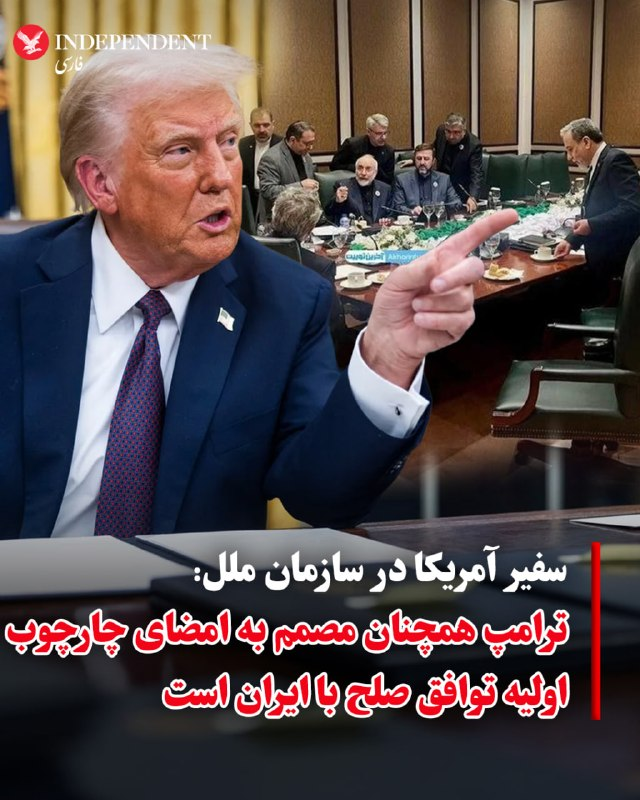

♦️همزمان با حمله اسرائیل به ضاحیه لبنان و بالاگرفتن تنش‌های لفظی میان مقام‌های ایران و اسرائیل، مایک والتز، سفیر آمریکا در سازمان ملل متحد، اعلام کرد دونالد ترامپ همچنان مصمم است چارچوب اولیه توافق صلح با ایران را در روز یکشنبه امضا کند.
سفیر آمریکا در سازمان ملل، روز یکشنبه در گفتگو با شبکه خبری ای‌بی‌سی این اظهارات را مطرح کرد.
محمدباقر قالیباف، مذاکره کننده ارشد ایران، پس از حملات ارتش اسرائیل به جنوب بیروت، با انتشار متنی در ایکس نوشت حمله به مواضع حزب الله با «چراغ سبز» آمریکا انجام شده و نشان می‌دهد این کشور در انجام تعهدات خود جدی نیست.
وزارت خارجه اسرائیل نیز در واکنش به سخنان قالیباف با متهم کردن رهبران جمهوری اسلامی به دروغگویی، حملات ارتش این کشور به ضاحیه را پاسخی به حملات حزب‌ الله دانست.
‌🇸🇦 Indypersian

🤖 @VahidOOnLine

## VahidOOnLine — post 245482

  <a href="telegram/content/VahidOOnLine_245482_1781445834.mp4" target="_blank">🎬 Download video</a>

ویدیوهای رسیده به ایران‌اینترنشنال نشان می‌دهند ایرانیان مقیم آلمان شنبه ۲۳ خرداد با فراخوان شاهزاده رضا پهلوی و علیه جمهوری اسلامی در هانوفر تجمع کرده و نام جاویدنامان انقلاب ملی را فریاد زدند.
‌🏁 🇬🇧 IranintlTV

🤖 @VahidOOnLine

## VahidOOnLine — post 245481

🗣روایت شما از احتمال توافق میان جمهوری اسلامی و آمریکا - یکشنبه ۲۴ خرداد

🔹مطمئنم با توافق و آزادی پول‌های بلوکه‌شده، دوباره این حکومت خودش را ریکاوری می‌کند و هم خودش و هم نیابتی‌هایش دوباره جان می‌گیرند. زیر توافق زدن هم برایشان کاری ندارد. آن‌وقت ببینیم باز هم ترامپ از توافق خواهد گفت؟

🔹تحقیر یک حکومت گاهی از نابودی آن مرگبارتر است. هیروهیتو مجبور شد بگوید خدا نیست و در مراسم تسلیم، پایان امپراتوری را ببیند. لویی شانزدهم با از دست دادن هیبتش سقوط کرد. تزار نیکلای دوم هم اول تحقیر شد و بعد فروپاشید. اصرار ترامپ بر امضای تسلیم‌نامه نیز از همین جنس است.

🔹یکی بود می‌گفت نه جنگ می‌شود نه مذاکره می‌کنیم. الان نیست ببیند که هم کشته شد، هم جنگ شد و هم مذاکره. تازه بیچاره نمی‌داند که جنازه‌اش هم بعد از ۱۰۷ روز هنوز خاک نشده است.

🔹جوانی ما به ‌دست جمهوری اسلامی و به‌خاطر هسته‌ای نابود شد، اما الان می‌خواهند دو دستی همه‌چیز را تقدیم آمریکا کنند.

🔹از رودهن: هیچ‌کس جز ایرانی دلش برای ایران و جاویدنام‌های دسته‌گل این کشور نسوخته، پس باید با هم باشیم و برای بیرون کردن اشغالگران فقط دست‌هایمان را به همدیگر گره بزنیم.
‌🏁 🇬🇧 IranintlTV

🤖 @VahidOOnLine

## WithYashar — post 14817

سفیر آمریکا در سازمان ملل متحد:
رئیس جمهور ترامپ و معاونش جی‌دی ونس، کاملاً به امضای توافق امروز متعهد هستن.
@withyashar

## WithYashar — post 14816

مرندی عضو تیم مذاکره کننده:
فعلاً مذاکره دیگر در کار نخواهد بود
@withyashar

## WithYashar — post 14815

وزارت امور خارجه‌اسرائیل در واکنش به تهدیدهای ایران اعلام کرد: “این حکومت طبق معمول دروغ می‌گوید. نماینده ایران، حزب‌الله، همان طرفی است که به اسرائیل حمله کرده است. ما شلیک آتش به سوی خاک خود را تحمل نخواهیم کرد.🚨
@withyashar

## pm_afshaa — post 93896

  <a href="telegram/content/pm_afshaa_93896_1781445836.webm" target="_blank">🎬 Download video</a>

🔴کانال 14 اسرائیل:
اسرائیل ارزیابی میکنه که ایران در واکنش به حمله در حومه جنوبی بیروت، حمله موشکی به خاک اسرائیل انجام خواهد داد.

💧 Rainbet.com the #1 Non-KYC Crypto Casino & Sportsbook @rainbetcom

😁 @Pm_Afshaa

## pm_afshaa — post 93895

  <a href="telegram/content/pm_afshaa_93895_1781445837.webm" target="_blank">🎬 Download video</a>

🔴مرندی، عضو تیم مذاکره کننده:
فعلاً مذاکره دیگری در کار نخواهد بود.

💧 Rainbet.com the #1 Non-KYC Crypto Casino & Sportsbook @rainbetcom

😁 @Pm_Afshaa

## pm_afshaa — post 93894

  <a href="telegram/content/pm_afshaa_93894_1781445837.webm" target="_blank">🎬 Download video</a>

🔴مهاجرانی، سخنگوی دولت:
تصمیم‌گیری درباره تفاهم احتمالی با آمریکا در سطح نظام و حاکمیت انجام میشه و حمله به مذاکره‌کنندگان، حمله به یک تصمیم ملیه.

💧 Rainbet.com the #1 Non-KYC Crypto Casino & Sportsbook @rainbetcom

😁 @Pm_Afshaa

## pm_afshaa — post 93893

  <a href="telegram/content/pm_afshaa_93893_1781445838.webm" target="_blank">🎬 Download video</a>

🔴نماینده آمریکا در سازمان ملل به ای‌بی‌سی:
ترامپ و ونس کاملا مصمم هستن که امروز توافق با جمهوری اسلامی رو امضا کنن.

💧 Rainbet.com the #1 Non-KYC Crypto Casino & Sportsbook @rainbetcom

😁 @Pm_Afshaa

## kianmeli1 — post 87987

  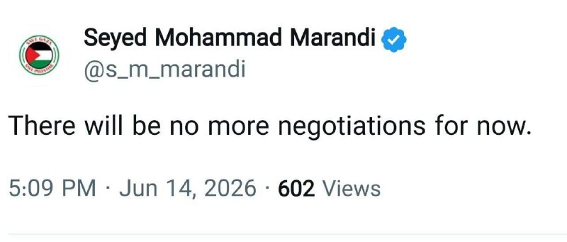

🔴مرندی عضو تیم مذاکره کننده: فعلاً مذاکره دیگری در کار نخواهد بود
https://t.me/kianmeli1

## IranIntlTV — post 342277

  <a href="telegram/content/IranIntlTV_342277_1781445839.mp4" target="_blank">🎬 Download video</a>

ویدیوهای رسیده به ایران‌اینترنشنال نشان می‌دهند ایرانیان مقیم آلمان شنبه ۲۳ خرداد با فراخوان شاهزاده رضا پهلوی و علیه جمهوری اسلامی در هانوفر تجمع کرده و نام جاویدنامان انقلاب ملی را فریاد زدند.

## IranIntlTV — post 342276

🗣روایت شما از احتمال توافق میان جمهوری اسلامی و آمریکا - یکشنبه ۲۴ خرداد

🔹مطمئنم با توافق و آزادی پول‌های بلوکه‌شده، دوباره این حکومت خودش را ریکاوری می‌کند و هم خودش و هم نیابتی‌هایش دوباره جان می‌گیرند. زیر توافق زدن هم برایشان کاری ندارد. آن‌وقت ببینیم باز هم ترامپ از توافق خواهد گفت؟

🔹تحقیر یک حکومت گاهی از نابودی آن مرگبارتر است. هیروهیتو مجبور شد بگوید خدا نیست و در مراسم تسلیم، پایان امپراتوری را ببیند. لویی شانزدهم با از دست دادن هیبتش سقوط کرد. تزار نیکلای دوم هم اول تحقیر شد و بعد فروپاشید. اصرار ترامپ بر امضای تسلیم‌نامه نیز از همین جنس است.

🔹یکی بود می‌گفت نه جنگ می‌شود نه مذاکره می‌کنیم. الان نیست ببیند که هم کشته شد، هم جنگ شد و هم مذاکره. تازه بیچاره نمی‌داند که جنازه‌اش هم بعد از ۱۰۷ روز هنوز خاک نشده است.

🔹جوانی ما به ‌دست جمهوری اسلامی و به‌خاطر هسته‌ای نابود شد، اما الان می‌خواهند دو دستی همه‌چیز را تقدیم آمریکا کنند.

🔹از رودهن: هیچ‌کس جز ایرانی دلش برای ایران و جاویدنام‌های دسته‌گل این کشور نسوخته، پس باید با هم باشیم و برای بیرون کردن اشغالگران فقط دست‌هایمان را به همدیگر گره بزنیم.

## FarsiVOA — post 220685

🔺منوچهر بختیاری بار دیگر در دادگاه انقلاب محاکمه می‌شود

◾️صبا بختیاری، خواهر منوچهر بختیاری، اعلام کرد جمهوری اسلامی برادر دادخواهش را به «اغوا و تحریک مردم به جنگ و کشتار علیه مردم» متهم کرده و قرار است او را به همین «اتهام سنگین» روز دوشنبه ۲۵ خرداد، در دادگاه انقلاب بندرعباس محاکمه کنند.

⬇️ بیشتر بخوانید:

https://ir.voanews.com/a/manouchehr-bakhtiari-poya-bakhtiari-court-serious-accusation-iran/8160677.html

## IranianMinds — post 22559

  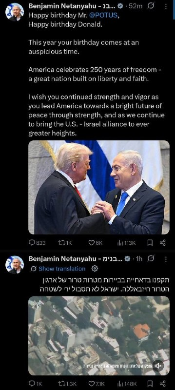

🔴نخست‌وزیر نتانیاهو، اول تصویر حمله به ضاحیه را برای ترامپ پست کرد و در پست بعدی، تولد ترامپ رو بهش تبریک گفت.

@IranianMinds

## alonews — post 127885

  <a href="telegram/content/alonews_127885_1781445842.webm" target="_blank">🎬 Download video</a>

👈مرندی عضو تیم مذاکره کننده:
فعلاً مذاکره دیگری در کار نخواهد بود

✅ @AloNews خبر جنگ

---
📅 بروزرسانی: 1405/03/24 17:23
---

## VahidOOnLine — post 245480

  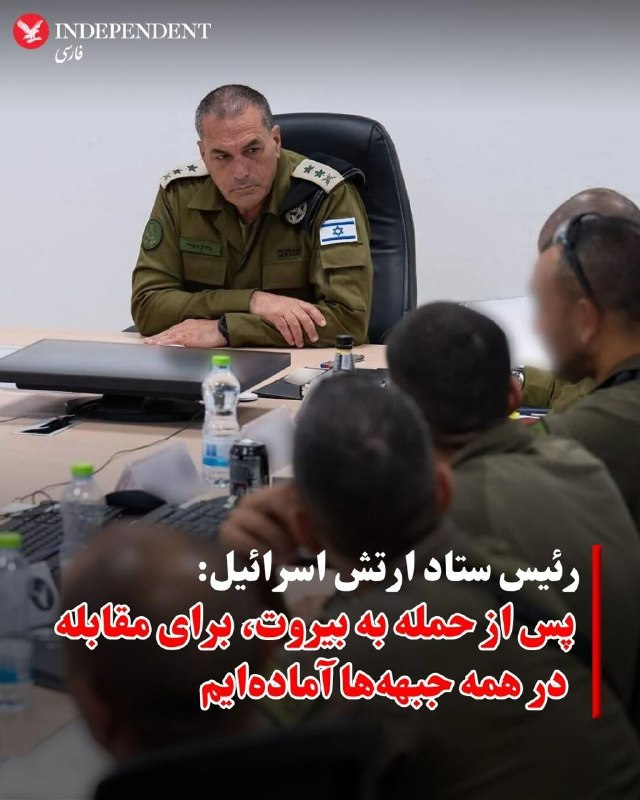

♦️ایال زمیر، رئیس ستاد ارتش اسرائیل، روز یکشنبه ۲۴ خرداد ماه و ساعاتی پس از حمله این کشور به ضاحیه جنوبی در بیروت اعلام کرد ارتش اسرائیل برای مقابله با هرگونه تحول در تمامی جبهه‌ها آمادگی کامل دارد.

ارتش اسرائیل نیز اعلام کرد زمیر در نشستی با فرماندهان لشکرها و تیپ‌های نظامی، طرح‌های عملیاتی جدید برای لبنان را تأیید کرده است.

حمله اسرائیل به بیروت در گرماگرم گمانه‌زنی‌ها درباره امضای تفاهم‌نامه صلح میان تهران و واشنگتن در روز یکشنبه انجام شده است. جمهوری اسلامی پیش‌تر هشدار داده بود هرگونه حمله اسرائیل به بیروت می‌تواند با واکنش تهران همراه شود.

محمدجعفر اسدی، معاون بازرسی قرارگاه مرکزی خاتم‌الانبیاء، در واکنش به حمله روز یکشنبه اسرائیل به ضایحه بیروت گفت، سپاه پاسداران به این حملات پاسخ خواهد داد.
‌🇸🇦 Indypersian

🤖 @VahidOOnLine

## VahidOOnLine — post 245479

♦️هزاران هوادار فوتبال در ترکیه برای تماشای نخستین دیدار تیم ملی این کشور در جام جهانی ۲۰۲۶ در مکان‌های تاریخی آنتالیا و استانبول گرد هم آمدند.
هواداران ترکیه بازی تیم ملی کشورشان مقابل استرالیا را در آمفی‌تئاتر تابستانی تاریخی آنتیفلوس در آنتالیا و قلعه یدیکوله در استانبول تماشا کردند. یکی از هواداران حاضر در آنتالیا گفت: «فضا تاریخی است و جام جهانی هیجان فوق‌العاده‌ای ایجاد کرده است.»
تیم ملی ترکیه که پس از ۲۴ سال بار دیگر به جام جهانی راه یافته، در نخستین دیدار خود با نتیجه ۲ بر صفر مقابل استرالیا شکست خورد.
‌🇸🇦 Indypersian

🤖 @VahidOOnLine

## VahidOOnLine — post 245478

  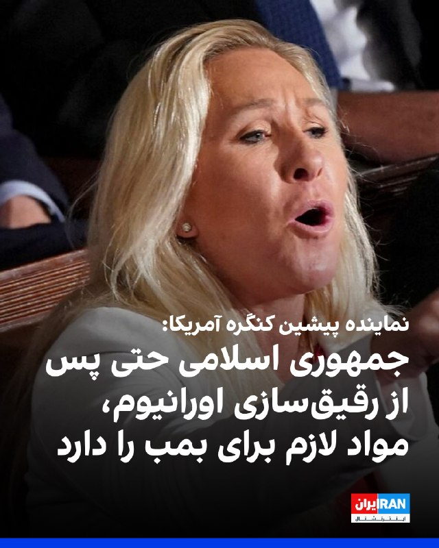

مارجوری تیلور گرین، نماینده پیشین کنگره آمریکا، در ایکس با بازنشر مطلبی درباره برنامه هسته‌ای جمهوری اسلامی نوشت هرگونه توافق با تهران، حتی در صورت رقیق‌سازی بخشی از ذخایر اورانیوم در اصفهان، همچنان مواد کافی برای ساخت یک بمب در اختیار جمهوری اسلامی قرار خواهد داد.
او افزود توافقی که اکنون در حال بررسی است، «غیرقابل قبول» خواهد بود.
همزمان رویترز به نقل از یک مقام ارشد جمهوری اسلامی گزارش داد در پیش‌نویس یادداشت تفاهم میان تهران و واشینگتن، آمریکا با رقیق‌سازی ذخایر اورانیوم با غنای بالا در داخل ایران موافقت کرده است.
‌🏁 🇬🇧 IranintlTV

🤖 @VahidOOnLine

## VahidOOnLine — post 245477

  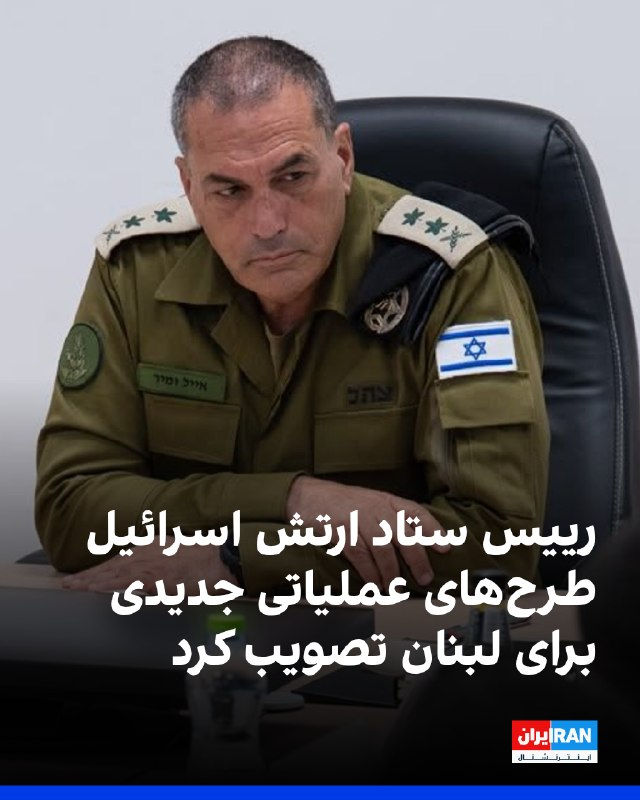

ایال زمیر، رییس ستاد ارتش اسرائیل، گفت ارتش تحولات منطقه را به‌دقت زیر نظر دارد و در همه جبهه‌ها سطح بالایی از آمادگی و هوشیاری را حفظ کرده است.

او افزود لبنان مرکز ثقل اصلی عملیات اسرائیل است، اما ارتش برای تحولات احتمالی در سایر جبهه‌ها نیز آماده می‌شود.

ارتش اسرائیل اعلام کرد ایال زمیر در نشست با فرماندهان جبهه شمالی، طرح‌های عملیاتی جدید برای لبنان را تایید کرده است.

ایال زمیر گفت حزب‌الله فاجعه‌ای بر دولت لبنان و جامعه شیعه تحمیل کرده است و مردم لبنان این موضوع را به‌خوبی درک می‌کنند. او افزود تمام روستاهای جنوب لبنان به شبکه‌ای پیچیده از زیرساخت‌های تروریستی تبدیل شده‌اند.

رییس ستاد ارتش اسرائیل تاکید کرد ارتش به عملیات ابتکاری و تهاجمی خود ادامه خواهد داد.
‌🏁 🇬🇧 IranintlTV

🤖 @VahidOOnLine

## mwarmonitor — post 10868

🔴وزارت امور خارجه اسرائیل: «رژیم ایران که ما را تهدید می‌کند دروغ می‌گوید. این حزب‌الله است که به اسرائیل حمله کرده است. ما شلیک به سرزمین‌های خود را تحمل نخواهیم کرد.»

@mwarmonitor

## IranIntlTV — post 342275

یکی از شرکت‌کنندگان در تجمع گوتنبرگ سوئد که در جریان اعتراضات سال ۱۳۸۸ از ناحیه چشم آسیب دیده است، به مهران عباسیان، خبرنگار ایران‌اینترنشنال، گفت: «اینجا هستم تا به خانواده جاویدنامان بگویم صدای شما را به گوش جهانیان خواهم رساند.»
@iranintltv

## IranIntlTV — post 342274

  

مارجوری تیلور گرین، نماینده پیشین کنگره آمریکا، در ایکس با بازنشر مطلبی درباره برنامه هسته‌ای جمهوری اسلامی نوشت هرگونه توافق با تهران، حتی در صورت رقیق‌سازی بخشی از ذخایر اورانیوم در اصفهان، همچنان مواد کافی برای ساخت یک بمب در اختیار جمهوری اسلامی قرار خواهد داد.
او افزود توافقی که اکنون در حال بررسی است، «غیرقابل قبول» خواهد بود.
همزمان رویترز به نقل از یک مقام ارشد جمهوری اسلامی گزارش داد در پیش‌نویس یادداشت تفاهم میان تهران و واشینگتن، آمریکا با رقیق‌سازی ذخایر اورانیوم با غنای بالا در داخل ایران موافقت کرده است.
https://iranintl.com/202606141708

## IranIntlTV — post 342273

  

ایال زمیر، رییس ستاد ارتش اسرائیل، گفت ارتش تحولات منطقه را به‌دقت زیر نظر دارد و در همه جبهه‌ها سطح بالایی از آمادگی و هوشیاری را حفظ کرده است.

او افزود لبنان مرکز ثقل اصلی عملیات اسرائیل است، اما ارتش برای تحولات احتمالی در سایر جبهه‌ها نیز آماده می‌شود.

ارتش اسرائیل اعلام کرد ایال زمیر در نشست با فرماندهان جبهه شمالی، طرح‌های عملیاتی جدید برای لبنان را تایید کرده است.

ایال زمیر گفت حزب‌الله فاجعه‌ای بر دولت لبنان و جامعه شیعه تحمیل کرده است و مردم لبنان این موضوع را به‌خوبی درک می‌کنند. او افزود تمام روستاهای جنوب لبنان به شبکه‌ای پیچیده از زیرساخت‌های تروریستی تبدیل شده‌اند.

رییس ستاد ارتش اسرائیل تاکید کرد ارتش به عملیات ابتکاری و تهاجمی خود ادامه خواهد داد.
https://iranintl.com/202606140791

## FarsiVOA — post 220684

  <a href="telegram/content/FarsiVOA_220684_1781445230.mp4" target="_blank">🎬 Download video</a>

وزارت جنگ آمریکا این تصاویر را از رویداد «یو‌اف‌سی فریدم ۲۵۰» منتشر کرده است؛ رویدادی ویژه که به مناسبت دویست‌وپنجاهمین سالگرد استقلال آمریکا در محوطه کاخ سفید برگزار می‌شود.

این رویداد با همکاری سازمان یو‌اف‌سی برگزار شده و بخشی از برنامه‌های بزرگداشت ۲۵۰ سالگی استقلال ایالات متحده است.

وزارت جنگ آمریکا می‌گوید «یو‌اف‌سی فریدام ۲۵۰» ادای احترامی به روحیه رزمندگی و فداکاری نظامیان آمریکایی است که در نقاط مختلف جهان در حال انجام ماموریت هستند.

@FarsiVOA

## IranianMinds — post 22558

  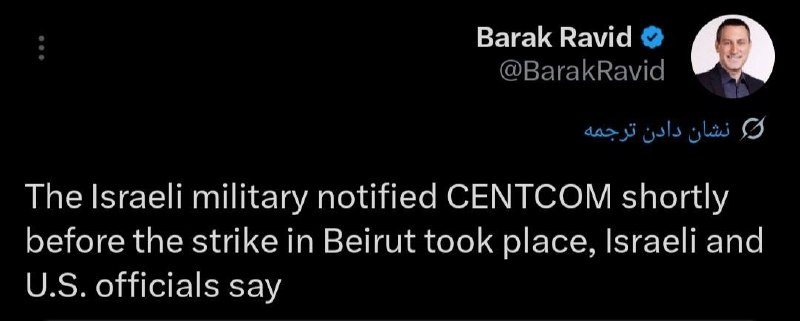

🔴باراک راوید/ اکسیوس:

اسرائیل قبل از حمله کردن به بیروت، به مرکز فرماندهی آمریکا(سنتکام) خبر داده بود.

@IranianMinds

## Hranews — post 113608

  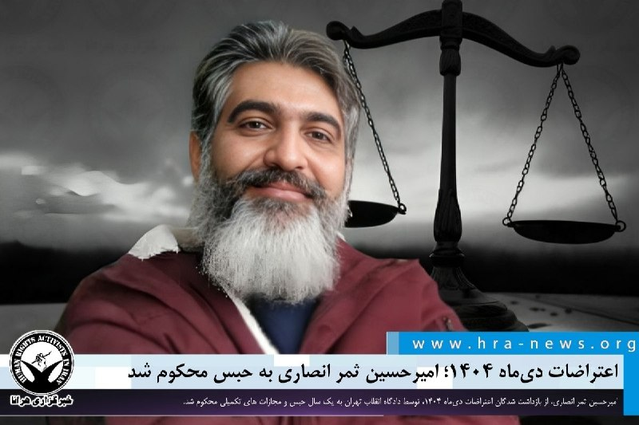

اعتراضات دی‌ماه ۱۴۰۴؛ امیرحسین ثمر انصاری به حبس محکوم شد

❗️
❗️
❗️
❗️
❗️– امیرحسین ثمر انصاری، از بازداشت‌شدگان اعتراضات دی‌ماه ۱۴۰۴، توسط دادگاه انقلاب تهران به یک سال حبس و مجازات‌های تکمیلی محکوم شد.

به گزارش خبرگزاری هرانا، ارگان خبری مجموعه فعالان حقوق بشر در ایران، امیرحسین ثمر انصاری به حبس محکوم شد.

امیرحسین ثمر انصاری، توسط شعبه ۲۶ دادگاه انقلاب تهران، به ریاست قاضی ایمان افشاری از بابت اتهام «فعالیت تبلیغی علیه نظام» به یک سال حبس تعزیری و در باب مجازات‌های تکمیلی به دو سال محرومیت از عضویت در احزاب و گروه‌های سیاسی و اجتماعی محکوم شد. وی همچنین در این شعبه از اتهام «اجتماع و تبانی برای ارتکاب جرم علیه امنیت داخلی کشور» تبرئه شده است.

ادامه مطلب

#امیرحسین_ثمر_انصاری

↘️
@hranews_bot تماس ✉️ -  @Hranews  کانال هرانا 🆑

---
📅 بروزرسانی: 1405/03/24 17:14
---

## VahidOOnLine — post 245476

  

فاطمه مهاجرانی، سخنگوی دولت جمهوری اسلامی، با انتقاد از حملات برخی جریان‌ها به تیم مذاکره‌کننده گفت تصمیم‌گیری درباره تفاهم احتمالی با آمریکا در سطح «نظام و حاکمیت» انجام می‌شود و حمله به مذاکره‌کنندگان، حمله به یک «تصمیم ملی» است.
او در گفت‌وگو با ایرنا از محمدباقر قالیباف، رییس مجلس جمهوری اسلامی، و عباس عراقچی، وزیر امور خارجه، دفاع کرد و گفت هر دو سابقه دفاع از «منافع ملی» را دارند.
مهاجرانی افزود: «دیپلماسی در برابر میدان نیست، بلکه ادامه میدان است» و افزود مذاکره از موضع اقتدار به معنای عقب‌نشینی نیست.
‌🏁 🇬🇧 IranintlTV

🤖 @VahidOOnLine

## WithYashar — post 14814

ترامپ بیدار شد
@withyashar

## WithYashar — post 14813

الحدث: علی الحاج، از فرماندهان ارشد حزب‌الله در حمله به ضاحیه بیروت هدف قرار گرفت. تداوم ضربات سنگین به بدنه فرماندهی گروه‌های نیابتی رژیم ایران در لبنان. @withyashar

## WithYashar — post 14812

الحدث: علی الحاج، از فرماندهان ارشد حزب‌الله در حمله به ضاحیه بیروت هدف قرار گرفت.
تداوم ضربات سنگین به بدنه فرماندهی گروه‌های نیابتی رژیم ایران در لبنان.
@withyashar

## mwarmonitor — post 10867

🔴نماینده آمریکا در سازمان ملل به شبکه ABC: رئیس‌جمهور ترامپ و معاون او کاملاً مصمم هستند که امروز این توافق را امضا کنند.

@mwarmonitor

## FoxNewsTwitter — post 342955

  <a href="telegram/content/FoxNewsTwitter_342955_1781444645.mp4" target="_blank">🎬 Download video</a>

Fox News (Twitter/X)

New York City descends into chaos after the Knicks won the NBA championship over the San Antonio Spurs.

Footage captured firefighters desperately trying to extinguish a school bus engulfed in flames in Times Square as rowdy fans chanted, “Knicks in five!"

## IranIntlTV — post 342272

  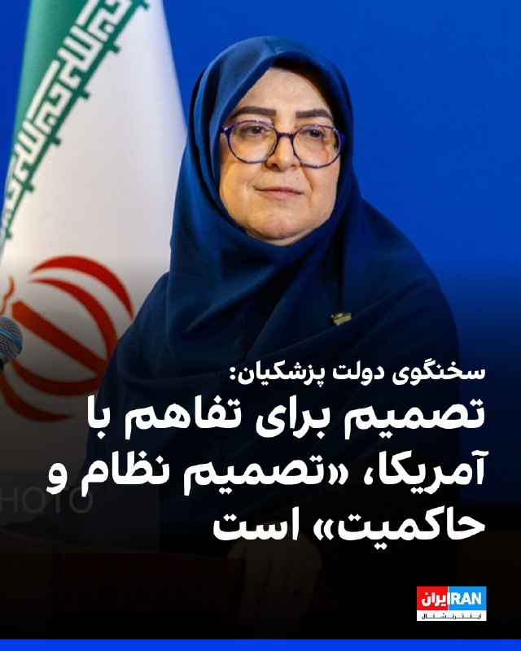

فاطمه مهاجرانی، سخنگوی دولت جمهوری اسلامی، با انتقاد از حملات برخی جریان‌ها به تیم مذاکره‌کننده گفت تصمیم‌گیری درباره تفاهم احتمالی با آمریکا در سطح «نظام و حاکمیت» انجام می‌شود و حمله به مذاکره‌کنندگان، حمله به یک «تصمیم ملی» است.
او در گفت‌وگو با ایرنا از محمدباقر قالیباف، رییس مجلس جمهوری اسلامی، و عباس عراقچی، وزیر امور خارجه، دفاع کرد و گفت هر دو سابقه دفاع از «منافع ملی» را دارند.
مهاجرانی افزود: «دیپلماسی در برابر میدان نیست، بلکه ادامه میدان است» و افزود مذاکره از موضع اقتدار به معنای عقب‌نشینی نیست.
https://iranintl.com/202606145685

## FarsiVOA — post 220683

  <a href="telegram/content/FarsiVOA_220683_1781444648.mp4" target="_blank">🎬 Download video</a>

گروهی از بازنشستگان در تهران، روز یکشنبه، ۲۴ خرداد ۱۴۰۵، با شعار «معیشت، منزلت، حق مسلم ماست» در اعتراض به شرایط دشوار معیشتی تجمع کردند.

این اعتراض‌ها در شرایطی ادامه دارد که گزارش‌های رسمی از تداوم تورم سنگین در ایران حکایت دارد. در ماه‌های اخیر، افزایش قیمت مواد غذایی، اجاره مسکن، دارو و خدمات درمانی فشار بیشتری بر بازنشستگان و مستمری‌بگیران وارد کرده است؛ گروهی که بخش بزرگی از درآمد آنان به هزینه‌های درمان، اجاره‌خانه و نیازهای روزمره اختصاص می‌یابد.

## Persian_Trend_Official — post 17056

شبکه العربیه: یک مقام ارشد حزب‌الله، علی الحاج، در حمله ارتش اسرائیل به ضاحیه بیرت کشته شد.

همچنین کانال 12 اسرائیل ادعا کرد هدف حمله امروز فرمانده واحد ارتباط حزب‌الله بوده است.

📝 Amir

📌 @persian_trend_official
پرشین ترند | متفاوت‌ترین کانال نظامی

## IranianMinds — post 22557

🔴موسوی، سخنگوی پیشین هیئت رئیسه مجلس:

هدف حمله امروز اسرائیل به ضاحیه بیروت، درست در روزی که قرار است توافق امضاء بشود، تحقیر جمهوری اسلامی بود.

@IranianMinds

## alonews — post 127884

  <a href="telegram/content/alonews_127884_1781444651.webm" target="_blank">🎬 Download video</a>

👈خبرنگار الجزیره:
بر اساس آنچه چند روز پیش نوشتم، و با توجه به ابعاد تازه لبنان، افزایش مخالفت‌ها در داخل ایران با توافق، تردیدهای مداوم در مورد تعهد واشنگتن به تعهداتش، تغییر مواضع دونالد ترامپ هر روز و اصرار اسرائیل بر شرایط غیرممکن خود، هرگونه توافقی بین واشنگتن و تهران بیشتر شبیه یک سراب است.

🔴در دوردست‌ها به نظر می‌رسد و نشان می‌دهد که رسیدن به آن فقط مسئله زمان است. سپس محو می‌شود.

✅ @AloNews خبر جنگ

## alonews — post 127882

  <a href="telegram/content/alonews_127882_1781444652.webm" target="_blank">🎬 Download video</a>

👈تتر هم اکنون 173000تومان

✅ @AloNews خبر جنگ

---
📅 بروزرسانی: 1405/03/24 17:04
---

## VahidOOnLine — post 245475

  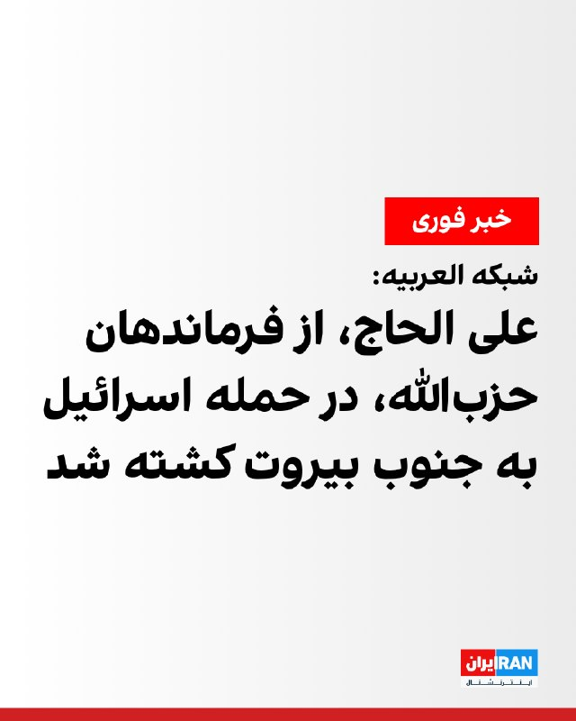

شبکه العربیه گزارش داد علی الحاج، از فرماندهان حزب‌الله، در حمله هوایی یکشنبه ۲۴ خرداد اسرائیل به ضاحیه بیروت کشته شده است.
دفاع مدنی لبنان نیز اعلام کرد در این حمله سه نفر کشته شدند.
العربیه همچنین گزارش داد ارتش اسرائیل یکشنبه سه حمله هوایی به شهر سجد در جنوب لبنان انجام داده است.
ارتش اسرائیل پیش‌تر اعلام کرده بود در واکنش به شلیک سه پهپاد از سوی حزب‌الله به شمال اسرائیل و آنچه نقض آتش‌بس از سوی این گروه خواند، یکی از مقرهای حزب‌الله را در ضاحیه بیروت هدف قرار داده است.
‌🏁 🇬🇧 IranintlTV

🤖 @VahidOOnLine

## WithYashar — post 14811

وب‌سایت اکسیوس گزارش داد ارتش اسرائیل اندکی پیش از حمله به منطقه ضاحیه بیروت، فرماندهی مرکزی آمریکا (سنتکام) را از این عملیات مطلع کرده بود.
ارتش اسرائیل پیش‌تر در بیانیه‌ای اعلام کرد در واکنش به شلیک پرتابه از سوی حزب‌الله به شمال اسرائیل و نقض آتش‌بس از سوی این گروه تحت حمایت جمهوری اسلامی، یکی از مقرهای حزب‌الله را در ضاحیه بیروت به طور دقیق هدف قرار داده است.
@withyashar

## WithYashar — post 14810

الحدث به نقل از منابع:
علی الحاج، فرمانده حزب‌الله، در حمله هوایی اسرائیل به حومه بیروت ترور شد
@withyashar

## WithYashar — post 14809

خبر ترور ‌نعیم قاسم تایید نشده است منتظر تایید هستیم @withyashar

## WithYashar — post 14808

کانال های امنیتی: فرماندهی موشکی هوافضا ایران در حال آماده سازی یک حمله گسترده
@withyashar

## mwarmonitor — post 10866

  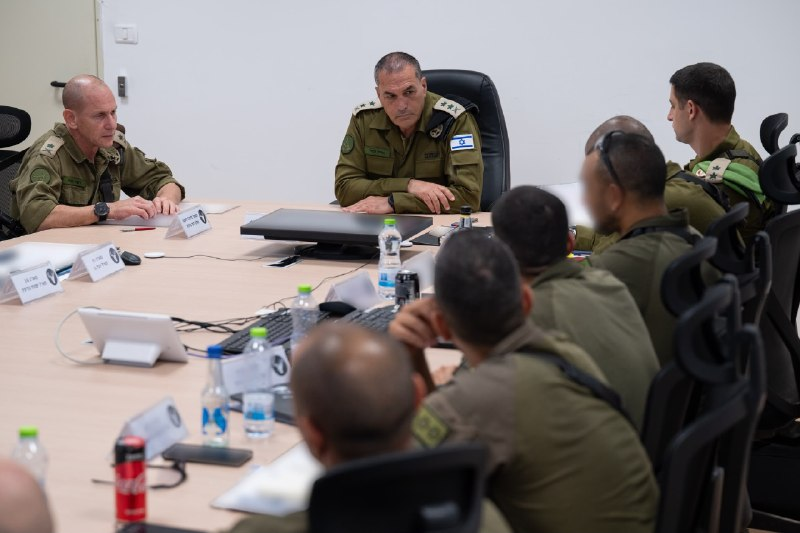

🔸نشانه‌های بیشتری امروز از اسرائیل منتشر شده است.

🔸ارتش اسرائیل (IDF) تصاویر ویدیویی و عکس‌هایی از رئیس ستاد کل، سپهبد ایال زمیر، منتشر کرده که در آن او طرح‌های عملیاتی را تأیید می‌کند و با فرماندهان ارشد در فرماندهی شمال دیدار دارد؛ در حالی که هم‌زمان پیامی را منتقل می‌کند که به نظر می‌رسد فراتر از میدان نبرد هدف‌گذاری شده است.

او گفته است:

📌«ما به عملیات در لبنان ادامه می‌دهیم تا از دفاع از شهرک‌ها و جوامع شمالی تقویت کنیم و خسارت به حزب‌الله را با عملیات زمینی و آتش نظام‌مند افزایش دهیم. هر دستاورد عملیاتی بیشتری که به دست آوریم، باعث فرسایش و فروپاشی بیشتر جبهه جنوبی حزب‌الله خواهد شد و به بهبود ترتیبات امنیتی کمک می‌کند؛ ترتیباتی که در چارچوب مذاکرات با میانجی‌گری آمریکا میان سطوح سیاسی و دولت لبنان تعیین خواهد شد.»

@mwarmonitor

## kianmeli1 — post 87986

  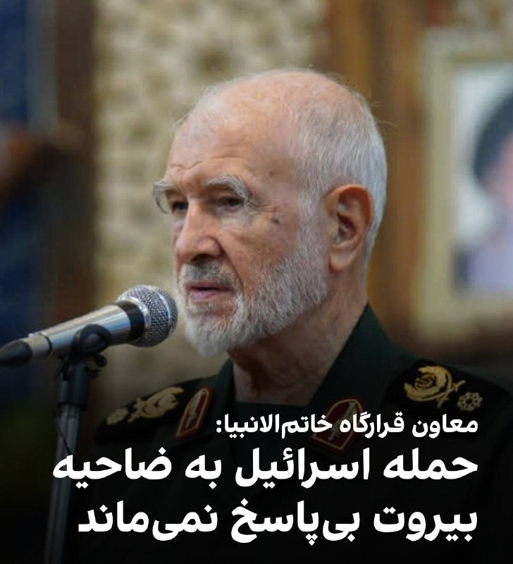

🔴معاون قرارگاه خاتم

حمله اسرائیل به ضاحیه بیروت بی پاسخ نمی ماند
https://t.me/kianmeli1

## IranIntlTV — post 342271

  

شبکه العربیه گزارش داد علی الحاج، از فرماندهان حزب‌الله، در حمله هوایی یکشنبه ۲۴ خرداد اسرائیل به ضاحیه بیروت کشته شده است.
دفاع مدنی لبنان نیز اعلام کرد در این حمله سه نفر کشته شدند.
العربیه همچنین گزارش داد ارتش اسرائیل یکشنبه سه حمله هوایی به شهر سجد در جنوب لبنان انجام داده است.
ارتش اسرائیل پیش‌تر اعلام کرده بود در واکنش به شلیک سه پهپاد از سوی حزب‌الله به شمال اسرائیل و آنچه نقض آتش‌بس از سوی این گروه خواند، یکی از مقرهای حزب‌الله را در ضاحیه بیروت هدف قرار داده است.
https://iranintl.com/202606143920

## IranIntlTV — post 342270

  <a href="telegram/content/IranIntlTV_342270_1781444047.mp4" target="_blank">🎬 Download video</a>

ایرانیان مقیم لیورپول در زادروز مجید رضا رهنورد، در اعتراض به اجرای احکام اعدام و بازداشت‌ها در ایران گردهم آمدند. معترضان با گرامیداشت یاد جاویدنامان انقلاب ملی، خواستار پایان مماشات جهان با جمهوری اسلامی هستند.

گزارش تاج‌الدین سروش، خبرنگار ایران‌اینترنشنال
@iranintltv

## IranIntlTV — post 342269

  <a href="telegram/content/IranIntlTV_342269_1781444049.mp4" target="_blank">🎬 Download video</a>

ایرانیان مقیم لیورپول در زادروز مجید رضا رهنورد، در اعتراض به اجرای احکام اعدام و بازداشت‌ها در ایران گردهم آمدند. معترضان با گرامیداشت یاد جاویدنامان انقلاب ملی، خواستار پایان مماشات جهان با جمهوری اسلامی هستند.

گزارش تاج‌الدین سروش، خبرنگار ایران‌اینترنشنال
@iranintltv

## Shin_Persian — post 7049

Shin ✓ @hey_itsmyturn
Sun, 14 Jun 2026 13:27:21 UTC

The deputy commander of IRGC Khatam al Anbiya HQ: that Israeli attacks on Dahieh will not go unanswered.

ترجمه خودکار فارسی

جانشین فرمانده قرارگاه مرکزی خاتم‌الانبیا سپاه پاسداران انقلاب اسلامی: حملات اسرائیل به ضاحیه بی‌پاسخ نخواهد ماند.

𝕏 · @shin_persian

## FarsiVOA — post 220682

  <a href="telegram/content/FarsiVOA_220682_1781444050.mp4" target="_blank">🎬 Download video</a>

گروهی از بازنشستگان تامین اجتماعی در شوش، در ادامه اعتراضات هفتگی، روز یکشنبه، ۲۴ خرداد ۱۴۰۵، با شعار «دولت بی‌کفایت، ‌مجلس بی‌خاصیت نمی‌خوایم» در اعتراض به شرایط دشوار معیشتی تجمع کردند.

اعتراض‌های بازنشستگان تأمین اجتماعی در ایران طی سال‌های اخیر به‌طور مستمر در شهرهای مختلف برگزار شده است. محور اصلی این تجمع‌ها، پایین بودن مستمری‌ها در برابر تورم، اجرا نشدن کامل همسان‌سازی یا متناسب‌سازی حقوق، افزایش هزینه دارو و درمان، و کاهش قدرت خرید بازنشستگان بوده است.

## FarsiVOA — post 220681

آتش شاکرمی، هنرمند و خاله نیکا شاکرمی در عمق میدان: گروه‌های اپوزیسیون کوشیدند نیکا را به خود نسبت دهند اما نیکا در سنی نبود که گرایش سیاسی داشته باشد. او هنوز ۱۶ساله و در ابتدای تجربه زندگی بود.

## FarsiVOA — post 220680

🔺پرزیدنت ترامپ امروز ۸۰ ساله می‌شود؛ کاخ سفید میزبان مسابقه رزمی

◾️دونالد ترامپ، رئیس جمهوری ایالات متحده که چهل‌وپنجمین و چهل‌وهفتمین رئیس جمهوری این کشور بوده است، روز یکشنبه ۱۴ ژوئن ۲۰۲۶ هشتاد ساله شد؛ مناسبتی که با «روز پرچم» آمریکا همزمان شده است؛ ضمن آنکه آمریکا برای جشن‌های دویست‌وپنجاهمین سالگرد استقلال آماده می‌شود.

⬇️ بیشتر بخوانید:

https://ir.voanews.com/a/president-trump-turns-eighty/8160668.html

## IranianMinds — post 22556

🔴اسدی، معاون بازرسی قرارگاه خاتم‌الانبیاء: بدون شک این جنایات اسرائیل بدون پاسخ نمی‌ماند. @IranianMinds

## Hranews — post 113607

در پی اقدام به خودسوزی یک زن باردار در جاسک؛ او و همسرش جان باختند

❗️
❗️
❗️
❗️
❗️– روز جمعه ۱۵ خردادماه، یک زن باردار در شهرستان جاسک اقدام به خودسوزی کرد و جان خود را از دست داد. همسر این #زن نیز که برای نجات وی تلاش کرده بود، بر اثر سوختگی، پس از یک هفته بستری در بیمارستان جان باخت.

ادامه مطلب

↘️
@hranews_bot تماس ✉️ -  @Hranews  کانال هرانا 🆑

## alonews — post 127881

  <a href="telegram/content/alonews_127881_1781444053.webm" target="_blank">🎬 Download video</a>

👈الحدث به نقل از منابع:
علی الحاج، فرمانده حزب‌الله، در حمله هوایی اسرائیل به حومه بیروت ترور شد

✅ @AloNews خبر جنگ

---
📅 بروزرسانی: 1405/03/24 16:54
---

## WithYashar — post 14807

موسوی، سخنگوی پیشین هیات رئیسه مجلس:

هدف حمله امروز اسرائیل به ضاحیه بیروت در روزی که قرار بود توافق امضا بشه، تحقیر جمهوری اسلامی بود.
@withyashar

## WithYashar — post 14806

فاکس نیوز به نقل از دیپلمات شرکت‌کننده در مذاکرات:

حملات امروز بیروت مانع از نهایی شدن توافق شده‌اند
این یک تلاش آشکار اسرائیل برای خراب کردن توافق رئیس‌جمهور و کشاندن مجدد ایالات متحده به جنگ است
@withyashar

## mwarmonitor — post 10865

🔴«یک دیپلمات به فاکس نیوز گفته است که حملات اسرائیل در بیروت در حال به خطر انداختن توافق است:
“این یک تلاش آشکار از سوی اسرائیل برای خراب کردن توافق رئیس‌جمهور و کشاندن دوباره ایالات متحده به جنگ است.”

🔸اسرائیل این ادعا را رد کرده و به سه روز حملات حزب‌الله علیه غیرنظامیان اسرائیلی اشاره کرده است.»

@mwarmonitor

## pm_afshaa — post 93892

  <a href="telegram/content/pm_afshaa_93892_1781443440.webm" target="_blank">🎬 Download video</a>

🔴فاکس نیوز به نقل از دیپلمات شرکت‌کننده در مذاکرات:

حملات امروز به بیروت مانع از نهایی شدن توافق شده؛ این یک تلاش آشکار اسرائیل برای خراب کردن توافق رئیس‌جمهور ترامپ و کشاندن مجدد آمریکا به جنگ است.

💧 Rainbet.com the #1 Non-KYC Crypto Casino & Sportsbook @rainbetcom

😁 @Pm_Afshaa

## IranIntlTV — post 342268

  <a href="telegram/content/IranIntlTV_342268_1781443440.mp4" target="_blank">🎬 Download video</a>

هم‌زمان با زادروز مجیدرضا رهنورد، ایرانیان در شهرهای لیورپول بریتانیا و گوتنبرگ سوئد گرد هم آمدند و یاد جاویدنامان انقلاب ملی ایران را گرامی داشتند.

تاج‌الدین سروش و مهران عباسیان، خبرنگاران ایران‌اینترنشنال، گزارش می‌دهند
@iranintltv

## Shin_Persian — post 7048

Shin ✓ @hey_itsmyturn
Sun, 14 Jun 2026 13:19:55 UTC

Authorities announced a factory's scrap yard caught fire, fire brigades at the scene.
Dolat Abad, Northeastern Isfahan, Isfahan Province, Iran

ترجمه خودکار فارسی

مقامات اعلام کردند که انبار ضایعات یک کارخانه دچار حریق شده است و واحدهای آتش‌نشانی در محل حضور دارند.
دولت‌آباد، شمال شرقی اصفهان، استان اصفهان، ایران

𝕏 · @shin_persian

## Shin_Persian — post 7047

  

Emanuel (Mannie) Fabian ✓ @manniefabian
Sun, 14 Jun 2026 13:15:36 UTC

Original text in comments
ترجمه خودکار فارسی در بخش نظرات

𝕏 · @shin_persian

## IranianMinds — post 22555

  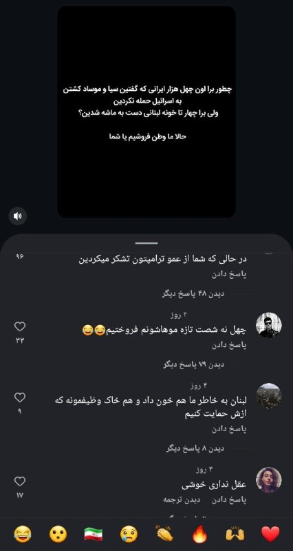

اینو بزار کانال مادرجنده بودن عرزشی ها
فقط اون ننه دوگانه سوز که گفته چهل نه شصت تازه موهاشونم فروختیم.

@IranianMinds

## IranianMinds — post 22554

  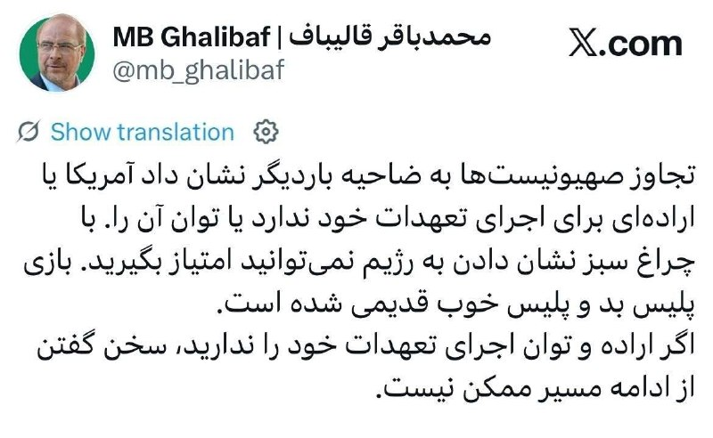

🔴قالیباف در ایکس نوشت:

تجاوز به ضاحیه نشان داد که آمریکا یا اراده‌ای برای اجرای تعهدات خود ندارد یا توان آن‌را.

@IranianMinds

## BBCPersian — post 283796

  <a href="https://t.me/bbcpersian/283796" target="_blank">📎 Download file</a>

📻این هفته در ویژه برنامه جام ۲۶ - قسمت صفر

🏆جام جهانی ۲۰۲۶ که به میزبانی مشترک آمریکا، مکزیک و کانادا برگزار می‌شود، از بسیاری جهات بزرگ‌ترین دوره تاریخ این رقابت‌ها به شمار می‌رود. اما این دوره، نه‌ تنها بزرگ‌ترین دوره این رقابت‌ها است، بلکه از جنبه سیاسی هم ویژگی های بی‌سابقه‌ای دارد؛ برای نخستین بار یکی از کشورهای میزبان با یکی از تیم‌های حاضر در مسابقات درگیر جنگ است.

هر سه بازی تیم ملی فوتبال ایران در آمریکا برگزار میشود. این تیم بعد از فراز و نشیب بسیار سرانجام روز شنبه ۱۶خرداد به محل استقرارش در تیخوانا در مکزیک رسید. تیمی که با توجه به حوادث اخیر ایران برای برخی، نمادی از غرور و هویت ملی است. برای گروهی دیگر، این تیم نمادی از ساختار سیاسی حاکم در ایران است.

خبرنگاران ما پوریا ژافره و سام فرزانه از تحولات مرتبط با جام جهانی و حواشی حضور ایران می‌گویند. بیننده و شنونده قسمت صفر پادکست جام ۲۶ باشید.

@BBCPersian

## idfinfarsi — post 11844

⭕️رئیس ستاد کل ارتش اسرائیل، سپهبد ایال زامیر، امروز (یکشنبه) با فرماندهان لشکرها و تیپ‌ها در فرماندهی شمال گفت‌وگو کرد.

🔹از سخنان رئیس ستاد کل، سپهبد ایال زمیر:
«ما به‌طور مستمر تحولات را زیر نظر داریم و در تمامی جبهه‌ها سطح بالایی از آمادگی و هوشیاری را حفظ کرده‌ایم — وضعیت کنونی حساس و پیچیده است. ارتش اسرائیل مصمم، آماده و در حال فعالیت با شدت‌های مختلف در تمام جبهه‌ها است. لبنان مرکز ثقل اصلی ماست، اما برای تحولات در جبهه‌های دیگر نیز آماده می‌شویم.

🔹عملیات در بوفور از نظر عملیاتی حیاتی و در راستای اهداف نبرد است. این عملیات برای تعمیق دستاوردهای عملیاتی علیه حزب‌الله و سلب توانمندی‌های زیرزمینی، فرماندهی، کنترل و آتش این سازمان که طی سال‌ها ایجاد شده، انجام شده است. یافته‌ها، چه در سطح زمین و چه در زیرزمین، نشان‌دهنده اهمیت این زیرساخت‌ها و نقش محوری منطقه بوفور و رشته‌کوه علی طاهر برای این سازمان در تلاش‌هایش برای تثبیت حضور و تهدید ساکنان شمال است. حزب‌الله فاجعه‌ای بر دولت لبنان و جامعه شیعه تحمیل کرده است؛ مردم لبنان این موضوع را به‌خوبی درک می‌کنند. تمام روستاهای جنوب لبنان به شبکه‌ای پیچیده از زیرساخت‌های تروریستی تبدیل شده‌اند.

🔹نیروهای ما در میدان با برتری عملیاتی فعالیت می‌کنند و از پشتیبانی نامحدود آتش — از زمین و هوا — برخوردارند. ما به عملیات ابتکاری و تهاجمی ادامه می‌دهیم، در صورت نیاز مانور را تعمیق می‌بخشیم، دفاع را تقویت می‌کنیم و تهدید را از ساکنان شمال برطرف می‌سازیم. ما به فعالیت در لبنان ادامه می‌دهیم تا دفاع از شهرک‌های شمال را تقویت کرده و ضربه به حزب‌الله را از طریق مانور زمینی و آتش سیستماتیک تعمیق بخشیم. هر دستاورد عملیاتی بیشتر، به فرسایش و فروپاشی جبهه جنوبی حزب‌الله و بهبود ترتیبات امنیتی که در چارچوب مذاکره با میانجی‌گری آمریکا میان رده سیاسی و دولت لبنان تعیین خواهد شد، منجر می‌شود.»

## Hranews — post 113606

  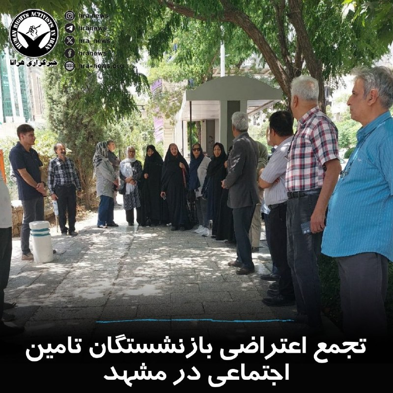

در ادامه تجمعات بازنشستگان تامین اجتماعی در شهرهای مختلف؛ روز جاری جمعی از این بازنشستگان در مشهد نیز دست به #تجمع_اعتراضی زدند.

#بازنشستگان مذکور، خواستار اجرای طرح همسان‌سازی، افزایش حقوق طبق تورم و رسیدگی به مشکلات درمانی و معیشتی خود هستند.

↘️
@hranews_bot تماس ✉️ - @Hranews کانال هرانا 🆑

## alonews — post 127880

  <a href="telegram/content/alonews_127880_1781443446.webm" target="_blank">🎬 Download video</a>

👈اسرائیل: هدف حمله نعیم قاسم نبود

✅ @AloNews خبر جنگ

## alonews — post 127879

اخبار جنگ الونیوز AloNews pinned a photo

---
📅 بروزرسانی: 1405/03/24 16:43
---

## VahidOOnLine — post 245474

🗣روایت شما از احتمال توافق میان آمریکا و جمهوری‌اسلامی - یکشنبه ۲۵ خرداد

🔹تنها موردی که مخالفان و موافقان جمهوری اسلامی بر آن تفاهم دارند و با آن مخالفند، توافق با آمریکاست.

🔹ما باید خودمان بلند شویم و کار را تمام کنیم. در این توافق هیچ اسمی از ما مردم ایران آورده نشده، چون برای ترامپ و جمهوری اسلامی اهمیتی ندارد.

🔹ترامپ با توافق، شکافی در بدنه نظام ایجاد کرد که هیچ‌کس نمی‌تونست انجامش بده.

🔹این حق مردم ایران نیست؛ واقعا ما باید چقدر تاوان حماقت بقیه را بدیم؟ عمرمون سر مذاکره و توافق رفت. دقیقا این جنگ افتاد وسط جوونی‌مون. این همه جوون کشتن که الان توافق کنن؟

🔹ما مردم ایران خیلی گناه داریم. هیچ‌کس پشت ما نبود و نیست. فقط امیدوارم زودتر از شر این روزگار سیاه خلاص شویم.

🔹از آقای ترامپ بابت کمکی که کرد ممنونم؛ هم در جنگ و هم در مذاکره جمهوری اسلامی را شکست دادی.

🔹دردها و مشکلات همه به جای خودش عزیز و مهمه؛ از دانش‌آموزها تا افراد سالمند، از پدران و مادران تا بچه‌ها، همه به نحوی از جمهوری اسلامی آسیب دیدیم، اما تنها چیزی که می‌خوایم سرنگونی جمهوری اسلامیه.

🔹در این کانال‌های خبری، ارزشی‌ها می‌گن اگر توافق کنین روی صورت دخترهای بی‌حجاب اسید می‌پاشیم. خداروشکر شهر هرت هم شد.

🔹واقعا هیچ‌کس نمی‌خواد توافق بشه و همه دنبال جنگ هستند؛ چه طرفداران حکومت و چه مخالفان حکومت.
‌🏁 🇬🇧 IranintlTV

🤖 @VahidOOnLine

## WithYashar — post 14805

  

استاد بزرگ شترنچ نتانیاهو اول تصویری از حمله به بیروت رو منتشر کرد و تو پست بعدی تولد ترامپ رو تبریک گفت :
@withyashar 😁

## WithYashar — post 14804

## pm_afshaa — post 93891

  <a href="telegram/content/pm_afshaa_93891_1781442828.webm" target="_blank">🎬 Download video</a>

🔴موسوی، سخنگوی پیشین هیات رئیسه مجلس:

هدف حمله امروز اسرائیل به ضاحیه بیروت در روزی که قرار بود توافق امضا بشه، تحقیر جمهوری اسلامی بود.

💧 Rainbet.com the #1 Non-KYC Crypto Casino & Sportsbook @rainbetcom

😁 @Pm_Afshaa

## pm_afshaa — post 93890

  <a href="telegram/content/pm_afshaa_93890_1781442829.webm" target="_blank">🎬 Download video</a>

🔴نتانیاهو اول تصویری از حمله به بیروت رو منتشر کرد و تو پست بعدی تولد ترامپ رو تبریک گفت :

💧 Rainbet.com the #1 Non-KYC Crypto Casino & Sportsbook @rainbetcom

😁 @Pm_Afshaa

## pm_afshaa — post 93889

علی موسی دقدوق یکی از چهره‌های کلیدی و تأثیرگذار در محور مقاومت و حزب الله و مسئول پرونده جولان در حمله اسرائیل به درک واصل شد

💧 Rainbet.com the #1 Non-KYC Crypto Casino & Sportsbook @rainbetcom

😁 @Pm_Afshaa

## IranIntlTV — post 342267

🗣روایت شما از احتمال توافق میان آمریکا و جمهوری‌اسلامی - یکشنبه ۲۵ خرداد

🔹تنها موردی که مخالفان و موافقان جمهوری اسلامی بر آن تفاهم دارند و با آن مخالفند، توافق با آمریکاست.

🔹ما باید خودمان بلند شویم و کار را تمام کنیم. در این توافق هیچ اسمی از ما مردم ایران آورده نشده، چون برای ترامپ و جمهوری اسلامی اهمیتی ندارد.

🔹ترامپ با توافق، شکافی در بدنه نظام ایجاد کرد که هیچ‌کس نمی‌تونست انجامش بده.

🔹این حق مردم ایران نیست؛ واقعا ما باید چقدر تاوان حماقت بقیه را بدیم؟ عمرمون سر مذاکره و توافق رفت. دقیقا این جنگ افتاد وسط جوونی‌مون. این همه جوون کشتن که الان توافق کنن؟

🔹ما مردم ایران خیلی گناه داریم. هیچ‌کس پشت ما نبود و نیست. فقط امیدوارم زودتر از شر این روزگار سیاه خلاص شویم.

🔹از آقای ترامپ بابت کمکی که کرد ممنونم؛ هم در جنگ و هم در مذاکره جمهوری اسلامی را شکست دادی.

🔹دردها و مشکلات همه به جای خودش عزیز و مهمه؛ از دانش‌آموزها تا افراد سالمند، از پدران و مادران تا بچه‌ها، همه به نحوی از جمهوری اسلامی آسیب دیدیم، اما تنها چیزی که می‌خوایم سرنگونی جمهوری اسلامیه.

🔹در این کانال‌های خبری، ارزشی‌ها می‌گن اگر توافق کنین روی صورت دخترهای بی‌حجاب اسید می‌پاشیم. خداروشکر شهر هرت هم شد.

🔹واقعا هیچ‌کس نمی‌خواد توافق بشه و همه دنبال جنگ هستند؛ چه طرفداران حکومت و چه مخالفان حکومت.

## FarsiVOA — post 220679

🔺پلمب دو واحد صنفی در آران و بیدگل به بهانه «کشف حجاب»

◾️فرمانده انتظامی آران و بیدگل، از پلمب دو محل کسب به بهانه اجرای طرح موسوم به «ارتقاء امنیت اجتماعی و برخورد با ناهنجاری‌های اخلاقی و اجتماعی» خبر داد.

⬇️ بیشتر بخوانید:

https://ir.voanews.com/a/social-security-promotion-plan-hijab-iran-seal-of-trade-unions/8160665.html

## DW_Farsi — post 125961

اشتباه کوچک، جریمه بزرگ؛ این‌جا قانون شوخی‌بردار نیست

در آلمان نه تنها برای جزئی‌ترین مسائل قانون و مقررات و استاندارد وجود دارد، بلکه رعایت قانون بسیار جدی گرفته می‌شود. شما با این همه مقررات چطور کنار می‌آیید؟

@dw_farsi

## Persian_Trend_Official — post 17054

نتانیاهو ابتدا تصویر حمله به بیروت را منتشر کرد و در پست بعد تولد ترامپ را تبریک گفت 😄

## Persian_Trend_Official — post 17053

  <a href="telegram/content/Persian_Trend_Official_17053_1781442830.webm" target="_blank">🎬 Download video</a>

منتظرم خبر خاصی بشه بریم لایو فعلا با چشم باز نظاره میکنیم

## alonews — post 127878

  <a href="telegram/content/alonews_127878_1781442831.webm" target="_blank">🎬 Download video</a>

🚀 Exo VPN | سریع، پایدار و بدون تبلیغات 
✅ اتصال سریع و پایدار 
✅ سرورهای متعدد جهانی 
✅ حفظ حریم خصوصی 
✅ کاملاً رایگان و بدون تبلیغات 
📌 دانلود از گوگل پلی: https://play.google.com/store/apps/details?id=exo.vpn.app 
📣 کانال رسمی: @exovpn_dl

## alonews — post 127877

  <a href="telegram/content/alonews_127877_1781442831.webm" target="_blank">🎬 Download video</a>

🚀 Exo VPN | سریع، پایدار و بدون تبلیغات

✅ اتصال سریع و پایدار

✅ سرورهای متعدد جهانی

✅ حفظ حریم خصوصی

✅ کاملاً رایگان و بدون تبلیغات

📌 دانلود از گوگل پلی:
https://play.google.com/store/apps/details?id=exo.vpn.app

📣 کانال رسمی:
@exovpn_dl

## alonews — post 127876

  <a href="telegram/content/alonews_127876_1781442831.mp4" target="_blank">🎬 Download video</a>

👈ویدیو دیده نشده از هوچی گری دیشب تندروها

✅ @AloNews خبر جنگ

---
📅 بروزرسانی: 1405/03/24 16:34
---

## VahidOOnLine — post 245473

  <a href="telegram/content/VahidOOnLine_245473_1781442240.mp4" target="_blank">🎬 Download video</a>

بر اساس ویدیوهای رسیده به ایران‌اینترنشنال، گروهی از ایرانیان مقیم آلمان شنبه ۲۳ خرداد به یاد مجیدرضا رهنورد، معترض اعدام‌شده، در شهر نورنبرگ پرفورمنس اجرا کردند.
‌🏁 🇬🇧 IranintlTV

🤖 @VahidOOnLine

## VahidOOnLine — post 245472

  

نظام‌الدین موسوی، سخنگوی پیشین هیات رییسه مجلس جمهوری اسلامی، در پلتفرم ایکس نوشت حمله اسرائیل به ضاحیه بیروت در روزی که قرار بود تفاهم میان جمهوری اسلامی و آمریکا امضا شود، با هدف بر هم زدن تفاهم انجام نشد، بلکه تلاشی برای «تحقیر جمهوری اسلامی» صورت گرفت.

او خطاب به تیم مذاکره‌کننده جمهوری اسلامی نوشت: «حضرات مذاکره‌کننده، به تحقیر تن ندهید و در شرایط تحقیر، هیچ چیز را امضا نکنید.»

موسوی همچنین نوشت دونالد ترامپ، رییس‌جمهوری آمریکا، با چنین اقداماتی در پی آن است که بتواند ادعای پیروزی کند.

در روزهای اخیر جزییاتی از پیش‌نویس تفاهم احتمالی میان تهران و واشینگتن منتشر شده است.

خبرگزاری تسنیم، وابسته به سپاه پاسداران، گزارش داد فشارهای نظامی و دیپلماتیک آمریکا برای تغییر متن ۱۴ ماده‌ای نتیجه‌ای نداشته و واشینگتن از طریق میانجی قطری اعلام کرده است به اصلاحیه‌های اخیر خود نیازی ندارد.

تسنیم همچنین نوشت این متن همچنان نیازمند بررسی و نهایی شدن از سوی مقام‌های جمهوری اسلامی است.
‌🏁 🇬🇧 IranintlTV

🤖 @VahidOOnLine

## VahidOOnLine — post 245471

  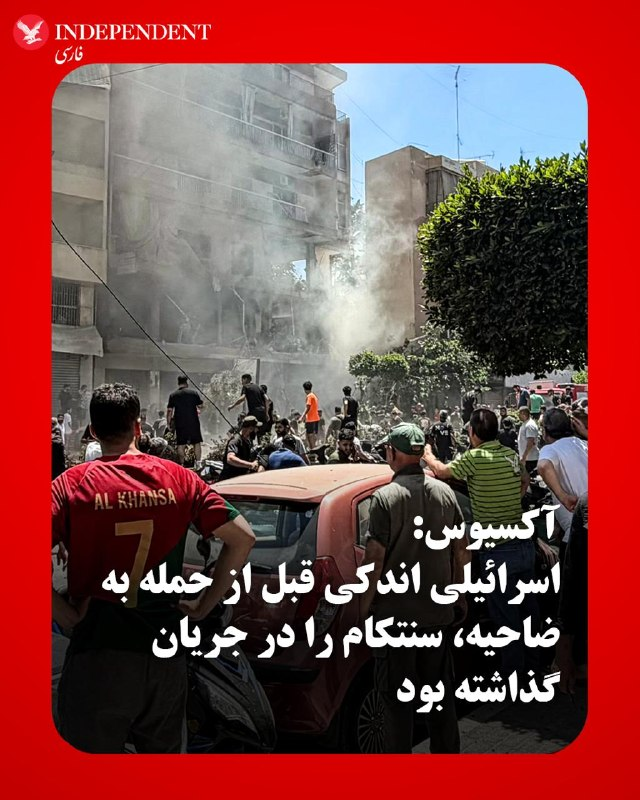

♦️ساعاتی پس از حمله ارتش اسرائیل به منطقه ضاحیه در جنوب لبنان در روز یکشنبه ۲۴ خرداد ماه، باراک راوید، خبرنگار آکسیوس، به نقل از مقام‌های اسرائیلی و آمریکایی گزارش داد اسرائیل اندکی پیش از حمله، فرماندهی مرکزی ارتش آمریکا (سنتکام) را از این عملیات مطلع کرده بود.
اسرائیل روز یکشنبه اعلام کرد در واکنش به حملات حزب‌الله به شمال این کشور، مواضعی وابسته به این گروه در حومه جنوبی بیروت را هدف قرار داده است.
دفتر نخست‌وزیر اسرائیل اعلام کرد این حمله به دستور نتانیاهو و در پاسخ به شلیک‌ها به سمت خاک اسرائیل انجام شده است.

حمله اسرائیل به بیروت در گرماگرم گمانه‌زنی‌ها در مورد امضاء تفاهمنامه صلح میان تهران و واشنگتن در روز یکشنبه انجام شده است. جمهوری اسلامی پیش‌تر هشدار داده بود هرگونه حمله اسرائیل به بیروت می‌تواند با واکنش تهران همراه شود.
‌🇸🇦 Indypersian

🤖 @VahidOOnLine

## WithYashar — post 14803

## WithYashar — post 14802

## IranIntlTV — post 342266

  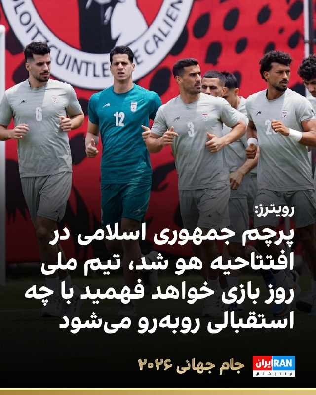

🔻خبرگزاری رویترز در گزارشی درباره بازی ایران-نیوزیلند نوشت: «فضای حاکم بر لس‌آنجلس در مراسم افتتاحیه در ورزشگاه مشهود بود؛ جایی که هنگام ورود پرچم ایران، صدای هو کردن تماشاگران شنیده شد. ایران روز بازی خواهد فهمید هنگام ورود بازیکنانش به زمین مسابقه با چه استقبالی روبه‌رو می‌شود.»

🔹تیم ملی فوتبال بامداد سه‌شنبه ۲۶ خرداد ۱۴۰۵ در نخستین دیدار خود در جام جهانی ۲۰۲۶ به مصاف نیوزیلند می‌رود.

🔹رویترز دراین‌باره می‌نویسد: این مسابقه در شرایطی برگزار می‌شود که جنگ آمریکا و ایران بر فضای آن سایه افکنده است. همچنین این دیدار در منطقه‌ای برگزار خواهد شد که بزرگ‌ترین جامعه ایرانیان خارج از ایران را در خود جای داده و همین موضوع به تقابل دو تیمی که هرگز در جام جهانی برابر یکدیگر قرار نگرفته‌اند، فضایی پرتنش بخشیده است.

🔹دیداری که به همان اندازه که تحت تاثیر جاه‌طلبی‌های دو تیم برای دستیابی به یک موفقیت تاریخی است، از رویدادهای خارج از زمین مسابقه نیز تاثیر می‌پذیرد.

🔹گزارش‌ها درباره پیشرفت مذاکرات با هدف پایان دادن به درگیری‌ها نیز نتوانسته از تنش‌های پیرامون تیم بکاهد.

🔹جزییات بیشتر را اینجا بخوانید

@iranintltvsport

## IranIntlTV — post 342265

  <a href="telegram/content/IranIntlTV_342265_1781442246.mp4" target="_blank">🎬 Download video</a>

بر اساس ویدیوهای رسیده به ایران‌اینترنشنال، گروهی از ایرانیان مقیم آلمان شنبه ۲۳ خرداد به یاد مجیدرضا رهنورد، معترض اعدام‌شده، در شهر نورنبرگ پرفورمنس اجرا کردند.

## IranIntlTV — post 342264

  <a href="telegram/content/IranIntlTV_342264_1781442249.mp4" target="_blank">🎬 Download video</a>

پس از حملات امروز حزب‌الله به خاک اسرائیل، ارتش اسرائیل مواضعی را در ضاحیه بیروت هدف قرار داد. دفتر نخست‌وزیر و وزیر دفاع اسرائیل اعلام کرد این حمله در واکنش به شلیک موشک و پهپاد انجام شده است.

جزییات بیشتر با اشکان صفایی، خبرنگار ایران‌اینترنشنال
@iranintltv

## IranIntlTV — post 342263

  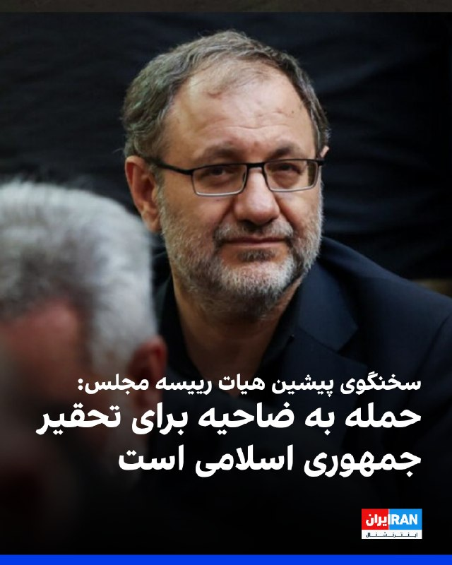

نظام‌الدین موسوی، سخنگوی پیشین هیات رییسه مجلس جمهوری اسلامی، در پلتفرم ایکس نوشت حمله اسرائیل به ضاحیه بیروت در روزی که قرار بود تفاهم میان جمهوری اسلامی و آمریکا امضا شود، با هدف بر هم زدن تفاهم انجام نشد، بلکه تلاشی برای «تحقیر جمهوری اسلامی» صورت گرفت.

او خطاب به تیم مذاکره‌کننده جمهوری اسلامی نوشت: «حضرات مذاکره‌کننده، به تحقیر تن ندهید و در شرایط تحقیر، هیچ چیز را امضا نکنید.»

موسوی همچنین نوشت دونالد ترامپ، رییس‌جمهوری آمریکا، با چنین اقداماتی در پی آن است که بتواند ادعای پیروزی کند.

در روزهای اخیر جزییاتی از پیش‌نویس تفاهم احتمالی میان تهران و واشینگتن منتشر شده است.

خبرگزاری تسنیم، وابسته به سپاه پاسداران، گزارش داد فشارهای نظامی و دیپلماتیک آمریکا برای تغییر متن ۱۴ ماده‌ای نتیجه‌ای نداشته و واشینگتن از طریق میانجی قطری اعلام کرده است به اصلاحیه‌های اخیر خود نیازی ندارد.

تسنیم همچنین نوشت این متن همچنان نیازمند بررسی و نهایی شدن از سوی مقام‌های جمهوری اسلامی است.
https://iranintl.com/202606144887

## FarsiVOA — post 220675

مارکو روبیو، وزیر خارجه آمریکا، با انتشار تصاویری از حضور خود در نخستین دیدار جام جهانی ۲۰۲۶، این شب را «تاریخی» توصیف کرد.

او گفت بیش از ۷۰ هزار هوادار در نخستین مسابقه این رقابت‌ها که به میزبانی ایالات متحده برگزار شد، حضور داشتند.

جام جهانی فوتبال ۲۰۲۶ هم‌اکنون به میزبانی مشترک آمریکا، کانادا و مکزیک برگزار می‌شود.

@FarsiVOA

## DW_Farsi — post 125960

  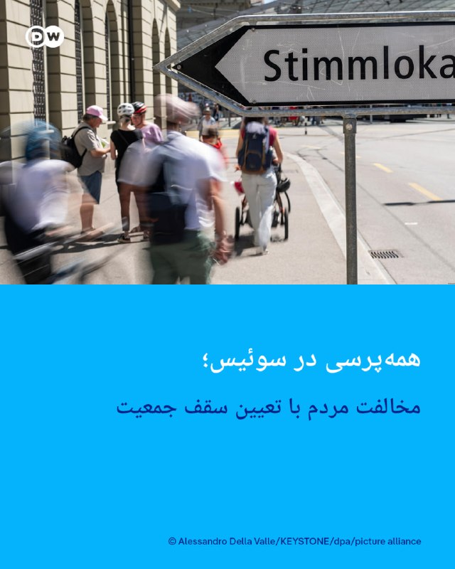

🔶 همه‌پرسی در سوئیس؛ مخالفت مردم با تعیین سقف جمعیت

در یک همه‌پرسی در سوئیس که به ابتکار حزب پوپولیستی اس فا پ به منظور تعیین سقف جمعیت برگزار شد، ۵۵ درصد مردم با این امر مخالفت کردند. حزب اس فا پ (SVP) بزرگ‌ترین حزب سوئیس در پارلمان این کشور است.

طبق نخستین نتایج اعلام‌شده همه‌پرسی در سوئیس که در ارتباط با تعیین و محدودکردن سقف جمعیت انجام گرفته، ۵۵ درصد از شهروندان این کشور به تعین سقف برای جمعیت رأی منفی داده‌اند و تنها ۴۵ درصد از مردم سوئیس با این مسئله موافق بوده‌اند. این نتایج را مؤسسه نظرسنجی "گ اف اس" در برن به سفارش اتحادیه رادیو و تلویزیون سوئیس تهیه و اعلام کرده است.

طبق اعلام این مؤسسه، به ویژه مخالفت مردم در مناطق فرانسوی زبان غرب سوئیس و شهرنشینان این کشور سبب شد که این رفراندم با شکست روبرو شود.

این همه‌پرسی با ابتکار عمل حزب پوپولیستی "اس فا پ" (حزب مردمی سوئیس) برگزار شد که امیدوار بود از این طریق "موج مهاجران" را مهار کند.

@dw_farsi

## BBCPersian — post 283795

🔻قالیباف به آمریکا: سخن گفتن از ادامه مسیر ممکن نیست

ساعتی پس از حمله اسرائیل به ضاحیه، پایگاه قدرت حزب‌الله در بیروت، محمدباقر قالیباف در شبکه ایکس نوشت:

«تجاوز صهیونیست‌ها به ضاحیه باردیگر نشان داد آمریکا یا اراده‌ای برای اجرای تعهدات خود ندارد یا توان آن را. با چراغ سبز نشان دادن به رژیم نمی‌توانید امتیاز بگیرید. بازی پلیس بد و پلیس خوب قدیمی شده است. اگر اراده و توان اجرای تعهدات خود را ندارید، سخن گفتن از ادامه مسیر ممکن نیست.»

محمدجعفر اسدی، معاون بازرسی قرارگاه مرکزی خاتم‌الانبیاء هم گفت که «بدون شک» این حمله «بی‌پاسخ نخواهد ماند.»

به گفته دفاع مدنی لبنان، در این حمله سه نفر کشته و شش نفر مجروح شده است.

اسرائیل یکشنبه قبل به ضاحیه حمله کرده بود.

پس از آن حمله آقای قالیباف که مذاکره‌کننده ارشد ایران با امریکاست در ایکس نوشته بود: «نه به آتش‌بس پایبندند نه به گفتگو باور دارند و با محاصرهٔ دریایی و نقض توافقات دربارهٔ لبنان نشان دادند که فقط زبان قدرت می‌فهمند.»

رئیس مجلس ایران نوشته بود که ادامه «محاصره دریایی و چراغ سبز آمریکا» به اسرائیل برای این حمله، «پایگاه‌ها و دارایی‌های آمریکا و رژیم در منطقه را به اهداف مشروع تبدیل می‌کند. دست نیروهای مسلح ما مثل همیشه باز است.»

https://bbc.in/4fEONCy
@BBCPersian

## Hranews — post 113605

وزارت اطلاعات از بازداشت ۱۳۱ نفر در ارتباط با اعتراضات و پرونده‌های امنیتی خبر داد

❗️
❗️
❗️
❗️
❗️– وزارت اطلاعات جمهوری اسلامی ایران در اطلاعیه‌ای از #بازداشت دستکم ۱۳۱ نفر در استان‌های تهران، ایلام و سیستان و بلوچستان خبر داد. این نهاد مدعی شده است که این افراد به دلیل مشارکت در اعتراضات دی‌ماه ۱۴۰۴، فعالیت‌های جاسوسی و همکاری با گروه‌های مسلح مخالف نظام بازداشت شده‌اند.

ادامه مطلب

↘️
@hranews_bot تماس ✉️ -  @Hranews  کانال هرانا 🆑

## alonews — post 127875

  <a href="telegram/content/alonews_127875_1781442253.mp4" target="_blank">🎬 Download video</a>

👈تولد ترامپ/حرکات نمایشی موتوکراس در چمن جنوبی کاخ سفید

✅ @AloNews خبر جنگ

---
📅 بروزرسانی: 1405/03/24 16:23
---

## VahidOOnLine — post 245470

  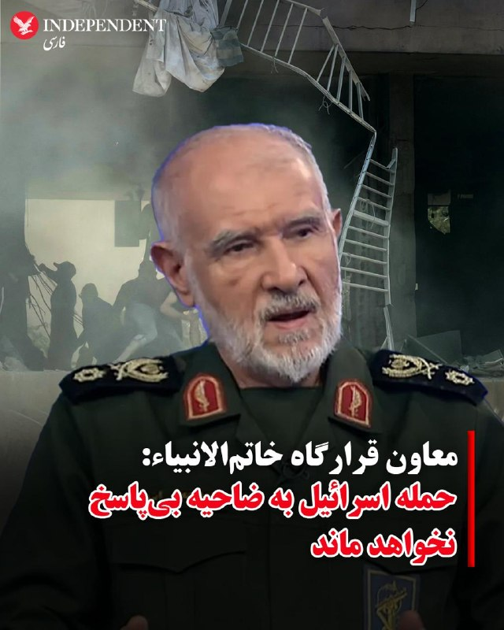

♦️محمدجعفر اسدی، معاون بازرسی قرارگاه مرکزی خاتم‌الانبیاء، در واکنش به حمله روز یکشنبه اسرائیل به ضایحه بیروت گفت: «قطعا پاسخ این جنایت‌ها داده خواهد شد.»

به گفته سازمان دفاع مدنی لبنان، در جریان حمله به یک ساختمان مسکونی در منطقه ضاحیه در حومه بیروت، دست‌کم سه نفر کشته و شش نفر مجروح شده‌اند.

بنیامین نتانیاهو و اسرائیل کاتس، نخست وزیر و وزیر دفاع اسرائیل اعلام کردند که این حملات در پاسخ به شلیک موشک و راکت به شمال اسرائیل انجام شده است.
‌🇸🇦 Indypersian

🤖 @VahidOOnLine

## VahidOOnLine — post 245469

  

یورش ماموران به خانه جاویدنام ابوالفضل میرآییز در گرگان و تهدید خانواده او

بر اساس پیام‌های رسیده به ایران اینترنشنال، ماموران اطلاعاتی و نظامی جمهوری اسلامی در استان گلستان با یورش به منزل خانواده جاویدنام ابوالفضل میرآییز، اقدام به تفتیش خانه، طرح اتهامات بی‌اساس و تهدید اعضای خانواده او کرده‌اند.

طبق این گزارش‌ها، ماموران ضمن بازرسی کامل منزل، بخشی از وسایل شخصی خانواده را نیز با خود برده‌اند و آنان را به برخوردهای امنیتی تهدید کرده‌اند.

جاویدنام ابوالفضل میرآییز، ورزشکار ۳۴ ساله گرگانی، در جریان اعتراضات دی‌ماه و پس از پیوستن به انقلاب ملی در پی فراخوان شاهزاده رضا پهلوی، با شلیک مستقیم ماموران حکومتی در خیابان‌های گرگان جان خود را از دست داد.
‌🏁 🇬🇧 IranintlTV

🤖 @VahidOOnLine

## VahidOOnLine — post 245468

  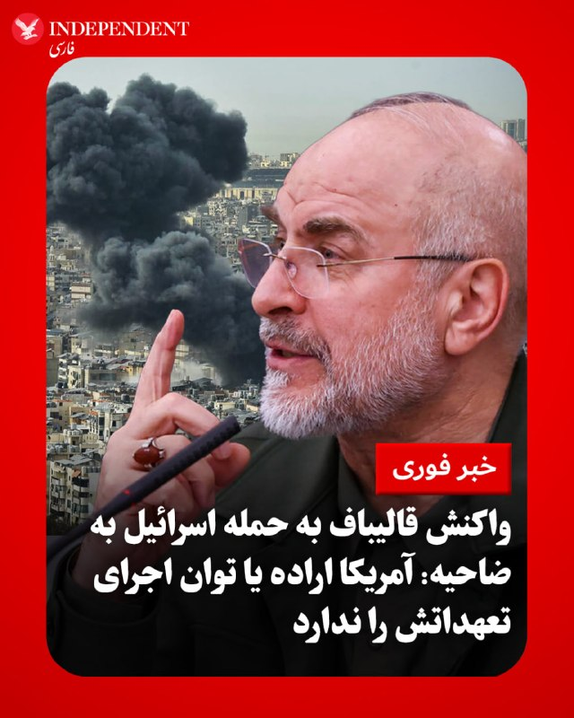

♦️محمدباقر قالبیاف، روز یکشنبه ۲۴ خردادماه و ساعتی پس از حمله هوایی اسرائیل به ضاحیه بیروت، به‌شدت از آمریکا انتقاد کرد.

قالیباف در روزی که به گفته دونالد ترامپ قرار بود توافق پایان جنگ میان ایران و آمریکا امضا شود، نوشت حمله اسرائیل «به ضاحیه بار دیگر نشان داد آمریکا یا اراده‌ای برای اجرای تعهدات خود ندارد یا توان آن را. با چراغ سبز نشان دادن به رژیم نمی‌توانید امتیاز بگیرید. بازی پلیس بد و پلیس خوب قدیمی شده است. اگر اراده و توان اجرای تعهدات خود را ندارید، سخن گفتن از ادامه مسیر ممکن نیست.»

دقایقی پیش باراک راوید، خبرنگار آکسیوس به نقل از منابعی گزارش کرده بود که ارتش اسرائیل، اندکی پیش از حمله به ضاحیه، فرماندهی مرکزی ایالات متحده، سنتکام، را در جریان این عملیات قرار داده بود.
‌🇸🇦 Indypersian

🤖 @VahidOOnLine

## VahidOOnLine — post 245467

  

در پی حمله اسرائیل به ضاحیه بیروت، محمدباقر قالیباف، رییس مجلس، در شبکه ایکس نوشت: «این حمله نشان می‌دهد آمریکا یا اراده اجرای تعهدات خود را ندارد یا توان آن را. با چراغ سبز نشان دادن به اسرائیل نمی‌توانید امتیاز بگیرید. بازی پلیس بد و پلیس خوب قدیمی شده است.»

او ادامه داد: «اگر اراده و توان اجرای تعهدات خود را ندارید، سخن گفتن از ادامه مسیر ممکن نیست.»
‌🏁 🇬🇧 IranintlTV

🤖 @VahidOOnLine

## WithYashar — post 14801

قرارگاه خاتم: پاسخ کوبنده میدیم
@withyashar

## WithYashar — post 14800

  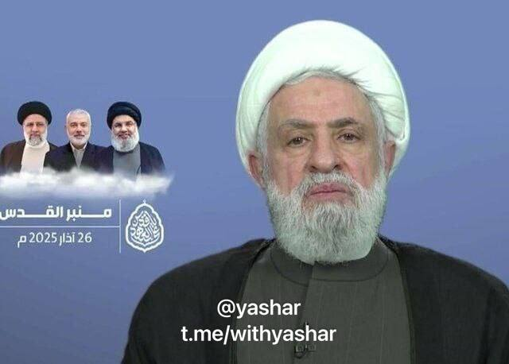

آمیت سگال خبرنگار اسرائیلی: رهبر حزب الله با موفقیت حذف شد
@withyashar

## pm_afshaa — post 93888

آمیت سگال خبرنگار اسرائیلی: رهبر حزب الله با موفقیت حذف شد

💧 Rainbet.com the #1 Non-KYC Crypto Casino & Sportsbook @rainbetcom

😁 @Pm_Afshaa

## IranIntlTV — post 342262

  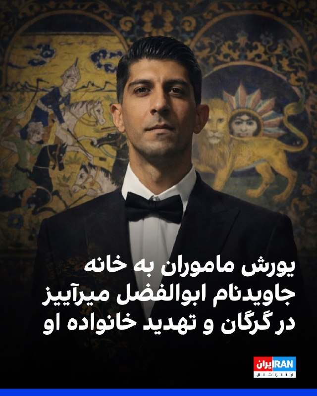

یورش ماموران به خانه جاویدنام ابوالفضل میرآییز در گرگان و تهدید خانواده او

بر اساس پیام‌های رسیده به ایران اینترنشنال، ماموران اطلاعاتی و نظامی جمهوری اسلامی در استان گلستان با یورش به منزل خانواده جاویدنام ابوالفضل میرآییز، اقدام به تفتیش خانه، طرح اتهامات بی‌اساس و تهدید اعضای خانواده او کرده‌اند.

طبق این گزارش‌ها، ماموران ضمن بازرسی کامل منزل، بخشی از وسایل شخصی خانواده را نیز با خود برده‌اند و آنان را به برخوردهای امنیتی تهدید کرده‌اند.

جاویدنام ابوالفضل میرآییز، ورزشکار ۳۴ ساله گرگانی، در جریان اعتراضات دی‌ماه و پس از پیوستن به انقلاب ملی در پی فراخوان شاهزاده رضا پهلوی، با شلیک مستقیم ماموران حکومتی در خیابان‌های گرگان جان خود را از دست داد.
https://iranintl.com/202606146012

## IranIntlTV — post 342261

  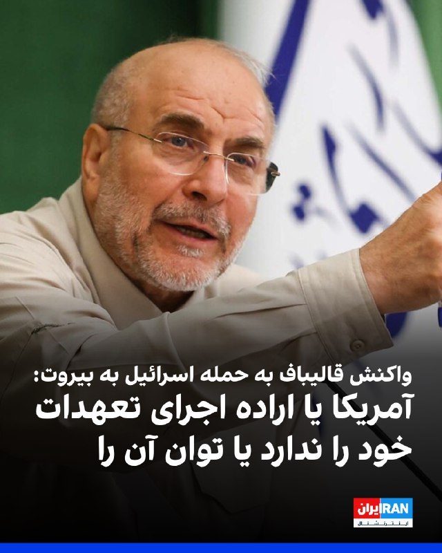

در پی حمله اسرائیل به ضاحیه بیروت، محمدباقر قالیباف، رییس مجلس، در شبکه ایکس نوشت: «این حمله نشان می‌دهد آمریکا یا اراده اجرای تعهدات خود را ندارد یا توان آن را. با چراغ سبز نشان دادن به اسرائیل نمی‌توانید امتیاز بگیرید. بازی پلیس بد و پلیس خوب قدیمی شده است.»

او ادامه داد: «اگر اراده و توان اجرای تعهدات خود را ندارید، سخن گفتن از ادامه مسیر ممکن نیست.»
https://iranintl.com/202606147148

## FarsiVOA — post 220674

🔺تجمع اعتراضی بازنشستگان در اعتراض به «بی‌کفایتی» دولت و «بی‌خاصیتی» مجلس

◾️بازنشستگان تأمین اجتماعی روز یکشنبه ۲۴ خرداد ۱۴۰۵ در دست‌کم دو شهر کرمانشاه و شوش تجمع اعتراضی برگزار کردند و با سر دادن شعارهایی علیه گرانی، تورم، مشکلات درمانی و عملکرد دولت و مجلس شورای اسلامی، خواستار رسیدگی به مطالبات معیشتی و صنفی خود شدند.

⬇️ بیشتر بخوانید:

https://ir.voanews.com/a/iranian-pensioners-protest-economic-hardship/8160664.html

## DW_Farsi — post 125959

  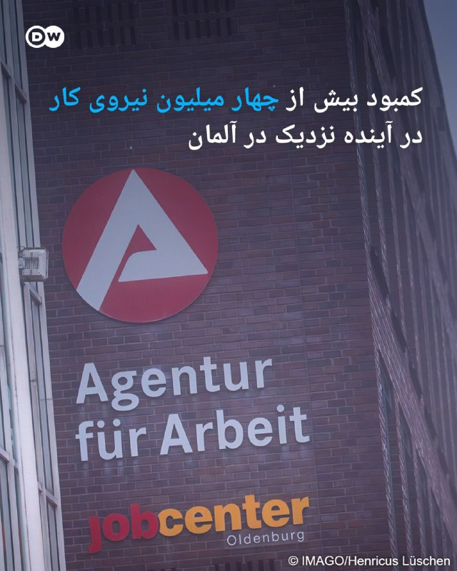

🔶 کمبود بیش از چهار میلیون نیروی کار در آینده نزدیک در آلمان

طبق یک گزارش رسانه‌ای و مطابق یک پژوهش، آمار کمبود نیروی کار در آلمان در ۱۰ سال آینده ۱.۳ میلیون نفر بیش از آن‌چه که قبلا پیش‌بینی می‌شد خواهد بود. چشم‌انداز جمعیتی آلمان نیز وخیم‌تر شده است.

طبق گزارش روزنامه آلمانی "راینیشه پست"، کمبود نیروی کار در ۱۰ سال آینده در این کشور بزرگ‌تر از آن چیزی خواهد بود که تاکنون تصور می‌شد.

این روزنامه با استناد به پژوهشی در مؤسسه اقتصاد آلمان (IW) می‌نویسد، آلمان تا سال ۲۰۳۶ احتمالا با ۴.۳ میلیون کمبود در نیروی کار مواجه خواهد شد که این رقم بیش از یک میلیون نفر فراتر از پیش‌بینی‌های قبلی است.

این مؤسسه تنها دو سال پیش فاصله میان خروج نیروی کار از چرخه کار، به‌ویژه به‌دلیل بازنشستگی و ورود نیروی کار جدید را حدود ۳ میلیون نفر برآورد کرده بود. بنابراین، این شکاف نسبت به پیش‌بینی سال ۲۰۲۴ حدود ۱.۳ میلیون نفر افزایش یافته است.

طبق اطلاعات ارائه شده، این بازنگری نتیجه یک پیش‌بینی جدید جمعیتی است که بر پایه داده‌های تازه اداره فدرال آمار آلمان انجام شده است.

@dw_farsi

## alonews — post 127873

  <a href="telegram/content/alonews_127873_1781441619.webm" target="_blank">🎬 Download video</a>

👈نتانیاهو ابتدا تصویر حمله به بیروت را منتشر کرد و در پست بعد تولد ترامپ را تبریک گفت

✅ @AloNews خبر جنگ

## alonews — post 127872

  <a href="telegram/content/alonews_127872_1781441620.webm" target="_blank">🎬 Download video</a>

👈حملات به لبنان ادامه داره

✅ @AloNews خبر جنگ

## alonews — post 127871

  <a href="telegram/content/alonews_127871_1781441620.webm" target="_blank">🎬 Download video</a>

👈قرارگاه خاتم: پاسخ کوبنده میدیم

✅ @AloNews خبر جنگ

## alonews — post 127870

  <a href="telegram/content/alonews_127870_1781441620.webm" target="_blank">🎬 Download video</a>

👈تندروهای ایران🤝اسرائیل

هر دو مخالف توافق

✅ @AloNews خبر جنگ

---
📅 بروزرسانی: 1405/03/24 16:13
---

## VahidOOnLine — post 245466

  

وب‌سایت اکسیوس گزارش داد ارتش اسرائیل اندکی پیش از حمله به منطقه ضاحیه بیروت، فرماندهی مرکزی آمریکا (سنتکام) را از این عملیات مطلع کرده بود.

ارتش اسرائیل پیش‌تر در بیانیه‌ای اعلام کرد در واکنش به شلیک پرتابه از سوی حزب‌الله به شمال اسرائیل و نقض آتش‌بس از سوی این گروه تحت حمایت جمهوری اسلامی، یکی از مقرهای حزب‌الله را در ضاحیه بیروت به طور دقیق هدف قرار داده است.
‌🏁 🇬🇧 IranintlTV

🤖 @VahidOOnLine

## VahidOOnLine — post 245465

  

وب‌سایت اکسیوس گزارش داد ارتش اسرائیل اندکی پیش از حمله به منطقه ضاحیه بیروت، فرماندهی مرکزی آمریکا (سنتکام) را از این عملیات مطلع کرده بود.

ارتش اسرائیل پیش‌تر در بیانیه‌ای اعلام کرد در واکنش به شلیک پرتابه از سوی حزب‌الله به شمال اسرائیل و نقض آتش‌بس از سوی این گروه تحت حمایت جمهوری اسلامی، یکی از مقرهای حزب‌الله را در ضاحیه بیروت به طور دقیق هدف قرار داده است.
‌🏁 🇬🇧 IranintlTV

🤖 @VahidOOnLine

## VahidOOnLine — post 245464

  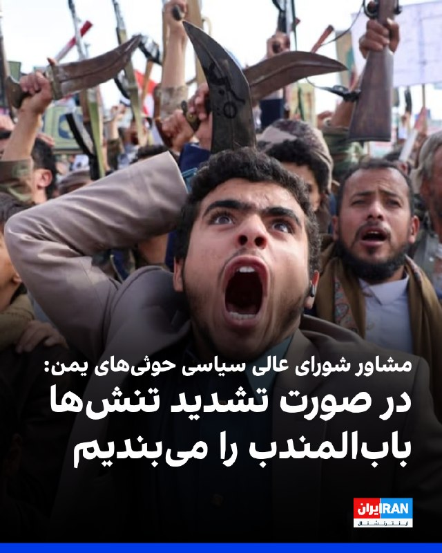

عبدالاله الحجر، مشاور رییس شورای عالی سیاسی حوثی‌های یمن تحت حمایت جمهوری اسلامی، به خبرگزاری تسنیم، وابسته به سپاه پاسداران گفت در صورت تشدید تنش‌ها و در صورت لزوم، حوثی‌ها ممکن است از بستن تنگه باب‌المندب به عنوان ابزاری برای فشار بر دشمنان خود استفاده کنند.

او گفت حوثی‌های یمن پیش‌تر نیز تجربه بستن این آبراه به روی کشتی‌های مرتبط با اسرائیل را داشتند و در صورت نیاز، این اقدام را «به شکلی حساب‌شده» تکرار خواهند کرد.

تسنیم در گزارشی از صنعا نوشت باب‌المندب یکی از مسیرهای اصلی انتقال انرژی و تجارت جهانی است و بسته شدن آن می‌تواند بر زنجیره تامین کالا و قیمت انرژی در جهان تاثیر بگذارد.

حوثی‌های یمن از زمان آغاز جنگ غزه پس از حادثه هفتم اکتبر بارها کشتی‌های مرتبط با اسرائیل و برخی شناورهای تجاری را در دریای سرخ و تنگه باب‌المندب هدف قرار دادند؛ حملاتی که با واکنش نظامی آمریکا و متحدانش همراه شده است.
‌🏁 🇬🇧 IranintlTV

🤖 @VahidOOnLine

## WithYashar — post 14799

فاکس‌نیوز: یک دیپلمات حاضر در روند مذاکرات گفته حمله اسرائیل به بیروت فعلاً توافقات رو به گره انداخته و به همین خاطر امضای توافق تا این لحظه انجام نشده.
@withyashar

## FoxNewsTwitter — post 342954

‌Fox News (Twitter/X)

👉 Full story here:

## FoxNewsTwitter — post 342953

  

Fox News (Twitter/X)

NO KINGS: A coalition of 400 organizations with $3 billion in combined revenue rolls out a rival fight card to Trump's UFC Freedom 250 — staging nationwide protests, a Jane Fonda concert, and a professionally coordinated operation designed to funnel protest energy into midterm election organizing. Internal toolkits obtained by Fox News Digital's reveal watch parties are 'strategic community gatherings' built to collect contacts, recruit organizers, and schedule follow-up meetings long after June 14.

## pm_afshaa — post 93886

  <a href="telegram/content/pm_afshaa_93886_1781441041.webm" target="_blank">🎬 Download video</a>

🔴فاکس نیوز: حملات اسرائیل به بیروت نهایی کردن مذاکرات رو پیچیده کرد!

💧 Rainbet.com the #1 Non-KYC Crypto Casino & Sportsbook @rainbetcom

😁 @Pm_Afshaa

## pm_afshaa — post 93885

🔴ستاد قرارگاه تروریستی خاتم‌الانبیا در واکنش به حمله اسرائیل به ضاحیه اعلام کرد: حمله اسرائیلی ها به ضاحیه بی‌پاسخ نخواهد ماند

💧 Rainbet.com the #1 Non-KYC Crypto Casino & Sportsbook @rainbetcom

😁 @Pm_Afshaa

## pm_afshaa — post 93884

  <a href="telegram/content/pm_afshaa_93884_1781441042.webm" target="_blank">🎬 Download video</a>

🔴قالیباف: تجاوز به بیروت نشان داد آمریکا اراده یا قدرت اجرای تعهدات خودش رو نداره. اگه همچین قدرتی ندارید، سخن گفتن از ادامه مسیر ممکن نیست.

💧 Rainbet.com the #1 Non-KYC Crypto Casino & Sportsbook @rainbetcom

😁 @Pm_Afshaa

## pm_afshaa — post 93883

  <a href="telegram/content/pm_afshaa_93883_1781441042.webm" target="_blank">🎬 Download video</a>

🔴باراک راوید، خبرنگاه آکسیوس به نقل از مقامات اسرائیلی: ما قبل از انجام حملات به حومه جنوبی بیروت آمریکا رو مطلع کردیم.

💧 Rainbet.com the #1 Non-KYC Crypto Casino & Sportsbook @rainbetcom

😁 @Pm_Afshaa

## DEJradio — post 5676

  <a href="telegram/content/DEJradio_5676_1781441043.mp4" target="_blank">🎬 Download video</a>

🛩️ 
🔥 انهدام تأسیسات نفتی روسیه با پهپادهای اوکراینی

ولودیمیر زلنسکی رئیس جمهوری اوکراین با انتشار ویدیویی از حملات پهپادی اوکراین به تأسیسات نفتی روسیه، اعلام کرد نقاطی که هدف قرار گرفت در فاصله ۷۰۰ کیلومتری از خاک اوکراین قرار داشت.
در این مخازن نفتی منطقه یاروسلاول روسیه هدف قرار گرفت.
او در ایکس نوشت: نیروهای ارتش ما همچنین به اهداف خود در منطقه تولا در روسیه دست یافتند؛ به‌طور مشخص، کارخانه «آزوت» که فعالیت آن برای توانایی تولید مواد منفجره اهمیت حیاتی دارد، مورد اصابت قرار گرفت.
زلنسکی افزود: اوکراین در حال اجرای برنامه خود برای اعمال فشار و حملات دوربرد علیه روسیه و همچنین انجام مأموریت‌های تعیین‌شده مربوط به حملات میان‌برد در پاسخ به امتناع روسیه از پایان دادن به این جنگ است.

#اوکراین #روسیه #پهپاد

@DEJradio

## DEJradio — post 5675

  <a href="telegram/content/DEJradio_5675_1781441046.mp4" target="_blank">🎬 Download video</a>

🔥
🚨 ارتش اسرائیل مواضع تروریست‌های حزب‌الله در ضاحیه بیروت را بمباران کرد. در این حملات شماری از فرماندهن و نیروهای این گروه کشته و زخمی شدند. ساعت‌ها پیش از این حمله دستور تخلیه چندین محله صادر شده بود. #اسرائیل #ضاحیه #لبنان @DEJradio

## DEJradio — post 5674

⚽️🏆 جام‌جهانی ۲۰۲۶؛
لس‌آنجلس؛ وی‌آی‌پی کم‌نظیر استادیوم گرانقیمت "سوفای"

سوفای SoFi یک شرکت فناوری مالی آمریکایی است. این شرکت که در سال ۲۰۱۱ در دانشگاه استنفورد تأسیس شد، به عنوان یک بانک مستقیم فعالیت می‌کند و پلتفرم فناوری خود را در اختیار سایر موسسات مالی قرار می‌دهد. سوفی بزرگ‌ترین وام دهنده آنلاین در ایالات متحده است.

در بخش وی‌آی‌پی این استادیوم از تماشاگران با انواع غذاها، نوشیدنی‌ها و دسرها پذیرایی می‌شوند.

#جام_جهانی #سوفای #فوتبال
@DEJradio

## DEJradio — post 5673

  <a href="telegram/content/DEJradio_5673_1781441048.mp4" target="_blank">🎬 Download video</a>

🔥
🚨 ارتش اسرائیل مواضع تروریست‌های حزب‌الله در ضاحیه بیروت را بمباران کرد. در این حملات شماری از فرماندهن و نیروهای این گروه کشته و زخمی شدند. ساعت‌ها پیش از این حمله دستور تخلیه چندین محله صادر شده بود.

#اسرائیل #ضاحیه #لبنان
@DEJradio

## kianmeli1 — post 87985

  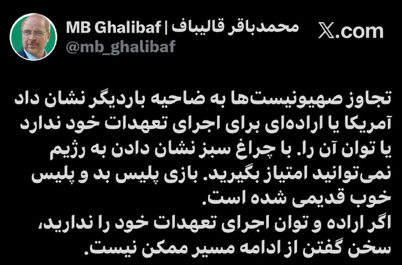

🔴توییت قالیباف

‏تجاوز صهیونیست‌ها به ضاحیه باردیگر نشان داد آمریکا یا اراده‌ای برای اجرای تعهدات خود ندارد یا توان آن را. با چراغ سبز نشان دادن به رژیم نمی‌توانید امتیاز بگیرید. بازی پلیس بد و پلیس خوب قدیمی شده است.
‏اگر اراده و توان اجرای تعهدات خود را ندارید، سخن گفتن از ادامه مسیر ممکن نیست.
https://t.me/kianmeli1

## IranIntlTV — post 342259

  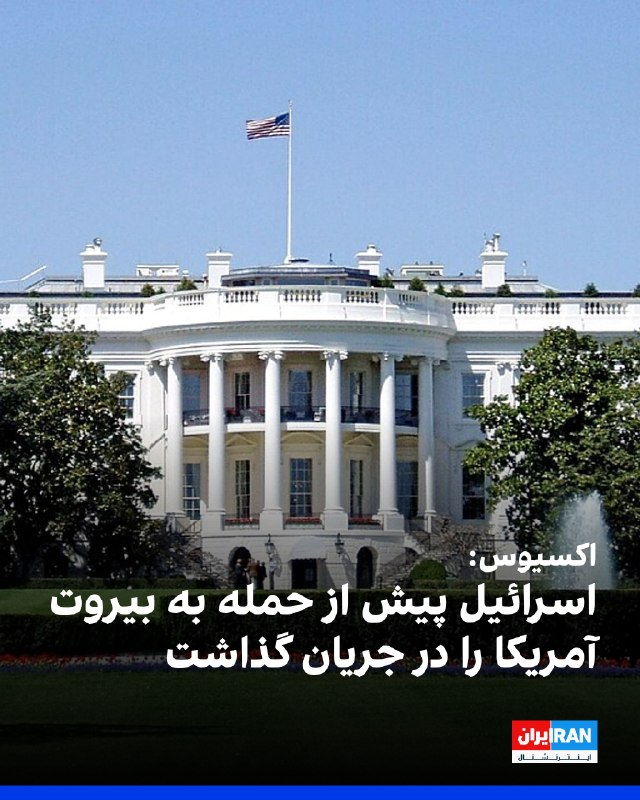

وب‌سایت اکسیوس گزارش داد ارتش اسرائیل اندکی پیش از حمله به منطقه ضاحیه بیروت، فرماندهی مرکزی آمریکا (سنتکام) را از این عملیات مطلع کرده بود.

ارتش اسرائیل پیش‌تر در بیانیه‌ای اعلام کرد در واکنش به شلیک پرتابه از سوی حزب‌الله به شمال اسرائیل و نقض آتش‌بس از سوی این گروه تحت حمایت جمهوری اسلامی، یکی از مقرهای حزب‌الله را در ضاحیه بیروت به طور دقیق هدف قرار داده است.
https://iranintl.com/202606140903

## Persian_Trend_Official — post 17052

  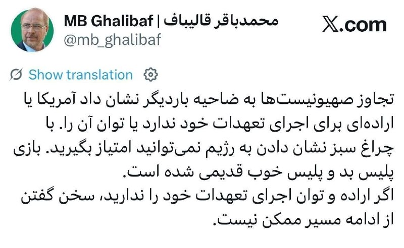

بسسسسسسسه حاج باقر
کشتیش 😄
انقدر قاطعیت هم دیگه خوب نیست !

## Persian_Trend_Official — post 17051

https://t.me/persian_trend_official/17044?comment=670219

نه داداش تا امضای من پای توافق نباشه نمیزارم هیچ چیزی امضا بشه ! الانم به بنیامین گفتم ضاحیه رو بزنه به سپاه هم گفتم دوباره جواب بده
دارم فکر میکنم بعدش بگم چیکار کنن 😒

## Persian_Trend_Official — post 17050

  <a href="telegram/content/Persian_Trend_Official_17050_1781441053.webm" target="_blank">🎬 Download video</a>

قالیباف: پس از چراغ سبز آمریکا به رژیم برای تجاوز به ضاحیه، سخن گفتن از ادامه مسیر ممکن نیست!

رئیس مجلس شورای اسلامی در پستی در حساب شخصی خود در شبکه X: تجاوز صهیونیست‌ ها به ضاحیه بار دیگری نشان داد آمریکا یا اراده‌ای برای اجرای تعهدات خود ندارد یا توان آن را. با چراغ سبز نشان دادن به رژیم نمی‌توانید امتیاز بگیرید. بازی پلیس بد و پلیس خوب قدیمی شده است. اگر اراده و توان اجرای تعهدات خود را ندارید، سخن گفتن از ادامه مسیر ممکن نیست.

📝 Amir

📌 @persian_trend_official
پرشین ترند | متفاوت‌ترین کانال نظامی

## Persian_Trend_Official — post 17049

  <a href="telegram/content/Persian_Trend_Official_17049_1781441054.webm" target="_blank">🎬 Download video</a>

سخنگوی ارتش اسرائیل: در یک حمله دقیق در ضاحیه، بیروت ارتش اسرائیل به مقر سازمان تروریستی حزب الله حمله کرد. ارتش اسرائیل اخیراً به مقر سازمان تروریستی حزب الله در بیروت حمله کرد. مقر مورد حمله توسط تروریست‌های سازمان تروریستی حزب الله برای پیشبرد توطئه‌های…

## IranianMinds — post 22553

  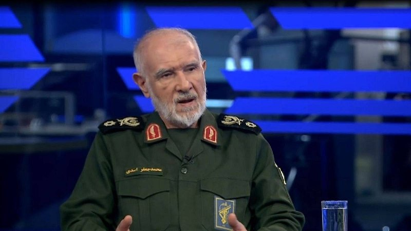

🔴اسدی، معاون بازرسی قرارگاه خاتم‌الانبیاء:

بدون شک این جنایات اسرائیل بدون پاسخ نمی‌ماند.

@IranianMinds

## BBCPersian — post 283794

  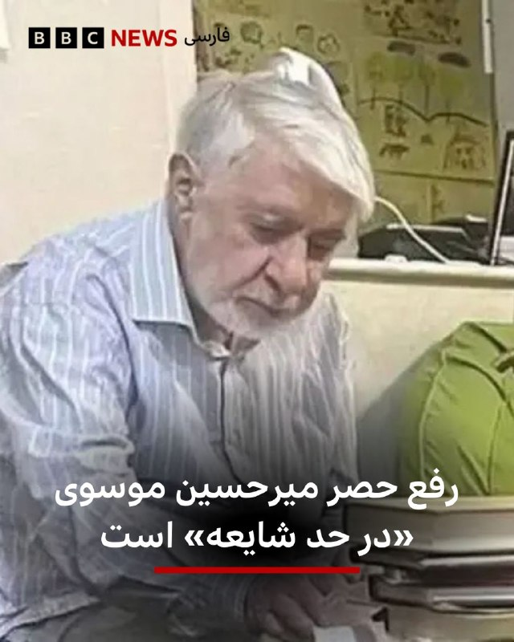

🔻میرحسین موسوی هنوز در بیمارستان است و نیروهای امنیتی هم حضور دارند.

یک منبع نزدیک به خانواده میرحسین موسوی به بی‌بی‌سی فارسی گفت رفع حصر «هنوز در حد شایعه» است.

در هفته‌های اخیر اخبار تایید نشده‌ای از رفع حصر میرحسین موسوی و همسرش زهرا رهنورد منتشر شده است.

یک منبع نزدیک به خانواده میرحسین موسوی گفت که پس از حمله آمریکا و اسرائیل به منطقه پاستور در روز اول جنگ، میرحسین موسوی و زهرا رهنورد از خانه‌شان در خیابان پاستور به جای دیگری منتقل شدند اما جایشان معلوم نبود و فقط می‌توانستند با فرزندانشان برای تهیه لباس تماس بگیرند.

به گفته این فرد مطلع، شدت انفجار به‌حدی بود که در و پنجره‌های خانه آقای موسوی آسیب دید و آوار ساختمان بغلی روی خودرویی که در خانه آنها پارک بود ریخت.

در طول جنگ ۴۰ روزه چندین بار به منطقه پاستور حمله شد و بر اثر این حملات خانه به‌حدی آسیب دید که وقتی فرزندان آقای موسوی و خانم رهنورد با اجازه نهادهای امنیتی برای انتقال نقاشی‌ها و کتاب‌ها و اثاثیه دیگر به خانه مراجعه کردند، دیدند که گربه‌ها در خانه ساکن شد‌ه‌اند.

📸 کلمه

https://bbc.in/4fEONCy
@BBCPersian

## alonews — post 127869

  <a href="telegram/content/alonews_127869_1781441056.webm" target="_blank">🎬 Download video</a>

👈آمیت سگال خبرنگار اسرائیلی: رهبر حزب الله با موفقیت حذف شد

✅ @AloNews خبر جنگ

## alonews — post 127868

  <a href="telegram/content/alonews_127868_1781441057.webm" target="_blank">🎬 Download video</a>

👈تصویر عجیب منتشر شده از عراقچی در ایتا

✅ @AloNews خبر جنگ

## alonews — post 127867

  <a href="telegram/content/alonews_127867_1781441057.webm" target="_blank">🎬 Download video</a>

👈قالیباف : تجاوز صهیونیست‌ها به ضاحیه دوباره ثابت کرد که آمریکا یا اراده‌ای برای اجرای تعهداتش نداره

- یا توانش رو با چراغ سبز دادن به رژیم نمی‌شه امتیاز گرفت

- بازی پلیس بد و پلیس خوب هم دیگه قدیمی شده

- اگه نه اراده دارید نه توان اجرای تعهداتتون، حرف از ادامه مسیر بی‌معناست

✅ @AloNews خبر جنگ

---
📅 بروزرسانی: 1405/03/24 16:03
---

## pm_afshaa — post 93882

🔴مقامات اسراییلی:سنتکام از حمله ما با خبر بود

💧 Rainbet.com the #1 Non-KYC Crypto Casino & Sportsbook @rainbetcom

😁 @Pm_Afshaa

## pm_afshaa — post 93881

وزارت امور خارجه اعلام کرد: امروز توافقنامه امضا نخواهیم کرد

💧 Rainbet.com the #1 Non-KYC Crypto Casino & Sportsbook @rainbetcom

😁 @Pm_Afshaa

## IranIntlTV — post 342258

  

عبدالاله الحجر، مشاور رییس شورای عالی سیاسی حوثی‌های یمن تحت حمایت جمهوری اسلامی، به خبرگزاری تسنیم، وابسته به سپاه پاسداران گفت در صورت تشدید تنش‌ها و در صورت لزوم، حوثی‌ها ممکن است از بستن تنگه باب‌المندب به عنوان ابزاری برای فشار بر دشمنان خود استفاده کنند.

او گفت حوثی‌های یمن پیش‌تر نیز تجربه بستن این آبراه به روی کشتی‌های مرتبط با اسرائیل را داشتند و در صورت نیاز، این اقدام را «به شکلی حساب‌شده» تکرار خواهند کرد.

تسنیم در گزارشی از صنعا نوشت باب‌المندب یکی از مسیرهای اصلی انتقال انرژی و تجارت جهانی است و بسته شدن آن می‌تواند بر زنجیره تامین کالا و قیمت انرژی در جهان تاثیر بگذارد.

حوثی‌های یمن از زمان آغاز جنگ غزه پس از حادثه هفتم اکتبر بارها کشتی‌های مرتبط با اسرائیل و برخی شناورهای تجاری را در دریای سرخ و تنگه باب‌المندب هدف قرار دادند؛ حملاتی که با واکنش نظامی آمریکا و متحدانش همراه شده است.
https://iranintl.com/202606149252

## FarsiVOA — post 220673

توماج صالحی، خواننده، معترض در پیامی در اینستاگرام خود گفت آزادی ایران هرگز به خواست یا حمایت کشورهای دیگر وابسته نبوده و نخواهد بود.

او تاکید کرد که مسیر آزادی‌خواهی در ایران، چه در شرایط جنگ، چه توافق و چه بدون حمایت خارجی ادامه خواهد یافت و افزود: «آزادی‌خواه‌های ایران هنوز زنده هستند؛ ما مثل گذشته قدم‌به‌قدم پیش می‌رویم، سنگر به سنگر فتح می‌کنیم.»

@FarsiVOA

## Persian_Trend_Official — post 17048

ستاد قرارگاه خاتم‌الانبیا در واکنش به حمله اسرائیل به ضاحیه اعلام کرد:

جنایت‌های صهیونیست‌ها در ضاحیه بی‌پاسخ نخواهد ماند.

## Persian_Trend_Official — post 17047

  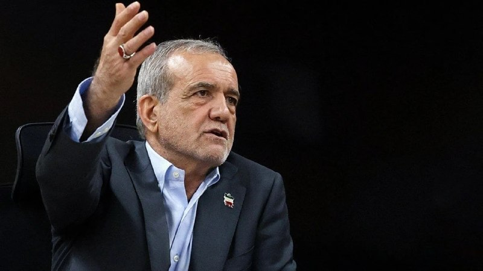

خو اومد زد !

دکتر مسعود پزشکیان

## Persian_Trend_Official — post 17046

  <a href="telegram/content/Persian_Trend_Official_17046_1781440420.webm" target="_blank">🎬 Download video</a>

پاسخ خون ؛ خون است.
مقر، ساختمان و پایگاه نیست.!

شهید حاج عماد مغنیه

## RadioFarda — post 158290

  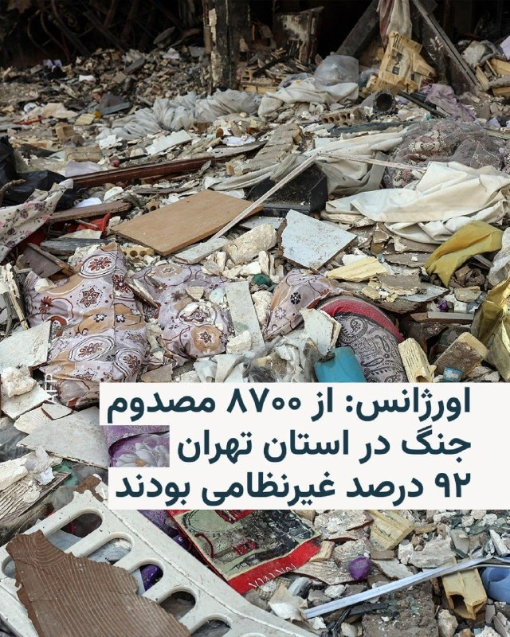

🔸محمداسماعیل توکلی، رئیس اورژانس استان تهران، روز یک‌شنبه گفت که «از مجموع ۸۷۰۰ مصدوم ثبت‌شده در استان تهران، حدود ۹۲ درصد غیرنظامی بودند».

🔸توکلی ادامه داد:‌ «در مجموع ۱۲۶۲ شهید در استان تهران شناسایی شدند که ۸۲۰ نفر از آنان در همان صحنه حادثه شناسایی شدند.»

🔸به گفته این مقام، عده‌ای از قربانیان جنگ نیز «به دلیل شدت جراحات و آسیب‌های وارده به‌صورت اولیه قابل شناسایی نبودند».

🔸در ایران، سازمان‌های مستقل غیرحکومتی به این گونه آمار رسمی هیچ دسترسی ندارند و از همین رو امکان راستی‌آزمایی این آمار وجود ندارد.

@RadioFarda

## IranianMinds — post 22552

  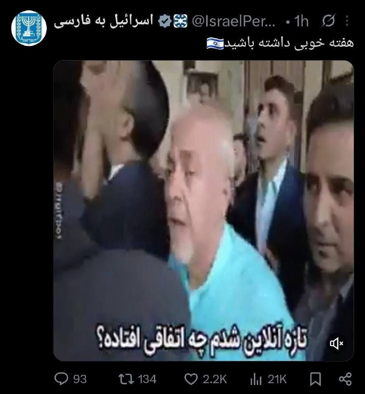

🔴اکانت اسرائیل به فارسی. @IranianMinds

## IranianMinds — post 22551

  <a href="telegram/content/IranianMinds_22551_1781440421.mp4" target="_blank">🎬 Download video</a>

🔴اکانت اسرائیل به فارسی.

@IranianMinds

## alonews — post 127866

  <a href="telegram/content/alonews_127866_1781440422.mp4" target="_blank">🎬 Download video</a>

👈این هواپیمای روس نیروی هوایی هند روز گذشته حین تلاش برای فرود در منطقه جورهات، سقوط کرده بود.

🔴ارتش هند با انتشار یک بیانیه، اعلام کرد که در نتیجه این سقوط، پنج نفر از پرسنل نیروی هوایی هند جانشان را از دست دادند

✅ @AloNews خبر جنگ

## alonews — post 127865

  <a href="telegram/content/alonews_127865_1781440423.webm" target="_blank">🎬 Download video</a>

👈سه کشته و شش زخمی در تلفات اولیه حمله هوایی اسرائیل به ضاحیه

✅ @AloNews خبر جنگ

## alonews — post 127864

  <a href="telegram/content/alonews_127864_1781440424.webm" target="_blank">🎬 Download video</a>

👈وزارت امور خارجه لبنان: ما به دلیل هدف قرار دادن یک خودروی ارتش و کشته شدن سربازان، از اسرائیل به شورای امنیت شکایت کرده‌ایم.

🔴ما به دلیل پاشیدن آفت‌کش‌های گلیفوزات بر روی روستاهای مرزی جنوبی، شکایتی را به شورای امنیت ارائه کرده‌ایم

✅ @AloNews خبر جنگ

---
📅 بروزرسانی: 1405/03/24 15:53
---

## VahidOOnLine — post 245463

  

محمدجعفر اسدی، معاون بازرسی قرارگاه مرکزی خاتم‌الانبیا، در واکنش به حمله اسرائیل به ضاحیه بیروت گفت: «بدون شک این جنایات بی‌پاسخ نخواهد ماند.»

او در گفت‌وگو با دفاع‌پرس، حمله ارتش اسرائیل به منطقه ضاحیه را محکوم کرد و نسبت به پیامدهای آن هشدار داد.

ارتش اسرائیل در بیانیه‌ای یکشنبه ۲۴ خرداد اعلام کرد در واکنش به شلیک پرتابه از سوی حزب‌الله به شمال اسرائیل، اهدافی از این گروه را در ضاحیه بیروت هدف قرار داده است.
‌🏁 🇬🇧 IranintlTV

🤖 @VahidOOnLine

## WithYashar — post 14798

خبر ترور ‌نعیم قاسم تایید نشده است
منتظر تایید هستیم
@withyashar

## WithYashar — post 14797

کانال ۱۲ اسرائیل به نقل یه مقام امنیتی: حتی یه موشک از سمت ایران پرتاب بشه، با حمله‌ای گسترده به اونا پاسخ میدیم و آماده هر سناریویی هستیم.
@withyashar

## WithYashar — post 14795

🚨🚨🚨🚨🚨🚨

## FoxNewsTwitter — post 342952

  

Fox News (Twitter/X)

HAPPY BIRTHDAY! President Trump turns 80 today.

The nation's 45th and 47th president celebrates a milestone birthday as the country prepares to commemorate America's 250th anniversary.

## IranIntlTV — post 342257

  

محمدجعفر اسدی، معاون بازرسی قرارگاه مرکزی خاتم‌الانبیا، در واکنش به حمله اسرائیل به ضاحیه بیروت گفت: «بدون شک این جنایات بی‌پاسخ نخواهد ماند.»

او در گفت‌وگو با دفاع‌پرس، حمله ارتش اسرائیل به منطقه ضاحیه را محکوم کرد و نسبت به پیامدهای آن هشدار داد.

ارتش اسرائیل در بیانیه‌ای یکشنبه ۲۴ خرداد اعلام کرد در واکنش به شلیک پرتابه از سوی حزب‌الله به شمال اسرائیل، اهدافی از این گروه را در ضاحیه بیروت هدف قرار داده است.
https://iranintl.com/202606144657

## IranIntlTV — post 342256

  <a href="https://t.me/IranintlTV/342256" target="_blank">📎 Download file</a>

🎧نسخه صوتی اخبار نیمروزی | یکشنبه ۲۴ خرداد
@iranintlTV

## FarsiVOA — post 220672

🔺حزب‌الله معادله «ضاحیه در برابر شهرک‌های شمالی اسرائیل» را نقض کرد

◾️بنا به گزارش رسانه‌های عربی در روز یکشنبه ۲۴ خرداد، ارتش اسرائیل اعلام کرد، گروه تروریستی حزب‌الله با حمله پهپادی به شمال اسرائیل، آتش‌بس شکل گرفته میان دو طرف، براساس معادله «ضاحیه بیروت در برابر شهرک‌های شمالی اسرائیل» را نقض کرده، و ارتش اسرائیل حق دارد که به این حملات پاسخ دهد.

⬇️ بیشتر بخوانید:

https://ir.voanews.com/a/lebanon-hezbollah-beirut-irgc-iran-/8160657.html

## Persian_Trend_Official — post 17045

  <a href="telegram/content/Persian_Trend_Official_17045_1781439836.mp4" target="_blank">🎬 Download video</a>

کم کم اماده لایو بشیم از نوع اضطراری 😄

## Persian_Trend_Official — post 17044

کم کم اماده لایو بشیم از نوع اضطراری 😄

## Persian_Trend_Official — post 17043

  <a href="telegram/content/Persian_Trend_Official_17043_1781439837.mp4" target="_blank">🎬 Download video</a>

حمله اسرائیل به ضاحیه

## BBCPersian — post 283793

🔻اسرائیل به ضاحیه حمله کرد

اسرائیل اعلام کرد که پس از حملات امروز حزب‌الله، به اهدافی در ضاحیه در حومه جنوبی بیروت حمله کرده است.

ارتش اسرائیل گفت که حزب‌الله سه پرتابه به مناطق شمالی اسرائیل شلیک کرد که «نقض آشکار آتش‌بس» است.

بنیامین نتانیاهو، نخست‌وزیر و اسرائیل کاتس، وزیر دفاع اسرائیل در بیانیه‌ای مشترک گفتند: «ارتش اسرائیل اکنون در پاسخ به حملات حزب‌الله به خاکش، اهداف تروریستی متعلق به گروه تروریستی حزب‌الله را در محله ضاحیه در بیروت هدف قرار داده است.»

حزب‌الله تاکنون واکنشی رسمی به این بیانیه اسرائیل نشان نداده اما گفته بود که موشک‌ و پهپاد به سمت نیروهای اسرائیل شلیک کرده است.

ایران تاکید کرده که توقف جنگ در لبنان لازمه توافق با آمریکاست.

دفعه قبل که اسرائیل به ضاحیه، پایگاه قدرت حزب‌الله در بیروت، حمله کرد ایران نقاطی را در اسرائیل هدف حمله موشکی قرار داد و اسرائیل هم در مقابل به اهدافی در ایران حمله کرد تا اینکه دونالد ترامپ از هر دو کشور خواست شلیک به یکدیگر را متوقف کنند.

https://bbc.in/4fEONCy
@BBCPersian

## Hranews — post 113604

  <a href="telegram/content/Hranews_113604_1781439838.mp4" target="_blank">🎬 Download video</a>

روز جاری، جمعی از بازنشستگان تامین اجتماعی در مقابل ساختمان این سازمان در کرمانشاه دست به #تجمع اعتراضی زدند. بازنشستگان مذکور، خواستار اجرای طرح همسان‌سازی، افزایش حقوق طبق تورم و رسیدگی به مشکلات درمانی و معیشتی خود هستند.

↘️
@hranews_bot تماس ✉️ - @Hranews کانال هرانا 🆑

## Hranews — post 113603

زندان زاهدان؛ حکم اعدام یک زندانی اجرا شد

❗️
❗️
❗️
❗️
❗️– سحرگاه امروز یکشنبه ۲۴ خردادماه، یک زندانی در زندان زاهدان #اعدام شد. وی پیشتر از بابت اتهامات مرتبط با جرائم مواد مخدر به مجازات مرگ محکوم شده بود.

ادامه مطلب

#حسن_حسینی_نارویی

↘️
@hranews_bot تماس ✉️ -  @Hranews  کانال هرانا 🆑

## alonews — post 127863

  <a href="telegram/content/alonews_127863_1781439840.webm" target="_blank">🎬 Download video</a>

👈خبرنگار آکسیوس: مقامات اسرائیلی و آمریکایی می‌گویند ارتش اسرائیل اندکی پیش از حمله به بیروت، فرماندهی مرکزی آمریکا (سنتکام) را مطلع کرده بود

✅ @AloNews خبر جنگ

## alonews — post 127862

  <a href="telegram/content/alonews_127862_1781439840.webm" target="_blank">🎬 Download video</a>

👈عراقچی: سرمایه اجتماعی و انسجام ملی، امروز یکی از مهم‌ترین مؤلفه‌های قدرت جمهوری اسلامی ایران در عرصه بین‌المللی است و طبیعتاً هرچه این پشتوانه مردمی تقویت شود، قدرت چانه‌زنی و تأثیرگذاری دیپلماسی کشور نیز افزایش خواهد یافت

✅ @AloNews خبر جنگ

---
📅 بروزرسانی: 1405/03/24 15:43
---

## pm_afshaa — post 93880

  <a href="telegram/content/pm_afshaa_93880_1781439234.webm" target="_blank">🎬 Download video</a>

🔴رضایی، سخنگوی کمیسیون امنیت ملی مجلس:

اگر قرار باشه تفاهم یا توافقی شکل بگیره، مسیر اون ادب کردنِ سگ هار، اسرائیله.

💧 Rainbet.com the #1 Non-KYC Crypto Casino & Sportsbook @rainbetcom

😁 @Pm_Afshaa

## IranIntlTV — post 342255

  <a href="telegram/content/IranIntlTV_342255_1781439235.mp4" target="_blank">🎬 Download video</a>

آرش آزرمی، دبیر بخش اقتصادی ایران‌اینترنشنال، با اشاره به تداوم بحران معیشتی بازنشستگان گفت با وجود تورم سنگین و کاهش مستمر قدرت خرید، مابه‌التفاوت افزایش حقوق بازنشستگان در سال جاری هنوز پرداخت نشده و حتی احکام جدید نیز از نگاه فعالان کارگری پاسخگوی هزینه‌های زندگی نیست. او همچنین بحران کنونی را در چارچوب مشکلات مالی دولت و ورشکستگی صندوق‌های بازنشستگی ارزیابی کرد.
@iranintltv

## IranIntlTV — post 342254

  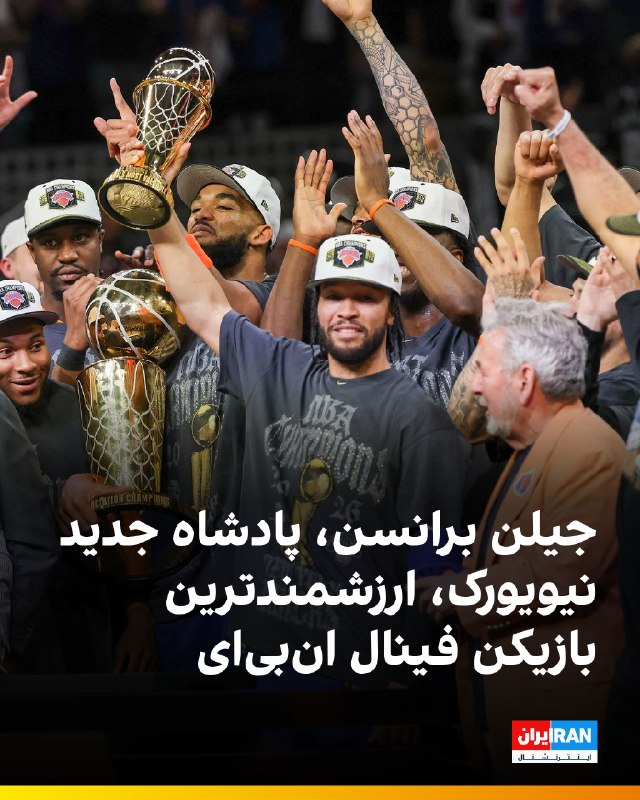

🔻جیلن برانسن با درخشش تاریخی خود در بازی پنجم فینال، تیم نیویورک نیکس را به مقام قهرمانی ان‌بی‌ای رساند. این ستاره ۲۹ ساله در این مسابقه حساس ۴۵ امتیاز کسب کرد. برانسن با این نمایش درخشان، جایزه ارزشمندترین بازیکن (MVP) فینال را به دست آورد.

🔹او در کل این سری پنج‌بازی، میانگین ۳۲.۶ امتیاز، ۴.۲ ریباند و ۴.۶ پاس گل را ثبت کرد.

🔹برانسن در شبی که سایر هم‌تیمی‌هایش برای امتیازگیری چندان موفق نبودند، عملکرد فوق‌العاده‌ای داشت. ۱۴ پرتاب از ۲۷ شوت برانسون وارد سبد شد. او همچنین ۱۳ پرتاب از ۱۵ پنالتی خود را وارد سبد کرد.

🔹برانسن در کوارتر چهارم بازی پنجم، به تنهایی ۱۵ امتیاز حیاتی به دست آورد. نیکس در ابتدای این کوارتر با اختلاف ۷ امتیاز عقب بود.

🔹با این حال، بازیکنان نیکس با رهبری برانسن یک بازگشت فوق‌العاده رقم زدند و در نهایت با نتیجه ۹۴ بر ۹۰ پیروز شدند.

🔹برانسن با ثبت ۴۵ امتیاز، رکورد بیشترین امتیاز یک بازیکن مهمان در مسابقه نهایی و سرنوشت‌ساز فینال را تکرار کرد. این دستاورد بزرگ، نام او را در کنار بزرگانی چون لبران جیمز و استفن کری قرار داد.

@iranintltvsport

## Shin_Persian — post 7046

  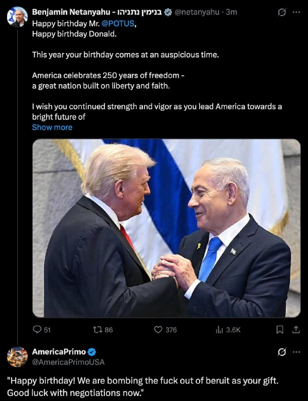

😭😭😭

## FarsiVOA — post 220671

🔺توماج صالحی: مسیر آزادی‌خواهی در ایران به بن‌بست نمی‌رسد

◾️توماج صالحی، خواننده رپ اعتراضی، با انتشار ویدئویی در صفحه اینستاگرام خود گفت «آزادی ایران هرگز وابسته به خواسته کشورهای دیگر نبوده است» و تأکید کرد که مسیر آزادی‌خواهی در ایران، «چه با جنگ، چه با توافق و چه حتی با حمایت کشورهای دیگر» به بن‌بست نمی‌رسد.

⬇️ بیشتر بخوانید:

https://ir.voanews.com/a/salehi-says-iran-s-freedom-endures/8160661.html

## DW_Farsi — post 125958

  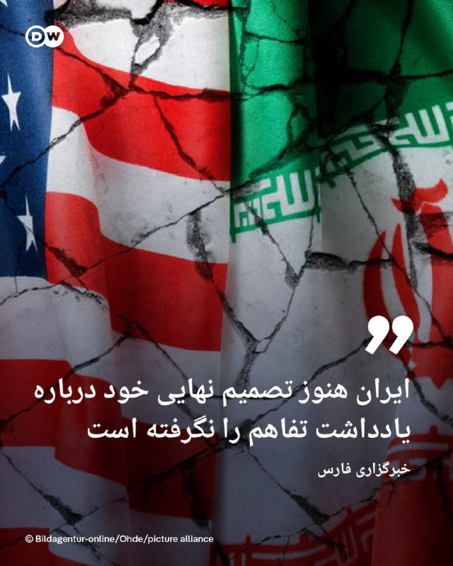

🔶 فارس: ایران هنوز تصمیم نهایی خود درباره یادداشت تفاهم را نگرفته است

خبرگزاری حکومتی فارس روز یکشنبه ۲۴ خرداد (۱۴ ژوئن) به نقل از یک "منبع آگاه نزدیک به تیم مذاکره‌کننده ایرانی" گزارش داد که تهران هنوز تصمیم نهایی خود را درباره یادداشت تفاهم پیشنهادی میان ایران و ایالات متحده اعلام نکرده است.

فارس نوشت اظهارات منابع مطلع نشان می‌دهد که "بررسی ابعاد مختلف پیشنهادهای مطرح‌شده همچنان در سطوح کارشناسی و تصمیم‌گیری ادامه دارد و نهادهای مسئول در حال ارزیابی دقیق جوانب سیاسی، حقوقی و فنی موضوع هستند".

امضای توافق احتمالی میان تهران و واشنگتن همچنان موضوعی مبهم به شمار می‌رود و ایران و آمریکا تا کنون روایت‌های متفاوتی در این باره، از جمله زمان امضای آن، ارائه کرده‌اند.

شبکه خبری سی‌ان‌ان روز یکشنبه در گزارشی نوشت حتی اگر دلایلی برای خوش‌بینی نسبت به امضای توافق میان دو طرف وجود داشته باشد، این یادداشت تفاهم به ‌خودی‌ خود یک توافق صلح نخواهد بود، بلکه "تنها نخستین گام در یک فرایند بسیار طولانی" به شمار می‌رود.

@dw_farsi

## DW_Farsi — post 125957

  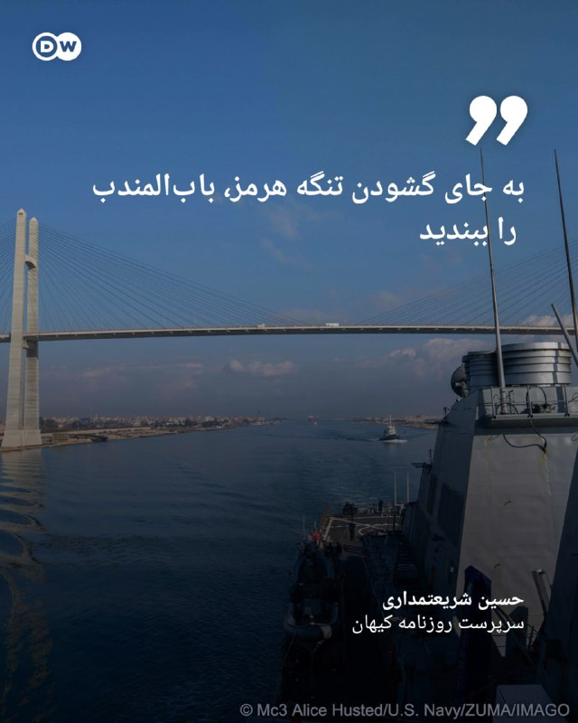

🔶شریعتمداری: به جای گشودن تنگه هرمز باب‌المندب را ببندید

حسین شریعتمداری، سرپرست روزنامه کیهان نزدیک به رهبر جمهوری اسلامی، روز یکشنبه در یادداشتی با انتقاد از توافق احتمالی میان ایران و آمریکا، از عباس عراقچی و محمدباقر قالیباف به تندی انتقاد کرده و نسبت به بازگشایی تنگه هرمز هشدار داد.

او این آبراه را "یکی از اصلی‌ترین اهرم‌های" ایران در جنگ با آمریکا و اسرائیل و فشار بر اقتصاد جهانی خوانده و نوشت: «مگر نه ‌این‌که بستن تنگه هرمز یکی از اصلی‌ترین اهرم‌های کشورمان در جنگ رمضان بوده است و مگر نه ‌این‌که بستن تنگه راه تنفس تجاری و اقتصادی دشمن را مسدود نموده و به خفگی نزدیک کرده است؟! آقایان قرار است با کدام توجیه منطقی و توضیح قابل قبولی از این اهرم سرنوشت‌ساز دست بردارند؟!»

شریعتمداری با اشاره به لزوم پرداخت غرامت از سوی آمریکا، این موضوع را یکی از شروط مجتبی خامنه‌ای، رهبر جمهوری اسلامی، خوانده و گفت: «گشودن تنگه هرمز با تعریفی که آقایان ارائه کرده‌اند به منزله بستن دست‌های ایران برای دریافت غرامت است.»

@dw_farsi

## Persian_Trend_Official — post 17042

  <a href="telegram/content/Persian_Trend_Official_17042_1781439241.webm" target="_blank">🎬 Download video</a>

⭕️ اژه‌ای، رئیس قوه قضاییه: همه مسئولان اتفاق نظر دارند که در برابر دشمن نباید کوتاه آمد.

📝 Nick

📌 @persian_trend_official
پرشین ترند | متفاوت‌ترین کانال نظامی

## Persian_Trend_Official — post 17041

حمله مجدد حزب الله لبنان به شمال اسرائیل 📝 Amir 📌 @persian_trend_official پرشین ترند | متفاوت‌ترین کانال نظامی

## Persian_Trend_Official — post 17040

  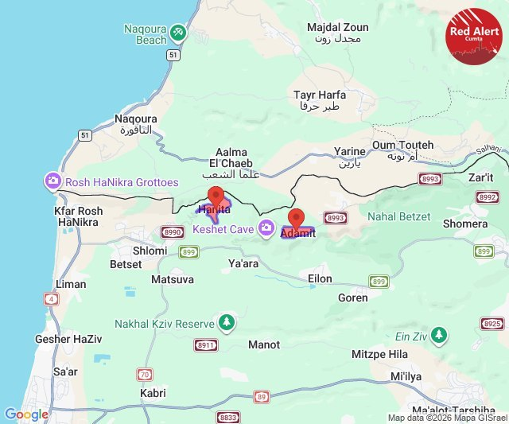

حمله مجدد حزب الله لبنان به شمال اسرائیل

📝 Amir

📌 @persian_trend_official
پرشین ترند | متفاوت‌ترین کانال نظامی

## Persian_Trend_Official — post 17039

⭕️ صداوسیما: تنگه هرمز طبق اعلام نهاد مدیریت آب‌راه خلیج فارس تا اطلاع بعدی همچنان مسدود است و هیچ کشتی خارجی حق ورود و خروج ندارد.

📝 Nick

📌 @persian_trend_official
پرشین ترند | متفاوت‌ترین کانال نظامی

## IranianMinds — post 22550

  <a href="telegram/content/IranianMinds_22550_1781439242.mp4" target="_blank">🎬 Download video</a>

🔴خوب دیگه خودشون هم تآیید می‌کنن که رسول خدا و یارانش در جنگ به هلاکت رسیدن😂😂😂

@IranianMinds

## BBCPersian — post 283792

  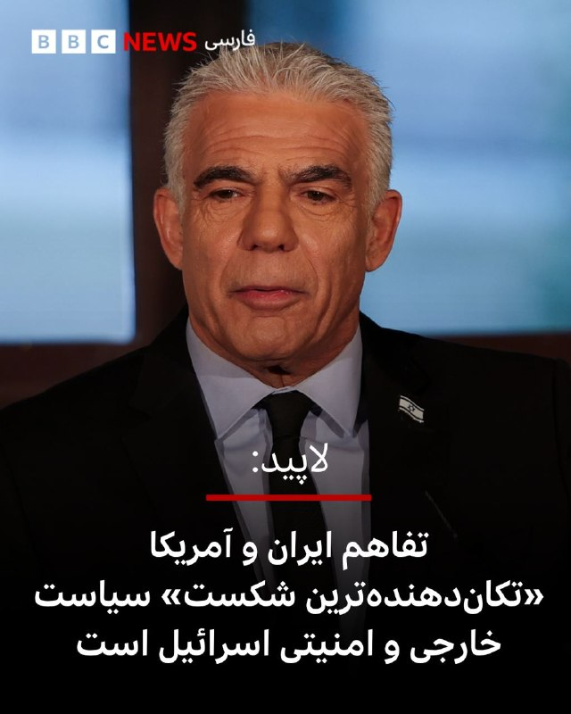

🔻یائیر لاپید، نخست‌وزیر سابق و از رهبران مخالف دولت اسرائیل، در شبکه ایکس با انتقاد شدید از بنیامین نتانیاهو امضای تفاهمنامه بین ایران و آمریکا را «تکان‌دهنده‌ترین شکست‌ سیاست خارجی و امنیتی اسرائیل» توصیف کرد و مسئولیت کامل آن را متوجه نخست‌وزیر دانست.

آقای لاپید نوشت امیدوار است که «گزارش‌ها درباره توافق با ایران درست نباشد» و به ۱۳ مورد اشاره کرد و آنها را ناکامی و کوتاهی‌های آقای نتانیاهو دانست از جمله اینکه:

«او یک روایت بیش از حد خوش‌بینانه را به آمریکایی‌ها فروخت، بدون اینکه نقشه خطرات را کاملا برایشان تشریح کند و در میانه جنگ اعتماد آنها را از دست داد.»

او همچنین نوشت که آقای نتانیاهو «نتوانست آمریکایی‌ها را متقاعد کند که تاسیسات نفتی و انرژی ایران را بمباران کنند» و «مسئله موشک‌های بالستیک را در توافق یا حتی در مذاکرات بگنجانند.»

آقای لاپید همچنین نوشت که نخست‌وزیر اسرائیل «برنامه مربوط به کردها را پیش برد بدون آنکه واکنش قابل پیش‌بینی ترکیه و نفوذ رجب طیب اردوغان در واشنگتن را در نظر بگیرد.»

📸 EPA

https://bbc.in/4fEONCy
@BBCPersian

## Dirty_Kids — post 392005

  <a href="telegram/content/Dirty_Kids_392005_1781439245.mp4" target="_blank">🎬 Download video</a>

🔴اسرائیل به فارسی با انتشار این گیف از ظریف نوشت:

هفته خوبی داشته باشید🇮🇱

@Dirty_Kids 👻

## Dirty_Kids — post 392004

  <a href="telegram/content/Dirty_Kids_392004_1781439246.mp4" target="_blank">🎬 Download video</a>

🔴این روزها این تیکه از آهنگ جدید تتلو [آره تو موهات بلند و زیباست] حسابی بین مردم مورد استقبال قرار گرفته و همه دارن باهاش ویدئو درست میکنن؛

واقعا هم همه‌جوره زیباست و میشه تا صبح تکرارش کرد❤️

@Dirty_Kids 👻

## Hranews — post 113602

تهران؛ مردی به اتهام تجاوز به دخترخوانده‌اش محاکمه شد

❗️
❗️
❗️
❗️
❗️– جلسه رسیدگی به اتهام مردی که به دخترخوانده‌اش #تجاوز کرده، در دادگاه کیفری تهران برگزار شد. این دختر نوجوان از سن ۱۵ تا ۱۸ سالگی به‌طور مکرر توسط ناپدری خود مورد تعرض قرار گرفته است.

ادامه مطلب

↘️
@hranews_bot تماس ✉️ -  @Hranews  کانال هرانا 🆑

## alonews — post 127861

  <a href="telegram/content/alonews_127861_1781439248.webm" target="_blank">🎬 Download video</a>

👈آی۲۴عبری: اسرائیل در حال حاضر از اظهارنظر درباره اینکه آیا هماهنگی یا اطلاع‌رسانی قبلی با واشنگتن قبل از آخرین حمله به بیروت وجود داشته است، خودداری می‌کند

🔴به دنبال حمله قبلی در تاریخ ۷ ژوئن، موضع رسمی اسرائیل این بود: «ما در تماس مستمر با آنها هستیم و آنها با سیاست ما آشنا هستند.»

✅ @AloNews خبر جنگ

## alonews — post 127860

  <a href="telegram/content/alonews_127860_1781439248.webm" target="_blank">🎬 Download video</a>

👈عراقچی: امنیت منطقه نمی‌تواند بر پایه نادیده گرفتن ایران شکل بگیرد

✅ @AloNews خبر جنگ

---
📅 بروزرسانی: 1405/03/24 15:33
---

## VahidOOnLine — post 245462

  <a href="telegram/content/VahidOOnLine_245462_1781438631.mp4" target="_blank">🎬 Download video</a>

ویدیوهای رسیده به ایران‌اینترنشنال نشان می‌دهند ایرانیان مقیم آمریکا پس از بازی قطر و سوئیس در جام جهانی فوتبال، مقابل ورزشگاه لیوایز (منطقه خلیج سان‌فرانسیسکو) در سانتاکلارای کالیفرنیا، علیه جمهوری اسلامی تجمع کردند.
‌🏁 🇬🇧 IranintlTV

🤖 @VahidOOnLine

## VahidOOnLine — post 245461

  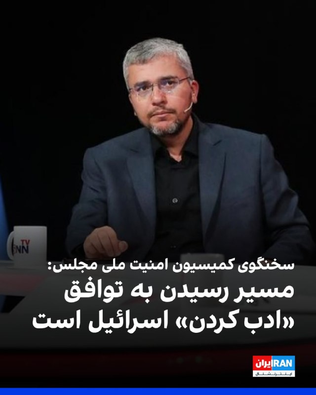

در پی حمله ارتش اسرائیل به اهدافی در ضاحیه بیروت، ابراهیم رضایی، سخنگوی کمیسیون امنیت ملی مجلس، در شبکه اجتماعی ایکس نوشت اگر قرار باشد تفاهم یا توافقی شکل بگیرد، مسیر آن «ادب کردن» اسرائیل است.

او این اظهارات را در حالی مطرح کرد که رایزنی‌ها درباره تفاهم احتمالی میان تهران و واشینگتن ادامه دارد و گزارش‌های منتشرشده درباره متن تفاهم احتمالی میان تهران و واشینگتن با مخالفت و انتقاد برخی چهره‌ها و جریان‌های سیاسی در داخل جمهوری اسلامی روبه‌رو شده است.
iranintl
‌🏁 🇬🇧 IranintlTV

🤖 @VahidOOnLine

## VahidOOnLine — post 245460

  

ارتش اسرائیل با انتشار بیانیه‌ای اعلام کرد در حمله‌ای به منطقه ضاحیه بیروت، یکی از مقرهای حزب‌الله را هدف قرار داده است.

در بیانیه ارتش اسرائیل آمده است این مرکز برای برنامه‌ریزی و پیشبرد عملیات علیه شهروندان اسرائیل و نیروهای ارتش این کشور در جنوب لبنان استفاده می‌شد.

ارتش اسرائیل اعلام کرد این حمله پس از شلیک پرتابه از سوی حزب‌الله به خاک اسرائیل انجام شده است. این نهاد همچنین تاکید کرد به عملیات خود برای مقابله با «تهدیدها علیه اسرائیل»، ادامه خواهد داد.
iranintl
‌🏁 🇬🇧 IranintlTV

🤖 @VahidOOnLine

## WithYashar — post 14794

خبرگزاری رسمی اسرائیل: حمله به حومه جنوبی بیروت توسط دو هواپیمای جنگی انجام شد که چهار موشک هدایت‌شونده شلیک کردند.
@withyashar

## WithYashar — post 14793

  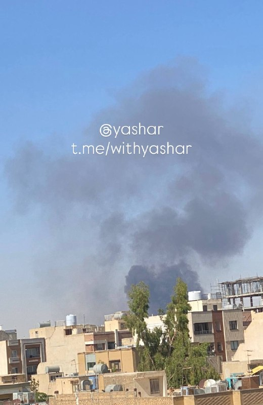

اصفهان دید از ملک شهر الان
@withyashar

## pm_afshaa — post 93879

شبکه 12 اسراییل:نعیم قاسم ترور شد

💧 Rainbet.com the #1 Non-KYC Crypto Casino & Sportsbook @rainbetcom

😁 @Pm_Afshaa

## pm_afshaa — post 93878

♨️
♨️
♨️
♨️

## kianmeli1 — post 87984

🔴خبرنگار صداوسیما: تنگه هرمز طبق اعلام نهاد مدیریت آب‌راه خلیج فارس تا اطلاع بعدی همچنان مسدود است و هیچ کشتی خارجی حق ورود و خروج ندارد.
https://t.me/kianmeli1

## IranIntlTV — post 342253

  <a href="telegram/content/IranIntlTV_342253_1781438635.mp4" target="_blank">🎬 Download video</a>

ویدیوهای رسیده به ایران‌اینترنشنال نشان می‌دهند ایرانیان مقیم آمریکا پس از بازی قطر و سوئیس در جام جهانی فوتبال، مقابل ورزشگاه لیوایز (منطقه خلیج سان‌فرانسیسکو) در سانتاکلارای کالیفرنیا، علیه جمهوری اسلامی تجمع کردند.

## IranIntlTV — post 342252

  

در پی حمله ارتش اسرائیل به اهدافی در ضاحیه بیروت، ابراهیم رضایی، سخنگوی کمیسیون امنیت ملی مجلس، در شبکه اجتماعی ایکس نوشت اگر قرار باشد تفاهم یا توافقی شکل بگیرد، مسیر آن «ادب کردن» اسرائیل است.

او این اظهارات را در حالی مطرح کرد که رایزنی‌ها درباره تفاهم احتمالی میان تهران و واشینگتن ادامه دارد و گزارش‌های منتشرشده درباره متن تفاهم احتمالی میان تهران و واشینگتن با مخالفت و انتقاد برخی چهره‌ها و جریان‌های سیاسی در داخل جمهوری اسلامی روبه‌رو شده است.
iranintl.com/202606140273

## Shin_Persian — post 7045

  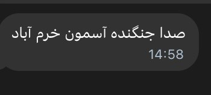

Shin ✓ @hey_itsmyturn
Sun, 14 Jun 2026 11:58:32 UTC

1158Z
Jet activity over Khorram Abad, Lorestan Province, Iran

ترجمه خودکار فارسی

۱۱۵۸ زولو (۱۵:۲۸ به وقت تهران)
فعالیت جنگنده‌ها برفراز خرم‌آباد، استان لرستان، ایران

𝕏 · @shin_persian

## Shin_Persian — post 7043

Shin ✓ @hey_itsmyturn
Sun, 14 Jun 2026 11:54:49 UTC

1137Z
Smoke rises from the eastern Isfahan (where the airport is located)

Isfahan Province, Iran

ترجمه خودکار فارسی

۱۱۳۷ زولو (۱۵:۰۷ به وقت تهران)
دود از شرق اصفهان (جایی که فرودگاه واقع شده است) برخاسته است.

استان اصفهان، ایران

𝕏 · @shin_persian

## FarsiVOA — post 220670

  <a href="telegram/content/FarsiVOA_220670_1781438637.mp4" target="_blank">🎬 Download video</a>

ارتش اسرائیل به مقر حزب‌الله در ضاحیه بیروت حمله کرد؛

ارتش اسرائیل اعلام کرد که روز یکشنبه ۲۴ خرداد مقر سازمان تروریستی حزب‌الله در بیروت را هدف حمله قرار داد.

ارتش اسرائیل با انتشار بیانیه‌ای نوشت که مقر هدف قرارگرفته «برای پیشبرد طرح‌های تروریستی علیه شهروندان کشور اسرائیل و نیروهای ارتش اسرائیل در حال فعالیت در جنوب لبنان» مورد استفاده قرار می‌گرفت.

بر اساس این بیانیه، این حمله پس از آن انجام شد که پیش‌تر در روز یکشنبه، حزب‌الله پرتابه هایی را به سمت حریم کشور اسرائیل پرتاب کرد.

منابع امنیتی لبنان به رویترز گفتند حمله به ضاحیه ظاهراً یک حمله هدفمند با دو موشک بوده است.

⬇️ بیشتر بخوانید:
https://ir.voanews.com/a/israeli-airstrike-struck-an-apartment-in-dahiyeh/8160656.html

## Persian_Trend_Official — post 17036

  <a href="telegram/content/Persian_Trend_Official_17036_1781438639.mp4" target="_blank">🎬 Download video</a>

کماندوهای نیروی دریایی بریتانیا یک کشتی متعلق به ناوگان سایه روسیه را در کانال مانش توقیف کردند.

📝 Amir

📌 @persian_trend_official
پرشین ترند | متفاوت‌ترین کانال نظامی

## BBCPersian — post 283791

  <a href="telegram/content/BBCPersian_283791_1781438640.mp4" target="_blank">🎬 Download video</a>

یک فیل در هند برای به دست آوردن انبه‌های داخل خودرو آن را واژگون کرد.
گردشگران می‌گویند این فیل زمان زیادی را صرف تلاش برای درآوردن انبه‌ها از خودرو کرد اما موفق نشد.

@BBCPersian

## BBCPersian — post 283790

  <a href="telegram/content/BBCPersian_283790_1781438642.mp4" target="_blank">🎬 Download video</a>

نیروهای بریتانیا یک نفتکش روسیِ تحت تحریم را که در تلاش برای عبور از کانال مانش بود، توقیف کردند.
در نخستین عملیات از این نوع نیروهای تفنگدار دریایی وارد نفتکش «اسمیرتو» شدند. اقدامی که مقام‌های بریتانیایی گفتند ضربه دیگری به منابع مالی نظامی روسیه وارد خواهد کرد.
وزیر خارجه اوکراین از این عملیات استقبال کرد که به گفته او به «کاهش توانایی روسیه برای تأمین مالی حملات موشکی و پهپادی» کمک می‌کند.
کماندوهای دریایی سلطنتی بریتانیا در این عملیات با مأموران ویژه و آموزش‌دیده آژانس ملی مبارزه با جرایم همکاری کردند. این عملیات با هماهنگی فرانسه انجام شد که تاکنون چهار کشتی متعلق به «ناوگان سایه» روسیه را توقیف کرده است.

@BBCPersian
https://bbc.in/4vMPf6m

## Dirty_Kids — post 392003

  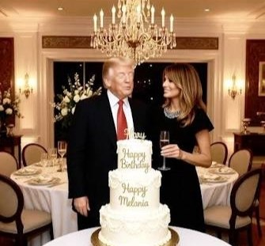

امشب ایوانکا در حال باز کردن و اعلام کادو های تولد ترامپ :

_ مستر قالیباف ، 400 کیلوگرم اورانیوم
+ روبیو و ونس و ویتکاف (با ریتم ) : چرا زحمت کشیدین ؟ ...

@Dirty_Kids 👻

## alonews — post 127859

  <a href="telegram/content/alonews_127859_1781438644.webm" target="_blank">🎬 Download video</a>

👈نتانیاهو: ما به اهداف حزب‌الله در حومه جنوبی بیروت حمله کردیم و حملات علیه خودمان را تحمل نخواهیم کرد.

✅ @AloNews خبر جنگ

## alonews — post 127858

  <a href="telegram/content/alonews_127858_1781438644.webm" target="_blank">🎬 Download video</a>

👈 توییت اکانت اسرائیل به فارسی !!

✅ @AloNews خبر جنگ

---
📅 بروزرسانی: 1405/03/24 15:23
---

## VahidOOnLine — post 245459

  

میثم ظهوریان، نماینده مجلس جمهوری اسلامی، در شبکه اجتماعی ایکس نوشت توصیف تفاهم‌نامه احتمالی میان جمهوری اسلامی و آمریکا با عباراتی مانند «توافقی بدتر از برجام»، «تسلیم ایران» یا «مستعمره شدن ایران» دقیق نیست و با متن فعلی تفاهم‌نامه همخوانی ندارد.

ظهوریان با مقایسه این تفاهم‌نامه با برجام نوشت برجام از نظر زمان‌بندی اجرا، حجم تعهدات و سازوکارهای اجرایی، از جمله مکانیزم داوری، توافقی یک‌جانبه و مطابق خواست آمریکا بود، اما تفاهم‌نامه فعلی چنین ویژگی‌هایی ندارد و صرفا چارچوب توافق احتمالی بعدی را مشخص می‌کند.

او افزود خارج شدن موضوع هسته‌ای از محور مذاکرات در مرحله نخست و موکول شدن آن به مراحل بعدی، از جمله مواردی است که به گفته او با وجود مقاومت اولیه آمریکا، در نهایت پذیرفته شد و به کاهش اشکالات متن کمک کرده است.

این اظهارات در حالی است که محمود نبویان، نایب‌رییس کمیسیون امنیت ملی مجلس، گفته بود آمریکا با این توافق به «پیروزی کامل» می‌رسد و پس از حل مشکلات خود، بار دیگر به ایران حمله خواهد کرد.
‌🏁 🇬🇧 IranintlTV

🤖 @VahidOOnLine

## VahidOOnLine — post 245458

  <a href="telegram/content/VahidOOnLine_245458_1781438019.mp4" target="_blank">🎬 Download video</a>

♦️گزارش‌ها و ویدیوهای منتشر شده در شبکه‌های اجتماعی نشان می‌ده که گروهی از رانندگان پیک‌های موتوری شیراز روز یکشنبه ۲۴ خرداد در اعتراضات به مالیات بالا، کافی نبودن کرایه‌ها، نداشتن بیمه و حذف کارت سوخت، اعتصاب کردند.
رکود تورمی اقتصاد ایران همزمان با ادامه جنگ، محاصره دریایی و پس از سال‌ها تحریم، زندگی را برای ده‌ها میلیون نفر بیش از پیش دشوار کرده است.
‌🇸🇦 Indypersian

🤖 @VahidOOnLine

## WithYashar — post 14792

خبرنگار صداوسیما: تنگه هرمز طبق اعلام نهاد مدیریت آب‌راه خلیج فارس تا اطلاع بعدی همچنان مسدود است و هیچ کشتی خارجی حق ورود و خروج ندارد.
@withyashar

## WithYashar — post 14791

العربیه: قطری ها و پاکستانی ها فشار زیادی می‌آورند تا تشدید تنش رخ ندهد!
@withyashar

## pm_afshaa — post 93877

  <a href="telegram/content/pm_afshaa_93877_1781438021.webm" target="_blank">🎬 Download video</a>

🔴رادیو ارتش اسرائیل: اسرائیل برآورد میکنه که ایران به حمله اسرائیل به بیروت پاسخ نخواهد داد. 
💧 Rainbet.com the #1 Non-KYC Crypto Casino & Sportsbook @rainbetcom 
😁 @Pm_Afshaa

## pm_afshaa — post 93876

  <a href="telegram/content/pm_afshaa_93876_1781438021.webm" target="_blank">🎬 Download video</a>

🔴باراک راوید، خبرنگار اکسیوس: جمهوری اسلامی تهدید کرده بود هرگونه حمله اسرائیل به بیروت رو تلافی خواهد کرد. 
💧 Rainbet.com the #1 Non-KYC Crypto Casino & Sportsbook @rainbetcom 
😁 @Pm_Afshaa

## pm_afshaa — post 93875

  <a href="telegram/content/pm_afshaa_93875_1781438022.webm" target="_blank">🎬 Download video</a>

🔴باراک راوید، خبرنگار اکسیوس:
جمهوری اسلامی تهدید کرده بود هرگونه حمله اسرائیل به بیروت رو تلافی خواهد کرد.

💧 Rainbet.com the #1 Non-KYC Crypto Casino & Sportsbook @rainbetcom

😁 @Pm_Afshaa

## pm_afshaa — post 93874

  <a href="telegram/content/pm_afshaa_93874_1781438023.mp4" target="_blank">🎬 Download video</a>

🔴پزشکیان: رسول خدا و اصحابش، رفتن تو جنگ لت و پار شدن و برگشتن.

💧 Rainbet.com the #1 Non-KYC Crypto Casino & Sportsbook @rainbetcom

😁 @Pm_Afshaa

## kianmeli1 — post 87983

  

🔴باراک راوید:
ایران حمله به ضاحیه بیروت را طبق گفته اش پاسخ خواهد داد
https://t.me/kianmeli1

## IranIntlTV — post 342251

  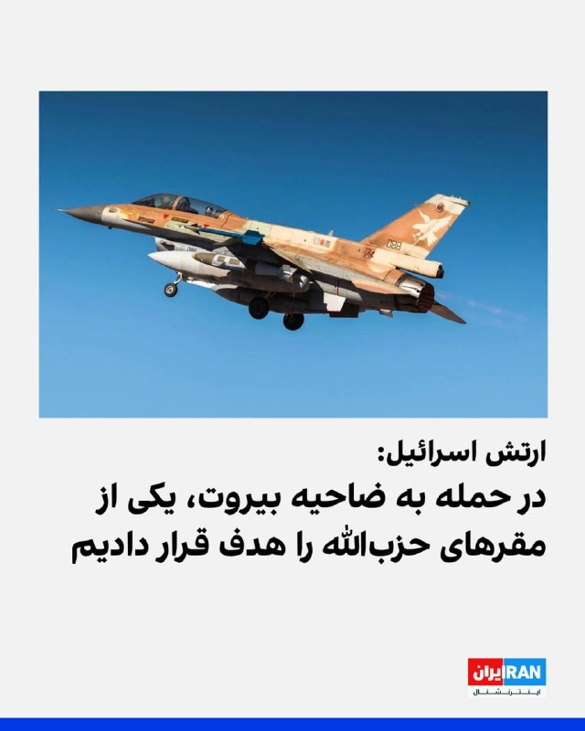

ارتش اسرائیل با انتشار بیانیه‌ای اعلام کرد در حمله‌ای به منطقه ضاحیه بیروت، یکی از مقرهای حزب‌الله را هدف قرار داده است.

در بیانیه ارتش اسرائیل آمده است این مرکز برای برنامه‌ریزی و پیشبرد عملیات علیه شهروندان اسرائیل و نیروهای ارتش این کشور در جنوب لبنان استفاده می‌شد.

ارتش اسرائیل اعلام کرد این حمله پس از شلیک پرتابه از سوی حزب‌الله به خاک اسرائیل انجام شده است. این نهاد همچنین تاکید کرد به عملیات خود برای مقابله با «تهدیدها علیه اسرائیل»، ادامه خواهد داد.
iranintl.com/202606144475

## IranIntlTV — post 342250

  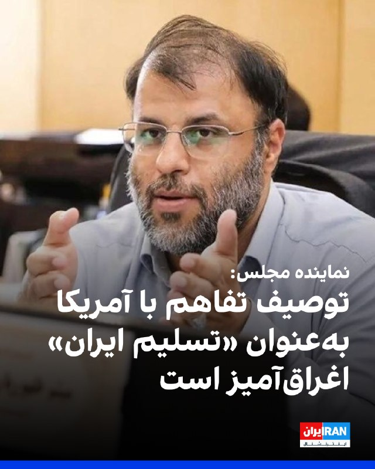

میثم ظهوریان، نماینده مجلس جمهوری اسلامی، در شبکه اجتماعی ایکس نوشت توصیف تفاهم‌نامه احتمالی میان جمهوری اسلامی و آمریکا با عباراتی مانند «توافقی بدتر از برجام»، «تسلیم ایران» یا «مستعمره شدن ایران» دقیق نیست و با متن فعلی تفاهم‌نامه همخوانی ندارد.

ظهوریان با مقایسه این تفاهم‌نامه با برجام نوشت برجام از نظر زمان‌بندی اجرا، حجم تعهدات و سازوکارهای اجرایی، از جمله مکانیزم داوری، توافقی یک‌جانبه و مطابق خواست آمریکا بود، اما تفاهم‌نامه فعلی چنین ویژگی‌هایی ندارد و صرفا چارچوب توافق احتمالی بعدی را مشخص می‌کند.

او افزود خارج شدن موضوع هسته‌ای از محور مذاکرات در مرحله نخست و موکول شدن آن به مراحل بعدی، از جمله مواردی است که به گفته او با وجود مقاومت اولیه آمریکا، در نهایت پذیرفته شد و به کاهش اشکالات متن کمک کرده است.

این اظهارات در حالی است که محمود نبویان، نایب‌رییس کمیسیون امنیت ملی مجلس، گفته بود آمریکا با این توافق به «پیروزی کامل» می‌رسد و پس از حل مشکلات خود، بار دیگر به ایران حمله خواهد کرد.
https://iranintl.com/202606142769

## FarsiVOA — post 220669

  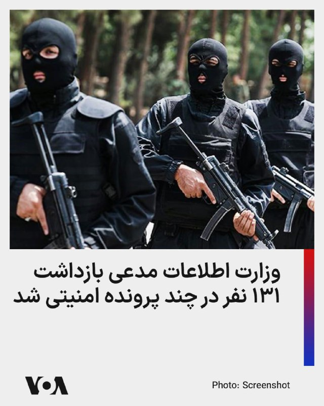

وزارت اطلاعات جمهوری اسلامی در اطلاعیه‌ای مدعی شد یک فرد متهم به تلاش برای نفوذ به مراکز داده، یک هسته چهار نفره در جنوب شرق کشور و ۱۲۶ نفر از آنچه «لیدرهای میدانی شبکه خرابکاری خیابانی» خواند، بازداشت شده‌اند.

بر اساس این اطلاعیه، فردی با نام اختصاری «علی ح.» در ایلام بازداشت شده و وزارت اطلاعات او را به تلاش برای دسترسی به مراکز داده دستگاه‌های حساس، از جمله مراکز نظامی، رسانه‌ای، قضایی، مخابراتی، بانکی و اقتصادی متهم کرده است.

در بخش دیگری از اطلاعیه، وزارت اطلاعات مدعی شد یک هسته چهار نفره در سیستان و بلوچستان، با همکاری سپاه پاسداران، پیش از انجام عملیات بازداشت شده است. در این اطلاعیه ادعا شده ۹ قبضه اسلحه کلاشینکف و دو هزار فشنگ نیز کشف شده است.

وزارت اطلاعات همچنین گفت ۱۲۶ نفر در استان تهران، در ارتباط با آنچه «شبکه رزم خیابان» خوانده، بازداشت شده‌اند. هیچ منبع مستقلی این ادعاها را تأیید نکرده است.
@FarsiVOA

## FarsiVOA — post 220668

  <a href="telegram/content/FarsiVOA_220668_1781438026.mp4" target="_blank">🎬 Download video</a>

پاسخ ارتش اسرائیل به حمله پهپادی حزب‌الله؛ ضاحیه بیروت هدف قرار گرفت؛

ارتش اسرائیل پس از اصابت سه پهپاد به شمال اسرائیل، اهداف وابسته به سازمان حزب‌الله را در ضاحیه بیروت هدف قرار داد.

به گزارش تایمز اسرائیل، این حمله پس از آن انجام شد که سه پهپاد شلیک‌شده از سوی حزب‌الله به مناطقی در شمال اسرائیل اصابت کردند.

پیشتر بنیامین نتانیاهو نخست‌وزیر، و یسرائیل کاتز وزیر دفاع اسرائیل، در بیانیه مشترکی اعلام کرده بودند که بر اساس دستور آنها، «ارتش اسرائیل در منطقه ضاحیه بیروت، اهداف تروریستی سازمان تروریستی حزب‌الله را هدف قرار داده است».

در این بیانیه تصریح شده که این عملیات «در پاسخ به شلیک حزب‌الله به سمت خاک اسرائیل است، و اسرائیل شلیک به خاک خود را تحمل نخواهد کرد.»

جزئیات بیشتری از میزان خسارت در ضاحیه بیروت هنوز منتشر نشده است.
@FarsiVOA

## FarsiVOA — post 220667

  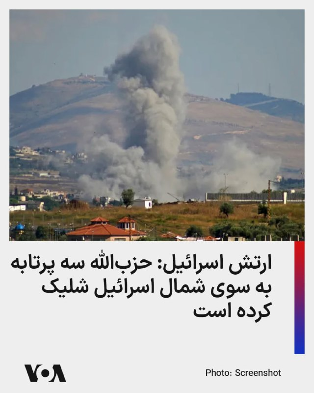

ارتش اسرائیل روز یکشنبه اعلام کرد که حزب‌الله سه پرتابه به سوی مناطق مسکونی در شمال اسرائیل شلیک کرده است. ارتش اسرائیل تأکید کرد که این اقدام نقض آشکار آتش‌بس است.

بر اساس بیانیه ارتش اسرائیل، این پرتابه‌ها در نزدیکی مناطق مسکونی شومِرا و شلومی فرود آمدند. ارتش اسرائیل افزود این پرتابه‌ها علاوه بر دو پرتابه دیگری است که در طول آخر هفته از مرز عبور کرده بودند.

همچنین ارتش اسرائیل اعلام کرد که آژیرهایی که روز یکشنبه در چندین منطقه در جنوب اسرائیل به صدا درآمدند، ناشی از یک شناسایی اشتباه بوده است.

پیشتر ارتش اسرائیل اعلام کرد آژیرهای هشدار در چند منطقه در شمال اسرائیل، به‌دنبال احتمال نفوذ یک هواپیمای خصمانه، به صدا درآمدند.
@FarsiVOA

## DW_Farsi — post 125956

🔶 تلاش‌های جدید قطر برای اخراج رهبران بهایی

سازمان دیده‌بان حقوق بشر امروز یکشنبه ۱۴ ژوئن (۲۴ خرداد) با انتشار اطلاعیه‌ای اعلام کرد که مقا‌م‌های قطری از مارس ۲۰۲۶ دست کم به چهار فعال نهادهای کلیدی اقلیت بهایی دستور اخراج داده‌اند. به گفته این نهاد حقوق بشری، به این افراد بدون دادرسی عادلانه و قانونی و مسیر حقوقی برای اعتراض به این دستورها، فرمان خروج داد‌ه‌اند.

این افراد که دهه‌ها در قطر زندگی کرده‌اند و خانواده‌هایشان نیز در این کشور ساکن هستند، با خطر اخراجی مواجه‌اند که حق آن‌ها برای داشتن زندگی خانوادگی را نقض می‌کند.

این سازمان حقوق بشری نوشته است، تبعیض دیرینه‌ مقام‌های قطری علیه بهاییان باعث جدایی خانواده‌ها و از دست رفتن شغل و درآمد آن‌ها می‌شود.

دیده‌بان حقوق بشر از افزایش قابل توجه آزار و اذیت بهاییان از زمان آغاز درگیری مسلحانه میان اسرائیل، ایالات متحده و ایران خبر داده است.

@dw_farsi

## Persian_Trend_Official — post 17035

رادیو ارتش اسرائیل: طبق برآورد ارتش، ایران به حمله در ضاحیه بیروت پاسخ نخواهد داد. دو جنگنده چهار بمب دقیق را در حمله به ضاحیه رها کردند.

📝 Amir

📌 @persian_trend_official
پرشین ترند | متفاوت‌ترین کانال نظامی

## RadioFarda — post 158289

🔸دفتر نخست‌وزیری اسرائیل روز یک‌شنبه، ۲۴ خردادماه، اعلام کرد که ارتش این کشور سایتی متعلق به گروه حزب‌الله در حومه جنوبی بیروت، محله ضاحیه، را هدف قرار داده است.

🔸در بیانیه ارتش اسرائیل در همین باره اشاره شده است که به «اهدافی تروریستی متعلق به حزب‌الله» در ضاحیه حمله شده است. اسرائیل دلیل این حمله را شلیک از طرف حزب‌الله به خاک اسرائیل عنوان کرد.

🔸ساعتی پیشتر ارتش اسرائیل اعلام کرده بود که سه پهپاد روز یک‌شنبه به طور جداگانه به شمال اسرائیل پرتاب شده‌اند. اسرائیل گروه حزب‌الله را مسئول پرتاب این پهپادها اعلام کرد.

🔸ارتش اسرائیل روز یک‌شنبه همچنین به ساکنان چندین روستای دیگر در جنوب لبنان هشدار داد که محل زندگی خود را ترک کنند.

🔸خبرگزاری فرانسه به نقل از سخنگوی عرب‌زبان ارتش اسرائیل نوشت که ساکنان ۲۹ روستا در این منطقه باید به نقطه‌ای دیگر نقل مکان کنند. اسرائیل قصد حمله هوایی به این روستاها را دارد.

🔸طبق این گزارش، اسرائیل صبح یک‌شنبه ابتدا به ساکنان ۱۳ روستا و سپس ساکنان ۱۶ روستای دیگر در جنوب لبنان اخطار داده است.

@RadioFarda

## IranianMinds — post 22549

  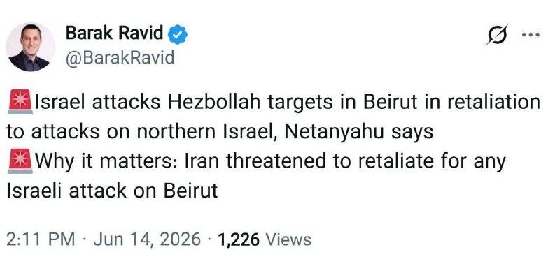

🔴باراک راوید/ اکسیوس:

ایران همانطور که گفته بود، حمله به بیروت را پاسخ می‌دهد.

@IranianMinds

## Hranews — post 113601

  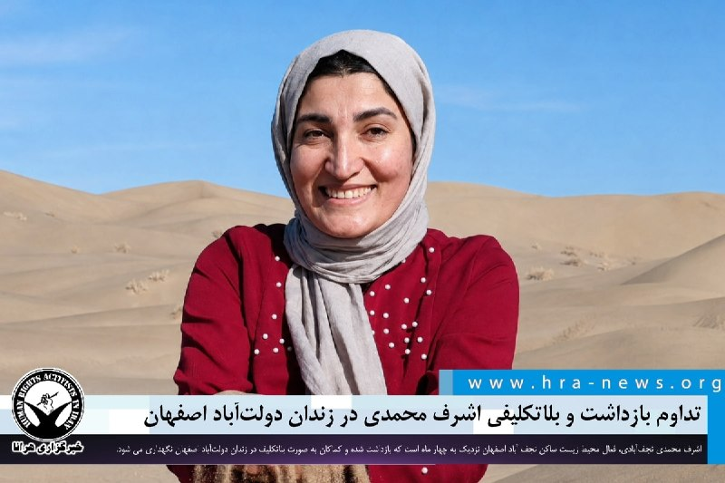

تداوم بازداشت و بلاتکلیفی اشرف محمدی در زندان دولت‌آباد اصفهان

❗️
❗️
❗️
❗️
❗️– اشرف محمدی نجف‌آبادی، فعال محیط زیست ساکن نجف آباد اصفهان نزدیک به چهار ماه است که بازداشت شده و کماکان به صورت بلاتکلیف در زندان دولت‌آباد اصفهان نگهداری می شود.

به گزارش خبرگزاری هرانا، ارگان خبری مجموعه فعالان حقوق بشر در ایران، اشرف محمدی نجف‌آبادی، فعال محیط زیست همچنان در بازداشت به‌سر می‌برد.

بر اساس اطلاعات دریافتی هرانا، ۱۱۶ روز است که از بازداشت خانم محمدی می‌گذرد و او به‌صورت بلاتکلیف در زندان دولت‌آباد اصفهان نگهداری می‌شود. این فعال محیط زیست با اتهام تبلیغ علیه نظام مواجه شده است. همچنین تاکنون امکان آزادی موقت این شهروند با وثیقه نیز فراهم نشده است.

ادامه مطلب

#اشرف_محمدی_نجف‌آبادی

↘️
@hranews_bot تماس ✉️ -  @Hranews  کانال هرانا 🆑

## alonews — post 127857

  <a href="telegram/content/alonews_127857_1781438029.webm" target="_blank">🎬 Download video</a>

👈خبرگزاری رسمی اسرائیل: حمله به حومه جنوبی بیروت توسط دو هواپیمای جنگی انجام شد که چهار موشک هدایت‌شونده شلیک کردند.

✅ @AloNews خبر جنگ

---
📅 بروزرسانی: 1405/03/24 15:13
---

## WithYashar — post 14790

  <a href="telegram/content/WithYashar_14790_1781437415.mp4" target="_blank">🎬 Download video</a>

اسرائیل به فارسی با انتشار این گیف از ظریف نوشت: هفته خوبی داشته باشید
@withyashar

## pm_afshaa — post 93872

یاداوری: مشاهده به جا مانده از 18 و 19 دی

## pm_afshaa — post 93871

🔴سخنگوی کمیسیون امنیت مجلس: اگر این سگ هار کنترل نشود، امضای تفاهم خشک نخواهد شد و پای خودمان را گاز خواهد گرفت

💧 Rainbet.com the #1 Non-KYC Crypto Casino & Sportsbook @rainbetcom

😁 @Pm_Afshaa

## pm_afshaa — post 93870

یاداوری:

مشاهده

به جا مانده از 18 و 19 دی

## kianmeli1 — post 87982

  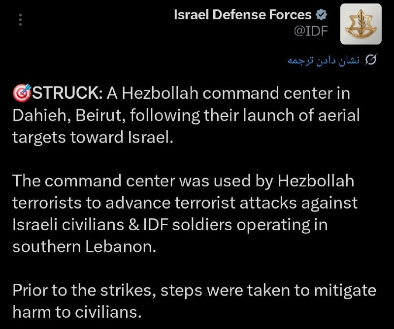

🔴ارتش اسرائیل: مرکز فرماندهی حزب‌الله در ضاحیه بیروت را بمباران کردیم
https://t.me/kianmeli1

## IranIntlTV — post 342249

  <a href="telegram/content/IranIntlTV_342249_1781437417.mp4" target="_blank">🎬 Download video</a>

گفت‌وگوی ویژه با وثاق سنائی، سخنگوی فارسی‌زبان جامعه جهانی بهائی
در این گفت‌وگو وثاق سنائی درباره هویت، پایداری، حمایت‌های بین‌المللی و نقش این جامعه در آینده ایران آزاد می‌گوید.
تماشای نسخه کامل این برنامه در یوتیوب:

https://youtu.be/Xx9h1PKb-QQ

@iranintltv

## FarsiVOA — post 220666

  <a href="telegram/content/FarsiVOA_220666_1781437419.mp4" target="_blank">🎬 Download video</a>

حمله اوکراین به یک کارخانه شیمیایی و انبار سوخت در عمق خاک روسیه؛

بلومبرگ به نقل از رئیس‌جمهور اوکراین، گزارش داد نیروهای اوکراینی یک کارخانه کود و مواد شیمیایی در منطقه تولا و یک تأسیسات ذخیره سوخت در منطقه یاروسلاول روسیه را هدف قرار داده‌اند. این حملات تازه‌ترین نمونه از ضربات دوربرد اوکراین در عمق خاک روسیه است.

زلنسکی در حساب ایکس خود نوشته است که کارخانه آزوت در تولا در فعالیت‌هایی نقش دارد که برای توان تولید مواد منفجره روسیه اهمیت دارد.

بلومبرگ همچنین به نقل از اینترفکس نوشت دیمیتری میلیایف، فرماندار منطقه تولا، اعلام کرده بقایای یک پهپاد در محوطه یک کارخانه صنعتی در نوموسکوفسک سقوط کرده و میزان خسارت در حال بررسی است.

⬇️ بیشتر بخوانید:
https://ir.voanews.com/a/8160655.html

## RadioFarda — post 158288

  <a href="https://t.me/radiofarda/158288" target="_blank">📎 Download file</a>

📻بشنوید: ساعت ۱۴ با رادیوفردا، ۲۴ خرداد ۱۴۰۵‌

@RadioFarda

## IranianMinds — post 22548

🔴مجری شبکه ۱۴ اسرائیل:

ما هم تولد ترامپ را امروز در بیروت جشن گرفتیم.

@IranianMinds

## alonews — post 127856

  <a href="telegram/content/alonews_127856_1781437421.webm" target="_blank">🎬 Download video</a>

🔴فوری/ سخنگوی کمیسیون امنیت ملی:
نباید اشتباه محاسباتی کنیم

🔴حتی اگر بخواهیم به توافق یا تفاهم برسیم، راه آن انضباط دادن به رژیم صهیونیستی است. اگر این سگ هار کنترل نشود، امضای تفاهم خشک نخواهد شد و پای ما را خواهد گاز گرفت.

✅ @AloNews خبر جنگ

## alonews — post 127855

  <a href="telegram/content/alonews_127855_1781437421.webm" target="_blank">🎬 Download video</a>

👈خبرنگار صداوسیما: تنگه هرمز طبق اعلام نهاد مدیریت آب‌راه خلیج فارس تا اطلاع بعدی همچنان مسدود است و هیچ کشتی خارجی حق ورود و خروج ندارد.

✅ @AloNews خبر جنگ

## alonews — post 127854

  <a href="telegram/content/alonews_127854_1781437422.webm" target="_blank">🎬 Download video</a>

👈باراک راوید(اکسیوس) : ایران همونطور که گفته بود، حمله به بیروت رو پاسخ میده

✅ @AloNews خبر جنگ

## alonews — post 127853

  <a href="telegram/content/alonews_127853_1781437422.webm" target="_blank">🎬 Download video</a>

👈خبرگزاری العربیه: قطری ها و پاکستانی ها فشار زیادی می‌آورند تا تشدید تنش رخ ندهد!

✅ @AloNews خبر جنگ

---
📅 بروزرسانی: 1405/03/24 15:03
---

## WithYashar — post 14789

منابع عبری: ارزیابی‌های کنونی در اسرائیل نشان می‌دهد که ایران تعادل را حفظ کرده و به حمله در حومه جنوبی بیروت پاسخ خواهد داد.
@withyashar

## WithYashar — post 14788

مقام اسرائیلی به نیویورک تایمز :

توافق آمریکا و ایران آخر بازی نیست و هنوز ماجرا ادامه داره
ما از آمریکا خواستیم تو محدود کردن عملیات نظامی‌ تو لُبنان دخالت نکنه
@withyashar

## WithYashar — post 14787

سخنگوی آتش نشانی تهران: دود مشاهده در قسمت شمالی شهر تهران، مربوط به حریق فضای سبز در محدوده ولنجک است.
@withyashar

## mwarmonitor — post 10864

🔴«جبهه داخلی اسرائیل: سطح آماده‌باش به بالاترین درجه افزایش یافته است، بدون هیچ تغییری در دستورالعمل‌های صادرشده برای عموم تا این لحظه.»

@mwarmonitor

## pm_afshaa — post 93869

یاداوری:

مشاهده

به جا مانده از 18 و 19 دی

## pm_afshaa — post 93868

  <a href="telegram/content/pm_afshaa_93868_1781436815.mp4" target="_blank">🎬 Download video</a>

وضعیت بیروت درپی حمله اسرائیل :

💧 Rainbet.com the #1 Non-KYC Crypto Casino & Sportsbook @rainbetcom

😁 @Pm_Afshaa

## IranIntlTV — post 342248

  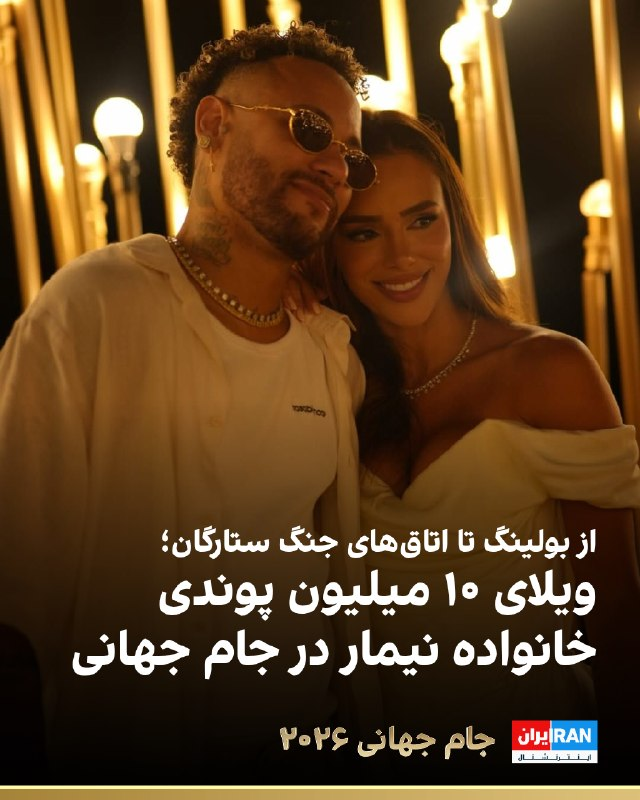

🔻در حالی که نیمار به همراه تیم ملی برزیل در جام جهانی ۲۰۲۶ حضور دارد، خانواده و نزدیکان او نیز زندگی لوکسی را در آمریکا تجربه می‌کنند.

🔹بر اساس گزارش رسانه‌های آلمانی، پدر نیمار برای مدت برگزاری مسابقات، ویلایی مجلل در ایالت فلوریدا اجاره کرده است که هزینه اقامت در آن حدود ۳ هزار پوند در روز برآورد می‌شود. این اقامتگاه در مجموعه ریونیون ریزورت قرار دارد و تنها ۲۰ دقیقه با مجموعه تفریحی دیزنی‌ورلد فاصله دارد.

🔹این ویلای ۱۴ خوابه که ارزشی در حدود ۱۰.۸ میلیون پوند دارد، امکاناتی کم‌نظیر از جمله استخر بزرگ، سالن بدنسازی، زمین بسکتبال، سالن بولینگ اختصاصی، سینمای خانگی، اتاق بازی و شبیه‌ساز رانندگی را در اختیار ساکنان قرار می‌دهد.

🔹یکی از بخش‌های جالب این عمارت، فضایی با تم مجموعه «جنگ ستارگان» است که برای کودکان خانواده در نظر گرفته شده و شامل اتاق‌های ویژه و دکوراسیونی الهام‌گرفته از این مجموعه سینمایی مشهور می‌شود.

🔹گفته می‌شود برونا بیانکاردی، شریک زندگی نیمار، به همراه دو فرزند این ستاره برزیلی نیز در این اقامتگاه حضور دارند و مسابقات جام جهانی را از نزدیک دنبال می‌کنند.

@iranintltvsport

## IranIntlTV — post 342247

  <a href="telegram/content/IranIntlTV_342247_1781436817.mp4" target="_blank">🎬 Download video</a>

مروری بر رسانه‌ها و خبرگزاری‌ها در ایران، یکشنبه ۲۴ خرداد، با مجتبی هاشمی، روزنامه‌نگار
@iranintltv

## IranianMinds — post 22547

  <a href="telegram/content/IranianMinds_22547_1781436819.mp4" target="_blank">🎬 Download video</a>

🔴طبق دستور نخست‌وزیر نتانیاهو و اسرائیل کاتز وزیر دفاع، ارتش اسرائیل اکنون در پاسخ به شلیک حزب‌الله به خاک اسرائیل، به اهداف تروریستی حزب‌الله در محل ضاحیه حمله کرده است. اسرائیل شلیک به خاک خود را تحمل نخواهد کرد. @IranianMinds

## Hranews — post 113600

به دلیل “عدم رعایت شئونات اسلامی”؛ ۲ واحد صنفی در آران و بیدگل پلمب شدند

❗️
❗️
❗️
❗️
❗️– فرمانده انتظامی آران و بیدگل از #پلمب دو واحد صنفی در این شهرستان به دلیل آنچه «عدم رعایت شئونات اسلامی» و «کشف حجاب» عنوان کرده، خبر داد.

ادامه مطلب

↘️
@hranews_bot تماس ✉️ -  @Hranews  کانال هرانا 🆑

## alonews — post 127852

  <a href="telegram/content/alonews_127852_1781436820.webm" target="_blank">🎬 Download video</a>

🔴فوری/ منابع عبری: ارزیابی‌های کنونی در اسرائیل نشان می‌دهد که ایران تعادل را حفظ کرده و به حمله در حومه جنوبی بیروت پاسخ خواهد داد.

✅ @AloNews خبر جنگ

---
📅 بروزرسانی: 1405/03/24 14:53
---

## VahidOOnLine — post 245457

♦️پارک «مینی‌ورلد» ملایر (جهان کوچک) به عنوان نخستین مجموعه مینیاتوری در خاورمیانه و چهارمین پارک مینیاتوری جهان، یکی از شاخص‌ترین جاذبه‌های گردشگری ایران به شمار می‌رود؛ مجموعه‌ای که با گردآوری ماکت‌هایی دقیق و هنرمندانه از مشهورترین آثار تاریخی، فرهنگی و معماری جهان، تجربه‌ای متفاوت از سفر را برای بازدیدکنندگان رقم می‌زند.
در این پارک، علاقه‌مندان می‌توانند در مدت زمانی کوتاه، از شکوه تخت‌جمشید و میدان نقش جهان تا عظمت برج ایفل، تاج‌محل و دیگر بناهای شناخته‌شده جهان بازدید کنند و جلوه‌ای کوچک اما واقع‌گرایانه از شاهکارهای معماری را از نزدیک ببینند.
طراحی دقیق ماکت‌ها در کنار فضای سبز، آب‌نماها و محوطه‌سازی چشم‌نواز، فضایی آرام و دلنشین ایجاد کرده که «مینی‌ورلد» را به مقصدی جذاب برای خانواده‌ها، گردشگران و علاقه‌مندان به عکاسی و معماری تبدیل کرده است.
این تصاویر را مریم رحمانی ثبت کرده و در خبرگزاری ایسنا منتشر شده‌اند.
‌🇸🇦 Indypersian

🤖 @VahidOOnLine

## WithYashar — post 14786

  <a href="telegram/content/WithYashar_14786_1781436215.mp4" target="_blank">🎬 Download video</a>

ارتش اسرائیل: مرکز فرماندهی حزب‌الله تو ضاحیه بیروت رو زدیم
@withyashar

## WithYashar — post 14785

کانال ۱۲ اسرائیل: هدف حمله هوایی در ضاحیه جنوبی، فرمانده ارشد در سیستم ارتباطات حزب‌الله بود
@withyashar

## WithYashar — post 14784

اتاق جنگ با یاشار : این موج مکزیکی بلند رو مدیون بی بی هستیم
@withyashar

## mwarmonitor — post 10863

🔸«نیروهای اسرائیلی یک سامانه ارتباطی متعلق به حزب‌الله را در حومه جنوبی بیروت هدف قرار داده‌اند - کانال ۱۲.»

@mwarmonitor

## mwarmonitor — post 10862

📌مارک لوین ؛ حزب‌اللهِ ایران همچنان در حال شلیک موشک به سمت اسرائیل است. این دقیقاً همان چیزی است که من و دیگران درباره آن هشدار داده بودیم.»

@mwarmonitor

## mwarmonitor — post 10861

🔴رسانه‌های اسرائیلی: پس از بمباران ضاحیه جنوبی بیروت، فشارهای شدیدی از سوی قطر و پاکستان برای توقف دور دیگری از درگیری‌ها اعمال شده است؛ دوری که می‌تواند مذاکرات را با شکست مواجه کند.»

@mwarmonitor

## mwarmonitor — post 10860

🔴«خبرگزاری ملی لبنان گزارش داد که در حمله اسرائیل به بیروت، دست‌کم یک نفر کشته و چهار نفر دیگر زخمی شده‌اند.»

@mwarmonitor

## pm_afshaa — post 93867

  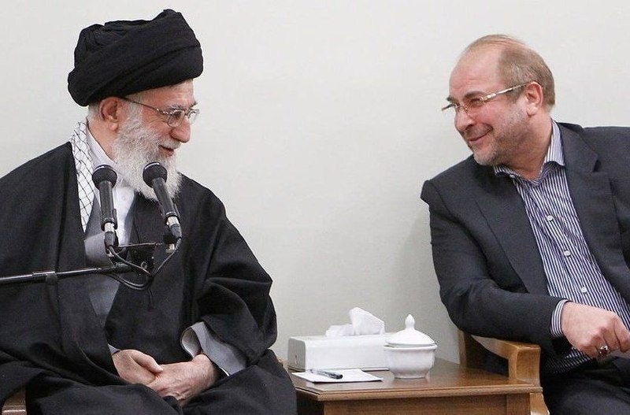

‏+ ای کسکش، بجای انتقام توافق کردی؟
- زیاد حرف بزنی تاریخ دفنتم میندازم عقب.

💧 Rainbet.com the #1 Non-KYC Crypto Casino & Sportsbook @rainbetcom

😁 @Pm_Afshaa

## pm_afshaa — post 93866

  <a href="telegram/content/pm_afshaa_93866_1781436218.mp4" target="_blank">🎬 Download video</a>

🔴حمید رسایی، نماینده مجلس:
اگر میخواید روزی این اجتماعات تموم بشه، باید انتقام خون علی خامنه‌ای رو بگیرید و تنها در صورتی این اتفاق میفته که اسرائیل از رو کره‌ی زمین محو بشه.

💧 Rainbet.com the #1 Non-KYC Crypto Casino & Sportsbook @rainbetcom

😁 @Pm_Afshaa

## pm_afshaa — post 93865

  <a href="telegram/content/pm_afshaa_93865_1781436220.mp4" target="_blank">🎬 Download video</a>

🔴حمله اسرائیل به جنوب بیروت :

💧 Rainbet.com the #1 Non-KYC Crypto Casino & Sportsbook @rainbetcom

😁 @Pm_Afshaa

## Shin_Persian — post 7042

  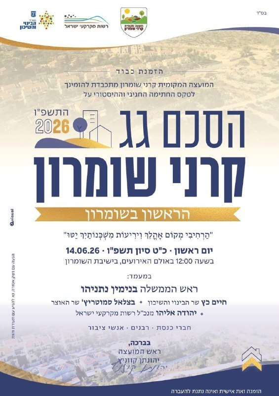

Shin ✓ @hey_itsmyturn
Sun, 14 Jun 2026 11:18:59 UTC

PM @netanyahu cancels his attendance to the Karnii Shomron's housing development event minutes before the event.

(Per Amit Segal)

ترجمه خودکار فارسی

بنیامین نتانیاهو (@netanyahu)، نخست‌وزیر، حضور خود در مراسم توسعه مسکن کارنی شومرون را دقایقی پیش از آغاز مراسم لغو کرد.

(به نقل از آمیت سگال)

𝕏 · @shin_persian

## Shin_Persian — post 7041

Shin ✓ @hey_itsmyturn
Sun, 14 Jun 2026 11:13:46 UTC

There are casualties in the target site.

ترجمه خودکار فارسی

تلفاتی در محل هدف وجود دارد.

𝕏 · @shin_persian

## FarsiVOA — post 220665

🔺بریتانیا ممنوعیت شبکه‌های اجتماعی را برای زیر شانزده ‌سال‌ اعلام می‌کند

▪️دولت بریتانیا قرار است این هفته محدودیت‌های تازه برای استفاده کودکان و نوجوانان از شبکه‌های اجتماعی را اعلام کند.

▪️طرحی که بر اساس گزارش بلومبرگ و ساندی تایمز، شامل ممنوعیت استفاده افراد زیر ۱۶ سال از برخی پلتفرم‌های پرخطر و محدودیت زمانی برای نوجوانان بزرگ‌تر خواهد بود.

▪️قرار است جزئیات محدودیت‌ها توسط کی‌یر استارمر، نخست‌وزیر بریتانیا، اعلام شود.

▪️بر اساس گزارش ساندی تایمز، در این طرح حداقل سن استفاده از پلتفرم‌هایی مانند تیک‌تاک، اسنپ‌چت، یوتیوب، ردیت و اینستاگرام به ۱۶ سال افزایش می‌یابد.

▪️همچنین نوجوانان ۱۶ و ۱۷ ساله با محدودیت استفاده روزانه و منع استفاده شبانه روبه‌رو خواهند شد.

⬇️ بیشتر بخوانید:
https://ir.voanews.com/a/8160654.html

## Persian_Trend_Official — post 17034

  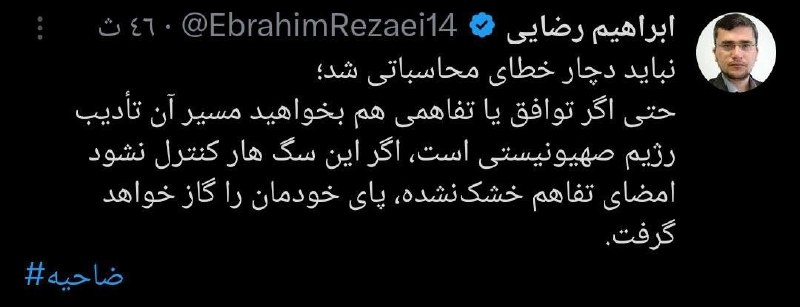

سخنگوی کمیسیون امنیت ملی: نباید دچار خطای محاسباتی شد.

حتی اگر توافق با تفاهمی هم بخواهید مسیر آن تأدیب رژیم صهیونی است. اگر سگ هار کنترل نشود، امضای تفاهم خشک نشده، پای خودمان را گاز خواهد گرفت.

📝 Amir

📌 @persian_trend_official
پرشین ترند | متفاوت‌ترین کانال نظامی

## Persian_Trend_Official — post 17033

حمله به ضاحیه تا به این لحظه 1 کشته و 4 زخمی بر جای گذاشته است.

📝 Amir

📌 @persian_trend_official
پرشین ترند | متفاوت‌ترین کانال نظامی

## RadioFarda — post 158287

🔸مرکز منتهن در نیویورک شامگاه شنبه صحنه شادی خشونت‌آمیز هواداران تیم بسکتبال نیویورک نیکس پس از قهرمانی این تیم در فینال NBA بود.

🔸به گزارش رویترز با نزدیک شدن به شب، صدها نفر از هواداران نیویورک نیکس که بیشتر آن‌ها جوان بودند، پس از انتقال هواداران فوتبال از اولین بازی جام جهانی در منطقه نیویورک سیتی بین برزیل و مراکش که با تساوی به پایان رسید، به کاروانی متشکل از حدود ۱۵ اتوبوس در میدان تایمز هجوم آوردند.

🔸در این فضای خشونت‌آمیز یک اتوبوس‌ زرد مدرسه که برای کمک به حمل و نقل هواداران فوتبال در نظر گرفته شد بود، به آتش کشیده شد و حداقل سه اتوبوس شاتل دیگر هم به شدت آسیب دیدند.

🔸به گفته یک افسر پلیس نیویورک در جریان خشونت‌های نیویورک یک جوان ۱۷ ساله در میدان تایمز از ناحیه پا مورد اصابت گلوله قرار گرفت. در این ارتباط سه نفر بازداشت شدند.

🔸نیویورک نیکس از سال ۱۹۷۳ تاکنون عنوانی کسب نکرده است و این تنها سومین حضور آنها در فینال پس از شکست در سال‌های ۱۹۹۴ و ۱۹۹۹ مقابل هیوستون راکتس و سن آنتونیو اسپرز بود که شنبه شب آنها را شکست دادند.

@RadioFarda

## idfinfarsi — post 11843

  <a href="telegram/content/idfinfarsi_11843_1781436223.mp4" target="_blank">🎬 Download video</a>

⭕️ در یک حمله دقیق در ضاحیه بیروت: ارتش اسرائیل مقر سازمان تروریستی حزب‌الله را هدف قرار داد

ارتش اسرائیل مدتی پیش مقر سازمان تروریستی حزب‌الله را در بیروت مورد حمله قرار داد.

🔸مقر هدف قرارگرفته توسط تروریست‌های سازمان تروریستی حزب‌الله برای پیشبرد طرح‌های تروریستی علیه شهروندان کشور اسرائیل و نیروهای ارتش اسرائیل در حال فعالیت در جنوب لبنان مورد استفاده قرار می‌گرفت.

🔸این حمله پس از آن انجام شد که پیش‌تر امروز (یکشنبه)، سازمان تروریستی حزب‌الله پرتابه هایی را به سمت حریم کشور اسرائیل پرتاب کرد.

🔸سازمان تروریستی حزب‌الله به تلاش برای پیشبرد طرح‌های تروریستی علیه شهروندان کشور اسرائیل و نیروهای ارتش اسرائیل ادامه می‌دهد.

🔸ارتش اسرائیل به فعالیت خود برای رفع هرگونه تهدید علیه کشور اسرائیل و نیروهای ارتش اسرائیل، مطابق با دستورالعمل‌های رده سیاسی ادامه خواهد داد.

## Hranews — post 113599

یک زندانی در زندان رودان اعدام شد

❗️
❗️
❗️
❗️
❗️– سحرگاه امروز یکشنبه ۲۴ خردادماه، حکم یک زندانی که پیشتر از بابت اتهامات مرتبط با جرائم مواد مخدر به #اعدام محکوم شده بود، در زندان رودان اجرا شد.

ادامه مطلب

#علی‌بخش_رئیسی

↘️
@hranews_bot تماس ✉️ -  @Hranews  کانال هرانا 🆑

## alonews — post 127851

  <a href="telegram/content/alonews_127851_1781436225.webm" target="_blank">🎬 Download video</a>

👈سخنگوی آتش نشانی تهران: دود مشاهده در قسمت شمالی شهر تهران، مربوط به حریق فضای سبز در محدوده ولنجک است.

✅ @AloNews خبر جنگ

## alonews — post 127850

  <a href="telegram/content/alonews_127850_1781436226.webm" target="_blank">🎬 Download video</a>

👈کانال ۱۲ اسرائیل: هدف حمله هوایی در ضاحیه جنوبی، فرمانده ارشد در سیستم ارتباطات حزب‌الله بود

✅ @AloNews خبر جنگ

## alonews — post 127849

  <a href="telegram/content/alonews_127849_1781436226.webm" target="_blank">🎬 Download video</a>

👈ارتش اسرائیل: مرکز فرماندهی حزب‌الله تو ضاحیه بیروت رو زدیم

✅ @AloNews خبر جنگ

---
📅 بروزرسانی: 1405/03/24 14:43
---

## WithYashar — post 14783

رسانه های اسرائیلی از اماده باش کامل ارتش اسرائیل برای حمله احتمالی ایران خبر می‌دهند.
@withyashar

## WithYashar — post 14782

بیانیه نتانیاهو و کاتس: ارتش اسرائیل اهدافی متعلق به حزب‌الله در ضاحیه جنوبی را هدف حمله قرار داد

زیرساخت‌های حزب‌الله در ضاحیه جنوبی را با دقت هدف قرار دادیم
@withyashar

## WithYashar — post 14781

شبکه ۱۴ اسرائیل : ما جشن تولد ترامپ رو امروز تو بیروت جشن گرفتیم!
@withyashar

## mwarmonitor — post 10859

🔴«ارتش اسرائیل: دقایقی پیش یک مقر متعلق به سازمان تروریستی حزب‌الله را در بیروت هدف قرار دادیم. این مقر برای پیشبرد طرح‌های تروریستی علیه شهروندان دولت اسرائیل و نیروهای ارتش اسرائیل که در جنوب لبنان فعالیت می‌کنند، مورد استفاده عناصر حزب‌الله قرار می‌گرفت.…

## pm_afshaa — post 93864

🔴رسانه های اسرائیلی از اماده باش کامل ارتش اسرائیل برای حمله احتمالی ایران خبر می‌دهن

💧 Rainbet.com the #1 Non-KYC Crypto Casino & Sportsbook @rainbetcom

😁 @Pm_Afshaa

## IranIntlTV — post 342246

  <a href="telegram/content/IranIntlTV_342246_1781435619.mp4" target="_blank">🎬 Download video</a>

تیم فوتبال ایران برای نخستین دیدار خود در جام جهانی ۲۰۲۶، امشب، یکشنبه ۲۴ خرداد، تیخوانا را به مقصد لس‌آنجلس ترک می‌کند. مزدک میرزایی، عضو تحریریه ورزشی ایران‌اینترنشنال، می‌گوید نتایج خوب تیم‌های آسیایی در این رقابت‌ها سطح انتظارات از عملکرد تیم ایران را افزایش داده است.
@iranintltv

## Shin_Persian — post 7040

  <a href="telegram/content/Shin_Persian_7040_1781435621.mp4" target="_blank">🎬 Download video</a>

Emanuel (Mannie) Fabian ✓ @manniefabian
Sun, 14 Jun 2026 10:59:13 UTC

The IDF publishes footage of its airstrike on a Hezbollah headquarters in Beirut a short while ago.

The military says the site was used by Hezbollah to advance attacks on Israeli civilians and IDF troops operating in southern Lebanon.

"The strike was carried out after earlier today, the Hezbollah terror organization launched aerial targets toward the territory of the State of Israel," the IDF says, referring to three drones that exploded in military zones in northern Israel.

ترجمه خودکار فارسی در بخش نظرات

𝕏 · @shin_persian

## IranianMinds — post 22546

  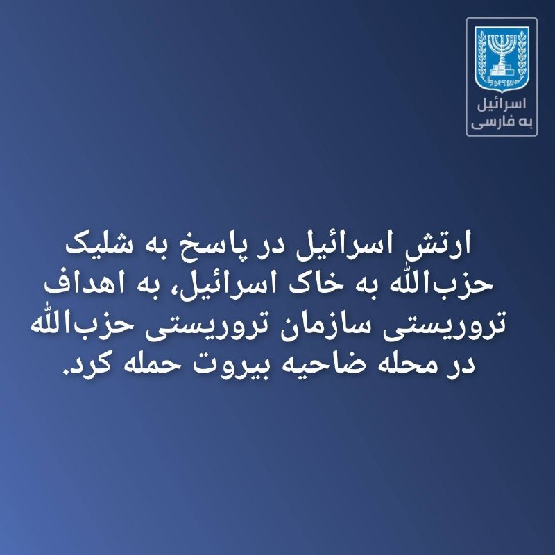

🔴طبق دستور نخست‌وزیر نتانیاهو و اسرائیل کاتز وزیر دفاع، ارتش اسرائیل اکنون در پاسخ به شلیک حزب‌الله به خاک اسرائیل، به اهداف تروریستی حزب‌الله در محل ضاحیه حمله کرده است.
اسرائیل شلیک به خاک خود را تحمل نخواهد کرد.

@IranianMinds

## BBCPersian — post 283789

🔻امیر قلعه‌نویی؛ مردی که همیشه برمی‌گردد

🖌امیر عطایی, روزنامه‌نگار

امیر قلعه‌نویی مرداد ۱۴۰۱، پس از شکست تیمش مقابل استقلال در نیمه‌نهایی جام حذفی، جمله‌ای را مقابل دوربین صداوسیما به زبان آورد که کمتر کسی انتظار شنیدنش را از یکی از شناخته‌شده‌ترین چهره‌های فوتبال ایران داشت: «در این چهل سال فقط ظلم بوده و ظلم بوده و ظلم.»

https://bbc.in/4fLtU8U
@BBCPersian

## BBCPersian — post 283788

روز شنبه ۲۳ خرداد گروهی از ایرانیان در واشنگتن‌دی‌سی تجمع کردند.

این تجمع برای بیست و سومین شنبه متوالی، هم‌زمان با نزدیکی دویست و پنجاهمین سالگرد تاسیس آمریکا و حواشی جام جهانی برگزار شد.

معترضان خواستار تغییر رژیم در ایران، آزادی زندانیان سیاسی و توقف احکام اعدام شدند.

@BBCPersian

## Dirty_Kids — post 392002

  <a href="telegram/content/Dirty_Kids_392002_1781435622.mp4" target="_blank">🎬 Download video</a>

🔴 پزشکیان تو مراسم امین ایران : رسول خدا و اصحابش، رفتن تو جنگ لت و پار شدن😂😂😂

@Dirty_Kids 👻

## Dirty_Kids — post 391999

  <a href="telegram/content/Dirty_Kids_391999_1781435623.mp4" target="_blank">🎬 Download video</a>

🔴فوری؛ اسرائیل و سربازان گمنام حضرت موسی دوباره به بیروت حمله کردن

@Dirty_Kids 👻

## Dirty_Kids — post 391998

  <a href="telegram/content/Dirty_Kids_391998_1781435624.mp4" target="_blank">🎬 Download video</a>

بازی سوئیس و قطر بود،
اما ما ایرانی‌ها هرجا باشیم، پرچم‌
قشنگ‌مون رو به رخ همه می‌کشیم. 😍

@Dirty_Kids 👻

## alonews — post 127848

  <a href="telegram/content/alonews_127848_1781435626.webm" target="_blank">🎬 Download video</a>

👈بیانیه نتانیاهو و کاتس: ارتش اسرائیل اهدافی متعلق به حزب‌الله در ضاحیه جنوبی را هدف حمله قرار داد

🔴زیرساخت‌های حزب‌الله در ضاحیه جنوبی را با دقت هدف قرار دادیم

✅ @AloNews خبر جنگ

## alonews — post 127847

  <a href="telegram/content/alonews_127847_1781435626.webm" target="_blank">🎬 Download video</a>

👈رسانه های اسرائیلی از اماده باش کامل ارتش اسرائیل برای حمله احتمالی ایران خبر می‌دهند.

✅ @AloNews خبر جنگ

## alonews — post 127846

  <a href="telegram/content/alonews_127846_1781435626.webm" target="_blank">🎬 Download video</a>

👈 شبکه ۱۴ اسرائیل : ما جشن تولد ترامپ رو امروز تو بیروت جشن گرفتیم!

✅ @AloNews خبر جنگ

---
📅 بروزرسانی: 1405/03/24 14:33
---

## VahidOOnLine — post 245456

  <a href="telegram/content/VahidOOnLine_245456_1781435026.mp4" target="_blank">🎬 Download video</a>

ویدیوهای رسیده به ایران‌اینترنشنال نشان می‌دهند ایرانیان مقیم یونان شنبه ۲۳ خرداد با فراخوان شاهزاده رضا پهلوی و علیه جمهوری اسلامی در آتن تجمع کرده و نام جاویدنامان انقلاب ملی را فریاد زدند.
‌🏁 🇬🇧 IranintlTV

🤖 @VahidOOnLine

## WithYashar — post 14780

پنج ساختمان در بیروت مورد حمله هدفمند قرار گرفته اند!
@withyashar 🚨

## WithYashar — post 14779

کانال ۱۲ اسرائیل: هدف در حمله به ضاحیه جنوبی نعیم قاسم بوده است
@withyashar

## WithYashar — post 14778

اتاق جنگ با یاشار : سفت بگو یا موسییییییییی @withyashar

## WithYashar — post 14777

ارتش اسرائیل: حزب‌الله با نقض آتش‌بس، سه موشک به سمت شهرهای شمالی اسرائیل شلیک کرد و ما در پاسخ به بیروت حمله کردیم
@withyashar

## WithYashar — post 14776

  <a href="telegram/content/WithYashar_14776_1781435029.mp4" target="_blank">🎬 Download video</a>

حمله اسرائیل به بیروت 🚨🚨🚨
@withyashar

## mwarmonitor — post 10858

  <a href="telegram/content/mwarmonitor_10858_1781435030.mp4" target="_blank">🎬 Download video</a>

🔴خبر فوری 🔸اسرائیل در نهایت دوباره به جنوب بیروت حمله کرد @mwarmonitor

## mwarmonitor — post 10857

📝با توجه به آخرین بیانیه صادرشده از سوی قرارگاه خاتم‌ مبنی بر اینکه هدف قرار دادن ضاحیهٔ جنوبی بیروت خط قرمز ایران محسوب می‌شود، انتظار می‌رود جمهوری اسلامی حمله‌ای علیه اسرائیل انجام دهد.»

@mwarmonitor

## mwarmonitor — post 10856

🔴خبر فوری 🔸اسرائیل در نهایت دوباره به جنوب بیروت حمله کرد @mwarmonitor

## FoxNewsTwitter — post 342951

  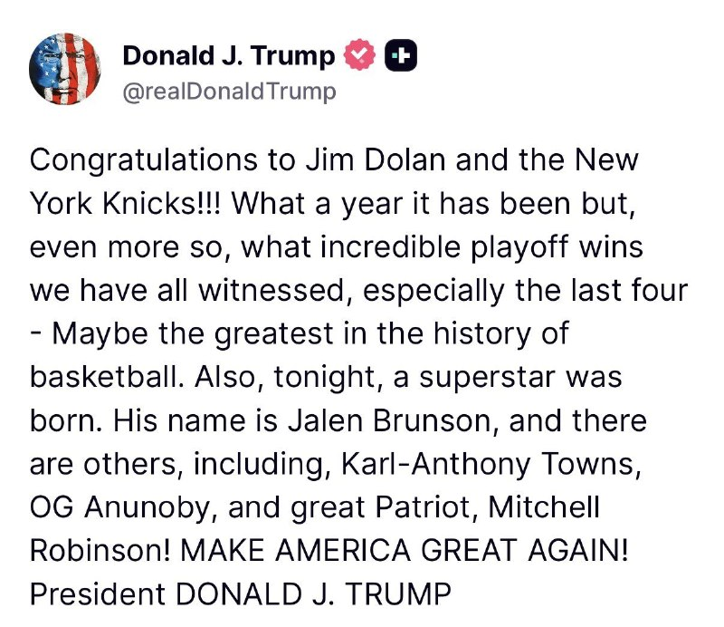

Fox News (Twitter/X)

President Trump sends a celebratory message to the New York Knicks after they won their first NBA Finals title in 53 years.

A longtime Knicks fan, Trump became the first sitting president to attend an NBA Finals game when he sat alongside team owner James Dolan at Game 3 of the series, as New York finished off the San Antonio Spurs in five games to clinch the championship.

## pm_afshaa — post 93863

🔴کانال 12 اسرائیل به نقل از یک مقام امنیتی: این بار، ما حتی پرتاب یک موشک از ایران به خاک اسرائیل را تحمل نخواهیم کرد

💧 Rainbet.com the #1 Non-KYC Crypto Casino & Sportsbook @rainbetcom

😁 @Pm_Afshaa

## pm_afshaa — post 93862

فرماندهی حزب الله در ضایحه بیروت مورد حمله قرار گفت 
💧 Rainbet.com the #1 Non-KYC Crypto Casino & Sportsbook @rainbetcom 
😁 @Pm_Afshaa

## pm_afshaa — post 93861

منابع عبری از ترور شیخ نعیم قاسم اطلاع میدن

💧 Rainbet.com the #1 Non-KYC Crypto Casino & Sportsbook @rainbetcom

😁 @Pm_Afshaa

## pm_afshaa — post 93860

بزنامه هاتونو کنسل کنین بی بی کیرشو میکنه تو پلناتون
😂

## pm_afshaa — post 93859

⭕️در اقدامی بی سابقه،دقایقی پیش ارتش اسرائیل به ساکنان 45 شهر و روستا در جنوب لبنان به صورت همزمان هشدار داد هرچه سریع‌تر مناطق خود را ترک کنن

💧 Rainbet.com the #1 Non-KYC Crypto Casino & Sportsbook @rainbetcom

😁 @Pm_Afshaa

## pm_afshaa — post 93858

♨️
♨️
♨️
♨️

## IranIntlTV — post 342245

  <a href="telegram/content/IranIntlTV_342245_1781435032.mp4" target="_blank">🎬 Download video</a>

ویدیوهای رسیده به ایران‌اینترنشنال نشان می‌دهند ایرانیان مقیم یونان شنبه ۲۳ خرداد با فراخوان شاهزاده رضا پهلوی و علیه جمهوری اسلامی در آتن تجمع کرده و نام جاویدنامان انقلاب ملی را فریاد زدند.

## Shin_Persian — post 7039

↩️ Quoted tweet: Commentator @News1Commentary Sun, 14 Jun 2026 11:00:15 UTC @hey_itsmyturn What if Iran attacks ↩️ توییت نقل‌قول شده — برای پاسخ، پست زیر را ببینید. ترجمه خودکار فارسی @hey_itsmyturn چه می‌شود اگر ایران حمله کند؟ 𝕏 · @shin_persian

## Shin_Persian — post 7038

↩️ Quoted tweet:
Commentator @News1Commentary
Sun, 14 Jun 2026 11:00:15 UTC

@hey_itsmyturn What if Iran attacks

↩️ توییت نقل‌قول شده — برای پاسخ، پست زیر را ببینید.

ترجمه خودکار فارسی

@hey_itsmyturn چه می‌شود اگر ایران حمله کند؟

𝕏 · @shin_persian

## Shin_Persian — post 7037

Shin ✓ @hey_itsmyturn
Sun, 14 Jun 2026 11:00:01 UTC

Seems like a senior Hezballah member was targeted in Dahieh, southern Beirut.

ترجمه خودکار فارسی

به نظر می‌رسد یک عضو ارشد حزب‌الله در ضاحیه در جنوب بیروت هدف قرار گرفته است.

𝕏 · @shin_persian

## Shin_Persian — post 7035

  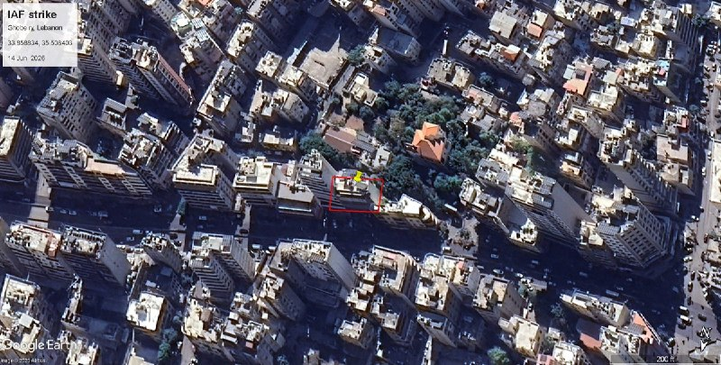

🔁 Quoting above tweet:
DPR @D_3141592_R
Sun, 14 Jun 2026 10:55:05 UTC

محل حمله امروز نیروی هوایی اسرائیل به ساختمانی در ضاحیه بیروت

Location: 33.858834, 35.508403

https://maps.app.goo.gl/eUYtxdVV2tcvFLQ19

English

Location of today's Israeli Air Force (IAF) attack on a building in the Dahiyeh of Beirut

Location: 33.858834, 35.508403

https://maps.app.goo.gl/eUYtxdVV2tcvFLQ19

𝕏 · @shin_persian

## Shin_Persian — post 7033

↩️ Quoted tweet:
Shin ✓ @hey_itsmyturn
Sun, 14 Jun 2026 10:42:51 UTC

More from Dahieh, Southern Beirut
Lebanon

↩️ توییت نقل‌قول شده — برای پاسخ، پست زیر را ببینید.

ترجمه خودکار فارسی

جزئیات بیشتر از ضاحیه، جنوب بیروت
لبنان

𝕏 · @shin_persian

## Shin_Persian — post 7032

Shin ✓ @hey_itsmyturn
Sun, 14 Jun 2026 10:53:01 UTC

I doubt these strikes do any good or bad on the deal, JD and Araghchi already got their virtual motel room. https://x.com/ManageYourIm/status/2066109977295512007

ترجمه خودکار فارسی

شک دارم این حملات سود یا ضرری برای توافق داشته باشند، جی‌دی و عراقچی همین حالا هم اتاق هتل مجازی خود را گرفته‌اند. https://x.com/ManageYourIm/status/2066109977295512007

𝕏 · @shin_persian

## Persian_Trend_Official — post 17032

  <a href="telegram/content/Persian_Trend_Official_17032_1781435034.mp4" target="_blank">🎬 Download video</a>

سخنگوی ارتش اسرائیل: در یک حمله دقیق در ضاحیه، بیروت ارتش اسرائیل به مقر سازمان تروریستی حزب الله حمله کرد.

ارتش اسرائیل اخیراً به مقر سازمان تروریستی حزب الله در بیروت حمله کرد. مقر مورد حمله توسط تروریست‌های سازمان تروریستی حزب الله برای پیشبرد توطئه‌های تروریستی علیه شهروندان کشور اسرائیل و نیروهای ارتش اسرائیل که در جنوب لبنان فعالیت می‌کنند، استفاده می‌شد.

این حمله پس از آن انجام شد که اوایل امروز (یکشنبه)، سازمان تروریستی حزب الله اهداف هوایی را به سمت خاک کشور اسرائیل شلیک کرد. سازمان تروریستی حزب الله همچنان به پیشبرد توطئه‌های تروریستی علیه شهروندان کشور اسرائیل و نیروهای ارتش اسرائیل ادامه می‌دهد.

ارتش اسرائیل به اقدامات خود برای از بین بردن هرگونه تهدیدی علیه کشور اسرائیل و نیروهای ارتش اسرائیل و مطابق با دستورالعمل‌های رده سیاسی ادامه خواهد داد.

📝 Amir

📌 @persian_trend_official
پرشین ترند | متفاوت‌ترین کانال نظامی

## Persian_Trend_Official — post 17031

  <a href="telegram/content/Persian_Trend_Official_17031_1781435037.webm" target="_blank">🎬 Download video</a>

کانال 12 اسرائیل: این بار، ما حتی پرتاب یک موشک از ایران به خاک اسرائیل را تحمل نخواهیم کرد.

اگر چنین اتفاقی بیفتد، اسرائیل آماده است تا یک حمله نظامی گسترده و خردکننده علیه زیرساخت‌های نظامی و اقتصادی ایران انجام دهد.

📝 Amir

📌 @persian_trend_official
پرشین ترند | متفاوت‌ترین کانال نظامی

## Persian_Trend_Official — post 17030

  <a href="telegram/content/Persian_Trend_Official_17030_1781435037.mp4" target="_blank">🎬 Download video</a>

حزب‌الله لبنان ویدیویی از عملیات پهپادی امروز خود در شمال اسرائیل منتشر کرد.

حداقل یکی از دو پهپاد پرتاب شده به سمت شمال اسرائیل به هدف خود اصابت کرد.

📝 Amir

📌 @persian_trend_official
پرشین ترند | متفاوت‌ترین کانال نظامی

## BBCPersian — post 283787

🔻حمله سایبری به چند بانک در ایران؛ برخی خدمات برقرار شده اما اختلال ادامه دارد

شرکت ملی انفورماتیک اعلام کرد اختلال در خدمات بانک ملی که ازدیروز آغاز شده همچنان ادامه دارد اما برخی خدمات برقرار شده‌اند.

شورای هماهنگی بانک‌ها دیروز اختلال در ارائه خدمات بانک‌های ملی، تجارت، صادرات و توسعه صادرات را به یک «حمله سایبری محدود» نسبت داد اما به منشا اشاره‌ای نکرد.

به گفته شورای هماهنگی بانک‌ها بررسی‌های فنی نشان می‌دهد که «هیچ‌گونه دسترسی غیرمجاز به اطلاعات مشتریان و هیچ موردی از نشت اطلاعات» رخ نداده است.

این اختلال در بخش‌های مختلف، از جمله «موبایل‌بانک، اینترنت‌بانک، خودپردازها، پایانه‌های فروش (کارتخوان) و برخی خدمات کارتی» ایجاد شده بود.

به گفته شرکت ملی انفورماتیک در حال حاضر مشکل خدمات بانکی در بانک‌های تجارت و صادرات رفع شده و در بانک توسعه صادرات سرویس‌های ضروری حضوری به مشتریان ارائه می‌شود.

این شرکت گفته است که پیگیری‌ها برای رفع این مشکل در بانک ملی ادامه دارد.

https://bbc.in/4fEONCy
@BBCPersian

## alonews — post 127845

🔴فوری / کانال 12 اسرائیل به نقل از یک مقام امنیتی: این بار، ما حتی پرتاب یک موشک از ایران به خاک اسرائیل را تحمل نخواهیم کرد.

🔴اگر چنین اتفاقی بیفتد، اسرائیل آماده است تا یک حمله نظامی گسترده و خردکننده علیه زیرساخت‌های نظامی و اقتصادی ایران انجام دهد

✅ @AloNews خبر جنگ

## alonews — post 127844

  <a href="telegram/content/alonews_127844_1781435039.mp4" target="_blank">🎬 Download video</a>

👈ارتش اسرائیل ویدیو‌یی از حمله‌ِ به ضاحیه بیروت منتشر کرد

✅ @AloNews خبر جنگ

## alonews — post 127843

  <a href="telegram/content/alonews_127843_1781435040.webm" target="_blank">🎬 Download video</a>

👈خسارات وارده به ضاحیه بعد از حمله اسرائیل

✅ @AloNews خبر جنگ

## alonews — post 127842

  <a href="telegram/content/alonews_127842_1781435040.webm" target="_blank">🎬 Download video</a>

🔴فوری / کانال ۱۲ اسرائیل: هدف در حمله به ضاحیه جنوبی نعیم قاسم بوده است

✅ @AloNews خبر جنگ

---
📅 بروزرسانی: 1405/03/24 14:24
---

## VahidOOnLine — post 245455

  <a href="telegram/content/VahidOOnLine_245455_1781434445.mp4" target="_blank">🎬 Download video</a>

ویدیوهای رسیده به ایران‌اینترنشنال حاکی است گروهی از رانندگان پیک‌های موتوری شرکت «اسنپ» در شیراز، روز یکشنبه ۲۴ خرداد در اعتراض به کمیسیون بالا، مالیات سنگین، کرایه کم، حذف سهمیه سوخت و نداشتن بیمه اعتصاب کردند.
‌🏁 🇬🇧 IranintlTV

🤖 @VahidOOnLine

## VahidOOnLine — post 245454

  

دفتر بنیامین نتانیاهو، نخست‌وزیر اسرائیل، و یسرائیل کاتز، وزیر دفاع اسرائیل، اعلام کردند ارتش این کشور در پاسخ به شلیک پرتابه از سوی حزب‌الله به خاک اسرائیل، اهدافی را در منطقه ضاحیه بیروت هدف قرار داده است.

در بیانیه مشترک نتانیاهو و کاتز آمده است که این حمله در واکنش به شلیک پرتابه از لبنان انجام شده است.

مقام‌های اسرائیلی همچنین افزودند که اسرائیل شلیک به خاک خود را تحمل نخواهد کرد.

این حمله پس از آن انجام شد که ارتش اسرائیل اعلام کرد حزب‌الله یکشنبه ۲۴ خرداد سه پرتابه به سوی شهرهای شمال اسرائیل شلیک و آتش‌بس را نقض کرد.

پیش‌تر مقام‌های جمهوری اسلامی اعلام کرده بودند در صورت حمله اسرائیل به جنوب لبنان و به طور خاص، بیروت، حملات تلافی‌جویانه علیه اسرائیل انجام خواهند داد.
iranintl
‌🏁 🇬🇧 IranintlTV

🤖 @VahidOOnLine

## VahidOOnLine — post 245453

  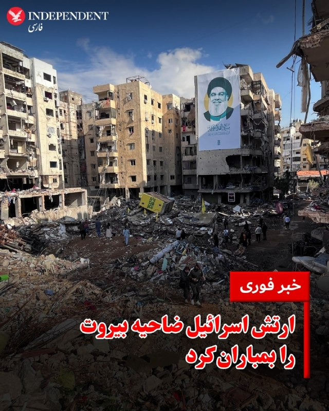

♦️ارتش اسرائیل روز یکشنبه ۲۴ خرداد بار دیگر منطقه شیعه‌نشین ضاحیه در حومه بیروت را بمباران کرد.

این بمباران همزمان با تشدید تلاش‌های دیپلماتیک برای پایان دادن به جنگ و در روزی انجام شد که دونالد ترامپ اعلام کرده بوبود قرار است توافق پایان جنگ میان ایران و آمریکا امضاء شود.

جمهوری اسلامی ایران هفته پیش و پس از بمباران این منطقه چند موشک به سوی اسرائیل شلیک کرد و اسرائیل هم در پاسخ، مناطقی در غرب، مرکز و همچنین پایتخت ایران را بمباران کرد.
‌🇸🇦 Indypersian

🤖 @VahidOOnLine

## WithYashar — post 14775

بیانیه مشترک نتانیاهو و کاتز:
ارتش اسرائیل اکنون در پاسخ به شلیک حزب‌الله به سمت اراضی اسرائیل، اهداف متعلق به سازمان حزب‌الله را در بیروت مورد حمله قرار می‌دهد. اسرائیل با شلیک به سمت اراضی‌اش مدارا نخواهد کرد.
@withyashar

## mwarmonitor — post 10855

  <a href="telegram/content/mwarmonitor_10855_1781434450.mp4" target="_blank">🎬 Download video</a>

🔴خبر فوری

🔸اسرائیل در نهایت دوباره به جنوب بیروت حمله کرد

@mwarmonitor

## FoxNewsTwitter — post 342947

Fox News (Twitter/X)

Start spreading the news 🎶

The New York Knicks have finally ended their championship drought, capturing their first NBA Finals title in 53 years after another wild comeback in Game 5 to defeat the San Antonio Spurs.

## pm_afshaa — post 93857

فرماندهی حزب الله در ضایحه بیروت مورد حمله قرار گفت 
💧 Rainbet.com the #1 Non-KYC Crypto Casino & Sportsbook @rainbetcom 
😁 @Pm_Afshaa

## pm_afshaa — post 93856

منتظر جواب جمهوری اسلامی باشین

## pm_afshaa — post 93855

فرماندهی حزب الله در ضایحه بیروت مورد حمله قرار گفت 
💧 Rainbet.com the #1 Non-KYC Crypto Casino & Sportsbook @rainbetcom 
😁 @Pm_Afshaa

## pm_afshaa — post 93854

  <a href="telegram/content/pm_afshaa_93854_1781434451.mp4" target="_blank">🎬 Download video</a>

فرماندهی حزب الله در ضایحه بیروت مورد حمله قرار گفت

💧 Rainbet.com the #1 Non-KYC Crypto Casino & Sportsbook @rainbetcom

😁 @Pm_Afshaa

## pm_afshaa — post 93853

🔴نخست‌وزیر و وزیر دفاع اسراییل در بیانیه‌ای مشترک: ارتش اسرائیل اهداف حزب‌الله را در منطقه ضایحه در بیروت هدف قرار داد

💧 Rainbet.com the #1 Non-KYC Crypto Casino & Sportsbook @rainbetcom

😁 @Pm_Afshaa

## kianmeli1 — post 87981

  <a href="telegram/content/kianmeli1_87981_1781434454.mp4" target="_blank">🎬 Download video</a>

🔴حمله سنگین اسراییل به بیروت
https://t.me/kianmeli1

## kianmeli1 — post 87980

‏🔴یک مقام ارشد ایرانی به رویترز گفت که جمهوری اسلامی پذیرفته تا زمان دستیابی به توافق نهایی، وضعیت موجود هسته‌ای را حفظ کند؛ از جمله غنی‌سازی نکردن اورانیوم و گسترش ندادن تاسیسات هسته‌ای

‏در پیش‌نویس تفاهم، آمریکا با رقیق‌سازی ذخایر اورانیوم با غنای بالا در داخل ایران موافقت کرده و سازوکار اجرای این موضوع در ۶۰ روز آینده مورد بحث قرار خواهد گرفت

بر اساس پیش‌نویس تفاهم‌نامه، جمهوری اسلامی بلافاصله تنگه هرمز را به روی همه کشتی‌های تجاری باز خواهد کرد و آمریکا نیز محاصره دریایی را لغو خواهد کرد
https://t.me/kianmeli1

## IranIntlTV — post 342244

  <a href="telegram/content/IranIntlTV_342244_1781434455.mp4" target="_blank">🎬 Download video</a>

ویدیوهای رسیده به ایران‌اینترنشنال حاکی است گروهی از رانندگان پیک‌های موتوری شرکت «اسنپ» در شیراز، روز یکشنبه ۲۴ خرداد در اعتراض به کمیسیون بالا، مالیات سنگین، کرایه کم، حذف سهمیه سوخت و نداشتن بیمه اعتصاب کردند.

## IranIntlTV — post 342243

  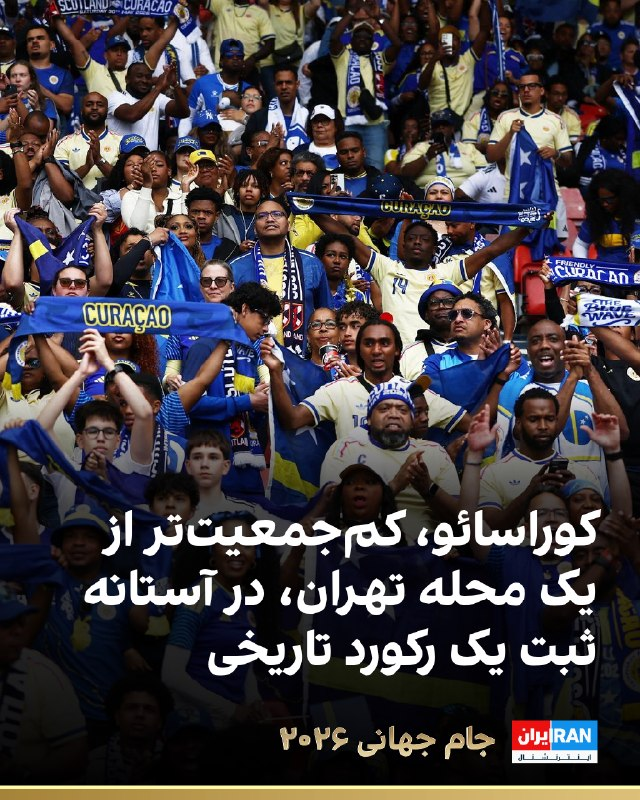

🔻جزیره‌ای کوچک، خیره‌کننده و واقع در دریای کارائیب، با نفوذ گسترده فرهنگ هلندی اما هویتی مستقل و پرغرور؛ کوراسائو تا امروز شاید بیش از هر چیز به خاطر نوشیدنی الکلی مشهورش با همین نام شناخته می‌شد. اما اکنون به کوچک‌ترین کشور تاریخ جام جهانی از نظر وسعت و جمعیت تبدیل شده است.

🔹کوراسائو با جمعیتی حدود ۱۵۸ هزار نفر، حتی از شهرری تهران هم کوچکتر است.حتی جمعیت آن از بیش از ۶۰ شهر و شهرستان ایران کمتر است؛ کمتر از رفسنجان. این کشور حتی یک کشور مستقل کامل هم نیست و بخشی از پادشاهی هلند به شمار می‌رود.

🔹از ۲۶ بازیکن فهرست تیم ملی کوراسائو در جام جهانی ۲۰۲۶، تنها یک نفر یعنی تاهیث چونگ در خود جزیره متولد شده است و ۲۵ بازیکن دیگر در هلند به دنیا آمده‌اند.

🔹کوراسائو در گروه E با آلمان، اکوادور و ساحل عاج هم‌گروه است و یکشنبه‌شب مقابل آلمان به میدان می‌رود.

🔹روایتی از کوراسائو و اولین حضور در جام جهانی را در‌ وب‌سایت ایران اینترنشنال بخوانید.

@iranintltvsport

## IranIntlTV — post 342242

  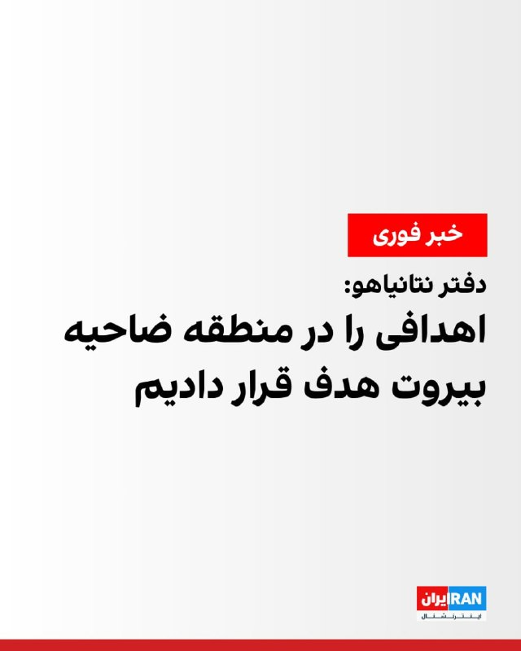

دفتر بنیامین نتانیاهو، نخست‌وزیر اسرائیل، و یسرائیل کاتز، وزیر دفاع اسرائیل، اعلام کردند ارتش این کشور در پاسخ به شلیک پرتابه از سوی حزب‌الله به خاک اسرائیل، اهدافی را در منطقه ضاحیه بیروت هدف قرار داده است.

در بیانیه مشترک نتانیاهو و کاتز آمده است که این حمله در واکنش به شلیک پرتابه از لبنان انجام شده است.

مقام‌های اسرائیلی همچنین افزودند که اسرائیل شلیک به خاک خود را تحمل نخواهد کرد.

این حمله پس از آن انجام شد که ارتش اسرائیل اعلام کرد حزب‌الله یکشنبه ۲۴ خرداد سه پرتابه به سوی شهرهای شمال اسرائیل شلیک و آتش‌بس را نقض کرد.

پیش‌تر مقام‌های جمهوری اسلامی اعلام کرده بودند در صورت حمله اسرائیل به جنوب لبنان و به طور خاص، بیروت، حملات تلافی‌جویانه علیه اسرائیل انجام خواهند داد.
iranintl.com/202606141547

## DW_Farsi — post 125955

  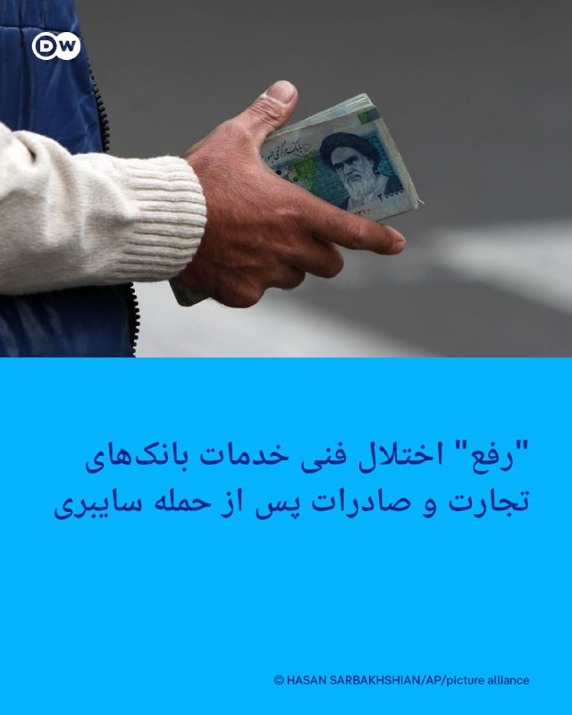

🔶 "رفع" اختلال فنی خدمات بانک‌های تجارت و صادرات پس از حمله سایبری

در پی حمله سایبری به چهار بانک ایران، اسماعیل آریانی، مدیر روابط عمومی "شرکت ملی انفورماتیک"، روز یکشنبه ۲۴ خرداد (۱۴ ژوئن) در گفت‌وگو با خبرگزاری صداوسیما اعلام کرد اختلال فنی در خدمات کارت‌های بانکی بانک‌های تجارت و صادرات "برطرف" شده است و "تمامی تراکنش‌ها با موفقیت در حال انجام است".

او افزود پیگیری‌ها برای رفع مشکل در بانک ملی و بانک توسعه صادرات همچنان در حال انجام است و در این مدت مشتریان بانک توسعه صادرات می‌توانند به صورت حضوری و با مراجعه به شعب این بانک، خدمات ضروری بانکی را دریافت کنند.

بانک‌های ملی، تجارت، صادرات و توسعه صادرات روز شنبه هدف حملات سایبری قرار گرفتند و خدمات رسانی به مشتریان از طریق همراه بانک و برخی عابربانک‌ها دچار اختلال شد.

شورای هماهنگی بانک‌ها شامگاه شنبه در بیانیه‌ای، حمله سایبری به این بانک‌ها را تأیید کرده و آن را "محدود" خواند. در این بیانیه ادعا شده بود که "هیچ‌گونه دسترسی غیرمجاز به اطلاعات مشتریان و هیچ موردی از نشت اطلاعات رخ نداده است".

@dw_farsi

## DW_Farsi — post 125954

🎥 شعارهای تند علیه قالیباف و عراقچی در تهران و مشهد و قم

شامگاه شنبه در تجمعاتی در تهران و مشهد شعارهای تندی علیه رئیس هیئت مذاکره‌کننده و وزیر خارجه جمهوری اسلامی سر داده شد. این افراد "جمعیت سازماندهی‌شده جریان جلیلی، پایداری و بقایای دولت مرحوم رئیسی" توصیف شده است.
@dw_farsi

## Persian_Trend_Official — post 17029

  <a href="telegram/content/Persian_Trend_Official_17029_1781434461.webm" target="_blank">🎬 Download video</a>

تصاویری بیشتر از بمباران ضاحیه بیروت توسط نیروی هوایی ارتش اسرائیل 📝 Amir 📌 @persian_trend_official پرشین ترند | متفاوت‌ترین کانال نظامی

## Persian_Trend_Official — post 17023

  <a href="telegram/content/Persian_Trend_Official_17023_1781434462.webm" target="_blank">🎬 Download video</a>

منابع عبری می گویند یکی از ستاد های فرماندهی حزب الله مورد هدف قرار گرفت، آنها ادعا می کنند این حمله در ذیل سایه آرامشی که ایران برای حزب الله در معادله ضاحیه ایجاد کرده بود، اتفاق افتاده است.

## Persian_Trend_Official — post 17022

  <a href="telegram/content/Persian_Trend_Official_17022_1781434463.mp4" target="_blank">🎬 Download video</a>

حمله اسرائیل به ضاحیه

## Persian_Trend_Official — post 17019

  <a href="telegram/content/Persian_Trend_Official_17019_1781434465.mp4" target="_blank">🎬 Download video</a>

تصاویری بیشتر از بمباران ضاحیه بیروت توسط نیروی هوایی ارتش اسرائیل

📝 Amir

📌 @persian_trend_official
پرشین ترند | متفاوت‌ترین کانال نظامی

## IranianMinds — post 22545

  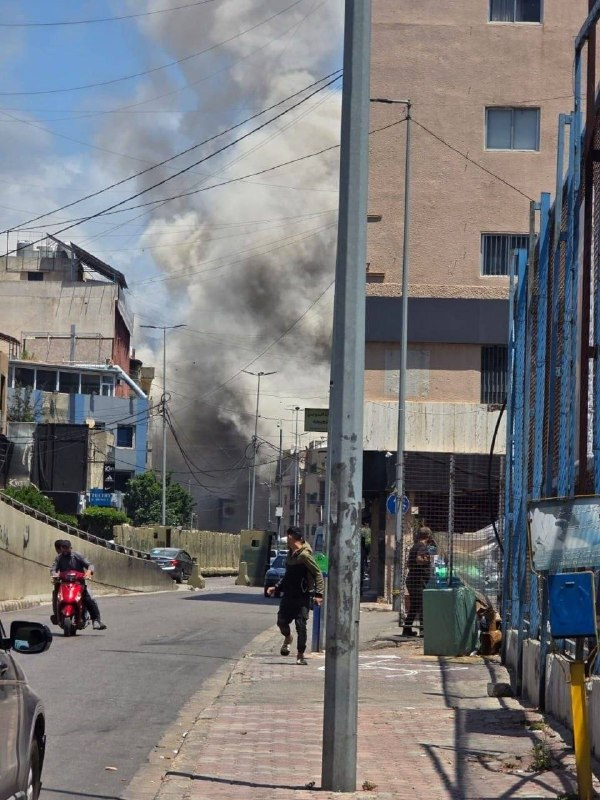

🔴حملات اسرائیل به ضاحیه.

@IranianMinds

## alonews — post 127841

  <a href="telegram/content/alonews_127841_1781434467.webm" target="_blank">🎬 Download video</a>

🔴فوری / کانال ۱۲ عبری: اهمیت این حمله در لبنان این است که ایران قبلاً تهدید کرده بود به هر حمله اسرائیل به بیروت پاسخ خواهد داد

✅ @AloNews خبر جنگ

## alonews — post 127840

  <a href="telegram/content/alonews_127840_1781434467.webm" target="_blank">🎬 Download video</a>

👈 ضاحیه بیروت هم اکنون

✅ @AloNews خبر جنگ

## alonews — post 127839

  <a href="telegram/content/alonews_127839_1781434468.mp4" target="_blank">🎬 Download video</a>

👈فیلمی از محل حمله اسرائیل به ضاحیه

✅ @AloNews خبر جنگ

---
📅 بروزرسانی: 1405/03/24 14:14
---

## VahidOOnLine — post 245452

♦️خبرگزاری فارس، وابسته به سپاه پاسداران روز یکشنبه ۲۴ خردادماه ویدیویی جدید از لحظه حمله به پل بی‌۱ در روز ۱۳ فروردین ماه را منتشر کرد.

در این ویدیو آشفتگی و سراسیمگی مردمی سوار بر خودرو همزمان با بمباران این پل دیده می‌شود.

در جریان حمله هوایی آمریکا به این پل ۸ نفر کشته و نزدیک به ۱۰۰ نفر زخمی شدند.

دونالد ترامپ، ریس جمهوری آمریکا پس از دو حمله به این پل اعلام کرده بود بزرگ‌ترین پل ایران فروریخته است و دیگر قابل استفاده نخواهد بود.
‌🇸🇦 Indypersian

🤖 @VahidOOnLine

## VahidOOnLine — post 245451

  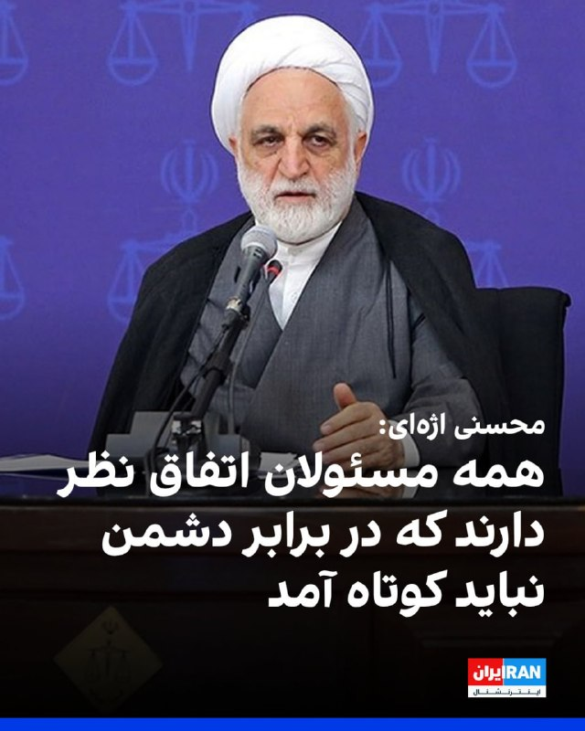

غلامحسین محسنی اژه‌ای، رییس قوه قضاییه جمهوری اسلامی، در پیامی نوشت ممکن است میان مسئولان درباره شیوه‌های «ایستادگی در برابر فشارهای خارجی» دیدگاه‌های متفاوتی وجود داشته باشد.

اژه‌ای نوشت: «دشمن غدار و حیله‌گر بسیار به مخدوش‌کردن وحدت و انسجام ملی ما چشم دوخته است.»

او افزود همه مسئولان کشور در این موضوع اتفاق نظر دارند که نباید در برابر دشمن کوتاه آمد و در این زمینه هیچ اختلاف‌نظری وجود ندارد و در «اصل مقاومت» تردیدی نیست.
iranintl
‌🏁 🇬🇧 IranintlTV

🤖 @VahidOOnLine

## IranIntlTV — post 342241

  <a href="telegram/content/IranIntlTV_342241_1781433855.mp4" target="_blank">🎬 Download video</a>

سرخط خبرهای یکشنبه ۲۴ خرداد
@iranintltv

## IranIntlTV — post 342240

  

غلامحسین محسنی اژه‌ای، رییس قوه قضاییه جمهوری اسلامی، در پیامی نوشت ممکن است میان مسئولان درباره شیوه‌های «ایستادگی در برابر فشارهای خارجی» دیدگاه‌های متفاوتی وجود داشته باشد.

اژه‌ای نوشت: «دشمن غدار و حیله‌گر بسیار به مخدوش‌کردن وحدت و انسجام ملی ما چشم دوخته است.»

او افزود همه مسئولان کشور در این موضوع اتفاق نظر دارند که نباید در برابر دشمن کوتاه آمد و در این زمینه هیچ اختلاف‌نظری وجود ندارد و در «اصل مقاومت» تردیدی نیست.
iranintl.com/202606149830

## Shin_Persian — post 7030

Shin ✓ @hey_itsmyturn
Sun, 14 Jun 2026 10:42:51 UTC

More from Dahieh, Southern Beirut
Lebanon

ترجمه خودکار فارسی

جزئیات بیشتر از ضاحیه، جنوب بیروت
لبنان

𝕏 · @shin_persian

## Shin_Persian — post 7029

Shin ✓ @hey_itsmyturn
Sun, 14 Jun 2026 10:35:11 UTC

Airstrike on Muawad, Dahieh
Southern Beirut, Lebanon

ترجمه خودکار فارسی

حمله هوایی به معوض، ضاحیه
جنوب بیروت، لبنان

𝕏 · @shin_persian

## DW_Farsi — post 125953

  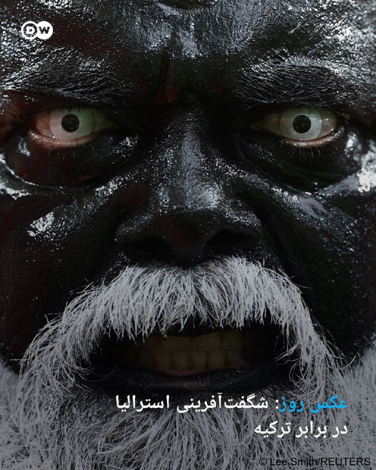

📸 عکس روز: شگفت‌آفرینی استرالیا در برابر ترکیه

تیم فوتبال استرالیا با شکست تیم ترکیه در جام جهانی شگفتی آفرید. چشمان شگفت‌زده این طرفدار ترکیه در ورزشگاه ونکوور شاید بتواند نمایانگر این شوک باشد.

@dw_farsi

## Persian_Trend_Official — post 17018

  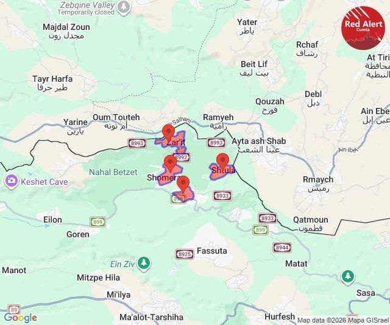

حملات راکتی ساعتی قبل حزب الله به سوی اسرائیل

Phantom

📌 @persian_trend_official
پرشین ترند | متفاوت‌ترین کانال نظامی

## Persian_Trend_Official — post 17017

دقایقی پیش ارتش اسرائیل در پاسخ به حملات حزب‌الله لبنان، نقطه ای در ضاحیه بیروت را بمباران‌ کرد. 📝 Amir 📌 @persian_trend_official پرشین ترند | متفاوت‌ترین کانال نظامی

## Persian_Trend_Official — post 17016

  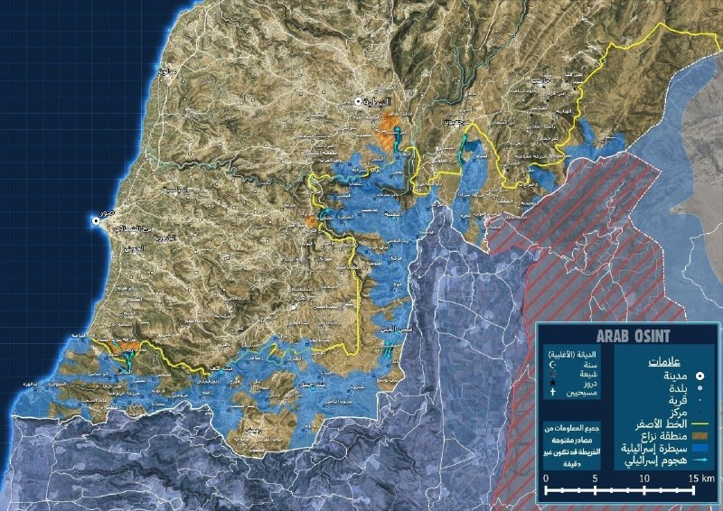

ارتش اسرائیل شدیدا در جبهه‌های مختلف اطراف نبطیه درگیر است.

Phantom

📌 @persian_trend_official
پرشین ترند | متفاوت‌ترین کانال نظامی

## Persian_Trend_Official — post 17013

  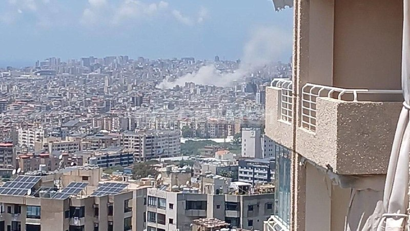

دقایقی پیش ارتش اسرائیل در پاسخ به حملات حزب‌الله لبنان، نقطه ای در ضاحیه بیروت را بمباران‌ کرد.

📝 Amir

📌 @persian_trend_official
پرشین ترند | متفاوت‌ترین کانال نظامی

## RadioFarda — post 158286

  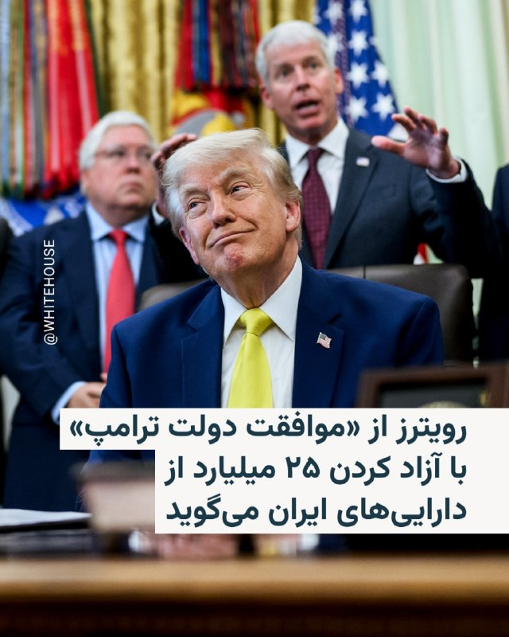

🔸 در حالی که خبرها از داخل ایران اشاره به ادامه بررسی متن تفاهم‌نامه و نامشخص بودن زمان امضای آن دارد، خبرگزاری رویترز روز یک‌شنبه نوشت که دولت دونالد ترامپ در تفاهم‌نامه با آزاد کردن ۲۵ میلیارد دلار از دارایی‌های مسدود ایران موافقت کرده است.

🔸 رویترز خبر خود را به نقل از «مقامی ارشد» در جمهوری اسلامی نوشته، اما به نام او اشاره نکرده است.

🔸 به گفته منبع رویترز، دولت آمریکا همچنین موافقت کرده است که اورانیوم بسیار غنی‌شده ایران در داخل کشور رقیق شود.

🔸 این‌ها دو مورد از بحث‌انگیزترین موضوعات در مذاکرات جاری میان ایران و آمریکا بوده است: ترامپ بارها بر لزوم گرفتن یا انتقال یا از بین بردن اورانیوم ۶۰ درصد غنی‌شده ایران تأکید کرده و همزمان بارها گفته است که پولی به ایران نخواهد داد.

🔸 مسئله دادن پول به حکومت ایران به‌ویژه برای دونالد ترامپ حساسیت‌برانگیز بوده است،‌ چرا که او خود سال‌هاست به باراک اوباما تاخته که چرا در جریان رسیدن به توافق موسوم به برجام با انتقال پول به تهران موافقت کرده است.

@RadioFarda

## IranianMinds — post 22544

  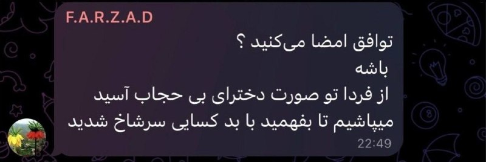

🔴این دیگه چی بود؟

@IranianMinds

## alonews — post 127838

  <a href="telegram/content/alonews_127838_1781433864.webm" target="_blank">🎬 Download video</a>

🔴فوووری/رادیو اسرائیل از آغاز حمله موشکی به بیروت خبر داد 
✅ @AloNews خبر جنگ

## alonews — post 127837

  <a href="telegram/content/alonews_127837_1781433865.webm" target="_blank">🎬 Download video</a>

🔴فوووری/رادیو اسرائیل از آغاز حمله موشکی به بیروت خبر داد

✅ @AloNews خبر جنگ

---
📅 بروزرسانی: 1405/03/24 14:04
---

## VahidOOnLine — post 245450

  

مهدی محمدی، مشاور محمدباقر قالیباف، رییس مجلس، گفت در متن تفاهم‌نامه با آمریکا، موضوع برنامه هسته‌ای جمهوری اسلامی در متن تفاهم‌نامه فعلی قرار ندارد و پس از اجرای تعهدات و راستی‌آزمایی وارد دستور کار خواهد شد.

او افزود توقف درگیری‌ها در ایران و لبنان، دریافت تضمین‌های امنیتی و آزادسازی بخشی از دارایی‌های بلوکه‌شده از جمله مواردی است که برای مراحل نخست توافق پیش‌بینی شده است.

محمدی همچنین گفت بر اساس این تفاهم‌نامه، روند تعلیق برخی تحریم‌ها و محدودیت‌های اقتصادی آغاز می‌شود، محدودیت‌های دریایی کاهش می‌یابد و تردد کشتی‌های تجاری ایران تسهیل خواهد شد.

به گفته مشاور رییس مجلس جمهوری اسلامی، لغو تحریم‌های اولیه و ثانویه آمریکا و جبران خسارت‌های ناشی از جنگ و فشارهای اقتصادی نیز در مرحله نهایی توافق پیش‌بینی شده است.
‌🏁 🇬🇧 IranintlTV

🤖 @VahidOOnLine

## mamlekate — post 103707

📝 از محرم تا چهارم ژوئیه؛ چرا برنامه خاکسپاری علی خامنه‌ای اکنون اعلام می‌شود؟

پس از گذشت بیش از صد روز از کشته شدن علی خامنه‌ای در حمله آمریکا و اسرائیل به دفتر کارش، دفتر حفظ و نشر آثار رهبر پیشین جمهوری اسلامی ایران سرانجام زمان برگزاری مراسم «وداع، تشییع و تدفین» او را از ۱۳ تا ۱۸ تیرماه در تهران، قم و مشهد اعلام کرد.

📝 امتحانات دانشگاه‌ها به‌دلیل مراسم تشییع جنازه خامنه‌ای به تعویق افتاد

📝 امتحانات نهایی پایه‌های یازدهم و دوازدهم نیز به‌دلیل تشییع جنازه خامنه‌ای به تعویق افتاد

@mamlekate

## IranIntlTV — post 342239

  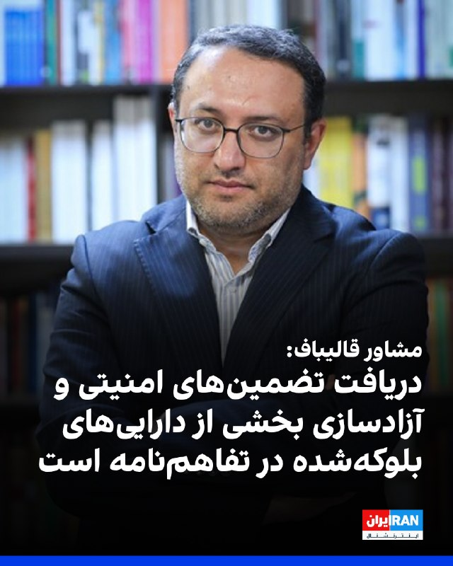

مهدی محمدی، مشاور محمدباقر قالیباف، رییس مجلس، گفت در متن تفاهم‌نامه با آمریکا، موضوع برنامه هسته‌ای جمهوری اسلامی در متن تفاهم‌نامه فعلی قرار ندارد و پس از اجرای تعهدات و راستی‌آزمایی وارد دستور کار خواهد شد.

او افزود توقف درگیری‌ها در ایران و لبنان، دریافت تضمین‌های امنیتی و آزادسازی بخشی از دارایی‌های بلوکه‌شده از جمله مواردی است که برای مراحل نخست توافق پیش‌بینی شده است.

محمدی همچنین گفت بر اساس این تفاهم‌نامه، روند تعلیق برخی تحریم‌ها و محدودیت‌های اقتصادی آغاز می‌شود، محدودیت‌های دریایی کاهش می‌یابد و تردد کشتی‌های تجاری ایران تسهیل خواهد شد.

به گفته مشاور رییس مجلس جمهوری اسلامی، لغو تحریم‌های اولیه و ثانویه آمریکا و جبران خسارت‌های ناشی از جنگ و فشارهای اقتصادی نیز در مرحله نهایی توافق پیش‌بینی شده است.
https://iranintl.com/202606148645

## Shin_Persian — post 7028

  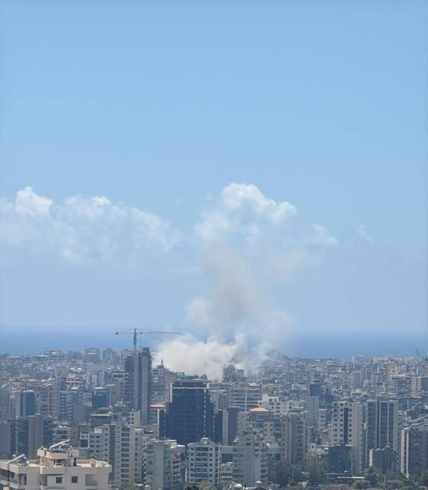

Shin ✓ @hey_itsmyturn
Sun, 14 Jun 2026 10:32:36 UTC

Dahieh, southern Lebanon

ترجمه خودکار فارسی

ضاحیه، جنوب لبنان

𝕏 · @shin_persian

## Shin_Persian — post 7027

Shin ✓ @hey_itsmyturn
Sun, 14 Jun 2026 10:31:59 UTC

Initial:
Airstrikes on Dahieh, southern Lebanon

ترجمه خودکار فارسی

حملات هوایی به ضاحیه، جنوب لبنان

𝕏 · @shin_persian

## Persian_Trend_Official — post 17012

  <a href="telegram/content/Persian_Trend_Official_17012_1781433246.mp4" target="_blank">🎬 Download video</a>

ادعای عجیب کارشناس شبکه افق: پاکستانی‌ها برای میانجی‌گری به ایران نمی‌آیند، بلکه مرتب پیام تهدید و‌ ترور می‌آورند.

Phantom

📌 @persian_trend_official
پرشین ترند | متفاوت‌ترین کانال نظامی

## Persian_Trend_Official — post 17011

  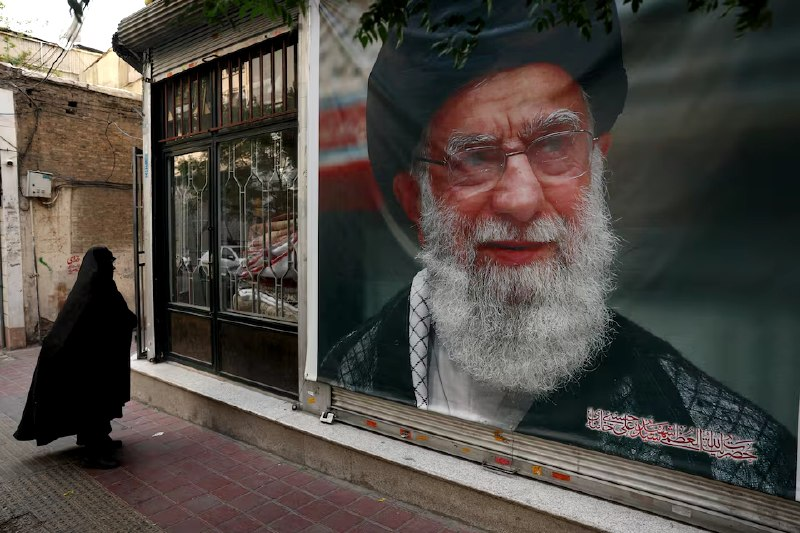

رویترز از نقل یک مقام ایرانی گفت: پیش‌نویس تفاهم‌نامه به ایران اجازه می‌دهد ذخایر اورانیوم غنی‌شده خود را در داخل کشور رقیق کند و این سازوکار طی یک دوره 60 روزه مذاکرات پس از توافق مورد مذاکره قرار خواهد گرفت.

این مقام گفت که تهران با خارج کردن اورانیوم غنی‌شده خود از ایران موافقت نکرده است. ایران متعهد می‌شود که سلاح هسته‌ای تولید یا به دست نیاورد، در حالی که واشنگتن تحریم‌های نفتی را برای مدت مشخصی لغو می‌کند و موافقت می‌کند که 25 میلیارد دلار از دارایی‌های مسدود شده ایران را از طریق ترکیبی از انتقال پول نقد، سازوکارهای همکاری منطقه‌ای و خطوط اعتباری مالی آزاد کند.

📝 Amir

📌 @persian_trend_official
پرشین ترند | متفاوت‌ترین کانال نظامی

## Dirty_Kids — post 391997

  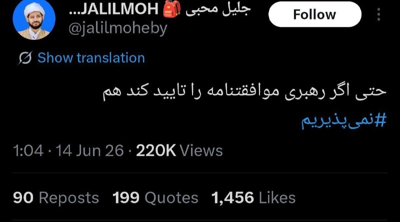

جلیل محبی اخوند :

حتی اگه رهبر کشورم بگه مذاکره و توافق کنید ما این توافق رو نمیپذیریم.

@Dirty_Kids 👻

## Dirty_Kids — post 391996

  <a href="telegram/content/Dirty_Kids_391996_1781433250.mp4" target="_blank">🎬 Download video</a>

عباس عراقچی استاد و مدرس کلاس "چگونه با یک جمله به کل ایدئولوژی خامنه ای برینیم" :

@Dirty_Kids 👻

## alonews — post 127836

  <a href="telegram/content/alonews_127836_1781433251.mp4" target="_blank">🎬 Download video</a>

👈پزشکیان تو مراسم امین ایران : رسول خدا و اصحابش، تو جنگ رفتن لت و پار شدن و شهید شدن و برگشتن😐

✅ @AloNews خبر جنگ

---
📅 بروزرسانی: 1405/03/24 13:53
---

## VahidOOnLine — post 245449

🗣روایت شما از احتمال توافق میان جمهوری‌اسلامی و آمریکا - یکشنبه ۲۵ خرداد

🔹آقای ترامپ، تسلیحات انبارشده را فروختی، جراحی اقتصادی جهانی را به نفع خودت انجام دادی و مردم ایران را قربانی کردی.

🔹ترامپ این‌همه می‌گفت کمک در راهه، ما پشت مردم ایرانیم. آقای ترامپ و نتانیاهو، ما کشته ندادیم که توافق بشه. نمی‌ذاریم خون کسایی که به نامردی ریخته شد پایمال بشه.

🔹خواستم از مخالفین توافق تشکر کنم. ما هم مخالفیم، فقط ما بریم کشته می‌شیم، شما برید. هرچند اهدافمون متفاوته، ولی عالیه. به‌زودی جمهوری اسلامی با خاک یکسان خواهد شد و پیروزی نزدیکه.

🔹حالا شما بسیجی‌ها شدید اغتشاشگر، فقط یه مشت عروسک در دستان عروسک‌گردان جمهوری اسلامی بودید.

🔹تنها جایی که باارزشی‌ها تفاهم داریم، همین مخالفت با توافق بین جمهوری اسلامی و آمریکا هست.

🔹در آستانه توافق آمریکا و ایران، می‌خواستم بگم من ۱۹ ساله دیگه هیچ امیدی به زندگی ندارم. امتحان نهایی دارم، اما خسته‌تر از اونی هستم که به آینده با جمهوری اسلامی فکر کنم.

🔹یعنی واقعا ما موندیم با کمبود برق، آب، گاز، بنزین، فیلترنت، مشکلات محیط‌زیستی، اقتصاد شکست‌خورده، اثرات جنگ، سرکوب، ارزشی، سپاه و یه حکومت که ترسش ریخته و وحشی‌تر شده.

🔹در تاریخ خواهد نوشت: آنها در حالی سقوط کردند که هر شب برای پیروزی خیالی خود جشن می‌گرفتند.

🔹این توافق بین ایران و جمهوری اسلامی را هیچ‌یک از مردم ایران قبول ندارند. ترامپ به فکر آمریکاست، نه مردم ایران. مردم باید خودشان سرنوشت‌شان را تعیین کنند.

🔹آهای جان‌فداها و ارزشی‌ها، اونایی که بیشتر از ۱۰۰ روزه واسه خون‌خواهی رهبرتون خیابونا رو متر می‌کنین، پس خون‌خواهی رهبرتون چی شد؟! با قاتل رهبرتون که پیمان بستین، هر چی که خط قرمز رهبرتون بود رو دودستی تقدیم قاتل رهبرتون کردین.
‌🏁 🇬🇧 IranintlTV

🤖 @VahidOOnLine

## VahidOOnLine — post 245448

  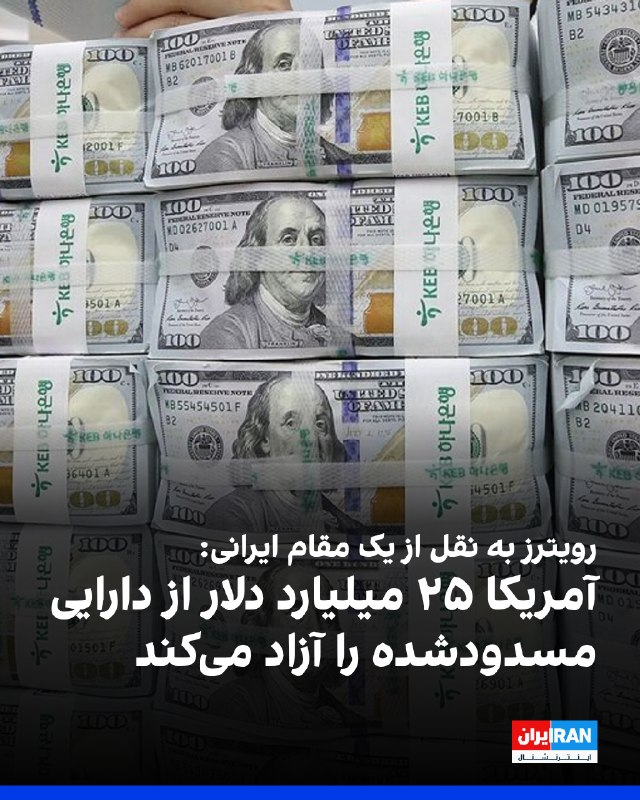

رویترز به نقل از یک مقام ارشد جمهوری اسلامی گزارش داد که بر اساس پیش‌نویس تفاهم‌نامه میان تهران و واشینگتن، آمریکا با آزادسازی ۲۵ میلیارد دلار از دارایی‌های مسدودشده ایران موافقت کرده است.

به گفته این مقام، این دارایی‌ها از طریق انتقال مستقیم نقدی، همکاری کشورهای منطقه و ایجاد خطوط اعتباری مالی آزاد خواهند شد.

این مقام همچنین گفت آمریکا در چارچوب تفاهم‌نامه احتمالی، برای مدت مشخصی از اعمال تحریم‌های نفتی علیه تهران صرف‌نظر خواهد کرد و در مقابل، جمهوری اسلامی تنگه هرمز را بلافاصله به روی همه کشتی‌های تجاری باز خواهد کرد.
‌🏁 🇬🇧 IranintlTV

🤖 @VahidOOnLine

## VahidOOnLine — post 245447

  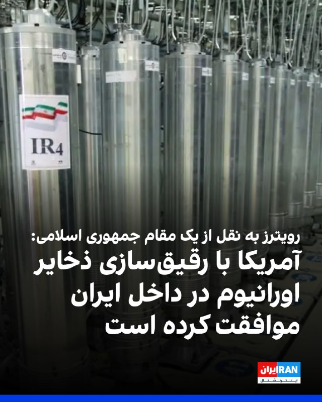

رویترز به نقل از یک مقام ارشد جمهوری اسلامی گزارش داد که در پیش‌نویس یادداشت تفاهم میان تهران و واشینگتن، آمریکا با رقیق‌سازی ذخایر اورانیوم با غنای بالا در داخل ایران موافقت کرده است.

به گفته این مقام، قرار است سازوکار اجرای این بخش از تفاهم در ۶۰ روز آینده مورد بحث و بررسی قرار گیرد.

رویترز گزارش داد این موضوع یکی از محورهای مورد مذاکره در چارچوب تفاهم احتمالی میان جمهوری اسلامی و آمریکا است.
iranintl
‌🏁 🇬🇧 IranintlTV

🤖 @VahidOOnLine

## WithYashar — post 14774

یک مقام ارشد ایرانی به رویترز: آمریکا موافقت کرده است که ایران اورانیوم غنی‌شده را در داخل خاک ایران رقیق کند
@withyashar

## mamlekate — post 103706

📝 رویترز: آمریکا و ایران به توافق نزدیک‌تر شده‌اند، اما زمان دقیق امضای آن همچنان نامشخص است

خبرگزاری رویترز در گزارشی، با اعلام اینکه آمریکا و ایران به توافق نزدیک شده‌اند، نوشت که برخلاف گفته‌های برخی مقام‌ها، به نظر می‌رسد زمان دقیق امضای توافق هنوز کاملا مشخص نیست.

📝 یک هیات قطری برای «کمک به نهایی شدن تفاهم‌نامه»، به تهران سفر کرده است

📝 چرا تفاهم‌نامه آمریکا و جمهوری اسلامی مجازی امضا می‌شود؟

رهبران ایالات متحده و پاکستان اعلام کردند که روز یکشنبه یک چارچوب توافق‌نامه برای پایان دادن به ماه‌ها درگیری میان ایالات متحده و جمهوری اسلامی به صورت الکترونیکی امضا می‌شود. اما چه شرایطی منجر شده تا مراسم امضای تفاهم‌نامه به صورت مجازی برگزار شود؟

📝 ابراز مخالفت حامیان تندروی حکومت با توافق: «قالیباف، عراقچی، پس خون رهبرم چی؟»

@mamlekate

## mamlekate — post 103705

📝 خدمات کارت دو بانک پس از حمله سایبری وصل شد؛ دو بانک دیگر خارج از دسترس

شرکت ملی انفورماتیک اعلام کرد پس از اختلال در چهار بانک ملی، صادرات، تجارت و توسعه صادرات، مشکل خدمات کارت‌های بانکی در بانک‌های تجارت و صادرات رفع شده و تراکنش‌ها با موفقیت در حال انجام است.

📞 دیتابیس و سرویهای شرکت خدماتو یه جوری زدن که دیتابیس بک‌ اپشون هم در دسترس نیست. سرویسی هیچ دیتایی به هیچ سرویس گیرنده ای نمیدن. بانک تجارت هر شعبه ش یه core داره که دیتاها رو‌ نگهداری میکنه میتونن بدون شرکت خدمات به روال برگردن ولی نه به سرعت.

@mamlekate

## IranIntlTV — post 342238

  <a href="telegram/content/IranIntlTV_342238_1781432634.mp4" target="_blank">🎬 Download video</a>

عمیق‌ترین رکود صنعتی ایران را این بار نه منتقدان حکومت، که آمار رسمی اتاق بازرگانی ثبت کرده است. در این قسمت چرتکه، محمد ماشین‌چیان کارنامه صنعت ایران پس از جنگ را بررسی می‌کند.

تماشای نسخه کامل این برنامه در یوتیوب:
https://youtu.be/5_cvWJFAHOY

@iranintltv

## IranIntlTV — post 342237

🗣روایت شما از احتمال توافق میان جمهوری‌اسلامی و آمریکا - یکشنبه ۲۵ خرداد

🔹آقای ترامپ، تسلیحات انبارشده را فروختی، جراحی اقتصادی جهانی را به نفع خودت انجام دادی و مردم ایران را قربانی کردی.

🔹ترامپ این‌همه می‌گفت کمک در راهه، ما پشت مردم ایرانیم. آقای ترامپ و نتانیاهو، ما کشته ندادیم که توافق بشه. نمی‌ذاریم خون کسایی که به نامردی ریخته شد پایمال بشه.

🔹خواستم از مخالفین توافق تشکر کنم. ما هم مخالفیم، فقط ما بریم کشته می‌شیم، شما برید. هرچند اهدافمون متفاوته، ولی عالیه. به‌زودی جمهوری اسلامی با خاک یکسان خواهد شد و پیروزی نزدیکه.

🔹حالا شما بسیجی‌ها شدید اغتشاشگر، فقط یه مشت عروسک در دستان عروسک‌گردان جمهوری اسلامی بودید.

🔹تنها جایی که باارزشی‌ها تفاهم داریم، همین مخالفت با توافق بین جمهوری اسلامی و آمریکا هست.

🔹در آستانه توافق آمریکا و ایران، می‌خواستم بگم من ۱۹ ساله دیگه هیچ امیدی به زندگی ندارم. امتحان نهایی دارم، اما خسته‌تر از اونی هستم که به آینده با جمهوری اسلامی فکر کنم.

🔹یعنی واقعا ما موندیم با کمبود برق، آب، گاز، بنزین، فیلترنت، مشکلات محیط‌زیستی، اقتصاد شکست‌خورده، اثرات جنگ، سرکوب، ارزشی، سپاه و یه حکومت که ترسش ریخته و وحشی‌تر شده.

🔹در تاریخ خواهد نوشت: آنها در حالی سقوط کردند که هر شب برای پیروزی خیالی خود جشن می‌گرفتند.

🔹این توافق بین ایران و جمهوری اسلامی را هیچ‌یک از مردم ایران قبول ندارند. ترامپ به فکر آمریکاست، نه مردم ایران. مردم باید خودشان سرنوشت‌شان را تعیین کنند.

🔹آهای جان‌فداها و ارزشی‌ها، اونایی که بیشتر از ۱۰۰ روزه واسه خون‌خواهی رهبرتون خیابونا رو متر می‌کنین، پس خون‌خواهی رهبرتون چی شد؟! با قاتل رهبرتون که پیمان بستین، هر چی که خط قرمز رهبرتون بود رو دودستی تقدیم قاتل رهبرتون کردین.

## IranIntlTV — post 342236

  

رویترز به نقل از یک مقام ارشد جمهوری اسلامی گزارش داد که بر اساس پیش‌نویس تفاهم‌نامه میان تهران و واشینگتن، آمریکا با آزادسازی ۲۵ میلیارد دلار از دارایی‌های مسدودشده ایران موافقت کرده است.

به گفته این مقام، این دارایی‌ها از طریق انتقال مستقیم نقدی، همکاری کشورهای منطقه و ایجاد خطوط اعتباری مالی آزاد خواهند شد.

این مقام همچنین گفت آمریکا در چارچوب تفاهم‌نامه احتمالی، برای مدت مشخصی از اعمال تحریم‌های نفتی علیه تهران صرف‌نظر خواهد کرد و در مقابل، جمهوری اسلامی تنگه هرمز را بلافاصله به روی همه کشتی‌های تجاری باز خواهد کرد.
https://iranintl.com/202606145168

## IranIntlTV — post 342235

  <a href="telegram/content/IranIntlTV_342235_1781432636.mp4" target="_blank">🎬 Download video</a>

رسانه‌های اسرائیلی از نارضایتی مقام‌های ارشد سیاسی و امنیتی این کشور از توافق جمهوری اسلامی و آمریکا گزارش دادند.

جزییات بیشتر در گفت‌وگو با بابک اسحاقی، خبرنگار ایران‌اینترنشنال

@iranintltv

## RadioFarda — post 158285

  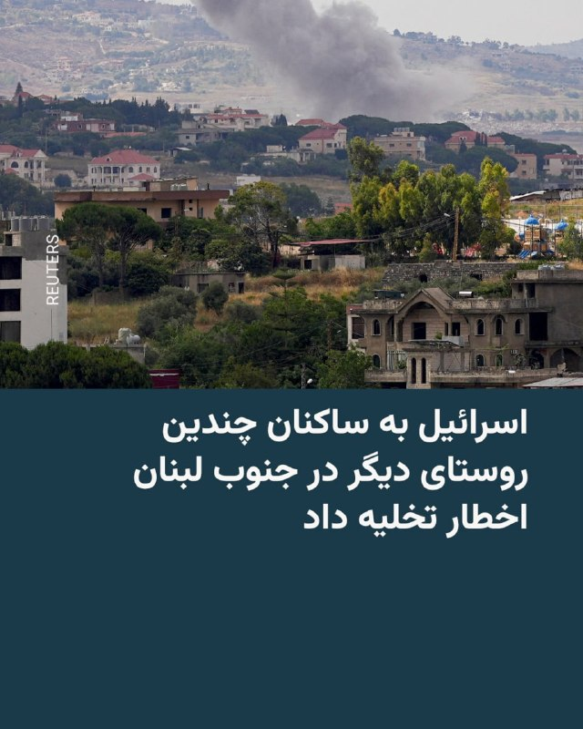

🔸ارتش اسرائیل روز یک‌شنبه ۲۴ خرداد به ساکنان چندین روستای دیگر در جنوب لبنان هشدار داد که محل زندگی خود را ترک کنند.

🔸خبرگزاری فرانسه به نقل از سخنگوی عرب‌زبان ارتش اسرائیل نوشت که ساکنان ۲۹ روستا در این منطقه باید به نقطه‌ای دیگر نقل مکان کنند. اسرائیل قصد حمله هوایی به این روستاها را دارد.

🔸طبق این گزارش، اسرائیل صبح یک‌شنبه ابتدا به ساکنان ۱۳ روستا و سپس ساکنان ۱۶ روستای دیگر در جنوب لبنان اخطار داده است.

🔸ارتش اسرائیل روز شنبه صبح هم به ساکنان ۲۰ نقطه در جنوب لبنان از جمله شهر نبطیه هشدار داده بود که باید محل سکونت خود را ترک کرده و به شمال رود لیتانی بروند.

🔸همزمان ارتش اسرائیل اعلام کرد که سه پهپاد روز یک‌شنبه به طور جداگانه به شمال اسرائیل پرتاب شده‌اند. اسرائیل گروه حزب‌الله را مسئول پرتاب این پهپادها اعلام کرد.

🔸حکومت ایران اصرار دارد که پایان جنگ در لبنان از جمله مفاد تفاهم‌نامه‌ای باشد که قرار است با آمریکا امضا کند.

@RadioFarda

## IranianMinds — post 22543

  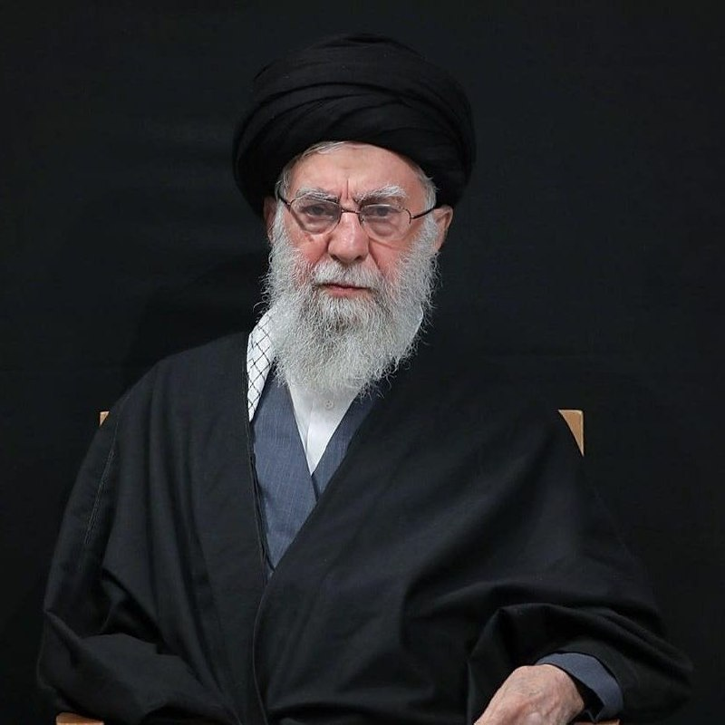

بعد از ۱۰۰ روز هم دفنش نکردن، هم روی جنازه‌اش عروسی گرفتن، هم با قاتلش توافق کردن!

@IranianMinds

## Dirty_Kids — post 391995

  <a href="telegram/content/Dirty_Kids_391995_1781432639.mp4" target="_blank">🎬 Download video</a>

یکی به این عرزشی قبیح‌المنظر بگه دادی رفت همه رو؛ خبر نداری! حتی آفتابه عمامو! همین چای حرم مونده بچسب تا عباس اونم نداده بره!

@Dirty_Kids 👻

## Dirty_Kids — post 391994

🔴 طالبان فروش زیرپوشی های زنانه(شورت و سوتین ) رو ممنوع اعلام کرده و هرکی این چیزا رو بفروشه رو دستیگرش میکنن.

@Dirty_Kids 👻

## Dirty_Kids — post 391993

  <a href="telegram/content/Dirty_Kids_391993_1781432640.mp4" target="_blank">🎬 Download video</a>

پاسخ قاطع قالیباف به معترضین توافق با آمریکا 😂

@Dirty_Kids 👻

## Dirty_Kids — post 391992

⚡️ جام جهانی شروع شده و میدون مال توئه! 
🌟 این #جام_جهانی رو فقط باید توی #بت فیدو پیش‌بینی کنی 
💰 با ۵۰ میلیون تومان شرط روزانه ← ۴ میلیون تومان اعتبار شرط‌بندی رایگان 
📊 با ۱۰۰ میلیون تومان شرط روزانه ← ۸ میلیون تومان اعتبار شرط‌بندی رایگان میدونستی با انتخاب…

## Dirty_Kids — post 391991

  <a href="telegram/content/Dirty_Kids_391991_1781432640.webm" target="_blank">🎬 Download video</a>

⚡️ جام جهانی شروع شده و میدون مال توئه!

🌟 این #جام_جهانی رو فقط باید توی #بت فیدو پیش‌بینی کنی

💰 با ۵۰ میلیون تومان شرط روزانه ← ۴ میلیون تومان اعتبار شرط‌بندی رایگان

📊 با ۱۰۰ میلیون تومان شرط روزانه ← ۸ میلیون تومان اعتبار شرط‌بندی رایگان

میدونستی با انتخاب برد هلند مقابل ژاپن با پنج میلیون به راحتی ده میلیون تومن برنده میشی؟!😮
💵
💵
🇯🇵
🇳🇱

💸 هرچی بزرگ‌تر بازی کنی، جایزت بزرگ‌تره!

🥅همین حالا پیش بینیتو ثبت کن
💖
https://fido874vt.click
https://fido874vt.click

👆
👆
👆
👆
👆
(ورود با وی-پی-ان غیر اروپایی)
❌
R24

📲کانال تلگرام 
👇
https://t.me/+dySI_QFj0T0xZGVk

## Hranews — post 113598

سراوان؛ یک شهروند بر اثر انفجار مین کشته شد

❗️
❗️
❗️
❗️
❗️– روز پنجشنبه ۲۱ خردادماه، انفجار مین در یکی از مناطق مرزی شهرستان سراوان، منجر به مرگ یک شهروند شد.

ادامه مطلب
↘️
@hranews_bot تماس ✉️ -  @Hranews  کانال هرانا 🆑

## alonews — post 127835

  <a href="telegram/content/alonews_127835_1781432641.webm" target="_blank">🎬 Download video</a>

👈مقام ارشد ایرانی : طبق پیش‌نویس توافق، آمریکا قراره حدود ۲۵ میلیارد دلار از دارایی‌های بلوکه‌شده ایران رو آزاد کنه؛ 
🔴از جمله انتقال مستقیم پول و همکاری در سطح منطقه‌ای 
✅ @AloNews خبر جنگ

## alonews — post 127834

  <a href="telegram/content/alonews_127834_1781432641.webm" target="_blank">🎬 Download video</a>

👈العربی الجدید : ایران هنوز تأیید نهایی خود را برای یادداشت تفاهم اعلام نکرده است.

🔴به گفته یک منبع آگاه ایرانی، احتمال امضای توافق در روز یکشنبه منتفی است و بررسی‌ها در داخل ایران ادامه دارد؛ هرچند ممکن است تهران امروز نظر نهایی خود را اعلام کند.

✅ @AloNews خبر جنگ

---
📅 بروزرسانی: 1405/03/24 13:43
---

## VahidOOnLine — post 245446

  <a href="telegram/content/VahidOOnLine_245446_1781432027.mp4" target="_blank">🎬 Download video</a>

‌
محمدرضا شاه پهلوی در سال ۱۳۵۶ از مرکز آموزش افسری ژاندارمری کل کشور بازدید می‌کند و در جمع افسران و فرماندهان درباره آموزش نظامی، آمادگی دفاعی و مسئولیت نیروهای مسلح سخن می‌گوید.
نسخه کامل این ویدیو و صدها آرشیو نایاب دیگر را در کانال یوتیوب Manoto تماشا کنید.
‌🏁 🇬🇧 ManotoTV

🤖 @VahidOOnLine

## VahidOOnLine — post 245445

بازدید محمدرضا شاه پهلوی از ژاندارمری کل کشور در سال ۱۳۵۶ و سخنرانی ایشان در جمع افسران و فرماندهان، درباره آمادگی، آموزش و مسئولیت نیروهای نظامی.
این ویدیو بخشی از آرشیو تاریخی منوتو است.
نسخه کامل این ویدیو و صدها آرشیو نایاب دیگر را در کانال یوتیوب Manoto تماشا کنید.
‌🏁 🇬🇧 ManotoTV

🤖 @VahidOOnLine

## VahidOOnLine — post 245444

  

محمد اکبرزاده، معاون سیاسی نیروی دریایی سپاه پاسداران، گفت جمهوری اسلامی آمریکا را «دشمن اصلی» خود می‌داند و تجربه‌های گذشته نشان داده است که نمی‌توان به این کشور اعتماد کرد.

او در گفت‌وگو با خبرگزاری تسنیم، وابسته به سپاه پاسداران افزود هدف آمریکا از فشارهای سیاسی، اقتصادی و رسانه‌ای، وادار کردن جمهوری اسلامی به تسلیم است، اما این تلاش‌ها به نتیجه نرسیده است.

اکبرزاده همچنین گفت تنها راه خنثی‌سازی «توطئه‌های دشمنان»، حفظ وحدت ملی، تبعیت از رهبر جمهوری اسلامی و پرهیز از اختلافات است.

معاون سیاسی نیروی دریایی سپاه پاسداران گفت هرگونه اقدام دیپلماتیک باید در چارچوب «عزت، حکمت و مصلحت» انجام شود و جمهوری اسلامی از مواضع خود عقب‌نشینی نخواهد کرد.
‌🏁 🇬🇧 IranintlTV

🤖 @VahidOOnLine

## DEJradio — post 5672

  <a href="telegram/content/DEJradio_5672_1781432029.mp4" target="_blank">🎬 Download video</a>

🎥📡 عفت تجارتچی؛ روایتی از از فراز و فرود زنان در یک قرن

#زنان #خلبانان
@DEJradio

## IranIntlTV — post 342234

  

رویترز به نقل از یک مقام ارشد جمهوری اسلامی گزارش داد که در پیش‌نویس یادداشت تفاهم میان تهران و واشینگتن، آمریکا با رقیق‌سازی ذخایر اورانیوم با غنای بالا در داخل ایران موافقت کرده است.

به گفته این مقام، قرار است سازوکار اجرای این بخش از تفاهم در ۶۰ روز آینده مورد بحث و بررسی قرار گیرد.

رویترز گزارش داد این موضوع یکی از محورهای مورد مذاکره در چارچوب تفاهم احتمالی میان جمهوری اسلامی و آمریکا است.
iranintl.com/202606149405

## IranIntlTV — post 342233

  <a href="telegram/content/IranIntlTV_342233_1781432032.mp4" target="_blank">🎬 Download video</a>

در پی اختلال و قطعی خدمات چهار بانک ایران، شرکت خدمات انفورماتیک گزارش داد خدمات کارتی دو بانک تجارت و صادرات برقرار شده، اما اختلال در خدمات دو بانک ملی و توسعه صادرات ادامه دارد.

شورای هماهنگی بانک‌ها خبر داده بود که اختلال در فعالیت بانک ملی، تجارت، صادرات و توسعه صادرات ناشی از حمله سایبری محدود به زیرساخت ارتباطی مشترک این چهار بانک بوده است.

گفت‌وگو با مهتاب قلی‌زاده، روزنامه‌نگار اقتصادی
@iranintltv

## IranIntlTV — post 342232

  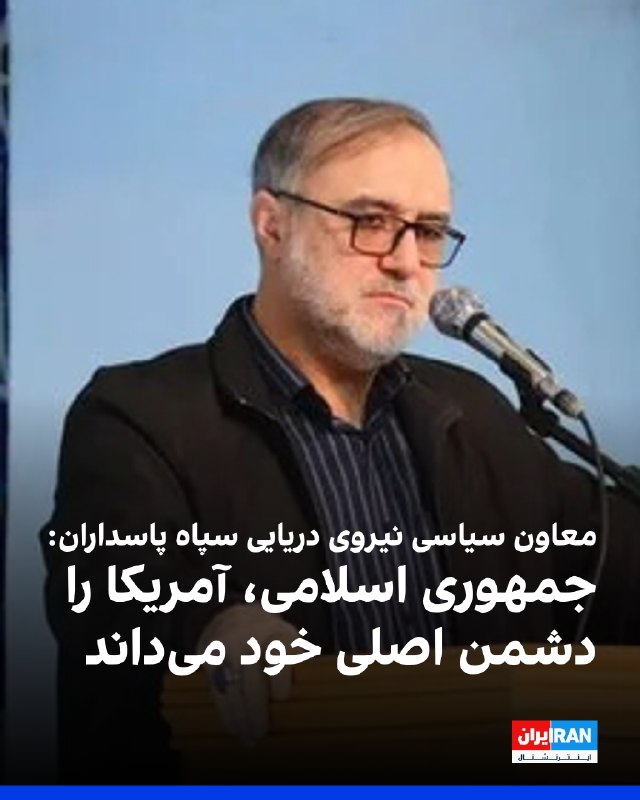

محمد اکبرزاده، معاون سیاسی نیروی دریایی سپاه پاسداران، گفت جمهوری اسلامی آمریکا را «دشمن اصلی» خود می‌داند و تجربه‌های گذشته نشان داده است که نمی‌توان به این کشور اعتماد کرد.

او در گفت‌وگو با خبرگزاری تسنیم، وابسته به سپاه پاسداران افزود هدف آمریکا از فشارهای سیاسی، اقتصادی و رسانه‌ای، وادار کردن جمهوری اسلامی به تسلیم است، اما این تلاش‌ها به نتیجه نرسیده است.

اکبرزاده همچنین گفت تنها راه خنثی‌سازی «توطئه‌های دشمنان»، حفظ وحدت ملی، تبعیت از رهبر جمهوری اسلامی و پرهیز از اختلافات است.

معاون سیاسی نیروی دریایی سپاه پاسداران گفت هرگونه اقدام دیپلماتیک باید در چارچوب «عزت، حکمت و مصلحت» انجام شود و جمهوری اسلامی از مواضع خود عقب‌نشینی نخواهد کرد.
https://iranintl.com/202606143931

## ManotoTV — post 106062

  <a href="telegram/content/ManotoTV_106062_1781432034.mp4" target="_blank">🎬 Download video</a>

‌
محمدرضا شاه پهلوی در سال ۱۳۵۶ از مرکز آموزش افسری ژاندارمری کل کشور بازدید می‌کند و در جمع افسران و فرماندهان درباره آموزش نظامی، آمادگی دفاعی و مسئولیت نیروهای مسلح سخن می‌گوید.
نسخه کامل این ویدیو و صدها آرشیو نایاب دیگر را در کانال یوتیوب Manoto تماشا کنید.

## ManotoTV — post 106061

بازدید محمدرضا شاه پهلوی از ژاندارمری کل کشور در سال ۱۳۵۶ و سخنرانی ایشان در جمع افسران و فرماندهان، درباره آمادگی، آموزش و مسئولیت نیروهای نظامی.
این ویدیو بخشی از آرشیو تاریخی منوتو است.
نسخه کامل این ویدیو و صدها آرشیو نایاب دیگر را در کانال یوتیوب Manoto تماشا کنید.

## FarsiVOA — post 220664

  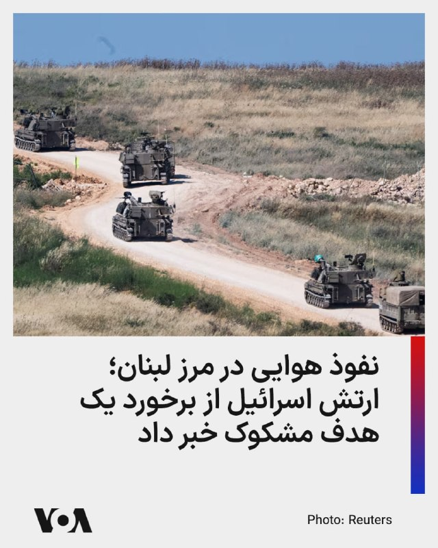

ارتش اسرائیل اعلام کرد پس از فعال شدن آژیرهای هشدار در چند منطقه در شمال اسرائیل، به‌دنبال احتمال نفوذ یک هواپیمای خصمانه، برخورد یک هدف هوایی مشکوک در خاک اسرائیل و نزدیک مرز لبنان شناسایی شده است.

بر اساس اعلام اولیه ارتش اسرائیل، تاکنون گزارشی از تلفات جانی دریافت نشده و بررسی‌ها درباره جزئیات این حادثه ادامه دارد.

همزمان، ارتش اسرائیل در گزارش دیگری اعلام کرد آژیرهای هشدار در چند منطقه در جنوب اسرائیل نیز به صدا درآمده و جزئیات این مورد هم در دست بررسی است.
@FarsiVOA

## Hranews — post 113597

اجرای حکم اعدام یک زندانی در زندان سمنان

❗️
❗️
❗️
❗️
❗️– حکم یک زندانی که پیشتر از بابت اتهام قتل به #اعدام محکوم شده بود، سحرگاه روز چهارشنبه ۲۰ خرداد در زندان سمنان اجرا شد.

ادامه مطلب

#حامد_حیدرزاده

↘️
@hranews_bot تماس ✉️ -  @Hranews  کانال هرانا 🆑

## manototv — post 106062

  <a href="telegram/content/manototv_106062_1781432036.mp4" target="_blank">🎬 Download video</a>

‌
محمدرضا شاه پهلوی در سال ۱۳۵۶ از مرکز آموزش افسری ژاندارمری کل کشور بازدید می‌کند و در جمع افسران و فرماندهان درباره آموزش نظامی، آمادگی دفاعی و مسئولیت نیروهای مسلح سخن می‌گوید.
نسخه کامل این ویدیو و صدها آرشیو نایاب دیگر را در کانال یوتیوب Manoto تماشا کنید.

## manototv — post 106061

بازدید محمدرضا شاه پهلوی از ژاندارمری کل کشور در سال ۱۳۵۶ و سخنرانی ایشان در جمع افسران و فرماندهان، درباره آمادگی، آموزش و مسئولیت نیروهای نظامی.
این ویدیو بخشی از آرشیو تاریخی منوتو است.
نسخه کامل این ویدیو و صدها آرشیو نایاب دیگر را در کانال یوتیوب Manoto تماشا کنید.

## alonews — post 127833

  <a href="telegram/content/alonews_127833_1781432038.webm" target="_blank">🎬 Download video</a>

👈ناو هواپیمابر فرانسوی «شارل دوگل» پس از پایان دوره مأموریت ادعایی خود در مدیترانه شرقی و دریای عمان، در حال بازگشت به پایگاه نظامی «تولون» در فرانسه است.

🔴بازگشت ناو «شارل دوگل» به فرانسه، در حالی صورت می‌گیرد که پیش‌تر گمانه‌زنی‌هایی درباره ارتباط این تحرکات نظامی با فرآیندهای دیپلماتیک مطرح شده بود.

✅ @AloNews خبر جنگ

## alonews — post 127832

  <a href="telegram/content/alonews_127832_1781432038.webm" target="_blank">🎬 Download video</a>

‌
👈 انور قرقاش، مشاور دیپلماتیک رئیس‌جمهور امارات متحده عربی: ما هرگز طرفدار جنگ نبوده‌ایم و همچنان طرفدار صلح و ثبات خواهیم ماند

✅ @AloNews خبر جنگ

---
📅 بروزرسانی: 1405/03/24 13:34
---

## VahidOOnLine — post 245443

  <a href="telegram/content/VahidOOnLine_245443_1781431455.mp4" target="_blank">🎬 Download video</a>

ویدیوهای رسیده به ایران‌اینترنشنال نشان می‌دهند ایرانیان مقیم بریتانیا شنبه ۲۳ خرداد با فراخوان شاهزاده رضا پهلوی و علیه جمهوری اسلامی در لندن تجمع کرده و نام جاویدنامان انقلاب ملی را فریاد زدند.
‌🏁 🇬🇧 IranintlTV

🤖 @VahidOOnLine

## WithYashar — post 14773

  <a href="telegram/content/WithYashar_14773_1781431459.mp4" target="_blank">🎬 Download video</a>

کارشناس صدا سیما : پاکستانی‌ها برای میانجی‌گری به ایران نمی‌آیند، بلکه مرتب پیام تهدید و‌ ترور می‌آورند!
@withyashar

## mwarmonitor — post 10854

📝این شوء سیاسی که اسمش را گذاشته‌اند «توافق»، حتی اگر امضا هم بشود، صرفاً یک تمدید اشتراک برای آتش‌بسِ موقت است؛ یک جور صدقه‌دادنِ دیپلماتیک از طرف آمریکا تا حضرات چند صباحی بیشتر فرصت داشته باشند که درباره‌ی غنی‌سازی، اسباب‌بازی‌های موشکی و عمق راهبردی‌شان لاف بزنند.

🔸خنده‌دار اینجاست که هنوز هیچ اتفاقی نیفتاده و پولی جابه‌جا نشده، سرِ تقسیم این غنائمِ خیالی، چنان جنگ کفتارها در رأس نظام راه افتاده که یقه دراندنشان به کف خیابان کشیده است. این جماعت که با جیب خالی و ادعای عالی، خود را «گنده‌گوز خاورمیانه» می‌دانند، محال است به خواسته‌های واقعی آمریکا و اسرائیل تن بدهند؛ چون خوب می‌دانند تن دادن به این شروط یعنی فرو ریختن کل این هیمنه‌ی پوشالی.

🔸در نهایت، این تئاترِ مضحک فقط یک تنفس مصنوعی به سیستمی است که بین توهمِ قدرت و واقعیتِ گدایی گیر کرده؛ خیمه‌شب‌بازیِ تهوع‌آوری که در آن بالانشین‌ها برای بقا واق واق می‌کنند و مردم عادی باید هزینه بلیت این سیرکِ سقوط را با سفره‌های خالی‌شان بپردازند.
@mwarmonitor

## IranIntlTV — post 342231

  <a href="telegram/content/IranIntlTV_342231_1781431462.mp4" target="_blank">🎬 Download video</a>

ویدیوهای رسیده به ایران‌اینترنشنال نشان می‌دهند ایرانیان مقیم بریتانیا شنبه ۲۳ خرداد با فراخوان شاهزاده رضا پهلوی و علیه جمهوری اسلامی در لندن تجمع کرده و نام جاویدنامان انقلاب ملی را فریاد زدند.

## FarsiVOA — post 220663

  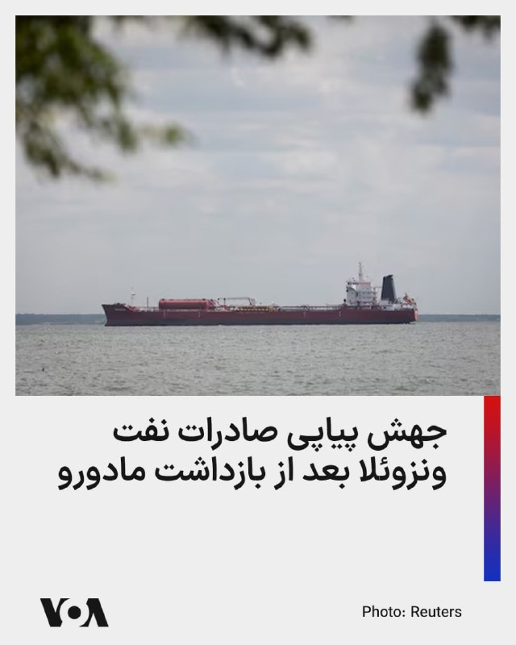

صادرات نفت ونزوئلا بعد از بازداشت نیکلاس مادورو رئیس‌جمهور سابق این کشور در عملیات نظامی آمریکایی در ژانویه امسال، روند صعودی خود را ادامه می‌دهد.

صادرات روزانه نفت ونزوئلا در ماه جاری به ۱.۳ میلیون بشکه اوج گرفته که تقریباً دو برابر سطح ژوئن ۲۰۲۵ است.

ایالات متحده آمریکا بعد از بازداشت مادورو و توافق با دولت ونزوئلا، تحریم‌های نفتی علیه این کشور را کاهش داد و حتی شرکت‌های آمریکایی وارد پروژه‌های توسعه میادین نفتی ونزوئلا شدند.

پیشتر چین نفت تحریمی ونزوئلا را با تخفیف‌های چشمگیر خریداری می‌کرد، اما هم‌اکنون بخش اعظم صادرات ونزوئلا با قیمت‌های واقعی به آمریکا انجام می‌شود و در رتبه‌های بعدی چین، هند و اروپا مشریان عمده نفتی این کشور هستند.
@FarsiVOA

## DW_Farsi — post 125952

  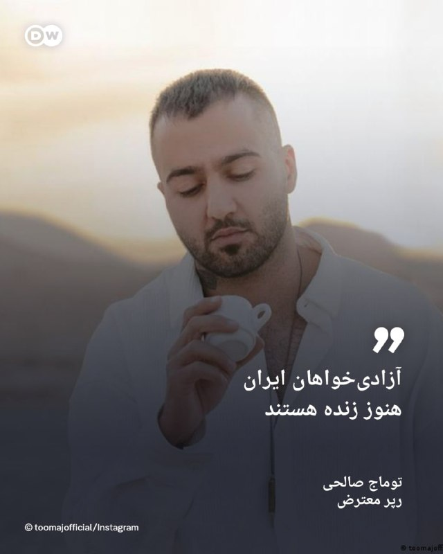

🔶 توماج صالحی: آزادی‌خواهان ایران هنوز زنده هستند

توماج صالحی، رپر معترض، شامگاه شنبه ۲۳ خرداد با انتشار ویدئویی در اینستاگرام با بیان اینکه "آزادی ایران هرگز وابسته به خواسته‌های کشورهای دیگر نبوده است"، گفت: «پس این مسیر به بن‌بست نمی‌خورد، چه با جنگ، چه با توافق، چه حتی حمایت کشورهای دیگر.»

او با تأکید بر اینکه "آزادی‌خواهان ایران هنوز زنده هستند" اضافه کرد: «ما مثل گذشته قدم به قدم پیش می‌رویم، سنگر به سنگر فتح می‌کنیم.»

توماج صالحی در توضیحات این پست اینستاگرامی نوشت: «زنده‌باد ترانه آزادی که با هیچ گلوله‌ای خاموش نشد.»

این خواننده معترض در جریان اعتراضات سراسری ۱۴۰۱ به دلیل انتشار ویدئوها و پیام‌هایی در حمایت از معترضان، بازداشت‌شدگان و کشته‌شدگان خیزش "زن زندگی آزادی" بازداشت و زندانی شد. او به اتهاماتی نظیر "تبلیغ علیه نظام"، "توهین به رهبری"، "همکاری با دولت متخاصم" و "افساد فی‌الأرض" متهم شد.

اتهام "افساد فی‌الأرض" که طبق قوانین جمهوری اسلامی می‌تواند حکم اعدام داشته باشد، تیرماه ۱۴۰۳ از سوی دیوان عالی نقض شد و دادگاه اصفهان نیز که در این پرونده پیش‌تر این حکم را صادر کرده بود، رأی برائت صادر کرد.

توماح صالحی آذر ۱۴۰۳ پس از گذراندن یک سال حبس از زندان آزاد شد.

@dw_farsi

## Persian_Trend_Official — post 17010

😀جزئیات متن تفاهم ایران و آمریکا از زبان مشاور رئیس تیم مذاکره‌کننده :

🔻مهدی محمدی، مشاور راهبردی رئیس تیم مذاکره‌کننده جزئیاتی از متن یادداشت تفاهم ایران و آمریکا را تشریح کرد که به شرح زیر است:

🔻 توقف درگیری‌ها: عملیات نظامی علیه ایران و لبنان متوقف می‌شود و آمریکا تضمین امنیتی می‌دهد.

🔻 آزادسازی دارایی‌ها: بخشی از دارایی‌های بلوکه‌شده ایران در گام اول آزاد می‌شود.

🔻 تعلیق تحریم‌ها: برخی تحریم‌های اقتصادی تعلیق می‌شود تا فروش نفت و مبادلات افزایش یابد.

🔻 رفع محدودیت‌های دریایی: تردد کشتی‌های تجاری ایران تسهیل و تجارت دریایی عادی می‌شود.

🔻 تأخیر مذاکرات هسته‌ای: موضوع هسته‌ای در گام یکم نیست؛ ابتدا تعهدات آمریکا راستی‌آزمایی می‌شود؛ اگر گام یکم موفق بود، مذاکرات هسته ای آغاز می‌شود.

🔻 و در پایان : لغو همه تحریم‌های اولیه و ثانویه و جبران خسارت‌های جنگ و فشار اقتصادی.

## alonews — post 127831

  <a href="telegram/content/alonews_127831_1781431466.webm" target="_blank">🎬 Download video</a>

👈رویترز به نقل از مقام ارشد ایرانی : طبق پیش‌نویس توافق با آمریکا، ایران قبول کرده دیگه دنبال ساخت یا گرفتن سلاح هسته‌ای نره 
✅ @AloNews خبر جنگ

## alonews — post 127830

  <a href="telegram/content/alonews_127830_1781431466.webm" target="_blank">🎬 Download video</a>

👈رویترز به نقل از مقام ارشد ایرانی : طبق پیش‌نویس توافق با آمریکا، ایران قبول کرده دیگه دنبال ساخت یا گرفتن سلاح هسته‌ای نره

✅ @AloNews خبر جنگ

## alonews — post 127829

  <a href="telegram/content/alonews_127829_1781431467.mp4" target="_blank">🎬 Download video</a>

👈کارشناس صدا سیما: پاکستانی‌ها برای میانجی‌گری به ایران نمی‌آیند، بلکه مرتب پیام تهدید و‌ ترور می‌آورند!

✅ @AloNews خبر جنگ

## alonews — post 127827

  <a href="telegram/content/alonews_127827_1781431470.webm" target="_blank">🎬 Download video</a>

👈صندوق سرمایه گذاری قطر اعلام کرده بعد از گلی که دیروز بوعلام خوخی در دقیقه‌ ۹۵ به سوئیس زد، ۳میلیون دلار به همراه یه رولز‌ رویس فانتوم آخرین مدل به ارزش ۵۵۰ هزار دلار پاداش خواهد گرفت!

✅ @AloNews خبر جنگ

---
📅 بروزرسانی: 1405/03/24 13:23
---

## VahidOOnLine — post 245442

  <a href="telegram/content/VahidOOnLine_245442_1781430830.mp4" target="_blank">🎬 Download video</a>

⭕️ در پی حملات پهپادی حزب‌الله، ارتش اسرائیل برای ده‌ها منطقه در جنوب لبنان هشدار تخلیه صادر کرد

♦️ارتش اسرائیل پیش از ظهر یکشنبه ۲۴ خرداد و پس از برخورد سه پهپاد حزب‌الله به مناطقی در شمال اسرائیل، برای ساکنان ۲۹ شهر و روستا در جنوب لبنان هشدار تخلیه صادر کرد.

نبردها میان اسرائیل و حزب‌الله لبنان در یکشنبه‌ای که دونالد ترامپ به‌عنوان «روز امضای توافق پایان جنگ» اعلام کرده، شدت گرفته است.

برخی گزارش‌های تایید نشده  رسانه‌های اسرائیلی حاکی از آن است که قرار است پس از امضای تواتفق احتمالی، نیروی زمینی ارتش اسرائیل پیشروی در خاک لبنان را متوقف کند اما از این کشور عقب‌نشینی نمی‌کند و حملات هوایی به جنوب لبنان را ادامه خواهد داد.
‌🇸🇦 Indypersian

🤖 @VahidOOnLine

## IranIntlTV — post 342230

  

🔻مهدی تاج، رییس فدراسیون فوتبال جمهوری اسلامی، در گفتگویی در حاشیه تمرین تیم ملی در تیخوانا درباره احتمال حضور ایرانیان ساکن لس‌آنجلس با پرچم شیروخورشید در بازی با نیوزلند گفت: «فیفا مسئول اجرای پروتکل‌های مسابقات است. البته دولت آمریکا در برخی موارد به این پروتکل‌ها پایبند نبوده. یکی از این موارد، موضوع استفاده از پرچم رسمی کشورها در ورزشگاه‌هاست.»

🔹تاج ادامه داد: «ما پرچم رسمی کشورمان را به فیفا اعلام کرده‌ایم و این نهاد نیز برای رفع مشکلات همکاری‌های خوبی داشته است.»

🔹در روزهای اخیر، شماری از ایرانیان خارج از کشور به‌ویژه در آمریکا، تلاش کرده‌اند با روش‌های مختلف به تصمیم فیفا در خصوص ممنوعیت ورود پرچم شیر و خورشید به ورزشگاه‌های جام جهانی اعتراض کنند و راه‌هایی برای نمایش آن در جریان مسابقات بیابند.

🔹این در حالی است که شماری از هواداران ایرانی موفق شدند پرچم‌ شیروخورشید را به داخل ورزشگاه لیوایز در کالیفرنیا وارد کنند و در جریان دیدار قطر و سوئیس به نمایش بگذارند.

@iranintltvsport

## IranIntlTV — post 342229

  <a href="telegram/content/IranIntlTV_342229_1781430833.mp4" target="_blank">🎬 Download video</a>

محمدجواد اکبرین، عضو تحریریه ایران‌اینترنشنال، درباره شکاف میان حامیان حکومت بر سر توافق تهران و واشینگتن گفت: «امکان دارد این مخالفت‌ها موجب عقب‌نشینی موقت حکومت از توافق شود، اما در نهایت جمهوری اسلامی باید به طرفدارانش بگوید که در این جنگ شکست خورده است.»
@iranintltv

## FarsiVOA — post 220662

🔺چرا تفاهم‌نامه آمریکا و جمهوری اسلامی مجازی امضا می‌شود؟

▪️رهبران ایالات متحده و پاکستان اعلام کردند که روز یکشنبه یک چارچوب توافق‌نامه برای پایان دادن به ماه‌ها درگیری میان ایالات متحده و جمهوری اسلامی امضا می‌شود.

▪️اعلام شده که امضای این تفاهم‌نامه به صورت الکترونیکی خواهد بود و نه در یک مراسم با حضور نمایندگان دو کشور و میانجی‌ها.

▪️چه شرایطی منجر شده تا مراسم امضای تفاهم‌نامه به صورت مجازی برگزار شود؟
سی‌ان‌ان به نقل از یک منابع آگاه نوشت که برنامه‌ها برای امضای تفاهم‌نامه به‌صورت مجازی طی روز شنبه شکل گرفت تا این توافق سریع‌تر نهایی شود و از هرگونه اختلال در لحظات آخر جلوگیری شود.

⬇️ بیشتر بخوانید:
https://ir.voanews.com/a/8160653.html

## IranianMinds — post 22542

🔴 کارشناس شبکه افق:

این هیئت های پاکستانی و قطری فکر کردید برای میانجیگری میان ایران؟! هربار که اومدن پیام تهدید و تـرور آمریکا رو آوردن که اگه توافق نکنید بمباران میشید و رهبر و فرماندهاتون کشته میشن.

@IranianMinds

## BBCPersian — post 283786

  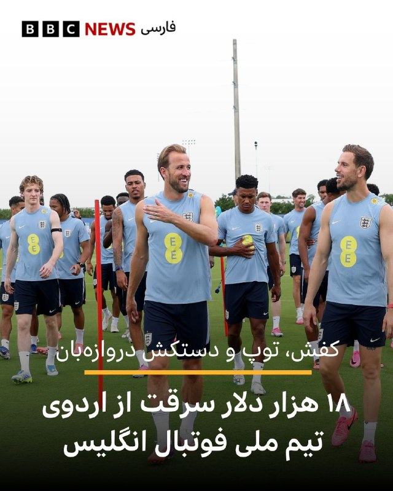

🔻دفتر دادستانی شهرستان جکسون در کانزاس سیتی اموال به سرقت رفته از تیم ملی فوتبال انگلیس را ۱۸ هزار دلار برآورده کرد و گفت این سرقت از یک خودروی حامل وسایل بازیکنان انجام شده است.

این خودرو در انتقال وسایل و تجهیزات بازیکنان تیم ملی انگلیس از اردوی تدارکاتی در ایالت فلوریدا به شهر کانزاس‌سیتی بود.

در ارتباط با این حادثه، دو مرد به نام‌های مصطفی سالک و عرفان کمال بازداشت و به داشتن اموال مسروقه متهم شده‌اند و در صورت اثبات جرم ممکن است بین یک تا هفت سال زندانی شوند.

اتحادیه فوتبال انگلیس تأکید کرده است که هیچ‌یک از اقلام سرقت‌شده تأثیری بر آماده‌سازی تیم برای دیدار افتتاحیه روز چهارشنبه (۱۷ ژوئن/۲۷ خرداد) مقابل کرواسی نخواهد داشت.

بر اساس اسناد دادگاه که بی‌بی‌سی اسپورت دیده است، در بین اقلام سرقت‌شده چند جفت کفش فوتبال، یک توپ، یک جفت دستکش دروازه‌بانی و لباس‌های تمرین تیم ملی فوتبال دیده می‌شود.

همچنین سه پیراهن امضاشده با مجموع ارزش ۱۵ هزار دلار هم در میان اقلام سرقتی ثبت شده‌اند.
گفته می‌شود بخش عمده‌ای از اموال سرقت‌شده پیدا شده است.

📸 Getty

@BBCPersian

## BBCPersian — post 283785

🔻بقایی: امضای تفاهم‌نامه در روزهای آتی منتفی نیست

سخنگوی وزارت خارجه گفته است که تفاهمنامه با آمریکا امروز امضا نمی‌شود اما احتمال آن « در روزهای آینده منتفی نیست.

به گزارش رسانه‌های ایران، اسماعیل بقایی در «نشست خبری با اصحاب رسانه» که شنبه در استانداری همدان برگزار شد گفت که این تفاهمنامه یک «توافق نهایی بین ایران و آمریکا نیست، بلکه تفاهمی است که رئوس کلی مباحث اختلافی را مطرح و مشخص می‌کند که جنگ خاتمه خواهد یافت.»

او گفت که «تفاهمنامه اسلام آباد که در حال پیگیری است» و «در این مرحله تمرکز بر خاتمه جنگ در همه جبهه‌ها از جمله لبنان بوده و تصمیم بر این شد که در مورد موضوع هسته‌ای صحبتی نشود» اما قرار است «درباره موضوع هسته‌ای در یک بازه زمانی ۶۰ روزه گفت‌وگو شود.»

آقای بقایی گفت اگرچه امضای تفاهمنامه یکشنبه نخواهد بود «اما احتمال اینکه در روزهای آتی این اتفاق رقم بخورد منتفی نیست.» با این حال، «به دلیل تزلزل طرف مقابل در هرگونه اظهارنظر درباره این روند باید محتاط باشیم.»

دونالد ترامپ گفته است که توافق امروز امضا و بلافاصله تنگه هرمز به روی همه کشتی‌ها باز خواهد شد.

خبرگزاری فارس اما می‌گوید «ایران هنوز تصمیم نهایی خود دربارۀ تفاهمنامه پیشنهادی را اعلام نکرده است.»

https://bbc.in/4fEONCy
@BBCPersian

## alonews — post 127826

  <a href="telegram/content/alonews_127826_1781430836.webm" target="_blank">🎬 Download video</a>

👈 شرکت نفت و گاز پارس: چاه جدید فاز ۱۱ پارس جنوبی وارد چرخه تولید پایدار گاز شد

🔴 افزایش تولید از فاز ۱۱، در بالا رفتن سهم برداشت ایران از این میدان عظیم گازی اهمیت ویژه‌ای دارد

✅ @AloNews خبر جنگ

## alonews — post 127825

  <a href="telegram/content/alonews_127825_1781430836.webm" target="_blank">🎬 Download video</a>

👈 جزئیات متن تفاهم ایران و آمریکا از زبان مشاور رئیس تیم مذاکره‌کننده

🔴مهدی محمدی، مشاور راهبردی رئیس تیم مذاکره‌کننده جزئیاتی از متن یادداشت تفاهم ایران و آمریکا را تشریح کرد که به شرح زیر است:

🔴 ۱. توقف درگیری‌ها و تضمین‌های امنیتی

🔴در گام نخست، توقف کامل عملیات نظامی علیه ایران و لبنان و جلوگیری از هرگونه اقدام نظامی جدید در دستور کار قرار دارد. همچنین طرف آمریکایی باید تضمین‌های لازم را برای جلوگیری از تکرار تنش‌ها ارائه کند.

🔴۲. آزادسازی دارایی‌ها

🔴براساس چارچوب مورد بحث، بخشی از دارایی‌های بلوکه‌شده ایران در ابتدای اجرای توافق آزاد خواهد شد و همزمان روند تعلیق برخی محدودیت‌ها و تحریم‌های اقتصادی آغاز می‌شود تا امکان افزایش مبادلات اقتصادی و فروش نفت فراهم شود.

🔴۳. رفع محدودیت‌های دریایی و تجاری

🔴یکی از محورهای اصلی توافق، تسهیل تردد کشتی‌های تجاری ایران و کاهش محدودیت‌های دریایی است. هدف این بخش، بازگشت تجارت دریایی ایران به شرایط عادی و رفع موانع موجود در مسیر حمل‌ونقل بین‌المللی عنوان شده است.

🔴۴. مذاکرات هسته‌ای در مرحله بعد

🔴در متن مورد مذاکره، مسائل هسته‌ای در مرحلۀ نخست توافق قرار ندارد. براساس این چارچوب، ابتدا باید تعهدات اولیه طرف مقابل اجرا و راستی‌آزمایی شود و سپس گفت‌وگوها درباره موضوعات هسته‌ای وارد مراحل بعدی شود.

🔴۵. لغو تحریم‌ها و بازسازی خسارت‌ها

🔴در مرحلۀ نهایی، لغو تحریم‌های اولیه و ثانویه آمریکا و همچنین پیش‌بینی سازوکارهایی برای جبران و بازسازی خسارت‌های ناشی از جنگ و فشارهای اقتصادی مورد توجه قرار گرفته است. این بخش از مهم‌ترین مطالبات ایران در روند مذاکرات به‌شمار می‌رود.

✅ @AloNews خبر جنگ

## alonews — post 127824

  <a href="telegram/content/alonews_127824_1781430836.webm" target="_blank">🎬 Download video</a>

👈نیویورک‌ تایمز: تهران معتقد است ایالات متحده آمادگی ورود به یک جنگ گسترده دیگر را ندارد و دونالد ترامپ ترجیح می‌دهد به توافقی برسد که تنش‌ها را کاهش داده و ثبات را به بازارهای انرژی جهانی بازگرداند. این موضوع به ایران فضای بیشتری برای مانور می‌دهد و احساس نیاز آن به دادن امتیازات بزرگ را کاهش می‌دهد.

✅ @AloNews خبر جنگ

---
📅 بروزرسانی: 1405/03/24 13:13
---

## WithYashar — post 14772

صندوق سرمایه گذاری عمومی قطر اعلام کرده بعد از گلی که دیروز بوعلام خوخی در دقیقه‌ی ۹۵ به سوئیس زد ۳ میلیون دلار به همراه یه رولز رویس فانتوم آخرین مدل به ارزش ۵۵٠ هزار دلار پاداش خواهد گرفت!
@withyashar

## mwarmonitor — post 10853

🔴«مهدی محمدی»، مشاور راهبردی رئیس تیم مذاکره‌کننده، جزئیات یادداشت تفاهم ایران و آمریکا را فاش می‌کند:

در گام اول، دستور کار شامل وقف کامل عملیات نظامی علیه ایران و لبنان و جلوگیری از هرگونه اقدام نظامی جدید است. همچنین طرف آمریکایی باید ضمانت‌های لازم برای جلوگیری از تشدید دوباره تنش‌ها را ارائه دهد.

بر اساس چارچوب مورد بحث، با آغاز اجرای توافق، بخشی از دارایی‌های بلوکه‌شده ایران آزاد خواهد شد و همزمان روند تعلیق برخی محدودیت‌ها و تحریم‌های اقتصادی آغاز می‌شود تا افزایش مبادلات اقتصادی و فروش نفت امکان‌پذیر گردد.

تسهیل حرکت کشتی‌های تجاری ایران و کاهش محدودیت‌های دریایی یکی از محورهای اصلی توافق است. هدف این بند، بازگرداندن تجارت دریایی ایران به وضعیت عادی و رفع موانع حمل‌ونقل بین‌المللی است.

در مرحله نخست این توافق (در متن در حال مذاکره)، موضوعات هسته‌ای گنجانده نشده است. طبق این چارچوب، ابتدا باید تعهدات اولیه طرف مقابل اجرا و راستی‌آزمایی شود و سپس مذاکرات درباره مسائل هسته‌ای به مراحل بعدی منتقل خواهد شد.

در مرحله نهایی، رفع تحریم‌های اولیه و ثانویه آمریکا و همچنین ایجاد سازوکارهایی برای جبران خسارات ناشی از جنگ، فشار اقتصادی و بازسازی آن در نظر گرفته شده است. این بند از مهم‌ترین مطالبات ایران در روند مذاکرات محسوب می‌شود.

@mwarmonitor

## mwarmonitor — post 10852

🔴وزارت دفاع بریتانیا: صبح امروز نیروهای بریتانیایی سوار یک نفتکش روسی در کانال مانش شدند که به‌طور مخفیانه در تأمین مالی جنگ پوتین در اوکراین کمک می‌کرد.

@mwarmonitor

## pm_afshaa — post 93852

تندروها:مجتبی شهید شده ولی اینا میگن زنده ست تا از زبونش هرکاری خواستن بکنن. تا خودش نیاد جلوی دوربین بگه از خون پدرش گذشته ما قبول نمیکنیم

💧 Rainbet.com the #1 Non-KYC Crypto Casino & Sportsbook @rainbetcom

😁 @Pm_Afshaa

## kianmeli1 — post 87979

  

🔴عایشه قذافی دختر معمر قذافی

به پدر من گفتند موشک و برنامه هسته ای را کنار بگذار تا درهای رفاه و آسایش به روی لیبی باز شود
پدر من نیز چنین کرد اما ناتو شروع به بمباران لیبی کرد
https://t.me/kianmeli1

## IranIntlTV — post 342228

  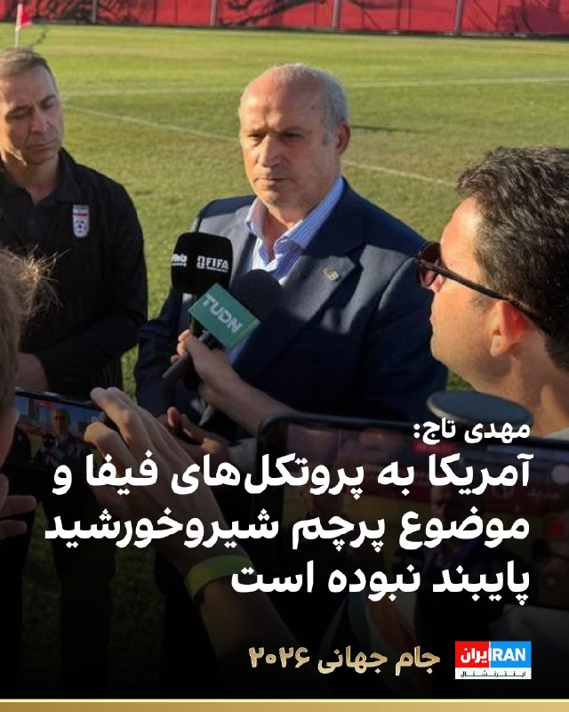

🔻مهدی تاج، رییس فدراسیون فوتبال جمهوری اسلامی، در گفتگویی در حاشیه تمرین تیم ملی در تیخوانا درباره احتمال حضور ایرانیان ساکن لس‌آنجلس با پرچم شیروخورشید در بازی با نیوزلند گفت: «فیفا مسئول اجرای پروتکل‌های مسابقات است. البته دولت آمریکا در برخی موارد به این پروتکل‌ها پایبند نبوده. یکی از این موارد، موضوع استفاده از پرچم رسمی کشورها در ورزشگاه‌هاست.»

🔹تاج ادامه داد: «ما پرچم رسمی کشورمان را به فیفا اعلام کرده‌ایم و این نهاد نیز برای رفع مشکلات همکاری‌های خوبی داشته است.»

🔹در روزهای اخیر، شماری از ایرانیان خارج از کشور به‌ویژه در آمریکا، تلاش کرده‌اند با روش‌های مختلف به تصمیم فیفا در خصوص ممنوعیت ورود پرچم شیر و خورشید به ورزشگاه‌های جام جهانی اعتراض کنند و راه‌هایی برای نمایش آن در جریان مسابقات بیابند.

🔹این در حالی است که شماری از هواداران ایرانی موفق شدند پرچم‌ شیروخورشید را به داخل ورزشگاه لیوایز در کالیفرنیا وارد کنند و در جریان دیدار قطر و سوئیس به نمایش بگذارند.

@iranintltvsport

## FarsiVOA — post 220661

  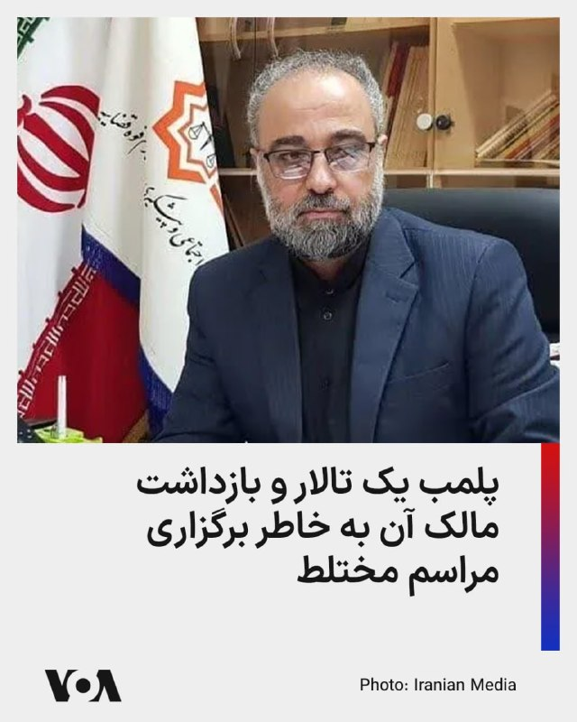

جلال آفاقی، دادستان عمومی و انقلاب اردبیل، از پلمب یک تالار پذیرایی و بازداشت مالک آن به اتهام آنچه «قانون‌شکنی» و «اقدامات نابهنجار اخلاقی» خواند، خبر داد.

به گفته آفاقی، این تالار در روزهای گذشته محل برگزاری مراسم عروسی مختلط بوده و پس از انتشار گزارش و ویدئویی از این مراسم، با پیگیری مرجع قضایی و نیروی انتظامی شناسایی و پلمب شده است.

این برخورد تازه در ادامه مجموعه‌ای از اقدامات مشابه جمهوری اسلامی علیه کافه‌ها، تالارها و اماکن عمومی در هفته‌های اخیر است.

دهم خرداد، پلیس نظارت بر اماکن عمومی تهران یک کافه در محدوده خیابان ولیعصر را به اتهام «ترویج فرقه‌های انحرافی» و آنچه «تحرکات شیطانی» خوانده شد، پلمب کرد. در روایت منابع حکومتی، برگزاری برنامه با «ظاهر موسیقی غربی» و «حرکات نابهنجار» دلیل این اقدام عنوان شد.

چند روز پیش از آن، در سوم خرداد، منابع محلی گیلان از پلمب یک کافه در منطقه گلسار رشت و بازداشت سی‌ودو نفر خبر دادند. در روایت حکومتی منتشرشده، اتهام‌ها «قمار» و «مسائل اخلاقی» عنوان شده بود.
@FarsiVOA

## Persian_Trend_Official — post 17009

  <a href="telegram/content/Persian_Trend_Official_17009_1781430239.webm" target="_blank">🎬 Download video</a>

خبرگزاری i24NEWS: انتظار می‌رود جی دی ونس، معاون رئیس جمهور امریکا، و محمد باقر قالیباف، رئیس مجلس ایران، امروز برای امضای تفاهم‌نامه، جلسه‌ای مجازی برگزار کنند.

📝 Amir

📌 @persian_trend_official
پرشین ترند | متفاوت‌ترین کانال نظامی

## Dirty_Kids — post 391990

ویدیو وایرال شده از گلایه‌های یه راننده تاکسی از وضعیت تراس‌های مملکت :

@Dirty_Kids 👻

## Dirty_Kids — post 391989

  <a href="telegram/content/Dirty_Kids_391989_1781430239.mp4" target="_blank">🎬 Download video</a>

امروز 14 June، روز جهانی حمام کردنه 
🛁

+این پست رو به هرکی بفرستی، امروز باید باهات بیاد حموم.

@Dirty_Kids 👻

## alonews — post 127823

  <a href="telegram/content/alonews_127823_1781430241.webm" target="_blank">🎬 Download video</a>

👈آی۲۴نیوز عبری: امروز ونس و قالیباف طی جلسه مجازی تفاهم نامه را امضا خواهند کرد

✅ @AloNews خبر جنگ

## alonews — post 127822

  <a href="telegram/content/alonews_127822_1781430241.webm" target="_blank">🎬 Download video</a>

👈نیویورک تایمز: جنگی که آمریکا و اسرائیل طی ماه‌های گذشته علیه ایران انجام دادند، به اهداف راهبردی اعلام‌شده در آغاز آن دست نیافته و در عوض واقعیت سیاسی و امنیتی جدیدی ایجاد کرده است که ایران را به کشوری مقاوم‌تر و آماده‌تر برای پذیرش ریسک تبدیل کرده است.

✅ @AloNews خبر جنگ

---
📅 بروزرسانی: 1405/03/24 13:03
---

## VahidOOnLine — post 245441

  

روح‌الله لک‌علی‌آبادی، نماینده دورود و ازنا در مجلس، گفت مذاکره‌کنندگان جمهوری اسلامی می‌دانند که «هیچ صلحی در کار نیست» و باید از مذاکره همان‌گونه استفاده کرد که از موشک و پهپاد استفاده می‌شود.

او ادامه داد: «اساسا امکان ندارد که ما با شیطان بزرگ و کشوری که قاتل امام ماست، مذاکره کنیم و به صلح برسیم.»

او در گفت‌وگویی تلویزیونی که ایسنا منتشر کرد، گفت مردم با توجه به تجربه مذاکرات گذشته نگران هستند، اما تیم مذاکره‌کننده جمهوری اسلامی نیز همین تجربه و نگرانی را دارد.

لک‌علی‌آبادی افزود اگر جمهوری اسلامی فردی مانند محمدباقر قالیباف را با سابقه نظامی برای ریاست تیم مذاکره‌کننده انتخاب کند، این پیام را به طرف مقابل می‌دهد که مذاکرات بخشی از یک مبارزه است و جمهوری اسلامی همچنان خود را در میدان جنگ می‌بیند.
iranintl
‌🏁 🇬🇧 IranintlTV

🤖 @VahidOOnLine

## pm_afshaa — post 93851

سی‌ان‌ان: مذاکره‌کنندگان قطری برای نهایی کردن تفاهم راهی تهران شدن

💧 Rainbet.com the #1 Non-KYC Crypto Casino & Sportsbook @rainbetcom

😁 @Pm_Afshaa

## pm_afshaa — post 93850

  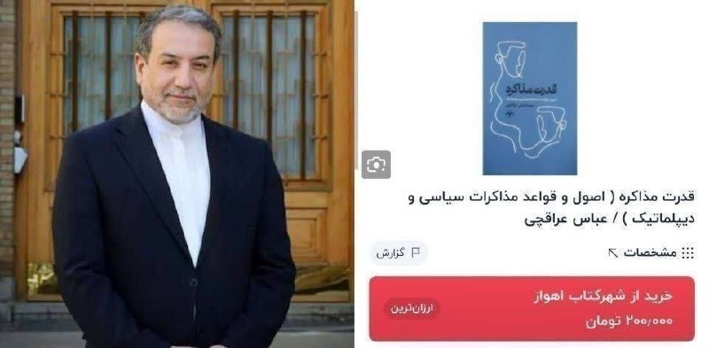

قدرت مذاکره یعنی جوری توافق کنی که هم موافقای جمهوری اسلامی؛ هم مخالفای جمهوری اسلامی؛ هم آمریکایی ها و هم اسرائیلی ها ناراضی باشن

💧 Rainbet.com the #1 Non-KYC Crypto Casino & Sportsbook @rainbetcom

😁 @Pm_Afshaa

## DEJradio — post 5671

  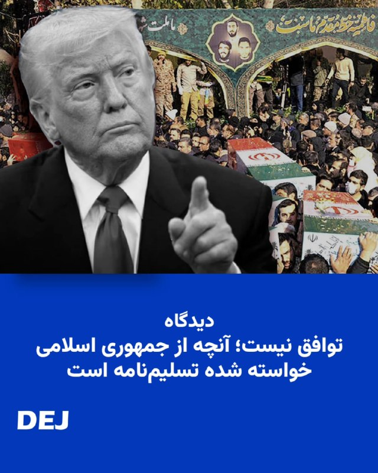

📝
⭕️ آنچه آمریکا به عنوان متن توافق پیش روی جمهوری اسلامی گذاشته تا امضا کند، توافق نیست بلکه تسلیم‌نامه است.

در مسائل حقوقی، امضاء به معنای اقرار به انجام عملی یا پذیرش مسئولیتی مشخص است. با این نگاه امضای جمهوری اسلامی پای چنین سندی، به معنای پذیرش مسئولیت اقدامات گذشته و قبول تبعات احتمالی تکرار آن‌ها تلقی می‌شود و به معنای تسلیم است. با این حال، پرسش اصلی این است که آیا رژیم تروریستی به چنین تعهدی پایبند خواهد ماند؟ پاسخ منفی است و سوالی که پیش می‌آید پس چرا آمریکا به دنبال امضاء رژیم است؟
از نگاه آمریکا امضای احتمالی چنین سندی می‌تواند در آینده [احتمالا بسیار نزدیک] مسیر اقدامات بین‌المللی سیاسی و نظامی را علیه رژیم را هموارتر و هماهنگ‌‌تر کرده و دست آمریکا را بازتر کند.
از همین رو، اصرار آمریکا بر اخذ این امضا، بیش از آنکه صرفاً دستیابی به یک توافق باشد، تلاشی برای ثبت رسمی پذیرش مسئولیت از سوی طرف مقابل است یعنی رژیم به جرائم خود رسماً اقرار کند.

#توافق #مذاکرات #یادداشت
@DEJradio

## kianmeli1 — post 87978

  <a href="telegram/content/kianmeli1_87978_1781429632.mp4" target="_blank">🎬 Download video</a>

🔴حمید رسایی: اجتماعات خیابانی فقط با محو کردن اسرائیل از روی کره زمین تمام خواهد شد
https://t.me/kianmeli1

## kianmeli1 — post 87977

  <a href="telegram/content/kianmeli1_87977_1781429633.mp4" target="_blank">🎬 Download video</a>

🔴شعار مخالفان توافق در زنجان: اگر چیزی امضا شه، مسئول باید کشته شه
https://t.me/kianmeli1

## kianmeli1 — post 87976

  <a href="telegram/content/kianmeli1_87976_1781429634.mp4" target="_blank">🎬 Download video</a>

🔴صداوسیما: همه امامان هم اهل مذاکره بودند و با دشمنانشان گفتگو می کردند از امام رضا تا امام حسن مجتبی با دشمنان مذاکره می کردند
https://t.me/kianmeli1

## IranIntlTV — post 342227

  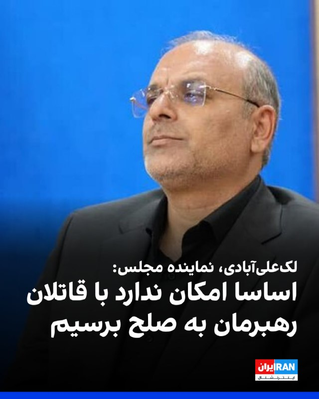

روح‌الله لک‌علی‌آبادی، نماینده دورود و ازنا در مجلس، گفت مذاکره‌کنندگان جمهوری اسلامی می‌دانند که «هیچ صلحی در کار نیست» و باید از مذاکره همان‌گونه استفاده کرد که از موشک و پهپاد استفاده می‌شود.

او ادامه داد: «اساسا امکان ندارد که ما با شیطان بزرگ و کشوری که قاتل امام ماست، مذاکره کنیم و به صلح برسیم.»

او در گفت‌وگویی تلویزیونی که ایسنا منتشر کرد، گفت مردم با توجه به تجربه مذاکرات گذشته نگران هستند، اما تیم مذاکره‌کننده جمهوری اسلامی نیز همین تجربه و نگرانی را دارد.

لک‌علی‌آبادی افزود اگر جمهوری اسلامی فردی مانند محمدباقر قالیباف را با سابقه نظامی برای ریاست تیم مذاکره‌کننده انتخاب کند، این پیام را به طرف مقابل می‌دهد که مذاکرات بخشی از یک مبارزه است و جمهوری اسلامی همچنان خود را در میدان جنگ می‌بیند.
iranintl.com/202606146389

## FarsiVOA — post 220660

  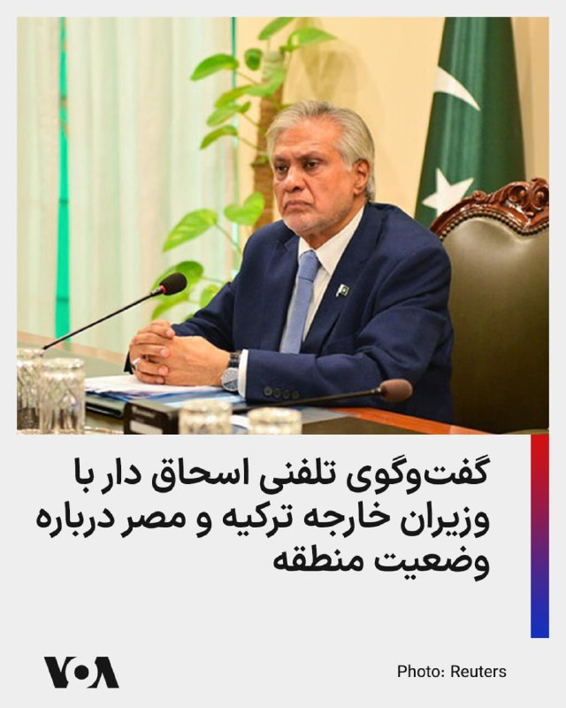

وزارت امور خارجه پاکستان اعلام کرد که محمد اسحاق دار، معاون نخست‌وزیر و وزیر خارجه این کشور، طی دو تماس تلفنی جداگانه با وزیران خارجه مصر و ترکیه درباره آخرین تحولات منطقه گفت‌وگو کرده است.

بر اساس اعلام وزارت خارجه پاکستان، اسحاق دار در گفت‌وگو با بدر عبدالعاطی، وزیر خارجه مصر، درباره وضعیت جاری منطقه و به‌ویژه روند شکل‌گیری تفاهم میان ایالات متحده آمریکا و جمهوری اسلامی تبادل نظر کرد و دو طرف ضمن ابراز امیدواری نسبت به «پیامدهای مثبت» این تحولات، تأکید کردند که چنین روندهایی می‌تواند به «تقویت صلح، امنیت و ثبات پایدار در منطقه» کمک کند.

در تماس دیگر، وزیر خارجه پاکستان و هاکان فیدان همتای ترکیه‌ای او، ضمن بررسی وضعیت متغیر منطقه، از «پیشرفت‌های امیدوارکننده در مسیر تفاهم میان ایالات متحده و جمهوری اسلامی» استقبال کردند.

آنان ابراز امیدواری کردند که این تحولات بتواند زمینه‌ساز صلح و ثبات پایدار در منطقه باشد و بر تداوم رایزنی‌های نزدیک در آینده تأکید کردند.
@FarsiVOA

## DW_Farsi — post 125951

  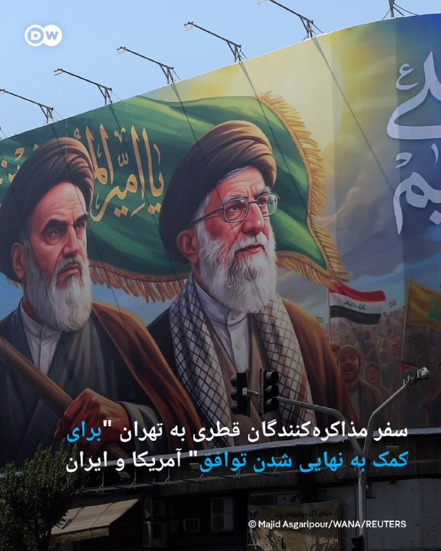

🔶 سفر مذاکره‌کنندگان قطری به تهران "برای کمک به نهایی شدن توافق" آمریکا و ایران

رسانه‌های داخلی ایران روز یکشنبه از سفر یک هیئت قطری به تهران خبر دادند.

به نوشته خبرگزاری ایسنا این هیئت به ریاست "یکی از مشاوران وزیر خارجه قطر" برای "ادامه تبادل پیام‌‌ها" بین تهران و واشنگتن در مورد توافق پایان جنگ راهی ایران شده است. خبرگزاری تسنیم، نزدیک به سپاه پاسداران، نیز نوشت این هیئت با مقامات جمهوری اسلامی دیدار و رایزنی کرده است. در این گزارش به جزئیات بیشتری در مورد این گفت‌وگوها اشاره نشده است.

در همین حال شبکه خبری سی‌ان‌ان‌ به نقل از یک منبع آگاه گزارش داد مذاکره‌کنندگان قطری با هماهنگی ایالات متحده صبح یکشنبه به تهران پرواز کردند تا به "نهایی شدن توافق" کمک کنند.

@dw_farsi

## Persian_Trend_Official — post 17008

ویدیو منتشر شده از لحظه اصابت یک پهپاد انتحاری حزب‌الله از نوع شاهد-101 به نقطه ای در الجلیل واقع در شمال اسرائیل 📝 Amir 📌 @persian_trend_official پرشین ترند | متفاوت‌ترین کانال نظامی

## IranianMinds — post 22541

  <a href="telegram/content/IranianMinds_22541_1781429638.mp4" target="_blank">🎬 Download video</a>

🔴 شعار عرزشیا:

اگر چیزی امضا شه، مسئول باید کشته شه

@IranianMinds

## alonews — post 127821

  <a href="telegram/content/alonews_127821_1781429639.webm" target="_blank">🎬 Download video</a>

👈ایوو دالدر، سفیر پیشین آمریکا در ناتو معتقد است که ایالات متحده در شرایطی که تمایلی به ورود به رویارویی مستقیم با روسیه ندارد، به فاصله گرفتن از اروپا ادامه خواهد داد.

🔴به اعتقاد وی، آمریکا آگاهانه و فعالانه در حال جست‌وجوی راه‌هایی برای ایجاد یک نظام امنیتی مستقل از اروپا است.

🔴 دالدر افزود، ایالات متحده از بیم واکنش احتمالی روسیه، نه تنها استقرار سامانه‌های تسلیحاتی دوربرد و دقیق را در خاک کشورهای اروپایی متوقف کرده، بلکه متحدان اروپایی خود را نیز از تجهیز به چنین سامانه‌هایی بازمی‌دارد.

✅ @AloNews خبر جنگ

---
📅 بروزرسانی: 1405/03/24 12:53
---

## WithYashar — post 14771

فرمانده مرزبانی آذربایجان‌غربی اعلام کرد حسین رسولی ستوان سوم نیروهای مرزبانی هنگ مرزی چالدران در جریان درگیری با نیروهای پ.ک.ک كشته شده است. PKK مخفف نام کردی ‌به معنی (Partiya Karkerên Kurdistanê)
«حزب کارگران کردستان»
@withyashar

## IranIntlTV — post 342226

  <a href="telegram/content/IranIntlTV_342226_1781429018.mp4" target="_blank">🎬 Download video</a>

رییس انجمن مددکاران اجتماعی ایران می‌گوید با عمیق‌تر شدن فقر، پدیده کودک‌کار در حال گسترش است. به گفته او، حضور کودکان در خیابان‌ها و بازار کار افزایش یافته و آن‌ها را در معرض انواع آسیب‌ها از جمله خشونت و سوءاستفاده قرار داده است.
جزییات بیشتر در گفت‌وگو با منصوره حسینی‌یگانه، عضو تحریریه ایران‌اینترنشنال
@iranintltv

## DW_Farsi — post 125950

  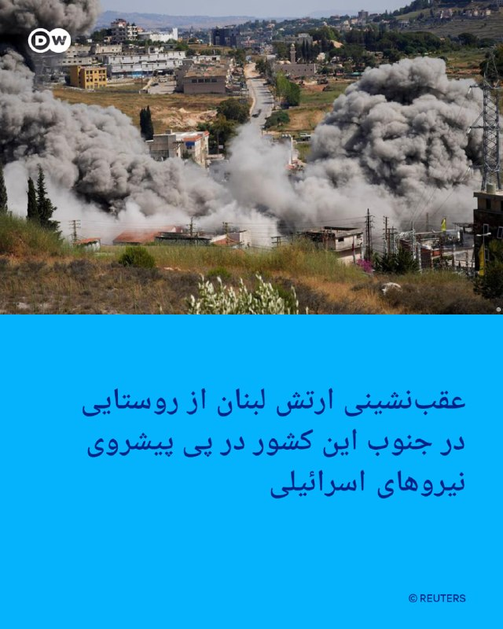

🔶 عقب‌نشینی ارتش لبنان از روستایی در جنوب این کشور در پی پیشروی نیروهای اسرائیلی

یک مقام ارشد نظامی لبنان که نخواست هویتش فاش شود به خبرگزاری آسوشیتدپرس گفت روز شنبه ۲۳ خرداد (۱۳ ژوئن) پس از پیشروی نیروهای اسرائیلی به سمت روستای کفر تبنیت در جنوب لبنان، ارتش لبنان نیروهای خود را از یک پایگاه نظامی در این روستا خارج کرده است. ارتش اسرائیل پیش از آن برای حدود ۲۰ منطقه از جمله شهر نبطیه و روستاهای اطراف آن هشدار تخلیه صادر کرده بود.

خبرگزاری دولتی لبنان گزارش داد روز شنبه اسرائیل به چندین روستای اطراف نبطیه حمله هوایی انجام داد. طبق این گزارش شهر نبطیه هدف گلوله‌باران توپخانه‌ای قرار گرفت و دو نفر نیز در روستای دیرالزهرانی کشته شدند.

این مقام ارشد نظامی بدون اشاره به جزئیات به آسوشیتدپرس گفت که ارتش لبنان پس از ورود نیروهای اسرائیلی به منطقه، نیروهای خود را از پادگان کفر تنبیت خارج کرد. طبق این گزارش به احتمال زیاد نیروهای اسرائیلی در تلاش بودند تا تپه راهبردی "علی طاهر" را تصرف کنند که در حاشیه کفر تنبیت قرار داد و به بخش‌های وسیعی از شهر نبطیه و برخی جاده‌هایی که این شهر را به روستاهای اطراف متصل می‌کند، مشرف است.

@dw_farsi

## IranianMinds — post 22540

🔴 سی‌ان‌ان:

مذاکره‌کنندگان قطری برای نهایی کردن تفاهم راهی تهران شده‌اند

@IranianMinds

## alonews — post 127820

  <a href="telegram/content/alonews_127820_1781429021.webm" target="_blank">🎬 Download video</a>

👈دو پهپاد حزب‌الله امروز صبح به یک منطقه نظامی در شمال اسرائیل نزدیک مرز لبنان حمله کردند، طبق اعلام ارتش اسرائیل. 
🔴 ارتش اعلام کرد که در این حادثه هیچ زخمی گزارش نشده است و موضوع همچنان در حال بررسی است 
✅ @AloNews خبر جنگ

## alonews — post 127819

  <a href="telegram/content/alonews_127819_1781429021.webm" target="_blank">🎬 Download video</a>

👈مانوک خدابخشیان - تحلیلگر سیاسی چندسال پیش، قبلِ درگذشت :
- اورانیوم رو میدن توافق میشه - بازی تازه شروع میشه

✅ @AloNews خبر جنگ

## alonews — post 127818

  <a href="telegram/content/alonews_127818_1781429021.webm" target="_blank">🎬 Download video</a>

👈کانال ۱۲ تلویزیون اسرائیل: توافق آمریکا با ایران، اسرائیل را به حاشیه رانده و موضع تهران را تقویت می‌کند

✅ @AloNews خبر جنگ

---
📅 بروزرسانی: 1405/03/24 12:43
---

## VahidOOnLine — post 245440

  

روح‌الله ایزدخواه، نماینده تهران در مجلس، در صدا و سیمای جمهوری اسلامی گفت: «ما هنوز انتقام خون قاسم سلیمانی را نگرفتیم، چه برسد به جنگ ۱۲ روزه، جنگ ۴۰ روزه و خون رهبرمان، انتقام خون سلیمانی باید نابودی اسرائیل می‌بود.»

او افزود: «در آن زمان، در شورای عالی امنیت ملی، ۱۳ سناریو برای انتقام خون سلیمانی مطرح شد که ضعیف‌ترین آن حمله به پایگاه عین‌الاسد بود.»
‌🏁 🇬🇧 IranintlTV

🤖 @VahidOOnLine

## VahidOOnLine — post 245439

♦️شماری از شهروندان افغان مقیم فرانسه، روز شنبه ۲۲ جوزا/خرداد، با برگزاری تجمع اعتراضی در شهر پاریس، حمایتشان از زنان و دختران افغانستان را اعلام کردند. 
معترضان از جامعه جهانی خواستند فشار بر رژیم طالبان را افزایش دهد تا این گروه از تشدید محدودیت‌ها و اعمال فشار علیه زنان و دختران دست بردارد. 
این تجمع درحالی برگزار شد که محتسبان امر به معروف و نهی از منکر طالبان در ده روز اخیر بازداشت زنان و دختران به‌دلیل نپوشیدن برقع یا چادرنماز همراه با ماسک را افزایش داده‌اند. بیش‌ترین اعمال فشار و سختگیری در ولایت هرات در غرب افغانستان گزارش شده است. 
هفته گذشته طالبان اعتراض و راهپیمایی ساکنان شهرک جبرئیل هرات را که در مخالفت با بازداشت زنان و دختران برگزار شده بود، با شلیک گلوله سرکوب کردند.
‌🇸🇦 Indypersian

🤖 @VahidOOnLine

## WithYashar — post 14770

  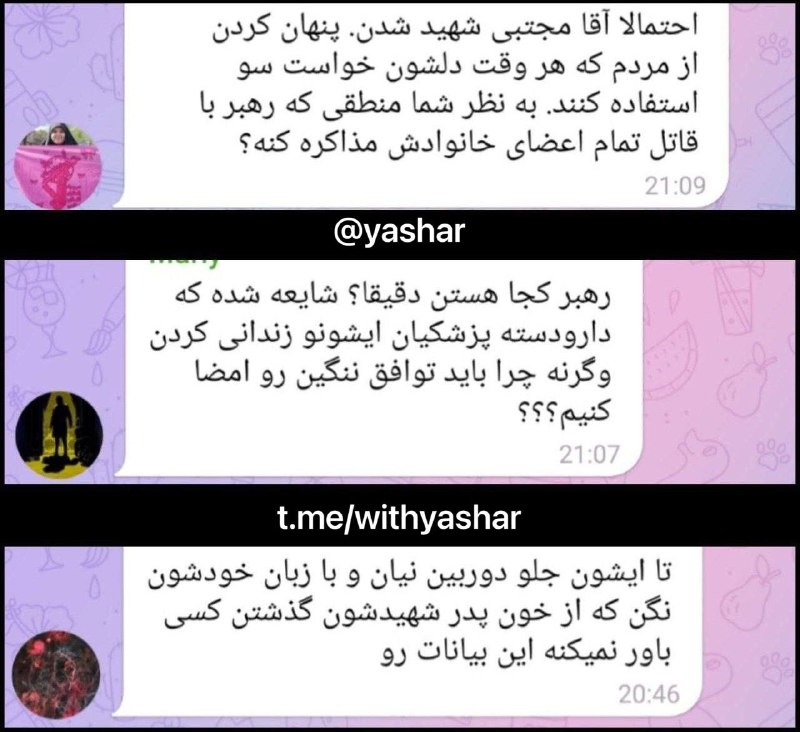

عرزشی‌ها: تا مجتبی خامنه‌ای نیاد جلو دوربین و نگه از خون بابام و خانوادم گذشتم، ما این توافق رو قبول نمیکنیم
@withyashar 🤣

## WithYashar — post 14769

صدای انفجار ناشی از مهمات عمل‌نکرده در غرب تبریز
@withyashar

## mwarmonitor — post 10851

📝 سوال انتقاد پیشنهاد دارید دایرکت جواب میدم

## IranIntlTV — post 342225

  <a href="telegram/content/IranIntlTV_342225_1781428415.mp4" target="_blank">🎬 Download video</a>

حسین آقایی، عضو تحریریه ایران‌اینترنشنال، با اشاره به سفر وزیر خارجه قطر به تهران می‌گوید این سفر می‌تواند با موضوع آزادسازی دارایی‌های بلوکه‌شده جمهوری اسلامی و تلاش برای پیشبرد تفاهم میان تهران و واشینگتن مرتبط باشد. به گفته او، اجرای چنین طرحی منوط به دستیابی دو طرف به توافق خواهد بود.
@iranintltv

## IranIntlTV — post 342224

  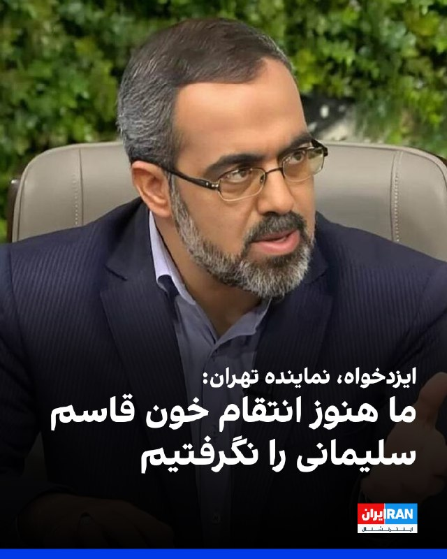

روح‌الله ایزدخواه، نماینده تهران در مجلس، در صدا و سیمای جمهوری اسلامی گفت: «ما هنوز انتقام خون قاسم سلیمانی را نگرفتیم، چه برسد به جنگ ۱۲ روزه، جنگ ۴۰ روزه و خون رهبرمان، انتقام خون سلیمانی باید نابودی اسرائیل می‌بود.»

او افزود: «در آن زمان، در شورای عالی امنیت ملی، ۱۳ سناریو برای انتقام خون سلیمانی مطرح شد که ضعیف‌ترین آن حمله به پایگاه عین‌الاسد بود.»
https://iranintl.com/202606148266

## alonews — post 127817

  <a href="telegram/content/alonews_127817_1781428418.webm" target="_blank">🎬 Download video</a>

👈شاخص کل بورس در پایان معاملات امروز با جهش ۱۲۳ هزار واحدی به ۴ میلیون و ۸۱۹ هزار واحد رسید

✅ @AloNews خبر جنگ

## alonews — post 127816

  <a href="telegram/content/alonews_127816_1781428418.webm" target="_blank">🎬 Download video</a>

👈یائير لاپید، رهبر اپوزیسیون اسرائیل به روزنامه بریتانیایی تایمز : اسرائیلی‌ها در وضعیتی از یأس و بدبینی غیرقابل تحمل زندگی می‌کنند.

🔴نگرانی در اسرائیل به دلیل عدم تحقق اهداف اعلام‌شده جنگ حاکم است.

🔴روابط ما با ایالات متحده به‌شدت آسیب دیده و دولت آینده باید این خسارت را ترمیم کند.

🔴ما از زمان ۷ اکتبر تاکنون این میزان یأس و بدبینی را در میان اسرائیلی‌ها مشاهده نکرده‌ایم؛ سطح ناامیدی به حدی رسیده که قابل تحمل نیست

✅ @AloNews خبر جنگ

## alonews — post 127815

  <a href="telegram/content/alonews_127815_1781428418.webm" target="_blank">🎬 Download video</a>

👈شنیده شدن صدای انفجار ناشی از مهمات عمل‌نکرده در تبریز

✅ @AloNews خبر جنگ

---
📅 بروزرسانی: 1405/03/24 12:33
---

## VahidOOnLine — post 245438

ویدیوهای رسیده به ایران‌اینترنشنال نشان می‌دهند گروهی از ایرانیان مقیم آلمان شنبه ۲۳ خرداد در حمایت از شاهزاده رضا پهلوی و علیه جمهوری اسلامی، در شهرهای هامبورگ، کاسل، نورنبرگ و اشتوتگارت تجمع کرده و فریاد «ایران» سردادند.
‌🏁 🇬🇧 IranintlTV

🤖 @VahidOOnLine

## VahidOOnLine — post 245437

  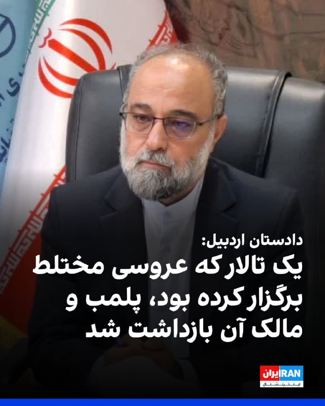

جلال آفاقی، دادستان اردبیل، از پلمب یک تالار پذیرایی، به دلیل آنچه «قانون‌شکنی و اقدامات نابهنجار اخلاقی» خوانده و بازداشت مالک این مجموعه خبر داد.

دادستان اردبیل افزود: «این مجموعه در روزهای گذشته اقدام به برگزاری مراسم عروسی مختلط و هنجارشکنانه کرده بود.»

او اضافه کرد: «با هرگونه بی‌عفتی، فساد و قانون‌شکنی در صنوف به‌ویژه کافه‌ها، کافی‌شاپ‌ها، تالارها و رستوران‌ها برخورد خواهد شد.»
iranintl
‌🏁 🇬🇧 IranintlTV

🤖 @VahidOOnLine

## DEJradio — post 5670

  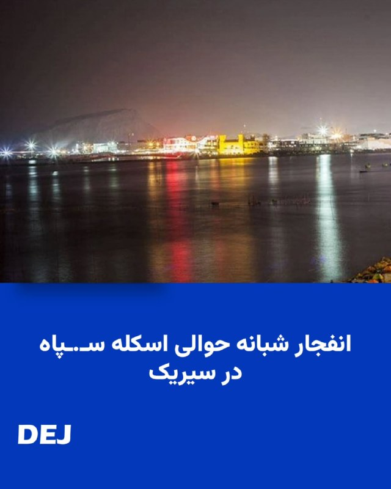

🚨
🔥 براساس اطلاعات دریافتی بامداد یکشنبه ۲۴ خرداد ۱۴۰۵ نیروهای سـ.ـپاه و سنتکام در تنگه هرمز درگیر شدند. ساکنان سیریک می‌گویند در اسکله سـ.ـپاه در بندر طاهرویی صدای چند انفجار شنیده شد. همچنین گزارش شد که به سمت یک کشتی تجاری خارجی یک پرتابه شلیک شده است. مشخص نیست این کشتی متعلق به جمهوری اسلامی بود که هدف نیروهای سنتکام قرار گرفت یا اینکه نیروهای مسلح رژیم آن را هدف قرار دادند.
انفجارها و درگیری‌های مشابه در تنگه هرمز و اطراف آن چندین شب پیاپی تکرار شده است هرچند ادعا شده طرفین قرار است به زودی توافق نهایی را امضاء کنند!

#سنتکام #تنگه_هرمز #سیریک #انفجار
@DEJradio

## DEJradio — post 5669

  <a href="telegram/content/DEJradio_5669_1781427841.mp4" target="_blank">🎬 Download video</a>

🎥📢 هواداران نظام که مخالف توافق آمریکا هستند عراقچی و قالیباف را لعنت می‌کنند، یکی از آنها می‌گوید "خاک برسرتون"
ولایتمداران بهت‌زده‌اند که چطور هنوز جنازه خامنه‌ای دفن نشده با قاتلانش توافق می‌شود؟

#عرزشی #توافق #موشعلی
@DEJradio

## DEJradio — post 5668

👑⚽️ اهتزاز پرچم شیر و خورشید ایران در جریان مسابقه سوئیس و قطر، در شهر  سانفرانسیسکو، شنبه ۲۳ خرداد ۱۴۰۵

#پرچم_شیروخورشید #جام_جهانی #فوتبال
@DEJradio

## DEJradio — post 5667

  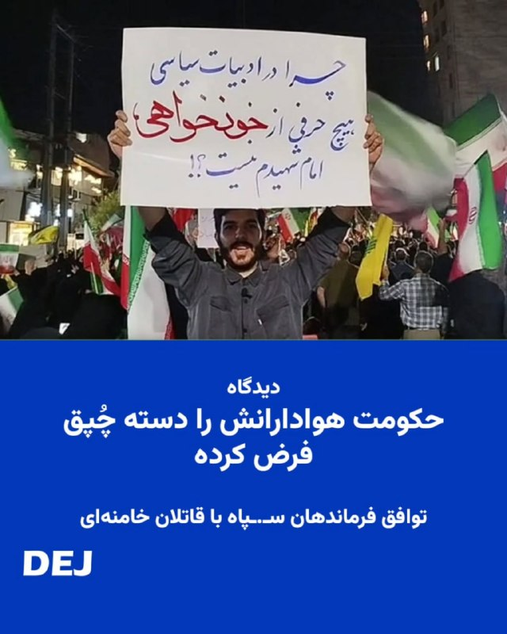

📝
⭕️ هزاران نفر از طرفداران حکومت بیش از ۱۰۰ شب زیر بمباران به خیابان‌ها آمدند تا ثابت کنند در سخت‌ترین مقطع پشت نظام ایستاده‌اند. آن وقت که اسرائیل با پهپاد ایست‌های بازرسی را هدف قرار می‌داد شماری از آنها غسل شهادت کردند و با فرزندان خردسال‌شان کنار بــ.ـسیجی‌ها ایستادند تا سپر بلا شوند حالا اما به چشم خود می‌بینند که مسئولان نظام در برابر قاتلان علی خامنه‌ای تسلیم شده‌اند و به قول خودشان با «یزید بیعت کردند.»
حکومت هوادارانش را دسته چُپق فرض کرده است. تا جایی که می‌توانست در تجمعات از آنها سواری گرفت حالا، چون پای مصلحت و جیب و موقعیت سرداران و دلالان سیاسی در میان است، به اسم «توافق» تسلیم «شیطان بزرگ» می‌‌شود. حکومت قبلاً هم در برجام با آمریکا توافق کرده بود اما آن زمان می‌شد کاسه کوزه‌ها را بر سر ظریف و روحانی شکست، اما حالا نه! محمدباقر قالیباف و شماری از فرماندهان سـ.ـپاه پاسداران آماده تسلیم‌اند هر چند به ظاهر هنوز هارت و پورت می‌کنند.
حتی اعتراض ولایتمداران در تجمعات شبانه را تحمل نمی‌کنند. روزنامه «جوان» نزدیک به سـ.ـپاه می‌نویسد این تجمعات «دچار فتنه و آفت» شده است و حاضران در تجمعات «نوک پیکان حملات را به‌سوی مسئولان دولت، تیم مذاکره‌کننده و حتی فرماندهان نظامی می‌گیرند.» با این وضعیت رویارویی و جدال درون نظام دیر یا زود تشدید خواهد شد و شاید اصرار ترامپ به مذاکره به همین دلیل است.
خانواده نظامی‌هایی که در جنگ کشته شده‌اند می‌پرسند اگر قرار بود در نهایت تسلیم آمریکا شوید چرا عزیزان ما را قربانی کردید؟

#عرزشی #توافق
@DEJradio

## IranIntlTV — post 342223

  <a href="telegram/content/IranIntlTV_342223_1781427843.mp4" target="_blank">🎬 Download video</a>

ویدیوهای رسیده به ایران‌اینترنشنال نشان می‌دهند گروهی از ایرانیان مقیم آلمان شنبه ۲۳ خرداد در حمایت از شاهزاده رضا پهلوی و علیه جمهوری اسلامی، در شهرهای هامبورگ، کاسل، نورنبرگ و اشتوتگارت تجمع کرده و فریاد «ایران» سردادند.

## IranIntlTV — post 342222

  

جلال آفاقی، دادستان اردبیل، از پلمب یک تالار پذیرایی، به دلیل آنچه «قانون‌شکنی و اقدامات نابهنجار اخلاقی» خوانده و بازداشت مالک این مجموعه خبر داد.

دادستان اردبیل افزود: «این مجموعه در روزهای گذشته اقدام به برگزاری مراسم عروسی مختلط و هنجارشکنانه کرده بود.»

او اضافه کرد: «با هرگونه بی‌عفتی، فساد و قانون‌شکنی در صنوف به‌ویژه کافه‌ها، کافی‌شاپ‌ها، تالارها و رستوران‌ها برخورد خواهد شد.»
iranintl.com/202606148335

## IranIntlTV — post 342221

  <a href="telegram/content/IranIntlTV_342221_1781427846.mp4" target="_blank">🎬 Download video</a>

گفت‌وگوی ویژه با وثاق سنایی، سخنگوی فارسی‌زبان جامعه جهانی بهائی
در این گفت‌وگو وثاق سنایی درباره هویت، پایداری، حمایت‌های بین‌المللی و نقش این جامعه در آینده ایران آزاد می‌گوید.
تماشای نسخه کامل این برنامه در یوتیوب:

https://youtu.be/Xx9h1PKb-QQ

@iranintltv

## Shin_Persian — post 7026

ترجمه خودکار فارسی

#فوری ‼️ما همچنین هشدار فوری به ساکنان لبنان در شهرها و روستاهای زیر صادر می کنیم: آرکی، بنافول، جبا، جرنایا، حومین التحتا، حومین الفوقا، کفر بیت، کفر ملکی، کفر فیلا، کفر شلال، عین بوسوار، عزه (النبطیه)، عین قانا، عرب الجل، صربا (النبطیه)، رومین

🔸در پی نقض توافق آتش بس توسط حزب الله تروریستی، ارتش دفاعی مجبور به اقدام قاطع علیه آن است. ارتش دفاعی قصد آسیب رساندن به شما را ندارد.

🔸به منظور حفظ امنیت شما، باید فوراً خانه‌های خود را تخلیه کرده و از روستاها و شهرها حداقل به فاصله 1000 متری به سمت مناطق باز دور شوید.

🔸هرکس که در نزدیکی عناصر حزب الله و تاسیسات و وسایل جنگی آن حضور داشته باشد، جان خود را به خطر می‌اندازد!

· @shin_persian

## FarsiVOA — post 220659

🔺خدمات کارت دو بانک پس از حمله سایبری وصل شد؛ دو بانک دیگر خارج از دسترس

▪️پس از اختلال در چهار بانک ملی، صادرات، تجارت و توسعه صادرات، گزارش شده که مشکل خدمات کارت‌های بانکی در بانک‌های تجارت و صادرات رفع شده است.

▪️بر اساس اعلام شرکت ملی انفورماتیک، موضوع در بانک ملی همچنان در حال پیگیری است و در بانک توسعه صادرات نیز شعب برای ارائه خدمات ضروری به‌صورت حضوری آماده‌اند.

▪️شورای هماهنگی بانک‌ها، وابسته به ساختار بانکی جمهوری اسلامی، روز شنبه حمله سایبری به سامانه‌های چهار بانک ملی، تجارت، صادرات و توسعه صادرات را تأیید کرد.

▪️در گزارش‌های روز شنبه آمده بود همراه‌بانک، اینترنت‌بانک، خودپردازها، پایانه‌های فروش و برخی خدمات کارتی این چهار بانک با اختلال روبه‌رو شده‌اند.

⬇️ بیشتر بخوانید:
https://ir.voanews.com/a/8160652.html

## DW_Farsi — post 125949

🔶 پایتخت ایتالیا در تسخیر موافقان و مخالفان مهاجرت

روز شنبه ۱۴ ژوئن (۲۴ خرداد) ده‌ها هزار نفر از مردم ایتالیا در خیابان‌های رم، پایتخت این کشور در حمایت از مهاجرت به تظاهرات پرداختند.

همزمان هزاران تظاهرکننده نیز از سراسر ایتالیا به رم آمده و در راهپیمایی حمایت از جناح راست و ضد مهاجرت شرکت کردند.

این راهپیمایی پس از آن برگزار شد که یک طرح ابتکاریِ شهروندی به نام "مهاجرت معکوس و بازپس‌گیری" که خواهان اعمال تدابیر شدید علیه مهاجران است، ۵۰ هزار امضای لازم برای ارجاع به پارلمان را جمع‌آوری کرد.

بسیاری از تظاهرکنندگان دستان خود را به نشانه سلام فاشیستی بالا بردند و فریاد "دوچه" (رهبر) سر دادند؛ لقبی که به بنیتو موسولینی، دیکتاتور فاشیستی که از سال ۱۹۲۲ تا زمان برکناری‌اش در سال ۱۹۴۳ بر ایتالیا حکومت کرد، اشاره دارد.

@dw_farsi

## IranianMinds — post 22538

  <a href="telegram/content/IranianMinds_22538_1781427847.mp4" target="_blank">🎬 Download video</a>

🔴 نبویان، نماینده مجلس قم:

طبق توافق، تنگه هرمز واگذار شد!

@IranianMinds

## IranianMinds — post 22537

توافق در بستر شاد انجام میشه

## IranianMinds — post 22536

🔴 العربیه:

قالیباف و ‌ونس توافق صلح ایران و آمریکا را آنلاین امضا می‌کنند

@IranianMinds

## IranianMinds — post 22535

  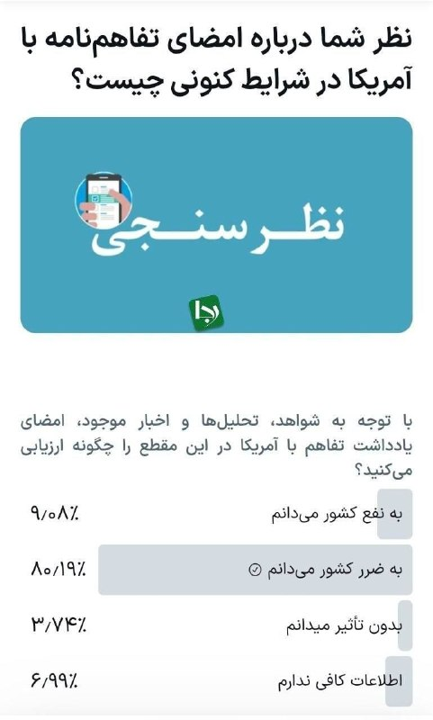

رجا نیوز وابسته به سپاه اومده یه نظرسنجی گذاشته و ۸۱ درصد کسایی که شرکت کردن مخالف توافق هستن

@IranianMinds

## IranianMinds — post 22534

  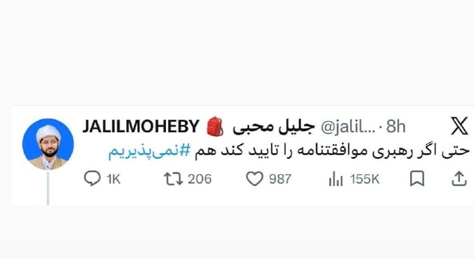

اینا دیگه رسما افتادن به جون خودشون

@IranianMinds

## Hranews — post 113596

  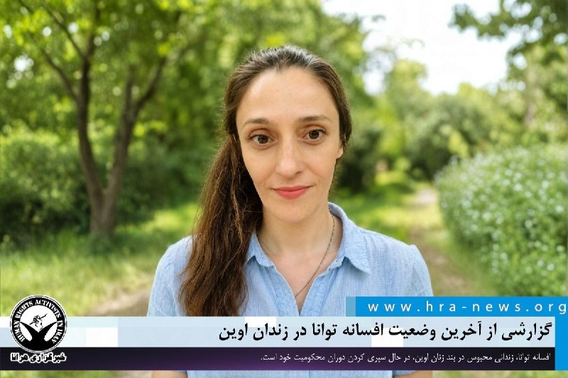

گزارشی از آخرین وضعیت افسانه توانا در زندان اوین

❗️
❗️
❗️
❗️
❗️– افسانه توانا، زندانی سیاسی دوران محکومیت حبس خود را در زندان اوین سپری می کند. وی پیشتر توسط دادگاه انقلاب به دو سال حبس محکوم شده بود.

به گزارش خبرگزاری هرانا، ارگان خبری مجموعه فعالان حقوق بشر در ایران، افسانه توانا دوران محکومیت حبس خود را در زندان اوین سپری می کند.

براساس اطلاعات دریافتی هرانا، خانم توانا پس از بازداشت در دادگاه انقلاب تهران محاکمه شد. وی سپس از بابت اتهاماتی از جمله فعالیت تبلیغی به نفع گروه‌های مخالف نظام به دو سال حبس محکوم شد.

ادامه مطلب

#افسانه_توانا
↘️
@hranews_bot تماس ✉️ -  @Hranews  کانال هرانا 🆑

## alonews — post 127814

  <a href="telegram/content/alonews_127814_1781427850.mp4" target="_blank">🎬 Download video</a>

👈دو پهپاد حزب‌الله امروز صبح به یک منطقه نظامی در شمال اسرائیل نزدیک مرز لبنان حمله کردند، طبق اعلام ارتش اسرائیل.

🔴 ارتش اعلام کرد که در این حادثه هیچ زخمی گزارش نشده است و موضوع همچنان در حال بررسی است

✅ @AloNews خبر جنگ

## alonews — post 127813

  <a href="telegram/content/alonews_127813_1781427852.webm" target="_blank">🎬 Download video</a>

👈داداستانِ استان اردبیل : یه تالار تو اردبیل به خاطر برگزاری عروسی مختلط پلمب شد و صاحبش هم بازداشت شد

✅ @AloNews خبر جنگ

---
📅 بروزرسانی: 1405/03/24 12:24
---

## VahidOOnLine — post 245436

  <a href="telegram/content/VahidOOnLine_245436_1781427260.mp4" target="_blank">🎬 Download video</a>

♦️ترانه‌ها و آهنگ‌های فارسی در میان شماری از جوانان ازبک محبوبیت یافته است و آنان این آثار را اجرا و بازخوانی و در رسانه‌های اجتماعی منتشر می‌کنند. انتشار این ویدیوها با استقبال فارسی‌‌زبانان در کشورهای مختلف روبه‌رو شده است. 

در یکی از این ویدیوها، که در رسانه‌های اجتماعی دست‌‌به‌‌دست می‌شود، دو دختر ازبک آهنگ «دلبر یگانه من، شیرین‌‌زبان من» را اجرا می‌کنند. 

بخشی از شهروندان ازبکستان به زبان فارسی صحبت می‌کنند. فارسی‌‌زبانان این کشور اغلب از الفبای سیریلیک برای نوشتن استفاده می‌کنند. 

شماری از کاربران رسانه‌های اجتماعی گسترش علاقه به موسیقی و ترانه‌های فارسی در میان جوانان ازبک را نشانه تداوم پیوندهای تاریخی، فرهنگی و زبانی میان کشورهای حوزه تمدنی نوروز توصیف می‌کنند.
‌🇸🇦 Indypersian

🤖 @VahidOOnLine

## VahidOOnLine — post 245435

  

علیرضا عبادی، امام جمعه بیرجند گفت: «گذر زمان به نفع اسلام، انقلاب اسلامی و جبهه مقاومت است و وعده‌های الهی درباره پیروزی حق بر باطل محقق خواهد شد.»

او ادامه داد: «امروز فلسطین، غزه، لبنان و همه ملت‌های مظلوم در خط مقدم مقابله با ظلم و استکبار قرار دارند و بی‌تردید آینده از آنِ ملت‌هایی خواهد بود که در مسیر حق و عدالت ایستادگی می‌کنند.»
‌🏁 🇬🇧 IranintlTV

🤖 @VahidOOnLine

## WithYashar — post 14768

https://t.me/boost/withyashar

## WithYashar — post 14767

https://t.me/boost/withyashar

## DEJradio — post 5666

⚽️ 🎬 فوتبال زیر سایه فاشیسم
برگزاری دومین دوره مسابقات جام جهانی در ایتالیا در اوج قدرت دیکتاتوری موسولینی، رهبری که حتی در انتخاب داوران سابقات دخالت می‌کرد.

#مستند #فوتبال
@DEJradio

## DEJradio — post 5665

  <a href="telegram/content/DEJradio_5665_1781427264.mp4" target="_blank">🎬 Download video</a>

🎥📢 در شرایطی که جریان حامی توافق با آمریکا در داخل حکومت خود را آماده امضاء توافق می‌کند هواداران نظام احساس کرده‌اند که بازی گرفته شده‌اند. آنها در تجمعات شبانه علیه قالیباف و عراقچی شعار دادند و چرا با قاتلان خامنه‌ای در حال توافق هستند؟

#توافق #مذاکرات #عرزشی
@DEJradio

## DEJradio — post 5664

  <a href="telegram/content/DEJradio_5664_1781427266.webm" target="_blank">🎬 Download video</a>

⚽️
🔺 محمدحسین میثاقی حنجره سپاه در فوتبال، که امروز برای مردم رجزخوانی می‌کند و به دیگران لقب «مُفت بر» می‌دهد کسی است که خودش دنبال پاترول برنامه ۹۰ می‌دوید و متهم ردیف اول پرونده فساد «مس رفسنجان» است.

مهدی رستم‌پور خبرنگار ورزشی در برنامه دژ فوتبالی پاسخ توهین‌های امیرحسین میثاقی به مردم و منتقدان تیم فوتبال جمهوری اسلامی را می‌دهد.

#دژفوتبالی #جام_جهانی
@DEJradio

## IranIntlTV — post 342220

  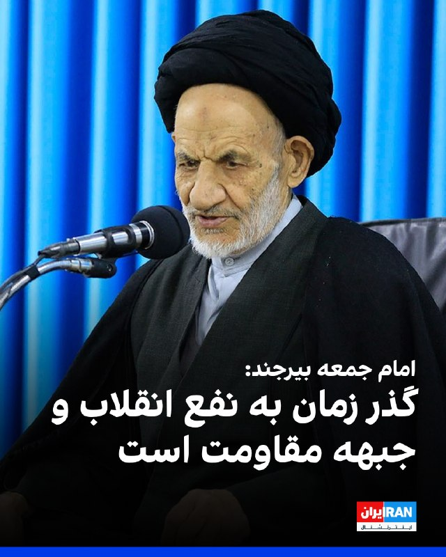

علیرضا عبادی، امام جمعه بیرجند گفت: «گذر زمان به نفع اسلام، انقلاب اسلامی و جبهه مقاومت است و وعده‌های الهی درباره پیروزی حق بر باطل محقق خواهد شد.»

او ادامه داد: «امروز فلسطین، غزه، لبنان و همه ملت‌های مظلوم در خط مقدم مقابله با ظلم و استکبار قرار دارند و بی‌تردید آینده از آنِ ملت‌هایی خواهد بود که در مسیر حق و عدالت ایستادگی می‌کنند.»
https://iranintl.com/202606144281

## Shin_Persian — post 7025

  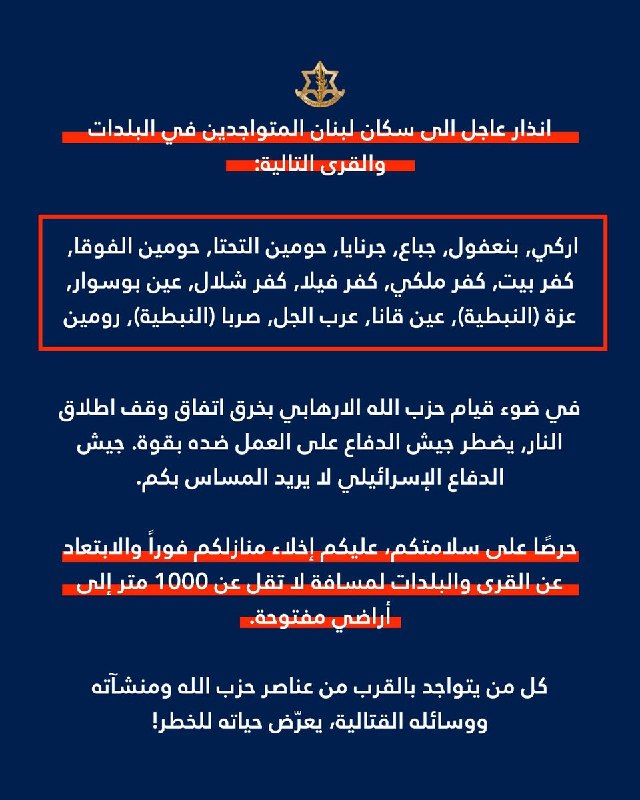

افيخاي ادرعي ✓ @AvichayAdraee Sun, 14 Jun 2026 07:17:43 UTC #عاجل ‼️كما نتوجه بانذار عاجل الى سكان لبنان المتواجدين في البلدات والقرى التالية: اركي, بنعفول, جباع, جرنايا, حومين التحتا, حومين الفوقا, كفر بيت, كفر ملكي, كفر فيلا, كفر شلال, عين بوسوار, عزة…

## Shin_Persian — post 7024

افيخاي ادرعي ✓ @AvichayAdraee
Sun, 14 Jun 2026 07:17:43 UTC

#عاجل ‼️كما نتوجه بانذار عاجل الى سكان لبنان المتواجدين في البلدات والقرى التالية: اركي, بنعفول, جباع, جرنايا, حومين التحتا, حومين الفوقا, كفر بيت, كفر ملكي, كفر فيلا, كفر شلال, عين بوسوار, عزة (النبطية), عين قانا, عرب الجل, صربا (النبطية), رومین

🔸في ضوء قيام حزب الله الارهابي بخرق اتفاق وقف اطلاق النار يضطر جيش الدفاع للعمل ضده بقوة. جيش الدفاع لا ينوي المساس بكم.

🔸حرصًا على سلامتكم، عليكم إخلاء منازلكم فوراً والابتعاد عن القرى والبلدات لمسافة لا تقل عن 1000 متر إلى أراضي مفتوحة.

🔸كل من يتواجد بالقرب من عناصر حزب الله ومنشآته ووسائله القتالية، يعرّض حياته للخطر!

English

#Urgent ‼️ We are also issuing an urgent warning to the residents of Lebanon located in the following towns and villages: Erkay, Bnaafoul, Jbaa, Jernaya, Houmin al-Tahta, Houmin al-Fawqa, Kfar Beit, Kfar Melki, Kfar Fila, Kfar Shallal, Ain Bouswar, Azza (Nabatieh), Ain Qana, Arab al-Jall, Sarba (Nabatieh), Roumin.

🔸 In light of the terrorist Hezbollah organization violating the ceasefire agreement, the IDF (Israel Defense Forces) is compelled to act against it forcefully. The IDF does not intend to harm you.

🔸 For your safety, you must evacuate your homes immediately and move away from the villages and towns to a distance of no less than 1,000 meters into open areas.

🔸 Anyone found in the vicinity of Hezbollah members, its facilities, or its combat equipment is putting their life in danger!

𝕏 · @shin_persian

## FarsiVOA — post 220658

  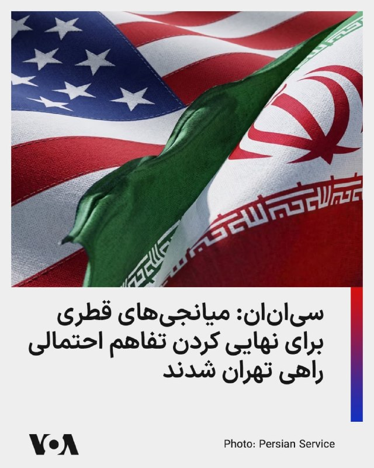

سی‌ان‌ان به نقل از یک منبع دیپلماتیک گزارش داد مذاکره‌کنندگان قطری پس از رایزنی با آمریکا راهی تهران شده‌اند تا با مقام‌های جمهوری اسلامی درباره کاهش اختلاف‌های باقی‌مانده و نهایی کردن تفاهم احتمالی میان تهران و واشنگتن گفت‌وگو کنند.

رسانه‌های ایران نیز گزارش دادند این هیئت قطری به تهران سفر کرده است.

این سفر در ادامه رفت‌وآمدهای دیپلماتیک قطر انجام می‌شود. چهارشنبه گذشته نیز مذاکره‌کنندگان قطری پس از مشورت با طرف آمریکایی به تهران رفتند و درباره متن احتمالی تفاهم با مقام‌های جمهوری اسلامی رایزنی کردند.

تحرک تازه قطر در حالی گزارش می‌شود که دونالد ترامپ، رئیس‌جمهوری آمریکا، گفته است توافق با جمهوری اسلامی قرار است امروز، یکشنبه، امضا شود و پس از آن تنگه هرمز به روی همه کشورها باز خواهد شد.

در مقابل، مقام‌های ایرانی زمان‌بندی امضا را قطعی ندانسته‌اند.

عباس عراقچی، وزیر خارجه جمهوری اسلامی، گفته است اگر مرحله نهایی گفت‌وگوها انجام شود، تفاهم می‌تواند از راه دور امضا و سپس اعلام شود.
@FarsiVOA

## IranianMinds — post 22533

🚩 ما همه خون‌خواه رهبر شهیدمان ایم

امروز ساعت 18:00 در خیابان های اصلی تمام کشور

با شعار :

توپ تانک نفربر، ریدید تو خون رهبر

## IranianMinds — post 22532

  <a href="telegram/content/IranianMinds_22532_1781427269.mp4" target="_blank">🎬 Download video</a>

🔴 یکی از‌ پیشگویی های ۷ سال قبل «مانوک خدابخشیان»:
جمهوری اسلامی اگه توافق کنه یعنی خلع سلاح کامل شده و بازم عین صدام میزننش.
آمریکا جایی برای مذاکره نمیره؛ میره حکم میکنه.
ترامپ تنها خواستش اینه با یکی از اینا سلفی بگیره تا تحقیرشون کنه‌.
هرکاری هم بکنن باید برن. چون بازی تموم شده.
مانوک خدابخشیان این حرفا رو سال ۱۳۹۸ زد و چند ماه بعد از دنیا رفت کرد.

@IranianMinds

## alonews — post 127812

  <a href="telegram/content/alonews_127812_1781427272.webm" target="_blank">🎬 Download video</a>

👈عصر ایران: کسانی که با مذاکره مخالف‌اند و از جنگ دفاع می‌کنند حاضرند لباس رزم بپوشند و نه در جنوب لبنان با اسرائیل ، بلکه در همین جنوب ایران خودمان با دشمن بجنگند؟

✅ @AloNews خبر جنگ

## alonews — post 127811

  <a href="telegram/content/alonews_127811_1781427272.mp4" target="_blank">🎬 Download video</a>

👈قابل توجه جبهه پایداری🙂

✅ @AloNews خبر جنگ

---
📅 بروزرسانی: 1405/03/24 12:13
---

## VahidOOnLine — post 245434

  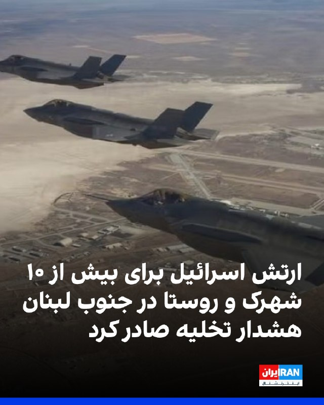

ارتش اسرائیل برای بیش از ۱۰ شهرک و روستا در محدوده رودخانه زهرانی لبنان هشدار تخلیه صادر کرد و از ساکنان این مناطق خواست خانه‌های خود را تخلیه کرده و به شمال رودخانه زهرانی نقل مکان کنند.

درگیری‌ها در جنوب لبنان پس از ورود پرنده‌های ناشناس از جنوب لبنان به آسمان اسرائیل در روزهای شنبه و یکشنبه ۲۳ و ۲۴ خرداد تشدید شده است.
‌🏁 🇬🇧 IranintlTV

🤖 @VahidOOnLine

## VahidOOnLine — post 245433

  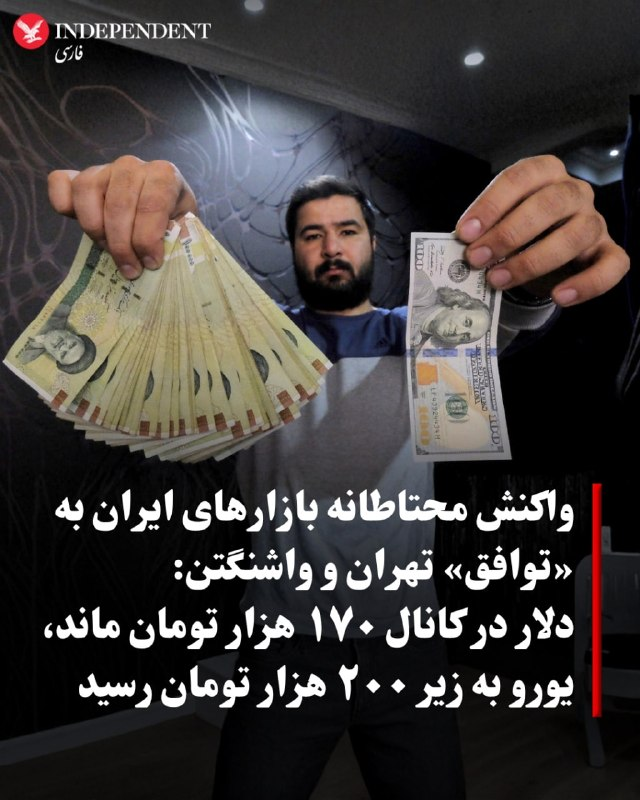

♦️قیمت ارز در بازار آزاد تهران روز یکشنبه ۲۴ خردادماه و پس از چند ساعت روند نزولی ناشی از تقویت احتمال امضای توافقنامه پایان جنگ میان جمهوری اسلامی ایران و آمریکا، بدون تغییر مانده است.

سایت‌ها و کانال‌های اعلام قیمت ارز، قیمت دلار در بازار آزاد را مانند شنبه شب، ۱۷۰ هزار و ۲۰۰ تومان و قیمت یورو را ۱۹۶ هزار و ۹۰۰ تومان اعلام می‌کنند.

قیمت یورو پس از چند هفته افزایش چشمگیر به کمتر از ۲۰۰ هزار تومان رسیده است.

به نظر می‌رسد بازارهای ایران در انتظار پاسخ نهایی مقام‌های جمهوری اسلامی به گفته‌های ترامپ مبنی بر امضای توافق‌نامه پایان جنگ در روز یکشنبه هستند.
‌🇸🇦 Indypersian

🤖 @VahidOOnLine

## FarsiVOA — post 220657

  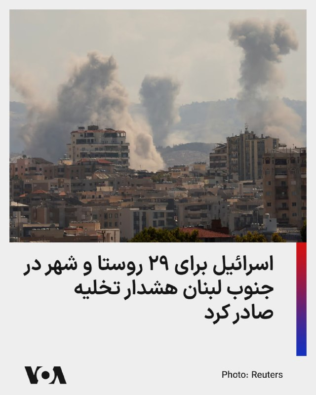

ارتش اسرائیل به ساکنان ۲۹ روستا و شهر در جنوب لبنان هشدار داد که پیش از حملات علیه گروه تروریستی حزب‌الله، منطقه را تخلیه کنند.

بر اساس اعلام ارتش اسرائیل، به ساکنان ۱۶ منطقه دستور داده شده که دست‌کم یک کیلومتر از محل خود دور شوند، و به ساکنان ۱۳ شهر دیگر نیز دستور داده شده که به شمال رود زهرانی بروند.

سرهنگ آویخای ادرعی، سخنگوی ارتش اسرائیل، گفت: «با توجه به نقض توافق آتش‌بس توسط حزب‌الله، ارتش اسرائیل ناچار است با قدرت علیه آن اقدام کند.»
@FarsiVOA

## FarsiVOA — post 220656

  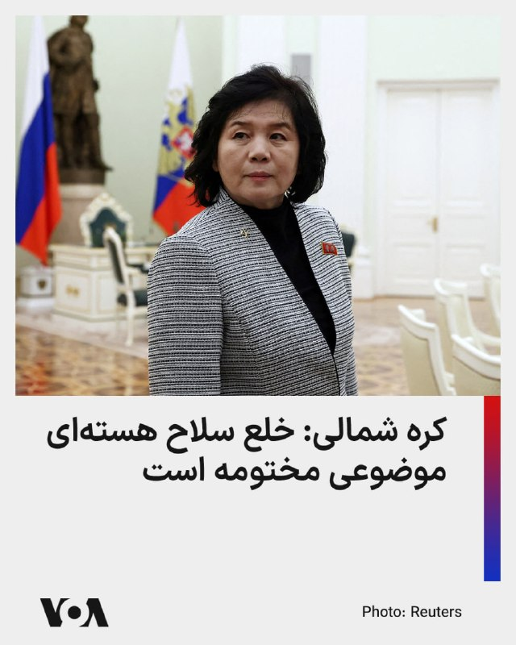

کره شمالی در واکنش به دیدار مقامات کره جنوبی و آمریکا برای مقابله با تهدیدات هسته‌ای پیونگ‌یانگ اعلام کرد موضوع خلع سلاح هسته‌ای این کشور به‌طور برگشت‌ناپذیر پایان یافته است.

سخنگوی وزارت خارجه پیونگ‌یانگ گفت «لفاظی‌های بی‌معنای آمریکا و نیروهای دست‌نشانده (کره جنوبی) آن علیه کره شمالی و همکاری آنها برای ایجاد تهدید هسته‌ای علیه این کشور، هرگز نمی‌تواند بر جایگاه برگشت‌ناپذیر کره شمالی به‌عنوان یک کشور دارای سلاح هسته‌ای تأثیر بگذارد».

هفته گذشته، مقام‌های آمریکا و کره جنوبی در چارچوب «گروه مشورتی هسته‌ای» در سئول درباره تقویت بازدارندگی هسته‌ای و افزایش آمادگی در برابر برنامه تسلیحاتی رو به گسترش کره شمالی گفت‌وگو کردند.
@FarsiVOA

## DW_Farsi — post 125948

  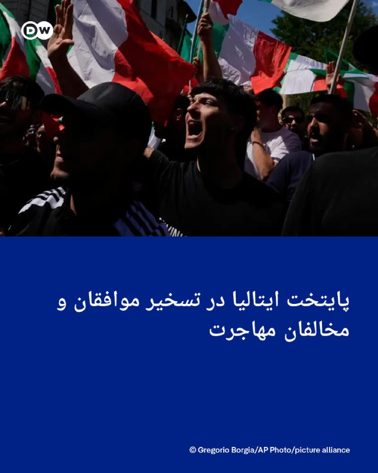

🔶 عقب‌نشینی ارتش لبنان از روستایی در جنوب این کشور در پی پیشروی نیروهای اسرائیلی

یک مقام ارشد نظامی لبنان که نخواست هویتش فاش شود به خبرگزاری آسوشیتدپرس گفت روز شنبه ۲۳ خرداد (۱۳ ژوئن) پس از پیشروی نیروهای اسرائیلی به سمت روستای کفر تبنیت در جنوب لبنان، ارتش لبنان نیروهای خود را از یک پایگاه نظامی در این روستا خارج کرده است. ارتش اسرائیل پیش از آن برای حدود ۲۰ منطقه از جمله شهر نبطیه و روستاهای اطراف آن هشدار تخلیه صادر کرده بود.

خبرگزاری دولتی لبنان گزارش داد روز شنبه اسرائیل به چندین روستای اطراف نبطیه حمله هوایی انجام داد. طبق این گزارش شهر نبطیه هدف گلوله‌باران توپخانه‌ای قرار گرفت و دو نفر نیز در روستای دیرالزهرانی کشته شدند.

این مقام ارشد نظامی بدون اشاره به جزئیات به آسوشیتدپرس گفت که ارتش لبنان پس از ورود نیروهای اسرائیلی به منطقه، نیروهای خود را از پادگان کفر تنبیت خارج کرد. طبق این گزارش به احتمال زیاد نیروهای اسرائیلی در تلاش بودند تا تپه راهبردی "علی طاهر" را تصرف کنند که در حاشیه کفر تنبیت قرار داد و به بخش‌های وسیعی از شهر نبطیه و برخی جاده‌هایی که این شهر را به روستاهای اطراف متصل می‌کند، مشرف است.

@dw_farsi

## Persian_Trend_Official — post 17007

  <a href="telegram/content/Persian_Trend_Official_17007_1781426641.mp4" target="_blank">🎬 Download video</a>

ویدیو منتشر شده از لحظه اصابت یک پهپاد انتحاری حزب‌الله از نوع شاهد-101 به نقطه ای در الجلیل واقع در شمال اسرائیل

📝 Amir

📌 @persian_trend_official
پرشین ترند | متفاوت‌ترین کانال نظامی

## IranianMinds — post 22531

  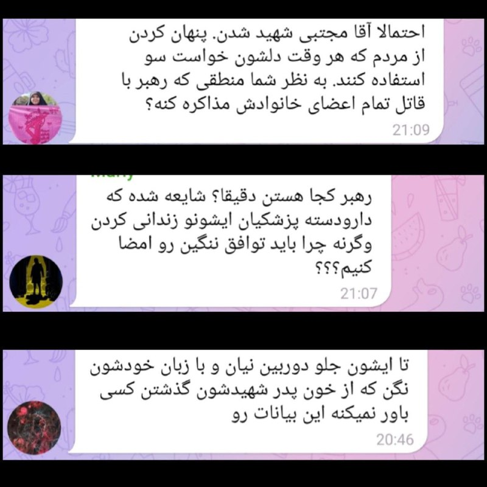

وضعیت این روزای عرزشیا :

@IranianMinds

## Dirty_Kids — post 391988

  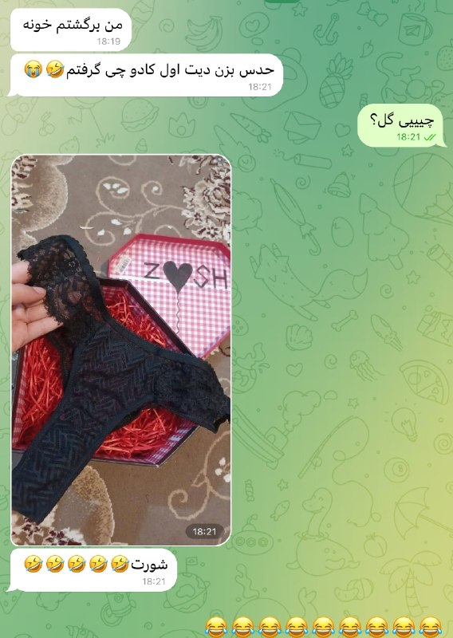

دوستم تو دیت اول از پسره شورت کادو گرفته دوستان شورررررت=)))))
(فقط جزئیات داخل جعبه z❤️sh)

@Dirty_Kids 👻

## Dirty_Kids — post 391987

  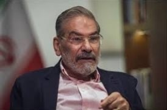

آهای زنده‌ها، این حرومزاده مرده

@Dirty_Kids 👻

## Dirty_Kids — post 391986

  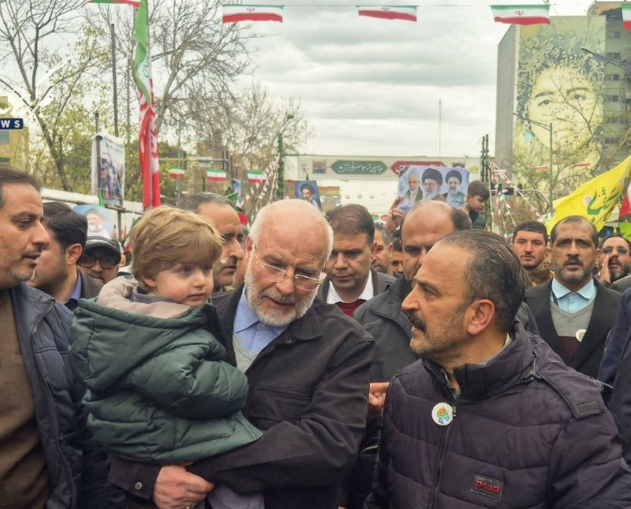

هیچکس نپرسید چرا توی تجمع
یک کو‌دک را بغل کرده است؟؟!

@Dirty_Kids 👻

## alonews — post 127810

  <a href="telegram/content/alonews_127810_1781426645.webm" target="_blank">🎬 Download video</a>

👈کودتای تندروها علیه مجتبی
‼️

🔴جلیل محبی: اگر رهبر هم قبول کنه ما قبول نمیکنیم

✅ @AloNews خبر جنگ

## alonews — post 127806

  <a href="telegram/content/alonews_127806_1781426645.mp4" target="_blank">🎬 Download video</a>

👈اوکراین تأسیسات نفتی روسیه رو هدف قرار داد

🔴 حملهِ پهپادی به یه مخزن بزرگ نفت، تو یاروسلا

✅ @AloNews خبر جنگ

## alonews — post 127805

  <a href="telegram/content/alonews_127805_1781426648.webm" target="_blank">🎬 Download video</a>

👈آخرین قیمت دلار: ۱۶۹.۵۲۰ تومان

✅ @AloNews خبر جنگ

---
📅 بروزرسانی: 1405/03/24 12:03
---

## mwarmonitor — post 10850

  <a href="telegram/content/mwarmonitor_10850_1781426025.mp4" target="_blank">🎬 Download video</a>

🔴 زلینسکی ؛ نیروهای ما در اجرای «تحریم‌های دوربرد» علیه تأسیسات مهم در خاک روسیه و همچنین در مناطق اشغالی موقت اوکراین، نتایج خوبی به دست آورده‌اند.
🔸بیش از ۷۰۰ کیلومتر دورتر از مرز کشور ما، در منطقه یاروسلاول روسیه، نیروهای سرویس امنیت اوکراین (SSU) به یک تأسیسات نفتی که برای ذخایر دولت متجاوز اهمیت داشت، حمله کردند.
🔸نیروهای ارتش ما به اهداف خود در منطقه تولا روسیه نیز دست یافتند؛ به‌طور مشخص کارخانه «آزوت» که فعالیت آن برای ظرفیت تولید مواد منفجره حیاتی است.
🔸محدودیت‌های ترافیک هوایی در شش فرودگاه روسیه اعمال شد و به‌طور کلی از شامگاه دیروز، ۲۸ منطقه روسیه تحت هشدار حمله هوایی قرار داشتند.

@mwarmonitor

## IranIntlTV — post 342219

  

ارتش اسرائیل برای بیش از ۱۰ شهرک و روستا در محدوده رودخانه زهرانی لبنان هشدار تخلیه صادر کرد و از ساکنان این مناطق خواست خانه‌های خود را تخلیه کرده و به شمال رودخانه زهرانی نقل مکان کنند.

درگیری‌ها در جنوب لبنان پس از ورود پرنده‌های ناشناس از جنوب لبنان به آسمان اسرائیل در روزهای شنبه و یکشنبه ۲۳ و ۲۴ خرداد تشدید شده است.
https://iranintl.com/202606143487

## IranianMinds — post 22529

  <a href="telegram/content/IranianMinds_22529_1781426027.mp4" target="_blank">🎬 Download video</a>

🔴 حمید رسایی تو تجمعات :
اگه میخواید این تجمعات تموم بشه باید انتقام رهبر گرفته بشه و انتقام رهبر فقط با محو کردن اسرائیل از کره ی زمین گرفته میشه.

@IranianMinds

## IranianMinds — post 22528

این روزا شاهد کارما در سطح کشور هستیم

@IranianMinds

## alonews — post 127804

  <a href="telegram/content/alonews_127804_1781426029.webm" target="_blank">🎬 Download video</a>

👈نخست وزیر انگلیس کیر استارمر: صبح امروز دستور حمله به یک نفتکش ناوگان سایه روسیه که قصد عبور از تنگه مانش را داشت، صادر کردم

🔴این عملیات موفقیت‌آمیز ضربه دیگری به روسیه وارد می‌کند و به کسانی که به جنگ اوکراین دامن می‌زنند یادآوری می‌کند که ما اجازه پنهان شدن آنها را نخواهیم داد.

✅ @AloNews خبر جنگ

## alonews — post 127803

  <a href="telegram/content/alonews_127803_1781426029.webm" target="_blank">🎬 Download video</a>

👈بلومبرگ: ایران احتمالاً در طول آتش‌بس سلاح‌های پیشرفته روسی را به ذخایر خود اضافه کرده است

✅ @AloNews خبر جنگ

---
📅 بروزرسانی: 1405/03/24 11:53
---

## VahidOOnLine — post 245432

  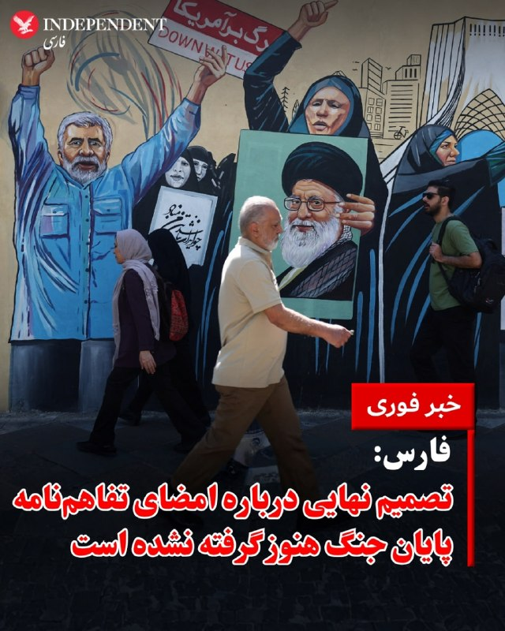

♦️خبرگزاری فارس، وابسته به سپاه پاسداران روز یکشنبه ۲۴ خردادماه به نقل از یک «منبع آگاه نزدیک به تیم مذاکره‌کننده» نوشت که تهران هنوز تصمیم نهایی خود را درباره تفاهم‌نامه پیشنهادی اعلام نکرده است.

خبرگزاری فارس به نقل از «منابع مطلع» گزارش کرده که «بررسی ابعاد مختلف پیشنهادهای مطرح‌شده همچنان در سطوح کارشناسی و تصمیم‌گیری ادامه دارد و نهادهای مسئول در حال ارزیابی دقیق جوانب سیاسی، حقوقی و فنی موضوع هستند.»

این خبر در حالی اعلام می‌شود که پس از تقویت احتمال امضای تفاهم‌نامه پایان جنگ در روز گذشته، مخالفان این توافق در تهران و مشهد علیه قالیباف و عراقچی شعار دادند. مخالفت سیاستمداران و رسانه‌های اصولگرا، از جمله اعضای جبهه پایداری و روزنامه کیهان تهران با امضای این موافقتنامه به‌شدت ادامه دارد.
‌🇸🇦 Indypersian

🤖 @VahidOOnLine

## VahidOOnLine — post 245431

  

شورای سردبیری روزنامه اورشلیم‌پست با انتقاد از توافق احتمالی میان تهران و واشینگتن هشدار داد چنین توافقی می‌تواند تلاش‌های صورت‌گرفته برای مقابله با تهدیدات جمهوری اسلامی را تضعیف کند.

این روزنامه یک‌شنبه، ۲۴ خرداد در سرمقاله‌ای، توافق احتمالی جمهوری اسلامی و آمریکا را «برجام ۲» توصیف کرد و نوشت در صورت صحت گزارش‌های منتشرشده درباره مفاد یادداشت تفاهم، چارچوب مورد نظر دولت دونالد ترامپ «یک فاجعه» خواهد بود.

بر اساس این سرمقاله، یک یادداشت تفاهم تنها زمانی می‌تواند مفید واقع شود که «تعهداتی قاطع» را در بر گیرد و نهایی شدن آن پیش از پاسخ‌گویی به پرسش‌های دشوار «خطرناک» خواهد بود.

اورشلیم‌پست با اشاره به چارچوب زمانی تعیین‌شده برای مذاکرات پس از توافق اولیه افزود: «در خاورمیانه ۶۰ روز زمانی کافی است تا واقعیت‌های میدانی دستخوش تغییر شوند. جمهوری اسلامی می‌تواند دست به جابه‌جایی مواد [هسته‌ای] بزند، تاسیسات خود را مستحکم‌تر کند، بر میانجی‌ها فشار وارد آورد و هرگونه تاخیر را به‌عنوان نشانه سوءنیت طرف مقابل جلوه دهد.»
‌🏁 🇬🇧 IranintlTV

🤖 @VahidOOnLine

## VahidOOnLine — post 245430

  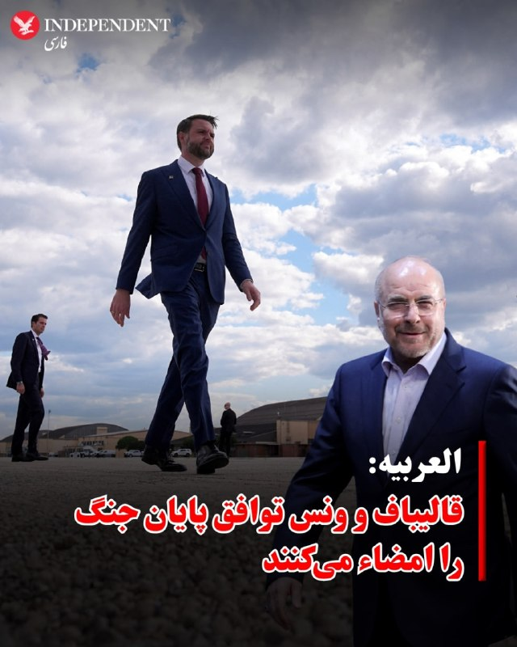

♦️شبکه العربیه عربستان سعودی صبح یکشنبه ۲۴ خردادماه به نقل از «منابع آگاه» گزارش کرد که مراسم امضای «دیجیتال» توافق پایان جنگ میان جمهوری اسلامی ایران و ایالات متحده آمریکا، با حضور محمدباقر قالیباف، رئیس مجلس شورای اسلامی، جی‌دی ونس، معاون رئیس جمهوری آمریکا و نمایندگانی از قطر و پاکستان، برگزار خواهد شد.

این خبر در حالی منتشر می‌شود که خبرگزاری فارس اعلام کرد هنوز تصمیم نهایی درباره امضای تفاهم‌نامه پایان جنگ در تهران گرفته نشده است.
‌🇸🇦 Indypersian

🤖 @VahidOOnLine

## VahidOOnLine — post 245429

  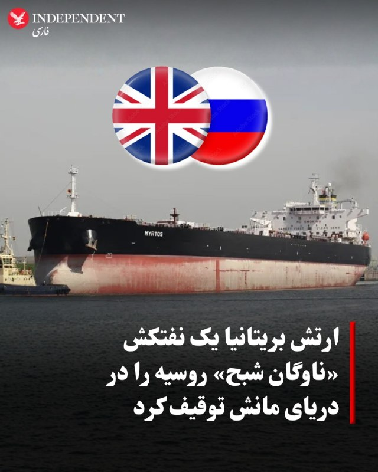

♦️وزارت دفاع بریتانیا صبح یکشنبه ۲۴ خرداد از رهگیری و توقیف یک نفتکش «ناوگان شبح» روسیه در آب‌های دریای مانش خبر داد و اعلام کرد این شناور متخلف را به سوی یکی از بنادر جنوبی انگلستان هدایت می‌کند.

وزارت دفاع بریتانیا با صدور بیانیه‌ای ضمن اعلام این خبر نوشت: «در جریان اولین عملیات از این دست به فرماندی نیروهای مسلح بریتانیا، سربازان نیروی دریایی و ماموران ویژه آموزش دیده سازمان ملی مبارزه علیه جرایم، نفتکش «سمیرتوس» روسیه شناسایی و مجبور به توقف و تغییر مسیر شد. این نفت‌کش تلاش می‌کرد با دور زدن تحریم‌ها به مسکو برای تامین مالی جنگ وحشیانه علیه اوکراین کمک کند.»

اندکی پیش از این، رسانه‌های بریتانیایی به نقل از منابع نظامی از شلیک ارتش به سوی این نفتکش خبر داده بودند.
‌🇸🇦 Indypersian

🤖 @VahidOOnLine

## WithYashar — post 14766

  <a href="telegram/content/WithYashar_14766_1781425425.mp4" target="_blank">🎬 Download video</a>

ترافیک کشتی‌ها در تنگه هرمز طی ۲۴ ساعت گذشته که با استفاده از اطلاعات سیستم شناسایی خودکار (AIS)
قابل مشاهده است، نشان می‌دهد که هیچ کشتی‌ای با استفاده از طرح جداسازی ترافیک ایران عبور نکرده است؛ با این حال، چند کشتی از طریق آب‌های عمان در امتداد مسیر امن پروژه آزادی که قبلاً ایجاد شده بود، عبور کرده‌اند.
همچنین مشاهده گشت زنی دو شناور نظامی آمریکایی در تنگه هرمز ، البته نوع این شناورها مشخص نیست
@withyashar

## IranIntlTV — post 342218

  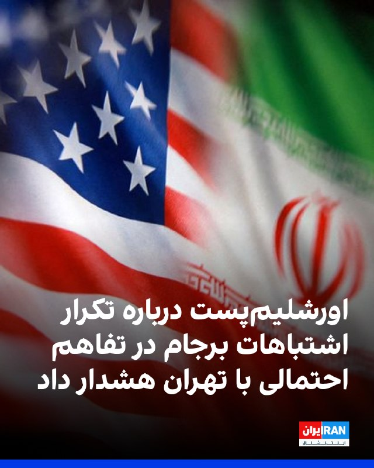

شورای سردبیری روزنامه اورشلیم‌پست با انتقاد از توافق احتمالی میان تهران و واشینگتن هشدار داد چنین توافقی می‌تواند تلاش‌های صورت‌گرفته برای مقابله با تهدیدات جمهوری اسلامی را تضعیف کند.

این روزنامه یک‌شنبه، ۲۴ خرداد در سرمقاله‌ای، توافق احتمالی جمهوری اسلامی و آمریکا را «برجام ۲» توصیف کرد و نوشت در صورت صحت گزارش‌های منتشرشده درباره مفاد یادداشت تفاهم، چارچوب مورد نظر دولت دونالد ترامپ «یک فاجعه» خواهد بود.

بر اساس این سرمقاله، یک یادداشت تفاهم تنها زمانی می‌تواند مفید واقع شود که «تعهداتی قاطع» را در بر گیرد و نهایی شدن آن پیش از پاسخ‌گویی به پرسش‌های دشوار «خطرناک» خواهد بود.

اورشلیم‌پست با اشاره به چارچوب زمانی تعیین‌شده برای مذاکرات پس از توافق اولیه افزود: «در خاورمیانه ۶۰ روز زمانی کافی است تا واقعیت‌های میدانی دستخوش تغییر شوند. جمهوری اسلامی می‌تواند دست به جابه‌جایی مواد [هسته‌ای] بزند، تاسیسات خود را مستحکم‌تر کند، بر میانجی‌ها فشار وارد آورد و هرگونه تاخیر را به‌عنوان نشانه سوءنیت طرف مقابل جلوه دهد.»
https://iranintl.com/202606143984

## FarsiVOA — post 220655

🔺سقوط سهمگین تجارت ایران و هند در اولین ماه جنگ

▪️آمارهای جدید وزارت اقتصاد هند از سقوط سهمگین تجارت با جمهوری اسلامی در ماه مارس خبر می‌دهد.

▪️صادرات جمهوری اسلامی به هند در اولین ماه جنگ ۳۹ روزه حدود ۳۸ درصد افت کرده و به ۴۳ میلیون دلار رسیده است. صادرات ایران به هند عمدتاً شامل محصولات پتروشیمی، فلزات و میوه است.

▪️طبق داده‌های وزارت اقتصاد هند، واردات جمهوری اسلامی از این کشور نیز با افتی ۷۲ درصدی به زیر ۱۳۰ میلیون دلار سقوط کرده است.

▪️هند از تأمین‌کننده‌های اصلی محصولات کشاورزی، اقلام دارویی و مواد اولیه صنعتی ایران است. اخیراً مقام‌های جمهوری اسلامی از اخلال در واردات دارو و واکسن از هند، پاکستان و امارات خبر داده بودند.

⬇️ بیشتر بخوانید:
https://ir.voanews.com/a/iran-india-trade-plummets-in-first-month-of-war/8160651.html

## DW_Farsi — post 125947

  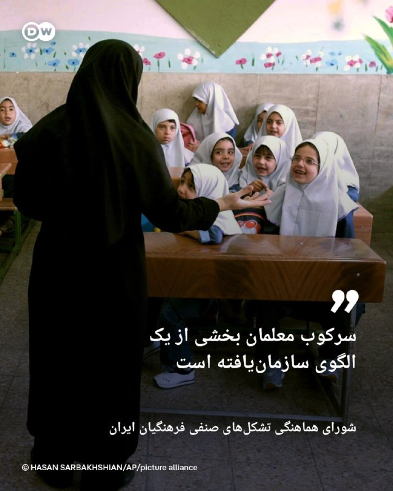

🔶 شورای هماهنگی فرهنگیان: سرکوب معلمان بخشی از یک الگوی سازمان‌یافته است

شورای هماهنگی تشکل‌های صنفی فرهنگیان ایران با انتشار بیانیه‌ای بازداشت و احضار شماری از معلمان و فعالان صنفی و یورش، تفتیش، ضبط وسایل ارتباطی و محدودیت‌های شدید ارتباطی از جمله مسدودسازی خطوط تلفن آنها از زمان اعتراضات دی‌ماه ۱۴۰۴ تا کنون را محکوم کرد.

در این بیانیه که روز شنبه ۱۳ خرداد منتشر شد، آمده است که این رخدادها را نمی‌توان "مجموعه‌ای از اتفاقات پراکنده" دانست، بلکه یک "الگوی روشن و سازمان‌یافته برای تضعیف تشکل‌های مستقل معلمان و خاموش کردن صدای مطالبه‌گری جامعه است".

این تشکل صنفی با انتقاد از قطعی اینترنت و مجازی شدن آموزش گفت حاکمیت به جای پاسخگویی درمورد عملکرد ضعیف خود در حوزه آموزش عمومی، به دنبال "فرافکنی" بوده و با برنامه‌های غیرعلمی و غیرکارشناسی از پاسخگویی سرباز می‌زند. در این بیانیه آمده است: «هرچه بحران‌های اقتصادی، اجتماعی و آموزشی عمیق‌تر می‌شود، اراده نهادهای امنیتی برای محدود کردن نهادهای مستقل مدنی نیز افزایش می‌یابد؛ گویی به جای حل بحران‌ها، قرار است حاملان صدای اعتراض و مطالبه‌گری حذف شوند.»

@dw_farsi

## RadioFarda — post 158284

  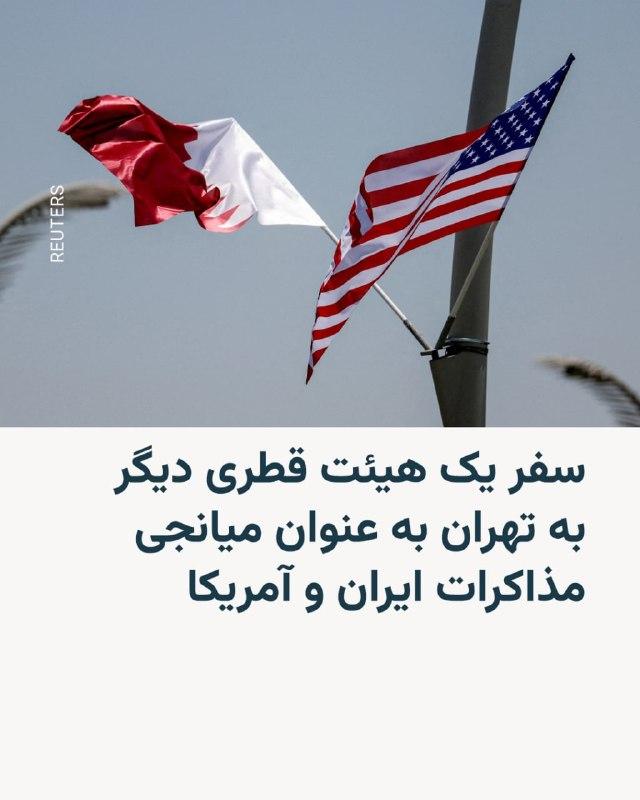

🔸 رسانه‌ها در داخل ایران از جمله خبرگزاری ایسنا روز یک‌شنبه ۲۴ خرداد خبر دادند که یک هیئت قطری دیگر «در ادامه مذاکرات هفته گذشته وارد تهران شد».

🔸 قطر در کنار پاکستان نقش اصلی در میانجی‌گری میان ایران و‌ آمریکا را بازی کرده است.

🔸 همزمان چند رسانه در خارج از ایران همچون رئیس جمهور آمریکا از امضای تفاهم‌نامه تهران و واشینگتن در روز یک‌شنبه، ۲۴ خردادماه، نوشته‌اند.

🔸 این در حالی است که در پی تکذیب از طرف سخنگوی وزارت امور خارجه ایران و مخالفت‌هایی که در تجمع‌های شنبه شب ابراز شد هنوز زمان دقیقی از سوی حکومت ایران اعلام نشده است.

🔸 در همین زمینه روز یک‌شنبه العربیه انگلیسی‌زبان نوشت که قرار است در همین روز «در نشستی مجازی دو طرف توافق را امضا کنند».

🔸 به نوشته العربیه، این نشست در حضور نمایندگان دو میانجی یعنی قطر و پاکستان میان جی‌دی‌ونس از طرف آمریکا و محمدباقر قالیباف از طرف ایران برگزار می‌شود.

@RadioFarda

## BBCPersian — post 283784

  <a href="https://t.me/bbcpersian/283784" target="_blank">📎 Download file</a>

پادکست برنامه ۶۰ دقیقه، شنبه ۲۳ خرداد ۱۴۰۵

در این برنامه:
افزایش خوشبینی‌ میانجی‌ها و طرفین مذاکره...
احتمال امضای تفاهم‌نامه میان‌ ایران و آمریکا در ۲۴ ساعت آینده،
تهران اما اصرار دارد که اداره تنگه هرمز به قبل از جنگ برنمی‌گردد

واکاوی جنگ ۱۲ روزه، پس از یک سال،
رویارویی تمام‌عیار ایران و اسرائیل در ترازوی قضاوت افکار عمومی
جمهوری اسلامی چه از دست داد و چه به دست آورد؟
تشدید فشار نهادهای امنیتی ایران بر اهالی فرهنگ و هنر.
چرا بار دیگر هنرمندان و روزنامه‌نگاران هدف قرار گرفته‌اند؟
آمادگی ایران برای نخستین دیدار در جام جهانی فوتبال...
چهار نفر دیگر از همراهان تیم ملی هم روادید آمریکا را دریافت کردند

## Hranews — post 113595

امروز یکشنبه ۲۴ خردادماه، جمعی از بازنشستگان تامین اجتماعی شوش، کرخه و هفت‌تپه، در مقابل ساختمان این سازمان در شهرستان شوش دست به #تجمع اعتراضی زدند.

این #بازنشستگان، خواستار اجرای طرح همسان‌سازی، افزایش حقوق طبق تورم و رسیدگی به مشکلات درمانی و معیشتی خود هستند.

↘️
@hranews_bot تماس ✉️ - @Hranews کانال هرانا 🆑

---
📅 بروزرسانی: 1405/03/24 11:44
---

## IranIntlTV — post 342211

🔻تیم ملی فوتبال برزیل در نخستین دیدار خود در جام جهانی ۲۰۲۶ برابر مراکش با تساوی ۱-۱ متوقف شد. در این مسابقه، ابتدا اسماعیل سیباری برای مراکش گلزنی کرد، اما در ادامه وینیسیوس جونیور گل تساوی سلسائو را به ثمر رساند تا شاگردان کارلو آنچلوتی در گام نخست به یک امتیاز بسنده کنند.

🔹هواداران برزیل که با حضور کارلو آنچلوتی روی نیمکت تیم ملی کشورشان و ستاره‌هایی چون نیمار، وینیسیوس جونیور و گابریل امیدوارند پس از دو دهه به عنوان قهرمانی جهان برسند، با حضور در خیابان‌های ریو دو ژانیرو دیدار تیم ملی کشورشان را تماشا کردند.

@iranintltvsport

## FarsiVOA — post 220654

🔺بریتانیا نفتکش ناوگان سایه روسیه را در کانال مانش توقیف کرد

▪️بریتانیا اعلام کرد نیروهای این کشور صبح یکشنبه برای نخستین بار یک نفتکش تحریم‌شده وابسته به «ناوگان سایه» روسیه را هنگام عبور از کانال مانش رهگیری و به‌طور موقت توقیف کردند. این اقدام در آب‌های سرزمینی بریتانیا و بر اساس قوانین داخلی و بین‌المللی انجام شده است.

▪️اصطلاح «ناوگان سایه» به شبکه‌ای از نفتکش‌ها و کشتی‌های فرسوده با مالکیت‌های پنهان، پرچم‌های متغیر و مسیرهای پیچیده گفته می‌شود که برای دور زدن تحریم‌های نفتی و پنهان کردن مسیر انتقال محموله‌ها به کار می‌رود.

▪️دولت بریتانیا می‌گوید حدود سه‌چهارم نفت تحریمی روسیه با این ناوگان جابه‌جا می‌شود و این شبکه بیش از هفتصد شناور دارد.

⬇️ بیشتر بخوانید:
https://ir.voanews.com/a/uk-forces-intercept-russian-shadow-fleet-vessel-for-the-first-time/8160650.html

## BBCPersian — post 283783

🔻فارس: تصمیم نهایی درباره تفاهمنامه هنوز گرفته نشده است

خبرگزاری فارس به نقل از «یک منبع آگاه نزدیک به تیم مذاکره‌کننده» می‌گوید که «ایران هنوز تصمیم نهایی خود دربارۀ تفاهمنامه پیشنهادی را اعلام نکرده است.»

بنابر این گزارش، «بررسی ابعاد سیاسی، حقوقی و فنی پیشنهادهای مطرح‌شده همچنان ادامه دارد.»

به گفته این خبرگزاری که به نهادهای نظامی و امنیتی نزدیک است، «بررسی ابعاد مختلف پیشنهادهای مطرح‌شده همچنان در سطوح کارشناسی و تصمیم‌گیری ادامه دارد و نهادهای مسئول در حال ارزیابی دقیق جوانب سیاسی، حقوقی و فنی موضوع هستند.»

در همین حال ساعتی پیش یک هیئت قطری برای ادامه تبادل پیام بین ایران و آمریکا وارد تهران شد.

https://bbc.in/4fEONCy
@BBCPersian

## Hranews — post 113594

  

اعتراضات دی‌ماه ۱۴۰۴؛ حکم حبس موسی گورابی در دادگاه تجدیدنظر تایید شد

❗️
❗️
❗️
❗️
❗️– محکومیت موسی موسوی گورابی، از بازداشت‌شدگان اعتراضات سراسری دی‌ماه ۱۴۰۴، توسط شعبه شانزدهم دادگاه تجدیدنظر استان خوزستان عینا تایید شد. وی پیشتر در مرحله بدوی توسط شعبه یک دادگاه انقلاب اهواز به دو سال حبس، دو سال منع خروج از کشور و یک سال الزام به حضور در اداره امر به معروف و نهی از منکر محکوم شده بود.

به گزارش خبرگزاری هرانا، ارگان خبری مجموعه فعالان حقوق بشر در ایران، احکام صادره علیه موسی موسوی گورابی که در زندان شیبان اهواز محبوس است، در مرحله تجدیدنظر عینا تایید شد.

براساس رای صادره توسط شعبه شانزدهم دادگاه تجدیدنظر استان خوزستان، آقای موسوی گورابی از بابت اتهام «اخلال در نظم عمومی» با استناد به تبصره ماده ۲۸۶ قانون مجازات اسلامی به دو سال حبس محکوم شد. همچنین وی از بابت مجازات تکمیلی به دو سال منع خروج از کشور و یک سال حضور در اداره امر به معروف و نهی از منکر محکوم شده است.

ادامه مطلب

#موسی_موسوی_گورابی

↘️
@hranews_bot تماس ✉️ -  @Hranews  کانال هرانا 🆑

## alonews — post 127802

  <a href="telegram/content/alonews_127802_1781424841.mp4" target="_blank">🎬 Download video</a>

👈ترافیک تنگه هرمز نشان دهنده عبور کم تعداد کشتی ها از مسیر جنوبی تنگه مطابق مسیر آمریکا

🔴 نکته قابل توجه گشت زنی دو شناور نظامی آمریکایی در تنگه هرمز ، البته نوع این شناورها مشخص نیست

✅ @AloNews خبر جنگ

---
📅 بروزرسانی: 1405/03/24 11:33
---

## VahidOOnLine — post 245428

  <a href="telegram/content/VahidOOnLine_245428_1781424234.mp4" target="_blank">🎬 Download video</a>

ویدیوهای رسیده به ایران‌اینترنشنال نشان می‌دهند گروهی از ایرانیان مقیم استرالیا یکشنبه ۲۴ خرداد در حمایت از شاهزاده رضا پهلوی و علیه جمهوری اسلامی، در هوای بارانی ملبورن راهپیمایی کردند.
‌🏁 🇬🇧 IranintlTV

🤖 @VahidOOnLine

## WithYashar — post 14765

منابع مطلع به شبکه «العربیه» : هیئت‌های نمایندگی آمریکا و ایران به منظور امضای نهایی توافق صلح، در یک نشست مجازی (ویدیویی کنفرانس) حضور خواهند یافت. یادداشت تفاهم صلح در جریان این نشست آنلاین با نظارت مستقیم میانجیگرانی از کشورهای پاکستان و قطر با حضور «جی‌دی ونس» (نماینده آمریکا) و «محمدباقر قالیباف» (نماینده ایران) به امضا خواهد رسید. بلافاصله پس از امضای این توافقنامه، محاصره بنادر ایران لغو خواهد شد. از دیگر نکات، بازگشایی تنگه هرمز و صدور مجوز عبور و مرور برای کشتی‌ها بدون نیاز به پرداخت هیچ‌گونه عوارض عبور خواهد بود.
@withyashar

## pm_afshaa — post 93849

  

جلیل محبی روحانی اصولگرا: آقا مجتبی گوه میخوره قبول کنه

💧 Rainbet.com the #1 Non-KYC Crypto Casino & Sportsbook @rainbetcom

😁 @Pm_Afshaa

## IranIntlTV — post 342210

  <a href="telegram/content/IranIntlTV_342210_1781424236.mp4" target="_blank">🎬 Download video</a>

ویدیوهای رسیده به ایران‌اینترنشنال نشان می‌دهند گروهی از ایرانیان مقیم استرالیا یکشنبه ۲۴ خرداد در حمایت از شاهزاده رضا پهلوی و علیه جمهوری اسلامی، در هوای بارانی ملبورن راهپیمایی کردند.

## IranIntlTV — post 342209

  <a href="https://t.me/IranintlTV/342209" target="_blank">📎 Download file</a>

🎧نسخه صوتی اخبار بامدادی | یکشنبه ۲۴ خرداد
@iranintlTV

## FarsiVOA — post 220653

  

📸اینستاگرام صدای آمریکا را هم اکنون فالو کنید تا از آخرین خبرها مطلع بمانید:
https://www.instagram.com/voafarsi/

📡همچنین جهت اطلاع از بروزترین فرکانسهای ماهواره‌ای صدای آمریکا به لینک زیر مراجعت فرمایید:
https://ir.voanews.com/satellite

این پست را با دوستانتان به اشتراک بگذارید
@FarsiVOA

## Persian_Trend_Official — post 17006

العربیه: هیئت‌های نمایندگی آمریکا و ایران به منظور امضای نهایی توافق صلح، در یک نشست مجازی (ویدیویی) حضور خواهند یافت.

این نشست آنلاین با حضور و نظارت مستقیم میانجیگرانی از کشورهای پاکستان و قطر برگزار خواهد شد. به گفته این منابع، یادداشت تفاهم صلح در جریان این نشست مجازی و با حضور جی‌دی ونس (نماینده آمریکا) و محمدباقر قالیباف (نماینده ایران) به امضا خواهد رسید.

منابع العربیه تاکید کردند بلافاصله پس از امضای این توافقنامه، محاصره بنادر ایران لغو خواهد شد.
از دیگر نکات مهم این توافق، بازگشایی تنگه هرمز و صدور مجوز عبور و مرور برای کشتی‌ها بدون نیاز به پرداخت هیچ‌گونه عوارض عبور خواهد بود.

📝 Amir

📌 @persian_trend_official
پرشین ترند | متفاوت‌ترین کانال نظامی

## BBCPersian — post 283782

🔻ارتش اسرائیل از حمله پهپادی به شمال کشور خبر داد

ارتش اسرائیل گفت دو پهپاد که از خاک لبنان شلیک شد امروز به شمال اسرائیل اصابت کرد اما تلفات جانی نداشت.

بنابر بیانیه ارتش، «دو برخورد مربوط به اهداف هوایی مشکوک در خاک اسرائیل در نزدیکی مرز اسرائیل و لبنان شناسایی شد. هیچ گزارشی از مجروح شدن افراد دریافت نشده است.»

پس از این حملات، بتسالل اسموتریچ و ایتامار بن گویر، دو وزیر راست‌گرای افراطی اسرائیل خواستار حملات تلافی‌جویانه به ضاحیه در حومه جنوبی بیروت شدند که که پایگاه حزب‌الله است.

مقام‌های اسرائیلی از جمله بنیامین نتانیاهو، نخست‌وزیر، پیش‌تر هشدار داده بودند که در صورت حمله حزب‌الله به مناطق شمالی اسرائیل، به ضاحیه حمله خواهد کرد؛ اقدامی که به گفته آن‌ها از حمایت واشنگتن نیز برخوردار است.

پس از آخرین حمله اسرائیل به ضاحیه، ایران به اسرائیل حمله موشکی کرد که اسرائیل با حملاتی به ایران پاسخ داد.

https://bbc.in/4fEONCy
@BBCPersian

## alonews — post 127801

  <a href="telegram/content/alonews_127801_1781424239.webm" target="_blank">🎬 Download video</a>

👈دونالد ترامپ امروز ۸۰ ساله می‌شود

✅ @AloNews خبر جنگ

## alonews — post 127800

  <a href="telegram/content/alonews_127800_1781424239.webm" target="_blank">🎬 Download video</a>

👈 ایندیپندنت: ذخایر نفت آمریکا به پایین‌ترین سطح در بیش از ۴۰ سال اخیر رسیده است

✅ @AloNews خبر جنگ

---
📅 بروزرسانی: 1405/03/24 11:23
---

## pm_afshaa — post 93848

🔴العربیه: قالیباف و ‌ونس توافق صلح ایران و آمریکا را آنلاین امضا می‌کنن

💧 Rainbet.com the #1 Non-KYC Crypto Casino & Sportsbook @rainbetcom

😁 @Pm_Afshaa

## FarsiVOA — post 220652

🔺سقوط سهمگین درآمدهای مالیاتی در دو ماه ابتدایی ۱۴۰۵

▪️گزارش جدید سازمان امور مالیاتی از سقوط سهمگین درآمدهای مالیاتی در دو ماه ابتدایی سال جاری خورشیدی خبر داده است.

▪️کل درآمد مالیاتی اخذ شده طی دوره یاد شده تنها ۱۵۲ همت بوده که از لحاظ اسمی ۲۹ درصد کمتر از دور مشابه پارسال است.

▪️اگر مبلغ یاد شده به قیمت‌های سال ۱۴۰۰ حقیقی شود، درآمدهای مالیاتی نسبت به دو ماه ابتدایی پارسال در واقع ۶۰ درصد سقوط کرده است.

▪️چنین سقوط سهمگینی در درآمدهای مالیاتی در حالی است که دولت برای سال جاری درآمدهای مالیاتی را ۴۲ درصد افزایش داده بود و در مجموع، تقریباً نیمی از بودجه عمومی دولت قرار بود از همین منبع تامین شود.

⬇️ بیشتر بخوانید:
https://ir.voanews.com/a/8160649.html

## RadioFarda — post 158283

  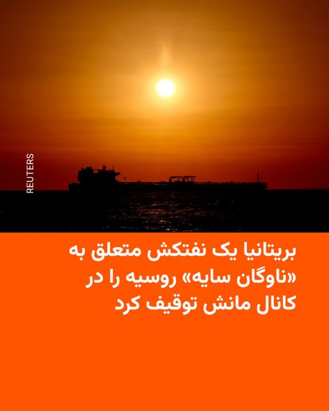

🔸نیروهای مسلح بریتانیا روز یک‌شنبه ۲۴ خرداد یک نفتکش حامل نفت مرتبط با ناوگان موسوم به «ناوگان سایه» روسیه را که در تلاش برای عبور از کانال مانش بود، متوقف و بازرسی کردند.

🔸بر اساس بیانیه وزارت دفاع بریتانیا، این نفتکش تا زمان تکمیل تحقیقات در نزدیکی سواحل جنوبی بریتانیا تحت نظارت و توقیف باقی خواهد ماند.

🔸 همچنین تأکید شده که این اقدام در آب‌های سرزمینی بریتانیا و مطابق با قوانین داخلی و بین‌المللی انجام شده است.

🔸در همین حال کی‌یر استارمر، نخست‌وزیر بریتانیا، اعلام کرد که شخصاً دستور اجرای این عملیات را صادر کرده است.

🔸این خبر در حالی منتشر می‌شود که کشورهای غربی در ماه‌های اخیر فشارها بر شبکه‌های حمل‌ونقل نفت روسیه را افزایش داده‌اند.

@RadioFarda

## alonews — post 127799

  <a href="telegram/content/alonews_127799_1781423618.webm" target="_blank">🎬 Download video</a>

👈مشکل خدمات بانک‌های تجارت و صادرات رفع شد

✅ @AloNews خبر جنگ

## alonews — post 127796

  <a href="telegram/content/alonews_127796_1781423618.mp4" target="_blank">🎬 Download video</a>

👈حملهِ به لُبنان

✅ @AloNews خبر جنگ

## alonews — post 127795

  <a href="telegram/content/alonews_127795_1781423620.webm" target="_blank">🎬 Download video</a>

👈منابع العربیه: قالیباف و ‌ ونس توافق صلح ایران و آمریکا را آنلاین امضا می‌کنند

✅ @AloNews خبر جنگ

---
📅 بروزرسانی: 1405/03/24 11:13
---

## VahidOOnLine — post 245427

  

خبرگزاری فارس، وابسته به سپاه پاسداران، به نقل از «منبع آگاه نزدیک به تیم مذاکره‌کننده جمهوری اسلامی» نوشت که تصمیم نهایی تهران درباره تفاهم‌نامه هنوز در دست بررسی است و تصمیم نهایی درباره متن این تفاهم اعلام نشده است.

بنا بر این گزارش، بررسی ابعاد سیاسی، حقوقی و فنی پیشنهادهای مطرح‌شده همچنان ادامه دارد.

این رسانه وابسته به سپاه اضافه کرد بررسی ابعاد مختلف پیشنهادهای مطرح‌شده همچنان در سطوح کارشناسی و تصمیم‌گیری ادامه دارد و نهادهای مسئول در حال ارزیابی جوانب سیاسی، حقوقی و فنی موضوع هستند.
‌🏁 🇬🇧 IranintlTV

🤖 @VahidOOnLine

## VahidOOnLine — post 245426

  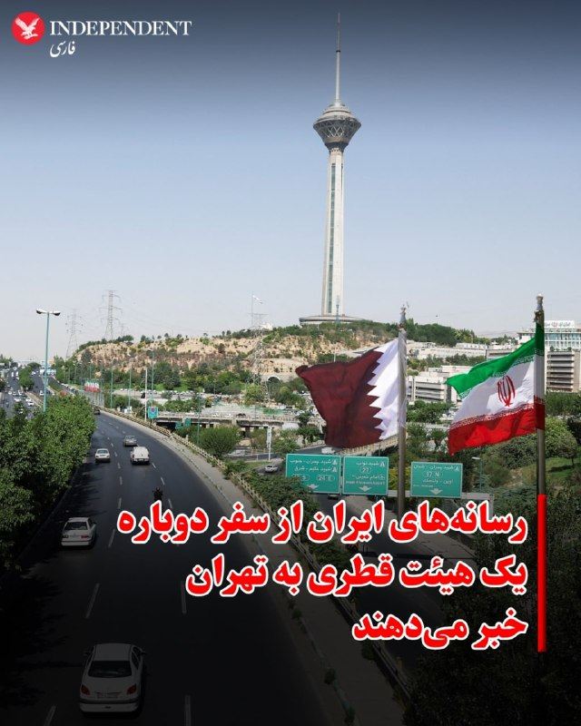

♦️خبرگزاری‌های دولتی و نیمه‌دولتی ایران روز یکشنبه ۲۴ خرداد از سفر دوباره یک هیئت دیپلماتیک قطری به تهران خبر دادند.

این خبر در حالی منتشر می‌شود که دونالد ترامپ تاکید کرده است که توافق برای پایان جنگ میان ایالات متحده و جمهوری اسلامی روز یکشنبه امضاء خواهد شد. با این حال مقام‌های حکومت ایران و به‌ویژه عباس عراقچی، وزیر امور خارجه، می‌گویند که جمع‌بندی نهایی در حال انجام است و توافق به‌زودی امضاء خواهد شد.

خبرگزاری دولت جمهوری اسلامی (ایرنا) با اعلام این خبر نوشت «هیئت قطری به ریاست یکی از مشاوران وزیر خارجه این کشور در راستای پیشبرد مذاکرات بین تهران و واشنگتن و در ادامه مذاکرات هفته گذشته وارد تهران شد.»
‌🇸🇦 Indypersian

🤖 @VahidOOnLine

## mwarmonitor — post 10848

🔴هیئت‌های قطریِ مذاکره‌کننده امروز صبح به تهران پرواز کردند تا بخشی از تلاش‌ها برای نهایی‌سازی توافقی جهت پایان دادن به جنگ آمریکا و ایران باشند — به گفته رویترز.

@mwarmonitor

## pm_afshaa — post 93847

🔴یاسمین ولی‌زاده :شهردار سیاتل جوابم رو داد و گفت از ممنوعیت پرچم شیر و خورشید در ورزشگاه‌های جام جهانی حمایت نمی‌کنه؛ در نتیجه ورود پرچم شیر و خورشید  به ورزشگاه‌ها آزاد شده

💧 Rainbet.com the #1 Non-KYC Crypto Casino & Sportsbook @rainbetcom

😁 @Pm_Afshaa

## IranIntlTV — post 342207

  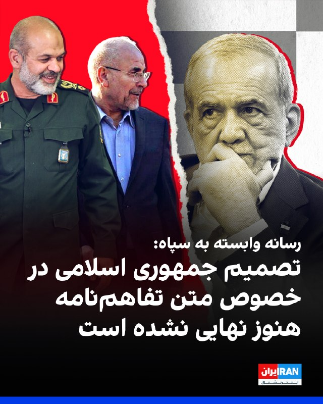

خبرگزاری فارس، وابسته به سپاه پاسداران، به نقل از «منبع آگاه نزدیک به تیم مذاکره‌کننده جمهوری اسلامی» نوشت که تصمیم نهایی تهران درباره تفاهم‌نامه هنوز در دست بررسی است و تصمیم نهایی درباره متن این تفاهم اعلام نشده است.

بنا بر این گزارش، بررسی ابعاد سیاسی، حقوقی و فنی پیشنهادهای مطرح‌شده همچنان ادامه دارد.

این رسانه وابسته به سپاه اضافه کرد بررسی ابعاد مختلف پیشنهادهای مطرح‌شده همچنان در سطوح کارشناسی و تصمیم‌گیری ادامه دارد و نهادهای مسئول در حال ارزیابی جوانب سیاسی، حقوقی و فنی موضوع هستند.
https://iranintl.com/202606149130

## Persian_Trend_Official — post 17004

  <a href="telegram/content/Persian_Trend_Official_17004_1781423036.webm" target="_blank">🎬 Download video</a>

ارتش اسرائیل هشدارهای تخلیه برای ۲۹ شهر و روستا در جنوب لبنان پیش از حملات علیه حزب‌الله صادر کرد:

الزراریه، کفر بدا، الخریب، انصار، ارزای، بریقا، مزرعه بسفور، مزرعه الیهودیّه، مزرعه الوسطى، مزرعه جمجیم، مزرعه کوثریات الرز، مطریات الشومر، کفر سر، ارکای، بنافول، جبع، جرنایا، حومین التحتا، حومین الفوقا، کفر بیت، کفر ملکی، کفر فیلا، کفر شلال، عین بو سوار، عازه، عین قانا، عرب الجل، سربا، رومینه.

👺Phantom

📌 @persian_trend_official
پرشین ترند | متفاوت‌ترین کانال نظامی

## Dirty_Kids — post 391985

وضعیت جوری شده نمیفهمی کی عرزشیه که برانداز 😂

این اگر رژیم چنج نیست پس چیه؟

@Dirty_Kids 👻

## Dirty_Kids — post 391984

  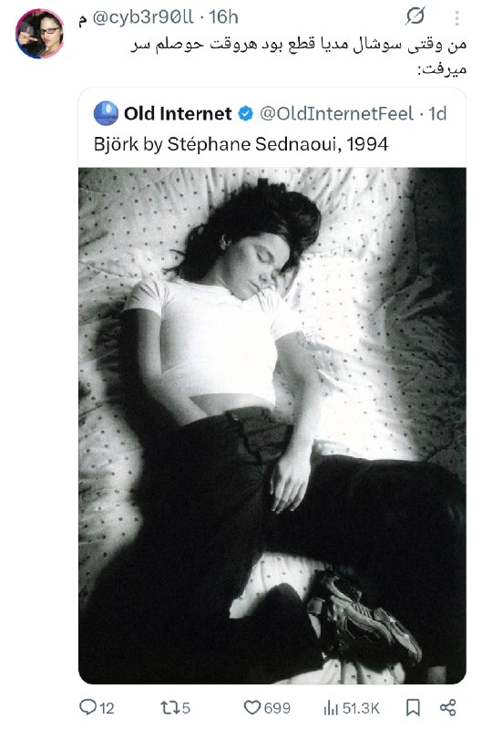

پس قدیما بخاطر همین بود 10 تا 20 بچه میاوردن واقعا سرگرمی خاصی نبود جدا

@Dirty_Kids 👻

## Dirty_Kids — post 391983

  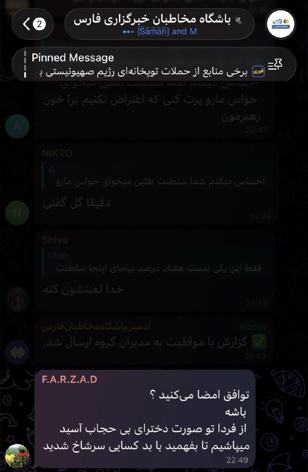

عزیزان عرزشی در حرکتی نمادین و در مخالفت به توافق با آمریکا تهدید میکنن که رو دخترای مردم اسید میپاشن
بد مادرجنده‌هایی هستین فرزاد جان

@Dirty_Kids 👻

## Hranews — post 113593

یک شهروند توسط نیروهای امنیتی در بوکان بازداشت شد

❗️
❗️
❗️
❗️
❗️– روز گذشته، یوسف امینی، معلم بازنشسته ساکن بوکان توسط نیروهای امنیتی در این شهرستان بازداشت و به مکان نامعلومی منتقل شد.

ادامه مطلب

#یوسف_امینی

↘️
@hranews_bot تماس ✉️ -  @Hranews  کانال هرانا 🆑

## alonews — post 127794

  <a href="telegram/content/alonews_127794_1781423037.webm" target="_blank">🎬 Download video</a>

👈وزارت امور خارجه قطر: نخست وزیر و وزیر امور خارجه کویت ابراز امیدواری کردند که واشنگتن و تهران به زودی توافق را امضا کنند

✅ @AloNews خبر جنگ

## alonews — post 127793

  <a href="telegram/content/alonews_127793_1781423038.webm" target="_blank">🎬 Download video</a>

👈خبرگزاری فارس : جمهوری اسلامی هنوز تصمیم نهایی خودشو درباره تفاهم‌نامه، اعلام نکرده

✅ @AloNews خبر جنگ

---
📅 بروزرسانی: 1405/03/24 11:03
---

## VahidOOnLine — post 245425

  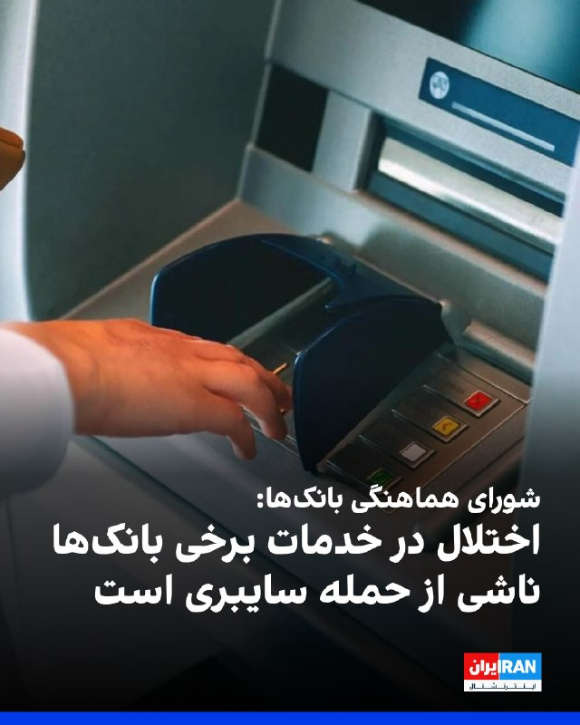

شورای هماهنگی بانک‌ها اعلام کرد اختلال در در سامانه‌های بانک ملی، بانک تجارت، بانک صادرات و بانک توسعه صادرات، ناشی از «حمله سایبری محدود» به زیرساخت ارتباطی مشترک این چهار بانک بوده و هیچ‌گونه دسترسی غیرمجاز به اطلاعات مشتریان رخ نداده و حذف اطلاعات اتفاق نیفتاده است.

بر اساس گزارش‌ها، این اختلال که از ساعات آغازین شنبه، ۲۳ خرداد رخ داده، همچنان ادامه دارد.
‌🏁 🇬🇧 IranintlTV

🤖 @VahidOOnLine

## pm_afshaa — post 93846

  <a href="telegram/content/pm_afshaa_93846_1781422428.mp4" target="_blank">🎬 Download video</a>

با وجود ممنوعیت فیفا: پرچم شیر و خورشید در بازی جام جهانی وارد شد
پرچم شیر و خورشید ایران شاهنشاهی دیروز در بازی بین قطر و سوئیس دیده شد

💧 Rainbet.com the #1 Non-KYC Crypto Casino & Sportsbook @rainbetcom

😁 @Pm_Afshaa

## IranIntlTV — post 342206

  

شورای هماهنگی بانک‌ها اعلام کرد اختلال در در سامانه‌های بانک ملی، بانک تجارت، بانک صادرات و بانک توسعه صادرات، ناشی از «حمله سایبری محدود» به زیرساخت ارتباطی مشترک این چهار بانک بوده و هیچ‌گونه دسترسی غیرمجاز به اطلاعات مشتریان رخ نداده و حذف اطلاعات اتفاق نیفتاده است.

بر اساس گزارش‌ها، این اختلال که از ساعات آغازین شنبه، ۲۳ خرداد رخ داده، همچنان ادامه دارد.
https://iranintl.com/202606143018

## BBCPersian — post 283781

🔻سفر یک هیئت قطری به تهران در ادامه «تبادل پیام‌ بین آمریکا و ایران»

منابع خبری در ایران از سفر یک هیئت قطری به ریاست یکی از مشاوران وزیر خارجه‌ آن کشور به تهران خبر می‌دهند.

براساس این اخبار، این سفر برای ادامه تبادل پیام‌ها بین ایران و آمریکا در مورد تفاهمنامه خاتمه جنگ صورت گرفته است.

این دومین سفر هیئت قطری به تهران در چند روز گذشته است.

پیش‌بینی شده که این تفاهمنامه امروز بین ایران و آمریکا به «امضای دیجیتال» برسد.

https://bbc.in/4fEONCy
@BBCPersian

## alonews — post 127792

  <a href="telegram/content/alonews_127792_1781422429.webm" target="_blank">🎬 Download video</a>

👈ایهود باراک، نخست وزیر اسبق اسرائیل:
توافقی که به‌زودی میان ایالات متحده و ایران امضا خواهد شد را می‌توان در یک کلمه توصیف کرد: بد. و در دو کلمه: بسیار بد. و اسرائیل بهای غرور و کوربینی نتانیاهو را می‌پردازد، و حتی بهای مانورهایی را که او تلاش کرد علیه ترامپ انجام دهد.

🔴ایران قوی‌تر از قبل بیرون آمده است؛ در مقابل، اسرائیل پس از شوک هفتم اکتبر دستاوردهایی کسب کرده است، اما ضعیف‌تر شده است

✅ @AloNews خبر جنگ

---
📅 بروزرسانی: 1405/03/24 10:53
---

## VahidOOnLine — post 245424

🗣روایت شما از احتمال توافق میان جمهوری‌اسلامی و آمریکا - یکشنبه ۲۴ خرداد

🔹آن‌هایی که تا دیروز به معترض‌ها می‌گفتند «اغتشاشگر»، حالا خودشان به این رژیم معترض شده‌اند. سه ماه کف خیابان حمایت‌شان کردید، حالا با این مذاکرات فهمیدید این‌ها فقط به فکر منافع خودشان بودند. حالا وقتش است به ملت ایران بپیوندید.

🔹من یک خاک و یک وطن دارم، آن هم ایران است. چرا باید منابع کشور من صرف بازسازی بیروت و غزه و هزینه آتش‌افروزی حکومت شود، ولی من ایرانی از حداقل‌های زندگی در وطنم محروم باشم؟

🔹هموطنان، این مدت بارها نسبت به عملکرد ترامپ معترض بودید. در حالی که ضحاک و لشکرش را از بین برد. آتش‌بس کرد و بازی روانی راه انداخت. الان هم با مطرح کردن امضای تفاهم‌نامه، رژیم را به جان خودش انداخته. این‌ها را دست‌کم نگیرید.

🔹هم جنگ شد، هم خامنه‌ای کشته شد، هم زیرساخت زده شد، هم چند هزار نفر بیکار شدند، هم تنگه هرمز باز شد، هم اورانیوم غنی‌سازی خارج شد. طرفدارهای جمهوری اسلامی فکر کنم تا الان متوجه شده باشند سران نظام منظورشان از مصلحت چیست.

🔹برای من الان سؤال است، ما که مردم عادی هستیم نمی‌خواهیم توافق کنند. این حکومتی‌ها و ارزشی‌ها هم که نمی‌خواهند توافق شود. پس این‌ها برای چه کسی توافق کردند؟

🔹ترامپ می‌گفت این‌ها بالاخره می‌آیند پای مذاکره و همه چیزهایی را که می‌خواهیم می‌دهند. واقعا فقط خامنه‌ای اضافه بود؟ مملکت را فقط می‌خواستند به تاراج بدهند؟

🔹فکر کن چندین سال از شکم ملت دزدیدند، با بدبختی و زیر تحریم زندگی کردیم، جوانی‌مان به باد رفت به‌خاطر انرژی هسته‌ای. اما الان باید فرش قرمز پهن کنی و دو دستی تقدیم ترامپ کنی و برود.

🔹خواستم به جمهوری اسلامی و طرفدارهایش بگویم، خط قرمزهایتان چه شد؟

🔹رئیس‌جمهور ترامپ حالا که این‌قدر روی هسته‌ای پافشاری می‌کند، حداقل بگوید آزادی زندانیان سیاسی هم یکی از مهم‌ترین مفاد مذاکره است تا حسن نیتی هم به مردم ایران نشان داده باشد.
‌🏁 🇬🇧 IranintlTV

🤖 @VahidOOnLine

## VahidOOnLine — post 245423

  

سی‌ان‌ان خبر داد که یک هیات قطری با هماهنگی آمریکا و برای کمک به نهایی شدن تفاهم‌نامه، صبح یکشنبه، ۲۴ خرداد به تهران سفر کرده است.
همچنین خبرگزاری تسنیم، وابسته به سپاه پاسداران ضمن تایید این خبر، نوشت که این هیات با مقام‌های جمهوری اسلامی رایزنی کرده است.
‌🏁 🇬🇧 IranintlTV

🤖 @VahidOOnLine

## mwarmonitor — post 10847

  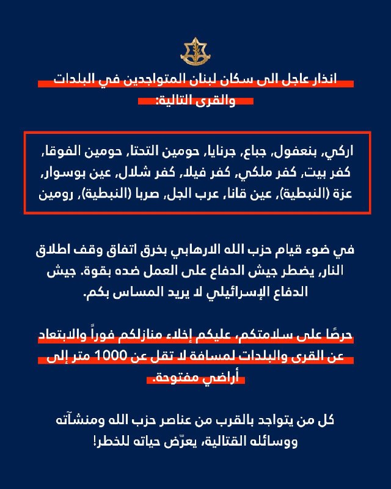

🔴 هشدار فوری:

🔸به ساکنان لبنان که در روستاها و مناطق زیر حضور دارند هشدار داده می‌شود:
ارکی، بنعفول، جباع، جرنايا، حومین التحتا، حومین الفوقا، کفر بیت، کفر ملکی، کفر فیلا، کفر شلال، عین بوسوار، عزه (النبطیه)، عین قانا، عرب الجل، صربا (النبطیه)، رومین

🔸 در پی نقض توافق آتش‌بس از سوی Hezbollah، ارتش (اسرائیل) ناچار است علیه آن با قدرت اقدام کند. ارتش اعلام می‌کند قصد آسیب رساندن به شما را ندارد.

🔸 برای حفظ جان خود، فوراً خانه‌های خود را تخلیه کنید و حداقل به فاصله ۱۰۰۰ متری از روستاها و مناطق به زمین‌های باز دور شوید.

🔸 هر فردی که در نزدیکی نیروها، تأسیسات یا تجهیزات نظامی حزب‌الله باشد، جان خود را در معرض خطر قرار می‌دهد.

@mwarmonitor

## pm_afshaa — post 93845

الحدث: پس از امضای توافق، محاصره بنادر ایران برداشته خواهد شد

💧 Rainbet.com the #1 Non-KYC Crypto Casino & Sportsbook @rainbetcom

😁 @Pm_Afshaa

## pm_afshaa — post 93844

چه جام جهانی کصشریه اولین بار اصلا جام جهانی برام اهمیت نداره

## IranIntlTV — post 342205

🗣روایت شما از احتمال توافق میان جمهوری‌اسلامی و آمریکا - یکشنبه ۲۴ خرداد

🔹آن‌هایی که تا دیروز به معترض‌ها می‌گفتند «اغتشاشگر»، حالا خودشان به این رژیم معترض شده‌اند. سه ماه کف خیابان حمایت‌شان کردید، حالا با این مذاکرات فهمیدید این‌ها فقط به فکر منافع خودشان بودند. حالا وقتش است به ملت ایران بپیوندید.

🔹من یک خاک و یک وطن دارم، آن هم ایران است. چرا باید منابع کشور من صرف بازسازی بیروت و غزه و هزینه آتش‌افروزی حکومت شود، ولی من ایرانی از حداقل‌های زندگی در وطنم محروم باشم؟

🔹هموطنان، این مدت بارها نسبت به عملکرد ترامپ معترض بودید. در حالی که ضحاک و لشکرش را از بین برد. آتش‌بس کرد و بازی روانی راه انداخت. الان هم با مطرح کردن امضای تفاهم‌نامه، رژیم را به جان خودش انداخته. این‌ها را دست‌کم نگیرید.

🔹هم جنگ شد، هم خامنه‌ای کشته شد، هم زیرساخت زده شد، هم چند هزار نفر بیکار شدند، هم تنگه هرمز باز شد، هم اورانیوم غنی‌سازی خارج شد. طرفدارهای جمهوری اسلامی فکر کنم تا الان متوجه شده باشند سران نظام منظورشان از مصلحت چیست.

🔹برای من الان سؤال است، ما که مردم عادی هستیم نمی‌خواهیم توافق کنند. این حکومتی‌ها و ارزشی‌ها هم که نمی‌خواهند توافق شود. پس این‌ها برای چه کسی توافق کردند؟

🔹ترامپ می‌گفت این‌ها بالاخره می‌آیند پای مذاکره و همه چیزهایی را که می‌خواهیم می‌دهند. واقعا فقط خامنه‌ای اضافه بود؟ مملکت را فقط می‌خواستند به تاراج بدهند؟

🔹فکر کن چندین سال از شکم ملت دزدیدند، با بدبختی و زیر تحریم زندگی کردیم، جوانی‌مان به باد رفت به‌خاطر انرژی هسته‌ای. اما الان باید فرش قرمز پهن کنی و دو دستی تقدیم ترامپ کنی و برود.

🔹خواستم به جمهوری اسلامی و طرفدارهایش بگویم، خط قرمزهایتان چه شد؟

🔹رئیس‌جمهور ترامپ حالا که این‌قدر روی هسته‌ای پافشاری می‌کند، حداقل بگوید آزادی زندانیان سیاسی هم یکی از مهم‌ترین مفاد مذاکره است تا حسن نیتی هم به مردم ایران نشان داده باشد.

## IranIntlTV — post 342204

  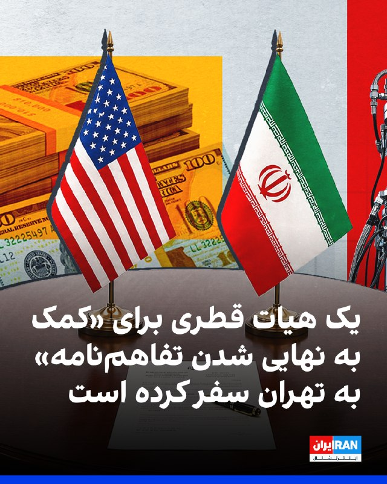

سی‌ان‌ان خبر داد که یک هیات قطری با هماهنگی آمریکا و برای کمک به نهایی شدن تفاهم‌نامه، صبح یکشنبه، ۲۴ خرداد به تهران سفر کرده است.
همچنین خبرگزاری تسنیم، وابسته به سپاه پاسداران ضمن تایید این خبر، نوشت که این هیات با مقام‌های جمهوری اسلامی رایزنی کرده است.
https://iranintl.com/202606149311

## IranIntlTV — post 342203

  <a href="telegram/content/IranIntlTV_342203_1781421829.mp4" target="_blank">🎬 Download video</a>

میثم مهرانی، تحلیلگر سیاسی، به ایران‌اینترنشنال با اشاره به احتمال امضای تفاهم‌نامه تهران و واشینگتن گفت آمریکا و جمهوری اسلامی به یک توافق کلی رسیده‌اند اما برای حرکت به سمت این توافق دچار مشکل هستند.
@iranintltv

## FarsiVOA — post 220651

  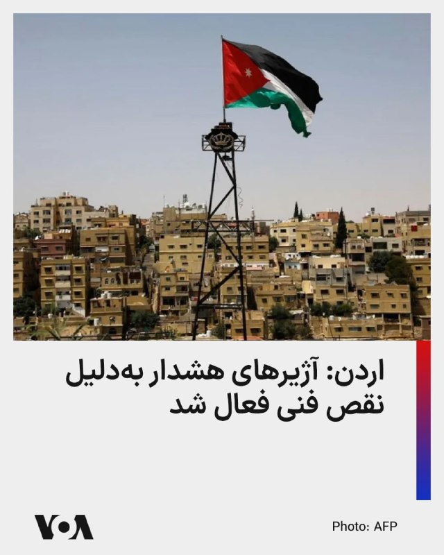

تلویزیون دولتی اردن اعلام کرد آژیرهای هشدار بامداد یکشنبه در این کشور به صدا درآمد، اما اداره امنیت عمومی اردن بعداً گفت علت این حادثه نقص فنی بوده است.

به گفته این اداره، اشکال در یکی از آژیرها باعث فعال شدن سامانه هشدار شد و تیم‌های فنی توانستند نقص را بلافاصله برطرف کنند.

این توضیح پس از آن منتشر شد که در ساعات پیش از اعلام رسمی، فعال شدن آژیرها در اردن نگرانی‌هایی درباره احتمال وجود تهدید امنیتی ایجاد کرده بود. مقام‌های اردنی تأکید کردند که موضوع ناشی از خطای فنی بوده و نه یک تهدید واقعی.

فعال شدن آژیرها در اردن در شرایطی رخ داد که منطقه همچنان تحت تأثیر تنش‌های نظامی و امنیتی روزهای اخیر قرار دارد و مقام‌های این کشور پیش‌تر از شهروندان خواسته بودند در زمان شنیدن هشدارها، دستورالعمل‌های ایمنی را دنبال کنند.
@FarsiVOA

## Persian_Trend_Official — post 17003

یک مقام ارشد دولت ایالات متحده به فاکس نیوز گفت که واشنگتن معتقد است که توافق چارچوب آتی با ایران، تهران را ملزم به بازگشایی تنگه هرمز بدون عوارض می‌کند.

در حالی که ایالات متحده همزمان محاصره بنادر ایران را لغو خواهد کرد. این مقام گفت: ما فکر می‌کنیم که به توافق رسیده‌ایم. این یک توافق عالی و بسیار قوی است.

این مقام افزود که لغو محاصره ایالات متحده به بازگشایی تنگه هرمز گره خورده است و مرحله بعدی توافق بر انجام عملیات مین‌زدایی در تنگه متمرکز خواهد بود.

📝 Amir

📌 @persian_trend_official
پرشین ترند | متفاوت‌ترین کانال نظامی

## Persian_Trend_Official — post 17000

  <a href="telegram/content/Persian_Trend_Official_17000_1781421831.webm" target="_blank">🎬 Download video</a>

سفر مجدد هیات قطری به تهران

یک هیات قطری به منظور بررسی آخرین تحولات مرتبط با روند دیپلماتیک برای خاتمه جنگ آمریکا به تهران سفر کرده و با مقامات جمهوری اسلامی ایران رایزنی کردند.

📝 Amir

📌 @persian_trend_official
پرشین ترند | متفاوت‌ترین کانال نظامی

## alonews — post 127791

  <a href="telegram/content/alonews_127791_1781421832.webm" target="_blank">🎬 Download video</a>

👈رویترز به نقل از یک منبع آگاه: تیم مذاکره‌کننده قطری صبح امروز، به عنوان بخشی از تلاش‌ها برای دستیابی به توافقی برای پایان دادن به جنگ، به تهران سفر کردند

✅ @AloNews خبر جنگ

---
📅 بروزرسانی: 1405/03/24 10:43
---

## VahidOOnLine — post 245422

  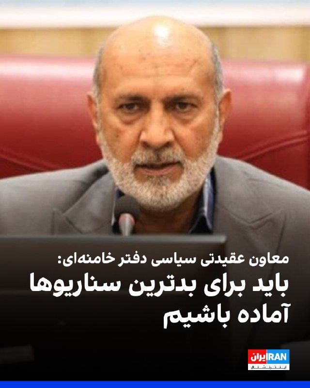

رسول سنایی‌راد، معاون عقیدتی سیاسی دفتر خامنه‌ای، در پاسخ به سوالی در خصوص احتمال وقوع دوباره جنگ، گفت: «باید بدترین سناریو را متصور باشیم تا آمادگی حداکثری برای مواجهه با آن را داشته باشیم. اما این به معنای نفی دیپلماسی نیست. کما اینکه من دیپلماسی را ادامه کارزار جنگ می‌دانم.»

او اضافه کرد: «با توجه به ماهیت دشمن که نشان داده همواره به دنبال فریب و زیاده‌خواهی است، ما به موازات دیپلماسی باید آمادگی میدان را هم حفظ کنیم و با نگاه به بدترین سناریو، آمادگی‌های لازم را داشته باشیم تا غفلتی رخ ندهد که موجب خسارت شود.»
‌🏁 🇬🇧 IranintlTV

🤖 @VahidOOnLine

## VahidOOnLine — post 245421

♦️مهدی تاج، رئیس فدراسیون فوتبال ایران روز یکشنبه ۲۴ خردادماه و همزمان با آخرین تمرین تیم ملی پیش از ترک تیخوانا برای بازی اول مقابل نیوزیلند گفت فیفا تلاش می‌کند پرچم رسمی ایران را در ورزشگاه‌های محل برگزاری رقابت‌ها بالا ببرد.
تاج که هنوز ویزای آمریکا دریافت نکرده است گفت: «فیفا مسئولیتی در قبال پروتکل‌ها دارد. الان به نظر من دولت آمریکا پروتکل‌ها را خیلی عمل نکرده است.
یکی از این پروتکل‌ها  این است که پرچم رسمی آن کشور باید در استادیوم باشد و پرچم رسمی کشور خودمان را ما به فیفا اعلام کردیم.»
تاج با انتقاد از محدودیت‌های ایجاد شده در آمریکا افزود: «فیفا تلاش می‌کند، همکاری‌های خیلی خوبی داشته که مشکلات رو رفع کنه ولی به هر جهت بعضی از مشکلات را توانسته رفع بکنه و بعضی از آن‌ها هم هنوز نتوانسته است که ما امیدواریم انشاءالله در آینده شرایط بهتری پیش‌بینی شود.»
پیش از این فیفا اعلام کرده بود ورود پرچمی به‌جز پرچم جمهوری اسلامی به ورزشگاه‌های محل برگزاری دیدارهای ایران، ممنوع خواهد بود.
‌🇸🇦 Indypersian

🤖 @VahidOOnLine

## WithYashar — post 14764

رسانه‌های کشورهای خلیج فارس: جلسه مجازی نمایندگان آمریکا و ایران با حضور واسطه‌هایی از پاکستان و قطر امروز انجام خواهد شد

در این جلسه مجازی آنلاین، یادداشت تفاهم با حضور ونس و قالیباف دیجیتال امضا خواهد شد
@withyashar

## WithYashar — post 14763

سی‌ان‌ان: مذاکره‌کنندگان قطری برای نهایی کردن تفاهم راهی تهران شده‌اند

شبکه آمریکایی به نقل از یک منبع مدعی شد که مذاکره‌کنندگان قطری صبح امروز در هماهنگی با ایالات متحده به سوی تهران پرواز کرده‌اند تا به تسهیل روند نهایی‌سازی توافق (یادداشت‌تفاهم) بین ایران و آمریکا کمک کنند

@withyashar

## mwarmonitor — post 10846

🔴 منابع آگاه به شبکه Al Arabiya می‌گویند: هیئت‌های ایالات متحده و ایران امروز یک نشست مجازی برای امضای توافق صلح برگزار خواهند کرد.

🔴 به گفته این منابع، این نشست با حضور کشورهای میانجی، پاکستان و قطر برگزار می‌شود.

🔴 طبق این گزارش، یادداشت تفاهم (MoU) در جریان همین نشست مجازی امضا خواهد شد.

🔴 این منابع می‌افزایند که JD Vance، معاون رئیس‌جمهور آمریکا،و قالیباف، رئیس مجلس ایران، در این نشست حضور خواهند داشت.

🔴 به گفته منابع، پس از امضای توافق، تنگه هرمز بازگشایی می‌شود و عبور و مرور بدون دریافت هزینه مجاز خواهد بود.

🔴 همچنین این منابع اعلام کردند که پس از امضا، محاصره بنادر ایران لغو خواهد شد.

@mwarmonitor

## mwarmonitor — post 10845

🔴 تلاش برای رفع اختلال 4 بانک کشور 🔸قیطاسی، دبیر شورای هماهنگی بانک‌های دولتی: رفع اختلال از خدمات بانک های ملی، صادرات، تجارت و توسعه صادرات در دست انجام است. @mwarmonitor

## IranIntlTV — post 342202

  

رسول سنایی‌راد، معاون عقیدتی سیاسی دفتر خامنه‌ای، در پاسخ به سوالی در خصوص احتمال وقوع دوباره جنگ، گفت: «باید بدترین سناریو را متصور باشیم تا آمادگی حداکثری برای مواجهه با آن را داشته باشیم. اما این به معنای نفی دیپلماسی نیست. کما اینکه من دیپلماسی را ادامه کارزار جنگ می‌دانم.»

او اضافه کرد: «با توجه به ماهیت دشمن که نشان داده همواره به دنبال فریب و زیاده‌خواهی است، ما به موازات دیپلماسی باید آمادگی میدان را هم حفظ کنیم و با نگاه به بدترین سناریو، آمادگی‌های لازم را داشته باشیم تا غفلتی رخ ندهد که موجب خسارت شود.»
https://iranintl.com/202606140468

## IranIntlTV — post 342201

  <a href="telegram/content/IranIntlTV_342201_1781421221.mp4" target="_blank">🎬 Download video</a>

🔻در حالی که فیفا نمایش پرچم‌های پیش از انقلاب اسلامی را در ورزشگاه‌های جام جهانی ممنوع کرده است، نشریه ورزشی اتلاتیک گزارش داد شماری از هواداران موفق شدند این پرچم‌ها را به داخل ورزشگاه لیوایز در کالیفرنیا وارد کنند و در جریان دیدار قطر و سوئیس به نمایش بگذارند.

🔹همچنین ویدیوهای منتشر شده در فضای مجازی لحظه نمایش این پرچم را نشان می‌دهد.

🔹بر اساس این گزارش، در نیمه نخست مسابقه روز شنبه ۲۳ خرداد در سانتا کلارا، چندین پرچم شیر و خورشید، که تا انقلاب ۱۳۵۷ پرچم رسمی ایران بود، در میان تماشاگران دیده شد.

🔹فیفا پیش‌تر این نماد را در چارچوب مقررات خود، دارای ماهیتی سیاسی تلقی کرده و نمایش آن را در ورزشگاه‌های جام جهانی ممنوع کرده بود.

🔹پرچم پیش از انقلاب در سال‌های اخیر به یکی از نمادهای اعتراضی بخشی از ایرانیان خارج از کشور علیه جمهوری اسلامی تبدیل شده است. این پرچم پیش‌تر نیز در جریان جام جهانی ۲۰۲۲ و جام ملت‌های آسیا ۲۰۲۴ در قطر در میان تماشاگران دیده شده بود.

🔹دراین‌باره در وبسایت ایران اینترنشنال بیشتر بخوانید

@iranintltvsport

## IranIntlTV — post 342200

  <a href="telegram/content/IranIntlTV_342200_1781421222.mp4" target="_blank">🎬 Download video</a>

روح‌الله رحیم‌پور، تحلیلگر سیاسی، به ایران‌اینترنشنال گفت که مخالفت بخشی از جریان‌های تندرو در جمهوری اسلامی با توافق احتمالی با آمریکا صرفا یک نمایش نیست، بلکه ریشه در این دارد که این طیف خود را «پیروز میدان» می‌داند و هرگونه مذاکره یا سازش را به منزله از دست رفتن روایت و دستاوردهای ادعایی خود تلقی می‌کند.
@iranintltv

## RadioFarda — post 158282

  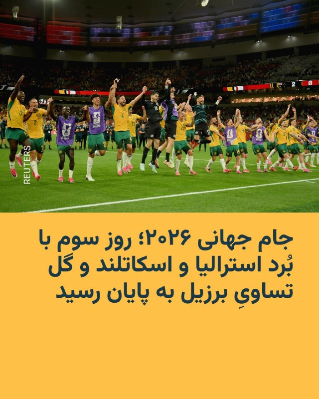

🔸سومین روز از جام جهانی ۲۰۲۶ با برد دو تیم اسکاتلند و استرالیا، به ترتیب، در برابر هاییتی و ترکیه و برابری دو تیم برزیل و مراکش در میدان به پایان رسید.

🔸استرالیا با دو گل توانست در اولین بازی خود ترکیه را شکست دهد و در رده دوم این گروه بعد از آمریکا قرار بگیرد.

🔸در دیگر بازی روز یک‌شنبه جان مک‌گین با به ثمر رساندن تک‌گل بازی در برابر تیم هائیتی در واقع پاسخ اعتماد استیو کلارک، سرمربی تیم اسکاتلند، را داد.

🔸جام جهانی ۲۰۲۶ در سه کشور آمریکا و کانادا و مکزیک به طور همزمان برگزار می‌شود.

🔸روز سوم از این جام جهانی اما شاهد یک تساوی هم بود: برزیل در برابر تیم مراکش نتوانست به برد دست یابد که این قدر به دنبالش بود.

🔸برزیل که از سال ۱۹۳۴ تاکنون در اولین بازی جام جهانی نباخته است روز شنبه، به وقت آمریکا، با تک‌گل وینیسیوس به تساوی ۱-۱ با مراکش رضایت داد.

@RadioFarda

## BBCPersian — post 283771

🖌هلن بوشبی, بی‌بی‌سی:

🔻دیوید هاکنی، یکی از مهم‌ترین چهره‌های هنر معاصر، در سن ۸۸ سالگی درگذشت.

او تقریباً در هر زمینه‌ای نابغه بود.

او آثاری در حکاکی، لیتوگرافی و حتی شیشه‌های رنگی خلق می‌کرد؛ و به همان اندازه که در طراحی صحنه‌های باشکوه اپرا مهارت داشت، در ظرافت طراحی با قلم و مرکب نیز چیره‌دست بود.

او با موهای بلوند، عینک گرد و کلاه تخت، روحی تازه به دنیای هنر دهه ۱۹۶۰ بخشید و آثارش بیش از نیم قرن در گالری‌های هنری درخشیدند.

در سال ۲۰۱۸، یکی از نقاشی‌های او که یک استخر شنا را به تصویر می‌کشید، در یک حراجی با قیمتی نزدیک به ۷۰ میلیون پوند فروخته شد.

این رکوردی برای یک هنرمند زنده بود. با این حال هاکنی از توجهی که به آثارش می‌شد شگفت‌زده بود.

او تنها از یک قانون پیروی کرد: «آنچه را دوست داری نقاشی کن.»

📸 Getty

@BBCPersian

## BBCPersian — post 283770

🔻وزیر دفاع جدید بریتانیا: دولت باید در مواجهه با چالش افزایش بودجه دفاعی، خود را با شرایط کنونی تطبیق دهد

دن جارویس، وزیر دفاع جدید بریتانیا، گفته است که دولت باید در برابر چالش افزایش هزینه‌های دفاعی «متناسب با شرایط و نیازهای کنونی عمل کند.»

آقای جارویس که روز پنجشنبه جایگزین جان هیلی شد، در گفت‌وگو با روزنامه ساندی تلگراف گفت که خود را متعهد می‌داند نیازهای مالی و تجهیزاتی نیروهای مسلح را تأمین کند.

او گفت: «این چالشی است که در شرایط محدودیت منابع مالی با آن روبه‌رو هستیم و من با همکارانم در دولت همکاری خواهم کرد تا مطمئن شویم در موقعیتی قرار داریم که بتوانیم این نیاز را برآورده کنیم.»

جان هیلی، وزیر دفاع سابق در نامه استعفای خود، نخست‌وزیر بریتانیا، را متهم کرده بود که بودجه لازم را برای «دفاع از کشور در زمانی که تهدیدها در حال افزایش هستند» تأمین نکرده است.

دفتر نخست‌وزیری اعلام کرده است که «برنامه سرمایه‌گذاری دفاعی» دولت پیش از نشست ناتو در ماه آینده منتشر خواهد شد.

آقای جارویس که پیش‌تر افسر ارتش بوده است، به ساندی تلگراف گفت که هنوز در حال بررسی جزئیات این برنامه است، اما تأکید کرد: «کاملاً مصمم هستم که اطمینان حاصل کنیم که تعهدات خود در قبال بخش دفاعی را عملی می‌کنیم.»

https://bbc.in/4fEONCy
@BBCPersian

---
📅 بروزرسانی: 1405/03/24 10:34
---

## VahidOOnLine — post 245420

  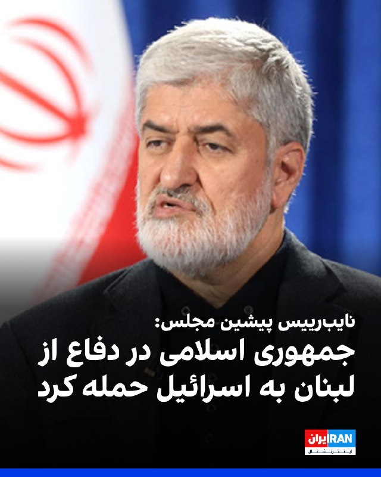

علی مطهری، نایب‌رییس پیشین مجلس گفت: «جمهوری اسلامی برای اولین بار بدون آنکه اسرائیل حمله‌ای کرده باشد، در دفاع از مردم لبنان به آن‌ها حمله کرد و این در آینده آثار خوبی از نظر وحدت ساحات و ایجاد رعب در اسرائیلی‌ها خواهد داشت.»

او ادامه داد: «جمهوری اسلامی این معادله را به هم زد که همیشه اول باید اسرائیل حمله کند تا ما پاسخ دهیم و اکنون معادله جدیدی حاکم شد.»
‌🏁 🇬🇧 IranintlTV

🤖 @VahidOOnLine

## IranIntlTV — post 342199

جاویدنامان انقلاب ملی ایرانیان
«امیرعلی زارعی» ۱۸ دی‌ماه به اعتراضات سراسری پیوست و در محله مجیدیه تهران با گلوله جنگی نیروهای سرکوب جمهوری اسلامی کشته شد. نامش در حافظه‌ی این سرزمین می‌ماند و یادش چراغ راه آزادی‌خواهان است.
@iranintltv

## IranIntlTV — post 342198

  

علی مطهری، نایب‌رییس پیشین مجلس گفت: «جمهوری اسلامی برای اولین بار بدون آنکه اسرائیل حمله‌ای کرده باشد، در دفاع از مردم لبنان به آن‌ها حمله کرد و این در آینده آثار خوبی از نظر وحدت ساحات و ایجاد رعب در اسرائیلی‌ها خواهد داشت.»

او ادامه داد: «جمهوری اسلامی این معادله را به هم زد که همیشه اول باید اسرائیل حمله کند تا ما پاسخ دهیم و اکنون معادله جدیدی حاکم شد.»
https://iranintl.com/202606143146

## IranIntlTV — post 342197

یک شهروند اهل ساری با ارسال ویدیویی به ایران‌اینترنشنال، چادرهای محل تجمعات حکومتی در یکی از میادین این شهر را نشان می‌دهد و در خصوص حمایت‌های مالی حکومت از این تجمع‌ها می‌گوید.

## FarsiVOA — post 220650

🔺سناتور جمهوری‌خواه: نقض تعهدات جمهوری اسلامی در توافق باید پیامد داشته باشد

▪️ریک اسکات، سناتور جمهوری‌خواه، می‌گوید به دستیابی به توافق با جمهوری اسلامی امیدوار است، اما نسبت به پایبندی سپاه پاسداران و ساختار قدرت در جمهوری اسلامی خوش‌بین نیست.

▪️او در گفت‌وگو با فاکس‌نیوز تصریح کرد که جمهوری اسلامی نباید به سلاح هسته‌ای دست یابد، نباید موشک‌های بالستیک در اختیار داشته باشد و باید حمایت مالی از گروه‌های نیابتی از جمله حوثی‌ها، حزب‌الله و حماس را متوقف کند.

▪️این سناتور جمهوری‌خواه همچنین گفت هرگونه توافق احتمالی با جمهوری اسلامی باید دارای سازوکار قوی اجرا، امکان راستی‌آزمایی و پیامدهای مشخص در صورت نقض تعهدات باشد.

⬇️ بیشتر بخوانید:
https://ir.voanews.com/a/8160648.html

## alonews — post 127790

  <a href="telegram/content/alonews_127790_1781420662.webm" target="_blank">🎬 Download video</a>

👈کامران غضنفری نماینده مجلس پس از تهدید مسعود پزشکیان به استیضاح: آقای عراقچی غلط کردی دور دوم برای مذاکرات تعیین کردی!

✅ @AloNews خبر جنگ

## alonews — post 127789

  <a href="telegram/content/alonews_127789_1781420662.webm" target="_blank">🎬 Download video</a>

👈سی‌ان‌ان: مذاکره‌کنندگان قطری برای نهایی کردن تفاهم راهی تهران شده‌اند

🔴 شبکه آمریکایی به نقل از یک منبع مدعی شد که مذاکره‌کنندگان قطری صبح امروز در هماهنگی با ایالات متحده به سوی تهران پرواز کرده‌اند تا به تسهیل روند نهایی‌سازی توافق (یادداشت‌تفاهم) بین ایران و آمریکا کمک کنند

✅ @AloNews خبر جنگ

## alonews — post 127788

  <a href="telegram/content/alonews_127788_1781420662.webm" target="_blank">🎬 Download video</a>

👈العربیه: امروز نشست مجازی میان هیئت‌های آمریکا و ایران برای امضای توافق صلح برگزار می‌شود

✅ @AloNews خبر جنگ

---
📅 بروزرسانی: 1405/03/24 10:23
---

## VahidOOnLine — post 245419

  

بابک نگاهداری، رییس مرکز پژوهش‌های مجلس، با اشاره به مذاکرات میان جمهوری اسلامی و آمریکا، گفت: «ما به حضور و نقش‌آفرینی فدائیان آبرو نیاز داریم؛ وقتی در جامعه شکاف‌هایی وجود دارد و یا عده‌ای برای ایجاد دوقطبی‌هایی تلاش کردند، به افرادی با اعتبار بالا نیاز داریم که آبروی خود را صرف ترمیم این شکاف‌ها کنند.»

او افزود: «مذاکرات یک امر ملی است و یک بحث جناحی سیاسی نیست که با حرکت‌های سخیف سیاسی فضای کشور را تخریب کرده و ذهن افکار عمومی را منفی و مخدوش کنیم. این کار درست نیست و خیانت ملی است.»
‌🏁 🇬🇧 IranintlTV

🤖 @VahidOOnLine

## IranIntlTV — post 342195

  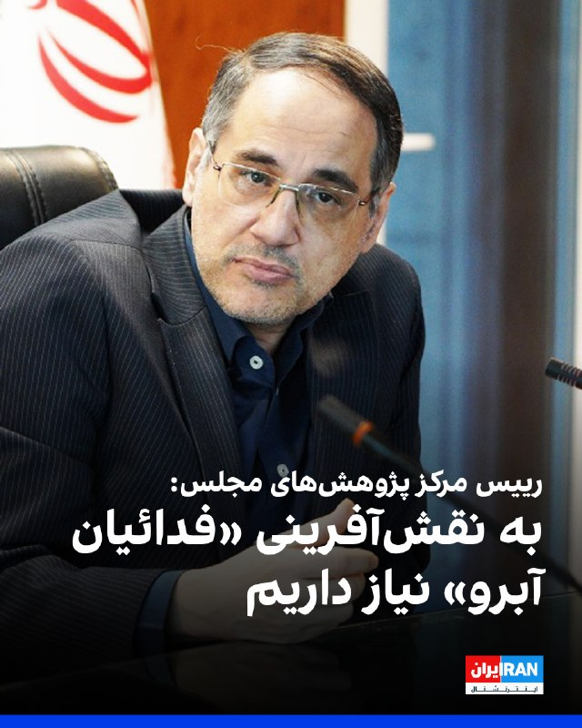

بابک نگاهداری، رییس مرکز پژوهش‌های مجلس، با اشاره به مذاکرات میان جمهوری اسلامی و آمریکا، گفت: «ما به حضور و نقش‌آفرینی فدائیان آبرو نیاز داریم؛ وقتی در جامعه شکاف‌هایی وجود دارد و یا عده‌ای برای ایجاد دوقطبی‌هایی تلاش کردند، به افرادی با اعتبار بالا نیاز داریم که آبروی خود را صرف ترمیم این شکاف‌ها کنند.»

او افزود: «مذاکرات یک امر ملی است و یک بحث جناحی سیاسی نیست که با حرکت‌های سخیف سیاسی فضای کشور را تخریب کرده و ذهن افکار عمومی را منفی و مخدوش کنیم. این کار درست نیست و خیانت ملی است.»
https://iranintl.com/202606143841

## IranIntlTV — post 342194

  <a href="telegram/content/IranIntlTV_342194_1781420036.mp4" target="_blank">🎬 Download video</a>

در سومین روز رقابت‌های جام جهانی ۲۰۲۶، تیم‌های هائیتی و اسکاتلند در ورزشگاه فاکسبرو به مصاف هم رفتند و اسکاتلند در جریان بازی پیشتاز است. پیش‌تر نیز برزیل و مراکش در دیداری از گروه C با تساوی میدان را ترک کردند.
علیرضا مدیری، خبرنگار ایران‌اینترنشنال، گزارش می‌دهد
@iranintltv

## DW_Farsi — post 125945

  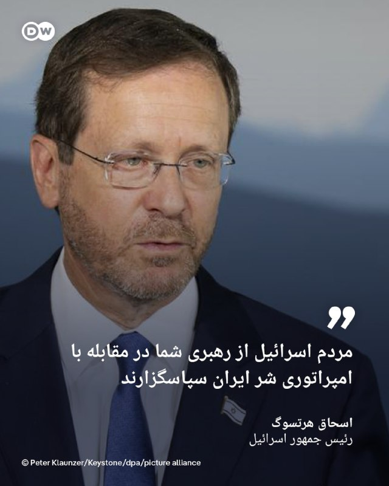

🔶 هرتسوگ به ترامپ: مردم اسرائیل از رهبری شما در مقابله با امپراتوری شر ایران سپاسگزارند

اسحاق هرتسوگ، رئیس جمهور اسرائیل، در پیام تبریکی به مناسبت ۸۰ سالگی دونالد ترامپ، از او ستایش کرده و نوشت: «مردم اسرائیل از رهبری شما در مقابله با امپراتوری شر ایران و تعهد راسخ شما به امنیت اسرائیل سپاسگزارند. ما هرگز تلاش‌های خستگی‌ناپذیر شما را در تضمین آزادی گروگان‌های عزیزمان فراموش نخواهیم کرد.»

ارسال این پیام در حالی است که ترامپ پیش‌تر از هرتسوگ به دلیل خودداری او از اعطای عفو به نتانیاهو در پرونده‌ فساد مالی به شدت انتقاد کرده و گفته بود رئیس جمهور اسرائیل "باید از خودش شرمنده باشد".

بنیامین نتانیاهو در دادگاه در سه پروندهٔ جداگانه به ارتشاء و کلاهبرداری و خیانت در امانت متهم است و ترامپ از مدت‌ها پیش به صورت علنی برای اعطای عفو کامل به او در این پرونده، بر رئیس جمهور و دستگاه قضایی اسرائیل فشار وارد می‌آورد.

@dw_farsi

## alonews — post 127787

  <a href="telegram/content/alonews_127787_1781420038.webm" target="_blank">🎬 Download video</a>

👈الحدث: پس از امضای توافق، محاصره بنادر ایران برداشته خواهد شد.

✅ @AloNews خبر جنگ

## alonews — post 127786

  <a href="telegram/content/alonews_127786_1781420038.webm" target="_blank">🎬 Download video</a>

👈الحدث:یک نشست مجازی میان هیئت‌های آمریکا و ایران با حضور میانجی‌گران پاکستانی و قطری برگزار خواهد شد.

✅ @AloNews خبر جنگ

## alonews — post 127785

  <a href="telegram/content/alonews_127785_1781420038.webm" target="_blank">🎬 Download video</a>

👈اسموتریچ، وزیر دارایی اسرائیل: به ازای هر حمله‌ از لبنان ۱۰ ساختمان در ضاحیه باید تخریب شوند

✅ @AloNews خبر جنگ

---
📅 بروزرسانی: 1405/03/24 10:13
---

## VahidOOnLine — post 245418

  <a href="telegram/content/VahidOOnLine_245418_1781419433.mp4" target="_blank">🎬 Download video</a>

بر اساس ویدیوهای رسیده به ایران‌اینترنشنال، گروهی از ایرانیان مقیم ژاپن یکشنبه ۲۴ خرداد با فراخوان شاهزاده رضا پهلوی، علیه جمهوری اسلامی در توکیو تجمع کردند.
‌🏁 🇬🇧 IranintlTV

🤖 @VahidOOnLine

## VahidOOnLine — post 245417

  

وزارت آموزش و پرورش جمهوری اسلامی اعلام کرد زمان برگزاری امتحانات نهایی پایه‌های یازدهم و دوازدهم مدارس به دلیل تشییع جنازه رهبر کشته‌شده جمهوری اسلامی یک هفته به تعویق افتاده است.

بر این اساس، امتحانات پایه یازدهم از ۲۰ تیر ۱۴۰۵ و پایه دوازدهم از ۲۱ تیر ۱۴۰۵ برگزار می‌شود.

پیش‌تر اعلام شده بود که امتحانات دانشگاه‌ها نیز با تاخیر برگزار می‌شود.
‌🏁 🇬🇧 IranintlTV

🤖 @VahidOOnLine

## VahidOOnLine — post 245416

  <a href="telegram/content/VahidOOnLine_245416_1781419437.mp4" target="_blank">🎬 Download video</a>

♦️رژیم طالبان در حال ساخت مقبره‌ای مجلل برای ملا عمر، بنیان‌گذار و نخستین رهبر این گروه، در ولایت زابل است.
در ویدیویی که از این محل منتشر شده، دیده می‌شود که عملیات ساختمانی در محوطه مقبره جریان دارد و بخش‌هایی از آن نیز با سنگ مرمر تزئین شده است.
رژیم طالبان به‌دلیل حساسیت این موضوع، هزینه ساخت مقبره را اعلام نکرده است.
با این حال، سه سال پیش یک بازرگان حامی طالبان حدود ۲۰۰ هزار دلار آمریکایی برای ساخت جاده منتهی به این مقبره هزینه کرد.
از سوی دیگر، این مقبره در منطقه‌ای بیابانی و غیرمسکونی واقع شده است و ساخت جاده برای رسیدن به آن تنها برای افرادی سهولت ایجاد می‌کند که به بازدید این مکان می‌روند.
‌🇸🇦 Indypersian

🤖 @VahidOOnLine

## VahidOOnLine — post 245415

  <a href="telegram/content/VahidOOnLine_245415_1781419439.mp4" target="_blank">🎬 Download video</a>

♦️تیم ملی فوتبال ایران بامداد سه‌شنبه ۲۶ خرداد، هفتمین حضور خود در جام جهانی را آغاز خواهد کرد. رقابتی که این بار در آمریکا، کانادا و مکزیک برگزار می‌شود و ایران در شرایطی متفاوت نسبت به دوره‌های گذشته پا به آن می‌گذارد.

برخلاف بسیاری از جام‌های جهانی پیشین، آماده‌سازی ایران برای این دوره با مشکلاتی کم‌سابقه همراه بوده است. بحران صدور ویزا برای بخشی از اعضای کاروان، انتقال اجباری محل اردو از آمریکا به تیخوانای مکزیک و لغو چند مسابقه تدارکاتی، شرایطی را ایجاد کرد که حتی مقام‌های فدراسیون فوتبال ایران نیز آن را بی‌سابقه توصیف کردند.

اما فارغ از اتفاقات امروز، تاریخ حضور ایران در جام جهانی داستانی طولانی و پر فراز و نشیب است؛ داستانی که از آرژانتین ۱۹۷۸ آغاز شد.

پادکست ایندیپندنت فارسی را اینجا گوش کنید
‌🇸🇦 Indypersian

🤖 @VahidOOnLine

## IranIntlTV — post 342193

  <a href="telegram/content/IranIntlTV_342193_1781419442.mp4" target="_blank">🎬 Download video</a>

بر اساس ویدیوهای رسیده به ایران‌اینترنشنال، گروهی از ایرانیان مقیم ژاپن یکشنبه ۲۴ خرداد با فراخوان شاهزاده رضا پهلوی، علیه جمهوری اسلامی در توکیو تجمع کردند.

## IranIntlTV — post 342192

  <a href="telegram/content/IranIntlTV_342192_1781419445.mp4" target="_blank">🎬 Download video</a>

در آستانه روز شیر و خورشید و زادروز مجیدرضا رهنورد، جمعی از ایرانیان کلگری در پاسخ به فراخوان شاهزاده رضا پهلوی زنجیره انسانی تشکیل دادند.

شرکت‌کنندگان با در دست داشتن پرچم شیر و خورشید، تصاویر جان‌باختگان و پوسترهای اطلاع‌رسانی تلاش کردند توجه رهگذران را به وضعیت ایران جلب کنند.

گزارش سپیدار ولیان، خبرنگار ایران‌اینترنشنال
@iranintltv

## IranIntlTV — post 342191

  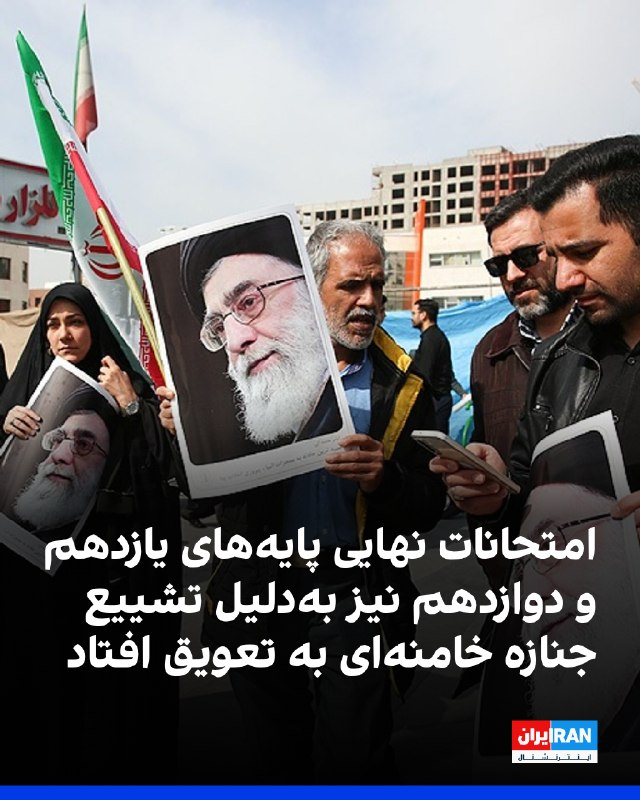

وزارت آموزش و پرورش جمهوری اسلامی اعلام کرد زمان برگزاری امتحانات نهایی پایه‌های یازدهم و دوازدهم مدارس به دلیل تشییع جنازه رهبر کشته‌شده جمهوری اسلامی یک هفته به تعویق افتاده است.

بر این اساس، امتحانات پایه یازدهم از ۲۰ تیر ۱۴۰۵ و پایه دوازدهم از ۲۱ تیر ۱۴۰۵ برگزار می‌شود.

پیش‌تر اعلام شده بود که امتحانات دانشگاه‌ها نیز با تاخیر برگزار می‌شود.
https://iranintl.com/202606145844

## IranIntlTV — post 342190

  <a href="telegram/content/IranIntlTV_342190_1781419448.mp4" target="_blank">🎬 Download video</a>

شورای هماهنگی تشکل‌های صنفی فرهنگیان ایران با هشدار نسبت به افزایش برخوردهای امنیتی با معلمان و فعالان صنفی، حکومت را به تلاش برای تضعیف تشکل‌های مستقل متهم کرد و خواستار تغییرات بنیادین و دموکراتیک شد.

گفت‌وگو با روزبه بوالهری، عضو تحریریه ایران‌اینترنشنال
@iranintltv

## IranIntlTV — post 342189

  <a href="telegram/content/IranIntlTV_342189_1781419450.mp4" target="_blank">🎬 Download video</a>

شبکه کان به نقل از منابع امنیتی اسرائیلی گزارش داد همزمان با احتمال تفاهم میان آمریکا و جمهوری اسلامی، ارتش اسرائیل برای توقف احتمالی پیشروی زمینی در جنوب لبنان آماده می‌شود، اما از نوار امنیتی عقب‌نشینی نخواهد کرد و حملات هدفمند در جنوب لبنان را ادامه خواهد داد.

اشکان صفایی، خبرنگار ایران‌اینترنشنال، گزارش می‌دهد
@iranintltv

## FarsiVOA — post 220649

  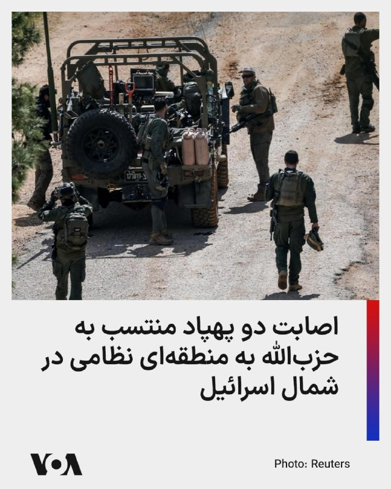

ارتش اسرائیل اعلام کرد دو پهپاد مشکوک منتسب به حزب‌الله، صبح یکشنبه، به یک منطقه نظامی اسرائیل در شمال این کشور و نزدیک مرز لبنان اصابت کرده‌اند.

به گفته ارتش اسرائیل، این حادثه تلفاتی نداشته و جزئیات آن در دست بررسی است.

پیش از اعلام این خبر، آژیرهای هشدار در چند شهرک در منطقه الجلیل غربی به صدا درآمده بود. ارتش اسرائیل اعلام کرد این هشدارها در پی شناسایی «اهداف هوایی مشکوک» فعال شده بود.

رسانه‌های اسرائیلی نوشتند برخورد این پهپادها به یک منطقه نظامی رخ داده و تاکنون گزارشی از آسیب‌دیدگی نیروها یا غیرنظامیان منتشر نشده است.

این حادثه در حالی رخ می‌دهد که تنش‌ها در مرز شمالی اسرائیل و لبنان همچنان ادامه دارد و ارتش اسرائیل در هفته‌های اخیر بارها از رهگیری یا اصابت پهپادها و پرتابه‌های مشکوک در این منطقه خبر داده است.
@FarsiVOA

## Dirty_Kids — post 391982

  

میزبانی آمریکا تا الان که بی‌نقص بوده :)

@Dirty_Kids 👻

## Dirty_Kids — post 391980

  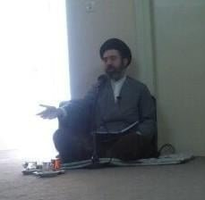

آمریکا بابامو کشت
ننمو کشت
زنمو کشت
بچمو کشت

ولی رفتم باشون توافق کردم 🤧

عرزشی عر بزززززن... 😂

@Dirty_Kids 👻

## Dirty_Kids — post 391979

  <a href="telegram/content/Dirty_Kids_391979_1781419454.mp4" target="_blank">🎬 Download video</a>

ترندی در آمریکا راه افتاده که پرچم خرچنگی رو از همه فروشگاه‌ها حذف می‌کنند🔥

@Dirty_Kids 👻

## alonews — post 127784

  <a href="telegram/content/alonews_127784_1781419454.webm" target="_blank">🎬 Download video</a>

👈وزارت دفاع انگلیس اعلام کرد که نیروهای انگلیسی صبح امروز در کانال (احتمالاً کانال مانش) به یک نفتکش متعلق به «ناوگان سایه» حمله کرده است.

✅ @AloNews خبر جنگ

---
📅 بروزرسانی: 1405/03/24 10:03
---

## BBCPersian — post 283769

🔻اردن: به صدا درآمدن آژیرهای هشدار ناشی از نقص فنی بود

تلویزیون دولتی اردن پیش‌تر و در اوایل صبح امروز گزارش داد که آژیرهای هشدار در این کشور به صدا درآمده‌اند، اما جزئیات بیشتری درباره علت این موضوع ارائه نکرده بود.

اما حال اداره امنیت عمومی اردن اعلام کرد که علت این اتفاق یک «نقص فنی» بوده و در یکی از آژیرهای هشدار اختلال ایجاد شده است.

این اداره همچنین اعلام کرد که تیم‌های فنی بلافاصله وارد عمل شده و این مشکل را برطرف کرده‌اند.

https://bbc.in/4fEONCy
@BBCPersian

## alonews — post 127783

  <a href="telegram/content/alonews_127783_1781418828.webm" target="_blank">🎬 Download video</a>

👈گروسی :نظارت و راستی‌آزمایی آژانس در هرگونه توافق هسته‌ای احتمالی ایران و آژانس نقش محوری خواهد داشت و این نهاد با هماهنگی شورای حکام برای آن آمادگی دارد

✅ @AloNews خبر جنگ

---
📅 بروزرسانی: 1405/03/24 09:53
---

## VahidOOnLine — post 245414

  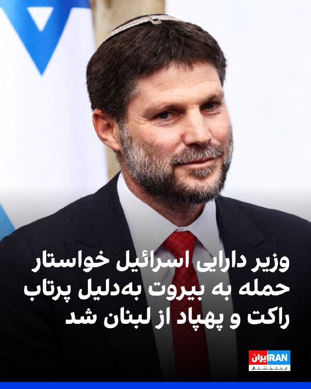

بتسالل اسموتریچ، وزیر دارایی اسرائیل، از نتانیاهو خواست که بر اساس وعده خود و به دلیل پرتاب راکت و پهپاد از لبنان به شمال اسرائیل، به ضاحیه بیروت حمله کند.

پیش‌تر، یسرائیل کاتز، وزیر دفاع اسرائیل گفته بود هرگونه حمله به شهرهای شمالی این کشور با حمله به ضاحیه پاسخ داده می‌شود.

همزمان جمهوری اسلامی اعلام کرده آتش‌بس در لبنان، باید بخشی از تفاهم با آمریکا باشد.
‌🏁 🇬🇧 IranintlTV

🤖 @VahidOOnLine

## VahidOOnLine — post 245413

  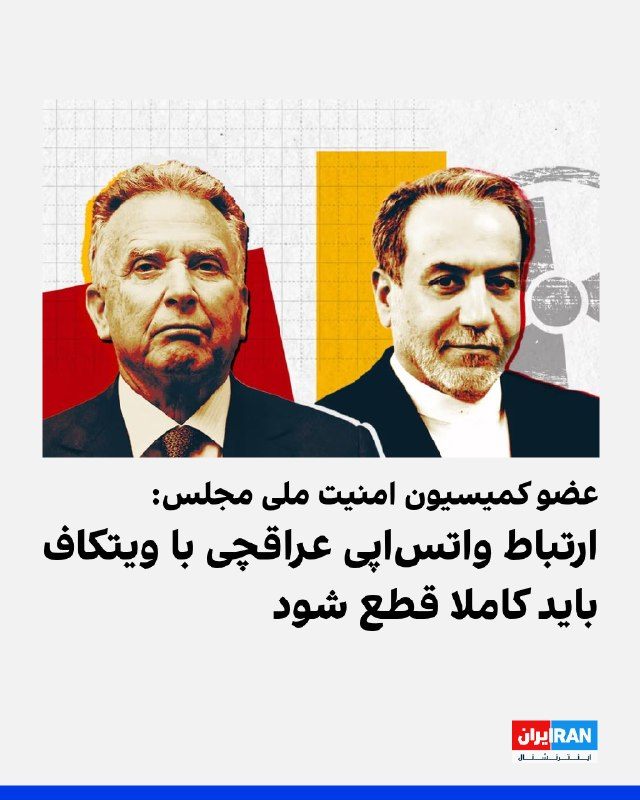

علی خضریان، عضو کمیسیون امنیت ملی مجلس گفت که ترامپ درباره ما دروغ‌هایی می‌گوید و آنچه «بهانه» دست آمریکایی‌ها داده، ارتباط واتس‌اپی عباس عراقچی، وزیر خارجه با استیو ویتکاف است که باید کاملا قطع شود.

او ادامه داد: «یکی از دروغ‌های ترامپ در موضوع عبور نفتکش‌ها با اسکورت ارتش آمریکا از تنگه هرمز بود.»

به گفته او اظهارات دونالد ترامپ درباره عبور نفتکش‌ها با اسکورت ارتش آمریکا از تنگه هرمز نادرست است و مقام‌های دولت آمریکا نیز این موضوع را تایید نکرده‌اند.
‌🏁 🇬🇧 IranintlTV

🤖 @VahidOOnLine

## WithYashar — post 14762

الجزیره: جمهوری اسلامی هنوز تصمیم نهایی خودشو درباره تفاهم‌نامه رو اعلام نکرده.
@withyashar

## pm_afshaa — post 93843

فقط کله زرد املاکی میتونست ما و عرزشیا رو هم ساید کنه همه مون مخالف مذاکره

## IranIntlTV — post 342188

  

بتسالل اسموتریچ، وزیر دارایی اسرائیل، از نتانیاهو خواست که بر اساس وعده خود و به دلیل پرتاب راکت و پهپاد از لبنان به شمال اسرائیل، به ضاحیه بیروت حمله کند.

پیش‌تر، یسرائیل کاتز، وزیر دفاع اسرائیل گفته بود هرگونه حمله به شهرهای شمالی این کشور با حمله به ضاحیه پاسخ داده می‌شود.

همزمان جمهوری اسلامی اعلام کرده آتش‌بس در لبنان، باید بخشی از تفاهم با آمریکا باشد.
https://iranintl.com/202606144366

## IranIntlTV — post 342187

  <a href="telegram/content/IranIntlTV_342187_1781418237.mp4" target="_blank">🎬 Download video</a>

همزمان با افزایش احتمال امضای یادداشت تفاهم میان جمهوری اسلامی و آمریکا، موجی از مخالفت‌ها در میان بخشی از حامیان حکومت شکل گرفته است. امیر گیتی، عضو تحریریه ایران‌اینترنشنال، می‌گوید جمهوری اسلامی برای خرید زمان و تنفس سیاسی، هر آنچه در اختیار داشته است را روی میز مذاکره گذاشته است؛ امری که برای بدنه حامی حکومت قابل قبول نیست.
@iranintltv

## IranIntlTV — post 342186

  

علی خضریان، عضو کمیسیون امنیت ملی مجلس گفت که ترامپ درباره ما دروغ‌هایی می‌گوید و آنچه «بهانه» دست آمریکایی‌ها داده، ارتباط واتس‌اپی عباس عراقچی، وزیر خارجه با استیو ویتکاف است که باید کاملا قطع شود.

او ادامه داد: «یکی از دروغ‌های ترامپ در موضوع عبور نفتکش‌ها با اسکورت ارتش آمریکا از تنگه هرمز بود.»

به گفته او اظهارات دونالد ترامپ درباره عبور نفتکش‌ها با اسکورت ارتش آمریکا از تنگه هرمز نادرست است و مقام‌های دولت آمریکا نیز این موضوع را تایید نکرده‌اند.
https://iranintl.com/202606142719

## FarsiVOA — post 220648

🔺یک مقام صنفی: گرانی و تورم محصول سوءمدیریت است و نه ناشی از جنگ

▪️رئیس اتاق اصناف کشاورزی، روایت نسبت دادن گرانی‌های اخیر به جنگ را رد کرد و گفت: «به صراحت به شما بگویم من هیچ‌یک از این تورم‌ها را ناشی از جنگ نمی‌دانم. من سوءمدیریت‌ها را می‌بینم.»

▪️آمارهای رسمی تورم اردیبهشت نشان می‌دهد فشار قیمت‌ها پیش از اثرگذاری کامل موج تازه جنگ، به سطحی سنگین رسیده بود.

▪️بر اساس آمار رسمی، تورم کلی به بیش از ۷۰ درصد و رشد قیمت خوراکی‌ها و آشامیدنی‌ها به بیش از ۱۰۰ درصد رسیده است.

▪️در مقابل، مقام‌های دولت پزشکیان تلاش کرده‌اند بخشی از بحران معیشتی را به جنگ، تحریم و شرایط امنیتی نسبت دهند. اما خود دولت پیش‌تر پذیرفته بود که تغییر سیاست ارزی می‌تواند به افزایش قیمت‌ها منجر شود.

⬇️ بیشتر بخوانید:
https://ir.voanews.com/a/8160647.html

## DW_Farsi — post 125944

  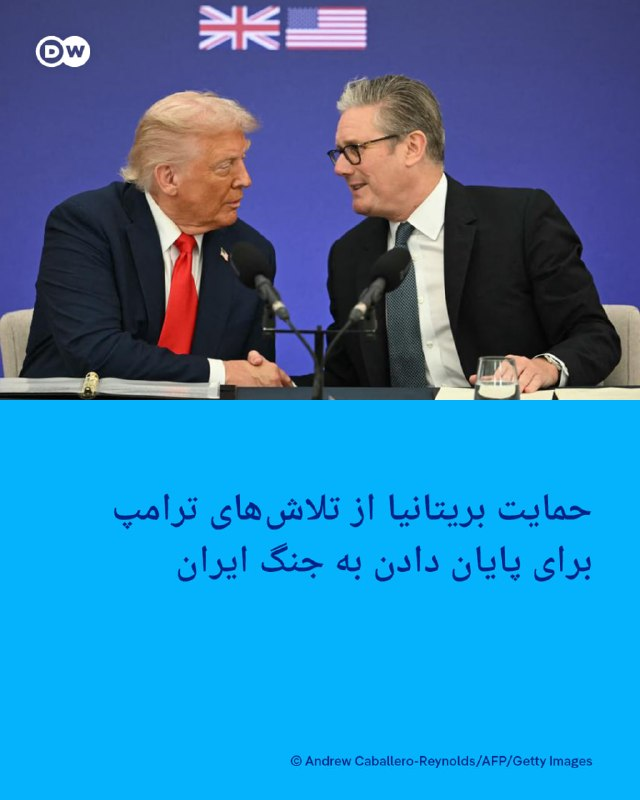

🔶 حمایت بریتانیا از تلاش‌های ترامپ برای پایان دادن به جنگ ایران

کی‌یر استارمر، نخست‌وزیر بریتانیا، در گفت‌وگوی تلفنی با دونالد ترامپ، از تلاش او برای پایان دادن به جنگ ایران استقبال کرد و گفت بریتانیا آماده است تا از اجرای هرگونه توافق صلح حمایت کند. سخنگوی استارمر به رسانه‌ها گفت نخست‌وزیر بریتانیا از پیشرفت‌های حاصل شده در مذاکرات با ایران استقبال و تأکید کرده که هر توافقی با تهران باید صلحی پایدار و ماندگار را تضمین کند.

ترامپ و استارمر همچنین بر ضرورت برقراری مجدد آزادی کشتیرانی توافق کردند تا به این ترتیب از پیامدهایی که بر اقتصاد جهان به دلیل مسدود ماندن تنگه هرمز ایجاد شده، کاسته شود.

بریتانیا و فرانسه پیش‌تر برای کمک به پاکسازی مین‌های کارگذاشته شده از سوی ایران در تنگه هرمز ابراز آمادگی کرده بودند.

مقام‌های آمریکایی روز شنبه اعلام کردند که ترامپ قصد دارد در نشست آتی کشورهای گروه ۷ در فرانسه درباره احتمال مشارکت این کشورها در عملیات پاکسازی مین‌ها در تنگه هرمز با آنها گفت‌وگو کند.

@dw_farsi

## RadioFarda — post 158281

  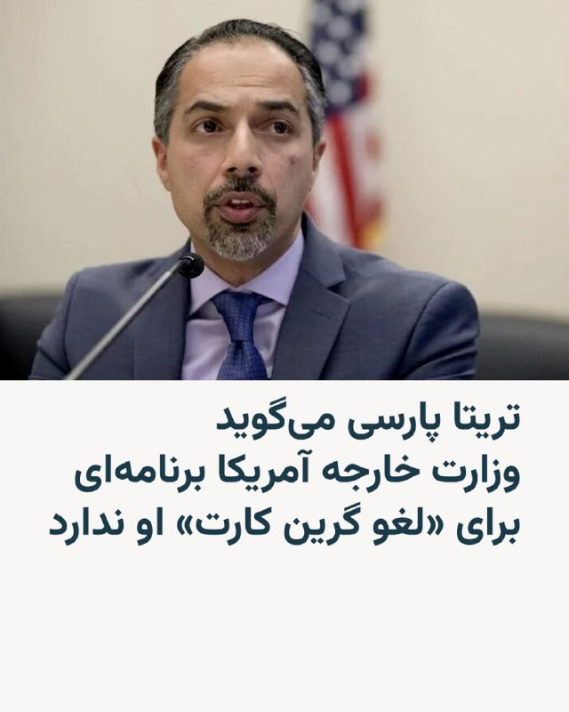

🔸تریتا پارسی، تحلیلگر مسائل ایران و آمریکا، با انتشار پستی در شبکه اجتماعی ایکس اعلام کرد که وزارت خارجه آمریکا در حال حاضر «برنامه‌ای برای لغو گرین ‌کارت» او ندارد.

🔸آقای پارسی در این پست که شامگاه شنبه ۲۳ خرداد منتشر کرده است هم‌چنین مدعی که این وزارتخانه هرگونه تحقیق یا بررسی درباره او را «تایید نکرده است.»

🔸نشریه «فری پرس» پیش از این در مقاله‌ای مدعی شده بود که وزارت خارجه آمریکا در حال بررسی فعالیت‌های ترتیا پارسی به دلیل تلاش او برای «تضعیف آمریکا» است.

🔸این تحلیلگر سیاسی دلیل انتشار این مقاله را «مخالفت با جنگ با ایران» اعلام کرده است.

🔸آقای پارسی که از منتقدان سیاست‌های آمریکا در قبال ایران محسوب می‌شود در ادامه مدعی شده که گزارش منتشرشده بخشی از تلاش منتقدانش برای بی‌اعتبار کردن و تحت فشار قرار دادن او بوده است.

🔸تریتا پارسی رئیس و بنیانگذار شورای ملی ایرانیان آمریکا (نایاک) بوده است.

🔸وال استریت ژورنال بهمن ۱۴۰۴ در مقاله‌ای نایاک و بنیان‌گذار آن، تریتا پارسی را به‌عنوان بخشی از یک شبکه نفوذ گسترده‌تر توصیف کرد که در جهت منافع جمهوری اسلامی در واشینگتن فعالیت می‌کنند.

@RadioFarda

## IranianMinds — post 22527

منان رییسی نماینده مجلس :

تفاهم‌نامه‌ای که یکشنبه قراره امضا بشه، سراسر نقض خطوط قرمز مجتبی خامنه‌ایه.

@IranianMinds

## BBCPersian — post 283768

  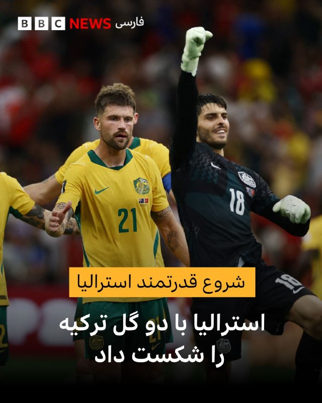

🔻استرالیا با دو گل توانست در اولین بازی خود ترکیه را شکست دهد و در رده دوم این گروه بعد از آمریکا قرار بگیرد.

ترکیه که پس از ۲۴ سال دوباره به جام جهانی راه یافته، امید زیادی به این بازی داشت.

این مسابقه که در ورزشگاه «بی‌سی‌پلس» شهر ونکوور در کشور کانادا برگزار شد، با برتری استرالیا همراه بود.

گل نخست را نستوری ایرانکوندا در دقیقه ۲۷ بازی و روی یک ضدحمله سریع به ثمر رساند و استرالیا را در نیمه اول پیش انداخت. در ادامه بازی و در نیمه دوم و در دقیقه ۷۵ کانرمتکالف با یک شوت از راه دور اختلاف را به دو گل افزایش داد تا پیروزی تیمش قطعی شود.

پیش‌تر در دیگر دیدار این گروه، تیم ملی آمریکا در بازی افتتاحیه موفق شد پاراگوئه را با نتیجه ۴ بر ۱ شکست دهد.
در حال حاضر در این گروه آمریکا با چهار گل زده و سه امتیاز صدرنشین این است و پس از آن استرالیا با دو گل زده و سه امتیاز در رده دوم قرار دارد.

تیم‌های ترکیه و پارگوائه هم بدون امتیاز در رده های بعدی این گروه قرار دارند.

📸 Reuters

@BBCPersian

## alonews — post 127782

  <a href="telegram/content/alonews_127782_1781418242.webm" target="_blank">🎬 Download video</a>

👈الجزیره: ایران هنوز تصمیم نهایی خود درباره تفاهم‌نامه را اعلام نکرده

🔴می‌توان انتظار داشت که توافق امروز نهایی شود

✅ @AloNews خبر جنگ

---
📅 بروزرسانی: 1405/03/24 09:43
---

## VahidOOnLine — post 245412

  <a href="telegram/content/VahidOOnLine_245412_1781417607.mp4" target="_blank">🎬 Download video</a>

♦️نیویورک نیکس با پیروزی ۹۴ بر ۹۰ مقابل سن‌آنتونیو اسپرز در بازی پنجم فینال، در نهایت این رقابت را ۴ بر ۱ به سود خود به پایان رساند و برای نخستین بار از سال ۱۹۷۳ جام قهرمانی «ان‌بی‌ای» (NBA) را بالای سر برد.

ستاره بی‌چون‌وچرای این دیدار، جیلن برانسون بود که با ثبت ۴۵ امتیاز، نقش اصلی را در بازگشت تیمش از اختلاف امتیاز و فتح عنوان ایفا کرد و به عنوان ارزشمندترین بازیکن فینال نیز انتخاب شد.

در حالی که اسپرز بخش زیادی از مسابقه را با اختلافی دو رقمی پیش بود، نیکس در دقایق پایانی ورق را برگرداند و ۳ دقیقه و ۴۰ ثانیه مانده به پایان، برای نخستین بار از حریف پیش افتاد؛ برتری‌ای که تا سوت پایان حفظ شد تا یکی از تاریخی‌ترین قهرمانی‌های این تیم رقم بخورد.

همزمان با این موفقیت، هزاران هوادار نیکس به خیابان‌های نیویورک آمدند و با برپایی جشن‌های گسترده، پایان بیش از نیم قرن انتظار برای کسب عنوان قهرمانی را جشن گرفتند.
‌🇸🇦 Indypersian

🤖 @VahidOOnLine

## WithYashar — post 14761

فاکس نیوز به نقل از یک مقام بلندپایه در دولت آمریکا: معتقدیم به توافقی عالی و بسیار مستحکم دست یافته‌ایم

ایران تنگه هرمز را بدون دریافت هزینه مجدداً باز خواهد کرد
محاصره آمریکا هم‌زمان با بازگشایی تنگه هرمز لغو خواهد شد.
مرحله بعدی بر عملیات مین‌روبی در تنگه هرمز متمرکز خواهد بود
@withyashar

## mwarmonitor — post 10844

  <a href="telegram/content/mwarmonitor_10844_1781417609.mp4" target="_blank">🎬 Download video</a>

📹ویدئویی نشان می‌دهد که یکی از دو پهپادِ حزب‌الله صبح امروز به یک منطقه نظامی اسرائیل در مرز لبنان در جلیل غربی اصابت کرده است.

@mwarmonitor

## pm_afshaa — post 93842

وضعیت بانکا جوریه که اگه برم خرید ولت بگیرم تتر جا به جا کنم کمتر از کارت کشیدن علاف میشم

## IranIntlTV — post 342185

  <a href="telegram/content/IranIntlTV_342185_1781417610.mp4" target="_blank">🎬 Download video</a>

شماری از ایرانیان در بروکسل با برگزاری تجمعی مقابل نهادهای اتحادیه اروپا، یاد کشته‌شدگان اعتراضات ایران را گرامی داشتند و خواستار توجه بیشتر جامعه جهانی به وضعیت حقوق بشر در ایران شدند.

گزارش لی‌لی نیکفر، خبرنگار ایران‌اینترنشنال
@iranintltv

## IranIntlTV — post 342184

  <a href="telegram/content/IranIntlTV_342184_1781417611.mp4" target="_blank">🎬 Download video</a>

همزمان با فراخوان شاهزاده رضا پهلوی و در آستانه سالروز تولد مجیدرضا رهنورد، شماری از ایرانیان مقیم اوکلند، نیوزیلند، با برگزاری تجمع اعتراضی، زنجیره انسانی و راهپیمایی، یاد او و دیگر جان‌باختگان راه آزادی ایران را گرامی داشتند.

گزارش علیرضا محبی، خبرنگار ایران‌اینترنشنال
@iranintltv

## FarsiVOA — post 220647

  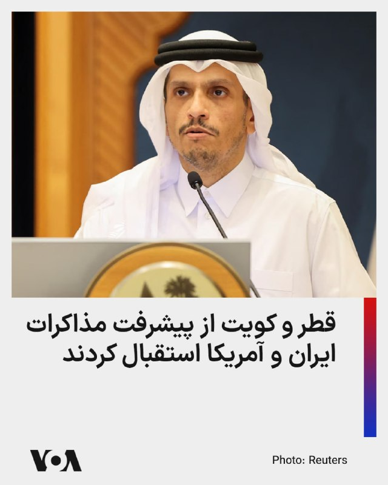

وزارت خارجه قطر اعلام کرد محمد بن عبدالرحمن آل ثانی، نخست‌وزیر و وزیر خارجه این کشور، در تماس تلفنی با شیخ جراح جابر الاحمد الصباح، همتای کویتی خود، درباره روابط دوجانبه و تحولات منطقه‌ای گفت‌وگو کرد.

بر اساس بیانیه وزارت خارجه قطر، دو طرف ضمن بررسی راه‌های تقویت همکاری‌های مشترک، درباره تلاش‌های میانجی‌گری میان ایالات متحده و جمهوری اسلامی نیز تبادل نظر کردند.

در این گفت‌وگو، وزیران خارجه قطر و کویت از پیشرفت حاصل‌شده در مذاکرات ابراز خرسندی کرده و از اعلام میانجی‌گری پاکستان مبنی بر دستیابی به متن نهایی توافق صلح استقبال کردند.

دو طرف همچنین ابراز امیدواری کردند که حکومت ایران و آمریکا به‌زودی این توافق را امضا کنند.

وزیران خارجه قطر و کویت همچنین بر حمایت کامل خود از تلاش‌های دیپلماتیک برای حل‌وفصل تمامی مسائل باقی‌مانده از طریق گفت‌وگو و راهکارهای مسالمت‌آمیز تأکید کردند و آن را گامی مهم در جهت تقویت امنیت و ثبات منطقه‌ای و بین‌المللی و افزایش فرصت‌های دستیابی به صلح پایدار در منطقه دانستند.
@FarsiVOA

## Persian_Trend_Official — post 16999

◾️ اسرائیل‌هیوم: یک منبع ارشد دیپلماتیک گفت اسرائیل ملزم به امضای توافق نیست و قادر به دفاع از خود خواهد بود، اما رفتارش باید با آمریکا هماهنگ باشد؛ در صورت عدم توافق، سرنگونی نظام ایران روی میز خواهد بود

◾️ اسرائیل‌هیوم: ارتش آمریکا ساخت یک پایگاه بزرگ نزدیک حصار مرزی غزه و پایگاه ریم را آغاز کرده که می‌تواند جایگزین ستاد چندملیتی کریات‌گات شود

◾️ الجزیره: تصاویر ماهواره‌ای نشان می‌دهد اسرائیل با وجود تعهد به خروج کامل از غزه، ۴۰ پایگاه نظامی ساخته یا تقویت کرده؛ نتانیاهو گفته «۶۰ درصد غزه را کنترل می‌کنیم، گام به گام، اول ۷۰ درصد»

◾️ تصاویر ماهواره‌ای جدید پایگاه شیخ عیسی بحرین تخریب چند مخزن سوخت، یک سازه دیگر، و سیستم راداری TPS-59 در کوه الدخان را تأیید می‌کند؛ اصابت‌ها مربوط به حملات ۱۱ ژوئن ارتش و سپاه است

◾️ تصویر ماهواره‌ای انهدام رادار هشدار اولیه ASR-1000 آمریکا در پایگاه علی‌السالم کویت منتشر شد

◾️ سنتکام: از آغاز محاصره بنادر ایران در ۱۳ آوریل، ۱۴۱ کشتی تجاری تغییر مسیر داده و ۹ کشتی از کار افتاده‌اند

◾️ یک ابرنفتکش با خاموش کردن AIS از محاصره دریایی آمریکا عبور کرد؛ تانکر ترکرز می‌گوید این اقدام ۲ میلیون بشکه ظرفیت ذخیره‌سازی اضافی در اختیار ایران قرار داده است

◾️ UKMTO: یک نفتکش در ۶ مایلی شرق عمان هدف اصابت یک پرتابه ناشناس قرار گرفت

◾️ سنتکام: چندین پهپاد تهاجمی ایران برای هدف قراردادن کشتی‌های تجاری در تنگه هرمز سرنگون شدند

◾️ بلومبرگ: ایران در دوره آتش‌بس بخش‌هایی از زرادخانه موشکی خود را بازسازی کرده و تسلیحات جدیدی از روسیه دریافت کرده است

◾️ سی‌ان‌ان: ایران با تخریب ورودی تونل‌ها و مین‌گذاری اطراف آن‌ها، حفاظت از سایت‌های زیرزمینی اورانیوم ۶۰ درصدی (احتمالاً در اصفهان) را تقویت کرده است

◾️ نیویورک‌تایمز: کمبود موشک‌های پاتریوت در اوکراین؛ پدافند هوایی این کشور با حملات گسترده پهپادی و بالستیک روسیه مواجه است و رهگیرها را جیره‌بندی می‌کند

◾️ ارتش آمریکا: کاهش احتمالی جنگنده‌های F-15/F-16 اختصاص‌یافته به ناتو از ۱۵۰ به ۱۰۰ فروند و کاهش هواپیماهای گشت دریایی از ۲۶ به ۱۵ فروند؛ بازآرایی بزرگ نیروهای آمریکایی در اروپا

◾️ ۱۱ فروند A-10C آمریکایی به پایگاه RAF لیکن‌هیث بازگشتند؛ یک فروند با شماره سریال ۷۸-۰۶۱۴ مفقود است؛ گمانه‌زنی می‌شود مرتبط با عملیات نجات خدمه F-15E باشد

◾️ سنتکام پایان بزرگ‌ترین رزمایش خود با ۱۰ کشور آسیای مرکزی و جنوبی و بیش از ۳۵۰ نیرو را اعلام کرد

◾️ ارتش اسرائیل ویدیوی حمله موشک سپاه به نزدیکی لانچر گنبد آهنین در عملیات وعده صادق-۳ (طلوع شیران) را بازخوانی کرد؛ یک سال از آن عملیات گذشت

◾️ نیویورک‌تایمز: ترامپ در حاشیه نشست G7 در اویان فرانسه با رهبران قطر، مصر و امارات دیدار خواهد کرد؛ ایران محور اصلی گفتگوها خواهد بود

◾️ تلگراف: ترامپ می‌کوشد تفاهم‌نامه با ایران را پیش از آغاز نشست G7 نهایی کند

◾️ احمد الشرع رئیس‌جمهور سوریه: شایعات دخالت سوریه در لبنان نادرست است؛ ما از پایان جنگ و آرام‌سازی لبنان حمایت می‌کنیم

◾️ ادی‌راما نخست‌وزیر آلبانی: ایران را به دست داشتن در اعتراضات اخیر علیه پروژه کوشنر متهم کرد و گفت ایران تنها کشور متخاصم با آلبانی است

◾️ غریب‌آبادی با سفیران چین و روسیه دیدار کرد و گفت شراکت راهبردی سه کشور با قوت ادامه خواهد یافت

◾️ ترامپ عکسی از خود و کیم جونگ اون در تروث‌سوشال منتشر کرد

◾️ دفتر حفظ و نشر آثار رهبر شهید: مراسم وداع ۱۳ و ۱۴ تیر در تهران، تشییع ۱۵ تیر تهران و ۱۶ تیر قم، و تشییع و تدفین ۱۸ تیر در حرم امام رضا مشهد برگزار می‌شود

◾️ احتمال تغییر زمان امتحانات نهایی به دلیل همزمانی با مراسم تشییع در دست بررسی است

◾️ شورای هماهنگی بانک‌های دولتی حمله سایبری به ۴ بانک (ملی، تجارت، صادرات، توسعه صادرات) را تأیید کرد؛ تیم‌های فنی اقدامات حفاظتی انجام دادند

◾️ یک فروند جنگنده F/A-18 هورنت تفنگداران دریایی آمریکا در پرواز آموزشی نزدیک دریاچه ریم‌راک واشنگتن سقوط کرد

◾️ ترامپ مدعی شد ارتش آمریکا نینو گوئررو، رهبر باند ترن د آراگوا را در عملیاتی در ونزوئلا ترور کرده است

👺Phantom

📍 @persian_trend_official
پرشین ترند | متفاوت‌ترین کانال نظامی

## Persian_Trend_Official — post 16998

## 📍بولتن خبری ۲۴ ساعت اخیر پرشین ترند
### 🗓 ۲۴ خرداد ۱۴۰۵

◾️ عراقچی در مصاحبه با شبکه خبر: نتیجه مذاکرات یک یادداشت تفاهم ۱۴ بندی است؛ خاتمه جنگ در همه جبهه‌ها از جمله لبنان در مرحله اول اعلام می‌شود و آمریکا پس از ۴۷ سال به حاکمیت ایران اذعان خواهد کرد

◾️ عراقچی: موضوع برنامه هسته‌ای در توافق نهایی بحث خواهد شد؛ برای آن ۶۰ روز وقت داریم؛ ممکن است این بازه تمدید شود یا مذاکرات ادامه نیابد

◾️ ترامپ در تروث‌سوشال: فردا توافق با ایران امضا خواهد شد؛ بلافاصله پس از امضا، تنگه هرمز به روی همه باز خواهد شد و هیچ پولی میان طرفین رد و بدل نمی‌شود

◾️ اکسیوس: ایران و آمریکا با میانجیگری پاکستان و قطر، یکشنبه نشستی مجازی برای امضای الکترونیک تفاهم‌نامه (تمدید ۶۰ روزه آتش‌بس) برگزار می‌کنند؛ دلیل فرمت مجازی، محدودیت زمانی سفر ونس پیش از سفر ترامپ به نشست G7 است

◾️ رویترز: ونس توافق‌نامه صلح با ایران را امضا خواهد کرد

◾️ پاکستان: یکشنبه مراسم امضای آنلاین ویدئویی توافق‌نامه را برگزار می‌کنیم؛ اسحاق دار و وزیر خارجه عربستان تأیید کردند مراسم فردا برگزار می‌شود

◾️ یدیعوت آحارونوت: توافق شامل توقف اقدامات خصمانه در تمامی جبهه‌ها از جمله آتش‌بس در لبنان است

◾️ سخنگوی وزارت خارجه ایران: امضای تفاهم فردا نخواهد بود، اما در روزهای آتی منتفی نیست؛ بحثی درباره موضوع هسته‌ای در این مرحله مطرح نمی‌شود

◾️ بقائی: احتمال نهایی شدن یادداشت تفاهم در روزهای آتی بالاست؛ برنامه‌ای برای سفر به ژنو یا جایی دیگر نداریم

◾️ یک مقام ارشد آمریکایی به الجزیره: همزمان با باز شدن تنگه هرمز، محاصره دریایی ایران را پایان خواهیم داد

◾️ مهر: قطر طرحی ارائه کرده که طی آن ۱۲ میلیارد دلار (۶ میلیارد آزادسازی دارایی + ۶ میلیارد وام/خط اعتباری) در اختیار ایران قرار گیرد؛ پیشنهاد اولیه ایران برای آزادسازی پلکانی منابع از سوی آمریکا رد شده بود

◾️ نبویان نایب رئیس کمیسیون امنیت ملی: متن توافق ۱۴ بند دارد؛ بند ۵ می‌گوید تنگه هرمز بدون پیش‌شرط باز خواهد شد و ایران در صورت اختلال مجدد، با محکومیت بین‌المللی مواجه می‌شود؛ بند اول باید آمریکا را آغازگر جنگ معرفی می‌کرد اما نکرده

◾️ رضایی سخنگوی کمیسیون امنیت ملی: سخاوتمندی مفرط در مذاکرات، محاسبات دشمن را عوض کرد تا فکر کند ایران ضعیف شده

◾️ ثابتی نماینده مجلس خطاب به قالیباف: عراقچی مسئولیت توافق را به گردن شما انداخته؛ تبعات این توافق بر گردن شما خواهد بود

◾️ نبویان: طبق متن توافق، همه چیز از دست جمهوری اسلامی خارج خواهد شد

◾️ انتخاب: تجمعات اعتراضی جریان جلیلی-پایداری در قم، مشهد و تهران هرکدام حدود ۱۰۰ نفر است؛ دو عضو هیئت رئیسه مجلس حضور در این تجمعات را تکذیب کردند

◾️ رشیدی‌کوچی نماینده مجلس: تندروها به زباله‌دان تاریخ خواهند پیوست

◾️ شعار معترضان حزب‌اللهی: «عراقچی حیا کن، آمریکا را رها کن»

🇱🇧 لبنان و اسرائیل 
🇮🇱

◾️ المنار: نیروی زمینی اسرائیل با پوشش توپخانه، حمله به جنوب نبطیه (پایتخت حزب‌الله در جنوب لبنان) را آغاز کرده؛ خودروهای زرهی به سمت این منطقه در حرکت‌اند

◾️ کان‌نیوز: نیروهای اسرائیل به حومه نبطیه پیشروی کرده و در رشته‌کوه علی‌طاهر نزدیک کفرتبنیت، حدود ۲ کیلومتری قلعه بوفور مستقر شده‌اند

◾️ ارتش اسرائیل هشدار تخلیه ۴ شهر دیگر در جنوب لبنان صادر کرد و ساکنان را به شمال رودخانه زهرانی هدایت کرد

◾️ شبکه کان: توقف عملیات زمینی اسرائیل در لبنان بخشی از توافق در حال شکل‌گیری است

◾️ مقامات امنیتی اسرائیل به کان: ارتش از منطقه امنیتی جنوب لبنان عقب‌نشینی نخواهد کرد؛ این موضوع طی ۱۰ روز آینده با نمایندگان لبنان در آمریکا بررسی می‌شود؛ اسرائیل برای کاهش حملات در عمق لبنان آماده می‌شود

◾️ اسموتریچ وزیر دارایی اسرائیل: اجازه سوءاستفاده حزب‌الله از اوضاع را نمی‌دهیم؛ به ازای هر گلوله به سمت شمال، ده ساختمان در ضاحیه فرو خواهد ریخت

◾️ حزب‌الله ویدیوی حمله پهپاد FPV به یک هاموی اسرائیلی در خیام و رهگیری یک پهپاد هرون با موشک ۳۵۸ را منتشر کرد

◾️ ارتش اسرائیل ویدیوی هدف قرار دادن ۷ نیروی حزب‌الله و ویدیوی یک تونل حزب‌الله زیر قلعه بوفور (که قرار است تخریب شود) را منتشر کرد

🇮🇱 اسرائیل

◾️ کانال ۱۲ اسرائیل: مقامات ارشد هشدار دادند توافق آمریکا-ایران عمیق‌ترین منافع امنیتی اسرائیل را تهدید می‌کند؛ پس از ۶۰ روز، اهرم نظامی آمریکا از بین می‌رود و ایران از طریق این توافق ارتباط خود با حزب‌الله را بازسازی می‌کند

👺Phantom

📌 @persian_trend_official
پرشین ترند | متفاوت‌ترین کانال نظامی

## IranianMinds — post 22526

  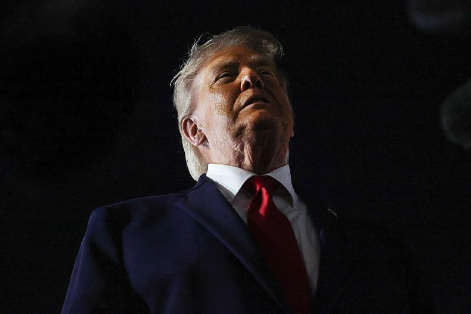

امروز تولد ۸۰ سالگیه این پیرمرده پر حاشیه هست

@IranianMinds

## IranianMinds — post 22525

برین کمک در راهه

## IranianMinds — post 22524

برین
کمک در راهه

## alonews — post 127781

  <a href="telegram/content/alonews_127781_1781417614.mp4" target="_blank">🎬 Download video</a>

👈 حمید رسایی: اجتماعات خیابانی فقط با محو کردن اسرائیل از روی کره زمین تمام خواهد شد!

✅ @AloNews خبر جنگ

---
📅 بروزرسانی: 1405/03/24 09:33
---

## VahidOOnLine — post 245411

  

وزارت علوم جمهوری اسلامی اعلام کرد به دلیل تداخل زمان امتحانات دانشگاه‌ها با مراسم تشییع جنازه علی خامنه‌ای، همه این امتحانات به زمان دیگری موکول می‌شود و زمان‌بندی‌ها متعاقبا اعلام خواهد شد.

بر اساس آنچه به صورت رسمی اعلام شده، قرار است جسد خامنه‌ای بین روزهای ۱۳ تا ۱۸ تیرماه، پس از تشییع در تهران، قم و مشهد، در حرم اما هشتم شیعیان دفن شود.
‌🏁 🇬🇧 IranintlTV

🤖 @VahidOOnLine

## mwarmonitor — post 10843

🔴وزیر دارایی اسرائیل درباره حملات حزب‌الله به شمال اسرائیل:

🔸«گلوله‌بارانِ هدفمندِ جوامع شمالی، آزمونی برای معادله ضاحیه است که بنیامین نتانیاهو آن را اعلام کرده است.

🔸از نتانیاهو می‌خواهم این معادله را با قاطعیت و قدرت اجرا کند و امروز ساختمان‌هایی را در ضاحیه تخریب کند. ما در روزهای سرنوشت‌سازی برای شکل‌دهی به آینده منطقه برای سال‌های طولانی قرار داریم. ما به ساکنان شمال وعده امنیت داده‌ایم و باید به این وعده عمل کنیم.»

@mwarmonitor

## FarsiVOA — post 220646

  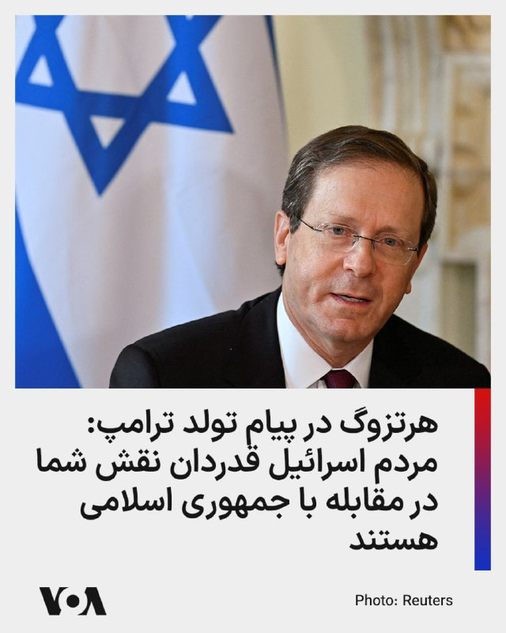

اسحاق هرتزوگ، رئیس‌جمهوری اسرائیل، هشتادمین سالروز تولدت دونالد ترامپ، همتای آمریکایی خود را تبریک گفت.

آقای هرتزوگ در شبکه اجتماعی ایکس نوشت: «ورود چشمگیر شما به کاخ سفید، نمایانگر گستره رؤیای آمریکایی و قدرت اراده شخصی خود شماست. مردم اسرائیل از رهبری شما در مقابله با امپراتوری شرارت [رژیم] ایران و از تعهد استوار شما به امنیت اسرائیل سپاسگزارند.»

او افزود: «ما هرگز تلاش‌های خستگی‌ناپذیر شما برای تأمین آزادی گروگان‌های عزیزمان را فراموش نخواهیم کرد. باشد که خاورمیانه و جهان را به سوی صلح و امنیت رهبری کنید و همچنان به تقویت همکاری منحصربه‌فرد میان ایالات متحده و اسرائیل ادامه دهید.»

رئیس‌جمهوری اسرائیل تاکید کرد: «در سنت یهودی گفته شده است که انسان در هشتادسالگی به توانمندی ویژه‌ای دست می‌یابد.»
@FarsiVOA

## IranianMinds — post 22523

دوستان ارزشی امروز برای اغتشاشات که تشریف میبرید بیرون
حتما ماسک بزنید چهرتون مشخص نباشه
سیگار هم داشته باشید که وقتی گاز اشک آور زدن فوت کنید تو صورت همدیگه جوابه

و سعی کنید لباس مشکی بپوشید هم‌ رنگ جماعت باشید

لطفا هرچی زودتر هم انقلاب کنید
ما کار داریم
ممنون

@IranianMinds

## alonews — post 127780

  <a href="telegram/content/alonews_127780_1781417032.webm" target="_blank">🎬 Download video</a>

👈رشد ۱۰۳ هزار واحدی شاخص بورس/ یک واحد تا کانال ۴.۸ میلیون

✅ @AloNews خبر جنگ

---
📅 بروزرسانی: 1405/03/24 09:24
---

## IranIntlTV — post 342183

  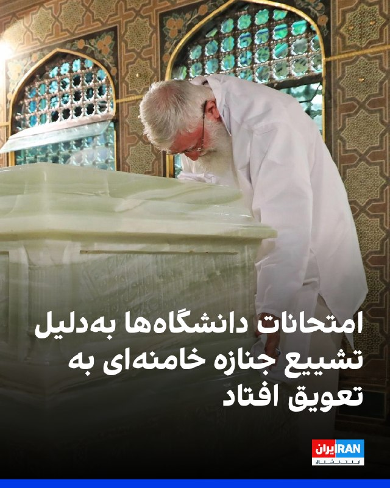

وزارت علوم جمهوری اسلامی اعلام کرد به دلیل تداخل زمان امتحانات دانشگاه‌ها با مراسم تشییع جنازه علی خامنه‌ای، همه این امتحانات به زمان دیگری موکول می‌شود و زمان‌بندی‌ها متعاقبا اعلام خواهد شد.

بر اساس آنچه به صورت رسمی اعلام شده، قرار است جسد خامنه‌ای بین روزهای ۱۳ تا ۱۸ تیرماه، پس از تشییع در تهران، قم و مشهد، در حرم اما هشتم شیعیان دفن شود.
https://iranintl.com/202606142314

## alonews — post 127779

  <a href="telegram/content/alonews_127779_1781416451.webm" target="_blank">🎬 Download video</a>

👈 وزارت امور خارجه قطر: نخست وزیر و وزیر امور خارجه کویت ابراز امیدواری کردند که واشنگتن و تهران به زودی توافق را امضا کنند

✅ @AloNews خبر جنگ

---
📅 بروزرسانی: 1405/03/24 09:13
---

## VahidOOnLine — post 245410

  

موسی احمدی، رییس کمیسیون انرژی مجلس گفت: «نه تنها در بحث برق، بلکه در حوزه آب و بنزین نیز باید صرفه‌جویی در اولویت باشد.»

او ادامه داد: «ما هر چقدر هم تولید برق را افزایش دهیم، اگر مصرف بی‌رویه باشد، امکان برقراری توازن میان تولید و مصرف وجود نخواهد داشت.»

احمدی اضافه کرد: «تمام توان مجلس و دولت بر این است که در تابستان خاموشی نداشته باشیم یا خاموشی‌ها به حداقل برسد؛ اگر مردم همکاری کنند، صددرصد موفق خواهیم شد.»
‌🏁 🇬🇧 IranintlTV

🤖 @VahidOOnLine

## VahidOOnLine — post 245409

⭕️ عراقچی: مقاومت باعث جنگ شد

♦️عباس عراقچی، وزیر امور خارجه جمهوری اسلامی ایران شنبه ۲۳ خرداد در شبکه خبر و در پاسخ به پرسشی درباره علت دو جنگ اخیر گفت: «مذاکرات علت جنگ نبود، مقاومت تیم دیپلماسی در مذاکرات علت جنگ بود.»

این گفته‌ها که در تعارض با موضع رسمی نظام جمهوری اسلامی و شخص علی  خامنه‌ای، رهبر پیشین جمهوری اسلامی به شمار می‌رود، با واکنش تند رسانه‌ها و سیاستمداران جریان اصولگرا مواجه شد.

علی خامنه‌ای، رهبر جمهوری اسلامی ماه‌ها قبل و پس از «جنگ ۱۲ روزه» گفته بود دشمن هر جا احساس کند که ما ضعیفیم، حمله می‌کند.
‌🇸🇦 Indypersian

🤖 @VahidOOnLine

## pm_afshaa — post 93841

بو کودتا میاد🙄

## pm_afshaa — post 93840

  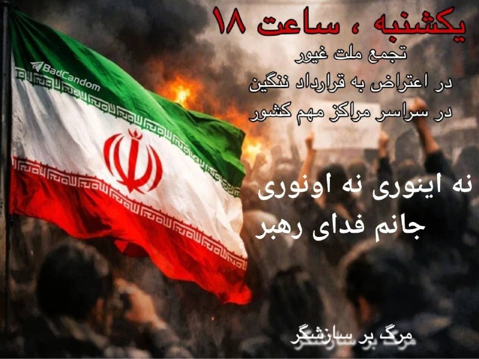

فراخوان سراسری

امروز یکشنبه ساعت 18 در اعتراض به امضای تسلیم‌نامه در برابر آمریکای مستکبر در مرکز تمام شهرهای کشور با شعار «نه اینوری نه اونوری، جانم فدای رهبری» به خیابان خواهیم آمد.
ماسک و لباس مشکی فراموشتون نشه

💧 Rainbet.com the #1 Non-KYC Crypto Casino & Sportsbook @rainbetcom

😁 @Pm_Afshaa

## IranIntlTV — post 342182

  <a href="telegram/content/IranIntlTV_342182_1781415807.mp4" target="_blank">🎬 Download video</a>

سرخط خبرهای یکشنبه ۲۴ خرداد
@iranintltv

## DW_Farsi — post 125943

  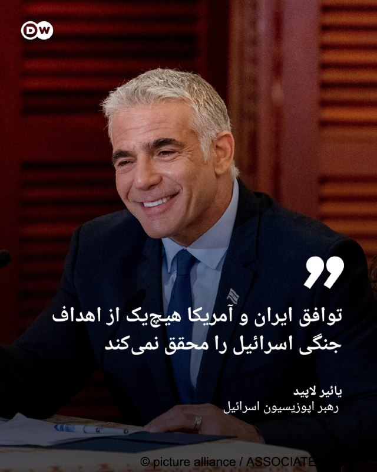

🔸"توافق ایران و آمریکا هیچ‌یک از اهداف جنگی اسرائیل را محقق نمی‌کند"

یائیر لاپید، رهبر اپوزیسیون اسرائیل، از توافق احتمالی میان ایران و آمریکا به شدت انتقاد کرد. او در پستی در شبکه ایکس نوشت این توافق "هیچ‌یک از اهداف جنگی اسرائیل را محقق نمی‌کند، رژیم [ایران] همچنان پابرجا می‌ماند، برنامه موشکی دست‌نخورده می‌ماند و ایران می‌تواند برنامه هسته‌ای خود را بازسازی کند".

لاپید مدعی شد این توافق یک "شکست کامل" برای بنیامین نتانیاهو است و اسرائیل را به "یک کشور تحت‌الحمایه تبدیل می‌کند که درباره امنیت ملی خود دستورالعمل دریافت می‌کند".

او همچنین از "ناتوانی" نخست‌وزیر اسرائیل "در تبدیل دستاوردهای نظامی به موفقیت‌های استراتژیک" انتقاد کرد.

@dw_farsi

## DW_Farsi — post 125942

  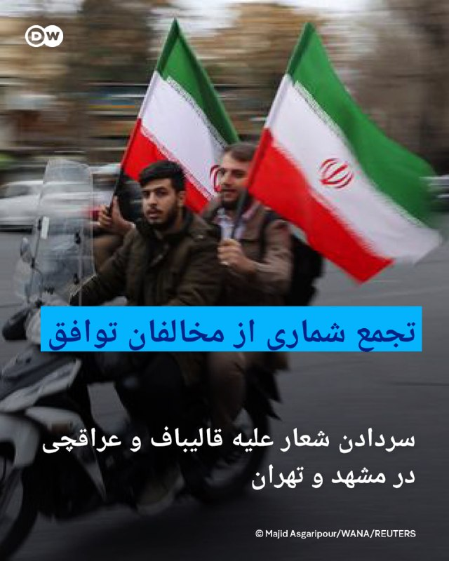

🔸تجمع شماری از مخالفان توافق و سردادن شعار علیه قالیباف و عراقچی در مشهد و تهران

در حالی‌که دونالد ترامپ، رئیس‌جمهور آمریکا، از احتمال دستیابی به یک توافق با ایران و امضای آن در روز یکشنبه ۲۴ خرداد (۱۴ ژوئن) سخن گفته است، شماری از مخالفان این توافق شامگاه شنبه مقابل ساختمان یکی از دفاتر وزارت امور خارجه ایران در مشهد تجمع کرده و علیه عباس عراقچی، وزیر خارجه شعار سر دادند.

تجمع‌کنندگان شعار "مرگ بر عراقچی بی‌شرف سازشکار" و "مرگ بر عراقچی بی‌شرف نفوذی" سر دادند. سایت تابناک با انتشار ویدئویی از این تجمع نوشت که هنوز توضیحی از سوی مسئولین درباره برخورد با این گروه ارا‌ئه نشده است.

سایت انتخاب در خبری در این باره نوشت این تجمع از سوی "جریان جلیلی، [جبهه] پایداری و بقایای دولت رئیسی" سازماندهی شده و طبق مشاهدات عینی خبرنگار این رسانه در مشهد، تعداد آنها "از صد نفر هم تجاوز نمی‌کند".

@dw_farsi

## alonews — post 127778

  <a href="telegram/content/alonews_127778_1781415809.webm" target="_blank">🎬 Download video</a>

👈فاکس نیوز به نقل از یک مقام بلندپایه در دولت آمریکا: معتقدیم به توافقی عالی و بسیار مستحکم دست یافته‌ایم

🔴 ایران تنگه هرمز را بدون دریافت هزینه مجدداً باز خواهد کرد

🔴 محاصره آمریکا هم‌زمان با بازگشایی تنگه هرمز لغو خواهد شد.

🔴 مرحله بعدی بر عملیات مین‌روبی در تنگه هرمز متمرکز خواهد بود

✅ @AloNews خبر جنگ

## alonews — post 127777

  <a href="telegram/content/alonews_127777_1781415809.webm" target="_blank">🎬 Download video</a>

👈 پست جدید ترامپ

✅ @AloNews خبر جنگ

## alonews — post 127776

  <a href="telegram/content/alonews_127776_1781415810.webm" target="_blank">🎬 Download video</a>

👈آغاز توزیع کارت آزمون‌های سمپاد و مدارس نمونه دولتی از فردا

✅ @AloNews خبر جنگ

---
📅 بروزرسانی: 1405/03/24 09:03
---

## pm_afshaa — post 93838

دیس و دیس بک روزنامه های سازندگی و نوبنیاد به هم

💧 Rainbet.com the #1 Non-KYC Crypto Casino & Sportsbook @rainbetcom

😁 @Pm_Afshaa

## pm_afshaa — post 93837

نبویان: تنگه هرمز قراره باز بشه و حتی کشتی‌های اسرائیلی هم اجازه تردد دارن

💧 Rainbet.com the #1 Non-KYC Crypto Casino & Sportsbook @rainbetcom

😁 @Pm_Afshaa

## pm_afshaa — post 93836

فارس:80 درصد مردم مخالف توافقن. نباید امضا شه

💧 Rainbet.com the #1 Non-KYC Crypto Casino & Sportsbook @rainbetcom

😁 @Pm_Afshaa

## IranIntlTV — post 342181

  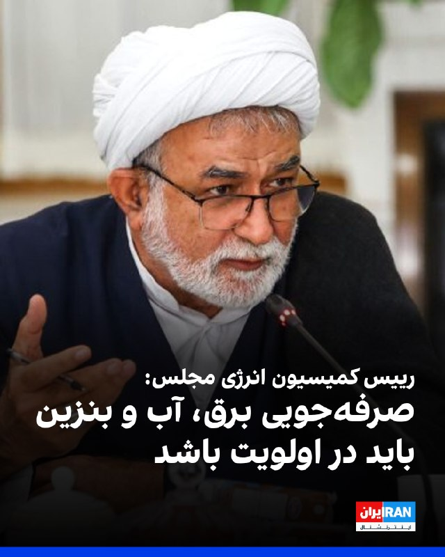

موسی احمدی، رییس کمیسیون انرژی مجلس گفت: «نه تنها در بحث برق، بلکه در حوزه آب و بنزین نیز باید صرفه‌جویی در اولویت باشد.»

او ادامه داد: «ما هر چقدر هم تولید برق را افزایش دهیم، اگر مصرف بی‌رویه باشد، امکان برقراری توازن میان تولید و مصرف وجود نخواهد داشت.»

احمدی اضافه کرد: «تمام توان مجلس و دولت بر این است که در تابستان خاموشی نداشته باشیم یا خاموشی‌ها به حداقل برسد؛ اگر مردم همکاری کنند، صددرصد موفق خواهیم شد.»
https://iranintl.com/202606144671

## BBCPersian — post 283767

🔻چند خبر کوتاه از ایران

▪️وزارت علوم اعلام کرده است که تمامی امتحانات دانشگاه‌ها و موسسات آموزش عالی که با مراسم تشییع و خاکسپاری علی خامنه‌ای، رهبر سابق ایران همزمان باشد، به زمان دیگری موکول می‌شود. بر اساس اعلام دفتر نشر آثار علی خامنه‌ای مراسم تشییع او از ۱۳ تیر ماه در تهران آغازمی‌شود و با خاکسپاریش در ۱۸ تیرماه در حرم امام رضا در مشهد به پایان می‌رسد.

▪️حسین شریعتمداری، سرپرست روزنامه کیهان نزدیک به رهبرجمهوری اسلامی با انتشار یادداشتی از توافق احتمالی برای بازگشایی تنگه هرمز انتقاد کرده و گفته است:« باید از آقایان قالیباف و عراقچی پرسید، مگر نه ‌این‌که بستن تنگه هرمز یکی از اصلی‌ترین اهرم‌های کشورمان در جنگ رمضان بوده است و مگر نه ‌این‌که بستن تنگه راه تنفس تجاری و اقتصادی دشمن را مسدود نموده و به خفگی نزدیک کرده است؟ آقایان قرار است با کدام توجیه منطقی و توضیح قابل قبولی از این اهرم سرنوشت‌ساز دست بردارند؟!»
آقای شریعتمداری بارها به مناسبت های مختلف خواهان بستن تنگه هرمز شده بود.

▪️معصومه صفایی، معاون دفتر حفاظت و مدیریت حیات‌وحش سازمان حفاظت محیط‌زیست، گفته است که براساس تازه‌ترین گزارش‌ها از خسارت‌های وارده به حیات‌وحش ایران در جریان جنگ، «دست‌کم ۲۵ رأس آهو» در جزیره خارگ تلف شده‌اند که تنها مربوط به مناطق خارج از محدوده‌های نظامی است و تلفات واقعی بیشتر از این میزان است.خانم صفایی همچنین گفت که آسیب‌های جنگ به حیات‌وحش تنها به مرگ‌ومیر مستقیم محدود نمی‌شود. بررسی‌های انجام‌شده در مراکز نگهداری حیوانات و باغ‌وحش‌ها نشان می‌دهد که شوک ناشی از انفجارها و آلودگی صوتی شدید نیز می‌تواند اثرات جدی بر سلامت جسمی و روانی حیوانات بر جای بگذارد.

https://bbc.in/44cx668
@BBCPersian

## alonews — post 127775

👈سازمان هواشناسی امروز (یکشنبه) برای مناطقی از شمال غرب کشور و ارتفاعات البرز رگبار باران و رعدوبرق پیش‌بینی کرد.

🔴این شرایط فردا (دوشنبه) در برخی مناطق شمال غرب، شمال شرق و استان‌های ساحلی دریای خزر تداوم خواهد داشت

✅ @AloNews خبر جنگ

## alonews — post 127774

👈وزارت علوم: تمامی امتحانات دانشگاه‌ها که زمان برگزاری آن‌ها با مراسم تشییع رهبر تداخل داشته باشد، به زمان دیگری موکول خواهد شد

✅ @AloNews خبر جنگ

---
📅 بروزرسانی: 1405/03/24 08:53
---

## VahidOOnLine — post 245408

  

حسین شریعتمداری، نماینده رهبر جمهوری اسلامی در روزنامه کیهان، با اشاره به احتمال امضای یادداشت تفاهم با آمریکا، نوشت: «آمریکا به کدام تعهد و کدام معاهده پایبند بوده که انتظار پایبندی به تعهداتش در تفاهم‌نامه پیش‌رو را داشته باشیم؟»

او ادامه داد: «پیش از این تاکید کرده بودیم که پاسخ محاصره دریایی آمریکا، بستن باب‌المندب است و نه گشایش تنگه هرمز.»

شریعتمداری اضافه کرد: «باید از قالیباف و عراقچی پرسید، مگر نه این‌که بستن تنگه هرمز یکی از اصلی‌ترین اهرم‌های ما در جنگ بوده و مگر نه این‌که بستن تنگه راه تنفس تجاری و اقتصادی دشمن را مسدود نموده و به خفگی نزدیک کرده است؟ آقایان قرار است با کدام توجیه منطقی و توضیح قابل قبولی از این اهرم سرنوشت‌ساز دست بردارند؟»
‌🏁 🇬🇧 IranintlTV

🤖 @VahidOOnLine

## IranIntlTV — post 342180

  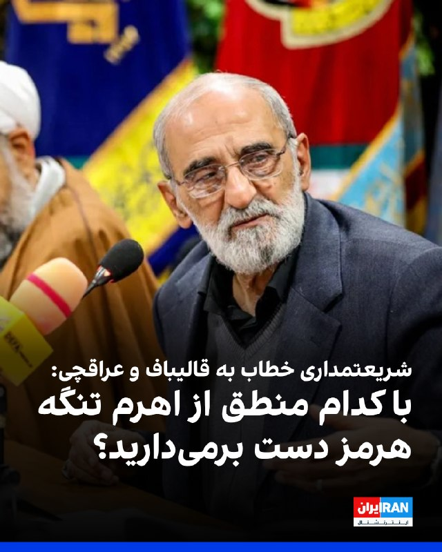

حسین شریعتمداری، نماینده رهبر جمهوری اسلامی در روزنامه کیهان، با اشاره به احتمال امضای یادداشت تفاهم با آمریکا، نوشت: «آمریکا به کدام تعهد و کدام معاهده پایبند بوده که انتظار پایبندی به تعهداتش در تفاهم‌نامه پیش‌رو را داشته باشیم؟»

او ادامه داد: «پیش از این تاکید کرده بودیم که پاسخ محاصره دریایی آمریکا، بستن باب‌المندب است و نه گشایش تنگه هرمز.»

شریعتمداری اضافه کرد: «باید از قالیباف و عراقچی پرسید، مگر نه این‌که بستن تنگه هرمز یکی از اصلی‌ترین اهرم‌های ما در جنگ بوده و مگر نه این‌که بستن تنگه راه تنفس تجاری و اقتصادی دشمن را مسدود نموده و به خفگی نزدیک کرده است؟ آقایان قرار است با کدام توجیه منطقی و توضیح قابل قبولی از این اهرم سرنوشت‌ساز دست بردارند؟»
https://iranintl.com/202606149385

## Persian_Trend_Official — post 16997

⭕️
⭕️
⭕️انفجار کنترل‌شده در شرق اصفهان انجام می‌شود.

سپاه اصفهان:
🔹امروز یکشنبه ۲۴ خردادماه از ساعت ۸ تا ۱۲ ظهر، عملیات انفجار کنترل‌شده در محدوده شرق اصفهان، منطقه زردنجان، انجام خواهد شد.

🔹صدای انفجارهای احتمالی ناشی از این عملیات بوده و جای هیچ‌گونه نگرانی برای شهروندان وجود ندارد.

🔹 از شهروندان می خواهیم با توجه به اطلاع‌رسانی انجام‌شده، در صورت شنیده شدن صداهای انفجار در این بازه زمانی نگرانی نداشته باشند./مهر

## Persian_Trend_Official — post 16996

  <a href="telegram/content/Persian_Trend_Official_16996_1781414629.mp4" target="_blank">🎬 Download video</a>

حمید رسایی نماینده مجلس: اجتماعات خیابانی فقط با محو کردن اسرائیل از روی کره زمین تمام خواهد شد!

اقای رسایی نماینده اول مردم در مجلس هست از بس رای زیاد دادن بهش

👺Phantom

📌 @persian_trend_official
پرشین ترند | متفاوت‌ترین کانال نظامی

## BBCPersian — post 283758

🖌ایثار شلب, بی‌بی‌سی عربی:

🔻«سعی می‌کنم تا جایی که امکان دارد وقت بیشتری را در جزیره بگذرانم. احساس می‌کنم عمر این جزیره ممکن است به شماره افتاده باشد و می‌ترسم پیش از آنکه بخش‌هایی از آن ناپدید شود، نتوانم به اندازه کافی از آن لذت ببرم.»

حسن فیلکاوی، یکی از معدود ساکنان جزیره، روزهای کودکی خود در فیلکه کویت به یاد می‌آورد؛ پیش از آنکه چشم‌انداز جزیره دگرگون شود، آب دریا به برخی مناطق آن نفوذ کند و نگرانی‌هایی درباره احتمال ناپدید شدن این جزیره برانگیزد.

او که مردی پنجاه‌وچند ساله است و نام خانوادگی‌اش از جزیره فیلکه گرفته شده، می‌گوید هر روز بیش از پیش شاهد بالا آمدن سطح آب دریا و فرورفتن مکان‌هایی در آب است که زمانی خاطرات و داستان‌های بی‌نظیری را در خود جای داده بودند؛ از جمله محوطه‌های باستانی و مناطق ساحلی.

📸GettyImages/ Hasan alfailakawi/ Manon Kole and Lucan Perrogon

https://bbc.in/4osMTaj
@BBCPersian

## alonews — post 127773

  <a href="telegram/content/alonews_127773_1781414632.webm" target="_blank">🎬 Download video</a>

👈وزارت خارجه کره شمالی: تأکید و اصرار آمریکا و کره جنوبی بر خلع سلاح هسته‌ای این کشور، بی‌فایده است.

🔴خلع سلاح هسته‌ای موضوعی مختومه و برگشت‌ناپذیر است

✅ @AloNews خبر جنگ

## alonews — post 127772

  <a href="telegram/content/alonews_127772_1781414632.webm" target="_blank">🎬 Download video</a>

👈نیویورک تایمز: ترامپ می‌گوید توافق صلح روز یکشنبه امضا خواهد شد، اما ایران درباره زمان‌بندی آن تردید دارد

🔴نیویورک تایمز نوشت: یک مقام ایرانی تلاش کرد انتظارات را تعدیل کند و گفت هیچ برنامه‌ای برای امضای توافق در روز یکشنبه وجود ندارد و ممکن است این توافق در روزهای آینده به امضا برسد

✅ @AloNews خبر جنگ

## alonews — post 127771

  <a href="telegram/content/alonews_127771_1781414633.webm" target="_blank">🎬 Download video</a>

👈انفجار کنترل‌شده در محدوده مبارکه اصفهان انجام می‌شود

✅ @AloNews خبر جنگ

---
📅 بروزرسانی: 1405/03/24 08:43
---

## FarsiVOA — post 220645

  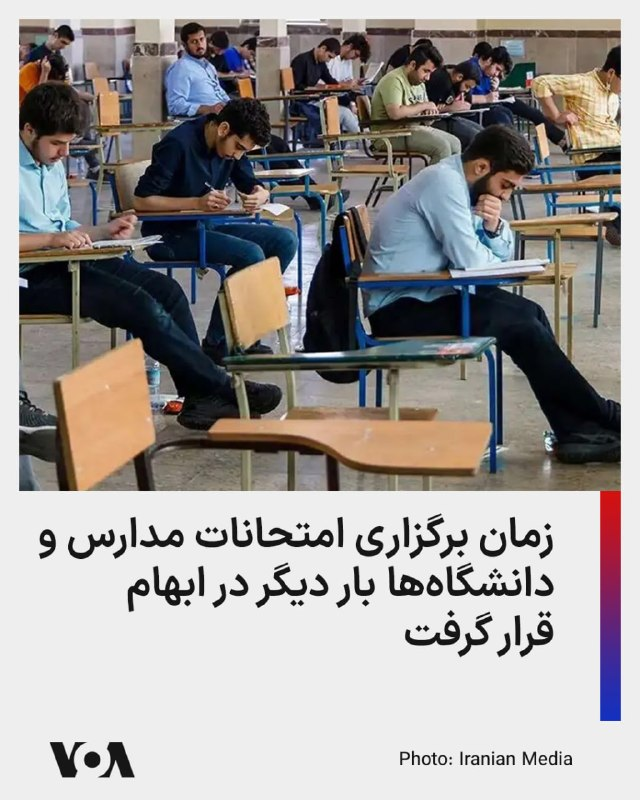

همزمان با اعلام برنامه‌های مربوط به خاکسپاری رهبر پیشین جمهوری اسلامی، زمان برگزاری امتحانات مدارس و دانشگاه‌ها بار دیگر در ابهام قرار گرفت.

رئیس مرکز اطلاع‌رسانی و روابط عمومی وزارت آموزش و پرورش گفت با توجه به تداخل زمان برگزاری آزمون‌های نهایی پایه‌های یازدهم و دوازدهم با مراسم مرتبط با خاکسپاری علی خامنه‌ای در تهران و سراسر کشور، «احتمال دارد این امتحانات در بازه زمانی دیگری برگزار شوند». او زمان قطعی جدیدی اعلام نکرد و تصمیم نهایی را به بررسی‌های بعدی موکول کرد.

وزارت علوم نیز از تغییر زمان امتحانات دانشگاه‌ها در ایام خاکسپاری خبر داد و اعلام کرد برنامه جدید آزمون‌ها متعاقباً از سوی دانشگاه‌ها و مؤسسات آموزش عالی اعلام خواهد شد.

به این ترتیب، دانش‌آموزان و دانشجویان فعلاً با برنامه‌ای نامشخص روبه‌رو هستند؛ وضعیتی که می‌تواند تقویم آموزشی مدارس و دانشگاه‌ها را در روزهای آینده دستخوش تغییر کرده و به نگرانی‌های آموزشی سال تحصیلی جاری دامن بزند.
@FarsiVOA

## Persian_Trend_Official — post 16995

  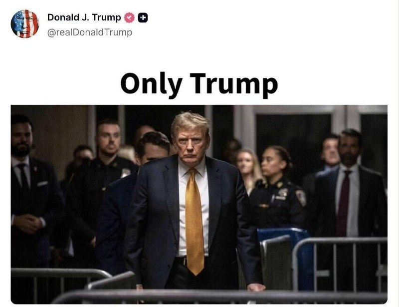

پست تمجدی ترامپ از خودش: فقط ترامپ!

👺Phantom

📌 @persian_trend_official
پرشین ترند | متفاوت‌ترین کانال نظامی

## alonews — post 127770

  <a href="telegram/content/alonews_127770_1781414009.webm" target="_blank">🎬 Download video</a>

👈کابینه امنیتی اسرائیل امروز تشکیل جلسه می‌دهد

✅ @AloNews خبر جنگ

## alonews — post 127769

  <a href="telegram/content/alonews_127769_1781414009.mp4" target="_blank">🎬 Download video</a>

👈کلش ریپورت:یک فروند جنگنده اف/ای-۱۸ هورنت متعلق به ارتش تفنگداران دریایی ایالات متحده روز شنبه در جریان یک پرواز آموزشی معمولی در نزدیکی دریاچه ریم‌راک در ایالت واشنگتن سقوط کرد.

✅ @AloNews خبر جنگ

---
📅 بروزرسانی: 1405/03/24 08:33
---

## Persian_Trend_Official — post 16994

  <a href="telegram/content/Persian_Trend_Official_16994_1781413417.webm" target="_blank">🎬 Download video</a>

🚢 تمرکز گسترده ناوگان دریایی آمریکا در خاورمیانه

👀 گزارش‌های منتشرشده از سوی منابع OSINT حاکی از افزایش تمرکز نیروهای دریایی ایالات متحده در خاورمیانه، دریای سرخ و شرق مدیترانه است.

🇺🇸 بر اساس این گزارش‌ها، دو گروه ضربت ناو هواپیمابر، یک گروه آماده آبی‌ـ‌خاکی و چندین ناوشکن موشک‌انداز آمریکایی در نقاط راهبردی منطقه مستقر شده‌اند.

🌊 دریای عرب:
▪️ ناو هواپیمابر USS Abraham Lincoln (CVN-72)
▪️ ناو هواپیمابر USS George H.W. Bush (CVN-77)
▪️ گروه آماده آبی‌ـ‌خاکی USS Tripoli (LHA-7)

🌊 دریای سرخ:
▪️ ناوشکن USS Thomas Hudner (DDG-116)
▪️ ناوشکن USS Gonzalez (DDG-66)

🌊 شرق مدیترانه:
▪️ ناوشکن USS Arleigh Burke (DDG-51)
▪️ ناوشکن USS Oscar Austin (DDG-79)
▪️ ناوشکن USS Roosevelt (DDG-80)

🔹 این استقرار گسترده، بخش مهمی از مسیرهای راهبردی منطقه از جمله تنگه هرمز، دریای سرخ و شرق مدیترانه را پوشش می‌دهد.

🎯حضور همزمان دو گروه ضربت ناو هواپیمابر در منطقه، یکی از بزرگ‌ترین تمرکزهای قدرت دریایی آمریکا در ماه‌های اخیر محسوب می‌شود. این آرایش می‌تواند توان واکنش سریع واشنگتن در برابر هرگونه بحران احتمالی در خلیج فارس، دریای سرخ و شرق مدیترانه را به‌طور قابل توجهی افزایش دهد.

👺 Phantom

📌 @persian_trend_official
پرشین ترند | متفاوت‌ترین کانال نظامی

---
📅 بروزرسانی: 1405/03/24 08:23
---

## VahidOOnLine — post 245407

  

چارلز دان، دیپلمات پیشین آمریکا و پژوهشگر مرکز عرب واشینگتن، هشدار داد که دولت ترامپ ممکن است تاب‌آوری جمهوری اسلامی را دست‌کم گرفته باشد. او در گفت‌وگو با ایران‌اینترنشنال گفت بسیاری در غرب تصور می‌کنند فشارهای نظامی، تحریم‌ها و انزوای دیپلماتیک باید به فروپاشی حکومت ایران منجر می‌شد، اما تجربه نشان داده این نظام توان تحمل فشارهای شدید را دارد.

دان با اشاره به حملات آمریکا و اسرائیل به ایران و واکنش‌های متقابل جمهوری اسلامی، گفت با وجود گمانه‌زنی‌ها درباره تغییر حکومت، ساختار قدرت در ایران همچنان پابرجاست. او همچنین روایت‌های متغیر دولت ترامپ درباره اهداف جنگ را نشانه نبود راهبردی روشن در واشینگتن دانست.

این دیپلمات پیشین، مقایسه ایران با ونزوئلا را نادرست توصیف کرد و گفت جمهوری اسلامی در گذشته، از جمله در جنگ ایران و عراق، توانسته خسارت‌ها و فشارهای سنگینی را تحمل کند. به گفته او، تحریم‌ها، محدودیت صادرات نفت و کاهش ارزش ریال نیز تاکنون حکومت را به نقطه فروپاشی نرسانده‌اند. دان افزود رهبران جمهوری اسلامی همچنان خود را مسلط بر اوضاع داخلی می‌دانند و معتقدند می‌توانند هزینه‌های بیشتری به آمریکا تحمیل کنند.
‌🏁 🇬🇧 IranintlTV

🤖 @VahidOOnLine

## IranIntlTV — post 342179

  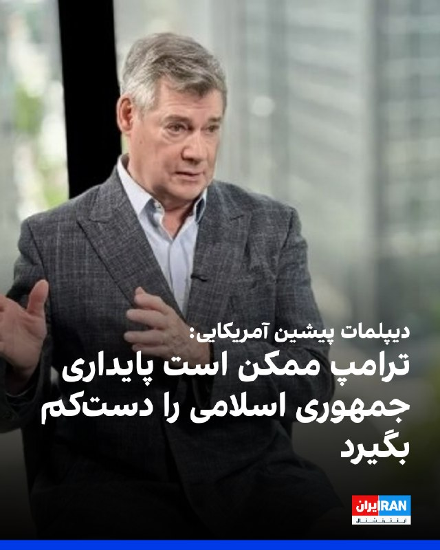

چارلز دان، دیپلمات پیشین آمریکا و پژوهشگر مرکز عرب واشینگتن، هشدار داد که دولت ترامپ ممکن است تاب‌آوری جمهوری اسلامی را دست‌کم گرفته باشد. او در گفت‌وگو با ایران‌اینترنشنال گفت بسیاری در غرب تصور می‌کنند فشارهای نظامی، تحریم‌ها و انزوای دیپلماتیک باید به فروپاشی حکومت ایران منجر می‌شد، اما تجربه نشان داده این نظام توان تحمل فشارهای شدید را دارد.

دان با اشاره به حملات آمریکا و اسرائیل به ایران و واکنش‌های متقابل جمهوری اسلامی، گفت با وجود گمانه‌زنی‌ها درباره تغییر حکومت، ساختار قدرت در ایران همچنان پابرجاست. او همچنین روایت‌های متغیر دولت ترامپ درباره اهداف جنگ را نشانه نبود راهبردی روشن در واشینگتن دانست.

این دیپلمات پیشین، مقایسه ایران با ونزوئلا را نادرست توصیف کرد و گفت جمهوری اسلامی در گذشته، از جمله در جنگ ایران و عراق، توانسته خسارت‌ها و فشارهای سنگینی را تحمل کند. به گفته او، تحریم‌ها، محدودیت صادرات نفت و کاهش ارزش ریال نیز تاکنون حکومت را به نقطه فروپاشی نرسانده‌اند. دان افزود رهبران جمهوری اسلامی همچنان خود را مسلط بر اوضاع داخلی می‌دانند و معتقدند می‌توانند هزینه‌های بیشتری به آمریکا تحمیل کنند.

## FarsiVOA — post 220644

  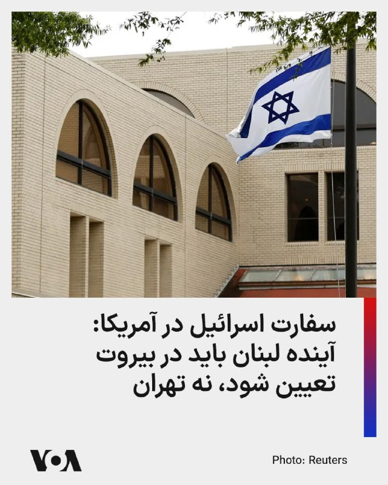

سفارت اسرائیل در آمریکا در پیامی در شبکه اجتماعی ایکس، مردم لبنان را خطاب قرار داد و حزب‌الله را به پیشبرد منافع جمهوری اسلامی به بهای منافع لبنان متهم کرد.

در این پیام آمده است: «شما شایسته آینده‌ای هستید که با فرصت، ثبات و حاکمیت ملی تعریف شود، نه با جاه‌طلبی‌های یک رژیم خارجی.»

سفارت اسرائیل افزود حزب‌الله «برای مدت طولانی لبنان را به درگیری‌هایی کشانده» که به گفته آن، در راستای منافع مردم لبنان نبوده و همزمان برنامه‌های جمهوری اسلامی را به هزینه لبنان پیش برده است.

در ادامه این پیام آمده است: «لبنان قوی‌تر و شکوفاتر زمانی آغاز می‌شود که آینده آن در بیروت تعیین شود، نه در تهران.»

این موضع‌گیری پس از آن مطرح شده که جمهوری اسلامی در حمایت از حزب‌الله به‌عنوان بازوی منطقه‌ای خود، موضوع جنگ اسرائیل و حزب‌الله را یکی از موارد توافق احتمالی با ایالات متحده قرار داد.
@FarsiVOA

## RadioFarda — post 158279

  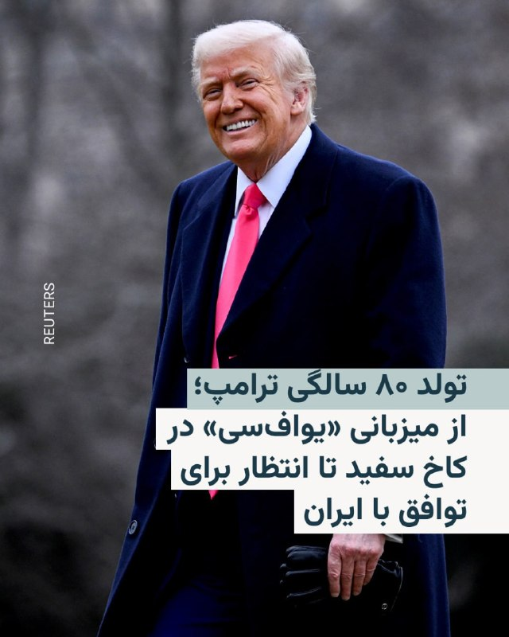

🔸در حالی که دونالد ترامپ، رئیس‌جمهور آمریکا، از احتمال دستیابی به توافقی با ایران طی روز یکشنبه ۲۴ خرداد گفته است، او در همین روز و همزمان با هشتادمین سالروز تولدش میزبان یک رقابت بزرگ مبارزهٔ آزاد (یو‌اف‌سی) در محوطهٔ کاخ سفید شد.

🔸این رویداد که با عنوان «یو‌اف‌سی فریدم ۲۵۰» و در چارچوب برنامه‌های دویست‌وپنجاهمین سالگرد استقلال آمریکا برگزار می‌شود، با حضور ۱۴ مبارز و در ورزشگاهی موقت در چمن جنوبی کاخ سفید انجام می‌شود.

🔸هزینهٔ این برنامه حدود ۶۰ میلیون دلار اعلام شده است. دونالد ترامپ این رویداد را «نمایشی منحصربه‌فرد» توصیف کرده است.

🔸خبرگزاری فارس، وابسته به سپاه پاسداران، روز شنبه نوشت که «ساعاتی پیش، دونالد ترامپ، رئیس‌جمهور آمریکا، بار دیگر تأکید کرد که 'یادداشت تفاهم' با ایران روز یکشنبه امضا خواهد شد. این در حالی است که مسئولان مذاکره‌کننده ایرانی صراحتاً اعلام کرده بودند که تفاهم هنوز نهایی نشده و یکشنبه قطعاً انجام نمی‌شود.»

@RadioFarda

## BBCPersian — post 283757

  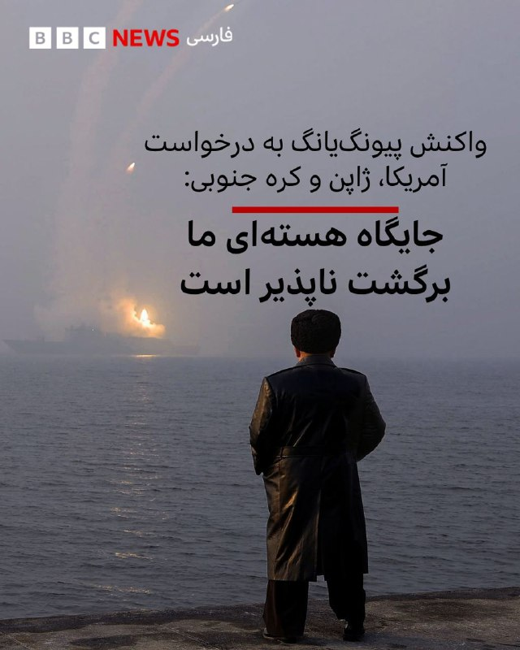

🔻کره شمالی گفته است که جایگاه این کشور به‌عنوان یک قدرت هسته‌ای «برگشت‌ناپذیر» است و درخواست‌های تازه برای کنار گذاشتن زرادخانهٔ سلاح‌های هسته‌ای خود را رد کرده است.

این بیانیه از سوی پیونگ‌یانگ در واکنش به نشست مقام‌های کره جنوبی، ژاپن آمریکا در روز جمعه در توکیو منتشر شد؛ نشستی که در آن، این متحدان بار دیگر بر تعهد خود به خلع کامل سلاح هسته‌ای در شبه‌جزیره کره تأکید کردند.

کره شمالی این درخواست‌ها را «سخنانی غیرمنطقی» و «رویایی خیالی» خوانده است.

پیونگ‌یانگ در این بیانیه فروش سامانه‌های تسلیحاتی واشنگتن به سئول و توکیو را هم به‌عنوان توجیهی برای ادامه برنامه هسته‌ای خود مطرح کرده است.

کره شمالی در سال‌های اخیر پس از شکست مذاکرات با آمریکا در سال ۲۰۱۹، توسعه سلاح‌های هسته‌ای خود را تسریع کرده است.
📷AFP via Getty
@BBCPersian

---
📅 بروزرسانی: 1405/03/24 08:13
---

## alonews — post 127768

  <a href="telegram/content/alonews_127768_1781412230.webm" target="_blank">🎬 Download video</a>

👈بریتانیا در رتبه‌بندی جدید ناتو در جایگاه ۳۱ از ۳۲ کشور عضو قرار گرفت و تنها بالاتر از ایسلند (که فاقد نیروهای مسلح است) ایستاد.!

🔴این ارزیابی میزان پایبندی اعضای ناتو به اهداف مربوط به توسعه و نوسازی توان نظامی را بررسی می‌کند و همچنین توان ارائه برنامه‌های واقع‌بینانه برای تحقق اهداف دفاعی این ائتلاف را می‌سنجد.

🔴طبق این گزارش، بریتانیا همچنان با چالش‌هایی در زمینه نوسازی و افزایش توانمندی‌های نظامی مواجه است، هرچند دولت این کشور امیدوار است با ارائه یک طرح سرمایه‌گذاری دفاعی جدید، جایگاه خود را در آینده بهبود دهد

✅ @AloNews خبر جنگ

---
📅 بروزرسانی: 1405/03/24 08:03
---

## VahidOOnLine — post 245406

  

در حالی که مقام‌های آمریکا و پاکستان از امضای قریب‌الوقوع چارچوب توافق میان واشینگتن و جمهوری اسلامی خبر می‌دهند، تهران هنوز زمان مشخصی برای امضای آن اعلام نکرده است.

دونالد ترامپ گفته توافق ممکن است یکشنبه امضا شود و شهباز شریف نیز از آمادگی پاکستان برای مشارکت در این روند خبر داده است، اما اسماعیل بقایی تاکید کرده امضای توافق در این تاریخ قطعی نیست.

بر اساس گزارش‌ها، بازگشایی تنگه هرمز، لغو محدودیت‌های دریایی، آزادسازی بخشی از دارایی‌های مسدودشده ایران و تعلیق برخی تحریم‌های نفتی از محورهای اصلی تفاهم است.

مذاکرات درباره برنامه هسته‌ای ایران نیز قرار است در مرحله بعدی دنبال شود.

همزمان، تجمع‌هایی در تهران و برخی شهرها علیه توافق احتمالی برگزار شده و معترضان عباس عراقچی را هدف شعارهای خود قرار داده‌اند.

در همین حال، با وجود پیشرفت مذاکرات، تنش‌های نظامی ادامه دارد و آمریکا از سرنگونی چند پهپاد ایرانی در نزدیکی تنگه هرمز خبر داده است.

متن کامل را اینجا بخوانید
‌🏁 🇬🇧 IranintlTV

🤖 @VahidOOnLine

## VahidOOnLine — post 245405

  

اسحاق هرتزوگ، رییس‌جمهوری اسرائیل، در شبکه اجتماعی ایکس، هشتادمین سالروز تولد دونالد ترامپ، رییس‌جمهوری آمریکا، را تبریک گفت و نوشت: «مردم اسرائیل از رهبری شما در مقابله با امپراتوری شر ایران و تعهد راسخ شما به امنیت اسرائیل سپاسگزار هستند.»

او نوشت: «ما هرگز تلاش‌های خستگی‌ناپذیر شما را در آزادسازی گروگان‌های عزیزمان فراموش نخواهیم کرد. باشد که خاورمیانه و جهان را به سوی صلح و امنیت رهبری کنید و به تقویت مشارکت بی‌نظیر ایالات متحده و اسرائیل ادامه دهید.»
‌🏁 🇬🇧 IranintlTV

🤖 @VahidOOnLine

## IranIntlTV — post 342178

  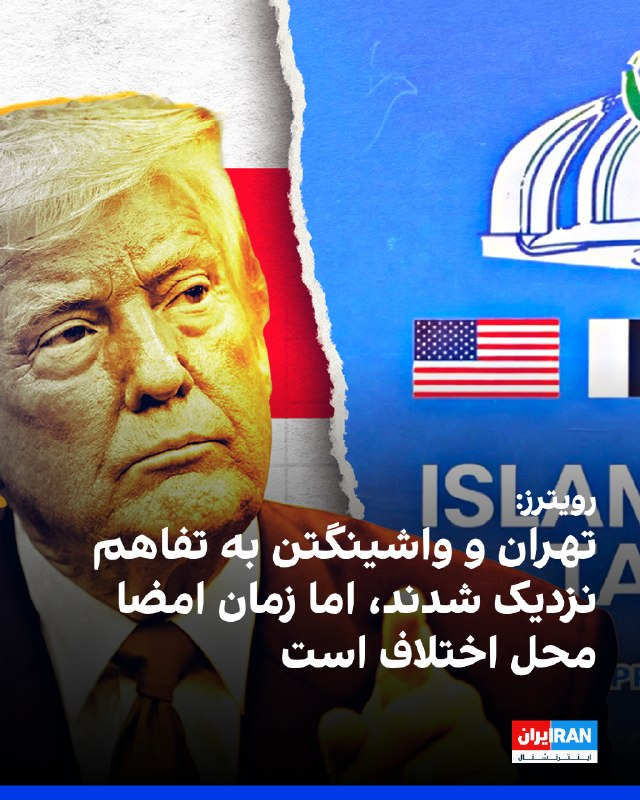

در حالی که مقام‌های آمریکا و پاکستان از امضای قریب‌الوقوع چارچوب توافق میان واشینگتن و جمهوری اسلامی خبر می‌دهند، تهران هنوز زمان مشخصی برای امضای آن اعلام نکرده است.

دونالد ترامپ گفته توافق ممکن است یکشنبه امضا شود و شهباز شریف نیز از آمادگی پاکستان برای مشارکت در این روند خبر داده است، اما اسماعیل بقایی تاکید کرده امضای توافق در این تاریخ قطعی نیست.

بر اساس گزارش‌ها، بازگشایی تنگه هرمز، لغو محدودیت‌های دریایی، آزادسازی بخشی از دارایی‌های مسدودشده ایران و تعلیق برخی تحریم‌های نفتی از محورهای اصلی تفاهم است.

مذاکرات درباره برنامه هسته‌ای ایران نیز قرار است در مرحله بعدی دنبال شود.

همزمان، تجمع‌هایی در تهران و برخی شهرها علیه توافق احتمالی برگزار شده و معترضان عباس عراقچی را هدف شعارهای خود قرار داده‌اند.

در همین حال، با وجود پیشرفت مذاکرات، تنش‌های نظامی ادامه دارد و آمریکا از سرنگونی چند پهپاد ایرانی در نزدیکی تنگه هرمز خبر داده است.

متن کامل را اینجا بخوانید
https://iranintl.com/202606145055

## FarsiVOA — post 220643

  

📸اینستاگرام صدای آمریکا را هم اکنون فالو کنید تا از آخرین خبرها مطلع بمانید:
https://www.instagram.com/voafarsi/

📡همچنین جهت اطلاع از بروزترین فرکانسهای ماهواره‌ای صدای آمریکا به لینک زیر مراجعت فرمایید:
https://ir.voanews.com/satellite

این پست را با دوستانتان به اشتراک بگذارید
@FarsiVOA

## FarsiVOA — post 220642

Farsi VOA pinned an audio file

## FarsiVOA — post 220641

  <a href="https://t.me/farsivoa/220641" target="_blank">📎 Download file</a>

🔴📢‌ پادکست خبری شنبه ۲۳خرداد ۱۴۰۵

🛜در صورتی که با مشکل اینترنت مواجه هستید میتوانید اخبار صدای آمریکا را از نسخه‌های پادکست خبری ما روزانه دنبال کنید و یا اخبار را از نسخه سبک وب‌سایت ما پیگیر باشید:
https://ir.voanews.com/lite

📡بروزترین فرکانسهای ماهواره‌ای را نیز میتوانید از صفحه زیر پیگیری کنید:
https://ir.voanews.com/satellite

🔔دیگر شبکه‌های اجتماعی ما را هم دنبال کنید:
https://linktr.ee/voafarsi

ما را به اشتراک بگذارید
@farsivoa

## RadioFarda — post 158278

  <a href="https://t.me/radiofarda/158278" target="_blank">📎 Download file</a>

📻بشنوید: سرخط خبرها با رادیوفردا، ۲۴ خرداد ۱۴۰۵‌

@RadioFarda

---
📅 بروزرسانی: 1405/03/24 07:53
---

## IranIntlTV — post 342177

  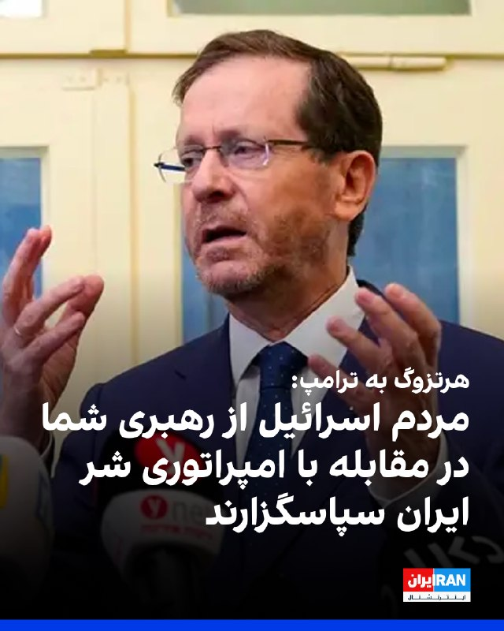

اسحاق هرتزوگ، رییس‌جمهوری اسرائیل، در شبکه اجتماعی ایکس، هشتادمین سالروز تولد دونالد ترامپ، رییس‌جمهوری آمریکا، را تبریک گفت و نوشت: «مردم اسرائیل از رهبری شما در مقابله با امپراتوری شر ایران و تعهد راسخ شما به امنیت اسرائیل سپاسگزار هستند.»

او نوشت: «ما هرگز تلاش‌های خستگی‌ناپذیر شما را در آزادسازی گروگان‌های عزیزمان فراموش نخواهیم کرد. باشد که خاورمیانه و جهان را به سوی صلح و امنیت رهبری کنید و به تقویت مشارکت بی‌نظیر ایالات متحده و اسرائیل ادامه دهید.»
https://iranintl.com/202606143065

---
📅 بروزرسانی: 1405/03/24 07:43
---

## BBCPersian — post 283756

🔻آژیرهای هشدار در اردن فعال شدند

تلویزیون دولتی اردن بامداد یکشنبه گزارش داد که آژیرهای هشدار در آن کشور به صدا درآمده‌اند، اما جزئیات بیشتری درباره علت آن ارائه نکرد.
@BBCPersian

## BBCPersian — post 283755

  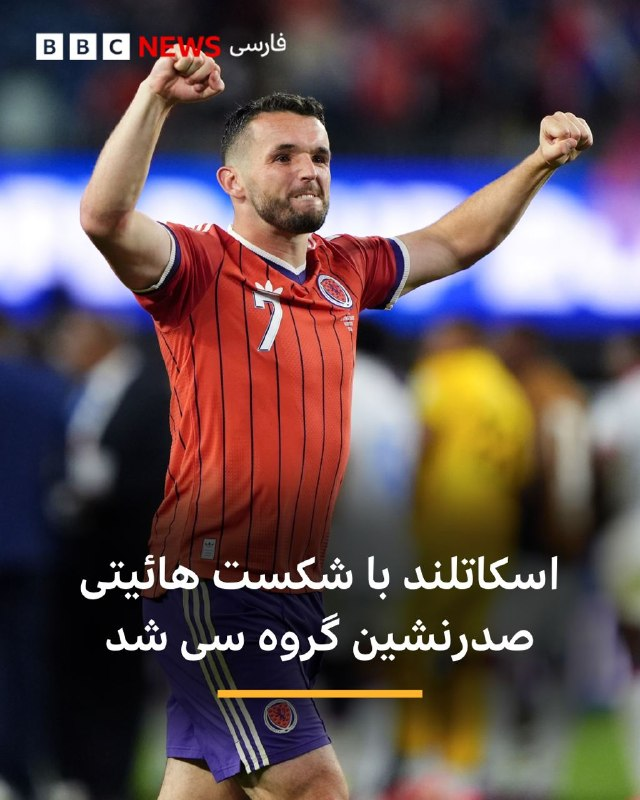

🔻جان مک‌گین، با تک‌گل بازی مقابل هائیتی، پاسخ اعتماد استیو کلارک، سرمربی تیم اسکاتلند را داد.

کلارک پیش از مسابقه گفت که انتخاب مک‌گین، کاپیتان استون ویلا به جای رایان کریستی «سخت‌ترین تصمیمی بوده که تا به حال گرفته‌» و از این بازیکن ۳۱ ساله خواست تا او را روسفید کند.

به جرات می‌توان گفت که رساندن اسکاتلند به صدر گروه C و برداشتن گامی مهم برای رسیدن به مرحله حذفی برای اولین بار، نشان‌دهنده نگاه درست کلارک است.

با وجود شروعی طوفانی، اسکاتلند در تصاحب توپ‌ ضعیف بود. حملات بی‌شمار هائیتی به داخل محوطه جریمه اسکاتلند، آنگوس گان، دروازه‌بان این تیم را در حالت آماده‌باش نگه داشت.

خاطرات اشتباهات گذشته مقابل تیم‌هایی نظیر کاستاریکا، ایران و پرو از خاطر هواداران نشسته در ورزشگاه بوستون شهر فاکسبرا می‌گذشت.

با وجود این، مک‌گین فرصتی یافت تا این نگرانی‌ها را در دقیقه ۲۸ بازی کم کند.

اسکاتلندی‌ها روز جمعه، ۱۹ ژوئن، برای نبرد بعدی به بوستون بازمی‌گردند اما می‌دانند که یک امتیاز در دو بازی بعدی گروهی‌شان احتمالاً صعود آنها به مرحله بعد را تضمین می‌کند.
📷PA
@BBCPersian

---
📅 بروزرسانی: 1405/03/24 07:34
---

## VahidOOnLine — post 245404

♦️به گزارش خبرگزاری آسوشیتدپرس، تیم بسکتبال «نیویورک نیکس» شنبه‌شب با پیروزی ۹۴ بر ۹۰ مقابل «سن‌آنتونیو اسپرز» در بازی پنجم فینال، برای نخستین‌بار پس از ۵۳ سال به مقام قهرمانی رقابت‌های ان‌بی‌ای (NBA) دست یافت. پیروزی‌ای که موجی از خوشحالی را میان هواداران این تیم در نیویورک به راه انداخت.
نیویورک که در مجموع با نتیجه ۴ بر ۱ پیروز این رقابت‌ها شد، توانست شکست ۱۶ امتیازی جریان بازی را با درخشش بی‌نظیر جیلن برانسن جبران کند؛ فوق‌ستاره‌ای که با کسب ۴۵ امتیاز (شامل ۱۳ امتیاز پیاپی در کوارتر چهارم)، رکورد تاریخ باشگاه نیویورک در مسابقه نهایی را شکست تا پس از فتح دو عنوان دانشگاهی، این بار در قامت رهبر نیکس، جام قهرمانی را بالای سر ببرد. در این مسابقه که با حضور پرشور هزاران هوادار نیویورکی در سالن اختصاصی اسپرز همراه بود،  نیویورک نیکس برای نخستین‌بار از سال ۱۹۷۳، پادشاه جدید بسکتبال لقب گرفت.
‌🇸🇦 Indypersian

🤖 @VahidOOnLine

---
📅 بروزرسانی: 1405/03/24 07:23
---

## FoxNewsTwitter — post 342946

‌Fox News (Twitter/X)

Read more:

## Persian_Trend_Official — post 16993

  <a href="telegram/content/Persian_Trend_Official_16993_1781409226.mp4" target="_blank">🎬 Download video</a>

 سقوط یک جنگنده F/A-18 هورنت آمریکا در ایالت واشنگتن

🔹 یک فروند جنگنده F/A-18 هورنت نیروی نظامی آمریکا روز یکشنبه در منطقه‌ای جنگلی در نزدیکی دریاچه «ریم‌راک» در ایالت واشنگتن سقوط کرد.

🔹 گزارش‌ها حاکی است خلبان پیش از برخورد موفق به خروج اضطراری با صندلی پران شده و توسط نیروهای امدادی نجات یافته است.

⅜منطقه سقوط در نزدیکی یکی از مسیرهای آموزشی پروازهای نظامی در شمال غرب آمریکا قرار دارد و مقامات نظامی تحقیقات رسمی درباره علت سانحه را آغاز کرده‌اند.

سقوط جنگنده موجب وقوع آتش‌سوزی در بخشی از منطقه شده و نیروهای آتش‌نشانی برای مهار حریق و ایمن‌سازی محل حادثه وارد عمل شده‌اند.

👺 Phantom

📌 @persian_trend_official
پرشین ترند | متفاوت‌ترین کانال نظامی

---
📅 بروزرسانی: 1405/03/24 07:13
---

## VahidOOnLine — post 245403

  

تیم ملی اسکاتلند در نخستین دیدار خود در جام جهانی با نتیجه یک بر صفر برابر هائیتی به پیروزی رسید و با سه امتیاز در صدر گروه C قرار گرفت. این مسابقه در ورزشگاه بوستون برگزار شد و بازگشت هر دو تیم به جام جهانی پس از سال‌ها دوری را رقم زد. اسکاتلند که آخرین بار در جام جهانی ۱۹۹۸ حضور داشت، در دقیقه ۲۸ توسط جان مک‌گین به گل رسید و با همین گل برتری خود را تا پایان مسابقه حفظ کرد. بازی در بیشتر دقایق متعادل دنبال شد و دو تیم از نظر مالکیت توپ و تعداد موقعیت‌ها عملکردی نزدیک به هم داشتند. با این حال، هائیتی در دقایق پایانی فشار بیشتری روی دروازه اسکاتلند وارد کرد و چند فرصت مناسب برای گلزنی به دست آورد، اما نتوانست دروازه حریف را باز کند. پیش از این مسابقه نیز دیدار برزیل و مراکش در همین گروه با تساوی یک بر یک به پایان رسیده بود. اکنون اسکاتلند با سه امتیاز در صدر جدول قرار دارد و شانس خود را برای صعود به مرحله حذفی افزایش داده است، هرچند در ادامه باید برابر برزیل و مراکش قرار بگیرد. هائیتی نیز برای حفظ امیدهای صعود، نیازمند کسب امتیاز در دیدارهای آینده خواهد بود. متن کامل را اینجا بخوانید iranintl
‌🏁 🇬🇧 IranintlTV

🤖 @VahidOOnLine

## FoxNewsTwitter — post 342945

Fox News (Twitter/X)

BREAKING: New York Knicks clinch NBA Championship for first time since 1973

## IranIntlTV — post 342176

  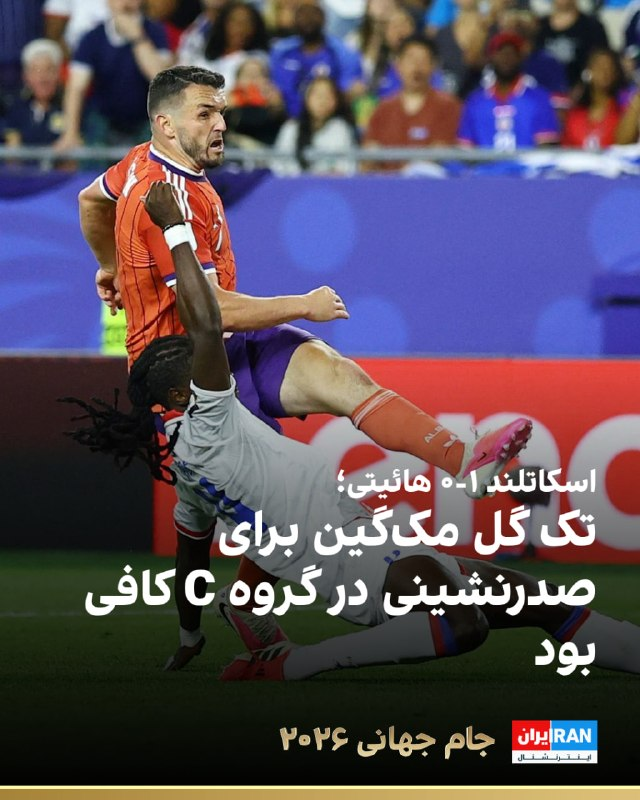

تیم ملی اسکاتلند در نخستین دیدار خود در جام جهانی با نتیجه یک بر صفر برابر هائیتی به پیروزی رسید و با سه امتیاز در صدر گروه C قرار گرفت. این مسابقه در ورزشگاه بوستون برگزار شد و بازگشت هر دو تیم به جام جهانی پس از سال‌ها دوری را رقم زد. اسکاتلند که آخرین بار در جام جهانی ۱۹۹۸ حضور داشت، در دقیقه ۲۸ توسط جان مک‌گین به گل رسید و با همین گل برتری خود را تا پایان مسابقه حفظ کرد. بازی در بیشتر دقایق متعادل دنبال شد و دو تیم از نظر مالکیت توپ و تعداد موقعیت‌ها عملکردی نزدیک به هم داشتند. با این حال، هائیتی در دقایق پایانی فشار بیشتری روی دروازه اسکاتلند وارد کرد و چند فرصت مناسب برای گلزنی به دست آورد، اما نتوانست دروازه حریف را باز کند. پیش از این مسابقه نیز دیدار برزیل و مراکش در همین گروه با تساوی یک بر یک به پایان رسیده بود. اکنون اسکاتلند با سه امتیاز در صدر جدول قرار دارد و شانس خود را برای صعود به مرحله حذفی افزایش داده است، هرچند در ادامه باید برابر برزیل و مراکش قرار بگیرد. هائیتی نیز برای حفظ امیدهای صعود، نیازمند کسب امتیاز در دیدارهای آینده خواهد بود. متن کامل را اینجا بخوانید iranintl.com/202606145295

---
📅 بروزرسانی: 1405/03/24 07:03
---

## VahidOOnLine — post 245402

  <a href="telegram/content/VahidOOnLine_245402_1781408018.mp4" target="_blank">🎬 Download video</a>

♦️ایرانیان آمریکا در «بیست‌وسومین هفته از شنبه‌های اعتراضی» خود، با تجمع و راهپیمایی در منطقه پرتردد «جورج‌تاون» واشنگتن‌ دی‌سی، هم‌زمان با جشن‌های دویست‌وپنجاهمین سالگرد استقلال آمریکا و مسابقات جام جهانی فوتبال، خواستار آزادی زندانیان سیاسی و توقف حکم اعدام در ایران شدند.
‌🇸🇦 Indypersian

🤖 @VahidOOnLine

---
📅 بروزرسانی: 1405/03/24 06:53
---

## VahidOOnLine — post 245401

♦️محمود نبویان، نایب‌رئیس کمیسیون امنیت ملی و سیاست خارجی مجلس شورای اسلامی، در گفتگو با خبرگزاری دانشجو گفت اموال بلوکه‌شده ایران آزاد نخواهد شد و تنها دارایی‌های مسدودشده ممکن است با تصمیم رئیس‌جمهوری آمریکا در دسترس قرار گیرند.
او با تفکیک میان دارایی‌های «بلوکه‌شده» و «مسدودشده» توضیح داد دارایی‌های بلوکه‌شده با حکم دادگاه‌ها توقیف شده‌اند، اما دارایی‌های مسدودشده به دستور دولت آمریکا امکان جابه‌جایی ندارند و در صورت تصمیم سیاسی می‌توانند آزاد شوند.
نبویان گفت در نسخه‌های جدید تفاهم، موضوع آزادسازی دارایی‌های مسدودشده به پیشرفت مذاکرات موکول شده و دیگر تعهدی برای آزادسازی فوری این منابع پس از امضای تفاهم‌نامه وجود ندارد.
‌🇸🇦 Indypersian

🤖 @VahidOOnLine

---
📅 بروزرسانی: 1405/03/24 06:43
---

## FarsiVOA — post 220640

⚡️بیست و یکم خرداد، چهارمین سالگرد کشته‌شدن کیان پیرفلک؛ پل‌بُران مادران بختیاری
@FarsiVOA

## BBCPersian — post 283754

  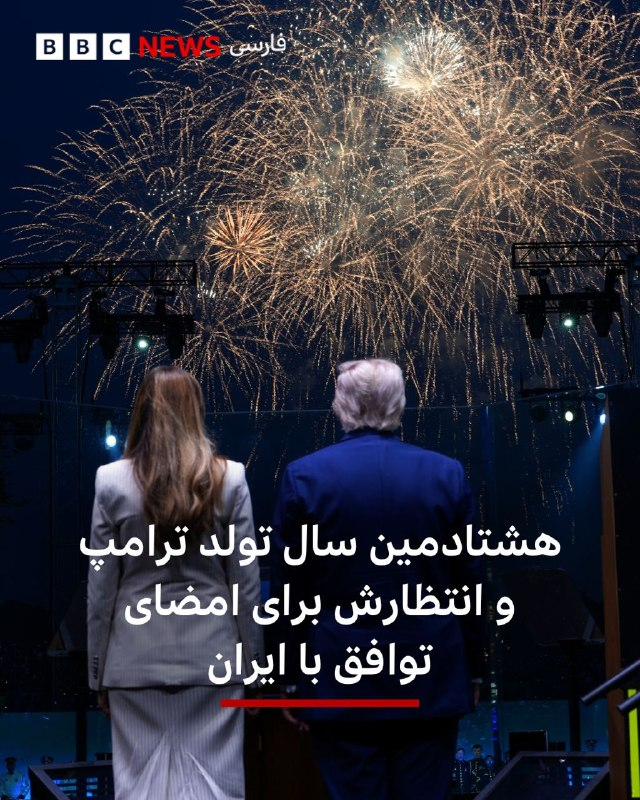

🔻دونالد ترامپ،‌ رئیس جمهور آمریکا امروز یکشنبه هشتاد ساله می‌شود؛ روزی که به گفته او ممکن است توافق مورد انتظار آمریکا و ایران نیز به امضا برسد.

او گفت که امضای این توافق می‌تواند به بازگشایی فوری تنگه هرمز و آغاز مذاکرات هسته‌ای با ایران منجر شود، هرچند مقام‌های ایرانی درباره زمان امضای آن محتاط‌تر سخن گفته‌اند.

آقای ترامپ که هفته‌هاست از نزدیک بودن توافق سخن گفته است، روز تولدش را با برگزاری یک رویداد بزرگ مسابقات هنرهای رزمی ترکیبی (UFC) در محوطه کاخ سفید جشن می‌گیرد.

این مسابقات بخشی از برنامه‌های دویست‌وپنجاهمین سالگرد استقلال آمریکا اعلام شده است.

در حالی که حامیان أقای ترامپ این رویداد را نمادی از سبک متفاوت ریاست‌جمهوری او می‌دانند، منتقدان برگزاری چنین مراسمی را در شرایطی که آمریکا همچنان درگیر جنگ و تنش‌های منطقه‌ای است نامناسب توصیف کرده‌اند.

همزمان نگاه‌ها به تلاش‌های دیپلماتیک برای پایان جنگ میان آمریکا و ایران دوخته شده است؛ تلاشی که در صورت موفقیت می‌تواند یکی از مهم‌ترین دستاوردهای سیاست خارجی ترامپ در آستانه ورود به دهه نهم زندگی‌اش باشد.
📷Getty
@BBCPersian

---
📅 بروزرسانی: 1405/03/24 06:33
---

## VahidOOnLine — post 245400

  

سفارت اسرائیل در آمریکا در شبکه اجتماعی ایکس خطاب به مردم لبنان نوشت: «حزب‌الله برای مدت طولانی لبنان را به درگیری‌هایی کشانده است که در راستای منافع مردم لبنان نبوده‌اند و همزمان برنامه‌های جمهوری اسلامی را به بهای منافع لبنان پیش برده است.»

این سفارتخانه اشاره کرد: «لبنانی قوی‌تر و برخوردار از رفاه بیشتر زمانی شکل می‌گیرد که آینده آن در بیروت تعیین شود، نه در تهران.»

سفارت اسرائیل در آمریکا نوشت: «مردم لبنان سزاوار آینده‌ای هستند که بر پایه فرصت، ثبات و حاکمیت ملی تعریف شود، نه بر اساس جاه‌طلبی‌های یک حکومت خارجی.»
‌🏁 🇬🇧 IranintlTV

🤖 @VahidOOnLine

## VahidOOnLine — post 245399

♦️رسانه‌های سراسر جهان روز پنج‌شنبه، ۲۱ خردادماه، از رینگ هشت‌ضلعی (آکتگان) سازمان «یو‌اف‌سی» که برای نخستین‌بار در چمن جنوبی کاخ سفید بنا شده است، بازدید کردند. این محوطه تاریخی قرار است روز یکشنبه میزبان هفت مبارزه هیجان‌انگیز تحت عنوان «یو‌اف‌سی آزادی ۲۵۰» (UFC Freedom 250) باشد؛ رویدادی بی‌سابقه که در روز تولد ۸۰ سالگی دونالد ترامپ، ورزش رزمی ترکیبی را با یک نمایش باشکوه سیاسی در هم می‌آمیزد. این میزبانی منحصربه‌فرد، جلوه‌ای از روابط و وفاداری دیرینه رئیس‌جمهوری آمریکا با این سازمان ورزشی محبوب است، چرا که مدیران و هواداران این لیگ بیش از یک دهه است که در کنار او ایستاده‌اند. پپوند ترامپ با یو‌اف‌سی به اوایل دهه ۲۰۰۰ میلادی بازمی‌گردد؛ زمانی که او با آغوش باز رویدادهای این سازمان را در کازینوی «تاج‌محل» خود میزبانی و نقشی کلیدی در مسیر جهانی شدن این رشته ورزشی ایفا کرد.
‌🇸🇦 Indypersian

🤖 @VahidOOnLine

## IranIntlTV — post 342175

  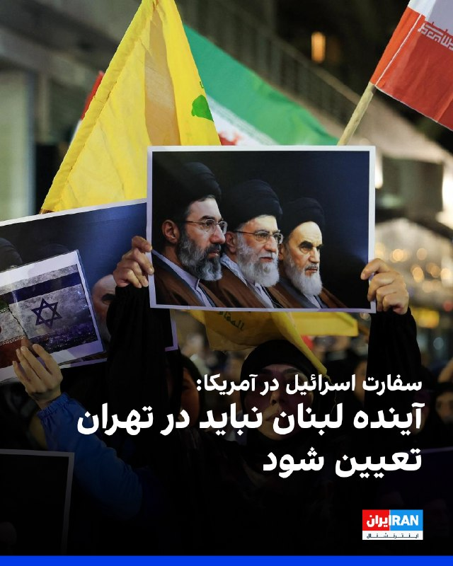

سفارت اسرائیل در آمریکا در شبکه اجتماعی ایکس خطاب به مردم لبنان نوشت: «حزب‌الله برای مدت طولانی لبنان را به درگیری‌هایی کشانده است که در راستای منافع مردم لبنان نبوده‌اند و همزمان برنامه‌های جمهوری اسلامی را به بهای منافع لبنان پیش برده است.»

این سفارتخانه اشاره کرد: «لبنانی قوی‌تر و برخوردار از رفاه بیشتر زمانی شکل می‌گیرد که آینده آن در بیروت تعیین شود، نه در تهران.»

سفارت اسرائیل در آمریکا نوشت: «مردم لبنان سزاوار آینده‌ای هستند که بر پایه فرصت، ثبات و حاکمیت ملی تعریف شود، نه بر اساس جاه‌طلبی‌های یک حکومت خارجی.»
https://iranintl.com/202606149743

## FarsiVOA — post 220639

  <a href="telegram/content/FarsiVOA_220639_1781406222.mp4" target="_blank">🎬 Download video</a>

⚡️انکار یا امضای تفاهم بین امریکا و جمهوری اسلامی در‌گفت‌وگو با یاسین اهوازی کارشناس خاورمیانه
@FarsiVOA

## FarsiVOA — post 220638

  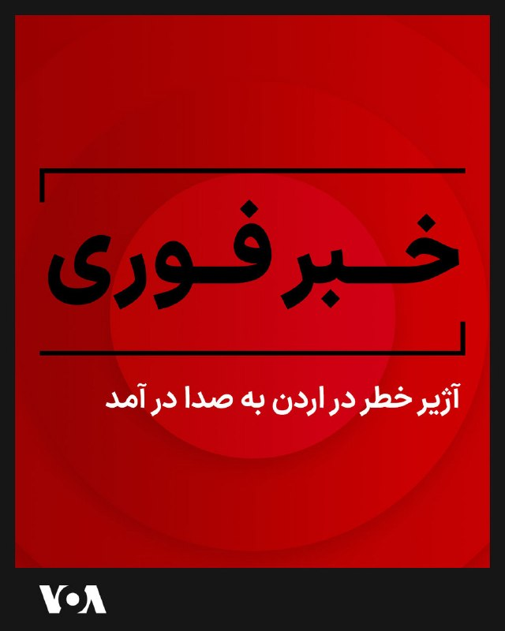

⚡️سایت‌های خبری در اردن لحظاتی پیش از به‌صدا درآمدن آژیر خطر در این کشور خبر دادند.
@FarsiVOA

---
📅 بروزرسانی: 1405/03/24 06:23
---

## VahidOOnLine — post 245398

  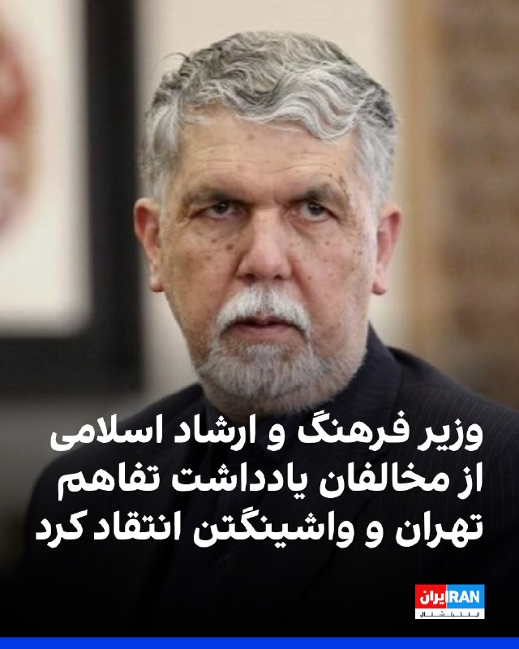

عباس صالحی، وزیر فرهنگ و ارشاد اسلامی، در واکنش به تجمع‌های معترضان به امضای احتمالی یادداشت تفاهم بین تهران و واشینگتن، در شبکه اجتماعی ایکس نوشت که مجتبی خامنه‌ای در پیام هفتم خرداد خود به مجلس خواستار آن شد که «اختلافات غیر موجه و حتی موجه را به تنازع و تفرقه تبدیل نکنند و قولا و عملا مظهر انسجام و یکپارچگی ملت باشند.»

صالحی نوشت: «آیا برخی مواضع و عملکردهایی که در این روزها و شب‌ها می‌بینیم، با این خطاب منطبق است؟ صفوف متحد ملت را درهم نشکنیم.»
‌🏁 🇬🇧 IranintlTV

🤖 @VahidOOnLine

## IranIntlTV — post 342174

  

عباس صالحی، وزیر فرهنگ و ارشاد اسلامی، در واکنش به تجمع‌های معترضان به امضای احتمالی یادداشت تفاهم بین تهران و واشینگتن، در شبکه اجتماعی ایکس نوشت که مجتبی خامنه‌ای در پیام هفتم خرداد خود به مجلس خواستار آن شد که «اختلافات غیر موجه و حتی موجه را به تنازع و تفرقه تبدیل نکنند و قولا و عملا مظهر انسجام و یکپارچگی ملت باشند.»

صالحی نوشت: «آیا برخی مواضع و عملکردهایی که در این روزها و شب‌ها می‌بینیم، با این خطاب منطبق است؟ صفوف متحد ملت را درهم نشکنیم.»
https://iranintl.com/202606146254

---
📅 بروزرسانی: 1405/03/24 06:13
---

## VahidOOnLine — post 245397

  

محمدمهدی میرباقری، عضو مجلس خبرگان رهبری در مورد معترضان به امضای یادداشت تفاهم بین جمهوری اسلامی و آمریکا گفت: «اینکه خیال کنیم در نهایت، یک چیز خیلی بد از آن در می‌آید، من چنین گمانی ندارم.»

اودر گفت‌وگوی خود با وب‌سایت انتخاب افزود: «ممکن است عالی نباشد، ولی اینکه ما خیال کنیم یک چیز ضعیفی خواهد بود و خیلی نگران بشویم، خیر. بنابراین، نگران و مضطرب نباشید و پمپاژ اضطراب نکنید.»

باقری خطاب به معترضان گفت: «نباید نگرانی و استرس به مردم منتقل کنید.»

او همچنین عنوان کرد مجتبی خامنه‌ای نظارت جدی دارد، تذکرات جدی می‌دهد و صحنه را کنترل می‌کند.
‌🏁 🇬🇧 IranintlTV

🤖 @VahidOOnLine

## FarsiVOA — post 220637

⚡️درخواست عفو بین‌الملل از جامعه جهانی برای متوقف کردن فوری احکام اعدام زندانیان سیاسی در ایران؛ گفت‌وگو با شیوا محبوبی
@FarsiVOA

---
📅 بروزرسانی: 1405/03/24 06:04
---

## VahidOOnLine — post 245396

♦️لیلا فروهر، خواننده محبوب و سرشناس ایرانی، روز ۲۳ خرداد در مراسم یادبود شاهدخت لیلا پهلوی در پاریس حضور یافت. حاضران در این مراسم با برافراشتن پرچم ملی شیروخورشید نشان و خواندن سرود «ای ایران» بر مزار شاهدخت لیلا پهلوی، به خاندان پهلوی ادای احترام کردند.
شاهدخت لیلا پهلوی، دختر شاه فقید ایران، ۲۰ خرداد ۱۳۸۰ در ۳۱ سالگی در لندن درگذشت.
‌🇸🇦 Indypersian

🤖 @VahidOOnLine

## VahidOOnLine — post 245395

  

وب‌سایت انتخاب در شبکه اجتماعی ایکس، معترضان به امضای یادداشت تفاهم میان جمهوری اسلامی و آمریکا را «۱۰۰نفر اما پر سر و صدا» نامید، و نوشت در مشهد، «جمعیت سازماندهی شده» جریان جلیلی، پایداری و بقایای دولت رییسی جهت تجمع علیه مذاکرات و توافق، از صد نفر هم تجاوز نمی‌کند.»

انتخاب اشاره کرد: «هم‌زمان، این جریان از تاکتیکی نخ‌نما جهت القای تعداد بالای حامیان خود استفاده کرده است. بدین منظور، دسته های صدنفره را در سه شهر قم، مشهد و تهران سازماندهی کرده و به آن‌ها ماموریت داده تا برای یک ساعت در مقابل تعدادی از نهادها و دفاتر مختلف از جمله دفاتر مراجع تجمع کنند.»
‌🏁 🇬🇧 IranintlTV

🤖 @VahidOOnLine

## IranIntlTV — post 342173

  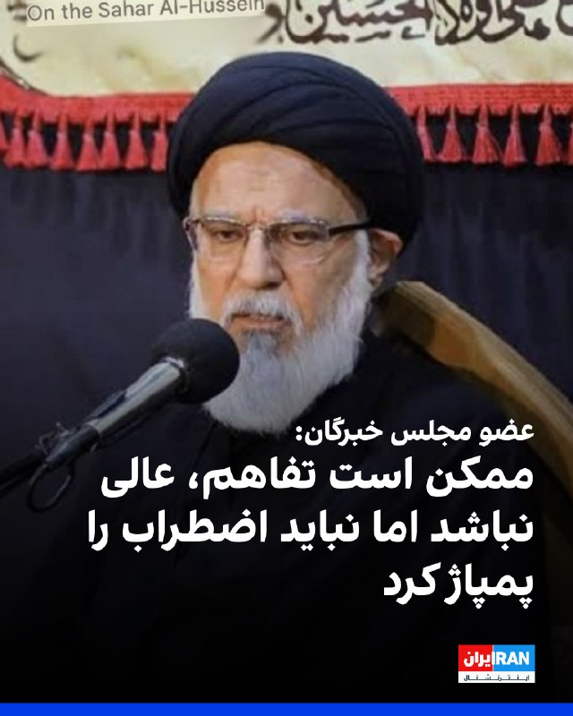

محمدمهدی میرباقری، عضو مجلس خبرگان رهبری در مورد معترضان به امضای یادداشت تفاهم بین جمهوری اسلامی و آمریکا گفت: «اینکه خیال کنیم در نهایت، یک چیز خیلی بد از آن در می‌آید، من چنین گمانی ندارم.»

اودر گفت‌وگوی خود با وب‌سایت انتخاب افزود: «ممکن است عالی نباشد، ولی اینکه ما خیال کنیم یک چیز ضعیفی خواهد بود و خیلی نگران بشویم، خیر. بنابراین، نگران و مضطرب نباشید و پمپاژ اضطراب نکنید.»

باقری خطاب به معترضان گفت: «نباید نگرانی و استرس به مردم منتقل کنید.»

او همچنین عنوان کرد مجتبی خامنه‌ای نظارت جدی دارد، تذکرات جدی می‌دهد و صحنه را کنترل می‌کند.
https://iranintl.com/202606143974

---
📅 بروزرسانی: 1405/03/24 05:53
---

## VahidOOnLine — post 245394

♦️محمد منان رییسی، نماینده مجلس شورای اسلامی از قم، شنبه‌شب در جمع حامیان حکومت گفت:‌ «توافقنامه‌ای که قرار است امضا شود، سراسر نقض خطوط قرمز رهبری است. می‌گویند یکشنبه، در روز تولد قاتل امام ما می‌خواهند توافق را امضا کنند. یک جو غیرت و شرف داشته باشید».
پیش از این، دونالد ترامپ، رئیس جمهوری آمریکا، با انتشار پیامی در «تروث سوشال» اعلام کرد که روز یکشنبه قرار است توافق با ایران امضا شود؛ روزی که همزمان با تولد او است.
‌🇸🇦 Indypersian

🤖 @VahidOOnLine

## IranIntlTV — post 342172

  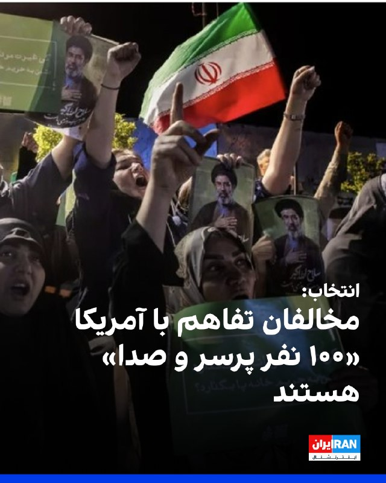

وب‌سایت انتخاب در شبکه اجتماعی ایکس، معترضان به امضای یادداشت تفاهم میان جمهوری اسلامی و آمریکا را «۱۰۰نفر اما پر سر و صدا» نامید، و نوشت در مشهد، «جمعیت سازماندهی شده» جریان جلیلی، پایداری و بقایای دولت رییسی جهت تجمع علیه مذاکرات و توافق، از صد نفر هم تجاوز نمی‌کند.»

انتخاب اشاره کرد: «هم‌زمان، این جریان از تاکتیکی نخ‌نما جهت القای تعداد بالای حامیان خود استفاده کرده است. بدین منظور، دسته های صدنفره را در سه شهر قم، مشهد و تهران سازماندهی کرده و به آن‌ها ماموریت داده تا برای یک ساعت در مقابل تعدادی از نهادها و دفاتر مختلف از جمله دفاتر مراجع تجمع کنند.»
https://iranintl.com/202606144692

## FarsiVOA — post 220636

  <a href="telegram/content/FarsiVOA_220636_1781403819.mp4" target="_blank">🎬 Download video</a>

⚡️ترکیه افزایش توان نظامی خود را برای تقابل با کدام جبهه احتمالی در دستور کار قرار داده است؟ گفت‌وگو با رضا طالبی روزنامه نگار و تحلیلگر سیاسی
@FarsiVOA

---
📅 بروزرسانی: 1405/03/24 05:43
---

## FarsiVOA — post 220635

  <a href="telegram/content/FarsiVOA_220635_1781403218.mp4" target="_blank">🎬 Download video</a>

⚡️شرایط تیم ملی فوتبال آلمان در جام جهانی ۲۰۲۶؛ گفت‌وگو با کوروش بازیار مربی و کارشناس فوتبال
@FarsiVOA

---
📅 بروزرسانی: 1405/03/24 05:33
---

هیچ پیام جدیدی در این بروزرسانی ارسال نشد.

---
📅 بروزرسانی: 1405/03/24 05:23
---

## VahidOOnLine — post 245393

  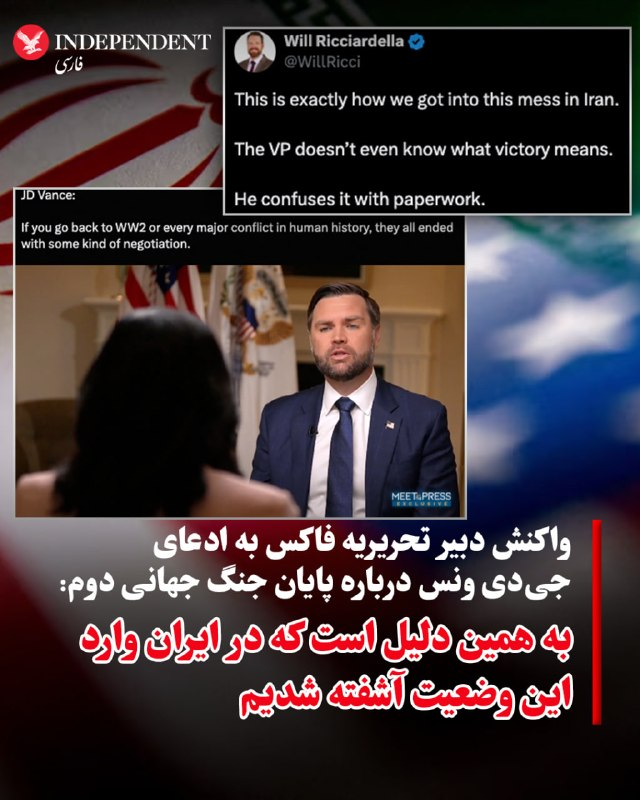

♦️ویل ریچیاردلا، دبیر تحریریه فاکس‌نیوز، در واکنش به اظهارات جی‌دی ونس، معاون رئیس‌جمهوری ایالات متحده درباره نحوه پایان یافتن جنگ‌های بزرگ تاریخ، با انتشار پیامی کنایه‌آمیز در شبکه اجتماعی اکس نوشت: «این دقیقا همان روشی است که ما به واسطه آن در قبال ایران وارد این وضعیت آشفته شدیم. معاون رئیس‌جمهوری حتی نمی‌داند معنای پیروزی چیست و آن را با کارهای اداری و کاغذبازی اشتباه گرفته است.» این انتقاد تند پس از آن مطرح شد که جی‌دی ونس در گفتگوی اختصاصی با برنامه «میت د پرس» شبکه «ان‌بی‌سی»، با دفاع از رویکرد دیپلماتیک دولت در قبال تنش‌های بین‌المللی و بحران ایران مدعی شد: «جنگ‌ها در نهایت این‌گونه حل‌وفصل می‌شوند. اگر به جنگ جهانی اول، جنگ جهانی دوم و هر منازعه بزرگ دیگری در تاریخ بشر نگاه کنید، متوجه می‌شوید که همه آن‌ها در نهایت با نوعی مذاکره به پایان رسیده‌اند.» این درحالی است که جنگ جهانی دوم به جای مذاکره، با «تسلیم بی‌قیدوشرط» آلمان در ۸ مه ۱۹۴۵ و ژاپن در ۲ سپتامبر ۱۹۴۵ به پایان رسید.
‌🇸🇦 Indypersian

🤖 @VahidOOnLine

---
📅 بروزرسانی: 1405/03/24 05:13
---

## VahidOOnLine — post 245392

  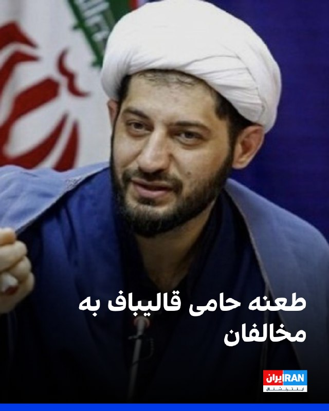

جلیل محبی، معاون سیاسی و حقوقی مرکز پژوهش‌های مجلس شورای اسلامی، در شبکه اجتماعی ایکس نوشت: «حتی اگر رهبری، موافقتنامه را تایید کند هم نمی‌پذیریم.»

با توجه به متن پست‌هایی که پیش از این منتشر کرده، به نظر می‌رسد این فعال سیاسی حامی قالیباف به مخالفان تفاهم طعنه زده است.
‌🏁 🇬🇧 IranintlTV

🤖 @VahidOOnLine

## FoxNewsTwitter — post 342944

  

Fox News (Twitter/X)

Former 49ers star Aldon Smith has died at 36.

Smith reached 30 career sacks in just 27 games, becoming the fastest player in NFL history to hit that milestone, breaking a record previously held by Hall of Famer Reggie White.

The 49ers called his passing "sudden and tragic." No cause of death has been released.

## IranIntlTV — post 342171

  

جلیل محبی، معاون سیاسی و حقوقی مرکز پژوهش‌های مجلس شورای اسلامی، در شبکه اجتماعی ایکس نوشت: «حتی اگر رهبری، موافقتنامه را تایید کند هم نمی‌پذیریم.»

با توجه به متن پست‌هایی که پیش از این منتشر کرده، به نظر می‌رسد این فعال سیاسی حامی قالیباف به مخالفان تفاهم طعنه زده است.
https://iranintl.com/202606147766

## FarsiVOA — post 220634

  <a href="telegram/content/FarsiVOA_220634_1781401426.mp4" target="_blank">🎬 Download video</a>

⚡️آیا اجلاس گروه هفت می‌تواند باعث هم‌گرایی فرانسه با آمریکا در تقابل با جمهوری اسلامی منجر شود؟
@FarsiVOA

---
📅 بروزرسانی: 1405/03/24 05:03
---

## VahidOOnLine — post 245391

  

ریچارد هاس، رییس سابق شورای روابط خارجی آمریکا، در شبکه اجتماعی ایکس نوشت: «بین توصیفات آمریکا و ایران از آنچه توافق شده است، چنان شکافی وجود دارد که تنها کار منطقی این است که تا زمانی که واقعا حقایق را نفهمیم، همه سر و صداها را نادیده بگیریم.»
‌🏁 🇬🇧 IranintlTV

🤖 @VahidOOnLine

## IranIntlTV — post 342170

  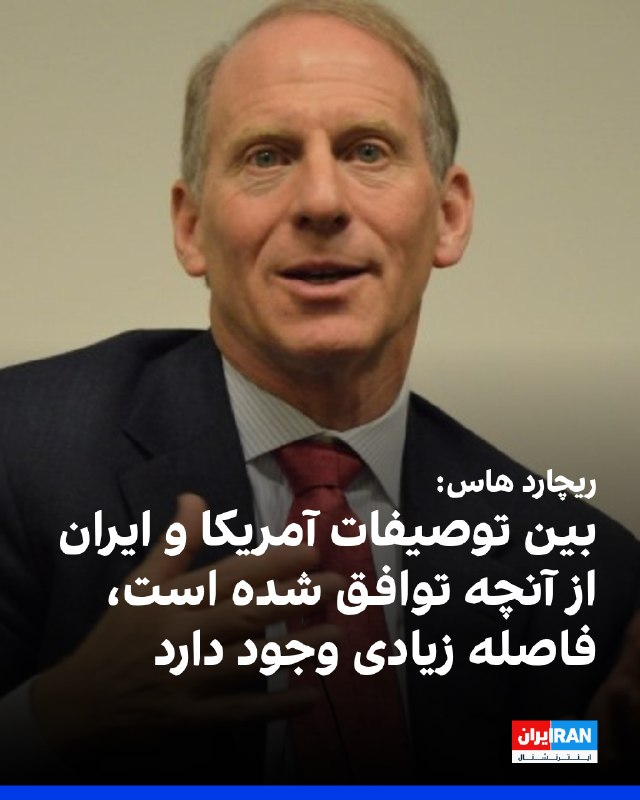

ریچارد هاس، رییس سابق شورای روابط خارجی آمریکا، در شبکه اجتماعی ایکس نوشت: «بین توصیفات آمریکا و ایران از آنچه توافق شده است، چنان شکافی وجود دارد که تنها کار منطقی این است که تا زمانی که واقعا حقایق را نفهمیم، همه سر و صداها را نادیده بگیریم.»
https://iranintl.com/202606142379

## FarsiVOA — post 220633

🔺وزیر امورخارجه آمریکا در گفت‌وگو با وزیر امورخارجه هند: «انتقال غیرقانونی نفت از ایران تحمل نخواهد شد»

▪️وزیر امور خارجه ایالات متحده، مارکو روبیو، روز شنبه ۲۳ خرداد در تماس تلفنی با وزیر امور خارجه هند، سوبرامانیام جایشانکار، درباره تحولات تنگه هرمز گفت‌وگو کرد.

⬇️ بیشتر بخوانید:
https://ir.voanews.com/a/8160645.html
@FarsiVOA

## BBCPersian — post 283753

  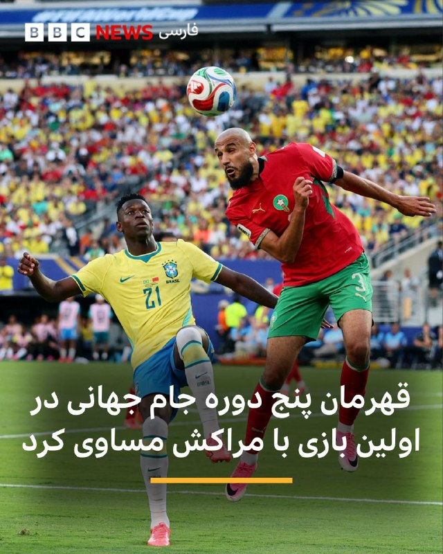

‌⚽️وینیسیوس با تک گل خود، برزیل را از شرمساری شکست در اولین بازی جام جهانی نجات داد و تساوی را برای قهرمان پنج دوره جام جهانی، مقابل مراکش در ورزشگاه مت‌لایف نیوجرسی به ارمغان آورد.

برزیل از سال ۱۹۳۴ تا کنون در اولین بازی جام جهانی نباخته است اما امروز با تک گل وینیسیوس به تساوی ۱-۱ با مراکش رضایت داد.

در دقیقه ۲۱، اسماعیل سایباری توپ را از بالای سر آلیسون بکر، مهاجم برزیل، از بیرون محوطه جریمه به سوی دروازه برزیل پرواز داد و با استفاده از اشتباه دروازه‌بان برزیل اولین گل بازی را به نام خود ثبت کرد.

این اولین باری بود که قهرمان آفریقا در جام جهانی مقابل حریفان آمریکای جنوبی گلزنی می‌کرد، چرا که در سال ۱۹۷۰ مقابل پرو و ​​در سال ۱۹۹۸ مقابل برزیل موفق به گلزنی نشده بود.

مراکش همچنان به برتری خود ادامه داد و تا دقیقه ۳۰ بازی، ۱۲ بار به سمت دروازه برزیل شلیک کرد. این بیشترین تعداد حملاتی بود که برزیل از زمان رویارویی با مکزیک در سال ۲۰۱۸ با آن مواجه شده است.

اما برتری تیم محمد اوهبی دیری نپایید و برزیل تنها پس از ۱۳ دقیقه، بازی را به تساوی کشاند.

📷Reuters
@BBCPersian

---
📅 بروزرسانی: 1405/03/24 04:54
---

## VahidOOnLine — post 245390

  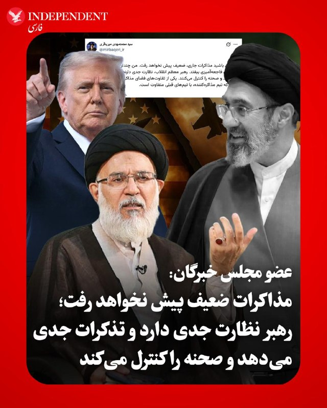

♦️محمدمهدی میرباقری، عضو مجلس خبرگان رهبری، با انتشار پیامی در اکس، ضمن دفاع از روند گفتگوهای جاری میان تهران و واشنگتن، خواستار حفظ آرامش جامعه شد و گفت: «مطمئن باشید مذاکرات جاری، ضعیف پیش نخواهد رفت و من چندان نگران این نیستم که اتفاق فاجعه‌آمیزی بیفتد؛ چرا که رهبر انقلاب نظارت جدی دارند، تذکرات جدی می‌دهند و صحنه را کاملا کنترل می‌کنند.» او با تاکید بر اینکه تیم مذاکره‌کننده کنونی با تیم‌های قبلی متفاوت است، افزود: «اینکه خیال کنیم در نهایت یک خروجی خیلی بد از این گفتگوها در می‌آید، من چنین گمانی ندارم؛ ممکن است نتیجه عالی نباشد، ولی ضعیف هم نخواهد بود، بنابراین پمپاژ اضطراب نکنید و این استرس را به مردم منتقل نسازید.»
‌🇸🇦 Indypersian

🤖 @VahidOOnLine

## VahidOOnLine — post 245389

  

محمد منان رییسی، نماینده مجلس شورای اسلامی از قم، در شبکه اجتماعی ایکس نوشت: «گفته می شود قرار است تفاهم‌نامه‌ای که سراسر نقض خطوط قرمز رهبری است، فردا [یکشنبه] به امضا برسد.»

این نماینده مجلس شورای اسلامی امضای این «تفاهم‌نامه» را مصادف با تولد دونالد ترامپ، رییس‌جمهوری آمریکا، دانست که به توصیف او، «قاتل» علی خامنه‌ای است و نوشت: «آقایان فقط یک جو غیرت داشته باشید…»
‌🏁 🇬🇧 IranintlTV

🤖 @VahidOOnLine

## IranIntlTV — post 342169

  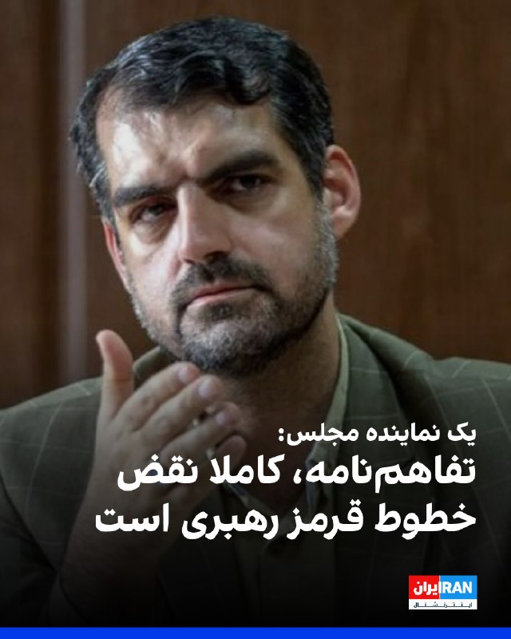

محمد منان رییسی، نماینده مجلس شورای اسلامی از قم، در شبکه اجتماعی ایکس نوشت: «گفته می شود قرار است تفاهم‌نامه‌ای که سراسر نقض خطوط قرمز رهبری است، فردا [یکشنبه] به امضا برسد.»

این نماینده مجلس شورای اسلامی امضای این «تفاهم‌نامه» را مصادف با تولد دونالد ترامپ، رییس‌جمهوری آمریکا، دانست که به توصیف او، «قاتل» علی خامنه‌ای است و نوشت: «آقایان فقط یک جو غیرت داشته باشید…»
https://iranintl.com/202606144460

## FarsiVOA — post 220632

  <a href="telegram/content/FarsiVOA_220632_1781400244.mp4" target="_blank">🎬 Download video</a>

⚡️حال‌وهوای لس آنجلس پس از پیروزی پر گل تیم ملی آمریکا؛ آرمیتا آزاد گزارش می‌ٔدهد
@FarsiVOA

---
📅 بروزرسانی: 1405/03/24 04:43
---

## FoxNewsTwitter — post 342943

  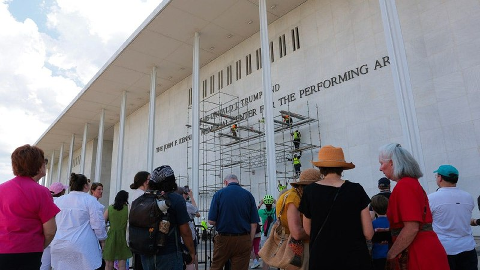

Fox News (Twitter/X)

RT @foxnewspolitics: Scaffolding goes up, Trump's name comes down. Workers began removing the president's name off the Kennedy Center facade — just months after it was affixed — after the board lost every legal attempt to keep it there.

## FarsiVOA — post 220631

⚡️اتحادیه اروپا مذاکرات عضویت با اوکراین و مولداوی را آغاز می‌کند
@FarsiVOA

---
📅 بروزرسانی: 1405/03/24 04:34
---

## VahidOOnLine — post 245388

  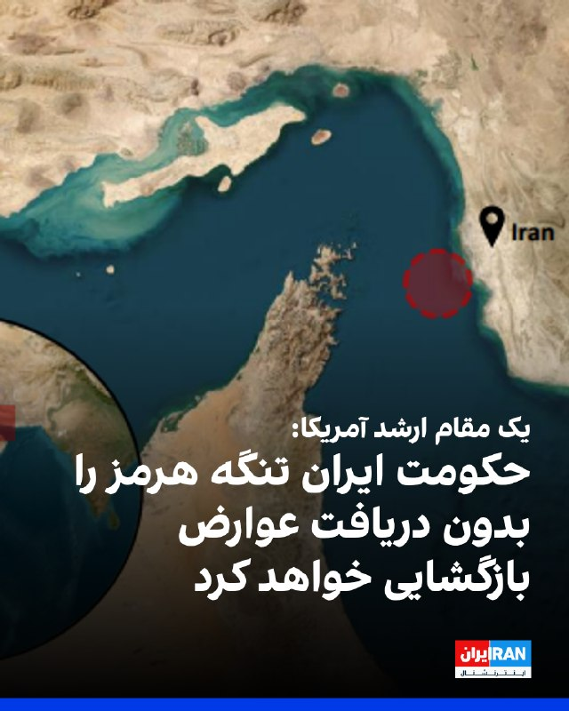

یک مقام ارشد دولت آمریکا به شبکه خبری فاکس گفت: «ایالات متحده معتقد است چارچوب توافقی با ایران در حال شکل‌گیری است که تهران را ملزم به بازگشایی تنگه هرمز بدون دریافت عوارض می‌کند، در حالی که آمریکا محاصره بنادر ایران را لغو خواهد کرد.»

او افزود: «ما فکر می‌کنیم که به توافق رسیده‌ایم. این یک توافق عالی و بسیار قوی است.»

به گفته این مقام آمریکایی، حکومت ایران آبراه استراتژیک هرمز را «بدون دریافت عوارض» بازگشایی خواهد کرد، که یکی از خواسته‌های کلیدی ایالات متحده در مذاکرات بوده است.

او گفت که محاصره بنادر جنوبی ایران همزمان با بازگشایی تنگه هرمز برداشته خواهد شد و مرحله بعدی، بر عملیات مین‌زدایی در این آبراه متمرکز خواهد بود.
‌🏁 🇬🇧 IranintlTV

🤖 @VahidOOnLine

## IranIntlTV — post 342168

  

یک مقام ارشد دولت آمریکا به شبکه خبری فاکس گفت: «ایالات متحده معتقد است چارچوب توافقی با ایران در حال شکل‌گیری است که تهران را ملزم به بازگشایی تنگه هرمز بدون دریافت عوارض می‌کند، در حالی که آمریکا محاصره بنادر ایران را لغو خواهد کرد.»

او افزود: «ما فکر می‌کنیم که به توافق رسیده‌ایم. این یک توافق عالی و بسیار قوی است.»

به گفته این مقام آمریکایی، حکومت ایران آبراه استراتژیک هرمز را «بدون دریافت عوارض» بازگشایی خواهد کرد، که یکی از خواسته‌های کلیدی ایالات متحده در مذاکرات بوده است.

او گفت که محاصره بنادر جنوبی ایران همزمان با بازگشایی تنگه هرمز برداشته خواهد شد و مرحله بعدی، بر عملیات مین‌زدایی در این آبراه متمرکز خواهد بود.
https://iranintl.com/202606130033

---
📅 بروزرسانی: 1405/03/24 04:23
---

## VahidOOnLine — post 245387

  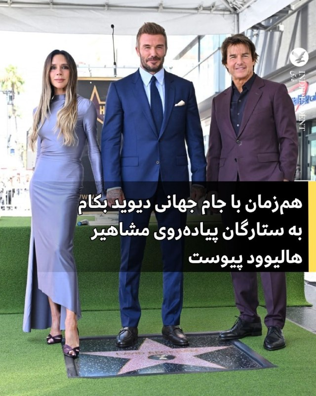

♦️دیوید بکام در آستانه آغاز جام جهانی فوتبال ۲۰۲۶، ستاره خود را در پیاده‌روی مشاهیر هالیوود دریافت کرد؛ جایی که در آن دنیای فوتبال و سرگرمی در کنار هم قرار گرفتند.
در این مراسم، همسرش ویکتوریا و دوست قدیمی‌اش تام کروز از او تجلیل کردند. تام کروز مسیر زندگی بکام را «داستانی هالیوودی» توصیف کرد؛ داستان پسری از طبقه کارگر بریتانیا که با تلاش، پشتکار و استعداد به یکی از شناخته‌شده‌ترین چهره‌های ورزش جهان تبدیل شد.
برخلاف مراسم‌های معمول هالیوود، فرش قرمز این رویداد جای خود را به فرشی سبزرنگ با الهام از زمین فوتبال داده بود؛ ادای احترامی به نقش بکام در محبوبیت جهانی این ورزش.
بکام در سخنرانی خود این افتخار را «باورنکردنی» و «رویایی» توصیف کرد و گفت: «همیشه آدمی رؤیاپرداز بوده‌ام، اما هرگز تصور نمی‌کردم روزی یک فوتبالیست از طبقه کارگر انگلستان چنین افتخاری را تجربه کند.»
او همچنین به هم‌زمانی این مراسم با آغاز جام جهانی ۲۰۲۶ اشاره کرد و افزود: «چه چیزی می‌تواند مناسب‌تر از این باشد که در آستانه برگزاری جام جهانی در آمریکا اینجا باشم. این لحظه‌ای مهم برای دیدن مسیری است که فوتبال در سه دهه گذشته در این کشور طی کرده و تا چه اندازه رشد کرده است.»
بکام که سال‌ها برای باشگاه‌هایی چون منچستریونایتد و رئال مادرید بازی کرده است، از چهره‌هایی به شمار می‌رود که نقش مهمی در افزایش محبوبیت فوتبال در آمریکا داشته‌اند.
دیوید بکام یکی از مالکان اصلی و بنیان‌گذاران تیم آمریکایی اینتر میامی است که نقش سفیر و جذب ستاره‌ها را دارد. لیونل مسی فوق‌ستاره هم کاپیتان تیم است.
‌🇸🇦 Indypersian

🤖 @VahidOOnLine

---
📅 بروزرسانی: 1405/03/24 04:13
---

## FarsiVOA — post 220630

  <a href="telegram/content/FarsiVOA_220630_1781397830.mp4" target="_blank">🎬 Download video</a>

⚡️هیجان در تورنتو هنگام بازی کانادا با بوسنی و هرزگوین؛ گزارش امیرعلی پیروزبخش
@FarsiVOA

## BBCPersian — post 283745

‌🔻روز مادر در کشور‌های مختلف تاریخ‌‌های گوناگونی دارد اما کمتر جایی از جهان است که آن را برگزار نکنند.

در آمریکای شمالی و جنوبی بیشتر اوقات دومین یکشنبه ماه مه را جشن می‌گیرند هرچند در کشور‌هایی مانند مکزیک، گواتمالا و ال‌سالوادور چند روز زودتر جشن گرفته می‌شود.

در هر تاریخی که باشد این روز یکی از مهم‌ترین روزهای سال از نظر تجاری است به‌ویژه در زمینه کارت تبریک، گل، شکلات، رستوران‌ها و فروش انواع محصولاتی که مناسب برای مادران باشد.

این روز برای بسیاری از کودکان، نوه‌ها، خواهران و برادران و همسران اهمیت فراوانی دارد اما کمتر کسی خبر دارد ماجرای رسم گرامیداشت مهر مادرانه در روزی خاص از کجا شروع شده است.

ادامه از:
https://bbc.in/49V7NsW
📸Getty/ NurPhoto via Getty/ Los Angeles Times via Getty
@BBCPersian

---
📅 بروزرسانی: 1405/03/24 04:04
---

## VahidOOnLine — post 245386

  

شورای هماهنگی تشکل‌های صنفی فرهنگیان ایران در بیانیه‌ای با انتقاد از تشدید برخوردهای امنیتی و قضایی با معلمان و فعالان صنفی، این روند را تلاشی سازمان‌یافته برای تضعیف تشکل‌های مستقل و خاموش کردن مطالبات صنفی دانست.

این شورا با اشاره به پیامدهای اعتراضات دی‌ماه، جنگ، تورم، گسترش فقر و بیکاری، اعلام کرد حاکمیت به جای حل بحران‌ها، بر سرکوب فعالان مدنی و صنفی افزوده است.

در این بیانیه به بازداشت شماری از معلمان و فعالان صنفی، صدور احکام زندان برای برخی فرهنگیان، حمله به منازل معلمان، احضار، جریمه و اخراج تعدادی از آنان اشاره شده است. شورای هماهنگی فرهنگیان تاکید کرد معلمان برای دفاع از آموزش عمومی، مقابله با تبعیض آموزشی، بهبود وضعیت معیشتی و حفظ حقوق دانش‌آموزان فعالیت می‌کنند.

این تشکل همچنین ضمن مخالفت با مداخله خارجی و جنگ‌افروزی، خواستار پایان مخاصمه و حفظ آتش‌بس شد و تاکید کرد امنیتی‌سازی فعالیت‌های صنفی و مدنی نشانه ناتوانی در حل مشکلات کشور است. شورا در پایان هشدار داد که سرکوب تشکل‌های مستقل و محدود کردن منتقدان، راهی برای دستیابی به ثبات نخواهد بود.
‌🏁 🇬🇧 IranintlTV

🤖 @VahidOOnLine

---
📅 بروزرسانی: 1405/03/24 03:53
---

## VahidOOnLine — post 245385

♦️محمود نبویان، نایب‌رئیس کمیسیون امنیت ملی و سیاست خارجی مجلس شورای اسلامی، در گفتگو با خبرگزاری دانشجو با انتقاد از توافق احتمالی پیش‌رو با آمریکا گفت: «بر اساس متن این توافق، جمهوری اسلامی ایران و ایالات متحده توافق کرده‌اند تا زمان دست‌یابی به یک معاهده نهایی که زمانش هم مشخص نیست، وضعیت موجود را حفظ کنند. این یعنی ایران وضع موجود در برنامه هسته‌ای خود را حفظ کرده و حق هیچ‌گونه تولید و بازسازی را نخواهد داشت، اما در مقابل، آمریکا تحریم‌های موجود و حضور نیروهای نظامی‌اش در منطقه را حفظ می‌کند و تنها متعهد شده که تحریم جدیدی وضع نکند. متن این توافقنامه نشان می‌دهد که هیچ تحریمی به طور کامل لغو نخواهد شد، بلکه وزارت خزانه‌داری آمریکا صرفا اسقاطیه‌ها یا همان تعلیق‌های مشروط و موقت ۱۲۰ یا ۱۸۰ روزه را برای صادرات نفت خام و محصولات پتروشیمی صادر می‌کند که ترامپ هر زمان بخواهد می‌تواند آن‌ها را تمدید نکند. ما نگرانیم که این توافق نیز مانند برجام به کلاهبرداری جدیدی تبدیل شود که ما نفت خود را بفروشیم اما به دلیل عدم لغو تحریم‌های بانکی، توانایی بازگرداندن ارز و پول آن را به کشور نداشته باشیم.»
‌🇸🇦 Indypersian

🤖 @VahidOOnLine

## VahidOOnLine — post 245384

  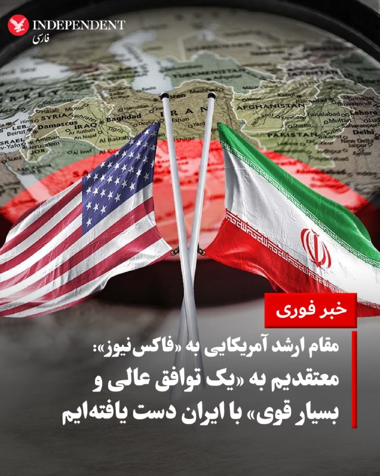

♦️یک مقام ارشد دولت ایالات متحده، روز شنبه، در گفتگوی اختصاصی با «فاکس‌نیوز» اعلام کرد که واشنگتن بر این باور است چارچوب یک توافق پایدار با ایران شکل گرفته است که بر اساس آن، تهران ملزم به بازگشایی فوری تنگه هرمز بدون دریافت هیچ‌گونه عوارض عبور و مرور خواهد بود و در مقابل، آمریکا نیز محاصره بنادر ایران را لغو خواهد کرد. این مقام مسئول با ابراز اطمینان بالا از روند دیپلماسی تاکید کرد: «ما معتقدیم به توافق رسیده‌ایم؛ این یک توافق عالی و بسیار قوی است.» طبق جزئیات ارائه‌شده، بازگشایی این آبراهه راهبردی «بدون اخذ عوارض ترانزیتی» که یکی از خواسته‌های کلیدی واشنگتن در مذاکرات چند ماه اخیر برای پایان دادن به درگیری‌ها بوده، هم‌زمان با رفع محاصره بنادر ایران اجرایی می‌شود و در مرحله بعدی، تمرکز دو طرف بر انجام عملیات مشترک مین‌روبی در این مسیر دریایی خواهد بود.
‌🇸🇦 Indypersian

🤖 @VahidOOnLine

## VahidOOnLine — post 245383

  

وب‌سایت اسرائیل‌نشنال‌نیوز در یادداشتی از رابرت شوارتز، تحلیلگر آمریکایی، نوشت تلاش‌های دیپلماتیک غرب برای حل اختلافات با جمهوری اسلامی بر یک سوءبرداشت اساسی استوار است.

به نوشته او، سیاست‌گذاران غربی معمولا فرض می‌کنند همه طرف‌ها در نهایت به دنبال توافق، ثبات و رفاه هستند، در حالی که جمهوری اسلامی و برخی بازیگران منطقه‌ای مصالحه را نشانه ضعف و عقب‌نشینی تلقی می‌کنند.

شوارتز با اشاره به مذاکرات اخیر میان تهران و واشینگتن، استدلال کرد که جمهوری اسلامی از نگاه تاریخی و ایدئولوژیک خود، توان تحمل فشارهای اقتصادی، نظامی و سیاسی را دارد و خود را درگیر یک نبرد بلندمدت می‌داند.

او همچنین مدعی شد برخی جریان‌های اسلام‌گرا از آتش‌بس و مذاکرات به عنوان فرصتی برای تجدید قوا و ادامه رویارویی در آینده استفاده می‌کنند.

این تحلیلگر در پایان نوشت تجربه‌های گذشته نشان داده بسیاری از ابتکارهای صلح غرب در خاورمیانه به نتیجه نرسیده‌اند و به باور او، صلح با جمهوری اسلامی نه از مسیر مذاکره، بلکه از طریق آنچه «پیروزی» بر سیاست مقاومت تهران توصیف کرد، امکان‌پذیر خواهد بود.
‌🏁 🇬🇧 IranintlTV

🤖 @VahidOOnLine

## VahidOnline — post 76314

پیام‌های دریافتی تایید نشده:

وحید جان ساعت۰۳:۳۲ صداهایی میاد از تو دریا
ما چند کیلومتر از اسکله سپاه طاهرویی فاصله داریم

سلام وحید انفجار های پی در پی از یک ربع پیش تو دریای شهرستان سیریک

صدا انفجار شدید اینجا شرق سیریک

📡 @VahidOnline

## IranIntlTV — post 342167

  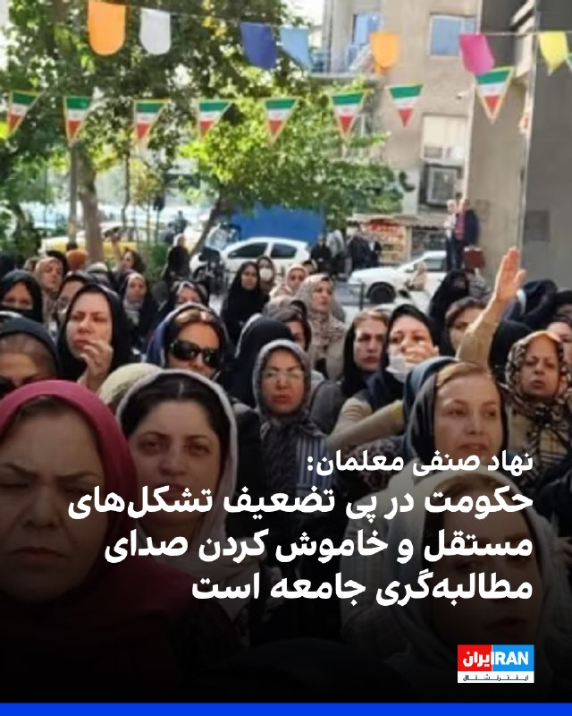

شورای هماهنگی تشکل‌های صنفی فرهنگیان ایران در بیانیه‌ای با انتقاد از تشدید برخوردهای امنیتی و قضایی با معلمان و فعالان صنفی، این روند را تلاشی سازمان‌یافته برای تضعیف تشکل‌های مستقل و خاموش کردن مطالبات صنفی دانست.

این شورا با اشاره به پیامدهای اعتراضات دی‌ماه، جنگ، تورم، گسترش فقر و بیکاری، اعلام کرد حاکمیت به جای حل بحران‌ها، بر سرکوب فعالان مدنی و صنفی افزوده است.

در این بیانیه به بازداشت شماری از معلمان و فعالان صنفی، صدور احکام زندان برای برخی فرهنگیان، حمله به منازل معلمان، احضار، جریمه و اخراج تعدادی از آنان اشاره شده است. شورای هماهنگی فرهنگیان تاکید کرد معلمان برای دفاع از آموزش عمومی، مقابله با تبعیض آموزشی، بهبود وضعیت معیشتی و حفظ حقوق دانش‌آموزان فعالیت می‌کنند.

این تشکل همچنین ضمن مخالفت با مداخله خارجی و جنگ‌افروزی، خواستار پایان مخاصمه و حفظ آتش‌بس شد و تاکید کرد امنیتی‌سازی فعالیت‌های صنفی و مدنی نشانه ناتوانی در حل مشکلات کشور است. شورا در پایان هشدار داد که سرکوب تشکل‌های مستقل و محدود کردن منتقدان، راهی برای دستیابی به ثبات نخواهد بود.
https://iranintl.com/202606132122

## IranIntlTV — post 342166

  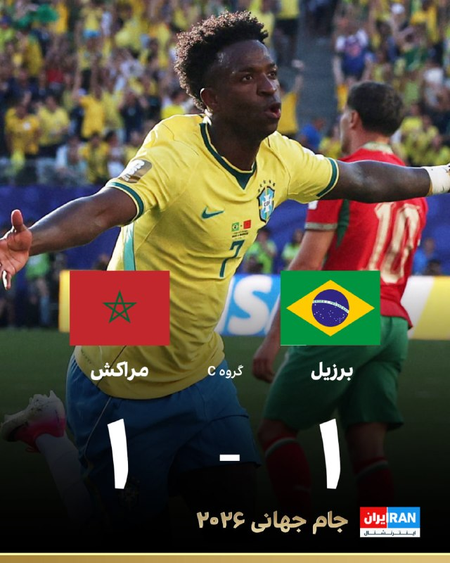

🔻تیم ملی فوتبال برزیل در نخستین بازی خود در جام جهانی ۲۰۲۶ با نتیجه یک بر یک برابر مراکش به تساوی رسید. اسماعیل سایبری برای مراکش و وینیسیوس جونیور برای برزیل در این مسابقه گلزنی کردند تا دو تیم با یک امتیاز در انتظار نتیجه بازی اسکاتلند و هائیتی باشند.

🔹برخلاف انتظارات در شروع مسابقه مراکش نمایش بهتری داشت و با فشار روی دروازه آلیسون، در دقیقه ۲۱ توسط ستاره آیندهوون به گل اول بازی رسید.

🔹این خوشحالی اما ۱۱ دقیقه بیشتر دوام نیاورد و فوق‌ستاره رئال مادرید بار دیگر زیر نظر آنچلوتی درخشید و به زیبایی گل تساوی سلسائو را به ثمر رساند تا پرافتخارترین تیم جهان برابر تیم چهارم جام جهانی قطر شکست نخورد.

@iranintltvsport

## IranIntlTV — post 342165

  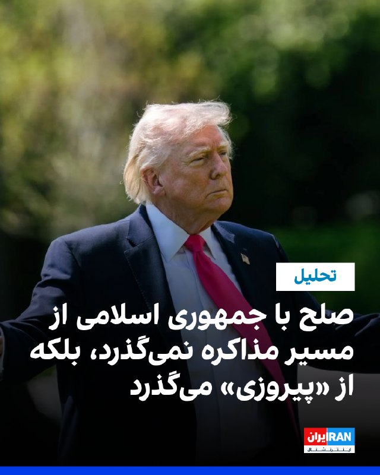

وب‌سایت اسرائیل‌نشنال‌نیوز در یادداشتی از رابرت شوارتز، تحلیلگر آمریکایی، نوشت تلاش‌های دیپلماتیک غرب برای حل اختلافات با جمهوری اسلامی بر یک سوءبرداشت اساسی استوار است.

به نوشته او، سیاست‌گذاران غربی معمولا فرض می‌کنند همه طرف‌ها در نهایت به دنبال توافق، ثبات و رفاه هستند، در حالی که جمهوری اسلامی و برخی بازیگران منطقه‌ای مصالحه را نشانه ضعف و عقب‌نشینی تلقی می‌کنند.

شوارتز با اشاره به مذاکرات اخیر میان تهران و واشینگتن، استدلال کرد که جمهوری اسلامی از نگاه تاریخی و ایدئولوژیک خود، توان تحمل فشارهای اقتصادی، نظامی و سیاسی را دارد و خود را درگیر یک نبرد بلندمدت می‌داند.

او همچنین مدعی شد برخی جریان‌های اسلام‌گرا از آتش‌بس و مذاکرات به عنوان فرصتی برای تجدید قوا و ادامه رویارویی در آینده استفاده می‌کنند.

این تحلیلگر در پایان نوشت تجربه‌های گذشته نشان داده بسیاری از ابتکارهای صلح غرب در خاورمیانه به نتیجه نرسیده‌اند و به باور او، صلح با جمهوری اسلامی نه از مسیر مذاکره، بلکه از طریق آنچه «پیروزی» بر سیاست مقاومت تهران توصیف کرد، امکان‌پذیر خواهد بود.
https://iranintl.com/202606131127

## FarsiVOA — post 220629

⚡️جزئیات ماموریت تام باراک؛ از تکمیل کابینه عراق تا خلع سلاح شبه نظامیان وابسته به جمهوری اسلامی
@FarsiVOA

---
📅 بروزرسانی: 1405/03/24 03:43
---

## IranIntlTV — post 342164

  

🔻تیم ملی فوتبال برزیل در نخستین بازی خود در جام جهانی ۲۰۲۶ با نتیجه یک بر یک برابر مراکش به تساوی رسید. اسماعیل سایبری برای مراکش و وینیسیوس جونیور برای برزیل در این مسابقه گلزنی کردند تا دو تیم با یک امتیاز در انتظار نتیجه بازی اسکاتلند و هائیتی باشند.

🔹برخلاف انتظارات در شروع مسابقه مراکش نمایش بهتری داشت و با فشار روی دروازه آلیسون، در دقیقه ۲۱ توسط ستاره آیندهوون به گل اول بازی رسید.

🔹این خوشحالی اما ۱۱ دقیقه بیشتر دوام نیاورد و فوق‌ستاره رئال مادرید بار دیگر زیر نظر آنچلوتی درخشید و به زیبایی گل تساوی سلسائو را به ثمر رساند تا پرافتخارترین تیم جهان برای تیم چهارم جام جهانی قطر شکست نخورد.

@iranintltvsport

---
📅 بروزرسانی: 1405/03/24 03:34
---

## VahidOOnLine — post 245382

  <a href="telegram/content/VahidOOnLine_245382_1781395477.mp4" target="_blank">🎬 Download video</a>

کامران غضنفری، نماینده مجلس جمهوری اسلامی، در تجمع جمعی از حامیان تندروی حکومت در شامگاه شنبه ۲۳ خرداد، عباس عراقچی، وزیر خارجه دولت پزشکیان، را فردی «دروغگو» خواند و گفت «غلط میکنی» در مرحله بعد درباره مسائل هسته‌ای بخواهی مذاکره کنی.
‌🏁 🇬🇧 IranintlTV

🤖 @VahidOOnLine

## VahidOOnLine — post 245381

  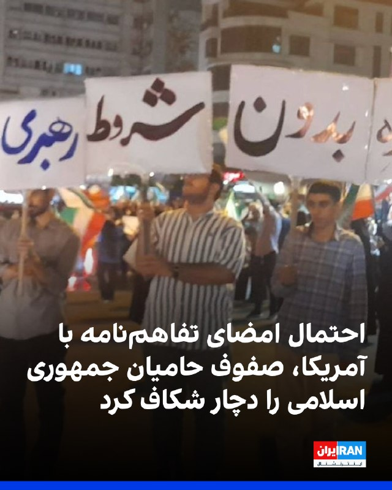

گزارش‌ها از افزایش مخالفت‌ها در میان بخشی از حامیان جمهوری اسلامی با تفاهم احتمالی میان تهران و واشینگتن حکایت دارد. همزمان با انتشار خبرهای مربوط به مذاکرات، تجمع‌هایی در مشهد و تهران برگزار شد و معترضان با سر دادن شعارهایی علیه عباس عراقچی، از روند مذاکرات انتقاد کردند.

برخی اصولگرایان نیز نسبت به توافق احتمالی هشدار داده‌اند. محمود نبویان، نایب‌رییس کمیسیون امنیت ملی مجلس، گفت آمریکا از چنین توافقی سود خواهد برد و ابراهیم رضایی، سخنگوی این کمیسیون، از آنچه «سخاوتمندی مفرط» در مذاکرات خواند انتقاد کرد. رسانه‌ها و فعالان نزدیک به جریان‌های حامی حکومت نیز بر لزوم پایبندی به مواضع اعلام‌شده رهبر جمهوری اسلامی تاکید کرده‌اند.

در مقابل، مقام‌های نزدیک به دولت مسعود پزشکیان این انتقادها را عامل تفرقه دانسته‌اند. رسانه‌های وابسته به حکومت نیز با اشاره به پیام مجتبی خامنه‌ای بر ضرورت حفظ وحدت تاکید کرده‌اند. با این حال، تجمع‌های اعتراضی و انتقادهای علنی برخی چهره‌های اصولگرا نشان می‌دهد اختلاف نظر درباره تفاهم احتمالی با آمریکا در بخشی از پایگاه سیاسی حامی جمهوری اسلامی آشکار شده است.
متن کامل را اینجا بخوانید
h
‌🏁 🇬🇧 IranintlTV

🤖 @VahidOOnLine

## IranIntlTV — post 342163

  <a href="telegram/content/IranIntlTV_342163_1781395480.mp4" target="_blank">🎬 Download video</a>

کامران غضنفری، نماینده مجلس جمهوری اسلامی، در تجمع جمعی از حامیان تندروی حکومت در شامگاه شنبه ۲۳ خرداد، عباس عراقچی، وزیر خارجه دولت پزشکیان، را فردی «دروغگو» خواند و گفت «غلط میکنی» در مرحله بعد درباره مسائل هسته‌ای بخواهی مذاکره کنی.

## IranIntlTV — post 342162

  

گزارش‌ها از افزایش مخالفت‌ها در میان بخشی از حامیان جمهوری اسلامی با تفاهم احتمالی میان تهران و واشینگتن حکایت دارد. همزمان با انتشار خبرهای مربوط به مذاکرات، تجمع‌هایی در مشهد و تهران برگزار شد و معترضان با سر دادن شعارهایی علیه عباس عراقچی، از روند مذاکرات انتقاد کردند.

برخی اصولگرایان نیز نسبت به توافق احتمالی هشدار داده‌اند. محمود نبویان، نایب‌رییس کمیسیون امنیت ملی مجلس، گفت آمریکا از چنین توافقی سود خواهد برد و ابراهیم رضایی، سخنگوی این کمیسیون، از آنچه «سخاوتمندی مفرط» در مذاکرات خواند انتقاد کرد. رسانه‌ها و فعالان نزدیک به جریان‌های حامی حکومت نیز بر لزوم پایبندی به مواضع اعلام‌شده رهبر جمهوری اسلامی تاکید کرده‌اند.

در مقابل، مقام‌های نزدیک به دولت مسعود پزشکیان این انتقادها را عامل تفرقه دانسته‌اند. رسانه‌های وابسته به حکومت نیز با اشاره به پیام مجتبی خامنه‌ای بر ضرورت حفظ وحدت تاکید کرده‌اند. با این حال، تجمع‌های اعتراضی و انتقادهای علنی برخی چهره‌های اصولگرا نشان می‌دهد اختلاف نظر درباره تفاهم احتمالی با آمریکا در بخشی از پایگاه سیاسی حامی جمهوری اسلامی آشکار شده است.
متن کامل را اینجا بخوانید
h

## FarsiVOA — post 220628

  <a href="telegram/content/FarsiVOA_220628_1781395483.mp4" target="_blank">🎬 Download video</a>

⚡️وضعیت تیم فوتبال ایران در جام جهانی ۲۰۲۶؛ گفت‌وگو با کیومرث صالح‌نیا گزارشگر و مفسر فوتبال
@FarsiVOA

## IranianMinds — post 22522

  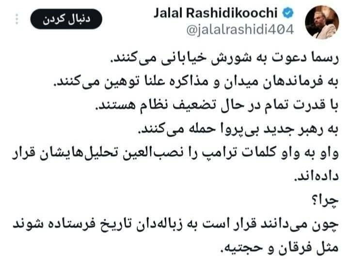

🔴 رشیدی کوچی نماینده سابق مجلس:

تندروها به زباله دان تاریخ خواهند پیوست

@IranianMinds

## IranianMinds — post 22521

جام جهانی ینی اوج هیجان و پول دراوردن پس بیا توی کانال ورسوس بت و پول دراوردن شروع کن👌

## IranianMinds — post 22520

  <a href="telegram/content/IranianMinds_22520_1781395486.webm" target="_blank">🎬 Download video</a>

📢توم میخوای از مسابقات جام جهانی فوتبال پول دربیاری؟
🥇

✅کانال ورسوس بت کارش تحلیل و پیش بینی مسابقات جام جهانی به صورت حرفه ای
🍑

⚠️توم میتونی از پیش بینی جام جهانی خیلی راحت پول دربیاری فقط کافیه با کانال ورسوس بت همراه شی
📣

🌐ادرس عضویت کانالشون e23:
👇

🔪https://t.me/+vEPd1hF2Y38yMWI0

🔪https://t.me/+vEPd1hF2Y38yMWI0

## BBCPersian — post 283744

  <a href="telegram/content/BBCPersian_283744_1781395487.mp4" target="_blank">🎬 Download video</a>

🔻در حالی که قرار است امروز توافق پایان جنگ میان آمریکا و ایران امضا شود، برخی مخالفان این توافق که از «چهره‌های نزدیک به جبهه پایداری» ــ تشکلی اصولگرا و تندرو در ایران ــ توصیف شده‌اند، علیه عباس عراقچی و محمدباقر قالیباف شعار دادند.

این تجمع در میدان ابن‌سینای تهران برگزار شد و معترضان شعارهایی از جمله «عراقچی حیا کن، مملکت رو رها کن» و «قالیباف، عراقچی، پس خون رهبرم چی؟» سر دادند.

همزمان، ده‌ها نفر شامگاه گذشته مقابل ساختمان وزارت خارجه در مشهد در اعتراض به اظهارات عباس عراقچی درباره توافق احتمالی با آمریکا تجمع کردند.

بر اساس ویدئویی که خبرگزاری فارس منتشر کرده است، معترضان در مشهد نیز شعارهایی علیه آقای عراقچی سر دادند. مخالفان توافق معتقدند چنین توافقی به سود ایران نیست و اهرم فشار تهران در تنگه هرمز را تضعیف می‌کند.

آقای عراقچی در گفت‌وگویی تلویزیونی گفته بود که توافق مورد مذاکره شامل لغو محاصره دریایی بنادر ایران از سوی آمریکا خواهد بود. او همچنین تنگه هرمز را یکی از ابزارهای اصلی بازدارندگی ایران توصیف کرده بود.

@BBCPersian

---
📅 بروزرسانی: 1405/03/24 03:23
---

## VahidOOnLine — post 245380

♦️دونالد ترامپ، چهل‌وپنجمین و چهل‌وهفتمین رئیس‌جمهوری ایالات متحده که با پیروزی‌های خود در انتخابات، دو دوره سکان هدایت کاخ سفید را به دست گرفت، در آستانه ورود به ۸۰ سالگی از امضای یک توافق «بزرگ» با ایران خبر داد. ترامپ که در ۱۴ ژوئن ۱۹۴۶ در نیویورک متولد شده، پس از گروور کلیولند، دومین رئیس‌جمهور تاریخ آمریکا است که در دو دوره غیرمتوالی به کاخ سفید راه یافته، پیش از ورود به دنیای سیاست به عنوان یک چهره برجسته املاک و مستغلات و ستاره برنامه‌های تلویزیونی شناخته می‌شد. او در طول دوران ریاست‌جمهوری خود، دستاوردهایی چون امضای کلیدی‌ترین اصلاحات مالیاتی کشور، بازسازی و رونق بی‌سابقه اقتصاد آمریکا، اجرای شیوه‌های سخت‌گیرانه برای کاهش جرم و جنایت در واشنگتن دی‌سی و همچنین میانجی‌گری در امضای «پیمان ابراهیم» برای عادی‌سازی روابط در خاورمیانه را در کارنامه خود ثبت کرده است.
رئیس‌جمهوری آمریکا در آستانه سالروز تولدش با انتشار پیامی صریح اعلام کرد که این معاهده جدید با ایران روز یکشنبه امضا می‌شود و بلافاصله پس از آن، تنگه هرمز به روی همگان باز خواهد شد. ترامپ با حمله به توافق دوران اوباما (برجام) و توصیف آن به عنوان جاده‌ای صاف برای دستیابی ایران به بمب، توافق خود را دقیقا نقطه مقابل آن و کانون یک «دیوار محکم در برابر سلاح هسته‌ای ایران» خواند. او تاکید کرد که در این توافق، برخلاف دوران اوباما، هیچ پولی میان طرفین ردوبدل نخواهد شد و تهران دیگر به هیچ طریقی به دنبال سلاح هسته‌ای نخواهد بود.
ترامپ همزمان به مناسبت سالگرد دیدار با رهبر کره شمالی، تصویری از خودش در کنار کیم جونگ اون منتشر کرد. ترامپ و جونگ اون، صبح سه‌شنبه ۱۲ ژوئن ۲۰۱۸ در هتل «کپلا» واقع در جزیره سنتوزای در سنگاپور، پشت درهای بسته گفتگو کردند. این نخستین دیدار سران دو کشور پس از پایان جنگ کره در سال ۱۹۵۳ بود.
‌🇸🇦 Indypersian

🤖 @VahidOOnLine

## VahidOOnLine — post 245379

  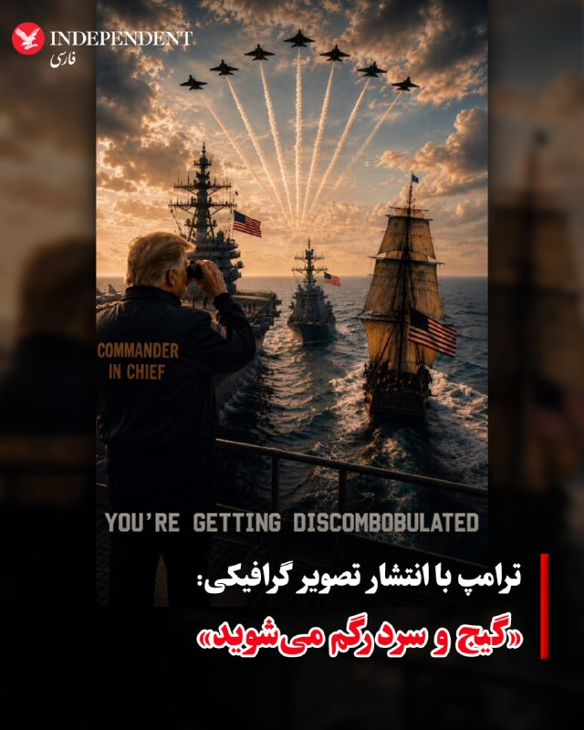

♦️دونالد ترامپ، رئیس جمهوری آمریکا روز شنبه، ۲۳ خردادماه، تصویری گرافیکی از خود روی عرشه ناو جنگی منتشر کرد. او در توضیح این تصویر نوشت: «دارید گیج و سردرگم می‌شوید». در این تصویر که در حساب کاربری او در «تروث سوشال» منتشر شده، ترامپ با کاپشنی که روی آن عبارت «فرمانده کل نیروهای مسلح» درج شده، با دوربین در حال رصد ناوگان دریایی و پرواز آرایش‌یافته جنگنده‌های آمریکایی بر فراز دریا است.
‌🇸🇦 Indypersian

🤖 @VahidOOnLine

## alonews — post 127767

  <a href="telegram/content/alonews_127767_1781394833.webm" target="_blank">🎬 Download video</a>

👈فاکس نیوز در خبری مهم اعلام کرد که ایران تنگه هرمز را در عوض لغو محاصرات دریایی آمریکا باز خواهد کرد

✅ @AloNews خبر جنگ

---
📅 بروزرسانی: 1405/03/24 03:13
---

## VahidOOnLine — post 245378

  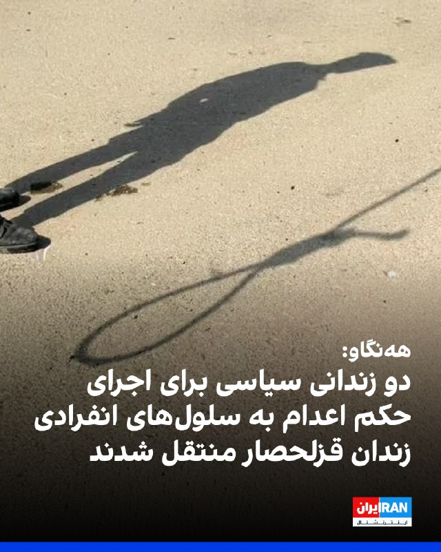

سازمان حقوق بشری هه‌نگاو اعلام کرد علی فتاح و محمد نقی‌زاده، دو زندانی سیاسی محکوم به اعدام، پس از تایید احکامشان در دیوان عالی کشور به سلول‌های انفرادی زندان قزلحصار کرج منتقل شده‌اند. این سازمان هشدار داد که خطر اجرای قریب‌الوقوع احکام اعدام این دو زندانی افزایش یافته است.

بر اساس گزارش هه‌نگاو، فتاح و نقی‌زاده از بازداشت‌شدگان اعتراضات دی‌ماه سال گذشته هستند که در دادگاه‌های انقلاب تهران به اعدام محکوم شده‌اند. این نهاد حقوق بشری روند رسیدگی به پرونده‌های آنان را فاقد دادرسی عادلانه توصیف کرده است.

همزمان، وب‌سایت هرانا گزارش داد پیمان گنجی، یکی دیگر از بازداشت‌شدگان اعتراضات، از سوی شعبه ۲۶ دادگاه انقلاب اسلامی تهران به اتهام «محاربه» به اعدام محکوم شده و پرونده او اکنون در دیوان عالی کشور در دست بررسی است.

در تحولی دیگر، هه‌نگاو از تایید احکام حبس پدرام چراغ‌زاده و شایان مرادی‌مطلق خبر داد. همچنین شبکه حقوق بشر کردستان اعلام کرد مهدی پاک‌مهر، هنرمند اهل بجنورد، در دو پرونده جداگانه در مجموع به شش سال حبس تعزیری و ۷۰ ضربه شلاق محکوم شده است.

متن کامل را اینجا بخوانید
‌🏁 🇬🇧 IranintlTV

🤖 @VahidOOnLine

## IranIntlTV — post 342161

  

سازمان حقوق بشری هه‌نگاو اعلام کرد علی فتاح و محمد نقی‌زاده، دو زندانی سیاسی محکوم به اعدام، پس از تایید احکامشان در دیوان عالی کشور به سلول‌های انفرادی زندان قزلحصار کرج منتقل شده‌اند. این سازمان هشدار داد که خطر اجرای قریب‌الوقوع احکام اعدام این دو زندانی افزایش یافته است.

بر اساس گزارش هه‌نگاو، فتاح و نقی‌زاده از بازداشت‌شدگان اعتراضات دی‌ماه سال گذشته هستند که در دادگاه‌های انقلاب تهران به اعدام محکوم شده‌اند. این نهاد حقوق بشری روند رسیدگی به پرونده‌های آنان را فاقد دادرسی عادلانه توصیف کرده است.

همزمان، وب‌سایت هرانا گزارش داد پیمان گنجی، یکی دیگر از بازداشت‌شدگان اعتراضات، از سوی شعبه ۲۶ دادگاه انقلاب اسلامی تهران به اتهام «محاربه» به اعدام محکوم شده و پرونده او اکنون در دیوان عالی کشور در دست بررسی است.

در تحولی دیگر، هه‌نگاو از تایید احکام حبس پدرام چراغ‌زاده و شایان مرادی‌مطلق خبر داد. همچنین شبکه حقوق بشر کردستان اعلام کرد مهدی پاک‌مهر، هنرمند اهل بجنورد، در دو پرونده جداگانه در مجموع به شش سال حبس تعزیری و ۷۰ ضربه شلاق محکوم شده است.

متن کامل را اینجا بخوانید
https://iranintl.com/202606131998

---
📅 بروزرسانی: 1405/03/24 03:03
---

هیچ پیام جدیدی در این بروزرسانی ارسال نشد.

---
📅 بروزرسانی: 1405/03/24 02:53
---

## VahidOOnLine — post 245377

  

جان جیمز، عضو جمهوری‌خواه مجلس نمایندگان آمریکا، گفت که «هیجان‌زده» است که ببیند از یک توافق احتمالی ایالات متحده و ایران چه نتیجه‌ای حاصل می‌شود، و افزود که کارزار فشار دونالد ترامپ، تهران را وادار به مذاکره کرد.

او به شبکه خبری فاکس گفت ترامپ، رییس‌جمهور صلح است، اما او همچنین رییس‌جمهور قدرت است و دقیقاً به همین دلیل است که تهران برای مذاکره به میز مذاکره می‌آید.»

جیمز، کهنه‌سرباز جنگ عراق و نامزد فرمانداری میشیگان، رویکرد ترامپ را با توافق هسته‌ای (برجام) در دوران باراک اوباما و سیاست دولت جو بایدن مقایسه کرد و گفت: «کاهش تحریم‌های گذشته به تقویت گروه‌های تروریستی تحت حمایت ایران کمک کرد.»

او گفت که هر توافق باید «مبتنی بر واقعیت» باشد و تاکید کرد: «تا زمانی که ترامپ مسئول است، هیچ چیز خارج از منافع آمریکا پیش نخواهد رفت.»
‌🏁 🇬🇧 IranintlTV

🤖 @VahidOOnLine

## WithYashar — post 14760

  <a href="telegram/content/WithYashar_14760_1781393018.mp4" target="_blank">🎬 Download video</a>

🎬 Video

## IranIntlTV — post 342160

  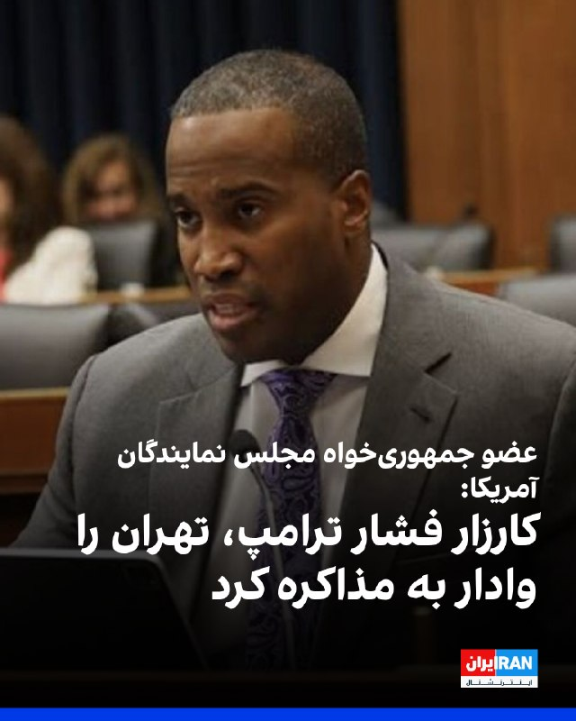

جان جیمز، عضو جمهوری‌خواه مجلس نمایندگان آمریکا، گفت که «هیجان‌زده» است که ببیند از یک توافق احتمالی ایالات متحده و ایران چه نتیجه‌ای حاصل می‌شود، و افزود که کارزار فشار دونالد ترامپ، تهران را وادار به مذاکره کرد.

او به شبکه خبری فاکس گفت ترامپ، رییس‌جمهور صلح است، اما او همچنین رییس‌جمهور قدرت است و دقیقاً به همین دلیل است که تهران برای مذاکره به میز مذاکره می‌آید.»

جیمز، کهنه‌سرباز جنگ عراق و نامزد فرمانداری میشیگان، رویکرد ترامپ را با توافق هسته‌ای (برجام) در دوران باراک اوباما و سیاست دولت جو بایدن مقایسه کرد و گفت: «کاهش تحریم‌های گذشته به تقویت گروه‌های تروریستی تحت حمایت ایران کمک کرد.»

او گفت که هر توافق باید «مبتنی بر واقعیت» باشد و تاکید کرد: «تا زمانی که ترامپ مسئول است، هیچ چیز خارج از منافع آمریکا پیش نخواهد رفت.»
https://iranintl.com/202606131441

## FarsiVOA — post 220627

⚡️گزارش‌ها از بازداشت فریدون فراهانی استاد موسیقی و مدرس دانشگاه خبر می‌دهند
@FarsiVOA

## IranianMinds — post 22517

  <a href="telegram/content/IranianMinds_22517_1781393021.mp4" target="_blank">🎬 Download video</a>

🔴یک آخوند در صداوسیما:

همه امامان با دشمنان مذاکره می‌کردند.

@IranianMinds

---
📅 بروزرسانی: 1405/03/24 02:43
---

## Shin_Persian — post 7023

Shin ✓ @hey_itsmyturn
Sat, 13 Jun 2026 23:12:07 UTC

Jet activity over Khorram Abad, Lorestan Province, Iran

ترجمه خودکار فارسی

فعالیت جت‌ها بر فراز خرم‌آباد، استان لرستان، ایران

𝕏 · @shin_persian

---
📅 بروزرسانی: 1405/03/24 02:33
---

## VahidOOnLine — post 245376

  <a href="telegram/content/VahidOOnLine_245376_1781391815.mp4" target="_blank">🎬 Download video</a>

یک کارشناس جمهوری اسلامی در شبکه افق صداوسیما گفت قرار نیست در خاک ایران با آمریکا بجنگیم، بلکه باید جنگ را به خاک آمریکا ببریم. او همچنین افزود جمهوری اسلامی هنوز کارت‌های نظامی و غیرنظامی خود را رو نکرده است.
‌🏁 🇬🇧 IranintlTV

🤖 @VahidOOnLine

## WithYashar — post 14759

  <a href="telegram/content/WithYashar_14759_1781391817.mp4" target="_blank">🎬 Download video</a>

توافق دیجیتال فردا
@withyashar

## IranIntlTV — post 342159

  <a href="telegram/content/IranIntlTV_342159_1781391820.mp4" target="_blank">🎬 Download video</a>

دیدار دو تیم مراکش و برزیل در سومین روز رقابت‌های جام جهانی فوتبال در ورزشگاه نیویورک‌نیوجرسی در حال برگزاری است.

گزارش علیرضا مدیری، خبرنگار ایران‌اینترنشنال، از بیرون ورزشگاه محل برگزاری بازی
@iranintltv

## IranIntlTV — post 342158

  <a href="telegram/content/IranIntlTV_342158_1781391822.mp4" target="_blank">🎬 Download video</a>

یک کارشناس جمهوری اسلامی در شبکه افق صداوسیما گفت قرار نیست در خاک ایران با آمریکا بجنگیم، بلکه باید جنگ را به خاک آمریکا ببریم. او همچنین افزود جمهوری اسلامی هنوز کارت‌های نظامی و غیرنظامی خود را رو نکرده است.

## FarsiVOA — post 220626

  <a href="telegram/content/FarsiVOA_220626_1781391825.mp4" target="_blank">🎬 Download video</a>

⚡️هیجان در «نشنال مال» واشنگتن هنگام بازی تیم ملی فوتبال ایالات متحده آمریکا
@FarsiVOA

## Persian_Trend_Official — post 16992

  <a href="telegram/content/Persian_Trend_Official_16992_1781391826.mp4" target="_blank">🎬 Download video</a>

متاسفانه من از دشمن هم شانس نیوردم 😄
بعید میدونم این یارو با این سطح سواد زبان فارسی، سیکل هم داشته باشه، تو همه شبکه اجتماعی هاش فراخوان داده هرکسی سند و مدرکی از من داره براش بفرسته !😄😄😄

اگر بجای پرسه زدن پشت #پارک_دانشجو ، درست رو ادامه میدادی شاید یه چیزی میشدی 😄

## Dirty_Kids — post 391978

✅توم میخوای از مسابقات جام جهانی فوتبال پول دربیاری؟🏆🥇🏆 
✅کانال ورسوس بت کارش تحلیل و پیش بینی مسابقات جام جهانی به صورت حرفه ای
💎 
⚠️توم میتونی از پیش بینی جام جهانی خیلی راحت پول دربیاری فقط کافیه با کانال ورسوس بت همراه شی
📣 A23 
🌐ادرس عضویت کانالشون:
👇 
📌h…

## Dirty_Kids — post 391977

  

✅توم میخوای از مسابقات جام جهانی فوتبال پول دربیاری؟🏆🥇🏆

✅کانال ورسوس بت کارش تحلیل و پیش بینی مسابقات جام جهانی به صورت حرفه ای
💎

⚠️توم میتونی از پیش بینی جام جهانی خیلی راحت پول دربیاری فقط کافیه با کانال ورسوس بت همراه شی
📣
A23

🌐ادرس عضویت کانالشون:
👇

📌https://t.me/+cod-WdJafPM3OWI0

📌https://t.me/+cod-WdJafPM3OWI0

## Dirty_Kids — post 391976

  <a href="telegram/content/Dirty_Kids_391976_1781391831.mp4" target="_blank">🎬 Download video</a>

#بخوابیم

@Dirty_Kids 👻

## Dirty_Kids — post 391975

  <a href="telegram/content/Dirty_Kids_391975_1781391832.mp4" target="_blank">🎬 Download video</a>

🔴 توی برزیل یه دختر اومد پرش با طناب انجام بده، اما بعد اینکه مسئولایِ بازی انداختنش پایین، یادشون اومد بهش طناب نبستن و دختر بیچاره فوت میشه.

⚠️ حاوی صحنه دلخراش، اگه بیماری قلبی دارین باز نکنین.

@Dirty_Kids 👻

## Dirty_Kids — post 391974

  <a href="telegram/content/Dirty_Kids_391974_1781391833.mp4" target="_blank">🎬 Download video</a>

🔴 فوری، یاسمین ولی‌زاده فعال حقوق بشر: شهردار شهر سیاتل آمریکا پاسخ من رو داد و اعلام کرد از این قانون که فیفا ورود پرچم شیروخورشید به داخل ورزشگاه رو در جام جهانی ممنوع کرده حمایت نمیکنه. شهردار رسما تأیید کرد ورود پرچم شیروخورشید به ورزشگاه آزاد شده
🇮🇷…

## Dirty_Kids — post 391973

  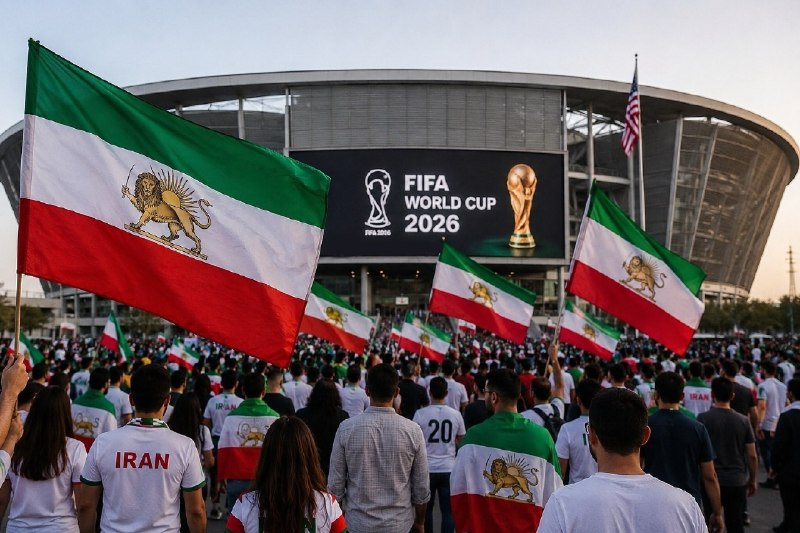

🔴 فوری، یاسمین ولی‌زاده فعال حقوق بشر:

شهردار شهر سیاتل آمریکا پاسخ من رو داد و اعلام کرد از این قانون که فیفا ورود پرچم شیروخورشید به داخل ورزشگاه رو در جام جهانی ممنوع کرده حمایت نمیکنه.
شهردار رسما تأیید کرد ورود پرچم شیروخورشید به ورزشگاه آزاد شده
🇮🇷

@Dirty_Kids 👻

## Dirty_Kids — post 391972

  <a href="telegram/content/Dirty_Kids_391972_1781391834.mp4" target="_blank">🎬 Download video</a>

🔴رائفی پور تخم عرفات:
مردم شبا نمیومدن فستیوال که یکی بیاد بالا استیج و واسشون آهنگ بخونه و ایناهم پرچم تکون بدن؛

@Dirty_Kids 👻

---
📅 بروزرسانی: 1405/03/24 02:23
---

## VahidOOnLine — post 245375

  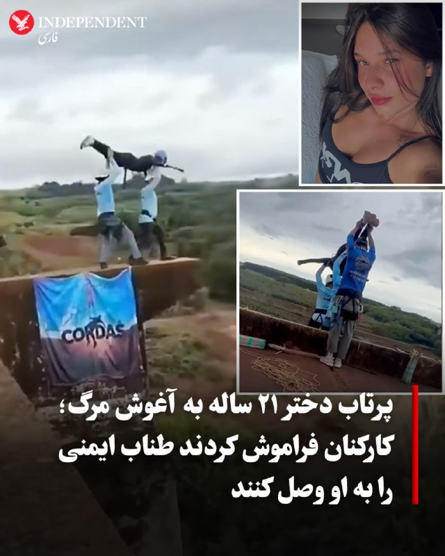

♦️به گزارش روزنامه «سان» بریتانیا، غفلت و بی‌احتیاطی تکان‌دهنده کارکنان یک مرکز ورزش‌های هیجانی در برزیل، باعث سقوط مرگبار و دلهره‌آور یک دختر ۲۱ ساله از فراز یک پل مرتفع شد. ماریا ادواردا رودریگز، فارغ‌التحصیل رشته تربیت‌بدنی، صبح روز شنبه برای تجربه پرش از روی «پل اسکلتون» در حومه سائوپائولو به این مکان رفته بود، اما دو تن از کارکنان مجموعه بدون آنکه متوجه شوند طناب ایمنی به جلیقه محافظ او متصل نشده است، او را بلند کرده و از لبه پل به پایین پرتاب کردند. تصاویر هولناک ضبط‌شده از این صحنه نشان می‌دهد که تنها ثانیه‌هایی پس از پرتاب، صدای فریاد وحشت‌زده حاضران بلند می‌شود که می‌گویند «طناب! طناب کو؟»، اما این دختر جوان پیش از چشم مربیان خود از ارتفاع بیش از ۴۰ متری به زمین سقوط کرد و در دم جان باخت. نکته تکان‌دهنده این حادثه، تصاویری بود که ماریا تنها چند ساعت پیش از مرگش در اینستاگرام منتشر کرده و به شوخی نوشته بود: «کدام دیوانه‌ای به من اجازه داد از روی پل بپرم؟». در پی این فاجعه و با حضور نیروهای امدادی، پلیس نظامی برزیل ۶ نفر از کارکنان دو شرکت مسئول این رویداد را در محل حادثه بازداشت کرد. این در حالی است که با وجود وقوع این «قتل شبه‌عمد»، وب‌سایت این مجموعه‌ها همچنان به فروش بلیت‌های ۲۶ پوندی خود برای برنامه‌های ماه‌های آینده ادامه می‌دهند.
‌🇸🇦 Indypersian

🤖 @VahidOOnLine

## FarsiVOA — post 220625

🔺انتقاد رهبر اپوزیسیون اسرائيل از نتانیاهو بابت توافق در حال شکل‌گیری با رژیم ایران؛ لاپید: دستاورد نظامی باید به پیروزی استراتژیک تبدیل شود

▪️یائیر لاپید، رهبر حزب اپوزیسیون دولت بنیامین نتانیاهو نخست وزیر اسرائيل، از توافق در حال شکل‌گیری میان آمریکا و جمهوری اسلامی به‌شدت انتقاد کرد.

⬇️ بیشتر بخوانید:
https://ir.voanews.com/a/8160504.html
@FarsiVOA

## BBCPersian — post 283743

  <a href="https://t.me/bbcpersian/283743" target="_blank">📎 Download file</a>

پادکست برنامه ۶۰ دقیقه شنبه ۲۳ خرداد ۱۴۰۵

این نسخه رادیویی برنامه شصت دقیقه تلویزیون فارسی بی‌بی‌سی است که هرشب بعد از پخش، با حجم کم از اپلیکیشن‌های پادگیر و صفحه تلگرام بی‌بی‌سی فارسی در دسترس است.

@BBCPersian

## BBCPersian — post 283742

  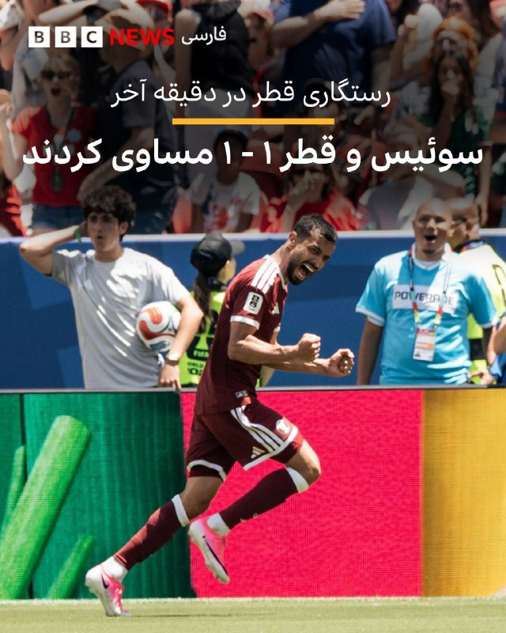

🔻قطر با یک گل دراماتیک در وقت اضافه، مقابل سوئیس به تساوی رسید و اولین امتیاز خود را در جام جهانی ۲۰۲۶ به دست آورد.

بوعلم خوخی در دقیقه ۹۴ پاس همام الامین را با ضربه سر درون دروازه کرد تا فریاد شادی هواداران قطر در فضای ورزشگاه طنین‌انداز شود.

این گل نتیجه بازی و برتری سوئیس را که با پنالتی بریل امبولو در نیمه اول به دست آمده بود تغییر داد.

در دقیقه ۱۷ بازی و پس از خطای محمود ابونادا روی ریمو فریلر، بریل امبولو از روی نقطه پنالتی توپ را به دروازه قطر شلیک کرد و اولین گل بازی را به ثمر رساند.

سوئیسی‌ها به‌خاطر کاهش شدت حملات در دقایق پایانی بازی تنبیه شدند.

دن ندوی، مهاجم تیم ناتینگهام فارست نتوانست چندین موقعیت خوب را به گل تبدیل کند و روبن وارگاس و امبولو نیز چند موقعیت طلایی را از دست دادند.

این به قطری که برای دوره‌های طولانی مغلوب شده بود، اجازه داد تا غیرممکن‌ترین امتیاز را از آن خود کند.
📷San Francisco Chronicle via Getty
@BBCPersian

## Dirty_Kids — post 391971

فردا تولد ترامپه و ایران داره بهش اورانیوم کادو میده.

عررررررررزشی عررررررررررر بزن!

@Dirty_Kids 👻

## Dirty_Kids — post 391970

‏ترامپ گفته میاییم سایت هسته ایی اورانیوم رو نابود میکنیم یا میبریم آمریکا، پول هم نمیدیم، تنگه هم باز میکنن😂😂😂😂😂😂😂😂😂😂😂😂😂😂😂

این اسمش تسلیمم دیگه نیست، قمبله قمبلللللل

@Dirty_Kids 👻

---
📅 بروزرسانی: 1405/03/24 02:13
---

## VahidOOnLine — post 245374

  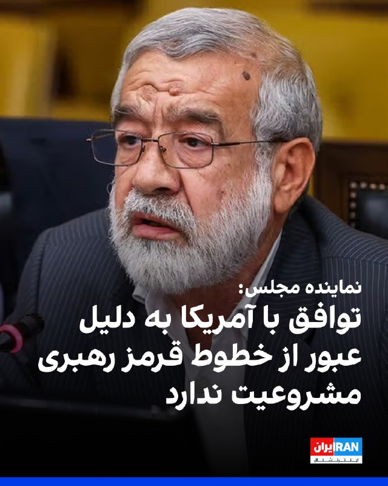

کامران غضنفری، نماینده مجلس جمهوری اسلامی، در پیامی با عنوان «هشدار به تیم مذاکره‌کننده» اعلام کرد مقام‌های جمهوری اسلامی در مذاکرات از «خطوط قرمز» رهبر جمهوری اسلامی عبور کرده‌اند و به همین دلیل هرگونه توافقی با آمریکا فاقد مشروعیت است و قابلیت اجرا نخواهد داشت.

او افزود آمریکا در طول دو ماه مذاکرات، جمهوری اسلامی و برخی اعضای تیم مذاکره‌کننده را بارها تهدید کرده است و به همین دلیل هر توافقی که در این شرایط حاصل شود، از نظر حقوق بین‌الملل فاقد اعتبار خواهد بود.
‌🏁 🇬🇧 IranintlTV

🤖 @VahidOOnLine

## IranIntlTV — post 342157

  <a href="telegram/content/IranIntlTV_342157_1781390599.mp4" target="_blank">🎬 Download video</a>

عرفان قانعی‌فرد، تحلیل‌گر خاورمیانه، درباره حمله حامیان جمهوری اسلامی به مذاکره‌کنندگان با آمریکا، گفت: «آشکار شدن این تناقض اتفاق مثبتی است. البته آنچه امروز شاهدش هستیم بیش از آنکه یک اختلاف واقعی باشد، یک نمایش سیاسی است.»

او افزود: «چه عراقچی و چه قالیباف بدون هماهنگی با راس هرم قدرت، سپاه و نهادهای تصمیم‌گیر، با آمریکا مذاکره و توافق نمی‌کنند.»
@iranintltv

## IranIntlTV — post 342156

  <a href="telegram/content/IranIntlTV_342156_1781390601.mp4" target="_blank">🎬 Download video</a>

بیست‌وسومین برنامه اعتراضی ایرانیان مقیم منطقه پایتخت در آمریکا در روزهایی برگزار می‌شود که یک یادداشت تفاهم میان جمهوری اسلامی و آمریکا در حال امضا شدن است.

معترضان در خیابان‌های واشینگتن هر هفته از زندانیان سیاسی، زندانیان در معرض اعدام و کشته‌شدگان قیام دی‌ماه یاد می‌کنند و تلاش دارند توجه افکار عمومی جهان را به ایران و مردمی که در رنج و انتظار زندگی می‌کنند، جلب کنند.
@iranintltv

## IranIntlTV — post 342155

  

کامران غضنفری، نماینده مجلس جمهوری اسلامی، در پیامی با عنوان «هشدار به تیم مذاکره‌کننده» اعلام کرد مقام‌های جمهوری اسلامی در مذاکرات از «خطوط قرمز» رهبر جمهوری اسلامی عبور کرده‌اند و به همین دلیل هرگونه توافقی با آمریکا فاقد مشروعیت است و قابلیت اجرا نخواهد داشت.

او افزود آمریکا در طول دو ماه مذاکرات، جمهوری اسلامی و برخی اعضای تیم مذاکره‌کننده را بارها تهدید کرده است و به همین دلیل هر توافقی که در این شرایط حاصل شود، از نظر حقوق بین‌الملل فاقد اعتبار خواهد بود.
https://iranintl.com/202606136781

---
📅 بروزرسانی: 1405/03/24 02:03
---

## VahidOOnLine — post 245373

  

یائیر لاپید، نخست‌وزیر سابق و رهبر اپوزیسیون در اسرائیل، در شبکه اجتماعی ایکس نوشت یادداشت تفاهم احتمالی بین آمریکا و ایران، یک شکست استراتژیک برای بنیامین نتانیاهو، نخست‌وزیر اسرائیل، خواهد بود.

او افزود که حکومت ایران همچنان در قدرت است، برنامه موشکی آن دست نخورده باقی مانده و تهران توانایی بازسازی برنامه هسته‌ای خود را حفظ کرده است.

لاپید اضافه کرد یادداشت تفاهم احتمالی هیچ‌یک از اهداف جنگی اسرائیل را محقق نمی‌کند؛ رژیم پابرجا می‌ماند، برنامه موشکی‌اش دست نخورده باقی می‌ماند و تهران قادر به بازسازی برنامه هسته‌ای خود خواهد بود.

او نوشت: «این یک شکست کامل از سوی نتانیاهو است و در این مسیر ، ما را به یک کشور دست‌نشانده تبدیل می‌کند که در مورد امنیت ملی خود دستورالعمل دریافت می‌کند. هیچ کنفرانس مطبوعاتی، هیچ چرخش رسانه‌ای و هیچ ویدیوی هوش مصنوعی این شکست را پنهان نخواهد کرد. »

لاپید همچنین نوشتک «دولت بعدی نقشی تاریخی خواهد داشت: ترمیم آسیب‌های ناشی از ناتوانی نتانیاهو در تبدیل دستاوردهای نظامی به موفقیت‌های استراتژیک.»
‌🏁 🇬🇧 IranintlTV

🤖 @VahidOOnLine

## VahidOOnLine — post 245372

  <a href="telegram/content/VahidOOnLine_245372_1781389991.mp4" target="_blank">🎬 Download video</a>

♦️خبرگزاری فرانسه به نقل از پلیس نروژ روز شنبه گزارش داد، یک گوزن بزرگ شمالی (موس) که با ورود به مرکز شهر اسلو و پرسه زدن در خیابان‌ها موجب جلب توجه و تجمع مردم شده بود، به ضرب گلوله نیروهای امدادی کشته شد. ویدئوهای منتشرشده توسط شهروندان نشان می‌دهد که این حیوان سرگردان و هراسان، با سرعت در میان خودروها و عابران پیاده در پایتخت نروژ می‌دود و تلاش می‌کند راه خود را پیدا کند. این دومین حادثه مشابه در دو روز گذشته در شبه‌جزیره اسکاندیناوی است؛ چرا که تنها یک روز پیش از این اتفاق، گوزن جوان دیگری نیز پس از ورود به خیابان‌های شلوغ استکهلم در سوئد، توسط نیروهای کنترل حیات وحش از پا درآمده بود.
‌🇸🇦 Indypersian

🤖 @VahidOOnLine

## pm_afshaa — post 93835

  <a href="telegram/content/pm_afshaa_93835_1781389993.mp4" target="_blank">🎬 Download video</a>

🔴یه آخوند تو صداوسیما:
تمام امامان اهل مذاکره بودن و با دشمن‌شون گفت‌وگو میکردن.

💧 Rainbet.com the #1 Non-KYC Crypto Casino & Sportsbook @rainbetcom

😁 @Pm_Afshaa

## IranIntlTV — post 342154

  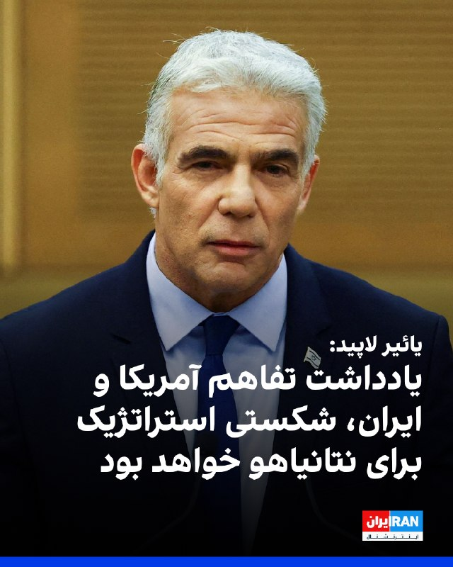

یائیر لاپید، نخست‌وزیر سابق و رهبر اپوزیسیون در اسرائیل، در شبکه اجتماعی ایکس نوشت یادداشت تفاهم احتمالی بین آمریکا و ایران، یک شکست استراتژیک برای بنیامین نتانیاهو، نخست‌وزیر اسرائیل، خواهد بود.

او افزود که حکومت ایران همچنان در قدرت است، برنامه موشکی آن دست نخورده باقی مانده و تهران توانایی بازسازی برنامه هسته‌ای خود را حفظ کرده است.

لاپید اضافه کرد یادداشت تفاهم احتمالی هیچ‌یک از اهداف جنگی اسرائیل را محقق نمی‌کند؛ رژیم پابرجا می‌ماند، برنامه موشکی‌اش دست نخورده باقی می‌ماند و تهران قادر به بازسازی برنامه هسته‌ای خود خواهد بود.

او نوشت: «این یک شکست کامل از سوی نتانیاهو است و در این مسیر ، ما را به یک کشور دست‌نشانده تبدیل می‌کند که در مورد امنیت ملی خود دستورالعمل دریافت می‌کند. هیچ کنفرانس مطبوعاتی، هیچ چرخش رسانه‌ای و هیچ ویدیوی هوش مصنوعی این شکست را پنهان نخواهد کرد. »

لاپید همچنین نوشتک «دولت بعدی نقشی تاریخی خواهد داشت: ترمیم آسیب‌های ناشی از ناتوانی نتانیاهو در تبدیل دستاوردهای نظامی به موفقیت‌های استراتژیک.»
https://iranintl.com/202606134603

## Persian_Trend_Official — post 16991

⭕️لینک اصلاح شد فایل صوتی لایو امشب در اسپاتیفای https://open.spotify.com/episode/6qRMBiClAcUKBWbbm1reAX

## Dirty_Kids — post 391969

  <a href="telegram/content/Dirty_Kids_391969_1781389994.mp4" target="_blank">🎬 Download video</a>

وسط خشتک دریدن عرزشی‌ها یادآوری کنم برزیل الان بازی داره 🤭🇧🇷

@Dirty_Kids 👻

## alonews — post 127765

  <a href="telegram/content/alonews_127765_1781389996.webm" target="_blank">🎬 Download video</a>

👈امشب تولد‌ ۸۰ سالگی پرزیدنت ترامپه

✅ @AloNews خبر جنگ

---
📅 بروزرسانی: 1405/03/24 01:53
---

## BBCPersian — post 283741

🔻لبنان: اسرائیل چندین نقطه در جنوب را هدف قرار داد

لبنان می‌گوید که اسرائیل امروز چندین نقطه در جنوب آن کشور را هدف حملات هوایی قرار داده است. این حملات پس از آن صورت گرفت که ارتش اسرائیل برای شهر نبطیه و بیش از ۲۰ منطقه دیگر در جنوب لبنان هشدار تخلیه صادر کرد.

خبرگزاری رسمی لبنان گزارش داد که حملات هوایی اسرائیل چندین منطقه، به‌ویژه اطراف شهر نبطیه را هدف قرار داده است.

یک عکاس خبرگزاری فرانسه در منطقه نبطیه از شنیده شدن صدای چند انفجار در اطراف کفررمان و برخاستن دود از منطقه کفرتبنیت خبر داد.

ارتش لبنان نیز اعلام کرد که یکی از نیروهایش در حمله یک پهپاد اسرائیلی در جاده میان کفررمان و نبطیه به شدت زخمی شده است.

خبرگزاری رسمی لبنان همچنین گزارش داد که در حمله‌ دیگری، یک مقام محلی در منطقه ریحان در جنوب لبنان کشته شده است.

این تحولات در حالی است که آمریکا و ایران از نزدیک شدن به توافقی برای پایان جنگ خبر داده‌اند؛ توافقی که به گفته مقام‌های دو طرف می‌تواند لبنان را نیز در بر گیرد.
@BBCPersian

## BBCPersian — post 283740

  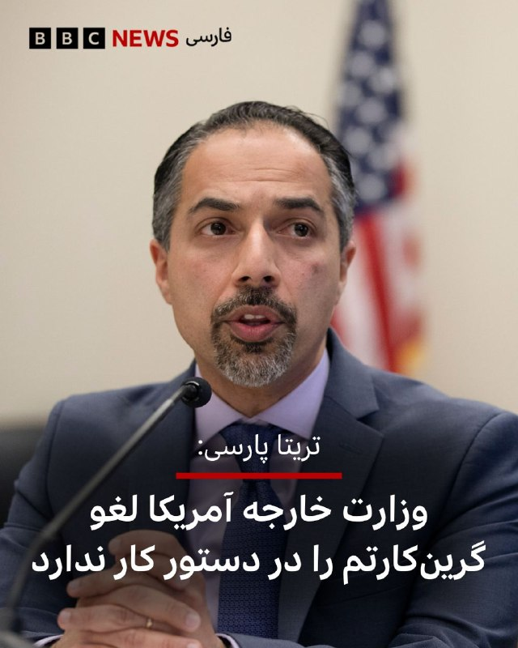

‌🔻تریتا پارسی، تحلیلگر و پژوهشگر مسائل ایران و آمریکا، مدعی شده است که وزارت خارجه آمریکا در حال حاضر «برنامه‌ای برای لغو گرین‌کارتش ندارد» و همچنین آن وزارتخانه هرگونه تحقیق یا بررسی درباره او را «تایید نکرده است.»

اشاره آقای پارسی در شبکه اجتماعی ایکس به گزارشی در نشریه «فری پرس» است که مدعی شده بود وزارت خارجه آمریکا در حال بررسی فعالیت‌های او به دلیل تلاش برای «تضعیف آمریکا» است.

آقای پارسی که از منتقدان سیاست‌های تقابلی آمریکا در قبال ایران به شمار می‌رود، در ادامه مدعی شد که گزارش منتشرشده بخشی از تلاش منتقدانش برای بی‌اعتبار کردن و تحت فشار قرار دادن او بوده است.

او گفت که طی بیش از ۲۵ سال گذشته، مخالفانش بارها کوشیده‌اند او را ساکت کنند، اعتبارش را زیر سؤال ببرند، بدنامش کنند و از صحنه عمومی کنار بزنند.
📷Tasos Katopodis via Getty
@BBCPersian

## Dirty_Kids — post 391968

  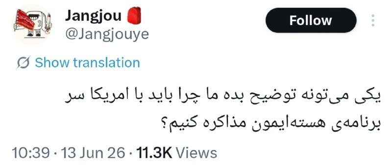

این چه سوالیه لعنتی؟ خوب معلومه، چون پیروز شدین :))

@Dirty_Kids 👻

## Dirty_Kids — post 391967

  <a href="telegram/content/Dirty_Kids_391967_1781389405.mp4" target="_blank">🎬 Download video</a>

🔴 صداوسیما خیلی یهویی تغییر موضع داد؛ یه آخوند: خدا شاهده همه اماما اهل مذاکره بودن و با دشمن‌شون گفتگو میکردن.

@Dirty_Kids 👻

## Dirty_Kids — post 391966

  <a href="telegram/content/Dirty_Kids_391966_1781389406.mp4" target="_blank">🎬 Download video</a>

🔴 محسن رضایی: باید طرفداران خودمان را هم با تیر بزنیم تا آمریکا بفهمد ما با خودمان هم شوخی نداریم، چه برسد به دشمن.

@Dirty_Kids 👻

## alonews — post 127764

  <a href="telegram/content/alonews_127764_1781389408.mp4" target="_blank">🎬 Download video</a>

👈کارشناس صدا و سیما: خدا شاهده همه اماما اهل مذاکره بودن و با دشمن‌شون گفتگو میکردن.

✅ @AloNews خبر جنگ

---
📅 بروزرسانی: 1405/03/24 01:43
---

## VahidOOnLine — post 245371

  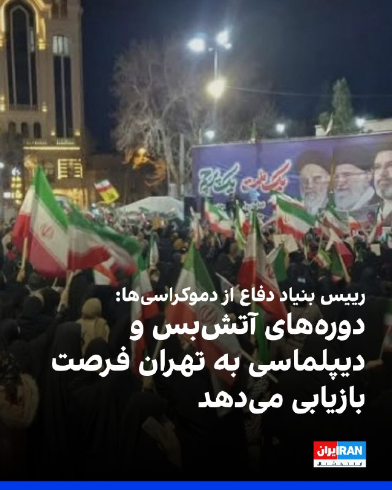

مارک دوبوویتز، مدیرکل بنیاد دفاع از دموکراسی‌ها، در پیامی در شبکه اجتماعی ایکس نوشت دوره‌های آتش‌بس و دیپلماسی به جمهوری اسلامی فرصت داده است تا بخشی از خسارت‌های واردشده در جریان درگیری‌های اخیر را جبران کند.

او با اشاره به دو دوره درگیری ۳۸ روزه و ۱۲ روزه گفت این جنگ‌ها خسارت‌های سنگینی به برنامه هسته‌ای، زرادخانه موشکی، سامانه‌های دفاعی، اقتصاد، رهبری و شبکه‌های تروریستی جمهوری اسلامی وارد کرده‌اند.

دوبوویتز افزود پس از این درگیری‌ها، سه ماه آتش‌بس برقرار شد؛ دوره‌ای که به گفته او اگرچه فشار اقتصادی بر جمهوری اسلامی را افزایش داد، اما همزمان زمان ارزشمندی در اختیار حکومت قرار داد تا توان خود را بازیابی و بازسازی کند و از تنگه هرمز و حزب‌الله بهره‌برداری کند.
‌🏁 🇬🇧 IranintlTV

🤖 @VahidOOnLine

## WithYashar — post 14758

دوبار تنگه دعوا شده ! 🚨🤣
@withyashar

## WithYashar — post 14757

قشم صدای انفجار‌ 🚨 احتمالا از سمت تنگه
@withyashar

## IranIntlTV — post 342153

  

مارک دوبوویتز، مدیرکل بنیاد دفاع از دموکراسی‌ها، در پیامی در شبکه اجتماعی ایکس نوشت دوره‌های آتش‌بس و دیپلماسی به جمهوری اسلامی فرصت داده است تا بخشی از خسارت‌های واردشده در جریان درگیری‌های اخیر را جبران کند.

او با اشاره به دو دوره درگیری ۳۸ روزه و ۱۲ روزه گفت این جنگ‌ها خسارت‌های سنگینی به برنامه هسته‌ای، زرادخانه موشکی، سامانه‌های دفاعی، اقتصاد، رهبری و شبکه‌های تروریستی جمهوری اسلامی وارد کرده‌اند.

دوبوویتز افزود پس از این درگیری‌ها، سه ماه آتش‌بس برقرار شد؛ دوره‌ای که به گفته او اگرچه فشار اقتصادی بر جمهوری اسلامی را افزایش داد، اما همزمان زمان ارزشمندی در اختیار حکومت قرار داد تا توان خود را بازیابی و بازسازی کند و از تنگه هرمز و حزب‌الله بهره‌برداری کند.
https://iranintl.com/202606138772

## FarsiVOA — post 220624

⚡️دور کردن گروه‌های مسلح وابسته به جمهوری اسلامی از مرزهای عراق برای اطمینان‌بخشی به کشورهای همسایه
@FarsiVOA

## IranianMinds — post 22516

🔴کیان عبداللهی ، سردبیر خبرگزاری تسنیم در گفت‌و‌گو با صدا‌و‌سیما:

احتمال توافق نهایی بسیار ضعیف است، باید برای حمله ناگهانی آماده بود.

@IranianMinds

## IranianMinds — post 22515

  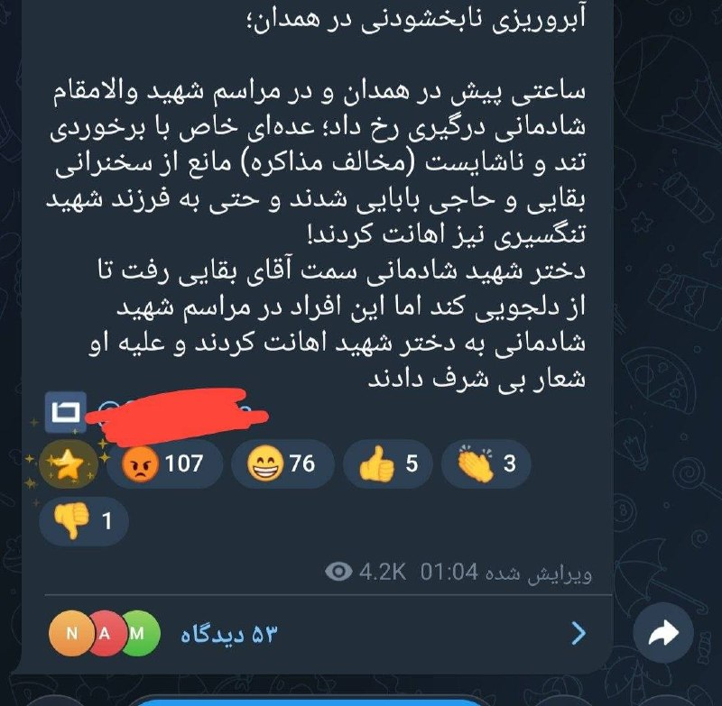

درگیری شدید شده و‌ دارن به شادمانی و تنگسیری هم‌ توهین میکنن

واقعا که اتیش بزنید همه چیو نابود کنید چه وضعشه

@IranianMinds

## IranianMinds — post 22514

دوستان خواهش میکنم به همه بگید، بله، روبیکا، ایتا دوست و فامیل انقلابی به همه

همه به صورت #کفن_پوش برای دفاع از خطوط قرمز رهبری
با پلاکارت های هیهات من الذله
و مثلی لا یبایع مثل یزید

فرمان رهبری برای تلاش مضاعف مجلس روی زمین مانده، همگی درخواست تشکیل مجلس و‌تصویب شروط ده‌گانه رهبری را داریم

#نشرحداکثری
#مردم_مبعوث_شده

## IranianMinds — post 22513

## IranianMinds — post 22512

  <a href="telegram/content/IranianMinds_22512_1781388800.mp4" target="_blank">🎬 Download video</a>

🔴 صحبت‌های دیشب عراقچی که ایدئولوژی جمهوری اسلامی و آرمان‌های عمام رو زیر سوال برد:

اشتباه نکنید؛ مذاکرات من منجر به جنگ نشد، این مقاومت بود که منجر به جنگ شد.

@IranianMinds

---
📅 بروزرسانی: 1405/03/24 01:33
---

## pm_afshaa — post 93834

  <a href="telegram/content/pm_afshaa_93834_1781388201.webm" target="_blank">🎬 Download video</a>

🔴رسانه‌ سپاه: آبروریزی در همدان!

امشب تو همدان و در مراسم علی شادمانی درگیری رخ داد و عده‌ای از مخالفان مذاکره مانع از سخنرانی بقایی و حاجی بابایی شدن و حتی به فرزند شهید تنگسیری اهانت کردن. دختر علی شادمانی برای دلجویی میره سمت بقایی، اما مردمِ مخالف مذاکره به دختر شهید هم توهین کردن و بی‌شرف خطابش کردن.

💧 Rainbet.com the #1 Non-KYC Crypto Casino & Sportsbook @rainbetcom

😁 @Pm_Afshaa

## pm_afshaa — post 93833

صحبت‌های یکی از لیدر‌ های اغتشاشات : 
💧 Rainbet.com the #1 Non-KYC Crypto Casino & Sportsbook @rainbetcom 
😁 @Pm_Afshaa

## IranIntlTV — post 342152

  <a href="telegram/content/IranIntlTV_342152_1781388202.mp4" target="_blank">🎬 Download video</a>

دونالد ترامپ گفت یادداشت تفاهم با جمهوری اسلامی روز یکشنبه امضا و بلافاصله پس از آن تنگه هرمز باز خواهد شد.

هم‌زمان، یک منبع ارشد دیپلماتیک اسرائیلی به اسرائیل هیوم گفت در صورت توافق آمریکا و جمهوری اسلامی برای پایان جنگ، اسرائیل ملزم به امضای این توافق نیست.

گزارش امیر گیتی، عضو تحریریه ایران‌اینترنشنال
@iranintltv

## FarsiVOA — post 220623

  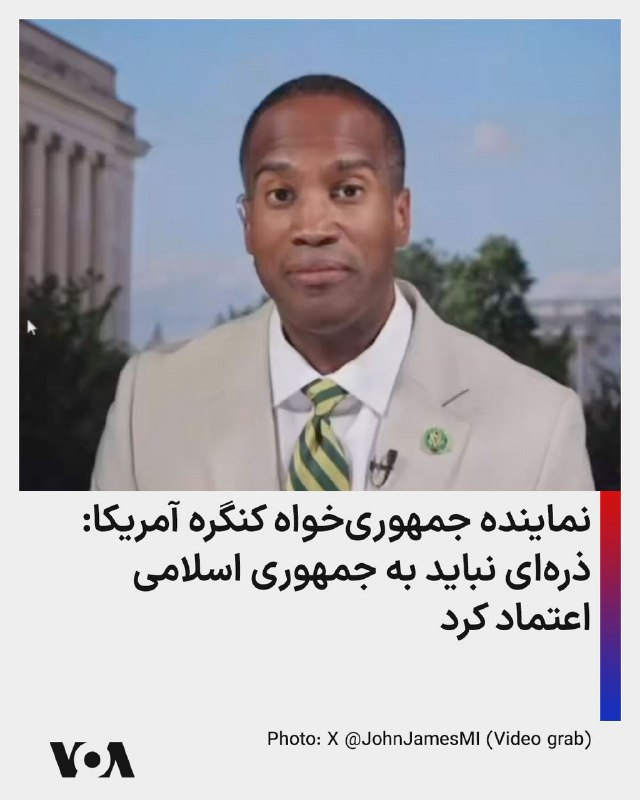

⚡️جان جیمز، یک نماینده جمهوری‌خواه مجلس نمایندگان آمریکا از ایالت میشیگان، به فاکس‌نیوز گفت به جمهوری اسلامی «ذره‌ای نباید اعتماد کرد.» این نماینده به فاکس‌نیوز گفت وقتی دشمنان آمریکا «شعار مرگ بر آمریکا سر می‌دهند، باید حرفشان را باور کنیم.» او افزود که در مورد تلاش‌های ایالات متحده برای امضای یک توافق با جمهوری اسلامی، به رئیس‌جمهوری آمریکا، دونالد ترامپ، اطمینان دارد. جان جیمز گفت دونالد ترامپ مردی است که خاورمیانه را بازآرایی می‌کند.
@FarsiVOA

## IranianMinds — post 22508

⭕️ فوری : به دلیل اغتشاشات اخیر اینترنت ایران جهانی شد

@IranianMinds

## BBCPersian — post 283739

🔻از تهران تا تل‌آویو؛ آنچه در ۱۲ روز جنگ اسرائیل و ایران گذشت

حملات اسرائیل به ایران و پاسخ‌های تلافی‌جویانه ایران به اسرائیل، ۱۲ روز به طول انجامید. در نهایت با دخالت آمریکا و حمله این کشور به تاسیسات هسته‌ای ‌ایران، طرف‌های درگیر با آتش‌بس موافقت کردند.

در این مدت، تاسیسات هسته‌ای، پایگاه‌ها و ادوات نظامی، و مراکز دولتی متعددی در شهرهای مختلف ایران هدف بمباران قرار گرفته و ده‌ها چهره‌ ارشد نظامی و دانشمند هسته‌ای کشته شده‌اند.

ایران نیز در پاسخ، صدها موشک به سوی اهدافی در اسرائیل شلیک کرده است؛ موشک‌هایی که سیستم‌های دفاعی اسرائیل نتوانسته همه آن‌ها را رهگیری کند و خسارت‌های سنگینی به بار آورده‌اند.

گزارش‌های رسمی دو طرف از کشته و زخمی شدن غیرنظامیان ایرانی و اسرائیلی خبر می‌دهد.

در این گاهشمار، مهم‌ترین حملات نظامی و رویدادهای سیاسی این ۱۲ روز مرور شده است.
ادامه از:
https://bbc.in/4v90zKd
@BBCPersian

## Dirty_Kids — post 391965

🔴 صابرین نیوز: آبروریزی توی همدان!

چند ساعت پیش توی همدان و در مراسم علی شادمانی درگیری رخ داد.
عده ای اغتشاشگر که مخالف مذاکره بودن مانع از سخنرانی بقایی و حاجی بابایی شدن و حتی به فرزند شهید تنگسیری فحش دادن.
دختر علی شادمانی برای دلجویی میره سمت بقایی، اما مردمِ مخالف مذاکره به دختر شهیدم فحش دادن و شعار، بی‌شرف علیهش سر دادن😂

@Dirty_Kids 👻

## alonews — post 127763

  <a href="telegram/content/alonews_127763_1781388204.webm" target="_blank">🎬 Download video</a>

👈رائفی پور: میتونیم رمز ارز به نام علی خامنه‌ای بسازیم تا همه بخرن

✅ @AloNews خبر جنگ

## alonews — post 127762

  <a href="telegram/content/alonews_127762_1781388204.webm" target="_blank">🎬 Download video</a>

👈آبروریزی تندروها در همدان

🔴صابرین: ساعتی پیش در همدان و در مراسم شهید شادمانی درگیری رخ داد؛ عده‌ای خاص با برخوردی تند و ناشایست (مخالف مذاکره) مانع از سخنرانی بقایی و حاجی بابایی شدند و حتی به فرزند شهید تنگسیری نیز اهانت کردند!

🔴دختر شهید شادمانی سمت آقای بقایی رفت تا از دلجویی کند اما این افراد در مراسم شهید شادمانی به دختر شهید اهانت کردند و علیه او شعار بی شرف دادند

✅ @AloNews خبر جنگ

---
📅 بروزرسانی: 1405/03/24 01:22
---

## VahidOOnLine — post 245370

♦️براساس تصاویر منتشر شده در شبکه‌های اجتماعی، شنبه‌شب، گروهی از حامیان جمهوری اسلامی، در آستانه امضای توافق میان تهران و واشنگتن، با متهم کردن محمدباقر قالیباف، رییس مجلس شورای اسلامی و عباس عراقچی، وزیر امور خارجه، به دادن «امتیازهای بیش از حد به آمریکا» در مذاکرات، خواستار استعفای آنها شدند. حامیان حکومت شعار «قالیباف، عراقچی، پس خون رهبرم چی؟» و «مرگ بر سازش‌گر» سر دادند.
پیش از این، دونالد ترامپ، رئیس‌جمهوری آمریکا، با انتشار پیامی در شبکه اجتماعی «تروث سوشال»، از امضای توافق میان واشنگتن و تهران در روز یکشنبه، ۲۴ خرداد خبر داد.
‌🇸🇦 Indypersian

🤖 @VahidOOnLine

## pm_afshaa — post 93832

  <a href="telegram/content/pm_afshaa_93832_1781387575.mp4" target="_blank">🎬 Download video</a>

صحبت‌های یکی از لیدر‌ های اغتشاشات :

💧 Rainbet.com the #1 Non-KYC Crypto Casino & Sportsbook @rainbetcom

😁 @Pm_Afshaa

## IranIntlTV — post 342149

🔻کریستیانو رونالدو، فوق‌ستاره تمام‌نشدنی دنیای فوتبال، در حالی در ۴۱ سالگی به همراه تیم ملی پرتغال راهی آمریکا شده که آخرین شانس خود برای جادوانه‌تر شدن در دنیای فوتبال با قهرمانی در جام جهانی را پیش رو دارد.

🔹برترین گلزن تاریخ بازی‌های ملی امیدوار است با ترکیب کم‌نظیر سلسائو اروپا، پس از پنج قهرمانی در چمپیونزلیگ و پنج بار کسب توپ طلا و ثبت رکوردهای دست‌نیافتنی پرشمار، در ششمین تجربه خود در جام جهانی، سرانجام مهم‌ترین کاپ طلایی‌رنگ دنیای ورزش را لمس کند.

🔹۷۲ درصد از مخاطبین در نظرسنجی ایران اینترنشنال ورزشی پیش‌بینی کرده‌اند که فوق‌ستاره پرتغالی جام قهرمانی را روی سر خواهد برد.

@iranintltvsport

## IranianMinds — post 22507

🔴 ثابتی : بزودی سیک عراقچی رو میزنیم

@IranianMinds

## IranianMinds — post 22506

🚩 ما همه خون‌خواه رهبر شهیدمان ایم فردا ساعت 22:00 در خیابان های اصلی تمام کشور

## IranianMinds — post 22505

🚩 ما همه خون‌خواه رهبر شهیدمان ایم

فردا ساعت 22:00 در خیابان های اصلی تمام کشور

## BBCPersian — post 283738

🔻روز شنبه ۱۳ ژوئن/ ۲۳ خرداد، جمعیت زیادی در مرکز لندن برای مراسم تولد رسمی چارلز سوم، پادشاه بریتانیا جمع شدند.

این رژه یکی از بزرگترین نمایش‌های سلطنتی و نظامی سال است که با پرواز نمایشی گروه «فلش‌های سرخ» به اوج خود رسید و پادشاه به همراه خانواده سلطنتی از بالکن کاخ باکینگهام آن را نظاره کردند.

در کنار پادشاه و ملکه کامیلا، شاهزاده و شاهدخت ولز به همراه فرزندانشان حضور داشتند.

لحظه حضور در بالکن، یادآور تداوم سلطنتی بود، جایی که پادشاه فعلی در کنار دو پادشاه آینده، شاهزاده ویلیام و شاهزاده جورج، ایستاد.

در یک روز آفتابی، پادشاه و ملکه با کالسکه‌ای روباز سفر کردند و از میان هزاران نفری عبور کردند که در مسیر کاخ باکینگهام به سمت میدانگاه ویژه رژه گارد سواره نظام صف کشیده بودند.

پادشاه یونیفرم گارد گرنادیر را که دارای نشان ملکه الیزابت دوم است، به تن داشت. بر سینه او همچنین ۱۰ مدال از جمله مدال تاجگذاری ملکه الیزابت دوم (۱۹۵۳) و مدال هفتادمین سال تاجگذاری (۲۰۲۲) دیده می‌شد.

پس از رژه، پادشاه با ادای احترام سلطنتی و شلیک ۴۱ توپ توسط توپخانه سواره نظام سلطنتی پادشاه مورد استقبال قرار گرفت.
@BBCPersian

## Dirty_Kids — post 391964

  <a href="telegram/content/Dirty_Kids_391964_1781387577.mp4" target="_blank">🎬 Download video</a>

یه ویدیو دیگه از شعار امروز اغتشاشگرا: "اگر چیزی امضا شه، مسئول باید کشته شه"😂😂😂

@Dirty_Kids 👻

## Dirty_Kids — post 391963

  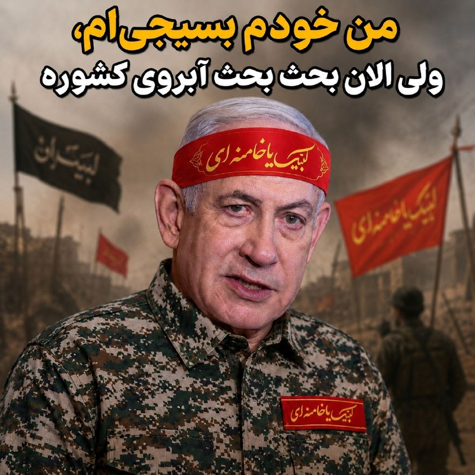

من خودم بسیجیم، ولی بحث بحثِ آبروی کشوره.

@Dirty_Kids 👻

## Dirty_Kids — post 391962

  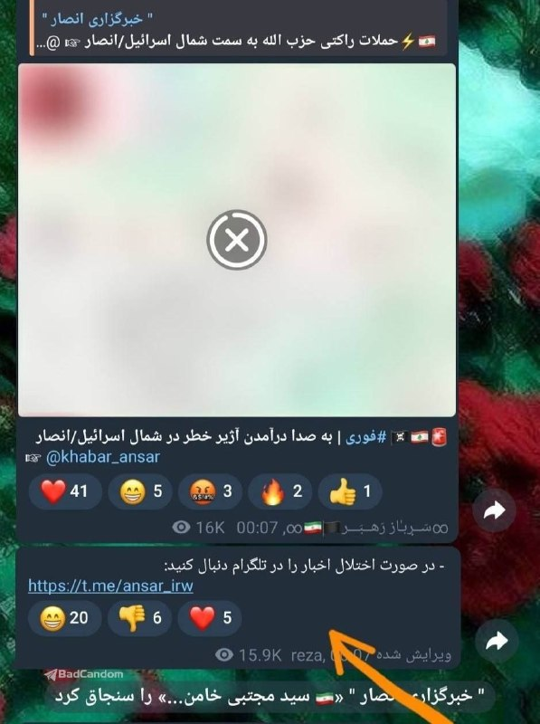

🔴 توی روبیکا دارن پست میزنن که اگه قطع شدیم، مارو از تلگرام دنبال کنین 🤣🤣

@Dirty_Kids 👻

## Dirty_Kids — post 391961

زنای عرزشی چه شعارهایی میدن ؛

قالیباف عراقچی
این همه مفت دادم چی ؟🥺

@Dirty_Kids 👻

## alonews — post 127761

  <a href="telegram/content/alonews_127761_1781387580.webm" target="_blank">🎬 Download video</a>

👈طبق گزارش‌ها حدود ۱۰ فروند ترابری c17 از کشورهای منطقه بارگیری کردند و عازم اروپا شدند

✅ @AloNews خبر جنگ

---
📅 بروزرسانی: 1405/03/24 01:12
---

## VahidOOnLine — post 245369

  

یائیر لاپید، نخست‌وزیر سابق و رهبر اپوزیسیون در اسرائیل، در شبکه اجتماعی ایکس نوشت توافق احتمالی بین آمریکا و ایران، یک شکست استراتژیک برای بنیامین نتانیاهو، نخست‌وزیر اسرائیل، خواهد بود.

او افزود که حکومت ایران همچنان در قدرت است، برنامه موشکی آن دست نخورده باقی مانده و تهران توانایی بازسازی برنامه هسته‌ای خود را حفظ کرده است.

لاپید اضافه کرد توافق احتمالی هیچ‌یک از اهداف جنگی اسرائیل را محقق نمی‌کند؛ رژیم پابرجا می‌ماند، برنامه موشکی‌اش دست نخورده باقی می‌ماند و تهران قادر به بازسازی برنامه هسته‌ای خود خواهد بود.

او نوشت: «این یک شکست کامل از سوی نتانیاهو است و در این مسیر ، ما را به یک کشور دست‌نشانده تبدیل می‌کند که در مورد امنیت ملی خود دستورالعمل دریافت می‌کند. هیچ کنفرانس مطبوعاتی، هیچ چرخش رسانه‌ای و هیچ ویدیوی هوش مصنوعی این شکست را پنهان نخواهد کرد. »

لاپید همچنین نوشتک «دولت بعدی نقشی تاریخی خواهد داشت: ترمیم آسیب‌های ناشی از ناتوانی نتانیاهو در تبدیل دستاوردهای نظامی به موفقیت‌های استراتژیک.»
‌🏁 🇬🇧 IranintlTV

🤖 @VahidOOnLine

## VahidOOnLine — post 245368

  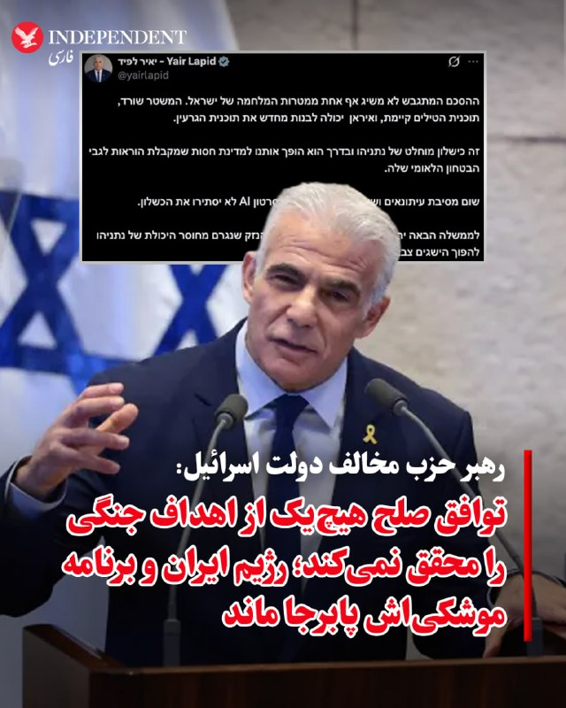

♦️یائیر لاپید، رهبر حزب مخالف دولت اسرائیل، روز شنبه در آستانه امضای توافق میان واشنگتن و تهران، با انتشار پیامی در اکس نوشت: «توافقی که در حال شکل‌گیری است، هیچ‌یک از اهداف جنگی اسرائیل را محقق نمی‌کند. رژیم ایران پابرجا مانده، برنامه موشکی آن سر جای خود است و این کشور می‌تواند برنامه هسته‌ای خود را بازسازی کند.» لاپید با حمله شدید به نخست‌وزیر اسرائیل افزود: «این یک شکست مطلق برای نتانیاهو است که در این مسیر، ما را به کشوری تبدیل کرده که درباره امنیت ملی خود دستورالعمل دریافت می‌کند. هیچ نشست مطبوعاتی، موج‌سواری رسانه‌ای یا ویدئوی ساخته‌شده با هوش مصنوعی نخواهد توانست این شکست را پنهان کند. دولت بعدی وظیفه‌ای تاریخی خواهد داشت تا آسیب‌های ناشی از ناتوانی نتانیاهو در تبدیل دستاوردهای نظامی به موفقیت‌های راهبردی را ترمیم کند.»
‌🇸🇦 Indypersian

🤖 @VahidOOnLine

## IranIntlTV — post 342148

  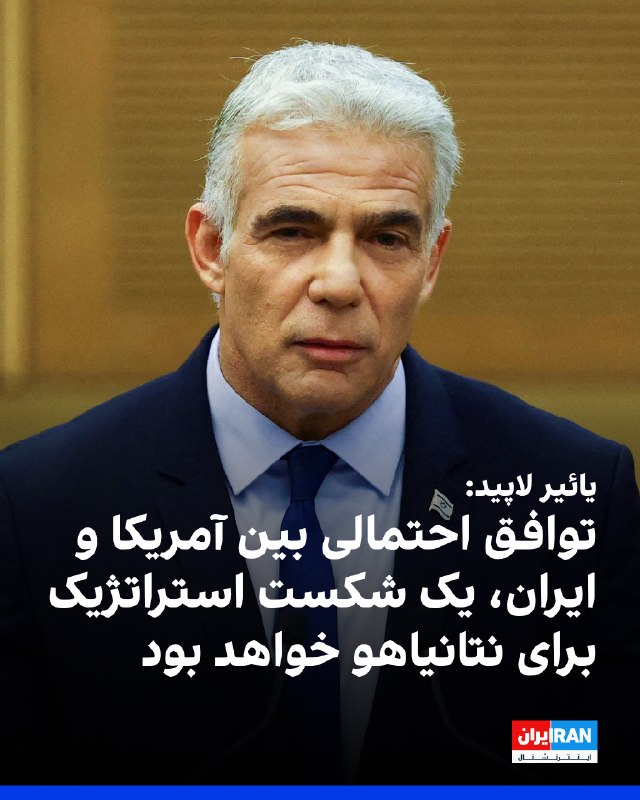

یائیر لاپید، نخست‌وزیر سابق و رهبر اپوزیسیون در اسرائیل، در شبکه اجتماعی ایکس نوشت توافق احتمالی بین آمریکا و ایران، یک شکست استراتژیک برای بنیامین نتانیاهو، نخست‌وزیر اسرائیل، خواهد بود.

او افزود که حکومت ایران همچنان در قدرت است، برنامه موشکی آن دست نخورده باقی مانده و تهران توانایی بازسازی برنامه هسته‌ای خود را حفظ کرده است.

لاپید اضافه کرد توافق احتمالی هیچ‌یک از اهداف جنگی اسرائیل را محقق نمی‌کند؛ رژیم پابرجا می‌ماند، برنامه موشکی‌اش دست نخورده باقی می‌ماند و تهران قادر به بازسازی برنامه هسته‌ای خود خواهد بود.

او نوشت: «این یک شکست کامل از سوی نتانیاهو است و در این مسیر ، ما را به یک کشور دست‌نشانده تبدیل می‌کند که در مورد امنیت ملی خود دستورالعمل دریافت می‌کند. هیچ کنفرانس مطبوعاتی، هیچ چرخش رسانه‌ای و هیچ ویدیوی هوش مصنوعی این شکست را پنهان نخواهد کرد. »

لاپید همچنین نوشتک «دولت بعدی نقشی تاریخی خواهد داشت: ترمیم آسیب‌های ناشی از ناتوانی نتانیاهو در تبدیل دستاوردهای نظامی به موفقیت‌های استراتژیک.»
https://iranintl.com/202606134603

## FarsiVOA — post 220622

  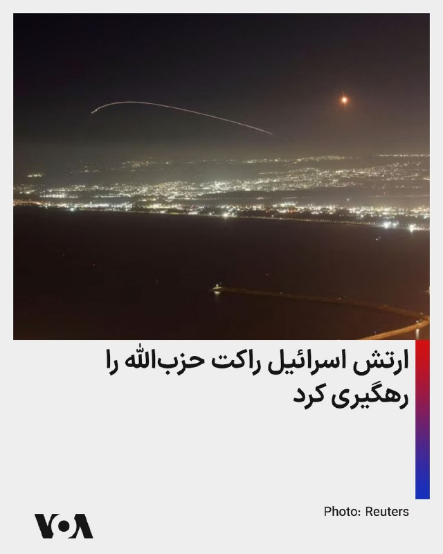

⚡️ارتش اسرائیل دقایقی قبل گفت یک راکت حزب‌الله را که به سمت سربازان در جنوب لبنان شلیک شده بود رهگیری کرد. تایمز اسرائيل گزارش داد در این حمله کسی زخمی نشد. شلیک این راکت باعث به‌صدا درآمدن آژیرهای خطر در منطقه مرزی متولا در شمال اسرائيل شد.
@FarsiVOA

## Persian_Trend_Official — post 16990

فایل صوتی لایو امشب در اسپاتیفای
https://open.spotify.com/episode/62Gu7tgUGaEvfn74RVrN1x

## IranianMinds — post 22504

تاکتیک جدید ژنرال

🔴 محسن رضایی: باید طرفداران خودمان را هم با تیر بزنیم تا آمریکا بفهمد ما با خودمان هم شوخی نداریم چه برسد به دشمن

@IranianMinds

## IranianMinds — post 22503

🔴 نبویان : با این توافق تخمی تنگه هرمز باز میشه و حتی کشتی‌های اسرائیلیم اجازه تردد دارن.

@IranianMinds

## IranianMinds — post 22502

🔴 رسانه های حکومتی :

ببینید، بزارید طبق دموکراسی جلو بریم
الان برانداز ها همشون مخالف مذاکرات هستن
ما عرزشی ها هم مخالف مذاکراتیم

پس اکثریت مذاکره رو نمیخوایم، پس توافق نکنید.

@IranianMinds

## Dirty_Kids — post 391960

  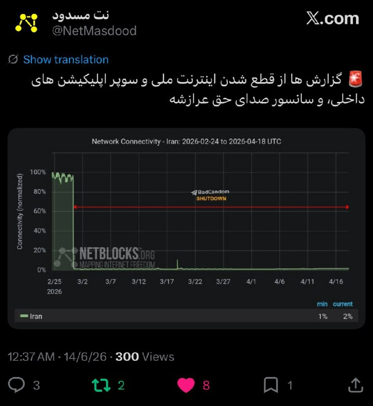

🔴 نت بلاکس: هم اکنون فقط ۱ درصد مردم ایران به اینترنت داخلی دسترسی دارن و صدای عرازشه داره سانسور میشه.

@Dirty_Kids 👻

## alonews — post 127760

  <a href="telegram/content/alonews_127760_1781386967.mp4" target="_blank">🎬 Download video</a>

👈صحبت‌های یکی از لیدرهای شلوغی‌ها

✅ @AloNews خبر جنگ

## alonews — post 127759

  <a href="telegram/content/alonews_127759_1781386970.webm" target="_blank">🎬 Download video</a>

👈فقط عباس میتونه جوری توافق کنه که:

جمهوری اسلامی ناراضی باشه
مخالف جمهوری اسلامی ناراضی باشه
اسرائیلی‌ها ناراضی باشن
آمریکایی‌ها ناراضی باشن

✅ @AloNews خبر جنگ

---
📅 بروزرسانی: 1405/03/24 01:03
---

## WithYashar — post 14756

عبداللهی، سردبیر خبرگزاری تسنیم:
احتمال توافق نهایی با آمریکا بسیار بسیار ضعیفه؛ باید برای حمله ناگهانی آماده بود.
@withyashar

## FoxNewsTwitter — post 342942

‌Fox News (Twitter/X)

👉 Full story here:

## FoxNewsTwitter — post 342941

  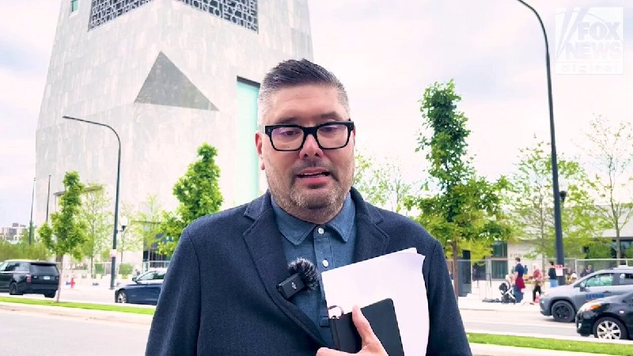

Fox News (Twitter/X)

TAXPAYER RISK: Obama Presidential Center's $470M endowment sits at just $1M as subcontractors claim they're owed millions days before grand opening.

The fund was promised as an insurance policy so Chicago taxpayers wouldn't get stuck covering future costs on the 99-year deal. Construction costs have ballooned from $330M to at least $850M.

The Obama Foundation says the center is 'fully funded' and plans to make 'significant investments' in the endowment in coming years — but critics say a promise to raise money later is not the same as having a funded backstop in place.

## pm_afshaa — post 93831

  <a href="telegram/content/pm_afshaa_93831_1781386390.webm" target="_blank">🎬 Download video</a>

🔴خبرگزاری انتخاب: طبق مشاهده‌ خبرنگارمون، جمعیت کسایی که تو مشهد تجمع کردن و مخالف مذاکرات هستن به 100 نفر هم نمیرسه ولی فقط سر و صدا دارن.

💧 Rainbet.com the #1 Non-KYC Crypto Casino & Sportsbook @rainbetcom

😁 @Pm_Afshaa

## pm_afshaa — post 93830

  <a href="telegram/content/pm_afshaa_93830_1781386390.mp4" target="_blank">🎬 Download video</a>

شعار امروز تجمعات :
اگر چیزی امضا شه، مسئول باید کشته شه.

💧 Rainbet.com the #1 Non-KYC Crypto Casino & Sportsbook @rainbetcom

😁 @Pm_Afshaa

## IranIntlTV — post 342147

  <a href="telegram/content/IranIntlTV_342147_1781386393.mp4" target="_blank">🎬 Download video</a>

در حاشیه تجمع اعتراضی ایرانیان در واشینگتن، سیامک آرام، برگزارکننده، به اردوان روزبه، خبرنگار ایران‌اینترنشنال، گفت: «مبارزه متوقف‌شدنی نیست. ایرانیان داخل کشور به شیوه خودشان مبارزه می‌کنند و ما در خارج از کشور نیز به شیوه خود تلاش می‌کنیم صدای آنها را بازتاب دهیم.»

او افزود: «هدف ما این است که این پیام و این مطالبه زنده بماند و توجه افکار عمومی جهان به آن جلب شود تا این مبارزه ادامه پیدا کند.»
@iranintltv

## IranianMinds — post 22501

  

تازه اداشو هم در آورد قبل از ترور کردنش...
بعد دارن باهاش توافق میکنن 😂😂

@IranianMinds

## IranianMinds — post 22500

این توافق خونیه، قالیباف خودش کونیه

## Dirty_Kids — post 391959

🔴 شعار برای اعتراضات، پارت ۲: ۱_ سبزی پلو تو دیسه / عراقچی یه کصلیسه‌. ۲_ نونو پنیر و انبه / عباس شده بی پرده. ۳_ باقالی پلو با گردن / سازشگرا رو کردن.

## Dirty_Kids — post 391958

  

تازه اداشو هم در آورد قبل از شَتَک کردنش...🤣🫢😂

بعد رفتن توافق کردن عرزشیا کوتاه نیایید

@Dirty_Kids 👻

## alonews — post 127758

  <a href="telegram/content/alonews_127758_1781386395.webm" target="_blank">🎬 Download video</a>

👈خروج تعدادی از هواپیماهای سوخت‌رسان آمریکایی از فرودگاه بن‌گوریون!

🔴تصاویر ثبت‌شده در روز شنبه نشان می‌دهد که شماری از هواپیماهای سوخت‌رسان آمریکایی پس از ماه‌ها حضور، فرودگاه بین‌المللی بن‌گوریون را ترک کرده‌اند.

🔴تنها تعداد اندکی از هواپیماهای سوخت‌رسان آمریکایی در محوطه فرودگاه باقی مانده‌اند.

✅ @AloNews خبر جنگ

## alonews — post 127757

  <a href="telegram/content/alonews_127757_1781386396.webm" target="_blank">🎬 Download video</a>

👈حسین طاهری مداح در میدان انقلاب: تندروهایی که امروز شلوغ‌کاری کردن هم ردیف طرفدارای پهلوی هستن که شلوغ کردن، باید مطیع رهبر بود

✅ @AloNews خبر جنگ

---
📅 بروزرسانی: 1405/03/24 00:53
---

## WithYashar — post 14755

پست جدید کلیک کنید کارای‌ اداریش رو انجام بدید😁✌🏾

https://www.instagram.com/reel/DZimqXCxxza/?igsh=Z3lhb2FhYWhlc2Yz

بسیجی‌ در ‌برابر سرکوبگر برنامه امشب خیابان های‌ تهران 🥴
استقبال زیاد باشه بازیشو میسازم 🤣

## IranIntlTV — post 342146

  <a href="telegram/content/IranIntlTV_342146_1781385780.mp4" target="_blank">🎬 Download video</a>

گروهی از حامیان تندروی جمهوری اسلامی در تجمع خود در شامگاه شنبه ۲۳ خرداد، با متهم کردن محمدباقر قالیباف، رییس مجلس، و عباس عراقچی، وزیر خارجه، به دادن امتیازهای بیش از حد به آمریکا در مذاکرات، خواستار کناره‌گیری آن‌ها شدند.
@iranintltv

## Persian_Trend_Official — post 16988

  <a href="telegram/content/Persian_Trend_Official_16988_1781385781.mp4" target="_blank">🎬 Download video</a>

نبویان: طبق متن توافق، همه چیز از دست جمهوری اسلامی خارج خواهد شد.

👺Phantom

📌 @persian_trend_official
پرشین ترند | متفاوت‌ترین کانال نظامی

## alonews — post 127756

  <a href="telegram/content/alonews_127756_1781385783.mp4" target="_blank">🎬 Download video</a>

👈شعار در تجمعات امروز: اگر چیزی امضا شه، مسئول باید کشته شه.

✅ @AloNews خبر جنگ

## alonews — post 127755

  <a href="telegram/content/alonews_127755_1781385784.webm" target="_blank">🎬 Download video</a>

👈بدون شرح از روبیکا

✅ @AloNews خبر جنگ

## alonews — post 127754

  <a href="telegram/content/alonews_127754_1781385784.webm" target="_blank">🎬 Download video</a>

👈پست یک کانال مطرح عبری در تلگرام در واکنش به تجمعات پرحاشیه امشب:
خشم بی‌سابقه‌ای در این ساعات خیابان‌های پایتخت ایران را فرا گرفته است. هزاران معترض حامی رژیم به درگیری‌های مستقیم با نیروهای امنیتی برخاسته‌اند

🔴وضعیت بحرانی – فریادهای مستقیم علیه رده‌های بالای حکومت:
معترضان در تهران سد ترس را می‌شکنند و خشم خود را مستقیماً به مقامات ارشد رژیم معطوف می‌کنند. فریادهای شدید توهین‌آمیز اکنون در خیابان‌ها علیه وزیر امور خارجه عباس عراقچی و رئیس پارلمان محمدباقر قالیباف شنیده می‌شود.

🔴توافق با آمریکا در خیابان های ایران به عنوان «توافق تسلیم» شرم‌آور و خیانت کامل تلقی می‌شود.

✅ @AloNews خبر جنگ

---
📅 بروزرسانی: 1405/03/24 00:43
---

## IranIntlTV — post 342145

  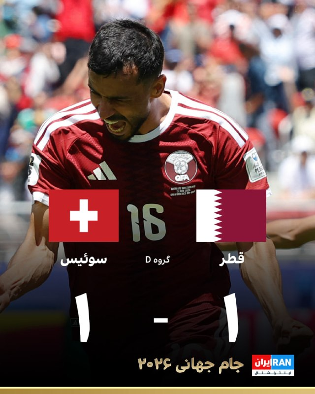

🔻تیم ملی فوتبال سوئیس در اولین مسابقه خود در جام جهانی ۲۰۲۶ برابر قطر با تساوی یک بر یک متوقف شد.

🔹شاگردان یاکین با گل دقیقه ۱۷ امبولو از روی نقطه پنالتی از عنابی‌ها پیش افتادند اما شاگردان لوپتگی با گل دقیقه ۵+۹۰ بوعلام خوخی یک امتیاز طلایی را کسب کردند.

🔹به این ترتیب هر چهار تیم کانادا، سوئیس، قطر و بوسنی و هرزگوین با یک امتیاز به کار خود در دور اول بازی‌های گروه B پایان دادند.

@iranintltvsport

## FarsiVOA — post 220621

  <a href="telegram/content/FarsiVOA_220621_1781385209.mp4" target="_blank">🎬 Download video</a>

⚡️حاشیه‌های روز دوم و روز سوم جام جهانی ۲۰۲۶
@FarsiVOA

## Dirty_Kids — post 391957

🔴 شعارها برای تجمعات: ۱_ نتم شده تیری‌جی، کص ننت عراقچی ۲_ مرگ بر سه لاشی، قالی مسعود عراقچی. ۳_ این توافق خونیه، باقر خودش کونیه. ۴_ خایه بخور با سینی/ عباس بچه قینی. @Dirty_Kids 👻

## Dirty_Kids — post 391956

با فیلترشکن «الله و عمامه» میتونید وصل بشید به آی‌پی قم و وارد روبیکا و بله بشید

اینو وارد کنید👇

90.90.ko3e.nanat.arzeshi

@Dirty_Kids 👻

## alonews — post 127753

  <a href="telegram/content/alonews_127753_1781385211.webm" target="_blank">🎬 Download video</a>

👈واشنگتن پست:
قطر به ایران پیشنهاد یک معامله مخفی علیه اسرائیل و آمریکا را داد که بر اساس آن ایران به قطر حمله نخواهد کرد و در عوض قطر تولید گاز را متوقف خواهد کرد تا قیمت انرژی را افزایش دهد و غرب را برای پایان دادن به جنگ تحت فشار قرار دهد.

✅ @AloNews خبر جنگ

---
📅 بروزرسانی: 1405/03/24 00:33
---

## VahidOOnLine — post 245367

  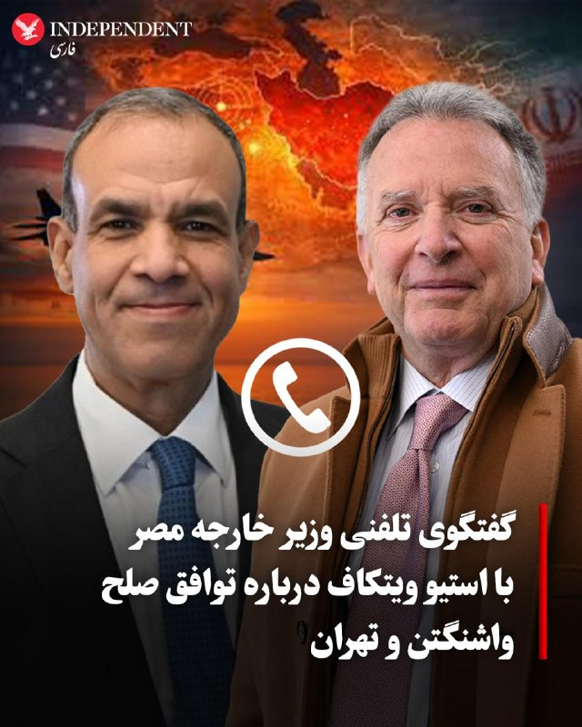

♦️بدر عبدالعاطی، وزیر امور خارجه مصر، در تماس تلفنی با استیو ویتکاف، نماینده ویژه رئیس‌جمهوری آمریکا، آخرین تحولات مربوط به مذاکرات واشنگتن و تهران را برای دستیابی به توافق صلح جهت کاهش تنش‌های منطقه‌ای بررسی کرد. در این گفتگوی تلفنی که شنبه‌شب، ۲۳ خردادماه، انجام شد، وزیر خارجه مصر با تاکید بر حمایت قاطع قاهره از تلاش‌ها برای دست‌یابی به یک توافق جامع که دغدغه‌های همه طرف‌ها را در نظر بگیرد، بر اهمیت غنیمت شمردن فرصت کنونی برای پایان دادن به مناقشات و ورود خاورمیانه به مرحله جدیدی از امنیت و ثبات تاکید کرد. ویتکاف نیز با قدردانی از تلاش‌های فشرده کشورهای منطقه از جمله مصر در حمایت از روند این مذاکرات، ابراز امیدواری کرد که توافق احتمالی پیش‌رو به تقویت صلح و ثبات پایدار در منطقه کمک شایانی کند.
‌🇸🇦 Indypersian

🤖 @VahidOOnLine

## WithYashar — post 14754

یک مقام ارشد اسرائیلی به وای نت:

این یک توافق بد است. هیچ‌کس از آن راضی نیست. آنها می‌فهمند که این برای ما خوب نیست و به منافع اسرائیل آسیب می‌زند.
چیزی که نگران‌کننده است این است که اسرائیل نمی‌تواند تأثیر بگذارد و صدایش شنیده نمی‌شود.
این عمدتاً یک «توافق جام جهانی-جشن‌های ۲۵۰ سالگی تولد ۸۰ سالگی ترامپ» است.
هدف این است که برای همه رویدادهای بزرگ فعلی در آمریکا کمی آرامش بخرد. واقعاً چیزی نیست که دوام بیاورد.
@withyashar

## pm_afshaa — post 93829

شعارهای فراخوان فردا :

1- تا باقر کفن نشود این وطن وطن نشود.

2- مرگ بر سه لاشی، قالی مسعود عراقچی.

3- این توافق خونیه، باقر خودش کونیه.

4- عدس پلو با ماستش، تسبیحم تو دست راستش.

5- دلای ما خونیه، عراقچی‌مون کونیه.

6- باقالی پلو با گردن، قالیبافو کردن.

+ نکات امنیتی رو حتما رعایت کنید:
با چفیه صورت خودتونو بپوشونید، اپ‌های جاسوسی داخلی رو حذف کنید، عطر مشهدی نزنید شناسایی نشید.

💧 Rainbet.com the #1 Non-KYC Crypto Casino & Sportsbook @rainbetcom

😁 @Pm_Afshaa

## pm_afshaa — post 93828

  <a href="telegram/content/pm_afshaa_93828_1781384623.webm" target="_blank">🎬 Download video</a>

🔴عبداللهی، سردبیر خبرگزاری تسنیم:
احتمال توافق نهایی با آمریکا بسیار بسیار ضعیفه؛ باید برای حمله ناگهانی آماده بود.

💧 Rainbet.com the #1 Non-KYC Crypto Casino & Sportsbook @rainbetcom

😁 @Pm_Afshaa

## Persian_Trend_Official — post 16987

  <a href="telegram/content/Persian_Trend_Official_16987_1781384624.webm" target="_blank">🎬 Download video</a>

👥خونخواهی کاروان انتقام در دفتر آیه الله جوادی آملی

✊ این کاروان پاشدن پیاده از تهران به قم رفتن😳

👺Phantom

📌 @persian_trend_official
پرشین ترند | متفاوت‌ترین کانال نظامی

## Dirty_Kids — post 391955

  <a href="telegram/content/Dirty_Kids_391955_1781384625.mp4" target="_blank">🎬 Download video</a>

هم‌اکنون جاسوسای روسیه و پوتین در خرم‌آباد: شعار کل کشور، فقط شروط رهبر.

@Dirty_Kids 👻

## alonews — post 127752

  <a href="telegram/content/alonews_127752_1781384627.mp4" target="_blank">🎬 Download video</a>

👈نبویان، عضو کمیسیون امنیت ملی مجلس که متن نهایی رو دیده :

با امضای این توافق، رسما مستعمره آمریکا می‌شیم!
هر بار که ترامپ بند جدید اضافه کرد، آقایان عقب‌نشینی کردن و گفتن چشم.
تنگه‌ی هرمز بلافاصله و بدون محدودیت و عوارض، باز میشه؛ حتی واسه اسرائیل.
مواد هسته‌ای باید رقیق بشه.
کوچک‌ترین غنی سازی بخوایم انجام بدیم، قبلش باید از آمریکا اجازه بگیریم! حتی واسه ساختن دارو و برق و...
آزادسازی پول‌های مسدود شده؟ معلوم نیست.
منفعت ایران از صندوق 300 میلیارد دلاری؟ معلوم نیست.
رفع تحریم ها ؟ معلوم نیست.

✅ @AloNews خبر جنگ

## alonews — post 127751

  <a href="telegram/content/alonews_127751_1781384629.webm" target="_blank">🎬 Download video</a>

👈گویا تندروها فردا هم فراخوان دادن

✅ @AloNews خبر جنگ

## alonews — post 127750

  <a href="telegram/content/alonews_127750_1781384629.webm" target="_blank">🎬 Download video</a>

👈یک مقام ارشد اسرائیلی به وای نت:

🔴این یک توافق بد است. هیچ‌کس از آن راضی نیست. آنها می‌فهمند که این برای ما خوب نیست و به منافع اسرائیل آسیب می‌زند.

🔴چیزی که نگران‌کننده است این است که اسرائیل نمی‌تواند تأثیر بگذارد و صدایش شنیده نمی‌شود.

🔴این عمدتاً یک «توافق جام جهانی-جشن‌های ۲۵۰ سالگی تولد ۸۰ سالگی ترامپ» است.

🔴هدف این است که برای همه رویدادهای بزرگ فعلی در آمریکا کمی آرامش بخرد. واقعاً چیزی نیست که دوام بیاورد.

✅ @AloNews خبر جنگ

## alonews — post 127749

  <a href="telegram/content/alonews_127749_1781384630.webm" target="_blank">🎬 Download video</a>

👈انتخاب: تو مشهد کلا ۱۰۰نفر تندرو تجمع کردن اما هیاهو راه انداختن

✅ @AloNews خبر جنگ

---
📅 بروزرسانی: 1405/03/24 00:23
---

## WithYashar — post 14753

## WithYashar — post 14752

اتاق فایت با شما : میدون ابن سینا درگیری شده
بین مامورا و تند روهاااا
میدون ابن سینا رو کامل بستن
@withyashar

## WithYashar — post 14751

## WithYashar — post 14750

نبویان: آمریکا پیروز شد
@withyashar

## pm_afshaa — post 93827

سهام ساندیس سقوط کرد

💧 Rainbet.com the #1 Non-KYC Crypto Casino & Sportsbook @rainbetcom

😁 @Pm_Afshaa

## pm_afshaa — post 93826

من خودم بسیجی‌ام ولی الان بحث بحث وطنه.

## Persian_Trend_Official — post 16986

  <a href="telegram/content/Persian_Trend_Official_16986_1781383993.webm" target="_blank">🎬 Download video</a>

۱۰۰ نفر اما پر سر و صدا!

طبق مشاهدات میدانی خبرنگار «انتخاب» در مشهد، جمعیت سازماندهی شده جریان جلیلی، پایداری و بقایای دولت مرحوم رئیسی جهت تجمع علیه مذاکرات و توافق، از صد نفر هم تجاوز نمی‌کند

همزمان، این جریان از تاکتیکی نخ‌نما جهت القای تعداد بالای حامیان خود استفاده کرده است

بدین منظور، دسته های صدنفره را در سه شهر قم، مشهد و تهران سازماندهی کرده و به آن‌ها ماموریت داده تا برای یک ساعت در مقابل تعدادی از نهادها و دفاتر مختلف از جمله دفاتر مراجع تجمع کنند

## Dirty_Kids — post 391954

🔴 شعارها برای تجمعات:

۱_ نتم شده تیری‌جی، کص ننت عراقچی

۲_ مرگ بر سه لاشی، قالی مسعود عراقچی.

۳_ این توافق خونیه، باقر خودش کونیه.

۴_ خایه بخور با سینی/ عباس بچه قینی.

@Dirty_Kids 👻

## alonews — post 127748

  <a href="telegram/content/alonews_127748_1781383993.webm" target="_blank">🎬 Download video</a>

👈خبرگزاری فارس گرای ادامه شلوغی‌ها داد

🔴۸۰ درصد شرکت‌کنندگان توافق را به ضرر کشور می‌دانند

✅ @AloNews خبر جنگ

## alonews — post 127746

  <a href="telegram/content/alonews_127746_1781383994.webm" target="_blank">🎬 Download video</a>

👈درگیری به روزنامه‌ها کشیده شد

🔴دیس و دیسبک دو روزنامه نوبنیاد و سازندگی

✅ @AloNews خبر جنگ

## alonews — post 127745

  <a href="telegram/content/alonews_127745_1781383994.mp4" target="_blank">🎬 Download video</a>

👈شعار مرگ بر قالیشاه در تجمع پایداری‌ها

✅ @AloNews خبر جنگ

## alonews — post 127744

  <a href="telegram/content/alonews_127744_1781383996.webm" target="_blank">🎬 Download video</a>

👈قیافه یه پایدارچی رندوم

✅ @AloNews خبر جنگ

## alonews — post 127743

  <a href="telegram/content/alonews_127743_1781383997.webm" target="_blank">🎬 Download video</a>

🤴رضاشاه روحت شاد

🔴فقط تو میدونستی این جماعت چه احمقین.

✅@AloNews

---
📅 بروزرسانی: 1405/03/24 00:13
---

## VahidOOnLine — post 245366

  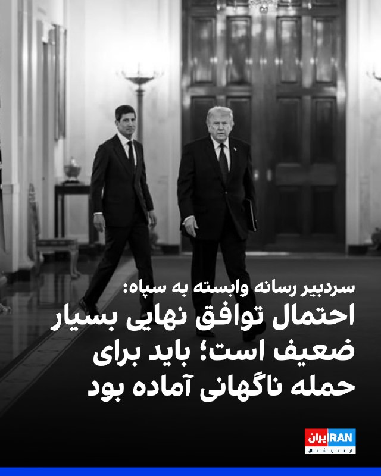

کیان عبداللهی، سردبیر خبرگزاری تسنیم، رسانه وابسته به سپاه پاسداران، در گفت‌وگو با صدا و سیمای جمهوری اسلامی گفت احتمال توافق نهایی با آمریکا پس از امضای یادداشت تفاهم «بسیار بسیار ضعیف» است.

او افزود: «احتمال عهدشکنی آمریکا را در هر لحظه‌ای باید در نظر گرفت و حمله ناگهانی را مد نظر داشت.»

عبداللهی تاکید کرد مسئولیت مفاد یادداشت تفاهم احتمالی میان آمریکا و جمهوری اسلامی و اجرای آن بر عهده تیم مذاکره‌کننده و دولت جمهوری اسلامی است؛ اظهاراتی که به‌نظر می‌رسد تلویحا مسئولیت این روند را از مجتبی خامنه‌ای دور می‌کند.
‌🏁 🇬🇧 IranintlTV

🤖 @VahidOOnLine

## VahidOOnLine — post 245365

  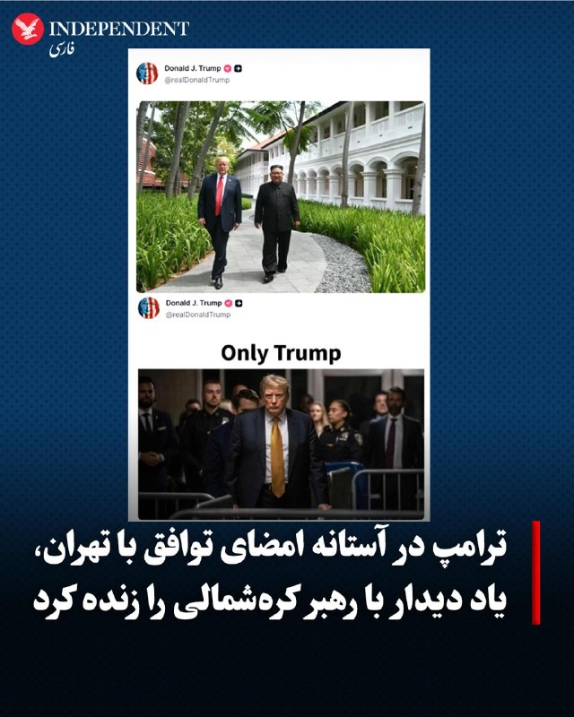

♦️پس از آنکه دونالد ترامپ، رئیس جمهوری آمریکا اعلام کرد که توافق صلح میان تهران و واشنگتن در روز یکشنبه امضا خواهد شد، تصویری از خودش در کنار کیم جونگ اون، رهبر کره‌شمالی را در سالگرد دیدار تاریخی‌شان منتشر کرد. او همزمان تصویر دیگر از خودش با عبارت «فقط ترامپ» را به اشتراک گذاشت که به نظر می‌رسد قصد اشاره به این موضوع را دارد که می‌تواند کارهای غیرممکنه را ممکن کند.
دونالد ترامپ و کیم جونگ اون، صبح سه‌شنبه ۱۲ ژوئن ۲۰۱۸ در هتل «کپلا» واقع در جزیره سنتوزای در سنگاپور، پشت درهای بسته گفتگو کردند. این نخستین دیدار سران دو کشور پس از پایان جنگ کره در سال ۱۹۵۳ بود.
‌🇸🇦 Indypersian

🤖 @VahidOOnLine

## pm_afshaa — post 93825

تو رستم تهمتنی امضا بزن که خوب میزنی

## IranIntlTV — post 342143

  

کیان عبداللهی، سردبیر خبرگزاری تسنیم، رسانه وابسته به سپاه پاسداران، در گفت‌وگو با صدا و سیمای جمهوری اسلامی گفت احتمال توافق نهایی با آمریکا پس از امضای یادداشت تفاهم «بسیار بسیار ضعیف» است.

او افزود: «احتمال عهدشکنی آمریکا را در هر لحظه‌ای باید در نظر گرفت و حمله ناگهانی را مد نظر داشت.»

عبداللهی تاکید کرد مسئولیت مفاد یادداشت تفاهم احتمالی میان آمریکا و جمهوری اسلامی و اجرای آن بر عهده تیم مذاکره‌کننده و دولت جمهوری اسلامی است؛ اظهاراتی که به‌نظر می‌رسد تلویحا مسئولیت این روند را از مجتبی خامنه‌ای دور می‌کند.
https://iranintl.com/202606130530

## Persian_Trend_Official — post 16985

  <a href="telegram/content/Persian_Trend_Official_16985_1781383402.webm" target="_blank">🎬 Download video</a>

هشدار حمله راکتی حزب‌الله لبنان به متولا اسرائیل

مقامات اسرائیلی تا پیش از این اعلام کرده بودن هرگونه حمله موشکی به شهرک های شمالی اسرائیل را با حمله به ضاحیه بیروت پاسخ خواهند داد.

📝 Amir

📌 @persian_trend_official
پرشین ترند | متفاوت‌ترین کانال نظامی

## IranianMinds — post 22497

🔴واکنش ترامپ به دعواهای حکومتی‌ها:

همینطور ادامه دهید، کمک در راه است.

## IranianMinds — post 22496

🔴 نکات ایمنی برای حضور در اعتراضات

۱ - چفیه نذارید ماسک بزنین به صورتتون
۲ - عطر مشهد و گلاب نزنین تا شناسایی نشین
۳ - اپلیکیشن بله و ایتا و روبیکا رو حذف کنین برای ساعاتی

## Dirty_Kids — post 391953

🔴 نکات ایمنی برای اعتراضات:

۱ـ چفیه نذارین، ماسک بزنین به صورتتون.
۲ـ عطر مشهد و گلاب نزنین تا شناسایی نشین.
۳ـ اپلیکیشن بله، ایتا و روبیکا رو برای ساعاتی حذف کنین.

@Dirty_Kids 👻

## Dirty_Kids — post 391952

باقالی پلو با گردن/  قالیبافو کردن

@Dirty_Kids 👻

## Dirty_Kids — post 391951

  

‏+بابام دلش خواسته برینه تو خون رهبری..

این جُرمِههههه؟

@Dirty_Kids 👻

## alonews — post 127742

  <a href="telegram/content/alonews_127742_1781383402.webm" target="_blank">🎬 Download video</a>

👈وضعیت کامنتا😂

🔴من خودم بسیجیم ولی الان بحث بحث انتقام رهبر شهیده

✅ @AloNews خبر جنگ

## alonews — post 127741

  <a href="telegram/content/alonews_127741_1781383403.webm" target="_blank">🎬 Download video</a>

👈نبویان: آمریکا پیروز شد

✅ @AloNews خبر جنگ

## alonews — post 127740

  <a href="telegram/content/alonews_127740_1781383403.webm" target="_blank">🎬 Download video</a>

👈نکات ایمنی برای تندروها:

۱ـ چفیه نذارین، ماسک بزنین به صورتتون.
۲ـ عطر مشهد و گلاب نزنین تا شناسایی نشین.
۳ـ اپلیکیشن بله، ایتا و روبیکا رو برای ساعاتی حذف کنین.

✅ @AloNews خبر جنگ

## alonews — post 127739

  <a href="telegram/content/alonews_127739_1781383403.webm" target="_blank">🎬 Download video</a>

👈خطاب به تندروها:

🔴هر کی ناراحته از ایران میتونه جمع کنه بره

✅ @AloNews خبر جنگ

## alonews — post 127738

  <a href="telegram/content/alonews_127738_1781383403.mp4" target="_blank">🎬 Download video</a>

👈یکی از مخالفان توافق:
بر پدر و مادرتون لعنت غرب گراهای بدبخت. عراقچی خاک بر سرت. مردم دارن سکته میکنن.

✅ @AloNews خبر جنگ

---
📅 بروزرسانی: 1405/03/24 00:03
---

## pm_afshaa — post 93824

  <a href="telegram/content/pm_afshaa_93824_1781382814.webm" target="_blank">🎬 Download video</a>

🔴آخوند نبویان، نایب رئیس کمیسیون امنیت ملی: با این توافق جمهوری اسلامی مستعمره آمریکا خواهد شد.

💧 Rainbet.com the #1 Non-KYC Crypto Casino & Sportsbook @rainbetcom

😁 @Pm_Afshaa

## pm_afshaa — post 93823

  <a href="telegram/content/pm_afshaa_93823_1781382815.mp4" target="_blank">🎬 Download video</a>

🔴آخوند نبویان: طبق متن توافق، همه چیز از دست جمهوری اسلامی خارج خواهد شد.

💧 Rainbet.com the #1 Non-KYC Crypto Casino & Sportsbook @rainbetcom

😁 @Pm_Afshaa

## pm_afshaa — post 93822

  

با این حرفا به خودشونم دیس میدن

💧 Rainbet.com the #1 Non-KYC Crypto Casino & Sportsbook @rainbetcom

😁 @Pm_Afshaa

## kianmeli1 — post 87975

  

🔴احتمالا با وضعیت امشب در مشهد و قم و تهران اگر مختار زنده بود میگفت
زبیریان علیه امام عصر شوریده اند
مالک اشتر به میدان برو و تار و مارشان کن
https://t.me/kianmeli1

## IranianMinds — post 22495

تو رستم تهمتنی امضا بزن که خوب میزنی

## IranianMinds — post 22494

  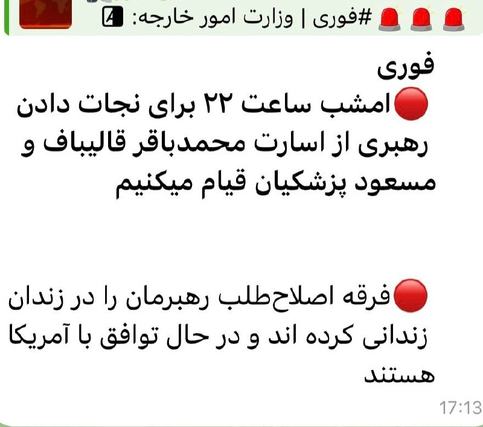

🔴 عرزشیا درخواست تجمع برای نجات مجتبی از اسارت قالیباف و پزشکیان رو دادن.

@IranianMinds

## IranianMinds — post 22493

داداش من بسیجی ام یه ماه دارم تو خیابون پرچم دستم میگیرم تکون میدم رهبرمم هنوز خاک نشده بعد این حرومیا رفتن توافق کردن

## IranianMinds — post 22492

اقا نظرتون چیه بریم توی نیرو سرکوب ثبت نام کنیم اعتراضات رو سرکوب کنیم؟

## IranianMinds — post 22491

  <a href="telegram/content/IranianMinds_22491_1781382818.mp4" target="_blank">🎬 Download video</a>

🔴 حجت‌السلام نبویان: طبق متن توافق، ما مستعمره آمریکا میشیم. آقای عراقچی هرچی آمریکا گفته رو گفته چشم، رد نکرده.

@IranianMinds

## Dirty_Kids — post 391950

فرزند جمهوری اسلامی و جان فدای اسلام

عبدالله محمدی ۸۰ ساله، ۸۰ ساله، ۸۰ ساله ۲۴ خرداد قم عزیز

@Dirty_Kids 👻

## Dirty_Kids — post 391949

  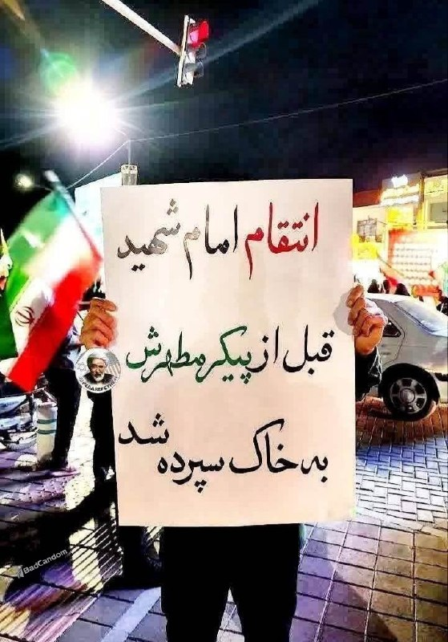

ریدممممم، عرزشیا چه دیسی به خودشون میدن😂

@Dirty_Kids 👻

## Dirty_Kids — post 391948

بعضی از کانال‌های حکومتی قحبه خبر از بستن کانال‌های خبری‌ مخالفان تفاهم‌نامه در اپ‌های کیری بله مله می‌دن و خود بله مله رو هم مختل کردن،

ضمن اینکه خبر از گلاویزی بین کسمغزای شیعه‌سان کف خیابونی با نیروهای امنیتی روافظ هزارپدر در شهرهای تهران، مشهد و قم دادن‌.

## Dirty_Kids — post 391947

  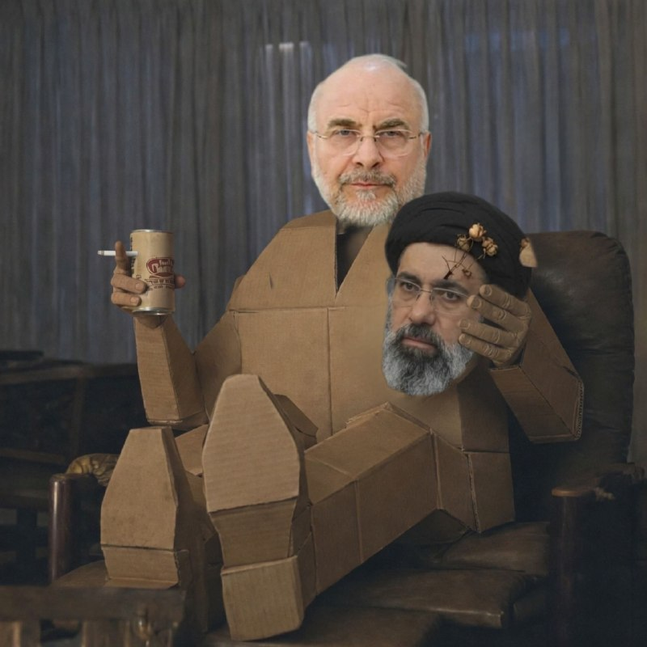

عاقا موشتبی بَمِرده،رهبر مویوم

همه چیز هم الکترونیکی امضا موکونوم

@Dirty_Kids 👻

## alonews — post 127737

  <a href="telegram/content/alonews_127737_1781382821.webm" target="_blank">🎬 Download video</a>

👈ملت درحال تماشای درگیری تندروها و امنیتی‌ها

✅ @AloNews خبر جنگ

## alonews — post 127736

فرزند جمهوری اسلامی و جان فدای انقلاب

عبدالله محمدی ۸۰ ساله ۸۰ ساله ۸۰ ساله ۲۴ خرداد قم عزیز

[@AloTweet]

## alonews — post 127735

  <a href="telegram/content/alonews_127735_1781382821.webm" target="_blank">🎬 Download video</a>

👈شعار مرگ بر قالیشاه در میدان انقلاب

✅ @AloNews خبر جنگ

## alonews — post 127734

  <a href="telegram/content/alonews_127734_1781382821.webm" target="_blank">🎬 Download video</a>

👈بنر عجیب دیده شده در شلوغی‌های امشب

✅ @AloNews خبر جنگ

---
📅 بروزرسانی: 1405/03/23 23:53
---

## VahidOOnLine — post 245364

  <a href="telegram/content/VahidOOnLine_245364_1781382206.mp4" target="_blank">🎬 Download video</a>

ویدیوهای منتشرشده در رسانه‌های اجتماعی نشان می‌دهد شامگاه شنبه ۲۳ خرداد، جمعی از حامیان تندروی جمهوری اسلامی در تهران تجمع کرده و شعارهایی همچون «قالیباف، عراقچی، پس خون رهبرم چی؟» و «عراقچی حیا کن، مملکت رو رها کن» سر دادند.
بخشی از حامیان حکومت در روزهای اخیر، وزارت خارجه و تیم مذاکره‌کننده را به دادن امتیاز به آمریکا متهم کرده‌اند.
‌🏁 🇬🇧 IranintlTV

🤖 @VahidOOnLine

## pm_afshaa — post 93821

  <a href="telegram/content/pm_afshaa_93821_1781382207.webm" target="_blank">🎬 Download video</a>

🔴یک منبع ارشد اسرائیلی به اسرائیل هیوم:
در صورت شکست توافق، موضوع تغییر حکومت ایران روی میز قرار میگیره.

💧 Rainbet.com the #1 Non-KYC Crypto Casino & Sportsbook @rainbetcom

😁 @Pm_Afshaa

## pm_afshaa — post 93820

بیانیه قالیباف بعد از تجمعات امشب :

💧 Rainbet.com the #1 Non-KYC Crypto Casino & Sportsbook @rainbetcom

😁 @Pm_Afshaa

## IranIntlTV — post 342142

  <a href="telegram/content/IranIntlTV_342142_1781382208.mp4" target="_blank">🎬 Download video</a>

ویدیوهای منتشرشده در رسانه‌های اجتماعی نشان می‌دهد شامگاه شنبه ۲۳ خرداد، جمعی از حامیان تندروی جمهوری اسلامی در تهران تجمع کرده و شعارهایی همچون «قالیباف، عراقچی، پس خون رهبرم چی؟» و «عراقچی حیا کن، مملکت رو رها کن» سر دادند.
بخشی از حامیان حکومت در روزهای اخیر، وزارت خارجه و تیم مذاکره‌کننده را به دادن امتیاز به آمریکا متهم کرده‌اند.

## FarsiVOA — post 220620

🔺نهاد حکومتی در ایران حمله سایبری به چهار بانک بزرگ را تائید کرد

▪️در ایران، «شورای هماهنگی بانک‌ها» که یک نهاد دولتی است، روز شنبه ۲۳ خرداد حمله سایبری به چهار بانک ملی، تجارت، صادرات و توسعه صادرات را تائيد کرد.

⬇️ بیشتر بخوانید:
https://ir.voanews.com/a/the-coordination-council-of-state-owned-banks-confirmed-a-cyberattack-on-fiur-iranian-banks/8160495.html
@FarsiVOA

## BBCPersian — post 283737

  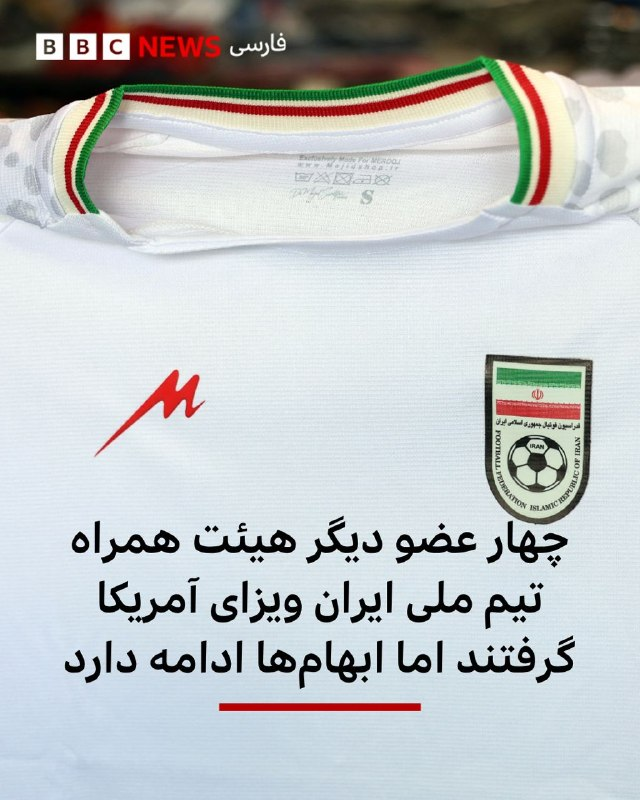

🖊پوریا ژافره، خبرنگار اعزامی بی‌بی‌سی فارسی، لس‌آنجلس

⚽️گزارش شده از ۱۵ عضو فنی و اداری هیئت همراه تیم ملی ایران که درخواست ویزای آمریکا آنها در ترکیه رد شده بود، ۱۰ نفر درخواست تجدیدنظر داده‌اند و حالا چهار نفر موفق به دریافت ویزا شده‌اند؛ دو نفر از اعضای دپارتمان بین‌الملل فدراسیون، یک نماینده حراست و یکی از آنالیزورهای کادر فنی تیم ملی.

اما درخواست شش نفر دیگر بار دیگر رد شده است؛ از جمله مهدی تاج، رئیس فدراسیون فوتبال ایران، مهدی محمدنبی، سرپرست تیم ملی و یکی از مدیران رسانه‌ای فدراسیون.

با وجود این تاییدیه‌های جدید، هنوز مشخص نیست تیم ملی ایران چگونه وارد خاک آمریکا خواهد شد. منابع نزدیک به من گفتند که یکی از گزینه‌های مورد بررسی، انتقال کاروان ایران از تیخوانا در مکزیک به سن‌دیگو از طریق مرز زمینی و سپس حرکت به سمت لس‌آنجلس است، هرچند هنوز احتمال تغییر برنامه‌ها در آخرین لحظات وجود دارد.

فعلا به نظر می‌رسد تیم ملی ایران قصد دارد روز یکشنبه، پیش از دیدار با نیوزیلند، وارد لس‌آنجلس شود تا در برنامه‌های رسمی فیفا پیش از مسابقه، از جمله نشست خبری و تمرین رسمی تیم، شرکت کند.
📷AFP via Getty
@BBCPersian

## Dirty_Kids — post 391946

  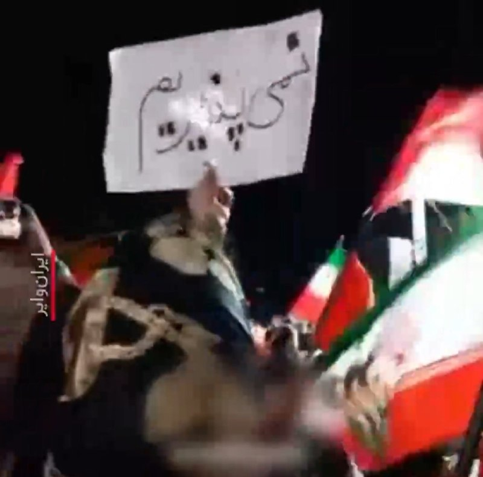

عرزشیا رفتن شعار میدن: قالیباف عراقچی پس خون رهبرم چی؟
والا شاشیدن تو خون رهبرتون تموم شد رفت دیگه. سخت نگیرید.

@Dirty_Kids 👻

## Dirty_Kids — post 391945

  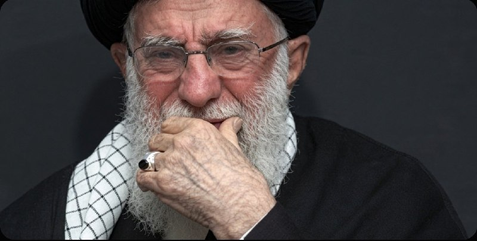

واقعنی جدی جدی من کیرتونم نبودم 😭😂

@Dirty_Kids 👻

## Dirty_Kids — post 391944

  <a href="telegram/content/Dirty_Kids_391944_1781382210.mp4" target="_blank">🎬 Download video</a>

🔴 بیانیه فوری قالیباف در مورد تجمعات امشب:

@Dirty_Kids 👻

## Dirty_Kids — post 391943

میزاشتید یخ‌ش اب بشه بعد توافق میکردید😭😭😭😭

@Dirty_Kids 👻

## Dirty_Kids — post 391942

  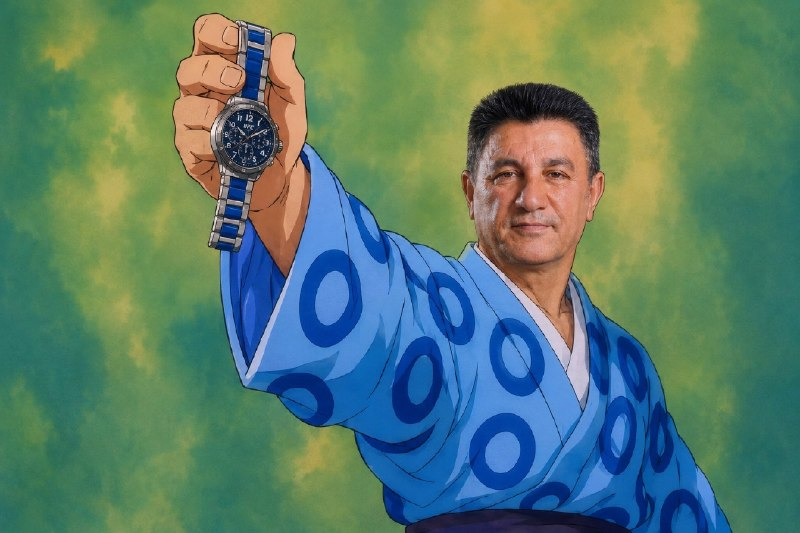

الان باید قلعه‌نویی میومد بین عرزشیا میگفت:
ساکت باشید این علامت مقوای بزرگ مجتباس احترام بزارید

متاسفانه امریکاس نمیتونه به قالیباف کمک کنه

@Dirty_Kids 👻

## alonews — post 127733

  <a href="telegram/content/alonews_127733_1781382211.webm" target="_blank">🎬 Download video</a>

👈گزارش‌ها از درگیری اغتشاشگران در قم با نیروهای جان برکف امنیتی

✅ @AloNews خبر جنگ

## alonews — post 127732

  <a href="telegram/content/alonews_127732_1781382211.webm" target="_blank">🎬 Download video</a>

👈کم مونده تندروها شعار:
لاحکم الا لله خوارج رو بدن

✅ @AloNews خبر جنگ

## alonews — post 127731

  <a href="telegram/content/alonews_127731_1781382212.webm" target="_blank">🎬 Download video</a>

👈طبق گزارشات تعداد زیادی از مردم در گردان‌های امام علی ثبت نام کردند تا با اغتشاشات امشب مقابله کنند

✅ @AloNews خبر جنگ

## alonews — post 127730

  <a href="telegram/content/alonews_127730_1781382212.webm" target="_blank">🎬 Download video</a>

👈ثابتی: تصویری از دو لیدر شلوغی‌های امشب

✅ @AloNews خبر جنگ

## alonews — post 127729

تندروها
❌ بولشویک‌ها
✔️

## alonews — post 127728

  <a href="telegram/content/alonews_127728_1781382212.webm" target="_blank">🎬 Download video</a>

👈گزارش‌ها از اغتشاش تندروها در قم 
✅ @AloNews خبر جنگ

## alonews — post 127727

  <a href="telegram/content/alonews_127727_1781382212.webm" target="_blank">🎬 Download video</a>

👈گزارش‌ها از اغتشاش تندروها در قم

✅ @AloNews خبر جنگ

---
📅 بروزرسانی: 1405/03/23 23:43
---

## VahidOOnLine — post 245363

  

شبکه سی‌ان‌ان به نقل از مقام‌های آگاه گزارش داد برنامه امضای مجازی یادداشت تفاهم میان آمریکا و جمهوری اسلامی طی ۲۴ ساعت گذشته شکل گرفت تا توافق هرچه سریع‌تر نهایی شود و از بروز موانع احتمالی در آخرین لحظات جلوگیری شود.

به گفته این مقام‌ها، اگرچه دونالد ترامپ، رییس‌جمهوری آمریکا، هفته گذشته گفته بود انتظار دارد مراسم امضا به‌صورت حضوری در اروپا برگزار شود و جی‌دی ونس، معاون رییس‌جمهوری آمریکا، در آن شرکت کند، اما این برنامه عملی نشد.

سی‌ان‌ان نوشت بخشی از این تغییر به مشکلات برنامه‌ریزی و زمان‌بندی مربوط می‌شود. بر اساس این گزارش، رییس‌جمهوری و معاون او به دلایل امنیتی و تداوم اداره دولت همزمان به خارج از کشور سفر نمی‌کنند و ترامپ قرار است صبح دوشنبه برای شرکت در نشست گروه هفت راهی فرانسه شود.

به گفته یک منبع آگاه، در نتیجه امضای الکترونیکی برای نهایی کردن تفاهم پیشنهاد شد. این منبع افزود برخی میانجی‌ها نگران بودند هرچه امضای این یادداشت بیشتر به تعویق بیفتد، احتمال بروز رخدادی که روند پیشرفت را مختل کند یا باعث عقب‌نشینی یکی از طرف‌ها شود، افزایش یابد.
‌🏁 🇬🇧 IranintlTV

🤖 @VahidOOnLine

## mwarmonitor — post 10842

📝 برای این ارزشی‌ها و ساندیس‌خورهای خامنه‌ای، صلح یعنی دوبار مردن؛ یکی همون ثانیه اول جنگ و یکی هم فردا، وقتی که همزمان با تولد ترامپ، توافق صلح رو به عنوان کادوی تولد دو دستی تقدیمِ قاتل رهبرشون می‌کنند! یعنی با چنگال آب بخوری ولی اینطور خار و خفیف نشی. آخه ارزشیِ بی‌غیرت، ۱۰۰ روز پرچم چرخوندی و گلو پاره کردی که روز تولد ترامپ، توافق صلح با قاتل رهبرت رو بهش هدیه بدی؟ صد روز ادای جنگجوها رو درآوردی ولی در نهایت شدی کادوی تولدِ مرد نارنجی! این حجم از ذلت و حقارت رو حتی با اقیانوس اسید هم نمیشه شست؛ باقی‌مانده ساندیس‌ها رو هم نگه دارید تا برای پذیرایی تو جشن تولد ترامپ بازش کنید!

@mwarmonitor

## pm_afshaa — post 93819

  <a href="telegram/content/pm_afshaa_93819_1781381612.webm" target="_blank">🎬 Download video</a>

🔴ترامپ: بزودی به کمک عرزشی‌ها خواهم آمد.

💧 Rainbet.com the #1 Non-KYC Crypto Casino & Sportsbook @rainbetcom

😁 @Pm_Afshaa

## pm_afshaa — post 93818

  <a href="telegram/content/pm_afshaa_93818_1781381613.mp4" target="_blank">🎬 Download video</a>

🔴صحبت‌های دیشب عراقچی:
مذاکرات باعث جنگ نمیشه، این مقاومته که باعث جنگ میشه.

+ یه تنه با این جمله رید به 47 سال مقاومت و آرمان‌های امام.

💧 Rainbet.com the #1 Non-KYC Crypto Casino & Sportsbook @rainbetcom

😁 @Pm_Afshaa

## pm_afshaa — post 93817

شعار عرزشی‌ها:
این آخرین نبرده، سید علی برمیگرده.

💧 Rainbet.com the #1 Non-KYC Crypto Casino & Sportsbook @rainbetcom

😁 @Pm_Afshaa

## Iliaen — post 4481

از عجایب آخرین فصل از کتاب جمهوری اسلامی

## BBCPersian — post 283736

🔻فرمانده انتظامی تهران می‌گوید که در جنگ اخیر ۶۳ نفر از نیروهایش در پایتخت کشته شدند

فرمانده انتظامی تهران گفته است که در جریان جنگ اخیر که با حملات همزمان اسرائیل و آمریکا شروع شد، ۶۳ نفر از نیروهای فرماندهی انتظامی در پایتخت ایران کشته شدند.

سرتیپ عباسعلی محمدیان گفته است که «بسیاری» از این افراد در داخل مقرهای انتظامی کشته نشدند «بلکه هنگام اجرای مأموریت، در ایستگاه‌های بازرسی، واحدهای گشت، مقابل کلانتری‌ها و در نقاط مختلف شهر» بر اثر حملات کشته شدند.

در جریان جنگ اخیر، اسرائیل برخی از کلانتری‌ها، مراکز متعلق به فرماندهی انتظامی و برخی از ایست بازرسی‌ها را هدف حمله نظامی قرار داد.
@BBCPersian

## Dirty_Kids — post 391941

  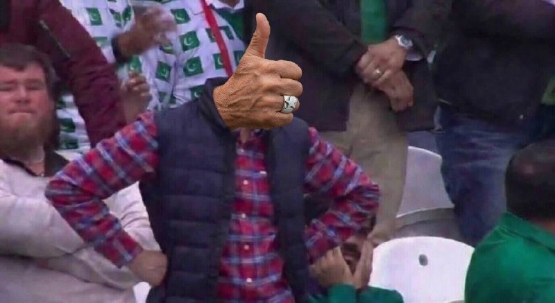

شمخانی وقتی میبینه هم توافق شد هم اورانیوم رو دادن @Dirty_Kids 👻

## Dirty_Kids — post 391940

  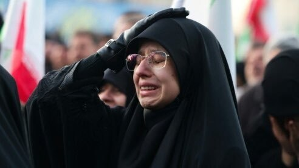

وقتی هفته ها در ایستگاه صلواتی مجانی کص دادی ولی آخرش تسلیم می‌شوند 😂😘

@Dirty_Kids 👻

## Dirty_Kids — post 391939

🔴 نت بلاکس: پهنای باند روبیکا و بله به شدت کاهش پیدا کرده.

@Dirty_Kids 👻

## Dirty_Kids — post 391938

🔴 عرزشی ها: این آخرین نبرده، سید علی برمیگرده.

@Dirty_Kids 👻

## alonews — post 127726

  <a href="telegram/content/alonews_127726_1781381613.webm" target="_blank">🎬 Download video</a>

👈حجت‌الاسلام نبویان: با این توافق جمهوری اسلامی مستعمره امریکای کبیر خواهد شد.

✅ @AloNews خبر جنگ

## alonews — post 127725

  <a href="telegram/content/alonews_127725_1781381614.webm" target="_blank">🎬 Download video</a>

👈شعار تندروها در میدان انقلاب: نه اینوری نه اونوری جانم فدای رهبری

✅ @AloNews خبر جنگ

## alonews — post 127724

  <a href="telegram/content/alonews_127724_1781381614.webm" target="_blank">🎬 Download video</a>

👈شعار تندروها در میدان ابن سینا تهران: قالیشاه حیا کن ریاستو رها کن

✅ @AloNews خبر جنگ

## alonews — post 127723

  <a href="telegram/content/alonews_127723_1781381614.webm" target="_blank">🎬 Download video</a>

👈سازمان ملل درمورد سرکوب اغتشاشات امشب تندروها ابراز نگرانی کرد.

✅ @AloNews خبر جنگ

## alonews — post 127722

  <a href="telegram/content/alonews_127722_1781381614.webm" target="_blank">🎬 Download video</a>

👈این پست صرفا برای بازی با روح و روان تندروها است

✅ @AloNews خبر جنگ

## alonews — post 127721

  <a href="telegram/content/alonews_127721_1781381614.mp4" target="_blank">🎬 Download video</a>

👈 کارشناس صدا سیما: خیلی راحت می‌توانیم با بستن تنگه‌هرمز بازار انرژی را به تلاطم بکشیم/ مذاکره‌کنندگان هیچ‌ نگرانی در بحث انرژی نداشته باشند، ابزار و امتیاز دست ما است

✅ @AloNews خبر جنگ

## alonews — post 127720

  <a href="telegram/content/alonews_127720_1781381616.webm" target="_blank">🎬 Download video</a>

👈گزارش‌ها از اختلال در روبیکا و ایتا

✅ @AloNews خبر جنگ

---
📅 بروزرسانی: 1405/03/23 23:33
---

## VahidOOnLine — post 245362

  <a href="telegram/content/VahidOOnLine_245362_1781381031.mp4" target="_blank">🎬 Download video</a>

ویدیوی رسیده به ایران اینترنشنال نشان می‌دهد که شماری از ایرانی‌های ساکن بریتانیا روز ۲۳ خرداد در شهر بیرمنگام با در دست داشتن پرچم شیروخورشید در تظاهراتی علیه جمهوری اسلامی، اسامی جاویدنامان انقلاب ملی ایرانیان را بر زبان آورده و آنان را «با شرف» خطاب کردند.
‌🏁 🇬🇧 IranintlTV

🤖 @VahidOOnLine

## VahidOOnLine — post 245361

  <a href="telegram/content/VahidOOnLine_245361_1781381034.mp4" target="_blank">🎬 Download video</a>

ویدیوی منتشرشده در شبکه‌های اجتماعی نشان می‌دهد جمعی از حامیان تندروی حکومت، بعدازظهر شنبه ۲۳ خرداد، مقابل دفتر نمایندگی وزارت خارجه در مشهد تجمع کرده و شعار «مرگ بر عراقچی بی‌شرف سازشکار» و «مرگ بر عراقچی بی‌شرف نفوذی» سر دادند.
بخشی از حامیان جمهوری اسلامی در روزهای اخیر، وزارت خارجه و تیم مذاکره‌کننده را به دادن امتیازهای بیش از حد به آمریکا متهم کرده‌اند.
‌🏁 🇬🇧 IranintlTV

🤖 @VahidOOnLine

## VahidOOnLine — post 245360

  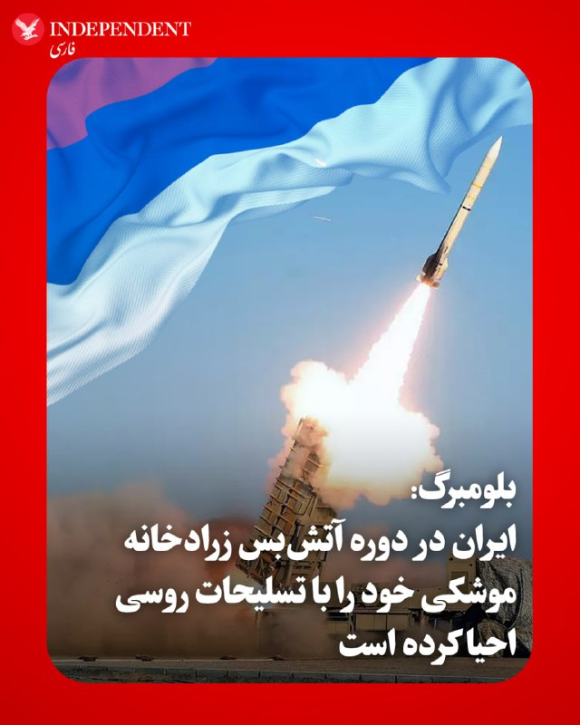

♦️ خبرگزاری بلومبرگ به نقل از سرویس‌های اطلاعاتی غربی گزارش داد که جمهوری اسلامی ایران طی هشت هفته آتش‌بس با آمریکا، زرادخانه موشکی خود را با تسلیحات جدید روسی بازسازی کرده است؛ امری که به تهران توانایی می‌دهد در صورت از سرگیری درگیری‌ها، حملات تلافی‌جویانه را با حداکثر توان انجام دهد.

بر اساس این ارزیابی‌ها، تهران اکنون حدود سه چهارم (۷۵ درصد) از مهمات پیش از جنگ خود را در اختیار دارد؛ آماری که با ارزیابی هفته گذشته دونالد ترامپ مبنی بر باقی‌ماندن تنها ۲۱ تا ۲۲ درصد از موشک‌های ایران، تضاد آشکاری دارد. پیت هگست، وزیر جنگ آمریکا نیز پیش‌تر در اواسط مارس میزان کاهش توان تهاجمی ایران را ۹۰ درصد تخمین زده بود.

گزارش‌ها حاکی است در جریان جنگ، بسیاری از موشک‌ها و پرتابگرهای ایران زیر آوار پایگاه‌های زیرزمینی مدفون شده بودند، اما تهران احتمالاً از فرصت آتش‌بس برای بازگشایی این انبارها و جابه‌جایی تسلیحات استفاده کرده است. همچنین گفته می‌شود موشک‌های ارسالی روسیه احتمالاً تولید سال گذشته میلادی هستند. ایران پیش از آتش‌بس، بیش از ۱۸۵۰ موشک و هزاران پهپاد شاهد را به کشورهای منطقه شلیک کرده بود.
‌🇸🇦 Indypersian

🤖 @VahidOOnLine

## WithYashar — post 14749

  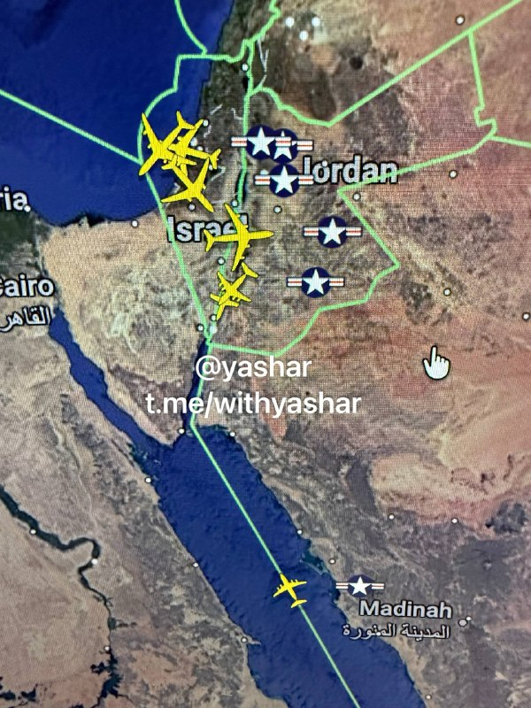

سوخت رسان ها از تلاویو بلند شدند 🚨🚨
@withyashar

## WithYashar — post 14748

ظریف: این جماعت مخالف توافق عده‌ای نفهم هستند که هیچ درکی از واقعیت ندارند.
@withyashar

## WithYashar — post 14747

کانال ۱۲ اسرائیل:
اطرافیان نتانیاهو می‌گویند: نگرانی بزرگ این است که ترامپ در بحث توافق با ایران، با ما همان کاری را بکند که اوباما با ما کرد.
@withyashar

## pm_afshaa — post 93816

ضرب و شتم اغتشاشگران در مشهد

💧 Rainbet.com the #1 Non-KYC Crypto Casino & Sportsbook @rainbetcom

😁 @Pm_Afshaa

## pm_afshaa — post 93815

رشیدی کوچی نماینده مجلس: تندروها به زباله دان تاریخ خواهند پیوست

💧 Rainbet.com the #1 Non-KYC Crypto Casino & Sportsbook @rainbetcom

😁 @Pm_Afshaa

## pm_afshaa — post 93814

  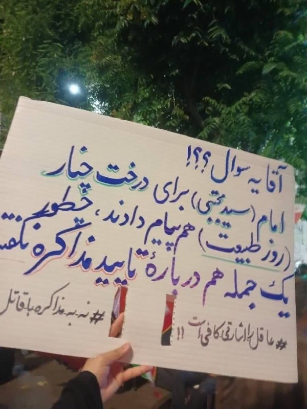

اخ کمرم شکست از سنگینی این جمله😂😂

💧 Rainbet.com the #1 Non-KYC Crypto Casino & Sportsbook @rainbetcom

😁 @Pm_Afshaa

## IranIntlTV — post 342141

  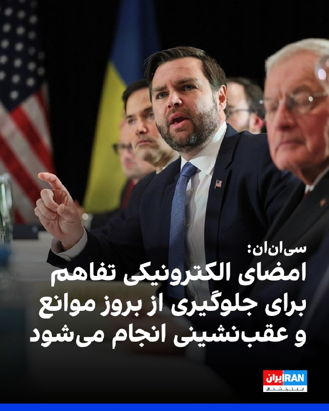

شبکه سی‌ان‌ان به نقل از مقام‌های آگاه گزارش داد برنامه امضای مجازی یادداشت تفاهم میان آمریکا و جمهوری اسلامی طی ۲۴ ساعت گذشته شکل گرفت تا توافق هرچه سریع‌تر نهایی شود و از بروز موانع احتمالی در آخرین لحظات جلوگیری شود.

به گفته این مقام‌ها، اگرچه دونالد ترامپ، رییس‌جمهوری آمریکا، هفته گذشته گفته بود انتظار دارد مراسم امضا به‌صورت حضوری در اروپا برگزار شود و جی‌دی ونس، معاون رییس‌جمهوری آمریکا، در آن شرکت کند، اما این برنامه عملی نشد.

سی‌ان‌ان نوشت بخشی از این تغییر به مشکلات برنامه‌ریزی و زمان‌بندی مربوط می‌شود. بر اساس این گزارش، رییس‌جمهوری و معاون او به دلایل امنیتی و تداوم اداره دولت همزمان به خارج از کشور سفر نمی‌کنند و ترامپ قرار است صبح دوشنبه برای شرکت در نشست گروه هفت راهی فرانسه شود.

به گفته یک منبع آگاه، در نتیجه امضای الکترونیکی برای نهایی کردن تفاهم پیشنهاد شد. این منبع افزود برخی میانجی‌ها نگران بودند هرچه امضای این یادداشت بیشتر به تعویق بیفتد، احتمال بروز رخدادی که روند پیشرفت را مختل کند یا باعث عقب‌نشینی یکی از طرف‌ها شود، افزایش یابد.
https://iranintl.com/202606132591

## IranIntlTV — post 342140

  <a href="telegram/content/IranIntlTV_342140_1781381039.mp4" target="_blank">🎬 Download video</a>

ویدیوی رسیده به ایران اینترنشنال نشان می‌دهد که شماری از ایرانی‌های ساکن بریتانیا روز ۲۳ خرداد در شهر بیرمنگام با در دست داشتن پرچم شیروخورشید در تظاهراتی علیه جمهوری اسلامی، اسامی جاویدنامان انقلاب ملی ایرانیان را بر زبان آورده و آنان را «با شرف» خطاب کردند.

## IranIntlTV — post 342139

  <a href="telegram/content/IranIntlTV_342139_1781381042.mp4" target="_blank">🎬 Download video</a>

ویدیوی منتشرشده در شبکه‌های اجتماعی نشان می‌دهد جمعی از حامیان تندروی حکومت، بعدازظهر شنبه ۲۳ خرداد، مقابل دفتر نمایندگی وزارت خارجه در مشهد تجمع کرده و شعار «مرگ بر عراقچی بی‌شرف سازشکار» و «مرگ بر عراقچی بی‌شرف نفوذی» سر دادند.
بخشی از حامیان جمهوری اسلامی در روزهای اخیر، وزارت خارجه و تیم مذاکره‌کننده را به دادن امتیازهای بیش از حد به آمریکا متهم کرده‌اند.

## IranIntlTV — post 342138

  <a href="telegram/content/IranIntlTV_342138_1781381043.mp4" target="_blank">🎬 Download video</a>

🔻تیم ملی فوتبال استرالیا پس از عملکرد قابل دفاع در جام جهانی قطر، کار خود در جام جهانی ۲۰۲۶ را با دیدار برابر ترکیه آغاز می‌کنند؛ جایی که «ساکروز» برای سنت‌شکنی در ادوار جام جهانی و شروع تورنمنت با سه امتیاز، کار بسیار سختی برابر شاگردان مونتلا خواهند داشت.

🔹گزارش علیرضا محبی، خبرنگار ایران اینترنشنال

@iranintltvsport

## IranIntlTV — post 342137

  <a href="telegram/content/IranIntlTV_342137_1781381045.mp4" target="_blank">🎬 Download video</a>

🔻۲۴ سال پس از سومی در جام جهانی ۲۰۰۲، تیم ملی ترکیه بار دیگر در جام جهانی حاضر شده و در اولین مسابقه به مصاف استرالیا می‌رود و فوتبال دوستان در ترکیه برای تماشای نمایش آردا گولر و یارانش باید ساعت هفت صبح به وقت آنکار بیدار شوند.

🔹توضیحات فرزیا ثابتی، خبرنگار ایران اینترنشنال

@iranintltvsport

## IranIntlTV — post 342136

  <a href="telegram/content/IranIntlTV_342136_1781381047.mp4" target="_blank">🎬 Download video</a>

بن سبطی، پژوهشگر ایران و اسرائیل، گفت: «از زمانی که دولت و بخش قابل توجهی از جامعه لبنان مشاهده کردند اسرائیل حزب‌الله را به شدت تضعیف کرده، این احساس در حاکمیت لبنان تقویت شده که اکنون فرصت مناسبی برای بازگرداندن کنترل کامل کشور به دولت مرکزی و ارتش رسمی لبنان فراهم شده است.»
@iranintltv

## IranIntlTV — post 342135

  <a href="telegram/content/IranIntlTV_342135_1781381049.mp4" target="_blank">🎬 Download video</a>

توافق ایران و آمریکا؛ حکومت ایران چه امتیازاتی گرفته است؟

چشم‌انداز با مهدی مهدوی‌آزاد

نسخه کامل این برنامه در یوتیوب:
https://youtu.be/qKxkAIYUJcY
@iranintltv

## Dirty_Kids — post 391937

  

🔴 بنر یه عرزشی: آقا مجتبی برای درخت چنار هم پیام داد، چطور برای مذاکرات پیام نمیده پس😂😂

@Dirty_Kids 👻

## Dirty_Kids — post 391936

🔴 ترامپ: بزودی به کمک عرزشی‌ها خواهم آمد.

@Dirty_Kids 👻

## Dirty_Kids — post 391935

  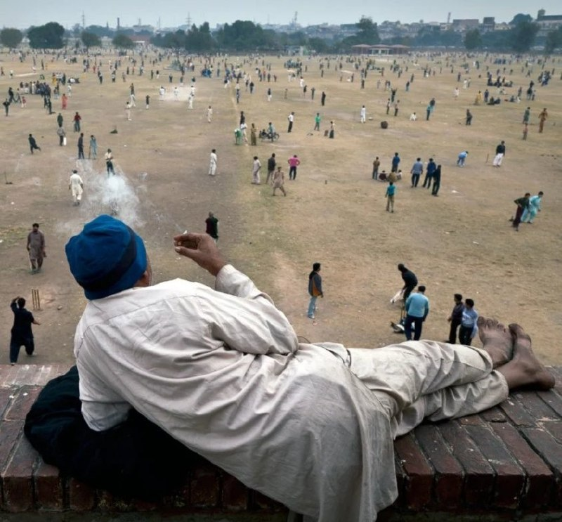

من در حال تماشای دعوای عرزشی و سرکوبگر :)))))

@Dirty_Kids 👻

## Dirty_Kids — post 391934

از امشب یه پلاکارد بگیری دستت و بگی انتقام رهبر چه شد،به جرم اقدام علیه امنیت ملی بازداشتت میکنن🤣🫵

@Dirty_Kids 👻

## Dirty_Kids — post 391932

ظریف : مخالفان توافق عده ای نافهم و احمق هستند که هیچ درکی از واقعیت ندارن 😂😂😂😂😂😂

@Dirty_Kids 👻

## alonews — post 127719

  <a href="telegram/content/alonews_127719_1781381053.webm" target="_blank">🎬 Download video</a>

👈ترامپ: کمک در راه است 
✅ @AloNews خبر جنگ

## alonews — post 127718

  <a href="telegram/content/alonews_127718_1781381053.webm" target="_blank">🎬 Download video</a>

👈ترامپ: کمک در راه است

✅ @AloNews خبر جنگ

## alonews — post 127717

  <a href="telegram/content/alonews_127717_1781381054.webm" target="_blank">🎬 Download video</a>

👈گزارش‌ها از کتک خوردن اغتشاشگران در مشهد به دست نیروهای امنیتی

✅ @AloNews خبر جنگ

## alonews — post 127716

  <a href="telegram/content/alonews_127716_1781381054.webm" target="_blank">🎬 Download video</a>

👈 دیده شده در تجمع مخالفان توافق

✅ @AloNews خبر جنگ

## alonews — post 127715

  <a href="telegram/content/alonews_127715_1781381054.webm" target="_blank">🎬 Download video</a>

👈توئیت رشیدی کوچی نماینده مجلس: تندروها به زباله دان تاریخ خواهند پیوست

✅ @AloNews خبر جنگ

---
📅 بروزرسانی: 1405/03/23 23:23
---

## VahidOOnLine — post 245359

  

محمود نبویان، نایب‌رییس کمیسیون امنیت ملی مجلس جمهوری اسلامی، در واکنش به اعلام آمریکا و پاکستان درباره امضای یادداشت تفاهم میان آمریکا و جمهوری اسلامی در روز یکشنبه، گفت: «آمریکا با این توافق به پیروزی کامل می‌رسد.»

او در گفت‌وگو با خبرگزاری دانشجو با اشاره به مفاد این تفاهم افزود: «آمریکا به دنبال این است که همه مشکلات خودش، از جمله قیمت نفت و بنزین، را حل کند و بعد دوباره به کشور حمله کند.»

نبویان همچنین گفت: «هرچه پیام ضعف بفرستیم، جنگ به ما نزدیک‌تر می‌شود. با این توافقات نمی‌شود جلوی دشمن ایستاد.»
‌🏁 🇬🇧 IranintlTV

🤖 @VahidOOnLine

## pm_afshaa — post 93813

fkramo miknm

## pm_afshaa — post 93812

fkramo miknm

## pm_afshaa — post 93811

🟠وزیر دارایی اسرائیل، بزالل سموتریچ:
تنها راه: به ازای هر شلیک به سمت قلمرو ما، ده ساختمان در ضاحیه فرو خواهد ریخت

💧 Rainbet.com the #1 Non-KYC Crypto Casino & Sportsbook @rainbetcom

😁 @Pm_Afshaa

## pm_afshaa — post 93810

  <a href="telegram/content/pm_afshaa_93810_1781380386.mp4" target="_blank">🎬 Download video</a>

ویدیویی دیده نشده از جمعیت پشم ریزون مردم در پونک 19 دی

💧 Rainbet.com the #1 Non-KYC Crypto Casino & Sportsbook @rainbetcom

😁 @Pm_Afshaa

## VahidOnline — post 76308

  <a href="telegram/content/VahidOnline_76308_1781380388.mp4" target="_blank">🎬 Download video</a>

قالیباف و عراقچی! پس اون رهبرم چی؟

برخی رسانه‌های داخل ایران تصاویری از تجمع برخی طرفداران حکومت در شامگاه یکشنبه را منتشر کرده‌اند که در مخالفت با امضای توافق احتمالی با آمریکا علیه برخی مقام‌های جمهوری اسلامی شعار می‌دهند.

در یکی از این تجمعات که در میدان ابن سینا در تهران برپا شده، تجمع‌کنندگان علیه وزیر خارجه و رئیس مجلس شورای اسلامی شعارهایی مانند «عراقچی حیا کن مملکت رو رها کن» و «قالیباف، عراقچی / پس خون رهبرم چی؟» سر داده‌اند.

برخی رسانه‌های نزدیک به اصلاح‌طلبان این افراد را «نزدیکان به جبهه پایداری» معرفی کرده‌اند.

خبرگزاری دانشجو نیز عکس‌هایی از یک تجمع در مشهد منتشر کرده که در آن‌ها پلاکاردهایی در مخالفت با توافق و همچنین انتقاد تند از مذاکره‌کنندگان دیده می‌شود.
@VahidHeadline

📡 @VahidOnline

## kianmeli1 — post 87974

  <a href="telegram/content/kianmeli1_87974_1781380388.mp4" target="_blank">🎬 Download video</a>

🔴اعتراض مقابل ساختمان وزارت خارجه در تهران: عراقچی حیا کن آمریکا را رها کن
https://t.me/kianmeli1

## IranIntlTV — post 342134

  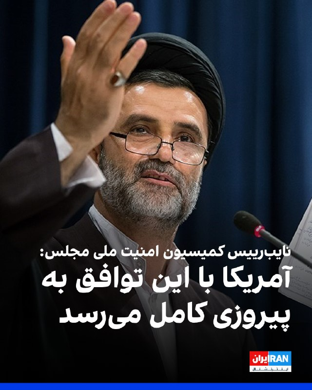

محمود نبویان، نایب‌رییس کمیسیون امنیت ملی مجلس جمهوری اسلامی، در واکنش به اعلام آمریکا و پاکستان درباره امضای یادداشت تفاهم میان آمریکا و جمهوری اسلامی در روز یکشنبه، گفت: «آمریکا با این توافق به پیروزی کامل می‌رسد.»

او در گفت‌وگو با خبرگزاری دانشجو با اشاره به مفاد این تفاهم افزود: «آمریکا به دنبال این است که همه مشکلات خودش، از جمله قیمت نفت و بنزین، را حل کند و بعد دوباره به کشور حمله کند.»

نبویان همچنین گفت: «هرچه پیام ضعف بفرستیم، جنگ به ما نزدیک‌تر می‌شود. با این توافقات نمی‌شود جلوی دشمن ایستاد.»
https://iranintl.com/202606135842

## FarsiVOA — post 220619

🔺ترامپ در حاشیه نشست «گروه ‌هفت» با رهبران خاورمیانه دیدار می‌کند؛ پاکسازی مین‌های تنگه هرمز یکی از موضوعات گفتگوها

▪️دونالد ترامپ رئیس‌جمهوری آمریکا قرار است همزمان با سفرش به فرانسه برای شرکت در اجلاس سالانه «گروه هفت» با رهبران خاورمیانه نیز دیدار و گفت‌وگو کند.

⬇️ بیشتر بخوانید:
https://ir.voanews.com/a/iran-us-trump-g7-hormuz-negotiations-group/8160489.html
@FarsiVOA

## DW_Farsi — post 125941

  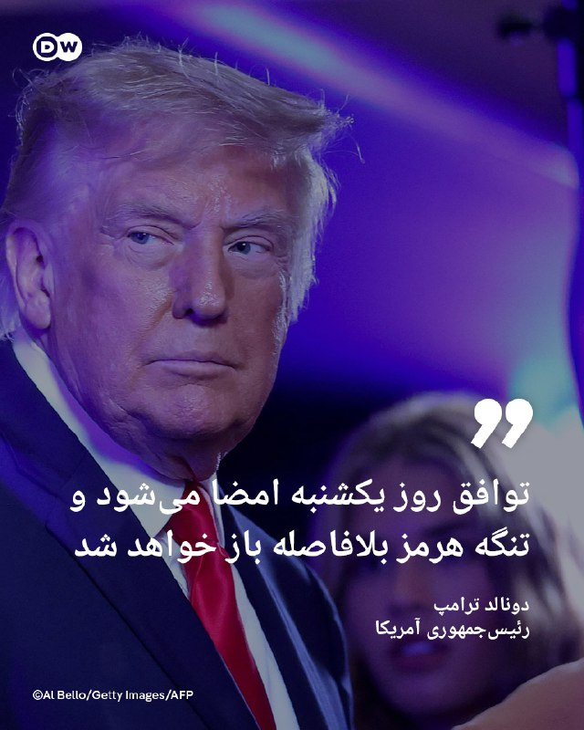

🔶ترامپ: توافق روز یکشنبه امضا می‌شود و تنگه هرمز بلافاصله باز خواهد شد

دونالد ترامپ، رئیس‌جمهوری آمریکا، روز شنبه ۱۳ ژوئن (۲۳ خرداد) در پیامی در شبکه اجتماعی تروث سوشال نوشت توافقی که در چارچوب تلاش‌ها برای پایان دادن به جنگ با ایران در حال پیگیری است، قرار است روز یکشنبه امضا شود. او افزود بلافاصله پس از امضای این توافق، تنگه هرمز "برای همه" باز خواهد شد.

ترامپ در پیام خود نوشت: توافق قرار است فردا امضا شود و بلافاصله پس از امضا،تنگه هرمز به روی همه باز خواهد شد.

جنگی که با حملات آمریکا و اسرائیل به ایران در پایان ماه فوریه آغاز شد، رفت‌وآمد در این مسیر را به‌شدت محدود کرده و باعث افزایش شدید قیمت‌ها در بازارهای جهانی شده است.

پاکستان، که نقش میانجی را بر عهده دارد، پیش‌تر در همین روز اعلام کرده بود توافق قرار است روز یکشنبه امضا شود.

@dw_farsi

## DW_Farsi — post 125940

  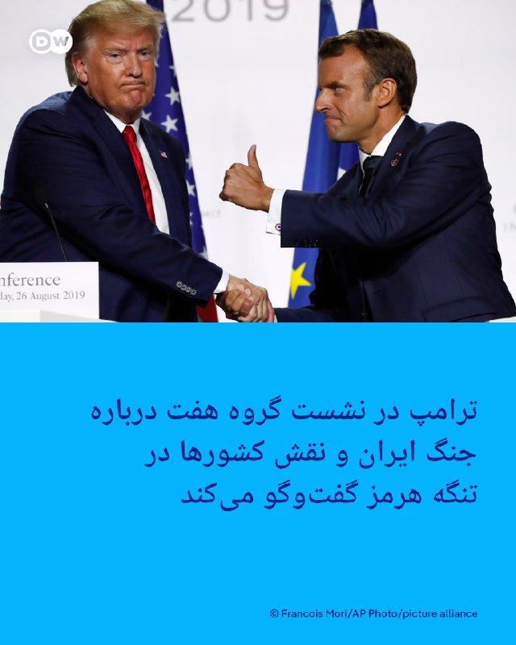

🔶ترامپ در نشست گروه هفت درباره جنگ ایران و نقش کشورها در هرمز گفت‌وگو می‌کند

به گزارش خبرگزاری آلمان، یک مقام ارشد دولت آمریکا پیش از آغاز نشست گروه هفت اعلام کرد دونالد ترامپ قصد دارد در این اجلاس درباره نحوه پیشبرد توافق مربوط به جنگ ایران گفت‌وگو کند. به گفته این مقام، در صورت شکل‌گیری چنین توافقی، برخی از کشورهای گروه هفت آماده‌اند در اقدام‌هایی مانند مین‌روبی در تنگه هرمز نقش ایفا کنند.

بر اساس این گزارش،تحت رهبری فرانسه و بریتانیا، یک ماموریت دریایی "بی‌طرف" در تنگه هرمز در حال آماده‌سازی است. بیش از ۴۰ کشور، از جمله آلمان، حمایت خود را از این طرح اعلام کرده‌اند. موضوع مین‌روبی نیز بخشی از همین برنامه عنوان شده است.

بر اساس اظهارات این مقام دولتی، دونالد ترامپ قصد دارد از اجلاس گروه هفت (G7) برای برگزاری دیدارهای دوجانبه با نمایندگان مصر، قطر و امارات متحده عربی نیز استفاده کند. طبق اعلام مقامات آمریکایی، بنیامین نتانیاهو، نخست‌وزیر اسرائیل در این گفت‌وگوها شرکت نخواهد کرد.

@dw_farsi

## IranianMinds — post 22490

  

😂😂😂

@IranianMinds

## Dirty_Kids — post 391931

حکومت نیروهای یگان ویژه رو ریخته تو خیابون که اگه عرزشی ها امشب زنجیر پاره کردن همه رو سرکوب کنن🤣🤣🤣🤣🤣🤣🤣🤣

@Dirty_Kids 👻

## Dirty_Kids — post 391930

  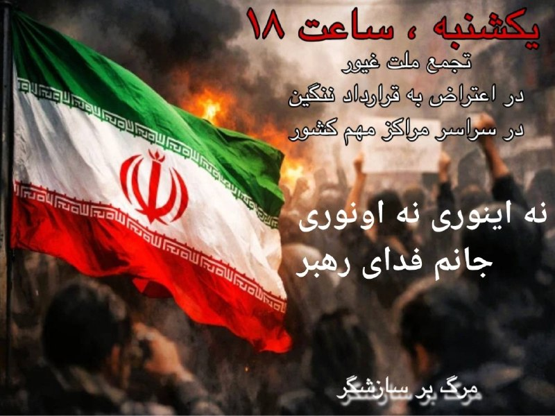

کوکتل‌مولوتف یادتون نره آموزشاش تو یوتوب هست

@Dirty_Kids 👻

## Dirty_Kids — post 391929

  <a href="telegram/content/Dirty_Kids_391929_1781380392.mp4" target="_blank">🎬 Download video</a>

تعداد تجمع کننده ها یک اتوبوس شده ؟حدود ۵۰ نفر، پس کوووو ۳۰ میلیون جانفدا😂😂😂😂😂😂

@Dirty_Kids 👻

## Dirty_Kids — post 391928

  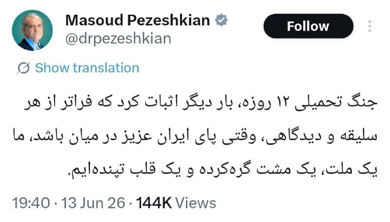

‌‎
خدا لعتتان کند که اینطور طور رهبر شهیدمان را کیر کردید

@Dirty_Kids 👻

## alonews — post 127714

  <a href="telegram/content/alonews_127714_1781380394.webm" target="_blank">🎬 Download video</a>

👈شبکه CNN به نقل از منابع اطلاعاتی: ایران ورودی‌های محل نگهداری از ذخایر اورانیوم خود را مین‌گذاری کرده است

✅ @AloNews خبر جنگ

## alonews — post 127713

  <a href="telegram/content/alonews_127713_1781380394.webm" target="_blank">🎬 Download video</a>

👈کانال ۱۲ اسرائیل: مقامات ارشد اسرائیلی و کارشناسانی که سال‌ها در حوزه ایران فعالیت می‌کنند، امروز هشدار دادند که توافق فعلی بین آمریکا و ایران، عمیق‌ترین منافع امنیتی اسرائیل را به خطر می‌اندازد

🔴مقامات ارشد اسرائیلی می‌گویند «ایرانی‌ها بی‌دلیل با این توافق موافقت نکرده‌اند، طرف آمریکایی شرایط اصلی آن‌ها را پذیرفته است.»

🔴به گفته آنان، این توافق بلافاصله منجر به رفع محاصره دریایی و نجات ایران خواهد

🔴اطرافیان نتانیاهو می‌گویند: «نگرانی بزرگ این است که ترامپ در بحث توافق با ایران، با ما همان کاری را بکند که اوباما کرد

✅ @AloNews خبر جنگ

## alonews — post 127712

  <a href="telegram/content/alonews_127712_1781380394.webm" target="_blank">🎬 Download video</a>

👈کانالای ایتا:
قالیباف و پزشکیان، رهبری رو زندانی کردن

✅ @AloNews خبر جنگ

## alonews — post 127711

  <a href="telegram/content/alonews_127711_1781380394.webm" target="_blank">🎬 Download video</a>

👈 وزیر دارایی اسرائیل، بزالل سموتریچ:
تنها راه: به ازای هر شلیک به سمت قلمرو ما، ده ساختمان در ضاحیه فرو خواهد ریخت. امشب

✅ @AloNews خبر جنگ

## alonews — post 127710

  <a href="telegram/content/alonews_127710_1781380395.mp4" target="_blank">🎬 Download video</a>

👈اغتشاش مقابل ساختمان وزارت خارجه در تهران: عراقچی حیا کن آمریکا را رها کن

✅ @AloNews خبر جنگ

---
📅 بروزرسانی: 1405/03/23 23:13
---

## WithYashar — post 14746

«زمان تنها خدای واقعی است»
@withyashar

## WithYashar — post 14745

## mwarmonitor — post 10841

  <a href="telegram/content/mwarmonitor_10841_1781379797.mp4" target="_blank">🎬 Download video</a>

📝این دیگه سازش نیست خود قمبل قهرمانانه

@mwarmonitor

## mwarmonitor — post 10840

  <a href="telegram/content/mwarmonitor_10840_1781379798.mp4" target="_blank">🎬 Download video</a>

📝 خون رهبر 😂 زهی خیال باطل

@mwarmonitor

## mwarmonitor — post 10839

📝 شب‌بخیر عباس، صبح‌بخیر استیو! 📌«خاک بر سرت عباس»؛ این تنها وردی است که امشب از دهان ساندیس‌خورهای سرگردان نمی‌افتد. 📌 طفلکی‌ها مثل مرغ سرکنده وسط خیابانِ سیاست بال‌بال می‌زنند و نمی‌دانند این سازی که نظام می‌زند، قرار است کدام بخش از هیکلشان را به رقص…

## pm_afshaa — post 93809

  <a href="telegram/content/pm_afshaa_93809_1781379800.webm" target="_blank">🎬 Download video</a>

🎬 Video

## kianmeli1 — post 87973

  <a href="telegram/content/kianmeli1_87973_1781379801.mp4" target="_blank">🎬 Download video</a>

🔴کارشناس صداوسیما: به زودی جنگ را به خاک آمریکا می‌بریم و دیگر قرار نیست در خاک خودمان با دشمن بجنگیم
جمهوری‌ اسلامی هنوز کارت های خود را رو نکرده است
https://t.me/kianmeli1

## IranIntlTV — post 342133

  <a href="https://t.me/IranintlTV/342133" target="_blank">📎 Download file</a>

🎧نسخه صوتی چشم‌انداز: توافق ایران و آمریکا؛ حکومت ایران چه امتیازاتی گرفته است؟
@iranintlTV

## IranIntlTV — post 342132

  <a href="telegram/content/IranIntlTV_342132_1781379803.mp4" target="_blank">🎬 Download video</a>

جمشید برزگر، روزنامه‌نگار و تحلیل‌گر سیاسی، درباره تاخیر جمهوری اسلامی در اعلام خبر کشته شدن علی خامنه‌ای گفت: «جمهوری اسلامی همواره در خبررسانی رویکردی امنیتی داشته است. آنچه این بار رخ داد، از یک سو ادامه همان سنت همیشگی جمهوری اسلامی در کنترل اخبار بود و از سوی دیگر، شدت ضربه و غافلگیری ناشی از حادثه این روند را تشدید کرد و باعث شد اعلام رسمی خبر با تاخیر بیشتری همراه شود.»

این در حالی است که علی باقری کنی، معاون دبیر شورای امنیت ملی جمهوری اسلامی، در یک مصاحبه تلویزیونی اعلام کرد علی خامنه‌ای در همان لحظه نخست حمله کشته شد.
@iranintltv

## DW_Farsi — post 125939

  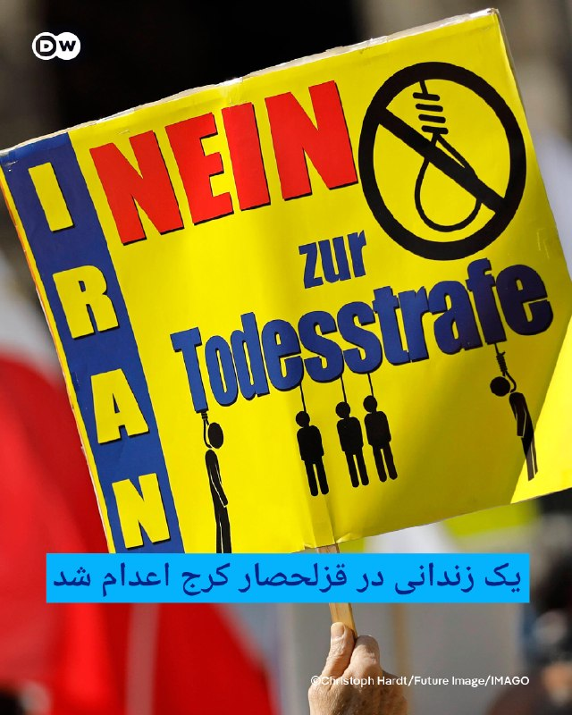

🔶یک زندانی در قزلحصار کرج اعدام شد

هرانا گزارش داد حکم اعدام سیداکبر بنی‌هاشم، زندانی محکوم به اعدام از بابت اتهام قتل، سحرگاه امروز شنبه (۲۳ خرداد ۱۴۰۵) در زندان قزلحصار کرج به اجرا درآمد. بر اساس اطلاعات منتشرشده، او پیش‌تر بازداشت و سپس از سوی دادگاه کیفری به اعدام محکوم شده بود.

هرانا هویت این زندانی را سیداکبر بنی‌هاشم احراز کرده و نوشته است حکم او بامداد امروز ۲۳ خرداد (۱۳ ژوئن)اجرا شده است.

بر اساس گزارش سالانه منتشرشده از سوی واحد آمار، نشر و آثار مجموعه فعالان حقوق بشر در ایران، در فاصله اول ژانویه ۲۰۲۵ تا اول ژانویه ۲۰۲۶، دست‌کم ۲۰۶۳ نفر در ایران اعدام شده‌اند.

بر پایه همین آمار، اجرای احکام اعدام در ایران نسبت به سال ۲۰۲۴، ۱۱۹ درصد افزایش داشته است.

@dw_farsi

## DW_Farsi — post 125938

  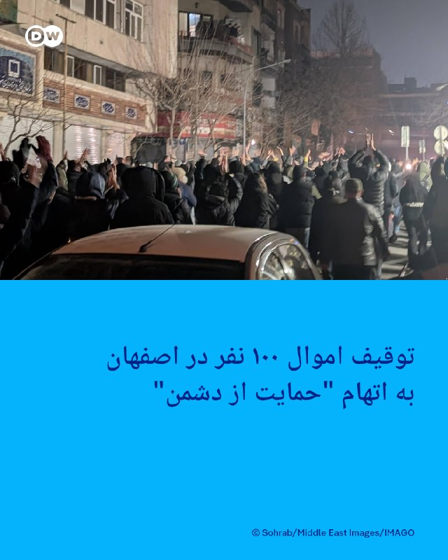

🔶توقیف اموال ۱۰۰ نفر در اصفهان به اتهام "حمایت از دشمن"

رسانه‌های حکومتی ایران گزارش دادند مقام‌های قضایی در استان اصفهان دستور شناسایی و توقیف اموال ۱۰۰ نفر را صادر کرده‌اند؛ افرادی که به گفته دستگاه قضایی، "به انحای مختلف از جنایات دشمنان در ایران حمایت کرده بودند." هم‌زمان، تلویزیون حکومتی ایران نیز گزارش داد این افراد از سوی مقام‌های قضایی به "خیانت" و قرار گرفتن "در کنار دشمن" متهم شده‌اند.

رییس کل دادگستری استان اصفهان اعلام کرد این دستور علیه ۱۰۰ نفر صادر شده و روند شناسایی و توقیف اموال آنان ادامه خواهد داشت.

بر اساس گزارش منتشرشده، مقام‌های قضایی این افراد را متهم کرده‌اند که به شکل‌های مختلف از اقدامات دشمنان علیه ایران حمایت کرده‌اند. در گزارش رسانه‌های حکومتی، توضیح بیشتری درباره هویت این افراد، نوع اموال توقیف‌شده یا مصادیق دقیق اتهام‌ها ارائه نشده است.

در همین چارچوب، مقام قضایی اصفهان تاکید کرده است این روند در استان ادامه پیدا می‌کند و محدود به این پرونده نخواهد بود.

@dw_farsi

## RadioFarda — post 158277

  <a href="telegram/content/RadioFarda_158277_1781379807.mp4" target="_blank">🎬 Download video</a>

🔸توماج صالحی، خواننده معترض، شامگاه شنبه ۲۳ خرداد با انتشار ویدئویی در حساب کاربری خود در اینستاگرام با اشاره به اینکه آزادی ایران هرگز وابسته به کشورهای دیگر نبوده است گفت « پس این مسیر هرگز به بن‌بست نمی خورد، چه با جنگ، چه توافق و چه حتی حمایت کشورهای دیگر»

🔸آقای صالحی در ادامه با گفتن اینکه آزادی‌خواهان ایران هنوز زنده هستند تاکید کرد «ما مثل گذشته قدم به قدم پیش می‌رویم و سنگر به سنگر فتح می‌کنیم».

🔸توماج صالحی در توضیح این پست اینستاگرامی نوشته است: «زنده باد ترانۀ آزادی که با هیچ گلوله‌ای خاموش نشد».⁩

🔸توماج صالحی که در جریان اعتراضات سال ۱۴۰۱ بازداشت شده بود در اردیبهشت ۱۴۰۳ از سوی دادگاه انقلاب جمهوری اسلامی به اعدام محکوم شد اما دیوان عالی کشور این حکم را نقض کرد و آقای صالحی در آذرماه ۱۴۰۳ پس گذراندن یک سال حکم حبس از زندان آزاد شد.

@RadioFarda

## Dirty_Kids — post 391927

قالیباف یکم دیگه میره یخچالی که خامنه ای توشه هم از برق میکشه

یکی از بندهای مذاکره😂

@Dirty_Kids 👻

## alonews — post 127709

  <a href="telegram/content/alonews_127709_1781379810.webm" target="_blank">🎬 Download video</a>

👈پست جدید ترامپ: فقط ترامپ!

✅ @AloNews خبر جنگ

---
📅 بروزرسانی: 1405/03/23 23:03
---

## WithYashar — post 14744

## WithYashar — post 14743

## pm_afshaa — post 93808

من حاضرم برا سرکوب این اغتژاژ گرا وارد بسیج شم

## pm_afshaa — post 93807

اغتژاژ گر را باید سر جایش نشاند این حرفای رهبر مفعولمون بود😭😭

## pm_afshaa — post 93806

بزنین این اغتشاشگرارو باتون چرب شده یادتون نره براشون استفاده بشه

## Persian_Trend_Official — post 16984

https://youtube.com/live/8mEq3_F9y04?feature=share

## Dirty_Kids — post 391926

  <a href="telegram/content/Dirty_Kids_391926_1781379210.mp4" target="_blank">🎬 Download video</a>

🔴 امروز توی مشهد، عرزشیا کفن پوشیدن و شعار میدن مرگ بر عراقچی🤣🤣

@Dirty_Kids 👻

## Dirty_Kids — post 391925

  <a href="telegram/content/Dirty_Kids_391925_1781379212.mp4" target="_blank">🎬 Download video</a>

نه ماه پیش:

هم تهدید شد؛ هم‌مذاکره کرد؛ هم‌جنگ شد؛ هم مرد ، دفن نشد و ته مونده هاش تسلیم شدند

@Dirty_Kids 👻

## Dirty_Kids — post 391924

🔴 از مأموران شجاع نیروی انتظامی درخواست داریم با این اغتشاشگران برخورد قاطع بشه و بهشون تیر خلاص بزنن🙏

خواهشاً هر چه زودتر بله، روبیکا و ایتا رو فیلتر کنین تا نتونن امنیت ملی رو به خطر بندازن.

@Dirty_Kids 👻

## Dirty_Kids — post 391923

  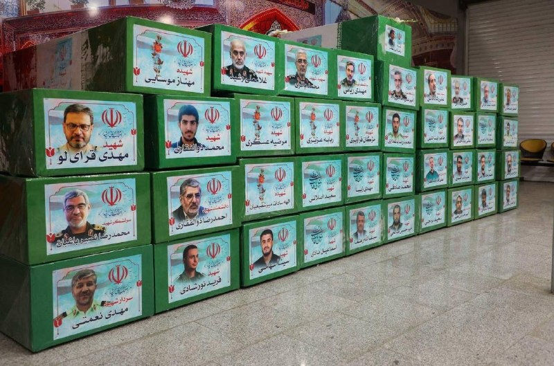

ولی یه روزی باید ۲۳خرداد رو به عنوان "روز جهانی عاقبت گنده‌گوزی" نامگذاری کنن :))))))

@Dirty_Kids 👻

## Dirty_Kids — post 391922

امیرحسین ثابتی:

فردا توی مجلس طرح استیضاح عباس عراقچی رو ارائه میدم تا اونو برکنارکنیم.

@Dirty_Kids 👻

## alonews — post 127708

  <a href="telegram/content/alonews_127708_1781379214.webm" target="_blank">🎬 Download video</a>

👈ثابتی در اجتماع مخالفان توافق : پس از اظهارات شب گذشته عراقچی ، استیضاح عراقچی در سامانه مجلس ثبت خواهد شد!

✅ @AloNews خبر جنگ

---
📅 بروزرسانی: 1405/03/23 22:53
---

## VahidOOnLine — post 245358

♦️محمود نبویان، نایب‌رئیس کمیسیون امنیت ملی و سیاست خارجی مجلس شورای اسلامی، در گفتگو با خبرگزاری دانشجو با انتقاد از توافق احتمالی پیش‌رو اعلام کرد که ایالات متحده با این توافق به پیروزی کامل می‌رسد. نبویان با ابراز نگرانی از روند موجود تاکید کرد: «آمریکا به دنبال این است که همه مشکلات خودش را حل کند و دوباره به کشور حمله کند.»
این نماینده مجلس در پاسخ به پرسش مجری درباره قطعی بودن جنگ افزود: «هرچه پیام ضعف بفرستیم، جنگ به ما نزدیک‌تر می‌شود.»
پیش از این نبویان با انتشار پیامی در اکس، متن تفاهم‌نامه در دست تایید میان تهران و واشنگتن را «خسارت‌بار» توصیف کرد. او در این پیام تاکید کرد که با مشاهده متن توافق، عقب‌نشینی‌های ایران نسبت به دو نسخه قبلی بیشتر شده است.
‌🇸🇦 Indypersian

🤖 @VahidOOnLine

## VahidOOnLine — post 245357

  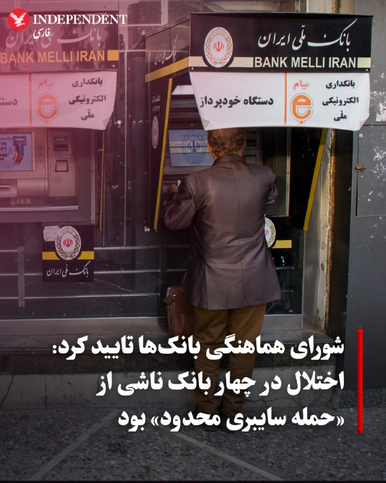

♦️ به دنبال اختلال گسترده در خدمات الکترونیکی چهار بانک بزرگ ایران از صبح شنبه ۲۳ خرداد، شورای هماهنگی بانک‌ها رسما اعلام کرد که این رویداد ناشی از یک «حمله سایبری محدود» بوده است.

بر اساس این اطلاعیه، اختلال پیش‌آمده در سامانه‌های بانک‌های ملی، تجارت، صادرات و توسعه صادرات با اقدامات پیشگیرانه تیم‌های فنی مواجه شده و بررسی‌های دقیق نشان می‌دهد که هیچ‌گونه دسترسی غیرمجاز یا نشت اطلاعات مشتریان رخ نداده است. این نهاد تاکید کرد که در حال حاضر تمام زیرساخت‌ها تحت کنترل قرار دارند و عملیات ایمن‌سازی سامانه‌ها با سرعت در حال انجام است.

پیش از این، گزارش‌ها از ایران حاکی از آن بود که از ابتدای صبح شنبه، خدمات کلیدی این چهار بانک شامل موبایل‌بانک، اینترنت‌بانک، دستگاه‌های خودپرداز (ATM) و پایانه‌های فروش (کارتخوان‌ها) قطع شده و مشتریان در انجام تراکنش‌های روزمره خود با مشکل جدی روبه‌رو شده‌اند. مقامات بانکی وعده داده‌اند که خدمات این شبکه در کوتاه‌ترین زمان ممکن به حالت عادی بازگردد.
‌🇸🇦 Indypersian

🤖 @VahidOOnLine

## WithYashar — post 14742

## mwarmonitor — post 10838

  <a href="telegram/content/mwarmonitor_10838_1781378613.mp4" target="_blank">🎬 Download video</a>

📝می‌بینیم که چطور همان جمعیتی که تا دیروز خود را پیاده‌نظام اصلی نظام می‌دانست، حالا کف خیابان فریاد «استعفا، استعفا» سر می‌ده.

@mwarmonitor

## pm_afshaa — post 93805

به عنوان یه خایه مال اغتشاشگر خیلی گه میخوری بچه حرومزاده @Dralipk

## pm_afshaa — post 93804

به عنوان یه خایه مال اغتشاشگر خیلی گه میخوری بچه حرومزاده

@Dralipk

## pm_afshaa — post 93803

گزارش ها از درگیری ماموران شجاع انتظامی با اغتشاشگران در تهران و مشهد

💧 Rainbet.com the #1 Non-KYC Crypto Casino & Sportsbook @rainbetcom

😁 @Pm_Afshaa

## pm_afshaa — post 93802

ظریف :مخالفان توافق عده ای نافهم هستند که هیچ درکی از واقعیت ندارن

💧 Rainbet.com the #1 Non-KYC Crypto Casino & Sportsbook @rainbetcom

😁 @Pm_Afshaa

## pm_afshaa — post 93801

اپای ایرانی به دلیل اغتشاشات از دسترس خارج شدن

💧 Rainbet.com the #1 Non-KYC Crypto Casino & Sportsbook @rainbetcom

😁 @Pm_Afshaa

## pm_afshaa — post 93800

گزارش‌ها از درگیری طرفداران نظام با ماموران در منطقه دروازه شمیران تهران

💧 Rainbet.com the #1 Non-KYC Crypto Casino & Sportsbook @rainbetcom

😁 @Pm_Afshaa

## FarsiVOA — post 220618

🔺ترامپ و استارمر درباره مذاکرات توافق با حکومت ایران تلفنی گفت‌وگو کردند

▪️دونالد ترامپ، رئیس‌جمهوری آمریکا، و کی‌یر استارمر، نخست‌وزیر بریتانیا، روز شنبه، ۲۳ خرداد، در یک تماس تلفنی درباره مذاکرات مربوط به توافق با جمهوری اسلامی گفت‌وگو کردند.

⬇️ بیشتر بخوانید:
https://ir.voanews.com/a/trump-starmer-discuss-iran-deal/8160491.html
@FarsiVOA

## Persian_Trend_Official — post 16983

  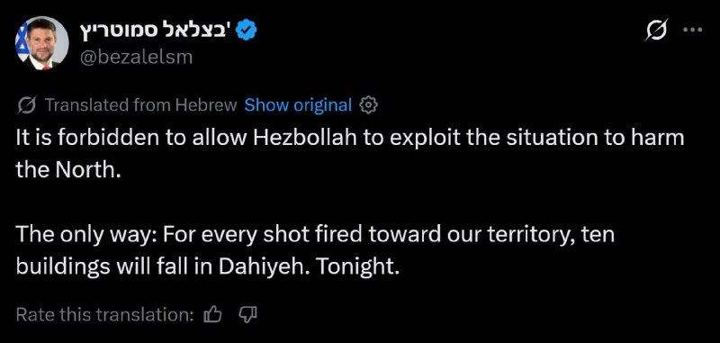

اسموتریچ، وزیر دارایی اسرائیل: اجازه دادن به حزب‌الله برای سوءاستفاده از اوضاع برای آسیب رساندن به شمال ممنوع است.

تنها راه: به ازای هر گلوله‌ای که به سمت خاک ما شلیک می‌شود، امشب ده ساختمان در ضاحیه فرو بریزد.

📝 Amir

📌 @persian_trend_official
پرشین ترند | متفاوت‌ترین کانال نظامی

## Persian_Trend_Official — post 16982

  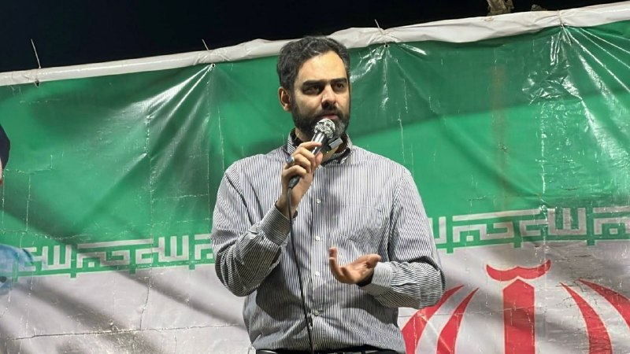

امیرحسین ثابتی، نماینده مجلس: جناب قالیباف! مخاطب این نوشته شخص شما هستید.

صحبتهای عراقچی وزیر خارجه در برنامه شب گذشته گفتگوی ویژه خبری را با دقت دیدم. حجم اطلاعات نادرست، غلط و گمراه کننده وی درباره توافق احتمالی یادآور توجیهاتش درباره برجام بود. برجامی که میگفتند برای ایران یک پیروزی است و چیزی به اسم مکانیسم ماشه در آن وجود ندارد اما بعد از 10 سال مشخص شد هرچه منتقدان گفتند درست بود.

جناب قالیباف! وزیر خارجه در همین گفتگوی دیشب از پذیرش مسئولیت این توافق شانه خالی کرد و آن را گردن شما انداخت. لذا بهتر است بدانید تبعات این توافق، بر گردن جنابعالی خواهد بود و البته که ما از مفاد آن هیچ بوی خوبی استشمام نمی‌کنیم. کاش سابقه سالها جبهه و جهادتان را اینطور پای گفتگو با قاتلان حاج قاسم و رهبر شهید انقلاب بر باد ندهید. توافقی که علیرغم رضایت رهبر انقلاب و مملو از نقض خطوط قرمز ایشان، باقی ماندن تحریم‌ها، از دست رفتن تنگه هرمز و تثبیت سایه جنگ بر سر کشور باشد نه خیر دنیا را برای شما خواهد داشت و نه خیر آخرت را.

📝 Amir

📌 @persian_trend_official
پرشین ترند | متفاوت‌ترین کانال نظامی

## IranianMinds — post 22489

  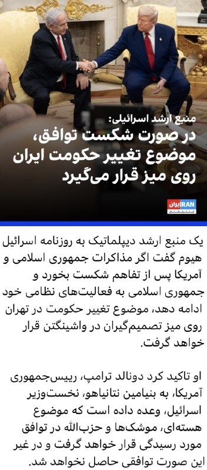

@IranianMinds

## BBCPersian — post 283727

‌⚽️گروه سی جام جهانی؛ مهاجم استقلال تهران مقابل ستاره‌های برزیل

مرحله انتخابی جام جهانی برای برزیل یکی از سخت‌ترین دوره‌های تاریخ فوتبال این کشور شد.

پس از جام جهانی ۲۰۲۲، فدراسیون فوتبال برزیل بیش از یک سال منتظر کارلو آنچلوتی ماند تا هدایت تیم را بر عهده بگیرد، اما او قراردادش را با رئال مادرید تمدید کرد و به یکی از شرم‌آورترین ماجراهای تاریخ «سلسائو» تبدیل شد.

وینیسیوس جونیور ستاره اصلی خط حمله برزیل است. او با وجود درخشش در رئال مادرید و همچنین نقش داشتن در پنج گل از هفت گل برزیل در جام جهانی ۲۰۲۲، از دید بسیاری هنوز نتوانسته عملکرد خوبش در رئال را در تیم ملی تکرار کند ولی آنچلوتی امیدوار است بهترین نسخه او را در جام جهانی ببیند.

مراکش پس از تاریخ‌سازی در جام جهانی ۲۰۲۲، حالا با امید به تکرار این موفقیت وارد جام جهانی می‌شود. «شیرهای اطلس» که به‌عنوان اولین تیم آفریقایی تاریخ به نیمه‌نهایی جام جهانی رسیدند، هنوز تحت تاثیر اتفاقات جنجالی فینال جام ملت‌های آفریقا مقابل سنگال هستند.

ادامه از:
https://bbc.in/43T6bwp
📸Getty
@BBCPersian

## Hranews — post 113592

  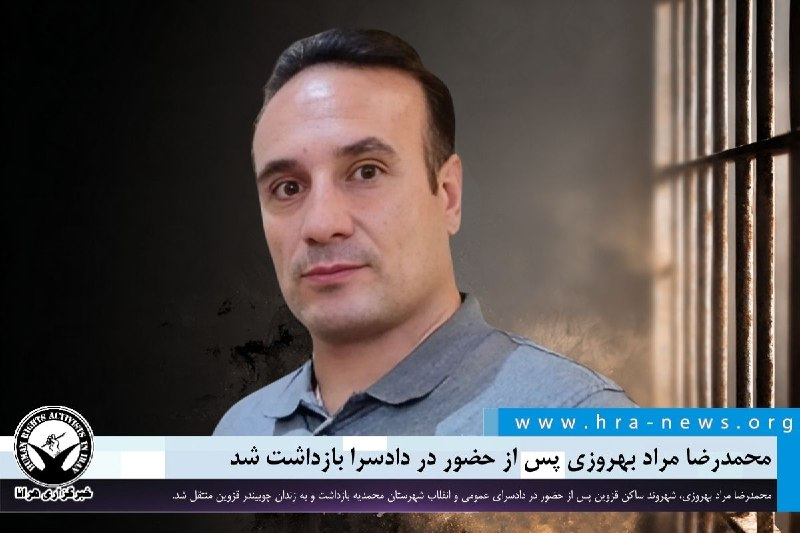

محمدرضا مراد بهروزی پس از حضور در دادسرا بازداشت شد

❗️
❗️
❗️
❗️
❗️– محمدرضا مراد بهروزی، شهروند ساکن قزوین، امروز پس از حضور در دادسرای عمومی و انقلاب شهرستان محمدیه بازداشت و به زندان چوبیندر قزوین منتقل شد.

به گزارش خبرگزاری هرانا، ارگان خبری مجموعه فعالان حقوق بشر در ایران، محمدرضا مراد بهروزی بازداشت شد.

براساس اطلاعات دریافتی هرانا، این شهروند پس از حضور در شعبه اول بازپرسی دادسرای عمومی و انقلاب شهرستان محمدیه بازداشت و سپس به زندان چوبیندر قزوین منتقل شده است.

#محمدرضا_مراد_بهروزی

ادامه مطلب

↘️
@hranews_bot تماس ✉️ - @Hranews کانال هرانا 🆑

## alonews — post 127707

  <a href="telegram/content/alonews_127707_1781378619.webm" target="_blank">🎬 Download video</a>

👈کیان عبداللهی سردبیر تسنیم در شبکه خبر: مسئولیت متن و اجرا با تیم مذاکره‌کننده و دولت است

✅ @AloNews خبر جنگ

---
📅 بروزرسانی: 1405/03/23 22:43
---

## VahidOOnLine — post 245356

  

یک منبع ارشد دیپلماتیک به روزنامه اسرائیل هیوم گفت اگر مذاکرات جمهوری اسلامی و آمریکا پس از تفاهم شکست بخورد و جمهوری اسلامی به فعالیت‌های نظامی خود ادامه دهد، موضوع تغییر حکومت در تهران روی میز تصمیم‌گیران در واشینگتن قرار خواهد گرفت.

او تاکید کرد دونالد ترامپ، رییس‌جمهوری آمریکا، به بنیامین نتانیاهو، نخست‌وزیر اسرائیل، وعده داده است که موضوع هسته‌ای، موشک‌ها و حزب‌الله در توافق مورد رسیدگی قرار خواهد گرفت و در غیر این صورت توافقی حاصل نخواهد شد.
‌🏁 🇬🇧 IranintlTV

🤖 @VahidOOnLine

## VahidOOnLine — post 245355

  

یک منبع ارشد دیپلماتیک به روزنامه اسرائیل هیوم گفت که در صورت توافق آمریکا و جمهوری اسلامی برای پایان جنگ، اسرائیل ملزم به امضای آن نیست. او گفت اسرائیل همچنان حق دفاع از خود را خواهد داشت و قادر خواهد بود از خود در برابر تهدیدها دفاع کند اما اقداماتش باید با آمریکا هماهنگ شود.

به گفته این منبع، دونالد ترامپ، رییس‌جمهوری آمریکا، به بنیامین نتانیاهو، نخست‌وزیر اسراییل، وعده داده است که موضوع هسته‌ای، موشک‌ها و حزب‌الله در توافق مورد رسیدگی قرار خواهد گرفت و در غیر این صورت توافقی حاصل نخواهد شد.

این منبع افزود اگر مذاکرات شکست بخورد و جمهوری اسلامی به فعالیت‌های نظامی خود ادامه دهد، موضوع تغییر حکومت در تهران روی میز تصمیم‌گیران در واشینگتن قرار خواهد گرفت.

این منبع تاکید کرد هماهنگی با آمریکا عمدتا به تعهدات احتمالی واشینگتن در قبال دیگر طرف‌های منطقه مربوط می‌شود.

او در پاسخ به پرسشی درباره ازسرگیری احتمالی برنامه موشکی جمهوری اسلامی گفت هدف توافق، جلوگیری از چنین وضعیتی است.
‌🏁 🇬🇧 IranintlTV

🤖 @VahidOOnLine

## FoxNewsTwitter — post 342940

‌Fox News (Twitter/X)

👉 Full story here:

## FoxNewsTwitter — post 342939

  

Fox News (Twitter/X)

World Cup tourists fall in love with middle America — raving about Waffle House at 1 a.m., Buc-ee's gas stations, and strangers driving them to stadiums in the rain. Oxford Economics expects 1.24 million international visitors for the tournament, and their viral posts are showcasing a side of the country most foreign media never covers.

## IranIntlTV — post 342131

  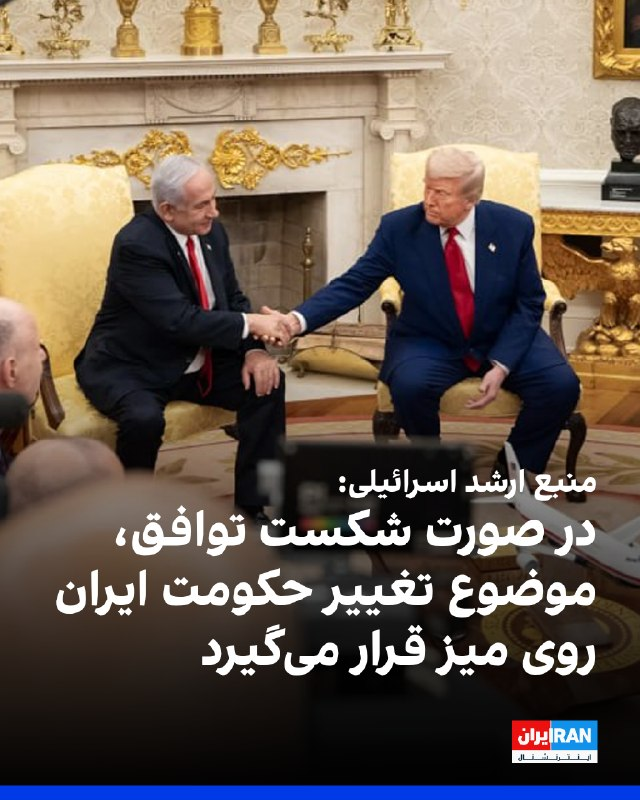

یک منبع ارشد دیپلماتیک به روزنامه اسرائیل هیوم گفت اگر مذاکرات جمهوری اسلامی و آمریکا پس از تفاهم شکست بخورد و جمهوری اسلامی به فعالیت‌های نظامی خود ادامه دهد، موضوع تغییر حکومت در تهران روی میز تصمیم‌گیران در واشینگتن قرار خواهد گرفت.

او تاکید کرد دونالد ترامپ، رییس‌جمهوری آمریکا، به بنیامین نتانیاهو، نخست‌وزیر اسرائیل، وعده داده است که موضوع هسته‌ای، موشک‌ها و حزب‌الله در توافق مورد رسیدگی قرار خواهد گرفت و در غیر این صورت توافقی حاصل نخواهد شد.
https://iranintl.com/202606133783

## IranIntlTV — post 342130

  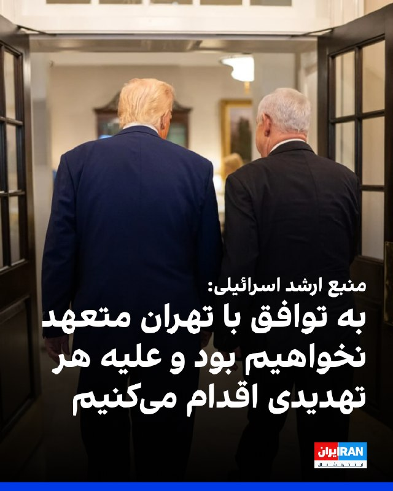

یک منبع ارشد دیپلماتیک به روزنامه اسرائیل هیوم گفت که در صورت توافق آمریکا و جمهوری اسلامی برای پایان جنگ، اسرائیل ملزم به امضای آن نیست. او گفت اسرائیل همچنان حق دفاع از خود را خواهد داشت و قادر خواهد بود از خود در برابر تهدیدها دفاع کند اما اقداماتش باید با آمریکا هماهنگ شود.

به گفته این منبع، دونالد ترامپ، رییس‌جمهوری آمریکا، به بنیامین نتانیاهو، نخست‌وزیر اسراییل، وعده داده است که موضوع هسته‌ای، موشک‌ها و حزب‌الله در توافق مورد رسیدگی قرار خواهد گرفت و در غیر این صورت توافقی حاصل نخواهد شد.

این منبع افزود اگر مذاکرات شکست بخورد و جمهوری اسلامی به فعالیت‌های نظامی خود ادامه دهد، موضوع تغییر حکومت در تهران روی میز تصمیم‌گیران در واشینگتن قرار خواهد گرفت.

این منبع تاکید کرد هماهنگی با آمریکا عمدتا به تعهدات احتمالی واشینگتن در قبال دیگر طرف‌های منطقه مربوط می‌شود.

او در پاسخ به پرسشی درباره ازسرگیری احتمالی برنامه موشکی جمهوری اسلامی گفت هدف توافق، جلوگیری از چنین وضعیتی است.
https://iranintl.com/202606134290

## Persian_Trend_Official — post 16981

  <a href="telegram/content/Persian_Trend_Official_16981_1781378018.webm" target="_blank">🎬 Download video</a>

دقایقی دیکه لایو داریم

## RadioFarda — post 158276

🔸برخی رسانه‌های داخل ایران تصاویری از تجمع برخی طرفداران حکومت در شامگاه شنبه را منتشر کرده‌اند که در مخالفت با امضای توافق احتمالی با آمریکا علیه برخی مقام‌های جمهوری اسلامی شعار می‌دهند.

🔸در یکی از این تجمعات که در میدان ابن سینا در تهران برپا شده، تجمع‌کنندگان علیه وزیر خارجه و رئیس مجلس شورای اسلامی شعارهایی مانند «عراقچی حیا کن مملکت رو رها کن» و «قالیباف، عراقچی / پس خون رهبرم چی؟» سر داده‌اند.

🔸برخی رسانه‌های نزدیک به اصلاح‌طلبان این افراد را «نزدیکان به جبهه پایداری» معرفی کرده‌اند.

🔸خبرگزاری دانشجو نیز عکس‌هایی از یک تجمع در مشهد منتشر کرده که در آن‌ها پلاکاردهایی در مخالفت با توافق و همچنین انتقاد تند از مذاکره‌کنندگان دیده می‌شود.

@RadioFarda

## Dirty_Kids — post 391921

  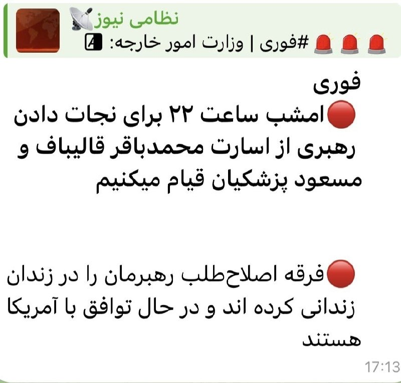

چندتا از نماینده‌های قم و تهران به مخالف‌های توافق، فراخوان دادن و گفتن حالا که اینجور شد، همگی بریزیم بیرون. @Dirty_Kids 👻

## Dirty_Kids — post 391920

  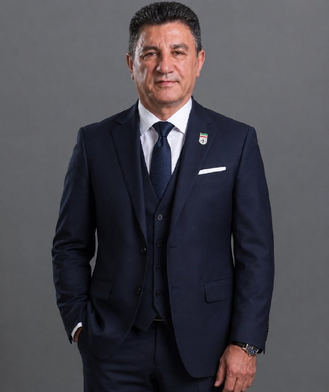

تیپ رسمی و درست و در شأن یه کشور با اصالت همچین چیزیه آقای قلعه‌نویی
تازه ساعتت هم پیداست

@Dirty_Kids 👻

## Dirty_Kids — post 391919

  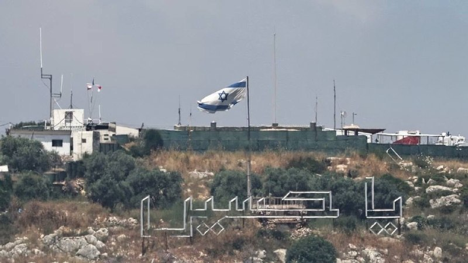

‏با آل علی هرکه در افتاد پیروز شد،نصب پرچم اسراییل بالای کلمه یاحسین🤣

#لبنان

@Dirty_Kids 👻

## Dirty_Kids — post 391917

چندتا از نماینده‌های قم و تهران به مخالف‌های توافق، فراخوان دادن و گفتن حالا که اینجور شد، همگی بریزیم بیرون.

@Dirty_Kids 👻

## alonews — post 127706

  <a href="telegram/content/alonews_127706_1781378020.webm" target="_blank">🎬 Download video</a>

👈گروه‌های تندرو و افراطی اعلام کردن اگه مسئولین توافق کنن، انقد میان تو خیابون تا جمهوری اسلامی سرنگون بشه.

✅ @AloNews خبر جنگ

## alonews — post 127705

  <a href="telegram/content/alonews_127705_1781378020.webm" target="_blank">🎬 Download video</a>

👈هم اکنون در تجمعات تندروها شعار عراقچی، قالیباف استعفا، استعفا! 
✅ @AloNews خبر جنگ

## alonews — post 127704

  <a href="telegram/content/alonews_127704_1781378021.mp4" target="_blank">🎬 Download video</a>

👈هم اکنون در تجمعات تندروها شعار عراقچی، قالیباف استعفا، استعفا!

✅ @AloNews خبر جنگ

## alonews — post 127703

  

قمار بازه؟ بچه بازه؟ کصکشه؟

این ده شب رو میخواد امام حسینی باشه

[@AloTweet]

## alonews — post 127702

  <a href="telegram/content/alonews_127702_1781378024.webm" target="_blank">🎬 Download video</a>

👈شبکه اسراییلی کان به نقل از منابع آگاه: ارتش برای توقف عملیات زمینی در لبنان به عنوان بخشی از توافقی که در حال شکل‌گیری میان واشنگتن و تهران است آماده می‌شود

✅ @AloNews خبر جنگ

## alonews — post 127701

  <a href="telegram/content/alonews_127701_1781378024.webm" target="_blank">🎬 Download video</a>

🔴یه عمر می‌گفتیم چپ نفهمید ، ولی اینطور نیست.

🤔چپ مستقیما از جمهوری اسلامی پول میگیره که اوپوزیسیون رو تخریب کنه.

✅@AloNews

---
📅 بروزرسانی: 1405/03/23 22:33
---

## VahidOOnLine — post 245354

  <a href="telegram/content/VahidOOnLine_245354_1781377402.mp4" target="_blank">🎬 Download video</a>

یک شهروند ویدیویی به ایران اینترنشنال فرستاد و گفت که در محله شهران تهران از حدود ساعت ۱ ظهر ۲۳ خرداد، آب دچار قطعی کامل شد.
‌🏁 🇬🇧 IranintlTV

🤖 @VahidOOnLine

## mwarmonitor — post 10837

🔴خبرنگار آمیت سگال از کانال ۱۲ اسرائیل به نقل از یک «مقام بسیار ارشد اسرائیلی» درباره توافق در حال شکل‌گیری می‌گوید:
«این یک توافق مزخرف است.»

@mwarmonitor

## pm_afshaa — post 93799

  <a href="telegram/content/pm_afshaa_93799_1781377404.webm" target="_blank">🎬 Download video</a>

🔴شورای هماهنگی بانک‌های دولتی:
امروز اختلال در سامانه‌های 4 بانک ناشی از یک حمله سایبری محدود بود، اما هیچ‌گونه نشت اطلاعات یا دسترسی غیرمجاز به داده‌های مشتریان رخ نداده.

💧 Rainbet.com the #1 Non-KYC Crypto Casino & Sportsbook @rainbetcom

😁 @Pm_Afshaa

## DEJradio — post 5663

  <a href="telegram/content/DEJradio_5663_1781377404.webm" target="_blank">🎬 Download video</a>

🚨
🔸 خبر ۲۱
شنبه ۲۳ خرداد ۱۴۰۵

#خبر۲۱
@DEJradio

## VahidOnline — post 76307

خبرگزاری فارس، رسانه وابسته به سپاه پاسداران، شامگاه شنبه ۲۳ خرداد اصرار دونالد ترامپ بر امضای یادداشت تفاهم با جمهوری اسلامی در روز یکشنبه را «عجیب» و «فشار نمایشی» خواند.

فارس نوشت: «سرنوشت امضای یکشنبه نه‌فقط یک آزمون فنی برای محتوای تفاهم، بلکه آزمونی برای صداقت و ایستادگی مسئولان ایرانی در برابر فشارهای نمایشی نیز خواهد بود.»
@VahidOOnLine
وب‌سایت خبری اکسیوس به نقل از منابع آگاه نوشت که دلیل امضای ویدیویی توافق آمریکا و جمهوری اسلامی، «ملاحظات اجرایی و لجستیکی» و عدم امکان سفر جی‌دی‌ونس به پاکستان است.

اکسیوس نوشت که یکی از دلایل اصلی امضای ویدیویی توافق آمریکا و جمهوری اسلامی این است که ونس در صورت سفر برای امضای توافق، نمی‌توانست قبل از عزیمت ترامپ برای شرکت در اجلاس گروه ۷ در فرانسه در صبح دوشنبه به آمریکا بازگردد.
@VahidOOnLine

📡 @VahidOnline

## IranIntlTV — post 342129

  <a href="telegram/content/IranIntlTV_342129_1781377405.mp4" target="_blank">🎬 Download video</a>

یک شهروند ویدیویی به ایران اینترنشنال فرستاد و گفت که در محله شهران تهران از حدود ساعت ۱ ظهر ۲۳ خرداد، آب دچار قطعی کامل شد.

## IranIntlTV — post 342128

  <a href="telegram/content/IranIntlTV_342128_1781377407.mp4" target="_blank">🎬 Download video</a>

دونالد ترامپ، رییس‌جمهوری آمریکا، اعلام کرد توافق با جمهوری اسلامی روز یکشنبه امضا خواهد شد و پس از آن تنگه هرمز به روی همه کشورها باز می‌شود. او همچنین گفت برخلاف برجام، هیچ پولی به جمهوری اسلامی پرداخت نخواهد شد.

جزییات بیشتر با اردوان روزبه، خبرنگار ایران‌اینترنشنال
@iranintltv

## Iliaen — post 4480

از عجایب آخرین فصل از کتاب جمهوری اسلامی:

گزارش‌ها از درگیری طرفداران نظام با ماموران در منطقه دروازه شمیران تهران حکایت دارد. برخی از طرفداران نظام می‌گویند خون رهبر آن‌ها فروخته شده و تهدید به خودسوزی کردند، ماموران نیز با تیم آتش‌نشانی در محدوده تجمع آماده‌باش هستند.

@iliaen

## FarsiVOA — post 220617

گوگل کانال‌های حکومتی مرتبط با جمهوری اسلامی در یوتیوب را مسدود کرد

## FarsiVOA — post 220616

در گفت‌وگو با ستار رحمانی، فعال حقوق معلمان و کارگران، به بازتاب سخنرانی فعالان صنفی مستقل در اجلاس جهانی کار پرداختیم؛ جایی که به گفته او، جمهوری اسلامی در سایه این حضور و افشاگری‌ها نتوانست چهره‌ای دموکرات از خود نشان دهد.

## FarsiVOA — post 220615

🔺سنتکام: نیروهای آمریکایی مسیر ۱۴۱ کشتی تجاری را برای اجرای محاصره دریایی جمهوری اسلامی تغییر دادند

▪️فرماندهی مرکزی ایالات متحده، سنتکام، اعلام کرد نیروهای آمریکایی تا ۲۳ خرداد، در جریان اعمال محاصره دریایی علیه جمهوری اسلامی، مسیر ۱۴۱ کشتی تجاری را تغییر دادند و ۹ کشتی تجاری دیگر را به دلیل عدم تبعیت از دستورها از کار انداخته‌اند.

⬇️ بیشتر بخوانید:
https://ir.voanews.com/a/centcom-redirects-141-commercial-vessels/8160481.html/?nocach=1

## Persian_Trend_Official — post 16979

  <a href="telegram/content/Persian_Trend_Official_16979_1781377408.webm" target="_blank">🎬 Download video</a>

مقامات امنیتی اسرائیل به خبرگزاری کان گفتند که ارتش اسرائیل طبق توافق ایالات متحده و ایران از منطقه امنیتی در جنوب لبنان عقب‌نشینی نخواهد کرد و قرار است این موضوع در طول مذاکرات مستقیم در ایالات متحده در حدود یک هفته و نیم آینده با نمایندگان لبنان مورد بحث…

## Persian_Trend_Official — post 16978

  <a href="telegram/content/Persian_Trend_Official_16978_1781377409.webm" target="_blank">🎬 Download video</a>

ایران در این مرحله خواستار عقب‌نشینی اسرائیل از جنوب لبنان شد.

## IranianMinds — post 22488

🔴یک مقام آمریکایی به شبکه ۱۳ اسرائیل:

این بحث توافق احتمالی مزخرف هست.

@IranianMinds

## alonews — post 127700

  <a href="telegram/content/alonews_127700_1781377409.webm" target="_blank">🎬 Download video</a>

👈 حمله هوایی اسرائیلی به شهر كفر جوز در جنوب لبنان

✅ @AloNews خبر جنگ

---
📅 بروزرسانی: 1405/03/23 22:23
---

## VahidOOnLine — post 245353

♦️اعضای خانواده سلطنتی بریتانیا روز شنبه ۲۳ خرداد در رژه رسمی تولد پادشاه در لندن شرکت کردند؛ مراسمی نظامی که هر سال به مناسبت تولد رسمی پادشاه بریتانیا برگزار می‌شود.
به گزارش رویترز، بیش از ۱۴۰۰ سرباز، ۲۰۰ اسب و ۴۰۰ نوازنده در این مراسم حضور داشتند و رژه‌ای گسترده از توان نظامی، مهارت‌های سواره‌نظام و تشریفات سلطنتی را به نمایش گذاشتند.
اگرچه تولد رسمی چارلز سوم، پادشاه بریتانیا، هر سال در ماه ژوئن (خرداد) جشن گرفته می‌شود، اما او ۱۴ نوامبر (۲۳ آبان) متولد شده است.
‌🇸🇦 Indypersian

🤖 @VahidOOnLine

## WithYashar — post 14741

رسانه های آمریکایی: مراسم تشییع سید علی خامنه ای رهبر سابق جمهوری اسلامی ایران در روز 4 جولای، زمانی که آمریکا روز استقلال را جشن می گیرد، برگزار خواهد کرد.
@withyashar

## pm_afshaa — post 93798

  <a href="telegram/content/pm_afshaa_93798_1781376819.webm" target="_blank">🎬 Download video</a>

🔴رسانه‌های اسرائیلی: کابینه امنیتی اسرائیل فردا شب به دلیل توافق بین آمریکا و ایران تشکیل جلسه خواهد داد.

💧 Rainbet.com the #1 Non-KYC Crypto Casino & Sportsbook @rainbetcom

😁 @Pm_Afshaa

## FarsiVOA — post 220614

پیمان گنجی، از بازداشت‌شدگان اعتراضات دی‌ماه ۱۴۰۵، با اتهام محاربه به اعدام محکوم شد. دو معترض محکوم به اعدام هم به زندان قزلحصار منتقل شدند

## Persian_Trend_Official — post 16977

  <a href="telegram/content/Persian_Trend_Official_16977_1781376820.webm" target="_blank">🎬 Download video</a>

دونالد ترامپ عکسی از کیم جونگ اون و خودش در تروث سوشال منتشر کرد.

📝 Amir

📌 @persian_trend_official
پرشین ترند | متفاوت‌ترین کانال نظامی

## Persian_Trend_Official — post 16976

  

رشیدی کوچی نماینده مجلس: تندروها به زباله دان تاریخ خواهند پیوست

👺Phantom

📌 @persian_trend_official
پرشین ترند | متفاوت‌ترین کانال نظامی

## Persian_Trend_Official — post 16975

  <a href="telegram/content/Persian_Trend_Official_16975_1781376821.mp4" target="_blank">🎬 Download video</a>

📣شعار های امشب امت حزب الله 
😁

عراقچی حیا کن
امریکارو رها کن

👺Phantom

📍@persian_trend_official
پرشین ترند | متفاوت‌ترین کانال نظامی

## Persian_Trend_Official — post 16974

  <a href="telegram/content/Persian_Trend_Official_16974_1781376823.webm" target="_blank">🎬 Download video</a>

روابط عمومی حزب‌الله لبنان ویدیویی از لحظه رهگیری و انهدام یک فروند پهپاد هرون اسرائیلی توسط موشک پدافندی 358 منتشر کرد.

📝 Amir

📌 @persian_trend_official
پرشین ترند | متفاوت‌ترین کانال نظامی

## alonews — post 127699

  <a href="telegram/content/alonews_127699_1781376824.mp4" target="_blank">🎬 Download video</a>

👈کریستی نوام، نماینده ویژه ایالات متحده برای سپر آمریکا، می‌گوید که فکر می‌کند سپر آمریکا «قوی‌تر از ناتو» خواهد بود.

✅ @AloNews خبر جنگ

## alonews — post 127698

  <a href="telegram/content/alonews_127698_1781376827.mp4" target="_blank">🎬 Download video</a>

👈شعار مرگ بر قالیشاه در اغتشاشات میدان ابن سینا در تجمع پایداری‌ها

✅ @AloNews خبر جنگ

---
📅 بروزرسانی: 1405/03/23 22:13
---

## VahidOOnLine — post 245352

  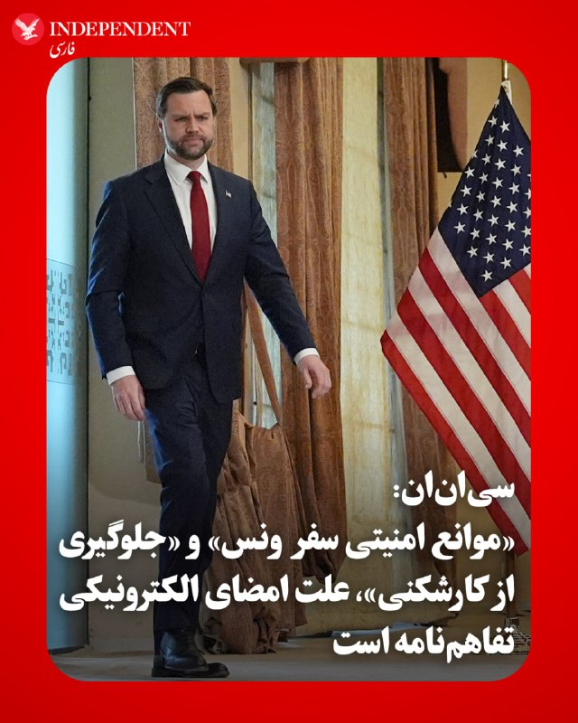

♦️ به گزارش سی‌ان‌ان، مقامات آگاه اعلام کردند که برنامه‌ریزی برای امضای مجازی یادداشت تفاهم میان جمهوری اسلامی ایران و آمریکا طی روز جمعه نهایی شد تا این توافق به سرعت تثبیت شود و از کارشکنی‌های لحظه آخری جلوگیری به عمل آید.

پیش از این، دونالد ترامپ از احتمال برگزاری مراسم امضای حضوری در اروپا با حضور معاونش، جی‌دی ونس، خبر داده بود، اما این برنامه به دلیل تداخل‌های تدارکاتی و امنیتی لغو شد. از آنجا که رئیس‌جمهور آمریکا و معاونش به دلایل امنیتی هم‌زمان سفر خارجی انجام نمی‌دهند و ترامپ نیز بامداد دوشنبه عازم اجلاس جی۷ در فرانسه است، هماهنگی سفر اروپایی ونس ممکن نشد.

بنا بر این گزارش، واسطه‌ها برای جلوگیری از فروپاشی دستاوردها، گزینه امضای الکترونیکی را پیشنهاد دادند؛ چرا که نگرانند طولانی شدن این روند، احتمال عقب‌نشینی طرفین یا بروز حادثه‌ای مخل را افزایش دهد. این در حالی است که واشنگتن و تهران هنوز روایت‌های متفاوتی از مفاد توافق، به‌ویژه میزان کاهش تحریم‌های مالی ایران ارائه می‌دهند؛ تضادی که مشخص نیست صرفا یک تاکتیک رسانه‌ای است یا نشانه‌ای از اختلافات عمیق‌تر که می‌تواند توافق را به هم بزند.
‌🇸🇦 Indypersian

🤖 @VahidOOnLine

## DEJradio — post 5662

👑📢 راهپیمایی ایرانیان در مالمو سوئد به مناسبت روز شیر و خورشید و زادروز مجیدرضا رهنورد.

#روز_شیروخورشید #مجیدرضا_رهنورد
@DEJradio

## IranIntlTV — post 342127

  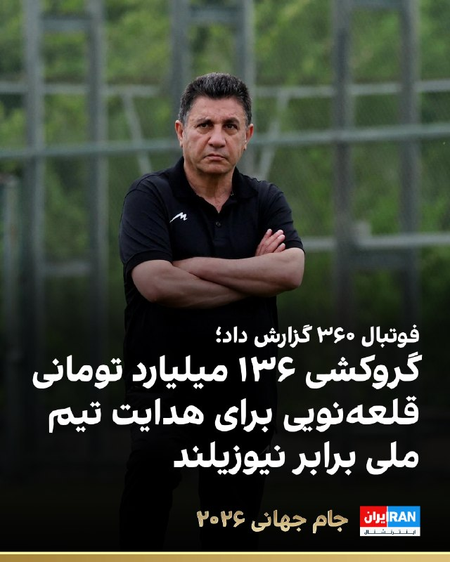

🔻فوتبال۳۶۰ گزارش داد پس از اختصاص پاداش ۳۵۰ میلیارد تومانی به بازیکنان و مربیان تیم ملی فوتبال، امیر قلعه‌نویی فدراسیون فوتبال را تهدید کرده در صورتی که پاداش ۱۳۶ میلیارد تومانی، معادل ۸۰۰ هزار دلار، را پیش از بازی با نیوزیلند دریافت نکند، در این مسابقه روی نیمکت تیم ملی نخواهد نشست.

🔹در این گزارش آمده که قلعه‌نویی حتی زبان تهدید به کار برده و گفته اگر قبل از بازی نخست، مقابل نیوزیلند، این رقم پاداش به حسابش واریز نشود، روی صندلی سرمربیگری تیم ملی نخواهد نشست.

🔹فوتبال۳۶۰ نوشته که از آنجا که قلعه‌نویی اطمینان خاطر ندارد بعد از جام جهانی همچنان سرمربی تیم ملی باشد، می‌خواهد قبل از شروع جام، این رقم پاداش را در حسابش داشته باشد.

🔹فدراسیون فوتبال اما با تکذیب این گزارش نوشت: «مطالب منتشرشده در این خصوص صحت نداشته و صرفا در راستای فضاسازی رسانه‌ای و تشویش افکار عمومی است.»

@iranintltvsport

## RadioFarda — post 158275

  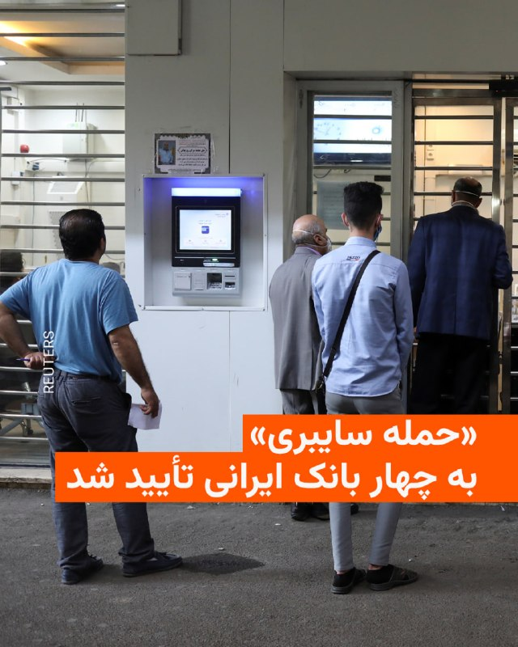

🔸شورای هماهنگی بانک‌ها شامگاه شنبه اعلام کرد چهار بانک ایرانی که در طول روز دچار اختلال شده بودند، در معرض «حمله سایبری محدود» قرار گرفته‌اند.

🔸در بیانیه‌ای که این شورا منتشر کرده اذعان شده که «محدودیت‌ها» برای مشتریان چهار بانک شامل ملی، تجارت، صادرات و توسعه صادرات ادامه دارد و وعده داده شده که «خدمات بانکی در کوتاه‌ترین زمان ممکن و با بالاترین سطح امنیت» به حالت عادی بازگردد.

🔸رسانه‌های ایران پیشتر خبر دادند که خدمات چهار بانک ایرانی به شکل همزمان دچار اختلال شده و استفاده از همراه‌بانک و دستگاه‌های خودپرداز آنها امکان‌پذیر نیست.

🔸شورای هماهنگی بانک‌ها گفته است: «اختلال ناشی از یک حمله سایبری محدود به این چهار بانک بوده و خوشبختانه هیچ‌گونه دسترسی غیرمجاز به اطلاعات مشتریان رخ نداده و نشت اطلاعاتی اتفاق نیفتاده است.»

🔸حملات به شبکه بانکی ایران در سال‌های اخیر سابقه دارد و بارها اطلاعات مشتریان بانک‌های مختلف ایران هدف رخنهٔ سایبری قرار گرفته و در فضای مجازی و اینترنت خرید و فروش شده است.

@RadioFarda

## IranianMinds — post 22486

🔴شاید باورش براتون سخت باشه اما چنتا از نماینده‌های قم و تهران به مخالفای توافق فراخوان دادن و گفتن حالا که اینجور شد همگی بریزیم بیرون.

@IranianMinds

## IranianMinds — post 22485

😳 هنوزم واسه کانفیگ هزینه میکنی؟ 
🍸 با داییجون رایگان وصل شو 
🎁 کاملا رایگان بدون نیاز به رفرال یا هزینه ای 
🌟 به محض استارت کردن ربات کانفیگت واست ارسال میشه 
🎁 @Daeijoonbot | استارت کن و کانفیگ رایگان بگیر 
🌟

## IranianMinds — post 22484

  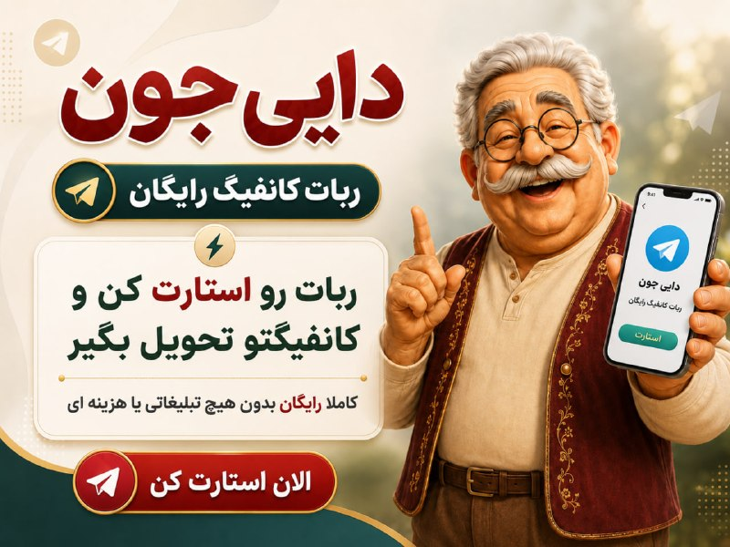

😳 هنوزم واسه کانفیگ هزینه میکنی؟

🍸 با داییجون رایگان وصل شو

🎁 کاملا رایگان بدون نیاز به رفرال یا هزینه ای

🌟 به محض استارت کردن ربات کانفیگت واست ارسال میشه

🎁 @Daeijoonbot | استارت کن و کانفیگ رایگان بگیر 
🌟

---
📅 بروزرسانی: 1405/03/23 22:03
---

## VahidOOnLine — post 245351

  

شبکه کان به نقل از منابع امنیتی اسرائیلی گزارش داد که در سایه تفاهم احتمالی آمریکا و جمهوری اسلامی، ارتش اسرائیل برای احتمال صدور دستور از سوی مقام‌های سیاسی این کشور به‌منظور توقف پیشروی زمینی در جنوب لبنان آماده می‌شود اما از نوار امنیتی در جنوب لبنان عقب‌نشینی نخواهد کرد.

بر اساس این گزارش، اسرائیل همچنین در حال برنامه‌ریزی برای کاهش حملات در عمق خاک لبنان است تا از آسیب دیدن تفاهم میان آمریکا و جمهوری اسلامی جلوگیری شود.

یک منبع آگاه به کان گفت ارتش اسرائیل همچنان به حملات خود در جنوب لبنان ادامه می‌دهد، اما این حملات هدفمند و محدود هستند. به گفته این منبع، فعالیت ارتش این کشور در بیروت نیز همچنان با محدودیت‌هایی همراه است.

به گفته این منابع، موضوع نوار امنیتی قرار است در مذاکرات مستقیم میان اسرائیل و لبنان که حدود یک هفته و نیم دیگر در آمریکا برگزار می‌شود، مورد بررسی قرار گیرد.
‌🏁 🇬🇧 IranintlTV

🤖 @VahidOOnLine

## VahidOOnLine — post 245350

  <a href="telegram/content/VahidOOnLine_245350_1781375590.mp4" target="_blank">🎬 Download video</a>

♦️همزمان با جاری شدن دوباره آب در زاینده‌رود، قایق‌های پدالی خاطره‌انگیز بار دیگر به این رودخانه تاریخی بازگشتند و شماری از مردم اصفهان با قایق‌سواری در نزدیکی پل تاریخی خواجو و سی‌سه پل  بازگشت آب را جشن گرفتند.
بسیاری از مردم اصفهان با حضور در کنار پل‌های تاریخی شهر و انجام ورزش‌ها و تفریحات آبی، از جمله قایق‌سواری، از بازگشت آب به زاینده‌رود استقبال کردند.
پس از ۱۱ ماه خشکی، جریان آب زاینده‌رود چهارشنبه‌شب ۱۳ خردادماه بار دیگر به شهر اصفهان رسید و در بستر این رودخانه جاری شد.
زاینده‌رود، مهم‌ترین رودخانه فلات مرکزی ایران، در سال‌های اخیر بارها با خشکی و کاهش شدید جریان آب روبه‌رو بوده و بازگشت آب به بستر آن همواره با شادی و استقبال گسترده مردم همراه شده است.
‌🇸🇦 Indypersian

🤖 @VahidOOnLine

## WithYashar — post 14740

الان روبیکا ، بله و سروش فیلتر‌ میشه 😂 @withyashar

## WithYashar — post 14739

شورای هماهنگی بانک‌های دولتی:

اختلال در سامانه‌های چهار بانک ناشی از یک حمله سایبری محدود بوده، اما هیچ‌گونه نشت اطلاعات یا دسترسی غیرمجاز به داده‌های مشتریان رخ نداده است
@withyashar

## WithYashar — post 14738

مقام ارشد اسرائیلی به کانال ۱۲ اسرائیل: این یه توافق مزخرفه
@withyashar

## WithYashar — post 14737

مردم طرفدار حکومت اعتراضاتی رو در چند استان شروع کردند @withyashar

## WithYashar — post 14736

کارشناس شبکه افق:به زودی جنگ را به خاک آمریکا می‌بریم و دیگر قرار نیست در خاک خودمان با دشمن بجنگیم جمهوری‌ اسلامی هنوز کارت های خود را رو نکرده
@withyashar

## WithYashar — post 14735

  <a href="telegram/content/WithYashar_14735_1781375593.mp4" target="_blank">🎬 Download video</a>

مردم طرفدار حکومت اعتراضاتی رو در چند استان شروع کردند
@withyashar

## pm_afshaa — post 93797

  <a href="telegram/content/pm_afshaa_93797_1781375594.webm" target="_blank">🎬 Download video</a>

🔴یک مقام آمریکایی به کانال 12 اسرائیل:
این قرارداد احتمالی صلح با ایران مزخرفه.

💧 Rainbet.com the #1 Non-KYC Crypto Casino & Sportsbook @rainbetcom

😁 @Pm_Afshaa

## pm_afshaa — post 93796

جنگ نخواهد شد و مذاکره هم نخواهیم کرد

هم جنگ شد هم مذاکره و توافق😂

## pm_afshaa — post 93795

کارشناس شبکه افق:به زودی جنگ را به خاک آمریکا می‌بریم و دیگر قرار نیست در خاک خودمان با دشمن بجنگیم جمهوری‌ اسلامی هنوز کارت های خود را رو نکرده

💧 Rainbet.com the #1 Non-KYC Crypto Casino & Sportsbook @rainbetcom

😁 @Pm_Afshaa

## IranIntlTV — post 342126

  <a href="telegram/content/IranIntlTV_342126_1781375595.mp4" target="_blank">🎬 Download video</a>

خبرگزاری رویترز ویدیویی از شهر نبطیه در جنوب لبنان منتشر کرده است که نشان می‌دهد روز شنبه ۲۳ خرداد در پی حمله اسرائیل به مواضع حزب‌الله، گروه مورد حمایت جمهوری اسلامی، چند انفجار مهیب رخ داد و پس از آن دود غلیظی به هوا برخاست.
@iranintltv

## IranIntlTV — post 342125

  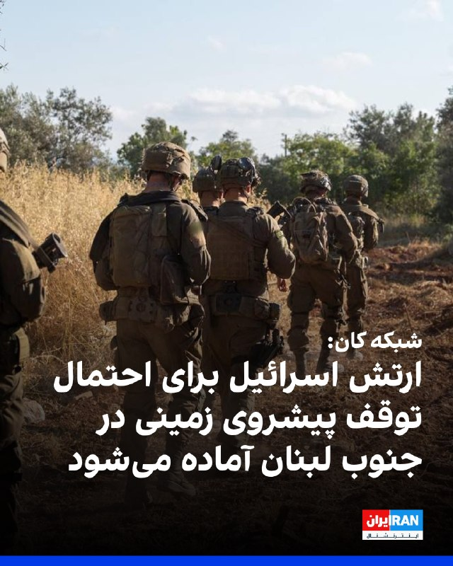

شبکه کان به نقل از منابع امنیتی اسرائیلی گزارش داد که در سایه تفاهم احتمالی آمریکا و جمهوری اسلامی، ارتش اسرائیل برای احتمال صدور دستور از سوی مقام‌های سیاسی این کشور به‌منظور توقف پیشروی زمینی در جنوب لبنان آماده می‌شود اما از نوار امنیتی در جنوب لبنان عقب‌نشینی نخواهد کرد.

بر اساس این گزارش، اسرائیل همچنین در حال برنامه‌ریزی برای کاهش حملات در عمق خاک لبنان است تا از آسیب دیدن تفاهم میان آمریکا و جمهوری اسلامی جلوگیری شود.

یک منبع آگاه به کان گفت ارتش اسرائیل همچنان به حملات خود در جنوب لبنان ادامه می‌دهد، اما این حملات هدفمند و محدود هستند. به گفته این منبع، فعالیت ارتش این کشور در بیروت نیز همچنان با محدودیت‌هایی همراه است.

به گفته این منابع، موضوع نوار امنیتی قرار است در مذاکرات مستقیم میان اسرائیل و لبنان که حدود یک هفته و نیم دیگر در آمریکا برگزار می‌شود، مورد بررسی قرار گیرد.
https://iranintl.com/202606132065

## FarsiVOA — post 220613

🔺فعالان و نهادهای حقوق ‌‌بشری در مورد اعدام زود هنگام چند جوان مخالف توسط جمهوری اسلامی هشدار می‌دهند

▪️همزمان با افزایش احتمال امضای توافقنامه‌ای میان جمهوری اسلامی و آمریکا برای توقف درگیری‌ها، رژیم ایران چند جوان دیگر را به دلیل مخالفت و اعتراض به شرایط کشور زیر تیغ اعدام قرار داده است. فعالان و نهادهای حقوق بشری روز شنبه ۲۳ خرداد ۱۴۰۵ نسبت به افزایش خطر اجرای حکم اعدام آرمین نورمحمدی، ایمان گنجی و علی کمالی هشدار دادند.

⬇️ بیشتر بخوانید:

https://ir.voanews.com/a/iran-execution-prison-protest-america-day-war-/8160464.html/?nocach=1

## BBCPersian — post 283726

  <a href="telegram/content/BBCPersian_283726_1781375596.mp4" target="_blank">🎬 Download video</a>

⚽️کری‌خوانی نیوزیلندی‌ها برای تیم ملی ایران در حاشیه برد ۴-۱ آمریکا.

دو هوادار نیوزیلندی که برای تماشای مسابقه‌های تیم ملی کشورشان به آمریکا رفته‌اند، در حاشیه تماشای بازی آمریکا و پاراگوئه برای تیم ملی ایران کری‌ خواندند. یکی از آنها اسم بازیکنانی را فهرست کرد که پیش‌بینی می‌کرد در بازی با ایران گل بزنند. در میان آنها هم بازیکن حمله بود، هم هافبک، هم مدافع و هم دروازه‌بان.

مسابقه آمریکا با چهار گلی که این تیم به پاراگوئه زد، بیشتر کسانی که برای تماشا به محوطه هواداران فیفا آمده بودند را خوشحال کرد.

خبرنگارمان سام فرزانه به این محدوده هواداران رفته و این گزارش را تهیه کرده است.

😏راستی پاسخ شما به کری آن نیوزیلندی‌ها چیست؟ در کامنت‌های این پست اینستاگرام بنویسید.
instagram.com/reel/DZiT5PyIcbv/
@bbcpersian

## Dirty_Kids — post 391916

  <a href="telegram/content/Dirty_Kids_391916_1781375598.mp4" target="_blank">🎬 Download video</a>

شعار امشب تجمعات حکومتی: قالیباف، عراقچی، استعفاء استعفاء😂😂

منتظرم بریزن سرکوبشون کنن

@Dirty_Kids 👻

## Hranews — post 113591

صدور و تایید حکم اعدام برای ۳ متهم/ رهایی یک زندانی از مجازات مرگ

❗️
❗️
❗️
❗️
❗️– دو متهم در پرونده‌های مجزا توسط دادگاه کیفری تهران بابت اتهام قتل به اعدام محکوم شدند. حکم اعدام یک متهم نیز در پرونده‌ای با اتهام تجاوز، توسط دیوان عالی کشور تایید شد. از سوی دیگر، یک زندانی در استان خراسان رضوی که پیشتر از بابت اتهام قتل به #اعدام محکوم شده بود، با اعلام رضایت اولیای دم از مجازات مرگ رهایی یافت.

ادامه مطلب

↘️
@hranews_bot تماس ✉️ - @Hranews کانال هرانا 🆑

## alonews — post 127697

  <a href="telegram/content/alonews_127697_1781375600.webm" target="_blank">🎬 Download video</a>

👈الجزیره به نقل از سازمان پخش اسرائیل: ارتش برای احتمال صدور دستور توقف پیشروی زمینی در جنوب لبنان از سوی فرماندهی سیاسی آماده می‌شود

✅ @AloNews خبر جنگ

## alonews — post 127696

  <a href="telegram/content/alonews_127696_1781375600.webm" target="_blank">🎬 Download video</a>

👈مقام ارشد اسرائیلی به کانال ۱۲ اسرائیل: این یه توافق مزخرفه

✅ @AloNews خبر جنگ

## alonews — post 127695

  <a href="telegram/content/alonews_127695_1781375601.webm" target="_blank">🎬 Download video</a>

👈نشست اضطراری کابینه امنیتی اسرائیل در پی آخرین تحولات ایران

✅ @AloNews خبر جنگ

---
📅 بروزرسانی: 1405/03/23 21:53
---

## pm_afshaa — post 93794

تجمع عرزشی‌ها با شعار مرگ بر سازشگر 
💧 Rainbet.com the #1 Non-KYC Crypto Casino & Sportsbook @rainbetcom 
😁 @Pm_Afshaa

## pm_afshaa — post 93793

تجمع عرزشی‌ها با شعار مرگ بر سازشگر 
💧 Rainbet.com the #1 Non-KYC Crypto Casino & Sportsbook @rainbetcom 
😁 @Pm_Afshaa

## pm_afshaa — post 93792

  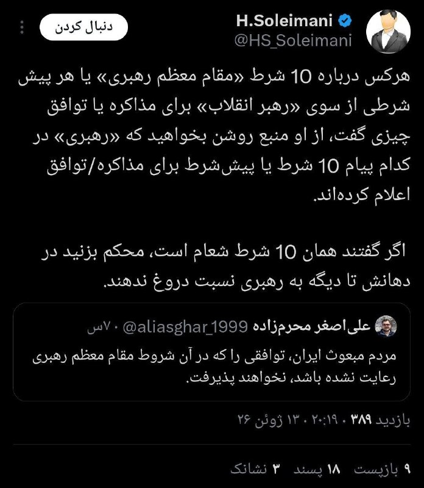

سر دبیر مشرق شروط رهبری رو انکار کرد

💧 Rainbet.com the #1 Non-KYC Crypto Casino & Sportsbook @rainbetcom

😁 @Pm_Afshaa

## pm_afshaa — post 93791

  <a href="telegram/content/pm_afshaa_93791_1781374988.mp4" target="_blank">🎬 Download video</a>

تجمع عرزشی‌ها با شعار مرگ بر سازشگر

💧 Rainbet.com the #1 Non-KYC Crypto Casino & Sportsbook @rainbetcom

😁 @Pm_Afshaa

## pm_afshaa — post 93789

  <a href="telegram/content/pm_afshaa_93789_1781374991.mp4" target="_blank">🎬 Download video</a>

🔴عرزشی‌ها دارن تو تجمعات شبانه علیه قالیباف و عراقچی شعار میدن :

قالیباف، عراقچی/ پس خون رهبرم چی.
عراقچی، حیا کن / آمریکا رو رها کن.

💧 Rainbet.com the #1 Non-KYC Crypto Casino & Sportsbook @rainbetcom

😁 @Pm_Afshaa

## pm_afshaa — post 93788

رادان :هرکس در تجمعات علیه وحدت ملی و‌ مذاکرات شعار دهد، بعنوان تفرقه‌افکن با او برخورد جدی میشود 
💧 Rainbet.com the #1 Non-KYC Crypto Casino & Sportsbook @rainbetcom 
😁 @Pm_Afshaa

## pm_afshaa — post 93787

رادان :هرکس در تجمعات علیه وحدت ملی و‌ مذاکرات شعار دهد، بعنوان تفرقه‌افکن با او برخورد جدی میشود

💧 Rainbet.com the #1 Non-KYC Crypto Casino & Sportsbook @rainbetcom

😁 @Pm_Afshaa

## IranIntlTV — post 342124

  <a href="telegram/content/IranIntlTV_342124_1781374992.mp4" target="_blank">🎬 Download video</a>

مهدی مهدوی‌آزاد در برنامه «چشم‌انداز» می‌گوید اگر گزارش رویترز درباره برچیده شدن برنامه هسته‌ای جمهوری اسلامی بر اساس توافق احتمالی درست باشد، این پرسش مطرح می‌شود که چرا حکومت سال‌ها پیش چنین توافقی را نپذیرفت و اجازه داد ده‌ها میلیارد دلار از سرمایه ایران از بین برود.
@iranintltv

## Shin_Persian — post 7022

Shin ✓ @hey_itsmyturn
Sat, 13 Jun 2026 18:17:41 UTC

Watching regime fans in 2 groups of pro-deal and anti-deal fighting each other on X is like watching The Purge, except that it's ACTUAL FUN while you're rooting for neither of the side

ترجمه خودکار فارسی

تماشای درگیری طرفداران رژیم در دو گروهِ موافق توافق و مخالف توافق با یکدیگر در X (توییتر سابق) مانند تماشای فیلم «پاکسازی» (The Purge) است، با این تفاوت که واقعاً سرگرم‌کننده است در حالی که طرف هیچ‌کدام از گروه‌ها را نمی‌گیری.

𝕏 · @shin_persian

## FarsiVOA — post 220612

  <a href="telegram/content/FarsiVOA_220612_1781374995.mp4" target="_blank">🎬 Download video</a>

ارتش اسرائیل می‌گوید نیروهایش در ادامه عملیات پاکسازی شبکه گسترده تونل‌های زیرزمینی در ارتفاعات بوفور «نقشه‌هایی تهدیدآمیز» کشف کرده‌اند؛ شبکه‌ای که به گفته ارتش اسرائيل، با طراحی و تأمین مالی جمهوری اسلامی ایران ساخته شده است.

ارتش اسرائیل اعلام کرد در یکی از مسیرهای زیرزمینی، محلی که چندی پیش تروریست‌هایی شناسایی و حذف شده بودند، نقشه‌هایی روی دیوار کشف شد که کنترل بر فراز شهرک‌های شمالی اسرائیل را نشان می‌دهد.

به گفته ارتش اسرائیل، این شبکه از تونل‌ها در منطقه‌ای غیرنظامی و در حدود شش کیلومتری شهر مرزی متولا قرار دارد و حزب‌الله از آن به‌عنوان یک مرکز عملیاتی در جنوب لبنان استفاده می‌کرده است.

## Dirty_Kids — post 391914

  <a href="telegram/content/Dirty_Kids_391914_1781374997.mp4" target="_blank">🎬 Download video</a>

عرزشی‌های شیعه‌سان رافضی تندرو خرمسلک ریختن تو تجمعات شبانه دارن عرعر میکنن علیه قالیباف و عراقچی شعار میدن؛

قالیباف، عراقچی/ پس خون رهبرم چی.
عراقچی، حیا کن / آمریکا رو رها کن.:)))

@Dirty_Kids 👻

---
📅 بروزرسانی: 1405/03/23 21:43
---

## VahidOOnLine — post 245340

  <a href="telegram/content/VahidOOnLine_245340_1781374393.mp4" target="_blank">🎬 Download video</a>

جام جهانی ۲۰۲۶ برای ایران فقط یک رویداد ورزشی نیست. هم‌زمان با حضور تیم ملی در بزرگ‌ترین صحنه فوتبال جهان، بحث بر سر هویت ملی، پرچم شیر و خورشید، جمهوری اسلامی و نمایندگی ایران نیز وارد ورزشگاه‌ها شده است.

آیا تیم ملی صرفاً یک تیم فوتبال است؟ آیا می‌توان از ایران حمایت کرد بدون آنکه از حکومت حمایت کرد؟ و در نهایت، چه کسی حق دارد به نام ایران سخن بگوید؟
‌🏁 🇬🇧 ManotoTV

🤖 @VahidOOnLine

## VahidOOnLine — post 245339

  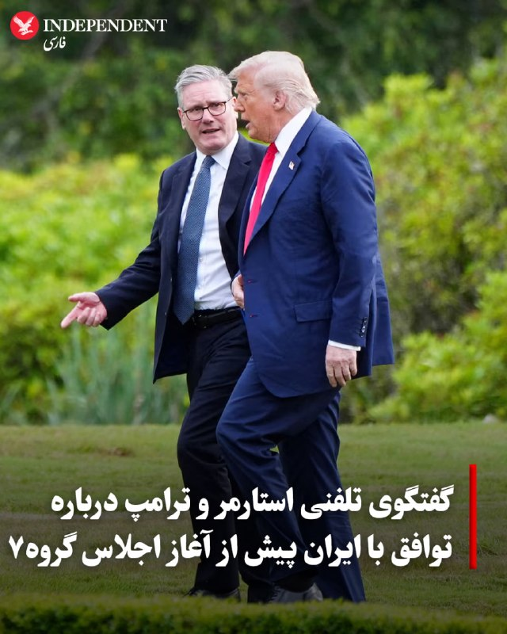

♦️ کی‌یر استارمر، نخست‌وزیر بریتانیا، روز شنبه ۲۳ خرداد در گفتگویی تلفنی با دونالد ترامپ، رئیس‌جمهوری آمریکا، تلاش‌های جاری برای پایان دادن به درگیری‌ها با ایران را مورد بحث و بررسی قرار داد.

بر اساس بیانیه منتشرشده از این تماس تلفنی، استارمر بر اهمیت «تضمین دست‌یابی به توافقی که به یک صلح پایدار و ماندگار منجر شود»، تاکید کرد.

نخست‌وزیر بریتانیا در این گفتگو بار دیگر یادآور شد که «لندن آماده است تا از اجرای هرگونه توافق صلح حمایت کند و برای تضمین موفقیت آن، با شرکای بین‌المللی همکاری نزدیکی داشته باشد.»

به گفته سخنگوی دفتر نخست‌وزیری بریتانیا، رهبران دو کشور توافق کردند که در آستانه برگزاری اجلاس سران گروه هفت (G7) در هفته آینده، تماس‌های خود را حفظ کنند.
‌🇸🇦 Indypersian

🤖 @VahidOOnLine

## WithYashar — post 14734

رادان : هرکس در تجمعات علیه وحدت ملی و مذاکرات شعار یا حرفی بزند بعنوان تفرقه‌افکن باهاش برخورد میکنیم.
@withyashar

## pm_afshaa — post 93786

  <a href="telegram/content/pm_afshaa_93786_1781374394.mp4" target="_blank">🎬 Download video</a>

قالیباف، عراقچی، استعفا استعفا

💧 Rainbet.com the #1 Non-KYC Crypto Casino & Sportsbook @rainbetcom

😁 @Pm_Afshaa

## iaghapour — post 2672

🎶 جدیدترین ریمیکس‌ها و آهنگ‌ها
       فقط یه کلیک با تو فاصله دارن؛
       ریمیکسایی که ماشینو تبدیل به
کنسرت میکنه

       پلی‌لیستت رو با ما همیشه به‌روز نگه دار

👇
👇
👇
https://t.me/noxbeatx
https://t.me/noxbeatx

## iaghapour — post 2671

  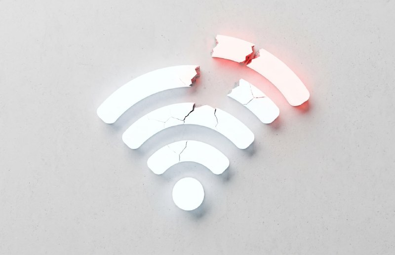

🌐 درخواست حمید رسایی و ۱۱۹ استاد برای انحلال «ستاد ویژه فضای مجازی»

بیش از ۱۲۰ تن از اساتید حوزه و دانشگاه، و چهره‌های سیاسی از جمله حمید رسایی در نامه‌ای به رئیس قوه قضائیه و فقهای شورای نگهبان، خواستار ابطال فوری مصوبه دولت برای تشکیل «ستاد ویژه ساماندهی و راهبری فضای مجازی» شدند.

🔹 مهم‌ترین دلایل مخالفان:
🔸 تشکیل این ستاد ناقض جایگاه «شورای عالی فضای مجازی» به عنوان تنها نقطه کانونی سیاست‌گذاری است و یک ساختار موازی محسوب می‌شود.

🔸 به اعتقاد نویسندگان نامه، رئیس‌جمهور صلاحیت ایجاد نهادهای فراقوه‌ای با کارکردهای کلان حاکمیتی را ندارد.

🔸 واگذاری اختیار محدودسازی اینترنت به ستاد جدید، با صلاحیت قانونی (کمیته فیلترینگ) و دادستانی کل کشور در تعارض است.

🔸 ایجاد این ساختار جدید، مصداق تشکیلات غیرضروری بوده و تنها باعث افزایش لایه‌های تصمیم‌گیری در فضای مجازی می‌شود.

پ.ن: جالبه تو این مملکت انگار با فساد و رانتِ کسی کاری ندارن؛ اما وای به روزی که بخوان اینترنتی رو که دست مفسدها رو رو می‌کنه، یه ذره آزاد کنن!

🆔 @iAghapour

## mamlekate — post 103704

📝 ترامپ: توافق من با تهران یکشنبه امضا می‌شود و دیواری محکم در برابر سلاح هسته‌ای است

دونالد ترامپ، رییس‌جمهوری آمریکا، گفت که توافق او با تهران دیواری محکم در برابر هرگونه سلاح هسته‌ای است و جمهوری اسلامی دیگر نه خواهان سلاح هسته‌ای است و نه به آن دست خواهند یافت؛ چه از طریق خرید، چه توسعه، و چه از طریق هر شکل دیگری از تامین آن.

@mamlekate

## IranIntlTV — post 342123

  <a href="telegram/content/IranIntlTV_342123_1781374396.mp4" target="_blank">🎬 Download video</a>

هوشنگ حسن‌یاری، کارشناس خاورمیانه و امور نظامی، در گفت‌وگو با ایران‌اینترنشنال گفت مسئله هسته‌ای و سرنوشت ذخایر اورانیوم، گره اصلی هرگونه توافق میان تهران و واشینگتن است. او افزود از نگاه جمهوری اسلامی، واگذاری این ظرفیت به منزله «خودکشی جمعی» است و شکاف‌های داخلی حکومت نیز نشان می‌دهد پرونده هسته‌ای همچنان مهم‌ترین موضوع برای حاکمیت به شمار می‌رود و عقب‌نشینی از آن به معنای نادیده گرفتن هزینه‌های سنگینی است که جمهوری اسلامی برای این برنامه پرداخته است.
@iranintltv

## IranIntlTV — post 342122

  <a href="https://t.me/IranintlTV/342122" target="_blank">📎 Download file</a>

🎧نسخه صوتی تیتراول با نیوشا صارمی: ترامپ: فردا با ایران تفاهم‌نامه امضا می‌کنیم، بعدا سراغ اورانیوم می‌آییم
@iranintlTV

## IranIntlTV — post 342121

  <a href="telegram/content/IranIntlTV_342121_1781374398.mp4" target="_blank">🎬 Download video</a>

🔻تیم ملی فوتبال برزیل، پرافتخارترین تیم ادوار جام جهانی، در نخستین بازی خود بامداد یکشنبه به مصاف مراکش می‌رود.

🔹توضیحات کوشاد دلشاد، مربی فوتبال در برزیل

@iranintltvsport

## ManotoTV — post 106051

  <a href="telegram/content/ManotoTV_106051_1781374399.mp4" target="_blank">🎬 Download video</a>

جام جهانی ۲۰۲۶ برای ایران فقط یک رویداد ورزشی نیست. هم‌زمان با حضور تیم ملی در بزرگ‌ترین صحنه فوتبال جهان، بحث بر سر هویت ملی، پرچم شیر و خورشید، جمهوری اسلامی و نمایندگی ایران نیز وارد ورزشگاه‌ها شده است.

آیا تیم ملی صرفاً یک تیم فوتبال است؟ آیا می‌توان از ایران حمایت کرد بدون آنکه از حکومت حمایت کرد؟ و در نهایت، چه کسی حق دارد به نام ایران سخن بگوید؟

## Persian_Trend_Official — post 16973

ارتش اسرائیل ویدیویی از تونل حزب‌الله لبنان در زیر قلعه بوفور منتشر کرد.

این تونل قرار است پس از بازرسی و برسی کامل توسط ارتش اسرائیل تخریب شود.

📝 Amir

📌 @persian_trend_official
پرشین ترند | متفاوت‌ترین کانال نظامی

## IranianMinds — post 22483

جدی دلم میخواد این عرزشیایی که قراره به مذاکره اعتراض کنن رو با همون نیروهایی سرکوب کنن که مردمو تو دی‌ماه کشتن

@IranianMinds

## IranianMinds — post 22482

  <a href="telegram/content/IranianMinds_22482_1781374399.mp4" target="_blank">🎬 Download video</a>

🔴مرگ بر سازشگر.

@IranianMinds

## BBCPersian — post 283717

⚽️گروه اف ‌(F) جام جهانی؛ فوتبال یا شطرنج

«سامورایی‌های آبی» ژاپن با اعتمادبه‌نفسی بی‌سابقه وارد جام جهانی ۲۰۲۶ می‌شود. ژاپن نخستین تیمی بود که جواز حضور در جام جهانی ۲۰۲۶ را گرفت. هاجیمه موریاسو از سال ۲۰۱۸ هدایت ژاپن را بر عهده دارد. با وجود انتقادهایی که او را مربی‌ای محافظه‌کار می‌دانند، توانسته تیمی منسجم، با اعتمادبه‌نفس و هویت مشخص بسازد که توان رقابت با بهترین تیم‌های جهان را دارد.

تاکه‌فوسا کوبو، ستاره ۲۴ ساله تیم ملی ژاپن که به تکنیک بالا، خلاقیت و دید خوب در بازی شناخته می‌شود، در سال‌های اخیر یکی از چهره‌های برجسته لالیگا شده است و بسیاری او را «مسی ژاپنی» می‌نامند.

هلند با ترکیبی از تجربه، کیفیت فنی و عمق قابل‌توجه در ترکیب، یکی از مدعیان پنهان جام جهانی ۲۰۲۶ است. «نارنجی‌ها» تیمی متعادل با خط دفاعی قدرتمند، هافبک‌های باکیفیت و بازیکنان باتجربه است که می‌تواند در مراحل حذفی برای هر حریفی خطرناک باشد.

فرانکی دی‌یونگ، ستاره تیم همچنان رهبر فنی هلند محسوب می‌شود.

📲در لینک زیر بیشتر بخوانید⬇️

📸GettyImages

https://bbc.in/4xwxM44
@BBCPersian

## Dirty_Kids — post 391913

  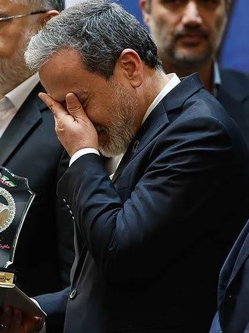

عراقچی گفته: مقاومت منجر به جنگ میشه، نه مذاکره 😂😂

یعنی با یه جمله یه تنه رید به ۴۷سال آرمان‌های عمام راحل و موشعلی گور به گور شده

@Dirty_Kids 👻

## Dirty_Kids — post 391911

  <a href="telegram/content/Dirty_Kids_391911_1781374402.mp4" target="_blank">🎬 Download video</a>

🔴این دوتا ویدیو از این پسربچه‌ی عاشق درس و مشق کلی تو اینستاگرام ویو خورده؛

خیلیا معتقدن که با این علاقه‌ی خاصش به تحصیل، میتونه یکی از آینده‌دارهای کشور باشه...

🔞هندزفری

@Dirty_Kids 👻

## Dirty_Kids — post 391910

  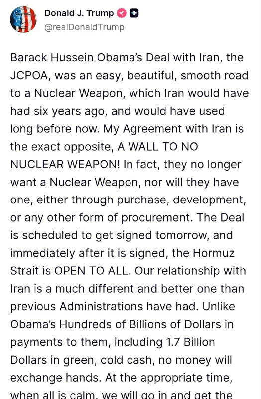

🔴ترامپ:
فردا توافق امضا میشه؛

توافق باراک حسین اوباما با روافض قحبه یعنی همون برجام، یک مسیر ساده، شیک و هموار برای رسیدن به سلاح هسته‌ای بود، مسیری که اگه جلودارش نمی‌شدیم روافض پدرخراب ۶ سال پیش به بمب اتم رسیده بود و خیلی قبل‌تر از این‌ها ازش استفاده می‌کرد.
اما توافق من با شیعه‌سانان رافضی دقیقاً نقطه‌ مقابل اونه: یک دیوار بتنی محکم در برابر رسیدن به هرگونه سلاح هسته‌ای.
در واقع، اونا دیگه نه سلاح هسته‌ای می‌خوان و نه بهش دست پیدا می‌کنن، چه از طریق خرید، چه توسعه و چه هر روش دیگه‌ای برای تامینش.
طبق برنامه این توافق فردا امضا می‌شه و بلافاصله بعد از امضا، تنگه‌ی هرمز به روی همه باز خواهد بود.
رابطه ما با روافض قحبه کاملاً متفاوت و بسیار بهتر از چیزیه که دولت‌های قبلی داشتن. برعکس دوران اوباما که صدها میلیارد دلار بهشون پرداخت شد، از جمله ۱.۷ میلیارد دلار پول نقد تانخورده و سبز رنگ، این‌بار قرار نیست هیچ پولی رد و بدل بشه.
در زمان مناسب وقتی همه‌جا آروم شد، ما به لطف بمب‌افکن‌های زیبای بی‌۲ و خلبان‌های فوق‌العاده‌شون، می‌ریم و اون غبارهای هسته‌ای رو که عمیقاً زیر کوه‌های گرانیتی قدرتمند و فرورفته دفن شدن بیرون می‌کشیم، رقیق می‌کنیم و نابودشون می‌کنیم، چه در داخل ایران باشه و چه در ایالات متحده.
ما مشتاقانه منتظر همکاری با روافض قحبه و کل خاورمیانه در آینده‌ای طولانی هستیم.
امیدوارم این فرآیند سریع، ساده و روان پیش بره.
اگه هم این‌طور نشه، ما اون گزینه نهایی و جایگزین رو داریم که البته امیدوارم هیچ‌وقت مجبور به استفاده دوباره ازش نشیم.
از توجهتون به این موضوع خیلی ممنونم.
رئیس‌جمهور، دونالد جی. ترامپ

@Dirty_Kids 👻

## manototv — post 106051

  <a href="telegram/content/manototv_106051_1781374405.mp4" target="_blank">🎬 Download video</a>

جام جهانی ۲۰۲۶ برای ایران فقط یک رویداد ورزشی نیست. هم‌زمان با حضور تیم ملی در بزرگ‌ترین صحنه فوتبال جهان، بحث بر سر هویت ملی، پرچم شیر و خورشید، جمهوری اسلامی و نمایندگی ایران نیز وارد ورزشگاه‌ها شده است.

آیا تیم ملی صرفاً یک تیم فوتبال است؟ آیا می‌توان از ایران حمایت کرد بدون آنکه از حکومت حمایت کرد؟ و در نهایت، چه کسی حق دارد به نام ایران سخن بگوید؟

## alonews — post 127694

  <a href="telegram/content/alonews_127694_1781374406.webm" target="_blank">🎬 Download video</a>

👈ترامپ یه عکس از خودش و رهبرِ کره شمالی، کیم جونگ اون، پست کرد

✅ @AloNews خبر جنگ

## alonews — post 127693

  <a href="telegram/content/alonews_127693_1781374406.webm" target="_blank">🎬 Download video</a>

👈سران کانادا و ایرلند: آتش بس در لبنان باید در توافق ایران و آمریکا لحاظ شود

✅ @AloNews خبر جنگ

<!-- MSG END -->

<!-- NAV START -->

<a href="https://github.com/ProAlit/aio-downloader/blob/main/telegram/content/archive_1.md" style="display:inline-block; padding:6px 12px; margin:0 4px; background-color:#2ea44f; color:white; text-decoration:none; border-radius:4px; font-weight:bold;">صفحه بعد</a>

<!-- NAV END -->
