# خواننده تلگرام

<!-- TOP_NAV START -->

<a href="https://github.com/ProAlit/aio-downloader/blob/main/telegram/content/archive_1.md" style="display:inline-block; padding:6px 12px; margin:0 4px; background-color:#2ea44f; color:white; text-decoration:none; border-radius:4px; font-weight:bold;">صفحه بعد</a>

<!-- TOP_NAV END -->

<!-- MSG START -->

---
📅 بروزرسانی: 1405/03/29 00:14
---

## VahidOOnLine — post 246279

  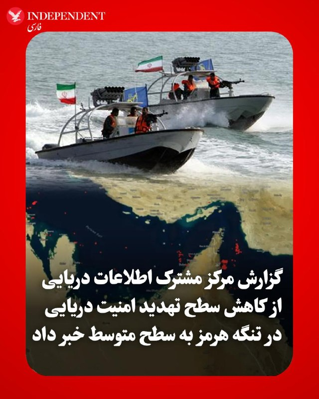

♦️«مرکز مشترک اطلاعات دریایی» (JMIC) اعلام کرد پس از اعلام توافق میان ایران و آمریکا، سطح تهدید امنیتی در تنگه هرمز از سطح «شدید» به سطح «متوسط» کاهش یافته است.
این نهاد امنیت دریایی مستقر در بحرین که میان نیروهای دریایی متحد و کشتی‌های تجاری در خاورمیانه هماهنگی ایجاد می‌کند، با این حال هشدار داد که خطر حمله به کشتی‌ها همچنان بالاست و مین‌های دریایی نیز همچنان تهدیدی جدی برای عبور و مرور در این آبراه به شمار می‌روند.
بر اساس این گزارش، رفتار نیروهای سپاه پاسداران پس از اعلام توافق ایران و آمریکا کمتر بی‌ثبات شده، اما تردد کشتی‌ها و نفتکش‌ها از تنگه هرمز همچنان به سطح پیش از جنگ بازنگشته است.
‌🇸🇦 Indypersian

🤖 @VahidOOnLine

## VahidOOnLine — post 246278

  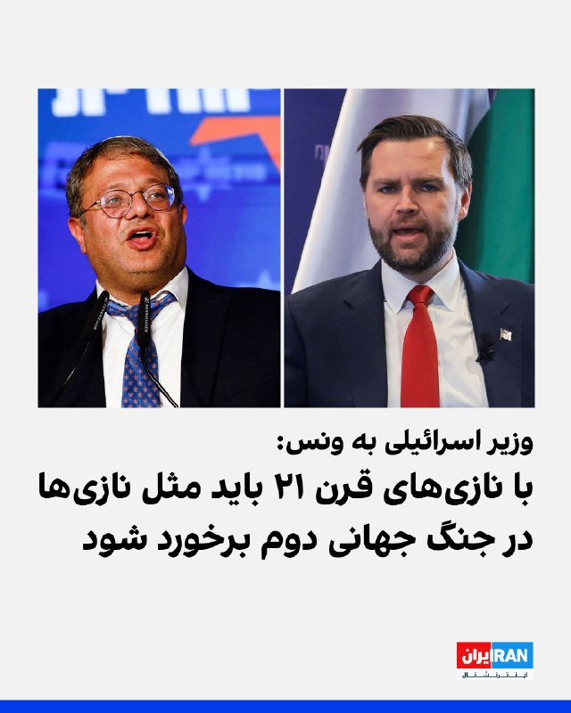

ایتامار بن‌گویر، وزیر امنیت ملی اسرائیل، در واکنش به انتقادهای جی‌دی ونس، معاون رئیس‌جمهوری آمریکا، گفت جمهوری اسلامی باید همان‌گونه که آمریکا در جنگ جهانی دوم با آلمان نازی برخورد کرد، هدف قرار گیرد.
بن‌گویر در پاسخ به اظهارات ونس گفت: «با نازی‌های قرن بیست‌ویکم همان‌گونه برخورد کنید که با نازی‌ها در جنگ جهانی دوم برخورد شد.»
پیش‌تر ونس درباره مخالفان یادداشت تفاهم تهران و واشینگتن در کابینه اسرائیل گفت: «دونالد ترامپ در حال حاضر تنها رهبر جهان است که همدلی عمیقی با ملت اسرائیل دارد و در عین حال رییس‌جمهوری قدرتمندترین کشور جهان است. اگر من عضو کابینه اسرائیل بودم، احتمالا به تنها متحد قدرتمندی که در جهان دارم حمله نمی‌کردم.»

‌🏁 🇬🇧 IranintlTV

🤖 @VahidOOnLine

## WithYashar — post 15280

  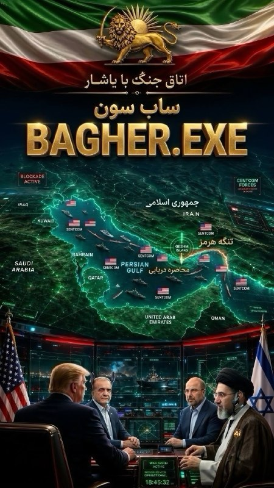

کاور
@withyashar

## mwarmonitor — post 11178

🚨 سی‌ان‌ان به نقل از سخنگوی کاخ سفید:
هیچ توافقی فراتر از «یادداشت تفاهم» وجود ندارد، اما گفت‌وگوها درباره گام‌های بعدی همچنان ادامه دارد.

@mwarmonitor

## mwarmonitor — post 11177

🚨درگیری‌های مسلحانه در منطقهٔ تایمز اسکوئر در شهر نیویورک رخ داده است و نیروهای امنیتی به‌طور گسترده در اطراف محل حادثه مستقر شده‌اند.

@mwarmonitor

## mwarmonitor — post 11176

🔴مرکز مشترک اطلاعات دریایی

🔸یادداشت مشاوره JMIC: 009-26 | ۱۸ ژوئن ۲۰۲۶

تنگه هرمز باز است

منطقه مورد نگرانی: تنگه هرمز

شماره JMIC: 009-26 | سطح تهدید منطقه‌ای: متوسط (MODERATE)

۱. عبور و مرور از تنگه هرمز
مرکز مشترک اطلاعات دریایی (JMIC) اطلاعات صفحه بعد را جهت آگاهی مالکان، اپراتورها و دریانوردان به اشتراک می‌گذارد. به‌طور مشخص، این یادداشت جزئیات خطرات به‌روزرسانی شده عبور از تنگه هرمز (SoH) از طریق «طرح تفکیک ترافیک بین‌المللی» را شرح می‌دهد.

سطح تهدید امنیت دریایی در تنگه هرمز، در پی اعلام نیت ایالات متحده و ایران برای بازگشایی این آبراه، به متوسط (MODERATE) کاهش یافته است. با این حال، باید به دریانوردان در خصوص وجود مین‌ها هشدار داده شود و با توجه به ادامه عملیات پاکسازی، انتظار حضور نیروهای نظامی دریایی را داشته باشند. دریانوردان همچنین باید منتظر تراکم در مسیرهای عبوری و تماس‌های احتمالی رادیویی (VHF) از سوی نیروهای دریایی جهت حمایت از جریان آزاد کشتیرانی باشند.

📌ناخداها باید موارد زیر را مد نظر قرار دهند:

تنگه هرمز اکنون باز است و عملیات مسدودسازی (بلاکاد) متوقف شده است.

عملیات فعال پاکسازی مین در حال انجام است. آخرین نقشه‌های مناطق احتمالی مین‌گذاری‌شده در صورت درخواست در دسترس است و به‌طور منظم به‌روزرسانی خواهد شد.

در حال حاضر به دلیل وجود مین، باید از «طرح تفکیک ترافیک بین‌المللی» اجتناب شود.

یک موقعیت تایید شده مین در عرض جغرافیایی 26^{\circ}24'34.920''N و طول جغرافیایی 056^{\circ}20'40.128''E وجود دارد.

پاکسازی مسیر عبور جنوبی، در امتداد آب‌های سرزمینی عمان (TTW) از وجود مین تایید شده است و این مسیر، مسیر پیشنهادی است.

مسیرهای جایگزین نیز در دسترس هستند.

عبور و مرور در امتداد کریدوری با نقاط مسیر (Way points) ، ایمن گزارش شده است.

@mwarmonitor

## IranIntlTV — post 343108

  <a href="telegram/content/IranIntlTV_343108_1781815444.mp4" target="_blank">🎬 Download video</a>

سازمان اتحاد علیه ایران هسته‌ای با امضای تفاهم‌نامه میان آمریکا و جمهوری اسلامی مخالفت کرده و گفته متن آن مبهم است و باید بر اساس اقدامات واقعی ایران قضاوت شود. این سازمان هشدار داده رفع تحریم‌ها و محدودیت‌ها می‌تواند اهرم فشار آمریکا را تضعیف کند.
@iranintltv

## IranIntlTV — post 343107

  

ایتامار بن‌گویر، وزیر امنیت ملی اسرائیل، در واکنش به انتقادهای جی‌دی ونس، معاون رئیس‌جمهوری آمریکا، گفت جمهوری اسلامی باید همان‌گونه که آمریکا در جنگ جهانی دوم با آلمان نازی برخورد کرد، هدف قرار گیرد.
بن‌گویر در پاسخ به اظهارات ونس گفت: «با نازی‌های قرن بیست‌ویکم همان‌گونه برخورد کنید که با نازی‌ها در جنگ جهانی دوم برخورد شد.»
پیش‌تر ونس درباره مخالفان یادداشت تفاهم تهران و واشینگتن در کابینه اسرائیل گفت: «دونالد ترامپ در حال حاضر تنها رهبر جهان است که همدلی عمیقی با ملت اسرائیل دارد و در عین حال رییس‌جمهوری قدرتمندترین کشور جهان است. اگر من عضو کابینه اسرائیل بودم، احتمالا به تنها متحد قدرتمندی که در جهان دارم حمله نمی‌کردم.»

https://iranintl.com/202606186975

## FarsiVOA — post 221141

🔺شرکت‌های ردیابی کشتی‌ها: عبور شناورها از تنگه هرمز پس از توافق آمریکا و جمهوری اسلامی آغاز شده است

◾️پس از امضای یادداشت تفاهم میان ایالات متحده و حکومت ایران برای پایان دادن به جنگ، شرکت‌های بزرگ کشتیرانی جهان عبور کشتی‌های خود از تنگه هرمز را از سر گرفته‌اند.

⬇️ بیشتر بخوانید:
https://ir.voanews.com/a/stranded-ships-began-transiting-strait-of-hormuz/8162333.html
@FarsiVOA

## Persian_Trend_Official — post 17497

نکات لایو جمع بندی شد و تا دقایقی دیگه حدودا 15 دقیقه دیکه لایو شروع میشه ...

---
📅 بروزرسانی: 1405/03/29 00:04
---

## VahidOOnLine — post 246277

  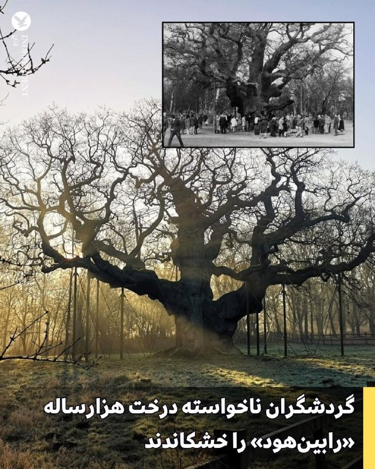

♦️احتمالا گردشگران، بی‌آنکه بدانند، پیرترین، بزرگ‌ترین و مشهورترین درخت کهن‌سال اروپا را به‌سوی مرگ بردند. «بلوط بزرگ»، درخت افسانه‌ای جنگل شروود در ناتینگهام‌ انگلستان که نامش با رابین‌هود گره‌خورده بود، پس از چند تابستان خشک و گرم، امسال دیگر برگ نداد و مرگ آن تایید شد.
این درخت ۱۲۰۰ ساله، از شناخته‌شده‌ترین نمادهای جنگل شروود بود؛ همان جنگلی که در روایت‌های عامیانه، پناهگاه رابین‌هود، یاغی افسانه‌ای قرن سیزدهم، معرفی می‌شود؛ شخصیتی که بنا بر افسانه‌ها از ثروتمندان می‌دزدید و به فقرا می‌بخشید و هنگام فرار از کلانتر ناتینگهام در این جنگل پنهان می‌شد. گفته می‌شد بلوط بزرگ نیز یکی از پناهگاه‌های او و همراهانش بوده است.
برای حدود ۲۰۰ سال، بازدیدکنندگان شیفته این افسانه به جنگل شروود رفتند تا شاخه‌های پیچ‌خورده و تاج گسترده ۲۸ متری این درخت را از نزدیک ببینند؛ اما همین رفت‌وآمد طولانی‌مدت، به‌تدریج خاک اطراف ریشه را فشرده کرد؛ فشردگی‌ای که باعث می‌شود آب باران به‌خوبی به ریشه‌ها نرسد و درخت، آرام و نامرئی، ضعیف شود.
در سال‌های گذشته چند بار شایعه مرگ این درخت مطرح شده بود، اما نادرست از آب درآمد. این بار اما انجمن سلطنتی حمایت از پرندگان (RSPB) اعلام کرد که بلوط بزرگ، با وجود برنامه‌ای که از سال ۲۰۲۳ برای حفظ آن آغاز شده بود، دیگر برگ نداده و این نشانه پایان زندگی آن است.
نام این درخت از اواخر قرن هجدهم شهرت بیشتری یافت؛ زمانی که در سال ۱۷۹۰ در کتابی درباره درختان بلوط به آن اشاره شد. پس‌ازآن، موجی از علاقه‌مندان و گردشگران راهی جنگل شدند و بلوط بزرگ به یکی از جاذبه‌های مهم منطقه تبدیل شد.
کارشناسان مجموعه‌ای از عوامل را در مرگ آن مؤثر می‌دانند: عبور میلیون‌ها بازدیدکننده در طول سال‌ها، فشرده شدن خاک، مداخله‌های انسانی برای نگه‌داشتن شاخه‌های سنگین با کابل و تیرک و تغییرات اقلیمی که تابستان‌های داغ‌تر و دوره‌های خشک‌سالی شدیدتری را به بریتانیا آورده است. متخصصان درخت گفته‌اند سیستم ریشه این بلوط در وضعیت خفگی و کم‌غذایی قرار گرفته بود.
معمولا محل بسیاری از درختان بسیار کهن‌سال جهان، به‌ویژه درختانی که چند هزار سال عمر دارند، برای محافظت از آن‌ها مخفی نگه داشته می‌شود. اگر برای دیدن درختان کهن‌سال می‌رویم، بهتر است دست‌کم به اندازه ارتفاع خود درخت و شاید بیشتر، از آن فاصله بگیریم؛ زیرا ریشه‌های یک درخت پیر، اغلب بسیار فراتر از سایه شاخه‌هایش در خاک گسترده‌اند.
‌🇸🇦 Indypersian

🤖 @VahidOOnLine

## VahidOOnLine — post 246276

♦️حسین شریعتمداری، مدیرمسئول روزنامه کیهان، پنجشنبه‌شب در گفتگوبا صداوسیما گفت اموال آمریکا و متحدانش در تنگه هرمز باید برای دریافت غرامت مصادره شود. او تاکید کرد آمریکا به هیچ‌یک از تعهدات و قوانین بین‌المللی پایبند نبوده و انتظار پرداخت غرامت از سوی واشینگتن یا نهادهای بین‌المللی واقع‌بینانه نیست.

شریعتمداری با اشاره به گزارش‌ها درباره پرداخت ۳۰۰ میلیارد دلار و همچنین آزادسازی ۱۲ میلیارد دلار، گفت این مبالغ غرامت محسوب نمی‌شوند و بخشی از آن‌ها پول‌های متعلق به ایران است که بازگردانده می‌شود. او افزود جمهوری اسلامی با حاکمیتی که بر تنگه هرمز دارد می‌تواند اموال مرتبط با آمریکا و متحدانش را مصادره کند و این اقدام را «تنها راه» دریافت غرامت برای خسارت‌های واردشده به ایران دانست.
‌🇸🇦 Indypersian

🤖 @VahidOOnLine

## Dirty_Kids — post 392535

  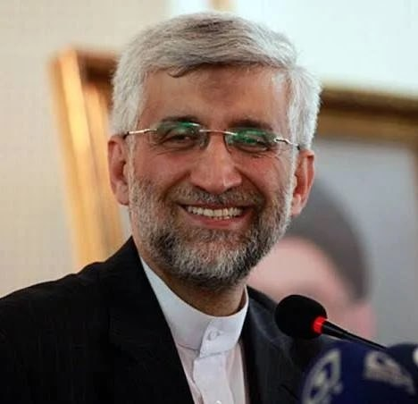

مجتبی خامنه‌ای : در مورد توافق نظر دیگه‌ای داشتم

@Dirty_Kids 👻

## Dirty_Kids — post 392534

  <a href="telegram/content/Dirty_Kids_392534_1781814856.mp4" target="_blank">🎬 Download video</a>

مین‌وایل زندگی الان بعضیا تو ایران.
١٩ ساعت پیش تو اینستاگرام آپلود شده.

@Dirty_Kids 👻

## alonews — post 129007

  <a href="telegram/content/alonews_129007_1781814858.webm" target="_blank">🎬 Download video</a>

👈وزیر جنگ اسرائیل: اسرائیل در هر لحظه برای عملیات مستقل در ایران آماده است

✅ @AloNews خبر جنگ

## alonews — post 129006

  <a href="telegram/content/alonews_129006_1781814858.mp4" target="_blank">🎬 Download video</a>

👈اوباما:

همان‌طور که بی‌قراریم، مردم به دنبال خشم و تفرقه همیشگی نیستند. آن‌ها به دنبال انصاف و عقل سلیم و احترام متقابل هستند. در اعماق وجودمان، می‌خواهیم راهی برای بازگشت به سوی یکدیگر پیدا کنیم، نه دور شدن بیشتر.

✅ @AloNews خبر جنگ

## alonews — post 129005

🔴فوری / ویتکاف: بازرسان آژانس راهی ایران می‌شوند

✅ @AloNews خبر جنگ

---
📅 بروزرسانی: 1405/03/28 23:55
---

## mwarmonitor — post 11175

  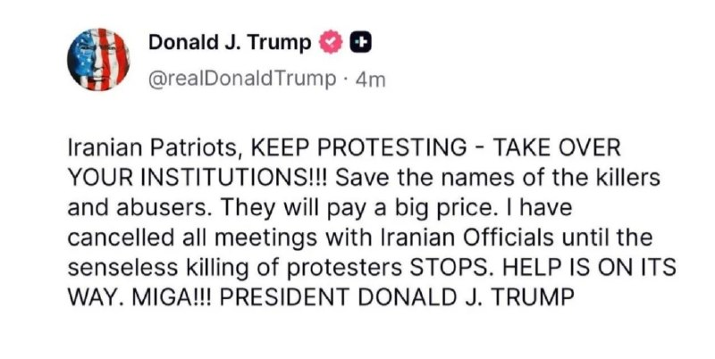

🔸برنامه طنز و شبانه «جیمی کیمل لایو!» از شبکه ABC 🔹«ما آیت‌الله را کشتیم و یک آیت‌الله جوان‌تر و تندروتر را جایگزین او کردیم. ما هیچ کاری برای معترضان در ایران انجام ندادیم. ما تحریم‌هایی را که قبل از شروع جنگ علیه ایران وضع شده بود، لغو کردیم. ما به آتش‌بسی…

## FoxNewsTwitter — post 343141

  <a href="telegram/content/FoxNewsTwitter_343141_1781814356.mp4" target="_blank">🎬 Download video</a>

Fox News (Twitter/X)

A Ukrainian drone strike sends the roof of a Moscow oil refinery's storage tank flying through the air — apparently still intact despite the massive explosion.

Mayor Sergei Sobyanin says Ukrainian drones reached the southeast Moscow site during what he called a "massive attack."

Zelenskyy called the refinery strike "fully justified," saying Ukraine is targeting facilities that help fuel Russia's war machine.

## IranianMinds — post 22908

  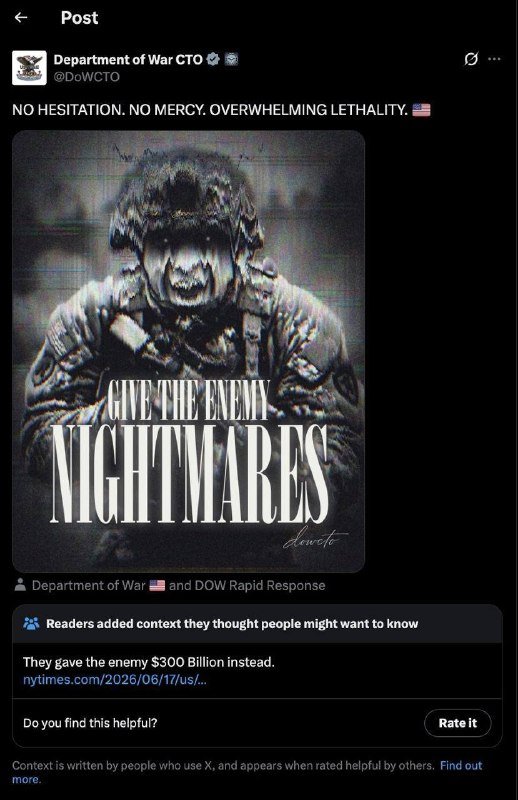

🔴 اکانت وزارت جنگ آمریکا اومد این پستو گذاشته و نوشته : هیچ تردیدی نیست. هیچ رحمی نیست. قدرت کشنده غالب.

مردم هم اومدن بهش کامیونیتی نوت زدن که به جای این به دشمن ۳۰۰ میلیارد دلار دادن.

@IranianMinds

## alonews — post 129004

  <a href="telegram/content/alonews_129004_1781814358.webm" target="_blank">🎬 Download video</a>

👈اداره دریانوردی بریتانیا: تنگه هرمز اکنون باز است

✅ @AloNews خبر جنگ

## alonews — post 129003

مردی در یک شرکت بود که همیشه پشت صحنه همه تصمیم‌ها را می‌گرفت، اما هیچ‌وقت نامش در میان نبود.
هر پروژه‌ای که شروع می‌شد، یکی از کارمندان را جلو می‌انداخت و می‌گفت: «این ایده خودش بود.»
وقتی کار خوب پیش می‌رفت، آرام‌آرام خودش را صاحب اصلی فکر معرفی می‌کرد.
اما اگر مشکلی پیش می‌آمد، همان فرد را مقصر نشان می‌داد.
همه تصور می‌کردند او فقط یک ناظر بی‌طرف است.
درحالی‌که نخ تمام ماجراها در دست خودش بود.
سال‌ها این بازی را ادامه داد و همیشه چهره‌ای پاک و منطقی از خود ساخت.
تا اینکه یک روز چند نفر از همان قربانی‌ها کنار هم نشستند.
رد همه تصمیم‌ها را دنبال کردند و فهمیدند فرمان از کجا صادر می‌شده است.
حقیقت که آشکار شد، دیگر کسی حاضر نشد سپر بلای او باشد.
آن روز برای اولین بار مجبور شد خودش جلو بایستد.
و تازه فهمید روسفیدیِ واقعی با پنهان شدن پشت دیگران به دست نمی‌آید.

[@AloTweet]

---
📅 بروزرسانی: 1405/03/28 23:44
---

## IranIntlTV — post 343106

  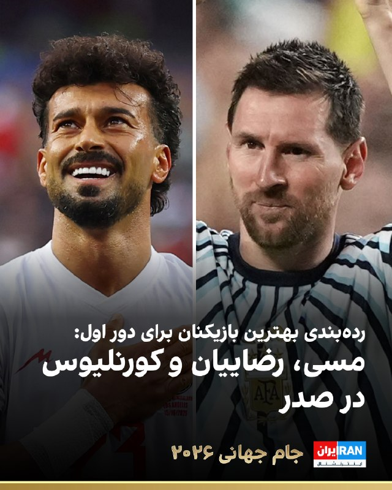

🔻فیفا در پایان دور اول جام جهانی ۲۰۲۶، رده‌بندی «قدرت» را منتشر کرد. در این ارزیابی، لیونل مسی پس از هت‌تریک مقابل الجزایر در صدر بخش حمله قرار گرفت.

🔹رامین رضاییان پس از نمایش درخشان مقابل نیوزیلند، صدرنشین بخش خلاقیت شد. درک کورنلیوس، مدافع کانادا، در رتبه نخست بخش دفاع ایستاد.

🔹مسی ۶۰ درصد شوت‌های آرژانتین، تمام ضربات در چارچوب و هر سه گل این تیم را به نام خود ثبت کرد. سه گل آرژانتین از مجموع ۱.۵۸ گل مورد انتظار (xG) به دست آمد که نشان‌دهنده دقت بالای این ستاره در گل‌زنی است.

🔹رامین رضاییان، عامل اصلی پیشروی حملات ایران مقابل نیوزیلند بود. رضاییان ۱۶ پاس پیش‌رونده ارسال کرد و ۱۳ بار خطوط میانی و دفاعی نیوزیلند را شکست.

🔹تاثیر او در یک‌سوم هجومی زمین نیز ادامه داشت؛ جایی که گل نخست تساوی ایران را به ثمر رساند و در گل دوم نیز نقش مستقیم ایفا کرد.

🔹در رتبه دوم این بخش، مایکل اولیسه، وینگر فرانسه، قرار گرفت.

🔹جزییات بیشتر این رده‌بندی را در وب‌سایت بخوانید.

@iranintltvsport

## FarsiVOA — post 221140

⚡️علی جوانمردی: منتقدین تفاهم آمریکا و جمهوری اسلامی!
@FarsiVOA

## Persian_Trend_Official — post 17496

المیادین: هئیت مذاکره‌کننده ایرانی سفر برنامه ریزی شده خود به سوئیس را لغو کرد.

به ادعای المیادین و به نقل از منابع، ایران سفر برنامه‌ریزی‌شده هیئت خود به سوئیس برای دور اول مذاکرات آمریکا و ایران را به دلیل عملیات نظامی مداوم اسرائیل در جنوب لبنان به حالت تعلیق درآورد.

منابع گفتند هیئت ایرانی در حال آماده‌سازی برای آغاز مذاکرات بود اما تصمیم به تعویق انداختن سفر گرفت. تهران به آمریکا و میانجی‌ها اطلاع داد که تحولات لبنان مسئله‌ای مرکزی در مذاکرات است و می‌تواند بر ادامه مذاکرات تأثیر بگذارد.

ایران همچنین هشدار داد که عملیات اسرائیل که تا 10 کیلومتر در داخل خاک لبنان گسترش یافته است، نقض ماده اول یادداشت تفاهم آمریکا و ایران و چارچوب توافق گسترده‌تر است که شامل مفادی درباره پایان خصومت‌ها در تمام جبهه‌ها از جمله لبنان می‌شود.

📝 Amir

📌 @persian_trend_official
پرشین ترند | متفاوت‌ترین کانال نظامی

## Persian_Trend_Official — post 17495

  <a href="telegram/content/Persian_Trend_Official_17495_1781813683.webm" target="_blank">🎬 Download video</a>

سازمان کشتیرانی و حمل و نقل دریایی بریتانیا (UKMTO) با صدور اطلاعیه جدیدی اعلام کرد که تنگه هرمز اکنون به روی ترافیک دریایی باز است و عملیات مسدود کردن آن متوقف شده است.

در این اطلاعیه گفته شده که عملیات مین‌روبی در حال انجام است.

📝 Amir

📌 @persian_trend_official
پرشین ترند | متفاوت‌ترین کانال نظامی

## IranianMinds — post 22907

  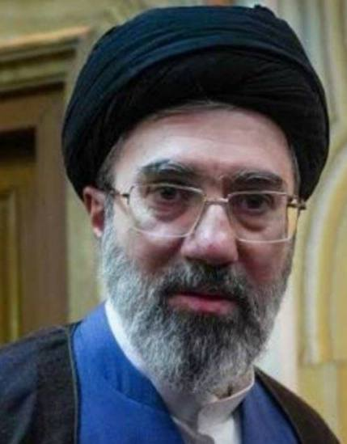

🔴 مجتبی جی پی تی :

مسئولیت مذاکرات با آمریکا کاملا بر عهده ی پزشکیان است و اون پذیرفته.

@IranianMinds

## IranianMinds — post 22906

🔴 شریعتمداری:

شهید لاریجانی به دنبال این بود که به حساب گروسی برسد، اما جنگ شد و کشته شد.

@IranianMinds

## Dirty_Kids — post 392533

  <a href="telegram/content/Dirty_Kids_392533_1781813684.mp4" target="_blank">🎬 Download video</a>

بازی خیره‌کننده ال پاچینو در فیلم «...و عدالت برای همه»

@Dirty_Kids 👻

## Dirty_Kids — post 392532

  

ای شغال طرقبه=)))))

@Dirty_Kids 👻

## alonews — post 129002

  <a href="telegram/content/alonews_129002_1781813686.webm" target="_blank">🎬 Download video</a>

👈 دبیر کمیته ملی کنترل و پیشگیری سرطان وزارت بهداشت درمان و آموزش پزشکی: ابتلا به سرطان در ایران تا سال ۱۴۴۰، دو برابر میانگین جهانی است.

✅ @AloNews خبر جنگ

---
📅 بروزرسانی: 1405/03/28 23:36
---

## VahidOOnLine — post 246275

ویدیوی رسیده به ایران اینترنشنال نشان می‌دهد مادر جاویدنام متین پرویزی،‌ از کشته‌شدگان انقلاب ملی، بر سر مزار فرزند جوانش با اشاره به فرا رسیدن ماه «محرم» می‌گوید که به فرزندش آموخت شرافت داشته باشد. او گفت که فرزندش «گرسنه و ندار» نبود و «اعتراض داشت.» متین پرویزی ۱۸ دی در زنجان با گلوله ماموران و حین کمک به یک مادر و کودک کشته شد.
‌🏁 🇬🇧 IranintlTV

🤖 @VahidOOnLine

## VahidOOnLine — post 246274

  

حسین شریعتمداری، نماینده رهبر جمهوری اسلامی در روزنامه کیهان، گفت: «با اعمال حاکمیت بر تنگه هرمز، امکان توقیف اموال متعلق به آمریکا و متحدانش وجود دارد.»

او افزود: «آمریکا به هیچ عهد و پیمانی پایبند نیست و به‌راحتی به جمهوری اسلامی غرامت پرداخت نخواهد کرد.»

شریعتمداری همچنین گفت: «پاسخ به محاصره دریایی آمریکا، شلیک موشک‌های ۲۵۰۰ کیلومتری با کلاهک سنگین به سمت باب‌المندب است.»
‌🏁 🇬🇧 IranintlTV

🤖 @VahidOOnLine

## VahidOOnLine — post 246273

  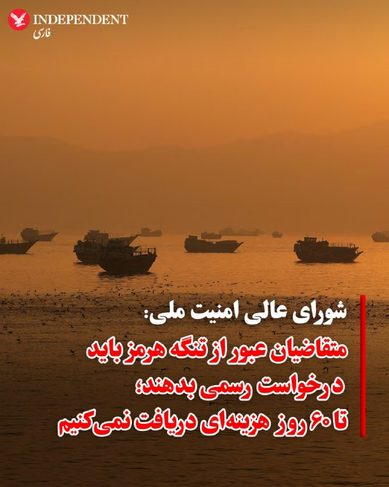

♦️ شورای عالی امنیت ملی ایران اعلام کرد کشتی‌های تجاری که خواهان عبور از تنگه هرمز هستند، از این پس باید درخواست‌های خود را به سازمان جدیدی به نام «سازمان تنگه خلیج فارس» (تاسیس‌شده در اردیبهشت‌ماه) ارسال کنند. این شورا تاکید کرد که در راستای پایبندی به توافق اولیه با آمریکا، تا ۶۰ روز هیچ‌گونه تعرفه یا حق عبوری دریافت نخواهد شد، اما مقررات نهاییِ استفاده از این آبراه حیاتی در آینده اعلام می‌شود.

هم‌زمان، ستاد فرماندهی مرکزی آمریکا (سنتکام) نیز روز پنج‌شنبه تایید کرد که نیروهای ایالات متحده محاصره دریایی خود بر تنگه هرمز را به‌طور کامل لغو کرده‌اند.
‌🇸🇦 Indypersian

🤖 @VahidOOnLine

## pm_afshaa — post 94355

وزیر خارجه پاکستان: نشست ژنو میان تهران و واشنگتن لغو شد 
💧 Rainbet.com the #1 Non-KYC Crypto Casino & Sportsbook @rainbetcom 
😁 @Pm_Afshaa

## kianmeli1 — post 88073

‏🔴ایتامار بن‌گویر، وزیر امنیت ملی اسرائیل، در واکنش به انتقادهای جی‌دی ونس، معاون رییس‌جمهوری آمریکا، گفت جمهوری اسلامی باید همان‌گونه که آمریکا در جنگ جهانی دوم با آلمان نازی برخورد کرد، هدف قرار گیرد. بن‌گویر در پاسخ به اظهارات ونس گفت: «با نازی‌های قرن بیست‌ویکم همان‌گونه برخورد کنید که با نازی‌ها در جنگ جهانی دوم برخورد شد»

⚠️منظور بن گویر: در جنگ جهانی دوم شهرها، کارخانه‌ها، زیرساخت‌ها و تأسیسات نظامی آلمان هدف بمباران گسترده قرار گرفتند.
نیروهای متفقین از غرب و Soviet Union از شرق به آلمان حمله کردند.
تخریب توان نظامی و صنعتی
کارخانه‌های اسلحه‌سازی، پالایشگاه‌ها، شبکه حمل‌ونقل و مراکز فرماندهی هدف قرار گرفتند تا آلمان توان ادامه جنگ را از دست بدهد
https://t.me/kianmeli1

## IranIntlTV — post 343105

  <a href="telegram/content/IranIntlTV_343105_1781813190.mp4" target="_blank">🎬 Download video</a>

یک شهروند با ارسال پیامی صوتی به ایران اینترنشنال گفت: «قرار نبود ترامپ دست حکومت را بگیرد. همین حالا هم اگر او کنار برود، مردم حکومت را به سقوط خواهند کشاند.»

## IranIntlTV — post 343104

ویدیوی رسیده به ایران اینترنشنال نشان می‌دهد مادر جاویدنام متین پرویزی،‌ از کشته‌شدگان انقلاب ملی، بر سر مزار فرزند جوانش با اشاره به فرا رسیدن ماه «محرم» می‌گوید که به فرزندش آموخت شرافت داشته باشد. او گفت که فرزندش «گرسنه و ندار» نبود و «اعتراض داشت.» متین پرویزی ۱۸ دی در زنجان با گلوله ماموران و حین کمک به یک مادر و کودک کشته شد.

## IranIntlTV — post 343103

  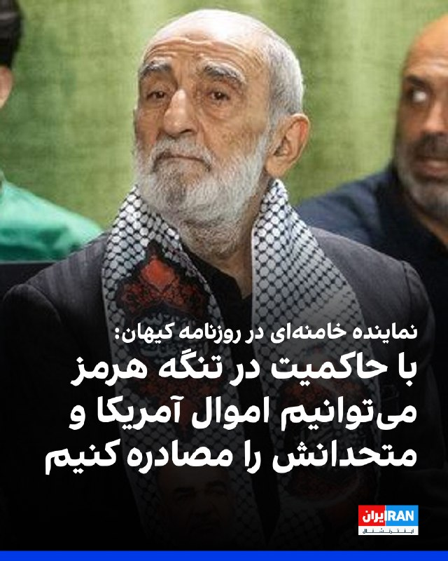

حسین شریعتمداری، نماینده رهبر جمهوری اسلامی در روزنامه کیهان، گفت: «با اعمال حاکمیت بر تنگه هرمز، امکان توقیف اموال متعلق به آمریکا و متحدانش وجود دارد.»

او افزود: «آمریکا به هیچ عهد و پیمانی پایبند نیست و به‌راحتی به جمهوری اسلامی غرامت پرداخت نخواهد کرد.»

شریعتمداری همچنین گفت: «پاسخ به محاصره دریایی آمریکا، شلیک موشک‌های ۲۵۰۰ کیلومتری با کلاهک سنگین به سمت باب‌المندب است.»
https://iranintl.com/202606188788

## IranIntlTV — post 343102

  <a href="telegram/content/IranIntlTV_343102_1781813194.mp4" target="_blank">🎬 Download video</a>

جیسون برادسکی، مدیر سیاست‌گذاری سازمان اتحاد علیه ایران هسته‌ای، گفت: «نمی‌توانیم از متن فعلی این تفاهم‌نامه حمایت کنیم، زیرا با سیاست "فشار حداکثری" ایالات متحده سازگار نیست و پیش از دریافت تعهدات روشن و قابل راستی‌آزمایی، امتیازهای زیادی به جمهوری اسلامی داده است.»
@iranintltv

## IranIntlTV — post 343101

  <a href="telegram/content/IranIntlTV_343101_1781813196.mp4" target="_blank">🎬 Download video</a>

در پیامی منتسب به مجتبی خامنه‌ای درباره تفاهم با آمریکا آمده است که او نظر دیگری داشته، اما در نهایت اجازه امضای توافق داده شده است.
هم‌زمان با ادامه هشدارهای کاخ سفید به جمهوری اسلامی، پیت هگست، وزیر جنگ آمریکا، گفته امضای یادداشت تفاهم به معنای کنار گذاشته شدن گزینه نظامی نیست.
@iranintltv

## Persian_Trend_Official — post 17494

  <a href="telegram/content/Persian_Trend_Official_17494_1781813199.webm" target="_blank">🎬 Download video</a>

معاون رئیس جمهور امریکا، جی دی ونس: شما افرادی را در سیستم اسرائیل دیده‌اید، بن گویر و اسموتریچ، که به این توافق حمله کرده‌اند.

فکر می‌کنم پاسخ من به آنها این باشد: پیشنهاد دقیق شما چیست؟

شما کشوری با 9 میلیون نفر جمعیت هستید. نمی‌توانید با کشتن، از حل تک تک مشکلات امنیت ملی خود فرار کنید.

📝 Amir

📌 @persian_trend_official
پرشین ترند | متفاوت‌ترین کانال نظامی

## Persian_Trend_Official — post 17493

  

⭕️ یسرائیل کاتز، وزیر دفاع اسرائیل، گفت اسرائیل توانایی انجام عملیات مستقل علیه جمهوری اسلامی را دارد و در هر لحظه برای اجرای یک «عملیات آبی و سفید» در ایران آماده است.

او افزود: «ما هرگز از آمریکا نخواستیم در غزه، لبنان یا سوریه همراه ما بجنگد. تنها چیزی که می‌خواهیم، حمایت سیاسی و دیپلماتیک است که از ما محافظت کند.»

کاتز با اشاره به نتایج حملات اخیر گفت: «قدرت ایران را درهم شکستیم، رهبران، دانشمندان هسته‌ای و زیرساخت‌ها را هدف قرار دادیم و برنامه هسته‌ای ایران را از بین بردیم. اکنون باید اطمینان حاصل کنیم که این برنامه دوباره احیا نشود.»

وزیر دفاع اسرائیل همچنین گفت دونالد ترامپ، رییس‌جمهوری آمریکا، اسرائیل را «متحد نمونه» توصیف کرده است. به گفته او، اسرائیل تنها کشوری است که چنین عنوانی دریافت کرده است.
کاتز افزود: «هیچ‌یک از کشورهای ناتو در زمان نیاز در کنار آمریکا نایستادند، اما اسرائیل در کنار آمریکا بود و همچنان هست.»

📝 Nick

📌 @persian_trend_official
پرشین ترند | متفاوت‌ترین کانال نظامی

## Persian_Trend_Official — post 17492

  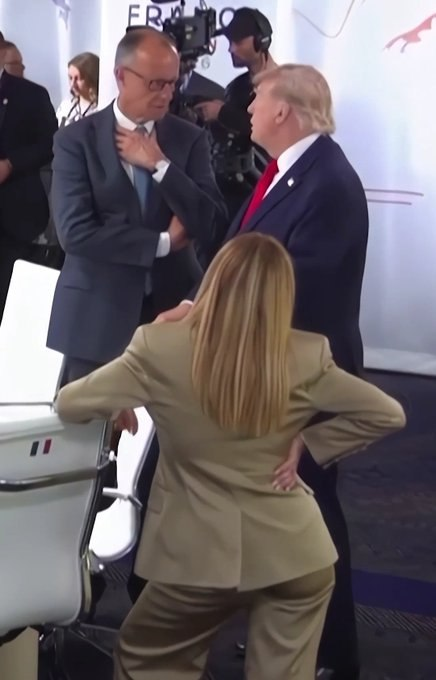

کپشن با شما 😄

## IranianMinds — post 22905

🔴المیادین به نقل از یک منبع آگاه:

هیئت جمهوری اسلامی، سفر به سوئیس را به دلیل حملات اسرائیل به لبنان تعلیق کرد.

@IranianMinds

## BBCPersian — post 284300

  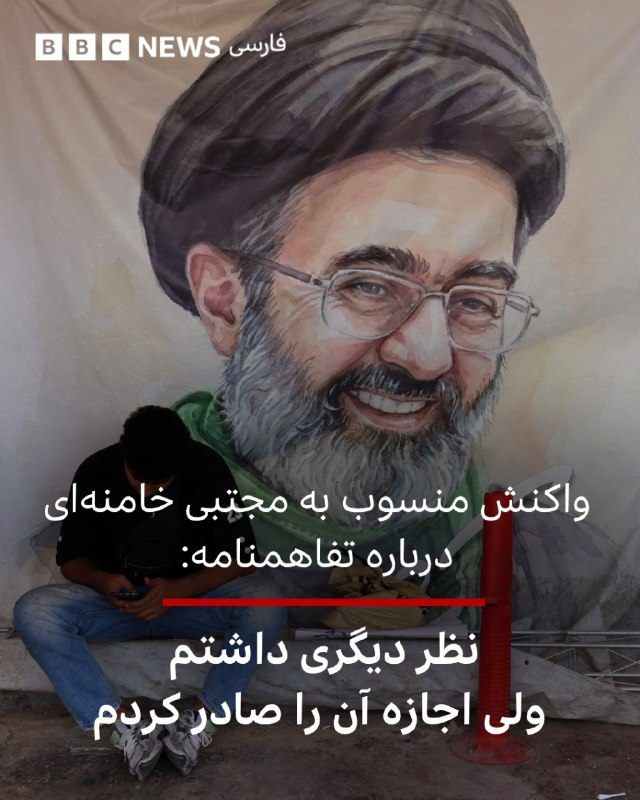

‌🔻رسانه‌های ایران گزارش داده‌اند مجتبی خامنه‌ای، رهبر جدید جمهوری اسلامی، گفته است که در مورد تفاهمنامه‌ آمریکا و ایران نظر دیگری داشته است ولی پس از آن‌که مسعود پزشکیان مسئولیت آن را پذیرفت، اجازه امضای آن را داده است.

رسانه‌های ایران،‌ شامگاه پنجشنبه متنی را به عنوان نظر مجتبی خامنه‌ای،‌ رهبر جمهوری اسلامی به امضای تفاهمنامه ایران و آمریکا منتشر کردند.

در این پیام آمده : «بنده علی‌الاصول، نظر دیگری داشتم ولی از باب تعهّدی که رئیس‌جمهور محترم به‌عنوان رئیس شورای عالی امنیّت ملّی از طرف خود و سایر اعضا در پاسداشت حقوق ملّت ایران و جبهه مقاومت به بنده دادند و تصریح به قبول مسئولیت آن نمودند، اجازه‌ی آن را صادر نمودم‌.»

آقای خامنه‌ای نوشت که آقای پزشکیان به او گفته که اگر طرف آمریکایی بخواهد زیاده‌خواهی کند، زیر بار آن نخواهند رفت.

«از این لحظه،‌ ما یعنی ملت سرافراز و این خادم ناچیز منتظر تحقق شروط گفته شده خواهیم بود.»

📷AFP via Getty Images
https://bbc.in/4vjH8OP

@BBCPersian

## alonews — post 129001

  <a href="telegram/content/alonews_129001_1781813201.webm" target="_blank">🎬 Download video</a>

👈 سفیر پیشین روسیه در ایران: یادداشت تفاهم ایران و آمریکا یک پیروزی تاکتیکی برای تهران بود

✅ @AloNews خبر جنگ

## alonews — post 129000

  <a href="telegram/content/alonews_129000_1781813202.webm" target="_blank">🎬 Download video</a>

👈شریعتمداری: شهید لاریجانی دنبال این بود که حساب گروسی را برسد؛ اما جنگ شد و کشته شد

✅ @AloNews خبر جنگ

## alonews — post 128999

  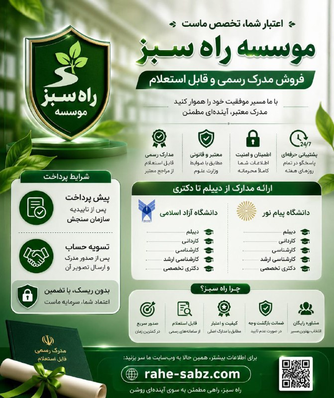

ارائه مدارک تحصیلی معتبر از «دیپلم تا دکتری» 🎓

مدارک رسمی و معتبر  هستند و قابلیت استعلام  بصورت نامه نگاری و آنلاین از سامانه های مربوطه را دارد
قبل از پیش پرداخت ثبت نام شما انجام میشه و تاییدیه سنجش دریافت میکنید سپس پیش پرداخت واریز میکنید ✅
مؤسسه راه سبز تنها مؤسسه صدور مدرکی هست که رضایت ویدیؤیی متقاضی هارو داره

صفحه تلگرام :
t.me/+2yeLgZeivDkzNDYx

وب سایت :
Rahe-sabz.com
➖➖➖➖➖➖➖➖➖➖➖➖

## alonews — post 128998

  <a href="telegram/content/alonews_128998_1781813203.webm" target="_blank">🎬 Download video</a>

👈مسئول سیاست خارجی اتحادیه اروپا: ما تحریم‌های مختلفی علیه ایران داریم. اگر توافق هسته‌ای وجود داشته باشد، فکر می‌کنم کشورهای عضو اتحادیه اروپا در مورد این لغو تحریم‌ها بحث خواهند کرد

✅ @AloNews خبر جنگ

---
📅 بروزرسانی: 1405/03/28 23:20
---

## VahidOOnLine — post 246272

  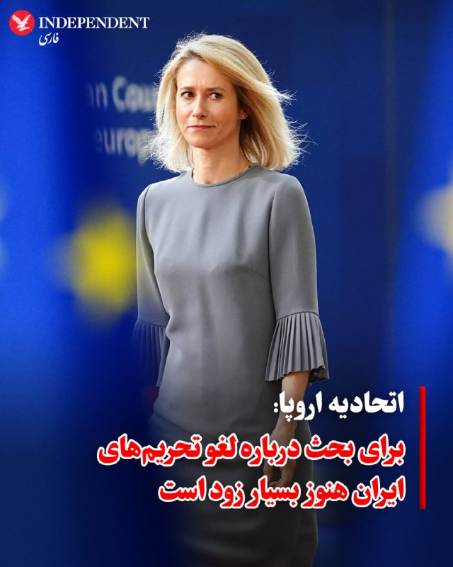

♦️ کایا کالاس، نایب‌رئیس کمیسیون اروپا، اعلام کرد که موضوع لغو تحریم‌های اتحادیه اروپا علیه جمهوری اسلامی ایران تنها پس از دستیابی به یک توافق هسته‌ای جامع با تهران بررسی خواهد شد.

کالاس روز پنجشنبه ۲۸ خرداد، در گفتگو با خبرنگاران پیش از آغاز نشست سران کشورهای عضو اتحادیه اروپا گفت: «البته زمانی که شرایط فراهم شود، کشورهای عضو درباره اینکه آیا لغو تحریم‌ها [مناسب] است یا خیر گفتگو خواهند کرد، اما ما هنوز به آن مرحله نرسیده‌ایم.»

اتحادیه اروپا در حال حاضر تحریم‌های چندجانبه‌ای را علیه بیش از ۷۰۰ فرد و نهاد در ایران اعمال کرده است که این محدودیت‌ها مواردی چون ممنوعیت سفر و مسدود شدن دارایی‌ها را شامل می‌شود.
‌🇸🇦 Indypersian

🤖 @VahidOOnLine

## VahidOOnLine — post 246271

  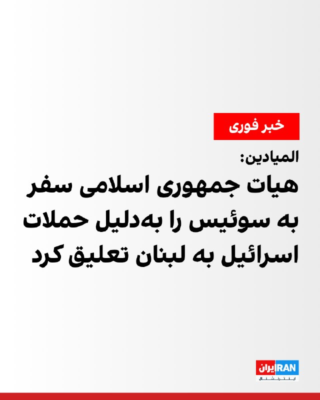

المیادین به نقل از یک منبع آگاه گزارش داد هیات مذاکره‌کننده جمهوری اسلامی به دلیل ادامه حملات اسرائیل به جنوب لبنان، سفر خود به سوئیس برای آغاز نخستین دور مذاکرات ۶۰ روزه را به حالت تعلیق درآورده است.
المیادین افزود: تهران پیش‌تر به آمریکا و میانجی‌ها اطلاع داده بود که پرونده لبنان در ادامه یا توقف مذاکرات نقشی محوری دارد و هشدار داده است حملات اسرائیل تا عمق ۱۰ کیلومتری خاک لبنان نقض یادداشت تفاهم و توافق چارچوب است.
‌🏁 🇬🇧 IranintlTV

🤖 @VahidOOnLine

## mwarmonitor — post 11174

  <a href="telegram/content/mwarmonitor_11174_1781812220.mp4" target="_blank">🎬 Download video</a>

🔸برنامه طنز و شبانه «جیمی کیمل لایو!» از شبکه ABC

🔹«ما آیت‌الله را کشتیم و یک آیت‌الله جوان‌تر و تندروتر را جایگزین او کردیم. ما هیچ کاری برای معترضان در ایران انجام ندادیم. ما تحریم‌هایی را که قبل از شروع جنگ علیه ایران وضع شده بود، لغو کردیم. ما به آتش‌بسی رسیدیم که قبل از این هم آن را داشتیم. ما تنگه را باز کردیم که قبل از این هم باز بود. ما خدا می‌داند چند میلیارد دلار صرف بمب و موشک کردیم. جان بسیاری از آمریکایی‌ها و غیرنظامیان از دست رفت. ما کنترل کامل تنگه هرمز را به ایران دادیم و حداقل ۳۰۰ میلیارد دلار هم به آن اضافه کردیم، چون، چرا که نه؟ الان ملانیا با خودش فکر می‌کنه: "چطور می‌تونم منم همچین معامله‌ای داشته باشم؟"»

@mwarmonitor

## VahidOnline — post 76496

  

المیادین به نقل از یک منبع آگاه گزارش داد هیات مذاکره‌کننده جمهوری اسلامی به دلیل ادامه حملات اسرائیل به جنوب لبنان، سفر خود به سوئیس برای آغاز نخستین دور مذاکرات ۶۰ روزه را به حالت تعلیق درآورده است.
المیادین افزود: تهران پیش‌تر به آمریکا و میانجی‌ها اطلاع داده بود که پرونده لبنان در ادامه یا توقف مذاکرات نقشی محوری دارد و هشدار داده است حملات اسرائیل تا عمق ۱۰ کیلومتری خاک لبنان نقض یادداشت تفاهم و توافق چارچوب است.
@VahidOOnLine

📡 @VahidOnline

## kianmeli1 — post 88072

🔴المیادین به نقل از یک منبع آگاه گزارش داد هیات مذاکره‌کننده جمهوری اسلامی به دلیل ادامه حملات اسرائیل به جنوب لبنان، سفر خود به سوئیس برای آغاز نخستین دور مذاکرات ۶۰ روزه را به حالت تعلیق درآورده است.
المیادین افزود: تهران پیش‌تر به آمریکا و میانجی‌ها اطلاع داده بود که پرونده لبنان در ادامه یا توقف مذاکرات نقشی محوری دارد و هشدار داده است حملات اسرائیل تا عمق ۱۰ کیلومتری خاک لبنان نقض یادداشت تفاهم و توافق چارچوب است.
https://t.me/kianmeli1

## IranIntlTV — post 343100

  

المیادین به نقل از یک منبع آگاه گزارش داد هیات مذاکره‌کننده جمهوری اسلامی به دلیل ادامه حملات اسرائیل به جنوب لبنان، سفر خود به سوئیس برای آغاز نخستین دور مذاکرات ۶۰ روزه را به حالت تعلیق درآورده است.
المیادین افزود: تهران پیش‌تر به آمریکا و میانجی‌ها اطلاع داده بود که پرونده لبنان در ادامه یا توقف مذاکرات نقشی محوری دارد و هشدار داده است حملات اسرائیل تا عمق ۱۰ کیلومتری خاک لبنان نقض یادداشت تفاهم و توافق چارچوب است.
https://iranintl.com/202606181484

## IranIntlTV — post 343099

  <a href="telegram/content/IranIntlTV_343099_1781812223.mp4" target="_blank">🎬 Download video</a>

جمشید برزگر، روزنامه‌نگار و تحلیل‌گر سیاسی، درباره پیام منتسب به مجتبی خامنه‌ای در رابطه با تفاهم‌نامه جمهوری اسلامی و آمریکا گفت: «یکی از مهم‌ترین میراث‌های سیاسی که از علی خامنه‌ای در ساختار جمهوری اسلامی باقی مانده، شیوه مدیریت مسئولیت است؛ یعنی همزمان نقش تعیین‌کننده داشتن، اما مسئولیت نپذیرفتن.»

او افزود: «در کنار مسئولیت‌گریزی، حفظ توازن میان جناح‌ها و مراکز قدرت نیز اهمیت دارد. در این پیام نه‌تنها مسئولیت به گردن پزشکیان انداخته شده، بلکه به نوعی از قالیباف نیز حمایت و حفاظت می‌شود.»
@iranintltv

## IranianMinds — post 22904

🔴 کاتز، وزیر دفاع اسرائیل:

توانایی انجام عملیات مستقل علیه جمهوری اسلامی رو داریم.

@IranianMinds

## IranianMinds — post 22903

🔴 شورای عالی امنیت ملی: بر اساس تفاهم‌نامه منعقد شده، تا ۶۰ روز هیچ‌گونه عوارضی از کشتی‌های عبوری از تنگه هرمز دریافت نخواهد شد

@IranianMinds

## Hranews — post 113712

گزارشی از آخرین وضعیت خلیل رسولی در زندان وکیل آباد مشهد`

❗️
❗️
❗️
❗️
❗️– خلیل رسولی، از بازداشت شدگان اعتراضات سراسری ۱۴۰۴، در حال تحمل دوران محکومیت خود در زندان وکیل آباد مشهد است. او اردیبهشت‌ماه سال جاری به هشت سال حبس، ۸۰ ضربه شلاق و ۲ سال تبعید محکوم شده است.

ادامه مطلب

#خلیل_رسولی

↘️
@hranews_bot تماس ✉️ -  @Hranews  کانال هرانا 🆑

## alonews — post 128997

  <a href="telegram/content/alonews_128997_1781812225.mp4" target="_blank">🎬 Download video</a>

👈در جریان حمله امروز صبح پهپادهای اوکراینی به پالایشگاه مسکو، یکی از موشک های پدافند هوایی عاجز از رهگیری پهپادها دچار سردرگمی می شود و بسیار دقیق یکی از از مخازن سوخت را منهدم می کند !

✅ @AloNews خبر جنگ

## alonews — post 128996

  <a href="telegram/content/alonews_128996_1781812226.webm" target="_blank">🎬 Download video</a>

👈شریعتمداری، مدیر مسئول کیهان: با مصادره اموال آمریکایی‌ها و متحدانش از طریق تنگه هرمز باید غرامت بگیریم از آمریکا 
✅ @AloNews خبر جنگ

---
📅 بروزرسانی: 1405/03/28 23:07
---

## VahidOOnLine — post 246270

🗣روایت شما درباره توافق میان جمهوری اسلامی و آمریکا - پنجشنبه ۲۸ خرداد ۱۴۰۵

🔹ترامپ سپاه پاسداران را گروه تروریستی خواند، بعد با همان گروه تروریستی تفاهم کرد و منتقدان را احمق خواند. آقای ترامپ، کاشکی ۳۰ روز صبر می‌کردید تا به یک جایی می‌رسیدید.

🔹از تهران پیام می‌دهم: اینجا هر شب شعار می‌دهند که برنده شدیم، برنده شدیم. کل جمعیتشان ۲۰ نفر است. ولی شب ۱۸ و ۱۹ دی... با ترامپ شروع نشد که با ترامپ تمام بشود. جاوید شاه.

🔹ترامپ عزیز، آمدی محل‌های سرکوب را زدی، جایش پولی که پول خون مردم، پول جوانی مردم، پول تحمل فقر مردم بود و دوست داشتیم روزی برای آبادانی مملکت خرج بشود را داری می‌دهی که مراکز سرکوب جدیدتر و مجهزتر بسازند. چه کردی با مردم ایران؟

🔹از اراک: به‌نظر من این مذاکرات برجام دو به نتیجه نمی‌رسد و صرفاً وقت خریدن برای طرفین است.

🔹از تبریز. ما مردم جمهوری اسلامی را نمی‌خواهیم. ۴۷ سال بدبختی، گرانی و فلاکت برای مردم آوردند؛ دیگر بس است. یک عمر صبر کردیم، یک عمر تاوان دادیم. ما هم حق داریم یک نفس عمیق بکشیم، زندگی کنیم و آینده‌ای بهتر برای ایران داشته باشیم.

🔹جای مردم ایران، جای جاویدنام‌ها، جای زندانیان سیاسی و عزیزانی که ۱۸ و ۱۹ دی و بعد از آن دستگیر شدند و زیر شکنجه هستند و هر روز اعدام می‌شوند، در این تفاهم کجاست؟ آقای ترامپ، طلبکار نیستیم ولی خودت را با ریگان مقایسه نکن!!

🔹از کرمانشاه. ما ایرانیان مبارز هیچ کمکی از آمریکا نداشتیم اما از شاهزاده پهلوی توقع داشتیم همه ملت و اقوام با عقاید مختلف را متحد کند تا در یک شورش سراسری به آزادی برسیم، حتی اگر جانمان فدا می‌شد. حیف که فرصت‌سوزی می‌کنند.
‌🏁 🇬🇧 IranintlTV

🤖 @VahidOOnLine

## VahidOOnLine — post 246269

  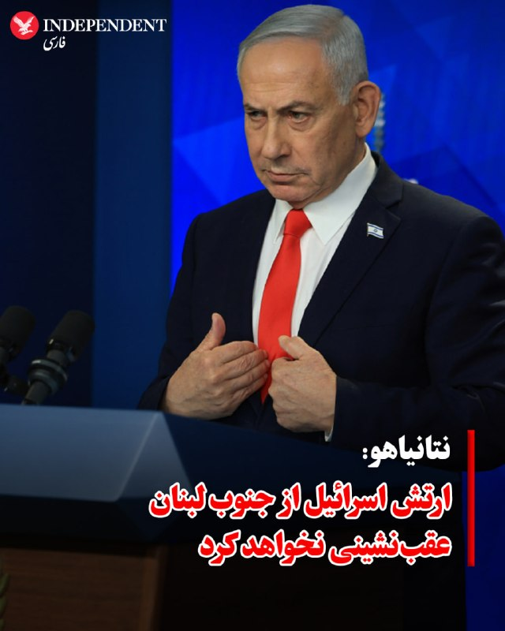

♦️ بنیامین نتانیاهو، نخست‌وزیر اسرائیل، روز پنج‌شنبه ۲۸ خرداد اعلام کرد که این کشور منطقه امنیتی خود را در جنوب لبنان تا هر زمان که نیازهای امنیتی‌اش اقتضا کند، حفظ خواهد کرد. این اظهارات در حالی مطرح می‌شود که در متن تفاهم‌نامه اخیر میان جمهوری اسلامی ایران و آمریکا بر حفظ «تمامیت ارضی لبنان» تأکید شده و تهران خواستار خروج نیروهای اسرائیلی است.

نتانیاهو با صدور بیانیه‌ای از سوی دفتر خود، ضمن قدردانی از واشنگتن برای مبارزه «شانه به شانه» با اسرائیل، بر لزوم حفظ «روابط حیاتی» با ایالات متحده پس از جنگ با ایران تاکید کرد و گفت: «این نبرد هنوز به پایان نرسیده و چالش‌های بیشتری در پیش رو داریم.»

نخست‌وزیر اسرائیل با تاکید بر بازگرداندن امنیت به مناطق شمالی تصریح کرد: «تحقق این هدف مستلزم حفظ منطقه امنیتی در جنوب لبنان است؛ ما تا زمانی که امنیت اسرائیل ایجاب کند، آنجا را ترک نخواهیم کرد.»

ساعتی پس از انتشار این بیانیه، دونالد ترامپ با انتشار پیامی در تروث سوشال، تاکید کرد که انتظار دارد صلح در تمامی جبهه‌ها، از جمله در مورد «لبنان، حزب‌الله و اسرائیل» برقرار شود.
‌🇸🇦 Indypersian

🤖 @VahidOOnLine

## VahidOOnLine — post 246268

  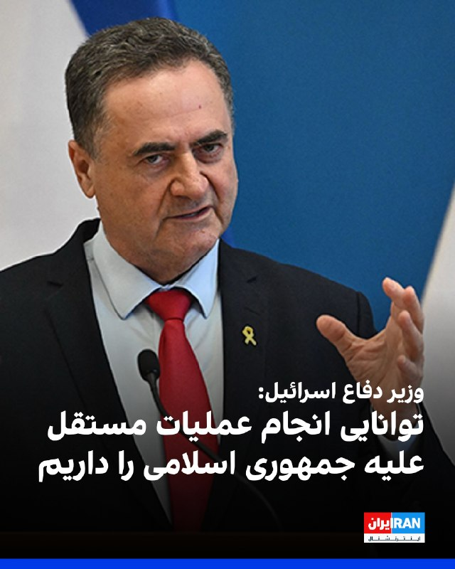

یسرائیل کاتز، وزیر دفاع اسرائیل، گفت اسرائیل توانایی انجام عملیات مستقل علیه جمهوری اسلامی را دارد و در هر لحظه برای اجرای یک «عملیات آبی و سفید» در ایران آماده است.

او افزود: «ما هرگز از آمریکا نخواستیم در غزه، لبنان یا سوریه همراه ما بجنگد. تنها چیزی که می‌خواهیم، حمایت سیاسی و دیپلماتیک است که از ما محافظت کند.»

کاتز با اشاره به نتایج حملات اخیر گفت: «قدرت ایران را درهم شکستیم، رهبران، دانشمندان هسته‌ای و زیرساخت‌ها را هدف قرار دادیم و برنامه هسته‌ای ایران را از بین بردیم. اکنون باید اطمینان حاصل کنیم که این برنامه دوباره احیا نشود.»

وزیر دفاع اسرائیل همچنین گفت دونالد ترامپ، رییس‌جمهوری آمریکا، اسرائیل را «متحد نمونه» توصیف کرده است. به گفته او، اسرائیل تنها کشوری است که چنین عنوانی دریافت کرده است.
کاتز افزود: «هیچ‌یک از کشورهای ناتو در زمان نیاز در کنار آمریکا نایستادند، اما اسرائیل در کنار آمریکا بود و همچنان هست.»
‌🏁 🇬🇧 IranintlTV

🤖 @VahidOOnLine

## WithYashar — post 15279

وزیر جنگ اسرائیل: قدرت ایران را درهم شکستیم، رهبران، دانشمندان هسته‌ای و زیرساخت‌ها را هدف قرار دادیم و برنامه هسته‌ای ایران را از بین بردیم؛ اکنون باید اطمینان حاصل کنیم که این برنامه دوباره احیا نشود

اسرائیل در هر لحظه برای عملیات مستقل در ایران آماده است
@withyashar

## WithYashar — post 15278

المیادین به نقل از منبع آگاه: هیئت مذاکره کننده ایرانی سفر خود به سوئیس را به دلیل تداوم حملات اسرائیل به جنوب لبنان متوقف می‌کند
@withyashar

## WithYashar — post 15277

  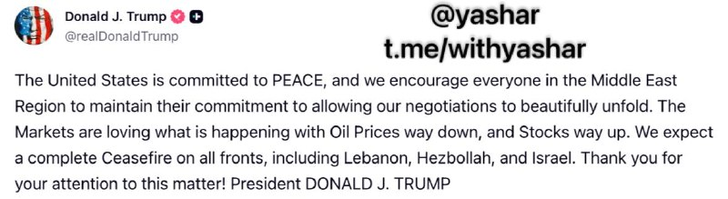

ترامپ در تروث: ایالات متحده به صلح متعهد است و ما از همه در خاورمیانه می‌خواهیم که به تعهد خود برای پیشرفت عالی مذاکرات ما پایبند بمانند.
بازارها از آنچه اتفاق می‌افتد هیجان‌زده‌اند:قیمت نفت به شدت کاهش یافته و سهام به سرعت افزایش یافته است.
ما انتظار داریم آتش‌بس کامل در تمام جبهه‌ها، از جمله لبنان، «حزب‌الله» و اسرائیل برقرار شود. از توجه شما به این موضوع سپاسگزاریم!
@withyashar

## FoxNewsTwitter — post 343140

  

Fox News (Twitter/X)

Happy Birthday, Sir Paul McCartney.

From The Beatles to his acclaimed solo career, his work remains among the most celebrated in popular music history.

## iaghapour — post 2686

  <a href="telegram/content/iaghapour_2686_1781811429.webm" target="_blank">🎬 Download video</a>

🔥 فروش ویژه سرور مجازی تک و چند کشوره 
🔥

👜 بجای 6 تا سرور مجازی، 2 تا بخر با 6 آیپی 
‼️

✅ با check-host.net سالم

## IranIntlTV — post 343098

🗣روایت شما درباره توافق میان جمهوری اسلامی و آمریکا - پنجشنبه ۲۸ خرداد ۱۴۰۵

🔹ترامپ سپاه پاسداران را گروه تروریستی خواند، بعد با همان گروه تروریستی تفاهم کرد و منتقدان را احمق خواند. آقای ترامپ، کاشکی ۳۰ روز صبر می‌کردید تا به یک جایی می‌رسیدید.

🔹از تهران پیام می‌دهم: اینجا هر شب شعار می‌دهند که برنده شدیم، برنده شدیم. کل جمعیتشان ۲۰ نفر است. ولی شب ۱۸ و ۱۹ دی... با ترامپ شروع نشد که با ترامپ تمام بشود. جاوید شاه.

🔹ترامپ عزیز، آمدی محل‌های سرکوب را زدی، جایش پولی که پول خون مردم، پول جوانی مردم، پول تحمل فقر مردم بود و دوست داشتیم روزی برای آبادانی مملکت خرج بشود را داری می‌دهی که مراکز سرکوب جدیدتر و مجهزتر بسازند. چه کردی با مردم ایران؟

🔹از اراک: به‌نظر من این مذاکرات برجام دو به نتیجه نمی‌رسد و صرفاً وقت خریدن برای طرفین است.

🔹از تبریز. ما مردم جمهوری اسلامی را نمی‌خواهیم. ۴۷ سال بدبختی، گرانی و فلاکت برای مردم آوردند؛ دیگر بس است. یک عمر صبر کردیم، یک عمر تاوان دادیم. ما هم حق داریم یک نفس عمیق بکشیم، زندگی کنیم و آینده‌ای بهتر برای ایران داشته باشیم.

🔹جای مردم ایران، جای جاویدنام‌ها، جای زندانیان سیاسی و عزیزانی که ۱۸ و ۱۹ دی و بعد از آن دستگیر شدند و زیر شکنجه هستند و هر روز اعدام می‌شوند، در این تفاهم کجاست؟ آقای ترامپ، طلبکار نیستیم ولی خودت را با ریگان مقایسه نکن!!

🔹از کرمانشاه. ما ایرانیان مبارز هیچ کمکی از آمریکا نداشتیم اما از شاهزاده پهلوی توقع داشتیم همه ملت و اقوام با عقاید مختلف را متحد کند تا در یک شورش سراسری به آزادی برسیم، حتی اگر جانمان فدا می‌شد. حیف که فرصت‌سوزی می‌کنند.

## IranIntlTV — post 343097

  <a href="telegram/content/IranIntlTV_343097_1781811430.mp4" target="_blank">🎬 Download video</a>

جی‌دی ونس، معاون رییس‌جمهوری آمریکا، گفت: «آمریکا همچنان از حق اسرائیل برای دفاع از خود حمایت می‌کند، اما اسرائیل نیز مانند سایر طرف‌ها باید به روند صلحی که در حال شکل‌گیری است و به حاکمیت لبنان احترام بگذارد.»

او تاکید کرد: «برای دستیابی به ثبات پایدار، باید سازوکاری منطقه‌ای ایجاد شود که منابع مالی حزب‌الله را محدود کند، حمایت ایران از این گروه را متوقف سازد و در عین حال حاکمیت و تمامیت ارضی لبنان حفظ شود.»
@iranintltv

## IranIntlTV — post 343096

  

یسرائیل کاتز، وزیر دفاع اسرائیل، گفت اسرائیل توانایی انجام عملیات مستقل علیه جمهوری اسلامی را دارد و در هر لحظه برای اجرای یک «عملیات آبی و سفید» در ایران آماده است.

او افزود: «ما هرگز از آمریکا نخواستیم در غزه، لبنان یا سوریه همراه ما بجنگد. تنها چیزی که می‌خواهیم، حمایت سیاسی و دیپلماتیک است که از ما محافظت کند.»

کاتز با اشاره به نتایج حملات اخیر گفت: «قدرت ایران را درهم شکستیم، رهبران، دانشمندان هسته‌ای و زیرساخت‌ها را هدف قرار دادیم و برنامه هسته‌ای ایران را از بین بردیم. اکنون باید اطمینان حاصل کنیم که این برنامه دوباره احیا نشود.»

وزیر دفاع اسرائیل همچنین گفت دونالد ترامپ، رییس‌جمهوری آمریکا، اسرائیل را «متحد نمونه» توصیف کرده است. به گفته او، اسرائیل تنها کشوری است که چنین عنوانی دریافت کرده است.
کاتز افزود: «هیچ‌یک از کشورهای ناتو در زمان نیاز در کنار آمریکا نایستادند، اما اسرائیل در کنار آمریکا بود و همچنان هست.»
https://iranintl.com/202606184073

## Persian_Trend_Official — post 17491

  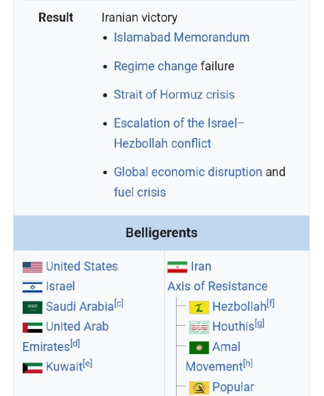

ویکی پدیا پیروز جنگ اخیر ایران با امریکا و اسرائیل را ایران ذکر کرده است!

📝 Amir

📌 @persian_trend_official
پرشین ترند | متفاوت‌ترین کانال نظامی

## IranianMinds — post 22902

  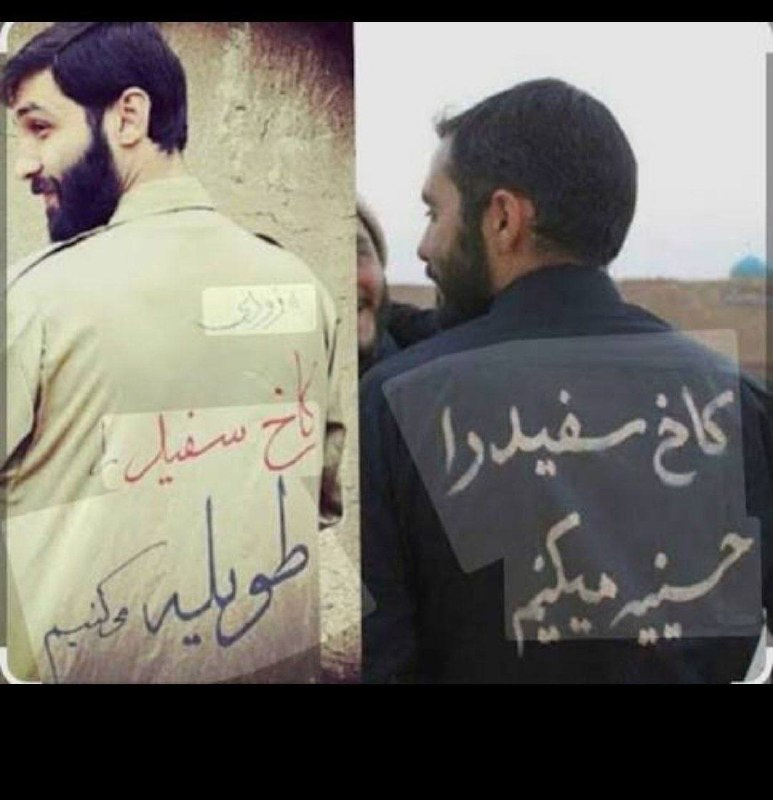

😂😂😂

@IranianMinds

## BBCPersian — post 284299

  <a href="telegram/content/BBCPersian_284299_1781811435.mp4" target="_blank">🎬 Download video</a>

🔻آخرین خبرهای مهم روز پنجشنبه ۲۸ خرداد ۱۴۰۵
@BBCPersian

## BBCPersian — post 284298

  <a href="telegram/content/BBCPersian_284298_1781811437.mp4" target="_blank">🎬 Download video</a>

با وجود‌ آنکه برنامه‌ها در ارتباط با تفاهم‌نامه ایران و آمریکا دائما در حال تغییر است، هنوز انتظار می‌رود جی‌دی ونس، معاون رئیس‌جمهور آمریکا و محمد باقر قالیباف، رئیس مجلس ایران، فردا در یک هتل مجلل در سوئیس با هم ملاقات کنند و در مورد ترتیبات شروع مذاکرات دو ماهه بین دو کشور برای پایان دادن به جنگ گفتگو داشته باشند. کسری ناجی از محل این هتل در بورگنشتاک گزارش می‌دهد.

@BBCPersian

## Dirty_Kids — post 392531

  <a href="telegram/content/Dirty_Kids_392531_1781811440.mp4" target="_blank">🎬 Download video</a>

آقا ماهان ما که بخیل نیستیم ولی کیرم دهنت.

@Dirty_Kids 👻

## alonews — post 128995

  <a href="telegram/content/alonews_128995_1781811441.webm" target="_blank">🎬 Download video</a>

👈المیادین به نقل از منبع آگاه: هیئت مذاکره کننده ایرانی سفر خود به سوئیس را به دلیل تداوم حملات اسرائیل به جنوب لبنان متوقف می‌کند

✅ @AloNews خبر جنگ

---
📅 بروزرسانی: 1405/03/28 22:55
---

## VahidOOnLine — post 246267

  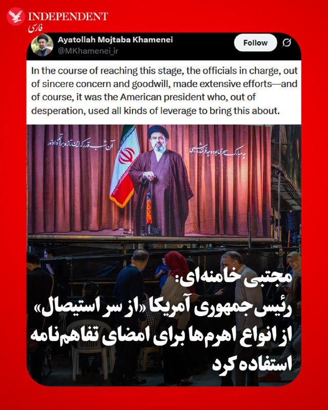

♦️ مجتبی خامنه‌ای، رهبر جدید جمهوری اسلامی که هنوز تصویر یا صدای جدیدی از او منتشر نشده است، بار دیگر با انتشار یک پیام متنی به امضای تفاهم‌نامه میان تهران و واشنگتن واکنش نشان داد.

خامنه‌ای در این پیام که به زبان انگلیسی نیز منتشر شد، مذاکره مسئولان جمهوری اسلامی را «از سر دلسوزی و حسن نظر» خواند و مدعی شد که فشارهای دونالد ترامپ، رئیس‌جمهوری آمریکا برای امضای تفاهم‌نامه از سر «استیصال» بوده است.

خامنه‌ای در این پیام تصریح کرد که شخصا با امضای تفاهم‌نامه موافق نبوده اما با «تعهد و قبول مسئولیت شخصی» مسعود پزشکیان، «اجازه» امضای آن را صادر کرده است.

رهبر جمهوری اسلامی با لحنی هشدارآمیز خطاب به دولت افزود که «ما یعنی ملت سرافراز و این خادم ناچیز» از این لحظه منتظر تحقق شروط وعده‌داده‌شده خواهند بود. او همچنین تصریح کرد که مذاکرات حضوری پیش‌رو در سوئیس به معنای پذیرش نظرات واشنگتن نخواهد بود.
‌🇸🇦 Indypersian

🤖 @VahidOOnLine

## pm_afshaa — post 94354

وزیر خارجه پاکستان: نشست ژنو میان تهران و واشنگتن لغو شد

💧 Rainbet.com the #1 Non-KYC Crypto Casino & Sportsbook @rainbetcom

😁 @Pm_Afshaa

## DEJradio — post 5801

  <a href="telegram/content/DEJradio_5801_1781810736.webm" target="_blank">🎬 Download video</a>

👑
🔺 شاهزاده رضا پهلوی: مبارزه مردم ایران وارد مرحله‌ای تازه شده است. مرحله‌ای که نیازمند تجدید سازمان، تطبیق با شرایط جدید و تداوم تلاش برای آزادی ایران است. گفت‌وگو با اندرو مار در شبکه LBC ۲۷ خرداد ۲۵۸۵/۱۴۰۵ #شاهزاده_رضا_پهلوی #مصاحبه @DEJradio

## DEJradio — post 5800

  <a href="telegram/content/DEJradio_5800_1781810737.mp4" target="_blank">🎬 Download video</a>

👑
🔺 شاهزاده رضا پهلوی: مبارزه مردم ایران وارد مرحله‌ای تازه شده است. مرحله‌ای که نیازمند تجدید سازمان، تطبیق با شرایط جدید و تداوم تلاش برای آزادی ایران است.

گفت‌وگو با اندرو مار در شبکه LBC
۲۷ خرداد ۲۵۸۵/۱۴۰۵

#شاهزاده_رضا_پهلوی #مصاحبه
@DEJradio

## VahidOnline — post 76495

  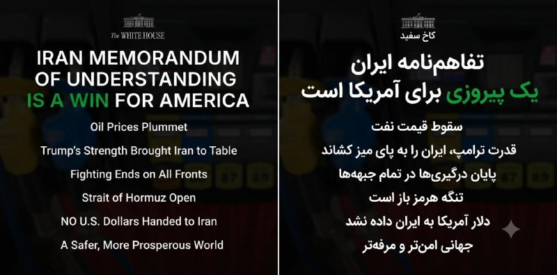

توییت کاخ سفید:
رئیس‌جمهور دونالد ج. ترامپ تهدیدی را حل کرد که واشنگتن چهل سال صرف مدیریت آن کرده بود: ایران هرگز سلاح هسته‌ای نخواهد داشت.
یک پیروزی برای آمریکا. 🇺🇸
WhiteHouse
ترجمه با هوش مصنوعی به تصویر اضافه شده.
📡 @VahidOnline

## IranIntlTV — post 343095

  <a href="telegram/content/IranIntlTV_343095_1781810739.mp4" target="_blank">🎬 Download video</a>

جی‌دی ونس، معاون رییس‌جمهوری آمریکا، گفت: «این توافق با برجام تفاوت‌های اساسی دارد. کشورهای عربی خلیج فارس که با برجام مخالف بودند، از توافق جدید استقبال کرده‌اند زیرا معتقدند ایران را در موقعیت ضعیف‌تری قرار می‌دهد.»

او افزود: «برخلاف برجام، این توافق حق غنی‌سازی در خاک ایران را به رسمیت نمی‌شناسد و قرار است ذخایر مواد غنی‌شده نیز از بین بروند یا از دسترس خارج شوند.»

ونس تاکید کرد: «حامیان این توافق معتقدند آمریکا این بار از موضع قدرت و با تکیه بر فشار نظامی، اقتصادی و دیپلماتیک وارد مذاکره شده و به همین دلیل نتیجه آن را متفاوت از برجام می‌دانند.»
@iranintltv

## IranIntlTV — post 343094

  <a href="telegram/content/IranIntlTV_343094_1781810742.mp4" target="_blank">🎬 Download video</a>

جی‌دی ونس، معاون رییس‌جمهوری آمریکا، گفت: «رویکرد ما جامع خواهد بود و رفتار جمهوری اسلامی را در مجموع ارزیابی خواهیم کرد؛ از جمله اینکه آیا همچنان از گروه‌های تروریستی حمایت مالی می‌کند، به دیگران حمله می‌کند یا به سمت احیای برنامه هسته‌ای خود بازمی‌گردد.»

او تاکید کرد: «اگر رفتار آنها تغییر کند، ما آماده کمک خواهیم بود، اما اگر تغییر نکند، همه اهرم‌های فشار اقتصادی، دیپلماتیک و نظامی همچنان در اختیار ما باقی خواهد ماند.»
@iranintltv

## FarsiVOA — post 221139

⚡️حال و هوای تورنتو در روزی که مسی تاریخ‌ساز شد
@FarsiVOA

## DW_Farsi — post 126157

  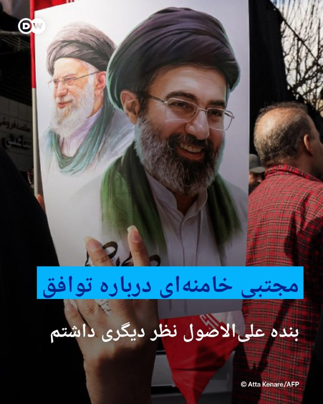

🔶 پیام مجتبی خامنه‌ای درباره توافق: بنده علی‌الاصول نظر دیگری داشتم

با گذشت چهار روز از امضای تفاهم‌نامه میان ایران و آمریکا، روز پنج‌شنبه ۲۸ خرداد پیامی منسوب به مجتبی خامنه‌ای درباره این تفاهم‌نامه منتشر شد.

در متن این پیام آمده است: «بنده علی‌الاصول، نظر دیگری داشتم ولی از باب تعهّدی که رئیس‌جمهور محترم به‌عنوان رئیس شورای عالی امنیّت ملّی از طرف خود و سایر اعضا در پاسداشت حقوق ملّت ایران و جبهه مقاومت به بنده دادند و تصریح به قبول مسئولیت آن نمودند، اجازه آن را صادر نمودم.»

او البته تاکید کرده که اگر طرف آمریکایی بخواهد "زیاده‌خواهی" کند زیر بار نخواهد رفت.

مجتبی خامنه‌ای پذیرش توافق را به معنای "پذیرش نظر دشمن" ندانسته و نوشته است: «از این لحظه، ما یعنی شما ملت سرافراز و این خادم ناچیز، منتظر تحقّق شروط گفته‌شده خواهیم بود.»
@dw_farsi

## Persian_Trend_Official — post 17490

  

حساب رسمی کاخ سفید در X: ما آمریکا را قبل از GTA 6 نجات دادیم.

📝 Amir

📌 @persian_trend_official
پرشین ترند | متفاوت‌ترین کانال نظامی

## Persian_Trend_Official — post 17489

  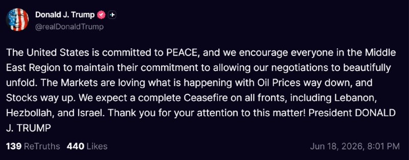

رئیس جمهور ترامپ در تروث سوشال: ایالات متحده به صلح متعهد است و ما همه را در منطقه خاورمیانه تشویق می‌کنیم که به تعهد خود برای پیشبرد مذاکرات ما به بهترین شکل ممکن پایبند باشند.

بازارها از آنچه که با کاهش قیمت نفت و افزایش سهام در حال رخ دادن است، لذت می‌برند. ما انتظار آتش‌بس کامل در همه جبهه‌ها، از جمله لبنان، حزب‌الله و اسرائیل را داریم.

📝 Amir

📌 @persian_trend_official
پرشین ترند | متفاوت‌ترین کانال نظامی

## Persian_Trend_Official — post 17488

به گزارش کانال 14 اسرائیل، رهبری سیاسی اسرائیل به ارتش این کشور اجازه داده است تا در محدوده خط زرد ر جنوب لبنان آتش بگشاید.

انتظار می‌رود مقامات ارشد نظامی در ساعات آینده، قوانین به‌روز شده درگیری و دستورالعمل‌های عملیاتی را برای فرماندهان میدانی صادر کنند.

این تصمیم همچنین شامل برنامه‌هایی برای نابودی هرگونه زیرساخت مرتبط با حزب‌الله است که در محدوده خط زرد شناسایی می‌شوند.

📝 Amir

📌 @persian_trend_official
پرشین ترند | متفاوت‌ترین کانال نظامی

## RadioFarda — post 158483

🔸شورای عالی امنیت ملی جمهوری اسلامی شامگاه پنجشنبه به شکل رسمی اعلام کرد که تا شصت روز از کشتی‌های در حال عبور از تنگه هرمز هزینه‌ای دریافت نخواهد شد. 🔸در بیانیه این شورا آمده است: «به موجب یادداشت تفاهم اسلام‌آباد، به مدت شصت روز، هیچ‌گونه هزینه‌ای از متقاضیان…

## RadioFarda — post 158482

  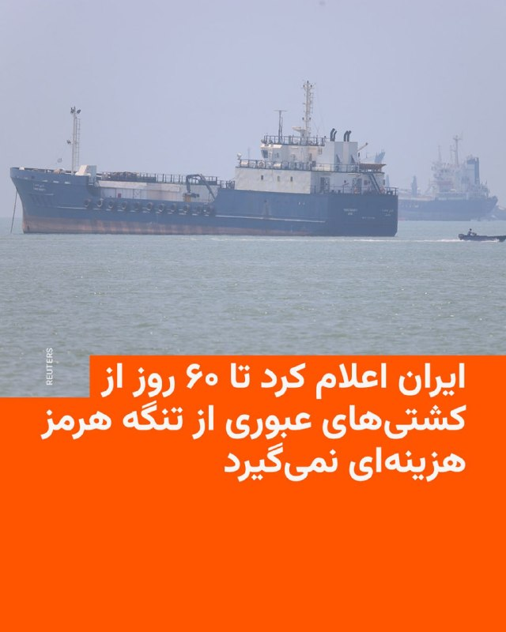

🔸شورای عالی امنیت ملی جمهوری اسلامی شامگاه پنجشنبه به شکل رسمی اعلام کرد که تا شصت روز از کشتی‌های در حال عبور از تنگه هرمز هزینه‌ای دریافت نخواهد شد.

🔸در بیانیه این شورا آمده است: «به موجب یادداشت تفاهم اسلام‌آباد، به مدت شصت روز، هیچ‌گونه هزینه‌ای از متقاضیان اخذ نخواهد شد و این هزینه‌ها توسط دولت جمهوری اسلامی ایران تأمین می‌گردد.»

🔸مقام‌های ارشد ایالات متحده بارها اعلام کرده‌اند که طبق قوانین بین‌المللی ایران نمی‌تواند از کشتی‌ها «عوارض» دریافت کند. در مقابل ایران می‌گوید که امکان دریافت هزینه «خدمات» از شناورها را دارد.

🔸این آبراه استراتژیک مدت کوتاهی بعد از آغاز جنگ آمریکا و اسرائیل علیه ایران، توسط نیروهای نظامی ایران مسدود شد و آمریکا نیز بعد از آتش‌بس محاصره دریایی بنادر ایران را اعمال کرد. ساعتی پیش ارتش آمریکا گفت که به این محاصره پایان داده است.

@RadioFarda

## IranianMinds — post 22901

  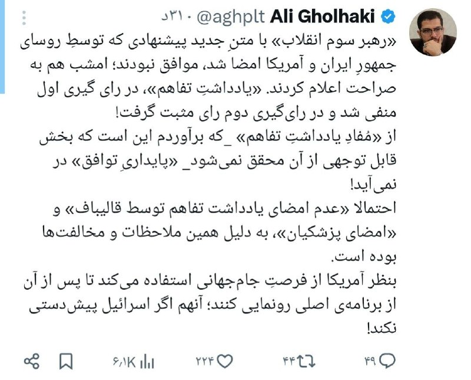

🔴 علی قلهکی؛ خبرنگار حکومتی :

این توافقی که من دیدم قابل اجرا نیست. به نظرم آمریکا داره از جام جهانی استفاده میکنه تا بعد از اون برنامه اصلی رو پیاده کنه. تازه اگه اسرائیل تا اون موقع پیش دستی نکنه.

@IranianMinds

## BBCPersian — post 284297

  <a href="telegram/content/BBCPersian_284297_1781810748.mp4" target="_blank">🎬 Download video</a>

⁨ ⁨ ⁨ ⁨ ⁨ تصاویری از درگیری ماموران با زنان معترض به «نحوه فعالیت معدن کرومیت» در جنوب استان کرمان در شبکه‌های اجتماعی منتشر شده که نشان می‌دهد پلیس در حال ضرب و شتم چند زن است. منابع خبری که اخبار منطقه جنوب شرق ایران را پوشش می‌دهد، از «بازداشت شش شهروند، از جمله سه زن» و «مجروح شدن دست‌کم هفت زن بلوچ» در روستای پشموکی فاریاب خبر داده‌اند.

حال‌وش روز ۲۷ خرداد گزارش داد: «این برخوردها پس از آن صورت گرفت که زنان و ساکنان بلوچ منطقه برای دومین روز متوالی نسبت به آنچه مصادره حق مردم منطقه در بهره‌برداری از معدن کرومیت عنوان می‌کنند، اعتراض خود را ادامه دادند.»

به نوشته این وب‌سایت، معترضان معتقدند امتیاز بهره‌برداری از این معدن که از منابع مهم اقتصادی منطقه محسوب می‌شود، «در اختیار افراد دارای نفوذ قرار گرفته و مردم بومی از منافع آن محروم مانده‌اند».

## BBCPersian — post 284296

🔻ترامپ می‌گوید آمریکا انتظار دارد آتش‌بس در همه جبهه‌ها، از جمله لبنان، برقرار شود

🔻دونالد ترامپ می‌گوید که انتظار دارد آتش‌بس «در همه جبهه‌ها» از جمله در لبنان و میان اسرائیل و حزب‌الله هم برقرار شود.

رئیس‌جمهور آمریکا در پیام جدیدی در شبکه اجتماعی خودش تروث سوشیال نوشت که انتظار دارد کشورهای خاورمیانه «به تعهد خود برای فراهم کردن امکان برگزاری مذاکرات ما پایبند بمانند.»

او افزود: «ما انتظار داریم یک آتش‌بس کامل در همه جبهه‌ها برقرار شود؛ از جمله در لبنان، میان حزب‌الله و اسرائیل.»

در اولین بند تفاهمنامه امضا شده میان ایران و آمریکا بر «توقف فوری و دائمی عملیات نظامی در تمامی جبهه‌ها» از جمله لبنان تاکید دارد

با این حال اسرائیل اعلام کرده که برنامه‌ای برای خارج کردن نیروهای خود از لبنان ندارد. همچنین بر اساس گزارش رسانه‌های دولتی لبنان،‌ اسرائیل امروز به مناطقی در جنوب این کشور حمله کرده است.

https://bbc.in/4aaeDed
@BBCPersian

## Dirty_Kids — post 392530

  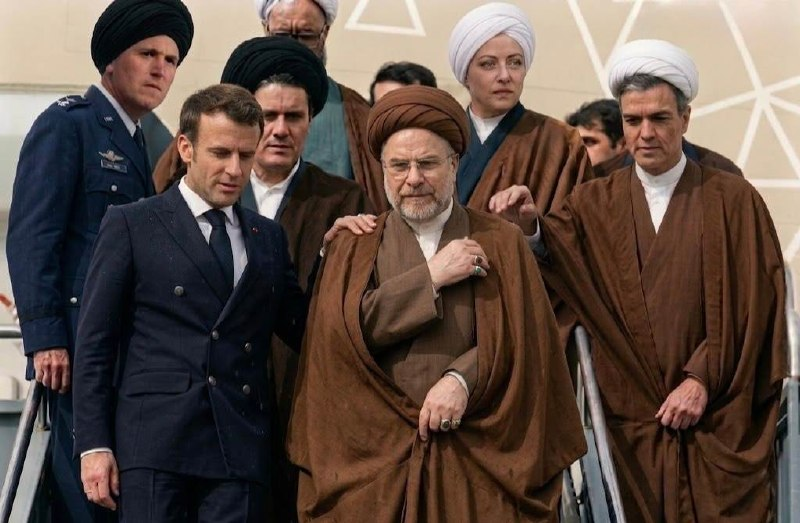

دیو چو بیرون رود
خارکصده درآید...!

@Dirty_Kids 👻

## Dirty_Kids — post 392529

  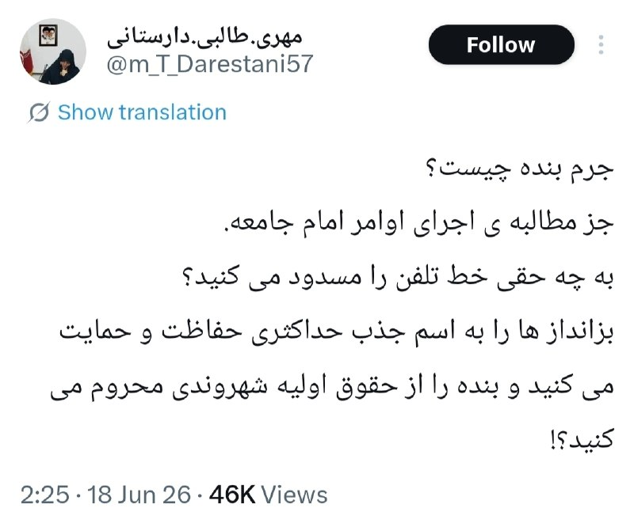

چرا چیزی شده😂😂😂😂

@Dirty_Kids 👻

## Dirty_Kids — post 392525

همین الان این پستو بفرست پیوی رفیقت و باهم بشاشین به این زندگی.

@Dirty_Kids 👻

## alonews — post 128994

  <a href="telegram/content/alonews_128994_1781810752.mp4" target="_blank">🎬 Download video</a>

اولین پاسخ پزشکیان به بیانیه مجتبی:

[@AloTweet]

## alonews — post 128993

  <a href="telegram/content/alonews_128993_1781810754.webm" target="_blank">🎬 Download video</a>

👈ثابتی: شرافتمندانه نیست

✅ @AloNews خبر جنگ

## alonews — post 128992

  <a href="telegram/content/alonews_128992_1781810754.webm" target="_blank">🎬 Download video</a>

👈رسایی : باید پزشکیان رو اعدام کنیم. 
✅ @AloNews خبر جنگ

## alonews — post 128991

  <a href="telegram/content/alonews_128991_1781810755.webm" target="_blank">🎬 Download video</a>

👈شریعتمداری، مدیر مسئول کیهان: با مصادره اموال آمریکایی‌ها و متحدانش از طریق تنگه هرمز باید غرامت بگیریم از آمریکا

✅ @AloNews خبر جنگ

---
📅 بروزرسانی: 1405/03/28 22:35
---

## VahidOOnLine — post 246266

  

شورای عالی امنیت ملی در بیانیه‌ای اعلام کرد: «در اجرای بند ۵ یادداشت تفاهم اسلام‌آباد، کشتی‌های تجاری متقاضی عبور از تنگه هرمز باید درخواست خود را به مدیریت آبراه خلیج فارس ارسال نمایند. به مدت شصت روز، هیچ‌گونه هزینه‌ای از متقاضیان اخذ نخواهد شد و این هزینه‌ها توسط دولت جمهوری اسلامی ایران تأمین می‌گردد.»
در این بیانیه آمده است: «بر این اساس به مدیریت آبراه خلیج فارس دستور داده شده است، در جهت تحقق اهداف تفاهم‌نامه درخواست‌ها را با سرعت و اولویت رسیدگی و پاسخ دهد. با توجه به شرایط خاص و وجود برخی مخاطرات ایمنی در مسیر عبور و به دلیل لزوم حصول اطمینان از تردد ایمن و جلوگیری از حوادث دریایی، لازم است کشتی‌ها در مسیر و زمان اعلامی به آنها عبور نمایند تا به تدریج، امکان تردد افزایش یابد.»
شورای عالی امنیت ملی افزود: «ترتیبات اجرایی و جزییات فنی عبور از تنگه هرمز از طریق مدیریت آبراه خلیج فارس اعلام می‌گردد. در خصوص سایر موضوعات، از جمله مین‌زدایی، اقدامات لازم مطابق بند ۵ یادداشت تفاهم اسلام‌آباد انجام خواهد شد.»
‌🏁 🇬🇧 IranintlTV

🤖 @VahidOOnLine

## WithYashar — post 15276

شورای عالی امنیت ملی:

بر اساس تفاهم‌نامه منعقد شده، تا ۶۰ روز هیچ‌گونه عوارضی از کشتی‌های عبوری از تنگه هرمز دریافت نخواهد شد
@withyashar

## mwarmonitor — post 11173

🔴​«امروز نیروهای ایالات متحده، در راستای دستور رئیس‌جمهور، محاصره تمامی تردد‌های دریایی ورودی و خروجی به بنادر و مناطق ساحلی ایران را لغو کردند. نیروهای آمریکایی مانع از عبور و مرور شناورها به بنادر ایران یا از مبدأ این بنادر نمی‌شوند. تمامی اقدامات نظامی ایالات متحده برای اعمال محاصره متوقف شده است. کشتی‌های جنگی بزرگ ما در منطقه عمومی باقی خواهند ماند تا اطمینان حاصل کنند که تمام جنبه‌های توافق مورد پایبندی، رعایت و در اجرا و اثرگذاری کامل قرار دارند.» فرماندهی سنت کام

@mwarmonitor

## pm_afshaa — post 94353

شورای عالی امنیت ملی: بر اساس تفاهم‌نامه منعقد شده، تا 60 روز هیچ‌گونه عوارضی از کشتی‌های عبوری از تنگه هرمز دریافت نخواهد شد

💧 Rainbet.com the #1 Non-KYC Crypto Casino & Sportsbook @rainbetcom

😁 @Pm_Afshaa

## DEJradio — post 5799

⭕️ پیام منتسب به مجتبی خامنه‌ای: نظرم به نظر پزشکیان نزدیک نبود

در تازه‌ترین پیام منتسب به مجتبی خامنه‌ای عنوان شد که در مورد توافق با آمریکا نظر دیگری داشته است.
در این پیام تأکید شده که مسئولیت تفاهمنامه با پزشکیان و دیگر اعضای شورای عالی امنیت ملی نظام است.
رسانه‌های جمهوری اسلامی شامگاه پنجشنبه متن پیامی منتسب به مجتبی خامنه‌ای را منتشر کردند که در آن دربارهٔ تفاهم‌نامه میان تهران و واشینگتن موضع‌گیری شده است.
در این پیام آمده است که خامنه‌ای در اصل نسبت به این توافق نظر موافق نداشته است.
بنا بر ادعای منتسب به خامنه‌ای، او به دلیل تعهدی که مسعود پزشکیان به عنوان رئیس شورای عالی امنیت ملی و دیگر اعضای شورا دادند، با امضای یادداشت تفاهم موافقت کرده است.
در پیام منتسب به رهبر جمهوری اسلامی، تفاهم‌ با آمریکا عملا به‌عنوان «تفاهم‌نامه‌ای بین روسای دولت جمهوری اسلامی و آمریکا» به‌نظر می‌رسد.
در این پیام همچنین ادعا شده که مذاکرات حضوری آینده، به معنای پذیرش نظر آمریکا نیست.

#موشتبا #تفاهم #مذاکرات #توافق
@DEJradio

## VahidOnline — post 76494

  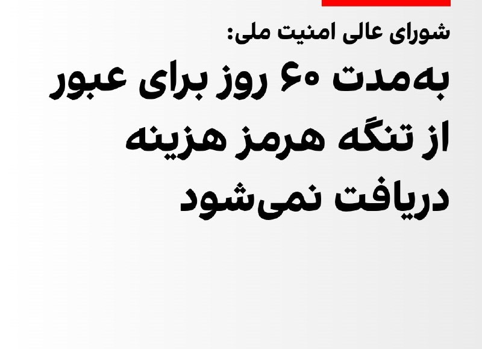

'بیانیه شورای عالی امنیت ملی'
منابع حکومتی:

🔹 در اجرای بند ۵ یادداشت تفاهم اسلام‌آباد، کشتی‌های تجاری متقاضی عبور از تنگه هرمز باید درخواست خود را به مدیریت آبراه خلیج فارس (PGSA.ir) ارسال نمایند.

🔹 به موجب یادداشت تفاهم اسلام‌آباد، به مدت شصت روز، هیچ‌گونه هزینه‌ای از متقاضیان اخذ نخواهد شد و این هزینه‌ها توسط دولت جمهوری اسلامی ایران تأمین می‌گردد.

🔹 بر این اساس به مدیریت آبراه خلیج فارس دستور داده شده است، در جهت تحقق اهداف تفاهم‌نامه درخواست‌ها را با سرعت و اولویت رسیدگی و پاسخ دهد.

🔹 با توجه به شرایط خاص و وجود برخی مخاطرات ایمنی در مسیر عبور و به دلیل لزوم حصول اطمینان از تردد ایمن و جلوگیری از حوادث دریایی، لازم است کشتی‌ها در مسیر و زمان اعلامی به آنها عبور نمایند تا به تدریج، امکان تردد افزایش یابد.

🔹 ترتیبات اجرایی و جزییات فنی عبور از تنگه هرمز از طریق مدیریت آبراه خلیج فارس اعلام می‌گردد.

🔹 در خصوص سایر موضوعات، از جمله مین‌زدایی، اقدامات لازم مطابق بند ۵ یادداشت تفاهم اسلام‌آباد انجام خواهد شد.

📡 @VahidOnline

## VahidOnline — post 76493

  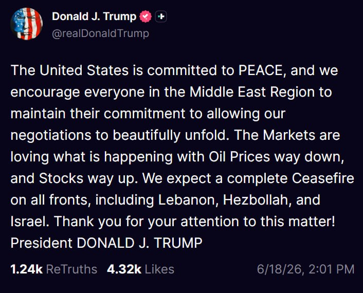

پست یک ساعت پیش ترامپ:
ایالات متحده به صلح متعهد است و ما همه در منطقه خاورمیانه را تشویق می‌کنیم که به تعهد خود برای فراهم کردن امکان پیشرفت زیبای مذاکرات ما پایبند بمانند.
بازارها از آنچه در حال رخ دادن است استقبال می‌کنند: قیمت نفت به‌شدت پایین آمده و سهام به‌شدت بالا رفته است.
ما انتظار آتش‌بس کامل در همه جبهه‌ها، از جمله لبنان، حزب‌الله و اسرائیل را داریم.
از توجه شما به این موضوع سپاسگزارم!
رئیس‌جمهور دونالد ج. ترامپ
realDonaldTrump

📡 @VahidOnline

## IranIntlTV — post 343093

  <a href="telegram/content/IranIntlTV_343093_1781809557.mp4" target="_blank">🎬 Download video</a>

یک شهروند از استان گلستان با ارسال ویدیویی به ایران اینترنشنال به قطع برق منزل خود اشاره کرده و به طعنه درباره دفن نشدن جنازه علی خامنه‌ای می‌گوید: «ما نگران خودمان نیستیم نگرانیم جنازه حضرت آقا بو نگیرد.»

## IranIntlTV — post 343092

  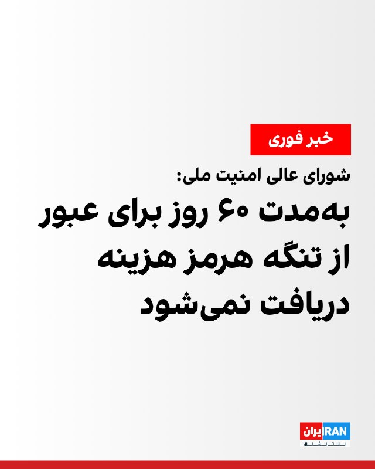

شورای عالی امنیت ملی در بیانیه‌ای اعلام کرد: «در اجرای بند ۵ یادداشت تفاهم اسلام‌آباد، کشتی‌های تجاری متقاضی عبور از تنگه هرمز باید درخواست خود را به مدیریت آبراه خلیج فارس ارسال نمایند. به مدت شصت روز، هیچ‌گونه هزینه‌ای از متقاضیان اخذ نخواهد شد و این هزینه‌ها توسط دولت جمهوری اسلامی ایران تأمین می‌گردد.»
در این بیانیه آمده است: «بر این اساس به مدیریت آبراه خلیج فارس دستور داده شده است، در جهت تحقق اهداف تفاهم‌نامه درخواست‌ها را با سرعت و اولویت رسیدگی و پاسخ دهد. با توجه به شرایط خاص و وجود برخی مخاطرات ایمنی در مسیر عبور و به دلیل لزوم حصول اطمینان از تردد ایمن و جلوگیری از حوادث دریایی، لازم است کشتی‌ها در مسیر و زمان اعلامی به آنها عبور نمایند تا به تدریج، امکان تردد افزایش یابد.»
شورای عالی امنیت ملی افزود: «ترتیبات اجرایی و جزییات فنی عبور از تنگه هرمز از طریق مدیریت آبراه خلیج فارس اعلام می‌گردد. در خصوص سایر موضوعات، از جمله مین‌زدایی، اقدامات لازم مطابق بند ۵ یادداشت تفاهم اسلام‌آباد انجام خواهد شد.»
https://iranintl.com/202606188126

## Iliaen — post 4495

  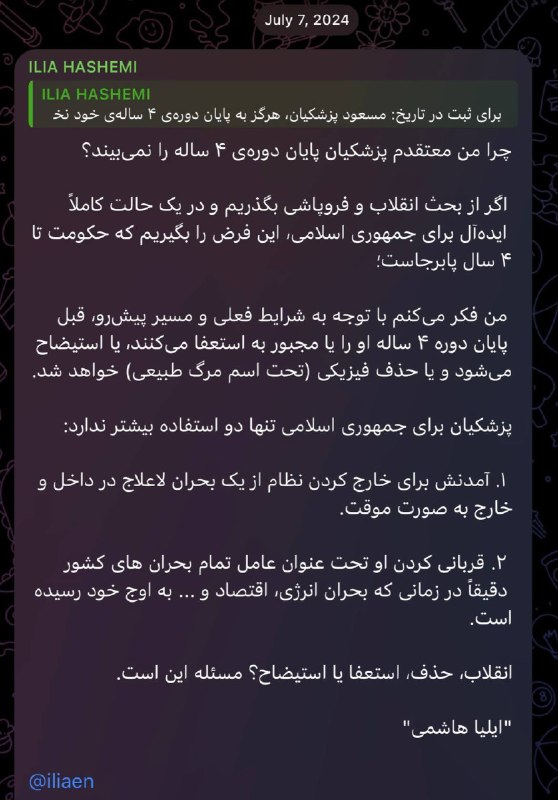

چرا من معتقدم پزشکیان پایان دوره‌ی ۴ ساله را نمی‌بیند؟ اگر از بحث انقلاب و فروپاشی بگذريم و در یک حالت کاملاً ایده‌آل برای جمهوری اسلامی، این فرض را بگیریم که حکومت تا ۴ سال پابرجاست؛ من فکر می‌کنم با توجه به شرایط فعلی و مسیر پیش‌رو، قبل پایان دوره‌ ۴ ساله‌…

## Dirty_Kids — post 392524

  <a href="telegram/content/Dirty_Kids_392524_1781809560.mp4" target="_blank">🎬 Download video</a>

اوه اوه جنگ داخلی شروع شد🤣🤣
حاح خانم از کار پزشکیان بدجور عصبانی شده

@Dirty_Kids 👻

## Dirty_Kids — post 392523

  <a href="telegram/content/Dirty_Kids_392523_1781809562.mp4" target="_blank">🎬 Download video</a>

حواستون باشه اسید معدتون بالا نزنه
پدر و دخترن ازدواج کردن

@Dirty_Kids 👻

## alonews — post 128990

  <a href="telegram/content/alonews_128990_1781809563.webm" target="_blank">🎬 Download video</a>

👈رسایی :
باید پزشکیان رو اعدام کنیم.

✅ @AloNews خبر جنگ

## alonews — post 128989

  <a href="telegram/content/alonews_128989_1781809563.webm" target="_blank">🎬 Download video</a>

👈صدا و سیما مجتبی‌ خامنه‌ای با تفاهم‌نامه را زیرنویس کرد.

✅ @AloNews خبر جنگ

## alonews — post 128988

  <a href="telegram/content/alonews_128988_1781809563.webm" target="_blank">🎬 Download video</a>

🔴فوری/شورای عالی امنیت ملی: بر اساس تفاهم‌نامه منعقد شده، تا ۶۰ روز هیچ‌گونه عوارضی از کشتی‌های عبوری از تنگه هرمز دریافت نخواهد شد

✅ @AloNews خبر جنگ

---
📅 بروزرسانی: 1405/03/28 22:26
---

## VahidOOnLine — post 246265

  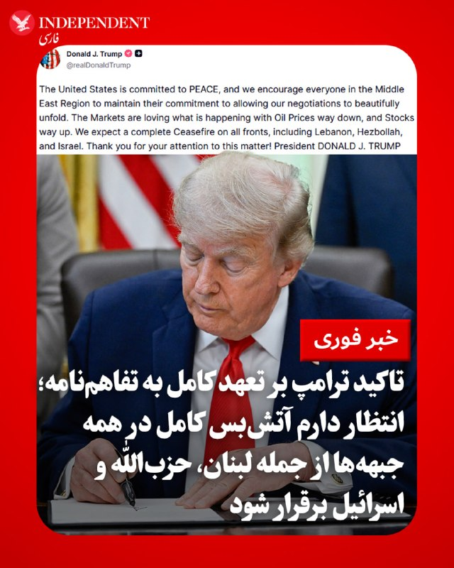

♦️ دونالد ترامپ، رئیس‌جمهوری آمریکا، روز پنج‌شنبه ۲۸ خرداد اعلام کرد که ایالات متحده انتظار یک «آتش‌بس کامل در تمامی جبهه‌ها» را دارد. او هم‌زمان از «همه طرف‌ها در خاورمیانه» خواست تا به تعهدات خود پایبند بمانند.

ترامپ در شبکه اجتماعی تروث سوشال نوشت: «ایالات متحده به صلح متعهد است و ما همه را در منطقه خاورمیانه تشویق می‌کنیم تا به تعهدات خود پایبند بمانند تا مسیر برای پیشبرد زیبای مذاکرات ما هموار شود.» او در ادامه افزود: «ما انتظار یک آتش‌بس کامل در تمامی جبهه‌ها از جمله لبنان، حزب‌الله و اسرائیل را داریم.»

تفاهم‌نامه‌ای که میان آمریکا و جمهوری اسلامی ایران امضا شد، آغازگر یک دوره مذاکراتیِ ۶۰ روزه برای دستیابی به توافق نهایی است؛ در متن این یادداشت تفاهم صراحتا بر «توقف فوری و دائمی عملیات‌های نظامی در تمامی جبهه‌ها، از جمله در لبنان» تاکید شده است. با این حال، اسرائیل بار دیگر مکررا قطعیت داده که نیروهای خود را از خاک لبنان عقب نخواهد کشید.
‌🇸🇦 Indypersian

🤖 @VahidOOnLine

## VahidOOnLine — post 246264

♦️پیت هگست، وزیر جنگ آمریکا، در میزگرد وزیران دفاع ناتو از آغاز یک طرح بازنگری شش‌ماهه در ساختار نیروها و پایگاه‌های نظامی ایالات متحده در اروپا تحت عنوان «ارزیابی نسخه سوم ناتو» خبر داد.

هگست با تاکید بر لزوم تبدیل ناتو به یک اتحاد متوازن گفت: «اروپا باید رهبری و مسئولیت اولیه دفاع از خود را بر عهده بگیرد تا نیروهای ارتش آمریکا متناسب با نیازهای جهانی واشنگتن مستقر شوند.» او هشدار داد که این یک «بازنگری واقعی» خواهد بود.

هگست در اظهارات خود درباره این طرح، به تعیین دقیق و تضمین حق دسترسی، پایگاه‌ها و مجوزهای پروازی اشاره کرد؛ موضوعی که به اعتقاد ناظران، به محدودیت‌هایی اشاره دارد که متحدان اروپایی در جریان جنگ اخیر با ایران برای عبور جنگنده‌ها و استفاده آمریکا از پایگاه‌هایشان اعمال کرده بودند. هگست خاطرنشان کرد که این ارزیابی با رایزنی کنگره و فرماندهی اروپا انجام خواهد شد تا ناتو به تعریفی جدید و متوازن دست یابد.
‌🇸🇦 Indypersian

🤖 @VahidOOnLine

## WithYashar — post 15275

به یزدان قسم فقط کانال خودتو میبینم و طبق تحلیل هات روانمو سالم نگهداشتم وگرنه با این توافق الکی که پیش اومده خودکشی میکردم 😮‍💨
دمت گرم🤍
من به تغییر رژیم ایمان دارم و میدونم طبق گفته شما زمان بر هست پس صبر میکنم
پاینده ایران و جاویدشاه👑✌🏻❤️

## FoxNewsTwitter — post 343139

  <a href="telegram/content/FoxNewsTwitter_343139_1781809015.mp4" target="_blank">🎬 Download video</a>

Fox News (Twitter/X)

Tankers are moving again through the Strait of Hormuz — and drivers are already seeing the impact.

@SimonettiLauren reports multiple vessels, including Saudi tankers, have crossed after the Iran deal, helping send the national gas average below $4.

## VahidOnline — post 76492

« پیام منتسب به مجتبی خامنه‌ای در واقع نوعی فاصله‌گذاری حساب‌شده با تفاهم ایران و آمریکا است. مجتبی خامنه‌ای رهبر جمهوری اسلامی اجازه امضا را داده، اما مسئولیت سیاسی و اجرایی آن را بر دوش پزشکیان و شورای عالی امنیت ملی گذاشته است.

پیام همزمان رو به داخل و بیرون نوشته شده است. در داخل می‌گوید رهبر با رضایت کامل وارد این مسیر نشده و دولت باید پاسخگوی نتیجه باشد. در برابر آمریکا هم این سیگنال را می‌فرستد که تفاهم، زیر فشار ترامپ و دولت او به‌معنای عقب‌نشینی قطعی نیست؛ بلکه مشروط است و اگر شروط ایران محقق نشود، موافقت نهایی رهبر با توافق نهایی هم تضمین‌شده نخواهد بود.

در واقع متن، بیش از آن‌که اعلام رضایت از توافق باشد، تلاشی برای حفظ دست بالا در مرحله بعدی است: هم مسیر مذاکره باز می‌گذارد، هم امکان عقب‌نشینی تبلیغاتی حفظ می‌شود, هم به واشینگتن گفته می‌شود که فشار بیشتر ضرورتا به انعطاف بیشتر ایران منجر نخواهد شد»
@pourostadv

## IranIntlTV — post 343091

  <a href="https://t.me/IranintlTV/343091" target="_blank">📎 Download file</a>

🎧نسخه صوتی دومینو: گفتگو برای عبور از عصر خامنه‌ای
@iranintlTV

## FarsiVOA — post 221138

🔺کاهش شدید قیمت نفت پس از امضای یادداشت تفاهم؛ بنزین در آمریکا ارزان شد

◾️قیمت نفت، پس از امضای توافق دونالد ترامپ، رئیس‌ جمهوری آمریکا، با مسعود پزشکیان، رئیس‌ دولت جمهوری اسلامی در ایران، برای پایان دادن به جنگ در خاورمیانه در روز پنج‌شنبه ۲۸ خرداد رو به کاهش است.

⬇️ بیشتر بخوانید:

https://ir.voanews.com/a/iran-us-oil-gas-price-mou/8162302.html

## Persian_Trend_Official — post 17487

  <a href="telegram/content/Persian_Trend_Official_17487_1781809017.webm" target="_blank">🎬 Download video</a>

آیت الله مجتبی خامنه‌ای، رهبر جمهوری اسلامی: بنده علی‌الاصول، نظر دیگری داشتم ولی از باب تعهّدی که رئیس‌جمهور محترم به‌عنوان رئیس شورای عالی امنیّت ملّی از طرف خود و سایر اعضا در پاسداشت حقوق ملّت ایران و جبهه مقاومت به بنده دادند و تصریح به قبول مسئولیت آن…

## BBCPersian — post 284295

🔻واکنش منسوب به مجتبی خامنه‌ای درباره تفاهمنامه: نظر دیگری داشتم ولی اجازه آن را صادر کردم

رسانه‌های ایران گزارش داده‌اند مجتبی خامنه‌ای، رهبر جدید جمهوری اسلامی، گفته است که در مورد تفاهمنامه‌ آمریکا و ایران نظر دیگری داشته است ولی پس از آن‌که مسعود پزشکیان مسئولیت آن را پذیرفت، اجازه امضای آن را داده است.

رسانه‌های ایران،‌ شامگاه پنجشنبه متنی را به عنوان نظر مجتبی خامنه‌ای،‌ رهبر جمهوری اسلامی به امضای تفاهمنامه ایران و آمریکا منتشر کردند.

در این پیام آمده : «بنده علی‌الاصول، نظر دیگری داشتم ولی از باب تعهّدی که رئیس‌جمهور محترم به‌عنوان رئیس شورای عالی امنیّت ملّی از طرف خود و سایر اعضا در پاسداشت حقوق ملّت ایران و جبهه مقاومت به بنده دادند و تصریح به قبول مسئولیت آن نمودند، اجازه‌ی آن را صادر نمودم‌.»

آقای خامنه‌ای نوشت که آقای پزشکیان به او گفته که اگر طرف آمریکایی بخواهد زیاده‌خواهی کند، زیر بار آن نخواهند رفت.

«از این لحظه،‌ ما یعنی ملت سرافراز و این خادم ناچیز منتظر تحقق شروط گفته شده خواهیم بود.»

در این پیام آقای خامنه‌ای در عمل مجوز گفت‌وگوهای مستقیم مقامات ایران و آمریکا را هم داده است:‌ «مذاکرات حضوری که در آینده برقرار خواهد شد،‌ به معنی پذیرش نظر دشمن نخواهد بود.»
https://bbc.in/4v3LF7r
@BBCPersian

## Hranews — post 113711

  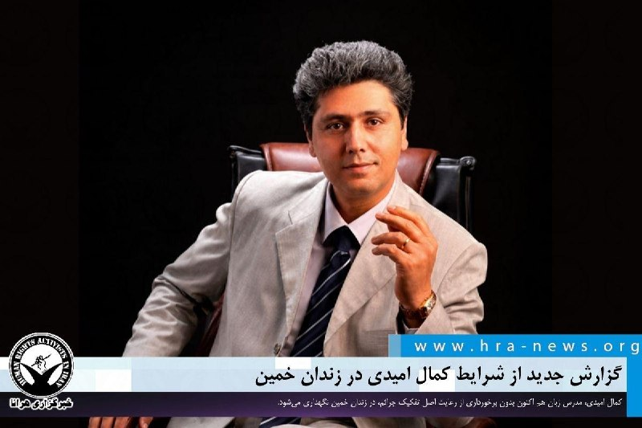

گزارش جدید از شرایط کمال امیدی در زندان خمین

❗️
❗️
❗️
❗️
❗️– کمال امیدی، مدرس زبان و مدیر یک آموزشگاه زبان در خمین بیش از ۴۰ روز است که بازداشت شده و هم اکنون بدون برخورداری از رعایت اصل تفکیک جرائم، در زندان خمین نگهداری می‌شود.

به گزارش خبرگزاری هرانا، ارگان خبری مجموعه فعالان حقوق بشر در ایران، کمال امیدی، کماکان در بازداشت به‌سر می‌برد.

بر اساس اطلاعات دریافتی هرانا، آقای امیدی هم اکنون بدون برخورداری از رعایت اصل تفکیک جرائم در کنار زندانیان جرائم خشن در زندان خمین نگهداری می‌شود. وی از زمان بازداشت تاکنون از دسترسی به وکیل و ملاقات با خانواده محروم مانده است.
یک منبع مطلع نزدیک به خانواده این شهروند ضمن تایید این خبر به هرانا گفت: “از دلایل بازداشت آقای امیدی اطلاعی در دست نیست. او در این مدت چند تماس تلفنی تحت نظارت بدون اشاره به وضعیت پرونده اش، با خانواده خود داشته است. “

ادامه مطلب

#کمال_امیدی

↘️
@hranews_bot تماس ✉️ -  @Hranews  کانال هرانا 🆑

## alonews — post 128987

  <a href="telegram/content/alonews_128987_1781809018.webm" target="_blank">🎬 Download video</a>

👈حساب رسمی کاخ سفید در X: ما واقعاً آمریکا را قبل از GTA 6 نجات دادیم

✅ @AloNews خبر جنگ

---
📅 بروزرسانی: 1405/03/28 22:19
---

## FoxNewsTwitter — post 343138

  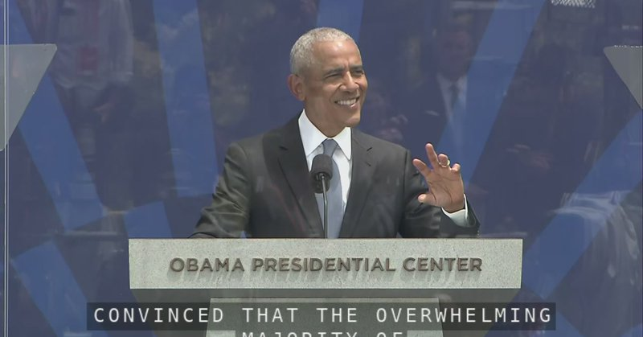

Fox News (Twitter/X)

WATCH LIVE: Former President Obama delivers remarks at presidential center opening in Chicago https://twitter.com/i/broadcasts/1nJOLLjlPMzxR

## pm_afshaa — post 94352

  <a href="telegram/content/pm_afshaa_94352_1781808551.webm" target="_blank">🎬 Download video</a>

میرین گیگی 10 15 هزار تومن پول سرور میدین!؟
بیاین از اینجا سرعت بالاش رو بخرین فقط گیگی 3 هزار تومن
👇
👇
👇

🚀 @Lex_Server 
⚡️ @Lex_Server

## IranIntlTV — post 343090

  <a href="telegram/content/IranIntlTV_343090_1781808551.mp4" target="_blank">🎬 Download video</a>

۲۴ با فرداد فرحزاد
@iranintltv

## FarsiVOA — post 221137

🔺جمهوری اسلامی ۷ دانشجوی معترض شریف را از ادامه تحصیل محروم کرد

◾️جمهوری اسلامی در ادامه سرکوب مخالفان و معترضان و فعالان، هفت تن از دانشجویان معترض دانشگاه صنعتی شریف تهران را به اتهام «انتشار مطلب در فضای مجازی» و «پرونده‌های مرتبط با اعتراضات دی‌ ۱۴۰۴» از حق ادامه تحصیل محروم کرد.

⬇️ بیشتر بخوانید:

https://ir.voanews.com/a/iran-student-university-protesters-prison-sharif/8162264.html

## FarsiVOA — post 221136

🔺پرزیدنت ترامپ: همه را در خاورمیانه تشویق می‌کنیم به «پیشبرد مذاکرات» متعهد بمانند

◾️پرزیدنت ترامپ، اعلام کرد که آمریکا انتظار دارد آتش‌بس کامل در همه جبهه‌ها، از جمله لبنان، حزب‌الله، و اسرائیل، برقرار باشد.

⬇️ بیشتر بخوانید:

https://ir.voanews.com/a/ceasefire-israel-donald-trump-hezbollah-lebanon/8162308.html

## DW_Farsi — post 126156

  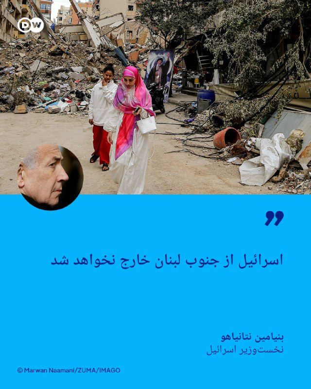

🔶 نتانیاهو: اسرائيل از جنوب لبنان خارج نخواهد شد

بنیامین نتانیاهو، نخست‌وزیر اسرائیل در یک سخنرانی تاکید کرد که نیروهای ارتش این کشور از جنوب لبنان خارج نخواهند شد و تا هر زمانی که لازم باشد منطقه امنیتی خود را در آنجا حفظ خواهند کرد.

نتانیاهو این سخنان را در مراسم افتتاح بزرگراهی که از ناصره تا بئرشِبع امتداد دارد و از کرانهٔ باختری عبور می‌کند ایراد کرد، بعد از آنکه دونالد ترامپ، رئیس جمهور امریکا این هفته حملات اسرائیل به لبنان را محکوم کرد و هم‌زمان توافقی را با ایران امضا کرد که پایان جنگ در لبنان یک بند مهم آن است.

نخست‌وزیر اسرائیل گفت: «ما امنیت و رفاه‌مان را در شهرهای شمالی بازسازی می‌کنیم و این نیازمند حفظ منطقه امنیتی در جنوب لبنان است و نیازمند آن است که ما آنجا را ترک نکنیم، تا زمانی که امنیت اسرائیل به آن نیاز دارد.»
@dw_farsi

## Dirty_Kids — post 392522

  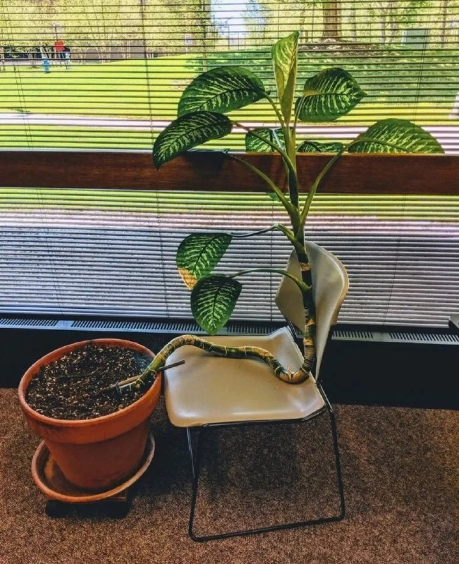

براش صندلی گذاشتن بشینه خسته نشه🥹🌱

@Dirty_Kids 👻

## Dirty_Kids — post 392521

  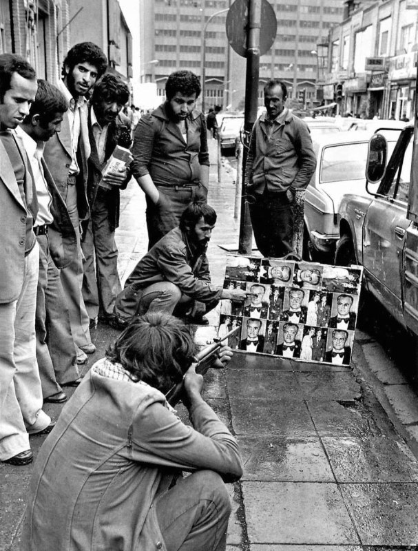

‏از پیرمردی پرسیدم "وفا" یعنی چی؟
گفت: ما نسل پنجاه و هفتیم، از سگ بپرس...

@Dirty_Kids 👻

## alonews — post 128986

  <a href="telegram/content/alonews_128986_1781808553.webm" target="_blank">🎬 Download video</a>

👈ترامپ: «ایالات متحده به صلح متعهد است، و ما از همه در منطقه خاورمیانه می‌خواهیم که به تعهد خود برای اجازه دادن به روند مذاکرات ما تا به شکلی عالی پیش برود، پایبند بمانند. 
✅ @AloNews خبر جنگ

## alonews — post 128985

  <a href="telegram/content/alonews_128985_1781808554.webm" target="_blank">🎬 Download video</a>

🔴کسی خبر داره ازشون؟

✅@AloNews

---
📅 بروزرسانی: 1405/03/28 22:09
---

## VahidOOnLine — post 246263

  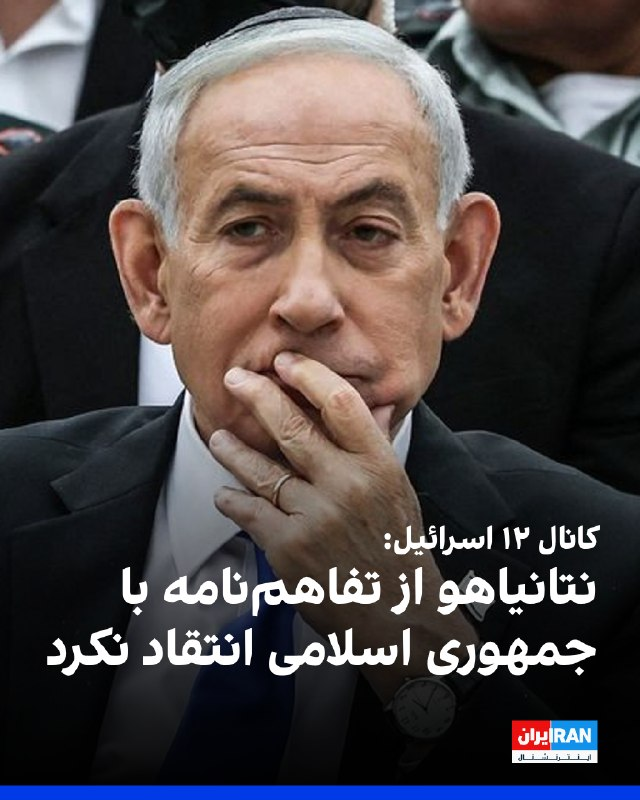

کانال ۱۲ اسرائیل گزارش داد بنیامین نتانیاهو در گفت‌وگوهای اخیر با مقام‌های آمریکایی از تفاهم‌نامه آمریکا و جمهوری اسلامی انتقاد نکرده و گفته است اگر تهران به مفاد آن پایبند بماند، یک «موفقیت بزرگ» خواهد بود.
کانال ۱۲ اسرائیل افزود مقام‌های آمریکایی معتقدند اسموتریچ و بن‌گویر، دو وزیر راست‌گرای کابینه اسرائیل، نتانیاهو را برای اتخاذ موضعی سخت‌تر علیه توافق آمریکا و جمهوری اسلامی تحت فشار قرار می‌دهند.
در این گزارش آمده است مقام‌های اسرائیلی می‌گویند مخالفت با توافق آمریکا و جمهوری اسلامی محدود به سیاستمداران نیست و شماری از مقام‌های ارشد امنیتی و نظامی، از جمله وزیر دفاع و رییس ستاد ارتش، آن را یک «فاجعه راهبردی» برای اسرائیل می‌دانند.
‌🏁 🇬🇧 IranintlTV

🤖 @VahidOOnLine

## VahidOOnLine — post 246262

🗣روایت شما در واکنش به تفاهم‌نامه میان جمهوری اسلامی و آمریکا - پنجشنبه ۲۸ خرداد ۱۴۰۵

🔹فکر می‌کنید در دولتی که به این میزان فساد وجود داره پولی به دست مردم می‌رسه؟ فکر می‌کنید قالیبافی که سرلوحه فساد هست پولی در اختیار مردم قرار می‌ده؟

🔹آقای ترامپ، شما سال‌ها از نابودی شیعه‌های افراطی حرف زدین، حالا چطور شده تو این وضعیت باهاشون مذاکره می‌کنید؟

🔹ترامپ، پولی که به حکومت جمهوری اسلامی دادی پول خون جاویدنام‌هامان است و ما زیر بارش نمی‌ریم.

🔹پزشکیان کی رفت با مجتبی خامنه‌ای صحبت بکنه؟ سپاه که همیشه تکذیب می‌کرد.

🔹هر وقت آمریکا ناوهاش رو برگردوند و از رفتنشون یک ماه گذشت، اون وقت ناامید بشید.

🔹من یه دانش‌آموز هستم، چرا باید تمام فکر و ذهنم پر از استرس و نگرانی برای خانوادم باشه که یه وقت کم نیارن؟ دیگه خسته شدیم از این گرونی و این سیاست، ای‌کاش زودتر تموم بشه.

🔹آقای ترامپ، جهت یادآوری، به توئیت ۱۳ سال پیشت در مورد برجام یه نگاهی بندازی بد نیست.

🔹درود به هم‌میهنان عزیزم. فقط خواستم بگم ما از اول هم با این رژیم تنها بودیم، الانم هستیم. تنها چیزی که تغییر کرده شناخت ما نسبت به کشورهای همسایه، اروپایی‌ها، آمریکا و اسرائیل است. ناامید نشین. سرنگونی این رژیم دست خود ماست.

🔹امید دارم جمهوری اسلامی مثل این ۴۷ سال باشه و به تفاهم‌نامه پایبند نباشه، اون موقع باید دید ترامپ حرفی برای گفتن داره بعد از گذشتن از حقوق میلیون‌ها آدمی که بهشون وعده کمک داده بود.

🔹ملت شجاع، با تحمل گرانی، به یاد زندانیان باشید، که روزی یک وعده غذا، آن هم در اسارت و شکنجه می‌خورند و فقط به‌خاطر ما اسیر شده‌اند. ناشکری نکنید، این رژیم با صبر ما سرنگون می‌شود.
‌🏁 🇬🇧 IranintlTV

🤖 @VahidOOnLine

## VahidOOnLine — post 246261

♦️خیابان‌های منهتن جنوبی در نیویورک، روز پنج‌شنبه ۲۸ خرداد شاهد حضور سیل‌آسای هواداران پرشور تیم بسکتبال «نیویورک نیکس» بود که برای جشن گرفتن نخستین قهرمانی خود در رقابت‌های NBA پس از ۵۳ سال به خیابان‌ها آمدند.

بخش معروف برادوی که به «دره قهرمانان» شهرت دارد، به دریایی از رنگ‌های نارنجی و آبی تبدیل شد. بسیاری از مردم از نیمه‌شب چادر زده بودند تا جایگاهی را برای تماشای این رویداد رزرو کنند؛ رژه‌ای که به گفته زهران ممدانی، شهردار نیویورک، می‌تواند بزرگ‌ترین رژه تاریخ این شهر باشد.

تیم نیکس با آمار درخشان ۱۵ برد و تنها ۳ باخت در مراحل پلی‌آف و با بازگشت‌های خیره‌کننده، سرانجام روز شنبه با پیروزی در بازی پنجم فینال مقابل «سن‌آنتونیو اسپرز»، به حسرت پنجاه ساله خود پایان داد و شهر نیویورک را مبهوت کرد.

پلیس نیویورک اعلام کرد که جایگاه‌های تماشا از سه ساعت قبل از شروع مراسم کاملا پر شده بود. بازیکان نیکس در میان تشویق‌های کرکننده هواداران، رژه خود را از ساعت ۱۰:۳۲ صبح به وقت محلی آغاز کردند تا پس از طی مسافت ۱.۱ کیلومتری به سمت تالار شهر، کلید نمادین نیویورک را از دستان شهردار دریافت کنند.
‌🇸🇦 Indypersian

🤖 @VahidOOnLine

## mwarmonitor — post 11172

  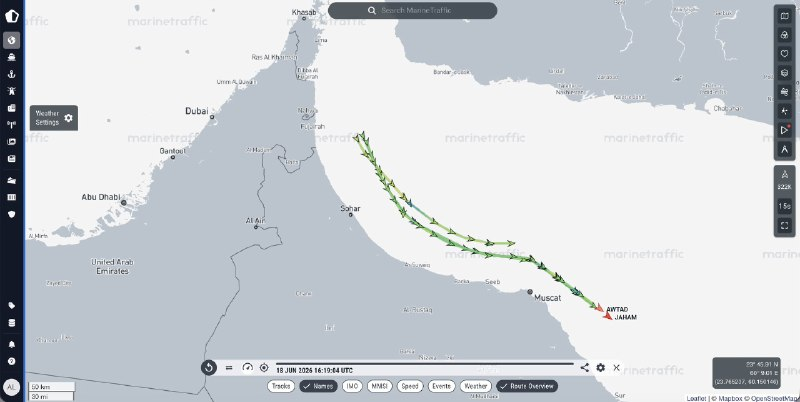

🔴نفتکش‌های حامل نفت خام عربستان پس از عبور از تنگه هرمز دوباره روی AIS ظاهر شدند

🔸سه نفتکش بسیار بزرگ (VLCC) با پرچم عربستان که همگی حامل محموله بودند، پس از بیش از دو ماه خاموش بودن، دوباره در سامانه AIS ظاهر شده‌اند؛ امری که نشان می‌دهد اپراتورهای نفتکش با احتیاط در حال بازگرداندن قابلیت ردیابی هنگام عبور از تنگه هرمز هستند.

🔸بر اساس داده‌های MarineTraffic، نفتکش‌های Jaham، Shaden و Awtad در تاریخ ۱۸ ژوئن ارسال سیگنال‌های AIS را از سر گرفتند. مقصد اعلام‌شده Shaden بندر کییره در ژاپن است، در حالی که Awtad به سمت اولسان در کره جنوبی حرکت می‌کند. مقصد Jaham همچنان نامشخص است. طبق گزارش Kpler، این سه VLCC در مجموع حدود ۶ میلیون بشکه نفت خام حمل می‌کنند.

@mwarmonitor

## mwarmonitor — post 11171

🔸«جی‌دی ونس، معاون رئیس‌جمهور آمریکا، گفت اگر ایران از نفتکش‌ها در تنگه هرمز عوارض عبور دریافت کند، هیچ توافقی با ایران در کار نخواهد بود.»

🔹«محمد مرندی ؛ ایران قطعاً هزینه عبور را دریافت خواهد کرد. حکومت ترامپ نباید عزم و اراده ایران را بیازماید. این کار به پایان خوبی ختم نخواهد شد.»

@mwarmonitor

## IranIntlTV — post 343089

  

کانال ۱۲ اسرائیل گزارش داد بنیامین نتانیاهو در گفت‌وگوهای اخیر با مقام‌های آمریکایی از تفاهم‌نامه آمریکا و جمهوری اسلامی انتقاد نکرده و گفته است اگر تهران به مفاد آن پایبند بماند، یک «موفقیت بزرگ» خواهد بود.
کانال ۱۲ اسرائیل افزود مقام‌های آمریکایی معتقدند اسموتریچ و بن‌گویر، دو وزیر راست‌گرای کابینه اسرائیل، نتانیاهو را برای اتخاذ موضعی سخت‌تر علیه توافق آمریکا و جمهوری اسلامی تحت فشار قرار می‌دهند.
در این گزارش آمده است مقام‌های اسرائیلی می‌گویند مخالفت با توافق آمریکا و جمهوری اسلامی محدود به سیاستمداران نیست و شماری از مقام‌های ارشد امنیتی و نظامی، از جمله وزیر دفاع و رییس ستاد ارتش، آن را یک «فاجعه راهبردی» برای اسرائیل می‌دانند.
https://iranintl.com/202606189482

## IranIntlTV — post 343088

🗣روایت شما در واکنش به تفاهم‌نامه میان جمهوری اسلامی و آمریکا - پنجشنبه ۲۸ خرداد ۱۴۰۵

🔹فکر می‌کنید در دولتی که به این میزان فساد وجود داره پولی به دست مردم می‌رسه؟ فکر می‌کنید قالیبافی که سرلوحه فساد هست پولی در اختیار مردم قرار می‌ده؟

🔹آقای ترامپ، شما سال‌ها از نابودی شیعه‌های افراطی حرف زدین، حالا چطور شده تو این وضعیت باهاشون مذاکره می‌کنید؟

🔹ترامپ، پولی که به حکومت جمهوری اسلامی دادی پول خون جاویدنام‌هامان است و ما زیر بارش نمی‌ریم.

🔹پزشکیان کی رفت با مجتبی خامنه‌ای صحبت بکنه؟ سپاه که همیشه تکذیب می‌کرد.

🔹هر وقت آمریکا ناوهاش رو برگردوند و از رفتنشون یک ماه گذشت، اون وقت ناامید بشید.

🔹من یه دانش‌آموز هستم، چرا باید تمام فکر و ذهنم پر از استرس و نگرانی برای خانوادم باشه که یه وقت کم نیارن؟ دیگه خسته شدیم از این گرونی و این سیاست، ای‌کاش زودتر تموم بشه.

🔹آقای ترامپ، جهت یادآوری، به توئیت ۱۳ سال پیشت در مورد برجام یه نگاهی بندازی بد نیست.

🔹درود به هم‌میهنان عزیزم. فقط خواستم بگم ما از اول هم با این رژیم تنها بودیم، الانم هستیم. تنها چیزی که تغییر کرده شناخت ما نسبت به کشورهای همسایه، اروپایی‌ها، آمریکا و اسرائیل است. ناامید نشین. سرنگونی این رژیم دست خود ماست.

🔹امید دارم جمهوری اسلامی مثل این ۴۷ سال باشه و به تفاهم‌نامه پایبند نباشه، اون موقع باید دید ترامپ حرفی برای گفتن داره بعد از گذشتن از حقوق میلیون‌ها آدمی که بهشون وعده کمک داده بود.

🔹ملت شجاع، با تحمل گرانی، به یاد زندانیان باشید، که روزی یک وعده غذا، آن هم در اسارت و شکنجه می‌خورند و فقط به‌خاطر ما اسیر شده‌اند. ناشکری نکنید، این رژیم با صبر ما سرنگون می‌شود.

## FarsiVOA — post 221135

🔺آمریکا چند مقام لبنانی همسو با حزب‌الله و اعضای یک شبکه تجاری مرتبط با حزب‌الله را تحریم کرد

◾️دفتر کنترل دارایی‌های خارجی وزارت خزانه‌داری آمریکا «اوفک» مقامات لبنانی همسو با حزب‌الله و همچنین اعضا و طرف‌های یک شبکه تجاری مرتبط با حزب‌الله را تحریم کرد.

⬇️ بیشتر بخوانید:

https://ir.voanews.com/a/ofac-sanctaion-hizballah-aligned-lebanese-officials/8162304.html

## FarsiVOA — post 221134

🔺سنتکام: محاصره دریایی پایان یافت؛ ناوهای آمریکایی برای نظارت بر اجرای توافق در منطقه باقی می‌مانند

◾️فرماندهی مرکزی ایالات متحده «سنتکام» روز پنجشنبه ۲۸ خرداد اعلام کرد نیروهای آمریکایی به دستور رئیس جمهوری ایالات متحده محاصره دریایی جمهوری اسلامی را پایان داده‌اند.

⬇️ بیشتر بخوانید:

https://ir.voanews.com/a/centcom-lifts-naval-blockade-of-iran/8162297.html

## RadioFarda — post 158481

  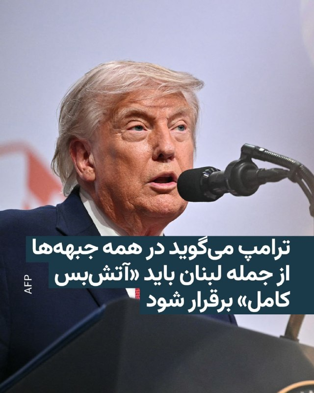

🔸دونالد ترامپ، پنج‌شنبه شب با انتشار پیام تازه‌ای در شبکه اجتماعی تروث‌سوشال نوشت که آمریکا «انتظار آتش‌بس کامل در همه جبهه‌ها، از جمله لبنان، حزب‌الله و اسرائیل» دارد.

🔸رئیس جمهور آمریکا در این پیام نوشت: «ایالات متحده به صلح متعهد است و ما همه را در منطقه خاورمیانه تشویق می‌کنیم که به تعهد خود برای پیشبرد مذاکرات ما به بهترین شکل ممکن پایبند باشند.»

🔸اشاره دونالد ترامپ به مذاکراتی است که آمریکا و ایران قرار است مطابق تفاه‌منامه‌ای که به تازگی امضا کرده‌اند، در ۶۰ روز آینده انجام دهند.

🔸رئیس جمهور آمریکا در این پیام بار دیگر به کاهش قیمت نفت و افزایش ارزش بازارهای سهام نیز اشاره کرده است.

🔸پیام تازه دونالد ترامپ ساعاتی پس از بیان اظهارات بنیامین نتانیاهو، نخست‌وزیر اسرائیل، در رد عقب‌نشینی ارتش این کشور از جنوب لبنان منتشر شده است.

@RadioFarda

## Hranews — post 113710

گزارشی از اعدام یک زندانی در زندان قروه

❗️
❗️
❗️
❗️
❗️– حکم یک زندانی که پیشتر از بابت اتهام قتل به #اعدام محکوم شده بود، در تاریخ ۲۴ دی‌ ۱۴۰۴ در زندان قروه به اجرا در آمد.

ادامه مطلب

#افشین_داودی

↘️
@hranews_bot تماس ✉️ -  @Hranews  کانال هرانا 🆑

## alonews — post 128984

  <a href="telegram/content/alonews_128984_1781807952.webm" target="_blank">🎬 Download video</a>

👈ارتش اسرائیل اعلام کرد از منطقه‌ای که در نقشه با نوار قرمز رنگ مشخص شده، عقب‌نشینی نخواهد کرد

✅ @AloNews خبر جنگ

## alonews — post 128983

  <a href="telegram/content/alonews_128983_1781807952.webm" target="_blank">🎬 Download video</a>

👈طالبان به دلایل مختلفی مثل جلوگیری از درز اطلاعات محرمانه، کاهش اتلاف وقت کارمندان و کنترل اخبار اعتراضات مردمی، گوشی‌های هوشمند را برای کارمندان دولت افغانستان ممنوع کرد

✅ @AloNews خبر جنگ

---
📅 بروزرسانی: 1405/03/28 21:57
---

## WithYashar — post 15274

آسوشیتدپرس: کاخ سفید توافق با ایران را به کنگره ارسال کرد
@withyashar

## WithYashar — post 15273

فارس: تیم مذاکره‌کننده ایران تا حصول اطمینان کامل از توقف حملات به لبنان، هرگونه گفت‌وگوی تکمیلی را به حالت تعلیق درآورد
@withyashar

## mwarmonitor — post 11170

🔸محمد مرندی عضو تیم مذاکره کننده:

«حکومت ترامپ نباید انتظار انعطاف‌پذیری از ایران بر سر میز مذاکره را داشته باشد. چنین چیزی در کار نخواهد بود. تنها مسیر قابل‌قبول رو به جلو، اجرای کامل، صریح و بدون ابهامِ تمام تعهدات ایالات متحده است. بدون اقدامات نصفه‌نیمه. بدون مذاکرهٔ مجدد. بدون عقب‌نشینی.»

@mwarmonitor

## DEJradio — post 5798

  <a href="telegram/content/DEJradio_5798_1781807269.mp4" target="_blank">🎬 Download video</a>

🚨
🔸 خبر ۲۱
پنجشنبه ۲۸ خرداد ۱۴۰۵

#خبر۲۱
@DEJradio

## DW_Farsi — post 126155

  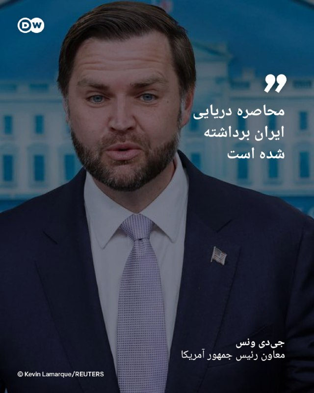

🔶 ونس: محاصره دریایی ایران برداشته شده است

جی‌دی ونس، معاون رئیس جمهور امریکا می‌گوید نیروی دریایی این کشور بیش از ۱۲ کشتی را برای رسیدن به بنادر ایران از تنگه هرمز عبور داده و به‌عنوان بخشی از توافق برای پایان جنگ، محاصره را برداشته است.

ونس این موضوع را روز پنجشنبه ۱۸ ژوئن در یک نشست خبری در کاخ سفید اعلام کرد و گفت اکنون نفت بیشتری از تنگه هرمز عبور می‌کند.

معاون ترامپ همچنین گفت بیش از ۱۲٫۵ میلیون بشکه نفت چهارشنبه‌شب از این گذرگاه دریایی عبور کرده است و ادامه داد: «بنابراین ما در حال عمل به بخش اولیه توافق از نظر نظامی هستیم.»

او این موضوع را یکی از مزایای فوری توافق دانست و انتقادهایی را که می‌گویند توافق به نفع ایران است، کم‌اهمیت دانست.

روز سه‌شنبه، دو نفتکش ایران را ترک کردند و بدون توقف از محاصرهٔ نظامی آمریکا عبور کردند.

یک وب‌سایت ردیابی کشتی‌های تجاری گزارش داد که این دو کشتی در مجموع ۳٫۸ میلیون بشکه نفت خام ایران را حمل می‌کردند.
@dw_farsi

## IranianMinds — post 22900

  

🔴 حمید رسایی :

باید پزشکیان رو اعدام کنیم.

@IranianMinds

## IranianMinds — post 22899

  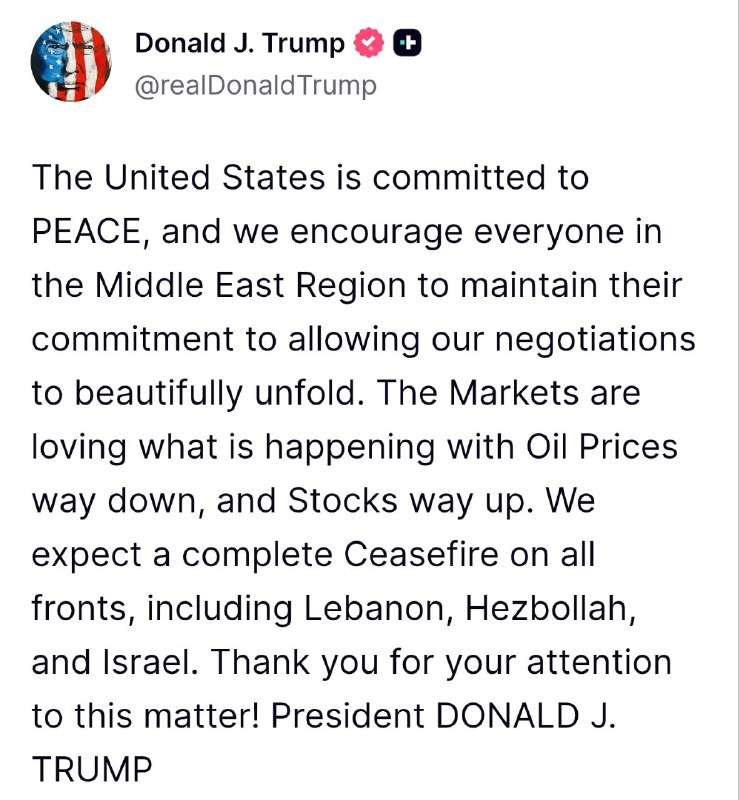

🔴 ترامپ:

ایالات متحده متعهد به صلح است و از همه کشورهای منطقه خاورمیانه می‌خواهیم که به تعهد خود برای پیشبرد زیبا و موفق مذاکرات پایبند بمانند.

بازارها عاشق اتفاقاتی هستند که در حال رخ دادن است: قیمت نفت به شدت پایین آمده و سهام‌ها به شدت بالا رفته‌اند.

ما انتظار آتش‌بس کامل در همه جبهه‌ها، از جمله لبنان، حزب‌الله و اسرائیل را داریم.

@IranianMinds

## IranianMinds — post 22898

⭕️
⭕️ کانفیگای این ربات تو نت ملی وصله به محض استارت ۱ گیگابایت کانفیگ میده بدون هیچ هزینه ای و رفرالی کانفیگ رو تحویلتون میده با بهترین سرعت و بدون قطعی 
⭕️ ربات دریافت کانفیگ رایگان | @daeijoonbot 
⭕️ ربات دریافت کانفیگ رایگان | @daeijoonbot

## IranianMinds — post 22897

⭕️
⭕️ کانفیگای این ربات تو نت ملی وصله به محض استارت ۱ گیگابایت کانفیگ میده
بدون هیچ هزینه ای و رفرالی کانفیگ رو تحویلتون میده با بهترین سرعت و بدون قطعی

⭕️ ربات دریافت کانفیگ رایگان | @daeijoonbot

⭕️ ربات دریافت کانفیگ رایگان | @daeijoonbot

## IranianMinds — post 22896

  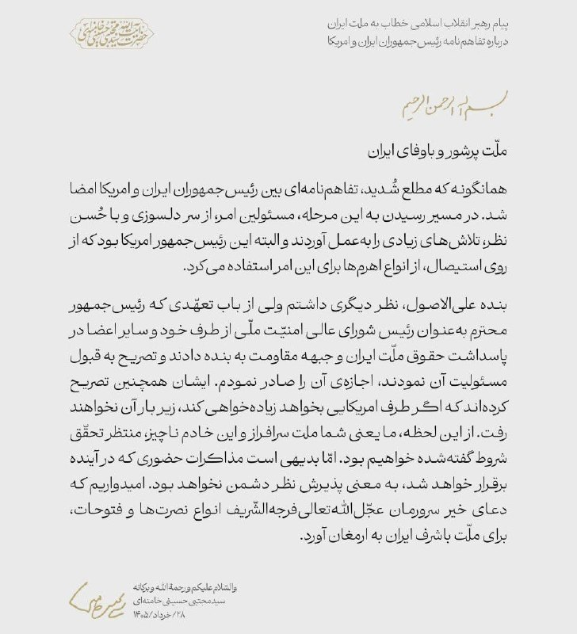

🔴 مجتبی خامنه ای:

من برای توافق با آمریکا نظر دیگه ای داشتم ولی چون پزشکیان به همراه سایر اعضای شورای عالی امنیت ملی مسئولیتش رو قبول کردن؛ منم دستورشو صادر کردم. از این لحظه ما مردم منتظر تحقق شروط تفاهم هستیم.

@IranianMinds

## BBCPersian — post 284294

🔻وزارت خارجه سوئیس: جلسه روز جمعه با حضور نمایندگان آمریکا،‌ ایران،‌ پاکستان و قطر برقرار است

وزارت خارجه سوئیس امضای تفاهمنامه میان ایران و آمریکا را یک گام مهم برای کاهش تنش‌ها در منطقه برشمرد و از آن استقبال کرد.

در پیام وزارت خارجه سوئیس که در شبکه ایکس منتشر شده است آمده که جلسه دیدار فردا،‌ جمعه میان نمایندگان آمریکا و ایران و همچنین نمایندگانی از پاکستان و قطر به عنوان کشورهای میانجی همچنان برقرار است تا مذاکرات اولیه درباره نحوه اجرای این توافق را آغاز کنند.

پیشتر مقامات پاکستان از لغو یا به تعویق افتادن این جلسه خبر دادند. معاون رئیس‌جمهور آمریکا هم به خبرنگاران گفته بود که هنوز این دیدار در دستور کار است اما زمان آن مشخص نیست.
https://bbc.in/4v3LF7r
@BBCPersian

## Dirty_Kids — post 392520

  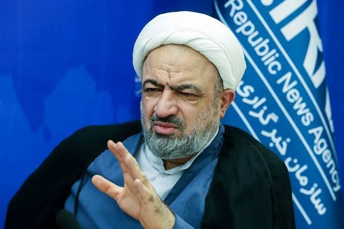

🔴 رسایی: پزشکیان به دلیل مخالفت با رهبری و در خطر انداختن نظام، باید اعدام بشه. خودم حاضرم طناب دار بندازم دور گردنش.

@Dirty_Kids 👻

## Dirty_Kids — post 392519

  <a href="telegram/content/Dirty_Kids_392519_1781807273.mp4" target="_blank">🎬 Download video</a>

از دوست دختر این مدارک بخوان دست دوست پسرشو نشون میده
اون وقت هر کی به پست ما میخوره میگه همو فالو نکنیم کسی نفهمه 😂

@Dirty_Kids 👻

## alonews — post 128982

  <a href="telegram/content/alonews_128982_1781807275.webm" target="_blank">🎬 Download video</a>

👈فارس : تیم مذاکره‌کننده ایران تا حصول اطمینان کامل از توقف حملات به لبنان، هرگونه گفت‌وگوی تکمیلی را به حالت تعلیق درآورد.

✅ @AloNews خبر جنگ

---
📅 بروزرسانی: 1405/03/28 21:45
---

## VahidOOnLine — post 246260

  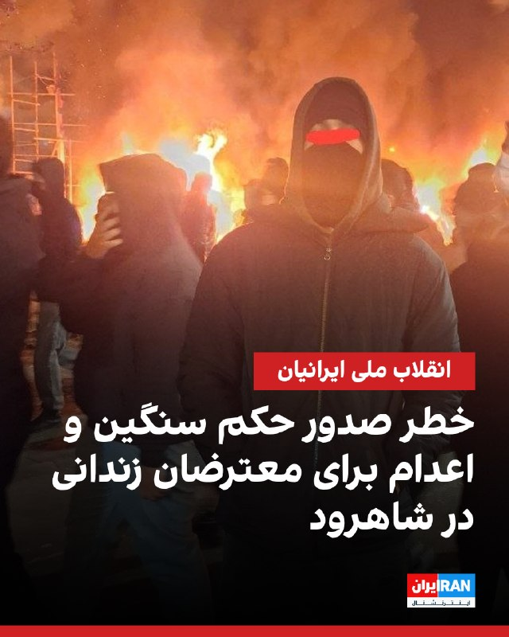

بر اساس گزارش‌های رسیده به ایران‌اینترنشنال، شماری از بازداشت‌شدگان اعتراضات انقلاب ملی ۱۴۰۴ در شاهرود با اتهاماتی از جمله «محاربه» و خطر صدور یا اجرای احکام اعدام مواجه هستند.

در این گزارش، از جواد عجم، مرتضی زمانی، فرشید رحمانی، علیرضا ساغری (مربی ورزش‌های رزمی) و همچنین پویا ساغری به‌عنوان افرادی نام برده شده که پرونده‌های آنان نیازمند اطلاع‌رسانی و پیگیری عنوان شده است.
‌🏁 🇬🇧 IranintlTV

🤖 @VahidOOnLine

## VahidOOnLine — post 246259

  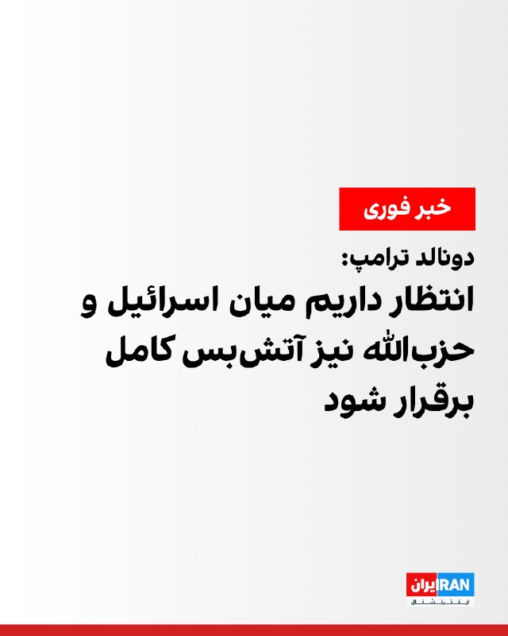

دونالد ترامپ در تروت سوشال نوشت آمریکا متعهد به صلح است و از همه طرف‌ها در خاورمیانه خواست به روند مذاکرات پایبند بمانند.
او افزود انتظار دارد آتش‌بس کامل در همه جبهه‌ها، از جمله لبنان، حزب‌الله و اسرائیل، برقرار شود.

ترامپ نوشت بازارها از آنچه در حال رخ دادن است استقبال کرده‌اند؛ قیمت نفت به‌شدت کاهش یافته و بازارهای سهام رشد کرده‌اند.
‌🏁 🇬🇧 IranintlTV

🤖 @VahidOOnLine

## mwarmonitor — post 11169

  <a href="telegram/content/mwarmonitor_11169_1781806551.mp4" target="_blank">🎬 Download video</a>

🔴«ایالات متحده به صلح متعهد است و ما همه را در منطقه خاورمیانه تشویق می‌کنیم تا به تعهد خود پایبند بمانند تا اجازه دهند مذاکرات ما به زیبایی پیش برود. بازارها عاشق اتفاقاتی هستند که دارد می‌افتد؛ قیمت نفت بسیار پایین آمده و ارزش سهام‌ها به شدت بالا رفته است.…

## mwarmonitor — post 11168

  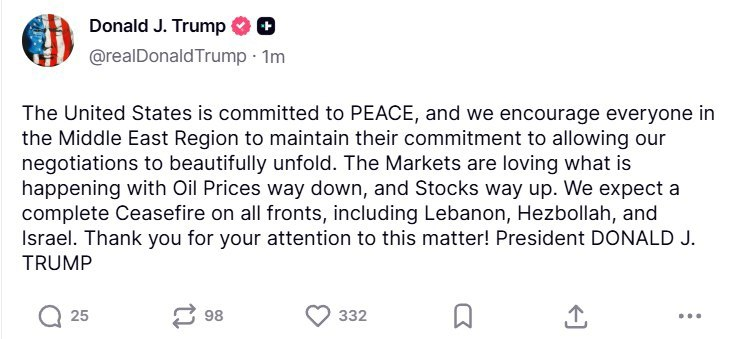

🔴«ایالات متحده به صلح متعهد است و ما همه را در منطقه خاورمیانه تشویق می‌کنیم تا به تعهد خود پایبند بمانند تا اجازه دهند مذاکرات ما به زیبایی پیش برود. بازارها عاشق اتفاقاتی هستند که دارد می‌افتد؛ قیمت نفت بسیار پایین آمده و ارزش سهام‌ها به شدت بالا رفته است. ما انتظار یک آتش‌بس کامل در تمام جبهه‌ها، از جمله لبنان، حزب‌الله و اسرائیل را داریم. از توجه شما به این موضوع سپاسگزارم!

رئیس‌جمهور دونالد جی. ترامپ

@mwarmonitor

## FoxNewsTwitter — post 343137

  <a href="telegram/content/FoxNewsTwitter_343137_1781806552.mp4" target="_blank">🎬 Download video</a>

Fox News (Twitter/X)

Ukraine launched a major retaliatory drone attack on one of Russia’s largest oil refineries, increasing pressure on the country’s fuel supply.

Zelenskyy says the goal was to push Putin back to the negotiating table, arguing that if Ukraine continues to suffer attacks, Russia will feel the impact too, Jeff Paul reports.

## pm_afshaa — post 94351

vless://d32fef78-e18e-4f7a-9542-6f72456718af@2.27.22.238:110?encryption=none&security=none&type=tcp#relaxvpn-bot_2063_1781803224-1D%E2%8F%B3

سرعت بالا مخصوص دانلود

💧 Rainbet.com the #1 Non-KYC Crypto Casino & Sportsbook @rainbetcom

😁 @Pm_Afshaa

## IranIntlTV — post 343087

  

بر اساس گزارش‌های رسیده به ایران‌اینترنشنال، شماری از بازداشت‌شدگان اعتراضات انقلاب ملی ۱۴۰۴ در شاهرود با اتهاماتی از جمله «محاربه» و خطر صدور یا اجرای احکام اعدام مواجه هستند.

در این گزارش، از جواد عجم، مرتضی زمانی، فرشید رحمانی، علیرضا ساغری (مربی ورزش‌های رزمی) و همچنین پویا ساغری به‌عنوان افرادی نام برده شده که پرونده‌های آنان نیازمند اطلاع‌رسانی و پیگیری عنوان شده است.
https://iranintl.com/202606185867

## IranIntlTV — post 343086

  

دونالد ترامپ در تروت سوشال نوشت آمریکا متعهد به صلح است و از همه طرف‌ها در خاورمیانه خواست به روند مذاکرات پایبند بمانند.
او افزود انتظار دارد آتش‌بس کامل در همه جبهه‌ها، از جمله لبنان، حزب‌الله و اسرائیل، برقرار شود.

ترامپ نوشت بازارها از آنچه در حال رخ دادن است استقبال کرده‌اند؛ قیمت نفت به‌شدت کاهش یافته و بازارهای سهام رشد کرده‌اند.
https://iranintl.com/202606186407

## DW_Farsi — post 126154

  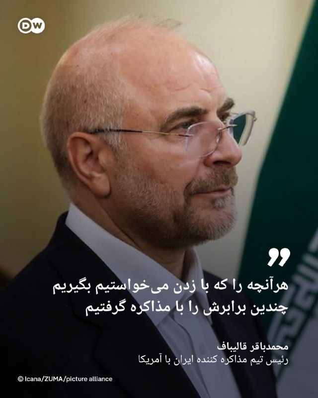

🔶 قالیباف: هرآنچه را که با زدن می‌خواستیم بگیریم چندین برابرش را با مذاکره گرفتیم

محمدباقر قالیباف، رئیس تیم مذاکره کننده ایران با امریکا در یک گفت‌وگو به پرسش‌هایی درباره تفاهم انجام شده میان ایران و آمریکا پاسخ داد.

او ابتدا درباره انتقاداتی که به شخص او مطرح شده گفت: «برای من اصلا راحت نبود که با قاتل قاسم سلیمانی بخواهم وارد مذاکره شوم اما وقتی تمام سران نظام یکصدا گفتند فقط تو، حتی من گفتم کس دیگری هم باشد اما گفتند فقط تو من فکر کردم ما باید آنچه را که وظیفه‌مان هست انجام دهیم نه آنچه را که دوست داریم.»

قالیباف پیش‌شرط‌هایی را که پیش از مذاکرات از سوی برخی جریان‌های داخل ایران مطرح شده و حتی در خیابان‌ها به عنوان پیش‌شرط مذاکرات به صورت بنر نصب شده بودند بی‌اساس دانسته و گفت: «دو موضوع اصلی ما که از ابتدابر آن اصرار داشتیم بحث لبنان و بحث پول‌های بلوکه‌شده بود.»

او مدعی شد در پاکستان جی‌دی ونس‌، معاون ترامپ مستقیم درباره لبنان از او پرسیده و او هم با پافشاری و بحث بالاخره این موضوع را در مذاکرات وارد کرده است.
@dw_farsi

## IranianMinds — post 22895

  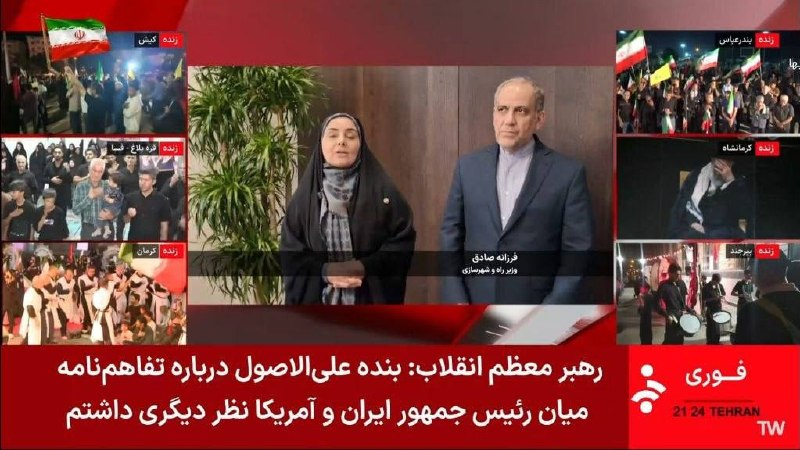

🔴زیرنویس صدا‌و‌سیما:

مجتبی در مورد تفاهم‌نامه نظر دیگه‌ای داشت😂

@IranianMinds

## Dirty_Kids — post 392518

فوری
معاونت راهبردی پزشکیان پایان دادن به تجمعات است. تجمع کنندگان مخالف مصلحت اندیشی ها هستند و بهداشت روانی جامعه رو برهم زدند. تجمعات باید بعد از تشییع جنازه رهبر برچیده بشه.

@Dirty_Kids 👻

## Dirty_Kids — post 392517

  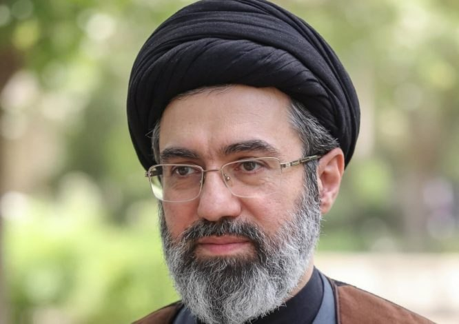

🔴 فوری، اولین پیام مجتبی به مناسبت توافق ایران و آمریکا:

ملت پرشور ایران، همون‌طور که مطلع شدین، تفاهم نامه‌ای بین رئیس جمهوران ایران و آمریکا امضا شد.
مسئولین از سر دلسوزی تلاش‌های زیادی انجام دادن و ترامپ رو مجبور کردن از سر درماندگی با ایران توافق کنه.
نظر من چیز دیگه بود ولی پزشکیان قبول کرد مسئولیت و عواقب توافق با اون باشه!!!
از این لحظه ما منتظر عملی شدن شروط گفته شده توسط آمریکا هستیم.

@Dirty_Kids 👻

## Hranews — post 113709

  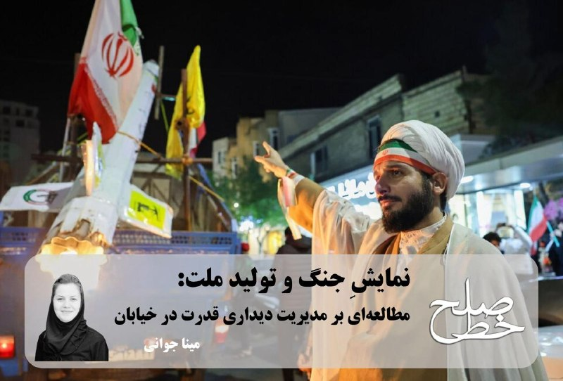

نمایشِ جنگ و تولید ملت: مطالعه‌ای بر مدیریت دیداری قدرت در خیابان/ #مینا_جوانی

📡
📡
📡
📡
📡– از نخستین شب‌های جنگ تا کنون، خیابان‌های شهرهای ایران به صحنه‌ی اجرای نوعی سیاست نمایشی بدل شدند؛ تجمعاتی، با حمایت حکومت، مملو از نور، پرچم، سرود، موکب که بیش از آن‌که بازتابی طبیعی از وضعیت اجتماعی باشند، تلاشی برای تولیدِ چهره‌ای یکدست و منسجم از «ملتِ حامی جنگ» به نظر می‌رسیدند. در این تجمعات، حکومت تنها در پی سازمان‌دهی حضور سیاسی نیست، فراتر از آن می‌کوشد از خلال مدیریت فضا، تصویر و عاطفه، روایت مطلوب خود از جامعه را مرئی کند. خیابان در شب، به بستری برای بازسازی نمادین مشروعیت تبدیل شد؛ جایی که قدرت تلاش می‌کند نه فقط افکار عمومی، بلکه «فرمِ رویت‌پذیرِ جامعه» را نیز کنترل کند.

اما هم‌زمان، در فاصله‌ای نه‌چندان دور از این صحنه‌های نورانی، جنگ واقعیتی دیگر را نیز در شهر گسترش می‌داد؛ واقعیتی متشکل از تخریب، ترس، اضطراب، سوگواری، فقر و مرگ. در حالی که دوربین‌ها بر پرچم‌ها و شعارها متمرکز بودند، بسیاری از قربانیان جنگ در سکوت و بی‌تصویری رها می‌شدند؛ کسانی که نه بخشی از قاب‌های تلویزیونی و رسانه‌ای بودند و نه در روایت رسمی جایی داشتند. شکاف میان این دو تصویر، جنگ به‌مثابه تجربه‌ای ویرانگر و جنگ به‌مثابه نمایشِ همبستگی، نشان می‌دهد که چگونه سیاست در وضعیت بحران، بیش از پیش به مدیریتِ تصویر و حذفِ واقعیت‌های مزاحم وابسته می‌شود.

ادامه مطلب
لینک به مطلب در وبسایت خط صلح

↘️
@hranews_bot تماس ✉️ - @Hranews کانال هرانا 🆑

## alonews — post 128981

  <a href="telegram/content/alonews_128981_1781806557.webm" target="_blank">🎬 Download video</a>

👈آسوشیتدپرس: کاخ سفید توافق با ایران را به کنگره ارسال کرد

✅ @AloNews خبر جنگ

## alonews — post 128980

  <a href="telegram/content/alonews_128980_1781806557.webm" target="_blank">🎬 Download video</a>

👈ترامپ: «ایالات متحده به صلح متعهد است، و ما از همه در منطقه خاورمیانه می‌خواهیم که به تعهد خود برای اجازه دادن به روند مذاکرات ما تا به شکلی عالی پیش برود، پایبند بمانند.

✅ @AloNews خبر جنگ

## alonews — post 128979

  <a href="telegram/content/alonews_128979_1781806557.webm" target="_blank">🎬 Download video</a>

👈ترامپ: انتظار داریم میان اسرائیل و حزب‌الله هم آتش‌بس کامل برقرار شود

✅ @AloNews خبر جنگ

---
📅 بروزرسانی: 1405/03/28 21:37
---

## VahidOOnLine — post 246258

  <a href="telegram/content/VahidOOnLine_246258_1781806046.mp4" target="_blank">🎬 Download video</a>

♦️جی‌دی ونس، معاون رئیس‌جمهوری آمریکا، در نشست خبری روز ۲۸ خردادماه در کاخ سفید، در پاسخ به انتقادها درباره نداشتن تجربه در مذاکرات پیچیده، با لحنی طنزآمیز گفت حضور بیش از یک‌ساعته‌اش در برنامه «The View» را می‌توان تجربه‌ای از «مذاکرات خصمانه» دانست.
او با اشاره به مجری این برنامه، جوی بیهار، گفت «او از ایرانی‌ها هم سخت‌تر است»، اما افزود اکنون رابطه خوبی میان آن‌ها شکل گرفته است.
ونس تأکید کرد روند مذاکرات با ایران در موقعیت «مثبت» قرار دارد و افزود چالش اصلی، رسیدن به مرحله نهایی و تحقق تغییر اساسی در روابط ایران با جهان است.
‌🇸🇦 Indypersian

🤖 @VahidOOnLine

## VahidOOnLine — post 246257

  

مجتبی خامنه‌ای در پیامی گفت درباره تفاهم‌نامه با آمریکا «نظر دیگری» داشته است اما با قبول مسئولیت از سوی پزشکیان و اعضای شورای عالی امنیت ملی اجازه آن را صادر کرده است.

او افزود مذاکرات حضوری آینده به معنی پذیرش نظر «دشمن» نیست و منتظر تحقق شروط گفته‌شده خواهد بود.
‌🏁 🇬🇧 IranintlTV

🤖 @VahidOOnLine

## VahidOOnLine — post 246256

  

مجتبی خامنه‌ای در پیامی درباره تفاهم‌نامه میان آمریکا و جمهوری اسلامی گفت: «بنده علی‌الاصول، نظر دیگری داشتم اما از باب تعهدی که مسعود پزشکیان به‌عنوان رییس شورای عالی امنیت ملی از طرف خود و سایر اعضا به من داد و مسئولیت آن را قبول کرد اجازه آن را صادر کردم.»
خامنه‌ای افزود: «پزشکیان گفت اگر طرف آمریکایی بخواهد زیاده‌خواهی کند زیر بار آن نخواهند رفت.»
رهبر جمهوری اسلامی اضافه کرد: «بدیهی است مذاکرات حضوری که در آینده برقرار خواهد شد، به معنی پذیرش نظر دشمن نخواهد بود.»
‌🏁 🇬🇧 IranintlTV

🤖 @VahidOOnLine

## WithYashar — post 15272

کانال ۱۴ اسرائیل: رهبری سیاسی اسرائیل به نیروهای دفاعی اسرائیل اجازه داده است که در داخل «خط زرد» در جنوب لبنان تیراندازی کنند.

انتظار می‌رود مقامات ارشد نظامی در ساعات آینده قوانین درگیری و راهنمایی‌های عملیاتی به فرماندهان میدانی را به‌روزرسانی کنند.
این تصمیم همچنین شامل برنامه‌هایی برای نابودی هر «زیرساخت مرتبط با حزب‌الله» است که در داخل «خط زرد» شناسایی شود.
@withyashar

## WithYashar — post 15271

رئیس ستاد ارتش اسرائیل به ارتش اسرائیل دستور داد تا برای سناریوی حمله به ایران و حزب الله آماده شوند
@withyashar

## mwarmonitor — post 11167

  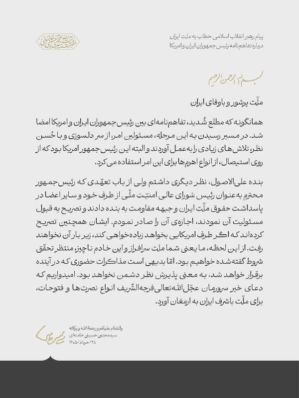

📝چقدر مضحک و «اصولی» که رهبرِ افقی‌شده، از آن دنیا سیگنال فرستاده که چون پزشکیانِ ساده‌لوح قول داده زیر بار ترامپ نرود، به او اذن دخول داده است! علم در شوک است که چطور یک میت بیانیه صادر می‌کند، اما وقتی پای بقای سفره در میان باشد، وای‌فایِ غسّالخانه هم مستقیم به کاردکس مجتبی وصل می‌شود. این‌ها اصرار دارند بگویند «تفاهم‌نامه رئیس‌جمهوران ایران و آمریکا» تا فردا که ترامپ زیر میز زد، نظامِ دامن‌کشان خود را عقب بکشد و بگوید گندکاریِ مسعود بوده و آقا مجتبی هم قلباً راضی نبوده است.

واقعیت این است که این خیمه‌شب‌بازی، دستپختِ احمد وحیدی و اتاق فکرِ هراسانِ بیت است، چون مرده که بیانیه صادر نمی‌کند. هنوز جوهر امضا خشک نشده، جنگِ گرگ‌های گرسنه بالا گرفته و بوی خونِ پاکسازی‌های داخلی می‌آید؛ در این بازارِ ترورهای خودی و حذف‌های فیزیکی، قالیبافِ بخت‌برگشته که همیشه سرِ جابجایی قدرت مثل مهره سوخته عمل کرده، شانس بسیار بالایی دارد که با یک «نقص فنی اتفاقی»، خیلی زود برای همیشه به همرزمانِ سابقش بپیوندد.

@mwarmonitor

## FoxNewsTwitter — post 343136

  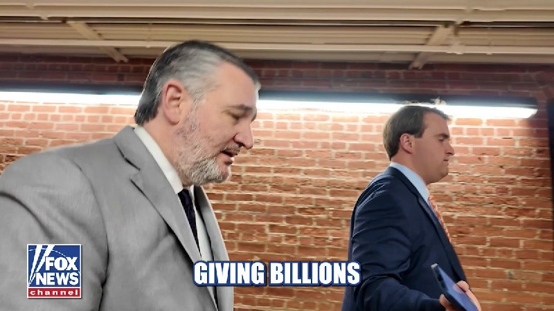

Fox News (Twitter/X)

"What an embarrassment."

GOP and Democrat senators are casting doubt on President Trump’s Iran peace deal, with lawmakers from both parties criticizing the agreement and raising concerns about its potential impact.

"Giving billions of dollars to theocratic lunatics who want to murder us is not a good idea."

"I think the president unfortunately is receiving bad advice on this deal."

@foxnewspolitics

## pm_afshaa — post 94350

  <a href="telegram/content/pm_afshaa_94350_1781806051.webm" target="_blank">🎬 Download video</a>

بازم موش تباه پیام تایپی داد🤣🤣 
💧 Rainbet.com the #1 Non-KYC Crypto Casino & Sportsbook @rainbetcom 
😁 @Pm_Afshaa

## VahidOnline — post 76491

  

دست خدا عیان شد،
خامنه‌ای گردن‌نگیر جوان شد

📡 @VahidOnline

## kianmeli1 — post 88071

  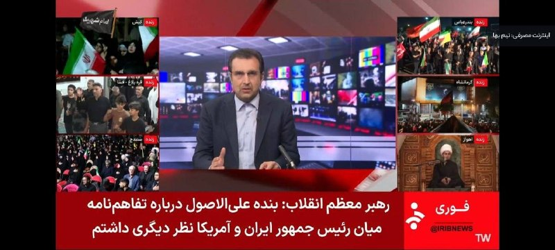

🔴مجتبی خامنه‌ای در پیامی درباره تفاهم‌نامه میان آمریکا و جمهوری اسلامی گفت: «بنده علی‌الاصول، نظر دیگری داشتم اما از باب تعهدی که مسعود پزشکیان به‌عنوان رییس شورای عالی امنیت ملی از طرف خود و سایر اعضا به من داد و مسئولیت آن را قبول کرد اجازه آن را صادر کردم.»
خامنه‌ای افزود: «پزشکیان گفت اگر طرف آمریکایی بخواهد زیاده‌خواهی کند زیر بار آن نخواهند رفت.»
رهبر جمهوری اسلامی اضافه کرد: «بدیهی است مذاکرات حضوری که در آینده برقرار خواهد شد، به معنی پذیرش نظر دشمن نخواهد بود.»
https://t.me/kianmeli1

## IranIntlTV — post 343085

  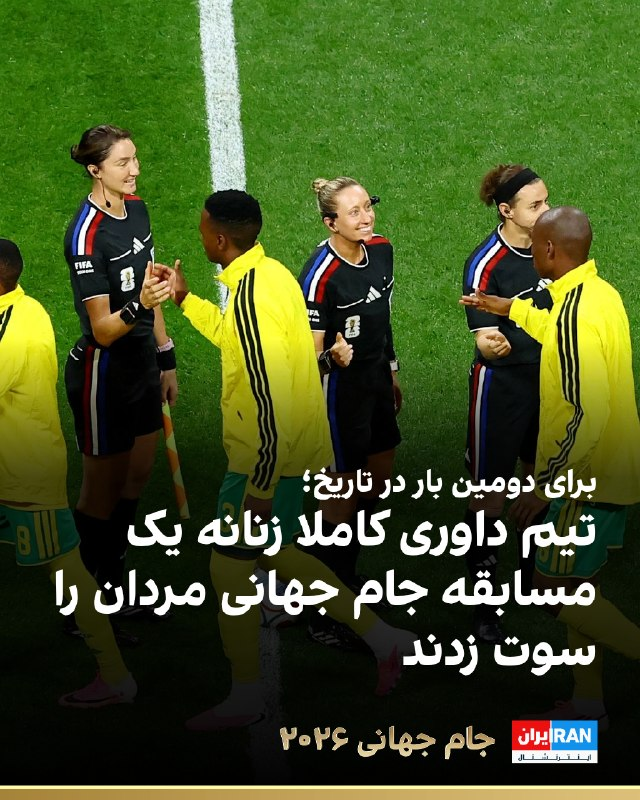

🔻جمهوری چک و آفریقای جنوبی درحالی نخستین بازی از هفته دوم جهانی را برگزار کردند که توری پنسو، بروک مایو و کاترین نسبیت، سه داور زن آمریکایی، قضاوت این بازی را بر عهده دارند. این دومین بار در طول تاریخ است که یک تیم داوری کاملا متشکل از زنان، قضاوت بازی در جام جهانی مردان را برعهده می‌گیرند.

🔹این سه نفر پیش‌تر نیز تیم داوری فینال جام جهانی زنان ۲۰۲۳ بودند؛ دیداری که میان انگلیس و اسپانیا برگزار شد و پنسو به عنوان داور اصلی آن مسابقه سوت زد.

🔹نخستین تیم داوری کاملا زنانه که یک مسابقه جام جهانی مردان را قضاوت کرد، چهار سال پیش در قطر حضور داشت. استفانی فراپار از فرانسه، که به عنوان نخستین زن قضاوت‌کننده در یک مسابقه جام جهانی مردان نیز تاریخ‌ساز شد، هدایت تیم داوری دیدار مرحله گروهی آلمان و کاستاریکا را بر عهده داشت و نوزا بک از برزیل و کارن دیاز از مکزیک به عنوان کمک‌داوران او فعالیت می‌کردند.

🔹پنسو از سال ۲۰۱۳ داوری فوتبال را آغاز کرده و در مسابقات لیگ فوتبال آمریکا قضاوت کرده است. او سال گذشته نیز یکی از ۳۵ داوری بود که در جام جهانی باشگاه‌های مردان فیفا قضاوت کردند.

@iranintltvsport

## IranIntlTV — post 343084

  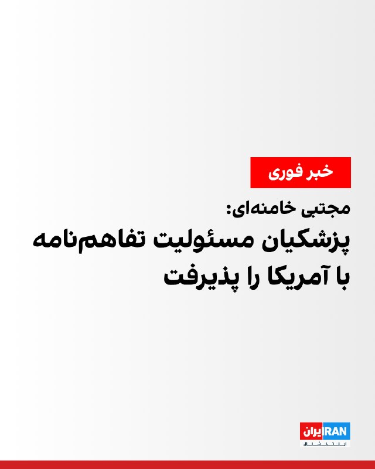

مجتبی خامنه‌ای در پیامی گفت درباره تفاهم‌نامه با آمریکا «نظر دیگری» داشته است اما با قبول مسئولیت از سوی پزشکیان و اعضای شورای عالی امنیت ملی اجازه آن را صادر کرده است.

او افزود مذاکرات حضوری آینده به معنی پذیرش نظر «دشمن» نیست و منتظر تحقق شروط گفته‌شده خواهد بود.
https://iranintl.com/202606188407

## IranIntlTV — post 343083

  <a href="telegram/content/IranIntlTV_343083_1781806055.mp4" target="_blank">🎬 Download video</a>

یک شهروند از استان گلستان با ارسال ویدیویی به ایران اینترنشنال به قطع برق منزل خود اشاره کرده و به طعنه درباره دفن نشدن جنازه علی خامنه‌ای می‌گوید: «ما نگران خودمان نیستیم نگرانیم جنازه حضرت آقا بو نگیرد.»

## RadioFarda — post 158480

  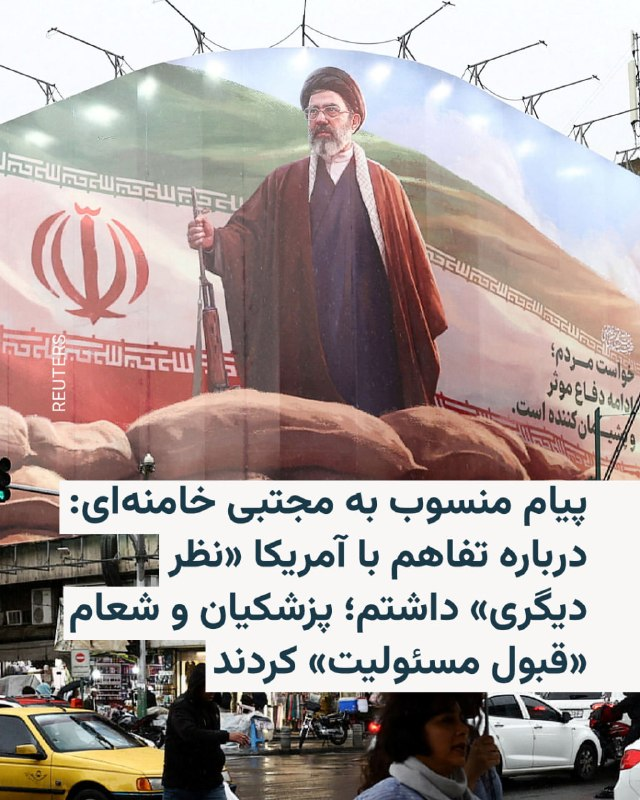

🔸رسانه‌های ایران پنج‌شنبه شب متن پیام مکتوبی منسوب به مجتبی خامنه‌ای را منتشر کردند که در آن رهبر جمهوری اسلامی درباره امضای تفاهم‌نامه میان ایران و آمریکا گفته است که «نظر دیگری» داشته و مسئولیت آن را بر عهده مسعود پزشکیان، رئیس شورای عالی امنیت ملی، و دیگر اعضای این شورا دانسته است.

🔸در این پیام درباره توافق با ایالات متحده آمده است: «بنده علی‌الاصول، نظر دیگری داشتم ولی از باب تعهدی که رئیس‌جمهور محترم به‌عنوان رئیس شورای عالی امنیت ملی از طرف خود و سایر اعضا در پاسداشت حقوق ملت ایران و جبهه مقاومت به بنده دادند و تصریح به قبول مسئولیت آن نمودند، اجازه آن را صادر نمودم‌.»

🔸در این پیام به تفاهمنامه اخیر به عنوان «تفاهم‌نامه‌ای بین رئیس‌جمهوران ایران و آمریکا» اشاره و گفته شده است که رهبر جمهوری اسلامی و مردم از این لحظه «منتظر تحقق شروط گفته ‌شده» خواهند بود.

🔸در این پیام آمده که مذاکرات حضوری آینده «به معنی پذیرش نظر دشمن نخواهد بود.»

@RadioFarda

## RadioFarda — post 158479

  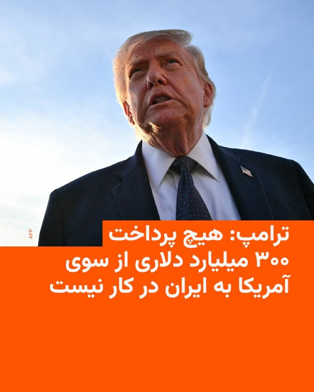

🔸دونالد ترامپ، رئیس‌جمهور آمریکا، روز پنجشنبه توافق با ایران برای پایان دادن به جنگ را یک «پیروزی» برای ایالات متحده توصیف کرد و انتقادهای فزاینده از این تفاهم‌نامه را رد کرد.

🔸ترامپ در پیامی در شبکه اجتماعی خود، ‌تروث سوشال، نوشت: «هیچ پرداخت ۳۰۰ میلیارد دلاری از سوی آمریکا به ایران وجود ندارد. این خبر جعلی است! تنها چیزی که برای آمریکا وجود دارد، موفقیت، کاهش قیمت نفت و پیروزی است. به بازار سهام نگاه کنید.»

🔸او ساعتی پیش نیز با حمله به منتقدان این توافق، نوشت آنها «حسودند، یا آدم‌های بدی هستند یا احمق.»

🔸اشاره رئیس‌جمهور آمریکا به صندوق سرمایه‌گذاری ۳۰۰ میلیارد دلاری برای ایران که در متن تفاهم‌نامه به آن اشاره شده در حالی است که جی‌دی‌ ونس، معاون او، نیز به خبرنگاران گفت صحبت درباره سرمایه‌گذاران احتمالی در ایران «خیلی زود» است.

@RadioFarda

## IranianMinds — post 22894

🔴مجتبی بیانیه داد😂 @IranianMinds

## IranianMinds — post 22893

  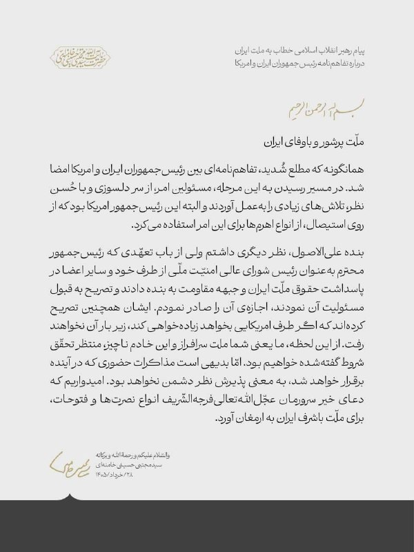

🔴مجتبی بیانیه داد😂

@IranianMinds

## BBCPersian — post 284293

  <a href="https://t.me/bbcpersian/284293" target="_blank">📎 Download file</a>

📻این هفته در پرگار: تیم ملی ایران یا «تیم جمهوری اسلامی»؟

🔻تیم ایران در جام جهانی فوتبال، تیم ملی ایران است یا تیم جمهوری اسلامی؟ این تیم آمال مردم در رقابت‌های جهانی را نمایندگی می‌کند یا جمهوری اسلامی را؟

میهمان‌ها:
مهرزاد بروجردی، استاد دانشگاه
امید شمس، حقوقدان

@BBCPersian

## alonews — post 128978

  <a href="telegram/content/alonews_128978_1781806061.webm" target="_blank">🎬 Download video</a>

👈رهبری سیاسی اسرائیل به نیروهای دفاعی اسرائیل اجازه داده است که در داخل «خط زرد» در جنوب لبنان تیراندازی کنند، طبق گزارش کانال ۱۴ اسرائیل.

🔴انتظار می‌رود مقامات ارشد نظامی در ساعات آینده قوانین درگیری و راهنمایی‌های عملیاتی به فرماندهان میدانی را به‌روزرسانی کنند.

🔴این تصمیم همچنین شامل برنامه‌هایی برای نابودی هر «زیرساخت مرتبط با حزب‌الله» است که در داخل «خط زرد» شناسایی شود.

✅ @AloNews خبر جنگ

## alonews — post 128977

  <a href="telegram/content/alonews_128977_1781806062.webm" target="_blank">🎬 Download video</a>

🔴فوری / رویترز: کاخ سفید متن توافق با ایران را به کنگره ارائه کرد

✅ @AloNews خبر جنگ

---
📅 بروزرسانی: 1405/03/28 21:16
---

## VahidOOnLine — post 246255

  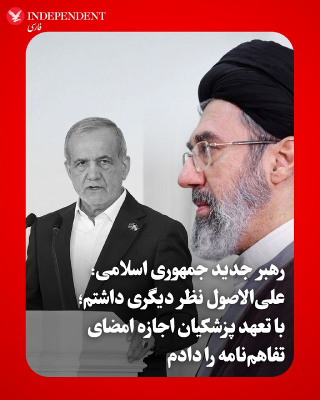

♦️ رسانه‌های جمهوری اسلامی متن پیام مجتبی خامنه‌ای، رهبر جدید جمهوری اسلامی، خطاب به مردم را درباره تفاهم‌نامه امضاشده میان رؤسای جمهور ایران و آمریکا منتشر کردند؛ پیامی که نشان‌دهنده واگذاری تام و تمام مسئولیت عواقب این توافق به مسعود پزشکیان است.

مجتبی خامنه‌ای در این پیام با اشاره به اینکه «علی‌الاصول نظر دیگری داشته»، اعلام کرد که تنها به دلیل تعهد شخصی پزشکیان و پذیرش کامل مسئولیت پاسداشت حقوق ملت و «جبهه مقاومت» از سوی او، اجازه امضای این سند را صادر کرده است. در این پیام تاکید شده که پزشکیان متعهد شده است در صورت «زیاده‌خواهی آمریکا» زیر بار آن نرود.

رهبر جمهوری اسلامی با لحنی هشدارآمیز خطاب به دولت افزود که «ما یعنی ملت سرافراز و این خادم ناچیز» از این لحظه منتظر تحقق شروط وعده‌داده‌شده خواهند بود. او همچنین تصریح کرد که مذاکرات حضوری پیش‌رو در سوئیس به معنای پذیرش نظرات واشنگتن نخواهد بود.
‌🇸🇦 Indypersian

🤖 @VahidOOnLine

## VahidOOnLine — post 246254

  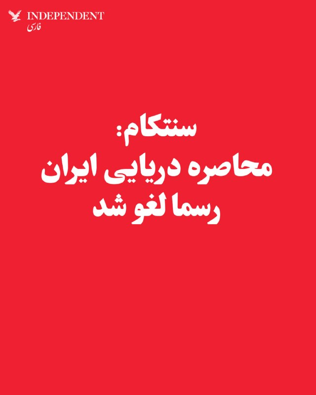

♦️ ستاد فرماندهی مرکزی آمریکا (سنتکام)، روز پنجشنبه ۲۸ خرداد با انتشار بیانیه‌ای رسمی اعلام کرد که در راستای اجرای دستور رئیس‌جمهوری ایالات متحده، نیروهای آمریکایی محاصره دریایی تمامی بنادر و مناطق ساحلی ایران را لغو کرده‌اند.

بر اساس این بیانیه، نیروهای نظامی آمریکا از این پس هیچ‌گونه مانعی برای تردد کشتی‌ها به مقصد بنادر ایران یا از مبدأ آن‌ها ایجاد نخواهند کرد و تمامی فعالیت‌های مربوط به اجرای محاصره دریایی به‌طور کامل متوقف شده است.

سنتکام در عین حال تاکید کرد که ناوهای جنگی ارتش آمریکا برای نظارت بر حسن اجرای توافق، تضمین پایبندی طرفین به تمامی بندهای آن و حفظ آمادگی کامل، در منطقه عمومی خلیج فارس و دریای عمان باقی خواهند ماند.
‌🇸🇦 Indypersian

🤖 @VahidOOnLine

## WithYashar — post 15270

  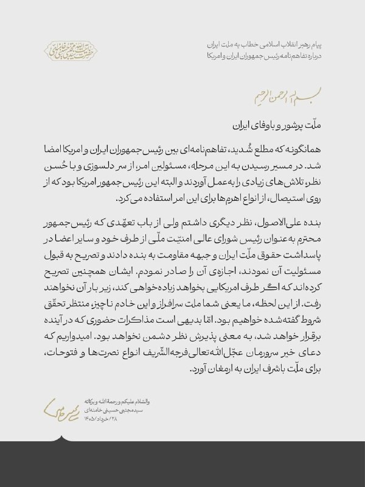

خبرگزاری فارس: پیام جدید iRahbar
@withyashar

## WithYashar — post 15269

@withyashar

## pm_afshaa — post 94349

  

بازم موش تباه پیام تایپی داد🤣🤣

💧 Rainbet.com the #1 Non-KYC Crypto Casino & Sportsbook @rainbetcom

😁 @Pm_Afshaa

## pm_afshaa — post 94347

  <a href="telegram/content/pm_afshaa_94347_1781804814.webm" target="_blank">🎬 Download video</a>

باز براتون اسپانسر گرفتم رایگان متصلتون کنم حاما از اسپانسرمون حمایت کنین جوین شین این سرورا ادامه دار باشه بتونیم رایگان متصلتون کنیم حتما جوین کانالشون شین
👇
👇 @Lex_Server @Lex_Server

## VahidOnline — post 76490

  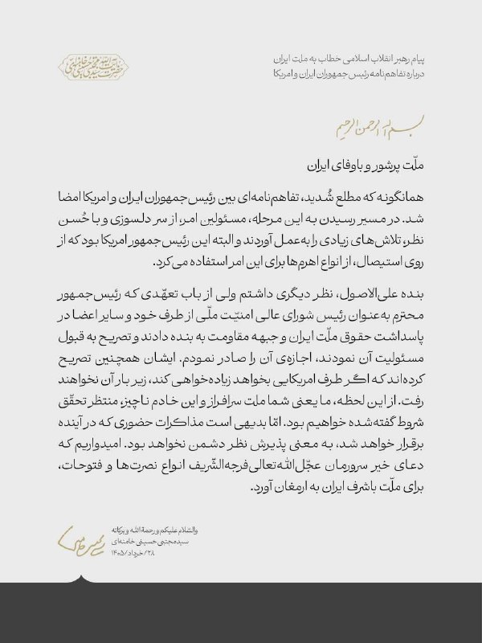

منابع حکومتی تصویر بالا رو با شرح زیر منتشر کردند
"متن کامل پیام رهبر انقلاب اسلامی خطاب به ملت ایران درباره تفاهم‌نامه رئیس‌جمهوران ایران و امریکا"

این متن که به مجتبی منتسب شده بسیار تاکید داره که این تفاهم‌نامه‌ای بین پزشکیان و ترامپه!

در تیترهایی هم که درباره این خبر تولید می‌کنند روش تاکید دارند و نمی‌گن: یادداشت تفاهم بین ایران و آمریکا

📡 @VahidOnline

## IranIntlTV — post 343082

  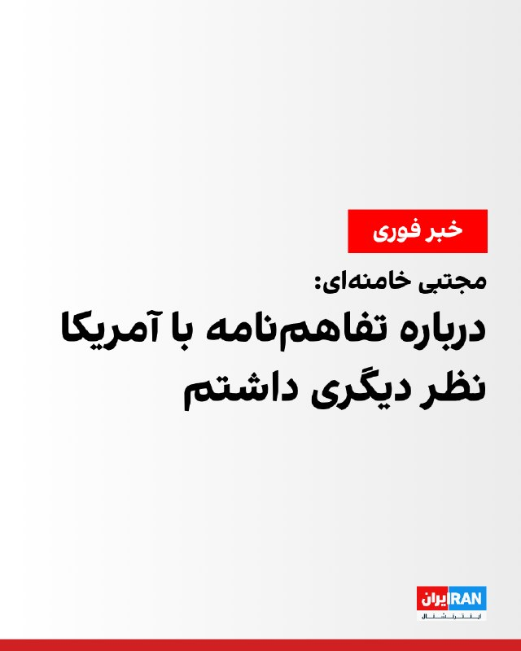

مجتبی خامنه‌ای در پیامی درباره تفاهم‌نامه میان آمریکا و جمهوری اسلامی گفت: «بنده علی‌الاصول، نظر دیگری داشتم اما از باب تعهدی که مسعود پزشکیان به‌عنوان رییس شورای عالی امنیت ملی از طرف خود و سایر اعضا به من داد و مسئولیت آن را قبول کرد اجازه آن را صادر کردم.»
خامنه‌ای افزود: «پزشکیان گفت اگر طرف آمریکایی بخواهد زیاده‌خواهی کند زیر بار آن نخواهند رفت.»
رهبر جمهوری اسلامی اضافه کرد: «بدیهی است مذاکرات حضوری که در آینده برقرار خواهد شد، به معنی پذیرش نظر دشمن نخواهد بود.»
https://iranintl.com/202606185086

## IranIntlTV — post 343081

  <a href="telegram/content/IranIntlTV_343081_1781804815.mp4" target="_blank">🎬 Download video</a>

حمزه صفوی، فرزند یحیی رحیم صفوی، مشاور عالی رهبر جمهوری اسلامی، در یک برنامه اینترنتی گفت علی خامنه‌ای با وجود برخورداری از یکی از گران‌ترین سامانه‌های حفاظتی در میان رهبران جهان، کشته شد و نهادهای مسئول نتوانستند از او حفاظت کنند.

او با اشاره به ناکامی دستگاه‌های امنیتی و حفاظتی جمهوری اسلامی گفت: «علی خامنه‌ای یکی از گران‌ترین سیستم‌های حفاظتی دنیا را داشت.»

حمزه صفوی در بخش دیگری از سخنانش با انتقاد از عملکرد نهادهای امنیتی جمهوری اسلامی برای جلوگیری از درز اطلاعات مکان تاسیسات هسته‌ای و رهبر جمهوری اسلامی افزود: «ابعاد رهبر ما ۶۰ سانت در ۱۸۰ سانت بود اما نتونستیم پنهان کنیم.»
@iranintltv

## IranIntlTV — post 343080

  <a href="telegram/content/IranIntlTV_343080_1781804817.mp4" target="_blank">🎬 Download video</a>

پیت هگست، وزیر جنگ آمریکا، هشدار داد در صورتی که تهران به تعهدات خود عمل نکند، محاصره دریایی همه‌جانبه علیه ایران دوباره اعمال خواهد شد.
او افزود هرگونه تغییر در میزان حضور نیروهای نظامی آمریکا در خاورمیانه تنها بر اساس شرایط میدانی و رفتار جمهوری اسلامی تعیین خواهد شد.

گزارش مریم رحمتی، خبرنگار ایران‌اینترنشنال
@iranintltv

## IranIntlTV — post 343079

  <a href="telegram/content/IranIntlTV_343079_1781804818.mp4" target="_blank">🎬 Download video</a>

جی‌دی ونس در نشستی خبری در کاخ سفید گفت بازه ۶۰ روزه در یادداشت تفاهم مورد تایید دونالد ترامپ و رهبران جمهوری اسلامی تعیین شده است. او افزود انتظار آمریکا این است که حکومت ایران دیگر از بی‌ثباتی و تروریسم منطقه‌ای حمایت مالی نکند.

گزارش مرضیه حسینی، خبرنگار ایران‌اینترنشنال
@iranintltv

## FarsiVOA — post 221133

در پی حمله نیروهای نظامی به تجمع ساکنان روستای پشموکی کرمان، دست‌کم هفت زن بلوچ زخمی و سه زن بازداشت شدند. این تجمع در اعتراض به نحوه واگذاری و بهره‌برداری از معدن کرومیت برگزار شد.

## Persian_Trend_Official — post 17486

آیت الله مجتبی خامنه‌ای، رهبر جمهوری اسلامی: بنده علی‌الاصول، نظر دیگری داشتم ولی از باب تعهّدی که رئیس‌جمهور محترم به‌عنوان رئیس شورای عالی امنیّت ملّی از طرف خود و سایر اعضا در پاسداشت حقوق ملّت ایران و جبهه مقاومت به بنده دادند و تصریح به قبول مسئولیت آن نمودند، اجازه‌ی آن را صادر نمودم‌.

متن کامل پیام رهبر جمهوری اسلامی ایران در مورد امضای تفاهم نامه بین ایران و آمریکا:

بسم‌ الله‌ الرّحمن ‌الرّحیم

ملّت پرشور و باوفای ایران

همانگونه که مطلع شُدید، تفاهم‌نامه‌ای بین رئیس‌جمهوران ایران و امریکا امضا شد. در مسیر رسیدن به این مرحله، مسئولین امر، از سر دلسوزی و با حُسن نظر، تلاش‌های زیادی را به‌عمل آوردند و البته این رئیس‌جمهور آمریکا بود که از روی استیصال، از انواع اهرم‌ها برای این امر استفاده می‌کرد.

بنده علی‌الاصول، نظر دیگری داشتم ولی از باب تعهّدی که رئیس‌جمهور محترم به‌عنوان رئیس شورای عالی امنیّت ملّی از طرف خود و سایر اعضا در پاسداشت حقوق ملّت ایران و جبهه مقاومت به بنده دادند و تصریح به قبول مسئولیت آن نمودند، اجازه‌ی آن را صادر نمودم‌. ایشان همچنین تصریح کرده‌اند که اگر طرف آمریکایی بخواهد زیاده‌خواهی کند زیر بار آن نخواهند رفت. از این لحظه، ما یعنی شما ملت سرافراز و این خادم ناچیز، منتظر تحقّق شروط گفته‌شده خواهیم بود.

امّا بدیهی است مذاکرات حضوری که در آینده برقرار خواهد شد، به معنی پذیرش نظر دشمن نخواهد بود. امیدواریم که دعای خیر سرورمان عجّل‌الله‌تعالی‌فرجه‌الشّریف انواع نصرت‌ها و فتوحات، برای ملّت باشرف ایران به ارمغان آورد.

📝 Amir

📌 @persian_trend_official
پرشین ترند | متفاوت‌ترین کانال نظامی

## Persian_Trend_Official — post 17485

  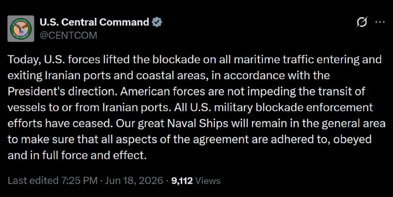

محاصره دریایی ایران به طور رسمی لغو شد.

فرماندهی مرکزی ایالات متحده: امروز، نیروهای آمریکایی محاصره تمام ترافیک دریایی ورودی و خروجی از بنادر و مناطق ساحلی ایران را مطابق با دستور رئیس جمهور لغو کردند.

نیروهای آمریکایی مانع عبور کشتی‌ها به بنادر ایران یا از بنادر ایران نمی‌شوند. تمام تلاش‌های نظامی ایالات متحده برای اجرای محاصره متوقف شده است.

کشتی‌های نیروی دریایی بزرگ ما در منطقه عمومی باقی خواهند ماند تا اطمینان حاصل شود که تمام جنبه‌های توافق رعایت، اجرا و با قدرت و قوت کامل اجرا می‌شوند.

📝 Amir

📌 @persian_trend_official
پرشین ترند | متفاوت‌ترین کانال نظامی

## Persian_Trend_Official — post 17484

  <a href="telegram/content/Persian_Trend_Official_17484_1781804820.webm" target="_blank">🎬 Download video</a>

ترامپ در تروث سوشال: هیچ پرداخت 300 میلیارد دلاری از سوی ایالات متحده به ایران وجود ندارد. این خبر جعلی است! تنها چیزی که برای ایالات متحده وجود دارد موفقیت، کاهش قیمت نفت و پیروزی است. به بازار سهام نگاهی بیندازید.

تبلیغات دموکرات‌ها در حال اجرا است!!!

📝 Amir

📌 @persian_trend_official
پرشین ترند | متفاوت‌ترین کانال نظامی

## RadioFarda — post 158478

  <a href="https://t.me/radiofarda/158478" target="_blank">📎 Download file</a>

ابعاد حقوقی تفاهم‌نامه ایران و آمریکا در گفت‌وگو با سعید محمودی

🔸تفاهم‌نامه ۱۴ بندی میان جمهوری اسلامی ایران و ایالات متحده، علاوه بر توقف جنگ و بازگشایی تنگه هرمز، مجموعه‌ای از تعهدات سیاسی، امنیتی، اقتصادی و هسته‌ای را در بر می‌گیرد که قرار است ظرف ۶۰ روز به یک توافق نهایی تبدیل شود. در این سند، از لغو تحریم‌ها و آزادسازی دارایی‌های ایران گرفته تا نظارت آژانس بر اورانیوم غنی‌شده و حتی تصویب توافق نهایی در شورای امنیت سازمان ملل مطرح شده است. اما این پرسش وجود دارد که از منظر حقوق بین‌الملل، این تفاهم‌نامه تا چه اندازه الزام‌آور است و آیا سازوکارهای پیش‌بینی‌شده در آن قابلیت اجرا و تضمین حقوقی دارند یا نه؟ در گفت‌وگو با سعید محمودی، استاد حقوق بین‌الملل، این ابعاد حقوقی را بررسی می‌کنیم.

@RadioFarda

## IranianMinds — post 22892

  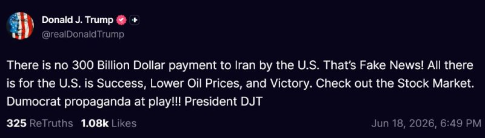

🔴پست ترامپ:

هیچ پرداخت ۳۰۰ میلیارد دلاری از سوی آمریکا به ایران وجود ندارد.
این اخبار جعلی است!
همه چیز برای آمریکا موفقیت، کاهش قیمت نفت و پیروزی است.
بازار سهام را بررسی کنید.
تبلیغات دموکرات‌های احمق در جریان است!!!

@IranianMinds

## BBCPersian — post 284292

  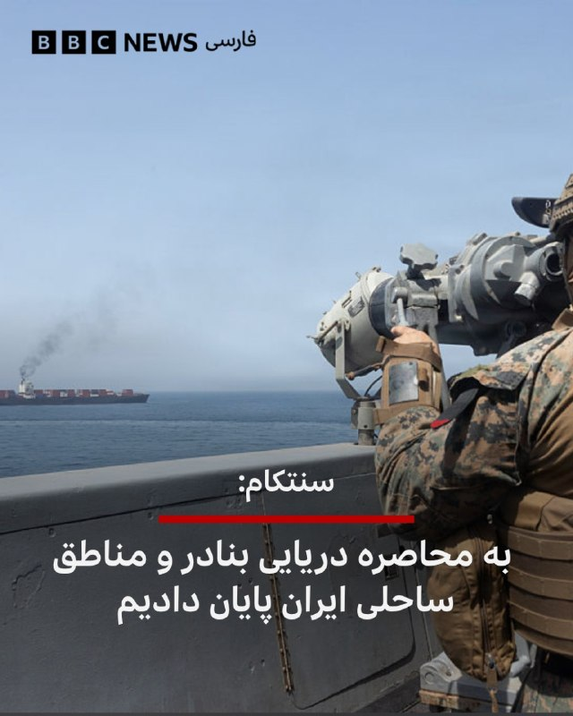

🔻فرماندهی مرکزی ایالات متحده آمریکا، سنتکام در پیامی در شبکه ایکس از پایان دادن به محاصره دریایی بنادر و مناطق ساحلی ایران خبر داد و اعلام کرد که «تمامی اقدامات نظامی آمریکا برای اجرای محاصره دریایی در خلیج فارس متوقف شده است.»

سنتکام شامگاه روز پنجشنبه به وقت ایران در شبکه ایکس نوشت:‌ «امروز، نیروهای ایالات متحده مطابق با دستور رئیس‌جمهور، محاصره دریایی تمامی ترددهای دریایی ورودی و خروجی از بنادر و مناطق ساحلی ایران را لغو کردند.»

آمریکا میگوید که «نیروهای آمریکایی دیگر مانع عبور کشتی‌ها به مقصد یا از مبدأ بنادر ایران در خلیج‌فارس و دریای عمان نمی‌شوند.»

فرماندهی مرکزی ارتش آمریکا می‌گوید: «ناوهای نیروی دریایی ما همچنان در منطقه حضور خواهند داشت تا اطمینان حاصل شود که تمامی مفاد این تفاهمنامه رعایت می‌شوند، به آن‌ها عمل می‌شود و توافق به‌طور کامل و مؤثر در حال اجرا است.»

📷U.S. Navy via Getty Images
https://bbc.in/4v3LF7r
@BBCPersian

## Dirty_Kids — post 392516

  

دوالیپا و شوهرش قشنگ معلومه بعد ازدواج توی ماه عسل روزی ۳۰ ۴۰ بار سکس کردن

@Dirty_Kids 👻

## Dirty_Kids — post 392515

  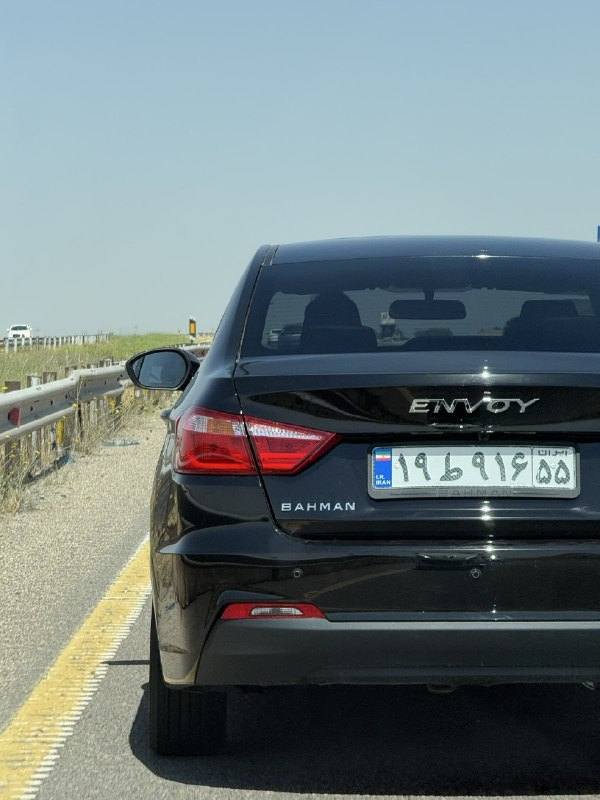

‏از کجا میفهمید همچین ماشینایی اومده میرید میخرید

@Dirty_Kids 👻

## Hranews — post 113708

گزارشی از معوقات مزدی و بیمه‌ای کارگران کارخانه کیش‌چوب و شهرداری سنندج

❗️
❗️
❗️
❗️
❗️– شماری از #کارگران شاغل در کارخانه کیش‌چوب در استان هرمزگان و شهرداری سنندج از معوقات مزدی، پرداخت نشدن حق بیمه و عیدی خود ابراز نارضایتی کرده و خواستار رسیدگی به وضعیتشان شدند.

ادامه مطلب

↘️
@hranews_bot تماس ✉️ -  @Hranews  کانال هرانا 🆑

## alonews — post 128976

  <a href="telegram/content/alonews_128976_1781804823.mp4" target="_blank">🎬 Download video</a>

👈داده‌های جدید نشان می‌دهد که ترافیک دریایی از طریق تنگه هرمز پس از تفاهم‌نامه ایران و آمریکا از سر گرفته شده است

✅ @AloNews خبر جنگ

## alonews — post 128975

  <a href="telegram/content/alonews_128975_1781804824.webm" target="_blank">🎬 Download video</a>

👈خبرگزاری فارس: پیام جدید رهبری منتشر شد

✅ @AloNews خبر جنگ

## alonews — post 128974

  <a href="telegram/content/alonews_128974_1781804825.webm" target="_blank">🎬 Download video</a>

👈بیت‌کوین به زیر ۶۳,۰۰۰ دلار سقوط کرد

✅ @AloNews خبر جنگ

---
📅 بروزرسانی: 1405/03/28 21:01
---

## VahidOOnLine — post 246253

  

فرماندهی مرکزی ایالات متحده، سنتکام، در شبکه ایکس اعلام کرد: «روز پنج‌شنبه نیروهای آمریکایی، مطابق دستور رییس‌جمهوری آمریکا، محاصره دریایی همه ترددهای ورودی و خروجی از بنادر و مناطق ساحلی ایران را لغو کردند.»
سنتکام افزود: نیروهای آمریکا دیگر مانعی برای تردد کشتی‌ها به مقصد یا از مبدا بنادر ایران در خلیج فارس و دریای عمان ایجاد نمی‌کنند و همه اقدامات مرتبط با اجرای محاصره دریایی متوقف شده است.
فرماندهی مرکزی ایالات متحده اضافه کرد: «ناوهای نیروی دریایی آمریکا همچنان در منطقه باقی خواهند ماند تا اطمینان حاصل شود همه مفاد توافق رعایت و به‌طور کامل اجرا می‌شود.»
‌🏁 🇬🇧 IranintlTV

🤖 @VahidOOnLine

## VahidOOnLine — post 246252

  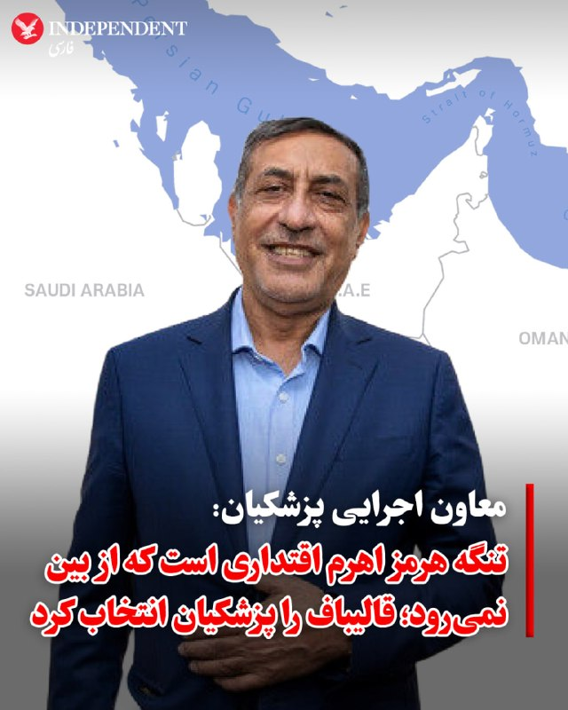

♦️ محمدجعفر قائم‌پناه، معاون اجرایی مسعود پزشکیان، در جریان سفر به ایلام، با اشاره به امضای تفاهم‌نامه با واشنگتن، تنگه هرمز را اهرم فشار و تضمین اصلی تهران ارزیابی کرد. او با به‌کارگیری تعبیر «جنگ تحمیلی سوم» گفت که ایران برای اولین بار از حربه راهبردی هرمز استفاده کرده و این اهرم اقتدار، دیگر از بین رفتنی نیست.

قائم‌پناه در بخش دیگری از اظهاراتش به انتقادهای داخلی پیرامون ترکیب تیم مذاکره‌کننده واکنش نشان داد و از تصمیم مسعود پزشکیان برای انتصاب محمدباقر قالیباف به عنوان رئیس تیم مذاکره‌کننده دفاع کرد.

معاون پزشکیان با رد اتهاماتی چون «سازشکاری» یا «حفظ نکردن منافع ملی» علیه قالیباف، بر پیشینه نظامی و حاکمیتی رئیس مجلس شورای اسلامی تاکید کرد و افزود که او با حمایت مستقیم مجتبی خامنه‌ای، رهبر جدید جمهوری اسلامی، فعالیت می‌کند. قائم‌پناه یادآور شد که تمامی مصوبات شورای عالی امنیت ملی در چارچوب سیاست‌های ابلاغی خامنه‌ای پیش می‌رود و گزینش قالیباف با هدف «حفظ وحدت و انسجام در درون ساختار قدرت» انجام شده است.
‌🇸🇦 Indypersian

🤖 @VahidOOnLine

## WithYashar — post 15268

  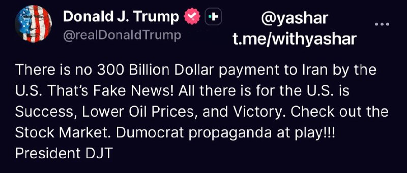

ترامپ در‌تروث : هیچ پرداخت ۳۰۰میلیارد دلاری از سوی آمریکا به ایران در کار نیست.
این خبر جعلی است!
تنها چیزی که نصیب آمریکا شده، موفقیت، کاهش قیمت نفت و پیروزی است.
بازار سهام را ببینید.
تبلیغات «دُمکرات‌ها» در جریان است!!
@withyashar

## WithYashar — post 15267

## pm_afshaa — post 94346

🔴ترامپ: هیچ پرداخت 300 میلیارد دلاری از سوی آمریکا به ایران وجود ندارد. این اخبار جعلی است! همه چیزی که آمریکا دارد، موفقیت، کاهش قیمت نفت و پیروزی است. به بازار بورس نگاه کنید. تبلیغات دموکراتیک در حال اجرا است

💧 Rainbet.com the #1 Non-KYC Crypto Casino & Sportsbook @rainbetcom

😁 @Pm_Afshaa

## VahidOnline — post 76489

  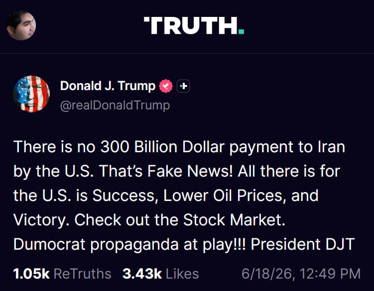

پست ترامپ، ترجمه ماشین:
هیچ پرداخت ۳۰۰ میلیارد دلاری از سوی آمریکا به ایران در کار نیست.
این خبر جعلی است!
تنها چیزی که نصیب آمریکا شده، موفقیت، کاهش قیمت نفت و پیروزی است.
بازار سهام را ببینید.
تبلیغات «دُمکرات‌ها» در جریان است!!!
رئیس‌جمهور دی‌جی‌تی

(توضیح: Dumocrat بازی زبانی تحقیرآمیز با Democrat است؛ از ترکیب ضمنیِ dumb به معنی «احمق» و Democrat. در ترجمه می‌شود چیزی مثل «دُمکرات‌ها» یا «دموکرات‌های احمق» آورد، بسته به لحن مورد نظر.)
realDonaldTrump

📡 @VahidOnline

## IranIntlTV — post 343078

  <a href="telegram/content/IranIntlTV_343078_1781803915.mp4" target="_blank">🎬 Download video</a>

🔻برخلاف انتظارات، کریستیانو رونالدو، فوق‌ستاره تیم ملی پرتغال، شروع جالبی در جام جهانی نداشت و نتوانست در این مسابقه گلزنی کند.

🔹گفت‌وگوی مزدک میرزایی با رها پوربخش، رضا محدث و علیرضا مدیری در برنامه هت‌تریک

@iranintltvsport

## IranIntlTV — post 343077

  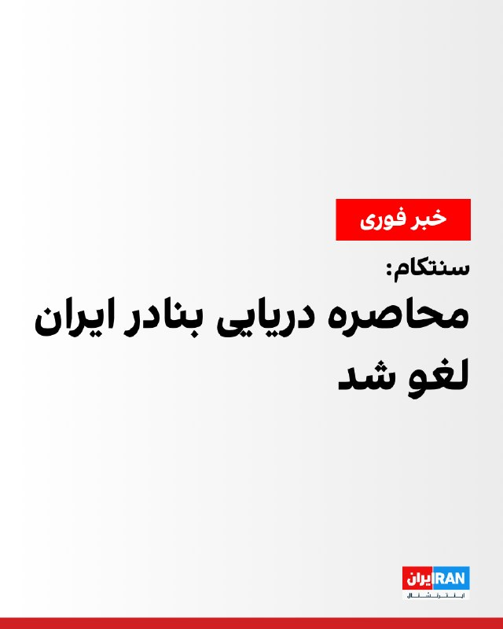

فرماندهی مرکزی ایالات متحده، سنتکام، در شبکه ایکس اعلام کرد: «روز پنج‌شنبه نیروهای آمریکایی، مطابق دستور رییس‌جمهوری آمریکا، محاصره دریایی همه ترددهای ورودی و خروجی از بنادر و مناطق ساحلی ایران را لغو کردند.»
سنتکام افزود: نیروهای آمریکا دیگر مانعی برای تردد کشتی‌ها به مقصد یا از مبدا بنادر ایران در خلیج فارس و دریای عمان ایجاد نمی‌کنند و همه اقدامات مرتبط با اجرای محاصره دریایی متوقف شده است.
فرماندهی مرکزی ایالات متحده اضافه کرد: «ناوهای نیروی دریایی آمریکا همچنان در منطقه باقی خواهند ماند تا اطمینان حاصل شود همه مفاد توافق رعایت و به‌طور کامل اجرا می‌شود.»
https://iranintl.com/202606187569

## FarsiVOA — post 221132

🔺معاون رئیس جمهوری آمریکا: بهره‌مندی از مزایای تفاهم‌نامه به تغییر رفتار حکومت ایران بستگی دارد

◾️معاون رئیس جمهوری آمریکا روز پنجشنبه ۲۸ خرداد در یک کنفرانس خبری در کاخ سفید با اشاره به امضای تفاهم‌نامه میان مقامات ارشد آمریکا و رژیم ایران گفت که مهلت ۶۰ روزه تبدیل تفاهم به توافق، از امروز آغاز می‌شود و تنها راه برخورداری ایران از مزایای این تفاهم، تغییر رفتار رژیم است.

⬇️ بیشتر بخوانید:

https://ir.voanews.com/a/jd-vance-iranian-behavior-change-memorandum/8162293.html

## FarsiVOA — post 221131

🔺دونالد ترامپ: خبر پرداخت ۳۰۰ میلیارد دلار توسط آمریکا به حکومت ایران «جعلی» است

◾️پرزیدنت ترامپ گزارش‌ها درباره پرداخت صدها میلیارد دلار پول توسط آمریکا به حکومت ایران را «جعلی» خواند.

⬇️ بیشتر بخوانید:

https://ir.voanews.com/a/president-trump-memorandum-payment-of-300-billion-iran-united-states/8162296.html

## RadioFarda — post 158477

هشدار عفو بین‌الملل دربارۀ تبدیل توافق ایران‌ و آمریکا به پوشش سرکوب و مصونیت از مجازات

🔸رئیس سازمان عفو بین‌الملل می‌گوید توافق ایران و آمریکا، موسوم به «تفاهم‌نامهٔ اسلام‌آباد»، تنها در صورتی می‌تواند به صلحی پایدار منجر شود که حفاظت از حقوق بشر، پاسخگویی عاملان نقض حقوق بین‌الملل، جبران خسارت قربانیان و تضمین عدم تکرار این نقض‌ها نیز در کانون توجه قرار گیرد.

🔸انیس کالامار در اظهاراتی که روز پنج‌شنبه ۲۸ خرداد منتشر شد، همچنین نسبت به تداوم سرکوب داخلی در ایران ابراز نگرانی کرد و هشدار داد توافقی که صرفاً به‌طور موقت جنگ را متوقف کند اما حقوق بشر را نادیده بگیرد، خطر آن را دارد که به پوششی برای تداوم مصونیت از مجازات، اشغالگری و سرکوب تبدیل شود.

🔸دبیرکل عفو بین‌الملل حملات آمریکا و اسرائیل به ایران را «غیرقانونی و نقض منشور سازمان ملل» خواند و افزود این حملات به «اقدامات غیرقانونی» مقام‌های جمهوری اسلامی ایران انجامید.

🔸به‌گفتۀ عفو بین‌الملل، این روند ماه‌ها رنج و ویرانی گسترده برای غیرنظامیان و نقض حقوق بشر، از جمله جنایات جنگی، را به دنبال داشت.

🔸کالامار همچنین با اشاره به این‌که جنگ ایران به دیگر کشورهای منطقه نیز کشیده شد و بیش از شش هزار نفر در سراسر خاورمیانه بر اثر این جنگ کشته شدند، گفت توافق ایران و آمریکا می‌تواند برای میلیون‌ها نفر در منطقه که طی چهار ماه گذشته در شرایط ناامنی و بلاتکلیفی زندگی کرده‌اند، روزنه‌ای از امید ایجاد کند.

🔸او در عین حال هشدار داد هر توافقی که صرفاً بر منافع راهبردی و نظامی آمریکا و ایران متمرکز باشد و حقوق بشر را نادیده بگیرد، ممکن است به پوششی برای تداوم مصونیت از مجازات، اشغالگری و سرکوب تبدیل شود.

🔸رئیس سازمان عفو بین‌الملل همچنین تأکید کرد که هرگونه پایان پایدار درگیری‌ها باید با اجرای عدالت، پاسخگو شدن عاملان نقض‌های حقوق بین‌الملل، جبران خسارت قربانیان و ارائهٔ تضمین‌های مشخص برای جلوگیری از تکرار چنین نقض‌هایی همراه باشد.

🔸دبیرکل عفو بین‌الملل در بخش دیگری از اظهارات خود هشدار داد که پایان حملات نظامی علیه ایران به معنای پایان خطر برای شهروندان ایرانی نیست.

🔸او گفت مقام‌های جمهوری اسلامی در طول جنگ سرکوب داخلی را هم تشدید کرده‌اند، که شامل بازداشت‌های گسترده و غیرقانونی، ناپدیدسازی قهری، شکنجه و بدرفتاری، محاکمه‌های به‌شدت ناعادلانه و اعدام‌های با انگیزهٔ سیاسی بوده است.

🔸گزارش کامل را در وب‌سایت رادیوفردا بخوانید.

@RadioFarda

## RadioFarda — post 158476

  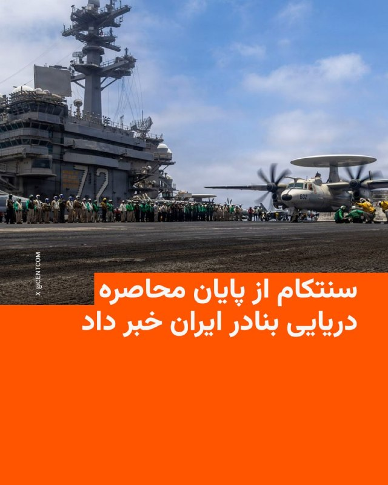

🔸ستاد فرماندهی مرکزی ارتش آمریکا، سنتکام، اعلام کرد نیروهای آمریکایی به دستور رئیس‌جمهور ایالات متحده به محاصره دریایی بنادر و مناطق ساحلی ایران پایان داده‌اند.

🔸سنتکام روز پنج‌شنبه ۲۸ خرداد در شبکه ایکس نوشت که از این پس هیچ مانعی بر سر تردد کشتی‌ها به مقصد یا از مبدأ بنادر ایران در خلیج فارس و دریای عمان ایجاد نخواهد شد و تمامی اقدامات مربوط به اجرای محاصره دریایی متوقف شده است.

🔸با این حال، سنتکام افزود ناوهای آمریکایی همچنان در منطقه باقی خواهند ماند تا بر اجرای مفاد توافق میان طرف‌ها نظارت کنند و از پایبندی به آن اطمینان حاصل شود.

🔸بر مبنای تفاهنامه ایران و آمریکا، که شامگاه چهارشنبه امضا شد، ایالات متحده آمریکا روند رفع محاصره دریایی خود را پس از امضا آغاز خواهد کرد و ظرف ۳۰ روز به‌طور کامل به محاصره دریایی پایان خواهد داد. جمهوری اسلامی نیز باید عبور کشتی‌ها از تنگه هرمز را ظرف مدت ۳۰ روز به میزان پیش از بسته شدن این آبراه برساند.

@RadioFarda

## IranianMinds — post 22891

  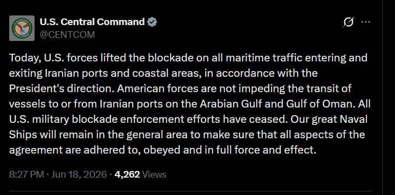

🔴سنتکام رسمأ رفع محاصره دریایی را اعلام کرد.

@IranianMinds

## IranianMinds — post 22889

تجمع اعتراضی دانش آموزان دوازدهمی و یازدهمی نسبت به فرجه امتحانات نهایی، شنبه 30 خرداد در تمامی استان ها مقابل درب آموزش و پرورش.

@IranianMinds

## IranianMinds — post 22887

🔴 پرویز ثابتی رئیس سابق ساواک توی مصاحبه ای که سال ۱۳۹۰ تو کتاب «در دامگه حادثه» انجام داده گفته جمهوری اسلامی همین شکلی نمیمونه و احتمالا قالیباف از درون کودتا میکنه.

@IranianMinds

## IranianMinds — post 22886

  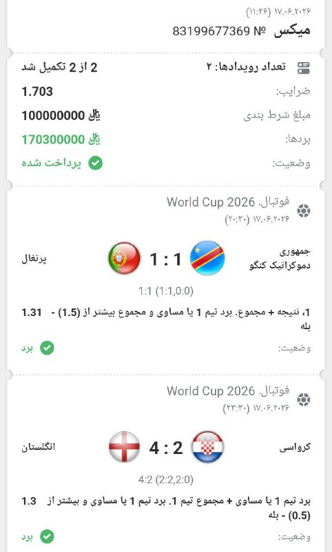

میکس عالی برد شد❤️
☑️

✔️@Tipster_Mafiaa

## BBCPersian — post 284291

  <a href="telegram/content/BBCPersian_284291_1781803920.mp4" target="_blank">🎬 Download video</a>

🔻جرمی کلارکسون، مجری سرشناس تلویزیونی، که در ایران بیشتر با برنامه «تخت گاز» شناخته می‌شود، اعلام کرده که به سرطان پروستات مبتلا شده است.
او این خبر را در برنامه خود، «مزرعه کلارکسون» که روز چهارشنبه ۲۷ خرداد (۱۷ ژوئن) پخش شد، اعلام کرد.
کلارکسون ۶۶ ساله در این برنامه خبر ابتلای خود را به همکارانش، کالب کوپر و چارلی ایرلند، اطلاع می‌دهد. او جزئیاتی درباره مرحله بیماری خود ارائه نکرد، اما آن را «تهاجمی» توصیف کرد و گفت ۱۰ درصد از موضع بیماری در جریان درمان برداشته شده است.
جرمی کلارکسون توضیح داد: «چند هفته پیش برای نمونه‌برداری رفتم و مشخص شد که تهاجمی ولی در مراحل اولیه است.»
کلارکسون به همکارانش گفته که خودش کمتر از دو ماه است که از موضوع باخبر شده و به آنها اطمینان داده که حالش «خوب خواهد شد»، هرچند اشاره کرد که «برای مدتی» قادر به فعالیت نخواهد بود.

🎥Clarkson’s Farm
@BBCPersian

## BBCPersian — post 284290

  <a href="https://t.me/bbcpersian/284290" target="_blank">📎 Download file</a>

پادکست برنامه جام جهان‌نما پنجشنبه ۲۸ خرداد ۱۴۰۵
این برنامه رادیویی را می‌توانید هرشب ساعت ۲۰ به وقت ایران، روی موج متوسط ۷۰۲ کیلوهرتز و موج کوتاه ۹۴۶۵ کیلوهرتز بشنوید.تکرار برنامه را هم می‌توانید ساعت ۲۱:۳۰ روی موج متوسط ۷۰۲ کیلوهرتز و موج کوتاه ۵۳۹۵ کیلوهرتز گوش کنید.

@BBCPersian

## BBCPersian — post 284288

  <a href="https://t.me/bbcpersian/284288" target="_blank">📎 Download file</a>

📻 تازه‌ترین خبرهای جهان، پنج‌شنبه ۲۸ خرداد ۱۴۰۵

@BBCPersian

## Dirty_Kids — post 392514

  <a href="telegram/content/Dirty_Kids_392514_1781803924.mp4" target="_blank">🎬 Download video</a>

صدا کنترل شود😂🔞🎧

@Dirty_Kids 👻

## Dirty_Kids — post 392513

  <a href="telegram/content/Dirty_Kids_392513_1781803927.mp4" target="_blank">🎬 Download video</a>

بعد از بوسیدن کاغذی؛ بوسیدن لیوانی هم وارد فیلم های ایرانی شد :)))

@Dirty_Kids 👻

## Hranews — post 113707

گزارش تکمیلی؛ شمار اعدام شدگان در زندان زاهدان به ۳ تن افزایش یافت

❗️
❗️
❗️
❗️
❗️– با احتساب دو زندانی دیگر که سحرگاه دیروز چهارشنبه ۲۷ خردادماه، در زندان زاهدان #اعدام شدند، تعداد اعدام شدگان این روز در زندان مذکور به سه تن افزایش یافت.

ادامه مطلب

#ظاهر_گرگیج #ظاهر_شاهوزهی

↘️
@hranews_bot تماس ✉️ -  @Hranews  کانال هرانا 🆑

## alonews — post 128973

  <a href="telegram/content/alonews_128973_1781803929.webm" target="_blank">🎬 Download video</a>

👈 فایننشال‌تایمز: طبق توافق آمریکا و ایران، ایران به تدریج به ۶ میلیارد دلار از دارایی‌های مسدود شده خود در قطر دسترسی پیدا خواهد کرد

🔴 این پول فقط می‌تواند برای خرید کالاهای بشردوستانه و سایر کالاهای آمریکایی غیرتحریمی استفاده شود

✅ @AloNews خبر جنگ

## alonews — post 128972

  <a href="telegram/content/alonews_128972_1781803929.webm" target="_blank">🎬 Download video</a>

👈خبرنگار : چه کسی آن صندوق ۳۰۰ میلیارد دلاری برای ایران را تأمین مالی می‌کند؟

🔴جی.دی ونس : تمایل زیادی از سوی جهان عرب و همچنین از خارج از جهان عرب وجود دارد

✅ @AloNews خبر جنگ

## alonews — post 128971

  <a href="telegram/content/alonews_128971_1781803930.webm" target="_blank">🎬 Download video</a>

🔴فوری / رئیس ستاد ارتش اسرائیل به ارتش اسرائیل دستور داد تا برای سناریوی حمله به ایران و حزب الله آماده شوند

✅ @AloNews خبر جنگ

## alonews — post 128970

  <a href="telegram/content/alonews_128970_1781803930.webm" target="_blank">🎬 Download video</a>

👈جی دی ونس: نتانیاهو بهتر است بداند بدون ترامپ و آمریکا قدرتی ندارد!

✅ @AloNews خبر جنگ

---
📅 بروزرسانی: 1405/03/28 20:41
---

## VahidOOnLine — post 246251

  <a href="telegram/content/VahidOOnLine_246251_1781802714.mp4" target="_blank">🎬 Download video</a>

ویدیوی رسیده به ایران اینترنشنال نشان می‌دهد که گروهی از متقاضیان ویزای پیوست، صبح ۲۸ خرداد جلوی کنسولگری آلمان در تهران تجمع کردند. حاضران در این تجمع به طولانی شدن روند رسیدگی به پرونده‌های ویزا اعتراض داشتند و اعلام کردند که برخی متقاضیان حدود دو سال در انتظار دریافت پاسخ مانده‌اند.

ویزای پیوست آلمان به اعضای خانواده فردی که به‌طور قانونی در آلمان زندگی می‌کند، اجازه می‌دهد به او بپیوندند تا در آن کشور اقامت داشته باشند.
‌🏁 🇬🇧 IranintlTV

🤖 @VahidOOnLine

## VahidOOnLine — post 246250

  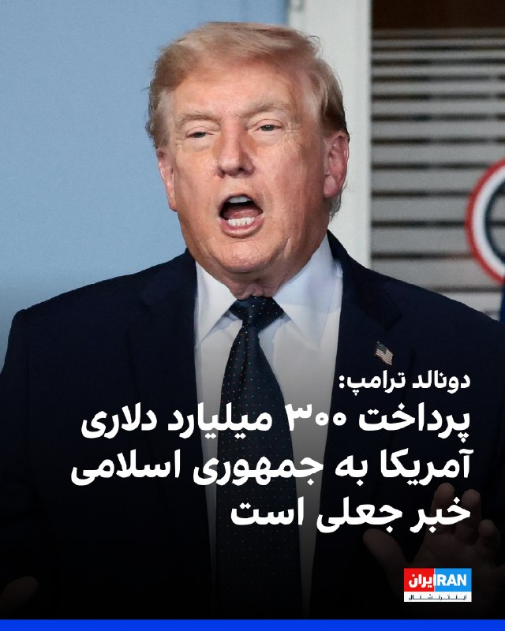

دونالد ترامپ در تروث سوشال نوشت هیچ پرداخت ۳۰۰ میلیارد دلاری از سوی آمریکا به جمهوری اسلامی وجود ندارد. این خبر جعلی است.
او افزود تنها نتیجه این تفاهم‌نامه برای آمریکا موفقیت، کاهش قیمت نفت و پیروزی است. به بازار سهام نگاه کنید؛ این ادعاها تبلیغات دموکرات‌هاست.
‌🏁 🇬🇧 IranintlTV

🤖 @VahidOOnLine

## VahidOOnLine — post 246249

  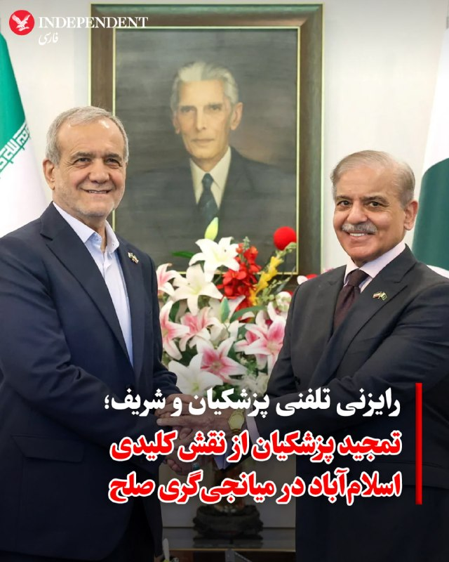

♦️ مسعود پزشکیان، رئیس‌جمهوری اسلامی ایران، و شهباز شریف، نخست‌وزیر پاکستان، روز پنجشنبه ۲۸ خرداد در جریان یک تماس تلفنی، امضای تفاهم‌نامه موقت صلح میان ایران و آمریکا را به یکدیگر تبریک گفتند.

بر اساس بیانیه دفتر نخست‌وزیری پاکستان، شهباز شریف در این گفتگو، امضای این توافق تاریخی را به «رئیس‌جمهور، رهبری و ملت ایران» تبریک گفت و تاکید کرد: «این توافق عطف، نه تنها به بازگشت صلح به منطقه کمک می‌کند، بلکه مسیری طولانی را برای بازسازی ایران و تقویت بیش از پیش روابط تهران و اسلام‌آباد هموار خواهد کرد.»

پزشکیان نیز متقابلا از نخست‌وزیر و فیلد مارشال عاصم منیر، فرمانده ارتش پاکستان، بابت ایفا کردن نقش بسیار حیاتی و کلیدی در هدایت فرآیند میانجی‌گری که منجر به موفقیت این توافق شد، تشکر کرد. رئیس‌جمهوری اسلامی خاطرنشان کرد: «ایران تلاش‌های مثبت و سازنده پاکستان و حمایت‌های این کشور برادر را در این دوران سخت همواره به یاد خواهد داشت.»
‌🇸🇦 Indypersian

🤖 @VahidOOnLine

## WithYashar — post 15266

  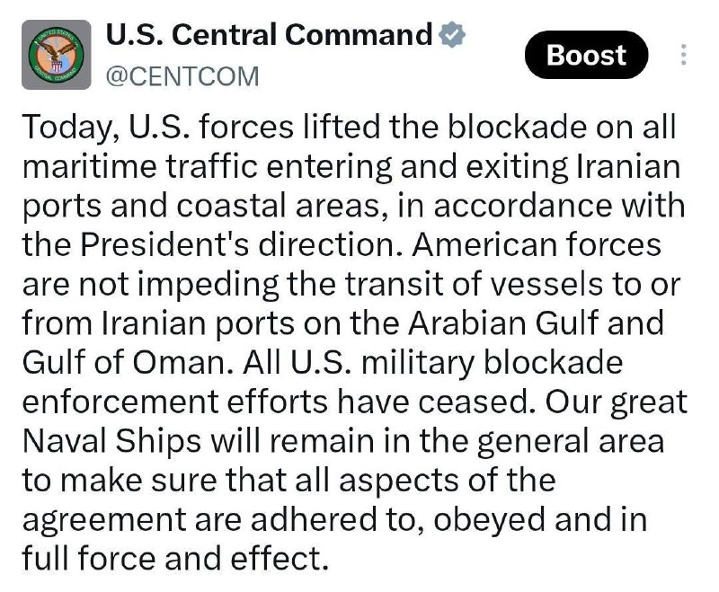

امروز نیروهای ایالات متحده، بنا بر دستور رئیس‌جمهور، محاصره تمامی رفت‌وآمدهای دریایی به بنادر و مناطق ساحلی ایران و از آن‌ها را لغو کردند.
نیروهای آمریکایی دیگر مانع تردد کشتی‌ها به مقصد بنادر ایران یا خروج از آن‌ها در خلیج فارس و دریای عمان نمی‌شوند. تمامی اقدامات نظامی آمریکا برای اجرای این محاصره متوقف شده است.
ناوهای جنگی ما همچنان در منطقه حضور خواهند داشت تا اطمینان حاصل شود که همه مفاد این توافق به‌طور کامل رعایت و اجرا می‌شود و از قدرت و اعتبار کامل برخوردار است.
@withyashar

## pm_afshaa — post 94345

🔴وزیر دفاع اسرائیل، اسرائیل کاتس:اسرائیل در هر لحظه برای عملیات در ایران آماده است - حتی بدون پشتیبانی آمریکا

💧 Rainbet.com the #1 Non-KYC Crypto Casino & Sportsbook @rainbetcom

😁 @Pm_Afshaa

## pm_afshaa — post 94344

  <a href="telegram/content/pm_afshaa_94344_1781802718.webm" target="_blank">🎬 Download video</a>

vless://3d8b5191-7ff5-4fac-ac6e-1d6bedefff4e@sub.ashii.ir:8080?security=none&allowInsecure=0&encryption=none&type=httpupgrade#PMTV NEWS 🦁☀️ سرور سرعت بالا متصل مخصوص دانلود 
💧 Rainbet.com the #1 Non-KYC Crypto Casino & Sportsbook @rainbetcom 
😁 @Pm_Afshaa

## pm_afshaa — post 94343

vless://3d8b5191-7ff5-4fac-ac6e-1d6bedefff4e@sub.ashii.ir:8080?security=none&allowInsecure=0&encryption=none&type=httpupgrade#PMTV NEWS 🦁☀️

سرور سرعت بالا متصل مخصوص دانلود

💧 Rainbet.com the #1 Non-KYC Crypto Casino & Sportsbook @rainbetcom

😁 @Pm_Afshaa

## pm_afshaa — post 94341

https://t.me/proxy?server=103.161.35.23&port=443&secret=3XnnAQIAAQAH8AMDhuJMOt0

💧 Rainbet.com the #1 Non-KYC Crypto Casino & Sportsbook @rainbetcom

😁 @Pm_Afshaa

## pm_afshaa — post 94340

https://t.me/proxy?server=subobdoa.co.uk.&port=443&secret=7vDusL2a3E_UqTmU7jsqIWtjZG4ueWVrdGFuZXQuY29t

پروکسی سرعت بالا متصل

💧 Rainbet.com the #1 Non-KYC Crypto Casino & Sportsbook @rainbetcom

😁 @Pm_Afshaa

## pm_afshaa — post 94339

پروکسی سرعت بالا متصل

https://t.me/proxy?server=167.233.148.123&port=8443&secret=dd79e344818749bd7ac519130220c25d09

💧 Rainbet.com the #1 Non-KYC Crypto Casino & Sportsbook @rainbetcom

😁 @Pm_Afshaa

## VahidOnline — post 76488

  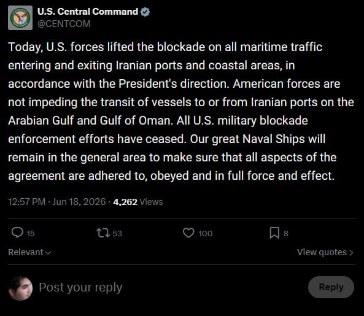

اعلام رسمی رفع محاصره دریایی از سوی فرماندهی مرکزی ایالات متحده

پست سنتکام، ترجمه ماشین:
امروز، نیروهای آمریکا مطابق دستور رئیس‌جمهور، محاصره‌ی همه‌ی رفت‌وآمدهای دریایی به مقصد بنادر و مناطق ساحلی ایران و از مبدأ آن‌ها را رفع کردند.

نیروهای آمریکایی مانع عبور کشتی‌ها به سوی بنادر ایران در خلیج فارس و خلیج عمان، یا خروج از آن‌ها، نمی‌شوند.
همه‌ی تلاش‌های نظامی آمریکا برای اجرای محاصره متوقف شده است.

کشتی‌های بزرگ نیروی دریایی ما در منطقه‌ی کلی باقی خواهند ماند تا اطمینان حاصل شود که همه‌ی جنبه‌های توافق رعایت، اجرا و به‌طور کامل لازم‌الاجرا و مؤثر باقی می‌ماند.
CENTCOM
البته سنتکام ننوشته خلیج «فارس»
📡 @VahidOnline

## kianmeli1 — post 88070

‏🔴سنتکام اعلام کرد، نیروهای آمریکایی محاصره اعمال‌شده بر تمامی ترددهای دریایی ورودی و خروجی به بنادر و مناطق ساحلی ایران را لغو کرده‌اند
https://t.me/kianmeli1

## IranIntlTV — post 343076

  <a href="telegram/content/IranIntlTV_343076_1781802719.mp4" target="_blank">🎬 Download video</a>

پس از ۴۰ روز جنگ و ماه‌ها تنش میان آمریکا و جمهوری اسلامی، توافق میان دو کشور با امضای از راه دور دونالد ترامپ، مسعود پزشکیان و شهباز شریف رسمیت یافت.

مقام‌های جمهوری اسلامی و آمریکا قرار است روز جمعه در سوئیس دیدار کنند.

گزارش احمد صمدی، خبرنگار ایران‌اینترنشنال، از آخرین تحولات و آماده‌سازی محل برگزاری دیدار مقام‌های ایران و آمریکا در بورگن‌اشتوک سوئیس
@iranintltv

## IranIntlTV — post 343075

  <a href="telegram/content/IranIntlTV_343075_1781802721.mp4" target="_blank">🎬 Download video</a>

ویدیوی رسیده به ایران اینترنشنال نشان می‌دهد که گروهی از متقاضیان ویزای پیوست، صبح ۲۸ خرداد جلوی کنسولگری آلمان در تهران تجمع کردند. حاضران در این تجمع به طولانی شدن روند رسیدگی به پرونده‌های ویزا اعتراض داشتند و اعلام کردند که برخی متقاضیان حدود دو سال در انتظار دریافت پاسخ مانده‌اند.

ویزای پیوست آلمان به اعضای خانواده فردی که به‌طور قانونی در آلمان زندگی می‌کند، اجازه می‌دهد به او بپیوندند تا در آن کشور اقامت داشته باشند.

## IranIntlTV — post 343074

  

دونالد ترامپ در تروث سوشال نوشت هیچ پرداخت ۳۰۰ میلیارد دلاری از سوی آمریکا به جمهوری اسلامی وجود ندارد. این خبر جعلی است.
او افزود تنها نتیجه این تفاهم‌نامه برای آمریکا موفقیت، کاهش قیمت نفت و پیروزی است. به بازار سهام نگاه کنید؛ این ادعاها تبلیغات دموکرات‌هاست.
https://iranintl.com/202606180359

## DW_Farsi — post 126153

  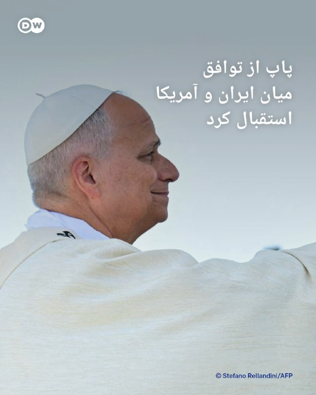

🔶 پاپ از توافق میان ایران و آمریکا استقبال کرد

پاپ لئو چهاردهم، رهبر کاتولیک‌های جهان در پستی در شبکه اجتماعی ایکس از توافق امضاشده میان ایران و آمریکا استقبال کرد.

او این توافق را "نتیجه دلگرم‌کننده تلاش‌های صبورانه در مسیر گفت‌وگو و مذاکره" دانست و از کشورهایی که این کار را ممکن کردند، قدردانی کرد.

پاپ در پایان نوشت: «امیدوارم این توافق بتواند به تقویت اعتماد متقابل، امنیت و ثبات در خاورمیانه کمک کند و مسیرهای گفت‌وگو و همکاری میان ملت‌ها را گسترش دهد.

پاپ لئو چهاردهم که زاده امریکاست پس از آنکه ترامپ تهدید کرد "تمدن ایران را نابود خواهد کرد" این سخنان را محکوم کرد. پاپ این تهدید را "کاملا غیرقابل قبول" خواند و از کاتولیک‌ها خواست تا رهبران سیاسی را به "تلاش برای صلح" ترغیب کنند.

پس از این سخنان پاپ، ترامپ در پستی طولانی در شبکه اجتماعی خود، تروث سوشال، به پاپ حمله کرد و او را "در برابر جرم ضعیف و در سیاست خارجی بسیار بد" توصیف کرد.

ترامپ نوشت: «من پاپی نمی‌خواهم که فکر می‌کند اشکالی ندارد اگر ایران سلاح هسته‌ای داشته باشد.»
@dw_farsi

## RadioFarda — post 158475

🔸کارگروه بازداشت‌های خودسرانه سازمان ملل متحد، بازداشت رضا خندان را ناقض حقوق بین‌الملل دانست و خواستار آزادی فوری او شد. 🔸این کارگروه اعلام کرد آقای خندان، طراح گرافیک و فعال حقوق بشر ۶۰ ساله، از آذر ۱۴۰۳ به دلیل اتهاماتی مرتبط با فعالیت‌های مسالمت‌آمیز…

## RadioFarda — post 158474

  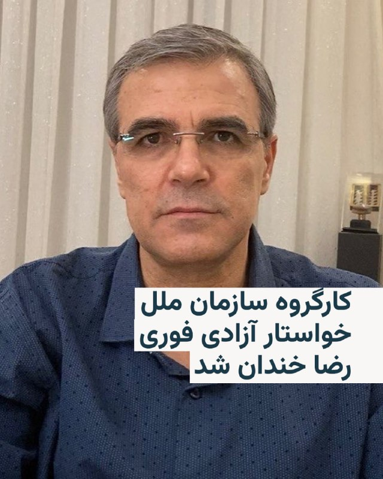

🔸کارگروه بازداشت‌های خودسرانه سازمان ملل متحد، بازداشت رضا خندان را ناقض حقوق بین‌الملل دانست و خواستار آزادی فوری او شد.

🔸این کارگروه اعلام کرد آقای خندان، طراح گرافیک و فعال حقوق بشر ۶۰ ساله، از آذر ۱۴۰۳ به دلیل اتهاماتی مرتبط با فعالیت‌های مسالمت‌آمیز خود در حمایت از حقوق زنان به‌طور خودسرانه بازداشت شده است.

🔸در این بیانیه آمده است که بازداشت رضا خندان فاقد مبنای قانونی بوده و مستقیماً به فعالیت‌های حقوق بشری او ارتباط دارد. کارگروه سازمان ملل همچنین اعلام کرد که او پس از بازداشت از دسترسی به وکیل محروم بوده است.

🔸کارگروه بازداشت‌های خودسرانه سازمان ملل در عین حال ابراز نگرانی کرد که پرونده رضا خندان نشان‌دهنده رویه‌ای گسترده از بازداشت‌های خودسرانه در ایران است.

@RadioFarda

## IranianMinds — post 22885

  <a href="telegram/content/IranianMinds_22885_1781802725.mp4" target="_blank">🎬 Download video</a>

🔴معاون رئیس‌جمهور، جی‌دی‌ونس درباره ایران:

من می‌گویم دوره ۶۰ روزه رسمأ امروز آغاز شده است.
پس بله، توافق دیروز شروع شد، ما امروز ساعت ۶۰ روزه را آغاز
خواهیم نمود.

@IranianMinds

## alonews — post 128969

  <a href="telegram/content/alonews_128969_1781802727.webm" target="_blank">🎬 Download video</a>

👈ونس: تعداد نیرو‌های آمریکا در خاورمیانه را به سطح پیش از درگیری باز می‌گردانیم

🔴 برنامه ما این است که به سوئیس برویم؛ دقیقاً نمی‌دانم چه زمانی

🔴 درباره تأمین مالی صندوق ۳۰۰ میلیارد دلاری، تمایل زیادی در جهان عرب و خارج از آن وجود دارد که درگیر سرمایه‌گذاری در ایران شوند

🔴 در سه ماه گذشته، دو سوم تسلیحاتی که از اسرائیل محافظت کرده‌اند، با پول مردم آمریکا تأمین شده‌اند

✅ @AloNews خبر جنگ

## alonews — post 128968

  <a href="telegram/content/alonews_128968_1781802727.webm" target="_blank">🎬 Download video</a>

👈وزارت خزانه داری آمریکا تحریم های جدیدی را علیه حزب الله اعمال کرد

✅ @AloNews خبر جنگ

## alonews — post 128967

  <a href="telegram/content/alonews_128967_1781802727.webm" target="_blank">🎬 Download video</a>

🔴فوری / سنتکام : امروز، نیروهای آمریکایی بر اساس دستور رئیس‌جمهور، محاصره دریایی تمام ترددهای دریایی ورودی و خروجی به بنادر و مناطق ساحلی ایران را لغو کردند

✅ @AloNews خبر جنگ

## alonews — post 128966

  <a href="telegram/content/alonews_128966_1781802728.webm" target="_blank">🎬 Download video</a>

👈 نرخ دیه سال ۱۴۰۵ اعلام شد!

🔴رئیس قوه قضائیه با صدور بخشنامه‌ای، مبلغ دیه کامل در ماه‌های غیرحرام را برای سال ۱۴۰۵ تعیین کرد.

🔴بر اساس این بخشنامه که در اجرای ماده ۵۴۹ قانون مجازات اسلامی مصوب سال ۱۳۹۲ و پس از انجام بررسی‌های لازم صادر شده است، مبلغ دیه کامل از ابتدای سال ۱۴۰۵ در ماه‌های غیرحرام، ۲۱ میلیارد ریال تعیین شده است.

🔴این بخشنامه از سوی رئیس قوه قضائیه به مراجع قضایی سراسر کشور ابلاغ شده و از ابتدای سال ۱۴۰۵ ملاک محاسبه دیه خواهد بود.

✅ @AloNews خبر جنگ

---
📅 بروزرسانی: 1405/03/28 20:26
---

## VahidOOnLine — post 246248

  

جی‌دی ونس، معاون رییس‌جمهور آمریکا، در یک نشست خبری در کاخ سفید گفت که بازه ۶۰ روزه‌ای که در یک یادداشت تفاهم مورد تایید دونالد ترامپ و رهبران جمهوری اسلامی تعیین شده است، از پنج‌شنبه آغاز می‌شود.
او گفت: «من می‌گویم دوره ۶۰ روزه رسما امروز آغاز شد».
ونس افزود که پس از امضای تفاهم‌نامه و طی شامگاه گذشته تاکنون ۱۲.۵ میلیون بشکه نفت جابه‌جا شده است.
او تاکید کرد: «جمهوری اسلامی در طول شب به هیچ کشتی‌ای حمله نکرده است.»
وقتی از ونس پرسیده شد که پس از پایان دوره ۶۰ روزه، از نظر اداره تنگه هرمز چه اتفاقی خواهد افتاد، ونس بار دیگر دیدگاه آمریکا را تکرار کرد مبنی بر اینکه این مسیر اصلی انتقال نفت و گاز باید از هرگونه عوارض و حق عبور آزاد باشد.

‌🏁 🇬🇧 IranintlTV

🤖 @VahidOOnLine

## VahidOOnLine — post 246247

♦️ جی‌دی ونس، معاون رئیس‌جمهوری آمریکا، در نشست خبری خود در کاخ سفید با اشاره به ساختار سیاسی تهران اعلام کرد که ماه‌های اخیر نشان‌دهنده شکل‌گیری شکاف‌های واقعی در داخل ایران بر سر نحوه پیشبرد امور بوده است.

ونس با ابراز تمایل واشنگتن برای بهبود روابط گفت: «در چند ماه گذشته شاهد بوده‌ایم عملگرایانی که خواهان دگرگونی در رابطه ایران با خاورمیانه و جهان هستند، در بحث‌های درون‌سیستمی پیروز شده‌اند و ایالات متحده نیز مایل به موفقیت این جریان است.»

معاون ترامپ با تاکید مجدد بر مواضع سرسختانه واشنگتن، از رسانه‌ها خواست تا صادقانه گزارش کنند که آمریکا حتی یک سنت به ایران پرداخت نخواهد کرد. او خاطرنشان کرد که تحقق هرگونه گشایش اقتصادی از جمله لغو تحریم‌ها، منحصرا به رفتار و پایبندی عملی تهران به تعهداتش بستگی دارد و در صورت پایبند نبودن، طرف ایرانی از هیچ‌یک از مزایای این تفاهم‌نامه بهره‌مند نخواهد شد.
‌🇸🇦 Indypersian

🤖 @VahidOOnLine

## VahidOOnLine — post 246246

  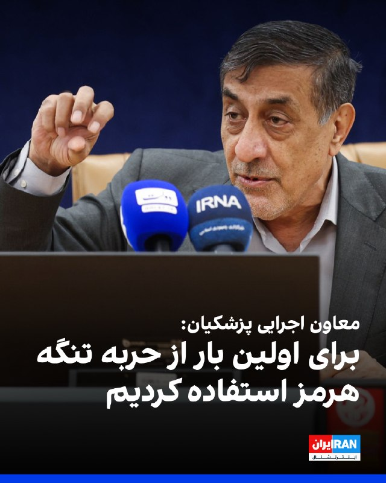

محمدجعفر قائم‌پناه، معاون اجرایی پزشکیان، گفت: جمهوری اسلامی برای اولین بار در طول جنگ ۳۹ روزه از «حربه» تنگه هرمز استفاده کرد و این حربه از دست رفتنی نیست.

او افزود: مسعود پزشکیان نقش اول را در به‌ثمر رسیدن تفاهم‌نامه داشت و قالیباف را به عنوان رییس تیم مذاکره‌کننده تعیین کرد.
‌🏁 🇬🇧 IranintlTV

🤖 @VahidOOnLine

## WithYashar — post 15265

ونس درباره نتانیاهو: من گزارش آکسیوس را دیدم که می‌گوید نتانیاهو عصبانی است.این بازتابی از گفتگوهایی که من با او داشته‌ام نیست. شاید او چیزی به شخص دیگری می‌گوید که به من نمی‌گوید.
@withyashar

## pm_afshaa — post 94338

فارس: پیام بسیار مهم رهبر انقلاب دربارهٔ تفاهم پایان جنگ، خطاب به مردم ایران، تا ساعتی دیگه منتشر میشه

💧 Rainbet.com the #1 Non-KYC Crypto Casino & Sportsbook @rainbetcom

😁 @Pm_Afshaa

## pm_afshaa — post 94337

  <a href="telegram/content/pm_afshaa_94337_1781801812.webm" target="_blank">🎬 Download video</a>

سرور نا محدود 5 کاربر فقط 100 تومن
نداریم این قیمت و کیفیت هیچ جا

همین الان جوین شین این فرصت و از دست ندین
👇
👇
👇

@Lex_Server
@Lex_Server

## VahidOnline — post 76487

  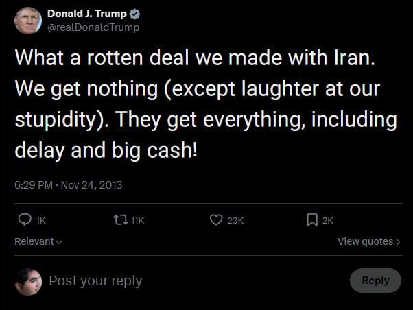

این توییت ۹ سال پیش ترامپ داره توجه می‌گیره: ایران به آخر خط رسیده بود و آماده فروپاشی بود، تا این‌که آمریکا از راه رسید و در قالب «توافق ایران» به آن یک طناب نجات داد: ۱۵۰ میلیارد دلار. realDonaldTrump 📡 @VahidOnline

## VahidOnline — post 76485

  <a href="telegram/content/VahidOnline_76485_1781801813.mp4" target="_blank">🎬 Download video</a>

محمدباقر قالیباف، رئیس مجلس شورای اسلامی در ایران که ریاست هیئت مذاکره‌کننده ایرانی با نمایندگان آمریکا را برعهده داشت، عصر چهارشنبه در مصاحبه‌ای مفصل با تلویزیون حکومتی در ایران به نهایی شدن تفاهمنامه میان تهران و واشنگتن واکنش نشان داد و آن را موفقیتی بسیار بزرگتر از مقابله نظامی با ایالات متحده دانست.

او در مورد دستاوردهای ایران گفت: «هر آنچه را که با اقدام نظامی می‌خواستیم به دست بیاوریم، چندین برابر آن را از طریق مذاکره گرفتیم؛ اصلا قابل قیاس نبود. هر جنگی ممکن است پیروزی‌هایی داشته باشد، اما اگر این پیروزی‌ها در نهایت به یک سند حقوقی و سیاسی منجر و ثبت نشود، هیچ منفعتی نخواهد داشت.»
او در بخشی از صحبت‌های خود درباره انتقام کشته شدن علی خامنه‌ای گفت: «همان‌طور که خونخواهی امام حسین، ظهور امام زمان است، خونخواهی رهبر شهید هم آزادی قدس است... صد نتانیاهو بند کفش امام شهید ما هم نمی‌شود.»
قالیباف در مورد وضعیت تنگه هرمز هم گفت: «تنگه هرمز هرگز به شرایط قبل بازنخواهد گشت. البته این به آن معنا نیست که ما در تنگه هرمز بخواهیم برخلاف قوانین بین‌المللی و مقررات دریانوردی عمل کنیم.»
@VahidHeadline
قالیباف در مصاحبه‌ای که همزمان با انتشار مفاد تفاهم‌نامه تهران و واشنگتن از صداوسیما پخش شد، گفت برای حضور در مذاکرات با دولت دونالد ترامپ تمایلی نداشت و به دلیل نقش ترامپ در کشتن قاسم سلیمانی، «کراهت شدید» برای ورود به این روند احساس می‌کرد. او افزود که با وجود این مخالفت شخصی، به درخواست مقام‌های جمهوری اسلامی مسئولیت مذاکرات را پذیرفت.
@VahidOOnLine

📡 @VahidOnline

## kianmeli1 — post 88069

  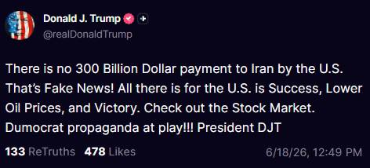

🔴رئیس جمهور ترامپ می‌گوید «هیچ پرداخت ۳۰۰ میلیارد دلاری از سوی آمریکا به ایران وجود ندارد.»

ترامپ می‌گوید: «تمام چیزی که برای آمریکا وجود دارد موفقیت، کاهش قیمت نفت و پیروزی است. به بازار سهام نگاهی بیندازید.»
https://t.me/kianmeli1

## kianmeli1 — post 88068

  <a href="telegram/content/kianmeli1_88068_1781801815.mp4" target="_blank">🎬 Download video</a>

🔴معاون ترامپ: دو سوم سلاح‌های اسرائیل ساخت آمریکاست

طی سه ماه گذشته، دو‌سوم از سلاح‌های دفاعی که از اسرائیل محافظت کرده‌اند، توسط دستان آمریکایی ساخته شده و هزینه‌ی آن از مالیات مردم آمریکا پرداخت شده است.

مشکل اسرائیل ترامپ نیست و هر کسی در اسرائیل که فکر می‌کند بزرگ‌ترین مشکلش رئیس‌جمهور ایالات متحده است، باید از خواب بیدار شود و واقعیتِ موقعیتی که کشورش در آن قرار دارد را درک کند.
https://t.me/kianmeli1

## kianmeli1 — post 88067

🔴فایننشال تایمز : گزارش شده است که ایران به ۶ میلیارد دلار از دارایی‌ های بلوکه‌ شده خود دسترسی خواهد داشت تا کالاهای آمریکایی خریداری کند.
https://t.me/kianmeli1

## IranIntlTV — post 343073

  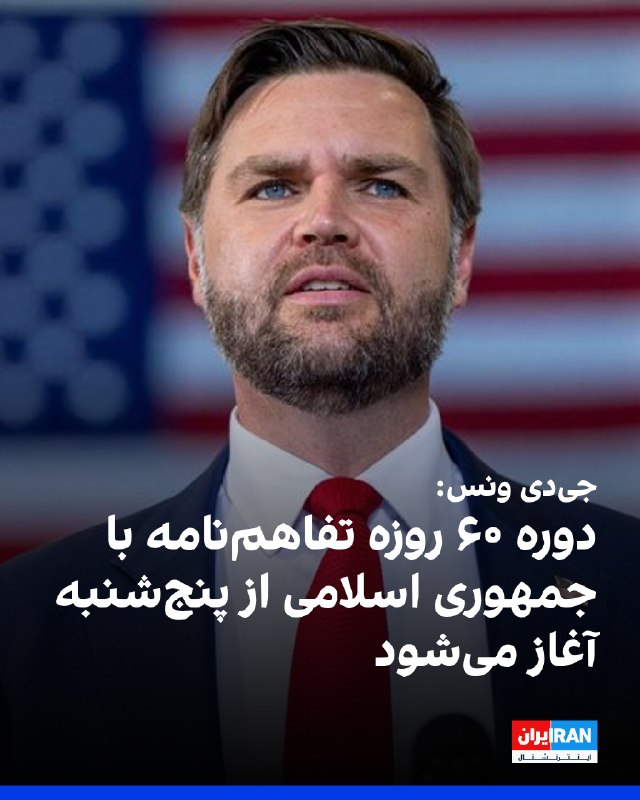

جی‌دی ونس، معاون رییس‌جمهور آمریکا، در یک نشست خبری در کاخ سفید گفت که بازه ۶۰ روزه‌ای که در یک یادداشت تفاهم مورد تایید دونالد ترامپ و رهبران جمهوری اسلامی تعیین شده است، از پنج‌شنبه آغاز می‌شود.
او گفت: «من می‌گویم دوره ۶۰ روزه رسما امروز آغاز شد».
ونس افزود که پس از امضای تفاهم‌نامه و طی شامگاه گذشته تاکنون ۱۲.۵ میلیون بشکه نفت جابه‌جا شده است.
او تاکید کرد: «جمهوری اسلامی در طول شب به هیچ کشتی‌ای حمله نکرده است.»
وقتی از ونس پرسیده شد که پس از پایان دوره ۶۰ روزه، از نظر اداره تنگه هرمز چه اتفاقی خواهد افتاد، ونس بار دیگر دیدگاه آمریکا را تکرار کرد مبنی بر اینکه این مسیر اصلی انتقال نفت و گاز باید از هرگونه عوارض و حق عبور آزاد باشد.

https://iranintl.com/202606181937

## IranIntlTV — post 343072

  

محمدجعفر قائم‌پناه، معاون اجرایی پزشکیان، گفت: جمهوری اسلامی برای اولین بار در طول جنگ ۳۹ روزه از «حربه» تنگه هرمز استفاده کرد و این حربه از دست رفتنی نیست.

او افزود: مسعود پزشکیان نقش اول را در به‌ثمر رسیدن تفاهم‌نامه داشت و قالیباف را به عنوان رییس تیم مذاکره‌کننده تعیین کرد.
https://iranintl.com/202606187808

## FarsiVOA — post 221130

آغاز مذاکرات اجرایی جمهوری اسلامی و آمریکا از فردا در سوئیس؛ تمرکز بر جزئیات تفاهم‌نامه و کاهش تنش

## DW_Farsi — post 126152

  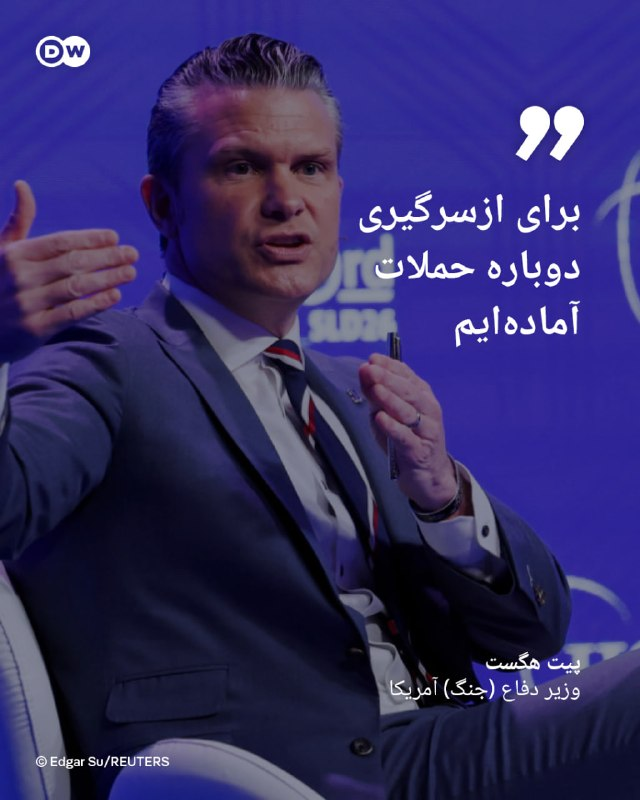

🔶 هگست: برای ازسرگیری دوباره حملات آماده‌ایم

کوتاه زمانی پس از آنکه دونالد ترامپ رییس جمهور آمریکا سند تفاهم میان ایران و ایالات متحده را در کاخ ورسای در فرانسه امضا کرد، پیت هگست وزیر دفاع (جنگ) امریکا گفت ارتش این کشور آماده از سرگیری حملات علیه ایران "در صورت نیاز" است.
هگست که پیش از ترک بروکسل بر روی باند فرودگاه این شهر مقابل خبرنگاران حاضر شده بود، گفت: «هرچند یادداشت تفاهم با هدف پایان دادن به جنگ با ایران تنظیم شده، اما ایالات متحده همچنان آماده است در صورتی که تهران به‌گونه‌ای عمل نکند که پایبندی به تعهداتش در چارچوب توافق را نشان دهد، حملات تازه‌ای را آغاز کند.» 

وزیر جنگ ایالات متحده ادامه داد: «اگر در چارچوب جدول زمانی این مذاکرات ایران به آنچه که گفته عمل نکند، سلاح اتمی را کنار نگذارد، بلندپروازی هسته‌ای را متوقف نکند، مواد هسته‌ای‌اش را خارج نسازد و به توانایی اتمی نزدیک شود، ما برای ازسرگیری حملات آماده خواهیم بود. در این صورت وزارت جنگ اینجاست و آماده است تا اگر لازم باشد همه چیز را دوباره آغاز کند. ما ترجیح می‌دهیم اینطور نشود اما ما آماده‌ایم.»
@dw_farsi

## RadioFarda — post 158473

  <a href="https://t.me/radiofarda/158473" target="_blank">📎 Download file</a>

📻بشنوید: ایستگاه ۱۹ با رادیوفردا، ۲۸ خرداد ۱۴۰۵

@RadioFarda

## RadioFarda — post 158472

🔸جی‌دی ونس، معاون رئیس‌جمهور آمریکا، روز پنجشنبه در نشست با خبرنگاران در کاخ سفید در پاسخ به سوالی درباره صندوق سرمایه‌گذاری ۳۰۰ میلیارد دلاری در ایران که در تفاهم‌نامه با ایالات متحده به آن اشاره شده است، گفت که صحبت درباره سرمایه‌گذاران احتمالی «خیلی زود»…

## RadioFarda — post 158471

  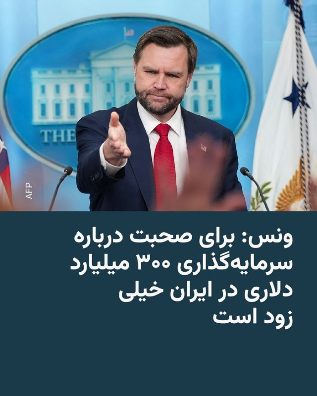

🔸جی‌دی ونس، معاون رئیس‌جمهور آمریکا، روز پنجشنبه در نشست با خبرنگاران در کاخ سفید در پاسخ به سوالی درباره صندوق سرمایه‌گذاری ۳۰۰ میلیارد دلاری در ایران که در تفاهم‌نامه با ایالات متحده به آن اشاره شده است، گفت که صحبت درباره سرمایه‌گذاران احتمالی «خیلی زود» است.

🔸او گفت: «در جهان عرب و حتی خارج از جهان عرب تمایل زیادی وجود دارد که در صورت رفتار مناسب ایران، در این کشور مشارکت و سرمایه‌گذاری کنند. اما باز هم می‌گویم، صحبت درباره این موضوع بسیار زود است، زیرا چنین چیزی مستلزم یک تحول اساسی در رفتار ایران است.»

🔸دولت ترامپ به دلیل احتمال ایجاد این صندوق با انتقادهایی حتی از سوی برخی جمهوری‌خواهان،روبه‌رو شده است. با این حال، ونس و دونالد ترامپ بارها تأکید کرده‌اند که ایالات متحده هیچ پولی به این صندوق پرداخت نخواهد کرد.

🔸ونس روز پنجشنبه گمانه‌زنی کرد که در صورت دستیابی آمریکا به توافقی با ایران و لغو تحریم‌های این کشور، هم سرمایه‌گذاران دولتی و هم سرمایه‌گذاران خصوصی در کشورهایی مانند ‌امارات متحده عربی ممکن است مشتاق همکاری اقتصادی با ایران باشند.

@RadioFarda

## BBCPersian — post 284287

🔻جام جهانی ۲۰۲۶ نه فقط بزرگ‌ترین جام جهانی تاریخ با حضور تیم ملی ایران و برجسته‌ترین ستاره‌ها و تیم‌های فوتبال دنیا که تورنمنتی همراه با حاشیه‌های سیاسی، اتفاقات خبرساز و بحث‌های خارج از زمین است. از ستاره‌های نام‌دار جهان فوتبال و غول‌های سنتی این رشته تا کشورها و بازیکنانی که حتی نامشان را هم نشنیده‌اید؛ جذاب‌ترین ماجراهای جام جهانی، تحلیل کارشناسان، برنامه مسابقات، آخرین نتایج وضعیت تیم‌ها در جدول را لحظه‌به‌لحظه با بی‌بی‌سی فارسی و صفحه ویژه جام جهانی ما دنبال کنید.

https://bbc.in/4gtG9Hi
@BBCPersian

## Dirty_Kids — post 392512

  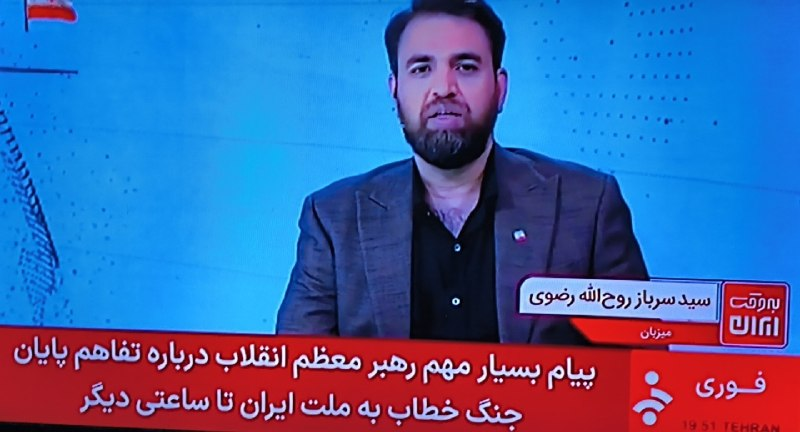

🔴صداوسیما:

تا چند ساعت دیگه، مجتبی خامنه‌ای قراره یه پیام خیلی مهم درباره تفاهم با آمریکا و پایان جنگ برای مردم داشته باشه.:))))))

@Dirty_Kids 👻

## Dirty_Kids — post 392511

  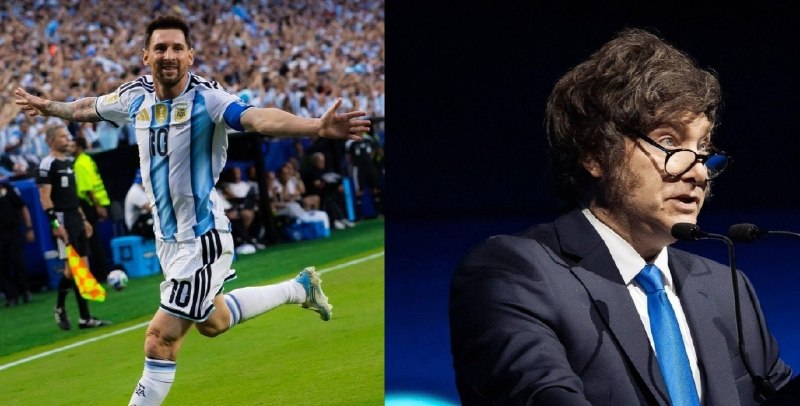

رئیس جمهور آرژانتین خاویر میلی:

تنها چپ مفیدی که وجود دارد، پای چپ مسی است 😁👍

@Dirty_Kids 👻

## Hranews — post 113706

گزارشی از اجرای حکم اعدام ۵ زندانی در زندان همدان

❗️
❗️
❗️
❗️
❗️– حکم پنج زندانی که پیشتر در پرونده‎‌های جداگانه از بابت اتهامات مرتبط با جرائم مواد مخدر و قتل به اعدام محکوم شده بودند، در زندان‌ همدان اجرا شد.

#رامین_باقری #علیرضا_ملکی #فرزاد_بهرامی
#صمد_نادرپور #حسین_شهامت

ادامه مطلب

↘️
@hranews_bot تماس ✉️ - @Hranews کانال هرانا 🆑

## alonews — post 128965

  <a href="telegram/content/alonews_128965_1781801823.webm" target="_blank">🎬 Download video</a>

👈ترامپ: هیچ پرداخت ۳۰۰ میلیارد دلاری از سوی آمریکا به ایران وجود ندارد. این اخبار جعلی است! همه چیزی که آمریکا دارد، موفقیت، کاهش قیمت نفت و پیروزی است. به بازار بورس نگاه کنید. تبلیغات دموکراتیک در حال اجرا است!!!

✅ @AloNews خبر جنگ

## alonews — post 128964

  <a href="telegram/content/alonews_128964_1781801823.webm" target="_blank">🎬 Download video</a>

👈ونس : من تنها کسی در کابینه هستم که نمی‌توانم اخراج شوم

✅ @AloNews خبر جنگ

## alonews — post 128963

  <a href="telegram/content/alonews_128963_1781801823.webm" target="_blank">🎬 Download video</a>

👈جی‌دی ونس درباره ایران:
من معمولاً نسبت به درگیری‌های نظامی بی‌پایان بسیار بدبین هستم.

🔴فکر می‌کنم این مورد متفاوت بود چون واقعاً هدف مشخص و پایان روشنی داشت

✅ @AloNews خبر جنگ

## alonews — post 128962

  <a href="telegram/content/alonews_128962_1781801824.mp4" target="_blank">🎬 Download video</a>

👈جی‌دی ونس درباره ایران: ایرانی‌ها پیشنهاداتی ارائه می‌دهند که حتی شش ماه پیش هم در حد رویا بود. پس بیایید این مذاکره را ادامه دهیم.

🔴ببینیم آیا اقدامات ایرانی‌ها واقعاً با گفته‌هایشان مطابقت دارد و کمی به ایالات متحده آمریکا اعتبار بدهیم، کشوری که به نظر من مدت‌هاست شریک فوق‌العاده‌ای برای دولت اسرائیل بوده است

✅ @AloNews خبر جنگ

## alonews — post 128961

  <a href="telegram/content/alonews_128961_1781801827.webm" target="_blank">🎬 Download video</a>

👈ونس: مقدار دقیق دارایی‌های مسدودشدۀ ایران را نمی‌دانم

🔴اعدادی بیش از ۱۰۰ میلیارد دلار شنیده‌ام. حتی اعدادی بیش از ۲۰۰ میلیارد دلار.

🔴بخش عمدۀ این پول در حساب‌های ایالات متحده نیست؛ بیشتر آن یا در کشورهای حاشیه خلیج فارس است، یا در اروپا، یا در جاهای دیگر.

🔴اما مقدار دقیق این پول را نمی‌دانم؛ فقط می‌دانم که رقم بسیار بزرگی است

✅ @AloNews خبر جنگ

## alonews — post 128960

  <a href="telegram/content/alonews_128960_1781801827.mp4" target="_blank">🎬 Download video</a>

👈ویدیو پربازدید از یک‌ مخالف توافق بعد امضا

✅ @AloNews خبر جنگ

## alonews — post 128959

  <a href="telegram/content/alonews_128959_1781801829.webm" target="_blank">🎬 Download video</a>

👈ونس: امکان تعلیق موقت تحریم‌های ایران بدون مصوبه کنگره وجود دارد

✅ @AloNews خبر جنگ

---
📅 بروزرسانی: 1405/03/28 20:05
---

## VahidOOnLine — post 246245

  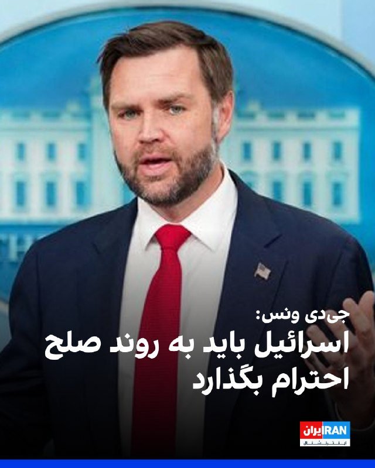

جی‌دی ونس گفت: «تقریبا هر روز با بنیامین نتانیاهو یا برخی اعضای دولت اسرائیل گفت‌وگو می‌کنیم؛ همان‌طور که با کشورهای حوزه خلیج فارس و دیگر شرکای منطقه‌ای خود نیز در تماس هستیم. دونالد ترامپ به‌صراحت گفته است که از اسرائیل فاصله نخواهد گرفت. هیچ‌کس نمی‌تواند حق دفاع از خود را از یک کشور سلب کند و اسرائیل نیز حق دفاع از خود را دارد.»

او افزود: «با این حال، اسرائیل نیز مانند سایر طرف‌ها باید به روند صلح احترام بگذارد؛ روندی که در نهایت به نفع خود اسرائیل و کل منطقه است.»

ونس درباره مخالفان یادداشت تفاهم تهران و واشینگتن در کابینه اسرائیل گفت: «دونالد ترامپ در حال حاضر تنها رهبر جهان است که همدلی عمیقی با ملت اسرائیل دارد و در عین حال رییس‌جمهوری قدرتمندترین کشور جهان است. اگر من عضو کابینه اسرائیل بودم، احتمالا به تنها متحد قدرتمندی که در جهان دارم حمله نمی‌کردم.»
‌🏁 🇬🇧 IranintlTV

🤖 @VahidOOnLine

## VahidOOnLine — post 246244

♦️جی‌دی ونس، معاون رئیس‌جمهوری آمریکا، روز ۲۸ خردادماه در کاخ سفید اعلام کرد طرح صلح با ایران تاکنون «نتایج ملموسی» برای آمریکا به همراه داشته است.
او با اشاره به عبور ۱۲.۵ میلیون بشکه نفت از تنگه هرمز در یک شب، این رقم را بالاترین میزان از زمان آغاز درگیری‌ها دانست و گفت قیمت نفت و بنزین نیز کاهش یافته است.
ونس همچنین تأکید کرد ایران برای دومین شب پیاپی به کشتی‌ها در تنگه هرمز حمله نکرده و این نشان‌دهنده پایبندی اولیه به توافق است. به گفته او، آمریکا نیز با اجازه عبور به بیش از ده کشتی، به تعهدات خود عمل کرده است.
او در عین حال اعلام کرد برنامه هسته‌ای و توان نظامی ایران «به‌طور کامل نابود شده» و افزود ادامه روند توافق به تصمیم تهران برای ورود به مرحله بعدی بستگی دارد.

این درحالی است که پیش از جنگ روزانه به‌طور میانگین حدود ۱۰۰ تا ۱۴۰ کشتی از تنگه هرمز عبور می‌کردند که بیش از نیمی از آن‌ها نفتکش و حامل انرژی بودند.
‌🇸🇦 Indypersian

🤖 @VahidOOnLine

## mwarmonitor — post 11166

تموم شد 😮‍💨

## mwarmonitor — post 11165

خبرنگار: ممنون قربان. جردن کنرادسن از رسانه «گیت‌وی پندیت». می‌خواهم دوباره درباره توافق لبنان صحبت کنم. گزارشی در «اکسیوس» منتشر شده مبنی بر اینکه نتانیاهو از این موضوع بسیار خشمگین است و اسرائیل خود را متعهد به یادداشت تفاهم (MOU) در رابطه با لبنان نمی‌داند. اگر همان‌طور که اشاره کردید، ناامیدی و ناراحتی شما از حملات اسرائیل در بیروت و هدف قرار دادن ساختمان‌های مسکونی ادامه یابد، آیا این مسئله می‌تواند توافق را به نابودی بکشاند؟ و واکنش ایالات متحده به یک جنگ گسترده‌تر در لبنان که شامل... [بقیه بخش‌ها] شود، چه خواهد بود؟
جی‌دی ونس:
سخنران: بله، خب، من نمی‌خواهم وارد فرضیاتی شوم که ممکن است توافق را نابود کند؛ چرا که فکر می‌کنم انتظار رئیس‌جمهور این است که همه دوستان ما، یعنی اسرائیلی‌ها و عرب‌های منطقه، با یکدیگر همکاری کنند تا در واقع این توافق را به سرانجام برسانند.
من گزارش اکسیوس را دیدم که می‌گفت نتانیاهو خشمگین است؛ این ادعا منعکس‌کننده گفتگوهایی که من با او داشته‌ام نیست، اما شاید او به فرد دیگری چیزی می‌گوید که به من نمی‌گوید. چیزی که خواهم گفت، و این موضوع واقعاً مرا آزار می‌دهد، این است که شما افرادی را در کابینه «بی‌بی» (نتانیاهو) دیده‌اید که علناً به این توافق حمله کرده‌اند و به نوعی، به صورت کاملاً شخصی به رئیس‌جمهور ایالات متحده تاخته‌اند. پیام من به آن‌ها دو بخش دارد:
نکته اول: دونالد جی. ترامپ تنها رئیس کشور در کل جهان است که در این برهه از زمان با کشور اسرائیل همدلی و همراهی دارد، و او از قضا رهبر ابرقدرت جهان است. اگر من در کابینه دولت اسرائیل بودم، احتمالاً به تنها متحد قدرتمندی که در کل جهان برایم باقی مانده است، حمله نمی‌کردم.
نکته دوم: پیام دیگری که به برخی از آن اعضای کابینه می‌دهم—البته بی‌بی (نتانیاهو) وجهه خود را حفظ کرده و وارد این مسیر نشده است—اما خطاب به آن دسته از اعضای کابینه در اسرائیل که به رئیس‌جمهور ایالات متحده حمله می‌کنند، باید بگویم که در طول سه ماه گذشته، دو سوم از تسلیحات دفاعی که از خاک و میهن شما محافظت کرده‌اند، توسط دستان آمریکایی ساخته شده و هزینه‌اش از جیب مالیات‌دهندگان آمریکایی پرداخت شده است.
مشکل اسرائیل دونالد جی. ترامپ نیست؛ هر کسی در اسرائیل که فکر می‌کند بزرگ‌ترین مشکل آن‌ها رئیس‌جمهور ایالات متحده است، باید بیدار شود و واقعیتِ موقعیتی را که این کشور در آن قرار دارد، لمس کند. از همه شما ممنونم.

@mwarmonitor

## mwarmonitor — post 11164

  <a href="telegram/content/mwarmonitor_11164_1781800540.mp4" target="_blank">🎬 Download video</a>

🎬 Video

## mwarmonitor — post 11161

خبرنگار: «بسیاری از همکارانی که در سنای ایالات متحده در کنفرانس جمهوری‌خواهان با آن‌ها خدمت کرده‌اید، در ۲۴ ساعت گذشته از این توافق انتقاد کرده‌اند. آقای معاون رئیس‌جمهور، پیام شما در پاسخ به این [انتقادها] چیست؟»
جی‌دی ونس: «خب، گمان می‌کنم به هرکسی، به هر یک از منتقدان، این را بگویم؛ اول از همه: کمی به رئیس‌جمهور ایالات متحده ایمان داشته باشید. این ایده که او قرار است توافقی را رقم بزند که برای مردم آمریکا بد بوده باشد، مضحک است. او کسی است که شجاعت آن را داشته تا در یک سال و نیم گذشته، رابطه ما با ایران و با بسیاری از کشورهای دیگر را به‌طور اساسی متحول کند. او به این توافق باور دارد. او قرار است آن را تا مرحله نهایی پیش ببرد. و اگر ایرانی‌ها پایبند نباشند، ما همچنان تک‌تک ابزارها و اهرم‌های فشاری را که امروز در اختیار داریم، حفظ خواهیم کرد. این پیام اول خواهد بود؛ اینکه با توجه به اینکه رئیس‌جمهور ما را تا اینجا رسانده است، به توانایی او برای برداشتن گام نهایی کمی ایمان داشته باشید.»

@mwarmonitor

## mwarmonitor — post 11160

  <a href="telegram/content/mwarmonitor_11160_1781800542.mp4" target="_blank">🎬 Download video</a>

🎬 Video

## iaghapour — post 2685

  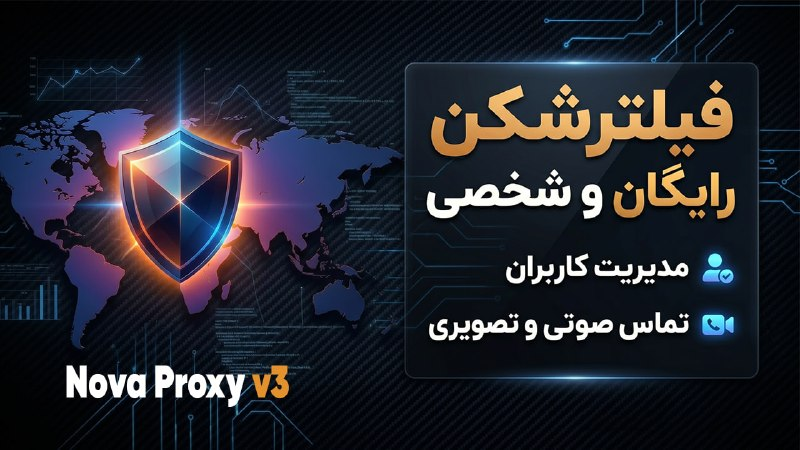

⭕️ ساخت فیلترشکن پرسرعت و رایگان با ورکر کلودفلر (NovaProxy v3)

🔹تو این ویدیو قراره یه روش فوق‌العاده برای ساخت یه فیلترشکن کاملاً رایگان و پرسرعت رو با هم یاد بگیریم. این بار رفتیم سراغ ورکر کلودفلر و قراره از اسکریپت قدرتمند NovaProxy v3 استفاده کنیم. تو این ورژن حل مشکل تماس صوتی و تصویری رو هم آموزش دادیم.

🔗 تماشا ویدیو در یوتیوب

#آموزش #فیلترشکن #ورکر #novaproxy #worker #کلودفلر #vpn
برای دور زدن فیلترینگ و آموزش تکنولوژی و هوش مصنوعی ما رو دنبال کنید 💚
🆔 @iaghapour

## IranIntlTV — post 343071

  

جی‌دی ونس گفت: «تقریبا هر روز با بنیامین نتانیاهو یا برخی اعضای دولت اسرائیل گفت‌وگو می‌کنیم؛ همان‌طور که با کشورهای حوزه خلیج فارس و دیگر شرکای منطقه‌ای خود نیز در تماس هستیم. دونالد ترامپ به‌صراحت گفته است که از اسرائیل فاصله نخواهد گرفت. هیچ‌کس نمی‌تواند حق دفاع از خود را از یک کشور سلب کند و اسرائیل نیز حق دفاع از خود را دارد.»

او افزود: «با این حال، اسرائیل نیز مانند سایر طرف‌ها باید به روند صلح احترام بگذارد؛ روندی که در نهایت به نفع خود اسرائیل و کل منطقه است.»

ونس درباره مخالفان یادداشت تفاهم تهران و واشینگتن در کابینه اسرائیل گفت: «دونالد ترامپ در حال حاضر تنها رهبر جهان است که همدلی عمیقی با ملت اسرائیل دارد و در عین حال رییس‌جمهوری قدرتمندترین کشور جهان است. اگر من عضو کابینه اسرائیل بودم، احتمالا به تنها متحد قدرتمندی که در جهان دارم حمله نمی‌کردم.»
https://iranintl.com/202606185939

## FarsiVOA — post 221129

کامبک با اجرای آرش آرا و ونوس مرادی تا پایان جام جهانی هر شب ساعت ۲۳ به وقت ایران

## FarsiVOA — post 221128

جی‌دی ونس، معاون رئیس‌ جمهوری آمریکا در یک کنفرانس خبری گفت که دوره ۶۰ روزه درنظر گرفته شده در تفاهم‌نامه با ایران از امروز آغاز می‌شود. او افزود تا زمانی که رفتار حکومت ایران عوض نشود، پولی به دستشان نمی‌رسد. برشی از پوشش ویژه با ترجمه همزمان پژواک کیومرثی

## alonews — post 128958

  <a href="telegram/content/alonews_128958_1781800545.webm" target="_blank">🎬 Download video</a>

👈ونس درباره نتانیاهو: من گزارش Axios را دیدم که می‌گوید نتانیاهو عصبانی است.این بازتابی از گفتگوهایی که من با او داشته‌ام نیست. شاید او چیزی به شخص دیگری می‌گوید که به من نمی‌گوید.

✅ @AloNews خبر جنگ

## alonews — post 128957

  <a href="telegram/content/alonews_128957_1781800546.webm" target="_blank">🎬 Download video</a>

👈اننقاد تند جی. دی. ونس به بن‌گویر و اسموتریچ: شما افرادی را در ساختار سیاسی اسرائیل دیده‌اید، بن‌گویر و اسموتریچ، که به این توافق حمله کرده‌اند.

🔴و فکر می‌کنم پاسخ من به آن‌ها این خواهد بود: پیشنهاد دقیق شما چیست؟

🔴شما کشوری با ۹ میلیون نفر جمعیت هستید. نمی‌توانید صرفاً با کشتن، از پسِ حل تک‌تک مشکلات امنیت ملی‌تان برآیید

✅ @AloNews خبر جنگ

## alonews — post 128956

  <a href="telegram/content/alonews_128956_1781800546.webm" target="_blank">🎬 Download video</a>

👈فارس: پیام بسیار مهم رهبر انقلاب دربارهٔ تفاهم پایان جنگ، خطاب به مردم ایران، تا ساعتی دیگه منتشر میشه

✅ @AloNews خبر جنگ

---
📅 بروزرسانی: 1405/03/28 19:56
---

## mwarmonitor — post 11159

خبرنگار ؛
«خیلی ممنون، آقای معاون رئیس‌جمهور. فقط دو سوال از شما دارم. برای پیگیری سوال قبلی، وزیر روبیو در ماه مارس گفت که هدف این جنگ، نقل‌قول می‌کنم، "از بین بردن تهدید موشک‌های بالستیک کوتاه‌برد ایران" بود. شما همین چند لحظه پیش گفتید که برنامه نظامی [آن‌ها] نابود شده است. ارزیابی‌های اطلاعاتی ایالات متحده نشان می‌دهد که ایران هنوز تقریباً ۷۰ درصد از ذخایر موشک‌های بالستیک و کروز پیش از جنگ خود را در اختیار دارد. پس دولت چه زمانی تصمیم گرفت آن بخش از مأموریت اولیه را رها کند؟ و دوم اینکه، برای آینده، آیا شما تیم ایالات متحده را در روند مذاکرات رهبری خواهید کرد؟ میزان مشارکت شما چقدر خواهد بود؟»
جی دی ونس:
«بله، من قطعاً برنامه‌ریزی کرده‌ام که رهبری تیم مذاکره‌کننده ایالات متحده را بر عهده داشته باشم. اما در مورد سوال اول، می‌دانید، شما درباره یک گزارش اطلاعاتی صحبت کردید که به طور ناشناس به یک خبرنگار درز کرده، فاقد زمینه و سیاق لازم بوده و صراحتاً دقیق نیست. آنچه در مورد برنامه موشک‌های بالستیک ایران تغییر کرده این است که تعداد موشک‌هایی که آن‌ها دارند یا تعداد گلوله‌ها، اهمیت بسیار کمتری دارد. آنچه بسیار بیشتر اهمیت دارد، تعداد پرتابگرهایی (لانچرهایی) است که در اختیار دارند و از آن مهم‌تر، تیم‌های روی زمینی هستند که ظرفیت پرتاب آن موشک‌ها را دارند. توانایی آن‌ها برای پرتاب موشک به طور قابل‌توجهی تضعیف شده است. آیا این توانایی به صفر رسیده؟ خیر. اما به طور چشمگیری کاهش یافته است و از این نظر، ما مأموریت را رها نکرده‌ایم، بلکه آن بخش خاص از مأموریت را به سرانجام رسانده‌ایم.»
«اگر به متحدان عرب خلیج [فارس] و طبعاً اسرائیلی‌ها نگاه کنید که با چالش‌های زیادی مواجه شدند و این دو در کنار هم بار اصلی این حملات موشکی را تحمل کردند، هر یک از آن‌ها امروز در برابر تهدید موشکی ایران احساس امنیت بسیار بیشتری نسبت به گذشته دارند. بدیهی است که این چیزی است که ما مایل به ادامه آن هستیم. تمام آنچه رئیس‌جمهور دیروز گفت این بود که شما نمی‌توانید از هیچ کشوری انتظار داشته باشید که حق دفاع از خود را نادیده بگیرد. شما باید توازن و برابری داشته باشید و این همان چیزی بود که رئیس‌جمهور ایالات متحده درباره آن صحبت می‌کرد.»

@mwarmonitor

## mwarmonitor — post 11158

  <a href="telegram/content/mwarmonitor_11158_1781800013.mp4" target="_blank">🎬 Download video</a>

🎬 Video

## mwarmonitor — post 11157

خبرنگار:
«شما همچنان می‌گویید که ایران تنها در صورتی از پاداش‌های اقتصادی بهره‌مند خواهد شد که تعهدات خود را رعایت کند و رفتار خود را تغییر دهد. اما بر اساس این توافق، اکنون به آن‌ها اجازه داده می‌شود که نفت خود را دوباره به صورت آزاد بفروشند؛ چطور این یک منفعت مالی محسوب نمی‌شود؟ در حالی که به آن‌ها اجازه داده می‌شود بدون انجام هیچ‌گونه تعهد هسته‌ای ملموس جدیدی این کار را انجام دهند. پس می‌توانید توضیح دهید که چطور این توافق یک‌جانبه نیست؟»
جی‌دی ونس:
«خب، اول از همه، آن‌ها تعهدات هسته‌ای بسیار ملموسی داده‌اند؛ آن‌ها متعهد به نابودی ذخایر اورانیوم با غنای بالای خود شده‌اند که در اختیار دارند.
و دوم اینکه، تمام کاری که ما انجام داده‌ایم این است که محاصره را در تنگه هرمز لغو کرده‌ایم. ما اساساً وضعیت را به همان شکلی که قبل از درگیری بود، بازگردانده‌ایم. محاصره برداشته شده است؛ محاصره‌ای که ما پس از شروع درگیری اعمال کرده بودیم. اکنون تنگه‌ها باز هستند. این یک منفعت جدید برای ایرانی‌ها نیست، آن‌ها سال‌های سال، خیلی قبل از اینکه ما محاصره را اعمال کنیم، در حال فروش نفت بودند. ما آن محاصره را اعمال کردیم، آن‌ها فروش نفت را متوقف کردند و اکنون ما محاصره را برداشته‌ایم تا جریان آزاد انرژی در سراسر جهان را ارتقا دهیم.

@mwarmonitor

## mwarmonitor — post 11156

  <a href="telegram/content/mwarmonitor_11156_1781800016.mp4" target="_blank">🎬 Download video</a>

🎬 Video

## mwarmonitor — post 11155

خب، اول از همه، دو تفاوت بزرگ حتی در خودِ ماهیت توافق نیست، بلکه چیزی است که قبلاً گفتم.
شماره یک: ائتلاف ساحلی خلیج [فارس] عاشق این توافق است چون فکر می‌کنند ایران را ضعیف‌تر می‌کند. آن‌ها از توافق اوباما متنفر بودند چون فکر می‌کردند ایران را قوی‌تر می‌کند. آن‌ها اطلاعات بیشتری در این باره دارند و بیشتر از هر کسی، از جمله ایالات متحده آمریکا، چیزهای بیشتری برای از دست دادن دارند؛ بنابراین من به قضاوت آن‌ها اعتماد دارم.
نکته دوم این است که این توافق از کجا شکل گرفته است. باید به یاد داشته باشید که در سال ۲۰۱۵، ایران یک برنامه تسلیحات هسته‌ای پیشرفته با ذخایری از مواد هسته‌ای ایجاد کرده بود. بنابراین دیدگاهی که ما به عنوان ایالات متحده به آن نگاه می‌کردیم این بود: "شما در حال حاضر یک برنامه هسته‌ای بسیار خوب دارید، ما با پول آمریکایی به شما باج می‌دهیم تا جلوی آن را بگیریم."
دیدگاه ما و جایی که ما اکنون از آن به موضوع نگاه می‌کنیم این است: "ما پیش از این برنامه هسته‌ای شما را نابود کرده‌ایم." و بنابراین، اگر شما قول بدهید و مسیرهای قابل راستی‌آزمایی را نشان دهید که آن را دوباره بازسازی نکنید، آنگاه ما حاضریم به شما مقداری کاهش تحریم‌ها و چیزهایی از این دست بدهید. پس این یک دیدگاه اساساً متفاوت است.
البته تفاوت‌های ماهوی دیگری نیز وجود دارد. توافق هسته‌ای اوباما اجازه غنی‌سازی می‌داد، توافق ما نخواهد داد. توافق اوباما اجازه انباشت مواد ذخیره‌شده با عیار تسلیحاتی را می‌داد، توافق ما در واقع منجر به نابودی آن ذخایر از مواد غنی‌شده می‌شود. بنابراین تفاوت‌های زیادی وجود دارد. توافق اوباما بیش از یک میلیارد دلار از پول آمریکا را به آن‌ها داد، این توافق صفر دلار از پول آمریکا را به آن‌ها می‌دهد.
بنابراین تفاوت‌های ماهوی زیادی وجود دارد، اما فکر می‌کنم مهم‌ترین تفاوت‌ها این است که ما از چه موضعی به آن نگاه می‌کنیم — از موضع قدرت — و این واقعیت که شرکای ساحلی خلیج [فارس] ما عاشق این توافق هستند.

@mwarmonitor

## mwarmonitor — post 11154

  <a href="telegram/content/mwarmonitor_11154_1781800018.mp4" target="_blank">🎬 Download video</a>

🎬 Video

## mwarmonitor — post 11153

خبرنگار: بسیار خب، عالی است. آیا ممکن است تفاوت‌های اصلی میان این توافق و توافق رئیس‌جمهور اوباما در سال ۲۰۱۵ را برجسته کنید و بگویید چرا این دولت معتقد است که این توافق برتر است؟ و دوم اینکه، آقای معاون رئیس‌جمهور، پرزیدنت ترامپ اخیراً به طور صریح مخالفت خود را با حملات بی‌بی نتانیاهو به لبنان اعلام کرده است. آیا این دولت مستقیماً با بی‌بی نتانیاهو در مورد نگرانی‌های اخیر رئیس‌جمهور صحبت کرده است؟ و بازخورد اسرائیل چه بوده است؟
جی‌دی ونس: بله، ما تقریباً هر روز، دست‌کم در سطوح عالی دولتی خود، با بی‌بی یا فردی در دولت اسرائیل صحبت می‌کنیم؛ همانطور که با ائتلاف کشورهای حاشیه خلیج [فارس] و شرکای منطقه‌ای خود گفتگو داریم. ببینید، رئیس‌جمهور بسیار شفاف بوده است. او حق دفاع از خود را از اسرائیل سلب نمی‌کند؛ هیچ‌کس نمی‌تواند حق دفاع از خود را از کشور دیگری سلب کند. اسرائیل حق دارد از خود دفاع کند. اما اساساً، اسرائیلی‌ها نیز مانند هر کس دیگری باید به این فرآیند صلح احترام بگذارند؛ فرآیندی که در اصل برای آن‌ها و برای کل منطقه مفید است.
اما رئیس‌جمهور گاهی ناامید می‌شود؛ زیرا به نظر می‌رسد ما دقیقاً در آستانه یک گشایش بزرگ در توافق هستیم و ناگهان یک انفجار بزرگ در یک مرکز جمعیتی غیرنظامی در بیروت رخ می‌دهد و افراد زیادی که هیچ ارتباطی با حزب‌الله ندارند، جان خود را از دست می‌دهند. این قابل قبول نیست. این همان مسئله‌ای است که برای آن خواستار هماهنگی نزدیک‌تر شده‌ایم تا اطمینان حاصل کنیم که دیگر تکرار نخواهد شد.
پیام ما به اسرائیلی‌ها، همانند پیام ما به دیگران، اساساً این است که ما می‌خواهیم این فرآیند صلح برای شما مفید باشد. ما نمی‌خواهیم حزب‌الله به اسرائیل حمله کند، اما برای اطمینان از تحقق این امر، باید چارچوبی منطقه‌ای ایجاد کنیم که بتواند منابع مالی حزب‌الله و حمایت‌های ایران از آن را قطع کند، و همچنین تضمین کند که حاکمیت ارضی لبنان از سوی همه طرف‌ها محترم شمرده می‌شود.

@mwarmonitor

## mwarmonitor — post 11152

  <a href="telegram/content/mwarmonitor_11152_1781800020.mp4" target="_blank">🎬 Download video</a>

🎬 Video

## mwarmonitor — post 11151

خبرنگار:
آقای معاون رئیس‌جمهور، پرزیدنت ترامپ دیروز گفت که اگر مذاکرات با ایران به بیراهه بره (شکست بخوره)، شما رو مقصر می‌دونه. آیا نگران این نیستید که او بخواد شما رو «سپر بلا» کنه؟
جی. دی. ونس:
نه، اصلاً. فکر می‌کنم رئیس‌جمهور داشت شوخی می‌کرد... مثل همیشه که این کار رو می‌کنه. اما نه، ببینید، کل تیم روی این موضوع خیلی خوب کار کرده و ما این قضیه رو به جایگاه بسیار خوبی برای مردم آمریکا رسوندیم.
البته من یک‌سری انتقادات رو از طرف ترقی‌خواه‌ها (پیشروها) دیدم که شخص من رو هدف گرفته بودند و می‌گفتند: «معاون رئیس‌جمهور ایالات متحده چه تجربه‌ای در مذاکرات خصمانه و پرمخاطره داره؟» و من اون منتقدان ترقی‌خواه رو ارجاع می‌دم به این واقعیت که همین دو روز پیش، بیش از یک ساعت رو در برنامه تلویزیونی The View گذروندم!
بنابراین، من در واقع تجربه فوق‌العاده‌ای در مذاکرات بسیار خصمانه دارم و از اون استفاده کردم. ببینید، «جوی بهار» (مجری برنامه دِ ویو) خیلی سرسخت‌تر از ایرانی‌هاست و الان من و او بهترین دوست‌های هم هستیم! پس ما قرار هست به جای خوبی برسیم. ما به جای خوبی خواهیم رسید.
همین الان هم در جایگاه خوبی قرار داریم؛ مسئله فقط اینه که آیا می‌تونیم کار رو کاملاً بی‌نقص کنیم (سنگ تمام بذاریم) و رابطه ایران با جهان رو به طور بنیادین متحول کنیم یا خیر.

@mwarmonitor

## FoxNewsTwitter — post 343135

  <a href="telegram/content/FoxNewsTwitter_343135_1781800023.mp4" target="_blank">🎬 Download video</a>

Fox News (Twitter/X)

NEW: Vice President JD Vance pushes back against critics, including Republican lawmakers, bashing the administration's new Iran deal, telling them to "have a little bit of faith."

"The idea that [President Trump] is going to strike a deal that's been bad for the American people, it's preposterous.”

“He is the person who has had the courage to fundamentally transform our relationship with Iran... And if the Iranians don't comply, we still have every single tool and point of leverage that we have today."

## DEJradio — post 5797

  <a href="telegram/content/DEJradio_5797_1781800024.mp4" target="_blank">🎬 Download video</a>

🔺🎤 ریشه‌های مشترک در نت‌ها؛ داستان پیوند موسیقی ایران و اسرائیل

گفت‌وگو با نوفر باتات، هنرمند اسرائیلی

#ایران #اسرائیل #موسیقی
@DEJradio

## IranIntlTV — post 343070

  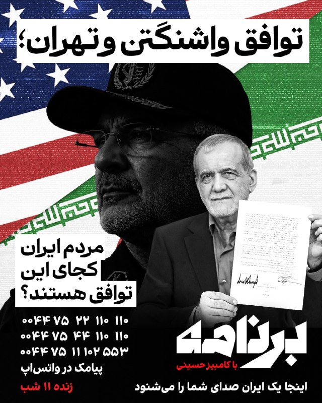

واشنگتن و تهران به توافق رسیده‌اند؛ اما جای مردم ایران در این میان کجاست؟ آیا این توافق را به نفع مردم می‌دانید؟ آیا فکر می‌کنید زندگی مردم ایران با این توافق بهتر خواهد شد؟
«برنامه» صدای شماست.
ما شما را، بدون نوبت، مستقیم از ایران روی خط می‌آوریم.
بیایید و روایت خود را برای همیشه ثبت کنید.
تاریخ با صدای شما نوشته می‌شود.
برای شرکت در «برنامه»، همین حالا در واتس‌اپ پیام بدهید:
۰۰۴۴۷۵۲۲۱۱۰۱۱۰
۰۰۴۴۷۵۴۴۱۱۰۱۱۰
۰۰۴۴۷۵۱۱۱۰۲۵۵۳
«برنامه با کامبیز حسینی»
«یک ایران صدای شما را می‌شنود»

## BBCPersian — post 284286

🔻محمدباقر قالیباف، رئیس مجلس ایران که ریاست هیئت مذاکره‌کننده ایرانی با نمایندگان آمریکا را برعهده داشت، عصر چهارشنبه در مصاحبه‌ای مفصل با تلویزیون دولتی ایران به نهایی شدن تفاهمنامه میان تهران و واشنگتن واکنش نشان داد و آن را موفقیتی بسیار بزرگتر از مقابله نظامی با ایالات متحده دانست.

او در مورد دستاوردهای ایران گفت: «هر آنچه را که با اقدام نظامی می‌خواستیم به دست بیاوریم، چندین برابر آن را از طریق مذاکره گرفتیم؛ اصلا قابل قیاس نبود. هر جنگی ممکن است پیروزی‌هایی داشته باشد، اما اگر این پیروزی‌ها در نهایت به یک سند حقوقی و سیاسی منجر و ثبت نشود، هیچ منفعتی نخواهد داشت.»

او در بخشی از صحبت‌های خود درباره انتقام کشته شدن علی خامنه‌ای گفت: «همان‌طور که خونخواهی امام حسین، ظهور امام زمان است، خونخواهی رهبر شهید هم آزادی قدس است... صد نتانیاهو بند کفش امام شهید ما هم نمی‌شود.»

آقای قالیباف در مورد وضعیت تنگه هرمز هم گفت: «تنگه هرمز هرگز به شرایط قبل بازنخواهد گشت. البته این به آن معنا نیست که ما در تنگه هرمز بخواهیم برخلاف قوانین بین‌المللی و مقررات دریانوردی عمل کنیم.»

@BBCPersian

## BBCPersian — post 284285

  <a href="telegram/content/BBCPersian_284285_1781800028.mp4" target="_blank">🎬 Download video</a>

🔻از شما خواسته‌ بودیم نظرتان درباره حضور تیم ملی فوتبال ایران در جام‌جهانی ۲۰۲۶ را با ما درمیان بگذارید.
تیم ملی فوتبال ایران در شرایط جنگی و بحران روابط ایران و آمریکا، برای تمرین و اردو و بازی تدارکاتی و ویزا با مشکلاتی مواجه بود، فقط یک روز قبل از مسابقه به لس‌آنجلس رسید و مجبور شد در مدت کوتاهی بعد از بازی، خاک آمریکا را ترک کند. از سوی دیگر، پست‌هایی در شبکه‌های اجتماعی منتشر شده که حاکی از تقابل میان ایرانیانی است که برای تماشای بازی ایران و نیوزیلند به ورزشگاه «سوفا» در لس‌آنجلس رفته بودند.
نظرات تعدادی از مخاطبان درباره حضور ایران در جام جهانی ۲۰۲۶، حواشی آن و اینکه چه تعبیر سیاسی می‌تواند داشته باشد را بشنوید.

📸 Getty Images
@BBCPersian

## alonews — post 128955

  <a href="telegram/content/alonews_128955_1781800030.mp4" target="_blank">🎬 Download video</a>

👈انتقاد ونس به اسرائیل

🔴ونس : در سه ماه گذشته، دو سوم از جنگ‌افزارهای دفاعی که از اسرائیل محافظت کرده، با دستان آمریکایی ساخته شده و با دلارهای مالیات‌دهندگان آمریکایی پرداخت شده است.مشکل اسرائیل دونالد جی. ترامپ نیست، و هر کسی در اسرائیل که فکر می‌کند بزرگترین مشکلشان رئیس‌جمهور ایالات متحده است، باید بیدار شود و واقعیت وضعیتی را که آن کشور در آن قرار دارد، حس کند.

✅ @AloNews خبر جنگ

## alonews — post 128954

  <a href="telegram/content/alonews_128954_1781800032.mp4" target="_blank">🎬 Download video</a>

👈خبرنگار: چه کسی آن صندوق 300 میلیارد دلاری برای ایران را تأمین مالی می‌کند؟

🔴جی‌دی ونس: تمایل زیادی از سوی جهان عرب و فراتر از جهان عرب وجود دارد که اگر ایران به‌درستی رفتار کند، واقعاً در آن کشور مشارکت کنند.

✅ @AloNews خبر جنگ

---
📅 بروزرسانی: 1405/03/28 19:46
---

## VahidOOnLine — post 246243

  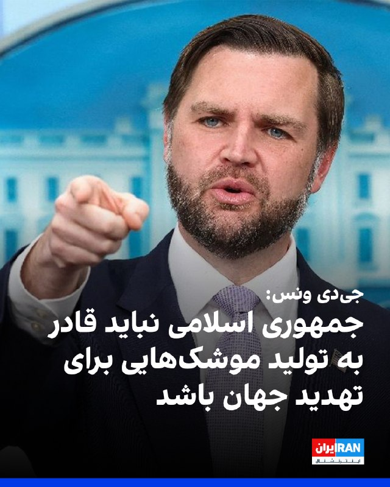

جی‌دی ونس، معاون ترامپ، گفت: «ما شمار قابل‌توجهی از موشک‌های بالستیک جمهوری اسلامی و همچنین پرتابگرهای آنها را نابود کرده‌ایم. موضوع فقط موشک‌ها نیست، بلکه خود سامانه‌های پرتاب نیز هست و در سه ماه پایانی این کارزار، در هدف قرار دادن آنها بسیار موثر بودیم.»

او افزود: «آنچه دونالد ترامپ چهارشنبه گفت این بود که هیچ کشوری از حق دفاع از خود صرف‌نظر نمی‌کند. اسرائیل در صورت حمله موشکی یا پهپادی حزب‌الله حق دفاع از خود را دارد و جمهوری اسلامی نیز از این حق برخوردار است.»

ونس ادامه داد: «با این حال، انتظار داریم در توافق نهایی، جمهوری اسلامی دیگر قادر به تولید موشک‌هایی نباشد که بتوانند در مقیاس گسترده جهان را تهدید کنند.»

او همچنین گفت: «در توافق نهایی می‌خواهیم شاهد پایان حمایت مالی تهران از بی‌ثباتی و تروریسم منطقه‌ای باشیم و اطمینان حاصل کنیم که آن‌ها برنامه تسلیحات هسته‌ای خود را بازسازی نمی‌کنند. برنامه تسلیحات هسته‌ای نابود شده و دیگر وجود ندارد.»

ونس افزود: «اگر جمهوری اسلامی فردا تصمیم به ساخت سلاح هسته‌ای بگیرد، توانایی انجام آن را ندارد.»
‌🏁 🇬🇧 IranintlTV

🤖 @VahidOOnLine

## VahidOOnLine — post 246242

  <a href="telegram/content/VahidOOnLine_246242_1781799387.mp4" target="_blank">🎬 Download video</a>

‌
ترامپ در پاسخ به پرسشی درباره حمله به مدرسه میناب در روز نخست جنگ که به کشته شدن بیش از ۱۰۰ کودک منجر شد، گفت این موضوع در دست بررسی است و «هیچ‌کس عمداً چنین کاری نکرده است.»

او با تأکید بر این‌که «در جنگ اشتباه رخ می‌دهد» و «جنگ کثیف است»، در ادامه به کشته‌شدگان حملات ایران اشاره کرد و گفت گزارش این پرونده می‌تواند به‌زودی منتشر شود. ترامپ همچنین خبرنگاران را برای جزئیات بیشتر به پیت هگست، وزیر جنگ آمریکا، ارجاع داد.
‌🏁 🇬🇧 ManotoTV

🤖 @VahidOOnLine

## VahidOOnLine — post 246241

  <a href="telegram/content/VahidOOnLine_246241_1781799389.mp4" target="_blank">🎬 Download video</a>

ترامپ در پاسخ به پرسشی درباره باقی ماندن بخشی از توان موشکی جمهوری اسلامی گفت آمریکا «۸۴ تا ۸۵ درصد» موشک‌های ایران را منهدم کرده و آنچه باقی مانده، عمدتاً زیر زمین است و بیرون آوردنش برای ایران آسان نخواهد بود.

او همچنین گفت بازسازی توان موشکی ایران زمان‌بر خواهد بود و تأکید کرد هدفش کشاندن جنگ به مرحله‌ای نبود که مردم ایران با بحران انسانی روبه‌رو شوند یا حمله به زیرساخت‌های نفتی و آب‌شیرین‌کن‌ها بازار جهانی را دچار بحران کند.

ترامپ در بخش دیگری از سخنانش، درباره برنامه هسته‌ای غیرنظامی جمهوری اسلامی گفت ایران از بزرگ‌ترین ذخایر نفت جهان برخوردار است و پرسید: «اصلاً برای چه به انرژی هسته‌ای نیاز دارد؟»
‌🏁 🇬🇧 ManotoTV

🤖 @VahidOOnLine

## WithYashar — post 15264

  <a href="telegram/content/WithYashar_15264_1781799391.mp4" target="_blank">🎬 Download video</a>

جی.دی. ونس در مورد لغو تحریم‌ها:
«راستش را بخواهید، ما این را یک امتیاز بزرگ به ایرانی‌ها ندیدیم — ایران هم... این را به‌عنوان یک امتیاز برای خودشان تلقی نکرد، چون چیزی که مانع فروش نفت آنها می‌شد، تحریم‌ها نبود.
آنها بدون هیچ تخفیفی نفت زیادی می‌فروختند، چون تحریم‌ها اساساً ناکارآمد بودند.
در آن مرحله، کاری که تحریم‌ها کردند این بود که سیستم مالی ایران را به نوعی به سمت سیستم بانکی سایه‌ای (غیررسمی) سوق دادند.
با لغو تحریم‌ها، در واقع خواهیم توانست کمی ببینیم که سیستم مالی آنها پول را به کجا می‌فرستد و از کجا پول دریافت می‌کند. این یک مزیت واقعی است.»
@withyashar

## mwarmonitor — post 11150

  <a href="telegram/content/mwarmonitor_11150_1781799393.mp4" target="_blank">🎬 Download video</a>

🎬 Video

## mwarmonitor — post 11149

خبرنگار:
«ممنون، آقای معاون رئیس‌جمهور. شما داشتید می‌گفتید که... امم... امیدوارید این توافق در آینده از دستیابی ایران به سلاح هسته‌ای جلوگیری کند. اما با توجه به آنچه از تفاهم‌نامه (MOU) منتشر شده، من... امم... کنجکاوم بدانم که این تفاهم‌نامه چگونه منعکس‌کننده این است که ایران در آینده واقعاً به سلاح هسته‌ای دست نخواهد یافت؟ چه چیزی جلویشان را می‌گیرد که در آینده، طبق نکته‌ای که گفتید، دوباره [برنامه خود را] بازسازی نکنند و از همان جایی که قبل از جنگ بودیم، دوباره شروع نکنند؟»
جی. دی. ونس :
«خب، اول از همه، آن‌ها برای بازسازی یک برنامه هسته‌ای به پول زیادی نیاز دارند. شما دارید درباره میلیاردها میلیارد دلار زیرساخت هسته‌ای صحبت می‌کنید که ایالات متحده آن را نابود کرده است. برای اینکه آن‌ها بتوانند آن برنامه را بازسازی کنند، باید پول زیادی به دست آورند. و ما در حال حاضر آن‌ها را در یک تنگنای اقتصادی (خفقان اقتصادی) قرار داده‌ایم که تا زمانی که رفتار خود را به طور اساسی تغییر ندهند، آن را رها نخواهیم کرد.
این [تغییر رفتار] چطور به نظر خواهد رسید؟ این به معنای یک رژیم بازرسی واقعی خواهد بود؛ به معنای یک رژیم اجرایی واقعی خواهد بود. همان‌طور که در تفاهم‌نامه پیش‌بینی شده، این امر به معنای نابودی ذخایر غنی‌سازی شده آن‌ها خواهد بود. تمام این موارد، از آن دست اقداماتی است که اگر در مورد پایان دادن به برنامه سلاح‌های هسته‌ای خود جدی باشید، انجام خواهید داد.
و باز هم به همین دلیل است که من به این تبادل و معامله اساسی که در این توافق گنجانده شده است، بازمی‌گردم: آن‌ها برای انجام هر کاری به پول نیاز دارند. اقتصاد آن‌ها در شرایط کاملاً وخیمی قرار دارد. اما برای اینکه آن‌ها بتوانند هرگونه ادغامی در اقتصاد جهانی داشته باشند، باید به ما نشان دهند و برای ما راستی‌آزمایی کنند که دارند رفتار خود را تغییر می‌دهند. و به همین دلیل است که این توافق به این شیوه‌ای که هست، تنظیم شده است.

@mwarmonitor

## mwarmonitor — post 11148

  <a href="telegram/content/mwarmonitor_11148_1781799395.mp4" target="_blank">🎬 Download video</a>

🎬 Video

## mwarmonitor — post 11147

خبرنگار:
«آیا می‌توانید به ما کمک کنید تا تغییر موضع پرزیدنت ترامپ را درباره برنامه موشک‌های بالستیک ایران درک کنیم؟ در ابتدا، متلاشی کردن آن یک هدف کلیدی بود. دیروز او گفت اگر کشورهای اطراف ایران هم داشته باشند، عادلانه است که آن‌ها (ایران) نیز تعدادی داشته باشند. پس این تغییر چه زمانی و چرا رخ داد؟ و آیا توافق نهایی شامل محدودیت‌هایی برای این موشک‌ها خواهد بود؟»
جی‌دی ونس:
«ببینید، ما تعداد قابل‌توجهی از موشک‌های بالستیک آن‌ها و پرتابگرهای موشک‌های بالستیک‌شان را نابود کردیم؛ ببخشید، خودِ پرتابگرهای موشک‌های بالستیک. این فقط موضوع گلوله‌ها نیست، بلکه خودِ اسلحه است. و این همان چیزی است که ما در سه ماه گذشته‌ی این کارزار، در نابودی‌اش بسیار مؤثر عمل کردیم.
تمام چیزی که رئیس‌جمهور دیروز گفت این است که البته کشورها حق دفاع از خود را از دست نمی‌دهند. اسرائیل اگر حزب‌الله به سمتش راکت یا پهپاد شلیک کند، حق دفاع از خود را نادیده نمی‌گیرد. ایرانی‌ها هم حق دفاع از خود را در کشورشان از دست نمی‌دهند. اما ما انتظار داریم که به عنوان بخشی از توافق نهایی، آن‌ها نتوانند موشک‌هایی بسازند که بتوانند به طور گسترده کل جهان را تهدید کنند. و این همان چیزی است که رئیس‌جمهور ایالات متحده دیروز گفت.
و ببینید، منظورم این است که این موضوع بسیار ساده است. شما نمی‌توانید به یک کشور، خواه اسرائیل باشد یا ایران، بگویید که اجازه ندارد هیچ‌گونه دفاعی از خود داشته باشد. این چیزی نیست که رئیس‌جمهور خواسته باشد، این چیزی نیست که رئیس‌جمهور درخواست کرده باشد. اما به عنوان بخشی از توافق نهایی، آنچه ما می‌خواهیم شاهدش باشیم این است که ایران به ناامنی منطقه‌ای و تروریسم منطقه‌ای کمک مالی نکند و البته برای بازسازی برنامه تسلیحات هسته‌ای خود تلاش نکند. این موضوع اصلی است.
برنامه تسلیحات هسته‌ای نابود شده است. دیگر وجود ندارد. اگر ایرانی‌ها فردا تصمیم بگیرند سلاح هسته‌ای بسازند، اصلاً ظرفیت انجام این کار را ندارند. آنچه ما در تلاشیم تضمین کنیم این است که آن‌ها این ظرفیت را بازسازی نکنند؛ نه فقط یک سال دیگر یا دو سال دیگر، بلکه تا سال‌های متمادی و طولانی، تا فرزندان ما هرگز مجبور نباشند نگران این باشند که یک دولت حامی تروریسم، به سلاح هسته‌ای دست پیدا کند.»

@mwarmonitor

## mwarmonitor — post 11146

  <a href="telegram/content/mwarmonitor_11146_1781799397.mp4" target="_blank">🎬 Download video</a>

🎬 Video

## FoxNewsTwitter — post 343134

  <a href="telegram/content/FoxNewsTwitter_343134_1781799400.mp4" target="_blank">🎬 Download video</a>

Fox News (Twitter/X)

“Let people go on the record and actually answer to the American people.”

VP Vance calls on John Thune to hold a vote on the SAVE America Act after the Senate Majority Leader said that they don’t have the support to get it passed by tying it to FISA extensions.

"One of the things that sometimes frustrates me about the legislative process is that people will go into it saying, ‘This isn't possible, therefore we're not even going to try.’ Well, let's actually see. Let's try it. And if it's not possible, then let the people put their name on it."

## IranIntlTV — post 343069

  

جی‌دی ونس، معاون ترامپ، گفت: «ما شمار قابل‌توجهی از موشک‌های بالستیک جمهوری اسلامی و همچنین پرتابگرهای آنها را نابود کرده‌ایم. موضوع فقط موشک‌ها نیست، بلکه خود سامانه‌های پرتاب نیز هست و در سه ماه پایانی این کارزار، در هدف قرار دادن آنها بسیار موثر بودیم.»

او افزود: «آنچه دونالد ترامپ چهارشنبه گفت این بود که هیچ کشوری از حق دفاع از خود صرف‌نظر نمی‌کند. اسرائیل در صورت حمله موشکی یا پهپادی حزب‌الله حق دفاع از خود را دارد و جمهوری اسلامی نیز از این حق برخوردار است.»

ونس ادامه داد: «با این حال، انتظار داریم در توافق نهایی، جمهوری اسلامی دیگر قادر به تولید موشک‌هایی نباشد که بتوانند در مقیاس گسترده جهان را تهدید کنند.»

او همچنین گفت: «در توافق نهایی می‌خواهیم شاهد پایان حمایت مالی تهران از بی‌ثباتی و تروریسم منطقه‌ای باشیم و اطمینان حاصل کنیم که آن‌ها برنامه تسلیحات هسته‌ای خود را بازسازی نمی‌کنند. برنامه تسلیحات هسته‌ای نابود شده و دیگر وجود ندارد.»

ونس افزود: «اگر جمهوری اسلامی فردا تصمیم به ساخت سلاح هسته‌ای بگیرد، توانایی انجام آن را ندارد.»
https://iranintl.com/202606184440

## IranIntlTV — post 343068

  <a href="telegram/content/IranIntlTV_343068_1781799403.mp4" target="_blank">🎬 Download video</a>

هیات جمهوری اسلامی برای امضای یک یادداشت تفاهم با آمریکا، قرار است راهی اقامتگاه لوکس بورگن‌اشتوک در سوئیس بشود؛ مجموعه‌ای که علاوه بر میزبانی از ستاره‌های هالیوود و رهبران جهان، سابقه برگزاری چندین نشست مهم دیپلماتیک را هم در کارنامه دارد؛ مذاکراتی که بسیاری از آن‌ها در نهایت به توافق پایدار نرسیدند.
@iranintltv

## ManotoTV — post 106163

  <a href="telegram/content/ManotoTV_106163_1781799404.mp4" target="_blank">🎬 Download video</a>

‌
ترامپ در پاسخ به پرسشی درباره حمله به مدرسه میناب در روز نخست جنگ که به کشته شدن بیش از ۱۰۰ کودک منجر شد، گفت این موضوع در دست بررسی است و «هیچ‌کس عمداً چنین کاری نکرده است.»

او با تأکید بر این‌که «در جنگ اشتباه رخ می‌دهد» و «جنگ کثیف است»، در ادامه به کشته‌شدگان حملات ایران اشاره کرد و گفت گزارش این پرونده می‌تواند به‌زودی منتشر شود. ترامپ همچنین خبرنگاران را برای جزئیات بیشتر به پیت هگست، وزیر جنگ آمریکا، ارجاع داد.

## ManotoTV — post 106162

  <a href="telegram/content/ManotoTV_106162_1781799406.mp4" target="_blank">🎬 Download video</a>

ترامپ در پاسخ به پرسشی درباره باقی ماندن بخشی از توان موشکی جمهوری اسلامی گفت آمریکا «۸۴ تا ۸۵ درصد» موشک‌های ایران را منهدم کرده و آنچه باقی مانده، عمدتاً زیر زمین است و بیرون آوردنش برای ایران آسان نخواهد بود.

او همچنین گفت بازسازی توان موشکی ایران زمان‌بر خواهد بود و تأکید کرد هدفش کشاندن جنگ به مرحله‌ای نبود که مردم ایران با بحران انسانی روبه‌رو شوند یا حمله به زیرساخت‌های نفتی و آب‌شیرین‌کن‌ها بازار جهانی را دچار بحران کند.

ترامپ در بخش دیگری از سخنانش، درباره برنامه هسته‌ای غیرنظامی جمهوری اسلامی گفت ایران از بزرگ‌ترین ذخایر نفت جهان برخوردار است و پرسید: «اصلاً برای چه به انرژی هسته‌ای نیاز دارد؟»

## FarsiVOA — post 221127

انتقاد تند وزیر جنگ آمریکا از ناتو بە دلیل مواضعش در قبال عملیات نظامی خشم حماسی

## Persian_Trend_Official — post 17483

  <a href="telegram/content/Persian_Trend_Official_17483_1781799408.mp4" target="_blank">🎬 Download video</a>

خبرنگار: چه کسی آن صندوق 300 میلیارد دلاری برای ایران را تأمین مالی می‌کند؟

جی دی ونس: تمایل زیادی از سوی جهان عرب و خارج از جهان عرب وجود دارد که در صورت رفتار مناسب ایران، واقعاً در این کشور دخالت کنند.

📝 Amir

📌 @persian_trend_official
پرشین ترند | متفاوت‌ترین کانال نظامی

## Persian_Trend_Official — post 17482

  <a href="telegram/content/Persian_Trend_Official_17482_1781799410.mp4" target="_blank">🎬 Download video</a>

جی دی ونس در مورد موشک‌های ایران: توانایی آنها برای پرتاب موشک به طور قابل توجهی کاهش یافته است.

آیا صفر است؟ خیر. اما به طور قابل توجهی کاهش یافته است. ما آن ماموریت را رها نکرده‌ایم. ما آن را انجام داده‌ایم.

📝 Amir

📌 @persian_trend_official
پرشین ترند | متفاوت‌ترین کانال نظامی

## Persian_Trend_Official — post 17481

  <a href="telegram/content/Persian_Trend_Official_17481_1781799412.mp4" target="_blank">🎬 Download video</a>

جی دی ونس: در مورد دارایی‌های بلوکه شده، میزان پول راستش را بخواهید، نمی‌دانم.

من اعدادی بالای 100 میلیارد دلار شنیده‌ام. در واقع اعدادی بالای 200 میلیارد دلار هم شنیده‌ام. بیشتر آن در حساب‌های ایالات متحده نیست؛ بیشتر آن یا در خلیج فارس، یا در اروپا یا جای دیگری است.

اما من مقدار دقیق پول را نمی‌دانم، خیلی زیاد است.

📝 Amir

📌 @persian_trend_official
پرشین ترند | متفاوت‌ترین کانال نظامی

## Persian_Trend_Official — post 17480

  <a href="telegram/content/Persian_Trend_Official_17480_1781799414.mp4" target="_blank">🎬 Download video</a>

جی دی ونس: آنچه واقعاً اتفاق افتاد این بود که ما روز یکشنبه تفاهم‌نامه را امضا کردیم.

آنچه ایرانی‌ها پیش ما آمدند و گفتند این بود: ما دوست داریم متن را تا جمعه منتشر نکنیم. من واقعاً متوجه این موضوع نشدم می‌خواستم متن را فوراً منتشر کنیم. اما برای اینکه با آنها کنار بیاییم، گفتیم: مطمئناً، باشه، تا جمعه صبر می‌کنیم.

و سپس آنچه در روزهای دوشنبه و سه‌شنبه، در حالی که رئیس جمهور در اجلاس گروه هفت بود، اتفاق افتاد این بود که شاید رهبران خارجی با ایرانی‌ها صحبت می‌کردند و آنها را به انجام این کار تشویق می‌کردند.

ما قطعاً به آنها می‌گفتیم: ما تمایل شما را برای منتشر نشدن متن تا جمعه درک می‌کنیم، اما می‌دانید، ما در یک سیستم دموکراتیک زندگی می‌کنیم. مردم آمریکا می‌خواهند متن این توافق‌نامه را ببینند. ما مطمئناً دوست داریم هر چه زودتر آن را منتشر کنیم.

📝 Amir

📌 @persian_trend_official
پرشین ترند | متفاوت‌ترین کانال نظامی

## RadioFarda — post 158470

  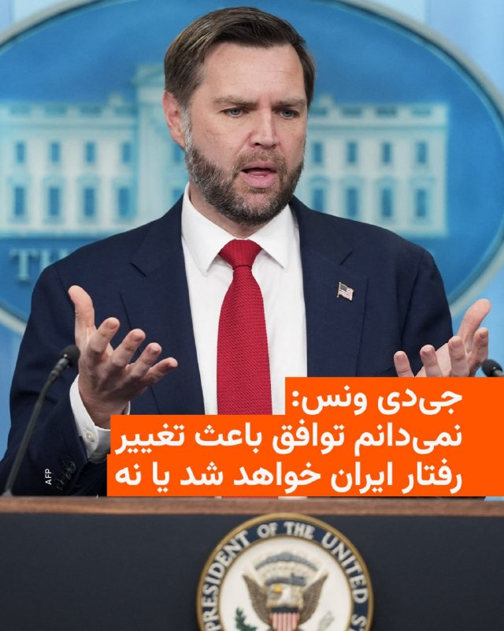

🔸جی‌دی ونس، معاون رئیس‌جمهور آمریکا، روز پنجشنبه ۲۸ خرداد در یک نشست خبری در کاخ سفید تأکید کرد که ایالات متحده در مذاکرات برای دستیابی به یک آتش‌بس دائمی، اهرم‌های فشار قابل توجهی بر ایران در اختیار دارد، هرچند اذعان کرد که مشخص نیست این اهرم‌ها برای وادار کردن حکومت ایران به دادن امتیازهای بزرگ کافی باشد یا نه.

🔸او در گفت‌وگوی خود با خبرنگاران گفت: «آن‌ها قطعاً درک می‌کنند که ایالات متحده اهرم‌های بسیار قدرتمندی در اختیار دارد. آیا این در نهایت به تغییر رفتار منجر خواهد شد؟ نمی‌دانم.»

🔸ونس استدلال کرد که دولت آمریکا صرف‌نظر از این تردیدها باید برای دستیابی به توافق تلاش کند، به این امید که بتواند به یک گشایش واقعی دست یابد؛ گشایشی که روابط ایران با آمریکا و همچنین وضعیت کلی خاورمیانه را به شکل چشمگیری بهبود بخشد.

🔸او گفت: «بعضی‌ها می‌گویند ایرانی‌ها هرگز رفتار خود را تغییر نخواهند داد. خب، شاید این درست باشد، و اگر چنین باشد، آن‌ها از هیچ‌یک از مزایای این توافق بهره‌مند نخواهند شد. اما آیا ارزش امتحان کردن را ندارد؟»

@RadioFarda

## Dirty_Kids — post 392509

نیکول کیدمن تو ۵۸ سالگی شبیه ۱۸ ساله هاست

@Dirty_Kids 👻

## Dirty_Kids — post 392508

  <a href="telegram/content/Dirty_Kids_392508_1781799417.mp4" target="_blank">🎬 Download video</a>

حق ترین چیزی که امروز میتونید ببینید:

@Dirty_Kids 👻

## Hranews — post 113705

  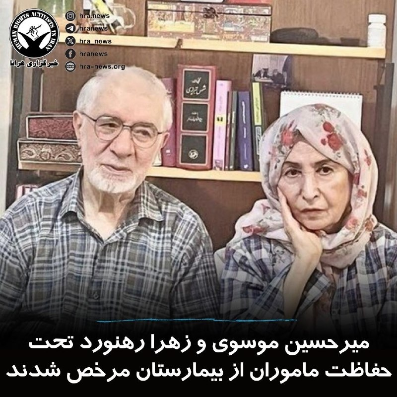

میرحسین موسوی و زهرا رهنورد از بیمارستان مرخص و به منزلی که توسط مأموران امنیتی تعیین شده است، منتقل شده‌اند. امتداد ضمن اعلام این خبر گزارش داد که روند درمان میرحسین موسوی همچنان ادامه دارد.

میرحسین موسوی و همسرش، زهرا رهنورد، از سال ۱۳۸۹ در حصر خانگی به سر می‌برند. پیشتر نیز گزارش‌هایی مبنی بر انتقال این دو به مکانی خارج از محل حصر خانگی‌شان، پس از آغاز حملات اسرائیل و آمریکا، منتشر شده بود.

#میرحسین_موسوی #زهرا_رهنورد

↘️
@hranews_bot تماس ✉️ - @Hranews کانال هرانا 🆑

## manototv — post 106163

  <a href="telegram/content/manototv_106163_1781799420.mp4" target="_blank">🎬 Download video</a>

‌
ترامپ در پاسخ به پرسشی درباره حمله به مدرسه میناب در روز نخست جنگ که به کشته شدن بیش از ۱۰۰ کودک منجر شد، گفت این موضوع در دست بررسی است و «هیچ‌کس عمداً چنین کاری نکرده است.»

او با تأکید بر این‌که «در جنگ اشتباه رخ می‌دهد» و «جنگ کثیف است»، در ادامه به کشته‌شدگان حملات ایران اشاره کرد و گفت گزارش این پرونده می‌تواند به‌زودی منتشر شود. ترامپ همچنین خبرنگاران را برای جزئیات بیشتر به پیت هگست، وزیر جنگ آمریکا، ارجاع داد.

## manototv — post 106162

  <a href="telegram/content/manototv_106162_1781799421.mp4" target="_blank">🎬 Download video</a>

ترامپ در پاسخ به پرسشی درباره باقی ماندن بخشی از توان موشکی جمهوری اسلامی گفت آمریکا «۸۴ تا ۸۵ درصد» موشک‌های ایران را منهدم کرده و آنچه باقی مانده، عمدتاً زیر زمین است و بیرون آوردنش برای ایران آسان نخواهد بود.

او همچنین گفت بازسازی توان موشکی ایران زمان‌بر خواهد بود و تأکید کرد هدفش کشاندن جنگ به مرحله‌ای نبود که مردم ایران با بحران انسانی روبه‌رو شوند یا حمله به زیرساخت‌های نفتی و آب‌شیرین‌کن‌ها بازار جهانی را دچار بحران کند.

ترامپ در بخش دیگری از سخنانش، درباره برنامه هسته‌ای غیرنظامی جمهوری اسلامی گفت ایران از بزرگ‌ترین ذخایر نفت جهان برخوردار است و پرسید: «اصلاً برای چه به انرژی هسته‌ای نیاز دارد؟»

## alonews — post 128953

  <a href="telegram/content/alonews_128953_1781799423.webm" target="_blank">🎬 Download video</a>

👈جی دی ونس: ما یکشنبه با ایران توافق را امضا کردیم اما نمیدانم به چه علت، ایرانی ها از ما خواستند که تا روز جمعه متن آن منتشر نشود البته شاید به خاطر تهیه یک متن فارسی

🔴اقتصاد ایران رو به فروپاشی است و تورم آن سر به فلک کشیده است و یک هزار میلیارد از جنگ آسیب دیده بنابراین فروش چند میلیون بشکه نفت نمیتواند تاثیر خاصی داشته باشد

✅ @AloNews خبر جنگ

---
📅 بروزرسانی: 1405/03/28 19:36
---

## VahidOOnLine — post 246240

  <a href="telegram/content/VahidOOnLine_246240_1781798765.mp4" target="_blank">🎬 Download video</a>

♦️ جی‌دی ونس، معاون رئیس‌جمهوری آمریکا، در نشست خبری خود در کاخ سفید با اشاره به گمانه‌زنی‌ها پیرامون تبادلات مالی و مزایای توافق اخیر تاکید کرد که این تفاهم‌نامه، واشنگتن را در یک موقعیت کاملا برتر قرار داده است.

ونس با بیان اینکه تحت هیچ شرایطی حتی یک سنت از منابع مالی مطرح شده در تفاهم‌نامه، از سوی ایالات متحده تامین نخواهد شد، این توافق را یک بازی برد-برد واقعی برای آمریکا خواند و گفت: «اگر ایرانی‌ها رفتار خود را تغییر ندهند، ساختار نظامی و برنامه هسته‌ای آن‌ها همچنان نابود شده باقی می‌ماند؛ و اگر تغییر رویه دهند، رابطه‌ای نوین و دگرگون‌شده با خاورمیانه خواهند داشت.»

معاون ترامپ تصریح کرد که بهره‌مندی تهران از مزایای این قرارداد منحصرا به پایبندی کامل آن‌ها مشروط شده است، اما در نهایت فارغ از اینکه طرف ایرانی کدام مسیر را انتخاب کند، خروجی این معادله یک پیروزی مطلق برای مردم و رئیس‌جمهوری ایالات متحده خواهد بود.
‌🇸🇦 Indypersian

🤖 @VahidOOnLine

## VahidOOnLine — post 246239

  <a href="telegram/content/VahidOOnLine_246239_1781798768.mp4" target="_blank">🎬 Download video</a>

ویدیوی رسیده به ایران اینترنشنال نشان می‌دهد که سه‌شنبه ۲۶ خردادماه بخشی از سقف یکی از اتاق‌های بستری در بیمارستان «امام علی» چابهار فروریخت و موجب تخریب بخشی از فضای داخلی این مرکز درمانی شد.
‌🏁 🇬🇧 IranintlTV

🤖 @VahidOOnLine

## VahidOOnLine — post 246238

  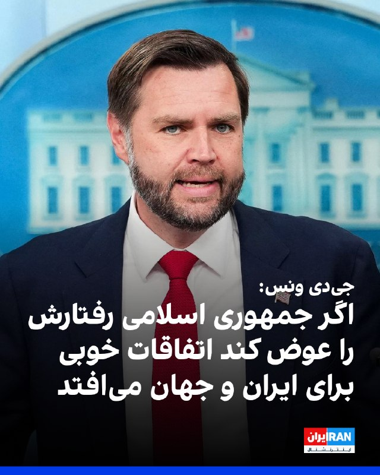

جی‌دی ونس، معاون رییس‌جمهوری آمریکا، در یک نشست خبری در کاخ سفید گفت بازه ۶۰ روزه تعیین‌شده در یادداشت تفاهم مورد تایید دونالد ترامپ، رییس‌جمهوری آمریکا، و رهبران جمهوری اسلامی از روز پنج‌شنبه آغاز می‌شود.

ونس افزود: «کشورهای عربی حوزه خلیج فارس درباره این توافق می‌گویند که این یک تحول شگرف برای منطقه است، زیرا در هر صورت ما و کل منطقه برنده خواهیم بود. ایران تضعیف شده، برنامه هسته‌ای آن از بین رفته و اقتصادش در وضعیت بسیار دشواری قرار دارد.»

او گفت: «اگر جمهوری اسلامی رفتار خود را تغییر دهد، اتفاقات بزرگی برای ایران و جهان رخ خواهد داد و اگر هم تغییر ندهد، ضرری متوجه ما نخواهد شد. در هر صورت، ما برنده‌ایم و رییس‌جمهوری توافق و مذاکرات خود را دقیقا بر همین مبنا طراحی کرده است.»
‌🏁 🇬🇧 IranintlTV

🤖 @VahidOOnLine

## WithYashar — post 15263

  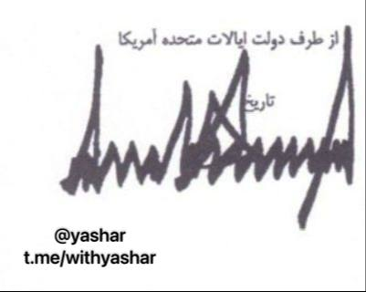

از ترامپی که امضاش اینهمه بالا پایین داره انتظار ثبات روانی دارید ، موج مکزیکی هم رد کرده نوار قلبه 😂
@withyashar

## mwarmonitor — post 11145

  <a href="telegram/content/mwarmonitor_11145_1781798772.mp4" target="_blank">🎬 Download video</a>

«خب، اول از همه، آن‌ها تعهدات هسته‌ای بسیار ملموسی داده‌اند. آن‌ها متعهد شده‌اند ذخایر به‌شدت غنی‌سازی‌شده‌ای را که در اختیار دارند، نابود کنند. اما موضوع دوم این است که تمام کاری که ما انجام داده‌ایم، لغو محاصره در تنگه هرمز است. ما اساساً وضعیت را به همان حالتی که پیش از درگیری بود، بازگردانده‌ایم. محاصره برداشته شده است؛ ما آن را پس از شروع درگیری اعمال کرده بودیم. تنگه‌ها اکنون باز هستند. این امتیاز جدیدی برای ایرانی‌ها نیست. آن‌ها سال‌های سال، مدت‌ها پیش از آنکه ما اصلاً محاصره‌ای اعمال کنیم، نفت می‌فروختند. ما آن محاصره را تحمیل کردیم، آن‌ها فروش نفت را متوقف کردند، و اکنون ما محاصره را لغو کرده‌ایم تا جریان آزاد انرژی را در سراسر... در سراسر جهان تقویت کنیم.»

@mwarmonitor

## FoxNewsTwitter — post 343133

‌Fox News (Twitter/X)

The framework is now official.

President Trump has signed the Memorandum of Understanding outlining 14 key U.S. negotiating points both America and Iran hope to maintain over the next 60 days.

Among the stated U.S. objectives: ending the war, restoring normal operations through the Strait of Hormuz, and ensuring Iran cannot obtain a nuclear weapon. Read the full 14-point memorandum here:

https://www.foxnews.com/politics/read-it-full-text-us-iran-memorandum-understanding

## FoxNewsTwitter — post 343132

  <a href="telegram/content/FoxNewsTwitter_343132_1781798774.mp4" target="_blank">🎬 Download video</a>

Fox News (Twitter/X)

"The Obama deal gave them over $1 billion of American money. This deal gives them $0."

Vice President JD Vance lays out why the Trump administration believes its Iran agreement is fundamentally different from President Obama's 2015 nuclear deal:

"Gulf Coast Coalition loves this deal because they think that it makes Iran weaker. They hated the Obama deal because they thought that it made Iran stronger."

"In 2015, the perspective that we came at as the United States was, you already have a really nice nuclear program. We're going to bribe you with American money in order to stop it."

"Our perspective and where we're coming at, it is we already destroyed your nuclear program."

## IranIntlTV — post 343067

  <a href="telegram/content/IranIntlTV_343067_1781798776.mp4" target="_blank">🎬 Download video</a>

ویدیوی رسیده به ایران اینترنشنال نشان می‌دهد که سه‌شنبه ۲۶ خردادماه بخشی از سقف یکی از اتاق‌های بستری در بیمارستان «امام علی» چابهار فروریخت و موجب تخریب بخشی از فضای داخلی این مرکز درمانی شد.

## Persian_Trend_Official — post 17479

  <a href="telegram/content/Persian_Trend_Official_17479_1781798778.mp4" target="_blank">🎬 Download video</a>

خبرنگار: رئیس جمهور ترامپ دیروز گفت که اگر مذاکرات دور دوم به نتیجه نرسد، شما را سرزنش خواهد کرد. آیا نگران هستید که او شما را به عنوان فرد شکست خورده معرفی کند؟

جی دی ونس: نه، به هیچ وجه. منظورم این است که فکر می‌کنم رئیس جمهور شوخی می‌کرد، همانطور که اغلب این کار را می‌کند.

📝 Amir

📌 @persian_trend_official
پرشین ترند | متفاوت‌ترین کانال نظامی

## Dirty_Kids — post 392507

  <a href="telegram/content/Dirty_Kids_392507_1781798781.webm" target="_blank">🎬 Download video</a>

✅ اپلیکیشن حرفه ای اندروید سایت بین المللی دربی بت

✅اسپانسر لیگ انگلستان

💰اولین سایت جهانی با امکان شارژ و برداشت با کارت بانکی

◻️ برای ورود فیلترشکن روشن کرده روی کانادا یا سنگاپور یا آلمان و ....
📢

😀Telegram Channel
👇
https://t.me/+bcynkEgSW2dlYTc0

## Dirty_Kids — post 392506

  

😤میخوای جام جهانی پیش بینی کنی؟!

🔹پس نیاز داری به یه سایت بین المللی و معتبر
🔹

⛔دربی بت همون انتخاب  100%

💎ویژگی های سایت جهانی Derby Bet:

⬅️امکان شارژ امن با کارت بانکی

⬅️واریز اول دوبل شارژ می شوید(بونوس۱۰۰٪)

⬅️پر اپشن ترین سایت فعال در ایران

⬅️تسویه حساب کمتر از 5 دقیقه

⬅️برگشت بخشی از باخت به صورت هفتگی

⭐دارای لایسنس و مجوز anjuan

🚨کد هدیه ثبت نام:GG007

⚠️برای دانلود اپلکیشن کلیک کنید
👉

🔔کانال دربی بت :
👇

✅https://t.me/+bcynkEgSW2dlYTc0

## Dirty_Kids — post 392505

  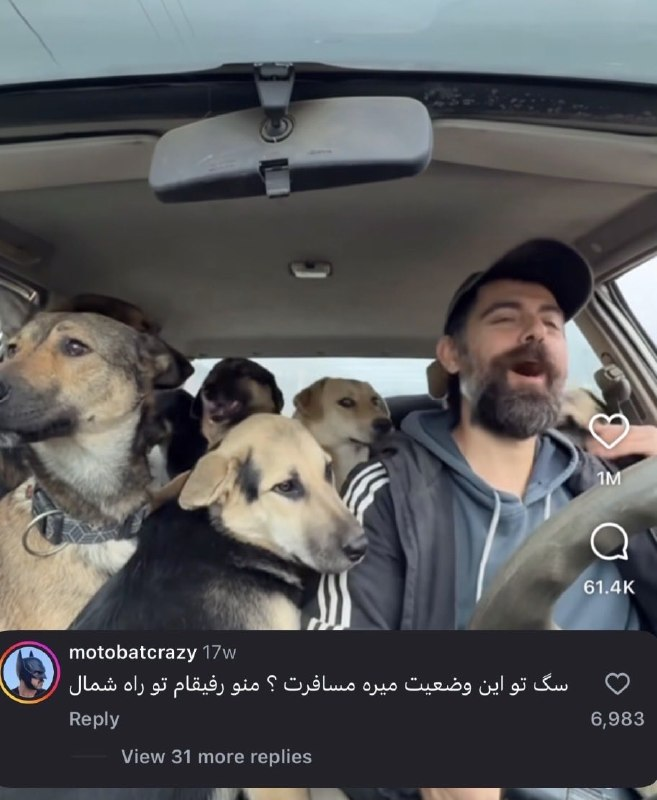

این آقا این سگ‌هارو قانع کرده که بشینن کنارهم و از یک پلن پیروی کنن
بعد من نمیتونم با دوستام همین کار رو کنم

@Dirty_Kids 👻

## Dirty_Kids — post 392504

  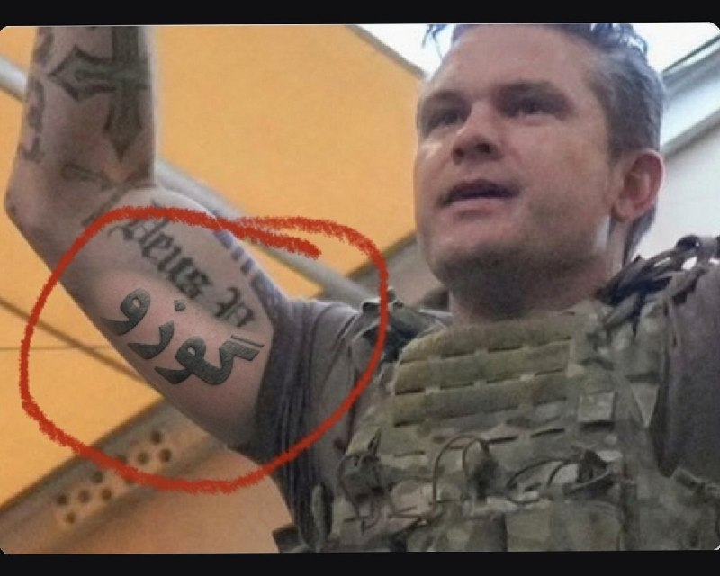

تتوی جدید آقای پشت بازو برای وضعیت جدید آمریکا

@Dirty_Kids 👻

## alonews — post 128952

  <a href="telegram/content/alonews_128952_1781798784.mp4" target="_blank">🎬 Download video</a>

👈ترامپ چند روز دیگه

✅ @AloNews خبر جنگ

---
📅 بروزرسانی: 1405/03/28 19:28
---

## VahidOOnLine — post 246237

  

جی‌دی ونس، معاون رییس‌جمهوری آمریکا، در کاخ سفید درباره ایران گفت: «طی شب گذشته ۱۲.۵ میلیون بشکه نفت جابه‌جا شده و جمهوری اسلامی در این مدت به هیچ کشتی‌ای حمله نکرده است.»

ونس افزود: «قطعا فکر می‌کنم آنها متوجه اهرم فشاری هستند که ایالات متحده بر آنها دارد. این موضوع را هم در گفت‌وگوها و هم در رفتار آنها طی چند روز گذشته دیده‌ایم. آنها کاملا درک می‌کنند که آمریکا از نفوذ و اهرم فشار بسیار زیادی برخوردار است.»

او گفت: «درباره این مذاکرات و اینکه در نهایت به کجا خواهد رسید، دیدگاه‌های مختلفی وجود دارد. اما من معمولا معتقدم باید به کسانی اعتماد کرد که ایران را بهتر از همه می‌شناسند و بیشترین چیز را برای از دست دادن دارند.»
‌🏁 🇬🇧 IranintlTV

🤖 @VahidOOnLine

## VahidOOnLine — post 246236

♦️رافائل گروسی، مدیرکل آژانس بین‌المللی انرژی اتمی، در نشست خبری در ژنو با اشاره به روند مذاکرات درباره ایران، تاکید کرد هنوز برای ارزیابی نتایج زود است و نباید درباره موانع احتمالی گمانه‌زنی کرد.
او گفت طرف‌ها مذاکرات را با فرض «حسن نیت» آغاز کرده‌اند و امضای یادداشت تفاهم نشان می‌دهد همه به‌دنبال موفقیت این روند هستند. گروسی افزود مسائل فنی و اختلاف‌نظرها طبیعی است و بررسی آن‌ها به زمان نیاز دارد.
مدیرکل آژانس همچنین این مقطع را «حساس و همراه با مسئولیت سنگین» توصیف کرد و ابراز امیدواری کرد در روزهای آینده جزئیات دقیق‌تری از روند مذاکرات ارائه شود.
‌🇸🇦 Indypersian

🤖 @VahidOOnLine

## WithYashar — post 15262

ونس: اگر ایرانی‌ها رفتار خود را تغییر ندهند، ارتش و برنامه هسته‌ای آنها همچنان نابود خواهد شد.

ما در حال حاضر یک تحریم اقتصادی فلج‌کننده علیه ایران اعمال می‌کنیم و تا زمانی که این کشور رفتار خود را به‌طور اساسی تغییر ندهد، به آن پایان نخواهیم داد.
@withyashar

## WithYashar — post 15261

آمریکا حتی یک سنت هم به ایران نمی‌دهد

جی‌دی ونس: "آنچه از همه شما می‌خواهم این است که صادقانه گزارش دهید که ایالات متحده حتی یک سنت هم به ایران نمی‌دهد...حتی مزایای اقتصادی، کاهش تحریم‌ها و غیره که با این معامله همراه است، فقط در صورتی اتفاق می‌افتد که ایرانی‌ها عمل کنند!"
@withyashar

## WithYashar — post 15260

معاون رئیس جمهور آمریکا: دوره ۶۰ روزه مندرج در یادداشت تفاهم با ایران از امروز آغاز شد.
@withyashar

## mwarmonitor — post 11144

«و تفاوت بین این دو توافق. خب، اول از همه، دو تفاوت بزرگ حتی در ماهیت خودِ توافق نیست، بلکه به چیزی برمی‌گردد که بالاتر گفتم.
شماره یک: ائتلاف کشورهای حاشیه خلیج فارس عاشق این توافق هستند، چون فکر می‌کنند این توافق ایران را ضعیف‌تر می‌کند. آن‌ها از توافق اوباما متنفر بودند، چون فکر می‌کردند آن توافق ایران را قوی‌تر می‌کند. آن‌ها اطلاعات بیشتری در این باره دارند و بیشتر از هر کسی، از جمله ایالات متحده آمریکا، ممکن است ضرر کنند؛ بنابراین من به قضاوت آن‌ها اعتماد دارم.
نکته دوم این است که این توافق از کجا شکل گرفته است. باید به یاد داشته باشید که در سال ۲۰۱۵، ایران یک برنامه تسلیحات هسته‌ای پیشرفته با ذخایری از سلاح‌های هسته‌ای ساخته بود؛ بنابراین نگاه ما به عنوان ایالات متحده این بود که: «شما از قبل یک برنامه هسته‌ای خیلی خوب دارید، ما با پول آمریکایی به شما باج (رشوه) می‌دهیم تا جلوی آن را بگیریم.»
اما نگاهِ اکنون ما و زاویه‌ای که از آن به موضوع ورود می‌کنیم این است که: «ما از قبل برنامه هسته‌ای شما را نابود کرده‌ایم؛ بنابراین، اگر تعهد بدهید و مسیرهای قابل راستی‌آزمایی را نشان دهید که آن را بازسازی نکنید، آن‌وقت ما تمایل داریم که بخشی از کاهش تحریم‌ها و مواردی از این دست را به شما ارائه دهیم.» پس این یک دیدگاه اساساً متفاوت است.
البته تفاوت‌های ماهوی دیگری نیز وجود دارد:
توافق هسته‌ای اوباما اجازه غنی‌سازی می‌داد، توافق ما اجازه نمی‌دهد.
توافق اوباما اجازه انباشت مواد ذخیره‌شده با گرید تسلیحاتی را می‌داد، توافق ما در واقع منجر به نابودی آن ذخایر از مواد غنی‌شده می‌شود؛ بنابراین تفاوت‌های زیادی وجود دارد.
توافق اوباما به آن‌ها بیش از یک میلیارد دلار از پول مردم آمریکا را داد، این توافق صفر دلار از پول آمریکا را به آن‌ها می‌دهد.
بنابراین تفاوت‌های ماهوی زیادی وجود دارد، اما فکر می‌کنم مهم‌ترین تفاوت‌ها این است که ما از موضع قدرت به موضوع نگاه می‌کنیم و همچنین این واقعیت که شرکای ما در حاشیه خلیج فارس عاشق این توافق هستند.»

@mwarmonitor

## mwarmonitor — post 11143

  <a href="telegram/content/mwarmonitor_11143_1781798324.mp4" target="_blank">🎬 Download video</a>

🎬 Video

## mwarmonitor — post 11142

خب، ما هیچ نوع حمله‌ای، با هیچ مقیاسی را نمی‌خواهیم. هر حمله‌ای، مقیاسش هر چه که باشد، تحت این توافق غیرقابل قبول است. حالا، شما سؤالی پرسیدید مبنی بر اینکه پول نفت قبل از امضای یادداشت تفاهم (MOU) به حزب‌الله سرازیر می‌شده است؛ این دقیقاً یکی از دلایلی است که ما عملاً در این فرآیند مشارکت داریم تا مطمئن شویم هیچ پولی به حزب‌الله سرازیر نمی‌شود.
بنابراین جالب است که افرادی می‌گویند این یادداشت تفاهم بد است چون پیامدهایی ایجاد می‌کند که در واقع مدت‌ها قبل از امضای یادداشت تفاهم هم در حال رخ دادن بوده‌اند. این نشان‌دهنده ایرادی در یادداشت تفاهم نیست، بلکه نشان‌دهنده این است که چرا ما به یادداشت تفاهم نیاز داریم تا مطمئن شویم صلح و ثبات منطقه‌ای که به آن نیاز داریم را خواهیم داشت.
حالا، چیزی که من به برخی از منتقدان این توافق که شنیده‌ام می‌گویند «خب، ایران قرار است این همه منفعت ببرد» می‌گویم؛ من حرفم را تکرار می‌کنم و احتمالاً مجبور خواهم شد چندین بار دیگر هم تکرار کنم: آن منفعتی که ایرانی‌ها به دست می‌آورند و قبلاً نداشتند چیست؟ و پاسخ این است: هیچ چیز.
آن‌ها هیچ چیزی به دست نمی‌آورند مگر اینکه رفتارشان را تغییر دهند. اگر رفتارشان را تغییر دهند، این موضوع جای خوشحالی و جشن دارد. این کار خاورمیانه را برای یک نسل متحول خواهد کرد. اگر رفتارشان را تغییر ندهند، از منافع این معامله بهره‌مند نخواهند شد.
و من فکر می‌کنم، باید صادق باشم، فکر می‌کنم از اساس، از اساس این ایده که ــ و این ارائه اطلاعات نادرست و تحریف یادداشت تفاهم است ــ این ایده که ایرانی‌ها قبل از اینکه توافق عملاً نهایی و اجرا شود، این همه منفعت به دست می‌آورند، این ایده که آن‌ها قبل از تغییر رفتارشان منفعت کسب می‌کنند، اساساً یک محور گفتگو (خط خبری) است که از سوی کسانی مطرح می‌شود که می‌خواهند این مناقشه تا ابد ادامه یابد، علیرغم این واقعیت که این امر نه به نفع مردم آمریکاست و نه به نفع منطقه.

@mwarmonitor

## mwarmonitor — post 11141

  <a href="telegram/content/mwarmonitor_11141_1781798325.mp4" target="_blank">🎬 Download video</a>

🎬 Video

## mwarmonitor — post 11140

خب، قبل از هر چیز، ما معتقدیم آبراه‌های بین‌المللی باید بدون عوارض باشند؛ و این موضع ما بوده است. این همان چیزی است که البته در دوره ۶۰ روزه تفاهم‌نامه (MOU) مشاهده می‌کنید.
و وقتی می‌گویید این موضوع را باز (بلاتکلیف) می‌گذارد، واقعاً آن را باز نمی‌گذارد، مگر به این معنا که البته، مذاکرات نهایی قرار است شرایطِ آنچه را که بعد از آن می‌آید تعیین کند، درست است؟
فکر می‌کنم شما گفتید که این موضوع [فقط] میان عمانی‌ها و ایرانی‌هاست، اما در واقع تفاهم‌نامه این‌طور پیش‌بینی می‌کند که عمانی‌ها، ایرانی‌ها و ائتلاف کشورهای ساحلی خلیج [فارس] با هم، یک چارچوب امنیتی مناسب برای تنگه‌ها در آینده پیدا کنند.
و منظور من از این حرف این است که ما هرگز نمی‌خواهیم این اتفاق دوباره رخ دهد. درست است، این موضوع اصلاً ربطی به عوارض گرفتن ندارد؛ این در مورد تضمین این است که تنگه‌ها هرگز دوباره به عنوان یک نقطه گلوگاهی (مسدودکننده) برای اقتصاد جهانی استفاده نشوند.
صراحتاً این چیزی نیست که ایرانی‌ها بخواهند، چیزی نیست که عمانی‌ها بخواهند، و چیزی نیست که شورای همکاری خلیج [فارس] نیز بخواهد. بنابراین کاری که ما قرار است انجام دهیم، البته با همکاری متحدانمان در منطقه، این است که مطمئن شویم این موضوع در توافق نهایی منعکس می‌شود؛ و اگر در توافق نهایی منعکس نشود، توافق نهایی در کار نخواهد بود.
و این... من مدام به این نکته ساختاری و اساسی این مذاکرات برمی‌گردم که: ما همه برگ‌های برنده را در دست داریم. اگر ایرانی‌ها مزایای این معامله را می‌خواهند، باید چیزهایی را که برای دستیابی به آن مزایا لازم است، به ما بدهند.

@mwarmonitor

## mwarmonitor — post 11138

  <a href="telegram/content/mwarmonitor_11138_1781798327.mp4" target="_blank">🎬 Download video</a>

🎬 Video

## FoxNewsTwitter — post 343131

  <a href="telegram/content/FoxNewsTwitter_343131_1781798329.mp4" target="_blank">🎬 Download video</a>

Fox News (Twitter/X)

NOW: "Joy Behar is way tougher than the Iranians, and she and I are best friends now."

VP Vance jokes about being a battle-tested negotiator after making it through his appearance on 'The View.'

Vance also says he's not worried about Trump blaming him if talks with Iran "go sideways," saying he knows the president was only making a joke.

## FoxNewsTwitter — post 343130

  <a href="telegram/content/FoxNewsTwitter_343130_1781798331.mp4" target="_blank">🎬 Download video</a>

Fox News (Twitter/X)

JUST IN: Vice President JD Vance announces that the 60-day negotiating period between the U.S. and Iran has officially begun as the landmark Middle East deal starts to take effect.

"I would say the 60 day period officially started today.... The deal started yesterday, we're going to start the 60-day clock today."

## FoxNewsTwitter — post 343129

  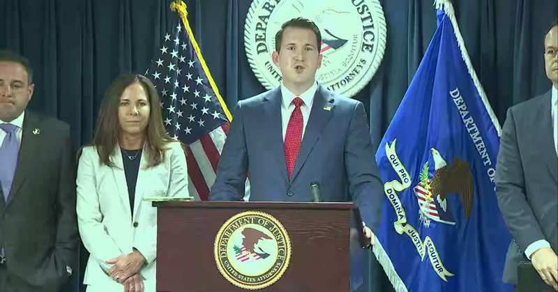

Fox News (Twitter/X)

WATCH LIVE: Justice Department reveals new arrests in sweeping welfare fraud investigation https://twitter.com/i/broadcasts/1qxvvvblpkBxB

## pm_afshaa — post 94336

  <a href="telegram/content/pm_afshaa_94336_1781798332.webm" target="_blank">🎬 Download video</a>

🔴مدنی‌زاده، وزیر اقتصاد:
قرار نیست با توافق با آمریکا کشور به شرایط عادی برگرده، قبل جنگ هم چند صدهزار میلیاردتومن کسری بودجه داشتیم علاوه بر اون تو جنگ هم دولت از بانک مرکزی 100 هزار میلیاردتومن گرفته که آثار تورمی خودشو تو ماه‌های آینده نشون میده.
‌

💧 Rainbet.com the #1 Non-KYC Crypto Casino & Sportsbook @rainbetcom

😁 @Pm_Afshaa

## pm_afshaa — post 94335

  <a href="telegram/content/pm_afshaa_94335_1781798333.webm" target="_blank">🎬 Download video</a>

🔴وزیر خارجه پاکستان:
بعد از امضای توافق از راه دور، مراسم رسمی در سوئیس لغو شد.

💧 Rainbet.com the #1 Non-KYC Crypto Casino & Sportsbook @rainbetcom

😁 @Pm_Afshaa

## IranIntlTV — post 343066

  

جی‌دی ونس، معاون رییس‌جمهوری آمریکا، در یک نشست خبری در کاخ سفید گفت بازه ۶۰ روزه تعیین‌شده در یادداشت تفاهم مورد تایید دونالد ترامپ، رییس‌جمهوری آمریکا، و رهبران جمهوری اسلامی از روز پنج‌شنبه آغاز می‌شود.

ونس افزود: «کشورهای عربی حوزه خلیج فارس درباره این توافق می‌گویند که این یک تحول شگرف برای منطقه است، زیرا در هر صورت ما و کل منطقه برنده خواهیم بود. ایران تضعیف شده، برنامه هسته‌ای آن از بین رفته و اقتصادش در وضعیت بسیار دشواری قرار دارد.»

او گفت: «اگر جمهوری اسلامی رفتار خود را تغییر دهد، اتفاقات بزرگی برای ایران و جهان رخ خواهد داد و اگر هم تغییر ندهد، ضرری متوجه ما نخواهد شد. در هر صورت، ما برنده‌ایم و رییس‌جمهوری توافق و مذاکرات خود را دقیقا بر همین مبنا طراحی کرده است.»
https://iranintl.com/202606188230

## IranIntlTV — post 343065

  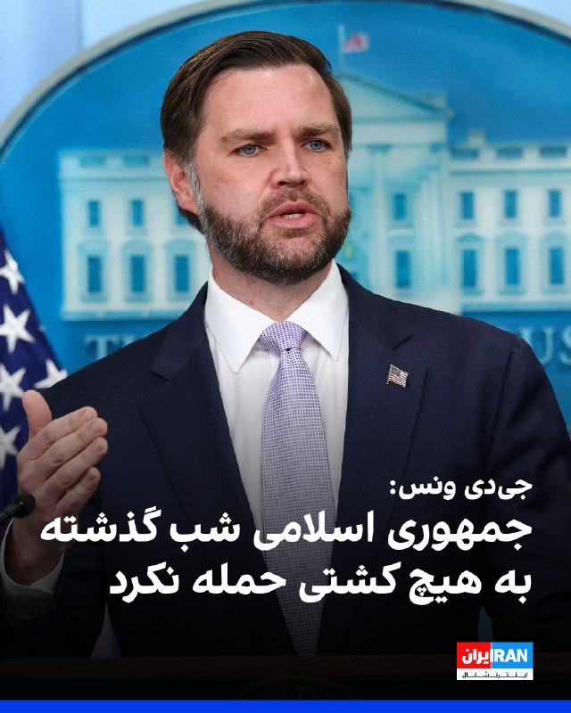

جی‌دی ونس، معاون رییس‌جمهوری آمریکا، در کاخ سفید درباره ایران گفت: «طی شب گذشته ۱۲.۵ میلیون بشکه نفت جابه‌جا شده و جمهوری اسلامی در این مدت به هیچ کشتی‌ای حمله نکرده است.»

ونس افزود: «قطعا فکر می‌کنم آنها متوجه اهرم فشاری هستند که ایالات متحده بر آنها دارد. این موضوع را هم در گفت‌وگوها و هم در رفتار آنها طی چند روز گذشته دیده‌ایم. آنها کاملا درک می‌کنند که آمریکا از نفوذ و اهرم فشار بسیار زیادی برخوردار است.»

او گفت: «درباره این مذاکرات و اینکه در نهایت به کجا خواهد رسید، دیدگاه‌های مختلفی وجود دارد. اما من معمولا معتقدم باید به کسانی اعتماد کرد که ایران را بهتر از همه می‌شناسند و بیشترین چیز را برای از دست دادن دارند.»
https://iranintl.com/202606187626

## FarsiVOA — post 221123

پیت هگست، وزیر جنگ آمریکا، تصاویری از حضور خود در نشست ناتو را منتشر کرد.

وزیر جنگ آمریکا اعلام کرد که اگر جمهوری اسلامی به تعهداتش در توافق صورت گرفته با واشنگتن پایبند نباشد، آمریکا آماده است دوباره اقدام نظامی را آغاز کند و محاصره دریایی را نیز دوباره اعمال کند.

پیشتر دونالد ترامپ، رئیس جمهوری آمریکا در یک کنفرانس خبری پس از نشست گروه هفت با تاکید بر این که جمهوری اسلامی هرگز به سلاح هسته‌ای دست پیدا نخواهد کرد افزود که این فقط یک تفاهم‌نامه است و اگر به نتیجه نرسید برخلاف میلمان مجبور به بمباران مجدد حکومت ایران خواهیم شد.

@FarsiVOA

## FarsiVOA — post 221122

در پاسخ به میدان آرمین خامه، روزنامه‌نگارمی‌گوید: غیراخلاقی شمردن حمایت از تیم‌ملی دیدگاهی فانتزی است. بهار دهکردی هم فراهم کردن بستری امن برای چهره‌های فرهنگی، هنری و ورزشی را عامل مهم برای جذب بیشتر آنها به سمت مردم می‌داند

## FarsiVOA — post 221121

  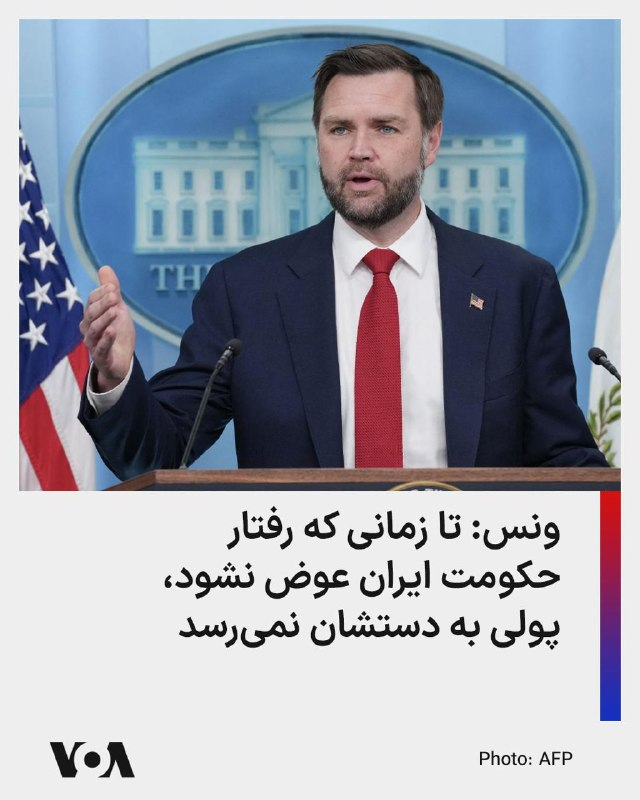

جی‌دی ونس، معاون رئیس‌ جمهوری آمریکا در یک کنفرانس خبری پس از امضای تفاهم‌نامه گفت: ایرانی‌ها برای دومین شب متوالی به هیچ کشتی‌ای در تنگه هرمز شلیک نکردند. تا این لحظه، آنها به تعهد خود پایبند بوده‌اند. آنها از اهرم فشار آمریکا آگاهند و می‌دانند اگر رفتارشان را عوض نکنند، پولی به دستشان نمی‌رسد.
او افزود: کشورهای عربی از این توافق راضی هستند و آن را به نفع منطقه می‌دانند.
آقای ونس گفت: توافق به شکلی تنظیم شده که قابل راستی‌آزمایی است و در هر صورت ما برنده‌ایم.

## DW_Farsi — post 126151

🔶 توافق ۶۰روزه؛ آیا اسرائیل در محاسبات آمریکا به حاشیه رفته؟

🔻 گزارشی از الینا فرهادی

یادداشت توافق ۱۴ بندی میان ایالات متحده و جمهوری اسلامی ایران که پس از هفته‌ها مذاکره غیرمستقیم با میانجیگری چند کشور منطقه‌ای تدوین شد، اکنون وارد مرحله‌ای شده که می‌تواند مسیر یکی از پیچیده‌ترین بحران‌های خاورمیانه را تغییر دهد.

این توافق که به گفته مقام‌های دو طرف ابتدا به‌صورت دیجیتالی در روز یکشنبه ۱۴ ژوئن نهایی و امضا شد و قرار است روز جمعه در نشستی رسمی در سوئیس نیز تثبیت شود، چارچوبی ۶۰ روزه برای مذاکره بر سر پرونده هسته‌ای، رفع تدریجی تحریم‌ها، بازگشایی تنگه هرمز و پایان عملیات نظامی میان دو طرف فراهم می‌کند.

دونالد ترامپ، رئیس‌جمهور آمریکا شامگاه سه‌شنبه ۱۷ ژوئن در حاشیه نشست گروه هفت، در حضور امانوئل مکرون، همتای فرانسوی‌اش امضای خود را پای این توافق ثبت کرد؛ اقدامی که هم‌زمان با امضای مسعود پزشکیان در ایران همراه بود.

با این حال، مخالفت آشکار دولت اسرائیل با این تفاهم از همان ابتدا این پرسش را مطرح کرد که آیا توافقی که یکی از مهم‌ترین بازیگران منطقه خود را ملزم به آن نمی‌داند، اساسا شانس پایداری خواهد داشت؟

منشه امیر، کارشناس خاورمیانه ساکن اسرائیل، دامون گلریز، تحلیلگر سیاسی و مدرس روابط بین‌الملل در مدرسه عالی لاهه و کامران متین، دانشیار روابط بین الملل در دانشکده مطالعات جهانی دانشگاه ساسکس در گفت‌وگو با بخش فارسی دویچه وله ابعاد مختلف این توافق، چشم‌انداز پایداری آن، محاسبات راهبردی اسرائیل، آینده رقابت‌های سیاسی در این کشور و همچنین تأثیر این تفاهم بر مناسبات واشنگتن و تل‌آویو را بررسی کرده‌اند.

📌 برای دسترسی کامل به گزارش به وبسایت دویچه‌وله فارسی مراجعه کنید.
@dw_farsi

## Persian_Trend_Official — post 17478

  <a href="telegram/content/Persian_Trend_Official_17478_1781798335.mp4" target="_blank">🎬 Download video</a>

جی دی ونس درباره موشک‌های بالستیک ایران: کشورها از حق دفاع از خود دست نمی‌کشند این تمام چیزی که رئیس جمهور دیروز گفت.

اسرائیل اگر حزب‌الله موشک یا پهپاد به سمت اسرائیل شلیک کند، از حق دفاع از خود دست نمی‌کشد. ایرانی‌ها از حق دفاع از خود در کشورشان دست نمی‌کشند، اما ما انتظار داریم که به عنوان بخشی از توافق نهایی، آنها قادر به ساخت موشک‌هایی نباشند که بتوانند کل جهان را به طور گسترده تهدید کنند، و این همان چیزی است که رئیس جمهور ایالات متحده دیروز گفت.

و ببینید، منظورم این است که خیلی ساده است: شما نمی‌توانید به یک کشور چه اسرائیل، چه ایران بگویید که اجازه ندارند از خود دفاع کنند.

📝 Amir

📌 @persian_trend_official
پرشین ترند | متفاوت‌ترین کانال نظامی

## Persian_Trend_Official — post 17477

  <a href="telegram/content/Persian_Trend_Official_17477_1781798337.mp4" target="_blank">🎬 Download video</a>

جی دی ونس: شما چیزهایی در مورد 300 میلیارد دلار یا 24 میلیارد دلار، یا این یا آن عدد یا مقدار پول خواهید شنید، و واقعیت ساده این است که تنها راهی که ایرانی‌ها می‌توانند هر یک از این منابع را از ایالات متحده آمریکا تحت دریافت کنند، تنها راهی که می‌توانند از این معامله سود ببرند، این است که کاملاً به آن پایبند باشند و رفتار خود را تغییر دهند.

اگر ایرانی‌ها رفتار خود را تغییر ندهند، ارتش و برنامه هسته‌ای آنها همچنان نابود شده است. اگر رفتار خود را تغییر دهند، آنگاه آنها یک رابطه دگرگون‌کننده با خاورمیانه خواهند داشت. این یک برد برد برای ماست.

📝 Amir

📌 @persian_trend_official
پرشین ترند | متفاوت‌ترین کانال نظامی

## Persian_Trend_Official — post 17476

  <a href="telegram/content/Persian_Trend_Official_17476_1781798339.mp4" target="_blank">🎬 Download video</a>

جی دی ونس: ایرانی‌ها برای دومین شب متوالی به هیچ کشتی در تنگه هرمز شلیک نکردند. تاکنون، آنها به تعهد خود عمل می‌کنند.

سنتکام به دوازده کشتی اجازه داده است تا از محاصره دریایی ما عبور کنند، بنابراین ما نیز به وظیفه خود عمل می‌کنیم.

📝 Amir

📌 @persian_trend_official
پرشین ترند | متفاوت‌ترین کانال نظامی

## RadioFarda — post 158469

  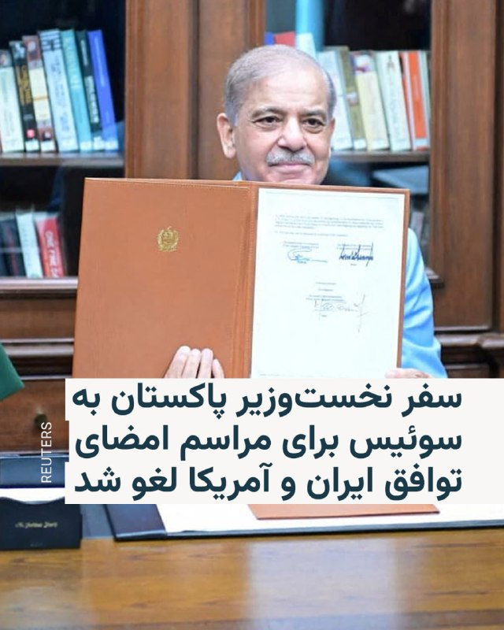

🔸مقام‌های پاکستان بعدازظهر پنج‌شنبه لغو سفر نخست وزیر این کشور، شهباز شریف به سوئیس را تایید کردند.

🔸سخنگوی نخست وزیر پاکستان در این باره به خبرگزاری فرانسه گفت که سفر شهباز شریف به سوئیس برای مراسم امضای تفاهم‌نامه پایان جنگ خاورمیانه بین ایران و آمریکا به تعویق افتاده است، زیرا این توافق از راه دور به صورت الکترونیکی امضا شده است و در حال اجراست.

🔸مُشَرَف زیدی گفت که پاکستان از مراحل بعدی مذاکرات «در سطح فنی» حمایت خواهد کرد.

🔸پیش‌تر اعلام شده بود که شهباز شریف برای شرکت در مراسم امضای تفاهنامه ایران و آمریکا برای پایان جنگ به سوئیس خواهد رفت.

@RadioFarda

## alonews — post 128951

  <a href="telegram/content/alonews_128951_1781798341.webm" target="_blank">🎬 Download video</a>

👈جی دی ونس در مورد اسرائیل: به نظر می‌رسد که ما درست در آستانهٔ یک پیشرفت بزرگ در توافق بودیم، و بعد ناگهان یک انفجار بزرگ در یک منطقهٔ غیرنظامی در بیروت رخ می‌دهد، و تعداد زیادی از مردم که هیچ ارتباطی با حزب‌الله ندارند جان خود را از دست می‌دهند. این قابل قبول نیست.

✅ @AloNews خبر جنگ

## alonews — post 128950

  <a href="telegram/content/alonews_128950_1781798342.mp4" target="_blank">🎬 Download video</a>

👈جی.دی. ونس در مورد لغو تحریم‌ها:
«راستش را بخواهید، ما این را یک امتیاز بزرگ به ایرانی‌ها ندیدیم — ایران هم... این را به‌عنوان یک امتیاز برای خودشان تلقی نکرد، چون چیزی که مانع فروش نفت آنها می‌شد، تحریم‌ها نبود.

🔴آنها بدون هیچ تخفیفی نفت زیادی می‌فروختند، چون تحریم‌ها اساساً ناکارآمد بودند.

🔴در آن مرحله، کاری که تحریم‌ها کردند این بود که سیستم مالی ایران را به نوعی به سمت سیستم بانکی سایه‌ای (غیررسمی) سوق دادند.

🔴با لغو تحریم‌ها، در واقع خواهیم توانست کمی ببینیم که سیستم مالی آنها پول را به کجا می‌فرستد و از کجا پول دریافت می‌کند. این یک مزیت واقعی است.»

✅ @AloNews خبر جنگ

---
📅 بروزرسانی: 1405/03/28 19:16
---

## mwarmonitor — post 11137

«خب اول از همه، آن‌ها برای بازسازی برنامه هسته‌ای خود باید پول زیادی به دست آورند. شما در مورد میلیاردها و میلیاردها دلار زیرساخت هسته‌ای صحبت می‌کنید که ایالات متحده آن را نابود کرده است. برای اینکه آن‌ها بتوانند آن برنامه را بازسازی کنند، باید پول زیادی به دست آورند؛ و ما در حال حاضر آن‌ها را در یک مضیقه (تنگنای) اقتصادی قرار داده‌ایم که تا زمانی که رفتار خود را به طور اساسی تغییر ندهند، آن را رها نخواهیم کرد.
این تغییر رفتار چه شکلی خواهد بود؟ این به معنای یک رژیم بازرسی واقعی است؛ به معنای یک رژیم اجرایی واقعی است. همانطور که در تفاهم‌نامه (MOU) پیش‌بینی شده، این امر به معنای نابودی ذخایر غنی‌سازی شده آن‌ها خواهد بود. تمام این‌ها از جمله مراحلی است که اگر در مورد پایان دادن به برنامه سلاح‌های هسته‌ای خود جدی باشید، باید بردارید.
و باز هم به همین دلیل است که من به این موضوع برمی‌گردم، این معامله اساسی که در توافق گنجانده شده است: آن‌ها برای انجام هر کاری به پول نیاز دارند. اقتصاد آن‌ها در شرایط بسیار وخیمی قرار دارد. اما برای اینکه آن‌ها بتوانند هرگونه ادغامی در اقتصاد جهانی داشته باشند، باید به ما نشان دهند و برای ما راستی‌آزمایی کنند که رفتار خود را تغییر می‌دهند. و به همین دلیل است که این توافق به این شیوه تنظیم شده است.»

@mwarmonitor

## mwarmonitor — post 11136

  <a href="telegram/content/mwarmonitor_11136_1781797560.mp4" target="_blank">🎬 Download video</a>

🎬 Video

## mwarmonitor — post 11135

«بنابراین، ما تعداد قابل‌توجهی از موشک‌های بالستیک آن‌ها و سکوهای... ببخشید، خود پرتابگرهای موشک بالستیک آن‌ها را نابود کردیم. این موضوع فقط درباره گلوله‌ها نیست، بلکه خود تفنگ است؛ و این همان چیزی است که ما در نابود کردنش در طول سه ماه گذشته از این عملیات، بسیار موثر عمل کردیم.
تمام چیزی که رئیس‌جمهور دیروز گفت این است که، البته کشورهای منطقه حق دفاع از خود را از دست نمی‌دهند. اسرائیل حق دفاع از خود را در صورتی که حزب‌الله راکت یا پهپاد به سمت اسرائیل شلیک کند، از دست نمی‌دهد؛ ایرانی‌ها نیز حق دفاع از خود را در کشورشان از دست نمی‌دهند، اما ما انتظار داریم که به عنوان بخشی از توافق نهایی، آن‌ها قادر نباشند نوعی از موشک‌ها را بسازند که بتواند به طور گسترده کل جهان را تهدید کند. و این همان چیزی است که رئیس‌جمهور ایالات متحده دیروز گفت.
و ببینید، منظورم این است که موضوع خیلی ساده است. شما نمی‌توانید به یک کشور بگویید – چه اسرائیل باشد و چه ایران – که آن‌ها اجازه ندارند هیچ‌گونه دفاعی از خود داشته باشند. این چیزی نیست که رئیس‌جمهور خواسته باشد، این چیزی نیست که رئیس‌جمهور تقاضا کرده باشد؛ اما به عنوان بخشی از توافق نهایی، آنچه ما می‌خواهیم ببینیم این است که ایران به ناامنی‌های منطقه‌ای دامن نزند، از تروریسم منطقه‌ای حمایت مالی نکند و البته، برای بازسازی برنامه سلاح‌های هسته‌ای خود تلاش نکند. این نکته اصلی است.
برنامه سلاح‌های هسته‌ای نابود شده است. این برنامه از بین رفته است. اگر ایرانی‌ها فردا تصمیم بگیرند که یک سلاح هسته‌ای بسازند، آن‌ها به سادگی توانایی لازم برای انجام این کار را ندارند. آنچه ما در تلاشیم تضمین کنیم این است که آن‌ها این توانایی را بازسازی نکنند؛ نه فقط یک سال دیگر، دو سال دیگر، بلکه سال‌های سال بعد از آن، تا فرزندان ما هرگز مجبور نباشند نگران این باشند که یک حامی دولتیِ تروریسم، به سلاح هسته‌ای دست پیدا کند.»

@mwarmonitor

## mwarmonitor — post 11134

  <a href="telegram/content/mwarmonitor_11134_1781797562.mp4" target="_blank">🎬 Download video</a>

🎬 Video

## mwarmonitor — post 11133

«بخشی از طرح صلح یا بخشی از این تفاهم‌نامه که به نظرم بیش از همه توسط بخش‌های خاصی از رسانه‌ها به شکل نادرستی جلوه داده شده، این تصور است که ایرانی‌ها قرار است تمام این امتیازات را دریافت کنند. شما چیزهایی درباره ۳۰۰ میلیارد دلار، ۲۴ میلیارد دلار یا مبالغ دیگری شنیده‌اید؛ اما واقعیت ساده این است که تنها راهی که ایرانی‌ها می‌توانند به هر یک از این منابع دسترسی پیدا کنند — که البته لازم به ذکر است تحت هیچ شرایطی حتی یک سنت آن هم از سوی ایالات متحده آمریکا نخواهد بود — بله، تنها راهی که آن‌ها بتوانند از این توافق سودی ببرند این است که به طور کامل به تعهدات خود عمل کرده و رفتار خود را تغییر دهند.
بنابراین، شما عملاً با یک موقعیت برد-برد برای ایالات متحده آمریکا روبرو هستید. اگر ایرانی‌ها رفتار خود را تغییر ندهند، برنامه نظامی و هسته‌ای آن‌ها همچنان متوقف (نابود) باقی می‌ماند. اما اگر رفتار خود را تغییر دهند، در آن صورت رابطه‌ای متحول‌شده با خاورمیانه خواهند داشت و خاورمیانه نیز رابطه‌ای متحول‌شده با مردم ایران خواهد داشت. این یک برد برای مردم آمریکا و رئیس‌جمهور ایالات متحده است، فارغ از اینکه ایرانی‌ها در نهایت کدام گزینه را انتخاب کنند. ما مسلماً خواهان این هستیم که آن‌ها گزینه درست را انتخاب کنند.
نکته جالب درباره سیستم آن‌ها که فکر می‌کنم درک آن برای مردم آمریکا اهمیت ویژه‌ای دارد، این است که در درون کشورشان اختلافات واقعی بر سر نحوه دقیق پیشبرد امور وجود دارد. آنچه در چند ماه گذشته شاهد بوده‌ایم این است که واقع‌گرایان (پراگماتیست‌ها) در بدنه سیستم ایران — یعنی افرادی که واقعاً خواهان تغییر و تحول در روابط خود با خاورمیانه و جهان هستند — در این بحث‌ها و مواضع در حال پیروز شدن هستند.
ایالات متحده خواهان پیروزی این افراد در این بحث‌ها است. ایالات متحده مایل به داشتن رابطه‌ای بهتر است، اما برای اینکه چنین اتفاقی رخ دهد، ایرانی‌ها باید به تعهدات خود عمل کنند. همان‌طور که پیش‌تر نیز اعلام کرده‌ایم، اگر آن‌ها به تعهدات خود عمل نکنند، هیچ‌گونه امتیازی از این توافق دریافت نخواهند کرد.
بنابراین، خواست من از همه شما این است که به طور منصفانه و صادقانه گزارش دهید که ایالات متحده حتی یک سنت هم به ایران پول نمی‌دهد؛ و حتی امتیازات اقتصادی، مانند لغو تحریم‌ها و مواردی از این دست که در این توافق پیش‌بینی شده است، تنها و تنها در صورتی محقق خواهند شد که ایرانی‌ها به تعهدات خود عمل کنند.»

@mwarmonitor

## mwarmonitor — post 11132

  <a href="telegram/content/mwarmonitor_11132_1781797564.mp4" target="_blank">🎬 Download video</a>

🎬 Video

## mwarmonitor — post 11131

«می‌دانید، من منتقدانی را در مورد این توافق دیده‌ام؛ مردم می‌گویند ایرانی‌ها هرگز رفتار خود را تغییر نخواهند داد. خب، شاید این درست باشد، و اگر این‌طور باشد، آن‌ها هیچ‌کدام از مزایای این معامله را به دست نخواهند آورد. اما آیا ارزش امتحان کردن را ندارد؟
آیا ارزشش را ندارد ببینیم آیا این موقعیت به‌شدت ضعیفی که رئیس‌جمهور ایالات متحده، ایرانی‌ها را در آن قرار داده است، آن‌ها را ترغیب می‌کند تا رفتار خود را تغییر دهند؟ نه فقط در قبال غرب، بلکه در قبال خاورمیانه.
و یکی از نکات جالب در این باره این است که، می‌دانید، ما مسلماً می‌توانیم وارد جزئیات فنی آن شویم. نظرات متعددی درباره این مذاکره وجود خواهد داشت، در این مورد که در نهایت به کجا ختم خواهد شد. اما من تمایل دارم فکر کنم که شما باید به افرادی اعتماد کنید که ایرانی‌ها را بهتر از همه می‌شناسند و بیشترین چیز را برای از دست دادن دارند.
کشورهای عرب حوزه خلیج فارس درباره این توافق چه می‌گویند؟ آن‌ها درباره این توافق در مقایسه با برجام در سال ۲۰۱۵ چه می‌گویند؟ این همان توافق هسته‌ای اوباما است. خب، در آن زمان، آن‌ها از آن توافق متنفر بودند. آن‌ها احساس می‌کردند که این توافق به ایرانی‌ها قدرت می‌دهد تا بازیگران بدی در سراسر منطقه باشند و البته، این دقیقاً همان چیزی است که اتفاق افتاد؛ آن‌ها در این مورد حق داشتند.
آن‌ها درباره توافق صلح رئیس‌جمهور چه می‌گویند؟ آن‌ها می‌گویند این یک اتفاق شگفت‌انگیز و تحول‌آفرین برای منطقه است، زیرا در هر صورت، ما و کل منطقه برنده می‌شویم. ایران ضعیف شده است، برنامه هسته‌ای آن‌ها نابود شده است، اقتصاد آن‌ها در شرایط وخیمی قرار دارد، و اگر آن‌ها رفتار خود را تغییر دهند، اتفاقات بزرگی برای ایران و جهان رخ خواهد داد. اگر هم تغییر ندهند، چیزی از دست نمی‌دهیم (ضرری متوجه ما نیست). در هر صورت ما برنده می‌شویم و این همان روشی است که رئیس‌جمهور این توافق و این مذاکره را تنظیم کرده است.»

@mwarmonitor

## mwarmonitor — post 11130

  <a href="telegram/content/mwarmonitor_11130_1781797567.mp4" target="_blank">🎬 Download video</a>

🎬 Video

## mwarmonitor — post 11129

«قبل از هر چیز، من فکر می‌کنم طرح صلح رئیس‌جمهور در قبال ایران از همین حالا دستاوردهای واقعی برای مردم آمریکا داشته است.
دیشب ۱۲.۵ (دوازده و نیم) میلیون بشکه نفت از تنگه هرمز عبور کرد؛ این بالاترین میزان از زمان آغاز مناقشه است. قیمت نفت کاهش یافته و تقریباً به سطح پیش از درگیری‌ها رسیده است. قیمت بنزین امروز برای اولین بار از زمان شروع مناقشه به زیر ۴ دلار در هر گالن رسید و نکته مهم این است که با توجه به پایین بودن قیمت نفت، روند کاهشی آن باز هم ادامه خواهد داشت.
در بخش نظامی؛ ایرانی‌ها برای دومین شب متوالی به هیچ کشتی در تنگه هرمز شلیک نکردند، بنابراین آن‌ها تا اینجای کار به تعهدات خود پایبند بوده‌اند. و در مورد محاصره، سنتکام به بیش از دوازده کشتی اجازه داده تا از محاصره دریایی ما عبور کنند، بنابراین ما نیز به سهم خود به بخش‌های اولیه این توافق پایبند هستیم.
در بخش نظامی، چند نکته وجود دارد که کماکان صادق هستند و چه ایرانی‌ها به بقیه توافق عمل کنند و چه نکنند، صادق خواهند ماند:
۱. برنامه هسته‌ای آن‌ها کاملاً نابود شده است. ظرفیت غنی‌سازی آن‌ها و تاسیساتی که از آن‌ها برای توسعه غنی‌سازی و ساخت یک سلاح هسته‌ای احتمالی استفاده می‌کردند؛ آن تاسیسات همچنان نابود شده هستند.
ارتش متعارف آن‌ها همچنان نابود شده است. توانایی آن‌ها برای تهدید همسایگانشان هنوز تا حد زیادی از بین رفته است.
و اکنون خواهیم دید که آیا آن‌ها مایل هستند به گام بعدی طرح صلح رئیس‌جمهور عمل کنند یا خیر.»

@mwarmonitor

## mwarmonitor — post 11128

  <a href="telegram/content/mwarmonitor_11128_1781797569.mp4" target="_blank">🎬 Download video</a>

🎬 Video

## mwarmonitor — post 11127

  <a href="telegram/content/mwarmonitor_11127_1781797571.mp4" target="_blank">🎬 Download video</a>

🔴 «شما در واقع یک وضعیت برد-برد برای ایالات متحده آمریکا دارید.» – معاون رئیس‌جمهور ونس در خصوص توافق جدید با ایران گفت.

او افزود: «اگر ایرانی‌ها رفتار خود را تغییر ندهند، توان نظامی و برنامه هسته‌ای‌شان همچنان از بین رفته است. اگر رفتار خود را تغییر دهند، آن‌ها رابطه‌ای تحول‌آفرین با خاورمیانه خواهند داشت و خاورمیانه نیز رابطه‌ای تحول‌آفرین با مردم ایران خواهد داشت.»

ونس ادامه داد: «این یک پیروزی برای مردم آمریکا و رئیس‌جمهور ایالات متحده است.»

@mwarmonitor

## FoxNewsTwitter — post 343128

  <a href="telegram/content/FoxNewsTwitter_343128_1781797572.mp4" target="_blank">🎬 Download video</a>

Fox News (Twitter/X)

NEW: VP Vance outlines the early successes of the historic memorandum of understanding between the United States and Iran:

"I think the president's peace plan in Iran is already bearing real fruits for the American people."

"Last night, 12.5 million barrels of oil went through the Strait of Hormuz. That is a high since the beginning of the conflict."

"The Iranians, for the second night in a row, did not shoot at any ships in the Strait of Hormuz. So far, they are honoring their end of the commitment."

## FoxNewsTwitter — post 343127

  <a href="telegram/content/FoxNewsTwitter_343127_1781797574.mp4" target="_blank">🎬 Download video</a>

Fox News (Twitter/X)

BREAKING: "The nuclear weapons program is destroyed. It is gone. If the Iranians decided tomorrow to build a nuclear weapon, they simply don't have the capacity in order to do that." - VP Vance

"What we're trying to ensure is they don't rebuild that capacity not just a year from now, two years from now, but many, many years from now, so that our children never have to worry about a state sponsor of terrorism having a nuclear weapon."

"You can't tell a country whether Israel or Iran, they're not allowed to have any self-defense... But as part of the final deal, what we want to see is Iran not funding regional instability, funding regional terrorism, and of course, trying to rebuild their nuclear weapons program. That's the main thing."

## FoxNewsTwitter — post 343126

‌Fox News (Twitter/X)

The framework is now official. President Trump has signed the Memorandum of Understanding outlining 14 key U.S. negotiating points both America and Iran hope to maintain over the next 60 days. Among the stated U.S. objectives: ending the war, restoring normal operations through the Strait of Hormuz, and ensuring Iran cannot obtain a nuclear weapon. Read the full 14-point memorandum here:

https://www.foxnews.com/politics/read-it-full-text-us-iran-memorandum-understanding

## FoxNewsTwitter — post 343125

  <a href="telegram/content/FoxNewsTwitter_343125_1781797576.mp4" target="_blank">🎬 Download video</a>

Fox News (Twitter/X)

BREAKING: "You really have a win-win situation for the United States of America." - VP Vance says speaking on the new Iran deal.

"If the Iranians don't change their behavior, their military and their nuclear program is still destroyed. If they do change their behavior, then they are going to have a transformative relationship with the Middle East, and the Middle East will have a transformative relationship with the people of Iran."

"That's a win for the American people and for the president of the United States."

## mamlekate — post 103738

  <a href="telegram/content/mamlekate_103738_1781797578.mp4" target="_blank">🎬 Download video</a>

📝 حرکت کشتی‌ها در تنگه هرمز بعد از امضای تفاهم ایران و آمریکا «شتاب گرفته است»

بر اساس اعلام شرکت اطلاعات دریایی ویندوارد، در ساعات پس از امضای یادداشت تفاهم برای پایان دادن به جنگ توسط رؤسای جمهور آمریکا و ایران، نشانه‌هایی از احیای تدریجی تردد کشتی‌ها در تنگه هرمز مشاهده شده است.

@mamlekate

## VahidOnline — post 76484

  

بنیامین نتانیاهو، نخست‌وزیر اسرائیل، یک روز بعد از امضای تفاهم‌نامه ایران و آمریکا در نخستین موضع‌گیری خود اعلام کرد که نیروهای اسرائیلی از جنوب لبنان عقب‌نشینی نخواهند کرد و تا هر زمان که لازم باشد منطقه حائل امنیتی خود را در آنجا حفظ خواهند کرد.

این اظهارات پس از آن مطرح شد که دونالد ترامپ، رئیس‌جمهور آمریکا، طی روزهای اخیر از عملیات اسرائیل علیه حزب‌الله لبنان انتقاد کرد و آن را بیش از حد «تهاجمی» دانست.

نتانیاهو در یک مراسم رسمی گفت: «ما امنیت و رونق را به شهرهای شمالی بازخواهیم گرداند.»
او افزود: «این امر مستلزم حفظ منطقه امنیتی در جنوب لبنان است؛ مستلزم آن است که آنجا را ترک نکنیم، تا زمانی که نیازهای امنیتی اسرائیل چنین ایجاب کند.»

@VahidHeadline

📡 @VahidOnline

## VahidOnline — post 76483

شروع سخنرانی جی‌دی ونس، معاون رئیس‌جمهور آمریکا:

🔸دیشب، ۱۲.۵ میلیون بشکه نفت از تنگه هرمز عبور کرد.
این بالاترین میزان از آغاز درگیری است.

🔸ایرانی‌ها برای دومین شب متوالی به هیچ کشتی‌ای در تنگه هرمز شلیک نکردند. تا این لحظه، آنها به تعهد خود پایبند بوده‌اند.
سنتکام اجازه داده است که دوازده کشتی از محاصره دریایی ما عبور کنند، بنابراین ما نیز به تعهد خود عمل می‌کنیم.

🔸شما چیزهایی درباره ۳۰۰ میلیارد دلار یا ۲۴ میلیارد دلار، یا این یا آن عدد یا مقدار پول خواهید شنید، و واقعیت ساده این است که تنها راهی که ایرانی‌ها به هیچ یک از این منابع دست پیدا کنند — حتی یک سنت، به هر حال، از ایالات متحده آمریکا تحت هیچ شرایطی — اما
تنها راهی که آن‌ها می‌توانند از این معامله بهره‌مند شوند این است که کاملاً مطیع باشند و رفتار خود را تغییر دهند.

اگر ایرانی‌ها رفتار خود را تغییر ندهند، برنامه نظامی و هسته‌ای آن‌ها همچنان نابود خواهد شد؛ اگر رفتار خود را تغییر دهند، آنگاه رابطه‌ای تحول‌آفرین با خاورمیانه خواهند داشت.
این یک برد-برد برای ماست.

🔸در ایران تقسیمات واقعی وجود دارد.
آنچه دیده‌ایم این است که عمل‌گرایان در حال پیروزی در بحث هستند.

🔸من کسانی را دیده‌ام که به این توافق شک دارند — افرادی می‌گویند ایرانی‌ها هرگز رفتار خود را تغییر نخواهند داد.
خب، شاید این درست باشد، و اگر چنین باشد، آن‌ها هیچ‌کدام از مزایای این معامله را به دست نمی‌آورند. اما آیا ارزش امتحان کردن ندارد؟

🔸می‌گویم دوره ۶۰ روزه رسماً امروز شروع شده است.
پس بله، توافق دیروز شروع شد — ما امروز ساعت ۶۰ روزه را شروع خواهیم کرد.

🔸تمام چیزی که رئیس‌جمهور دیروز گفت این است که، البته، کشورها حق دفاع از خود را کنار نمی‌گذارند.
اسرائیل حق دفاع از خود را کنار نمی‌گذارد اگر حزب‌الله به اسرائیل راکت یا پهپاد شلیک کند.
ایرانی‌ها حق دفاع از خود در کشورشان را کنار نمی‌گذارند، اما
ما انتظار داریم که به عنوان بخشی از توافق نهایی، آن‌ها نتوانند موشک‌هایی بسازند که بتواند به طور گسترده کل جهان را تهدید کند،
و این همان چیزی است که رئیس‌جمهور ایالات متحده دیروز گفت. و ببینید، خیلی ساده است: نمی‌توانید به کشوری — چه اسرائیل، چه ایران — بگویید که حق دفاع از خود را نداشته باشد.

🔸گزارشگر: رئیس‌جمهور ترامپ دیروز گفت که اگر مذاکرات این دور به مشکل بخورد، شما را مقصر خواهد دانست. آیا نگرانید که او شما را به عنوان مقصر معرفی کند؟
جی‌دی ونس: نه، اصلاً. فکر می‌کنم رئیس‌جمهور شوخی می‌کرد، همان‌طور که اغلب این کار را می‌کند.

🔸جی‌دی ونس درباره تنگه هرمز:
ما هرگز نمی‌خواهیم این اتفاق دوباره بیفتد، درست است؟ این موضوع مربوط به عوارض نیست.
این درباره اطمینان از این است که تنگه‌ها هرگز به عنوان نقطه گلوگاهی برای اقتصاد جهانی استفاده نشوند.
صادقانه بگویم، این چیزی نیست که ایرانی‌ها بخواهند.

📡 @VahidOnline

همچنان داره حرف می‌زنه: c-span

## IranIntlTV — post 343064

  <a href="telegram/content/IranIntlTV_343064_1781797580.mp4" target="_blank">🎬 Download video</a>

ایران اینترنشنال در فصل «مرگ خامنه‌ای؛ پایان دیکتاتور» به بررسی کارنامه رهبری علی خامنه‌ای، پیامدهای فقدان و اهمیت حذف دیکتاتور، و چالش‌های پیش روی مجتبی خامنه‌ای و جمهوری اسلامی می‌پردازد.
گزارش‌ها، مقالات، مستندها و مصاحبه‌ها را در تلویزیون، بخش‌های خبر، وبسایت و اکانت‌های ایران اینترنشنال در شبکه‌های اجتماعی دنبال کنید.
#پایان_دیکتاتور

@iranintltv

## FarsiVOA — post 221119

بعد از۴ ماە بازگشت دلارهای آمریکا به بغداد؛ حمایت اقتصادی یا پیام سیاسی؟

## DW_Farsi — post 126150

  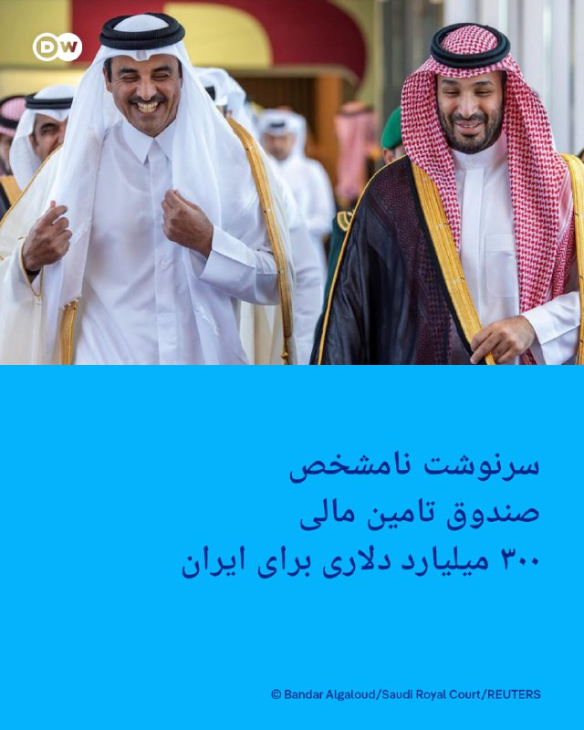

🔶 سرنوشت نامشخص صندوق تامین مالی ۳۰۰ میلیارد دلاری برای ایران

بر اساس توافق امضاشده میان ایران و آمریکا، واشنگتن و متحدانش موظف هستند که تأمین مالی یک صندوق ۳۰۰ میلیارد دلاری برای تهران را تضمین کنند. دونالد ترامپ، رئیس جمهور آمریکا این هفته گفت: «آنها پس از آنکه ما آنها را نابود کردیم به این پول نیاز خواهند داشت.»

‌جی‌دی ونس، معاون ترامپ نیز هفته گذشته گفته بود ایرانی‌ها می‌توانند به این صندوق که به گفته او از سوی کشورهای حوزه خلیج فارس تامین مالی می‌‌شود دسترسی داشته باشند. اما هنوز مشخص نیست کدام یک از این کشورها قرار است تامین مالی این صندوق را بر عهده بگیرند.

فیصل بن فرحان، وزیر امور خارجه عربستان سعودی روز چهارشنبه ۱۷ ژوئن به العربیه انگلیسی گفت که او "هیچ جزییاتی" درباره این صدوق نمی‌داند. او در عین حال اضافه کرد که حملات ایران به کشورهای حوزه خلیج فارس "باعث کاهش قابل توجه اعتماد شده است".
@dw_farsi

## BBCPersian — post 284284

  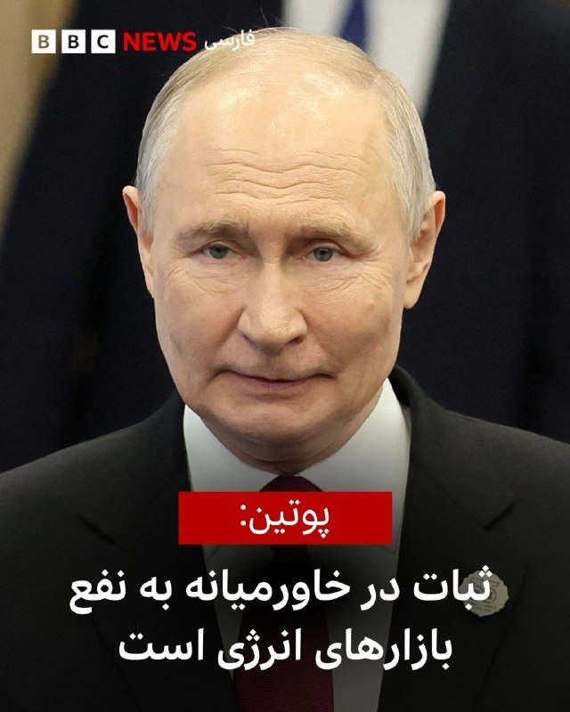

🔻ولادیمیر پوتین، رئیس‌جمهور روسیه، در نشست سران کشورهای عضو اتحادیه کشورهای جنوب شرق آسیا (آسه‌آن) در شهر کازان گفت که ثبات در خاورمیانه برای بازارهای انرژی جهانی مفید خواهد بود.

او این اظهارات را در واکنش به امضای تفاهم‌نامه‌ای میان آمریکا و ایران مطرح کرد که هدف آن پایان دادن به جنگ میان دو طرف عنوان شده است.

آقای پوتین همچنین گفت روسیه و کشورهای عضو آسه‌آن از توافق آتش‌بس استقبال می‌کنند و معتقدند این توافق می‌تواند پایه‌ای برای توافق‌های گسترده‌تر در آینده باشد.

📸 Getty

@BBCPersian

## Hranews — post 113704

  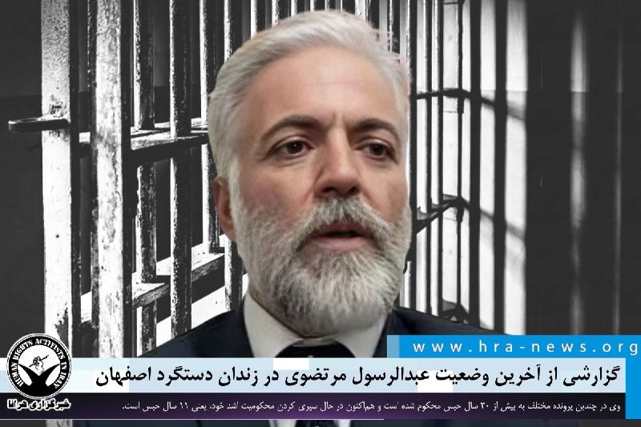

گزارشی از آخرین وضعیت عبدالرسول مرتضوی در زندان دستگرد اصفهان

❗️
❗️
❗️
❗️
❗️– عبدالرسول مرتضوی، زندانی سیاسی، دوران محکومیت خود را در زندان دستگرد اصفهان تحمل می‌کند. او در چندین پرونده مختلف به بیش از ۳۰ سال حبس محکوم شده است و هم‌اکنون در حال سپری کردن محکومیت اشد خود، یعنی ۱۱ سال حبس، است.

به گزارش خبرگزاری هرانا، ارگان خبری مجموعه فعالان حقوق بشر در ایران، عبدالرسول مرتضوی، در زندان دستگرد اصفهان محکومیت خود را سپری می‌کند.

یک منبع نزدیک به خانواده این زندانی سیاسی با اشاره به این موضوع که آقای مرتضوی مجروح جنگی ایران و عراق بوده و مجبور به استفاده از پای مصنوعی است، به هرانا گفت: افزون بر شرایط سخت زندان برای آقای مرتضوی، در تاریخ ۱۰ اسفندماه سال گذشته او را از زندان خارج و به مدت ۴۰ روز به یکی از سلول های بازداشتگاه اطلاعات در این زندان منتقل کردند. مسئولان زندان در خصوص علت این انتقال مدعی شدند که این یک اقدام پیشگیرانه است.

#عبدالرسول_مرتضوی

ادامه مطلب

↘️
@hranews_bot تماس ✉️ - @Hranews کانال هرانا 🆑

## alonews — post 128949

  <a href="telegram/content/alonews_128949_1781797583.webm" target="_blank">🎬 Download video</a>

👈جی‌دی ونس درباره لبنان: ما انتظار داریم حزب‌الله راکت‌ها و پهپادهایی به سمت اسرائیلی‌ها شلیک نکند و همچنین انتظار داریم اسرائیلی‌ها در لبنان به شدت عمل نکنند.

🔴هر دو طرف باید به تعهدات خود پایبند باشند.

🔴همان‌طور که می‌دانید، گاهی این آتش‌بس‌ها کمی پیچیده هستند

✅ @AloNews خبر جنگ

## alonews — post 128948

  <a href="telegram/content/alonews_128948_1781797584.mp4" target="_blank">🎬 Download video</a>

👈خبرنگار: رئیس‌جمهور ترامپ دیروز گفت که اگر مذاکرات این دور به مشکل بخورد، شما را مقصر خواهد دانست. آیا نگرانید که او بخواهد شما را قربانی کند؟

🔴 جِی‌دی ونس: نه، اصلاً. منظورم این است که فکر می‌کنم رئیس‌جمهور شوخی می‌کرد، همان‌طور که اغلب اوقات این کار را می‌کند.

✅ @AloNews خبر جنگ

## alonews — post 128947

  <a href="telegram/content/alonews_128947_1781797586.webm" target="_blank">🎬 Download video</a>

👈جی‌دی ونس از "حق دفاع از خود" و حق داشتن موشک‌های بالستیک ایران حمایت می‌کند: «اسرائیل اگر حزب‌الله به سمت اسرائیل موشک یا پهپاد شلیک کند، از حق دفاع از خود دست نمی‌کشد. ایرانی‌ها هم از حق دفاع از خود در کشورشان دست نمی‌کشند.»

✅ @AloNews خبر جنگ

## alonews — post 128946

  <a href="telegram/content/alonews_128946_1781797586.webm" target="_blank">🎬 Download video</a>

👈جی‌دی ونس درباره ایران: من می‌گویم دوره ۶۰ روزه رسماً امروز آغاز شده است.

🔴پس بله، توافق دیروز شروع شد — ما امروز ساعت ۶۰ روزه را شروع خواهیم کرد

✅ @AloNews خبر جنگ

## alonews — post 128945

  <a href="telegram/content/alonews_128945_1781797586.webm" target="_blank">🎬 Download video</a>

👈جِی‌دی ونس درباره ایران: من کسانی را دیده‌ام که به این توافق شک دارند — افرادی که می‌گویند ایرانی‌ها هرگز رفتار خود را تغییر نخواهند داد.

🔴خب، شاید این درست باشد، و اگر چنین باشد، آن‌ها هیچ یک از مزایای این معامله را دریافت نمی‌کنند. اما آیا ارزش امتحان کردن ندارد؟

✅ @AloNews خبر جنگ

## alonews — post 128944

  <a href="telegram/content/alonews_128944_1781797587.mp4" target="_blank">🎬 Download video</a>

👈جِی‌دی ونس درباره ایران: در ایران تقسیمات واقعی وجود دارد.

🔴آنچه در چند ماه گذشته دیده‌ایم این است که عمل‌گرایان درون نظام ایران — افرادی که واقعاً می‌خواهند رابطه خود را با خاورمیانه و جهان تغییر دهند — در حال پیروزی در این بحث هستند.

🔴ایالات متحده می‌خواهد این افراد در این بحث پیروز شوند

✅ @AloNews خبر جنگ

## alonews — post 128943

  <a href="telegram/content/alonews_128943_1781797589.webm" target="_blank">🎬 Download video</a>

🔴فوری / ونس: ما در حال حاضر یک تحریم اقتصادی فلج‌کننده علیه ایران اعمال می‌کنیم و تا زمانی که این کشور رفتار خود را به‌طور اساسی تغییر ندهد، به آن پایان نخواهیم داد

✅ @AloNews خبر جنگ

## alonews — post 128942

  <a href="telegram/content/alonews_128942_1781797589.webm" target="_blank">🎬 Download video</a>

👈جی‌دی ونس درباره ایران: برای بخش نظامی، چند نکته وجود دارد که همچنان درست است و چه ایرانی‌ها با بقیه توافق همکاری کنند یا نکنند، این نکات پابرجا خواهند بود.

🔴برنامه هسته‌ای آن‌ها کاملاً نابود شده است. ظرفیت غنی‌سازی آن‌ها، تأسیساتی که برای توسعه غنی‌سازی و ساخت احتمالی سلاح هسته‌ای استفاده می‌کردند، همچنان نابود شده است.

🔴نیروی نظامی متعارف آن‌ها همچنان نابود شده است. ظرفیت آن‌ها برای تهدید همسایگانشان عمدتاً از بین رفته است.

🔴اکنون می‌بینیم که آیا آن‌ها مایل به رعایت گام بعدی طرح صلح رئیس‌جمهور هستند یا خیر

✅ @AloNews خبر جنگ

## alonews — post 128941

  <a href="telegram/content/alonews_128941_1781797589.mp4" target="_blank">🎬 Download video</a>

👈آمریکا حتی یک سنت هم به ایران نمی‌دهد / جی‌دی ونس: "آنچه از همه شما می‌خواهم این است که صادقانه گزارش دهید که ایالات متحده حتی یک سنت هم به ایران نمی‌دهد...حتی مزایای اقتصادی، کاهش تحریم‌ها و غیره که با این معامله همراه است، فقط در صورتی اتفاق می‌افتد که ایرانی‌ها عمل کنند!"

✅ @AloNews خبر جنگ

---
📅 بروزرسانی: 1405/03/28 19:04
---

## VahidOOnLine — post 246235

  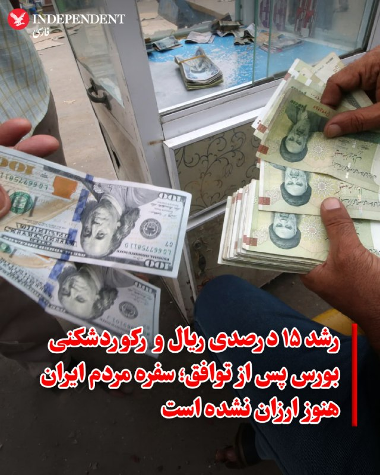

♦️ شبکه «الجزیره» در گزارشی اعلام کرد که در پی امضای یادداشت تفاهم میان جمهوری اسلامی و آمریکا، ارزش پول ملی ایران بیش از ۱۵ درصد در برابر دلار افزایش یافته و بازار بورس تهران نیز رکوردهای بی‌سابقه‌ای را شکسته است.

این تحولات مثبت پس از یک دوره نوسان شدید رخ می‌دهد؛ چرا که پس از آغاز جنگ، نرخ دلار در اسفندماه (مارس) به قله تاریخی ۱۹۰ هزار تومان (۱.۹ میلیون ریال) جهش کرد و پیش از حملات اخیر، در محدوده ۱۶۸ هزار و ۵۰۰ تومان آرام گرفته بود.

الجزیره می‌نویسد: با وجود این جهش ارزی و بازگشت نسبی ارزش ریال، گشت‌وگذاری در فروشگاه‌های مواد غذایی تهران واقعیت متفاوتی را نشان می‌دهد. شهروندان ایرانی که سال‌هاست از تورم بسیار بالا و کاهش قدرت خرید رنج می‌برند، هنوز تاثیر ملموسی از این گشایش دیپلماتیک در زندگی خود حس نکرده‌اند و قیمت کالاهای اساسی همچون مواد غذایی همچنان بالا باقی مانده است. به گزارش الجزیره، این تفاهم‌نامه و کاهش تنش‌ها هنوز نتوانسته است هزینه‌های سنگین زندگی را برای مردم تحت محاصره دریایی و تحریم‌های شدید، پایین بیاورد.
‌🇸🇦 Indypersian

🤖 @VahidOOnLine

## mwarmonitor — post 11126

🔥دفاع مدنی بحرین: آتش‌سوزی بزرگی در منطقه الصالحیه رخ داده است و نهادهای ذی‌ربط تحقیقات خود را آغاز کرده‌اند.

@mwarmonitor

## mwarmonitor — post 11125

  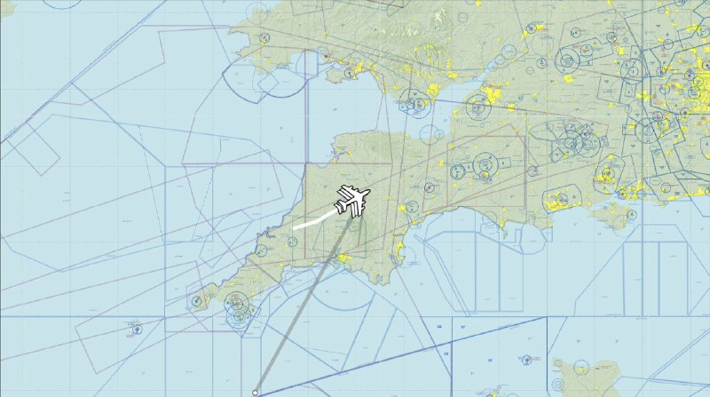

🔴✈️ساعت 16:05 پروازهای EIDER 65/66/67 (سه فروند) از نوع KC-135R Stratotanker متعلق به نیروی هوایی آمریکا از پایگاه هوایی Istres در فرانسه به سمت منطقه ARA 10 برای سوخت‌گیری هوایی (AR) همراه با MOSSY87 (دو فروند بمب‌افکن استراتژیک B-1 از EGVA بریتانیا) به پرواز درآمدند.

✈️شناسه پروازی EIDER67 عملیات سوخت‌گیری را کامل کرده و درخواست مسیر مستقیم DOLUR برای بازگشت به پایگاه LFMI فرانسه را داده است.

@mwarmonitor

## FoxNewsTwitter — post 343124

  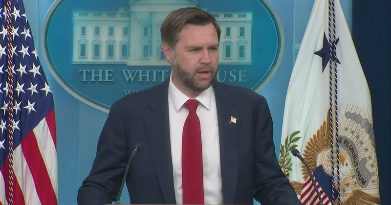

Fox News (Twitter/X)

WATCH LIVE: Vice President Vance holds White House briefing https://twitter.com/i/broadcasts/1AxRnnbkPNYxl

## DEJradio — post 5796

⭕️ نگرانی امنیتی، تصمیم‌گیری دربارۀ دفن خامنه‌ای را دشوار کرده است

بنا بر گزارش اختصاصی منبع دژ، مقام‌های جمهوری اسلامی همچنان دربارۀ زمان و نحوۀ دفن علی خامنه‌ای با تردید روبه‌رو هستند.
این منبع می‌گوید برخی از مقام‌های ارشد نظام نگران‌اند که در صورت حضور در مراسم تشییع و خاکسپاری، شناسایی شده و هدف حمله اسرائیل قرار بگیرند.
این منبع گفت علاوه بر مقامات ارشد نظام، بسیاری از افراد در رده‌های میانی نیز هنوز به پایان یافتن جنگ و عادی شدن اوضاع باور ندارند و نگران جان خود هستند.
به گزارش منبع دژ، در پی اظهارات مقامات اسرائیل مبتنی بر متعهد نبودن به تفاهم میان تهران و واشینکتن، نگرانی‌ها در میان مقامات نظام بالا گرفته است.
منبع اختصاصی دژ گفت رژیم با وجود اعلام برنامۀ دفن «باقیماندۀ جسد خامنه‌ای»، هنوز به دلیل بیم امنیتی به تصمیم نهائی نرسیده است.

#موشعلی
@DEJradio

## IranIntlTV — post 343063

  <a href="https://t.me/IranintlTV/343063" target="_blank">📎 Download file</a>

🎧نسخه صوتی اخبار شبانگاهی | پنجشنبه ۲۸ خرداد
@iranintlTV

## FarsiVOA — post 221118

ده سال از همه‌پرسی تاریخی برگزیت می‌گذرد؛ تصمیمی که بریتانیا را از اتحادیه اروپا خارج کرد و همچنان یکی از بحث‌برانگیزترین موضوعات سیاست این کشور است.

## FarsiVOA — post 221117

در پی امضای تفاهمنامه پایان درگیری با جمهوری اسلامی، پرزیدنت ترامپ از منتقدین آن به شدت انتقاد کرد

## FarsiVOA — post 221116

🔺واکنش شدید اسرائیل به اظهارات ضداسرائیلی منتسب به کایا کالاس؛ «تمامی ارتباطات» را قطع می‌کنیم

▪️گیدئون سعار، وزیر امور خارجه اسرائیل، روز پنجشنبه ۲۸ خرداد اعلام کرد در پی اظهارات منتسب به کایا کالاس، مسئول سیاست خارجی اتحادیه اروپا، درباره مقایسه اسرائیل با آفریقای جنوبی دوران آپارتاید، «تمامی ارتباطات» خود را با او قطع می‌کند.

⬇️ بیشتر بخوانید:
https://ir.voanews.com/a/israeli-foreign-minister-severing-contact-with-eu-foreign-policy-chief/8162263.html/?nocach=1

## DW_Farsi — post 126149

🔶 حملات شدید اوکراین به یکی از بزرگ‌ترین پالایشگاه‌های روسیه

پس از اصابت چند پهپاد و ظاهرا موشک‌های کروز به یکی از بزرگ‌ترین پالایشگاه‌های روسیه در منطقه کاپوتنیا، ستون‌های متراکم دود بر فراز بخش‌هایی از پایتخت روسیه دیده شدند. بر اساس گزارش‌های منتشر شده، شیشه جلوی خودروها در پی این حمله در بخش‌هایی از شهر با لایه‌ای از نفت پوشیده شدند.

گفته می‌شود در جریان حمله اوکراین ، اهداف دیگری نیز در مسکو مورد اصابت قرار گرفتند. از آنجا که سایر اهداف، به اندازه آتش‌سوزی گسترده پالایشگاه، با چشم قابل مشاهده نبودند و انتشار تصاویر حملات نیز در روسیه مجازات در پی دارد، هنوز کاملا مشخص نیست چه مکان‌هایی هدف قرار گرفته‌اند.

با این حال، در عکس‌هایی که در شبکه‌های اجتماعی منتشر شدند، دست‌کم یک ساختمان مسکونی نیز دیده می‌شود که آسیب دیده است. همچنین فرودگاه‌های بزرگ پایتخت روسیه نیز تا اواخر صبح بسته بودند.

این حمله‌ بنا به اعلام روسیه با بیش از هزار پهپاد صورت گرفته است که مسکو ادعا می‌کند، بیشتر آن‌ها سرنگون شده‌اند.

📌 برای دسترسی کامل به گزارش به وبسایت دویچه‌وله فارسی مراجعه کنید.
@dw_farsi

## RadioFarda — post 158468

🔸بنیامین نتانیاهو، نخست‌وزیر اسرائیل، یک روز بعد از امضای تفاهم‌نامه ایران و آمریکا در نخستین موضع‌گیری خود اعلام کرد که نیروهای اسرائیلی از جنوب لبنان عقب‌نشینی نخواهند کرد و تا هر زمان که لازم باشد منطقه حائل امنیتی خود را در آنجا حفظ خواهند کرد. 🔸این اظهارات…

## RadioFarda — post 158467

  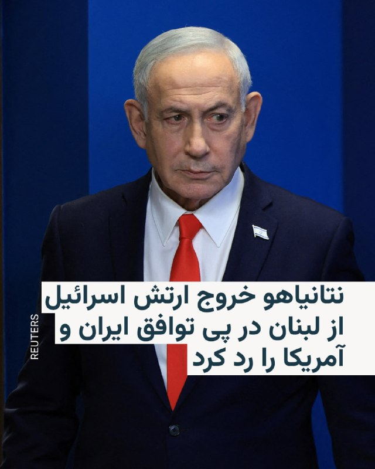

🔸بنیامین نتانیاهو، نخست‌وزیر اسرائیل، یک روز بعد از امضای تفاهم‌نامه ایران و آمریکا در نخستین موضع‌گیری خود اعلام کرد که نیروهای اسرائیلی از جنوب لبنان عقب‌نشینی نخواهند کرد و تا هر زمان که لازم باشد منطقه حائل امنیتی خود را در آنجا حفظ خواهند کرد.

🔸این اظهارات پس از آن مطرح شد که دونالد ترامپ، رئیس‌جمهور آمریکا، طی روزهای اخیر از عملیات اسرائیل علیه حزب‌الله لبنان انتقاد کرد و آن را بیش از حد «تهاجمی» دانست.

🔸نتانیاهو در یک مراسم رسمی گفت: «ما امنیت و رونق را به شهرهای شمالی بازخواهیم گرداند.»

🔸او افزود: «این امر مستلزم حفظ منطقه امنیتی در جنوب لبنان است؛ مستلزم آن است که آنجا را ترک نکنیم، تا زمانی که نیازهای امنیتی اسرائیل چنین ایجاب کند.»

🔸نخستین بند یادداشت تفاهم آمریکا و ایران خواستار «پایان فوری و دائمی عملیات نظامی در تمامی جبهه‌ها، از جمله در لبنان» است، اما اسرائیل حملات در جنوب لبنان و به مواضع حزب‌الله، گروه شیعه مورد حمایت جمهوری اسلامی، ادامه داده است.

@RadioFarda

## alonews — post 128940

  <a href="telegram/content/alonews_128940_1781796892.webm" target="_blank">🎬 Download video</a>

👈جِی‌دی ونس درباره ایران: فکر می‌کنم طرح صلح رئیس‌جمهور در ایران در حال حاضر برای مردم آمریکا ثمرات واقعی به همراه دارد.

🔴دیشب، ۱۲.۵ میلیون بشکه نفت از تنگه هرمز عبور کرد.

🔴این بالاترین میزان از آغاز درگیری است.

🔴ایرانی‌ها برای دومین شب متوالی به هیچ کشتی‌ای در تنگه هرمز شلیک نکردند. تا کنون، به تعهد خود پایبند بوده‌اند.

🔴سنتکام اجازه داده است که دوازده کشتی از محاصره دریایی ما عبور کنند، بنابراین ما نیز به تعهد خود عمل می‌کنیم

✅ @AloNews خبر جنگ

## alonews — post 128939

  <a href="telegram/content/alonews_128939_1781796892.mp4" target="_blank">🎬 Download video</a>

👈غرفه نقطه آتش اوکراین در یوروساتوری ۲۰۲۶ در پاریس، حملات پهپادی FP-1 و FP-2 امروز به پالایشگاه مسکو روسیه را به نمایش می‌گذارد.

✅ @AloNews خبر جنگ

---
📅 بروزرسانی: 1405/03/28 18:54
---

## VahidOOnLine — post 246234

  

ریاست‌جمهوری لبنان اعلام کرد جوزف عون به هیات مذاکره‌کننده این کشور دستور داده است تا در مذاکرات با اسرائیل بر مواضع بیروت مبنی بر برقراری آتش‌بس دائمی، خروج نیروهای اسرائیلی و استقرار ارتش لبنان در مرزهای بین‌المللی پایبند بماند.

ریاست‌جمهوری لبنان افزود عون نشستی ویژه برای بررسی مقدمات دور بعدی مذاکرات لبنان، آمریکا و اسرائیل که قرار است از دوم تا چهارم تیرماه در واشینگتن برگزار شود، تشکیل داده است.
‌🏁 🇬🇧 IranintlTV

🤖 @VahidOOnLine

## FoxNewsTwitter — post 343123

Fox News (Twitter/X)

The TSA could be moving security checks away from the airport.

A new pilot program at Boston's Logan International is trying to get rid of long lines by giving passengers the option to check in and go through security at an off-site location.

@Grady_Trimble examines the trial in an exclusive look for Fox Business.

## IranIntlTV — post 343062

  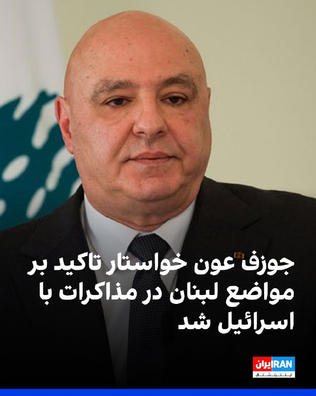

ریاست‌جمهوری لبنان اعلام کرد جوزف عون به هیات مذاکره‌کننده این کشور دستور داده است تا در مذاکرات با اسرائیل بر مواضع بیروت مبنی بر برقراری آتش‌بس دائمی، خروج نیروهای اسرائیلی و استقرار ارتش لبنان در مرزهای بین‌المللی پایبند بماند.

ریاست‌جمهوری لبنان افزود عون نشستی ویژه برای بررسی مقدمات دور بعدی مذاکرات لبنان، آمریکا و اسرائیل که قرار است از دوم تا چهارم تیرماه در واشینگتن برگزار شود، تشکیل داده است.
https://iranintl.com/202606188688

## FarsiVOA — post 221115

🔺پرزیدنت ترامپ درباره نتایج «یادداشت تفاهم»: ایران هرگز نمی‌تواند سلاح هسته‌ای داشته باشد

▪️رئیس جمهوری آمریکا با انتشار پیامی کوتاه به دستاوردهای امضای «یادداشت تفاهم» با جمهوری اسلامی اشاره کرد.

⬇️ بیشتر بخوانید:
https://ir.voanews.com/a/donald-trump-understanding-iran-nuclear-weapons/8162262.html/?nocach=1

## FarsiVOA — post 221114

🔺حمله پهپادی گسترده اوکراین به پایتخت روسیه؛ پالایشگاه مسکو هدف قرار گرفت

▪️اوکراین روز پنجشنبه ۲۸ خرداد با اجرای یک حمله‌ پهپادی گسترده به مسکو، برای دومین بار طی هفته جاری پالایشگاه نفت پایتخت روسیه را هدف قرار داد. اوکراین اعلام کرد که این اقدام پاسخ به حمله‌ای است که به یک صومعه حدودا هزارساله در شهر کی‌یف آسیب رسانده بود.

⬇️ بیشتر بخوانید:

https://ir.voanews.com/a/ukraine-hits-moscow-refinery/8162256.html

## IranianMinds — post 22884

  

🔴 پیش‌خرید بازی "GTA VI" از 4 تیر آغاز خواهد شد.

@IranianMinds

## Dirty_Kids — post 392503

  <a href="telegram/content/Dirty_Kids_392503_1781796251.mp4" target="_blank">🎬 Download video</a>

یه عرزشی اومد از جمهوری اسلامی طرفداری کنه ولی جوری رید که تو تاریخ ثبت شد😂

تو جام جهانی ۲۰۱۴ که از آرژانتین باختیم، از بس خوب بازی کردیم همه جشن گرفتیم، جوری که آرژانتینی ها فکر کردن ما بردیم.
ما کلا عادت داریم باختمون رو با برد نشون بدیم.

@Dirty_Kids 👻

## Dirty_Kids — post 392502

‏نیاز دارم کصخل باشم، پولدار، بی دغدغه، آیکیو نهایتا ۸۰
مثل کسایی که روسیه دندون میخونن

@Dirty_Kids 👻

## alonews — post 128938

  <a href="telegram/content/alonews_128938_1781796252.webm" target="_blank">🎬 Download video</a>

👈پزشکیان: تلاش‌های پاکستان در مسیر دستیابی به توافق پایان جنگ در حافظه ملت ایران ماندگار خواهد شد

🔴شهباز شریف: صبر، استقامت و رویکرد مبتنی بر عقلانیت و تدبیر مسئولان و ملت ایران ستودنی است

✅ @AloNews خبر جنگ

## alonews — post 128937

  <a href="telegram/content/alonews_128937_1781796252.webm" target="_blank">🎬 Download video</a>

👈علی‌هاشم، خبرنگار الجزیره: مسعود پزشکیان شاید تنها رئیس‌جمهور ایران باشد که چندین حیات سیاسی مختلف را در یک دوره تجربه کرده است

🔴به قدرت رسیدن پس از جان باختن رئیس‌جمهور قبلی در سقوط هلیکوپتر

🔴ترور اسماعیل هنیه در مراسم تحلیف

🔴حمله مستقیم ایران به اسرائیل

🔴سقوط سوریه، ترور نصرالله و حمله به ایران

🔴شعله‌ور شدن اعتراضات

🔴تغییر رهبری در شرایط جنگی

🔴امضای توافق صلح با آمریکا

🔴در دوران پزشکیان، ایران هرگز از حرکت و گذار از یک مرحله به مرحله‌ای دیگر باز نایستاده است.

✅ @AloNews خبر جنگ

## alonews — post 128936

  <a href="telegram/content/alonews_128936_1781796252.webm" target="_blank">🎬 Download video</a>

🔴فوری / معاون نخست‌وزیر و وزیر خارجه پاکستان: از آنجا که یادداشت تفاهم میان آمریکا و ایران به‌صورت مجازی امضا شده است، مراسم رسمی امضای آن که قرار بود روز جمعه در سوئیس برگزار شود، لغو شده است.

✅ @AloNews خبر جنگ

## alonews — post 128935

  <a href="telegram/content/alonews_128935_1781796253.webm" target="_blank">🎬 Download video</a>

👈یک منبع: بررسی اصلاحیه قیمت‌های ایران خودرو نشان می‌دهد که نرخ نهایی اکثر محصولات این شرکت بدون تغییر باقی مانده و تنها چند خودرو با «کاهش محدود» قیمت مواجه شده‌اند!

✅ @AloNews خبر جنگ

---
📅 بروزرسانی: 1405/03/28 18:44
---

## VahidOOnLine — post 246233

  <a href="telegram/content/VahidOOnLine_246233_1781795652.mp4" target="_blank">🎬 Download video</a>

♦️بر اساس گزارش رویترزو تصاویر ردیابی دریایی مارین ترافیک تردد نفتکش‌ها در تنگه هرمز از سر گرفته شد.
 جمهوری اسلامی و ایالات متحده با امضای یک توافق ۱۴ بندی، به جنگ میان دو کشور پایان دادند؛ توافقی که شامل بازگشایی کامل تردد دریایی در تنگه هرمز و لغو محاصره بنادر ایران از سوی آمریکا است.
این توافق روز چهارشنبه ۲۷ خرداد به‌صورت دیجیتال توسط دونالد ترامپ و مسعود پزشکیان امضا شد و وزارت امور خارجه جمهوری اسلامی اعلام کرده که مفاد آن بلافاصله اجرایی شده است.
تنها ساعاتی پس از امضای توافق، سه نفتکش عظیم با پرچم عربستان سعودی که مجموعاً حامل شش میلیون بشکه نفت خام بودند، از تنگه هرمز عبور کردند؛ حرکتی که به گفته تحلیل‌های رویترز، بزرگ‌ترین عبور نفتکش‌ها از این مسیر در هفته‌های اخیر محسوب می‌شود.
تنگه هرمز که بیش از ۱۰۰ روز با محدودیت شدید تردد مواجه بود، یکی از مهم‌ترین گذرگاه‌های انرژی جهان به‌شمار می‌رود و بازگشایی آن می‌تواند تأثیر قابل توجهی بر بازارهای جهانی نفت داشته باشد.
‌🇸🇦 Indypersian

🤖 @VahidOOnLine

## VahidOOnLine — post 246232

  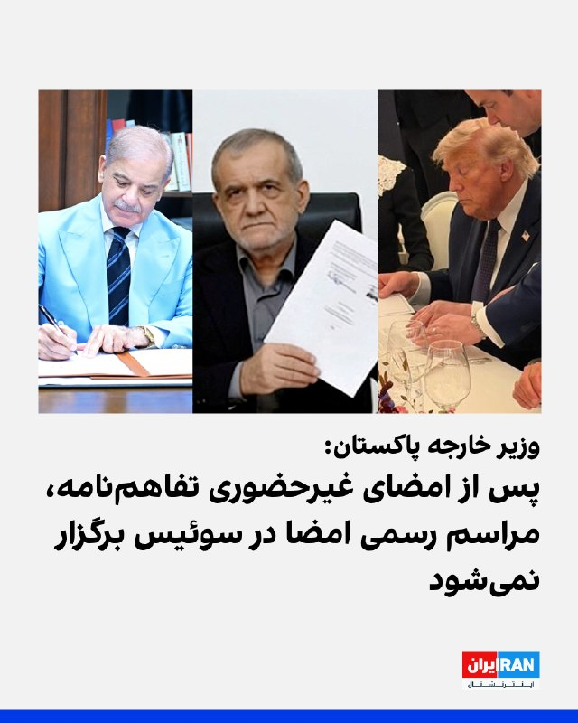

محمد اسحاق‌دار، معاون نخست‌وزیر و وزیر خارجه پاکستان، به روزنامه پاکستانی «داون» گفت از آنجا که یادداشت تفاهم میان آمریکا و جمهوری اسلامی به‌صورت از راه دور از سوی روسای جمهور دو کشور شامگاه چهارشنبه امضا شده است، مراسم رسمی امضای این توافق که قرار بود روز جمعه در سوئیس برگزار شود، لغو شده است.

اسحاق‌دار افزود محمد شهباز شریف، نخست‌وزیر پاکستان، که این یادداشت تفاهم را به عنوان میانجی امضا کرده است، سفر برنامه‌ریزی‌شده خود به سوئیس را نیز لغو کرده است.

قرار بود یادداشت تفاهم موسوم به «اسلام‌آباد» روز جمعه در اقامتگاهی در بورگن‌اشتوک سوئیس به‌طور رسمی امضا شود.

اسحاق‌دار درباره حضور یا عدم حضور مقام‌های جمهوری اسلامی و آمریکا در بورگن‌اشتوک پس از لغو مراسم رسمی امضا اظهارنظری نکرد.
‌🏁 🇬🇧 IranintlTV

🤖 @VahidOOnLine

## VahidOOnLine — post 246231

  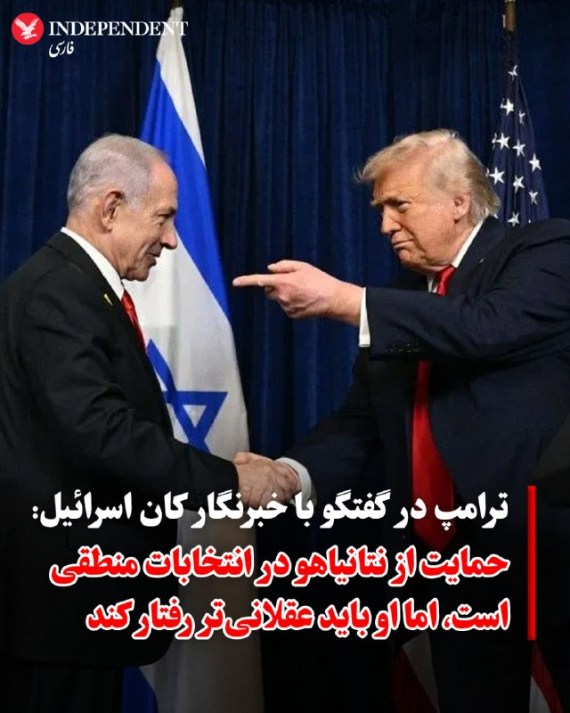

♦️ شبکه «کان نیوز» اسرائیل گزارش داد که دونالد ترامپ، رئیس‌جمهوری آمریکا، روز پنج‌شنبه ۲۸ خرداد اعلام کرد حمایت از بنیامین نتانیاهو، نخست‌وزیر اسرائیل، در انتخابات پیش‌رو «کاملا منطقی» خواهد بود، اما شروطی نیز برای آن دارد.

ترامپ در این باره گفت: «حمایت از او منطقی است، اما من ابتدا باید ببینم چه کسانی نامزدِ انتخابات می‌شوند. من رابطه خوبی با بیبی (نتانیاهو) دارم، اما او باید عقلانی‌تر (منطقی‌تر) رفتار کند. من برای دیدار با او آمادگی دارم.»
‌🇸🇦 Indypersian

🤖 @VahidOOnLine

## VahidOOnLine — post 246230

  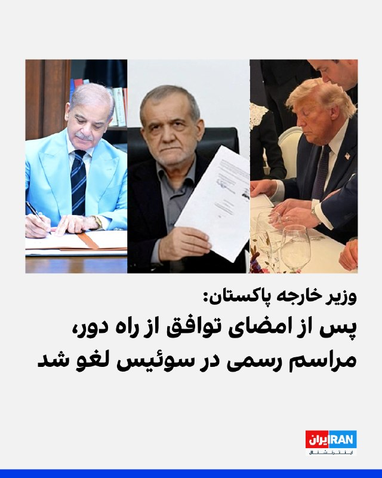

محمد اسحاق‌دار، معاون نخست‌وزیر و وزیر خارجه پاکستان، به روزنامه پاکستانی «داون» گفت از آنجا که یادداشت تفاهم میان آمریکا و جمهوری اسلامی به‌صورت از راه دور از سوی روسای جمهور دو کشور شامگاه چهارشنبه امضا شده است، مراسم رسمی امضای این توافق که قرار بود روز جمعه در سوئیس برگزار شود، لغو شده است.

اسحاق‌دار افزود محمد شهباز شریف، نخست‌وزیر پاکستان، که این یادداشت تفاهم را به عنوان میانجی امضا کرده است، سفر برنامه‌ریزی‌شده خود به سوئیس را نیز لغو کرده است.

قرار بود یادداشت تفاهم موسوم به «اسلام‌آباد» روز جمعه در اقامتگاهی در بورگن‌اشتوک سوئیس به‌طور رسمی امضا شود.

اسحاق‌دار درباره حضور یا عدم حضور مقام‌های جمهوری اسلامی و آمریکا در بورگن‌اشتوک پس از لغو مراسم رسمی امضا اظهارنظری نکرد.
‌🏁 🇬🇧 IranintlTV

🤖 @VahidOOnLine

## WithYashar — post 15259

## mwarmonitor — post 11124

⚠️اطلاعیه رسمی کانال ⚠️ 🔸بدین‌وسیله به اطلاع همراهان گرامی می‌رسد که کانال خبری ما در پلتفرم X (توییتر سابق) راه‌اندازی شد. 🔸از این پس نیز ، آخرین اخبار و تحلیل‌های نظامی، سیاسی و همچنین مسائل اجتماعی ایران و جهان به‌صورت منظم در آن منتشر خواهد شد. 🔸از…

## FoxNewsTwitter — post 343122

  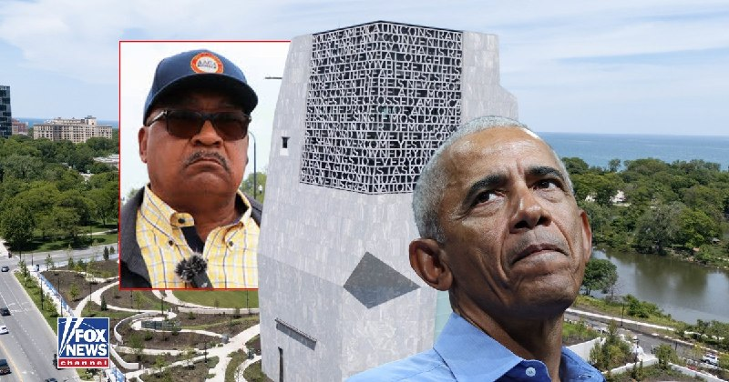

Fox News (Twitter/X)

"They are scared to death about talking about it."

The Obama Presidential Center was pitched as a legacy project that would help lift minority-owned and local businesses.

Now, several subcontractors say the project has left them saddled with massive unpaid costs.

One plumbing contractor says he's nearly $4 million in the red: "That is a hole that no subcontractor, small business can survive."

A Fox News Digital investigation found multiple construction firms reporting losses ranging from hundreds of thousands of dollars to tens of millions, with many of the complaints coming from the very firms the Center claims it wanted to support.

## IranIntlTV — post 343061

  

محمد اسحاق‌دار، معاون نخست‌وزیر و وزیر خارجه پاکستان، به روزنامه پاکستانی «داون» گفت از آنجا که یادداشت تفاهم میان آمریکا و جمهوری اسلامی به‌صورت از راه دور از سوی روسای جمهور دو کشور شامگاه چهارشنبه امضا شده است، مراسم رسمی امضای این توافق که قرار بود روز جمعه در سوئیس برگزار شود، لغو شده است.

اسحاق‌دار افزود محمد شهباز شریف، نخست‌وزیر پاکستان، که این یادداشت تفاهم را به عنوان میانجی امضا کرده است، سفر برنامه‌ریزی‌شده خود به سوئیس را نیز لغو کرده است.

قرار بود یادداشت تفاهم موسوم به «اسلام‌آباد» روز جمعه در اقامتگاهی در بورگن‌اشتوک سوئیس به‌طور رسمی امضا شود.

اسحاق‌دار درباره حضور یا عدم حضور مقام‌های جمهوری اسلامی و آمریکا در بورگن‌اشتوک پس از لغو مراسم رسمی امضا اظهارنظری نکرد.
https://iranintl.com/202606181577

## FarsiVOA — post 221113

عرفان ثابتی در میدان می‌گوید هم موافقان و هم مخالفان تیم ملی فوتبال اگر دیدگاهی غیر از نظر خودشان را محکوم کنند، هر دو رفتارشان غیراخلاقی است

## DW_Farsi — post 126148

  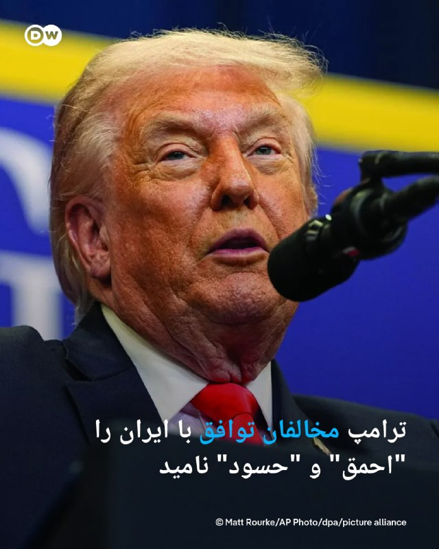

🔶 ترامپ مخالفان توافق با ایران را "احمق" و "حسود" نامید

دونالد ترامپ رییس جمهور ایالات متحده امریکا در پستی در شبکه اجتماعی خودش، تروث سوشال نوشت: «این احمق‌ها که فکر می‌کنند من در قبال ایران به اندازه کافی سخت‌گیر نبوده‌ام، در حالی که بازار سهام همین حالا به یک رکورد تاریخی رسیده و قیمت نفت در حال سقوط است، یا حسودند، یا آدم‌های بدی هستند، یا احمق.»

این در حالی است که بسیاری از هم‌حزبی‌های ترامپ نیز به این توافق بدبین هستند. از جمله مایک پنس، معاون ترامپ در دوره پیشین ریاست جمهوری او، در مصاحبه‌ای با شبکه فاکس نیوز نگرانی‌هایی جدی در باره تفاهم‌نامه ایران و آمریکا "هم به خاطر آنچه در آن گنجانده شده و هم به خاطر آنچه در آن منظور نشده است" ابراز داشت.

او گفت: «تفاهم‌نامه مزبور به‌طور نگران‌کننده‌ای یادآور همان سیاست مماشات است که دولت ما در توافق هسته‌ای اوباما با ایران رد کرد و همچنین همان رویکردی که جو بایدن تلاش داشت در دوران ریاست‌جمهوری خود دوباره آن را احیا کند.»
@dw_farsi

## RadioFarda — post 158466

  <a href="telegram/content/RadioFarda_158466_1781795657.mp4" target="_blank">🎬 Download video</a>

🔸معاون اجرایی دولت جمهوری اسلامی می‌گوید مسعود پزشکیان «توانست تفاهم‌نامۀ ایران و آمریکا را به امضای همه اعضای شورای عالی امنیت ملی به جز یک نفر برساند».

🔸محمدجعفر قائم‌پناه در پاسخ به «انصاف‌نیوز» نقش دیگر مسعود پزشکیان را انتخاب محمدباقر قالیباف به‌عنوان سرپرست تیم مذاکره‌کننده دانست و استدلال آن را «ارتباط محمدباقر قالیباف با نظامیان و توان او در اجماع‌سازی» با آن‌ها ذکر کرد.

🔸توافق میان ایران و آمریکا قرار بود توسط جی‌دی ونس، معاون دونالد ترامپ و محمدباقر قالیباف، رئیس مجلس شورای اسلامی که در مذاکرات ایران و آمریکا نقش اصلی را داشته است، امضا شود اما اسماعیل بقایی، سخنگوی وزارت خارجۀ جمهوری اسلامی، شامگاه چهارشنبه ۲۷ خرداد اعلام کرد که در نهایت تصمیم بر این شد که «بالاترین مقام‌های اجرایی دو کشور» آن ‌را به شکل الکترونیکی امضا کنند و متن توافق به امضای دونالد ترامپ و مسعود پزشکیان رسید.

@RadioFarda

## alonews — post 128934

  <a href="telegram/content/alonews_128934_1781795660.mp4" target="_blank">🎬 Download video</a>

👈ترامپ در ۹ مارس: این موضوع واقعاً روی ما تأثیر نمی‌گذارد؛ ما نفت و گاز فراوانی داریم، خیلی بیشتر از نیازمان.

🔴ترامپ در ۱ آوریل: ما اکنون کاملاً از خاورمیانه مستقل هستیم. به نفت آن‌ها نیازی نداریم.

🔴ترامپ در ۱۷ ژوئن: اگر به بمباران شدید ایران ادامه دهیم، ذخایر ما در حدود ۴ هفته تمام خواهد شد

✅ @AloNews خبر جنگ

## alonews — post 128933

  <a href="telegram/content/alonews_128933_1781795662.mp4" target="_blank">🎬 Download video</a>

👈چرا با اسرائیل دارای سلاح هسته‌ای برخورد نمی‌کنید؟

🔴 گروسی: چون عضو ان پی تی نیست! خواهش میکنم عضو شود

✅ @AloNews خبر جنگ

## alonews — post 128932

  <a href="telegram/content/alonews_128932_1781795664.mp4" target="_blank">🎬 Download video</a>

👈 لبنانی‌ها همچنان به سمت جنوب لبنان هجوم می‌آورند تا به خانه‌های خود بازگردند.

✅ @AloNews خبر جنگ

---
📅 بروزرسانی: 1405/03/28 18:35
---

## VahidOnline — post 76482

  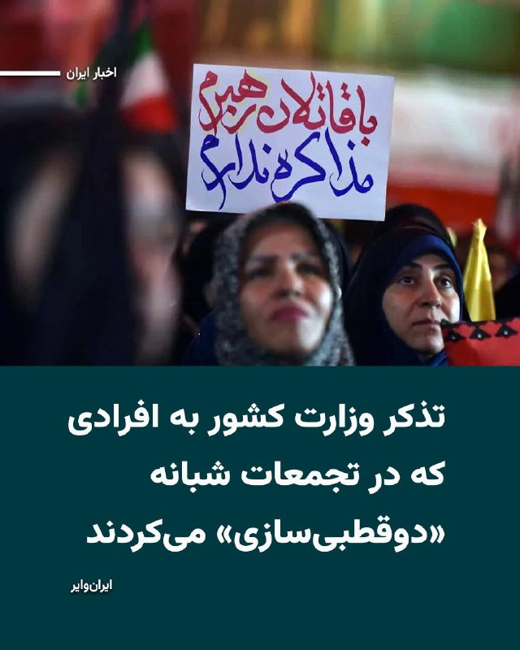

معاون وزیر کشور و رییس سازمان امور اجتماعی ایران می‌گوید به افرادی که در تجمعات شبانه «دوقطبی‌سازی» می‌کردند، در یک نامه به طور «محرمانه» تذکر داده است.

«محمد بطحایی»، بدون اشاره به نام این افراد گفته است که «مورد اول مربوط به یک سازمان و تشکل سازمانی بود و در دو مورد دیگر به‌صورت فردی، نامه‌ محرمانه و البته همراه با احترام و تکریم برای افراد مورد نظر ارسال شده است.»

پس از اینکه گفته شد ایران و آمریکا به امضای تفاهم‌نامه‌ای برای رسیدن به یک توافق پایدار نزدیک هستند، برخی مخالفان این توافق که از چهره‌های نزدیک به جبهه پایداری، تشکل سیاسی اصولگرا و تندرو در ایران هستند، علیه «عباس عراقچی» و «محمدباقر قالیباف» شعار دادند.
@VahidHeadline

📡 @VahidOnline

## kianmeli1 — post 88066

🔴سی‌ان‌ان به نقل از یک منبع اسرائیلی

نتانیاهو هم امیدوار است و هم معتقد که توافق نهایی حاصل نخواهد شد
https://t.me/kianmeli1

## kianmeli1 — post 88065

  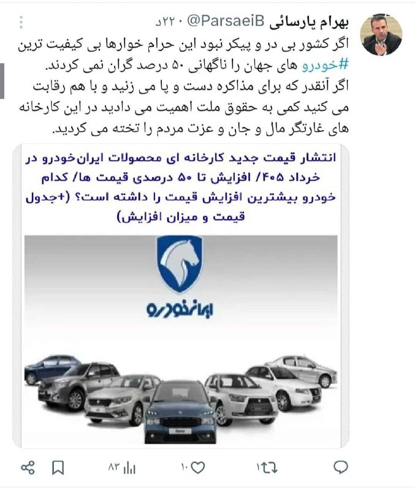

🔴بهرام پارسائی نماینده سابق مجلس:اگر کشور بی در و پیکر نبود این حرام خوارها بی کیفیت ترین خودروهای جهان را ناگهانی ۵۰ درصد گران نمی کردند اگر آنقدر که برای مذاکره دست و پا می زنید و با هم رقابت می کنید کمی به حقوق ملت اهمیت می دادید در این کارخانه های غارتگر مال و جان و عزت مردم را تخته می کردید
https://t.me/kianmeli1

## IranIntlTV — post 343059

یک شهروند با ارسال پیامی صوتی به ایران اینترنشنال، توافق دونالد ترامپ با مقام‌های جمهوری اسلامی را همدستی او در ریخته‌شدن خون هزاران شهروندی دانست که در ایران به دست حکومت کشته شدند.

## Iliaen — post 4494

دو نکته را عرض می‌کنم و بیشتر به آن نمی‌پردازم تا زمان آن برسد.

۱- مجتبی خامنه‌ای زنده است و جمهوری اسلامی عامدانه با مجموعه‌ای از تصمیم‌ها توانست به جامعه القا کند که او زنده نیست.

دراصل شما تصور می‌کنید خودتان با هوشمندی و کنار هم قرار دادن رشته‌ای از اتفاقات متوجه شدید او کشته شده است، اما در حقیقت، حاکمیت هر لحظه به صورت غیرمستقیم شما را به سمت این نتیجه‌گیری هدایت می‌کند.

تاکنون برایتان سوال نشده چطور سرویس‌های امنیتی جهان حتی یک مرتبه به احتمال مرگ او اشاره نکردند؟ یا اگر او کشته شده بود، مگر چقدر برای جمهوری اسلامی سخت بود تا در راستای مصلحت نظام یک فایل صوتی، عیناً با صدای او بسازد و منتشر کند؟

آن‌ها نیاز به این کار نداشتند زیرا ترجیح بر این است شایعات به حداکثر خود برسد و سپس مجتبی وارد بازی شود. علت نیاز جمهوری اسلامی به تشدید شایعات و این صبر طولانی را بعداً توضیح خواهم داد.

۲- قالیباف شخصیت اصلی مذاکرات نیست، او صرفاً مسئول موقت پروژه نجات نظام است.

تصمیم‌ها و نوع پیشبردِ روند مذاکرات توسط اشخاصی دیگر انجام می‌شود که در این زمان، ریسک پذیرش پیامد عدم موفقیت این پروژه را ندارند تا بعداً به عنوان یک ننگ کنار اسم آن‌ها قرار نگیرد، زیرا در صورت سقوط نیز به دنبال حفظ یک جایگاه در ایرانِ پس از جمهوری اسلامی هستند.

@iliaen

## Persian_Trend_Official — post 17475

  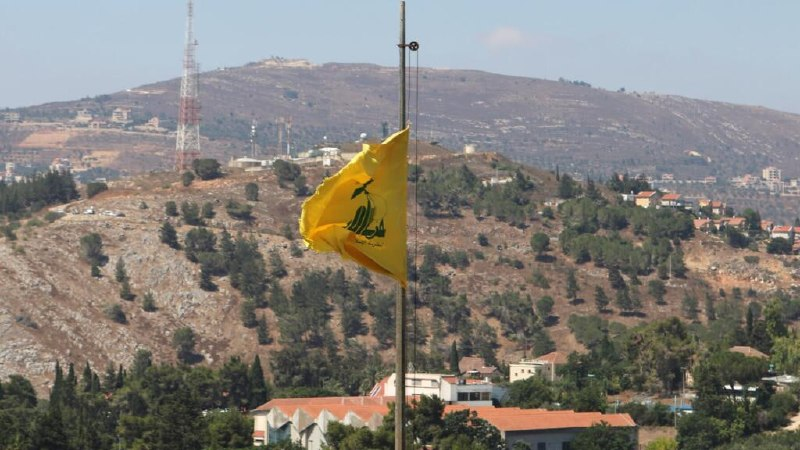

منابع نزدیک به حزب‌الله لبنان می‌گویند جنگجویان این گروه طی چهار روز گذشته در درگیری با نیروهای اسرائیلی بوده‌اند و افزوده‌اند که چندین تلاش برای پیشروی به سمت کفر تبنیت و منطقه علی الطاهر را از طریق حملات موشکی، پهپادی، پهپادهای FPV، راکت و توپخانه دفع کرده‌اند.

این گروه اعلام کرد که در 17 ژوئن یک واحد پیاده‌نظام اسرائیلی را که سعی داشت مواضعی را در شمال شرقی کفر تبنیت مستقر کند با استفاده از پهپادهای تهاجمی، پهپادهای FPV ابابیل، راکت و توپخانه، هدف قرار داده و مدعی تلفات طرف اسرائیلی شده است.

حزب‌الله همچنین افزود که در 18 ژوئن یک تانک مرکاوا اسرائیلی را با سلاح‌های ضد زره در نزدیکی یک منطقه مورد اصابت قرار داده و نیروهای اسرائیلی را مجبور به عقب‌نشینی کرده است.

این گروه می‌گوید نیروهای اسرائیلی در حومه جنوبی کفر تبنیت به سمت ارنون باقی مانده‌اند و قول داده‌اند که از هرگونه پیشروی بیشتر اسرائیل به بخش کفر تبنیت-علی الطاهر جلوگیری کنند.

📝 Amir

📌 @persian_trend_official
پرشین ترند | متفاوت‌ترین کانال نظامی

---
📅 بروزرسانی: 1405/03/28 18:28
---

## VahidOOnLine — post 246229

  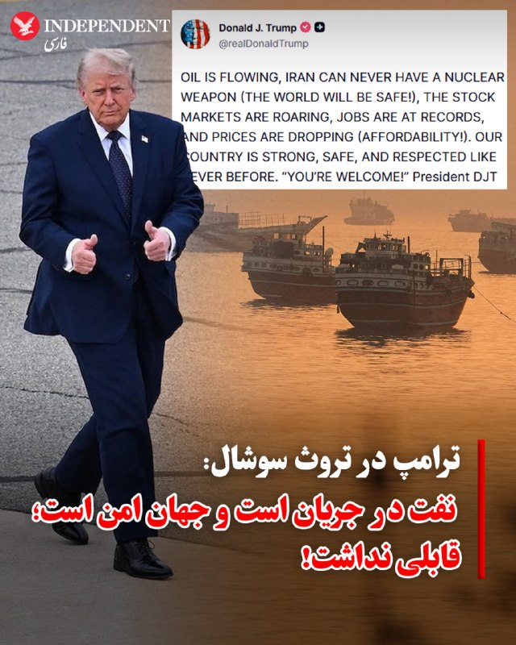

♦️ دونالد ترامپ، رئیس‌جمهوری آمریکا، با انتشار پیامی در شبکه اجتماعی «تروث سوشال»، به دستاوردهای اخیر دولت خود در پی توافق با تهران و بازگشایی تنگه هرمز پرداخت.

ترامپ در این پیام کوتاه نوشت: «نفت در جریان است، ایران هرگز نمی‌تواند به سلاح هسته‌ای دست یابد (جهان امن خواهد بود!)، بازارهای بورس در حال غرش و صعود هستند، آمار اشتغال در بالاترین رکوردهای خود قرار دارد و قیمت‌ها در حال سقوط هستند (افزایش قدرت خرید!).»

رئیس‌جمهوری آمریکا با تاکید بر بهبود جایگاه بین‌المللی ایالات متحده افزود: «کشور ما اکنون قوی، امن و محترم‌تر از هر زمان دیگری است.» او در پایان پیام خود با لحنی کنایه‌آمیز و پُرابهت نوشت: «خواهش می‌کنم! (قابلی نداشت!).»
‌🇸🇦 Indypersian

🤖 @VahidOOnLine

## VahidOOnLine — post 246228

  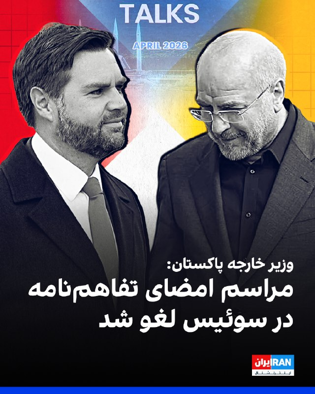

محمد اسحاق دار، معاون نخست‌وزیر و وزیر خارجه پاکستان، به روزنامه «داون» گفت که سفر برنامه‌ریزی‌شده شهباز شریف، نخست‌وزیر این کشور به سوئیس لغو شده است.

او افزود: «از آنجا که امضای توافق به‌صورت از راه دور انجام شد و پس از امضای روسای‌جمهوری آمریکا و جمهوری اسلامی، شهباز شریف نیز به‌عنوان میانجی آن را امضا کرد، مراسم فردا لغو شده است.»

قرار بود جمعه در اقامتگاهی در بورگن‌اشتوک سوئیس، یادداشت تفاهم اسلام‌آباد میان آمریکا و جمهوری اسلامی به‌طور رسمی امضا شود.
‌🏁 🇬🇧 IranintlTV

🤖 @VahidOOnLine

## WithYashar — post 15258

ایهود باراک، نخست‌وزیر سابق اسرائیل:
احتمالا نتانیاهو در آستانه انتخابات، به لبنان حمله خواهد کرد، و در تلاش است یک جنگ ابدی را با ایران و حزب‌الله آغاز کند
@withyashar

## DEJradio — post 5795

  <a href="telegram/content/DEJradio_5795_1781794710.mp4" target="_blank">🎬 Download video</a>

🔺🎥 چند کشته در حمله اسرائیل به مواضع حـ.ـزب‌الله در لبنان

براساس گزارش منابع منطقه‌ای در حمله اسرائیل به مواضع تروریست‌های حـ.ـزب‌الله در لبنان دستکم سه عضو این گروه کشته شدند.
کانال ۱۲ اسرائیل گزارش داد نتانیاهو به ترامپ گفته است اسرائیل تا زمانی که نیازهای امنیتی‌اش ایجاب کند از منطقه حائل در جنوب لبنان خارج نخواهد شد. او تاکید کرد نبرد پایان نیافته، چالش‌های بیشتری در پیش است و باید همزمان از منافع امنیتی اسرائیل و روابط با آمریکا محافظت کرد.

#حزب_الله_لبنان #اسرائیل #نتانیاهو
@DEJradio

## IranIntlTV — post 343058

  <a href="telegram/content/IranIntlTV_343058_1781794713.mp4" target="_blank">🎬 Download video</a>

با اعلام اقامتگاه بروگن‌اشتوک در سوئیس به‌عنوان محل برگزاری مذاکرات میان جمهوری اسلامی و آمریکا، دولت سوئیس اعلام کرد بیش از ۲ هزار نیروی نظامی را برای تامین امنیت این رویداد به کار خواهد گرفت.

احمد صمدی، خبرنگار ایران‌اینترنشنال، گزارش می‌دهد
@iranintltv

## IranIntlTV — post 343057

  <a href="telegram/content/IranIntlTV_343057_1781794716.mp4" target="_blank">🎬 Download video</a>

ولادیمیر پوتین، رییس‌جمهور روسیه، روز پنجشنبه در نشست سران کشورهای عضو اتحادیه کشورهای جنوب شرق آسیا در کازان روسیه اظهار داشت که تثبیت وضعیت در خاورمیانه در پی یادداشت تفاهم میان ایالات متحده و جمهوری اسلامی با هدف پایان دادن به جنگ، به نفع بازارهای جهانی انرژی و مواد غذایی خواهد بود. پوتین گفت این سند که توسط دونالد ترامپ، رئیس‌جمهور آمریکا، و مسعود پزشکیان، رئیس‌جمهور جمهوری اسلامی، امضا شده است، می‌تواند مبنایی برای توافق‌های آینده قرار گیرد و روسیه و آسه‌آن از این آتش‌بس استقبال کرده‌اند.
@iranintltv

## DW_Farsi — post 126147

  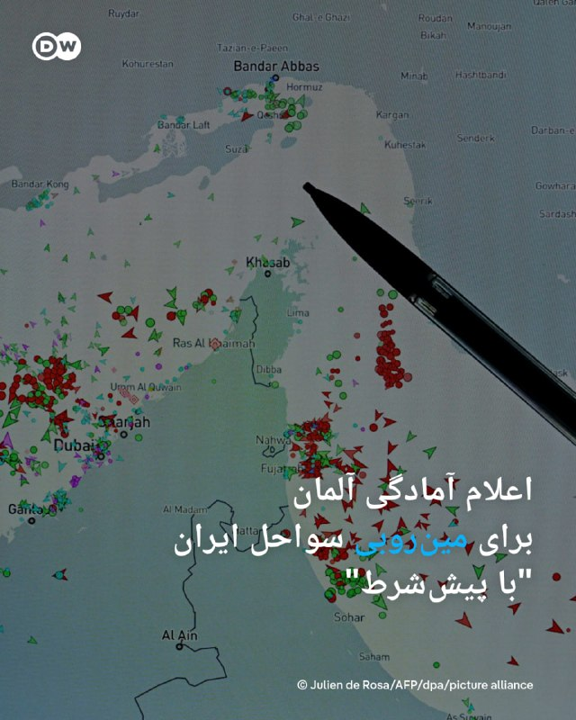

🔶 اعلام آمادگی آلمان برای مین‌روبی سواحل ایران "با پیش‌شرط"

یوهان واده‌فول، وزیر خارجه آلمان اعلام کرد که این کشور حاضر است برای مین‌روبی در تنگه هرمز مشارکت کند "اما با پیش‌شرط‌هایی".

در توضیح این پیش‌شرط‌ها، وزیر خارجه آلمان به روزنامه "راینیشن پست" گفت که ابتدا باید تمام درگیری‌های نظامی متوقف شوند و همه طرف‌های درگیر توافق کنند که آبراه میان ایران و عمان دوباره آزاد می‌شود. پس از آن نیز آلمان باید یک ماموریت برای مین‌روبی دریافت کند.

این سیاستمدار حزب دموکرات مسیحی سپس گفت: «در این صورت و اگر پارلمان آلمان نیز تایید کند ما آماده هستیم.»

به عقیده وزیر خارجه آلمان مطابق قوانین حقوق بین‌الملل همه اینها می‌تواند پس از یک قطعنامه سازمان ملل اتفاق بیفتد. اما به گفته او طبق کنوانسیون حقوق دریاها، به‌طور کلی دفاع در برابر اقداماتی که امنیت کشتیرانی را تهدید می‌کنند، مجاز است.

او در عین حال تاکید کرد: «اما یک‌بار دیگر: باید روشن باشد که هم ایران و هم عمان با استقرار کشتی‌های ما در آب‌های سرزمینی‌شان مخالفت نکنند. ما نمی‌توانیم و نمی‌خواهیم نیروهای مسلح خود را در معرض خطرهای غیرضروری قرار دهیم.»
@dw_farsi

## Persian_Trend_Official — post 17474

  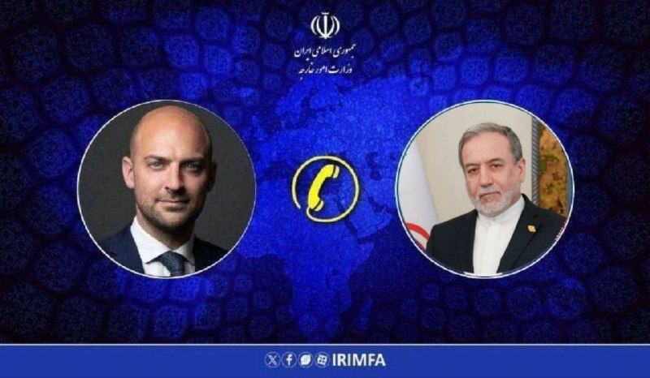

گفت‌وگوی تلفنی وزرای خارجه جمهوری اسلامی و فرانسه

وزیر خارجه ایران با اشاره به مفاد یادداشت تفاهم اسلام‌آباد، بر مسئولیت آمریکا در ایفای نقش مؤثر برای پایان دادن به جنگ و توقف درگیری‌ها در تمامی جبهه‌ها، از جمله لبنان، تأکید کرد.

عراقچی با اشاره به فرصت‌های ایجادشده در پرتو یادداشت تفاهم اسلام‌آباد برای گسترش مناسبات ایران و فرانسه، به‌ویژه در حوزه‌های اقتصادی و تجاری، بر ضرورت حمایت قاطع و همه‌جانبه جامعه جهانی و نهادهای بین‌المللی، از جمله شورای امنیت سازمان ملل متحد، از اجرای این تفاهم و پشتیبانی از روندهای صلح‌آمیز ناشی از آن تأکید کرد.

📝 Amir

📌 @persian_trend_official
پرشین ترند | متفاوت‌ترین کانال نظامی

## IranianMinds — post 22883

  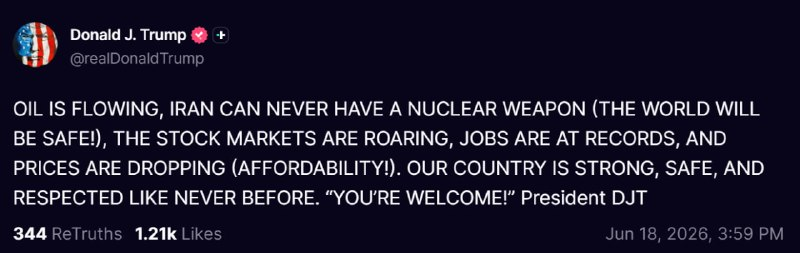

توییت جدید ترامپ از طریق :

نفت در حال جریان است، ایران هرگز نمی‌تواند سلاح هسته‌ای داشته باشد (دنیا امن خواهد بود!)، بازارهای سهام در حال رونق هستند، اشتغال در رکورد است و قیمت‌ها در حال کاهش (قابل‌پرداخت!) هستند.

کشور ما قوی، امن و محترم‌تر از همیشه است. خوش آمدید!

@IranianMinds

## BBCPersian — post 284283

  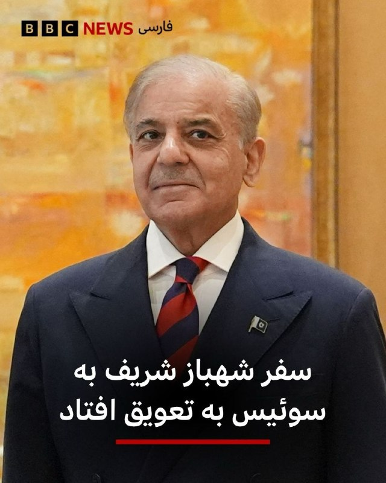

🔻به گزارش تلویزیون دولتی پاکستان، سفر شهباز شریف، نخست‌وزیر آن کشور، به سوئیس به تعویق افتاده است.

بر اساس این گزارش، دلیل تعویق این سفر آن است که آمریکا و ایران تفاهمنامه خود را امضا کرده‌اند.

قرار بود شهباز شریف برای شرکت در مراسمی که روز جمعه در برگن‌اشتوک سوئیس در ارتباط با توافق ایران و آمریکا برگزار می‌شود، به ژنو سفر کند.

یک مقام دولتی دیگر نیز به بی‌بی‌سی اردو گفته است که گفت‌وگوهای فنی میان ایران و آمریکا به طور جداگانه برگزار خواهد شد.

در همین حال خبرگزاری تسنیم به نقل از یک منبع آگاه خبر داد که تاکنون هیچ چیزی درباره سفر هیئت ایرانی به ژنو قطعی نشده و بررسی‌ها و رایزنی‌ها در این زمینه نهایی نشده است.

اسماعیل بقائی سخنگوی وزارت خارجه ایران دیشب پس از اعلام امضای تفاهمنامه درباره سفر جمعه به سوئیس گفته بود: « به هر حال باید فاز بعدی مذاکرات آغاز شود. این نشست در سوئیس هنوز در دستور کار است که برگزار شود. باید ببینیم که در ساعات آینده طرفین از طریق میانجی‌ها به چه نتیجه‌ای می‌رسند.»

📸 Getty

https://bbc.in/4fNU3nt
@BBCPersian

## alonews — post 128931

  <a href="telegram/content/alonews_128931_1781794721.webm" target="_blank">🎬 Download video</a>

👈پیش‌فروش‌ بازی Grand Theft Auto VI رسماً از ۲۵ ژوئن آغاز خواهد شد.

✅ @AloNews خبر جنگ

---
📅 بروزرسانی: 1405/03/28 18:15
---

## pm_afshaa — post 94334

تلویزیون پاکستان: سفر برنامه ریزی شده نخست وزیر شهباز شریف به سوئیس بدون ذکر دلیل لغو شد

💧 Rainbet.com the #1 Non-KYC Crypto Casino & Sportsbook @rainbetcom

😁 @Pm_Afshaa

## kianmeli1 — post 88064

  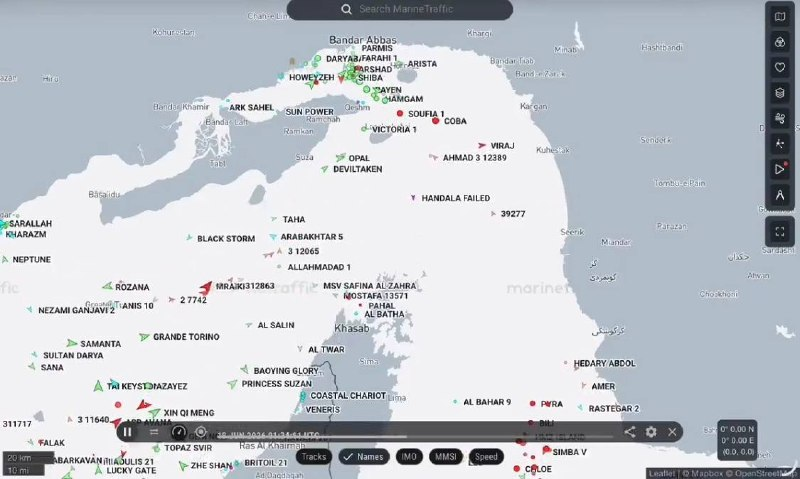

🔴ترافیک کشتی‌هایی که طی ۲۴ ساعت گذشته از تنگه هرمز عبور کرده‌اند، که از طریق MarineTraffic.com قابل مشاهده است، نشان می‌دهد که نزدیک به ۲۰ کشتی عبور کرده‌اند، که نسبت به کمتر از ۱۰ کشتی در هفته‌های قبل افزایش یافته است. بیشتر ترافیک هنوز از طرح جداسازی ترافیک ایران استفاده می‌کند، اگرچه ۲ کشتی در حال عبور از مرکز تنگه و ۲ کشتی دیگر در حال عبور از آب‌های عمان مشاهده شده‌اند.
https://t.me/kianmeli1

## IranIntlTV — post 343055

  <a href="telegram/content/IranIntlTV_343055_1781793906.mp4" target="_blank">🎬 Download video</a>

یکی از مخاطبان با ارسال ویدیویی به ایران اینترنشنال گفت که هزینه تهیه پیتزای خانگی به یک میلیون تومان رسیده است و خانواده ناچار است آن را از فهرست غذایی خود حذف کند.

## DW_Farsi — post 126146

  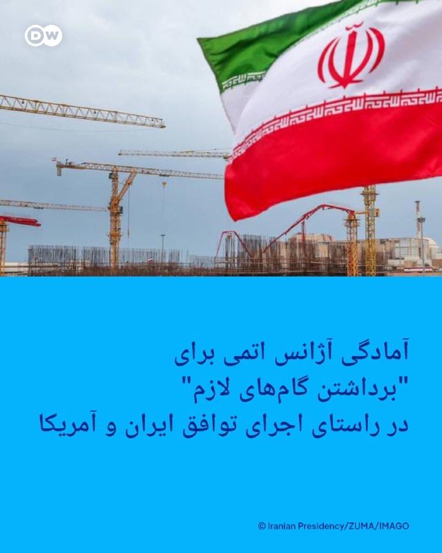

🔶 آمادگی آژانس اتمی برای "برداشتن گام‌های لازم" در راستای اجرای توافق ایران و آمریکا

آژانس بین‌المللی انرژی اتمی روز پنجشنبه ۱۸ ژوئن (۲۸ خرداد) اعلام کرد که آماده است "گام‌های مشخص" لازم برای اجرای توافق آمریکا و ایران با هدف پایان دادن به جنگ خاورمیانه را آغاز کند. رافائل گروسی، مدیرکل آژانس، در ژنو به خبرنگاران گفت: «اکنون نوبت ماست که با همکاران آمریکایی و ایرانی خود بنشینیم و شروع کنیم به تدوین گام‌های مشخصی که باید برداشته شوند.»

گروسی ادامه داد: «این یک عملیات بسیار پیچیده است و پنهانی هم نیست؛ بنابراین باید بسیار، بسیار دقیق عمل کنیم.» او تاکید کرد که نتیجهٔ کار "به ارادهٔ سیاسی هر دو طرف بستگی خواهد داشت".

گروسی افزود: «اینکه در یادداشت تفاهم امضاشده، نقش ضروری آژانس به رسمیت شناخته شده… همین برای نشان دادن اعتبار ما و نقش غیرقابل‌جایگزینی‌مان کافی است.»

مدیر آژانس اتمی تصریح کرد: «فکر می‌کنم خوب است که این یادداشت تفاهم وجود دارد. اکنون کار فنی آغاز می‌شود.»
@dw_farsi

## Persian_Trend_Official — post 17473

  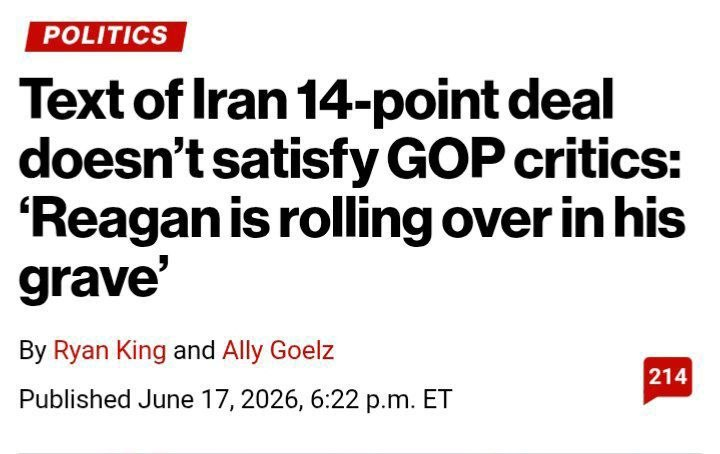

متن تفاهم نامه 14 بندی با ایران، جمهوری‌خواهان را راضی نکرد: ریگان در گور لرزید‌.

به گزارش نیویورک پست‌، تردید جمهوری‌خواهان نسبت به توافق اولیه صلح با ایران، پس از انتشار جزئیات طرح 14 بندی، عمدتا بیشتر هم شد؛ به‌طوری‌ که برخی از قانون‌گذاران کلیدی جمهوری‌خواه به‌صورت علنی آن را مورد انتقاد شدید قرار دادند.

یک مقام ارشد روز چهارشنبه مفاد تفاهم‌نامه 14 بندی آمریکا و ایران را برای خبرنگاران قرائت کرد و امتیازهای مهمی به ایران را تأیید نمود؛ از جمله تعلیق موقت تحریم‌های نفتی، ایجاد یک صندوق 300 میلیارد دلاری برای بازسازی، و به‌کارگیری ادبیات ملایم‌تر درباره تنگه هرمز.

سناتور بازنشسته، بیل کسیدی، صریحاً انتقاد کرد و گفت: ریگان در قبرش از این موضوع آرام ندارد. جاه‌طلبی‌های هسته‌ای ایران مهار نشده و آن‌ها یاد گرفته‌اند که تهدید تنگه هرمز مؤثر است و بدون تردید در آینده از آن به عنوان اهرم فشار استفاده خواهند کرد.

📝 Amir

📌 @persian_trend_official
پرشین ترند | متفاوت‌ترین کانال نظامی

## IranianMinds — post 22882

  

🔴ایرنا:

به پاکستان گفته شده است که نیازی به برگزاری نشست حضوری در سوئیس نیست.

@IranianMinds

## alonews — post 128930

  <a href="telegram/content/alonews_128930_1781793911.webm" target="_blank">🎬 Download video</a>

👈ایهود باراک، نخست‌وزیر سابق اسرائیل:
احتمالا نتانیاهو در آستانه انتخابات، به لبنان حمله خواهد کرد، و در تلاش است یک جنگ ابدی را با ایران و حزب‌الله آغاز کند

✅ @AloNews خبر جنگ

---
📅 بروزرسانی: 1405/03/28 18:05
---

## VahidOOnLine — post 246227

  

کانال ۱۱ اسرائیل گزارش داد دونالد ترامپ گفته است: «به احتمال زیاد از بنیامین نتانیاهو در انتخابات حمایت خواهم کرد، اما باید ببینم چه کسانی نامزد می‌شوند.»

او افزود: «رابطه خوبی با بی‌بی دارم، اما او باید منطقی‌تر باشد. آماده دیدار با او هستم.»
‌🏁 🇬🇧 IranintlTV

🤖 @VahidOOnLine

## VahidOOnLine — post 246226

  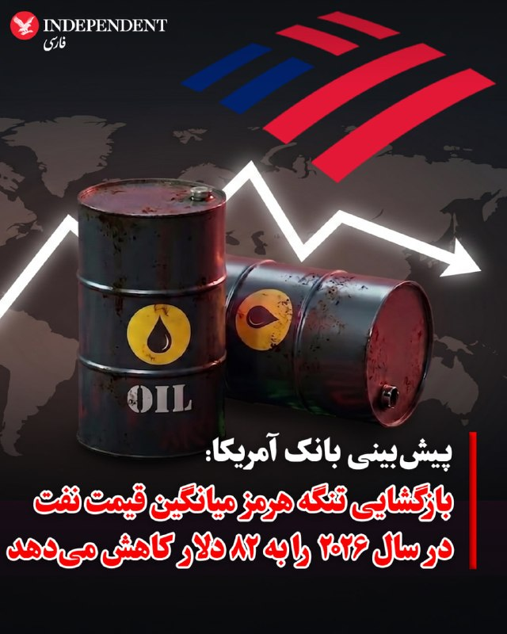

♦️ «بانک آمریکا» (BofA) اعلام کرد که بازگشایی کامل تنگه هرمز می‌تواند میانگین قیمت نفت خام برنت را در سال ۲۰۲۶ به ۸۲ دلار در هر بشکه کاهش دهد؛ این در حالی است که پیش‌بینی قبلی این بانک ۹۳ دلار بود. طبق این گزارش، نفت برنت در بیشتر روزهای نیمه دوم سال جاری میلادی در محدوده ۷۰ تا ۸۰ دلار معامله خواهد شد.

به دنبال انتشار تفاهم‌نامه ۱۴ بندی میان جمهوری اسلامی ایران و آمریکا که شامل بازگشایی تنگه هرمز، لغو تحریم‌های تهران و بهبود چشم‌انداز عرضه جهانی است، قیمت نفت روز پنج‌شنبه ۲۸ خرداد به پایین‌ترین سطح خود از نخستین روز آغاز جنگ در ایران سقوط کرد. بر اساس این توافق ۶۰ روزه، حمل و نقل دریایی در این شاهراه حیاتی انرژی باید ظرف ۳۰ روز به ظرفیت کامل خود بازگردد.

بانک آمریکا پیش‌بینی خود از وضعیت بازار در سال ۲۰۲۶ را به دلیل تبعات جنگ به کسری ۲.۶ میلیون بشکه‌ای در روز تغییر داد، در حالی که پیش از جنگ انتظار مازاد عرضه وجود داشت. این بانک همچنین انتظار دارد میانگین قیمت نفت برنت در سال ۲۰۲۷ به ۷۰ دلار برسد.
‌🇸🇦 Indypersian

🤖 @VahidOOnLine

## FoxNewsTwitter — post 343121

  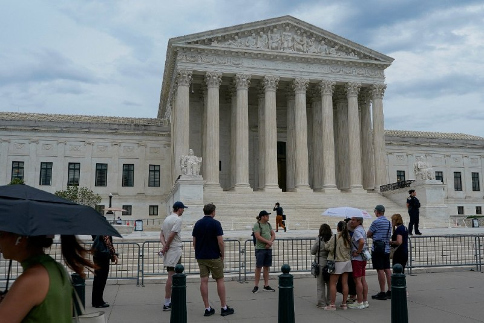

Fox News (Twitter/X)

BREAKING: Supreme Court unanimously strikes down federal gun ban for 'habitual' marijuana users, the same law that was used to prosecute Hunter Biden

## FoxNewsTwitter — post 343120

  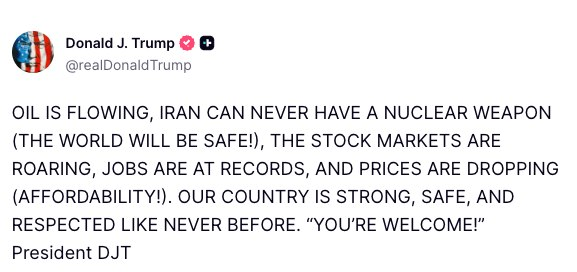

Fox News (Twitter/X)

"YOU’RE WELCOME!"

President Trump is taking a victory lap, pointing to what he says are major signs of strength across the country: surging stock markets, oil flowing, strong job numbers, and easing costs for consumers.

"OUR COUNTRY IS STRONG, SAFE, AND RESPECTED LIKE NEVER BEFORE."

## pm_afshaa — post 94333

  <a href="telegram/content/pm_afshaa_94333_1781793306.mp4" target="_blank">🎬 Download video</a>

کتک زدن زنان بی دفاع روستای پشموکی کرمان توسط نیروهای مادر عمومی انتظامی جمهوری اسلامی

💧 Rainbet.com the #1 Non-KYC Crypto Casino & Sportsbook @rainbetcom

😁 @Pm_Afshaa

## IranIntlTV — post 343054

  <a href="telegram/content/IranIntlTV_343054_1781793309.mp4" target="_blank">🎬 Download video</a>

خبرگزاری رویترز گزارش داد که پنجشنبه ۲۸ خرداد، اوکراین برای دومین بار در یک هفته گذشته پالایشگاه نفت مسکو را هدف حمله پهپادی قرار داد.

جزییات بیشتر در گفت‌وگو با علی حسن‌پور، خبرنگار ایران‌اینترنشنال
@iranintltv

## IranIntlTV — post 343053

  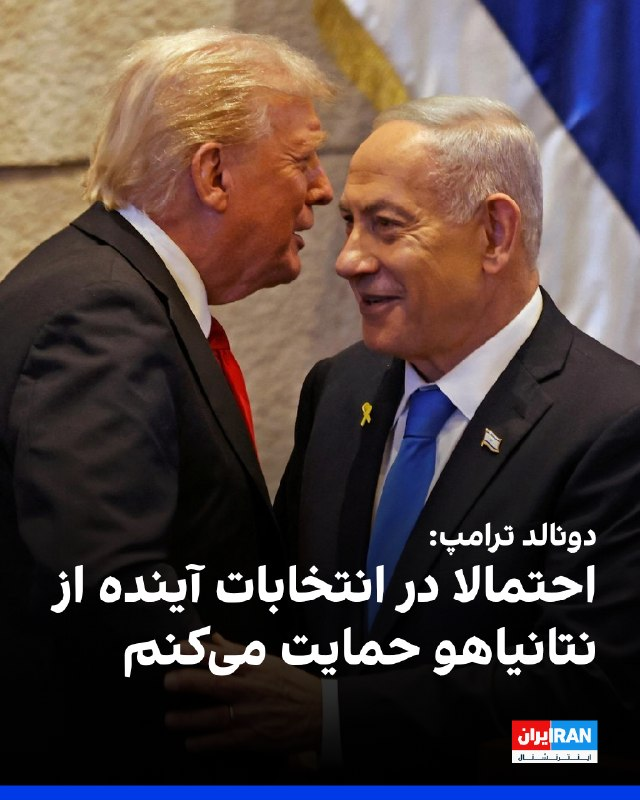

کانال ۱۱ اسرائیل گزارش داد دونالد ترامپ گفته است: «به احتمال زیاد از بنیامین نتانیاهو در انتخابات حمایت خواهم کرد، اما باید ببینم چه کسانی نامزد می‌شوند.»

او افزود: «رابطه خوبی با بی‌بی دارم، اما او باید منطقی‌تر باشد. آماده دیدار با او هستم.»
https://iranintl.com/202606187590

## Persian_Trend_Official — post 17472

  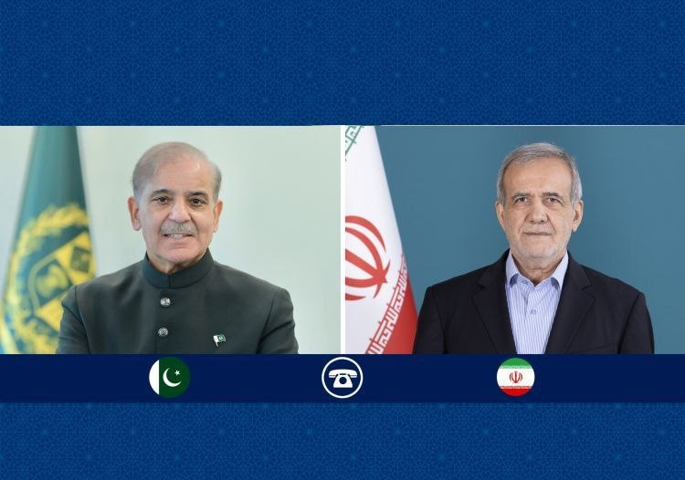

گفت‌وگوی تلفنی پزشکیان با شهباز شریف، نخست وزیر پاکستان

پزشکیان: تلاش‌های پاکستان در مسیر دستیابی به توافق پایان جنگ در حافظه ملت ایران ماندگار خواهد شد

شهباز شریف: صبر، استقامت و رویکرد مبتنی بر عقلانیت و تدبیر مسئولان و ملت ایران ستودنی است

رئیس جمهوری اسلامی ایران از تلاش‌های دلسوزانه و نقش‌آفرینی سازنده دولت پاکستان در پیشبرد روند میانجی‌گری و دستیابی به توافق اولیه قدردانی کرد و دو طرف بر تداوم همکاری‌ها برای تثبیت صلح، امنیت و توسعه روابط راهبردی تهران و اسلام‌آباد تأکید کردند.

📝 Amir

📌 @persian_trend_official
پرشین ترند | متفاوت‌ترین کانال نظامی

## Persian_Trend_Official — post 17471

  <a href="telegram/content/Persian_Trend_Official_17471_1781793312.webm" target="_blank">🎬 Download video</a>

لغو سفر شهباز شریف به سوئیس شبکه الجزیره به نقل از تلویزیون پاکستان گزارش داد که سفر برنامه‌ریزی‌شده شهباز شریف، نخست‌وزیر این کشور به سوئیس، بدون اعلام دلیل رسمی لغو شده است. این سفر که قرار بود در دستور کار نخست‌وزیر پاکستان قرار گیرد، به طور ناگهانی و…

## RadioFarda — post 158465

حرکت کشتی‌ها در تنگه هرمز بعد از امضای تفاهم ایران و آمریکا «شتاب گرفته است»

🔸بر اساس اعلام روز پنجشنبه ۲۸ خرداد شرکت اطلاعات دریایی «ویندوارد»، در ساعات پس از امضای یادداشت تفاهم برای پایان دادن به جنگ توسط رؤسای جمهور آمریکا و ایران، نشانه‌هایی از احیای تدریجی تردد کشتی‌ها در تنگه هرمز مشاهده شده است.

🔸خبرگزاری رویترز نیز از عبور سه ابرنفتکش با پرچم عربستان سعودی از این آبراه بعد از امضای تفاهم‌نامه خبر داده است.

🔸میشل ویزه باکمن، تحلیلگر ارشد ویندوارد، در یک نشست آنلاین گفت که بین ساعت ۶ عصر روز ۲۷ خرداد تا ساعت ۲ بعدازظهر به وقت «ساعت هماهنگ جهانی» (UTC) در ۲۸ خرداد، ۱۸ کشتی از تنگه هرمز عبور کرده‌اند؛ رخدادی که او آن را «نشانه‌ای از اعتماد به این توافق» توصیف کرد.

🔸او به‌طور مشخص گفت که این کشتی‌ها شامل یک نفتکش گاز طبیعی مایع (ال‌ان‌جی) با پرچم فرانسه، دو نفتکش با پرچم هنگ‌کنگ، یک کشتی حمل خودرو با پرچم ایتالیا، یک نفتکش تحت مدیریت ژاپن و چندین نفتکش با پرچم عربستان سعودی بوده‌اند.

🔸ده فروند از این کشتی‌ها در مسیر خروج از خلیج فارس بودند و به دلیل جنگی که با حملات هوایی آمریکا و اسرائیل به ایران در ۲۸ فوریه آغاز شده بود، به مدت ۱۰۹ روز در خلیج فارس گرفتار مانده بودند.

🔸ویزه باکمن گفت: «آنچه اکنون اهمیت دارد، کشتی‌هایی هستند که در حال خروج‌ هستند. این روند در ابتدا به‌آرامی آغاز خواهد شد، اما بدون تردید این نشانه بسیار مثبتی است؛ نشانه‌ای اولیه از این‌که اعتماد برای عبور کشتی‌ها در مسیر خروجی در حال شکل‌گیری است.»

🔸او افزود: «در دو هفته نخست ماه ژوئن، تا پیش از آنکه روز یکشنبه خبر این توافق منتشر شود، میانگین عبور و مرور حدود هفت کشتی در روز بود. همچنین حجم کل تردد ثبت‌شده در ماه ژوئن تاکنون از ۱۵۶ موردی که در ماه مه ردیابی کرده بودیم فراتر رفته است؛ بنابراین کاملاً مشخص است که روند حرکت در حال شتاب گرفتن است.»

🔸ویندوارد همچنین عبور کشتی‌های ایرانی از تنگه هرمز و نیز حرکت نفتکش‌ها و کشتی‌های حامل ال‌ان‌جی تحت کنترل ایران را که از جنوب شرق آسیا و از طریق تنگه مالاکا به سمت غرب در حرکت بودند، رصد کرده است؛ کشتی‌هایی که ظاهراً اکنون اطمینان دارند می‌توانند در بنادر ایران بارگیری کنند، زیرا محاصره دریایی بنادر و آب‌های ایران توسط آمریکا لغو شده است.

🔸گزارش کامل را در وب‌سایت رادیوفردا بخوانید.

@RadioFarda

## Dirty_Kids — post 392501

  

این خیلی حق بود:)

@Dirty_Kids 👻

## Dirty_Kids — post 392500

  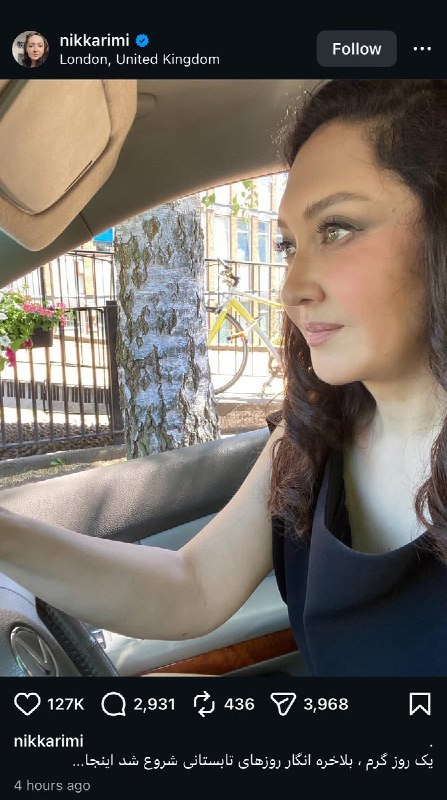

نیکی جون گرما رو ول کن بگو راز جوون موندنت چیه🥹🫠🤌

@Dirty_Kids 👻

## Dirty_Kids — post 392498

بابام همیشه میگفت به آدمای بور اطمینان نکن

@Dirty_Kids 👻

## alonews — post 128929

  <a href="telegram/content/alonews_128929_1781793314.webm" target="_blank">🎬 Download video</a>

👈الجزیره به نقل از یک منبع در دفتر نخست‌وزیری:
معاون وزارت امور خارجه نماینده پاکستان در نشست سوئیس خواهد بود.

✅ @AloNews خبر جنگ

## alonews — post 128928

  <a href="telegram/content/alonews_128928_1781793314.webm" target="_blank">🎬 Download video</a>

👈ترامپ به کانال ۱۱ عبری: آماده دیدار با نتانیاهو هستم

🔴او باید منطقی‌تر باشد.

✅ @AloNews خبر جنگ

---
📅 بروزرسانی: 1405/03/28 17:54
---

## VahidOOnLine — post 246225

  <a href="telegram/content/VahidOOnLine_246225_1781792673.mp4" target="_blank">🎬 Download video</a>

یک دانش‌آموز با اشاره به برگزاری امتحاناتش، از پخش صدای بلند روضه‌خوانی و عزاداری در ساعت ۷ صبح انتقاد کرد و گفت که این صداها مانع تمرکز او شده است.
‌🏁 🇬🇧 IranintlTV

🤖 @VahidOOnLine

## mwarmonitor — post 11123

🔴منطقه امنیتی در جنوب لبنان: نقشه محدوده‌ای که نیروهای ارتش اسرائیل در جنوب لبنان در آن فعالیت می‌کنند* ⭕️بر اساس نیاز عملیاتی، ارتش اسرائیل در منطقه امنیتی، حدود ۱۰ کیلومتر در داخل خاک لبنان، مستقر شده است. ⭕️نیروهای ارتش اسرائیل در منطقه فعالیت خود در…

## mwarmonitor — post 11122

🔴دونالد ترامپ به کان نیوز گفت:
«به‌احتمال زیاد در انتخابات از بنیامین نتانیاهو حمایت خواهم کرد، اما باید ببینم چه کسانی نامزد هستند. او باید منطقی‌تر رفتار کند.»

@mwarmonitor

## IranIntlTV — post 343052

  <a href="telegram/content/IranIntlTV_343052_1781792675.mp4" target="_blank">🎬 Download video</a>

جنگ میان جمهوری اسلامی و آمریکا متوقف شده و توافق اولیه نیز امضا شده است. اما آیا واقعا بحران به پایان رسیده است؟

در حالی که تهران و واشینگتن از یک موفقیت دیپلماتیک سخن می‌گویند، مقام‌های دو طرف تقریبا هر روز روایت‌های متفاوتی از همین توافق ارائه می‌کنند؛ از حزب‌الله و لبنان گرفته تا برنامه هسته‌ای، موشک‌ها، تحریم‌ها و پول‌های بلوکه‌شده.

حالا این پرسش مطرح است که در ۶۰ روزی که قرار است دو طرف برای رسیدن به توافق نهایی مذاکره کنند، چه گره‌هایی می‌تواند این مسیر را به بن‌بست بکشاند؟

مهدی بیگی، عضو تحریریه ایران‌اینترنشنال، در «پیوست» چشم‌انداز این مذاکرات ۶۰ روزه را بررسی می‌کند.
@iranintltv

## IranIntlTV — post 343051

  <a href="telegram/content/IranIntlTV_343051_1781792677.mp4" target="_blank">🎬 Download video</a>

یک دانش‌آموز با اشاره به برگزاری امتحاناتش، از پخش صدای بلند روضه‌خوانی و عزاداری در ساعت ۷ صبح انتقاد کرد و گفت که این صداها مانع تمرکز او شده است.

## IranIntlTV — post 343050

  <a href="telegram/content/IranIntlTV_343050_1781792679.mp4" target="_blank">🎬 Download video</a>

دونالد ترامپ که برای شرکت در نشست گروه هفت در پاریس به‌سر می‌برد، در کاخ ورسای و در حضور امانوئل مکرون، توافق میان واشینگتن و تهران را امضا کرد.

اردوان روزبه، خبرنگار ایران‌اینترنشنال، از روند مذاکرات میان جمهوری اسلامی و ایالات متحده می‌گوید
@iranintltv

## DW_Farsi — post 126145

  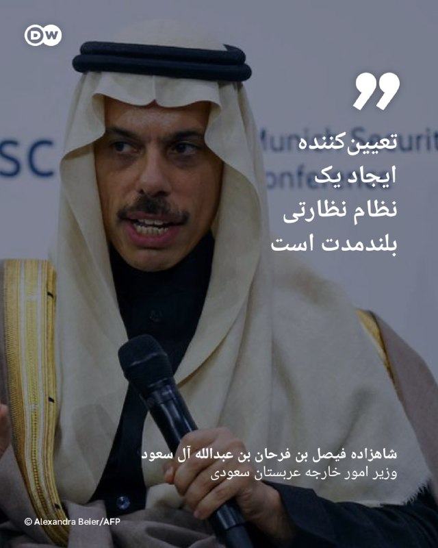

🔶 وزیر خارجه عربستان: تعیین‌کننده ایجاد یک نظام نظارتی بلندمدت است

شاهزاده فیصل بن فرحان بن عبدالله آل سعود، وزیر امور خارجه عربستان سعودی درباره توافق میان ایران و امریکا محتاطانه و بدون جزییات نظر داد.

او در نشست سالانه اندیشکده شورای اروپا برای روابط خارجی درباره این توافق گفت: «بسیار مهم خواهد بود که سازوکارهای نظارتی‌ای را ببینیم که فراتر از تعهدات مربوط به غنی‌سازی اورانیوم و همچنین فرایند حذف یا رقیق‌سازی مواد هسته‌ای ایجاد می‌شوند.»

فیصل افزود: «آنچه تعیین‌کننده خواهد بود، این است که چگونه می‌توانیم یک نظام نظارتی بلندمدت و پایدار ایجاد کنیم. زیرا دقیقاً همین موضوع است که بیشترین اعتماد را برای جامعه بین‌المللی و همچنین برای کشورهای منطقه فراهم می‌کند و امکان نگاه به آینده‌ای بهتر را به وجود می‌آورد.»

او از ذکر جزییات بیشتر در باره موضع رسمی کشورش در قبال این توافق خودداری کرد و گفت هنوز نسخه نهایی این توافق را ندیده است.
@dw_farsi

## Persian_Trend_Official — post 17470

  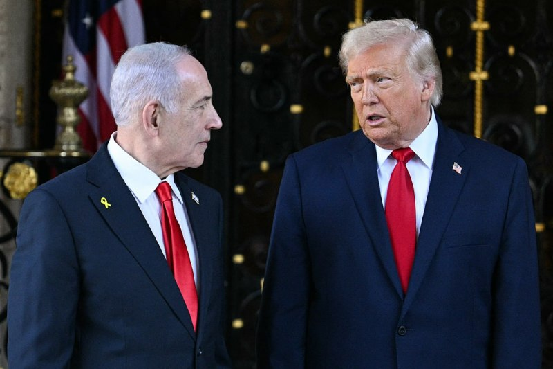

ترامپ در مصاحبه با خبرگزاری کان: به احتمال زیاد در انتخابات آینده از نتانیاهو حمایت خواهم کرد، اما باید ببینم چه کسی نامزد می‌شود.

ما رابطه خوبی داریم، اما او باید منطقی‌تر باشد. من حاضرم با او ملاقات کنم.

📝 Amir

📌 @persian_trend_official
پرشین ترند | متفاوت‌ترین کانال نظامی

## Persian_Trend_Official — post 17469

  

ترامپ در تروث سوشال: نفت در جریان است، ایران هرگز نمی‌تواند سلاح هسته‌ای داشته باشد (جهان امن خواهد بود!)، بازارهای سهام در حال رونق هستند، مشاغل رکورد زده‌اند و قیمت‌ها در حال کاهش هستند (توانایی خرید!).

کشور ما قوی، امن و محترم‌تر از همیشه است. خواهش می‌کنم!

📝 Amir

📌 @persian_trend_official
پرشین ترند | متفاوت‌ترین کانال نظامی

## Persian_Trend_Official — post 17468

العربیه: نخستین دور از مذاکرات فنی مستقیم واشینگتن و تهران فردا در زوریخ سوئیس برگزار می‌شود. به گفته منابع این مذاکرات فنی میان ایران و آمریکا شامل جنبه‌های حقوقی و قانونی مربوط به رفع تحریم‌ها علیه ایران خواهد بود. منابع العربیه خاطرنشان کردند گفت‌وگوهای…

## IranianMinds — post 22881

  <a href="telegram/content/IranianMinds_22881_1781792682.mp4" target="_blank">🎬 Download video</a>

🔴مهدی رسولی، روز دوم جنگ، ۱۰ اسفند ۱۴۰۴:

مردم آه بکشید آآآآآآآآه😂

@IranianMinds

## BBCPersian — post 284282

🔻تفاهمنامه ایران و آمریکا؛ اختلافات اصلی حل نشده و یک پرسش ۳۰۰ میلیارد دلاری

🖌دانیل بوش, خبرنگار بی‌بی‌سی در واشینگتن

تفاهم‌نامه میان ایالات متحده و ایران که روز چهارشنبه اعلام شد، در عمل به معنای بازگشایی تنگه هرمز و همچنین موافقت برای تلاش در جهت دستیابی به یک توافق نهایی درباره تقریبا تمامی مسائل دیگر است.

https://bbc.in/4uPuLcp
@BBCPersian

## BBCPersian — post 284281

🔻سفر شهباز شریف به سوئیس به تعویق افتاد

به گزارش تلویزیون دولتی پاکستان، سفر شهباز شریف، نخست‌وزیر آن کشور، به سوئیس به تعویق افتاده است.

بر اساس این گزارش، دلیل تعویق این سفر آن است که آمریکا و ایران تفاهمنامه خود را امضا کرده‌اند.

قرار بود شهباز شریف برای شرکت در مراسمی که روز جمعه در برگن‌اشتوک سوئیس در ارتباط با توافق ایران و آمریکا برگزار می‌شود، به ژنو سفر کند.

یک مقام دولتی دیگر نیز به بی‌بی‌سی اردو گفته است که گفت‌وگوهای فنی میان ایران و آمریکا به طور جداگانه برگزار خواهد شد.

در همین حال خبرگزاری تسنیم به نقل از یک منبع آگاه خبر داد که تاکنون هیچ چیزی درباره سفر هیئت ایرانی به ژنو قطعی نشده و بررسی‌ها و رایزنی‌ها در این زمینه نهایی نشده است.

https://bbc.in/4fNU3nt
@BBCPersian

## alonews — post 128927

  <a href="telegram/content/alonews_128927_1781792684.webm" target="_blank">🎬 Download video</a>

👈رئیس‌جمهور ترامپ به کان نیوز:
من به احتمال زیاد در انتخابات پیش رو از نتانیاهو حمایت خواهم کرد، اما باید ببینم چه کسانی نامزد شده‌اند.

ما رابطه خوبی داریم، اما او باید منطقی‌تر باشد. من آماده‌ام با او دیدار کنم.

✅ @AloNews خبر جنگ

## alonews — post 128926

  <a href="telegram/content/alonews_128926_1781792684.webm" target="_blank">🎬 Download video</a>

👈ترامپ:
هیچ ملت و فرد عاقلی نمیگه بمبارون رو ادامه بده

✅ @AloNews خبر جنگ

---
📅 بروزرسانی: 1405/03/28 17:44
---

## VahidOOnLine — post 246224

  

دونالد ترامپ در تروث سوشال نوشت نفت در حال جریان است، جمهوری اسلامی هرگز به سلاح هسته‌ای دست نمی‌یابد و جهان امن خواهد بود.
او افزود بازارهای سهام در حال رشد هستند، اشتغال در سطحی بی‌سابقه قرار دارد و قیمت‌ها در حال کاهش‌اند، آمریکا بیش از هر زمان دیگری قدرتمند، امن و مورد احترام است.
‌🏁 🇬🇧 IranintlTV

🤖 @VahidOOnLine

## VahidOOnLine — post 246223

  

محمد مخبر، مشاور مجتبی خامنه‌ای، در واکنش به تفاهم‌نامه جمهوری اسلامی و آمریکا در شبکه ایکس نوشت که باید از «مولفه‌های قدرت» با تمام توان و تحت هدایت‌های «رهبری» هوشیارانه مراقبت شود.

مخبر نوشت حفاظت از این مولفه‌ها برای تثبیت دستاوردهای حاصل‌شده ضروری است.
‌🏁 🇬🇧 IranintlTV

🤖 @VahidOOnLine

## WithYashar — post 15257

ایرنا: ایران به پاکستان اطلاع داده است دیگر نیازی به برگزاری جلسه حضوری در سوئیس نیست.
@withyashar

## WithYashar — post 15256

  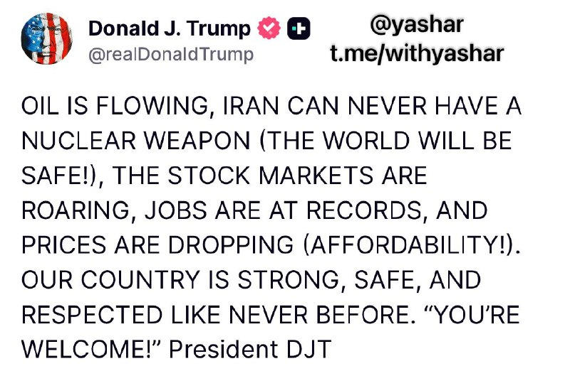

ترامپ در تروث : نفت در حال جریان است، ایران هرگز نباید سلاح هسته‌ای داشته باشد (جهان امن‌تر خواهد بود!)، بازارهای بورس با قدرت در حال رشدند، اشتغال به رکورد رسیده، و قیمت‌ها در حال کاهش‌اند (امکان خرید بیشتر شده!). کشور ما قوی، امن و محترم‌تر از هر زمان دیگری است. “خواهش می‌کنم!
@withyashar

## WithYashar — post 15255

تلویزیون پاکستان:
سفر برنامه‌ریزی شده نخست وزیر شهباز شریف به سوئیس بدون ذکر دلیل لغو شد.
@withyashar

## mwarmonitor — post 11121

  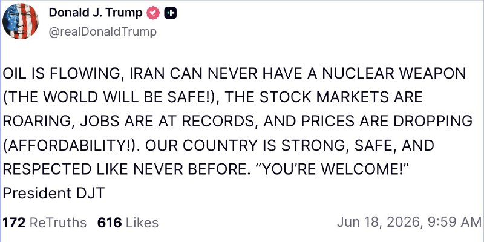

نفت در جریان است، ایران هرگز نمی‌تواند سلاح هسته‌ای داشته باشد (جهان امن خواهد بود!)، بازارهای بورس در حال اوج گرفتن هستند، آمار مشاغل در بالاترین حد بی‌سابقه است و قیمت‌ها در حال کاهش هستند (قدرت خرید!). کشور ما قوی، امن و محترم‌تر از هر زمان دیگری است. «خواهش می‌کنم!» (قابلی نداشت!) -

رئیس‌جمهور دونالد جی ترامپ (DJT)

@mwarmonitor

## FoxNewsTwitter — post 343119

  

Fox News (Twitter/X)

WATCH LIVE: New York Knicks fans flood 'Canyon of Heroes' for NBA title parade https://twitter.com/i/broadcasts/1yKAPPBEbonxb

## VahidOnline — post 76481

  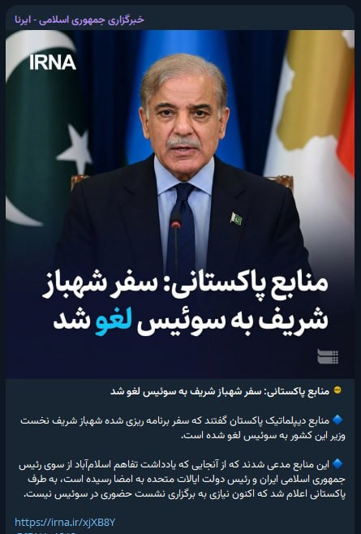

ایرنا: به پاکستان گفته شده "نیازی به برگزاری نشست حضوری در سوئیس نیست"

ننوشتند کی گفته:
منابع دیپلماتیک پاکستان گفتند که سفر برنامه ریزی شده شهباز شریف نخست وزیر این کشور به سوئیس لغو شده است.
این منابع مدعی شدند که از آنجایی که یادداشت تفاهم اسلام‌آباد از سوی رئیس جمهوری اسلامی ایران و رئیس دولت ایالات متحده به امضا رسیده است، به طرف پاکستانی اعلام شد ‌که اکنون نیازی به برگزاری نشست حضوری در سوئیس نیست.

📡 @VahidOnline

## VahidOnline — post 76480

پست ترامپ ترجمه ماشین:
«نفت در جریان است، ایران هرگز نمی‌تواند سلاح هسته‌ای داشته باشد، جهان امن خواهد بود! بازارهای سهام غرش‌کنان پیش می‌روند، مشاغل در سطح رکورد هستند، و قیمت‌ها در حال کاهش‌اند؛ مقرون‌به‌صرفه شدن! کشور ما مثل هیچ‌وقتِ دیگر قدرتمند، امن و محترم است. «خواهش می‌کنم!» رئیس‌جمهور دی‌جی‌تی»
realDonaldTrump

📡 @VahidOnline

## IranIntlTV — post 343049

  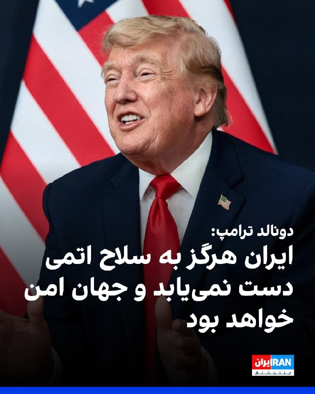

دونالد ترامپ در تروث سوشال نوشت نفت در حال جریان است، جمهوری اسلامی هرگز به سلاح هسته‌ای دست نمی‌یابد و جهان امن خواهد بود.
او افزود بازارهای سهام در حال رشد هستند، اشتغال در سطحی بی‌سابقه قرار دارد و قیمت‌ها در حال کاهش‌اند، آمریکا بیش از هر زمان دیگری قدرتمند، امن و مورد احترام است.
https://iranintl.com/202606182464

## IranIntlTV — post 343048

  <a href="telegram/content/IranIntlTV_343048_1781792049.mp4" target="_blank">🎬 Download video</a>

یک شهروند با ارسال پیامی صوتی به ایران اینترنشنال، از توافق میان آمریکا و جمهوری اسلامی انتقاد کرد و گفت که عملکرد نتانیاهو از ترامپ بهتر بود.

## IranIntlTV — post 343047

  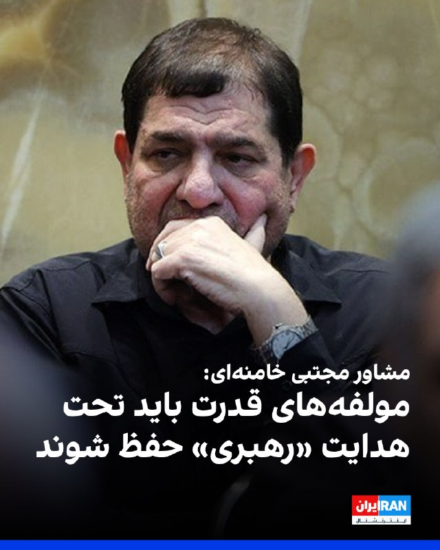

محمد مخبر، مشاور مجتبی خامنه‌ای، در واکنش به تفاهم‌نامه جمهوری اسلامی و آمریکا در شبکه ایکس نوشت که باید از «مولفه‌های قدرت» با تمام توان و تحت هدایت‌های «رهبری» هوشیارانه مراقبت شود.

مخبر نوشت حفاظت از این مولفه‌ها برای تثبیت دستاوردهای حاصل‌شده ضروری است.
https://iranintl.com/202606185281

## IranIntlTV — post 343046

  <a href="telegram/content/IranIntlTV_343046_1781792052.mp4" target="_blank">🎬 Download video</a>

آمریکا و جمهوری‌اسلامی پس از ماه‌ها مذاکره و دو جنگ، تفاهم‌نامه‌ای را امضا کردند که انتقادهای بسیاری را متوجه دونالد ترامپ کرده است.
@iranintltv

## FarsiVOA — post 221112

  <a href="telegram/content/FarsiVOA_221112_1781792054.mp4" target="_blank">🎬 Download video</a>

ارتش اسرائیل اعلام کرد در حمله‌ای به مرکز نوار غزه، احمد ابو‌هین، فرمانده هسته تک‌تیراندازی شاخه نظامی حماس، و محمود ولید جبر ابو‌هین، یکی دیگر از اعضای این شاخه، کشته شدند.

ارتش اسرائیل می‌گوید این دو نفر در حمله هفتم اکتبر به خاک اسرائیل مشارکت داشته‌اند و در هفته‌های اخیر نیز در حال برنامه‌ریزی برای حملات جدید علیه نیروهای اسرائیلی بودند.

به گفته ارتش اسرائیل، نیروهای این کشور به عملیات خود در نوار غزه برای مقابله با آنچه «تهدیدهای فوری» می‌خواند، ادامه خواهند داد.

@FarsiVOA

## DW_Farsi — post 126144

  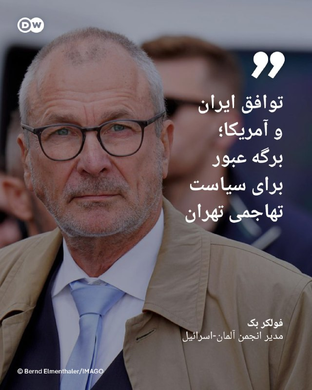

🔶 انجمن آلمان-اسرائيل: توافق ایران و آمریکا؛ برگه عبور برای سیاست تهاجمی تهران

فولکر بک، مدیر انجمن آلمان-اسرائیل در یک بیانیه مطبوعاتی موضع این نهاد در قبال توافق امضاشده میان ایران و آمریکا را اعلام کرد.

بک نوشته هرآنکسی که به تاثیرات کوتاه مدت این توافق خوشبین است، سیاست امنیتی درازمدت را فراموش کرده است.

او تصریح کرده که این توافق هیچگونه پایه‌ای برای صلح فراهم نمی‌کند و برعکس "برگه عبوری برای سیاست تهاجمی رژیم ملاهاست".

مدیر انجمن آلمان-اسرائيل نوشته بر پایه این توافق سیاست تهاجمی ایران با میلیاردها دلار پول تشویق می‌شود و پرسش‌های اساسی امنیتی، برنامه موشکی، شبکه ترور و تسلیحات اتمی ایران بدون پاسخ می‌مانند. به گفته او در عوض تهران تا تنش بعدی، زمان، پول و فضایی برای بازی سیاسی می‌خرد.

بک نارسایی‌های اصلی این تفاهم‌نامه را بدین ترتیب شرح می‌دهد:

- دفاع اسرائیل از خود به طور غیرمستقیم مشروعیتش را از دست می‌دهد و بدین ترتیب امنیت کشور یهودی و دموکراتیک به خطر می‌افتد.

- حل مسأله تهدید هسته‌ای به تعویق می‌افتد.
@dw_farsi

## BBCPersian — post 284280

🔻قطر: توافق آمریکا و ایران «پایه‌ای محکم» برای دور بعدی مذاکرات است

قطر اعلام کرده است که تفاهمنامه آمریکا و ایران می‌تواند «پایه‌ای محکم» برای دور بعدی مذاکرات میان دو طرف باشد.

وزارت خارجه قطر در اظهاراتی گفته است این توافق می‌تواند به پیشبرد گفت‌وگوها و کاهش تنش‌ها در منطقه کمک کند.

این موضع‌گیری در حالی است که تلاش‌های دیپلماتیک برای تثبیت روند گفت‌وگو میان تهران و واشنگتن همچنان ادامه دارد.

قطر در سال‌های اخیر نقش میانجی‌گرانه‌ای در برخی پرونده‌های منطقه‌ای ایفا کرده و بارها بر ضرورت رفع تخاصم از طریق دیپلماسی تاکید کرده است.

https://bbc.in/4fNU3nt
@BBCPersian

## alonews — post 128925

  <a href="telegram/content/alonews_128925_1781792055.webm" target="_blank">🎬 Download video</a>

👈ترامپ: نفت در حال جریان است ، ایران هرگز نمی تواند سلاح هسته ای داشته باشد (جهان در امان خواهد بود!), بازار سهام در حال رشد است ، شغل در رکورد است ، و قیمت ها در حال کاهش است (قیمت مناسب!).

🔴کشور ما قوی ، امن و محترم است مثل هیچ وقت پیش. خوش اومدی!‌‌

✅ @AloNews خبر جنگ

## alonews — post 128924

  <a href="telegram/content/alonews_128924_1781792056.webm" target="_blank">🎬 Download video</a>

👈ایرنا: ایران به پاکستان اطلاع داده است دیگر نیازی به برگزاری جلسه حضوری در سوئیس نیست.

✅ @AloNews خبر جنگ

## alonews — post 128923

  <a href="telegram/content/alonews_128923_1781792056.webm" target="_blank">🎬 Download video</a>

👈تلویزیون پاکستان: سفر برنامه‌ریزی شده نخست وزیر شهباز شریف به سوئیس بدون ذکر دلیل لغو شد. 
✅ @AloNews خبر جنگ

## alonews — post 128922

  <a href="telegram/content/alonews_128922_1781792056.mp4" target="_blank">🎬 Download video</a>

👈رویترز تأیید کرد که محاصره دریایی ایالات متحده بعد از ۱۰۰ روز لغو شده و کشتی‌ها بدون دردسر از تنگه هرمز عبور کردن.

✅ @AloNews خبر جنگ

---
📅 بروزرسانی: 1405/03/28 17:25
---

## VahidOOnLine — post 246222

  

کانال ۱۲ اسرائیل گزارش داد بنیامین نتانیاهو در پیامی به دونالد ترامپ آمریکا، گفته است: «تا زمانی که نیازهای امنیتی اسرائیل ایجاب کند، از منطقه حائل در جنوب لبنان خارج نخواهیم شد.»

نتانیاهو گفت: «این نبرد هنوز به پایان نرسیده و چالش‌های بیشتری در پیش است. باید با حفظ آرامش، از منافع امنیتی خود قاطعانه دفاع کنیم و در عین حال رابطه مهم با دوستان آمریکایی خود را که شانه‌به‌شانه ما جنگیدند و قدردان آنها هستیم، حفظ کنیم.»

‌🏁 🇬🇧 IranintlTV

🤖 @VahidOOnLine

## VahidOOnLine — post 246221

  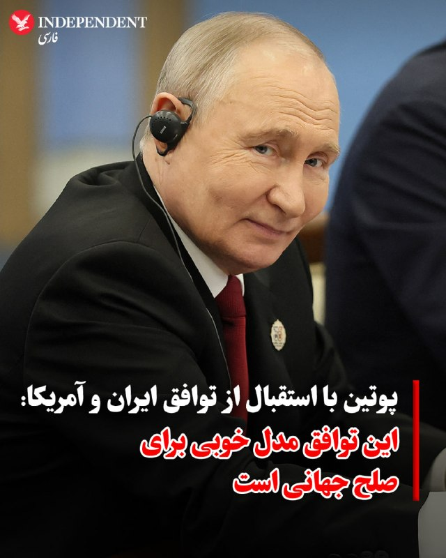

♦️ ولادیمیر پوتین، رئیس‌جمهوری روسیه، از توافق میان ایالات متحده و جمهوری اسلامی ایران با میانجی‌گری پاکستان استقبال کرد و آن را گامی مهم در جهت توقف دائمی منازعات دانست.

پوتین که در اجلاس سران «روسیه-آسه‌آن» در شهر کازان سخن می‌گفت، تاکید کرد که مسکو این توافق را بستری برای پایان جنگ می‌داند که می‌تواند به عنوان الگویی برای قراردادهای صلح آینده در جهان مورد استفاده قرار گیرد.

رئیس‌جمهوری روسیه با اشاره به اهمیت امضای این تفاهم‌نامه توسط رهبران دو کشور گفت: «این واقعیت که سند مذکور توسط روسای جمهوری امضا شده است، این امید را ایجاد می‌کند که شاهد یک سند محتوایی و محکم باشیم که پایه توافقات بعدی قرار گیرد.» پوتین در همچنین خاطرنشان کرد که تثبیت اوضاع در خاورمیانه علاوه بر کاهش تنش‌های سیاسی، تاثیرات مثبت و مستقیمی بر ثبات بازارهای جهانی انرژی و مواد غذایی خواهد داشت.
‌🇸🇦 Indypersian

🤖 @VahidOOnLine

## IranIntlTV — post 343045

  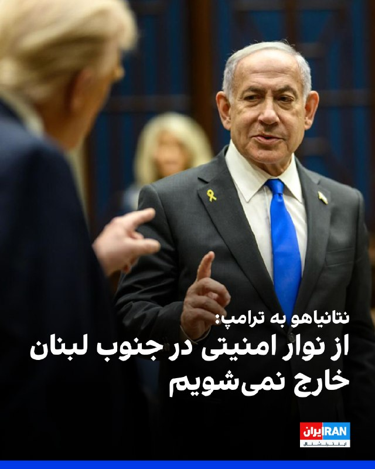

کانال ۱۲ اسرائیل گزارش داد بنیامین نتانیاهو در پیامی به دونالد ترامپ آمریکا، گفته است: «تا زمانی که نیازهای امنیتی اسرائیل ایجاب کند، از منطقه حائل در جنوب لبنان خارج نخواهیم شد.»

نتانیاهو گفت: «این نبرد هنوز به پایان نرسیده و چالش‌های بیشتری در پیش است. باید با حفظ آرامش، از منافع امنیتی خود قاطعانه دفاع کنیم و در عین حال رابطه مهم با دوستان آمریکایی خود را که شانه‌به‌شانه ما جنگیدند و قدردان آنها هستیم، حفظ کنیم.»

https://iranintl.com/202606187962

## FarsiVOA — post 221111

🔺گزارش ویژه | رهبر غایب؛ صد روز نخست ولایت موروثی در جمهوری اسلامی

▪️«گزارش ویژه» بخش تازه‌ای در وبسایت صدای آمریکا است که هر ماه به یکی از مهم‌ترین موضوعات سیاسی، اجتماعی یا راهبردی مرتبط با ایران می‌پردازد؛ موضوعاتی که در خبرهای روزمره بارها به آنها اشاره می‌شود، اما فهم عمیق‌تر آنها نیازمند بازخوانی، زمینه‌گذاری و کنار هم گذاشتن قطعات پراکنده خبر است.

⬇️ بیشتر بخوانید:
https://ir.voanews.com/a/8162246.html

## RadioFarda — post 158464

  <a href="https://t.me/radiofarda/158464" target="_blank">📎 Download file</a>

تفاهم‌نامه ایران و آمریکا؛ توافق برد-برد یا آتش‌بس برای خرید زمان؟

🔸پس از ماه‌ها جنگ و تنش بی‌سابقه میان ایران از یک سو و آمریکا و اسرائیل از سوی دیگر، تفاهم‌نامه ۱۴ بندی موسوم به «یادداشت تفاهم اسلام‌آباد» تلاش می‌کند چارچوبی برای پایان درگیری‌ها و آغاز مذاکرات جامع‌تر ترسیم کند. اما بسیاری از دشوارترین مسائل، از سرنوشت برنامه هسته‌ای ایران گرفته تا نحوه رفع تحریم‌ها و تضمین‌های امنیتی، به مذاکرات بعدی موکول شده‌اند. اکنون این پرسش مطرح است که مهم‌ترین دستاوردی که ایران و آمریکا به دست آورده‌اند چیست؟ آیا با یک توافق «برد-برد» روبه‌رو هستیم یا بیشتر با نوعی توقف موقت جنگ برای خرید زمان؟ این پرسش را با دامون گلریز، تحلیل‌گر سیاسی ساکن هلند در میان گذاشتیم.

@RadioFarda

## BBCPersian — post 284279

🔻سه نفر در پی حملات اسرائیل در جنوب لبنان کشته شدند

خبرگزاری رسمی لبنان گزارش داد که سه نفر در حملات اسرائیل به جنوب آن کشور کشته شدند.

ارتش اسرائیل تاکنون هیچ حمله‌ای را در لبنان در روز جاری تایید نکرده است، اما می‌گوید که نیروهای اسرائیلی همچنان در لبنان و در چارچوب یک منطقه امنیتی به عملیات خود ادامه می‌دهند که حدود ۱۰ کیلومتر از مرز جنوبی آن کشور را در بر می‌گیرد.

https://bbc.in/4fNU3nt
@BBCPersian

## BBCPersian — post 284278

🔻رویترز: اسرائیل سرسختانه برای حفظ موقعیتش در لبنان در حال مذاکره با آمریکاست

یک مقام ارشد اسرائیلی نزدیک به بنیامین نتانیاهو به رویترز گفت که اسرائیل «سرسختانه مشغول مذاکره» درباره ادامه استقرار نیروهایش در جنوب لبنان است.

هنوز جزئیات چندانی از این مذاکره منتشر نشده است.

در عین حال، در توافق اخیر میان ایران و آمریکا، هیچ اشاره‌ای به برنامه موشکی ایران نشده است، موضوعی که همواره یکی از نگرانی‌های اصلی اسرائیل بوده است.

دونالد ترامپ روز چهارشنبه گفت «ناعادلانه» است که ایران اجازه داشتن موشک نداشته باشد.

آقای ترامپ همچنین گفت که «موشک‌های بالستیک با موضوعی که درباره آن در حوزه هسته‌ای صحبت می‌کنیم یکسان نیست.»

اخیر دونالد ترامپ به صراحت در اقدامی کم‌سابقه از بنیامین نتانیاهو به خاطر اقداماتش در لبنان انتقاد کرد.

در هفته‌های اخیر، اختلاف آقای ترامپ و نتانیاهو بارها به رسانه‌ها درز کرده است.

https://bbc.in/4fNU3nt
@BBCPersian

## BBCPersian — post 284276

  <a href="telegram/content/BBCPersian_284276_1781790916.mp4" target="_blank">🎬 Download video</a>

🔻محمد بطحایی، معاون وزیر کشور و رئیس سازمان امور اجتماعی ایران می‌گوید که به افرادی که در تجمعات شبانه «دوقطبی‌سازی» می‌کردند، در یک نامه به طور «محرمانه تذکر داده است.

او به اسامی این افراد اشاره نکرد اما گفت که «مورد اول مربوط به یک سازمان و تشکل سازمانی بود و در دو مورد دیگر به‌صورت فردی، نامه‌ محرمانه و البته همراه با احترام و تکریم برای افراد مورد نظر ارسال شده است.»

در روزهای اخیر و پیش از امضای تفاهمنامه میان ایران و آمریکا، برخی مخالفان این توافق که از چهره‌های نزدیک به جبهه پایداری، تشکل سیاسی اصولگرا و تندرو در ایران، هستند، علیه عباس عراقچی و محمدباقر قالیباف شعار دادند.

این تجمع در میدان ابن‌سینای تهران برگزار شد و معترضان شعارهایی از جمله «عراقچی حیا کن، مملکت رو رها کن» و «قالیباف، عراقچی، پس خون رهبرم چی؟» سر دادند.

در همین حال برخی گزارش‌ها حاکیست که این گروه از تجمعات شبانه در تهران «منع» شده‌ است.

📸 جماران

https://bbc.in/4fNU3nt
@BBCPersian

## Dirty_Kids — post 392497

  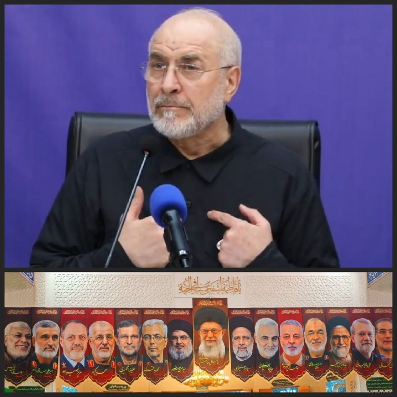

خیانتی که قالیباف به شیعیان کرد
سلمان فارسی به ایرانیان نکرد

@Dirty_Kids 👻

## Dirty_Kids — post 392496

  <a href="telegram/content/Dirty_Kids_392496_1781790918.mp4" target="_blank">🎬 Download video</a>

سیاست پزشکیان 🤣😂🤣😂

@Dirty_Kids 👻

## Dirty_Kids — post 392495

  <a href="telegram/content/Dirty_Kids_392495_1781790920.mp4" target="_blank">🎬 Download video</a>

شد شد ، نشد انباری خونه رو استودیو میکنم و مثل شب خیز شوهای دامبلی کسک اجرا میکنم و لارجر باکس و ماهیتابه جادویی تبلیغ میکنم .
دیگه زدم به سیم آخر رسما :)

@Dirty_Kids 👻

## alonews — post 128921

  <a href="telegram/content/alonews_128921_1781790923.webm" target="_blank">🎬 Download video</a>

👈تلویزیون پاکستان:
سفر برنامه‌ریزی شده نخست وزیر شهباز شریف به سوئیس بدون ذکر دلیل لغو شد.

✅ @AloNews خبر جنگ

## alonews — post 128920

  <a href="telegram/content/alonews_128920_1781790923.webm" target="_blank">🎬 Download video</a>

👈این عکس رو هم آمریکایی‌ها خیلی زیر پستهای جمهوری‌خواهان و جنبش MAGA دارن میذارن.

✅ @AloNews خبر جنگ

---
📅 بروزرسانی: 1405/03/28 17:14
---

## VahidOOnLine — post 246220

  

سی‌ان‌ان بر اساس داده‌های شرکت «مارین ترافیک» گزارش داد تا صبح پنج‌شنبه چهار کشتی باری، یک نفتکش ال‌ان‌جی با پرچم فرانسه و یک نفتکش قیر با پرچم جزایر کوک از تنگه هرمز عبور کرده و وارد دریای عمان شده‌اند.
کشتی دیگری با نام «استاروی» و با پرچم پاناما نیز وارد تنگه هرمز شده و به سمت خلیج فارس حرکت کرده است. این کشتی که توان حمل بیش از ۴۶ هزار تن نفت را دارد، سامانه شناسایی خودکار خود را خاموش کرده است؛ اقدامی که از زمان بسته شدن تنگه در ماه مارس رایج‌تر شده است.
‌🏁 🇬🇧 IranintlTV

🤖 @VahidOOnLine

## VahidOOnLine — post 246219

  

سی‌ان‌ان بر اساس داده‌های شرکت «مارین ترافیک» گزارش داد تا صبح پنج‌شنبه چهار کشتی باری، یک نفتکش ال‌ان‌جی با پرچم فرانسه و یک نفتکش قیر با پرچم جزایر کوک از تنگه هرمز عبور کرده و وارد دریای عمان شده‌اند.
کشتی دیگری با نام «استاروی» و با پرچم پاناما نیز وارد تنگه هرمز شده و به سمت خلیج فارس حرکت کرده است. این کشتی که توان حمل بیش از ۴۶ هزار تن نفت را دارد، سامانه شناسایی خودکار خود را خاموش کرده است؛ اقدامی که از زمان بسته شدن تنگه در ماه مارس رایج‌تر شده است.
‌🏁 🇬🇧 IranintlTV

🤖 @VahidOOnLine

## WithYashar — post 15254

از صبح حملات اسرائیل به جنوب لبنان پر قدرت ادامه دارن
@withyashar

## mwarmonitor — post 11120

  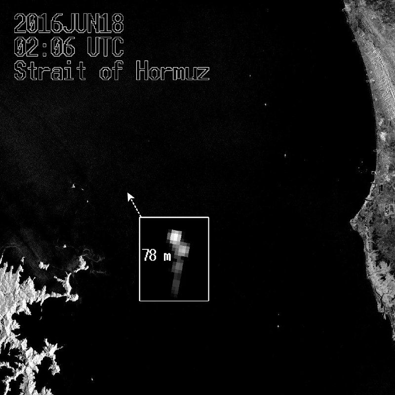

۶ عبور دریایی در تنگه هرمز در مسیر آمریکا 🇺🇸 – عمان 🇴🇲 دیروز انجام شد. این تا حدی توضیح می‌دهد که چرا امروز فقط یک مورد در ساعت 02:06 بامداد به وقت UTC مشاهده شده است .

⟨آیا شناور نظامی آمریکا 🇺🇸 است؟ یا نفتکش ساحلی؟ طول تقریبی ۷۸ متر⟩

در موقعیت:
26.5795, 56.6537

همراه با دو شناور کوچک‌تر در کنار آن.

⚠️ نکته: این فقط یک تصویر لحظه‌ای از شناورهایی است که در همان زمان مشخص در حال عبور بوده‌اند.

@mwarmonitor

## iaghapour — post 2684

  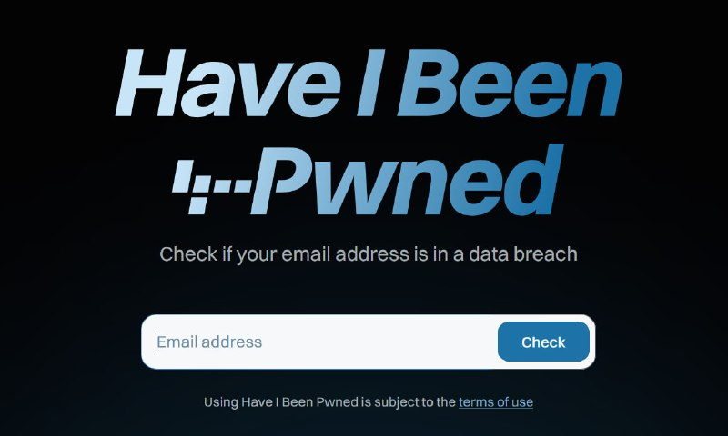

🚨 افشای ۱۲۴ میلیون پسورد و ۵۶ میلیون ایمیل؛ آیا اطلاعات شما هم لو رفته؟

پایگاه داده سرویس معروف Have I Been Pwned به‌تازگی آپدیت شده و آمار نگران‌کننده‌ای را منتشر کرده است. این بار هکرها مستقیماً به سراغ کامپیوترها و دستگاه‌های شخصی کاربران رفته‌اند و بدون اینکه کسی متوجه شود، حجم عظیمی از داده‌های حساس را سرقت کرده‌اند!

🔹 نکات مهم این نشت اطلاعاتی:
🔸 منبع سرقت: این اطلاعات نتیجه هک شدن یک سایت خاص نیست؛ بلکه بدافزارهای مخرب، پنهانی روی سیستم‌ها (مخصوصاً ویندوز) نشسته‌اند و پسوردهای ذخیره‌شده، کوکی‌ها و داده‌های مرورگر را دزدیده‌اند.

🔸 خطر پنهان: از آنجا که بسیاری از کاربران اصلاً متوجه آلوده شدن دستگاه خود نمی‌شوند، این سرقت اطلاعات می‌تواند تا مدت‌ها بدون هیچ ردپایی ادامه داشته باشد.

🔸 اقدام فوری: همین حالا به وب‌سایت Have I Been Pwned سر بزنید و ایمیل خود را جستجو کنید.

🔸 راه‌حل‌های امنیتی: اگر اطلاعاتتان لو رفته بود، سریعاً رمزهای عبور خود را تغییر دهید. همچنین برای جلوگیری از نفوذ، حتماً تایید دومرحله‌ای (2FA) را برای حساب‌های مهم خود فعال کنید.

🆔 @iAghapour

## DEJradio — post 5791

  <a href="telegram/content/DEJradio_5791_1781790247.webm" target="_blank">🎬 Download video</a>

🚨📷 محمد محبی بازیکن تیم فوتبال جمهوری اسلامی تصویر مهسا امینی را از دیوار محل اقامت تیم کند.

این اقدام به موجی از واکنش‌های منفی نسبت به او و سایر اعضای تیم منجر شده است. مردم می‌گویند: «شجاعت و غیرت حمایت از اعتراضات را نداشتید، لااقل نمک بر زخم نپاشید.»

#مهسا_امینی #جام_جهانی #محمد_محبی
@DEJradio

## IranIntlTV — post 343044

  <a href="telegram/content/IranIntlTV_343044_1781790247.mp4" target="_blank">🎬 Download video</a>

سرخط خبرهای پنجشنبه ۲۸ خرداد
@iranintltv

## IranIntlTV — post 343043

  <a href="telegram/content/IranIntlTV_343043_1781790249.mp4" target="_blank">🎬 Download video</a>

سرخط خبرهای پنجشنبه ۲۸ خرداد
@iranintltv

## IranIntlTV — post 343042

  

سی‌ان‌ان بر اساس داده‌های شرکت «مارین ترافیک» گزارش داد تا صبح پنج‌شنبه چهار کشتی باری، یک نفتکش ال‌ان‌جی با پرچم فرانسه و یک نفتکش قیر با پرچم جزایر کوک از تنگه هرمز عبور کرده و وارد دریای عمان شده‌اند.
کشتی دیگری با نام «استاروی» و با پرچم پاناما نیز وارد تنگه هرمز شده و به سمت خلیج فارس حرکت کرده است. این کشتی که توان حمل بیش از ۴۶ هزار تن نفت را دارد، سامانه شناسایی خودکار خود را خاموش کرده است؛ اقدامی که از زمان بسته شدن تنگه در ماه مارس رایج‌تر شده است.
https://iranintl.com/202606185844

## IranIntlTV — post 343041

  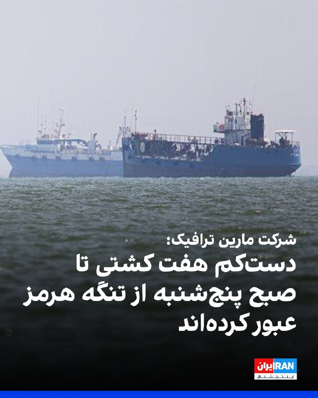

سی‌ان‌ان بر اساس داده‌های شرکت «مارین ترافیک» گزارش داد تا صبح پنج‌شنبه چهار کشتی باری، یک نفتکش ال‌ان‌جی با پرچم فرانسه و یک نفتکش قیر با پرچم جزایر کوک از تنگه هرمز عبور کرده و وارد دریای عمان شده‌اند.
کشتی دیگری با نام «استاروی» و با پرچم پاناما نیز وارد تنگه هرمز شده و به سمت خلیج فارس حرکت کرده است. این کشتی که توان حمل بیش از ۴۶ هزار تن نفت را دارد، سامانه شناسایی خودکار خود را خاموش کرده است؛ اقدامی که از زمان بسته شدن تنگه در ماه مارس رایج‌تر شده است.
https://iranintl.com/202606185844

## FarsiVOA — post 221110

ویدیوی منتشر شده در شبکه‌های اجتماعی، لحظه اصابت حمله اوکراین به یک انبار سوخت در روسیه را نشان می‌دهد.

بر اساس این گزارش، شدت انفجار به حدی بوده که یکی از مخازن سوخت به هوا پرتاب شده است.

@FarsiVOA

## RadioFarda — post 158463

  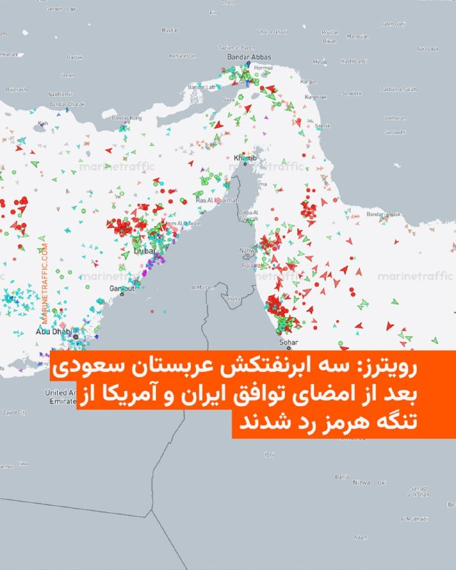

🔸خبرگزاری رویترز بر اساس داده‌های ردیابی کشتی‌ها گزارش داد که سه ابرنفتکش با پرچم عربستان سعودی با ۶ میلیون بشکه نفت خام و کشتی‌های دیگر روز پنج‌شنبه ساعاتی پس از امضای تفاهمنامه ایران و آمریکا از تنگه هرمز عبور کردند.

🔸بر اساس این گزارش، کشتی‌ها روز پنج‌شنبه، پس از هفته‌ها پنهان کردن عبور خود از تنگه هرمز با خاموش کردن فرستنده‌های خود، موقعیت خود را هنگام عبور از این آبراه حیاتی اعلام می‌کردند.

🔸داده‌های ردیابی شرکت کپلر هم افزایش ترافیک در تنگه هرمز را در روز پنج‌شنبه نشان می‌داد؛ به گونه‌ای که سه نفتکش جداگانه در اطراف بندر فجیره امارات متحده عربی در خارج از تنگه در حال بارگیری نفت بودند و دو نفتکش دیگر نیز پس از عبور از تنگه هرمز با محموله‌هایی به سمت اروپا در حرکت هستند.

🔸همزمان با این گزارش‌ها، تلویزیون رسمی ایران گزارش داد که نیروی دریایی سپاه پاسداران عبور هرگونه کشتی از تنگه هرمز را ملزم به هماهنگی با این نهاد نظامی می‌داند و تصاویری از کشتی‌های در انتظار برای دریافت اجازه عبور از تنگه هرمز را نمایش داد.

@RadioFarda

## IranianMinds — post 22880

  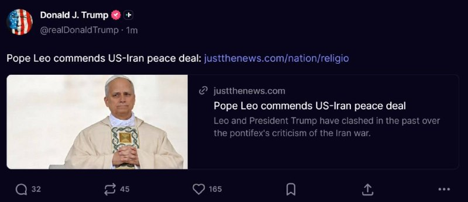

🔴پست جدید ترامپ:

پاپ لئو از توافق صلح آمریکا و ایران تمجید کرد.

@IranianMinds

## BBCPersian — post 284273

  <a href="telegram/content/BBCPersian_284273_1781790253.mp4" target="_blank">🎬 Download video</a>

🔻سرخط خبرها، پنج‌شنبه ۲۸ خرداد ۱۴۰۵

@BBCPersian

## alonews — post 128919

  <a href="telegram/content/alonews_128919_1781790256.webm" target="_blank">🎬 Download video</a>

👈خبرنگار الجزیره در تهران: هنوز تصمیم قطعی برای رفتن به ژنو در تهران گرفته نشده است اما در صورت رفتن ریاست هیات ایرانی با قالیباف است

✅ @AloNews خبر جنگ

## alonews — post 128918

👈مِی ثاقی:
یه مشت وطن فروش به برنامه ما هِیت میدن

✅ @AloNews خبر جنگ

## alonews — post 128917

  <a href="telegram/content/alonews_128917_1781790256.webm" target="_blank">🎬 Download video</a>

هنوزم آتش زرتشت ز سینه پرتو افشان است
هنوزم فره‌ی یزدان به ایرانشهر تابان است

✅@AloNews

## alonews — post 128916

---
📅 بروزرسانی: 1405/03/28 17:05
---

## VahidOOnLine — post 246218

  <a href="telegram/content/VahidOOnLine_246218_1781789715.mp4" target="_blank">🎬 Download video</a>

♦️پهپادهای اوکراینی برای دومین بار در طول یک هفته، یکی از پالایشگاه‌های نفت مسکو را هدف قرار دادند؛ حمله‌ای که به آتش‌سوزی گسترده و برخاستن دود غلیظ در پایتخت روسیه منجر شد.
در ویدیوهای منتشرشده، لحظه برخورد پهپاد و شعله‌ور شدن تأسیسات به‌وضوح دیده می‌شود. این حمله بخشی از عملیات گسترده‌تری است که به گفته منابع اوکراینی، با استفاده از صدها پهپاد علیه اهدافی در مسکو انجام شده است.
ولودیمیر زلنسکی، رئیس‌جمهوری اوکراین، این حملات را «پاسخی عادلانه» به حملات روسیه به شهرهای اوکراین توصیف کرده و هشدار داده در صورت ادامه جنگ، دامنه حملات می‌تواند گسترش یابد.
در هفته‌های اخیر، کی‌یف حملات به زیرساخت‌های انرژی روسیه را افزایش داده، در حالی که مسکو تأکید کرده بدون پذیرش شروط خود، حاضر به پایان جنگ نیست.
‌🇸🇦 Indypersian

🤖 @VahidOOnLine

## VahidOOnLine — post 246217

  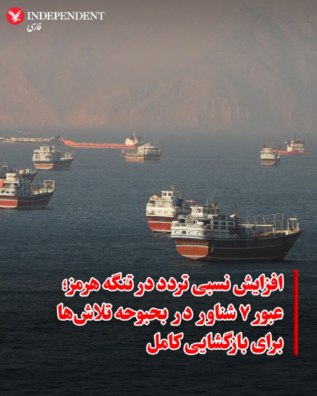

♦️ بر اساس داده‌های سایت «مارین ترافیک»، در روز پنجشنبه ۲۸ خرداد دست‌کم هفت شناور تجاری از تنگه هرمز عبور کرده‌اند. این ترددها شامل خروج چهار کشتی باری، یک نفت‌کش ال‌ان‌جی با پرچم فرانسه و یک تانکر حمل قیر با پرچم جزایر کوک به سمت دریای عمان بوده است.

در این میان، نفت‌کش «استاروی» با پرچم پاناما و ظرفیت حمل بیش از ۴۶ هزار تن نفت، در حال حرکت به سمت خلیج فارس وارد تنگه شد. این نفت‌کش سیستم فرستنده خود (AIS) را خاموش کرد؛ تاکتیکی که از زمان بسته شدن تنگه در ماه مارس به شدت رایج شده است.

بازگشایی این آبراه حیاتی که در طول منازعه اخیر توسط تهران مسدود شده بود، یکی از بندهای کلیدی یادداشت تفاهم میان جمهوری اسلامی و آمریکا است. طبق این توافق، حمل و نقل دریایی باید به سطوح پیش از جنگ بازگردد؛ این در حالی است که ایران و همسایگانش در حال تدوین سازوکار جدیدی برای اداره تنگه هستند که بر اساس آن، احتمالا به ایران اجازه دریافت نوعی عوارض (تعرفه دریایی) داده خواهد شد.
‌🇸🇦 Indypersian

🤖 @VahidOOnLine

## mwarmonitor — post 11119

🔴بریتانیا تصمیم گرفته است تا پایان سال ۱۵۰ هزار پهپاد در اختیار اوکراین قرار دهد.
این اقدام در چارچوب یک بسته تأمین مالی به ارزش ۷۵۲ میلیون پوند انجام می‌شود.

@mwarmonitor

## IranIntlTV — post 343040

  <a href="telegram/content/IranIntlTV_343040_1781789718.mp4" target="_blank">🎬 Download video</a>

نیویورک تایمز در گزارشی به تاثیر محدودیت‌های سفر تیم فوتبال ایران به آمریکا، بر روند درمان و ریکاوری بازیکنان پرداخت.

گفت‌وگو با مزدک میرزایی، ایران‌اینترنشنال
@iranintltv

## IranIntlTV — post 343039

  <a href="https://t.me/IranintlTV/343039" target="_blank">📎 Download file</a>

🎧نسخه صوتی اخبار نیم‌روزی | پنجشنبه ۲۸ خرداد
@iranintlTV

## FarsiVOA — post 221109

پرستو احمدی و هشت عضو «کنسرت کاروانسرا» به شلاق و ممنوعیت از کار محکوم شدند

## Persian_Trend_Official — post 17467

نتانیاهو: مبارزه هنوز تمام نشده است و چالش‌های بیشتری پیش رو است. ما با خرد و قضاوت به مسیر خود ادامه خواهیم داد.

همانطور که امنیت و رفاه را به نوار غزه بازگرداندیم، امنیت و رفاه را به شهرک‌های شمالی نیز باز خواهیم گرداند. این امر مستلزم حفظ منطقه امنیتی در جنوب لبنان است، این امر مستلزم آن است که تا زمانی که نیازهای امنیتی اسرائیل ایجاب می‌کند، آنجا را ترک نکنیم.

زیرا این منطقه حزب‌الله را از شهروندان و شهرک‌های ما جدا می‌کند. و در نگاهی وسیع‌تر، ما همچنان به هدف والای خود که در بیشتر دوران بزرگسالی‌ام ما را هدایت کرده است، به من نیز هدایت کرده است، پایبند خواهیم بود.

ایران سلاح هسته‌ای نخواهد داشت. و تا زمانی که من نخست وزیر اسرائیل هستم، این اتفاق نخواهد افتاد.

📝 Amir

📌 @persian_trend_official
پرشین ترند | متفاوت‌ترین کانال نظامی

## Persian_Trend_Official — post 17466

  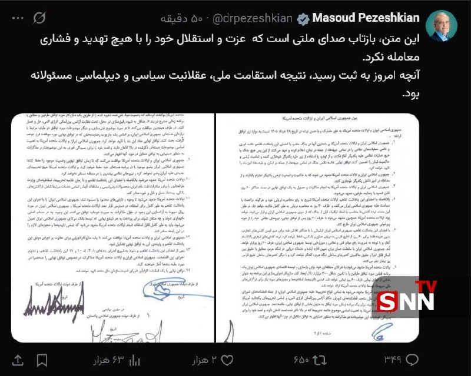

پزشکیان: آنچه امروز به ثبت رسید، نتیجه استقامت ملی، عقلانیت سیاسی و دیپلماسی مسئولانه بود.

رئیس‌جمهور در شبکه اجتماعی ایکس نوشت: این متن، بازتاب صدای ملتی است که  عزت و استقلال خود را با هیچ تهدید و فشاری معامله نکرد. آنچه امروز به ثبت رسید، نتیجه استقامت ملی، عقلانیت سیاسی و دیپلماسی مسئولانه بود.

📝 Amir

📌 @persian_trend_official
پرشین ترند | متفاوت‌ترین کانال نظامی

## alonews — post 128915

  <a href="telegram/content/alonews_128915_1781789722.webm" target="_blank">🎬 Download video</a>

👈نتانیاهو: ما امنیت را به شمال باز خواهیم گرداند و این مستلزم حفظ منطقه امنیتی در لبنان است. ما نباید از آنجا عقب‌نشینی کنیم.

✅ @AloNews خبر جنگ

---
📅 بروزرسانی: 1405/03/28 16:54
---

## mwarmonitor — post 11118

🔴سی‌ان‌ان به نقل از یک منبع اسرائیلی: نتانیاهو معتقد است توافق نهایی شکل نخواهد گرفت و تهران با محدود کردن برنامه هسته‌ای خود موافقت نخواهد کرد. نتانیاهو تلاش می‌کند از طریق رسانه‌های راست‌گرا و اعضای کنگره بر توافق با ایران تأثیر بگذارد. @mwarmonitor

## IranIntlTV — post 343038

  <a href="telegram/content/IranIntlTV_343038_1781789095.mp4" target="_blank">🎬 Download video</a>

پیت هگست، وزیر جنگ ایالات متحده روز پنجشنبه در بروکسل اعلام کرد که اگر جمهوری اسلامی بر اساس شرایط یک توافق موقت، از سلاح‌ها، مواد و تاسیسات هسته‌ای خود دست نکشد، آمریکا آماده ازسرگیری اقدام نظامی علیه این کشور است؛ وی همچنین افزود که واشنگتن می‌تواند آنچه را که او یک «محاصره همه‌جانبه و محکم» نامید، دوباره اعمال کند.
@iranintltv

## FarsiVOA — post 221108

🔺ارتش اسرائیل: برای «رفع تهدیدها» در جنوب لبنان مستقر شده‌ایم

▪️ارتش دفاعی اسرائیل روز پنج‌شنبه ۲۸ خرداد با انتشار نقشه‌ای در شبکه اجتماعی ایکس نوشت: «بر اساس نیاز عملیاتی، ارتش اسرائیل در منطقه امنیتی، حدود ۱۰ کیلومتر در داخل خاک لبنان، مستقر شده است.»

⬇️ بیشتر بخوانید:

https://ir.voanews.com/a/israeli-army-map-military-attack-lebanon/8162236.html/?nocach=1

## FarsiVOA — post 221107

داوود جعفری، عکاس حیات‌وحش، با انتشار ویدیویی از ثبت لحظه‌ای کم‌نظیر در دل طبیعت ایران خبر داد.

او نوشت با وجود سه ماه سکوت و شرایط دشوار، طبیعت مسیر خود را ادامه داده و در این مدت هشت توله ‌گرگ برای نخستین‌بار چشم به جهان گشوده‌اند.

@FarsiVOA

## Persian_Trend_Official — post 17465

  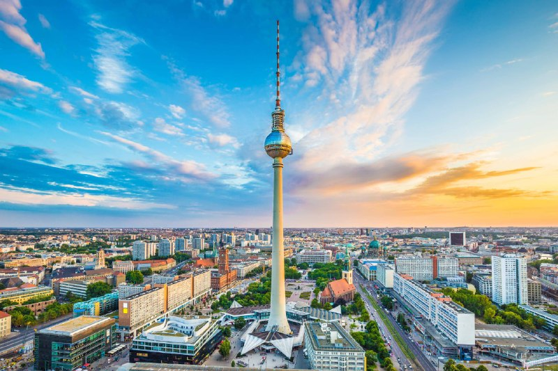

آژانس اطلاعات داخلی آلمان، سازمان اطلاعات ترکیه (میت) را به عنوان یکی از چهار سرویس اطلاعاتی خارجی فعال در برلین، در کنار روسیه، چین و ایران، شناسایی کرده است.

مایکل فیشر، رئیس اطلاعات برلین، با ارائه این گزارش گفت: بازیگران اصلی در فعالیت‌های اطلاعاتی در برلین، روسیه، چین، ایران و ترکیه هستند و افزود که فعالیت‌های آنها شامل جاسوسی کلاسیک، حملات سایبری، کمپین‌های انتشار اطلاعات نادرست و اقدامات خرابکارانه می‌شود.

ایریس اشپرانگر، سناتور داخلی برلین، هشدار داد که تهدید بالقوه ناشی از جاسوسی و فعالیت‌های خرابکارانه احتمالی همچنان در سطح بالایی قرار دارد و تأکید کرد که آلمان همچنان با چالش‌های امنیتی قابل توجهی از سوی عملیات اطلاعاتی خارجی روبرو است.

📝 Amir

📌 @persian_trend_official
پرشین ترند | متفاوت‌ترین کانال نظامی

## RadioFarda — post 158462

🔸رافائل گروسی، مدیرکل آژانس بین‌المللی انرژی اتمی، از توافق موقت میان ایران و آمریکا استقبال کرد و گفت آژانس اکنون وارد مرحله گفت‌وگوهای فنی برای اجرای این توافق خواهد شد.

🔸او روز پنج‌شنبه ۲۸ خرداد در ژنو به خبرنگاران گفت: «خوب است که این تفاهم‌نامه وجود دارد. اکنون کار فنی آغاز می‌شود.»

🔸به گفته او، اشاره توافق به نظارت و کنترل آژانس بین‌المللی انرژی اتمی اهمیت زیادی دارد، زیرا آژانس باید مشخص کند چه مواردی را باید مشاهده و به چه تأسیسات و اطلاعاتی دسترسی داشته باشد.

🔸تفاهم‌نامه ۱۴ بندی که شامگاه چهارشنبه میان تهران و واشینگتن امضا شد، آتش‌بسی را که در فروردین‌ماه اعلام شده بود برای ۶۰ روز دیگر تمدید می‌کند تا دو طرف برای دستیابی به توافق نهایی مذاکره کنند.

🔸مقام‌های ایران و آمریکا گفته‌اند این تفاهم‌نامه به صورت دیجیتال و به زبان‌های فارسی و انگلیسی توسط دونالد ترامپ و مسعود پزشکیان امضا شده است. وزارت خارجه ایران نیز اعلام کرده که این توافق از روز چهارشنبه اجرایی شده است.

🔸مدیرکل آژانس بین‌المللی انرژی اتمی همچنین با اشاره به ناکامی مذاکرات پیشین گفت نباید از شکست‌های گذشته دلسرد شد

@RadioFarda

## alonews — post 128913

  <a href="telegram/content/alonews_128913_1781789096.webm" target="_blank">🎬 Download video</a>

👈حملات اسرائیل به جنوب لبنان

✅ @AloNews خبر جنگ

---
📅 بروزرسانی: 1405/03/28 16:44
---

## VahidOOnLine — post 246216

  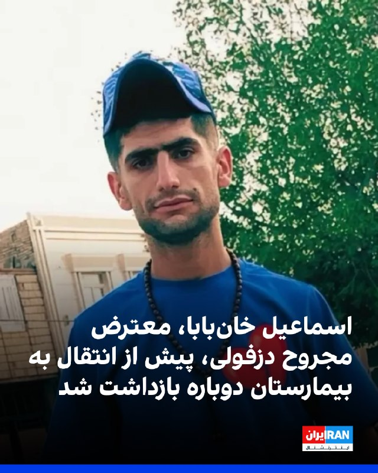

اسماعیل خان‌بابا، شهروند معترض اهل دزفول که در جریان انقلاب ملی ایرانیان دی‌ماه ۱۴۰۴ بر اثر شلیک ماموران مجروح شده بود، پس از آزادی موقت از زندان دزفول برای ادامه درمان، بار دیگر از سوی نیروهای امنیتی بازداشت و به مکانی نامعلوم منتقل شد.
بر اساس اطلاعات رسیده به ایران‌اینترنشنال، خانواده خان‌بابا پس از پیگیری‌های گسترده موفق شدند وثیقه‌ای ۲۰ میلیارد تومانی برای آزادی موقت او تامین کنند تا روند درمان جراحاتش در بیمارستان ادامه یابد.
با این حال، نیروهای امنیتی اسماعیل خان‌بابا را پس از آزادی از زندان دزفول بار دیگر بازداشت کردند.
تاکنون اطلاعی از محل نگهداری و وضعیت جسمانی اسماعیل خان‌بابا منتشر نشده است.
‌🏁 🇬🇧 IranintlTV

🤖 @VahidOOnLine

## VahidOOnLine — post 246215

  <a href="telegram/content/VahidOOnLine_246215_1781788493.mp4" target="_blank">🎬 Download video</a>

آمریکا شاید بحران را متوقف کرده باشد، اما زبان تفاهم‌نامه بیش از آنکه نشانه شکست جمهوری اسلامی باشد، مسیر تنفس و بازسازی موقعیت تهران را باز می‌کند.
‌🏁 🇬🇧 ManotoTV

🤖 @VahidOOnLine

## VahidOOnLine — post 246214

  <a href="telegram/content/VahidOOnLine_246214_1781788495.mp4" target="_blank">🎬 Download video</a>

ترامپ در پاسخ به پرسشی درباره آزادسازی پول‌ها بلوکه شده ایران گفت «این پولِ خودشان است؛ فکر می‌کنم قرار است پسش بدهیم.»

او گفت اگر آمریکا دارایی کشورها را نگه دارد، دیگر کسی به دلار اعتماد نمی‌کند و نظام مالی جهانی آسیب می‌بیند. ترامپ در ادامه، منتقدان توافق را هدف گرفت و گفت ایران از نظر نظامی شکست خورده، اما ادامه بمباران می‌توانست عبور کشتی‌ها را مختل کند و روزانه صدها میلیون دلار هزینه به اقتصاد جهانی تحمیل کند.
‌🏁 🇬🇧 ManotoTV

🤖 @VahidOOnLine

## VahidOOnLine — post 246204

  <a href="telegram/content/VahidOOnLine_246204_1781788496.mp4" target="_blank">🎬 Download video</a>

توافقی که با پول و رفع تحریم تعریف شود، بر این فرض بناست که جمهوری اسلامی در برابر امتیاز اقتصادی از تقابل عقب می‌نشیند. اما مسئله اصلی این است: تهران پول را می‌خواهد، اما آیا حاضر است منطق قدرت خود را هم تغییر دهد؟
‌🏁 🇬🇧 ManotoTV

🤖 @VahidOOnLine

## WithYashar — post 15253

  <a href="telegram/content/WithYashar_15253_1781788498.mp4" target="_blank">🎬 Download video</a>

امروز شبکه پویای صداوسیما اومده و یه برنامه کودک در مورد توافق کردن و سازگاری گذاشته که تندرو ها به شدت عصبی شدن
@withyashar

## mwarmonitor — post 11117

📝 هنر والای «ربط دادن گوز به شقیقه» دقیقاً از همین‌جا شکل می‌گیرد؛ جایی که ممدباقر طرقبه‌چی با استشمام بوی شیرین دلار، حتی اگر کل هیمنه و رهبران مقاومت هم روی هوا بروند، با وقاحت تمام ایستاده و برای حفظ صندلی‌اش معامله می‌کند. او در این مصاحبه خفت‌بار ، با…

## mwarmonitor — post 11116

📌مارک لوین
🔹وقت تغییر استراتژی است. باید به‌جای شتاب‌زدگی، پیشروی دشمن را آهسته کنیم، ذخایر مهمات خود را افزایش دهیم، ذخایر نفتی‌مان را تقویت کنیم، قیمت بنزین را پایین بیاوریم، از انتخابات میان‌دوره‌ای عبور کنیم و سپس ضربه نهایی را وارد کنیم.

🔹نه اینکه عجولانه به سمت توافق برویم، صنعت نفت آن‌ها را تقویت کنیم و میلیاردها دلار به آن‌ها منتقل کنیم و از این قبیل اقدامات.

@mwarmonitor

## mwarmonitor — post 11115

🔴پیشنهاد لهستان برای میزبانی از یک حضور دائمی نظامی ایالات متحده در حال بررسی توسط وزارت جنگ ایالات متحده است.

🔸وزیر دفاع لهستان، ولادیسلاو کوسینیاک-کامیش، پس از دیدار با وزیر جنگ آمریکا، پیت هگست، در بروکسل، ادامه داشتن این گفت‌وگوها را تأیید کرد.

@mwarmonitor

## FoxNewsTwitter — post 343118

  <a href="telegram/content/FoxNewsTwitter_343118_1781788499.mp4" target="_blank">🎬 Download video</a>

Fox News (Twitter/X)

JUST IN: The New York Police Department declaring there’s no more room for spectators at the Knicks championship parade hours before the event is set to kick off.

All viewing pens for the Knicks championship parade are full, and officials say no one else will be allowed into the designated viewing areas.

If you're already inside, don't leave, reentry won't be allowed.

## FoxNewsTwitter — post 343117

‌Fox News (Twitter/X)

As President Trump closes his key deal with Iran, the administration continues to promise lower gas and oil prices for Americans.

Many consumers are now asking how high will oil (WTI) get by end of year?

Our sponsor Kalshi’s prediction market shows:

— $115.01 or above: 30%
— $120.01 or above: 29.1%
— $125.01 or above: 31.4%

https://www.foxbusiness.com/economy/oil-prices-plunge-lowest-levels-since-early-march-after-trump-signs-iran-deal

## DEJradio — post 5790

  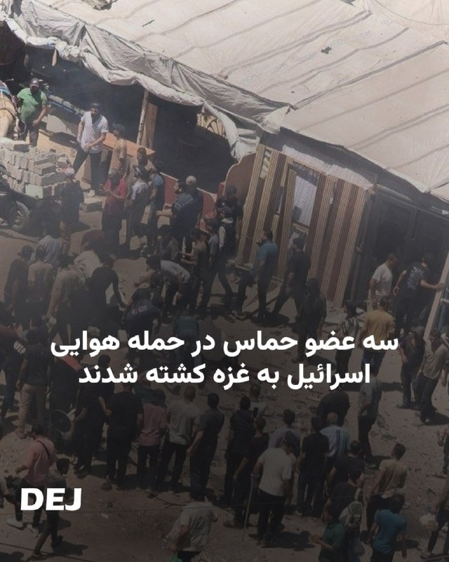

💀
🚨 سه عضو حماس در حمله هوایی اسرائیل به غزه کشته شدند

در اثر حمله اسرائیل به یک ماشین در غزه که پنجشنبه ۱۸ خرداد ۱۴۰۵ اتفاق افتاد سه فرمانده میدانی کشته و شماری زخمی شدند.

منابع داخلی جمهوری اسلامی ادعا کردند این حمله «نقض آتش‌بس است.»

#حماس #آتشبس #اسرائیل
@DEJradio

## DEJradio — post 5789

  <a href="telegram/content/DEJradio_5789_1781788501.webm" target="_blank">🎬 Download video</a>

🔺🎤 روز ملی شیر و خورشید، میراث یک نماد یک قهرمان؛

گفت‌وگو با شهران طبری، تحلیلگر سیاسی

#روز_ملی_شیروخورشید #مجیدرضا_رهنورد #شیروخورشید
@DEJradio

## VahidOnline — post 76479

  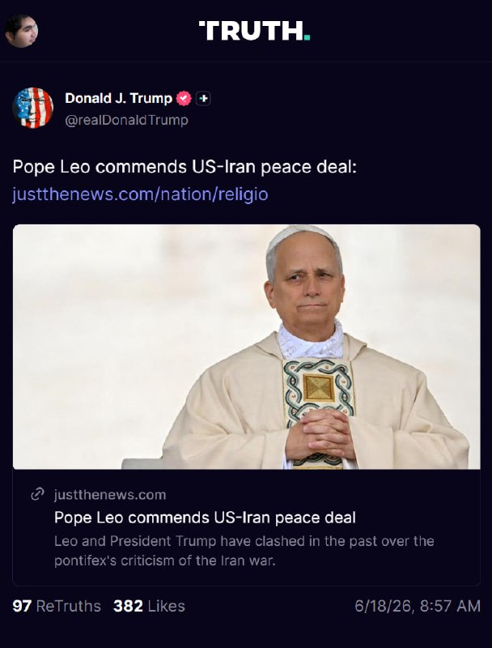

پست چند دقیقه پیش ترامپ: "پاپ لئو از توافق صلح آمریکا و ایران تمجید کرد."
realDonaldTrump

📡 @VahidOnline

## VahidOnline — post 76478

  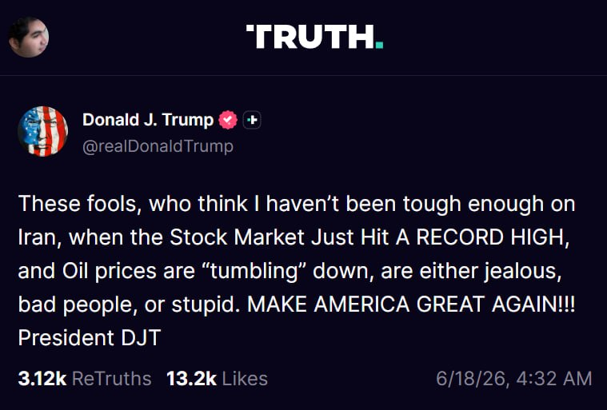

پست ۵ ساعت پیش ترامپ:
این احمق‌ها که فکر می‌کنند من در قبال ایران به اندازه کافی سخت‌گیر نبوده‌ام، در حالی که بازار سهام همین الان به رکوردی تاریخی رسیده و قیمت نفت هم دارد «سقوط» می‌کند، یا حسودند، یا آدم‌های بدی هستند، یا احمق‌اند.

آمریکا را دوباره عظیم کنیم!!!

رئیس‌جمهور دی‌جی‌تی
realDonaldTrump

📡 @VahidOnline

## IranIntlTV — post 343037

  

اسماعیل خان‌بابا، شهروند معترض اهل دزفول که در جریان انقلاب ملی ایرانیان دی‌ماه ۱۴۰۴ بر اثر شلیک ماموران مجروح شده بود، پس از آزادی موقت از زندان دزفول برای ادامه درمان، بار دیگر از سوی نیروهای امنیتی بازداشت و به مکانی نامعلوم منتقل شد.
بر اساس اطلاعات رسیده به ایران‌اینترنشنال، خانواده خان‌بابا پس از پیگیری‌های گسترده موفق شدند وثیقه‌ای ۲۰ میلیارد تومانی برای آزادی موقت او تامین کنند تا روند درمان جراحاتش در بیمارستان ادامه یابد.
با این حال، نیروهای امنیتی اسماعیل خان‌بابا را پس از آزادی از زندان دزفول بار دیگر بازداشت کردند.
تاکنون اطلاعی از محل نگهداری و وضعیت جسمانی اسماعیل خان‌بابا منتشر نشده است.
https://iranintl.com/202606188431

## ManotoTV — post 106161

  <a href="telegram/content/ManotoTV_106161_1781788503.mp4" target="_blank">🎬 Download video</a>

آمریکا شاید بحران را متوقف کرده باشد، اما زبان تفاهم‌نامه بیش از آنکه نشانه شکست جمهوری اسلامی باشد، مسیر تنفس و بازسازی موقعیت تهران را باز می‌کند.

## DW_Farsi — post 126143

🔶 قطع کلیه تماس‌های وزیر خارجه اسرائیل با کایا کالاس

گیدئون ساعر، وزیر خارجه اسرائیل اعلام کرد به دلیل اظهارات اخیر کایا کالاس، مسئول سیاست خارجی اتحادیه اروپا، که در آن‌ اسرائیل را با رژیم آپارتاید آفریقای جنوبی مقایسه کرده است، تمامی تماس‌های خود با او را قطع می‌کند.

روابط دیپلماتیک میان اسرائیل و اتحادیه اروپا از زمان آغاز جنگ غزه در اکتبر ۲۰۲۳ و همچنین به دلیل آن چه که خشونت شهرک‌نشینان اسرائیلی در کرانه باختری خوانده شده، با تنش شدیدی مواجه شده است.

گیدئون ساعر روز پنج‌شنبه ۱۸ ژوئن، کالاس را متهم کرد که در قبال اسرائیل "به شکلی وسواس‌گونه و آشکارا ناعادلانه" رفتار می‌کند.

او در شبکه ایکس نوشت: «اخیرا گزارش شده که او در جریان سفر خود به مکزیک، اسرائیل را با رژیم نژادپرست آپارتاید که در آفریقای جنوبی وجود داشت مقایسه کرده است. با این حال، تا این لحظه هیچ تکذیب، توضیح یا پاسخی از سوی او درباره این اظهارات تند صادر نشده است.»

وزیر خارجه اسرائیل در ادامه پیام خود افزود: «بنابراین، به عنوان وزیر خارجه دولت اسرائیل، چاره‌ای ندارم جز اینکه تمامی تماس‌ها با خانم کالاس را قطع کنم تا زمانی که او این افترا را که متوجه تنها دولت یهودی جهان و همچنین تنها دموکراسی خاورمیانه کرده است، پس بگیرد.»

بر اساس گزارش رسانه اروپایی یوراکتیو، کالاس این اظهارات را در جریان نشستی غیرعلنی با مقام‌های دولت مکزیک و در سفر ماه گذشته خود به این کشور مطرح کرده بود.

اظهارات ساعر همچنین پس از آن مطرح شد که کالاس این هفته گفته بود، اتحادیه اروپا در پی درخواست چند کشور عضو، گزینه‌های محدود کردن تجارت با شهرک‌های اسرائیلی را، بررسی خواهد کرد.

کالاس همچنین اشاره کرده است که چند کشور عضو اتحادیه اروپا، پیشنهاد اعمال تحریم علیه ایتامار بن گویر، وزیر امنیت ملی اسرائیل، را مطرح کرده‌اند، اگرچه "هنوز اجماعی در این زمینه شکل نگرفته است".

هرگونه تحریم اتحادیه اروپا باید به تایید هر ۲۷ کشور عضو این اتحادیه برسد. حامیان سرسخت اسرائیل، تاکنون با چنین اقداماتی مخالفت کرده‌اند.

📌 برای دسترسی کامل به گزارش به وبسایت دویچه‌وله فارسی مراجعه کنید.
@dw_farsi

## Persian_Trend_Official — post 17464

  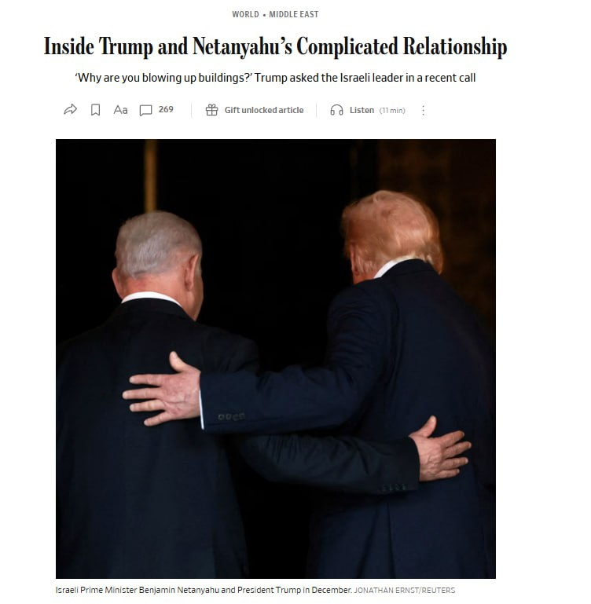

وال استریت ژورنال: روابط بین رئیس جمهور ترامپ و بنیامین نتانیاهو، نخست وزیر اسرائیل، با پیگیری دیپلماسی واشنگتن با ایران، در حالی که اسرائیل همچنان از رویکرد نظامی سختگیرانه‌تری حمایت می‌کند، به طور فزاینده‌ای رو به وخامت می‌رود.

ترامپ از اقدامات نظامی اسرائیل ابراز ناامیدی کرده و در مقطعی به نتانیاهو گفته است: چرا ساختمان‌ها را منفجر می‌کنید؟ و از او خواسته است که این کار را متوقف کند. او همچنین در خلوت به مشاورانش شکایت کرده است که نتانیاهو می‌خواهد همه را بمباران کند.

در همین حال، نتانیاهو بارها اعتبار مذاکرات ایالات متحده و ایران را زیر سوال برده و ترامپ را در مورد چگونگی تأیید هرگونه تعهد هسته‌ای آینده تهران تحت فشار قرار داده و نسبت به اعتماد به ایران بر اساس تجربیات گذشته هشدار داده است.

ترامپ همچنین پس از گفتگو با نتانیاهو، به طور فزاینده‌ای به دنبال نظرات ثانویه مقامات ارشد دولت بوده و پرسیده است که آیا ارزیابی‌های رهبر اسرائیل دقیق است یا خیر - سطحی از بررسی که به گفته مقامات در گذشته کمتر رایج بوده است.

📝 Amir

📌 @persian_trend_official
پرشین ترند | متفاوت‌ترین کانال نظامی

## Persian_Trend_Official — post 17463

  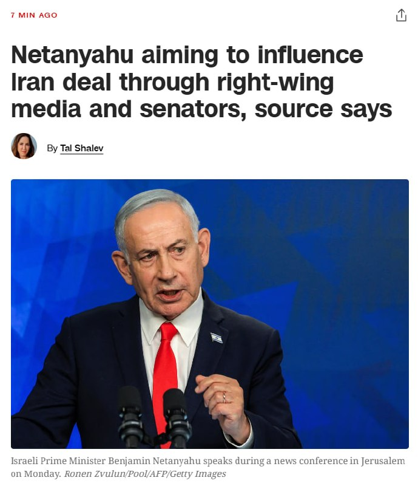

به گزارش سی‌ان‌ان، بنیامین نتانیاهو، نخست‌وزیر اسرائیل، به دنبال شکل‌دهی به نتیجه مذاکرات ایالات متحده و ایران با بسیج چهره‌های رسانه‌ای راست‌گرای حامی و قانون‌گذاران طرفدار اسرائیل برای تأثیرگذاری بر رئیس‌جمهور ترامپ است.

نتانیاهو همچنان نسبت به پذیرش محدودیت‌های معنادار بر برنامه هسته‌ای خود توسط ایران تردید دارد و معتقد است که توافق نهایی بعید است.

پس از امضای تفاهم‌نامه ایالات متحده و ایران و آغاز دوره مذاکره 60 روزه، نتانیاهو در تلاش است تا از چهره‌های رسانه‌ای راست‌گرا مانند مارک لوین، مفسر و سناتورهای طرفدار اسرائیل، برای ایجاد مخالفت با جنبه‌هایی از توافق، از جمله بودجه پیشنهادی بازسازی و توسعه برای ایران، استفاده کند.

📝 Amir

📌 @persian_trend_official
پرشین ترند | متفاوت‌ترین کانال نظامی

## IranianMinds — post 22879

  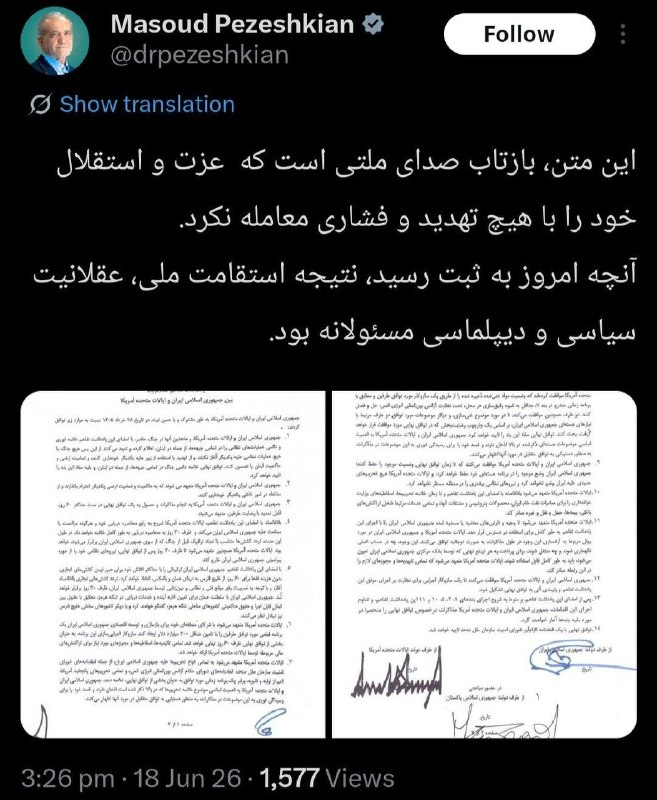

🔴پست پزشکیان/ متن یادداشت تفاهم میان آمریکا و جمهوری اسلامی.

@IranianMinds

## BBCPersian — post 284271

🔻چرا ایران توافق با آمریکا را پیروزی خود می‌داند؟

رهبران ایران تلاش می‌کنند تفاهم‌نامه در حال شکل‌گیری با آمریکا را نه به عنوان یک مصالحه، بلکه به عنوان یک پیروزی در نتیجه مقاومت معرفی کنند. اما جا انداختن چنین روایتی حتی در میان برخی گروه‌های حامی حکومت هم کار آسانی نیست.

ایران هم‌اکنون در مرحله آتش‌بس جنگی پرهزینه است، اقتصاد زیر فشار شدیدی قرار دارد و بخش‌هایی از پایگاه حمایتی‌اش ماه‌هاست که هرگونه سازش با واشنگتن را در گردهمایی‌های شبانه در شهرها محکوم کرده‌اند.

در عین حال گروهی از ایرانیان معترض، در داخل کشور و خارج از آن، این بحران را نه فرصتی برای دیپلماسی، بلکه زمینه‌ای برای تغییر حکومت می‌دانند.

https://bbc.in/4fNU3nt
@BBCPersian

## BBCPersian — post 284270

  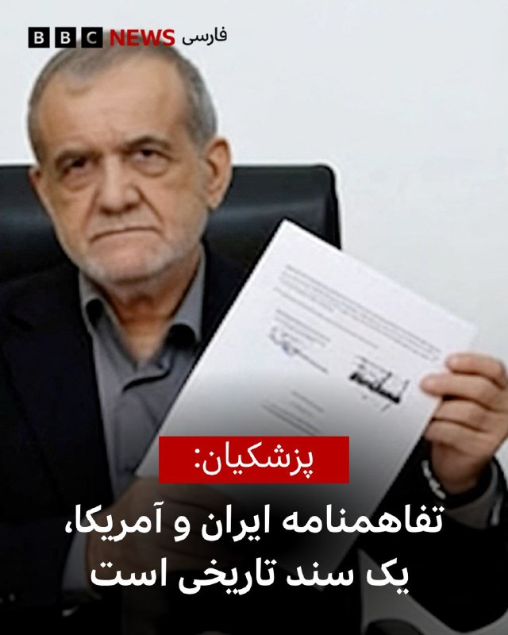

🔻مسعود پزشکیان، رئیس جمهور ایران در پیامی در شبکه‌های اجتماعی تفاهمنامه ایران و آمریکا را «یک سند تاریخی» خواند.

آقای پزشکیان می‌گوید که این یک سند «تاریخی و پیامی از ایران مقتدر است» و صلح در سایه «احترام متقابل» تحقق خواهد یافت.

او در ادامه نوشت: «جمهوری اسلامی ایران به صلح جهانی با حفظ عزت و استقلال، پیشرفت و همکاری منطقه‌ای همواره متعهد و پایبند است.»

پیشتر مسعود پزشکیان و دونالد ترامپ، روسای جمهور ایران و آمریکا تفاهمنامه پایان جنگ را با هدف آغاز مذاکرات میان دو کشور امضا کردند.

📸 Reuters TV/Reuters

https://bbc.in/4fNU3nt
@BBCPersian

## Hranews — post 113703

  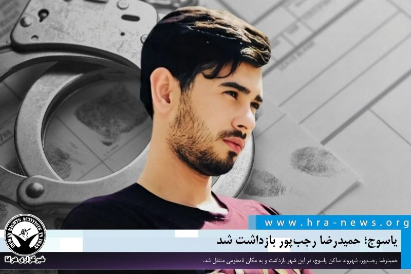

یاسوج؛ حمیدرضا رجب‌پور بازداشت شد

❗️
❗️
❗️
❗️
❗️– حمیدرضا رجب‌پور، شهروند ساکن یاسوج، روز سه‌شنبه ۲۶ خردادماه در این شهر بازداشت و به مکان نامعلومی منتقل شد.

به گزارش خبرگزاری هرانا، ارگان خبری مجموعه فعالان حقوق بشر در ایران، حمیدرضا رجب‌پور بازداشت شد.

بر اساس اطلاعات دریافتی هرانا، این شهروند عصر روز سه‌شنبه ۲۶ خردادماه در محل کار خود در بلوار باهنر یاسوج توسط نیروهای امنیتی بازداشت شده است.

#حمیدرضا_رجب‌پور

ادامه مطلب

↘️
@hranews_bot تماس ✉️ - @Hranews کانال هرانا 🆑

## manototv — post 106161

  <a href="telegram/content/manototv_106161_1781788508.mp4" target="_blank">🎬 Download video</a>

آمریکا شاید بحران را متوقف کرده باشد، اما زبان تفاهم‌نامه بیش از آنکه نشانه شکست جمهوری اسلامی باشد، مسیر تنفس و بازسازی موقعیت تهران را باز می‌کند.

## alonews — post 128912

  <a href="telegram/content/alonews_128912_1781788510.mp4" target="_blank">🎬 Download video</a>

👈تیکه سنگین حاج فتل به میثاقی

✅ @AloNews خبر جنگ

## alonews — post 128911

  <a href="telegram/content/alonews_128911_1781788512.webm" target="_blank">🎬 Download video</a>

👈پولتیکو: ترامپ به وضوح از تماشای عکس‌های سوختن کلیسای جامع دورمیشن کی‌یف که زلنسکی به او نشان داد، تحت تأثیر قرار گرفت

🔴 این فشار نهایی باعث شد که او از یک بیانیه مشترک سخت‌گیرانه‌تر درباره اوکراین حمایت کند

✅ @AloNews خبر جنگ

---
📅 بروزرسانی: 1405/03/28 16:34
---

## VahidOOnLine — post 246203

  

بر اساس گزارش‌ رسیده به ایران‌اینترنشنال، اسماعیل خان‌بابا، شهروند معترض اهل دزفول که در جریان بازداشت‌های دی‌ماه ۱۴۰۴ با شلیک ماموران مجروح شده بود، پس از آزادی موقت برای درمان، بار دیگر توسط نیروهای امنیتی بازداشت و به مکانی نامعلوم منتقل شد.

بر اساس این گزارش‌، خانواده او پس از پیگیری‌های فراوان موفق شدند وثیقه‌ای به مبلغ ۲۰ میلیارد تومان برای آزادی موقت وی تامین کنند تا بتواند روند درمان ناشی از جراحات وارده را در بیمارستان ادامه دهد.

با این حال، ماموران امنیتی بلافاصله پس از آزادی اسماعیل خان‌بابا از زندان دزفول و پیش از انتقال او به مرکز درمانی، او را دوباره بازداشت کرده و به مکانی نامعلوم منتقل کردند.

از محل نگهداری و وضعیت جسمانی او اطلاعی در دست نیست.

‌🏁 🇬🇧 IranintlTV

🤖 @VahidOOnLine

## VahidOOnLine — post 246202

  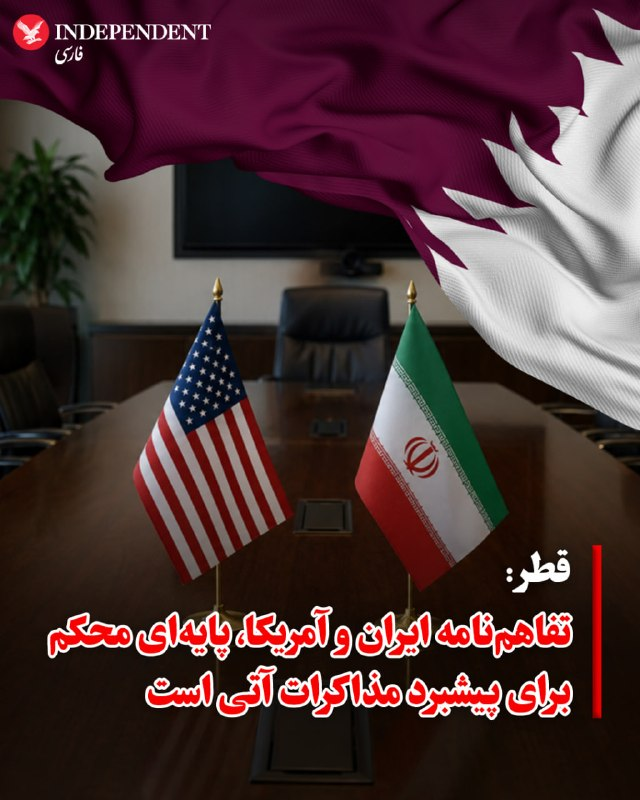

♦️ وزارت امور خارجه قطر روز پنج‌شنبه ۲۸ خرداد اعلام کرد که توافق به‌دست‌آمده برای پایان دادن به جنگ میان ایالات متحده و جمهوری اسلامی ایران، به عنوان بستری استوار برای گفت‌وگوهای بعدی عمل خواهد کرد.

این کشور حاشیه خلیج‌فارس که یکی از میانجی‌گران کلیدی در این توافق به شمار می‌رود، در بیانیه‌ای رسمی تاکید کرد که این سند «نشان‌دهنده پایه‌ای محکم برای ورود به مرحله بعدی مذاکرات میان طرف‌های آمریکایی و ایرانی است». این موضع‌گیری پیش از آغاز مذاکرات فنی که انتظار می‌رود روز جمعه در سوئیس برگزار شود، مطرح شده است.
‌🇸🇦 Indypersian

🤖 @VahidOOnLine

## WithYashar — post 15252

  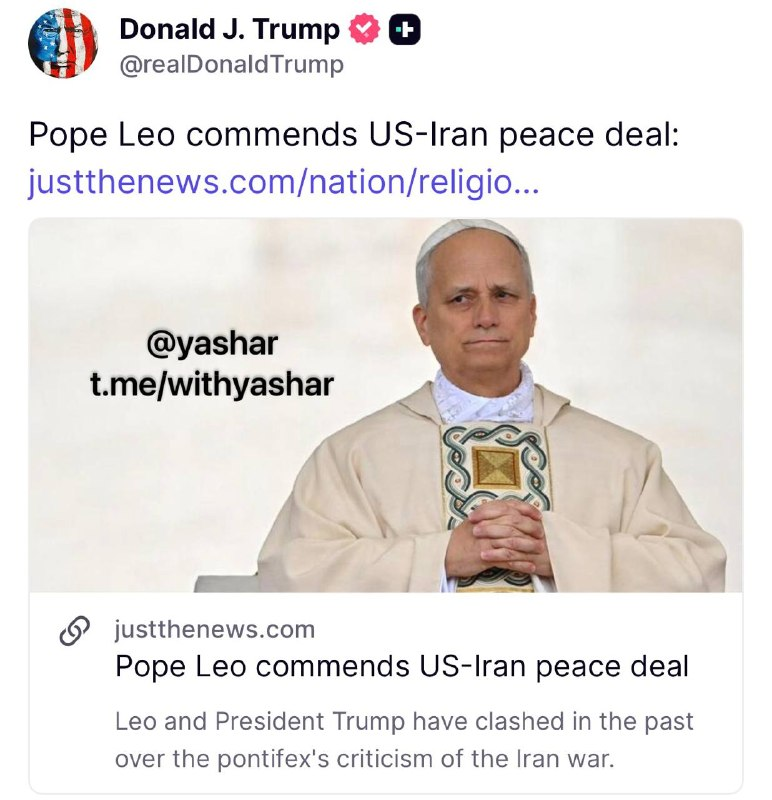

ترامپ در تروث : پاپ لئو از توافق صلح آمریکا و ایران تمجید کرد
@withyashar

## WithYashar — post 15251

محمد محبی فوتبالیست تیم جمهوری اسلامی که در خوشحالی زدن گل به تیم نیوزلند، به مردم شلیک کرد، رفته و عکس مهسا امینی رو کنده و انداخته توی سطل زباله... @withyashar

## VahidOnline — post 76477

  

پیت هگست، وزیر دفاع آمریکا، روز پنج‌شنبه ۲۸ خرداد در یک موضع‌گیری درباره تفاهم‌نامه اسلام‌آباد تأکید کرد که ارتش آمریکا قرار است «چماق بزرگ پشت مذاکرات» باشد.
او همچنین تأکید کرد که هر گونه تغییر در اندازه حضور نظامی آمریکا در خاورمیانه «بسته به شرایط» خواهد بود.

این نخستین اظهار نظر هگست در پی امضای تفاهم‌نامه اسلام‌آباد میان تهران و واشینگتن است که بامداد پنج‌شنبه توسط رئیس جمهور ایران هم امضا شد و رسمیت یافت. دونالد ترامپ ساعتی پیش از مسعود پزشکیان سند را امضا کرده بود.
متن تفاهم‌نامه‌ای که دولت آمریکا به امضایش رضایت داد حتی از چند روز پیش از امضا شدن هم انتقادهایی در پی داشت، انتقادهایی که با انتشار متن کامل آن افزایش یافت.
به نظر می‌رسد که سخنان وزیر دفاع آمریکا هم تا اندازه‌ای پاسخ به همین انتقادها باشد.
به گفته پیت هگست،‌ آمریکا «از موضع قدرت به توافق با ایران رسید».
@VahidHeadline
وزیر دفاع آمریکا همچنین گفت که برخی کشورهای اروپایی آماده‌اند در عملیات پاکسازی مین‌ها در تنگه هرمز مشارکت کنند.
هگست در عین حال از بریتانیا خواست نقش گسترده‌تری ایفا کند و گفت که این کشور باید «گام بیشتری بردارد.»
@VahidHeadline

📡 @VahidOnline

## VahidOnline — post 76476

  

دادگاه کیفری استان قم، پرستو احمدی، خواننده، و هشت نفر دیگر از دست‌اندرکاران و نوازندگان «کنسرت کاروانسرا» را به‌طور جداگانه به ۷۴ ضربه شلاق تعزیری، دو سال ممنوع‌الخروجی و دو سال ممنوعیت از فعالیت هنری محکوم کرد.

اتهام این هنرمندان در این حکم قضایی جریحه‌دار کردن عفت عمومی از طریق تولید و انتشار محتوای مبتذل و خلاف اخلاق در بستر فضای مجازی» عنوان شده است.

پرستو احمدی ۲۱ آذر سال ۱۴۰۳، به همراه گروهی از نوازندگان مَرد شامل احسان بیرقدار، سهیل فقیه‌نصیری، امین طاهری و امیرعلی پیرنیا، در کانال یوتیوب خود ویدئویی بدون حجاب اجباری، از «کنسرت کاروانسرا» یا «کنسرت فرضی» را منتشر کرد.
@VahidHeadline

📡 @VahidOnline

## IranIntlTV — post 343036

  <a href="telegram/content/IranIntlTV_343036_1781787887.mp4" target="_blank">🎬 Download video</a>

یک شهروند با ارسال ویدیویی به ایران اینترنشنال، بنر سیاسی-مذهبی نصب‌شده در حاشیه بزرگراه صدر تهران را نشان داد که روی آن نوشته شده است «ما با شبیه او بیعت نمی‌کنیم» و در ادامه خطاب به مقام‌های حکومت گفت: «شما توافق کردید؛ دیگر چه می‌گویید؟»

## IranIntlTV — post 343035

  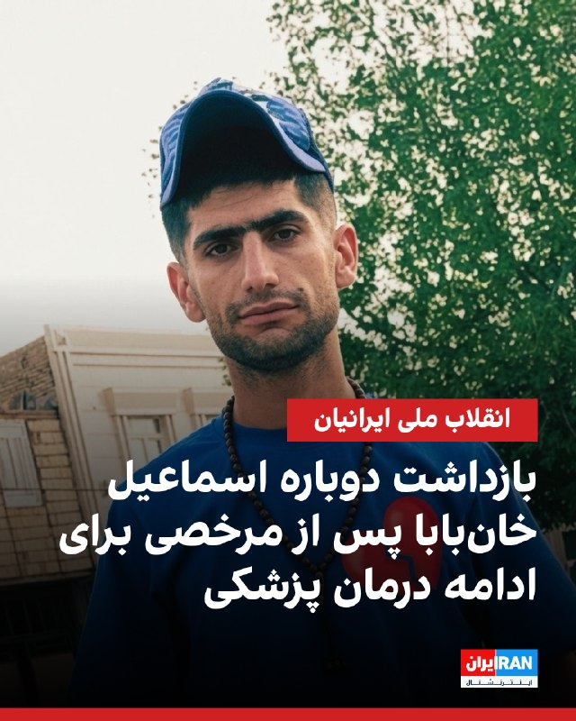

بر اساس گزارش‌ رسیده به ایران‌اینترنشنال، اسماعیل خان‌بابا، شهروند معترض اهل دزفول که در جریان بازداشت‌های دی‌ماه ۱۴۰۴ با شلیک ماموران مجروح شده بود، پس از آزادی موقت برای درمان، بار دیگر توسط نیروهای امنیتی بازداشت و به مکانی نامعلوم منتقل شد.

بر اساس این گزارش‌، خانواده او پس از پیگیری‌های فراوان موفق شدند وثیقه‌ای به مبلغ ۲۰ میلیارد تومان برای آزادی موقت وی تامین کنند تا بتواند روند درمان ناشی از جراحات وارده را در بیمارستان ادامه دهد.

با این حال، ماموران امنیتی بلافاصله پس از آزادی اسماعیل خان‌بابا از زندان دزفول و پیش از انتقال او به مرکز درمانی، او را دوباره بازداشت کرده و به مکانی نامعلوم منتقل کردند.

از محل نگهداری و وضعیت جسمانی او اطلاعی در دست نیست.

https://iranintl.com/202606182307

## IranIntlTV — post 343034

  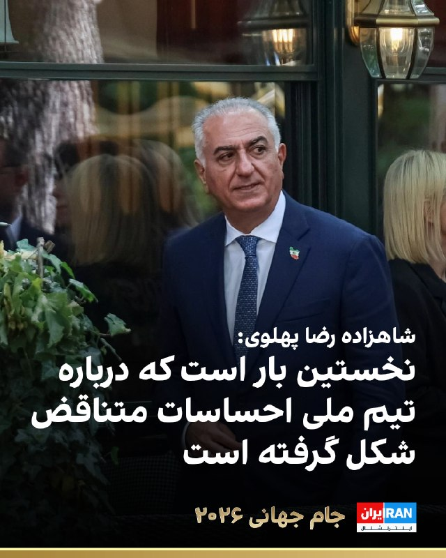

🔻شاهزاده رضا پهلوی در گفت‌وگو با آی‌تی‌وی نیوز، درباره احساسش نسبت به تیم ملی فوتبال گفت: «در تمام این سال‌ها، هر بار به‌عنوان یک واکنش طبیعی از تیم ملی کشورمان حمایت کرده‌ام؛ فارغ از شرایط سیاسی، چون این تیم ملی ماست، چه در المپیک باشد و چه در هر جای دیگری.»

🔹شاهزاده رضا پهلوی گفت: «این نخستین بار است که می‌توانم به شما بگویم احساسات متناقض زیادی درباره این موضوع وجود دارد، اگر نگوییم که حتی یک نظر قاطع درباره آن شکل گرفته است.»

@iranintltvsport

## ManotoTV — post 106160

  <a href="telegram/content/ManotoTV_106160_1781787890.mp4" target="_blank">🎬 Download video</a>

ترامپ در پاسخ به پرسشی درباره آزادسازی پول‌ها بلوکه شده ایران گفت «این پولِ خودشان است؛ فکر می‌کنم قرار است پسش بدهیم.»

او گفت اگر آمریکا دارایی کشورها را نگه دارد، دیگر کسی به دلار اعتماد نمی‌کند و نظام مالی جهانی آسیب می‌بیند. ترامپ در ادامه، منتقدان توافق را هدف گرفت و گفت ایران از نظر نظامی شکست خورده، اما ادامه بمباران می‌توانست عبور کشتی‌ها را مختل کند و روزانه صدها میلیون دلار هزینه به اقتصاد جهانی تحمیل کند.

## ManotoTV — post 106150

  <a href="telegram/content/ManotoTV_106150_1781787893.mp4" target="_blank">🎬 Download video</a>

توافقی که با پول و رفع تحریم تعریف شود، بر این فرض بناست که جمهوری اسلامی در برابر امتیاز اقتصادی از تقابل عقب می‌نشیند. اما مسئله اصلی این است: تهران پول را می‌خواهد، اما آیا حاضر است منطق قدرت خود را هم تغییر دهد؟

## RadioFarda — post 158461

  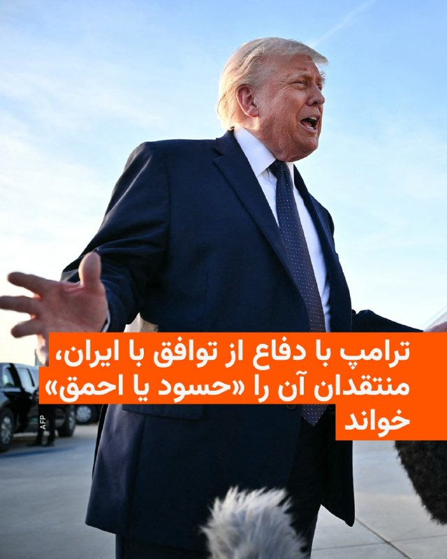

🔸دونالد ترامپ، رئیس جمهور آمریکا، روز پنج‌شنبه پیش از مذاکرات در سوئیس برای اجرای مفاد تفاهنامه تهران و واشینگتن، با حمله به منتقدان این توافق، نوشت آنها «حسودند، یا آدم‌های بدی هستند یا احمق.»

🔸آقای ترامپ ساعاتی پس از امضای توافق در شبکه اجتماعی تروث‌سوشال نوشت: «نادان‌هایی که فکر می‌کنند من به اندازه کافی در مورد ایران سخت‌گیر نبوده‌ام، در حالی که بازار سهام به بالاترین حد خود رسیده و قیمت نفت در حال "سقوط" است، یا حسودند، یا آدم‌های بدی هستند یا احمق.»

🔸از زمان اعلام دستیابی ایران و آمریکا به توافقی برای امضای تفاهنامه پایان جنگ، فیمت نفت در بازارهای جهانی کاهش قابل توجهی پیدا کرده و ارزش سهام نیز در مناطق مختلف دنیا بالا رفته است. این افزایش در آمریکا منجر به ثبت رکوردهای تازه در بازارهای بورس شده است.

@RadioFarda

## BBCPersian — post 284269

🔻پیام شادباش رئیس جمهور تاجیکستان به پزشکیان و ترامپ
امامعلی رحمان، رئیس‌جمهور

تاجیکستان، تفاهمنامه توقف جنگ ایران و آمریکا را به مسعود پزشکیان، رئیس جمهور ایران و دونالد ترامپ، رئیس‌جمهور آمریکا تبریک گفت.

آقای رحمان در این دو پیام، این تفاهم را مهم خواند و خطاب به آقای پزشکیان نوشت که دستیابی به آن «برای ملت ایران آسان نبوده و نتیجه تلاش‌های زیاد و اراده قوی آن کشور است.»

آقای رحمان می‌گوید که تفاهم حاصل‌شده برای تأمین صلح پایدار و فراگیر در خاورمیانه، تحکیم نظام امنیت بین‌المللی و فراهم آوردن زمینه‌های مساعد جهت توسعه اقتصادی و اجتماعی پایدار، اهمیت کلیدی خواهد داشت.

در پیامی جداگانه، امامعلی رحمان این تفاهمنامه را به دونالد ترامپ نیز تبریک گفت و نوشت: «این رویداد واقعا مهم، که محصول اراده استوار و تلاش‌های پیوسته شما می‌باشد، برای استقرار صلح و ثبات فراگیر در منطقه خاورمیانه، همچنان تحکیم نظام امنیت جهانی، اهمیت کلیدی داشته و برای راه‌اندازی ابتکارهای تازه صلح‌آمیز در این عرصه، زمینه‌های مساعد و پایداری را فراهم می‌آورد.»

تاجیکستان در جریان جنگ آمریکا و اسرائیل با ایران، بارها اعلام کرد که مخالف اقدامات نظامی است و از حل مسالمت‌آمیز همه منازعه‌ها از طریق راه‌های دیپلماتیک حمایت می‌کند.

https://bbc.in/4fNU3nt
@BBCPersian

## BBCPersian — post 284268

🔻حمله پهپادی اسرائیل در جنوب لبنان یک کشته بر جا گذاشت

حمله پهپادی اسرائیل به در جنوب لبنان یک کشته بر جا گذاشته است.

رسانه‌های دولتی لبنان اعلام کردند چند ساعت پس از آن‌که ایالات متحده و ایران توافقی برای پایان دادن به جنگ در خاورمیانه امضا کردند، «یک پهپاد متخاصم خودرویی را در منطقه کفرتبنيت هدف قرار داد» که در نتیجه آن یک نفر کشته و یک نفر دیگر به‌شدت زخمی شد.

هم‌زمان، ارتش اسرائیل اعلام کرد یکی از سربازانش شب قبل در جریان حادثه‌ای در جنوب لبنان کشته شده و هفت نظامی دیگر نیز زخمی شده‌اند.

از زمان اعلام توافق میان ایران و آمریکا در روز دوشنبه، سطح خشونت‌ها در لبنان به‌طور قابل توجهی کاهش یافته است.

با این حال، درگیری‌های محدودی همچنان گزارش شده و روز سه‌شنبه، چهار نفر در حملات اسرائیل کشته‌ شدند.

اسرائیل تاکنون به‌طور رسمی درباره توافق میان آمریکا و ایران اظهارنظر نکرده است.

ایالات متحده و ایران روز چهارشنبه یک تفاهم‌نامه امضا کردند که هدف آن پایان دادن به جنگ خاورمیانه در همه جبهه‌ها از جمله لبنان عنوان شده است.

https://bbc.in/4fNU3nt
@BBCPersian

## Dirty_Kids — post 392493

🔴 پزشکیان متن اصلی تفاهم‌نامه بین جمهوری اسلامی و آمریکا رو منتشر کرد.

@Dirty_Kids 👻

## Dirty_Kids — post 392491

🔴 پشت پرده امضای پزشکیان معلوم شد:

@Dirty_Kids 👻

## manototv — post 106160

  <a href="telegram/content/manototv_106160_1781787895.mp4" target="_blank">🎬 Download video</a>

ترامپ در پاسخ به پرسشی درباره آزادسازی پول‌ها بلوکه شده ایران گفت «این پولِ خودشان است؛ فکر می‌کنم قرار است پسش بدهیم.»

او گفت اگر آمریکا دارایی کشورها را نگه دارد، دیگر کسی به دلار اعتماد نمی‌کند و نظام مالی جهانی آسیب می‌بیند. ترامپ در ادامه، منتقدان توافق را هدف گرفت و گفت ایران از نظر نظامی شکست خورده، اما ادامه بمباران می‌توانست عبور کشتی‌ها را مختل کند و روزانه صدها میلیون دلار هزینه به اقتصاد جهانی تحمیل کند.

## manototv — post 106150

  <a href="telegram/content/manototv_106150_1781787897.mp4" target="_blank">🎬 Download video</a>

توافقی که با پول و رفع تحریم تعریف شود، بر این فرض بناست که جمهوری اسلامی در برابر امتیاز اقتصادی از تقابل عقب می‌نشیند. اما مسئله اصلی این است: تهران پول را می‌خواهد، اما آیا حاضر است منطق قدرت خود را هم تغییر دهد؟

## alonews — post 128910

  <a href="telegram/content/alonews_128910_1781787898.webm" target="_blank">🎬 Download video</a>

👈ترامپ از تأیید پاپ لئو بر توافقش با ایران خوشحال است

✅ @AloNews خبر جنگ

## alonews — post 128909

👈سخنگوی آب و فاضلاب کشور: رقابت های جام جهانی مصرف آب را در کشور افزایش داده است

✅ @AloNews خبر جنگ

## alonews — post 128908

  <a href="telegram/content/alonews_128908_1781787899.webm" target="_blank">🎬 Download video</a>

👈ارتش اسرائیل: بنا به نیازهای عملیاتی، نیروهای ما در منطقه امنیتی ۱۰ کیلومتری عمق خاک لبنان مستقر شده‌اند

✅ @AloNews خبر جنگ

<!-- MSG END -->

<!-- NAV START -->

<a href="https://github.com/ProAlit/aio-downloader/blob/main/telegram/content/archive_1.md" style="display:inline-block; padding:6px 12px; margin:0 4px; background-color:#2ea44f; color:white; text-decoration:none; border-radius:4px; font-weight:bold;">صفحه بعد</a>

<!-- NAV END -->
